# `diffusers\tests\pipelines\stable_diffusion\test_onnx_stable_diffusion.py` 详细设计文档

这是一个ONNX版本的Stable Diffusion Pipeline测试文件，包含了快速单元测试和集成测试，用于验证ONNX运行时下的图像生成功能，测试了多种调度器（DDIM、PNDM、LMS、Euler等）的兼容性，以及提示词嵌入、中间状态回调等核心功能。

## 整体流程

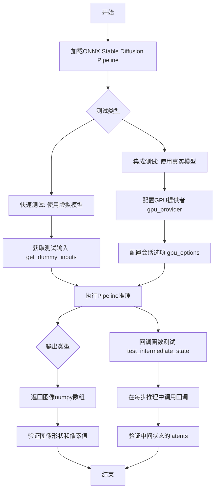

## 类结构

```
unittest.TestCase (Python标准库)
└── OnnxPipelineTesterMixin (测试基类)
    └── OnnxStableDiffusionPipelineFastTests (快速测试类)
unittest.TestCase (Python标准库)
└── OnnxStableDiffusionPipelineIntegrationTests (集成测试类)
```

## 全局变量及字段


### `is_onnx_available`
    
检查ONNX库是否可用并返回布尔值

类型：`function`
    


### `require_onnxruntime`
    
条件装饰器,用于跳过需要ONNX运行时的测试

类型：`decorator`
    


### `require_torch_gpu`
    
条件装饰器,用于跳过需要PyTorch GPU的测试

类型：`decorator`
    


### `nightly`
    
标记测试为夜间测试的装饰器

类型：`decorator`
    


### `OnnxStableDiffusionPipelineFastTests.hub_checkpoint`
    
测试使用的Tiny模型检查点路径,值为'hf-internal-testing/tiny-random-OnnxStableDiffusionPipeline'

类型：`str`
    
    

## 全局函数及方法


### `get_dummy_inputs`

生成包含prompt、generator、num_inference_steps、guidance_scale、output_type的测试输入字典，用于ONNX Stable Diffusion管道的单元测试。

参数：

- `self`：`OnnxStableDiffusionPipelineFastTests`，隐含的类实例参数，表示调用该方法的测试类实例
- `seed`：`int`，随机种子，用于生成可重复的随机数生成器，默认为0

返回值：`Dict[str, Any]`，返回一个字典，包含以下键值对：
- `prompt`：字符串，测试用的提示词，值为"A painting of a squirrel eating a burger"
- `generator`：`np.random.RandomState`，NumPy随机状态对象，用于生成确定性随机数
- `num_inference_steps`：整数，推理步数，值为2
- `guidance_scale`：浮点数，引导比例，值为7.5
- `output_type`：字符串，输出类型，值为"np"（NumPy数组）

#### 流程图

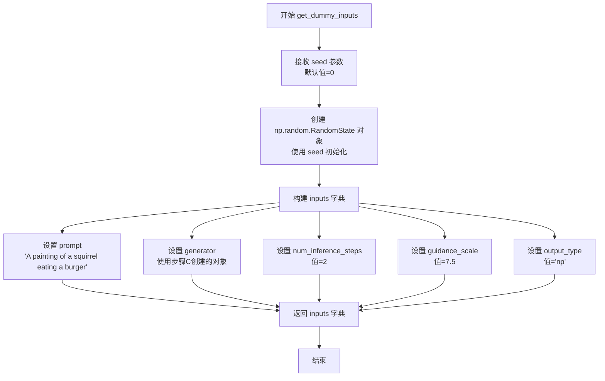

#### 带注释源码

```python
def get_dummy_inputs(self, seed=0):
    """
    生成用于测试 ONNX Stable Diffusion Pipeline 的虚拟输入参数。
    
    该方法创建一个包含管道推理所需基本参数的字典，用于单元测试中
    模拟真实的推理调用场景。
    
    参数:
        seed: int, 随机种子, 默认为0。用于生成可重复的随机数,
             确保测试结果的可确定性。
    
    返回:
        dict: 包含以下键的字典:
            - prompt (str): 输入文本提示词
            - generator (np.random.RandomState): 随机数生成器对象
            - num_inference_steps (int): 扩散模型的推理步数
            - guidance_scale (float): Classifier-free guidance 的引导强度
            - output_type (str): 输出格式, 这里指定为 NumPy 数组
    """
    # 使用传入的 seed 创建确定性的随机数生成器
    # 这样可以确保每次测试使用相同的随机种子, 保证测试结果可重复
    generator = np.random.RandomState(seed)
    
    # 构建包含所有必要输入参数的字典
    inputs = {
        "prompt": "A painting of a squirrel eating a burger",  # 测试用提示词
        "generator": generator,                                  # 随机数生成器
        "num_inference_steps": 2,                                 # 推理步数 (较少步数用于快速测试)
        "guidance_scale": 7.5,                                    # CFG 引导强度 (标准值)
        "output_type": "np",                                      # 输出为 NumPy 数组
    }
    
    # 返回构建好的输入字典, 供 pipeline 调用
    return inputs
```


### `OnnxStableDiffusionPipelineIntegrationTests.gpu_provider`

这是一个属性方法，用于返回CUDAExecutionProvider的配置字典，包含15GB GPU内存限制设置，供ONNX Runtime在GPU上运行推理时使用。

参数：

- `self`：`OnnxStableDiffusionPipelineIntegrationTests`，隐式参数，指向类的实例本身

返回值：`tuple[str, dict]`，返回一个元组，包含两个元素：
- 第一个元素为字符串 `"CUDAExecutionProvider"`，表示使用CUDA执行提供者
- 第二个元素为字典，包含GPU配置选项，其中 `"gpu_mem_limit"` 设置为 `"15000000000"`（15GB），`"arena_extend_strategy"` 设置为 `"kSameAsRequested"`

#### 流程图

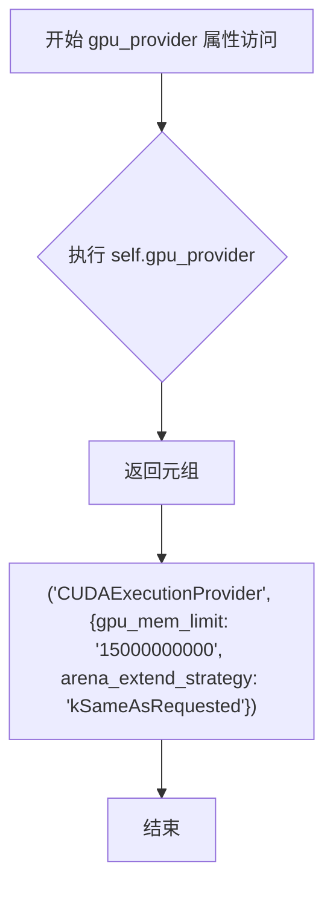

#### 带注释源码

```python
@property
def gpu_provider(self):
    """
    属性方法：返回CUDA执行提供者配置
    
    该方法为ONNX Runtime提供GPU执行所需的配置参数，
    包括GPU内存限制和内存扩展策略。
    
    Returns:
        tuple: 包含两个元素的元组
            - str: 执行提供者名称，固定为 "CUDAExecutionProvider"
            - dict: GPU配置字典，包含以下键值对：
                * "gpu_mem_limit": GPU内存限制，值为 "15000000000" (15GB)
                * "arena_extend_strategy": 内存扩展策略，值为 "kSameAsRequested"
    
    Example:
        >>> test_instance = OnnxStableDiffusionPipelineIntegrationTests()
        >>> provider, options = test_instance.gpu_provider
        >>> print(provider)
        'CUDAExecutionProvider'
        >>> print(options['gpu_mem_limit'])
        '15000000000'
    """
    return (
        "CUDAExecutionProvider",
        {
            "gpu_mem_limit": "15000000000",  # 15GB，GPU显存上限
            "arena_extend_strategy": "kSameAsRequested",  # 内存扩展策略：按需分配
        },
    )
```


### `OnnxStableDiffusionPipelineIntegrationTests.gpu_options`

该属性方法用于创建并返回一个配置了 `enable_mem_pattern` 为 False 的 ONNX Runtime SessionOptions 对象，以满足 GPU 推理时的内存模式需求。

参数：无（该方法为属性方法，隐式接收 `self` 参数）

返回值：`ort.SessionOptions`，返回配置了 `enable_mem_pattern` 为 False 的 ONNX Runtime 会话选项对象

#### 流程图

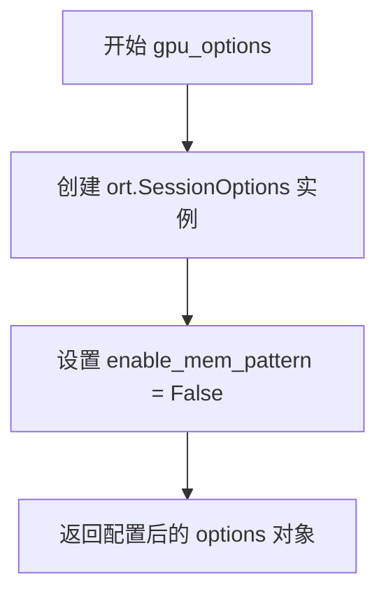

#### 带注释源码

```python
@property
def gpu_options(self):
    """
    属性方法：获取 GPU 会话选项配置
    
    该方法创建一个 ONNX Runtime 的 SessionOptions 对象，
    并将 enable_mem_pattern 设置为 False，以满足特定 GPU 环境下的
    内存管理需求。
    
    Returns:
        ort.SessionOptions: 配置了 enable_mem_pattern=False 的会话选项对象
    """
    # 创建 ONNX Runtime 会话选项实例
    options = ort.SessionOptions()
    
    # 禁用内存模式优化，避免在某些 GPU 环境下的内存分配问题
    options.enable_mem_pattern = False
    
    # 返回配置好的会话选项对象
    return options
```


### `OnnxStableDiffusionPipelineIntegrationTests.test_intermediate_state.test_callback_fn`

这是一个内部回调函数，用于验证扩散模型在推理过程中的中间状态，确保每一步生成的 latents（潜在表示）符合预期的形状和数值范围。

参数：

- `step`：`int`，当前推理步骤的索引（从 0 开始）
- `timestep`：`int`，扩散过程的时间步长
- `latents`：`np.ndarray`，当前步骤生成的潜在表示，形状为 (1, 4, 64, 64)

返回值：`None`，该函数不返回任何值，仅执行验证逻辑

#### 流程图

```mermaid
flowchart TD
    A[回调函数被调用] --> B[标记 has_been_called = True]
    B --> C[递增 number_of_steps 计数器]
    C --> D{step == 0?}
    D -->|Yes| E[验证 latents 形状为 (1, 4, 64, 64)]
    E --> F[提取 latents[0, -3:, -3:, -1] 切片]
    F --> G[与预期切片比较<br/>[-0.6772, -0.3835, -1.2456, 0.1905, -1.0974, 0.6967, -1.9353, 0.0178, 1.0167]]
    G --> H[断言误差 < 1e-3]
    D -->|No| I{step == 5?}
    I -->|Yes| J[验证 latents 形状为 (1, 4, 64, 64)]
    J --> K[提取 latents[0, -3:, -3:, -1] 切片]
    K --> L[与预期切片比较<br/>[-0.3351, 0.2241, -0.1837, -0.2325, -0.6577, 0.3393, -0.0241, 0.5899, 1.3875]]
    L --> M[断言误差 < 1e-3]
    I -->|No| N[直接返回<br/>不进行验证]
    H --> O[回调结束]
    M --> O
    N --> O
```

#### 带注释源码

```python
def test_callback_fn(step: int, timestep: int, latents: np.ndarray) -> None:
    """
    内部回调函数，用于验证中间推理状态
    
    参数:
        step: 当前推理步骤的索引（从0开始）
        timestep: 扩散过程的时间步长
        latents: 当前步骤生成的潜在表示，形状为 (batch, channels, height, width)
    """
    # 标记回调函数已被调用
    test_callback_fn.has_been_called = True
    
    # 声明 number_of_steps 为外部变量以便修改
    nonlocal number_of_steps
    # 递增步骤计数器
    number_of_steps += 1
    
    # 在第 0 步验证 latents 的形状和数值
    if step == 0:
        # 验证 latents 的形状为 (1, 4, 64, 64)
        # 1: batch size, 4: VAE latent 通道数, 64x64: 空间分辨率
        assert latents.shape == (1, 4, 64, 64)
        
        # 提取最后一个通道的右下角 3x3 区域用于验证
        latents_slice = latents[0, -3:, -3:, -1]
        
        # 定义预期的数值切片（来自参考实现）
        expected_slice = np.array(
            [-0.6772, -0.3835, -1.2456, 0.1905, -1.0974, 0.6967, -1.9353, 0.0178, 1.0167]
        )
        
        # 断言实际输出与预期值的最大误差小于 1e-3
        assert np.abs(latents_slice.flatten() - expected_slice).max() < 1e-3
    
    # 在第 5 步再次验证 latents 的形状和数值
    elif step == 5:
        assert latents.shape == (1, 4, 64, 64)
        
        latents_slice = latents[0, -3:, -3:, -1]
        
        expected_slice = np.array(
            [-0.3351, 0.2241, -0.1837, -0.2325, -0.6577, 0.3393, -0.0241, 0.5899, 1.3875]
        )
        
        assert np.abs(latents_slice.flatten() - expected_slice).max() < 1e-3
```


### `OnnxStableDiffusionPipelineFastTests.get_dummy_inputs`

该方法为 ONNX 稳定扩散管道测试生成虚拟输入数据，封装了管道推理所需的关键参数，包括提示词、随机生成器、推理步数、引导比例和输出类型，确保测试的可重复性和一致性。

参数：

- `seed`：`int`，默认值 0，用于初始化随机数生成器的种子值，确保测试结果可复现

返回值：`dict`，返回包含以下键值的字典：
- `prompt`：`str`，文本提示词，描述期望生成的图像内容
- `generator`：`numpy.random.RandomState`，NumPy 随机状态对象，用于控制随机性
- `num_inference_steps`：`int`，推理步数，决定生成图像的迭代次数
- `guidance_scale`：`float`，引导比例，影响文本提示对生成结果的影响程度
- `output_type`：`str`，输出类型，此处为 "np" 表示输出 NumPy 数组

#### 流程图

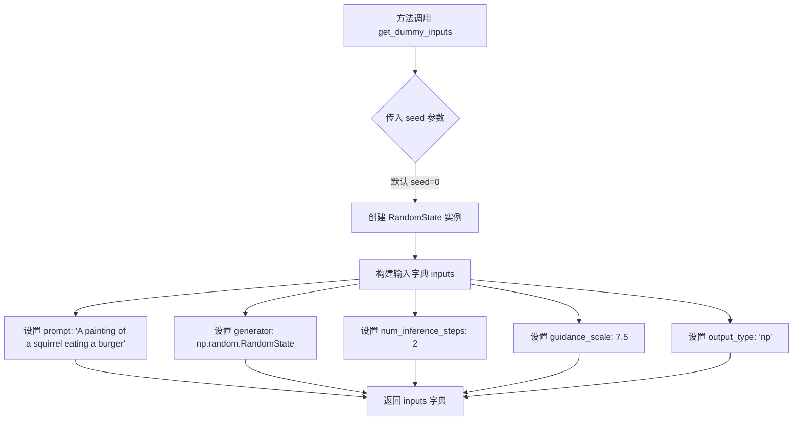

#### 带注释源码

```python
def get_dummy_inputs(self, seed=0):
    """
    生成测试用的虚拟输入数据。

    此方法为 ONNX 稳定扩散管道测试提供标准化的输入参数，
    确保测试的可重复性和一致性。

    参数:
        seed (int, optional): 随机数生成器的种子值，默认值为 0。
                            固定种子可以确保每次调用产生相同的随机序列。

    返回:
        dict: 包含以下键值的字典:
            - prompt (str): 文本提示词
            - generator (np.random.RandomState): NumPy 随机状态对象
            - num_inference_steps (int): 推理步数
            - guidance_scale (float): 引导比例
            - output_type (str): 输出类型 ('np' 表示 NumPy 数组)
    """
    # 使用传入的 seed 值创建随机数生成器，确保测试可复现
    generator = np.random.RandomState(seed)

    # 构建包含管道推理所需所有参数的字典
    inputs = {
        "prompt": "A painting of a squirrel eating a burger",  # 测试用提示词
        "generator": generator,                                  # 随机生成器实例
        "num_inference_steps": 2,                                 # 简化的推理步数，加快测试速度
        "guidance_scale": 7.5,                                    # 标准的引导比例值
        "output_type": "np",                                      # 输出 NumPy 数组格式
    }

    # 返回封装好的输入参数字典，供管道调用使用
    return inputs
```


### `OnnxStableDiffusionPipelineFastTests.test_pipeline_default_ddim`

该测试方法用于验证OnnxStableDiffusionPipeline使用默认DDIM调度器能够正确生成图像，并通过比对图像像素值与预期值来确保推理过程的正确性。

参数：
- 无显式参数（隐式参数 `self` 为测试类实例）

返回值：`None`，该方法为测试方法，无返回值

#### 流程图

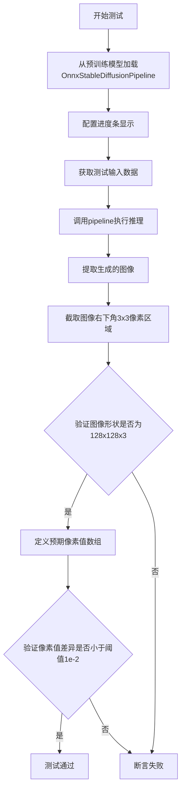

#### 带注释源码

```python
def test_pipeline_default_ddim(self):
    """
    测试默认DDIM调度器的功能。
    该测试方法验证OnnxStableDiffusionPipeline使用默认调度器（DDIM）
    能够正确生成图像，并通过像素值比对确保输出符合预期。
    """
    
    # 步骤1: 从预训练模型加载OnnxStableDiffusionPipeline
    # 使用CPU执行提供者进行推理
    pipe = OnnxStableDiffusionPipeline.from_pretrained(
        self.hub_checkpoint, 
        provider="CPUExecutionProvider"
    )
    
    # 步骤2: 配置进度条显示
    # disable=None 表示使用默认配置，不禁用进度条
    pipe.set_progress_bar_config(disable=None)
    
    # 步骤3: 获取测试输入数据
    # 调用get_dummy_inputs方法获取包含prompt、generator等参数的字典
    inputs = self.get_dummy_inputs()
    
    # 步骤4: 执行推理并获取生成的图像
    # 将输入参数解包传递给pipeline
    image = pipe(**inputs).images
    
    # 步骤5: 提取图像切片用于验证
    # 获取第一张图像的右下角3x3区域，保留所有通道
    image_slice = image[0, -3:, -3:, -1]
    
    # 步骤6: 验证图像形状
    # 确认输出图像为1x128x128x3的numpy数组
    assert image.shape == (1, 128, 128, 3)
    
    # 步骤7: 定义预期像素值
    # 这是DDIM调度器在固定随机种子下的预期输出
    expected_slice = np.array([
        0.65072, 0.58492, 0.48219, 
        0.55521, 0.53180, 0.55939, 
        0.50697, 0.39800, 0.46455
    ])
    
    # 步骤8: 验证像素值差异
    # 计算实际输出与预期值的最大绝对差异，确保小于阈值1e-2
    assert np.abs(image_slice.flatten() - expected_slice).max() < 1e-2
```


### `OnnxStableDiffusionPipelineFastTests.test_pipeline_pndm`

该测试方法用于验证ONNX稳定扩散管道在使用PNDM调度器时的正确性，通过加载预训练模型、配置PNDM调度器、执行推理并比对生成的图像切片与预期值来确保管道功能正常。

参数：

- `self`：`OnnxStableDiffusionPipelineFastTests`，测试类的实例，隐式参数，无需显式传递

返回值：`None`，该方法为测试用例，无返回值，通过断言验证结果

#### 流程图

```mermaid
flowchart TD
    A[开始测试 test_pipeline_pndm] --> B[从预训练hub加载ONNX管道<br/>OnnxStableDiffusionPipeline.from_pretrained]
    B --> C[配置PNDM调度器<br/>PNDMScheduler.from_config<br/>skip_prk_steps=True]
    C --> D[设置进度条配置<br/>set_progress_bar_config disable=None]
    D --> E[获取测试输入<br/>get_dummy_inputs]
    E --> F[执行推理生成图像<br/>pipe.__call__ **inputs]
    F --> G[提取图像切片<br/>image[0, -3:, -3:, -1]]
    G --> H{断言图像形状<br/>image.shape == (1,128,128,3)}
    H --> I{断言像素值误差<br/>|image_slice - expected_slice|.max < 1e-2}
    H --> J[测试失败: 图像形状不匹配]
    I --> K[测试通过]
    I --> L[测试失败: 像素值差异过大]
    J --> M[结束测试]
    K --> M
    L --> M
```

#### 带注释源码

```python
def test_pipeline_pndm(self):
    """
    测试ONNX稳定扩散管道在使用PNDM调度器时的正确性
    
    测试流程:
    1. 加载预训练的ONNX管道
    2. 配置PNDM调度器并跳过PRK步骤
    3. 使用预设输入执行推理
    4. 验证输出图像的形状和像素值
    """
    # 步骤1: 从预训练hub加载ONNX稳定扩散管道
    # 使用CPU执行提供者以确保跨平台兼容性
    pipe = OnnxStableDiffusionPipeline.from_pretrained(self.hub_checkpoint, provider="CPUExecutionProvider")
    
    # 步骤2: 配置PNDM调度器
    # skip_prk_steps=True 跳过Pseudo Runge-Kutta步骤，这是PNDM调度器的可选优化
    pipe.scheduler = PNDMScheduler.from_config(pipe.scheduler.config, skip_prk_steps=True)
    
    # 配置进度条显示，此处设置为默认行为（不禁用）
    pipe.set_progress_bar_config(disable=None)
    
    # 步骤3: 获取测试输入数据
    # 包含prompt、generator、num_inference_steps、guidance_scale、output_type
    inputs = self.get_dummy_inputs()
    
    # 执行推理，生成图像
    # 返回值包含images属性，存储生成的图像数组
    image = pipe(**inputs).images
    
    # 步骤4: 提取图像右下角3x3像素区域用于验证
    # 选取最后3行、最后3列、最后一个通道（RGB的G或B通道）
    image_slice = image[0, -3:, -3:, -1]
    
    # 断言验证图像形状为(1, 128, 128, 3)
    # 1=batch大小, 128=图像高度, 128=图像宽度, 3=RGB通道
    assert image.shape == (1, 128, 128, 3)
    
    # 定义预期的图像像素值切片（来自黄金测试数据）
    # 这些数值是在已知良好状态下生成的参考值
    expected_slice = np.array([0.65863, 0.59425, 0.49326, 0.56313, 0.53875, 0.56627, 0.51065, 0.39777, 0.46330])
    
    # 断言验证生成图像与预期值的最大误差小于0.01（1e-2）
    # 使用numpy的绝对值误差计算，确保数值精度在可接受范围内
    assert np.abs(image_slice.flatten() - expected_slice).max() < 1e-2
```


### `OnnxStableDiffusionPipelineFastTests.test_pipeline_lms`

该测试方法用于验证 ONNX 版本的 Stable Diffusion 管道在使用 LMSDiscreteScheduler（Least Mean Squares 离散调度器）时的正确性，确保调度器能够正确加载、配置并生成符合预期的图像输出。

参数：

- `self`：`OnnxStableDiffusionPipelineFastTests`（隐式参数），测试类实例本身，包含测试所需的辅助方法和属性

返回值：`None`，无返回值（测试方法通过断言验证功能，不返回任何数据）

#### 流程图

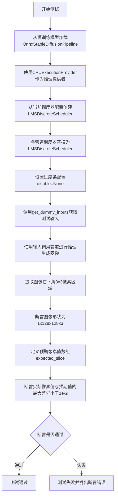

#### 带注释源码

```python
def test_pipeline_lms(self):
    # 从预训练检查点加载ONNX版本的Stable Diffusion管道
    # 使用CPUExecutionProvider作为推理设备
    pipe = OnnxStableDiffusionPipeline.from_pretrained(
        self.hub_checkpoint, 
        provider="CPUExecutionProvider"
    )
    
    # 使用LMSDiscreteScheduler替换默认的调度器
    # LMS (Least Mean Squares) 是一种常用的扩散模型采样调度器
    pipe.scheduler = LMSDiscreteScheduler.from_config(pipe.scheduler.config)
    
    # 配置进度条，disable=None表示不禁用进度条显示
    pipe.set_progress_bar_config(disable=None)
    
    # 获取测试用的虚拟输入数据
    # 包含prompt、generator、num_inference_steps、guidance_scale和output_type
    inputs = self.get_dummy_inputs()
    
    # 使用虚拟输入调用管道进行推理
    # 返回包含images属性的输出对象
    image = pipe(**inputs).images
    
    # 提取生成图像的右下角3x3像素区域用于验证
    # 索引[0,-3:,-3:,-1]表示取第一张图像的最后3行、最后3列、所有通道
    image_slice = image[0, -3:, -3:, -1]
    
    # 断言生成图像的形状为(1, 128, 128, 3)
    # 即1张128x128分辨率的RGB图像
    assert image.shape == (1, 128, 128, 3)
    
    # 定义预期的像素值数组（用于LMS调度器的参考输出）
    # 这些值是通过预先运行测试得到的标准输出
    expected_slice = np.array([
        0.53755, 0.60786, 0.47402, 
        0.49488, 0.51869, 0.49819, 
        0.47985, 0.38957, 0.44279
    ])
    
    # 断言实际像素值与预期值的最大差异小于1e-2（0.01）
    # 使用numpy的绝对值差异计算和flatten展平进行元素比较
    assert np.abs(image_slice.flatten() - expected_slice).max() < 1e-2
```


### `OnnxStableDiffusionPipelineFastTests.test_pipeline_euler`

该测试方法用于验证 Euler 离散调度器（EulerDiscreteScheduler）在 ONNX 运行时下的 Stable Diffusion 管道功能，通过对比生成的图像切片与预期值来确保调度器集成的正确性。

参数：此方法为测试类方法，无显式外部参数（`self` 为 unittest.TestCase 实例）

返回值：`None`，测试通过时无返回值，失败时抛出断言异常

#### 流程图

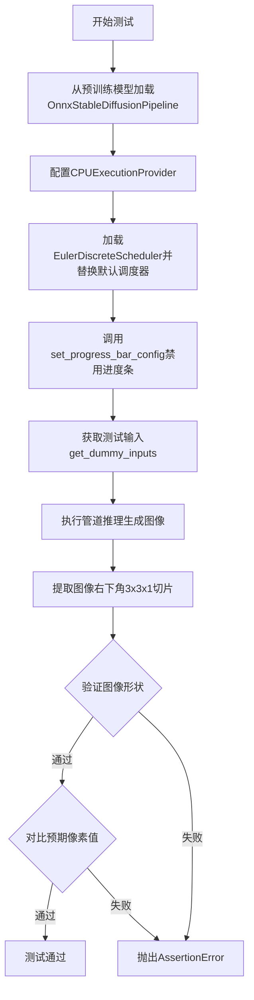

#### 带注释源码

```python
def test_pipeline_euler(self):
    """
    测试 Euler 离散调度器在 ONNX Stable Diffusion 管道中的功能。
    验证点：
    1. 管道能成功加载 EulerDiscreteScheduler
    2. 推理能正常执行并生成图像
    3. 输出图像尺寸正确 (1, 128, 128, 3)
    4. 生成的图像像素值与预期值匹配（容差 1e-2）
    """
    # 从预训练检查点加载 ONNX 管道，指定 CPU 执行提供者
    pipe = OnnxStableDiffusionPipeline.from_pretrained(self.hub_checkpoint, provider="CPUExecutionProvider")
    
    # 使用 EulerDiscreteScheduler 替换默认调度器
    # Euler 调度器是一种基于离散时间步的采样方法
    pipe.scheduler = EulerDiscreteScheduler.from_config(pipe.scheduler.config)
    
    # 配置进度条：disable=None 表示不禁用进度条
    pipe.set_progress_bar_config(disable=None)

    # 获取测试用的虚拟输入（包含 prompt、generator、num_inference_steps 等）
    inputs = self.get_dummy_inputs()
    
    # 执行管道推理，**inputs 将字典解包为关键字参数
    # 返回包含图像的对象，.images 获取生成的图像数组
    image = pipe(**inputs).images
    
    # 提取图像右下角 3x3 区域的像素值用于验证
    # image[0] 取第一张图像，[-3:, -3:, -1] 取最后3行、最后3列、最后一个通道
    image_slice = image[0, -3:, -3:, -1]

    # 断言验证输出图像形状为 (1, 128, 128, 3)
    # 1 张图像，128x128 分辨率，RGB 3 通道
    assert image.shape == (1, 128, 128, 3)
    
    # 定义预期像素值（通过黄金测试获得）
    expected_slice = np.array([0.53755, 0.60786, 0.47402, 0.49488, 0.51869, 0.49819, 0.47985, 0.38957, 0.44279])

    # 断言验证生成图像与预期值的最大差异小于 1e-2
    # 使用 np.abs 计算绝对值差异，.max() 取最大差异
    assert np.abs(image_slice.flatten() - expected_slice).max() < 1e-2
```


### `OnnxStableDiffusionPipelineFastTests.test_pipeline_euler_ancestral`

该测试方法用于验证 Euler Ancestral 离散调度器（EulerAncestralDiscreteScheduler）在 ONNX Stable Diffusion Pipeline 中的正确性，通过加载预训练模型、执行推理并比对生成的图像切片与预期值来确保调度器功能正常。

参数： 无显式参数（`self` 为实例方法隐含参数）

返回值：`None`，该方法为测试用例，无返回值

#### 流程图

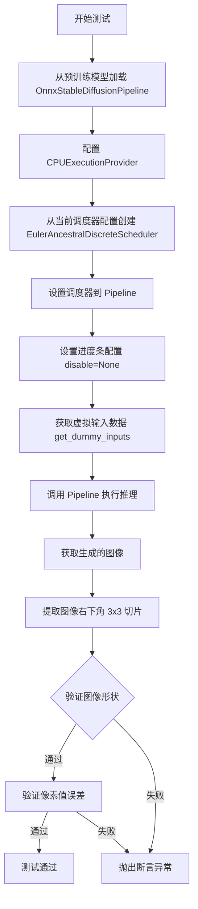

#### 带注释源码

```python
def test_pipeline_euler_ancestral(self):
    # 从预训练检查点加载 ONNX Stable Diffusion Pipeline，指定 CPU 执行提供者
    pipe = OnnxStableDiffusionPipeline.from_pretrained(self.hub_checkpoint, provider="CPUExecutionProvider")
    
    # 从当前管道的调度器配置创建 Euler Ancestral 离散调度器
    pipe.scheduler = EulerAncestralDiscreteScheduler.from_config(pipe.scheduler.config)
    
    # 配置进度条，disable=None 表示不禁用进度条
    pipe.set_progress_bar_config(disable=None)

    # 获取虚拟输入参数（包含 prompt、generator、num_inference_steps 等）
    inputs = self.get_dummy_inputs()
    
    # 执行推理，生成图像
    image = pipe(**inputs).images
    
    # 提取图像右下角 3x3 像素块（最后一维为 RGB 通道）
    image_slice = image[0, -3:, -3:, -1]

    # 断言：验证输出图像形状为 (1, 128, 128, 3)
    assert image.shape == (1, 128, 128, 3)
    
    # 定义预期像素值（来自基准测试的已知正确输出）
    expected_slice = np.array([0.53817, 0.60812, 0.47384, 0.49530, 0.51894, 0.49814, 0.47984, 0.38958, 0.44271])

    # 断言：验证实际像素值与预期值的最大误差小于 1e-2
    assert np.abs(image_slice.flatten() - expected_slice).max() < 1e-2
```


### `OnnxStableDiffusionPipelineFastTests.test_pipeline_dpm_multistep`

该测试方法用于验证 OnnxStableDiffusionPipeline 在使用 DPMSolverMultistepScheduler（多步 DPM 调度器）时的正确性，通过比对生成的图像切片与预期值来确保管道输出的准确性。

参数：

- `self`：`OnnxStableDiffusionPipelineFastTests`，测试类的实例，包含测试所需的配置和方法

返回值：`None`，该方法为测试方法，通过断言验证管道输出的图像形状和像素值是否符合预期，无显式返回值

#### 流程图

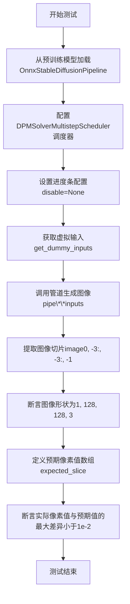

#### 带注释源码

```python
def test_pipeline_dpm_multistep(self):
    """
    测试OnnxStableDiffusionPipeline使用DPM多步调度器(DPMSolverMultistepScheduler)的推理流程。
    验证管道能够正确加载调度器配置并生成符合预期像素值的图像。
    """
    
    # 步骤1: 从预训练检查点加载ONNX稳定扩散管道，使用CPU执行提供者
    pipe = OnnxStableDiffusionPipeline.from_pretrained(
        self.hub_checkpoint, 
        provider="CPUExecutionProvider"
    )
    
    # 步骤2: 将管道的默认调度器替换为DPMSolverMultistepScheduler
    # DPMSolverMultistepScheduler是一种高性能的多步求解器调度器
    pipe.scheduler = DPMSolverMultistepScheduler.from_config(pipe.scheduler.config)
    
    # 步骤3: 配置进度条显示，disable=None表示不禁用进度条
    pipe.set_progress_bar_config(disable=None)
    
    # 步骤4: 获取测试用的虚拟输入参数
    # 包含prompt、generator、num_inference_steps、guidance_scale、output_type
    inputs = self.get_dummy_inputs()
    
    # 步骤5: 执行管道推理，获取生成的图像
    # pipe返回包含images属性的对象
    image = pipe(**inputs).images
    
    # 步骤6: 提取图像右下角3x3像素区域用于验证
    # image[0]取第一张图像，-3:选取最后3行和列，-1取最后一个通道(RGB)
    image_slice = image[0, -3:, -3:, -1]
    
    # 步骤7: 断言验证图像形状为(batch=1, height=128, width=128, channels=3)
    assert image.shape == (1, 128, 128, 3)
    
    # 步骤8: 定义预期像素值数组(9个值，对应3x3像素区域)
    expected_slice = np.array([
        0.53895, 0.60808, 0.47933,  # 第一行
        0.49608, 0.51886, 0.49950,  # 第二行
        0.48053, 0.38957, 0.44200   # 第三行
    ])
    
    # 步骤9: 断言验证实际像素值与预期值的最大差异小于阈值1e-2(0.01)
    # 使用np.abs计算差值的绝对值，.max()取最大差值
    assert np.abs(image_slice.flatten() - expected_slice).max() < 1e-2
```


### `OnnxStableDiffusionPipelineFastTests.test_stable_diffusion_prompt_embeds`

该测试方法验证 ONNX 版本的 Stable Diffusion Pipeline 能够正确处理预计算的提示词嵌入（prompt embeddings），确保直接传入 `prompt_embeds` 与通过 `prompt` 字符串生成的嵌入在图像输出上保持一致。

参数：

- 该方法无显式参数（`self` 为隐式参数）

返回值：`None`，该方法为单元测试，无返回值

#### 流程图

```mermaid
flowchart TD
    A[Start test_stable_diffusion_prompt_embeds] --> B[Load pipeline from hub_checkpoint]
    B --> C[Set progress bar config to disable=None]
    C --> D[Get dummy inputs via get_dummy_inputs]
    D --> E[Extend prompt to 3 copies: inputs["prompt"] = 3 * prompt]
    E --> F[Run pipeline with prompt string]
    F --> G[Extract image_slice_1 from output.images]
    G --> H[Get new dummy inputs]
    H --> I[Extract and extend prompt to 3 copies]
    I --> J[Tokenize prompt using pipe.tokenizer]
    J --> K[Encode text inputs via pipe.text_encoder]
    K --> L[Get prompt_embeds from text_encoder output]
    L --> M[Set inputs["prompt_embeds"] = prompt_embeds]
    M --> N[Run pipeline with precomputed prompt_embeds]
    N --> O[Extract image_slice_2 from output.images]
    O --> P{Assert: |image_slice_1 - image_slice_2| < 1e-4}
    P -->|Pass| Q[End test - Test Passed]
    P -->|Fail| R[End test - Test Failed]
```

#### 带注释源码

```python
def test_stable_diffusion_prompt_embeds(self):
    """
    测试函数：验证预计算的 prompt_embeds 与通过 prompt 字符串生成的嵌入产生相同结果
    
    测试目的：
    1. 验证 pipeline 支持直接传入 prompt_embeds 参数
    2. 确保预计算的文本嵌入与 tokenizer+text_encoder 生成的嵌入在数值上等价
    """
    # 步骤1: 从预训练模型加载 ONNX Stable Diffusion Pipeline
    # 使用 CPUExecutionProvider 作为推理设备
    pipe = OnnxStableDiffusionPipeline.from_pretrained(self.hub_checkpoint, provider="CPUExecutionProvider")
    
    # 步骤2: 配置进度条（disable=None 表示不禁用进度条）
    pipe.set_progress_bar_config(disable=None)

    # 步骤3: 获取虚拟输入（包含 prompt, generator, num_inference_steps, guidance_scale, output_type）
    inputs = self.get_dummy_inputs()
    
    # 步骤4: 将 prompt 扩展为 3 份（用于批量推理）
    # 这模拟了批量提示词输入的场景
    inputs["prompt"] = 3 * [inputs["prompt"]]

    # 步骤5: 第一次前向传播 - 使用原始 prompt 字符串
    # pipeline 会内部调用 tokenizer 和 text_encoder 生成 prompt_embeds
    output = pipe(**inputs)
    
    # 步骤6: 从输出图像中提取右下角 3x3 像素块（用于后续对比）
    image_slice_1 = output.images[0, -3:, -3:, -1]

    # 步骤7: 获取新的虚拟输入，用于第二次推理
    inputs = self.get_dummy_inputs()
    
    # 步骤8: 提取 prompt 并扩展为 3 份
    prompt = 3 * [inputs.pop("prompt")]

    # 步骤9: 手动进行 tokenization（分词）
    # 使用 max_length 填充和截断，返回 numpy 数组格式
    text_inputs = pipe.tokenizer(
        prompt,
        padding="max_length",
        max_length=pipe.tokenizer.model_max_length,
        truncation=True,
        return_tensors="np",
    )
    
    # 步骤10: 提取 input_ids（token IDs）
    text_inputs = text_inputs["input_ids"]

    # 步骤11: 使用 text_encoder 编码文本输入，得到提示词嵌入
    # 输出形状: (batch_size, seq_len, hidden_size)
    prompt_embeds = pipe.text_encoder(input_ids=text_inputs.astype(np.int32))[0]

    # 步骤12: 将预计算的 prompt_embeds 传入 pipeline
    inputs["prompt_embeds"] = prompt_embeds

    # 步骤13: 第二次前向传播 - 使用预计算的 prompt_embeds
    output = pipe(**inputs)
    
    # 步骤14: 提取第二次输出的图像切片
    image_slice_2 = output.images[0, -3:, -3:, -1]

    # 步骤15: 断言验证
    # 两次推理的图像差异应小于 1e-4，证明 prompt_embeds 参数工作正常
    assert np.abs(image_slice_1.flatten() - image_slice_2.flatten()).max() < 1e-4
```


### `OnnxStableDiffusionPipelineFastTests.test_stable_diffusion_negative_prompt_embeds`

该测试方法验证 ONNX 版本的 Stable Diffusion 管道在处理负提示词嵌入（negative prompt embeds）时的正确性，通过对比直接使用 negative_prompt 参数与手动编码传入 prompt_embeds 和 negative_prompt_embeds 两种方式生成的图像是否一致，确保负提示词嵌入功能正常工作。

参数： 无

返回值：`None`，该方法为测试函数，不返回任何值

#### 流程图

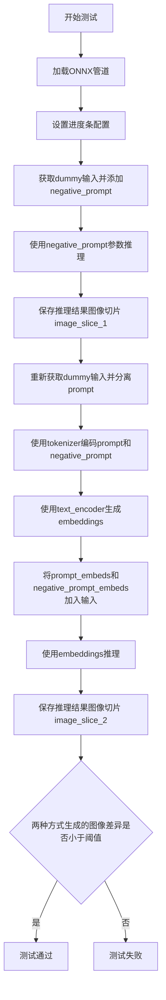

#### 带注释源码

```python
def test_stable_diffusion_negative_prompt_embeds(self):
    """
    测试负提示词嵌入（negative prompt embeds）的功能。
    验证通过直接传入negative_prompt参数与手动编码传入prompt_embeds和negative_prompt_embeds
    两种方式生成的图像是否一致。
    """
    # 从预训练模型加载ONNX Stable Diffusion管道，使用CPU执行提供者
    pipe = OnnxStableDiffusionPipeline.from_pretrained(self.hub_checkpoint, provider="CPUExecutionProvider")
    
    # 设置进度条配置，disable=None表示不禁用进度条
    pipe.set_progress_bar_config(disable=None)

    # 获取虚拟输入数据
    inputs = self.get_dummy_inputs()
    
    # 创建3个相同的负提示词
    negative_prompt = 3 * ["this is a negative prompt"]
    
    # 将负提示词添加到输入字典
    inputs["negative_prompt"] = negative_prompt
    
    # 将提示词扩展为3个相同的提示词（用于批量处理）
    inputs["prompt"] = 3 * [inputs["prompt"]]

    # 第一次前向传播：使用negative_prompt参数
    output = pipe(**inputs)
    
    # 提取图像右下角3x3区域的像素值
    image_slice_1 = output.images[0, -3:, -3:, -1]

    # 重新获取虚拟输入
    inputs = self.get_dummy_inputs()
    
    # 分离prompt并扩展为3个相同的提示词
    prompt = 3 * [inputs.pop("prompt")]

    # 用于存储编码后的embeddings
    embeds = []
    
    # 遍历prompt和negative_prompt，分别编码为embeddings
    for p in [prompt, negative_prompt]:
        # 使用tokenizer将文本转换为token ids
        text_inputs = pipe.tokenizer(
            p,
            padding="max_length",  # 填充到最大长度
            max_length=pipe.tokenizer.model_max_length,  # 最大长度限制
            truncation=True,  # 启用截断
            return_tensors="np",  # 返回numpy数组
        )
        
        # 提取input_ids
        text_inputs = text_inputs["input_ids"]

        # 使用text_encoder生成文本embeddings
        embeds.append(pipe.text_encoder(input_ids=text_inputs.astype(np.int32))[0])

    # 将编码后的embeddings赋值给输入字典
    inputs["prompt_embeds"], inputs["negative_prompt_embeds"] = embeds

    # 第二次前向传播：使用手动编码的embeddings
    output = pipe(**inputs)
    
    # 提取图像切片
    image_slice_2 = output.images[0, -3:, -3:, -1]

    # 断言：两种方式生成的图像差异应小于1e-4
    assert np.abs(image_slice_1.flatten() - image_slice_2.flatten()).max() < 1e-4
```


### `OnnxStableDiffusionPipelineIntegrationTests.gpu_provider`

该属性是一个只读的 `@property` 方法，用于返回 ONNX Runtime 的 CUDA 执行提供者配置信息。它返回一个元组，包含 CUDA 提供者名称以及相关的 GPU 内存限制和内存扩展策略配置，供 `OnnxStableDiffusionPipeline.from_pretrained()` 方法在加载模型时指定使用 GPU 进行推理。

参数：无

返回值：`tuple[str, dict]`，返回包含 CUDA 执行提供者名称和配置选项的元组。

#### 流程图

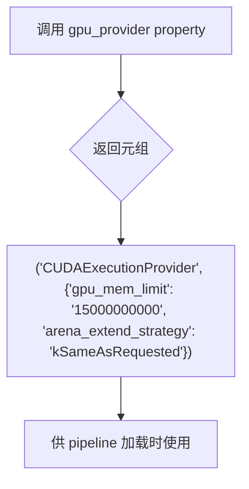

#### 带注释源码

```python
@property
def gpu_provider(self):
    """
    返回 ONNX Runtime 的 CUDA 执行提供者配置。
    
    该属性用于指定在使用 GPU 进行 ONNX Stable Diffusion 推理时的
    执行提供者及其相关配置选项。
    
    Returns:
        tuple: 包含两个元素的元组:
            - str: CUDA 执行提供者名称，固定为 "CUDAExecutionProvider"
            - dict: 提供者配置字典，包含:
                - gpu_mem_limit: GPU 内存限制，设置为 15GB (15000000000 字节)
                - arena_extend_strategy: 内存扩展策略，设置为 "kSameAsRequested"
    """
    return (
        "CUDAExecutionProvider",
        {
            "gpu_mem_limit": "15000000000",  # 15GB
            "arena_extend_strategy": "kSameAsRequested",
        },
    )
```


### `OnnxStableDiffusionPipelineIntegrationTests.gpu_options`

该属性用于返回ONNX会话选项（SessionOptions），配置ONNX Runtime的会话行为，禁用了内存模式以适应特定的GPU内存限制需求。

参数： 无

返回值：`ort.SessionOptions`，返回ONNX Runtime的会话选项对象，用于配置GPU执行提供商的会话行为。

#### 流程图

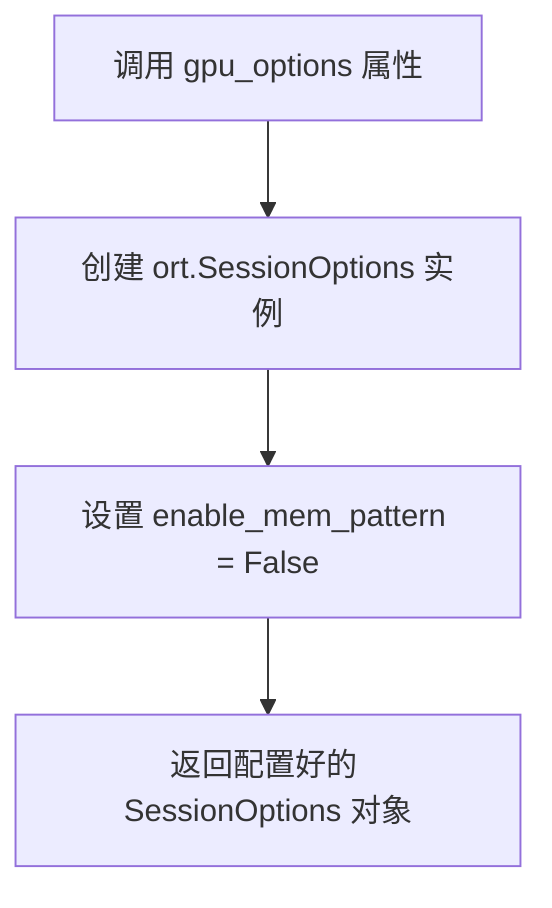

#### 带注释源码

```python
@property
def gpu_options(self):
    """
    返回ONNX Runtime会话选项，用于配置GPU执行会话行为。
    
    该属性创建一个SessionOptions对象并配置以下选项：
    - enable_mem_pattern: 设置为False，禁用内存模式。
      这在处理大型模型时可以帮助避免内存分配问题。
    """
    # 创建ONNX Runtime会话选项对象
    options = ort.SessionOptions()
    
    # 禁用内存模式，避免在GPU上分配大量内存时出现问题
    options.enable_mem_pattern = False
    
    # 返回配置好的会话选项，供pipeline初始化使用
    return options
```


### `OnnxStableDiffusionPipelineIntegrationTests.test_inference_default_pndm`

GPU推理默认PNDM调度器的集成测试方法，用于验证在GPU环境下使用ONNX Runtime执行Stable Diffusion模型推理的正确性。

参数：

- `self`：测试类实例本身，无需显式传递

返回值：`None`，测试方法无返回值，通过断言验证推理结果

#### 流程图

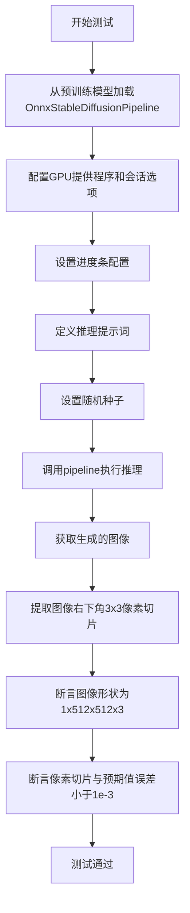

#### 带注释源码

```python
def test_inference_default_pndm(self):
    """
    测试使用默认PNDM调度器进行GPU推理的集成测试
    
    该测试方法验证以下功能：
    1. 能够从预训练模型加载OnnxStableDiffusionPipeline
    2. 能够在GPU上使用ONNX Runtime执行推理
    3. 默认使用PNDM调度器进行采样
    4. 生成的图像符合预期的形状和像素值
    """
    # 使用PNDM调度器进行推理（PNDM是默认调度器）
    # 从HuggingFace Hub加载预训练的ONNX Stable Diffusion模型
    sd_pipe = OnnxStableDiffusionPipeline.from_pretrained(
        "CompVis/stable-diffusion-v1-4",  # 模型名称或路径
        revision="onnx",                   # 指定加载ONNX版本的模型
        safety_checker=None,               # 禁用安全检查器以加快推理速度
        feature_extractor=None,           # 禁用特征提取器
        provider=self.gpu_provider,        # GPU执行提供程序（CUDA）
        sess_options=self.gpu_options,     # ONNX Runtime会话选项
    )
    
    # 配置进度条：disable=None表示不禁用进度条
    sd_pipe.set_progress_bar_config(disable=None)

    # 定义文本提示词
    prompt = "A painting of a squirrel eating a burger"
    
    # 设置随机种子以确保结果可重现
    np.random.seed(0)
    
    # 执行推理：传入提示词列表、guidance_scale、推理步数和输出类型
    # guidance_scale控制提示词引导强度
    # num_inference_steps控制去噪步数
    # output_type="np"表示输出numpy数组
    output = sd_pipe([prompt], guidance_scale=6.0, num_inference_steps=10, output_type="np")
    
    # 从输出中提取生成的图像
    image = output.images

    # 提取图像右下角3x3像素块（用于验证）
    # image[0]取第一张图，[-3:, -3:, -1]取最后3行3列的RGB通道
    image_slice = image[0, -3:, -3:, -1]

    # 断言：验证生成的图像形状为(1, 512, 512, 3)
    # 1=批量大小，512=图像高度，512=图像宽度，3=RGB通道
    assert image.shape == (1, 512, 512, 3)
    
    # 定义预期像素值（来自已知正确的输出）
    expected_slice = np.array([0.0452, 0.0390, 0.0087, 0.0350, 0.0617, 0.0364, 0.0544, 0.0523, 0.0720])

    # 断言：验证实际输出与预期值的最大误差小于1e-3
    assert np.abs(image_slice.flatten() - expected_slice).max() < 1e-3
```


### `OnnxStableDiffusionPipelineIntegrationTests.test_inference_ddim`

该测试方法用于验证ONNX Runtime环境下使用DDIM调度器进行GPU推理的功能。它加载stable-diffusion-v1-5的ONNX模型，配置DDIMScheduler，执行文本到图像的推理过程，并验证输出图像的形状和像素值是否符合预期。

参数：

- `self`：隐式参数，`unittest.TestCase`实例，代表测试类本身

返回值：`None`，该方法为测试用例，无返回值

#### 流程图

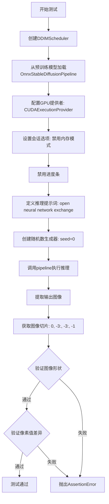

#### 带注释源码

```python
def test_inference_ddim(self):
    """
    测试使用DDIM调度器的ONNX Stable Diffusion Pipeline GPU推理功能
    
    该测试执行以下步骤:
    1. 创建并配置DDIMScheduler
    2. 加载ONNX格式的Stable Diffusion v1.5模型
    3. 使用CUDA GPU执行推理
    4. 验证输出图像的形状和像素值
    """
    # 步骤1: 从预训练模型创建DDIMScheduler
    # subfolder="scheduler"表示从模型的scheduler子目录加载配置
    ddim_scheduler = DDIMScheduler.from_pretrained(
        "stable-diffusion-v1-5/stable-diffusion-v1-5", 
        subfolder="scheduler", 
        revision="onnx"
    )
    
    # 步骤2: 加载完整的ONNX Stable Diffusion Pipeline
    # revision="onnx"指定加载ONNX优化版本的模型
    # safety_checker=None 禁用安全检查器以加快推理速度
    # feature_extractor=None 不使用特征提取器
    # provider 配置GPU执行提供者，设定15GB显存限制
    sd_pipe = OnnxStableDiffusionPipeline.from_pretrained(
        "stable-diffusion-v1-5/stable-diffusion-v1-5",
        revision="onnx",
        scheduler=ddim_scheduler,  # 使用DDIM调度器
        safety_checker=None,
        feature_extractor=None,
        provider=self.gpu_provider,      # GPU执行提供者配置
        sess_options=self.gpu_options,    # ONNX Runtime会话选项
    )
    
    # 步骤3: 禁用进度条配置
    sd_pipe.set_progress_bar_config(disable=None)
    
    # 步骤4: 准备推理输入
    prompt = "open neural network exchange"  # 文本提示词
    generator = np.random.RandomState(0)      # 固定随机种子以确保可重复性
    
    # 步骤5: 执行推理
    # guidance_scale=7.5: CFG指导强度，越高越忠于提示词
    # num_inference_steps=10: 推理步数，越多质量越高
    # output_type="np": 输出numpy数组格式
    output = sd_pipe(
        [prompt], 
        guidance_scale=7.5, 
        num_inference_steps=10, 
        generator=generator, 
        output_type="np"
    )
    
    # 步骤6: 提取输出图像
    image = output.images
    
    # 提取图像右下角3x3区域用于验证
    image_slice = image[0, -3:, -3:, -1]
    
    # 步骤7: 验证输出图像形状
    # 期望: (1, 512, 512, 3) - 1张512x512的RGB图像
    assert image.shape == (1, 512, 512, 3)
    
    # 步骤8: 验证像素值
    # 预计算的期望值，用于确保推理结果一致性
    expected_slice = np.array([0.2867, 0.1974, 0.1481, 0.7294, 0.7251, 0.6667, 0.4194, 0.5642, 0.6486])
    
    # 断言实际输出与期望值的最大差异小于1e-3
    assert np.abs(image_slice.flatten() - expected_slice).max() < 1e-3
```


### `OnnxStableDiffusionPipelineIntegrationTests.test_inference_k_lms`

该测试方法用于验证使用LMS（Linear Multistep Scheduler）调度器的ONNX Stable Diffusion Pipeline在GPU上执行推理的功能，通过对比生成的图像切片与预期值来确保模型输出的正确性。

参数：

- `self`：`unittest.TestCase`，测试类实例本身

返回值：`None`，该方法为测试方法，无返回值，通过断言验证推理结果

#### 流程图

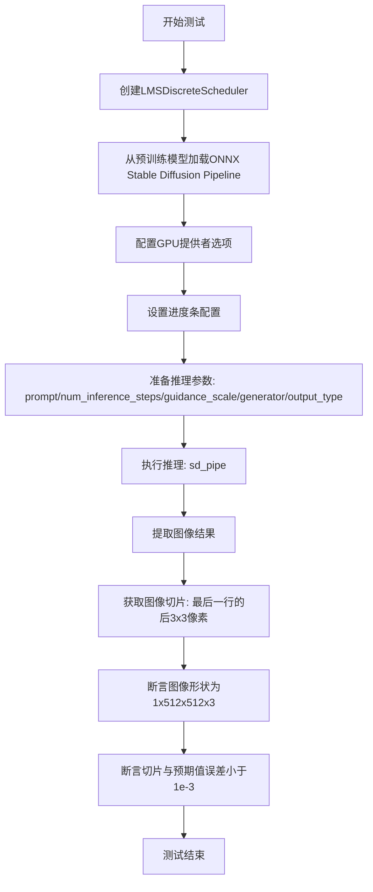

#### 带注释源码

```python
def test_inference_k_lms(self):
    # 从预训练模型加载LMS离散调度器，指定ONNX版本
    lms_scheduler = LMSDiscreteScheduler.from_pretrained(
        "stable-diffusion-v1-5/stable-diffusion-v1-5", subfolder="scheduler", revision="onnx"
    )
    
    # 加载完整的ONNX Stable Diffusion Pipeline
    # safety_checker和feature_extractor设为None以简化测试
    sd_pipe = OnnxStableDiffusionPipeline.from_pretrained(
        "stable-diffusion-v1-5/stable-diffusion-v1-5",
        revision="onnx",
        scheduler=lms_scheduler,  # 使用LMS调度器
        safety_checker=None,
        feature_extractor=None,
        provider=self.gpu_provider,      # GPU执行提供者
        sess_options=self.gpu_options,   # GPU会话选项
    )
    
    # 配置进度条显示
    sd_pipe.set_progress_bar_config(disable=None)

    # 定义推理提示词
    prompt = "open neural network exchange"
    
    # 使用固定随机种子确保结果可复现
    generator = np.random.RandomState(0)
    
    # 执行推理生成图像
    # 参数: 
    #   - prompt: 文本提示
    #   - guidance_scale: 引导强度7.5
    #   - num_inference_steps: 10步推理
    #   - generator: 随机数生成器
    #   - output_type: np数组输出
    output = sd_pipe([prompt], guidance_scale=7.5, num_inference_steps=10, generator=generator, output_type="np")
    
    # 获取生成的图像
    image = output.images
    
    # 提取图像切片进行验证: 取第一张图像的最后3行3列的RGB通道
    image_slice = image[0, -3:, -3:, -1]

    # 验证输出图像形状
    assert image.shape == (1, 512, 512, 3)
    
    # 预期输出切片值
    expected_slice = np.array([0.2306, 0.1959, 0.1593, 0.6549, 0.6394, 0.5408, 0.5065, 0.6010, 0.6161])

    # 验证生成图像与预期值的误差在允许范围内
    assert np.abs(image_slice.flatten() - expected_slice).max() < 1e-3
```


### `OnnxStableDiffusionPipelineIntegrationTests.test_intermediate_state`

该测试方法用于验证 OnnxStableDiffusionPipeline 在推理过程中能够正确调用回调函数获取中间状态（latents），通过在多个推理步骤（step 0 和 step 5）验证 latents 的形状和数值是否符合预期，从而确保扩散模型中间推理过程的正确性和回调机制的有效性。

参数：

- `self`：`unittest.TestCase`，测试类的实例本身，包含测试所需的上下文和方法

返回值：`None`，该方法为测试方法，不返回任何值

#### 流程图

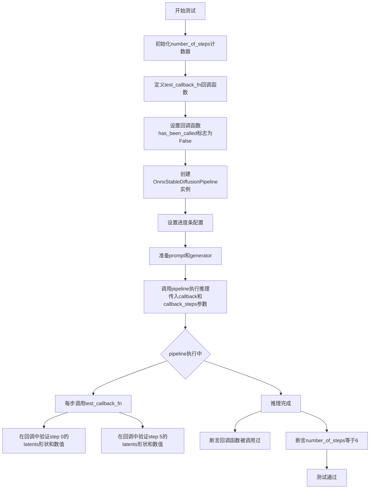

#### 带注释源码

```python
def test_intermediate_state(self):
    """
    测试推理中间状态回调函数是否被正确调用并返回正确的中间latents。
    该测试验证OnnxStableDiffusionPipeline在推理过程中能够通过回调函数
    捕获中间状态，并在特定步骤验证latents的形状和数值。
    """
    # 初始化步骤计数器，用于记录回调函数被调用的次数
    number_of_steps = 0

    # 定义回调函数，用于在每个推理步骤后接收中间状态
    def test_callback_fn(step: int, timestep: int, latents: np.ndarray) -> None:
        """
        回调函数签名：
        - step: 当前推理步骤索引（从0开始）
        - timestep: 当前时间步
        - latents: 当前潜在变量张量，形状为(1, 4, 64, 64)
        """
        # 标记回调函数已被调用
        test_callback_fn.has_been_called = True
        
        # 递增步骤计数器
        nonlocal number_of_steps
        number_of_steps += 1
        
        # 验证推理步骤0的latents
        if step == 0:
            # 验证latents形状为(1, 4, 64, 64)
            assert latents.shape == (1, 4, 64, 64)
            
            # 提取最后3x3的切片用于数值验证
            latents_slice = latents[0, -3:, -3:, -1]
            # 预期的latents数值（在特定随机种子下的基准值）
            expected_slice = np.array(
                [-0.6772, -0.3835, -1.2456, 0.1905, -1.0974, 0.6967, -1.9353, 0.0178, 1.0167]
            )
            
            # 验证数值误差在允许范围内（1e-3）
            assert np.abs(latents_slice.flatten() - expected_slice).max() < 1e-3
        
        # 验证推理步骤5的latents
        elif step == 5:
            assert latents.shape == (1, 4, 64, 64)
            latents_slice = latents[0, -3:, -3:, -1]
            expected_slice = np.array(
                [-0.3351, 0.2241, -0.1837, -0.2325, -0.6577, 0.3393, -0.0241, 0.5899, 1.3875]
            )
            assert np.abs(latents_slice.flatten() - expected_slice).max() < 1e-3

    # 初始化回调函数调用标志为False
    test_callback_fn.has_been_called = False

    # 创建OnnxStableDiffusionPipeline实例
    # 使用stable-diffusion-v1-5模型的ONNX版本
    pipe = OnnxStableDiffusionPipeline.from_pretrained(
        "stable-diffusion-v1-5/stable-diffusion-v1-5",
        revision="onnx",
        safety_checker=None,  # 禁用安全检查器以加快推理
        feature_extractor=None,
        provider=self.gpu_provider,  # 使用GPU执行提供者
        sess_options=self.gpu_options,
    )
    # 禁用进度条配置
    pipe.set_progress_bar_config(disable=None)

    # 准备推理参数
    prompt = "Andromeda galaxy in a bottle"  # 推理提示词

    # 使用固定随机种子以确保结果可复现
    generator = np.random.RandomState(0)
    
    # 执行推理，传入回调函数
    # callback_steps=1表示每个推理步骤都调用回调
    pipe(
        prompt=prompt,
        num_inference_steps=5,  # 5个推理步骤
        guidance_scale=7.5,     # 引导强度
        generator=generator,   # 随机数生成器
        callback=test_callback_fn,  # 回调函数
        callback_steps=1,       # 每步调用回调
    )
    
    # 验证回调函数被调用过
    assert test_callback_fn.has_been_called
    # 验证总共调用了6次（步骤0到5，共6步）
    assert number_of_steps == 6
```


### `OnnxStableDiffusionPipelineIntegrationTests.test_stable_diffusion_no_safety_checker`

该测试方法验证了当ONNX Stable Diffusion Pipeline的安全检查器（safety_checker）设置为None时，Pipeline能够正常加载、推理、保存和加载，且不会出现错误。

参数：

- `self`：`unittest.TestCase`，测试类的实例本身，包含测试所需的上下文和断言方法

返回值：`None`，该方法为测试方法，不返回任何值，仅通过断言验证行为

#### 流程图

```mermaid
flowchart TD
    A[开始测试] --> B[从预训练模型加载OnnxStableDiffusionPipeline<br/>safety_checker=None<br/>feature_extractor=None]
    B --> C[断言pipe是OnnxStableDiffusionPipeline实例]
    C --> D[断言pipe.safety_checker为None]
    D --> E[使用pipe生成图像<br/>prompt='example prompt'<br/>num_inference_steps=2]
    E --> F[断言生成的图像不为None]
    F --> G[创建临时目录]
    G --> H[调用pipe.save_pretrained保存管道]
    H --> I[从临时目录重新加载管道]
    I --> J[断言重新加载后pipe.safety_checker仍为None]
    J --> K[再次使用pipe生成图像验证功能正常]
    K --> L[断言生成的图像不为None]
    L --> M[测试结束]
```

#### 带注释源码

```python
def test_stable_diffusion_no_safety_checker(self):
    """
    测试当safety_checker设置为None时，OnnxStableDiffusionPipeline能够正常工作。
    验证场景：用户可能希望禁用安全检查器以提高推理速度或自定义过滤逻辑。
    """
    # 第一步：从预训练模型加载Pipeline，明确设置safety_checker和feature_extractor为None
    # revision="onnx"指定加载ONNX版本的模型
    # provider和sess_options配置GPU执行提供者和会话选项
    pipe = OnnxStableDiffusionPipeline.from_pretrained(
        "stable-diffusion-v1-5/stable-diffusion-v1-5",
        revision="onnx",
        safety_checker=None,      # 禁用安全检查器
        feature_extractor=None,   # 不使用特征提取器
        provider=self.gpu_provider,
        sess_options=self.gpu_options,
    )
    
    # 验证管道实例化成功
    assert isinstance(pipe, OnnxStableDiffusionPipeline)
    
    # 验证安全检查器确实被设置为None
    assert pipe.safety_checker is None

    # 第二步：使用禁用安全检查器的管道进行推理生成图像
    # 仅使用2个推理步骤以加快测试速度
    image = pipe("example prompt", num_inference_steps=2).images[0]
    
    # 验证图像生成成功（非空）
    assert image is not None

    # 第三步：测试保存和重新加载包含None模型的管道
    # 创建一个临时目录用于保存
    with tempfile.TemporaryDirectory() as tmpdirname:
        # 保存管道到临时目录
        # 此处需要验证当某些模型组件为None时，保存操作不会出错
        pipe.save_pretrained(tmpdirname)
        
        # 从保存的目录重新加载管道
        pipe = OnnxStableDiffusionPipeline.from_pretrained(tmpdirname)

    # 第四步：验证重新加载后的管道仍然正常工作
    # 确认安全检查器仍为None
    assert pipe.safety_checker is None
    
    # 再次生成图像，验证管道功能完整
    image = pipe("example prompt", num_inference_steps=2).images[0]
    assert image is not None
```

## 关键组件


### OnnxStableDiffusionPipeline

ONNX 版本的 Stable Diffusion 推理管道，支持多种调度器（DDIM、PNDM、LMS、Euler 等）和 GPU 加速推理。

### OnnxStableDiffusionPipelineFastTests

快速测试类，包含多个测试方法用于验证管道的基本功能，包括不同调度器的兼容性、提示词嵌入和负面提示词嵌入的处理。

### 调度器组件

支持多种扩散调度器：DDIMScheduler、PNDMScheduler、LMSDiscreteScheduler、EulerDiscreteScheduler、EulerAncestralDiscreteScheduler、DPMSolverMultistepScheduler，用于控制去噪过程的采样策略。

### OnnxStableDiffusionPipelineIntegrationTests

集成测试类，使用真实模型进行端到端测试，验证 GPU 推理、中间状态回调和无安全检查器等功能。

### GPU 提供商配置

通过 `gpu_provider` 和 `gpu_options` 属性配置 CUDA 执行提供者，包含 15GB 显存限制和内存模式设置。

### 测试回调机制

`test_callback_fn` 回调函数用于捕获扩散过程中的中间状态（latents），验证每一步的潜在表示是否符合预期。

### get_dummy_inputs 方法

生成测试用的虚拟输入，包含提示词、随机数生成器、推理步数和引导比例等参数。

### 提示词嵌入处理

支持显式传递 `prompt_embeds` 和 `negative_prompt_embeds`，允许用户自定义文本编码结果，测试验证嵌入向量的一致性。


## 问题及建议


### 已知问题

- **重复代码模式**：每个测试方法都重复执行 `OnnxStableDiffusionPipeline.from_pretrained()` 和 `pipe.set_progress_bar_config(disable=None)`，违反 DRY 原则，可提取为 `setUp` 方法或 fixture
- **硬编码配置**：GPU 内存限制 `15000000000` (15GB)、checkpoint 路径、图像尺寸等硬编码在不同位置，缺乏统一的配置管理
- **测试隔离性不足**：多个测试直接修改 `pipe.scheduler` 属性（如 `test_pipeline_pndm`、`test_pipeline_lms` 等），可能导致测试间相互影响
- **资源清理不完整**：虽然使用了 `tempfile.TemporaryDirectory()`，但 `ort.SessionOptions` 和 provider 配置的清理逻辑缺失，可能导致资源泄漏
- **断言信息不够详细**：所有图像比较使用通用断言 `assert np.abs(...).max() < 1e-2`，失败时缺乏上下文信息，难以快速定位问题
- **不一致的随机数生成**：`test_inference_default_pndm` 直接使用 `np.random.seed(0)`，而其他测试使用 `get_dummy_inputs` 中的 `np.random.RandomState(seed)`，两种方式混用可能导致测试结果不确定性
- **缺少错误处理**：没有对 ONNX 模型加载失败、provider 不可用等情况进行显式测试
- **魔法数字**：阈值 `1e-2`、`1e-3`、`1e-4` 散布在各处，应提取为常量类

### 优化建议

- 使用 `unittest.setUpClass` 或 pytest fixture 统一加载 pipeline，减少重复的模型加载逻辑
- 创建配置类或配置文件集中管理 checkpoint 路径、GPU 参数、阈值等常量
- 每个测试方法使用独立的 scheduler 副本，或在 `tearDown` 中恢复原始状态
- 为断言添加自定义错误消息，如 `assert np.abs(...).max() < 1e-2, f"Image mismatch: max diff={np.abs(...).max()}"`
- 统一使用 `np.random.RandomState` 方式生成随机数，避免混用
- 添加异常测试用例：测试 provider 不可用、模型文件缺失、输入参数非法等边界情况
- 将阈值提取为类常量或配置文件，提高可维护性

## 其它


### 设计目标与约束

本测试文件的设计目标包括：验证 OnnxStableDiffusionPipeline 在 CPU 和 GPU 环境下的推理功能；测试不同调度器（DDIM、PNDM、LMS、Euler、EulerAncestral、DPMMultistep）的兼容性；确保 prompt_embeds 和 negative_prompt_embeds 的正确处理；验证中间状态回调功能；测试无 safety_checker 的管道保存和加载。约束条件：需要 ONNX Runtime 支持、需要 GPU 环境（集成测试）、依赖特定的预训练模型版本。

### 错误处理与异常设计

测试中主要通过 assert 语句进行断言验证，包括：图像尺寸验证（shape == (1, 128, 128, 3) 或 (1, 512, 512, 3)）；数值精度验证（np.abs().max() < 1e-2 或 1e-3）；对象类型验证（isinstance()）；回调函数调用验证（has_been_called 标志）；GPU 内存限制设置为 15GB。当断言失败时，unittest 框架会自动捕获并报告错误。

### 数据流与状态机

测试数据流：1) 通过 get_dummy_inputs() 生成标准测试输入（prompt、generator、num_inference_steps、guidance_scale、output_type）；2) 加载 OnnxStableDiffusionPipeline 模型；3) 可选更换调度器配置；4) 调用 pipeline 进行推理；5) 获取输出图像并进行断言验证。状态转换：初始化 → 加载模型 → 设置调度器 → 执行推理 → 验证输出。

### 外部依赖与接口契约

主要外部依赖包括：diffusers 库（OnnxStableDiffusionPipeline 及各种 Scheduler）；onnxruntime（ort.SessionOptions、CUDAExecutionProvider）；numpy（随机数生成、数组操作）；unittest（测试框架）。接口契约：pipeline 接受 prompt、generator、num_inference_steps、guidance_scale、output_type、prompt_embeds、negative_prompt_embeds、callback 等参数；返回包含 images 属性的对象；scheduler 需要通过 from_config 方式加载。

### 测试覆盖率分析

单元测试覆盖：默认 DDIM 调度器、PNDM 调度器、LMS 调度器、Euler 调度器、EulerAncestral 调度器、DPMMultistep 调度器、prompt_embeds 输入、negative_prompt_embeds 输入。集成测试覆盖：GPU 推理默认 PNDM、GPU 推理 DDIM、GPU 推理 LMS、中间状态回调、无 safety_checker 的保存加载。

### 性能基准与测试

GPU 集成测试配置：GPU 内存限制 15GB（15000000000 bytes）；arena_extend_strategy 设为 kSameAsRequested；enable_mem_pattern 设为 False（用于性能测试）。性能指标：单次推理使用 10 个 inference_steps；输出图像分辨率为 512x512；CPU 测试使用 2 个 inference_steps，输出图像分辨率为 128x128。

### 配置与参数说明

hub_checkpoint（单元测试）："hf-internal-testing/tiny-random-OnnxStableDiffusionPipeline"；集成测试模型："CompVis/stable-diffusion-v1-4" 和 "stable-diffusion-v1-5/stable-diffusion-v1-5"；默认 provider：CPUExecutionProvider（单元测试）、CUDAExecutionProvider（集成测试）；num_inference_steps：单元测试 2 步，集成测试 10 步；guidance_scale：默认 7.5（单元测试），6.0 或 7.5（集成测试）；output_type：np。

### 兼容性测试

Python 版本：测试文件未指定具体版本要求，但 diffusers 库通常支持 Python 3.8+；ONNX Runtime 版本：通过 @require_onnxruntime 装饰器确保依赖；PyTorch 版本：通过 @require_torch_gpu 装饰器确保 GPU 支持；平台支持：Linux（nightly 标记）、CUDA 可用的 GPU 环境。

### 测试数据管理

测试使用固定的随机种子（seed=0）确保可重复性；使用 np.random.RandomState 进行确定性随机数生成；预定义的 expected_slice 数组用于结果验证；临时目录（tempfile.TemporaryDirectory）用于测试管道保存和加载功能。

    