# `diffusers\tests\pipelines\stable_diffusion\test_onnx_stable_diffusion_img2img.py` 详细设计文档

这是 Hugging Face diffusers 库中 OnnxStableDiffusionImg2ImgPipeline 的单元测试和集成测试文件，用于验证 ONNX 版本的 Stable Diffusion 图像到图像（img2img）pipeline 在不同调度器下的功能和性能。

## 整体流程

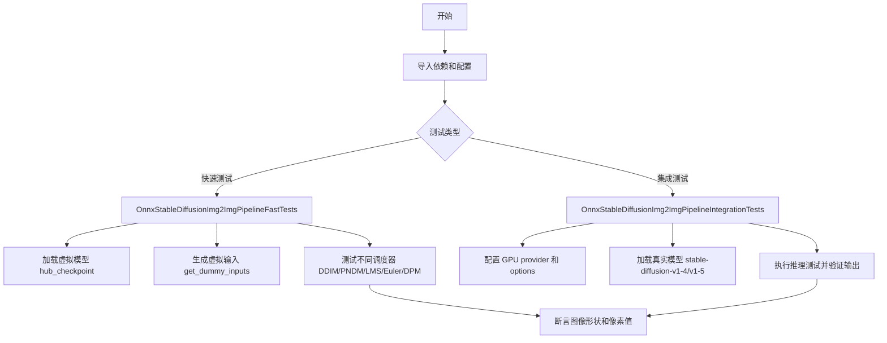

## 类结构

```
unittest.TestCase
├── OnnxPipelineTesterMixin (混合类)
└── OnnxStableDiffusionImg2ImgPipelineFastTests (unittest.TestCase)
    └── test_pipeline_* 方法 (6个)
└── OnnxStableDiffusionImg2ImgPipelineIntegrationTests (unittest.TestCase)
    └── test_inference_* 方法 (2个)
```

## 全局变量及字段


### `OnnxStableDiffusionImg2ImgPipelineFastTests.hub_checkpoint`
    
HuggingFace Hub上的测试模型路径，用于加载ONNX稳定扩散图像到图像管道

类型：`str`
    
    

## 全局函数及方法


### `floats_tensor`

该函数用于生成一个指定形状的浮点数张量（tensor），通常用于测试目的。根据代码中的调用方式 `floats_tensor((1, 3, 128, 128), rng=random.Random(seed))`，该函数可以生成指定形状的随机浮点数数组。

**注意**：该函数是从 `...testing_utils` 模块导入的，当前代码段中仅包含导入和使用，未提供该函数的实际实现源码。

参数：

- `shape`：`tuple`，张量的形状参数，例如 (1, 3, 128, 128)，表示生成张量的维度
- `rng`：`random.Random`，可选参数，用于生成随机数的随机数生成器对象，默认为 None

返回值：推断返回 `numpy.ndarray` 或 `torch.Tensor`（取决于 testing_utils 的实现），返回指定形状的浮点数张量

#### 流程图

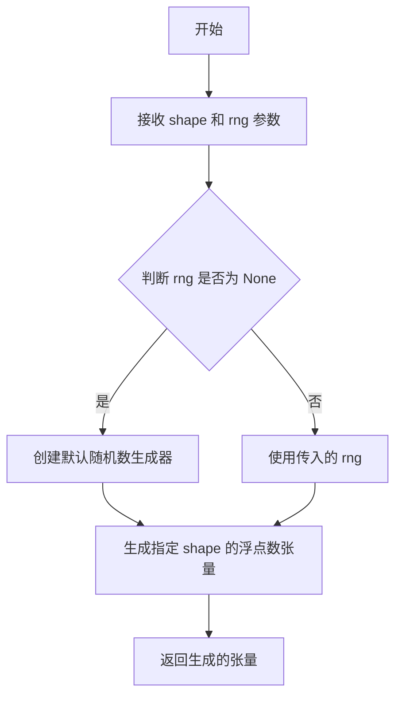

#### 带注释源码

```python
# 该函数定义在 testing_utils 模块中（未在当前代码段中提供实现）
from ...testing_utils import (
    floats_tensor,
    # 其他导入...
)

class OnnxStableDiffusionImg2ImgPipelineFastTests(OnnxPipelineTesterMixin, unittest.TestCase):
    # ...其他代码...

    def get_dummy_inputs(self, seed=0):
        # 使用 floats_tensor 生成随机浮点数张量作为测试图像
        # shape=(1, 3, 128, 128) 表示生成 1 张 3 通道 128x128 的图像
        # rng=random.Random(seed) 使用指定种子确保测试可复现
        image = floats_tensor((1, 3, 128, 128), rng=random.Random(seed))
        
        generator = np.random.RandomState(seed)
        inputs = {
            "prompt": "A painting of a squirrel eating a burger",
            "image": image,
            "generator": generator,
            "num_inference_steps": 3,
            "strength": 0.75,
            "guidance_scale": 7.5,
            "output_type": "np",
        }
        return inputs
```


### `load_image`

该函数是一个从外部模块（`...testing_utils`）导入的工具函数，用于根据给定的 URL 路径加载图像并返回图像对象（通常为 PIL Image 对象）。

参数：

-  `url_or_path`：`str`，图像的 URL 地址或本地文件路径

返回值：`PIL.Image 或类似图像对象`，返回加载后的图像实例

#### 流程图

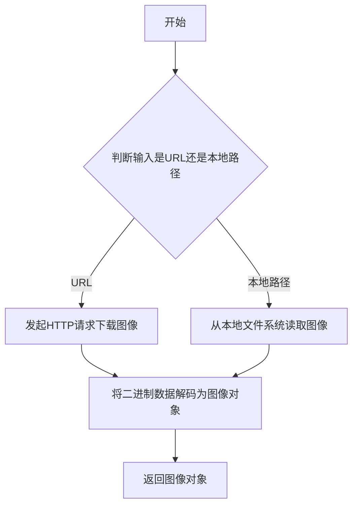

#### 带注释源码

```
# load_image 函数定义不在当前代码文件中
# 它是从 ...testing_utils 模块导入的外部函数

# 根据代码中的使用方式，函数签名大致如下：
def load_image(url_or_path: str) -> "PIL.Image":
    """
    从URL或本地路径加载图像
    
    参数:
        url_or_path: 图像的URL地址或本地文件路径
    返回:
        加载后的PIL图像对象
    """
    # ... (具体实现不在当前文件中)
```

#### 说明

由于 `load_image` 函数定义在 `...testing_utils` 模块中而非当前代码文件内，以上信息是基于以下代码使用方式推断的：

```python
# 在代码中的调用方式
init_image = load_image(
    "https://huggingface.co/datasets/hf-internal-testing/diffusers-images/resolve/main"
    "/img2img/sketch-mountains-input.jpg"
)
init_image = init_image.resize((768, 512))  # 说明返回对象有 resize 方法，通常是 PIL Image
```

如需查看 `load_image` 的完整实现源码，请查阅 `testing_utils` 模块的实际定义文件。


### `is_onnx_available`

该函数用于检测当前环境中是否安装了 ONNX 运行时库（onnxruntime），以便在运行需要 ONNX 支持的测试时条件性地导入相关模块。

参数： 无

返回值：`bool`，返回 `True` 表示 ONNX 运行时可用，可以导入 `onnxruntime`；返回 `False` 表示不可用。

#### 流程图

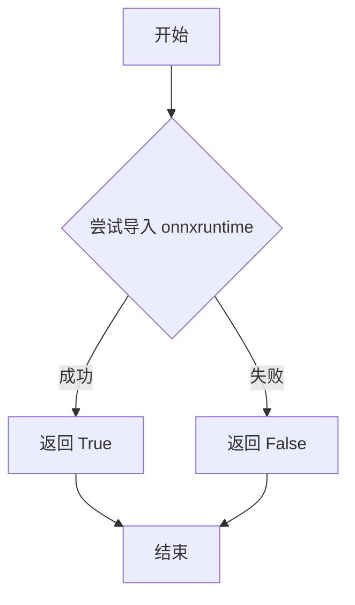

#### 带注释源码

```python
# is_onnx_available 函数的典型实现方式
# 该函数位于 testing_utils 模块中

def is_onnx_available():
    """
    检查 ONNX 运行时是否可用。
    
    该函数通过尝试导入 onnxruntime 模块来判断环境是否支持 ONNX。
    通常用于条件性地运行仅在 ONNX 可用时才有意义的测试用例。
    
    返回值:
        bool: 如果成功导入 onnxruntime 返回 True，否则返回 False
    """
    try:
        # 尝试导入 onnxruntime 模块
        import onnxruntime as ort
        # 导入成功，ONNX 可用
        return True
    except ImportError:
        # 导入失败，ONNX 不可用
        return False
```

**注**：由于该函数定义在 `testing_utils` 模块中（从 `...testing_utils` 导入），而非当前代码文件内，上述源码为基于常见模式的推断实现。实际定义可能包含额外的逻辑或依赖检查。


### `require_onnxruntime`

这是一个装饰器函数，用于标记需要 ONNX Runtime 环境才能运行的测试用例。如果系统中未安装 ONNX Runtime，被装饰的测试将被跳过。

参数：
- 无显式参数（作为装饰器使用）

返回值：`Callable`，返回装饰后的测试函数，如果 ONNX Runtime 不可用则跳过测试

#### 流程图

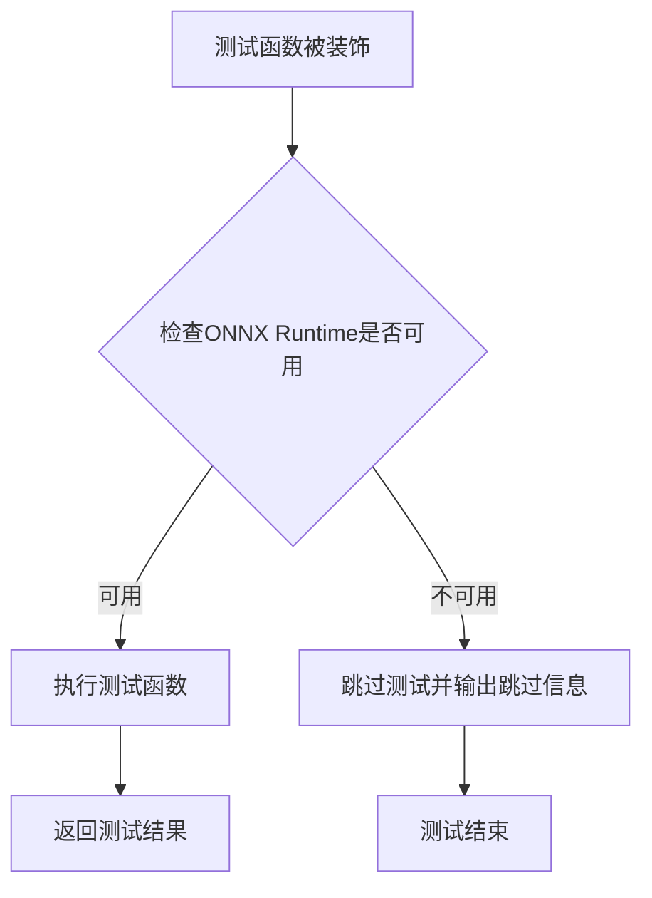

#### 带注释源码

```python
# 该函数定义在 testing_utils 模块中
# 以下为基于使用方式的推断实现

def require_onnxruntime(func):
    """
    装饰器：检查 ONNX Runtime 是否可用
    
    用途：
    - 标记需要 ONNX Runtime 的测试用例
    - 在 ONNX Runtime 不可用时跳过测试
    - 常与 pytest 的 skipif 机制配合使用
    """
    # 检查 is_onnx_available() 的返回值
    if not is_onnx_available():
        # 如果 ONNX Runtime 不可用，将测试标记为跳过
        return unittest.skip("ONNX Runtime is not available")(func)
    
    # 如果可用，返回原函数不做修改
    return func


# 使用示例（在代码中）
@nightly
@require_onnxruntime  # 装饰器应用位置
@require_torch_gpu
class OnnxStableDiffusionImg2ImgPipelineIntegrationTests(unittest.TestCase):
    # 测试类定义
    ...
```

#### 说明

- **模块来源**：`...testing_utils`（相对导入路径）
- **依赖检查**：基于 `is_onnx_available()` 函数的返回值
- **配合使用**：常与 `@nightly`（夜间测试）和 `@require_torch_gpu` 等装饰器组合使用
- **测试跳过**：当 ONNX Runtime 不可用时，测试将被自动跳过，不会失败


### `require_torch_gpu`

这是一个测试装饰器函数，用于检查测试环境是否满足运行要求（PyTorch GPU 可用）。如果环境中没有可用的 CUDA GPU，被装饰的测试函数将被跳过执行。

参数：

- 该函数无直接参数（作为装饰器使用，接收被装饰的函数作为参数）

返回值：无直接返回值（作为装饰器使用，返回被装饰的函数或修改后的函数）

#### 流程图

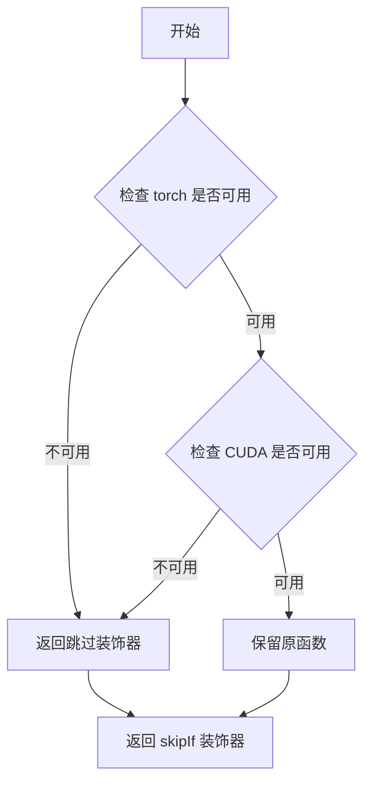

#### 带注释源码

```
# 从 testing_utils 模块导入 require_torch_gpu
# 该函数的实际实现位于 diffusers.testing_utils 模块中
# 以下是基于其使用方式的推断代码

def require_torch_gpu(func):
    """
    测试装饰器：检查 PyTorch GPU 是否可用
    
    如果 torch 不可用或 CUDA 不可用，则跳过被装饰的测试
    """
    # 检查是否有可用的 GPU
    if not is_torch_available():
        return unittest.skip("torch is not available")(func)
    
    if not is_cuda_available():
        return unittest.skip("CUDA is not available")(func)
    
    return func

# 使用方式（在代码中）:
# @require_torch_gpu
# class OnnxStableDiffusionImg2ImgPipelineIntegrationTests(unittest.TestCase):
#     ...
```

> **注意**: 由于 `require_torch_gpu` 函数定义在外部模块 `diffusers.testing_utils` 中，且在当前代码文件中仅导入了该函数而未展示其完整实现，以上信息基于该函数的典型实现方式和在项目中的使用方式进行推断。


### `nightly`

该函数是一个测试装饰器，用于标记测试用例为夜间测试，使其在常规测试运行中被跳过，仅在夜间CI管道中执行。

参数：

- `func`：`Callable`，被装饰的测试函数或类

返回值：`Callable`，装饰后的函数，添加了跳过逻辑以支持夜间测试运行

#### 流程图

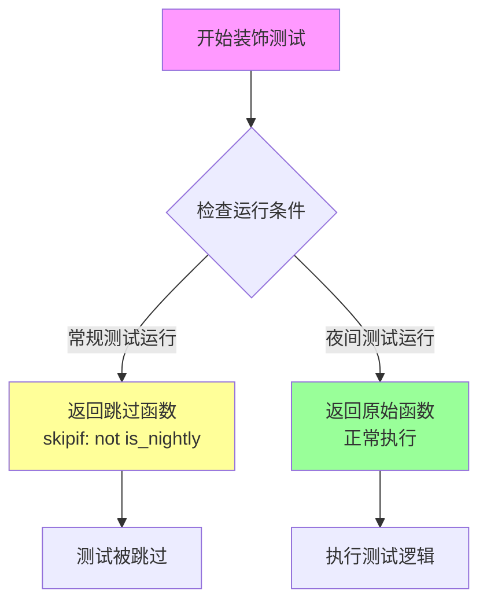

#### 带注释源码

```python
# 从 testing_utils 模块导入的装饰器
# 用于标记测试为夜间测试
from ...testing_utils import nightly

# 使用示例：
# @nightly
# @require_onnxruntime
# @require_torch_gpu
# class OnnxStableDiffusionImg2ImgPipelineIntegrationTests(unittest.TestCase):
#     ...

# nightly 装饰器的典型实现（推测）：
# def nightly(func):
#     """
#     装饰器：标记测试为夜间测试
#     在常规测试运行中跳过，仅在夜间CI中执行
#     """
#     return pytest.mark.skipif(
#         not is_nightly(),
#         reason="夜间测试"
#     )(func)
#
# def is_nightly() -> bool:
#     """检查当前是否为夜间测试运行"""
#     return os.environ.get("NIGHTLY", "0") == "1"
```


### `OnnxStableDiffusionImg2ImgPipelineFastTests.get_dummy_inputs`

该方法用于生成测试所需的虚拟输入数据，创建一个包含文本提示、图像张量、随机生成器以及扩散模型推理参数的字典，供后续管道推理测试使用。

参数：

- `seed`：`int`，可选参数，默认值为0，用于初始化随机数生成器的种子，确保测试结果可复现

返回值：`dict`，返回包含测试输入参数的字典，包括提示词、图像、生成器、推理步数、强度、引导比例和输出类型

#### 流程图

```mermaid
flowchart TD
    A[开始 get_dummy_inputs] --> B[接收 seed 参数<br/>默认值=0]
    B --> C[使用 floats_tensor 创建随机图像张量<br/>shape=(1, 3, 128, 128)]
    C --> D[创建 NumPy 随机状态对象<br/>使用 seed 初始化]
    D --> E[构建输入字典 inputs]
    E --> F[设置 prompt<br/>'A painting of a squirrel eating a burger']
    F --> G[设置 image<br/>浮点型张量]
    G --> H[设置 generator<br/>NumPy RandomState 对象]
    H --> I[设置 num_inference_steps<br/>3]
    I --> J[设置 strength<br/>0.75]
    J --> K[设置 guidance_scale<br/>7.5]
    K --> L[设置 output_type<br/>'np']
    L --> M[返回 inputs 字典]
```

#### 带注释源码

```python
def get_dummy_inputs(self, seed=0):
    """
    生成用于测试 OnnxStableDiffusionImg2ImgPipeline 的虚拟输入参数
    
    参数:
        seed: int, 随机种子, 默认为0, 用于确保测试结果可复现
    
    返回:
        dict: 包含以下键的字典:
            - prompt: str, 文本提示
            - image: torch.Tensor 或 np.ndarray, 输入图像张量
            - generator: np.random.RandomState, 随机数生成器
            - num_inference_steps: int, 推理步数
            - strength: float, 图像转换强度
            - guidance_scale: float, 引导比例
            - output_type: str, 输出类型
    """
    # 使用 floats_tensor 创建形状为 (1, 3, 128, 128) 的随机浮点张量
    # rng=random.Random(seed) 确保生成的张量可复现
    image = floats_tensor((1, 3, 128, 128), rng=random.Random(seed))
    
    # 创建 NumPy 随机状态对象，用于后续管道中的随机操作
    generator = np.random.RandomState(seed)
    
    # 构建输入参数字典，包含文本提示、图像、生成器及推理参数
    inputs = {
        "prompt": "A painting of a squirrel eating a burger",  # 文本提示
        "image": image,                                         # 输入图像张量
        "generator": generator,                                 # 随机生成器
        "num_inference_steps": 3,                               # 扩散模型推理步数
        "strength": 0.75,                                       # 图像转换强度 (0-1)
        "guidance_scale": 7.5,                                  # 引导比例，控制文本提示影响力
        "output_type": "np",                                    # 输出类型为 NumPy 数组
    }
    
    # 返回完整的输入参数字典，供管道调用
    return inputs
```


### `OnnxStableDiffusionImg2ImgPipelineFastTests.test_pipeline_default_ddim`

这是一个单元测试方法，用于验证 ONNX 版本的 Stable Diffusion Img2Img 管道在使用默认 DDIM 调度器时的基本功能是否正常，包括模型加载、图像生成和输出质量检查。

参数：

- `self`：隐式参数，`unittest.TestCase`，测试类的实例本身

返回值：`None`，该方法为测试方法，通过 `assert` 语句进行断言验证，不返回任何值

#### 流程图

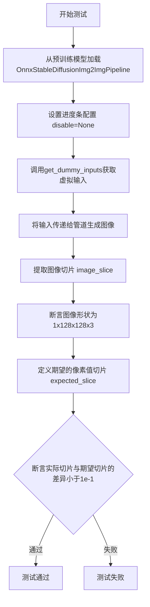

#### 带注释源码

```python
def test_pipeline_default_ddim(self):
    """
    测试 ONNX Stable Diffusion Img2Img 管道在使用默认 DDIM 调度器时的基本功能
    """
    # 从预训练模型加载管道，使用 CPU 执行提供者
    # hub_checkpoint = "hf-internal-testing/tiny-random-OnnxStableDiffusionPipeline"
    pipe = OnnxStableDiffusionImg2ImgPipeline.from_pretrained(self.hub_checkpoint, provider="CPUExecutionProvider")
    
    # 设置进度条配置，disable=None 表示不禁用进度条
    pipe.set_progress_bar_config(disable=None)

    # 获取虚拟输入数据
    # 返回包含 prompt、image、generator、num_inference_steps、strength、guidance_scale、output_type 的字典
    inputs = self.get_dummy_inputs()
    
    # 调用管道进行推理，获取生成的图像
    # pipe 返回一个对象，其 .images 属性包含生成的图像数组
    image = pipe(**inputs).images
    
    # 提取图像最后一个通道的右下角 3x3 区域，并展平为一维数组
    # image[0, -3:, -3:, -1] 获取第0张图像的最后一个通道的右下角3x3像素
    image_slice = image[0, -3:, -3:, -1].flatten()

    # 断言：验证生成的图像形状是否为 (1, 128, 128, 3)
    # 1 表示batch size，128x128 表示图像高度和宽度，3 表示RGB通道
    assert image.shape == (1, 128, 128, 3)
    
    # 定义期望的像素值切片，用于与实际输出进行比较
    # 这些是参考值，来源于已知的正确输出
    expected_slice = np.array([0.69643, 0.58484, 0.50314, 0.58760, 0.55368, 0.59643, 0.51529, 0.41217, 0.49087])
    
    # 断言：验证实际图像切片与期望值的最大差异是否小于阈值 1e-1 (0.1)
    # np.abs 计算绝对值，.max() 获取最大值
    assert np.abs(image_slice - expected_slice).max() < 1e-1
```


### `OnnxStableDiffusionImg2ImgPipelineFastTests.test_pipeline_pndm`

该方法是一个单元测试，用于验证 OnnxStableDiffusionImg2ImgPipeline 在使用 PNDM 调度器时的图像生成功能是否正常。它加载预训练模型，配置 PNDM 调度器，使用虚拟输入执行推理，并验证输出图像的形状和像素值是否符合预期。

参数：

- `self`：`OnnxStableDiffusionImg2ImgPipelineFastTests`，测试类实例，隐含参数，用于访问类方法和属性

返回值：`None`，测试方法无返回值，通过断言验证正确性

#### 流程图

```mermaid
flowchart TD
    A[开始测试] --> B[从预训练模型加载OnnxStableDiffusionImg2ImgPipeline]
    B --> C[配置PNDMScheduler并跳过PRK步骤]
    C --> D[设置进度条配置]
    D --> E[调用get_dummy_inputs获取测试输入]
    E --> F[执行pipeline推理: pipe\*\*inputs]
    F --> G[提取图像切片 image[0, -3:, -3:, -1]]
    G --> H[断言图像形状为1, 128, 128, 3]
    H --> I[定义期望的像素值数组expected_slice]
    I --> J[断言实际像素值与期望值的最大差异小于1e-1]
    J --> K{断言是否通过}
    K -->|通过| L[测试通过]
    K -->|失败| M[抛出AssertionError]
```

#### 带注释源码

```python
def test_pipeline_pndm(self):
    """
    测试使用PNDM调度器的OnnxStableDiffusionImg2ImgPipeline流水线功能
    
    该测试方法执行以下步骤：
    1. 加载预训练的ONNX Stable Diffusion图像到图像管道模型
    2. 配置PNDM调度器并设置跳过PRK步骤
    3. 使用虚拟输入执行推理
    4. 验证输出图像的形状和像素值是否符合预期
    """
    # 步骤1: 从预训练检查点加载ONNX管道，使用CPU执行提供者
    # hub_checkpoint = "hf-internal-testing/tiny-random-OnnxStableDiffusionPipeline"
    pipe = OnnxStableDiffusionImg2ImgPipeline.from_pretrained(
        self.hub_checkpoint, 
        provider="CPUExecutionProvider"
    )
    
    # 步骤2: 使用PNDM调度器替换默认调度器，并配置跳过PRK步骤
    # PNDMScheduler: 是一种常用的扩散模型采样调度器
    pipe.scheduler = PNDMScheduler.from_config(
        pipe.scheduler.config, 
        skip_prk_steps=True
    )
    
    # 步骤3: 设置进度条配置，disable=None表示不禁用进度条
    pipe.set_progress_bar_config(disable=None)
    
    # 步骤4: 获取虚拟测试输入，包括：
    # - prompt: 文本提示 "A painting of a squirrel eating a burger"
    # - image: 随机生成的128x128浮点张量
    # - generator: NumPy随机数生成器
    # - num_inference_steps: 3步推理
    # - strength: 0.75，图像变换强度
    # - guidance_scale: 7.5，文本引导强度
    # - output_type: "np"，输出为NumPy数组
    inputs = self.get_dummy_inputs()
    
    # 步骤5: 执行图像生成推理，获取生成的图像
    # pipe**inputs 将字典解包为关键字参数
    image = pipe(**inputs).images
    
    # 步骤6: 提取图像右下角3x3区域的像素值用于验证
    # image shape: (1, 128, 128, 3) -> (batch, height, width, channels)
    image_slice = image[0, -3:, -3:, -1]
    
    # 步骤7: 断言验证输出图像形状
    assert image.shape == (1, 128, 128, 3)
    
    # 步骤8: 定义期望的像素值切片（用于回归测试）
    expected_slice = np.array([
        [0.61737, 0.54642, 0.53183],  # 最后第三行
        [0.54465, 0.52742, 0.60525],  # 最后第二行
        [0.49969, 0.40655, 0.48154]   # 最后第一行
    ])
    
    # 步骤9: 验证实际输出与期望值的差异在可接受范围内
    # 使用np.abs计算差值的绝对值，max()取最大差异
    # 断言最大差异小于0.1 (1e-1)
    assert np.abs(image_slice.flatten() - expected_slice).max() < 1e-1
```


### `OnnxStableDiffusionImg2ImgPipelineFastTests.test_pipeline_lms`

该测试方法用于验证ONNX Stable Diffusion图像到图像管道在使用LMS调度器时的功能正确性，包括模型加载、调度器配置、推理执行以及输出图像的形状和像素值验证。

参数：

- `self`：`OnnxStableDiffusionImg2ImgPipelineFastTests`，隐式参数，代表测试类实例本身

返回值：`None`，该方法为单元测试方法，不返回任何值，仅通过断言验证管道输出

#### 流程图

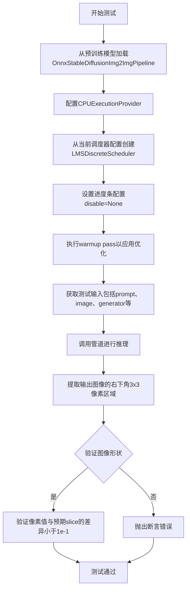

#### 带注释源码

```python
def test_pipeline_lms(self):
    """
    测试使用LMS调度器的ONNX Stable Diffusion图像到图像管道
    验证管道能够正确加载模型、执行推理并输出预期尺寸和内容的图像
    """
    # 步骤1：从预训练检查点加载ONNX管道，指定CPU执行提供者
    pipe = OnnxStableDiffusionImg2ImgPipeline.from_pretrained(
        self.hub_checkpoint, 
        provider="CPUExecutionProvider"
    )
    
    # 步骤2：将管道的调度器替换为LMS离散调度器
    # LMS (Least Mean Squares) 调度器是一种常用的扩散模型采样调度器
    pipe.scheduler = LMSDiscreteScheduler.from_config(pipe.scheduler.config)
    
    # 步骤3：配置进度条，disable=None表示不禁用进度条
    pipe.set_progress_bar_config(disable=None)
    
    # 步骤4：执行warmup pass
    # 首次推理会触发ONNX运行时的优化，通过空跑一次应用这些优化
    _ = pipe(**self.get_dummy_inputs())
    
    # 步骤5：获取测试输入数据
    # 包含：prompt文字、图像张量、随机数生成器、推理步数、强度、引导 scale、输出类型
    inputs = self.get_dummy_inputs()
    
    # 步骤6：调用管道执行图像到图像的推理转换
    # 将原始图像根据prompt进行风格转换或修改
    image = pipe(**inputs).images
    
    # 步骤7：提取输出图像右下角3x3像素区域用于验证
    # image shape: (batch, height, width, channels)
    image_slice = image[0, -3:, -3:, -1]
    
    # 步骤8：断言验证输出图像的形状为(1, 128, 128, 3)
    assert image.shape == (1, 128, 128, 3)
    
    # 步骤9：定义预期输出像素值
    # 使用LMS调度器时应产生的预期像素值slice
    expected_slice = np.array([
        0.52761, 0.59977, 0.49033, 
        0.49619, 0.54282, 0.50311, 
        0.47600, 0.40918, 0.45203
    ])
    
    # 步骤10：验证实际输出与预期值的差异在容差范围内
    # 最大允许差异为1e-1 (0.1)
    assert np.abs(image_slice.flatten() - expected_slice).max() < 1e-1
```


### `OnnxStableDiffusionImg2ImgPipelineFastTests.test_pipeline_euler`

该方法是针对 ONNX 版本的 Stable Diffusion Img2Img Pipeline 的集成测试，使用 EulerDiscreteScheduler 调度器进行图像到图像的推理测试。测试验证管道能够正确加载预训练模型、配置调度器、生成图像，并确保输出图像的形状和像素值符合预期。

参数：

-  `self`：`OnnxStableDiffusionImg2ImgPipelineFastTests`，隐式参数，测试类实例本身

返回值：`None`，无返回值（测试方法无显式返回值）

#### 流程图

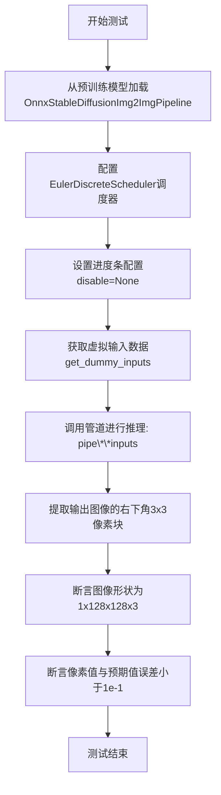

#### 带注释源码

```python
def test_pipeline_euler(self):
    """
    测试使用EulerDiscreteScheduler调度器的ONNX Stable Diffusion Img2Img Pipeline
    验证推理流程的正确性和输出图像的数值范围
    """
    # 1. 从预训练检查点加载ONNX管道，使用CPU执行提供者
    pipe = OnnxStableDiffusionImg2ImgPipeline.from_pretrained(
        self.hub_checkpoint, 
        provider="CPUExecutionProvider"
    )
    
    # 2. 配置Euler离散调度器，替换默认调度器
    # Euler调度器使用欧拉方法进行去噪采样
    pipe.scheduler = EulerDiscreteScheduler.from_config(pipe.scheduler.config)
    
    # 3. 设置进度条配置，disable=None表示不禁用进度条
    pipe.set_progress_bar_config(disable=None)

    # 4. 获取虚拟输入数据
    # 包含：prompt文本、图像、随机数生成器、推理步数、强度、引导尺度、输出类型
    inputs = self.get_dummy_inputs()
    
    # 5. 调用管道进行推理，生成图像
    # 返回包含images属性的对象
    image = pipe(**inputs).images
    
    # 6. 提取输出图像右下角3x3区域的像素值用于验证
    # 图像格式为[batch, height, width, channels]
    image_slice = image[0, -3:, -3:, -1]

    # 7. 断言验证输出图像形状
    # 期望形状：(1, 128, 128, 3) - 单张128x128的RGB图像
    assert image.shape == (1, 128, 128, 3)
    
    # 8. 定义预期像素值_slice
    # 这些值是针对特定随机种子和模型配置的预期结果
    expected_slice = np.array([
        0.52911, 0.60004, 0.49229, 
        0.49805, 0.54502, 0.50680, 
        0.47777, 0.41028, 0.45304
    ])

    # 9. 断言像素值误差在允许范围内
    # 使用最大绝对误差不超过1e-1（0.1）的标准
    assert np.abs(image_slice.flatten() - expected_slice).max() < 1e-1
```


### `OnnxStableDiffusionImg2ImgPipelineFastTests.test_pipeline_euler_ancestral`

该方法是 `OnnxStableDiffusionImg2ImgPipelineFastTests` 类中的一个测试用例，用于验证 OnnxStableDiffusionImg2ImgPipeline 在使用 EulerAncestralDiscreteScheduler 调度器时的图像生成功能是否正常。

参数：

- `self`：隐式参数，类型为 `OnnxStableDiffusionImg2ImgPipelineFastTests`，表示测试类的实例本身

返回值：`None`，该方法为测试用例，通过断言验证管道输出，不返回任何值

#### 流程图

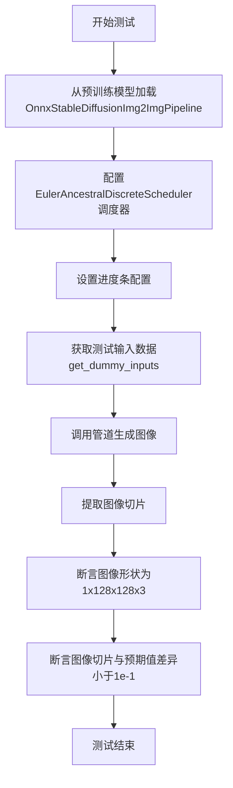

#### 带注释源码

```python
def test_pipeline_euler_ancestral(self):
    # 1. 从预训练检查点加载ONNX图像到图像管道，使用CPU执行提供者
    pipe = OnnxStableDiffusionImg2ImgPipeline.from_pretrained(self.hub_checkpoint, provider="CPUExecutionProvider")
    
    # 2. 将管道的调度器配置为EulerAncestralDiscreteScheduler（欧拉祖先离散调度器）
    pipe.scheduler = EulerAncestralDiscreteScheduler.from_config(pipe.scheduler.config)
    
    # 3. 配置进度条，disable=None表示不禁用进度条
    pipe.set_progress_bar_config(disable=None)

    # 4. 获取测试用的虚拟输入数据
    inputs = self.get_dummy_inputs()
    
    # 5. 调用管道进行推理，获取生成的图像
    image = pipe(**inputs).images
    
    # 6. 提取图像的最后3x3像素块（用于验证）
    image_slice = image[0, -3:, -3:, -1]

    # 7. 断言验证：确认输出图像形状为(1, 128, 128, 3)
    assert image.shape == (1, 128, 128, 3)
    
    # 8. 定义预期的像素值切片
    expected_slice = np.array([0.52911, 0.60004, 0.49229, 0.49805, 0.54502, 0.50680, 0.47777, 0.41028, 0.45304])

    # 9. 断言验证：确认生成的图像与预期值的差异在可接受范围内（小于0.1）
    assert np.abs(image_slice.flatten() - expected_slice).max() < 1e-1
```


### `OnnxStableDiffusionImg2ImgPipelineFastTests.test_pipeline_dpm_multistep`

这是一个单元测试方法，用于测试 ONNX 版本的 Stable Diffusion Img2Img Pipeline 在使用 DPM-Solver 多步调度器时的功能正确性。该测试验证管道能够正确加载模型、应用 DPMSolverMultistepScheduler 调度器、执行图像到图像的推理，并输出符合预期尺寸和数值范围的图像结果。

参数：

- `self`：隐式参数，测试类实例本身，无需额外描述

返回值：`None`，该方法为单元测试，通过断言验证管道输出，不返回任何值

#### 流程图

```mermaid
flowchart TD
    A[开始测试 test_pipeline_dpm_multistep] --> B[从预训练模型加载 OnnxStableDiffusionImg2ImgPipeline]
    B --> C[使用 CPUExecutionProvider 提供者]
    C --> D[配置调度器为 DPMSolverMultistepScheduler]
    D --> E[设置进度条配置 disable=None]
    E --> F[调用 get_dummy_inputs 获取测试输入]
    F --> G[执行管道推理: pipe\*\*inputs]
    G --> H[获取生成的图像 images]
    H --> I[提取图像切片 image[0, -3:, -3:, -1]]
    I --> J[断言图像形状为 1, 128, 128, 3]
    J --> K[定义期望的像素值切片 expected_slice]
    K --> L[断言实际切片与期望值的最大差值小于 1e-1]
    L --> M[测试结束]
```

#### 带注释源码

```python
def test_pipeline_dpm_multistep(self):
    """
    测试使用 DPM-Solver 多步调度器的 ONNX Stable Diffusion Img2Img Pipeline。
    
    该测试方法验证:
    1. 管道能够正确加载 ONNX 格式的模型
    2. DPMSolverMultistepScheduler 能够正确配置和应用
    3. 图像到图像推理能够正常执行
    4. 输出图像的尺寸和像素值符合预期
    """
    # 步骤1: 从预训练检查点加载 ONNX 管道
    # 使用 CPUExecutionProvider 作为推理提供者
    pipe = OnnxStableDiffusionImg2ImgPipeline.from_pretrained(
        self.hub_checkpoint, 
        provider="CPUExecutionProvider"
    )
    
    # 步骤2: 配置管道使用 DPM-Solver 多步调度器
    # DPMSolverMultistepScheduler 是一种高效的扩散模型采样调度器
    pipe.scheduler = DPMSolverMultistepScheduler.from_config(
        pipe.scheduler.config
    )
    
    # 步骤3: 设置进度条配置
    # disable=None 表示不禁用进度条（使用默认行为）
    pipe.set_progress_bar_config(disable=None)
    
    # 步骤4: 获取测试输入数据
    # 调用类方法 get_dummy_inputs 生成标准的测试输入
    inputs = self.get_dummy_inputs()
    
    # 步骤5: 执行管道推理
    # 传入提示词、图像、生成器等参数进行图像生成
    # **inputs 会将字典展开为关键字参数
    image = pipe(**inputs).images
    
    # 步骤6: 提取图像切片用于验证
    # 取最后3x3像素区域以及最后一个通道（通常是RGB的最后一个）
    image_slice = image[0, -3:, -3:, -1]
    
    # 步骤7: 验证输出图像形状
    # 期望输出为单张图像，尺寸为 128x128，3通道（RGB）
    assert image.shape == (1, 128, 128, 3)
    
    # 步骤8: 定义期望的像素值切片
    # 这些值是基于特定随机种子和推理步骤的预期输出
    expected_slice = np.array([
        0.65331, 0.58277, 0.48204, 
        0.56059, 0.53665, 0.56235, 
        0.50969, 0.40009, 0.46552
    ])
    
    # 步骤9: 验证像素值准确性
    # 使用最大绝对误差不超过 1e-1 (0.1) 的容差进行验证
    # 这种容差考虑了浮点数运算的精度问题和可能的数值差异
    assert np.abs(image_slice.flatten() - expected_slice).max() < 1e-1
```


### `OnnxStableDiffusionImg2ImgPipelineIntegrationTests.gpu_provider`

这是一个测试属性方法，用于为 ONNX Stable Diffusion Img2Img 集成测试提供 ONNX Runtime 的 GPU 执行提供者配置。它返回一个元组，包含 CUDA 执行提供者名称和相关的 GPU 内存限制及内存扩展策略配置，使得测试能够在 GPU 上执行 ONNX 模型推理。

参数：

- （无参数，这是一个属性方法）

返回值：`Tuple[str, Dict[str, str]]`，返回包含 CUDA 执行提供者名称和 GPU 配置选项的元组

#### 流程图

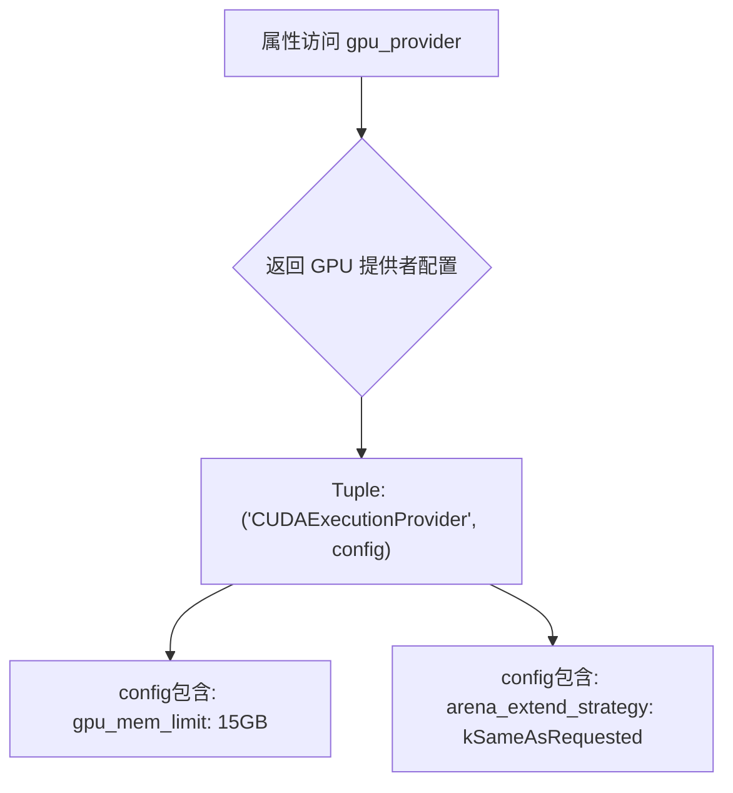

#### 带注释源码

```python
@property
def gpu_provider(self):
    """
    属性方法：获取 GPU 执行提供者配置
    
    返回值类型: Tuple[str, Dict[str, str]]
    - str: ONNX Runtime 执行提供者名称 ("CUDAExecutionProvider")
    - Dict: 包含 GPU 内存限制和内存扩展策略的配置字典
    
    配置说明:
    - gpu_mem_limit: 15GB (15000000000 字节) GPU 内存限制
    - arena_extend_strategy: kSameAsRequested 内存分配策略
    """
    return (
        "CUDAExecutionProvider",
        {
            "gpu_mem_limit": "15000000000",  # 15GB
            "arena_extend_strategy": "kSameAsRequested",
        },
    )
```

#### 关键组件信息

| 组件名称 | 描述 |
|---------|------|
| `CUDAExecutionProvider` | ONNX Runtime 的 CUDA GPU 执行提供者，用于在 NVIDIA GPU 上加速推理 |
| `gpu_mem_limit` | GPU 内存限制配置，设置为 15GB |
| `arena_extend_strategy` | ONNX Runtime 内存分配策略，"kSameAsRequested" 表示按需分配 |

#### 潜在的技术债务或优化空间

1. **硬编码配置**：GPU 内存限制和策略是硬编码的，可能不适合不同测试环境（不同 GPU 显存大小）
2. **缺乏错误处理**：如果系统没有 CUDA 或 GPU 不可用，测试可能会失败但没有清晰的错误提示
3. **magic number**：内存限制 "15000000000" 应定义为常量并添加单位说明

#### 其它项目

**设计目标与约束**：
- 目标：为集成测试提供 GPU 执行环境配置
- 约束：依赖 ONNX Runtime 的 CUDA 提供者，需 CUDA 兼容 GPU

**错误处理与异常设计**：
- 缺乏对 CUDA 不可用情况的处理
- 建议添加环境检查或条件跳过机制

**数据流与状态机**：
- 该属性作为配置提供者，被 `from_pretrained` 方法的 `provider` 参数消费
- 与 `gpu_options` 属性配合使用，共同配置 ONNX Runtime 会话

**外部依赖与接口契约**：
- 依赖 `onnxruntime` 库的 `CUDAExecutionProvider`
- 返回格式需匹配 `OnnxStableDiffusionImg2ImgPipeline.from_pretrained` 的 `provider` 参数期望


### `OnnxStableDiffusionImg2ImgPipelineIntegrationTests.gpu_options`

该属性方法用于创建并配置 ONNX Runtime 的 GPU 会话选项对象，禁用了内存模式并设置了 GPU 内存限制和内存扩展策略。

参数：无需输入参数（作为属性方法访问）

返回值：`ort.SessionOptions`，返回配置好的 ONNX Runtime 会话选项对象，用于后续的推理管道初始化

#### 流程图

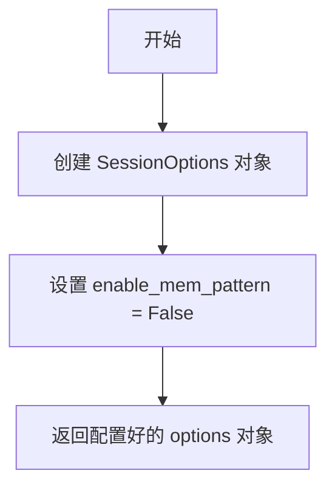

#### 带注释源码

```python
@property
def gpu_options(self):
    """
    创建并返回配置好的 ONNX Runtime GPU 会话选项
    
    该属性方法用于生成 GPU 推理所需的会话配置，
    禁用了内存模式以避免潜在的内存问题，并设置了
    GPU 内存限制为 15GB。
    """
    # 创建 ONNX Runtime 会话选项对象
    options = ort.SessionOptions()
    
    # 禁用内存模式 pattern 功能
    # 关闭此选项可以避免在某些情况下出现内存相关的问题
    options.enable_mem_pattern = False
    
    # 返回配置好的会话选项，供管道初始化时使用
    return options
```


### OnnxStableDiffusionImg2ImgPipelineIntegrationTests.test_inference_default_pndm

该方法是一个集成测试，用于验证 ONNX 版本的 Stable Diffusion Img2Img Pipeline 在 GPU 上使用默认 PNDM 调度器进行图像到图像推理的正确性。测试加载预训练模型，对输入图像进行转换，生成符合特定艺术风格的图像，并验证输出图像的像素值是否符合预期。

参数：

- `self`：隐含参数，`unittest.TestCase`，代表测试类实例本身

返回值：无返回值（`None`），该方法为测试用例，通过断言验证推理结果的正确性

#### 流程图

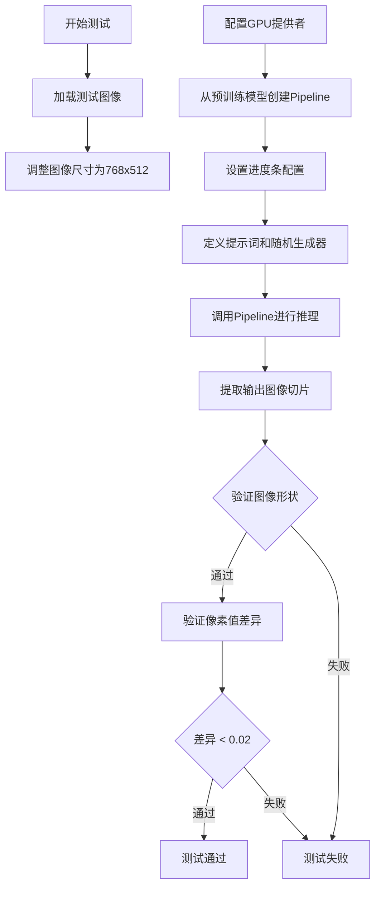

#### 带注释源码

```python
@nightly  # 标记为夜间测试，需要特殊标志才会运行
@require_onnxruntime  # 要求安装 onnxruntime 依赖
@require_torch_gpu  # 要求可用的 CUDA GPU
class OnnxStableDiffusionImg2ImgPipelineIntegrationTests(unittest.TestCase):
    """
    ONNX 版本的 Stable Diffusion Img2Img Pipeline 集成测试类
    用于验证在 GPU 上运行 ONNX 模型的正确性
    """

    @property
    def gpu_provider(self):
        """GPU 执行提供者配置属性"""
        return (
            "CUDAExecutionProvider",  # 使用 CUDA 进行 GPU 加速
            {
                "gpu_mem_limit": "15000000000",  # 15GB GPU 内存限制
                "arena_extend_strategy": "kSameAsRequested",  # 内存扩展策略
            },
        )

    @property
    def gpu_options(self):
        """ONNX Runtime 会话选项配置属性"""
        options = ort.SessionOptions()
        options.enable_mem_pattern = False  # 禁用内存模式以处理大模型
        return options

    def test_inference_default_pndm(self):
        """测试默认 PNDM 调度器的推理功能"""
        
        # 从 Hugging Face Hub 加载测试输入图像
        init_image = load_image(
            "https://huggingface.co/datasets/hf-internal-testing/diffusers-images/resolve/main"
            "/img2img/sketch-mountains-input.jpg"
        )
        
        # 将图像调整为目标尺寸 768x512
        init_image = init_image.resize((768, 512))
        
        # 使用 PNDM 调度器（默认）加载 ONNX 版本的 Stable Diffusion 模型
        pipe = OnnxStableDiffusionImg2ImgPipeline.from_pretrained(
            "CompVis/stable-diffusion-v1-4",  # 预训练模型名称
            revision="onnx",  # 使用 ONNX 版本的模型
            safety_checker=None,  # 禁用安全检查器以加速推理
            feature_extractor=None,  # 不使用特征提取器
            provider=self.gpu_provider,  # 指定 GPU 执行提供者
            sess_options=self.gpu_options,  # ONNX Runtime 会话选项
        )
        
        # 配置进度条（disable=None 表示启用进度条）
        pipe.set_progress_bar_config(disable=None)

        # 定义文本提示词，描述期望生成的图像风格
        prompt = "A fantasy landscape, trending on artstation"

        # 创建确定性随机数生成器，确保结果可复现
        generator = np.random.RandomState(0)
        
        # 调用 Pipeline 执行图像到图像的推理
        output = pipe(
            prompt=prompt,  # 文本提示词
            image=init_image,  # 输入图像
            strength=0.75,  # 转换强度 (0-1)，越高变化越大
            guidance_scale=7.5,  # 提示词引导比例
            num_inference_steps=10,  # 推理步数
            generator=generator,  # 随机数生成器
            output_type="np",  # 输出为 numpy 数组
        )
        
        # 获取生成的图像数组
        images = output.images
        
        # 提取特定区域的像素值用于验证
        image_slice = images[0, 255:258, 383:386, -1]

        # 验证输出图像形状为 (1, 512, 768, 3)
        assert images.shape == (1, 512, 768, 3)
        
        # 预期像素值 slice（用于回归测试）
        expected_slice = np.array([0.4909, 0.5059, 0.5372, 0.4623, 0.4876, 0.5049, 0.4820, 0.4956, 0.5019])
        
        # 验证生成图像与预期值的差异在可接受范围内（容差 0.02）
        # TODO: 在解决 onnxruntime 可复现性问题后降低容差
        assert np.abs(image_slice.flatten() - expected_slice).max() < 2e-2
```


### `OnnxStableDiffusionImg2ImgPipelineIntegrationTests.test_inference_k_lms`

该测试方法用于验证使用 LMS（Linear Multistep Scheduler）调度器的 ONNX 稳定扩散图像到图像（Img2Img） pipeline 在 GPU 上的推理功能。测试加载预训练模型，执行图像转换，并验证输出图像的形状和像素值是否符合预期。

参数：

- `self`：隐式参数，测试类实例本身

返回值：`None`，该方法为测试方法，无返回值（测试断言验证输出）

#### 流程图

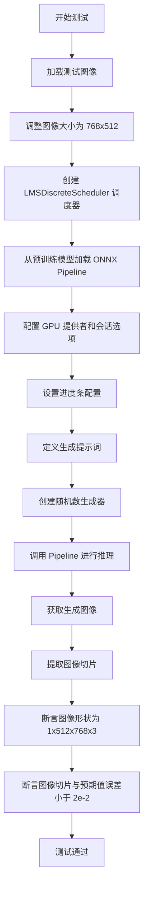

#### 带注释源码

```python
def test_inference_k_lms(self):
    """
    测试使用 LMS 调度器的 ONNX Stable Diffusion Img2Img Pipeline 推理功能
    
    该测试执行以下步骤：
    1. 加载测试图像并调整大小
    2. 创建 LMS 调度器
    3. 加载预训练的 ONNX pipeline
    4. 执行图像到图像的推理
    5. 验证输出图像的形状和像素值
    """
    
    # 步骤1: 从 URL 加载初始图像（山脉草图）
    init_image = load_image(
        "https://huggingface.co/datasets/hf-internal-testing/diffusers-images/resolve/main"
        "/img2img/sketch-mountains-input.jpg"
    )
    
    # 步骤2: 将图像调整为 768x512 尺寸
    init_image = init_image.resize((768, 512))
    
    # 步骤3: 从预训练模型加载 LMS 离散调度器
    # LMS (Linear Multistep) 调度器是一种用于扩散模型的噪声调度策略
    lms_scheduler = LMSDiscreteScheduler.from_pretrained(
        "stable-diffusion-v1-5/stable-diffusion-v1-5", 
        subfolder="scheduler", 
        revision="onnx"
    )
    
    # 步骤4: 创建 ONNX Stable Diffusion Img2Img Pipeline
    # 使用 GPU 提供者和自定义会话选项
    pipe = OnnxStableDiffusionImg2ImgPipeline.from_pretrained(
        "stable-diffusion-v1-5/stable-diffusion-v1-5",
        revision="onnx",
        scheduler=lms_scheduler,           # 使用 LMS 调度器
        safety_checker=None,                # 禁用安全检查器（用于测试）
        feature_extractor=None,             # 不使用特征提取器
        provider=self.gpu_provider,         # GPU 执行提供者
        sess_options=self.gpu_options,       # GPU 会话选项
    )
    
    # 步骤5: 配置进度条（disable=None 表示不禁用）
    pipe.set_progress_bar_config(disable=None)
    
    # 步骤6: 定义文本提示词
    prompt = "A fantasy landscape, trending on artstation"
    
    # 步骤7: 创建随机数生成器（使用固定种子确保可复现性）
    generator = np.random.RandomState(0)
    
    # 步骤8: 调用 pipeline 进行推理
    # 参数说明：
    # - prompt: 文本提示词
    # - image: 输入图像
    # - strength: 转换强度 (0-1)，越高表示对原图改变越大
    # - guidance_scale: 引导比例，控制文本提示的影响程度
    # - num_inference_steps: 推理步数
    # - generator: 随机数生成器
    # - output_type: 输出类型为 numpy 数组
    output = pipe(
        prompt=prompt,
        image=init_image,
        strength=0.75,
        guidance_scale=7.5,
        num_inference_steps=20,
        generator=generator,
        output_type="np",
    )
    
    # 步骤9: 获取生成的图像
    images = output.images
    
    # 步骤10: 提取图像切片用于验证
    # 取第一张图像的 [255:258, 383:386, :] 三个通道的像素值
    image_slice = images[0, 255:258, 383:386, -1]
    
    # 步骤11: 断言验证
    # 验证图像形状为 (1, 512, 768, 3) - 批次大小为1，高度512，宽度768，3通道
    assert images.shape == (1, 512, 768, 3)
    
    # 预期图像切片值（用于比对）
    expected_slice = np.array([0.8043, 0.926, 0.9581, 0.8119, 0.8954, 0.913, 0.7209, 0.7463, 0.7431])
    
    # 验证生成图像与预期值的差异在容差范围内
    # TODO: 在解决 onnxruntime 可复现性问题后降低容差
    assert np.abs(image_slice.flatten() - expected_slice).max() < 2e-2
```

## 关键组件


### OnnxStableDiffusionImg2ImgPipeline

ONNX 版本的 Stable Diffusion 图像到图像（img2img）生成管道，支持使用 ONNX 运行时进行推理，实现从文本提示和输入图像生成转换后的图像。

### 调度器（Schedulers）

多种扩散调度器实现，用于控制去噪过程的算法策略，包括 PNDM、DPM Multi-Step、Euler、Euler Ancestral 和 LMS Discrete 等方法。

### ONNX 运行时提供者

集成了 ONNX Runtime 执行提供者，包括 CPUExecutionProvider 用于快速测试和 CUDAExecutionProvider 用于 GPU 加速推理，支持内存限制和显存优化配置。

### 测试输入生成器（get_dummy_inputs）

生成测试用的虚拟输入数据，包括随机浮点张量图像、随机数生成器、提示词、推理步数、强度参数、引导比例和输出类型等。

### 图像张量工具（floats_tensor）

生成指定形状的随机浮点数张量，用于创建测试用的虚拟图像数据。

### 快速测试类（OnnxStableDiffusionImg2ImgPipelineFastTests）

单元测试类，验证管道在多种调度器配置下的基本功能正确性，包括默认 DDIM、PNDM、LMS、Euler、Euler Ancestral 和 DPM Multi-Step 调度器的测试。

### 集成测试类（OnnxStableDiffusionImg2ImgPipelineIntegrationTests）

需要 GPU 的夜间集成测试，验证管道在实际推理场景下的性能和输出质量，包括默认 PNDM 和 LMS 调度器的端到端测试。

### 输出验证机制

通过比较生成的图像切片与预期值（使用 numpy 数组），验证管道输出的正确性，使用最大绝对误差阈值进行判断。

### GPU 配置属性

定义了 GPU 提供者配置（CUDAExecutionProvider，包含 15GB 显存限制）和会话选项配置（禁用内存模式），用于 GPU 推理测试。


## 问题及建议


### 已知问题

- **魔法数字与硬编码值**：代码中存在大量硬编码的期望值（如 `expected_slice` 数组）和硬编码的模型路径（如 `"hf-internal-testing/tiny-random-OnnxStableDiffusionPipeline"`），缺乏配置化管理，增加了维护成本。
- **测试代码重复**：每个测试方法都包含重复的 pipeline 创建、进度条配置和结果断言逻辑，违反了 DRY 原则，`get_dummy_inputs` 方法在每个测试中都被重复调用。
- **warmup 处理不一致**：仅在 `test_pipeline_lms` 中包含 warmup pass 注释和调用，其他 scheduler 测试未做相同处理，可能导致性能测试结果不一致。
- **缺乏错误处理验证**：测试代码未验证模型加载失败、推理失败或输入参数异常等边界情况的处理逻辑。
- **断言容差缺乏说明**：`np.abs(image_slice - expected_slice).max() < 1e-1` 和 `< 2e-2` 等容差值的选择缺乏注释说明，且存在不同容差值混用的情况（1e-1 vs 2e-2），难以理解为何采用不同精度标准。
- **外部依赖管理**：集成测试直接使用外部模型 URL（"CompVis/stable-diffusion-v1-4"），缺乏本地缓存或 mock 机制，网络不可用时测试会失败。
- **GPU 资源配置硬编码**：`gpu_mem_limit` 设置为 15000000000 (15GB) 硬编码，可能在不同测试环境下不适用。

### 优化建议

- **提取配置与常量**：将模型路径、期望切片值、容差阈值等提取为类常量或外部配置文件，便于集中管理和批量修改。
- **使用 pytest fixtures**：利用 pytest fixture 共享 pipeline 创建、进度条配置等公共逻辑，减少代码重复。
- **统一 warmup 策略**：考虑在所有 scheduler 测试中统一添加 warmup pass，或将其提取为独立的 fixture 方法。
- **添加错误场景测试**：补充模型加载异常、推理超时、非法参数（如负数 strength）等错误处理的测试用例。
- **统一容差标准**：为断言容差值添加明确注释，说明选择依据，并尽可能统一不同测试间的容差标准。
- **增强外部依赖鲁棒性**：对外部 URL 加载的测试添加超时控制，或提供本地 fallback 机制以提高测试可靠性。
- **参数化测试**：对不同 scheduler 的测试可使用 `@pytest.mark.parametrize` 进行参数化，减少重复测试方法。

## 其它


### 设计目标与约束

本测试文件旨在验证 OnnxStableDiffusionImg2ImgPipeline 在 ONNX 运行时上的功能和正确性。测试覆盖多种调度器（DDIM、PNDM、LMS、Euler、EulerAncestral、DPM-Multistep），确保 pipeline 在不同推理配置下的行为一致性。约束条件包括：使用 CPUExecutionProvider 进行快速测试，使用 CUDAExecutionProvider 进行集成测试（需 GPU），测试使用虚拟模型（hf-internal-testing/tiny-random-OnnxStableDiffusionPipeline）和真实模型（CompVis/stable-diffusion-v1-4、stable-diffusion-v1-5）进行验证。

### 错误处理与异常设计

测试代码本身未显式处理异常，主要依赖 unittest 框架的断言机制进行错误检测。预期错误场景包括：ONNX Runtime 不可用（通过 is_onnx_available() 检查）、GPU 不可用（通过 require_torch_gpu 装饰器跳过）、模型加载失败、推理结果 shape 不匹配、数值精度超出容忍范围。集成测试使用 @nightly 装饰器标记，允许在 nightly 环境下跳过以避免阻塞主流程。

### 数据流与状态机

测试数据流为：输入 prompt + 初始图像 → OnnxStableDiffusionImg2ImgPipeline → 调度器初始化 → UNet ONNX 模型推理（多次迭代）→ VAE 解码 → 输出图像。状态转换包括：pipeline 加载状态 → 调度器配置状态 → 推理进行状态 → 输出生成状态。get_dummy_inputs() 方法构建标准输入结构，包含 prompt、image、generator、num_inference_steps、strength、guidance_scale、output_type 等参数。

### 外部依赖与接口契约

核心依赖包括：diffusers 库（pipeline 实现）、onnxruntime（ONNX 推理引擎）、numpy（数值计算）、unittest（测试框架）、transformers 和 diffusers 模型权重。外部接口契约包括：OnnxStableDiffusionImg2ImgPipeline.from_pretrained() 接受 hub_checkpoint、provider、sess_options 等参数；pipeline 调用返回包含 images 属性的对象；调度器通过 from_config() 方法从 pipeline 配置重建。测试使用 CPUExecutionProvider 兼容性强，GPU 测试使用 CUDAExecutionProvider 并配置 15GB 显存限制。

### 配置管理

测试配置通过硬编码的 hub_checkpoint（"hf-internal-testing/tiny-random-OnnxStableDiffusionPipeline"）和外部模型（"CompVis/stable-diffusion-v1-4"、"stable-diffusion-v1-5"）管理。调度器配置通过 .from_config() 方法从 pipeline 现有配置继承并覆盖。GPU 资源配置通过 gpu_provider 属性定义 CUDAExecutionProvider 参数，gpu_options 属性配置 SessionOptions。图像预处理使用 floats_tensor 生成随机张量，load_image 从 URL 加载真实图像并 resize 至 (768, 512)。

### 性能基准与优化空间

快速测试关注功能正确性，使用 3 步推理和 128x128 小分辨率；集成测试使用 10-20 步推理和 512x768 标准分辨率。当前测试未包含性能基准测试（推理时间、内存占用、吞吐量）。优化空间：可添加基准测试监控 ONNX 模型推理性能；可测试不同 provider（CPU、CUDA、TensorRT）的性能差异；可添加 warmup pass 验证优化效果（如 test_pipeline_lms 中的示例）；可研究 ONNX Runtime 可复现性问题以降低容差（当前为 2e-2）。

### 安全考量与潜在风险

测试代码未包含用户生成内容的安全检查（safety_checker=None、feature_extractor=None）。潜在风险：加载外部 URL 图像可能引入网络依赖和隐私考量；使用真实模型（stable-diffusion-v1-4/v1-5）需遵守模型许可证（CreativeML Open RAIL++-M License）；集成测试需要 GPU 资源可能造成资源竞争。测试使用的小型随机模型（tiny-random）不涉及真实内容生成，风险较低。

### 版本兼容性与依赖管理

测试依赖 is_onnx_available() 检查 ONNX Runtime 可用性，依赖 require_onnxruntime 和 require_torch_gpu 装饰器确保测试环境满足要求。diffusers 库版本需支持 OnnxStableDiffusionImg2ImgPipeline 类。ONNX 模型版本通过 revision="onnx" 指定。调度器配置依赖特定版本的结构（.config 属性）。测试容忍度较高（1e-1 和 2e-2），为版本间微小差异预留空间。建议在 CI 中固定关键依赖版本以确保测试稳定性。

### 测试覆盖范围与边界条件

测试覆盖多种调度器类型（离散调度器：PNDM、LMS、Euler、EulerAncestral、DPM-Multistep）、不同推理步数（3、10、20 步）、不同图像分辨率（128x128、512x768）、不同强度参数（0.75）、不同引导尺度（7.5）、不同输出类型（np 数组）。边界条件：strength=0.75 处于中间值，可覆盖极端情况测试；num_inference_steps 最小为 3，未覆盖单步推理；未测试 batch 处理多张图像；未测试负面提示词（negative_prompt）功能。

    