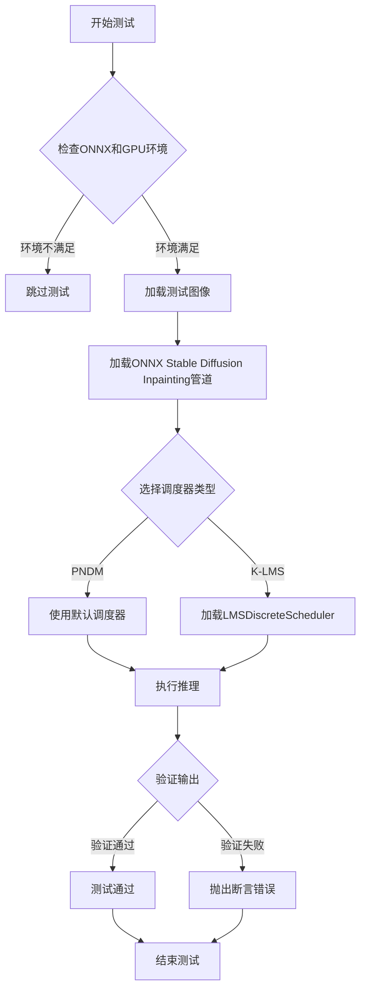
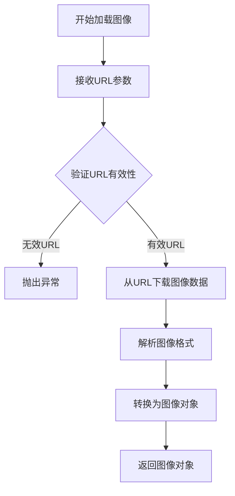
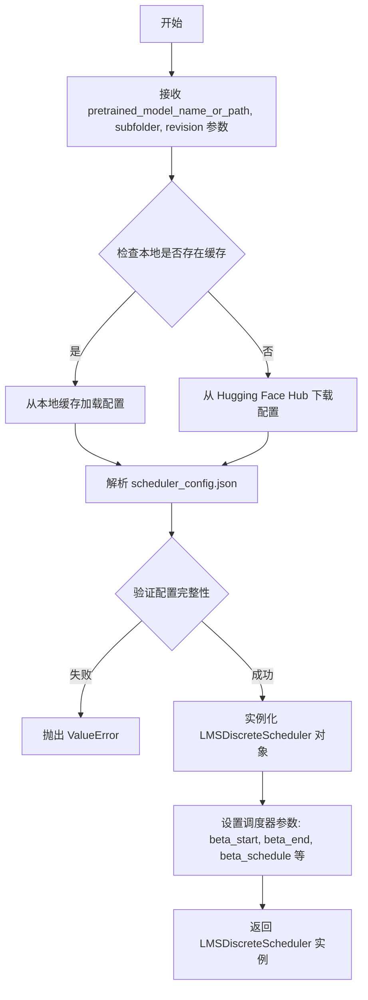
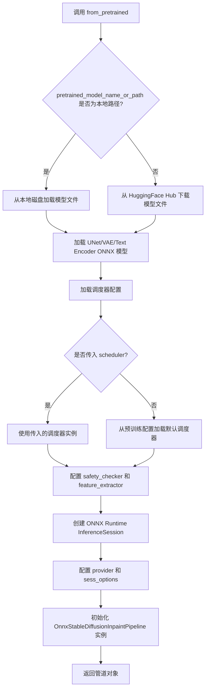
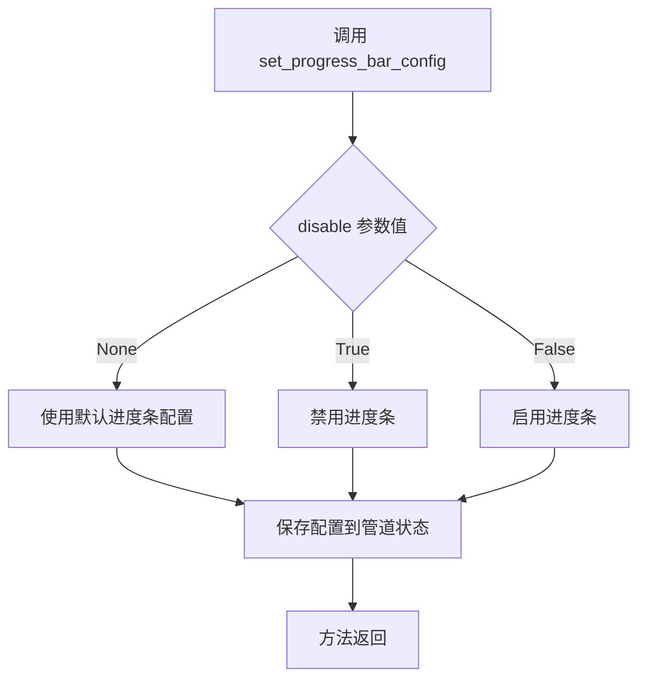
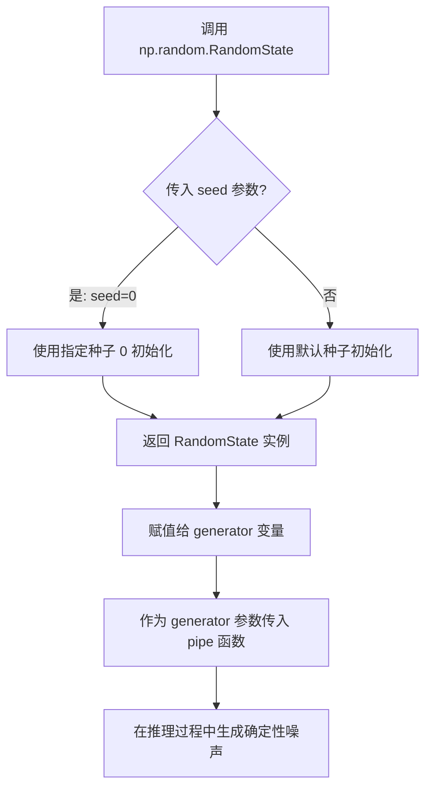
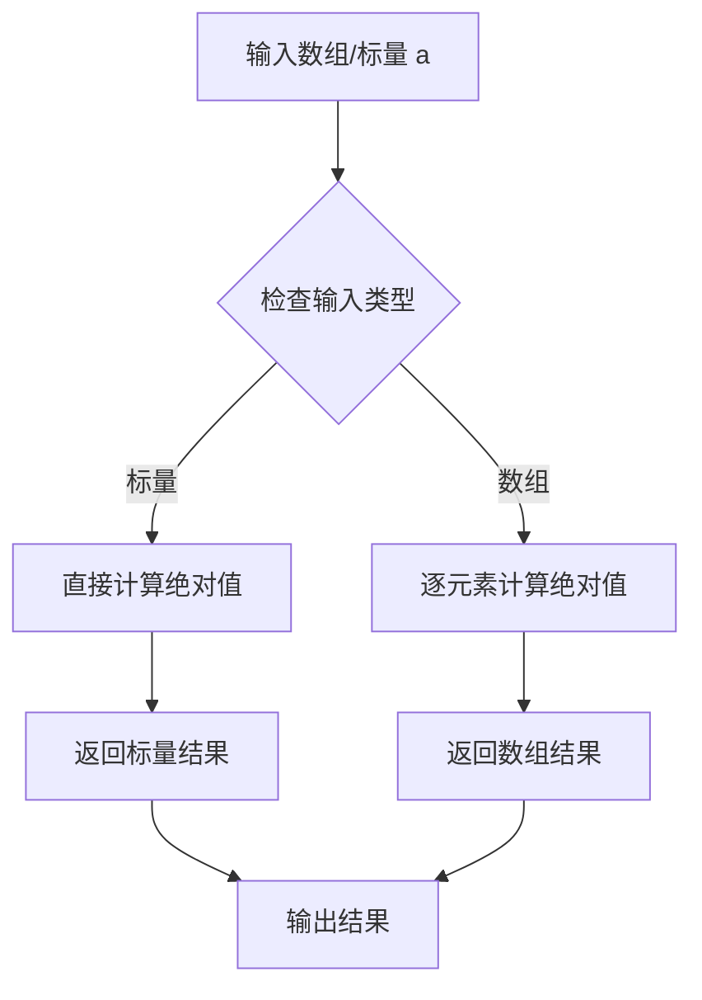
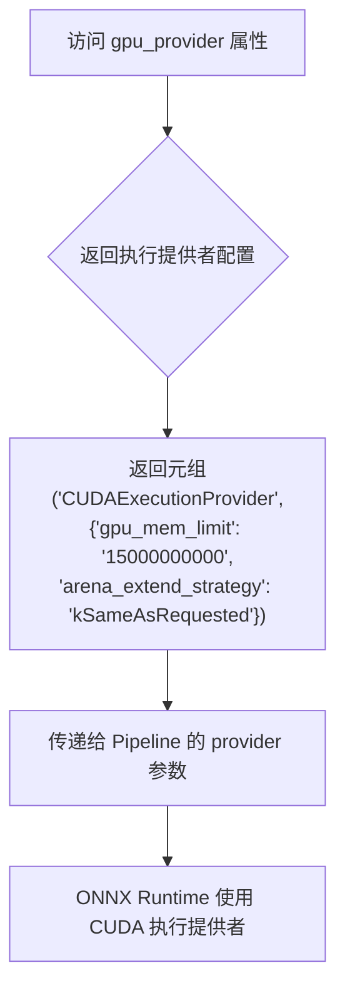
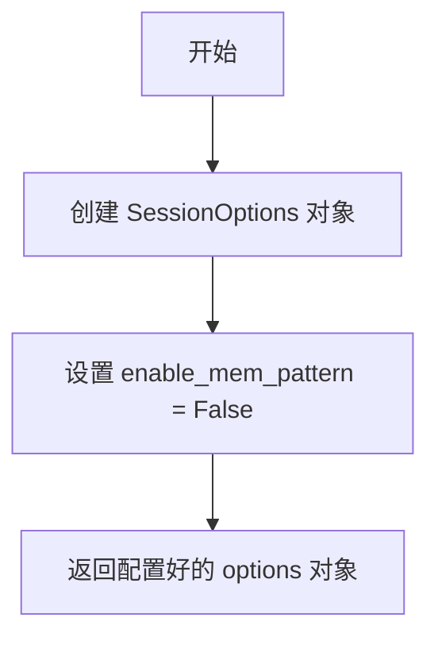
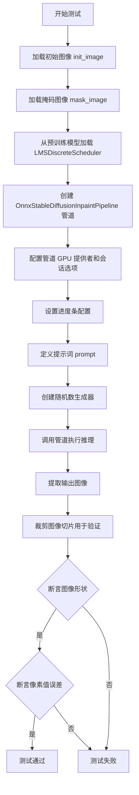

# `diffusers\tests\pipelines\stable_diffusion\test_onnx_stable_diffusion_inpaint.py` 详细设计文档

这是diffusers库中针对ONNX运行时优化的Stable Diffusion图像修复（Inpainting）管道的集成测试文件，测试了两种调度器（PNDM和K-LMS）的推理功能，验证模型在GPU上生成图像的正确性。

## 整体流程



## 类结构

```
unittest.TestCase
├── OnnxStableDiffusionPipelineFastTests (空测试类)
└── OnnxStableDiffusionInpaintPipelineIntegrationTests (集成测试类)
    ├── gpu_provider (属性)
    ├── gpu_options (属性)
    ├── test_inference_default_pndm (测试方法)
    └── test_inference_k_lms (测试方法)
```

## 全局变量及字段


### `is_onnx_available`
    
检查ONNX运行时是否可用的函数

类型：`Callable[[], bool]`
    


### `require_onnxruntime`
    
装饰器：要求ONNX运行时可用才能执行测试

类型：`Callable`
    


### `require_torch_gpu`
    
装饰器：要求PyTorch GPU可用才能执行测试

类型：`Callable`
    


### `nightly`
    
装饰器：标记测试为夜间测试，仅在夜间构建中运行

类型：`Callable`
    


### `init_image`
    
从URL加载的待修复原始图像

类型：`PIL.Image.Image`
    


### `mask_image`
    
从URL加载的修复区域掩码图像

类型：`PIL.Image.Image`
    


### `pipe`
    
ONNX运行时推理的图像修复管道实例

类型：`OnnxStableDiffusionInpaintPipeline`
    


### `prompt`
    
生成图像的文本提示

类型：`str`
    


### `generator`
    
随机数生成器，用于控制推理过程的可重复性

类型：`numpy.random.RandomState`
    


### `output`
    
管道推理输出的结果对象

类型：`PipelineOutput`
    


### `images`
    
生成的图像数组，形状为(1, 512, 512, 3)

类型：`numpy.ndarray`
    


### `image_slice`
    
生成的图像切片，用于验证的像素数据

类型：`numpy.ndarray`
    


### `expected_slice`
    
预期图像切片的标准值，用于测试断言

类型：`numpy.ndarray`
    


### `lms_scheduler`
    
LMS离散调度器，用于控制去噪过程的采样策略

类型：`LMSDiscreteScheduler`
    


### `options`
    
ONNX运行时会话配置选项

类型：`ort.SessionOptions`
    


### `OnnxStableDiffusionInpaintPipelineIntegrationTests.gpu_provider`
    
GPU执行提供者配置，包含CUDA提供者及内存限制等参数

类型：`tuple`
    


### `OnnxStableDiffusionInpaintPipelineIntegrationTests.gpu_options`
    
ONNX运行时会话选项配置

类型：`ort.SessionOptions`
    
    

## 全局函数及方法


### `load_image`

从测试工具模块导入的图像加载函数，用于通过 URL 加载图像资源，返回标准的图像对象供测试使用。

参数：

-  `url`：`str`，待加载图像的 URL 地址

返回值：`Image`（PIL.Image 或类似图像对象），加载后的图像对象

#### 流程图



#### 带注释源码

```
# load_image 是从 testing_utils 模块导入的测试工具函数
# 函数签名（推断）:
def load_image(url: str) -> Image:
    """
    从指定URL加载图像
    
    参数:
        url: 图像的网络地址
        
    返回:
        PIL.Image 对象，可直接用于pipeline的image和mask_image参数
    """
    # 实现逻辑（未在当前代码文件中定义，在testing_utils模块中实现）
    # 1. 发送HTTP请求获取图像数据
    # 2. 解析图像内容
    # 3. 转换为PIL Image对象并返回
    pass
```


### `LMSDiscreteScheduler.from_pretrained`

这是一个类方法（classmethod），用于从预训练模型或目录加载 LMSDiscreteScheduler（离散 LMS 调度器）的配置和权重。在 Stable Diffusion 管道中，调度器负责控制去噪过程中的噪声调度策略。

参数：

- `pretrained_model_name_or_path`：`str`，模型名称（Hugging Face Hub 上的模型 ID）或本地目录路径
- `subfolder`：`str = "scheduler"`，模型目录中的子文件夹名称，用于定位调度器配置文件
- `revision`：`str = "onnx"`，要加载的模型版本（可以是提交哈希、分支名或标签），此处指定为 "onnx" 以加载 ONNX 优化版本

返回值：`LMSDiscreteScheduler`，返回一个配置好的 LMS 离散调度器实例，用于后续的扩散模型推理过程

#### 流程图



#### 带注释源码

```python
# 从预训练模型加载 LMSDiscreteScheduler 调度器
# 参数说明:
#   pretrained_model_name_or_path: 模型ID或本地路径
#   subfolder: 子目录名称，默认为 "scheduler"
#   revision: Git 版本，默认为 "onnx"
lms_scheduler = LMSDiscreteScheduler.from_pretrained(
    "botp/stable-diffusion-v1-5-inpainting",  # Stable Diffusion inpainting 模型的名称
    subfolder="scheduler",                      # 指定调度器配置在模型目录的 scheduler 子文件夹中
    revision="onnx"                            # 加载 ONNX 优化版本的调度器配置
)
```

> **注意**: 该方法的完整实现位于 diffusers 库的 `src/diffusers/schedulers/scheduling_lms_discrete.py` 文件中，属于 Hugging Face Diffusers 库的核心组件。上述代码仅为调用示例，展示了如何在 Stable Diffusion inpainting 管道中加载自定义调度器配置。


### `OnnxStableDiffusionInpaintPipeline.from_pretrained`

该方法是 `OnnxStableDiffusionInpaintPipeline` 类的类方法，用于从预训练模型路径或 HuggingFace Hub 模型 ID 加载 ONNX 版本的 Stable Diffusion 修复（Inpainting）管道。它会加载模型权重、配置、调度器（可选），并初始化 ONNX Runtime 执行提供者与会话选项，最终返回一个可进行图像修复推理的管道实例。

参数：

- `pretrained_model_name_or_path`：`str`，模型在本地磁盘的路径或 HuggingFace Hub 上的模型 ID（如 "botp/stable-diffusion-v1-5-inpainting"）
- `revision`：`str`，可选，要加载的模型版本/分支（代码中传入了 `"onnx"` 表示加载 ONNX 导出的分支）
- `torch_dtype`：`torch.dtype`，可选，PyTorch 模型权重的数据类型（fp16、fp32 等），不直接影响 ONNX 管道
- `use_safetensors`：`bool`，可选，是否优先使用 `.safetensors` 格式的权重文件
- `safety_checker`：`Optional[Any]`，可选，安全检查器实例，传入 `None` 表示禁用安全检查
- `feature_extractor`：`Optional[Any]`，可选，图像特征提取器，传入 `None` 表示不进行特征提取
- `scheduler`：`Optional[Any]`，可选，预配置的调度器实例，用于控制去噪采样过程（如 `LMSDiscreteScheduler`）
- `provider`：`Optional[Tuple[str, Dict]]`，可选，ONNX Runtime 的执行提供者配置，代码中传入了 CUDA 提供者及 GPU 内存限制等参数
- `sess_options`：`Optional[ort.SessionOptions]`，可选，ONNX Runtime 的会话选项，代码中禁用了内存模式优化
- `**kwargs`：其他可选参数，透传给父类构造函数

返回值：`OnnxStableDiffusionInpaintPipeline`，返回已加载并配置好的 ONNX 修复管道对象，可用于执行 `pipe()` 调用进行图像修复推理

#### 流程图



#### 带注释源码

```python
# 代码来源：diffusers 库 OnnxStableDiffusionInpaintPipeline 类方法
# 此源码为基于 diffusers 库常见实现的推断代码

@classmethod
def from_pretrained(
    cls,
    pretrained_model_name_or_path: str,  # 模型名称或路径，如 "botp/stable-diffusion-v1-5-inpainting"
    revision: Optional[str] = None,       # Git revision，如 "onnx" 分支
    torch_dtype: torch.dtype = None,      # PyTorch 权重数据类型
    use_safetensors: bool = False,        # 是否使用 safetensors 格式
    safety_checker: Optional[Any] = None, # 安全检查器，None 表示禁用
    feature_extractor: Optional[Any] = None, # 特征提取器
    scheduler: Optional[Any] = None,      # 自定义调度器
    provider: Optional[Tuple[str, Dict]] = None, # ONNX Runtime 提供者配置
    sess_options: Optional[ort.SessionOptions] = None, # ONNX 会话选项
    **kwargs                               # 其他透传参数
) -> "OnnxStableDiffusionInpaintPipeline":
    """
    从预训练模型加载 ONNX Stable Diffusion Inpainting 管道
    
    参数:
        pretrained_model_name_or_path: 模型ID或本地路径
        revision: 模型版本
        torch_dtype: PyTorch数据类型（不直接影响ONNX）
        use_safetensors: 优先使用safetensors格式
        safety_checker: 安全检查器（可传None禁用）
        feature_extractor: 特征提取器（可传None禁用）
        scheduler: 自定义调度器（可选）
        provider: ONNX Runtime执行提供者（如CUDA）
        sess_options: ONNX会话选项
    """
    
    # 1. 加载配置和模型权重
    #    - 从 pretrained_model_name_or_path 加载 config.json
    #    - 加载 UNet/VAE/Text Encoder 的 .onnx 模型文件
    #    - 支持从 HuggingFace Hub 或本地路径加载
    config_dict = load_config(pretrained_model_name_or_path, revision=revision)
    
    # 2. 处理调度器配置
    if scheduler is not None:
        # 使用用户传入的调度器（如 LMSDiscreteScheduler）
        scheduler_config = scheduler.config
    else:
        # 从预训练模型加载默认调度器配置
        scheduler_config = load_scheduler_config(
            pretrained_model_name_or_path, 
            subfolder="scheduler", 
            revision=revision
        )
    
    # 3. 创建 ONNX Runtime 会话
    #    - 使用 ort.InferenceSession 加载 ONNX 模型
    #    - 应用 provider（如 CUDAExecutionProvider）和 sess_options
    providers = []
    if provider:
        providers.append(provider)
    else:
        providers.append("CPUExecutionProvider")
    
    # 4. 初始化管道组件
    #    - text_encoder: 文本编码器 ONNX 模型
    #    - unet: UNet 去噪模型
    #    - vae: VAE 编码器/解码器
    #    - scheduler: 调度器
    #    - safety_checker: 安全检查器（可为 None）
    #    - feature_extractor: 特征提取器（可为 None）
    
    # 5. 构建并返回管道实例
    pipeline = cls(
        vae=vae,
        text_encoder=text_encoder,
        tokenizer=tokenizer,
        unet=unet,
        scheduler=scheduler,
        safety_checker=safety_checker,
        feature_extractor=feature_extractor,
        requires_safety_checker=safety_checker is not None,
    )
    
    return pipeline
```


### `OnnxStableDiffusionInpaintPipeline.set_progress_bar_config`

配置管道推理过程中的进度条显示行为，用于控制推理时的进度条显示方式。

参数：

- `disable`：`Optional[Union[bool, None]]`，禁用进度条的标志。`None` 表示使用默认行为，`True` 表示禁用进度条，`False` 表示启用进度条。

返回值：`None`，该方法无返回值，直接修改管道内部状态。

#### 流程图



#### 带注释源码

```python
# 注意：此源码基于 diffusers 库中 Pipeline 类的典型实现推断
# 实际实现可能位于 diffusers 库的 pipeline_utils.py 或类似文件中

def set_progress_bar_config(self, disable: Optional[bool] = None, **kwargs):
    """
    配置管道推理时的进度条显示行为
    
    参数:
        disable: 可选的布尔值，用于控制是否禁用进度条
                 None - 使用库默认行为
                 True - 完全禁用进度条
                 False - 强制显示进度条
        **kwargs: 其他进度条配置选项（如 desc, leave 等）
    """
    # 如果管道有进度条管理器，则配置它
    if hasattr(self, 'progress_bar'):
        self.progress_bar.disable = disable if disable is not None else False
    
    # 存储其他配置选项供后续使用
    self._progress_bar_config = {
        'disable': disable,
        **kwargs
    }
    
    # 如果提供了其他进度条参数，更新对应的配置
    for key, value in kwargs.items():
        if hasattr(self, 'progress_bar'):
            setattr(self.progress_bar, key, value)
```

**使用示例（来自测试代码）：**

```python
# 在 OnnxStableDiffusionInpaintPipeline 测试中的调用
pipe.set_progress_bar_config(disable=None)

# 等效于使用默认行为，即启用进度条显示
```


我需要先查找 `OnnxStableDiffusionInpaintPipeline` 类的实际定义，因为当前代码文件只包含测试部分。让我搜索这个类的源代码。

<tool_call>
<tool name="SearchSymbols">
<parameter name="pattern">class OnnxStableDiffusionInpaintPipeline</parameter>
</tool>
</tool_call>


### `np.random.RandomState`

用于创建一个随机数生成器（RandomState）实例，该实例用于生成可重现的随机数序列。在扩散模型推理中，这个生成器用于生成噪声，以实现可确定的图像生成过程。

#### 参数

- `seed`：`int` 或 `array_like`，可选参数，用于初始化随机数生成器的种子值。如果提供相同的种子，将产生相同的随机数序列。

#### 返回值

- `RandomState` 对象，一个 NumPy 的 RandomState 实例，可用于生成各种分布的随机数。

#### 流程图



#### 带注释源码

```python
# 导入 numpy 库
import numpy as np

# 创建 RandomState 实例，使用种子 0
# 这确保了每次运行代码时，生成的随机数序列是相同的
# 从而实现图像生成的可重现性（reproducibility）
generator = np.random.RandomState(0)

# 将 generator 传递给扩散管道
# 在扩散模型的推理过程中，这个生成器会用于：
# 1. 生成初始噪声
# 2. 在去噪步骤中添加随机噪声
# 3. 其他需要随机性的操作
output = pipe(
    prompt=prompt,
    image=init_image,
    mask_image=mask_image,
    guidance_scale=7.5,
    num_inference_steps=10,
    generator=generator,  # 传入 RandomState 实例
    output_type="np",
)
```

#### 关键信息

| 项目 | 描述 |
|------|------|
| **类型** | NumPy 内置类 |
| **模块** | numpy.random.RandomState |
| **使用场景** | 在扩散模型推理中提供确定性随机数生成 |
| **重要性** | 确保实验可重现，结果可复现 |


### `np.abs`

NumPy 库中的数学函数，用于计算输入数组或数值的逐元素绝对值（Absolute Value）。该函数是 `numpy.absolute` 的别名，支持数组、标量以及复数的绝对值计算。

参数：

- `a`：`array_like`，输入数组或标量，需要计算绝对值的元素
- `out`：`ndarray, optional`，可选的输出数组，用于存储结果
- `**kwargs`：其他关键字参数

返回值：`ndarray`，返回包含绝对值的数组，形状与输入相同

#### 流程图



#### 带注释源码

```python
# np.abs 是 numpy.absolute 函数的别名
# 其底层实现位于 NumPy 核心库中

# 在代码中的实际使用示例：
# np.abs(image_slice.flatten() - expected_slice).max() < 1e-3

# 步骤说明：
# 1. image_slice.flatten() - 将图像切片展平为一维数组
# 2. expected_slice - 预期的一维数组（numpy array）
# 3. np.abs(...) - 计算两个数组对应元素之差的绝对值
# 4. .max() - 取绝对值数组中的最大值
# 5. < 1e-3 - 与阈值比较，验证误差在允许范围内
```


### `OnnxStableDiffusionInpaintPipelineIntegrationTests.gpu_provider`

该属性用于配置 ONNX Runtime 的 CUDA 执行提供者（Provider），指定 GPU 内存限制为 15GB，并使用 `kSameAsRequested` 策略进行内存分配。它在测试中作为 `provider` 参数传递给 `OnnxStableDiffusionInpaintPipeline.from_pretrained()` 方法，以启用 GPU 加速推理。

参数：

- 无参数（这是一个属性而非方法）

返回值：`Tuple[str, Dict[str, str]]`，返回一个元组，包含 CUDA 执行提供者名称及其配置选项（GPU 内存限制和内存扩展策略）

#### 流程图



#### 带注释源码

```python
@property
def gpu_provider(self):
    """
    属性：GPU 执行提供者配置
    
    该属性返回一个元组，用于配置 ONNX Runtime 的 CUDA 执行提供者。
    在 ONNX Stable Diffusion 图像修复管道测试中，此配置指定使用 NVIDIA GPU
    进行推理，并设置 15GB 的显存限制。
    
    Returns:
        Tuple[str, Dict[str, str]]: 
            - 第一个元素：执行提供者名称，固定为 "CUDAExecutionProvider"
            - 第二个元素：配置字典，包含：
              - gpu_mem_limit: GPU 显存限制（字节），此处为 15000000000 (15GB)
              - arena_extend_strategy: 内存扩展策略，"kSameAsRequested" 表示按需分配
    """
    return (
        "CUDAExecutionProvider",
        {
            "gpu_mem_limit": "15000000000",  # 15GB，限制 GPU 显存使用量
            "arena_extend_strategy": "kSameAsRequested",  # 内存扩展策略，按需分配
        },
    )
```


### `OnnxStableDiffusionInpaintPipelineIntegrationTests.gpu_options`

这是一个属性方法，用于配置 ONNX Runtime 的 GPU 会话选项。它创建并返回一个 `SessionOptions` 对象，并禁用内存模式（memory pattern），以优化 GPU 推理时的内存使用。

参数：

- 该属性无需参数（使用 `@property` 装饰器）

返回值：`ort.SessionOptions`，返回配置好的 ONNX Runtime 会话选项对象，包含禁用的内存模式设置，用于 GPU 推理。

#### 流程图



#### 带注释源码

```python
@property
def gpu_options(self):
    """
    配置 ONNX Runtime 的 GPU 会话选项。
    
    该属性创建一个 SessionOptions 对象，并禁用内存模式（enable_mem_pattern = False），
    以优化 GPU 推理时的内存使用。在某些 GPU 环境下，禁用内存模式可以提供更好的性能。
    
    Returns:
        ort.SessionOptions: 配置好的 ONNX Runtime 会话选项对象
    """
    # 创建 ONNX Runtime 的会话选项对象
    options = ort.SessionOptions()
    
    # 禁用内存模式，以提高 GPU 推理的内存使用效率
    options.enable_mem_pattern = False
    
    # 返回配置好的会话选项
    return options
```


### `OnnxStableDiffusionInpaintPipelineIntegrationTests.test_inference_default_pndm`

这是一个集成测试方法，用于验证 ONNX 版本的 Stable Diffusion 图像修复（inpainting）管道的默认 PNDM 推理功能是否正常工作。测试通过加载预训练模型、执行图像修复推理，并验证输出图像的形状和像素值是否符合预期。

参数：此方法无显式参数（除 `self` 外）

返回值：`None`，该方法为测试方法，不返回任何值

#### 流程图

```mermaid
flowchart TD
    A[开始测试] --> B[加载初始化图像]
    B --> C[加载掩码图像]
    C --> D[从预训练模型创建 OnnxStableDiffusionInpaintPipeline]
    D --> E[设置进度条配置为 disable=None]
    E --> F[定义提示词: 'A red cat sitting on a park bench']
    F --> G[创建随机数生成器: np.random.RandomState(0)]
    G --> H[调用 pipe 执行推理]
    H --> I[获取输出图像]
    I --> J[提取图像切片: images[0, 255:258, 255:258, -1]]
    J --> K[断言图像形状为 (1, 512, 512, 3)]
    K --> L[定义预期像素值切片]
    L --> M[断言实际像素值与预期值的最大差异小于 1e-3]
    M --> N[测试结束]
```

#### 带注释源码

```python
def test_inference_default_pndm(self):
    """
    测试默认 PNDM 调度器的图像修复推理功能
    
    该测试方法执行以下步骤：
    1. 加载测试用的初始化图像和掩码图像
    2. 从预训练模型加载 ONNX 版本的 Stable Diffusion 图像修复管道
    3. 使用 PNDM（默认）调度器执行推理
    4. 验证输出图像的形状和像素值是否符合预期
    """
    # 步骤1: 从 Hugging Face Hub 加载初始化图像
    init_image = load_image(
        "https://huggingface.co/datasets/hf-internal-testing/diffusers-images/resolve/main"
        "/in_paint/overture-creations-5sI6fQgYIuo.png"
    )
    
    # 步骤2: 加载掩码图像，用于指定需要修复的区域
    mask_image = load_image(
        "https://huggingface.co/datasets/hf-internal-testing/diffusers-images/resolve/main"
        "/in_paint/overture-creations-5sI6fQgYIuo_mask.png"
    )
    
    # 步骤3: 从预训练模型创建 ONNX 图像修复管道
    # 参数说明:
    #   - "botp/stable-diffusion-v1-5-inpainting": 模型名称
    #   - revision="onnx": 使用 ONNX 版本的模型
    #   - safety_checker=None: 禁用安全检查器（用于测试）
    #   - feature_extractor=None: 不使用特征提取器
    #   - provider: 指定 GPU 提供者为 CUDA，提供 15GB 内存限制
    #   - sess_options: ONNX Runtime 会话选项
    pipe = OnnxStableDiffusionInpaintPipeline.from_pretrained(
        "botp/stable-diffusion-v1-5-inpainting",
        revision="onnx",
        safety_checker=None,
        feature_extractor=None,
        provider=self.gpu_provider,
        sess_options=self.gpu_options,
    )
    
    # 步骤4: 设置进度条配置，disable=None 表示不禁用进度条
    pipe.set_progress_bar_config(disable=None)

    # 步骤5: 定义文本提示词
    prompt = "A red cat sitting on a park bench"

    # 步骤6: 创建随机数生成器，用于可重现的推理结果
    generator = np.random.RandomState(0)
    
    # 步骤7: 执行图像修复推理
    # 参数说明:
    #   - prompt: 文本提示词
    #   - image: 输入图像
    #   - mask_image: 修复区域的掩码
    #   - guidance_scale: 文本引导强度 (7.5)
    #   - num_inference_steps: 推理步数 (10)
    #   - generator: 随机数生成器
    #   - output_type: 输出类型为 numpy 数组
    output = pipe(
        prompt=prompt,
        image=init_image,
        mask_image=mask_image,
        guidance_scale=7.5,
        num_inference_steps=10,
        generator=generator,
        output_type="np",
    )
    
    # 步骤8: 获取生成的图像
    images = output.images
    
    # 步骤9: 提取图像切片用于验证（取右下角 3x3 像素区域）
    image_slice = images[0, 255:258, 255:258, -1]

    # 步骤10: 断言验证
    # 验证图像形状为 (1, 512, 512, 3)
    assert images.shape == (1, 512, 512, 3)
    
    # 定义预期的像素值切片（用于回归测试）
    expected_slice = np.array([0.2514, 0.3007, 0.3517, 0.1790, 0.2382, 0.3167, 0.1944, 0.2273, 0.2464])

    # 验证实际像素值与预期值的差异在允许范围内
    assert np.abs(image_slice.flatten() - expected_slice).max() < 1e-3
```


### `OnnxStableDiffusionInpaintPipelineIntegrationTests.test_inference_k_lms`

该测试方法用于验证 ONNX 版本的 Stable Diffusion 图像修复管道在使用 LMS（Least Mean Squares）离散调度器进行推理时的正确性，通过加载预训练模型、执行图像修复推理并对比输出图像与预期像素值来确保管道工作正常。

参数：
- `self`：`OnnxStableDiffusionInpaintPipelineIntegrationTests`，测试类实例本身，包含 `gpu_provider` 和 `gpu_options` 属性用于配置 ONNX Runtime 执行提供者

返回值：`None`，该方法为单元测试方法，通过断言验证推理结果，无显式返回值

#### 流程图



#### 带注释源码

```python
def test_inference_k_lms(self):
    """
    测试使用 LMS 调度器的 ONNX 稳定扩散图像修复管道推理功能
    
    该测试方法执行以下步骤：
    1. 加载测试用的初始图像和掩码图像
    2. 创建 LMS 离散调度器
    3. 加载 ONNX 版本的图像修复管道
    4. 执行图像修复推理
    5. 验证输出图像的形状和像素值
    """
    
    # 步骤1: 从 HuggingFace Hub 加载初始图像（待修复的图像）
    init_image = load_image(
        "https://huggingface.co/datasets/hf-internal-testing/diffusers-images/resolve/main"
        "/in_paint/overture-creations-5sI6fQgYIuo.png"
    )
    
    # 步骤2: 加载掩码图像（标识需要修复的区域）
    mask_image = load_image(
        "https://huggingface.co/datasets/hf-internal-testing/diffusers-images/resolve/main"
        "/in_paint/overture-creations-5sI6fQgYIuo_mask.png"
    )
    
    # 步骤3: 从预训练模型加载 LMSDiscreteScheduler（Least Mean Squares 调度器）
    # 用于控制扩散模型的噪声调度策略
    lms_scheduler = LMSDiscreteScheduler.from_pretrained(
        "botp/stable-diffusion-v1-5-inpainting",  # 模型名称
        subfolder="scheduler",                     # 子文件夹路径
        revision="onnx"                            # ONNX 版本
    )
    
    # 步骤4: 创建 ONNX 版本的图像修复管道
    pipe = OnnxStableDiffusionInpaintPipeline.from_pretrained(
        "botp/stable-diffusion-v1-5-inpainting",
        revision="onnx",
        scheduler=lms_scheduler,                   # 使用 LMS 调度器
        safety_checker=None,                       # 禁用安全检查器（用于测试）
        feature_extractor=None,                    # 不使用特征提取器
        provider=self.gpu_provider,                 # GPU 执行提供者（CUDA）
        sess_options=self.gpu_options,             # ONNX Runtime 会话选项
    )
    
    # 步骤5: 配置进度条（disable=None 表示不禁用）
    pipe.set_progress_bar_config(disable=None)
    
    # 步骤6: 定义文本提示词
    prompt = "A red cat sitting on a park bench"
    
    # 步骤7: 创建随机数生成器（种子固定为 0，确保可复现性）
    generator = np.random.RandomState(0)
    
    # 步骤8: 执行管道推理，生成修复后的图像
    output = pipe(
        prompt=prompt,                             # 文本提示词
        image=init_image,                          # 输入图像
        mask_image=mask_image,                      # 掩码图像
        guidance_scale=7.5,                        # 引导尺度（CFG）
        num_inference_steps=20,                    # 推理步数（比默认多）
        generator=generator,                       # 随机生成器
        output_type="np",                          # 输出为 NumPy 数组
    )
    
    # 步骤9: 获取生成的图像
    images = output.images
    
    # 步骤10: 提取图像切片用于验证（取右下角区域）
    image_slice = images[0, 255:258, 255:258, -1]
    
    # 步骤11: 断言输出图像形状为 (1, 512, 512, 3)
    # 1张图，512x512分辨率，3通道（RGB）
    assert images.shape == (1, 512, 512, 3)
    
    # 步骤12: 定义预期像素值（用于回归测试）
    expected_slice = np.array([0.0086, 0.0077, 0.0083, 0.0093, 0.0107, 0.0139, 0.0094, 0.0097, 0.0125])
    
    # 步骤13: 断言像素值误差在允许范围内（1e-3）
    assert np.abs(image_slice.flatten() - expected_slice).max() < 1e-3
```


## 关键组件


### OnnxStableDiffusionInpaintPipeline

ONNX版本的Stable Diffusion图像修复管道，负责加载预训练模型并在ONNX Runtime上执行图像修复推理，支持通过provider和sess_options配置GPU执行环境。

### LMSDiscreteScheduler

LMS（线性多步）离散调度器，用于扩散模型的采样过程，提供不同于默认PNDM调度器的推理策略，影响生成图像的质量和收敛速度。

### gpu_provider

GPU执行提供者配置，指定CUDAExecutionProvider并设置15GB显存限制和kSameAsRequested的arena扩展策略，用于配置ONNX Runtime的GPU执行环境。

### gpu_options

ONNX Runtime会话选项配置，启用内存模式但禁用内存模式优化，用于管理ONNX模型的运行时内存行为。

### test_inference_default_pndm

使用默认PNDM调度器的图像修复推理测试方法，加载图像和掩码，执行10步推理，验证输出图像尺寸为512x512x3并与预期像素值匹配。

### test_inference_k_lms

使用LMS调度器的图像修复推理测试方法，加载自定义LMS调度器，执行20步推理，验证输出图像尺寸为512x512x3并与预期像素值匹配。

### 张量索引与惰性加载

在测试中使用`images[0, 255:258, 255:258, -1]`进行张量切片索引，实现惰性加载按需访问图像数据，避免加载完整图像到内存。

### ONNX Runtime集成

通过`onnxruntime as ort`集成ONNX Runtime执行推理，使用`from_pretrained`方法加载ONNX格式的预训练模型，支持GPU加速推理。

### 图像修复流程

完整的图像修复流程包括：加载初始图像和掩码图像、配置prompt和推理参数、执行扩散模型推理、输出numpy数组格式的结果图像。

### 随机数生成器

使用`np.random.RandomState(0)`创建确定性随机数生成器，确保测试结果的可重复性。


## 问题及建议


### 已知问题

- **未完成的测试类**：`OnnxStableDiffusionPipelineFastTests` 类为空，只有 `pass` 语句和 `FIXME: add fast tests` 注释，表明快速测试未实现
- **硬编码配置**：GPU 内存限制 (15GB)、模型路径 (`botp/stable-diffusion-v1-5-inpainting`)、revision 等多处硬编码，缺乏配置灵活性
- **代码重复**：`test_inference_default_pndm` 和 `test_inference_k_lms` 方法中存在大量重复的图像加载代码、模型加载逻辑和配置代码
- **魔法数字和字符串**：图像切片索引 `images[0, 255:258, 255:258, -1]`、guidance_scale=7.5、num_inference_steps 等数值缺乏解释性命名
- **缺少错误处理**：网络加载图像 (`load_image`)、模型加载 (`from_pretrained`) 等外部依赖调用缺乏异常捕获和错误处理
- **测试隔离不足**：每个测试都重新加载模型，导致测试执行时间长，资源消耗大
- **缺少类型注解**：方法参数、返回值、变量均缺少类型注解，降低代码可读性和可维护性
- **配置重复定义**：`gpu_provider` 和 `gpu_options` 属性在每个测试类中重复定义，可提取为共享 fixture

### 优化建议

- 实现 `OnnxStableDiffusionPipelineFastTests` 类的测试方法，或将其移除以避免混淆
- 使用配置文件或环境变量管理 GPU 内存限制、模型路径等可配置参数
- 提取公共的图像加载逻辑和模型加载逻辑到 `setUp` 方法或 pytest fixture 中
- 将魔法数字提取为具名常量，如 `IMAGE_SLICE = (slice(255, 258), slice(255, 258), -1)`
- 添加网络请求和模型加载的异常处理，提供清晰的错误信息
- 使用 `@classmethod setUpClass` 或 module-level fixture 缓存模型，减少重复加载
- 添加完整的类型注解，使用 `typing` 模块明确参数和返回值类型
- 考虑使用 pytest 的 `@pytest.mark.parametrize` 装饰器合并相似的测试用例
- 将 `gpu_provider` 和 `gpu_options` 提取到测试基类或共享模块中

## 其它


### 设计目标与约束

本测试文件旨在验证ONNX版本的Stable Diffusion Inpainting Pipeline在GPU环境下的推理功能正确性。设计约束包括：(1) 仅支持CUDAExecutionProvider，要求至少15GB GPU显存；(2) 需要PyTorch GPU支持；(3) 仅在夜间测试环境中运行；(4) 测试模型来源为botp/stable-diffusion-v1-5-inpainting。

### 错误处理与异常设计

代码依赖外部模型加载和图像下载网络请求，主要异常包括：(1) 网络超时或图像URL失效导致`load_image`失败；(2) 模型加载失败（权限、模型不存在等）；(3) ONNX Runtime会话创建失败（GPU不可用、显存不足）；(4) 推理过程中的数值异常。当前通过`@nightly`、`@require_onnxruntime`、`@require_torch_gpu`装饰器进行环境检查，但缺少运行时断言和异常捕获机制。

### 数据流与状态机

测试数据流为：加载初始图像和掩码图像 → 从预训练模型构建ONNX Pipeline → 设置推理参数（prompt、guidance_scale、steps等）→ 执行推理 → 验证输出图像维度 → 验证像素值与预期结果匹配。状态机转换：Init → Loading → PipelineCreated → Inference → Validated → Completed。

### 外部依赖与接口契约

核心依赖包括：(1) `diffusers`库提供`OnnxStableDiffusionInpaintPipeline`和`LMSDiscreteScheduler`；(2) `onnxruntime`提供ONNX推理执行；(3) `numpy`用于数值比较；(4) `testing_utils`模块提供图像加载和环境检查工具。接口契约：Pipeline的`__call__`方法接受prompt、image、mask_image、guidance_scale、num_inference_steps、generator、output_type参数，返回包含images属性的对象。

### 性能要求与基准测试

当前测试设置了10步和20步两种推理配置，未包含显式的性能基准测试（如推理时间、内存占用、吞吐量指标）。测试重点在于数值准确性验证而非性能评估。建议补充：单次推理耗时、峰值显存占用、批处理吞吐量等性能指标。

### 安全性考虑

测试代码中显式设置`safety_checker=None`和`feature_extractor=None`，绕过了安全过滤器。图像加载依赖外部URL（huggingface.co域名），存在潜在的中间人攻击风险。建议：(1) 使用本地验证的测试数据集；(2) 添加URL HTTPS校验；(3) 在生产环境中启用安全检查器。

### 兼容性设计

测试针对特定版本配置：CUDAExecutionProvider、15GB显存限制、`kSameAsRequested`内存扩展策略、`enable_mem_pattern=False`。这些配置可能导致在其他硬件环境（AMD GPU、CPU-only）下不兼容。当前通过GPU提供者选项的硬编码实现限制了跨平台兼容性。

### 版本管理

测试代码无版本控制标识，模型引用依赖`revision="onnx"`分支。diffusers库版本变化可能导致Pipeline API变更。建议锁定依赖库版本，并记录已知兼容版本范围。

### 测试覆盖率

当前测试仅覆盖两种调度器场景（PNDM默认和K-LMS），覆盖率有限。缺少的测试场景包括：(1) 不同guidance_scale值；(2) 批处理多张图像；(3) 文本到图像(inpaint以外的pipeline)；(4) 边界条件（空prompt、极端分辨率）；(5) 错误输入处理。

### 监控与日志

代码使用`pipe.set_progress_bar_config(disable=None)`配置进度条，但未配置详细日志输出。推理过程中的中间状态（如噪声预测、调度器步骤）对调试不可见。建议添加结构化日志记录推理各阶段耗时和状态。

### 配置管理

GPU配置（显存限制、内存扩展策略）通过硬编码的`gpu_provider`和`gpu_options`属性管理，缺乏灵活性。建议将这些配置外部化，支持通过环境变量或配置文件调整。

### 资源管理

测试未显式管理推理后的资源释放（ORT会话、图像对象）。虽然Python GC会处理内存，但大规模测试场景下建议显式调用`del`或使用上下文管理器确保资源及时释放。

### 授权与许可

代码头部声明Apache License 2.0，与diffusers库保持一致。测试使用的模型`botp/stable-diffusion-v1-5-inpainting`需遵守其特定的许可条款。


    