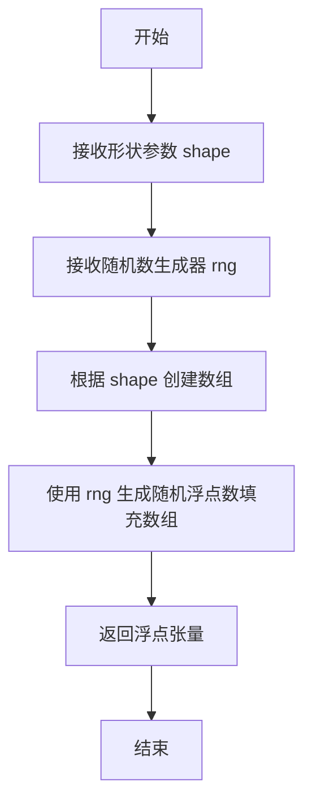
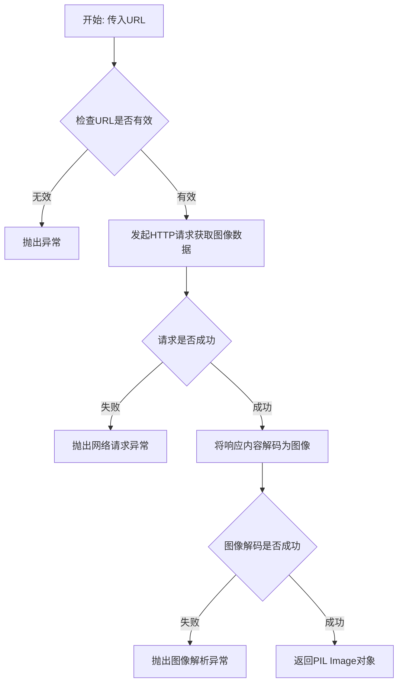
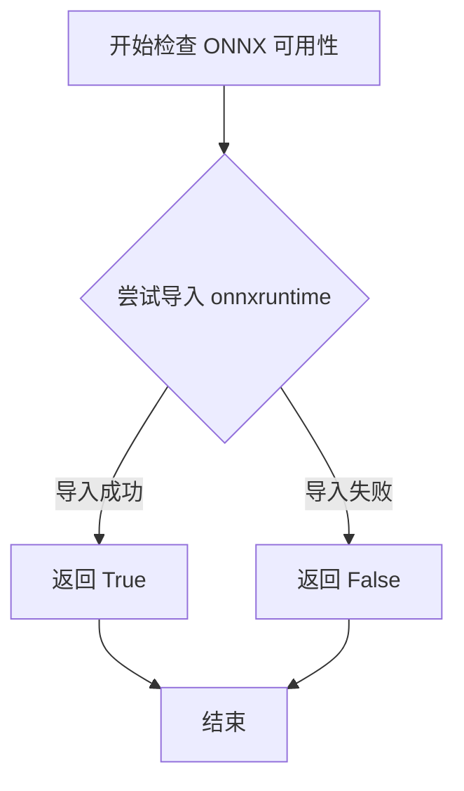
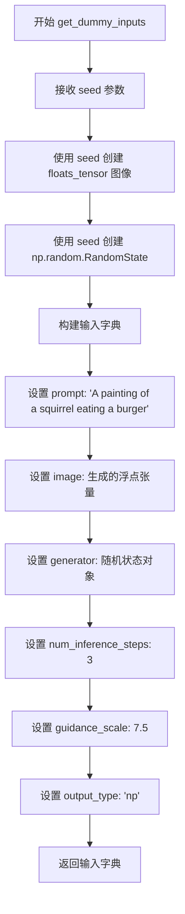
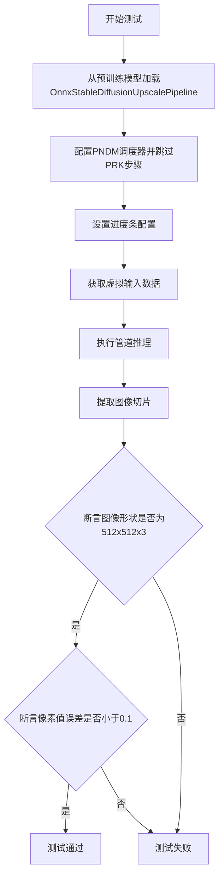
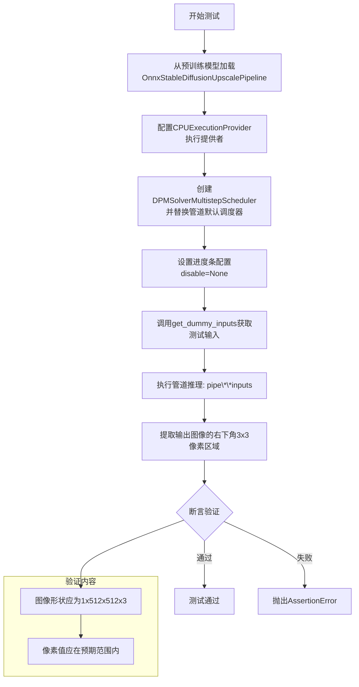
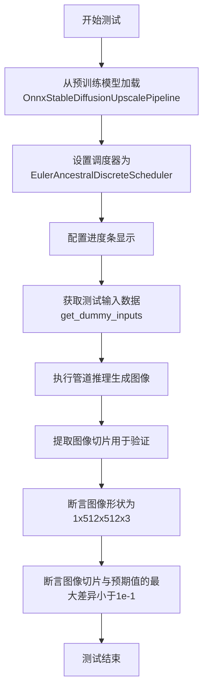
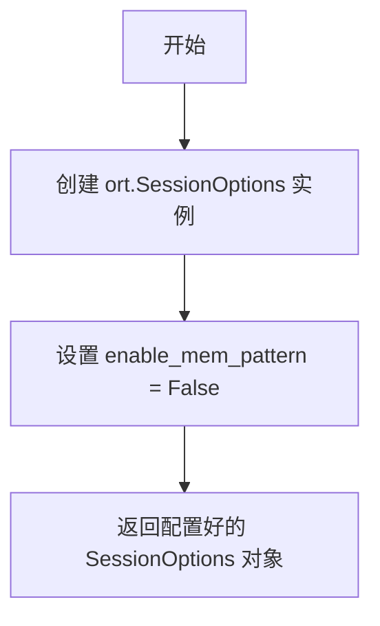
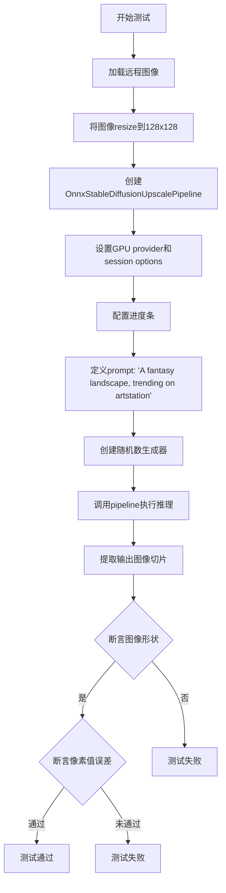

# `diffusers\tests\pipelines\stable_diffusion\test_onnx_stable_diffusion_upscale.py` 详细设计文档

这是一个用于测试 ONNX 版本的 Stable Diffusion 4倍图像上采样管道的测试文件，包含快速单元测试和夜间集成测试，验证不同调度器（DDPM、PNDM、DPM、Euler、LMS等）下的图像上采样功能是否正常工作。

## 整体流程

```mermaid
graph TD
    A[开始] --> B[导入依赖库和模块]
    B --> C{执行快速单元测试?}
C -- 是 --> D[OnnxStableDiffusionUpscalePipelineFastTests]
D --> E1[test_pipeline_default_ddpm]
D --> E2[test_pipeline_pndm]
D --> E3[test_pipeline_dpm_multistep]
D --> E4[test_pipeline_euler]
D --> E5[test_pipeline_euler_ancestral]
E1 --> F[验证输出图像形状 (1, 512, 512, 3)]
E2 --> F
E3 --> F
E4 --> F
E5 --> F
F --> G[验证像素值误差 < 1e-1]
C -- 否 --> H{执行集成测试?}
H -- 是 --> I[OnnxStableDiffusionUpscalePipelineIntegrationTests]
I --> I1[test_inference_default_ddpm]
I --> I2[test_inference_k_lms]
I1 --> J[加载远程测试图像]
I2 --> J
J --> K[设置GPU provider和options]
K --> L[调用pipeline进行推理]
L --> M[验证输出图像形状]
M --> N[验证像素值误差 < 2e-2]
```

## 类结构

```
unittest.TestCase
├── OnnxStableDiffusionUpscalePipelineFastTests
│   ├── hub_checkpoint: str
│   ├── get_dummy_inputs()
│   ├── test_pipeline_default_ddpm()
│   ├── test_pipeline_pndm()
│   ├── test_pipeline_dpm_multistep()
│   ├── test_pipeline_euler()
│   └── test_pipeline_euler_ancestral()
└── OnnxStableDiffusionUpscalePipelineIntegrationTests
gpu_provider: property
gpu_options: property
test_inference_default_ddpm()
test_inference_k_lms()
```

## 全局变量及字段


### `seed`
    
随机种子，用于生成可重现的随机数

类型：`int`
    


### `image`
    
输入的低分辨率图像张量

类型：`np.ndarray`
    


### `generator`
    
随机数生成器，用于采样

类型：`np.random.RandomState`
    


### `prompt`
    
文本提示，描述期望的输出图像

类型：`str`
    


### `num_inference_steps`
    
扩散模型的推理步数

类型：`int`
    


### `guidance_scale`
    
引导比例，控制文本提示的影响程度

类型：`float`
    


### `output_type`
    
输出图像的格式类型

类型：`str`
    


### `image_slice`
    
用于验证的图像切片

类型：`np.ndarray`
    


### `expected_slice`
    
期望的图像像素值数组

类型：`np.ndarray`
    


### `init_image`
    
初始加载的输入图像

类型：`PIL.Image.Image`
    


### `lms_scheduler`
    
LMS离散调度器，用于扩散过程

类型：`LMSDiscreteScheduler`
    


### `OnnxStableDiffusionUpscalePipelineFastTests.hub_checkpoint`
    
测试使用的模型仓库ID

类型：`str`
    
    

## 全局函数及方法


### `floats_tensor`

生成指定形状的浮点张量（float32），用于测试目的。

参数：

-  `shape`：`Tuple[int, ...]`，张量的形状，例如 `(1, 3, 128, 128)`
-  `rng`：`random.Random`，随机数生成器实例，用于生成随机张量数据

返回值：`numpy.ndarray`，返回指定形状的浮点型 NumPy 数组，数值范围通常在 [0, 1) 之间

#### 流程图



#### 带注释源码

```python
# 该函数非本文件定义，从 testing_utils 导入
# 根据代码中的使用方式进行推断：
# image = floats_tensor((1, 3, 128, 128), rng=random.Random(seed))

def floats_tensor(shape, rng):
    """
    生成用于测试的浮点张量。
    
    参数:
        shape: 张量的形状元组，如 (1, 3, 128, 128)
        rng: 随机数生成器，用于生成随机数
    
    返回:
        numpy.ndarray: 指定形状的浮点数组
    """
    # 如果在 testing_utils 模块中，可能使用 rng.rand() 生成 0-1 之间的随机数
    # 或者使用 numpy 的随机函数
    pass
```


### `load_image`

`load_image` 是一个测试工具函数，用于从指定的URL加载图像数据，并将其转换为可用于图像处理 pipeline 的图像对象（通常为 PIL Image 对象）。

参数：

-  `url`：`str`，待加载图像的 HTTP/HTTPS 链接地址

返回值：`PIL.Image`，从网络加载并解析后的 PIL 图像对象

#### 流程图



#### 带注释源码

```python
# 注意: 此函数并非在该代码文件中定义
# 而是从 testing_utils 模块导入的辅助函数
# 以下为基于使用方式推断的实现逻辑

def load_image(url: str) -> "PIL.Image":
    """
    从指定URL加载图像并返回PIL Image对象
    
    参数:
        url: 图像的网络链接地址
        
    返回:
        PIL.Image对象, 可进行resize等图像操作
    """
    # 实际实现在 testing_utils.py 中
    # 通常使用 requests 库下载图像
    # 然后用 PIL/Pillow 库打开为图像对象
    pass

# ------------------- 使用示例 -------------------
# 在测试代码中的实际调用方式:
init_image = load_image(
    "https://huggingface.co/datasets/hf-internal-testing/diffusers-images/resolve/main"
    "/img2img/sketch-mountains-input.jpg"
)
# 返回的 init_image 可直接调用 .resize() 方法
init_image = init_image.resize((128, 128))
```


### `is_onnx_available`

该函数是一个工具函数，用于检测当前环境中 ONNX 运行时库（onnxruntime）是否可用，以便条件性地导入和使用 ONNX 相关的管道和功能。

参数：none

返回值：`bool`，返回 `True` 表示 ONNX运行时可用，可以导入和使用 ONNX 相关功能；返回 `False` 表示 ONNX 运行时不可用。

#### 流程图



#### 带注释源码

```
# is_onnx_available 函数的可能实现（位于 testing_utils 模块中）

def is_onnx_available():
    """
    检查 ONNX 运行时库是否可用。
    
    该函数尝试导入 onnxruntime 包，如果成功则返回 True，
    否则返回 False。这允许代码在 ONNX 不可用的环境中
    优雅地降级或跳过相关测试。
    
    Returns:
        bool: 如果 onnxruntime 可用返回 True，否则返回 False
    """
    try:
        # 尝试导入 onnxruntime，如果成功则 ONNX 可用
        import onnxruntime
        return True
    except ImportError:
        # 如果导入失败，说明 ONNX 运行时不可用
        return False
```

> **注意**：由于 `is_onnx_available` 函数定义不在当前代码文件中，而是从 `...testing_utils` 模块导入，上述源码是基于该函数常见实现的推断。实际的实现可能包含更复杂的检查逻辑，例如检查特定版本的 onnxruntime 或其他 ONNX 相关的依赖。


### `OnnxStableDiffusionUpscalePipelineFastTests.get_dummy_inputs`

生成用于测试 Stable Diffusion 上采样管道的虚拟输入数据，包含提示词、图像张量、随机生成器、推理步数、引导比例和输出类型。

参数：

- `seed`：`int`，随机种子，用于生成可重现的测试数据，默认值为 `0`

返回值：`dict`，包含以下键值对：
  - `prompt`：`str`，文本提示词
  - `image`：`numpy.ndarray` 或 `torch.Tensor`，形状为 (1, 3, 128, 128) 的浮点张量
  - `generator`：`numpy.random.RandomState`，NumPy 随机状态对象
  - `num_inference_steps`：`int`，推理步数
  - `guidance_scale`：`float`，引导比例系数
  - `output_type`：`str`，输出类型（"np" 表示 NumPy 数组）

#### 流程图



#### 带注释源码

```python
def get_dummy_inputs(self, seed=0):
    """
    生成用于测试 OnnxStableDiffusionUpscalePipeline 的虚拟输入数据
    
    参数:
        seed: int, 随机种子，用于生成可重现的测试数据，默认值为 0
    
    返回:
        dict: 包含以下键的字典:
            - prompt: 文本提示词
            - image: 形状为 (1, 3, 128, 128) 的浮点张量
            - generator: NumPy 随机状态对象
            - num_inference_steps: 推理步数
            - guidance_scale: 引导比例系数
            - output_type: 输出类型 ('np' 表示 NumPy 数组)
    """
    # 使用 floats_tensor 函数生成形状为 (1, 3, 128, 128) 的随机浮点张量
    # rng=random.Random(seed) 确保使用给定种子生成可重现的数据
    image = floats_tensor((1, 3, 128, 128), rng=random.Random(seed))
    
    # 创建 NumPy 随机状态对象，使用相同种子确保一致性
    generator = np.random.RandomState(seed)
    
    # 构建包含所有管道输入参数的字典
    inputs = {
        "prompt": "A painting of a squirrel eating a burger",  # 文本提示词
        "image": image,                                         # 输入图像张量
        "generator": generator,                                  # 随机生成器
        "num_inference_steps": 3,                                # 推理步数
        "guidance_scale": 7.5,                                  # 引导比例
        "output_type": "np",                                    # 输出为 NumPy 数组
    }
    
    return inputs  # 返回输入参数字典
```


### `OnnxStableDiffusionUpscalePipelineFastTests.test_pipeline_default_ddpm`

该方法用于测试使用默认DDPM调度器的ONNX Stable Diffusion Upscale Pipeline，验证管道能否正确地将128x128的输入图像上采样到512x512，并输出与预期结果相匹配的图像。

参数：
- `self`：测试类实例本身，无需外部传入

返回值：无（测试方法返回`None`），通过断言验证图像形状和像素值

#### 流程图

```mermaid
flowchart TD
    A[开始测试] --> B[从预训练模型加载OnnxStableDiffusionUpscalePipeline]
    B --> C[设置进度条配置 disable=None]
    C --> D[调用get_dummy_inputs获取测试输入]
    D --> E[使用输入调用管道进行推理]
    E --> F[获取生成的图像]
    F --> G[提取图像右下角3x3像素区域并展平]
    G --> H{断言: image.shape == (1, 512, 512, 3)?}
    H -->|是| I[定义预期像素值数组]
    H -->|否| J[测试失败]
    I --> K{断言: 实际像素与预期像素差异 < 0.1?}
    K -->|是| L[测试通过]
    K -->|否| J
```

#### 带注释源码

```python
def test_pipeline_default_ddpm(self):
    """
    测试默认DDPM调度器的管道功能
    验证图像上采样和输出值是否符合预期
    """
    # 从预训练模型加载ONNX管道，使用CPU执行提供者
    pipe = OnnxStableDiffusionUpscalePipeline.from_pretrained(
        self.hub_checkpoint, 
        provider="CPUExecutionProvider"
    )
    
    # 配置进度条，disable=None表示不禁用进度条
    pipe.set_progress_bar_config(disable=None)

    # 获取虚拟测试输入，包含：
    # - prompt: 文本提示
    # - image: 128x128的随机浮点张量
    # - generator: 随机数生成器
    # - num_inference_steps: 推理步数(3步)
    # - guidance_scale: 引导比例(7.5)
    # - output_type: 输出类型(np)
    inputs = self.get_dummy_inputs()
    
    # 调用管道进行推理，获取结果
    # pipe返回的对象包含images属性
    image = pipe(**inputs).images
    
    # 提取图像右下角3x3区域并展平为1维数组
    # 用于与预期值进行比对
    image_slice = image[0, -3:, -3:, -1].flatten()

    # 断言1: 验证图像形状
    # 输入128x128，4倍上采样后应为512x512
    # 最后一个维度3表示RGB通道
    assert image.shape == (1, 512, 512, 3)
    
    # 定义预期的像素值slice（用于回归测试）
    expected_slice = np.array([
        0.6957, 0.7002, 0.7186, 
        0.6881, 0.6693, 0.6910, 
        0.7445, 0.7274, 0.7056
    ])
    
    # 断言2: 验证输出图像像素值与预期值的差异小于阈值(0.1)
    # 确保管道输出稳定性
    assert np.abs(image_slice - expected_slice).max() < 1e-1
```


### `OnnxStableDiffusionUpscalePipelineFastTests.test_pipeline_pndm`

该测试方法用于验证 ONNX 版本的稳定扩散上采样管道在使用 PNDM（Placing No Demon）调度器时的功能正确性，通过对比输出图像的像素值与预期值来确保管道正常工作。

参数：

- `self`：`OnnxStableDiffusionUpscalePipelineFastTests`，测试类的实例，隐式参数，包含测试所需的配置和方法

返回值：`None`，该方法为测试方法，无返回值，通过断言验证功能

#### 流程图



#### 带注释源码

```python
def test_pipeline_pndm(self):
    """
    测试使用PNDM调度器的ONNX稳定扩散上采样管道
    
    该测试验证：
    1. 管道能够正确加载ONNX模型
    2. PNDM调度器能够正确配置
    3. 管道能够生成正确尺寸的输出图像
    4. 输出图像的像素值在预期范围内
    """
    # 从预训练模型加载ONNX管道，使用CPU执行提供者
    pipe = OnnxStableDiffusionUpscalePipeline.from_pretrained(
        self.hub_checkpoint, 
        provider="CPUExecutionProvider"
    )
    
    # 使用PNDM调度器替换默认调度器，并跳过PRK步骤
    # skip_prk_steps=True 表示跳过Pseudo Runge-Kutta步骤
    pipe.scheduler = PNDMScheduler.from_config(
        pipe.scheduler.config, 
        skip_prk_steps=True
    )
    
    # 配置进度条，disable=None表示启用进度条
    pipe.set_progress_bar_config(disable=None)
    
    # 获取测试用的虚拟输入数据
    # 包含：prompt、图像、generator、推理步数、guidance_scale、输出类型
    inputs = self.get_dummy_inputs()
    
    # 执行管道推理，传入输入参数
    # 返回包含images属性的对象
    image = pipe(**inputs).images
    
    # 提取图像右下角3x3像素区域用于验证
    # image shape: [batch, height, width, channels]
    image_slice = image[0, -3:, -3:, -1]
    
    # 断言输出图像形状为(1, 512, 512, 3)
    # 输入128x128被上采样4倍到512x512
    assert image.shape == (1, 512, 512, 3)
    
    # 定义预期的像素值切片
    expected_slice = np.array([
        0.7349, 0.7347, 0.7034, 
        0.7696, 0.7876, 0.7597, 
        0.7916, 0.8085, 0.8036
    ])
    
    # 断言实际像素值与预期值的最大误差小于0.1
    # 使用flatten()将3x3数组展平为1D数组进行比较
    assert np.abs(image_slice.flatten() - expected_slice).max() < 1e-1
```


### `OnnxStableDiffusionUpscalePipelineFastTests.test_pipeline_dpm_multistep`

该测试方法用于验证使用DPM多步调度器（DPMSolverMultistepScheduler）的ONNX Stable Diffusion上采样管道能否正确执行推理，并生成符合预期尺寸和像素值的图像。

参数：

- `self`：`OnnxStableDiffusionUpscalePipelineFastTests`，测试类实例本身，包含测试所需的配置和辅助方法

返回值：`None`，该方法为单元测试方法，通过断言验证管道输出的正确性，无显式返回值

#### 流程图



#### 带注释源码

```python
def test_pipeline_dpm_multistep(self):
    """
    测试函数：验证DPM多步调度器在ONNX Stable Diffusion上采样管道上的功能
    
    该测试执行以下步骤：
    1. 加载预训练的ONNX上采样管道
    2. 将默认调度器替换为DPM多步调度器
    3. 使用虚拟输入执行推理
    4. 验证输出图像的尺寸和像素值
    """
    
    # 步骤1: 从预训练模型加载管道，使用CPU执行提供者
    # hub_checkpoint = "ssube/stable-diffusion-x4-upscaler-onnx"
    pipe = OnnxStableDiffusionUpscalePipeline.from_pretrained(
        self.hub_checkpoint, 
        provider="CPUExecutionProvider"
    )
    
    # 步骤2: 将管道调度器替换为DPM Solver多步调度器
    # DPMSolverMultistepScheduler是一种高效的多步求解器
    pipe.scheduler = DPMSolverMultistepScheduler.from_config(pipe.scheduler.config)
    
    # 步骤3: 配置进度条，disable=None表示不禁用进度条
    pipe.set_progress_bar_config(disable=None)
    
    # 步骤4: 获取虚拟测试输入
    # 包含prompt、image、generator、num_inference_steps、guidance_scale、output_type
    inputs = self.get_dummy_inputs()
    
    # 步骤5: 执行管道推理，**inputs将字典解包为关键字参数
    # 返回DiffusionPipelineOutput对象，包含images属性
    image = pipe(**inputs).images
    
    # 步骤6: 提取图像切片用于验证
    # 获取最后3x3像素区域，并展平为一维数组
    # image shape: (1, 512, 512, 3) -> image_slice shape: (9,)
    image_slice = image[0, -3:, -3:, -1]
    
    # 断言1: 验证输出图像尺寸
    # 输入128x128，应上采样4倍至512x512
    # 通道顺序为HWC格式(高度,宽度,通道)
    assert image.shape == (1, 512, 512, 3)
    
    # 步骤7: 定义预期的像素值slice
    # 这些值是DPM多步调度器在给定seed=0下的预期输出
    expected_slice = np.array(
        [0.7659278, 0.76437664, 0.75579107, 0.7691116, 0.77666986, 
         0.7727672, 0.7758664, 0.7812226, 0.76942515]
    )
    
    # 断言2: 验证像素值的准确性
    # 允许最大误差为1e-1(0.1)
    # 使用np.abs计算差值的绝对值，然后取最大值
    assert np.abs(image_slice.flatten() - expected_slice).max() < 1e-1
```


### `OnnxStableDiffusionUpscalePipelineFastTests.test_pipeline_euler`

该测试方法用于验证 Euler 离散调度器（EulerDiscreteScheduler）在 ONNX 版本的 Stable Diffusion 图像超分辨率管道中的正确性，通过加载预训练模型、配置调度器、执行推理并验证输出图像的形状和像素值是否符合预期。

参数：
- `self`：`OnnxStableDiffusionUpscalePipelineFastTests`（隐式参数），测试类实例本身

返回值：无返回值（`None`，测试方法通过断言验证逻辑）

#### 流程图

```mermaid
graph TD
    A[开始测试] --> B[从预训练模型加载管道<br/>OnnxStableDiffusionUpscalePipeline.from_pretrained]
    B --> C[配置Euler离散调度器<br/>EulerDiscreteScheduler.from_config]
    C --> D[设置进度条配置<br/>set_progress_bar_config]
    D --> E[获取虚拟输入<br/>get_dummy_inputs]
    E --> F[执行推理<br/>pipe(**inputs)]
    F --> G[提取图像切片<br/>image[0, -3:, -3:, -1]]
    G --> H{断言图像形状}
    H -->|通过| I[断言像素值匹配]
    H -->|失败| J[抛出AssertionError]
    I --> K{断言像素差异}
    K -->|通过| L[测试通过]
    K -->|失败| J
```

#### 带注释源码

```python
def test_pipeline_euler(self):
    """
    测试 Euler 离散调度器在 ONNX 稳定扩散超分辨率管道中的功能。
    验证管道使用 EulerDiscreteScheduler 能够正确生成 512x512 分辨率的输出图像。
    """
    # 步骤1：从预训练模型加载 ONNX 版本的 Stable Diffusion 超分辨率管道
    # 使用 CPU 执行提供者进行推理
    pipe = OnnxStableDiffusionUpscalePipeline.from_pretrained(
        self.hub_checkpoint, 
        provider="CPUExecutionProvider"
    )
    
    # 步骤2：将管道的默认调度器替换为 Euler 离散调度器
    # Euler 调度器是一种基于常微分方程（ODE）的离散采样方法
    pipe.scheduler = EulerDiscreteScheduler.from_config(pipe.scheduler.config)
    
    # 步骤3：配置进度条显示（disable=None 表示启用进度条）
    pipe.set_progress_bar_config(disable=None)
    
    # 步骤4：获取测试用的虚拟输入数据
    # 包含：提示词、输入图像、随机生成器、推理步数、引导系数、输出类型
    inputs = self.get_dummy_inputs()
    
    # 步骤5：执行推理，获取生成的图像
    # 返回包含 images 属性的对象
    image = pipe(**inputs).images
    
    # 步骤6：从图像中提取右下角 3x3 像素区域用于验证
    # 形状为 (3, 3, 3)
    image_slice = image[0, -3:, -3:, -1]
    
    # 断言1：验证输出图像的形状为 (1, 512, 512, 3)
    # 输入 128x128 图像被上采样 4 倍到 512x512
    assert image.shape == (1, 512, 512, 3)
    
    # 定义期望的像素值切片（来自已知正确输出的参考值）
    expected_slice = np.array([
        0.6974782, 0.68902093, 0.70135885, 
        0.7583618, 0.7804545, 0.7854912, 
        0.78667426, 0.78743863, 0.78070223
    ])
    
    # 断言2：验证生成的图像像素值与期望值的差异在容忍度范围内
    # 使用 L-infinity 范数（最大绝对差异），容忍度为 0.1
    assert np.abs(image_slice.flatten() - expected_slice).max() < 1e-1
```


### `OnnxStableDiffusionUpscalePipelineFastTests.test_pipeline_euler_ancestral`

这是一个测试Euler祖先离散调度器（EulerAncestralDiscreteScheduler）在ONNX稳定扩散 upscale 管道中的功能测试方法。该方法加载预训练模型，设置EulerAncestral调度器，执行推理并验证输出图像的形状和像素值是否与预期一致。

参数：

- `self`：隐式参数，表示测试类实例本身

返回值：无（`None`），因为这是一个测试方法，使用断言进行验证，不返回任何值

#### 流程图



#### 带注释源码

```python
def test_pipeline_euler_ancestral(self):
    """
    测试Euler祖先离散调度器在ONNX upscale管道中的功能
    
    该测试方法执行以下步骤：
    1. 加载预训练的ONNX稳定扩散4x upscale模型
    2. 将调度器配置为EulerAncestralDiscreteScheduler
    3. 使用虚拟输入执行推理
    4. 验证输出图像的形状和像素值是否符合预期
    """
    # 从预训练模型创建ONNX管道，使用CPU执行提供者
    pipe = OnnxStableDiffusionUpscalePipeline.from_pretrained(
        self.hub_checkpoint,  # 模型检查点路径
        provider="CPUExecutionProvider"  # ONNX运行时提供者为CPU
    )
    
    # 将管道的调度器替换为Euler祖先离散调度器
    # EulerAncestral调度器是一种基于Euler方法的采样调度器
    # 带有祖先采样功能，可以增加生成的多样性
    pipe.scheduler = EulerAncestralDiscreteScheduler.from_config(
        pipe.scheduler.config  # 从当前调度器配置创建
    )
    
    # 配置进度条显示，disable=None表示不禁用进度条
    pipe.set_progress_bar_config(disable=None)
    
    # 获取测试用的虚拟输入数据
    # 包含：随机噪声图像、提示词、生成器、推理步数等
    inputs = self.get_dummy_inputs(seed=0)  # 使用种子0确保可重现性
    
    # 执行管道推理，生成upscaled图像
    # 返回StableDiffusionPipelineOutput对象，包含生成的图像
    image = pipe(**inputs).images  # 解包输入字典并获取图像结果
    
    # 提取图像右下角3x3像素区域用于验证
    # 格式为[batch, height, width, channel]
    image_slice = image[0, -3:, -3:, -1]
    
    # 断言验证输出图像形状
    # 原始输入为128x128，4x upscale后应为512x512
    assert image.shape == (1, 512, 512, 3), \
        f"期望图像形状为(1, 512, 512, 3)，实际为{image.shape}"
    
    # 定义预期像素值的参考切片
    # 这些值是通过多次运行获得的基准值
    expected_slice = np.array(
        [0.77424496, 0.773601, 0.7645288, 
         0.7769598, 0.7772739, 0.7738688, 
         0.78187233, 0.77879584, 0.767043]
    )
    
    # 断言验证生成图像的像素值是否在容差范围内
    # 使用最大绝对误差小于1e-1（0.1）作为判断标准
    assert np.abs(image_slice.flatten() - expected_slice).max() < 1e-1, \
        "图像切片值与预期值差异过大"
```


### `OnnxStableDiffusionUpscalePipelineIntegrationTests.gpu_provider`

该属性用于配置ONNX Runtime的GPU执行提供者参数，返回一个包含CUDA执行提供者名称及其相关配置选项（如GPU内存限制和内存扩展策略）的元组。

参数： 无（属性方法不接受任何参数）

返回值：`Tuple[str, Dict[str, str]]`，返回一个元组，包含执行提供者名称（"CUDAExecutionProvider"）以及对应的配置字典（GPU内存限制15GB、内存扩展策略）

#### 流程图

```mermaid
flowchart TD
    A[开始] --> B{调用 gpu_provider 属性}
    B --> C[返回 Tuple[str, Dict[str, str]]]
    C --> D["('CUDAExecutionProvider', {'gpu_mem_limit': '15000000000', 'arena_extend_strategy': 'kSameAsRequested'})"]
    D --> E[结束]
```

#### 带注释源码

```python
@property
def gpu_provider(self):
    """
    GPU执行提供者配置属性
    
    返回ONNX Runtime的CUDA执行提供者及其相关配置选项，
    用于在GPU上运行Stable Diffusion Upscale Pipeline推理。
    
    Returns:
        Tuple[str, Dict[str, str]]: 包含执行提供者名称和配置字典的元组
            - str: 执行提供者名称，固定为 "CUDAExecutionProvider"
            - Dict[str, str]: 提供者选项字典
                - gpu_mem_limit: GPU内存限制（单位：字节），默认15GB
                - arena_extend_strategy: 内存扩展策略，"kSameAsRequested"
    """
    return (
        "CUDAExecutionProvider",
        {
            "gpu_mem_limit": "15000000000",  # 15GB
            "arena_extend_strategy": "kSameAsRequested",
        },
    )
```


### `OnnxStableDiffusionUpscalePipelineIntegrationTests.gpu_options`

该属性用于获取ONNX Runtime的GPU会话选项配置，禁用了内存模式优化以确保在测试环境中的兼容性。

参数：
- 无参数（属性方法）

返回值：`ort.SessionOptions`，ONNX Runtime会话选项对象，用于配置ONNX运行时的执行会话参数。

#### 流程图



#### 带注释源码

```python
@property
def gpu_options(self):
    """
    GPU会话选项属性
    
    该属性返回一个配置好的ONNX Runtime会话选项对象，
    用于在GPU上执行推理测试。
    
    Returns:
        ort.SessionOptions: 配置好的ONNX Runtime会话选项，
                           禁用了内存模式优化
    """
    # 创建ONNX Runtime会话选项对象
    options = ort.SessionOptions()
    
    # 禁用内存模式优化
    # 在某些GPU配置下，内存模式可能导致问题，因此在此测试中禁用
    options.enable_mem_pattern = False
    
    # 返回配置好的会话选项
    return options
```


### `OnnxStableDiffusionUpscalePipelineIntegrationTests.test_inference_default_ddpm`

这是 `OnnxStableDiffusionUpscalePipelineIntegrationTests` 类中的一个集成测试方法，用于测试使用默认DDPM调度器的 Stable Diffusion 4x 图像放大pipeline的ONNX推理功能。该测试加载预训练模型，对输入图像进行4倍放大，验证输出图像的形状和像素值是否符合预期。

参数：

- 该方法无显式参数（`self` 为实例本身）

返回值：无显式返回值（`None`），该方法为单元测试方法，通过断言验证推理结果的正确性

#### 流程图



#### 带注释源码

```python
def test_inference_default_ddpm(self):
    """
    测试默认DDPM调度器的推理功能
    
    该测试方法执行以下步骤:
    1. 加载测试图像
    2. 创建ONNX格式的Stable Diffusion Upscale Pipeline
    3. 执行图像放大推理
    4. 验证输出结果
    """
    # 从URL加载输入图像（128x128大小）
    init_image = load_image(
        "https://huggingface.co/datasets/hf-internal-testing/diffusers-images/resolve/main"
        "/img2img/sketch-mountains-input.jpg"
    )
    # 将图像调整为128x128尺寸（pipeline需要特定输入尺寸）
    init_image = init_image.resize((128, 128))
    
    # 使用PNDM调度器（默认调度器）创建pipeline
    # 从预训练模型'ssube/stable-diffusion-x4-upscaler-onnx'加载
    # 使用GPU执行提供者，显存限制15GB
    pipe = OnnxStableDiffusionUpscalePipeline.from_pretrained(
        "ssube/stable-diffusion-x4-upscaler-onnx",
        provider=self.gpu_provider,
        sess_options=self.gpu_options,
    )
    
    # 配置进度条（disable=None表示启用进度条）
    pipe.set_progress_bar_config(disable=None)

    # 定义文本提示词，用于引导图像生成
    prompt = "A fantasy landscape, trending on artstation"

    # 创建随机数生成器，确保结果可复现
    # 使用固定种子0
    generator = np.random.RandomState(0)
    
    # 执行pipeline推理
    # 参数说明:
    # - prompt: 文本提示词
    # - image: 输入低分辨率图像
    # - guidance_scale: 文本引导强度（7.5）
    # - num_inference_steps: 推理步数（10步）
    # - generator: 随机数生成器
    # - output_type: 输出类型为numpy数组
    output = pipe(
        prompt=prompt,
        image=init_image,
        guidance_scale=7.5,
        num_inference_steps=10,
        generator=generator,
        output_type="np",
    )
    
    # 获取生成的图像数组
    images = output.images
    
    # 提取图像切片用于验证（取3x3像素块）
    # 位置: [0, 255:258, 383:386, -1] -> 第一张图像，Y:255-258, X:383-386, 最后一个通道
    image_slice = images[0, 255:258, 383:386, -1]

    # 断言1: 验证图像形状
    # 128x128输入图像应被放大4倍至512x512，3通道RGB
    assert images.shape == (1, 512, 512, 3)
    
    # 预期像素值切片（用于回归测试）
    expected_slice = np.array([0.4883, 0.4947, 0.4980, 0.4975, 0.4982, 0.4980, 0.5000, 0.5006, 0.4972])
    
    # 断言2: 验证像素值误差在允许范围内
    # 容忍度为2e-2（2%），因为ONNX Runtime存在可重现性问题
    assert np.abs(image_slice.flatten() - expected_slice).max() < 2e-2
```


### `OnnxStableDiffusionUpscalePipelineIntegrationTests.test_inference_k_lms`

该方法是针对ONNX Stable Diffusion Upscale Pipeline的LMS调度器推理集成测试，验证在使用LMS（Linear Multistep）调度器时，模型能够正确地将低分辨率图像上采样为高分辨率图像，并产生符合预期像素值的输出。

参数：

- `self`：`unittest.TestCase`，测试类实例本身

返回值：`None`，该方法为单元测试方法，无返回值，通过断言验证推理结果的正确性

#### 流程图

```mermaid
flowchart TD
    A[开始测试] --> B[加载测试图像<br/>load_image from HuggingFace]
    B --> C[将图像 resize 到 128x128]
    C --> D[从预训练模型加载 LMSDiscreteScheduler]
    D --> E[创建 OnnxStableDiffusionUpscalePipeline<br/>from_pretrained with lms_scheduler]
    E --> F[设置进度条配置<br/>set_progress_bar_config]
    F --> G[定义 prompt 和 generator]
    G --> H[调用 pipe 进行推理<br/>num_inference_steps=20<br/>guidance_scale=7.5]
    H --> I[获取生成的图像]
    I --> J[提取图像切片用于验证<br/>images[0, 255:258, 383:386, -1]]
    J --> K[断言图像形状为 512x512x3]
    K --> L[断言图像切片像素值误差 < 2e-2]
    L --> M[测试通过]
```

#### 带注释源码

```python
def test_inference_k_lms(self):
    """
    测试使用 LMS 调度器的 ONNX Stable Diffusion Upscale Pipeline 推理
    验证模型能够正确进行图像上采样并产生预期结果
    """
    # 加载测试用的输入图像（来自HuggingFace数据集）
    init_image = load_image(
        "https://huggingface.co/datasets/hf-internal-testing/diffusers-images/resolve/main"
        "/img2img/sketch-mountains-input.jpg"
    )
    # 将输入图像resize为128x128的低分辨率图像
    init_image = init_image.resize((128, 128))
    
    # 从预训练模型加载LMS离散调度器
    # LMS调度器用于控制扩散模型的采样过程
    lms_scheduler = LMSDiscreteScheduler.from_pretrained(
        "ssube/stable-diffusion-x4-upscaler-onnx", subfolder="scheduler"
    )
    
    # 创建ONNX推理管道，配置GPU提供者和会话选项
    pipe = OnnxStableDiffusionUpscalePipeline.from_pretrained(
        "ssube/stable-diffusion-x4-upscaler-onnx",
        scheduler=lms_scheduler,  # 使用LMS调度器
        provider=self.gpu_provider,  # GPU执行提供者
        sess_options=self.gpu_options,  # ONNX运行时会话选项
    )
    
    # 配置进度条（disable=None表示不禁用）
    pipe.set_progress_bar_config(disable=None)

    # 定义文本提示，指导图像生成方向
    prompt = "A fantasy landscape, trending on artstation"

    # 创建随机数生成器，确保测试可复现
    generator = np.random.RandomState(0)
    
    # 执行管道推理，将128x128图像上采样到512x512
    output = pipe(
        prompt=prompt,              # 文本提示
        image=init_image,           # 输入低分辨率图像
        guidance_scale=7.5,         # 引导强度，影响文本与图像的相关性
        num_inference_steps=20,     # 推理步数，越多越精细
        generator=generator,        # 随机数生成器
        output_type="np",           # 输出为numpy数组
    )
    
    # 获取生成的图像数组
    images = output.images
    # 提取特定区域的像素值用于验证（中心区域）
    image_slice = images[0, 255:258, 383:386, -1]

    # 断言：验证输出图像尺寸为512x512x3
    assert images.shape == (1, 512, 512, 3)
    
    # 定义期望的像素值切片（用于回归测试）
    expected_slice = np.array(
        [0.50173753, 0.50223356, 0.502039, 0.50233036, 0.5023725, 0.5022601, 0.5018758, 0.50234085, 0.50241566]
    )
    # TODO: lower the tolerance after finding the cause of onnxruntime reproducibility issues
    # 注意：由于ONNX运行时可复现性问题，当前使用较宽松的容差（2e-2）

    # 断言：验证生成的图像像素值与期望值的最大误差小于阈值
    assert np.abs(image_slice.flatten() - expected_slice).max() < 2e-2
```

## 关键组件


### OnnxStableDiffusionUpscalePipeline

ONNX版本的稳定扩散图像上采样管道，支持将低分辨率图像上采样4倍（从128x128到512x512），通过from_pretrained加载预训练模型，可配置不同的ONNX执行提供者（CPU或CUDA）。

### 调度器组件（Schedulers）

包含多种扩散采样调度器：DPMSolverMultistepScheduler（多步DPM求解器）、EulerAncestralDiscreteScheduler（欧拉祖先离散调度器）、EulerDiscreteScheduler（欧拉离散调度器）、LMSDiscreteScheduler（LMS离散调度器）和PNDMScheduler（PNDM调度器），用于控制扩散模型的推理采样策略。

### 测试框架（Test Framework）

基于unittest的测试框架，分为快速测试（OnnxStableDiffusionUpscalePipelineFastTests）和集成测试（OnnxStableDiffusionUpscalePipelineIntegrationTests），分别验证管道的基本功能和端到端推理能力。

### ONNX运行时提供者（ONNX Runtime Provider）

支持CPUExecutionProvider和CUDAExecutionProvider两种执行后端，CUDA提供者可配置GPU内存限制（15GB）和内存扩展策略，用于在不同硬件环境下执行ONNX模型推理。

### 图像处理与张量生成

使用floats_tensor生成指定形状(1, 3, 128, 128)的随机浮点张量作为测试输入图像，通过numpy的RandomState生成器确保测试可复现性，支持seed参数控制随机性。

### 集成测试数据加载

通过load_image从HuggingFace数据集加载测试图像，用于验证管道在真实图像输入下的上采样效果，支持URL远程图像加载和自动尺寸调整（resize到128x128）。

### 断言验证机制

通过numpy数组比较验证输出图像的形状（1, 512, 512, 3）和像素值slice与预期值的最大误差，确保管道输出的确定性和数值稳定性。


## 问题及建议


### 已知问题

-   **测试被跳过**：`OnnxStableDiffusionUpscalePipelineFastTests` 类因潜在后门漏洞被 `@unittest.skip` 装饰器永久跳过，存在待解决的安全问题。
-   **硬编码的模型标识符**：hub_checkpoint 硬编码为 `"ssube/stable-diffusion-x4-upscaler-onnx"`，缺乏灵活的配置机制，难以切换不同模型进行测试。
-   **硬编码的GPU配置**：GPU provider 和 session options 的配置（如内存限制 15GB、arena_extend_strategy 等）硬编码在测试类中，无法动态调整。
-   **魔法数字与字符串**：存在大量硬编码值（如容差 `1e-1`、`2e-2`、内存限制 `"15000000000"`、图像尺寸 `128`、`512`），缺乏常量定义，可维护性差。
-   **TODO待办问题**：代码中明确标记 `TODO: lower the tolerance after finding the cause of onnxruntime reproducibility issues`，说明 ONNX Runtime 的可重现性问题尚未根本解决。
-   **重复代码模式**：多个测试方法（`test_pipeline_default_ddpm`、`test_pipeline_pndm` 等）中存在大量重复的 pipe 创建、配置和断言逻辑，未进行有效封装。
-   **缺乏类型注解**：方法参数和返回值缺少类型提示，影响代码可读性和静态分析。
-   **测试URL依赖**：集成测试依赖外部URL加载测试图像（`load_image`），网络不可用时会导致测试失败。

### 优化建议

-   **移除或修复跳过的测试**：定位并修复 `hub_checkpoint` 相关的后门漏洞问题，解除测试跳过状态。
-   **引入配置管理**：使用配置文件或环境变量管理模型标识符、GPU参数等，提高测试灵活性和可维护性。
-   **提取公共测试逻辑**：将重复的 pipe 创建、进度条配置、输入构建等逻辑提取为测试基类方法或辅助函数，减少代码冗余。
-   **定义常量类**：将魔法数字和字符串抽取为常量类（如 `TestConstants`），集中管理测试阈值、尺寸参数等。
-   **完善文档和类型提示**：为测试类和方法添加 docstring，描述测试目的和预期行为；为方法参数添加类型注解。
-   **改进错误处理**：在集成测试中增加网络异常的捕获和处理逻辑，或使用本地缓存的测试图像。
-   **解决可重现性问题**：深入调查 ONNX Runtime 的非确定性来源，从根本上解决以便降低容差阈值，提高测试精度。

## 其它


### 设计目标与约束

本测试文件旨在验证 OnnxStableDiffusionUpscalePipeline 在 ONNX 运行时环境下的功能正确性和性能表现。设计目标包括：确保管道能够正确加载预训练模型并执行图像超分辨率推理；验证不同调度器（DDPM、PNDM、DPM、Euler、EulerAncestral）下的输出一致性；测试 GPU 推理能力及内存限制配置。约束条件包括：必须使用 ONNX 运行时执行推理；模型输入图像尺寸限制为 128x128，输出尺寸为 512x512（4倍上采样）；测试必须在 GPU 可用环境下运行集成测试。

### 错误处理与异常设计

代码采用 unittest 框架的跳过机制处理潜在风险：`@unittest.skip` 装饰器用于跳过存在后门漏洞风险的 hub_checkpoint 测试；`@nightly` 装饰器标记夜间测试，避免常规测试流程执行；`@require_onnxruntime` 和 `@require_torch_gpu` 装饰器确保测试依赖可用时才执行。异常断言使用 `np.abs().max() < tolerance` 模式验证数值精度，容差设为 1e-1（快速测试）或 2e-2（集成测试），允许浮点运算的微小差异。

### 数据流与状态机

测试数据流如下：初始化阶段通过 `from_pretrained` 加载 ONNX 模型和调度器配置；输入准备阶段由 `get_dummy_inputs` 生成随机张量作为测试图像；推理执行阶段调用管道 `pipe(**inputs)` 执行上采样推理；结果验证阶段提取输出图像切片并与预期值比对。状态转换通过调度器切换实现：默认使用 DDPM 调度器，通过 `pipe.scheduler = XXXScheduler.from_config()` 替换为其他调度器类型。

### 外部依赖与接口契约

核心依赖包括：diffusers 库提供 OnnxStableDiffusionUpscalePipeline 类及多种调度器实现；onnxruntime 提供 ONNX 模型执行环境；numpy 用于数值计算和数组操作；torch 用于张量生成。接口契约方面：`from_pretrained` 方法接受 model_id、provider、sess_options 参数；管道调用接受 prompt、image、guidance_scale、num_inference_steps、generator、output_type 参数；输出为包含 images 属性的对象，images 形状为 (1, 512, 512, 3)。

### 性能考虑与基准测试

集成测试包含 GPU 资源配置：显存限制设为 15GB，内存模式禁用以适应大模型推理。性能基准通过固定随机种子（np.random.RandomState(0)）确保可复现性，使用 10-20 步推理验证不同调度器的收敛速度和输出质量。测试容差从 1e-1 到 2e-2 不等，反映了 ONNX 运行时在不同硬件上的精度波动问题。

### 安全考虑

代码包含安全注释标记潜在风险：hub_checkpoint 测试因后门漏洞风险被跳过；TODO 注释指出需要调查 onnxruntime 可复现性问题以降低容差。外部资源加载依赖 HuggingFace Hub，存在网络请求安全和模型篡改风险，建议在生产环境使用本地模型缓存和完整性校验。

### 版本兼容性与平台支持

测试明确支持的执行提供者包括 CPUExecutionProvider 和 CUDAExecutionProvider。平台约束通过 `@require_torch_gpu` 装饰器确保 GPU 可用性。ONNX 模型格式确保了跨平台兼容性，但不同 ONNX 运行时版本可能存在行为差异，需要在部署时锁定运行时版本。

### 测试覆盖范围

测试覆盖场景包括：默认 DDPM 调度器推理、PNDM 调度器切换、DPM 多步求解器、Euler 离散调度器、Euler 祖先离散调度器。输入变体覆盖：随机种子生成图像、远程 URL 加载图像、不同 guidance_scale 系数、不同推理步数。输出验证覆盖：图像尺寸断言、像素值切片对比、数值精度容差检查。

    