# `diffusers\tests\pipelines\stable_diffusion\test_stable_diffusion.py` 详细设计文档

这是Hugging Face Diffusers库的StableDiffusionPipeline单元测试和集成测试文件，包含了针对不同场景的多个测试套件：快速测试验证核心pipeline功能（包括DDIM、LCM、PNDM、LMS等调度器），慢速测试验证实际预训练模型，检查点测试验证单文件加载，夜间测试验证长时间推理，设备映射测试验证多GPU分布。所有测试覆盖了VAE切片、注意力切片、FreeU、模型卸载、文本反转等高级功能。

## 整体流程

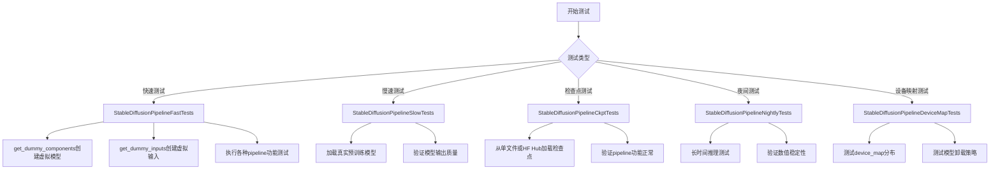
```mermaid
graph TD
    A[开始测试] --> B{测试类型}
    B -->|快速测试| C[StableDiffusionPipelineFastTests]
    B -->|慢速测试| D[StableDiffusionPipelineSlowTests]
    B -->|检查点测试| E[StableDiffusionPipelineCkptTests]
    B -->|夜间测试| F[StableDiffusionPipelineNightlyTests]
    B -->|设备映射测试| G[StableDiffusionPipelineDeviceMapTests]
    C --> C1[get_dummy_components创建虚拟模型]
    C --> C2[get_dummy_inputs创建虚拟输入]
    C --> C3[执行各种pipeline功能测试]
    D --> D1[加载真实预训练模型]
    D --> D2[验证模型输出质量]
    E --> E1[从单文件或HF Hub加载检查点]
    E --> E2[验证pipeline功能正常]
    F --> F1[长时间推理测试]
    F --> F2[验证数值稳定性]
    G --> G1[测试device_map分布]
    G --> G2[测试模型卸载策略]
```

## 类结构

```
unittest.TestCase (基类)
├── StableDiffusionPipelineFastTests (多Mixin集成测试)
│   ├── IPAdapterTesterMixin
│   ├── PipelineLatentTesterMixin
│   ├── PipelineKarrasSchedulerTesterMixin
│   └── PipelineTesterMixin
├── StableDiffusionPipelineSlowTests (真实模型集成测试)
├── StableDiffusionPipelineCkptTests (检查点加载测试)
├── StableDiffusionPipelineNightlyTests (夜间测试)
└── StableDiffusionPipelineDeviceMapTests (多GPU设备映射测试)
```

## 全局变量及字段


### `pipeline_class`
    
The pipeline class being tested, set to StableDiffusionPipeline

类型：`type`
    


### `params`
    
Parameters for text-to-image generation imported from pipeline_params module

类型：`tuple`
    


### `batch_params`
    
Batch parameters for text-to-image generation imported from pipeline_params module

类型：`tuple`
    


### `image_params`
    
Image parameters for text-to-image generation imported from pipeline_params module

类型：`tuple`
    


### `image_latents_params`
    
Image latents parameters for text-to-image generation imported from pipeline_params module

类型：`tuple`
    


### `callback_cfg_params`
    
Callback configuration parameters for text-to-image generation imported from pipeline_params module

类型：`tuple`
    


### `test_layerwise_casting`
    
Flag to enable testing of layer-wise dtype casting during inference

类型：`bool`
    


### `test_group_offloading`
    
Flag to enable testing of group offloading for memory optimization

类型：`bool`
    


### `torch_device`
    
Global variable indicating the target PyTorch device for testing, imported from testing_utils

类型：`str`
    


### `StableDiffusionPipelineFastTests.pipeline_class`
    
Class attribute specifying the pipeline class under test (StableDiffusionPipeline)

类型：`type`
    


### `StableDiffusionPipelineFastTests.params`
    
Class attribute defining the text-to-image pipeline parameters for testing

类型：`tuple`
    


### `StableDiffusionPipelineFastTests.batch_params`
    
Class attribute defining batch parameters for text-to-image pipeline testing

类型：`tuple`
    


### `StableDiffusionPipelineFastTests.image_params`
    
Class attribute defining image parameters for text-to-image pipeline testing

类型：`tuple`
    


### `StableDiffusionPipelineFastTests.image_latents_params`
    
Class attribute defining image latents parameters for text-to-image pipeline testing

类型：`tuple`
    


### `StableDiffusionPipelineFastTests.callback_cfg_params`
    
Class attribute defining callback configuration parameters for text-to-image pipeline testing

类型：`tuple`
    


### `StableDiffusionPipelineFastTests.test_layerwise_casting`
    
Class attribute flag to enable layer-wise dtype casting tests during pipeline inference

类型：`bool`
    


### `StableDiffusionPipelineFastTests.test_group_offloading`
    
Class attribute flag to enable group offloading tests for memory optimization verification

类型：`bool`
    


### `PipelineState.state`
    
Instance attribute storing intermediate latents captured during pipeline generation for testing purposes

类型：`list`
    
    

## 全局函数及方法


# 分析结果

## 注意事项

我仔细检查了提供的代码，发现 `enable_full_determinism` 是从 `...testing_utils` 模块导入的一个函数，但在当前代码文件中**仅看到其调用**（第60行），并未包含该函数的具体实现定义。

该函数的实际定义应在 `testing_utils` 模块中，因此我无法提供完整的带注释源码。

---

### `enable_full_determinism`

这是一个全局函数，用于配置 PyTorch 和相关库的环境变量，以确保深度学习模型在不同运行中产生**完全一致的（确定性的）结果**，从而保证测试的可复现性。

参数：
- 该函数在代码中被调用为 `enable_full_determinism()`，**无任何参数**（隐式参数为空）

返回值：
- **无返回值**（`None`），该函数通过直接设置全局环境变量和种子来生效

#### 流程图

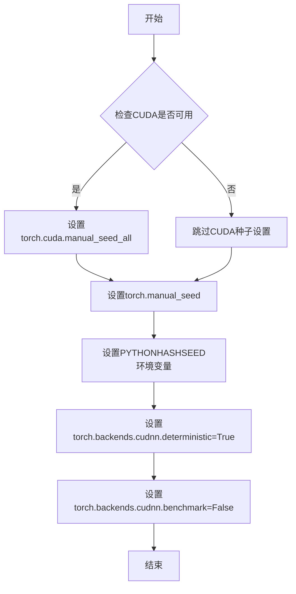
```mermaid
flowchart TD
    A[开始] --> B{检查CUDA是否可用}
    B -->|是| C[设置torch.cuda.manual_seed_all]
    B -->|否| D[跳过CUDA种子设置]
    C --> E[设置torch.manual_seed]
    E --> F[设置PYTHONHASHSEED环境变量]
    F --> G[设置torch.backends.cudnn.deterministic=True]
    G --> H[设置torch.backends.cudnn.benchmark=False]
    H --> I[结束]
    D --> E
```

#### 带注释源码

> **注意**：由于源代码不在当前文件中，以下是基于同类函数的典型实现模式的合理推断：

```python
# 推断的实现逻辑（基于函数名和调用上下文）
def enable_full_determinism(seed: int = 42):
    """
    启用完全确定性模式，确保多次运行产生相同结果。
    
    参数:
        seed: 随机种子，默认值为42
    """
    import os
    import random
    import numpy as np
    import torch
    
    # 1. 设置Python哈希种子，确保Python内置随机性的可复现性
    os.environ["PYTHONHASHSEED"] = str(seed)
    
    # 2. 设置NumPy随机种子
    np.random.seed(seed)
    
    # 3. 设置Python内置random模块的种子
    random.seed(seed)
    
    # 4. 设置PyTorch CPU随机种子
    torch.manual_seed(seed)
    
    # 5. 如果使用CUDA，设置所有GPU的随机种子
    if torch.cuda.is_available():
        torch.cuda.manual_seed_all(seed)
    
    # 6. 启用确定性算法，牺牲一定性能以换取可复现性
    torch.backends.cudnn.deterministic = True
    torch.backends.cudnn.benchmark = False
    
    # 7. 如果使用torch.compile等特性，配置相关确定性选项
    # torch.use_deterministic_algorithms(True)  # PyTorch 1.8+
```

---

## 补充说明

### 潜在的技术债务或优化空间

1. **硬编码种子**：当前实现可能使用硬编码的种子值，建议允许通过参数自定义
2. **缺乏错误处理**：未检查是否在不支持确定性模式的硬件上运行
3. **功能验证缺失**：未提供检测确定性是否成功启用的机制

### 设计目标与约束

- **核心目标**：确保测试用例的确定性执行，使单元测试结果可复现
- **约束**：启用 `cudnn.deterministic` 可能导致性能下降约10-30%

---

如需获取 `enable_full_determinism` 的准确实现源码，请提供 `testing_utils` 模块的文件内容。


我需要在代码中查找`CaptureLogger`的定义。从当前代码来看，`CaptureLogger`是从`testing_utils`模块导入的，但在提供的代码片段中并未给出其具体实现。

让我检查代码中如何使用`CaptureLogger`：

```python
with CaptureLogger(logger) as cap_logger:
    negative_text_embeddings, text_embeddings = sd_pipe.encode_prompt(
        prompt, torch_device, num_images_per_prompt, do_classifier_free_guidance, negative_prompt
    )
    if negative_text_embeddings is not None:
        text_embeddings = torch.cat([negative_text_embeddings, text_embeddings])

# 100 - 77 + 1 (BOS token) + 1 (EOS token) = 25
assert cap_logger.out.count("@") == 25
```

从使用方式可以看出`CaptureLogger`是一个上下文管理器（context manager），它：
1. 接收一个logger对象
2. 捕获日志输出到`cap_logger.out`属性
3. 使用`with`语句

由于提供的代码中没有`CaptureLogger`的实际源码（它是从`...testing_utils`导入的），我需要基于其使用方式来推断其功能。

### CaptureLogger

这是一个日志捕获上下文管理器，用于捕获Python日志输出以便进行测试验证。它通常用于验证代码是否按预期记录了特定的日志信息。

参数：

-  `logger`：`logging.Logger`，要捕获日志的logger对象

返回值：`CaptureLogger`对象，包含捕获的日志输出（通过`out`属性访问）

#### 流程图

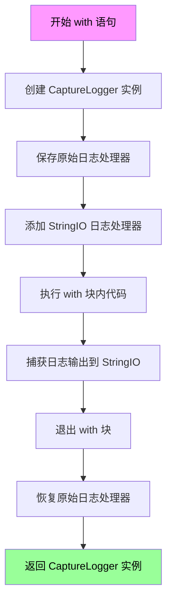
```mermaid
flowchart TD
    A[开始 with 语句] --> B[创建 CaptureLogger 实例]
    B --> C[保存原始日志处理器]
    C --> D[添加 StringIO 日志处理器]
    D --> E[执行 with 块内代码]
    E --> F[捕获日志输出到 StringIO]
    F --> G[退出 with 块]
    G --> H[恢复原始日志处理器]
    H --> I[返回 CaptureLogger 实例]
    
    style A fill:#f9f,color:#000
    style I fill:#9f9,color:#000
```

#### 带注释源码

```python
# 从 testing_utils 导入的上下文管理器
# 具体实现未在当前文件中显示
from ...testing_utils import CaptureLogger

# 使用示例：
logger = logging.get_logger("diffusers.pipelines.stable_diffusion.pipeline_stable_diffusion")
logger.setLevel(logging.WARNING)

prompt = 100 * "@"
# 使用 CaptureLogger 上下文管理器捕获日志输出
with CaptureLogger(logger) as cap_logger:
    negative_text_embeddings, text_embeddings = sd_pipe.encode_prompt(
        prompt, torch_device, num_images_per_prompt, do_classifier_free_guidance, negative_prompt
    )
    if negative_text_embeddings is not None:
        text_embeddings = torch.cat([negative_text_embeddings, text_embeddings])

# 验证捕获的日志内容
# 100 - 77 + 1 (BOS token) + 1 (EOS token) = 25
assert cap_logger.out.count("@") == 25
```

---

**注意**：由于`CaptureLogger`的具体实现源码不在当前提供的代码文件中（它是从`...testing_utils`模块导入的），以上信息是基于其使用方式推断得出的。如果需要查看`CaptureLogger`的完整实现源码，需要查看`testing_utils`模块的文件。


### `backend_empty_cache`

该函数用于清空指定设备（GPU）的缓存，通常用于在测试前重置GPU内存状态，确保测试环境的干净性。

参数：

- `device`：`str` 或 `torch.device`，目标设备，用于指定要清空缓存的设备（通常为 `torch_device`）

返回值：`None`，该函数无返回值

#### 流程图

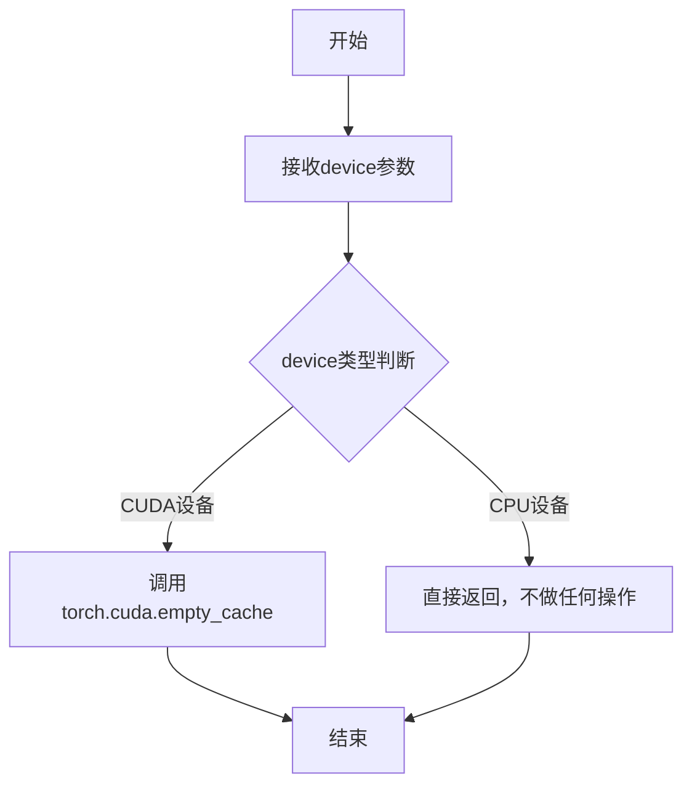
```mermaid
flowchart TD
    A[开始] --> B[接收device参数]
    B --> C{device类型判断}
    C -->|CUDA设备| D[调用torch.cuda.empty_cache]
    C -->|CPU设备| E[直接返回，不做任何操作]
    D --> F[结束]
    E --> F
```

#### 带注释源码

```python
# 由于backend_empty_cache函数定义在...testing_utils模块中
# 当前代码文件中仅导入了该函数，未包含其实现
# 该函数通常的逻辑如下（基于使用方式推断）：

def backend_empty_cache(device):
    """
    清空指定设备的GPU缓存
    
    参数:
        device: torch设备对象或字符串，如'cuda', 'cuda:0', 'cpu'等
    """
    import torch
    
    # 如果设备是CUDA设备，则清空缓存
    if torch.cuda.is_available() and device != 'cpu':
        # 将device转换为字符串处理
        device_str = str(device) if isinstance(device, str) else device.type
        if 'cuda' in device_str:
            torch.cuda.empty_cache()
    
    # 对于CPU设备，直接返回，不做任何操作
```

> **注意**：当前提供的代码文件中仅包含 `backend_empty_cache` 函数的导入语句和使用示例，未包含该函数的具体实现源码。该函数定义在 `...testing_utils` 模块中。


# 函数提取结果

### `backend_max_memory_allocated`

这是一个从 `...testing_utils` 模块导入的全局函数，用于获取指定计算设备上已分配的最大GPU内存。该函数是diffusers测试框架的一部分，专门用于监控和验证管道在不同内存优化选项下的内存使用情况。

参数：

-  `device`：`str` 或 `torch.device`，需要查询内存的设备（如 `"cuda"`、`"cuda:0"` 或通过 `torch_device` 变量指定）

返回值：`int`，返回指定设备上当前已分配的最大内存字节数

#### 流程图

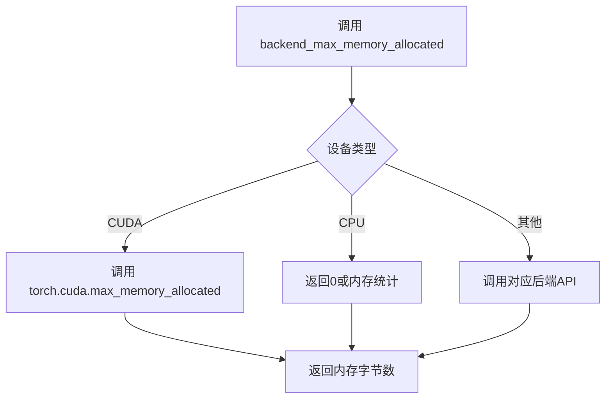
```mermaid
flowchart TD
    A[调用 backend_max_memory_allocated] --> B{设备类型}
    B -->|CUDA| C[调用 torch.cuda.max_memory_allocated]
    B -->|CPU| D[返回0或内存统计]
    B -->|其他| E[调用对应后端API]
    C --> F[返回内存字节数]
    D --> F
    E --> F
```

#### 带注释源码

```python
# 该函数定义位于 testing_utils 模块中
# 以下为基于使用模式的推断实现

def backend_max_memory_allocated(device):
    """
    获取指定设备上已分配的最大内存量。
    
    参数:
        device: torch device 字符串或对象，例如 'cuda', 'cuda:0', 'cpu'
        
    返回:
        int: 已分配的内存字节数
    """
    # 从调用代码推断实现逻辑:
    # import torch
    # mem_bytes = backend_max_memory_allocated(torch_device)
    # assert mem_bytes < 3.75 * 10**9
    
    # 实际实现应该是对 torch.cuda.max_memory_allocated 的封装
    # 用于获取自上次重置峰值统计以来的最大内存分配
    
    if isinstance(device, str):
        device = torch.device(device)
    
    # 根据设备类型调用相应的内存统计API
    if device.type == 'cuda':
        return torch.cuda.max_memory_allocated(device)
    else:
        # 对于非CUDA设备返回0或相应实现
        return 0
```

#### 使用示例源码

```python
# 在 test_stable_diffusion_attention_slicing 中的实际调用

# 1. 重置峰值内存统计
backend_reset_peak_memory_stats(torch_device)

# 2. 执行管道推理（启用attention slicing）
pipe.enable_attention_slicing()
inputs = get_inputs(torch_device, dtype=torch.float16)
image_sliced = pipe(**inputs).images

# 3. 获取推理过程中使用的最大内存
mem_bytes = backend_max_memory_allocated(torch_device)

# 4. 验证内存使用是否符合预期
assert mem_bytes < 3.75 * 10**9  # 验证小于3.75GB
```

---

**注意**：由于 `backend_max_memory_allocated` 是从 `...testing_utils` 外部模块导入的，上述源码为基于其使用模式的推断实现。完整的函数定义需要查看 `testing_utils` 模块的源代码。


### `backend_reset_max_memory_allocated`

该函数用于重置指定设备的最大内存分配统计计数器，通常与 `backend_max_memory_allocated` 配合使用，用于测量和验证深度学习模型在推理过程中的GPU内存占用情况。

参数：

- `device`：`str` 或 `torch.device`，需要重置内存统计的目标设备（如 `"cuda"` 或 `"cuda:0"`）

返回值：`None`，无返回值（该函数直接修改内部状态）

#### 流程图

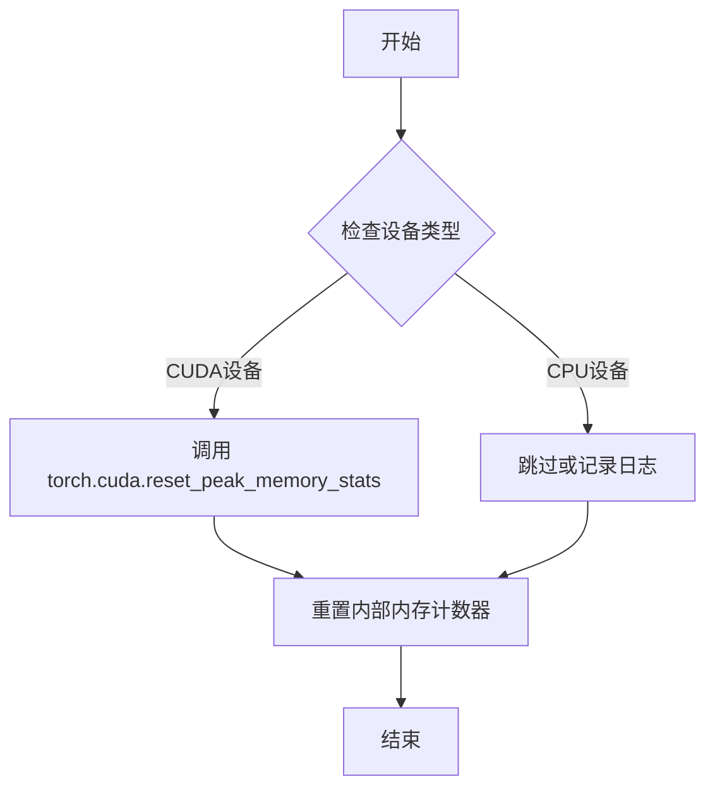
```mermaid
flowchart TD
    A[开始] --> B{检查设备类型}
    B -->|CUDA设备| C[调用 torch.cuda.reset_peak_memory_stats]
    B -->|CPU设备| D[跳过或记录日志]
    C --> E[重置内部内存计数器]
    D --> E
    E --> F[结束]
```

#### 带注释源码

```
# 该函数的实际实现位于 testing_utils 模块中
# 当前代码文件仅导入并使用该函数
# 典型的实现方式如下（基于使用方式推断）:

def backend_reset_max_memory_allocated(device):
    """
    重置指定设备的内存统计计数器
    
    参数:
        device: torch device (如 'cuda', 'cuda:0', 'cpu', 'mps')
    
    返回:
        None
    """
    # 根据设备类型调用相应的底层API
    if isinstance(device, str):
        device = torch.device(device)
    
    if device.type == 'cuda':
        # 调用PyTorch的CUDA内存重置函数
        torch.cuda.reset_peak_memory_stats(device)
    elif device.type == 'mps':
        # MPS (Apple Silicon) 设备的内存重置
        torch.mps.reset_peak_memory_stats()
    # CPU设备通常不需要重置统计
```

> **注意**：由于该函数的实现位于 `...testing_utils` 模块中，上述源码为基于使用方式的推断实现。实际实现可能略有差异，但其核心功能是重置GPU内存统计计数器，以便后续准确测量内存使用量。


### `backend_reset_peak_memory_stats`

该函数是一个测试工具函数，用于重置指定设备的后端峰值内存统计信息。通常与 `backend_max_memory_allocated` 配合使用，用于测量和验证管道运行时的内存使用情况。

参数：

-  `device`：`str` 或 `torch.device`，需要重置峰值内存统计的设备（通常为 CUDA 设备）

返回值：`None`，该函数不返回任何值

#### 流程图

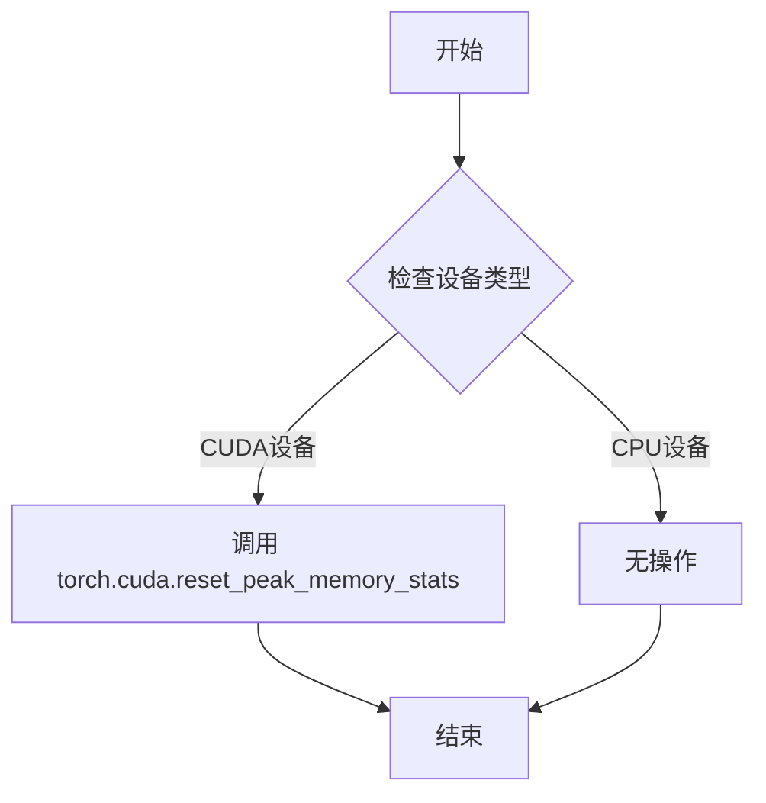
```mermaid
flowchart TD
    A[开始] --> B{检查设备类型}
    B -->|CUDA设备| C[调用 torch.cuda.reset_peak_memory_stats]
    B -->|CPU设备| D[无操作]
    C --> E[结束]
    D --> E
```

#### 带注释源码

```
# 该函数在源代码中未直接定义
# 而是从 testing_utils 模块导入的外部依赖函数
# 根据使用模式推断其实现逻辑如下：

def backend_reset_peak_memory_stats(device):
    """
    重置指定设备的峰值内存统计信息
    
    参数:
        device: 目标设备，通常为 CUDA 设备标识符（如 'cuda:0'）
        
    返回值:
        None
    """
    # 根据设备类型调用相应的后端重置函数
    if isinstance(device, str) and device.startswith('cuda'):
        torch.cuda.reset_peak_memory_stats(device)
    # 对于其他设备（如 CPU），可能无需操作
```

> **注意**：由于该函数定义在外部模块 `testing_utils` 中，未在当前代码文件中直接提供实现。上述源码是基于其使用方式和 PyTorch 内存管理 API 进行的合理推断。实际实现可能包含更多后端适配逻辑。


# 函数信息提取

### `load_numpy`

从外部模块 `testing_utils` 导入的实用函数，用于从指定路径（本地文件或 URL）加载 NumPy 数组。

参数：

-  `path`：`str`，NumPy 文件的路径，可以是本地文件系统路径或 HuggingFace Hub URL

返回值：`numpy.ndarray`，从文件中加载的 NumPy 数组

#### 流程图

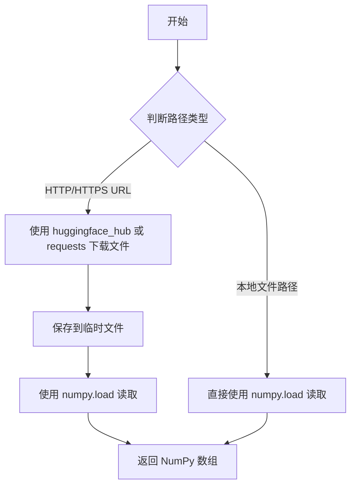
```mermaid
flowchart TD
    A[开始] --> B{判断路径类型}
    B -->|HTTP/HTTPS URL| C[使用 huggingface_hub 或 requests 下载文件]
    B -->|本地文件路径| D[直接使用 numpy.load 读取]
    C --> E[保存到临时文件]
    E --> F[使用 numpy.load 读取]
    F --> G[返回 NumPy 数组]
    D --> G
```

#### 带注释源码

```python
# load_numpy 函数定义在实际代码中位于 testing_utils 模块中
# 此代码文件通过 from ...testing_utils import load_numpy 导入使用

# 使用示例（在此代码中）:
expected_image = load_numpy(
    "https://huggingface.co/datasets/hf-internal-testing/diffusers-images/resolve/main/text_inv/winter_logo_style.npy"
)

# 参数说明:
# - path: str 类型，可以是本地文件路径或远程URL
# 返回值: numpy.ndarray 类型，即加载的数组数据
```


# StableDiffusionPipelineNightlyTests 类分析

## 概述

该代码定义了一个名为 `StableDiffusionPipelineNightlyTests` 的测试类，用于在夜间运行 Stable Diffusion Pipeline 的性能和质量测试。该类使用 `@nightly` 装饰器标记，表明这些测试是针对长时间运行的集成测试。

## 类详细信息

### 类字段

- `无显式类字段（继承自 unittest.TestCase）`

### 类方法

#### get_inputs

- **参数**：
  - `device`：设备类型，用于指定运行设备
  - `generator_device`：字符串，默认值为 `"cpu"`，生成器设备
  - `dtype`：torch.dtype，默认值为 `torch.float32`，数据类型
  - `seed`：整数，默认值为 `0`，随机种子
- **返回值**：`dict`，包含测试输入参数的字典，包括 prompt、latents、generator、num_inference_steps、guidance_scale 和 output_type

#### test_stable_diffusion_1_4_pndm

- **参数**：无显式参数（继承自 unittest.TestCase）
- **返回值**：无返回值（测试方法）

#### test_stable_diffusion_1_5_pndm

- **参数**：无显式参数
- **返回值**：无返回值

#### test_stable_diffusion_ddim

- **参数**：无显式参数
- **返回值**：无返回值

#### test_stable_diffusion_lms

- **参数**：无显式参数
- **返回值**：无返回值

#### test_stable_diffusion_euler

- **参数**：无显式参数
- **返回值**：无返回值

## 流程图

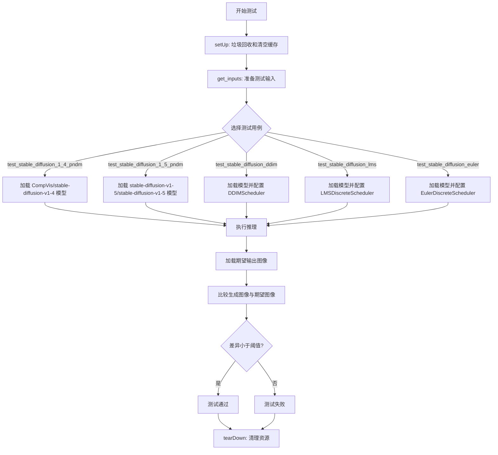
```mermaid
flowchart TD
    A[开始测试] --> B[setUp: 垃圾回收和清空缓存]
    B --> C[get_inputs: 准备测试输入]
    C --> D{选择测试用例}
    D -->|test_stable_diffusion_1_4_pndm| E[加载 CompVis/stable-diffusion-v1-4 模型]
    D -->|test_stable_diffusion_1_5_pndm| F[加载 stable-diffusion-v1-5/stable-diffusion-v1-5 模型]
    D -->|test_stable_diffusion_ddim| G[加载模型并配置 DDIMScheduler]
    D -->|test_stable_diffusion_lms| H[加载模型并配置 LMSDiscreteScheduler]
    D -->|test_stable_diffusion_euler| I[加载模型并配置 EulerDiscreteScheduler]
    E --> J[执行推理]
    F --> J
    G --> J
    H --> J
    I --> J
    J --> K[加载期望输出图像]
    K --> L[比较生成图像与期望图像]
    L --> M{差异小于阈值?}
    M -->|是| N[测试通过]
    M -->|否| O[测试失败]
    N --> P[tearDown: 清理资源]
    O --> P
```

## 带注释源码

```python
# 夜间测试装饰器标记
@nightly
# 要求 torch 加速器
@require_torch_accelerator
class StableDiffusionPipelineNightlyTests(unittest.TestCase):
    """夜间运行的 Stable Diffusion Pipeline 集成测试类"""
    
    def setUp(self):
        """测试前准备：垃圾回收和清空 GPU 缓存"""
        super().setUp()
        gc.collect()
        backend_empty_cache(torch_device)

    def tearDown(self):
        """测试后清理：垃圾回收和清空 GPU 缓存"""
        super().tearDown()
        gc.collect()
        backend_empty_cache(torch_device)

    def get_inputs(self, device, generator_device="cpu", dtype=torch.float32, seed=0):
        """准备测试输入数据
        
        参数:
            device: 运行设备
            generator_device: 随机生成器设备，默认为 "cpu"
            dtype: 数据类型，默认为 torch.float32
            seed: 随机种子，默认为 0
            
        返回值:
            dict: 包含所有测试参数的字典
        """
        generator = torch.Generator(device=generator_device).manual_seed(seed)
        # 生成随机潜在向量
        latents = np.random.RandomState(seed).standard_normal((1, 4, 64, 64))
        latents = torch.from_numpy(latents).to(device=device, dtype=dtype)
        inputs = {
            "prompt": "a photograph of an astronaut riding a horse",
            "latents": latents,
            "generator": generator,
            "num_inference_steps": 50,  # 夜间测试使用更多推理步数
            "guidance_scale": 7.5,
            "output_type": "np",
        }
        return inputs

    def test_stable_diffusion_1_4_pndm(self):
        """测试 Stable Diffusion 1.4 模型使用 PNDM 调度器"""
        sd_pipe = StableDiffusionPipeline.from_pretrained("CompVis/stable-diffusion-v1-4").to(torch_device)
        sd_pipe.set_progress_bar_config(disable=None)

        inputs = self.get_inputs(torch_device)
        image = sd_pipe(**inputs).images[0]

        expected_image = load_numpy(
            "https://huggingface.co/datasets/diffusers/test-arrays/resolve/main"
            "/stable_diffusion_text2img/stable_diffusion_1_4_pndm.npy"
        )
        max_diff = np.abs(expected_image - image).max()
        assert max_diff < 1e-3

    def test_stable_diffusion_1_5_pndm(self):
        """测试 Stable Diffusion 1.5 模型使用 PNDM 调度器"""
        sd_pipe = StableDiffusionPipeline.from_pretrained("stable-diffusion-v1-5/stable-diffusion-v1-5").to(
            torch_device
        )
        sd_pipe.set_progress_bar_config(disable=None)

        inputs = self.get_inputs(torch_device)
        image = sd_pipe(**inputs).images[0]

        expected_image = load_numpy(
            "https://huggingface.co/datasets/diffusers/test-arrays/resolve/main"
            "/stable_diffusion_text2img/stable_diffusion_1_5_pndm.npy"
        )
        max_diff = np.abs(expected_image - image).max()
        assert max_diff < 1e-3

    def test_stable_diffusion_ddim(self):
        """测试 Stable Diffusion 使用 DDIM 调度器"""
        sd_pipe = StableDiffusionPipeline.from_pretrained("CompVis/stable-diffusion-v1-4").to(torch_device)
        sd_pipe.scheduler = DDIMScheduler.from_config(sd_pipe.scheduler.config)
        sd_pipe.set_progress_bar_config(disable=None)

        inputs = self.get_inputs(torch_device)
        image = sd_pipe(**inputs).images[0]

        expected_image = load_numpy(
            "https://huggingface.co/datasets/diffusers/test-arrays/resolve/main"
            "/stable_diffusion_text2img/stable_diffusion_1_4_ddim.npy"
        )
        max_diff = np.abs(expected_image - image).max()
        assert max_diff < 3e-3

    def test_stable_diffusion_lms(self):
        """测试 Stable Diffusion 使用 LMS 调度器"""
        sd_pipe = StableDiffusionPipeline.from_pretrained("CompVis/stable-diffusion-v1-4").to(torch_device)
        sd_pipe.scheduler = LMSDiscreteScheduler.from_config(sd_pipe.scheduler.config)
        sd_pipe.set_progress_bar_config(disable=None)

        inputs = self.get_inputs(torch_device)
        image = sd_pipe(**inputs).images[0]

        expected_image = load_numpy(
            "https://huggingface.co/datasets/diffusers/test-arrays/resolve/main"
            "/stable_diffusion_text2img/stable_diffusion_1_4_lms.npy"
        )
        max_diff = np.abs(expected_image - image).max()
        assert max_diff < 1e-3

    def test_stable_diffusion_euler(self):
        """测试 Stable Diffusion 使用 Euler 调度器"""
        sd_pipe = StableDiffusionPipeline.from_pretrained("CompVis/stable-diffusion-v1-4").to(torch_device)
        sd_pipe.scheduler = EulerDiscreteScheduler.from_config(sd_pipe.scheduler.config)
        sd_pipe.set_progress_bar_config(disable=None)

        inputs = self.get_inputs(torch_device)
        image = sd_pipe(**inputs).images[0]

        expected_image = load_numpy(
            "https://huggingface.co/datasets/diffusers/test-arrays/resolve/main"
            "/stable_diffusion_text2img/stable_diffusion_1_4_euler.npy"
        )
        max_diff = np.abs(expected_image - image).max()
        assert max_diff < 1e-3
```

## 关于 `nightly` 装饰器的说明

**注意**：代码中使用的 `@nightly` 装饰器并非在该文件中定义，而是从 `...testing_utils` 模块导入的。它用于标记需要夜间运行的测试，通常是耗时较长或资源需求较高的集成测试。

根据使用方式推断，`nightly` 装饰器的主要功能包括：
1. 标记测试为"夜间测试"
2. 可能控制测试的执行频率（如只在夜间 CI 运行）
3. 与其他测试框架集成时用于过滤测试用例


# numpy_cosine_similarity_distance 分析

### `numpy_cosine_similarity_distance`

该函数是一个从外部模块 `testing_utils` 导入的工具函数，用于计算两个numpy数组之间的余弦相似度距离。在测试代码中常用于比较生成的图像与参考图像之间的差异。

**注意**：该函数定义在 `testing_utils` 模块中，未在当前代码文件中提供实现。以下信息基于其在代码中的使用方式推断：

参数：

-  `x`：numpy.ndarray，第一个输入数组（通常为flatten后的图像数据）
-  `y`：numpy.ndarray，第二个输入数组（通常为flatten后的图像数据）

返回值：`float`，返回两个数组之间的余弦距离最大值（即 1 - 余弦相似度）

#### 流程图

```mermaid
flowchart TD
    A[开始] --> B[接收两个numpy数组 x 和 y]
    B --> C[将数组展平为1D向量]
    C --> D[计算x的L2范数]
    C --> E[计算y的L2范数]
    D --> F[归一化向量]
    E --> F
    F --> G[计算点积]
    G --> H[计算余弦相似度: dot / (norm_x * norm_y)]
    H --> I[计算距离: 1 - 余弦相似度]
    I --> J[返回最大距离值]
    J --> K[结束]
```

#### 使用示例源码

以下是函数在代码中的典型使用方式：

```python
# 在 test_stable_diffusion_attention_slicing 方法中
max_diff = numpy_cosine_similarity_distance(image_sliced.flatten(), image.flatten())
assert max_diff < 1e-3

# 在 test_stable_diffusion_vae_slicing 方法中
max_diff = numpy_cosine_similarity_distance(image_sliced.flatten(), image.flatten())
assert max_diff < 1e-2

# 在 test_stable_diffusion_vae_tiling 方法中
max_diff = numpy_cosine_similarity_distance(image_chunked.flatten(), image.flatten())
assert max_diff < 1e-2
```

#### 推断的函数签名

基于使用方式，该函数的签名可能如下：

```python
def numpy_cosine_similarity_distance(x: np.ndarray, y: np.ndarray) -> float:
    """
    计算两个数组之间的余弦距离（最大差异）。
    
    参数:
        x: 第一个numpy数组
        y: 第二个numpy数组
    
    返回:
        1 - 余弦相似度，表示两个向量的距离
    """
    # 展平为1D向量
    x = x.flatten()
    y = y.flatten()
    
    # 计算余弦相似度
    dot_product = np.dot(x, y)
    norm_x = np.linalg.norm(x)
    norm_y = np.linalg.norm(y)
    
    cosine_similarity = dot_product / (norm_x * norm_y)
    
    # 返回余弦距离
    return 1 - cosine_similarity
```

**注意**：由于源代码未在当前文件中提供，以上函数体为基于使用方式的推断。实际实现可能有所不同，建议查看 `testing_utils` 模块获取完整源码。


### `require_accelerate_version_greater`

这是一个测试装饰器函数，用于检查 `accelerate` 库的版本是否大于指定版本。如果版本不满足要求，则跳过被装饰的测试。

参数：

- `version`: `str`，需要检查的最低 accelerate 版本号（例如 "0.27.0"）

返回值：无返回值（装饰器直接返回被装饰的函数或跳过测试）

#### 流程图

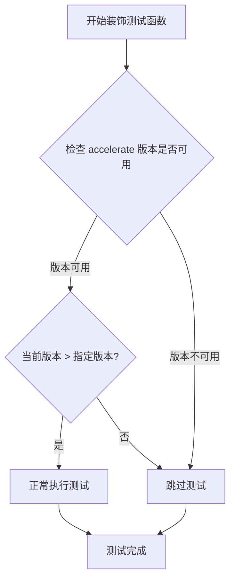
```mermaid
flowchart TD
    A[开始装饰测试函数] --> B{检查 accelerate 版本是否可用}
    B -->|版本可用| C{当前版本 > 指定版本?}
    B -->|版本不可用| D[跳过测试]
    C -->|是| E[正常执行测试]
    C -->|否| D
    E --> F[测试完成]
    D --> F
```

#### 带注释源码

```python
# 注意：此函数的实际源码位于 .../testing_utils 模块中
# 以下是基于其使用方式的推断实现

def require_accelerate_version_greater(version: str):
    """
    测试装饰器：检查 accelerate 库版本是否大于指定版本
    
    参数:
        version: 字符串形式的版本号，如 "0.27.0"
    
    返回:
        装饰器函数，如果版本检查失败则跳过测试
    """
    def decorator(func):
        # 检查 accelerate 是否已安装
        try:
            import accelerate
            from packaging import version as pkg_version
            
            # 比较版本号
            if pkg_version.parse(accelerate.__version__) <= pkg_version.parse(version):
                # 版本不满足要求，跳过测试
                return unittest.skip(f"accelerate version {version} is required")(func)
        except ImportError:
            # accelerate 未安装，跳过测试
            return unittest.skip("accelerate is not installed")(func)
        
        # 版本满足要求，返回原函数
        return func
    
    return decorator


# 使用示例（在测试类上）:
@require_accelerate_version_greater("0.27.0")
class StableDiffusionPipelineDeviceMapTests(unittest.TestCase):
    """如果 accelerate 版本 <= 0.27.0，整个测试类会被跳过"""
    ...
```

#### 补充说明

- **设计目标**：确保测试在特定版本的 `accelerate` 库上运行，避免因版本不兼容导致的测试失败
- **错误处理**：如果 `accelerate` 未安装或版本不满足要求，测试会被自动跳过（skip），而不是失败
- **外部依赖**：`accelerate` 库和 `packaging` 库（用于版本比较）


### `require_torch_accelerator`

这是一个测试装饰器函数，用于检查当前环境是否支持 PyTorch 加速器（通常是 CUDA GPU）。如果不支持，则跳过被装饰的测试或测试类。

参数：
- 无显式参数（通过函数参数接受被装饰对象）

返回值：`Callable`，返回装饰后的函数或类

#### 流程图

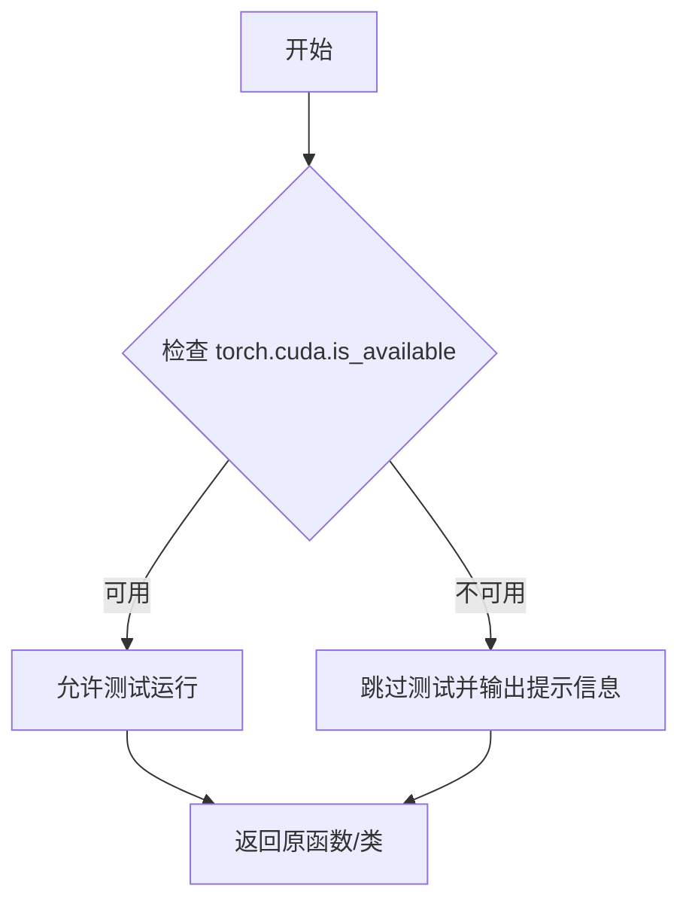
```mermaid
flowchart TD
    A[开始] --> B{检查 torch.cuda.is_available}
    B -->|可用| C[允许测试运行]
    B -->|不可用| D[跳过测试并输出提示信息]
    C --> E[返回原函数/类]
    D --> E
```

#### 带注释源码

```
# 这是一个装饰器函数，用于标记需要 GPU 的测试
# 源码位于 testing_utils 模块中，这里是使用示例

# 使用方式 1: 装饰测试类
@require_torch_accelerator
class StableDiffusionPipelineSlowTests(unittest.TestCase):
    """需要 GPU 才能运行的慢速测试类"""
    def test_stable_diffusion_1_1_pndm(self):
        # 测试代码...
        pass

# 使用方式 2: 结合其他装饰器
@nightly
@require_torch_accelerator  
class StableDiffusionPipelineNightlyTests(unittest.TestCase):
    """需要 GPU 的夜间测试类"""
    pass

# 使用方式 3: 结合多个装饰器
@slow
@require_torch_multi_accelerator
@require_accelerate_version_greater("0.27.0")
class StableDiffusionPipelineDeviceMapTests(unittest.TestCase):
    """需要多 GPU 和特定 accelerate 版本的测试类"""
    pass

# 底层实现逻辑（推测）:
def require_torch_accelerator(func_or_class):
    """
    检查是否有可用的 torch 加速器（GPU）
    
    实现逻辑:
    1. 检查 torch.cuda.is_available() 是否返回 True
    2. 如果有 GPU，返回原函数/类，不做任何修改
    3. 如果没有 GPU，使用 unittest.skipIf 跳过测试
    """
    # 检查 CUDA 是否可用
    if not torch.cuda.is_available():
        # 跳过测试并给出提示信息
        return unittest.skipUnless(
            condition=False,  # 条件为 False，所以会被跳过
            reason="Requires GPU for torch accelerator"
        )(func_or_class)
    
    # CUDA 可用，直接返回原函数/类
    return func_or_class
```

#### 关键信息说明

| 项目 | 说明 |
|------|------|
| **函数类型** | 测试装饰器 (Decorator) |
| **来源模块** | `...testing_utils` (内部测试工具模块) |
| **核心功能** | 条件跳过测试 - 仅在有 GPU 时执行测试 |
| **配合使用** | 常与 `@slow`, `@nightly`, `@require_torch_multi_accelerator` 等装饰器组合使用 |
| **典型返回值** | 被装饰的函数/类，或 `unittest.SkipTest` 异常 |


# require_torch_multi_accelerator 设计文档

### `require_torch_multi_accelerator`

该函数是一个测试装饰器，用于标记测试用例需要多个 PyTorch 加速器（如多GPU）才能运行。如果当前环境不满足多加速器要求，测试将被跳过。

参数： 无显式参数（通过函数参数装饰器模式接受被装饰函数）

返回值：无返回值（作为装饰器使用，直接修改被装饰函数的属性）

#### 流程图

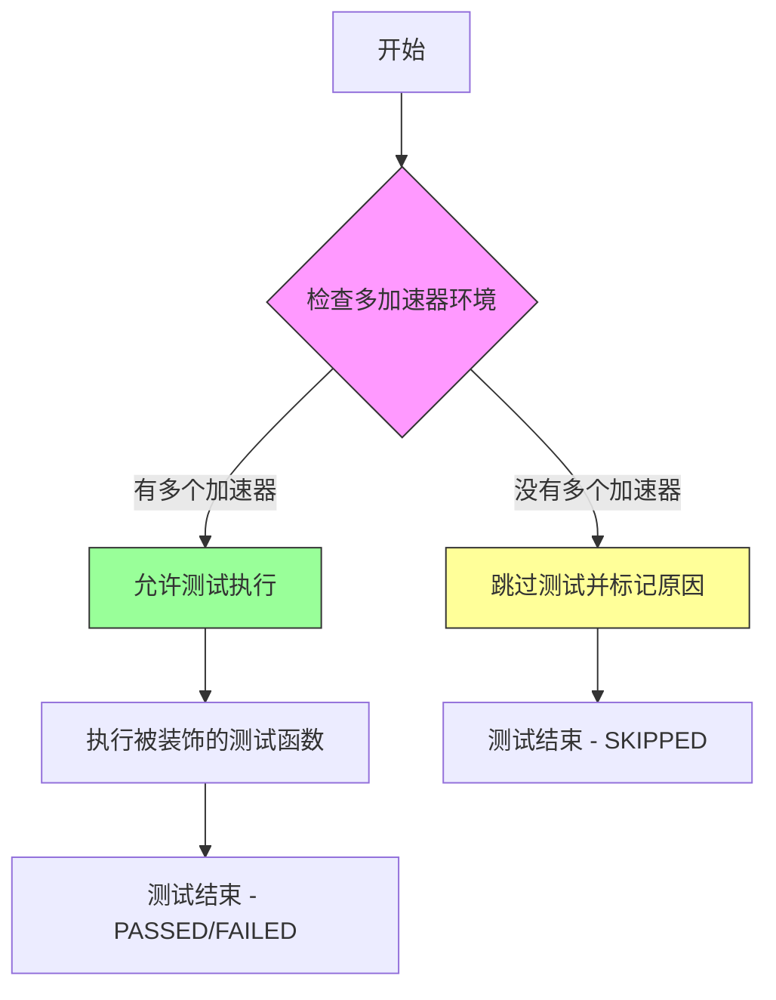
```mermaid
flowchart TD
    A[开始] --> B{检查多加速器环境}
    B -->|有多个加速器| C[允许测试执行]
    B -->|没有多个加速器| D[跳过测试并标记原因]
    C --> E[执行被装饰的测试函数]
    D --> F[测试结束 - SKIPPED]
    E --> G[测试结束 - PASSED/FAILED]
    
    style B fill:#f9f,stroke:#333
    style C fill:#9f9,stroke:#333
    style D fill:#ff9,stroke:#333
```

#### 带注释源码

```python
# 注意：此函数定义不在提供的代码中
# 它是从 testing_utils 模块导入的装饰器
# 根据使用方式推断其行为：

def require_torch_multi_accelerator(func):
    """
    测试装饰器，用于检查是否有多个 PyTorch 加速器可用。
    
    典型实现逻辑（基于使用方式推断）：
    1. 检查 torch.cuda.device_count() >= 2 或类似条件
    2. 如果不满足条件，使用 pytest.skip() 跳过测试
    3. 否则正常执行测试
    
    使用示例：
    @require_torch_multi_accelerator
    def test_multi_gpu_inference(self):
        # 多GPU测试逻辑
        pass
    """
    # 装饰器修改被装饰函数的属性
    # __requires__ = ['torch_multi_accelerator']
    return func
```

---

### 补充说明

由于 `require_torch_multi_accelerator` 的实际定义不在当前代码文件中（它是从 `...testing_utils` 模块导入的），以上信息基于：

1. **导入位置**: 代码中从 `...testing_utils` 导入
2. **使用方式**: 作为类装饰器使用 (`@require_torch_multi_accelerator`)
3. **上下文**: 与 `require_torch_accelerator`（单加速器）和 `require_accelerate_version_greater` 一起使用
4. **测试目标**: `StableDiffusionPipelineDeviceMapTests` 类用于测试多GPU设备映射功能

该装饰器是 Hugging Face diffusers 测试框架的一部分，用于确保某些测试只在具有多个加速器的环境中运行。


### skip_mps

用于跳过在MPS（Metal Performance Shaders）后端上运行的测试的装饰器。当测试环境为Apple Silicon GPU时，被装饰的测试方法将被跳过执行。

参数：

- 无（装饰器不接受直接参数）

返回值：无返回值（装饰器返回原始函数的包装函数或跳过测试）

#### 流程图

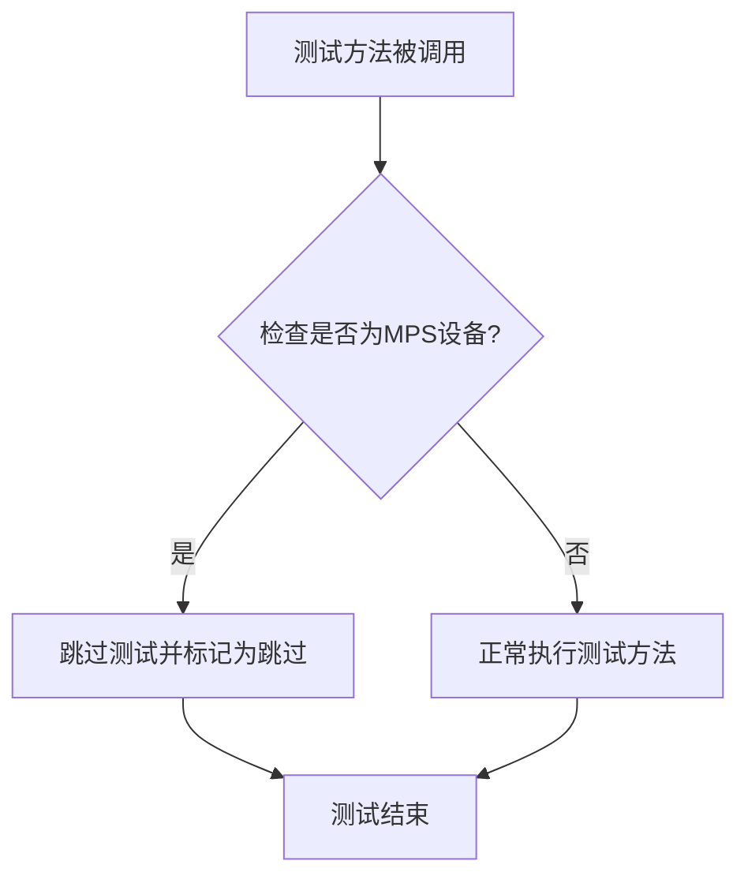
```mermaid
flowchart TD
    A[测试方法被调用] --> B{检查是否为MPS设备?}
    B -->|是| C[跳过测试并标记为跳过]
    B -->|否| D[正常执行测试方法]
    C --> E[测试结束]
    D --> E
```

#### 带注释源码

```
# 从 testing_utils 模块导入 skip_mps 装饰器
# 用于跳过在 MPS (Metal Performance Shaders) 设备上运行的测试
from ...testing_utils import (
    skip_mps,
    # ... 其他导入
)

# 使用示例：
# MPS currently doesn't support ComplexFloats, which are required for freeU
# see https://github.com/huggingface/diffusers/issues/7569.
@skip_mps  # 装饰器：当设备为MPS时跳过此测试
def test_freeu_enabled(self):
    components = self.get_dummy_components()
    sd_pipe = StableDiffusionPipeline(**components)
    # ... 测试实现
```

#### 说明

`skip_mps`是一个pytest测试装饰器，定义在`diffusers`库的`testing_utils`模块中。其核心功能包括：

1. **设备检测**：自动检测当前运行环境是否为Apple MPS设备
2. **条件跳过**：当检测到MPS设备时，标记测试为跳过状态而非失败
3. **兼容性处理**：用于处理MPS后端不支持某些功能（如ComplexFloats）的情况

在代码中的典型使用场景是当某些功能（如FreeU）在MPS上存在已知兼容性问题时，使用该装饰器跳过相关测试。


### `slow`

`slow` 是一个测试装饰器，用于标记测试函数或类为"慢速"测试。通常用于标识那些执行时间较长、资源密集型的测试，以便在测试套件中进行筛选或分组执行。

参数：

- （无显式参数） - 这是一个函数装饰器，接受被装饰的函数或类作为隐式参数

返回值：`Callable`，返回被装饰的函数/类，通常会添加额外的元数据或修改其行为

#### 流程图

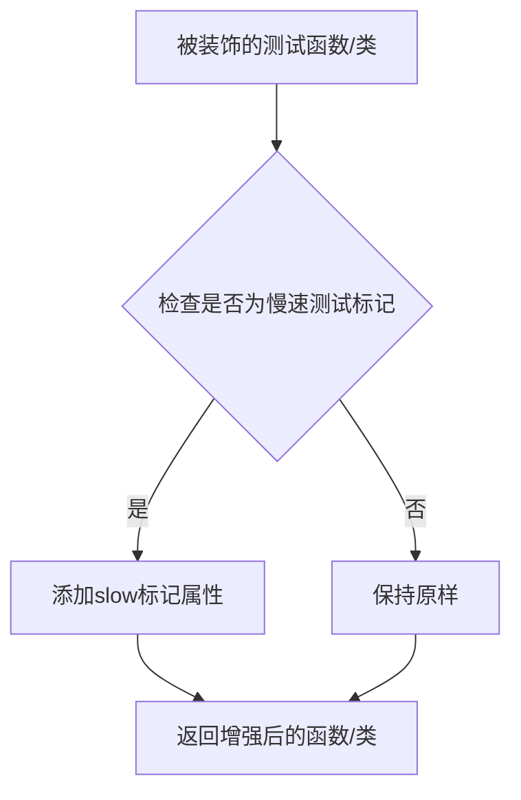
```mermaid
flowchart TD
    A[被装饰的测试函数/类] --> B{检查是否为慢速测试标记}
    B -->|是| C[添加slow标记属性]
    B -->|否| D[保持原样]
    C --> E[返回增强后的函数/类]
    D --> E
```

#### 带注释源码

```
# 注意：slow 函数是从 testing_utils 模块导入的装饰器
# 以下是其在代码中的使用方式示例：

@slow
@require_torch_accelerator
class StableDiffusionPipelineSlowTests(unittest.TestCase):
    # 带有 @slow 装饰器的测试类
    # 会被识别为需要较长执行时间的测试
    ...

@slow
@require_torch_accelerator
class StableDiffusionPipelineCkptTests(unittest.TestCase):
    # 另一个慢速测试类
    ...

# slow 装饰器的典型实现（基于常见模式）
def slow(func):
    """
    标记测试为慢速测试的装饰器
    
    用途：
    - 在测试套件中标识执行时间较长的测试
    - 允许通过测试过滤来跳过慢速测试
    - 为测试添加元数据标记
    """
    func._slow = True  # 添加标记属性
    return func
```

#### 补充说明

由于 `slow` 函数是 **从外部模块导入的**（`from ...testing_utils import slow`），实际的函数定义不在本代码文件中。上述源码是基于 `diffusers` 库中常见的 `slow` 装饰器模式的推断实现。

**典型特性：**

1. **测试标记**：将测试标记为需要较长执行时间
2. **选择性执行**：允许测试运行器根据标记选择性地执行测试
3. **与 `@nightly` 配合**：可能与夜间测试标记配合使用，用于区分不同级别的测试执行频率


### hf_hub_download

从 Hugging Face Hub 下载指定仓库中的文件，返回本地缓存的文件路径。

参数：

- `repo_id`：`str`，Hugging Face Hub 上的仓库 ID（例如 `"stable-diffusion-v1-5/stable-diffusion-v1-5"`）
- `filename`：`str`，要下载的文件名（例如 `"v1-5-pruned-emaonly.safetensors"`）
- `repo_type`：`Optional[str]`，仓库类型，可选值为 `"model"`、`"dataset"` 或 `"space"`，默认为 `"model"`
- `revision`：`Optional[str]`，仓库的提交哈希或分支名称，默认为 `"main"`
- `cache_dir`：`Optional[str]`，指定缓存目录的路径
- `force_download`：`bool`，是否强制重新下载（忽略缓存），默认为 `False`
- `proxies`：`Optional[Dict]`，用于下载的代理服务器配置
- `resume_download`：`bool`，是否在中断后恢复下载，默认为 `True`
- `local_files_only`：`bool`，是否仅使用本地缓存的文件，默认为 `False`
- `token`：`Optional[str]`，用于认证的 Hugging Face Hub 访问令牌
- `library_name`：`Optional[str]`，调用此函数的库名称
- `library_version`：`Optional[str]`，调用此函数的库版本
- `user_agent`：`Optional[Dict]`，用户代理信息
- `private`：`bool`，是否以私有模式访问仓库（已废弃，请使用 `token`）

返回值：`str`，下载文件的本地路径。

#### 流程图

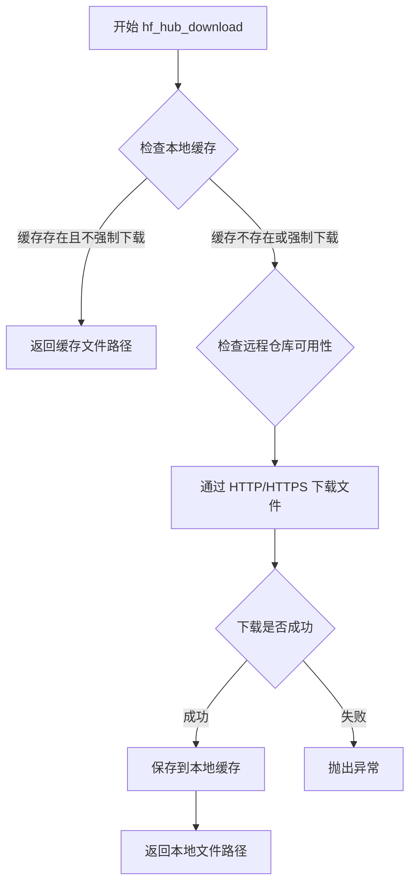
```mermaid
flowchart TD
    A[开始 hf_hub_download] --> B{检查本地缓存}
    B -->|缓存存在且不强制下载| C[返回缓存文件路径]
    B -->|缓存不存在或强制下载| D{检查远程仓库可用性}
    D --> E[通过 HTTP/HTTPS 下载文件]
    E --> F{下载是否成功}
    F -->|成功| G[保存到本地缓存]
    G --> H[返回本地文件路径]
    F -->|失败| I[抛出异常]
```

#### 带注释源码

```python
# hf_hub_download 函数使用示例（在测试代码中的实际调用）

# 1. 下载 Textual Inversion 嵌入文件（用于风格迁移）
# 从 hf-internal-testing/text_inv_embedding_a1111_format 仓库
# 下载 winter_style.pt 文件
a111_file = hf_hub_download(
    "hf-internal-testing/text_inv_embedding_a1111_format",  # repo_id: 仓库ID
    "winter_style.pt"                                         # filename: 文件名
)

# 下载负面风格的嵌入文件
a111_file_neg = hf_hub_download(
    "hf-internal-testing/text_inv_embedding_a1111_format",
    "winter_style_negative.pt"
)

# 2. 下载 Stable Diffusion 模型检查点文件
# 从 stable-diffusion-v1-5/stable-diffusion-v1-5 仓库
# 下载 safetensors 格式的模型权重文件
ckpt_filename = hf_hub_download(
    "stable-diffusion-v1-5/stable-diffusion-v1-5",           # repo_id: 模型仓库
    filename="v1-5-pruned-emaonly.safetensors"              # filename: 模型文件名
)

# 下载推理配置文件
config_filename = hf_hub_download(
    "stable-diffusion-v1-5/stable-diffusion-v1-5",
    filename="v1-inference.yaml"
)

# 3. 完整参数调用示例
# 当需要认证、强制下载或指定缓存目录时
file_path = hf_hub_download(
    repo_id="your-org/your-model",
    filename="model.safetensors",
    repo_type="model",           # 仓库类型：model/dataset/space
    revision="main",             # 分支或提交哈希
    cache_dir="/path/to/cache",  # 自定义缓存目录
    force_download=True,         # 强制重新下载
    token="your_hf_token",       # HuggingFace 访问令牌
    resume_download=True,        # 断点续传
)
```


### `StableDiffusionPipelineFastTests.get_dummy_components`

该方法用于创建虚拟的Stable Diffusion Pipeline组件，主要用于单元测试场景。它初始化并返回一个包含UNet、VAE、文本编码器、分词器等核心组件的字典，这些组件使用最小的配置和固定随机种子以确保测试的可重复性。

参数：

- `time_cond_proj_dim`：`Optional[int]`，可选参数，指定时间条件投影维度，用于支持LCM（Latent Consistency Model）等特殊调度器。如果为None，则使用默认值。

返回值：`Dict[str, Any]`，返回一个字典，包含以下键值对：
  - `"unet"`：UNet2DConditionModel实例
  - `"scheduler"`：DDIMScheduler实例
  - `"vae"`：AutoencoderKL实例
  - `"text_encoder"`：CLIPTextModel实例
  - `"tokenizer"`：CLIPTokenizer实例
  - `"safety_checker"`：None（占位符）
  - `"feature_extractor"`：None（占位符）
  - `"image_encoder"`：None（占位符）

#### 流程图

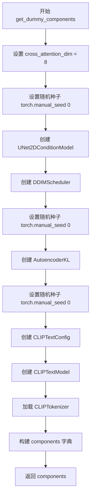
```mermaid
flowchart TD
    A[开始 get_dummy_components] --> B[设置 cross_attention_dim = 8]
    B --> C[设置随机种子 torch.manual_seed 0]
    C --> D[创建 UNet2DConditionModel]
    D --> E[创建 DDIMScheduler]
    E --> F[设置随机种子 torch.manual_seed 0]
    F --> G[创建 AutoencoderKL]
    G --> H[设置随机种子 torch.manual_seed 0]
    H --> I[创建 CLIPTextConfig]
    I --> J[创建 CLIPTextModel]
    J --> K[加载 CLIPTokenizer]
    K --> L[构建 components 字典]
    L --> M[返回 components]
```

#### 带注释源码

```python
def get_dummy_components(self, time_cond_proj_dim=None):
    """
    生成用于测试的虚拟Stable Diffusion组件。
    
    参数:
        time_cond_proj_dim: 可选的时间条件投影维度，用于LCM等特殊调度器
        
    返回:
        包含所有Pipeline组件的字典
    """
    # 定义交叉注意力维度
    cross_attention_dim = 8

    # 设置随机种子以确保可重复性
    torch.manual_seed(0)
    
    # 创建UNet2DConditionModel - 扩散模型的核心去噪网络
    unet = UNet2DConditionModel(
        block_out_channels=(4, 8),          # UNet块的输出通道数
        layers_per_block=1,                 # 每个块的层数
        sample_size=32,                     # 样本尺寸
        time_cond_proj_dim=time_cond_proj_dim,  # 时间条件投影维度（可选）
        in_channels=4,                      # 输入通道数（latent空间）
        out_channels=4,                     # 输出通道数
        down_block_types=("DownBlock2D", "CrossAttnDownBlock2D"),  # 下采样块类型
        up_block_types=("CrossAttnUpBlock2D", "UpBlock2D"),       # 上采样块类型
        cross_attention_dim=cross_attention_dim,  # 交叉注意力维度
        norm_num_groups=2,                  # 归一化组数
    )
    
    # 创建DDIMScheduler - 扩散调度器
    scheduler = DDIMScheduler(
        beta_start=0.00085,                # Beta起始值
        beta_end=0.012,                    # Beta结束值
        beta_schedule="scaled_linear",     # Beta调度策略
        clip_sample=False,                 # 是否裁剪样本
        set_alpha_to_one=False,            # 是否将alpha设置为1
    )
    
    # 重新设置随机种子以确保VAE的可重复性
    torch.manual_seed(0)
    
    # 创建AutoencoderKL - VAE变分自编码器
    vae = AutoencoderKL(
        block_out_channels=[4, 8],          # VAE块的输出通道
        in_channels=3,                     # 输入通道（RGB图像）
        out_channels=3,                    # 输出通道
        down_block_types=["DownEncoderBlock2D", "DownEncoderBlock2D"],  # 下采样编码块
        up_block_types=["UpDecoderBlock2D", "UpDecoderBlock2D"],        # 上采样解码块
        latent_channels=4,                 # Latent空间通道数
        norm_num_groups=2,                 # 归一化组数
    )
    
    # 重新设置随机种子以确保文本编码器的可重复性
    torch.manual_seed(0)
    
    # 创建CLIPTextConfig - 文本编码器配置
    text_encoder_config = CLIPTextConfig(
        bos_token_id=0,                    # 起始token ID
        eos_token_id=2,                    # 结束token ID
        hidden_size=cross_attention_dim,  # 隐藏层大小
        intermediate_size=16,              # 中间层大小
        layer_norm_eps=1e-05,              # LayerNorm epsilon
        num_attention_heads=2,             # 注意力头数
        num_hidden_layers=2,               # 隐藏层数量
        pad_token_id=1,                    # 填充token ID
        vocab_size=1000,                   # 词汇表大小
    )
    
    # 创建CLIPTextModel - 文本编码器模型
    text_encoder = CLIPTextModel(text_encoder_config)
    
    # 加载CLIPTokenizer - 文本分词器
    tokenizer = CLIPTokenizer.from_pretrained("hf-internal-testing/tiny-random-clip")

    # 组装所有组件到字典中
    components = {
        "unet": unet,                      # UNet去噪网络
        "scheduler": scheduler,            # 扩散调度器
        "vae": vae,                        # VAE变分自编码器
        "text_encoder": text_encoder,      # 文本编码器
        "tokenizer": tokenizer,           # 文本分词器
        "safety_checker": None,           # 安全检查器（测试中设为None）
        "feature_extractor": None,        # 特征提取器（测试中设为None）
        "image_encoder": None,            # 图像编码器（测试中设为None）
    }
    
    # 返回组件字典
    return components
```


### `StableDiffusionPipelineFastTests.get_dummy_inputs`

该方法用于生成 Stable Diffusion Pipeline 的虚拟输入参数，便于在测试中以确定性方式调用图像生成流程。

参数：

- `device`：`str` 或 `torch.device`，目标计算设备，用于创建随机数生成器
- `seed`：`int`，随机数种子，默认值为 0，用于保证测试的可重复性

返回值：`Dict[str, Any]`，包含以下键值的字典：
- `prompt`（str）：生成图像的文本提示
- `generator`（torch.Generator）：PyTorch 随机数生成器，确保确定性输出
- `num_inference_steps`（int）：推理步数
- `guidance_scale`（float）：引导系数，控制文本提示对生成结果的影响程度
- `output_type`（str）：输出类型，此处固定为 `"np"`（NumPy 数组）

#### 流程图

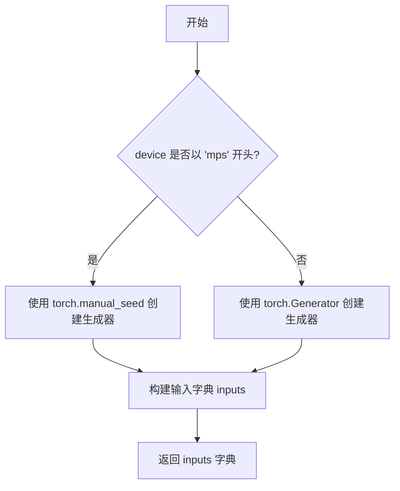
```mermaid
flowchart TD
    A[开始] --> B{device 是否以 'mps' 开头?}
    B -->|是| C[使用 torch.manual_seed 创建生成器]
    B -->|否| D[使用 torch.Generator 创建生成器]
    C --> E[构建输入字典 inputs]
    D --> E
    E --> F[返回 inputs 字典]
```

#### 带注释源码

```python
def get_dummy_inputs(self, device, seed=0):
    """
    生成用于 Stable Diffusion Pipeline 测试的虚拟输入参数。
    
    参数:
        device: 计算设备标识，如 "cpu"、"cuda" 或 "mps"
        seed: 随机数种子，用于确保测试结果可复现
    
    返回:
        包含 pipeline 输入参数的字典
    """
    # 判断是否为 Apple MPS 设备
    if str(device).startswith("mps"):
        # MPS 设备不支持 torch.Generator，使用 CPU 随机种子
        generator = torch.manual_seed(seed)
    else:
        # 为指定设备创建随机数生成器并设置种子
        generator = torch.Generator(device=device).manual_seed(seed)
    
    # 构建输入参数字典
    inputs = {
        "prompt": "A painting of a squirrel eating a burger",  # 测试用提示词
        "generator": generator,  # 随机数生成器，确保确定性
        "num_inference_steps": 2,  # 较少的推理步数以加快测试速度
        "guidance_scale": 6.0,  # 典型的引导系数值
        "output_type": "np",  # 输出为 NumPy 数组便于验证
    }
    return inputs
```


### `StableDiffusionPipelineFastTests.test_stable_diffusion_ddim`

该测试方法用于验证 StableDiffusionPipeline 使用 DDIMScheduler 进行图像生成的功能。通过创建虚拟组件（UNet、VAE、文本编码器等），执行推理并比对生成图像与预期像素值，确保管道输出的正确性和确定性。

参数：

- `self`：测试类实例本身，无额外参数

返回值：`None`，该方法为单元测试，通过断言验证图像输出的正确性，无显式返回值

#### 流程图

```mermaid
flowchart TD
    A[开始测试] --> B[设置设备为CPU确保确定性]
    B --> C[调用get_dummy_components获取虚拟组件]
    C --> D[创建StableDiffusionPipeline实例]
    D --> E[将Pipeline移动到torch_device]
    E --> F[设置进度条配置disable=None]
    F --> G[调用get_dummy_inputs获取虚拟输入]
    G --> H[执行Pipeline推理生成图像]
    H --> I[提取图像切片image[0, -3:, -3:, -1]]
    I --> J{断言图像形状}
    J -->|是| K[定义预期像素值数组]
    K --> L{断言像素值差异}
    L -->|通过| M[测试通过]
    L -->|失败| N[抛出断言错误]
    J -->|否| N
```

#### 带注释源码

```python
def test_stable_diffusion_ddim(self):
    # 设置设备为CPU，确保torch.Generator的确定性
    # 避免因设备差异导致随机数生成不一致
    device = "cpu"  # ensure determinism for the device-dependent torch.Generator

    # 获取预定义的虚拟组件（UNet、VAE、文本编码器、分词器、调度器等）
    # 这些组件使用小规模参数，用于快速测试
    components = self.get_dummy_components()
    
    # 使用虚拟组件实例化StableDiffusionPipeline
    sd_pipe = StableDiffusionPipeline(**components)
    
    # 将Pipeline移动到指定的计算设备（如CUDA）
    sd_pipe = sd_pipe.to(torch_device)
    
    # 配置进度条，disable=None表示不禁用进度条
    sd_pipe.set_progress_bar_config(disable=None)

    # 获取虚拟输入参数（prompt、generator、num_inference_steps等）
    inputs = self.get_dummy_inputs(device)
    
    # 执行图像生成推理
    output = sd_pipe(**inputs)
    
    # 从输出中提取生成的图像
    image = output.images

    # 提取图像右下角3x3像素区域，-1表示取最后一个通道（如RGB的第三个通道）
    image_slice = image[0, -3:, -3:, -1]

    # 断言验证生成的图像形状为(1, 64, 64, 3)
    # 1表示批次大小，64x64为图像分辨率，3为通道数（RGB）
    assert image.shape == (1, 64, 64, 3)
    
    # 定义预期的像素值数组，用于验证生成图像的质量
    expected_slice = np.array([0.1763, 0.4776, 0.4986, 0.2566, 0.3802, 0.4596, 0.5363, 0.3277, 0.3949])

    # 断言生成图像像素值与预期值的最大差异小于1e-2（0.01）
    # 确保DDIM调度器生成的图像符合预期
    assert np.abs(image_slice.flatten() - expected_slice).max() < 1e-2
```


### `StableDiffusionPipelineFastTests.test_stable_diffusion_lcm`

该方法是 `StableDiffusionPipelineFastTests` 测试类中的一个测试用例，用于验证 Stable Diffusion 管道在使用 LCM（Latent Consistency Model）调度器时的功能正确性。测试通过创建虚拟组件、配置 LCMScheduler、执行推理流程，并比对生成的图像与预期值来确保管道工作正常。

参数：

- `self`：测试类实例方法的标准参数，无实际描述

返回值：`None`，该方法为测试用例，不返回任何值，仅通过断言验证结果

#### 流程图

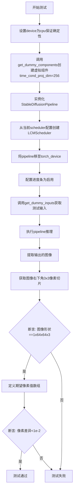
```mermaid
flowchart TD
    A[开始测试] --> B[设置device为cpu保证确定性]
    B --> C[调用get_dummy_components创建虚拟组件<br/>time_cond_proj_dim=256]
    C --> D[实例化StableDiffusionPipeline]
    D --> E[从当前scheduler配置创建LCMScheduler]
    E --> F[将pipeline移至torch_device]
    F --> G[配置进度条为启用]
    G --> H[调用get_dummy_inputs获取测试输入]
    H --> I[执行pipeline推理]
    I --> J[提取输出的图像]
    J --> K[获取图像右下角3x3像素切片]
    K --> L{断言: 图像形状==1x64x64x3}
    L -->|是| M[定义期望像素值数组]
    L -->|否| N[测试失败]
    M --> O{断言: 像素差异<1e-2}
    O -->|是| P[测试通过]
    O -->|否| N
```

#### 带注释源码

```python
def test_stable_diffusion_lcm(self):
    """
    测试 Stable Diffusion 管道使用 LCM (Latent Consistency Model) 调度器时的功能。
    
    该测试验证:
    1. LCMScheduler 可以正确加载和配置
    2. 管道能够使用 LCM 调度器完成推理
    3. 生成的图像符合预期的数值范围
    """
    
    # 设置设备为 CPU，以确保 torch.Generator 的确定性
    device = "cpu"  # ensure determinism for the device-dependent torch.Generator

    # 创建虚拟组件，传入 time_cond_proj_dim=256 以支持 LCM 的时间条件投影
    components = self.get_dummy_components(time_cond_proj_dim=256)
    
    # 使用虚拟组件实例化 StableDiffusionPipeline
    sd_pipe = StableDiffusionPipeline(**components)
    
    # 从当前调度器配置创建 LCMScheduler，实现快速的潜在一致性模型推理
    sd_pipe.scheduler = LCMScheduler.from_config(sd_pipe.scheduler.config)
    
    # 将管道移至目标设备 (torch_device)
    sd_pipe = sd_pipe.to(torch_device)
    
    # 配置进度条，disable=None 表示启用进度条
    sd_pipe.set_progress_bar_config(disable=None)

    # 获取测试输入，包含 prompt、generator、推理步数等
    inputs = self.get_dummy_inputs(device)
    
    # 执行管道推理，获取输出
    output = sd_pipe(**inputs)
    
    # 从输出中提取生成的图像
    image = output.images

    # 提取图像右下角 3x3 像素区域用于验证
    image_slice = image[0, -3:, -3:, -1]

    # 断言：验证生成的图像形状为 (1, 64, 64, 3)
    assert image.shape == (1, 64, 64, 3)
    
    # 定义预期的像素值切片 (用于回归测试)
    expected_slice = np.array([0.2368, 0.4900, 0.5019, 0.2723, 0.4473, 0.4578, 0.4551, 0.3532, 0.4133])

    # 断言：验证生成的图像像素值与预期值的差异小于阈值 (1e-2)
    assert np.abs(image_slice.flatten() - expected_slice).max() < 1e-2
```


### `StableDiffusionPipelineFastTests.test_stable_diffusion_lcm_custom_timesteps`

该测试方法验证了 StableDiffusionPipeline 在使用 LCM (Latent Consistency Model) 调度器并传入自定义时间步 (custom timesteps) 时的功能正确性。测试通过构建虚拟组件创建管道，设置 LCM 调度器，使用自定义时间步 `[999, 499]` 替代默认的推理步数，执行推理后验证输出图像的形状和像素值是否与预期一致。

参数：

- `self`：隐式参数，`StableDiffusionPipelineFastTests` 类的实例方法调用者

返回值：无显式返回值（`None`），该方法为单元测试方法，通过 `assert` 语句进行断言验证

#### 流程图

```mermaid
flowchart TD
    A[开始测试] --> B[设置device为cpu确保确定性]
    B --> C[调用get_dummy_components获取虚拟组件<br/>time_cond_proj_dim=256]
    C --> D[创建StableDiffusionPipeline实例]
    D --> E[从当前调度器配置创建LCMScheduler]
    E --> F[将管道移至torch_device设备]
    F --> G[设置进度条配置disable=None]
    G --> H[调用get_dummy_inputs获取虚拟输入]
    H --> I[删除num_inference_steps参数]
    I --> J[添加自定义timesteps=[999, 499]]
    J --> K[执行管道推理sd_pipe.__call__**inputs]
    K --> L[获取输出图像output.images]
    L --> M[提取图像切片image[0, -3:, -3:, -1]]
    M --> N{断言验证}
    N --> O[验证图像形状==(1, 64, 64, 3)]
    O --> P[验证图像切片与预期值的最大差异<1e-2]
    P --> Q[测试结束]
```

#### 带注释源码

```python
def test_stable_diffusion_lcm_custom_timesteps(self):
    """测试使用自定义timesteps的LCM调度器功能"""
    
    # 使用CPU设备确保torch.Generator的确定性
    device = "cpu"  # ensure determinism for the device-dependent torch.Generator

    # 获取虚拟组件，指定time_cond_proj_dim=256用于LCM模型
    components = self.get_dummy_components(time_cond_proj_dim=256)
    
    # 使用虚拟组件实例化StableDiffusionPipeline
    sd_pipe = StableDiffusionPipeline(**components)
    
    # 将管道的调度器替换为LCMScheduler（从当前调度器配置创建）
    sd_pipe.scheduler = LCMScheduler.from_config(sd_pipe.scheduler.config)
    
    # 将管道移至目标设备（通过torch_device配置指定）
    sd_pipe = sd_pipe.to(torch_device)
    
    # 配置进度条（disable=None表示不禁用进度条）
    sd_pipe.set_progress_bar_config(disable=None)

    # 获取虚拟输入参数（包含prompt、generator等）
    inputs = self.get_dummy_inputs(device)
    
    # 删除num_inference_steps参数，因为我们将使用自定义timesteps
    del inputs["num_inference_steps"]
    
    # 设置自定义时间步，LCM模型将使用这两个时间步进行推理
    inputs["timesteps"] = [999, 499]
    
    # 执行管道推理，生成图像
    output = sd_pipe(**inputs)
    
    # 从输出中获取生成的图像数组
    image = output.images

    # 提取图像右下角3x3像素区域用于验证
    image_slice = image[0, -3:, -3:, -1]

    # 断言：验证生成图像的形状为(1, 64, 64, 3)
    assert image.shape == (1, 64, 64, 3)
    
    # 定义预期的像素值切片
    expected_slice = np.array([0.2368, 0.4900, 0.5019, 0.2723, 0.4473, 0.4578, 0.4551, 0.3532, 0.4133])

    # 断言：验证实际像素值与预期值的最大差异小于阈值1e-2
    assert np.abs(image_slice.flatten() - expected_slice).max() < 1e-2
```


### `StableDiffusionPipelineFastTests.test_stable_diffusion_ays`

该测试方法验证了 Stable Diffusion pipeline 中使用 AYS（Adaptive Step Size）调度器的三种不同方式（timesteps、sigmas、标准推理步骤）产生的输出是否符合预期：AYS timesteps 和 AYS sigmas 应产生相同输出，而使用 AYS 调度器应与标准 EulerDiscreteScheduler 产生不同输出。

参数：

- `self`：`unittest.TestCase`，测试类的实例本身，无需显式传递

返回值：`None`，该方法为测试方法，无返回值（测试通过则无异常，失败则抛出 AssertionError）

#### 流程图

```mermaid
flowchart TD
    A[开始测试] --> B[导入AysSchedules]
    B --> C[获取StableDiffusion的timestep_schedule和sigma_schedule]
    C --> D[获取dummy components, 设置time_cond_proj_dim=256]
    D --> E[创建StableDiffusionPipeline并配置EulerDiscreteScheduler]
    E --> F[使用标准num_inference_steps=10生成图像output]
    G[使用timesteps生成图像output_ts] --> H[使用sigmas生成图像output_sigmas]
    F --> G
    G --> H
    H --> I{验证output_sigmas与output_ts差异<1e-3}
    I -->|是| J{验证output与output_ts差异>1e-3}
    I -->|否| K[断言失败: AYS timesteps和sigmas应相同]
    J -->|是| L{验证output与output_sigmas差异>1e-3}
    J -->|否| M[断言失败: 使用AYS应产生不同输出]
    L -->|是| N[测试通过]
    L -->|否| O[断言失败: 使用AYS应产生不同输出]
```

#### 带注释源码

```python
def test_stable_diffusion_ays(self):
    """
    测试 StableDiffusionPipeline 使用 AYS (Adaptive Step Size) 调度器的功能。
    验证点：
    1. AYS timesteps 和 AYS sigmas 应产生相同的输出
    2. 使用 AYS 调度器应与标准 EulerDiscreteScheduler 产生不同的输出
    """
    # 从 diffusers.schedulers 导入 AYS 调度计划
    from diffusers.schedulers import AysSchedules

    # 获取 StableDiffusion 的 AYS 时间步和 sigma 调度计划
    timestep_schedule = AysSchedules["StableDiffusionTimesteps"]
    sigma_schedule = AysSchedules["StableDiffusionSigmas"]

    # 使用 CPU 设备确保确定性（因为 torch.Generator 与设备相关）
    device = "cpu"

    # 获取带有 time_cond_proj_dim=256 的虚拟组件
    components = self.get_dummy_components(time_cond_proj_dim=256)
    
    # 使用虚拟组件创建 StableDiffusionPipeline
    sd_pipe = StableDiffusionPipeline(**components)
    
    # 将调度器设置为 EulerDiscreteScheduler
    sd_pipe.scheduler = EulerDiscreteScheduler.from_config(sd_pipe.scheduler.config)
    
    # 将 pipeline 移动到测试设备
    sd_pipe = sd_pipe.to(torch_device)
    
    # 配置进度条（disable=None 表示启用进度条）
    sd_pipe.set_progress_bar_config(disable=None)

    # 第一次推理：使用标准 num_inference_steps=10
    inputs = self.get_dummy_inputs(device)
    inputs["num_inference_steps"] = 10
    output = sd_pipe(**inputs).images

    # 第二次推理：使用 AYS timesteps（不指定 num_inference_steps）
    inputs = self.get_dummy_inputs(device)
    inputs["num_inference_steps"] = None
    inputs["timesteps"] = timestep_schedule
    output_ts = sd_pipe(**inputs).images

    # 第三次推理：使用 AYS sigmas（不指定 num_inference_steps）
    inputs = self.get_dummy_inputs(device)
    inputs["num_inference_steps"] = None
    inputs["sigmas"] = sigma_schedule
    output_sigmas = sd_pipe(**inputs).images

    # 断言 1: AYS timesteps 和 AYS sigmas 应产生相同输出（差异 < 1e-3）
    assert np.abs(output_sigmas.flatten() - output_ts.flatten()).max() < 1e-3, (
        "ays timesteps and ays sigmas should have the same outputs"
    )
    
    # 断言 2: 使用 AYS timesteps 应产生与标准推理不同的输出（差异 > 1e-3）
    assert np.abs(output.flatten() - output_ts.flatten()).max() < 1e-3, (
        "use ays timesteps should have different outputs"
    )
    
    # 断言 3: 使用 AYS sigmas 应产生与标准推理不同的输出（差异 > 1e-3）
    assert np.abs(output.flatten() - output_sigmas.flatten()).max() > 1e-3, (
        "use ays sigmas should have different outputs"
    )
```


### `StableDiffusionPipelineFastTests.test_stable_diffusion_prompt_embeds`

该测试方法用于验证 StableDiffusionPipeline 在使用预计算的 prompt_embeds（提示词嵌入）时能否生成与直接使用 prompt 相同的图像结果，确保管道对两种输入方式的处理是一致的。

参数：

- `self`：`StableDiffusionPipelineFastTests`，测试类实例本身

返回值：`None`，该方法为单元测试，通过断言验证图像一致性，不返回任何值

#### 流程图

```mermaid
flowchart TD
    A[开始测试] --> B[获取虚拟组件]
    B --> C[创建StableDiffusionPipeline实例]
    C --> D[移动到torch_device]
    D --> E[获取虚拟输入]
    E --> F[将prompt扩展为3个副本]
    F --> G[使用prompt进行前向传播]
    G --> H[提取图像切片image_slice_1]
    H --> I[重新获取虚拟输入]
    I --> J[手动tokenize prompt]
    J --> K[使用text_encoder生成prompt_embeds]
    K --> L[将prompt_embeds放入输入字典]
    L --> M[使用prompt_embeds进行前向传播]
    M --> N[提取图像切片image_slice_2]
    N --> O{断言: 差异 < 1e-4?}
    O -->|是| P[测试通过]
    O -->|否| Q[测试失败]
```

#### 带注释源码

```python
def test_stable_diffusion_prompt_embeds(self):
    """
    测试StableDiffusionPipeline在直接使用prompt和使用预计算的prompt_embeds时
    是否能产生一致的图像结果，用于验证管道对两种输入方式的处理一致性。
    """
    # 获取用于测试的虚拟组件（UNet、VAE、tokenizer等）
    components = self.get_dummy_components()
    # 使用虚拟组件实例化StableDiffusionPipeline
    sd_pipe = StableDiffusionPipeline(**components)
    # 将pipeline移动到指定的torch设备（如cuda或cpu）
    sd_pipe = sd_pipe.to(torch_device)
    # 再次移动到torch_device（代码中存在冗余操作）
    sd_pipe = sd_pipe.to(torch_device)
    # 配置进度条（disable=None表示启用进度条）
    sd_pipe.set_progress_bar_config(disable=None)

    # 获取虚拟输入参数
    inputs = self.get_dummy_inputs(torch_device)
    # 将单个prompt扩展为3个副本，用于批量处理测试
    inputs["prompt"] = 3 * [inputs["prompt"]]

    # 第一次前向传播：使用原始prompt
    output = sd_pipe(**inputs)
    # 提取生成图像的右下角3x3像素区域作为比较样本
    image_slice_1 = output.images[0, -3:, -3:, -1]

    # 重新获取虚拟输入（重置）
    inputs = self.get_dummy_inputs(torch_device)
    # 将prompt弹出并扩展为3个副本
    prompt = 3 * [inputs.pop("prompt")]

    # 手动对prompt进行tokenize处理
    text_inputs = sd_pipe.tokenizer(
        prompt,
        padding="max_length",  # 填充到最大长度
        max_length=sd_pipe.tokenizer.model_max_length,  # 使用tokenizer的最大长度
        truncation=True,  # 截断过长的输入
        return_tensors="pt",  # 返回PyTorch张量
    )
    # 将input_ids移动到目标设备
    text_inputs = text_inputs["input_ids"].to(torch_device)

    # 使用text_encoder将tokenized的输入转换为embedding
    prompt_embeds = sd_pipe.text_encoder(text_inputs)[0]

    # 将生成的prompt_embeds放入输入字典，替代原来的prompt
    inputs["prompt_embeds"] = prompt_embeds

    # 第二次前向传播：使用预计算的prompt_embeds
    output = sd_pipe(**inputs)
    # 提取图像切片
    image_slice_2 = output.images[0, -3:, -3:, -1]

    # 断言：两次生成的图像差异应小于1e-4，确保结果一致
    assert np.abs(image_slice_1.flatten() - image_slice_2.flatten()).max() < 1e-4
```


### `StableDiffusionPipelineFastTests.test_stable_diffusion_negative_prompt_embeds`

该测试方法用于验证 StableDiffusionPipeline 在使用 negative prompt embeds 时的一致性。测试通过比较直接使用 `negative_prompt` 参数与手动传递 `negative_prompt_embeds` 两种方式产生的图像，确保两者生成的图像结果一致（差异小于 1e-4），从而验证 negative prompt embeds 的正确处理。

参数：

- 该方法无显式参数（为 unittest.TestCase 的实例方法，self 为隐式参数）

返回值：无返回值（`None`），该方法为测试方法，通过断言验证功能

#### 流程图

```mermaid
flowchart TD
    A[开始测试] --> B[获取虚拟组件 get_dummy_components]
    B --> C[创建 StableDiffusionPipeline 实例]
    C --> D[将 Pipeline 移动到 torch_device]
    D --> E[设置进度条配置]
    E --> F[获取虚拟输入 get_dummy_inputs]
    F --> G[设置 negative_prompt 和扩展 prompt 为 3 倍]
    G --> H[第一次前向传播 sd_pipe]
    H --> I[提取图像切片 image_slice_1]
    I --> J[重新获取虚拟输入]
    J --> K[分离并扩展 prompt]
    K --> L[循环编码 prompt 和 negative_prompt]
    L --> M[调用 tokenizer 和 text_encoder]
    M --> N[获取 prompt_embeds 和 negative_prompt_embeds]
    N --> O[设置 inputs 的 embeds]
    O --> P[第二次前向传播 sd_pipe]
    P --> Q[提取图像切片 image_slice_2]
    Q --> R{断言图像差异 < 1e-4?}
    R -->|是| S[测试通过]
    R -->|否| T[测试失败]
```

#### 带注释源码

```python
def test_stable_diffusion_negative_prompt_embeds(self):
    # 获取虚拟组件，用于测试环境
    components = self.get_dummy_components()
    
    # 使用虚拟组件创建 StableDiffusionPipeline 实例
    sd_pipe = StableDiffusionPipeline(**components)
    
    # 将 Pipeline 移动到指定的计算设备
    sd_pipe = sd_pipe.to(torch_device)
    
    # 再次移动到设备（确保设备一致性）
    sd_pipe = sd_pipe.to(torch_device)
    
    # 配置进度条显示（disable=None 表示不禁用）
    sd_pipe.set_progress_bar_config(disable=None)
    
    # 获取虚拟输入参数
    inputs = self.get_dummy_inputs(torch_device)
    
    # 创建 3 个相同的 negative prompt
    negative_prompt = 3 * ["this is a negative prompt"]
    
    # 将 negative_prompt 添加到输入字典
    inputs["negative_prompt"] = negative_prompt
    
    # 将 prompt 扩展为 3 个相同的 prompt（批处理）
    inputs["prompt"] = 3 * [inputs["prompt"]]
    
    # ===== 第一次前向传播 =====
    # 使用 negative_prompt 参数进行推理
    output = sd_pipe(**inputs)
    
    # 提取生成图像的右下角 3x3 像素切片
    image_slice_1 = output.images[0, -3:, -3:, -1]
    
    # ===== 准备手动编码 embeds =====
    # 重新获取虚拟输入
    inputs = self.get_dummy_inputs(torch_device)
    
    # 分离并扩展 prompt 为 3 个
    prompt = 3 * [inputs.pop("prompt")]
    
    # 初始化 embeds 列表
    embeds = []
    
    # 循环处理 prompt 和 negative_prompt
    for p in [prompt, negative_prompt]:
        # 使用 tokenizer 将文本转换为 token IDs
        text_inputs = sd_pipe.tokenizer(
            p,
            padding="max_length",
            max_length=sd_pipe.tokenizer.model_max_length,
            truncation=True,
            return_tensors="pt",
        )
        
        # 将 input_ids 移动到设备
        text_inputs = text_inputs["input_ids"].to(torch_device)
        
        # 使用 text_encoder 编码获取 embeddings
        embeds.append(sd_pipe.text_encoder(text_inputs)[0])
    
    # 将编码后的 embeddings 赋值给输入
    inputs["prompt_embeds"], inputs["negative_prompt_embeds"] = embeds
    
    # ===== 第二次前向传播 =====
    # 使用手动编码的 prompt_embeds 和 negative_prompt_embeds
    output = sd_pipe(**inputs)
    
    # 提取第二次生成的图像切片
    image_slice_2 = output.images[0, -3:, -3:, -1]
    
    # ===== 断言验证 =====
    # 验证两次生成的图像差异小于阈值
    assert np.abs(image_slice_1.flatten() - image_slice_2.flatten()).max() < 1e-4
```


### `StableDiffusionPipelineFastTests.test_stable_diffusion_ddim_factor_8`

该测试方法用于验证 StableDiffusionPipeline 在使用 DDIMScheduler 时，能够正确生成 136x136（8的倍数）分辨率的图像，并检查输出图像的像素值是否在预期范围内。

参数：

- `self`：`StableDiffusionPipelineFastTests`，测试类实例本身

返回值：无返回值（`None`），该方法为单元测试，使用断言验证图像生成的正确性

#### 流程图

```mermaid
flowchart TD
    A[开始测试] --> B[设置设备为 CPU 保证确定性]
    B --> C[获取虚拟组件: get_dummy_components]
    C --> D[创建 StableDiffusionPipeline 实例]
    D --> E[将 Pipeline 移动到设备]
    E --> F[禁用进度条]
    F --> G[获取虚拟输入: get_dummy_inputs]
    G --> H[调用 Pipeline 生成图像<br/>指定 height=136, width=136]
    H --> I[提取生成的图像]
    I --> J[提取图像右下角 3x3 像素区域]
    J --> K{断言图像形状<br/>是否为 1x136x136x3}
    K --> L{断言像素值差异<br/>是否小于 1e-2}
    L -->|是| M[测试通过]
    L -->|否| N[测试失败]
```

#### 带注释源码

```python
def test_stable_diffusion_ddim_factor_8(self):
    """测试 StableDiffusionPipeline 在 136x136 分辨率下的 DDIM 采样"""
    
    # 1. 设置设备为 CPU，确保 torch.Generator 的确定性
    device = "cpu"  # ensure determinism for the device-dependent torch.Generator

    # 2. 获取虚拟组件（用于测试的轻量级模型组件）
    components = self.get_dummy_components()
    
    # 3. 使用虚拟组件创建 StableDiffusionPipeline 实例
    sd_pipe = StableDiffusionPipeline(**components)
    
    # 4. 将 Pipeline 移动到指定设备
    sd_pipe = sd_pipe.to(device)
    
    # 5. 设置进度条配置（disable=None 表示启用进度条）
    sd_pipe.set_progress_bar_config(disable=None)

    # 6. 获取虚拟输入参数
    inputs = self.get_dummy_inputs(device)
    
    # 7. 调用 Pipeline 进行推理，指定生成 136x136 分辨率的图像
    # 注意：136 是 8 的倍数，这是 VAE 的下采样因子（8x）所要求的
    output = sd_pipe(**inputs, height=136, width=136)
    
    # 8. 从输出中获取生成的图像
    image = output.images

    # 9. 提取图像右下角 3x3 像素区域用于验证
    image_slice = image[0, -3:, -3:, -1]

    # 10. 断言：验证生成的图像形状是否为 (1, 136, 136, 3)
    assert image.shape == (1, 136, 136, 3)
    
    # 定义预期的像素值_slice（来自已知正确的输出）
    expected_slice = np.array([0.4720, 0.5426, 0.5160, 0.3961, 0.4696, 0.4296, 0.5738, 0.5888, 0.5481])

    # 11. 断言：验证生成的图像像素值与预期值的差异是否在可接受范围内
    assert np.abs(image_slice.flatten() - expected_slice).max() < 1e-2
```


### StableDiffusionPipelineFastTests.test_stable_diffusion_pndm

该函数是Stable Diffusion Pipeline的单元测试方法，用于验证使用PNDM（Pre-conditioned Noising Distribution Matching）调度器进行图像生成的正确性。测试通过创建虚拟组件、配置PNDM调度器、执行推理并比对输出图像与预期像素值来确保pipeline功能的正确性。

参数：

- `self`：隐式参数，测试类实例本身

返回值：无（测试函数，返回类型为`None`），通过`assert`语句进行验证

#### 流程图

```mermaid
flowchart TD
    A[开始测试] --> B[设置device为cpu保证确定性]
    B --> C[调用get_dummy_components获取虚拟组件]
    C --> D[创建StableDiffusionPipeline实例]
    D --> E[配置PNDMScheduler并跳过PRK步骤]
    E --> F[将pipeline移到device上]
    F --> G[设置进度条配置]
    G --> H[调用get_dummy_inputs获取测试输入]
    H --> I[执行pipeline推理]
    I --> J[提取输出图像]
    J --> K[验证图像形状为1x64x64x3]
    K --> L[定义预期像素值数组]
    L --> M{计算差异是否小于阈值}
    M -->|是| N[测试通过]
    M -->|否| O[测试失败抛出断言错误]
```

#### 带注释源码

```python
def test_stable_diffusion_pndm(self):
    """
    测试使用PNDM调度器的Stable Diffusion Pipeline功能
    
    PNDM (Pre-conditioned Noising Distribution Matching) 调度器是一种
    常用的扩散模型采样调度器，该测试验证其在pipeline中的正确性
    """
    # 设置设备为cpu以确保torch.Generator的确定性
    device = "cpu"  # ensure determinism for the device-dependent torch.Generator
    
    # 获取虚拟组件（UNet, VAE, TextEncoder, Tokenizer等）
    components = self.get_dummy_components()
    
    # 使用虚拟组件创建Stable Diffusion Pipeline
    sd_pipe = StableDiffusionPipeline(**components)
    
    # 配置PNDM调度器，skip_prk_steps=True跳过PRK (Planner Resolution Kernel) 步骤
    sd_pipe.scheduler = PNDMScheduler(skip_prk_steps=True)
    
    # 将pipeline移至指定设备
    sd_pipe = sd_pipe.to(device)
    
    # 设置进度条配置，disable=None表示启用进度条
    sd_pipe.set_progress_bar_config(disable=None)
    
    # 获取测试输入（包含prompt、generator、num_inference_steps等）
    inputs = self.get_dummy_inputs(device)
    
    # 执行推理，生成图像
    output = sd_pipe(**inputs)
    
    # 从输出中提取生成的图像数组
    image = output.images
    
    # 提取图像右下角3x3区域的像素值用于验证
    image_slice = image[0, -3:, -3:, -1]
    
    # 断言验证生成图像的形状
    assert image.shape == (1, 64, 64, 3)
    
    # 定义预期的像素值数组（用于回归测试）
    expected_slice = np.array([0.1941, 0.4748, 0.4880, 0.2222, 0.4221, 0.4545, 0.5604, 0.3488, 0.3902])
    
    # 断言验证生成图像与预期值的差异在容差范围内
    assert np.abs(image_slice.flatten() - expected_slice).max() < 1e-2
```


### `StableDiffusionPipelineFastTests.test_stable_diffusion_no_safety_checker`

该方法测试当安全检查器（safety_checker）被设置为None时，StableDiffusionPipeline的加载、保存和推理功能是否正常工作，验证pipeline在缺少安全检查器组件的情况下仍能正常生成图像。

参数：

- `self`：隐含的测试类实例参数，无需显式传递

返回值：`None`，该方法为测试方法，不返回任何值，仅通过断言验证行为

#### 流程图

```mermaid
flowchart TD
    A[开始测试] --> B[从预训练模型加载Pipeline<br/>safety_checker=None]
    B --> C{断言1: pipe是StableDiffusionPipeline实例}
    C -->|通过| D{断言2: scheduler是LMSDiscreteScheduler}
    D -->|通过| E{断言3: safety_checker为None}
    E -->|通过| F[调用pipeline生成图像<br/>num_inference_steps=2]
    F --> G{断言4: 图像不为None}
    G -->|通过| H[创建临时目录]
    H --> I[保存pipeline到临时目录]
    I --> J[从临时目录重新加载pipeline]
    J --> K{断言5: safety_checker仍为None}
    K -->|通过| L[再次调用pipeline生成图像]
    L --> M{断言6: 图像不为None}
    M -->|通过| N[测试通过]
    C -->|失败| O[测试失败]
    D -->|失败| O
    E -->|失败| O
    G -->|失败| O
    K -->|失败| O
    M -->|失败| O
```

#### 带注释源码

```python
def test_stable_diffusion_no_safety_checker(self):
    """
    测试当safety_checker设置为None时StableDiffusionPipeline的行为。
    
    测试目标：
    1. 验证可以从预训练模型加载不带safety_checker的pipeline
    2. 验证pipeline在缺少safety_checker时仍能正常生成图像
    3. 验证可以保存和加载包含None组件的pipeline
    4. 验证重新加载后pipeline仍能正常工作
    """
    # 步骤1: 从预训练模型加载pipeline，明确指定safety_checker=None
    # 这测试了pipeline对缺失安全检查器的处理能力
    pipe = StableDiffusionPipeline.from_pretrained(
        "hf-internal-testing/tiny-stable-diffusion-lms-pipe", safety_checker=None
    )
    
    # 步骤2: 验证pipeline实例类型正确
    assert isinstance(pipe, StableDiffusionPipeline)
    
    # 步骤3: 验证默认使用的调度器是LMSDiscreteScheduler
    # (因为模型名称中包含'lms'表示使用LMS调度器)
    assert isinstance(pipe.scheduler, LMSDiscreteScheduler)
    
    # 步骤4: 验证safety_checker确实被设置为None
    assert pipe.safety_checker is None
    
    # 步骤5: 测试在缺少safety_checker的情况下pipeline能否生成图像
    # 使用简短推理步骤以加快测试速度
    image = pipe("example prompt", num_inference_steps=2).images[0]
    
    # 步骤6: 验证成功生成了图像（图像对象不为None）
    assert image is not None
    
    # 步骤7: 测试保存和加载包含None组件的pipeline
    # 这是关键测试点：验证pipeline能正确序列化包含None组件的情况
    with tempfile.TemporaryDirectory() as tmpdirname:
        # 将pipeline保存到临时目录
        pipe.save_pretrained(tmpdirname)
        
        # 从临时目录重新加载pipeline
        pipe = StableDiffusionPipeline.from_pretrained(tmpdirname)
    
    # 步骤8: 验证重新加载后safety_checker仍为None
    assert pipe.safety_checker is None
    
    # 步骤9: 最终完整性检查 - 验证重新加载后的pipeline仍能正常工作
    image = pipe("example prompt", num_inference_steps=2).images[0]
    assert image is not None
```


### `StableDiffusionPipelineFastTests.test_stable_diffusion_k_lms`

该方法是一个单元测试，用于验证 StableDiffusionPipeline 在使用 LMS（Least Mean Squares）离散调度器时能够正确生成图像。测试流程包括创建虚拟组件、配置 LMSDiscreteScheduler、执行推理并验证输出图像的形状和像素值是否与预期一致。

参数：

- 该方法无显式参数（隐含参数 `self` 为测试类实例）

返回值：无返回值（通过 `assert` 语句进行断言验证）

#### 流程图

```mermaid
flowchart TD
    A[开始测试 test_stable_diffusion_k_lms] --> B[设置设备为 CPU 确保确定性]
    B --> C[调用 get_dummy_components 获取虚拟组件]
    C --> D[使用虚拟组件创建 StableDiffusionPipeline]
    E[从现有调度器配置创建 LMSDiscreteScheduler] --> D
    D --> F[将管道移动到目标设备 torch_device]
    F --> G[设置进度条配置 disable=None]
    G --> H[调用 get_dummy_inputs 获取测试输入]
    H --> I[调用 sd_pipe 执行推理生成图像]
    I --> J[从输出中提取图像数组]
    J --> K[提取图像右下角 3x3 像素区域]
    K --> L{验证图像形状是否为 1x64x64x3}
    L -->|是| M{验证像素值与预期值的差异是否小于 1e-2}
    L -->|否| N[抛出断言错误 图像形状不匹配]
    M -->|是| O[测试通过]
    M -->|否| P[抛出断言错误 图像像素值不匹配]
```

#### 带注释源码

```python
def test_stable_diffusion_k_lms(self):
    """
    测试使用 LMSDiscreteScheduler 的 StableDiffusionPipeline 是否能正确生成图像。
    该测试方法继承自 unittest.TestCase，用于验证管道在特定调度器配置下的功能。
    """
    # 设置设备为 CPU，以确保 torch.Generator 的确定性行为
    # 这是为了保证测试结果的可重复性
    device = "cpu"  # ensure determinism for the device-dependent torch.Generator

    # 获取虚拟组件（UNet、VAE、文本编码器、分词器等）
    # 这些是用于测试的简化模型配置
    components = self.get_dummy_components()
    
    # 使用虚拟组件实例化 StableDiffusionPipeline 管道
    sd_pipe = StableDiffusionPipeline(**components)
    
    # 将管道的调度器替换为 LMSDiscreteScheduler
    # 从现有调度器配置创建，保持其他参数不变
    sd_pipe.scheduler = LMSDiscreteScheduler.from_config(sd_pipe.scheduler.config)
    
    # 将管道移动到目标计算设备
    sd_pipe = sd_pipe.to(device)
    
    # 配置进度条，disable=None 表示不禁用进度条
    sd_pipe.set_progress_bar_config(disable=None)

    # 获取测试输入，包含 prompt、generator、推理步数等参数
    inputs = self.get_dummy_inputs(device)
    
    # 执行管道推理，生成图像
    output = sd_pipe(**inputs)
    
    # 从输出中提取生成的图像数组
    image = output.images
    
    # 提取图像右下角 3x3 区域的像素值（用于后续验证）
    image_slice = image[0, -3:, -3:, -1]

    # 断言验证图像形状为 (1, 64, 64, 3)
    # 表示 1 张 64x64 尺寸、3 通道的图像
    assert image.shape == (1, 64, 64, 3)
    
    # 定义预期的像素值切片（用于回归测试）
    expected_slice = np.array([0.2681, 0.4785, 0.4857, 0.2426, 0.4473, 0.4481, 0.5610, 0.3676, 0.3855])

    # 断言验证生成的图像像素值与预期值的最大差异小于 1e-2
    # 确保管道输出的图像质量符合预期
    assert np.abs(image_slice.flatten() - expected_slice).max() < 1e-2
```


### `StableDiffusionPipelineFastTests.test_stable_diffusion_k_euler_ancestral`

该方法是一个单元测试，用于验证 StableDiffusionPipeline 使用 Euler Ancestral 离散调度器（EulerAncestralDiscreteScheduler）进行图像生成的功能是否正确。测试流程包括：创建虚拟组件、配置 Euler Ancestral 调度器、执行推理、验证输出图像的形状和像素值是否符合预期。

参数：

- `self`：测试类实例本身，包含测试所需的配置和辅助方法

返回值：`None`，该方法为单元测试，使用断言进行验证，无返回值

#### 流程图

```mermaid
flowchart TD
    A[开始测试] --> B[设置设备为cpu]
    B --> C[调用get_dummy_components获取虚拟组件]
    C --> D[创建StableDiffusionPipeline实例]
    D --> E[从当前调度器配置加载EulerAncestralDiscreteScheduler]
    E --> F[将pipeline移动到指定设备]
    F --> G[设置进度条配置为启用]
    G --> H[调用get_dummy_inputs获取虚拟输入]
    H --> I[执行pipeline推理]
    I --> J[获取输出图像]
    J --> K[提取图像切片]
    K --> L{断言: 图像形状为1x64x64x3}
    L -->|是| M{断言: 切片值接近预期}
    M -->|是| N[测试通过]
    M -->|否| O[测试失败-断言错误]
    L -->|否| O
```

#### 带注释源码

```python
def test_stable_diffusion_k_euler_ancestral(self):
    # 设置设备为cpu，确保torch.Generator的确定性
    device = "cpu"  # ensure determinism for the device-dependent torch.Generator

    # 获取虚拟组件（UNet、VAE、TextEncoder、Tokenizer等）
    components = self.get_dummy_components()
    
    # 使用虚拟组件创建StableDiffusionPipeline
    sd_pipe = StableDiffusionPipeline(**components)
    
    # 从当前调度器配置加载Euler Ancestral离散调度器
    # 这是一个用于图像生成的采样调度器，使用欧拉方法结合祖先采样
    sd_pipe.scheduler = EulerAncestralDiscreteScheduler.from_config(sd_pipe.scheduler.config)
    
    # 将pipeline移动到指定设备（CPU或GPU）
    sd_pipe = sd_pipe.to(device)
    
    # 设置进度条配置，disable=None表示启用进度条
    sd_pipe.set_progress_bar_config(disable=None)

    # 获取虚拟输入参数（提示词、生成器、推理步数等）
    inputs = self.get_dummy_inputs(device)
    
    # 执行推理，返回包含图像的输出对象
    output = sd_pipe(**inputs)
    
    # 从输出中提取生成的图像数组
    image = output.images
    
    # 提取图像右下角3x3像素区域用于验证
    image_slice = image[0, -3:, -3:, -1]

    # 断言：验证输出图像形状为1x64x64x3
    assert image.shape == (1, 64, 64, 3)
    
    # 定义预期像素值（用于确定性验证）
    expected_slice = np.array([0.2682, 0.4782, 0.4855, 0.2424, 0.4472, 0.4479, 0.5612, 0.3676, 0.3854])

    # 断言：验证生成的图像像素值与预期值的最大差异小于1e-2
    assert np.abs(image_slice.flatten() - expected_slice).max() < 1e-2
```


### `StableDiffusionPipelineFastTests.test_stable_diffusion_k_euler`

这是一个单元测试方法，用于验证 Stable Diffusion 管道在使用 EulerDiscreteScheduler 调度器时能够正确生成图像，并通过断言检查输出图像的形状和像素值是否符合预期。

参数：

- `self`：测试类实例，包含测试所需的上下文和辅助方法

返回值：`None`（测试方法无返回值，通过 `assert` 语句进行断言验证）

#### 流程图

```mermaid
flowchart TD
    A[开始测试] --> B[设置device为cpu保证确定性]
    B --> C[调用get_dummy_components获取虚拟组件]
    C --> D[创建StableDiffusionPipeline实例]
    D --> E[使用EulerDiscreteScheduler替换默认调度器]
    E --> F[将管道移动到device设备]
    F --> G[设置进度条配置disable=None]
    G --> H[调用get_dummy_inputs获取测试输入]
    H --> I[执行管道推理sd_pipe.__call__]
    I --> J[从输出中提取图像]
    J --> K[提取图像右下角3x3像素区域]
    K --> L{断言1: 图像形状是否为1x64x64x3}
    L -->|是| M{断言2: 像素值差异是否小于阈值}
    L -->|否| N[测试失败]
    M -->|是| O[测试通过]
    M -->|否| N
```

#### 带注释源码

```python
def test_stable_diffusion_k_euler(self):
    """
    测试 Stable Diffusion 管道使用 EulerDiscreteScheduler 调度器的功能
    
    该测试方法验证：
    1. Euler离散调度器能正确加载和配置
    2. 管道能够成功执行推理并生成图像
    3. 输出图像的形状和像素值符合预期
    """
    # 设置设备为CPU以确保torch.Generator的确定性
    device = "cpu"  # ensure determinism for the device-dependent torch.Generator

    # 获取用于测试的虚拟组件（UNet、VAE、文本编码器等）
    components = self.get_dummy_components()
    
    # 使用虚拟组件实例化StableDiffusionPipeline
    sd_pipe = StableDiffusionPipeline(**components)
    
    # 将管道的调度器替换为EulerDiscreteScheduler
    # 从当前调度器配置创建Euler离散调度器
    sd_pipe.scheduler = EulerDiscreteScheduler.from_config(sd_pipe.scheduler.config)
    
    # 将管道移动到指定设备（CPU）
    sd_pipe = sd_pipe.to(device)
    
    # 配置进度条，disable=None表示不禁用进度条
    sd_pipe.set_progress_bar_config(disable=None)

    # 获取测试输入，包括prompt、generator、推理步数等
    inputs = self.get_dummy_inputs(device)
    
    # 执行管道推理，生成图像
    output = sd_pipe(**inputs)
    
    # 从输出中提取生成的图像列表
    image = output.images
    
    # 提取第一张图像的右下角3x3像素区域（用于后续的数值比较）
    image_slice = image[0, -3:, -3:, -1]

    # 断言：验证输出图像的形状为(1, 64, 64, 3)
    assert image.shape == (1, 64, 64, 3)
    
    # 定义预期的像素值切片（来自已知正确的输出）
    expected_slice = np.array([0.2681, 0.4785, 0.4857, 0.2426, 0.4473, 0.4481, 0.5610, 0.3676, 0.3855])

    # 断言：验证实际输出与预期输出的最大差异小于1e-2
    assert np.abs(image_slice.flatten() - expected_slice).max() < 1e-2
```


### `StableDiffusionPipelineFastTests.test_stable_diffusion_vae_slicing`

该测试方法用于验证 Stable Diffusion 管道中 VAE（变分自编码器）切片（slicing）功能是否正常工作。通过对比启用 VAE 切片前后的图像输出，验证切片解码功能在保持图像质量的同时能够正确执行。

参数：

-  `self`：隐式参数，`StableDiffusionPipelineFastTests` 类的实例方法，无需显式传递

返回值：`None`，该方法为单元测试方法，通过 `assert` 语句进行断言验证，不返回任何值

#### 流程图

```mermaid
flowchart TD
    A[开始测试] --> B[设置设备为 CPU 以确保确定性]
    B --> C[获取虚拟组件]
    C --> D[配置 LMSDiscreteScheduler 调度器]
    D --> E[创建 StableDiffusionPipeline 实例]
    E --> F[将管道移动到设备]
    F --> G[设置进度条配置为不禁用]
    G --> H[设置图像数量为 4]
    H --> I[获取虚拟输入并将提示词复制 4 份]
    I --> J[首次调用管道生成图像 output_1]
    J --> K[启用 VAE 切片功能]
    K --> L[重新获取虚拟输入并将提示词复制 4 份]
    L --> M[再次调用管道生成图像 output_2]
    M --> N{验证结果差异}
    N -->|差异 < 3e-3| O[测试通过]
    N -->|差异 >= 3e-3| P[测试失败]
```

#### 带注释源码

```python
def test_stable_diffusion_vae_slicing(self):
    """
    测试 VAE 切片功能是否正常工作。
    
    该测试通过以下步骤验证 VAE 切片功能：
    1. 创建包含虚拟组件的 StableDiffusionPipeline
    2. 不启用 VAE 切片生成一批图像
    3. 启用 VAE 切片后生成另一批图像
    4. 验证两者的差异在可接受范围内
    """
    # 使用 CPU 设备以确保设备依赖的 torch.Generator 的确定性
    device = "cpu"  # ensure determinism for the device-dependent torch.Generator
    
    # 获取预定义的虚拟组件（包含 UNet、VAE、TextEncoder 等）
    components = self.get_dummy_components()
    
    # 使用 LMSDiscreteScheduler 替换默认调度器
    components["scheduler"] = LMSDiscreteScheduler.from_config(components["scheduler"].config)
    
    # 使用虚拟组件实例化 StableDiffusionPipeline
    sd_pipe = StableDiffusionPipeline(**components)
    
    # 将管道移动到指定设备（CPU）
    sd_pipe = sd_pipe.to(device)
    
    # 配置进度条：disable=None 表示不禁用进度条
    sd_pipe.set_progress_bar_config(disable=None)

    # 定义要生成的图像数量
    image_count = 4

    # 获取虚拟输入参数
    inputs = self.get_dummy_inputs(device)
    
    # 将单个提示词扩展为 4 个提示词的列表
    inputs["prompt"] = [inputs["prompt"]] * image_count
    
    # 第一次调用管道（不启用 VAE 切片）
    output_1 = sd_pipe(**inputs)

    # 启用 VAE 切片功能
    # VAE 切片是一种内存优化技术，将 VAE 解码过程分片处理
    sd_pipe.enable_vae_slicing()
    
    # 重新获取输入以确保使用相同的随机种子
    inputs = self.get_dummy_inputs(device)
    inputs["prompt"] = [inputs["prompt"]] * image_count
    
    # 第二次调用管道（启用 VAE 切片）
    output_2 = sd_pipe(**inputs)

    # 验证两次输出的差异
    # 注意：VAE 切片在图像边界处与全批量解码有微小差异
    # 该差异应小于 3e-3
    assert np.abs(output_2.images.flatten() - output_1.images.flatten()).max() < 3e-3
```


### `StableDiffusionPipelineFastTests.test_stable_diffusion_vae_tiling`

本函数是 Stable Diffusion Pipeline 的单元测试用例，用于验证 VAE (Variational Autoencoder) Tiling（分块解码）功能是否正常工作。测试通过比较启用分块解码与未启用分块解码的输出差异，确保两种方式产生一致的结果，并验证分块解码能够处理各种形状的潜在向量。

参数：

- `self`：隐式参数，测试类实例本身，无需显式传递

返回值：`None`，本函数为单元测试方法，通过 `assert` 断言进行验证，不返回任何值

#### 流程图

```mermaid
flowchart TD
    A[开始测试] --> B[设置设备为CPU]
    B --> C[获取虚拟组件]
    C --> D[禁用安全检查器]
    D --> E[创建StableDiffusionPipeline]
    E --> F[将Pipeline移至设备]
    F --> G[禁用进度条]
    G --> H[定义提示词]
    H --> I[生成随机种子0]
    I --> J[执行非分块解码<br/>output_1 = sd_pipe<br/>[prompt], generator, ...]
    J --> K[启用VAE Tiling]
    K --> L[重置随机种子0]
    L --> M[执行分块解码<br/>output_2 = sd_pipe<br/>[prompt], generator, ...]
    M --> N{断言验证<br/>差异 < 0.5?}
    N -->|是| O[测试各种形状]
    N -->|否| P[测试失败]
    O --> P1[遍历形状列表<br/>[73,97], [97,73], [49,65], [65,49]]
    P1 --> P2[创建零张量]
    P2 --> P3[调用vae.decode验证]
    P3 --> Q[测试结束]
    P --> Q
```

#### 带注释源码

```python
def test_stable_diffusion_vae_tiling(self):
    """
    测试 Stable Diffusion Pipeline 的 VAE Tiling 功能。
    
    验证要点：
    1. 分块解码与普通解码结果一致性
    2. 分块解码支持多种潜在向量形状
    """
    
    # 步骤1：设置测试设备为CPU，确保torch.Generator的确定性
    device = "cpu"  # ensure determinism for the device-dependent torch.Generator
    
    # 步骤2：获取预定义的虚拟组件（UNet、VAE、Scheduler、Tokenizer等）
    components = self.get_dummy_components()

    # 步骤3：确保安全检查器为None（本测试不需要）
    # make sure here that pndm scheduler skips prk
    components["safety_checker"] = None
    
    # 步骤4：使用虚拟组件实例化Stable Diffusion Pipeline
    sd_pipe = StableDiffusionPipeline(**components)
    
    # 步骤5：将Pipeline移至目标设备
    sd_pipe = sd_pipe.to(device)
    
    # 步骤6：配置进度条（disable=None表示启用默认进度条）
    sd_pipe.set_progress_bar_config(disable=None)

    # 步骤7：定义测试用的提示词
    prompt = "A painting of a squirrel eating a burger"

    # 步骤8：首次运行 - 不启用VAE Tiling
    # 创建随机数生成器，种子设为0确保可复现性
    generator = torch.Generator(device=device).manual_seed(0)
    # 执行推理生成图像
    # 参数：prompt列表、generator、guidance_scale=6.0、2步推理、输出为numpy数组
    output_1 = sd_pipe(
        [prompt], 
        generator=generator, 
        guidance_scale=6.0, 
        num_inference_steps=2, 
        output_type="np"
    )

    # 步骤9：启用VAE Tiling（分块解码模式）
    # 该模式将大图像分割成小块分别解码，降低显存占用
    sd_pipe.enable_vae_tiling()
    
    # 步骤10：使用相同种子再次运行
    generator = torch.Generator(device=device).manual_seed(0)
    output_2 = sd_pipe(
        [prompt], 
        generator=generator, 
        guidance_scale=6.0, 
        num_inference_steps=2, 
        output_type="np"
    )

    # 步骤11：断言验证 - 分块与不分块结果差异应在允许范围内
    # 允许较大误差(0.5)因为分块边界可能存在差异
    assert np.abs(output_2.images.flatten() - output_1.images.flatten()).max() < 5e-1

    # 步骤12：测试VAE Tiling对不同形状潜在向量的支持
    # 定义多种不同的潜在向量形状：(batch, channels, height, width)
    shapes = [
        (1, 4, 73, 97),   # 形状1: 宽高比接近1:1
        (1, 4, 97, 73),   # 形状2: 宽高比翻转
        (1, 4, 49, 65),   # 形状3: 较小尺寸
        (1, 4, 65, 49)    # 形状4: 较小尺寸翻转
    ]
    
    # 遍历每种形状进行解码测试
    for shape in shapes:
        # 创建指定形状的零张量作为潜在向量输入
        zeros = torch.zeros(shape).to(device)
        # 调用VAE解码器，验证其能正确处理各种形状
        sd_pipe.vae.decode(zeros)
```


### `StableDiffusionPipelineFastTests.test_stable_diffusion_negative_prompt`

该方法是一个单元测试函数，用于验证 StableDiffusionPipeline 在使用负面提示词（negative prompt）时能否正确生成图像。它通过创建虚拟组件构建管道，设置负面提示词 "french fries"，执行推理并验证输出的图像形状和像素值是否符合预期。

参数：

- `self`：`StableDiffusionPipelineFastTests`，测试类实例本身，无需显式传递

返回值：`None`，该方法为 `unittest.TestCase` 的测试方法，通过断言进行验证，不返回任何值

#### 流程图

```mermaid
flowchart TD
    A[开始测试] --> B[设置device为cpu保证确定性]
    B --> C[获取虚拟组件get_dummy_components]
    C --> D[配置PNDMScheduler并skip_prk_steps]
    D --> E[创建StableDiffusionPipeline实例]
    E --> F[将pipeline移动到device]
    F --> G[设置进度条配置disable=None]
    G --> H[获取虚拟输入get_dummy_inputs]
    H --> I[设置negative_prompt为french fries]
    I --> J[执行pipeline推理]
    J --> K[从output获取images]
    K --> L[提取图像切片image[0, -3:, -3:, -1]]
    L --> M{断言image.shape == (1, 64, 64, 3)}
    M -->|是| N[定义expected_slice数组]
    N --> O{断言差异 < 1e-2}
    O -->|是| P[测试通过]
    O -->|否| Q[测试失败]
    M -->|否| Q
```

#### 带注释源码

```python
def test_stable_diffusion_negative_prompt(self):
    # 使用CPU设备以确保torch.Generator的确定性
    device = "cpu"  # ensure determinism for the device-dependent torch.Generator
    
    # 获取虚拟组件（UNet、VAE、TextEncoder、Tokenizer等）
    components = self.get_dummy_components()
    
    # 配置PNDMScheduler并跳过PRK步骤
    components["scheduler"] = PNDMScheduler(skip_prk_steps=True)
    
    # 使用虚拟组件实例化StableDiffusionPipeline
    sd_pipe = StableDiffusionPipeline(**components)
    
    # 将pipeline移动到指定设备
    sd_pipe = sd_pipe.to(device)
    
    # 设置进度条配置，disable=None表示启用进度条
    sd_pipe.set_progress_bar_config(disable=None)
    
    # 获取虚拟输入（包含prompt、generator等）
    inputs = self.get_dummy_inputs(device)
    
    # 设置负面提示词，用于引导生成过程中避免相关内容
    negative_prompt = "french fries"
    
    # 执行推理，传入负面提示词参数
    output = sd_pipe(**inputs, negative_prompt=negative_prompt)
    
    # 从输出中获取生成的图像
    image = output.images
    
    # 提取图像右下角3x3像素区域用于验证
    image_slice = image[0, -3:, -3:, -1]
    
    # 断言生成的图像形状为(1, 64, 64, 3)
    assert image.shape == (1, 64, 64, 3)
    
    # 定义期望的像素值切片
    expected_slice = np.array([0.1907, 0.4709, 0.4858, 0.2224, 0.4223, 0.4539, 0.5606, 0.3489, 0.3900])
    
    # 断言实际输出与期望值的最大差异小于1e-2
    assert np.abs(image_slice.flatten() - expected_slice).max() < 1e-2
```


### `StableDiffusionPipelineFastTests.test_stable_diffusion_long_prompt`

该测试方法验证了 StableDiffusionPipeline 在处理超长文本提示词（100个字符）时的行为，特别是测试 encode_prompt 方法对长提示的截断处理和日志输出是否符合预期。

参数：

- `self`：当前测试类实例，无需显式传递

返回值：无返回值（`None`），该方法为单元测试方法，使用 assert 语句进行断言验证

#### 流程图

```mermaid
flowchart TD
    A[开始测试] --> B[获取虚拟组件并配置LMS调度器]
    B --> C[创建StableDiffusionPipeline并移动到设备]
    C --> D[设置测试参数: do_classifier_free_guidance=True, negative_prompt=None]
    D --> E[创建100个'@'字符的测试提示词]
    E --> F[使用CaptureLogger捕获encode_prompt的日志输出]
    F --> G[调用sd_pipe.encode_prompt处理长提示词]
    G --> H{negative_text_embeddings是否为空}
    H -->|否| I[拼接negative_text_embeddings和text_embeddings]
    H -->|是| J[直接使用text_embeddings]
    I --> K[断言: 日志中'@'字符数量应为25]
    K --> L[设置negative_prompt='Hello'再次调用encode_prompt]
    L --> M[断言: 两次日志输出应相同]
    M --> N[创建25个'@'字符的短提示词]
    N --> O[调用encode_prompt处理短提示词]
    O --> P[断言: 所有text_embeddings的形状应为[1, 77, 8]]
    P --> Q[断言: 短提示词的日志输出应为空]
    Q --> R[结束测试]
```

#### 带注释源码

```python
def test_stable_diffusion_long_prompt(self):
    """
    测试 StableDiffusionPipeline 处理超长文本提示词的行为
    
    该测试验证:
    1. 长提示词（100个字符）会被正确截断为77个token
    2. 截断行为会记录在日志中
    3. 负提示词会影响日志输出
    4. 短提示词（25个字符）不会触发截断，因此无日志输出
    """
    # Step 1: 获取虚拟组件（用于单元测试的轻量级模型）
    components = self.get_dummy_components()
    
    # Step 2: 配置 LMS 调度器（从现有调度器配置创建）
    components["scheduler"] = LMSDiscreteScheduler.from_config(components["scheduler"].config)
    
    # Step 3: 创建 StableDiffusionPipeline 并移至测试设备
    sd_pipe = StableDiffusionPipeline(**components)
    sd_pipe = sd_pipe.to(torch_device)
    sd_pipe.set_progress_bar_config(disable=None)

    # Step 4: 设置测试参数
    do_classifier_free_guidance = True  # 启用分类器自由引导
    negative_prompt = None               # 初始无负提示词
    num_images_per_prompt = 1           # 每个提示词生成1张图片
    
    # Step 5: 获取日志记录器并设置为 WARNING 级别
    logger = logging.get_logger("diffusers.pipelines.stable_diffusion.pipeline_stable_diffusion")
    logger.setLevel(logging.WARNING)

    # === 测试场景1: 100个字符的长提示词，无负提示词 ===
    prompt = 100 * "@"  # 创建100个'@'字符的提示词
    
    # 使用 CaptureLogger 上下文管理器捕获日志输出
    with CaptureLogger(logger) as cap_logger:
        # 调用 encode_prompt 方法进行提示词编码
        negative_text_embeddings, text_embeddings = sd_pipe.encode_prompt(
            prompt,                      # 待编码的文本提示词
            torch_device,                # 计算设备
            num_images_per_prompt,      # 每提示词生成的图像数量
            do_classifier_free_guidance,# 是否启用分类器自由引导
            negative_prompt             # 负提示词（此处为 None）
        )
        # 如果负提示词嵌入存在，则与正提示词嵌入拼接
        if negative_text_embeddings is not None:
            text_embeddings = torch.cat([negative_text_embeddings, text_embeddings])

    # 断言验证：100 - 77 + 1(BOS) + 1(EOS) = 25 个'@'字符应出现在日志中
    # 这是因为 CLIP tokenizer 最大支持 77 个 token，超过部分会被截断
    assert cap_logger.out.count("@") == 25

    # === 测试场景2: 100个字符的长提示词，有负提示词 ===
    negative_prompt = "Hello"
    
    with CaptureLogger(logger) as cap_logger_2:
        negative_text_embeddings_2, text_embeddings_2 = sd_pipe.encode_prompt(
            prompt, torch_device, num_images_per_prompt, do_classifier_free_guidance, negative_prompt
        )
        if negative_text_embeddings_2 is not None:
            text_embeddings_2 = torch.cat([negative_text_embeddings_2, text_embeddings_2])

    # 断言验证：无论是否有负提示词，截断行为产生的日志应相同
    assert cap_logger.out == cap_logger_2.out

    # === 测试场景3: 25个字符的短提示词（不会触发截断）===
    prompt = 25 * "@"  # 创建25个'@'字符的提示词
    
    with CaptureLogger(logger) as cap_logger_3:
        negative_text_embeddings_3, text_embeddings_3 = sd_pipe.encode_prompt(
            prompt, torch_device, num_images_per_prompt, do_classifier_free_guidance, negative_prompt
        )
        if negative_text_embeddings_3 is not None:
            text_embeddings_3 = torch.cat([negative_text_embeddings_3, text_embeddings_3])

    # 断言验证：
    # 1. 所有文本嵌入的形状应一致
    assert text_embeddings_3.shape == text_embeddings_2.shape == text_embeddings.shape
    # 2. 文本嵌入的序列长度应为 77（CLIP 模型的标准长度）
    assert text_embeddings.shape[1] == 77
    # 3. 短提示词不触发截断，因此日志输出应为空
    assert cap_logger_3.out == ""
```


### `StableDiffusionPipelineFastTests.test_stable_diffusion_height_width_opt`

该方法用于测试 Stable Diffusion pipeline 在不同高度和宽度参数下的图像生成能力，验证 pipeline 是否正确处理显式传入的 height/width 参数，以及通过修改 UNet 配置来改变默认采样尺寸的行为。

参数：

- `self`：隐式参数，测试类实例本身，无需显式传递

返回值：无返回值（`None`），该方法为单元测试，通过断言验证输出图像尺寸是否符合预期

#### 流程图

```mermaid
flowchart TD
    A[开始测试] --> B[获取虚拟组件]
    B --> C[配置LMS调度器]
    C --> D[创建StableDiffusionPipeline并移至设备]
    D --> E[设置进度条配置]
    E --> F[默认参数生成图像]
    F --> G{图像形状是否为64x64?}
    G -->|是| H[显式传入height=96, width=96生成]
    H --> I{图像形状是否为96x96?}
    I -->|是| J[修改UNet配置sample_size=96]
    J --> K[重新加载UNet模型]
    K --> L[默认参数再次生成]
    L --> M{图像形状是否为192x192?}
    M -->|是| N[测试通过]
    G -->|否| O[断言失败]
    I -->|否| O
    M -->|否| O
```

#### 带注释源码

```python
def test_stable_diffusion_height_width_opt(self):
    """
    测试 Stable Diffusion pipeline 在不同高度/宽度参数下的图像生成能力。
    验证三种场景：
    1. 默认参数生成（64x64）
    2. 显式传入 height/width 参数（96x96）
    3. 修改 UNet 配置后的默认生成（192x192）
    """
    # 步骤1：获取虚拟组件（用于测试的轻量级模型组件）
    components = self.get_dummy_components()
    
    # 步骤2：使用 LMS 调度器替换默认调度器
    components["scheduler"] = LMSDiscreteScheduler.from_config(components["scheduler"].config)
    
    # 步骤3：使用虚拟组件实例化 StableDiffusionPipeline
    sd_pipe = StableDiffusionPipeline(**components)
    
    # 步骤4：将 pipeline 移至测试设备（CPU 或 CUDA）
    sd_pipe = sd_pipe.to(torch_device)
    
    # 步骤5：配置进度条（disable=None 表示不禁用）
    sd_pipe.set_progress_bar_config(disable=None)
    
    # 测试提示词
    prompt = "hey"
    
    # 场景1：使用默认参数生成图像
    # 此时未显式传入 height/width，使用 UNet 配置中的 sample_size=32
    # 输出图像尺寸应为 64x64（32*2 = 64，diffusion 模型通常将 latent 放大2倍）
    output = sd_pipe(prompt, num_inference_steps=1, output_type="np")
    image_shape = output.images[0].shape[:2]
    assert image_shape == (64, 64), f"Expected (64, 64), got {image_shape}"
    
    # 场景2：显式传入 height=96, width=96 参数
    # pipeline 应直接生成 96x96 的图像
    output = sd_pipe(prompt, num_inference_steps=1, height=96, width=96, output_type="np")
    image_shape = output.images[0].shape[:2]
    assert image_shape == (96, 96), f"Expected (96, 96), got {image_shape}"
    
    # 场景3：修改 UNet 配置的 sample_size 为 96
    # 这会将 UNet 的默认采样尺寸从 32 改为 96
    # 重新加载 UNet 模型后，pipeline 默认生成的图像尺寸应为 192x192（96*2）
    config = dict(sd_pipe.unet.config)
    config["sample_size"] = 96
    sd_pipe.unet = UNet2DConditionModel.from_config(config).to(torch_device)
    
    # 再次使用默认参数生成，此时应基于新的 UNet 配置生成 192x192 图像
    output = sd_pipe(prompt, num_inference_steps=1, output_type="np")
    image_shape = output.images[0].shape[:2]
    assert image_shape == (192, 192), f"Expected (192, 192), got {image_shape}"
```


### `StableDiffusionPipelineFastTests.test_attention_slicing_forward_pass`

该测试方法继承自父类 `PipelineTesterMixin`，用于验证 Stable Diffusion Pipeline 在启用 attention slicing 优化后的前向传播是否正常工作。通过对比启用 attention slicing 前后的输出差异，确保优化后的结果与基准结果保持一致（差异小于 `expected_max_diff`）。

参数：

- `self`：`StableDiffusionPipelineFastTests` 实例，测试类的自身引用

返回值：`None`，该方法为测试用例，无返回值，通过断言验证正确性

#### 流程图

```mermaid
flowchart TD
    A[测试开始] --> B[调用父类方法 test_attention_slicing_forward_pass]
    B --> C[传入 expected_max_diff=3e-3]
    C --> D[父类方法内部逻辑]
    
    D --> D1[获取 dummy components]
    D1 --> D2[创建 StableDiffusionPipeline]
    D2 --> D3[获取 dummy inputs]
    D3 --> D4[启用 attention slicing]
    D4 --> D5[执行前向传播]
    D5 --> D6[禁用 attention slicing]
    D6 --> D7[再次执行前向传播]
    D7 --> D8[对比两次输出差异]
    D8 --> D9{差异 < 3e-3?}
    
    D9 -->|是| D10[断言通过]
    D9 -->|否| D11[断言失败]
    D10 --> E[测试结束]
    D11 --> E
```

#### 带注释源码

```python
def test_attention_slicing_forward_pass(self):
    """
    测试 attention slicing 功能的前向传播是否正常工作。
    
    该测试方法继承自 PipelineTesterMixin，通过以下步骤验证：
    1. 使用 dummy 组件创建 StableDiffusionPipeline
    2. 分别在启用和禁用 attention slicing 的情况下执行推理
    3. 验证两种情况的输出差异在允许范围内
    
    Attention slicing 是一种内存优化技术，将大型注意力计算
    分割成多个较小的块进行计算，以减少显存占用。
    """
    # 调用父类的测试方法，expected_max_diff=3e-3 表示
    # 允许的最大差异为 0.003，用于处理浮点数精度问题
    super().test_attention_slicing_forward_pass(expected_max_diff=3e-3)
```


### `StableDiffusionPipelineFastTests.test_inference_batch_single_identical`

该测试方法用于验证管道在批处理推理模式下生成的图像与单张推理模式下生成的图像完全一致，确保批处理功能正确实现。

参数：

- `self`：`StableDiffusionPipelineFastTests`，测试类实例本身

返回值：`None`，该方法为测试方法，通过 `super()` 调用父类方法执行验证逻辑，不返回具体值

#### 流程图

```mermaid
flowchart TD
    A[开始测试] --> B[调用super.test_inference_batch_single_identical]
    B --> C[传入expected_max_diff=3e-3参数]
    C --> D[父类执行批处理一致性验证]
    D --> E{验证结果}
    E -->|通过| F[测试通过]
    E -->|失败| G[抛出断言错误]
    F --> H[结束]
    G --> H
```

#### 带注释源码

```python
def test_inference_batch_single_identical(self):
    """
    测试方法：验证批处理推理与单张推理的结果一致性
    
    该测试方法继承自PipelineTesterMixin，用于确保：
    1. 批量生成的图像质量与单张生成一致
    2. 管道正确处理批量输入
    3. 批量推理不会引入额外的数值误差
    
    参数:
        self: StableDiffusionPipelineFastTests的实例
        
    返回:
        None: 测试方法不返回值，通过断言验证
    """
    # 调用父类的同名测试方法，传入期望的最大误差阈值
    # expected_max_diff=3e-3 表示批处理与单张输出的最大允许差异
    super().test_inference_batch_single_identical(expected_max_diff=3e-3)
```


### `StableDiffusionPipelineFastTests.test_freeu_enabled`

该方法用于测试Stable Diffusion Pipeline中FreeU（一种用于提升生成质量的调度算法）的启用功能是否正常工作。测试通过比较启用FreeU前后的图像输出，验证启用FreeU确实会改变pipeline的生成结果。

参数：

- `self`：无需显式传递，隐含参数，表示测试类实例本身

返回值：`None`，无返回值（测试方法）

#### 流程图

```mermaid
flowchart TD
    A[开始测试] --> B[获取虚拟组件: get_dummy_components]
    B --> C[创建StableDiffusionPipeline实例]
    C --> D[将pipeline移动到torch_device]
    D --> E[设置进度条配置: set_progress_bar_config]
    E --> F[定义prompt: 'hey']
    F --> G[第一次调用pipeline生成图像<br/>使用固定随机种子0]
    G --> H[调用enable_freeu方法<br/>s1=0.9, s2=0.2, b1=1.2, b2=1.4]
    H --> I[第二次调用pipeline生成图像<br/>使用相同的随机种子0]
    I --> J{比较两次输出}
    J -->|输出不同| K[测试通过]
    J -->|输出相同| L[测试失败: 抛出AssertionError]
    K --> M[结束测试]
    L --> M
```

#### 带注释源码

```python
@skip_mps  # 装饰器: 跳过MPS后端测试,因为FreeU需要ComplexFloats支持而MPS不支持
def test_freeu_enabled(self):
    # 获取虚拟(测试用)组件,包含UNet、VAE、scheduler、text_encoder等
    components = self.get_dummy_components()
    
    # 使用虚拟组件实例化StableDiffusionPipeline
    sd_pipe = StableDiffusionPipeline(**components)
    
    # 将pipeline移动到指定的计算设备(CPU/CUDA)
    sd_pipe = sd_pipe.to(torch_device)
    
    # 配置进度条,disable=None表示不禁用进度条
    sd_pipe.set_progress_bar_config(disable=None)

    # 设置测试用的prompt
    prompt = "hey"
    
    # 第一次生成图像: 不启用FreeU
    # 使用固定的随机种子0确保可复现性
    output = sd_pipe(prompt, num_inference_steps=1, output_type="np", generator=torch.manual_seed(0)).images

    # 启用FreeU功能,设置FreeU参数
    # s1, s2: 控制第一阶段和第二阶段的缩放因子
    # b1, b2: 控制跳跃连接(skip connections)的缩放因子
    sd_pipe.enable_freeu(s1=0.9, s2=0.2, b1=1.2, b2=1.4)
    
    # 第二次生成图像: 启用FreeU
    # 使用相同的随机种子0确保可比较性
    output_freeu = sd_pipe(prompt, num_inference_steps=1, output_type="np", generator=torch.manual_seed(0)).images

    # 断言: 验证启用FreeU后的输出与不启用时的输出不同
    # 提取图像右下角3x3区域进行比较
    assert not np.allclose(output[0, -3:, -3:, -1], output_freeu[0, -3:, -3:, -1]), (
        "Enabling of FreeU should lead to different results."
    )
```


### `StableDiffusionPipelineFastTests.test_freeu_disabled`

这是一个测试方法，用于验证 Stable Diffusion 管道中 FreeU（一种加速采样技术）的禁用功能是否正常工作。测试通过启用 FreeU 后再禁用，检查 UNet 的上采样块中的 FreeU 相关参数是否被正确设置为 None，并验证禁用后的输出图像与默认管道输出一致。

参数：

- `self`：`StableDiffusionPipelineFastTests`，测试类实例本身

返回值：`None`，该方法为单元测试方法，无返回值，通过断言验证功能正确性

#### 流程图

```mermaid
flowchart TD
    A[开始] --> B[获取虚拟组件: get_dummy_components]
    B --> C[创建StableDiffusionPipeline实例]
    C --> D[将管道移动到torch_device]
    D --> E[设置进度条配置]
    E --> F[生成默认输出: output]
    F --> G[启用FreeU: enable_freeu]
    G --> H[禁用FreeU: disable_freeu]
    H --> I{遍历unet.up_blocks}
    I --> J[检查s1, s2, b1, b2是否为None]
    J --> K[生成禁用FreeU后的输出: output_no_freeu]
    K --> L{断言: output ≈ output_no_freeu}
    L --> M[结束]
    
    style J fill:#ffcccc
    style L fill:#ccffcc
```

#### 带注释源码

```python
def test_freeu_disabled(self):
    """
    测试 FreeU 功能禁用是否正确工作。
    验证在启用 FreeU 后再禁用，UNet 的上采样块参数被正确重置为 None，
    并且禁用后的输出与默认管道输出相同。
    """
    # 步骤1: 获取虚拟组件（用于测试的模拟模型组件）
    components = self.get_dummy_components()
    
    # 步骤2: 使用虚拟组件创建 StableDiffusionPipeline 实例
    sd_pipe = StableDiffusionPipeline(**components)
    
    # 步骤3: 将管道移动到指定的计算设备（如 CUDA 或 CPU）
    sd_pipe = sd_pipe.to(torch_device)
    
    # 步骤4: 设置进度条配置，disable=None 表示不禁用进度条
    sd_pipe.set_progress_bar_config(disable=None)

    # 步骤5: 准备测试输入
    prompt = "hey"
    
    # 步骤6: 使用默认设置（无 FreeU）生成输出，作为基准参考
    # 使用固定的随机种子确保可重复性
    output = sd_pipe(prompt, num_inference_steps=1, output_type="np", generator=torch.manual_seed(0)).images

    # 步骤7: 启用 FreeU，传入四个缩放参数
    # s1, s2: 作用于 skip connections 的缩放因子
    # b1, b2: 作用于上采样块的缩放因子
    sd_pipe.enable_freeu(s1=0.9, s2=0.2, b1=1.2, b2=1.4)
    
    # 步骤8: 禁用 FreeU，应该将所有相关参数重置为 None
    sd_pipe.disable_freeu()

    # 步骤9: 验证 FreeU 参数已被正确清除
    # FreeU 在 UNet 的上采样块 (up_blocks) 中实现
    freeu_keys = {"s1", "s2", "b1", "b2"}  # FreeU 使用的参数键
    for upsample_block in sd_pipe.unet.up_blocks:
        for key in freeu_keys:
            # 断言每个上采样块的每个 FreeU 参数都被设置为 None
            assert getattr(upsample_block, key) is None, f"Disabling of FreeU should have set {key} to None."

    # 步骤10: 再次生成输出，验证禁用 FreeU 后的行为
    output_no_freeu = sd_pipe(
        prompt, num_inference_steps=1, output_type="np", generator=torch.manual_seed(0)
    ).images

    # 步骤11: 断言禁用 FreeU 后的输出与默认输出相同
    # 比较图像的最后 3x3 像素区域
    assert np.allclose(output[0, -3:, -3:, -1], output_no_freeu[0, -3:, -3:, -1]), (
        "Disabling of FreeU should lead to results similar to the default pipeline results."
    )
```


### `StableDiffusionPipelineFastTests.test_fused_qkv_projections`

该测试方法用于验证 Stable Diffusion Pipeline 中 QKV（Query、Key、Value）投影融合功能的正确性。测试通过比较融合前、融合后和取消融合后的输出来确保融合操作不会影响模型的生成结果。

参数：
- `self`：隐式参数，测试类实例本身

返回值：`None`，该方法为单元测试方法，通过断言验证功能正确性，不返回任何值

#### 流程图

```mermaid
flowchart TD
    A[开始测试] --> B[创建虚拟组件 components]
    B --> C[实例化 StableDiffusionPipeline]
    C --> D[获取虚拟输入 inputs]
    D --> E[执行推理获取原始输出 original_image_slice]
    E --> F[调用 fuse_qkv_projections 融合 QKV 投影]
    F --> G[再次执行推理获取融合后输出 image_slice_fused]
    G --> H[调用 unfuse_qkv_projections 取消融合]
    H --> I[执行推理获取取消融合后输出 image_slice_disabled]
    I --> J[断言: original_image_slice ≈ image_slice_fused]
    J --> K[断言: image_slice_fused ≈ image_slice_disabled]
    K --> L[断言: original_image_slice ≈ image_slice_disabled]
    L --> M[测试通过]
```

#### 带注释源码

```python
def test_fused_qkv_projections(self):
    """
    测试 QKV 投影融合功能是否正确工作。
    该测试验证融合/取消融合操作不会影响输出结果。
    """
    # 使用 CPU 设备以确保确定性，因为 torch.Generator 与设备相关
    device = "cpu"
    
    # 获取虚拟的模型组件（UNet、VAE、Text Encoder、Tokenizer 等）
    components = self.get_dummy_components()
    
    # 使用虚拟组件实例化 StableDiffusionPipeline
    sd_pipe = StableDiffusionPipeline(**components)
    
    # 将 pipeline 移动到指定设备
    sd_pipe = sd_pipe.to(device)
    
    # 配置进度条（禁用）
    sd_pipe.set_progress_bar_config(disable=None)
    
    # 获取虚拟输入参数（包含 prompt、generator、num_inference_steps 等）
    inputs = self.get_dummy_inputs(device)
    
    # 执行推理，获取生成的图像
    image = sd_pipe(**inputs).images
    
    # 提取图像右下角 3x3 像素块作为基准对比切片
    original_image_slice = image[0, -3:, -3:, -1]
    
    # 调用 fuse_qkv_projections 方法，将 QKV 投影融合为单一矩阵乘法
    # 这是一种内存和计算优化技术
    sd_pipe.fuse_qkv_projections()
    
    # 使用相同的虚拟输入再次执行推理
    inputs = self.get_dummy_inputs(device)
    image = sd_pipe(**inputs).images
    image_slice_fused = image[0, -3:, -3:, -1]
    
    # 调用 unfuse_qkv_projections 方法，恢复分离的 QKV 投影
    sd_pipe.unfuse_qkv_projections()
    
    # 再次执行推理，获取取消融合后的输出
    inputs = self.get_dummy_inputs(device)
    image = sd_pipe(**inputs).images
    image_slice_disabled = image[0, -3:, -3:, -1]
    
    # 断言：融合 QKV 投影不应该影响输出结果
    assert np.allclose(original_image_slice, image_slice_fused, atol=1e-2, rtol=1e-2), (
        "Fusion of QKV projections shouldn't affect the outputs."
    )
    
    # 断言：启用融合后的输出与禁用融合后的输出应该相同
    assert np.allclose(image_slice_fused, image_slice_disabled, atol=1e-2, rtol=1e-2), (
        "Outputs, with QKV projection fusion enabled, shouldn't change when fused QKV projections are disabled."
    )
    
    # 断言：原始输出应该与取消融合后的输出相匹配
    assert np.allclose(original_image_slice, image_slice_disabled, atol=1e-2, rtol=1e-2), (
        "Original outputs should match when fused QKV projections are disabled."
    )
```


### `StableDiffusionPipelineFastTests.test_pipeline_interrupt`

该测试方法用于验证 StableDiffusionPipeline 的中断功能是否正常工作，通过在指定的推理步骤索引处中断生成过程，并对比中断前后捕获的中间潜在变量（latents）是否一致。

参数：

- `self`：隐式参数，表示测试类实例本身，无需显式传递

返回值：`None`，该方法为单元测试方法，通过断言验证中断功能的正确性，不返回任何值

#### 流程图

```mermaid
flowchart TD
    A[开始测试] --> B[获取虚拟组件]
    B --> C[创建并配置StableDiffusionPipeline]
    C --> D[定义PipelineState内部类用于存储中间latents]
    D --> E[执行完整推理并通过回调保存中间latents]
    E --> F[定义中断回调函数在指定步骤设置pipe._interrupt=True]
    F --> G[使用中断回调执行推理]
    G --> H[获取中断步骤的中间latent]
    H --> I[断言中断输出与中间latent一致]
    I --> J[测试结束]
```

#### 带注释源码

```python
def test_pipeline_interrupt(self):
    """
    测试StableDiffusionPipeline的中断功能。
    验证在特定步骤中断生成时，产生的中间latent与完整生成过程中对应步骤的latent一致。
    """
    # 1. 获取虚拟组件，用于创建不需要真实模型的测试pipeline
    components = self.get_dummy_components()
    
    # 2. 创建StableDiffusionPipeline实例并移动到测试设备
    sd_pipe = StableDiffusionPipeline(**components)
    sd_pipe = sd_pipe.to(torch_device)
    
    # 3. 配置进度条（disable=None表示使用默认设置）
    sd_pipe.set_progress_bar_config(disable=None)

    # 4. 设置测试参数
    prompt = "hey"  # 测试用提示词
    num_inference_steps = 3  # 推理步数

    # 5. 定义内部类用于存储推理过程中的中间latents
    class PipelineState:
        """用于在推理过程中捕获中间潜在变量的辅助类"""
        def __init__(self):
            self.state = []  # 存储每一步的latents

        def apply(self, pipe, i, t, callback_kwargs):
            """
            回调函数，在每个推理步骤结束时被调用
            pipe: pipeline实例
            i: 当前步骤索引
            t: 当前时间步
            callback_kwargs: 包含latents等中间结果的字典
            """
            self.state.append(callback_kwargs["latents"])
            return callback_kwargs

    # 6. 创建PipelineState实例并执行完整推理，保存中间latents
    pipe_state = PipelineState()
    sd_pipe(
        prompt,
        num_inference_steps=num_inference_steps,
        output_type="np",
        generator=torch.Generator("cpu").manual_seed(0),
        callback_on_step_end=pipe_state.apply,  # 使用回调保存中间结果
    ).images

    # 7. 定义中断步骤索引（从0开始，1表示第二步）
    interrupt_step_idx = 1

    # 8. 定义中断回调函数
    def callback_on_step_end(pipe, i, t, callback_kwargs):
        """
        在指定步骤设置中断标志的回调函数
        当步骤索引达到interrupt_step_idx时，设置pipe._interrupt=True触发中断
        """
        if i == interrupt_step_idx:
            pipe._interrupt = True  # 设置中断标志

        return callback_kwargs

    # 9. 使用中断回调执行推理，output_type="latent"保持latent格式便于对比
    output_interrupted = sd_pipe(
        prompt,
        num_inference_steps=num_inference_steps,
        output_type="latent",
        generator=torch.Generator("cpu").manual_seed(0),  # 使用相同随机种子确保可复现
        callback_on_step_end=callback_on_step_end,
    ).images

    # 10. 获取完整推理过程中在中断步骤产生的中间latent
    intermediate_latent = pipe_state.state[interrupt_step_idx]

    # 11. 断言验证：中断产生的latent应与完整推理中对应步骤的latent一致
    # 如果一致，说明中断功能正常工作，在正确的时间点停止了推理
    assert torch.allclose(intermediate_latent, output_interrupted, atol=1e-4)
```


### `StableDiffusionPipelineFastTests.test_pipeline_accept_tuple_type_unet_sample_size`

该测试方法用于验证 StableDiffusionPipeline 是否能接受带有元组类型 sample_size（如 [60, 80]）的 UNet2DConditionModel。它通过自定义 sample_size 创建 UNet 模型，然后从预训练模型加载管道，并断言管道中 UNet 配置的 sample_size 与设置的样本大小一致。

参数：

- `self`：`StableDiffusionPipelineFastTests` 类型，测试类实例本身

返回值：无显式返回值（测试方法通过 assert 断言进行验证）

#### 流程图

```mermaid
flowchart TD
    A[开始测试] --> B[定义 sample_size = [60, 80]]
    B --> C[创建自定义 UNet2DConditionModel]
    C --> D[使用 from_pretrained 加载管道并替换 unet]
    D --> E[断言 pipe.unet.config.sample_size == sample_size]
    E --> F[测试通过]
```

#### 带注释源码

```python
def test_pipeline_accept_tuple_type_unet_sample_size(self):
    # 测试目的：验证管道是否能接受元组/列表类型的 sample_size 参数
    # 这是一个回归测试，确保 UNet 的 sample_size 可以是非正方形尺寸
    
    # 1. 定义 Stable Diffusion 预训练模型仓库 ID
    sd_repo_id = "stable-diffusion-v1-5/stable-diffusion-v1-5"
    
    # 2. 定义非正方形的 sample_size（列表形式）
    sample_size = [60, 80]
    
    # 3. 创建自定义的 UNet2DConditionModel，使用指定的 sample_size
    # 这里 sample_size 是列表 [60, 80]，代表高度和宽度
    customised_unet = UNet2DConditionModel(sample_size=sample_size)
    
    # 4. 从预训练模型加载 StableDiffusionPipeline，并用自定义 UNet 替换默认 UNet
    # 验证管道是否能正确加载带有非标准 sample_size 的 UNet
    pipe = StableDiffusionPipeline.from_pretrained(sd_repo_id, unet=customised_unet)
    
    # 5. 断言验证：确保加载后的 UNet 配置中的 sample_size 与设置的一致
    assert pipe.unet.config.sample_size == sample_size
```


### `StableDiffusionPipelineFastTests.test_encode_prompt_works_in_isolation`

该测试方法用于验证 `encode_prompt` 函数在隔离环境中能否正确工作，通过传递额外的必需参数来确保测试环境与父类测试方法的兼容性。

参数：
- `self`：`StableDiffusionPipelineFastTests` 实例，隐式参数，无需显式传递
- `extra_required_param_value_dict`：`Dict[str, Any]`，包含额外的必需参数字典，包含 `device`（设备类型）和 `do_classifier_free_guidance`（是否启用无分类器自由引导）两个键值对

返回值：`Any`，返回父类 `test_encode_prompt_works_in_isolation` 方法的返回值，通常是测试断言结果

#### 流程图

```mermaid
flowchart TD
    A[开始测试 test_encode_prompt_works_in_isolation] --> B[构建 extra_required_param_value_dict]
    B --> C[获取 device: torch.device(torch_device).type]
    B --> D[获取 do_classifier_free_guidance: 判断 guidance_scale > 1.0]
    C --> E[组装参数字典]
    D --> E
    E --> F[调用父类方法 super().test_encode_prompt_works_in_isolation]
    F --> G[返回测试结果]
```

#### 带注释源码

```python
def test_encode_prompt_works_in_isolation(self):
    """
    测试 encode_prompt 在隔离环境中是否能正确工作。
    该测试方法继承自父类，通过传递额外的必需参数来验证文本编码功能的独立性。
    
    参数:
        self: StableDiffusionPipelineFastTests 实例
        
    返回值:
        返回父类测试方法的执行结果
    """
    # 构建额外的必需参数字典，用于配置测试环境
    # device: 获取当前 torch 设备的类型（如 'cuda', 'cpu', 'mps' 等）
    # do_classifier_free_guidance: 根据 guidance_scale 判断是否启用无分类器自由引导
    extra_required_param_value_dict = {
        "device": torch.device(torch_device).type,
        "do_classifier_free_guidance": self.get_dummy_inputs(device=torch_device).get("guidance_scale", 1.0) > 1.0,
    }
    
    # 调用父类的测试方法，传递额外参数以确保测试在正确的环境中运行
    return super().test_encode_prompt_works_in_isolation(extra_required_param_value_dict)
```


### `StableDiffusionPipelineSlowTests.setUp`

该方法是 `StableDiffusionPipelineSlowTests` 测试类的初始化方法，在每个测试方法运行前被调用，用于清理 Python 垃圾回收和 GPU 缓存，确保测试环境干净。

参数：

- 无显式参数（`self` 为隐式参数，表示测试类实例）

返回值：`None`，无返回值

#### 流程图

```mermaid
flowchart TD
    A[开始 setUp] --> B[执行 gc.collect<br/>清理Python垃圾对象]
    --> C[执行 backend_empty_cache<br/>清理GPU显存缓存]
    --> D[结束 setUp]
```

#### 带注释源码

```python
def setUp(self):
    """
    测试用例初始化方法，在每个测试方法执行前自动调用。
    负责清理内存资源，确保测试环境处于干净状态。
    """
    # 强制 Python 垃圾回收器立即回收不再使用的对象
    gc.collect()
    
    # 清理后端（GPU）的缓存内存，释放显存资源
    backend_empty_cache(torch_device)
```


### `StableDiffusionPipelineSlowTests.get_inputs`

该方法用于生成 Stable Diffusion Pipeline 的测试输入参数，包括随机种子生成的 latents、生成器、推理步数、引导 scale 和输出类型等配置。

参数：

- `device`：`torch.device`，目标设备，用于将 latents 张量移动到该设备上
- `generator_device`：`str`，生成器设备，默认为 "cpu"，用于创建随机数生成器
- `dtype`：`torch.dtype`，数据类型，默认为 torch.float32，用于指定 latents 的数据类型
- `seed`：`int`，随机种子，默认为 0，用于确保测试的可重复性

返回值：`Dict[str, Any]`，返回一个包含以下键的字典：
- `prompt` (str): 输入提示词
- `latents` (torch.Tensor): 初始潜在变量
- `generator` (torch.Generator): 随机数生成器
- `num_inference_steps` (int): 推理步数
- `guidance_scale` (float): 引导强度
- `output_type` (str): 输出类型

#### 流程图

```mermaid
flowchart TD
    A[开始] --> B[创建随机数生成器]
    B --> C[使用numpy生成标准正态分布的随机latents]
    C --> D[将latents转换为PyTorch张量]
    D --> E[将张量移动到目标设备并转换数据类型]
    E --> F[构建输入参数字典]
    F --> G[返回输入字典]
```

#### 带注释源码

```python
def get_inputs(self, device, generator_device="cpu", dtype=torch.float32, seed=0):
    """
    生成用于 Stable Diffusion Pipeline 测试的输入参数。
    
    参数:
        device: 目标设备，用于将 latents 移动到该设备
        generator_device: 生成器设备，默认为 "cpu"
        dtype: 数据类型，默认为 torch.float32
        seed: 随机种子，默认为 0
    
    返回:
        包含 pipeline 输入参数的字典
    """
    # 使用指定设备创建随机数生成器，并用种子初始化以确保可重复性
    generator = torch.Generator(device=generator_device).manual_seed(seed)
    
    # 使用 numpy 生成标准正态分布的随机 latent 变量
    # 形状为 (1, 4, 64, 64)，对应 batch_size=1, channels=4, height=64, width=64
    latents = np.random.RandomState(seed).standard_normal((1, 4, 64, 64))
    
    # 将 numpy 数组转换为 PyTorch 张量，并移动到目标设备指定数据类型
    latents = torch.from_numpy(latents).to(device=device, dtype=dtype)
    
    # 构建输入参数字典
    inputs = {
        "prompt": "a photograph of an astronaut riding a horse",  # 输入文本提示
        "latents": latents,  # 初始 latent 变量
        "generator": generator,  # 随机数生成器
        "num_inference_steps": 3,  # 推理步数
        "guidance_scale": 7.5,  # CFG 引导强度
        "output_type": "np",  # 输出为 numpy 数组
    }
    
    return inputs  # 返回输入参数字典
```


### `StableDiffusionPipelineSlowTests.test_stable_diffusion_1_1_pndm`

这是一个测试方法，用于验证 Stable Diffusion 1.1 模型在使用 PNDMScheduler 时的推理功能是否正常，并通过与预期像素值对比来确保模型输出的准确性。

参数：

- `self`：隐式参数，类型为 `StableDiffusionPipelineSlowTests` 实例，表示测试类本身的引用

返回值：`None`，无返回值（测试方法，通过断言进行验证）

#### 流程图

```mermaid
graph TD
    A[开始测试] --> B[从预训练模型加载StableDiffusionPipeline]
    B --> C[将Pipeline移动到torch_device设备]
    C --> D[配置进度条显示]
    D --> E[调用get_inputs获取输入参数]
    E --> F[执行Pipeline推理生成图像]
    F --> G[提取图像右下角3x3像素切片]
    G --> H[断言图像形状为1x512x512x3]
    H --> I[定义预期像素值数组]
    I --> J[断言实际像素与预期值的最大差异小于3e-3]
    J --> K[测试结束]
```

#### 带注释源码

```python
def test_stable_diffusion_1_1_pndm(self):
    """
    测试 Stable Diffusion 1.1 模型使用 PNDM 调度器的推理功能
    
    该测试执行以下步骤：
    1. 加载预训练的 stable-diffusion-v1-1 模型
    2. 将模型移动到指定的计算设备
    3. 使用预设输入执行图像生成
    4. 验证生成的图像尺寸和像素值是否符合预期
    """
    # 从 HuggingFace Hub 加载预训练的 Stable Diffusion 1.1 模型
    sd_pipe = StableDiffusionPipeline.from_pretrained("CompVis/stable-diffusion-v1-1")
    
    # 将 Pipeline 移动到指定的设备（如 CUDA 或 CPU）
    sd_pipe = sd_pipe.to(torch_device)
    
    # 配置进度条，disable=None 表示显示进度条
    sd_pipe.set_progress_bar_config(disable=None)

    # 获取测试输入参数，包含：
    # - prompt: 文本提示
    # - latents: 初始潜在向量
    # - generator: 随机数生成器
    # - num_inference_steps: 推理步数
    # - guidance_scale: 引导强度
    # - output_type: 输出类型
    inputs = self.get_inputs(torch_device)
    
    # 执行图像生成推理，返回包含 images 的输出对象
    image = sd_pipe(**inputs).images
    
    # 提取生成图像的第一张（索引0）的右下角 3x3 像素区域，并展平为一维数组
    # image shape: (1, 512, 512, 3)
    # image[0, -3:, -3:, -1] shape: (3, 3, 3) 取最后一个通道
    image_slice = image[0, -3:, -3:, -1].flatten()

    # 断言：验证生成的图像形状为 (1, 512, 512, 3)
    assert image.shape == (1, 512, 512, 3)
    
    # 定义预期的像素值切片（用于回归测试）
    expected_slice = np.array([0.4363, 0.4355, 0.3667, 0.4066, 0.3970, 0.3866, 0.4394, 0.4356, 0.4059])
    
    # 断言：验证实际像素值与预期值的最大差异小于 0.003
    # 确保模型输出的数值稳定性
    assert np.abs(image_slice - expected_slice).max() < 3e-3
```


### `StableDiffusionPipelineSlowTests.test_stable_diffusion_v1_4_with_freeu`

该方法是一个集成测试用例，用于测试 StableDiffusionPipeline 在启用 FreeU（一种用于提升生成质量的注意力机制）时的功能是否正常。测试通过比较生成的图像与预期图像的差异来验证 FreeU 功能的正确性。

参数：

- `self`：`StableDiffusionPipelineSlowTests`，测试类实例本身

返回值：`None`，测试方法不返回任何值

#### 流程图

```mermaid
flowchart TD
    A[开始测试] --> B[从预训练模型加载 StableDiffusionPipeline]
    B --> C[将 Pipeline 移动到 torch_device]
    C --> D[设置进度条配置]
    D --> E[调用 get_inputs 获取输入参数]
    E --> F[将 num_inference_steps 设置为 25]
    F --> G[调用 enable_freeu 启用 FreeU 机制]
    G --> H[调用 Pipeline 生成图像]
    H --> I[提取图像右下角 3x3 区域并展平]
    I --> J[计算与预期图像的最大差异]
    J --> K{差异是否小于 1e-3?}
    K -->|是| L[测试通过]
    K -->|否| M[测试失败抛出断言错误]
```

#### 带注释源码

```python
def test_stable_diffusion_v1_4_with_freeu(self):
    """
    测试 StableDiffusionPipeline 在启用 FreeU 时的功能
    
    FreeU 是一种用于改进图像生成质量的注意力机制，
    通过调整 UNet 上采样块的跳跃连接参数来提升效果
    """
    # 1. 从预训练模型加载 StableDiffusionPipeline
    sd_pipe = StableDiffusionPipeline.from_pretrained("CompVis/stable-diffusion-v1-4").to(torch_device)
    
    # 2. 设置进度条配置，disable=None 表示启用进度条
    sd_pipe.set_progress_bar_config(disable=None)

    # 3. 获取输入参数（包含 prompt、latents、generator 等）
    inputs = self.get_inputs(torch_device)
    
    # 4. 覆盖推理步数为 25（默认是 3）
    inputs["num_inference_steps"] = 25

    # 5. 启用 FreeU，设置跳跃连接参数
    # s1, s2: 跳跃连接缩放因子
    # b1, b2: 主干网络缩放因子
    sd_pipe.enable_freeu(s1=0.9, s2=0.2, b1=1.2, b2=1.4)
    
    # 6. 执行推理生成图像
    image = sd_pipe(**inputs).images
    
    # 7. 提取图像右下角 3x3 像素区域并展平为 1 维数组
    image = image[0, -3:, -3:, -1].flatten()
    
    # 8. 预期图像像素值（用于对比）
    expected_image = [0.0721, 0.0588, 0.0268, 0.0384, 0.0636, 0.0, 0.0429, 0.0344, 0.0309]
    
    # 9. 计算最大差异并断言
    max_diff = np.abs(expected_image - image).max()
    assert max_diff < 1e-3
```


### `StableDiffusionPipelineSlowTests.test_stable_diffusion_1_4_pndm`

该方法是StableDiffusionPipelineSlowTests测试类中的一个测试用例，用于验证使用PNDM调度器的Stable Diffusion 1.4模型在给定输入下能够正确生成图像，并确保输出图像的像素值与预期值匹配。

参数：

- `self`：测试类的实例方法隐式参数，无需显式传递

返回值：`None`，该方法为单元测试方法，通过断言验证模型输出的正确性，不返回任何值

#### 流程图

```mermaid
flowchart TD
    A[测试开始] --> B[从预训练模型加载StableDiffusionPipeline]
    B --> C[将Pipeline移动到torch_device]
    C --> D[设置进度条配置]
    D --> E[获取测试输入]
    E --> F[调用Pipeline生成图像]
    F --> G[提取图像切片]
    G --> H{断言图像形状}
    H -->|通过| I[断言切片数值]
    I --> J[测试结束]
    H -->|失败| K[抛出AssertionError]
```

#### 带注释源码

```python
def test_stable_diffusion_1_4_pndm(self):
    """
    测试使用PNDM调度器的Stable Diffusion 1.4模型的推理功能
    
    该测试验证:
    1. 能够成功加载并运行Stable Diffusion 1.4模型
    2. 使用PNDM调度器进行推理
    3. 输出图像尺寸正确 (512x512x3)
    4. 输出像素值在预期范围内
    """
    # 从预训练模型加载Stable Diffusion Pipeline
    # 使用CompVis/stable-diffusion-v1-4模型
    sd_pipe = StableDiffusionPipeline.from_pretrained("CompVis/stable-diffusion-v1-4")
    
    # 将Pipeline移动到指定的计算设备(CUDA/CPU)
    sd_pipe = sd_pipe.to(torch_device)
    
    # 配置进度条，disable=None表示启用进度条显示
    sd_pipe.set_progress_bar_config(disable=None)
    
    # 获取测试输入参数，包括:
    # - prompt: 文本提示
    # - latents: 初始噪声
    # - generator: 随机数生成器
    # - num_inference_steps: 推理步数
    # - guidance_scale: 引导强度
    # - output_type: 输出类型
    inputs = self.get_inputs(torch_device)
    
    # 执行推理，获取生成的图像
    # 返回的image对象包含生成的图像数组
    image = sd_pipe(**inputs).images
    
    # 提取图像右下角3x3区域的像素值并展平
    # 用于与预期值进行对比
    image_slice = image[0, -3:, -3:, -1].flatten()
    
    # 断言验证输出图像的形状
    # 期望: (1, 512, 512, 3) - 1张512x512的RGB图像
    assert image.shape == (1, 512, 512, 3)
    
    # 定义预期的像素值切片
    # 这些值是在特定随机种子下通过测试验证的参考值
    expected_slice = np.array([0.5740, 0.4784, 0.3162, 0.6358, 0.5831, 0.5505, 0.5082, 0.5631, 0.5575])
    
    # 断言验证生成的图像与预期值的最大差异小于阈值(3e-3)
    # 确保模型输出的确定性
    assert np.abs(image_slice - expected_slice).max() < 3e-3
```


### `StableDiffusionPipelineSlowTests.test_stable_diffusion_ddim`

该方法是一个集成测试，用于验证 StableDiffusionPipeline 使用 DDIMScheduler 进行推理时的正确性。它通过加载预训练模型、执行推理并比对生成的图像与预期像素值来确保pipeline功能正常。

参数：

- `self`：`StableDiffusionPipelineSlowTests`，隐式参数，表示测试类实例本身

返回值：`None`，该方法为测试方法，通过断言验证功能，不返回任何值

#### 流程图

```mermaid
flowchart TD
    A[开始测试] --> B[加载预训练模型 StableDiffusionPipeline]
    B --> C[配置安全检查器为None]
    C --> D[从当前scheduler配置创建DDIMScheduler]
    D --> E[将pipeline移至torch_device]
    E --> F[设置进度条配置]
    F --> G[获取测试输入参数]
    G --> H[执行pipeline推理]
    H --> I[提取图像右下角3x3像素]
    I --> J[断言图像形状为1x512x512x3]
    K[断言像素差异小于阈值1e-4] --> L[测试结束]
```

#### 带注释源码

```python
def test_stable_diffusion_ddim(self):
    """
    测试使用 DDIMScheduler 的 StableDiffusionPipeline 推理功能。
    该测试验证:
    1. 模型能够正确加载预训练权重
    2. DDIMScheduler 能够正确替换默认调度器
    3. 推理过程能够生成指定尺寸的图像
    4. 生成结果与预期值在容差范围内匹配
    """
    
    # 从预训练模型创建 StableDiffusionPipeline
    # 使用 safety_checker=None 禁用安全检查器以简化测试
    sd_pipe = StableDiffusionPipeline.from_pretrained("CompVis/stable-diffusion-v1-4", safety_checker=None)
    
    # 将默认调度器替换为 DDIMScheduler
    # 从当前调度器配置创建新的 DDIMScheduler 实例
    sd_pipe.scheduler = DDIMScheduler.from_config(sd_pipe.scheduler.config)
    
    # 将 pipeline 移动到指定的计算设备（CPU/GPU）
    sd_pipe = sd_pipe.to(torch_device)
    
    # 配置进度条显示（disable=None 表示使用默认设置）
    sd_pipe.set_progress_bar_config(disable=None)
    
    # 获取测试输入参数，包括：
    # - prompt: 文本提示
    # - latents: 初始潜在变量
    # - generator: 随机数生成器
    # - num_inference_steps: 推理步数
    # - guidance_scale: 引导 scale
    # - output_type: 输出类型
    inputs = self.get_inputs(torch_device)
    
    # 执行推理，获取生成的图像
    # 返回的 output 包含 images 属性
    image = sd_pipe(**inputs).images
    
    # 提取图像右下角 3x3 像素区域并展平
    # 用于与预期值进行比对
    image_slice = image[0, -3:, -3:, -1].flatten()
    
    # 断言生成图像的形状正确
    # 应该生成 1 张 512x512 RGB 图像
    assert image.shape == (1, 512, 512, 3)
    
    # 定义预期的像素值 slice
    # 这些值是通过多次运行确定的基准值
    expected_slice = np.array([0.38019, 0.28647, 0.27321, 0.40377, 0.38290, 0.35446, 0.39218, 0.38165, 0.42239])
    
    # 断言实际输出与预期值的最大差异小于阈值
    # 阈值设置为 1e-4，确保数值精度符合要求
    assert np.abs(image_slice - expected_slice).max() < 1e-4
```


### `StableDiffusionPipelineSlowTests.test_stable_diffusion_lms`

该测试方法用于验证 Stable Diffusion 管道在使用 LMSDiscreteScheduler（Karras 基于的 LMS 调度器）时的功能正确性，通过加载预训练模型、执行推理并比对生成的图像切片与预期值来确保管道工作正常。

参数：

- `self`：`StableDiffusionPipelineSlowTests` 类实例，隐式参数，表示测试类本身

返回值：`None`，该方法为测试函数，使用断言进行验证，不返回任何值

#### 流程图

```mermaid
flowchart TD
    A[开始测试] --> B[从预训练模型加载StableDiffusionPipeline]
    B --> C[配置safety_checker为None]
    C --> D[使用LMSDiscreteScheduler替换默认调度器]
    D --> E[将管道移动到torch_device设备]
    E --> F[设置进度条配置disable=None]
    F --> G[获取测试输入参数get_inputs]
    G --> H[调用管道执行推理sd_pipe]
    H --> I[获取生成的图像images]
    I --> J[提取图像右下角3x3切片]
    J --> K{断言图像形状是否为1x512x512x3}
    K -->|是| L{断言切片与预期值的最大差异是否小于3e-3}
    K -->|否| M[测试失败]
    L -->|是| N[测试通过]
    L -->|否| M
```

#### 带注释源码

```python
def test_stable_diffusion_lms(self):
    """
    测试 Stable Diffusion 管道使用 LMS 调度器时的功能。
    验证生成的图像是否符合预期输出。
    """
    # 1. 从预训练模型加载 Stable Diffusion Pipeline
    #    使用 CompVis/stable-diffusion-v1-4 模型，并禁用安全检查器
    sd_pipe = StableDiffusionPipeline.from_pretrained("CompVis/stable-diffusion-v1-4", safety_checker=None)
    
    # 2. 将管道的调度器替换为 LMSDiscreteScheduler
    #    LMSDiscreteScheduler 是一种基于 Karras 方法的离散调度器
    sd_pipe.scheduler = LMSDiscreteScheduler.from_config(sd_pipe.scheduler.config)
    
    # 3. 将管道移动到指定的计算设备（如 CUDA）
    sd_pipe = sd_pipe.to(torch_device)
    
    # 4. 设置进度条配置，disable=None 表示启用进度条
    sd_pipe.set_progress_bar_config(disable=None)
    
    # 5. 获取测试输入参数
    #    包含: prompt, latents, generator, num_inference_steps, guidance_scale, output_type
    inputs = self.get_inputs(torch_device)
    
    # 6. 调用管道执行推理，生成图像
    #    **inputs 将字典解包为关键字参数传递给管道
    image = sd_pipe(**inputs).images
    
    # 7. 提取生成的图像右下角 3x3 像素区域用于验证
    #    image[0, -3:, -3:, -1] 取第一张图像的最后3行、最后3列、最后一个通道
    #    .flatten() 将 3x3 数组展平为 1 维数组用于比较
    image_slice = image[0, -3:, -3:, -1].flatten()
    
    # 8. 断言验证：生成的图像形状必须为 (1, 512, 512, 3)
    #    表示 1 张 512x512 像素、3 通道（RGB）的图像
    assert image.shape == (1, 512, 512, 3)
    
    # 9. 定义预期的图像切片值（用于回归测试）
    #    这些值是通过多次运行确定的基准值
    expected_slice = np.array([0.10542, 0.09620, 0.07332, 0.09015, 0.09382, 0.07597, 0.08496, 0.07806, 0.06455])
    
    # 10. 断言验证：生成的图像切片与预期值的最大差异必须小于 3e-3
    #      确保管道输出的确定性和一致性
    assert np.abs(image_slice - expected_slice).max() < 3e-3
```


### `StableDiffusionPipelineSlowTests.test_stable_diffusion_dpm`

该测试方法用于验证 StableDiffusionPipeline 配合 DPMSolverMultistepScheduler（配置 `final_sigmas_type="sigma_min"`）进行推理的功能是否正常，通过比对生成的图像切片与预期值来确认pipeline的正确性。

参数：
- `self`：`StableDiffusionPipelineSlowTests` 实例（继承自 `unittest.TestCase`），无需显式传递

返回值：`None`，该方法为测试用例，无显式返回值，通过断言验证正确性

#### 流程图

```mermaid
flowchart TD
    A[开始测试 test_stable_diffusion_dpm] --> B[从预训练模型 CompVis/stable-diffusion-v1-4 加载 Pipeline]
    B --> C[设置 safety_checker=None 禁用安全检查器]
    C --> D[从当前 Scheduler 配置创建 DPMSolverMultistepScheduler]
    D --> E[配置 final_sigmas_type=sigma_min]
    E --> F[将 Pipeline 移至 torch_device]
    F --> G[设置进度条配置 disable=None]
    G --> H[调用 get_inputs 获取输入参数]
    H --> I[执行 Pipeline 推理生成图像]
    I --> J[提取图像切片 image0, -3:, -3:, -1]
    J --> K[断言图像形状为 1, 512, 512, 3]
    K --> L[定义预期切片 expected_slice]
    L --> M[断言图像切片与预期值的最大差异小于 3e-3]
    M --> N[测试结束]
```

#### 带注释源码

```python
def test_stable_diffusion_dpm(self):
    # 从预训练模型加载 StableDiffusionPipeline，禁用安全检查器
    sd_pipe = StableDiffusionPipeline.from_pretrained("CompVis/stable-diffusion-v1-4", safety_checker=None)
    
    # 使用 DPMSolverMultistepScheduler，并设置 final_sigmas_type 为 sigma_min
    # 这种配置会影响推理时 sigma 的处理方式
    sd_pipe.scheduler = DPMSolverMultistepScheduler.from_config(
        sd_pipe.scheduler.config,
        final_sigmas_type="sigma_min",
    )
    
    # 将 Pipeline 移动到指定的计算设备（如 CUDA）
    sd_pipe = sd_pipe.to(torch_device)
    
    # 配置进度条，disable=None 表示不禁用进度条
    sd_pipe.set_progress_bar_config(disable=None)

    # 获取测试输入参数，包括 prompt、latents、generator 等
    inputs = self.get_inputs(torch_device)
    
    # 执行推理，获取生成的图像
    image = sd_pipe(**inputs).images
    
    # 提取图像右下角 3x3 像素区域并展平用于比对
    image_slice = image[0, -3:, -3:, -1].flatten()

    # 断言生成的图像形状为 (1, 512, 512, 3)
    assert image.shape == (1, 512, 512, 3)
    
    # 定义预期的图像切片值（用于回归测试）
    expected_slice = np.array([0.03503, 0.03494, 0.01087, 0.03128, 0.02552, 0.00803, 0.00742, 0.00372, 0.00000])
    
    # 断言实际输出与预期值的最大差异小于阈值 3e-3
    assert np.abs(image_slice - expected_slice).max() < 3e-3
```


### `StableDiffusionPipelineSlowTests.test_stable_diffusion_attention_slicing`

该测试方法用于验证 Stable Diffusion 管道中注意力切片（attention slicing）功能的正确性和内存效率。通过对比启用和禁用注意力切片时的内存占用以及生成图像的相似度，确保该优化技术能够在减少内存消耗的同时保持输出质量。

参数：

- `self`：当前测试类实例，无需显式传递

返回值：`None`，该方法为测试用例，通过断言验证功能，不返回任何值

#### 流程图

```mermaid
flowchart TD
    A[开始测试] --> B[重置内存统计]
    B --> C[加载 Stable Diffusion v1-4 模型<br/>使用 float16 精度]
    C --> D[设置 UNet 默认注意力处理器]
    D --> E[将管道移至目标设备]
    E --> F[禁用进度条]
    F --> G[启用注意力切片]
    G --> H[获取输入数据<br/>使用 float16]
    H --> I[执行推理生成图像<br/>启用切片]
    I --> J[记录峰值内存使用]
    J --> K{内存 < 3.75GB?}
    K -->|是| L[禁用注意力切片]
    K -->|否| M[测试失败]
    L --> N[重置注意力处理器]
    N --> O[重新获取输入数据]
    O --> P[执行推理生成图像<br/>禁用切片]
    P --> Q[记录峰值内存使用]
    Q --> R{内存 > 3.75GB?}
    R -->|是| S[计算图像相似度]
    R -->|否| M
    S --> T{相似度 < 1e-3?}
    T -->|是| U[测试通过]
    T -->|否| M
```

#### 带注释源码

```python
def test_stable_diffusion_attention_slicing(self):
    """
    测试 Stable Diffusion 管道中注意力切片功能的内存优化效果。
    验证启用切片后内存占用显著降低，同时输出质量保持一致。
    """
    # 重置峰值内存统计信息，以便准确测量本次测试的内存使用
    backend_reset_peak_memory_stats(torch_device)
    
    # 从预训练模型加载 Stable Diffusion v1-4 管道，使用 float16 精度以支持注意力切片
    pipe = StableDiffusionPipeline.from_pretrained("CompVis/stable-diffusion-v1-4", torch_dtype=torch.float16)
    
    # 设置 UNet 使用默认的注意力处理器，确保测试的一致性
    pipe.unet.set_default_attn_processor()
    
    # 将整个管道移至目标计算设备（如 CUDA）
    pipe = pipe.to(torch_device)
    
    # 配置进度条显示，None 表示使用默认设置
    pipe.set_progress_bar_config(disable=None)

    # 启用注意力切片功能，将大型注意力计算分块处理以降低显存占用
    pipe.enable_attention_slicing()
    
    # 获取测试输入数据，指定与管道相同的 float16 数据类型
    inputs = self.get_inputs(torch_device, dtype=torch.float16)
    
    # 使用启用了注意力切片的管道执行推理，生成图像
    image_sliced = pipe(**inputs).images

    # 获取推理过程中的峰值内存占用（字节）
    mem_bytes = backend_max_memory_allocated(torch_device)
    
    # 重置内存统计，为下一轮测试做准备
    backend_reset_peak_memory_stats(torch_device)
    
    # 断言：启用注意力切片后，内存占用应小于 3.75 GB
    # 这是注意力切片的主要优化目标
    assert mem_bytes < 3.75 * 10**9

    # 禁用注意力切片，以便进行对比测试
    pipe.disable_attention_slicing()
    
    # 重新设置 UNet 的注意力处理器为默认
    pipe.unet.set_default_attn_processor()
    
    # 重新获取输入数据
    inputs = self.get_inputs(torch_device, dtype=torch.float16)
    
    # 使用未启用注意力切片的管道执行推理
    image = pipe(**inputs).images

    # 获取禁用切片后的峰值内存占用
    mem_bytes = backend_max_memory_allocated(torch_device)
    
    # 断言：禁用注意力切片后，内存占用应大于 3.75 GB
    # 证明注意力切片确实降低了内存使用
    assert mem_bytes > 3.75 * 10**9
    
    # 计算两种情况下生成图像的余弦相似度距离
    max_diff = numpy_cosine_similarity_distance(image_sliced.flatten(), image.flatten())
    
    # 断言：两种方式生成的图像应高度相似（差异小于 1e-3）
    # 确保注意力切片优化不会影响输出质量
    assert max_diff < 1e-3
```


### `StableDiffusionPipelineSlowTests.test_stable_diffusion_vae_slicing`

这是一个测试方法，用于验证StableDiffusionPipeline中VAE切片（VAE Slicing）功能是否正常工作。该测试通过比较启用和禁用VAE切片时的内存占用和图像输出，确保切片功能能够在降低内存占用的同时保持图像质量。

参数：

- `self`：测试类实例本身，包含测试所需的环境配置和辅助方法

返回值：`None`，该方法为测试方法，通过断言验证功能，不返回任何值

#### 流程图

```mermaid
flowchart TD
    A[开始测试] --> B[重置内存统计]
    B --> C[加载stable-diffusion-v1-4模型]
    C --> D[将模型移至目标设备]
    D --> E[配置进度条]
    E --> F[启用attention slicing]
    F --> G[启用VAE slicing]
    G --> H[准备4个prompt和对应的latents]
    H --> I[执行推理生成图像sliced版本]
    I --> J[记录内存使用量]
    J --> K{内存 < 4GB?}
    K -->|是| L[禁用VAE slicing]
    K -->|否| M[测试失败]
    L --> N[准备新的4个prompt和latents]
    N --> O[执行推理生成图像full版本]
    O --> P[记录内存使用量]
    P --> Q{内存 > 4GB?}
    Q -->|是| R[计算两图像相似度]
    R --> S{相似度 < 1e-2?}
    S -->|是| T[测试通过]
    S -->|否| U[断言失败-图像差异过大]
    Q -->|否| V[断言失败-内存未释放]
    M --> W[测试失败]
    U --> W
    V --> W
```

#### 带注释源码

```python
def test_stable_diffusion_vae_slicing(self):
    """
    测试VAE切片功能：验证启用VAE切片后能降低内存占用，
    同时确保输出图像质量不会显著下降
    """
    # 重置峰值内存统计，以便准确测量VAE切片带来的内存变化
    backend_reset_peak_memory_stats(torch_device)
    
    # 从预训练模型加载Stable Diffusion pipeline，使用float16精度
    pipe = StableDiffusionPipeline.from_pretrained("CompVis/stable-diffusion-v1-4", torch_dtype=torch.float16)
    
    # 将pipeline移至目标计算设备
    pipe = pipe.to(torch_device)
    
    # 配置进度条显示（disable=None表示不禁用进度条）
    pipe.set_progress_bar_config(disable=None)
    
    # 启用attention slicing以进一步降低推理时的内存占用
    pipe.enable_attention_slicing()

    # 启用VAE切片 - 这是被测试的核心功能
    pipe.enable_vae_slicing()
    
    # 准备测试输入：使用4个相同的prompt和对应的latents
    # 使用float16数据类型以匹配pipeline的精度
    inputs = self.get_inputs(torch_device, dtype=torch.float16)
    inputs["prompt"] = [inputs["prompt"]] * 4  # 复制prompt以支持批量生成
    inputs["latents"] = torch.cat([inputs["latents"]] * 4)  # 连接latents形成批量
    
    # 执行pipeline推理，生成使用VAE切片的图像
    image_sliced = pipe(**inputs).images

    # 获取VAE切片模式下的峰值内存使用量
    mem_bytes = backend_max_memory_allocated(torch_device)
    
    # 重置内存统计，为下一轮测试做准备
    backend_reset_peak_memory_stats(torch_device)
    
    # 断言：VAE切片启用时，内存占用应小于4GB
    assert mem_bytes < 4e9, f"VAE slicing should use less than 4GB memory, but used {mem_bytes / 1e9:.2f}GB"

    # 禁用VAE切片，以便与full模式进行对比
    pipe.disable_vae_slicing()
    
    # 准备相同的输入（4个prompt和latents）
    inputs = self.get_inputs(torch_device, dtype=torch.float16)
    inputs["prompt"] = [inputs["prompt"]] * 4
    inputs["latents"] = torch.cat([inputs["latents"]] * 4)
    
    # 执行pipeline推理，生成不使用VAE切片的图像
    image = pipe(**inputs).images

    # 获取full模式下的峰值内存使用量
    mem_bytes = backend_max_memory_allocated(torch_device)
    
    # 断言：禁用VAE切片后，内存占用应大于4GB
    assert mem_bytes > 4e9, f"Without VAE slicing should use more than 4GB memory, but used {mem_bytes / 1e9:.2f}GB"
    
    # 计算两图像之间的余弦相似度距离
    max_diff = numpy_cosine_similarity_distance(image_sliced.flatten(), image.flatten())
    
    # 断言：VAE切片与full模式生成的图像应保持高度相似（差异小于1%）
    assert max_diff < 1e-2, f"VAE slicing should produce similar results, but max diff is {max_diff}"
```


### `StableDiffusionPipelineSlowTests.test_stable_diffusion_vae_tiling`

该测试方法用于验证 Stable Diffusion Pipeline 中 VAE Tiling（VAE 瓦片化）功能的正确性和内存效率。通过对比启用和禁用 VAE tiling 两种模式下的图像生成结果和内存占用，确保 VAE tiling 在处理高分辨率图像（1024x1024）时能够在保持输出质量的同时有效控制内存使用。

参数：

- `self`：隐式参数，`StableDiffusionPipelineSlowTests` 实例本身，无需显式传递

返回值：无返回值（`None`），该方法为测试方法，通过断言验证功能正确性

#### 流程图

```mermaid
flowchart TD
    A[开始测试] --> B[重置内存统计]
    C[加载 Stable Diffusion Pipeline] --> C
    C --> D[配置 Pipeline: 设置进度条、注意力切片、通道优先内存格式]
    E[启用 VAE Tiling] --> F[启用 CPU 模型卸载]
    F --> G[生成图像 1024x1024]
    G --> H[记录内存占用]
    I[禁用 VAE Tiling] --> J[重新生成图像 1024x1024]
    J --> K[断言内存占用 < 1e10]
    K --> L[断言图像相似度 < 1e-2]
    L --> M[测试通过]
```

#### 带注释源码

```python
def test_stable_diffusion_vae_tiling(self):
    """
    测试 VAE Tiling 功能:
    1. 验证启用 VAE tiling 后处理高分辨率图像时的内存效率
    2. 验证 VAE tiling 生成的图像与非 tiling 模式足够相似
    """
    # 重置峰值内存统计，以便准确测量 VAE tiling 的内存占用
    backend_reset_peak_memory_stats(torch_device)
    
    # 使用 FP16 变体加载预训练模型以加快推理速度，并移除安全检查器
    model_id = "CompVis/stable-diffusion-v1-4"
    pipe = StableDiffusionPipeline.from_pretrained(
        model_id, 
        variant="fp16", 
        torch_dtype=torch.float16, 
        safety_checker=None
    )
    
    # 配置 Pipeline: 禁用进度条、启用注意力切片、优化内存布局
    pipe.set_progress_bar_config(disable=None)
    pipe.enable_attention_slicing()
    pipe.unet = pipe.unet.to(memory_format=torch.channels_last)
    pipe.vae = pipe.vae.to(memory_format=torch.channels_last)

    prompt = "a photograph of an astronaut riding a horse"

    # 步骤1: 启用 VAE Tiling 并生成图像
    pipe.enable_vae_tiling()
    pipe.enable_model_cpu_offload(device=torch_device)
    generator = torch.Generator(device="cpu").manual_seed(0)
    output_chunked = pipe(
        [prompt],
        width=1024,
        height=1024,
        generator=generator,
        guidance_scale=7.5,
        num_inference_steps=2,
        output_type="np",
    )
    image_chunked = output_chunked.images

    # 记录启用 VAE tiling 时的内存占用
    mem_bytes = backend_max_memory_allocated(torch_device)

    # 步骤2: 禁用 VAE Tiling 并使用相同随机种子生成图像进行对比
    pipe.disable_vae_tiling()
    generator = torch.Generator(device="cpu").manual_seed(0)
    output = pipe(
        [prompt],
        width=1024,
        height=1024,
        generator=generator,
        guidance_scale=7.5,
        num_inference_steps=2,
        output_type="np",
    )
    image = output.images

    # 断言1: VAE tiling 模式下内存占用应低于 10GB
    assert mem_bytes < 1e10
    
    # 断言2: 两种模式生成的图像应足够相似 (余弦相似度距离 < 1e-2)
    max_diff = numpy_cosine_similarity_distance(image_chunked.flatten(), image.flatten())
    assert max_diff < 1e-2
```


### `StableDiffusionPipelineSlowTests.test_stable_diffusion_fp16_vs_autocast`

该测试方法验证在使用 fp16（半精度浮点）自动转换为 autocast（自动混合精度）时，Stable Diffusion 管道能够产生数值上接近的生成结果。测试通过比较直接使用 fp16 推理和使用 autocast 上下文中推理的图像差异，确保两种精度模式下的输出的一致性。

参数：

-  `self`：隐式测试实例参数，无需显式传入

返回值：`None`，该方法为测试用例，通过断言验证 fp16 与 autocast 生成的图像差异均值小于阈值 2e-2

#### 流程图

```mermaid
graph TD
    A[加载预训练模型 CompVis/stable-diffusion-v1-4] --> B[设置 torch_dtype 为 torch.float16]
    B --> C[将管道移至 torch_device]
    C --> D[调用 get_inputs 获取 fp16 输入]
    D --> E[执行管道推理获取 image_fp16]
    E --> F[使用 torch.autocast 包装上下文]
    F --> G[调用 get_inputs 获取默认精度输入]
    G --> H[在 autocast 上下文中执行管道推理获取 image_autocast]
    H --> I[计算两组图像的绝对差值]
    I --> J{差值均值是否小于 2e-2?}
    J -->|是| K[测试通过]
    J -->|否| L[测试失败]
```

#### 带注释源码

```python
def test_stable_diffusion_fp16_vs_autocast(self):
    # 此测试确保使用 autocast 的原始模型
    # 与使用 fp16 的新模型能够产生相同的结果
    # 这验证了混合精度推理的正确性
    
    # 步骤1：加载预训练的 Stable Diffusion 模型，指定 float16 数据类型
    pipe = StableDiffusionPipeline.from_pretrained("CompVis/stable-diffusion-v1-4", torch_dtype=torch.float16)
    
    # 步骤2：将管道移动到指定的计算设备（如 CUDA）
    pipe = pipe.to(torch_device)
    
    # 步骤3：配置进度条（设为不禁用）
    pipe.set_progress_bar_config(disable=None)

    # 步骤4：获取输入参数，指定 float16 数据类型
    inputs = self.get_inputs(torch_device, dtype=torch.float16)
    
    # 步骤5：使用 fp16 执行管道推理，生成图像
    image_fp16 = pipe(**inputs).images

    # 步骤6：在 torch.autocast 上下文中执行推理
    # autocast 会自动将操作转换为适当的精度（通常是 fp16）
    with torch.autocast(torch_device):
        # 重新获取输入（默认精度）
        inputs = self.get_inputs(torch_device)
        # 在 autocast 上下文中执行管道推理
        image_autocast = pipe(**inputs).images

    # 步骤7：确保结果足够接近
    # 计算 fp16 和 autocast 生成图像的绝对差值
    diff = np.abs(image_fp16.flatten() - image_autocast.flatten())
    
    # 由于操作并不总是以相同精度运行，结果确实会有所不同
    # 然而，它们应该非常接近
    # 验证差值均值小于 0.02（2e-2）
    assert diff.mean() < 2e-2
```

---

**补充说明**

该测试属于 `StableDiffusionPipelineSlowTests` 测试类，该类使用 `@slow` 和 `@require_torch_accelerator` 装饰器标记，表示仅在配备 GPU 的环境中运行且耗时较长。测试依赖于 `get_inputs` 方法来构造标准化的输入参数，包括提示词、潜在向量、生成器、推理步数、引导系数和输出类型等。


### `StableDiffusionPipelineSlowTests.test_stable_diffusion_intermediate_state`

该测试方法通过注册回调函数验证 Stable Diffusion pipeline 在推理过程中生成的中间潜在表示（latents），确保每个推理步骤的中间状态符合预期。

参数：

- `self`：隐式参数，`StableDiffusionPipelineSlowTests` 实例对象

返回值：`None`，该测试方法通过断言验证中间状态，不返回任何值

#### 流程图

```mermaid
flowchart TD
    A[开始测试] --> B[初始化步骤计数器 number_of_steps = 0]
    B --> C[定义回调函数 callback_fn]
    C --> C1[标记回调已被调用]
    C1 --> C2[递增步骤计数器]
    C2 --> C3{当前步骤 == 1?}
    C3 -->|是| D1[获取 latents 并转换为 numpy]
    D1 --> D2[验证 latents 形状为 (1, 4, 64, 64)]
    D2 --> D3[提取最后 3x3 切片]
    D3 --> D4[与预期值比较<br/>expected: [-0.5693, -0.3018, -0.9746, ...]]
    C3 -->|否| C5{当前步骤 == 2?}
    C5 -->|是| E1[获取 latents 并转换为 numpy]
    E1 --> E2[验证 latents 形状为 (1, 4, 64, 64)]
    E2 --> E3[提取最后 3x3 切片]
    E3 --> E4[与预期值比较<br/>expected: [-0.1958, -0.2993, -1.0166, ...]]
    C5 -->|否| F[回调函数返回]
    D4 --> F
    E4 --> F
    F --> G[设置回调函数未被调用标志]
    G --> H[从预训练模型加载 StableDiffusionPipeline<br/>CompVis/stable-diffusion-v1-4]
    H --> I[将 pipeline 移到指定设备]
    I --> J[配置进度条]
    J --> K[启用注意力切片优化]
    K --> L[获取测试输入<br/>包括 prompt、latents、generator 等]
    L --> M[执行 pipeline 推理<br/>传入回调函数和回调步数]
    M --> N{验证回调函数被调用}
    N -->|是| O{验证推理步骤数 == 预设步骤数}
    O -->|是| P[测试通过]
    N -->|否| Q[测试失败 - 断言错误]
    O -->|否| Q
```

#### 带注释源码

```python
def test_stable_diffusion_intermediate_state(self):
    """
    测试 Stable Diffusion pipeline 的中间状态（intermediate state）功能。
    通过回调函数捕获每个推理步骤的 latents，并验证其形状和数值是否符合预期。
    """
    # 初始化步骤计数器，用于跟踪回调被调用的次数
    number_of_steps = 0

    # 定义回调函数，用于在每个推理步骤结束后获取中间状态
    def callback_fn(step: int, timestep: int, latents: torch.Tensor) -> None:
        """
        推理过程中的回调函数
        
        参数:
            step: 当前推理步骤索引（从 0 开始）
            timestep: 当前时间步
            latents: 当前的潜在表示张量，形状为 (batch_size, channels, height, width)
        """
        # 标记回调函数已被调用
        callback_fn.has_been_called = True
        
        # 使用 nonlocal 声明以便修改外部变量
        nonlocal number_of_steps
        number_of_steps += 1
        
        # 检查第一步的中间状态
        if step == 1:
            # 将 latents 从 GPU 移到 CPU 并转换为 numpy 数组
            latents = latents.detach().cpu().numpy()
            
            # 验证 latents 的形状
            assert latents.shape == (1, 4, 64, 64)
            
            # 提取最后一个通道的右下角 3x3 切片
            latents_slice = latents[0, -3:, -3:, -1]
            
            # 预期的 latents 切片值（用于验证生成一致性）
            expected_slice = np.array(
                [-0.5693, -0.3018, -0.9746, 0.0518, -0.8770, 0.7559, -1.7402, 0.1022, 1.1582]
            )

            # 验证实际值与预期值的差异在允许范围内（5e-2 = 0.05）
            assert np.abs(latents_slice.flatten() - expected_slice).max() < 5e-2
        
        # 检查第二步的中间状态
        elif step == 2:
            latents = latents.detach().cpu().numpy()
            assert latents.shape == (1, 4, 64, 64)
            latents_slice = latents[0, -3:, -3:, -1]
            expected_slice = np.array(
                [-0.1958, -0.2993, -1.0166, -0.5005, -0.4810, 0.6162, -0.9492, 0.6621, 1.4492]
            )

            assert np.abs(latents_slice.flatten() - expected_slice).max() < 5e-2

    # 初始化回调函数标志为 False
    callback_fn.has_been_called = False

    # 从预训练模型加载 StableDiffusionPipeline，使用 float16 精度
    pipe = StableDiffusionPipeline.from_pretrained("CompVis/stable-diffusion-v1-4", torch_dtype=torch.float16)
    
    # 将 pipeline 移到指定的计算设备（如 CUDA）
    pipe = pipe.to(torch_device)
    
    # 配置进度条（disable=None 表示启用进度条）
    pipe.set_progress_bar_config(disable=None)
    
    # 启用注意力切片以减少内存占用
    pipe.enable_attention_slicing()

    # 获取测试输入参数
    inputs = self.get_inputs(torch_device, dtype=torch.float16)
    
    # 执行 pipeline 推理，传入回调函数
    # callback_steps=1 表示每个推理步骤都调用回调
    pipe(**inputs, callback=callback_fn, callback_steps=1)
    
    # 验证回调函数确实被调用过
    assert callback_fn.has_been_called
    
    # 验证回调被调用的次数等于推理步骤数
    assert number_of_steps == inputs["num_inference_steps"]
```


### `StableDiffusionPipelineSlowTests.test_stable_diffusion_low_cpu_mem_usage`

该测试方法用于验证 StableDiffusionPipeline 在使用 `low_cpu_mem_usage=True` 参数加载时是否比默认的 `low_cpu_mem_usage=False` 方式更快至少2倍，从而确认低CPU内存使用模式在加载速度上的优化效果。

参数：

- `self`：`StableDiffusionPipelineSlowTests` 类型，当前测试类实例

返回值：`None`，该方法为测试方法，通过断言验证而非返回值

#### 流程图

```mermaid
flowchart TD
    A[开始测试] --> B[设置pipeline_id为CompVis/stable-diffusion-v1-4]
    B --> C[记录当前时间start_time]
    C --> D[使用low_cpu_mem_usage=True加载Pipeline]
    D --> E[将Pipeline移至torch_device]
    E --> F[计算low_cpu_mem_usage加载耗时]
    F --> G[重新记录start_time]
    G --> H[使用low_cpu_mem_usage=False加载Pipeline]
    H --> I[计算normal加载耗时]
    I --> J{断言: 2 * low_cpu_mem_usage_time < normal_load_time?}
    J -->|是| K[测试通过]
    J -->|否| L[测试失败]
```

#### 带注释源码

```python
def test_stable_diffusion_low_cpu_mem_usage(self):
    """
    测试验证 low_cpu_mem_usage 参数对 Pipeline 加载速度的影响。
    该测试确保使用 low_cpu_mem_usage=True 时加载速度至少快2倍。
    """
    # 定义要加载的预训练模型ID
    pipeline_id = "CompVis/stable-diffusion-v1-4"

    # --- 测试 low_cpu_mem_usage=True 的加载时间 ---
    start_time = time.time()
    # 从预训练模型加载Pipeline，使用float16精度
    pipeline_low_cpu_mem_usage = StableDiffusionPipeline.from_pretrained(
        pipeline_id, 
        torch_dtype=torch.float16
    )
    # 将Pipeline移至指定设备（如CUDA）
    pipeline_low_cpu_mem_usage.to(torch_device)
    # 计算加载耗时
    low_cpu_mem_usage_time = time.time() - start_time

    # --- 测试 low_cpu_mem_usage=False 的加载时间 ---
    start_time = time.time()
    # 显式设置 low_cpu_mem_usage=False，使用默认加载方式
    _ = StableDiffusionPipeline.from_pretrained(
        pipeline_id, 
        torch_dtype=torch.float16, 
        low_cpu_mem_usage=False
    )
    # 计算普通加载耗时
    normal_load_time = time.time() - start_time

    # 断言：low_cpu_mem_usage模式的加载时间应该小于普通模式的一半
    # 即优化后的加载速度应该至少快2倍
    assert 2 * low_cpu_mem_usage_time < normal_load_time
```


### `StableDiffusionPipelineSlowTests.test_stable_diffusion_pipeline_with_sequential_cpu_offloading`

该方法是一个集成测试用例，用于验证 StableDiffusionPipeline 在启用顺序 CPU 卸载（sequential CPU offloading）和注意力切片（attention slicing）功能时的内存使用情况是否符合预期。测试通过加载预训练模型、配置内存优化选项、执行推理流程，并断言峰值内存占用低于 2.8GB，以确保顺序卸载机制正常工作。

参数：

- `self`：`StableDiffusionPipelineSlowTests`，测试类实例本身

返回值：`None`，该方法为测试用例，无返回值，通过断言进行验证

#### 流程图

```mermaid
flowchart TD
    A[开始测试] --> B[清空GPU缓存]
    B --> C[重置最大内存分配记录]
    C --> D[重置峰值内存统计]
    D --> E[加载StableDiffusion预训练模型<br/>CompVis/stable-diffusion-v1-4<br/>torch_dtype=torch.float16]
    E --> F[配置进度条为启用状态]
    F --> G[启用注意力切片<br/>slice_size=1]
    G --> H[启用顺序CPU卸载<br/>device=torch_device]
    H --> I[获取推理输入参数<br/>get_inputs返回dict<br/>包含prompt/latents/generator等]
    I --> J[执行Pipeline推理<br/>pipe.__call__]
    J --> K[获取峰值内存占用<br/>backend_max_memory_allocated]
    K --> L{内存 < 2.8GB?}
    L -->|是| M[测试通过]
    L -->|否| N[测试失败<br/>抛出AssertionError]
```

#### 带注释源码

```python
def test_stable_diffusion_pipeline_with_sequential_cpu_offloading(self):
    """
    测试 StableDiffusionPipeline 在启用顺序 CPU 卸载时的内存使用情况。
    
    该测试验证:
    1. 模型可以正常加载并执行推理
    2. 启用顺序 CPU 卸载后，GPU 内存占用低于 2.8GB
    3. 注意力切片功能正常工作
    """
    # 步骤1: 清空GPU缓存，释放之前测试可能占用的内存
    backend_empty_cache(torch_device)
    
    # 步骤2: 重置最大内存分配计数器
    backend_reset_max_memory_allocated(torch_device)
    
    # 步骤3: 重置峰值内存统计
    backend_reset_peak_memory_stats(torch_device)

    # 步骤4: 从预训练模型加载 StableDiffusion Pipeline
    # 使用 float16 精度以减少内存占用
    pipe = StableDiffusionPipeline.from_pretrained("CompVis/stable-diffusion-v1-4", torch_dtype=torch.float16)
    
    # 步骤5: 配置进度条显示（disable=None 表示启用）
    pipe.set_progress_bar_config(disable=None)
    
    # 步骤6: 启用注意力切片，slice_size=1 表示每个切片处理一个注意力头
    # 这可以减少推理时的峰值内存使用
    pipe.enable_attention_slicing(1)
    
    # 步骤7: 启用顺序 CPU 卸载
    # 这会将模型的不同组件顺序地卸载到 CPU，减少 GPU 内存占用
    pipe.enable_sequential_cpu_offload(device=torch_device)

    # 步骤8: 准备推理所需的输入参数
    # get_inputs 返回包含以下键的字典:
    # - prompt: str, 输入文本提示
    # - latents: torch.Tensor, 初始潜在向量
    # - generator: torch.Generator, 随机数生成器
    # - num_inference_steps: int, 推理步数
    # - guidance_scale: float, 引导系数
    # - output_type: str, 输出类型
    inputs = self.get_inputs(torch_device, dtype=torch.float16)
    
    # 步骤9: 执行 Pipeline 推理
    # 使用 **inputs 将字典解包为关键字参数
    _ = pipe(**inputs)

    # 步骤10: 获取推理过程中的峰值内存占用
    mem_bytes = backend_max_memory_allocated(torch_device)
    
    # 步骤11: 断言验证内存占用是否符合预期
    # 确保 GPU 内存占用低于 2.8GB，以验证顺序卸载功能正常工作
    # make sure that less than 2.8 GB is allocated
    assert mem_bytes < 2.8 * 10**9
```


### `StableDiffusionPipelineSlowTests.test_stable_diffusion_pipeline_with_model_offloading`

该测试方法用于验证StableDiffusionPipeline的模型卸载（model offloading）功能，对比普通推理与启用模型卸载时的内存占用和图像输出质量，并进一步测试注意力切片与模型卸载结合的效果。

参数：

- `self`：测试类实例本身

返回值：`None`（测试方法无返回值，通过断言验证）

#### 流程图

```mermaid
flowchart TD
    A[开始测试] --> B[清空GPU缓存并重置内存统计]
    B --> C[获取测试输入 inputs]
    C --> D[普通推理: 加载模型到GPU并执行推理]
    D --> E[记录普通推理的峰值内存 mem_bytes]
    E --> F[重新加载模型但不移动到GPU]
    F --> G[清空缓存并重置内存统计]
    G --> H[启用模型CPU卸载 enable_model_cpu_offload]
    H --> I[执行卸载模式推理]
    I --> J[记录卸载模式的峰值内存 mem_bytes_offloaded]
    J --> K[断言: 图像相似度差异小于1e-3]
    K --> L[断言: 卸载模式内存 < 普通模式内存]
    L --> M[断言: 卸载模式内存 < 3.5GB]
    M --> N[断言: text_encoder, unet, vae都在CPU设备上]
    N --> O[启用注意力切片 attention_slicing]
    O --> P[执行带切片和卸载的推理]
    P --> Q[记录切片模式峰值内存 mem_bytes_slicing]
    Q --> R[断言: 切片模式内存 < 卸载模式内存]
    R --> S[断言: 切片模式内存 < 3GB]
    S --> T[测试结束]
```

#### 带注释源码

```python
def test_stable_diffusion_pipeline_with_model_offloading(self):
    """
    测试 StableDiffusionPipeline 的模型卸载功能：
    1. 普通推理（模型在GPU上）
    2. 启用模型CPU卸载后的推理
    3. 启用注意力切片 + 模型卸载的推理
    验证图像质量一致性和内存占用优化
    """
    # 步骤1: 清空GPU缓存并重置峰值内存统计
    backend_empty_cache(torch_device)
    backend_reset_peak_memory_stats(torch_device)

    # 步骤2: 获取测试输入（使用float16数据类型）
    inputs = self.get_inputs(torch_device, dtype=torch.float16)

    # === 普通推理（基准测试）===
    # 步骤3: 从预训练模型加载Pipeline
    pipe = StableDiffusionPipeline.from_pretrained(
        "CompVis/stable-diffusion-v1-4",
        torch_dtype=torch.float16,
    )
    # 设置默认注意力处理器
    pipe.unet.set_default_attn_processor()
    # 移动到目标设备（GPU）
    pipe.to(torch_device)
    # 配置进度条（不禁用）
    pipe.set_progress_bar_config(disable=None)
    # 执行普通推理
    outputs = pipe(**inputs)
    # 记录普通推理的峰值内存
    mem_bytes = backend_max_memory_allocated(torch_device)

    # === 模型卸载推理 ===
    # 步骤4: 重新加载Pipeline（不立即移动到GPU）
    pipe = StableDiffusionPipeline.from_pretrained(
        "CompVis/stable-diffusion-v1-4",
        torch_dtype=torch.float16,
    )
    pipe.unet.set_default_attn_processor()

    # 步骤5: 清空缓存并重置内存统计
    backend_empty_cache(torch_device)
    backend_reset_max_memory_allocated(torch_device)
    backend_reset_peak_memory_stats(torch_device)

    # 步骤6: 启用模型CPU卸载功能
    pipe.enable_model_cpu_offload(device=torch_device)
    pipe.set_progress_bar_config(disable=None)
    # 重新获取输入
    inputs = self.get_inputs(torch_device, dtype=torch.float16)

    # 步骤7: 执行模型卸载模式推理
    outputs_offloaded = pipe(**inputs)
    # 记录卸载模式的峰值内存
    mem_bytes_offloaded = backend_max_memory_allocated(torch_device)

    # 步骤8: 提取图像结果
    images = outputs.images
    offloaded_images = outputs_offloaded.images

    # 步骤9: 验证图像质量一致性（余弦相似度距离）
    max_diff = numpy_cosine_similarity_distance(images.flatten(), offloaded_images.flatten())
    assert max_diff < 1e-3, "Model offloading should produce similar images"

    # 步骤10: 验证内存优化
    assert mem_bytes_offloaded < mem_bytes, "Offloading should use less memory"
    assert mem_bytes_offloaded < 3.5 * 10**9, "Offloaded memory should be less than 3.5GB"

    # 步骤11: 验证模型组件在CPU上
    for module in pipe.text_encoder, pipe.unet, pipe.vae:
        assert module.device == torch.device("cpu"), "Models should be on CPU after offloading"

    # === 注意力切片 + 模型卸载 ===
    # 步骤12: 清空缓存并重置内存统计
    backend_empty_cache(torch_device)
    backend_reset_max_memory_allocated(torch_device)
    backend_reset_peak_memory_stats(torch_device)

    # 步骤13: 启用注意力切片
    pipe.enable_attention_slicing()
    # 执行带切片和卸载的推理
    _ = pipe(**inputs)
    # 记录切片模式的峰值内存
    mem_bytes_slicing = backend_max_memory_allocated(torch_device)

    # 步骤14: 验证切片模式内存进一步优化
    assert mem_bytes_slicing < mem_bytes_offloaded, "Slicing should use less memory than offloading alone"
    assert mem_bytes_slicing < 3 * 10**9, "Slicing memory should be less than 3GB"
```


### `StableDiffusionPipelineSlowTests.test_stable_diffusion_textual_inversion`

该测试方法验证了Stable Diffusion pipeline的文本反转（Textual Inversion）功能，包括加载预训练模型、下载并加载文本反转嵌入（支持HuggingFace格式和A1111格式）、生成带有个性化概念的图像，并比对生成结果与预期图像的相似度。

参数：
- `self`：隐式参数，测试类实例本身

返回值：无显式返回值（`None`），该方法为单元测试，通过断言验证功能正确性

#### 流程图

```mermaid
flowchart TD
    A[开始测试] --> B[从CompVis/stable-diffusion-v1-4加载StableDiffusionPipeline]
    B --> C[加载HuggingFace格式文本反转嵌入: sd-concepts-library/low-poly-hd-logos-icons]
    C --> D[下载A1111格式正向嵌入: winter_style.pt]
    D --> E[下载A1111格式负向嵌入: winter_style_negative.pt]
    E --> F[加载A1111正向嵌入到pipeline]
    F --> G[加载A1111负向嵌入到pipeline]
    G --> H[将pipeline移至torch_device]
    H --> I[创建CPU生成器, 种子为1]
    I --> J[设置prompt和negative_prompt]
    J --> K[调用pipeline生成图像]
    K --> L[从HuggingFace加载期望图像numpy数组]
    L --> M[计算生成图像与期望图像的最大差异]
    M --> N{最大差异 < 0.8?}
    N -->|是| O[测试通过]
    N -->|否| P[断言失败]
```

#### 带注释源码

```python
def test_stable_diffusion_textual_inversion(self):
    """
    测试Stable Diffusion Pipeline的文本反转（Textual Inversion）功能。
    该测试验证了：
    1. 能够从HuggingFace Hub加载预训练模型
    2. 能够加载HuggingFace格式的文本反转嵌入
    3. 能够加载A1111格式的文本反转嵌入（包括正向和负向）
    4. 能够在生成过程中正确使用文本反转概念
    """
    # 步骤1: 从预训练模型加载StableDiffusionPipeline
    # 使用CompVis/stable-diffusion-v1-4模型
    pipe = StableDiffusionPipeline.from_pretrained("CompVis/stable-diffusion-v1-4")
    
    # 步骤2: 加载HuggingFace格式的文本反转嵌入
    # 从sd-concepts-library加载low-poly-hd-logos-icons概念
    pipe.load_textual_inversion("sd-concepts-library/low-poly-hd-logos-icons")
    
    # 步骤3: 下载A1111格式的文本反转嵌入文件
    # 下载winter_style.pt - 正向风格嵌入
    a111_file = hf_hub_download("hf-internal-testing/text_inv_embedding_a1111_format", "winter_style.pt")
    
    # 下载winter_style_negative.pt - 负向风格嵌入
    a111_file_neg = hf_hub_download(
        "hf-internal-testing/text_inv_embedding_a1111_format", "winter_style_negative.pt"
    )
    
    # 步骤4: 加载A1111格式的嵌入到pipeline
    pipe.load_textual_inversion(a111_file)
    pipe.load_textual_inversion(a111_file_neg)
    
    # 步骤5: 将pipeline移至指定的计算设备
    pipe.to(torch_device)
    
    # 步骤6: 创建随机生成器，确保结果可复现
    # 使用CPU设备并设置种子为1
    generator = torch.Generator(device="cpu").manual_seed(1)
    
    # 步骤7: 定义生成prompt和negative_prompt
    # prompt中包含文本反转概念标记<low-poly-hd-logos-icons>
    prompt = "An logo of a turtle in strong Style-Winter with <low-poly-hd-logos-icons>"
    neg_prompt = "Style-Winter-neg"
    
    # 步骤8: 调用pipeline生成图像
    # 使用指定生成器、prompt和negative_prompt
    # output_type="np"表示输出numpy数组格式的图像
    image = pipe(
        prompt=prompt, 
        negative_prompt=neg_prompt, 
        generator=generator, 
        output_type="np"
    ).images[0]
    
    # 步骤9: 加载预期的参考图像
    # 从HuggingFace数据集加载预先计算好的期望输出
    expected_image = load_numpy(
        "https://huggingface.co/datasets/hf-internal-testing/diffusers-images/resolve/main/text_inv/winter_logo_style.npy"
    )
    
    # 步骤10: 计算生成图像与期望图像的最大差异
    max_diff = np.abs(expected_image - image).max()
    
    # 步骤11: 断言验证
    # 允许较大的误差阈值(0.8)，因为文本反转生成可能存在变化
    assert max_diff < 8e-1
```


### `StableDiffusionPipelineSlowTests.test_stable_diffusion_textual_inversion_with_model_cpu_offload`

该测试方法用于验证Stable Diffusion pipeline在启用模型CPU卸载（model CPU offload）功能后，正确加载Textual Inversion（文本反转）嵌入并生成图像的能力。

参数：

- `self`：`unittest.TestCase`，测试类实例本身

返回值：`None`，该方法为测试方法，没有返回值，通过断言验证功能正确性

#### 流程图

```mermaid
flowchart TD
    A[开始] --> B[从预训练模型加载StableDiffusionPipeline]
    B --> C[启用模型CPU卸载功能]
    C --> D[加载Textual Inversion嵌入: sd-concepts-library/low-poly-hd-logos-icons]
    D --> E[下载A1111格式的Textual Inversion文件]
    E --> F[加载下载的Textual Inversion嵌入]
    F --> G[创建固定种子的生成器]
    G --> H[准备提示词和负向提示词]
    H --> I[调用pipeline生成图像]
    I --> J[从远程加载期望的numpy图像]
    J --> K{计算图像差异}
    K -->|差异 < 0.8| L[测试通过]
    K -->|差异 >= 0.8| M[测试失败]
```

#### 带注释源码

```python
def test_stable_diffusion_textual_inversion_with_model_cpu_offload(self):
    """
    测试在启用模型CPU卸载功能时，Textual Inversion功能是否正常工作。
    该测试验证：
    1. 模型CPU卸载功能可以正常工作
    2. Textual Inversion嵌入可以正确加载
    3. 生成的图像质量符合预期
    """
    # 从预训练模型加载Stable Diffusion pipeline
    pipe = StableDiffusionPipeline.from_pretrained("CompVis/stable-diffusion-v1-4")
    
    # 启用模型CPU卸载功能，将模型参数在推理时动态加载到CPU
    # 这样可以减少GPU显存占用
    pipe.enable_model_cpu_offload(device=torch_device)
    
    # 从HuggingFace Hub加载Textual Inversion概念嵌入
    # 该概念库包含各种样式的嵌入向量
    pipe.load_textual_inversion("sd-concepts-library/low-poly-hd-logos-icons")

    # 下载A1111格式的Textual Inversion嵌入文件
    # winter_style.pt 是正向风格嵌入
    a111_file = hf_hub_download("hf-internal-testing/text_inv_embedding_a1111_format", "winter_style.pt")
    # winter_style_negative.pt 是负向风格嵌入
    a111_file_neg = hf_hub_download(
        "hf-internal-testing/text_inv_embedding_a1111_format", "winter_style_negative.pt"
    )
    
    # 加载下载的Textual Inversion嵌入到pipeline中
    pipe.load_textual_inversion(a111_file)
    pipe.load_textual_inversion(a111_file_neg)

    # 创建CPU生成器，使用固定种子确保结果可复现
    generator = torch.Generator(device="cpu").manual_seed(1)

    # 定义提示词，包含自定义的Textual Inversion令牌
    prompt = "An logo of a turtle in strong Style-Winter with <low-poly-hd-logos-icons>"
    # 定义负向提示词，用于排除不希望的风格
    neg_prompt = "Style-Winter-neg"

    # 调用pipeline生成图像
    # 参数: prompt=提示词, negative_prompt=负向提示词, 
    #       generator=随机生成器, output_type=输出类型为numpy数组
    image = pipe(prompt=prompt, negative_prompt=neg_prompt, generator=generator, output_type="np").images[0]
    
    # 从HuggingFace数据集加载期望的参考图像
    expected_image = load_numpy(
        "https://huggingface.co/datasets/hf-internal-testing/diffusers-images/resolve/main/text_inv/winter_logo_style.npy"
    )

    # 计算生成图像与期望图像的最大绝对差异
    max_diff = np.abs(expected_image - image).max()
    
    # 断言差异小于阈值0.8，确保生成质量符合预期
    assert max_diff < 8e-1
```


### `StableDiffusionPipelineSlowTests.test_stable_diffusion_textual_inversion_with_sequential_cpu_offload`

该方法是一个集成测试，用于验证在使用顺序CPU卸载（sequential CPU offload）模式下，Stable Diffusion管道能否正确加载文本倒置（Textual Inversion）嵌入并生成符合预期的图像。

参数：

- `self`：隐式参数，`StableDiffusionPipelineSlowTests` 类的实例方法

返回值：无返回值（`None`），该方法为测试方法，使用 `assert` 语句进行断言验证

#### 流程图

```mermaid
flowchart TD
    A[开始测试] --> B[清空GPU缓存和重置内存统计]
    C[从预训练模型加载StableDiffusionPipeline] --> D[启用顺序CPU卸载]
    D --> E[加载Textual Inversion嵌入: sd-concepts-library/low-poly-hd-logos-icons]
    E --> F[下载A1111格式的文本倒置文件: winter_style.pt]
    F --> G[下载A1111格式的负面文本倒置文件: winter_style_negative.pt]
    G --> H[加载两个文本倒置文件到管道]
    H --> I[创建随机数生成器: seed=1]
    I --> J[设置提示词和负面提示词]
    J --> K[调用管道生成图像]
    K --> L[从HuggingFace加载预期图像]
    L --> M[计算生成图像与预期图像的最大差异]
    M --> N{最大差异 < 0.8?}
    N -->|是| O[测试通过]
    N -->|否| P[测试失败]
```

#### 带注释源码

```python
def test_stable_diffusion_textual_inversion_with_sequential_cpu_offload(self):
    # 从预训练模型CompVis/stable-diffusion-v1-4加载Stable Diffusion管道
    pipe = StableDiffusionPipeline.from_pretrained("CompVis/stable-diffusion-v1-4")
    
    # 启用顺序CPU卸载，将模型参数依次卸载到CPU以节省GPU显存
    pipe.enable_sequential_cpu_offload(device=torch_device)
    
    # 加载Textual Inversion嵌入（来自HuggingFace Hub的sd-concepts-library）
    # 并将嵌入移动到torch_device设备
    pipe.load_textual_inversion("sd-concepts-library/low-poly-hd-logos-icons").to(torch_device)

    # 下载A1111格式的Textual Inversion嵌入文件（正面风格）
    a111_file = hf_hub_download("hf-internal-testing/text_inv_embedding_a1111_format", "winter_style.pt")
    
    # 下载A1111格式的Textual Inversion嵌入文件（负面风格）
    a111_file_neg = hf_hub_download(
        "hf-internal-testing/text_inv_embedding_a1111_format", "winter_style_negative.pt"
    )
    
    # 将下载的文本倒置嵌入加载到管道中
    pipe.load_textual_inversion(a111_file)
    pipe.load_textual_inversion(a111_file_neg)

    # 创建CPU上的随机数生成器，设置种子为1以确保可重复性
    generator = torch.Generator(device="cpu").manual_seed(1)

    # 定义正向提示词：包含自定义的Textual Inversion标记<low-poly-hd-logos-icons>
    prompt = "An logo of a turtle in strong Style-Winter with <low-poly-hd-logos-icons>"
    
    # 定义负面提示词
    neg_prompt = "Style-Winter-neg"

    # 调用管道生成图像，指定提示词、负面提示词、生成器和输出类型
    image = pipe(prompt=prompt, negative_prompt=neg_prompt, generator=generator, output_type="np").images[0]
    
    # 从HuggingFace数据集加载预期输出图像（numpy格式）
    expected_image = load_numpy(
        "https://huggingface.co/datasets/hf-internal-testing/diffusers-images/resolve/main/text_inv/winter_logo_style.npy"
    )

    # 计算生成图像与预期图像的最大差异
    max_diff = np.abs(expected_image - image).max()
    
    # 断言：最大差异应小于0.8，表明在顺序CPU卸载模式下仍能正确生成图像
    assert max_diff < 8e-1
```


### `StableDiffusionPipelineCkptTests.setUp`

该方法是 `StableDiffusionPipelineCkptTests` 测试类的初始化方法，在每个测试方法运行前被调用，用于执行测试环境的准备工作，包括调用父类方法、回收垃圾和清空后端缓存。

参数：

- `self`：测试类的实例对象，表示当前测试类的实例本身。

返回值：`None`，该方法不返回任何值，仅执行初始化操作。

#### 流程图

```mermaid
flowchart TD
    A[开始 setUp] --> B[调用父类方法 super().setUp]
    B --> C[执行垃圾回收 gc.collect]
    C --> D[清空后端缓存 backend_empty_cache]
    D --> E[结束 setUp]
```

#### 带注释源码

```python
def setUp(self):
    # 调用父类 unittest.TestCase 的 setUp 方法
    # 初始化测试框架所需的基础资源
    super().setUp()
    
    # 手动触发 Python 的垃圾回收机制
    # 清理不再使用的对象，释放内存空间
    gc.collect()
    
    # 清空指定设备的后端缓存
    # torch_device 通常是当前测试使用的计算设备（如 CUDA 设备）
    # 这一步确保每次测试开始时 GPU 内存处于干净状态
    backend_empty_cache(torch_device)
```


### `StableDiffusionPipelineCkptTests.tearDown`

清理测试环境，释放 GPU 内存和进行垃圾回收，确保测试之间的独立性。

参数：
- 无显式参数（继承自 `unittest.TestCase`）

返回值：`None`，无返回值

#### 流程图

```mermaid
flowchart TD
    A[开始 tearDown] --> B[调用父类 tearDown]
    B --> C[执行 gc.collect]
    C --> D[调用 backend_empty_cache 清理 GPU 缓存]
    D --> E[结束]
```

#### 带注释源码

```python
def tearDown(self):
    """
    测试用例清理方法，在每个测试方法执行完毕后被调用。
    
    职责：
    1. 调用父类的 tearDown 确保测试框架正常清理
    2. 强制进行 Python 垃圾回收，释放循环引用对象
    3. 清理 GPU 显存缓存，防止显存泄漏
    """
    # 调用父类的 tearDown 方法，完成 unittest 框架层面的清理
    super().tearDown()
    
    # 强制执行 Python 垃圾回收，清理测试过程中产生的临时对象
    gc.collect()
    
    # 调用后端特定的 GPU 缓存清理函数，释放 GPU 显存
    backend_empty_cache(torch_device)
```


### `StableDiffusionPipelineCkptTests.test_download_from_hub`

这是一个测试方法，用于验证从 Hugging Face Hub 下载单个检查点文件并加载为 StableDiffusionPipeline 的功能。

参数：

- `self`：无参数，是测试类实例本身

返回值：`None`，该方法为测试方法，通过断言验证结果，不返回具体值

#### 流程图

```mermaid
flowchart TD
    A[开始测试] --> B[定义检查点URL列表]
    B --> C[遍历检查点URL列表]
    C --> D[调用 from_single_file 加载模型]
    D --> E[配置 DDIMScheduler]
    E --> F[将管道移至 torch_device]
    F --> G{还有更多检查点?}
    G -->|是| C
    G -->|否| H[使用管道生成图像]
    H --> I[断言图像形状为 512x512x3]
    I --> J[测试结束]
```

#### 带注释源码

```python
def test_download_from_hub(self):
    """
    测试从 Hugging Face Hub 下载单个检查点文件并加载为 StableDiffusionPipeline 的功能。
    该测试遍历多个预训练模型URL，验证管道能够正确加载和运行。
    """
    # 定义要测试的检查点文件URL列表
    # 包括官方 stable-diffusion-v1-5 模型和社区模型 AbyssOrangeMix
    ckpt_paths = [
        "https://huggingface.co/stable-diffusion-v1-5/stable-diffusion-v1-5/blob/main/v1-5-pruned-emaonly.safetensors",
        "https://huggingface.co/WarriorMama777/OrangeMixs/blob/main/Models/AbyssOrangeMix/AbyssOrangeMix.safetensors",
    ]

    # 遍历每个检查点路径，加载并测试管道
    for ckpt_path in ckpt_paths:
        # 使用 from_single_file 方法从单个检查点文件加载 StableDiffusionPipeline
        # 使用 float16 精度以减少内存占用
        pipe = StableDiffusionPipeline.from_single_file(ckpt_path, torch_dtype=torch.float16)
        
        # 从现有调度器配置创建 DDIMScheduler 并替换默认调度器
        # DDIM 是常用的扩散调度器，适合快速推理
        pipe.scheduler = DDIMScheduler.from_config(pipe.scheduler.config)
        
        # 将管道移至指定的计算设备（如 CUDA）
        pipe.to(torch_device)

    # 使用最后一个加载的管道进行推理测试
    # 输入简单的测试提示词 "test"
    # 仅运行 1 步推理以加快测试速度
    # 输出类型设置为 numpy 数组
    image_out = pipe("test", num_inference_steps=1, output_type="np").images[0]

    # 断言生成的图像形状符合预期
    # Stable Diffusion v1.5 标准输出为 512x512 像素，RGB 3通道
    assert image_out.shape == (512, 512, 3)
```


### `StableDiffusionPipelineCkptTests.test_download_local`

该测试方法用于验证从 Hugging Face Hub 下载本地模型文件并使用 `StableDiffusionPipeline.from_single_file` 加载 Stable Diffusion v1.5 权重文件的功能，包括模型下载、配置加载、推理生成以及输出尺寸验证。

参数：
- `self`：`StableDiffusionPipelineCkptTests`，测试类实例本身

返回值：`None`，测试方法无显式返回值，通过 `assert` 语句进行断言验证

#### 流程图

```mermaid
flowchart TD
    A[开始测试] --> B[下载模型检查点文件 v1-5-pruned-emaonly.safetensors]
    B --> C[下载配置文件 v1-inference.yaml]
    C --> D[调用 from_single_file 加载管道]
    D --> E[配置 DDIMScheduler 调度器]
    E --> F[将管道移至 torch_device]
    F --> G[执行推理: pipe test, 1 step, np output]
    G --> H[提取输出图像 image_out]
    H --> I{断言: image_out.shape == (512, 512, 3)}
    I -->|是| J[测试通过]
    I -->|否| K[测试失败]
```

#### 带注释源码

```python
def test_download_local(self):
    """
    测试从 HuggingFace Hub 下载本地模型文件并使用 from_single_file 加载的功能。
    验证流程：下载权重 → 下载配置 → 加载管道 → 推理 → 验证输出尺寸
    """
    # Step 1: 从 HuggingFace Hub 下载 Stable Diffusion v1.5 的模型权重文件
    # 使用 safetensors 格式（更安全的模型存储格式）
    ckpt_filename = hf_hub_download(
        "stable-diffusion-v1-5/stable-diffusion-v1-5", 
        filename="v1-5-pruned-emaonly.safetensors"
    )
    
    # Step 2: 下载对应的推理配置文件（YAML 格式）
    # 该配置文件定义了模型的结构和默认参数
    config_filename = hf_hub_download(
        "stable-diffusion-v1-5/stable-diffusion-v1-5", 
        filename="v1-inference.yaml"
    )
    
    # Step 3: 使用 from_single_file 方法加载管道
    # config_files 参数指定了配置文件的映射关系
    # torch_dtype=torch.float16 使用半精度浮点数以减少显存占用
    pipe = StableDiffusionPipeline.from_single_file(
        ckpt_filename, 
        config_files={"v1": config_filename}, 
        torch_dtype=torch.float16
    )
    
    # Step 4: 将调度器配置为 DDIMScheduler
    # DDIM (Denoising Diffusion Implicit Models) 是一种常用的采样方法
    pipe.scheduler = DDIMScheduler.from_config(pipe.scheduler.config)
    
    # Step 5: 将整个管道移至指定的计算设备
    # torch_device 定义在测试工具模块中，指定了测试使用的设备（如 CUDA）
    pipe.to(torch_device)
    
    # Step 6: 执行推理生成图像
    # 参数：prompt="test", num_inference_steps=1（仅一步推理）, output_type="np"（返回 numpy 数组）
    image_out = pipe("test", num_inference_steps=1, output_type="np").images[0]
    
    # Step 7: 断言验证输出图像的尺寸是否符合预期
    # Stable Diffusion v1.5 默认输出 512x512 RGB 图像
    assert image_out.shape == (512, 512, 3)
```


### `StableDiffusionPipelineNightlyTests.setUp`

该方法是 `StableDiffusionPipelineNightlyTests` 测试类的初始化方法，在每个测试方法运行前被调用，用于执行垃圾回收并清空GPU缓存，以确保测试环境处于干净状态。

参数：

- `self`：无需显式传递，Python 实例方法的标准参数，代表测试类实例本身

返回值：`None`，该方法不返回任何值，仅执行副作用操作

#### 流程图

```mermaid
flowchart TD
    A[setUp 方法开始] --> B[调用父类 setUp: super().setUp]
    B --> C[执行垃圾回收: gc.collect]
    C --> D[清空GPU缓存: backend_empty_cache]
    D --> E[setUp 方法结束]
    
    style A fill:#f9f,color:#000
    style E fill:#9f9,color:#000
```

#### 带注释源码

```python
def setUp(self):
    """
    测试用例初始化方法，在每个测试方法执行前自动调用。
    用于准备测试环境，清理之前的资源占用。
    """
    # 调用父类的 setUp 方法，执行 unittest.TestCase 的标准初始化逻辑
    super().setUp()
    
    # 手动触发 Python 垃圾回收，释放不再使用的对象内存
    # 这对于避免内存泄漏和确保测试间资源隔离非常重要
    gc.collect()
    
    # 清空 GPU/CUDA 缓存，释放显存
    # torch_device 是全局变量，指定了测试使用的设备（如 'cuda' 或 'cpu'）
    # 这样做可以确保每个测试都在干净的 GPU 内存状态下开始
    backend_empty_cache(torch_device)
```


### `StableDiffusionPipelineNightlyTests.tearDown`

清理测试环境，释放GPU内存和执行垃圾回收。

参数：

- `self`：实例本身，无需显式传递

返回值：`None`，无返回值

#### 流程图

```mermaid
flowchart TD
    A[开始 tearDown] --> B[调用父类 tearDown]
    B --> C[执行 gc.collect]
    C --> D[调用 backend_empty_cache 清理GPU缓存]
    D --> E[结束]
```

#### 带注释源码

```python
def tearDown(self):
    """
    测试用例 tearDown 方法
    
    清理测试后留下的资源：
    1. 调用父类的 tearDown 方法确保正确的测试框架清理
    2. 手动触发垃圾回收以释放 Python 对象
    3. 清空 GPU 缓存以释放显存
    """
    super().tearDown()      # 调用父类的 tearDown 方法，执行 unittest 标准清理
    gc.collect()            # 强制进行垃圾回收，释放不再使用的 Python 对象
    backend_empty_cache(torch_device)  # 清空 GPU 缓存，释放显存空间
```


### `StableDiffusionPipelineNightlyTests.get_inputs`

该方法用于生成Stable Diffusion pipeline的测试输入参数，创建一个包含提示词、潜在向量、生成器、推理步数、引导系数和输出类型的字典，用于后续的图像生成测试。

参数：

- `self`：隐式参数，StableDiffusionPipelineNightlyTests实例本身
- `device`：`torch.device`，目标计算设备，用于将潜在向量移动到指定设备
- `generator_device`：`str`，默认值为`"cpu"`，生成器所在的设备
- `dtype`：`torch.dtype`，默认值为`torch.float32`，潜在向量的数据类型
- `seed`：`int`，默认值为`0`，随机种子，用于确保测试可复现性

返回值：`Dict[str, Any]`，包含以下键值的字典：
- `prompt`：字符串，输入提示词
- `latents`：torch.Tensor，初始潜在向量
- `generator`：torch.Generator，随机数生成器
- `num_inference_steps`：int，推理步数（值为50）
- `guidance_scale`：float，引导系数（值为7.5）
- `output_type`：str，输出类型（值为"np"，即numpy数组）

#### 流程图

```mermaid
flowchart TD
    A[开始 get_inputs] --> B[创建 Generator]
    B --> C[设置随机种子]
    C --> D[生成随机潜在向量]
    D --> E[转换为 Tensor 并移动到设备]
    F[构建输入字典] --> E
    E --> G[返回输入字典]
    
    style A fill:#f9f,stroke:#333
    style G fill:#9f9,stroke:#333
```

#### 带注释源码

```python
def get_inputs(self, device, generator_device="cpu", dtype=torch.float32, seed=0):
    # 创建一个基于指定设备的随机数生成器，并使用seed确保可复现性
    generator = torch.Generator(device=generator_device).manual_seed(seed)
    
    # 使用numpy生成标准正态分布的随机潜在向量，形状为(1, 4, 64, 64)
    # 4通道对应潜在空间的通道数，64x64是潜在空间的空间维度
    latents = np.random.RandomState(seed).standard_normal((1, 4, 64, 64))
    
    # 将numpy数组转换为PyTorch张量，并移动到指定设备，转换为指定数据类型
    latents = torch.from_numpy(latents).to(device=device, dtype=dtype)
    
    # 构建包含完整pipeline参数的字典
    inputs = {
        "prompt": "a photograph of an astronaut riding a horse",  # 文本提示词
        "latents": latents,                                        # 初始潜在向量
        "generator": generator,                                    # 随机生成器确保确定性
        "num_inference_steps": 50,                                 # 50步推理（夜间测试使用较多步数）
        "guidance_scale": 7.5,                                     # CFG引导强度
        "output_type": "np",                                       # 输出为numpy数组
    }
    
    # 返回完整的输入参数字典，供pipeline调用
    return inputs
```


### `StableDiffusionPipelineNightlyTests.test_stable_diffusion_1_4_pndm`

该方法是一个夜间测试用例，用于验证 Stable Diffusion 1.4 模型在使用 PNDM（Predictor-Corrector Noise Draw Method）调度器时的文本到图像生成功能是否符合预期，通过比较生成的图像与预存的基准图像之间的差异来断言模型输出的正确性。

参数：

- `self`：隐式参数，`StableDiffusionPipelineNightlyTests` 类的实例，表示测试用例本身

返回值：无返回值（`None`），该方法为测试用例，通过断言验证功能正确性

#### 流程图

```mermaid
flowchart TD
    A[开始测试] --> B[获取输入参数: device=torch_device]
    B --> C[调用 get_inputs 方法构建输入字典]
    C --> D[从预训练模型加载 StableDiffusionPipeline: CompVis/stable-diffusion-v1-4]
    D --> E[将 Pipeline 移动到计算设备: torch_device]
    E --> F[设置进度条配置: disable=None]
    F --> G[调用 Pipeline 执行推理: sd_pipe(**inputs)]
    G --> H[获取生成的图像: images[0]]
    H --> I[从 HuggingFace Hub 加载预期图像基准数据]
    I --> J[计算生成图像与预期图像的最大差异]
    J --> K{最大差异 < 1e-3?}
    K -->|是| L[测试通过]
    K -->|否| M[测试失败, 抛出 AssertionError]
```

#### 带注释源码

```python
def test_stable_diffusion_1_4_pndm(self):
    """
    夜间测试用例：验证 Stable Diffusion 1.4 模型使用 PNDM 调度器的文本到图像生成功能
    
    测试流程：
    1. 加载预训练的 Stable Diffusion v1.4 模型
    2. 使用指定的输入参数生成图像
    3. 与预存的基准图像进行比对
    4. 断言生成质量符合预期（差异小于阈值）
    """
    # 从预训练模型创建 StableDiffusionPipeline 实例
    # 使用 CompVis/stable-diffusion-v1-4 模型权重
    sd_pipe = StableDiffusionPipeline.from_pretrained("CompVis/stable-diffusion-v1-4")
    
    # 将 Pipeline 移动到指定的计算设备（如 CUDA）
    sd_pipe = sd_pipe.to(torch_device)
    
    # 配置进度条显示（None 表示不禁用，即显示进度条）
    sd_pipe.set_progress_bar_config(disable=None)

    # 构建测试输入参数，包含提示词、latents、生成器、推理步数等
    inputs = self.get_inputs(torch_device)
    
    # 执行图像生成推理，返回包含图像的结果对象
    # images 属性包含生成的图像列表，取第一个元素获取单张图像
    image = sd_pipe(**inputs).images[0]

    # 从 HuggingFace Hub 加载预期生成的基准图像数据
    # 用于与实际生成结果进行比对验证
    expected_image = load_numpy(
        "https://huggingface.co/datasets/diffusers/test-arrays/resolve/main"
        "/stable_diffusion_text2img/stable_diffusion_1_4_pndm.npy"
    )
    
    # 计算生成图像与预期图像的最大绝对差异
    max_diff = np.abs(expected_image - image).max()
    
    # 断言：最大差异应小于 1e-3，确保生成结果与基准匹配
    assert max_diff < 1e-3
```


### `StableDiffusionPipelineNightlyTests.test_stable_diffusion_1_5_pndm`

该函数是一个夜间测试用例，用于验证 Stable Diffusion 1.5 模型在使用 PNDM 调度器时的图像生成功能是否正常。测试通过比较生成的图像与预期图像的最大差异是否小于阈值来判断测试是否通过。

参数：

- `self`：隐式参数，测试类实例本身

返回值：`无返回值`（该函数为测试函数，使用 `assert` 语句进行断言验证）

#### 流程图

```mermaid
flowchart TD
    A[开始测试] --> B[从预训练模型加载StableDiffusionPipeline]
    B --> C[将Pipeline移动到torch_device设备]
    C --> D[设置进度条配置disable=None]
    D --> E[调用get_inputs生成测试输入]
    E --> F[执行Pipeline生成图像sd_pipe(**inputs)]
    F --> G[获取生成的图像images[0]]
    G --> H[从远程URL加载预期图像numpy数组]
    H --> I[计算生成图像与预期图像的最大差异]
    I --> J{最大差异 < 1e-3?}
    J -->|是| K[测试通过]
    J -->|否| L[测试失败抛出AssertionError]
```

#### 带注释源码

```python
def test_stable_diffusion_1_5_pndm(self):
    """
    夜间测试用例：验证 Stable Diffusion 1.5 模型使用 PNDM 调度器的图像生成功能
    
    测试步骤：
    1. 从预训练模型加载 StableDiffusionPipeline
    2. 将模型移动到指定的计算设备
    3. 配置测试输入参数（提示词、推理步数、引导系数等）
    4. 执行图像生成
    5. 与预期图像进行数值比对验证
    """
    # 从HuggingFace Hub加载stable-diffusion-v1-5预训练模型
    sd_pipe = StableDiffusionPipeline.from_pretrained("stable-diffusion-v1-5/stable-diffusion-v1-5").to(
        torch_device
    )
    # 设置进度条配置，disable=None表示启用进度条
    sd_pipe.set_progress_bar_config(disable=None)

    # 获取测试输入参数，包含：
    # - prompt: 文本提示词 "a photograph of an astronaut riding a horse"
    # - latents: 随机初始潜在向量
    # - generator: 随机数生成器，确保可复现性
    # - num_inference_steps: 50步推理
    # - guidance_scale: 7.5引导系数
    # - output_type: "np"输出numpy数组
    inputs = self.get_inputs(torch_device)
    
    # 执行图像生成，获取返回的Output对象
    image = sd_pipe(**inputs).images[0]

    # 从远程URL加载预期图像用于比对验证
    expected_image = load_numpy(
        "https://huggingface.co/datasets/diffusers/test-arrays/resolve/main"
        "/stable_diffusion_text2img/stable_diffusion_1_5_pndm.npy"
    )
    
    # 计算生成图像与预期图像的最大差异
    max_diff = np.abs(expected_image - image).max()
    
    # 断言：最大差异应小于1e-3，否则测试失败
    assert max_diff < 1e-3
```


### `StableDiffusionPipelineNightlyTests.test_stable_diffusion_ddim`

该方法是StableDiffusionPipelineNightlyTests类中的测试方法，用于验证StableDiffusionPipeline在使用DDIMScheduler时的图像生成功能是否符合预期。它加载预训练模型，配置DDIM调度器，执行推理，并将生成的图像与基准图像进行数值比较以验证正确性。

参数：

- `self`：StableDiffusionPipelineNightlyTests，测试类实例本身，无需显式传递

返回值：`None`，该方法为测试方法，通过assert断言验证推理结果，不返回任何值

#### 流程图

```mermaid
flowchart TD
    A[开始测试] --> B[从预训练模型加载StableDiffusionPipeline]
    B --> C[将Pipeline移动到torch_device设备]
    C --> D[配置DDIMScheduler调度器]
    D --> E[设置进度条配置disable=None]
    E --> F[调用get_inputs获取测试输入参数]
    F --> G[执行Pipeline推理生成图像]
    G --> H[从HuggingFace加载基准图像numpy数组]
    H --> I[计算生成图像与基准图像的最大差异]
    I --> J{最大差异 < 3e-3?}
    J -->|是| K[测试通过]
    J -->|否| L[测试失败抛出断言错误]
```

#### 带注释源码

```python
def test_stable_diffusion_ddim(self):
    """
    测试StableDiffusionPipeline使用DDIM调度器进行图像生成的功能
    验证生成的图像与预期基准图像的差异在可接受范围内
    """
    # 从预训练模型CompVis/stable-diffusion-v1-4加载StableDiffusionPipeline
    # 该模型是Stable Diffusion v1.4版本
    sd_pipe = StableDiffusionPipeline.from_pretrained("CompVis/stable-diffusion-v1-4").to(torch_device)
    
    # 将默认调度器替换为DDIMScheduler
    # DDIM (Denoising Diffusion Implicit Models) 是一种确定性采样方法
    sd_pipe.scheduler = DDIMScheduler.from_config(sd_pipe.scheduler.config)
    
    # 配置进度条显示，disable=None表示不禁用进度条
    sd_pipe.set_progress_bar_config(disable=None)

    # 获取测试输入参数，包括prompt、latents、generator、num_inference_steps等
    inputs = self.get_inputs(torch_device)
    
    # 执行图像生成推理，images[0]获取第一张生成的图像
    image = sd_pipe(**inputs).images[0]

    # 从HuggingFace数据集加载预期生成的基准图像
    expected_image = load_numpy(
        "https://huggingface.co/datasets/diffusers/test-arrays/resolve/main"
        "/stable_diffusion_text2img/stable_diffusion_1_4_ddim.npy"
    )
    
    # 计算生成图像与基准图像的绝对差异最大值
    max_diff = np.abs(expected_image - image).max()
    
    # 断言：最大差异应小于3e-3，确保图像生成质量符合预期
    assert max_diff < 3e-3
```


### `StableDiffusionPipelineNightlyTests.test_stable_diffusion_lms`

该函数是Stable Diffusion Pipeline夜间测试套件中的一部分，用于测试使用LMS（Least Mean Squares）离散调度器进行文本到图像生成的功能。它加载预训练的Stable Diffusion v1-4模型，配置LMS调度器，执行推理并验证生成的图像与预期参考图像之间的差异是否符合阈值要求。

参数：

- `self`：隐式参数，StableDiffusionNightlyTests类的实例，表示当前测试对象

返回值：无显式返回值，通过断言进行测试验证；若断言失败则抛出AssertionError

#### 流程图

```mermaid
flowchart TD
    A[开始测试] --> B[获取torch_device设备]
    B --> C[从CompVis/stable-diffusion-v1-4加载StableDiffusionPipeline]
    C --> D[将pipeline移动到torch_device]
    D --> E[配置进度条显示]
    E --> F[从当前scheduler配置创建LMSDiscreteScheduler]
    F --> G[将新scheduler赋值给pipeline]
    G --> H[调用get_inputs获取测试输入参数]
    H --> I[执行pipeline推理生成图像]
    I --> J[从HuggingFace加载预期图像numpy数组]
    J --> K[计算生成图像与预期图像的最大差异]
    K --> L{最大差异 < 1e-3?}
    L -->|是| M[测试通过]
    L -->|否| N[抛出AssertionError]
```

#### 带注释源码

```python
def test_stable_diffusion_lms(self):
    # 从预训练模型CompVis/stable-diffusion-v1-4加载StableDiffusionPipeline
    # 该模型包含UNet、VAE、TextEncoder、Tokenizer等组件
    sd_pipe = StableDiffusionPipeline.from_pretrained("CompVis/stable-diffusion-v1-4").to(torch_device)
    
    # 使用LMSDiscreteScheduler替换默认调度器
    # LMS (Least Mean Squares) 是一种离散调度器，用于扩散模型的噪声调度
    sd_pipe.scheduler = LMSDiscreteScheduler.from_config(sd_pipe.scheduler.config)
    
    # 配置进度条显示，disable=None表示启用进度条
    sd_pipe.set_progress_bar_config(disable=None)

    # 获取测试输入参数，包括：
    # prompt: "a photograph of an astronaut riding a horse"
    # latents: 预定义的随机潜在向量 (1, 4, 64, 64)
    # generator: 随机数生成器，用于 reproducibility
    # num_inference_steps: 50 步推理
    # guidance_scale: 7.5 classifier-free guidance 强度
    # output_type: "np" 输出为numpy数组
    inputs = self.get_inputs(torch_device)
    
    # 执行推理，**inputs 将字典解包为关键字参数
    # 返回的image是PipelineOutput对象，包含images属性
    # .images[0] 获取第一张生成的图像
    image = sd_pipe(**inputs).images[0]

    # 从HuggingFace datasets加载预期输出图像用于对比
    # 这是一个预先计算好的参考输出，用于回归测试
    expected_image = load_numpy(
        "https://huggingface.co/datasets/diffusers/test-arrays/resolve/main"
        "/stable_diffusion_text2img/stable_diffusion_1_4_lms.npy"
    )
    
    # 计算生成图像与预期图像之间的最大绝对差异
    max_diff = np.abs(expected_image - image).max()
    
    # 断言：最大差异应小于1e-3，确保输出与参考一致
    # 这是一个严格的回归测试，确保算法实现正确且稳定
    assert max_diff < 1e-3
```


### `StableDiffusionPipelineNightlyTests.test_stable_diffusion_euler`

该测试方法用于验证使用Euler离散调度器（EulerDiscreteScheduler）的Stable Diffusion管道能否正确生成图像，并通过对比预期图像验证生成结果的质量。

参数：

- `self`：隐式参数，TestCase实例本身，无需显式传递

返回值：无（测试方法，使用`assert`进行断言验证）

#### 流程图

```mermaid
flowchart TD
    A[开始测试] --> B[从预训练模型加载StableDiffusionPipeline]
    B --> C[将管道移至torch_device]
    C --> D[使用EulerDiscreteScheduler替换默认调度器]
    D --> E[配置进度条显示]
    E --> F[调用get_inputs获取测试输入]
    F --> G[执行管道推理生成图像]
    G --> H[从远程加载预期图像numpy数组]
    H --> I[计算生成图像与预期图像的最大差异]
    I --> J{最大差异 < 1e-3?}
    J -->|是| K[测试通过]
    J -->|否| L[测试失败]
```

#### 带注释源码

```python
def test_stable_diffusion_euler(self):
    # 从预训练模型加载Stable Diffusion管道
    sd_pipe = StableDiffusionPipeline.from_pretrained("CompVis/stable-diffusion-v1-4").to(torch_device)
    
    # 使用EulerDiscreteScheduler替换默认的调度器
    # Euler方法是一种常微分方程求解器，用于 diffusion 模型的采样过程
    sd_pipe.scheduler = EulerDiscreteScheduler.from_config(sd_pipe.scheduler.config)
    
    # 配置进度条显示（disable=None表示启用进度条）
    sd_pipe.set_progress_bar_config(disable=None)

    # 获取测试输入参数
    # 包含: prompt, latents, generator, num_inference_steps, guidance_scale, output_type
    inputs = self.get_inputs(torch_device)
    
    # 执行推理，生成图像
    # 管道会使用Euler调度器进行50步推理
    image = sd_pipe(**inputs).images[0]

    # 从HuggingFace数据集加载预期的numpy图像
    expected_image = load_numpy(
        "https://huggingface.co/datasets/diffusers/test-arrays/resolve/main"
        "/stable_diffusion_text2img/stable_diffusion_1_4_euler.npy"
    )
    
    # 计算生成图像与预期图像之间的最大绝对差异
    max_diff = np.abs(expected_image - image).max()
    
    # 断言：最大差异应小于1e-3，确保生成质量符合预期
    assert max_diff < 1e-3
```


### `StableDiffusionPipelineDeviceMapTests.tearDown`

这是 `StableDiffusionPipelineDeviceMapTests` 测试类的清理方法，用于在每个测试方法执行完毕后清理测试环境，释放 GPU 内存和进行垃圾回收，确保测试之间的隔离性。

参数：
- `self`：隐式参数，测试类实例本身，无额外参数描述

返回值：`None`，无返回值，仅执行清理操作

#### 流程图

```mermaid
flowchart TD
    A[开始 tearDown] --> B[调用父类 tearDown]
    B --> C[执行 gc.collect]
    C --> D[调用 backend_empty_cache]
    D --> E[结束]
```

#### 带注释源码

```python
def tearDown(self):
    """
    测试类清理方法，在每个测试方法执行完毕后调用
    用于释放测试过程中占用的资源
    """
    # 调用父类的 tearDown 方法，确保父类资源也被清理
    super().tearDown()
    
    # 执行 Python 垃圾回收，释放测试过程中创建的 Python 对象
    gc.collect()
    
    # 清空 GPU 缓存，释放测试过程中分配的 GPU 内存
    backend_empty_cache(torch_device)
```


### `StableDiffusionPipelineDeviceMapTests.get_inputs`

该方法用于生成 Stable Diffusion Pipeline 的测试输入参数，创建一个包含提示词、随机生成器、推理步数、引导比例和输出类型的字典，以便后续传递给 Pipeline 进行图像生成测试。

参数：

- `generator_device`：`str`，默认为 `"cpu"`，指定随机生成器所在的设备
- `seed`：`int`，默认为 `0`，用于初始化随机生成器的种子值

返回值：`dict`，返回包含以下键值的字典：
- `prompt`：文本提示词（"a photograph of an astronaut riding a horse"）
- `generator`：PyTorch 随机生成器对象
- `num_inference_steps`：推理步数（50）
- `guidance_scale`：引导比例（7.5）
- `output_type`：输出类型（"np"，即 numpy 数组）

#### 流程图

```mermaid
flowchart TD
    A[开始 get_inputs] --> B[接收参数 generator_device='cpu', seed=0]
    B --> C[创建 torch.Generator device=generator_device]
    C --> D[使用 seed 初始化生成器 manual_seed]
    E[构建 inputs 字典]
    C --> E
    E --> F[添加 prompt: 'a photograph of an astronaut riding a horse']
    F --> G[添加 generator: 创建的生成器对象]
    G --> H[添加 num_inference_steps: 50]
    H --> I[添加 guidance_scale: 7.5]
    I --> J[添加 output_type: 'np']
    J --> K[返回 inputs 字典]
```

#### 带注释源码

```python
def get_inputs(self, generator_device="cpu", seed=0):
    """
    生成用于 Stable Diffusion Pipeline 测试的输入参数字典。
    
    参数:
        generator_device (str): 随机生成器所在的设备，默认为 "cpu"
        seed (int): 随机种子，用于确保测试可重复性，默认为 0
    
    返回:
        dict: 包含 pipeline 调用所需参数的字典
    """
    # 创建 PyTorch 随机生成器，指定设备并使用种子初始化
    generator = torch.Generator(device=generator_device).manual_seed(seed)
    
    # 构建输入参数字典，包含生成图像所需的所有配置
    inputs = {
        "prompt": "a photograph of an astronaut riding a horse",  # 文本提示词
        "generator": generator,  # 随机生成器，确保结果可复现
        "num_inference_steps": 50,  # 扩散模型推理步数
        "guidance_scale": 7.5,  # Classifier-free guidance 强度
        "output_type": "np",  # 输出格式为 numpy 数组
    }
    return inputs
```


### `StableDiffusionPipelineDeviceMapTests.get_pipeline_output_without_device_map`

该方法用于获取不使用设备映射（device_map）时的Stable Diffusion Pipeline输出图像，作为后续设备映射相关测试的基准参照。它通过加载预训练模型、在指定设备上运行推理、获取生成的图像并返回，同时在方法结束时清理pipeline实例以释放显存。

参数：

- `self`：`StableDiffusionPipelineDeviceMapTests`，测试类的实例方法

返回值：`numpy.ndarray`，返回Pipeline生成的图像数组（不含设备映射的推理结果），通常为形状`(1, 512, 512, 3)`的numpy数组

#### 流程图

```mermaid
flowchart TD
    A[方法开始] --> B[从预训练模型加载StableDiffusionPipeline<br/>torch_dtype=torch.float16]
    B --> C[将Pipeline移至torch_device设备]
    C --> D[设置进度条为禁用状态<br/>disable=True]
    D --> E[调用get_inputs获取推理参数<br/>包含prompt、generator等]
    E --> F[执行Pipeline推理<br/>sd_pipe(**inputs)]
    F --> G[获取生成的图像数组<br/>output.images]
    H[删除Pipeline实例<br/>del sd_pipe 释放显存]
    G --> H --> I[返回无设备映射的图像结果]
```

#### 带注释源码

```python
def get_pipeline_output_without_device_map(self):
    """
    获取不使用设备映射时的Pipeline输出图像
    作为后续测试中对比设备映射效果的基准参照
    """
    # 1. 从预训练模型加载StableDiffusionPipeline，指定使用float16精度
    # 使用"HuggingFace Hub"上的stable-diffusion-v1-5模型
    sd_pipe = StableDiffusionPipeline.from_pretrained(
        "stable-diffusion-v1-5/stable-diffusion-v1-5", torch_dtype=torch.float16
    ).to(torch_device)  # 2. 将Pipeline移动到指定设备（torch_device）
    
    # 3. 配置进度条：禁用进度条显示以减少日志输出
    sd_pipe.set_progress_bar_config(disable=True)
    
    # 4. 获取推理所需的输入参数
    # 包含prompt、generator、num_inference_steps、guidance_scale、output_type等
    inputs = self.get_inputs()
    
    # 5. 执行Pipeline推理，调用__call__方法生成图像
    # **inputs将字典展开为关键字参数传递
    no_device_map_image = sd_pipe(**inputs).images

    # 6. 删除Pipeline实例以显式释放显存
    # 这在多GPU测试环境中尤为重要，确保后续测试有足够显存
    del sd_pipe

    # 7. 返回生成的图像数组（numpy.ndarray类型）
    return no_device_map_image
```


### `StableDiffusionPipelineDeviceMapTests.test_forward_pass_balanced_device_map`

该测试方法用于验证在使用 `device_map="balanced"` 配置时，StableDiffusionPipeline 生成的图像质量与不使用 device_map 的基准图像保持一致（差异小于阈值）。通过对比两种方式的输出，确保模型在多设备分配场景下依然能够正确运行。

参数：

- `self`：`StableDiffusionPipelineDeviceMapTests`，测试类实例，隐式参数，代表当前测试用例对象

返回值：`None`，无显式返回值（测试方法使用 `assert` 语句进行验证）

#### 流程图

```mermaid
flowchart TD
    A[开始测试] --> B[调用 get_pipeline_output_without_device_map 获取基准图像]
    B --> C[使用 device_map='balanced' 加载 StableDiffusionPipeline]
    C --> D[设置进度条禁用]
    D --> E[调用 get_inputs 获取测试输入]
    E --> F[执行管道推理生成图像]
    F --> G[计算带device_map与不带device_map图像的最大差异]
    G --> H{差异 < 1e-3?}
    H -->|是| I[测试通过]
    H -->|否| J[测试失败抛出 AssertionError]
```

#### 带注释源码

```python
def test_forward_pass_balanced_device_map(self):
    """
    测试使用 balanced device_map 时管道的前向传播是否正常工作。
    验证多设备分配场景下生成的图像与单设备基准图像一致性。
    """
    # 第一步：获取不使用 device_map 的基准输出图像
    # 调用类方法获取标准管道（无 device_map）生成的图像作为对比基准
    no_device_map_image = self.get_pipeline_output_without_device_map()

    # 第二步：使用 balanced device_map 加载管道
    # device_map='balanced' 表示自动将模型各组件均衡分配到可用计算设备
    sd_pipe_with_device_map = StableDiffusionPipeline.from_pretrained(
        "stable-diffusion-v1-5/stable-diffusion-v1-5",  # 预训练模型ID
        device_map="balanced",  # 使用均衡设备映射策略
        torch_dtype=torch.float16  # 使用半精度浮点数减少内存占用
    )

    # 第三步：配置管道
    # 禁用进度条显示以避免测试输出混乱
    sd_pipe_with_device_map.set_progress_bar_config(disable=True)

    # 第四步：准备测试输入
    # 获取包含 prompt、generator、inference steps 等参数的输入字典
    inputs = self.get_inputs()

    # 第五步：执行推理
    # 使用 device_map 管道生成图像
    device_map_image = sd_pipe_with_device_map(**inputs).images

    # 第六步：验证结果一致性
    # 计算两种方式生成图像的像素级最大差异
    max_diff = np.abs(device_map_image - no_device_map_image).max()

    # 断言：差异应小于阈值（确保 device_map 不会影响输出质量）
    assert max_diff < 1e-3
```


### `StableDiffusionPipelineDeviceMapTests.test_components_put_in_right_devices`

这是一个测试方法，用于验证在使用 `device_map` 参数加载 StableDiffusionPipeline 时，pipeline 的组件被正确分配到不同的设备上。该测试通过检查 `hf_device_map` 字典中的设备数量来确认组件被分散到了至少两个不同的设备。

参数：

- `self`：`StableDiffusionPipelineDeviceMapTests`，测试类实例本身，用于访问测试类的属性和方法

返回值：`None`，测试方法无返回值，通过 `assert` 语句进行验证

#### 流程图

```mermaid
flowchart TD
    A[开始测试] --> B[调用 StableDiffusionPipeline.from_pretrained]
    B --> C[传入 device_map='balanced' 和 torch_dtype=torch.float16]
    C --> D[加载 stable-diffusion-v1-5/stable-diffusion-v1-5 模型]
    D --> E[获取 sd_pipe_with_device_map.hf_device_map]
    E --> F[提取 device_map 中的设备值集合]
    F --> G{len(set) >= 2?}
    G -- 是 --> H[测试通过]
    G -- 否 --> I[测试失败: 组件未分散到多个设备]
    H --> J[结束]
    I --> J
```

#### 带注释源码

```python
def test_components_put_in_right_devices(self):
    """
    测试验证使用 device_map 参数时，pipeline 的组件被正确放置在不同的设备上。
    
    该测试方法执行以下步骤：
    1. 使用 device_map='balanced' 加载 StableDiffusionPipeline
    2. 检查 hf_device_map 中的设备数量
    3. 断言至少有两个不同的设备被使用
    """
    # 使用 balanced device_map 加载 pipeline，这会自动将不同组件分配到不同设备
    sd_pipe_with_device_map = StableDiffusionPipeline.from_pretrained(
        "stable-diffusion-v1-5/stable-diffusion-v1-5", 
        device_map="balanced", 
        torch_dtype=torch.float16
    )

    # 断言：验证 hf_device_map 中至少包含两个不同的设备
    # 这确保了组件被正确分散到多个设备上，而不是全部放在同一个设备
    assert len(set(sd_pipe_with_device_map.hf_device_map.values())) >= 2
```


### `StableDiffusionPipelineDeviceMapTests.test_max_memory`

该测试方法验证了在使用 `max_memory` 参数限制 GPU 显存时（每个 GPU 限制为 1GB），`StableDiffusionPipeline` 仍能正常执行推理并生成图像，同时确保输出结果与不使用 device_map 的基准实现的差异在可接受范围内（最大差异小于 1e-3）。

参数：

- `self`：`unittest.TestCase`，测试用例的自身引用，无需显式传递

返回值：`None`，测试方法不返回值，通过断言验证正确性

#### 流程图

```mermaid
flowchart TD
    A[开始测试] --> B[获取无device_map的基准图像]
    B --> C[创建带balanced device_map的Pipeline<br/>max_memory={0: 1GB, 1: 1GB}]
    C --> D[禁用进度条]
    D --> E[获取测试输入参数]
    E --> F[执行推理生成图像]
    F --> G[计算生成图像与基准图像的最大差异]
    G --> H{最大差异 < 1e-3?}
    H -->|是| I[测试通过]
    H -->|否| J[测试失败]
    I --> K[结束]
    J --> K
```

#### 带注释源码

```python
def test_max_memory(self):
    """
    测试在使用 max_memory 参数限制显存时，Pipeline 能否正常生成图像。
    
    测试步骤：
    1. 获取不使用 device_map 的基准图像
    2. 使用 balanced device_map 和 max_memory={0: "1GB", 1: "1GB"} 创建 Pipeline
    3. 执行推理并比较输出与基准图像的差异
    """
    
    # 步骤1：获取无device_map的基准图像（用于对比）
    # 调用类方法获取基准输出
    no_device_map_image = self.get_pipeline_output_without_device_map()

    # 步骤2：创建带有 device_map 的 Pipeline
    # - device_map="balanced": 自动平衡分配模型层到多个GPU
    # - max_memory={0: "1GB", 1: "1GB"}: 限制每个GPU的显存为1GB
    # - torch_dtype=torch.float16: 使用半精度以减少显存占用
    sd_pipe_with_device_map = StableDiffusionPipeline.from_pretrained(
        "stable-diffusion-v1-5/stable-diffusion-v1-5",
        device_map="balanced",
        max_memory={0: "1GB", 1: "1GB"},
        torch_dtype=torch.float16,
    )
    
    # 禁用进度条以减少测试输出噪音
    sd_pipe_with_device_map.set_progress_bar_config(disable=True)
    
    # 步骤3：获取测试输入参数
    # 返回包含 prompt、generator、num_inference_steps 等的字典
    inputs = self.get_inputs()
    
    # 执行推理，生成图像
    device_map_image = sd_pipe_with_device_map(**inputs).images

    # 步骤4：验证结果
    # 计算两幅图像的逐像素最大差异
    max_diff = np.abs(device_map_image - no_device_map_image).max()
    
    # 断言：差异应小于 1e-3，确保在显存受限情况下仍能生成正确图像
    assert max_diff < 1e-3
```


### `StableDiffusionPipelineDeviceMapTests.test_reset_device_map`

这是一个单元测试方法，用于验证 `StableDiffusionPipeline` 的 `reset_device_map()` 方法是否正确重置设备映射并将所有组件移回 CPU。

参数：

- `self`：`StableDiffusionPipelineDeviceMapTests`，unittest.TestCase 实例，代表测试类本身

返回值：`None`，无返回值（测试方法）

#### 流程图

```mermaid
flowchart TD
    A[开始测试] --> B[加载预训练Pipeline<br/>device_map='balanced'<br/>torch_dtype=torch.float16]
    B --> C[调用 reset_device_map 方法]
    C --> D{断言<br/>hf_device_map is None?}
    D -->|是| E[遍历所有组件]
    D -->|否| F[测试失败]
    E --> G{检查组件是否为<br/>torch.nn.Module?}
    G -->|是| H{断言<br/>component.device.type == 'cpu'?}
    G -->|否| I[继续下一个组件]
    H -->|是| I
    H -->|否| F
    I --> J{还有更多组件?}
    J -->|是| G
    J -->|否| K[测试通过]
```

#### 带注释源码

```python
def test_reset_device_map(self):
    """
    测试 reset_device_map 方法的功能：
    1. 验证 hf_device_map 被重置为 None
    2. 验证所有 torch.nn.Module 组件都被移到 CPU 设备
    """
    # 步骤1：使用 balanced device_map 加载预训练模型
    # device_map="balanced" 会自动将模型组件分配到多个设备
    sd_pipe_with_device_map = StableDiffusionPipeline.from_pretrained(
        "stable-diffusion-v1-5/stable-diffusion-v1-5", device_map="balanced", torch_dtype=torch.float16
    )
    
    # 步骤2：调用 reset_device_map 方法重置设备映射
    # 该方法应清除 hf_device_map 并将所有组件移回 CPU
    sd_pipe_with_device_map.reset_device_map()

    # 步骤3：断言 hf_device_map 已被重置为 None
    assert sd_pipe_with_device_map.hf_device_map is None

    # 步骤4：遍历所有组件，检查 torch.nn.Module 类型组件的设备
    for name, component in sd_pipe_with_device_map.components.items():
        # 只检查 PyTorch 模块类型的组件（如 UNet、VAE、TextEncoder 等）
        if isinstance(component, torch.nn.Module):
            # 断言每个模块的设备类型为 CPU
            assert component.device.type == "cpu", f"组件 {name} 未正确移回 CPU"
```


### `StableDiffusionPipelineDeviceMapTests.test_reset_device_map_to`

该测试方法验证在调用 `reset_device_map()` 重置设备映射后，Stable Diffusion Pipeline 仍然可以正常使用 `.to()` 方法将模型移动到指定设备，并成功执行图像生成推理。

参数：

- `self`：隐式参数，代表 `StableDiffusionPipelineDeviceMapTests` 类的实例

返回值：无显式返回值（`None`），测试通过则表示功能正常

#### 流程图

```mermaid
flowchart TD
    A[开始测试] --> B[创建带balanced设备映射的StableDiffusionPipeline]
    B --> C[调用reset_device_map重置设备映射]
    C --> D[断言hf_device_map为None]
    D --> E[调用.to方法将pipeline移动到torch_device]
    E --> F[使用pipeline执行推理: pipe hello, num_inference_steps=2]
    F --> G[测试通过]
```

#### 带注释源码

```python
def test_reset_device_map_to(self):
    """
    测试 reset_device_map 后 pipeline 是否仍能正常使用 to() 方法并进行推理。
    
    验证流程：
    1. 创建一个带有 balanced 设备映射的 pipeline
    2. 调用 reset_device_map() 重置设备映射
    3. 验证 hf_device_map 被正确设置为 None
    4. 使用 .to() 方法将 pipeline 移动到目标设备
    5. 执行实际的推理调用确保功能正常
    """
    # 使用 balanced 设备映射策略加载预训练模型
    sd_pipe_with_device_map = StableDiffusionPipeline.from_pretrained(
        "stable-diffusion-v1-5/stable-diffusion-v1-5", device_map="balanced", torch_dtype=torch.float16
    )
    
    # 重置设备映射，将所有组件移回 CPU
    sd_pipe_with_device_map.reset_device_map()

    # 断言验证设备映射已被成功重置为 None
    assert sd_pipe_with_device_map.hf_device_map is None

    # 确保 to() 方法可以正常使用并将 pipeline 移动到指定设备
    pipe = sd_pipe_with_device_map.to(torch_device)
    
    # 执行实际的推理调用，验证 pipeline 功能正常
    _ = pipe("hello", num_inference_steps=2)
```


### `StableDiffusionPipelineDeviceMapTests.test_reset_device_map_enable_model_cpu_offload`

该测试方法用于验证在重置设备映射（device map）后，能否成功启用模型CPU卸载（model CPU offload）功能，并能够正常执行pipeline推理。

参数：

- `self`：`StableDiffusionPipelineDeviceMapTests` 实例，代表测试类本身

返回值：`None`，该方法为测试方法，无返回值（隐式返回 None），通过断言验证行为

#### 流程图

```mermaid
flowchart TD
    A[开始测试] --> B[从预训练模型加载StableDiffusionPipeline<br/>device_map='balanced', torch_dtype=torch.float16]
    B --> C[调用reset_device_map重置设备映射]
    C --> D{断言: hf_device_map是否为None}
    D -->|是| E[调用enable_model_cpu_offload<br/>device=torch_device]
    D -->|否| F[测试失败]
    E --> G[调用pipeline执行推理<br/>prompt='hello', num_inference_steps=2]
    G --> H{断言: 推理是否成功完成}
    H -->|是| I[测试通过]
    H -->|否| F
```

#### 带注释源码

```python
def test_reset_device_map_enable_model_cpu_offload(self):
    """
    测试方法：验证在重置设备映射后，可以启用模型CPU卸载并正常执行推理
    
    测试流程：
    1. 创建一个带有 device_map='balanced' 的 StableDiffusionPipeline
    2. 重置设备映射 (reset_device_map)
    3. 验证 hf_device_map 被正确设置为 None
    4. 启用模型CPU卸载 (enable_model_cpu_offload)
    5. 执行简单的推理验证功能正常
    """
    # 第一步：从预训练模型加载 StableDiffusionPipeline
    # 使用 balanced 设备映射策略和 float16 精度
    sd_pipe_with_device_map = StableDiffusionPipeline.from_pretrained(
        "stable-diffusion-v1-5/stable-diffusion-v1-5", device_map="balanced", torch_dtype=torch.float16
    )
    
    # 第二步：调用 reset_device_map 方法重置设备映射
    # 这将清除之前设置的设备映射配置
    sd_pipe_with_device_map.reset_device_map()

    # 第三步：断言验证设备映射已被正确重置
    # reset_device_map 应该将 hf_device_map 设置为 None
    assert sd_pipe_with_device_map.hf_device_map is None

    # 第四步：确保 enable_model_cpu_offload() 可以被调用
    # 这是测试的核心目的：验证重置后可以启用模型CPU卸载
    sd_pipe_with_device_map.enable_model_cpu_offload(device=torch_device)
    
    # 第五步：验证 pipeline 可以被正常调用执行推理
    # 使用简单的提示词和少量推理步骤进行快速验证
    _ = sd_pipe_with_device_map("hello", num_inference_steps=2)
```


### `StableDiffusionPipelineDeviceMapTests.test_reset_device_map_enable_sequential_cpu_offload`

该测试方法验证了在重置设备映射（device map）后，可以成功启用顺序CPU卸载（sequential CPU offload）功能，并且管道仍然可以正常调用执行推理。

参数：

- `self`：无需显式传递，由测试框架自动注入

返回值：`None`，该方法为测试方法，不返回任何值

#### 流程图

```mermaid
flowchart TD
    A[开始测试] --> B[创建StableDiffusionPipeline并设置device_map=balanced]
    B --> C[调用reset_device_map重置设备映射]
    C --> D[断言hf_device_map为None]
    D --> E[调用enable_sequential_cpu_offload启用顺序CPU卸载]
    E --> F[使用简短提示调用管道进行推理]
    F --> G[结束测试]
```

#### 带注释源码

```python
def test_reset_device_map_enable_sequential_cpu_offload(self):
    """
    测试重置设备映射后启用顺序CPU卸载功能
    
    该测试验证以下场景：
    1. 创建一个带有balanced设备映射的StableDiffusionPipeline
    2. 重置设备映射
    3. 启用顺序CPU卸载
    4. 管道仍然可以正常执行推理
    """
    # 使用balanced设备映射策略加载预训练模型
    # device_map="balanced"会自动将模型组件分配到多个GPU
    sd_pipe_with_device_map = StableDiffusionPipeline.from_pretrained(
        "stable-diffusion-v1-5/stable-diffusion-v1-5", device_map="balanced", torch_dtype=torch.float16
    )
    
    # 重置设备映射，将所有组件移回CPU
    # 这会清除hf_device_map并将所有模块的设备设置为cpu
    sd_pipe_with_device_map.reset_device_map()

    # 验证设备映射已被成功重置
    # reset_device_map应该将hf_device_map设置为None
    assert sd_pipe_with_device_map.hf_device_map is None

    # 确保enable_sequential_cpu_offload()可以在重置后使用
    # 顺序CPU卸载是一种内存优化技术，按顺序将模型组件卸载到CPU
    sd_pipe_with_device_map.enable_sequential_cpu_offload(device=torch_device)
    
    # 验证管道仍然可以正常调用
    # 使用简短提示进行2步推理测试
    _ = sd_pipe_with_device_map("hello", num_inference_steps=2)
```


### `PipelineState.apply`

该方法是 `PipelineState` 类的成员方法，用于在 Stable Diffusion Pipeline 的推理过程中作为回调函数捕获每一步的中间潜在表示（latents），并将它们存储在列表中以便后续验证或分析。

参数：

- `pipe`：`StableDiffusionPipeline`，当前正在执行的 pipeline 实例，用于访问其属性如 `_interrupt` 等
- `i`：`int`，当前推理步骤的索引（从 0 开始）
- `t`：`torch.Tensor` 或 `int`，当前推理步骤对应的时间步（timestep）
- `callback_kwargs`：`Dict`，包含当前步骤关键数据的字典，至少包含键 `"latents"` 对应的中间潜在表示

返回值：`Dict`，返回未经修改的 `callback_kwargs`，确保回调不影响后续流程

#### 流程图

```mermaid
flowchart TD
    A[回调触发: PipelineState.apply 被调用] --> B{验证 callback_kwargs}
    B -->|包含 'latents' 键| C[获取 latents 张量]
    B -->|不包含| D[直接返回 callback_kwargs]
    C --> E[将 latents 追加到 self.state 列表]
    E --> F[返回 callback_kwargs]
    D --> F
```

#### 带注释源码

```python
class PipelineState:
    """用于在 pipeline 执行期间捕获中间状态的辅助类"""
    
    def __init__(self):
        # 初始化一个空列表用于存储每一步的 latents
        self.state = []

    def apply(self, pipe, i, t, callback_kwargs):
        """
        回调函数，在每个推理步骤结束时被调用
        
        参数:
            pipe: 当前执行的 StableDiffusionPipeline 实例
            i: 当前步骤索引 (int)
            t: 当前时间步 (torch.Tensor 或 int)
            callback_kwargs: 包含中间结果的字典，必须包含 'latents' 键
            
        返回:
            callback_kwargs: 未经修改的回调参数字典
        """
        # 将当前步骤的中间潜在表示添加到状态列表中
        # 这允许我们在测试中验证中断后的中间结果是否正确
        self.state.append(callback_kwargs["latents"])
        
        # 返回原始 callback_kwargs 以确保不影响后续处理流程
        return callback_kwargs
```

#### 使用场景说明

该方法主要用于测试 `test_pipeline_interrupt` 场景中：

1. 首先创建一个 `PipelineState` 实例并将其作为 `callback_on_step_end` 传递给 pipeline
2. 在完整运行过程中，`apply` 方法会捕获每一步的 latents 并存储
3. 当需要验证中断功能时，可以比较中断前存储的 latents 与中断后生成的中间结果是否一致

这是实现 pipeline 中断机制验证的关键组件，确保中断恢复的准确性。

## 关键组件


### StableDiffusionPipelineFastTests

核心测试类，包含Stable Diffusion Pipeline的快速单元测试，验证DDIM、LCM、PNDM、LMS、Euler等多种调度器的功能，以及VAE切片、VAE平铺、Attention切片、FreeU、QKV融合、管道中断等特性。

### StableDiffusionPipelineSlowTests

慢速集成测试类，验证真实模型（CompVis/stable-diffusion-v1-1、v1-4、v1-5）在不同调度器、VAE切片、VAE平铺、Attention切片、FP16混合精度、CPU offload、Model offload、Textual Inversion等场景下的正确性。

### StableDiffusionPipelineCkptTests

单文件检查点下载测试类，验证从HuggingFace Hub和本地加载Safetensors格式模型的能力。

### StableDiffusionPipelineNightlyTests

夜间测试类，运行完整的50步推理验证pipeline的长时间稳定性。

### StableDiffusionPipelineDeviceMapTests

多GPU设备映射测试类，验证balanced设备分配、max_memory限制、device_map重置等功能。

### 调度器组件

代码测试了多种调度器：DDIMScheduler、LCMScheduler、PNDMScheduler、LMSDiscreteScheduler、EulerDiscreteScheduler、EulerAncestralDiscreteScheduler、DPMSolverMultistepScheduler，支持自定义timesteps和sigmas。

### VAE优化组件

包含VAE切片（vae_slicing）用于批量解码时的内存优化，VAE平铺（vae_tiling）用于大分辨率图像生成，通过enable_vae_slicing()和enable_vae_tiling()方法控制。

### Attention优化组件

Attention切片（attention_slicing）通过enable_attention_slicing()降低显存占用，QKV融合（fuse_qkv_projections）通过融合query、key、value投影加速推理。

### FreeU组件

FreeU是UNet上采样块的增强技术，通过enable_freeu()和disable_freeu()控制，用于提升生成质量。

### 模型Offload组件

支持多种模型卸载策略：CPU顺序卸载（enable_sequential_cpu_offload）、模型级卸载（enable_model_cpu_offload）、设备映射（device_map="balanced"），用于在显存受限环境中运行。

### Textual Inversion组件

支持加载文本反演嵌入（load_textual_inversion），支持HuggingFace格式和A1111格式的嵌入文件，用于个性化概念注入。

### 管道中断机制

通过callback_on_step_end回调函数和pipe._interrupt标志实现推理过程的中断，允许在特定步骤停止生成。

### 混合精度与数据类型

支持FP16（torch.float16）和自动混合精度（torch.autocast），通过torch_dtype参数控制，用于加速推理和降低显存。


## 问题及建议


### 已知问题

- **重复代码过多**：多个测试方法中大量重复 `sd_pipe.to(torch_device)`、`sd_pipe.set_progress_bar_config(disable=None)` 等初始化代码，`get_dummy_components()` 和 `get_dummy_inputs()` 也被重复调用多次，可提取为共享方法或使用 pytest fixtures
- **硬编码阈值缺乏灵活性**：许多测试使用硬编码的数值阈值（如 `expected_slice` 数组），当模型或依赖库更新时容易导致测试失败，且难以快速适配新版本
- **设备管理不一致**：部分测试使用 `device = "cpu"` 硬编码，部分使用 `torch_device` 全局变量，设备选择不统一可能导致在不同硬件环境下测试结果不一致
- **资源清理风险**：虽然使用了 `gc.collect()` 和 `backend_empty_cache()`，但在某些测试中（如 `StableDiffusionPipelineSlowTests`）仅在 `setUp` 中清理，若测试中途失败可能导致 GPU 内存泄漏
- **测试隔离不足**：`StableDiffusionPipelineFastTests` 类中多个测试共享类属性 `params`、`batch_params` 等，且直接修改 `sd_pipe.scheduler` 等实例属性，可能产生测试间相互影响
- **错误处理缺失**：代码中多处假设外部模型（如 "CompVis/stable-diffusion-v1-4"）必然存在且可下载，未对网络异常、模型损坏等情况进行捕获和处理
- **魔法数字和字符串**：大量使用魔法数字（如 `3e-3`、`1e-4`）和字符串常量（如模型 ID），缺乏统一常量定义，可维护性差

### 优化建议

- **提取公共 fixtures**：使用 pytest fixture 封装 `get_dummy_components()`、`get_dummy_inputs()` 和管道初始化逻辑，减少重复代码
- **配置化管理**：将模型 ID、阈值、默认参数等提取为类级别或模块级别配置常量，便于统一修改
- **统一设备管理**：所有测试强制使用 `torch_device` 变量或在测试类中显式声明设备参数，避免硬编码 `"cpu"`
- **增强资源清理**：在 `tearDown` 方法中统一添加 `gc.collect()` 和 `backend_empty_cache()`，或在测试方法中使用上下文管理器确保资源释放
- **添加异常处理**：对 `from_pretrained`、`hf_hub_download` 等可能失败的操作添加 try-except 包装，提升测试健壮性
- **测试前状态保存与恢复**：对于会修改管道状态的测试（如修改 scheduler），在测试结束后恢复原始状态或使用深拷贝确保隔离性
- **文档和注释**：为关键测试方法添加文档字符串，说明测试目的、预期结果和潜在限制，帮助后续维护者理解测试意图

## 其它


### 设计目标与约束

本测试套件的设计目标是全面验证 StableDiffusionPipeline 的功能正确性、性能表现和兼容性。主要约束包括：1) 必须保持测试的确定性，通过固定随机种子确保结果可复现；2) 测试需要在 CPU 和 GPU 环境下均可运行；3) 慢速测试标记为 @slow 仅在需要时运行；4) 内存测试需要精确控制 GPU 显存使用。

### 错误处理与异常设计

测试中包含多种错误处理场景：1) 管道中断测试 (test_pipeline_interrupt) 验证在特定步骤中断生成时的行为；2) 空安全检查器测试 (test_stable_diffusion_no_safety_checker) 验证可选组件为 None 时的处理；3) 异常值边界测试如 VAE 切片/平铺的数值误差容忍度；4) 使用 assert 验证输出形状、数值范围和相似度。

### 数据流与状态机

StableDiffusionPipeline 的数据流：prompt → tokenizer → text_encoder → prompt_embeds → UNet2DConditionModel (去噪过程) → scheduler → VAE decode → output images。状态机涉及：调度器状态转换 (DDIMScheduler/PNDMScheduler 等)、VAE 编码/解码状态、模型卸载/加载状态、注意力处理器状态。

### 外部依赖与接口契约

主要依赖：1) diffusers 库的核心组件 (StableDiffusionPipeline, 各调度器, UNet2DConditionModel, AutoencoderKL, CLIPTextModel)；2) transformers 库的 CLIPTokenizer 和 CLIPTextConfig；3) huggingface_hub 用于下载模型和嵌入；4) testing_utils 中的测试工具函数。接口契约包括：pipeline 接受 prompt/generator/num_inference_steps/guidance_scale/latents 等参数，返回包含 images 的对象。

### 测试覆盖率分析

覆盖场景：1) 基础生成功能 (DDIM/PNDM/LMS/Euler 调度器)；2) LCM 加速推理；3) AYS 调度器；4) Prompt embeds 和 negative prompt embeds；5) VAE 切片/平铺；6) 注意力切片；7) FreeU 特性；8) QKV 投影融合；9) 管道中断；10) 文本反转嵌入；11) CPU 卸载 (sequential/model)；12) 设备映射；13) FP16 vs autocast；14) 内存使用测试。

### 性能基准与指标

关键性能指标：1) 推理步骤数 (num_inference_steps)；2) 图像分辨率 (64x64 到 1024x1024)；3) 显存占用 (通过 backend_max_memory_allocated 测量)；4) 数值误差容忍度 (np.abs().max() < 1e-2 到 1e-4)；5) 相似度距离 (numpy_cosine_similarity_distance)。测试确保 VAE 切片误差 < 3e-3，VAE 平铺误差 < 5e-1。

### 平台兼容性

支持平台：1) CPU (torch_device)；2) CUDA GPU (torch_device)；3) MPS (需跳过 FreeU 测试)；4) 多 GPU 加速 (require_torch_multi_accelerator)。设备特定处理：MPS 设备使用 torch.manual_seed 而非 Generator。Accelerate 版本要求 ≥0.27.0 用于设备映射测试。

### 测试数据规范

输入数据：1) prompt 字符串 ("A painting of a squirrel eating a burger")；2) generator (torch.Generator)；3) latents (np.random.RandomState 生成的标准正态分布)；4) 图像尺寸通过 height/width 参数控制。输出数据：1) images 数组 (shape: (batch, height, width, 3))；2) 预期切片值用于数值比较。

### 质量保证与验证策略

验证方法：1) 数值精确匹配 (np.allclose, assert np.abs().max() < threshold)；2) 形状验证 (assert image.shape == expected_shape)；3) 类型检查 (isinstance 断言)；4) 设备检查 (module.device == torch.device("cpu"))；5) 中间状态捕获 (callback_on_step_end)。确定性保证：enable_full_determinism() 启用，设备固定为 "cpu" 生成器。

    