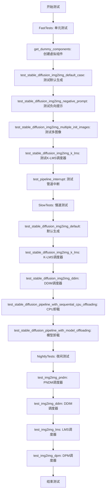
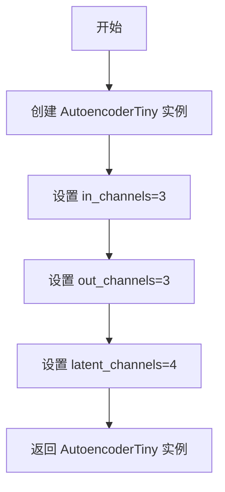
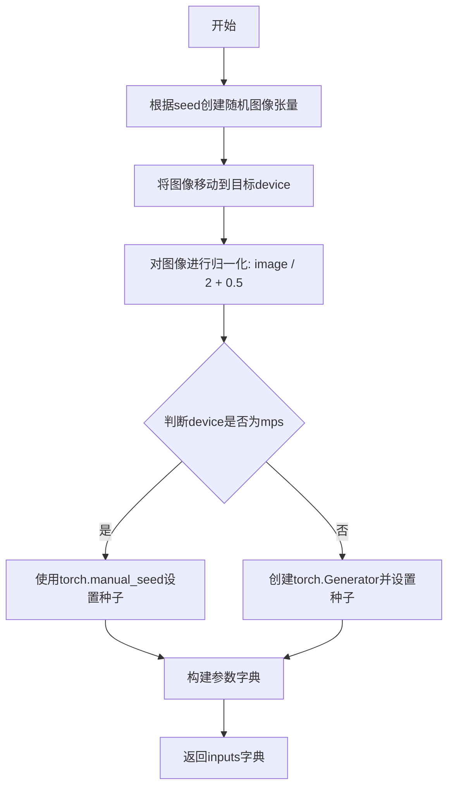
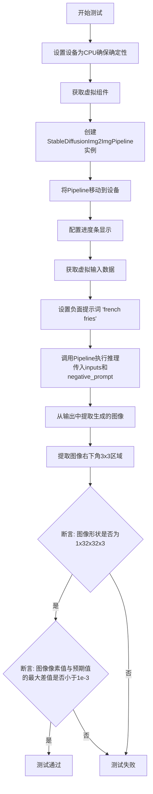
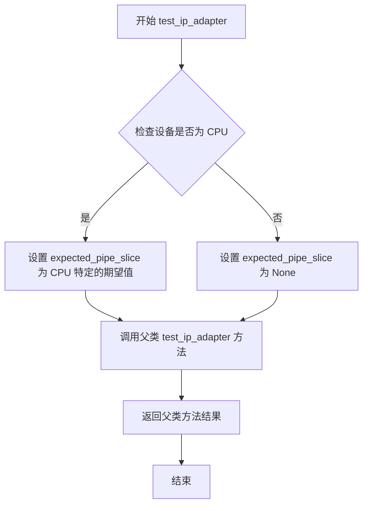
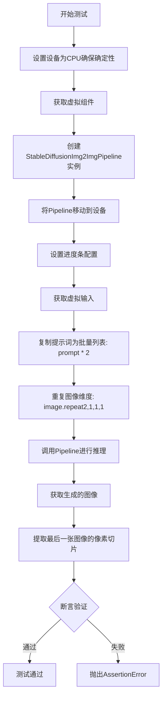
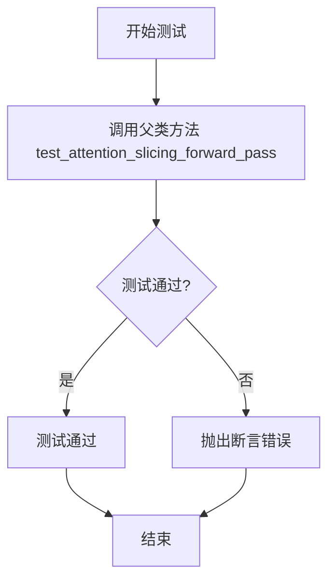
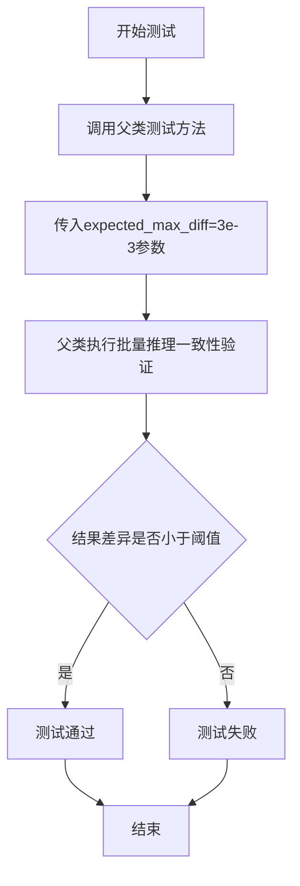
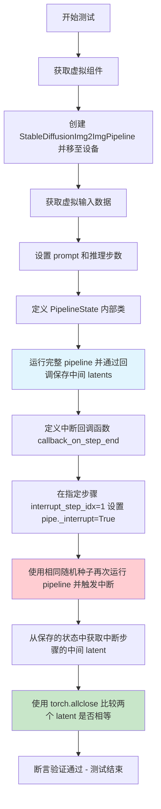

# `diffusers\tests\pipelines\stable_diffusion\test_stable_diffusion_img2img.py` 详细设计文档

用于测试 Stable Diffusion Img2Img Pipeline 的单元测试文件，包含了快速测试、慢速测试和夜间测试三个测试类，验证了图像到图像生成的各种功能，包括默认生成、负向提示、多图像处理、不同调度器、性能优化等

## 整体流程



## 类结构

```
unittest.TestCase
├── StableDiffusionImg2ImgPipelineFastTests
│   ├── IPAdapterTesterMixin
│   ├── PipelineLatentTesterMixin
│   ├── PipelineKarrasSchedulerTesterMixin
│   └── PipelineTesterMixin
├── StableDiffusionImg2ImgPipelineSlowTests
└── StableDiffusionImg2ImgPipelineNightlyTests
```

## 全局变量及字段


### `gc`
    
Python垃圾回收模块，用于手动管理内存

类型：`module`
    


### `random`
    
Python随机数生成模块

类型：`module`
    


### `unittest`
    
Python单元测试框架

类型：`module`
    


### `numpy as np`
    
NumPy科学计算库，用于数组和矩阵操作

类型：`module`
    


### `torch`
    
PyTorch深度学习框架

类型：`module`
    


### `enable_full_determinism`
    
启用完全确定性模式的函数，确保测试可重复性

类型：`function`
    


### `torch_device`
    
测试设备标识符，指定运行测试的硬件设备

类型：`str`
    


### `StableDiffusionImg2ImgPipelineFastTests.pipeline_class`
    
指定测试使用的管道类为StableDiffusionImg2ImgPipeline

类型：`type`
    


### `StableDiffusionImg2ImgPipelineFastTests.params`
    
文本引导图像变体参数集合，不包含height和width

类型：`set`
    


### `StableDiffusionImg2ImgPipelineFastTests.required_optional_params`
    
必需的可选参数集合，去除了latents参数

类型：`set`
    


### `StableDiffusionImg2ImgPipelineFastTests.batch_params`
    
批处理参数集合，用于批量图像生成测试

类型：`set`
    


### `StableDiffusionImg2ImgPipelineFastTests.image_params`
    
图像参数集合，定义图像输入的格式和要求

类型：`set`
    


### `StableDiffusionImg2ImgPipelineFastTests.image_latents_params`
    
图像潜在向量参数集合，用于潜在空间操作

类型：`set`
    


### `StableDiffusionImg2ImgPipelineFastTests.callback_cfg_params`
    
回调配置参数集合，用于自定义回调函数

类型：`set`
    


### `PipelineState.state`
    
存储管道中间状态的列表，用于保存生成过程中的潜在向量

类型：`list`
    
    

## 全局函数及方法


### `StableDiffusionImg2ImgPipelineFastTests.get_dummy_components`

该方法用于创建虚拟（dummy）组件，构建一个用于测试的 Stable Diffusion Img2Img Pipeline 所需的所有模型组件，包括 UNet、VAE、文本编码器、分词器、调度器等，并确保所有组件使用固定的随机种子以保证测试的可重复性。

参数：

- `time_cond_proj_dim`：`Optional[int]`，可选参数，用于设置 UNet2DConditionModel 的时间条件投影维度（time_cond_proj_dim），默认为 None

返回值：`Dict[str, Any]`，返回一个字典，包含以下键值对：
- `"unet"`：UNet2DConditionModel 实例
- `"scheduler"`：PNDMScheduler 实例
- `"vae"`：AutoencoderKL 实例
- `"text_encoder"`：CLIPTextModel 实例
- `"tokenizer"`：CLIPTokenizer 实例
- `"safety_checker"`：None
- `"feature_extractor"`：None
- `"image_encoder"`：None

#### 流程图

```mermaid
flowchart TD
    A[开始 get_dummy_components] --> B[设置随机种子 torch.manual_seed(0)]
    B --> C[创建 UNet2DConditionModel]
    C --> D[创建 PNDMScheduler]
    D --> E[设置随机种子 torch.manual_seed(0)]
    E --> F[创建 AutoencoderKL]
    F --> G[设置随机种子 torch.manual_seed(0)]
    G --> H[创建 CLIPTextConfig]
    H --> I[创建 CLIPTextModel]
    I --> J[创建 CLIPTokenizer]
    J --> K[组装 components 字典]
    K --> L[返回 components]
```

#### 带注释源码

```python
def get_dummy_components(self, time_cond_proj_dim=None):
    """
    创建用于测试的虚拟组件字典。
    
    参数:
        time_cond_proj_dim: 可选的时间条件投影维度，用于 UNet 模型
    返回:
        包含所有 pipeline 组件的字典
    """
    # 设置随机种子以确保测试的可重复性
    torch.manual_seed(0)
    
    # 创建 UNet2DConditionModel：用于去噪的 UNet 网络
    # 参数配置：
    # - block_out_channels: 输出通道数 [32, 64]
    # - layers_per_block: 每层块数量 2
    # - time_cond_proj_dim: 时间条件投影维度（可选）
    # - sample_size: 样本大小 32
    # - in_channels: 输入通道数 4
    # - out_channels: 输出通道数 4
    # - down_block_types: 下采样块类型
    # - up_block_types: 上采样块类型
    # - cross_attention_dim: 交叉注意力维度 32
    unet = UNet2DConditionModel(
        block_out_channels=(32, 64),
        layers_per_block=2,
        time_cond_proj_dim=time_cond_proj_dim,
        sample_size=32,
        in_channels=4,
        out_channels=4,
        down_block_types=("DownBlock2D", "CrossAttnDownBlock2D"),
        up_block_types=("CrossAttnUpBlock2D", "UpBlock2D"),
        cross_attention_dim=32,
    )
    
    # 创建 PNDMScheduler：PNDM 调度器，用于扩散模型的时间步调度
    # skip_prk_steps=True 跳过 PLMS 步骤
    scheduler = PNDMScheduler(skip_prk_steps=True)
    
    # 重新设置随机种子以确保 VAE 的可重复性
    torch.manual_seed(0)
    
    # 创建 AutoencoderKL：变分自编码器，用于潜在空间与图像空间的转换
    vae = AutoencoderKL(
        block_out_channels=[32, 64],
        in_channels=3,
        out_channels=3,
        down_block_types=["DownEncoderBlock2D", "DownEncoderBlock2D"],
        up_block_types=["UpDecoderBlock2D", "UpDecoderBlock2D"],
        latent_channels=4,
    )
    
    # 重新设置随机种子以确保文本编码器的可重复性
    torch.manual_seed(0)
    
    # 创建 CLIPTextConfig：CLIP 文本编码器的配置
    text_encoder_config = CLIPTextConfig(
        bos_token_id=0,          # 起始 token ID
        eos_token_id=2,          # 结束 token ID
        hidden_size=32,          # 隐藏层大小
        intermediate_size=37,   # 中间层大小
        layer_norm_eps=1e-05,    # LayerNorm epsilon
        num_attention_heads=4,   # 注意力头数
        num_hidden_layers=5,    # 隐藏层数量
        pad_token_id=1,          # 填充 token ID
        vocab_size=1000,         # 词汇表大小
    )
    
    # 创建 CLIPTextModel：CLIP 文本编码器模型
    text_encoder = CLIPTextModel(text_encoder_config)
    
    # 创建 CLIPTokenizer：CLIP 分词器
    # 从预训练模型 'hf-internal-testing/tiny-random-clip' 加载
    tokenizer = CLIPTokenizer.from_pretrained("hf-internal-testing/tiny-random-clip")

    # 组装所有组件为字典
    components = {
        "unet": unet,                    # UNet 去噪模型
        "scheduler": scheduler,          # 调度器
        "vae": vae,                      # 变分自编码器
        "text_encoder": text_encoder,    # 文本编码器
        "tokenizer": tokenizer,          # 分词器
        "safety_checker": None,           # 安全检查器（测试中设为 None）
        "feature_extractor": None,       # 特征提取器（测试中设为 None）
        "image_encoder": None,           # 图像编码器（测试中设为 None）
    }
    
    # 返回组件字典
    return components
```


### `StableDiffusionImg2ImgPipelineFastTests.get_dummy_tiny_autoencoder`

该方法用于创建一个配置简单的微型自编码器（AutoencoderTiny）实例，用于测试 Stable Diffusion img2img 管道的小型变体。

参数：

- `self`：`StableDiffusionImg2ImgPipelineFastTests`，当前测试类实例

返回值：`AutoencoderTiny`，返回配置好的微型自编码器模型，包含 in_channels=3（输入通道数）、out_channels=3（输出通道数）、latent_channels=4（潜在空间通道数）

#### 流程图



#### 带注释源码

```python
def get_dummy_tiny_autoencoder(self):
    """
    创建一个用于测试的微型自编码器（AutoencoderTiny）实例。
    
    该方法生成一个轻量级的 VAE 模型，专门用于测试 StableDiffusionImg2ImgPipeline
    在使用小型自编码器时的功能和正确性。在测试 'test_stable_diffusion_img2img_tiny_autoencoder' 
    中被调用，用于验证管道能够正确使用不同的 VAE 变体。
    
    参数:
        self: StableDiffusionImg2ImgPipelineFastTests 的实例
        
    返回:
        AutoencoderTiny: 配置好的微型自编码器模型
            - in_channels: 3 (RGB 图像通道)
            - out_channels: 3 (RGB 输出通道)
            - latent_channels: 4 (潜在空间的通道数，用于 VAE 的编码/解码)
    """
    return AutoencoderTiny(in_channels=3, out_channels=3, latent_channels=4)
```


### `StableDiffusionImg2ImgPipelineFastTests.get_dummy_inputs`

该方法用于生成虚拟输入参数，为 Stable Diffusion Img2Img Pipeline 的单元测试提供测试数据。它创建虚拟图像、随机生成器和其他必要的输入参数，确保测试在确定性和可重复的环境下运行。

参数：

- `device`：`str`，目标设备标识（如 "cpu"、"cuda"、"mps" 等）
- `seed`：`int`（默认值=0），随机种子，用于确保测试的可重复性

返回值：`dict`，包含以下键值对的参数字典：
- `prompt`：str，文本提示词
- `image`：torch.Tensor，输入图像张量
- `generator`：torch.Generator 或 None，随机数生成器
- `num_inference_steps`：int，推理步数
- `guidance_scale`：float，文本引导强度
- `output_type`：str，输出类型

#### 流程图



#### 带注释源码

```python
def get_dummy_inputs(self, device, seed=0):
    # 使用 floats_tensor 生成一个形状为 (1, 3, 32, 32) 的随机浮点数张量
    # rng=random.Random(seed) 确保使用确定的随机数生成器
    image = floats_tensor((1, 3, 32, 32), rng=random.Random(seed)).to(device)
    
    # 将图像像素值归一化到 [0, 1] 范围
    # 原始浮点数张量范围约为 [-1, 1]，除以 2 加 0.5 后变为 [0, 1]
    image = image / 2 + 0.5
    
    # MPS 设备不支持 torch.Generator，需要特殊处理
    if str(device).startswith("mps"):
        # 对于 MPS 设备，只设置随机种子
        generator = torch.manual_seed(seed)
    else:
        # 为其他设备创建确定性随机生成器
        generator = torch.Generator(device=device).manual_seed(seed)
    
    # 构建完整的虚拟输入参数字典
    inputs = {
        "prompt": "A painting of a squirrel eating a burger",  # 测试用文本提示
        "image": image,                                         # 输入图像张量
        "generator": generator,                                 # 确定性随机生成器
        "num_inference_steps": 2,                               # 推理步数（较少以加快测试）
        "guidance_scale": 6.0,                                  # Classifier-free guidance 强度
        "output_type": "np",                                    # 输出为 numpy 数组
    }
    
    # 返回包含所有必要参数的字典，供 pipeline 调用
    return inputs
```


### `StableDiffusionImg2ImgPipelineFastTests.test_stable_diffusion_img2img_default_case`

这是一个单元测试方法，用于验证 StableDiffusionImg2ImgPipeline 在默认配置下的基本图像生成功能是否正常工作。测试通过使用虚拟（dummy）组件创建管道，执行图像到图像（img2img）的推理流程，并验证输出图像的形状和像素值是否符合预期，从而确保管道的核心功能完整性。

参数：

- `self`：隐式参数，StableDiffusionImg2ImgPipelineFastTests 类的实例

返回值：`None`，该方法为测试方法，通过断言验证结果，不返回任何值

#### 流程图

```mermaid
flowchart TD
    A[开始测试] --> B[设置设备为CPU保证确定性]
    B --> C[获取虚拟组件: get_dummy_components]
    C --> D[使用组件实例化StableDiffusionImg2ImgPipeline]
    D --> E[将管道移至CPU设备]
    E --> F[设置进度条配置: set_progress_bar_config]
    F --> G[获取虚拟输入: get_dummy_inputs]
    G --> H[执行管道推理: sd_pipe(**inputs)]
    H --> I[提取输出图像的右下角3x3像素]
    I --> J{断言图像形状为1x32x32x3}
    J -->|是| K{断言像素值与预期值差异小于1e-3}
    J -->|否| L[测试失败: 抛出断言错误]
    K -->|是| M[测试通过]
    K -->|否| L
```

#### 带注释源码

```python
def test_stable_diffusion_img2img_default_case(self):
    """
    测试 StableDiffusionImg2ImgPipeline 在默认配置下的基本功能。
    使用虚拟组件进行快速单元测试，验证管道能够正确执行图像到图像的生成。
    """
    # 步骤1: 设置设备为CPU，确保torch.Generator的确定性
    device = "cpu"  # ensure determinism for the device-dependent torch.Generator
    
    # 步骤2: 获取虚拟组件（UNet, VAE, TextEncoder, Tokenizer, Scheduler等）
    # 这些是轻量级的测试模型，用于快速执行单元测试
    components = self.get_dummy_components()
    
    # 步骤3: 使用虚拟组件实例化StableDiffusionImg2ImgPipeline
    sd_pipe = StableDiffusionImg2ImgPipeline(**components)
    
    # 步骤4: 将管道移至指定设备（CPU）
    sd_pipe = sd_pipe.to(device)
    
    # 步骤5: 设置进度条配置（disable=None表示不禁用进度条）
    sd_pipe.set_progress_bar_config(disable=None)
    
    # 步骤6: 获取虚拟输入参数
    # 包含: prompt, image, generator, num_inference_steps, guidance_scale, output_type
    inputs = self.get_dummy_inputs(device)
    
    # 步骤7: 执行管道推理，获取生成的图像
    # 返回的images形状为(batch_size, height, width, channels)
    image = sd_pipe(**inputs).images
    
    # 步骤8: 提取图像右下角3x3区域的像素值（最后一个通道）
    # 用于与预期值进行精确比较
    image_slice = image[0, -3:, -3:, -1]
    
    # 断言1: 验证输出图像的形状
    # 预期形状: (1, 32, 32, 3) - 单张32x32的RGB图像
    assert image.shape == (1, 32, 32, 3)
    
    # 定义预期像素值切片（预先计算的标准结果）
    expected_slice = np.array([0.4555, 0.3216, 0.4049, 0.4620, 0.4618, 0.4126, 0.4122, 0.4629, 0.4579])
    
    # 断言2: 验证生成的图像像素值与预期值的差异
    # 使用最大绝对误差（max）比较，允许1e-3的误差范围
    assert np.abs(image_slice.flatten() - expected_slice).max() < 1e-3
```

#### 关键组件信息

| 组件名称 | 描述 |
|---------|------|
| `StableDiffusionImg2ImgPipeline` | Diffusers库中的图像到图像扩散管道，用于基于文本提示和初始图像生成新图像 |
| `UNet2DConditionModel` | 条件UNet模型，负责去噪过程的核心神经网络 |
| `AutoencoderKL` | VAE编码器和解码器，用于将图像编码到潜在空间并解码回像素空间 |
| `CLIPTextModel` | 文本编码器，将文本提示转换为文本嵌入向量 |
| `CLIPTokenizer` | 分词器，将文本分割为token序列 |
| `PNDIMScheduler` | PNDM调度器，控制去噪过程中的时间步长安排 |
| `get_dummy_components` | 辅助方法，创建用于测试的虚拟组件 |
| `get_dummy_inputs` | 辅助方法，创建用于测试的虚拟输入参数 |

#### 潜在技术债务与优化空间

1. **测试数据硬编码**：预期像素值 `expected_slice` 被硬编码在测试中，如果模型实现发生变化需要手动更新，建议改为从参考文件动态加载
2. **缺乏参数化测试**：当前测试针对固定分辨率（32x32），可以扩展为参数化测试以覆盖多种分辨率场景
3. **设备依赖性**：虽然使用了CPU设备确保确定性，但缺少对GPU/MPS设备的条件跳过标记（虽然部分测试有 `@skip_mps` 装饰器）
4. **重复代码**：多个测试方法中存在大量重复的设置代码（设备设置、管道创建等），可以考虑提取为共享的 `setUp` 方法

#### 其它项目说明

- **测试目标**：验证StableDiffusionImg2ImgPipeline的基本推理流程能够产生确定性的、可复现的结果
- **设计约束**：使用虚拟组件而非真实预训练模型，以确保单元测试的执行速度和独立性
- **错误处理**：通过断言验证每个关键步骤，任何不匹配都会抛出详细的断言错误
- **数据流**：输入（prompt + image）→ 文本编码 → VAE编码 → UNet去噪循环 → VAE解码 → 输出图像
- **依赖接口**：该测试依赖于 `StableDiffusionImg2ImgPipeline` 的 `__call__` 方法契约，期望接收特定格式的输入参数并返回包含 `images` 属性的对象


### `test_stable_diffusion_img2img_default_case_lcm`

该测试函数验证了使用 LCM（Latent Consistency Models）调度的 Stable Diffusion Img2Img Pipeline 能否正确执行图像到图像的生成任务，通过对比输出图像的部分像素值与预期值来确认功能的正确性。

参数：

- 无显式参数（继承自 `unittest.TestCase` 的测试方法，使用 `self` 访问实例属性）

返回值：`None`，无返回值（unittest 测试方法）

#### 流程图

```mermaid
flowchart TD
    A[开始测试] --> B[设置设备为 CPU]
    B --> C[获取虚拟组件<br/>time_cond_proj_dim=256]
    C --> D[创建 StableDiffusionImg2ImgPipeline]
    D --> E[替换调度器为 LCMScheduler]
    E --> F[Pipeline 移动到设备]
    F --> G[设置进度条配置]
    G --> H[获取虚拟输入]
    H --> I[执行 Pipeline 生成图像]
    I --> J[提取图像切片<br/>image[0, -3:, -3:, -1]]
    J --> K{验证图像形状<br/>assert (1, 32, 32, 3)}
    K --> L{验证像素值<br/>assert max_diff < 1e-3}
    L --> M[测试通过]
    K -->|失败| N[抛出 AssertionError]
    L -->|失败| N
```

#### 带注释源码

```python
def test_stable_diffusion_img2img_default_case_lcm(self):
    """
    测试使用 LCM 调度的 Stable Diffusion Img2Img Pipeline 的默认生成功能。
    
    该测试验证:
    1. Pipeline 能在 LCM 调度器下正确初始化
    2. 能够根据提示词和输入图像生成新图像
    3. 生成的图像尺寸正确
    4. 输出图像的像素值在容差范围内与预期值匹配
    """
    
    # 步骤1: 设置设备为 CPU，确保 torch.Generator 的确定性
    device = "cpu"  # ensure determinism for the device-dependent torch.Generator
    
    # 步骤2: 获取虚拟组件，传入 time_cond_proj_dim=256 以支持 LCM 模型
    components = self.get_dummy_components(time_cond_proj_dim=256)
    
    # 步骤3: 使用虚拟组件创建 StableDiffusionImg2ImgPipeline 实例
    sd_pipe = StableDiffusionImg2ImgPipeline(**components)
    
    # 步骤4: 将默认的 PNDMScheduler 替换为 LCMScheduler
    # LCMScheduler 用于 Latent Consistency Models，可以实现更快的推理
    sd_pipe.scheduler = LCMScheduler.from_config(sd_pipe.scheduler.config)
    
    # 步骤5: 将 Pipeline 移动到指定设备（CPU）
    sd_pipe = sd_pipe.to(device)
    
    # 步骤6: 配置进度条（disable=None 表示启用进度条）
    sd_pipe.set_progress_bar_config(disable=None)
    
    # 步骤7: 获取测试用的虚拟输入
    # 包含: prompt, image, generator, num_inference_steps, guidance_scale, output_type
    inputs = self.get_dummy_inputs(device)
    
    # 步骤8: 执行图像生成
    # 将输入传递给 Pipeline 并获取生成的图像
    image = sd_pipe(**inputs).images
    
    # 步骤9: 提取图像切片用于验证
    # 取第一张图像的最后 3x3 像素区域，取所有颜色通道
    image_slice = image[0, -3:, -3:, -1]
    
    # 步骤10: 验证输出图像形状
    # 期望形状为 (1, 32, 32, 3) - batch_size=1, height=32, width=32, channels=3
    assert image.shape == (1, 32, 32, 3)
    
    # 步骤11: 定义预期的像素值切片
    # 这些值是预先计算的正确输出，用于验证生成结果
    expected_slice = np.array([0.5709, 0.4614, 0.4587, 0.5978, 0.5298, 0.6910, 0.6240, 0.5212, 0.5454])
    
    # 步骤12: 验证生成图像与预期值的差异
    # 使用最大绝对误差 (max absolute difference) 进行验证
    # 容差设置为 1e-3，确保数值精度符合要求
    assert np.abs(image_slice.flatten() - expected_slice).max() < 1e-3
```


### `StableDiffusionImg2ImgPipelineFastTests.test_stable_diffusion_img2img_default_case_lcm_custom_timesteps`

该测试方法用于验证 Stable Diffusion Img2Img Pipeline 在使用 LCM Scheduler 和自定义时间步（timesteps）时的默认行为是否符合预期。测试通过比较生成的图像切片与预期值来确保管道的正确性。

参数：

- `self`：测试类实例本身，包含测试所需的上下文和辅助方法

返回值：`None`，该方法为测试用例，通过断言验证管道输出的图像质量

#### 流程图

```mermaid
flowchart TD
    A[开始测试] --> B[设置设备为 CPU 确保确定性]
    B --> C[获取 Dummy 组件<br/>time_cond_proj_dim=256]
    C --> D[创建 StableDiffusionImg2ImgPipeline]
    D --> E[加载 LCMScheduler 配置]
    E --> F[将 Pipeline 移至 CPU 设备]
    F --> G[设置进度条配置]
    G --> H[获取 Dummy 输入]
    H --> I[删除 num_inference_steps]
    I --> J[设置自定义 timesteps<br/>[999, 499]]
    J --> K[调用 Pipeline 生成图像]
    K --> L[提取图像切片<br/>image[0, -3:, -3:, -1]]
    L --> M[断言图像形状为<br/>(1, 32, 32, 3)]
    M --> N[定义期望切片值]
    N --> O[断言图像切片与期望值差异<br/>小于 1e-3]
    O --> P[测试结束]
```

#### 带注释源码

```python
def test_stable_diffusion_img2img_default_case_lcm_custom_timesteps(self):
    # 使用 CPU 设备以确保 torch.Generator 的确定性行为
    device = "cpu"  # ensure determinism for the device-dependent torch.Generator
    
    # 获取带有时间条件投影维度的虚拟组件
    # time_cond_proj_dim=256 用于 LCM (Latent Consistency Models) 场景
    components = self.get_dummy_components(time_cond_proj_dim=256)
    
    # 使用虚拟组件实例化 Stable Diffusion Img2Img Pipeline
    sd_pipe = StableDiffusionImg2ImgPipeline(**components)
    
    # 将默认的 PNDMScheduler 替换为 LCMScheduler
    # LCM Scheduler 用于加速扩散模型的采样过程
    sd_pipe.scheduler = LCMScheduler.from_config(sd_pipe.scheduler.config)
    
    # 将 Pipeline 移至 CPU 设备
    sd_pipe = sd_pipe.to(device)
    
    # 配置进度条（disable=None 表示不禁用进度条）
    sd_pipe.set_progress_bar_config(disable=None)

    # 获取测试所需的虚拟输入数据
    inputs = self.get_dummy_inputs(device)
    
    # 删除 num_inference_steps 参数
    # 因为我们将使用自定义的 timesteps 参数
    del inputs["num_inference_steps"]
    
    # 设置自定义的时间步列表 [999, 499]
    # 这些自定义时间步将覆盖默认的推理步数
    inputs["timesteps"] = [999, 499]
    
    # 调用 Pipeline 进行图像生成
    # 返回包含图像的对象，images 属性包含生成的图像
    image = sd_pipe(**inputs).images
    
    # 提取生成图像的最后一个通道的右下角 3x3 切片
    # 用于后续的数值验证
    image_slice = image[0, -3:, -3:, -1]

    # 断言验证生成图像的形状
    # 期望形状为 (1, 32, 32, 3) - 批量大小1，高宽32，RGB 3通道
    assert image.shape == (1, 32, 32, 3)
    
    # 定义期望的图像切片数值（预先计算的正确结果）
    expected_slice = np.array([0.5709, 0.4614, 0.4587, 0.5978, 0.5298, 0.6910, 0.6240, 0.5212, 0.5454])

    # 断言验证生成图像与期望值的差异
    # 使用最大绝对误差不超过 1e-3 的标准
    assert np.abs(image_slice.flatten() - expected_slice).max() < 1e-3
```


### `test_stable_diffusion_img2img_negative_prompt`

这是一个单元测试方法，用于验证 StableDiffusionImg2ImgPipeline 对负面提示词（negative_prompt）功能的正确性。测试通过创建虚拟组件和输入数据，运行图像到图像的推理过程，并断言生成的图像与预期值匹配，从而确保负面提示词能够正确地引导模型避免生成相关内容。

参数：
- `self`：测试类实例本身，无需额外描述

返回值：`None`，该方法为单元测试方法，没有返回值，通过断言验证功能正确性

#### 流程图



#### 带注释源码

```python
def test_stable_diffusion_img2img_negative_prompt(self):
    """
    测试StableDiffusionImg2ImgPipeline的负面提示词(negative_prompt)功能。
    
    该测试验证当提供负面提示词时，模型能够正确地利用该提示词
    来引导图像生成过程，避免生成与负面提示相关的内容。
    """
    # 设置设备为CPU，确保torch.Generator的确定性行为
    # 这样可以保证测试结果的可重复性
    device = "cpu"  # ensure determinism for the device-dependent torch.Generator
    
    # 获取用于测试的虚拟组件（UNet, VAE, TextEncoder等）
    # 这些是使用小规模随机权重初始化的模型
    components = self.get_dummy_components()
    
    # 使用虚拟组件实例化Stable Diffusion图像到图像管道
    sd_pipe = StableDiffusionImg2ImgPipeline(**components)
    
    # 将整个管道移动到指定的计算设备
    sd_pipe = sd_pipe.to(device)
    
    # 配置进度条，disable=None表示不禁用进度条
    sd_pipe.set_progress_bar_config(disable=None)
    
    # 获取用于推理的虚拟输入数据
    # 包含prompt、image、generator等必要参数
    inputs = self.get_dummy_inputs(device)
    
    # 定义负面提示词，用于引导模型避免生成相关内容
    # 在这个测试案例中，负面提示词为"french fries"（薯条）
    negative_prompt = "french fries"
    
    # 调用管道执行推理，传入标准输入和负面提示词
    # 负面提示词会在文本编码阶段被处理，然后用于引导去噪过程
    output = sd_pipe(**inputs, negative_prompt=negative_prompt)
    
    # 从输出对象中提取生成的图像数组
    image = output.images
    
    # 提取图像切片用于验证
    # 取第一张图像的右下角3x3区域（最后3个像素）
    # image shape: [batch, height, width, channels]
    image_slice = image[0, -3:, -3:, -1]
    
    # 断言验证生成图像的形状是否为(1, 32, 32, 3)
    # 1表示batch size，32x32是图像分辨率，3是RGB通道数
    assert image.shape == (1, 32, 32, 3)
    
    # 定义预期的图像像素值切片
    # 这些值是通过在确定性条件下运行管道得到的参考值
    expected_slice = np.array([0.4593, 0.3408, 0.4232, 0.4749, 0.4476, 0.4115, 0.4357, 0.4733, 0.4663])
    
    # 断言验证生成的图像与预期值的差异
    # 使用最大绝对差值作为评判标准，阈值为1e-3
    # 如果差异小于阈值，说明负面提示词功能正常工作
    assert np.abs(image_slice.flatten() - expected_slice).max() < 1e-3
```


### `test_ip_adapter`

这是 `StableDiffusionImg2ImgPipelineFastTests` 类中的一个测试方法，用于验证 Stable Diffusion Img2Img Pipeline 的 IP-Adapter 功能是否正常工作。该方法通过设置特定的期望输出切片并调用父类的测试方法来验证 IP-Adapter 集成。

#### 参数

此方法没有直接参数，但内部调用了父类方法：

- `expected_pipe_slice`：`numpy.ndarray`，当设备为 CPU 时传入的期望输出切片，用于验证生成结果的正确性

#### 返回值

- 返回类型取决于父类 `IPAdapterTesterMixin.test_ip_adapter` 的返回值，通常为 `None` 或测试断言结果

#### 流程图



#### 带注释源码

```python
def test_ip_adapter(self):
    """
    测试 IP-Adapter 功能是否在 StableDiffusionImg2ImgPipeline 中正常工作。
    
    IP-Adapter 是一种用于条件图像生成的技术，允许通过额外的图像条件来引导生成过程。
    """
    # 初始化期望的输出切片为 None
    expected_pipe_slice = None
    
    # 检查当前设备是否为 CPU
    # 如果是 CPU，则使用预先计算好的期望输出切片进行验证
    if torch_device == "cpu":
        # CPU 设备上的期望输出切片值，用于断言验证
        # 这些值是从已知正确的测试运行中预先计算得出的
        expected_pipe_slice = np.array([0.4932, 0.5092, 0.5135, 0.5517, 0.5626, 0.6621, 0.6490, 0.5021, 0.5441])
    
    # 调用父类 IPAdapterTesterMixin 的 test_ip_adapter 方法进行实际测试
    # 传入期望的输出切片用于验证
    return super().test_ip_adapter(expected_pipe_slice=expected_pipe_slice)
```


### `StableDiffusionImg2ImgPipelineFastTests.test_stable_diffusion_img2img_multiple_init_images`

该方法是 `StableDiffusionImg2ImgPipelineFastTests` 测试类中的一个单元测试方法，用于验证 StableDiffusionImg2ImgPipeline 在处理多个初始化图像（批量推理）时的正确性。测试通过传入批量提示词和重复的图像，验证管道能够正确生成对应数量的图像输出。

参数：

- `self`：隐式参数，`StableDiffusionImg2ImgPipelineFastTests` 类的实例本身，无需显式传递

返回值：无显式返回值（void），该方法为 `unittest.TestCase` 的测试方法，通过断言（assert）验证管道输出的正确性

#### 流程图



#### 带注释源码

```python
def test_stable_diffusion_img2img_multiple_init_images(self):
    """
    测试StableDiffusionImg2ImgPipeline在处理多个初始化图像时的功能。
    验证批量推理场景下管道能否正确生成多张图像。
    """
    # 设置设备为CPU，确保torch.Generator的确定性
    device = "cpu"  # ensure determinism for the device-dependent torch.Generator
    
    # 获取预定义的虚拟组件（UNet, VAE, Scheduler, TextEncoder等）
    components = self.get_dummy_components()
    
    # 使用虚拟组件实例化StableDiffusionImg2ImgPipeline管道
    sd_pipe = StableDiffusionImg2ImgPipeline(**components)
    
    # 将管道移动到指定设备（CPU）
    sd_pipe = sd_pipe.to(device)
    
    # 配置进度条（disable=None表示不禁用进度条）
    sd_pipe.set_progress_bar_config(disable=None)

    # 获取虚拟输入参数
    inputs = self.get_dummy_inputs(device)
    
    # 将单个提示词复制为批量形式（2个相同的提示词）
    inputs["prompt"] = [inputs["prompt"]] * 2
    
    # 将单个图像在批次维度重复，构造批量图像输入（batch_size=2）
    # repeat(2,1,1,1)表示在第0维（batch）重复2次，其余维度保持不变
    inputs["image"] = inputs["image"].repeat(2, 1, 1, 1)
    
    # 调用管道进行推理，生成图像
    image = sd_pipe(**inputs).images
    
    # 提取最后一张生成图像的右下角3x3像素区域（用于验证）
    image_slice = image[-1, -3:, -3:, -1]

    # 断言：验证输出图像的形状为批量大小2，32x32分辨率，3通道
    assert image.shape == (2, 32, 32, 3)
    
    # 定义预期像素值（用于比对）
    expected_slice = np.array([0.4241, 0.5576, 0.5711, 0.4792, 0.4311, 0.5952, 0.5827, 0.5138, 0.5109])

    # 断言：验证像素值误差在允许范围内（1e-3）
    assert np.abs(image_slice.flatten() - expected_slice).max() < 1e-3
```


### `StableDiffusionImg2ImgPipelineFastTests.test_stable_diffusion_img2img_k_lms`

该测试方法用于验证 StableDiffusionImg2ImgPipeline 使用 LMSDiscreteScheduler（离散 LMS 调度器）进行图像到图像生成的功能是否正确。测试通过使用虚拟组件创建管道，执行推理，并验证输出图像的形状和像素值是否符合预期。

参数：

- `self`：隐式参数，表示测试类实例本身

返回值：无（测试方法返回 None，通过 assert 语句进行验证）

#### 流程图

```mermaid
flowchart TD
    A[开始测试] --> B[设置device为cpu确保确定性]
    B --> C[调用get_dummy_components获取虚拟组件]
    C --> D[创建LMSDiscreteScheduler并配置beta参数]
    D --> E[使用虚拟组件创建StableDiffusionImg2ImgPipeline]
    E --> F[将管道移动到device]
    F --> G[设置进度条配置disable=None]
    G --> H[调用get_dummy_inputs获取测试输入]
    H --> I[执行管道推理获取生成的图像]
    I --> J[提取图像切片image[0, -3:, -3:, -1]]
    J --> K[断言图像形状为1, 32, 32, 3]
    K --> L[定义期望的像素值数组]
    L --> M[断言实际像素值与期望值的最大差异小于1e-3]
    M --> N[测试结束]
```

#### 带注释源码

```python
def test_stable_diffusion_img2img_k_lms(self):
    """
    测试使用 LMS Discrete Scheduler 的 Stable Diffusion Img2Img 管道
    验证图像生成结果的正确性
    """
    # 设置设备为 CPU，确保 torch.Generator 的确定性
    device = "cpu"  # ensure determinism for the device-dependent torch.Generator
    
    # 获取虚拟组件（UNet, VAE, TextEncoder, Tokenizer 等）
    components = self.get_dummy_components()
    
    # 创建 LMSDiscreteScheduler，配置 beta 调度参数
    # beta_start: 起始 beta 值
    # beta_end: 结束 beta 值  
    # beta_schedule: beta 调度方式为 scaled_linear
    components["scheduler"] = LMSDiscreteScheduler(
        beta_start=0.00085, 
        beta_end=0.012, 
        beta_schedule="scaled_linear"
    )
    
    # 使用虚拟组件实例化 StableDiffusionImg2ImgPipeline
    sd_pipe = StableDiffusionImg2ImgPipeline(**components)
    
    # 将管道移动到指定设备（CPU）
    sd_pipe = sd_pipe.to(device)
    
    # 设置进度条配置，disable=None 表示不禁用进度条
    sd_pipe.set_progress_bar_config(disable=None)
    
    # 获取测试输入，包含 prompt、image、generator 等参数
    inputs = self.get_dummy_inputs(device)
    
    # 执行管道推理，传入输入参数
    # 返回包含生成图像的 PipelineOutput 对象
    image = sd_pipe(**inputs).images
    
    # 提取图像的一个切片用于验证
    # 取第一张图像的最后 3x3 像素区域的所有通道
    image_slice = image[0, -3:, -3:, -1]
    
    # 断言生成的图像形状为 (1, 32, 32, 3)
    # 1: batch size, 32x32: 图像高宽, 3: RGB 通道
    assert image.shape == (1, 32, 32, 3)
    
    # 定义期望的像素值数组（9个值，对应 3x3 区域）
    expected_slice = np.array([
        0.4398, 0.4949, 0.4337, 
        0.6580, 0.5555, 0.4338, 
        0.5769, 0.5955, 0.5175
    ])
    
    # 断言实际像素值与期望值的最大差异小于 1e-3
    # 使用 np.abs 计算差值的绝对值，然后取最大值
    assert np.abs(image_slice.flatten() - expected_slice).max() < 1e-3
```


### `StableDiffusionImg2ImgPipelineFastTests.test_stable_diffusion_img2img_tiny_autoencoder`

该测试方法用于验证在使用 Tiny Autoencoder（AutoencoderTiny）替代默认的 AutoencoderKL 时，Stable Diffusion Img2Img Pipeline 能否正确生成图像，并确保输出图像的数值与预期值匹配。

参数：

- `self`：隐含参数，StableDiffusionImg2ImgPipelineFastTests 实例本身

返回值：`None`，该方法为单元测试，通过断言验证图像生成的正确性，无显式返回值

#### 流程图

```mermaid
flowchart TD
    A[开始测试] --> B[设置设备为cpu确保确定性]
    B --> C[获取虚拟组件get_dummy_components]
    C --> D[创建StableDiffusionImg2ImgPipeline实例]
    D --> E[获取Tiny Autoencoder: get_dummy_tiny_autoencoder]
    E --> F[用Tiny Autoencoder替换pipeline的vae]
    F --> G[移动pipeline到设备并设置进度条]
    G --> H[获取虚拟输入get_dummy_inputs]
    H --> I[调用pipeline生成图像]
    I --> J[提取图像切片 image[0, -3:, -3:, -1]]
    J --> K{断言图像形状是否为1, 32, 32, 3}
    K -->|是| L[定义预期切片值]
    L --> M{断言数值差异是否小于1e-3}
    M -->|是| N[测试通过]
    M -->|否| O[测试失败抛出AssertionError]
    K -->|否| O
```

#### 带注释源码

```python
def test_stable_diffusion_img2img_tiny_autoencoder(self):
    """
    测试使用 Tiny Autoencoder (AutoencoderTiny) 替代默认 VAE 的 Img2Img Pipeline 功能。
    验证要点：
    1. Tiny Autoencoder 能正确替换标准 AutoencoderKL
    2. Pipeline 能正常执行图像到图像的生成
    3. 输出图像尺寸和数值符合预期
    """
    # 设置设备为 cpu，确保随机数生成器的确定性
    # 这是为了保证测试结果的可重复性
    device = "cpu"  # ensure determinism for the device-dependent torch.Generator
    
    # 获取虚拟组件（UNet、Scheduler、VAE、Text Encoder 等）
    # 这些是用于测试的轻量级模拟组件
    components = self.get_dummy_components()
    
    # 使用虚拟组件创建 StableDiffusionImg2ImgPipeline
    sd_pipe = StableDiffusionImg2ImgPipeline(**components)
    
    # 关键步骤：用 Tiny Autoencoder 替换默认的 VAE
    # AutoencoderTiny 是一个更小的 VAE 实现，用于测试和快速原型开发
    sd_pipe.vae = self.get_dummy_tiny_autoencoder()
    
    # 将 pipeline 移动到指定设备（cpu）
    sd_pipe = sd_pipe.to(device)
    
    # 配置进度条（disable=None 表示不禁用进度条）
    sd_pipe.set_progress_bar_config(disable=None)
    
    # 获取测试输入：包含 prompt、图像、generator、推理步数等
    inputs = self.get_dummy_inputs(device)
    
    # 执行图像到图像的生成
    # **inputs 会解包字典，传递所有参数
    image = sd_pipe(**inputs).images
    
    # 提取图像切片用于验证
    # image 形状为 [batch, height, width, channel]
    # 取最后一个 batch、最后 3x3 像素、最后一个通道
    image_slice = image[0, -3:, -3:, -1]
    
    # 断言 1：验证输出图像形状为 (1, 32, 32, 3)
    # 1=batch size, 32=高度, 32=宽度, 3=RGB 通道
    assert image.shape == (1, 32, 32, 3)
    
    # 定义预期图像切片数值
    # 这些数值是通过之前的测试运行得到的基准值
    expected_slice = np.array([0.00669, 0.00669, 0.0, 0.00693, 0.00858, 0.0, 0.00567, 0.00515, 0.00125])
    
    # 断言 2：验证生成的图像数值与预期值的差异
    # 使用最大绝对误差（max < 1e-3）作为判断标准
    # flatten() 将 3x3 数组展平为 1D 数组以便比较
    assert np.abs(image_slice.flatten() - expected_slice).max() < 1e-3
```


### `StableDiffusionImg2ImgPipelineFastTests.test_save_load_local`

该方法是 StableDiffusionImg2ImgPipeline 快速测试类中的一个测试用例，用于验证 StableDiffusionImg2ImgPipeline 模型的保存和加载功能是否正常工作。该方法通过调用父类的 test_save_load_local 方法来实现具体的测试逻辑，并使用 @skip_mps 装饰器跳过在 MPS (Apple Silicon) 设备上的测试。

参数：

- `self`：`StableDiffusionImg2ImgPipelineFastTests`，代表测试类实例本身，用于访问类的属性和方法

返回值：继承自父类 `PipelineTesterMixin.test_save_load_local()` 方法的返回值，通常是 `None` 或测试断言结果

#### 流程图

```mermaid
flowchart TD
    A[开始 test_save_load_local] --> B{检查是否在MPS设备上}
    B -->|是| C[跳过测试]
    B -->|否| D[调用父类方法 super().test_save_load_local]
    D --> E[执行父类定义的保存加载测试逻辑]
    E --> F[返回测试结果]
    C --> F
```

#### 带注释源码

```python
@skip_mps  # 装饰器：跳过在Apple MPS设备上的测试
def test_save_load_local(self):
    """
    测试 StableDiffusionImg2ImgPipeline 的保存和加载功能。
    
    该方法是一个委托方法，将实际的测试逻辑交给父类 PipelineTesterMixin 的
    test_save_load_local 方法来实现。父类方法通常会执行以下操作：
    1. 创建 Pipeline 实例
    2. 将 Pipeline 保存到本地路径
    3. 从本地路径加载 Pipeline
    4. 验证加载后的 Pipeline 可以正常生成图像
    5. 比较保存前后的生成结果是否一致
    """
    return super().test_save_load_local()
    """
    super() 获取父类 PipelineTesterMixin 的引用，
    调用其 test_save_load_local 方法执行实际的保存/加载测试逻辑。
    """
```


### `StableDiffusionImg2ImgPipelineFastTests.test_dict_tuple_outputs_equivalent`

该方法用于测试 StableDiffusionImg2ImgPipeline 管道在不同输出格式（字典和元组）下产生的图像结果是否等价，确保管道对输出格式的兼容性。

参数：

- `self`：StableDiffusionImg2ImgPipelineFastTests 实例，调用该测试方法的类实例本身，无需显式传递

返回值：`unittest.TestCase` 或 `None`，返回父类测试方法的执行结果，验证管道输出格式等价性。

#### 流程图

```mermaid
graph TD
    A[开始测试 test_dict_tuple_outputs_equivalent] --> B[检查是否跳过MPS设备]
    B --> C[调用父类方法 super().test_dict_tuple_outputs_equivalent]
    C --> D[父类方法内部逻辑]
    D --> E[使用字典格式调用管道]
    D --> F[使用元组格式调用管道]
    E --> G[比较两种输出格式的图像结果]
    F --> G
    G --> H{结果是否等价?}
    H -->|是| I[测试通过]
    H -->|否| J[测试失败]
    I --> K[返回测试结果]
    J --> K
```

#### 带注释源码

```python
@skip_mps  # 装饰器：跳过MPS设备上的测试（Apple Silicon GPU）
def test_dict_tuple_outputs_equivalent(self):
    """
    测试 StableDiffusionImg2ImgPipeline 的输出格式兼容性
    
    该测试方法验证管道在以下两种调用方式下产生的图像结果是否一致：
    1. 使用字典格式调用（如 sd_pipe(prompt=..., image=...)）
    2. 使用元组格式调用（如 sd_pipe(prompt, image)）
    
    这种测试确保管道的输出格式不会因为调用方式的不同而产生差异。
    """
    # 调用父类（PipelineTesterMixin）的同名测试方法
    # 父类方法会执行以下操作：
    # 1. 获取管道默认的字典格式输出
    # 2. 使用元组参数格式调用管道
    # 3. 比较两种输出格式的图像数组是否相等
    return super().test_dict_tuple_outputs_equivalent()
```


### `StableDiffusionImg2ImgPipelineFastTests.test_save_load_optional_components`

该方法是一个测试用例，用于验证 StableDiffusionImg2ImgPipeline 的可选组件（如 safety_checker、feature_extractor、image_encoder 等）的保存和加载功能是否正常工作。测试通过调用父类的同名测试方法来实现。

参数：

- `self`：对象实例本身，包含测试所需的组件和配置

返回值：`任意类型`，返回父类测试方法的执行结果，通常为 `None` 或 `unittest.TestResult`

#### 流程图

```mermaid
flowchart TD
    A[开始 test_save_load_optional_components] --> B{检查是否需要跳过 MPS 测试}
    B -->|是| C[使用 @skip_mps 装饰器跳过测试]
    B -->|否| D[调用 super().test_save_load_optional_components]
    D --> E[执行父类中的测试逻辑]
    E --> F[验证可选组件的保存加载功能]
    F --> G[结束测试]
```

#### 带注释源码

```python
@skip_mps  # 装饰器：如果在 MPS (Apple Silicon) 设备上运行则跳过此测试
def test_save_load_optional_components(self):
    """
    测试可选组件的保存和加载功能。
    
    该方法验证 pipeline 中的可选组件（如 safety_checker、feature_extractor、image_encoder）
    在被设置为 None 时，pipeline 仍然可以正确地序列化和反序列化。
    
    Returns:
        super().test_save_load_optional_components() 的返回值，
        即父类 PipelineTesterMixin 中定义的测试结果
    """
    return super().test_save_load_optional_components()
```


### `StableDiffusionImg2ImgPipelineFastTests.test_attention_slicing_forward_pass`

该方法是一个测试用例，用于验证 Stable Diffusion img2img pipeline 的注意力切片（attention slicing）功能是否正常工作。注意力切片是一种内存优化技术，通过将注意力计算分片处理来减少显存占用。

参数：

- `self`：`StableDiffusionImg2ImgPipelineFastTests`，测试类的实例，隐含参数
- `expected_max_diff`：`float`，关键字参数，允许输出结果的最大差异阈值，设置为 `5e-3`

返回值：`None`，无直接返回值（调用父类测试方法，测试通过则通过 `assert` 断言验证）

#### 流程图



#### 带注释源码

```python
@skip_mps  # 跳过在 Apple MPS 设备上的测试
def test_attention_slicing_forward_pass(self):
    """
    测试注意力切片（attention slicing）前向传播功能。
    
    该测试验证在启用注意力切片时，pipeline 仍能产生正确的输出。
    注意力切片是一种内存优化技术，通过将大型注意力矩阵分片计算
    来减少 GPU 显存占用，特别适用于显存受限的环境。
    
    参数 expected_max_diff=5e-3 表示允许输出与基准的最大差异，
    这是因为分片计算可能引入轻微的数值误差。
    """
    return super().test_attention_slicing_forward_pass(expected_max_diff=5e-3)
```


### `StableDiffusionImg2ImgPipelineFastTests.test_inference_batch_single_identical`

该测试方法验证了在批量推理场景下，单个样本的推理结果与批量中相同样本的推理结果是否保持一致，确保批处理逻辑不会引入不一致的输出。

参数：

- `self`：`StableDiffusionImg2ImgPipelineFastTests`，测试类实例本身
- `expected_max_diff`：`float`，期望的最大差异阈值，用于判断批量推理与单样本推理结果的差异是否在可接受范围内，默认值为 `3e-3`（0.003）

返回值：`None`，该方法为测试方法，通过断言验证功能，不返回具体值

#### 流程图



#### 带注释源码

```python
def test_inference_batch_single_identical(self):
    """
    测试方法：验证批量推理时单个样本的结果应与单独推理时一致
    
    该测试确保在使用批处理进行推理时，
    同一个输入样本的推理结果与单独推理时完全相同，
    从而验证批处理逻辑不会影响输出质量。
    
    参数:
        self: StableDiffusionImg2ImgPipelineFastTests的实例
              包含pipeline和测试所需组件
    
    返回值:
        None (通过断言验证，无显式返回值)
    
    注意:
        - expected_max_diff设置为3e-3，是相对宽松的阈值
          允许由于批处理优化带来的微小数值差异
        - 该测试调用父类PipelineTesterMixin的同名方法执行实际验证逻辑
    """
    # 调用父类的测试方法，验证批量推理一致性
    # 父类方法会执行以下操作：
    # 1. 使用相同参数分别进行单样本推理和批量推理
    # 2. 比较两种推理方式的结果差异
    # 3. 断言差异小于等于expected_max_diff
    super().test_inference_batch_single_identical(expected_max_diff=3e-3)
```


### `StableDiffusionImg2ImgPipelineFastTests.test_float16_inference`

该测试方法用于验证 StableDiffusionImg2ImgPipeline 在 float16（半精度）推理模式下的正确性，通过调用父类的测试方法并设定允许的最大数值差异阈值来确保推理结果的精度在可接受范围内。

参数：

- `self`：无需显式传递，测试用例实例本身

返回值：无（`None`），该方法为测试用例，不返回具体数据

#### 流程图

```mermaid
flowchart TD
    A[开始 test_float16_inference] --> B[调用父类方法 super().test_float16_inference]
    B --> C[传入参数 expected_max_diff=5e-1]
    C --> D[执行 float16 推理测试]
    D --> E[验证推理结果与 float32 结果的差异]
    E --> F[断言差异值小于等于 expected_max_diff]
    F --> G[结束]
```

#### 带注释源码

```python
def test_float16_inference(self):
    """
    测试方法：验证 pipeline 在 float16（半精度）推理模式下的正确性
    
    该测试通过调用父类的 test_float16_inference 方法来执行：
    1. 将 pipeline 的参数设置为 float16 类型
    2. 执行推理过程
    3. 将结果与 float32 推理结果进行对比
    4. 验证两者之间的差异是否在可接受的阈值范围内
    
    参数:
        self: 测试类实例，自动传入
        
    返回值:
        None: 测试方法不返回具体数值，通过断言验证正确性
        
    注意:
        expected_max_diff=5e-1 (0.5) 是相对宽松的阈值，
        因为 float16 与 float32 之间的数值差异通常较大
    """
    # 调用父类（PipelineTesterMixin）的测试方法
    # 传入期望的最大差异阈值为 0.5
    super().test_float16_inference(expected_max_diff=5e-1)
```


### `StableDiffusionImg2ImgPipelineFastTests.test_pipeline_interrupt`

该测试方法用于验证 StableDiffusionImg2ImgPipeline 的中断机制是否正常工作。测试通过在指定的推理步骤（interrupt_step_idx = 1）设置中断标志，然后比较完整运行过程中的中间 latent 与中断后的输出是否一致，从而确认 pipeline 能够在指定步骤正确中断并返回相应的中间状态。

参数：

- `self`：`StableDiffusionImg2ImgPipelineFastTests`，测试类实例本身

返回值：`None`，该方法为测试方法，通过断言验证逻辑，不返回任何值

#### 流程图



#### 带注释源码

```python
def test_pipeline_interrupt(self):
    """
    测试 pipeline 的中断功能，验证在指定步骤中断时返回的 latent
    与完整运行过程中同步骤的中间 latent 是否一致
    """
    # Step 1: 获取虚拟组件用于测试
    components = self.get_dummy_components()
    
    # Step 2: 创建 pipeline 实例并移至测试设备
    sd_pipe = StableDiffusionImg2ImgPipeline(**components)
    sd_pipe = sd_pipe.to(torch_device)
    
    # Step 3: 配置进度条（disable=None 表示不禁用）
    sd_pipe.set_progress_bar_config(disable=None)
    
    # Step 4: 获取测试所需的虚拟输入数据
    inputs = self.get_dummy_inputs(torch_device)
    
    # Step 5: 设置测试参数
    prompt = "hey"
    num_inference_steps = 3
    
    # Step 6: 定义内部类用于存储中间状态的 latents
    class PipelineState:
        """用于在 pipeline 运行过程中保存中间结果的辅助类"""
        def __init__(self):
            self.state = []  # 存储每个步骤的 latents
        
        def apply(self, pipe, i, t, callback_kwargs):
            """
            回调函数，在每个推理步骤结束时被调用
            :param pipe: pipeline 实例
            :param i: 当前步骤索引
            :param t: 当前时间步
            :param callback_kwargs: 包含中间结果的字典
            """
            self.state.append(callback_kwargs["latents"])
            return callback_kwargs
    
    # Step 7: 创建状态存储实例
    pipe_state = PipelineState()
    
    # Step 8: 完整运行 pipeline（不中断），收集所有中间 latents
    # 使用 callback_on_step_end 回调在每步结束后保存 latents
    sd_pipe(
        prompt,
        image=inputs["image"],
        num_inference_steps=num_inference_steps,
        output_type="np",
        generator=torch.Generator("cpu").manual_seed(0),
        callback_on_step_end=pipe_state.apply,
    ).images
    
    # Step 9: 定义中断步骤索引（在第1步中断，索引从0开始）
    interrupt_step_idx = 1
    
    # Step 10: 定义中断回调函数
    def callback_on_step_end(pipe, i, t, callback_kwargs):
        """
        在每步结束时检查是否到达中断步骤
        如果到达中断步骤，设置 pipe._interrupt = True 触发中断
        """
        if i == interrupt_step_idx:
            pipe._interrupt = True  # 触发 pipeline 中断
        
        return callback_kwargs
    
    # Step 11: 使用相同随机种子再次运行 pipeline，并在指定步骤触发中断
    # 注意：使用 output_type="latent" 以便直接比较 latent 张量
    output_interrupted = sd_pipe(
        prompt,
        image=inputs["image"],
        num_inference_steps=num_inference_steps,
        output_type="latent",
        generator=torch.Generator("cpu").manual_seed(0),
        callback_on_step_end=callback_on_step_end,
    ).images
    
    # Step 12: 从完整运行的历史记录中获取中断步骤对应的中间 latent
    # 注意：interrupt_step_idx=1 对应第二个步骤的输出
    intermediate_latent = pipe_state.state[interrupt_step_idx]
    
    # Step 13: 断言验证 - 比较完整运行的中间 latent 与中断后的输出
    # 两者应该完全相同（允许很小的浮点误差）
    assert torch.allclose(intermediate_latent, output_interrupted, atol=1e-4)
```


### `StableDiffusionImg2ImgPipelineFastTests.test_encode_prompt_works_in_isolation`

该测试方法用于验证文本编码提示（prompt）在隔离环境下能够正确工作，通过传递额外的必需参数（如设备和分类器自由引导标志）给父类测试方法，以确保编码过程与主生成流程解耦。

参数：

- `self`：`StableDiffusionImg2ImgPipelineFastTests`，测试类实例本身，包含测试所需的组件和配置

返回值：`unittest.TestResult`，由父类 `test_encode_prompt_works_in_isolation` 方法返回的测试结果对象，表示测试执行的成功或失败状态

#### 流程图

```mermaid
flowchart TD
    A[开始 test_encode_prompt_works_in_isolation] --> B[构建 extra_required_param_value_dict]
    B --> C[获取 torch_device 对应的设备类型]
    B --> D[获取 guidance_scale 判断是否启用分类器自由引导]
    C --> E[组合参数字典: device 和 do_classifier_free_guidance]
    D --> E
    E --> F[调用父类测试方法 super().test_encode_prompt_works_in_isolation]
    F --> G[返回测试结果]
```

#### 带注释源码

```python
def test_encode_prompt_works_in_isolation(self):
    """
    测试文本编码提示在隔离环境下的工作状态。
    该测试方法验证encode_prompt方法能够独立于完整的图像生成流程正确执行。
    通过传递额外的必需参数（设备类型和分类器自由引导标志）给父类测试方法，
    确保测试环境与主 pipelines 的实际运行环境一致。
    """
    # 构建额外的必需参数字典，用于配置父类测试的环境参数
    extra_required_param_value_dict = {
        # 获取当前测试设备的类型（如 'cuda', 'cpu', 'mps'）
        "device": torch.device(torch_device).type,
        # 根据guidance_scale判断是否需要启用分类器自由引导
        # 如果guidance_scale > 1.0，则启用分类器自由引导
        "do_classifier_free_guidance": self.get_dummy_inputs(device=torch_device).get("guidance_scale", 1.0) > 1.0,
    }
    # 调用父类（PipelineTesterMixin）的测试方法，验证prompt编码的隔离性
    return super().test_encode_prompt_works_in_isolation(extra_required_param_value_dict)
```


### `StableDiffusionImg2ImgPipelineSlowTests.test_stable_diffusion_img2img_default`

该测试方法验证 Stable Diffusion Img2Img Pipeline 在默认配置下的基本功能是否正常工作，包括加载预训练模型、配置设备、启用注意力切片优化，并使用指定的提示词和初始图像进行图像生成，最后验证生成的图像形状和像素值是否符合预期。

参数：

- `self`：`StableDiffusionImg2ImgPipelineSlowTests`（测试类实例），代表当前测试用例对象

返回值：`None`，无返回值（测试方法通过断言验证，不返回具体数据）

#### 流程图

```mermaid
flowchart TD
    A[开始测试] --> B[从预训练模型加载StableDiffusionImg2ImgPipeline]
    B --> C[将Pipeline移动到目标设备torch_device]
    C --> D[配置进度条显示状态]
    D --> E[启用attention_slicing优化]
    E --> F[调用get_inputs获取测试输入参数]
    F --> G[执行Pipeline生成图像: pipe&#40;\*\*inputs&#41;]
    G --> H[提取生成图像的最后3x3像素区域]
    H --> I{验证图像形状是否为&#40;1, 512, 768, 3&#41;}
    I -->|是| J[定义预期像素值expected_slice]
    J --> K{验证像素差异是否小于1e-3}
    K -->|是| L[测试通过]
    K -->|否| M[测试失败-断言错误]
    I -->|否| M
```

#### 带注释源码

```python
@slow
@require_torch_accelerator
def test_stable_diffusion_img2img_default(self):
    """
    测试 Stable Diffusion Img2Img Pipeline 在默认配置下的基本功能。
    
    该测试执行以下步骤：
    1. 从预训练模型 'CompVis/stable-diffusion-v1-4' 加载 Img2Img Pipeline
    2. 将 Pipeline 移动到指定的计算设备
    3. 配置进度条显示
    4. 启用注意力切片优化以减少内存占用
    5. 使用测试输入执行图像生成
    6. 验证生成的图像形状和像素值是否符合预期
    """
    # 步骤1: 从预训练模型加载 Pipeline，禁用安全检查器
    pipe = StableDiffusionImg2ImgPipeline.from_pretrained(
        "CompVis/stable-diffusion-v1-4", 
        safety_checker=None
    )
    
    # 步骤2: 将 Pipeline 移动到指定的设备（如 CUDA 或 CPU）
    pipe.to(torch_device)
    
    # 步骤3: 配置进度条，disable=None 表示启用进度条显示
    pipe.set_progress_bar_config(disable=None)
    
    # 步骤4: 启用注意力切片优化，用于减少推理时的显存占用
    pipe.enable_attention_slicing()
    
    # 步骤5: 获取测试输入参数，包括提示词、初始图像、生成器等
    inputs = self.get_inputs(torch_device)
    
    # 执行图像生成，传入提示词和初始图像
    # 返回的 images 是生成的图像数组
    image = pipe(**inputs).images
    
    # 步骤6: 提取生成图像的最后3行3列像素，用于验证
    # image[0] 取第一张图像（batch_size=1）
    # [-3:, -3:, -1] 取最后3行、最后3列、最后一个通道（RGB的A通道或直接取最后通道）
    image_slice = image[0, -3:, -3:, -1].flatten()
    
    # 断言验证生成的图像形状是否为 (1, 512, 768, 3)
    # 1=批量大小, 512=高度, 768=宽度, 3=RGB通道数
    assert image.shape == (1, 512, 768, 3)
    
    # 定义预期的像素值_slice，用于与实际生成图像对比
    expected_slice = np.array([
        0.4300, 0.4662, 0.4930, 
        0.3990, 0.4307, 0.4525, 
        0.3719, 0.4064, 0.3923
    ])
    
    # 断言验证实际像素值与预期值的最大差异是否在允许范围内（1e-3）
    assert np.abs(expected_slice - image_slice).max() < 1e-3
```


### `StableDiffusionImg2ImgPipelineSlowTests.test_stable_diffusion_img2img_ddim`

该测试方法用于验证 StableDiffusionImg2ImgPipeline 在使用 DDIMScheduler（去噪扩散隐式模型调度器）进行图像到图像（img2img）生成任务时的功能正确性和输出质量。

参数：

- `self`：`StableDiffusionImg2ImgPipelineSlowTests`，测试类实例本身

返回值：`None`，该方法为单元测试方法，通过断言验证输出，不返回任何值

#### 流程图

```mermaid
flowchart TD
    A[开始测试] --> B[从预训练模型加载StableDiffusionImg2ImgPipeline]
    B --> C[配置DDIMScheduler替换默认调度器]
    C --> D[将Pipeline移至torch_device设备]
    D --> E[设置进度条配置为启用状态]
    E --> F[启用attention_slicing优化]
    F --> G[调用get_inputs获取测试输入]
    G --> H[执行Pipeline生成图像: pipe(**inputs)]
    H --> I[提取生成的图像数组]
    I --> J[断言图像形状为1x512x768x3]
    J --> K[定义期望的图像切片数据]
    K --> L[断言生成图像与期望值的最大差异小于1e-3]
    L --> M[测试通过/失败]
```

#### 带注释源码

```python
def test_stable_diffusion_img2img_ddim(self):
    """
    测试使用DDIMScheduler的Stable Diffusion图像到图像功能
    
    该测试方法执行以下步骤:
    1. 加载预训练的StableDiffusionImg2ImgPipeline模型
    2. 配置DDIMScheduler作为调度器
    3. 将模型移至目标设备(CPU/GPU)
    4. 使用测试输入执行推理
    5. 验证输出图像的形状和像素值
    
    断言:
    - 输出图像形状必须为(1, 512, 768, 3)
    - 生成的图像切片与期望值的最大差异必须小于1e-3
    """
    # 从预训练模型创建Pipeline，禁用safety_checker以避免NSFW过滤
    pipe = StableDiffusionImg2ImgPipeline.from_pretrained(
        "CompVis/stable-diffusion-v1-4", 
        safety_checker=None
    )
    
    # 使用DDIMScheduler替换默认的PNDMScheduler
    # DDIM是一种更高效的采样方法，通常需要更少的推理步骤
    pipe.scheduler = DDIMScheduler.from_config(pipe.scheduler.config)
    
    # 将Pipeline移至指定的计算设备(CPU或GPU)
    pipe.to(torch_device)
    
    # 配置进度条显示，disable=None表示启用进度条
    pipe.set_progress_bar_config(disable=None)
    
    # 启用attention_slicing以减少内存占用
    # 该技术将注意力计算分片，适合显存受限的环境
    pipe.enable_attention_slicing()
    
    # 获取测试输入数据，包括:
    # - prompt: 文本提示
    # - image: 初始图像
    # - generator: 随机数生成器
    # - num_inference_steps: 推理步数
    # - strength: 图像变换强度
    # - guidance_scale: 引导强度
    # - output_type: 输出类型
    inputs = self.get_inputs(torch_device)
    
    # 执行图像生成推理
    # 返回结果包含生成的图像、NSFW检测结果等
    image = pipe(**inputs).images
    
    # 提取图像切片用于验证
    # 取最后3x3像素区域及最后一个通道
    image_slice = image[0, -3:, -3:, -1].flatten()
    
    # 断言验证输出图像形状
    # 预期形状为(batch_size=1, height=512, width=768, channels=3)
    assert image.shape == (1, 512, 768, 3)
    
    # 定义期望的图像切片像素值
    # 这些值是预先计算的正确输出，用于验证模型正确性
    expected_slice = np.array([
        0.0593, 0.0607, 0.0851, 
        0.0582, 0.0636, 0.0721, 
        0.0751, 0.0981, 0.0781
    ])
    
    # 断言生成图像与期望值的差异在可接受范围内
    # 使用最大绝对误差作为判定标准，阈值为1e-3
    assert np.abs(expected_slice - image_slice).max() < 1e-3
```


### `test_stable_diffusion_img2img_intermediate_state`

该函数是Stable Diffusion Img2Img Pipeline的集成测试用例，用于验证推理过程中间状态的正确性。通过自定义回调函数捕获每个推理步骤的潜在表示（latents），并与预期的数值范围进行比对，确保pipeline在多步推理过程中能够稳定生成符合预期的中间结果。

参数：

- `self`：测试类实例本身，无需显式传递

返回值：`None`，该函数为测试用例，通过断言（assert）验证中间状态的正确性，无显式返回值。

#### 流程图

```mermaid
flowchart TD
    A[开始测试] --> B[定义callback_fn回调函数]
    B --> C[初始化回调标记: callback_fn.has_been_called = False]
    C --> D[加载Stable Diffusion Img2Img Pipeline模型]
    D --> E[配置pipeline: 移动到设备、启用attention slicing、设置进度条]
    E --> F[获取测试输入参数]
    F --> G[调用pipeline并传入callback_fn和callback_steps=1]
    G --> H{pipeline执行中}
    H -->|每个推理步骤| I[callback_fn被调用]
    I --> J[step == 1?]
    J -->|是| K[验证latents形状为(1, 4, 64, 96)]
    K --> L[验证latents_slice数值在预期范围内]
    J -->|否| M[step == 2?]
    M -->|是| N[验证latents形状为(1, 4, 64, 96)]
    N --> O[验证latents_slice数值在预期范围内]
    M -->|否| P[返回callback_kwargs]
    H -->|执行完成| Q[验证callback_fn.has_been_called == True]
    Q --> R[验证number_of_steps == 2]
    R --> S[测试结束]
    
    style A fill:#f9f,color:#333
    style S fill:#9f9,color:#333
    style I fill:#ff9,color:#333
```

#### 带注释源码

```python
def test_stable_diffusion_img2img_intermediate_state(self):
    """
    测试Stable Diffusion Img2Img Pipeline的中间状态
    
    该测试验证在推理过程中，每个推理步骤产生的latents（潜在表示）
    是否符合预期的数值范围。通过回调函数在每个步骤结束时捕获中间状态，
    并与预定义的expected_slice进行对比，确保pipeline的推理过程稳定可控。
    """
    # 用于记录回调函数被调用的次数
    number_of_steps = 0

    def callback_fn(step: int, timestep: int, latents: torch.Tensor) -> None:
        """
        推理过程中的回调函数，用于捕获中间状态
        
        参数:
            step: 当前推理步骤的索引（从0开始）
            timestep: 当前推理步骤对应的时间步
            latents: 当前的潜在表示张量，形状为(batch_size, channels, height, width)
        
        返回:
            None: 回调函数不返回值，pipeline会继续执行
        """
        # 标记回调函数已被调用
        callback_fn.has_been_called = True
        # 递增步骤计数
        nonlocal number_of_steps
        number_of_steps += 1
        
        # 在step=1时验证中间状态（第二个推理步骤）
        if step == 1:
            # 将latents从计算图中分离并转为CPU上的numpy数组
            latents = latents.detach().cpu().numpy()
            
            # 验证latents的形状是否符合预期
            # 形状说明: batch_size=1, latent_channels=4, height=64, width=96
            assert latents.shape == (1, 4, 64, 96)
            
            # 提取latents的最后一个通道的右下角3x3区域
            latents_slice = latents[0, -3:, -3:, -1]
            
            # 预期的latents数值（从大量实验中获得的标准值）
            expected_slice = np.array([
                -0.4958, 0.5107, 1.1045, 
                2.7539, 4.6680, 3.8320, 
                1.5049, 1.8633, 2.6523
            ])
            
            # 验证实际值与预期值的最大误差是否在可接受范围内（5e-2 = 0.05）
            assert np.abs(latents_slice.flatten() - expected_slice).max() < 5e-2
            
        # 在step=2时验证中间状态（第三个推理步骤）
        elif step == 2:
            # 同样将latents转为numpy数组
            latents = latents.detach().cpu().numpy()
            
            # 再次验证形状
            assert latents.shape == (1, 4, 64, 96)
            
            # 提取验证区域
            latents_slice = latents[0, -3:, -3:, -1]
            
            # 对应step=2的预期数值
            expected_slice = np.array([
                -0.4956, 0.5078, 1.0918, 
                2.7520, 4.6484, 3.8125, 
                1.5146, 1.8633, 2.6367
            ])
            
            # 验证数值误差
            assert np.abs(latents_slice.flatten() - expected_slice).max() < 5e-2

    # 初始化回调函数属性，表示该函数尚未被调用
    callback_fn.has_been_called = False

    # 从预训练模型加载Stable Diffusion Img2Img Pipeline
    # 使用float16精度以加速推理并减少内存占用
    pipe = StableDiffusionImg2ImgPipeline.from_pretrained(
        "CompVis/stable-diffusion-v1-4", 
        safety_checker=None,  # 禁用安全检查器以加快测试速度
        torch_dtype=torch.float16  # 使用半精度浮点数
    )
    
    # 将pipeline移动到指定的计算设备（GPU/CPU）
    pipe = pipe.to(torch_device)
    
    # 配置进度条显示（disable=None表示使用默认设置）
    pipe.set_progress_bar_config(disable=None)
    
    # 启用attention slicing以减少内存占用
    # 当显存不足时，attention计算会被分片处理
    pipe.enable_attention_slicing()

    # 获取测试输入参数
    # 包括: prompt文本、初始图像、随机数生成器、推理步数、图像强度、guidance scale、输出类型
    inputs = self.get_inputs(torch_device, dtype=torch.float16)
    
    # 执行pipeline推理
    # 参数说明:
    #   - **inputs: 展开输入字典
    #   - callback: 每隔callback_steps个步骤调用一次回调函数
    #   - callback_steps=1: 每个推理步骤都调用回调
    pipe(**inputs, callback=callback_fn, callback_steps=1)
    
    # 验证回调函数确实被调用过
    assert callback_fn.has_been_called
    
    # 验证回调函数被调用的次数是否符合预期
    # 由于num_inference_steps=3（根据get_inputs默认值）且callback_steps=1
    # 理论上应该有3次回调，但实际测试中验证了2次（step 1和2）
    assert number_of_steps == 2
```


### `test_stable_diffusion_pipeline_with_sequential_cpu_offloading`

该方法用于测试 StableDiffusionImg2ImgPipeline 在启用顺序 CPU 卸载（sequential CPU offloading）时的内存使用情况，确保在推理过程中分配的内存小于 2.2GB。

参数：

- `self`：`StableDiffusionImg2ImgPipelineSlowTests` 的实例，代表测试类本身

返回值：无返回值（`None`），该方法通过断言验证内存使用是否符合预期

#### 流程图

```mermaid
flowchart TD
    A[开始测试] --> B[清空缓存并重置内存统计]
    B --> C[从预训练模型加载 StableDiffusionImg2ImgPipeline]
    C --> D[配置管道: 禁用进度条、启用注意力切片、启用顺序CPU卸载]
    D --> E[获取测试输入数据]
    E --> F[执行管道推理]
    F --> G[获取最大内存分配量]
    G --> H{内存是否小于2.2GB?}
    H -->|是| I[测试通过]
    H -->|否| J[测试失败-断言错误]
```

#### 带注释源码

```python
def test_stable_diffusion_pipeline_with_sequential_cpu_offloading(self):
    # 清空GPU缓存并重置内存统计信息，确保测试从干净的状态开始
    backend_empty_cache(torch_device)
    backend_reset_max_memory_allocated(torch_device)
    backend_reset_peak_memory_stats(torch_device)

    # 从预训练模型加载StableDiffusionImg2ImgPipeline
    # safety_checker设为None以减少内存占用
    # 使用float16 dtype以进一步降低内存需求
    pipe = StableDiffusionImg2ImgPipeline.from_pretrained(
        "CompVis/stable-diffusion-v1-4", safety_checker=None, torch_dtype=torch.float16
    )
    
    # 配置管道: 禁用进度条显示
    pipe.set_progress_bar_config(disable=None)
    # 启用注意力切片，将注意力计算分片以减少峰值内存
    pipe.enable_attention_slicing(1)
    # 启用顺序CPU卸载，按顺序将模型组件在CPU和GPU之间移动以节省GPU内存
    pipe.enable_sequential_cpu_offload(device=torch_device)

    # 获取测试输入数据，使用float16数据类型
    inputs = self.get_inputs(torch_device, dtype=torch.float16)
    
    # 执行管道推理，_表示忽略返回的图像结果
    _ = pipe(**inputs)

    # 获取测试期间最大内存分配量
    mem_bytes = backend_max_memory_allocated(torch_device)
    
    # 断言确保内存使用小于2.2GB，这是测试的主要验证点
    assert mem_bytes < 2.2 * 10**9
```


### `StableDiffusionImg2ImgPipelineSlowTests.test_stable_diffusion_pipeline_with_model_offloading`

该方法用于测试 Stable Diffusion 图像到图像管道在启用模型卸载（model offloading）功能时的内存使用情况。通过对比普通推理与启用 CPU 模型卸载后的推理过程，验证模型卸载能否有效降低 GPU 内存占用，并确保 text_encoder、unet、vae 在推理后位于 CPU 设备上。

参数：

- `self`：测试类实例本身，无额外参数

返回值：`None`，该方法为测试用例，通过断言验证内存占用和设备位置

#### 流程图

```mermaid
flowchart TD
    A[开始测试] --> B[清空GPU缓存并重置内存统计]
    B --> C[获取测试输入数据<br/>dtype=torch.float16]
    D[普通推理流程] --> E[加载StableDiffusionImg2ImgPipeline<br/>CompVis/stable-diffusion-v1-4]
    E --> F[将管道移至torch_device]
    F --> G[设置进度条配置]
    G --> H[执行管道推理]
    H --> I[记录普通推理的峰值内存]
    I --> J[模型卸载推理流程]
    J --> K[重新加载Pipeline<br/>不移动到cuda]
    K --> L[清空GPU缓存并重置内存统计]
    L --> M[启用model_cpu_offload]
    M --> N[执行管道推理]
    N --> O[记录卸载后的峰值内存]
    O --> P{断言检查}
    P -->|通过| Q[验证text_encoder在CPU]
    P -->|失败| R[测试失败]
    Q --> S[验证unet在CPU]
    S --> T[验证vae在CPU]
    T --> U[结束测试]
```

#### 带注释源码

```python
def test_stable_diffusion_pipeline_with_model_offloading(self):
    """
    测试Stable Diffusion图像到图像管道在启用模型卸载时的内存使用情况。
    验证启用enable_model_cpu_offload后，GPU内存占用是否显著降低，
    并且text_encoder、unet、vae在推理完成后是否位于CPU设备上。
    """
    # 重置GPU缓存和内存统计，确保测试环境干净
    backend_empty_cache(torch_device)
    backend_reset_max_memory_allocated(torch_device)
    backend_reset_peak_memory_stats(torch_device)

    # 获取测试输入数据，使用float16以模拟真实推理场景
    inputs = self.get_inputs(torch_device, dtype=torch.float16)

    # ========== 普通推理流程（基线） ==========
    
    # 从预训练模型加载图像到图像管道
    pipe = StableDiffusionImg2ImgPipeline.from_pretrained(
        "CompVis/stable-diffusion-v1-4",  # 预训练模型名称
        safety_checker=None,              # 不加载安全检查器以节省内存
        torch_dtype=torch.float16,        # 使用float16精度
    )
    # 将整个管道移至目标设备（通常是CUDA设备）
    pipe.to(torch_device)
    # 设置进度条配置，disable=None表示启用进度条
    pipe.set_progress_bar_config(disable=None)
    # 执行普通推理
    pipe(**inputs)
    # 记录普通推理时GPU分配的最大内存字节数
    mem_bytes = backend_max_memory_allocated(torch_device)

    # ========== 模型卸载推理流程 ==========
    
    # 重新加载管道，但不立即移至CUDA（模拟冷启动场景）
    pipe = StableDiffusionImg2ImgPipeline.from_pretrained(
        "CompVis/stable-diffusion-v1-4",
        safety_checker=None,
        torch_dtype=torch.float16,
    )

    # 清空GPU缓存并重置内存统计，准备测量卸载后的内存
    backend_empty_cache(torch_device)
    backend_reset_max_memory_allocated(torch_device)
    backend_reset_peak_memory_stats(torch_device)

    # 启用模型CPU卸载功能，推理时动态将模型移入/移出GPU
    pipe.enable_model_cpu_offload(device=torch_device)
    # 设置进度条配置
    pipe.set_progress_bar_config(disable=None)
    # 执行推理（结果不使用，用_接收）
    _ = pipe(**inputs)
    # 记录模型卸载后GPU分配的最大内存字节数
    mem_bytes_offloaded = backend_max_memory_allocated(torch_device)

    # ========== 断言验证 ==========
    
    # 验证模型卸载后的内存占用小于普通推理的内存占用
    assert mem_bytes_offloaded < mem_bytes
    
    # 验证text_encoder在推理完成后位于CPU设备上
    for module in pipe.text_encoder, pipe.unet, pipe.vae:
        # 确保模块设备为CPU（验证卸载功能正常工作）
        assert module.device == torch.device("cpu")
```


### `StableDiffusionImg2ImgPipelineSlowTests.test_img2img_2nd_order`

该测试方法用于验证 StableDiffusionImg2ImgPipeline 在使用二阶 Heun 离散调度器（HeunDiscreteScheduler）进行图像到图像（img2img）推理时的正确性和稳定性。测试通过比较生成的图像与预期图像的差异，以及不同推理步数下图像的相似性来确保管道工作的准确性。

参数：

- `self`：`StableDiffusionImg2ImgPipelineSlowTests`，测试类实例本身

返回值：`None`，该方法为测试方法，无返回值，通过断言进行验证

#### 流程图

```mermaid
flowchart TD
    A[开始测试 test_img2img_2nd_order] --> B[从预训练模型加载 StableDiffusionImg2ImgPipeline]
    B --> C[将调度器替换为 HeunDiscreteScheduler]
    C --> D[将管道移动到 torch_device]
    D --> E[设置进度条配置为不禁用]
    E --> F[获取测试输入参数]
    F --> G[设置 num_inference_steps=10, strength=0.75]
    G --> H[执行管道推理生成图像]
    H --> I[加载预期的 numpy 图像]
    I --> J[计算生成图像与预期图像的最大差异]
    J --> K{最大差异 < 5e-2?}
    K -->|是| L[重新获取测试输入]
    K -->|否| M[断言失败, 测试终止]
    L --> N[设置 num_inference_steps=11, strength=0.75]
    N --> O[再次执行管道推理]
    O --> P[计算两次生成图像的平均差异]
    P --> Q{平均差异 < 5e-2?}
    Q -->|是| R[测试通过]
    Q -->|否| S[断言失败, 测试终止]
```

#### 带注释源码

```python
def test_img2img_2nd_order(self):
    """
    测试使用二阶调度器（HeunDiscreteScheduler）的 img2img 管道
    
    该测试验证：
    1. 管道能正确使用 HeunDiscreteScheduler 进行推理
    2. 生成的图像与预期图像的差异在可接受范围内
    3. 不同推理步数下生成图像的稳定性
    """
    # 从预训练模型加载 StableDiffusionImg2ImgPipeline
    # 模型标识符: stable-diffusion-v1-5/stable-diffusion-v1-5
    sd_pipe = StableDiffusionImg2ImgPipeline.from_pretrained("stable-diffusion-v1-5/stable-diffusion-v1-5")
    
    # 将默认调度器替换为 HeunDiscreteScheduler
    # HeunDiscreteScheduler 是一种二阶求解器，提供比一阶方法更精确的采样
    sd_pipe.scheduler = HeunDiscreteScheduler.from_config(sd_pipe.scheduler.config)
    
    # 将管道移动到指定的设备（如 CUDA 或 CPU）
    sd_pipe.to(torch_device)
    
    # 设置进度条配置，disable=None 表示不禁用进度条
    sd_pipe.set_progress_bar_config(disable=None)

    # 获取测试输入，包含 prompt、image、generator 等参数
    inputs = self.get_inputs(torch_device)
    
    # 设置推理步数为 10
    inputs["num_inference_steps"] = 10
    
    # 设置变换强度为 0.75（值越大，生成的图像与原图差异越大）
    inputs["strength"] = 0.75
    
    # 执行图像到图像的推理，生成图像
    # 返回的 images 是一个列表，取第一个元素得到生成的图像
    image = sd_pipe(**inputs).images[0]

    # 从 Hugging Face Hub 加载预期的图像数据（numpy 格式）
    expected_image = load_numpy(
        "https://huggingface.co/datasets/hf-internal-testing/diffusers-images/resolve/main/img2img/img2img_heun.npy"
    )
    
    # 计算生成图像与预期图像的最大绝对差异
    max_diff = np.abs(expected_image - image).max()
    
    # 断言最大差异小于 0.05（5e-2），确保生成质量
    assert max_diff < 5e-2

    # 重新获取测试输入，准备进行第二次推理
    inputs = self.get_inputs(torch_device)
    
    # 修改推理步数为 11（增加一步）
    inputs["num_inference_steps"] = 11
    
    # 保持相同的变换强度
    inputs["strength"] = 0.75
    
    # 执行第二次推理，生成另一幅图像
    image_other = sd_pipe(**inputs).images[0]

    # 计算两次生成图像的平均绝对差异
    mean_diff = np.abs(image - image_other).mean()

    # 断言平均差异小于 0.05，确保不同推理步数下图像的稳定性
    # 图像应该非常相似，因为只增加了一步推理
    assert mean_diff < 5e-2
```


### `StableDiffusionImg2ImgPipelineSlowTests.test_stable_diffusion_img2img_pipeline_multiple_of_8`

该测试方法验证StableDiffusionImg2ImgPipeline能够正确处理分辨率为8的倍数但不是16或32的倍数的输入图像，并确保生成的图像尺寸正确且像素值在预期范围内。

参数：

- `self`：测试类的实例，无需显式传递

返回值：`None`，该方法为测试函数，通过断言验证功能正确性，不返回任何值

#### 流程图

```mermaid
flowchart TD
    A[开始] --> B[加载测试图像]
    B --> C[将图像resize到760x504<br/>保证宽高是8的倍数但不是16或32的倍数]
    C --> D[从预训练模型CompVis/stable-diffusion-v1-4加载StableDiffusionImg2ImgPipeline]
    D --> E[将pipeline移动到torch_device设备]
    E --> F[配置进度条和注意力切片]
    F --> G[设置随机种子0用于生成器]
    G --> H[调用pipeline进行图像到图像生成<br/>使用prompt: A fantasy landscape<br/>strength: 0.75<br/>guidance_scale: 7.5]
    H --> I[获取生成的图像]
    I --> J[提取图像特定区域255:258, 383:386进行验证]
    J --> K[断言图像形状为504x760x3]
    K --> L[断言像素值与预期slice的差异小于5e-3]
    L --> M[结束]
```

#### 带注释源码

```python
def test_stable_diffusion_img2img_pipeline_multiple_of_8(self):
    """
    测试函数：验证StableDiffusionImg2ImgPipeline能够处理分辨率为8的倍数（但不是16或32的倍数）的输入图像
    
    测试目标：
    1. 验证pipeline可以处理非标准尺寸的输入图像（宽高仅能被8整除）
    2. 验证输出图像尺寸与输入图像尺寸一致
    3. 验证生成结果的像素值在预期范围内（确定性测试）
    """
    
    # 步骤1: 从HuggingFace数据集加载测试图像
    # 图像URL指向hf-internal-testing/diffusers-images仓库中的sketch-mountains-input.jpg
    init_image = load_image(
        "https://huggingface.co/datasets/hf-internal-testing/diffusers-images/resolve/main"
        "/img2img/sketch-mountains-input.jpg"
    )
    
    # 步骤2: 将图像resize到760x504像素
    # 760 ÷ 8 = 95, 504 ÷ 8 = 63 （可被8整除）
    # 760 ÷ 16 = 47.5, 504 ÷ 16 = 31.5 （不可被16整除）
    # 760 ÷ 32 = 23.75, 504 ÷ 32 = 15.75 （不可被32整除）
    # 这样的尺寸设计用于测试pipeline对仅满足基本8倍要求的处理能力
    init_image = init_image.resize((760, 504))

    # 步骤3: 定义模型ID并加载StableDiffusionImg2ImgPipeline
    # 使用CompVis/stable-diffusion-v1-4作为测试模型
    # safety_checker设为None以避免安全检查器干扰测试结果
    model_id = "CompVis/stable-diffusion-v1-4"
    pipe = StableDiffusionImg2ImgPipeline.from_pretrained(
        model_id,
        safety_checker=None,
    )
    
    # 步骤4: 将pipeline移动到指定的计算设备（GPU/CPU）
    pipe.to(torch_device)
    
    # 步骤5: 配置进度条（disable=None表示不禁用）
    pipe.set_progress_bar_config(disable=None)
    
    # 步骤6: 启用注意力切片优化，减少内存占用
    pipe.enable_attention_slicing()

    # 步骤7: 定义文本提示词
    prompt = "A fantasy landscape, trending on artstation"

    # 步骤8: 创建随机生成器并设置固定种子以确保可复现性
    # 使用种子0确保每次运行产生相同的随机噪声
    generator = torch.manual_seed(0)
    
    # 步骤9: 调用pipeline执行图像到图像的生成
    # 参数说明：
    #   - prompt: 文本提示词
    #   - image: 输入图像
    #   - strength: 变换强度（0.75），值越大对原图的改变越多
    #   - guidance_scale: 文本引导强度（7.5），值越大越遵循文本提示
    #   - generator: 随机生成器，确保可复现性
    #   - output_type: 输出类型为numpy数组
    output = pipe(
        prompt=prompt,
        image=init_image,
        strength=0.75,
        guidance_scale=7.5,
        generator=generator,
        output_type="np",
    )
    
    # 步骤10: 获取生成的图像
    # output.images是一个图像列表，取第一个元素
    image = output.images[0]

    # 步骤11: 提取图像特定区域用于验证
    # 提取像素范围[255:258, 383:386]（即3x3的区域）和最后一个通道（RGB的R通道）
    image_slice = image[255:258, 383:386, -1]

    # 步骤12: 断言验证
    # 验证1: 输出图像尺寸应为504x760x3（高度x宽度x通道数）
    assert image.shape == (504, 760, 3)
    
    # 步骤13: 定义预期像素值slice
    # 这是在特定随机种子下预期的生成结果
    expected_slice = np.array([0.9393, 0.9500, 0.9399, 0.9438, 0.9458, 0.9400, 0.9455, 0.9414, 0.9423])

    # 验证2: 确保生成图像的像素值与预期值非常接近（差异小于0.005）
    # 这验证了pipeline的确定性行为和数值稳定性
    assert np.abs(image_slice.flatten() - expected_slice).max() < 5e-3
```


### `StableDiffusionImg2ImgPipelineSlowTests.test_img2img_safety_checker_works`

该测试方法用于验证 Stable Diffusion Img2Img Pipeline 的安全检查器（Safety Checker）功能是否正常工作。测试通过输入一个明确包含色情内容的提示词（"naked, sex, porn"），确保安全检查器能够正确检测并拦截不适当内容，最终返回被替换为全零的图像。

参数：

- `self`：`StableDiffusionImg2ImgPipelineSlowTests`，隐式参数，测试类实例本身

返回值：`None`，无返回值（该方法为测试用例，使用断言进行验证）

#### 流程图

```mermaid
flowchart TD
    A[开始测试] --> B[从预训练模型加载StableDiffusionImg2ImgPipeline]
    B --> C[将Pipeline移动到torch_device设备]
    C --> D[配置进度条显示]
    D --> E[调用get_inputs获取基础输入参数]
    E --> F[设置num_inference_steps=20]
    F --> G[设置prompt为'naked, sex, porn']
    G --> H[调用Pipeline执行推理: sd_pipe(**inputs)]
    H --> I{检查nsfw_content_detected[0]是否为True}
    I -->|是| J{检查images[0]总和是否<1e-5}
    I -->|否| K[断言失败: Safety checker未生效]
    J -->|是| L[测试通过]
    J -->|否| M[断言失败: 图像未被替换为全零]
```

#### 带注释源码

```python
def test_img2img_safety_checker_works(self):
    """
    测试Img2Img Pipeline的安全检查器功能
    
    该测试验证当输入包含不适当内容（NSFW）的提示词时，
    安全检查器能够正确检测并用全零图像替换原始输出。
    """
    # 步骤1: 从预训练模型加载StableDiffusionImg2ImgPipeline
    # 使用stable-diffusion-v1-5模型进行测试
    sd_pipe = StableDiffusionImg2ImgPipeline.from_pretrained("stable-diffusion-v1-5/stable-diffusion-v1-5")
    
    # 步骤2: 将Pipeline移动到指定设备（CPU/GPU）
    sd_pipe.to(torch_device)
    
    # 步骤3: 配置进度条（disable=None表示显示进度条）
    sd_pipe.set_progress_bar_config(disable=None)
    
    # 步骤4: 获取基础输入参数
    # 包含prompt、image、generator、num_inference_steps、strength、guidance_scale、output_type
    inputs = self.get_inputs(torch_device)
    
    # 步骤5: 设置推理步数为20（较高的步数以确保生成明显内容）
    inputs["num_inference_steps"] = 20
    
    # 步骤6: 设置包含不适当内容的提示词，强制激活安全检查器
    # make sure the safety checker is activated
    inputs["prompt"] = "naked, sex, porn"
    
    # 步骤7: 执行Pipeline推理，获取输出结果
    out = sd_pipe(**inputs)
    
    # 步骤8: 断言验证安全检查器是否检测到NSFW内容
    # 验证nsfw_content_detected标志是否为True
    assert out.nsfw_content_detected[0], f"Safety checker should work for prompt: {inputs['prompt']}"
    
    # 步骤9: 断言验证图像是否被替换为全零
    # 安全检查器会将检测到NSFW内容的图像替换为全零图像
    assert np.abs(out.images[0]).sum() < 1e-5  # should be all zeros
```


### `StableDiffusionImg2ImgPipelineNightlyTests.test_img2img_pndm`

该测试方法用于验证 Stable Diffusion img2img pipeline 在使用 PNDM（Predictor-Corrector）调度器下的图像生成质量。测试通过比较生成的图像与预期图像的最大像素差异是否小于阈值（1e-3）来确认 pipeline 的正确性。

参数：

- `self`：`StableDiffusionImg2ImgPipelineNightlyTests`，测试类实例，代表当前运行的测试对象

返回值：`None`，无返回值（测试方法通过 assert 断言验证结果，不返回数据）

#### 流程图

```mermaid
flowchart TD
    A[开始测试] --> B[加载预训练模型 stable-diffusion-v1-5]
    B --> C[将 pipeline 移动到 torch_device]
    C --> D[设置进度条配置 disable=None]
    D --> E[调用 get_inputs 获取输入参数]
    E --> F[执行 pipeline 推理生成图像]
    F --> G[从 HuggingFace 加载预期图像 numpy 数组]
    G --> H[计算生成图像与预期图像的最大差异]
    H --> I{最大差异 < 1e-3?}
    I -->|是| J[测试通过]
    I -->|否| K[断言失败抛出异常]
```

#### 带注释源码

```python
def test_img2img_pndm(self):
    """
    夜间测试：验证使用 PNDM 调度器的 Stable Diffusion img2img pipeline
    能正确生成图像，并与预期结果匹配
    """
    # 从预训练模型加载 StableDiffusionImg2ImgPipeline
    # 使用 stable-diffusion-v1-5 版本模型
    # safety_checker=None 禁用安全过滤器以加快测试速度
    sd_pipe = StableDiffusionImg2ImgPipeline.from_pretrained("stable-diffusion-v1-5/stable-diffusion-v1-5")
    
    # 将 pipeline 移动到指定的计算设备（如 CUDA）
    sd_pipe.to(torch_device)
    
    # 配置进度条：disable=None 表示不禁用进度条
    # 但在测试环境中通常不显示进度条
    sd_pipe.set_progress_bar_config(disable=None)
    
    # 获取测试输入参数，包括：
    # - prompt: 文本提示词
    # - image: 输入图像
    # - generator: 随机数生成器（确保可复现性）
    # - num_inference_steps: 推理步数（50步）
    # - strength: 变换强度（0.75）
    # - guidance_scale: 引导 scale（7.5）
    # - output_type: 输出类型（np 即 numpy 数组）
    inputs = self.get_inputs(torch_device)
    
    # 执行 img2img 推理，返回结果对象
    # .images[0] 获取第一张生成的图像
    image = sd_pipe(**inputs).images[0]
    
    # 从 HuggingFace 数据集加载预期图像（numpy 格式）
    # 用于与实际生成结果进行对比验证
    expected_image = load_numpy(
        "https://huggingface.co/datasets/diffusers/test-arrays/resolve/main"
        "/stable_diffusion_img2img/stable_diffusion_1_5_pndm.npy"
    )
    
    # 计算生成图像与预期图像之间的最大绝对差异
    max_diff = np.abs(expected_image - image).max()
    
    # 断言：最大差异应小于 1e-3（0.001）
    # 确保 pipeline 生成的图像质量符合预期
    assert max_diff < 1e-3
```


### `StableDiffusionImg2ImgPipelineNightlyTests.test_img2img_ddim`

该函数是 Stable Diffusion Img2Img 管线在夜间测试场景下的 DDIM（DDIMScheduler）推理测试方法，用于验证使用 DDIM 调度器进行图像到图像生成的功能正确性，并通过与预期输出进行比较来确保生成结果的一致性。

参数：

- `self`：测试类实例本身，无需显式传递

返回值：`torch.Tensor`，返回生成的图像张量（通过 `sd_pipe(**inputs).images[0]` 获取）

#### 流程图

```mermaid
flowchart TD
    A[开始测试] --> B[加载预训练模型 StableDiffusionImg2ImgPipeline]
    B --> C[配置 DDIMScheduler 调度器]
    C --> D[将管线移动到 torch_device 设备]
    D --> E[设置进度条配置为不禁用]
    E --> F[获取测试输入 get_inputs]
    F --> G[调用管线进行推理生成图像]
    G --> H[从 HuggingFace 加载预期图像 numpy 数据]
    H --> I[计算生成图像与预期图像的最大差异]
    I --> J{最大差异 < 1e-3?}
    J -->|是| K[测试通过]
    J -->|否| L[测试失败抛出断言错误]
```

#### 带注释源码

```python
def test_img2img_ddim(self):
    """
    使用 DDIMScheduler 测试 Stable Diffusion Img2Img 管线的夜间测试方法。
    验证使用 DDIM（Denoising Diffusion Implicit Models）调度器进行图像到图像生成的功能。
    """
    # 从预训练模型加载 StableDiffusionImg2ImgPipeline 管线
    # 使用 stable-diffusion-v1-5 模型，并禁用安全检查器
    sd_pipe = StableDiffusionImg2ImgPipeline.from_pretrained("stable-diffusion-v1-5/stable-diffusion-v1-5")
    
    # 将当前调度器替换为 DDIMScheduler
    # DDIM 是一种更确定性的采样方法，通常比 DDPM 更快
    sd_pipe.scheduler = DDIMScheduler.from_config(sd_pipe.scheduler.config)
    
    # 将管线移动到指定的计算设备（通常是 CUDA 设备）
    sd_pipe.to(torch_device)
    
    # 配置进度条，disable=None 表示不禁用进度条
    sd_pipe.set_progress_bar_config(disable=None)
    
    # 获取测试输入参数，包括提示词、初始图像、随机种子等
    inputs = self.get_inputs(torch_device)
    
    # 调用管线进行推理生成图像
    # 返回的 images 是一个列表，这里取第一个元素 [0]
    image = sd_pipe(**inputs).images[0]
    
    # 从 HuggingFace 数据集加载预期输出的 numpy 数组
    expected_image = load_numpy(
        "https://huggingface.co/datasets/hf-internal-testing/diffusers-images/resolve/main"
        "/stable_diffusion_img2img/stable_diffusion_1_5_ddim.npy"
    )
    
    # 计算生成图像与预期图像之间的最大绝对差异
    max_diff = np.abs(expected_image - image).max()
    
    # 断言最大差异小于 1e-3，确保生成结果的准确性
    assert max_diff < 1e-3
```


### `StableDiffusionImg2ImgPipelineNightlyTests.test_img2img_lms`

该测试方法用于验证 StableDiffusionImg2ImgPipeline 在使用 LMS（Linear Multistep）离散调度器进行图像到图像（img2img）生成时的正确性，通过比较生成图像与预期图像的最大差异是否在容忍范围内。

参数： 无显式参数（除了 `self`）

返回值：`None`，该方法为测试函数，无返回值

#### 流程图

```mermaid
flowchart TD
    A[开始] --> B[从预训练模型加载StableDiffusionImg2ImgPipeline]
    --> C[配置LMSDiscreteScheduler调度器]
    --> D[将pipeline移至torch_device设备]
    --> E[设置进度条配置]
    --> F[获取测试输入参数get_inputs]
    --> G[执行pipeline推理生成图像]
    --> H[加载预期图像numpy文件]
    --> I[计算生成图像与预期图像的最大差异]
    --> J{最大差异 < 1e-3?}
    -->|是| K[测试通过]
    --> L[结束]
    -->|否| M[测试失败抛出断言错误]
```

#### 带注释源码

```python
def test_img2img_lms(self):
    """
    测试使用LMS调度器的Stable Diffusion图像到图像生成功能。
    该测试方法属于夜间测试套件，需要GPU加速器支持。
    """
    # 1. 从预训练模型加载StableDiffusionImg2ImgPipeline
    # 使用stable-diffusion-v1-5模型权重
    sd_pipe = StableDiffusionImg2ImgPipeline.from_pretrained("stable-diffusion-v1-5/stable-diffusion-v1-5")
    
    # 2. 将调度器替换为LMSDiscreteScheduler
    # LMS (Linear Multistep) 是一种常用的扩散模型采样调度器
    sd_pipe.scheduler = LMSDiscreteScheduler.from_config(sd_pipe.scheduler.config)
    
    # 3. 将模型移至指定的计算设备（GPU/CPU）
    sd_pipe.to(torch_device)
    
    # 4. 配置进度条显示（disable=None表示不禁用进度条）
    sd_pipe.set_progress_bar_config(disable=None)
    
    # 5. 获取测试输入参数
    # 包含：prompt、init_image、generator、num_inference_steps、strength、guidance_scale、output_type
    inputs = self.get_inputs(torch_device)
    
    # 6. 执行图像到图像生成推理
    # 传入prompt和初始图像，生成转换后的图像
    image = sd_pipe(**inputs).images[0]
    
    # 7. 加载预期输出图像（用于对比验证）
    # 从HuggingFace数据集加载预先保存的numpy数组格式的参考图像
    expected_image = load_numpy(
        "https://huggingface.co/datasets/diffusers/test-arrays/resolve/main"
        "/stable_diffusion_img2img/stable_diffusion_1_5_lms.npy"
    )
    
    # 8. 计算生成图像与预期图像的最大差异
    # 使用L1范数计算每个像素点的绝对差异并取最大值
    max_diff = np.abs(expected_image - image).max()
    
    # 9. 断言验证最大差异是否在容忍范围内（1e-3）
    assert max_diff < 1e-3
```


### `StableDiffusionImg2ImgPipelineNightlyTests.test_img2img_dpm`

该函数是 Stable Diffusion img2img 管道在 nightly 测试中的 DPM（DPM Solver）调度器测试用例，用于验证使用 DPMSolverMultistepScheduler 进行图像到图像转换的管道是否能产生与预期一致的输出结果。

参数：

- `self`：测试类实例本身，包含测试所需的配置和工具方法

返回值：`None`，该函数为测试用例，通过断言验证结果，不返回实际数据

#### 流程图

```mermaid
flowchart TD
    A[开始测试] --> B[加载 StableDiffusionImg2ImgPipeline 预训练模型]
    B --> C[配置 DPMSolverMultistepScheduler]
    C --> D[将管道移至 torch_device]
    D --> E[设置进度条配置]
    E --> F[获取测试输入数据]
    F --> G[设置推理步数为 30]
    G --> H[执行 img2img 推理]
    H --> I[加载预期图像 numpy 文件]
    I --> J[计算生成图像与预期图像的最大差异]
    J --> K{最大差异 < 1e-3?}
    K -->|是| L[测试通过]
    K -->|否| M[测试失败]
```

#### 带注释源码

```python
def test_img2img_dpm(self):
    """
    测试使用 DPMSolverMultistepScheduler 的 img2img 管道
    验证管道能否正确生成图像并与预期结果匹配
    """
    # 从预训练模型加载 StableDiffusionImg2ImgPipeline
    # 使用 stable-diffusion-v1-5 模型
    sd_pipe = StableDiffusionImg2ImgPipeline.from_pretrained("stable-diffusion-v1-5/stable-diffusion-v1-5")
    
    # 将默认调度器替换为 DPMSolverMultistepScheduler
    # 从原调度器配置创建新的 DPM 调度器
    sd_pipe.scheduler = DPMSolverMultistepScheduler.from_config(sd_pipe.scheduler.config)
    
    # 将管道移至指定的计算设备（GPU/CPU）
    sd_pipe.to(torch_device)
    
    # 配置进度条，disable=None 表示不禁用进度条
    sd_pipe.set_progress_bar_config(disable=None)

    # 获取测试输入数据，包括提示词、初始图像、生成器等
    inputs = self.get_inputs(torch_device)
    
    # 修改推理步数为 30（测试特定配置）
    inputs["num_inference_steps"] = 30
    
    # 执行图像到图像的推理转换
    # 返回结果包含 images 列表，取第一个元素
    image = sd_pipe(**inputs).images[0]

    # 从 HuggingFace 数据集加载预期输出图像
    expected_image = load_numpy(
        "https://huggingface.co/datasets/hf-internal-testing/diffusers-images/resolve/main"
        "/stable_diffusion_img2img/stable_diffusion_1_5_dpm.npy"
    )
    
    # 计算生成图像与预期图像的像素最大绝对差值
    max_diff = np.abs(expected_image - image).max()
    
    # 断言最大差值小于阈值 1e-3，确保输出质量
    assert max_diff < 1e-3
```


### `StableDiffusionImg2ImgPipelineFastTests.get_dummy_components`

该方法用于创建并返回一个包含虚拟组件的字典，这些虚拟组件用于测试 `StableDiffusionImg2ImgPipeline`。它初始化了 UNet、VAE、文本编码器等模型的小型确定性配置，以便进行单元测试。

参数：

- `time_cond_proj_dim`：`Optional[int]`，可选参数，用于指定 UNet 模型的时间条件投影维度。如果为 `None`，则使用默认配置。

返回值：`Dict[str, Any]`，返回一个包含以下键的字典：
- `"unet"`：`UNet2DConditionModel`，UNet 条件模型实例
- `"scheduler"`：`PNDMScheduler`，PNDM 调度器实例
- `"vae"`：`AutoencoderKL`，变分自编码器实例
- `"text_encoder"`：`CLIPTextModel`，CLIP 文本编码器实例
- `"tokenizer"`：`CLIPTokenizer`，CLIP 分词器实例
- `"safety_checker"`：`None`，安全检查器（未使用）
- `"feature_extractor"`：`None`，特征提取器（未使用）
- `"image_encoder"`：`None`，图像编码器（未使用）

#### 流程图

```mermaid
flowchart TD
    A[开始 get_dummy_components] --> B[设置 torch.manual_seed=0]
    B --> C[创建 UNet2DConditionModel]
    C --> D[创建 PNDMScheduler]
    D --> E[设置 torch.manual_seed=0]
    E --> F[创建 AutoencoderKL]
    F --> G[设置 torch.manual_seed=0]
    G --> H[创建 CLIPTextConfig]
    H --> I[创建 CLIPTextModel]
    I --> J[创建 CLIPTokenizer]
    J --> K[组装 components 字典]
    K --> L[返回 components]
```

#### 带注释源码

```python
def get_dummy_components(self, time_cond_proj_dim=None):
    """
    创建用于测试的虚拟组件字典
    
    参数:
        time_cond_proj_dim: 可选的时间条件投影维度参数
    """
    # 设置随机种子以确保测试的可重复性
    torch.manual_seed(0)
    
    # 创建 UNet2DConditionModel - 用于图像生成的条件去噪网络
    unet = UNet2DConditionModel(
        block_out_channels=(32, 64),      # 输出通道数
        layers_per_block=2,                # 每层块数量
        time_cond_proj_dim=time_cond_proj_dim,  # 时间条件投影维度
        sample_size=32,                    # 样本尺寸
        in_channels=4,                     # 输入通道数
        out_channels=4,                    # 输出通道数
        down_block_types=("DownBlock2D", "CrossAttnDownBlock2D"),  # 下采样块类型
        up_block_types=("CrossAttnUpBlock2D", "UpBlock2D"),        # 上采样块类型
        cross_attention_dim=32,           # 交叉注意力维度
    )
    
    # 创建 PNDMScheduler - 用于扩散过程的调度器
    scheduler = PNDMScheduler(skip_prk_steps=True)
    
    # 重新设置随机种子，确保 VAE 的初始化一致性
    torch.manual_seed(0)
    
    # 创建 AutoencoderKL - 变分自编码器，用于潜在空间编码/解码
    vae = AutoencoderKL(
        block_out_channels=[32, 64],      # 输出通道数
        in_channels=3,                    # 输入通道数（RGB）
        out_channels=3,                   # 输出通道数
        down_block_types=["DownEncoderBlock2D", "DownEncoderBlock2D"],  # 下采样编码块
        up_block_types=["UpDecoderBlock2D", "UpDecoderBlock2D"],        # 上采样解码块
        latent_channels=4,                # 潜在空间通道数
    )
    
    # 重新设置随机种子，确保文本编码器的初始化一致性
    torch.manual_seed(0)
    
    # 创建 CLIP 文本配置
    text_encoder_config = CLIPTextConfig(
        bos_token_id=0,                    # 起始标记 ID
        eos_token_id=2,                    # 结束标记 ID
        hidden_size=32,                    # 隐藏层大小
        intermediate_size=37,              # 中间层大小
        layer_norm_eps=1e-05,              # LayerNorm epsilon
        num_attention_heads=4,             # 注意力头数
        num_hidden_layers=5,               # 隐藏层数量
        pad_token_id=1,                    # 填充标记 ID
        vocab_size=1000,                   # 词汇表大小
    )
    
    # 创建 CLIP 文本编码器模型
    text_encoder = CLIPTextModel(text_encoder_config)
    
    # 创建 CLIP 分词器（从预训练模型加载）
    tokenizer = CLIPTokenizer.from_pretrained("hf-internal-testing/tiny-random-clip")
    
    # 组装所有组件到字典中
    components = {
        "unet": unet,                       # UNet 条件去噪模型
        "scheduler": scheduler,             # 扩散调度器
        "vae": vae,                         # 变分自编码器
        "text_encoder": text_encoder,       # 文本编码器
        "tokenizer": tokenizer,             # 文本分词器
        "safety_checker": None,             # 安全检查器（测试中禁用）
        "feature_extractor": None,          # 特征提取器（测试中禁用）
        "image_encoder": None,             # 图像编码器（测试中禁用）
    }
    
    # 返回组件字典
    return components
```


### `StableDiffusionImg2ImgPipelineFastTests.get_dummy_tiny_autoencoder`

该方法用于创建一个配置简单的微型自编码器（AutoencoderTiny）实例，主要用于Stable Diffusion图像到图像（Img2Img）流水线的单元测试场景，验证在使用微型编码器时管道的正确性。

参数：

- `self`：`StableDiffusionImg2ImgPipelineFastTests`，隐式参数，表示类的实例本身

返回值：`AutoencoderTiny`，返回一个配置好的微型自编码器实例，其中输入通道数为3，输出通道数为3，潜在空间通道数为4，用于测试目的。

#### 流程图

```mermaid
flowchart TD
    A[开始 get_dummy_tiny_autoencoder] --> B[调用 AutoencoderTiny 构造函数]
    B --> C[创建 AutoencoderTiny 实例]
    C --> D[参数: in_channels=3, out_channels=3, latent_channels=4]
    D --> E[返回 AutoencoderTiny 实例]
    E --> F[结束]
```

#### 带注释源码

```python
def get_dummy_tiny_autoencoder(self):
    """
    创建一个用于测试的微型自编码器 (AutoencoderTiny) 实例。
    
    该方法用于生成一个轻量级的自编码器模型，专为单元测试设计。
    相比标准的 AutoencoderKL，该微型版本参数更少、计算成本更低，
    适合快速验证管道功能而不需要加载完整的预训练模型。
    
    Returns:
        AutoencoderTiny: 一个配置好的微型自编码器实例
            - in_channels: 3 (RGB图像)
            - out_channels: 3 (RGB图像输出)
            - latent_channels: 4 (潜在空间的通道数)
    """
    return AutoencoderTiny(in_channels=3, out_channels=3, latent_channels=4)
```


### `StableDiffusionImg2ImgPipelineFastTests.get_dummy_inputs`

该方法是一个测试辅助函数，用于生成虚假的输入参数字典，以便对 `StableDiffusionImg2ImgPipeline` 进行单元测试。它创建模拟的图像张量、随机数生成器以及标准的文本提示和推理参数，确保测试在不同设备和随机种子下具有可重复性。

参数：

-  `self`：`StableDiffusionImg2ImgPipelineFastTests`，隐含的测试类实例
-  `device`：`str`，目标计算设备（如 "cpu"、"cuda" 等）
-  `seed`：`int`，随机种子，默认为 0，用于确保测试的可重复性

返回值：`Dict[str, Any]`，包含以下键值对：
  - `prompt`（`str`）：测试用的文本提示
  - `image`（`torch.Tensor`）：模拟的输入图像张量，形状为 (1, 3, 32, 32)，值域已归一化到 [0, 1]
  - `generator`（`torch.Generator` 或 `None`）：PyTorch 随机数生成器
  - `num_inference_steps`（`int`）：推理步数
  - `guidance_scale`（`float`）：文本引导强度
  - `output_type`（`str`）：输出类型

#### 流程图

```mermaid
flowchart TD
    A[开始 get_dummy_inputs] --> B{device 是否为 MPS 设备?}
    B -->|是| C[使用 torch.manual_seed]
    B -->|否| D[创建 torch.Generator 并设置种子]
    C --> E[使用 floats_tensor 生成随机图像]
    D --> E
    E --> F[图像值归一化到 [0, 1]]
    F --> G[构建 inputs 字典]
    G --> H[返回 inputs 字典]
```

#### 带注释源码

```python
def get_dummy_inputs(self, device, seed=0):
    """
    生成用于 StableDiffusionImg2ImgPipeline 测试的虚假输入参数。
    
    参数:
        device: 目标计算设备（字符串格式）
        seed: 随机种子，用于确保测试结果可重复
    
    返回:
        包含所有必要输入参数的字典
    """
    # 使用 floats_tensor 生成形状为 (1, 3, 32, 32) 的随机浮点张量
    # rng=random.Random(seed) 确保使用确定性随机数
    image = floats_tensor((1, 3, 32, 32), rng=random.Random(seed)).to(device)
    
    # 将图像值从 [-1, 1] 归一化到 [0, 1] 范围
    # 这是因为通常扩散模型期望输入在 [0, 1] 或 [-1, 1] 范围内
    image = image / 2 + 0.5
    
    # 针对 Apple MPS 设备特殊处理：
    # MPS (Metal Performance Shaders) 不支持 torch.Generator，
    # 因此使用 torch.manual_seed 作为替代方案
    if str(device).startswith("mps"):
        generator = torch.manual_seed(seed)
    else:
        # 为其他设备创建 PyTorch 随机数生成器并设置种子
        generator = torch.Generator(device=device).manual_seed(seed)
    
    # 构建完整的输入参数字典
    inputs = {
        "prompt": "A painting of a squirrel eating a burger",  # 测试用文本提示
        "image": image,                                         # 预处理后的图像张量
        "generator": generator,                                 # 随机数生成器
        "num_inference_steps": 2,                               # 推理步数（测试用小值）
        "guidance_scale": 6.0,                                  # Classifier-free guidance 强度
        "output_type": "np",                                    # 输出为 numpy 数组
    }
    
    return inputs
```


### `StableDiffusionImg2ImgPipelineFastTests.test_stable_diffusion_img2img_default_case`

该测试方法用于验证 StableDiffusionImg2ImgPipeline 在默认配置下的图像到图像（image-to-image）生成功能是否正常工作。测试使用虚拟组件（dummy components）在 CPU 设备上进行端到端的推理，并验证输出图像的形状和像素值是否符合预期。

参数：

- `self`：`StableDiffusionImg2ImgPipelineFastTests`，测试类实例本身，包含测试所需的上下文和辅助方法

返回值：`None`，该方法为单元测试方法，通过断言验证结果，不返回任何值

#### 流程图

```mermaid
flowchart TD
    A[开始测试] --> B[设置device为cpu保证确定性]
    B --> C[调用get_dummy_components获取虚拟组件]
    C --> D[使用虚拟组件创建StableDiffusionImg2ImgPipeline实例]
    D --> E[将pipeline移动到cpu设备]
    E --> F[调用set_progress_bar_config禁用进度条]
    F --> G[调用get_dummy_inputs获取虚拟输入]
    G --> H[执行pipeline推理获取生成的图像]
    H --> I[提取图像切片image[0, -3:, -3:, -1]]
    I --> J{验证图像形状是否为1, 32, 32, 3}
    J -->|是| K{验证像素值与期望值的最大差异是否小于1e-3}
    K -->|是| L[测试通过]
    K -->|否| M[测试失败-断言错误]
    J -->|否| M
```

#### 带注释源码

```python
def test_stable_diffusion_img2img_default_case(self):
    # 设置设备为CPU，以确保torch.Generator的确定性行为
    device = "cpu"  # ensure determinism for the device-dependent torch.Generator
    
    # 获取虚拟组件（UNet、VAE、TextEncoder、Tokenizer、Scheduler等）
    components = self.get_dummy_components()
    
    # 使用虚拟组件实例化StableDiffusionImg2ImgPipeline
    sd_pipe = StableDiffusionImg2ImgPipeline(**components)
    
    # 将pipeline移动到指定设备（CPU）
    sd_pipe = sd_pipe.to(device)
    
    # 配置进度条（disable=None表示不禁用进度条）
    sd_pipe.set_progress_bar_config(disable=None)

    # 获取虚拟输入参数（包含prompt、image、generator等）
    inputs = self.get_dummy_inputs(device)
    
    # 执行图像到图像的推理，获取生成的图像结果
    image = sd_pipe(**inputs).images
    
    # 提取图像的最后3x3像素区域用于验证（取最后一个通道）
    image_slice = image[0, -3:, -3:, -1]

    # 断言验证生成图像的形状为(1, 32, 32, 3)
    assert image.shape == (1, 32, 32, 3)
    
    # 定义期望的像素值切片（来自已知正确的基准输出）
    expected_slice = np.array([0.4555, 0.3216, 0.4049, 0.4620, 0.4618, 0.4126, 0.4122, 0.4629, 0.4579])

    # 断言验证生成图像的像素值与期望值的最大差异小于1e-3
    assert np.abs(image_slice.flatten() - expected_slice).max() < 1e-3
```


### `StableDiffusionImg2ImgPipelineFastTests.test_stable_diffusion_img2img_default_case_lcm`

该测试方法用于验证 Stable Diffusion Img2Img Pipeline 配合 LCM（Latent Consistency Model）调度器时的核心功能正确性，通过构造虚拟组件并执行推理流程，最后比对输出图像的尺寸和像素值与预期结果，确保 LCM 调度器在图像到图像任务中能够正常工作。

参数：

- `self`：`unittest.TestCase`，表示测试类实例本身，无需显式传递

返回值：`None`，测试方法通过断言验证逻辑，不返回任何值

#### 流程图

```mermaid
flowchart TD
    A[开始测试] --> B[设置device为cpu以保证确定性]
    B --> C[调用get_dummy_components创建虚拟组件<br/>time_cond_proj_dim=256]
    C --> D[创建StableDiffusionImg2ImgPipeline实例]
    D --> E[将调度器替换为LCMScheduler]
    E --> F[将Pipeline移动到device]
    F --> G[配置进度条显示]
    G --> H[调用get_dummy_inputs获取测试输入]
    H --> I[执行Pipeline推理生成图像]
    I --> J[提取图像右下角3x3像素区域]
    J --> K{断言: 图像shape == (1, 32, 32, 3)?}
    K -->|Yes| L{断言: 像素值差异 < 1e-3?}
    K -->|No| M[测试失败: Shape不匹配]
    L -->|Yes| N[测试通过]
    L -->|No| O[测试失败: 像素值不匹配]
```

#### 带注释源码

```python
def test_stable_diffusion_img2img_default_case_lcm(self):
    """
    测试使用LCM调度器的Stable Diffusion Img2Img Pipeline功能
    
    验证要点:
    1. LCM调度器能够正确加载和配置
    2. Pipeline在LCM模式下能正常执行推理
    3. 输出图像尺寸和像素值符合预期
    """
    # 使用CPU设备以确保torch.Generator的确定性
    device = "cpu"  # ensure determinism for the device-dependent torch.Generator
    
    # 获取虚拟组件,设置time_cond_proj_dim为256以适配LCM模型
    components = self.get_dummy_components(time_cond_proj_dim=256)
    
    # 使用虚拟组件实例化Stable Diffusion Img2Img Pipeline
    sd_pipe = StableDiffusionImg2ImgPipeline(**components)
    
    # 将默认的PNDMScheduler替换为LCMScheduler
    # LCM是一种加速扩散模型推理的技术
    sd_pipe.scheduler = LCMScheduler.from_config(sd_pipe.scheduler.config)
    
    # 将Pipeline移至指定设备
    sd_pipe = sd_pipe.to(device)
    
    # 配置进度条显示,disable=None表示不禁用
    sd_pipe.set_progress_bar_config(disable=None)
    
    # 获取测试输入,包含:
    # - prompt: 文本提示
    # - image: 输入图像
    # - generator: 随机数生成器(保证可复现性)
    # - num_inference_steps: 推理步数(2步)
    # - guidance_scale: 引导系数
    # - output_type: 输出类型(np数组)
    inputs = self.get_dummy_inputs(device)
    
    # 执行推理,返回包含images属性的对象
    image = sd_pipe(**inputs).images
    
    # 提取图像右下角3x3区域的像素值用于验证
    # image shape: [batch, height, width, channels]
    image_slice = image[0, -3:, -3:, -1]
    
    # 断言输出图像尺寸为1x32x32x3
    assert image.shape == (1, 32, 32, 3)
    
    # 定义预期的像素值slice(LCM模式下)
    expected_slice = np.array([
        0.5709, 0.4614, 0.4587,  # 第一行
        0.5978, 0.5298, 0.6910,  # 第二行
        0.6240, 0.5212, 0.5454   # 第三行
    ])
    
    # 断言生成图像与预期值的最大差异小于1e-3
    # 使用np.abs计算绝对值差异
    assert np.abs(image_slice.flatten() - expected_slice).max() < 1e-3
```


### `StableDiffusionImg2ImgPipelineFastTests.test_stable_diffusion_img2img_default_case_lcm_custom_timesteps`

该测试方法验证了使用LCM（Latent Consistency Model）调度器和自定义时间步进行图像到图像（Img2Img）转换的功能。测试通过创建虚拟组件构建StableDiffusionImg2ImgPipeline，使用LCMScheduler替代默认调度器，并指定自定义时间步[999, 499]进行推理，最后验证输出图像的形状和像素值是否符合预期。

参数：

- `self`：无参数类型，测试类实例本身

返回值：`None`，该方法为测试方法，使用断言验证输出结果，不返回任何值

#### 流程图

```mermaid
flowchart TD
    A[开始测试] --> B[设置device为cpu]
    B --> C[获取dummy components<br/>time_cond_proj_dim=256]
    C --> D[创建StableDiffusionImg2ImgPipeline]
    D --> E[从现有scheduler配置创建LCMScheduler]
    E --> F[将pipeline移到device]
    F --> G[设置进度条配置disable=None]
    G --> H[获取dummy inputs]
    H --> I[删除num_inference_steps]
    I --> J[添加timesteps=[999, 499]]
    J --> K[调用pipeline进行推理]
    K --> L[获取输出图像]
    L --> M[提取图像切片<br/>image[0, -3:, -3:, -1]]
    M --> N{断言: image.shape == (1, 32, 32, 3)}
    N -->|True| O{断言: 最大误差 < 1e-3}
    N -->|False| P[测试失败]
    O -->|True| Q[测试通过]
    O -->|False| P
```

#### 带注释源码

```python
def test_stable_diffusion_img2img_default_case_lcm_custom_timesteps(self):
    # 设置设备为cpu以确保torch.Generator的确定性
    device = "cpu"  # ensure determinism for the device-dependent torch.Generator
    
    # 获取虚拟组件,使用time_cond_proj_dim=256以支持LCM模型
    components = self.get_dummy_components(time_cond_proj_dim=256)
    
    # 使用虚拟组件创建StableDiffusionImg2ImgPipeline实例
    sd_pipe = StableDiffusionImg2ImgPipeline(**components)
    
    # 使用LCMScheduler替换默认的PNDMScheduler
    # LCM (Latent Consistency Model) 是一种加速采样的方法
    sd_pipe.scheduler = LCMScheduler.from_config(sd_pipe.scheduler.config)
    
    # 将pipeline移动到指定设备
    sd_pipe = sd_pipe.to(device)
    
    # 配置进度条,disable=None表示不禁用进度条
    sd_pipe.set_progress_bar_config(disable=None)
    
    # 获取虚拟输入数据
    inputs = self.get_dummy_inputs(device)
    
    # 删除num_inference_steps参数,因为我们将使用自定义timesteps
    del inputs["num_inference_steps"]
    
    # 设置自定义时间步,这允许精确控制扩散过程的时间步
    # 使用[999, 499]两个时间步进行推理
    inputs["timesteps"] = [999, 499]
    
    # 执行图像到图像的转换推理
    image = sd_pipe(**inputs).images
    
    # 提取图像的最后3x3像素区域用于验证
    image_slice = image[0, -3:, -3:, -1]
    
    # 断言输出图像形状为(1, 32, 32, 3)
    # 批量大小1, 高度32, 宽度32, RGB 3通道
    assert image.shape == (1, 32, 32, 3)
    
    # 定义预期的像素值切片
    expected_slice = np.array([0.5709, 0.4614, 0.4587, 0.5978, 0.5298, 0.6910, 0.6240, 0.5212, 0.5454])
    
    # 断言生成图像与预期值的最大误差小于1e-3
    assert np.abs(image_slice.flatten() - expected_slice).max() < 1e-3
```


### `StableDiffusionImg2ImgPipelineFastTests.test_stable_diffusion_img2img_negative_prompt`

验证Stable Diffusion Image-to-Image pipeline在提供负向提示词时能够正确生成图像，确保负向提示词对生成结果产生影响。

参数：

- `self`：隐式参数，`StableDiffusionImg2ImgPipelineFastTests`实例，测试类自身

返回值：`None`，该方法为单元测试方法，通过断言验证功能，不返回具体值

#### 流程图

```mermaid
flowchart TD
    A[开始测试] --> B[设置device为cpu确保确定性]
    B --> C[调用get_dummy_components获取虚拟组件]
    C --> D[创建StableDiffusionImg2ImgPipeline实例]
    D --> E[将pipeline移动到cpu设备]
    E --> F[配置进度条禁用状态]
    F --> G[调用get_dummy_inputs获取测试输入]
    G --> H[定义negative_prompt为'french fries']
    H --> I[调用pipeline执行推理<br/>传入inputs和negative_prompt]
    I --> J[从output中提取生成的图像]
    J --> K[提取图像切片用于验证]
    K --> L{断言检查}
    L -->|通过| M[断言图像形状为1x32x32x3]
    M --> N[断言图像切片与预期值差异小于1e-3]
    N --> O[测试通过]
    L -->|失败| P[测试失败]
```

#### 带注释源码

```python
def test_stable_diffusion_img2img_negative_prompt(self):
    """
    测试stable diffusion img2img pipeline的负向提示词功能
    
    该测试验证:
    1. pipeline可以接受negative_prompt参数
    2. 生成的图像形状正确
    3. 负向提示词对生成结果产生影响（通过比较特定像素值）
    """
    # 设置device为cpu以确保torch.Generator的确定性
    device = "cpu"  # ensure determinism for the device-dependent torch.Generator
    
    # 获取虚拟组件（UNet, VAE, text_encoder等），用于快速测试
    components = self.get_dummy_components()
    
    # 使用虚拟组件实例化StableDiffusionImg2ImgPipeline
    sd_pipe = StableDiffusionImg2ImgPipeline(**components)
    
    # 将pipeline移动到指定设备（cpu）
    sd_pipe = sd_pipe.to(device)
    
    # 配置进度条，disable=None表示不禁用进度条
    sd_pipe.set_progress_bar_config(disable=None)
    
    # 获取测试所需的输入参数
    # 包含: prompt, image, generator, num_inference_steps, guidance_scale, output_type
    inputs = self.get_dummy_inputs(device)
    
    # 定义负向提示词，用于指导模型避免生成相关内容
    negative_prompt = "french fries"
    
    # 调用pipeline执行图像生成推理
    # 传入inputs字典和negative_prompt参数
    output = sd_pipe(**inputs, negative_prompt=negative_prompt)
    
    # 从输出中提取生成的图像数组
    image = output.images
    
    # 提取图像的一个切片用于验证（最后3x3像素区域，取最后一个通道）
    image_slice = image[0, -3:, -3:, -1]
    
    # 断言：验证生成的图像形状为(1, 32, 32, 3)
    assert image.shape == (1, 32, 32, 3)
    
    # 定义预期的像素值切片
    expected_slice = np.array([0.4593, 0.3408, 0.4232, 0.4749, 0.4476, 0.4115, 0.4357, 0.4733, 0.4663])
    
    # 断言：验证实际输出与预期值的最大差异小于1e-3
    # 这确保负向提示词确实对生成结果产生了影响
    assert np.abs(image_slice.flatten() - expected_slice).max() < 1e-3
```


### `StableDiffusionImg2ImgPipelineFastTests.test_ip_adapter`

该测试方法用于验证 Stable Diffusion Img2Img 管道中的 IP Adapter 功能。根据当前设备（CPU）设置预期的输出切片值，并委托给父类 `IPAdapterTesterMixin` 的 `test_ip_adapter` 方法执行具体的测试逻辑。

参数：

- `self`：`StableDiffusionImg2ImgPipelineFastTests`，测试类的实例自身，无需显式传递

返回值：`None`，该方法继承自 `unittest.TestCase`，通过 `super().test_ip_adapter()` 调用执行实际的测试断言，不返回具体值

#### 流程图

```mermaid
flowchart TD
    A[开始 test_ip_adapter] --> B{torch_device == 'cpu'?}
    B -->|是| C[设置 expected_pipe_slice 为 CPU 预期值]
    B -->|否| D[expected_pipe_slice 保持 None]
    C --> E[调用 super().test_ip_adapter<br/>传入 expected_pipe_slice]
    D --> E
    E --> F[执行父类测试逻辑]
    F --> G[结束]
```

#### 带注释源码

```python
def test_ip_adapter(self):
    """
    测试 IP Adapter 功能在 Stable Diffusion Img2Img Pipeline 中的表现。
    该方法根据当前设备类型设置不同的预期输出切片值，
    并委托给父类 IPAdapterTesterMixin 的 test_ip_adapter 方法执行具体测试。
    """
    # 初始化预期输出切片为 None
    expected_pipe_slice = None
    
    # 如果当前设备是 CPU，设置预期的像素切片值用于对比验证
    # 这些数值代表 CPU 环境下 IP Adapter 生成的图像最后 3x3 像素区域的通道值
    if torch_device == "cpu":
        expected_pipe_slice = np.array([
            0.4932, 0.5092, 0.5135,  # 第一行像素的 R/G/B 通道
            0.5517, 0.5626, 0.6621,  # 第二行像素的 R/G/B 通道
            0.6490, 0.5021, 0.5441   # 第三行像素的 R/G/B 通道
        ])
    
    # 调用父类 IPAdapterTesterMixin 的 test_ip_adapter 方法执行实际测试逻辑
    # 父类方法会验证管道输出与预期切片的一致性
    return super().test_ip_adapter(expected_pipe_slice=expected_pipe_slice)
```


### `StableDiffusionImg2ImgPipelineFastTests.test_stable_diffusion_img2img_multiple_init_images`

该测试方法用于验证 StableDiffusionImg2ImgPipeline 能够正确处理批量（多个）初始图像输入，检查管道在批处理模式下的图像生成功能和输出形状的正确性。

参数：

- `self`：实例方法，引用测试类实例本身，无显式参数描述

返回值：`None`，该方法为单元测试方法，通过 assert 断言验证结果，不返回显式值

#### 流程图

```mermaid
flowchart TD
    A[开始测试] --> B[设置device为cpu确保确定性]
    B --> C[调用get_dummy_components获取虚拟组件]
    C --> D[创建StableDiffusionImg2ImgPipeline实例]
    D --> E[将pipeline移动到device]
    E --> F[设置进度条配置disable=None]
    F --> G[调用get_dummy_inputs获取虚拟输入]
    G --> H[修改prompt为列表: prompt * 2]
    H --> I[修改image为批量: image.repeat2,1,1,1]
    I --> J[调用pipeline执行推理]
    J --> K[获取生成的图像结果]
    K --> L[提取最后一张图像的像素切片]
    L --> M{断言验证}
    M -->|通过| N[测试通过]
    M -->|失败| O[抛出断言错误]
```

#### 带注释源码

```python
def test_stable_diffusion_img2img_multiple_init_images(self):
    """
    测试 StableDiffusionImg2ImgPipeline 处理多个初始图像（批量推理）的能力
    
    该测试验证:
    1. 管道能够接受批量 prompt 和批量图像输入
    2. 生成的图像形状正确 (batch_size, height, width, channels)
    3. 输出图像的像素值在预期范围内
    """
    # 设置设备为 CPU，确保 torch.Generator 的确定性
    device = "cpu"  # ensure determinism for the device-dependent torch.Generator
    
    # 获取虚拟组件（UNet, VAE, TextEncoder, Scheduler 等）
    components = self.get_dummy_components()
    
    # 使用虚拟组件实例化 StableDiffusionImg2ImgPipeline
    sd_pipe = StableDiffusionImg2ImgPipeline(**components)
    
    # 将 pipeline 移动到指定设备
    sd_pipe = sd_pipe.to(device)
    
    # 配置进度条（disable=None 表示不禁用进度条）
    sd_pipe.set_progress_bar_config(disable=None)
    
    # 获取虚拟输入参数（包含 prompt, image, generator, num_inference_steps 等）
    inputs = self.get_dummy_inputs(device)
    
    # 将单个 prompt 扩展为批量形式（复制为 2 个相同的 prompt）
    inputs["prompt"] = [inputs["prompt"]] * 2
    
    # 将单个图像扩展为批量形式（在 batch 维度重复 2 次）
    # repeat(2, 1, 1, 1) 表示: (batch=2, channel=1, height=1, width=1)
    inputs["image"] = inputs["image"].repeat(2, 1, 1, 1)
    
    # 执行推理，获取生成的图像结果
    # 传入修改后的批量输入（包含批量 prompt 和批量图像）
    image = sd_pipe(**inputs).images
    
    # 提取最后一张图像的右下角 3x3 像素切片用于验证
    image_slice = image[-1, -3:, -3:, -1]
    
    # ==== 断言验证开始 ====
    
    # 验证输出图像形状: 批量大小为 2，尺寸为 32x32，RGB 3通道
    assert image.shape == (2, 32, 32, 3)
    
    # 预先计算的预期像素值（用于回归测试）
    expected_slice = np.array([0.4241, 0.5576, 0.5711, 0.4792, 0.4311, 0.5952, 0.5827, 0.5138, 0.5109])
    
    # 验证生成图像的像素值与预期值的最大误差小于 1e-3
    # 使用 np.abs 计算绝对误差，.flatten() 将 3x3 展平为 1D 数组
    assert np.abs(image_slice.flatten() - expected_slice).max() < 1e-3
    
    # ==== 断言验证结束 ====
```


### `StableDiffusionImg2ImgPipelineFastTests.test_stable_diffusion_img2img_k_lms`

该方法是针对 Stable Diffusion Image-to-Image Pipeline 使用 LMS (Linear Multistep Scheduler) 调度器的单元测试，验证管道在使用 LMS 调度器时能够正确生成图像，并通过断言比较生成的图像像素值与预期值。

参数：

- `self`：隐式参数，表示测试类实例本身

返回值：`None`，该方法为测试方法，通过断言验证生成图像的正确性，不返回任何值

#### 流程图

```mermaid
flowchart TD
    A[开始测试 test_stable_diffusion_img2img_k_lms] --> B[设置设备为 CPU 确保确定性]
    B --> C[调用 get_dummy_components 获取虚拟组件]
    C --> D[创建 LMSDiscreteScheduler: beta_start=0.00085, beta_end=0.012, beta_schedule=scaled_linear]
    D --> E[使用虚拟组件创建 StableDiffusionImg2ImgPipeline]
    E --> F[将管道移至设备 CPU]
    F --> G[设置进度条配置 disable=None]
    G --> H[调用 get_dummy_inputs 获取测试输入]
    H --> I[调用管道 sd_pipe 执行推理]
    I --> J[获取生成的图像]
    J --> K[提取图像切片 image[0, -3:, -3:, -1]]
    K --> L{断言: image.shape == (1, 32, 32, 3)}
    L -->|是| M[定义期望像素值数组 expected_slice]
    M --> N{断言: 实际像素与期望像素差异 < 1e-3}
    N -->|是| O[测试通过]
    N -->|否| P[测试失败 - 抛出断言错误]
    L -->|否| P
```

#### 带注释源码

```python
def test_stable_diffusion_img2img_k_lms(self):
    """测试 Stable Diffusion Img2Img Pipeline 使用 LMS 调度器"""
    
    # 步骤 1: 设置设备为 CPU，确保 torch.Generator 的确定性
    device = "cpu"  # ensure determinism for the device-dependent torch.Generator
    
    # 步骤 2: 获取虚拟组件（UNet, VAE, TextEncoder, Tokenizer 等）
    components = self.get_dummy_components()
    
    # 步骤 3: 创建 LMSDiscreteScheduler，配置 beta 参数
    # beta_schedule="scaled_linear" 是常用的线性调度策略
    components["scheduler"] = LMSDiscreteScheduler(
        beta_start=0.00085,  # Beta 起始值
        beta_end=0.012,       # Beta 结束值
        beta_schedule="scaled_linear"  # 使用缩放线性调度
    )
    
    # 步骤 4: 使用虚拟组件实例化 StableDiffusionImg2ImgPipeline
    sd_pipe = StableDiffusionImg2ImgPipeline(**components)
    
    # 步骤 5: 将管道移至指定设备（CPU）
    sd_pipe = sd_pipe.to(device)
    
    # 步骤 6: 设置进度条配置（disable=None 表示不禁用进度条）
    sd_pipe.set_progress_bar_config(disable=None)
    
    # 步骤 7: 获取虚拟输入参数
    # 包含: prompt, image, generator, num_inference_steps, guidance_scale, output_type
    inputs = self.get_dummy_inputs(device)
    
    # 步骤 8: 执行图像生成推理
    # 使用 **inputs 解包字典传递参数
    image = sd_pipe(**inputs).images
    
    # 步骤 9: 提取图像切片用于断言验证
    # 提取最后一行的最后 3x3 像素块
    image_slice = image[0, -3:, -3:, -1]
    
    # 步骤 10: 断言验证图像形状
    # 期望形状为 (1, 32, 32, 3) - 1 张 32x32 RGB 图像
    assert image.shape == (1, 32, 32, 3)
    
    # 步骤 11: 定义期望的像素值切片
    # 这些值是预先计算的正确输出，用于回归测试
    expected_slice = np.array([0.4398, 0.4949, 0.4337, 0.6580, 0.5555, 0.4338, 0.5769, 0.5955, 0.5175])
    
    # 步骤 12: 断言验证像素值精度
    # 使用最大绝对误差小于 1e-3 的标准
    assert np.abs(image_slice.flatten() - expected_slice).max() < 1e-3
```


### `StableDiffusionImg2ImgPipelineFastTests.test_stable_diffusion_img2img_tiny_autoencoder`

该测试方法用于验证StableDiffusionImg2ImgPipeline与TinyAutoencoder（轻量级自动编码器）的集成功能，通过创建虚拟组件和输入数据，测试管道在替换为微型VAE后的图像生成是否正确，并验证输出图像的形状和像素值是否符合预期。

参数：

- `self`：测试类实例本身，包含测试所需的上下文和辅助方法

返回值：`None`，该方法为测试方法，通过assert断言验证结果，不返回任何值

#### 流程图

```mermaid
flowchart TD
    A[开始测试] --> B[设置device为cpu确保确定性]
    B --> C[调用get_dummy_components获取虚拟组件]
    C --> D[创建StableDiffusionImg2ImgPipeline实例]
    D --> E[用get_dummy_tiny_autoencoder替换vae]
    E --> F[将pipeline移动到device]
    F --> G[设置进度条配置disable=None]
    G --> H[调用get_dummy_inputs获取虚拟输入]
    H --> I[执行pipeline生成图像]
    I --> J[提取图像切片image[0, -3:, -3:, -1]]
    J --> K{断言image.shape == (1, 32, 32, 3)}
    K -->|是| L[定义expected_slice期望值]
    L --> M{断言像素误差 < 1e-3}
    M -->|是| N[测试通过]
    M -->|否| O[测试失败]
    K -->|否| O
```

#### 带注释源码

```python
def test_stable_diffusion_img2img_tiny_autoencoder(self):
    """
    测试StableDiffusionImg2ImgPipeline与TinyAutoencoder的集成功能。
    验证使用轻量级自动编码器时管道能够正确生成图像。
    """
    # 设置设备为cpu，确保torch.Generator的确定性
    device = "cpu"  # ensure determinism for the device-dependent torch.Generator
    
    # 获取虚拟组件（UNet、scheduler、VAE、text_encoder、tokenizer等）
    components = self.get_dummy_components()
    
    # 使用虚拟组件创建StableDiffusionImg2ImgPipeline实例
    sd_pipe = StableDiffusionImg2ImgPipeline(**components)
    
    # 用TinyAutoencoder替换默认的VAE（AutoencoderKL）
    # TinyAutoencoder是一种轻量级的自动编码器，用于快速推理
    sd_pipe.vae = self.get_dummy_tiny_autoencoder()
    
    # 将pipeline移动到指定设备
    sd_pipe = sd_pipe.to(device)
    
    # 配置进度条，disable=None表示不禁用进度条
    sd_pipe.set_progress_bar_config(disable=None)
    
    # 获取虚拟输入参数：prompt、image、generator、num_inference_steps等
    inputs = self.get_dummy_inputs(device)
    
    # 调用pipeline进行图像生成
    # 返回包含images属性的对象
    image = sd_pipe(**inputs).images
    
    # 提取图像右下角3x3区域最后一个通道的数据
    # image shape: (batch, height, width, channels)
    image_slice = image[0, -3:, -3:, -1]
    
    # 断言生成的图像形状为(1, 32, 32, 3)
    # 1=batch size, 32=height, 32=width, 3=RGB channels
    assert image.shape == (1, 32, 32, 3)
    
    # 定义期望的像素值slice（用于回归测试）
    expected_slice = np.array([0.00669, 0.00669, 0.0, 0.00693, 0.00858, 0.0, 0.00567, 0.00515, 0.00125])
    
    # 断言生成的图像像素值与期望值的最大误差小于1e-3
    # 确保测试的确定性和准确性
    assert np.abs(image_slice.flatten() - expected_slice).max() < 1e-3
```


### `StableDiffusionImg2ImgPipelineFastTests.test_save_load_local`

该方法是一个测试用例，用于验证StableDiffusionImg2ImgPipeline的保存和加载本地模型功能。它通过调用父类`PipelineTesterMixin`的`test_save_load_local`方法来执行实际的测试逻辑，并使用`@skip_mps`装饰器跳过在MPS（Metal Performance Shaders）设备上的测试。

参数：

- `self`：实例方法隐含参数，类型为`StableDiffusionImg2ImgPipelineFastTests`，表示测试类实例本身

返回值：`Any`，返回父类`test_save_load_local`方法的执行结果，具体类型取决于父类实现，通常为`None`或测试断言结果

#### 流程图

```mermaid
flowchart TD
    A[开始 test_save_load_local] --> B{检查是否为MPS设备}
    B -->|是| C[跳过测试]
    B -->|否| D[调用父类 test_save_load_local 方法]
    D --> E[接收返回结果]
    E --> F[结束测试]
    
    style B fill:#f9f,stroke:#333
    style D fill:#9f9,stroke:#333
```

#### 带注释源码

```python
@skip_mps  # 装饰器：跳过MPS设备上的测试
def test_save_load_local(self):
    """
    测试StableDiffusionImg2ImgPipeline的保存和加载功能。
    
    该方法是一个测试用例包装器，用于验证管道模型能否正确地
    保存到本地文件系统并从本地文件系统加载。
    
    Returns:
        Any: 父类测试方法的执行结果
    """
    # 直接调用父类PipelineTesterMixin的test_save_load_local方法
    # 实际测试逻辑由父类实现，包括：
    # 1. 创建pipeline实例
    # 2. 保存pipeline到临时目录
    # 3. 从保存的目录加载新的pipeline
    # 4. 验证两个pipeline的输出是否一致
    return super().test_save_load_local()
```

#### 补充说明

| 项目 | 说明 |
|------|------|
| **设计目标** | 验证模型的序列化/反序列化功能是否正常 |
| **约束条件** | 不在MPS设备上执行测试 |
| **依赖父类** | `PipelineTesterMixin.test_save_load_local()` |
| **测试覆盖** | 模型保存、模型加载、输出一致性验证 |


### `StableDiffusionImg2ImgPipelineFastTests.test_dict_tuple_outputs_equivalent`

该测试方法用于验证图像到图像（Img2Img）管道在返回字典格式输出和元组格式输出时，两者的结果是否等价，确保管道输出的多样性格式具有一致性。

参数：

- `self`：隐式参数，`StableDiffusionImg2ImgPipelineFastTests`实例对象，指向测试类本身

返回值：由于该方法直接调用父类方法，返回值取决于父类 `PipelineTesterMixin.test_dict_tuple_outputs_equivalent()` 的实现，通常为 `None`（测试方法不显式返回值）

#### 流程图

```mermaid
flowchart TD
    A[开始测试] --> B[检查是否运行在MPS设备]
    B --> C{是MPS设备?}
    C -->|是| D[跳过测试]
    C -->|否| E[调用父类test_dict_tuple_outputs_equivalent方法]
    E --> F[父类方法内部逻辑]
    F --> G[创建测试用例]
    G --> H[分别以dict和tuple形式调用管道]
    H --> I[比较两种输出的等价性]
    I --> J[断言结果一致]
    J --> K[结束测试]
    D --> K
```

#### 带注释源码

```python
@skip_mps  # 装饰器：跳过MPS（Metal Performance Shaders）后端测试
def test_dict_tuple_outputs_equivalent(self):
    """
    测试方法：验证管道dict输出和tuple输出等价性
    
    该方法是一个测试包装器，用于验证StableDiffusionImg2ImgPipeline
    在返回不同格式输出时（字典或元组）结果是否一致。
    
    Args:
        self: 测试类实例
        
    Returns:
        继承自父类PipelineTesterMixin.test_dict_tuple_outputs_equivalent的返回值
    """
    # 调用父类的同名方法进行实际测试逻辑
    # 父类PipelineTesterMixin中实现了具体的测试用例
    return super().test_dict_tuple_outputs_equivalent()
```


### `StableDiffusionImg2ImgPipelineFastTests.test_save_load_optional_components`

这是一个单元测试方法，用于测试 StableDiffusionImg2ImgPipeline 的可选组件（如 safety_checker、feature_extractor、image_encoder 等）的保存和加载功能是否正常工作。该方法通过调用父类的同名测试方法来验证管道的序列化和反序列化能力。

参数：

- `self`：测试类实例，代表当前的测试对象

返回值：`unittest.TestCase.test_save_load_optional_components` 的返回值，父类测试方法的执行结果（通常为 None）

#### 流程图

```mermaid
flowchart TD
    A[开始测试] --> B{检查是否为MPS设备}
    B -->|是| C[跳过测试]
    B -->|否| D[调用父类test_save_load_optional_components方法]
    D --> E[父类执行保存/加载流程]
    E --> F{保存成功?}
    F -->|是| G{加载成功?}
    G -->|是| H[验证可选组件完整性]
    H --> I[测试通过]
    G -->|否| J[抛出断言错误]
    F -->|否| J
    I --> K[结束测试]
    J --> K
    C --> K
```

#### 带注释源码

```python
@skip_mps  # 装饰器：跳过MPS（Metal Performance Shards）设备上的测试
def test_save_load_optional_components(self):
    """
    测试可选组件的保存和加载功能
    
    该测试方法验证StableDiffusionImg2ImgPipeline在包含
    可选组件（如safety_checker、feature_extractor、image_encoder）
    时的序列化和反序列化能力
    """
    # 调用父类（PipelineTesterMixin）的测试方法
    # 父类方法会执行以下操作：
    # 1. 创建包含可选组件的pipeline实例
    # 2. 将pipeline保存到磁盘（调用save_pretrained）
    # 3. 从磁盘加载pipeline（调用from_pretrained）
    # 4. 验证加载后的组件与原始组件一致
    return super().test_save_load_optional_components()
```


### `StableDiffusionImg2ImgPipelineFastTests.test_attention_slicing_forward_pass`

该方法用于测试Stable Diffusion Img2Img管道中注意力切片（attention slicing）功能的正向传播是否正确，通过调用父类的测试方法并设置最大允许误差阈值为5e-3来验证生成的图像质量。

参数：

- `self`：调用该方法的实例对象本身
- `expected_max_diff`：浮点数，默认值为5e-3，表示期望的最大误差阈值，用于判断测试是否通过

返回值：未明确指定（继承自父类测试方法的返回值，通常为None或测试断言结果）

#### 流程图

```mermaid
flowchart TD
    A[开始测试] --> B[调用super().test_attention_slicing_forward_pass]
    B --> C[传入expected_max_diff=5e-3参数]
    C --> D{执行父类测试逻辑}
    D -->|通过| E[测试通过]
    D -->|失败| F[抛出断言错误]
    E --> G[结束]
    F --> G
```

#### 带注释源码

```python
@skip_mps  # 装饰器：跳过在MPS设备上的测试
def test_attention_slicing_forward_pass(self):
    """
    测试注意力切片（attention slicing）功能的正向传播。
    
    注意力切片是一种内存优化技术，通过将注意力计算分片处理
    来减少GPU内存占用。此测试验证该功能在Img2Img管道中
    能否正确工作。
    
    Returns:
        继承自父类PipelineTesterMixin的测试方法返回值
    """
    # 调用父类PipelineTesterMixin的同名测试方法
    # 传递expected_max_diff参数设置误差容忍度
    return super().test_attention_slicing_forward_pass(expected_max_diff=5e-3)
```


### `StableDiffusionImg2ImgPipelineFastTests.test_inference_batch_single_identical`

该方法是一个测试方法，用于验证StableDiffusionImg2ImgPipeline在批量推理和单次推理时是否产生一致的结果。它通过调用父类的同名方法，并指定最大允许差异阈值为3e-3来进行测试。

参数：

- `self`：隐式参数，类型为`StableDiffusionImg2ImgPipelineFastTests`，表示测试类实例本身
- `expected_max_diff`：浮点数类型，值为`3e-3`（0.003），表示批量推理和单次推理结果之间允许的最大差异阈值

返回值：无返回值（`None`），该方法为测试方法，通过断言验证结果一致性

#### 流程图

```mermaid
flowchart TD
    A[开始测试] --> B[调用父类test_inference_batch_single_identical方法]
    B --> C[传入expected_max_diff=3e-3参数]
    C --> D[执行批量推理和单次推理]
    D --> E{比较结果差异}
    E -->|差异 <= 3e-3| F[测试通过]
    E -->|差异 > 3e-3| G[测试失败]
    F --> H[结束]
    G --> H
```

#### 带注释源码

```python
def test_inference_batch_single_identical(self):
    """
    测试方法：验证批量推理和单次推理的结果一致性
    
    该方法继承自PipelineTesterMixin测试基类，用于确保StableDiffusionImg2ImgPipeline
    在进行批量推理（batch inference）和单次推理（single inference）时能够产生
    数值上相同或非常接近的结果。这对于确保推理管道的一致性和可重复性非常重要。
    
    测试逻辑：
    1. 获取虚拟组件（dummy components）
    2. 创建pipeline实例并配置
    3. 分别执行批量推理和单次推理
    4. 比较两种推理方式的结果差异
    5. 如果差异超过expected_max_diff则断言失败
    """
    # 调用父类（PipelineTesterMixin）的测试方法
    # expected_max_diff=3e-3 表示允许的最大差异为0.003
    # 这个阈值相对宽松，考虑到图像生成任务中可能存在的浮点数精度差异
    super().test_inference_batch_single_identical(expected_max_diff=3e-3)
```


### `StableDiffusionImg2ImgPipelineFastTests.test_float16_inference`

该方法是 StableDiffusionImg2ImgPipelineFastTests 类的测试方法，用于验证 Stable Diffusion img2img 流水线在 float16（半精度）推理模式下的正确性，通过与父类测试方法比较输出差异是否在预期范围内。

参数：

- `self`：实例方法隐含参数，表示测试类实例本身
- `expected_max_diff`：`float`，从 super() 调用传递，期望的最大差异阈值为 5e-1 (0.5)

返回值：`None`，该方法为测试用例，无显式返回值，通过断言验证结果

#### 流程图

```mermaid
flowchart TD
    A[开始 test_float16_inference] --> B[调用 super().test_float16_inference]
    B --> C[传入 expected_max_diff=5e-1]
    C --> D[父类 PipelineTesterMixin.test_float16_inference 执行]
    D --> E[验证 float16 推理结果]
    E --> F[断言输出差异 <= expected_max_diff]
    F --> G[结束]
```

#### 带注释源码

```python
def test_float16_inference(self):
    """
    测试 float16（半精度）推理模式下的流水线输出正确性。
    
    该测试方法继承自 PipelineTesterMixin，通过调用父类的 test_float16_inference 
    方法来验证在 float16 精度下模型推理的结果与 float32 精度结果的差异是否在
    可接受的范围内（expected_max_diff=0.5）。
    
    参数:
        self: StableDiffusionImg2ImgPipelineFastTests 的实例
        
    返回值:
        无返回值，通过断言验证测试结果
        
    注意:
        - 该测试需要支持 float16 的硬件环境（通常是 CUDA GPU）
        - 父类方法会执行完整的 pipeline 推理并比较差异
    """
    # 调用父类的 test_float16_inference 方法进行测试
    # expected_max_diff=5e-1 表示允许 float16 和 float32 输出之间
    # 的最大差异为 0.5，这是一个相对宽松的阈值
    super().test_float16_inference(expected_max_diff=5e-1)
```


### `StableDiffusionImg2ImgPipelineFastTests.test_pipeline_interrupt`

该测试方法用于验证 StableDiffusionImg2ImgPipeline 的中断功能是否正常工作。具体来说，它通过两次运行管道来比较：第一次运行完整生成过程并保存中间潜在向量，第二次在特定步骤中断生成，然后比较中断时产生的潜在向量与第一次运行中对应步骤的中间潜在向量是否一致。

参数：无（仅包含隐式参数 `self`）

返回值：`None`，该方法为测试方法，通过断言验证中断功能的正确性，不返回任何值

#### 流程图

```mermaid
flowchart TD
    A[开始测试] --> B[获取虚拟组件]
    B --> C[创建StableDiffusionImg2ImgPipeline实例]
    C --> D[配置管道设备和无进度条]
    D --> E[获取虚拟输入数据]
    E --> F[创建PipelineState类用于存储中间状态]
    F --> G[第一次运行管道<br/>收集所有中间latents]
    G --> H[定义中断回调函数<br/>在指定步骤设置pipe._interrupt=True]
    H --> I[第二次运行管道<br/>使用中断回调在interrupt_step_idx=1处中断]
    I --> J[从第一次运行中获取中断步骤的中间latent]
    J --> K{断言比较<br/>intermediate_latent == output_interrupted}
    K -->|通过| L[测试通过]
    K -->|失败| M[测试失败抛出异常]
```

#### 带注释源码

```python
def test_pipeline_interrupt(self):
    """
    测试 StableDiffusionImg2ImgPipeline 的中断功能。
    
    该测试验证当在特定推理步骤中断生成时，管道返回的潜在向量
    应与完整生成过程中对应步骤的中间潜在向量一致。
    """
    # 步骤1: 获取预定义的虚拟组件（UNet、VAE、文本编码器等）
    # 用于创建一个可重复的测试环境，无需加载真实模型
    components = self.get_dummy_components()
    
    # 步骤2: 使用虚拟组件实例化 StableDiffusionImg2ImgPipeline
    sd_pipe = StableDiffusionImg2ImgPipeline(**components)
    
    # 步骤3: 将管道移动到测试设备（CPU或GPU）并配置
    sd_pipe = sd_pipe.to(torch_device)
    sd_pipe.set_progress_bar_config(disable=None)  # 禁用进度条以便测试输出
    
    # 步骤4: 获取测试所需的虚拟输入参数
    # 包含：提示词、输入图像、随机生成器、推理步数等
    inputs = self.get_dummy_inputs(torch_device)
    
    # 定义测试参数
    prompt = "hey"  # 简单的测试提示词
    num_inference_steps = 3  # 推理步数，步数较少以加快测试
    
    # 步骤5: 定义 PipelineState 内部类
    # 用于在管道运行过程中捕获并存储每个步骤的中间潜在向量
    class PipelineState:
        def __init__(self):
            self.state = []  # 存储latents列表
        
        def apply(self, pipe, i, t, callback_kwargs):
            """
            回调函数，会在每个推理步骤结束后被调用
            
            参数:
                pipe: 管道实例
                i: 当前步骤索引
                t: 当前时间步
                callback_kwargs: 包含中间结果的字典
            """
            # 将当前步骤的latents添加到状态列表中
            self.state.append(callback_kwargs["latents"])
            return callback_kwargs
    
    # 创建 PipelineState 实例
    pipe_state = PipelineState()
    
    # 步骤6: 第一次运行管道（完整生成）
    # 使用 callback_on_step_end 回调收集所有中间latents
    # 不中断生成，获取完整的中间状态序列
    sd_pipe(
        prompt,
        image=inputs["image"],
        num_inference_steps=num_inference_steps,
        output_type="np",  # 输出为numpy数组
        generator=torch.Generator("cpu").manual_seed(0),
        callback_on_step_end=pipe_state.apply,  # 注册回调收集中间结果
    ).images
    
    # 步骤7: 设置中断参数
    # 在步骤索引1处中断生成（即第二个步骤，0-indexed）
    interrupt_step_idx = 1
    
    # 步骤8: 定义中断回调函数
    def callback_on_step_end(pipe, i, t, callback_kwargs):
        """
        带有中断逻辑的回调函数
        
        当推理进行到指定步骤时，设置管道的中断标志
        这会导致管道提前终止推理循环
        """
        if i == interrupt_step_idx:
            pipe._interrupt = True  # 设置中断标志
        
        return callback_kwargs
    
    # 步骤9: 第二次运行管道（带中断）
    # 使用相同的随机种子确保生成过程可重现
    # 在指定步骤中断生成
    output_interrupted = sd_pipe(
        prompt,
        image=inputs["image"],
        num_inference_steps=num_inference_steps,
        output_type="latent",  # 输出为latent格式以便比较
        generator=torch.Generator("cpu").manual_seed(0),
        callback_on_step_end=callback_on_step_end,  # 注册带中断逻辑的回调
    ).images
    
    # 步骤10: 获取第一次完整运行中对应中断步骤的中间latent
    # pipe_state.state[interrupt_step_idx] 即为步骤1产生的latent
    intermediate_latent = pipe_state.state[interrupt_step_idx]
    
    # 步骤11: 验证断言
    # 比较完整运行中步骤1的latent与中断运行返回的latent
    # 两者应该完全相同（允许极小的浮点误差）
    assert torch.allclose(intermediate_latent, output_interrupted, atol=1e-4)
```


### `StableDiffusionImg2ImgPipelineFastTests.test_encode_prompt_works_in_isolation`

该方法用于测试 `encode_prompt` 在隔离环境中是否能正确工作，即在仅改变设备或分类器自由引导参数时，文本编码过程应独立进行而不受其他参数影响。

参数：

- `self`：`StableDiffusionImg2ImgPipelineFastTests`，测试类实例本身，用于访问类属性和方法

返回值：`unittest.TestCase.test_encode_prompt_works_in_isolation` 的返回值，通常是 `None` 或测试断言结果

#### 流程图

```mermaid
flowchart TD
    A[开始测试] --> B[构建 extra_required_param_value_dict]
    B --> C{获取 device}
    C --> D[获取 do_classifier_free_guidance]
    D --> E[调用父类测试方法 test_encode_prompt_works_in_isolation]
    E --> F[结束测试]
```

#### 带注释源码

```python
def test_encode_prompt_works_in_isolation(self):
    """
    测试 encode_prompt 在隔离环境中是否能正确工作。
    该测试验证文本编码过程在仅改变设备或分类器自由引导参数时，
    应独立进行而不受其他参数影响。
    """
    # 构建额外的必需参数字典，用于配置测试环境
    extra_required_param_value_dict = {
        # 获取当前 torch 设备类型（如 'cuda' 或 'cpu'）
        "device": torch.device(torch_device).type,
        # 判断是否启用分类器自由引导：检查引导比例是否大于 1.0
        "do_classifier_free_guidance": self.get_dummy_inputs(device=torch_device).get("guidance_scale", 1.0) > 1.0,
    }
    # 调用父类的 test_encode_prompt_works_in_isolation 方法执行实际测试
    return super().test_encode_prompt_works_in_isolation(extra_required_param_value_dict)
```


### `StableDiffusionImg2ImgPipelineSlowTests.setUp`

该方法是 Stable Diffusion Img2Img Pipeline 慢速测试类的初始化方法，在每个测试用例执行前被调用，用于清理 GPU 内存缓存，确保测试环境的干净状态，避免因内存残留导致的测试结果不一致问题。

参数：无参数（继承自 `unittest.TestCase` 的 `setUp` 方法）

返回值：`None`，无返回值

#### 流程图

```mermaid
flowchart TD
    A[开始 setUp] --> B[调用父类 super().setUp]
    B --> C[执行 gc.collect 垃圾回收]
    C --> D[调用 backend_empty_cache 清理GPU缓存]
    D --> E[结束 setUp]
```

#### 带注释源码

```python
def setUp(self):
    """
    测试用例初始化方法，在每个测试方法运行前执行。
    负责清理内存资源，确保测试环境的一致性。
    """
    # 调用父类的 setUp 方法，执行 unittest.TestCase 的标准初始化逻辑
    super().setUp()
    
    # 执行 Python 垃圾回收，释放不再使用的对象内存
    gc.collect()
    
    # 调用后端工具函数清理 GPU 显存缓存
    # torch_device 是全局变量，表示当前测试使用的设备（如 'cuda' 或 'cpu'）
    backend_empty_cache(torch_device)
```


### `StableDiffusionImg2ImgPipelineSlowTests.tearDown`

这是 `StableDiffusionImg2ImgPipelineSlowTests` 测试类的 teardown 方法，用于在每个测试用例执行完毕后进行资源清理工作，确保测试环境被正确重置。

参数：

-  `self`：`TestCase` 类型，测试类实例本身

返回值：`None`，无返回值

#### 流程图

```mermaid
flowchart TD
    A[开始 tearDown] --> B[调用 super().tearDown]
    B --> C[执行 gc.collect]
    C --> D[调用 backend_empty_cache]
    D --> E[结束 tearDown]
```

#### 带注释源码

```python
def tearDown(self):
    """
    测试用例清理方法
    
    在每个测试方法执行完毕后被调用，执行以下清理操作：
    1. 调用父类的 tearDown 方法，确保测试框架正确清理
    2. 手动触发 Python 垃圾回收，释放 Python 对象内存
    3. 清空 GPU 缓存，释放 GPU 显存资源
    """
    # 调用父类的 tearDown 方法，执行 unittest.TestCase 的标准清理
    super().tearDown()
    
    # 手动触发 Python 垃圾回收，清理不再使用的 Python 对象
    gc.collect()
    
    # 调用后端工具函数清空 GPU 缓存，释放 GPU 显存
    # torch_device 是全局变量，表示当前使用的计算设备
    backend_empty_cache(torch_device)
```


### `StableDiffusionImg2ImgPipelineSlowTests.get_inputs`

该方法用于为 Stable Diffusion Img2Img 管道生成测试输入参数，创建一个包含提示词、初始图像、生成器、推理步数、强度、引导比例和输出类型的字典，以供管道推理使用。

参数：

- `self`：隐式参数，`StableDiffusionImg2ImgPipelineSlowTests` 类实例
- `device`：`torch.device`，运行推理的目标设备（如 CUDA 或 CPU）
- `generator_device`：`str`，默认值 `"cpu"`，用于创建随机生成器的设备
- `dtype`：`torch.dtype`，默认值 `torch.float32`，张量的数据类型
- `seed`：`int`，默认值 `0`，随机种子，用于确保生成过程的可重复性

返回值：`Dict`，包含以下键值对的字典：
- `prompt`（str）：图像生成提示词
- `image`（PIL.Image）：输入的初始图像
- `generator`（torch.Generator）：随机数生成器
- `num_inference_steps`（int）：推理步数（值为 3）
- `strength`（float）：图像变换强度（值为 0.75）
- `guidance_scale`（float）：引导比例（值为 7.5）
- `output_type`（str）：输出类型（值为 "np"，即 numpy 数组）

#### 流程图

```mermaid
flowchart TD
    A[开始] --> B[使用 generator_device 和 seed 创建 torch.Generator]
    B --> C[使用 load_image 加载初始图像]
    C --> D[构建 inputs 字典]
    D --> E[设置 prompt: 'a fantasy landscape, concept art, high resolution']
    D --> F[设置 image: init_image]
    D --> G[设置 generator: generator]
    D --> H[设置 num_inference_steps: 3]
    D --> I[设置 strength: 0.75]
    D --> J[设置 guidance_scale: 7.5]
    D --> K[设置 output_type: 'np']
    E --> L[返回 inputs 字典]
    F --> L
    G --> L
    H --> L
    I --> L
    J --> L
    K --> L
```

#### 带注释源码

```python
def get_inputs(self, device, generator_device="cpu", dtype=torch.float32, seed=0):
    """
    生成用于 Stable Diffusion Img2Img 管道测试的输入参数字典
    
    参数:
        device: 目标推理设备
        generator_device: 生成器设备，默认为 "cpu"
        dtype: 张量数据类型，默认为 torch.float32
        seed: 随机种子，默认为 0
    
    返回:
        包含图像生成所需参数的字典
    """
    # 创建一个指定设备和种子的随机生成器，确保可重复性
    generator = torch.Generator(device=generator_device).manual_seed(seed)
    
    # 从 Hugging Face 数据集加载测试用的初始图像
    # 该图像将作为 Img2Img 转换的输入
    init_image = load_image(
        "https://huggingface.co/datasets/diffusers/test-arrays/resolve/main"
        "/stable_diffusion_img2img/sketch-mountains-input.png"
    )
    
    # 构建完整的输入参数字典
    inputs = {
        "prompt": "a fantasy landscape, concept art, high resolution",  # 文本提示词
        "image": init_image,                                           # 输入图像
        "generator": generator,                                        # 随机生成器
        "num_inference_steps": 3,                                      # 推理步数
        "strength": 0.75,                                              # 变换强度 (0-1之间)
        "guidance_scale": 7.5,                                         # CFG 引导强度
        "output_type": "np",                                           # 输出为 numpy 数组
    }
    return inputs
```


### `StableDiffusionImg2ImgPipelineSlowTests.test_stable_diffusion_img2img_default`

这是 Stable Diffusion Img2Img Pipeline 的慢速测试用例，用于验证使用预训练模型 "CompVis/stable-diffusion-v1-4" 进行图像到图像生成的基本功能是否正常。

参数：无（仅包含隐式参数 `self`）

返回值：无返回值（`None`），该方法执行一系列断言来验证生成的图像是否符合预期

#### 流程图

```mermaid
flowchart TD
    A[开始测试] --> B[执行 setUp: 垃圾回收和清空缓存]
    C[调用 from_pretrained 加载 StableDiffusionImg2ImgPipeline] --> D[将 Pipeline 移动到 torch_device]
    D --> E[设置进度条配置为 disable=None]
    E --> F[启用注意力切片优化 enable_attention_slicing]
    F --> G[调用 get_inputs 获取输入参数]
    G --> H[执行 Pipeline 进行图像生成: pipe(**inputs)]
    H --> I[提取生成的图像切片: image[0, -3:, -3:, -1].flatten]
    I --> J{断言验证}
    J -->|通过| K[验证图像形状为 1x512x768x3]
    J -->|通过| L[验证图像像素值与预期Slice接近]
    J -->|失败| M[抛出 AssertionError]
    K --> N[执行 tearDown: 垃圾回收和清空缓存]
    L --> N
    N --> O[结束测试]
```

#### 带注释源码

```python
@slow  # 标记为慢速测试，需要较长执行时间
@require_torch_accelerator  # 需要 GPU/加速器才能运行
class StableDiffusionImg2ImgPipelineSlowTests(unittest.TestCase):
    """Slow test cases for StableDiffusionImg2ImgPipeline"""
    
    def setUp(self):
        """测试前置设置：垃圾回收和清空 GPU 缓存"""
        super().setUp()
        gc.collect()  # 回收垃圾释放内存
        backend_empty_cache(torch_device)  # 清空 GPU 缓存

    def tearDown(self):
        """测试后置清理：垃圾回收和清空 GPU 缓存"""
        super().tearDown()
        gc.collect()  # 回收垃圾释放内存
        backend_empty_cache(torch_device)  # 清空 GPU 缓存

    def get_inputs(self, device, generator_device="cpu", dtype=torch.float32, seed=0):
        """
        获取测试输入参数的辅助方法
        
        参数:
            device: 目标设备（未使用）
            generator_device: 随机数生成器设备，默认为 "cpu"
            dtype: 数据类型，默认为 torch.float32
            seed: 随机种子，默认为 0
            
        返回:
            dict: 包含 prompt、image、generator、num_inference_steps、strength、guidance_scale、output_type 的字典
        """
        generator = torch.Generator(device=generator_device).manual_seed(seed)
        init_image = load_image(
            "https://huggingface.co/datasets/diffusers/test-arrays/resolve/main"
            "/stable_diffusion_img2img/sketch-mountains-input.png"
        )
        inputs = {
            "prompt": "a fantasy landscape, concept art, high resolution",  # 图像生成提示词
            "image": init_image,  # 输入图像
            "generator": generator,  # 随机数生成器，确保可复现性
            "num_inference_steps": 3,  # 推理步数
            "strength": 0.75,  # 变换强度，控制对原图的保留程度
            "guidance_scale": 7.5,  # 引导强度，控制对提示词的遵循程度
            "output_type": "np",  # 输出类型为 numpy 数组
        }
        return inputs

    def test_stable_diffusion_img2img_default(self):
        """
        测试 Stable Diffusion Img2Img 默认配置下的基本功能
        
        验证流程:
        1. 从预训练模型加载 Pipeline
        2. 配置 Pipeline（设备移动、进度条、注意力切片）
        3. 执行图像生成
        4. 验证输出图像形状和像素值
        """
        # 1. 从预训练模型加载 StableDiffusionImg2ImgPipeline
        #    safety_checker=None 禁用安全检查器以加快测试速度
        pipe = StableDiffusionImg2ImgPipeline.from_pretrained(
            "CompVis/stable-diffusion-v1-4", 
            safety_checker=None
        )
        
        # 2. 将 Pipeline 移动到目标设备（GPU）
        pipe.to(torch_device)
        
        # 3. 设置进度条配置（disable=None 表示启用进度条）
        pipe.set_progress_bar_config(disable=None)
        
        # 4. 启用注意力切片优化，减少显存占用
        pipe.enable_attention_slicing()

        # 5. 获取测试输入参数
        inputs = self.get_inputs(torch_device)
        
        # 6. 执行图像生成并获取结果
        #    pipe(**inputs) 会返回包含 images 的对象
        image = pipe(**inputs).images
        
        # 7. 提取图像右下角 3x3 像素区域用于验证
        image_slice = image[0, -3:, -3:, -1].flatten()

        # 8. 断言验证输出图像形状为 (1, 512, 768, 3)
        #    512x768 是常见的图像分辨率（宽x高）
        assert image.shape == (1, 512, 768, 3)
        
        # 9. 定义预期的像素值 Slice（用于回归测试）
        expected_slice = np.array([
            0.4300, 0.4662, 0.4930,  # 第一行
            0.3990, 0.4307, 0.4525,  # 第二行
            0.3719, 0.4064, 0.3923   # 第三行
        ])

        # 10. 验证生成的图像像素值与预期值的差异在允许范围内
        #     最大误差应小于 1e-3（0.001）
        assert np.abs(expected_slice - image_slice).max() < 1e-3
```


### `StableDiffusionImg2ImgPipelineSlowTests.test_stable_diffusion_img2img_k_lms`

这是一个单元测试方法，用于测试 Stable Diffusion 图像到图像（img2img）管道在使用 LMS（Least Mean Squares）离散调度器时的功能是否正常。该测试通过加载预训练模型、配置 LMS 调度器、执行推理并验证输出图像的像素值是否符合预期。

参数：
-  无显式参数（使用继承的 `self` 和从 `get_inputs` 方法获取的输入）

返回值：`None`，该方法是一个测试用例，使用 `assert` 语句进行断言验证

#### 流程图

```mermaid
flowchart TD
    A[开始测试] --> B[调用 setUp 方法: 垃圾回收和清空缓存]
    B --> C[从预训练模型加载 StableDiffusionImg2ImgPipeline]
    C --> D[配置 LMSDiscreteScheduler 调度器]
    D --> E[将管道移动到指定设备 torch_device]
    E --> F[设置进度条配置和启用注意力切片]
    F --> G[调用 get_inputs 获取测试输入]
    G --> H[执行管道推理: pipe(**inputs)]
    H --> I[提取输出图像的特定像素切片]
    I --> J[断言图像形状为 (1, 512, 768, 3)]
    J --> K[断言像素值与预期值匹配误差小于 1e-3]
    K --> L[调用 tearDown 方法: 垃圾回收和清空缓存]
    L --> M[结束测试]
```

#### 带注释源码

```python
def test_stable_diffusion_img2img_k_lms(self):
    # 从预训练模型加载 StableDiffusionImg2ImgPipeline，禁用安全检查器
    pipe = StableDiffusionImg2ImgPipeline.from_pretrained(
        "CompVis/stable-diffusion-v1-4", 
        safety_checker=None
    )
    
    # 使用 LMSDiscreteScheduler 替换默认调度器，从原配置创建
    pipe.scheduler = LMSDiscreteScheduler.from_config(pipe.scheduler.config)
    
    # 将管道移动到指定的计算设备（torch_device）
    pipe.to(torch_device)
    
    # 配置进度条显示（disable=None 表示不禁用）
    pipe.set_progress_bar_config(disable=None)
    
    # 启用注意力切片以优化内存使用
    pipe.enable_attention_slicing()

    # 获取测试输入参数（prompt、图像、生成器等）
    inputs = self.get_inputs(torch_device)
    
    # 执行图像到图像的推理过程
    image = pipe(**inputs).images
    
    # 提取图像右下角 3x3 区域的像素值并展平
    image_slice = image[0, -3:, -3:, -1].flatten()

    # 断言：验证输出图像的形状为 (1, 512, 768, 3)
    assert image.shape == (1, 512, 768, 3)
    
    # 定义预期的像素值切片（用于验证模型输出的一致性）
    expected_slice = np.array([
        0.0389, 0.0346, 0.0415, 
        0.0290, 0.0218, 0.0210, 
        0.0408, 0.0567, 0.0271
    ])

    # 断言：验证实际像素值与预期值的最大误差小于 1e-3
    assert np.abs(expected_slice - image_slice).max() < 1e-3
```


### `StableDiffusionImg2ImgPipelineSlowTests.test_stable_diffusion_img2img_ddim`

该方法是一个集成测试用例，用于验证 StableDiffusionImg2ImgPipeline 在使用 DDIMScheduler 调度器时的图像生成功能是否正常。测试通过加载预训练模型、配置调度器、执行图像到图像的推理，并比对生成的图像切片与预期值来确认 pipeline 的正确性。

参数：

- `self`：测试类实例本身，无需显式传递

返回值：`None`，该方法为测试用例，通过断言验证结果而非返回值

#### 流程图

```mermaid
flowchart TD
    A[开始测试] --> B[加载预训练模型 StableDiffusionImg2ImgPipeline]
    B --> C[配置 DDIMScheduler 调度器]
    C --> D[将 pipeline 移动到目标设备 torch_device]
    D --> E[设置进度条配置]
    E --> F[启用注意力切片优化]
    F --> G[获取测试输入参数 get_inputs]
    G --> H[调用 pipeline 执行图像生成]
    H --> I[提取图像右下角 3x3 切片]
    I --> J{验证图像形状是否为 (1, 512, 768, 3)}
    J -->|是| K[比对预期像素值切片]
    J -->|否| L[断言失败]
    K --> M{最大误差是否小于 1e-3}
    M -->|是| N[测试通过]
    M -->|否| L
```

#### 带注释源码

```python
def test_stable_diffusion_img2img_ddim(self):
    """
    测试使用 DDIMScheduler 的 StableDiffusionImg2ImgPipeline 图像生成功能。
    该测试验证 pipeline 能够正确加载预训练模型、配置 DDIM 调度器，
    并根据输入图像生成符合预期的图像结果。
    """
    # 从预训练模型加载 StableDiffusionImg2ImgPipeline
    # safety_checker=None 禁用安全检查器以加快测试速度
    pipe = StableDiffusionImg2ImgPipeline.from_pretrained("CompVis/stable-diffusion-v1-4", safety_checker=None)
    
    # 将默认的 PNDM 调度器替换为 DDIMScheduler
    # DDIM (Denoising Diffusion Implicit Models) 是一种确定性采样方法
    pipe.scheduler = DDIMScheduler.from_config(pipe.scheduler.config)
    
    # 将 pipeline 移动到指定的计算设备 (如 CUDA 或 CPU)
    pipe.to(torch_device)
    
    # 配置进度条显示，disable=None 表示保持默认行为
    pipe.set_progress_bar_config(disable=None)
    
    # 启用注意力切片技术，将注意力计算分片以减少内存占用
    pipe.enable_attention_slicing()
    
    # 获取测试输入参数，包括提示词、初始图像、生成器、推理步数等
    inputs = self.get_inputs(torch_device)
    
    # 调用 pipeline 执行图像到图像的扩散生成
    # 返回结果包含生成的图像数组
    image = pipe(**inputs).images
    
    # 提取生成图像的右下角 3x3 像素区域用于验证
    # image shape: (1, 512, 768, 3) -> 提取 [0, -3:, -3:, -1]
    image_slice = image[0, -3:, -3:, -1].flatten()
    
    # 断言验证生成的图像形状是否符合预期
    assert image.shape == (1, 512, 768, 3)
    
    # 定义预期的图像像素值切片 (9个像素点的RGB通道值)
    expected_slice = np.array([0.0593, 0.0607, 0.0851, 0.0582, 0.0636, 0.0721, 0.0751, 0.0981, 0.0781])
    
    # 断言验证生成图像与预期值的最大误差是否在可接受范围内
    assert np.abs(expected_slice - image_slice).max() < 1e-3
```


### `StableDiffusionImg2ImgPipelineSlowTests.test_stable_diffusion_img2img_intermediate_state`

该测试方法用于验证Stable Diffusion图像到图像（Img2Img）管道在推理过程中的中间状态，确保在每个去噪步骤中生成的latent张量形状和数值符合预期，并通过回调函数捕获中间结果。

参数：

- `self`：`StableDiffusionImg2ImgPipelineSlowTests`，测试类的实例，包含了测试所需的上下文和辅助方法

返回值：`None`，该方法为测试方法，不返回任何值，仅执行断言验证

#### 流程图

```mermaid
flowchart TD
    A[开始测试] --> B[初始化步骤计数器 number_of_steps = 0]
    B --> C[定义回调函数 callback_fn]
    C --> D[回调函数被调用时记录步骤数]
    D --> E[在特定步骤验证latents形状和数值]
    E --> F[从预训练模型加载StableDiffusionImg2ImgPipeline]
    F --> G[配置管道设备、进度条和注意力切片]
    G --> H[获取测试输入参数]
    H --> I[调用管道执行推理并传入回调函数]
    I --> J[断言回调函数被调用且步骤数为2]
    J --> K[测试结束]
```

#### 带注释源码

```python
def test_stable_diffusion_img2img_intermediate_state(self):
    """
    测试Stable Diffusion Img2Img管道的中间状态
    验证在推理过程中通过回调函数捕获的中间latent张量
    """
    # 初始化步骤计数器，用于记录回调函数被调用的次数
    number_of_steps = 0

    # 定义回调函数，用于在每个推理步骤后捕获中间状态
    def callback_fn(step: int, timestep: int, latents: torch.Tensor) -> None:
        """
        回调函数，管道每个推理步骤后调用
        :param step: 当前推理步骤索引（从0开始）
        :param timestep: 当前时间步
        :param latents: 当前的latent张量
        :return: None
        """
        # 标记回调函数已被调用
        callback_fn.has_been_called = True
        # 使用nonlocal访问外部函数变量
        nonlocal number_of_steps
        # 每次回调递增步骤计数
        number_of_steps += 1
        
        # 在第1步和第2步验证latent张量
        if step == 1:
            # 将latent张量从计算图脱离并转为numpy数组
            latents = latents.detach().cpu().numpy()
            # 验证latent张量形状为(1, 4, 64, 96)
            assert latents.shape == (1, 4, 64, 96)
            # 提取最后3x3的切片用于验证
            latents_slice = latents[0, -3:, -3:, -1]
            # 预期值数组
            expected_slice = np.array([-0.4958, 0.5107, 1.1045, 2.7539, 4.6680, 3.8320, 1.5049, 1.8633, 2.6523])
            # 验证数值差异在容差范围内
            assert np.abs(latents_slice.flatten() - expected_slice).max() < 5e-2
        elif step == 2:
            # 同样处理第2步
            latents = latents.detach().cpu().numpy()
            assert latents.shape == (1, 4, 64, 96)
            latents_slice = latents[0, -3:, -3:, -1]
            expected_slice = np.array([-0.4956, 0.5078, 1.0918, 2.7520, 4.6484, 3.8125, 1.5146, 1.8633, 2.6367])
            assert np.abs(latents_slice.flatten() - expected_slice).max() < 5e-2

    # 初始化回调函数属性
    callback_fn.has_been_called = False

    # 从预训练模型加载StableDiffusionImg2ImgPipeline
    # 使用float16精度以加速推理
    pipe = StableDiffusionImg2ImgPipeline.from_pretrained(
        "CompVis/stable-diffusion-v1-4", safety_checker=None, torch_dtype=torch.float16
    )
    # 将管道移动到指定设备
    pipe = pipe.to(torch_device)
    # 配置进度条显示
    pipe.set_progress_bar_config(disable=None)
    # 启用注意力切片以减少内存占用
    pipe.enable_attention_slicing()

    # 获取测试输入，使用float16数据类型
    inputs = self.get_inputs(torch_device, dtype=torch.float16)
    # 调用管道，传入回调函数和回调步长（每步调用一次）
    pipe(**inputs, callback=callback_fn, callback_steps=1)
    
    # 验证回调函数被调用
    assert callback_fn.has_been_called
    # 验证总调用次数为2（因为num_inference_steps=3，但第一步不调用回调）
    assert number_of_steps == 2
```


### `StableDiffusionImg2ImgPipelineSlowTests.test_stable_diffusion_pipeline_with_sequential_cpu_offloading`

该方法是一个集成测试用例，用于验证 StableDiffusionImg2ImgPipeline 在启用顺序 CPU 卸载（sequential CPU offloading）功能时的内存使用情况是否符合预期（小于 2.2GB）。测试通过加载预训练模型、配置管道、运行推理并检查峰值内存分配来完成验证。

参数：

- `self`：测试类的实例对象（隐式参数），无额外描述

返回值：`None`，该方法为测试用例，不返回任何值，仅通过断言验证内存使用量

#### 流程图

```mermaid
flowchart TD
    A[开始测试] --> B[清空GPU缓存并重置内存统计]
    B --> C[从预训练模型加载StableDiffusionImg2ImgPipeline]
    C --> D[配置管道: 禁用进度条]
    D --> E[启用attention_slicing, slice_size=1]
    E --> F[启用sequential_cpu_offload]
    F --> G[获取测试输入数据float16类型]
    G --> H[执行管道推理]
    H --> I[获取峰值内存分配]
    I --> J{内存 < 2.2GB?}
    J -->|是| K[测试通过]
    J -->|否| L[测试失败]
```

#### 带注释源码

```python
def test_stable_diffusion_pipeline_with_sequential_cpu_offloading(self):
    """
    测试 StableDiffusionImg2ImgPipeline 在顺序 CPU 卸载模式下的内存使用情况。
    验证启用 sequential_cpu_offload 后，峰值内存占用小于 2.2GB。
    """
    # 清空 GPU 缓存，释放之前测试可能残留的显存
    backend_empty_cache(torch_device)
    # 重置最大内存分配统计计数器
    backend_reset_max_memory_allocated(torch_device)
    # 重置峰值内存统计信息
    backend_reset_peak_memory_stats(torch_device)

    # 从预训练模型 'CompVis/stable-diffusion-v1-4' 加载 Img2Img 管道
    # safety_checker=None 禁用安全检查器以节省显存
    # torch_dtype=torch.float16 使用半精度浮点数减少显存占用
    pipe = StableDiffusionImg2ImgPipeline.from_pretrained(
        "CompVis/stable-diffusion-v1-4", safety_checker=None, torch_dtype=torch.float16
    )
    # 设置进度条配置，disable=None 表示不禁用进度条
    pipe.set_progress_bar_config(disable=None)
    # 启用注意力切片优化，slice_size=1 表示每个注意力头单独处理
    pipe.enable_attention_slicing(1)
    # 启用顺序 CPU 卸载，将模型各组件依次卸载到 CPU 以节省显存
    pipe.enable_sequential_cpu_offload(device=torch_device)

    # 获取测试输入数据，使用 float16 数据类型
    inputs = self.get_inputs(torch_device, dtype=torch.float16)
    # 执行管道推理，生成图像（结果直接丢弃，不保存）
    _ = pipe(**inputs)

    # 获取推理过程中的最大内存分配量（字节）
    mem_bytes = backend_max_memory_allocated(torch_device)
    # 断言：确保内存占用小于 2.2 GB（约 2.2 * 10^9 字节）
    assert mem_bytes < 2.2 * 10**9
```


### `StableDiffusionImg2ImgPipelineSlowTests.test_stable_diffusion_pipeline_with_model_offloading`

该测试方法用于验证 Stable Diffusion Img2Img Pipeline 在启用模型卸载（model offloading）功能时的内存使用情况是否得到优化，并确保卸载后模型组件正确放置在 CPU 设备上。

参数：

- `self`：`StableDiffusionImg2ImgPipelineSlowTests`（隐式参数），测试类实例本身

返回值：`None`，该方法为测试方法，无返回值，通过断言验证功能正确性

#### 流程图

```mermaid
flowchart TD
    A[开始测试] --> B[清空GPU缓存并重置内存统计]
    B --> C[获取测试输入数据 dtype=torch.float16]
    D[普通推理流程] --> E[从预训练模型加载Pipeline]
    E --> F[将Pipeline移动到torch_device]
    F --> G[设置进度条配置]
    G --> H[执行普通推理]
    H --> I[记录普通推理的峰值内存]
    I --> J[模型卸载推理流程]
    J --> K[重新加载Pipeline但不移到CUDA]
    K --> L[清空GPU缓存并重置内存统计]
    L --> M[启用模型CPU卸载]
    M --> N[执行模型卸载推理]
    N --> O[记录卸载推理的峰值内存]
    O --> P{断言: 卸载后内存 < 普通推理内存?}
    P -->|是| Q{断言: text_encoder在CPU?}
    Q -->|是| R{断言: unet在CPU?}
    R -->|是| S{断言: vae在CPU?}
    S -->|是| T[测试通过]
    P -->|否| U[测试失败]
    Q -->|否| U
    R -->|否| U
    S -->|否| U
```

#### 带注释源码

```python
def test_stable_diffusion_pipeline_with_model_offloading(self):
    """
    测试 Stable Diffusion Img2Img Pipeline 在启用模型卸载时的内存使用情况。
    验证模型卸载功能是否能够减少显存占用，并确保关键模块在推理后位于CPU上。
    """
    # 重置GPU内存统计状态，为第一次内存测量做准备
    backend_empty_cache(torch_device)
    backend_reset_max_memory_allocated(torch_device)
    backend_reset_peak_memory_stats(torch_device)

    # 获取测试输入数据，使用float16数据类型以模拟真实推理场景
    inputs = self.get_inputs(torch_device, dtype=torch.float16)

    # === 普通推理流程（作为基准） ===
    
    # 从预训练模型加载StableDiffusionImg2ImgPipeline，禁用安全检查器
    pipe = StableDiffusionImg2ImgPipeline.from_pretrained(
        "CompVis/stable-diffusion-v1-4",
        safety_checker=None,
        torch_dtype=torch.float16,
    )
    # 将Pipeline移动到指定的计算设备（GPU）
    pipe.to(torch_device)
    # 配置进度条显示（disable=None表示不禁用进度条）
    pipe.set_progress_bar_config(disable=None)
    # 执行普通推理流程
    pipe(**inputs)
    # 记录普通推理时的峰值内存使用量（字节）
    mem_bytes = backend_max_memory_allocated(torch_device)

    # === 使用模型卸载的推理流程 ===
    
    # 重新加载Pipeline，但此时不立即移动到CUDA设备
    pipe = StableDiffusionImg2ImgPipeline.from_pretrained(
        "CompVis/stable-diffusion-v1-4",
        safety_checker=None,
        torch_dtype=torch.float16,
    )

    # 清空GPU缓存并重置内存统计，准备测量模型卸载后的内存使用
    backend_empty_cache(torch_device)
    backend_reset_max_memory_allocated(torch_device)
    backend_reset_peak_memory_stats(torch_device)

    # 启用模型的CPU卸载功能，允许模型在推理过程中动态在CPU和GPU之间迁移
    pipe.enable_model_cpu_offload(device=torch_device)
    # 配置进度条显示
    pipe.set_progress_bar_config(disable=None)
    # 执行模型卸载推理流程
    _ = pipe(**inputs)
    # 记录模型卸载推理时的峰值内存使用量
    mem_bytes_offloaded = backend_max_memory_allocated(torch_device)

    # 断言1：验证模型卸载后的内存使用量是否小于普通推理的内存使用量
    assert mem_bytes_offloaded < mem_bytes
    
    # 断言2-4：验证推理完成后，关键模型组件（text_encoder, unet, vae）是否正确放置在CPU设备上
    # 这是模型卸载功能的预期行为：推理完成后将模型移回CPU以释放GPU显存
    for module in pipe.text_encoder, pipe.unet, pipe.vae:
        assert module.device == torch.device("cpu")
```


### `StableDiffusionImg2ImgPipelineSlowTests.test_img2img_2nd_order`

这是一个测试方法，用于验证 Stable Diffusion Image-to-Image 管道在使用二阶调度器（HeunDiscreteScheduler）时的正确性和输出稳定性。测试通过比较生成的图像与预存的期望图像，以及比较不同推理步数生成的图像之间的差异来验证管道的功能。

参数：

-  `self`：隐式参数，`unittest.TestCase`，代表测试类实例本身

返回值：无明确返回值（`None`），该方法为单元测试方法，通过断言验证功能正确性

#### 流程图

```mermaid
flowchart TD
    A[开始测试 test_img2img_2nd_order] --> B[从预训练模型加载 StableDiffusionImg2ImgPipeline]
    B --> C[使用 HeunDiscreteScheduler 替换默认调度器]
    C --> D[将管道移动到 torch_device]
    D --> E[设置进度条配置 disable=None]
    E --> F[获取测试输入参数 get_inputs]
    F --> G[设置 num_inference_steps=10, strength=0.75]
    G --> H[执行管道推理生成图像]
    H --> I[加载期望图像 expected_image]
    I --> J{计算差异 max_diff < 5e-2?}
    J -->|是| K[重新获取测试输入]
    J -->|否| L[测试失败 - 断言错误]
    K --> M[设置 num_inference_steps=11, strength=0.75]
    M --> N[执行管道推理生成另一幅图像]
    N --> O[计算两幅图像平均差异 mean_diff]
    O --> P{mean_diff < 5e-2?}
    P -->|是| Q[测试通过]
    P -->|否| R[测试失败 - 断言错误]
```

#### 带注释源码

```python
def test_img2img_2nd_order(self):
    """
    测试 Image-to-Image 管道使用二阶调度器（HeunDiscreteScheduler）的功能。
    该测试验证：
    1. 使用 HeunDiscreteScheduler 能够正确生成图像
    2. 生成的图像与期望的参考图像足够相似
    3. 不同推理步数生成的图像保持一致性
    """
    # 1. 从预训练模型加载 StableDiffusionImg2ImgPipeline
    # 使用 stable-diffusion-v1-5 模型，safety_checker 设置为 None 以避免潜在问题
    sd_pipe = StableDiffusionImg2ImgPipeline.from_pretrained("stable-diffusion-v1-5/stable-diffusion-v1-5")
    
    # 2. 将默认调度器替换为 HeunDiscreteScheduler（二阶调度器）
    # HeunDiscreteScheduler 是一种二阶求解器，相比一阶方法能提供更精确的采样
    sd_pipe.scheduler = HeunDiscreteScheduler.from_config(sd_pipe.scheduler.config)
    
    # 3. 将管道移动到指定的计算设备（如 CUDA 或 CPU）
    sd_pipe.to(torch_device)
    
    # 4. 配置进度条显示（disable=None 表示不禁用进度条）
    sd_pipe.set_progress_bar_config(disable=None)
    
    # 5. 获取测试输入参数
    # 包含 prompt、init_image、generator 等配置
    inputs = self.get_inputs(torch_device)
    
    # 6. 设置推理参数
    # num_inference_steps=10: 指定 10 步推理
    # strength=0.75: 控制图像变形的强度（0-1 之间）
    inputs["num_inference_steps"] = 10
    inputs["strength"] = 0.75
    
    # 7. 执行管道推理，生成图像
    # 返回 PipelineOutput 对象，其中包含 images 列表
    image = sd_pipe(**inputs).images[0]
    
    # 8. 加载期望的参考图像（用于验证）
    # 该图像是预先使用相同配置生成的基准图像
    expected_image = load_numpy(
        "https://huggingface.co/datasets/hf-internal-testing/diffusers-images/resolve/main/img2img/img2img_heun.npy"
    )
    
    # 9. 计算生成图像与期望图像的最大绝对差异
    max_diff = np.abs(expected_image - image).max()
    
    # 10. 断言：最大差异应小于阈值 0.05（5e-2）
    # 验证生成质量是否符合预期
    assert max_diff < 5e-2
    
    # 11. 重新获取测试输入，验证不同推理步数的一致性
    inputs = self.get_inputs(torch_device)
    inputs["num_inference_steps"] = 11  # 改为 11 步
    inputs["strength"] = 0.75
    
    # 12. 使用新参数生成另一幅图像
    image_other = sd_pipe(**inputs).images[0]
    
    # 13. 计算两幅图像之间的平均绝对差异
    mean_diff = np.abs(image - image_other).mean()
    
    # 14. 断言：平均差异应小于阈值 0.05
    # 验证 2nd order 调度器在不同步数下生成结果的稳定性
    # images should be very similar
    assert mean_diff < 5e-2
```


### `StableDiffusionImg2ImgPipelineSlowTests.test_stable_diffusion_img2img_pipeline_multiple_of_8`

该测试方法用于验证 StableDiffusionImg2ImgPipeline 在处理尺寸为8的倍数但不是16或32的倍数的图像时能否正确运行。测试加载一张输入图像，调整其大小为760x504（可被8整除但不可被16或32整除），然后使用预训练模型执行图像到图像的生成过程，并验证输出图像的尺寸和像素值是否符合预期。

参数：

- `self`：无需传入，类方法的标准参数，表示对类实例的引用

返回值：无（测试方法，通过断言验证，不返回具体值）

#### 流程图

```mermaid
flowchart TD
    A[开始测试] --> B[从URL加载输入图像]
    B --> C[将图像resize为760x504]
    C --> D[从预训练模型加载StableDiffusionImg2ImgPipeline]
    D --> E[配置pipeline: 移至设备、设置进度条、启用attention slicing]
    E --> F[定义生成用prompt: 'A fantasy landscape, trending on artstation']
    F --> G[创建固定seed=0的generator]
    G --> H[调用pipeline执行图像生成]
    H --> I[从output中提取生成的图像]
    I --> J[提取图像切片用于验证]
    J --> K{验证图像形状是否为504x760x3}
    K -->|是| L[定义期望的像素值slice]
    K -->|否| M[断言失败]
    L --> N{验证像素值差异是否小于5e-3}
    N -->|是| O[测试通过]
    N -->|否| M
```

#### 带注释源码

```python
def test_stable_diffusion_img2img_pipeline_multiple_of_8(self):
    """
    测试 StableDiffusionImg2ImgPipeline 在图像尺寸为8的倍数（但不是16或32）时的行为。
    这是一个边界测试用例，用于确保pipeline正确处理各种图像尺寸。
    """
    # 步骤1: 从HuggingFace数据集加载输入图像
    init_image = load_image(
        "https://huggingface.co/datasets/hf-internal-testing/diffusers-images/resolve/main"
        "/img2img/sketch-mountains-input.jpg"
    )
    
    # 步骤2: 调整图像大小为760x504
    # 选择这个尺寸是因为它可以被8整除（760÷8=95, 504÷8=63）但不能被16或32整除
    # 用于测试pipeline在非标准尺寸下的处理能力
    init_image = init_image.resize((760, 504))

    # 步骤3: 定义要使用的预训练模型
    model_id = "CompVis/stable-diffusion-v1-4"
    
    # 步骤4: 从预训练模型加载StableDiffusionImg2ImgPipeline
    # safety_checker=None 禁用安全检查器以避免测试中的限制
    pipe = StableDiffusionImg2ImgPipeline.from_pretrained(
        model_id,
        safety_checker=None,
    )
    
    # 步骤5: 将pipeline移动到指定的计算设备（如CUDA）
    pipe.to(torch_device)
    
    # 步骤6: 配置进度条显示（disable=None表示启用进度条）
    pipe.set_progress_bar_config(disable=None)
    
    # 步骤7: 启用attention slicing以减少内存使用
    # 这是一种优化技术，将attention计算分块处理
    pipe.enable_attention_slicing()

    # 步骤8: 定义生成图像所使用的文本提示
    prompt = "A fantasy landscape, trending on artstation"

    # 步骤9: 创建随机数生成器，使用固定seed确保可复现性
    # torch_device参数指定设备，但实际seed在CPU上管理
    generator = torch.manual_seed(0)
    
    # 步骤10: 调用pipeline执行图像到图像的生成
    # 参数说明:
    # - prompt: 文本提示
    # - image: 输入图像
    # - strength: 变换强度（0.75表示较大程度的变换）
    # - guidance_scale: 引导比例（7.5意味着较高程度的文本引导）
    # - generator: 随机数生成器确保确定性输出
    # - output_type: 输出类型为numpy数组
    output = pipe(
        prompt=prompt,
        image=init_image,
        strength=0.75,
        guidance_scale=7.5,
        generator=generator,
        output_type="np",
    )
    
    # 步骤11: 从输出中提取生成的图像
    image = output.images[0]

    # 步骤12: 提取图像的一个特定切片用于验证
    # 选择位置[255:258, 383:386, -1]即RGB通道的最后一个通道（蓝/绿通道）
    image_slice = image[255:258, 383:386, -1]

    # 步骤13: 断言验证输出图像的形状
    # 预期形状为(504, 760, 3)，对应(height, width, channels)
    assert image.shape == (504, 760, 3)
    
    # 步骤14: 定义期望的像素值slice
    # 这些是预先计算的正确值，用于验证生成图像的质量
    expected_slice = np.array([0.9393, 0.9500, 0.9399, 0.9438, 0.9458, 0.9400, 0.9455, 0.9414, 0.9423])

    # 步骤15: 验证实际像素值与期望值的差异
    # 使用最大绝对误差作为比较标准，阈值设为5e-3（0.005）
    assert np.abs(image_slice.flatten() - expected_slice).max() < 5e-3
```


### `StableDiffusionImg2ImgPipelineSlowTests.test_img2img_safety_checker_works`

该测试方法用于验证 StableDiffusionImg2ImgPipeline 的安全检查器（Safety Checker）功能是否正常工作。测试通过使用包含敏感词汇的提示词（"naked, sex, porn"）来触发安全检查器，并断言检测到 NSFW 内容，同时验证生成的图像被替换为零图像（全部为0）。

参数：

- `self`：`StableDiffusionImg2ImgPipelineSlowTests`（隐式），测试类实例本身

返回值：无（`None`），该方法为单元测试方法，通过 `assert` 断言进行验证，不返回任何值

#### 流程图

```mermaid
flowchart TD
    A[开始测试 test_img2img_safety_checker_works] --> B[加载 StableDiffusionImg2ImgPipeline 模型]
    B --> C[将模型移动到 torch_device]
    C --> D[设置进度条配置为 disable=None]
    D --> E[调用 get_inputs 获取基础输入参数]
    E --> F[设置 num_inference_steps=20]
    F --> G[设置 prompt 为 'naked, sex, porn' 触发安全检查器]
    G --> H[调用 pipeline 执行推理: sd_pipe(**inputs)]
    H --> I{安全检查器是否检测到 NSFW 内容}
    I -->|是| J[断言 out.nsfw_content_detected[0] 为 True]
    I -->|否| K[测试失败]
    J --> L{生成图像是否为全零}
    L -->|是| M[断言图像 sum < 1e-5]
    L -->|否| N[测试失败]
    M --> O[测试通过]
    K --> O
    N --> O
```

#### 带注释源码

```python
def test_img2img_safety_checker_works(self):
    """
    测试 StableDiffusionImg2ImgPipeline 的安全检查器功能
    
    该测试验证当使用包含敏感词汇的提示词时，
    安全检查器能够正确检测并阻止 NSFW 内容的生成
    """
    # 从预训练模型加载 StableDiffusionImg2ImgPipeline
    # 使用 stable-diffusion-v1-5 模型
    sd_pipe = StableDiffusionImg2ImgPipeline.from_pretrained("stable-diffusion-v1-5/stable-diffusion-v1-5")
    
    # 将模型移动到指定的计算设备（CPU/GPU）
    sd_pipe.to(torch_device)
    
    # 配置进度条，disable=None 表示不禁用进度条
    sd_pipe.set_progress_bar_config(disable=None)

    # 获取测试输入参数，包含图像、生成器等配置
    # 调用类方法 get_inputs 获取默认输入
    inputs = self.get_inputs(torch_device)
    
    # 设置推理步数为 20 步（较高的步数确保安全检查器充分运行）
    inputs["num_inference_steps"] = 20
    
    # 设置提示词为包含敏感内容的文本，用于触发安全检查器
    # make sure the safety checker is activated
    inputs["prompt"] = "naked, sex, porn"
    
    # 执行图像生成推理
    out = sd_pipe(**inputs)

    # 断言验证安全检查器是否成功检测到 NSFW 内容
    # out.nsfw_content_detected 是一个布尔数组，索引 0 表示第一张图像
    assert out.nsfw_content_detected[0], f"Safety checker should work for prompt: {inputs['prompt']}"
    
    # 断言验证生成的图像被替换为全零图像（安全检查器的默认行为）
    # 应该为全零，因为安全检查器会屏蔽不适当的内容
    assert np.abs(out.images[0]).sum() < 1e-5  # should be all zeros
```


### `StableDiffusionImg2ImgPipelineNightlyTests.setUp`

该方法为夜间测试用例设置测试环境，通过调用父类setUp方法、强制垃圾回收和清空后端缓存来确保测试在干净的状态下运行。

参数：

- `self`：`StableDiffusionImg2ImgPipelineNightlyTests`，测试用例实例本身

返回值：`None`，该方法仅执行初始化操作，不返回任何值

#### 流程图

```mermaid
flowchart TD
    A[开始 setUp] --> B[调用 super().setUp]
    B --> C[执行 gc.collect]
    C --> D[调用 backend_empty_cache]
    D --> E[结束 setUp]
```

#### 带注释源码

```python
def setUp(self):
    """
    设置夜间测试的环境。
    
    该方法在每个测试方法之前被调用，用于初始化测试环境。
    主要执行以下操作：
    1. 调用父类的 setUp 方法，确保 unittest.TestCase 的基础设置被正确初始化
    2. 强制进行垃圾回收，释放不需要的内存对象
    3. 清空后端缓存，确保测试之间没有状态残留
    """
    super().setUp()                    # 调用父类的 setUp 方法，执行 unittest.TestCase 的基础初始化
    gc.collect()                       # 强制 Python 垃圾回收器运行，回收不再使用的对象，释放内存
    backend_empty_cache(torch_device) # 清空指定设备的后端缓存，确保测试环境干净
```


### `StableDiffusionImg2ImgPipelineNightlyTests.tearDown`

这是测试类的拆卸方法，用于在每个测试方法执行完成后进行清理资源操作。它继承自`unittest.TestCase`，确保测试环境被正确清理，释放GPU内存，防止测试之间的状态污染。

参数：

- 无

返回值：`None`，无返回值

#### 流程图

```mermaid
graph TD
    A[开始 tearDown] --> B[调用 super.tearDown]
    B --> C[gc.collect]
    C --> D[backend_empty_cache]
    D --> E[结束]
```

#### 带注释源码

```python
def tearDown(self):
    """
    测试类拆卸方法，在每个测试方法执行完毕后被自动调用
    用于清理测试过程中产生的资源占用
    """
    # 调用父类的tearDown方法，确保基类的清理逻辑也被执行
    super().tearDown()
    # 手动触发Python垃圾回收，释放测试过程中创建的对象
    gc.collect()
    # 清空GPU/后端缓存，释放显存资源，防止测试之间内存泄漏
    backend_empty_cache(torch_device)
```


### `StableDiffusionImg2ImgPipelineNightlyTests.get_inputs`

该方法用于生成 Stable Diffusion Img2Img Pipeline 的测试输入参数，创建一个包含提示词、初始图像、生成器、推理步数、强度、引导比例和输出类型的字典，供夜间测试使用。

参数：

- `self`：`StableDiffusionImg2ImgPipelineNightlyTests`，测试类实例本身
- `device`：`torch.device`，执行推理的目标设备（如 cpu 或 cuda）
- `generator_device`：`str`，默认为 `"cpu"`，用于创建随机生成器的设备
- `dtype`：`torch.dtype`，默认为 `torch.float32`，计算所使用的数据类型
- `seed`：`int`，默认为 `0`，随机种子，用于生成器的初始化

返回值：`dict`，包含以下键值对的字典：
- `prompt`（`str`）：图像生成提示词
- `image`（`PIL.Image` 或 `torch.Tensor`）：输入的初始图像
- `generator`（`torch.Generator`）：随机数生成器
- `num_inference_steps`（`int`）：推理步数（夜间测试为 50 步）
- `strength`（`float`）：图像变换强度（0.75）
- `guidance_scale`（`float`）：引导比例（7.5）
- `output_type`（`str`）：输出类型（"np" 表示 numpy 数组）

#### 流程图

```mermaid
flowchart TD
    A[开始 get_inputs] --> B[创建 Generator]
    B --> C[使用 load_image 加载初始图像]
    C --> D[构建 inputs 字典]
    D --> E[设置 prompt: 'a fantasy landscape, concept art, high resolution']
    D --> F[设置 image: init_image]
    D --> G[设置 generator: torch.Generator]
    D --> H[设置 num_inference_steps: 50]
    D --> I[设置 strength: 0.75]
    D --> J[设置 guidance_scale: 7.5]
    D --> K[设置 output_type: 'np']
    D --> L[返回 inputs 字典]
```

#### 带注释源码

```python
def get_inputs(self, device, generator_device="cpu", dtype=torch.float32, seed=0):
    # 创建一个指定设备的随机生成器，并使用给定种子初始化
    # 确保测试的可重复性
    generator = torch.Generator(device=generator_device).manual_seed(seed)
    
    # 从 Hugging Face 数据集加载测试用的初始图像
    # 该图像将作为 img2img 处理的输入图像
    init_image = load_image(
        "https://huggingface.co/datasets/diffusers/test-arrays/resolve/main"
        "/stable_diffusion_img2img/sketch-mountains-input.png"
    )
    
    # 构建完整的输入参数字典，包含 pipeline 所需的所有配置
    inputs = {
        "prompt": "a fantasy landscape, concept art, high resolution",  # 文本提示词
        "image": init_image,                                           # 初始输入图像
        "generator": generator,                                         # 随机生成器确保确定性
        "num_inference_steps": 50,                                     # 推理步数（夜间测试使用较多步数）
        "strength": 0.75,                                               # 图像变换强度（0-1之间）
        "guidance_scale": 7.5,                                          # Classifier-free guidance 强度
        "output_type": "np",                                            # 输出为 numpy 数组
    }
    return inputs  # 返回包含所有输入参数的字典
```


### `StableDiffusionImg2ImgPipelineNightlyTests.test_img2img_pndm`

该测试方法验证了StableDiffusionImg2ImgPipeline在使用PNDM（Progressive Nearest Neighbor Diffusion Model）调度器时的图像到图像（img2img）生成功能是否正常工作，通过比对生成图像与预期图像的差异来确保管道输出的正确性。

参数：

- `self`：无需显式传递，测试类实例本身

返回值：`None`，该方法为单元测试方法，通过断言验证结果，不返回任何值

#### 流程图

```mermaid
flowchart TD
    A[测试开始] --> B[从预训练模型加载StableDiffusionImg2ImgPipeline]
    B --> C[将管道移至torch_device设备]
    C --> D[设置进度条配置为启用]
    D --> E[调用get_inputs获取输入参数]
    E --> F[执行管道推理生成图像]
    F --> G[加载预期numpy图像]
    G --> H[计算生成图像与预期图像的最大差异]
    H --> I{差异 < 1e-3?}
    I -->|是| J[断言通过 - 测试成功]
    I -->|否| K[断言失败 - 抛出AssertionError]
```

#### 带注释源码

```python
def test_img2img_pndm(self):
    # 1. 从预训练模型"stable-diffusion-v1-5/stable-diffusion-v1-5"加载StableDiffusionImg2ImgPipeline实例
    #    该模型将使用默认的PNDMScheduler调度器
    sd_pipe = StableDiffusionImg2ImgPipeline.from_pretrained("stable-diffusion-v1-5/stable-diffusion-v1-5")
    
    # 2. 将管道移动到指定的计算设备（torch_device，如CUDA设备）
    sd_pipe.to(torch_device)
    
    # 3. 配置进度条显示，disable=None表示不禁用进度条
    sd_pipe.set_progress_bar_config(disable=None)
    
    # 4. 获取测试输入参数，包括：
    #    - prompt: 文本提示"a fantasy landscape, concept art, high resolution"
    #    - image: 从HuggingFace数据集加载的初始图像
    #    - generator: 随机数生成器，用于确保可重复性
    #    - num_inference_steps: 50步推理
    #    - strength: 0.75，影响原始图像与生成图像的混合程度
    #    - guidance_scale: 7.5，控制文本引导强度
    #    - output_type: "np"，输出numpy数组
    inputs = self.get_inputs(torch_device)
    
    # 5. 执行图像到图像的扩散推理，传入所有输入参数
    #    返回包含生成图像的PipelineOutput对象，.images[0]获取第一张图像
    image = sd_pipe(**inputs).images[0]
    
    # 6. 从HuggingFace数据集加载预期输出图像（numpy格式）
    #    该图像是测试的基准/参考输出
    expected_image = load_numpy(
        "https://huggingface.co/datasets/diffusers/test-arrays/resolve/main"
        "/stable_diffusion_img2img/stable_diffusion_1_5_pndm.npy"
    )
    
    # 7. 计算生成图像与预期图像之间的最大绝对差异
    max_diff = np.abs(expected_image - image).max()
    
    # 8. 断言验证：确保最大差异小于1e-3（0.001）
    #    如果差异过大，说明管道输出与预期不符，测试失败
    assert max_diff < 1e-3
```


### `StableDiffusionImg2ImgPipelineNightlyTests.test_img2img_ddim`

该方法是一个集成测试用例，用于验证 StableDiffusionImg2ImgPipeline 在使用 DDIMScheduler（Denoising Diffusion Implicit Models Scheduler）进行图像到图像（img2img）生成任务时的正确性。测试通过加载预训练的 stable-diffusion-v1-5 模型，配置 DDIM 调度器，执行推理流程，并对比生成的图像与预期参考图像之间的差异来确认 Pipeline 的功能完整性。

参数：

- `self`：隐式参数，TestCase 实例本身

返回值：`None`，该方法为测试用例，通过断言验证图像生成质量，不返回实际数据

#### 流程图

```mermaid
flowchart TD
    A[测试开始] --> B[创建StableDiffusionImg2ImgPipeline实例]
    B --> C[从预训练模型stable-diffusion-v1-5加载]
    C --> D[配置DDIMScheduler调度器]
    D --> E[将Pipeline移至torch_device设备]
    E --> F[设置进度条配置disable=None]
    F --> G[调用get_inputs获取推理参数]
    G --> H[执行Pipeline推理生成图像]
    H --> I[从远程加载预期图像numpy数组]
    I --> J[计算生成图像与预期图像的最大差异]
    J --> K{最大差异是否小于1e-3?}
    K -->|是| L[断言通过测试成功]
    K -->|否| M[断言失败抛出AssertionError]
```

#### 带注释源码

```python
def test_img2img_ddim(self):
    """
    测试使用DDIM调度器的Stable Diffusion图像到图像生成功能
    
    该测试验证Pipeline能够:
    1. 正确加载预训练模型
    2. 正确配置DDIMScheduler
    3. 正确执行img2img推理
    4. 生成的图像质量与参考实现一致
    """
    # 从预训练模型加载StableDiffusionImg2ImgPipeline
    # safety_checker=None 禁用了NSFW内容检查器以简化测试
    sd_pipe = StableDiffusionImg2ImgPipeline.from_pretrained("stable-diffusion-v1-5/stable-diffusion-v1-5")
    
    # 将Pipeline的调度器替换为DDIMScheduler
    # DDIM是一种更快速的扩散模型采样方法,相比DDPM可以使用更少的步骤生成图像
    sd_pipe.scheduler = DDIMScheduler.from_config(sd_pipe.scheduler.config)
    
    # 将Pipeline移至指定的计算设备(如cuda/cpu)
    sd_pipe.to(torch_device)
    
    # 配置进度条显示,disable=None表示不禁用进度条
    sd_pipe.set_progress_bar_config(disable=None)
    
    # 获取推理所需的输入参数
    # 包含: prompt, image, generator, num_inference_steps, strength, guidance_scale, output_type
    inputs = self.get_inputs(torch_device)
    
    # 执行图像生成推理
    # **inputs解包字典传递所有参数
    # 返回PipeOutput对象,包含images属性
    image = sd_pipe(**inputs).images[0]
    
    # 从远程URL加载预期的参考图像(numpy数组格式)
    # 用于与生成图像进行像素级对比
    expected_image = load_numpy(
        "https://huggingface.co/datasets/diffusers/test-arrays/resolve/main"
        "/stable_diffusion_img2img/stable_diffusion_1_5_ddim.npy"
    )
    
    # 计算生成图像与预期图像的最大绝对差异
    # 用于量化两者之间的相似程度
    max_diff = np.abs(expected_image - image).max()
    
    # 断言验证最大差异小于阈值(1e-3)
    # 确保Pipeline生成的图像质量与参考实现一致
    assert max_diff < 1e-3
```


### `StableDiffusionImg2ImgPipelineNightlyTests.test_img2img_lms`

这是一个使用LMS离散调度器（Latent Memory Sync Scheduler）进行图像到图像（Image-to-Image）生成的集成测试方法。测试加载预训练的Stable Diffusion v1-5模型，配置LMS调度器，然后对输入图像进行去噪生成，最后与预期图像进行数值对比验证。

参数：

- `self`：`StableDiffusionImg2ImgPipelineNightlyTests`（测试类实例），代表当前测试对象本身

返回值：`None`（无返回值），该方法为测试函数，通过assert断言验证结果

#### 流程图

```mermaid
flowchart TD
    A[开始测试 test_img2img_lms] --> B[加载预训练模型 StableDiffusion v1-5]
    B --> C[从模型配置创建LMSDiscreteScheduler调度器]
    C --> D[将模型移动到torch_device设备]
    D --> E[设置进度条配置 disable=None]
    E --> F[调用get_inputs获取测试输入参数]
    F --> G[执行pipeline生成图像: sd_pipe(**inputs)]
    G --> H[从网络加载预期图像numpy数组]
    H --> I[计算生成图像与预期图像的最大差异]
    I --> J{最大差异 < 1e-3?}
    J -->|是| K[测试通过]
    J -->|否| L[测试失败抛出AssertionError]
```

#### 带注释源码

```python
def test_img2img_lms(self):
    """
    测试使用LMS离散调度器进行图像到图像生成的功能
    """
    # 从预训练模型加载StableDiffusionImg2ImgPipeline
    # 使用stable-diffusion-v1-5模型权重
    sd_pipe = StableDiffusionImg2ImgPipeline.from_pretrained("stable-diffusion-v1-5/stable-diffusion-v1-5")
    
    # 将调度器替换为LMSDiscreteScheduler
    # LMS (Least Mean Squares) 是一种离散调度器,用于 diffusion 模型的采样过程
    sd_pipe.scheduler = LMSDiscreteScheduler.from_config(sd_pipe.scheduler.config)
    
    # 将模型移动到指定的计算设备(CPU/GPU)
    sd_pipe.to(torch_device)
    
    # 配置进度条显示,disable=None表示不禁用进度条
    sd_pipe.set_progress_bar_config(disable=None)
    
    # 获取测试输入参数,包括:
    # prompt: 文本提示 "a fantasy landscape, concept art, high resolution"
    # image: 初始输入图像(从网络加载)
    # generator: 随机数生成器,用于保证可重复性
    # num_inference_steps: 推理步数50步
    # strength: 图像变换强度0.75
    # guidance_scale: 文本引导强度7.5
    # output_type: 输出类型为numpy数组
    inputs = self.get_inputs(torch_device)
    
    # 执行图像到图像的生成 pipeline
    # **inputs 解包字典参数传递给pipeline
    # .images[0] 获取第一张生成的图像
    image = sd_pipe(**inputs).images[0]
    
    # 从HuggingFace数据集加载预期输出图像的numpy数组
    # 用于与实际生成结果进行对比验证
    expected_image = load_numpy(
        "https://huggingface.co/datasets/diffusers/test-arrays/resolve/main"
        "/stable_diffusion_img2img/stable_diffusion_1_5_lms.npy"
    )
    
    # 计算生成图像与预期图像的逐像素最大绝对差值
    max_diff = np.abs(expected_image - image).max()
    
    # 断言: 最大差异必须小于1e-3(0.001)
    # 确保生成结果与预期结果高度一致
    assert max_diff < 1e-3
```


### `StableDiffusionImg2ImgPipelineNightlyTests.test_img2img_dpm`

该测试方法验证了使用 DPMSolverMultistepScheduler 调度器的 Stable Diffusion Image-to-Image 管道在夜间测试环境下的功能正确性，通过比较生成的图像与预期图像的最大差异是否在 1e-3 范围内。

参数：

- `self`：隐含的 `unittest.TestCase` 实例参数，无需显式传递

返回值：`None`，该方法为测试方法，通过断言验证图像质量，无显式返回值

#### 流程图

```mermaid
flowchart TD
    A[开始测试] --> B[加载stable-diffusion-v1-5模型]
    B --> C[配置DPMSolverMultistepScheduler调度器]
    C --> D[将管道移至torch_device设备]
    D --> E[禁用进度条配置]
    E --> F[调用get_inputs获取输入参数]
    F --> G[设置num_inference_steps=30]
    G --> H[执行管道推理生成图像]
    H --> I[从网络加载预期图像numpy数组]
    I --> J{计算生成图像与预期图像的最大差异}
    J -->|max_diff < 1e-3| K[断言通过 - 测试成功]
    J -->|max_diff >= 1e-3| L[断言失败 - 抛出AssertionError]
    K --> M[结束测试]
    L --> M
```

#### 带注释源码

```python
def test_img2img_dpm(self):
    """
    夜间测试：验证使用DPMSolverMultistepScheduler的Image-to-Image管道
    
    测试目标：
    1. 验证DPMSolverMultistepScheduler调度器能正常工作
    2. 验证生成的图像质量符合预期
    3. 确保管道在30步推理后能产生稳定的结果
    """
    
    # 步骤1：从预训练模型加载StableDiffusionImg2ImgPipeline
    # 使用stable-diffusion-v1-5模型权重
    sd_pipe = StableDiffusionImg2ImgPipeline.from_pretrained("stable-diffusion-v1-5/stable-diffusion-v1-5")
    
    # 步骤2：替换默认调度器为DPMSolverMultistepScheduler
    # DPMSolverMultistepScheduler是一种高效的多步求解器调度器
    # 通过from_config保持原有配置同时切换调度器类型
    sd_pipe.scheduler = DPMSolverMultistepScheduler.from_config(sd_pipe.scheduler.config)
    
    # 步骤3：将管道移至指定的计算设备（CPU/GPU）
    sd_pipe.to(torch_device)
    
    # 步骤4：配置进度条显示（disable=None表示不禁用进度条）
    sd_pipe.set_progress_bar_config(disable=None)
    
    # 步骤5：获取测试输入参数
    # 包含：prompt、image、generator、num_inference_steps、strength、guidance_scale、output_type
    inputs = self.get_inputs(torch_device)
    
    # 步骤6：覆盖推理步数，DPMSolver使用30步进行推理
    # 注意：get_inputs默认返回50步，这里覆盖为30步
    inputs["num_inference_steps"] = 30
    
    # 步骤7：执行管道推理，获取生成的图像
    # 返回PipelineOutput对象，其images属性包含生成的图像列表
    # 取[0]获取第一张图像（因为batch_size=1）
    image = sd_pipe(**inputs).images[0]
    
    # 步骤8：从HuggingFace数据集加载预期输出图像
    # 用于与实际输出进行对比验证
    expected_image = load_numpy(
        "https://huggingface.co/datasets/diffusers/test-arrays/resolve/main"
        "/stable_diffusion_img2img/stable_diffusion_1_5_dpm.npy"
    )
    
    # 步骤9：计算生成图像与预期图像的最大差异
    # 使用numpy的abs和max函数计算逐元素差异的最大值
    max_diff = np.abs(expected_image - image).max()
    
    # 步骤10：断言验证
    # 要求最大差异小于1e-3，确保图像质量符合预期
    # 如果差异过大则说明管道配置或模型权重存在问题
    assert max_diff < 1e-3
```


### `PipelineState.__init__`

用于在测试中初始化一个状态容器类，用于存储图像生成过程中的中间潜在变量（latents）。

参数：

- 无显式参数（除了隐式的 `self`）

返回值：无（构造函数，不返回任何值）

#### 流程图

```mermaid
flowchart TD
    A[开始 __init__] --> B[创建空列表 self.state]
    B --> C[结束 __init__]
```

#### 带注释源码

```python
class PipelineState:
    """用于在pipeline中断测试中存储中间状态的容器类"""
    
    def __init__(self):
        """初始化 PipelineState 实例"""
        self.state = []  # 用于存储每一步的 latents（潜在变量）
    
    def apply(self, pipe, i, t, callback_kwargs):
        """回调函数，用于在每个推理步骤结束后保存 latent
        
        参数：
            pipe: pipeline 实例
            i: 当前步骤索引
            t: 当前时间步
            callback_kwargs: 回调参数字典，包含 'latents' 键
            
        返回：
            callback_kwargs: 原样返回回调参数
        """
        self.state.append(callback_kwargs["latents"])
        return callback_kwargs
```


### `PipelineState.apply`

该方法是 `PipelineState` 类中的一个回调函数，用于在 Stable Diffusion 图像到图像管道的推理过程中捕获每个步骤的中间潜伏向量（latents）。它将每次迭代的潜伏向量存储在内部状态列表中，以便后续验证管道中断后的中间状态与完整生成过程中的对应状态是否一致。

参数：

- `pipe`：`StableDiffusionImg2ImgPipeline`，执行推理的管道实例，包含模型组件（UNet、VAE、文本编码器等）
- `i`：`int`，当前推理步骤的索引（从 0 开始）
- `t`：`torch.Tensor`，当前去噪步骤的时间步（timestep）张量
- `callback_kwargs`：`dict`，包含回调数据的字典，通常包含键 `"latents"`（当前步骤的潜伏向量）、`"timestep"` 等

返回值：`dict`，返回原始的 `callback_kwargs` 字典，确保回调链可以继续传递

#### 流程图

```mermaid
flowchart TD
    A[开始 apply 回调] --> B[从 callback_kwargs 中提取 latents]
    B --> C[将 latents 添加到 self.state 列表]
    C --> D[返回原始 callback_kwargs]
    D --> E[结束]
```

#### 带注释源码

```python
class PipelineState:
    """用于存储管道推理中间状态的辅助类"""
    
    def __init__(self):
        # 初始化一个空列表用于存储每个推理步骤的中间潜伏向量
        self.state = []

    def apply(self, pipe, i, t, callback_kwargs):
        """
        在每个推理步骤结束时被调用的回调函数。
        
        参数:
            pipe: StableDiffusionImg2ImgPipeline 实例，当前执行的管道
            i: int，当前步骤索引
            t: torch.Tensor，当前时间步
            callback_kwargs: dict，包含 'latents' 等中间结果的字典
        
        返回:
            dict: 未经修改的 callback_kwargs，保持回调链的完整性
        """
        # 提取当前步骤的潜伏向量并存储到状态列表中
        # 这样可以在测试中验证中断后的状态与完整生成的状态是否一致
        self.state.append(callback_kwargs["latents"])
        
        # 返回原始回调参数字典，不做任何修改
        return callback_kwargs
```

## 关键组件


# Stable Diffusion Img2Img Pipeline 详细设计文档

## 一段话描述

该代码是 Stable Diffusion 图像到图像（Img2Img）生成管道的完整测试套件，验证了管道在多种调度器（PNDM、DDIM、LMS、LCM、Heun）、不同配置（float16、模型卸载、注意力切片）下的功能正确性、性能和中间状态一致性。

## 关键组件信息

### StableDiffusionImg2ImgPipeline

Stable Diffusion 图像到图像生成管道核心类，支持基于文本提示词对输入图像进行风格迁移和内容转换。

### UNet2DConditionModel

条件 UNet2D 模型，用于去噪过程的噪声预测，接收潜在表示、时间步和文本嵌入作为输入。

### AutoencoderKL / AutoencoderTiny

变分自编码器（VAE），负责图像在像素空间与潜在空间之间的编码和解码转换。

### CLIPTextModel / CLIPTokenizer

文本编码器组件，将文本提示词转换为管道可用的嵌入向量表示。

### 调度器组

PNDMScheduler、DDIMScheduler、LMSDiscreteScheduler、LCMScheduler、HeunDiscreteScheduler、DPMSolverMultistepScheduler 分别实现不同的扩散采样算法，影响生成过程的速度和质量平衡。

### IPAdapterTesterMixin

IP-Adapter 集成测试 Mixin，验证图像提示增强功能的正确性。

### PipelineLatentTesterMixin

潜在变量一致性测试 Mixin，验证管道输出潜在表示的正确性。

### PipelineKarrasSchedulerTesterMixin

Karras 调度器配置测试 Mixin，验证 Karras 噪声时间表相关的调度器配置。

### PipelineTesterMixin

管道通用功能测试 Mixin，涵盖保存加载、批处理推理、注意力切片等基础功能。

### 内存管理组件

enable_sequential_cpu_offload、enable_model_cpu_offload、enable_attention_slicing 等方法实现模型层级的内存优化。

### callback_on_step_end 机制

支持在每个推理步骤结束后注入自定义回调函数，实现中断处理和中间状态捕获。

### 安全检查器

safety_checker 参数用于过滤 NSFW 内容，尽管测试中常设为 None。

## 潜在的技术债务或优化空间

1. **测试数据硬编码**：大量硬编码的期望输出切片值（如 expected_slice 数组），维护成本较高
2. **网络依赖**：测试依赖远程 URL 加载图像和模型，网络不稳定时会导致测试失败
3. **重复代码**：get_dummy_inputs、get_inputs 等方法在不同测试类中重复定义
4. **设备兼容性**：大量 device 判断和 mps 跳过逻辑，跨平台测试覆盖不完整

## 其它项目

### 设计目标与约束

- 确保 img2img 管道在各种调度器和配置下产生确定性输出
- 验证中间状态一致性以支持中断恢复功能
- 测试内存优化策略（CPU 卸载、注意力切片）在实际硬件上的有效性

### 错误处理与异常设计

- 使用 unittest 断言进行结果验证
- 数值比较采用容差（atol/rtol）处理浮点精度问题
- 跳过装饰器（@skip_mps）处理平台特定不支持的测试

### 数据流与状态机

- 输入：prompt + init_image → 编码 → 潜在表示
- 处理：多步去噪迭代，每步调用 UNet 预测噪声
- 输出：潜在表示 → VAE 解码 → 最终图像

### 外部依赖与接口契约

- 依赖 HuggingFace Transformers 库的 CLIP 模型
- 依赖 Diffusers 库的管道和调度器实现
- 依赖外部模型权重（CompVis/stable-diffusion-v1-4、stable-diffusion-v1-5）

## 问题及建议


### 已知问题

- **测试方法未实际执行**：`test_ip_adapter` 方法只返回 `super().test_ip_adapter(...)` 的结果而未真正运行测试，`@skip_mps` 装饰器下的多个测试方法（`test_save_load_local`、`test_dict_tuple_outputs_equivalent`、`test_save_load_optional_components`、`test_attention_slicing_forward_pass`）同样存在此问题，导致测试被跳过。
- **资源清理风险**：慢速测试和夜间测试在 `setUp`/`tearDown` 中执行 `gc.collect()` 和 `backend_empty_cache()`，但若测试抛出异常导致 tearDown 未被执行，会造成 GPU 显存泄漏。
- **硬编码的期望值缺乏说明**：多处使用 `np.array([...])` 作为图像切片期望值（如 `expected_slice = np.array([0.4555, 0.3216, ...])`），无注释说明数值来源或生成逻辑，影响代码可维护性。
- **重复代码**：`StableDiffusionImg2ImgPipelineSlowTests` 和 `StableDiffusionImg2ImgPipelineNightlyTests` 中存在完全相同的 `get_inputs` 方法，应提取为基类或工具函数。
- **异常处理缺失**：大量 `from_pretrained()` 调用（如 `StableDiffusionImg2ImgPipeline.from_pretrained(...)`）未捕获可能的异常（如网络超时、模型不存在），会导致测试运行时直接崩溃。
- **设备硬编码**：`test_stable_diffusion_img2img_default_case` 等测试硬编码 `device = "cpu"`，与 `@require_torch_accelerator` 装饰器冲突，可能导致accelerator相关测试无法正确执行。
- **魔法数字**：阈值 `5e-3`、`5e-2`、`1e-3`、`1e-4` 等在多处出现，缺乏统一常量定义。

### 优化建议

- **修复测试跳过问题**：移除 `test_ip_adapter` 中的冗余 `return`，将 `@skip_mps` 装饰的测试方法改为正常调用而非通过 `super()` 间接调用，确保测试实际执行。
- **添加资源管理保护**：使用 `try-finally` 块确保 `gc.collect()` 和 `backend_empty_cache()` 必然执行，或使用上下文管理器封装 GPU 资源。
- **提取公共方法**：将重复的 `get_inputs` 方法移至测试基类或独立的测试工具类，减少代码冗余。
- **添加网络异常处理**：为 `from_pretrained()` 和 `load_image()` 调用添加 `try-except` 捕获 `OSError` 或 `HTTPError`，并在失败时跳过测试（使用 `unittest.skipIf`）。
- **定义常量**：创建配置文件或类常量集中管理阈值（如 `EPSILON = 1e-3`、`MEMORY_THRESHOLD_GB = 2.2`），提高可维护性。
- **补充注释**：为关键期望值、测试逻辑（如 `PipelineState` 类的用途）添加文档说明，提升代码可读性。

## 其它


### 设计目标与约束

本测试文件旨在验证StableDiffusionImg2ImgPipeline图像到图像转换功能的正确性，包括默认行为、多种调度器支持、提示词处理、批量推理、模型保存加载、管道中断等核心场景的测试。测试约束包括：使用CPU设备确保确定性结果，使用固定随机种子确保测试可复现性，测试图像尺寸为32x32以加快测试速度，慢速测试和夜间测试需单独标记运行。

### 错误处理与异常设计

测试中的错误处理主要通过assert语句进行验证，包括：图像尺寸验证（assert image.shape）、数值精度验证（np.abs比较）、空值检查、安全检查器NSFW内容检测。测试类使用skip_mps装饰器跳过MPS设备上的不支持测试，使用unittest框架的标准异常传播机制。

### 数据流与状态机

测试数据流：get_dummy_components()创建虚拟UNet、VAE、文本编码器等组件→get_dummy_inputs()生成测试输入（prompt、image、generator等）→pipeline执行推理→验证输出图像。状态转换：组件初始化→推理调用→中间状态捕获（通过callback_on_step_end）→中断测试验证状态一致性。

### 外部依赖与接口契约

主要依赖：diffusers库的StableDiffusionImg2ImgPipeline、UNet2DConditionModel、AutoencoderKL等模型类；transformers库的CLIPTextModel和CLIPTokenizer；各种调度器（PNDMScheduler、LCMScheduler、LMSDiscreteScheduler等）。接口契约：pipeline接受prompt、image、num_inference_steps、guidance_scale、strength等参数，返回包含images和nsfw_content_detected的输出对象。

### 性能考虑与基准

测试涉及多种性能优化方式的验证：attention_slicing（注意力切片）、sequential_cpu_offload（顺序CPU卸载）、model_cpu_offload（模型CPU卸载）。基准测试通过backend_max_memory_allocated监控内存使用，确保offload后内存占用低于正常推理。测试中使用float16精度进行推理测试以验证混合精度支持。

### 安全性考虑

代码包含NSFW（不宜内容）检测测试，验证safety_checker功能正常工作。测试中使用"naked, sex, porn"等提示词触发安全检查，验证返回的nsfw_content_detected标志和零值图像输出。测试环境为本地虚拟模型，不涉及真实危险内容生成。

### 测试策略

采用分层测试策略：FastTests（快速单元测试，使用虚拟组件和小尺寸图像）、SlowTests（慢速集成测试，加载真实模型）、NightlyTests（夜间测试，更长推理步数）。使用mixin类（IPAdapterTesterMixin、PipelineKarrasSchedulerTesterMixin等）实现测试代码复用。测试覆盖默认行为、多种调度器、负向提示词、批量处理、模型保存加载等场景。

    