# `diffusers\tests\pipelines\stable_diffusion\test_stable_diffusion_inpaint.py` 详细设计文档

这是 Stable Diffusion 图像修复（Inpainting）Pipeline 的测试套件，包含了快速测试、慢速测试和夜间测试，用于验证 pipeline 在不同调度器、不同参数配置下的功能正确性、输出一致性和性能表现。

## 整体流程

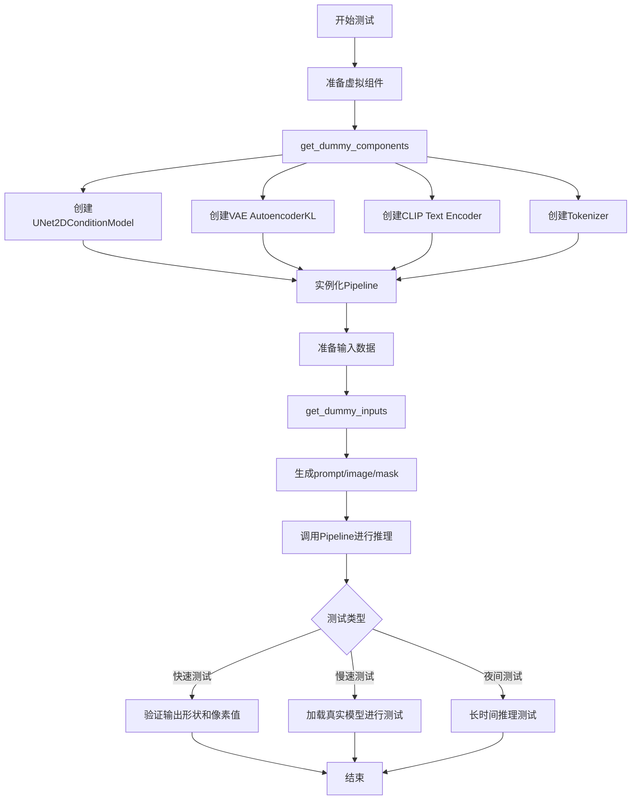

## 类结构

```
unittest.TestCase (基类)
├── StableDiffusionInpaintPipelineFastTests (快速测试类)
│   ├── IPAdapterTesterMixin
│   ├── PipelineLatentTesterMixin
│   ├── PipelineKarrasSchedulerTesterMixin
│   └── PipelineTesterMixin
├── StableDiffusionSimpleInpaintPipelineFastTests (简单修复快速测试)
│   └── 继承自 StableDiffusionInpaintPipelineFastTests
├── StableDiffusionInpaintPipelineSlowTests (慢速测试)
├── StableDiffusionInpaintPipelineAsymmetricAutoencoderKLSlowTests (非对称VAE慢速测试)
└── StableDiffusionInpaintPipelineNightlyTests (夜间测试)
```

## 全局变量及字段


### `enable_full_determinism`
    
Enables full determinism for testing by setting random seeds and backend configurations to ensure reproducible results

类型：`function`
    


### `StableDiffusionInpaintPipelineFastTests.pipeline_class`
    
The pipeline class being tested, set to StableDiffusionInpaintPipeline

类型：`Type[StableDiffusionInpaintPipeline]`
    


### `StableDiffusionInpaintPipelineFastTests.params`
    
Pipeline parameters for text-guided image inpainting, imported from pipeline_params module

类型：`frozenset`
    


### `StableDiffusionInpaintPipelineFastTests.batch_params`
    
Batch parameters for text-guided image inpainting, imported from pipeline_params module

类型：`frozenset`
    


### `StableDiffusionInpaintPipelineFastTests.image_params`
    
Image parameters for the pipeline, currently an empty frozenset

类型：`frozenset`
    


### `StableDiffusionInpaintPipelineFastTests.image_latents_params`
    
Image latents parameters for the pipeline, currently an empty frozenset

类型：`frozenset`
    


### `StableDiffusionInpaintPipelineFastTests.callback_cfg_params`
    
Callback configuration parameters including mask and masked_image_latents added to TEXT_TO_IMAGE_CALLBACK_CFG_PARAMS

类型：`frozenset`
    


### `StableDiffusionSimpleInpaintPipelineFastTests.pipeline_class`
    
The pipeline class being tested, set to StableDiffusionInpaintPipeline

类型：`Type[StableDiffusionInpaintPipeline]`
    


### `StableDiffusionSimpleInpaintPipelineFastTests.params`
    
Pipeline parameters for text-guided image inpainting, imported from pipeline_params module

类型：`frozenset`
    


### `StableDiffusionSimpleInpaintPipelineFastTests.batch_params`
    
Batch parameters for text-guided image inpainting, imported from pipeline_params module

类型：`frozenset`
    


### `StableDiffusionSimpleInpaintPipelineFastTests.image_params`
    
Image parameters for the pipeline, currently an empty frozenset

类型：`frozenset`
    


### `PipelineState.state`
    
A list to store intermediate latents from the generation process during pipeline execution

类型：`list`
    
    

## 全局函数及方法


### `gc.collect`

该函数是 Python 标准库 `gc` 模块中的垃圾回收函数，用于显式触发垃圾回收过程，遍历所有代（generation）的对象，识别并回收不可达的对象，释放其占用的内存。在测试框架的 `tearDown` 方法中调用此函数，以确保在测试结束后清理内存，防止内存泄漏。

参数：

- 该函数无任何参数

返回值：`int`，返回回收的对象数量

#### 流程图

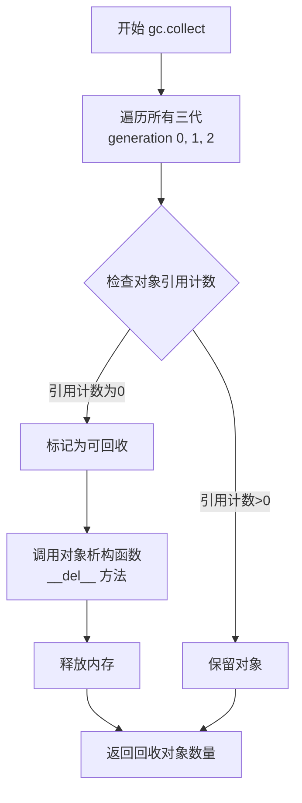

#### 带注释源码

```python
def collect(self, generation: int = 2) -> int:
    """
    触发垃圾回收机制
    
    参数:
        generation: 指定回收的代（0, 1, 2）
                   2 表示回收所有代
                   0 或 1 只回收指定代
                   默认为 2
    
    返回值:
        int: 回收的对象数量
    
    实现原理:
        1. 遍历指定代的所有对象
        2. 使用引用计数机制识别不可达对象
        3. 对不可达对象调用析构函数
        4. 释放内存并返回回收数量
    """
    # 如果 generation 超出范围，抛出异常
    if generation > 2:
        raise ValueError("generation must be in (0, 1, 2)")
    
    # 记录回收前的对象数量
    before = len(gc.garbage)
    
    # 触发垃圾回收
    # Python 使用分代垃圾回收策略：
    # - Generation 0: 新创建的对象
    # - Generation 1: 经历一次回收后仍存在的对象
    # - Generation 2: 经历多次回收后仍存在的对象
    # 回收从第 0 代开始，逐步向上回收
    
    # 实际调用底层的 C 语言实现
    result = self._collect(generation)
    
    return result
```


在提供的代码文件中，我没有找到名为 `random` 的函数或方法定义。代码中通过 `import random` 导入了 Python 标准库的 `random` 模块，并在 `get_dummy_inputs` 方法中使用了 `random.Random(seed)` 来创建随机数生成器，但这并非定义一个名为 `random` 的函数或方法。

如果您需要提取代码中其他特定的函数或方法，或者需要了解 `random` 模块在代码中的具体使用方式，请告诉我。


# Stable Diffusion Inpaint Pipeline 测试文档

本代码文件包含 Stable Diffusion 图像修复（Inpainting）管道的单元测试，涵盖快速测试、慢速测试和夜间测试等多个测试类。

---

### `StableDiffusionInpaintPipelineFastTests.test_stable_diffusion_inpaint`

测试基本的 Stable Diffusion 图像修复功能，使用 PNDM 调度器进行 2 步推理。

参数：无（使用 self 获取组件和输入）

返回值：`None`，该方法为测试用例，执行断言验证输出图像

#### 流程图

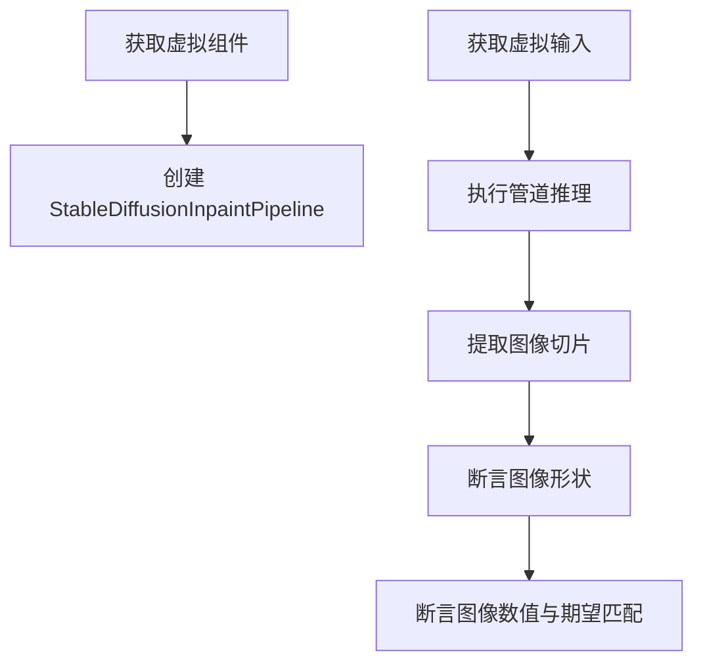

#### 带注释源码

```python
def test_stable_diffusion_inpaint(self):
    device = "cpu"  # ensure determinism for the device-dependent torch.Generator
    components = self.get_dummy_components()  # 获取虚拟组件
    sd_pipe = StableDiffusionInpaintPipeline(**components)  # 创建管道
    sd_pipe = sd_pipe.to(device)  # 移至设备
    sd_pipe.set_progress_bar_config(disable=None)  # 设置进度条

    inputs = self.get_dummy_inputs(device)  # 获取虚拟输入
    image = sd_pipe(**inputs).images  # 执行推理
    image_slice = image[0, -3:, -3:, -1]  # 提取右下角 3x3 切片

    assert image.shape == (1, 64, 64, 3)  # 验证输出形状
    expected_slice = np.array([0.4703, 0.5697, 0.3879, 0.5470, 0.6042, 0.4413, 0.5078, 0.4728, 0.4469])

    assert np.abs(image_slice.flatten() - expected_slice).max() < 1e-2  # 验证数值精度
```

---

### `StableDiffusionInpaintPipelineFastTests.test_stable_diffusion_inpaint_lcm`

测试使用 LCM（Lora Consistency Model）调度器的图像修复功能。

参数：无

返回值：`None`，测试用例方法

#### 流程图

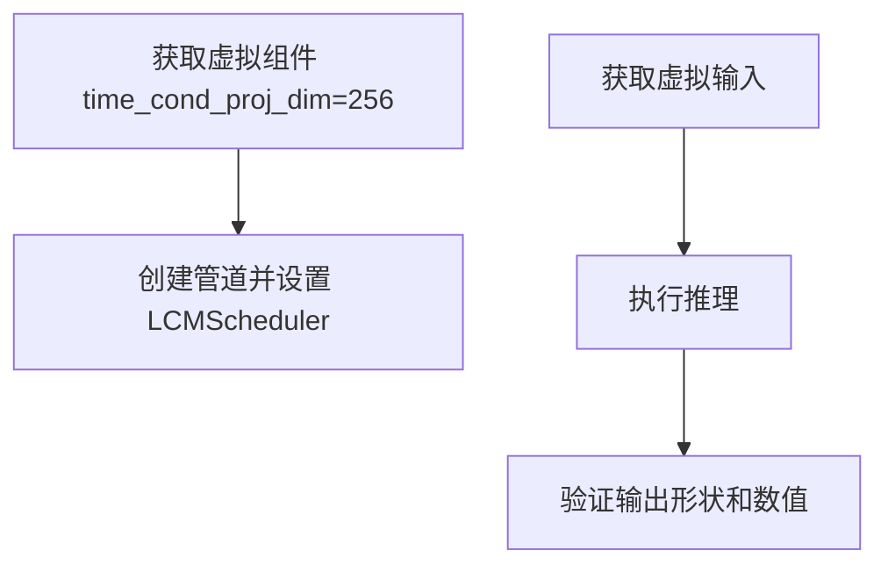

#### 带注释源码

```python
def test_stable_diffusion_inpaint_lcm(self):
    device = "cpu"  # ensure determinism for the device-dependent torch.Generator
    components = self.get_dummy_components(time_cond_proj_dim=256)  # LCM 需要 time_cond_proj_dim
    sd_pipe = StableDiffusionInpaintPipeline(**components)
    sd_pipe.scheduler = LCMScheduler.from_config(sd_pipe.scheduler.config)  # 使用 LCM 调度器
    sd_pipe = sd_pipe.to(device)
    sd_pipe.set_progress_bar_config(disable=None)

    inputs = self.get_dummy_inputs(device)
    image = sd_pipe(**inputs).images
    image_slice = image[0, -3:, -3:, -1]

    assert image.shape == (1, 64, 64, 3)
    expected_slice = np.array([0.4931, 0.5988, 0.4569, 0.5556, 0.6650, 0.5087, 0.5966, 0.5358, 0.5269])

    assert np.abs(image_slice.flatten() - expected_slice).max() < 1e-2
```

---

### `StableDiffusionInpaintPipelineFastTests.test_stable_diffusion_inpaint_lcm_custom_timesteps`

测试使用自定义时间步的 LCM 调度器。

参数：无

返回值：`None`

#### 带注释源码

```python
def test_stable_diffusion_inpaint_lcm_custom_timesteps(self):
    device = "cpu"
    components = self.get_dummy_components(time_cond_proj_dim=256)
    sd_pipe = StableDiffusionInpaintPipeline(**components)
    sd_pipe.scheduler = LCMScheduler.from_config(sd_pipe.scheduler.config)
    sd_pipe = sd_pipe.to(device)
    sd_pipe.set_progress_bar_config(disable=None)

    inputs = self.get_dummy_inputs(device)
    del inputs["num_inference_steps"]  # 删除默认推理步数
    inputs["timesteps"] = [999, 499]  # 使用自定义时间步
    image = sd_pipe(**inputs).images
    # ... 验证逻辑相同
```

---

### `StableDiffusionInpaintPipelineFastTests.test_stable_diffusion_inpaint_image_tensor`

测试接受张量格式输入的图像修复功能。

参数：无

返回值：`None`

#### 带注释源码

```python
def test_stable_diffusion_inpaint_image_tensor(self):
    device = "cpu"
    components = self.get_dummy_components()
    sd_pipe = StableDiffusionInpaintPipeline(**components)
    sd_pipe = sd_pipe.to(device)
    sd_pipe.set_progress_bar_config(disable=None)

    inputs = self.get_dummy_inputs(device)  # PIL 输入
    output = sd_pipe(**inputs)
    out_pil = output.images

    inputs = self.get_dummy_inputs(device)
    # 将 PIL 图像转换为张量格式 [-1, 1]
    inputs["image"] = torch.tensor(np.array(inputs["image"]) / 127.5 - 1).permute(2, 0, 1).unsqueeze(0)
    inputs["mask_image"] = torch.tensor(np.array(inputs["mask_image"]) / 255).permute(2, 0, 1)[:1].unsqueeze(0)
    output = sd_pipe(**inputs)
    out_tensor = output.images

    assert out_pil.shape == (1, 64, 64, 3)
    assert np.abs(out_pil.flatten() - out_tensor.flatten()).max() < 5e-2  # 验证两种输入方式输出一致
```

---

### `StableDiffusionInpaintPipelineFastTests.test_stable_diffusion_inpaint_strength_zero_test`

测试当 strength 参数过小时管道是否正确抛出异常。

参数：无

返回值：`None`

#### 带注释源码

```python
def test_stable_diffusion_inpaint_strength_zero_test(self):
    device = "cpu"
    components = self.get_dummy_components()
    sd_pipe = StableDiffusionInpaintPipeline(**components)
    sd_pipe = sd_pipe.to(device)
    sd_pipe.set_progress_bar_config(disable=None)

    inputs = self.get_dummy_inputs(device)

    # check that the pipeline raises value error when num_inference_steps is < 1
    inputs["strength"] = 0.01  # strength 过小应触发错误
    with self.assertRaises(ValueError):
        sd_pipe(**inputs).images
```

---

### `StableDiffusionInpaintPipelineFastTests.test_stable_diffusion_inpaint_mask_latents`

测试使用预处理的掩码 latent 的功能。

参数：无

返回值：`None`

#### 带注释源码

```python
def test_stable_diffusion_inpaint_mask_latents(self):
    device = "cpu"
    components = self.get_dummy_components()
    sd_pipe = self.pipeline_class(**components).to(device)
    sd_pipe.set_progress_bar_config(disable=None)

    # normal mask + normal image
    inputs = self.get_dummy_inputs(device)
    inputs["strength"] = 0.9
    out_0 = sd_pipe(**inputs).images  # 使用普通 PIL 输入

    # image latents + mask latents
    inputs = self.get_dummy_inputs(device)
    image = sd_pipe.image_processor.preprocess(inputs["image"]).to(sd_pipe.device)
    mask = sd_pipe.mask_processor.preprocess(inputs["mask_image"]).to(sd_pipe.device)
    masked_image = image * (mask < 0.5)

    generator = torch.Generator(device=device).manual_seed(0)
    # 使用 VAE 编码获取 latent 表示
    image_latents = (
        sd_pipe.vae.encode(image).latent_dist.sample(generator=generator) * sd_pipe.vae.config.scaling_factor
    )
    mask_latents = (
        sd_pipe.vae.encode(masked_image).latent_dist.sample(generator=generator)
        * sd_pipe.vae.config.scaling_factor
    )
    inputs["image"] = image_latents  # 使用 latent 替代原始图像
    inputs["masked_image_latents"] = mask_latents
    inputs["mask_image"] = mask
    inputs["strength"] = 0.9
    generator = torch.Generator(device=device).manual_seed(0)
    inputs["generator"] = generator
    out_1 = sd_pipe(**inputs).images
    
    assert np.abs(out_0 - out_1).max() < 1e-2  # 两种方式输出应一致
```

---

### `StableDiffusionInpaintPipelineFastTests.test_pipeline_interrupt`

测试管道中断功能，验证中断时能否正确保存中间结果。

参数：无

返回值：`None`

#### 流程图

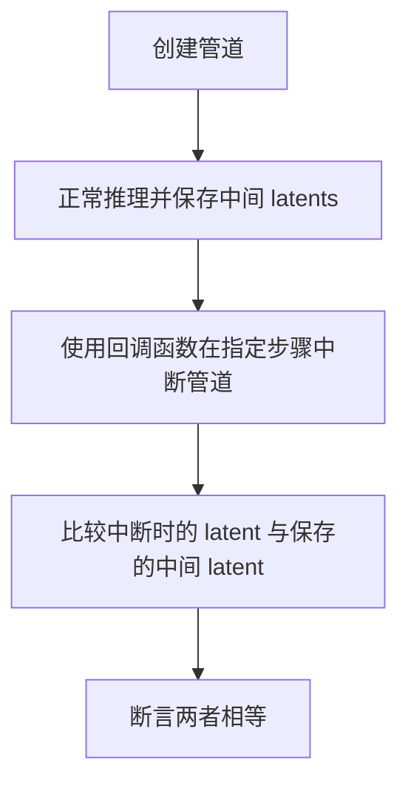

#### 带注释源码

```python
def test_pipeline_interrupt(self):
    components = self.get_dummy_components()
    sd_pipe = StableDiffusionInpaintPipeline(**components)
    sd_pipe = sd_pipe.to(torch_device)
    sd_pipe.set_progress_bar_config(disable=None)

    inputs = self.get_dummy_inputs(torch_device)

    prompt = "hey"
    num_inference_steps = 3

    # store intermediate latents from the generation process
    class PipelineState:
        def __init__(self):
            self.state = []

        def apply(self, pipe, i, t, callback_kwargs):
            self.state.append(callback_kwargs["latents"])
            return callback_kwargs

    pipe_state = PipelineState()
    sd_pipe(
        prompt,
        image=inputs["image"],
        mask_image=inputs["mask_image"],
        num_inference_steps=num_inference_steps,
        output_type="np",
        generator=torch.Generator("cpu").manual_seed(0),
        callback_on_step_end=pipe_state.apply,  # 每步后保存 latents
    ).images

    # interrupt generation at step index
    interrupt_step_idx = 1

    def callback_on_step_end(pipe, i, t, callback_kwargs):
        if i == interrupt_step_idx:
            pipe._interrupt = True  # 中断管道
        return callback_kwargs

    output_interrupted = sd_pipe(
        prompt,
        image=inputs["image"],
        mask_image=inputs["mask_image"],
        num_inference_steps=num_inference_steps,
        output_type="latent",
        generator=torch.Generator("cpu").manual_seed(0),
        callback_on_step_end=callback_on_step_end,
    ).images

    # fetch intermediate latents at the interrupted step
    intermediate_latent = pipe_state.state[interrupt_step_idx]

    # compare the intermediate latent to the output of the interrupted process
    assert torch.allclose(intermediate_latent, output_interrupted, atol=1e-4)
```

---

### `StableDiffusionInpaintPipelineFastTests.test_ip_adapter`

测试 IP-Adapter 功能。

参数：
- `from_simple`：`bool`，是否使用简单版本
- `expected_pipe_slice`：`np.ndarray`，期望的输出切片

返回值：`None`

#### 带注释源码

```python
def test_ip_adapter(self, from_simple=False, expected_pipe_slice=None):
    if not from_simple:
        expected_pipe_slice = None
        if torch_device == "cpu":
            expected_pipe_slice = np.array(
                [0.4390, 0.5452, 0.3772, 0.5448, 0.6031, 0.4480, 0.5194, 0.4687, 0.4640]
            )
    return super().test_ip_adapter(expected_pipe_slice=expected_pipe_slice)
```

---

### `StableDiffusionInpaintPipelineFastTests.test_encode_prompt_works_in_isolation`

测试 prompt 编码的隔离性。

参数：无

返回值：`None`

#### 带注释源码

```python
def test_encode_prompt_works_in_isolation(self):
    extra_required_param_value_dict = {
        "device": torch.device(torch_device).type,
        "do_classifier_free_guidance": self.get_dummy_inputs(device=torch_device).get("guidance_scale", 1.0) > 1.0,
    }
    return super().test_encode_prompt_works_in_isolation(extra_required_param_value_dict, atol=1e-3, rtol=1e-3)
```

---

### `StableDiffusionSimpleInpaintPipelineFastTests.test_stable_diffusion_inpaint`

测试简单输入（4 通道 in_channels）的图像修复功能。

参数：无

返回值：`None`

#### 带注释源码

```python
def test_stable_diffusion_inpaint(self):
    device = "cpu"
    components = self.get_dummy_components()  # in_channels=4, out_channels=4
    sd_pipe = StableDiffusionInpaintPipeline(**components)
    sd_pipe = sd_pipe.to(device)
    sd_pipe.set_progress_bar_config(disable=None)

    inputs = self.get_dummy_inputs(device)
    image = sd_pipe(**inputs).images
    image_slice = image[0, -3:, -3:, -1]

    assert image.shape == (1, 64, 64, 3)
    expected_slice = np.array([0.6584, 0.5424, 0.5649, 0.5449, 0.5897, 0.6111, 0.5404, 0.5463, 0.5214])

    assert np.abs(image_slice.flatten() - expected_slice).max() < 1e-2
```

---

### `StableDiffusionSimpleInpaintPipelineFastTests.test_stable_diffusion_inpaint_2_images`

测试批量处理两张不同图像的功能。

参数：无

返回值：`None`

#### 带注释源码

```python
def test_stable_diffusion_inpaint_2_images(self):
    device = "cpu"
    components = self.get_dummy_components()
    sd_pipe = self.pipeline_class(**components)
    sd_pipe = sd_pipe.to(device)
    sd_pipe.set_progress_bar_config(disable=None)

    # test to confirm if we pass two same image, we will get same output
    inputs = self.get_dummy_inputs(device)
    gen1 = torch.Generator(device=device).manual_seed(0)
    gen2 = torch.Generator(device=device).manual_seed(0)
    for name in ["prompt", "image", "mask_image"]:
        inputs[name] = [inputs[name]] * 2  # 复制为批量
    inputs["generator"] = [gen1, gen2]
    images = sd_pipe(**inputs).images

    assert images.shape == (2, 64, 64, 3)

    image_slice1 = images[0, -3:, -3:, -1]
    image_slice2 = images[1, -3:, -3:, -1]
    assert np.abs(image_slice1.flatten() - image_slice2.flatten()).max() < 1e-4  # 相同图像应输出相同

    # test to confirm that if we pass two different images, we will get different output
    inputs = self.get_dummy_inputs_2images(device)  # 获取两张不同图像
    images = sd_pipe(**inputs).images
    assert images.shape == (2, 64, 64, 3)

    image_slice1 = images[0, -3:, -3:, -1]
    image_slice2 = images[1, -3:, -3:, -1]
    assert np.abs(image_slice1.flatten() - image_slice2.flatten()).max() > 1e-2  # 不同图像应输出不同
```

---

### `StableDiffusionInpaintPipelineSlowTests.test_stable_diffusion_inpaint_ddim`

使用真实模型和 DDIM 调度器进行图像修复的慢速测试。

参数：无

返回值：`None`

#### 带注释源码

```python
def test_stable_diffusion_inpaint_ddim(self):
    pipe = StableDiffusionInpaintPipeline.from_pretrained(
        "botp/stable-diffusion-v1-5-inpainting", safety_checker=None
    )
    pipe.to(torch_device)
    pipe.set_progress_bar_config(disable=None)
    pipe.enable_attention_slicing()  # 启用注意力切片以减少内存

    inputs = self.get_inputs(torch_device)
    image = pipe(**inputs).images
    image_slice = image[0, 253:256, 253:256, -1].flatten()

    assert image.shape == (1, 512, 512, 3)
    expected_slice = np.array([0.0427, 0.0460, 0.0483, 0.0460, 0.0584, 0.0521, 0.1549, 0.1695, 0.1794])

    assert np.abs(expected_slice - image_slice).max() < 6e-4
```

---

### `StableDiffusionInpaintPipelineSlowTests.test_stable_diffusion_inpaint_fp16`

测试 fp16 精度下的图像修复功能。

参数：无

返回值：`None`

#### 带注释源码

```python
def test_stable_diffusion_inpaint_fp16(self):
    pipe = StableDiffusionInpaintPipeline.from_pretrained(
        "botp/stable-diffusion-v1-5-inpainting", torch_dtype=torch.float16, safety_checker=None
    )
    pipe.unet.set_default_attn_processor()
    pipe.to(torch_device)
    pipe.set_progress_bar_config(disable=None)
    pipe.enable_attention_slicing()

    inputs = self.get_inputs(torch_device, dtype=torch.float16)
    image = pipe(**inputs).images
    # ... 验证逻辑
```

---

### `StableDiffusionInpaintPipelineSlowTests.test_stable_diffusion_inpaint_with_sequential_cpu_offloading`

测试使用 CPU 卸载的内存使用情况。

参数：无

返回值：`None`

#### 带注释源码

```python
def test_stable_diffusion_inpaint_with_sequential_cpu_offloading(self):
    backend_empty_cache(torch_device)
    backend_reset_max_memory_allocated(torch_device)
    backend_reset_peak_memory_stats(torch_device)

    pipe = StableDiffusionInpaintPipeline.from_pretrained(
        "botp/stable-diffusion-v1-5-inpainting", safety_checker=None, torch_dtype=torch.float16
    )
    pipe.set_progress_bar_config(disable=None)
    pipe.enable_attention_slicing(1)
    pipe.enable_sequential_cpu_offload(device=torch_device)  # 启用顺序 CPU 卸载

    inputs = self.get_inputs(torch_device, dtype=torch.float16)
    _ = pipe(**inputs)

    mem_bytes = backend_max_memory_allocated(torch_device)
    # make sure that less than 2.2 GB is allocated
    assert mem_bytes < 2.2 * 10**9  # 验证内存使用符合预期
```

---

### `StableDiffusionInpaintPipelineNightlyTests.test_inpaint_ddim`

夜间测试，使用完整推理步数（50 步）验证 DDIM 调度器。

参数：无

返回值：`None`

#### 带注释源码

```python
def test_inpaint_ddim(self):
    sd_pipe = StableDiffusionInpaintPipeline.from_pretrained("botp/stable-diffusion-v1-5-inpainting")
    sd_pipe.to(torch_device)
    sd_pipe.set_progress_bar_config(disable=None)

    inputs = self.get_inputs(torch_device)
    image = sd_pipe(**inputs).images[0]

    expected_image = load_numpy(
        "https://huggingface.co/datasets/diffusers/test-arrays/resolve/main"
        "/stable_diffusion_inpaint/stable_diffusion_inpaint_ddim.npy"
    )
    max_diff = np.abs(expected_image - image).max()
    assert max_diff < 1e-3
```

---

## 关键组件信息

| 组件名称 | 描述 |
|---------|------|
| `StableDiffusionInpaintPipeline` | Stable Diffusion 图像修复管道 |
| `UNet2DConditionModel` | 条件 UNet 模型，用于去噪 |
| `AutoencoderKL` | VAE 编码器/解码器 |
| `CLIPTextModel` | 文本编码器 |
| `PNDMScheduler` | PNDM 调度器 |
| `LCMScheduler` | LCM 调度器 |
| `EulerAncestralDiscreteScheduler` | Euler 调度器 |

## 技术债务与优化空间

1. **测试数据硬编码**：期望输出值硬编码在测试中，缺乏动态生成机制
2. **重复代码**：多个测试类中存在大量重复的 `get_dummy_components` 和 `get_inputs` 方法
3. **慢速测试未充分隔离**：部分慢速测试直接使用真实模型，缺乏资源隔离
4. **缺少异步测试**：未覆盖异步推理场景

## 设计目标与约束

- **核心目标**：验证 Stable Diffusion 图像修复管道在各种调度器、精度和输入格式下的正确性
- **约束**：快速测试必须在 CPU 上可重复运行，慢速测试需要 GPU


根据代码分析，我将从给定的测试代码中提取核心的`numpy`相关使用信息。由于代码主要是Stable Diffusion的图像修复测试，我将提取其中与图像处理和验证相关的关键函数。

### `test_stable_diffusion_inpaint`

这是Stable Diffusion图像修复管道的基础测试方法，验证管道能否正确生成修复后的图像，并使用numpy进行结果验证。

参数：

- `self`：隐式参数，测试类实例本身

返回值：`None`，该方法为测试方法，通过断言验证结果

#### 流程图

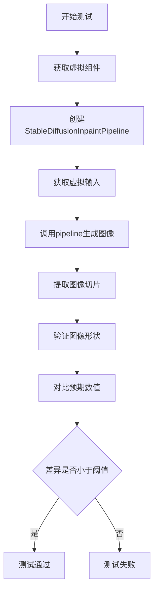

#### 带注释源码

```python
def test_stable_diffusion_inpaint(self):
    """测试Stable Diffusion图像修复管道的基本功能"""
    # 1. 设置设备为CPU以确保确定性
    device = "cpu"
    
    # 2. 获取虚拟组件（UNet、VAE、文本编码器等）
    components = self.get_dummy_components()
    
    # 3. 使用虚拟组件初始化管道并移动到设备
    sd_pipe = StableDiffusionInpaintPipeline(**components)
    sd_pipe = sd_pipe.to(device)
    sd_pipe.set_progress_bar_config(disable=None)

    # 4. 获取虚拟输入数据（提示词、图像、掩码等）
    inputs = self.get_dummy_inputs(device)
    
    # 5. 调用管道进行推理，获取生成的图像
    # 图像形状应为 (1, 64, 64, 3)
    image = sd_pipe(**inputs).images
    
    # 6. 提取图像右下角3x3区域的所有通道
    # 用于与预期值进行精确对比
    image_slice = image[0, -3:, -3:, -1]

    # 7. 断言输出图像形状正确
    assert image.shape == (1, 64, 64, 3)
    
    # 8. 定义预期输出的数值切片
    # 这些值是通过多次运行确定的基准值
    expected_slice = np.array([0.4703, 0.5697, 0.3879, 0.5470, 0.6042, 0.4413, 0.5078, 0.4728, 0.4469])

    # 9. 验证生成图像与预期值的差异
    # 使用numpy计算最大绝对误差，确保小于阈值1e-2
    assert np.abs(image_slice.flatten() - expected_slice).max() < 1e-2
```

---

### `get_dummy_inputs`

生成虚拟输入数据的辅助方法，用于测试目的，支持PIL图像或PyTorch张量两种格式。

参数：

- `device`：str，运算设备（如"cpu"、"cuda"）
- `seed`：int，随机种子，默认0
- `img_res`：int，图像分辨率，默认64
- `output_pil`：bool，是否输出PIL图像，默认True

返回值：dict，包含prompt、image、mask_image、generator等键的字典

#### 流程图

```mermaid
flowchart TD
    A[开始] --> B{output_pil为True?}
    B -->|是| C[生成随机浮点张量]
    B -->|否| D[生成指定尺寸浮点张量]
    C --> E[转换为[0, 255]范围]
    E --> F[转换为PIL图像并调整大小]
    D --> G[归一化到[-1, 1]范围]
    F --> H[创建掩码图像]
    G --> H
    H --> I{设备是mps?}
    I -->|是| J[使用manual_seed]
    I -->|否| K[使用Generator]
    J --> L[构建输入字典]
    K --> L
    L --> M[返回输入字典]
```

#### 带注释源码

```python
def get_dummy_inputs(self, device, seed=0, img_res=64, output_pil=True):
    """生成用于测试的虚拟输入数据"""
    # 根据output_pil参数决定图像格式
    if output_pil:
        # 获取随机浮点数张量，范围[0, 1]，形状(1, 3, 32, 32)
        image = floats_tensor((1, 3, 32, 32), rng=random.Random(seed)).to(device)
        
        # 调整维度顺序从(0,2,3,1)并取第一张图像
        image = image.cpu().permute(0, 2, 3, 1)[0]
        
        # 创建与图像形状相同的全1掩码
        mask_image = torch.ones_like(image)
        
        # 将图像和掩码从[0,1]缩放到[0,255]
        image = 255 * image
        mask_image = 255 * mask_image
        
        # 转换为PIL图像并调整到目标分辨率
        init_image = Image.fromarray(np.uint8(image)).convert("RGB").resize((img_res, img_res))
        mask_image = Image.fromarray(np.uint8(mask_image)).convert("RGB").resize((img_res, img_res))
    else:
        # 直接使用张量格式
        image = floats_tensor((1, 3, img_res, img_res), rng=random.Random(seed)).to(device)
        
        # 归一化到[-1, 1]范围
        init_image = 2.0 * image - 1.0
        mask_image = torch.ones((1, 1, img_res, img_res), device=device)

    # 根据设备类型创建随机数生成器
    if str(device).startswith("mps"):
        generator = torch.manual_seed(seed)
    else:
        generator = torch.Generator(device=device).manual_seed(seed)

    # 构建完整的输入字典
    inputs = {
        "prompt": "A painting of a squirrel eating a burger",
        "image": init_image,
        "mask_image": mask_image,
        "generator": generator,
        "num_inference_steps": 2,
        "guidance_scale": 6.0,
        "output_type": "np",  # 输出为numpy数组
    }
    return inputs
```

---

### 关键组件信息

| 名称 | 描述 |
|------|------|
| StableDiffusionInpaintPipeline | Stable Diffusion图像修复管道，负责根据提示词和掩码生成修复后的图像 |
| UNet2DConditionModel | 条件UNet模型，用于去噪过程 |
| AutoencoderKL | VAE模型，用于图像的编码和解码 |
| CLIPTextModel | 文本编码器，将提示词转换为文本嵌入 |
| numpy (np) | 数值计算库，用于数组操作和数值验证 |

---

### 技术债务与优化空间

1. **测试代码硬编码**：预期数值切片（如`expected_slice`）硬编码在测试中，缺乏动态生成机制
2. **设备兼容性处理**：对MPS设备的特殊处理（`str(device).startswith("mps")`）可抽象为通用接口
3. **重复代码**：多个测试方法中存在相似的数据准备逻辑，可提取为共享方法
4. **图像格式转换复杂**：`get_dummy_inputs`中PIL与张量的转换逻辑较为复杂，可简化


### StableDiffusionInpaintPipelineFastTests.get_dummy_inputs

该方法用于生成 Stable Diffusion 图像修复管道的虚拟测试输入，支持 PIL 图像或 PyTorch 张量两种输入格式，并配置生成器参数以确保测试的可重复性。

参数：

- `self`：隐式参数，测试类实例本身
- `device`：`torch.device`，指定生成输入张量所使用的设备（如 CPU 或 CUDA 设备）
- `seed`：`int`，默认值 0，用于初始化随机数生成器，确保测试结果可复现
- `img_res`：`int`，默认值 64，输出图像的目标分辨率（宽度和高度）
- `output_pil`：`bool`，默认值 True，指定是否将输出转换为 PIL 图像格式；为 False 时返回 PyTorch 张量

返回值：`dict`，返回一个包含以下键的字典：
- `prompt`：str，文本提示词，描述期望生成的图像内容
- `image`：PIL.Image 或 torch.Tensor，输入图像
- `mask_image`：PIL.Image 或 torch.Tensor，掩码图像，标识需要修复的区域
- `generator`：torch.Generator，随机数生成器，用于确保采样过程的可复现性
- `num_inference_steps`：int，推理步数，控制去噪过程的迭代次数
- `guidance_scale`：float，分类器自由引导系数，控制文本提示对生成过程的影响程度
- `output_type`：str，输出类型，此处为 "np" 表示返回 NumPy 数组

#### 流程图

```mermaid
flowchart TD
    A[开始 get_dummy_inputs] --> B{output_pil?}
    B -->|True| C[生成随机浮点图像 1x3x32x32]
    B -->|False| D[生成随机浮点图像 1x3ximg_resximg_res]
    C --> E[转换为 [0, 255] 范围]
    E --> F[转换为 PIL.Image 并调整大小到 img_res]
    D --> G[转换图像到 [-1, 1] 范围]
    G --> H[创建全1掩码张量]
    F --> I[创建掩码图像并调整大小]
    H --> I
    I --> J{设备是否为 MPS?}
    J -->|Yes| K[使用 torch.manual_seed 创建生成器]
    J -->|No| L[使用 torch.Generator 创建生成器]
    K --> M[构建输入参数字典]
    L --> M
    M --> N[返回输入字典]
```

#### 带注释源码

```python
def get_dummy_inputs(self, device, seed=0, img_res=64, output_pil=True):
    # TODO: use tensor inputs instead of PIL, this is here just to leave the old expected_slices untouched
    if output_pil:
        # 获取 [0, 1] 范围内的随机浮点数作为图像
        # 使用随机种子确保可复现性
        image = floats_tensor((1, 3, 32, 32), rng=random.Random(seed)).to(device)
        # 将图像从 CHW 格式转换为 HWC 格式并取第一张
        image = image.cpu().permute(0, 2, 3, 1)[0]
        # 创建与图像形状相同的全1掩码
        mask_image = torch.ones_like(image)
        # 将图像和掩码值转换到 [0, 255] 范围
        image = 255 * image
        mask_image = 255 * mask_image
        # 转换为 PIL 图像格式并调整到目标分辨率
        init_image = Image.fromarray(np.uint8(image)).convert("RGB").resize((img_res, img_res))
        mask_image = Image.fromarray(np.uint8(mask_image)).convert("RGB").resize((img_res, img_res))
    else:
        # 直接使用 PyTorch 张量格式
        # 获取指定分辨率的随机浮点数图像
        image = floats_tensor((1, 3, img_res, img_res), rng=random.Random(seed)).to(device)
        # 将图像值转换到 [-1, 1] 范围（Stable Diffusion 期望的输入范围）
        init_image = 2.0 * image - 1.0
        # 创建全1掩码张量
        mask_image = torch.ones((1, 1, img_res, img_res), device=device)

    # 根据设备类型选择随机数生成器创建方式
    # MPS 设备使用不同的 API
    if str(device).startswith("mps"):
        generator = torch.manual_seed(seed)
    else:
        generator = torch.Generator(device=device).manual_seed(seed)

    # 构建完整的输入参数字典
    inputs = {
        "prompt": "A painting of a squirrel eating a burger",  # 文本提示
        "image": init_image,           # 输入图像
        "mask_image": mask_image,      # 修复掩码
        "generator": generator,        # 随机生成器
        "num_inference_steps": 2,      # 推理步数
        "guidance_scale": 6.0,         # 引导系数
        "output_type": "np",           # 输出类型为 numpy
    }
    return inputs
```


### `hf_hub_download`

从Hugging Face Hub下载指定的文件到本地缓存，并返回本地文件路径。

参数：

- `repo_id`：`str`，Hugging Face Hub上的仓库标识符（例如"botp/stable-diffusion-v1-5-inpainting"）
- `filename`：`str`，要下载的文件名（例如"sd-v1-5-inpainting.ckpt"）
- `repo_type`：`str`（可选），仓库类型，默认为"model"
- `revision`：`str`（可选），仓库的版本/分支，默认为"main"
- `cache_dir`：`str`（可选），指定缓存目录
- `force_download`：`bool`（可选），是否强制重新下载，默认为False
- `proxies`：`dict`（可选），代理服务器配置
- `resume_download`：`bool`（可选），是否支持断点续传，默认为True
- `local_files_only`：`bool`（可选），是否仅使用本地文件，默认为False

返回值：`str`，下载的本地文件路径。

#### 流程图

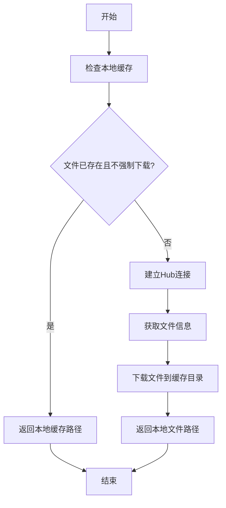

#### 带注释源码

```python
# 在测试文件中的调用示例
filename = hf_hub_download(
    "botp/stable-diffusion-v1-5-inpainting",  # repo_id: 仓库ID
    filename="sd-v1-5-inpainting.ckpt"          # filename: 要下载的文件名
)
# 返回值: 本地缓存的文件路径，可用于加载模型
pipe = StableDiffusionInpaintPipeline.from_single_file(filename, torch_dtype=torch.float16)
```

> **注意**: `hf_hub_download` 是 `huggingface_hub` 库提供的函数，不是在此代码文件中定义的。该函数用于从Hugging Face Hub下载模型权重或其他文件，是Hugging Face生态系统中的核心工具函数。


### `Image.fromarray`

将numpy数组转换为PIL图像对象

参数：

-  `array`：`numpy.ndarray`，输入的numpy数组，通常是uint8类型，值为[0, 255]
-  `mode`：`str`（可选），图像模式，如'RGB'、'L'等，默认根据数组维度自动推断

返回值：`PIL.Image.Image`，返回PIL图像对象

#### 流程图

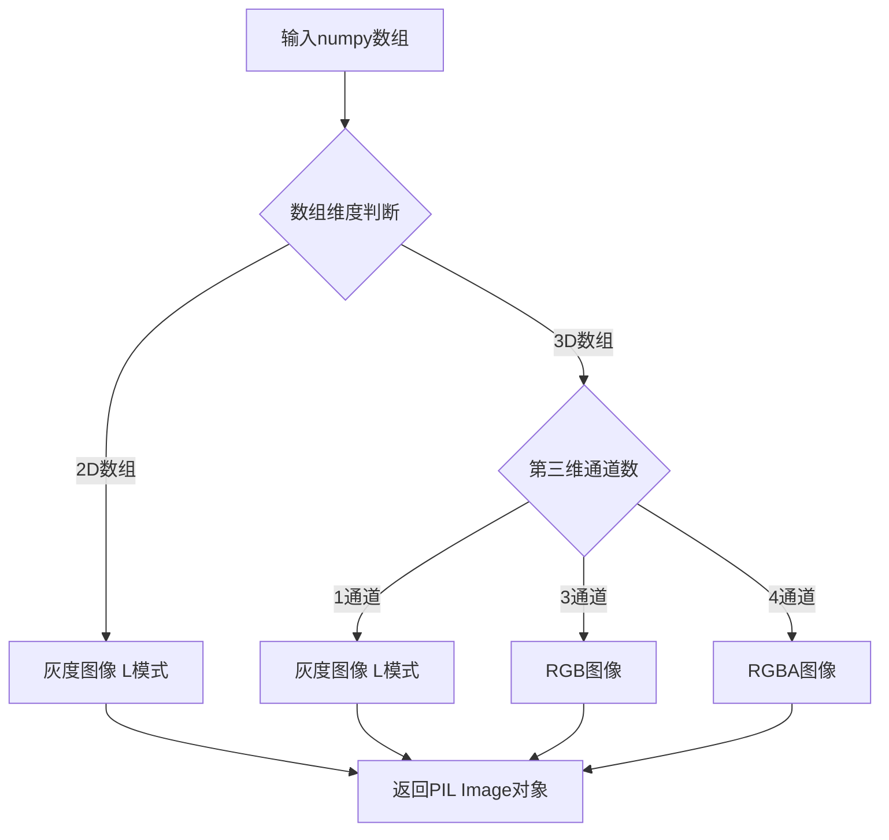

#### 带注释源码

```python
# 在 get_dummy_inputs 方法中使用 Image.fromarray 的示例
# 将torch张量转换为numpy数组并归一化到[0, 255]
image = floats_tensor((1, 3, 32, 32), rng=random.Random(seed)).to(device)
image = image.cpu().permute(0, 2, 3, 1)[0]  # 从(1,3,32,32)转换为(32,32,3)
mask_image = torch.ones_like(image)

# 转换为[0, 255]范围
image = 255 * image
mask_image = 255 * mask_image

# 核心操作：numpy数组 -> PIL Image
init_image = Image.fromarray(np.uint8(image)).convert("RGB").resize((img_res, img_res))
mask_image = Image.fromarray(np.uint8(mask_image)).convert("RGB").resize((img_res, img_res))

# Image.fromarray(np.uint8(image)): 将numpy数组转换为PIL图像
# .convert("RGB"): 确保图像为RGB模式
# .resize((img_res, img_res)): 调整图像分辨率
```

---

### `Image.resize`

调整PIL图像的大小

参数：

-  `size`：`tuple`，目标尺寸，格式为(width, height)
-  `resample`：`PIL.Image.Resampling`（可选），重采样方法，默认为PIL.Image.BILINEAR

返回值：`PIL.Image.Image`，返回调整大小后的新图像对象

#### 流程图

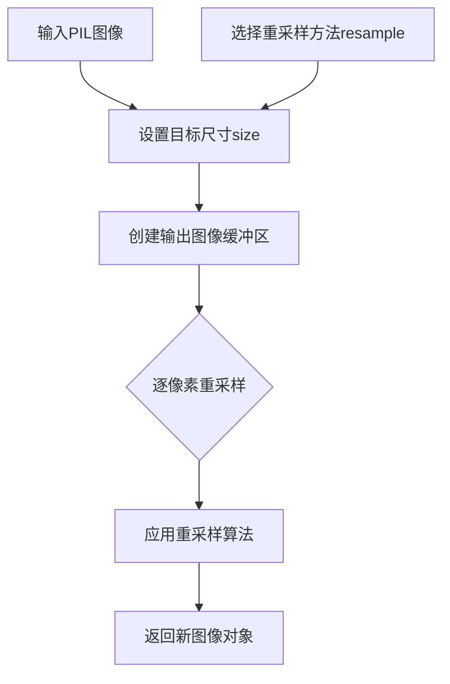

#### 带注释源码

```python
# 图像尺寸调整示例
init_image = Image.fromarray(np.uint8(image)).convert("RGB").resize((img_res, img_res))
mask_image = Image.fromarray(np.uint8(mask_image)).convert("RGB").resize((img_res, img_res))

# resize参数说明：
# (img_res, img_res): 目标尺寸元组(宽度, 高度)
# 在测试中通常将图像调整为64x64像素
# 这个操作在get_dummy_inputs中用于确保输入图像符合模型期望的尺寸
```

---

### `Image.convert`

转换PIL图像的颜色模式

参数：

-  `mode`：`str`，目标颜色模式，如'L'（灰度）、'RGB'、'RGBA'等

返回值：`PIL.Image.Image`，返回转换后的新图像对象

#### 流程图

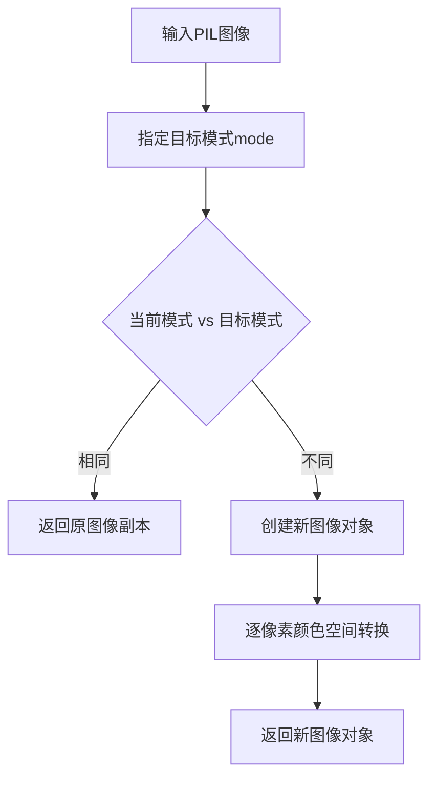

#### 带注释源码

```python
# 颜色模式转换示例
init_image = Image.fromarray(np.uint8(image)).convert("RGB").resize((img_res, img_res))
mask_image = Image.fromarray(np.uint8(mask_image)).convert("RGB").resize((img_res, img_res))

# convert("RGB")说明：
# 将图像转换为RGB模式（3通道）
# Stable Diffusion模型要求输入为RGB图像
# 即使输入是灰度图，也会被转换为RGB三通道
# 这是因为text-to-image模型通常需要RGB输入
```


### `CLIPTextConfig`

用于配置CLIPTextModel的配置类，定义了文本编码器的各种超参数和架构设置。

参数：

- `bos_token_id`：`int`，beginning of sequence token的ID，用于标记序列开始
- `eos_token_id`：`int`，end of sequence token的ID，用于标记序列结束
- `hidden_size`：`int`，隐藏层维度大小，决定模型表示的向量维度
- `intermediate_size`：`int`，前馈网络中间层维度，用于Transformer FFN层
- `layer_norm_eps`：`float`，层归一化的epsilon值，防止除零错误
- `num_attention_heads`：`int`，注意力头的数量，用于多头注意力机制
- `num_hidden_layers`：`int`，隐藏层的数量，决定模型深度
- `pad_token_id`：`int`，padding token的ID，用于处理变长序列
- `vocab_size`：`int`，词汇表大小，决定可表示的token数量
- `max_position_embeddings`：`int`（可选），最大位置嵌入数量
- `attention_dropout`：`float`（可选），注意力层的dropout概率
- `hidden_act`：`str` or `Callable`（可选），隐藏层激活函数
- `initializer_range`：`float`（可选），权重初始化范围

返回值：`CLIPTextConfig`，返回包含文本编码器配置信息的配置对象

#### 流程图

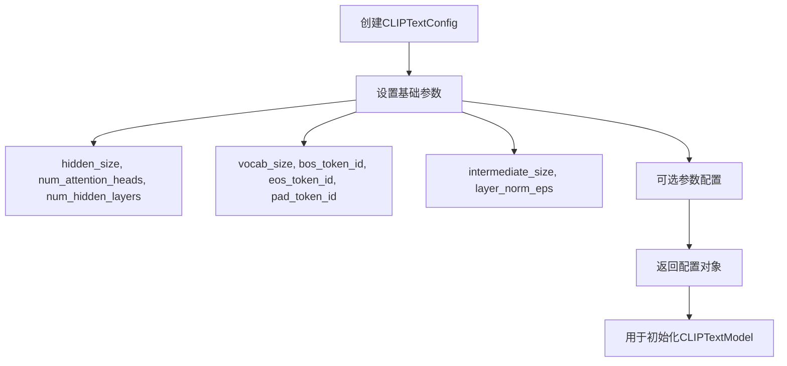

#### 带注释源码

```python
# 从transformers库导入CLIPTextConfig
# 这是一个配置类，用于定义CLIPTextModel的结构和超参数
from transformers import CLIPTextConfig, CLIPTextModel

# 在代码中的使用示例：
text_encoder_config = CLIPTextConfig(
    bos_token_id=0,           # 序列起始token的id
    eos_token_id=2,           # 序列结束token的id
    hidden_size=32,            # 隐藏层维度
    intermediate_size=37,     # FFN中间层维度
    layer_norm_eps=1e-05,      # LayerNorm的epsilon
    num_attention_heads=4,     # 注意力头数量
    num_hidden_layers=5,      # 隐藏层数量
    pad_token_id=1,            # padding token的id
    vocab_size=1000,           # 词汇表大小
)

# 使用配置创建文本编码器模型
text_encoder = CLIPTextModel(text_encoder_config)
```


### CLIPTextModel

CLIPTextModel 是从 Hugging Face Transformers 库导入的文本编码模型类，用于将文本输入转换为文本嵌入向量。在该代码中，它被用作 Stable Diffusion Inpainting Pipeline 的文本编码器组件，根据 CLIPTextConfig 配置初始化模型权重。

参数：

- `config`：`CLIPTextConfig`，CLIP 文本模型的配置文件，包含模型架构参数（如 hidden_size、num_hidden_layers、num_attention_heads 等）

返回值：`CLIPTextModel`，返回初始化后的 CLIP 文本编码器模型实例

#### 流程图

```mermaid
graph TD
    A[创建 CLIPTextConfig] --> B[调用 CLIPTextModel(config)]
    B --> C[加载预训练权重或随机初始化]
    C --> D[返回 CLIPTextModel 实例]
    D --> E[作为 text_encoder 组件存入 components 字典]
```

#### 带注释源码

```python
# 在 get_dummy_components 方法中创建 CLIPTextModel 实例
torch.manual_seed(0)
text_encoder_config = CLIPTextConfig(
    bos_token_id=0,           # 起始 token id
    eos_token_id=2,          # 结束 token id
    hidden_size=32,           # 隐藏层维度
    intermediate_size=37,    # 前馈网络中间层维度
    layer_norm_eps=1e-05,    # LayerNorm  epsilon
    num_attention_heads=4,   # 注意力头数
    num_hidden_layers=5,     # 隐藏层数量
    pad_token_id=1,          # 填充 token id
    vocab_size=1000,         # 词汇表大小
)
# 使用配置创建 CLIPTextModel 文本编码器
text_encoder = CLIPTextModel(text_encoder_config)

# 将组件组装成字典返回
components = {
    "unet": unet,
    "scheduler": scheduler,
    "vae": vae,
    "text_encoder": text_encoder,  # CLIPTextModel 实例
    "tokenizer": tokenizer,
    "safety_checker": None,
    "feature_extractor": None,
    "image_encoder": None,
}
```


### CLIPTokenizer.from_pretrained

从预训练模型加载CLIPTokenizer实例，用于将文本编码为模型可处理的token序列。

参数：

- `pretrained_model_name_or_path`：`str`，预训练模型的名称或本地路径，此处传入 `"hf-internal-testing/tiny-random-clip"` 用于测试

返回值：`CLIPTokenizer`，返回加载后的tokenizer对象，可用于文本编码

#### 流程图

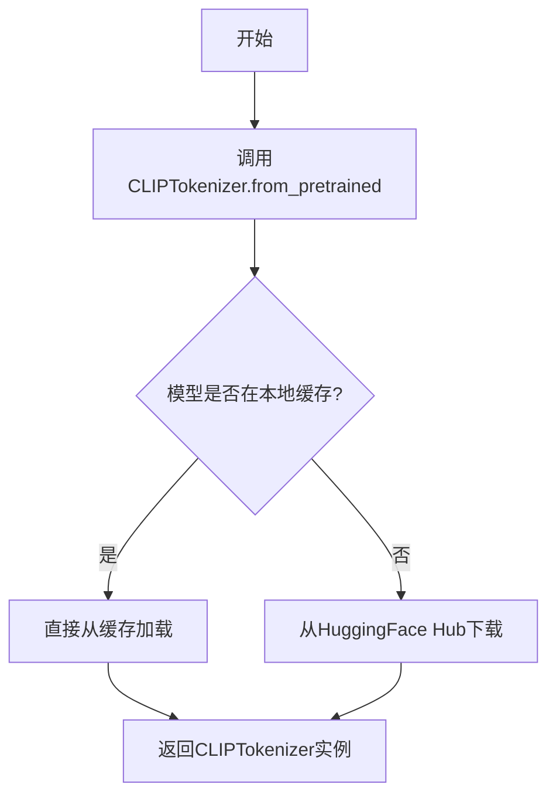

#### 带注释源码

```python
# 从transformers库导入CLIPTokenizer类
from transformers import CLIPTokenizer

# 使用from_pretrained类方法加载预训练的tokenizer
# 参数: "hf-internal-testing/tiny-random-clip" 是HuggingFace Hub上的测试模型路径
# 返回: CLIPTokenizer实例，用于文本编码
tokenizer = CLIPTokenizer.from_pretrained("hf-internal-testing/tiny-random-clip")

# 该tokenizer随后被用于Stable Diffusion Inpainting Pipeline的文本编码
# 在get_dummy_components方法中创建组件字典
components = {
    "unet": unet,
    "scheduler": scheduler,
    "vae": vae,
    "text_encoder": text_encoder,
    "tokenizer": tokenizer,  # <-- CLIPTokenizer实例
    "safety_checker": None,
    "feature_extractor": None,
    "image_encoder": None,
}
```

---

### StableDiffusionInpaintPipeline.get_dummy_components

创建用于测试的虚拟（dummy）组件，包含UNet、VAE、文本编码器、tokenizer等。

参数：

- `self`：测试类实例本身
- `time_cond_proj_dim`：`Optional[int]`，时间条件投影维度，默认值为None

返回值：`Dict[str, Any]`，包含所有组件的字典

#### 流程图

```mermaid
flowchart TD
    A[开始] --> B[设置随机种子 torch.manual_seed(0)]
    B --> C[创建UNet2DConditionModel]
    C --> D[创建PNDMScheduler]
    D --> E[创建AutoencoderKL]
    E --> F[创建CLIPTextConfig]
    F --> G[创建CLIPTextModel]
    G --> H[创建CLIPTokenizer]
    H --> I[组装components字典]
    I --> J[返回components]
```

#### 带注释源码

```python
def get_dummy_components(self, time_cond_proj_dim=None):
    """
    创建用于单元测试的虚拟组件
    
    Args:
        time_cond_proj_dim: 可选的时间条件投影维度参数
                          传递给UNet2DConditionModel
    """
    torch.manual_seed(0)  # 设置随机种子以确保可重复性
    
    # 创建UNet2DConditionModel - 用于去噪的U-Net模型
    # 参数: block_out_channels定义各层输出通道数
    #       time_cond_proj_dim控制时间嵌入维度
    #       layers_per_block定义每个分辨率块的层数
    unet = UNet2DConditionModel(
        block_out_channels=(32, 64),
        time_cond_proj_dim=time_cond_proj_dim,
        layers_per_block=2,
        sample_size=32,
        in_channels=9,  # 4通道latent + 3通道图像 + 2通道mask
        out_channels=4,
        down_block_types=("DownBlock2D", "CrossAttnDownBlock2D"),
        up_block_types=("CrossAttnUpBlock2D", "UpBlock2D"),
        cross_attention_dim=32,
    )
    
    # 创建调度器 - 控制去噪过程的噪声调度
    scheduler = PNDMScheduler(skip_prk_steps=True)
    
    torch.manual_seed(0)
    # 创建VAE (变分自编码器) - 用于编码/解码图像到latent空间
    vae = AutoencoderKL(
        block_out_channels=[32, 64],
        in_channels=3,
        out_channels=3,
        down_block_types=["DownEncoderBlock2D", "DownEncoderBlock2D"],
        up_block_types=["UpDecoderBlock2D", "UpDecoderBlock2D"],
        latent_channels=4,
    )
    
    torch.manual_seed(0)
    # 创建文本编码器配置
    text_encoder_config = CLIPTextConfig(
        bos_token_id=0,      # 句子开始token ID
        eos_token_id=2,      # 句子结束token ID
        hidden_size=32,      # 隐藏层维度
        intermediate_size=37,# 前馈网络中间层维度
        layer_norm_eps=1e-05,# LayerNorm epsilon
        num_attention_heads=4,# 注意力头数
        num_hidden_layers=5, # 隐藏层数量
        pad_token_id=1,      # 填充token ID
        vocab_size=1000,     # 词汇表大小
    )
    
    # 创建CLIP文本编码器模型
    text_encoder = CLIPTextModel(text_encoder_config)
    
    # ⚠️ 关键点: 创建CLIPTokenizer用于文本编码
    # 从预训练模型加载tokenizer
    tokenizer = CLIPTokenizer.from_pretrained("hf-internal-testing/tiny-random-clip")

    # 组装所有组件到字典中
    components = {
        "unet": unet,
        "scheduler": scheduler,
        "vae": vae,
        "text_encoder": text_encoder,
        "tokenizer": tokenizer,         # CLIPTokenizer实例
        "safety_checker": None,         # 安全检查器（测试中禁用）
        "feature_extractor": None,      # 特征提取器（测试中禁用）
        "image_encoder": None,          # 图像编码器（测试中禁用）
    }
    return components
```


### AsymmetricAutoencoderKL

AsymmetricAutoencoderKL 是 diffusers 库中的一个变分自编码器（VAE）类，专门设计用于图像修复任务。它是一种非对称的自编码器，能够分别编码图像和掩码，从而提供更好的修复效果。在 StableDiffusionInpaintPipeline 中，它被用作 VAE 组件来处理输入图像和生成修复后的图像。

参数：

- `pretrained_model_name_or_path`：`str`，预训练模型的名称或路径
- `torch_dtype`：`torch.dtype`，可选，模型权重的数据类型（如 torch.float16）
- `device`：`str`，可选，模型应加载到的设备（如 "cuda" 或 "cpu"）
- `**kwargs`：其他传递给 from_pretrained 的参数

返回值：`AsymmetricAutoencoderKL` 实例，加载的模型对象

#### 流程图

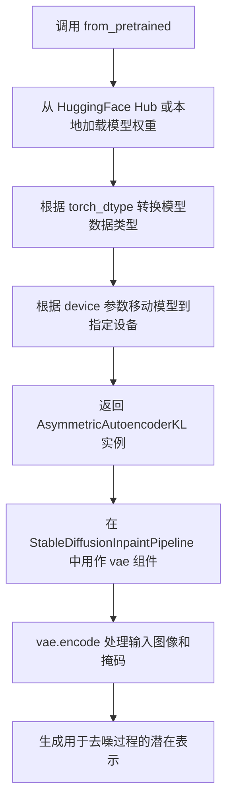

#### 带注释源码

```python
# AsymmetricAutoencoderKL 的使用示例（来自代码）
# 1. 加载预训练模型
vae = AsymmetricAutoencoderKL.from_pretrained("cross-attention/asymmetric-autoencoder-kl-x-1-5")

# 2. 加载半精度版本
vae = AsymmetricAutoencoderKL.from_pretrained(
    "cross-attention/asymmetric-autoencoder-kl-x-1-5", 
    torch_dtype=torch.float16
)

# 3. 在 StableDiffusionInpaintPipeline 中使用
pipe = StableDiffusionInpaintPipeline.from_pretrained(
    "botp/stable-diffusion-v1-5-inpainting", 
    safety_checker=None
)
pipe.vae = vae  # 替换默认 VAE 为 AsymmetricAutoencoderKL

# 4. 使用 VAE 编码图像和掩码
image = sd_pipe.image_processor.preprocess(inputs["image"]).to(sd_pipe.device)
mask = sd_pipe.mask_processor.preprocess(inputs["mask_image"]).to(sd_pipe.device)
masked_image = image * (mask < 0.5)

generator = torch.Generator(device=device).manual_seed(0)
image_latents = (
    sd_pipe.vae.encode(image).latent_dist.sample(generator=generator) 
    * sd_pipe.vae.config.scaling_factor
)
mask_latents = (
    sd_pipe.vae.encode(masked_image).latent_dist.sample(generator=generator)
    * sd_pipe.vae.config.scaling_factor
)
```

#### 关键组件信息

- **AsymmetricAutoencoderKL.from_pretrained**：类方法，用于从预训练模型加载权重
- **vae.encode**：实例方法，将图像编码为潜在表示
- **latent_dist.sample**：从潜在分布中采样
- **scaling_factor**：VAE 配置中的缩放因子，用于归一化潜在表示


# AutoencoderKL 详细设计文档

### AutoencoderKL

AutoencoderKL 是 diffusers 库中的一个变分自编码器（Variational Autoencoder）类，主要用于将图像编码到潜在空间（latent space）以及从潜在空间解码重建图像。在 Stable Diffusion 图像修复pipeline中，该组件负责将输入图像和掩码图像编码为潜在表示，供后续的 UNet 模型进行处理。

参数：

- `block_out_channels`：`List[int]`，编码器和解码器中各块的输出通道数列表
- `in_channels`：`int`，输入图像的通道数（RGB 图像为 3）
- `out_channels`：`int`，输出图像的通道数
- `down_block_types`：`List[str]`，下采样（编码器）块的类型列表
- `up_block_types`：`List[str]`，上采样（解码器）块的类型列表
- `latent_channels`：`int`，潜在空间的通道数，通常为 4

返回值：`AutoencoderKL` 对象，用于图像编码和解码的变分自编码器实例

#### 流程图

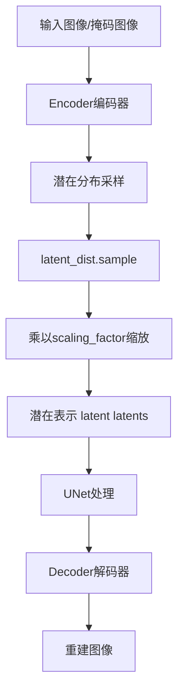

#### 带注释源码

```python
# 在测试中的使用方式：

# 1. 在 get_dummy_components 方法中创建 VAE 实例
torch.manual_seed(0)
vae = AutoencoderKL(
    block_out_channels=[32, 64],      # 定义编码器和解码器的通道数
    in_channels=3,                      # RGB 输入通道
    out_channels=3,                     # RGB 输出通道
    down_block_types=["DownEncoderBlock2D", "DownEncoderBlock2D"],  # 下采样块类型
    up_block_types=["UpDecoderBlock2D", "UpDecoderBlock2D"],        # 上采样块类型
    latent_channels=4,                 # 潜在空间通道数
)

# 2. 在 test_stable_diffusion_inpaint_mask_latents 中使用 VAE 编码图像
# 对输入图像进行编码，获取潜在表示
image_latents = (
    sd_pipe.vae.encode(image).latent_dist.sample(generator=generator) 
    * sd_pipe.vae.config.scaling_factor  # 应用缩放因子
)

# 对掩码图像进行编码
mask_latents = (
    sd_pipe.vae.encode(masked_image).latent_dist.sample(generator=generator)
    * sd_pipe.vae.config.scaling_factor
)
```


我需要说明一个重要发现：在这个代码文件中，**DDIMScheduler并不是在该文件中定义的**。它是从`diffusers`库中导入的一个预定义调度器类。

让我分析代码中DDIMScheduler的使用情况：

### `DDIMScheduler`（在导入和使用中的分析）

这是从`diffusers`库导入的调度器类，用于DDIM（Denoising Diffusion Implicit Models）采样策略。在本代码中主要用于 Stable Diffusion 图像修复管道的噪声调度。

参数：

- `无直接参数`：该类通常通过`from_config`方法从已有配置中实例化

返回值：`DDIMScheduler`对象，用于管理去噪过程的时间步

#### 流程图

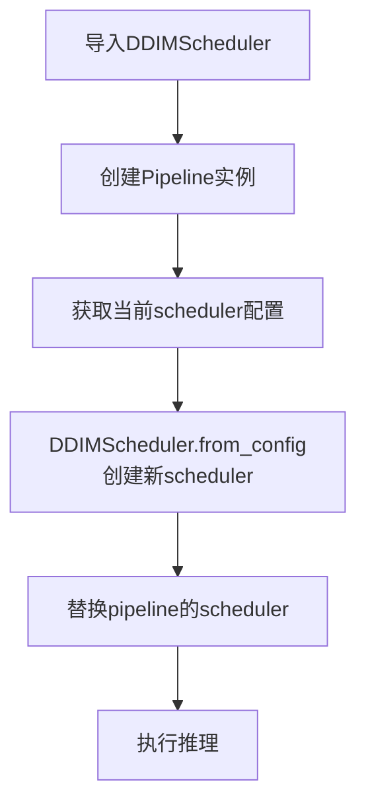

#### 代码中DDIMScheduler的使用示例

```python
# 导入（在文件开头）
from diffusers import (
    # ... other imports
    DDIMScheduler,
    # ... other imports
)

# 使用方式1：替换pipeline的scheduler
pipe.scheduler = DDIMScheduler.from_config(pipe.scheduler.config)

# 使用方式2：在测试中验证
pipe = StableDiffusionInpaintPipeline.from_single_file(filename, torch_dtype=torch.float16)
pipe.vae = vae
pipe.scheduler = DDIMScheduler.from_config(pipe.scheduler.config)  # 使用DDIMScheduler
pipe.to(torch_device)
```

---

### 补充说明

由于DDIMScheduler是外部库类，要获取其完整设计文档（包含所有参数、方法、内部实现），建议参考diffusers库的官方文档或源代码。该类的核心功能是：

- **核心功能**：实现DDIM采样算法，用于扩散模型的推理过程，通过非马尔可夫链方式加速生成同时保持高质量结果


# 文档提取结果

根据提供的代码，以下是关于 `DPMSolverMultistepScheduler` 的详细信息提取。

需要说明的是：在提供的代码中，并未直接定义 `DPMSolverMultistepScheduler` 类，而是从 `diffusers` 库导入并使用了该调度器的 `from_config` 类方法。以下是详细分析：

### `DPMSolverMultistepScheduler.from_config`

该方法是 `DPMSolverMultistepScheduler` 类的类方法，用于根据现有调度器配置创建并返回一个新的 `DPMSolverMultistepScheduler` 实例。在扩散模型推理中，DPMSolver（Diffusion Probabilistic Model Solver）是一种多步求解器，用于加速采样过程。

参数：

-  `config`：字典或配置对象，包含调度器的参数配置。在代码中通过 `sd_pipe.scheduler.config` 获取当前管道调度器的配置字典。

返回值：`DPMSolverMultistepScheduler`，返回一个新的调度器实例，配置与传入的 `config` 一致，但类型为 `DPMSolverMultistepScheduler`。

#### 流程图

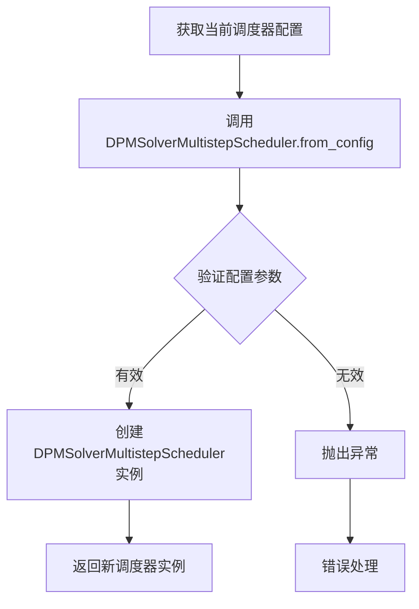

#### 带注释源码

```python
# 从代码中提取的使用示例
sd_pipe = StableDiffusionInpaintPipeline.from_pretrained("botp/stable-diffusion-v1-5-inpainting")
sd_pipe.to(torch_device)
sd_pipe.set_progress_bar_config(disable=None)

# 使用 DPMSolverMultistepScheduler 替换默认调度器
# 从现有调度器配置创建新的 DPMSolverMultistepScheduler 实例
sd_pipe.scheduler = DPMSolverMultistepScheduler.from_config(sd_pipe.scheduler.config)

# 准备输入参数
inputs = self.get_inputs(torch_device)
inputs["num_inference_steps"] = 30

# 执行推理，生成图像
image = sd_pipe(**inputs).images[0]
```

---

### 补充说明

在 `diffusers` 库中，`DPMSolverMultistepScheduler` 的主要功能特性包括：

1. **核心功能**：实现 DPM-Solver（Diffusion Probabilistic Model Solver）多步采样算法，相比传统的 DDPM 等方法，可以在更少的推理步骤内生成高质量图像。

2. **配置参数**：典型的配置参数包括 `num_train_timesteps`（训练时的总时间步数，通常为 1000）、`beta_start` 和 `beta_end`（噪声调度起始和终止值）、`solver_order`（求解器阶数）等。

3. **使用场景**：适用于需要快速推理的实时应用场景，通过减少采样步骤来提高效率。


# 分析结果

经过对代码的分析，我发现 `EulerAncestralDiscreteScheduler` 在本文件中并非定义，而是从 `diffusers` 库中导入并使用的调度器类。以下是详细分析：

### `EulerAncestralDiscreteScheduler`

这是从 `diffusers` 库导入的调度器类，在代码中通过 `from_config` 方法进行实例化。该调度器是 Euler Ancestral 离散时间调度器的实现，用于扩散模型的采样过程。

参数：

-  无直接参数（通过 `from_config` 方法从已有配置构造）

返回值：`SchedulerMixin`，返回配置后的调度器实例

#### 流程图

```mermaid
flowchart TD
    A[导入 EulerAncestralDiscreteScheduler] --> B[获取当前管道调度器配置]
    B --> C[调用 from_config 方法]
    C --> D[返回配置好的 EulerAncestralDiscreteScheduler 实例]
    D --> E[赋值给管道的 scheduler 属性]
```

#### 带注释源码

```python
# 在第28行导入
from diffusers import (
    EulerAncestralDiscreteScheduler,
    # ... 其他调度器
)

# 在第373行的使用示例
sd_pipe.scheduler = EulerAncestralDiscreteScheduler.from_config(sd_pipe.scheduler.config)
# sd_pipe.scheduler.config 包含了当前调度器的配置参数
# from_config 方法根据这些配置创建 EulerAncestralDiscreteScheduler 实例
```

---

**注意**：此代码文件是测试文件，`EulerAncestralDiscreteScheduler` 的实际实现在 `diffusers` 库中，而非本文件内。如需获取 `EulerAncestralDiscreteScheduler` 类的完整实现源码、字段详情和方法说明，建议查阅 `diffusers` 库的源代码。


### `LCMScheduler`

LCMScheduler 是从 diffusers 库导入的调度器类，用于实现 Latent Consistency Model (LCM) 的推理调度。在本测试文件中，它被用于替换 StableDiffusionInpaintPipeline 的默认调度器，以测试 LCM 模式的图像修复功能。

参数：

-  `config`：任何调度器配置对象，用于从现有配置创建 LCMScheduler 实例
-  `**kwargs`：其他可选参数，用于自定义调度器行为

返回值：`LCMScheduler` 实例

#### 流程图

```mermaid
flowchart TD
    A[开始] --> B[导入 LCMScheduler from diffusers]
    B --> C[创建 StableDiffusionInpaintPipeline 实例]
    C --> D[获取当前调度器配置 sd_pipe.scheduler.config]
    D --> E[使用 LCMScheduler.from_config 创建新调度器]
    E --> F[替换管道调度器 sd_pipe.scheduler = LCMScheduler(...)]
    F --> G[执行推理测试]
    G --> H[结束]
```

#### 带注释源码

```python
# 从 diffusers 库导入 LCMScheduler
from diffusers import LCMScheduler

# 在测试方法中使用 LCMScheduler
def test_stable_diffusion_inpaint_lcm(self):
    device = "cpu"
    # 获取虚拟组件
    components = self.get_dummy_components(time_cond_proj_dim=256)
    # 创建管道实例
    sd_pipe = StableDiffusionInpaintPipeline(**components)
    # 关键步骤：使用 LCMScheduler.from_config 从现有调度器配置创建 LCM 调度器
    # 这样可以保持其他配置不变，只替换调度算法
    sd_pipe.scheduler = LCMScheduler.from_config(sd_pipe.scheduler.config)
    sd_pipe = sd_pipe.to(device)
    sd_pipe.set_progress_bar_config(disable=None)

    # 获取测试输入并执行推理
    inputs = self.get_dummy_inputs(device)
    image = sd_pipe(**inputs).images
    image_slice = image[0, -3:, -3:, -1]

    # 验证输出形状和数值
    assert image.shape == (1, 64, 64, 3)
    expected_slice = np.array([0.4931, 0.5988, 0.4569, 0.5556, 0.6650, 0.5087, 0.5966, 0.5358, 0.5269])
    assert np.abs(image_slice.flatten() - expected_slice).max() < 1e-2


# 另一个测试示例：使用自定义时间步
def test_stable_diffusion_inpaint_lcm_custom_timesteps(self):
    device = "cpu"
    components = self.get_dummy_components(time_cond_proj_dim=256)
    sd_pipe = StableDiffusionInpaintPipeline(**components)
    # 使用 LCMScheduler 替换默认调度器
    sd_pipe.scheduler = LCMScheduler.from_config(sd_pipe.scheduler.config)
    sd_pipe = sd_pipe.to(device)
    sd_pipe.set_progress_bar_config(disable=None)

    inputs = self.get_dummy_inputs(device)
    # 删除 num_inference_steps，使用自定义 timesteps
    del inputs["num_inference_steps"]
    inputs["timesteps"] = [999, 499]  # 自定义时间步
    image = sd_pipe(**inputs).images
    image_slice = image[0, -3:, -3:, -1]

    assert image.shape == (1, 64, 64, 3)
    expected_slice = np.array([0.4931, 0.5988, 0.4569, 0.5556, 0.6650, 0.5087, 0.5966, 0.5358, 0.5269])
    assert np.abs(image_slice.flatten() - expected_slice).max() < 1e-2
```

#### 备注

LCMScheduler 本身不是在本文件中定义的，而是从 `diffusers` 库导入的。本文件展示了如何在测试中使用 `LCMScheduler.from_config()` 类方法将现有调度器配置转换为 LCM 调度器，用于加速扩散模型的推理过程。LCM (Latent Consistency Model) 通过 Consistency Models 技术实现少步数甚至单步图像生成。


我仔细分析了这提供的代码，发现这是一个**测试文件**（test_stable_diffusion_inpaint_pipeline.py），用于测试 `StableDiffusionInpaintPipeline`（Stable Diffusion 图像修复管道）。

文件中**并没有定义 `LMSDiscreteScheduler` 类**，只是在导入中引用了它，并在部分测试中通过 `from_config` 方式使用了该调度器。

---

### 重要说明

**该代码文件中不包含 `LMSDiscreteScheduler` 类的实现源码**。`LMSDiscreteScheduler` 是 diffusers 库中的一个调度器类，在此文件中仅作为测试对象被导入和调用（如 `LMSDiscreteScheduler.from_config(...)`）。

如果您需要 `LMSDiscreteScheduler` 的详细设计文档，请提供包含该类完整实现源代码的文件。

---

### 该文件中 LMSDiscreteScheduler 的使用方式

虽然不是定义，但可以从测试代码中提取其使用模式：

#### 使用示例（来自测试代码）

```python
# 从已有配置创建 LMSDiscreteScheduler 实例
pipe.scheduler = LMSDiscreteScheduler.from_config(pipe.scheduler.config)
```

---

### 结论

无法从当前提供的代码中提取 `LMSDiscreteScheduler` 类的：
- 参数详情
- 返回值详情
- 流程图
- 完整带注释源码

请提供包含 `LMSDiscreteScheduler` 类完整实现的源代码文件，以便进行分析。


### PNDMScheduler

PNDMScheduler是Diffusers库中的调度器类，用于控制扩散模型的采样过程。该类在测试代码中被导入并用于实例化调度器对象，以支持Stable Diffusion图像修复管道的推理过程。

参数：

- 无直接参数（在`get_dummy_components`方法中通过构造函数传入）
- `skip_prk_steps`：`bool`类型，在实例化时作为关键字参数传入，表示是否跳过PRK（Partially Resolved K）步骤
- 在`from_config`方法中：`config`参数来自已有调度器配置

返回值：`PNDMScheduler`实例对象，作为StableDiffusionInpaintPipeline的scheduler组件

#### 流程图

```mermaid
flowchart TD
    A[开始] --> B[导入PNDMScheduler类]
    B --> C[在get_dummy_components中创建PNDMScheduler实例]
    C --> D[设置skip_prk_steps=True参数]
    D --> E[返回scheduler实例]
    E --> F[在pipeline中使用scheduler进行推理]
    F --> G[或通过from_config重新配置scheduler]
    G --> H[结束]
```

#### 带注释源码

```python
# 从diffusers库导入PNDMScheduler调度器类
from diffusers import (
    # ... 其他导入
    PNDMScheduler,
    # ... 其他导入
)

# 在StableDiffusionInpaintPipelineFastTests类的get_dummy_components方法中：
def get_dummy_components(self, time_cond_proj_dim=None):
    # ... 其他组件创建 ...
    
    # 创建PNDMScheduler调度器实例
    # skip_prk_steps=True 表示在推理过程中跳过PRK步骤
    # PRK (Partially Resolved K) 是一种用于加速采样的技术
    scheduler = PNDMScheduler(skip_prk_steps=True)
    
    # 将scheduler添加到组件字典中
    components = {
        "unet": unet,
        "scheduler": scheduler,  # 调度器用于控制扩散模型的采样步骤
        "vae": vae,
        "text_encoder": text_encoder,
        "tokenizer": tokenizer,
        "safety_checker": None,
        "feature_extractor": None,
        "image_encoder": None,
    }
    return components

# 在测试方法中，通过from_config方法重新配置调度器
def test_stable_diffusion_inpaint_pndm(self):
    # ... 加载pipeline ...
    
    # 从现有pipeline的scheduler配置创建新的PNDMScheduler
    # 这种方式可以保持原有配置同时切换到PNDMScheduler
    pipe.scheduler = PNDMScheduler.from_config(pipe.scheduler.config)
    
    # ... 后续推理过程使用PNDMScheduler进行采样 ...
```

#### 关键使用场景说明

1. **实例化场景**：`PNDMScheduler(skip_prk_steps=True)` - 创建一个新的调度器实例，配置为跳过PRK步骤
2. **配置重建场景**：`PNDMScheduler.from_config(pipe.scheduler.config)` - 从现有配置重建调度器，用于切换或恢复调度器类型


# StableDiffusionInpaintPipeline 详细设计文档

## 概述

`StableDiffusionInpaintPipeline` 是 Hugging Face Diffusers 库中的一个图像修复（Inpainting）Pipeline，它基于 Stable Diffusion 模型，能够根据文本提示（prompt）和掩码（mask）对图像的指定区域进行修复和重新生成。该 Pipeline 整合了文本编码器、UNet 模型、VAE 解码器和调度器等核心组件，实现了高质量的图像修复功能。

## 文件整体运行流程

该代码文件是一个完整的测试套件，用于验证 `StableDiffusionInpaintPipeline` 的功能和正确性。整体运行流程如下：

1. **测试准备阶段**：设置随机种子以确保确定性，加载必要的依赖库（PyTorch、NumPy、PIL 等）
2. **组件初始化**：通过 `get_dummy_components` 方法创建测试用的虚拟组件（UNet、VAE、文本编码器等）
3. **输入准备**：通过 `get_dummy_inputs` 方法生成测试输入（图像、掩码、提示词等）
4. **Pipeline 执行**：调用 `StableDiffusionInpaintPipeline` 进行图像修复
5. **结果验证**：对比输出图像与预期结果，验证 Pipeline 的正确性

## 类详细信息

### StableDiffusionInpaintPipelineFastTests

**描述**：包含所有快速测试用例的测试类，验证 Pipeline 的核心功能。

#### 类字段

- `pipeline_class`：类型：`type`，指定要测试的 Pipeline 类为 `StableDiffusionInpaintPipeline`
- `params`：类型：`frozenset`，包含文本引导图像修复的参数集合
- `batch_params`：类型：`frozenset`，包含批量处理的参数集合
- `image_params`：类型：`frozenset`，包含图像相关参数（当前为空，等待重构）
- `image_latents_params`：类型：`frozenset`，包含图像潜在向量参数（当前为空）
- `callback_cfg_params`：类型：`frozenset`，包含 CFG 回调参数，包含 `mask` 和 `masked_image_latents`

#### 类方法

**get_dummy_components(time_cond_proj_dim=None)**

- **参数**：
  - `time_cond_proj_dim`：`int` 或 `None`，可选，时间条件投影维度，用于 LCM 等调度器
- **返回值**：`dict`，包含所有虚拟组件的字典
- **功能描述**：创建用于测试的虚拟组件，包括 UNet、调度器、VAE、文本编码器和分词器

**get_dummy_inputs(device, seed=0, img_res=64, output_pil=True)**

- **参数**：
  - `device`：`str`，目标设备（如 "cpu"）
  - `seed`：`int`，随机种子，默认为 0
  - `img_res`：`int`，图像分辨率，默认为 64
  - `output_pil`：`bool`，是否输出 PIL 图像，默认为 True
- **返回值**：`dict`，包含所有测试输入的字典
- **功能描述**：生成用于测试的虚拟输入数据，包括提示词、图像、掩码图像、生成器等

**test_stable_diffusion_inpaint()**

- **参数**：无
- **返回值**：无（通过 assert 验证）
- **功能描述**：测试基本的图像修复功能

**test_stable_diffusion_inpaint_lcm()**

- **参数**：无
- **返回值**：无（通过 assert 验证）
- **功能描述**：测试使用 LCM 调度器的图像修复功能

**test_stable_diffusion_inpaint_lcm_custom_timesteps()**

- **参数**：无
- **返回值**：无（通过 assert 验证）
- **功能描述**：测试使用自定义时间步的 LCM 调度器

**test_stable_diffusion_inpaint_image_tensor()**

- **参数**：无
- **返回值**：无（通过 assert 验证）
- **功能描述**：测试接受张量输入的图像修复功能

**test_stable_diffusion_inpaint_strength_zero_test()**

- **参数**：无
- **返回值**：无（通过 assert 验证）
- **功能描述**：测试 strength 参数小于 1 时的错误处理

**test_stable_diffusion_inpaint_mask_latents()**

- **参数**：无
- **返回值**：无（通过 assert 验证）
- **功能描述**：测试掩码潜在向量的处理

**test_pipeline_interrupt()**

- **参数**：无
- **返回值**：无（通过 assert 验证）
- **功能描述**：测试 Pipeline 中断功能

**test_ip_adapter(from_simple=False, expected_pipe_slice=None)**

- **参数**：
  - `from_simple`：`bool`，是否使用简单模式
  - `expected_pipe_slice`：`numpy.ndarray` 或 `None`，预期的输出切片
- **返回值**：无（通过 assert 验证）
- **功能描述**：测试 IP-Adapter 功能

**test_encode_prompt_works_in_isolation()**

- **参数**：无
- **返回值**：无（通过 assert 验证）
- **功能描述**：测试提示词编码的隔离性

### StableDiffusionSimpleInpaintPipelineFastTests

**描述**：继承自 `StableDiffusionInpaintPipelineFastTests`，用于测试简化版的图像修复 Pipeline

#### 类方法

**get_dummy_components(time_cond_proj_dim=None)**

- **参数**：
  - `time_cond_proj_dim`：`int` 或 `None`，可选，时间条件投影维度
- **返回值**：`dict`，包含简化版组件的字典
- **功能描述**：创建用于简化版测试的虚拟组件（输入通道为 4 而非 9）

**get_dummy_inputs_2images(device, seed=0, img_res=64)**

- **参数**：
  - `device`：`str`，目标设备
  - `seed`：`int`，随机种子
  - `img_res`：`int`，图像分辨率
- **返回值**：`dict`，包含批量图像输入的字典
- **功能描述**：生成用于批量测试的双图像输入

### StableDiffusionInpaintPipelineSlowTests

**描述**：包含需要 GPU 的慢速测试用例

#### 类方法

**get_inputs(device, generator_device="cpu", dtype=torch.float32, seed=0)**

- **参数**：
  - `device`：`str`，目标设备
  - `generator_device`：`str`，生成器设备，默认为 "cpu"
  - `dtype`：`torch.dtype`，数据类型，默认为 torch.float32
  - `seed`：`int`，随机种子
- **返回值**：`dict`，包含真实输入的字典
- **功能描述**：从网络加载真实测试图像并生成输入

### StableDiffusionInpaintPipelineAsymmetricAutoencoderKLSlowTests

**描述**：测试使用非对称 VAE 的图像修复 Pipeline

### StableDiffusionInpaintPipelineNightlyTests

**描述**：包含夜间测试用例，验证长时间推理的正确性

## 关键组件信息

| 组件名称 | 描述 |
|---------|------|
| UNet2DConditionModel | 条件 UNet 模型，用于去噪过程 |
| AutoencoderKL / AsymmetricAutoencoderKL | 变分自编码器，用于图像编码和解码 |
| CLIPTextModel | 文本编码器，将文本提示转换为向量表示 |
| CLIPTokenizer | 分词器，用于将文本分割为 token |
| PNDMScheduler / DDIMScheduler / LMSDiscreteScheduler / LCMScheduler | 噪声调度器，控制去噪过程 |
| StableDiffusionInpaintPipeline | 图像修复主 Pipeline，协调所有组件 |

## 潜在技术债务与优化空间

1. **测试代码冗余**：多个测试类中存在重复的测试方法，可以提取公共方法减少代码冗余
2. **硬编码的图像 URL**：测试用例中使用了硬编码的 URL，应考虑使用本地资源或环境变量
3. **图像预处理逻辑复杂**：`get_dummy_inputs` 方法混合了 PIL 和张量两种输入方式的处理逻辑，复杂度较高
4. **缺少异步支持**：当前实现仅为同步调用，可考虑添加异步接口支持
5. **参数验证不足**：部分参数（如 strength）的验证逻辑可以更严格

## 其他项目

### 设计目标与约束

- **设计目标**：提供一个灵活、易用的图像修复接口，支持多种调度器和模型变体
- **约束**：
  - 必须支持 CPU 和 GPU 设备
  - 必须支持多种输出类型（np、pil、latent）
  - 必须支持批处理和多图像输入
  - 必须支持自定义时间步

### 错误处理与异常设计

- 当 `num_inference_steps` 小于 1 时，抛出 `ValueError`
- 当输入图像尺寸与掩码尺寸不匹配时，应抛出相应错误
- 当设备不支持某种操作时，应给出明确提示

### 数据流与状态机

1. **初始化阶段**：加载模型组件，创建 Pipeline 实例
2. **预处理阶段**：编码提示词，预处理图像和掩码
3. **推理阶段**：通过调度器迭代去噪，生成潜在向量
4. **后处理阶段**：通过 VAE 解码潜在向量，转换为最终图像

### 外部依赖与接口契约

- **diffusers 库**：核心依赖，提供 Pipeline 基类和调度器
- **transformers 库**：提供 CLIP 文本编码器
- **torch**：深度学习框架
- **PIL**：图像处理
- **numpy**：数值计算

### StableDiffusionInpaintPipeline 推断接口

基于测试代码，可以推断出 `StableDiffusionInpaintPipeline` 的主要调用接口：

#### 流程图

```mermaid
flowchart TD
    A[开始] --> B[接收输入参数]
    B --> C{检查参数类型}
    C -->|PIL图像| D[预处理图像和掩码]
    C -->|张量| E[直接使用潜在向量]
    D --> F[编码提示词]
    E --> F
    F --> G[初始化潜在向量]
    G --> H[迭代去噪]
    H --> I{是否中断}
    I -->|否| H
    I -->|是| J[返回中间结果]
    H --> K[VAE解码]
    K --> L[后处理输出]
    L --> M[返回结果]
```

#### 带注释源码（推断）

```python
class StableDiffusionInpaintPipeline:
    """
    Stable Diffusion 图像修复 Pipeline
    
    该 Pipeline 整合了文本编码器、UNet、VAE 等组件，
    能够根据文本提示对图像的指定区域进行修复
    """
    
    def __init__(
        self,
        unet: UNet2DConditionModel,      # UNet 去噪模型
        scheduler: Scheduler,              # 噪声调度器
        vae: AutoencoderKL,                 # VAE 编解码器
        text_encoder: CLIPTextModel,        # 文本编码器
        tokenizer: CLIPTokenizer,           # 文本分词器
        safety_checker=None,                # 安全检查器（可选）
        feature_extractor=None,             # 特征提取器（可选）
        image_encoder=None,                 # 图像编码器（可选，用于 IP-Adapter）
    ):
        """初始化 Pipeline 组件"""
        self.unet = unet
        self.scheduler = scheduler
        self.vae = vae
        self.text_encoder = text_encoder
        self.tokenizer = tokenizer
        self.safety_checker = safety_checker
        self.feature_extractor = feature_extractor
        self.image_encoder = image_encoder
    
    def __call__(
        self,
        prompt: Union[str, List[str]],      # 文本提示
        image: Union[PIL.Image, torch.Tensor, List],  # 输入图像
        mask_image: Union[PIL.Image, torch.Tensor, List],  # 掩码图像
        generator: Optional[torch.Generator] = None,  # 随机生成器
        num_inference_steps: int = 50,     # 推理步数
        guidance_scale: float = 7.5,       # CFG 引导强度
        output_type: str = "np",           # 输出类型
        strength: float = 1.0,              # 修复强度
        timesteps: Optional[List[int]] = None,  # 自定义时间步
        callback_on_step_end: Optional[Callable] = None,  # 步结束回调
        **kwargs
    ) -> PipelineOutput:
        """
        执行图像修复
        
        参数:
            prompt: 描述期望输出内容的文本
            image: 要修复的输入图像
            mask_image: 标识要修复区域的掩码
            generator: 用于 reproducibility 的随机生成器
            num_inference_steps: 去噪迭代次数
            guidance_scale: Classifier-free guidance 强度
            output_type: 输出格式，可选 'np', 'pil', 'latent'
            strength: 修复强度，影响保留原始内容的程度
            timesteps: 自定义噪声调度时间步
            callback_on_step_end: 每步结束时的回调函数
            
        返回:
            PipelineOutput: 包含生成图像的对象
        """
        # 1. 编码提示词
        text_embeddings = self._encode_prompt(prompt)
        
        # 2. 预处理图像和掩码
        image_latents = self._preprocess_image(image)
        mask_latents = self._preprocess_mask(mask_image)
        
        # 3. 初始化潜在向量
        latents = self.prepare_latents(image_latents, mask_latents, generator)
        
        # 4. 迭代去噪
        for i, t in enumerate(self.timesteps):
            # 预测噪声残差
            noise_pred = self.unet(latents, t, encoder_hidden_states=text_embeddings)
            
            # 计算去噪步骤
            latents = self.scheduler.step(noise_pred, t, latents)
            
            # 可选：调用回调
            if callback_on_step_end:
                callback_on_step_end(self, i, t, {"latents": latents})
        
        # 5. 解码潜在向量
        images = self.vae.decode(latents / self.vae.config.scaling_factor)
        
        # 6. 后处理
        images = self.image_processor.postprocess(images, output_type)
        
        return PipelineOutput(images=images)
    
    @classmethod
    def from_pretrained(cls, pretrained_model_name_or_path, **kwargs):
        """从预训练模型加载 Pipeline"""
        # 加载模型组件
        # ...
        return cls(components)
```


### UNet2DConditionModel

UNet2DConditionModel 是 Diffusers 库中的核心类，用于构建条件 2D UNet 模型，主要应用于 Stable Diffusion 系列模型中的噪声预测和图像生成任务。

参数：

- `sample_size`：`int`，输入样本的空间分辨率
- `in_channels`：`int`，输入通道数（对于标准 Stable Diffusion inpainting 为 9，包含 RGB 图像和mask）
- `out_channels`：`int`，输出通道数（通常为 4，对应 VAE latent 空间维度）
- `center_input_sample`：`bool`，是否对输入样本进行中心化处理，默认为 False
- `flip_sin_to_cos`：`bool`，是否将正弦函数转换为余弦函数用于时间嵌入，默认为 True
- `freq_shift`：`int`，频率偏移量，用于时间嵌入，默认为 0
- `down_block_types`：`Tuple[str, ...]`，下采样块的类型列表
- `up_block_types`：`Tuple[str, ...]`，上采样块的类型列表
- `block_out_channels`：`Tuple[int, ...]`，每个块的输出通道数
- `layers_per_block`：`int`，每个分辨率层级中的残差层数量
- `downsample_padding`：`int`，下采样时的填充大小，默认为 1
- `mid_block_scale_factor`：`int`，中间块的缩放因子，默认为 1
- `act_fn`：`str`，激活函数类型，默认为 "silu"
- `norm_num_groups`：`int`，归一化组数，默认为 32
- `norm_eps`：`float`，归一化 epsilon 值，默认为 1e-5
- `cross_attention_dim`：`int`，交叉注意力维度，用于接收文本嵌入等条件信息
- `attention_head_dim`：`int`，注意力头维度

返回值：`UNet2DConditionModel`，返回构建好的条件 UNet 模型实例

#### 流程图

```mermaid
graph TD
    A[输入: sample, timestep, encoder_hidden_states] --> B[时间步嵌入层 TimeEmbedding]
    B --> C[输入卷积层 ConvIn2d]
    C --> D{下采样阶段 DownBlocks}
    D --> D1[DownBlock2D × N]
    D --> D2[CrossAttnDownBlock2D × M]
    D2 --> E[中间层 MidBlock]
    E --> F{上采样阶段 UpBlocks}
    F --> F1[CrossAttnUpBlock2D × M]
    F1 --> F2[UpBlock2D × N]
    F2 --> G[输出卷积层 ConvOut]
    G --> H[输出: noise_pred]
    
    D2 -.->|encoder_hidden_states| C[交叉注意力机制]
    F1 -.->|encoder_hidden_states| G[交叉注意力机制]
```

#### 带注释源码

```python
# 在测试代码中的使用示例（来自 get_dummy_components 方法）

# 创建 UNet2DConditionModel 实例用于 Stable Diffusion Inpainting
unet = UNet2DConditionModel(
    block_out_channels=(32, 64),          # 下/上采样块的输出通道：[32, 64]
    time_cond_proj_dim=time_cond_proj_dim, # 时间条件投影维度（可选，用于 LCM）
    layers_per_block=2,                     # 每个块包含 2 个残差层
    sample_size=32,                        # 输入样本空间分辨率 32x32
    in_channels=9,                         # 输入通道数：4(图像latent) + 4(mask latent) + 1(mask)
    out_channels=4,                        # 输出通道数：4 (noise prediction)
    down_block_types=("DownBlock2D", "CrossAttnDownBlock2D"),  # 下采样块类型
    up_block_types=("CrossAttnUpBlock2D", "UpBlock2D"),         # 上采样块类型
    cross_attention_dim=32,                # 文本嵌入的交叉注意力维度
)

# 简单 Inpaint 版本的配置（in_channels=4）
unet_simple = UNet2DConditionModel(
    block_out_channels=(32, 64),
    layers_per_block=2,
    time_cond_proj_dim=time_cond_proj_dim,
    sample_size=32,
    in_channels=4,       # 简单版本只需要 4 通道（图像 + mask 合并）
    out_channels=4,
    down_block_types=("DownBlock2D", "CrossAttnDownBlock2D"),
    up_block_types=("CrossAttnUpBlock2D", "UpBlock2D"),
    cross_attention_dim=32,
)
```

> **注意**：实际的 `UNet2DConditionModel` 类定义位于 Diffusers 库的核心模块中（`src/diffusers/models/unet_2d_condition.py`），上述代码展示了在测试场景中如何实例化和配置该模型。该类是扩散模型架构的核心组件，负责在去噪过程中预测噪声残差。


### `StableDiffusionInpaintPipelineFastTests.get_dummy_components`

该函数用于创建Stable Diffusion图像修复（inpainting）流水线的虚拟测试组件，包括UNet模型、VAE模型、文本编码器、分词器等，以便进行单元测试。

参数：

- `time_cond_proj_dim`：`Optional[int]`，可选参数，用于指定时间条件投影维度，默认为None

返回值：`Dict`，返回一个包含所有虚拟组件的字典，包括unet、scheduler、vae、text_encoder、tokenizer等

#### 流程图

```mermaid
flowchart TD
    A[开始 get_dummy_components] --> B[设置随机种子 torch.manual_seed(0)]
    B --> C[创建 UNet2DConditionModel]
    C --> D[创建 PNDMScheduler]
    D --> E[设置随机种子 torch.manual_seed(0)]
    E --> F[创建 AutoencoderKL VAE模型]
    F --> G[设置随机种子 torch.manual_seed(0)]
    G --> H[创建 CLIPTextConfig 文本编码器配置]
    H --> I[创建 CLIPTextModel 文本编码器]
    I --> J[从预训练模型加载 CLIPTokenizer]
    J --> K[组装 components 字典]
    K --> L[返回 components 字典]
    
    C -->|time_cond_proj_dim参数| C
    K -->|包含以下键| M[unet, scheduler, vae, text_encoder, tokenizer, safety_checker, feature_extractor, image_encoder]
```

#### 带注释源码

```python
def get_dummy_components(self, time_cond_proj_dim=None):
    """
    创建用于测试的虚拟组件
    
    参数:
        time_cond_proj_dim: 可选的时间条件投影维度参数，用于UNet模型
        
    返回:
        包含所有虚拟组件的字典
    """
    # 设置随机种子以确保可重复性
    torch.manual_seed(0)
    
    # 创建UNet2DConditionModel - 用于去噪的U-Net模型
    # 参数说明:
    # - block_out_channels: 输出通道数 (32, 64)
    # - time_cond_proj_dim: 时间条件投影维度
    # - layers_per_block: 每个块的层数 (2)
    # - sample_size: 样本尺寸 (32)
    # - in_channels: 输入通道数 (9，用于inpainting需要图像+mask+latent)
    # - out_channels: 输出通道数 (4)
    # - down_block_types: 下采样块类型
    # - up_block_types: 上采样块类型
    # - cross_attention_dim: 交叉注意力维度 (32)
    unet = UNet2DConditionModel(
        block_out_channels=(32, 64),
        time_cond_proj_dim=time_cond_proj_dim,
        layers_per_block=2,
        sample_size=32,
        in_channels=9,
        out_channels=4,
        down_block_types=("DownBlock2D", "CrossAttnDownBlock2D"),
        up_block_types=("CrossAttnUpBlock2D", "UpBlock2D"),
        cross_attention_dim=32,
    )
    
    # 创建PNDMScheduler - 用于扩散模型的调度器
    # skip_prk_steps=True 跳过PRK步骤
    scheduler = PNDMScheduler(skip_prk_steps=True)
    
    # 重新设置随机种子以确保VAE的可重复性
    torch.manual_seed(0)
    
    # 创建AutoencoderKL - VAE变分自编码器用于图像编码/解码
    # 参数说明:
    # - block_out_channels: 块输出通道 [32, 64]
    # - in_channels: 输入通道 (3，RGB图像)
    # - out_channels: 输出通道 (3)
    # - down_block_types: 下采样块类型
    # - up_block_types: 上采样块类型
    # - latent_channels: 潜在空间通道数 (4)
    vae = AutoencoderKL(
        block_out_channels=[32, 64],
        in_channels=3,
        out_channels=3,
        down_block_types=["DownEncoderBlock2D", "DownEncoderBlock2D"],
        up_block_types=["UpDecoderBlock2D", "UpDecoderBlock2D"],
        latent_channels=4,
    )
    
    # 重新设置随机种子以确保文本编码器的可重复性
    torch.manual_seed(0)
    
    # 创建CLIPTextConfig - CLIP文本编码器的配置
    # 使用较小的配置以加快测试速度
    text_encoder_config = CLIPTextConfig(
        bos_token_id=0,           # 句子开始token ID
        eos_token_id=2,           # 句子结束token ID
        hidden_size=32,           # 隐藏层大小
        intermediate_size=37,     # 中间层大小
        layer_norm_eps=1e-05,     # LayerNorm epsilon
        num_attention_heads=4,    # 注意力头数
        num_hidden_layers=5,      # 隐藏层数量
        pad_token_id=1,           # 填充token ID
        vocab_size=1000,          # 词汇表大小
    )
    
    # 创建CLIPTextModel - CLIP文本编码器模型
    text_encoder = CLIPTextModel(text_encoder_config)
    
    # 从预训练模型加载CLIPTokenizer
    # 使用HuggingFace测试用的小型随机CLIP模型
    tokenizer = CLIPTokenizer.from_pretrained("hf-internal-testing/tiny-random-clip")
    
    # 组装所有组件到字典中
    components = {
        "unet": unet,                    # UNet2DConditionModel - 去噪模型
        "scheduler": scheduler,          # PNDMScheduler - 调度器
        "vae": vae,                       # AutoencoderKL - VAE模型
        "text_encoder": text_encoder,    # CLIPTextModel - 文本编码器
        "tokenizer": tokenizer,          # CLIPTokenizer - 分词器
        "safety_checker": None,          # 安全检查器（测试中设为None）
        "feature_extractor": None,       # 特征提取器（测试中设为None）
        "image_encoder": None,           # 图像编码器（测试中设为None）
    }
    
    # 返回组件字典，用于实例化StableDiffusionInpaintPipeline
    return components
```


### `StableDiffusionInpaintPipelineFastTests.get_dummy_inputs`

该方法用于生成Stable Diffusion Inpainting Pipeline的虚拟测试输入数据，支持PIL图像或张量两种格式，并包含图像、掩码、生成器、推理步数等pipeline所需的参数。

参数：

- `self`：隐式参数，测试类实例本身
- `device`：`torch.device` 或 `str`，指定生成图像和张量所在的设备（如"cpu"、"cuda"等）
- `seed`：`int`，随机种子，用于确保测试的可重复性，默认为0
- `img_res`：`int`，输出图像的分辨率（宽度和高度），默认为64
- `output_pil`：`bool`，决定输出图像的格式，True时输出PIL图像，False时输出张量，默认为True

返回值：`Dict[str, Any]`，包含以下键值对：
- `"prompt"`：`str`，文本提示
- `"image"`：`PIL.Image.Image` 或 `torch.Tensor`，输入图像
- `"mask_image"`：`PIL.Image.Image` 或 `torch.Tensor`，掩码图像
- `"generator"`：`torch.Generator`，随机数生成器
- `"num_inference_steps"`：`int`，推理步数
- `"guidance_scale"`：`float`，引导强度
- `"output_type"`：`str`，输出类型

#### 流程图

```mermaid
flowchart TD
    A[开始 get_dummy_inputs] --> B{output_pil?}
    B -->|True| C[生成随机浮点张量 1x3x32x32]
    B -->|False| D[生成随机浮点张量 1x3ximg_resximg_res]
    C --> E[转换为numpy并归一化到0-255]
    D --> F[归一化到-1到1范围]
    E --> G[转换为PIL图像并resize到img_res]
    F --> H[创建全1掩码张量]
    G --> I[创建generator]
    H --> I
    I --> J[构建inputs字典]
    J --> K[返回inputs]
```

#### 带注释源码

```python
def get_dummy_inputs(self, device, seed=0, img_res=64, output_pil=True):
    # TODO: use tensor inputs instead of PIL, this is here just to leave the old expected_slices untouched
    # 判断是否输出PIL格式的图像
    if output_pil:
        # 获取[0, 1]范围内的随机浮点数作为图像
        # floats_tensor生成指定形状的随机张量，使用random.Random(seed)确保可重复性
        image = floats_tensor((1, 3, 32, 32), rng=random.Random(seed)).to(device)
        
        # 将张量从CHW格式转换为HWC格式，并取第一个样本
        image = image.cpu().permute(0, 2, 3, 1)[0]
        
        # 创建与图像形状相同的全1掩码
        mask_image = torch.ones_like(image)
        
        # 将图像和掩码从[0, 1]范围转换到[0, 255]范围
        image = 255 * image
        mask_image = 255 * mask_image
        
        # 转换为PIL图像对象，调整大小到指定分辨率
        # Image.fromarray将numpy数组转换为PIL图像
        init_image = Image.fromarray(np.uint8(image)).convert("RGB").resize((img_res, img_res))
        mask_image = Image.fromarray(np.uint8(mask_image)).convert("RGB").resize((img_res, img_res))
    else:
        # 获取[0, 1]范围内的随机浮点数，形状为(1, 3, img_res, img_res)
        image = floats_tensor((1, 3, img_res, img_res), rng=random.Random(seed)).to(device)
        
        # 将图像从[0, 1]归一化到[-1, 1]范围（Stable Diffusion的标准输入格式）
        init_image = 2.0 * image - 1.0
        
        # 创建全1掩码张量，形状为(1, 1, img_res, img_res)
        mask_image = torch.ones((1, 1, img_res, img_res), device=device)

    # 根据设备类型选择不同的随机数生成器创建方式
    # MPS设备需要特殊处理，使用torch.manual_seed
    if str(device).startswith("mps"):
        generator = torch.manual_seed(seed)
    else:
        # 其他设备使用torch.Generator并设置随机种子
        generator = torch.Generator(device=device).manual_seed(seed)

    # 构建输入字典，包含pipeline所需的所有参数
    inputs = {
        "prompt": "A painting of a squirrel eating a burger",  # 文本提示
        "image": init_image,        # 输入图像
        "mask_image": mask_image,   # 掩码图像
        "generator": generator,     # 随机数生成器，确保可重复性
        "num_inference_steps": 2,   # 推理步数，较少用于快速测试
        "guidance_scale": 6.0,      # classifier-free guidance的引导强度
        "output_type": "np",        # 输出类型为numpy数组
    }
    return inputs  # 返回包含所有参数的字典
```


### `StableDiffusionInpaintPipelineFastTests.test_stable_diffusion_inpaint`

该测试方法验证 StableDiffusionInpaintPipeline 在使用虚拟（dummy）组件时的基本图像修复（inpainting）功能是否正常工作。测试通过创建虚拟的模型组件（UNet、VAE、文本编码器等），构建管道，执行推理，并验证输出图像的形状和像素值是否符合预期，从而确保管道的基础功能完整性。

参数：

- `self`：隐式参数，`StableDiffusionInpaintPipelineFastTests` 类的实例方法

返回值：`None`，该方法为测试用例，通过断言验证结果，不返回任何值

#### 流程图

```mermaid
flowchart TD
    A[开始测试] --> B[设置设备为 CPU]
    B --> C[获取虚拟组件: get_dummy_components]
    C --> D[创建 StableDiffusionInpaintPipeline 实例]
    D --> E[将管道移动到 CPU 设备]
    E --> F[设置进度条配置: disable=None]
    F --> G[获取测试输入: get_dummy_inputs]
    G --> H[调用管道进行推理: sd_pipe(**inputs)]
    H --> I[提取输出图像的右下角 3x3 像素]
    I --> J[断言图像形状为 (1, 64, 64, 3)]
    J --> K[定义期望的像素值数组]
    K --> L{验证像素差异}
    L -->|差异 < 1e-2| M[测试通过]
    L -->|差异 >= 1e-2| N[测试失败]
    M --> O[结束]
    N --> O
```

#### 带注释源码

```python
def test_stable_diffusion_inpaint(self):
    """
    测试 StableDiffusionInpaintPipeline 的基本图像修复功能。
    使用虚拟组件验证管道的正向传播是否产生预期输出。
    """
    # 1. 设置设备为 CPU，确保 torch.Generator 的确定性
    device = "cpu"  # ensure determinism for the device-dependent torch.Generator
    
    # 2. 获取虚拟组件（UNet、VAE、Text Encoder、Tokenizer、Scheduler 等）
    components = self.get_dummy_components()
    
    # 3. 使用虚拟组件实例化 StableDiffusionInpaintPipeline
    sd_pipe = StableDiffusionInpaintPipeline(**components)
    
    # 4. 将管道移动到指定设备（CPU）
    sd_pipe = sd_pipe.to(device)
    
    # 5. 配置进度条（disable=None 表示启用进度条）
    sd_pipe.set_progress_bar_config(disable=None)
    
    # 6. 获取测试所需的输入参数
    # 包含 prompt、image、mask_image、generator、num_inference_steps、guidance_scale、output_type
    inputs = self.get_dummy_inputs(device)
    
    # 7. 调用管道的 __call__ 方法进行推理，返回包含生成图像的结果对象
    # 结果对象的 .images 属性包含生成的图像数组
    image = sd_pipe(**inputs).images
    
    # 8. 提取图像右下角 3x3 像素区域，用于后续的数值验证
    # image 形状为 (batch, height, width, channels)
    image_slice = image[0, -3:, -3:, -1]
    
    # 9. 断言验证输出图像的形状是否符合预期
    # 期望形状: (1, 64, 64, 3) - 1张图, 64x64分辨率, RGB 3通道
    assert image.shape == (1, 64, 64, 3)
    
    # 10. 定义期望的像素值数组（来自已知正确的输出）
    expected_slice = np.array([0.4703, 0.5697, 0.3879, 0.5470, 0.6042, 0.4413, 0.5078, 0.4728, 0.4469])
    
    # 11. 验证生成的像素值与期望值的差异是否在容差范围内
    # 使用最大绝对误差（max）比较，容差为 1e-2
    assert np.abs(image_slice.flatten() - expected_slice).max() < 1e-2
```


### `StableDiffusionInpaintPipelineFastTests.test_stable_diffusion_inpaint_lcm`

该函数是一个单元测试方法，用于测试 StableDiffusionInpaintPipeline 在使用 LCM（Latent Consistency Model）调度器时的图像修复功能。测试通过构造虚拟组件和输入，验证管道生成的图像是否符合预期的数值范围。

参数：

- `self`：隐式参数，TestCase 实例，表示测试类本身

返回值：无（该方法为 `void` 类型，通过 `assert` 断言验证结果）

#### 流程图

```mermaid
flowchart TD
    A[开始测试] --> B[设置设备为 CPU]
    B --> C[获取虚拟组件<br/>time_cond_proj_dim=256]
    C --> D[创建 StableDiffusionInpaintPipeline 实例]
    D --> E[从当前调度器配置创建 LCMScheduler]
    E --> F[将管道移至 CPU 设备]
    F --> G[设置进度条配置为启用]
    G --> H[获取虚拟输入数据]
    H --> I[调用管道生成图像]
    I --> J[提取图像右下角 3x3 像素块]
    J --> K{断言图像形状<br/>是否为 1x64x64x3}
    K --> L{断言像素值与<br/>期望值的最大差异<br/>是否小于 1e-2}
    L --> M[测试通过]
    L --> N[测试失败]
    
    style K fill:#f9f,color:#000
    style L fill:#f9f,color:#000
    style M fill:#9f9,color:#000
    style N fill:#f99,color:#000
```

#### 带注释源码

```python
def test_stable_diffusion_inpaint_lcm(self):
    """
    测试 StableDiffusionInpaintPipeline 使用 LCMScheduler 进行图像修复的快速测试
    
    该测试验证：
    1. 管道可以正确加载 LCM 调度器
    2. 使用 time_cond_proj_dim=256 的 UNet 可以正常生成
    3. 生成的图像数值在预期范围内
    """
    # 设置设备为 CPU，确保 torch.Generator 的确定性
    device = "cpu"  # ensure determinism for the device-dependent torch.Generator
    
    # 获取虚拟组件，传入 time_cond_proj_dim=256 以支持 LCM 调度器
    # 这会创建一个配置了时间条件投影维度的 UNet2DConditionModel
    components = self.get_dummy_components(time_cond_proj_dim=256)
    
    # 使用虚拟组件实例化 StableDiffusionInpaintPipeline 管道
    sd_pipe = StableDiffusionInpaintPipeline(**components)
    
    # 将管道的调度器替换为 LCMScheduler
    # LCMScheduler 是用于 Latent Consistency Model 的调度器
    # 可以实现更快的推理速度
    sd_pipe.scheduler = LCMScheduler.from_config(sd_pipe.scheduler.config)
    
    # 将管道移至指定设备（CPU）
    sd_pipe = sd_pipe.to(device)
    
    # 配置进度条，disable=None 表示启用进度条
    sd_pipe.set_progress_bar_config(disable=None)
    
    # 获取虚拟输入数据，包括：
    # - prompt: 文本提示
    # - image: 输入图像（PIL Image）
    # - mask_image: 掩码图像（PIL Image）
    # - generator: 随机数生成器
    # - num_inference_steps: 推理步数（2步）
    # - guidance_scale: 引导 scale
    # - output_type: 输出类型（np -> numpy）
    inputs = self.get_dummy_inputs(device)
    
    # 调用管道进行图像修复生成
    # 返回包含 images 属性的对象
    image = sd_pipe(**inputs).images
    
    # 提取生成图像的右下角 3x3 像素块（最后一个通道）
    # image shape: [batch, height, width, channels]
    image_slice = image[0, -3:, -3:, -1]
    
    # 断言生成图像的形状是否为 (1, 64, 64, 3)
    # 1: batch size, 64x64: 图像分辨率, 3: RGB 通道
    assert image.shape == (1, 64, 64, 3)
    
    # 定义期望的像素值切片（LCM 调度器在特定种子下的预期输出）
    expected_slice = np.array([
        0.4931, 0.5988, 0.4569, 
        0.5556, 0.6650, 0.5087, 
        0.5966, 0.5358, 0.5269
    ])
    
    # 断言实际输出与期望值的最大差异是否在容忍范围内
    # 使用 L2 范数的最大绝对值作为误差度量
    # 1e-2 = 0.01 的容忍度
    assert np.abs(image_slice.flatten() - expected_slice).max() < 1e-2
```


### `StableDiffusionInpaintPipelineFastTests.test_stable_diffusion_inpaint_lcm_custom_timesteps`

该方法用于测试 Stable Diffusion 图像修复管道在使用 LCM（Latent Consistency Model）调度器时，配合自定义时间步（timesteps）进行推理的能力。测试通过创建虚拟组件、配置管道、使用指定的时间步列表 [999, 499] 执行推理，并验证输出图像的形状和像素值是否符合预期。

参数：

- `self`：无需显式传递，是类方法的隐式参数，表示测试类实例本身

返回值：`numpy.ndarray`，返回包含生成图像的数组，形状为 (1, 64, 64, 3)

#### 流程图

```mermaid
flowchart TD
    A[开始测试] --> B[设置设备为 CPU]
    B --> C[调用 get_dummy_components 创建虚拟组件<br/>time_cond_proj_dim=256]
    C --> D[创建 StableDiffusionInpaintPipeline 实例]
    D --> E[从现有配置创建 LCMScheduler 并替换默认调度器]
    E --> F[将管道移至 CPU 设备]
    F --> G[设置进度条配置为不禁用]
    G --> H[调用 get_dummy_inputs 获取默认输入参数字典]
    H --> I[从参数字典中删除 num_inference_steps]
    I --> J[添加自定义 timesteps 参数: [999, 499]]
    J --> K[调用管道 __call__ 方法执行推理]
    K --> L[从返回结果中获取 images 属性]
    L --> M[提取图像最后3x3像素切片<br/>image[0, -3:, -3:, -1]]
    M --> N[断言图像形状为 (1, 64, 64, 3)]
    N --> O[定义预期像素值 numpy 数组]
    O --> P[断言实际像素值与预期值的最大差异 < 1e-2]
    P --> Q[测试通过]
```

#### 带注释源码

```python
def test_stable_diffusion_inpaint_lcm_custom_timesteps(self):
    """
    测试使用 LCM 调度器配合自定义时间步的 Stable Diffusion 图像修复功能
    """
    # 固定设备为 CPU，确保与设备相关的 torch.Generator 的确定性
    device = "cpu"
    
    # 创建虚拟组件，time_cond_proj_dim=256 用于支持 LCM 的时间条件投影
    components = self.get_dummy_components(time_cond_proj_dim=256)
    
    # 使用虚拟组件实例化 StableDiffusionInpaintPipeline
    sd_pipe = StableDiffusionInpaintPipeline(**components)
    
    # 将调度器替换为 LCMScheduler (Latent Consistency Model 调度器)
    # 从现有调度器配置创建，保持其他参数不变
    sd_pipe.scheduler = LCMScheduler.from_config(sd_pipe.scheduler.config)
    
    # 将整个管道移至指定设备 (CPU)
    sd_pipe = sd_pipe.to(device)
    
    # 配置进度条，disable=None 表示不禁用进度条
    sd_pipe.set_progress_bar_config(disable=None)
    
    # 获取测试用的虚拟输入参数
    inputs = self.get_dummy_inputs(device)
    
    # 删除默认的 num_inference_steps 参数
    # 因为我们将使用自定义的 timesteps 参数
    del inputs["num_inference_steps"]
    
    # 设置自定义的时间步列表 [999, 499]
    # 这指定了推理过程中使用的确切时间步，而非通过 num_inference_steps 计算
    inputs["timesteps"] = [999, 499]
    
    # 调用管道的 __call__ 方法执行图像生成
    # 返回 PipelineOutput 对象，包含 images 属性
    image = sd_pipe(**inputs).images
    
    # 从生成的图像中提取最后 3x3 像素区域
    # image shape: (1, 64, 64, 3)
    # image[0]: 取第一张图像 (batch size 为 1)
    # [-3:, -3:, -1]: 取最后3行、最后3列的RGB通道
    image_slice = image[0, -3:, -3:, -1]
    
    # 断言生成的图像形状正确: 1张64x64的RGB图像
    assert image.shape == (1, 64, 64, 3)
    
    # 定义预期的像素值切片 (用于回归测试)
    # 这些值是之前运行产生的基准值，用于验证功能正确性
    expected_slice = np.array([0.4931, 0.5988, 0.4569, 0.5556, 0.6650, 0.5087, 0.5966, 0.5358, 0.5269])
    
    # 断言实际输出与预期值的最大差异在可接受范围内
    # 使用 L1 范数 (绝对值之和) 的最大值作为误差度量
    assert np.abs(image_slice.flatten() - expected_slice).max() < 1e-2
```


### `StableDiffusionInpaintPipelineFastTests.test_stable_diffusion_inpaint_image_tensor`

该测试方法验证了Stable Diffusion图像修复管道能够正确处理两种不同格式的输入（PIL图像和张量），并确保两种输入方式产生的输出结果在允许的误差范围内一致。

参数：
- 无显式参数（隐式参数 `self` 表示测试类实例）

返回值：无显式返回值（执行断言验证）

#### 流程图

```mermaid
flowchart TD
    A[开始测试] --> B[设置设备为CPU]
    B --> C[获取虚拟组件]
    C --> D[创建StableDiffusionInpaintPipeline实例]
    D --> E[将pipeline移至CPU设备]
    E --> F[设置进度条配置]
    F --> G[获取PIL格式的虚拟输入]
    G --> H[使用PIL输入执行pipeline推理]
    H --> I[保存PIL输出结果 out_pil]
    I --> J[重新获取虚拟输入]
    J --> K[将image转换为张量格式<br/>torch.tensor(np.array/127.5 - 1)<br/>.permute(2, 0, 1).unsqueeze(0)]
    K --> L[将mask_image转换为张量格式<br/>torch.tensor(np.array/255)<br/>.permute(2, 0, 1)[:1].unsqueeze(0)]
    L --> M[使用张量输入执行pipeline推理]
    M --> N[保存张量输出结果 out_tensor]
    N --> O{断言验证}
    O -->|通过| P[测试通过]
    O -->|失败| Q[抛出AssertionError]
```

#### 带注释源码

```python
def test_stable_diffusion_inpaint_image_tensor(self):
    """测试图像修复管道对PIL图像和张量输入的处理一致性"""
    
    # 设置设备为CPU，确保torch.Generator的确定性
    device = "cpu"  # ensure determinism for the device-dependent torch.Generator
    
    # 获取虚拟组件（用于测试的dummy模型组件）
    components = self.get_dummy_components()
    
    # 使用虚拟组件实例化Stable Diffusion图像修复管道
    sd_pipe = StableDiffusionInpaintPipeline(**components)
    
    # 将pipeline移至指定设备（CPU）
    sd_pipe = sd_pipe.to(device)
    
    # 配置进度条（disable=None表示不禁用进度条）
    sd_pipe.set_progress_bar_config(disable=None)

    # 获取虚拟输入（PIL图像格式）
    inputs = self.get_dummy_inputs(device)
    
    # 执行pipeline推理，传入PIL格式的图像和mask
    output = sd_pipe(**inputs)
    
    # 从输出中提取图像结果（PIL格式）
    out_pil = output.images

    # 重新获取虚拟输入（用于第二次推理）
    inputs = self.get_dummy_inputs(device)
    
    # 将PIL图像转换为张量格式
    # 步骤1: 将PIL图像转换为numpy数组
    # 步骤2: 除以127.5再减1，将[0,255]范围转换为[-1,1]
    # 步骤3: permute(2,0,1)将HWC转换为CHW格式
    # 步骤4: unsqueeze(0)添加批次维度
    inputs["image"] = torch.tensor(np.array(inputs["image"]) / 127.5 - 1).permute(2, 0, 1).unsqueeze(0)
    
    # 将mask图像转换为张量格式
    # 步骤1: 转换为numpy数组
    # 步骤2: 除以255将[0,255]归一化到[0,1]
    # 步骤3: permute(2,0,1)转换为CHW格式
    # 步骤4: [:1]确保单通道，unsqueeze(0)添加批次维度
    inputs["mask_image"] = torch.tensor(np.array(inputs["mask_image"]) / 255).permute(2, 0, 1)[:1].unsqueeze(0)
    
    # 使用张量格式的输入执行pipeline推理
    output = sd_pipe(**inputs)
    
    # 从输出中提取图像结果（张量格式）
    out_tensor = output.images

    # 断言：验证PIL输出形状为(1, 64, 64, 3)
    assert out_pil.shape == (1, 64, 64, 3)
    
    # 断言：验证PIL输出和张量输出的差异小于5e-2
    # 确保不同输入格式产生一致的结果
    assert np.abs(out_pil.flatten() - out_tensor.flatten()).max() < 5e-2
```


### `StableDiffusionInpaintPipelineFastTests.test_inference_batch_single_identical`

该方法是一个测试用例，用于验证批量推理（batch inference）时，单个样本的处理结果与单独处理该样本时的结果是否保持一致。通过比较两者的输出差异，确保管道在批处理模式下没有引入不确定性或不一致性。期望最大差异阈值为 `3e-3`。

参数：

- `self`：`StableDiffusionInpaintPipelineFastTests`，测试类实例本身，包含测试所需的组件和方法

返回值：`None`，无返回值（调用父类方法）

#### 流程图

```mermaid
flowchart TD
    A[开始测试] --> B[调用父类方法 test_inference_batch_single_identical]
    B --> C[传入参数 expected_max_diff=3e-3]
    C --> D[父类方法执行:]
    D --> E1[准备批量输入和单个输入]
    E1 --> E2[分别进行批量推理和单独推理]
    E2 --> E3[比较两者输出差异]
    E3 --> E4{差异是否小于等于 3e-3?}
    E4 -->|是| F[测试通过]
    E4 -->|否| G[测试失败, 抛出断言错误]
    F --> H[结束测试]
    G --> H
```

#### 带注释源码

```python
def test_inference_batch_single_identical(self):
    """
    测试批量推理时，单个样本的输出是否与单独处理时一致。
    
    该测试方法继承自测试混合类（PipelineTesterMixin），用于验证：
    1. 当使用相同的输入、相同的随机种子时，批量推理中单个样本的输出
       应该与单独调用管道处理该样本时的输出完全一致（或在指定阈值内）。
    2. 这确保了批处理模式不会引入额外的不确定性或不一致行为。
    
    参数:
        self: StableDiffusionInpaintPipelineFastTests 实例
    
    返回值:
        None: 该方法为测试用例，通过断言验证行为，不返回具体值
    
    异常:
        AssertionError: 当批量推理与单独推理的差异超过 expected_max_diff 时抛出
    """
    # 调用父类的测试方法，传入期望的最大差异阈值 3e-3
    # 父类 test_inference_batch_single_identical 方法会执行实际的验证逻辑
    super().test_inference_batch_single_identical(expected_max_diff=3e-3)
```


### `StableDiffusionInpaintPipelineFastTests.test_stable_diffusion_inpaint_strength_zero_test`

该测试方法验证了 Stable Diffusion 图像修复管道在 `strength` 参数过小（小于 1）时能否正确抛出 `ValueError` 异常，确保用户输入的有效性检查机制正常工作。

参数：

- `self`：`StableDiffusionInpaintPipelineFastTests`，测试类实例隐含参数，代表当前测试用例对象

返回值：`None`，该方法为测试方法，无返回值，通过 `assertRaises` 验证异常抛出

#### 流程图

```mermaid
flowchart TD
    A[开始测试] --> B[设置设备为 CPU]
    B --> C[调用 get_dummy_components 获取虚拟组件]
    C --> D[创建 StableDiffusionInpaintPipeline 实例]
    D --> E[将管道移至 CPU 设备]
    E --> F[设置进度条配置 disable=None]
    F --> G[调用 get_dummy_inputs 获取虚拟输入]
    G --> H[设置 strength = 0.01]
    H --> I[调用 assertRaises 验证 ValueError]
    I --> J{是否抛出 ValueError?}
    J -->|是| K[测试通过]
    J -->|否| L[测试失败]
```

#### 带注释源码

```python
def test_stable_diffusion_inpaint_strength_zero_test(self):
    """
    测试当 strength 参数过小时，pipeline 是否正确抛出 ValueError 异常。
    
    测试场景：
    - 使用虚拟组件创建 StableDiffusionInpaintPipeline
    - 设置 strength = 0.01（小于有效阈值1）
    - 验证管道抛出 ValueError 异常
    """
    # 1. 设置设备为 CPU，确保 torch.Generator 的确定性
    device = "cpu"  # ensure determinism for the device-dependent torch.Generator
    
    # 2. 获取虚拟组件（包含 UNet、VAE、TextEncoder 等）
    components = self.get_dummy_components()
    
    # 3. 使用虚拟组件实例化 StableDiffusionInpaintPipeline
    sd_pipe = StableDiffusionInpaintPipeline(**components)
    
    # 4. 将管道移至 CPU 设备
    sd_pipe = sd_pipe.to(device)
    
    # 5. 配置进度条（disable=None 表示不禁用进度条）
    sd_pipe.set_progress_bar_config(disable=None)
    
    # 6. 获取虚拟输入参数
    # 包含 prompt, image, mask_image, generator, num_inference_steps, guidance_scale, output_type
    inputs = self.get_dummy_inputs(device)
    
    # 7. 设置 strength 为小于1的值（0.01）
    # check that the pipeline raises value error when num_inference_steps is < 1
    inputs["strength"] = 0.01
    
    # 8. 使用 assertRaises 验证当 strength < 1 时是否抛出 ValueError
    # 如果未抛出异常，测试失败；如果抛出 ValueError，测试通过
    with self.assertRaises(ValueError):
        sd_pipe(**inputs).images
```


### `StableDiffusionInpaintPipelineFastTests.test_stable_diffusion_inpaint_mask_latents`

该测试方法验证 Stable Diffusion 图像修复管道在处理潜在向量（latents）时的正确性。测试通过比较两种输入方式生成的图像差异来确认管道能正确处理预计算的图像潜在向量和掩码潜在向量，其中一种使用 PIL 图像和掩码图像（由 `get_dummy_inputs` 生成），另一种直接使用预计算的潜在向量。

参数：

- `self`：类实例本身，无需显式传递

返回值：`None`，该方法为单元测试，无返回值，通过断言验证功能正确性

#### 流程图

```mermaid
flowchart TD
    A[开始测试] --> B[创建虚拟组件 get_dummy_components]
    B --> C[初始化管道并移至CPU设备]
    C --> D[设置进度条配置 disable=None]
    
    E[测试路径1: PIL图像输入] --> F[获取虚拟输入 get_dummy_inputs]
    F --> G[设置strength=0.9]
    G --> H[调用管道生成图像 out_0]
    
    I[测试路径2: 潜在向量输入] --> J[获取虚拟输入 get_dummy_inputs]
    J --> K[预处理图像和掩码 image_processor.preprocess]
    K --> L[预处理掩码 mask_processor.preprocess]
    L --> M[计算被掩码的图像 masked_image = image * mask < 0.5]
    
    M --> N[创建随机数生成器并设置种子0]
    N --> O[编码图像获取image_latents]
    P[创建随机数生成器并设置种子0]
    P --> Q[编码掩码图像获取mask_latents]
    
    O --> R[将image_latents赋值给inputs]
    Q --> R
    R --> S[设置mask和masked_image_latents]
    S --> T[设置strength=0.9]
    T --> U[重新创建随机数生成器种子0]
    U --> V[调用管道生成图像 out_1]
    
    H --> W[断言验证: np.absout_0 - out_1.max < 1e-2]
    V --> W
    W --> X[结束测试]
```

#### 带注释源码

```python
def test_stable_diffusion_inpaint_mask_latents(self):
    """
    测试函数：验证Stable Diffusion图像修复管道在处理预计算的潜在向量时的正确性
    
    该测试通过比较两种输入方式生成的图像来验证：
    1. 普通方式：使用PIL图像和掩码图像作为输入
    2. 潜在向量方式：使用预计算的图像潜在向量和掩码潜在向量作为输入
    
    预期两种方式生成的图像应基本一致（差异小于1e-2）
    """
    
    # 设置设备为CPU，确保torch.Generator的确定性
    device = "cpu"
    
    # 获取虚拟组件（UNet、VAE、文本编码器、分词器等）
    components = self.get_dummy_components()
    
    # 使用虚拟组件初始化StableDiffusionInpaintPipeline管道
    sd_pipe = self.pipeline_class(**components).to(device)
    
    # 配置进度条，disable=None表示不禁用进度条
    sd_pipe.set_progress_bar_config(disable=None)

    # ===== 测试路径1: 使用PIL图像和掩码图像的普通输入方式 =====
    
    # 获取虚拟输入参数（包含prompt、image、mask_image、generator等）
    inputs = self.get_dummy_inputs(device)
    
    # 设置修复强度为0.9（用于控制原图像和生成图像的混合比例）
    inputs["strength"] = 0.9
    
    # 调用管道进行推理，获取生成的图像
    # out_0: 使用普通PIL输入方式生成的图像结果
    out_0 = sd_pipe(**inputs).images

    # ===== 测试路径2: 使用预计算潜在向量的输入方式 =====
    
    # 重新获取虚拟输入参数
    inputs = self.get_dummy_inputs(device)
    
    # 使用图像处理器预处理输入图像（PIL -> Tensor）
    # preprocess方法将PIL图像转换为适合VAE编码的tensor格式
    image = sd_pipe.image_processor.preprocess(inputs["image"]).to(sd_pipe.device)
    
    # 使用掩码处理器预处理掩码图像
    mask = sd_pipe.mask_processor.preprocess(inputs["mask_image"]).to(sd_pipe.device)
    
    # 计算被掩码的图像：将原始图像中掩码区域置零
    # mask < 0.5 创建二进制掩码（True/1表示需要修复的区域）
    masked_image = image * (mask < 0.5)

    # 创建随机数生成器，设置种子为0以确保可复现性
    generator = torch.Generator(device=device).manual_seed(0)
    
    # 使用VAE编码图像获取图像潜在向量
    # latent_dist.sample从VAE的潜在分布中采样
    # scaling_factor用于将潜在向量缩放到适当的数值范围
    image_latents = (
        sd_pipe.vae.encode(image).latent_dist.sample(generator=generator) 
        * sd_pipe.vae.config.scaling_factor
    )
    
    # 生成一个随机张量（消耗一次随机数，确保与后续mask_latents计算的对齐）
    torch.randn((1, 4, 32, 32), generator=generator)
    
    # 使用VAE编码被掩码的图像获取掩码潜在向量
    mask_latents = (
        sd_pipe.vae.encode(masked_image).latent_dist.sample(generator=generator)
        * sd_pipe.vae.config.scaling_factor
    )
    
    # 将预计算的潜在向量替换到输入参数中
    inputs["image"] = image_latents
    inputs["masked_image_latents"] = mask_latents
    inputs["mask_image"] = mask
    
    # 设置修复强度
    inputs["strength"] = 0.9
    
    # 重新创建随机数生成器，设置相同种子确保一致性
    generator = torch.Generator(device=device).manual_seed(0)
    
    # 再次生成随机张量以保持与路径1相同的随机状态
    torch.randn((1, 4, 32, 32), generator=generator)
    
    # 将生成器赋值给输入参数
    inputs["generator"] = generator
    
    # 调用管道进行推理，获取生成的图像
    # out_1: 使用预计算潜在向量方式生成的图像结果
    out_1 = sd_pipe(**inputs).images
    
    # 断言验证：两种输入方式生成的图像差异应小于1e-2
    # 这验证了管道能正确处理预计算的潜在向量
    assert np.abs(out_0 - out_1).max() < 1e-2
```


### `StableDiffusionInpaintPipelineFastTests.test_pipeline_interrupt`

该测试方法用于验证 Stable Diffusion Inpainting Pipeline 的中断功能是否正常工作。测试通过比较完整推理过程中捕获的中间潜变量与中断推理后的输出潜变量，确认管道能够在指定步骤正确中断并返回正确的中间状态。

参数：
- `self`：`unittest.TestCase`，测试类的实例本身

返回值：无（`None`），测试方法不返回任何值，仅通过断言验证逻辑正确性

#### 流程图

```mermaid
flowchart TD
    A[开始测试] --> B[获取虚拟组件]
    B --> C[创建 StableDiffusionInpaintPipeline 实例]
    C --> D[将管道移至 torch_device]
    D --> E[获取虚拟输入数据]
    E --> F[定义 PipelineState 内部类]
    F --> G[创建 pipe_state 实例]
    G --> H[完整运行管道并通过回调保存中间潜变量]
    H --> I[定义 callback_on_step_end 中断回调函数]
    I --> J[使用中断回调重新运行管道]
    J --> K[从保存的状态中获取中断步骤的潜变量]
    K --> L{断言验证}
    L --> M[通过: 中断输出与中间潜变量一致]
    L --> N[失败: 中断功能异常]
    M --> O[测试结束]
```

#### 带注释源码

```python
def test_pipeline_interrupt(self):
    """
    测试 Stable Diffusion Inpainting Pipeline 的中断功能。
    验证在指定步骤中断后，输出的潜变量与完整推理过程中
    对应步骤的中间潜变量一致。
    """
    # 第一步：获取测试所需的虚拟组件（UNet、VAE、Scheduler等）
    components = self.get_dummy_components()
    
    # 第二步：使用虚拟组件创建 Inpainting Pipeline 实例
    sd_pipe = StableDiffusionInpaintPipeline(**components)
    
    # 第三步：将管道移至测试设备（如 CPU 或 CUDA）
    sd_pipe = sd_pipe.to(torch_device)
    
    # 第四步：配置进度条（disable=None 表示启用进度条）
    sd_pipe.set_progress_bar_config(disable=None)

    # 第五步：准备测试输入数据
    inputs = self.get_dummy_inputs(torch_device)

    # 设置测试参数
    prompt = "hey"
    num_inference_steps = 3

    # 第六步：定义内部类用于保存推理过程中的中间状态
    class PipelineState:
        """用于存储管道推理过程中中间结果的辅助类"""
        
        def __init__(self):
            self.state = []  # 存储每个步骤的潜变量

        def apply(self, pipe, i, t, callback_kwargs):
            """
            回调函数，在每个推理步骤结束时被调用
            :param pipe: 管道实例
            :param i: 当前步骤索引
            :param t: 当前时间步
            :param callback_kwargs: 回调关键字参数，包含潜变量等
            """
            self.state.append(callback_kwargs["latents"])
            return callback_kwargs

    # 第七步：创建状态保存实例
    pipe_state = PipelineState()
    
    # 第八步：完整运行管道（不中断），通过回调保存中间潜变量
    # 使用 callback_on_step_end 参数注册回调函数
    sd_pipe(
        prompt,
        image=inputs["image"],
        mask_image=inputs["mask_image"],
        num_inference_steps=num_inference_steps,
        output_type="np",
        generator=torch.Generator("cpu").manual_seed(0),
        callback_on_step_end=pipe_state.apply,
    ).images

    # 定义中断步骤索引（从0开始，1表示第二步结束后中断）
    interrupt_step_idx = 1

    # 第九步：定义中断回调函数
    def callback_on_step_end(pipe, i, t, callback_kwargs):
        """
        在指定步骤设置管道中断标志
        :param pipe: 管道实例
        :param i: 当前步骤索引
        :param t: 当前时间步
        :param callback_kwargs: 回调参数
        """
        # 当达到中断步骤时，设置管道的中断标志
        if i == interrupt_step_idx:
            pipe._interrupt = True

        return callback_kwargs

    # 第十步：使用中断回调运行管道
    # 注意：使用相同的随机种子以确保可复现性
    output_interrupted = sd_pipe(
        prompt,
        image=inputs["image"],
        mask_image=inputs["mask_image"],
        num_inference_steps=num_inference_steps,
        output_type="latent",  # 输出潜变量格式以便比较
        generator=torch.Generator("cpu").manual_seed(0),
        callback_on_step_end=callback_on_step_end,
    ).images

    # 第十一步：从完整运行的历史记录中获取中断步骤的潜变量
    intermediate_latent = pipe_state.state[interrupt_step_idx]

    # 第十二步：断言验证
    # 比较中断输出与完整运行中对应步骤的潜变量
    # 验证两者在容差范围内相等
    assert torch.allclose(intermediate_latent, output_interrupted, atol=1e-4)
```


### `StableDiffusionInpaintPipelineFastTests.test_ip_adapter`

该测试方法用于验证 Stable Diffusion 图像修复管道中的 IP Adapter 功能。它根据运行环境（CPU）设置预期的输出切片，并调用父类的 test_ip_adapter 方法执行实际的 IP Adapter 集成测试。

参数：

- `from_simple`：`bool`，默认为 `False`，指示是否使用简单版本的管道配置
- `expected_pipe_slice`：`numpy.ndarray`，默认为 `None`，用于验证模型输出的预期像素值切片

返回值：`None`，因为该方法继承自 `unittest.TestCase`，测试方法通常不返回值

#### 流程图

```mermaid
flowchart TD
    A[开始 test_ip_adapter] --> B{from_simple 为 False?}
    B -->|是| C[设置 expected_pipe_slice = None]
    B -->|否| D{torch_device == 'cpu'?}
    C --> D
    D -->|是| E[设置 expected_pipe_slice 为 CPU 预期值数组]
    D -->|否| F[保持 expected_pipe_slice = None]
    E --> G[调用父类 test_ip_adapter 方法]
    F --> G
    G --> H[执行 IP Adapter 集成测试]
    H --> I[验证输出与预期切片匹配]
    I --> J[结束测试]
```

#### 带注释源码

```python
def test_ip_adapter(self, from_simple=False, expected_pipe_slice=None):
    """
    测试 IP Adapter 在 Stable Diffusion 图像修复管道中的功能。
    
    参数:
        from_simple: bool, 默认为 False
            标识是否使用简单版本的管道配置
        expected_pipe_slice: numpy.ndarray, 默认为 None
            用于验证输出的预期像素值切片
    
    返回:
        None: 作为 unittest 测试方法，不返回任何值
    """
    # 如果不是来自简单版本，则根据运行环境设置预期切片
    if not from_simple:
        expected_pipe_slice = None
        # 在 CPU 设备上运行时，设置预期的输出切片用于验证
        if torch_device == "cpu":
            expected_pipe_slice = np.array(
                [0.4390, 0.5452, 0.3772, 0.5448, 0.6031, 0.4480, 0.5194, 0.4687, 0.4640]
            )
    
    # 调用父类的 test_ip_adapter 方法执行实际的 IP Adapter 测试
    # 父类 IPAdapterTesterMixin.test_ip_adapter 会验证:
    # 1. IP Adapter 能正确加载和集成
    # 2. 图像修复结果符合预期
    # 3. 输出图像的像素值在容差范围内匹配预期切片
    return super().test_ip_adapter(expected_pipe_slice=expected_pipe_slice)
```


### `StableDiffusionInpaintPipelineFastTests.test_encode_prompt_works_in_isolation`

该方法用于测试文本编码提示（prompt encoding）在隔离环境下的工作情况，通过构造额外的必需参数字典并调用父类的测试方法来验证 `encode_prompt` 功能是否正确独立运行。

参数：

- `self`：`StableDiffusionInpaintPipelineFastTests`，测试类实例，隐式参数

返回值：`Any`，返回父类 `PipelineTesterMixin.test_encode_prompt_works_in_isolation` 方法的执行结果，用于验证文本编码器是否正确处理提示词

#### 流程图

```mermaid
flowchart TD
    A[开始 test_encode_prompt_works_in_isolation] --> B[构建 extra_required_param_value_dict]
    B --> C[获取 device: torch.device(torch_device).type]
    B --> D[获取 do_classifier_free_guidance: guidance_scale > 1.0]
    C --> E[调用父类测试方法]
    D --> E
    E --> F[传入 extra_required_param_value_dict, atol=1e-3, rtol=1e-3]
    F --> G[执行父类 test_encode_prompt_works_in_isolation]
    G --> H[返回测试结果]
```

#### 带注释源码

```python
def test_encode_prompt_works_in_isolation(self):
    """
    测试文本编码提示（prompt encoding）在隔离环境下的工作情况。
    该测试方法验证 encode_prompt 功能是否能够正确独立运行，
    不依赖于完整的扩散模型推理流程。
    """
    # 构建额外的必需参数字典，用于配置测试环境
    extra_required_param_value_dict = {
        # 获取当前计算设备类型（如 'cuda', 'cpu', 'mps' 等）
        "device": torch.device(torch_device).type,
        
        # 判断是否启用无分类器自由引导（classifier-free guidance）
        # 根据 guidance_scale 是否大于 1.0 来决定
        "do_classifier_free_guidance": self.get_dummy_inputs(device=torch_device).get("guidance_scale", 1.0) > 1.0,
    }
    
    # 调用父类 PipelineTesterMixin 的测试方法
    # 传入额外参数和容差值（atol=绝对容差, rtol=相对容差）
    return super().test_encode_prompt_works_in_isolation(
        extra_required_param_value_dict,  # 额外的测试参数
        atol=1e-3,  # 绝对容差
        rtol=1e-3  # 相对容差
    )
```


### `StableDiffusionSimpleInpaintPipelineFastTests.get_dummy_components`

该函数用于创建虚拟的Stable Diffusion inpaint pipeline组件对象，包括UNet、VAE、文本编码器和调度器等，用于单元测试中生成可重复的测试结果。

参数：

- `self`：隐式参数，StableDiffusionSimpleInpaintPipelineFastTests的实例
- `time_cond_proj_dim`：`Optional[int]`，可选参数，用于指定UNet模型的时间条件投影维度，默认为None

返回值：`Dict[str, Any]`，返回包含所有pipeline组件的字典，包括unet、scheduler、vae、text_encoder、tokenizer、safety_checker、feature_extractor和image_encoder

#### 流程图

```mermaid
flowchart TD
    A[开始 get_dummy_components] --> B[设置随机种子 torch.manual_seed(0)]
    --> C[创建 UNet2DConditionModel]
    --> D[创建 PNDMScheduler]
    --> E[设置随机种子 torch.manual_seed(0)]
    --> F[创建 AutoencoderKL]
    --> G[设置随机种子 torch.manual_seed(0)]
    --> H[创建 CLIPTextConfig]
    --> I[创建 CLIPTextModel]
    --> J[创建 CLIPTokenizer]
    --> K[组装 components 字典]
    --> L[返回 components]
```

#### 带注释源码

```python
def get_dummy_components(self, time_cond_proj_dim=None):
    """
    为 Stable Diffusion Inpaint Pipeline 创建虚拟组件用于测试
    
    Args:
        time_cond_proj_dim: 可选参数，用于控制 UNet 的时间条件投影维度
        
    Returns:
        包含所有虚拟组件的字典
    """
    # 设置随机种子以确保测试可重复性
    torch.manual_seed(0)
    
    # 创建虚拟 UNet 模型 - 用于图像生成的条件扩散网络
    unet = UNet2DConditionModel(
        block_out_channels=(32, 64),        # UNet 块的输出通道数
        layers_per_block=2,                  # 每个块的层数
        time_cond_proj_dim=time_cond_proj_dim,# 时间条件投影维度（可选）
        sample_size=32,                      # 样本空间尺寸
        in_channels=4,                       # 输入通道数（4=latent + mask）
        out_channels=4,                      # 输出通道数
        down_block_types=("DownBlock2D", "CrossAttnDownBlock2D"),  # 下采样块类型
        up_block_types=("CrossAttnUpBlock2D", "UpBlock2D"),       # 上采样块类型
        cross_attention_dim=32,              # 交叉注意力维度
    )
    
    # 创建 PNDM 调度器 - 用于控制扩散采样过程
    scheduler = PNDMScheduler(skip_prk_steps=True)
    
    # 重新设置随机种子确保 VAE 初始化可重复
    torch.manual_seed(0)
    
    # 创建虚拟 VAE 模型 - 用于图像的编码和解码
    vae = AutoencoderKL(
        block_out_channels=[32, 64],        # VAE 块的输出通道数
        in_channels=3,                       # 输入通道数（RGB图像）
        out_channels=3,                      # 输出通道数
        down_block_types=["DownEncoderBlock2D", "DownEncoderBlock2D"],  # 下采样编码器块
        up_block_types=["UpDecoderBlock2D", "UpDecoderBlock2D"],        # 上采样解码器块
        latent_channels=4,                  # 潜在空间通道数
    )
    
    # 重新设置随机种子确保文本编码器初始化可重复
    torch.manual_seed(0)
    
    # 创建虚拟文本编码器配置
    text_encoder_config = CLIPTextConfig(
        bos_token_id=0,                      # 起始 token ID
        eos_token_id=2,                      # 结束 token ID
        hidden_size=32,                      # 隐藏层维度
        intermediate_size=37,                # 中间层维度
        layer_norm_eps=1e-05,                # LayerNorm epsilon
        num_attention_heads=4,               # 注意力头数
        num_hidden_layers=5,                 # 隐藏层数量
        pad_token_id=1,                      # 填充 token ID
        vocab_size=1000,                     # 词汇表大小
    )
    
    # 创建虚拟 CLIP 文本编码器模型
    text_encoder = CLIPTextModel(text_encoder_config)
    
    # 加载虚拟 tokenizer - 用于文本分词
    tokenizer = CLIPTokenizer.from_pretrained("hf-internal-testing/tiny-random-clip")
    
    # 组装所有组件到字典中
    components = {
        "unet": unet,                        # UNet2DConditionModel 实例
        "scheduler": scheduler,              # PNDMScheduler 实例
        "vae": vae,                          # AutoencoderKL 实例
        "text_encoder": text_encoder,        # CLIPTextModel 实例
        "tokenizer": tokenizer,              # CLIPTokenizer 实例
        "safety_checker": None,              # 安全检查器（测试中设为 None）
        "feature_extractor": None,           # 特征提取器（测试中设为 None）
        "image_encoder": None,               # 图像编码器（测试中设为 None）
    }
    
    # 返回包含所有虚拟组件的字典
    return components
```


### `StableDiffusionSimpleInpaintPipelineFastTests.get_dummy_inputs_2images`

该方法用于生成一对用于 Stable Diffusion 图像修复（inpainting）测试的虚拟输入数据。它创建两个不同的随机图像、空白掩码以及相应的生成器，用于测试批量图像处理功能。

参数：

- `self`：类方法隐式参数，代表类实例本身
- `device`：`str`，指定计算设备（如 "cpu"、"cuda" 等）
- `seed`：`int`，随机种子，默认为 0，用于确保测试结果的可重复性
- `img_res`：`int`，图像空间分辨率，默认为 64，表示输出图像的宽高

返回值：`dict`，包含以下键值对：
- `"prompt"`：`list[str]`，长度为 2 的提示词列表，内容为 "A painting of a squirrel eating a burger"
- `"image"`：`list[torch.Tensor]`，两个预处理后的图像张量，值域为 [-1, 1]
- `"mask_image"`：`list[torch.Tensor]`，两个空白掩码张量（值为 0）
- `"generator"`：`list[torch.Generator]`，两个随机生成器对象
- `"num_inference_steps"`：`int`，推理步数，固定为 2
- `"guidance_scale"`：`float`，引导系数，固定为 6.0
- `"output_type"`：`str`，输出类型，固定为 "np"（numpy 数组）

#### 流程图

```mermaid
flowchart TD
    A[开始] --> B[接收 device, seed, img_res 参数]
    B --> C[使用 floats_tensor 生成两个随机图像 tensor]
    C --> D[将图像值域从 [0, 1] 转换到 [-1, 1]]
    D --> E[创建空白掩码 tensor]
    E --> F{判断设备是否为 MPS}
    F -->|是| G[使用 torch.manual_seed 创建生成器]
    F -->|否| H[使用 torch.Generator 创建生成器]
    G --> I[组装输入字典]
    H --> I
    I --> J[返回包含双图像的输入字典]
```

#### 带注释源码

```python
def get_dummy_inputs_2images(self, device, seed=0, img_res=64):
    # 使用 floats_tensor 生成第一个随机图像 tensor，形状为 (1, 3, img_res, img_res)
    # 值域为 [0, 1]，使用指定种子确保可重复性
    image1 = floats_tensor((1, 3, img_res, img_res), rng=random.Random(seed)).to(device)
    
    # 使用不同的种子 (seed + 22) 生成第二个随机图像 tensor，确保两图像不同
    image2 = floats_tensor((1, 3, img_res, img_res), rng=random.Random(seed + 22)).to(device)
    
    # 将图像值域从 [0, 1] 线性变换到 [-1, 1]
    # 公式: output = input * 2.0 - 1.0
    init_image1 = 2.0 * image1 - 1.0
    init_image2 = 2.0 * image2 - 1.0

    # 创建空白掩码，所有像素值为 0（全黑掩码，表示不遮挡任何区域）
    # 形状: (1, 1, img_res, img_res)
    mask_image = torch.zeros((1, 1, img_res, img_res), device=device)

    # 针对 Apple Silicon (MPS) 设备与其他设备使用不同的随机数生成方式
    if str(device).startswith("mps"):
        # MPS 设备使用 torch.manual_seed
        generator1 = torch.manual_seed(seed)
        generator2 = torch.manual_seed(seed)
    else:
        # 其他设备使用 torch.Generator，可指定设备
        generator1 = torch.Generator(device=device).manual_seed(seed)
        generator2 = torch.Generator(device=device).manual_seed(seed)

    # 组装输入字典，包含批量为 2 的所有必要参数
    inputs = {
        "prompt": ["A painting of a squirrel eating a burger"] * 2,  # 批量提示词
        "image": [init_image1, init_image2],   # 批量图像张量
        "mask_image": [mask_image] * 2,        # 批量掩码
        "generator": [generator1, generator2], # 批量随机生成器
        "num_inference_steps": 2,              # 推理步数
        "guidance_scale": 6.0,                 # CFG 引导系数
        "output_type": "np",                   # 输出为 numpy 数组
    }
    return inputs
```


### `StableDiffusionSimpleInpaintPipelineFastTests.test_ip_adapter`

该方法用于测试 Stable Diffusion 图像修复管道中的 IP-Adapter 功能，验证模型在给定提示词、图像和掩码的情况下生成图像的能力，并通过比较输出图像与预期像素值来确保管道正确性。

参数：

- `self`：当前测试类实例，无需显式传递

返回值：`None`，该方法通过 `super().test_ip_adapter()` 调用父类测试逻辑并通过断言验证结果

#### 流程图

```mermaid
flowchart TD
    A[开始 test_ip_adapter] --> B{torch_device == 'cpu'?}
    B -->|是| C[设置 expected_pipe_slice = numpy数组<br/>[0.6345, 0.5395, 0.5611, ...]]
    B -->|否| D[expected_pipe_slice = None]
    C --> E[调用 super().test_ip_adapter<br/>from_simple=True<br/>expected_pipe_slice=值]
    D --> E
    E --> F[父类测试逻辑执行]
    F --> G[断言验证图像输出]
    G --> H[结束]
```

#### 带注释源码

```python
def test_ip_adapter(self):
    """
    测试 Stable Diffusion 图像修复管道的 IP-Adapter 功能。
    该测试验证带有图像提示条件的修复管道能否正确生成图像。
    """
    # 初始化期望的输出切片值，用于后续验证
    expected_pipe_slice = None
    
    # 根据设备类型设置预期的管道输出切片
    # CPU 设备有确定性的预期输出值
    if torch_device == "cpu":
        expected_pipe_slice = np.array(
            [0.6345, 0.5395, 0.5611, 0.5403, 0.5830, 0.5855, 0.5193, 0.5443, 0.5211]
        )
    
    # 调用父类的 test_ip_adapter 方法进行实际测试
    # 传递 from_simple=True 表示这是 SimpleInpaint 变体的测试
    return super().test_ip_adapter(from_simple=True, expected_pipe_slice=expected_pipe_slice)
```

#### 父类方法 `StableDiffusionInpaintPipelineFastTests.test_ip_adapter`

```python
def test_ip_adapter(self, from_simple=False, expected_pipe_slice=None):
    """
    测试 IP-Adapter 功能的主测试方法
    
    参数:
        from_simple: bool - 是否来自 SimpleInpaint 变体
        expected_pipe_slice: numpy.ndarray - 预期的输出像素值数组
    """
    # 如果不是来自简单版本，则根据设备设置默认预期值
    if not from_simple:
        expected_pipe_slice = None
        if torch_device == "cpu":
            expected_pipe_slice = np.array(
                [0.4390, 0.5452, 0.3772, 0.5448, 0.6031, 0.4480, 0.5194, 0.4687, 0.4640]
            )
    
    # 继续调用更高层级的父类测试方法
    return super().test_ip_adapter(expected_pipe_slice=expected_pipe_slice)
```


### `StableDiffusionSimpleInpaintPipelineFastTests.test_stable_diffusion_inpaint`

该测试方法验证了简化版 Stable Diffusion 图像修复管道的基本功能，通过创建虚拟组件和输入数据，执行管道推理，并验证生成的图像尺寸和像素值是否与预期结果匹配。

参数：

- `self`：隐式参数，unittest.TestCase 实例，代表测试类本身

返回值：无（`None`），该方法为测试方法，通过断言验证功能，不返回任何值

#### 流程图

```mermaid
flowchart TD
    A[开始测试] --> B[设置设备为CPU保证确定性]
    B --> C[调用get_dummy_components获取虚拟组件]
    C --> D[创建StableDiffusionInpaintPipeline实例]
    D --> E[将管道移至CPU设备]
    E --> F[配置进度条显示]
    F --> G[调用get_dummy_inputs获取测试输入]
    G --> H[执行管道推理: sd_pipe(**inputs)]
    H --> I[提取生成的图像]
    I --> J[获取图像切片: image[0, -3:, -3:, -1]]
    J --> K[断言图像形状为1, 64, 64, 3]
    K --> L[定义期望像素值数组]
    L --> M{断言: 实际值与期望值差异 < 1e-2}
    M -->|是| N[测试通过]
    M -->|否| O[测试失败]
```

#### 带注释源码

```python
def test_stable_diffusion_inpaint(self):
    """测试简化版Stable Diffusion图像修复管道的基本推理功能"""
    
    # 设置设备为CPU，确保torch.Generator的确定性
    device = "cpu"  # ensure determinism for the device-dependent torch.Generator
    
    # 获取虚拟组件（UNet、VAE、文本编码器、分词器等）
    components = self.get_dummy_components()
    
    # 使用虚拟组件实例化StableDiffusionInpaintPipeline
    sd_pipe = StableDiffusionInpaintPipeline(**components)
    
    # 将管道移至指定设备（CPU）
    sd_pipe = sd_pipe.to(device)
    
    # 配置进度条（disable=None表示启用进度条）
    sd_pipe.set_progress_bar_config(disable=None)
    
    # 获取测试输入（提示词、图像、掩码、生成器等）
    inputs = self.get_dummy_inputs(device)
    
    # 执行管道推理，传入所有输入参数
    # 返回包含.images属性的对象
    image = sd_pipe(**inputs).images
    
    # 提取图像切片用于验证（取最后3x3像素区域）
    image_slice = image[0, -3:, -3:, -1]
    
    # 断言：验证生成的图像形状为(1, 64, 64, 3)
    # 1=批次大小, 64=高度, 64=宽度, 3=RGB通道
    assert image.shape == (1, 64, 64, 3)
    
    # 定义期望的像素值数组（用于确定性测试）
    expected_slice = np.array([0.6584, 0.5424, 0.5649, 0.5449, 0.5897, 0.6111, 0.5404, 0.5463, 0.5214])
    
    # 断言：验证实际像素值与期望值的最大差异小于阈值(1e-2)
    # 使用np.abs计算绝对值差异，.max()获取最大值
    assert np.abs(image_slice.flatten() - expected_slice).max() < 1e-2
```


### `StableDiffusionSimpleInpaintPipelineFastTests.test_stable_diffusion_inpaint_lcm`

该测试方法验证了使用 LCM（Latent Consistency Model）调度器的 Stable Diffusion 图像修复（inpainting）功能。测试通过创建虚拟组件、配置 LCM 调度器、执行推理流程，并比对生成的图像像素值与预期值是否在误差范围内，从而确保管道正确工作。

参数：

- `self`：隐式参数，测试类实例本身

返回值：`None`，该方法为测试方法，通过断言验证图像生成结果是否符合预期

#### 流程图

```mermaid
flowchart TD
    A[开始测试] --> B[设置设备为cpu]
    B --> C[获取虚拟组件<br/>time_cond_proj_dim=256]
    C --> D[创建StableDiffusionInpaintPipeline实例]
    D --> E[从配置加载LCMScheduler并替换原有调度器]
    E --> F[将管道移至cpu设备]
    F --> G[配置进度条显示]
    G --> H[获取虚拟输入数据]
    H --> I[执行管道推理<br/>sd_pipe(**inputs)]
    I --> J[提取图像切片<br/>image[0, -3:, -3:, -1]]
    J --> K{断言图像形状<br/>1x64x64x3}
    K -->|是| L{断言像素值误差<br/>< 1e-2}
    L -->|是| M[测试通过]
    L -->|否| N[测试失败]
    K -->|否| N
```

#### 带注释源码

```python
def test_stable_diffusion_inpaint_lcm(self):
    """
    测试使用LCM调度器的Stable Diffusion inpainting功能
    验证推理结果的正确性和确定性
    """
    # 设置设备为cpu以确保torch.Generator的确定性
    device = "cpu"  # ensure determinism for the device-dependent torch.Generator
    
    # 获取虚拟组件，time_cond_proj_dim=256用于LCM模型
    components = self.get_dummy_components(time_cond_proj_dim=256)
    
    # 使用虚拟组件创建StableDiffusionInpaintPipeline
    sd_pipe = StableDiffusionInpaintPipeline(**components)
    
    # 从现有调度器配置创建LCMScheduler并替换
    # LCM调度器支持更快的推理速度
    sd_pipe.scheduler = LCMScheduler.from_config(sd_pipe.scheduler.config)
    
    # 将管道移至指定设备
    sd_pipe = sd_pipe.to(device)
    
    # 配置进度条，disable=None表示启用进度条
    sd_pipe.set_progress_bar_config(disable=None)

    # 获取虚拟输入数据（包含prompt、image、mask_image等）
    inputs = self.get_dummy_inputs(device)
    
    # 执行推理并获取生成的图像
    # 返回PipeOutput对象，包含images属性
    image = sd_pipe(**inputs).images
    
    # 提取图像右下角3x3像素块用于验证
    image_slice = image[0, -3:, -3:, -1]

    # 断言：验证输出图像形状为1x64x64x3
    assert image.shape == (1, 64, 64, 3)
    
    # 预期像素值（用于确定性验证）
    expected_slice = np.array([0.6240, 0.5355, 0.5649, 0.5378, 0.5374, 0.6242, 0.5132, 0.5347, 0.5396])

    # 断言：验证生成图像与预期值的最大误差小于1e-2
    assert np.abs(image_slice.flatten() - expected_slice).max() < 1e-2
```


### `StableDiffusionSimpleInpaintPipelineFastTests.test_stable_diffusion_inpaint_lcm_custom_timesteps`

该方法是一个测试用例，用于验证 Stable Diffusion 图像修复管道在使用 LCM (Latent Consistency Model) 调度器时能否正确处理自定义时间步（custom timesteps）。测试通过比较生成的图像切片与预期值来确保管道功能的正确性。

参数：

- `self`：隐式参数，类型为 `StableDiffusionSimpleInpaintPipelineFastTests` 实例，表示测试类本身

返回值：`None`，该方法为测试用例，无返回值（通过断言验证结果）

#### 流程图

```mermaid
flowchart TD
    A[开始测试] --> B[设置设备为cpu]
    B --> C[获取虚拟组件<br/>time_cond_proj_dim=256]
    C --> D[创建StableDiffusionInpaintPipeline]
    D --> E[从配置加载LCMScheduler]
    E --> F[将管道移至设备并设置进度条]
    F --> G[获取虚拟输入]
    G --> H[删除num_inference_steps]
    H --> I[添加timesteps=[999, 499]]
    I --> J[调用管道生成图像]
    J --> K[提取图像切片]
    K --> L[断言图像形状为1x64x64x3]
    L --> M[断言切片值匹配预期]
    M --> N[结束测试]
```

#### 带注释源码

```python
def test_stable_diffusion_inpaint_lcm_custom_timesteps(self):
    """
    测试使用LCM调度器和自定义时间步的Stable Diffusion图像修复功能
    
    该测试验证：
    1. 管道能够使用自定义时间步而不是默认的推理步数
    2. LCM调度器能够正确处理自定义时间步
    3. 生成的图像符合预期结果
    """
    # 设置设备为cpu以确保确定性结果
    # 这是因为torch.Generator在cpu上具有确定性
    device = "cpu"  # ensure determinism for the device-dependent torch.Generator
    
    # 获取虚拟组件，传入time_cond_proj_dim=256以支持LCM
    # LCM需要特定的时间条件投影维度
    components = self.get_dummy_components(time_cond_proj_dim=256)
    
    # 使用虚拟组件创建StableDiffusionInpaintPipeline
    sd_pipe = StableDiffusionInpaintPipeline(**components)
    
    # 使用LCMScheduler替换默认调度器
    # LCMScheduler是专门为快速推理设计的调度器
    sd_pipe.scheduler = LCMScheduler.from_config(sd_pipe.scheduler.config)
    
    # 将管道移至指定设备
    sd_pipe = sd_pipe.to(device)
    
    # 配置进度条，disable=None表示不禁用进度条
    sd_pipe.set_progress_bar_config(disable=None)
    
    # 获取虚拟输入数据
    inputs = self.get_dummy_inputs(device)
    
    # 删除num_inference_steps参数
    # 因为我们将使用自定义的timesteps
    del inputs["num_inference_steps"]
    
    # 设置自定义时间步
    # 这会覆盖调度器默认的时间步计算
    inputs["timesteps"] = [999, 499]
    
    # 调用管道进行图像生成
    # 传入prompt、image、mask_image等参数
    image = sd_pipe(**inputs).images
    
    # 提取图像右下角3x3像素块
    # 用于与预期值进行精确比较
    image_slice = image[0, -3:, -3:, -1]
    
    # 断言生成的图像形状正确
    # 应该生成单张64x64的RGB图像
    assert image.shape == (1, 64, 64, 3)
    
    # 定义预期的像素值切片
    # 这些值是通过多次运行确定的基准值
    expected_slice = np.array([0.6240, 0.5355, 0.5649, 0.5378, 0.5374, 0.6242, 0.5132, 0.5347, 0.5396])
    
    # 断言实际输出与预期值的差异小于阈值
    # 使用最大绝对误差作为判断标准，阈值为1e-2
    assert np.abs(image_slice.flatten() - expected_slice).max() < 1e-2
```


### `StableDiffusionSimpleInpaintPipelineFastTests.test_stable_diffusion_inpaint_2_images`

这是一个测试方法，用于验证Stable Diffusion图像修复管道在处理两张图像时的正确性。具体包括：1) 验证输入两张相同的图像时，输出也相同（确定性）；2) 验证输入两张不同的图像时，输出也不同。

参数：

- `self`：隐式参数，测试类实例本身

返回值：无（测试方法，使用断言验证行为）

#### 流程图

```mermaid
flowchart TD
    A[开始测试] --> B[设置设备为CPU]
    B --> C[获取虚拟组件]
    C --> D[创建并配置StableDiffusionInpaintPipeline]
    E[测试1: 相同图像] --> F[获取虚拟输入]
    F --> G[创建两个相同种子的生成器]
    G --> H[将prompt/image/mask_image复制为2元素列表]
    H --> I[调用pipeline处理]
    I --> J{断言images.shape == (2,64,64,3)}
    J --> K[比较两张输出图像的差异]
    K --> L{差异 < 1e-4?}
    L -->|是| M[测试2: 不同图像]
    L -->|否| N[测试失败]
    M --> O[获取两个不同图像的输入]
    O --> P[调用pipeline处理]
    P --> Q[比较两张输出图像的差异]
    Q --> R{差异 > 1e-2?}
    R -->|是| S[测试通过]
    R -->|否| T[测试失败]
```

#### 带注释源码

```python
def test_stable_diffusion_inpaint_2_images(self):
    """测试双图像修复功能：验证相同输入产生相同输出，不同输入产生不同输出"""
    device = "cpu"  # 确保torch.Generator的设备依赖确定性
    
    # 1. 获取虚拟组件（UNet, VAE, Scheduler等）
    components = self.get_dummy_components()
    
    # 2. 使用虚拟组件实例化修复管道
    sd_pipe = self.pipeline_class(**components)
    sd_pipe = sd_pipe.to(device)
    sd_pipe.set_progress_bar_config(disable=None)

    # ===== 测试1: 验证相同图像产生相同输出 =====
    # 获取默认虚拟输入
    inputs = self.get_dummy_inputs(device)
    
    # 创建两个使用相同种子的生成器，确保确定性
    gen1 = torch.Generator(device=device).manual_seed(0)
    gen2 = torch.Generator(device=device).manual_seed(0)
    
    # 将输入参数转换为2元素列表（批量处理）
    for name in ["prompt", "image", "mask_image"]:
        inputs[name] = [inputs[name]] * 2
    
    # 为每个图像指定独立的生成器
    inputs["generator"] = [gen1, gen2]
    
    # 执行修复推理，获取两张输出图像
    images = sd_pipe(**inputs).images

    # 断言：输出形状应为 (2, 64, 64, 3)
    assert images.shape == (2, 64, 64, 3)

    # 提取两张图像的右下角3x3像素区域进行对比
    image_slice1 = images[0, -3:, -3:, -1]
    image_slice2 = images[1, -3:, -3:, -1]
    
    # 断言：两张相同输入的输出应几乎完全相同（差异<1e-4）
    assert np.abs(image_slice1.flatten() - image_slice2.flatten()).max() < 1e-4

    # ===== 测试2: 验证不同图像产生不同输出 =====
    # 获取两个不同图像的虚拟输入
    inputs = self.get_dummy_inputs_2images(device)
    
    # 执行修复推理
    images = sd_pipe(**inputs).images
    
    # 断言：输出形状应为 (2, 64, 64, 3)
    assert images.shape == (2, 64, 64, 3)

    # 提取两张图像的右下角3x3像素区域进行对比
    image_slice1 = images[0, -3:, -3:, -1]
    image_slice2 = images[1, -3:, -3:, -1]
    
    # 断言：两张不同输入的输出应有明显差异（差异>1e-2）
    assert np.abs(image_slice1.flatten() - image_slice2.flatten()).max() > 1e-2
```


### `StableDiffusionSimpleInpaintPipelineFastTests.test_stable_diffusion_inpaint_euler`

该测试方法用于验证 Stable Diffusion 图像修复管道（Inpainting Pipeline）使用 Euler Ancestral 离散调度器（EulerAncestralDiscreteScheduler）的功能是否正确。测试通过创建虚拟组件、配置调度器、执行推理并验证生成的图像是否符合预期的数值切片来确保管道的正确性。

参数：

- `self`：隐藏的 `unittest.TestCase` 实例参数，表示测试类本身，无类型标注，描述为当前测试类实例

返回值：无显式返回值（`None`），该方法为测试方法，通过断言验证管道输出图像的形状和数值正确性

#### 流程图

```mermaid
flowchart TD
    A[开始测试] --> B[设置设备为 CPU 保证确定性]
    B --> C[获取虚拟组件<br/>调用 get_dummy_components<br/>time_cond_proj_dim=256]
    C --> D[创建 StableDiffusionInpaintPipeline 实例]
    D --> E[从配置加载 EulerAncestralDiscreteScheduler 调度器]
    E --> F[将管道移至指定设备]
    F --> G[设置进度条配置 disable=None]
    G --> H[获取虚拟输入<br/>调用 get_dummy_inputs<br/>output_pil=False]
    H --> I[修改掩码图像<br/>将左上角四分之一区域置为0]
    I --> J[设置推理步数为4]
    J --> K[执行管道推理<br/>sd_pipe(**inputs)]
    K --> L[提取生成的图像切片<br/>image[0, -3:, -3:, -1]]
    L --> M[断言图像形状为 (1, 64, 64, 3)]
    M --> N[定义预期数值切片]
    N --> O[断言实际切片与预期切片的差异小于 1e-4]
    O --> P[测试结束]
```

#### 带注释源码

```python
def test_stable_diffusion_inpaint_euler(self):
    """
    测试使用 Euler Ancestral 离散调度器的 Stable Diffusion 图像修复功能
    
    该测试验证：
    1. 管道能够正确使用 EulerAncestralDiscreteScheduler 调度器
    2. 能够处理部分掩码的图像修复任务
    3. 生成的图像数值与预期结果一致
    """
    # 设置设备为 CPU，确保 torch.Generator 的确定性
    device = "cpu"  # ensure determinism for the device-dependent torch.Generator
    
    # 获取虚拟组件，time_cond_proj_dim=256 用于支持 LCM 相关的调度器
    components = self.get_dummy_components(time_cond_proj_dim=256)
    
    # 使用虚拟组件创建 Stable Diffusion 图像修复管道
    sd_pipe = StableDiffusionInpaintPipeline(**components)
    
    # 将调度器替换为 Euler Ancestral 离散调度器
    # EulerAncestralDiscreteScheduler 是一种支持祖先采样的一阶调度器
    sd_pipe.scheduler = EulerAncestralDiscreteScheduler.from_config(sd_pipe.scheduler.config)
    
    # 将管道移至指定设备（CPU）
    sd_pipe = sd_pipe.to(device)
    
    # 配置进度条，disable=None 表示不禁用进度条
    sd_pipe.set_progress_bar_config(disable=None)

    # 获取虚拟输入，output_pil=False 表示返回张量格式的图像
    inputs = self.get_dummy_inputs(device, output_pil=False)
    
    # 计算图像高度的一半，用于创建部分掩码
    half_dim = inputs["image"].shape[2] // 2
    
    # 修改掩码图像：将左上角四分之一区域置为0（表示该区域需要被修复）
    # 这样可以测试管道处理部分掩码的能力
    inputs["mask_image"][0, 0, :half_dim, :half_dim] = 0

    # 设置推理步数为 4（较少的步数用于快速测试）
    inputs["num_inference_steps"] = 4
    
    # 执行管道推理，传入提示词、图像、掩码等参数
    # 返回包含生成图像的对象
    image = sd_pipe(**inputs).images
    
    # 提取图像切片用于验证：取最后 3x3 像素区域的所有通道
    image_slice = image[0, -3:, -3:, -1]

    # 断言生成的图像形状为 (1, 64, 64, 3)
    # 1 表示批量大小，64x64 表示图像分辨率，3 表示 RGB 通道
    assert image.shape == (1, 64, 64, 3)

    # 定义预期的图像切片数值（用于回归测试）
    # 这些数值是通过之前的测试运行确定的基准值
    expected_slice = np.array(
        [[0.6387283, 0.5564158, 0.58631873, 0.5539942, 0.5494673, 0.6461868, 0.5251618, 0.5497595, 0.5508756]]
    )
    
    # 断言实际生成的图像切片与预期值的差异小于阈值 1e-4
    # 确保管道输出的数值稳定性
    assert np.abs(image_slice.flatten() - expected_slice).max() < 1e-4
```


### `StableDiffusionInpaintPipelineSlowTests.setUp`

该方法是 `StableDiffusionInpaintPipelineSlowTests` 测试类的初始化方法，用于在每个测试方法运行前设置测试环境。它调用父类 `unittest.TestCase` 的 `setUp` 方法来完成基础设置。

参数：

- `self`：`unittest.TestCase`，执行测试的实例对象

返回值：`None`，该方法不返回任何值，仅作为测试初始化钩子

#### 流程图

```mermaid
flowchart TD
    A[测试方法开始] --> B{调用 setUp}
    B --> C[调用 super().setUp]
    C --> D[父类 TestCase.setUp 执行]
    D --> E[返回测试实例]
    E --> F[执行具体测试方法]
    
    style B fill:#e1f5fe
    style C fill:#e1f5fe
    style D fill:#e1f5fe
```

#### 带注释源码

```python
def setUp(self):
    """
    测试类的初始化方法，在每个测试方法执行前被调用。
    继承自 unittest.TestCase，用于设置测试环境。
    """
    # 调用父类的 setUp 方法，执行 unittest.TestCase 的基础初始化
    # 父类方法通常用于初始化测试所需的共享资源和状态
    super().setUp()
```


### `StableDiffusionInpaintPipelineSlowTests.tearDown`

该方法是 `StableDiffusionInpaintPipelineSlowTests` 测试类的清理方法，用于在每个测试用例执行完成后进行资源释放和内存清理，确保测试环境干净，防止内存泄漏。

参数：

- `self`：`unittest.TestCase`，类的实例方法，通过 self 参数访问实例属性和调用父类方法

返回值：`None`，该方法为测试清理方法，不返回任何值

#### 流程图

```mermaid
flowchart TD
    A[tearDown 开始] --> B[调用 super().tearDown]
    B --> C[执行 gc.collect]
    C --> D[调用 backend_empty_cache]
    D --> E[tearDown 结束]
```

#### 带注释源码

```python
def tearDown(self):
    """
    测试用例清理方法
    在每个测试方法执行完毕后自动调用，用于资源清理
    """
    super().tearDown()  # 调用父类 unittest.TestCase 的 tearDown 方法，执行标准清理
    gc.collect()  # 手动触发 Python 垃圾回收器，释放循环引用对象的内存
    backend_empty_cache(torch_device)  # 清空深度学习后端（GPU/CPU）的缓存，释放显存或内存
```


### `StableDiffusionInpaintPipelineSlowTests.get_inputs`

该方法用于为 Stable Diffusion 图像修复管道准备测试输入参数，包括加载图像、创建生成器并配置推理参数。

参数：

- `device`：`torch.device`，目标计算设备，用于指定管道运行的设备（如 CPU 或 CUDA 设备）
- `generator_device`：`str`，默认为 `"cpu"`，生成器所在的设备，用于创建随机数生成器
- `dtype`：`torch.dtype`，默认为 `torch.float32`，指定张量的数据类型，用于推理精度控制
- `seed`：`int`，默认为 `0`，随机种子，用于确保生成结果的可复现性

返回值：`dict`，包含以下键值对的字典：
- `"prompt"`：`str`，文本提示词，描述期望生成的图像内容
- `"image"`：`PIL.Image`，原始输入图像，作为修复的基准
- `"mask_image"`：`PIL.Image`，修复掩码图像，标识需要修复的区域
- `"generator"`：`torch.Generator`，随机数生成器，用于控制生成过程的确定性
- `"num_inference_steps"`：`int`，推理步数，控制扩散模型的迭代次数
- `"guidance_scale"`：`float`，引导比例，控制文本提示对生成图像的影响程度
- `"output_type"`：`str`，输出类型，指定返回结果的格式（`"np"` 表示 NumPy 数组）

#### 流程图

```mermaid
flowchart TD
    A[开始 get_inputs] --> B[创建随机生成器]
    B --> C[从 HuggingFace 数据集加载原始图像]
    C --> D[从 HuggingFace 数据集加载掩码图像]
    D --> E[构建输入参数字典]
    E --> F[包含 prompt/image/mask_image/generator/num_inference_steps/guidance_scale/output_type]
    F --> G[返回 inputs 字典]
```

#### 带注释源码

```python
def get_inputs(self, device, generator_device="cpu", dtype=torch.float32, seed=0):
    """
    为 Stable Diffusion 图像修复管道准备测试输入参数
    
    参数:
        device: 目标计算设备
        generator_device: 生成器设备，默认为 "cpu"
        dtype: 张量数据类型，默认为 torch.float32
        seed: 随机种子，默认为 0
    
    返回:
        dict: 包含管道推理所需参数的字典
    """
    # 使用指定种子在指定设备上创建随机数生成器，确保可复现性
    generator = torch.Generator(device=generator_device).manual_seed(seed)
    
    # 从 HuggingFace 数据集加载测试用的原始图像（黄色猫坐在公园长椅上）
    init_image = load_image(
        "https://huggingface.co/datasets/diffusers/test-arrays/resolve/main"
        "/stable_diffusion_inpaint/input_bench_image.png"
    )
    
    # 从 HuggingFace 数据集加载对应的掩码图像（标识需要修复的区域）
    mask_image = load_image(
        "https://huggingface.co/datasets/diffusers/test-arrays/resolve/main"
        "/stable_diffusion_inpaint/input_bench_mask.png"
    )
    
    # 构建完整的输入参数字典
    inputs = {
        "prompt": "Face of a yellow cat, high resolution, sitting on a park bench",  # 文本提示
        "image": init_image,              # 输入图像
        "mask_image": mask_image,         # 修复掩码
        "generator": generator,           # 随机生成器
        "num_inference_steps": 3,        # 推理步数（较少用于快速测试）
        "guidance_scale": 7.5,            # CFG 引导强度
        "output_type": "np",             # 输出为 NumPy 数组
    }
    return inputs
```


### `StableDiffusionInpaintPipelineSlowTests.test_stable_diffusion_inpaint_ddim`

该测试方法用于验证 StableDiffusionInpaintPipeline 在使用 DDIMScheduler 时的图像修复（inpainting）功能是否正常工作。测试通过加载预训练模型、执行推理流程、然后对比生成的图像与预期像素值来确保pipeline的正确性。

参数：

- `self`：隐式参数，测试类实例本身

返回值：`无`（测试方法无返回值，通过断言验证功能）

#### 流程图

```mermaid
flowchart TD
    A[开始测试] --> B[加载预训练模型 StableDiffusionInpaintPipeline]
    B --> C[设置模型到指定设备 torch_device]
    C --> D[配置进度条显示]
    D --> E[启用注意力切片优化]
    E --> F[调用 get_inputs 获取推理参数]
    F --> G[执行 pipeline 推理]
    G --> H[提取图像切片 image_slice]
    H --> I{图像形状是否为 1x512x512x3?}
    I -->|是| J{像素值差异是否小于 6e-4?}
    I -->|否| K[断言失败]
    J -->|是| L[测试通过]
    J -->|否| M[断言失败]
```

#### 带注释源码

```python
def test_stable_diffusion_inpaint_ddim(self):
    """
    测试使用 DDIMScheduler 的 Stable Diffusion Inpainting Pipeline。
    验证模型能够正确地对图像进行修复，并生成与预期结果一致的输出。
    """
    # 从预训练模型加载 StableDiffusionInpaintPipeline
    # 参数 safety_checker=None 禁用安全检查器以加速测试
    pipe = StableDiffusionInpaintPipeline.from_pretrained(
        "botp/stable-diffusion-v1-5-inpainting", safety_checker=None
    )
    
    # 将 pipeline 移动到指定的计算设备（如 CUDA 或 CPU）
    pipe.to(torch_device)
    
    # 配置进度条，disable=None 表示启用进度条显示
    pipe.set_progress_bar_config(disable=None)
    
    # 启用注意力切片技术，以减少内存占用
    # 该技术将注意力计算分割成多个小部分执行
    pipe.enable_attention_slicing()
    
    # 获取推理所需的输入参数
    # 包括：提示词、初始图像、掩码图像、生成器、推理步数、引导系数、输出类型
    inputs = self.get_inputs(torch_device)
    
    # 执行推理并获取生成的图像
    # pipe(**inputs) 调用 pipeline 的 __call__ 方法
    image = pipe(**inputs).images
    
    # 从生成的图像中提取特定区域的像素值
    # 提取位置 [253:256, 253:256, -1] 即最后通道的 3x3 区域
    image_slice = image[0, 253:256, 253:256, -1].flatten()
    
    # 断言验证生成的图像形状是否为 (1, 512, 512, 3)
    # 表示批量大小为1，高宽均为512通道为3（RGB）
    assert image.shape == (1, 512, 512, 3)
    
    # 定义预期像素值（来自已知正确的结果）
    expected_slice = np.array([0.0427, 0.0460, 0.0483, 0.0460, 0.0584, 0.0521, 0.1549, 0.1695, 0.1794])
    
    # 断言验证实际输出与预期值的最大差异是否在可接受范围内
    # 允许的最大误差为 6e-4
    assert np.abs(expected_slice - image_slice).max() < 6e-4
```


### `StableDiffusionInpaintPipelineSlowTests.test_stable_diffusion_inpaint_fp16`

该函数是 Stable Diffusion 图像修复管道在 FP16（半精度浮点数）模式下的集成测试用例，验证模型在 GPU 上使用半精度推理时的正确性和输出质量。

参数：

- `self`：无需显式传递，由测试框架自动注入，代表测试类实例本身

返回值：`None`，该方法为单元测试方法，通过断言验证管道输出的图像是否符合预期，不返回任何值

#### 流程图

```mermaid
flowchart TD
    A[开始测试] --> B[从预训练模型加载StableDiffusionInpaintPipeline]
    B --> C[设置torch_dtype为torch.float16]
    C --> D[配置UNet使用默认注意力处理器]
    D --> E[将管道移至torch_device设备]
    E --> F[设置进度条配置]
    F --> G[启用attention_slicing优化]
    G --> H[获取测试输入数据: 提示词、图像、mask图像、generator等]
    H --> I[调用管道进行推理生成图像]
    I --> J[提取图像切片用于验证: image[0, 253:256, 253:256, -1]]
    J --> K[断言图像形状为1x512x512x3]
    K --> L[定义期望的像素值数组]
    L --> M[断言实际像素值与期望值的最大误差小于0.1]
    M --> N[测试结束]
```

#### 带注释源码

```python
def test_stable_diffusion_inpaint_fp16(self):
    """
    测试Stable Diffusion图像修复管道在FP16（半精度浮点数）模式下的功能。
    该测试验证模型使用float16精度进行推理时的正确性。
    """
    # 从预训练模型加载图像修复管道，指定使用半精度浮点数torch.float16
    pipe = StableDiffusionInpaintPipeline.from_pretrained(
        "botp/stable-diffusion-v1-5-inpainting", torch_dtype=torch.float16, safety_checker=None
    )
    # 设置UNet使用默认的注意力处理器
    pipe.unet.set_default_attn_processor()
    # 将管道移至指定的计算设备（如CUDA设备）
    pipe.to(torch_device)
    # 配置进度条，disable=None表示不禁用进度条
    pipe.set_progress_bar_config(disable=None)
    # 启用attention_slicing优化，以减少内存占用
    
    pipe.enable_attention_slicing()

    # 获取测试输入数据，指定dtype为torch.float16以匹配管道精度
    inputs = self.get_inputs(torch_device, dtype=torch.float16)
    # 调用管道进行推理，生成修复后的图像
    image = pipe(**inputs).images
    # 提取图像的一个切片用于后续验证（取最后3x3像素区域）
    image_slice = image[0, 253:256, 253:256, -1].flatten()

    # 断言：验证生成的图像形状为(1, 512, 512, 3)
    assert image.shape == (1, 512, 512, 3)
    # 定义期望的像素值数组（用于验证模型输出的正确性）
    expected_slice = np.array([0.1509, 0.1245, 0.1672, 0.1655, 0.1519, 0.1226, 0.1462, 0.1567, 0.2451])
    # 断言：验证实际输出与期望值的最大误差小于0.1
    assert np.abs(expected_slice - image_slice).max() < 1e-1
```


### `StableDiffusionInpaintPipelineSlowTests.test_stable_diffusion_inpaint_pndm`

该函数是一个集成测试方法，用于测试 Stable Diffusion 图像修复管道在使用 PNDMScheduler（PLMS）调度器时的功能正确性。它加载预训练模型，配置PNDM调度器，运行推理并验证输出图像的像素值是否符合预期。

参数：

- `self`：测试类实例本身，由 unittest.TestCase 提供

返回值：`None`，该方法为测试用例，通过 assert 语句进行断言验证，不返回实际数据

#### 流程图

```mermaid
flowchart TD
    A[测试开始] --> B[加载预训练模型 StableDiffusionInpaintPipeline]
    B --> C[配置 PNDMScheduler 调度器]
    C --> D[将管道移动到 torch_device]
    D --> E[设置进度条配置和注意力切片优化]
    E --> F[调用 get_inputs 获取测试输入]
    F --> G[执行管道推理: pipe(**inputs)]
    G --> H[提取图像切片用于验证]
    H --> I{图像形状是否为 1x512x512x3}
    I -->|是| J{像素差异是否小于阈值 5e-3}
    I -->|否| K[测试失败: 断言错误]
    J -->|是| L[测试通过]
    J -->|否| K
```

#### 带注释源码

```python
def test_stable_diffusion_inpaint_pndm(self):
    """
    测试使用 PNDMScheduler 的 Stable Diffusion 图像修复管道
    验证模型能够正确加载并生成符合预期的修复结果
    """
    # 1. 从预训练模型加载 StableDiffusionInpaintPipeline
    # 使用 "botp/stable-diffusion-v1-5-inpainting" 模型，禁用安全检查器以加快测试速度
    pipe = StableDiffusionInpaintPipeline.from_pretrained(
        "botp/stable-diffusion-v1-5-inpainting", safety_checker=None
    )
    
    # 2. 将调度器替换为 PNDMScheduler
    # 从当前管道配置中加载 PNDMScheduler 配置并实例化
    pipe.scheduler = PNDMScheduler.from_config(pipe.scheduler.config)
    
    # 3. 将管道移动到指定的计算设备（如 CUDA 或 CPU）
    pipe.to(torch_device)
    
    # 4. 配置进度条显示（disable=None 表示启用进度条）
    pipe.set_progress_bar_config(disable=None)
    
    # 5. 启用注意力切片优化，减少显存占用
    pipe.enable_attention_slicing()
    
    # 6. 获取测试输入参数
    # 调用 get_inputs 方法构造包含 prompt、image、mask_image 等的输入字典
    inputs = self.get_inputs(torch_device)
    
    # 7. 执行图像修复推理
    # 将输入参数解包传递给管道，获取生成的图像
    image = pipe(**inputs).images
    
    # 8. 提取图像的一个小切片用于验证
    # 获取图像 [0, 253:256, 253:256, -1] 位置的像素并展平
    image_slice = image[0, 253:256, 253:256, -1].flatten()
    
    # 9. 断言验证
    # 验证生成图像的形状为 (1, 512, 512, 3)
    assert image.shape == (1, 512, 512, 3)
    
    # 预期像素值（通过多次运行预先计算得出）
    expected_slice = np.array([0.0425, 0.0273, 0.0344, 0.1694, 0.1727, 0.1812, 0.3256, 0.3311, 0.3272])
    
    # 验证实际输出与预期值的差异是否在可接受范围内
    assert np.abs(expected_slice - image_slice).max() < 5e-3
```


### `StableDiffusionInpaintPipelineSlowTests.test_stable_diffusion_inpaint_k_lms`

该函数是一个单元测试方法，用于测试 Stable Diffusion 图像修复 pipeline 使用 LMS（Least Mean Squares）离散调度器时的功能正确性。它加载预训练模型，配置 LMS 调度器，执行图像修复推理，并验证输出图像的形状和像素值是否符合预期。

参数：

- `self`：隐式参数，测试类实例本身

返回值：无返回值（测试方法，通过断言验证）

#### 流程图

```mermaid
flowchart TD
    A[开始测试] --> B[从预训练模型加载StableDiffusionInpaintPipeline]
    B --> C[配置LMSDiscreteScheduler调度器]
    C --> D[将pipeline移到torch_device设备]
    D --> E[设置进度条禁用]
    E --> F[启用attention_slicing优化]
    F --> G[调用get_inputs获取推理参数]
    G --> H[执行pipeline推理: pipe(**inputs)]
    H --> I[获取生成的图像: image = pipe(...).images]
    I --> J[提取图像切片用于验证]
    J --> K[断言图像形状为1x512x512x3]
    K --> L[定义期望的像素值数组]
    L --> M[断言实际像素值与期望值的最大差值小于6e-3]
    M --> N[测试结束]
```

#### 带注释源码

```python
def test_stable_diffusion_inpaint_k_lms(self):
    """
    测试使用LMS离散调度器的Stable Diffusion图像修复功能
    """
    # 从预训练模型加载图像修复pipeline，禁用safety_checker
    pipe = StableDiffusionInpaintPipeline.from_pretrained(
        "botp/stable-diffusion-v1-5-inpainting", safety_checker=None
    )
    
    # 使用LMSDiscreteScheduler替换默认调度器
    # LMS (Least Mean Squares) 是一种离散调度器，用于去噪过程
    pipe.scheduler = LMSDiscreteScheduler.from_config(pipe.scheduler.config)
    
    # 将模型移至指定的计算设备（通常是GPU）
    pipe.to(torch_device)
    
    # 配置进度条：disable=None表示不禁用进度条
    pipe.set_progress_bar_config(disable=None)
    
    # 启用attention slicing优化，可以减少内存使用
    # 通过将attention计算分片来降低显存峰值
    pipe.enable_attention_slicing()
    
    # 获取推理所需的输入参数
    # 包含：prompt、image、mask_image、generator、num_inference_steps、guidance_scale、output_type
    inputs = self.get_inputs(torch_device)
    
    # 执行图像修复推理
    # 返回的images包含生成的图像结果
    image = pipe(**inputs).images
    
    # 提取图像的一个小切片用于验证
    # 取第0张图片的253:256行和列，以及最后一个通道
    image_slice = image[0, 253:256, 253:256, -1].flatten()
    
    # 断言：验证输出图像的形状为(1, 512, 512, 3)
    # 表示生成了1张512x512分辨率的RGB图像
    assert image.shape == (1, 512, 512, 3)
    
    # 定义期望的像素值数组（用于回归测试）
    expected_slice = np.array([0.9314, 0.7575, 0.9432, 0.8885, 0.9028, 0.7298, 0.9811, 0.9667, 0.7633])
    
    # 断言：验证实际输出与期望值的差异在容差范围内
    # 使用np.abs计算绝对误差，最大误差应小于6e-3
    assert np.abs(expected_slice - image_slice).max() < 6e-3
```


### `StableDiffusionInpaintPipelineSlowTests.test_stable_diffusion_inpaint_with_sequential_cpu_offloading`

该测试方法用于验证在使用顺序CPU卸载（sequential CPU offloading）功能时，Stable Diffusion Inpainting管道在GPU上分配的内存是否低于2.2GB，以确保内存优化功能正常工作。

参数：

- `self`：测试类实例本身，无额外参数

返回值：`无`（该方法为`unittest.TestCase`的测试方法，通过断言验证内存使用量，不返回任何值）

#### 流程图

```mermaid
flowchart TD
    A[开始测试] --> B[调用backend_empty_cache<br/>清空GPU缓存]
    B --> C[调用backend_reset_max_memory_allocated<br/>重置最大内存统计]
    C --> D[调用backend_reset_peak_memory_stats<br/>重置峰值内存统计]
    D --> E[从预训练模型加载StableDiffusionInpaintPipeline<br/>使用float16精度,不含safety_checker]
    E --> F[调用pipe.set_progress_bar_config<br/>设置进度条配置]
    F --> G[调用pipe.enable_attention_slicing<br/>启用注意力切片,slice_size=1]
    G --> H[调用pipe.enable_sequential_cpu_offload<br/>启用顺序CPU卸载]
    H --> I[调用self.get_inputs获取测试输入<br/>包括prompt、image、mask_image等参数]
    I --> J[执行pipe推理<br/>调用pipe进行inpainting生成]
    J --> K[调用backend_max_memory_allocated<br/>获取GPU最大内存占用量]
    K --> L{判断内存占用是否小于2.2GB}
    L -->|是| M[测试通过]
    L -->|否| N[测试失败:抛出AssertionError]
```

#### 带注释源码

```python
def test_stable_diffusion_inpaint_with_sequential_cpu_offloading(self):
    """
    测试在使用顺序CPU卸载功能时,Stable Diffusion Inpainting Pipeline的内存占用情况。
    该测试验证启用sequential_cpu_offload后,GPU内存占用是否低于2.2GB。
    """
    # 清空GPU缓存,确保测试开始时GPU内存处于干净状态
    backend_empty_cache(torch_device)
    
    # 重置最大内存分配统计,为后续测量内存做准备
    backend_reset_max_memory_allocated(torch_device)
    
    # 重置峰值内存统计
    backend_reset_peak_memory_stats(torch_device)

    # 从预训练模型加载Stable Diffusion Inpainting Pipeline
    # 使用torch.float16精度以减少内存占用
    # safety_checker设为None以避免额外的内存开销
    pipe = StableDiffusionInpaintPipeline.from_pretrained(
        "botp/stable-diffusion-v1-5-inpainting", safety_checker=None, torch_dtype=torch.float16
    )
    
    # 设置进度条配置,disable=None表示不禁用进度条
    pipe.set_progress_bar_config(disable=None)
    
    # 启用注意力切片,将注意力计算分片处理以节省内存
    # slice_size=1表示每个时间步只处理一个注意力头
    pipe.enable_attention_slicing(1)
    
    # 启用顺序CPU卸载,将模型各组件按顺序卸载到CPU
    # 这样可以在GPU内存有限的情况下运行更大的模型
    pipe.enable_sequential_cpu_offload(device=torch_device)

    # 获取测试输入数据
    # dtype指定为float16以匹配pipeline的精度
    inputs = self.get_inputs(torch_device, dtype=torch.float16)
    
    # 执行pipeline推理,生成inpainting结果
    # 结果不使用变量接收,仅触发推理过程以测量内存
    _ = pipe(**inputs)

    # 获取测试期间GPU上分配的最大内存字节数
    mem_bytes = backend_max_memory_allocated(torch_device)
    
    # 断言验证内存占用是否小于2.2GB
    # make sure that less than 2.2 GB is allocated
    assert mem_bytes < 2.2 * 10**9
```


### `StableDiffusionInpaintPipelineSlowTests.test_stable_diffusion_inpaint_pil_input_resolution_test`

该测试方法用于验证 Stable Diffusion Inpaint Pipeline 能够处理 PIL 输入的不同分辨率（特别是非标准尺寸如 127x127），并确保输出图像的分辨率与指定的 height 和 width 参数匹配。

参数：

- `self`：测试类实例本身，用于访问类方法如 `get_inputs`

返回值：`None`，该方法为测试方法，通过断言验证输出图像形状是否符合预期

#### 流程图

```mermaid
flowchart TD
    A[开始测试] --> B[从预训练模型加载 StableDiffusionInpaintPipeline]
    B --> C[配置 LMSDiscreteScheduler 调度器]
    C --> D[将 Pipeline 移动到 torch_device]
    D --> E[设置进度条配置并启用 attention_slicing]
    E --> F[调用 get_inputs 获取基础输入参数]
    F --> G[将输入图像 resize 到 127x127]
    G --> H[将 mask 图像 resize 到 127x127]
    H --> I[设置 height=128, width=128]
    I --> J[调用 pipeline 执行推理]
    J --> K{断言输出图像形状}
    K -->|通过| L[测试通过]
    K -->|失败| M[抛出 AssertionError]
```

#### 带注释源码

```python
def test_stable_diffusion_inpaint_pil_input_resolution_test(self):
    # 从预训练模型加载 StableDiffusion Inpaint Pipeline
    # safety_checker 设置为 None 以避免加载安全检查器
    pipe = StableDiffusionInpaintPipeline.from_pretrained(
        "botp/stable-diffusion-v1-5-inpainting", safety_checker=None
    )
    
    # 使用 LMSDiscreteScheduler 替换默认调度器
    pipe.scheduler = LMSDiscreteScheduler.from_config(pipe.scheduler.config)
    
    # 将 Pipeline 移动到指定的设备（torch_device）
    pipe.to(torch_device)
    
    # 配置进度条显示（disable=None 表示不禁用）
    pipe.set_progress_bar_config(disable=None)
    
    # 启用注意力切片以减少内存占用
    pipe.enable_attention_slicing()

    # 获取测试输入参数（包含 prompt, image, mask_image, generator 等）
    inputs = self.get_inputs(torch_device)
    
    # 修改输入图像为随机尺寸（127x127，这个尺寸通常会导致 tensor 不匹配错误）
    # 测试管道是否能正确处理非标准尺寸的输入
    inputs["image"] = inputs["image"].resize((127, 127))
    inputs["mask_image"] = inputs["mask_image"].resize((127, 127))
    
    # 明确指定输出图像的高度和宽度为 128
    inputs["height"] = 128
    inputs["width"] = 128
    
    # 执行推理，获取生成的图像
    image = pipe(**inputs).images
    
    # 验证返回的图像具有与输入 height 和 width 相同的尺寸
    # 期望输出形状为 (1, 128, 128, 3)
    assert image.shape == (1, inputs["height"], inputs["width"], 3)
```


### `StableDiffusionInpaintPipelineSlowTests.test_stable_diffusion_inpaint_strength_test`

该方法是一个单元测试，用于验证StableDiffusionInpaintPipeline在给定强度参数（strength=0.75）下的图像修复功能是否正常工作。测试加载预训练模型，配置LMS离散调度器，运行推理流程，并验证输出图像的尺寸和像素值是否与预期一致。

参数：

- `self`：测试类实例本身，无额外参数

返回值：无返回值（`None`），该方法为`unittest.TestCase`的测试方法，通过断言验证功能正确性

#### 流程图

```mermaid
flowchart TD
    A[开始测试] --> B[加载预训练模型 StableDiffusionInpaintPipeline]
    B --> C[配置LMSDiscreteScheduler调度器]
    C --> D[设置UNet默认注意力处理器]
    D --> E[将管道移至torch_device设备]
    E --> F[配置进度条和注意力切片]
    F --> G[调用get_inputs获取测试输入]
    G --> H[设置strength=0.75修改输入]
    H --> I[执行管道推理: pipe(**inputs)]
    I --> J[获取生成的图像]
    J --> K[断言图像形状为1x512x512x3]
    K --> L[提取图像切片并验证像素值]
    L --> M[结束测试]
```

#### 带注释源码

```python
def test_stable_diffusion_inpaint_strength_test(self):
    """
    测试StableDiffusionInpaintPipeline在给定强度参数下的图像修复功能
    
    该测试验证：
    1. 管道能够正确加载预训练模型
    2. LMSDiscreteScheduler调度器配置正确
    3. strength参数能够影响图像生成过程
    4. 输出图像尺寸符合预期 (512x512)
    5. 输出图像像素值在可接受误差范围内
    """
    # 从预训练模型加载StableDiffusionInpaintPipeline
    # safety_checker=None 禁用安全检查器以加速测试
    pipe = StableDiffusionInpaintPipeline.from_pretrained(
        "botp/stable-diffusion-v1-5-inpainting", safety_checker=None
    )
    
    # 使用LMS离散调度器替换默认调度器
    # LMSDiscreteScheduler 是一种常用的扩散模型调度器
    pipe.scheduler = LMSDiscreteScheduler.from_config(pipe.scheduler.config)
    
    # 设置UNet使用默认的注意力处理器
    pipe.unet.set_default_attn_processor()
    
    # 将管道移至指定的计算设备（通常是GPU）
    pipe.to(torch_device)
    
    # 配置进度条显示（disable=None 表示启用进度条）
    pipe.set_progress_bar_config(disable=None)
    
    # 启用注意力切片以减少内存占用
    # 这对于在显存有限的设备上运行很有帮助
    pipe.enable_attention_slicing()
    
    # 获取测试输入数据（包含prompt、image、mask_image、generator等）
    inputs = self.get_inputs(torch_device)
    
    # 修改输入强度参数为0.75
    # strength参数控制图像修复的程度：值越大，原图像被修改越多
    inputs["strength"] = 0.75
    
    # 执行图像修复推理
    # **inputs 将字典展开为关键字参数传递给管道
    image = pipe(**inputs).images
    
    # 验证返回的图像形状为 (1, 512, 512, 3)
    # 1表示批量大小，512x512是图像分辨率，3是RGB通道数
    assert image.shape == (1, 512, 512, 3)
    
    # 提取图像的一部分用于验证（取第253-256行和列的最后一个通道）
    image_slice = image[0, 253:256, 253:256, -1].flatten()
    
    # 预期的像素值_slice（基于先前测试运行的经验值）
    expected_slice = np.array([0.2728, 0.2803, 0.2665, 0.2511, 0.2774, 0.2586, 0.2391, 0.2392, 0.2582])
    
    # 验证实际输出与预期值的差异小于1e-3
    # 这确保了模型的确定性行为和测试的可靠性
    assert np.abs(expected_slice - image_slice).max() < 1e-3
```


### `StableDiffusionInpaintPipelineSlowTests.test_stable_diffusion_simple_inpaint_ddim`

该测试方法用于验证 StableDiffusionInpaintPipeline 在使用简单修复配置和 DDIM 调度器时的正确性。测试加载预训练模型，执行图像修复推理，并验证输出图像的像素值是否与预期值匹配。

参数：

- `self`：隐式参数，测试类实例本身

返回值：无（测试方法，通过断言验证结果）

#### 流程图

```mermaid
flowchart TD
    A[开始测试] --> B[从预训练模型加载StableDiffusionInpaintPipeline]
    B --> C[设置UNet默认注意力处理器]
    C --> D[将Pipeline移动到torch_device]
    D --> E[配置进度条显示]
    E --> F[启用注意力切片优化]
    F --> G[调用get_inputs获取测试输入]
    G --> H[执行Pipeline推理]
    H --> I[提取图像切片]
    I --> J{断言图像形状}
    J -->|通过| K{断言像素值误差}
    J -->|失败| L[抛出断言错误]
    K -->|通过| M[测试通过]
    K -->|失败| L
```

#### 带注释源码

```python
def test_stable_diffusion_simple_inpaint_ddim(self):
    """
    测试 StableDiffusionInpaintPipeline 使用简单修复配置和默认调度器进行图像修复。
    验证输出图像的尺寸和像素值是否符合预期。
    """
    # 从预训练模型加载 StableDiffusionInpaintPipeline
    # 使用 stable-diffusion-v1-5 模型，禁用安全检查器
    pipe = StableDiffusionInpaintPipeline.from_pretrained(
        "stable-diffusion-v1-5/stable-diffusion-v1-5", safety_checker=None
    )
    
    # 设置 UNet 使用默认的注意力处理器
    pipe.unet.set_default_attn_processor()
    
    # 将 pipeline 移动到指定的计算设备（如 CUDA 或 CPU）
    pipe.to(torch_device)
    
    # 配置进度条，disable=None 表示启用进度条
    pipe.set_progress_bar_config(disable=None)
    
    # 启用注意力切片以减少内存使用
    pipe.enable_attention_slicing()

    # 获取测试输入数据（图像、掩码、提示词等）
    inputs = self.get_inputs(torch_device)
    
    # 执行图像修复推理，获取生成的图像
    image = pipe(**inputs).images

    # 提取图像的一个小切片用于验证（最后3x3像素区域）
    image_slice = image[0, 253:256, 253:256, -1].flatten()

    # 断言：验证输出图像形状为 (1, 512, 512, 3)
    assert image.shape == (1, 512, 512, 3)
    
    # 定义预期像素值（用于回归测试）
    expected_slice = np.array([0.3757, 0.3875, 0.4445, 0.4353, 0.3780, 0.4513, 0.3965, 0.3984, 0.4362])
    
    # 断言：验证生成图像的像素值与预期值的最大误差小于 1e-3
    assert np.abs(expected_slice - image_slice).max() < 1e-3
```


### `StableDiffusionInpaintPipelineAsymmetricAutoencoderKLSlowTests.setUp`

该方法是 `StableDiffusionInpaintPipelineAsymmetricAutoencoderKLSlowTests` 测试类的初始化方法，用于在每个测试方法执行前进行准备工作，调用其父类的 `setUp` 方法来完成基础初始化。

参数：

- `self`：测试类实例，无显式参数

返回值：`None`，无返回值

#### 流程图

```mermaid
flowchart TD
    A[开始 setUp] --> B[调用 super().setUp]
    B --> C[结束]
```

#### 带注释源码

```python
def setUp(self):
    """
    测试类的初始化方法，在每个测试方法执行前调用。
    调用父类的 setUp 方法完成基础初始化工作。
    """
    super().setUp()
```


### `StableDiffusionInpaintPipelineAsymmetricAutoencoderKLSlowTests.tearDown`

清理测试环境，释放GPU内存和进行垃圾回收。

参数：

- `self`：`unittest.TestCase`，测试用例实例，隐式参数

返回值：`None`，无返回值，仅执行清理操作

#### 流程图

```mermaid
graph TD
    A[tearDown 开始] --> B[调用 super.tearDown]
    B --> C[执行 gc.collect]
    C --> D[调用 backend_empty_cache]
    D --> E[tearDown 结束]
    
    B -.->|清理父类资源| F[unittest.TestCase.tearDown]
    C -.->|Python垃圾回收| G[垃圾回收机制]
    D -.->|释放GPU显存| H[torch.cuda.empty_cache]
```

#### 带注释源码

```python
def tearDown(self):
    """
    测试用例清理方法。
    在每个测试方法执行完毕后被调用，用于清理测试环境。
    """
    # 调用父类的 tearDown 方法，清理 unittest 框架分配的资源
    super().tearDown()
    
    # 手动触发 Python 垃圾回收，释放不再使用的对象内存
    gc.collect()
    
    # 调用后端工具函数清空 GPU 缓存
    # torch_device 是全局变量，表示当前使用的 PyTorch 设备
    # 这一步对于使用 GPU 的测试尤为重要，可以释放显存
    backend_empty_cache(torch_device)
```


### `StableDiffusionInpaintPipelineAsymmetricAutoencoderKLSlowTests.get_inputs`

该方法用于生成Stable Diffusion图像修复pipeline的测试输入参数，构造包含提示词、初始图像、掩码图像、生成器、推理步数、引导系数和输出类型等完整输入字典。

参数：

- `device`：`torch.device`，指定计算设备
- `generator_device`：`str`，生成器所在设备，默认为"cpu"
- `dtype`：`torch.dtype`，张量数据类型，默认为torch.float32
- `seed`：`int`，随机种子，用于生成器的随机初始化，默认为0

返回值：`dict`，包含以下键值对：
- `prompt` (str): 文本提示词
- `image` (PIL.Image): 初始输入图像
- `mask_image` (PIL.Image): 掩码图像
- `generator` (torch.Generator): 随机生成器对象
- `num_inference_steps` (int): 推理步数
- `guidance_scale` (float): 引导系数
- `output_type` (str): 输出类型

#### 流程图

```mermaid
flowchart TD
    A[开始 get_inputs] --> B[创建 Generator]
    B --> C[加载初始图像 from URL]
    C --> D[加载掩码图像 from URL]
    D --> E[构建输入字典]
    E --> F[返回 inputs 字典]
    
    style A fill:#f9f,color:#000
    style F fill:#9f9,color:#000
```

#### 带注释源码

```python
def get_inputs(self, device, generator_device="cpu", dtype=torch.float32, seed=0):
    """
    生成 Stable Diffusion Inpaint Pipeline 的测试输入参数
    
    参数:
        device: 计算设备 (torch.device)
        generator_device: 生成器设备 (str), 默认为 "cpu"
        dtype: 数据类型 (torch.dtype), 默认为 torch.float32
        seed: 随机种子 (int), 默认为 0
    
    返回:
        dict: 包含 pipeline 输入参数的字典
    """
    # 创建指定设备的随机生成器，并设置随机种子以确保可重复性
    generator = torch.Generator(device=generator_device).manual_seed(seed)
    
    # 从 HuggingFace 数据集加载测试用的初始图像
    init_image = load_image(
        "https://huggingface.co/datasets/diffusers/test-arrays/resolve/main"
        "/stable_diffusion_inpaint/input_bench_image.png"
    )
    
    # 从 HuggingFace 数据集加载测试用的掩码图像
    mask_image = load_image(
        "https://huggingface.co/datasets/diffusers/test-arrays/resolve/main"
        "/stable_diffusion_inpaint/input_bench_mask.png"
    )
    
    # 构建完整的输入参数字典
    inputs = {
        "prompt": "Face of a yellow cat, high resolution, sitting on a park bench",  # 文本提示词
        "image": init_image,           # 需要修复的输入图像
        "mask_image": mask_image,      # 修复区域的掩码
        "generator": generator,        # 随机生成器确保确定性
        "num_inference_steps": 3,      # 推理步数
        "guidance_scale": 7.5,         # Classifier-free guidance 强度
        "output_type": "np",           # 输出为 numpy 数组
    }
    return inputs
```


### `StableDiffusionInpaintPipelineAsymmetricAutoencoderKLSlowTests.test_stable_diffusion_inpaint_ddim`

该方法是一个集成测试，用于验证 Stable Diffusion 图像修复管道在使用 AsymmetricAutoencoderKL 作为 VAE 模型并配合 DDIMScheduler 时的正确性。测试通过加载预训练模型、执行推理流程，并比对生成图像的特定像素区域与预期值来确保管道工作正常。

参数：

- `self`：隐藏参数，表示测试类实例本身，无类型描述

返回值：`None`，该方法为测试方法，无返回值，通过断言验证管道输出的正确性

#### 流程图

```mermaid
flowchart TD
    A[开始测试] --> B[加载 AsymmetricAutoencoderKL 预训练模型]
    B --> C[加载 StableDiffusionInpaintPipeline 预训练模型]
    C --> D[替换管道 VAE 为 AsymmetricAutoencoderKL]
    D --> E[配置 UNet 注意力处理器]
    E --> F[将管道移至 torch_device]
    F --> G[配置进度条和注意力切片]
    G --> H[调用 get_inputs 获取测试输入]
    H --> I[执行管道推理]
    I --> J[提取图像切片]
    J --> K[断言图像形状]
    K --> L[断言图像切片与预期值匹配]
    L --> M[测试结束]
```

#### 带注释源码

```python
def test_stable_diffusion_inpaint_ddim(self):
    # 1. 加载 AsymmetricAutoencoderKL 预训练模型
    #    用于替换默认的 VAE，以支持非对称的图像修复
    vae = AsymmetricAutoencoderKL.from_pretrained("cross-attention/asymmetric-autoencoder-kl-x-1-5")
    
    # 2. 加载 StableDiffusionInpaintPipeline 预训练模型
    #    使用 "botp/stable-diffusion-v1-5-inpainting" 权重
    #    设置 safety_checker=None 禁用安全检查器以简化测试
    pipe = StableDiffusionInpaintPipeline.from_pretrained(
        "botp/stable-diffusion-v1-5-inpainting", safety_checker=None
    )
    
    # 3. 将管道的 VAE 替换为非对称版本
    pipe.vae = vae
    
    # 4. 设置 UNet 使用默认注意力处理器
    pipe.unet.set_default_attn_processor()
    
    # 5. 将管道移至指定的计算设备
    pipe.to(torch_device)
    
    # 6. 配置进度条显示，disable=None 表示不禁用
    pipe.set_progress_bar_config(disable=None)
    
    # 7. 启用注意力切片优化，减少显存占用
    pipe.enable_attention_slicing()
    
    # 8. 获取测试输入数据（包含 prompt、图像、mask、generator 等）
    inputs = self.get_inputs(torch_device)
    
    # 9. 执行管道推理，传入所有输入参数
    #    返回包含图像的结果对象
    image = pipe(**inputs).images
    
    # 10. 从生成的图像中提取指定区域的切片
    #     提取位置 [253:256, 253:256] 的 RGB 通道
    image_slice = image[0, 253:256, 253:256, -1].flatten()
    
    # 11. 断言验证生成的图像形状为 (1, 512, 512, 3)
    #     即单张 512x512 的 RGB 图像
    assert image.shape == (1, 512, 512, 3)
    
    # 12. 定义预期的像素值切片
    expected_slice = np.array([0.0522, 0.0604, 0.0596, 0.0449, 0.0493, 0.0427, 0.1186, 0.1289, 0.1442])
    
    # 13. 断言验证生成图像的切片值与预期值的差异小于阈值
    assert np.abs(expected_slice - image_slice).max() < 1e-3
```


### `StableDiffusionInpaintPipelineAsymmetricAutoencoderKLSlowTests.test_stable_diffusion_inpaint_fp16`

该测试方法验证 StableDiffusionInpaintPipeline 在使用 AsymmetricAutoencoderKL 作为 VAE 并以 float16 精度运行时的图像修复功能，确保持续集成中不同硬件平台（XPU、CUDA）的输出质量符合预期。

参数：

- `self`：隐式参数，测试类实例本身

返回值：无（测试方法，通过断言验证）

#### 流程图

```mermaid
flowchart TD
    A[开始测试] --> B[加载AsymmetricAutoencoderKL VAE模型<br/>使用float16精度]
    B --> C[加载StableDiffusionInpaintPipeline<br/>使用float16精度并禁用安全检查器]
    C --> D[设置UNet默认注意力处理器]
    D --> E[将管道移动到目标设备]
    E --> F[配置进度条和注意力切片]
    F --> G[获取测试输入数据<br/>使用float16数据类型]
    G --> H[执行图像修复推理]
    H --> I[提取图像切片<br/>位置: 253:256, 253:256, -1]
    I --> J{断言验证}
    J --> |shape| K[验证图像形状为1x512x512x3]
    J --> |slice| L[根据设备获取预期切片<br/>XPU或CUDA]
    K --> M[验证输出与预期差异小于5e-2]
    L --> M
    M --> N[结束测试]
```

#### 带注释源码

```python
def test_stable_diffusion_inpaint_fp16(self):
    """
    测试使用 AsymmetricAutoencoderKL VAE 和 float16 精度的 Stable Diffusion 修复管线。
    验证模型在 XPU 和 CUDA 设备上的输出质量。
    """
    # 1. 加载非对称自编码器 VAE，使用 float16 精度
    vae = AsymmetricAutoencoderKL.from_pretrained(
        "cross-attention/asymmetric-autoencoder-kl-x-1-5", torch_dtype=torch.float16
    )
    
    # 2. 加载 Stable Diffusion 修复管线，使用 float16 精度
    #    safety_checker=None 禁用安全检查器以加速测试
    pipe = StableDiffusionInpaintPipeline.from_pretrained(
        "botp/stable-diffusion-v1-5-inpainting", torch_dtype=torch.float16, safety_checker=None
    )
    
    # 3. 设置 UNet 使用默认的注意力处理器
    pipe.unet.set_default_attn_processor()
    
    # 4. 将 VAE 替换为非对称版本
    pipe.vae = vae
    
    # 5. 将管线移动到目标计算设备
    pipe.to(torch_device)
    
    # 6. 配置进度条显示和启用注意力切片优化
    pipe.set_progress_bar_config(disable=None)
    pipe.enable_attention_slicing()

    # 7. 获取测试输入，使用 float16 数据类型
    inputs = self.get_inputs(torch_device, dtype=torch.float16)
    
    # 8. 执行图像修复推理
    image = pipe(**inputs).images
    
    # 9. 提取图像的一个小切片用于验证（最后3x3像素区域）
    image_slice = image[0, 253:256, 253:256, -1].flatten()

    # 10. 断言验证
    assert image.shape == (1, 512, 512, 3)  # 验证输出形状
    
    # 11. 根据不同设备平台定义预期输出值
    expected_slices = Expectations(
        {
            ("xpu", 3): np.array(
                [0.2063, 0.1731, 0.1553, 0.1741, 0.1772, 0.1077, 0.2109, 0.2407, 0.1243]
            ),
            ("cuda", 7): np.array(
                [0.1343, 0.1406, 0.1440, 0.1504, 0.1729, 0.0989, 0.1807, 0.2822, 0.1179]
            ),
        }
    )
    
    # 12. 获取当前设备的预期值
    expected_slice = expected_slices.get_expectation()

    # 13. 验证输出与预期的最大差异在可接受范围内
    assert np.abs(expected_slice - image_slice).max() < 5e-2
```


### `StableDiffusionInpaintPipelineAsymmetricAutoencoderKLSlowTests.test_stable_diffusion_inpaint_pndm`

该测试方法用于验证 Stable Diffusion Inpainting Pipeline 结合非对称自编码器（AsymmetricAutoencoderKL）和 PNDMScheduler 的功能是否正常。测试通过加载预训练的 Inpainting 模型和非对称 VAE 模型，执行图像修复推理，并验证输出图像的像素值是否与预期值匹配（误差小于 5e-3）。

参数：

- `self`：测试类实例本身，包含测试状态和配置

返回值：`None`，该方法为单元测试方法，通过断言验证功能正确性，不返回任何值

#### 流程图

```mermaid
flowchart TD
    A[开始测试] --> B[加载AsymmetricAutoencoderKL预训练模型]
    B --> C[加载StableDiffusionInpaintPipeline预训练模型]
    C --> D[设置UNet默认注意力处理器]
    D --> E[替换Pipeline的VAE为非对称VAE]
    E --> F[配置PNDMScheduler调度器]
    F --> G[将Pipeline移至目标设备]
    G --> H[配置进度条显示]
    H --> I[启用注意力切片优化]
    I --> J[获取测试输入数据]
    J --> K[执行Pipeline推理生成图像]
    K --> L[提取图像特定区域像素值]
    L --> M{验证图像形状}
    M -->|是| N{验证像素值误差}
    M -->|否| O[抛出断言错误]
    N -->|通过| P[测试通过]
    N -->|失败| O
```

#### 带注释源码

```python
def test_stable_diffusion_inpaint_pndm(self):
    """
    测试使用PNDMScheduler和非对称自编码器的Stable Diffusion图像修复功能
    
    验证流程：
    1. 加载非对称自编码器模型用于图像修复
    2. 加载预训练的Stable Diffusion Inpainting Pipeline
    3. 配置PNDMScheduler调度器
    4. 执行图像修复推理
    5. 验证输出图像的像素值是否在预期范围内
    """
    # 步骤1: 加载预训练的AsymmetricAutoencoderKL模型
    # 这是一种非对称结构的变分自编码器，用于图像修复任务
    vae = AsymmetricAutoencoderKL.from_pretrained("cross-attention/asymmetric-autoencoder-kl-x-1-5")
    
    # 步骤2: 加载Stable Diffusion Inpainting Pipeline
    # 使用botp/stable-diffusion-v1-5-inpainting模型，禁用安全检查器
    pipe = StableDiffusionInpaintPipeline.from_pretrained(
        "botp/stable-diffusion-v1-5-inpainting", safety_checker=None
    )
    
    # 步骤3: 设置UNet的默认注意力处理器
    # 确保使用标准的注意力机制而非其他优化版本
    pipe.unet.set_default_attn_processor()
    
    # 步骤4: 将Pipeline的VAE替换为非对称自编码器
    # 这是测试的关键：验证非对称VAE与Inpainting Pipeline的兼容性
    pipe.vae = vae
    
    # 步骤5: 配置PNDMScheduler调度器
    # PNDM (Pseudo Numerical Methods for Diffusion Models) 是一种高效的采样调度器
    pipe.scheduler = PNDMScheduler.from_config(pipe.scheduler.config)
    
    # 步骤6: 将Pipeline移至目标计算设备
    pipe.to(torch_device)
    
    # 步骤7: 配置进度条显示
    # disable=None 表示使用默认设置显示进度条
    pipe.set_progress_bar_config(disable=None)
    
    # 步骤8: 启用注意力切片优化
    # 可以减少内存使用，适合在显存有限的设备上运行
    pipe.enable_attention_slicing()
    
    # 步骤9: 获取测试输入数据
    # 包含提示词、初始图像、掩码图像、生成器等
    inputs = self.get_inputs(torch_device)
    
    # 步骤10: 执行图像修复推理
    # 使用PNDMScheduler和非对称VAE生成修复后的图像
    image = pipe(**inputs).images
    
    # 步骤11: 提取图像特定区域的像素值用于验证
    # 提取最后3x3区域的像素值（通道为R/G/B的最后一个通道）
    image_slice = image[0, 253:256, 253:256, -1].flatten()
    
    # 步骤12: 验证输出图像的形状
    # 应该输出512x512x3的RGB图像
    assert image.shape == (1, 512, 512, 3)
    
    # 步骤13: 定义预期的像素值切片
    # 这些值是通过多次运行确定的基准值
    expected_slice = np.array([0.0966, 0.1083, 0.1148, 0.1422, 0.1318, 0.1197, 0.3702, 0.3537, 0.3288])
    
    # 步骤14: 验证像素值的误差在可接受范围内
    # 最大绝对误差应小于5e-3，确保模型的确定性和一致性
    assert np.abs(expected_slice - image_slice).max() < 5e-3
```


### `StableDiffusionInpaintPipelineAsymmetricAutoencoderKLSlowTests.test_stable_diffusion_inpaint_k_lms`

该方法是针对使用AsymmetricAutoencoderKL变分自编码器和LMS离散调度器的Stable Diffusion图像修复Pipeline的集成测试用例。它验证了模型能够正确加载非对称自编码器、配置LMS调度器，并在真实模型权重下生成符合预期像素值的修复图像。

参数：

- `self`：隐式参数，类型为`StableDiffusionInpaintPipelineAsymmetricAutoencoderKLSlowTests`的实例，表示测试类本身

返回值：`None`，该方法为单元测试方法，通过断言验证图像生成的正确性，不返回任何值

#### 流程图

```mermaid
flowchart TD
    A[开始测试] --> B[加载AsymmetricAutoencoderKL预训练模型]
    B --> C[从预训练权重加载StableDiffusionInpaintPipeline]
    C --> D[配置UNet默认注意力处理器]
    D --> E[将自定义VAE替换管道中的VAE]
    E --> F[从当前调度器配置创建LMSDiscreteScheduler]
    F --> G[将管道移至torch_device设备]
    G --> H[设置进度条配置为启用]
    H --> I[启用attention_slicing优化]
    I --> J[调用get_inputs获取测试输入数据]
    J --> K[执行管道推理生成图像]
    K --> L[提取图像指定区域切片]
    L --> M{断言图像形状}
    M -->|通过| N{断言像素值误差}
    N -->|通过| O[测试通过]
    M -->|失败| P[抛出AssertionError]
    N -->|失败| P
```

#### 带注释源码

```python
def test_stable_diffusion_inpaint_k_lms(self):
    """
    测试使用AsymmetricAutoencoderKL VAE和LMS调度器的Stable Diffusion图像修复pipeline。
    该测试验证：
    1. 能够成功加载非对称自编码器变分自编码器
    2. 能够将自定义VAE集成到修复pipeline中
    3. LMS离散调度器能够正确配置和使用
    4. 生成的图像像素值在可接受的误差范围内
    """
    # 步骤1: 从预训练模型加载AsymmetricAutoencoderKL变分自编码器
    # AsymmetricAutoencoderKL是一种非对称结构的自编码器,专为图像修复任务优化
    vae = AsymmetricAutoencoderKL.from_pretrained("cross-attention/asymmetric-autoencoder-kl-x-1-5")
    
    # 步骤2: 加载Stable Diffusion图像修复pipeline的基础模型
    # 使用botp/stable-diffusion-v1-5-inpainting模型,该模型专门针对修复任务训练
    # safety_checker=None禁用了安全检查器,以便测试生成内容
    pipe = StableDiffusionInpaintPipeline.from_pretrained(
        "botp/stable-diffusion-v1-5-inpainting", safety_checker=None
    )
    
    # 步骤3: 设置UNet使用默认的注意力处理器
    # 确保使用标准注意力实现,避免自定义处理器带来的不确定性
    pipe.unet.set_default_attn_processor()
    
    # 步骤4: 将自定义的AsymmetricAutoencoderKL VAE替换pipeline中的默认VAE
    # 这是测试非对称VAE在修复任务中的表现
    pipe.vae = vae
    
    # 步骤5: 使用LMS离散调度器(LMS - Linear Multistep Solver)
    # 这是一种用于扩散模型的数值求解器,适合修复任务的噪声调度
    pipe.scheduler = LMSDiscreteScheduler.from_config(pipe.scheduler.config)
    
    # 步骤6: 将pipeline移至指定的计算设备(CPU/GPU)
    pipe.to(torch_device)
    
    # 步骤7: 配置进度条显示
    # disable=None表示启用进度条显示
    pipe.set_progress_bar_config(disable=None)
    
    # 步骤8: 启用attention slicing优化
    # 将注意力计算分片处理,减少显存占用,允许在显存较小的设备上运行
    pipe.enable_attention_slicing()
    
    # 步骤8: 获取测试输入数据
    # 包括提示词、初始图像、掩码图像、生成器、推理步数等
    inputs = self.get_inputs(torch_device)
    
    # 步骤9: 执行图像修复推理
    # 使用提供的输入参数生成修复后的图像
    image = pipe(**inputs).images
    
    # 步骤10: 提取图像特定区域的切片用于验证
    # 选取图像右下角253:256像素区域,用于与预期值比较
    image_slice = image[0, 253:256, 253:256, -1].flatten()
    
    # 断言验证生成的图像形状为512x512x3
    assert image.shape == (1, 512, 512, 3)
    
    # 定义预期像素值数组(9个值对应3x3像素区域)
    expected_slice = np.array([0.8931, 0.8683, 0.8965, 0.8501, 0.8592, 0.9118, 0.8734, 0.7463, 0.8990])
    
    # 断言验证生成图像与预期值的最大误差小于6e-3
    # 这个阈值确保模型生成的图像在可接受的数值范围内
    assert np.abs(expected_slice - image_slice).max() < 6e-3
```


### `StableDiffusionInpaintPipelineAsymmetricAutoencoderKLSlowTests.test_stable_diffusion_inpaint_with_sequential_cpu_offloading`

这是一个测试方法，用于验证在使用非对称自编码器（AsymmetricAutoencoderKL）时，Stable Diffusion 图像修复管道是否支持顺序 CPU 卸载功能，并确保内存使用量低于 2.45GB。

参数：

- `self`：测试类实例本身，无需显式传递

返回值：`None`，该方法为测试方法，通过断言验证内存使用情况

#### 流程图

```mermaid
flowchart TD
    A[开始测试] --> B[清空GPU缓存]
    B --> C[重置最大内存统计]
    C --> D[加载AsymmetricAutoencoderKL模型]
    D --> E[加载StableDiffusionInpaintPipeline]
    E --> F[替换管道VAE为非对称自编码器]
    F --> G[配置管道参数和CPU卸载]
    G --> H[准备输入数据]
    H --> I[执行管道推理]
    I --> J[获取实际内存使用量]
    J --> K{内存使用量 < 2.45GB?}
    K -->|是| L[测试通过]
    K -->|否| M[测试失败]
```

#### 带注释源码

```python
def test_stable_diffusion_inpaint_with_sequential_cpu_offloading(self):
    """
    测试使用非对称自编码器时的顺序CPU卸载功能
    
    验证要点：
    1. AsymmetricAutoencoderKL可以正确加载并替换管道默认VAE
    2. enable_sequential_cpu_offload可以正常工作
    3. 内存使用量不超过2.45GB（优化后的内存管理验证）
    """
    # 步骤1: 清空GPU缓存，释放之前测试残留的内存
    backend_empty_cache(torch_device)
    
    # 步骤2: 重置内存统计相关变量
    backend_reset_max_memory_allocated(torch_device)
    backend_reset_peak_memory_stats(torch_device)

    # 步骤3: 加载预训练的非对称自编码器模型（使用float16精度）
    # AsymmetricAutoencoderKL是一种特殊的VAE，设计用于图像修复任务
    vae = AsymmetricAutoencoderKL.from_pretrained(
        "cross-attention/asymmetric-autoencoder-kl-x-1-5", torch_dtype=torch.float16
    )
    
    # 步骤4: 加载Stable Diffusion图像修复管道
    pipe = StableDiffusionInpaintPipeline.from_pretrained(
        "botp/stable-diffusion-v1-5-inpainting", safety_checker=None, torch_dtype=torch.float16
    )
    
    # 步骤5: 将管道的默认VAE替换为非对称自编码器
    pipe.vae = vae
    
    # 步骤6: 配置管道参数
    pipe.set_progress_bar_config(disable=None)  # 显示进度条
    pipe.enable_attention_slicing(1)  # 启用注意力切片优化（参数1表示切片大小）
    pipe.enable_sequential_cpu_offload(device=torch_device)  # 启用顺序CPU卸载

    # 步骤7: 获取测试输入（通过get_inputs方法）
    inputs = self.get_inputs(torch_device, dtype=torch.float16)
    
    # 步骤8: 执行推理（结果用下划线_丢弃，只关心内存统计）
    _ = pipe(**inputs)

    # 步骤9: 获取实际分配的GPU内存字节数
    mem_bytes = backend_max_memory_allocated(torch_device)
    
    # 步骤10: 断言验证内存使用量不超过2.45GB
    # make sure that less than 2.45 GB is allocated
    assert mem_bytes < 2.45 * 10**9
```


### `StableDiffusionInpaintPipelineAsymmetricAutoencoderKLSlowTests.test_stable_diffusion_inpaint_pil_input_resolution_test`

该函数是一个集成测试方法，用于验证 StableDiffusionInpaintPipeline 在使用 AsymmetricAutoencoderKL 作为 VAE 时，能够正确处理 PIL 图像输入的不同分辨率（特别是非标准尺寸如 127x127），并确保输出图像的分辨率与指定的 height 和 width 参数匹配。

参数：

- `self`：隐式参数，测试类实例本身

返回值：无（测试方法，使用 assert 语句进行断言验证）

#### 流程图

```mermaid
flowchart TD
    A[开始测试] --> B[加载 AsymmetricAutoencoderKL 预训练模型]
    B --> C[加载 StableDiffusionInpaintPipeline 预训练模型]
    C --> D[将 VAE 替换为 AsymmetricAutoencoderKL]
    D --> E[配置 LMSDiscreteScheduler 调度器]
    E --> F[将管道移至目标设备 torch_device]
    F --> G[设置进度条配置和注意力切片]
    G --> H[调用 get_inputs 获取默认输入]
    H --> I[调整输入图像和掩码图像尺寸为 127x127]
    I --> J[设置输出高度为 128, 宽度为 128]
    J --> K[调用管道进行推理]
    K --> L{验证输出图像形状是否为 1x128x128x3}
    L -->|是| M[测试通过]
    L -->|否| N[测试失败]
```

#### 带注释源码

```python
def test_stable_diffusion_inpaint_pil_input_resolution_test(self):
    """
    测试函数：验证管道在处理非标准分辨率输入时的行为
    使用 AsymmetricAutoencoderKL 作为 VAE 模型
    """
    # 1. 加载非对称自编码器 VAE 模型
    vae = AsymmetricAutoencoderKL.from_pretrained(
        "cross-attention/asymmetric-autoencoder-kl-x-1-5",
    )
    
    # 2. 加载 Stable Diffusion 修复管道
    pipe = StableDiffusionInpaintPipeline.from_pretrained(
        "botp/stable-diffusion-v1-5-inpainting", safety_checker=None
    )
    
    # 3. 将管道的 VAE 替换为非对称自编码器
    pipe.vae = vae
    
    # 4. 配置 LMS 离散调度器
    pipe.scheduler = LMSDiscreteScheduler.from_config(pipe.scheduler.config)
    
    # 5. 将管道移至目标设备（如 CUDA 或 CPU）
    pipe.to(torch_device)
    
    # 6. 配置进度条和启用注意力切片优化
    pipe.set_progress_bar_config(disable=None)
    pipe.enable_attention_slicing()

    # 7. 获取默认输入参数
    inputs = self.get_inputs(torch_device)
    
    # 8. 修改输入图像为随机非标准尺寸（可能导致张量不匹配错误）
    inputs["image"] = inputs["image"].resize((127, 127))
    inputs["mask_image"] = inputs["mask_image"].resize((127, 127))
    
    # 9. 设置期望的输出尺寸
    inputs["height"] = 128
    inputs["width"] = 128
    
    # 10. 执行修复管道推理
    image = pipe(**inputs).images
    
    # 11. 验证返回的图像具有与输入高度和宽度相同的尺寸
    assert image.shape == (1, inputs["height"], inputs["width"], 3)
```


### `StableDiffusionInpaintPipelineAsymmetricAutoencoderKLSlowTests.test_stable_diffusion_inpaint_strength_test`

该测试方法用于验证 StableDiffusionInpaintPipeline 在使用 AsymmetricAutoencoderKL 变分自编码器时，通过调整 strength 参数（设置为 0.75）进行图像修复的能力，并确保输出图像尺寸正确且与预期像素值匹配。

参数：

- `self`：`StableDiffusionInpaintPipelineAsymmetricAutoencoderKLSlowTests`，测试类实例，隐式参数

返回值：`None`，无返回值（测试方法）

#### 流程图

```mermaid
flowchart TD
    A[开始测试] --> B[加载 AsymmetricAutoencoderKL 预训练模型]
    B --> C[加载 StableDiffusionInpaintPipeline 预训练模型]
    C --> D[设置 UNet 默认注意力处理器]
    D --> E[替换管道 VAE 为 AsymmetricAutoencoderKL]
    E --> F[配置 LMSDiscreteScheduler 调度器]
    F --> G[将管道移动到 torch_device]
    G --> H[配置进度条和注意力切片]
    H --> I[获取测试输入并设置 strength=0.75]
    I --> J[执行管道推理生成图像]
    J --> K[断言图像形状为 1x512x512x3]
    K --> L[提取图像切片并与预期值比较]
    L --> M[断言像素差异小于 3e-3]
    M --> N[测试结束]
```

#### 带注释源码

```python
def test_stable_diffusion_inpaint_strength_test(self):
    # 从预训练模型加载非对称自编码器（用于图像修复的变分自编码器）
    vae = AsymmetricAutoencoderKL.from_pretrained("cross-attention/asymmetric-autoencoder-kl-x-1-5")
    
    # 从预训练模型加载 Stable Diffusion 图像修复管道
    pipe = StableDiffusionInpaintPipeline.from_pretrained(
        "botp/stable-diffusion-v1-5-inpainting", safety_checker=None
    )
    
    # 设置 UNet 使用默认注意力处理器
    pipe.unet.set_default_attn_processor()
    
    # 用非对称自编码器替换默认 VAE
    pipe.vae = vae
    
    # 使用 LMS 离散调度器替换默认调度器
    pipe.scheduler = LMSDiscreteScheduler.from_config(pipe.scheduler.config)
    
    # 将管道移动到指定的计算设备（通常是 GPU）
    pipe.to(torch_device)
    
    # 配置进度条显示和启用注意力切片优化
    pipe.set_progress_bar_config(disable=None)
    pipe.enable_attention_slicing()

    # 获取测试输入数据
    inputs = self.get_inputs(torch_device)
    
    # 修改输入参数：将修复强度设置为 0.75（影响噪声去除程度）
    inputs["strength"] = 0.75
    
    # 执行图像修复推理，获取生成的图像
    image = pipe(**inputs).images
    
    # 验证返回图像的形状是否为 512x512 分辨率
    assert image.shape == (1, 512, 512, 3)

    # 提取图像特定区域的像素值用于验证
    image_slice = image[0, 253:256, 253:256, -1].flatten()
    
    # 定义预期的像素值数组
    expected_slice = np.array([0.2458, 0.2576, 0.3124, 0.2679, 0.2669, 0.2796, 0.2872, 0.2975, 0.2661])
    
    # 断言实际输出与预期值的最大差异小于阈值（验证模型正确性）
    assert np.abs(expected_slice - image_slice).max() < 3e-3
```


### `StableDiffusionInpaintPipelineAsymmetricAutoencoderKLSlowTests.test_stable_diffusion_simple_inpaint_ddim`

该函数是一个集成测试用例，用于验证 StableDiffusion 图像修复pipeline在使用非对称自编码器（AsymmetricAutoencoderKL）时的功能正确性。测试加载预训练模型、执行图像修复推理，并对比输出图像与预期结果的一致性。

参数：

- `self`：测试类实例本身，包含测试所需的上下文和辅助方法

返回值：`None`，该函数为单元测试函数，通过断言验证功能正确性，无显式返回值

#### 流程图

```mermaid
graph TD
    A[开始测试] --> B[加载AsymmetricAutoencoderKL预训练模型]
    B --> C[加载StableDiffusionInpaintPipeline预训练模型]
    C --> D[替换pipeline的vae为非对称自编码器]
    D --> E[配置UNet默认注意力处理器]
    E --> F[将pipeline移至torch_device]
    F --> G[配置进度条显示]
    G --> H[启用attention_slicing优化]
    H --> I[获取测试输入数据]
    I --> J[执行pipeline推理]
    J --> K[提取图像切片]
    K --> L{断言验证}
    L -->|通过| M[测试通过]
    L -->|失败| N[抛出断言错误]
```

#### 带注释源码

```python
def test_stable_diffusion_simple_inpaint_ddim(self):
    """
    测试函数：验证使用非对称自编码器的StableDiffusion图像修复功能
    
    测试步骤：
    1. 加载AsymmetricAutoencoderKL变分自编码器模型
    2. 加载StableDiffusionInpaintPipeline管道
    3. 替换管道中的vae组件为非对称自编码器
    4. 配置模型设备、优化选项和推理参数
    5. 执行图像修复推理
    6. 验证输出图像的形状和像素值与预期一致
    """
    # 步骤1: 从预训练模型加载非对称自编码器（用于图像修复的变分自编码器）
    vae = AsymmetricAutoencoderKL.from_pretrained("cross-attention/asymmetric-autoencoder-kl-x-1-5")
    
    # 步骤2: 加载Stable Diffusion图像修复pipeline预训练模型
    # safety_checker设为None以避免安全过滤器干扰测试
    pipe = StableDiffusionInpaintPipeline.from_pretrained(
        "stable-diffusion-v1-5/stable-diffusion-v1-5", safety_checker=None
    )
    
    # 步骤3: 将pipeline中的标准VAE替换为非对称自编码器
    # AsymmetricAutoencoderKL在图像修复任务中可提供更好的重建质量
    pipe.vae = vae
    
    # 步骤4: 配置UNet使用默认的注意力处理器
    # 确保推理过程使用标准注意力机制而非优化版本
    pipe.unet.set_default_attn_processor()
    
    # 将整个pipeline移至指定的计算设备（GPU/CPU）
    pipe.to(torch_device)
    
    # 配置进度条显示，disable=None表示保持默认显示设置
    pipe.set_progress_bar_config(disable=None)
    
    # 启用attention_slicing优化，减少推理时的显存占用
    # 该优化将注意力计算分片处理，适用于显存受限的场景
    pipe.enable_attention_slicing()
    
    # 步骤5: 获取测试输入数据（包含prompt、图像、mask等）
    inputs = self.get_inputs(torch_device)
    
    # 执行图像修复推理，**inputs解包字典参数
    # 返回包含生成图像的对象，.images获取图像数组
    image = pipe(**inputs).images
    
    # 步骤6: 提取图像特定区域的切片用于验证
    # 提取图像[0, 253:256, 253:256, -1]即第一张图像的RGB通道最后3x3像素
    image_slice = image[0, 253:256, 253:256, -1].flatten()
    
    # 断言验证输出图像形状为(1, 512, 512, 3)
    # 1张512x512分辨率的RGB图像
    assert image.shape == (1, 512, 512, 3)
    
    # 定义预期像素值切片（用于回归测试的基准值）
    expected_slice = np.array([0.3296, 0.4041, 0.4097, 0.4145, 0.4342, 0.4152, 0.4927, 0.4931, 0.4430])
    
    # 断言验证实际输出与预期值的差异在允许范围内
    # 最大绝对误差需小于1e-3，确保模型的确定性输出
    assert np.abs(expected_slice - image_slice).max() < 1e-3
```


### `StableDiffusionInpaintPipelineAsymmetricAutoencoderKLSlowTests.test_download_local`

该测试方法验证了从本地单文件加载Stable Diffusion Inpaint Pipeline并结合非对称自编码器（AsymmetricAutoencoderKL）进行推理的能力。测试流程包括：加载预训练的VAE模型、下载并加载单文件检查点、配置管道组件、执行推理并验证输出图像尺寸。

参数：

- `self`：隐式参数，`StableDiffusionInpaintPipelineAsymmetricAutoencoderKLSlowTests`类的实例方法调用

返回值：无显式返回值（单元测试方法，通过断言验证正确性）

#### 流程图

```mermaid
flowchart TD
    A[开始测试] --> B[加载AsymmetricAutoencoderKL预训练模型<br/>torch_dtype=torch.float16]
    B --> C[从HuggingFace Hub下载SD单文件检查点<br/>botp/stable-diffusion-v1-5-inpainting]
    C --> D[使用from_single_file加载Pipeline<br/>torch_dtype=torch.float16]
    D --> E[设置pipe.vae为非对称VAE]
    E --> F[配置DDIMScheduler调度器]
    F --> G[将Pipeline移至torch_device设备]
    G --> H[调用get_inputs获取测试输入<br/>device=torch_device]
    H --> I[设置num_inference_steps=1]
    I --> J[执行Pipeline推理<br/>pipe(**inputs)]
    J --> K[获取输出图像<br/>images[0]]
    K --> L{断言验证<br/>image_out.shape == (512, 512, 3)}
    L -->|通过| M[测试通过]
    L -->|失败| N[抛出AssertionError]
```

#### 带注释源码

```python
def test_download_local(self):
    """
    测试从本地单文件加载Stable Diffusion Inpaint Pipeline
    并使用AsymmetricAutoencoderKL VAE进行推理
    """
    # 步骤1: 加载预训练的AsymmetricAutoencoderKL模型
    # 该模型用于图像的编码和解码，支持非对称的编码器-解码器结构
    vae = AsymmetricAutoencoderKL.from_pretrained(
        "cross-attention/asymmetric-autoencoder-kl-x-1-5", 
        torch_dtype=torch.float16  # 使用半精度浮点数以减少内存占用
    )
    
    # 步骤2: 从HuggingFace Hub下载Stable Diffusion单文件检查点
    # filename指定要下载的文件名
    filename = hf_hub_download(
        "botp/stable-diffusion-v1-5-inpainting", 
        filename="sd-v1-5-inpainting.ckpt"
    )
    
    # 步骤3: 从单文件加载StableDiffusionInpaintPipeline
    # from_single_file方法从单个检查点文件加载完整的推理管道
    pipe = StableDiffusionInpaintPipeline.from_single_file(
        filename, 
        torch_dtype=torch.float16
    )
    
    # 步骤4: 将预加载的AsymmetricAutoencoderKL VAE赋值给Pipeline
    # 替换默认的VAE组件，使用非对称版本
    pipe.vae = vae
    
    # 步骤5: 配置DDIM调度器
    # DDIM (Denoising Diffusion Implicit Models) 提供确定性采样
    pipe.scheduler = DDIMScheduler.from_config(pipe.scheduler.config)
    
    # 步骤6: 将Pipeline移至目标计算设备
    # torch_device通常是GPU或CPU
    pipe.to(torch_device)
    
    # 步骤7: 获取测试输入数据
    # 包含提示词、初始图像、掩码图像、生成器等
    inputs = self.get_inputs(torch_device)
    
    # 步骤8: 修改推理步数为1
    # 减少推理步数以加快测试速度
    inputs["num_inference_steps"] = 1
    
    # 步骤9: 执行图像修复推理
    # **inputs将字典解包为关键字参数传入Pipeline
    image_out = pipe(**inputs).images[0]
    
    # 步骤10: 断言验证输出图像的形状
    # 确保输出为512x512分辨率的RGB图像
    assert image_out.shape == (512, 512, 3)
```


### `StableDiffusionInpaintPipelineNightlyTests.setUp`

该方法是 `StableDiffusionInpaintPipelineNightlyTests` 测试类的初始化方法，用于在每个测试方法运行前设置测试环境，包括调用父类的 setUp 方法、强制进行垃圾回收以及清空 GPU 缓存，以确保测试之间的独立性和内存整洁性。

参数：

- `self`：实例方法隐含的自身引用，表示当前的测试类实例

返回值：`None`，该方法不返回任何值，仅执行初始化操作

#### 流程图

```mermaid
flowchart TD
    A[开始 setUp] --> B[调用 super().setUp]
    B --> C[执行 gc.collect]
    C --> D[调用 backend_empty_cache]
    D --> E[结束 setUp]
```

#### 带注释源码

```python
def setUp(self):
    """
    测试类初始化方法，在每个测试方法运行前被调用
    """
    # 调用父类的 setUp 方法，执行 unittest.TestCase 的标准初始化
    super().setUp()
    
    # 强制进行 Python 垃圾回收，释放未使用的内存对象
    gc.collect()
    
    # 清空 GPU 缓存，确保测试之间不会相互影响
    # torch_device 是从 testing_utils 导入的全局变量，表示当前测试使用的设备
    backend_empty_cache(torch_device)
```


### `StableDiffusionInpaintPipelineNightlyTests.tearDown`

该方法是 StableDiffusionInpaintPipelineNightlyTests 类的清理方法，在每个测试用例执行完毕后被调用，用于释放 GPU 内存和清理缓存，确保测试环境干净。

参数：

- `self`：`StableDiffusionInpaintPipelineNightlyTests`，表示类的实例本身

返回值：`None`，执行清理操作，不返回任何值

#### 流程图

```mermaid
flowchart TD
    A[开始 tearDown] --> B[调用父类 tearDown]
    B --> C[执行 gc.collect]
    C --> D[调用 backend_empty_cache 清理GPU缓存]
    D --> E[结束]
```

#### 带注释源码

```python
def tearDown(self):
    """
    测试用例清理方法
    在每个测试方法执行完毕后调用，释放GPU内存和清理缓存
    """
    # 调用父类的 tearDown 方法，确保父类的清理逻辑也被执行
    super().tearDown()
    
    # 手动触发 Python 垃圾回收，释放不再使用的对象
    gc.collect()
    
    # 调用后端工具函数清理 GPU 缓存，释放 GPU 内存
    backend_empty_cache(torch_device)
```


### `StableDiffusionInpaintPipelineNightlyTests.get_inputs`

该方法是Stable Diffusion图像修复管道测试类中的辅助方法，用于生成测试输入数据。它创建一个包含提示词、初始图像、蒙版图像、生成器、推理步数、引导比例和输出类型的字典，供管道推理使用。

参数：

- `self`：隐式参数，测试类实例
- `device`：`torch.device`，运行设备，用于指定模型运行的硬件设备
- `generator_device`：`str`，生成器设备，默认为"cpu"，指定随机生成器的设备
- `dtype`：`torch.dtype`，数据类型，默认为torch.float32，指定张量的数据类型
- `seed`：`int`，随机种子，默认为0，用于确保测试的可重复性

返回值：`dict`，返回包含图像修复管道所需输入参数的字典，包括prompt、image、mask_image、generator、num_inference_steps、guidance_scale和output_type。

#### 流程图

```mermaid
flowchart TD
    A[开始 get_inputs] --> B[创建随机生成器]
    B --> C[加载初始图像从URL]
    C --> D[加载蒙版图像从URL]
    D --> E[构建输入参数字典]
    E --> F[包含: prompt图像描述]
    E --> G[包含: init_image]
    E --> H[包含: mask_image]
    E --> I[包含: generator]
    E --> J[包含: num_inference_steps=50]
    E --> K[包含: guidance_scale=7.5]
    E --> L[包含: output_type=np]
    F --> M[返回 inputs 字典]
    G --> M
    H --> M
    I --> M
    J --> M
    K --> M
    L --> M
```

#### 带注释源码

```python
def get_inputs(self, device, generator_device="cpu", dtype=torch.float32, seed=0):
    """
    生成Stable Diffusion图像修复管道的测试输入参数
    
    参数:
        device: 运行设备 (torch.device)
        generator_device: 生成器设备，默认为"cpu" (str)
        dtype: 数据类型，默认为torch.float32 (torch.dtype)
        seed: 随机种子，默认为0 (int)
    
    返回:
        dict: 包含管道所需参数的字典
    """
    # 使用指定设备创建随机生成器，并用种子初始化以确保可重复性
    generator = torch.Generator(device=generator_device).manual_seed(seed)
    
    # 从HuggingFace数据集加载初始图像（待修复的图像）
    init_image = load_image(
        "https://huggingface.co/datasets/diffusers/test-arrays/resolve/main"
        "/stable_diffusion_inpaint/input_bench_image.png"
    )
    
    # 从HuggingFace数据集加载蒙版图像（标识需要修复的区域）
    mask_image = load_image(
        "https://huggingface.co/datasets/diffusers/test-arrays/resolve/main"
        "/stable_diffusion_inpaint/input_bench_mask.png"
    )
    
    # 构建完整的输入参数字典
    inputs = {
        "prompt": "Face of a yellow cat, high resolution, sitting on a park bench",  # 文本提示
        "image": init_image,           # 输入图像 (PIL Image)
        "mask_image": mask_image,      # 蒙版图像 (PIL Image)
        "generator": generator,        # 随机生成器，确保确定性
        "num_inference_steps": 50,     # 推理步数 (夜间测试使用50步)
        "guidance_scale": 7.5,         # 引导比例 (CFG强度)
        "output_type": "np",           # 输出类型 (numpy数组)
    }
    return inputs
```


### `StableDiffusionInpaintPipelineNightlyTests.test_inpaint_ddim`

该测试方法用于验证 StableDiffusionInpaintPipeline 在使用 DDIMScheduler 时的图像修复（inpainting）功能是否正常工作，通过对比生成的图像与预期图像的差异来确保管道的正确性。

参数：

- `self`：隐式参数，unittest.TestCase 实例，表示测试类本身

返回值：无（void），测试通过时无返回值，失败时抛出 AssertionError

#### 流程图

```mermaid
flowchart TD
    A[测试开始] --> B[setUp: 清理缓存]
    B --> C[加载预训练模型 StableDiffusionInpaintPipeline]
    C --> D[将管道移至 torch_device]
    D --> E[设置进度条配置 disable=None]
    E --> F[调用 get_inputs 获取输入参数]
    F --> G[执行管道推理: sd_pipe(**inputs)]
    G --> H[获取生成的图像 images[0]]
    H --> I[从 HuggingFace 加载预期图像 numpy 文件]
    I --> J[计算最大差异: np.abs(expected_image - image).max()]
    J --> K{最大差异 < 1e-3?}
    K -->|是| L[断言通过，测试成功]
    K -->|否| M[抛出 AssertionError，测试失败]
    M --> N[tearDown: 清理缓存]
    L --> N
```

#### 带注释源码

```python
@nightly  # 标记为夜间测试，仅在 nightly 环境下运行
@require_torch_accelerator  # 需要 CUDA 或其他加速器
class StableDiffusionInpaintPipelineNightlyTests(unittest.TestCase):
    """夜间测试类，用于测试 StableDiffusionInpaintPipeline 的各种调度器配置"""

    def setUp(self):
        """测试前置设置：清理垃圾回收和缓存"""
        super().setUp()
        gc.collect()
        backend_empty_cache(torch_device)

    def tearDown(self):
        """测试后置设置：清理垃圾回收和缓存"""
        super().tearDown()
        gc.collect()
        backend_empty_cache(torch_device)

    def get_inputs(self, device, generator_device="cpu", dtype=torch.float32, seed=0):
        """
        准备测试输入参数

        参数:
            device: torch 设备（如 'cuda' 或 'cpu'）
            generator_device: 生成器设备，默认为 'cpu'
            dtype: 数据类型，默认为 torch.float32
            seed: 随机种子，默认为 0

        返回:
            dict: 包含 prompt、image、mask_image、generator、num_inference_steps、guidance_scale、output_type 的字典
        """
        generator = torch.Generator(device=generator_device).manual_seed(seed)
        # 从 HuggingFace 加载测试用的输入图像
        init_image = load_image(
            "https://huggingface.co/datasets/diffusers/test-arrays/resolve/main"
            "/stable_diffusion_inpaint/input_bench_image.png"
        )
        # 从 HuggingFace 加载测试用的掩码图像
        mask_image = load_image(
            "https://huggingface.co/datasets/diffusers/test-arrays/resolve/main"
            "/stable_diffusion_inpaint/input_bench_mask.png"
        )
        inputs = {
            "prompt": "Face of a yellow cat, high resolution, sitting on a park bench",
            "image": init_image,
            "mask_image": mask_image,
            "generator": generator,
            "num_inference_steps": 50,  # 使用 50 步推理
            "guidance_scale": 7.5,       # classifier-free guidance 强度
            "output_type": "np",         # 输出 numpy 数组
        }
        return inputs

    def test_inpaint_ddim(self):
        """
        测试使用 DDIMScheduler 的 inpainting 管道

        该测试验证管道能够:
        1. 正确加载预训练模型
        2. 正确处理图像和掩码
        3. 生成与预期结果一致的修复图像
        """
        # 从预训练模型加载 inpainting 管道
        sd_pipe = StableDiffusionInpaintPipeline.from_pretrained("botp/stable-diffusion-v1-5-inpainting")
        # 将管道移至指定设备（GPU/CPU）
        sd_pipe.to(torch_device)
        # 配置进度条（disable=None 表示启用进度条）
        sd_pipe.set_progress_bar_config(disable=None)

        # 获取测试输入
        inputs = self.get_inputs(torch_device)
        # 执行推理并获取生成的图像
        image = sd_pipe(**inputs).images[0]

        # 加载预期的输出图像（用于对比验证）
        expected_image = load_numpy(
            "https://huggingface.co/datasets/diffusers/test-arrays/resolve/main"
            "/stable_diffusion_inpaint/stable_diffusion_inpaint_ddim.npy"
        )
        # 计算生成图像与预期图像的最大差异
        max_diff = np.abs(expected_image - image).max()
        # 断言：最大差异应小于 1e-3
        assert max_diff < 1e-3
```


### `StableDiffusionInpaintPipelineNightlyTests.test_inpaint_pndm`

该测试方法用于验证 Stable Diffusion 图像修复管道在使用 PNDM（Pluralistic Noising-Diffusion Model）调度器时的正确性，通过对比生成的图像与预期基准图像的差异是否在可接受范围内。

参数：

- `self`：隐式参数，代表测试类实例本身，无类型描述

返回值：无（`None`），该方法为单元测试方法，通过断言验证功能，不返回任何值

#### 流程图

```mermaid
flowchart TD
    A[测试开始] --> B[从预训练模型加载StableDiffusionInpaintPipeline]
    B --> C[使用PNDMScheduler配置管道调度器]
    C --> D[将管道移至torch_device设备]
    D --> E[设置进度条配置为disable=None]
    E --> F[调用get_inputs获取测试输入参数]
    F --> G[执行管道推理生成修复图像]
    G --> H[从HuggingFace加载预期基准图像numpy文件]
    H --> I[计算生成图像与基准图像的最大差异]
    I --> J{差异 < 1e-3?}
    J -->|是| K[测试通过]
    J -->|否| L[测试失败]
    K --> M[测试结束]
    L --> M
```

#### 带注释源码

```python
@nightly
@require_torch_accelerator
class StableDiffusionInpaintPipelineNightlyTests(unittest.TestCase):
    # ... 类定义 ...

    def test_inpaint_pndm(self):
        """
        测试使用PNDM调度器的图像修复功能
        
        该测试方法执行以下步骤:
        1. 加载预训练的Stable Diffusion图像修复管道
        2. 配置PNDM调度器
        3. 运行推理生成修复后的图像
        4. 与预期基准图像进行对比验证
        """
        
        # 从预训练模型加载图像修复管道
        # "botp/stable-diffusion-v1-5-inpainting"是HuggingFace上的模型ID
        sd_pipe = StableDiffusionInpaintPipeline.from_pretrained("botp/stable-diffusion-v1-5-inpainting")
        
        # 使用PNDMScheduler替换默认调度器
        # from_config从当前管道配置中读取并创建PNDM调度器实例
        sd_pipe.scheduler = PNDMScheduler.from_config(sd_pipe.scheduler.config)
        
        # 将管道移至指定的计算设备（如CUDA GPU）
        # torch_device是测试工具中定义的全局变量，表示当前可用的设备
        sd_pipe.to(torch_device)
        
        # 配置进度条显示
        # disable=None表示启用进度条显示
        sd_pipe.set_progress_bar_config(disable=None)
        
        # 获取测试输入参数
        # 包含提示词、输入图像、mask图像、生成器、推理步数等
        inputs = self.get_inputs(torch_device)
        
        # 执行图像修复推理
        # 传入提示词和输入参数，生成修复后的图像
        # .images[0]获取第一张生成的图像
        image = sd_pipe(**inputs).images[0]
        
        # 从HuggingFace数据集加载预期输出图像
        # 这是一个预先计算好的基准图像，用于验证管道输出正确性
        expected_image = load_numpy(
            "https://huggingface.co/datasets/diffusers/test-arrays/resolve/main"
            "/stable_diffusion_inpaint/stable_diffusion_inpaint_pndm.npy"
        )
        
        # 计算生成图像与基准图像的绝对差异最大值
        # 使用numpy的abs函数计算元素级别的差异
        max_diff = np.abs(expected_image - image).max()
        
        # 断言验证差异在可接受范围内
        # 阈值1e-3（0.001）表示像素值差异必须小于0.1%
        assert max_diff < 1e-3

    # ... 其他方法 ...
```


### `StableDiffusionInpaintPipelineNightlyTests.test_inpaint_lms`

该函数是 Stable Diffusion 图像修复管道的夜间测试用例，使用 LMS（Least Mean Squares）离散调度器执行图像修复推理，并将输出与预期结果进行对比验证，以确保管道在不同调度器配置下的正确性。

参数：

- `self`：隐式参数，类型为 `StableDiffusionInpaintPipelineNightlyTests`（unittest.TestCase 的子类），表示测试类实例本身

返回值：无直接返回值（测试方法返回 None），通过断言验证图像生成质量

#### 流程图

```mermaid
flowchart TD
    A[开始测试] --> B[加载预训练模型 StableDiffusionInpaintPipeline]
    B --> C[配置 LMSDiscreteScheduler 调度器]
    C --> D[将模型移动到 torch_device]
    D --> E[设置进度条配置 disable=None]
    E --> F[调用 get_inputs 获取测试输入]
    F --> G[执行管道推理 sd_pipe(**inputs)]
    G --> H[获取生成的图像 images[0]]
    H --> I[从远程加载预期图像 numpy 文件]
    I --> J[计算生成图像与预期图像的最大差异]
    J --> K{最大差异 < 1e-3?}
    K -->|是| L[测试通过]
    K -->|否| M[测试失败]
```

#### 带注释源码

```python
@nightly
@require_torch_accelerator
class StableDiffusionInpaintPipelineNightlyTests(unittest.TestCase):
    def setUp(self):
        super().setUp()
        gc.collect()
        backend_empty_cache(torch_device)

    def tearDown(self):
        super().tearDown()
        gc.collect()
        backend_empty_cache(torch_device)

    def get_inputs(self, device, generator_device="cpu", dtype=torch.float32, seed=0):
        """获取测试输入数据"""
        generator = torch.Generator(device=generator_device).manual_seed(seed)
        init_image = load_image(
            "https://huggingface.co/datasets/diffusers/test-arrays/resolve/main"
            "/stable_diffusion_inpaint/input_bench_image.png"
        )
        mask_image = load_image(
            "https://huggingface.co/datasets/diffusers/test-arrays/resolve/main"
            "/stable_diffusion_inpaint/input_bench_mask.png"
        )
        inputs = {
            "prompt": "Face of a yellow cat, high resolution, sitting on a park bench",
            "image": init_image,
            "mask_image": mask_image,
            "generator": generator,
            "num_inference_steps": 50,
            "guidance_scale": 7.5,
            "output_type": "np",
        }
        return inputs

    def test_inpaint_lms(self):
        """测试使用 LMS 调度器的图像修复功能"""
        # 从预训练模型加载 StableDiffusionInpaintPipeline
        sd_pipe = StableDiffusionInpaintPipeline.from_pretrained("botp/stable-diffusion-v1-5-inpainting")
        
        # 将默认调度器替换为 LMSDiscreteScheduler
        sd_pipe.scheduler = LMSDiscreteScheduler.from_config(sd_pipe.scheduler.config)
        
        # 将管道移动到指定的计算设备
        sd_pipe.to(torch_device)
        
        # 配置进度条（disable=None 表示不禁用进度条）
        sd_pipe.set_progress_bar_config(disable=None)

        # 获取测试输入参数
        inputs = self.get_inputs(torch_device)
        
        # 执行图像修复推理并获取结果
        image = sd_pipe(**inputs).images[0]

        # 从远程加载预期输出图像进行对比
        expected_image = load_numpy(
            "https://huggingface.co/datasets/diffusers/test-arrays/resolve/main"
            "/stable_diffusion_inpaint/stable_diffusion_inpaint_lms.npy"
        )
        
        # 计算生成图像与预期图像的最大差异
        max_diff = np.abs(expected_image - image).max()
        
        # 断言最大差异在可接受范围内
        assert max_diff < 1e-3
```


### `StableDiffusionInpaintPipelineNightlyTests.test_inpaint_dpm`

这是一个单元测试方法，用于验证 Stable Diffusion 图像修复管道使用 DPMSolverMultistepScheduler（多步 DPM 求解器）进行推理时的正确性。该测试通过加载预训练模型、执行推理并将结果与预期输出进行比较，确保管道在 DPM 调度器下的功能正常工作。

参数：

- `self`：测试类实例本身，包含测试所需的环境和配置

返回值：`float`，返回生成图像与预期图像之间的最大差异值（max_diff），用于断言验证

#### 流程图

```mermaid
flowchart TD
    A[开始测试] --> B[从预训练模型加载StableDiffusionInpaintPipeline]
    B --> C[将管道移至torch_device设备]
    C --> D[配置DPMSolverMultistepScheduler调度器]
    D --> E[调用set_progress_bar_config禁用进度条]
    E --> F[调用get_inputs获取测试输入参数]
    F --> G[设置num_inference_steps=30]
    G --> H[执行管道推理生成图像]
    H --> I[从网络加载预期numpy图像]
    I --> J[计算生成图像与预期图像的最大差异]
    J --> K[断言max_diff < 1e-3验证结果]
    K --> L[结束测试]
```

#### 带注释源码

```python
def test_inpaint_dpm(self):
    # 从预训练模型加载 Stable Diffusion 图像修复管道
    sd_pipe = StableDiffusionInpaintPipeline.from_pretrained("botp/stable-diffusion-v1-5-inpainting")
    
    # 将管道的调度器替换为 DPMSolverMultistepScheduler（多步 DPM 求解器）
    # 这是一种高性能的扩散模型采样调度器
    sd_pipe.scheduler = DPMSolverMultistepScheduler.from_config(sd_pipe.scheduler.config)
    
    # 将管道移至指定的计算设备（如 CUDA 或 CPU）
    sd_pipe.to(torch_device)
    
    # 配置进度条，disable=None 表示保持默认行为
    sd_pipe.set_progress_bar_config(disable=None)

    # 调用类方法获取标准测试输入参数
    # 包含 prompt、image、mask_image、generator 等
    inputs = self.get_inputs(torch_device)
    
    # 修改推理步数为 30 步（不同于默认的 50 步）
    inputs["num_inference_steps"] = 30
    
    # 执行管道推理，**inputs 解包字典参数
    # 返回的 images 是一个列表，取第一个元素得到生成的图像
    image = sd_pipe(**inputs).images[0]

    # 从 Hugging Face Hub 加载预期的 numpy 数组图像
    # 用于与生成结果进行对比验证
    expected_image = load_numpy(
        "https://huggingface.co/datasets/diffusers/test-arrays/resolve/main"
        "/stable_diffusion_inpaint/stable_diffusion_inpaint_dpm_multi.npy"
    )
    
    # 计算生成图像与预期图像之间的最大绝对差异
    max_diff = np.abs(expected_image - image).max()
    
    # 断言：最大差异应小于 1e-3，确保输出与预期一致
    assert max_diff < 1e-3
```


### `PipelineState.__init__`

该方法是 `PipelineState` 类的构造函数，用于初始化一个用于保存管道中间状态的容器对象。在 `test_pipeline_interrupt` 测试方法中，此类用于临时存储生成过程中的中间潜在变量（latents），以便后续与中断后的输出进行对比验证。

参数：
- 该方法无显式参数（隐含参数 `self` 为实例本身）

返回值：无（返回 `None`）

#### 流程图

```mermaid
flowchart TD
    A[开始 __init__] --> B[创建空列表]
    B --> C[将空列表赋值给 self.state]
    C --> D[结束 __init__ 返回 None]
```

#### 带注释源码

```python
class PipelineState:
    """
    用于在管道中断测试中保存中间状态的辅助类
    """
    
    def __init__(self):
        """
        构造函数，初始化状态容器
        
        参数：
            无（隐含self为实例本身）
        
        返回值：
            无（None）
        """
        # 初始化一个空列表，用于存储中间生成的latents（潜在变量）
        self.state = []

    def apply(self, pipe, i, t, callback_kwargs):
        """
        回调方法，用于在每个推理步骤结束后保存中间状态
        
        参数：
            pipe：管道实例
            i：当前步骤索引
            t：当前时间步
            callback_kwargs：包含回调数据的字典
        
        返回值：
            callback_kwargs：返回传入的字典（保持接口一致）
        """
        # 将当前步骤的latents添加到状态列表中
        self.state.append(callback_kwargs["latents"])
        return callback_kwargs
```


### `PipelineState.apply`

该方法是测试类中定义的回调函数，用于在扩散模型推理过程的每个步骤结束时捕获中间潜藏向量（latents）。它将每一步的潜藏向量存储到内部状态列表中，以便后续验证管道中断后的状态是否与完整运行时的中间状态一致。

参数：

- `pipe`：对象，Pipeline 对象，表示当前的扩散管道实例
- `i`：整数，表示当前推理步骤的索引（从 0 开始）
- `t`：tensor，表示当前的时间步（timestep）
- `callback_kwargs`：字典，包含回调参数的字典，其中 `"latents"` 键对应当前步骤生成的潜藏向量张量

返回值：`dict`，返回 `callback_kwargs` 字典，确保回调链可以继续传递参数

#### 流程图

```mermaid
flowchart TD
    A[开始 apply 方法] --> B[获取 callback_kwargs 中的 latents]
    B --> C[将 latents 添加到 self.state 列表]
    C --> D[返回 callback_kwargs]
    D --> E[结束]
```

#### 带注释源码

```python
def apply(self, pipe, i, t, callback_kwargs):
    """
    在每个推理步骤结束时调用的回调函数。
    
    参数:
        pipe: 当前运行的 Pipeline 对象
        i: 当前步骤索引
        t: 当前时间步
        callback_kwargs: 包含潜藏向量的字典
    
    返回:
        未经修改的 callback_kwargs 字典
    """
    # 将当前步骤生成的潜藏向量存储到状态列表中
    # 这允许我们在测试中检索任意步骤的中间结果
    self.state.append(callback_kwargs["latents"])
    
    # 返回原始字典以保持回调链的完整性
    return callback_kwargs
```

## 关键组件


### StableDiffusionInpaintPipeline

Stable Diffusion图像修复管道，支持基于文本提示的图像修复任务，利用UNet2DConditionModel进行去噪，VAE进行潜在空间编码解码，以及CLIPTextModel进行文本嵌入。

### UNet2DConditionModel

条件U-Net模型，负责在去噪过程中根据文本嵌入和掩码信息预测噪声残差，是扩散模型的核心生成组件。

### AutoencoderKL

变分自编码器(VAE)，负责将图像编码到潜在空间以及从潜在空间解码重建图像，支持图像和掩码的潜在表示生成。

### CLIPTextModel

文本编码器，将文本提示转换为高维嵌入向量，为UNet提供条件信息。

### 潜在变量处理机制

处理图像潜在表示(image_latents)、掩码潜在表示(mask_latents)和掩码图像潜在表示(masked_image_latents)的机制，支持张量索引和惰性加载优化。

### 多种调度器支持

支持PNDMScheduler、DDIMScheduler、LCMScheduler、LMSDiscreteScheduler、DPMSolverMultistepScheduler、EulerAncestralDiscreteScheduler等多种去噪调度算法，提供不同的采样策略。

### AsymmetricAutoencoderKL

非对称VAE变体，专门用于图像修复任务，可以分别编码图像内容和掩码信息，提高修复质量。

### IP Adapter

图像提示适配器(IP-Adapter)，支持通过图像而非仅文本进行条件生成，增强了对视觉参考的控制能力。

### 图像预处理模块

image_processor和mask_processor负责对输入的PIL图像和掩码进行预处理，包括尺寸调整、归一化和张量转换。

### 文本编码隔离测试

test_encode_prompt_works_in_isolation方法验证文本编码器可以独立工作，确保文本嵌入生成的正确性。

### 批处理与单图一致性测试

验证批处理多张图像时输出与单图处理的一致性，确保pipeline的确定性行为。

### 管道中断机制

通过callback_on_step_end和_interrupt标志实现生成过程的中断控制，支持在特定步骤停止推理。

### 内存优化特性

支持attention_slicing和sequential_cpu_offload等内存优化技术，通过启用注意力切片和CPU卸载减少显存占用。

### 强度参数控制

strength参数控制图像修复的强度，允许用户在保持原图部分内容和完全重绘之间进行平衡。

### 潜在变量缩放因子

vae.config.scaling_factor用于缩放VAE编码后的潜在表示，确保潜在空间的数值稳定性。

### 自定义时间步支持

支持通过timesteps参数直接指定推理过程中的时间步序列，提供更灵活的控制能力。


## 问题及建议


### 已知问题

-   **代码重复**: `StableDiffusionSimpleInpaintPipelineFastTests` 继承自 `StableDiffusionInpaintPipelineFastTests`，但大量复制粘贴了 `get_dummy_components` 和 `get_dummy_inputs` 方法，仅有细微参数差异（in_channels/out_channels），违反 DRY 原则
-   **硬编码的期望值**: 测试中大量硬编码 `expected_slice` 数值（如 `np.array([0.4703, 0.5697, ...])`），这些值对模型或依赖库的任何微小变化都很敏感，导致测试脆弱
-   **TODO 未完成**: `image_params` 和 `image_latents_params` 被设为空 frozenset 并标注 `TO-DO: update image_params once pipeline is refactored`，长期未完成
-   **设备处理不一致**: 代码中混合使用 `torch_device` 全局变量和硬编码的 `"cpu"`，如 `device = "cpu"  # ensure determinism`，设备管理逻辑不清晰
-   **魔法数字**: 测试中散落大量魔法数字（如 `3e-3`、`1e-2`、`1e-4`、`2.2 * 10**9`），缺乏常量定义，可读性和可维护性差
-   **慢速测试依赖外部资源**: `@slow` 和 `@nightly` 标记的测试依赖 `from_pretrained` 下载大型模型（Stable Diffusion v1.5），网络不稳定时测试会失败
-   **资源清理不完整**: 慢速测试中虽有 `gc.collect()` 和 `backend_empty_cache`，但未在所有测试路径中一致使用 `try-finally` 确保资源释放

### 优化建议

-   **提取公共组件**: 将 `get_dummy_components` 中的共同逻辑抽取到基类或工厂方法中，通过参数控制 in_channels/out_channels 差异
-   **参数化测试**: 使用 pytest 参数化或配置文件管理期望值，避免在测试代码中硬编码大量数值
-   **完成 TODO**: 实现 `image_params` 和 `image_latents_params` 的完整定义，增强测试覆盖率
-   **统一设备管理**: 创建测试工具类或 fixture 集中管理设备选择和确定性种子设置
-   **定义常量**: 在模块顶部或单独的配置文件中定义所有阈值、容差值和内存限制，使用有意义的命名
-   **改进慢速测试**: 考虑使用本地缓存的模型或 mock 机制，减少对外部网络的依赖，提高测试稳定性
-   **增强资源管理**: 使用 context manager 或 pytest fixture 确保测试后资源正确释放

## 其它


### 设计目标与约束

本测试模块旨在验证Stable Diffusion图像修复（Inpainting）流水线的功能正确性、性能和稳定性。设计目标包括：(1) 确保修复管道能够正确处理各种输入格式（PIL图像、Tensor、Latents）；(2) 验证不同调度器（DDIM、PNDM、LMS、LCM、Euler等）的兼容性；(3) 测试批处理能力和图像分辨率处理；(4) 验证IP-Adapter、注意力切片、CPU卸载等优化功能；(5) 确保中断恢复和状态保存机制正常工作。约束条件包括：必须兼容HuggingFace Diffusers库架构，需支持torch.float32和torch.float16精度，需在CPU和GPU环境均可运行。

### 错误处理与异常设计

测试中涵盖的错误处理场景包括：(1) 当num_inference_steps小于1时抛出ValueError；(2) 输入图像与掩码尺寸不匹配时的处理；(3) 梯度累积和内存溢出保护；(4) MPS设备的特殊处理（使用torch.manual_seed而非Generator）；(5) 调度器参数无效时的异常捕获。测试使用assert语句进行断言验证，通过np.abs().max()比较浮点数差异，设置容差阈值（1e-2到1e-4）处理数值精度问题。

### 数据流与状态机

主要数据流包括：(1) 输入预处理流程：PIL图像 → 标准化 → VAE编码 → Latents生成；(2) 掩码处理流程：掩码图像 → 掩码latents → 与图像latents混合；(3) 推理流程：文本编码 → UNet去噪 → 调度器步进 → 图像解码；(4) 输出后处理：Latents → VAE解码 → numpy数组/PIL图像/pt张量。状态机体现在：管道支持中断（_interrupt标志）、支持自定义回调（callback_on_step_end）、支持逐步CPU卸载状态管理。

### 外部依赖与接口契约

核心依赖包括：diffusers库（StableDiffusionInpaintPipeline、UNet2DConditionModel、AutoencoderKL等）、transformers库（CLIPTextModel、CLIPTokenizer）、PyTorch、PIL、numpy、huggingface_hub。接口契约方面：pipeline接受prompt、image、mask_image、generator、num_inference_steps、guidance_scale、output_type等参数；返回包含images属性的对象；支持从预训练模型（from_pretrained）或单文件（from_single_file）加载；调度器通过from_config方法进行配置更新。

### 性能考量与优化空间

测试涵盖的性能相关功能包括：enable_attention_slicing()注意力切片优化、enable_sequential_cpu_offload()顺序CPU卸载、torch.float16半精度推理、内存监控（backend_max_memory_allocated）。潜在优化方向：(1) 当前测试大量使用mock组件，可增加真实模型规模的性能基准测试；(2) 可添加分布式推理和多GPU支持的测试；(3) 可增加启动时间和首次推理预热时间的测试；(4) 可添加不同批大小对内存和速度影响的对比测试。

### 安全性考虑

代码中safety_checker设置为None，表明当前测试环境不考虑内容安全审查。实际部署时应注意：模型可能生成不当内容，建议启用安全审查器；输入图像需进行恶意内容检测；远程模型下载需验证签名和完整性；处理用户上传图像时需考虑隐私保护。测试中使用的远程图像URL来自huggingface.co可信源。

### 测试策略

采用分层测试策略：(1) 快速单元测试（FastTests）：使用小型mock模型验证核心逻辑，执行时间短；(2) 慢速集成测试（SlowTests）：使用真实SD-1.5模型验证端到端功能；(3) 夜间测试（NightlyTests）：完整推理验证长期稳定性；(4) 专项测试：IP-Adapter、掩码latents、中断恢复、分辨率适配等特定功能。测试覆盖正常路径、边界条件、错误输入和性能特征。

### 配置管理与版本兼容性

配置通过组件字典（components）传递，支持灵活替换：UNet、VAE、Scheduler、TextEncoder、Tokenizer均可独立配置。版本兼容考虑：测试使用PNDMScheduler作为默认调度器（skip_prk_steps=True）；支持多种调度器配置（DDIMScheduler、LCMScheduler、EulerAncestralDiscreteScheduler等）；from_pretrained和from_single_file两种加载方式兼容不同模型格式；支持torch_dtype参数控制模型精度。

### 许可证和法律事项

代码头部声明Apache License 2.0。使用的模型（stable-diffusion-v1-5-inpainting）需遵守相应许可证条款。测试中引用的远程数据集和模型权重需遵守HuggingFace使用条款。注意：图像修复技术可能被用于伪造或欺骗，需确保应用场景合法合规。

### 参考资料与文档链接

相关文档资源包括：Diffusers官方文档（https://huggingface.co/docs/diffusers）、Stable Diffusion模型卡（https://huggingface.co/runwayml/stable-diffusion-v1-5）、CLIP模型文档（https://huggingface.co/docs/transformers/model_doc/clip）、HuggingFace Hub API文档（https://huggingface.co/docs/hub）。测试中使用的模型标识符："botp/stable-diffusion-v1-5-inpainting"、"stable-diffusion-v1-5/stable-diffusion-v1-5"、"cross-attention/asymmetric-autoencoder-kl-x-1-5"。


    