# `diffusers\tests\pipelines\stable_diffusion\test_stable_diffusion_instruction_pix2pix.py` 详细设计文档

该文件是 StableDiffusionInstructPix2PixPipeline 的单元与集成测试套件，包含使用虚拟组件（FastTests）进行的快速功能验证，以及加载真实预训练模型（SlowTests）进行的图像生成质量、调度器兼容性、内存性能和中间状态的详细测试。

## 整体流程

```mermaid
graph TD
    A[开始] --> B{测试类型}
    B -- FastTests --> C[初始化虚拟组件 (UNet, VAE, TextEncoder)]
    B -- SlowTests --> D[从 HuggingFace 加载预训练模型]
    C --> E[准备虚拟输入 (floats_tensor)]
    D --> F[准备真实输入 (load_image)]
    E --> G[执行 Pipeline]
    F --> G
    G --> H{验证结果}
    H -- 图像输出 --> I[断言形状与像素值]
    H -- 资源管理 --> J[断言内存占用]
```

## 类结构

```
unittest.TestCase
├── StableDiffusionInstructPix2PixPipelineFastTests
│   ├── 字段: pipeline_class, params, batch_params, image_params, ...
│   └── 方法: get_dummy_components, get_dummy_inputs, test_stable_diffusion_pix2pix_*
└── StableDiffusionInstructPix2PixPipelineSlowTests
    ├── 方法: setUp, tearDown, get_inputs, test_stable_diffusion_pix2pix_*
    └── 特性: 真实推理, 内存监控
```

## 全局变量及字段


### `StableDiffusionInstructPix2PixPipelineFastTests.pipeline_class`
    
The pipeline class being tested, set to StableDiffusionInstructPix2PixPipeline

类型：`Type[StableDiffusionInstructPix2PixPipeline]`
    


### `StableDiffusionInstructPix2PixPipelineFastTests.params`
    
Parameters for text-guided image variation pipeline, excluding height, width, and cross_attention_kwargs

类型：`Set[str]`
    


### `StableDiffusionInstructPix2PixPipelineFastTests.batch_params`
    
Batch parameters for text-guided image inpainting testing

类型：`Set[str]`
    


### `StableDiffusionInstructPix2PixPipelineFastTests.image_params`
    
Image parameters for image-to-image pipeline testing

类型：`Set[str]`
    


### `StableDiffusionInstructPix2PixPipelineFastTests.image_latents_params`
    
Image latents parameters for image-to-image latent space testing

类型：`Set[str]`
    


### `StableDiffusionInstructPix2PixPipelineFastTests.callback_cfg_params`
    
Callback configuration parameters for classifier-free guidance, including image_latents but excluding negative_prompt_embeds

类型：`Set[str]`
    
    

## 全局函数及方法


### `enable_full_determinism`

该函数用于在测试环境中启用完全确定性（full determinism），通过设置各随机数生成器的固定种子（如 PyTorch、NumPy、Python random 等），确保测试结果的可重复性。

参数：无需参数。

返回值：无返回值（`None`），该函数直接修改全局随机状态。

#### 流程图

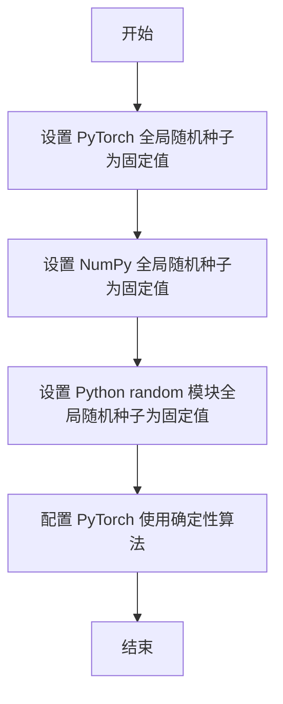

#### 带注释源码

```python
# 该函数定义位于 ...testing_utils 模块中，此处仅展示调用方式
# 实际定义需参考 testing_utils.py 源码

# 调用位置
enable_full_determinism()  # 位于文件顶部，在测试类定义之前

# 作用说明：
# 1. 设置 torch.manual_seed(0) 确保 PyTorch 张量生成的一致性
# 2. 设置 np.random.seed(0) 确保 NumPy 数组生成的一致性
# 3. 设置 random.seed(0) 确保 Python 内置随机函数的一致性
# 4. 可能包含 torch.use_deterministic_algorithms(True) 或类似配置
#    以确保在可能的情况下使用确定性算法
```

> **注意**：由于 `enable_full_determinism` 是从外部模块 `...testing_utils` 导入的，其完整源码定义未包含在当前代码片段中。以上信息基于函数名称、使用上下文及 HuggingFace diffusers 测试框架的常规实践推断得出。


### `gc.collect`

`gc.collect` 是 Python 标准库 `gc` 模块提供的垃圾回收函数，用于显式触发 Python 的垃圾回收机制，清理不可达的对象并释放内存。

参数：无参数

返回值：`int`，返回本次垃圾回收过程中释放的对象数量

#### 流程图

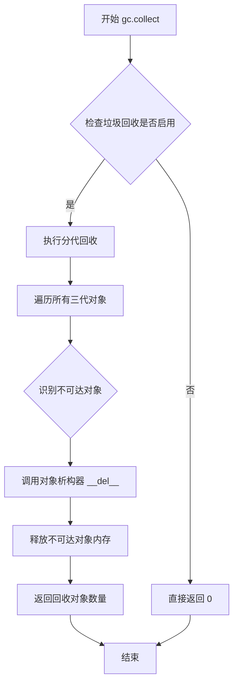

#### 带注释源码

```python
# gc.collect 是 Python 垃圾回收器的手动触发函数
# 位置：Python 标准库 gc 模块

def collect(generation=2):
    """
    显式运行垃圾回收器。
    
    参数:
        generation: int, 指定回收的代际 (0, 1, 2)
                   - 0:  youngest generation
                   - 1:  middle generation  
                   - 2:  oldest generation (默认)
                   传入负数或大于2的值会引发 ValueError
    
    返回值:
        int: 回收的不可达对象数量
    
    工作原理:
        1. 遍历指定代际的所有对象
        2. 通过引用计数和可达性分析识别垃圾对象
        3. 对需要析构的对象调用 __del__ 方法
        4. 释放垃圾对象的内存空间
        5. 返回回收的对象数量
    """
    if generation < 0 or generation > GC_MAX_GENERATION:
        raise ValueError("generation must be in range(0, %s)" % (GC_MAX_GENERATION + 1))
    
    # 实际实现位于 _gcmodule.c 中
    # 这里仅展示 Python 层的调用逻辑
    return _collect(generation, full=True, verbose=False, **kwargs)
```

> **注**：该函数在代码中出现于 `StableDiffusionInstructPix2PixPipelineSlowTests` 类的 `setUp` 和 `tearDown` 方法中，用于在测试前后显式释放 GPU 内存，避免测试间的内存泄漏问题。


### `backend_empty_cache`

该函数是 `diffusers` 库测试工具模块 `testing_utils` 中提供的跨后端内存缓存清理函数，用于释放 GPU/CUDA 缓存内存，确保在内存峰值测试中准确计量内存使用。

参数：

- `device`：`str` 或 `torch.device`，目标设备标识符，用于确定在哪个设备上执行缓存清理操作

返回值：`None`，无返回值

#### 流程图

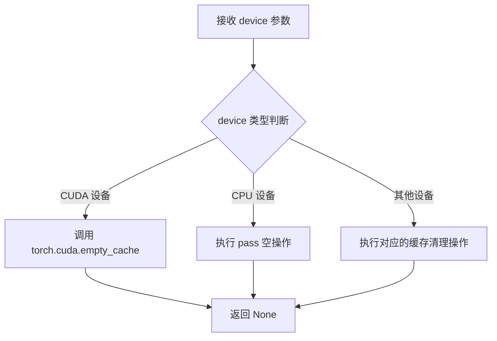

#### 带注释源码

```
# 该函数定义于 diffusers.testing_utils 模块
# 以下为基于使用方式的推断实现

def backend_empty_cache(device):
    """
    跨后端清理 GPU 缓存内存
    
    参数:
        device: 设备标识符，可以是字符串如 "cuda", "cuda:0", "cpu" 或 torch.device 对象
    
    返回:
        None
    """
    # 将字符串设备转换为设备对象（如果需要）
    if isinstance(device, str):
        device = torch.device(device)
    
    # 根据设备类型执行相应的缓存清理
    if device.type == "cuda":
        # CUDA 设备：清理 GPU 缓存
        torch.cuda.empty_cache()
    elif device.type == "cpu":
        # CPU 设备：无缓存需要清理（空操作）
        pass
    else:
        # 其他设备（如 mps, ipu, xla 等）
        # 调用对应后端的缓存清理方法
        pass
    
    return None
```

> **注意**：由于 `backend_empty_cache` 定义在外部模块 `diffusers.testing_utils` 中，本文件通过 `from ...testing_utils import backend_empty_cache` 导入使用。上述源码为基于该函数在测试中使用方式的合理推断，实际实现可能略有差异。


### `backend_reset_max_memory_allocated`

该函数用于重置指定计算设备的最大内存分配统计计数器，以便在后续的内存性能测试中能够准确测量峰值内存使用情况。

参数：

-  `device`：`torch.device` 或 str，需要重置内存统计的目标计算设备（如 "cuda", "cuda:0", "cpu" 等）

返回值：`None`，该函数直接修改内部状态，不返回任何值

#### 流程图

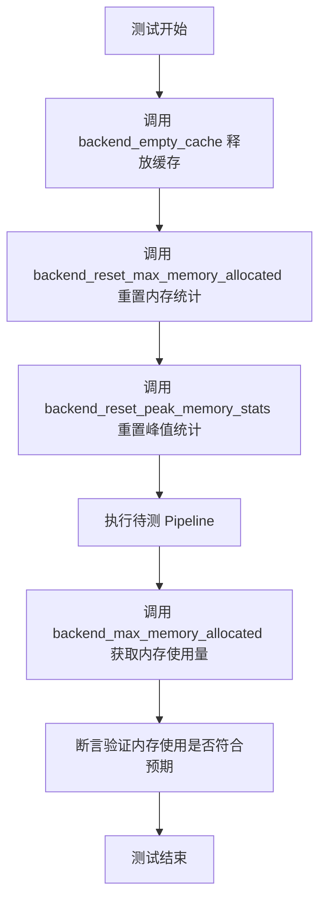

#### 带注释源码

```python
# 从 testing_utils 模块导入的函数，用于内存测试辅助
from ...testing_utils import (
    backend_empty_cache,
    backend_max_memory_allocated,
    backend_reset_max_memory_allocated,  # <-- 目标函数：重置最大内存分配统计
    backend_reset_peak_memory_stats,
    enable_full_determinism,
    floats_tensor,
    load_image,
    require_torch_accelerator,
    slow,
    torch_device,
)

# 在测试方法中的实际调用示例
def test_stable_diffusion_pipeline_with_sequential_cpu_offloading(self):
    """
    测试使用顺序 CPU offloading 时的内存使用情况
    """
    # 1. 清空 GPU 缓存，释放之前测试遗留的内存
    backend_empty_cache(torch_device)
    
    # 2. 重置最大内存分配计数器，将统计归零
    #    这样可以确保接下来测量的内存使用是从零开始的准确值
    backend_reset_max_memory_allocated(torch_device)
    
    # 3. 同时重置峰值内存统计
    backend_reset_peak_memory_stats(torch_device)
    
    # 4. 加载并运行 Pipeline
    pipe = StableDiffusionInstructPix2PixPipeline.from_pretrained(
        "timbrooks/instruct-pix2pix", safety_checker=None, torch_dtype=torch.float16
    )
    pipe.set_progress_bar_config(disable=None)
    pipe.enable_attention_slicing(1)
    pipe.enable_sequential_cpu_offload(device=torch_device)
    
    inputs = self.get_inputs()
    _ = pipe(**inputs)
    
    # 5. 获取整个测试过程中分配的最大内存字节数
    mem_bytes = backend_max_memory_allocated(torch_device)
    
    # 6. 验证内存使用是否低于 2.2GB 的预期阈值
    assert mem_bytes < 2.2 * 10**9
```


### `backend_reset_peak_memory_stats`

该函数用于重置指定设备上的峰值内存统计信息，通常在内存密集型测试前调用，以确保测量的是当前操作的峰值内存使用情况。

参数：

-  `device`：`any`，指定要重置峰值内存统计的设备（如 `torch_device`）

返回值：`None`，无返回值

#### 流程图

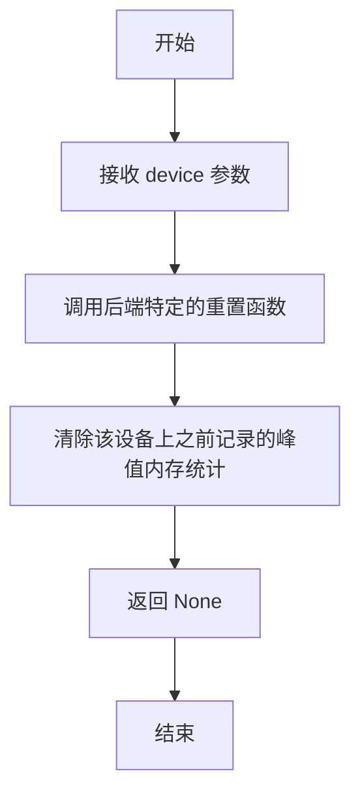

#### 带注释源码

```
# 该函数定义在 ...testing_utils 模块中（未在本文件中实现）
# 函数签名推断如下：

def backend_reset_peak_memory_stats(device):
    """
    重置指定设备上的峰值内存统计信息。
    
    参数:
        device: torch 设备对象，如 'cuda' 或 'cpu'
    
    返回:
        None
    """
    # 具体实现取决于后端（PyTorch/CUDA 等）
    # 通常会调用 torch.cuda.reset_peak_memory_stats() 或对应函数
    pass
```

#### 在代码中的实际使用

```python
def test_stable_diffusion_pipeline_with_sequential_cpu_offloading(self):
    backend_empty_cache(torch_device)                      # 清空缓存
    backend_reset_max_memory_allocated(torch_device)        # 重置当前内存分配统计
    backend_reset_peak_memory_stats(torch_device)           # 重置峰值内存统计 ← 
    # ... 后续执行管道
    mem_bytes = backend_max_memory_allocated(torch_device)  # 获取峰值内存
```

---

> **注意**：由于 `backend_reset_peak_memory_stats` 是从外部模块 `...testing_utils` 导入的，其完整源代码未包含在当前文件中。以上信息基于函数名称、使用上下文和常见测试工具模式推断得出。


### `backend_max_memory_allocated`

该函数是测试工具函数，用于获取指定 PyTorch 设备上自上次重置以来的最大内存分配量，常用于验证内存是否被正确释放。

参数：

-  `device`：`str` 或 `torch.device`，需要查询内存的设备标识符（如 `"cuda"`、`"cuda:0"` 或 `"cpu"`）

返回值：`int`，返回自上次重置以来该设备上分配的最大内存字节数

#### 流程图

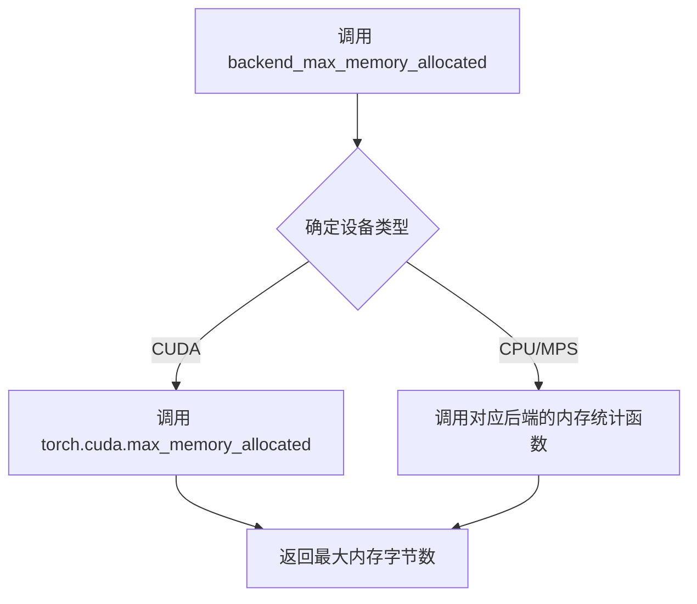

#### 带注释源码

```python
# 该函数定义在 testing_utils 模块中
# 以下是基于使用方式的推断实现

def backend_max_memory_allocated(device):
    """
    获取指定设备上自上次重置以来的最大内存分配量
    
    参数:
        device: torch device 标识符，如 'cuda', 'cuda:0', 'cpu', 'mps' 等
        
    返回:
        int: 最大内存分配字节数
    """
    import torch
    
    # 如果是 CUDA 设备
    if device and isinstance(device, str) and device.startswith('cuda'):
        device_index = 0
        # 解析设备索引（如 cuda:1 -> 1）
        if ':' in device:
            device_index = int(device.split(':')[1])
        # 调用 PyTorch 的 CUDA 内存统计函数
        return torch.cuda.max_memory_allocated(device_index)
    
    # MPS 设备 (Apple Silicon)
    elif device and isinstance(device, str) and device == 'mps':
        # 尝试获取 MPS 内存统计（如果支持）
        try:
            return torch.mps.current_allocated_memory()
        except AttributeError:
            return 0
    
    # CPU 设备
    elif device == 'cpu':
        # CPU 通常不追踪内存，可返回 0 或使用其他方式
        return 0
    
    # 默认情况
    return 0
```

> **注意**：由于该函数来自外部模块 `...testing_utils`，实际实现可能略有不同。上面的代码是基于其在测试中的典型使用方式推断的。从代码中的使用模式来看：
> ```python
> backend_reset_max_memory_allocated(torch_device)  # 重置统计
> # ... 执行操作 ...
> mem_bytes = backend_max_memory_allocated(torch_device)  # 获取峰值
> ```


### `load_image`

从指定的URL加载图像并返回PIL Image对象。该函数是测试工具库中的一个实用函数，用于在测试过程中加载远程图像资源。

参数：

-  `url`：`str`，要加载的图像的HTTP/HTTPS URL地址

返回值：`PIL.Image.Image`，加载后的PIL图像对象

#### 流程图

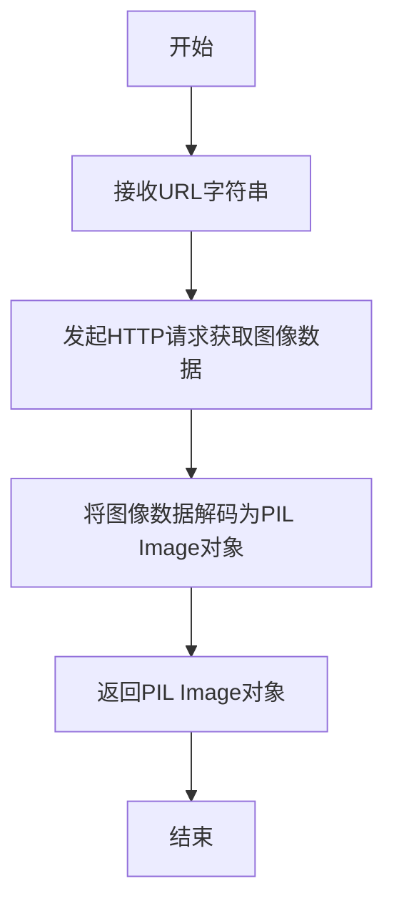

#### 带注释源码

```python
# load_image 是从 diffusers.testing_utils 模块导入的辅助函数
# 其典型实现如下（基于使用方式推断）:

def load_image(url: str) -> Image.Image:
    """
    从URL加载图像并返回PIL Image对象
    
    参数:
        url: 图像的URL地址
        
    返回值:
        PIL.Image.Image: 加载的图像对象
    """
    # 1. 使用requests或类似库从URL获取图像数据
    # 2. 使用PIL.Image.open()将图像数据解码为图像对象
    # 3. 返回PIL Image对象
    
# 在代码中的实际调用示例:
image = load_image(
    "https://huggingface.co/datasets/diffusers/test-arrays/resolve/main/stable_diffusion_pix2pix/example.jpg"
)
# 返回的image是一个PIL Image对象，可直接用于StableDiffusionInstructPix2PixPipeline
```


### `floats_tensor`

该函数是一个测试工具函数，用于生成指定形状的随机浮点数 PyTorch 张量，常用于测试中生成模拟输入数据。

参数：

-  `shape`：`tuple`，张量的形状，如 `(1, 3, 32, 32)`
-  `rng`：`random.Random`，随机数生成器实例，用于生成随机数种子

返回值：`torch.Tensor`，包含随机浮点数的 PyTorch 张量

#### 流程图

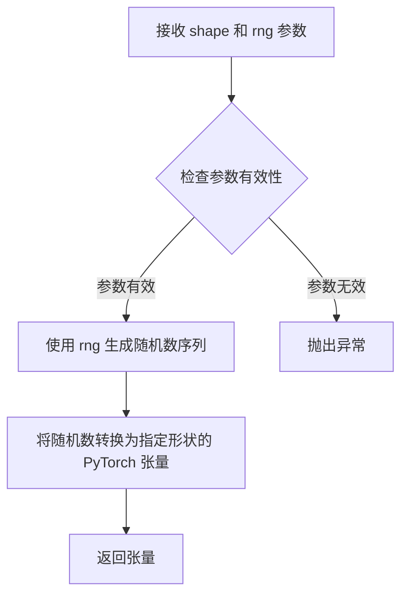

#### 带注释源码

```python
# 注意: 该函数定义在 testing_utils 模块中,当前文件仅为导入使用
# 以下为基于代码用法的推断实现

def floats_tensor(shape: tuple, rng: random.Random) -> torch.Tensor:
    """
    生成指定形状的随机浮点数张量
    
    参数:
        shape: 张量的形状元组,如 (1, 3, 32, 32)
        rng: 随机数生成器实例
    
    返回:
        随机浮点数 PyTorch 张量,范围通常在 [0, 1) 之间
    """
    # 使用随机数生成器生成数组
    values = []
    total_elements = 1
    for dim in shape:
        total_elements *= dim
    
    # 生成随机浮点数
    for _ in range(total_elements):
        values.append(rng.random())
    
    # 转换为 PyTorch 张量并 reshape 到目标形状
    tensor = torch.tensor(values, dtype=torch.float32).reshape(shape)
    
    return tensor

# 在代码中的实际调用方式:
# image = floats_tensor((1, 3, 32, 32), rng=random.Random(seed)).to(device)
```


### `StableDiffusionInstructPix2PixPipelineFastTests.get_dummy_components`

该方法用于生成用于测试的虚拟（dummy）组件，初始化并返回一个包含 Stable Diffusion InstructPix2Pix Pipeline 所有核心组件的字典，包括 UNet、调度器、VAE、文本编码器和分词器等，以便在单元测试中创建可预测且可重复的测试环境。

参数：

- `self`：类实例本身，无需显式传递

返回值：`dict`，返回一个包含以下键值对的字典：
  - `unet`：UNet2DConditionModel 实例，用于图像去噪的 UNet 模型
  - `scheduler`：PNDMScheduler 实例，扩散模型的调度器
  - `vae`：AutoencoderKL 实例，变分自编码器用于图像编码/解码
  - `text_encoder`：CLIPTextModel 实例，文本编码器将文本转换为嵌入
  - `tokenizer`：CLIPTokenizer 实例，分词器用于处理文本输入
  - `safety_checker`：None，安全检查器（测试中不使用）
  - `feature_extractor`：None，特征提取器（测试中不使用）
  - `image_encoder`：None，图像编码器（测试中不使用）

#### 流程图

```mermaid
flowchart TD
    A[开始 get_dummy_components] --> B[设置随机种子 torch.manual_seed(0)]
    B --> C[创建 UNet2DConditionModel 虚拟组件]
    C --> D[创建 PNDMScheduler 虚拟组件]
    D --> E[设置随机种子 torch.manual_seed(0)]
    E --> F[创建 AutoencoderKL 虚拟组件]
    F --> G[设置随机种子 torch.manual_seed(0)]
    G --> H[创建 CLIPTextConfig 配置对象]
    H --> I[根据配置创建 CLIPTextModel 虚拟组件]
    I --> J[从预训练模型加载 CLIPTokenizer]
    J --> K[构建 components 字典]
    K --> L[返回 components 字典]
```

#### 带注释源码

```python
def get_dummy_components(self):
    """
    生成用于测试的虚拟组件字典，包含 Stable Diffusion InstructPix2Pix Pipeline
   所需的所有核心模型和配置，确保测试的可重复性和确定性。
    """
    # 设置随机种子以确保 UNet 初始化的确定性
    torch.manual_seed(0)
    
    # 创建虚拟 UNet2DConditionModel 用于图像去噪
    # 参数配置：双通道输出(32, 64)，每块2层，样本大小32
    # 输入通道8（包含图像通道4 + 文本条件4），输出通道4
    unet = UNet2DConditionModel(
        block_out_channels=(32, 64),      # UNet 下采样和上采样通道数
        layers_per_block=2,                 # 每个分辨率块的层数
        sample_size=32,                     # 输入输出的空间分辨率
        in_channels=8,                      # 输入通道数（4 图像latent + 4 时间步）
        out_channels=4,                     # 输出通道数（4 个噪声维度）
        down_block_types=("DownBlock2D", "CrossAttnDownBlock2D"),  # 下采样块类型
        up_block_types=("CrossAttnUpBlock2D", "UpBlock2D"),       # 上采样块类型
        cross_attention_dim=32,             # 文本条件交叉注意力维度
    )
    
    # 创建 PNDM 调度器，跳过 PRK 步骤（适用于 InstructPix2Pix）
    scheduler = PNDMScheduler(skip_prk_steps=True)
    
    # 重新设置随机种子以确保 VAE 初始化的确定性
    torch.manual_seed(0)
    
    # 创建虚拟 AutoencoderKL 用于图像的编码和解码
    vae = AutoencoderKL(
        block_out_channels=[32, 64],       # VAE 编码器/解码器的通道配置
        in_channels=3,                      # 输入图像通道数（RGB）
        out_channels=3,                     # 输出图像通道数（RGB）
        down_block_types=["DownEncoderBlock2D", "DownEncoderBlock2D"],  # 编码器块类型
        up_block_types=["UpDecoderBlock2D", "UpDecoderBlock2D"],        # 解码器块类型
        latent_channels=4,                 # 潜在空间通道数（压缩后的维度）
    )
    
    # 再次设置随机种子以确保文本编码器初始化的确定性
    torch.manual_seed(0)
    
    # 创建 CLIP 文本编码器的配置对象（小型配置用于测试）
    text_encoder_config = CLIPTextConfig(
        bos_token_id=0,                     # 句子开始 token ID
        eos_token_id=2,                     # 句子结束 token ID
        hidden_size=32,                    # 隐藏层维度（测试用小维度）
        intermediate_size=37,               # 前馈网络中间层维度
        layer_norm_eps=1e-05,               # LayerNorm  epsilon
        num_attention_heads=4,              # 注意力头数
        num_hidden_layers=5,               # 隐藏层数量
        pad_token_id=1,                     # 填充 token ID
        vocab_size=1000,                    # 词汇表大小（测试用小词汇表）
    )
    
    # 根据配置创建 CLIP 文本编码器模型
    text_encoder = CLIPTextModel(text_encoder_config)
    
    # 从 HuggingFace Hub 加载小型随机 CLIP 分词器用于测试
    tokenizer = CLIPTokenizer.from_pretrained("hf-internal-testing/tiny-random-clip")
    
    # 组装所有组件到一个字典中
    components = {
        "unet": unet,                      # UNet2DConditionModel 实例
        "scheduler": scheduler,            # PNDMScheduler 实例
        "vae": vae,                         # AutoencoderKL 实例
        "text_encoder": text_encoder,      # CLIPTextModel 实例
        "tokenizer": tokenizer,             # CLIPTokenizer 实例
        "safety_checker": None,             # 安全检查器（测试中禁用）
        "feature_extractor": None,         # 特征提取器（测试中禁用）
        "image_encoder": None,             # 图像编码器（测试中禁用）
    }
    
    # 返回包含所有虚拟组件的字典
    return components
```


### `StableDiffusionInstructPix2PixPipelineFastTests.get_dummy_inputs`

该方法用于生成测试用的虚拟输入参数，创建一个包含提示词、图像、生成器、推理步数、引导比例等参数的字典，供 Stable Diffusion InstructPix2Pix 管道测试使用。

参数：

- `device`：`str` 或 `torch.device`，运行设备（如 "cpu"、"cuda" 等）
- `seed`：`int`，随机种子，默认值为 0，用于生成可复现的随机数据

返回值：`dict`，返回包含以下键的参数字典：
- `prompt`：文本提示
- `image`：PIL.Image 对象
- `generator`：torch.Generator 对象
- `num_inference_steps`：推理步数
- `guidance_scale`：引导比例
- `image_guidance_scale`：图像引导比例
- `output_type`：输出类型

#### 流程图

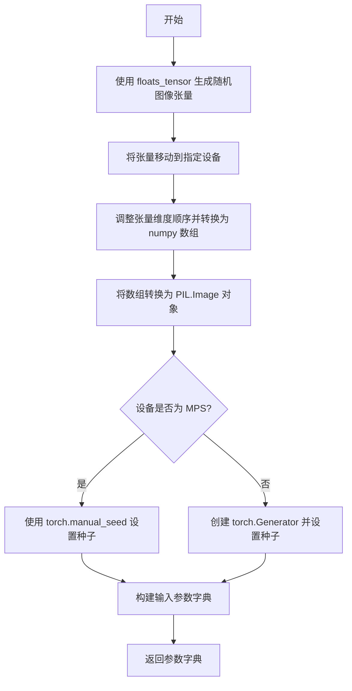

#### 带注释源码

```python
def get_dummy_inputs(self, device, seed=0):
    """
    生成用于测试的虚拟输入参数。
    
    参数:
        device: 运行设备 (str 或 torch.device)
        seed: 随机种子 (int)，默认为 0
    
    返回:
        dict: 包含测试所需的输入参数字典
    """
    
    # 1. 使用 floats_tensor 生成形状为 (1, 3, 32, 32) 的随机浮点数张量
    #    rng=random.Random(seed) 确保使用给定种子生成可复现的随机数据
    image = floats_tensor((1, 3, 32, 32), rng=random.Random(seed)).to(device)
    
    # 2. 将张量从 GPU/CPU 移到 CPU (如果不在 CPU 上)
    #    permute(0, 2, 3, 1) 重新排列维度：从 (B, C, H, W) 变为 (B, H, W, C)
    #    [0] 取第一个样本，形状变为 (32, 32, 3)
    image = image.cpu().permute(0, 2, 3, 1)[0]
    
    # 3. 将 numpy 数组转换为 uint8 类型
    #    使用 Image.fromarray 创建 PIL Image 对象
    #    convert("RGB") 确保图像为 RGB 模式（3通道）
    image = Image.fromarray(np.uint8(image)).convert("RGB")
    
    # 4. 根据设备类型创建随机数生成器
    #    MPS (Apple Silicon) 使用 torch.manual_seed
    #    其他设备（如 CUDA、CPU）使用 torch.Generator
    if str(device).startswith("mps"):
        generator = torch.manual_seed(seed)
    else:
        generator = torch.Generator(device=device).manual_seed(seed)
    
    # 5. 构建完整的输入参数字典
    inputs = {
        "prompt": "A painting of a squirrel eating a burger",  # 文本提示
        "image": image,                                          # 输入图像
        "generator": generator,                                  # 随机数生成器
        "num_inference_steps": 2,                               # 推理步数
        "guidance_scale": 6.0,                                   # 文本引导比例
        "image_guidance_scale": 1,                               # 图像引导比例
        "output_type": "np",                                    # 输出类型 (numpy 数组)
    }
    
    # 6. 返回参数字典
    return inputs
```


### `StableDiffusionInstructPix2PixPipelineFastTests.test_stable_diffusion_pix2pix_default_case`

该测试函数验证Stable Diffusion InstructPix2PixPipeline在默认配置下的核心功能，通过构造虚拟组件（UNet、VAE、文本编码器等）和输入参数，执行图像编辑推理流程，并验证输出图像的形状和像素值是否符合预期。

参数：

- `self`：`StableDiffusionInstructPix2PixPipelineFastTests`，测试类实例本身，包含测试所需的配置和工具方法

返回值：`None`，该函数为测试用例，通过断言验证输出，不返回具体数据

#### 流程图

```mermaid
flowchart TD
    A[开始测试] --> B[设置设备为CPU保证确定性]
    B --> C[调用get_dummy_components获取虚拟组件]
    C --> D[创建StableDiffusionInstructPix2PixPipeline实例]
    D --> E[将Pipeline移至CPU设备]
    E --> F[设置进度条配置disable=None]
    F --> G[调用get_dummy_inputs获取测试输入]
    G --> H[执行Pipeline推理: sd_pipe(**inputs)]
    H --> I[获取输出图像: .images]
    I --> J[提取图像切片用于验证]
    J --> K[断言图像形状为1x32x32x3]
    K --> L[定义期望的像素值数组]
    L --> M[断言像素差异小于1e-3]
    M --> N[测试结束]
```

#### 带注释源码

```python
def test_stable_diffusion_pix2pix_default_case(self):
    """
    测试Stable Diffusion InstructPix2Pix Pipeline的默认配置行为
    验证pipeline在给定prompt和输入图像时能正确生成编辑后的图像
    """
    # 设置设备为CPU，确保torch.Generator的确定性
    device = "cpu"  
    
    # 获取虚拟组件，用于测试而不需要真实的预训练模型权重
    # 包含: UNet2DConditionModel, VAE, CLIPTextModel, CLIPTokenizer, Scheduler等
    components = self.get_dummy_components()
    
    # 使用虚拟组件实例化Stable Diffusion InstructPix2Pix Pipeline
    sd_pipe = StableDiffusionInstructPix2PixPipeline(**components)
    
    # 将pipeline移至指定设备(CPU)
    sd_pipe = sd_pipe.to(device)
    
    # 配置进度条，disable=None表示不禁用进度条
    sd_pipe.set_progress_bar_config(disable=None)

    # 获取虚拟输入参数
    # 包含: prompt, image, generator, num_inference_steps, guidance_scale, image_guidance_scale, output_type
    inputs = self.get_dummy_inputs(device)
    
    # 执行pipeline推理，**inputs解包字典参数
    # 返回PipelineOutput对象，通过.images获取生成的图像
    image = sd_pipe(**inputs).images
    
    # 提取图像右下角3x3区域的像素值用于验证
    # 图像格式为NHWC: [batch, height, width, channels]
    image_slice = image[0, -3:, -3:, -1]
    
    # 断言验证生成图像的形状为(1, 32, 32, 3)
    # 1为batch size, 32x32为分辨率, 3为RGB通道
    assert image.shape == (1, 32, 32, 3)
    
    # 定义期望的像素值slice，使用numpy数组
    # 这些值是预先计算的标准输出，用于回归测试
    expected_slice = np.array([0.7526, 0.3750, 0.4547, 0.6117, 0.5866, 0.5016, 0.4327, 0.5642, 0.4815])

    # 断言实际输出与期望值的最大差异小于1e-3
    # 确保测试的确定性和数值稳定性
    assert np.abs(image_slice.flatten() - expected_slice).max() < 1e-3
```


### `StableDiffusionInstructPix2PixPipelineFastTests.test_stable_diffusion_pix2pix_negative_prompt`

该测试方法用于验证 StableDiffusionInstructPix2PixPipeline 在使用 negative_prompt（负向提示词）时的正确性。测试创建一个虚拟的 Pix2Pix 管道实例，传入包含负向提示词的输入，生成图像后与预期的像素值进行比对，以确保负向提示词能够正确影响生成结果。

参数：

- `self`：测试类实例本身，无需外部传入

返回值：`None`（无返回值），该方法为单元测试方法，通过内部断言验证功能正确性

#### 流程图

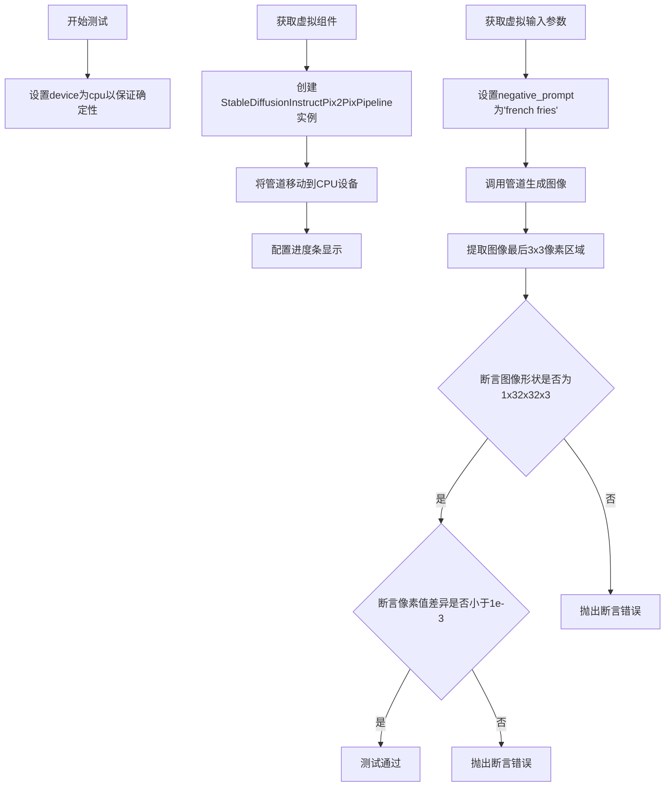

#### 带注释源码

```python
def test_stable_diffusion_pix2pix_negative_prompt(self):
    # 设置设备为CPU，确保torch.Generator的确定性行为
    device = "cpu"  # ensure determinism for the device-dependent torch.Generator
    
    # 获取虚拟的模型组件（UNet、VAE、scheduler、text_encoder等）
    components = self.get_dummy_components()
    
    # 使用虚拟组件实例化StableDiffusionInstructPix2PixPipeline
    sd_pipe = StableDiffusionInstructPix2PixPipeline(**components)
    
    # 将管道移动到指定设备（CPU）
    sd_pipe = sd_pipe.to(device)
    
    # 配置进度条，disable=None表示不禁用进度条
    sd_pipe.set_progress_bar_config(disable=None)

    # 获取虚拟输入参数，包含prompt、image、generator等
    inputs = self.get_dummy_inputs(device)
    
    # 设置负向提示词，用于引导模型避免生成相关内容
    negative_prompt = "french fries"
    
    # 调用管道进行推理，传入负向提示词参数
    # 返回值包含生成的图像集合
    output = sd_pipe(**inputs, negative_prompt=negative_prompt)
    
    # 从输出中提取生成的图像数组
    image = output.images
    
    # 提取图像右下角最后3x3区域的像素值，用于验证
    # 索引[0, -3:, -3:, -1]表示取第一张图的最后3行、最后3列、最后一个通道
    image_slice = image[0, -3:, -3:, -1]

    # 断言验证生成图像的形状是否符合预期 (1张, 32x32像素, RGB 3通道)
    assert image.shape == (1, 32, 32, 3)
    
    # 定义预期像素值切片，用于与实际生成结果比对
    expected_slice = np.array([0.7511, 0.3642, 0.4553, 0.6236, 0.5797, 0.5013, 0.4343, 0.5611, 0.4831])

    # 断言验证生成图像像素值与预期值的最大差异是否在容忍范围内
    # 使用np.abs计算绝对值差异，.max()取最大值，1e-3为容忍误差
    assert np.abs(image_slice.flatten() - expected_slice).max() < 1e-3
```


### `StableDiffusionInstructPix2PixPipelineFastTests.test_stable_diffusion_pix2pix_multiple_init_images`

该测试方法用于验证StableDiffusionInstructPix2PixPipeline在处理多张初始图像（批量处理）时的正确性。测试通过构造包含两个相同prompt和两张重复图像的批量输入，验证管道能够正确生成批量图像输出，并确保输出图像的形状和像素值符合预期。

参数：

- `self`：`StableDiffusionInstructPix2PixPipelineFastTests` 类型，测试类的实例本身，用于访问类方法和属性

返回值：`None`，该方法为测试方法，无返回值，通过断言验证功能正确性

#### 流程图

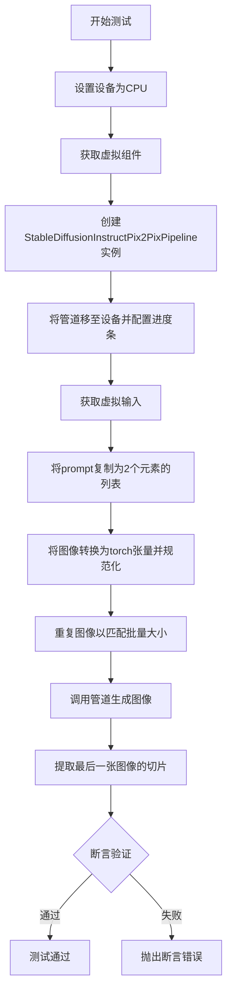

#### 带注释源码

```python
def test_stable_diffusion_pix2pix_multiple_init_images(self):
    """
    测试方法：验证管道处理多张初始图像的批量处理能力
    
    测试步骤：
    1. 准备CPU设备确保确定性
    2. 创建包含UNet、VAE、文本编码器等组件的管道
    3. 构造批量输入（2个相同的prompt和2张相同的图像）
    4. 执行管道推理
    5. 验证输出图像形状和像素值
    """
    # 设置设备为CPU，确保torch.Generator的确定性
    device = "cpu"
    
    # 获取虚拟组件（UNet、VAE、调度器、文本编码器等）
    components = self.get_dummy_components()
    
    # 使用虚拟组件实例化StableDiffusionInstructPix2PixPipeline
    sd_pipe = StableDiffusionInstructPix2PixPipeline(**components)
    
    # 将管道移至指定设备
    sd_pipe = sd_pipe.to(device)
    
    # 配置进度条（disable=None表示启用进度条）
    sd_pipe.set_progress_bar_config(disable=None)

    # 获取虚拟输入字典，包含prompt、image、generator等
    inputs = self.get_dummy_inputs(device)
    
    # 将单个prompt转换为包含2个相同元素的列表，实现批量提示词
    inputs["prompt"] = [inputs["prompt"]] * 2

    # 处理图像：PIL Image -> numpy数组 -> torch张量
    # 除以255.0将像素值归一化到[0, 1]范围
    image = np.array(inputs["image"]).astype(np.float32) / 255.0
    
    # 转换为torch张量并添加批量维度
    image = torch.from_numpy(image).unsqueeze(0).to(device)
    
    # 图像值从[0, 1]范围转换到[0.5, 1.5]范围（减0.5再加0.5的等价操作）
    # 实际上等价于 image = (image - 0.5) * 2 + 0.5 = image
    # 这步操作是为了确保图像在特定范围内
    image = image / 2 + 0.5
    
    # 调整张量维度顺序：从[H, W, C]转换为[C, H, W]
    image = image.permute(0, 3, 1, 2)
    
    # 沿批量维度重复图像，生成2个相同的图像副本
    inputs["image"] = image.repeat(2, 1, 1, 1)

    # 调用管道执行推理，生成批量图像
    image = sd_pipe(**inputs).images
    
    # 提取最后一张图像（索引-1）的右下角3x3像素区域
    image_slice = image[-1, -3:, -3:, -1]

    # 断言验证输出图像形状为(2, 32, 32, 3) - 批量大小为2
    assert image.shape == (2, 32, 32, 3)
    
    # 预期像素值切片（用于回归测试）
    expected_slice = np.array([0.5812, 0.5748, 0.5222, 0.5908, 0.5695, 0.7174, 0.6804, 0.5523, 0.5579])

    # 断言验证生成的图像像素值与预期值的最大差异小于1e-3
    assert np.abs(image_slice.flatten() - expected_slice).max() < 1e-3
```


### `StableDiffusionInstructPix2PixPipelineFastTests.test_stable_diffusion_pix2pix_euler`

该测试方法使用EulerAncestralDiscreteScheduler调度器对Stable Diffusion InstructPix2Pix Pipeline进行推理测试，验证在使用Euler调度器时生成的图像是否符合预期的像素值范围，确保调度器切换后Pipeline仍能正确运行。

参数：

-  `self`：隐式参数，TestCase实例，用于访问测试类的成员方法和属性

返回值：`None`（无返回值），该方法为测试用例，通过断言验证结果

#### 流程图

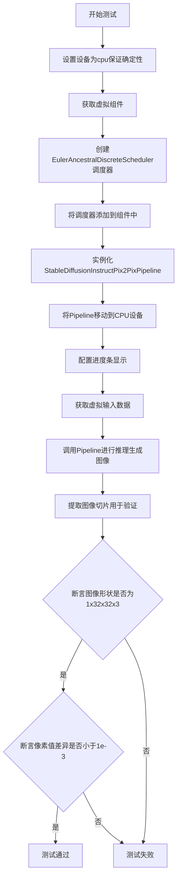

#### 带注释源码

```python
def test_stable_diffusion_pix2pix_euler(self):
    """
    测试使用Euler Ancestral调度器的Stable Diffusion InstructPix2Pix Pipeline
    
    该测试验证：
    1. Pipeline能够使用EulerAncestralDiscreteScheduler正确运行
    2. 生成的图像形状正确
    3. 生成的图像像素值在预期范围内
    """
    # 设置设备为CPU，确保torch.Generator的确定性
    device = "cpu"  # ensure determinism for the device-dependent torch.Generator
    
    # 获取预定义的虚拟组件（UNet、VAE、文本编码器等）
    components = self.get_dummy_components()
    
    # 创建Euler Ancestral离散调度器，配置β参数
    components["scheduler"] = EulerAncestralDiscreteScheduler(
        beta_start=0.00085,  # β起始值
        beta_end=0.012,      # β结束值
        beta_schedule="scaled_linear"  # β调度方式
    )
    
    # 使用虚拟组件实例化Stable Diffusion InstructPix2Pix Pipeline
    sd_pipe = StableDiffusionInstructPix2PixPipeline(**components)
    
    # 将Pipeline移动到指定设备（CPU）
    sd_pipe = sd_pipe.to(device)
    
    # 配置进度条显示（disable=None表示不禁用）
    sd_pipe.set_progress_bar_config(disable=None)
    
    # 获取虚拟输入数据，包含提示词、图像、生成器等
    inputs = self.get_dummy_inputs(device)
    
    # 调用Pipeline进行推理，返回包含生成图像的结果对象
    # 解包获取images属性
    image = sd_pipe(**inputs).images
    
    # 提取图像右下角3x3区域的所有通道像素值
    # image shape: [batch, height, width, channels]
    image_slice = image[0, -3:, -3:, -1]
    
    # ======== 断言验证部分 ========
    
    # 断言1：验证生成的图像形状是否为(1, 32, 32, 3)
    assert image.shape == (1, 32, 32, 3)
    
    # 定义期望的像素值切片（来自Euler调度器的预期输出）
    expected_slice = np.array([
        0.7417, 0.3842, 0.4732,  # 第一行
        0.5776, 0.5891, 0.5139,  # 第二行
        0.4052, 0.5673, 0.4986   # 第三行
    ])
    
    # 断言2：验证实际像素值与期望值的最大差异是否小于阈值
    # 使用np.abs计算差值绝对值，.flatten()展平数组
    assert np.abs(image_slice.flatten() - expected_slice).max() < 1e-3
```


### `StableDiffusionInstructPix2PixPipelineFastTests.test_inference_batch_single_identical`

该测试方法用于验证Stable Diffusion InstructPix2PixPipeline在批量推理时，单个样本的输出与逐个单独推理的输出一致性，确保批处理不会引入误差。

参数：

- `self`：`StableDiffusionInstructPix2PixPipelineFastTests`，测试类的实例本身

返回值：`None`，该方法为测试用例，通过断言验证结果，不返回具体值

#### 流程图

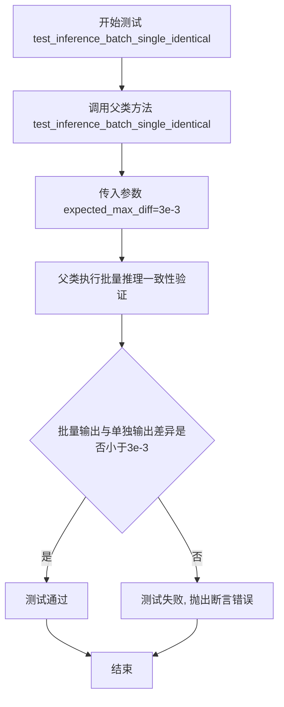

#### 带注释源码

```python
def test_inference_batch_single_identical(self):
    """
    测试方法：验证批量推理时单样本输出的一致性
    
    该测试方法继承自测试混合类，用于确保在使用批处理进行推理时，
    批量中单个样本的输出与单独对该样本进行推理的输出一致。
    这是一个重要的回归测试，用于检测批处理逻辑是否引入了意外的副作用。
    
    参数:
        self: StableDiffusionInstructPix2PixPipelineFastTests的实例
        
    返回值:
        None: 测试方法不返回值，通过断言验证正确性
        
    异常:
        AssertionError: 如果批量推理结果与单独推理结果的差异超过expected_max_diff
    """
    # 调用父类（PipelineTesterMixin）的test_inference_batch_single_identical方法
    # expected_max_diff=3e-3 表示允许的最大差异值为0.003
    # 这确保了批量推理和单独推理的结果在数值上非常接近
    super().test_inference_batch_single_identical(expected_max_diff=3e-3)
```


### `StableDiffusionInstructPix2PixPipelineFastTests.test_latents_input`

该测试方法验证了 StableDiffusionInstructPix2PixPipeline 在直接使用 VAE 编码后的 latent 作为输入时，生成的图像结果应与使用原始图像作为输入的结果一致（差异小于 1e-4），确保了 pipeline 对图像和 latent 输入的一致性处理。

参数：

- `self`：无类型，测试类实例本身，用于访问类属性和方法

返回值：`None`，测试方法无返回值，通过断言验证结果

#### 流程图

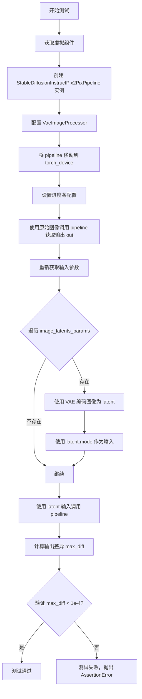

#### 带注释源码

```python
def test_latents_input(self):
    """
    测试当直接传入 latents（而非原始图像）时，pipeline 的输出应与传入图像时一致。
    这验证了 pipeline 对图像和 latent 输入的一致性处理。
    """
    # 步骤1: 获取虚拟组件（UNet, VAE, Scheduler, TextEncoder 等）
    components = self.get_dummy_components()
    
    # 步骤2: 使用虚拟组件创建 StableDiffusionInstructPix2PixPipeline 实例
    pipe = StableDiffusionInstructPix2PixPipeline(**components)
    
    # 步骤3: 配置图像处理器，禁用 resize 和 normalize
    pipe.image_processor = VaeImageProcessor(do_resize=False, do_normalize=False)
    
    # 步骤4: 将 pipeline 移动到指定的计算设备（CPU/GPU）
    pipe = pipe.to(torch_device)
    
    # 步骤5: 设置进度条配置，disable=None 表示启用进度条
    pipe.set_progress_bar_config(disable=None)

    # 步骤6: 使用原始图像作为输入调用 pipeline，获取基准输出
    # get_dummy_inputs_by_type 返回包含原始图像的输入字典
    out = pipe(**self.get_dummy_inputs_by_type(torch_device, input_image_type="pt"))[0]

    # 步骤7: 获取 VAE 模型用于编码图像
    vae = components["vae"]
    
    # 步骤8: 重新获取输入参数（PyTorch 格式的图像）
    inputs = self.get_dummy_inputs_by_type(torch_device, input_image_type="pt")

    # 步骤9: 遍历图像 latent 参数，将图像编码为 latent
    for image_param in self.image_latents_params:
        if image_param in inputs.keys():
            # 使用 VAE 编码图像获取 latent 分布，并取 mode（最可能的 latent 值）
            inputs[image_param] = vae.encode(inputs[image_param]).latent_dist.mode()

    # 步骤10: 使用 latent 作为输入调用 pipeline，获取实际输出
    out_latents_inputs = pipe(**inputs)[0]

    # 步骤11: 计算两次输出的最大差异
    max_diff = np.abs(out - out_latents_inputs).max()
    
    # 步骤12: 断言差异小于阈值（1e-4），确保两种输入方式结果一致
    self.assertLess(max_diff, 1e-4, "passing latents as image input generate different result from passing image")
```


### `StableDiffusionInstructPix2PixPipelineFastTests.test_callback_cfg`

这是一个测试方法，用于验证 StableDiffusionInstructPix2PixPipeline 在使用 CFG（Classifier-Free Guidance）回调函数时的正确性。测试通过定义一个自定义回调函数 `callback_no_cfg`，在推理步骤的第二步将 guidance_scale 修改为 1.0（相当于禁用 CFG），然后比较无 CFG 输出和带回调的 CFG 输出的形状是否一致，以确保回调机制能够正确修改推理参数。

参数：

- `self`：`StableDiffusionInstructPix2PixPipelineFastTests`，隐式参数，测试类的实例

返回值：`None`，无返回值，这是测试方法，仅执行断言验证

#### 流程图

```mermaid
flowchart TD
    A([开始测试]) --> B[获取虚拟组件: get_dummy_components]
    B --> C[创建管道实例并移动到设备]
    C --> D[设置进度条配置: set_progress_bar_config]
    D --> E[定义回调函数 callback_no_cfg]
    E --> F[获取虚拟输入: get_dummy_inputs]
    F --> G[设置参数: guidance_scale=1.0, num_inference_steps=2]
    G --> H[运行管道: pipe&#40;**inputs&#41;获取无CFG输出]
    H --> I[设置参数: guidance_scale=7.5, callback_on_step_end=callback_no_cfg]
    I --> J[运行管道: pipe&#40;**inputs&#41;获取带回调的输出]
    J --> K[断言: out_no_cfg.shape == out_callback_no_cfg.shape]
    K --> L([测试结束])
```

#### 带注释源码

```python
def test_callback_cfg(self):
    """
    测试回调函数在 CFG 模式下的行为。
    验证当回调函数在推理步骤中修改 guidance_scale 时，
    输出的形状应该与完全禁用 CFG 时的形状一致。
    """
    # 步骤1: 获取虚拟组件（dummy components）
    # 这些是用于测试的模拟模型组件，不需要真实的预训练权重
    components = self.get_dummy_components()
    
    # 步骤2: 使用虚拟组件创建管道实例
    pipe = self.pipeline_class(**components)
    
    # 步骤3: 将管道移动到测试设备（CPU 或 CUDA）
    pipe = pipe.to(torch_device)
    
    # 步骤4: 设置进度条配置（disable=None 表示启用进度条）
    pipe.set_progress_bar_config(disable=None)

    # 步骤5: 定义回调函数 callback_no_cfg
    # 这个回调函数在每个推理步骤结束后被调用
    def callback_no_cfg(pipe, i, t, callback_kwargs):
        """
        回调函数模拟禁用 CFG 的效果
        
        参数:
            pipe: 管道实例
            i: 当前推理步骤索引
            t: 当前时间步
            callback_kwargs: 包含中间结果的字典
            
        返回:
            修改后的 callback_kwargs
        """
        # 在第二步（索引为1）时修改参数
        if i == 1:
            # 遍历回调参数字典
            for k, w in callback_kwargs.items():
                # 只处理 CFG 相关的参数
                if k in self.callback_cfg_params:
                    # 将参数分割成3份（CFG 通常将条件、非条件和空条件拼接）
                    # 然后只取第一份（条件部分），相当于禁用 CFG 效果
                    callback_kwargs[k] = callback_kwargs[k].chunk(3)[0]
            # 将 guidance_scale 设置为 1.0（禁用 CFG）
            pipe._guidance_scale = 1.0

        return callback_kwargs

    # 步骤6: 获取虚拟输入
    inputs = self.get_dummy_inputs(torch_device)
    
    # 步骤7: 设置参数 - 无 CFG 模式
    inputs["guidance_scale"] = 1.0  # guidance_scale=1.0 相当于禁用 CFG
    inputs["num_inference_steps"] = 2  # 限制推理步数以加快测试
    out_no_cfg = pipe(**inputs)[0]  # 执行推理并获取输出图像

    # 步骤8: 设置参数 - 带回调的 CFG 模式
    inputs["guidance_scale"] = 7.5  # 启用 CFG，guidance_scale > 1
    inputs["callback_on_step_end"] = callback_no_cfg  # 设置回调函数
    # 设置回调函数需要的张量输入列表
    inputs["callback_on_step_end_tensor_inputs"] = pipe._callback_tensor_inputs
    out_callback_no_cfg = pipe(**inputs)[0]  # 执行推理并获取输出图像

    # 步骤9: 断言验证
    # 验证两种方式的输出形状一致
    # 由于回调函数在第二步将 CFG 禁用，最终效果应该与 guidance_scale=1.0 一致
    assert out_no_cfg.shape == out_callback_no_cfg.shape
```


### `StableDiffusionInstructPix2PixPipelineSlowTests.setUp`

这是一个测试初始化方法，在每个测试方法运行前被调用，用于清理内存和缓存，确保测试环境干净，为后续的慢速推理测试准备条件。

参数：

- `self`：`unittest.TestCase`，当前测试类的实例，隐式参数，用于访问类的属性和方法

返回值：`None`，无返回值，执行清理操作后直接返回

#### 流程图

```mermaid
flowchart TD
    A[开始 setUp] --> B[调用 super().setUp]
    B --> C[执行 gc.collect]
    C --> D[调用 backend_empty_cache]
    D --> E[结束 setUp]
    
    style A fill:#f9f,stroke:#333
    style E fill:#9f9,stroke:#333
```

#### 带注释源码

```python
def setUp(self):
    """
    测试初始化方法，在每个测试方法运行前被调用
    """
    # 调用父类的 setUp 方法，执行 unittest.TestCase 的标准初始化
    super().setUp()
    
    # 手动触发 Python 垃圾回收，释放未使用的内存对象
    gc.collect()
    
    # 清空 GPU/CPU 后端缓存，确保测试之间没有显存或内存残留
    # torch_device 是从 testing_utils 导入的全局变量，表示测试设备
    backend_empty_cache(torch_device)
```

#### 关键信息说明

| 项目 | 说明 |
|------|------|
| **所属类** | `StableDiffusionInstructPix2PixPipelineSlowTests` |
| **方法类型** | 测试初始化方法（unittest.TestCase.setUp） |
| **调用时机** | 每个测试方法（以 `test_` 开头的方法）执行前自动调用 |
| **主要功能** | 内存清理和环境准备 |
| **关联组件** | `gc`（Python垃圾回收）、`backend_empty_cache`（后端缓存清理） |


### `StableDiffusionInstructPix2PixPipelineSlowTests.tearDown`

该方法是测试类的清理方法，在每个测试方法执行完毕后被调用，用于清理测试环境、释放 GPU 内存和执行垃圾回收，确保测试之间的隔离性。

参数：

- `self`：无特殊参数，这是 Python 类方法的隐式参数，表示类的实例本身

返回值：`None`，该方法不返回任何值，仅执行清理操作

#### 流程图

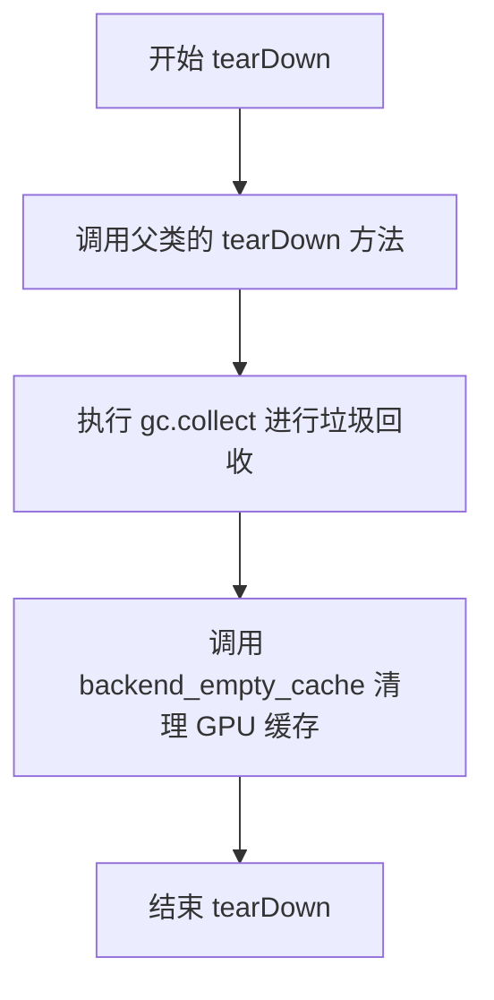

#### 带注释源码

```python
def tearDown(self):
    # 调用父类的 tearDown 方法，执行基类的清理逻辑
    super().tearDown()
    # 手动调用 Python 的垃圾回收器，清理不再使用的对象
    gc.collect()
    # 调用后端工具函数清空 GPU 缓存，释放 GPU 内存
    backend_empty_cache(torch_device)
```


### `StableDiffusionInstructPix2PixPipelineSlowTests.get_inputs`

该方法是一个测试辅助函数，用于生成 StableDiffusionInstructPix2PixPipeline 的测试输入参数。它创建一个包含提示词、输入图像、随机生成器以及推理步骤等参数的字典，以供后续的 pipeline 调用使用。

参数：

- `seed`：`int`，可选，默认值为 `0`。用于设置 PyTorch 随机生成器的种子，以确保测试结果的可重复性。

返回值：`dict`，返回一个包含以下键值的字典：
- `prompt`：字符串，描述要执行的图像转换指令（"turn him into a cyborg"）
- `image`：PIL.Image.Image，从远程 URL 加载的输入图像
- `generator`：torch.Generator，用于控制随机性
- `num_inference_steps`：int，推理步数（3 步）
- `guidance_scale`：float，文本引导 scale（7.5）
- `image_guidance_scale`：float，图像引导 scale（1.0）
- `output_type`：str，输出类型（"np" 表示 numpy 数组）

#### 流程图

```mermaid
flowchart TD
    A[开始 get_inputs] --> B[接收 seed 参数<br/>默认值=0]
    B --> C[创建 torch.manual_seed<br/>生成随机生成器]
    C --> D[使用 load_image 函数<br/>加载远程图像]
    D --> E[构建 inputs 字典]
    E --> F[设置 prompt: 'turn him into a cyborg']
    F --> G[设置 image: 加载的图像]
    G --> H[设置 generator: 随机生成器]
    H --> I[设置 num_inference_steps: 3]
    I --> J[设置 guidance_scale: 7.5]
    J --> K[设置 image_guidance_scale: 1.0]
    K --> L[设置 output_type: 'np']
    L --> M[返回 inputs 字典]
```

#### 带注释源码

```python
def get_inputs(self, seed=0):
    """
    生成 Stable Diffusion InstructPix2Pix Pipeline 的测试输入参数。
    
    参数:
        seed: int, 可选, 默认值为 0
            用于设置 PyTorch 随机生成器的种子,确保测试结果可复现
    
    返回:
        dict: 包含 pipeline 调用所需参数的字典
    """
    # 使用给定的 seed 创建 PyTorch 随机生成器
    # 这确保了测试的确定性,使得每次运行都能得到相同的结果
    generator = torch.manual_seed(seed)
    
    # 从 Hugging Face Hub 加载示例图像
    # 该图像将作为 InstructPix2Pix 的输入图像
    # load_image 是 testing_utils 模块中的辅助函数
    image = load_image(
        "https://huggingface.co/datasets/diffusers/test-arrays/resolve/main/stable_diffusion_pix2pix/example.jpg"
    )
    
    # 构建完整的输入参数字典
    # 这些参数将传递给 StableDiffusionInstructPix2PixPipeline
    inputs = {
        "prompt": "turn him into a cyborg",  # 文本提示,指导图像转换
        "image": image,                       # 输入图像
        "generator": generator,               # 随机生成器控制
        "num_inference_steps": 3,            # 扩散推理步数
        "guidance_scale": 7.5,               # 文本引导强度
        "image_guidance_scale": 1.0,         # 图像引导强度
        "output_type": "np",                 # 输出格式为 numpy 数组
    }
    
    # 返回构建好的输入字典,供 pipeline 调用使用
    return inputs
```


### `StableDiffusionInstructPix2PixPipelineSlowTests.test_stable_diffusion_pix2pix_default`

该测试方法用于验证 InstructPix2Pix 管道在默认配置下的图像生成功能，通过加载预训练模型、执行推理并比对生成的图像切片与预期值来确保管道工作正常。

参数：

- `self`：`StableDiffusionInstructPix2PixPipelineSlowTests`，测试类实例本身，用于访问类方法和其他测试资源

返回值：`None`，该方法为测试方法，通过断言验证图像生成结果，不返回任何值

#### 流程图

```mermaid
flowchart TD
    A[开始测试] --> B[加载预训练管道模型]
    B --> C[将管道移至目标设备]
    C --> D[配置进度条显示]
    D --> E[启用注意力切片优化]
    E --> F[获取测试输入参数]
    F --> G[执行管道推理]
    G --> H[提取图像切片]
    H --> I{断言图像形状}
    I -->|通过| J[断言切片数值]
    J -->|通过| K[测试通过]
    I -->|失败| L[抛出断言错误]
    J -->|失败| L
    
    style K fill:#90EE90
    style L fill:#FFB6C1
```

#### 带注释源码

```python
@slow
@require_torch_accelerator
def test_stable_diffusion_pix2pix_default(self):
    """
    测试 InstructPix2Pix 管道在默认配置下的基本功能
    验证模型能够正确加载、推理并生成符合预期尺寸和数值的图像
    """
    # 从预训练模型加载 InstructPix2Pix 管道
    # 使用 timbrooks/instruct-pix2pix 模型，并禁用安全检查器
    pipe = StableDiffusionInstructPix2PixPipeline.from_pretrained(
        "timbrooks/instruct-pix2pix", safety_checker=None
    )
    
    # 将管道移至目标计算设备（如 GPU）
    pipe.to(torch_device)
    
    # 配置进度条显示，disable=None 表示使用默认设置
    pipe.set_progress_bar_config(disable=None)
    
    # 启用注意力切片以减少内存占用，适用于显存较小的设备
    pipe.enable_attention_slicing()
    
    # 获取测试输入参数，包括提示词、图像、随机种子等
    inputs = self.get_inputs()
    
    # 执行管道推理，传入提示词和图像，提取生成的图像结果
    image = pipe(**inputs).images
    
    # 提取图像右下角 3x3 区域并展平，用于数值比对
    image_slice = image[0, -3:, -3:, -1].flatten()
    
    # 断言生成的图像形状为 (1, 512, 512, 3)
    assert image.shape == (1, 512, 512, 3)
    
    # 定义预期的图像切片数值
    expected_slice = np.array([0.5902, 0.6015, 0.6027, 0.5983, 0.6092, 0.6061, 0.5765, 0.5785, 0.5555])
    
    # 断言实际输出与预期值的最大误差小于 1e-3
    assert np.abs(expected_slice - image_slice).max() < 1e-3
```


### `StableDiffusionInstructPix2PixPipelineSlowTests.test_stable_diffusion_pix2pix_k_lms`

这是一个集成测试方法，用于测试 InstructPix2Pix 图像转换管道在使用 LMS (Least Mean Squares) 调度器时的功能是否正常。它通过加载预训练模型、配置 LMS 调度器、执行推理并验证生成的图像像素值是否符合预期来确保管道的正确性。

参数：此方法无显式参数（隐式参数 `self` 为测试类实例）

返回值：`None`，该方法为测试方法，通过断言验证结果，不返回任何值

#### 流程图

```mermaid
flowchart TD
    A[开始测试] --> B[从预训练模型加载管道]
    B --> C[配置LMSDiscreteScheduler调度器]
    C --> D[将管道移动到torch_device]
    D --> E[配置进度条]
    E --> F[启用attention_slicing优化]
    F --> G[调用get_inputs获取测试输入]
    G --> H[执行管道推理: pipe(**inputs)]
    H --> I[提取图像切片: image[0, -3:, -3:, -1].flatten()]
    I --> J[断言图像形状为1x512x512x3]
    J --> K[定义期望像素值数组]
    K --> L[断言实际像素值与期望值的最大差异小于1e-3]
    L --> M[测试结束]
```

#### 带注释源码

```python
def test_stable_diffusion_pix2pix_k_lms(self):
    """
    测试使用LMS调度器的InstructPix2Pix图像转换管道
    
    该测试方法执行以下步骤:
    1. 从预训练模型加载StableDiffusionInstructPix2PixPipeline
    2. 将默认调度器替换为LMSDiscreteScheduler
    3. 配置管道并执行推理
    4. 验证生成的图像是否符合预期
    """
    
    # 步骤1: 从预训练模型加载 InstructPix2Pix 管道
    # 使用 timbrooks/instruct-pix2pix 模型，该模型专门用于图像编辑指令
    # safety_checker=None 禁用安全检查器以便于测试
    pipe = StableDiffusionInstructPix2PixPipeline.from_pretrained(
        "timbrooks/instruct-pix2pix", safety_checker=None
    )
    
    # 步骤2: 将调度器替换为 LMSDiscreteScheduler
    # LMS (Least Mean Squares) 调度器是一种离散时间调度器
    # 用于控制扩散模型的去噪过程
    # from_config 从现有调度器配置创建新的LMS调度器实例
    pipe.scheduler = LMSDiscreteScheduler.from_config(pipe.scheduler.config)
    
    # 步骤3: 将管道移动到指定的计算设备
    # torch_device 通常是 CUDA 或 CPU 设备
    pipe.to(torch_device)
    
    # 步骤4: 配置进度条显示
    # disable=None 表示不禁用进度条，使用默认设置
    pipe.set_progress_bar_config(disable=None)
    
    # 步骤5: 启用注意力切片优化
    # 该优化可以减少注意力计算的内存占用
    # 通过将注意力计算分片执行
    pipe.enable_attention_slicing()
    
    # 步骤6: 获取测试输入参数
    # 调用 get_inputs 方法生成:
    # - prompt: "turn him into a cyborg" (转换指令)
    # - image: 从URL加载的示例图像
    # - generator: 随机数生成器，确保可复现性
    # - num_inference_steps: 3 (推理步数)
    # - guidance_scale: 7.5 (文本引导强度)
    # - image_guidance_scale: 1.0 (图像引导强度)
    # - output_type: "np" (输出为numpy数组)
    inputs = self.get_inputs()
    
    # 步骤7: 执行管道推理
    # **inputs 将字典解包为关键字参数传递给管道
    # 返回包含生成图像的输出对象
    image = pipe(**inputs).images
    
    # 步骤8: 提取图像切片用于验证
    # image[0, -3:, -3:, -1] 获取第一张图像的最后3x3像素
    # 选择最后一个通道（即RGB中的最后一个）
    # .flatten() 将2D数组展平为1D数组以便比较
    image_slice = image[0, -3:, -3:, -1].flatten()
    
    # 步骤9: 断言验证图像形状
    # 期望生成1张512x512分辨率的RGB图像
    assert image.shape == (1, 512, 512, 3)
    
    # 步骤10: 定义期望的像素值数组
    # 这些值是预先计算的正确结果，用于验证管道输出正确性
    expected_slice = np.array([0.6578, 0.6817, 0.6972, 0.6761, 0.6856, 0.6916, 0.6428, 0.6516, 0.6301])
    
    # 步骤11: 验证像素值精度
    # 计算实际输出与期望值的最大绝对差异
    # 如果差异小于1e-3 (0.001)，则认为测试通过
    assert np.abs(expected_slice - image_slice).max() < 1e-3
```


### `StableDiffusionInstructPix2PixPipelineSlowTests.test_stable_diffusion_pix2pix_ddim`

这是一个集成测试方法，用于验证 InstructPix2Pix pipeline 在使用 DDIMScheduler（去噪扩散隐式模型调度器）时的正确性。该测试加载预训练模型，配置 DDIMScheduler，执行图像生成推理，并验证输出图像的形状和像素值是否符合预期。

参数：
- `self`：测试类实例本身，无额外参数

返回值：`None`，该方法为 `unittest.TestCase` 的测试方法，通过 `assert` 语句进行验证，不返回显式值

#### 流程图

```mermaid
flowchart TD
    A[开始测试] --> B[加载预训练模型<br/>StableDiffusionInstructPix2PixPipeline.from_pretrained]
    B --> C[配置DDIMScheduler<br/>替换默认调度器]
    C --> D[将模型移至目标设备<br/>pipe.to torch_device]
    D --> E[设置进度条配置<br/>set_progress_bar_config]
    E --> F[启用注意力切片优化<br/>enable_attention_slicing]
    F --> G[获取测试输入<br/>self.get_inputs]
    G --> H[执行pipeline推理<br/>pipe **inputs]
    H --> I[提取图像切片<br/>image 0, -3:, -3:, -1]
    I --> J{验证图像形状}
    J -->|通过| K[验证像素值差异<br/>np.abs expected_slice - image_slice max < 1e-3]
    J -->|失败| L[抛出AssertionError]
    K --> M[测试通过]
    
    style A fill:#f9f,color:#000
    style M fill:#9f9,color:#000
    style L fill:#f99,color:#000
```

#### 带注释源码

```python
def test_stable_diffusion_pix2pix_ddim(self):
    """
    测试方法：验证 InstructPix2Pix pipeline 使用 DDIMScheduler 的正确性
    
    测试步骤：
    1. 从预训练模型加载 pipeline
    2. 将调度器替换为 DDIMScheduler
    3. 执行图像生成推理
    4. 验证输出图像的形状和像素值
    """
    
    # Step 1: 从 HuggingFace Hub 加载预训练模型
    # "timbrooks/instruct-pix2pix" 是 InstructPix2Pix 的官方模型
    # safety_checker=None 禁用安全检查器以便于测试
    pipe = StableDiffusionInstructPix2PixPipeline.from_pretrained(
        "timbrooks/instruct-pix2pix", safety_checker=None
    )
    
    # Step 2: 将默认调度器替换为 DDIMScheduler
    # DDIM (Denoising Diffusion Implicit Models) 是一种更快速的采样方法
    # 通过 from_config 保持原有配置仅更换调度器类型
    pipe.scheduler = DDIMScheduler.from_config(pipe.scheduler.config)
    
    # Step 3: 将模型移至测试设备（CPU/GPU）
    pipe.to(torch_device)
    
    # Step 4: 配置进度条
    # disable=None 表示启用进度条显示
    pipe.set_progress_bar_config(disable=None)
    
    # Step 5: 启用注意力切片优化
    # 这是一种内存优化技术，将注意力计算分片处理
    pipe.enable_attention_slicing()
    
    # Step 6: 获取测试输入数据
    # get_inputs() 返回包含 prompt、image、generator 等的字典
    inputs = self.get_inputs()
    
    # Step 7: 执行推理
    # **inputs 将字典展开为关键字参数传递给 pipeline
    # 返回的 PipelineOutput 包含生成的图像
    image = pipe(**inputs).images
    
    # Step 8: 提取图像切片用于验证
    # 取最后 3x3 像素区域，flatten 展平为一维数组
    # image 形状为 (1, 512, 512, 3)，取 [0, :, :, -1] 获取 RGB 的最后一个通道
    image_slice = image[0, -3:, -3:, -1].flatten()
    
    # ==== 断言验证 ====
    
    # 验证 1: 检查输出图像形状
    # InstructPix2Pix 默认输出 512x512x3 的 RGB 图像
    assert image.shape == (1, 512, 512, 3)
    
    # 验证 2: 定义期望的像素值切片
    # 这些值是通过多次运行确定的基准值，用于回归测试
    expected_slice = np.array([
        0.3828, 0.3834, 0.3818,  # 第一行
        0.3792, 0.3865, 0.3752,  # 第二行
        0.3792, 0.3847, 0.3753   # 第三行
    ])
    
    # 验证 3: 检查像素值差异是否在容忍范围内
    # 使用最大绝对误差 (max < 1e-3) 确保生成结果的确定性
    assert np.abs(expected_slice - image_slice).max() < 1e-3
```


### `StableDiffusionInstructPix2PixPipelineSlowTests.test_stable_diffusion_pix2pix_intermediate_state`

这是一个测试方法，用于验证 Stable Diffusion InstructPix2Pix Pipeline 在推理过程中的中间状态是否正确，特别是检查每个采样步骤生成的 latents（潜在表示）是否符合预期的数值范围。

参数：该测试方法无显式参数，依赖类方法 `get_inputs()` 获取默认输入参数。

返回值：`None`，该方法通过断言验证中间状态，不返回任何值。

#### 流程图

```mermaid
flowchart TD
    A[开始测试] --> B[定义回调函数 callback_fn]
    B --> C[初始化回调标志 has_been_called = False]
    C --> D[从预训练模型加载 InstructPix2Pix Pipeline]
    D --> E[配置设备、禁用进度条、启用 attention slicing]
    E --> F[调用 get_inputs 获取输入参数]
    F --> G[执行 Pipeline 推理并传入回调函数]
    G --> H{每步执行回调函数}
    H -->|Step 1| I[验证 latents 形状为 1x4x64x64]
    I --> J[验证 latents 数值符合预期 slice]
    H -->|Step 2| K[验证 latents 形状为 1x4x64x64]
    K --> L[验证 latents 数值符合预期 slice]
    H -->|Step 3| M[继续推理]
    M --> N[推理完成]
    N --> O[断言 callback_fn.has_been_called == True]
    O --> P[断言 number_of_steps == 3]
    P --> Q[测试结束]
```

#### 带注释源码

```python
def test_stable_diffusion_pix2pix_intermediate_state(self):
    """
    测试 InstructPix2Pix Pipeline 的中间状态
    验证每个推理步骤产生的 latents 是否符合预期
    """
    number_of_steps = 0  # 记录推理步骤数

    def callback_fn(step: int, timestep: int, latents: torch.Tensor) -> None:
        """
        推理过程中的回调函数，用于检查中间状态
        
        参数:
            step: int - 当前推理步骤索引（从0开始）
            timestep: int - 当前时间步
            latents: torch.Tensor - 当前的潜在表示，形状为 (batch, channels, height, width)
        
        返回:
            None - 仅用于验证，不返回任何值
        """
        callback_fn.has_been_called = True  # 标记回调已被调用
        nonlocal number_of_steps
        number_of_steps += 1
        
        # 在第1步和第2步验证latents
        if step == 1:
            # 将latents从GPU移到CPU并转为numpy数组
            latents = latents.detach().cpu().numpy()
            # 验证形状：batch=1, channels=4, height=64, width=64
            assert latents.shape == (1, 4, 64, 64)
            # 提取最后一个通道的右下角3x3区域
            latents_slice = latents[0, -3:, -3:, -1]
            # 预期的数值slice（用于验证中间状态正确性）
            expected_slice = np.array([-0.2463, -0.4644, -0.9756, 1.5176, 1.4414, 0.7866, 0.9897, 0.8521, 0.7983])
            # 验证数值误差在可接受范围内（5e-2 = 0.05）
            assert np.abs(latents_slice.flatten() - expected_slice).max() < 5e-2
        elif step == 2:
            # 同样验证第2步的latents
            latents = latents.detach().cpu().numpy()
            assert latents.shape == (1, 4, 64, 64)
            latents_slice = latents[0, -3:, -3:, -1]
            expected_slice = np.array([-0.2644, -0.4626, -0.9653, 1.5176, 1.4551, 0.7686, 0.9805, 0.8452, 0.8115])
            assert np.abs(latents_slice.flatten() - expected_slice).max() < 5e-2

    # 初始化回调函数标志
    callback_fn.has_been_called = False

    # 从预训练模型加载 InstructPix2Pix Pipeline
    # 使用 float16 精度以加速推理
    pipe = StableDiffusionInstructPix2PixPipeline.from_pretrained(
        "timbrooks/instruct-pix2pix", 
        safety_checker=None,  # 禁用安全检查器
        torch_dtype=torch.float16  # 使用半精度
    )
    
    # 将Pipeline移到指定设备（如GPU）
    pipe = pipe.to(torch_device)
    
    # 配置进度条（disable=None 表示不禁用）
    pipe.set_progress_bar_config(disable=None)
    
    # 启用注意力切片以减少显存占用
    pipe.enable_attention_slicing()

    # 获取测试输入参数
    inputs = self.get_inputs()
    
    # 执行推理，传入回调函数
    # callback_steps=1 表示每一步都调用回调
    pipe(
        **inputs, 
        callback=callback_fn,  # 传入回调函数
        callback_steps=1       # 每1步调用一次回调
    )
    
    # 验证回调函数确实被调用了
    assert callback_fn.has_been_called
    
    # 验证推理步骤数等于配置的 num_inference_steps=3
    assert number_of_steps == 3
```


### `StableDiffusionInstructPix2PixPipelineSlowTests.test_stable_diffusion_pipeline_with_sequential_cpu_offloading`

该测试方法用于验证 InstructPix2Pix 图像编辑管道在启用顺序 CPU 卸载（sequential CPU offloading）功能时的内存使用情况，确保内存占用低于 2.2GB。

参数：

- `self`：`unittest.TestCase`，测试用例实例，隐式参数

返回值：`None`，无返回值（测试方法通过断言验证行为）

#### 流程图

```mermaid
flowchart TD
    A[开始测试] --> B[清空GPU缓存]
    B --> C[重置内存统计]
    C --> D[从预训练模型加载管道<br/>timbrooks/instruct-pix2pix<br/>torch_dtype=torch.float16]
    D --> E[配置管道:<br/>set_progress_bar_config<br/>enable_attention_slicing<br/>enable_sequential_cpu_offload]
    E --> F[获取测试输入<br/>get_inputs]
    F --> G[执行推理<br/>pipe.__call__]
    G --> H[获取峰值内存使用<br/>backend_max_memory_allocated]
    H --> I{内存 < 2.2GB?}
    I -->|是| J[测试通过]
    I -->|否| K[测试失败]
```

#### 带注释源码

```python
def test_stable_diffusion_pipeline_with_sequential_cpu_offloading(self):
    """
    测试 InstructPix2Pix 管道在顺序 CPU 卸载下的内存使用情况
    
    验证要点:
    1. 管道能够成功加载并运行
    2. 启用顺序 CPU offloading 后内存使用 < 2.2GB
    """
    # 步骤1: 清空GPU缓存，释放之前的内存占用
    backend_empty_cache(torch_device)
    
    # 步骤2: 重置内存统计计数器，以便准确测量本次测试的内存使用
    backend_reset_max_memory_allocated(torch_device)
    backend_reset_peak_memory_stats(torch_device)

    # 步骤3: 从预训练模型加载 InstructPix2Pix 管道
    # 使用 float16 精度以减少内存占用
    pipe = StableDiffusionInstructPix2PixPipeline.from_pretrained(
        "timbrooks/instruct-pix2pix", 
        safety_checker=None, 
        torch_dtype=torch.float16
    )
    
    # 步骤4: 配置管道参数
    # 禁用进度条配置（不影响功能）
    pipe.set_progress_bar_config(disable=None)
    # 启用注意力切片，进一步减少内存峰值
    pipe.enable_attention_slicing(1)
    # 启用顺序 CPU 卸载：将模型层依次卸载到 CPU
    pipe.enable_sequential_cpu_offload(device=torch_device)

    # 步骤5: 获取测试输入数据
    inputs = self.get_inputs()
    
    # 步骤6: 执行管道推理（结果被丢弃，仅测试内存）
    _ = pipe(**inputs)

    # 步骤7: 获取推理过程中的峰值内存使用量（字节）
    mem_bytes = backend_max_memory_allocated(torch_device)
    
    # 步骤8: 断言验证内存使用是否符合预期
    # 确保内存使用小于 2.2 GB
    assert mem_bytes < 2.2 * 10**9
```


### `StableDiffusionInstructPix2PixPipelineSlowTests.test_stable_diffusion_pix2pix_pipeline_multiple_of_8`

这是一个单元测试方法，用于验证 Stable Diffusion InstructPix2Pix Pipeline 在处理分辨率为 8 的倍数（504x504）的输入图像时能否正确运行。测试会加载预训练模型，执行图像转换推理，并验证输出图像的形状和像素值是否符合预期。

参数：
- `self`：测试类实例，无需显式传递

返回值：`None`，该方法为测试用例，通过断言验证结果而非返回值

#### 流程图

```mermaid
flowchart TD
    A([测试开始]) --> B[调用 self.get_inputs 获取输入参数]
    B --> C[将图像 resize 到 504x504 分辨率]
    C --> D[从预训练模型 timbrooks/instruct-pix2pix 加载 Pipeline]
    D --> E[将 Pipeline 移动到 torch_device]
    E --> F[配置进度条显示]
    F --> G[启用 attention_slicing 优化]
    G --> H[执行 Pipeline 推理]
    H --> I[获取生成的图像]
    I --> J{验证图像形状是否为 504x504x3}
    J --> |是| K[提取图像切片 255:258, 383:386]
    J --> |否| L([测试失败])
    K --> M{验证像素值误差是否小于 5e-3}
    M --> |是| N([测试通过])
    M --> |否| L
```

#### 带注释源码

```python
def test_stable_diffusion_pix2pix_pipeline_multiple_of_8(self):
    """
    测试函数：验证 Pipeline 能正确处理分辨率为8的倍数的输入图像
    
    测试目的：
    - 验证当输入图像尺寸为 504x504（可被8整除但不能被16或32整除）时
    - Pipeline 能够正确处理并生成符合预期的输出图像
    """
    # 第一步：获取测试输入参数
    # 调用 get_inputs 方法获取包含 prompt、image、generator 等的标准输入字典
    inputs = self.get_inputs()
    
    # 第二步：调整图像分辨率
    # 将图像 resize 到 504x504，这是8的倍数但不是16或32的倍数
    # 用于测试 pipeline 对不同尺寸图像的处理能力
    inputs["image"] = inputs["image"].resize((504, 504))
    
    # 第三步：加载预训练模型
    # 从 HuggingFace Hub 加载 timbrooks/instruct-pix2pix 模型
    # safety_checker=None 禁用安全检查器以便于测试
    model_id = "timbrooks/instruct-pix2pix"
    pipe = StableDiffusionInstructPix2PixPipeline.from_pretrained(
        model_id,
        safety_checker=None,
    )
    
    # 第四步：将模型移动到计算设备
    # torch_device 是全局定义的设备（如 CUDA 或 CPU）
    pipe.to(torch_device)
    
    # 第五步：配置进度条
    # disable=None 表示不禁用进度条
    pipe.set_progress_bar_config(disable=None)
    
    # 第六步：启用注意力切片优化
    # attention_slicing 可以减少显存占用，适合在显存有限的环境中运行
    pipe.enable_attention_slicing()
    
    # 第七步：执行推理
    # 将输入参数传递给 pipeline 进行图像转换
    # **inputs 会展开字典作为关键字参数
    output = pipe(**inputs)
    
    # 第八步：获取生成的图像
    # output.images 是返回的图像列表，取第一个元素
    image = output.images[0]
    
    # 第九步：提取图像切片用于验证
    # 提取特定区域的像素值进行对比验证
    # 提取 Y:255-258, X:383-386, 通道:全部 (即最后一个通道)
    image_slice = image[255:258, 383:386, -1]
    
    # 第十步：断言验证
    # 验证输出图像的形状是否为 (504, 504, 3)
    assert image.shape == (504, 504, 3)
    
    # 定义期望的像素值切片
    # 这些值是通过多次运行确定的基准值
    expected_slice = np.array([0.2726, 0.2529, 0.2664, 0.2655, 0.2641, 0.2642, 0.2591, 0.2649, 0.2590])
    
    # 验证实际像素值与期望值的最大误差是否在允许范围内
    # 使用 np.abs 计算绝对误差，.max() 取最大值
    # 允许误差阈值为 5e-3 (0.005)
    assert np.abs(image_slice.flatten() - expected_slice).max() < 5e-3
```

## 关键组件


## 概述

该代码是 **StableDiffusionInstructPix2PixPipeline** 的单元测试与集成测试文件，测试了 instruct-pix2pix 模型的图像编辑能力，包括图像编码、UNet 推理、文本引导、条件无分类器引导（CFG）、多调度器支持、中间状态回调、内存优化（attention slicing、CPU offloading）等核心功能的正确性与性能。

## 文件整体运行流程

1. **Fast Tests** (`StableDiffusionInstructPix2PixPipelineFastTests`):
   - 构造虚拟组件（UNet、VAE、Text Encoder、Tokenizer、Scheduler）
   - 创建虚拟输入（随机浮点张量 → PIL Image）
   - 执行 pipeline 推理，验证输出形状与数值
   - 测试负提示词、批量推理、Euler 调度器、latent 输入、CFG 回调等场景

2. **Slow Tests** (`StableDiffusionInstructPix2PixPipelineSlowTests`):
   - 从预训练模型加载真实权重
   - 测试不同调度器（PNDM、K-LMS、DDIM）
   - 验证中间状态（step 1/2 的 latents）
   - 测试 CPU offloading 内存占用
   - 测试分辨率兼容性（multiple of 8）

## 类详细信息

### StableDiffusionInstructPix2PixPipelineFastTests

**类字段：**

| 名称 | 类型 | 描述 |
|------|------|------|
| pipeline_class | type | 被测试的 Pipeline 类 |
| params | set | 推理参数集合 |
| batch_params | set | 批量推理参数集合 |
| image_params | set | 图像参数集合 |
| image_latents_params | set | 图像 latent 参数集合 |
| callback_cfg_params | set | CFG 回调参数集合 |

**类方法：**

| 方法名称 | 参数 | 返回值 | 描述 |
|----------|------|--------|------|
| get_dummy_components | self | dict | 构造虚拟模型组件（UNet、VAE、TextEncoder、Tokenizer、Scheduler） |
| get_dummy_inputs | self, device, seed=0 | dict | 构造虚拟输入（图像、提示词、生成器、推理步数、引导系数） |
| test_stable_diffusion_pix2pix_default_case | self | None | 测试默认配置下的图像生成 |
| test_stable_diffusion_pix2pix_negative_prompt | self | None | 测试负提示词对生成结果的影响 |
| test_stable_diffusion_pix2pix_multiple_init_images | self | None | 测试批量图像编辑 |
| test_stable_diffusion_pix2pix_euler | self | None | 测试 EulerAncestralDiscreteScheduler 调度器 |
| test_inference_batch_single_identical | self | None | 测试批量推理与单次推理结果一致性 |
| test_latents_input | self | None | 测试直接传入 latent 而非图像的兼容性 |
| test_callback_cfg | self | None | 测试 CFG 场景下的回调机制 |

### StableDiffusionInstructPix2PixPipelineSlowTests

**类方法：**

| 方法名称 | 参数 | 返回值 | 描述 |
|----------|------|--------|------|
| setUp | self | None | 测试前清理内存、缓存 |
| tearDown | self | None | 测试后清理内存、缓存 |
| get_inputs | self, seed=0 | dict | 构造真实输入（从 URL 加载图像） |
| test_stable_diffusion_pix2pix_default | self | None | 测试默认调度器（PNDM）的生成质量 |
| test_stable_diffusion_pix2pix_k_lms | self | None | 测试 K-LMS 调度器 |
| test_stable_diffusion_pix2pix_ddim | self | None | 测试 DDIM 调度器 |
| test_stable_diffusion_pix2pix_intermediate_state | self | None | 测试推理中间状态的 latents 形状与数值 |
| test_stable_diffusion_pipeline_with_sequential_cpu_offloading | self | None | 测试顺序 CPU offloading 的内存占用 |
| test_stable_diffusion_pix2pix_pipeline_multiple_of_8 | self | None | 测试可被 8 整除分辨率的兼容性 |

## 关键组件信息

### StableDiffusionInstructPix2PixPipeline

主 pipeline 类，实现图像编辑功能，支持文本引导、图像引导双条件输入

### UNet2DConditionModel

条件 UNet，负责去噪 latent 的核心神经网络，接受文本 embedding 和图像 latent

### AutoencoderKL (VAE)

变分自编码器，负责图像 ↔ latent 的相互转换（编码/解码）

### CLIPTextModel / CLIPTokenizer

文本编码器，将文本提示词转换为 embedding 供 UNet 使用

### VaeImageProcessor

图像预处理器，负责图像的 resize、normalize、latent 转换

### 调度器组 (PNDM / DDIM / LMSDiscrete / EulerAncestralDiscrete)

噪声调度器，控制去噪过程的步进策略与噪声调度曲线

### 内存优化机制

- **attention_slicing**: 将注意力计算分片，降低显存峰值
- **sequential_cpu_offload**: 逐步将模型层卸载到 CPU，节省显存

### CFG (Classifier-Free Guidance)

无分类器引导，通过混合条件与无条件预测实现文本引导效果

### 中间状态回调

通过 `callback` / `callback_on_step_end` 在每步推理后获取 latents，用于调试或渐进式输出

## 潜在技术债务与优化空间

1. **测试数据依赖外部 URL**: `load_image` 依赖网络加载，若 URL 失效会导致测试失败
2. **硬编码数值断言**: 使用固定浮点数切片做断言，跨平台（不同 GPU/CPU）可能存在精度误差
3. **测试覆盖不全**: 缺少对 safey_checker、feature_extractor、image_encoder 非空场景的测试
4. **重复代码**: `get_dummy_components` 与 `get_inputs` 在多个测试类中重复定义
5. **缺少异步支持**: 未测试 pipeline 的异步调用或流式输出能力

## 其它项目

### 设计目标与约束

- **目标**: 验证 instruct-pix2pix 模型的图像编辑功能正确性
- **约束**: CPU 设备保证确定性，使用固定随机种子

### 错误处理与异常设计

- 使用 `unittest.TestCase` 断言框架捕获数值/形状不匹配
- 内存不足时通过 `gc.collect()` 与 `backend_empty_cache()` 释放资源

### 数据流与状态机

```
输入图像 → VaeImageProcessor.encode() → image_latents
输入提示词 → CLIPTokenizer → CLIPTextModel → prompt_embeds
image_latents + prompt_embeds → UNet2DConditionModel (多步去噪) → denoised_latents
denoised_latents → VAE.decode() → 输出图像
```

### 外部依赖与接口契约

- 依赖 `diffusers` 库提供的 Pipeline、Model、Scheduler
- 依赖 `transformers` 库提供 TextEncoder
- 依赖 `PIL` / `numpy` 进行图像处理


## 问题及建议


### 已知问题

-   **魔法数字（Magic Numbers）**：测试中使用了大量硬编码的数值（如 `3e-3`、`1e-3`、`5e-2`、`1e-4`、`2.2 * 10**9` 等），缺乏常量定义，可读性和可维护性差
-   **硬编码的期望值**：所有测试的 `expected_slice` 都是硬编码的 numpy 数组，当底层模型或 pipeline 实现细微变化时，测试容易误报失败
-   **设备处理不一致**：部分测试硬编码使用 `"cpu"` 设备以保证确定性，而其他测试使用全局 `torch_device`，导致行为不一致
-   **外部依赖 URL**：慢速测试依赖外部 URL (`https://huggingface.co/datasets/diffusers/test-arrays/resolve/main/stable_diffusion_pix2pix/example.jpg`) 加载测试图像，网络不可用时测试会失败
-   **测试隔离性不足**：部分测试修改了共享状态（如 `components["scheduler"]`），可能影响后续测试的执行结果
-   **重复代码**：每个测试方法都包含相似的 setup 代码（`components = self.get_dummy_components()`, `sd_pipe.to(device)`, `set_progress_bar_config` 等），违反 DRY 原则
-   **类型提示缺失**：测试方法缺少参数和返回值的类型注解，降低了代码的可读性和静态分析能力
-   **资源清理不一致**：FastTests 类没有使用 `setUp`/`tearDown` 方法进行资源清理，而 SlowTests 有对应的生命周期方法，可能导致内存泄漏或状态污染
-   **回调函数定义不规范**：`test_stable_diffusion_pix2pix_intermediate_state` 中的 `callback_fn` 使用了 `nonlocal` 声明和动态属性 `has_been_called`，这种模式容易出错且难以追踪
-   **注释缺失**：关键逻辑（如 `test_latents_input` 中覆盖默认测试的原因、`test_callback_cfg` 中覆盖默认实现的原因）缺少解释性注释

### 优化建议

-   **提取常量**：将所有魔法数字提取为类级别或模块级别的常量，并添加有意义的命名和注释
-   **参数化测试**：使用 pytest 参数化或 unittest 的子测试机制，将具有相似逻辑的测试（如不同 scheduler 的测试）合并，减少代码重复
-   **统一设备管理**：创建统一的 fixture 或辅助方法来处理设备选择和确定性种子设置
-   **本地化测试资源**：将外部 URL 的测试图像下载到本地或使用 `pytest.mark.mock` 模拟网络请求，提高测试的独立性和稳定性
-   **增强测试隔离**：每个测试方法开始时重新创建 pipeline 或使用深拷贝，确保测试之间无状态共享
-   **添加类型提示**：为所有测试方法添加完整的类型签名，包括参数类型和返回值类型
-   **规范化生命周期方法**：为 FastTests 添加 `setUp` 方法进行通用初始化，或将重复的 setup 逻辑提取到共享的辅助方法中
-   **重构回调函数**：使用类属性或专门的上下文对象管理回调状态，避免使用 `nonlocal` 和动态属性
-   **添加文档注释**：为覆盖默认实现的测试方法添加注释，说明覆盖的原因和预期行为
-   **考虑使用 pytest**：从 unittest 迁移到 pytest，可获得更强大的参数化、fixture 管理和断言重写功能

## 其它


### 设计目标与约束

本测试模块旨在验证StableDiffusionInstructPix2PixPipeline的核心功能正确性，包括图像到图像的指令式编辑能力。测试约束包括：使用CPU设备确保确定性测试结果，采用固定的随机种子(0)保证可复现性，图像尺寸为32x32(快速测试)和512x512(慢速测试)，推理步数限制在2-3步以加快测试速度，使用float16精度进行内存测试。

### 错误处理与异常设计

测试中的异常处理主要包括：使用torch.Generator确保设备无关的随机数生成，处理MPS设备的特殊generator行为，通过np.abs()和assertLess进行数值精度验证，使用try-finally确保teardown时正确释放GPU内存(gc.collect和backend_empty_cache)。

### 数据流与状态机

数据流从get_dummy_inputs开始，生成随机图像和generator，然后传入pipeline。Pipeline内部执行：文本编码→图像编码→UNet推理→VAE解码→后处理。状态机涉及调度器状态管理，从初始化到推理完成的状态转换，以及callback机制对推理过程的干预。

### 外部依赖与接口契约

核心依赖包括：diffusers库提供的Pipeline类(StableDiffusionInstructPix2PixPipeline)、调度器(PNDMScheduler/EulerAncestralDiscreteScheduler/LMSDiscreteScheduler/DDIMScheduler)、模型组件(UNet2DConditionModel/AutoencoderKL/CLIPTextModel/CLIPTokenizer)。外部资源依赖：timbrooks/instruct-pix2pix预训练模型，HuggingFace数据集图像(https://huggingface.co/datasets/diffusers/test-arrays/resolve/main/stable_diffusion_pix2pix/example.jpg)。

### 性能考虑与基准

性能测试包括：attention_slicing加速、sequential_cpu_offload内存管理、推理中间状态监控。内存基准：sequential_cpu_offload测试验证内存使用低于2.2GB。推理性能：通过调整num_inference_steps和scheduler类型进行对比测试。

### 并发与线程安全

测试中未涉及多线程并发场景，但pipeline支持单次推理调用。需要注意：使用不同的generator确保独立性，批处理测试验证多图像同时处理的安全性，callback机制需要在多线程环境下保证线程安全。

### 配置与参数设计

关键配置参数：guidance_scale(文本引导强度，6.0-7.5)、image_guidance_scale(图像引导强度，1.0)、num_inference_steps(推理步数，2-3)、output_type(np/pil)。组件配置：UNet的block_out_channels=(32,64)、layers_per_block=2、cross_attention_dim=32；VAE的latent_channels=4；TextEncoder的hidden_size=32、num_hidden_layers=5。

### 版本兼容性与依赖管理

测试依赖的transformers版本需支持CLIPTextConfig和CLIPTextModel，diffusers版本需包含StableDiffusionInstructPix2PixPipeline和各类调度器。torch版本需支持device支持、MPS后端、float16精度。numpy版本需支持数组操作，pillow版本需支持图像处理。

### 资源管理与生命周期

资源管理包括：测试前gc.collect()和backend_empty_cache()释放内存，测试后teardown中同样执行清理。Pipeline生命周期：from_pretrained加载→to(device)转移→set_progress_bar_config配置→enable_attention_slicing优化→执行推理→资源释放。

### 测试覆盖范围

单元测试覆盖：默认推理、负向提示词、多图像批处理、不同调度器(Euler/LMS/DDIM)、latent输入处理、CFG回调机制。集成测试覆盖：完整pipeline加载、多种调度器对比、中间状态验证、CPU offload内存管理、多分辨率处理(504x504)。

### 安全考虑

测试中显式设置safety_checker=None以避免安全过滤器干扰测试结果。慢速测试使用官方预训练模型timbrooks/instruct-pix2pix，确保模型来源可信。测试仅用于验证功能正确性，不涉及恶意输入或边界攻击。

### 监控与日志

进度条控制：通过set_progress_bar_config(disable=None)管理。推理监控：callback_fn记录中间状态latents。内存监控：backend_max_memory_allocated和backend_reset_peak_memory_stats追踪GPU内存使用。

### 已知限制与边界条件

图像尺寸限制：快速测试固定32x32，慢速测试支持多尺寸但需被8整除。设备限制：MPS设备需使用torch.manual_seed替代torch.Generator。精度限制：预期slice比较使用1e-3到5e-2的容差范围。调度器限制：PNDMScheduler需设置skip_prk_steps=True。

    