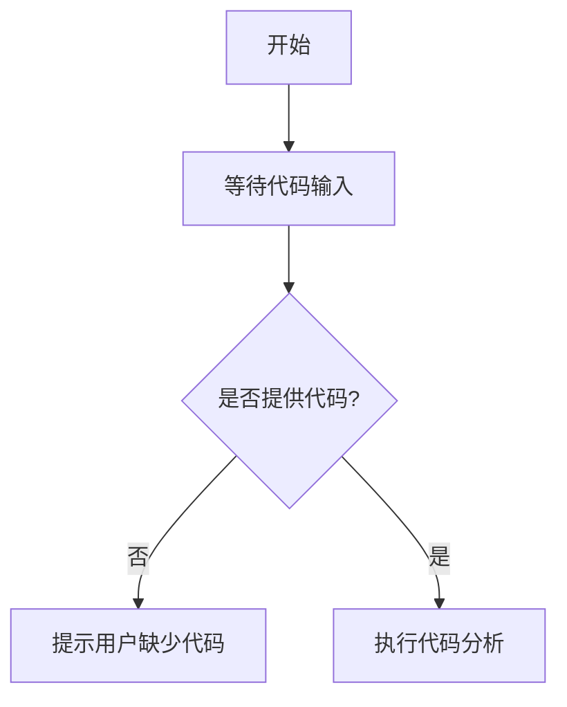

# `diffusers\tests\pipelines\stable_diffusion_2\__init__.py` 详细设计文档

未提供源代码，无法进行分析。请在代码块中提供需要分析的源代码。

## 整体流程



## 类结构

```

```

## 全局变量及字段


    

## 全局函数及方法


## 关键组件


# 代码设计文档

## 概述

由于提供的代码为空，无法生成详细的代码设计文档。请提供需要分析的源代码。

## 关键组件信息

无法识别关键组件，因为源代码为空。

## 潜在技术债务与优化空间

无法评估，因为无代码可供分析。

## 其它信息

- 设计目标与约束：未提供代码
- 错误处理与异常设计：未提供代码
- 数据流与状态机：未提供代码
- 外部依赖与接口契约：未提供代码


## 问题及建议


### 已知问题

-   未提供代码，无法进行分析

### 优化建议

-   请提供需要分析的代码内容


## 其它


### 设计目标与约束

本文档旨在为提供的空代码框架补充完整的设计文档模板，实际项目需根据具体代码功能填充以下内容：

**设计目标**：
1. 明确系统的核心功能目标
2. 定义性能、可靠性、可扩展性等非功能性需求
3. 确立开发周期和交付标准

**设计约束**：
1. 技术栈约束：编程语言版本、框架版本、依赖库版本等
2. 资源约束：硬件资源限制、并发用户数限制等
3. 合规约束：数据安全法规、行业标准等

### 错误处理与异常设计

**异常分类**：
- 系统级异常：网络中断、数据库连接失败、内存溢出等
- 业务级异常：参数校验失败、业务规则不满足、权限不足等
- 第三方异常：外部API调用失败、超时等

**异常处理策略**：
1. 异常捕获机制：try-catch-finally使用规范
2. 异常传播机制：异常向上传递的规则
3. 异常恢复机制：故障恢复策略和降级方案
4. 异常日志规范：日志级别、记录内容、敏感信息脱敏

### 数据流与状态机

**数据流设计**：
1. 数据输入源：用户输入、文件导入、API调用、消息队列等
2. 数据处理流程：数据校验、转换、加工、存储的完整链路
3. 数据输出目标：页面渲染、文件导出、API响应、消息推送等

**状态机设计**（如适用）：
1. 状态定义：所有可能的状态枚举
2. 状态转换：状态之间的转换条件和触发事件
3. 初始状态和终态：业务流程的起点和终点
4. 状态异常处理：非法状态转换的处理策略

### 外部依赖与接口契约

**外部依赖**：
1. 第三方库/框架：名称、版本、功能用途
2. 外部服务：微服务API、数据库、消息队列、缓存系统等
3. 基础设施：云服务、容器平台、CI/CD工具等

**接口契约**：
1. RESTful API：请求方法、URL路径、请求参数、响应格式、错误码定义
2. 事件/消息契约：消息主题、消息格式、生产者、消费者
3. 库/SDK接口：公共类和方法签名、使用示例
4. 第三方集成：认证方式、调用频率限制、熔断策略

### 安全性设计

**认证与授权**：
1. 认证机制：JWT、OAuth2、SAML等
2. 授权模型：RBAC、ABAC等
3. 敏感数据保护：加密算法、密钥管理

**安全防护**：
1. 输入验证：防止SQL注入、XSS、CSRF等
2. 传输安全：TLS/SSL配置
3. 审计日志：操作记录、异常追踪

### 性能要求与监控

**性能指标**：
1. 响应时间：P50、P95、P99延迟要求
2. 吞吐量：QPS、TPS要求
3. 资源利用率：CPU、内存、磁盘IO阈值

**监控设计**：
1. 指标采集：Metrics定义和采集方式
2. 告警策略：阈值设定、告警级别、通知方式
3. 链路追踪：分布式追踪方案

### 可扩展性与维护性

**扩展性设计**：
1. 水平扩展：负载均衡、无状态服务
2. 垂直扩展：缓存优化、数据库分片
3. 功能扩展：插件机制、模块化设计

**可维护性**：
1. 代码规范：命名规则、注释要求
2. 文档维护：接口文档、部署文档
3. 依赖管理：版本控制、依赖检查

### 测试策略

**单元测试**：
1. 测试框架选择
2. 覆盖率要求
3. Mock策略

**集成测试**：
1. 测试环境管理
2. 测试数据准备
3. 外部依赖Mock

**端到端测试**：
1. 场景覆盖
2. 测试数据管理
3. 自动化程度

### 部署与运维

**部署架构**：
1. 部署拓扑：服务器、容器、集群配置
2. 负载均衡：高可用方案
3. 灾难恢复：备份策略、故障切换

**配置管理**：
1. 环境区分：开发、测试、生产
2. 配置方式：环境变量、配置文件、配置中心
3. 敏感配置：密钥管理、配置加密

### 日志与审计

**日志规范**：
1. 日志级别：DEBUG、INFO、WARN、ERROR使用场景
2. 日志格式：时间戳、线程ID、请求ID、日志内容
3. 日志存储：滚动策略、存储周期、查询方式

**审计设计**：
1. 操作审计：谁在什么时候做了什么
2. 变更审计：配置变更、代码变更记录
3. 合规审计：满足法规要求的日志保留


    