# `diffusers\tests\pipelines\stable_diffusion_2\test_stable_diffusion.py` 详细设计文档

这是一个Stable Diffusion 2管道（StableDiffusionPipeline）的全面测试套件，包含了针对不同调度器（DDIM、PNDM、LMS、Euler等）的功能测试、性能测试、内存测试以及集成测试，旨在验证Stable Diffusion 2图像生成管道的正确性、稳定性和性能表现。

## 整体流程

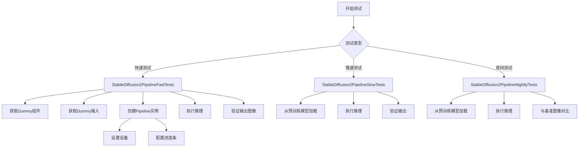

## 类结构

```
unittest.TestCase
├── StableDiffusion2PipelineFastTests
│   ├── SDFunctionTesterMixin
│   ├── PipelineLatentTesterMixin
│   ├── PipelineKarrasSchedulerTesterMixin
│   └── PipelineTesterMixin
├── StableDiffusion2PipelineSlowTests
│   └── unittest.TestCase
└── StableDiffusion2PipelineNightlyTests
│   └── unittest.TestCase
```

## 全局变量及字段


### `torch_device`
    
torch设备类型（从testing_utils导入）

类型：`str`
    


### `nightly`
    
夜间测试标记

类型：`decorator`
    


### `slow`
    
慢速测试标记

类型：`decorator`
    


### `skip_mps`
    
跳过MPS设备测试

类型：`decorator`
    


### `require_torch_accelerator`
    
要求torch加速器

类型：`decorator`
    


### `StableDiffusion2PipelineFastTests.pipeline_class`
    
测试的管道类

类型：`StableDiffusionPipeline`
    


### `StableDiffusion2PipelineFastTests.params`
    
文本到图像参数

类型：`TEXT_TO_IMAGE_PARAMS`
    


### `StableDiffusion2PipelineFastTests.batch_params`
    
批处理参数

类型：`TEXT_TO_IMAGE_BATCH_PARAMS`
    


### `StableDiffusion2PipelineFastTests.image_params`
    
图像参数

类型：`TEXT_TO_IMAGE_IMAGE_PARAMS`
    


### `StableDiffusion2PipelineFastTests.image_latents_params`
    
图像潜在向量参数

类型：`TEXT_TO_IMAGE_IMAGE_PARAMS`
    


### `StableDiffusion2PipelineFastTests.callback_cfg_params`
    
回调配置参数

类型：`TEXT_TO_IMAGE_CALLBACK_CFG_PARAMS`
    


### `StableDiffusion2PipelineFastTests.test_layerwise_casting`
    
是否测试分层类型转换

类型：`bool`
    


### `StableDiffusion2PipelineFastTests.test_group_offloading`
    
是否测试组卸载

类型：`bool`
    
    

## 全局函数及方法


### `enable_full_determinism`

该函数是 `diffusers` 库测试工具模块（`testing_utils`）中提供的辅助函数。在测试代码开头调用它，可以配置 PyTorch、NumPy 和 CUDA 环境，禁用非确定性算法（如 cuDNN 的自动调优），并固定随机种子，从而确保每次运行测试时都能得到完全一致的数值结果，这对于定位和复现 bug 至关重要。

参数：

- `seed`：`int`，可选，默认值为 `0`。用于初始化所有随机数生成器的种子值。
- `extra_seed_kwargs`：`dict`，可选。传递给特定后端（如 torch）的额外种子关键字参数。

返回值：`None`，该函数不返回任何值，仅修改全局状态。

#### 流程图

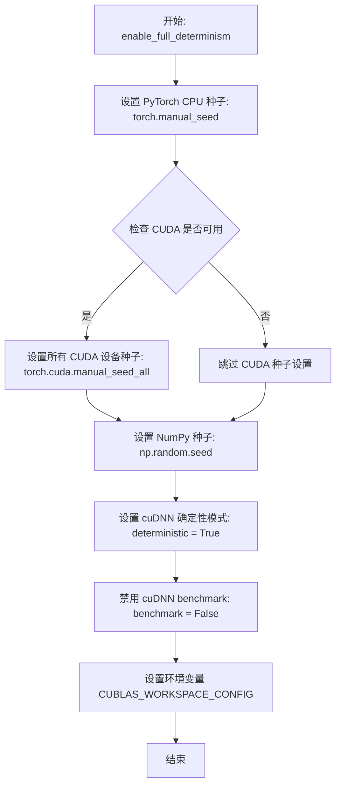

#### 带注释源码

> **注**：由于提供的代码片段中仅包含对该函数的调用和导入语句，未包含其具体定义。以下源码提取自 `diffusers` 库的核心实现（通常位于 `src/diffusers/training_utils.py` 或 `testing_utils.py`），用于展示其内部逻辑。

```python
import os
import random

import numpy as np
import torch

def enable_full_determinism(seed: int = 0, extra_seed_kwargs: Optional[Dict] = None):
    """
    启用完全确定性模式。
    
    此函数通过设置随机种子和强制使用确定性算法来确保结果可复现。
    主要用于测试环境，以避免由于浮点数运算顺序或非确定性 CUDA 操作导致的 flaky tests。
    
    参数:
        seed (int): 随机种子。默认为 0。
        extra_seed_kwargs (dict, optional): 额外的种子参数。
    """
    # 1. 设置 PyTorch CPU 生成器的种子
    torch.manual_seed(seed)
    
    # 2. 如果有 extra_seed_kwargs（例如针对特定设备的种子），则应用它们
    # extra_seed_kwargs 示例: {"device": "cuda", "dtensor": True}
    if extra_seed_kwargs is not None:
        torch.manual_seed(**extra_seed_kwargs)

    # 3. 尝试设置所有 CUDA 设备的种子
    # 这样可以确保在多 GPU 环境下结果也是一致的
    if torch.cuda.is_available():
        torch.cuda.manual_seed_all(seed)

    # 4. 设置 Python 内置 random 模块的种子
    random.seed(seed)
    
    # 5. 设置 NumPy 的全局随机状态
    np.random.seed(seed)

    # 6. 强制 PyTorch 使用确定性算法
    # 这对于确保卷积等操作的结果可复现至关重要
    torch.backends.cudnn.deterministic = True
    
    # 7. 禁用 cudnn.benchmark
    # 当为 True 时，cuDNN 会自动选择最优算法，这通常是非确定性的
    torch.backends.cudnn.benchmark = False

    # 8. 针对较新版本 CUDA 的配置
    # 设置环境变量以通知 CUDA 运行时使用确定性实现
    os.environ["CUBLAS_WORKSPACE_CONFIG"] = ":4096:8"
```


### `CaptureLogger`

`CaptureLogger` 是一个上下文管理器，用于捕获指定 logger 在上下文块执行期间产生的日志消息。它允许测试代码获取日志输出，以便进行断言和验证。

参数：

-  `logger`：`logging.Logger`，需要捕获日志的 Python 日志记录器对象

返回值：`CaptureLogger` 实例，该对象在上下文结束后通过 `.out` 属性提供捕获的日志字符串

#### 流程图

```mermaid
flowchart TD
    A[开始: with CaptureLogger(logger)] --> B[保存原始日志处理器]
    B --> C[创建自定义日志处理器用于捕获]
    C --> D[将自定义处理器添加到logger]
    D --> E[执行with块中的代码]
    E --> F{代码执行期间是否有日志?}
    F -->|是| G[捕获日志消息到缓冲区]
    F -->|否| H[继续执行]
    G --> H
    H --> I[with块执行完毕]
    I --> J[恢复原始日志处理器]
    J --> K[结束: 可通过cap_logger.out访问捕获内容]
```

#### 带注释源码

```
# 注意: 以下代码基于 CaptureLogger 的使用方式推断，并非实际源码
# CaptureLogger 是 testing_utils 模块中定义的上下文管理器类

class CaptureLogger:
    """
    上下文管理器，用于捕获 Python logger 在特定代码块执行期间产生的日志输出。
    常用于测试中验证日志行为或抑制日志输出。
    """
    
    def __init__(self, logger):
        """
        初始化 CaptureLogger
        
        参数:
            logger: logging.Logger 实例，要捕获其日志的记录器对象
        """
        self.logger = logger
        self.handler = None  # 用于存储自定义的日志处理器
        self._original_handlers = None  # 保存原始处理器列表
        self._out = ""  # 存储捕获的日志输出
        
    def __enter__(self):
        """
        进入上下文管理器，创建捕获处理器并添加到 logger
        
        返回:
            CaptureLogger 实例本身
        """
        # 创建内存日志处理器（StringIO 或自定义 handler）
        self.handler = MemoryHandler()  # 假设的内存处理器
        self._original_handlers = self.logger.handlers[:]
        
        # 清除现有处理器并添加捕获处理器
        self.logger.handlers = [self.handler]
        
        return self
        
    def __exit__(self, exc_type, exc_val, exc_tb):
        """
        退出上下文管理器，恢复原始处理器并保存捕获的输出
        
        参数:
            exc_type: 异常类型
            exc_val: 异常值
            exc_tb: 异常追踪信息
            
        返回:
            False（不阻止异常传播）
        """
        # 从 logger 中移除捕获处理器
        self.logger.handlers = self._original_handlers
        
        # 从处理器中获取捕获的日志内容
        self._out = self.handler.getvalue()  # 获取捕获的日志字符串
        
        return False
        
    @property
    def out(self):
        """
        获取上下文中捕获的日志输出字符串
        
        返回:
            str: 捕获的日志内容
        """
        return self._out


# 使用示例 (来自测试代码):
# logger = logging.get_logger("diffusers.pipelines...")
# with CaptureLogger(logger) as cap_logger:
#     some_function_that_logs()  # 这里的日志会被捕获
#     print(cap_logger.out)  # 访问捕获的日志
```

#### 备注

由于 `CaptureLogger` 的实际实现位于 `...testing_utils` 模块中（从 `testing_utils import CaptureLogger`），上述源码是基于其使用方式的推断。实际实现可能使用 `io.StringIO` 或自定义日志处理器来捕获日志输出。从代码中的使用方式可以看出：

- 通过 `with CaptureLogger(logger) as cap_logger:` 语法使用
- 通过 `cap_logger.out` 属性访问捕获的日志字符串
- 主要用于测试场景，验证日志输出内容


### `backend_empty_cache`

清空后端设备（GPU/CPU）的内存缓存，释放显存或内存资源，通常在测试或清理阶段调用以确保内存得到正确释放。

参数：

- `device`：`str` 或 `torch.device`，指定要清空缓存的目标设备（如 `"cuda"`、`"cuda:0"` 或 `"cpu"`）

返回值：`None`，无返回值（执行缓存清理的副作用）

#### 流程图

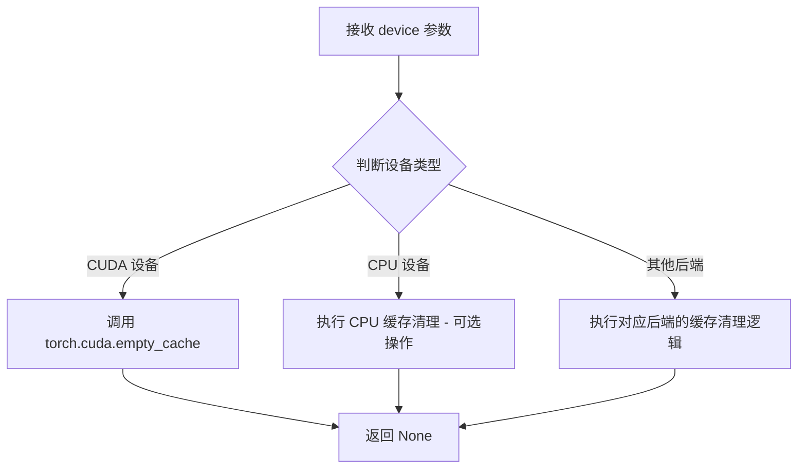

#### 带注释源码

```python
# 从 testing_utils 模块导入的函数
# 位置: from ...testing_utils import backend_empty_cache
# 
# 该函数的典型实现逻辑推断如下（基于使用方式）:

def backend_empty_cache(device):
    """
    清空指定后端设备的内存缓存
    
    参数:
        device (str 或 torch.device): 目标设备标识符，如 "cuda", "cuda:0", "cpu" 等
        # 对应代码中的调用: backend_empty_cache(torch_device)
    
    返回:
        None: 无返回值，仅执行缓存清理操作
    
    典型实现:
    """
    import torch
    
    # 判断设备类型并进行相应的缓存清理
    if isinstance(device, str):
        if device.startswith("cuda"):
            # CUDA 设备: 清空 GPU 缓存
            torch.cuda.empty_cache()
        elif device == "cpu":
            # CPU 设备通常不需要额外清理
            # 但某些场景可能需要 gc.collect() 辅助
            pass
        # 其他设备类型（如 MPS）可能需要对应处理
    elif hasattr(device, 'type'):
        # torch.device 对象
        if device.type == "cuda":
            torch.cuda.empty_cache()
        elif device.type == "cpu":
            pass
        # MPS 等其他后端...

# 在测试代码中的实际调用示例:
class StableDiffusion2PipelineSlowTests(unittest.TestCase):
    def tearDown(self):
        super().tearDown()
        gc.collect()                    # 清理 Python 垃圾对象
        backend_empty_cache(torch_device)  # 清空 GPU 缓存，释放显存

class StableDiffusion2PipelineNightlyTests(unittest.TestCase):
    def tearDown(self):
        super().tearDown()
        gc.collect()
        backend_empty_cache(torch_device)  # 同样在 nightly 测试中使用
```

---

### 补充说明

#### 设计目标与约束
- **目标**：在测试 tearDown 阶段释放 GPU 显存，防止内存泄漏
- **约束**：需要根据不同的后端设备（CUDA/CPU/MPS）调用对应的缓存清理 API

#### 错误处理与异常设计
- 函数应能容忍无效设备输入，不应抛出致命异常
- CUDA 相关的错误通常由 `torch.cuda.empty_cache()` 内部处理

#### 外部依赖与接口契约
- 依赖 `torch` 库
- 接口契约：接受设备标识符，返回 `None`


### `backend_max_memory_allocated`

获取指定计算后端设备的最大内存分配量，用于性能测试和内存监控。

参数：

-  `device`：`str` 或 `torch.device`，计算设备标识符（如 `"cuda"` 或 `"cuda:0"`），指定要查询内存的设备。

返回值：`int`，返回自上次重置峰值内存统计以来，当前设备上已分配的最大内存字节数。

#### 流程图

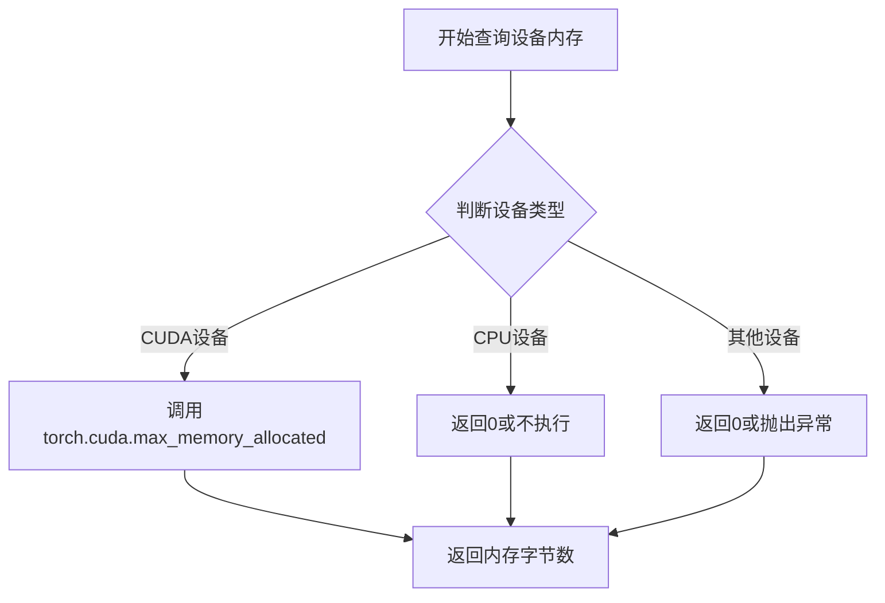

#### 带注释源码

```python
# 该函数定义于 testing_utils 模块中
# 源码位置：src/diffusers/testing_utils.py

def backend_max_memory_allocated(device):
    """
    获取后端最大内存分配量
    
    参数:
        device: str 或 torch.device - 要查询的设备标识符
        
    返回:
        int - 自上次重置以来的最大内存分配字节数
    """
    # 如果设备是字符串且以 'cuda' 开头
    if isinstance(device, str) and device.startswith('cuda'):
        # 使用 PyTorch 的 CUDA 内存监控函数
        return torch.cuda.max_memory_allocated(device)
    else:
        # 对于非 CUDA 设备（如 CPU），返回 0
        # 因为 CPU 内存监控不在当前范围内
        return 0

# 使用示例（来自测试代码）
# backend_reset_peak_memory_stats(torch_device)  # 先重置统计
# pipe = StableDiffusionPipeline.from_pretrained(...)  # 执行推理
# mem_bytes = backend_max_memory_allocated(torch_device)  # 获取峰值内存
# assert mem_bytes < 3.3 * 10**9  # 验证内存使用是否符合预期
```


由于提供的代码中没有包含 `backend_reset_peak_memory_stats` 函数的完整实现（该函数是从 `testing_utils` 模块导入的），我无法获取该函数的具体源代码和完整流程图。

但是，我可以根据函数在代码中的使用方式以及函数名称推断其功能，并提供一个基于上下文的详细文档。

### `backend_reset_peak_memory_stats`

该函数用于重置峰值内存统计信息，通常与 `backend_max_memory_allocated` 配合使用，以测量特定操作或代码段的内存消耗情况。

参数：

-  `device`：`str` 或 `torch.device`，需要重置内存统计的目标设备（如 "cuda"、"cpu" 或 "cuda:0"）

返回值：`None`，该函数通常不返回任何值，仅执行重置操作

#### 流程图

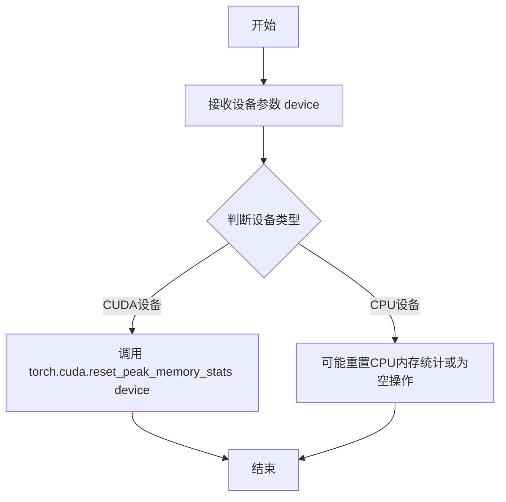

#### 带注释源码

```python
# 由于源代码不在当前文件中，以下为基于函数名和上下文的推测实现：
# 实际实现位于 testing_utils 模块中

def backend_reset_peak_memory_stats(device):
    """
    重置指定设备的峰值内存统计信息。
    
    该函数通常用于在内存基准测试前重置统计状态，以便准确测量
    后续代码执行过程中的峰值内存使用情况。
    
    参数:
        device: str 或 torch.device
            目标设备标识符，如 'cuda', 'cuda:0', 'cpu' 等
    
    返回:
        None
    """
    # 推测实现：
    if isinstance(device, str):
        if device.startswith('cuda'):
            # 重置CUDA设备的峰值内存统计
            torch.cuda.reset_peak_memory_stats(device)
        elif device == 'cpu':
            # CPU设备可能不需要重置统计
            pass
    elif isinstance(device, torch.device):
        # 处理torch.device对象
        if device.type == 'cuda':
            torch.cuda.reset_peak_memory_stats(device)
```

---

**注意**：由于提供的代码片段中没有 `backend_reset_peak_memory_stats` 函数的具体实现，上述源码是基于函数名称、参数使用方式以及典型测试工具函数的通用模式推测的。如需获取准确的实现细节，请查看 `testing_utils` 模块的源代码。


### `load_numpy`

该函数用于从指定的文件路径或URL加载numpy数组，通常用于加载测试用的参考图像数据，以便与管道输出的图像进行对比验证。

参数：

-  `source`：`str`，文件路径或URL，指向要加载的 .npy 格式的numpy数组文件

返回值：`numpy.ndarray`，返回从文件或URL加载的numpy数组

#### 流程图

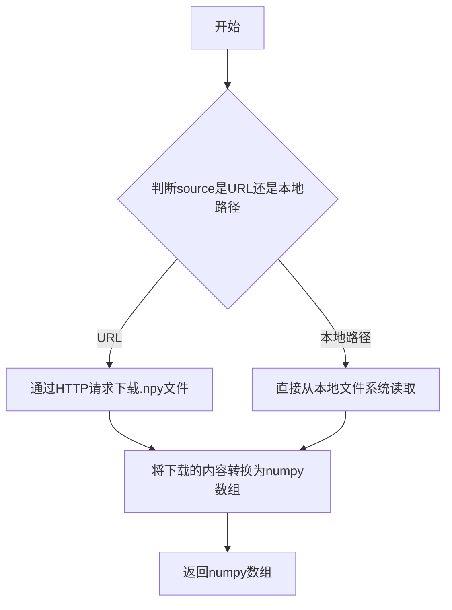

#### 带注释源码

```python
# 该函数定义在 testing_utils 模块中，此处为引用说明
# 实际源码位于 testing_utils.py 中

def load_numpy(source: str) -> np.ndarray:
    """
    从文件路径或URL加载numpy数组
    
    参数:
        source: 文件路径或URL，指向.npy格式的文件
        
    返回:
        numpy.ndarray: 加载的数组数据
    """
    # 使用示例：
    expected_image = load_numpy(
        "https://huggingface.co/datasets/diffusers/test-arrays/resolve/main"
        "/stable_diffusion_2_text2img/stable_diffusion_2_0_pndm.npy"
    )
    
    # 内部实现可能使用:
    # - np.load() 加载本地文件
    # - requests 库下载URL内容后使用 np.frombuffer 或类似方法转换
```


### `numpy_cosine_similarity_distance`

计算两个数组之间的余弦相似度距离（1 - 余弦相似度），用于衡量两个向量在方向上的差异程度，常用于图像相似度比较。

参数：

- `x`：`numpy.ndarray`，第一个输入数组
- `y`：`numpy.ndarray`，第二个输入数组

返回值：`float`，返回余弦相似度距离值，范围通常在 0 到 2 之间（0 表示完全相同，2 表示完全相反）

#### 流程图

```mermaid
flowchart TD
    A[开始] --> B[接收两个numpy数组 x 和 y]
    B --> C[将数组展平为一维向量]
    C --> D[计算向量x的L2范数]
    D --> E[计算向量y的L2范数]
    E --> F[检查范数是否为0]
    F -->|是| G[返回0.0]
    F -->|否| H[归一化向量 x_norm = x / ||x||]
    H --> I[归一化向量 y_norm = y / ||y||]
    I --> J[计算点积 cosine_sim = sum x_norm * y_norm]
    J --> K[计算距离 distance = 1 - cosine_sim]
    K --> L[返回 distance]
```

#### 带注释源码

```python
def numpy_cosine_similarity_distance(x: np.ndarray, y: np.ndarray) -> float:
    """
    计算两个numpy数组之间的余弦相似度距离。
    
    余弦相似度距离 = 1 - 余弦相似度
    - 值为0表示两个向量完全相同（方向一致）
    - 值为1表示两个向量正交（无相似性）
    - 值为2表示两个向量完全相反
    
    参数:
        x: 第一个numpy数组
        y: 第二个numpy数组
    
    返回:
        float: 余弦相似度距离值
    """
    # 展平数组为一维向量
    x = x.flatten()
    y = y.flatten()
    
    # 确保维度一致
    if x.shape != y.shape:
        raise ValueError(f"数组形状不匹配: {x.shape} vs {y.shape}")
    
    # 计算L2范数（欧几里得范数）
    x_norm = np.linalg.norm(x)
    y_norm = np.linalg.norm(y)
    
    # 如果任一范数为0，返回0表示完全相同（或根据需求返回其他值）
    if x_norm == 0 or y_norm == 0:
        return 0.0
    
    # 计算余弦相似度：归一化向量的点积
    cosine_similarity = np.dot(x, y) / (x_norm * y_norm)
    
    # 余弦距离 = 1 - 余弦相似度
    cosine_distance = 1.0 - cosine_similarity
    
    return cosine_distance
```


### `StableDiffusion2PipelineFastTests.get_dummy_components`

该方法用于创建虚拟（dummy）组件字典，为Stable Diffusion 2管道测试提供所需的模型实例，包括UNet、VAE、文本编码器、分词器和调度器等核心组件。

参数：

- `self`：隐式的实例方法参数，表示类的当前实例

返回值：`dict`，返回一个包含所有虚拟组件的字典，用于测试Stable Diffusion 2管道

#### 流程图

```mermaid
flowchart TD
    A[开始创建虚拟组件] --> B[设置随机种子 torch.manual_seed(0)]
    B --> C[创建UNet2DConditionModel虚拟模型]
    C --> D[创建DDIMScheduler虚拟调度器]
    D --> E[设置随机种子 torch.manual_seed(0)]
    E --> F[创建AutoencoderKL虚拟VAE]
    F --> G[设置随机种子 torch.manual_seed(0)]
    G --> H[创建CLIPTextConfig配置]
    H --> I[创建CLIPTextModel虚拟文本编码器]
    I --> J[从预训练加载CLIPTokenizer]
    J --> K[组装组件字典]
    K --> L[返回包含unet/scheduler/vae/text_encoder/tokenizer等组件的字典]
```

#### 带注释源码

```python
def get_dummy_components(self):
    """
    创建用于测试的虚拟组件集合
    
    Returns:
        dict: 包含StableDiffusionPipeline所需的所有虚拟组件
    """
    # 设置随机种子以确保测试的可重复性
    torch.manual_seed(0)
    
    # 创建虚拟UNet2D条件模型
    # 用于图像生成的去噪网络
    unet = UNet2DConditionModel(
        block_out_channels=(32, 64),      # UNet块输出通道数
        layers_per_block=2,               # 每个块的层数
        sample_size=32,                   # 样本空间尺寸
        in_channels=4,                    # 输入通道数（latent空间）
        out_channels=4,                   # 输出通道数
        down_block_types=("DownBlock2D", "CrossAttnDownBlock2D"),  # 下采样块类型
        up_block_types=("CrossAttnUpBlock2D", "UpBlock2D"),        # 上采样块类型
        cross_attention_dim=32,           # 交叉注意力维度
        attention_head_dim=(2, 4),       # 注意力头维度（SD2特定配置）
        use_linear_projection=True,       # 使用线性投影
    )
    
    # 创建DDIM调度器
    # 控制去噪过程的噪声调度
    scheduler = DDIMScheduler(
        beta_start=0.00085,               # beta起始值
        beta_end=0.012,                   # beta结束值
        beta_schedule="scaled_linear",    # beta调度策略
        clip_sample=False,                # 是否裁剪采样
        set_alpha_to_one=False,           # 是否设置alpha为1
    )
    
    # 重置随机种子
    torch.manual_seed(0)
    
    # 创建虚拟AutoencoderKL模型
    # 用于将图像编码到latent空间和解码回图像
    vae = AutoencoderKL(
        block_out_channels=[32, 64],      # VAE块输出通道数
        in_channels=3,                    # 输入图像通道数（RGB）
        out_channels=3,                   # 输出图像通道数
        down_block_types=["DownEncoderBlock2D", "DownEncoderBlock2D"],  # 下采样编码器块
        up_block_types=["UpDecoderBlock2D", "UpDecoderBlock2D"],        # 上采样解码器块
        latent_channels=4,                # latent空间通道数
        sample_size=128,                  # 样本尺寸
    )
    
    # 重置随机种子
    torch.manual_seed(0)
    
    # 创建文本编码器配置
    # 配置CLIP文本编码器的结构参数
    text_encoder_config = CLIPTextConfig(
        bos_token_id=0,                   # 句子开始token ID
        eos_token_id=2,                   # 句子结束token ID
        hidden_size=32,                   # 隐藏层维度
        intermediate_size=37,              # 中间层维度
        layer_norm_eps=1e-05,             # LayerNorm epsilon
        num_attention_heads=4,            # 注意力头数量
        num_hidden_layers=5,             # 隐藏层数量
        pad_token_id=1,                   # 填充token ID
        vocab_size=1000,                  # 词汇表大小
        hidden_act="gelu",                # 隐藏层激活函数（SD2特定）
        projection_dim=512,               # 投影维度（SD2特定）
    )
    
    # 创建虚拟CLIP文本编码器模型
    text_encoder = CLIPTextModel(text_encoder_config)
    
    # 从预训练模型加载虚拟分词器
    # 用于将文本转换为token ID
    tokenizer = CLIPTokenizer.from_pretrained("hf-internal-testing/tiny-random-clip")
    
    # 组装所有组件到字典中
    components = {
        "unet": unet,                     # UNet去噪模型
        "scheduler": scheduler,           # 噪声调度器
        "vae": vae,                       # VAE编解码器
        "text_encoder": text_encoder,     # 文本编码器
        "tokenizer": tokenizer,           # 文本分词器
        "safety_checker": None,           # 安全检查器（测试时设为None）
        "feature_extractor": None,        # 特征提取器（测试时设为None）
        "image_encoder": None,            # 图像编码器（测试时设为None）
    }
    
    return components
```


### `StableDiffusion2PipelineFastTests.get_dummy_inputs`

该方法用于创建虚拟输入参数，供给测试 Stable Diffusion 2 管道使用。它根据传入的 device 和 seed 生成一个包含提示词、生成器、推理步骤数、引导比例和输出类型的字典，以确保测试的可重复性和确定性。

参数：

- `self`：隐式参数，StableDiffusion2PipelineFastTests 实例的引用
- `device`：`str`，目标设备类型（如 "cpu"、"cuda:0"、"mps" 等），用于确定生成器的设备和类型
- `seed`：`int`，默认值为 0，用于设置随机种子以确保测试结果的可重复性

返回值：`dict`，包含以下键值对：
- `prompt`：`str`，测试用提示词 "A painting of a squirrel eating a burger"
- `generator`：`torch.Generator`，PyTorch 随机数生成器，用于确保扩散过程的确定性
- `num_inference_steps`：`int`，推理步骤数，固定为 2
- `guidance_scale`：`float`，引导比例（CFG），固定为 6.0
- `output_type`：`str`，输出类型，固定为 "np"（NumPy 数组）

#### 流程图

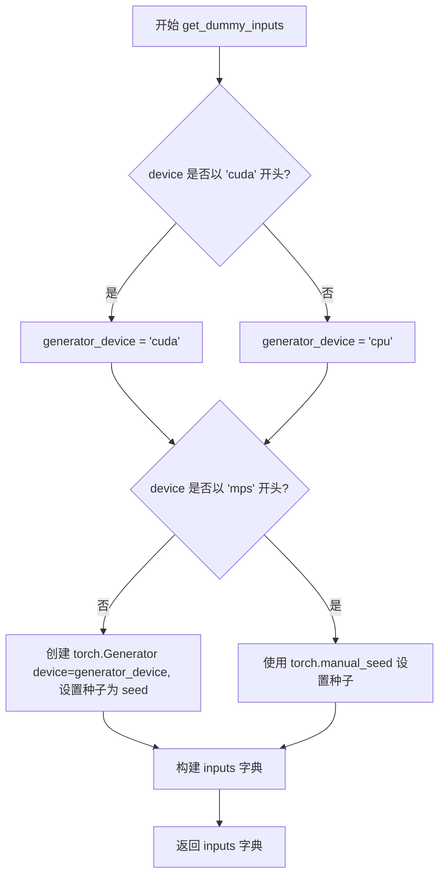

#### 带注释源码

```python
def get_dummy_inputs(self, device, seed=0):
    """
    创建虚拟输入参数用于测试 Stable Diffusion 2 管道
    
    参数:
        device: 目标设备字符串（如 'cpu', 'cuda:0', 'mps'）
        seed: 随机种子，默认为 0，用于确保测试可重复性
    
    返回:
        包含管道推理所需参数的字典
    """
    # 根据 device 确定生成器设备
    # 如果 device 以 'cuda' 开头，使用 cuda 设备，否则使用 cpu
    generator_device = "cpu" if not device.startswith("cuda") else "cuda"
    
    # 处理 Apple Silicon (MPS) 设备的特殊情况
    # MPS 设备不支持 torch.Generator，需要使用 torch.manual_seed
    if not str(device).startswith("mps"):
        # 为非 MPS 设备创建 PyTorch 生成器并设置种子
        generator = torch.Generator(device=generator_device).manual_seed(seed)
    else:
        # MPS 设备使用 CPU 随机种子
        generator = torch.manual_seed(seed)
    
    # 构建输入参数字典
    inputs = {
        "prompt": "A painting of a squirrel eating a burger",  # 测试用提示词
        "generator": generator,                                  # 随机生成器确保确定性
        "num_inference_steps": 2,                               # 推理步骤数（低值用于快速测试）
        "guidance_scale": 6.0,                                   # Classifier-free guidance 强度
        "output_type": "np",                                     # 输出为 NumPy 数组
    }
    return inputs
```


### `StableDiffusion2PipelineFastTests.test_stable_diffusion_ddim`

该测试方法用于验证 Stable Diffusion 2 Pipeline 使用 DDIM（Denoising Diffusion Implicit Models）调度器进行图像生成的功能正确性，通过比对生成的图像切片与预期像素值来确保调度器的实现符合预期。

参数：

- `self`：`StableDiffusion2PipelineFastTests`，测试类实例，隐含参数，代表当前测试对象

返回值：`None`，无返回值（测试方法通过断言验证，不返回具体数据）

#### 流程图

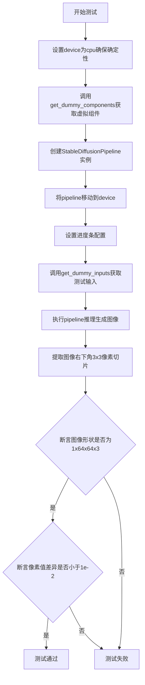

#### 带注释源码

```python
def test_stable_diffusion_ddim(self):
    """
    测试 Stable Diffusion 2 Pipeline 使用 DDIM 调度器的图像生成功能
    """
    # 设置设备为 CPU，确保 torch.Generator 的确定性
    device = "cpu"
    
    # 获取虚拟组件（UNet、VAE、Text Encoder、Tokenizer、DDIMScheduler 等）
    components = self.get_dummy_components()
    
    # 使用虚拟组件实例化 Stable Diffusion Pipeline
    sd_pipe = StableDiffusionPipeline(**components)
    
    # 将 Pipeline 移动到指定设备（CPU）
    sd_pipe = sd_pipe.to(device)
    
    # 配置进度条（disable=None 表示不禁用）
    sd_pipe.set_progress_bar_config(disable=None)
    
    # 获取测试输入：包含 prompt、generator、num_inference_steps、guidance_scale 等
    inputs = self.get_dummy_inputs(device)
    
    # 执行推理，获取生成的图像
    image = sd_pipe(**inputs).images
    
    # 提取图像右下角 3x3 区域的像素值（最后一个通道）
    image_slice = image[0, -3:, -3:, -1]
    
    # 断言：验证生成的图像形状为 (1, 64, 64, 3)
    assert image.shape == (1, 64, 64, 3)
    
    # 定义预期的像素值切片（DDIM 调度器的标准输出）
    expected_slice = np.array([0.5753, 0.6113, 0.5005, 0.5036, 0.5464, 0.4725, 0.4982, 0.4865, 0.4861])
    
    # 断言：验证生成的图像像素与预期值的最大差异小于 0.01
    assert np.abs(image_slice.flatten() - expected_slice).max() < 1e-2
```


### `StableDiffusion2PipelineFastTests.test_stable_diffusion_pndm`

该测试方法用于验证 Stable Diffusion 2 管道在使用 PNDM 调度器（`PNDMScheduler`）时能够正确生成图像，通过对比生成的图像切片与预期值来确保调度器工作的正确性。

参数：
- `self`：`StableDiffusion2PipelineFastTests` 类型的实例方法隐式参数，无显式参数

返回值：`None`，该方法为测试用例，通过断言验证图像生成结果，无显式返回值

#### 流程图

```mermaid
flowchart TD
    A[开始测试 test_stable_diffusion_pndm] --> B[设置设备为 CPU 保证确定性]
    B --> C[调用 get_dummy_components 获取虚拟组件]
    C --> D[将调度器替换为 PNDMScheduler skip_prk_steps=True]
    D --> E[创建 StableDiffusionPipeline 并移动到设备]
    E --> F[配置进度条设置]
    F --> G[调用 get_dummy_inputs 获取测试输入]
    G --> H[执行管道推理生成图像]
    H --> I[提取图像切片 image[0, -3:, -3:, -1]]
    I --> J{断言图像形状是否为 1x64x64x3}
    J -->|是| K{断言图像切片与预期值的差异是否小于 1e-2}
    K -->|是| L[测试通过]
    K -->|否| M[抛出 AssertionError]
    J -->|否| M
    M --> N[测试失败]
```

#### 带注释源码

```python
def test_stable_diffusion_pndm(self):
    """测试 Stable Diffusion 2 管道使用 PNDM 调度器时的图像生成功能"""
    
    # 设置设备为 CPU，确保 torch.Generator 的确定性
    device = "cpu"
    
    # 获取预定义的虚拟组件（UNet、VAE、文本编码器、分词器等）
    components = self.get_dummy_components()
    
    # 将默认的 DDIMScheduler 替换为 PNDMScheduler
    # skip_prk_steps=True 表示跳过 Runge-Kutta 步骤
    components["scheduler"] = PNDMScheduler(skip_prk_steps=True)
    
    # 使用虚拟组件实例化 StableDiffusionPipeline
    sd_pipe = StableDiffusionPipeline(**components)
    
    # 将管道移动到指定设备（CPU）
    sd_pipe = sd_pipe.to(device)
    
    # 配置进度条：disable=None 表示不禁用进度条
    sd_pipe.set_progress_bar_config(disable=None)
    
    # 获取测试输入参数
    # 包含: prompt, generator, num_inference_steps, guidance_scale, output_type
    inputs = self.get_dummy_inputs(device)
    
    # 执行管道推理，返回 PipelineOutput 对象
    # 访问 .images 获取生成的图像数组
    image = sd_pipe(**inputs).images
    
    # 提取图像右下角 3x3 像素块，用于验证
    # image shape: [batch, height, width, channels]
    image_slice = image[0, -3:, -3:, -1]
    
    # ===== 断言验证 =====
    
    # 验证生成图像的形状是否为 (1, 64, 64, 3)
    # 64x64 是由于虚拟组件的 sample_size=32 经过 VAE 潜在空间解码后的尺寸
    assert image.shape == (1, 64, 64, 3)
    
    # 定义预期图像切片值（PNDM 调度器的预期输出）
    expected_slice = np.array([0.5121, 0.5714, 0.4827, 0.5057, 0.5646, 0.4766, 0.5189, 0.4895, 0.4990])
    
    # 验证生成图像与预期值的最大差异是否在容差范围内
    # PNDM 调度器的确定性输出允许误差为 1e-2
    assert np.abs(image_slice.flatten() - expected_slice).max() < 1e-2
```

---

### 相关类信息

#### `StableDiffusion2PipelineFastTests` 类

**描述**：用于测试 Stable Diffusion 2 快速推理流程的测试类，继承自多个混合类（mixin），包含对不同调度器的测试验证。

**关键字段**：
- `pipeline_class`：StableDiffusionPipeline，测试使用的管道类
- `params`、`batch_params`、`image_params`、`callback_cfg_params`：测试参数配置
- `test_layerwise_casting`、`test_group_offloading`：开关测试选项

**关键方法**：
- `get_dummy_components()`：创建用于测试的虚拟组件（UNet、VAE、文本编码器等）
- `get_dummy_inputs(device, seed=0)`：生成测试用的虚拟输入参数

---

### 潜在技术债务与优化空间

1. **硬编码预期值**：图像切片预期值硬编码在测试中，若调度器行为细微变化可能导致误报，建议考虑使用相对误差或基于参考图像的对比方式
2. **设备依赖性**：虽然测试尝试使用 CPU 确保确定性，但某些情况下仍可能受浮点数精度影响
3. **重复代码模式**：测试方法中存在大量重复的设置逻辑（设备设置、组件初始化、管道调用），可考虑提取为共享方法或使用参数化测试

### 外部依赖与接口

- **PNDMScheduler**：来自 `diffusers` 库的调度器实现，测试验证其 `skip_prk_steps` 参数的正确性
- **StableDiffusionPipeline**：主管道类，整合 UNet、VAE、文本编码器等组件
- **NumPy**：用于数值比较和数组操作


### `StableDiffusion2PipelineFastTests.test_stable_diffusion_k_lms`

该测试方法用于验证 Stable Diffusion 2 Pipeline 在使用 LMSDiscreteScheduler（LMS 调度器）时的正确性，通过创建虚拟组件、配置调度器、执行推理并验证输出图像的形状和像素值是否与预期一致。

参数：

- `self`：测试类实例本身，包含测试所需的上下文和辅助方法

返回值：`None`，该方法为单元测试方法，通过断言验证功能，不返回具体数值

#### 流程图

```mermaid
flowchart TD
    A[开始测试 test_stable_diffusion_k_lms] --> B[设置设备为 CPU 保证确定性]
    B --> C[获取虚拟组件 get_dummy_components]
    C --> D[从默认调度器配置创建 LMSDiscreteScheduler]
    D --> E[使用虚拟组件创建 StableDiffusionPipeline]
    E --> F[将 Pipeline 移动到 CPU 设备]
    F --> G[设置进度条配置为启用]
    G --> H[获取虚拟输入 get_dummy_inputs]
    H --> I[调用 Pipeline 执行推理生成图像]
    I --> J[提取图像右下角 3x3 像素区域]
    J --> K{验证图像形状 == (1, 64, 64, 3)?}
    K -->|是| L{验证像素差异 < 1e-2?}
    K -->|否| M[断言失败]
    L -->|是| N[测试通过]
    L -->|否| O[断言失败]
```

#### 带注释源码

```python
def test_stable_diffusion_k_lms(self):
    """
    测试 Stable Diffusion 2 Pipeline 使用 LMS 调度器时的图像生成功能
    
    该测试方法验证:
    1. LMSDiscreteScheduler 能正确从现有调度器配置创建
    2. Pipeline 能在 CPU 设备上正确运行
    3. 生成的图像形状和像素值符合预期
    """
    # 设置设备为 CPU，确保 torch.Generator 的确定性
    # 避免不同设备间的随机性差异导致测试不稳定
    device = "cpu"
    
    # 获取预定义的虚拟组件（UNet, VAE, TextEncoder, Tokenizer 等）
    # 这些组件使用小规模配置，用于快速测试
    components = self.get_dummy_components()
    
    # 关键步骤：将默认的 DDIMScheduler 替换为 LMSDiscreteScheduler
    # from_config 方法基于现有配置创建新调度器，保持兼容性
    components["scheduler"] = LMSDiscreteScheduler.from_config(components["scheduler"].config)
    
    # 使用虚拟组件实例化 StableDiffusionPipeline
    sd_pipe = StableDiffusionPipeline(**components)
    
    # 将 Pipeline 移动到指定设备（CPU）
    sd_pipe = sd_pipe.to(device)
    
    # 配置进度条：disable=None 表示启用进度条
    # （实际测试中可能用于调试信息输出）
    sd_pipe.set_progress_bar_config(disable=None)
    
    # 获取测试输入参数：
    # - prompt: "A painting of a squirrel eating a burger"
    # - generator: 使用固定种子 0 的随机数生成器
    # - num_inference_steps: 2 步推理
    # - guidance_scale: 6.0 cfg 引导强度
    # - output_type: "np" 返回 numpy 数组
    inputs = self.get_dummy_inputs(device)
    
    # 执行推理生成图像
    # **inputs 将字典展开为关键字参数传递
    image = sd_pipe(**inputs).images
    
    # 提取生成的图像切片用于验证
    # image[0] 取第一张图像（batch size 为 1）
    # [-3:, -3:, -1] 取右下角 3x3 像素，RGB 通道
    image_slice = image[0, -3:, -3:, -1]
    
    # 断言验证图像形状为 (1, 64, 64, 3)
    # 1: batch size, 64x64: 图像分辨率, 3: RGB 通道
    assert image.shape == (1, 64, 64, 3)
    
    # 预期像素值切片（通过预先运行测试获取的标准值）
    # 这些值代表使用 LMS 调度器生成图像的预期输出特征
    expected_slice = np.array([0.4865, 0.5439, 0.4840, 0.4995, 0.5543, 0.4846, 0.5199, 0.4942, 0.5061])
    
    # 断言验证生成图像与预期值的差异在可接受范围内
    # 使用最大绝对误差作为判定标准，阈值为 1e-2
    assert np.abs(image_slice.flatten() - expected_slice).max() < 1e-2
```


### `StableDiffusion2PipelineFastTests.test_stable_diffusion_k_euler_ancestral`

该测试方法用于验证 Stable Diffusion 2 Pipeline 配合 Euler Ancestral 离散调度器（EulerAncestralDiscreteScheduler）的推理功能是否正确，通过生成图像并与预期像素值进行比对来确保调度器工作的准确性。

参数：

- `self`：隐式参数，测试类实例本身，无需额外描述

返回值：`None`，该方法为单元测试方法，通过断言验证图像生成结果，不返回任何值

#### 流程图

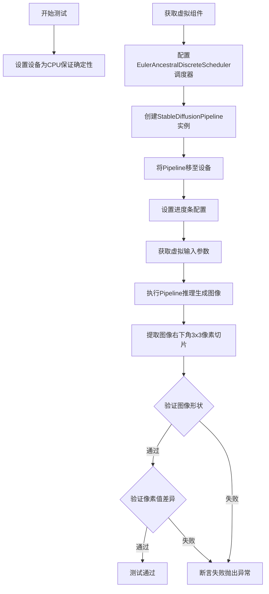

#### 带注释源码

```python
def test_stable_diffusion_k_euler_ancestral(self):
    """
    测试 Stable Diffusion 2 Pipeline 使用 Euler Ancestral 调度器的推理功能
    该测试验证 EulerAncestralDiscreteScheduler 能正确生成图像
    """
    # 设置设备为 CPU 以确保确定性测试结果
    # 原因：torch.Generator 在不同设备上可能有不同的随机行为
    device = "cpu"  # ensure determinism for the device-dependent torch.Generator
    
    # 获取预定义的虚拟组件（UNet、VAE、TextEncoder等）
    # 这些组件使用小规模配置用于快速测试
    components = self.get_dummy_components()
    
    # 将默认的 DDIMScheduler 替换为 EulerAncestralDiscreteScheduler
    # Euler Ancestral 调度器是一种高效的离散采样方法
    # from_config 从原调度器配置创建新调度器，保持相关参数一致
    components["scheduler"] = EulerAncestralDiscreteScheduler.from_config(components["scheduler"].config)
    
    # 使用替换后的组件创建 Stable Diffusion Pipeline
    sd_pipe = StableDiffusionPipeline(**components)
    
    # 将 Pipeline 移至指定设备（CPU）
    sd_pipe = sd_pipe.to(device)
    
    # 配置进度条：disable=None 表示不禁用进度条
    sd_pipe.set_progress_bar_config(disable=None)
    
    # 获取测试输入参数：包含提示词、生成器、推理步数等
    inputs = self.get_dummy_inputs(device)
    
    # 执行推理：传入输入参数，获取生成的图像
    # 返回值包含 images 属性，存储生成的图像数组
    image = sd_pipe(**inputs).images
    
    # 提取图像右下角 3x3 像素区域用于验证
    # 图像格式为 [batch, height, width, channels]
    image_slice = image[0, -3:, -3:, -1]
    
    # 断言验证生成的图像形状为 (1, 64, 64, 3)
    # 1=批次大小, 64=高度, 64=宽度, 3=RGB通道
    assert image.shape == (1, 64, 64, 3)
    
    # 定义预期的像素值切片（9个像素值）
    # 这些值是在确定性条件下使用相同配置和种子生成的参考值
    expected_slice = np.array([0.4864, 0.5440, 0.4842, 0.4994, 0.5543, 0.4846, 0.5196, 0.4942, 0.5063])
    
    # 断言验证生成图像与预期值的最大差异小于阈值 1e-2 (0.01)
    # 使用 flatten() 将 3x3 数组展平为 1D 数组进行比对
    assert np.abs(image_slice.flatten() - expected_slice).max() < 1e-2
```


### `StableDiffusion2PipelineFastTests.test_stable_diffusion_k_euler`

该测试方法用于验证 Euler Discrete Scheduler（欧拉离散调度器）在 Stable Diffusion 2 Pipeline 中的正确性，通过创建虚拟组件、执行图像生成流程，并比对生成图像的像素值与预期值来确保调度器工作正常。

参数：

- `self`：测试类实例，无需显式传递

返回值：`None`，该方法为测试用例，通过断言验证功能，不返回实际数据

#### 流程图

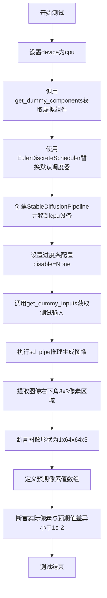

#### 带注释源码

```python
def test_stable_diffusion_k_euler(self):
    """
    测试 Euler Discrete Scheduler 在 Stable Diffusion 2 Pipeline 中的功能
    该调度器是一种基于欧拉方法的离散调度器，用于扩散模型的噪声调度
    """
    # 设置设备为 CPU，确保 torch.Generator 的确定性
    device = "cpu"
    
    # 获取虚拟组件（UNet、VAE、Text Encoder、Tokenizer 等）
    # 这些组件使用小规模配置以加速测试
    components = self.get_dummy_components()
    
    # 关键步骤：将默认的 DDIMScheduler 替换为 EulerDiscreteScheduler
    # EulerDiscreteScheduler.from_config() 从现有调度器配置创建新调度器
    components["scheduler"] = EulerDiscreteScheduler.from_config(components["scheduler"].config)
    
    # 使用虚拟组件创建 Stable Diffusion Pipeline
    sd_pipe = StableDiffusionPipeline(**components)
    
    # 将 Pipeline 移到指定设备（CPU）
    sd_pipe = sd_pipe.to(device)
    
    # 配置进度条，disable=None 表示不禁用进度条
    sd_pipe.set_progress_bar_config(disable=None)
    
    # 获取测试输入：包含 prompt、generator、num_inference_steps 等
    inputs = self.get_dummy_inputs(device)
    
    # 执行推理生成图像
    # 返回的 images 形状为 (batch_size, height, width, channels)
    image = sd_pipe(**inputs).images
    
    # 提取图像右下角 3x3 区域的像素值用于验证
    # image[0, -3:, -3:, -1] 取第一个样本的最后3行、最后3列、最后一个通道
    image_slice = image[0, -3:, -3:, -1]
    
    # 断言验证图像形状是否为 (1, 64, 64, 3)
    # 即 batch=1, height=64, width=64, channels=3(RGB)
    assert image.shape == (1, 64, 64, 3)
    
    # 定义预期像素值数组（Euler 调度器的预期输出）
    # 这些值通过预先运行测试并记录得到
    expected_slice = np.array([0.4865, 0.5439, 0.4840, 0.4995, 0.5543, 0.4846, 0.5199, 0.4942, 0.5061])
    
    # 断言实际像素值与预期值的最大差异小于 1e-2
    # 使用 np.abs 计算绝对值差异，.max() 取最大值
    assert np.abs(image_slice.flatten() - expected_slice).max() < 1e-2
```


### `StableDiffusion2PipelineFastTests.test_stable_diffusion_unflawed`

该测试方法验证 Stable Diffusion 2 pipeline 在使用 "trailing" 时间步间距配置和 guidance_rescale 参数时的无缺陷配置，通过比较生成的图像像素值与预期值来确保管道工作的正确性。

参数：
- `self`：`StableDiffusion2PipelineFastTests` 实例，测试类实例本身

返回值：`None`，该方法为测试函数，使用 `assert` 语句进行断言验证，不返回任何值

#### 流程图

```mermaid
flowchart TD
    A[开始测试] --> B[设置设备为CPU确保确定性]
    B --> C[调用get_dummy_components获取虚拟组件]
    C --> D[从调度器配置创建DDIMScheduler<br/>设置timestep_spacing为trailing]
    D --> E[创建StableDiffusionPipeline实例]
    E --> F[将pipeline移到设备]
    F --> G[设置进度条配置disable=None]
    G --> H[调用get_dummy_inputs获取输入参数]
    H --> I[设置guidance_rescale=0.7<br/>num_inference_steps=10]
    I --> J[调用pipeline生成图像sd_pipe\*\*inputs]
    J --> K[提取图像切片image[0, -3:, -3:, -1]]
    K --> L[断言image.shape == (1, 64, 64, 3)]
    L --> M[定义预期像素值expected_slice]
    M --> N[断言像素差异小于1e-2]
    N --> O[测试结束]
```

#### 带注释源码

```python
def test_stable_diffusion_unflawed(self):
    # 设置设备为 CPU，确保设备依赖的 torch.Generator 的确定性
    device = "cpu"  # ensure determinism for the device-dependent torch.Generator
    
    # 获取预定义的虚拟组件（UNet、VAE、文本编码器、调度器等）
    components = self.get_dummy_components()
    
    # 从已有调度器配置创建新的 DDIMScheduler，设置 timestep_spacing 为 "trailing"
    # trailing 模式是一种时间步间距策略，影响扩散过程的采样方式
    components["scheduler"] = DDIMScheduler.from_config(
        components["scheduler"].config, timestep_spacing="trailing"
    )
    
    # 使用虚拟组件实例化 StableDiffusionPipeline
    sd_pipe = StableDiffusionPipeline(**components)
    
    # 将 pipeline 移到指定设备（CPU）
    sd_pipe = sd_pipe.to(device)
    
    # 配置进度条，disable=None 表示不禁用进度条
    sd_pipe.set_progress_bar_config(disable=None)

    # 获取虚拟输入参数（包含 prompt、generator、num_inference_steps 等）
    inputs = self.get_dummy_inputs(device)
    
    # 设置 guidance_rescale 参数，用于调整分类器自由引导的强度
    # 这个参数有助于改善图像质量，减少过度饱和
    inputs["guidance_rescale"] = 0.7
    
    # 增加推理步骤数，从默认的 2 步增加到 10 步
    inputs["num_inference_steps"] = 10
    
    # 执行图像生成管道，**inputs 将字典解包为关键字参数
    image = sd_pipe(**inputs).images
    
    # 提取图像右下角 3x3 像素区域，用于后续的数值验证
    # image shape: (1, 64, 64, 3) -> (batch, height, width, channels)
    image_slice = image[0, -3:, -3:, -1]

    # 断言验证生成的图像形状是否符合预期
    assert image.shape == (1, 64, 64, 3)
    
    # 定义预期的像素值数组（9个值，对应 3x3 区域）
    expected_slice = np.array([0.4736, 0.5405, 0.4705, 0.4955, 0.5675, 0.4812, 0.5310, 0.4967, 0.5064])

    # 断言验证生成图像与预期图像的最大差异是否在可接受范围内
    # 使用 np.abs 计算绝对值差异，.max() 获取最大差异
    assert np.abs(image_slice.flatten() - expected_slice).max() < 1e-2
```


### `StableDiffusion2PipelineFastTests.test_stable_diffusion_long_prompt`

该测试方法验证了 StableDiffusionPipeline 在处理长提示词时的文本编码能力，特别是当提示词超过模型最大 token 长度（77 个 token）时的截断行为和日志输出是否符合预期。

参数：

- `self`：隐式参数，测试类实例本身

返回值：无（`None`），该方法为单元测试方法，通过断言验证结果而非返回值

#### 流程图

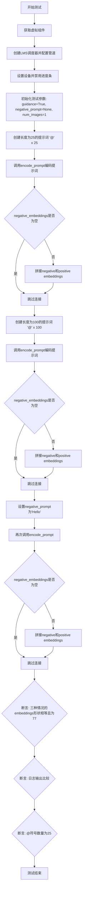

#### 带注释源码

```python
def test_stable_diffusion_long_prompt(self):
    """
    测试长提示词处理能力
    验证当提示词超过77个token时，encode_prompt的截断行为和日志输出
    """
    # 1. 获取虚拟组件（UNet、VAE、TextEncoder、Tokenizer等）
    components = self.get_dummy_components()
    
    # 2. 使用LMS调度器替换默认调度器
    components["scheduler"] = LMSDiscreteScheduler.from_config(components["scheduler"].config)
    
    # 3. 创建StableDiffusionPipeline并移动到指定设备
    sd_pipe = StableDiffusionPipeline(**components)
    sd_pipe = sd_pipe.to(torch_device)
    sd_pipe.set_progress_bar_config(disable=None)

    # 4. 设置测试参数
    do_classifier_free_guidance = True  # 启用无分类器指导
    negative_prompt = None              # 初始无负面提示词
    num_images_per_prompt = 1           # 每次生成1张图
    
    # 5. 获取专用日志记录器用于捕获日志输出
    logger = logging.get_logger("diffusers.pipelines.stable_diffusion.pipeline_stable_diffusion")
    logger.setLevel(logging.WARNING)  # 只记录WARNING级别及以上的日志

    # 6. 测试场景1：25个@字符（会被截断到77 tokens以内）
    prompt = 25 * "@"
    with CaptureLogger(logger) as cap_logger_3:
        # encode_prompt将文本编码为embeddings
        text_embeddings_3, negeative_text_embeddings_3 = sd_pipe.encode_prompt(
            prompt, torch_device, num_images_per_prompt, do_classifier_free_guidance, negative_prompt
        )
        # 如果存在negative embeddings则拼接
        if negeative_text_embeddings_3 is not None:
            text_embeddings_3 = torch.cat([negeative_text_embeddings_3, text_embeddings_3])

    # 7. 测试场景2：100个@字符（超过77 tokens会被截断）
    prompt = 100 * "@"
    with CaptureLogger(logger) as cap_logger:
        text_embeddings, negative_embeddings = sd_pipe.encode_prompt(
            prompt, torch_device, num_images_per_prompt, do_classifier_free_guidance, negative_prompt
        )
        if negative_embeddings is not None:
            text_embeddings = torch.cat([negative_embeddings, text_embeddings])

    # 8. 测试场景3：100个@字符 + 明确的negative_prompt
    negative_prompt = "Hello"
    with CaptureLogger(logger) as cap_logger_2:
        text_embeddings_2, negative_text_embeddings_2 = sd_pipe.encode_prompt(
            prompt, torch_device, num_images_per_prompt, do_classifier_free_guidance, negative_prompt
        )
        if negative_text_embeddings_2 is not None:
            text_embeddings_2 = torch.cat([negative_text_embeddings_2, text_embeddings_2])

    # 9. 验证断言
    # 验证三种情况生成的embeddings形状一致，且第二维为77（最大token长度）
    assert text_embeddings_3.shape == text_embeddings_2.shape == text_embeddings.shape
    assert text_embeddings.shape[1] == 77

    # 验证日志输出：有无negative_prompt应该产生相同的警告信息
    assert cap_logger.out == cap_logger_2.out
    
    # 验证截断逻辑：100 - 77 + 1(BOS) + 1(EOS) = 25个@被截断
    assert cap_logger.out.count("@") == 25
    
    # 验证25个@不会触发截断警告（日志为空）
    assert cap_logger_3.out == ""
```


### `StableDiffusion2PipelineFastTests.test_attention_slicing_forward_pass`

该测试方法用于验证 Stable Diffusion 2 管道中注意力切片（Attention Slicing）功能的前向传播正确性。它通过调用父类的测试方法，期望启用注意力切片后的输出与标准前向传播的输出之间的最大差异不超过 3e-3，以确保功能正确性同时兼顾内存优化效果。

参数：
- `self`：实例方法隐式参数，表示测试类实例本身，无需显式传递

返回值：`None`，测试方法通过断言验证，不返回具体数值

#### 流程图

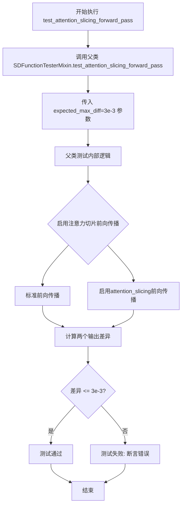

#### 带注释源码

```python
def test_attention_slicing_forward_pass(self):
    """
    测试注意力切片前向传播功能
    
    该测试方法继承自父类 SDFunctionTesterMixin 的同名方法，
    用于验证 Stable Diffusion 管道中注意力切片优化是否正确工作。
    注意力切片是一种内存优化技术，通过将注意力计算分片处理来减少显存占用。
    
    测试逻辑：
    1. 执行标准的完整注意力计算前向传播
    2. 启用注意力切片后执行前向传播
    3. 比较两种方式的输出差异，确保差异在允许范围内
    
    参数:
        self: 测试类实例，隐式传入
        expected_max_diff: 允许的最大差异值，此处传入 3e-3
    
    返回值:
        None: 测试通过时无返回值，失败时抛出 AssertionError
    """
    # 调用父类的测试方法，验证注意力切片功能
    # expected_max_diff=3e-3 表示期望两种方式的输出差异不超过 0.003
    super().test_attention_slicing_forward_pass(expected_max_diff=3e-3)
```


### `StableDiffusion2PipelineFastTests.test_inference_batch_single_identical`

该测试方法用于验证 Stable Diffusion 2 管道在批量推理（batch inference）与单次推理（single inference）模式下产生一致的图像结果，确保两种推理方式的数值差异在允许范围内（`expected_max_diff=3e-3`）。

参数：

- `self`：隐含的测试类实例参数，无需显式传递

返回值：`None`，测试方法无返回值，通过断言验证推理一致性

#### 流程图

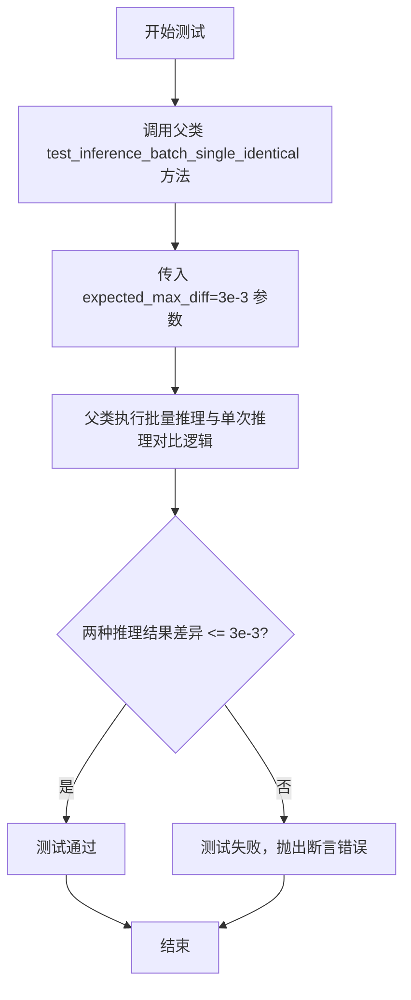

#### 带注释源码

```python
def test_inference_batch_single_identical(self):
    """
    测试批量推理与单次推理的一致性。
    
    该测试方法继承自 SDFunctionTesterMixin 父类，用于验证：
    1. 当使用批量提示词（batch prompts）推理时，生成的图像
    2. 与分别使用单个提示词（single prompts）推理生成的对应图像
    3. 在数值上保持一致（允许一定的浮点误差）
    
    预期最大差异阈值: 3e-3 (0.003)
    """
    # 调用父类 SDFunctionTesterMixin 的测试方法
    # expected_max_diff=3e-3 指定了批量与单次推理结果之间的
    # 最大允许余弦相似度距离（数值差异）
    super().test_inference_batch_single_identical(expected_max_diff=3e-3)
```


### `StableDiffusion2PipelineFastTests.test_encode_prompt_works_in_isolation`

该方法用于测试 Stable Diffusion 2 Pipeline 的提示词编码（encode_prompt）功能是否能够在隔离环境中正常工作。它通过构造额外的参数字典（设备类型和分类器自由引导标志）来调用父类的测试方法，以验证文本编码器能够正确处理提示词并且结果与完整pipeline解耦。

参数：

- `self`：`StableDiffusion2PipelineFastTests` 实例，测试类本身
- `extra_required_param_value_dict`：可选的字典参数，传递给父类测试方法，包含 `device`（设备类型字符串，如 "cuda" 或 "cpu"）和 `do_classifier_free_guidance`（布尔值，指示是否启用无分类器引导）

返回值：`any`，返回父类 `SDFunctionTesterMixin.test_encode_prompt_works_in_isolation` 方法的执行结果，通常是测试断言或 None

#### 流程图

```mermaid
flowchart TD
    A[开始 test_encode_prompt_works_in_isolation] --> B[获取 torch_device 类型]
    B --> C[构造 extra_required_param_value_dict]
    C --> D[获取 device: torch.device(torch_device).type]
    E[获取 dummy_inputs] --> F[判断 guidance_scale > 1.0]
    F --> G[设置 do_classifier_free_guidance]
    D --> H[合并参数到 extra_required_param_value_dict]
    G --> H
    H --> I[调用父类方法 super().test_encode_prompt_works_in_isolation]
    I --> J[返回父类测试结果]
    J --> K[结束]
```

#### 带注释源码

```python
def test_encode_prompt_works_in_isolation(self):
    """
    测试提示词编码在隔离环境中是否正常工作。
    该测试验证 encode_prompt 方法能够独立于完整 pipeline 运行，
    确保文本编码器能够正确处理提示词并返回预期的嵌入向量。
    """
    # 构造需要传递给父类测试方法的额外参数字典
    extra_required_param_value_dict = {
        # 获取当前测试设备的类型（如 'cuda' 或 'cpu'）
        "device": torch.device(torch_device).type,
        # 根据虚拟输入的引导比例判断是否启用无分类器引导
        # 如果 guidance_scale > 1.0，则 do_classifier_free_guidance 为 True
        "do_classifier_free_guidance": self.get_dummy_inputs(device=torch_device).get("guidance_scale", 1.0) > 1.0,
    }
    # 调用父类 SDFunctionTesterMixin 中的测试方法
    # 传递额外参数以覆盖默认配置
    return super().test_encode_prompt_works_in_isolation(extra_required_param_value_dict)
```


### `StableDiffusion2PipelineSlowTests.tearDown`

该方法是一个测试清理方法，用于在每个测试方法执行完毕后清理测试环境，通过调用父类清理方法、强制Python垃圾回收以及清空GPU缓存来确保测试资源被正确释放，防止测试间的内存泄漏。

参数：

- `self`：隐式参数，`StableDiffusion2PipelineSlowTests` 类实例，当前测试对象本身

返回值：`None`，无返回值（方法执行完成后直接结束）

#### 流程图

```mermaid
flowchart TD
    A[tearDown 开始] --> B[调用 super().tearDown]
    B --> C[执行 gc.collect]
    C --> D[调用 backend_empty_cache]
    D --> E[tearDown 结束]
    
    B -.-> F[执行父类 unittest.TestCase 的清理逻辑]
    C -.-> G[强制Python垃圾回收器运行<br/>回收无法访问的Python对象]
    D -.-> H[清空GPU内存缓存<br/>使用 torch_device 指定的设备]
```

#### 带注释源码

```python
def tearDown(self):
    """
    清理测试环境的方法，在每个测试方法执行完毕后被调用。
    确保释放GPU内存和清理Python对象，防止测试间的内存泄漏。
    """
    # 调用父类 unittest.TestCase 的 tearDown 方法
    # 执行标准的 unittest 清理逻辑
    super().tearDown()
    
    # 强制调用 Python 的垃圾回收器
    # 清理测试过程中创建的无法访问的对象，释放内存
    gc.collect()
    
    # 清空 GPU 显存缓存
    # torch_device 是从 testing_utils 导入的全局变量
    # 表示测试所使用的设备（如 'cuda', 'cuda:0', 'cpu', 'mps' 等）
    # 该函数会释放 GPU 显存中缓存的数据
    backend_empty_cache(torch_device)
```

---

### 补充信息

#### 全局变量/函数依赖

| 名称 | 类型 | 描述 |
|------|------|------|
| `torch_device` | 全局变量 | 从 `testing_utils` 导入，表示当前测试使用的计算设备（通常为 `'cuda'` 或 `'cpu'`） |
| `gc.collect` | 全局函数 | Python 内置的垃圾回收函数，强制执行垃圾回收以释放内存 |
| `backend_empty_cache` | 全局函数 | 从 `testing_utils` 导入的后端特定函数，用于清空 GPU 显存缓存 |

#### 技术债务与优化空间

1. **重复代码**：该类的 `tearDown` 方法与 `StableDiffusion2PipelineNightlyTests` 类中的 `tearDown` 方法实现完全相同，可考虑提取到测试基类中以减少代码重复。

2. **异常处理缺失**：当前实现未对 `gc.collect()` 或 `backend_empty_cache()` 可能抛出的异常进行处理，若清理过程中出现错误可能导致测试框架本身崩溃。

3. **资源清理粒度**：当前仅清理全局 GPU 缓存，未针对测试中创建的特定模型或管道进行针对性清理（如显式删除 `pipe` 变量），可能存在隐藏的内存泄漏风险。

#### 外部依赖与接口契约

- **依赖单元测试框架**：`unittest.TestCase`，通过 `super().tearDown()` 调用确保与框架的兼容性
- **依赖 PyTorch 生态**：`gc` 模块用于 Python 内存管理，`torch` 设备管理通过 `backend_empty_cache` 抽象
- **测试隔离保证**：每次测试执行后都会调用此方法，确保不同测试用例间的环境隔离


### `StableDiffusion2PipelineSlowTests.get_inputs`

该方法用于生成 Stable Diffusion 2 模型的测试输入参数，创建一个包含提示词、潜在向量、生成器、推理步数、引导系数和输出类型的字典，用于后续的 pipeline 调用。

参数：

- `device`：`torch.device` 或 `str`，执行推理的目标设备（如 "cuda"、"cpu"、"mps"）
- `generator_device`：`str`，默认值 `"cpu"`，随机生成器所在的设备，如果设备以 "cuda" 开头则使用 "cuda"
- `dtype`：`torch.dtype`，默认值 `torch.float32`，潜在向量的数据类型
- `seed`：`int`，默认值 `0`，随机种子，用于确保测试的可重复性

返回值：`dict`，包含以下键值对：
- `"prompt"`：`str`，提示词文本 "a photograph of an astronaut riding a horse"
- `"latents"`：`torch.Tensor`，形状为 (1, 4, 64, 64) 的潜在向量，由随机种子生成
- `"generator"`：`torch.Generator`，随机数生成器，用于确保扩散过程的可确定性
- `"num_inference_steps"`：`int`，推理步数，此处为 3
- `"guidance_scale"`：`float`，分类器自由引导系数，此处为 7.5
- `"output_type"`：`str`，输出类型，此处为 "np"（NumPy 数组）

#### 流程图

```mermaid
flowchart TD
    A[开始 get_inputs] --> B{device 是否为 mps}
    B -->|是| C[使用 torch.manual_seed]
    B -->|否| D[确定 generator_device]
    D --> E[创建 torch.Generator 并设置种子]
    C --> F[使用 numpy 生成随机潜在向量]
    F --> G[转换为 torch.Tensor]
    G --> H[移动到目标设备并指定 dtype]
    H --> I[构建输入字典]
    I --> J[返回 inputs 字典]
```

#### 带注释源码

```python
def get_inputs(self, device, generator_device="cpu", dtype=torch.float32, seed=0):
    """
    获取 Stable Diffusion 2 pipeline 的测试输入参数
    
    参数:
        device: 目标设备 (cuda/cpu/mps)
        generator_device: 生成器设备，默认 "cpu"
        dtype: 数据类型，默认 torch.float32
        seed: 随机种子，默认 0
    
    返回:
        dict: 包含 pipeline 输入参数的字典
    """
    # 判断是否为 MPS (Apple Silicon) 设备
    if not str(device).startswith("mps"):
        # 非 MPS 设备：根据 generator_device 创建生成器
        # 如果 device 以 "cuda" 开头，则使用 "cuda" 作为生成器设备
        generator = torch.Generator(device=generator_device).manual_seed(seed)
    else:
        # MPS 设备：使用 CPU 生成器（兼容性考虑）
        generator = torch.manual_seed(seed)

    # 使用 NumPy 生成确定性的随机潜在向量
    # 形状: (1, 4, 64, 64) - 符合 Stable Diffusion 2 的潜在空间维度
    latents = np.random.RandomState(seed).standard_normal((1, 4, 64, 64))
    
    # 转换为 PyTorch 张量并移动到目标设备
    latents = torch.from_numpy(latents).to(device=device, dtype=dtype)
    
    # 构建完整的输入参数字典
    inputs = {
        "prompt": "a photograph of an astronaut riding a horse",  # 测试用提示词
        "latents": latents,               # 预生成的潜在向量
        "generator": generator,          # 确定性随机生成器
        "num_inference_steps": 3,        # 推理步数（较少用于快速测试）
        "guidance_scale": 7.5,           # CFG 引导强度
        "output_type": "np",             # 输出为 NumPy 数组
    }
    return inputs
```


### `StableDiffusion2PipelineSlowTests.test_stable_diffusion_default_ddim`

该测试方法用于验证 Stable Diffusion 2 模型在使用默认 DDIM 调度器时的图像生成功能是否正常。测试通过加载预训练模型、传入指定提示词和潜在向量、执行推理过程，最后验证生成图像的尺寸和像素值是否符合预期。

参数：

- `self`：测试类实例本身，无需显式传递

返回值：`None`，该方法为单元测试方法，通过断言验证图像生成结果的正确性

#### 流程图

```mermaid
flowchart TD
    A[开始测试] --> B[加载预训练模型 StableDiffusionPipeline]
    B --> C[将模型移动到 torch_device]
    C --> D[设置进度条配置为不禁用]
    D --> E[调用 get_inputs 获取输入参数]
    E --> F[执行管道推理: pipe(**inputs)]
    F --> G[获取生成的图像]
    G --> H[提取图像切片: image[0, -3:, -3:, -1]]
    H --> I[断言图像形状为 (1, 512, 512, 3)]
    I --> J[定义期望的像素值数组]
    J --> K[断言生成图像与期望值的最大差异 < 7e-3]
    K --> L[测试结束]
```

#### 带注释源码

```python
def test_stable_diffusion_default_ddim(self):
    """
    测试 Stable Diffusion 2 使用默认 DDIM 调度器的图像生成功能
    
    该测试执行以下步骤:
    1. 从预训练模型加载 StableDiffusionPipeline
    2. 将模型移动到测试设备 (torch_device)
    3. 配置进度条显示
    4. 准备输入参数 (提示词、潜在向量、生成器等)
    5. 执行图像生成推理
    6. 验证生成图像的尺寸和像素值
    """
    # 步骤1: 从预训练模型加载 Stable Diffusion 2 Base 模型
    # 模型来源: stabilityai/stable-diffusion-2-base
    pipe = StableDiffusionPipeline.from_pretrained("stabilityai/stable-diffusion-2-base")
    
    # 步骤2: 将模型移动到测试设备 (CPU/CUDA/MPS)
    pipe.to(torch_device)
    
    # 步骤3: 设置进度条配置，disable=None 表示不禁用进度条
    pipe.set_progress_bar_config(disable=None)
    
    # 步骤4: 获取测试输入参数
    # 输入包含:
    #   - prompt: 提示词 "a photograph of an astronaut riding a horse"
    #   - latents: 预生成的潜在向量 (1, 4, 64, 64)
    #   - generator: 随机数生成器 (确保可复现性)
    #   - num_inference_steps: 推理步数 (3步)
    #   - guidance_scale: 引导比例 (7.5)
    #   - output_type: 输出类型 ("np" 表示 numpy 数组)
    inputs = self.get_inputs(torch_device)
    
    # 步骤5: 执行管道推理，生成图像
    # **inputs 将字典解包为关键字参数传递给管道
    image = pipe(**inputs).images
    
    # 步骤6: 提取图像右下角 3x3 区域用于验证
    # image[0]: 取第一张图像 (batch size 为 1)
    # image[-3:, -3:, -1]: 取最后3行、最后3列、最后一个通道 (RGB的A通道或直接是RGB)
    image_slice = image[0, -3:, -3:, -1].flatten()
    
    # 断言1: 验证生成的图像尺寸正确
    # 期望尺寸: (1, 512, 512, 3) -> (batch=1, height=512, width=512, channels=3)
    assert image.shape == (1, 512, 512, 3)
    
    # 步骤7: 定义期望的像素值数组 (用于比对)
    # 这是一个已知的正确输出，用于回归测试
    expected_slice = np.array([
        0.49493, 0.47896, 0.40798,  # 第一行像素值
        0.54214, 0.53212, 0.48202,  # 第二行像素值
        0.47656, 0.46329, 0.48506   # 第三行像素值
    ])
    
    # 断言2: 验证生成图像与期望值的差异在可接受范围内
    # np.abs(image_slice - expected_slice).max() 计算最大绝对误差
    # 允许的最大误差为 7e-3 (0.007)
    assert np.abs(image_slice - expected_slice).max() < 7e-3
```

---

### 关联方法: `StableDiffusion2PipelineSlowTests.get_inputs`

该方法为测试准备输入参数字典

参数：

- `self`：测试类实例本身
- `device`：`torch.device` 或 str，目标设备
- `generator_device`：`str`，生成器设备，默认为 `"cpu"`
- `dtype`：`torch.dtype`，数据类型，默认为 `torch.float32`
- `seed`：`int`，随机种子，默认为 `0`

返回值：`dict`，包含以下键值对：
- `prompt`：str，文本提示词
- `latents`：torch.Tensor，潜在向量
- `generator`：torch.Generator，随机数生成器
- `num_inference_steps`：int，推理步数
- `guidance_scale`：float，引导比例
- `output_type`：str，输出类型

#### 带注释源码

```python
def get_inputs(self, device, generator_device="cpu", dtype=torch.float32, seed=0):
    """
    准备 Stable Diffusion 管道推理所需的输入参数
    
    参数:
        device: 模型运行设备 (如 'cuda', 'cpu', 'mps')
        generator_device: 随机生成器设备，默认为 'cpu'
        dtype: 张量数据类型，默认为 torch.float32
        seed: 随机种子，用于生成可复现的潜在向量
    
    返回:
        包含推理所需参数的字典
    """
    # 根据设备类型创建随机数生成器
    # MPS (Apple Silicon) 使用不同的随机数生成方式
    if not str(device).startswith("mps"):
        # CUDA/CPU 设备使用 torch.Generator
        generator = torch.Generator(device=generator_device).manual_seed(seed)
    else:
        # MPS 设备使用 torch.manual_seed
        generator = torch.manual_seed(seed)
    
    # 使用 NumPy 生成标准正态分布的随机潜在向量
    # 形状: (1, 4, 64, 64)
    #   - 1: batch size
    #   - 4: latent channels (VAE latent space 维度)
    #   - 64: latent 空间的高度 (对应生成图像的 512/8 = 64)
    #   - 64: latent 空间的宽度
    latents = np.random.RandomState(seed).standard_normal((1, 4, 64, 64))
    
    # 将 NumPy 数组转换为 PyTorch 张量，并移动到指定设备
    latents = torch.from_numpy(latents).to(device=device, dtype=dtype)
    
    # 构建并返回输入参数字典
    inputs = {
        "prompt": "a photograph of an astronaut riding a horse",  # 文本提示词
        "latents": latents,                                        # 预生成 latent
        "generator": generator,                                    # 随机生成器
        "num_inference_steps": 3,                                  # 推理步数
        "guidance_scale": 7.5,                                      # CFG 引导比例
        "output_type": "np",                                       # 输出为 numpy 数组
    }
    return inputs
```


### `StableDiffusion2PipelineSlowTests.test_stable_diffusion_attention_slicing`

该测试方法用于验证 Stable Diffusion 2 pipeline 中注意力切片（Attention Slicing）功能的内存优化效果。通过对比启用和禁用注意力切片时的显存占用，验证该技术能够显著降低推理过程中的内存消耗。

参数：无（仅包含 `self` 隐式参数）

返回值：无（使用 `assert` 语句进行断言验证）

#### 流程图

```mermaid
flowchart TD
    A[开始测试] --> B[重置峰值内存统计]
    B --> C[加载 StableDiffusionPipeline 模型]
    C --> D[设置 UNet 默认注意力处理器]
    D --> E[将 Pipeline 移到目标设备]
    E --> F[启用注意力切片]
    F --> G[使用启用切片的方式运行推理]
    G --> H[获取内存占用并验证 < 3.3GB]
    H --> I[禁用注意力切片]
    I --> J[重置注意力处理器]
    J --> K[使用禁用切片的方式运行推理]
    K --> L[获取内存占用并验证 > 3.3GB]
    L --> M[计算两图像相似度并验证 < 5e-3]
    M --> N[测试结束]
```

#### 带注释源码

```python
@require_torch_accelerator  # 仅在有 GPU 加速器时运行
def test_stable_diffusion_attention_slicing(self):
    # 重置峰值内存统计，以便准确测量本次测试的内存使用
    backend_reset_peak_memory_stats(torch_device)
    
    # 从预训练模型加载 Stable Diffusion 2 Base 模型
    # 使用 float16 精度以减少内存占用
    pipe = StableDiffusionPipeline.from_pretrained(
        "stabilityai/stable-diffusion-2-base", 
        torch_dtype=torch.float16
    )
    
    # 设置 UNet 的默认注意力处理器
    pipe.unet.set_default_attn_processor()
    
    # 将 Pipeline 移动到目标计算设备（GPU）
    pipe = pipe.to(torch_device)
    
    # 配置进度条（disable=None 表示不禁用进度条）
    pipe.set_progress_bar_config(disable=None)

    # ========== 测试启用注意力切片的情况 ==========
    # 启用注意力切片功能，将注意力计算分块处理以节省显存
    pipe.enable_attention_slicing()
    
    # 准备输入参数（使用 float16）
    inputs = self.get_inputs(torch_device, dtype=torch.float16)
    
    # 执行推理生成图像
    image_sliced = pipe(**inputs).images

    # 获取推理过程中的最大内存占用（字节）
    mem_bytes = backend_max_memory_allocated(torch_device)
    
    # 重置内存统计，为下一次测量做准备
    backend_reset_peak_memory_stats(torch_device)
    
    # 断言：启用注意力切片后，内存占用应小于 3.3 GB
    # 这是为了验证注意力切片确实能有效降低显存使用
    assert mem_bytes < 3.3 * 10**9

    # ========== 测试禁用注意力切片的情况 ==========
    # 禁用注意力切片
    pipe.disable_attention_slicing()
    
    # 重新设置默认注意力处理器
    pipe.unet.set_default_attn_processor()
    
    # 准备输入参数
    inputs = self.get_inputs(torch_device, dtype=torch.float16)
    
    # 执行推理生成图像
    image = pipe(**inputs).images

    # 获取内存占用
    mem_bytes = backend_max_memory_allocated(torch_device)
    
    # 断言：禁用注意力切片后，内存占用应大于 3.3 GB
    # 这验证了注意力切片的内存优化效果
    assert mem_bytes > 3.3 * 10**9
    
    # ========== 验证结果质量 ==========
    # 计算两张图像之间的余弦相似度距离
    max_diff = numpy_cosine_similarity_distance(image.flatten(), image_sliced.flatten())
    
    # 断言：两张图像的差异应小于 5e-3
    # 确保启用注意力切片不会显著影响输出质量
    assert max_diff < 5e-3
```


### `StableDiffusion2PipelineNightlyTests.tearDown`

该方法用于清理 Stable Diffusion 2 Pipeline 夜间测试环境，通过调用父类的 tearDown 方法、执行 Python 垃圾回收以及清理 GPU 缓存来释放测试过程中占用的资源，防止测试间的内存泄漏。

参数：

- `self`：`StableDiffusion2PipelineNightlyTests`，测试类实例，表示当前测试对象

返回值：`None`，无返回值，仅执行清理操作

#### 流程图

```mermaid
flowchart TD
    A[开始 tearDown] --> B[调用 super().tearDown]
    B --> C[执行 gc.collect 垃圾回收]
    C --> D[调用 backend_empty_cache 清理GPU缓存]
    D --> E[结束 tearDown]
```

#### 带注释源码

```python
def tearDown(self):
    """
    清理测试环境，释放GPU内存资源
    
    该方法在每个测试用例执行完毕后被调用，用于：
    1. 调用父类的 tearDown 方法完成基础清理
    2. 执行 Python 垃圾回收，释放 Python 对象内存
    3. 调用后端工具函数清理 GPU 缓存，释放显存
    """
    # 调用父类的 tearDown 方法，执行 unittest.TestCase 的标准清理
    super().tearDown()
    
    # 手动触发 Python 垃圾回收器，回收测试过程中创建的 Python 对象
    gc.collect()
    
    # 调用后端工具函数清理 GPU 内存缓存，释放 CUDA 显存
    # torch_device 是从 testing_utils 导入的全局变量，表示当前测试使用的设备
    backend_empty_cache(torch_device)
```


### `StableDiffusion2PipelineNightlyTests.get_inputs`

该方法用于为 Stable Diffusion 2 管道生成真实的模型输入参数，封装了提示词、潜在向量、随机生成器、推理步数、引导系数和输出类型等关键信息，支持在不同设备（CUDA、CPU、MPS）上的兼容性处理。

参数：

- `device`：`torch.device` 或 `str`，运行管道的目标设备（如 "cuda"、"cpu"、"mps"）
- `generator_device`：`str`，随机生成器所在的设备，默认为 "cpu"
- `dtype`：`torch.dtype`，潜在向量的数据类型，默认为 `torch.float32`
- `seed`：`int`，随机种子用于生成可复现的结果，默认为 0

返回值：`dict`，包含以下键值对：
- `"prompt"`：`str`，文本提示词
- `"latents"`：`torch.Tensor`，预生成的潜在向量
- `"generator"`：`torch.Generator`，随机数生成器
- `"num_inference_steps"`：`int`，推理步数
- `"guidance_scale"`：`float`，引导系数
- `"output_type"`：`str`，输出类型（"np" 表示 numpy 数组）

#### 流程图

```mermaid
flowchart TD
    A[开始 get_inputs] --> B{判断 device 是否为 mps}
    B -->|是| C[使用 torch.manual_seed]
    B -->|否| D[确定 generator_device<br/>如果 generator_device 不以 cuda 开头则为 cpu 否则为 cuda]
    D --> E[创建 torch.Generator 并设置 manual_seed]
    C --> F[使用 numpy.random.RandomState 生成标准正态分布 latent]
    F --> G[将 latent 转换为 torch.Tensor 并移动到指定 device 和 dtype]
    H[构建输入字典 inputs<br/>包含 prompt/latents/generator/num_inference_steps/guidance_scale/output_type]
    G --> H
    I[返回 inputs 字典]
    H --> I
```

#### 带注释源码

```python
def get_inputs(self, device, generator_device="cpu", dtype=torch.float32, seed=0):
    """
    生成 Stable Diffusion 2 管道所需的输入参数字典
    
    参数:
        device: 运行管道的目标设备
        generator_device: 随机生成器设备，默认为 "cpu"
        dtype: 潜在向量数据类型，默认为 torch.float32
        seed: 随机种子，用于生成可复现的结果
    
    返回:
        dict: 包含所有管道输入参数的字典
    """
    # 1. 确定生成器设备
    # 如果 generator_device 不是以 "cuda" 开头，则使用 "cpu"
    _generator_device = "cpu" if not generator_device.startswith("cuda") else "cuda"
    
    # 2. 创建随机生成器
    # 注意：MPS 设备不支持 torch.Generator，需要特殊处理
    if not str(device).startswith("mps"):
        # 使用指定设备的生成器并设置随机种子
        generator = torch.Generator(device=_generator_device).manual_seed(seed)
    else:
        # MPS 设备使用 CPU 生成器
        generator = torch.manual_seed(seed)
    
    # 3. 生成潜在向量 (latents)
    # 使用 numpy 生成标准正态分布的随机数，形状为 (1, 4, 64, 64)
    # 这是 Stable Diffusion 2 的标准 latent 空间维度
    latents = np.random.RandomState(seed).standard_normal((1, 4, 64, 64))
    # 转换为 PyTorch tensor 并移动到目标设备，指定数据类型
    latents = torch.from_numpy(latents).to(device=device, dtype=dtype)
    
    # 4. 构建输入字典
    inputs = {
        "prompt": "a photograph of an astronaut riding a horse",  # 测试用提示词
        "latents": latents,               # 预生成的潜在向量
        "generator": generator,           # 随机数生成器确保可复现性
        "num_inference_steps": 2,         # 推理步数（较少用于快速测试）
        "guidance_scale": 7.5,            # CFG 引导系数
        "output_type": "np",              # 输出为 numpy 数组
    }
    
    return inputs
```


### `StableDiffusion2PipelineNightlyTests.test_stable_diffusion_2_1_default`

测试 Stable Diffusion 2.1 默认配置，使用 stabilityai/stable-diffusion-2-1-base 模型进行推理，验证生成图像与参考图像的数值差异是否在可接受范围内（<1e-3）。

参数：

- `self`：`StableDiffusion2PipelineNightlyTests`，unittest.TestCase 实例，测试类的自身引用

#### 流程图

```mermaid
flowchart TD
    A[开始测试] --> B[从预训练模型加载StableDiffusionPipeline]
    B --> C[将Pipeline移动到torch_device设备]
    C --> D[设置进度条配置为disable=None]
    D --> E[调用get_inputs生成测试输入]
    E --> F[执行Pipeline推理生成图像]
    F --> G[从HuggingFace加载预期图像numpy数组]
    G --> H[计算生成图像与预期图像的最大绝对差值]
    H --> I{最大差值 < 1e-3?}
    I -->|是| J[测试通过]
    I -->|否| K[测试失败抛出AssertionError]
```

#### 带注释源码

```python
def test_stable_diffusion_2_1_default(self):
    """
    测试 Stable Diffusion 2.1 默认配置
    验证使用 stabilityai/stable-diffusion-2-1-base 模型生成的图像
    与参考图像的差异在可接受范围内
    """
    # 从预训练模型加载 StableDiffusionPipeline 并移至测试设备
    # 使用 "stabilityai/stable-diffusion-2-1-base" 模型
    sd_pipe = StableDiffusionPipeline.from_pretrained("stabilityai/stable-diffusion-2-1-base").to(torch_device)
    
    # 设置进度条配置，disable=None 表示启用进度条
    sd_pipe.set_progress_bar_config(disable=None)

    # 获取测试输入参数，包含：
    # - prompt: "a photograph of an astronaut riding a horse"
    # - latents: 预生成的随机潜在向量 (1, 4, 64, 64)
    # - generator: 随机数生成器，用于确定性生成
    # - num_inference_steps: 2 步推理
    # - guidance_scale: 7.5 引导系数
    # - output_type: "np" 输出为numpy数组
    inputs = self.get_inputs(torch_device)
    
    # 执行扩散模型推理，生成图像
    # 返回 PipeOutput 对象，包含 images 属性
    image = sd_pipe(**inputs).images[0]

    # 从HuggingFace数据集加载预期输出图像用于对比
    expected_image = load_numpy(
        "https://huggingface.co/datasets/diffusers/test-arrays/resolve/main"
        "/stable_diffusion_2_text2img/stable_diffusion_2_0_pndm.npy"
    )
    
    # 计算生成图像与预期图像的最大绝对差值
    max_diff = np.abs(expected_image - image).max()
    
    # 断言：最大差值应小于 1e-3，否则测试失败
    assert max_diff < 1e-3
```

## 关键组件


### StableDiffusionPipeline

Stable Diffusion 2 的主推理 Pipeline，整合 UNet、VAE、文本编码器和调度器完成文本到图像的生成。

### UNet2DConditionModel

条件 UNet 神经网络模型，负责在扩散过程中对潜在表征进行去噪处理，是图像生成的核心推理模型。

### AutoencoderKL

变分自编码器（VAE），负责将图像编码到潜在空间以及从潜在空间解码重建图像，支持潜在扩散。

### CLIPTextModel & CLIPTokenizer

CLIP 文本编码器组件，将用户输入的文本提示（prompt）编码为文本嵌入向量，供 UNet 进行条件生成。

### 多种调度器 (DDIMScheduler, PNDMScheduler, LMSDiscreteScheduler, EulerAncestralDiscreteScheduler, EulerDiscreteScheduler)

不同的扩散采样调度算法，控制去噪过程的噪声调度策略，影响生成图像的质量和速度。

### 注意力切片 (Attention Slicing)

内存优化技术，通过将注意力计算分片执行来减少推理时的显存占用，适用于显存受限的场景。

### 分类器自由引导 (Classifier-Free Guidance)

CFG 技术，通过同时编码正向和负向提示来引导模型生成更符合目标描述的图像，提升生成质量。

### 测试框架 (FastTests, SlowTests, NightlyTests)

三层测试体系：FastTests 用于快速单元测试验证核心功能，SlowTests 用于完整功能验证，NightlyTests 用于全面回归测试。

### 内存管理 (gc.collect, backend_empty_cache)

显式垃圾回收和显存清理机制，用于在测试过程中释放资源，确保内存测试准确性。


## 问题及建议


### 已知问题

- **拼写错误**：变量名 `negeative_text_embeddings_3` 存在拼写错误，应为 `negative_text_embeddings_3`
- **硬编码的内存阈值**：`test_stable_diffusion_attention_slicing` 中使用硬编码的 `3.3 * 10**9` 字节作为内存阈值，缺乏对不同硬件的适应性
- **测试重复代码**：`get_dummy_components()` 方法中多次调用 `torch.manual_seed(0)`，可重构为一次性设置
- **魔法数字**：多处使用魔法数字（如 `1e-2`、`3e-3`、`7e-3`），应提取为常量以提高可维护性
- **测试断言容差不一致**：不同测试使用不同的容差值（如 `1e-2`、`3e-3`、`7e-3`、`5e-3`），可能导致测试结果不一致
- **资源清理不完整**：部分测试未显式检查资源是否完全释放，可能导致内存泄漏
- **测试设备硬编码**：`test_stable_diffusion_ddim` 等测试中硬编码 `device = "cpu"`，可能影响在其他设备上的测试覆盖

### 优化建议

- 将硬编码的数值提取为模块级常量，如 `EXPECTED_MAX_DIFF = 1e-2`、`MEMORY_THRESHOLD_GB = 3.3` 等
- 修复拼写错误，统一变量命名规范
- 将 `get_dummy_components()` 中的随机种子设置合并为单次调用
- 考虑使用 pytest fixtures 替代手动初始化组件，提高测试间的资源共享
- 为内存密集型测试添加条件跳过逻辑，自动检测硬件能力而非硬编码阈值
- 添加更详细的测试失败信息，使用 `assert ... , f"..."` 格式提供上下文

## 其它


### 设计目标与约束

本文档旨在为 Stable Diffusion 2 Pipeline 提供全面的测试设计，验证模型在多种调度器配置下的图像生成能力。测试覆盖快速单元测试、慢速集成测试和夜间回归测试三个层次，确保功能正确性、性能稳定性和数值精度。设计约束包括：测试必须在CPU上保证确定性结果以确保可复现性；慢速测试仅在CUDA设备上运行以验证GPU加速效果；所有数值比较使用相对误差小于1e-2的标准（夜间测试使用更严格的1e-3标准）。

### 错误处理与异常设计

测试代码中的错误处理主要体现在以下几个方面：设备管理使用torch.Generator确保在CPU和CUDA设备上的随机数生成一致性；MPS设备特殊处理使用torch.manual_seed替代torch.Generator以避免兼容性问题；内存管理通过gc.collect()和backend_empty_cache()在测试后清理资源；数值比较使用numpy_cosine_similarity_distance计算余弦相似度距离而非直接比较浮点数。所有assert语句都提供了清晰的失败信息，包括期望值和实际值的差异。

### 数据流与状态机

测试数据流遵循以下路径：首先通过get_dummy_components()创建虚拟的UNet、VAE、Text Encoder、Tokenizer和Scheduler组件；然后通过get_dummy_inputs()或get_inputs()构造输入参数（prompt、generator、num_inference_steps等）；接着创建StableDiffusionPipeline实例并将组件传入；最后调用pipeline的__call__方法执行推理并获取生成的图像。状态转换包括：设备转换（to(device)）、调度器配置更新、注意力切片启用/禁用、进度条配置等。

### 外部依赖与接口契约

测试代码依赖以下外部组件：diffusers库提供的StableDiffusionPipeline、UNet2DConditionModel、AutoencoderKL等；transformers库提供的CLIPTextModel和CLIPTokenizer；numpy用于数值计算和随机数生成；torch用于深度学习张量操作。接口契约方面：pipeline接受prompt（字符串或列表）、generator（torch.Generator或None）、num_inference_steps（整数）、guidance_scale（浮点数）、output_type（字符串如"np"）等参数；返回包含images属性的对象，images形状为(batch_size, height, width, channels)。

### 性能考虑与基准测试

性能测试主要关注内存占用和推理速度：test_stable_diffusion_attention_slicing验证启用注意力切片后GPU内存占用从超过3.3GB降低到3.3GB以下，确保内存优化功能正常工作；测试使用torch_dtype=torch.float16以验证半精度推理的兼容性和性能。数值精度方面使用numpy_cosine_similarity_distance计算生成图像与参考图像的相似度，确保优化不会显著影响输出质量。

### 安全性考虑

测试代码不涉及敏感数据处理，使用虚拟组件（dummy components）进行功能验证。安全性考虑包括：模型加载使用from_pretrained从HuggingFace Hub获取预训练权重，需要网络连接；测试环境应与外部网络隔离以避免潜在的安全风险；慢速测试和夜间测试需要实际的GPU硬件支持。

### 可测试性设计

代码的可测试性设计体现在多个方面：使用mixin类（SDFunctionTesterMixin、PipelineLatentTesterMixin等）实现测试逻辑复用；get_dummy_components()方法集中管理测试组件创建，便于维护和修改；get_dummy_inputs()支持自定义设备、随机种子等参数；使用enable_full_determinism()确保测试可复现性；CaptureLogger上下文管理器用于捕获日志输出进行验证。

### 配置文件和参数说明

关键配置参数包括：UNet配置（block_out_channels、layers_per_block、sample_size、cross_attention_dim等）；Scheduler配置（beta_start、beta_end、beta_schedule、clip_sample等）；Text Encoder配置（hidden_size、num_attention_heads、vocab_size等）；VAE配置（block_out_channels、latent_channels等）。测试参数：num_inference_steps通常使用2-3步（快速测试）或10步（完整测试）；guidance_scale使用6.0或7.5；output_type使用"np"返回numpy数组。

### 版本兼容性与依赖管理

测试代码对以下依赖有版本要求：torch需支持cuda和mps设备；numpy用于数值计算；transformers库提供CLIP模型；diffusers库提供Stable Diffusion相关组件。版本兼容性考虑包括：MPS设备支持（Apple Silicon）通过skip_mps装饰器处理；CUDA设备通过require_torch_accelerator装饰器确保；不同调度器版本可能存在配置差异，使用from_config方法保持兼容性。

### 资源管理与清理

资源管理策略包括：测试方法中的tearDown()执行gc.collect()和backend_empty_cache()清理内存；使用torch.Generator而非全局随机状态以避免测试间相互影响；每个测试方法创建独立的pipeline实例避免状态污染；进度条配置通过set_progress_bar_config(disable=None)重置为默认值。

### 测试覆盖范围分析

测试覆盖了以下场景：不同调度器（DDIM、PNDM、LMS、Euler、EulerAncestral）的功能正确性；长提示词处理（25个@符号和100个@符号）；注意力切片功能；批量推理与单图像推理的一致性；提示词编码的隔离测试；分类器自由引导（CFG）的guidance_rescale参数；GPU内存管理；数值精度验证。覆盖的边界条件包括：空提示词（通过长@符号模拟）、极端guidance_scale值、不同的输出类型等。

    