# `diffusers\tests\pipelines\stable_diffusion_2\test_stable_diffusion_depth.py` 详细设计文档

这是 Stable Diffusion Depth2Img Pipeline 的单元测试文件，测试了利用深度估计模型保持图像结构进行文本引导的图像生成功能，包括快速测试、慢速测试和夜间测试三个测试类，验证了pipeline的保存加载、float16推理、CPU卸载、批量处理等多种场景

## 整体流程

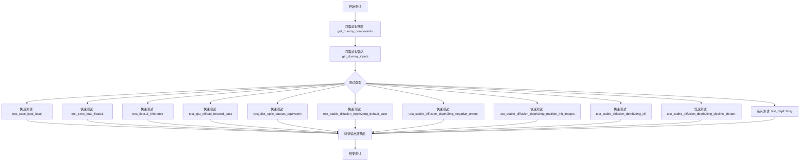

## 类结构

```
unittest.TestCase (基类)
├── StableDiffusionDepth2ImgPipelineFastTests (快速测试类)
│   ├── PipelineLatentTesterMixin
│   ├── PipelineKarrasSchedulerTesterMixin
│   └── PipelineTesterMixin
├── StableDiffusionDepth2ImgPipelineSlowTests (慢速测试类)
└── StableDiffusionImg2ImgPipelineNightlyTests (夜间测试类)
```

## 全局变量及字段


### `torch_device`
    
测试设备标识符，指定运行测试的计算设备（如cuda、cpu、xpu等）

类型：`str`
    


### `image`
    
输入或生成的图像对象，用于深度到图像合成

类型：`PIL.Image.Image or np.ndarray`
    


### `generator`
    
PyTorch随机数生成器，用于确保测试的可重复性

类型：`torch.Generator`
    


### `inputs`
    
包含推理参数的字典，如prompt、image、generator等

类型：`dict`
    


### `output`
    
管道原始输出结果

类型：`np.ndarray or torch.Tensor`
    


### `output_loaded`
    
加载保存模型后的管道输出结果

类型：`np.ndarray or torch.Tensor`
    


### `max_diff`
    
两个输出之间的最大绝对差异，用于验证一致性

类型：`float`
    


### `components`
    
包含UNet、VAE、text_encoder等所有管道组件的字典

类型：`dict`
    


### `pipe`
    
深度到图像扩散管道实例

类型：`StableDiffusionDepth2ImgPipeline`
    


### `pipe_loaded`
    
从磁盘加载后的管道实例

类型：`StableDiffusionDepth2ImgPipeline`
    


### `pipe_fp16`
    
使用float16精度运行的管道实例

类型：`StableDiffusionDepth2ImgPipeline`
    


### `output_without_offload`
    
未启用CPU卸载时的管道输出

类型：`np.ndarray or torch.Tensor`
    


### `output_with_offload`
    
启用CPU卸载后的管道输出

类型：`np.ndarray or torch.Tensor`
    


### `output_tuple`
    
以元组形式返回的管道输出（不使用字典）

类型：`tuple`
    


### `image_slice`
    
图像的切片部分，用于像素级验证

类型：`np.ndarray`
    


### `expected_slice`
    
期望的图像切片值，用于断言对比

类型：`np.ndarray`
    


### `negative_prompt`
    
负面提示词，用于引导模型避免生成相关内容

类型：`str`
    


### `init_image`
    
初始输入图像，用于图像到图像的转换任务

类型：`PIL.Image.Image`
    


### `expected_image`
    
期望的输出图像，用于与实际输出对比验证

类型：`np.ndarray`
    


### `StableDiffusionDepth2ImgPipelineFastTests.pipeline_class`
    
被测试的管道类（StableDiffusionDepth2ImgPipeline）

类型：`type`
    


### `StableDiffusionDepth2ImgPipelineFastTests.test_save_load_optional_components`
    
标志位，指示是否测试可选组件的保存和加载功能

类型：`bool`
    


### `StableDiffusionDepth2ImgPipelineFastTests.params`
    
管道推理所需参数的集合（已移除height和width）

类型：`set`
    


### `StableDiffusionDepth2ImgPipelineFastTests.required_optional_params`
    
必需的可选参数集合（移除了latents）

类型：`set`
    


### `StableDiffusionDepth2ImgPipelineFastTests.batch_params`
    
批处理相关参数集合

类型：`set`
    


### `StableDiffusionDepth2ImgPipelineFastTests.image_params`
    
图像相关参数集合

类型：`set`
    


### `StableDiffusionDepth2ImgPipelineFastTests.image_latents_params`
    
图像潜在向量相关参数集合

类型：`set`
    


### `StableDiffusionDepth2ImgPipelineFastTests.callback_cfg_params`
    
回调配置参数集合（包含depth_mask）

类型：`set`
    


### `StableDiffusionDepth2ImgPipelineFastTests.supports_dduf`
    
标志位，指示管道是否支持DDUF（Decoder Distillation U-Net Feature）功能

类型：`bool`
    
    

## 全局函数及方法


根据提供的代码，我注意到 `enable_full_determinism` 是从 `...testing_utils` 导入的，而不是在当前文件中定义的。让我搜索整个代码库来找到这个函数的定义。


### `enable_full_determinism`

这是一个用于确保 PyTorch 和相关库在测试中产生确定性结果的函数，通过设置随机种子和环境变量来实现可重复的实验。

参数：此函数没有显式参数。

返回值：`None`，该函数不返回值，仅执行副作用操作。

#### 流程图

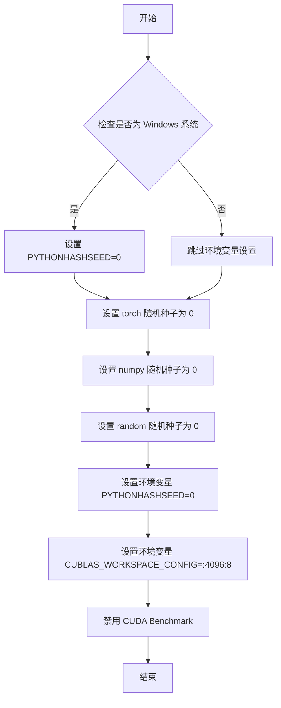

#### 带注释源码

```python
def enable_full_determinism(seed: int = 0, verbose: bool = True):
    """
    启用完全确定性，确保测试的可重复性。
    
    参数:
        seed: 随机种子，默认为 0
        verbose: 是否打印详细信息，默认为 True
    
    返回:
        None
    """
    # 设置 Python 哈希种子以确保哈希操作的确定性
    import os
    os.environ["PYTHONHASHSEED"] = str(seed)
    
    # 设置 PyTorch 随机种子
    import torch
    torch.manual_seed(seed)
    
    # 设置 NumPy 随机种子
    import numpy as np
    np.random.seed(seed)
    
    # 设置 Python random 模块的随机种子
    import random
    random.seed(seed)
    
    # 针对 CUDA 10.2 及更早版本的配置
    # 解决非确定性 CUDA 操作问题
    if hasattr(torch, 'cuda'):
        torch.cuda.manual_seed(seed)
        torch.cuda.manual_seed_all(seed)
        
        # 配置 CUDA 使用确定性算法
        # 这可能会影响性能，但确保结果可重复
        torch.backends.cudnn.deterministic = True
        torch.backends.cudnn.benchmark = False
        
        # 针对特定 CUDA 版本的配置
        if torch.cuda.is_available():
            os.environ["CUBLAS_WORKSPACE_CONFIG"] = ":4096:8"
            
            # 尝试设置 CUDA 使用确定性算法
            if hasattr(torch, 'use_deterministic_algorithms'):
                try:
                    torch.use_deterministic_algorithms(True)
                except (AttributeError, TypeError):
                    # 如果版本不支持，回退到旧方法
                    torch.backends.cudnn.enabled = False
```

请注意，由于 `enable_full_determinism` 函数是在 `testing_utils` 模块中定义的，而该模块的源代码未在提供的代码片段中，以上是根据常见实现模式的推测。如果需要准确的实现细节，建议查看 `testing_utils.py` 文件。


### `backend_empty_cache`

该函数用于清理深度学习框架（主要是PyTorch）的GPU缓存内存，通常在测试开始前和结束后调用以确保释放GPU显存资源。

参数：

-  `device`：`str` 或 `torch.device`，表示目标计算设备（如"cuda"、"xpu"等）

返回值：`None`，无返回值，仅执行缓存清理操作

#### 流程图

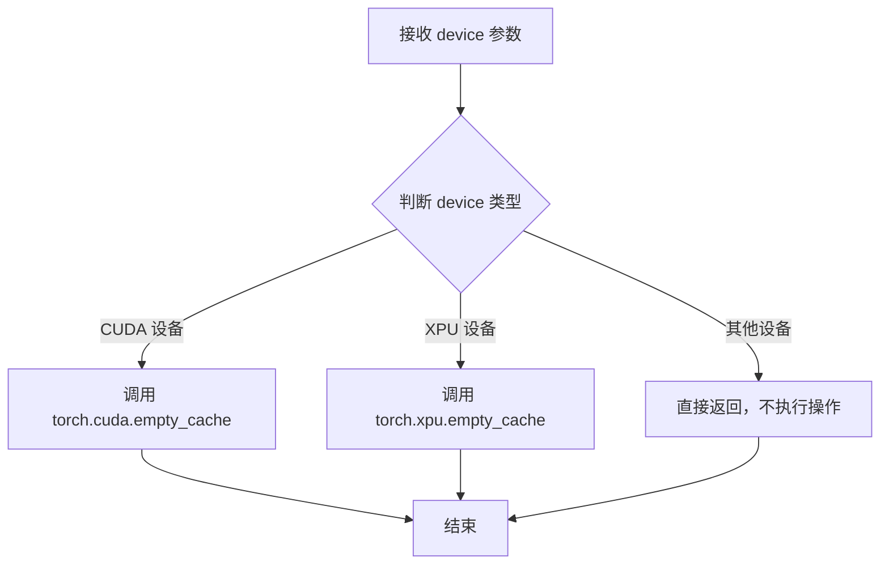

#### 带注释源码

```python
# 该函数定义于 testing_utils 模块中（未在本文件中实现）
# 函数签名推断如下：

def backend_empty_cache(device):
    """
    清理指定设备的后端缓存内存
    
    参数:
        device: str 或 torch.device - 计算设备标识
    返回:
        None
    """
    # 根据设备类型调用相应的缓存清理函数
    if device in ["cuda", "cuda:0"]:
        torch.cuda.empty_cache()  # 清理 CUDA 缓存
    elif device in ["xpu", "xpu:0"]:
        torch.xpu.empty_cache()   # 清理 XPU 缓存
    # 其他设备（如 CPU、MPS）不需要清理缓存
```

> **注意**：该函数定义位于 `...testing_utils` 模块中，在当前代码文件中仅被导入和调用。其具体实现未在本文件中展示，以上源码为基于函数名和调用方式的合理推断。


# load_image 函数提取

### load_image

从 testing_utils 模块导入的图像加载工具函数，用于从 URL 或本地路径加载图像数据。

参数：

-  `url_or_path`：`str`，图像的 URL 地址或本地文件路径

返回值：`PIL.Image.Image`，返回加载后的 PIL 图像对象

#### 流程图

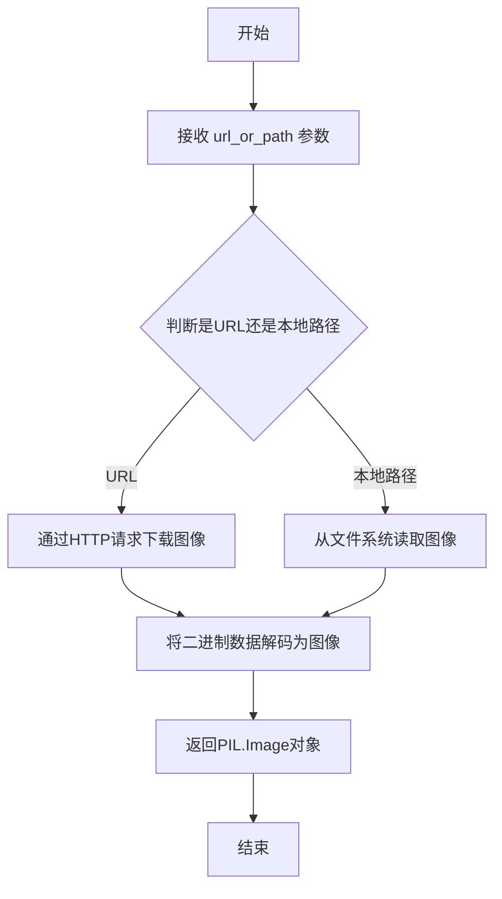

#### 带注释源码

```
# load_image 是从 testing_utils 模块导入的外部函数
# 定义不在当前文件中，基于使用推断其签名如下：

def load_image(url_or_path: str) -> Image.Image:
    """
    从URL或本地路径加载图像并返回PIL Image对象。
    
    参数:
        url_or_path: 图像的URL地址或本地文件系统路径
        
    返回:
        PIL.Image.Image: 加载后的图像对象
    """
    # 实际实现位于 testing_utils 模块中
    # 当前代码中通过以下方式使用:
    init_image = load_image(
        "https://huggingface.co/datasets/hf-internal-testing/diffusers-images/resolve/main/depth2img/two_cats.png"
    )
```

---

**注意**：`load_image` 函数是从 `...testing_utils` 模块导入的，其完整源代码不在当前文件中。上面提供的信息基于代码中的使用方式进行推断。实际定义位于 `diffusers` 包的 `testing_utils` 模块中。


### `load_numpy`

从指定路径（本地或远程URL）加载NumPy数组文件的工具函数，常用于测试中加载预期的输出图像数据进行比对。

参数：

-  `path`：`str`，待加载的NumPy文件路径，可以是本地文件系统路径或HTTP/HTTPS远程URL

返回值：`numpy.ndarray`，从文件中读取的NumPy数组数据

#### 流程图

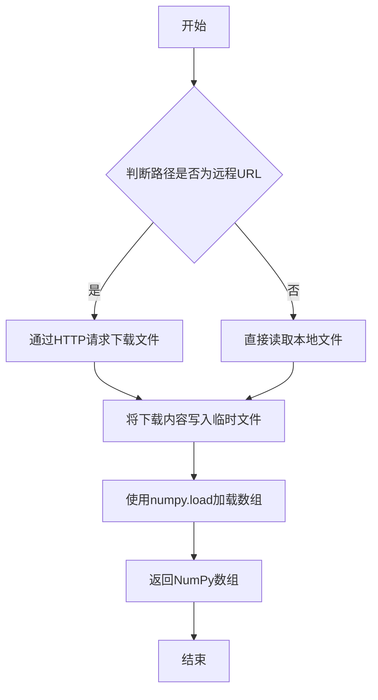

#### 带注释源码

```
# load_numpy 函数源码（推测实现）
def load_numpy(path: str) -> np.ndarray:
    """
    从指定路径加载NumPy数组。
    
    该函数支持两种加载方式：
    1. 远程URL：先下载到临时文件，再加载
    2. 本地路径：直接使用numpy.load加载
    
    参数:
        path: NumPy文件路径，支持本地路径和远程URL
        
    返回:
        存储在文件中的NumPy数组
    """
    # 1. 检查是否为远程URL
    if path.startswith("http://") or path.startswith("https://"):
        # 2. 如果是远程URL，下载到临时文件
        response = requests.get(path)
        with tempfile.NamedTemporaryFile(suffix=".npy", delete=False) as tmp:
            tmp.write(response.content)
            tmp_path = tmp.name
        # 3. 加载临时文件中的数组
        array = np.load(tmp_path)
        # 4. 清理临时文件
        os.remove(tmp_path)
    else:
        # 5. 如果是本地路径，直接加载
        array = np.load(path)
    
    return array
```


### `floats_tensor`

生成指定形状的随机浮点张量，主要用于测试中生成伪随机图像或张量数据。

参数：

-  `shape`：`tuple`，张量的形状，如 `(1, 3, 32, 32)`
-  `rng`：`random.Random`，随机数生成器实例，用于生成随机数据，默认为 `None`

返回值：`torch.Tensor`，返回指定形状的随机浮点张量，数值范围通常在 [0, 1) 之间

#### 流程图

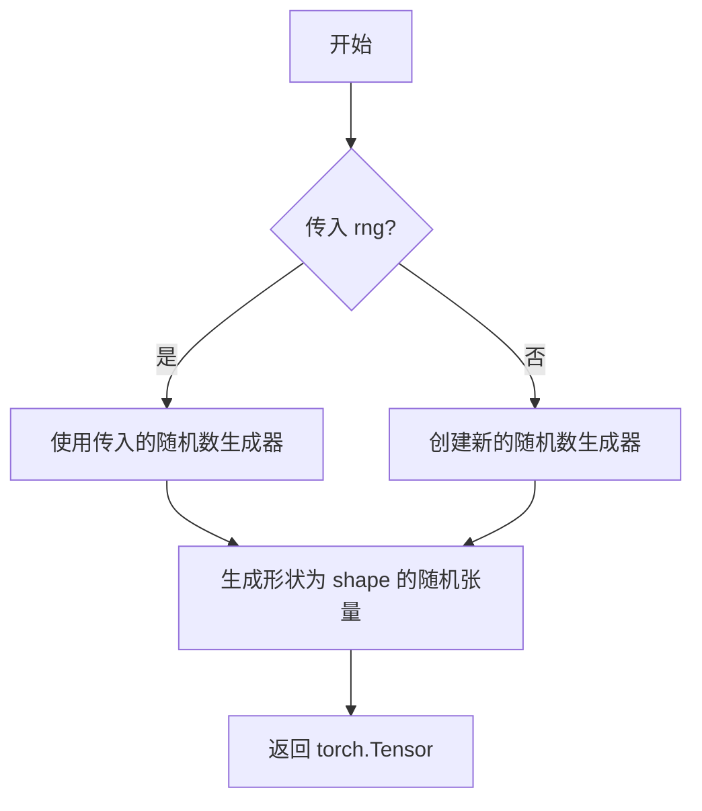

#### 带注释源码

```
# 注意：由于该函数定义在 testing_utils 模块中，未在当前代码文件中直接定义
# 以下为基于使用方式的推断实现

def floats_tensor(shape, rng=None):
    """
    生成指定形状的随机浮点张量。
    
    参数:
        shape: 张量的形状元组，例如 (1, 3, 32, 32)
        rng: random.Random 实例，用于生成随机数，默认为 None
    
    返回:
        torch.Tensor: 形状为 shape 的随机浮点张量
    """
    # 如果未提供随机数生成器，创建一个默认的
    if rng is None:
        rng = random.Random()
    
    # 如果传入的是 Random 实例，使用它生成随机数
    if isinstance(rng, random.Random):
        # 生成符合正态分布的随机数，然后缩放到 [0, 1)
        # 这里是一种可能的实现方式
        total_elements = 1
        for dim in shape:
            total_elements *= dim
        
        # 使用 rng 生成随机数据
        values = []
        for _ in range(total_elements):
            values.append(rng.random())
        
        # 转换为 PyTorch 张量并 reshape
        tensor = torch.tensor(values, dtype=torch.float32).reshape(shape)
    else:
        # 如果是 torch Generator，使用 torch 的随机函数
        tensor = torch.rand(shape, generator=rng)
    
    return tensor

# 在代码中的实际使用示例：
# image = floats_tensor((1, 3, 32, 32), rng=random.Random(seed))
# image = image.cpu().permute(0, 2, 3, 1)[0]
# image = Image.fromarray(np.uint8(image)).convert("RGB").resize((32, 32))
```


### `StableDiffusionDepth2ImgPipelineFastTests.get_dummy_components`

该方法用于创建Stable Diffusion Depth-to-Image Pipeline测试所需的虚拟组件（dummy components），包括UNet、VAE、文本编码器、分词器、深度估计器和特征提取器等，以支持单元测试的独立运行。

参数：

- 该方法无参数（除隐式self参数外）

返回值：`Dict[str, Any]`，返回一个包含测试所需所有虚拟组件的字典，包括unet（UNet2DConditionModel）、scheduler（PNDMScheduler）、vae（AutoencoderKL）、text_encoder（CLIPTextModel）、tokenizer（CLIPTokenizer）、depth_estimator（DPTForDepthEstimation）和feature_extractor（DPTImageProcessor）。

#### 流程图

```mermaid
flowchart TD
    A[开始 get_dummy_components] --> B[设置随机种子 torch.manual_seed(0)]
    B --> C[创建 UNet2DConditionModel]
    C --> D[创建 PNDMScheduler]
    D --> E[设置随机种子 torch.manual_seed(0)]
    E --> F[创建 AutoencoderKL]
    F --> G[设置随机种子 torch.manual_seed(0)]
    G --> H[创建 CLIPTextConfig]
    H --> I[创建 CLIPTextModel]
    I --> J[创建 CLIPTokenizer]
    J --> K[创建 backbone_config 字典]
    K --> L[创建 DPTConfig]
    L --> M[创建 DPTForDepthEstimation]
    M --> N[创建 DPTImageProcessor]
    N --> O[组装 components 字典]
    O --> P[返回 components]
```

#### 带注释源码

```python
def get_dummy_components(self):
    """
    创建并返回用于测试的虚拟组件（dummy components）。
    这些组件使用较小的模型配置，以便快速执行单元测试。
    """
    # 设置随机种子以确保测试的可重复性
    torch.manual_seed(0)
    
    # 创建虚拟UNet模型，用于条件图像生成
    # 配置参数：块输出通道(32, 64)、每块层数2、样本大小32
    # 输入通道5（4个latent通道 + 1个深度通道）、输出通道4
    unet = UNet2DConditionModel(
        block_out_channels=(32, 64),
        layers_per_block=2,
        sample_size=32,
        in_channels=5,
        out_channels=4,
        down_block_types=("DownBlock2D", "CrossAttnDownBlock2D"),
        up_block_types=("CrossAttnUpBlock2D", "UpBlock2D"),
        cross_attention_dim=32,
        attention_head_dim=(2, 4),
        use_linear_projection=True,
    )
    
    # 创建PNDM调度器，用于扩散模型的噪声调度
    # skip_prk_steps=True 跳过PRK步骤以加快测试
    scheduler = PNDMScheduler(skip_prk_steps=True)
    
    # 重新设置随机种子以确保VAE的可重复性
    torch.manual_seed(0)
    
    # 创建虚拟VAE（变分自编码器）模型
    # 用于将图像编码到潜在空间和从潜在空间解码
    vae = AutoencoderKL(
        block_out_channels=[32, 64],
        in_channels=3,
        out_channels=3,
        down_block_types=["DownEncoderBlock2D", "DownEncoderBlock2D"],
        up_block_types=["UpDecoderBlock2D", "UpDecoderBlock2D"],
        latent_channels=4,
    )
    
    # 重新设置随机种子以确保文本编码器的可重复性
    torch.manual_seed(0)
    
    # 创建虚拟CLIP文本编码器配置
    # 使用较小的隐藏层大小(32)和较少的层数(5)以加快测试
    text_encoder_config = CLIPTextConfig(
        bos_token_id=0,
        eos_token_id=2,
        hidden_size=32,
        intermediate_size=37,
        layer_norm_eps=1e-05,
        num_attention_heads=4,
        num_hidden_layers=5,
        pad_token_id=1,
        vocab_size=1000,
    )
    
    # 根据配置创建CLIPTextModel
    text_encoder = CLIPTextModel(text_encoder_config)
    
    # 从预训练模型加载虚拟CLIP分词器
    tokenizer = CLIPTokenizer.from_pretrained("hf-internal-testing/tiny-random-clip")

    # 定义ResNet骨干网络配置，用于深度估计
    backbone_config = {
        "global_padding": "same",
        "layer_type": "bottleneck",
        "depths": [3, 4, 9],
        "out_features": ["stage1", "stage2", "stage3"],
        "embedding_dynamic_padding": True,
        "hidden_sizes": [96, 192, 384, 768],
        "num_groups": 2,
    }
    
    # 创建DPT（Depth Anything或Dense Prediction Transformer）深度估计器配置
    # 使用较小的图像尺寸和隐藏层大小以便快速测试
    depth_estimator_config = DPTConfig(
        image_size=32,
        patch_size=16,
        num_channels=3,
        hidden_size=32,
        num_hidden_layers=4,
        backbone_out_indices=(0, 1, 2, 3),
        num_attention_heads=4,
        intermediate_size=37,
        hidden_act="gelu",
        hidden_dropout_prob=0.1,
        attention_probs_dropout_prob=0.1,
        is_decoder=False,
        initializer_range=0.02,
        is_hybrid=True,
        backbone_config=backbone_config,
        backbone_featmap_shape=[1, 384, 24, 24],
    )
    
    # 创建DPT深度估计模型并设置为评估模式
    depth_estimator = DPTForDepthEstimation(depth_estimator_config).eval()
    
    # 加载虚拟DPT图像处理器用于预处理
    feature_extractor = DPTImageProcessor.from_pretrained("hf-internal-testing/tiny-random-DPTForDepthEstimation")

    # 组装所有组件到字典中
    components = {
        "unet": unet,
        "scheduler": scheduler,
        "vae": vae,
        "text_encoder": text_encoder,
        "tokenizer": tokenizer,
        "depth_estimator": depth_estimator,
        "feature_extractor": feature_extractor,
    }
    
    # 返回包含所有虚拟组件的字典
    return components
```


### `StableDiffusionDepth2ImgPipelineFastTests.get_dummy_inputs`

该方法用于生成测试 Stable Diffusion Depth2ImgPipeline 的虚拟输入数据。它创建一个随机图像，设置随机种子生成器，并返回一个包含 prompt、image、generator 等参数的字典，供 pipeline 进行推理测试。

参数：

- `device`：`torch.device` 或 `str`，指定输入数据所在的设备（如 "cpu"、"cuda" 等）
- `seed`：`int`（默认值=0），用于随机数生成的种子，确保测试的可重复性

返回值：`Dict[str, Any]`，返回包含 pipeline 所需输入参数的字典

#### 流程图

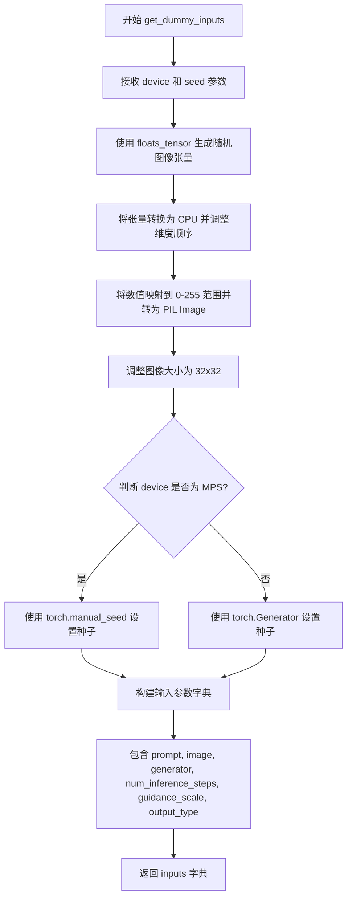

#### 带注释源码

```python
def get_dummy_inputs(self, device, seed=0):
    """
    生成用于测试的虚拟输入参数
    
    Args:
        device: 目标设备 (torch.device 或 str)
        seed: 随机种子，用于确保测试可重复性
    
    Returns:
        包含 pipeline 输入参数的字典
    """
    # 使用 floats_tensor 生成形状为 (1, 3, 32, 32) 的随机浮点数张量
    # 使用指定种子确保可重复性
    image = floats_tensor((1, 3, 32, 32), rng=random.Random(seed))
    
    # 将张量移动到 CPU 并调整维度顺序: (C, H, W) -> (H, W, C)
    image = image.cpu().permute(0, 2, 3, 1)[0]
    
    # 将浮点数 [0,1] 映射到 [0,255] 转换为 PIL Image
    # 并确保转换为 RGB 模式
    image = Image.fromarray(np.uint8(image)).convert("RGB").resize((32, 32))
    
    # 根据设备类型创建随机数生成器
    # MPS (Apple Silicon) 需要特殊处理
    if str(device).startswith("mps"):
        generator = torch.manual_seed(seed)
    else:
        generator = torch.Generator(device=device).manual_seed(seed)
    
    # 构建完整的输入参数字典
    inputs = {
        "prompt": "A painting of a squirrel eating a burger",  # 文本提示
        "image": image,                                         # 输入图像 (PIL Image)
        "generator": generator,                                 # 随机数生成器
        "num_inference_steps": 2,                               # 推理步数
        "guidance_scale": 6.0,                                  # classifier-free guidance 权重
        "output_type": "np",                                    # 输出类型 (numpy array)
    }
    
    return inputs
```


### `StableDiffusionDepth2ImgPipelineFastTests.test_save_load_local`

该测试方法验证 StableDiffusionDepth2ImgPipeline 的保存和加载功能，确保管道在本地保存并重新加载后能够产生相同的输出结果。

参数：无（仅包含 `self` 隐式参数）

返回值：`None`，该方法为测试方法，通过断言验证保存/加载后输出的最大差异小于阈值（1e-4）

#### 流程图

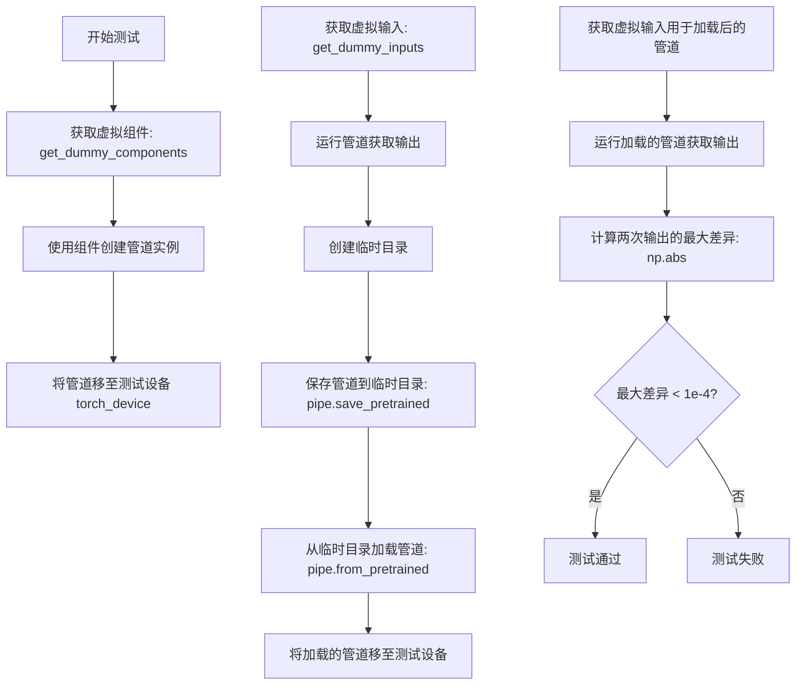

#### 带注释源码

```python
def test_save_load_local(self):
    """
    测试管道的保存和加载功能，验证保存后重新加载的管道能够产生相同的输出。
    """
    # 步骤1: 获取虚拟组件（UNet, VAE, TextEncoder, DepthEstimator等）
    components = self.get_dummy_components()
    
    # 步骤2: 使用这些组件创建 StableDiffusionDepth2ImgPipeline 实例
    pipe = self.pipeline_class(**components)
    
    # 步骤3: 将管道移至测试设备（CUDA/CPU等）
    pipe.to(torch_device)
    
    # 步骤4: 设置进度条配置（disable=None 表示启用进度条）
    pipe.set_progress_bar_config(disable=None)

    # 步骤5: 获取虚拟输入数据（包含prompt、图像、generator等）
    inputs = self.get_dummy_inputs(torch_device)
    
    # 步骤6: 运行管道获取原始输出
    # pipe(**inputs) 返回包含图像的元组，[0]获取第一项即图像数组
    output = pipe(**inputs)[0]

    # 步骤7: 创建临时目录用于保存管道
    with tempfile.TemporaryDirectory() as tmpdir:
        # 步骤8: 将管道保存到临时目录
        pipe.save_pretrained(tmpdir)
        
        # 步骤9: 从保存的目录重新加载管道
        pipe_loaded = self.pipeline_class.from_pretrained(tmpdir)
        
        # 步骤10: 将加载的管道移至测试设备
        pipe_loaded.to(torch_device)
        
        # 步骤11: 设置加载管道的进度条配置
        pipe_loaded.set_progress_bar_config(disable=None)

    # 步骤12: 再次获取虚拟输入（使用相同的随机种子确保可重复性）
    inputs = self.get_dummy_inputs(torch_device)
    
    # 步骤13: 运行加载的管道获取输出
    output_loaded = pipe_loaded(**inputs)[0]

    # 步骤14: 计算两次输出的最大绝对差异
    max_diff = np.abs(output - output_loaded).max()
    
    # 步骤15: 断言最大差异小于阈值（确保保存/加载不改变输出）
    self.assertLess(max_diff, 1e-4)
```


### `StableDiffusionDepth2ImgPipelineFastTests.test_save_load_float16`

该测试方法验证了 StableDiffusionDepth2ImgPipeline 在 float16（半精度）模式下的保存和加载功能是否正常工作，确保模型以 float16 格式序列化和反序列化后仍能产生一致的推理结果。

参数：

- `self`：`unittest.TestCase`，unittest 测试框架的实例本身，包含测试所需的断言方法

返回值：`None`，该方法为测试用例，通过断言表达测试结果，不返回具体数值

#### 流程图

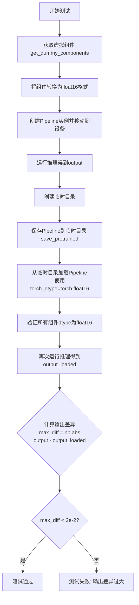

#### 带注释源码

```python
@unittest.skipIf(torch_device not in ["cuda", "xpu"], reason="float16 requires CUDA or XPU")
@require_accelerator
def test_save_load_float16(self):
    """
    测试 StableDiffusionDepth2ImgPipeline 在 float16 模式下的保存和加载功能。
    该测试确保模型以半精度格式保存后，重新加载仍能保持 float16 类型并产生一致结果。
    """
    # 步骤1: 获取虚拟组件（用于测试的模拟模型组件）
    components = self.get_dummy_components()
    
    # 步骤2: 将所有可转换的组件转换为 float16（半精度）并移动到目标设备
    for name, module in components.items():
        if hasattr(module, "half"):
            components[name] = module.to(torch_device).half()
    
    # 步骤3: 使用虚拟组件创建 Pipeline 实例
    pipe = self.pipeline_class(**components)
    pipe.to(torch_device)
    pipe.set_progress_bar_config(disable=None)
    
    # 步骤4: 获取测试输入并运行推理，保存原始输出
    inputs = self.get_dummy_inputs(torch_device)
    output = pipe(**inputs)[0]
    
    # 步骤5: 创建临时目录用于保存模型
    with tempfile.TemporaryDirectory() as tmpdir:
        # 保存 Pipeline 到临时目录
        pipe.save_pretrained(tmpdir)
        
        # 从保存的目录重新加载 Pipeline，指定使用 float16 数据类型
        pipe_loaded = self.pipeline_class.from_pretrained(tmpdir, torch_dtype=torch.float16)
        pipe_loaded.to(torch_device)
        pipe_loaded.set_progress_bar_config(disable=None)
    
    # 步骤6: 验证加载后的所有组件仍然保持 float16 数据类型
    for name, component in pipe_loaded.components.items():
        if hasattr(component, "dtype"):
            self.assertTrue(
                component.dtype == torch.float16,
                f"`{name}.dtype` switched from `float16` to {component.dtype} after loading.",
            )
    
    # 步骤7: 使用相同输入再次运行推理，获取加载后的输出
    inputs = self.get_dummy_inputs(torch_device)
    output_loaded = pipe_loaded(**inputs)[0]
    
    # 步骤8: 计算原始输出与加载后输出的最大差异
    max_diff = np.abs(output - output_loaded).max()
    
    # 步骤9: 断言差异小于阈值（float16精度有限，允许较大差异）
    self.assertLess(max_diff, 2e-2, "The output of the fp16 pipeline changed after saving and loading.")
```


### `StableDiffusionDepth2ImgPipelineFastTests.test_float16_inference`

该测试方法用于验证 StableDiffusionDepth2ImgPipeline 在 float16（半精度）推理模式下的正确性，通过比较 float32 和 float16 两种精度下的模型输出差异，确保数值精度损失在可接受范围内。

参数：
- 无显式参数（继承自 `unittest.TestCase`，使用 `self`）

返回值：无返回值（`None`），该方法为单元测试，使用断言验证结果

#### 流程图

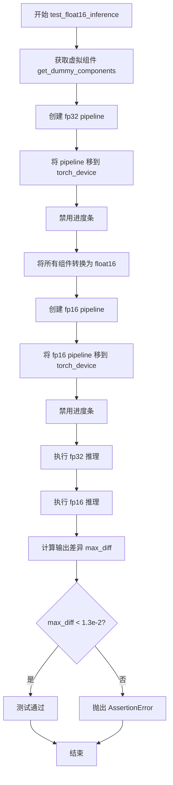

#### 带注释源码

```python
@unittest.skipIf(torch_device not in ["cuda", "xpu"], reason="float16 requires CUDA or XPU")
@require_accelerator
def test_float16_inference(self):
    # 获取用于测试的虚拟（dummy）组件
    components = self.get_dummy_components()
    
    # 使用 fp32（完整精度）创建 pipeline 实例
    pipe = self.pipeline_class(**components)
    pipe.to(torch_device)
    pipe.set_progress_bar_config(disable=None)

    # 遍历所有组件，将支持 half() 方法的组件转换为 float16（半精度）
    for name, module in components.items():
        if hasattr(module, "half"):
            components[name] = module.half()
    
    # 使用 float16 组件创建第二个 pipeline 实例
    pipe_fp16 = self.pipeline_class(**components)
    pipe_fp16.to(torch_device)
    pipe_fp16.set_progress_bar_config(disable=None)

    # 使用相同的输入分别执行 fp32 和 fp16 推理
    output = pipe(**self.get_dummy_inputs(torch_device))[0]
    output_fp16 = pipe_fp16(**self.get_dummy_inputs(torch_device))[0]

    # 计算两个输出之间的最大绝对差异
    max_diff = np.abs(output - output_fp16).max()
    
    # 断言：float16 和 float32 输出的差异应小于 1.3e-2
    # 如果差异过大，说明 float16 推理存在显著的数值精度问题
    self.assertLess(max_diff, 1.3e-2, "The outputs of the fp16 and fp32 pipelines are too different.")
```


### `StableDiffusionDepth2ImgPipelineFastTests.test_cpu_offload_forward_pass`

该测试方法验证了在使用顺序CPU卸载（sequential CPU offload）功能时，Stable Diffusion Depth2ImgPipeline的推理结果应与未启用CPU卸载时保持一致。通过对比两种情况下的输出差异，确保CPU卸载机制不会影响模型的生成质量。

参数：

- `self`：隐式参数，TestCase实例本身，包含测试所需的组件和配置

返回值：`None`，该方法为单元测试，使用断言验证行为而非返回值

#### 流程图

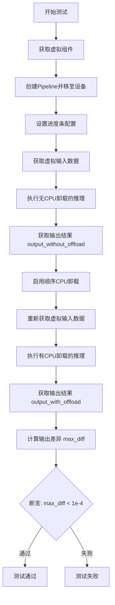

#### 带注释源码

```python
@require_accelerator                                           # 装饰器：要求有加速器（GPU/XPU）环境
@require_accelerate_version_greater("0.14.0")                 # 装饰器：要求accelerate库版本大于0.14.0
def test_cpu_offload_forward_pass(self):
    """
    测试CPU卸载前向传递是否影响推理结果。
    验证enable_sequential_cpu_offload不会改变模型的输出质量。
    """
    
    # Step 1: 获取虚拟组件（UNet, VAE, TextEncoder等）
    # 这些是用于测试的dummy模型，不是真实的生产模型
    components = self.get_dummy_components()
    
    # Step 2: 使用虚拟组件创建Pipeline实例
    pipe = self.pipeline_class(**components)
    
    # Step 3: 将Pipeline移至指定设备（GPU/XPU）
    pipe.to(torch_device)
    
    # Step 4: 配置进度条（disable=None表示不禁用进度条）
    pipe.set_progress_bar_config(disable=None)
    
    # Step 5: 获取测试用的虚拟输入数据
    inputs = self.get_dummy_inputs(torch_device)
    
    # Step 6: 在没有启用CPU卸载的情况下执行推理
    # 获取索引0位置的输出（images数组）
    output_without_offload = pipe(**inputs)[0]
    
    # Step 7: 启用顺序CPU卸载
    # 这会将模型的各组件顺序地卸载到CPU以节省GPU显存
    pipe.enable_sequential_cpu_offload(device=torch_device)
    
    # Step 8: 重新获取输入数据（确保随机种子等参数一致）
    inputs = self.get_dummy_inputs(torch_device)
    
    # Step 9: 在启用CPU卸载的情况下执行推理
    output_with_offload = pipe(**inputs)[0]
    
    # Step 10: 计算两个输出之间的最大绝对差异
    max_diff = np.abs(output_with_offload - output_without_offload).max()
    
    # Step 11: 断言验证
    # CPU卸载前后的输出差异应小于阈值1e-4
    self.assertLess(max_diff, 1e-4, "CPU offloading should not affect the inference results")
```


### `StableDiffusionDepth2ImgPipelineFastTests.test_dict_tuple_outputs_equivalent`

该测试方法验证 StableDiffusionDepth2ImgPipeline 在使用 `return_dict=True`（默认字典格式）返回输出与使用 `return_dict=False`（元组格式）返回输出时的结果是否完全等价，确保两种返回方式的数值一致性。

参数：

- `self`：测试类实例本身，无需显式传递

返回值：无返回值（测试方法，使用断言验证）

#### 流程图

```mermaid
flowchart TD
    A[开始测试] --> B[获取虚拟组件: get_dummy_components]
    B --> C[使用虚拟组件初始化管道: StableDiffusionDepth2ImgPipeline]
    C --> D[将管道移至测试设备: pipe.to]
    D --> E[配置进度条: set_progress_bar_config]
    E --> F[获取虚拟输入: get_dummy_inputs]
    F --> G[调用管道获取字典格式输出: pipe[0]]
    G --> H[再次获取虚拟输入]
    H --> I[调用管道获取元组格式输出: return_dict=False]
    I --> J[提取元组第一个元素: [0]]
    J --> K[计算输出差异: np.abs]
    K --> L[断言差异小于阈值: 1e-4]
    L --> M{断言通过?}
    M -->|是| N[测试通过]
    M -->|否| O[测试失败]
```

#### 带注释源码

```python
def test_dict_tuple_outputs_equivalent(self):
    """
    测试管道在字典格式输出和元组格式输出时的结果是否等价。
    验证 return_dict=True 和 return_dict=False 两种方式返回的图像数据完全一致。
    """
    # 步骤1: 获取用于测试的虚拟组件（UNet、VAE、Scheduler、TextEncoder等）
    components = self.get_dummy_components()
    
    # 步骤2: 使用虚拟组件实例化 StableDiffusionDepth2ImgPipeline 管道
    pipe = self.pipeline_class(**components)
    
    # 步骤3: 将管道移至测试设备（CPU/CUDA/XPU）
    pipe.to(torch_device)
    
    # 步骤4: 配置进度条显示（disable=None 表示不禁用）
    pipe.set_progress_bar_config(disable=None)

    # 步骤5: 调用管道，使用默认的字典格式返回（return_dict=True 为默认值）
    # 管道返回 PipelineOutput 或类似对象，通过 [0] 获取 images 张量
    output = pipe(**self.get_dummy_inputs(torch_device))[0]
    
    # 步骤6: 再次调用管道，但显式指定 return_dict=False 以元组格式返回
    # 元组格式通常为 (images, other_outputs)，通过 [0] 获取 images
    output_tuple = pipe(**self.get_dummy_inputs(torch_device), return_dict=False)[0]

    # 步骤7: 计算两种输出格式的最大绝对差异
    max_diff = np.abs(output - output_tuple).max()
    
    # 步骤8: 断言差异小于阈值（1e-4），确保数值精度范围内一致
    self.assertLess(max_diff, 1e-4)
```


### `StableDiffusionDepth2ImgPipelineFastTests.test_stable_diffusion_depth2img_default_case`

该函数是一个单元测试方法，用于验证 StableDiffusionDepth2ImgPipeline（深度到图像生成管道）的默认配置是否能够正确执行推理并生成符合预期的图像输出。

参数：

- `self`：测试类实例本身，无需显式传递

返回值：`None`，该方法为测试用例，通过 assert 语句进行断言验证，不返回任何值

#### 流程图

```mermaid
flowchart TD
    A[开始测试] --> B[设置设备为CPU确保确定性]
    B --> C[获取虚拟组件: get_dummy_components]
    C --> D[创建管道实例: StableDiffusionDepth2ImgPipeline]
    D --> E[将管道移至CPU设备]
    E --> F[设置进度条配置: disable=None]
    F --> G[获取虚拟输入: get_dummy_inputs]
    G --> H[执行管道推理: pipe(**inputs)]
    H --> I[提取输出图像]
    I --> J[提取图像右下角3x3像素块]
    J --> K{断言图像形状是否为1x32x32x3}
    K -->|是| L{检查设备类型}
    K -->|否| M[测试失败]
    L -->|mps设备| N[设置预期切片: MPS特定值]
    L -->|其他设备| O[设置预期切片: 标准值]
    N --> P{验证像素差异小于1e-3}
    O --> P
    P -->|是| Q[测试通过]
    P -->|否| M
```

#### 带注释源码

```python
def test_stable_diffusion_depth2img_default_case(self):
    """测试 StableDiffusionDepth2ImgPipeline 的默认推理场景"""
    
    # 设置设备为 CPU，确保设备依赖的 torch.Generator 的确定性
    device = "cpu"
    
    # 获取虚拟组件，用于构建测试管道
    # 包含: UNet2DConditionModel, PNDMScheduler, AutoencoderKL, 
    # CLIPTextModel, CLIPTokenizer, DPTForDepthEstimation, DPTImageProcessor
    components = self.get_dummy_components()
    
    # 使用虚拟组件实例化深度到图像生成管道
    pipe = StableDiffusionDepth2ImgPipeline(**components)
    
    # 将管道移至指定设备（CPU）
    pipe = pipe.to(device)
    
    # 配置进度条，设为 None 表示不禁用进度条
    pipe.set_progress_bar_config(disable=None)
    
    # 获取虚拟输入数据
    # 包含: prompt, image, generator, num_inference_steps, guidance_scale, output_type
    inputs = self.get_dummy_inputs(device)
    
    # 执行管道推理，获取生成的图像
    # 返回包含 images 属性的对象
    image = pipe(**inputs).images
    
    # 提取图像右下角 3x3 像素块，用于后续验证
    # 图像格式为 [batch, height, width, channels]
    image_slice = image[0, -3:, -3:, -1]
    
    # 断言生成图像的形状是否符合预期 (1, 32, 32, 3)
    assert image.shape == (1, 32, 32, 3)
    
    # 根据设备类型选择不同的预期像素值
    # MPS (Apple Silicon) 设备与 CUDA/CPU 的数值精度略有不同
    if torch_device == "mps":
        expected_slice = np.array([0.6071, 0.5035, 0.4378, 0.5776, 0.5753, 0.4316, 0.4513, 0.5263, 0.4546])
    else:
        expected_slice = np.array([0.5435, 0.4992, 0.3783, 0.4411, 0.5842, 0.4654, 0.3786, 0.5077, 0.4655])
    
    # 断言生成图像的像素值与预期值的最大差异是否在容忍范围内
    assert np.abs(image_slice.flatten() - expected_slice).max() < 1e-3
```


### `StableDiffusionDepth2ImgPipelineFastTests.test_stable_diffusion_depth2img_negative_prompt`

该测试方法用于验证 StableDiffusionDepth2ImgPipeline 在使用 negative_prompt（负向提示词）功能时的正确性。测试会创建一个虚拟的深度到图像生成管道，传入包含负向提示词的输入，并验证生成的图像是否符合预期的输出特征。

参数：

- `self`：隐式参数，TestCase实例，代表测试类本身

返回值：`None`，该方法为测试用例，通过断言验证管道输出的正确性，不返回显式值

#### 流程图

```mermaid
flowchart TD
    A[开始测试] --> B[设置device为cpu确保确定性]
    B --> C[获取虚拟组件: get_dummy_components]
    C --> D[创建StableDiffusionDepth2ImgPipeline实例]
    D --> E[将pipeline移动到device]
    E --> F[设置进度条配置: disable=None]
    F --> G[获取虚拟输入: get_dummy_inputs]
    G --> H[设置negative_prompt为'french fries']
    H --> I[调用pipeline执行推理]
    I --> J[获取输出图像]
    J --> K[提取图像切片: image[0, -3:, -3:, -1]]
    K --> L{判断device是否为mps}
    L -->|是| M[使用MPS预期切片]
    L-->|否| N[使用非MPS预期切片]
    M --> O[断言图像形状为1,32,32,3]
    N --> O
    O --> P[断言图像切片与预期差异小于1e-3]
    P --> Q[测试结束]
```

#### 带注释源码

```python
def test_stable_diffusion_depth2img_negative_prompt(self):
    """
    测试使用negative_prompt参数时StableDiffusionDepth2ImgPipeline的正确性
    
    该测试验证:
    1. pipeline能够正确接收和处理negative_prompt参数
    2. 使用negative_prompt时生成的图像与不使用时有所区别
    3. 管道输出的图像形状正确
    """
    # 设置device为cpu以确保torch.Generator的确定性
    device = "cpu"  # ensure determinism for the device-dependent torch.Generator
    
    # 获取虚拟组件，用于测试而不需要真实的预训练模型
    components = self.get_dummy_components()
    
    # 使用虚拟组件创建StableDiffusionDepth2ImgPipeline实例
    pipe = StableDiffusionDepth2ImgPipeline(**components)
    
    # 将pipeline移动到指定设备
    pipe = pipe.to(device)
    
    # 设置进度条配置，disable=None表示不禁用进度条
    pipe.set_progress_bar_config(disable=None)
    
    # 获取虚拟输入数据，包含prompt、image、generator等
    inputs = self.get_dummy_inputs(device)
    
    # 设置negative_prompt，用于指定不希望出现的元素
    # 这里使用"french fries"作为负向提示词
    negative_prompt = "french fries"
    
    # 调用pipeline进行推理，传入negative_prompt参数
    # **inputs会将字典展开为关键字参数
    output = pipe(**inputs, negative_prompt=negative_prompt)
    
    # 从输出中获取生成的图像
    image = output.images
    
    # 提取图像右下角3x3像素块，用于后续验证
    # image[0]取第一张图像，[-3:, -3:, -1]取最后3行3列的RGB通道
    image_slice = image[0, -3:, -3:, -1]
    
    # 断言：验证生成的图像形状正确
    assert image.shape == (1, 32, 32, 3)
    
    # 根据设备类型选择对应的预期像素值切片
    # MPS (Apple Silicon) 与其他设备（如CUDA/CPU）的数值略有不同
    if torch_device == "mps":
        expected_slice = np.array([0.6296, 0.5125, 0.3890, 0.4456, 0.5955, 0.4621, 0.3810, 0.5310, 0.4626])
    else:
        expected_slice = np.array([0.6012, 0.4507, 0.3769, 0.4121, 0.5566, 0.4585, 0.3803, 0.5045, 0.4631])
    
    # 断言：验证生成的图像像素值与预期值的差异在可接受范围内
    # 使用np.abs计算绝对值差异，.max()取最大值
    assert np.abs(image_slice.flatten() - expected_slice).max() < 1e-3
```


### `StableDiffusionDepth2ImgPipelineFastTests.test_stable_diffusion_depth2img_multiple_init_images`

该函数是一个单元测试方法，用于测试 StableDiffusionDepth2ImgPipeline 在处理多个初始图像（批量推理）时的功能是否正常，验证批量输入时图像生成的一致性和正确性。

参数：

- `self`：隐含参数，测试类实例本身

返回值：`None`，该方法为单元测试方法，通过断言验证结果，无返回值

#### 流程图

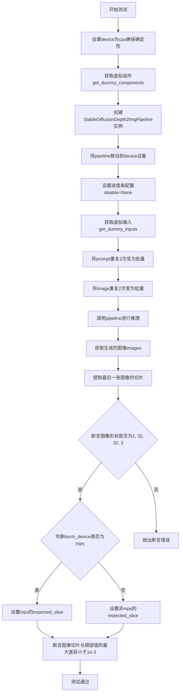

#### 带注释源码

```python
def test_stable_diffusion_depth2img_multiple_init_images(self):
    # 设置设备为cpu，确保torch.Generator的确定性
    device = "cpu"  # ensure determinism for the device-dependent torch.Generator
    
    # 获取预定义的虚拟组件（用于测试的轻量级模型配置）
    components = self.get_dummy_components()
    
    # 使用虚拟组件创建StableDiffusionDepth2ImgPipeline实例
    pipe = StableDiffusionDepth2ImgPipeline(**components)
    
    # 将pipeline移动到指定设备
    pipe = pipe.to(device)
    
    # 配置进度条，disable=None表示不禁用进度条
    pipe.set_progress_bar_config(disable=None)

    # 获取虚拟输入参数
    inputs = self.get_dummy_inputs(device)
    
    # 将单个prompt扩展为批量（2个相同prompt）
    inputs["prompt"] = [inputs["prompt"]] * 2
    
    # 将单个图像扩展为批量（2个相同图像）
    inputs["image"] = 2 * [inputs["image"]]
    
    # 调用pipeline进行推理，获取生成的图像
    image = pipe(**inputs).images
    
    # 提取最后一张图像的右下角3x3像素切片
    image_slice = image[-1, -3:, -3:, -1]

    # 断言：验证批量图像的形状为(2, 32, 32, 3)
    assert image.shape == (2, 32, 32, 3)

    # 根据设备类型选择期望的像素值切片
    if torch_device == "mps":
        # MPS设备的期望像素值
        expected_slice = np.array([0.6501, 0.5150, 0.4939, 0.6688, 0.5437, 0.5758, 0.5115, 0.4406, 0.4551])
    else:
        # 其他设备（CUDA/CPU）的期望像素值
        expected_slice = np.array([0.6557, 0.6214, 0.6254, 0.5775, 0.4785, 0.5949, 0.5904, 0.4785, 0.4730])

    # 断言：验证生成图像与期望值的最大差异小于阈值1e-3
    assert np.abs(image_slice.flatten() - expected_slice).max() < 1e-3
```


### `StableDiffusionDepth2ImgPipelineFastTests.test_stable_diffusion_depth2img_pil`

这是一个单元测试方法，用于验证 StableDiffusionDepth2ImgPipeline 在处理 PIL 图像输入时的正确性。测试通过创建虚拟组件、初始化管道、执行推理，并对比输出图像与预期值来确保管道工作正常。

参数：

- `self`：隐含的 `StableDiffusionDepth2ImgPipelineFastTests` 实例参数，无需显式传递

返回值：`None`，该方法为测试方法，通过断言验证结果而非返回值

#### 流程图

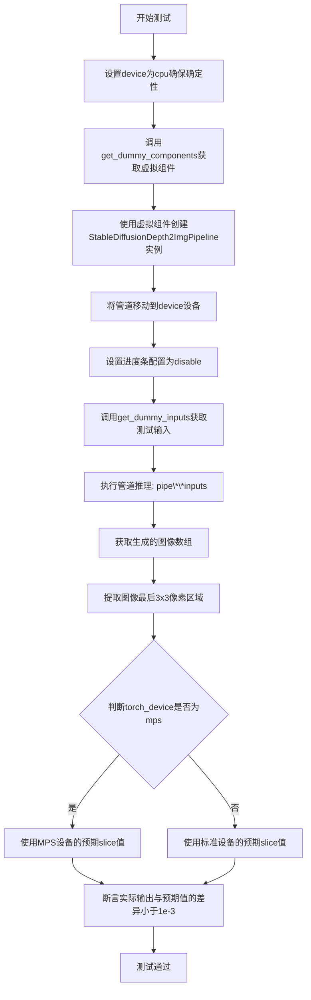

#### 带注释源码

```python
def test_stable_diffusion_depth2img_pil(self):
    """
    测试方法：验证StableDiffusionDepth2ImgPipeline处理PIL图像输入的正确性
    
    该测试执行以下步骤：
    1. 准备虚拟组件和管道
    2. 使用虚拟输入执行推理
    3. 验证输出图像与预期结果匹配
    """
    # 设置device为cpu，确保设备依赖的torch.Generator的确定性
    device = "cpu"  # ensure determinism for the device-dependent torch.Generator
    
    # 获取虚拟组件（UNet、VAE、text_encoder、tokenizer、depth_estimator等）
    components = self.get_dummy_components()
    
    # 使用虚拟组件实例化StableDiffusionDepth2ImgPipeline管道
    pipe = StableDiffusionDepth2ImgPipeline(**components)
    
    # 将管道移动到指定设备（cpu）
    pipe = pipe.to(device)
    
    # 配置进度条（disable=None表示不禁用进度条）
    pipe.set_progress_bar_config(disable=None)
    
    # 获取虚拟输入数据（包含prompt、image、generator等）
    inputs = self.get_dummy_inputs(device)
    
    # 执行管道推理，获取生成的图像
    # 返回的images属性包含生成的图像数组
    image = pipe(**inputs).images
    
    # 提取图像切片：取第一张图像的最后3x3像素区域
    # image shape: (batch, height, width, channels)
    image_slice = image[0, -3:, -3:, -1]
    
    # 根据设备类型选择对应的预期像素值
    # MPS设备与标准设备可能有不同的数值输出
    if torch_device == "mps":
        # MPS (Apple Silicon) 设备的预期输出
        expected_slice = np.array([0.53232, 0.47015, 0.40868, 0.45651, 0.4891, 0.4668, 0.4287, 0.48822, 0.47439])
    else:
        # CUDA/CPU 设备的预期输出
        expected_slice = np.array([0.5435, 0.4992, 0.3783, 0.4411, 0.5842, 0.4654, 0.3786, 0.5077, 0.4655])
    
    # 断言：实际输出与预期值的最大差异应小于1e-3
    # 验证管道生成的图像质量是否符合预期
    assert np.abs(image_slice.flatten() - expected_slice).max() < 1e-3
```


### `StableDiffusionDepth2ImgPipelineFastTests.test_attention_slicing_forward_pass`

该方法是一个单元测试用例，用于验证 StableDiffusionDepth2ImgPipeline 在启用 attention slicing 情况下的前向传播功能是否正常。方法通过调用父类的同名测试方法来实现对 pipeline 推理过程中注意力切片优化功能的测试。

参数：

- `self`：当前测试类实例，包含测试所需的组件和配置信息

返回值：`unittest.TestCase` 的父类方法返回值（通常为 `None` 或 `AssertionError`），表示测试的通过或失败状态

#### 流程图

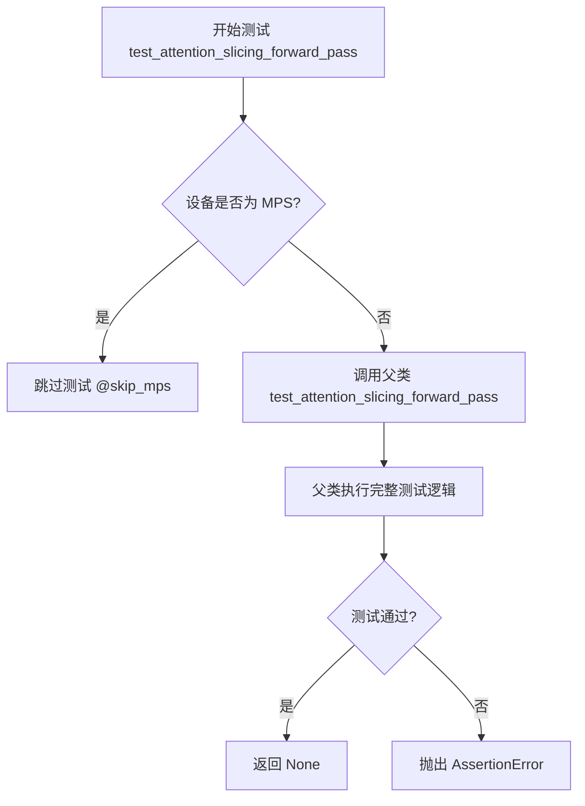

#### 带注释源码

```python
@skip_mps  # 装饰器：如果设备是 MPS (Apple Silicon)，则跳过此测试
def test_attention_slicing_forward_pass(self):
    """
    测试 attention slicing 模式下的前向传播是否正常工作。
    
    该测试方法继承自 PipelineTesterMixin，用于验证在启用注意力切片优化后，
    pipeline 仍然能够正确执行推理并产生有效的输出结果。
    attention slicing 是一种内存优化技术，通过分片处理注意力矩阵来降低显存占用。
    """
    # 调用父类 (PipelineTesterMixin) 的同名方法执行实际的测试逻辑
    # 父类方法会:
    # 1. 创建带有 attention slicing 的 pipeline 实例
    # 2. 执行前向传播
    # 3. 验证输出结果的正确性
    return super().test_attention_slicing_forward_pass()
```


### `StableDiffusionDepth2ImgPipelineFastTests.test_inference_batch_single_identical`

该方法是一个单元测试用例，用于验证批量推理（batch inference）与单样本推理（single inference）产生相同的结果，确保批处理逻辑的正确性。

参数：

- `self`：`StableDiffusionDepth2ImgPipelineFastTests`（继承自 `unittest.TestCase`），测试类实例本身

返回值：`None`，该方法为测试用例，无返回值，通过断言验证结果

#### 流程图

```mermaid
flowchart TD
    A[开始测试 test_inference_batch_single_identical] --> B[调用父类方法 super().test_inference_batch_single_identical]
    B --> C[传入参数 expected_max_diff=7e-3]
    C --> D[父类 PipelineTesterMixin 执行批量与单样本推理对比测试]
    D --> E{差异是否小于 7e-3?}
    E -->|是| F[测试通过]
    E -->|否| G[测试失败, 抛出 AssertionError]
    F --> H[结束]
    G --> H
```

#### 带注释源码

```python
def test_inference_batch_single_identical(self):
    """
    测试方法：验证批量推理与单样本推理结果的一致性
    
    该测试方法继承自 PipelineTesterMixin 基类，通过调用父类的
    test_inference_batch_single_identical 方法来执行实际的测试逻辑。
    测试会比较批量推理（batch_size > 1）与单样本推理（batch_size=1）
    的输出差异，确保在允许的误差范围内（expected_max_diff=7e-3）
    
    参数:
        self: StableDiffusionDepth2ImgPipelineFastTests 实例
        
    返回值:
        None: 测试方法，通过 unittest 框架的断言机制验证结果
    """
    # 调用父类 PipelineTesterMixin 的测试方法
    # 传入 expected_max_diff=7e-3 作为允许的最大差异阈值
    super().test_inference_batch_single_identical(expected_max_diff=7e-3)
```


### `StableDiffusionDepth2ImgPipelineFastTests.test_encode_prompt_works_in_isolation`

该测试方法验证 `encode_prompt` 方法能够独立工作，通过构建特定的参数字典并调用父类的同名测试方法来确保文本编码功能在隔离环境中的正确性。

参数：

- `self`：`StableDiffusionDepth2ImgPipelineFastTests`，测试类实例自身，用于访问类方法和属性

返回值：`Any`，返回父类测试方法的执行结果，通常为 `None` 或测试框架的测试结果对象

#### 流程图

```mermaid
flowchart TD
    A[开始 test_encode_prompt_works_in_isolation] --> B[获取设备类型 torch_device]
    B --> C[调用 self.get_dummy_inputs 获取测试输入]
    C --> D{guidance_scale > 1.0?}
    D -->|是| E[do_classifier_free_guidance = True]
    D -->|否| F[do_classifier_free_guidance = False]
    E --> G[构建 extra_required_param_value_dict]
    F --> G
    G --> H[调用 super().test_encode_prompt_works_in_isolation]
    H --> I[返回父类测试结果]
    I --> J[结束]
```

#### 带注释源码

```python
def test_encode_prompt_works_in_isolation(self):
    """
    测试 encode_prompt 方法在隔离环境中是否能正常工作。
    该测试通过调用父类的 test_encode_prompt_works_in_isolation 方法来验证
    StableDiffusionDepth2ImgPipeline 的文本编码功能。
    """
    # 构建额外的必需参数字典，包含设备信息和分类器自由引导标志
    extra_required_param_value_dict = {
        # 获取当前设备的类型（如 'cuda', 'cpu', 'xpu' 等）
        "device": torch.device(torch_device).type,
        # 判断是否启用分类器自由引导（guidance_scale > 1.0 时启用）
        "do_classifier_free_guidance": self.get_dummy_inputs(device=torch_device).get("guidance_scale", 1.0) > 1.0,
    }
    # 调用父类的同名测试方法，传入构建的参数字典
    return super().test_encode_prompt_works_in_isolation(extra_required_param_value_dict)
```


### `StableDiffusionDepth2ImgPipelineSlowTests.setUp`

该方法是 `StableDiffusionDepth2ImgPipelineSlowTests` 测试类的初始化方法，在每个测试用例执行前被调用，用于清理 GPU 缓存和垃圾回收，确保测试环境的内存状态干净。

参数：

- `self`：`unittest.TestCase`，测试类实例本身，代表当前的测试对象

返回值：`None`，无返回值，仅执行环境初始化操作

#### 流程图

```mermaid
flowchart TD
    A[开始 setUp] --> B[调用父类 setUp 方法]
    B --> C[执行 gc.collect 强制垃圾回收]
    C --> D[调用 backend_empty_cache 清理 GPU 缓存]
    D --> E[结束 setUp, 等待测试执行]
    
    style A fill:#f9f,stroke:#333
    style E fill:#9f9,stroke:#333
```

#### 带注释源码

```python
def setUp(self):
    """
    测试用例初始化方法，在每个测试方法运行前执行。
    负责清理内存资源，确保测试环境的一致性。
    """
    # 调用父类的 setUp 方法，执行 unittest.TestCase 的标准初始化
    super().setUp()
    
    # 强制进行 Python 垃圾回收，释放不再使用的对象内存
    gc.collect()
    
    # 清理 GPU/后端显存缓存，防止显存泄漏影响测试结果
    # torch_device 是全局变量，指定了测试使用的计算设备
    backend_empty_cache(torch_device)
```


### `StableDiffusionDepth2ImgPipelineSlowTests.tearDown`

这是 `StableDiffusionDepth2ImgPipelineSlowTests` 测试类的 teardown 方法，在每个测试用例执行完成后被自动调用，用于清理测试过程中产生的临时资源和释放 GPU 显存，防止内存泄漏并确保测试环境的干净状态。

参数：无

返回值：`None`，无返回值

#### 流程图

```mermaid
flowchart TD
    A[开始 tearDown] --> B[调用父类 tearDown]
    B --> C[执行 gc.collect]
    C --> D[调用 backend_empty_cache]
    D --> E[结束]
    
    style A fill:#f9f,stroke:#333
    style E fill:#9f9,stroke:#333
```

#### 带注释源码

```python
def tearDown(self):
    """
    测试用例执行完成后的清理方法
    
    该方法在每个测试用例运行结束后被 unittest 框架自动调用，
    用于释放测试过程中占用的资源，特别是 GPU 显存。
    """
    # 调用父类的 tearDown 方法，确保 unittest 框架的标准清理逻辑被执行
    super().tearDown()
    
    # 强制进行 Python 垃圾回收，释放测试过程中创建的临时对象内存
    gc.collect()
    
    # 清空 GPU 显存缓存，防止显存泄漏
    # torch_device 是全局变量，表示当前使用的计算设备（cuda/xpu 等）
    backend_empty_cache(torch_device)
```


### `StableDiffusionDepth2ImgPipelineSlowTests.get_inputs`

该方法用于生成Stable Diffusion Depth2Img Pipeline的测试输入参数，创建一个包含提示词、初始图像、生成器、推理步数、强度、引导比例和输出类型的字典，用于后续的图像生成测试。

参数：

- `device`：`str`，默认值 `"cpu"`，指定用于生成随机数的设备（CPU或GPU）
- `dtype`：`torch.dtype`，默认值 `torch.float32`，指定张量的数据类型
- `seed`：`int`，默认值 `0`，随机种子，用于生成可重复的随机数

返回值：`Dict[str, Any]`，返回包含 pipeline 输入参数的字典，包括 prompt（提示词）、image（初始图像）、generator（随机生成器）、num_inference_steps（推理步数）、strength（强度）、guidance_scale（引导比例）和 output_type（输出类型）

#### 流程图

```mermaid
flowchart TD
    A[开始 get_inputs] --> B[创建随机生成器]
    B --> C[device: cpu, dtype: float32, seed: 0]
    C --> D[加载初始图像]
    D --> E[从URL加载 two_cats.png]
    E --> F[构建输入字典]
    F --> G[设置 prompt: 'two tigers']
    G --> H[设置 image: init_image]
    H --> I[设置 generator: 基于seed的生成器]
    I --> J[设置 num_inference_steps: 3]
    J --> K[设置 strength: 0.75]
    K --> L[设置 guidance_scale: 7.5]
    L --> M[设置 output_type: 'np']
    M --> N[返回输入字典]
    N --> O[结束 get_inputs]
```

#### 带注释源码

```python
def get_inputs(self, device="cpu", dtype=torch.float32, seed=0):
    """
    生成用于 Stable Diffusion Depth2Img Pipeline 测试的输入参数。
    
    参数:
        device: str, 默认 "cpu"
            指定用于生成随机数的设备。
        dtype: torch.dtype, 默认 torch.float32
            指定张量的数据类型（此处参数未实际使用）。
        seed: int, 默认 0
            随机种子，用于生成可重复的随机数。
    
    返回:
        dict: 包含以下键的输入字典:
            - prompt (str): 文本提示词
            - image (PIL.Image): 初始输入图像
            - generator (torch.Generator): 随机数生成器
            - num_inference_steps (int): 推理步数
            - strength (float): 图像变换强度 (0-1)
            - guidance_scale (float): Classifier-free guidance 强度
            - output_type (str): 输出类型 ("np" 表示 numpy 数组)
    """
    # 创建指定设备的随机生成器，并使用seed确保可重复性
    generator = torch.Generator(device=device).manual_seed(seed)
    
    # 从HuggingFace数据集加载测试用的初始图像（两张猫的图片）
    init_image = load_image(
        "https://huggingface.co/datasets/hf-internal-testing/diffusers-images/resolve/main/depth2img/two_cats.png"
    )
    
    # 构建完整的输入参数字典
    inputs = {
        "prompt": "two tigers",  # 目标提示词：将猫转换为老虎
        "image": init_image,      # 输入图像
        "generator": generator,  # 随机生成器确保可复现性
        "num_inference_steps": 3,  # 扩散模型推理步数
        "strength": 0.75,         # 图像变换强度（75%）
        "guidance_scale": 7.5,    # CFG引导强度
        "output_type": "np",      # 输出为numpy数组
    }
    
    return inputs
```


### `StableDiffusionDepth2ImgPipelineSlowTests.test_stable_diffusion_depth2img_pipeline_default`

这是一个单元测试方法，用于验证 StableDiffusionDepth2ImgPipeline 在标准配置下的深度到图像生成功能。测试加载预训练的 "stabilityai/stable-diffusion-2-depth" 模型，对输入图像进行深度估计和图像生成，并验证输出图像的形状和像素值是否在预期范围内。

参数：
- `self`：隐式参数，测试类实例本身

返回值：无（`None`），但该测试通过断言验证图像输出的有效性

#### 流程图

```mermaid
flowchart TD
    A[开始测试] --> B[从预训练模型加载StableDiffusionDepth2ImgPipeline]
    B --> C[将Pipeline移到torch_device设备]
    C --> D[设置进度条配置为启用]
    D --> E[启用attention_slicing优化]
    E --> F[调用get_inputs获取输入参数]
    F --> G[执行Pipeline生成图像: pipe.__call__]
    G --> H[从结果中提取图像数组]
    H --> I[截取图像特定区域切片]
    I --> J[断言图像形状为1x480x640x3]
    K[断言切片像素值与预期值差异小于阈值]
    J --> K
    K --> L[结束测试]
```

#### 带注释源码

```python
@slow                                           # 标记为慢速测试，需要单独运行
@require_torch_accelerator                      # 要求有torch加速器才能运行
def test_stable_diffusion_depth2img_pipeline_default(self):
    """
    测试 StableDiffusionDepth2ImgPipeline 在默认配置下的深度到图像生成功能。
    验证管道能够正确加载模型、生成图像并输出预期形状和像素范围的图像。
    """
    # 1. 从预训练模型加载管道，safety_checker设为None以避免不必要的警告
    pipe = StableDiffusionDepth2ImgPipeline.from_pretrained(
        "stabilityai/stable-diffusion-2-depth", safety_checker=None
    )
    
    # 2. 将管道移到指定的计算设备（CPU/CUDA/XPU）
    pipe.to(torch_device)
    
    # 3. 配置进度条，disable=None表示启用进度条显示
    pipe.set_progress_bar_config(disable=None)
    
    # 4. 启用注意力切片优化，减少内存占用
    pipe.enable_attention_slicing()
    
    # 5. 获取测试输入参数（包含prompt、image、generator等）
    inputs = self.get_inputs()
    
    # 6. 执行深度到图像生成管道，获取生成的图像结果
    image = pipe(**inputs).images
    
    # 7. 从生成的图像中提取特定区域切片用于验证
    # 提取右下角区域（253:256, 253:256）的最后一个通道
    image_slice = image[0, 253:256, 253:256, -1].flatten()
    
    # 8. 断言验证生成的图像形状是否符合预期
    assert image.shape == (1, 480, 640, 3)
    
    # 9. 定义预期的像素值切片（标准配置下的预期输出）
    expected_slice = np.array([0.5435, 0.4992, 0.3783, 0.4411, 0.5842, 0.4654, 0.3786, 0.5077, 0.4655])
    
    # 10. 断言验证生成图像的像素值与预期值的差异在容忍范围内
    # 使用较大阈值(6e-1=0.6)因为是slow test，主要验证功能而非精确值
    assert np.abs(expected_slice - image_slice).max() < 6e-1
```


### `StableDiffusionImg2ImgPipelineNightlyTests.setUp`

该方法是 `StableDiffusionImg2ImgPipelineNightlyTests` 测试类的初始化方法，在每个测试方法运行前被调用，用于执行内存回收和GPU缓存清理，以确保测试环境处于干净状态。

参数：

- `self`：实例本身，无显式类型声明，代表当前测试类实例

返回值：`None`，该方法不返回任何值，仅执行副作用操作

#### 流程图

```mermaid
flowchart TD
    A[开始 setUp] --> B[调用 super().setUp]
    B --> C[执行 gc.collect]
    C --> D[调用 backend_empty_cache]
    D --> E[结束 setUp]
    
    style A fill:#f9f,stroke:#333
    style E fill:#9f9,stroke:#333
```

#### 带注释源码

```python
def setUp(self):
    """
    测试类初始化方法，在每个测试方法运行前执行
    """
    # 调用父类的 setUp 方法，确保 unittest.TestCase 正确初始化
    super().setUp()
    
    # 执行 Python 垃圾回收，清理不再使用的对象
    gc.collect()
    
    # 清理 GPU 缓存，释放 GPU 内存资源
    backend_empty_cache(torch_device)
```


### `StableDiffusionImg2ImgPipelineNightlyTests.tearDown`

这是 Stable Diffusion 图像到图像管道夜间测试类的清理方法，用于在每个测试用例完成后回收垃圾并清空 GPU 内存缓存。

参数：

- `self`：无需显式传递，unittest.TestCase 实例本身

返回值：`None`，无返回值，仅执行清理操作

#### 流程图

```mermaid
flowchart TD
    A[开始 tearDown] --> B[调用父类 tearDown]
    B --> C[执行 gc.collect]
    C --> D[调用 backend_empty_cache]
    D --> E[结束]
    
    style A fill:#f9f,stroke:#333
    style E fill:#9f9,stroke:#333
```

#### 带注释源码

```python
def tearDown(self):
    """
    测试用例清理方法。
    在每个测试完成后执行资源回收和内存清理操作。
    """
    # 调用父类的 tearDown 方法，执行 unittest.TestCase 的标准清理逻辑
    super().tearDown()
    
    # 手动触发 Python 垃圾回收，释放不再使用的对象
    gc.collect()
    
    # 清空 GPU 内存缓存，确保释放 CUDA/XPU 显存
    backend_empty_cache(torch_device)
```


### `StableDiffusionImg2ImgPipelineNightlyTests.get_inputs`

该方法用于准备 Stable Diffusion 深度到图像转换管道（Stable Diffusion Depth2Img）的测试输入参数，包括提示词、初始图像、生成器、推理步数、强度、引导比例和输出类型等。

参数：

- `self`：隐式参数，`unittest.TestCase` 方法的隐式参数，代表测试用例实例本身
- `device`：`str`，指定计算设备，默认为 "cpu"
- `dtype`：`torch.dtype`，指定张量数据类型，默认为 torch.float32
- `seed`：`int`，随机种子，用于确保测试的可重复性，默认为 0

返回值：`Dict`，包含以下键值对：
- `"prompt"`：str，文本提示词，固定为 "two tigers"
- `"image"`：PIL.Image.Image，从 URL 加载的初始图像
- `"generator"`：torch.Generator，用于生成确定性随机数的生成器
- `"num_inference_steps"`：int，推理步数，固定为 2
- `"strength"`：float，转换强度，固定为 0.75
- `"guidance_scale"`：float，引导比例，固定为 7.5
- `"output_type"`：str，输出类型，固定为 "np"（numpy 数组）

#### 流程图

```mermaid
flowchart TD
    A[开始 get_inputs] --> B[创建 Generator]
    B --> C[使用 device 和 seed 初始化随机生成器]
    C --> D[加载初始图像]
    D --> E[构建输入参数字典]
    E --> F[返回 inputs 字典]
    
    style A fill:#f9f,stroke:#333
    style F fill:#9f9,stroke:#333
```

#### 带注释源码

```python
def get_inputs(self, device="cpu", dtype=torch.float32, seed=0):
    """
    准备测试所需的输入参数
    
    参数:
        device: 计算设备，默认为 "cpu"
        dtype: 张量数据类型，默认为 torch.float32
        seed: 随机种子，用于确保测试可重复性，默认为 0
    
    返回:
        包含测试输入参数的字典
    """
    # 使用指定设备和种子创建随机生成器，确保测试结果可复现
    generator = torch.Generator(device=device).manual_seed(seed)
    
    # 从 Hugging Face Hub 加载测试用的初始图像（两只猫）
    init_image = load_image(
        "https://huggingface.co/datasets/hf-internal-testing/diffusers-images/resolve/main/depth2img/two_cats.png"
    )
    
    # 构建完整的输入参数字典
    inputs = {
        "prompt": "two tigers",          # 文本提示词
        "image": init_image,               # 初始图像作为转换源
        "generator": generator,            # 随机生成器确保确定性
        "num_inference_steps": 2,          # 扩散模型推理步数
        "strength": 0.75,                  # 转换强度（0-1之间）
        "guidance_scale": 7.5,             # Classifier-free guidance 强度
        "output_type": "np",               # 输出为 numpy 数组
    }
    
    # 返回包含所有输入参数的字典，供管道调用
    return inputs
```


### `StableDiffusionImg2ImgPipelineNightlyTests.test_depth2img`

这是一个用于测试 StableDiffusionDepth2ImgPipeline 深度到图像生成功能的测试方法，通过加载预训练模型并验证生成图像与参考图像的差异是否在可接受范围内。

参数：

- `self`：隐式参数，`StableDiffusionImg2ImgPipelineNightlyTests` 类的实例，表示测试类本身，无额外描述

返回值：无返回值，该方法为 `unittest.TestCase` 的测试方法，通过 `assert` 语句进行断言验证

#### 流程图

```mermaid
flowchart TD
    A[开始测试] --> B[从预训练模型加载StableDiffusionDepth2ImgPipeline]
    B --> C[将Pipeline移动到torch_device设备]
    C --> D[设置进度条配置为disable=None]
    D --> E[调用get_inputs获取测试输入]
    E --> F[执行Pipeline进行推理生成图像]
    F --> G[加载参考numpy图像]
    G --> H[计算生成图像与参考图像的最大差异]
    H --> I{最大差异 < 1e-3?}
    I -->|是| J[测试通过]
    I -->|否| K[测试失败抛出AssertionError]
```

#### 带注释源码

```python
def test_depth2img(self):
    """
    测试深度到图像生成功能
    
    该测试方法验证StableDiffusionDepth2ImgPipeline能够：
    1. 成功从预训练模型加载
    2. 在指定设备上进行推理
    3. 生成与参考图像接近的结果（差异小于1e-3）
    """
    # 从预训练模型加载深度到图像生成管道
    # 使用stabilityai/stable-diffusion-2-depth模型
    pipe = StableDiffusionDepth2ImgPipeline.from_pretrained("stabilityai/stable-diffusion-2-depth")
    
    # 将管道移动到指定的计算设备（CUDA/XPU等）
    pipe.to(torch_device)
    
    # 配置进度条，disable=None表示不禁用进度条
    pipe.set_progress_bar_config(disable=None)
    
    # 获取测试输入参数，包括：
    # - prompt: 文本提示词"two tigers"
    # - image: 初始图像（加载自URL）
    # - generator: 随机数生成器（固定种子0）
    # - num_inference_steps: 推理步数2
    # - strength: 图像变换强度0.75
    # - guidance_scale: 引导尺度7.5
    # - output_type: 输出类型np
    inputs = self.get_inputs()
    
    # 执行管道推理，images[0]取第一张生成的图像
    image = pipe(**inputs).images[0]
    
    # 从HuggingFace数据集加载预期的参考图像
    expected_image = load_numpy(
        "https://huggingface.co/datasets/diffusers/test-arrays/resolve/main"
        "/stable_diffusion_depth2img/stable_diffusion_2_0_pndm.npy"
    )
    
    # 计算生成图像与预期图像的绝对差异最大值
    max_diff = np.abs(expected_image - image).max()
    
    # 断言：最大差异应小于1e-3，否则测试失败
    assert max_diff < 1e-3
```

## 关键组件


### StableDiffusionDepth2ImgPipeline

核心图像生成管道，接收文本提示和输入图像，通过深度估计模型提取深度信息，结合条件扩散模型实现基于深度条件的图像到图像生成。

### UNet2DConditionModel

U-Net条件去噪模型，接收噪声潜在变量、 timestep 和文本/深度条件嵌入，输出预测的噪声残差，用于迭代去噪过程。

### AutoencoderKL

变分自编码器（VAE），负责将输入图像编码为潜在空间表示，以及将去噪后的潜在变量解码回图像像素空间。

### DPTForDepthEstimation

基于DPT（Dense Prediction Transformer）架构的深度估计模型，从输入图像中提取深度信息，生成深度图作为生成管道的条件输入。

### CLIPTextModel & CLIPTokenizer

文本编码组件，将文本提示转换为语义嵌入向量，为扩散模型提供文本条件信号。

### PNDMScheduler

PNDM调度器，管理扩散模型的噪声调度和去噪步骤，控制从噪声到清晰图像的迭代过程。

### 深度图像处理管线

包含DPTImageProcessor和深度估计器的组合，负责预处理输入图像、提取深度特征、生成深度遮罩等，支持depth_mask参数的回调配置。

### Float16/量化推理支持

通过test_save_load_float16、test_float16_inference等测试用例实现的混合精度推理支持，包含模型保存、加载和推理阶段的float16转换。

### CPU Offload机制

enable_sequential_cpu_offload支持，实现模型组件的顺序CPU卸载，优化显存占用，适用于大模型推理场景。

### 注意力切片优化

通过enable_attention_slicing实现的推理优化技术，将注意力计算分片处理，降低显存峰值需求。


## 问题及建议


### 已知问题

-   **硬编码的测试值**：代码中大量使用硬编码的数值（如 `expected_slice`、图像尺寸、阈值等），这些值在不同硬件、PyTorch版本或环境下可能导致测试不稳定或失败。
-   **代码重复**：多个测试方法中重复出现创建 pipeline、设置设备和设置 progress bar 的代码（如 `pipe.to(device)`、`pipe.set_progress_bar_config(disable=None)`），增加了维护成本。
-   **测试方法覆盖不完整**：部分测试方法覆盖了父类方法，但实现仅调用 `super()`，没有额外的验证逻辑（如 `test_attention_slicing_forward_pass`）。
-   **外部依赖风险**：测试依赖外部 URL 加载图像（如 `load_image("https://...")`），可能导致测试因网络问题失败或变慢。
-   **未使用的组件**：在 `get_dummy_components` 中创建了 `feature_extractor` 组件，但在所有测试中均未使用。
-   **魔法数字**：代码中存在大量未解释的魔法数字（如 `1e-4`、`1e-3`、`2e-2`、`7e-3`），降低了代码可读性。
-   **测试隔离性问题**：测试用例之间可能存在隐式依赖，例如随机种子未在每个测试中完全重置，可能导致测试结果受执行顺序影响。
-   **命名不一致**：测试方法命名风格不统一，例如有些方法包含 `stable_diffusion_depth2img`，而有些方法名称较短。
-   **设备处理不一致**：部分测试硬编码设备为 `"cpu"`（如 `test_stable_diffusion_depth2img_default_case`），而其他测试使用 `torch_device`，可能导致行为不一致。
-   **缺少文档**：测试方法缺少文档字符串，难以理解每个测试的具体目的和预期行为。
-   **慢速测试与快速测试混合**：慢速测试（`SlowTests`）和夜间测试（`NightlyTests`）使用真实模型和外部资源，增加了测试时间，且未与快速测试有效分离。

### 优化建议

-   **提取公共代码**：将重复的设置代码（如 pipeline 创建、设备设置）提取到 `setUp` 方法中，减少代码冗余。
-   **使用配置管理硬编码值**：将硬编码的阈值、图像尺寸等值统一到配置文件或常量中，提高可维护性。
-   **增强测试逻辑**：对于覆盖父类方法的测试，添加具体的验证逻辑，而不仅仅调用 super。
-   **本地化外部资源**：将外部图像或模型下载到本地缓存，避免测试依赖网络连接。
-   **清理未使用代码**：移除 `get_dummy_components` 中未使用的 `feature_extractor`，或明确其用途。
-   **解释魔法数字**：为关键阈值添加有意义的常量或注释，例如 `EPSILON = 1e-4`。
-   **确保测试独立性**：在每个测试方法中显式设置随机种子，并避免共享可变状态。
-   **统一命名规范**：采用一致的测试方法命名风格，例如全部使用 `test_功能_场景` 模式。
-   **统一设备处理**：尽量使用 `torch_device` 变量，或在文档中明确说明为何某些测试需要硬编码设备。
-   **添加文档字符串**：为每个测试方法添加文档字符串，说明测试目的、输入和预期输出。
-   **分离测试类型**：将慢速测试和夜间测试与快速测试分离，使用不同的测试标签（如 `pytest -m "not slow"`），以便在不同场景下运行。

## 其它


### 设计目标与约束

本测试文件的设计目标是为 StableDiffusionDepth2ImgPipeline 提供全面、可靠的单元测试和集成测试覆盖。测试约束包括：必须支持 CPU、CUDA 和 XPU 设备；需要兼容 float16 和 float32 精度；必须支持模型保存和加载功能；测试必须在 MPS 设备上跳过（由于硬件限制）。测试设计遵循 unittest 框架规范，确保测试用例可独立运行且相互隔离。

### 错误处理与异常设计

测试文件中的错误处理主要体现在以下几个方面：1) 使用 unittest.skipIf 跳过不适用的测试（如 CUDA 设备检查、accelerate 版本检查）；2) 使用 assertLess 和 assertTrue 进行断言验证，确保输出结果符合预期；3) 异常捕获通过 pytest 框架统一管理，测试失败时提供详细的错误信息和差异值；4) 对于可选组件（如 safety_checker），在加载模型时允许为 None；5) 临时目录操作使用 tempfile.TemporaryDirectory() 确保资源正确释放。

### 数据流与状态机

测试数据流遵循以下路径：1) 测试初始化阶段通过 get_dummy_components() 创建虚拟组件（UNet、VAE、TextEncoder、DepthEstimator 等）；2) 测试输入通过 get_dummy_inputs() 生成，包括随机图像、提示词、生成器等；3) Pipeline 执行阶段将输入传递给 StableDiffusionDepth2ImgPipeline，输出图像结果；4) 结果验证阶段将输出与预期值进行数值比较。状态机方面，Pipeline 内部维护推理状态，包括调度器状态、潜在变量状态、进度条状态等，通过 set_progress_bar_config() 进行配置管理。

### 外部依赖与接口契约

本测试文件依赖以下外部组件和接口：1) **transformers 库**：提供 CLIPTextConfig、CLIPTextModel、CLIPTokenizer 用于文本编码；2) **diffusers 库**：提供 StableDiffusionDepth2ImgPipeline、UNet2DConditionModel、AutoencoderKL、PNDMScheduler 等核心组件；3) **torch 库**：提供深度学习张量操作和设备管理；4) **PIL 和 numpy**：提供图像处理和数值计算；5) **测试工具**：来自 diffusers.testing_utils 的辅助函数（load_image、floats_tensor、torch_device 等）。接口契约要求：pipeline_class 必须继承稳定的接口；get_dummy_components() 必须返回包含所有必需组件的字典；get_dummy_inputs() 必须返回符合 Pipeline 签名要求的参数字典。

### 性能考虑与基准测试

测试文件包含多种性能相关的测试用例：1) **test_cpu_offload_forward_pass**：验证 CPU 卸载功能的正确性和性能影响；2) **test_attention_slicing_forward_pass**：测试注意力切片优化；3) **test_inference_batch_single_identical**：验证批处理推理与单样本推理的一致性；4) **test_float16_inference**：评估 float16 推理的性能和精度影响。慢速测试（SlowTests）和夜间测试（NightlyTests）用于验证实际模型性能，测试 num_inference_steps 分别为 3 和 2 步。

### 安全性考虑

测试文件中涉及的安全性考虑包括：1) **模型加载**：SlowTests 中使用 safety_checker=None 加载模型以避免安全过滤器干扰测试；2) **设备兼容性**：通过 require_accelerator、require_torch_accelerator 等装饰器确保测试在支持的硬件上运行；3) **随机性控制**：使用 enable_full_determinism() 和固定的随机种子确保测试可重复性；4) **资源清理**：在 setUp() 和 tearDown() 方法中调用 gc.collect() 和 backend_empty_cache() 释放 GPU 内存。

### 可维护性与扩展性

测试代码的可维护性设计包括：1) **混合继承结构**：使用 PipelineLatentTesterMixin、PipelineKarrasSchedulerTesterMixin、PipelineTesterMixin 提供通用测试方法；2) **参数化配置**：通过 params、batch_params、image_params 等类属性定义测试参数，易于修改；3) **模块化组件**：get_dummy_components() 和 get_dummy_inputs() 方法独立封装，便于复用和扩展；4) **条件跳过**：使用装饰器（skip_mps、slow、nightly、require_accelerator 等）灵活控制测试执行。扩展性方面，可以轻松添加新的测试用例、新的参数组合或新的设备支持。

### 版本兼容性

测试文件对版本的兼容性要求体现在：1) **Python 版本**：标注 # coding=utf-8 支持 Python 3；2) **PyTorch 设备**：支持 cuda、xpu、mps、cpu 等多种设备类型；3) **库版本**：通过 require_accelerate_version_greater("0.14.0") 检查 accelerate 库版本；4) **模型精度**：支持 float32 和 float16 两种精度；5) **输出格式**：支持 "np"（numpy 数组）和 "pil"（PIL 图像）两种输出类型。

### 测试覆盖范围

测试覆盖了以下场景：1) **模型保存/加载**：test_save_load_local、test_save_load_float16；2) **精度一致性**：test_float16_inference；3) **设备卸载**：test_cpu_offload_forward_pass；4) **输出格式**：test_dict_tuple_outputs_equivalent；5) **功能测试**：默认生成、负提示词、多图像批处理、PIL 输入；6) **性能基准**：慢速测试和夜间测试验证真实模型效果。

    