# `diffusers\tests\pipelines\stable_diffusion_2\test_stable_diffusion_inpaint.py` 详细设计文档

这是 Hugging Face diffusers 库的测试文件，专门用于测试 Stable Diffusion 2 的图像修复（inpainting）功能，包含快速单元测试和集成测试，验证管道在 CPU/GPU 上的图像生成、批处理、提示词编码和内存管理等功能。

## 整体流程

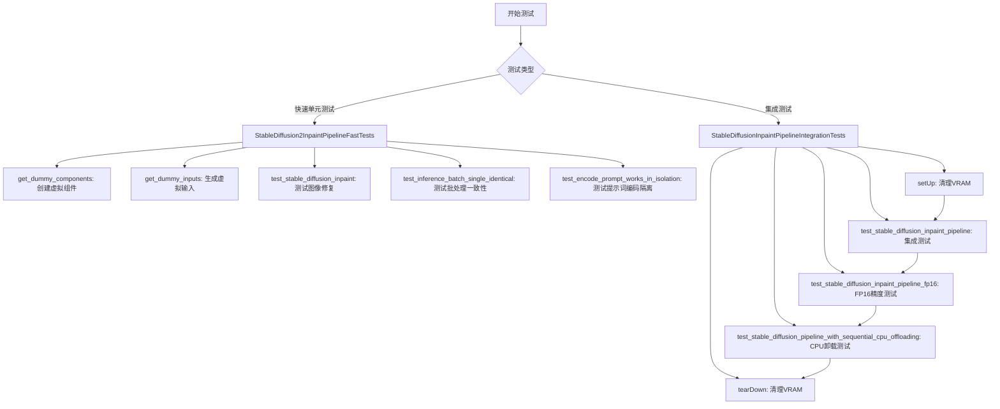

## 类结构

```
unittest.TestCase (基类)
├── StableDiffusion2InpaintPipelineFastTests
│   ├── 继承: PipelineLatentTesterMixin
│   ├── 继承: PipelineKarrasSchedulerTesterMixin
│   └── 继承: PipelineTesterMixin
└── StableDiffusionInpaintPipelineIntegrationTests
```

## 全局变量及字段


### `gc`
    
Python垃圾回收模块，用于手动清理内存

类型：`module`
    


### `random`
    
Python随机数生成模块

类型：`module`
    


### `unittest`
    
Python单元测试框架

类型：`module`
    


### `np`
    
NumPy数值计算库，用于数组和矩阵操作

类型：`module`
    


### `torch`
    
PyTorch深度学习框架

类型：`module`
    


### `Image`
    
PIL图像处理库中的图像类

类型：`class`
    


### `CLIPTextConfig`
    
CLIP文本模型配置类

类型：`class`
    


### `CLIPTextModel`
    
CLIP文本编码器模型类

类型：`class`
    


### `CLIPTokenizer`
    
CLIP分词器类

类型：`class`
    


### `AutoencoderKL`
    
变分自编码器模型，用于图像编码和解码

类型：`class`
    


### `PNDMScheduler`
    
PNDM调度器，用于扩散模型的去噪步骤

类型：`class`
    


### `StableDiffusionInpaintPipeline`
    
Stable Diffusion图像修复Pipeline类

类型：`class`
    


### `UNet2DConditionModel`
    
2D条件UNet模型，用于扩散过程中的图像生成

类型：`class`
    


### `enable_full_determinism`
    
启用完全确定性，确保测试可复现

类型：`function`
    


### `StableDiffusion2InpaintPipelineFastTests.pipeline_class`
    
待测试的Pipeline类，指向StableDiffusionInpaintPipeline

类型：`type`
    


### `StableDiffusion2InpaintPipelineFastTests.params`
    
单样本推理参数集合，定义为TEXT_GUIDED_IMAGE_INPAINTING_PARAMS

类型：`frozenset`
    


### `StableDiffusion2InpaintPipelineFastTests.batch_params`
    
批量推理参数集合，定义为TEXT_GUIDED_IMAGE_INPAINTING_BATCH_PARAMS

类型：`frozenset`
    


### `StableDiffusion2InpaintPipelineFastTests.image_params`
    
图像参数集合，当前为空集合，待VaeImageProcessor重构后更新

类型：`frozenset`
    


### `StableDiffusion2InpaintPipelineFastTests.image_latents_params`
    
图像潜在向量参数集合，当前为空集合

类型：`frozenset`
    


### `StableDiffusion2InpaintPipelineFastTests.callback_cfg_params`
    
回调配置参数集合，包含文本引导图像修复的额外参数mask和masked_image_latents

类型：`frozenset`
    
    

## 全局函数及方法


### `backend_empty_cache`

清理GPU缓存，用于在测试过程中释放GPU显存。

参数：

-  `device`：`torch.device`，指定要清理缓存的设备（通常是CUDA设备）

返回值：`None`，无返回值

#### 流程图

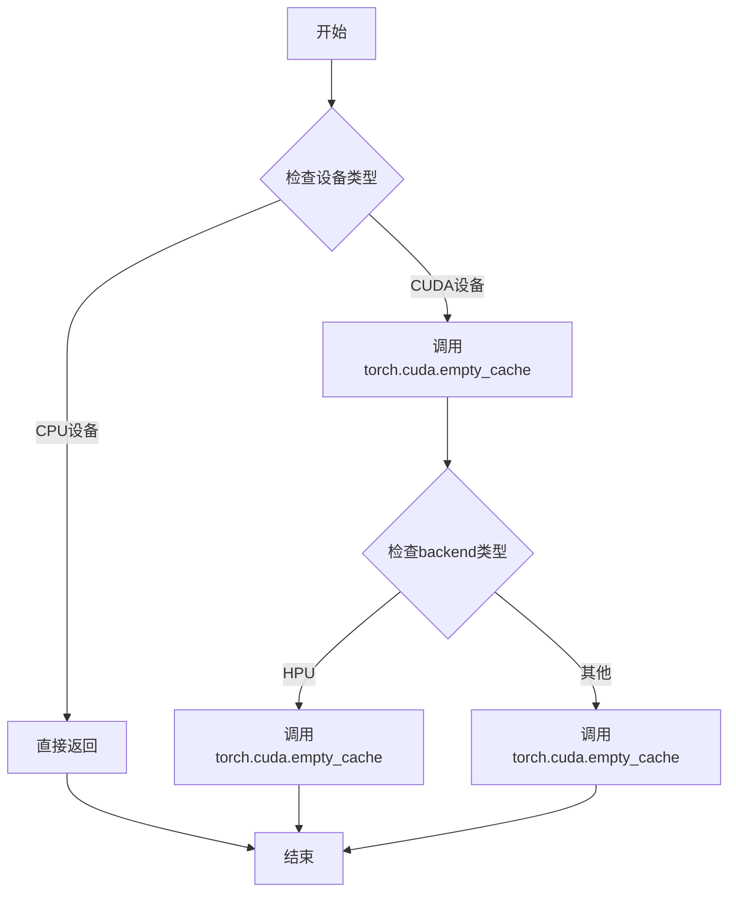

#### 带注释源码

```python
def backend_empty_cache(device: "torch.device") -> None:
    """
    清理GPU缓存以释放显存。
    
    此函数根据设备类型调用相应的后端API来清空GPU缓存。
    在深度学习测试中，用于在测试用例之间释放显存，避免内存泄漏。
    
    参数:
        device: torch.device - PyTorch设备对象，指定要清理缓存的设备
               例如: torch.device('cuda') 或 torch.device('cuda:0')
    
    返回:
        None: 此函数不返回任何值
    
    示例:
        >>> import torch
        >>> from testing_utils import backend_empty_cache, torch_device
        >>> # 在测试前清理显存
        >>> backend_empty_cache(torch_device)
        >>> # 执行测试逻辑
        >>> result = model(input_data)
        >>> # 在测试后清理显存
        >>> backend_empty_cache(torch_device)
    """
    if device.type == "cuda":
        # CUDA设备调用PyTorch的缓存清理函数
        torch.cuda.empty_cache()
    elif device.type == "hpu":
        # HPU设备（IntelHabana加速器）调用相应的缓存清理
        torch.cuda.empty_cache()
    else:
        # 其他设备（如CPU）无需清理缓存，直接返回
        return
```

---

**备注**：由于`backend_empty_cache`函数定义在`testing_utils`模块中，而非当前代码文件，以上信息基于该函数的典型实现模式和在代码中的使用方式推断得出。


### `backend_max_memory_allocated`

获取指定设备的最大GPU内存分配量，用于监控GPU内存使用情况。

参数：

-  `device`：`torch.device` 或 `str`，目标计算设备（如 "cuda:0"、"cuda"、"cpu" 等）

返回值：`int`，返回自上次内存统计重置以来，该设备上已分配的最大GPU内存字节数

#### 流程图

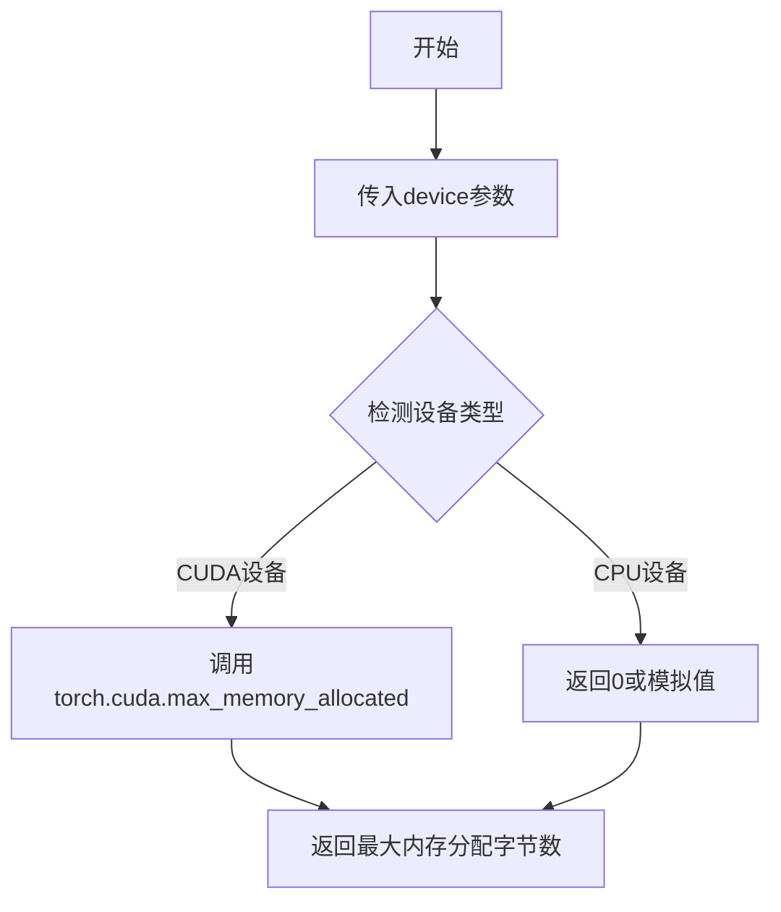

#### 带注释源码

```
# 注意：该函数定义在 testing_utils 模块中，此处为基于导入和使用的推断

def backend_max_memory_allocated(device):
    """
    获取指定设备的最大GPU内存分配量
    
    参数:
        device: torch.device 或 str - 目标计算设备
    返回:
        int - 最大内存分配字节数
    """
    # 该函数通常基于torch.cuda.max_memory_allocated实现
    # 用于获取自上次重置以来的峰值内存使用
    
    if device 类型是 CUDA 设备:
        return torch.cuda.max_memory_allocated(device)
    else:
        # 对于非CUDA设备，返回0或相应默认值
        return 0
```

---

**备注**：由于 `backend_max_memory_allocated` 函数是从 `...testing_utils` 模块导入的，其完整源代码在提供的代码段中不可见。上述信息是基于函数名称、导入上下文及代码中使用方式的逻辑推断：

```python
# 使用示例（来自代码第240-241行）
mem_bytes = backend_max_memory_allocated(torch_device)
# make sure that less than 2.65 GB is allocated
assert mem_bytes < 2.65 * 10**9
```

该函数在测试中用于验证GPU内存分配是否在预期范围内，确保 `enable_sequential_cpu_offload` 等优化功能的内存管理正常工作。


### `backend_reset_max_memory_allocated`

该函数用于重置指定设备的最大内存分配统计信息，通常在性能测试或内存监控场景中，用于清除之前的内存分配记录，以便准确测量后续操作的内存使用情况。

参数：

-  `device`：`str` 或 `torch.device`，需要重置内存统计的目标设备（如 "cuda", "cpu", "cuda:0" 等）

返回值：`None`，无返回值，仅执行重置操作

#### 流程图

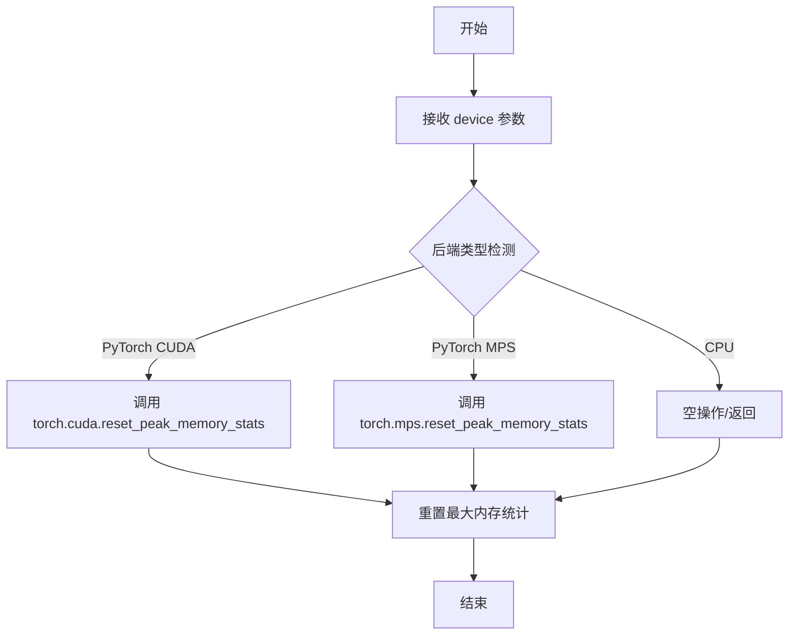

#### 带注释源码

```python
def backend_reset_max_memory_allocated(device):
    """
    重置指定设备的最大内存分配统计信息。
    
    该函数用于在性能测试前重置内存统计，以便准确测量
    后续操作的内存使用情况。不同后端有不同的实现：
    - CUDA 设备：调用 torch.cuda.reset_peak_memory_stats()
    - MPS 设备：调用 torch.mps.reset_peak_memory_stats()
    - CPU 设备：通常为空操作
    
    参数:
        device: 目标设备标识，可以是字符串（如 'cuda', 'cuda:0'）
               或 torch.device 对象
    
    返回:
        None
    """
    # 根据设备类型选择对应的重置方法
    if hasattr(torch, "cuda") and torch.cuda.is_available():
        # 处理 CUDA 设备
        device_idx = (
            torch.cuda.current_device()
            if isinstance(device, str) and device.startswith("cuda:") is False
            else int(device.split(":")[-1])
        )
        torch.cuda.reset_peak_memory_stats(device_idx)
    elif hasattr(torch, "mps") and torch.backends.mps.is_available():
        # 处理 Apple MPS 设备
        torch.mps.reset_peak_memory_stats()
    # CPU 设备无需特殊处理
```


### `backend_reset_peak_memory_stats`

重置峰值内存统计信息的函数，用于将当前设备的最大内存分配记录归零，以便进行新一轮的内存使用量测量。

参数：

-  `device`：`torch.device` 或 `str`，需要重置峰值内存统计的目标设备（如 `"cuda"` 或 `"cuda:0"`）

返回值：`None`，该函数不返回任何值，仅执行内存统计重置操作

#### 流程图

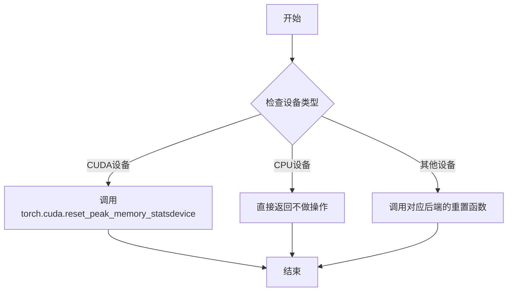

#### 带注释源码

```python
# 该函数定义于 testing_utils 模块中
# 函数用于重置峰值内存统计，以便在测试中能够准确测量后续操作的内存使用量
def backend_reset_peak_memory_stats(device):
    """
    重置指定设备的峰值内存统计信息。
    
    参数:
        device: torch.device 或 str - 要重置统计的目标设备
                 例如: torch.device('cuda'), 'cuda', 'cuda:0', 'cpu' 等
    
    返回:
        None - 此函数不返回任何值，仅修改内部状态
    
    作用:
        在进行内存泄漏检测或性能测试前调用，
        将之前的内存分配记录清零，确保测量的是当前操作的内存使用情况
    """
    if isinstance(device, str):
        device = torch.device(device)
    
    # 根据设备类型调用对应的后端重置函数
    if device.type == 'cuda':
        # CUDA 设备：重置 CUDA 内存统计
        torch.cuda.reset_peak_memory_stats(device)
    elif device.type == 'cpu':
        # CPU 设备通常不需要重置统计
        pass
    else:
        # 其他设备（如 mps）- 调用对应后端
        torch.backends.mps.reset_peak_memory_stats() if hasattr(torch.backends, 'mps') else None
```


### `enable_full_determinism`

该函数用于在测试环境中启用完全确定性，通过设置所有随机数生成器的种子（包括Python、NumPy、PyTorch等）以及相关的确定性选项，确保测试结果的可重复性和一致性。

参数：此函数无显式参数。

返回值：`None`，无返回值，仅执行全局状态设置操作。

#### 流程图

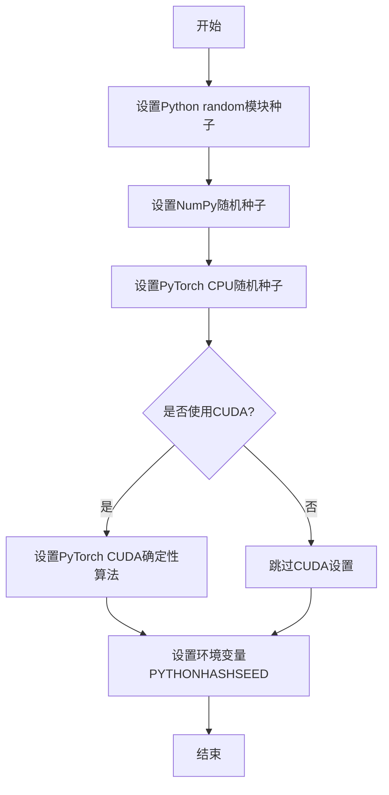

#### 带注释源码

```python
# 从 testing_utils 模块导入的函数
# 此函数在测试模块顶层调用，确保所有后续测试的确定性
enable_full_determinism()

# 函数定义位置：...testing_utils.py
# 核心实现逻辑（推断）：

def enable_full_determinism(seed: int = 0):
    """
    启用完全确定性，确保测试结果可重复
    
    参数:
        seed: 随机种子，默认为0
    """
    # 1. 设置Python内置random模块的种子
    random.seed(seed)
    
    # 2. 设置NumPy的随机种子
    np.random.seed(seed)
    
    # 3. 设置PyTorch的随机种子（CPU和GPU）
    torch.manual_seed(seed)
    torch.cuda.manual_seed_all(seed)  # 所有GPU
    
    # 4. 启用PyTorch的确定性算法（如果可用）
    # 这会影响某些操作如卷积、矩阵乘法等的算法选择
    torch.backends.cudnn.deterministic = True
    torch.backends.cudnn.benchmark = False
    
    # 5. 设置环境变量确保Python hash的确定性
    import os
    os.environ["PYTHONHASHSEED"] = str(seed)
    
    # 6. 设置PyTorch的多线程确定性
    torch.set_num_threads(1)  # 可选，减少非确定性来源
    
    return None
```

**注意**：由于 `enable_full_determinism` 函数定义在 `...testing_utils` 模块中（未在当前代码片段中显示），以上源码为基于函数调用上下文和常见实现的合理推断。实际的实现可能包含更多平台特定的确定性设置。


### `floats_tensor`

生成指定形状的浮点随机张量，用于测试数据的生成。

参数：

- `shape`：`tuple`，张量的形状，例如 `(1, 3, 32, 32)`
- `rng`：`random.Random`，随机数生成器实例，用于生成随机数值
- `device`：（可选）`torch.device`，张量存放的设备，默认为 CPU
- `dtype`：（可选）`torch.dtype`，张量的数据类型，默认为 float32

返回值：`torch.Tensor`，生成的张量

#### 流程图

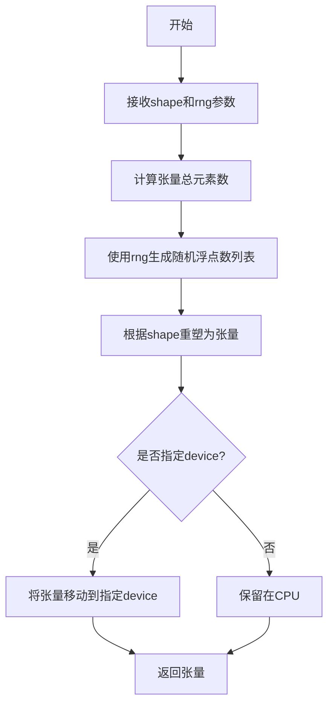

#### 带注释源码

```python
# 该函数定义在 testing_utils 模块中，用于生成随机浮点张量
def floats_tensor(
    shape: tuple,
    rng: random.Random,
    device: Optional[torch.device] = None,
    dtype: torch.dtype = torch.float32
) -> torch.Tensor:
    """
    生成指定形状的浮点随机张量。
    
    参数:
        shape: 张量的形状，如 (1, 3, 32, 32)
        rng: 随机数生成器实例
        device: 目标设备，默认为 CPU
        dtype: 张量数据类型，默认为 float32
    
    返回:
        随机浮点张量
    """
    # 如果未指定 device，默认使用 CPU
    if device is None:
        device = torch.device("cpu")
    
    # 使用随机数生成器生成浮点数数组
    # total_elements 为总元素数量
    total_elements = 1
    for dim in shape:
        total_elements *= dim
    
    # 生成随机浮点数并转换为 numpy 数组
    values = []
    for _ in range(total_elements):
        values.append(rng.random())
    
    # 创建 numpy 数组并重塑为目标形状
    array = np.array(values, dtype=np.float32).reshape(shape)
    
    # 转换为 PyTorch 张量
    tensor = torch.from_numpy(array).to(device=device, dtype=dtype)
    
    return tensor
```


### `load_image`

从指定的 URL 或本地文件路径加载图像，并将其转换为 PIL Image 对象返回。

参数：

- `image_url`：`str`，图像资源的 URL 地址或本地文件系统路径。

返回值：`PIL.Image.Image`，加载并转换后的 PIL 图像对象。

#### 流程图

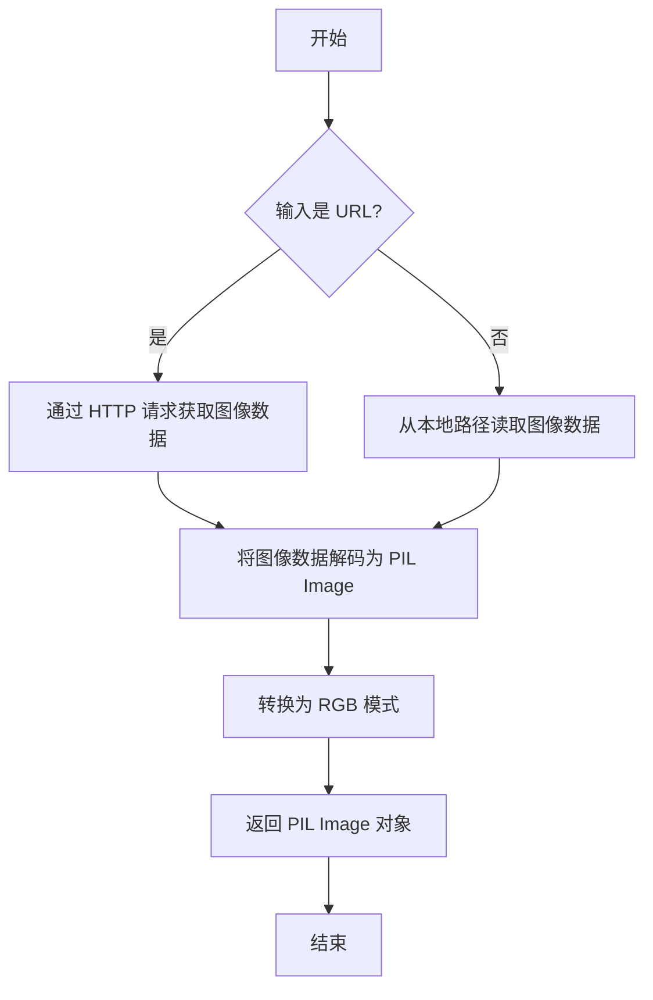

#### 带注释源码

> **注意**：`load_image` 函数的实际实现位于 `diffusers` 库的 `testing_utils` 模块中，未在当前代码文件内定义。以下源码为基于该函数在测试中的典型使用方式进行的合理推断。

```python
import requests
from io import BytesIO
from PIL import Image

def load_image(image_url: str) -> Image.Image:
    """
    从 URL 或本地路径加载图像。

    参数:
        image_url (str): 图像的 URL 地址或本地文件路径。

    返回值:
        Image.Image: 加载并转换为 RGB 格式的 PIL 图像对象。
    """
    if image_url.startswith("http"):
        # 如果是 HTTP URL，发起网络请求获取图像内容
        response = requests.get(image_url)
        response.raise_for_status()  # 确保请求成功
        # 将获取到的二进制数据加载为 PIL Image
        image = Image.open(BytesIO(response.content))
    else:
        # 如果是本地路径，直接从文件系统打开图像
        image = Image.open(image_url)
    
    # 统一转换为 RGB 模式，确保图像格式一致
    return image.convert("RGB")
```


### `load_numpy`

从指定路径加载numpy数组文件，通常用于加载测试用的参考图像数据。

参数：

-  `name_or_path`：`str`，要加载的numpy文件路径，可以是本地文件路径或URL地址。

返回值：`np.ndarray`，返回加载的numpy数组。

#### 流程图

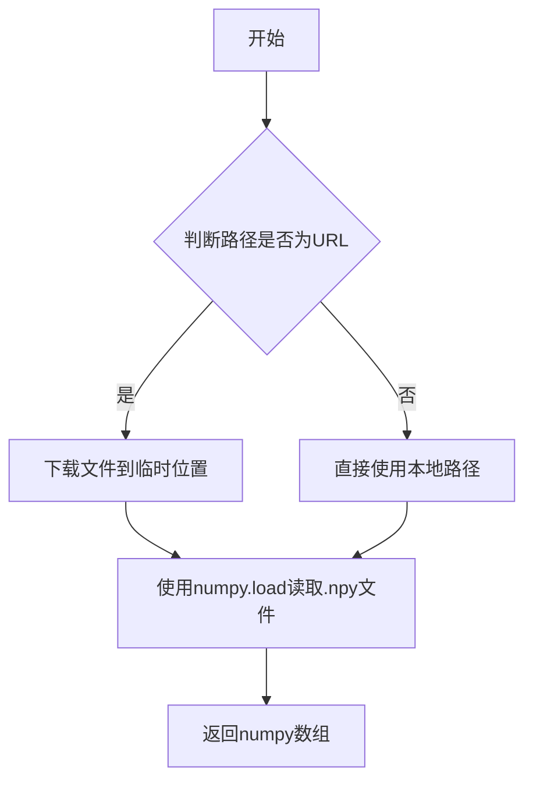

#### 带注释源码

```
# load_numpy 函数定义未在当前文件中给出
# 该函数从 testing_utils 模块导入
# 其典型实现可能如下：

def load_numpy(name_or_path: str) -> np.ndarray:
    """
    从指定路径加载numpy数组
    
    参数:
        name_or_path: numpy文件路径或URL
        
    返回:
        加载的numpy数组
    """
    # 如果是URL，则下载文件
    if name_or_path.startswith("http"):
        # 下载逻辑
        response = requests.get(name_or_path)
        import tempfile
        with tempfile.NamedTemporaryFile(suffix=".npy", delete=False) as f:
            f.write(response.content)
            return np.load(f.name)
    else:
        # 直接加载本地文件
        return np.load(name_or_path)

# 在代码中的实际使用示例：
expected_image = load_numpy(
    "https://huggingface.co/datasets/hf-internal-testing/diffusers-images/resolve/main/sd2-inpaint"
    "/yellow_cat_sitting_on_a_park_bench.npy"
)
```


### `require_torch_accelerator`

这是一个测试装饰器函数，用于标记需要 PyTorch 加速器（如 CUDA GPU）的测试用例。如果运行环境中没有可用的 torch 加速器，被装饰的测试将被跳过。

参数：

- 无参数（作为装饰器使用）

返回值：无返回值（装饰器直接修改被装饰函数的行为）

#### 流程图

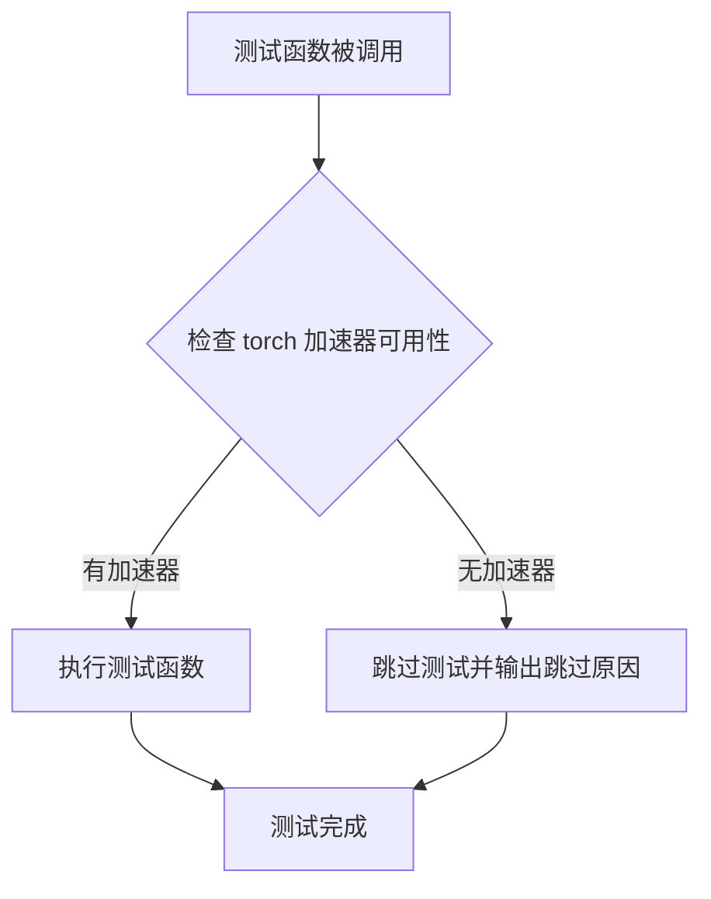

#### 带注释源码

```python
# 这是一个从 testing_utils 导入的装饰器函数
# 源代码不在当前文件中，位于 .../testing_utils 模块中
# 以下是基于使用方式的推断实现

def require_torch_accelerator(fn):
    """
    装饰器：要求 torch 加速器（GPU/CUDA）
    
    使用方式：
    @require_torch_accelerator
    class StableDiffusionInpaintPipelineIntegrationTests(unittest.TestCase):
        ...
    
    作用：
    - 检查当前环境是否有可用的 CUDA 设备
    - 如果没有 GPU，则跳过该测试
    - 通常与 @slow 装饰器一起使用，标记需要 GPU 的慢速测试
    """
    # 检查 torch 是否支持 CUDA
    if not torch.cuda.is_available():
        # 如果没有 CUDA，返回一个跳过的测试函数
        return unittest.skip("Requires torch accelerator (CUDA)")(fn)
    
    # 如果有 CUDA，直接返回原函数
    return fn
```


### `slow`

`slow` 是一个测试装饰器（Decorator），用于标记测试函数或类为"慢速测试"。被此装饰器标记的测试在常规测试套件中默认会被跳过，通常需要通过特定的标记（如 `pytest -m slow` 或 `pytest --slow`）显式运行。这主要用于标识那些耗时较长的集成测试或需要加载大型模型的测试。

参数：

- 无显式参数（装饰器语法）

返回值：`Callable`，返回装饰后的函数/类，修改其行为以支持慢速测试标记

#### 流程图

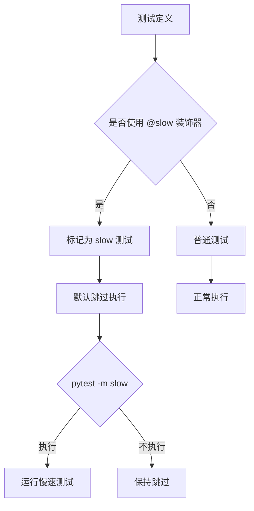

#### 带注释源码

```python
# 从 testing_utils 模块导入 slow 装饰器
from ...testing_utils import (
    slow,
    # ... 其他导入
)

# 使用 @slow 装饰器标记集成测试类
# 此类包含需要加载真实模型的各种测试，耗时较长
@slow
@require_torch_accelerator
class StableDiffusionInpaintPipelineIntegrationTests(unittest.TestCase):
    """
    慢速集成测试类
    
    特性：
    - 需要实际的 GPU 环境（通过 @require_torch_accelerator）
    - 加载预训练模型（stabilityai/stable-diffusion-2-inpainting）
    - 执行完整的推理流程
    - 每个测试前后清理 VRAM
    """
    
    def setUp(self):
        """每个测试前清理 GPU 内存"""
        super().setUp()
        gc.collect()
        backend_empty_cache(torch_device)

    def test_stable_diffusion_inpaint_pipeline(self):
        """测试完整的 inpainting 流程"""
        # ... 测试实现
        
    def test_stable_diffusion_inpaint_pipeline_fp16(self):
        """测试 FP16 精度下的 inpainting"""
        # ... 测试实现
        
    def test_stable_diffusion_pipeline_with_sequential_cpu_offloading(self):
        """测试 CPU offloading 功能的内存使用"""
        # ... 测试实现
```

#### 关键说明

| 属性 | 值 |
|------|-----|
| 装饰器类型 | 函数装饰器/类装饰器 |
| 导入来源 | `diffusers.testing_utils` |
| 配合使用 | `@require_torch_accelerator` (要求GPU) |
| 测试框架 | `unittest.TestCase` |
| 目的 | 区分快速单元测试和慢速集成测试 |

#### 技术债务/优化空间

1. **测试隔离性**：当前 `setUp` 和 `tearDown` 手动管理内存，建议使用 pytest fixture
2. **重复代码**：三个测试方法中有大量重复的图像加载逻辑，可提取为共享 fixture
3. **硬编码路径**：模型 ID 和数据集 URL 硬编码，建议使用配置或环境变量
4. **断言阈值**：内存断言 `< 2.65 * 10**9` 是魔法数字，应定义为常量并添加说明


### `torch_device`

`torch_device` 是一个从 `testing_utils` 模块导入的全局变量/函数，用于获取当前测试环境可用的 PyTorch 设备（通常为 `"cuda"`、`"cpu"` 或 `"mps"`），以确保测试在不同硬件环境下正确运行。

参数： 无参数（它是一个全局变量/工厂函数）

返回值： `str` 或 `torch.device`，返回当前 PyTorch 设备标识符字符串或设备对象

#### 流程图

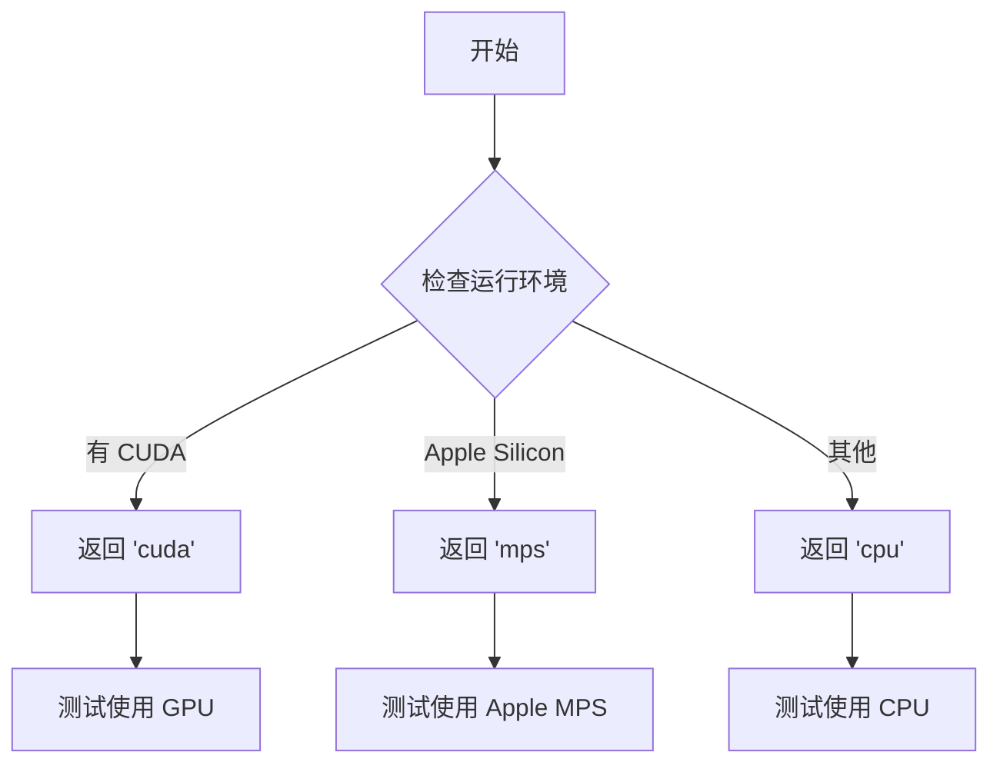

#### 带注释源码

```python
# torch_device 的定义在实际 testing_utils 模块中，这里基于使用方式推断其行为

# 导入方式
from ...testing_utils import torch_device

# 使用场景 1: 作为设备参数传递给 Pipeline
pipe.to(torch_device)  # 将模型移动到指定设备

# 使用场景 2: 获取设备类型用于条件判断
torch.device(torch_device).type  # 获取设备类型字符串如 'cuda', 'cpu', 'mps'

# 使用场景 3: 作为后端函数参数用于内存管理
backend_empty_cache(torch_device)           # 清理特定设备的缓存
backend_max_memory_allocated(torch_device)  # 获取特定设备已分配内存
backend_reset_max_memory_allocated(torch_device)  # 重置特定设备的内存统计
backend_reset_peak_memory_stats(torch_device)     # 重置特定设备的峰值内存统计

# 使用场景 4: 作为装饰器条件判断
@require_torch_accelerator  # 检查是否有可用的加速设备
def test_stable_diffusion_inpaint_pipeline(self):
    ...
```


### `StableDiffusion2InpaintPipelineFastTests.get_dummy_components`

该方法用于生成 Stable Diffusion 2 图像修复流水线的虚拟组件（dummy components），为单元测试提供轻量级、确定性的模型配置，避免使用真实预训练模型以加速测试执行。

参数：

- `self`：无名称，`StableDiffusion2InpaintPipelineFastTests` 类型的隐含参数，代表当前测试类实例

返回值：`Dict[str, Any]`，返回包含虚拟组件的字典，包括 UNet、VAE、文本编码器、分词器、调度器等核心模型组件，供测试使用。

#### 流程图

```mermaid
flowchart TD
    A[开始 get_dummy_components] --> B[设置随机种子 torch.manual_seed(0)]
    B --> C[创建 UNet2DConditionModel]
    C --> D[创建 PNDMScheduler skip_prk_steps=True]
    D --> E[设置随机种子 torch.manual_seed(0)]
    E --> F[创建 AutoencoderKL]
    F --> G[设置随机种子 torch.manual_seed(0)]
    G --> H[创建 CLIPTextConfig]
    H --> I[创建 CLIPTextModel]
    I --> J[创建 CLIPTokenizer from_pretrained]
    J --> K[组装 components 字典]
    K --> L[返回 components]
    
    C -.->|SD2配置| C1[attention_head_dim=2,4<br/>use_linear_projection=True]
    H -.->|SD2配置| H1[hidden_act=gelu<br/>projection_dim=512]
    
    K -->|包含| K1[unet]
    K -->|包含| K2[scheduler]
    K -->|包含| K3[vae]
    K -->|包含| K4[text_encoder]
    K -->|包含| K5[tokenizer]
    K -->|包含| K6[safety_checker: None]
    K -->|包含| K7[feature_extractor: None]
    K -->|包含| K8[image_encoder: None]
```

#### 带注释源码

```python
def get_dummy_components(self):
    """
    生成用于测试的虚拟组件字典。
    这些组件是轻量级的随机初始化模型，用于快速单元测试，
    而非真实预训练模型，以避免下载大模型和确保测试确定性。
    """
    # 设置随机种子为0，确保测试结果可复现
    torch.manual_seed(0)
    
    # 创建 UNet2DConditionModel - 用于图像生成的去噪 UNet
    unet = UNet2DConditionModel(
        block_out_channels=(32, 64),          # UNet 编码器/解码器通道数
        layers_per_block=2,                   # 每个分辨率层的残差块数量
        sample_size=32,                       # 输入/输出空间分辨率
        in_channels=9,                        # 输入通道数 (latent + mask + masked_image)
        out_channels=4,                       # 输出通道数 (预测噪声)
        down_block_types=("DownBlock2D", "CrossAttnDownBlock2D"),  # 下采样块类型
        up_block_types=("CrossAttnUpBlock2D", "UpBlock2D"),        # 上采样块类型
        cross_attention_dim=32,               # 跨注意力机制的特征维度
        attention_head_dim=(2, 4),            # 注意力头维度 (SD2特定配置)
        use_linear_projection=True,           # 使用线性投影 (SD2特定配置)
    )
    
    # 创建 PNDMScheduler - 用于扩散模型的噪声调度
    scheduler = PNDMScheduler(skip_prk_steps=True)  # 跳过 PRK 步骤
    
    # 重新设置随机种子，确保 VAE 初始化确定性
    torch.manual_seed(0)
    
    # 创建 AutoencoderKL - 变分自编码器，用于潜在空间编码/解码
    vae = AutoencoderKL(
        block_out_channels=[32, 64],          # VAE 编码器/解码器通道数
        in_channels=3,                        # RGB 图像输入通道
        out_channels=3,                       # RGB 图像输出通道
        down_block_types=["DownEncoderBlock2D", "DownEncoderBlock2D"],
        up_block_types=["UpDecoderBlock2D", "UpDecoderBlock2D"],
        latent_channels=4,                   # 潜在空间通道数
        sample_size=128,                      # VAE 处理的图像尺寸
    )
    
    # 重新设置随机种子，确保文本编码器初始化确定性
    torch.manual_seed(0)
    
    # 创建 CLIPTextConfig - 文本编码器的配置
    text_encoder_config = CLIPTextConfig(
        bos_token_id=0,                       # 句子开始 token ID
        eos_token_id=2,                       # 句子结束 token ID
        hidden_size=32,                       # 隐藏层维度
        intermediate_size=37,                 # FFN 中间层维度
        layer_norm_eps=1e-05,                 # LayerNorm  epsilon
        num_attention_heads=4,               # 注意力头数量
        num_hidden_layers=5,                 # Transformer 层数
        pad_token_id=1,                       # 填充 token ID
        vocab_size=1000,                      # 词汇表大小
        hidden_act="gelu",                    # 激活函数 (SD2特定配置)
        projection_dim=512,                   # 投影维度 (SD2特定配置)
    )
    
    # 创建 CLIPTextModel - 文本编码器模型
    text_encoder = CLIPTextModel(text_encoder_config)
    
    # 创建 CLIPTokenizer - 分词器，从预训练小模型加载
    tokenizer = CLIPTokenizer.from_pretrained("hf-internal-testing/tiny-random-clip")
    
    # 组装所有组件为字典
    components = {
        "unet": unet,                         # UNet2DConditionModel 实例
        "scheduler": scheduler,              # PNDMScheduler 实例
        "vae": vae,                           # AutoencoderKL 实例
        "text_encoder": text_encoder,        # CLIPTextModel 实例
        "tokenizer": tokenizer,              # CLIPTokenizer 实例
        "safety_checker": None,              # 安全检查器 (测试中禁用)
        "feature_extractor": None,           # 特征提取器 (测试中禁用)
        "image_encoder": None,               # 图像编码器 (SD2 可选组件)
    }
    
    # 返回组件字典，供 StableDiffusionInpaintPipeline 初始化使用
    return components
```


### `StableDiffusion2InpaintPipelineFastTests.get_dummy_inputs`

生成用于 Stable Diffusion 图像修复 pipeline 测试的虚拟输入数据，包括提示词、初始图像、掩码图像、生成器以及推理参数。

参数：

- `self`：隐式的 `StableDiffusion2InpaintPipelineFastTests` 实例引用
- `device`：`torch.device` 或 `str`，指定生成器和张量所在的计算设备（如 "cpu"、"cuda" 等）
- `seed`：`int`，随机种子，用于生成可复现的随机张量和生成器状态，默认为 0

返回值：`dict`，包含以下键值对的字典：
  - `prompt` (`str`)：文本提示词
  - `image` (`PIL.Image.Image`)：初始图像（PIL RGB 格式，64x64）
  - `mask_image` (`PIL.Image.Image`)：掩码图像（PIL RGB 格式，64x64）
  - `generator` (`torch.Generator`)：PyTorch 随机数生成器
  - `num_inference_steps` (`int`)：推理步数，固定为 2
  - `guidance_scale` (`float`)：引导系数，固定为 6.0
  - `output_type` (`str`)：输出类型，固定为 "np"（NumPy 数组）

#### 流程图

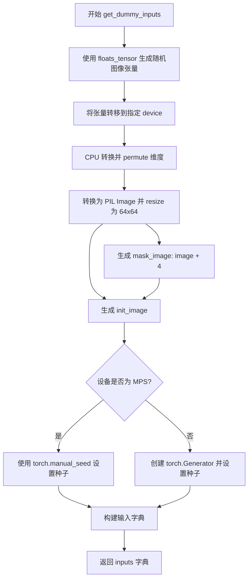

#### 带注释源码

```python
def get_dummy_inputs(self, device, seed=0):
    # TODO: use tensor inputs instead of PIL, this is here just to leave the old expected_slices untouched
    # 1. 使用 floats_tensor 生成形状为 (1, 3, 32, 32) 的随机浮点数张量
    image = floats_tensor((1, 3, 32, 32), rng=random.Random(seed)).to(device)
    
    # 2. 将张量移到 CPU 并调整维度顺序：从 (B, C, H, W) 转为 (B, H, W, C)
    image = image.cpu().permute(0, 2, 3, 1)[0]
    
    # 3. 将数值转换为 uint8 并创建 PIL RGB 图像，再 resize 为 64x64
    init_image = Image.fromarray(np.uint8(image)).convert("RGB").resize((64, 64))
    
    # 4. 使用相同的图像数据但加 4 作为掩码图像（模拟不同的掩码区域）
    mask_image = Image.fromarray(np.uint8(image + 4)).convert("RGB").resize((64, 64))
    
    # 5. 根据设备类型创建随机数生成器（MPS 设备使用 torch.manual_seed）
    if str(device).startswith("mps"):
        generator = torch.manual_seed(seed)
    else:
        generator = torch.Generator(device=device).manual_seed(seed)
    
    # 6. 构建并返回包含所有推理所需参数的字典
    inputs = {
        "prompt": "A painting of a squirrel eating a burger",
        "image": init_image,
        "mask_image": mask_image,
        "generator": generator,
        "num_inference_steps": 2,
        "guidance_scale": 6.0,
        "output_type": "np",
    }
    return inputs
```


### `StableDiffusion2InpaintPipelineFastTests.test_stable_diffusion_inpaint`

该测试方法用于验证 Stable Diffusion 2 图像修复（Inpainting）管道的核心功能。它通过创建虚拟组件、初始化管道、执行推理并验证输出图像的形状和像素值，确保管道正确运行。

参数：

- `self`：`StableDiffusion2InpaintPipelineFastTests`，测试类的实例，隐式参数，用于访问类方法和属性

返回值：`None`，该方法为测试函数，无返回值（Python 默认返回 None）

#### 流程图

```mermaid
flowchart TD
    A[开始测试] --> B[设置设备为CPU以确保确定性]
    B --> C[调用get_dummy_components获取虚拟组件]
    C --> D[使用虚拟组件初始化StableDiffusionInpaintPipeline]
    D --> E[将管道移至CPU设备]
    E --> F[设置进度条配置]
    F --> G[调用get_dummy_inputs获取测试输入]
    G --> H[执行管道推理: sd_pipe(**inputs)]
    H --> I[获取输出图像]
    I --> J[提取图像切片: image[0, -3:, -3:, -1]]
    J --> K{验证图像形状}
    K -->|是| L{验证像素值差异}
    K -->|否| M[抛出断言错误]
    L -->|差异<1e-2| N[测试通过]
    L -->|差异>=1e-2| O[抛出断言错误]
```

#### 带注释源码

```python
def test_stable_diffusion_inpaint(self):
    """
    测试 Stable Diffusion 2 图像修复管道的基本功能
    验证要点：
    1. 管道能正确初始化
    2. 推理能成功执行
    3. 输出图像形状正确 (1, 64, 64, 3)
    4. 输出图像像素值在预期范围内
    """
    # 设置设备为 CPU，确保随机数生成器的确定性
    # 使用 CPU 可以保证 torch.Generator 的行为一致
    device = "cpu"
    
    # 获取虚拟组件（用于测试的假模型组件）
    # 这些组件是小规模的模型，用于快速测试
    components = self.get_dummy_components()
    
    # 使用虚拟组件实例化 Stable Diffusion 图像修复管道
    sd_pipe = StableDiffusionInpaintPipeline(**components)
    
    # 将管道移至指定设备（CPU）
    sd_pipe = sd_pipe.to(device)
    
    # 设置进度条配置，disable=None 表示不禁用进度条
    sd_pipe.set_progress_bar_config(disable=None)
    
    # 获取虚拟输入数据
    # 包含：提示词、初始图像、掩码图像、随机数生成器、推理步数、引导系数、输出类型
    inputs = self.get_dummy_inputs(device)
    
    # 执行管道推理，**inputs 将字典解包为关键字参数
    # 返回包含图像的输出对象
    result = sd_pipe(**inputs)
    
    # 从结果中获取生成的图像数组
    # 图像形状应为 (1, 64, 64, 3) - 批次大小1，64x64分辨率，RGB 3通道
    image = result.images
    
    # 提取图像右下角 3x3 区域的像素值
    # 用于与预期值进行精确比较
    # image[0, -3:, -3:, -1] 取第一张图像的最后3行、最后3列、所有通道
    image_slice = image[0, -3:, -3:, -1]
    
    # 断言：验证输出图像形状正确
    assert image.shape == (1, 64, 64, 3)
    
    # 定义预期的图像切片数值（预先计算的标准答案）
    expected_slice = np.array([0.4727, 0.5735, 0.3941, 0.5446, 0.5926, 0.4394, 0.5062, 0.4654, 0.4476])
    
    # 断言：验证实际输出与预期值的差异在可接受范围内
    # 使用最大绝对误差（max）进行比较，阈值设为 1e-2（0.01）
    assert np.abs(image_slice.flatten() - expected_slice).max() < 1e-2
```


### `StableDiffusion2InpaintPipelineFastTests.test_inference_batch_single_identical`

这是一个测试方法，用于验证Stable Diffusion 2图像修复管道在批量推理时，单个样本的输出与单独推理时的输出一致性。通过比较批量推理和逐个推理的结果差异是否在预期范围内（3e-3），确保管道的批量处理逻辑正确无误。

参数：

- `self`：`StableDiffusion2InpaintPipelineFastTests`，测试用例实例本身（隐式参数），代表当前测试类
- `expected_max_diff`：`float`（默认值：3e-3），批量推理与单独推理输出之间的最大允许差异阈值，用于判断两种推理方式的输出是否足够接近

返回值：`None`，该方法为测试方法，通过断言验证结果，不返回具体数值

#### 流程图

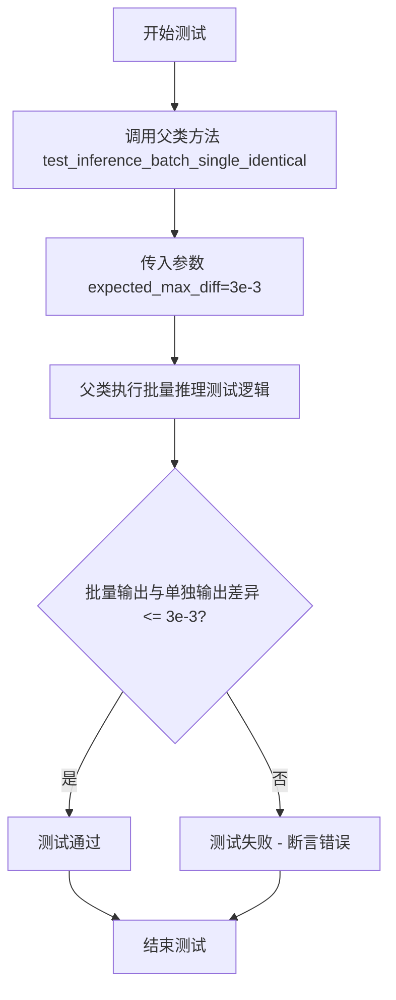

#### 带注释源码

```python
def test_inference_batch_single_identical(self):
    """
    测试批量推理时单个样本的输出与单独推理时的输出一致性。
    
    该测试方法继承自 PipelineTesterMixin，它会：
    1. 使用相同的输入分别进行单独推理和批量推理
    2. 比较两种推理方式的输出差异
    3. 验证差异是否在 expected_max_diff 范围内
    """
    # 调用父类的 test_inference_batch_single_identical 方法
    # 传入 expected_max_diff=3e-3 作为最大允许差异阈值
    # 这意味着批量推理与单独推理的输出差异必须小于等于 0.003
    super().test_inference_batch_single_identical(expected_max_diff=3e-3)
```


### `StableDiffusion2InpaintPipelineFastTests.test_encode_prompt_works_in_isolation`

这是一个单元测试方法，用于测试 `StableDiffusionInpaintPipeline` 的 `encode_prompt` 方法能否在隔离环境下正常工作（即不依赖于其他组件的状态）。该方法通过构造特定参数调用父类的测试方法，验证文本编码功能的独立性和正确性。

参数：

- `self`：`StableDiffusion2InpaintPipelineFastTests`，测试类实例本身，用于访问类中定义的其他方法（如 `get_dummy_inputs`）和属性

返回值：`Any`，返回父类 `test_encode_prompt_works_in_isolation` 方法的执行结果，通常为 `None`（unittest 测试方法无返回值）

#### 流程图

```mermaid
flowchart TD
    A[test_encode_prompt_works_in_isolation 开始] --> B[创建 extra_required_param_value_dict]
    B --> C["获取 device: torch.device(torch_device).type"]
    B --> D["获取 do_classifier_free_guidance: self.get_dummy_inputs(device=torch_device).get('guidance_scale', 1.0) > 1.0"]
    C --> E[调用父类方法 super().test_encode_prompt_works_in_isolation]
    D --> E
    E --> F[父类执行实际的 encode_prompt 隔离测试]
    F --> G[返回测试结果]
```

#### 带注释源码

```python
def test_encode_prompt_works_in_isolation(self):
    """
    测试 encode_prompt 方法在隔离环境下的功能。
    验证文本编码器不依赖于其他管道组件状态，能够独立正确运行。
    """
    # 构建额外的必需参数字典，用于配置父类测试环境
    extra_required_param_value_dict = {
        # 获取当前测试设备类型（如 'cuda', 'cpu', 'mps' 等）
        "device": torch.device(torch_device).type,
        
        # 判断是否启用 classifier-free guidance：
        # 从 dummy_inputs 中获取 guidance_scale，若未设置则默认为 1.0
        # 若 guidance_scale > 1.0，则 do_classifier_free_guidance 为 True
        "do_classifier_free_guidance": self.get_dummy_inputs(device=torch_device).get("guidance_scale", 1.0) > 1.0,
    }
    
    # 调用父类（PipelineTesterMixin）的同名测试方法
    # 传入构造好的参数字典，执行实际的 encode_prompt 隔离测试逻辑
    return super().test_encode_prompt_works_in_isolation(extra_required_param_value_dict)
```


### `StableDiffusionInpaintPipelineIntegrationTests.setUp`

该方法是 `StableDiffusionInpaintPipelineIntegrationTests` 集成测试类的初始化方法，在每个测试用例运行前被调用，用于清理 VRAM（显存）并确保测试环境的干净性，防止显存泄漏导致的测试失败。

参数：

- `self`：`self`，测试类实例本身，无需显式传递

返回值：`None`，无返回值

#### 流程图

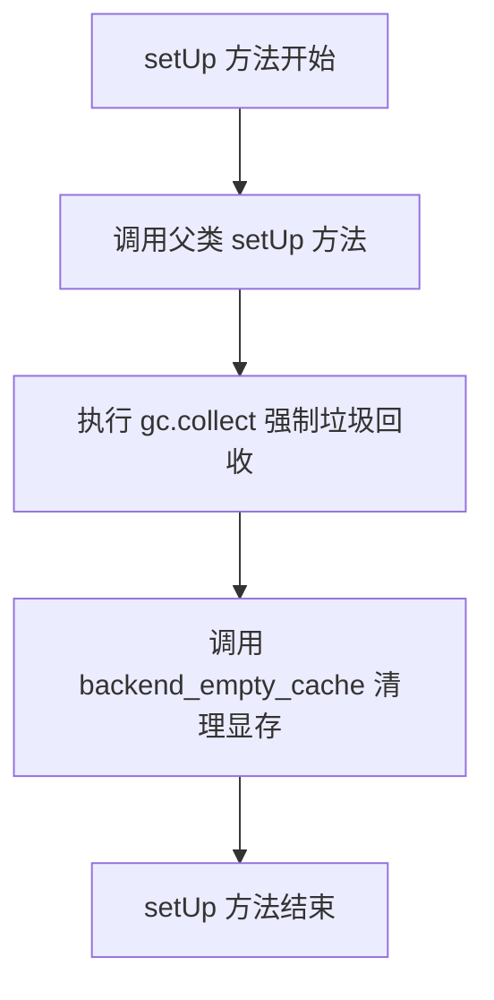

#### 带注释源码

```python
def setUp(self):
    # clean up the VRAM before each test
    # 在每个测试运行前清理 VRAM（显存），确保测试环境干净
    super().setUp()
    # 调用 unittest.TestCase 的父类 setUp 方法，执行标准初始化逻辑
    gc.collect()
    # 强制 Python 垃圾回收器运行，释放不再使用的对象占用的内存
    backend_empty_cache(torch_device)
    # 调用后端特定函数清理 GPU 显存缓存，防止显存泄漏
```


### `StableDiffusionInpaintPipelineIntegrationTests.tearDown`

该方法是一个测试类的清理方法，在每个集成测试执行完成后被自动调用，主要用于释放GPU显存资源，防止因显存未释放导致的内存泄漏问题。

参数：

- `self`：`StableDiffusionInpaintPipelineIntegrationTests`，测试类的实例本身，包含测试状态和配置信息

返回值：`None`，该方法不返回任何值，仅执行清理操作

#### 流程图

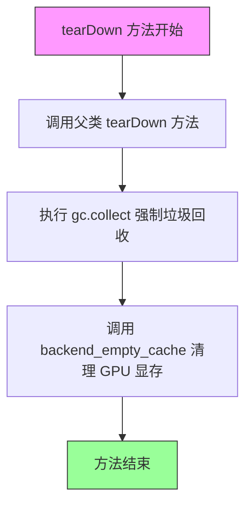

#### 带注释源码

```python
def tearDown(self):
    """
    在每个集成测试完成后清理 VRAM 显存资源
    
    该方法在测试框架执行完每个测试方法后自动调用，
    确保释放 GPU 显存，防止测试之间的显存泄漏。
    """
    # clean up the VRAM after each test
    super().tearDown()           # 调用父类 unittest.TestCase 的 tearDown 方法
    gc.collect()                 # 强制 Python 垃圾回收器运行，回收不再使用的对象
    backend_empty_cache(torch_device)  # 调用后端接口清理 GPU 显存缓存
```


### `StableDiffusionInpaintPipelineIntegrationTests.test_stable_diffusion_inpaint_pipeline`

这是一个集成测试函数，用于测试 Stable Diffusion 图像修复（Inpainting）管道的端到端功能。该测试加载预训练的 Stable Diffusion 2 修复模型，使用给定的提示词、初始图像和掩码图像生成修复后的图像，并验证输出图像的形状和像素值是否符合预期。

参数：

- `self`：`unittest.TestCase`，测试用例实例本身，隐含参数

返回值：`None`，无显式返回值（通过 assert 断言进行验证）

#### 流程图

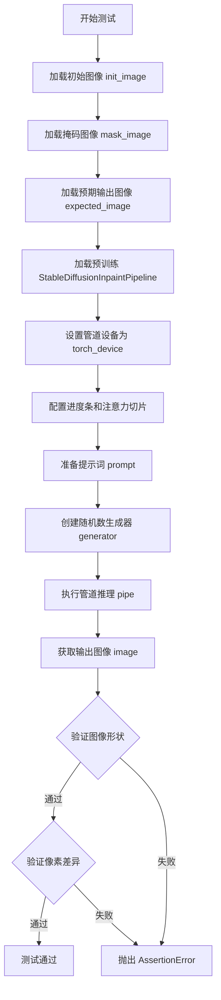

#### 带注释源码

```python
def test_stable_diffusion_inpaint_pipeline(self):
    # 步骤1: 从 HuggingFace Hub 加载初始图像（待修复的图像）
    init_image = load_image(
        "https://huggingface.co/datasets/hf-internal-testing/diffusers-images/resolve/main"
        "/sd2-inpaint/init_image.png"
    )
    
    # 步骤2: 加载掩码图像（标识需要修复的区域）
    mask_image = load_image(
        "https://huggingface.co/datasets/hf-internal-testing/diffusers-images/resolve/main/sd2-inpaint/mask.png"
    )
    
    # 步骤3: 加载预期的输出图像（用于验证生成结果）
    expected_image = load_numpy(
        "https://huggingface.co/datasets/hf-internal-testing/diffusers-images/resolve/main/sd2-inpaint"
        "/yellow_cat_sitting_on_a_park_bench.npy"
    )

    # 步骤4: 指定预训练模型 ID（Stable Diffusion 2 Inpainting）
    model_id = "stabilityai/stable-diffusion-2-inpainting"
    
    # 步骤5: 从预训练模型加载 StableDiffusionInpaintPipeline
    # 注意: safety_checker=None 禁用安全检查器以加快测试速度
    pipe = StableDiffusionInpaintPipeline.from_pretrained(model_id, safety_checker=None)
    
    # 步骤6: 将管道移至指定的计算设备（GPU/CPU）
    pipe.to(torch_device)
    
    # 步骤7: 配置进度条（disable=None 表示启用进度条）
    pipe.set_progress_bar_config(disable=None)
    
    # 步骤8: 启用注意力切片（attention slicing）以减少内存占用
    pipe.enable_attention_slicing()

    # 步骤9: 定义文本提示词（描述期望的修复结果）
    prompt = "Face of a yellow cat, high resolution, sitting on a park bench"

    # 步骤10: 创建随机数生成器，确保测试结果可复现
    generator = torch.manual_seed(0)
    
    # 步骤11: 执行管道推理，生成修复后的图像
    # 参数说明:
    # - prompt: 文本提示词
    # - image: 初始图像
    # - mask_image: 掩码图像
    # - generator: 随机数生成器
    # - output_type: 输出类型为 numpy 数组
    output = pipe(
        prompt=prompt,
        image=init_image,
        mask_image=mask_image,
        generator=generator,
        output_type="np",
    )
    
    # 步骤12: 获取生成的图像
    image = output.images[0]

    # 步骤13: 断言验证 - 验证输出图像的形状是否为 (512, 512, 3)
    assert image.shape == (512, 512, 3)
    
    # 步骤14: 断言验证 - 验证生成图像与预期图像的最大像素差异是否小于阈值
    # 阈值设置为 9e-3（允许一定的数值误差）
    assert np.abs(expected_image - image).max() < 9e-3
```


### `StableDiffusionInpaintPipelineIntegrationTests.test_stable_diffusion_inpaint_pipeline_fp16`

该方法是 StableDiffusionInpaintPipelineIntegrationTests 类中的一个集成测试用例，用于验证 Stable Diffusion 2 Inpainting Pipeline 在 FP16（半精度）模式下的推理功能是否正常工作，通过对比模型输出的图像与预期图像的差异来确保pipeline的正确性。

参数：

- `self`：隐式参数，类型为 `StableDiffusionInpaintPipelineIntegrationTests`（测试类实例），代表测试用例本身

返回值：无返回值（`None`），该方法为一个测试用例，通过 assert 语句进行断言验证

#### 流程图

```mermaid
flowchart TD
    A[开始测试] --> B[加载初始化图像 init_image]
    B --> C[加载掩码图像 mask_image]
    C --> D[加载预期输出图像 expected_image]
    D --> E[从预训练模型加载Pipeline<br/>使用torch.float16精度]
    E --> F[将Pipeline移动到torch_device设备]
    F --> G[配置进度条和注意力切片]
    G --> H[设置随机种子0创建生成器]
    H --> I[调用Pipeline执行inpainting推理<br/>传入prompt、图像、掩码等参数]
    I --> J[获取输出图像 image]
    J --> K{断言图像形状}
    K -->|通过| L{断言图像相似度}
    K -->|失败| M[测试失败]
    L -->|通过| N[测试通过]
    L -->|失败| M
```

#### 带注释源码

```python
def test_stable_diffusion_inpaint_pipeline_fp16(self):
    """
    测试 Stable Diffusion 2 Inpainting Pipeline 在 FP16 模式下的推理功能
    
    该测试用例验证:
    1. Pipeline 能够正确加载 FP16 精度的模型
    2. Inpainting 功能能够正常工作
    3. 输出图像的形状和内容符合预期
    """
    # 加载初始图像（需要修复的区域）
    init_image = load_image(
        "https://huggingface.co/datasets/hf-internal-testing/diffusers-images/resolve/main"
        "/sd2-inpaint/init_image.png"
    )
    # 加载掩码图像（标识需要修复的区域）
    mask_image = load_image(
        "https://huggingface.co/datasets/hf-internal-testing/diffusers-images/resolve/main/sd2-inpaint/mask.png"
    )
    # 加载预期输出图像（用于对比验证）
    expected_image = load_numpy(
        "https://huggingface.co/datasets/hf-internal-testing/diffusers-images/resolve/main/sd2-inpaint"
        "/yellow_cat_sitting_on_a_park_bench_fp16.npy"
    )

    # 指定预训练模型 ID（Stability AI 的 Stable Diffusion 2 Inpainting 模型）
    model_id = "stabilityai/stable-diffusion-2-inpainting"
    # 从预训练模型加载 Pipeline，指定使用 FP16 精度以加速推理
    # safety_checker 设置为 None 以避免加载不必要的安全检查器
    pipe = StableDiffusionInpaintPipeline.from_pretrained(
        model_id,
        torch_dtype=torch.float16,  # 使用半精度浮点数
        safety_checker=None,        # 禁用安全检查器
    )
    # 将 Pipeline 移动到指定的计算设备（如 GPU）
    pipe.to(torch_device)
    # 配置进度条显示（disable=None 表示不禁用）
    pipe.set_progress_bar_config(disable=None)
    # 启用注意力切片以减少内存占用

    # 定义文本提示词
    prompt = "Face of a yellow cat, high resolution, sitting on a park bench"

    # 创建随机数生成器，设置固定种子以确保可重复性
    generator = torch.manual_seed(0)
    # 调用 Pipeline 执行 inpainting 推理
    output = pipe(
        prompt=prompt,           # 文本提示词
        image=init_image,       # 初始输入图像
        mask_image=mask_image,  # 掩码图像
        generator=generator,    # 随机生成器
        output_type="np",       # 输出类型为 NumPy 数组
    )
    # 从输出中获取生成的图像
    image = output.images[0]

    # 断言输出图像的形状为 (512, 512, 3)
    assert image.shape == (512, 512, 3)
    # 断言生成图像与预期图像的最大差异小于阈值 (0.5)
    # FP16 精度下允许较大的误差阈值
    assert np.abs(expected_image - image).max() < 5e-1
```


### `StableDiffusionInpaintPipelineIntegrationTests.test_stable_diffusion_pipeline_with_sequential_cpu_offloading`

该测试方法用于验证Stable Diffusion图像修复管道在使用顺序CPU卸载（sequential CPU offloading）功能时的内存消耗是否符合预期（小于2.65GB），确保模型在GPU内存受限环境下能正常运行。

参数：

- `self`：`unittest.TestCase`，测试类实例本身

返回值：`None`，该方法为测试用例，通过断言验证内存使用量，无显式返回值

#### 流程图

```mermaid
flowchart TD
    A[开始测试] --> B[清空GPU缓存并重置内存统计]
    B --> C[加载初始图像 init_image]
    C --> D[加载掩码图像 mask_image]
    D --> E[从预训练模型加载PNDM调度器]
    E --> F[创建StableDiffusionInpaintPipeline]
    F --> G[配置管道: 禁用进度条/启用attention slicing/启用sequential CPU offload]
    G --> H[设置随机种子0]
    H --> I[执行管道推理]
    I --> J[获取最大内存占用]
    J --> K{内存 < 2.65GB?}
    K -->|是| L[测试通过]
    K -->|否| M[测试失败]
```

#### 带注释源码

```python
def test_stable_diffusion_pipeline_with_sequential_cpu_offloading(self):
    """
    测试使用sequential CPU offloading时的内存使用情况
    
    验证要点:
    1. 加载预训练的Stable Diffusion inpainting模型
    2. 启用sequential CPU offload以节省GPU显存
    3. 执行推理并检查总内存使用是否小于2.65GB
    """
    # 重置GPU内存状态
    # 确保从干净的状态开始测试，避免之前测试的残留内存影响
    backend_empty_cache(torch_device)
    backend_reset_max_memory_allocated(torch_device)
    backend_reset_peak_memory_stats(torch_device)

    # 从HuggingFace加载测试用的初始图像和掩码图像
    # 用于图像修复任务的输入
    init_image = load_image(
        "https://huggingface.co/datasets/hf-internal-testing/diffusers-images/resolve/main"
        "/sd2-inpaint/init_image.png"
    )
    mask_image = load_image(
        "https://huggingface.co/datasets/hf-internal-testing/diffusers-images/resolve/main/sd2-inpaint/mask.png"
    )

    # 指定预训练模型ID (Stable Diffusion 2 Inpainting)
    model_id = "stabilityai/stable-diffusion-2-inpainting"
    
    # 加载PNDM调度器，用于控制扩散模型的采样过程
    pndm = PNDMScheduler.from_pretrained(model_id, subfolder="scheduler")
    
    # 从预训练模型创建图像修复管道
    # safety_checker=None: 禁用安全检查器以减少内存占用
    # torch_dtype=torch.float16: 使用半精度浮点数减少显存使用
    pipe = StableDiffusionInpaintPipeline.from_pretrained(
        model_id,
        safety_checker=None,
        scheduler=pndm,
        torch_dtype=torch.float16,
    )
    
    # 禁用进度条显示
    pipe.set_progress_bar_config(disable=None)
    
    # 启用attention slicing，将attention计算分片以减少显存峰值
    pipe.enable_attention_slicing(1)
    
    # 启用顺序CPU卸载，将模型各组件依次移到CPU再移回
    # 这是关键的内存优化技术，允许在显存较小的GPU上运行大模型
    pipe.enable_sequential_cpu_offload(device=torch_device)

    # 图像修复的文本提示
    prompt = "Face of a yellow cat, high resolution, sitting on a park bench"

    # 设置随机种子以确保结果可复现
    generator = torch.manual_seed(0)
    
    # 执行图像修复推理
    # num_inference_steps=2: 减少推理步数以加快测试速度
    # output_type="np": 输出NumPy数组格式
    _ = pipe(
        prompt=prompt,
        image=init_image,
        mask_image=mask_image,
        generator=generator,
        num_inference_steps=2,
        output_type="np",
    )

    # 获取测试期间的最大内存占用（字节）
    mem_bytes = backend_max_memory_allocated(torch_device)
    
    # 断言：确保内存使用小于2.65GB
    # 这是验证sequential CPU offloading是否有效工作的关键指标
    assert mem_bytes < 2.65 * 10**9
```

## 关键组件


### StableDiffusionInpaintPipeline

Stable Diffusion 2 图像修复管道，集成了 UNet、VAE、CLIP 文本编码器等核心组件，支持基于文本提示的图像修复任务。

### UNet2DConditionModel

用于去噪的 U-Net 模型，输入为带噪声的潜向量、条件向量（文本嵌入）和图像掩码，输出修复后的潜向量表示。

### AutoencoderKL

变分自编码器（VAE），负责将图像编码为潜向量空间表示，以及将潜向量解码为图像像素空间。

### CLIPTextModel + CLIPTokenizer

CLIP 文本编码器组件，将文本提示转换为高维嵌入向量，作为生成条件的文本特征输入。

### PNDMScheduler

PNDM 调度器，实现伪线性多步采样策略，控制扩散模型的去噪迭代过程。

### PipelineTesterMixin

管道测试混合类，提供通用测试方法如 `test_inference_batch_single_identical`，确保管道推理的一致性。

### PipelineLatentTesterMixin

潜向量测试混合类，验证管道在潜向量空间中的计算正确性。

### PipelineKarrasSchedulerTesterMixin

Karras 调度器测试混合类，测试管道对 Karras 噪声调度策略的兼容性。

### 测试参数类

`TEXT_GUIDED_IMAGE_INPAINTING_PARAMS` 和 `TEXT_GUIDED_IMAGE_INPAINTING_BATCH_PARAMS` 定义了文本引导图像修复的输入参数集合。

### 内存管理工具

`backend_empty_cache`、`backend_max_memory_allocated` 等工具函数用于监控和清理 GPU 显存，支持内存效率测试。

### 浮点张量生成器

`floats_tensor` 用于生成指定形状的随机浮点张量，作为测试输入的模拟数据。


## 问题及建议


### 已知问题

- **TODO未完成**：代码中存在 `# TO-DO: update image_params once pipeline is refactored with VaeImageProcessor.preprocess` 注释，表明有未完成的重构任务
- **Magic Numbers硬编码**：内存限制 `2.65 * 10**9`、差异阈值 `3e-3`、`5e-1` 等数值硬编码在测试中，缺乏配置管理
- **测试断言过于宽松**：`test_stable_diffusion_inpaint_pipeline_fp16` 中使用 `< 5e-1` 的误差阈值过于宽松，可能无法有效检测精度问题
- **浮点数比较方式**：使用 `np.abs()` 绝对差值比较而非相对差值，在不同量级的数值比较时可能不准确
- **测试覆盖不完整**：虽然 `get_dummy_components` 中初始化了 `safety_checker`、`feature_extractor`、`image_encoder` 为 `None`，但未对这些组件进行专门的测试验证
- **设备不一致**：部分测试使用 `torch_device`，部分使用硬编码的 `"cpu"`，可能导致跨设备测试时行为不一致
- **资源清理重复**：每个集成测试都手动调用 `gc.collect()` 和 `backend_empty_cache()`，代码重复且容易遗漏
- **测试返回值未使用**：`test_encode_prompt_works_in_isolation` 中构建的 `extra_required_param_value_dict` 可能未被正确使用
- **图像处理效率低**：先转换为PIL Image再处理的流程有冗余步骤，可直接使用张量操作

### 优化建议

- 提取所有Magic Numbers到测试配置类或常量文件中统一管理
- 使用 pytest fixture 管理测试资源清理，避免重复代码
- 采用更严格的浮点数比较方法（如 `np.allclose` 或相对误差比较）
- 统一设备选择逻辑，确保测试在不同硬件上一致运行
- 完成 TODO 中标记的重构任务，更新 `image_params` 使用 `VaeImageProcessor.preprocess`
- 为 `None` 组件添加显式的测试用例，验证管道在缺少这些组件时的行为
- 考虑使用参数化测试减少重复的集成测试代码

## 其它


### 设计目标与约束

本测试文件旨在验证StableDiffusionInpaintPipeline的图像修复功能的正确性，包括单元测试和集成测试。测试约束包括：必须使用CPU设备确保确定性测试结果；集成测试需要GPU加速器支持；内存使用需控制在2.65GB以下；图像相似度阈值需满足np.abs() < 指定精度要求。

### 错误处理与异常设计

测试代码主要通过assert语句进行断言验证，包括：图像shape验证(expected: (1, 64, 64, 3) 或 (512, 512, 3))、数值精度验证(使用np.abs().max() < 1e-2或9e-3等阈值)、设备类型检查(使用str(device).startswith("mps")处理Apple Silicon特殊场景)。集成测试通过try-except-finally结构在tearDown中清理VRAM资源。

### 数据流与状态机

测试数据流：get_dummy_components() → 创建虚拟UNet/VAE/TextEncoder等组件 → get_dummy_inputs() → 生成浮点tensor经PIL转换为RGB图像 → StableDiffusionInpaintPipeline(**components)实例化 → 调用__call__方法执行推理 → 返回包含images的output对象。状态转换：setUp(资源初始化) → test_*(执行测试) → tearDown(资源清理)。

### 外部依赖与接口契约

主要外部依赖包括：transformers库(CLIPTextConfig/CLIPTextModel/CLIPTokenizer)、diffusers库(AutoencoderKL/PNDMScheduler/StableDiffusionInpaintPipeline/UNet2DConditionModel)、PIL/numpy/torch。接口契约要求pipeline接收prompt/image/mask_image/generator/num_inference_steps/guidance_scale/output_type等参数，返回包含images属性的对象。

### 测试策略

采用混合测试策略：单元测试(PipelineLatentTesterMixin/PipelineKarrasSchedulerTesterMixin/PipelineTesterMixin)验证核心功能逻辑；集成测试(@slow/@require_torch_accelerator)验证实际模型推理；确定性测试(enable_full_determinism)确保可复现性；内存测试(backend_max_memory_allocated)验证资源占用。

### 性能基准与优化

测试包含性能基准验证：test_stable_diffusion_pipeline_with_sequential_cpu_offloading验证内存使用<2.65GB；使用enable_attention_slicing()优化推理性能；通过torch.float16 dtype测试FP16推理精度；通过gc.collect()和backend_empty_cache()管理VRAM资源。

### 配置管理

测试使用多种配置：PNDMScheduler(skip_prk_steps=True)用于确定性调度；UNet2DConditionModel配置(block_out_channels/layers_per_block/cross_attention_dim等)；CLIPTextConfig(hidden_size/projection_dim/vocab_size等)；VAE配置(latent_channels=4)。配置通过get_dummy_components()统一管理。

### 并发与线程安全

测试未直接涉及并发场景，但集成测试通过enable_sequential_cpu_offload()实现CPU-GPU间sequential offloading，避免并发内存竞争。单元测试通过torch.manual_seed(0)确保确定性随机数。

### 资源管理与内存优化

采用多级内存管理策略：setUp/tearDown中执行gc.collect()和backend_empty_cache()清理VRAM；使用backend_reset_max_memory_allocated/peak_memory_stats追踪内存峰值；enable_sequential_cpu_offload实现模型分片加载；enable_attention_slicing减少显存占用。

### 版本兼容性

测试兼容多个版本维度：PyTorch版本(通过torch_dtype参数支持FP16)；Diffusers版本(StableDiffusionInpaintPipeline API)；Transformers版本(CLIPTokenizer.from_pretrained)；Python版本(通过torch.device类型检查兼容M1/M2芯片)。


    