# `diffusers\tests\pipelines\stable_diffusion_2\test_stable_diffusion_latent_upscale.py` 详细设计文档

这是一个用于测试StableDiffusionLatentUpscalePipeline（稳定扩散潜在上采样管道）的测试文件，包含单元测试和集成测试，验证管道在图像上采样、负提示词处理、批量推理等方面的正确性。

## 整体流程

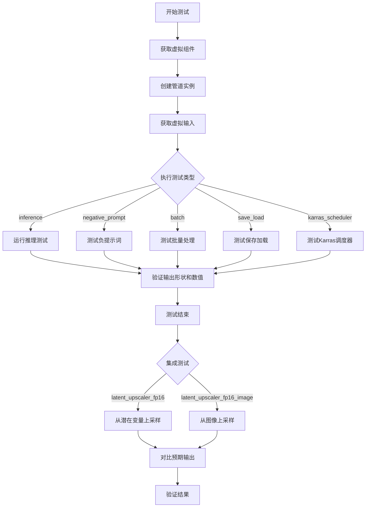

## 类结构

```
unittest.TestCase
├── StableDiffusionLatentUpscalePipelineFastTests
│   ├── PipelineLatentTesterMixin
│   ├── PipelineKarrasSchedulerTesterMixin
│   └── PipelineTesterMixin
└── StableDiffusionLatentUpscalePipelineIntegrationTests
```

## 全局变量及字段


### `diffusers`
    
Diffusers库，提供Stable Diffusion相关的Pipeline和模型

类型：`module`
    


### `gc`
    
Python垃圾回收模块，用于内存管理

类型：`module`
    


### `random`
    
Python随机数生成模块

类型：`module`
    


### `unittest`
    
Python单元测试框架

类型：`module`
    


### `np`
    
NumPy库，用于数值计算

类型：`module`
    


### `torch`
    
PyTorch深度学习框架

类型：`module`
    


### `enable_full_determinism`
    
启用完全确定性运行的测试工具函数

类型：`function`
    


### `check_same_shape`
    
检查tensor列表中所有tensor是否具有相同形状的辅助函数

类型：`function`
    


### `StableDiffusionLatentUpscalePipelineFastTests`
    
StableDiffusionLatentUpscalePipeline的快速测试类，继承多个测试Mixin和unittest.TestCase

类型：`class`
    


### `StableDiffusionLatentUpscalePipelineIntegrationTests`
    
StableDiffusionLatentUpscalePipeline的集成测试类，需要GPU加速器

类型：`class`
    


### `StableDiffusionLatentUpscalePipelineFastTests.pipeline_class`
    
指定测试的Pipeline类为StableDiffusionLatentUpscalePipeline

类型：`type`
    


### `StableDiffusionLatentUpscalePipelineFastTests.params`
    
测试参数集合，从TEXT_GUIDED_IMAGE_VARIATION_PARAMS中移除height、width等不需要的参数

类型：`set`
    


### `StableDiffusionLatentUpscalePipelineFastTests.required_optional_params`
    
必需的可选参数集合，从基类中移除num_images_per_prompt

类型：`set`
    


### `StableDiffusionLatentUpscalePipelineFastTests.batch_params`
    
批量测试参数，引用TEXT_GUIDED_IMAGE_VARIATION_BATCH_PARAMS

类型：`set`
    


### `StableDiffusionLatentUpscalePipelineFastTests.image_params`
    
图像参数集合，当前为空frozenset，待pipeline重构后更新

类型：`frozenset`
    


### `StableDiffusionLatentUpscalePipelineFastTests.image_latents_params`
    
图像潜在向量参数集合，当前为空frozenset

类型：`frozenset`
    
    

## 全局函数及方法


### `check_same_shape`

该函数用于检查给定的张量列表中所有张量的形状是否相同，通过提取每个张量的形状并与第一个张量的形状进行比较来验证一致性。

参数：

- `tensor_list`：`list`，包含需要检查形状一致性的张量列表

返回值：`bool`，如果所有张量的形状完全一致返回 `True`，否则返回 `False`

#### 流程图

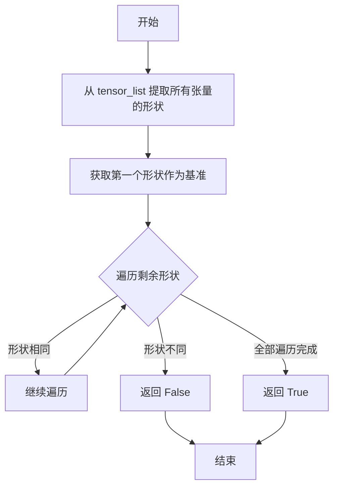

#### 带注释源码

```python
def check_same_shape(tensor_list):
    """
    检查给定的张量列表中所有张量的形状是否相同。
    
    参数:
        tensor_list: 包含多个张量的列表
        
    返回值:
        bool: 如果所有张量形状完全一致返回 True，否则返回 False
    """
    # 提取列表中所有张量的形状，组成形状列表
    shapes = [tensor.shape for tensor in tensor_list]
    
    # 使用 all() 检查所有形状是否与第一个形状相同
    # 比较第一个形状与后续所有形状
    return all(shape == shapes[0] for shape in shapes[1:])
```


### `backend_empty_cache`

该函数用于清理深度学习后端的内存缓存（如CUDA缓存），以释放GPU显存，防止内存泄漏，常在测试的初始化和清理阶段调用。

参数：

- `device`：`str` 或 `torch.device`，表示目标设备标识（如"cuda"、"cpu"、"mps"等），用于确定需要清理缓存的后端。

返回值：`None`，该函数执行清理操作后直接返回，不携带特定返回值。

#### 流程图

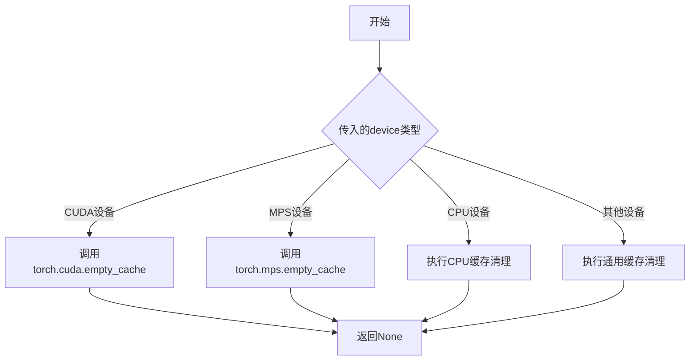

#### 带注释源码

```python
# 此函数定义在 testing_utils 模块中（未在当前文件中显示）
# 函数签名可能如下：

def backend_empty_cache(device):
    """
    清理指定设备的内存缓存。
    
    参数:
        device: str 或 torch.device - 目标设备标识
    """
    # 根据设备类型调用不同的缓存清理API
    if device == "cuda" or (hasattr(device, 'type') and device.type == 'cuda'):
        # 清理CUDA GPU缓存
        torch.cuda.empty_cache()
    elif device == "mps" or (hasattr(device, 'type') and device.type == 'mps'):
        # 清理Apple MPS缓存
        torch.mps.empty_cache()
    # 其他设备类型可能有其他清理逻辑
    # CPU设备通常不需要特殊清理
    
    return None
```


### `enable_full_determinism`

该函数用于在测试环境中启用完全确定性执行模式，通过设置随机种子和环境变量确保测试结果可复现。

参数：无需参数

返回值：`None`，无返回值

#### 流程图

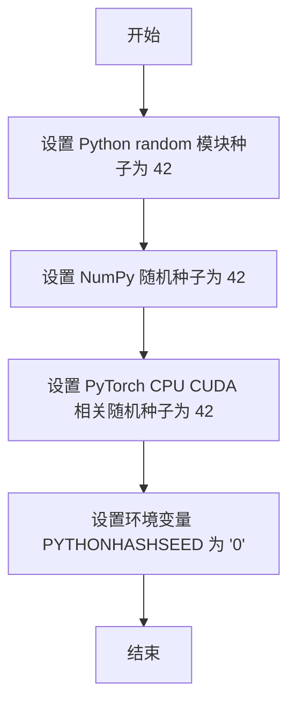

#### 带注释源码

```python
# 该函数从 testing_utils 模块导入，源代码未在本文件中显示
# 基于函数名和调用方式的推断：

def enable_full_determinism():
    """
    启用完全确定性运行模式，确保测试结果可复现。
    
    典型实现包含以下操作：
    - random.seed(42): 设置 Python 内置 random 模块的随机种子
    - np.random.seed(42): 设置 NumPy 的随机种子
    - torch.manual_seed(42): 设置 PyTorch CPU 的随机种子
    - torch.cuda.manual_seed_all(42): 设置所有 CUDA 设备的随机种子
    - os.environ["PYTHONHASHSEED"] = "0": 设置 Python 哈希种子以确保哈希操作确定性
    - torch.backends.cudnn.deterministic = True: 确保 CuDNN 使用确定性算法
    - torch.backends.cudnn.benchmark = False: 禁用 CuDNN 自动优化以确保可复现性
    """
    # 设置各种随机种子以确保测试结果确定性
    random.seed(42)
    np.random.seed(42)
    torch.manual_seed(42)
    # ... 其他确定性设置
```


### `floats_tensor`

用于生成指定形状的随机浮点数张量的测试工具函数。该函数是diffusers库测试框架的一部分，通常用于创建模拟输入数据。

参数：

- `shape`：`tuple`，张量的形状，例如 `(batch_size, num_channels, height, width)`
- `rng`：`random.Random`，Python随机数生成器实例，用于控制随机性

返回值：`torch.Tensor`，包含随机浮点数的PyTorch张量

#### 流程图

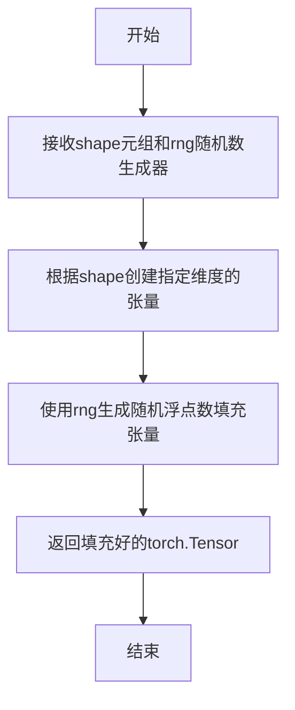

#### 带注释源码

```python
# 该函数定义在 diffusers 库的 testing_utils 模块中
# 以下是基于使用模式的推断实现

def floats_tensor(shape, rng=None):
    """
    生成指定形状的随机浮点数张量
    
    参数:
        shape: 张量的形状元组，如 (batch_size, num_channels, height, width)
        rng: 可选的随机数生成器，默认使用 random.Random(0)
    
    返回:
        包含随机浮点数的 torch.Tensor
    """
    # 如果未提供rng，使用默认种子为0的随机数生成器
    if rng is None:
        rng = random.Random(0)
    
    # 根据形状生成随机浮点数
    # 典型的实现会使用 torch.randn 或类似方法
    # 这里生成的值通常在合理范围内用于测试
    ...
    return tensor
```

#### 在代码中的实际使用示例

```python
# 在 StableDiffusionLatentUpscalePipelineFastTests 类中的使用
@property
def dummy_image(self):
    batch_size = 1
    num_channels = 4
    sizes = (16, 16)

    # 创建形状为 (1, 4, 16, 16) 的随机浮点数张量
    image = floats_tensor((batch_size, num_channels) + sizes, rng=random.Random(0)).to(torch_device)
    return image
```


### `load_image`

该函数是一个测试工具函数，用于从指定路径或URL加载图像，并返回适合diffusers库使用的图像对象。

参数：

- `image_path`：`str`，图像文件的本地路径或URL

返回值：`PIL.Image 或 torch.Tensor`，加载的图像对象

#### 流程图

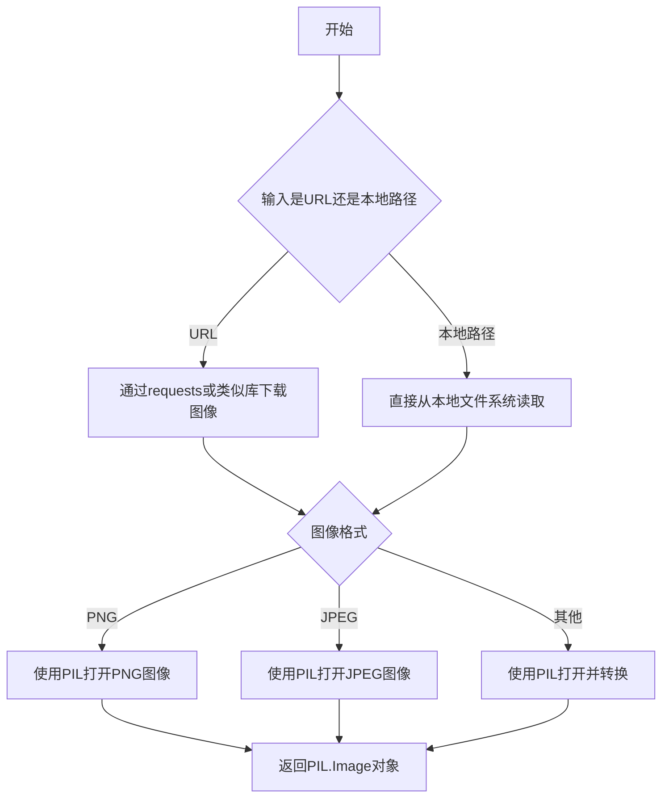

#### 带注释源码

```python
# load_image 函数定义在 diffusers 包的 testing_utils 模块中
# 这是一个测试辅助函数，用于加载测试所需的图像数据
# 支持从URL加载远程图像或从本地文件系统加载图像

# 函数签名（推断）:
def load_image(image_path: str) -> Union[PIL.Image.Image, torch.Tensor]:
    """
    从指定路径或URL加载图像
    
    参数:
        image_path: 图像的URL或本地文件路径
        
    返回:
        加载的图像对象，通常是PIL Image或torch Tensor
    """
    # 实现细节需要查看 testing_utils 模块的实际定义
    # 从代码中的使用方式来看:
    # low_res_img = load_image("https://huggingface.co/datasets/...")
    pass
```

#### 备注

由于 `load_image` 是从外部模块 `...testing_utils` 导入的，在当前代码文件中没有直接定义。从代码中的使用模式可以推断：

1. 它接受一个字符串参数（图像路径或URL）
2. 返回一个图像对象（可能是PIL Image或torch.Tensor）
3. 主要用于集成测试中加载预期结果图像进行比较


### `load_numpy`

从指定路径（本地文件或URL）加载numpy数组的测试工具函数，常用于加载预存的图像numpy数组以便与管道输出进行比较。

参数：

-  `name_or_path`：`str`，文件路径或URL，指向要加载的 `.npy` 格式的numpy数组文件

返回值：`np.ndarray`，加载的numpy数组

#### 流程图

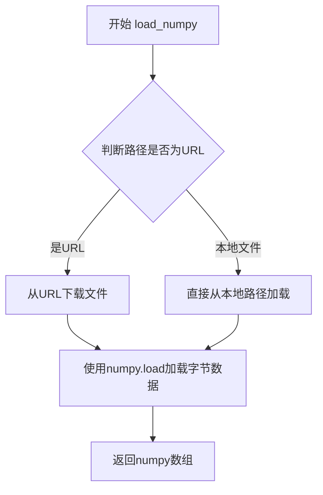

#### 带注释源码

```python
# load_numpy 函数的实现（在 testing_utils 模块中）
def load_numpy(path: Union[str, URL]) -> np.ndarray:
    """
    从本地路径或URL加载numpy数组。
    
    参数:
        path: 本地文件路径或远程URL
        
    返回:
        加载的numpy数组
    """
    if isinstance(path, str):
        # 检查是否为URL（http/https开头）
        if path.startswith("http://") or path.startswith("https://"):
            # 从URL下载文件并加载为numpy数组
            response = requests.get(path)
            response.raise_for_status()
            return np.load(BytesIO(response.content))
        else:
            # 从本地文件加载numpy数组
            return np.load(path)
    else:
        raise ValueError(f"Unsupported path type: {type(path)}")
```


### `require_accelerator`

该函数是一个测试装饰器，用于标记需要加速器（如 GPU）才能运行的测试方法。如果当前测试环境没有可用的加速器设备，使用该装饰器的测试将被跳过。

参数：无（装饰器模式，通过函数参数传入被装饰的函数）

返回值：无返回值（装饰器直接返回被装饰的函数或跳过逻辑）

#### 流程图

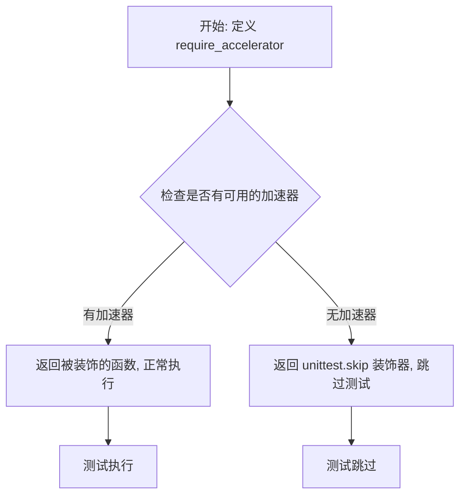

#### 带注释源码

```python
# require_accelerator 是从 testing_utils 模块导入的装饰器函数
# 在这个测试文件中, 它被用作方法装饰器来标记需要加速器的测试
from ...testing_utils import (
    require_accelerator,
    # ... 其他导入
)

# 使用示例: 标记 test_sequential_cpu_offload_forward_pass 需要加速器
@require_accelerator
def test_sequential_cpu_offload_forward_pass(self):
    """
    测试顺序 CPU 卸载的前向传播
    该测试需要 GPU 或其他加速器才能运行
    """
    super().test_sequential_cpu_offload_forward_pass(expected_max_diff=3e-3)
```

> **注意**: 由于 `require_accelerator` 是在外部模块 `testing_utils` 中定义的，当前代码文件中没有提供其完整实现源码。该函数通常用于检测系统是否有可用的 CUDA 设备或其他加速器，如果没有则跳过相关测试。


### `require_torch_accelerator`

这是一个测试装饰器（decorator），用于标记需要 PyTorch 加速器（CUDA/GPU）才能运行的测试用例。当测试环境没有可用的 PyTorch 加速器时，被装饰的测试将被跳过。

参数：
- 无显式参数（装饰器模式，接收被装饰的函数或类作为隐式参数）

返回值：`Callable`，返回装饰后的函数或类，如果环境不支持加速器则返回跳过装饰器

#### 流程图

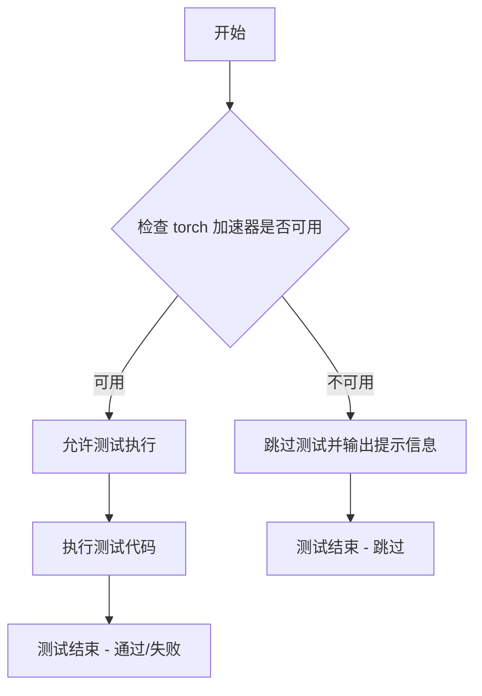

#### 带注释源码

```python
# 注意：以下是基于代码使用方式的推断实现
# 实际定义位于 ...testing_utils 模块中

def require_torch_accelerator(func_or_class):
    """
    装饰器：标记需要 PyTorch 加速器（GPU）的测试
    
    使用方式：
    @require_torch_accelerator
    @slow
    class StableDiffusionLatentUpscalePipelineIntegrationTests(unittest.TestCase):
        ...
    
    逻辑：
    1. 检查 torch.cuda 是否可用
    2. 如果可用，执行被装饰的测试
    3. 如果不可用，使用 unittest.skip 跳过测试
    """
    
    # 检查 PyTorch 是否有可用的 CUDA 设备
    if torch.cuda.is_available():
        # 加速器可用，直接返回原函数/类，不做修改
        return func_or_class
    else:
        # 没有可用的加速器，跳过该测试
        # 使用 unittest.skip 装饰器标记为跳过
        return unittest.skip("Requires torch accelerator (CUDA/GPU)")(func_or_class)
```

#### 使用示例

从给定代码中提取的实际使用示例：

```python
# 装饰在测试类上
@require_torch_accelerator
@slow
class StableDiffusionLatentUpscalePipelineIntegrationTests(unittest.TestCase):
    """
    集成测试类，用于测试 StableDiffusionLatentUpscalePipeline
    使用 @require_torch_accelerator 装饰器确保只在有 GPU 的环境中运行
    """
    
    def test_latent_upscaler_fp16(self):
        """测试 FP16 模式下的 latent upscaler"""
        # 测试代码...
        
    def test_latent_upscaler_fp16_image(self):
        """测试 FP16 模式下的图像 latent upscaler"""
        # 测试代码...
```

#### 外部依赖信息

- **模块来源**：`...testing_utils`（位于项目测试工具模块中）
- **依赖项**：
  - `torch` - PyTorch 库
  - `unittest` - Python 标准库 unittest 模块
- **函数性质**：装饰器函数（Decorator Function）

#### 技术说明

1. **装饰器模式**：该函数采用装饰器模式，接收函数或类作为输入并返回修改后的版本
2. **条件执行**：实现条件执行逻辑，根据运行时环境决定是否执行测试
3. **组合使用**：在代码中与 `@slow` 装饰器组合使用，标记为需要 GPU 且耗时的测试


### `slow`

`slow` 是一个装饰器函数（通常为类装饰器），用于标记测试为"慢速"测试。在测试套件中，被 `@slow` 装饰的测试在常规测试运行中可能被跳过，只有在明确指定运行慢速测试时才会执行。

参数： 无

返回值：无（装饰器直接返回被装饰的对象）

#### 流程图

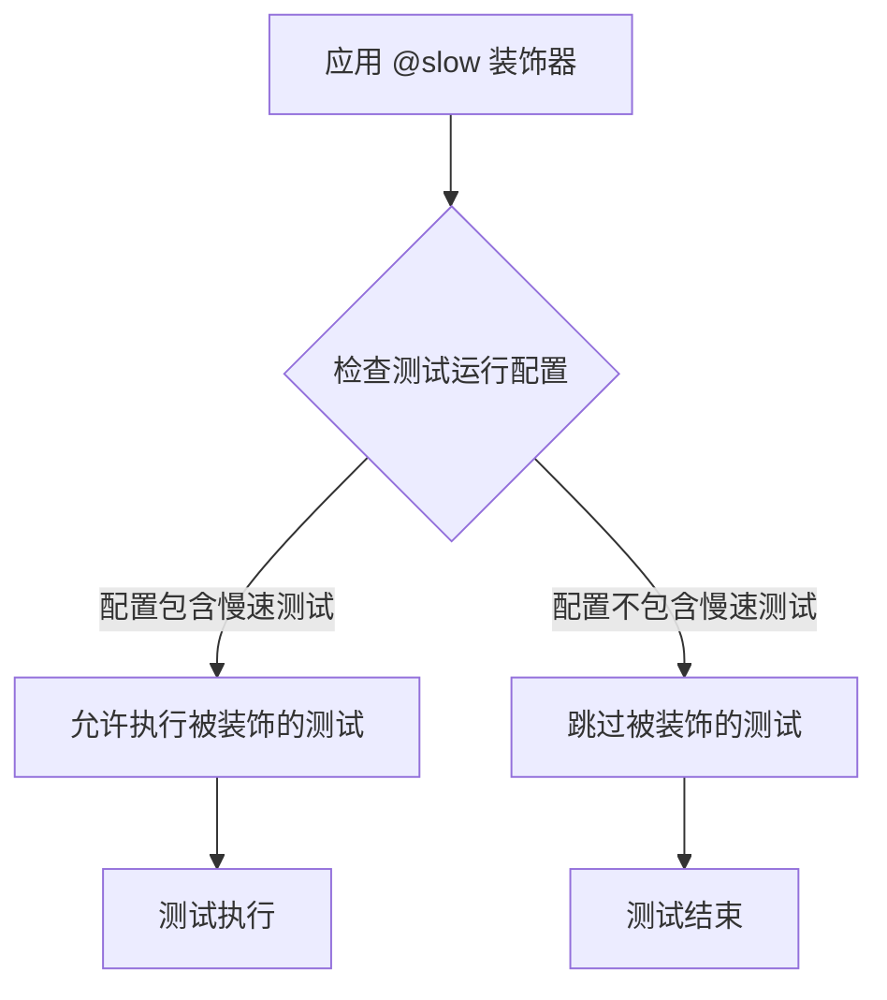

#### 带注释源码

```
# slow 是从 testing_utils 模块导入的装饰器
# 位于 from ...testing_utils import (..., slow, ...)
# 使用方式：@slow 放在类或方法定义前

@require_torch_accelerator  # 前置装饰器：要求torch加速器
@slow                        # slow装饰器：标记为慢速测试
class StableDiffusionLatentUpscalePipelineIntegrationTests(unittest.TestCase):
    # 整个测试类被标记为慢速测试
    # 在常规测试运行中可能被跳过
    ...
```

#### 备注

`slow` 装饰器的具体实现定义在 `...testing_utils` 模块中。在 Hugging Face diffusers 项目中，`slow` 装饰器通常用于标记集成测试，这些测试需要加载大型模型、执行完整的推理流程，因此运行时间较长。该装饰器允许通过 pytest 的 `-m slow` 标记有选择地运行或跳过这些测试。


### `torch_device`

`torch_device` 是从 `testing_utils` 模块导入的全局函数/变量，用于获取当前测试环境可用的 PyTorch 设备（优先返回 CUDA 设备，否则返回 CPU 设备）。

参数： 无

返回值：`str`，返回可用的 PyTorch 设备字符串（如 "cuda", "cpu", "mps" 等）

#### 流程图

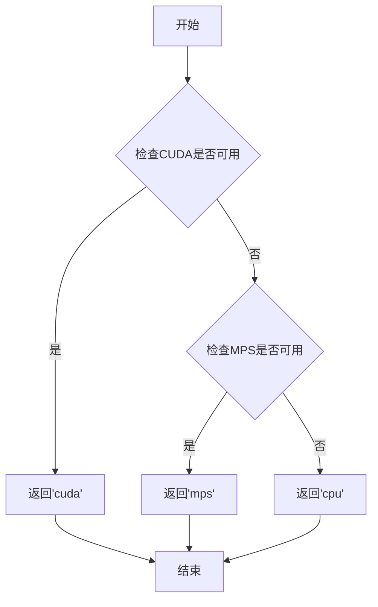

#### 带注释源码

```
# torch_device 是从 testing_utils 模块导入的全局函数
# 由于源代码不在当前文件中，以下为基于使用方式的推断实现

def torch_device():
    """
    获取当前测试环境可用的PyTorch设备。
    
    设备优先级：cuda > mps > cpu
    
    Returns:
        str: 可用的设备字符串
            - 'cuda': NVIDIA GPU (当CUDA可用时)
            - 'mps': Apple Silicon GPU (当MPS可用时)  
            - 'cpu': CPU设备 (默认fallback)
    """
    import torch
    
    # 优先检查CUDA是否可用
    if torch.cuda.is_available():
        return "cuda"
    
    # 检查MPS是否可用 (Apple Silicon)
    # 注意: torch.backends.mps.is_available() 在某些版本中可能不稳定
    try:
        if hasattr(torch.backends, 'mps') and torch.backends.mps.is_available():
            return "mps"
    except (AttributeError, Exception):
        pass
    
    # 默认返回CPU
    return "cpu"
```

**使用示例（来自代码）：**

```python
# 在测试中使用 torch_device
image = floats_tensor((batch_size, num_channels) + sizes, rng=random.Random(0)).to(torch_device)

# 将pipeline移动到设备
pipe.to(torch_device)

# 清理缓存
backend_empty_cache(torch_device)
```


### `StableDiffusionLatentUpscalePipelineFastTests.dummy_image`

这是一个测试用的属性方法，用于生成用于单元测试的虚拟（dummy）图像数据。它创建一个特定形状的随机浮点张量，模拟 Stable Diffusion 潜在上采样管道所需的潜在空间输入图像。

参数：

- 无（这是一个 `@property` 装饰器方法，不接受参数）

返回值：`torch.Tensor`，返回形状为 `(1, 4, 16, 16)` 的 PyTorch 张量，作为测试用的虚拟潜在空间图像数据

#### 流程图

```mermaid
flowchart TD
    A[开始 dummy_image 属性访问] --> B[设置批处理大小 batch_size = 1]
    B --> C[设置通道数 num_channels = 4]
    C --> D[设置图像尺寸 sizes = (16, 16)]
    D --> E[调用 floats_tensor 生成随机张量]
    E --> F[使用固定随机种子 random.Random(0)]
    F --> G[将张量移动到测试设备 torch_device]
    G --> H[返回虚拟图像张量]
    H --> I[结束]
```

#### 带注释源码

```python
@property  # 装饰器：将方法转换为属性，可以直接通过 .dummy_image 访问
def dummy_image(self):
    """
    生成用于测试的虚拟图像数据。
    
    该属性创建一个形状为 (1, 4, 16, 16) 的随机浮点张量，
    模拟 Stable Diffusion 潜在上采样管道输入的潜在空间图像。
    
    Returns:
        torch.Tensor: 形状为 (batch_size, num_channels, height, width) 的测试图像张量
    """
    # 批处理大小：每次生成 1 个样本
    batch_size = 1
    # 通道数：4，对应潜在空间的通道数
    num_channels = 4
    # 图像尺寸：16x16 像素
    sizes = (16, 16)

    # 使用 floats_tensor 函数生成随机浮点张量
    # 形状：(batch_size, num_channels) + sizes = (1, 4, 16, 16)
    # rng=random.Random(0) 使用固定随机种子确保测试的可重复性
    image = floats_tensor((batch_size, num_channels) + sizes, rng=random.Random(0)).to(torch_device)
    
    # 将张量移动到测试设备（CPU 或 CUDA）
    return image
```


### `StableDiffusionLatentUpscalePipelineFastTests.get_dummy_components`

该方法用于创建虚拟（dummy）组件字典，主要为 Stable Diffusion 潜在 upscale pipeline 的单元测试提供所需的模型组件，包括 UNet2DConditionModel、AutoencoderKL、EulerDiscreteScheduler、CLIPTextModel 和 CLIPTokenizer。

参数：

- 该方法无显式参数（隐含参数 `self` 为测试类实例）

返回值：`Dict[str, Any]`，返回一个包含虚拟模型组件的字典，键包括 "unet"（UNet2DConditionModel）、"vae"（AutoencoderKL）、"scheduler"（EulerDiscreteScheduler）、"text_encoder"（CLIPTextModel）、"tokenizer"（CLIPTokenizer）

#### 流程图

```mermaid
flowchart TD
    A[开始 get_dummy_components] --> B[设置随机种子 torch.manual_seed(0)]
    B --> C[创建 UNet2DConditionModel 虚拟模型]
    C --> D[创建 AutoencoderKL 虚拟模型]
    D --> E[创建 EulerDiscreteScheduler 虚拟调度器]
    E --> F[创建 CLIPTextConfig 配置]
    F --> G[根据配置创建 CLIPTextModel]
    G --> H[加载 tiny-random-clip tokenizer]
    H --> I[组装 components 字典]
    I --> J[返回 components 字典]
```

#### 带注释源码

```python
def get_dummy_components(self):
    """
    创建并返回用于测试的虚拟组件字典。
    包含 UNet、VAE、调度器、文本编码器和分词器。
    """
    # 设置随机种子以确保测试可复现
    torch.manual_seed(0)
    
    # 创建虚拟 UNet2DConditionModel
    # 用于图像潜在空间的特征提取和上采样
    model = UNet2DConditionModel(
        act_fn="gelu",                        # 激活函数
        attention_head_dim=8,                # 注意力头维度
        norm_num_groups=None,                # 归一化组数
        block_out_channels=[32, 32, 64, 64], # 块输出通道数
        time_cond_proj_dim=160,              # 时间条件投影维度
        conv_in_kernel=1,                    # 输入卷积核大小
        conv_out_kernel=1,                   # 输出卷积核大小
        cross_attention_dim=32,              # 交叉注意力维度
        down_block_types=(                    # 下采样块类型
            "KDownBlock2D",
            "KCrossAttnDownBlock2D",
            "KCrossAttnDownBlock2D",
            "KCrossAttnDownBlock2D",
        ),
        in_channels=8,                       # 输入通道数
        mid_block_type=None,                 # 中间块类型
        only_cross_attention=False,          # 是否仅使用交叉注意力
        out_channels=5,                      # 输出通道数
        resnet_time_scale_shift="scale_shift", # ResNet 时间尺度偏移
        time_embedding_type="fourier",       # 时间嵌入类型
        timestep_post_act="gelu",            # 时间步后激活函数
        up_block_types=(                     # 上采样块类型
            "KCrossAttnUpBlock2D",
            "KCrossAttnUpBlock2D",
            "KCrossAttnUpBlock2D",
            "KUpBlock2D",
        )
    )
    
    # 创建虚拟 AutoencoderKL
    # 用于图像编码和解码（潜在空间与像素空间的转换）
    vae = AutoencoderKL(
        block_out_channels=[32, 32, 64, 64],  # VAE 块输出通道
        in_channels=3,                        # 输入通道（RGB）
        out_channels=3,                       # 输出通道
        down_block_types=[                    # 下采样块类型
            "DownEncoderBlock2D",
            "DownEncoderBlock2D",
            "DownEncoderBlock2D",
            "DownEncoderBlock2D",
        ],
        up_block_types=[                      # 上采样块类型
            "UpDecoderBlock2D",
            "UpDecoderBlock2D",
            "UpDecoderBlock2D",
            "UpDecoderBlock2D",
        ],
        latent_channels=4,                   # 潜在空间通道数
    )
    
    # 创建 Euler 离散调度器
    # 用于扩散模型的噪声调度
    scheduler = EulerDiscreteScheduler(prediction_type="sample")
    
    # 创建 CLIP 文本配置
    text_config = CLIPTextConfig(
        bos_token_id=0,                      # 句子开始 token ID
        eos_token_id=2,                      # 句子结束 token ID
        hidden_size=32,                      # 隐藏层大小
        intermediate_size=37,                # 中间层大小
        layer_norm_eps=1e-05,                # LayerNorm epsilon
        num_attention_heads=4,               # 注意力头数
        num_hidden_layers=5,                 # 隐藏层数
        pad_token_id=1,                      # 填充 token ID
        vocab_size=1000,                      # 词汇表大小
        hidden_act="quick_gelu",             # 隐藏层激活函数
        projection_dim=512,                  # 投影维度
    )
    
    # 创建 CLIP 文本编码器模型
    text_encoder = CLIPTextModel(text_config)
    
    # 加载 tiny-random-clip 分词器
    # 用于文本到 token 的转换
    tokenizer = CLIPTokenizer.from_pretrained("hf-internal-testing/tiny-random-clip")

    # 组装组件字典
    components = {
        "unet": model.eval(),        # UNet 模型（设为评估模式）
        "vae": vae.eval(),           # VAE 模型（设为评估模式）
        "scheduler": scheduler,     # 调度器
        "text_encoder": text_encoder, # 文本编码器
        "tokenizer": tokenizer,      # 分词器
    }

    # 返回组件字典供 pipeline 初始化使用
    return components
```


### `StableDiffusionLatentUpscalePipelineFastTests.get_dummy_inputs`

该方法是一个测试辅助函数，用于为 `StableDiffusionLatentUpscalePipeline` 生成虚拟输入参数。它根据传入的设备类型创建随机数生成器，并构建包含提示词、图像、生成器、推理步数和输出类型的字典，以支持pipeline的测试执行。

参数：

- `self`：测试类实例本身，包含 `dummy_image` 属性
- `device`：`str`，目标设备字符串，用于创建 PyTorch 随机数生成器（如 "cpu"、"cuda"、"mps"）
- `seed`：`int`，随机种子，默认为 0，用于确保测试的可重复性

返回值：`Dict[str, Any]`，返回包含以下键值的字典：
- `prompt`：str，测试用提示词 "A painting of a squirrel eating a burger"
- `image`：torch.Tensor，从 `dummy_image` 属性获取的图像张量（已移至 CPU）
- `generator`：torch.Generator，用于控制随机性的 PyTorch 生成器对象
- `num_inference_steps`：int，推理步数，设置为 2
- `output_type`：str，输出类型，设置为 "np"（NumPy 数组）

#### 流程图

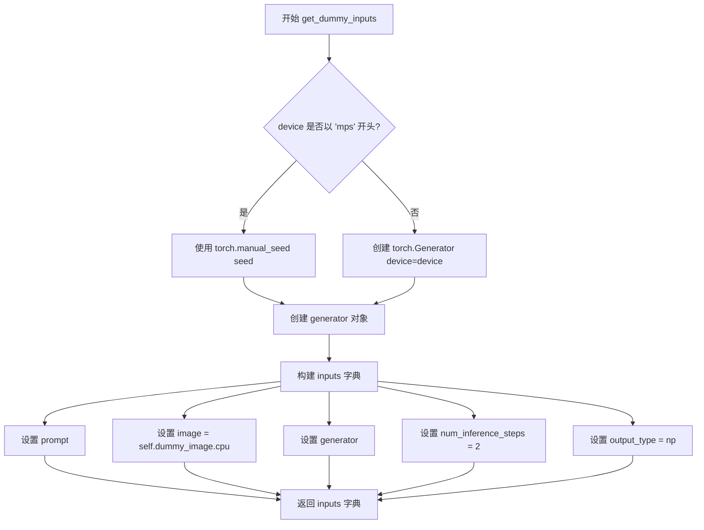

#### 带注释源码

```python
def get_dummy_inputs(self, device, seed=0):
    """
    生成用于测试 StableDiffusionLatentUpscalePipeline 的虚拟输入参数。
    
    参数:
        device: str，目标设备标识符（如 "cpu", "cuda", "mps"）
        seed: int，随机种子，用于确保测试结果的可重复性
    
    返回:
        dict: 包含 prompt, image, generator, num_inference_steps, output_type 的字典
    """
    # MPS 设备不支持 torch.Generator，需使用 torch.manual_seed 替代
    if str(device).startswith("mps"):
        # 为 MPS 设备创建随机生成器（通过手动设置种子）
        generator = torch.manual_seed(seed)
    else:
        # 为其他设备（CPU/CUDA）创建 PyTorch 生成器并设置种子
        # Generator 对象允许精确控制随机数生成，便于测试复现
        generator = torch.Generator(device=device).manual_seed(seed)
    
    # 构建输入参数字典
    inputs = {
        "prompt": "A painting of a squirrel eating a burger",  # 测试用文本提示
        "image": self.dummy_image.cpu(),  # 获取虚拟图像（从类属性，移至CPU）
        "generator": generator,  # 随机数生成器，确保扩散过程可复现
        "num_inference_steps": 2,  # 较少步数以加快测试速度
        "output_type": "np",  # 输出为 NumPy 数组格式
    }
    return inputs
```


### `StableDiffusionLatentUpscalePipelineFastTests.test_inference`

该函数是 StableDiffusionLatentUpscalePipeline 的单元测试方法，用于验证潜在上采样管道的基本推理功能是否正常，通过对比输出了图像与预期值来确认管道的正确性。

参数：

- `self`：无显式参数，隐式传递的测试类实例

返回值：无返回值（测试函数，使用 unittest 框架的断言进行验证）

#### 流程图

```mermaid
flowchart TD
    A[开始 test_inference] --> B[设置 device = cpu]
    B --> C[调用 get_dummy_components 获取虚拟组件]
    C --> D[使用虚拟组件初始化 pipeline_class]
    D --> E[将管道移至 device]
    E --> F[设置进度条配置 disable=None]
    F --> G[调用 get_dummy_inputs 获取虚拟输入]
    G --> H[执行管道推理: pipe(**inputs)]
    H --> I[提取输出图像: .images]
    I --> J[提取图像切片: image[0, -3:, -3:, -1]]
    J --> K{断言: image.shape == (1, 256, 256, 3)}
    K -->|通过| L[计算预期切片]
    L --> M[计算实际与预期差异: max_diff]
    M --> N{断言: max_diff <= 1e-3}
    N -->|通过| O[测试通过]
    N -->|失败| P[抛出 AssertionError]
    K -->|失败| P
```

#### 带注释源码

```python
def test_inference(self):
    """测试 StableDiffusionLatentUpscalePipeline 的基本推理功能"""
    # 设置测试设备为 CPU
    device = "cpu"

    # 获取虚拟组件（UNet、VAE、调度器、文本编码器等）
    components = self.get_dummy_components()
    
    # 使用虚拟组件实例化潜在上采样管道
    pipe = self.pipeline_class(**components)
    
    # 将管道移至指定设备
    pipe.to(device)
    
    # 配置进度条（disable=None 表示不禁用）
    pipe.set_progress_bar_config(disable=None)

    # 获取虚拟输入（包含 prompt、图像、生成器等）
    inputs = self.get_dummy_inputs(device)
    
    # 执行管道推理并获取生成的图像
    image = pipe(**inputs).images
    
    # 提取图像右下角 3x3 像素块用于验证
    image_slice = image[0, -3:, -3:, -1]

    # 断言：验证输出图像形状为 (1, 256, 256, 3)
    self.assertEqual(image.shape, (1, 256, 256, 3))
    
    # 定义预期的像素值切片
    expected_slice = np.array(
        [0.47222412, 0.41921633, 0.44717434, 0.46874192, 0.42588258, 0.46150726, 0.4677534, 0.45583832, 0.48579055]
    )
    
    # 计算实际输出与预期值的最大差异
    max_diff = np.abs(image_slice.flatten() - expected_slice).max()
    
    # 断言：验证差异在可接受范围内（<= 1e-3）
    self.assertLessEqual(max_diff, 1e-3)
```


### `StableDiffusionLatentUpscalePipelineFastTests.test_stable_diffusion_latent_upscaler_negative_prompt`

这是一个单元测试方法，用于测试 Stable Diffusion 潜在上采样管道在处理负向提示词（negative prompt）时的功能是否正常。

参数：

- `self`：隐式参数，测试类实例本身

返回值：无返回值（`None`），该方法为 `unittest.TestCase` 的测试方法，通过断言验证功能正确性

#### 流程图

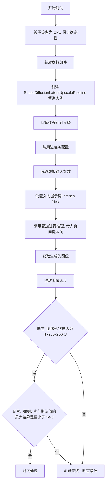

#### 带注释源码

```python
def test_stable_diffusion_latent_upscaler_negative_prompt(self):
    """
    测试 StableDiffusionLatentUpscalePipeline 对负向提示词的处理能力
    
    该测试验证管道能够正确处理 negative_prompt 参数，
    并生成符合预期尺寸和内容的图像
    """
    # 设置设备为 CPU，确保设备依赖的 torch.Generator 的确定性
    device = "cpu"
    
    # 获取虚拟组件（UNet、VAE、scheduler、text_encoder、tokenizer 等）
    components = self.get_dummy_components()
    
    # 使用虚拟组件创建 StableDiffusionLatentUpscalePipeline 管道实例
    sd_pipe = StableDiffusionLatentUpscalePipeline(**components)
    
    # 将管道移动到指定设备（CPU）
    sd_pipe = sd_pipe.to(device)
    
    # 配置进度条，disable=None 表示不禁用进度条
    sd_pipe.set_progress_bar_config(disable=None)
    
    # 获取测试用的虚拟输入参数
    # 包含: prompt, image, generator, num_inference_steps, output_type
    inputs = self.get_dummy_inputs(device)
    
    # 定义负向提示词，用于指导模型避免生成特定内容
    negative_prompt = "french fries"
    
    # 调用管道执行推理，传入负向提示词参数
    # 管道将使用 prompt 和 negative_prompt 生成图像
    output = sd_pipe(**inputs, negative_prompt=negative_prompt)
    
    # 从输出中提取生成的图像
    image = output.images
    
    # 提取图像的一个切片用于验证
    # 取最后一个通道的最后 3x3 像素
    image_slice = image[0, -3:, -3:, -1]
    
    # 断言验证：确保输出图像形状为 (1, 256, 256, 3)
    # 即 batch_size=1, 高度=256, 宽度=256, RGB通道=3
    assert image.shape == (1, 256, 256, 3)
    
    # 定义期望的图像切片数值（预计算的标准结果）
    expected_slice = np.array(
        [0.43865365, 0.404124, 0.42618454, 0.44333526, 0.40564927, 
         0.43818694, 0.4411913, 0.43404633, 0.46392226]
    )
    
    # 断言验证：确保生成的图像切片与期望值的最大差异小于 1e-3
    # 使用负向提示词时，生成结果应与预期切片匹配
    assert np.abs(image_slice.flatten() - expected_slice).max() < 1e-3
```


### `StableDiffusionLatentUpscalePipelineFastTests.test_stable_diffusion_latent_upscaler_multiple_init_images`

该测试方法用于验证 StableDiffusionLatentUpscalePipeline 在处理多个（批量）输入图像时的功能正确性，确保管道能够正确地对多张初始图像进行潜在空间的上采样操作，并输出预期形状和内容的图像。

参数：

- `self`：测试类实例本身，无需显式传递

返回值：`None`，该方法为测试方法，通过断言验证功能，不返回具体数值

#### 流程图

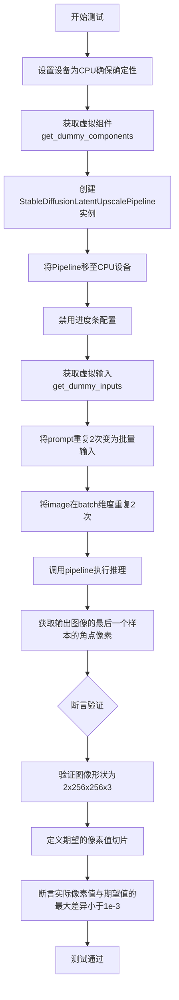

#### 带注释源码

```python
def test_stable_diffusion_latent_upscaler_multiple_init_images(self):
    """
    测试 StableDiffusionLatentUpscalePipeline 在处理多个初始图像时的功能。
    验证批量推理时管道能正确处理多个输入并输出正确的图像尺寸和内容。
    """
    # 设置设备为CPU，确保torch.Generator的确定性行为
    device = "cpu"  # ensure determinism for the device-dependent torch.Generator
    
    # 获取用于测试的虚拟（dummy）组件模型
    components = self.get_dummy_components()
    
    # 使用虚拟组件实例化StableDiffusionLatentUpscalePipeline管道
    sd_pipe = StableDiffusionLatentUpscalePipeline(**components)
    
    # 将管道移至指定设备（CPU）
    sd_pipe = sd_pipe.to(device)
    
    # 配置进度条，传入None表示使用默认配置
    sd_pipe.set_progress_bar_config(disable=None)

    # 获取虚拟输入参数，包括prompt、image、generator等
    inputs = self.get_dummy_inputs(device)
    
    # 将单个prompt复制为批量形式，创建2个相同的prompt
    inputs["prompt"] = [inputs["prompt"]] * 2
    
    # 在批次维度（第0维）重复图像2次，创建2个相同的输入图像
    inputs["image"] = inputs["image"].repeat(2, 1, 1, 1)
    
    # 调用管道执行推理，传入所有输入参数
    # 返回包含images属性的输出对象
    image = sd_pipe(**inputs).images
    
    # 提取最后一个图像样本的右下角3x3像素区域
    # 用于与期望值进行比对验证
    image_slice = image[-1, -3:, -3:, -1]

    # 断言验证输出图像的形状
    # 应该为(2, 256, 256, 3)，即2个批次，256x256分辨率，3通道RGB
    assert image.shape == (2, 256, 256, 3)
    
    # 定义期望的像素值切片（从训练好的模型预先计算得出）
    expected_slice = np.array(
        [0.38730142, 0.35695046, 0.40646142, 0.40967226, 0.3981609, 0.4195988, 0.4248805, 0.430259, 0.45694894]
    )

    # 断言验证实际输出像素值与期望值的最大差异
    # 确保差异小于阈值1e-3，以保证数值精度正确
    assert np.abs(image_slice.flatten() - expected_slice).max() < 1e-3
```


### `StableDiffusionLatentUpscalePipelineFastTests.test_attention_slicing_forward_pass`

该方法是StableDiffusionLatentUpscalePipeline的快速测试套件中的一部分，用于测试注意力切片（attention slicing）功能的前向传播是否正常工作。它通过调用父类的测试方法，验证在启用注意力切片时模型输出的正确性，并设定预期最大误差阈值为7e-3。

参数：

- `self`：隐式参数，表示测试类实例本身，无需显式传递

返回值：`None`，该方法为测试方法，不返回任何值（测试结果通过断言验证）

#### 流程图

```mermaid
flowchart TD
    A[开始执行 test_attention_slicing_forward_pass] --> B[调用父类方法 super().test_attention_slicing_forward_pass]
    B --> C[传入参数 expected_max_diff=7e-3]
    C --> D[父类方法执行注意力切片测试]
    D --> E{验证输出误差是否在阈值内}
    E -->|是| F[测试通过]
    E -->|否| G[测试失败, 抛出断言错误]
    F --> H[结束]
    G --> H
```

#### 带注释源码

```python
def test_attention_slicing_forward_pass(self):
    """
    测试注意力切片功能的前向传播。
    
    该测试方法继承自 PipelineTesterMixin，通过调用父类的测试方法
    来验证 StableDiffusionLatentUpscalePipeline 在启用注意力切片时
    的前向传播是否产生正确的结果。
    
    注意力切片是一种内存优化技术，将注意力计算分片进行以减少显存占用。
    """
    # 调用父类的 test_attention_slicing_forward_pass 方法
    # expected_max_diff=7e-3 表示预期最大误差为 0.007
    # 如果实际输出与预期输出的差异超过此阈值，则测试失败
    super().test_attention_slicing_forward_pass(expected_max_diff=7e-3)
```


### `StableDiffusionLatentUpscalePipelineFastTests.test_sequential_cpu_offload_forward_pass`

该方法是 `StableDiffusionLatentUpscalePipelineFastTests` 类中的一个测试用例，用于验证在使用顺序 CPU 卸载（sequential CPU offload）机制时，Stable Diffusion 潜在升级管道的前向传播是否仍能产生正确的结果。该测试通过调用父类的同名方法执行，预期最大差异为 3e-3。

参数：

- `self`：测试类实例本身，包含测试所需的上下文和配置

返回值：`None`（测试方法无返回值，通过断言验证正确性）

#### 流程图

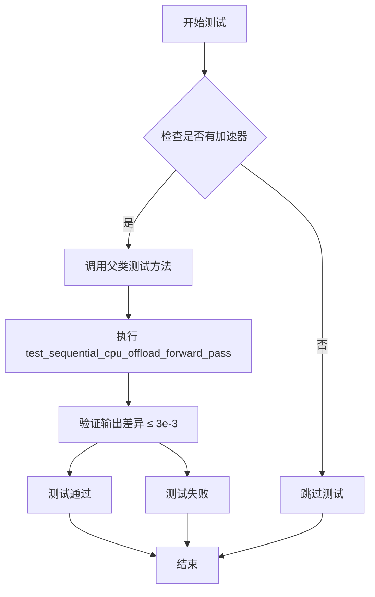

#### 带注释源码

```python
@require_accelerator  # 装饰器：确保测试在有加速器（GPU）的环境中运行
def test_sequential_cpu_offload_forward_pass(self):
    """
    测试顺序 CPU 卸载功能的前向传播是否正确。
    
    该测试验证在使用顺序 CPU offload 时，模型能够正确执行前向传播，
    并确保输出结果与基准的差异在可接受范围内（expected_max_diff=3e-3）。
    """
    # 调用父类 PipelineTesterMixin 的 test_sequential_cpu_offload_forward_pass 方法
    # 传入预期最大差异阈值 3e-3
    super().test_sequential_cpu_offload_forward_pass(expected_max_diff=3e-3)
```


### `StableDiffusionLatentUpscalePipelineFastTests.test_dict_tuple_outputs_equivalent`

该测试方法用于验证管道输出在字典格式和元组格式下是否等价，确保管道既可以返回字典形式（如 `{"images": ...}`）也可以返回元组形式（如 `(images, ...)`），并且两种形式的输出结果在允许的误差范围内一致。

参数：

- `expected_max_difference`：`float`，期望的最大差异阈值，设置为 `3e-3`（0.003），用于比较两种输出格式的差异

返回值：`None`，该方法为测试方法，通过断言验证输出等价性，不返回具体值

#### 流程图

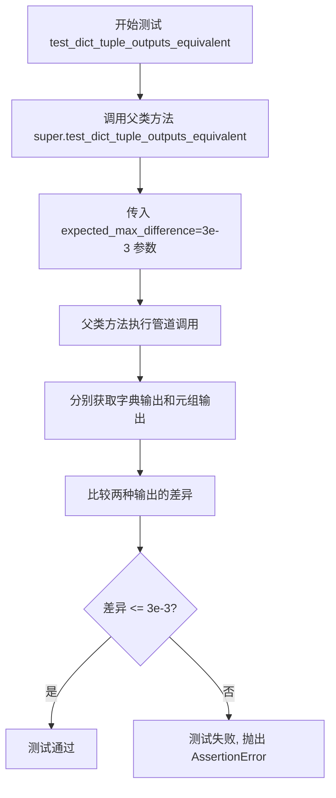

#### 带注释源码

```python
def test_dict_tuple_outputs_equivalent(self):
    """
    测试方法：验证管道字典输出和元组输出是否等价
    
    该测试方法继承自 PipelineTesterMixin，调用父类的实现来验证
    StableDiffusionLatentUpscalePipeline 在返回字典格式和元组格式
    时的输出结果是否一致。
    
    参数:
        expected_max_difference: float, 允许的最大差异值为 3e-3 (0.003)
    
    返回值:
        None (通过断言进行验证)
    
    注意:
        - 该方法调用 super().test_dict_tuple_outputs_equivalent()
        - 父类方法会执行完整的管道推理流程
        - 比较字典形式 {'images': ...} 和元组形式 (images, ...) 的输出
    """
    # 调用父类 PipelineTesterMixin 的测试方法
    # 传入期望的最大差异阈值 3e-3
    super().test_dict_tuple_outputs_equivalent(expected_max_difference=3e-3)
```


### `StableDiffusionLatentUpscalePipelineFastTests.test_inference_batch_single_identical`

这是一个单元测试方法，用于验证在批处理推理（batch inference）模式下，单个样本的输出与单独推理时的输出一致性。该测试继承自父类 `PipelineTesterMixin` 的同名方法，通过比较批处理中单个样本的结果与单独推理的结果，确保管道在批处理模式下没有引入额外的误差。

参数：

- `self`：`StableDiffusionUpscalePipelineFastTests` 类型，测试类实例本身，包含管道配置和测试组件
- `expected_max_diff`：`float` 类型，可选参数，默认为 `7e-3`（0.007），指定批处理输出与单独推理输出之间的最大允许差异阈值

返回值：`None`，该方法为单元测试，通过断言验证结果一致性，不返回具体数值

#### 流程图

```mermaid
flowchart TD
    A[开始测试] --> B[调用父类 test_inference_batch_single_identical 方法]
    B --> C[传入 expected_max_diff=7e-3 参数]
    C --> D{父类方法执行}
    D --> E[创建管道实例]
    E --> F[准备单独推理输入]
    F --> G[执行单独推理]
    G --> H[准备批处理输入]
    H --> I[执行批处理推理]
    I --> J[提取批处理中单个样本结果]
    J --> K{比较差异是否小于阈值}
    K -->|是| L[测试通过]
    K -->|否| M[测试失败]
    L --> N[结束]
    M --> N
```

#### 带注释源码

```python
def test_inference_batch_single_identical(self):
    """
    测试方法：验证批处理推理与单独推理的一致性
    
    该测试方法继承自 PipelineTesterMixin 父类，用于确保在使用批处理（多个prompt）
    推理时，批处理中每个单独样本的输出与单独进行推理时的输出一致。
    这是确保管道正确处理批处理数据的关键测试。
    
    参数说明：
    - self: 测试类实例，隐式传入
    - expected_max_diff: 允许的最大差异阈值，默认为 7e-3
    
    测试流程：
    1. 调用父类的测试方法，传入期望的最大差异阈值
    2. 父类方法会创建管道、分别进行单独推理和批处理推理
    3. 比较两种方式的输出差异是否在允许范围内
    4. 通过断言验证一致性
    """
    # 调用父类 PipelineTesterMixin 的 test_inference_batch_single_identical 方法
    # 传递 expected_max_diff=7e-3 参数，设定允许的最大差异阈值为 0.007
    # 父类方法内部会执行实际的测试逻辑：
    #   - 使用相同的输入分别进行单独推理和批处理推理
    #   - 提取批处理结果中对应单独推理的样本
    #   - 计算两者之间的差异
    #   - 断言差异小于等于 7e-3
    super().test_inference_batch_single_identical(expected_max_diff=7e-3)
```


### `StableDiffusionLatentUpscalePipelineFastTests.test_pt_np_pil_outputs_equivalent`

该方法是 StableDiffusionLatentUpscalePipelineFastTests 类中的一个测试方法，用于验证管道在使用 PyTorch (pt)、NumPy (np) 和 PIL 输出格式时是否产生等效的输出结果，确保不同输出格式之间的一致性。

参数：

- `self`：隐式参数，类型为 `StableDiffusionLatentUpscalePipelineFastTests`，表示类的实例本身
- `expected_max_diff`：类型为 `float`，关键字参数，默认为 `3e-3` (0.003)，表示允许的最大差异阈值

返回值：`None`，该方法为 unittest 测试方法，通过断言验证输出等效性，不返回具体值

#### 流程图

```mermaid
flowchart TD
    A[开始测试 test_pt_np_pil_outputs_equivalent] --> B[设置 expected_max_diff=3e-3]
    B --> C[调用父类方法 super().test_pt_np_pil_outputs_equivalent]
    C --> D[在父类 PipelineTesterMixin 中]
    D --> E[获取 PyTorch 格式输出]
    E --> F[获取 NumPy 格式输出]
    F --> G[获取 PIL 格式输出]
    G --> H{比较输出差异}
    H -->|差异 <= 3e-3| I[测试通过]
    H -->|差异 > 3e-3| J[测试失败抛出断言错误]
    I --> K[结束]
    J --> K
```

#### 带注释源码

```python
def test_pt_np_pil_outputs_equivalent(self):
    """
    测试方法：验证 PyTorch、NumPy 和 PIL 输出格式的等效性
    
    该测试方法继承自父类 PipelineTesterMixin，用于确保 StableDiffusionLatentUpscalePipeline
    在不同输出格式（pt/np/pil）下产生数值一致的图像结果。
    """
    # 调用父类的测试方法，expected_max_diff=3e-3 表示允许的最大差异为 0.003
    # 父类方法会执行以下操作：
    # 1. 使用相同的输入参数（prompt、image、num_inference_steps等）
    # 2. 分别以 'pt'、'np'、'pil' 三种 output_type 调用管道
    # 3. 比较三种输出的差异，确保差异在允许范围内
    super().test_pt_np_pil_outputs_equivalent(expected_max_diff=3e-3)
```


### `StableDiffusionLatentUpscalePipelineFastTests.test_save_load_local`

该测试方法继承自基类 `PipelineTesterMixin`，用于验证 `StableDiffusionLatentUpscalePipeline` 管道在本地文件系统保存后能够正确加载，并且加载后的管道执行推理产生的图像与原始管道的输出在像素级别上保持一致（差异小于 `expected_max_difference` 阈值），以确保序列化和反序列化过程不会引入数值误差或破坏模型状态。

参数：

- `self`：`StableDiffusionLatentUpscalePipelineFastTests`，测试类的实例本身，包含管道类、组件和测试参数等上下文信息
- `expected_max_difference`：`float`（隐式传递给父类方法），允许的最大像素差异阈值，此处设为 `3e-3`（即 0.003）

返回值：`None`，该方法为 `unittest.TestCase` 的测试用例，通过断言验证保存/加载后的输出是否符合预期，不返回具体数值

#### 流程图

```mermaid
flowchart TD
    A[开始测试 test_save_load_local] --> B[获取虚拟组件 components]
    B --> C[使用 components 实例化管道 pipe]
    C --> D[获取虚拟输入 inputs]
    D --> E[执行管道推理获取原始输出 original_output]
    E --> F[创建临时目录 temp_dir]
    F --> G[调用 pipe.save_to_local_save 保存管道到 temp_dir]
    G --> H[从 temp_dir 加载管道得到 loaded_pipe]
    H --> I[使用相同输入执行 loaded_pipe 推理获取加载输出 loaded_output]
    I --> J{计算 original_output 与 loaded_output 的差异}
    J -->|差异 <= 3e-3| K[断言通过测试通过]
    J -->|差异 > 3e-3| L[断言失败抛出 AssertionError]
    K --> M[清理临时目录]
    L --> M
    M --> N[结束测试]
```

#### 带注释源码

```python
def test_save_load_local(self):
    """
    测试管道的保存和加载功能是否正常工作。
    
    该测试继承自 PipelineTesterMixin.test_save_load_local 方法，
    用于验证 StableDiffusionLatentUpscalePipeline 在本地保存后
    能够正确加载，并且加载后的管道输出与原始输出保持一致。
    
    验证要点：
    1. 管道能够成功序列化到本地文件系统
    2. 管道能够从本地文件系统成功反序列化
    3. 反序列化后的管道输出与原始管道输出的差异在允许范围内
    """
    # 调用父类的测试方法，expected_max_difference=3e-3 表示
    # 原始输出与加载后输出的最大允许差异为 0.003
    # 父类方法会完成以下工作：
    # 1. 创建管道实例并执行推理得到原始输出
    # 2. 将管道保存到临时目录
    # 3. 从临时目录加载管道
    # 4. 执行加载后的管道推理
    # 5. 比较两次输出的差异并通过断言验证
    super().test_save_load_local(expected_max_difference=3e-3)
```


### `StableDiffusionLatentUpscalePipelineFastTests.test_save_load_optional_components`

该方法是一个单元测试，用于验证 StableDiffusionLatentUpscalePipeline 管道在保存和加载时对可选组件（如 text_encoder、tokenizer 等）的处理是否正确，通过比较保存前后生成的图像差异来确保功能完整性。

参数：

- `self`：隐式的 `StableDiffusionLatentUpscalePipelineFastTests` 实例，代表测试类本身

返回值：`None`，该方法为单元测试方法，通过断言验证功能，不返回具体值

#### 流程图

```mermaid
flowchart TD
    A[开始测试] --> B[调用父类方法 test_save_load_optional_components]
    B --> C[传入 expected_max_difference=3e-3 参数]
    C --> D[父类方法执行保存加载流程]
    D --> E[获取虚拟组件]
    D --> F[创建管道实例]
    D --> G[生成测试图像]
    D --> H[保存管道到临时目录]
    D --> I[从临时目录加载管道]
    D --> J[使用加载的管道生成新图像]
    D --> K[比较两幅图像的差异]
    K --> L{差异 <= 3e-3?}
    L -->|是| M[测试通过]
    L -->|否| N[测试失败, 抛出 AssertionError]
```

#### 带注释源码

```python
def test_save_load_optional_components(self):
    """
    测试管道保存和加载功能，特别关注可选组件的处理。
    
    该测试方法继承自 PipelineTesterMixin，验证当管道包含可选组件
    （如 text_encoder、tokenizer 等）时，保存和加载操作能否正确
    恢复这些组件，并且加载后的管道能够生成与原始管道一致的图像。
    
    参数:
        self: StableDiffusionLatentUpscalePipelineFastTests 实例
        
    返回值:
        None: 测试方法，通过断言验证，不返回具体值
        
     Raises:
        AssertionError: 如果保存加载后的图像差异超过 expected_max_difference
    """
    # 调用父类的测试方法，expected_max_difference=3e-3 表示允许的最大像素差异
    # 父类方法会执行以下操作:
    # 1. 获取虚拟组件 (get_dummy_components)
    # 2. 创建管道实例
    # 3. 生成原始图像
    # 4. 保存管道到临时文件
    # 5. 加载管道
    # 6. 使用加载的管道生成新图像
    # 7. 比较两幅图像的差异
    super().test_save_load_optional_components(expected_max_difference=3e-3)
```


### `StableDiffusionLatentUpscalePipelineFastTests.test_karras_schedulers_shape`

该测试方法用于验证 StableDiffusionLatentUpscalePipeline 在使用不同的 Karras 扩散调度器（KarrasDiffusionSchedulers）时，所有调度器输出的图像张量形状是否保持一致。测试通过遍历排除特定调度器后的所有 Karras 调度器，对同一输入进行推理，并断言所有输出的形状相同。

参数：
- `self`：隐式参数，TestCase 实例，表示测试类本身

返回值：`None`，该方法为测试方法，通过 assert 语句进行断言，不返回具体值

#### 流程图

```mermaid
flowchart TD
    A[开始测试] --> B[定义需要跳过的调度器列表 skip_schedulers]
    B --> C[获取虚拟组件 components = self.get_dummy_components]
    C --> D[使用虚拟组件创建管道 pipe = pipeline_class(**components)]
    D --> E[配置管道调度器: pipe.scheduler.register_to_config(skip_prk_steps=True)]
    E --> F[将管道移至设备: pipe.to(torch_device)]
    F --> G[设置进度条配置: pipe.set_progress_bar_config(disable=None)]
    G --> H[获取虚拟输入: inputs = self.get_dummy_inputs]
    H --> I[设置推理步数: inputs['num_inference_steps'] = 2]
    I --> J[初始化空输出列表: outputs = []]
    J --> K[遍历 KarrasDiffusionSchedulers 枚举]
    K --> L{当前调度器是否在 skip_schedulers 中?}
    L -->|是| M[跳过当前调度器, 继续下一轮]
    L -->|否| N[获取调度器类: scheduler_cls = getattr(diffusers, scheduler_enum.name)]
    N --> O[从当前配置创建新调度器: pipe.scheduler = scheduler_cls.from_config]
    O --> P[执行推理: output = pipe(**inputs)[0]]
    P --> Q[将输出添加到列表: outputs.append(output)]
    Q --> K
    M --> R{是否还有未遍历的调度器?}
    R -->|是| K
    R -->|否| S[断言所有输出形状相同: assert check_same_shape(outputs)]
    S --> T[结束测试]
```

#### 带注释源码

```python
def test_karras_schedulers_shape(self):
    """
    测试 Karras 调度器形状一致性
    验证使用不同 Karras 扩散调度器时输出图像的形状是否一致
    """
    # 定义需要跳过的调度器列表，这些调度器不支持 sigma 调度或存在其他问题
    skip_schedulers = [
        "DDIMScheduler",               # 不支持 Karras sigma 调度
        "DDPMScheduler",              # 不支持 Karras sigma 调度
        "PNDMScheduler",               # 不支持 Karras sigma 调度
        "HeunDiscreteScheduler",       # 可能存在兼容性问题
        "EulerAncestralDiscreteScheduler",  # 可能存在兼容性问题
        "KDPM2DiscreteScheduler",      # 不支持
        "KDPM2AncestralDiscreteScheduler",  # 不支持
        "DPMSolverSDEScheduler",       # 不支持
        "EDMEulerScheduler",           # 不支持
    ]
    
    # 获取虚拟组件（用于测试的模拟模型组件）
    components = self.get_dummy_components()
    
    # 使用虚拟组件创建 StableDiffusionLatentUpscalePipeline 实例
    pipe = self.pipeline_class(**components)

    # 确保 PNDM 不需要 warm-up 步骤
    # 注册 skip_prk_steps=True 配置到调度器
    pipe.scheduler.register_to_config(skip_prk_steps=True)

    # 将管道移至测试设备（CPU 或 CUDA）
    pipe.to(torch_device)
    
    # 设置进度条配置，disable=None 表示不禁用进度条
    pipe.set_progress_bar_config(disable=None)
    
    # 获取虚拟输入参数
    inputs = self.get_dummy_inputs(torch_device)
    
    # 设置推理步数为 2（减少测试时间）
    inputs["num_inference_steps"] = 2

    # 用于存储所有调度器的输出
    outputs = []
    
    # 遍历所有 KarrasDiffusionSchedulers 枚举值
    for scheduler_enum in KarrasDiffusionSchedulers:
        # 如果当前调度器在跳过列表中，则跳过
        if scheduler_enum.name in skip_schedulers:
            # no sigma schedulers are not supported
            # no schedulers
            continue

        # 从 diffusers 模块动态获取调度器类
        scheduler_cls = getattr(diffusers, scheduler_enum.name)
        
        # 使用当前调度器类的配置创建新调度器并替换管道的调度器
        pipe.scheduler = scheduler_cls.from_config(pipe.scheduler.config)
        
        # 执行推理并获取输出（取索引 [0] 获取图像数组）
        output = pipe(**inputs)[0]
        
        # 将输出添加到列表中
        outputs.append(output)

    # 断言所有调度器输出的形状相同
    # check_same_shape 函数检查 tensor_list 中所有张量的形状是否一致
    assert check_same_shape(outputs)
```


### `StableDiffusionLatentUpscalePipelineFastTests.test_float16_inference`

该方法是一个单元测试用例，用于验证 StableDiffusionLatentUpscalePipeline 在 float16（半精度）推理模式下的正确性。该测试通过调用父类的 test_float16_inference 方法，验证半精度推理与全精度推理之间的结果差异是否在预期范围内（允许最大差异为 0.5）。

参数：此方法无显式参数（仅包含 self 隐式参数）

返回值：无返回值（void），该方法为测试用例，使用断言进行验证

#### 流程图

```mermaid
flowchart TD
    A[开始 test_float16_inference 测试] --> B[调用父类方法 test_float16_inference]
    B --> C[expected_max_diff=0.5]
    C --> D{执行 float16 推理}
    D --> E[与 float32 推理结果对比]
    E --> F{差异 <= 0.5?}
    F -->|是| G[测试通过]
    F -->|否| H[测试失败抛出 AssertionError]
    G --> I[结束]
    H --> I
```

#### 带注释源码

```python
def test_float16_inference(self):
    """
    测试函数：test_float16_inference
    
    功能描述：
        验证 StableDiffusionLatentUpscalePipeline 在 float16（半精度）数据类型下
        的推理能力。该测试通过调用父类的 test_float16_inference 方法实现，
        旨在确保模型在降低精度的同时仍能产生合理的结果，且与全精度（float32）
        推理结果的差异在可接受范围内。
    
    参数：
        无（仅包含隐式参数 self）
    
    返回值：
        无返回值（void），通过 unittest 断言判断测试是否通过
    
    注意事项：
        - 该测试需要 CUDA 加速器支持（由类级别装饰器 @require_torch_accelerator 提供）
        - expected_max_diff=5e-1（0.5）是一个相对宽松的阈值，允许较大的精度损失
        - 测试主要验证推理流程的稳定性，而非输出图像的质量
    """
    # 调用父类（PipelineTesterMixin）的 test_float16_inference 方法
    # 传入 expected_max_diff=5e-1 参数，允许半精度与全精度推理之间
    # 的最大差异为 0.5（50%），这是一个相对宽松的容差范围
    super().test_float16_inference(expected_max_diff=5e-1)
```


### `StableDiffusionLatentUpscalePipelineFastTests.test_encode_prompt_works_in_isolation`

该方法是一个测试用例，用于验证 `encode_prompt` 方法能够独立工作，不受其他操作的影响。然而，该测试已被跳过，原因是测试作者认为该测试对 `text_input_ids` 的使用方式存在问题。

参数：

- `self`：`unittest.TestCase`，测试类的实例方法，包含测试所需的状态和方法

返回值：`None`，无返回值（该方法被跳过且未实现具体逻辑）

#### 流程图

```mermaid
graph TD
    A[开始测试 test_encode_prompt_works_in_isolation] --> B{检查装饰器}
    B --> C[跳过测试]
    C --> D[输出跳过原因: Test not supported for a weird use of `text_input_ids`.]
    D --> E[结束测试]
    
    style C fill:#ff9900
    style D fill:#ff9900
```

#### 带注释源码

```python
@unittest.skip("Test not supported for a weird use of `text_input_ids`.")
def test_encode_prompt_works_in_isolation(self):
    """
    测试 encode_prompt 方法是否能独立工作。
    
    该测试方法用于验证 StableDiffusionLatentUpscalePipeline 的 
    encode_prompt 功能能够在隔离环境中正确执行，不受其他操作的影响。
    
    然而，该测试当前被跳过，原因如下：
    - 测试作者认为了对 `text_input_ids` 的使用方式存在问题
    - 需要重新设计测试逻辑以正确验证该功能
    """
    pass  # 测试逻辑未实现，仅保留方法签名以供未来实现
```


### `StableDiffusionLatentUpscalePipelineIntegrationTests.setUp`

这是 `StableDiffusionLatentUpscalePipelineIntegrationTests` 类的 `setUp` 方法，用于在每个集成测试运行前执行清理操作，确保测试环境的内存和缓存状态干净。

参数：

- `self`：实例自身（unittest.TestCase），代表测试类的实例

返回值：`None`，无返回值

#### 流程图

```mermaid
flowchart TD
    A[开始 setUp] --> B[调用父类 setUp]
    B --> C[执行 gc.collect 垃圾回收]
    C --> D[调用 backend_empty_cache 清理缓存]
    D --> E[结束 setUp]
```

#### 带注释源码

```python
def setUp(self):
    """
    测试前置设置方法，在每个测试方法运行前被调用
    """
    # 调用父类的 setUp 方法，确保 unittest.TestCase 的初始化逻辑被执行
    super().setUp()
    
    # 执行 Python 垃圾回收，释放不再使用的对象内存
    gc.collect()
    
    # 清理 GPU/后端缓存，确保测试之间没有内存残留
    # torch_device 是从 testing_utils 导入的全局变量，表示测试使用的设备
    backend_empty_cache(torch_device)
```


### `StableDiffusionLatentUpscalePipelineIntegrationTests.tearDown`

该方法是 `StableDiffusionLatentUpscalePipelineIntegrationTests` 集成测试类的清理方法，用于在每个测试用例执行完成后进行资源清理工作，包括调用父类清理方法、强制垃圾回收以及清空GPU缓存。

参数：

- `self`：`StableDiffusionLatentUpscalePipelineIntegrationTests`，测试类实例本身，代表当前测试对象

返回值：`None`，该方法不返回任何值，仅执行清理操作

#### 流程图

```mermaid
flowchart TD
    A[开始 tearDown] --> B[调用 super().tearDown]
    B --> C[执行 gc.collect]
    C --> D[调用 backend_empty_cache清理GPU缓存]
    D --> E[结束]
    
    B -->|释放父类资源| C
    C -->|强制垃圾回收| D
    D -->|清空torch缓存| E
```

#### 带注释源码

```python
def tearDown(self):
    """
    测试用例结束后的清理方法
    
    该方法在每个集成测试执行完毕后被调用，负责清理测试过程中
    产生的资源，包括：
    1. 调用父类的tearDown方法进行基础清理
    2. 强制进行Python垃圾回收，释放内存
    3. 清空GPU/后端缓存，防止内存泄漏
    """
    # 调用父类的tearDown方法，执行unittest.TestCase的基础清理
    super().tearDown()
    
    # 手动触发Python的垃圾回收器，清理已删除的对象
    gc.collect()
    
    # 清空torch后端的GPU缓存，释放显存
    # torch_device 是全局变量，定义在 testing_utils 中
    backend_empty_cache(torch_device)
```


### `StableDiffusionLatentUpscalePipelineIntegrationTests.test_latent_upscaler_fp16`

这是一个集成测试函数，用于验证 Stable Diffusion 潜在空间上采样管道（Latent Upscale Pipeline）在 FP16 精度下的功能正确性。测试通过加载预训练的 Stable Diffusion 模型和上采样器，对文本提示生成的潜在表示进行 2 倍上采样，并比对输出图像与预期结果的差异。

参数：

- 该测试函数没有显式参数（隐式参数 `self` 表示测试类实例）

返回值：无返回值（测试函数，通过断言验证正确性）

#### 流程图

```mermaid
flowchart TD
    A[开始测试 test_latent_upscaler_fp16] --> B[创建随机数生成器 generator, seed=33]
    B --> C[加载 StableDiffusionPipeline: CompVis/stable-diffusion-v1-4, torch_dtype=torch.float16]
    C --> D[将管道移至 torch_device]
    D --> E[加载 StableDiffusionLatentUpscalePipeline: stabilityai/sd-x2-latent-upscaler, torch_dtype=torch.float16]
    E --> F[将上采样器移至 torch_device]
    F --> G[定义文本提示 prompt: 'a photo of an astronaut high resolution, unreal engine, ultra realistic']
    G --> H[调用 pipe 生成低分辨率潜在表示: pipe(prompt, generator=generator, output_type='latent')]
    H --> I[获取低分辨率潜在表示 low_res_latents]
    I --> J[调用上采样器进行图像上采样: upscaler]
    J --> K[传入参数: prompt, image=low_res_latents, num_inference_steps=20, guidance_scale=0, generator=generator, output_type='np']
    K --> L[获取上采样后的图像 image]
    L --> M[加载预期图像: load_numpy 加载远程 .npy 文件]
    M --> N[断言: np.abs((expected_image - image).mean()) < 5e-2]
    N --> O{断言通过?}
    O -->|是| P[测试通过]
    O -->|否| Q[测试失败抛出 AssertionError]
```

#### 带注释源码

```python
@require_torch_accelerator  # 装饰器：仅在有 CUDA 加速器时运行
@slow  # 装饰器：标记为慢速测试
class StableDiffusionLatentUpscalePipelineIntegrationTests(unittest.TestCase):
    """集成测试类，测试 Stable Diffusion 潜在空间上采样管道"""

    def setUp(self):
        """测试前置设置：垃圾回收和清空缓存"""
        super().setUp()
        gc.collect()  # 手动触发垃圾回收，释放内存
        backend_empty_cache(torch_device)  # 清空 GPU 缓存

    def tearDown(self):
        """测试后置清理：垃圾回收和清空缓存"""
        super().tearDown()
        gc.collect()  # 手动触发垃圾回收
        backend_empty_cache(torch_device)  # 清空 GPU 缓存

    def test_latent_upscaler_fp16(self):
        """
        测试 FP16 精度下的潜在空间上采样功能
        
        测试流程：
        1. 创建随机数生成器用于生成确定性输出
        2. 加载 Stable Diffusion 主模型（FP16 精度）
        3. 加载潜在空间上采样器（FP16 精度）
        4. 使用主模型生成低分辨率潜在表示
        5. 使用上采样器将潜在表示放大 2 倍
        6. 验证输出图像与预期结果的相似度
        """
        generator = torch.manual_seed(33)  # 创建随机数生成器，设置种子保证可复现性

        # 从预训练模型加载 StableDiffusionPipeline，使用 float16 精度以加速推理
        pipe = StableDiffusionPipeline.from_pretrained(
            "CompVis/stable-diffusion-v1-4",  # HuggingFace 模型 ID
            torch_dtype=torch.float16  # 指定模型使用 FP16 精度
        )
        pipe.to(torch_device)  # 将管道移至计算设备（GPU）

        # 加载潜在空间上采样管道，同样使用 FP16 精度
        upscaler = StableDiffusionLatentUpscalePipeline.from_pretrained(
            "stabilityai/sd-x2-latent-upscaler",  # 上采样器模型 ID
            torch_dtype=torch.float16
        )
        upscaler.to(torch_device)  # 移至计算设备

        # 定义文本提示，描述期望生成的图像内容
        prompt = "a photo of an astronaut high resolution, unreal engine, ultra realistic"

        # 使用主管道生成低分辨率潜在表示
        # output_type="latent" 表示返回潜在空间表示而非图像
        low_res_latents = pipe(
            prompt=prompt,  # 文本提示
            generator=generator,  # 随机数生成器，保证确定性
            output_type="latent"  # 输出类型为潜在表示
        ).images  # 获取图像（实际为潜在表示）

        # 使用上采样管道对潜在表示进行 2 倍上采样
        image = upscaler(
            prompt=prompt,  # 文本提示（用于指导上采样）
            image=low_res_latents,  # 输入的低分辨率潜在表示
            num_inference_steps=20,  # 推理步数，越多越精细
            guidance_scale=0,  # 提示词引导强度，0 表示不使用 classifier-free guidance
            generator=generator,  # 随机数生成器
            output_type="np"  # 输出类型为 NumPy 数组
        ).images[0]  # 获取第一张图像

        # 从远程加载预期输出图像用于比对
        expected_image = load_numpy(
            "https://huggingface.co/datasets/hf-internal-testing/diffusers-images/resolve/main/latent-upscaler/astronaut_1024.npy"
        )
        
        # 断言：计算生成图像与预期图像的平均绝对误差
        # 允许误差阈值为 0.05（5e-2），考虑到 FP16 精度和随机性
        assert np.abs((expected_image - image).mean()) < 5e-2
```


### `StableDiffusionLatentUpscalePipelineIntegrationTests.test_latent_upscaler_fp16_image`

这是一个集成测试方法，用于测试StableDiffusion Latent Upscale Pipeline在FP16精度下对低分辨率图像进行2倍超分辨率升级的功能，验证输出图像与预期图像的差异是否在可接受范围内。

参数：

- `self`：集成测试类实例本身，无实际作用，用于访问类属性和方法

返回值：`None`（无返回值），该方法为测试用例，通过断言验证结果

#### 流程图

```mermaid
flowchart TD
    A[开始测试] --> B[设置随机种子<br/>generator = torch.manual_seed(33)]
    B --> C[加载FP16预训练模型<br/>StableDiffusionLatentUpscalePipeline]
    C --> D[将模型移至计算设备<br/>upscaler.to torch_device]
    D --> E[定义文本提示词<br/>prompt描述艺术风格]
    E --> F[加载低分辨率测试图像<br/>load_image fire_temple_512.png]
    F --> G[调用upscaler推理<br/>输入prompt和low_res_img]
    G --> H[设置推理参数<br/>num_inference_steps=20<br/>guidance_scale=0]
    H --> I[获取输出图像<br/>output_type=np]
    I --> J[加载预期图像参考值<br/>load_numpy fire_temple_1024.npy]
    J --> K[断言验证<br/>np.abs expected_image - image < 5e-2]
    K --> L{断言通过?}
    L -->|是| M[测试通过]
    L -->|否| N[测试失败抛出AssertionError]
```

#### 带注释源码

```python
def test_latent_upscaler_fp16_image(self):
    """
    集成测试：验证FP16精度下latent upscaler对图像的超分辨率能力
    
    测试流程：
    1. 加载预训练的StableDiffusionLatentUpscalePipeline模型（FP16精度）
    2. 加载低分辨率测试图像（512x512）
    3. 使用模型将图像升级至1024x1024
    4. 验证输出与预期图像的差异
    """
    # 设置随机种子以确保测试可复现
    generator = torch.manual_seed(33)

    # 从预训练模型加载latent upscaler管道，指定使用FP16精度
    # 模型ID: stabilityai/sd-x2-latent-upscaler（2倍升采样模型）
    upscaler = StableDiffusionLatentUpscalePipeline.from_pretrained(
        "stabilityai/sd-x2-latent-upscaler", torch_dtype=torch.float16
    )
    
    # 将模型移至指定的计算设备（如GPU）
    upscaler.to(torch_device)

    # 定义文本提示词，描述期望生成的图像风格
    # 提示词：描述了一幅由Ross Tran和Gerardo Dotti创作的油画作品
    prompt = "the temple of fire by Ross Tran and Gerardo Dottori, oil on canvas"

    # 从URL加载低分辨率输入图像（512x512像素）
    # 图像URL托管在HuggingFace数据集上
    low_res_img = load_image(
        "https://huggingface.co/datasets/hf-internal-testing/diffusers-images/resolve/main/latent-upscaler/fire_temple_512.png"
    )

    # 调用upscaler进行图像超分辨率处理
    # 参数说明：
    #   prompt: 文本提示词
    #   image: 输入的低分辨率图像
    #   num_inference_steps: 推理步数（20步）
    #   guidance_scale: 文本引导强度（0表示无引导）
    #   generator: 随机数生成器，确保输出可复现
    #   output_type: 输出类型为numpy数组
    image = upscaler(
        prompt=prompt,
        image=low_res_img,
        num_inference_steps=20,
        guidance_scale=0,
        generator=generator,
        output_type="np",
    ).images[0]  # 获取第一张生成的图像

    # 加载预期的参考图像（1024x1024）用于对比验证
    # 图像URL托管在HuggingFace数据集上
    expected_image = load_numpy(
        "https://huggingface.co/datasets/hf-internal-testing/diffusers-images/resolve/main/latent-upscaler/fire_temple_1024.npy"
    )
    
    # 断言验证：计算预期图像与生成图像的最大绝对误差
    # 要求误差小于0.05（5e-2），确保输出质量符合预期
    assert np.abs((expected_image - image).max()) < 5e-2
```

## 关键组件


### StableDiffusionLatentUpscalePipeline

核心上采样管道类，负责将低分辨率的潜在表示（latents）upsacle到更高分辨率，结合文本提示生成高质量图像。

### UNet2DConditionModel

条件2D UNet模型，用于在潜在空间中进行图像上采样推理，接收时间步条件和文本嵌入作为条件输入。

### AutoencoderKL

变分自编码器（VAE）模型，负责将图像编码到潜在空间以及从潜在空间解码回图像，支持latent与图像之间的相互转换。

### EulerDiscreteScheduler

离散欧拉调度器，用于扩散模型的采样过程，支持prediction_type="sample"配置。

### CLIPTextModel / CLIPTokenizer

CLIP文本编码器组件，负责将文本提示（prompt）转换为文本嵌入向量，供UNet在推理时进行条件控制。

### PipelineTesterMixin

测试混合类，提供通用的pipeline测试方法，包括attention slicing、CPU offload、batch处理、float16推理等测试用例。

### PipelineKarrasDiffusionSchedulersTesterMixin

Karras扩散调度器测试混合类，用于验证不同调度器在pipeline中的兼容性和输出形状一致性。

### PipelineLatentTesterMixin

潜在变量测试混合类，专门用于测试涉及latent输出类型的pipeline。

### StableDiffusionLatentUpscalePipelineFastTests

单元测试类，继承多个测试mixin，对pipeline的前向传播、模型加载保存、批处理一致性等进行全面测试。

### StableDiffusionLatentUpscalePipelineIntegrationTests

集成测试类，使用真实预训练模型（CompVis/stable-diffusion-v1-4和stabilityai/sd-x2-latent-upscaler）进行端到端的fp16推理测试。

## 问题及建议


### 已知问题

- **TODO注释未完成**：`image_params`被标记为TODO，需要在管道重构后更新，但长期未处理
- **跳过测试缺少说明**：`test_encode_prompt_works_in_isolation`被无条件跳过，仅留下模糊注释"Test not supported for a weird use of `text_input_ids`."，未说明具体原因和解决计划
- **魔数与硬编码阈值**：多处使用硬编码的numpy数组作为期望结果（如`expected_slice`），阈值（如`1e-3`、`7e-3`）分散在各处，缺乏统一管理
- **重复的设备处理逻辑**：在`get_dummy_inputs`中对MPS设备进行特殊判断（`if str(device).startswith("mps")`），与主代码库中可能的类似逻辑重复
- **测试类继承复杂度**：多重继承`PipelineLatentTesterMixin, PipelineKarrasSchedulerTesterMixin, PipelineTesterMixin`导致测试行为来源不清晰，调试困难
- **资源清理依赖外部工具**：集成测试依赖`backend_empty_cache`函数清理GPU内存，但该函数定义在外部测试工具模块中，测试文件自身无法确保资源正确释放
- **模型加载重复**：集成测试中先加载`StableDiffusionPipeline`获取low_res_latents，再加载`StableDiffusionLatentUpscalePipeline`，两个pipeline都包含完整的UNet等大模型，内存占用高
- **skip_schedulers列表硬编码**：在`test_karras_schedulers_shape`中硬编码跳过的调度器列表，与其他地方可能的相同列表重复定义

### 优化建议

- 将所有测试阈值和期望值提取为类常量或配置文件，便于统一调整和维护
- 为跳过的测试添加详细说明，包括Ticket编号或重构计划，或考虑移除该测试
- 将设备判断逻辑抽象为测试工具函数，避免在每个测试中重复
- 考虑将集成测试中的模型加载改为共享同一基础模型的不同组件，减少内存占用
- 使用pytest的参数化功能重构重复的测试结构，减少代码冗余
- 统一管理skip_schedulers列表，在模块级别定义一次，避免重复

## 其它


### 设计目标与约束

该测试文件旨在验证 StableDiffusionLatentUpscalePipeline 的功能正确性和性能表现。核心设计目标包括：确保潜在空间上采样管道在各种配置下能正确生成图像，验证与不同调度器的兼容性，保证批处理和单图处理的一致性，以及验证模型在 float16 精度下的推理能力。测试约束涵盖：设备兼容性（CPU、CUDA、MPS）、内存管理要求、推理步骤数量限制（测试中使用2步快速验证和20步完整推理）以及输出格式验证（numpy数组、PIL图像、torch tensor）。

### 错误处理与异常设计

测试文件中的错误处理主要体现在以下几个方面：使用 `assert` 语句进行断言验证，包括图像形状检查（1, 256, 256, 3 或 2, 256, 256, 3）、数值精度验证（使用 `np.abs().max() < threshold` 和 `np.abs().mean() < threshold` 进行差异比较）、以及条件跳过装饰器 `@unittest.skip` 处理不支持的测试场景。测试还使用 `@require_accelerator` 和 `@require_torch_accelerator` 装饰器确保在合适的硬件环境下运行集成测试，对于不支持的环境会优雅跳过。内存管理通过 `gc.collect()` 和 `backend_empty_cache()` 在测试前后进行清理。

### 数据流与状态机

该测试文件验证的数据流包括：输入流程（prompt 字符串 → text_encoder 处理 → prompt_embeds → unet）+（image → vae encode → latents），推理流程（latents → unet 多次迭代去噪 → scheduler 更新），以及输出流程（最终 latents → vae decode → output_type 转换）。状态机转换主要体现在调度器切换测试中（test_karras_schedulers_shape），遍历 KarrasDiffusionSchedulers 枚举值，动态加载不同的调度器配置，验证管道对各种调度器的兼容性。批处理状态通过修改 inputs 字典中的 "prompt" 和 "image" 实现单图到多图的转换。

### 外部依赖与接口契约

测试文件依赖以下外部组件和接口契约：transformers 库提供 CLIPTextConfig、CLIPTextModel、CLIPTokenizer；diffusers 库提供 AutoencoderKL、EulerDiscreteScheduler、StableDiffusionLatentUpscalePipeline、StableDiffusionPipeline、UNet2DConditionModel、KarrasDiffusionSchedulers；本地测试工具提供 backend_empty_cache、enable_full_determinism、floats_tensor、load_image、load_numpy、require_accelerator、require_torch_accelerator、slow、torch_device；pipeline_params 模块提供 TEXT_GUIDED_IMAGE_VARIATION_BATCH_PARAMS 和 TEXT_GUIDED_IMAGE_VARIATION_PARAMS 参数集合；test_pipelines_common 模块提供 PipelineKarrasSchedulerTesterMixin、PipelineLatentTesterMixin、PipelineTesterMixin 混入类。集成测试依赖 HuggingFace Hub 上的预训练模型：CompVis/stable-diffusion-v1-4 和 stabilityai/sd-x2-latent-upscaler，以及测试数据集资源。

### 测试策略与覆盖率

测试策略采用分层测试方法，包括单元测试（StableDiffusionLatentUpscalePipelineFastTests 类）和集成测试（StableDiffusionLatentUpscalePipelineIntegrationTests 类）。FastTests 使用虚拟组件（dummy components）进行快速验证，覆盖核心推理功能（test_inference）、负提示词处理（test_stable_diffusion_latent_upscaler_negative_prompt）、多图批处理（test_stable_diffusion_latent_upscaler_multiple_init_images）、注意力切片（test_attention_slicing_forward_pass）、CPU卸载（test_sequential_cpu_offload_forward_pass）、输出格式等价性（test_dict_tuple_outputs_equivalent、test_pt_np_pil_outputs_equivalent）、模型保存加载（test_save_load_local、test_save_load_optional_components）、调度器兼容性（test_karras_schedulers_shape）、float16推理（test_float16_inference）以及批处理一致性（test_inference_batch_single_identical）。集成测试验证实际预训练模型在真实场景下的表现。

### 性能考虑

测试中的性能考虑包括：使用 `gc.collect()` 和 `backend_empty_cache()` 管理GPU内存；使用 `@slow` 装饰器标记耗时较长的集成测试；通过 `num_inference_steps=2` 在快速测试中使用最小推理步数；测试中设置了 expected_max_diff 阈值来验证推理精度与性能的平衡；float16 测试使用较大的容差阈值（5e-1）反映精度与速度的权衡。内存占用方面，测试验证了批处理场景（2张图像）和单图场景的内存使用差异。

### 安全性考虑

测试文件本身为开源Apache 2.0许可证，代码中不涉及敏感数据处理。集成测试从 HuggingFace Hub 加载预训练模型时使用特定的 commit hash 或版本确保可复现性。测试中使用的 prompt 为通用描述（如 "A painting of a squirrel eating a burger" 和艺术相关描述），不涉及恶意内容。测试验证了 negative_prompt 功能，表明管道支持内容过滤的安全机制。

### 版本兼容性与配置管理

测试文件定义了配置管理机制：pipeline_class 指定被测试的管道类；params 定义可配置参数集合（排除了 height、width、cross_attention_kwargs、negative_prompt_embeds、prompt_embeds）；required_optional_params 排除 num_images_per_prompt；batch_params 定义批处理参数；image_params 和 image_latents_params 当前为空（标记为 TO-DO）。配置通过 get_dummy_components 方法使用固定随机种子（torch.manual_seed(0)）生成可复现的虚拟组件，并通过 get_dummy_inputs 方法支持设备特定的随机数生成器（MPS使用torch.manual_seed，其他使用torch.Generator）。

### 资源管理与并发

资源管理方面：测试使用 gc.collect() 和 torch.cuda.empty_cache()（通过 backend_empty_cache）清理内存；每个测试方法创建独立的管道实例避免状态污染；集成测试在 setUp 和 tearDown 中执行完整的资源清理。测试不支持并发执行（unittest框架默认串行执行），因为管道对象包含GPU状态，共享可能引起问题。测试中的 generator 参数用于确保推理的可复现性。

### 日志与监控

测试文件使用 pipe.set_progress_bar_config(disable=None) 配置进度条显示，便于观察测试执行进度。unittest框架提供标准的测试结果输出，包括每个测试的通过/失败状态和执行时间。测试中的断言失败会输出详细的差异信息（实际值与期望值的最大差异），便于调试定位问题。集成测试加载大型模型时的下载进度由HuggingFace的from_pretrained方法自动处理。


    