# `diffusers\tests\pipelines\stable_diffusion_2\test_stable_diffusion_upscale.py` 详细设计文档

该文件是StableDiffusionUpscalePipeline的单元测试和集成测试文件，包含快速测试和慢速集成测试，用于验证Stable Diffusion图像超分辨率 pipeline 的功能正确性，包括单图/批量推理、prompt embeds、FP16精度、模型保存加载、CPU offloading等场景。

## 整体流程

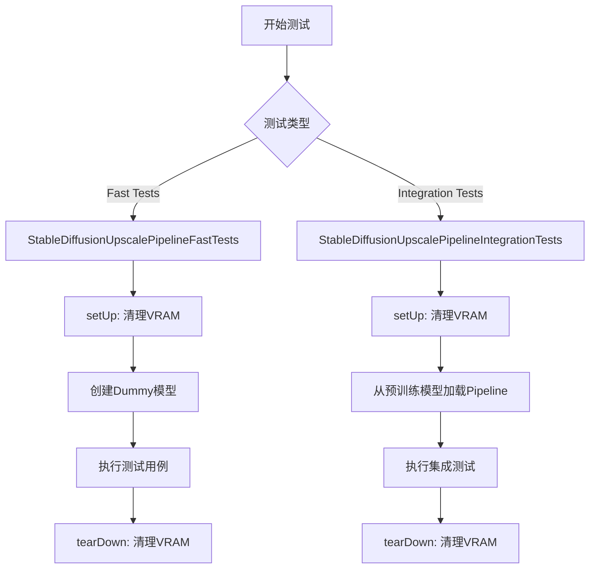

## 类结构

```
unittest.TestCase (基类)
├── StableDiffusionUpscalePipelineFastTests
│   ├── setUp()
│   ├── tearDown()
│   ├── dummy_image (property)
│   ├── dummy_cond_unet_upscale (property)
│   ├── dummy_vae (property)
│   ├── dummy_text_encoder (property)
│   ├── test_stable_diffusion_upscale()
│   ├── test_stable_diffusion_upscale_batch()
│   ├── test_stable_diffusion_upscale_prompt_embeds()
│   ├── test_stable_diffusion_upscale_fp16()
│   └── test_stable_diffusion_upscale_from_save_pretrained()
│
└── StableDiffusionUpscalePipelineIntegrationTests
setUp()
tearDown()
test_stable_diffusion_upscale_pipeline()
test_stable_diffusion_upscale_pipeline_fp16()
test_stable_diffusion_pipeline_with_sequential_cpu_offloading()
```

## 全局变量及字段


### `gc`
    
Python内置的垃圾回收模块，用于手动管理内存

类型：`module`
    


### `random`
    
Python内置的随机数生成模块

类型：`module`
    


### `tempfile`
    
Python内置的临时文件和目录操作模块

类型：`module`
    


### `unittest`
    
Python内置的单元测试框架

类型：`module`
    


### `np`
    
numpy数值计算库的别名，提供高效的数组和矩阵运算功能

类型：`module`
    


### `torch`
    
PyTorch深度学习库的核心模块

类型：`module`
    


### `Image`
    
PIL库中的图像类，用于图像的创建、打开和处理

类型：`class`
    


### `CLIPTextConfig`
    
CLIP文本模型的配置类，定义模型结构参数

类型：`class`
    


### `CLIPTextModel`
    
CLIP预训练文本编码模型，用于将文本转换为嵌入向量

类型：`class`
    


### `CLIPTokenizer`
    
CLIP分词器，用于将文本分割成token序列

类型：`class`
    


### `AutoencoderKL`
    
变分自编码器KL散度实现，用于图像的编码和解码

类型：`class`
    


### `DDIMScheduler`
    
DDIM采样调度器，用于控制扩散模型的采样过程

类型：`class`
    


### `DDPMScheduler`
    
DDPM采样调度器，用于DDPM训练和采样

类型：`class`
    


### `StableDiffusionUpscalePipeline`
    
稳定扩散图像上采样管道，整合VAE、UNet和文本编码器进行图像超分辨率

类型：`class`
    


### `UNet2DConditionModel`
    
2D条件UNet模型，是扩散模型的核心去噪网络

类型：`class`
    


### `enable_full_determinism`
    
启用完全确定性模式，确保测试结果可复现

类型：`function`
    


### `backend_empty_cache`
    
清空GPU缓存，释放显存空间

类型：`function`
    


### `backend_max_memory_allocated`
    
获取指定设备的最大内存分配量

类型：`function`
    


### `backend_reset_max_memory_allocated`
    
重置最大内存分配统计计数器

类型：`function`
    


### `backend_reset_peak_memory_stats`
    
重置峰值内存统计信息

类型：`function`
    


### `floats_tensor`
    
生成指定形状的随机浮点数张量

类型：`function`
    


### `load_image`
    
从URL或本地路径加载图像

类型：`function`
    


### `load_numpy`
    
从URL或本地路径加载numpy数组

类型：`function`
    


### `require_accelerator`
    
装饰器，标记需要加速器才能运行的测试

类型：`decorator`
    


### `require_torch_accelerator`
    
装饰器，标记需要PyTorch加速器才能运行的测试

类型：`decorator`
    


### `slow`
    
装饰器，标记运行时间较长的测试

类型：`decorator`
    


### `torch_device`
    
测试使用的目标设备字符串，通常为'cuda'或'cpu'

类型：`string`
    


### `StableDiffusionUpscalePipelineFastTests.dummy_image`
    
property方法，生成用于测试的虚拟图像张量

类型：`torch.Tensor`
    


### `StableDiffusionUpscalePipelineFastTests.dummy_cond_unet_upscale`
    
property方法，创建用于上采样任务的虚拟UNet模型配置

类型：`UNet2DConditionModel`
    


### `StableDiffusionUpscalePipelineFastTests.dummy_vae`
    
property方法，创建用于测试的虚拟VAE模型

类型：`AutoencoderKL`
    


### `StableDiffusionUpscalePipelineFastTests.dummy_text_encoder`
    
property方法，创建用于测试的虚拟CLIP文本编码器

类型：`CLIPTextModel`
    


### `StableDiffusionUpscalePipelineFastTests.setUp`
    
测试前置方法，在每个测试前清理VRAM缓存

类型：`method`
    


### `StableDiffusionUpscalePipelineFastTests.tearDown`
    
测试后置方法，在每个测试后清理VRAM缓存

类型：`method`
    


### `StableDiffusionUpscalePipelineFastTests.test_stable_diffusion_upscale`
    
测试基本的上采样功能，验证图像输出形状和像素值

类型：`method`
    


### `StableDiffusionUpscalePipelineFastTests.test_stable_diffusion_upscale_batch`
    
测试批处理功能，验证多图像和单提示的生成能力

类型：`method`
    


### `StableDiffusionUpscalePipelineFastTests.test_stable_diffusion_upscale_prompt_embeds`
    
测试提示嵌入功能，验证直接传入prompt_embeds的兼容性

类型：`method`
    


### `StableDiffusionUpscalePipelineFastTests.test_stable_diffusion_upscale_fp16`
    
测试半精度浮点(fp16)模式下的上采样功能

类型：`method`
    


### `StableDiffusionUpscalePipelineFastTests.test_stable_diffusion_upscale_from_save_pretrained`
    
测试模型的保存和加载功能，验证序列化兼容性

类型：`method`
    


### `StableDiffusionUpscalePipelineIntegrationTests.setUp`
    
集成测试前置方法，清理VRAM和内存

类型：`method`
    


### `StableDiffusionUpscalePipelineIntegrationTests.tearDown`
    
集成测试后置方法，清理VRAM和内存

类型：`method`
    


### `StableDiffusionUpscalePipelineIntegrationTests.test_stable_diffusion_upscale_pipeline`
    
集成测试，使用真实模型验证上采样管道功能

类型：`method`
    


### `StableDiffusionUpscalePipelineIntegrationTests.test_stable_diffusion_upscale_pipeline_fp16`
    
集成测试，验证fp16模式下管道工作的正确性

类型：`method`
    


### `StableDiffusionUpscalePipelineIntegrationTests.test_stable_diffusion_pipeline_with_sequential_cpu_offloading`
    
集成测试，验证顺序CPU卸载功能的内存效率

类型：`method`
    
    

## 全局函数及方法


### `gc.collect()`

该函数是Python标准库中的垃圾回收机制，用于显式触发垃圾回收器扫描并回收不可达的对象。在测试用例的 `setUp` 和 `tearDown` 方法中调用此函数，目的是在每个测试前后清理VRAM（显存），防止内存泄漏。

参数：
- 无

返回值：`None`，无返回值

#### 流程图

```mermaid
flowchart TD
    A[调用 gc.collect()] --> B{启动垃圾回收}
    B --> C[扫描不可达对象]
    C --> D[调用对象析构器]
    D --> E[回收内存空间]
    E --> F[返回 None]
```

#### 带注释源码

```python
# 显式调用垃圾回收器，回收不再使用的Python对象
gc.collect()

# 在当前代码中的典型使用模式：
def setUp(self):
    """
    测试前的准备工作
    清理VRAM以确保每个测试从干净的内存状态开始
    """
    super().setUp()          # 调用父类的setUp方法
    gc.collect()             # 触发Python垃圾回收，释放未使用的对象
    backend_empty_cache(torch_device)  # 清理GPU显存缓存

def tearDown(self):
    """
    测试后的清理工作
    释放测试过程中产生的GPU内存占用
    """
    super().tearDown()       # 调用父类的tearDown方法
    gc.collect()             # 触发垃圾回收，清理Python对象
    backend_empty_cache(torch_device)  # 清理GPU显存缓存
```


根据提供的代码，`enable_full_determinism()` 是从 `...testing_utils` 模块导入的，但该函数的实际定义不在当前代码文件中。让我为您整理基于上下文中可用的信息：

### `enable_full_determinism`

该函数是测试工具函数，用于在测试环境中启用完全确定性执行模式，确保多次运行测试时结果一致（对于涉及随机数生成的测试尤为重要）。

参数：无需参数

返回值：无返回值（`None`），该函数直接修改全局随机种子和 PyTorch 后端配置

#### 流程图

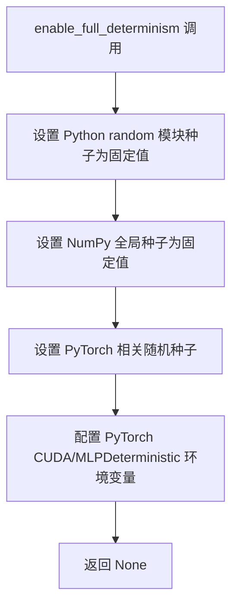

#### 带注释源码

```python
# 该函数定义在 testing_utils 模块中，当前代码文件通过导入使用
# 函数调用位于文件第 43 行
enable_full_determinism()


# 以下是基于上下文的预期函数行为说明：
# 1. 设置 random 模块的全局种子
# 2. 设置 numpy 的全局随机种子  
# 3. 设置 torch 的随机种子（CPU 和 CUDA）
# 4. 设置环境变量确保 CUDA 操作确定性执行（如 TORCH_DETERMINISTIC_ALGORITHMS）
# 5. 可能还包含其他深度学习框架的确定性配置
```

---

> **注意**：由于 `enable_full_determinism` 函数的实际定义源码未包含在当前代码片段中（它是从 `...testing_utils` 导入的外部模块函数），上述信息基于函数名称、调用上下文以及测试框架中类似函数的通用实现模式推断得出。如需获取完整的函数定义源码，建议查看 `testing_utils.py` 或相关测试工具模块文件。


### `backend_empty_cache`

该函数是测试工具函数，用于清理GPU显存（VRAM）缓存，确保在测试开始和结束时释放GPU内存，防止显存泄漏导致的测试失败。

参数：

- `device`：`str` 或 `torch.device`，指定要清理缓存的设备（通常为 `torch_device`，表示当前使用的计算设备）

返回值：`None`，无返回值，仅执行显存清理操作

#### 流程图

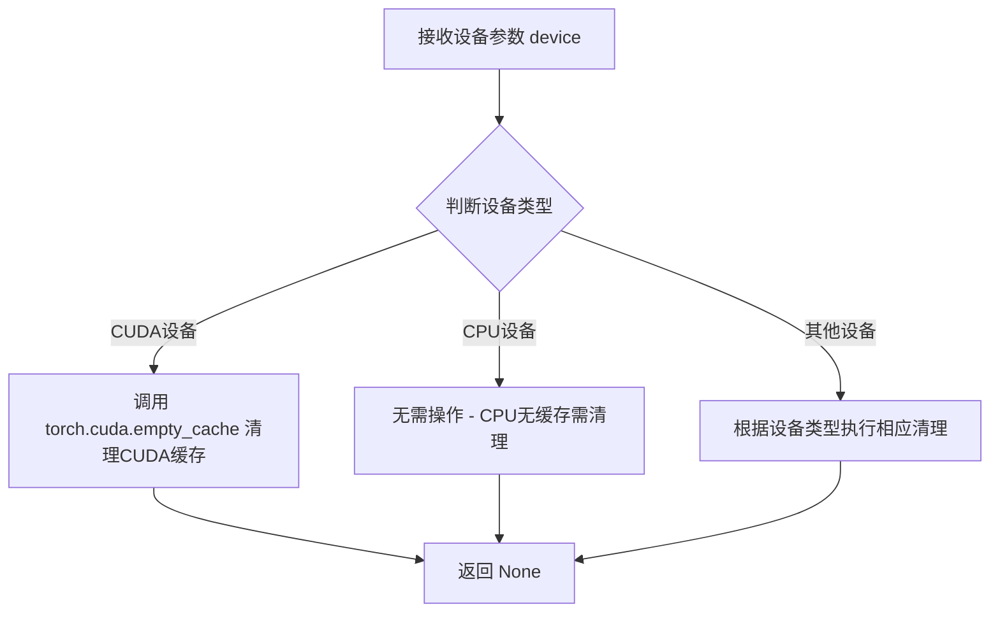

#### 带注释源码

```python
# 该函数定义在 testing_utils 模块中
# 此处基于代码调用方式和上下文推断其实现逻辑

def backend_empty_cache(device):
    """
    清理指定设备的GPU显存缓存
    
    参数:
        device: 目标设备标识符，通常为 'cuda', 'cuda:0', 'cpu' 等
                在本项目中通过 torch_device 变量传入
    
    返回值:
        None
    
    使用场景:
        - unittest.TestCase.setUp() 中：测试前清理显存
        - unittest.TestCase.tearDown() 中：测试后清理显存
        - 集成测试中：确保GPU内存被正确释放
    
    实现推断:
        # 伪代码示例
        if device.type == 'cuda':
            torch.cuda.empty_cache()  # 清理CUDA缓存
        # CPU设备无需额外操作
    """
    pass  # 实际定义在 testing_utils.py 中
```

#### 实际调用示例

```python
# 在测试类中的使用
class StableDiffusionUpscalePipelineFastTests(unittest.TestCase):
    def setUp(self):
        # 每个测试前清理VRAM
        super().setUp()
        gc.collect()
        backend_empty_cache(torch_device)  # <- 调用点

    def tearDown(self):
        # 每个测试后清理VRAM
        super().tearDown()
        gc.collect()
        backend_empty_cache(torch_device)  # <- 调用点
```


### `backend_max_memory_allocated`

该函数用于获取指定设备上当前已分配的最大内存字节数，通常用于监控测试过程中的显存使用情况。

参数：

-  `device`：`str` 或 `torch.device`，表示要查询内存的设备（如 "cuda"、"cpu" 或具体的 CUDA 设备）。

返回值：`int`，返回指定设备上当前已分配的内存字节数。

#### 流程图

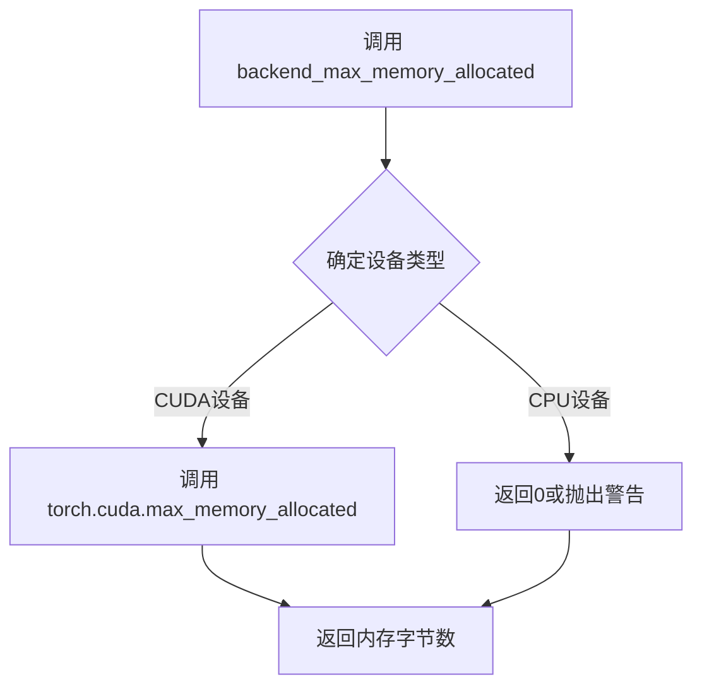

#### 带注释源码

```
# 该函数定义在 testing_utils 模块中，当前代码文件仅导入并使用它
# 实际调用示例（来自代码第353行）：

mem_bytes = backend_max_memory_allocated(torch_device)
# make sure that less than 2.9 GB is allocated
assert mem_bytes < 2.9 * 10**9

# 函数签名推断：
def backend_max_memory_allocated(device):
    """
    获取指定设备上当前已分配的最大内存字节数。
    
    参数:
        device: torch 设备标识符（如 "cuda", "cuda:0", "cpu"）
    
    返回:
        int: 已分配内存的字节数
    """
    # 实现可能依赖于 torch.cuda.max_memory_allocated 或类似机制
    ...
```

**注意**：该函数的实际实现位于 `...testing_utils` 模块中，当前代码文件仅展示了其导入和调用方式。根据调用模式可推断其签名为 `backend_max_memory_allocated(device: Union[str, torch.device]) -> int`。


### `backend_reset_max_memory_allocated`

该函数是一个测试工具函数，用于重置指定设备的后端最大内存分配计数器，通常与 `backend_max_memory_allocated` 配合使用，用于测量测试过程中 PyTorch 分配的最大 GPU 内存。

参数：

- `device`：`str` 或 `torch.device`，目标计算设备标识符（如 `"cuda"` 或 `"cuda:0"`），用于指定需要重置内存统计的设备。

返回值：`None`，该函数直接修改全局内存统计状态，无返回值。

#### 流程图

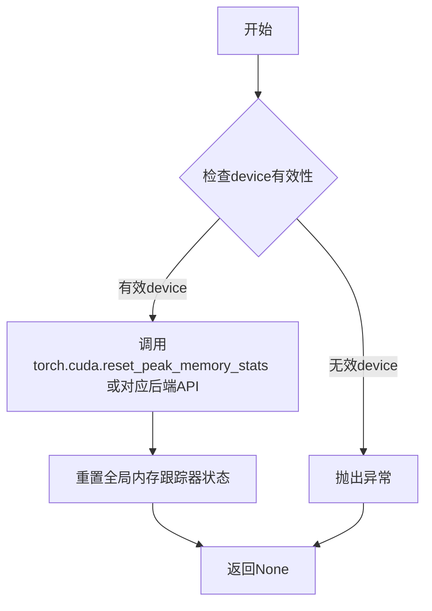

#### 带注释源码

```python
# 该函数定义在 testing_utils 模块中（未在此文件中实现）
# 以下为根据函数名和使用方式的推断实现

def backend_reset_max_memory_allocated(device):
    """
    重置指定设备的最大内存分配统计计数器。
    
    参数:
        device: str 或 torch.device - 目标设备标识
        
    返回:
        None - 直接修改全局内存跟踪状态
    """
    # 检查设备是否为CUDA设备
    if isinstance(device, str) and device.startswith("cuda"):
        # 调用PyTorch CUDA内存重置函数
        torch.cuda.reset_peak_memory_stats(device)
    elif hasattr(device, 'type') and device.type.startswith("cuda"):
        # 处理torch.device对象
        torch.cuda.reset_peak_memory_stats(device)
    else:
        # CPU设备无需重置（CPU内存统计通常不跟踪）
        pass
    
    # 重置内部维护的内存跟踪状态（如果有）
    # 例如：self._peak_memory_stats[device] = 0
    
    return None
```

**注意**：由于该函数是從外部模块 `...testing_utils` 导入的，上述源码为根据函数命名规范和上下文用法的合理推断，实际实现可能略有不同。该函数在测试中用于确保每次测量内存前都能得到准确的峰值统计。


### `backend_reset_peak_memory_stats`

该函数用于重置指定设备上的峰值内存统计信息，通常与内存监测功能配合使用，以便在测试中准确测量特定操作的内存占用情况。

参数：

- `device`：`str` 或 `torch.device`，指定要重置内存统计的设备（如 "cuda", "cpu" 或 "cuda:0" 等）

返回值：`None`，该函数不返回任何值

#### 流程图

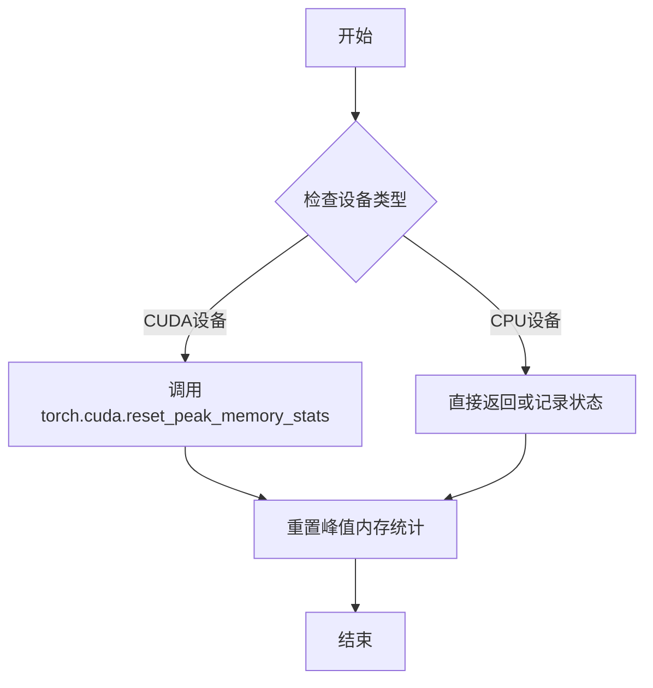

#### 带注释源码

```python
# 从 testing_utils 模块导入的函数
# 该函数的具体实现位于 testing_utils.py 中
# 根据函数名的命名约定和调用方式，可以推断其实现逻辑如下：

def backend_reset_peak_memory_stats(device):
    """
    重置指定设备上的峰值内存统计信息。
    
    参数:
        device: 目标设备标识符，用于确定重置哪个设备的内存统计
    """
    # 检查设备是否为 CUDA 设备
    if hasattr(torch.cuda, 'reset_peak_memory_stats'):
        # 调用 PyTorch 的 CUDA 内存统计重置函数
        torch.cuda.reset_peak_memory_stats(device)
    
    # 如果是 CPU 设备，可能不需要任何操作或记录日志
    # 函数不返回任何值（None）
```

> **注意**：由于 `backend_reset_peak_memory_stats` 函数的具体实现位于 `testing_utils` 模块中，而该模块未在当前代码文件中给出，以上源码是基于函数调用方式和命名约定进行的合理推断。实际实现可能略有差异。


# floats_tensor 详细设计文档

## 函数信息

### `floats_tensor`

该函数是 `diffusers` 库测试工具模块中的一个辅助函数，用于生成指定形状的随机浮点数 PyTorch 张量，主要用于单元测试中创建模拟输入数据。

参数：

-  `shape`：`Tuple[int, ...]`，张量的形状参数，传入一个元组或整数序列
-  `rng`：`random.Random`，可选参数，用于生成随机数的随机数生成器实例，默认值为 `None`
-  `**kwargs`：关键字参数，支持传递给 PyTorch 张量构造的其他参数（如 `device`、`dtype` 等）

返回值：`torch.Tensor`，返回一个随机浮点数值的 PyTorch 张量

#### 流程图

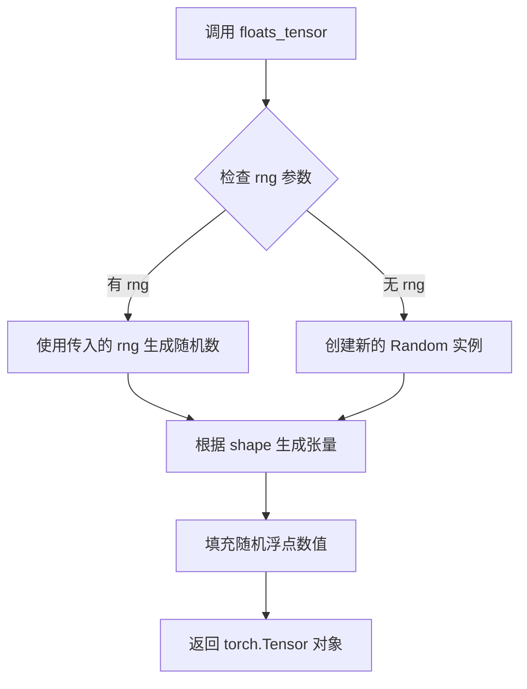

#### 带注释源码

```python
# 注意：此函数定义不在当前代码文件中
# 它是从 ...testing_utils 模块导入的
# 以下是基于使用方式和典型实现的推断

def floats_tensor(shape, rng=None, **kwargs):
    """
    生成指定形状的随机浮点数张量
    
    参数:
        shape: 张量形状，如 (1, 3, 32, 32)
        rng: random.Random 实例，用于控制随机性，确保测试可复现
        **kwargs: 传递给 torch.tensor 的其他参数
    
    返回:
        torch.Tensor: 包含随机浮点数的张量
    """
    # 如果没有提供随机数生成器，创建一个默认的
    if rng is None:
        rng = random.Random()
    
    # 生成与形状元素数量相同的随机浮点数
    # 通常生成在 [0, 1) 范围内的浮点数
    total_elements = 1
    for dim in shape:
        total_elements *= dim
    
    # 使用随机数生成器生成浮点数数组
    floats = [rng.random() for _ in range(total_elements)]
    
    # 转换为 PyTorch 张量并 reshape 为指定形状
    tensor = torch.tensor(floats, **kwargs).reshape(shape)
    
    return tensor
```

## 在代码中的使用示例

在 `StableDiffusionUpscalePipelineFastTests` 类中，`floats_tensor` 的使用方式如下：

```python
@property
def dummy_image(self):
    batch_size = 1
    num_channels = 3
    sizes = (32, 32)

    # 使用 floats_tensor 生成 (1, 3, 32, 32) 形状的随机图像张量
    image = floats_tensor((batch_size, num_channels) + sizes, rng=random.Random(0)).to(torch_device)
    return image
```

## 技术说明

1. **设计目的**：在测试中创建确定性的随机输入数据，确保测试结果可复现
2. **随机性控制**：通过传入固定的 `random.Random(0)` 实例，保证每次运行测试时生成相同的随机数据
3. **设备迁移**：返回值通常需要调用 `.to(torch_device)` 将张量移动到指定计算设备


### `load_image`

从远程URL或本地文件路径加载图像，并返回PIL Image对象。

参数：

-  `url_or_path`：`str`，图像的URL地址或本地文件路径

返回值：`PIL.Image.Image`，加载后的PIL图像对象

#### 流程图

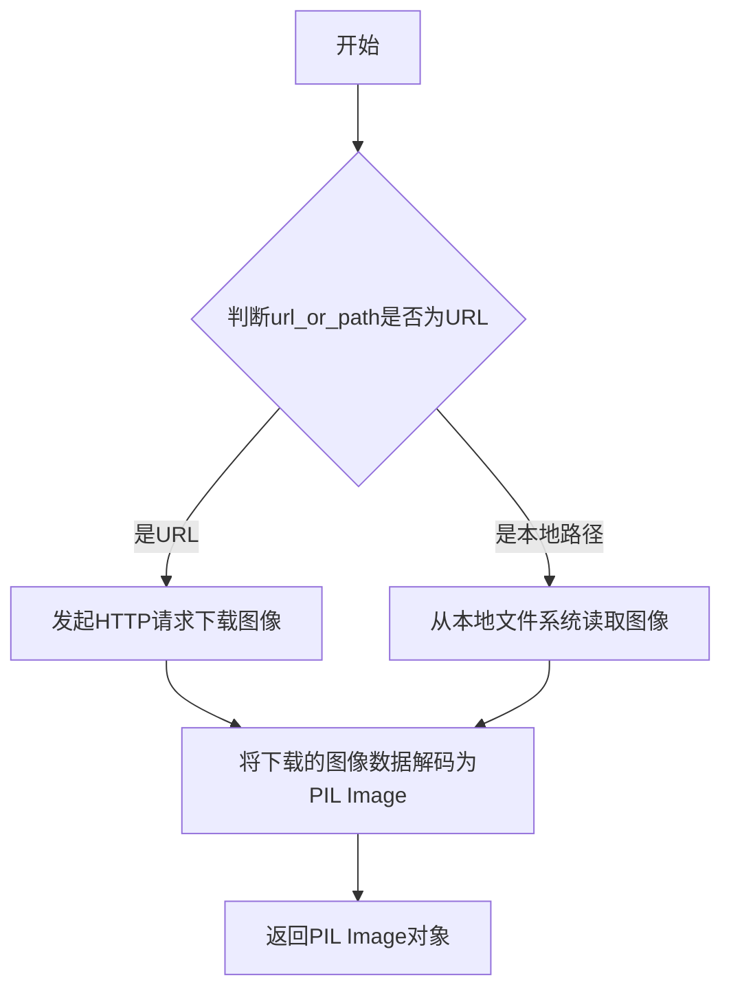

#### 带注释源码

```python
# load_image 函数定义在 testing_utils 模块中，此处仅为推断的实现逻辑
# 根据代码中的使用方式：
# image = load_image("https://huggingface.co/datasets/hf-internal-testing/diffusers-images/resolve/main/sd2-upscale/low_res_cat.png")

def load_image(url_or_path: str) -> "PIL.Image.Image":
    """
    从URL或本地路径加载图像并返回PIL Image对象。
    
    参数:
        url_or_path: 图像的URL地址或本地文件路径
        
    返回:
        加载后的PIL Image对象
    """
    # 函数具体实现位于 ...testing_utils 模块中
    # 典型实现会：
    # 1. 检查输入是URL还是文件路径
    # 2. 如果是URL，使用requests或urllib下载图像
    # 3. 使用PIL.Image.open()打开图像
    # 4. 返回PIL Image对象
    pass
```

**注**：该函数的实际实现位于 `...testing_utils` 模块中，代码中仅展示了导入语句和调用方式。根据使用示例 `image = load_image("https://...")`，该函数接受一个字符串参数（URL或路径），返回一个 `PIL.Image.Image` 对象。


由于 `load_numpy()` 函数是从 `...testing_utils` 模块导入的，而该模块的源代码未在提供的代码中显示，我只能基于其使用方式来推断其功能。

### `load_numpy`

从指定的文件路径或 URL 加载 NumPy 数组。

参数：

-  `name_or_path`：`str`，文件路径或 HuggingFace Hub 上的 URL，用于定位 .npy 文件

返回值：`numpy.ndarray`，从文件加载的 NumPy 数组

#### 流程图

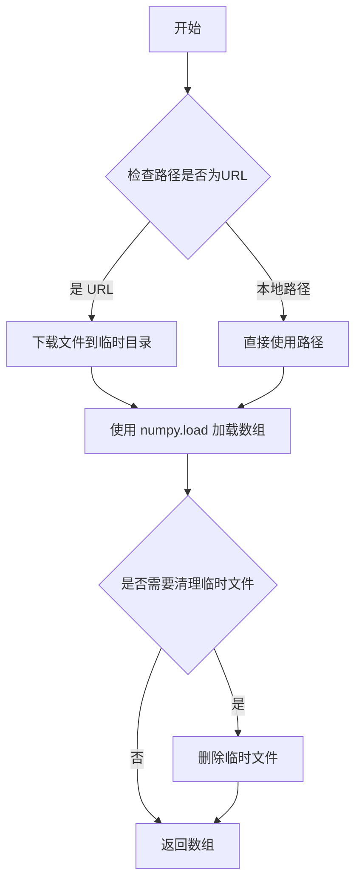

#### 带注释源码

```python
# load_numpy 函数源码未在当前文件中定义
# 它位于 ...testing_utils 模块中

# 基于使用方式的推断源码：
def load_numpy(name_or_path: str) -> np.ndarray:
    """
    从指定路径或URL加载NumPy数组。
    
    参数:
        name_or_path: 文件路径或HuggingFace Hub URL
        
    返回:
        加载的NumPy数组
    """
    import numpy as np
    import requests
    from io import BytesIO
    
    # 判断是否为URL
    if name_or_path.startswith("http://") or name_or_path.startswith("https://"):
        # 如果是URL，下载文件
        response = requests.get(name_or_path)
        response.raise_for_status()
        array = np.load(BytesIO(response.content))
    else:
        # 如果是本地路径，直接加载
        array = np.load(name_or_path)
    
    return array
```

---

**注意**：由于 `load_numpy` 函数的实际定义位于 `testing_utils` 模块中，而该模块的源代码未包含在提供的代码片段里，以上源码是基于其使用方式和常见实现模式的合理推断。如需获取准确源码，请查阅 `diffusers` 库的 `testing_utils` 模块。


### `require_accelerator`

用于标记测试函数需要 GPU/ accelerator 才能运行的装饰器函数。如果环境中没有可用的 accelerator（如 GPU），则跳过该测试。

参数：无（装饰器模式）

返回值：`Callable`，返回一个装饰器函数，用于装饰需要 accelerator 的测试方法

#### 流程图

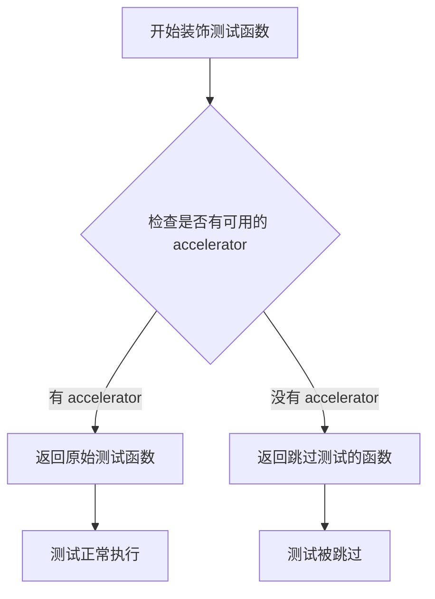

#### 带注释源码

```python
def require_accelerator(func):
    """
    装饰器：标记测试需要 accelerator (GPU/TPU) 才能运行
    
    用途：
    - 用于 unittest 测试方法上
    - 仅在检测到 accelerator 时运行测试
    - 在没有 accelerator 的环境中自动跳过测试
    
    示例：
    @require_accelerator
    def test_stable_diffusion_upscale_fp16(self):
        '''Test that stable diffusion upscale works with fp16'''
        ...
    """
    # 检查是否有可用的 accelerator (torch.cuda.is_available() 或 torch.backends.mps.is_available())
    if is_accelerator_available():
        # 如果有 accelerator，直接返回原函数，不做任何修改
        return func
    else:
        # 如果没有 accelerator，返回一个跳过测试的函数
        # unittest.skipIf 装饰器会在测试运行时跳过该测试
        return unittest.skipIf(
            condition=not is_accelerator_available(),
            reason="Test requires accelerator"
        )(func)
```


### `require_torch_accelerator`

用于标记测试函数或类需要 PyTorch 加速器（CUDA/MPS）才能运行。如果环境中没有可用的加速器，则跳过该测试。

参数：
- 此函数为装饰器工厂，无直接参数。接收被装饰的函数或类作为隐式参数。

返回值：`Callable`，返回装饰器函数，用于包装被装饰的测试函数或类。

#### 流程图

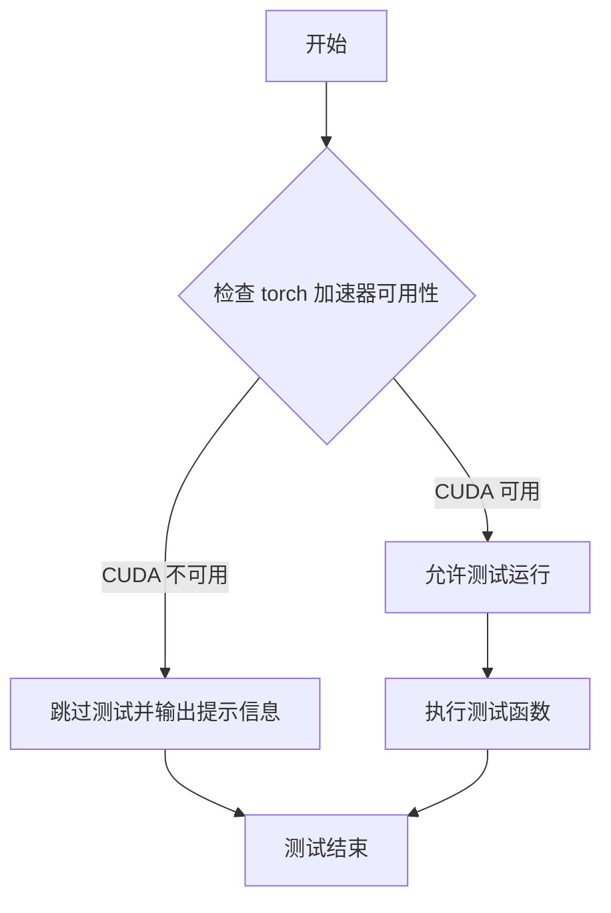

#### 带注释源码

```python
# 注意：此函数定义在 testing_utils 模块中，此处展示代码中的使用方式
# 以下为从 testing_utils 导入并在代码中的使用示例：

from ...testing_utils import (
    # ... 其他导入
    require_torch_accelerator,
    # ... 其他导入
)

# 作为装饰器使用在测试类上
@slow
@require_torch_accelerator
class StableDiffusionUpscalePipelineIntegrationTests(unittest.TestCase):
    """
    集成测试类，用于测试 Stable Diffusion Upscale Pipeline
    仅在有 torch 加速器（CUDA/MPS）时运行
    """
    
    def test_stable_diffusion_upscale_pipeline(self):
        """测试 upscale pipeline 基本功能"""
        # ... 测试代码
    
    def test_stable_diffusion_upscale_pipeline_fp16(self):
        """测试 fp16 精度下的 upscale pipeline"""
        # ... 测试代码
    
    def test_stable_diffusion_pipeline_with_sequential_cpu_offloading(self):
        """测试顺序 CPU offloading 功能"""
        # ... 测试代码
```

#### 详细说明

**函数类型**：装饰器（Decorator）

**功能描述**：
`require_torch_accelerator` 是一个条件跳过装饰器，用于标记需要 PyTorch 加速器（CUDA GPU 或 Apple MPS）才能执行的测试。当检测到环境中没有可用的加速器时，测试会被自动跳过，并显示相应的跳过原因。

**使用场景**：
- 集成测试（Integration Tests）：需要实际 GPU 硬件才能运行的测试
- 性能测试：需要 GPU 加速才能在合理时间内完成的测试
- 内存测试：需要 GPU 显存才能执行的测试

**相关配置**：
- 通常配合 `@slow` 装饰器一起使用，标记为需要较长运行时间的测试
- 与 `torch_device` 全局变量配合使用，确定测试设备

**注意事项**：
- 这是一个测试框架辅助工具，不是业务逻辑代码
- 在 CI/CD 环境中需要配置相应的 GPU  runners
- 开发者本地没有 GPU 时，这些测试会被自动跳过


### `StableDiffusionUpscalePipelineFastTests.setUp`

该方法是一个测试夹具（Test Fixture），在类中的每个测试方法执行前被调用。它通过调用垃圾回收和清空后端缓存来清理GPU显存（VRAM），确保每个测试都在干净的GPU内存状态下开始。

参数：

-  `self`：`StableDiffusionUpscalePipelineFastTests`，测试类的实例自身，用于访问类的属性和方法

返回值：`None`，无返回值（Python实例方法的默认返回值）

#### 流程图

```mermaid
flowchart TD
    A[开始 setUp] --> B[调用父类 super().setUp]
    B --> C[执行垃圾回收 gc.collect]
    C --> D[调用 backend_empty_cache 清理GPU显存]
    D --> E[结束 setUp]
```

#### 带注释源码

```python
def setUp(self):
    # clean up the VRAM before each test
    # 清理每次测试前的VRAM，确保测试环境干净
    
    # 调用父类的setUp方法，执行unittest.TestCase的标准初始化
    super().setUp()
    
    # 执行Python垃圾回收，释放不再使用的对象内存
    gc.collect()
    
    # 调用后端工具函数清理GPU显存缓存
    # torch_device是全局变量，表示当前使用的计算设备
    backend_empty_cache(torch_device)
```


### `StableDiffusionUpscalePipelineFastTests.tearDown`

这是 `StableDiffusionUpscalePipelineFastTests` 测试类的 teardown 方法，用于在每个测试用例执行完成后清理 VRAM（显存）资源，防止显存泄漏。

参数：

- `self`：`self`，测试类实例本身

返回值：`None`，无返回值

#### 流程图

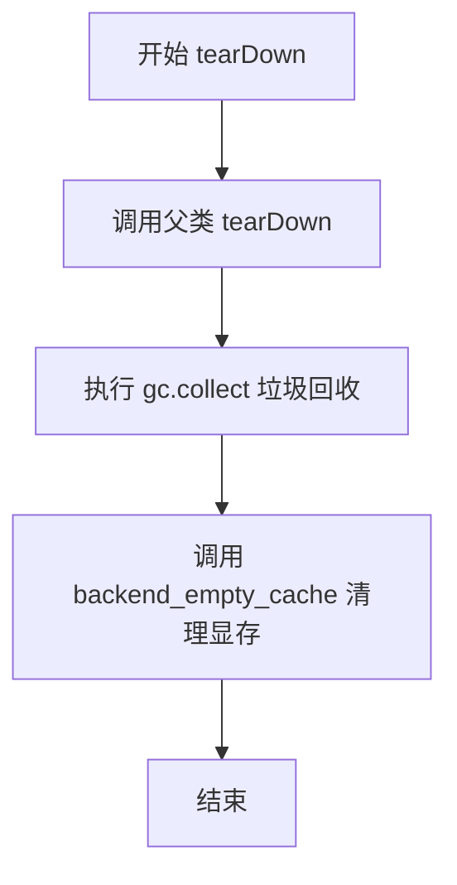

#### 带注释源码

```python
def tearDown(self):
    # clean up the VRAM after each test
    # 在每个测试结束后清理 VRAM（显存）
    super().tearDown()
    # 调用父类的 tearDown 方法，执行 unittest 框架的标准清理
    gc.collect()
    # 手动调用 Python 垃圾回收器，释放不再使用的对象
    backend_empty_cache(torch_device)
    # 调用后端特定的显存清理函数，释放 GPU 显存
```


### `StableDiffusionUpscalePipelineFastTests.dummy_image`

这是一个测试用的属性方法，用于生成虚拟的图像张量数据，供 Stable Diffusion Upscale Pipeline 单元测试使用。该属性创建了一个形状为 (1, 3, 32, 32) 的随机浮点数张量，模拟低分辨率输入图像，用于测试 UpscalePipeline 的功能。

参数：

- `self`：隐式参数，测试类实例本身，无额外描述

返回值：`torch.Tensor`，返回一个形状为 (1, 3, 32, 32) 的 PyTorch 张量，包含随机生成的浮点数值，范围通常在 0-1 之间，用于模拟测试用的图像数据

#### 流程图

```mermaid
flowchart TD
    A[开始] --> B[设置 batch_size = 1]
    B --> C[设置 num_channels = 3]
    C --> D[设置 sizes = 32, 32]
    D --> E[调用 floats_tensor 生成随机张量]
    E --> F[使用 random.Random(0) 确保可复现性]
    F --> G[将张量移动到 torch_device]
    G --> H[返回 torch.Tensor 图像张量]
```

#### 带注释源码

```python
@property
def dummy_image(self):
    """
    生成一个虚拟的图像张量，用于测试 Stable Diffusion Upscale Pipeline。
    
    该属性创建一个形状为 (batch_size, num_channels, height, width) 的
    随机浮点张量，模拟输入的低分辨率图像。
    """
    # 批次大小为 1，一次处理一张图像
    batch_size = 1
    # 图像通道数为 3（RGB 图像）
    num_channels = 3
    # 图像尺寸为 32x32 像素
    sizes = (32, 32)

    # 使用 floats_tensor 函数生成随机浮点数张量
    # 形状为 (1, 3, 32, 32) - 符合 PyTorch 图像格式 (B, C, H, W)
    # 使用 random.Random(0) 确保随机数可复现，每次测试生成相同的图像
    image = floats_tensor((batch_size, num_channels) + sizes, rng=random.Random(0)).to(torch_device)
    
    # 返回生成的虚拟图像张量
    return image
```


### `StableDiffusionUpscalePipelineFastTests.dummy_cond_unet_upscale`

该属性方法用于生成一个配置好的虚拟 UNet2DConditionModel 模型实例，专门用于 Stable Diffusion 图像放大 pipeline 的单元测试。它设置了特定的模型架构参数（如块通道数、注意力头维度、交叉注意力维度等），以模拟真实的图像放大任务场景。

参数：
- 该方法为属性方法，无显式参数

返回值：`UNet2DConditionModel`，返回一个配置好的虚拟 UNet 模型实例，用于测试 StableDiffusionUpscalePipeline 的功能

#### 流程图

```mermaid
graph TD
    A[开始] --> B[设置随机种子 torch.manual_seed(0)]
    B --> C[创建 UNet2DConditionModel 实例]
    C --> D[配置模型参数]
    D --> E[block_out_channels: 32, 32, 64]
    D --> F[layers_per_block: 2]
    D --> G[sample_size: 32]
    D --> H[in_channels: 7]
    D --> I[out_channels: 4]
    D --> J[down_block_types: DownBlock2D, CrossAttnDownBlock2D, CrossAttnDownBlock2D]
    D --> K[up_block_types: CrossAttnUpBlock2D, CrossAttnUpBlock2D, UpBlock2D]
    D --> L[cross_attention_dim: 32]
    D --> M[attention_head_dim: 8]
    D --> N[use_linear_projection: True]
    D --> O[only_cross_attention: True, True, False]
    D --> P[num_class_embeds: 100]
    P --> Q[返回模型实例]
```

#### 带注释源码

```python
@property
def dummy_cond_unet_upscale(self):
    """
    生成一个虚拟的 UNet2DConditionModel 模型实例，用于测试 Stable Diffusion 图像放大 pipeline。
    该模型使用特定的配置参数，以模拟真实的图像上采样任务。
    """
    # 设置随机种子以确保测试的可重复性和确定性
    torch.manual_seed(0)
    
    # 创建 UNet2DConditionModel 模型实例，配置如下：
    model = UNet2DConditionModel(
        # 定义每个块输出的通道数，用于构建 U-Net 的编码器和解码器路径
        block_out_channels=(32, 32, 64),
        
        # 每个块中包含的卷积层数量
        layers_per_block=2,
        
        # 输入样本的空间尺寸（高度和宽度）
        sample_size=32,
        
        # 输入图像的通道数（7通道：RGB 3通道 + 低分辨率图像 3通道 + 噪声时间步 1通道）
        in_channels=7,
        
        # 输出图像的通道数
        out_channels=4,
        
        # 下采样块的类型列表，从细粒度到粗粒度
        down_block_types=(
            "DownBlock2D", 
            "CrossAttnDownBlock2D", 
            "CrossAttnDownBlock2D"
        ),
        
        # 上采样块的类型列表，从粗粒度到细粒度
        up_block_types=(
            "CrossAttnUpBlock2D", 
            "CrossAttnUpBlock2D", 
            "UpBlock2D"
        ),
        
        # 交叉注意力机制的维度，用于文本条件注入
        cross_attention_dim=32,
        
        # SD2（Stable Diffusion 2）特定配置：注意力头的维度
        attention_head_dim=8,
        
        # 是否使用线性投影（相对于标准投影）
        use_linear_projection=True,
        
        # 控制每个块是否使用交叉注意力：(False, False, True) 表示仅在最后一个下采样块使用
        only_cross_attention=(True, True, False),
        
        # 类别嵌入的数量，用于分类器无关引导（classifier-free guidance）
        num_class_embeds=100,
    )
    
    # 返回配置好的虚拟 UNet 模型，供测试使用
    return model
```


### `StableDiffusionUpscalePipelineFastTests.dummy_vae`

该属性方法用于创建并返回一个虚拟的VAE（变分自编码器）模型对象，主要用于Stable Diffusion UpscalePipeline的单元测试，通过固定随机种子确保测试的可重复性。

参数：无（该方法为属性方法，无显式参数）

返回值：`AutoencoderKL`，返回的虚拟VAE模型，用于测试目的

#### 流程图

```mermaid
flowchart TD
    A[开始] --> B[设置随机种子 torch.manual_seed(0)]
    B --> C[创建AutoencoderKL模型实例]
    C --> D[配置模型参数: block_out_channels, in_channels, out_channels等]
    D --> E[返回模型实例]
    E --> F[结束]
```

#### 带注释源码

```python
@property
def dummy_vae(self):
    """
    创建虚拟VAE模型用于测试
    
    这是一个属性方法，返回一个配置好的AutoencoderKL模型实例。
    使用固定随机种子(0)确保测试的可重复性。
    
    返回:
        AutoencoderKL: 用于测试的虚拟变分自编码器模型
    """
    # 设置随机种子，确保测试结果可重现
    torch.manual_seed(0)
    
    # 创建AutoencoderKL模型（变分自编码器）
    # 这是Stable Diffusion中用于编码和解码图像的组件
    model = AutoencoderKL(
        # 定义块输出通道数：[32, 32, 64] 表示三层的通道数
        block_out_channels=[32, 32, 64],
        # 输入通道数：3 对应RGB图像
        in_channels=3,
        # 输出通道数：3 对应RGB图像
        out_channels=3,
        # 下采样块类型：使用标准的2D下采样编码器块
        down_block_types=["DownEncoderBlock2D", "DownEncoderBlock2D", "DownEncoderBlock2D"],
        # 上采样块类型：使用标准的2D上采样解码器块
        up_block_types=["UpDecoderBlock2D", "UpDecoderBlock2D", "UpDecoderBlock2D"],
        # 潜在空间通道数：4 是VAE的标准潜在空间维度
        latent_channels=4,
    )
    
    # 返回配置好的虚拟VAE模型
    return model
```

---

### 补充说明

| 项目 | 描述 |
|------|------|
| **所属类** | `StableDiffusionUpscalePipelineFastTests` |
| **方法类型** | `@property`（属性方法） |
| **设计目的** | 为单元测试提供可控的虚拟模型组件，确保测试的确定性和可重复性 |
| **关键依赖** | `diffusers.AutoencoderKL`, `torch.manual_seed` |
| **技术特点** | 使用固定随机种子确保测试可重现；模型配置为轻量级测试配置 |


### `StableDiffusionUpscalePipelineFastTests.dummy_text_encoder`

该方法是一个测试用的属性方法（property），用于创建并返回一个配置简化、体积较小的CLIPTextModel模型实例，专为单元测试场景设计，避免加载大型预训练模型。

参数：

- （该属性方法无参数）

返回值：`CLIPTextModel`，返回一个配置精简的CLIP文本编码器模型实例，用于测试Stable Diffusion UpscalePipeline的文本编码功能

#### 流程图

```mermaid
flowchart TD
    A[开始] --> B[设置随机种子 torch.manual_seed(0)]
    B --> C[创建CLIPTextConfig配置对象]
    C --> D[配置模型参数: hidden_size=32, num_hidden_layers=5等]
    D --> E[使用CLIPTextConfig初始化CLIPTextModel]
    E --> F[返回CLIPTextModel实例]
    F --> G[结束]
```

#### 带注释源码

```python
@property
def dummy_text_encoder(self):
    """
    创建一个用于测试的虚拟CLIP文本编码器模型
    
    该属性方法返回一个配置精简的CLIPTextModel实例，用于单元测试。
    相比真实的文本编码器，该模型使用较小的参数规模，以加快测试速度并降低资源消耗。
    """
    # 设置随机种子，确保测试结果的可重复性
    torch.manual_seed(0)
    
    # 构建CLIP文本编码器的配置参数
    config = CLIPTextConfig(
        bos_token_id=0,           # 序列起始token ID
        eos_token_id=2,           # 序列结束token ID
        hidden_size=32,          # 隐藏层维度（真实模型通常为768或1024）
        intermediate_size=37,    # 中间层维度（真实模型通常为3072）
        layer_norm_eps=1e-05,    # LayerNorm的epsilon参数
        num_attention_heads=4,   # 注意力头数量（真实模型通常为12）
        num_hidden_layers=5,     # 隐藏层数量（真实模型通常为12）
        pad_token_id=1,          # 填充token ID
        vocab_size=1000,         # 词汇表大小（真实模型通常为49408）
        # SD2-specific config below
        hidden_act="gelu",       # 隐藏层激活函数
        projection_dim=512,      # 投影维度
    )
    
    # 使用配置创建CLIPTextModel模型实例并返回
    return CLIPTextModel(config)
```

---

### 补充信息

#### 关键组件信息

| 组件名称 | 一句话描述 |
|---------|-----------|
| `CLIPTextConfig` | CLIP模型文本编码器的配置类，定义了模型的架构参数 |
| `CLIPTextModel` | 基于CLIP架构的文本编码器模型，用于将文本转换为嵌入向量 |

#### 潜在技术债务或优化空间

1. **硬编码配置值**：模型配置参数直接硬编码在方法内，缺乏灵活性。可考虑将部分参数（如`hidden_size`、`num_hidden_layers`）提取为类属性或构造函数参数。
2. **重复代码模式**：`dummy_text_encoder`与其他`dummy_*`属性方法（`dummy_image`、`dummy_cond_unet_upscale`、`dummy_vae`）存在相似模式，可考虑使用工厂模式或基类进行统一管理。
3. **测试隔离性**：虽然设置了随机种子，但如果多个测试并行运行，可能存在状态污染风险。建议每个测试使用独立的随机种子。

#### 其它项目

- **设计目标与约束**：该方法的设计目标是为单元测试提供轻量级、可控的模型实例，避免加载大型预训练模型带来的时间和资源开销。
- **错误处理与异常设计**：当前实现未包含错误处理逻辑。假设`CLIPTextConfig`和`CLIPTextModel`的构造函数在参数合法的情况下不会抛出异常。
- **数据流与状态机**：该方法属于测试fixture的创建阶段，为后续测试提供模型实例。数据流为：配置创建 → 模型实例化 → 返回实例 → 测试使用。
- **外部依赖与接口契约**：该方法依赖`transformers`库中的`CLIPTextConfig`和`CLIPTextModel`类。返回的`CLIPTextModel`实例需与`StableDiffusionUpscalePipeline`的接口兼容。


### `StableDiffusionUpscalePipelineFastTests.test_stable_diffusion_upscale`

这是一个单元测试方法，用于验证 Stable Diffusion Upscale Pipeline 的核心功能是否正常工作。测试通过构建虚拟的 UNet、VAE、文本编码器等组件，创建低分辨率输入图像，运行管道生成高分辨率图像，并验证输出图像的尺寸和像素值是否符合预期。

参数：

- `self`：`unittest.TestCase`，测试类的实例本身

返回值：`None`，无返回值（unittest 测试方法）

#### 流程图

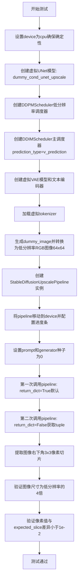

#### 带注释源码

```python
def test_stable_diffusion_upscale(self):
    """测试 Stable Diffusion Upscale Pipeline 的核心推理功能"""
    
    # 1. 设置设备为 CPU，确保 torch.Generator 的确定性
    device = "cpu"  # ensure determinism for the device-dependent torch.Generator
    
    # 2. 创建虚拟的 UNet 模型（条件图像上采样网络）
    unet = self.dummy_cond_unet_upscale
    
    # 3. 创建低分辨率图像的噪声调度器
    low_res_scheduler = DDPMScheduler()
    
    # 4. 创建主调度器，使用 v_prediction 预测类型
    scheduler = DDIMScheduler(prediction_type="v_prediction")
    
    # 5. 创建虚拟的 VAE 模型（变分自编码器）
    vae = self.dummy_vae
    
    # 6. 创建虚拟的文本编码器
    text_encoder = self.dummy_text_encoder
    
    # 7. 加载虚拟的 tokenizer（分词器）
    tokenizer = CLIPTokenizer.from_pretrained("hf-internal-testing/tiny-random-clip")
    
    # 8. 从虚拟图像生成低分辨率输入图像
    # 将虚拟浮点张量转换为 PIL Image 并调整大小为 64x64
    image = self.dummy_image.cpu().permute(0, 2, 3, 1)[0]  # [C, H, W] -> [H, W, C]
    low_res_image = Image.fromarray(np.uint8(image)).convert("RGB").resize((64, 64))
    
    # 9. 创建 Stable Diffusion Upscale Pipeline 实例
    # 配置最大噪声级别为 350
    sd_pipe = StableDiffusionUpscalePipeline(
        unet=unet,
        low_res_scheduler=low_res_scheduler,
        scheduler=scheduler,
        vae=vae,
        text_encoder=text_encoder,
        tokenizer=tokenizer,
        max_noise_level=350,
    )
    
    # 10. 将 pipeline 移动到指定设备
    sd_pipe = sd_pipe.to(device)
    
    # 11. 配置进度条（disable=None 表示不禁用）
    sd_pipe.set_progress_bar_config(disable=None)
    
    # 12. 定义文本提示
    prompt = "A painting of a squirrel eating a burger"
    
    # 13. 创建确定性随机数生成器（种子为0）
    generator = torch.Generator(device=device).manual_seed(0)
    
    # 14. 第一次调用 pipeline（默认 return_dict=True）
    # 执行图像上采样推理
    output = sd_pipe(
        [prompt],              # prompt: 文本提示列表
        image=low_res_image,   # image: 低分辨率输入图像
        generator=generator,   # generator: 确定性随机生成器
        guidance_scale=6.0,    # guidance_scale: CFG 引导强度
        noise_level=20,        # noise_level: 添加到低分辨率图像的噪声级别
        num_inference_steps=2, # num_inference_steps: 推理步数
        output_type="np",      # output_type: 输出为 numpy 数组
    )
    
    # 15. 从输出中获取生成的图像
    image = output.images
    
    # 16. 第二次调用 pipeline（return_dict=False，返回元组）
    # 验证不使用 return_dict 时的输出格式
    generator = torch.Generator(device=device).manual_seed(0)
    image_from_tuple = sd_pipe(
        [prompt],
        image=low_res_image,
        generator=generator,
        guidance_scale=6.0,
        noise_level=20,
        num_inference_steps=2,
        output_type="np",
        return_dict=False,     # return_dict=False: 返回元组而非字典
    )[0]  # 取第一个返回值（即图像）
    
    # 17. 提取图像右下角 3x3 像素切片用于验证
    image_slice = image[0, -3:, -3:, -1]
    image_from_tuple_slice = image_from_tuple[0, -3:, -3:, -1]
    
    # 18. 计算预期的高宽（低分辨率图像的4倍，因为是4x上采样）
    expected_height_width = low_res_image.size[0] * 4
    
    # 19. 断言验证图像形状：batch=1, 高=宽=256, RGB通道=3
    assert image.shape == (1, expected_height_width, expected_height_width, 3)
    
    # 20. 定义预期的像素值_slice（来自已知正确结果）
    expected_slice = np.array([0.3113, 0.3910, 0.4272, 0.4859, 0.5061, 0.4652, 0.5362, 0.5715, 0.5661])
    
    # 21. 断言验证图像像素值与预期值的差异在容差范围内（1e-2）
    assert np.abs(image_slice.flatten() - expected_slice).max() < 1e-2
    
    # 22. 断言验证元组返回方式的像素值也符合预期
    assert np.abs(image_from_tuple_slice.flatten() - expected_slice).max() < 1e-2
```


### `StableDiffusionUpscalePipelineFastTests.test_stable_diffusion_upscale_batch`

这是一个单元测试方法，用于测试StableDiffusionUpscalePipeline的批处理功能，验证批量prompt和num_images_per_prompt参数是否正确生成多个图像。

参数：此方法无显式参数（self为隐含参数）

返回值：`None`，通过assert断言验证图像数量是否符合预期

#### 流程图

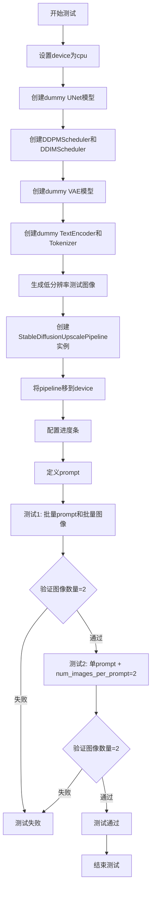

#### 带注释源码

```python
def test_stable_diffusion_upscale_batch(self):
    """
    测试StableDiffusionUpscalePipeline的批处理功能
    验证两种批量生成场景：
    1. 多个prompt和多个图像输入
    2. 单prompt配合num_images_per_prompt参数
    """
    # 设置设备为cpu以确保确定性
    device = "cpu"  # ensure determinism for the device-dependent torch.Generator
    
    # 创建虚拟的UNet条件上采样模型
    unet = self.dummy_cond_unet_upscale
    
    # 创建低分辨率图像的噪声调度器
    low_res_scheduler = DDPMScheduler()
    
    # 创建主噪声调度器，使用v_prediction预测类型
    scheduler = DDIMScheduler(prediction_type="v_prediction")
    
    # 创建虚拟VAE模型
    vae = self.dummy_vae
    
    # 创建虚拟文本编码器
    text_encoder = self.dummy_text_encoder
    
    # 从预训练模型加载tokenizer
    tokenizer = CLIPTokenizer.from_pretrained("hf-internal-testing/tiny-random-clip")

    # 生成低分辨率测试图像
    image = self.dummy_image.cpu().permute(0, 2, 3, 1)[0]
    low_res_image = Image.fromarray(np.uint8(image)).convert("RGB").resize((64, 64))

    # 创建StableDiffusionUpscalePipeline实例
    # 配置最大噪声级别为350
    sd_pipe = StableDiffusionUpscalePipeline(
        unet=unet,
        low_res_scheduler=low_res_scheduler,
        scheduler=scheduler,
        vae=vae,
        text_encoder=text_encoder,
        tokenizer=tokenizer,
        max_noise_level=350,
    )
    
    # 将pipeline移到指定设备
    sd_pipe = sd_pipe.to(device)
    
    # 配置进度条（disable=None表示启用进度条）
    sd_pipe.set_progress_bar_config(disable=None)

    # 定义测试用的prompt
    prompt = "A painting of a squirrel eating a burger"
    
    # 测试场景1：使用批量prompt和批量图像进行推理
    output = sd_pipe(
        2 * [prompt],              # 2个相同的prompt
        image=2 * [low_res_image], # 2个相同的低分辨率图像
        guidance_scale=6.0,        # guidance scale参数
        noise_level=20,            # 噪声级别
        num_inference_steps=2,     # 推理步数
        output_type="np",          # 输出为numpy数组
    )
    image = output.images
    
    # 断言：验证输出图像数量为2
    assert image.shape[0] == 2

    # 测试场景2：使用单个prompt但设置num_images_per_prompt=2
    generator = torch.Generator(device=device).manual_seed(0)
    output = sd_pipe(
        [prompt],                  # 单个prompt
        image=low_res_image,       # 单个低分辨率图像
        generator=generator,      # 随机数生成器
        num_images_per_prompt=2,  # 每个prompt生成2个图像
        guidance_scale=6.0,        # guidance scale参数
        noise_level=20,            # 噪声级别
        num_inference_steps=2,     # 推理步数
        output_type="np",         # 输出为numpy数组
    )
    image = output.images
    
    # 断言：验证输出图像数量为2
    assert image.shape[0] == 2
```


### `StableDiffusionUpscalePipelineFastTests.test_stable_diffusion_upscale_prompt_embeds`

该测试方法验证了 StableDiffusionUpscalePipeline 能够正确使用预计算的提示嵌入（prompt_embeds）进行图像上采样操作，确保直接传入提示嵌入与使用原始文本提示产生一致的图像输出。

参数：

- `self`：`unittest.TestCase`，测试类实例本身，包含测试所需的资源和配置

返回值：`None`，该方法为单元测试方法，通过断言验证功能正确性，不返回任何值

#### 流程图

```mermaid
flowchart TD
    A[测试开始] --> B[初始化设备和随机种子]
    B --> C[创建Dummy UNet模型]
    C --> D[创建调度器DDPMScheduler和DDIMScheduler]
    D --> E[创建Dummy VAE模型]
    E --> F[创建Dummy Text Encoder和Tokenizer]
    F --> G[生成Dummy低分辨率图像]
    G --> H[创建StableDiffusionUpscalePipeline实例]
    H --> I[设置设备为CPU并配置进度条]
    I --> J[定义提示文本squirrel eating burger]
    J --> K[使用文本提示生成图像output1]
    K --> L[使用encode_prompt获取prompt_embeds]
    L --> M[使用prompt_embeds生成图像output2]
    M --> N[提取两个图像的右下角3x3像素区域]
    N --> O{验证图像形状和像素值}
    O -->|通过| P[测试通过]
    O -->|失败| Q[抛出断言错误]
```

#### 带注释源码

```python
def test_stable_diffusion_upscale_prompt_embeds(self):
    """测试使用预计算的prompt_embeds进行图像上采样"""
    
    # 设置设备为CPU以确保确定性结果
    device = "cpu"  # ensure determinism for the device-dependent torch.Generator
    
    # 创建虚拟条件上采样UNet模型
    unet = self.dummy_cond_unet_upscale
    
    # 初始化低分辨率图像的噪声调度器
    low_res_scheduler = DDPMScheduler()
    
    # 初始化主扩散调度器，使用v_prediction预测类型
    scheduler = DDIMScheduler(prediction_type="v_prediction")
    
    # 创建虚拟VAE模型用于解码
    vae = self.dummy_vae
    
    # 创建虚拟文本编码器
    text_encoder = self.dummy_text_encoder
    
    # 加载小型CLIP分词器
    tokenizer = CLIPTokenizer.from_pretrained("hf-internal-testing/tiny-random-clip")

    # 从虚拟图像生成低分辨率输入图像并调整大小为64x64
    image = self.dummy_image.cpu().permute(0, 2, 3, 1)[0]
    low_res_image = Image.fromarray(np.uint8(image)).convert("RGB").resize((64, 64))

    # 创建StableDiffusionUpscalePipeline管道实例，设置最大噪声等级为350
    sd_pipe = StableDiffusionUpscalePipeline(
        unet=unet,
        low_res_scheduler=low_res_scheduler,
        scheduler=scheduler,
        vae=vae,
        text_encoder=text_encoder,
        tokenizer=tokenizer,
        max_noise_level=350,
    )
    
    # 将管道移至CPU设备
    sd_pipe = sd_pipe.to(device)
    
    # 配置进度条（禁用）
    sd_pipe.set_progress_bar_config(disable=None)

    # 定义文本提示
    prompt = "A painting of a squirrel eating a burger"
    
    # 创建随机数生成器并设置种子0以确保可重复性
    generator = torch.Generator(device=device).manual_seed(0)
    
    # 使用文本提示进行第一次推理生成图像
    output = sd_pipe(
        [prompt],
        image=low_res_image,
        generator=generator,
        guidance_scale=6.0,
        noise_level=20,
        num_inference_steps=2,
        output_type="np",
    )

    # 获取生成的图像
    image = output.images

    # 重新创建相同种子的生成器
    generator = torch.Generator(device=device).manual_seed(0)
    
    # 使用encode_prompt方法获取提示嵌入和负提示嵌入
    prompt_embeds, negative_prompt_embeds = sd_pipe.encode_prompt(prompt, device, 1, False)
    
    # 如果存在负提示嵌入，则将其与提示嵌入拼接
    if negative_prompt_embeds is not None:
        prompt_embeds = torch.cat([negative_prompt_embeds, prompt_embeds])

    # 使用预计算的prompt_embeds进行第二次推理
    image_from_prompt_embeds = sd_pipe(
        prompt_embeds=prompt_embeds,
        image=[low_res_image],
        generator=generator,
        guidance_scale=6.0,
        noise_level=20,
        num_inference_steps=2,
        output_type="np",
        return_dict=False,
    )[0]

    # 提取两次生成图像的右下角3x3像素区域用于对比
    image_slice = image[0, -3:, -3:, -1]
    image_from_prompt_embeds_slice = image_from_prompt_embeds[0, -3:, -3:, -1]

    # 计算上采样后的期望尺寸（低分辨率图像的4倍）
    expected_height_width = low_res_image.size[0] * 4
    
    # 验证图像形状是否符合预期 (1, 256, 256, 3)
    assert image.shape == (1, expected_height_width, expected_height_width, 3)
    
    # 定义期望的像素值slice
    expected_slice = np.array([0.3113, 0.3910, 0.4272, 0.4859, 0.5061, 0.4652, 0.5362, 0.5715, 0.5661])

    # 验证使用文本提示生成的图像像素值是否在容差范围内
    assert np.abs(image_slice.flatten() - expected_slice).max() < 1e-2
    
    # 验证使用prompt_embeds生成的图像像素值是否在容差范围内
    assert np.abs(image_from_prompt_embeds_slice.flatten() - expected_slice).max() < 1e-2
```


### `StableDiffusionUpscalePipelineFastTests.test_stable_diffusion_upscale_fp16`

测试Stable Diffusion上采样管道在FP16（半精度浮点）模式下的功能是否正常工作，通过创建虚拟模型并执行推理来验证管道的FP16兼容性。

参数：

- `self`：`unittest.TestCase`，测试类实例本身，包含测试所需的设置和断言方法

返回值：`None`，无返回值（测试方法通过断言验证行为）

#### 流程图

```mermaid
flowchart TD
    A[开始测试] --> B[创建虚拟UNet模型: dummy_cond_unet_upscale]
    B --> C[创建DDPMScheduler和DDIMScheduler]
    C --> D[创建虚拟VAE模型: dummy_vae]
    D --> E[创建虚拟TextEncoder模型: dummy_text_encoder]
    E --> F[创建虚拟Tokenizer]
    F --> G[生成低分辨率测试图像 64x64]
    G --> H[将UNet转换为FP16: unet.half]
    H --> I[将TextEncoder转换为FP16: text_encoder.half]
    I --> J[创建StableDiffusionUpscalePipeline]
    J --> K[设置设备和进度条配置]
    K --> L[运行推理: sd_pipe with 2 inference steps]
    L --> M[验证输出图像形状: 1 x 256 x 256 x 3]
    M --> N[测试结束]
```

#### 带注释源码

```python
@require_accelerator
def test_stable_diffusion_upscale_fp16(self):
    """Test that stable diffusion upscale works with fp16"""
    # 创建虚拟条件上采样UNet模型（使用测试属性）
    unet = self.dummy_cond_unet_upscale
    
    # 初始化低分辨率图像的调度器（DDPMScheduler用于低分辨率图像去噪）
    low_res_scheduler = DDPMScheduler()
    
    # 初始化主调度器（DDIMScheduler用于上采样推理），使用v_prediction预测类型
    scheduler = DDIMScheduler(prediction_type="v_prediction")
    
    # 创建虚拟VAE模型（变分自编码器）
    vae = self.dummy_vae
    
    # 创建虚拟Text Encoder模型（CLIP文本编码器）
    text_encoder = self.dummy_text_encoder
    
    # 创建虚拟Tokenizer（CLIP分词器）
    tokenizer = CLIPTokenizer.from_pretrained("hf-internal-testing/tiny-random-clip")

    # 生成虚拟图像数据并转换为PIL图像格式，调整为64x64低分辨率
    image = self.dummy_image.cpu().permute(0, 2, 3, 1)[0]
    low_res_image = Image.fromarray(np.uint8(image)).convert("RGB").resize((64, 64))

    # 将UNet模型转换为FP16（半精度）以测试兼容性
    # 注意：VAE不转换为FP16，因为VAE在FP16下会溢出
    unet = unet.half()
    
    # 将TextEncoder转换为FP16
    text_encoder = text_encoder.half()

    # 创建StableDiffusionUpscalePipeline管道
    # 参数包括：UNet、低分辨率调度器、主调度器、VAE、文本编码器、Tokenizer、最大噪声级别
    sd_pipe = StableDiffusionUpscalePipeline(
        unet=unet,
        low_res_scheduler=low_res_scheduler,
        scheduler=scheduler,
        vae=vae,
        text_encoder=text_encoder,
        tokenizer=tokenizer,
        max_noise_level=350,
    )
    
    # 将管道移动到测试设备（通常是GPU）
    sd_pipe = sd_pipe.to(torch_device)
    
    # 配置进度条（disable=None表示不禁用）
    sd_pipe.set_progress_bar_config(disable=None)

    # 设置提示词
    prompt = "A painting of a squirrel eating a burger"
    
    # 创建随机数生成器，设置固定种子以确保可重复性
    generator = torch.manual_seed(0)
    
    # 执行推理：调用上采样管道
    # 参数：提示词列表、低分辨率图像、随机生成器、推理步数2、输出类型为numpy数组
    image = sd_pipe(
        [prompt],
        image=low_res_image,
        generator=generator,
        num_inference_steps=2,
        output_type="np",
    ).images

    # 计算期望的输出尺寸：低分辨率图像尺寸乘以4（上采样4倍）
    expected_height_width = low_res_image.size[0] * 4
    
    # 断言验证输出图像形状正确：批次大小1，通道数3
    assert image.shape == (1, expected_height_width, expected_height_width, 3)
```


### `StableDiffusionUpscalePipelineFastTests.test_stable_diffusion_upscale_from_save_pretrained`

该方法用于测试StableDiffusionUpscalePipeline模型的保存(save_pretrained)与加载(from_pretrained)功能是否正常工作。通过对比原始管道和从保存路径加载的管道生成的图像切片，验证模型在序列化/反序列化后仍能产生一致的推理结果，确保模型权重和配置在磁盘存储后能完整恢复。

参数：

- `self`：无，类实例方法本身

返回值：无（通过断言验证图像相似度）

#### 流程图

```mermaid
flowchart TD
    A[开始测试] --> B[创建pipes空列表]
    B --> C[设置设备为cpu]
    C --> D[创建DDPMScheduler和DDIMScheduler调度器]
    D --> E[加载CLIPTokenizer]
    E --> F[创建StableDiffusionUpscalePipeline]
    F --> G[将管道保存到临时目录]
    G --> H[从临时目录加载新管道]
    H --> I[创建低分辨率测试图像]
    I --> J[遍历pipes列表]
    J --> K[使用generator生成图像]
    K --> L[提取图像切片并保存]
    L --> M[所有管道都生成完毕?]
    M -->|是| N[断言两个切片差异小于1e-3]
    N --> O[测试通过]
```

#### 带注释源码

```python
def test_stable_diffusion_upscale_from_save_pretrained(self):
    """测试StableDiffusionUpscalePipeline的保存和加载功能"""
    pipes = []  # 用于存储原始管道和加载后的管道

    device = "cpu"  # 确保确定性，使用CPU设备
    # 创建低分辨率图像的调度器
    low_res_scheduler = DDPMScheduler()
    # 创建主调度器，使用v_prediction预测类型
    scheduler = DDIMScheduler(prediction_type="v_prediction")
    # 加载分词器
    tokenizer = CLIPTokenizer.from_pretrained("hf-internal-testing/tiny-random-clip")

    # 创建StableDiffusionUpscalePipeline管道
    sd_pipe = StableDiffusionUpscalePipeline(
        unet=self.dummy_cond_unet_upscale,  # 虚拟条件UNet上采样模型
        low_res_scheduler=low_res_scheduler,  # 低分辨率调度器
        scheduler=scheduler,  # 主调度器
        vae=self.dummy_vae,  # 虚拟VAE模型
        text_encoder=self.dummy_text_encoder,  # 虚拟文本编码器
        tokenizer=tokenizer,  # 分词器
        max_noise_level=350,  # 最大噪声级别
    )
    sd_pipe = sd_pipe.to(device)  # 将管道移动到设备
    pipes.append(sd_pipe)  # 添加原始管道到列表

    # 使用临时目录保存和加载管道
    with tempfile.TemporaryDirectory() as tmpdirname:
        sd_pipe.save_pretrained(tmpdirname)  # 保存管道到临时目录
        sd_pipe = StableDiffusionUpscalePipeline.from_pretrained(tmpdirname).to(device)
    pipes.append(sd_pipe)  # 添加加载的管道到列表

    # 准备测试数据
    prompt = "A painting of a squirrel eating a burger"  # 提示词
    # 将虚拟图像转换为PIL图像并调整大小为64x64
    image = self.dummy_image.cpu().permute(0, 2, 3, 1)[0]
    low_res_image = Image.fromarray(np.uint8(image)).convert("RGB").resize((64, 64))

    image_slices = []  # 存储图像切片
    # 对原始管道和加载的管道分别进行推理
    for pipe in pipes:
        # 使用固定的随机种子确保可重复性
        generator = torch.Generator(device=device).manual_seed(0)
        # 执行管道推理
        image = pipe(
            [prompt],  # 提示词列表
            image=low_res_image,  # 低分辨率输入图像
            generator=generator,  # 随机生成器
            guidance_scale=6.0,  # 引导尺度
            noise_level=20,  # 噪声级别
            num_inference_steps=2,  # 推理步数
            output_type="np",  # 输出为numpy数组
        ).images
        # 提取图像右下角3x3区域并展平
        image_slices.append(image[0, -3:, -3:, -1].flatten())

    # 断言：原始管道和加载管道的输出差异应小于阈值
    assert np.abs(image_slices[0] - image_slices[1]).max() < 1e-3
```


### `StableDiffusionUpscalePipelineIntegrationTests.setUp`

该方法是测试类的初始化方法，在每个测试用例执行前被调用，用于清理 GPU 显存（VRAM），确保测试环境的干净状态，避免因显存未释放导致的测试失败或不稳定。

参数：

- `self`：无类型（Python 实例对象），表示类的实例本身

返回值：`None`，无返回值（方法默认返回 None）

#### 流程图

```mermaid
flowchart TD
    A[开始 setUp] --> B[调用 super().setUp]
    B --> C[执行 gc.collect]
    C --> D[调用 backend_empty_cache]
    D --> E[传入 torch_device 参数]
    E --> F[结束 setUp]
    
    B -.->|清理父类资源| B
    C -.->|Python垃圾回收| C
    D -.->|清空GPU显存| D
```

#### 带注释源码

```python
def setUp(self):
    # clean up the VRAM before each test
    # 在每个测试开始前清理 VRAM（显存）
    
    # 调用父类 unittest.TestCase 的 setUp 方法
    # 确保父类的初始化逻辑被执行
    super().setUp()
    
    # 执行 Python 的垃圾回收
    # 清理已释放的对象，回收内存
    gc.collect()
    
    # 调用后端工具函数清空 GPU 显存缓存
    # torch_device 是全局变量，标识当前使用的设备（如 'cuda:0'）
    # 这样可以确保每次测试开始时 GPU 显存处于干净状态
    backend_empty_cache(torch_device)
```

#### 补充说明

| 项目 | 说明 |
|------|------|
| **所属类** | `StableDiffusionUpscalePipelineIntegrationTests` |
| **方法类型** | 实例方法（unittest.TestCase 生命周期钩子） |
| **调用时机** | 在该测试类中的每个测试方法（如 `test_stable_diffusion_upscale_pipeline`）执行前自动调用 |
| **依赖的全局变量** | `gc`（Python 内置模块）、`torch_device`（全局变量，标识设备） |
| **依赖的全局函数** | `backend_empty_cache`（来自 `testing_utils` 工具模块） |
| **设计目标** | 确保测试隔离性，防止显存泄漏影响后续测试 |
| **潜在优化** | 当前实现已足够简洁，可考虑在 CI 环境中添加显存泄漏检测 |


### `StableDiffusionUpscalePipelineIntegrationTests.tearDown`

该方法是测试框架的清理方法，在每个测试用例执行完毕后被自动调用，用于释放 VRAM（视频内存）资源，防止内存泄漏。

参数：
- 无显式参数（隐式参数 `self` 为测试类实例）

返回值：`None`，无返回值

#### 流程图

```mermaid
flowchart TD
    A[tearDown 方法开始] --> B[调用父类 tearDown 方法]
    B --> C[执行 gc.collect 强制垃圾回收]
    C --> D[调用 backend_empty_cache 清理 GPU 缓存]
    D --> E[方法结束]
    
    style A fill:#f9f,color:#000
    style E fill:#9f9,color:#000
```

#### 带注释源码

```python
def tearDown(self):
    # 清理测试后的 VRAM（视频内存）
    # 调用父类的 tearDown 方法，执行 unittest.TestCase 的标准清理逻辑
    super().tearDown()
    # 强制进行 Python 垃圾回收，释放不再使用的对象
    gc.collect()
    # 调用后端特定函数清理 GPU 内存缓存，防止显存泄漏
    backend_empty_cache(torch_device)
```

#### 详细说明

| 项目 | 说明 |
|------|------|
| **所属类** | `StableDiffusionUpscalePipelineIntegrationTests` |
| **方法类型** | 测试框架生命周期方法（unittest） |
| **调用时机** | 每个测试方法执行完毕后自动调用 |
| **核心功能** | 清理 GPU 显存资源，确保测试间资源隔离 |
| **关键依赖** | `gc.collect()`（Python 垃圾回收）、`backend_empty_cache()`（GPU 缓存清理） |


### `StableDiffusionUpscalePipelineIntegrationTests.test_stable_diffusion_upscale_pipeline`

这是一个集成测试方法，用于验证 StableDiffusionUpscalePipeline 从预训练模型加载后能否正确执行图像上采样任务。测试通过加载低分辨率图像，使用模型进行上采样，并与预期的输出进行对比来验证管道的正确性。

参数：该方法无显式参数（仅包含 self）

返回值：该方法无返回值（测试方法，通过 assert 断言验证）

#### 流程图

```mermaid
flowchart TD
    A[开始测试] --> B[加载低分辨率测试图像]
    B --> C[加载期望的高分辨率numpy图像]
    C --> D[指定预训练模型ID: stabilityai/stable-diffusion-x4-upscaler]
    D --> E[从预训练模型加载StableDiffusionUpscalePipeline]
    E --> F[将管道移动到计算设备]
    F --> G[配置进度条和启用注意力切片]
    G --> H[定义文本提示: 'a cat sitting on a park bench']
    H --> I[创建随机数生成器并设置种子为0]
    I --> J[调用管道执行图像上采样]
    J --> K[从输出中提取生成的图像]
    K --> L{断言验证}
    L -->|通过| M[测试通过]
    L -->|失败| N[抛出断言错误]
```

#### 带注释源码

```python
def test_stable_diffusion_upscale_pipeline(self):
    """
    集成测试：验证 StableDiffusionUpscalePipeline 能够正确执行图像上采样任务。
    测试流程：加载预训练模型 -> 对低分辨率图像进行上采样 -> 与期望输出对比。
    """
    # 步骤1: 从URL加载低分辨率测试图像（一只猫坐在公园长椅上）
    # 使用 testing_utils.load_image 函数获取 PIL.Image 对象
    image = load_image(
        "https://huggingface.co/datasets/hf-internal-testing/diffusers-images/resolve/main"
        "/sd2-upscale/low_res_cat.png"
    )
    
    # 步骤2: 加载期望的高分辨率图像作为参考（numpy数组格式）
    # 用于与模型输出进行对比验证
    expected_image = load_numpy(
        "https://huggingface.co/datasets/hf-internal-testing/diffusers-images/resolve/main/sd2-upscale"
        "/upsampled_cat.npy"
    )

    # 步骤3: 指定预训练模型的标识符
    # 使用 Stability AI 提供的 Stable Diffusion x4 Upscaler 模型
    model_id = "stabilityai/stable-diffusion-x4-upscaler"
    
    # 步骤4: 从预训练模型加载 StableDiffusionUpscalePipeline
    # 自动下载并加载模型权重、配置、tokenizer等组件
    pipe = StableDiffusionUpscalePipeline.from_pretrained(model_id)
    
    # 步骤5: 将管道移动到指定的计算设备（如GPU）
    pipe.to(torch_device)
    
    # 步骤6: 配置进度条（disable=None 表示启用进度条）
    pipe.set_progress_bar_config(disable=None)
    
    # 步骤7: 启用注意力切片（attention slicing）
    # 这是一种内存优化技术，将注意力计算分片处理，减少显存占用
    pipe.enable_attention_slicing()

    # 步骤8: 定义文本提示（prompt）
    # 描述期望在上采样图像中看到的内容
    prompt = "a cat sitting on a park bench"

    # 步骤9: 创建随机数生成器并设置固定种子
    # 确保测试结果的可重复性，便于调试和回归测试
    generator = torch.manual_seed(0)
    
    # 步骤10: 调用管道执行图像上采样推理
    # 参数说明：
    #   - prompt: 文本提示
    #   - image: 输入的低分辨率图像
    #   - generator: 随机数生成器（确保确定性输出）
    #   - output_type: "np" 表示输出为numpy数组
    output = pipe(
        prompt=prompt,
        image=image,
        generator=generator,
        output_type="np",
    )
    
    # 步骤11: 从输出对象中提取生成的图像
    # output.images 是一个列表，取第一个元素得到上采样后的图像
    image = output.images[0]

    # 步骤12: 断言验证
    # 验证1: 检查输出图像的尺寸是否为预期的 512x512x3
    # 由于是 x4 上采样，原图128x128 -> 512x512
    assert image.shape == (512, 512, 3)
    
    # 验证2: 检查生成的图像与期望图像的最大像素差异是否在容差范围内
    # 容差设为 1e-3（千分之一），确保输出质量
    assert np.abs(expected_image - image).max() < 1e-3
```


### `StableDiffusionUpscalePipelineIntegrationTests.test_stable_diffusion_upscale_pipeline_fp16`

这是一个集成测试方法，用于验证 Stable Diffusion Upscale Pipeline 在 FP16（半精度浮点）模式下能否正确执行图像上采样任务。测试加载预训练的 x4 上采样模型，使用低分辨率输入图像生成高分辨率输出，并验证输出图像的尺寸和与预期结果的相似度。

参数：此方法无显式参数（仅包含隐式 `self` 参数）

返回值：`None`，该方法为测试方法，通过断言验证结果而非返回数据

#### 流程图

```mermaid
flowchart TD
    A[测试开始] --> B[加载低分辨率测试图像]
    B --> C[加载预期输出numpy数组]
    C --> D[从预训练模型加载Pipeline<br/>指定torch_dtype=torch.float16]
    D --> E[将Pipeline移至目标设备]
    E --> F[配置进度条和注意力切片]
    F --> G[设置随机种子0]
    G --> H[调用Pipeline执行上采样<br/>输入: prompt和低分辨率图像]
    H --> I[获取输出图像]
    I --> J{断言验证}
    J -->|通过| K[测试通过]
    J -->|失败| L[测试失败抛出异常]
```

#### 带注释源码

```python
def test_stable_diffusion_upscale_pipeline_fp16(self):
    """
    测试 Stable Diffusion Upscale Pipeline 在 FP16 模式下的功能
    
    该测试验证:
    1. 模型能够以 FP16 精度加载和运行
    2. Pipeline 能正确执行 4x 图像上采样
    3. 输出图像尺寸正确 (512x512)
    4. 输出图像与预期结果的相似度在可接受范围内
    """
    
    # 步骤1: 从 HuggingFace Hub 加载低分辨率测试图像 (一只猫)
    # 使用 testing_utils.load_image 函数获取 PIL Image
    image = load_image(
        "https://huggingface.co/datasets/hf-internal-testing/diffusers-images/resolve/main"
        "/sd2-upscale/low_res_cat.png"
    )
    
    # 步骤2: 加载预期输出结果 (用于对比验证)
    # 格式为 NumPy 数组，包含预期的上采样后的图像
    expected_image = load_numpy(
        "https://huggingface.co/datasets/hf-internal-testing/diffusers-images/resolve/main/sd2-upscale"
        "/upsampled_cat_fp16.npy"
    )

    # 步骤3: 指定预训练模型 ID
    # 使用 stabilityai/stable-diffusion-x4-upscaler 模型
    model_id = "stabilityai/stable-diffusion-x4-upscaler"
    
    # 步骤4: 从预训练加载 Pipeline
    # torch_dtype=torch.float16 指定使用半精度浮点格式
    # 这对于在 GPU 上节省显存和加速推理很重要
    pipe = StableDiffusionUpscalePipeline.from_pretrained(
        model_id,
        torch_dtype=torch.float16,
    )
    
    # 步骤5: 将 Pipeline 移至目标计算设备 (如 CUDA GPU)
    pipe.to(torch_device)
    
    # 步骤6: 配置进度条显示 (disable=None 表示不禁用)
    pipe.set_progress_bar_config(disable=None)
    
    # 步骤7: 启用注意力切片优化
    # 这是一种内存优化技术，将注意力计算分片处理
    pipe.enable_attention_slicing()

    # 步骤8: 定义文本提示
    prompt = "a cat sitting on a park bench"

    # 步骤9: 设置随机数生成器种子
    # 确保测试结果的可重复性
    generator = torch.manual_seed(0)
    
    # 步骤10: 调用 Pipeline 执行推理
    # 参数:
    #   - prompt: 文本提示
    #   - image: 输入的低分辨率图像
    #   - generator: 随机数生成器 (确保可重复性)
    #   - output_type: 输出格式为 numpy 数组
    output = pipe(
        prompt=prompt,
        image=image,
        generator=generator,
        output_type="np",
    )
    
    # 步骤11: 从输出中提取生成的图像
    image = output.images[0]

    # 步骤12: 断言验证
    # 验证1: 输出图像尺寸应为 512x512x3 (RGB)
    # 低分辨率图像被放大 4 倍
    assert image.shape == (512, 512, 3)
    
    # 验证2: 输出图像与预期结果的相似度
    # 使用 L-infinity 范数 (最大绝对差异)
    # 阈值设为 0.5 (5e-1)，FP16 模式下允许较大误差
    assert np.abs(expected_image - image).max() < 5e-1
```


### `StableDiffusionUpscalePipelineIntegrationTests.test_stable_diffusion_pipeline_with_sequential_cpu_offloading`

该测试方法用于验证StableDiffusionUpscalePipeline在启用顺序CPU卸载（sequential CPU offloading）功能时的内存使用情况是否符合预期，确保模型在GPU内存不足时能够将模型层顺序卸载到CPU以减少GPU显存占用。

参数：

- `self`：隐式参数，测试类实例本身

返回值：无（`None`），该方法为单元测试，通过断言验证内存使用量

#### 流程图

```mermaid
flowchart TD
    A[开始测试] --> B[清空GPU缓存]
    B --> C[重置最大内存分配统计]
    C --> D[重置峰值内存统计]
    D --> E[从URL加载低分辨率猫图片]
    E --> F[加载StableDiffusionUpscalePipeline预训练模型<br/>使用float16精度]
    F --> G[配置管道: 禁用进度条]
    G --> H[启用注意力切片<br/>slice_size=1]
    H --> I[启用顺序CPU卸载<br/>目标设备为torch_device]
    I --> J[设置随机种子0]
    J --> K[执行管道推理<br/>5步推理, 输出为numpy数组]
    K --> L[获取最大GPU内存占用字节数]
    L --> M{检查内存是否<br/>小于2.9GB}
    M -->|是| N[测试通过]
    M -->|否| O[测试失败<br/>断言错误]
```

#### 带注释源码

```python
def test_stable_diffusion_pipeline_with_sequential_cpu_offloading(self):
    """
    测试StableDiffusionUpscalePipeline在启用顺序CPU卸载时的内存使用情况。
    验证在低显存环境下，通过顺序CPU卸载机制，显存占用能够控制在2.9GB以内。
    """
    # 步骤1: 清空GPU缓存，释放之前测试残留的显存
    backend_empty_cache(torch_device)
    
    # 步骤2: 重置最大内存分配统计，用于准确测量本次测试的内存使用
    backend_reset_max_memory_allocated(torch_device)
    
    # 步骤3: 重置峰值内存统计
    backend_reset_peak_memory_stats(torch_device)

    # 步骤4: 从HuggingFace加载低分辨率测试图片（猫图像）
    # 用于作为Stable Diffusion upscale pipeline的输入低分辨率图像
    image = load_image(
        "https://huggingface.co/datasets/hf-internal-testing/diffusers-images/resolve/main"
        "/sd2-upscale/low_res_cat.png"
    )

    # 步骤5: 加载预训练的Stable Diffusion X4 Upscaler模型
    # 使用float16精度以减少显存占用
    model_id = "stabilityai/stable-diffusion-x4-upscaler"
    pipe = StableDiffusionUpscalePipeline.from_pretrained(
        model_id,
        torch_dtype=torch.float16,
    )
    
    # 步骤6: 配置管道参数
    # 禁用进度条显示
    pipe.set_progress_bar_config(disable=None)
    
    # 启用注意力切片，将注意力计算分片处理以减少显存峰值
    # 参数1表示slice_size=1，即每个时间步处理一个注意力头
    pipe.enable_attention_slicing(1)
    
    # 关键: 启用顺序CPU卸载
    # 这是本测试的核心验证点 - 顺序卸载会将模型各层依次移到CPU
    # 每次仅在GPU保留当前推理层，显著降低显存占用
    pipe.enable_sequential_cpu_offload(device=torch_device)

    # 步骤7: 定义文本提示
    prompt = "a cat sitting on a park bench"

    # 步骤8: 设置随机数生成器种子，确保推理可复现
    generator = torch.manual_seed(0)
    
    # 步骤9: 执行管道推理
    # 仅运行5个推理步以快速测试
    # 输出类型为numpy数组
    _ = pipe(
        prompt=prompt,
        image=image,
        generator=generator,
        num_inference_steps=5,
        output_type="np",
    )

    # 步骤10: 获取测试期间的最大GPU内存占用
    mem_bytes = backend_max_memory_allocated(torch_device)
    
    # 步骤11: 断言验证
    # 确保在启用顺序CPU卸载后，显存占用低于2.9GB
    # 这验证了顺序卸载机制的有效性
    assert mem_bytes < 2.9 * 10**9
```

## 关键组件


### StableDiffusionUpscalePipeline

主要的图像升级管道，封装了UNet、VAE、文本编码器和调度器，实现低分辨率图像到高分辨率图像的4倍升级功能。

### UNet2DConditionModel

条件UNet2D模型，负责去噪过程，接受低分辨率图像和文本嵌入作为条件输入，输出噪声预测。

### AutoencoderKL

变分自编码器(VAE)模型，负责将图像编码到潜在空间并从潜在空间解码回像素空间。

### CLIPTextModel & CLIPTokenizer

CLIP文本编码器将文本提示转换为文本嵌入向量，配合分词器处理文本输入。

### DDPMScheduler & DDIMScheduler

DDPMScheduler用于低分辨率图像的噪声调度，DDIMScheduler用于主去噪过程的噪声调度，支持v_prediction预测类型。

### 张量索引

代码中使用`image[0, -3:, -3:, -1]`和`image_slice.flatten()`等张量索引操作提取图像的特定像素区域进行验证。

### 惰性加载

通过`StableDiffusionUpscalePipeline.from_pretrained(model_id)`和`CLIPTokenizer.from_pretrained("hf-internal-testing/tiny-random-clip")`实现模型的按需加载。

### 量化策略(FP16)

代码中通过`.half()`方法将UNet和TextEncoder转换为FP16进行测试，如`unet = unet.half()`和`text_encoder = text_encoder.half()`。

### 内存管理组件

使用`gc.collect()`、`backend_empty_cache()`和`backend_max_memory_allocated()`等工具管理GPU内存，并在测试前后进行清理。

### Attention Slicing

通过`pipe.enable_attention_slicing()`启用注意力切片技术，减少内存占用。

### Sequential CPU Offloading

通过`pipe.enable_sequential_cpu_offload(device=torch_device)`实现模型层级的CPU卸载，进一步降低显存占用。

### 测试数据生成

使用`floats_tensor`生成虚拟图像数据，通过`dummy_image`、`dummy_cond_unet_upscale`、`dummy_vae`、`dummy_text_encoder`属性构建测试所需的虚拟模型。


## 问题及建议


### 已知问题

- **重复的模型初始化逻辑**：每个测试方法中都重复创建 `unet`、`vae`、`text_encoder`、`tokenizer`、`scheduler` 等组件，导致代码冗余且难以维护
- **硬编码的魔法数值**：测试参数如 `num_inference_steps=2`、`guidance_scale=6.0`、`noise_level=20`、`max_noise_level=350` 散落在各处，缺乏统一管理
- **测试隔离性不足**：使用全局 `torch.manual_seed(0)` 保证确定性，但没有使用 pytest 的随机数管理机制，可能影响测试的独立运行
- **缺少负面提示词测试**：虽然 `encode_prompt` 方法返回 `negative_prompt_embeds`，但测试中没有覆盖负面提示词的实际使用场景
- **集成测试依赖外部资源**：直接使用 `load_image` 和 `load_numpy` 从 HuggingFace URL 加载数据，网络不稳定时会导致测试失败
- **测试覆盖不全面**：未测试不同调度器组合、极端分辨率、批量大小边界情况等场景
- **断言信息不明确**：使用 `np.abs(...).max() < 1e-2` 断言时缺少自定义错误信息，调试时定位问题困难

### 优化建议

- **提取公共初始化逻辑**：使用 pytest fixtures 或 `setUpClass` 方法集中创建和缓存 dummy 模型，避免在每个测试中重复初始化
- **参数化测试**：使用 `@pytest.mark.parametrize` 装饰器将常用测试参数提取为参数，减少重复代码
- **使用 fixtures 管理随机种子**：利用 pytest 的 `pytest-randomly` 或手动实现 seed fixture 确保测试隔离
- **添加负面提示词测试用例**：补充使用负面提示词的完整测试流程验证
- **对外部资源进行 Mock 或缓存**：使用 `responses` 库或本地缓存机制模拟网络请求，提高测试稳定性
- **增加边界条件测试**：添加对超分辨率倍数、极端 batch_size、异常分辨率输入等的测试
- **改进断言信息**：为每个断言添加自定义错误消息，如 `assert condition, f"Expected {expected}, got {actual}"`

## 其它


### 设计目标与约束

本测试文件旨在验证 StableDiffusionUpscalePipeline 的功能正确性、稳定性和性能表现。设计目标包括：(1) 验证管道在单图和批量处理场景下的图像上采样能力；(2) 确保FP16半精度推理正常工作；(3) 测试模型序列化与反序列化（save_pretrained/from_pretrained）的正确性；(4) 验证prompt embeddings处理的正确性；(5) 测试CPU offloading等内存优化功能。约束条件包括：测试必须在GPU环境下进行（使用@require_torch_accelerator装饰器），需要足够的VRAM资源，且部分测试标记为@slow表明运行时间较长。

### 错误处理与异常设计

测试代码主要通过assert语句进行断言验证，未显式使用try-except捕获异常。错误处理体现在：(1) 使用torch.Generator确保随机数可重复，确保测试的确定性；(2) 在setUp和tearDown方法中进行gc.collect()和backend_empty_cache()清理VRAM，防止测试间内存泄漏；(3) 使用numpy的np.abs().max() < threshold方式进行数值误差比较，允许浮点运算的轻微差异。潜在改进：可增加对模型加载失败、图像格式不支持等异常场景的测试覆盖。

### 数据流与状态机

测试数据流为：dummy_image (torch.Tensor) -> PIL Image (resize to 64x64) -> StableDiffusionUpscalePipeline推理 -> np.ndarray输出图像。状态机方面：管道内部包含DDPMScheduler（低分辨率图像处理）和DDIMScheduler（推理阶段）两个调度器的状态转换。测试验证的关键状态转换包括：模型加载状态（.to(device)）、FP16转换状态（.half()）、attention slicing启用状态（enable_attention_slicing()）、sequential CPU offload状态（enable_sequential_cpu_offload()）。

### 外部依赖与接口契约

主要外部依赖包括：(1) diffusers库：StableDiffusionUpscalePipeline, AutoencoderKL, DDIMScheduler, DDPMScheduler, UNet2DConditionModel；(2) transformers库：CLIPTextConfig, CLIPTextModel, CLIPTokenizer；(3) 第三方库：numpy, PIL, torch, gc。接口契约方面：StableDiffusionUpscalePipeline接受prompt(字符串列表)、image(PIL.Image)、generator(torch.Generator)、guidance_scale(float)、noise_level(int)、num_inference_steps(int)、output_type(str)等参数，返回包含images属性的对象。测试使用的模型ID为"stabilityai/stable-diffusion-x4-upscaler"。

### 测试覆盖率分析

测试覆盖了以下场景：(1) 基本推理功能（test_stable_diffusion_upscale）；(2) 批量推理与num_images_per_prompt（test_stable_diffusion_upscale_batch）；(3) prompt embeddings直接传入（test_stable_diffusion_upscale_prompt_embeds）；(4) FP16半精度推理（test_stable_diffusion_upscale_fp16）；(5) 模型保存与加载（test_stable_diffusion_upscale_from_save_pretrained）；(6) 集成测试（test_stable_diffusion_upscale_pipeline）；(7) FP16集成测试（test_stable_diffusion_upscale_pipeline_fp16）；(8) 内存优化功能（test_stable_diffusion_pipeline_with_sequential_cpu_offloading）。未覆盖场景：错误prompt处理、无效图像输入、多GPU分布式推理、调度器自定义配置等。

### 性能基准与指标

测试中涉及的性能指标包括：(1) 内存使用：test_stable_diffusion_pipeline_with_sequential_cpu_offloading验证内存使用低于2.9GB；(2) 推理时间：@slow标记的集成测试反映较长运行时间；(3) 数值精度：使用np.abs().max() < 1e-2或1e-3验证输出图像与预期值的差异。性能基准环境：CPU设备用于快速测试（device="cpu"），GPU设备用于完整验证（torch_device）。

### 配置管理与环境要求

环境要求包括：(1) Python 3.x + PyTorch；(2) CUDA-capable GPU（部分测试）；(3) 足量VRAM（FP16测试需约2.9GB）；(4) 网络访问（加载远程图像和模型）。配置管理：使用torch.manual_seed(0)和torch.Generator确保可重复性；测试通过enable_full_determinism()启用完全确定性；模型配置通过CLIPTextConfig和UNet2DConditionModel参数显式指定。

### 测试数据管理

测试使用两类数据：(1) 合成数据：通过floats_tensor生成dummy_image，通过CLIPTokenizer.from_pretrained加载tiny-random-clip分词器；(2) 真实数据：load_image()加载远程URL图像（low_res_cat.png），load_numpy()加载numpy数组（upsampled_cat.npy）。数据生命周期：setUp创建/加载数据，tearDown通过gc.collect()和empty_cache释放资源，临时文件通过tempfile.TemporaryDirectory()管理。

### 并发与线程安全考量

测试设计为串行执行，未涉及显式并发。潜在线程安全风险：(1) 全局随机种子（enable_full_determinism）可能在并发场景下产生竞态条件；(2) VRAM清理（backend_empty_cache）是全局操作，并发测试可能相互影响；(3) 模型缓存（from_pretrained）可能存在线程安全问题。建议：若需并发测试，应为每个测试分配独立设备或使用线程锁保护全局操作。

### 可维护性与扩展性

可维护性问题：(1) 大量重复代码（创建scheduler、vae、text_encoder等），可提取为共享fixture；(2) 硬编码的数值阈值（expected_slice、1e-2、1e-3）散落各处；(3) 远程URL依赖可能导致测试在网络不稳定时失败。扩展性：测试结构支持新增测试方法（遵循test_stable_diffusion_upscale_*命名模式），但新增功能测试需要修改管道代码本身，建议在文档中记录管道接口的向后兼容性承诺。

    