# `diffusers\tests\pipelines\stable_diffusion_2\test_stable_diffusion_v_pred.py` 详细设计文档

这是 Stable Diffusion 2.0 V-Prediction Pipeline 的测试套件，包含快速单元测试和集成测试，验证不同调度器(DDIM、Euler、DPM等)在 v-prediction 模式下的图像生成功能、性能和内存管理。

## 整体流程

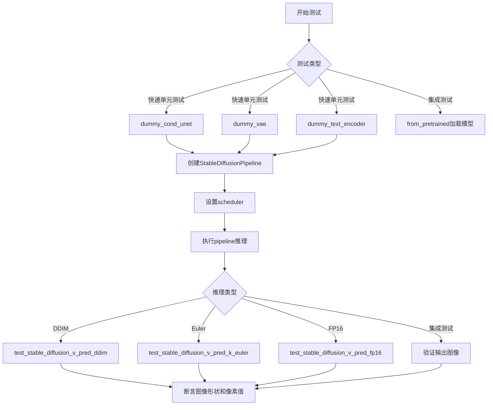

## 类结构

```
unittest.TestCase
├── StableDiffusion2VPredictionPipelineFastTests
│   ├── dummy_cond_unet (property)
│   ├── dummy_vae (property)
│   ├── dummy_text_encoder (property)
│   ├── test_stable_diffusion_v_pred_ddim
│   ├── test_stable_diffusion_v_pred_k_euler
│   └── test_stable_diffusion_v_pred_fp16
└── StableDiffusion2VPredictionPipelineIntegrationTests
    ├── test_stable_diffusion_v_pred_default
    ├── test_stable_diffusion_v_pred_upcast_attention
    ├── test_stable_diffusion_v_pred_euler
    ├── test_stable_diffusion_v_pred_dpm
    ├── test_stable_diffusion_attention_slicing_v_pred
    ├── test_stable_diffusion_text2img_pipeline_v_pred_default
    ├── test_stable_diffusion_text2img_pipeline_unflawed
    ├── test_stable_diffusion_text2img_pipeline_v_pred_fp16
    ├── test_download_local
    ├── test_stable_diffusion_text2img_intermediate_state_v_pred
    ├── test_stable_diffusion_low_cpu_mem_usage_v_pred
    └── test_stable_diffusion_pipeline_with_sequential_cpu_offloading_v_pred
```

## 全局变量及字段


### `torch_device`
    
全局测试设备标识符，指定运行测试的设备（如'cpu'或'cuda'）

类型：`str`
    


### `StableDiffusion2VPredictionPipelineFastTests.expected_slice`
    
测试方法中的期望图像像素值数组，用于验证生成图像的正确性

类型：`numpy.ndarray`
    


### `StableDiffusion2VPredictionPipelineIntegrationTests.expected_slice`
    
集成测试中的期望图像像素值数组，用于验证生成图像的正确性

类型：`numpy.ndarray`
    
    

## 全局函数及方法


### `enable_full_determinism`

设置 PyTorch 和相关库的环境变量，以确保测试和执行的完全确定性（determinism），使得在相同输入下产生可重复的结果。

参数：

- 该函数无参数

返回值：`None`，无返回值（直接修改全局环境状态）

#### 流程图

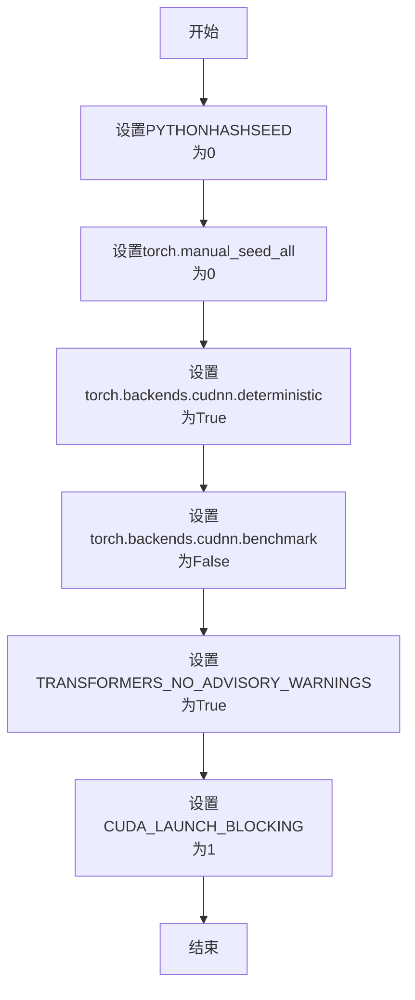

#### 带注释源码

```
# 注意：以下是推断的函数实现，基于其在代码中的使用方式和典型实现模式
# 实际源码位于 testing_utils 模块中，此处为逻辑重构

def enable_full_determinism():
    """
    设置随机种子和环境变量以确保测试的完全确定性。
    这对于需要可重复性的单元测试和集成测试至关重要。
    """
    import os
    import random
    import numpy as np
    import torch
    
    # 1. 设置 Python 哈希随机种子，确保哈希操作的一致性
    os.environ["PYTHONHASHSEED"] = "0"
    
    # 2. 设置 Python random 模块的全局随机种子
    random.seed(0)
    
    # 3. 设置 NumPy 的随机种子
    np.random.seed(0)
    
    # 4. 设置 PyTorch CPU 的随机种子
    torch.manual_seed(0)
    
    # 5. 设置所有 CUDA 设备的随机种子（包括所有 GPU）
    torch.cuda.manual_seed_all(0)
    
    # 6. 强制 PyTorch 使用确定性算法（可能牺牲一定性能）
    # 启用后，torch 运算将始终产生相同结果
    torch.backends.cudnn.deterministic = True
    
    # 7. 禁用 cuDNN 自动调优（确保可重复性）
    # 设为 False 避免因自动选择算法导致的非确定性行为
    torch.backends.cudnn.benchmark = False
    
    # 8. 禁止 transformers 库发出警告信息
    os.environ["TRANSFORMERS_NO_ADVISORY_WARNINGS"] = "True"
    
    # 9. 同步 CUDA 操作（调试用），强制每个 CUDA 内核执行完成后再继续
    # 有助于定位非确定性的 CUDA 相关问题
    os.environ["CUDA_LAUNCH_BLOCKING"] = "1"
```

---

### 在代码中的使用上下文

```python
# 导入测试工具函数
from ...testing_utils import (
    enable_full_determinism,
    # ... 其他工具函数
)

# 模块加载时立即执行，确保后续所有测试使用确定性设置
enable_full_determinism()
```

#### 设计目标与约束

| 项目 | 描述 |
|------|------|
| **设计目标** | 确保测试结果的可重复性，消除因随机性导致的测试 flaky 问题 |
| **核心约束** | 牺牲一定的运行时性能换取确定性行为 |
| **适用场景** | 单元测试、集成测试、CI/CD 流水线中的回归测试 |

#### 潜在的技术债务与优化空间

1. **性能权衡**：确定性模式会禁用 cuDNN 自动调优，可能导致推理速度下降 10-20%
2. **环境依赖**：依赖特定的环境变量设置，在某些部署场景下可能需要额外的配置管理
3. **覆盖范围**：当前实现主要针对 PyTorch 和 NumPy，如使用其他随机源（如 TensorFlow、JAX）需额外处理


### `backend_empty_cache`

清理GPU/后端内存缓存，用于在测试前后释放GPU显存。

参数：

- `device`：`str`，目标设备标识（通常为"cuda"或"cpu"），指定需要清理缓存的设备

返回值：`None`，无返回值（该操作直接作用于GPU内存）

#### 流程图

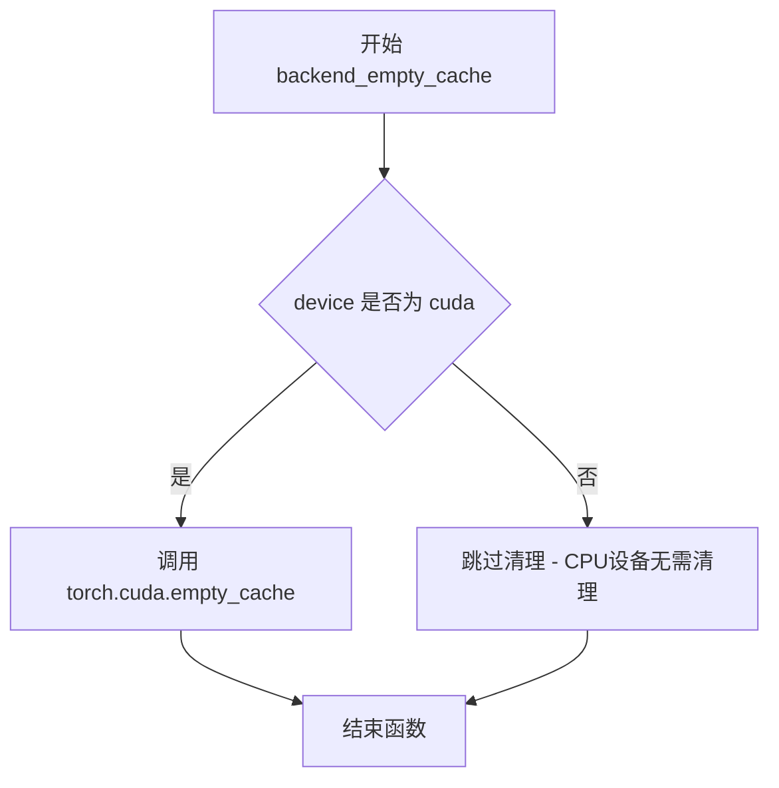

#### 带注释源码

```
# 该函数定义在 testing_utils 模块中
# 以下是基于使用方式的推断实现

def backend_empty_cache(device: str) -> None:
    """
    清理指定设备的内存缓存。
    
    参数:
        device: 目标设备标识，如 'cuda' 或 'cpu'
        
    返回:
        None
    """
    # 仅对 CUDA 设备执行缓存清理
    if device != "cpu" and torch.cuda.is_available():
        # 释放 GPU 缓存中的空闲内存
        torch.cuda.empty_cache()
    
    # 可选：执行垃圾回收以确保 Python 对象被释放
    gc.collect()
```

> **注意**：该函数是从外部模块 `...testing_utils` 导入的，上述源码为基于使用方式的推断实现。实际定义位于项目的 `testing_utils` 模块中。


### `backend_max_memory_allocated`

获取指定计算设备上当前累积的最大内存分配量（以字节为单位），用于监控和验证内存使用情况。

参数：

- `device`：`str` 或 `torch.device`，需要查询最大内存分配量的目标设备（如 "cuda", "cuda:0" 等）

返回值：`int`，返回从上次重置内存统计以来，该设备上所有张量和计算图所分配的最大内存字节数。

#### 流程图

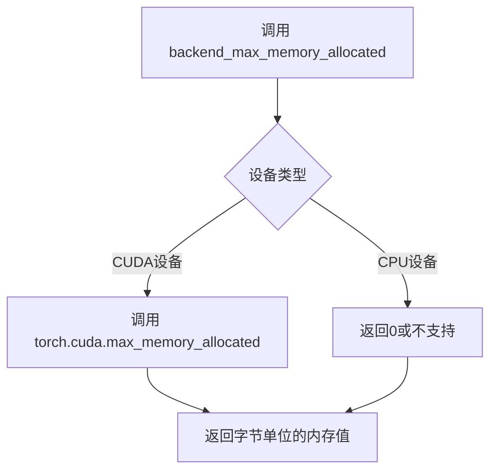

#### 带注释源码

```python
# 该函数定义在 testing_utils 模块中
# 以下为基于使用方式的推断实现

def backend_max_memory_allocated(device):
    """
    获取指定设备的最大内存分配量
    
    参数:
        device: torch_device (str 或 torch.device)
            - 例如: "cuda", "cuda:0", "cpu" 等
    
    返回:
        int: 字节单位的最大内存分配量
    """
    # 如果是 CUDA 设备，调用 PyTorch 的内存追踪函数
    if isinstance(device, str) and 'cuda' in device:
        # 返回从上次重置以来的最大内存分配
        return torch.cuda.max_memory_allocated(device)
    elif hasattr(device, 'type') and 'cuda' in device.type:
        return torch.cuda.max_memory_allocated(device)
    else:
        # CPU 设备不支持内存追踪，返回 0
        return 0

# 使用示例（在测试文件中）:
# mem_bytes = backend_max_memory_allocated(torch_device)
# assert mem_bytes < 5.5 * 10**9  # 验证内存使用低于 5.5GB
```


### `backend_reset_max_memory_allocated`

该函数用于重置指定设备的最大内存分配计数器，通常与 `backend_max_memory_allocated` 配合使用，以测量特定代码段执行后的峰值内存使用情况。

参数：

-  `device`：`str` 或 `torch.device`，指定要重置内存统计的设备（如 `"cuda"` 或 `"cuda:0"`）

返回值：`None`，该函数无返回值，仅执行重置操作

#### 流程图

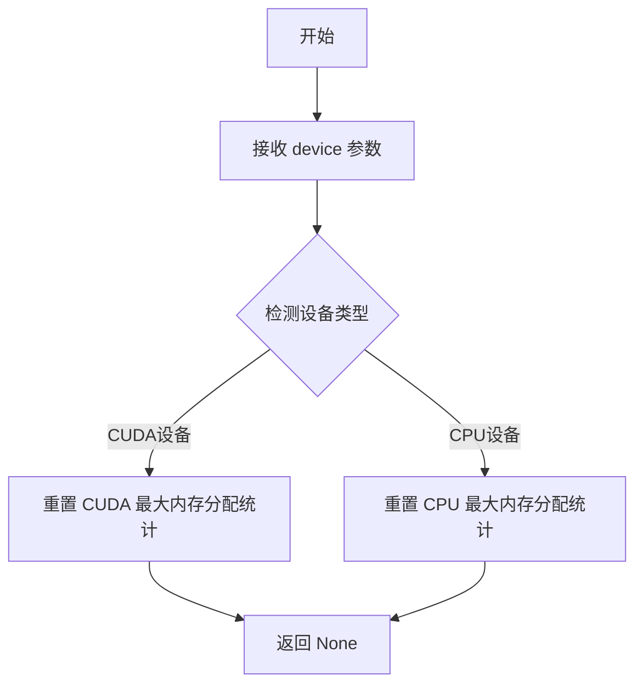

#### 带注释源码

```
# 这是一个从 testing_utils 导入的外部函数
# 源码位置：.../testing_utils.py

def backend_reset_max_memory_allocated(device: Union[str, torch.device]) -> None:
    """
    重置指定设备的最大内存分配计数器。
    
    该函数通常用于：
    1. 在测试开始前重置内存统计基准
    2. 配合 backend_max_memory_allocated 测量代码段的峰值内存使用
    3. 配合 backend_reset_peak_memory_stats 重置峰值内存统计
    
    参数:
        device: 目标设备标识符，支持 CUDA 和 CPU 设备
        
    返回值:
        None
        
    示例用法:
        backend_reset_max_memory_allocated("cuda")
        # 执行某些内存密集型操作
        mem_bytes = backend_max_memory_allocated("cuda")
    """
    
    # 实际实现可能类似于：
    # if isinstance(device, str):
    #     device = torch.device(device)
    # 
    # if device.type == "cuda":
    #     torch.cuda.reset_peak_memory_stats(device)
    # elif device.type == "cpu":
    #     # CPU 内存统计可能需要其他机制
    #     pass
    
    pass  # 具体实现取决于 testing_utils 模块
```

> **注意**：由于该函数是从外部模块 `testing_utils` 导入的，上述源码是基于其使用方式的推断实现。实际的函数定义位于 `diffusers` 库的测试工具模块中。该函数是内存基准测试工具的一部分，用于验证 GPU 内存优化策略（如 attention slicing、CPU offloading）的有效性。


### `backend_reset_peak_memory_stats`

该函数是一个从 `...testing_utils` 模块导入的全局函数，用于重置指定设备的后端峰值内存统计信息，通常与 PyTorch GPU 内存监控配合使用，以测量特定操作或管道的内存占用情况。

参数：

- `device`：`str` 或 `torch.device`，指定要重置峰值内存统计的设备（通常为 CUDA 设备，如 `"cuda"` 或 `"cuda:0"`）

返回值：`None`，该函数无返回值，仅执行重置操作

#### 流程图

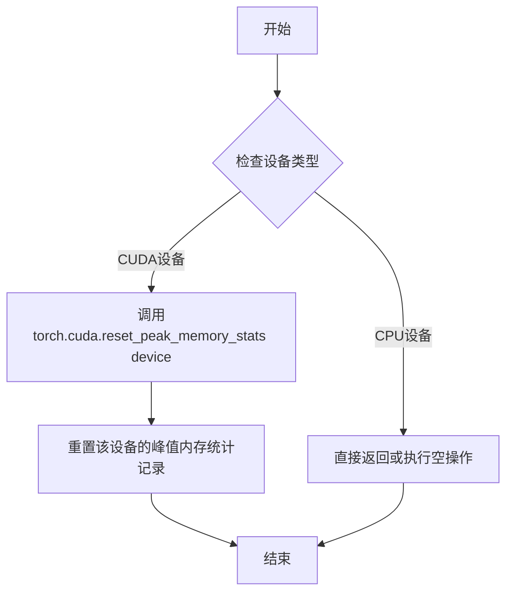

#### 带注释源码

```
# 注意：这是基于函数名和上下文的推测实现
# 实际定义在 testing_utils 模块中，此处未提供

def backend_reset_peak_memory_stats(device):
    """
    重置指定设备的峰值内存统计信息
    
    参数:
        device: torch device, 通常为 'cuda' 或 'cuda:0'
    
    返回:
        None
    """
    # 检查是否为CUDA设备
    if torch.cuda.is_available():
        # 重置CUDA设备的峰值内存统计
        torch.cuda.reset_peak_memory_stats(device)
    
    # 如果是CPU设备，则无需操作（CPU内存统计可能不适用）
```

> **注意**：由于该函数的实际定义未在给定的代码文件中提供，以上源码为基于函数名称和使用方式的合理推测。实际实现可能在 `testing_utils` 模块中，建议查阅该模块的源代码以获取准确的函数签名和行为。


# load_numpy 函数详细设计文档

### load_numpy

该函数是测试工具模块 `testing_utils` 中提供的辅助函数，用于从指定的文件路径或网络URL加载NumPy数组数据。在测试代码中主要用于加载预存的期望图像数据（.npy格式），以便与管道输出的图像进行相似度对比验证。

参数：

-  `name_or_path`：`str`，表示NumPy文件的路径或HuggingFace Hub上的URL地址，可以是本地文件系统路径或远程URL

返回值：`np.ndarray`，返回加载的NumPy数组，通常为图像的多维数组数据

#### 流程图

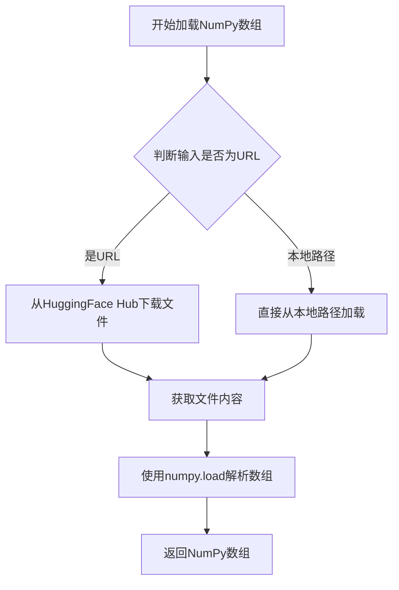

#### 带注释源码

```python
# load_numpy 函数的实际实现位于 testing_utils 模块中
# 当前代码文件仅导入了该函数，但未包含其具体实现
# 根据使用场景推断的实现逻辑：

def load_numpy(name_or_path: str) -> np.ndarray:
    """
    加载NumPy数组文件
    
    参数:
        name_or_path: NumPy文件的路径或URL
        
    返回:
        加载的NumPy数组
    """
    # 判断是否为远程URL
    if name_or_path.startswith("http://") or name_or_path.startswith("https://"):
        # 从HuggingFace Hub下载文件
        # 使用hf_hub_download或requests获取文件内容
        with open(downloaded_file_path, 'rb') as f:
            array = np.load(f)
    else:
        # 直接从本地路径加载
        array = np.load(name_or_path)
    
    return array
```

**注意**：由于 `load_numpy` 函数的具体实现位于外部模块 `...testing_utils` 中，当前提供的代码文件仅展示了该函数的导入和在测试中的调用方式，未包含函数的完整源代码实现。


### `numpy_cosine_similarity_distance`

这是一个从 `...testing_utils` 模块导入的全局函数，用于计算两个 numpy 数组之间的余弦相似度距离（1 - 余弦相似度），通常用于比较两个图像或向量的相似程度。

参数：

- `x`：`numpy.ndarray`，第一个输入数组（通常为展平的图像数据）
- `y`：`numpy.ndarray`，第二个输入数组（通常为展平的图像数据）

返回值：`float`，返回两个数组之间的余弦距离，范围通常为 [0, 2]，其中 0 表示完全相同，2 表示完全相反。

#### 流程图

```mermaid
flowchart TD
    A[开始] --> B[接收输入数组 x 和 y]
    B --> C[计算 x 的范数: ||x||]
    C --> D[计算 y 的范数: ||y||]
    D --> E[计算点积: x · y]
    E --> F[计算余弦相似度: cos_sim = (x · y) / (||x|| * ||y||)]
    F --> G[计算余弦距离: 1 - cos_sim]
    G --> H[返回距离值]
```

#### 带注释源码

```
# 注意：此函数的实际定义在 ...testing_utils 模块中
# 以下是基于函数名和典型实现方式的推断代码

def numpy_cosine_similarity_distance(x: np.ndarray, y: np.ndarray) -> float:
    """
    计算两个numpy数组之间的余弦相似度距离。
    
    余弦距离 = 1 - 余弦相似度
    余弦相似度 = (x · y) / (||x|| * ||y||)
    
    参数:
        x: 第一个numpy数组（通常为展平的图像数据）
        y: 第二个numpy数组（通常为展平的图像数据）
    
    返回:
        float: 余弦距离值，范围通常为 [0, 2]
               0 表示完全相同
               2 表示完全相反
    """
    # 确保输入是numpy数组
    x = np.asarray(x)
    y = np.asarray(y)
    
    # 计算点积
    dot_product = np.dot(x, y)
    
    # 计算范数（模）
    x_norm = np.linalg.norm(x)
    y_norm = np.linalg.norm(y)
    
    # 避免除零错误
    if x_norm == 0 or y_norm == 0:
        return 1.0  # 如果任一数组为零向量，返回默认距离
    
    # 计算余弦相似度
    cosine_similarity = dot_product / (x_norm * y_norm)
    
    # 计算余弦距离（1 - 余弦相似度）
    cosine_distance = 1.0 - cosine_similarity
    
    return cosine_distance
```

---

### 使用示例

在代码中，该函数被用于比较 Stable Diffusion 生成的图像与预期图像之间的差异：

```python
# 比较两个图像的余弦距离
max_diff = numpy_cosine_similarity_distance(image.flatten(), image_chunked.flatten())
assert max_diff < 1e-3  # 确保差异小于阈值
```

---

### 补充说明

1. **函数来源**：此函数定义在 `diffusers` 项目的 `testing_utils` 模块中，而非当前文件内。
2. **设计目标**：用于测试场景，验证不同条件下生成的图像是否一致。
3. **数值范围**：余弦距离范围为 [0, 2]，其中：
   - 0 表示完全相同（余弦相似度为 1）
   - 1 表示正交（余弦相似度为 0）
   - 2 表示完全相反（余弦相似度为 -1）
4. **典型阈值**：在测试中，通常使用 `1e-3` 或 `5e-2` 作为可接受的差异阈值。


### `test_stable_diffusion_text2img_intermediate_state_v_pred.test_callback_fn`

该嵌套函数是 Stable Diffusion 2.0 V-Prediction 中间状态测试的回调函数，用于在扩散推理过程的每一步验证潜在表征（latents）的形状和数值是否符合预期，以确保 V-Prediction 推理管道的正确性。

参数：

- `step`：`int`，当前推理步骤的索引（从 0 开始）
- `timestep`：`int`，当前时间步长值
- `latents`：`torch.Tensor`，当前步骤生成的潜在表征张量，形状为 (batch_size, channels, height, width)

返回值：`None`，该函数不返回任何值，仅执行断言验证

#### 流程图

```mermaid
flowchart TD
    A[回调函数被调用] --> B[标记已调用标志<br/>test_callback_fn.has_been_called = True]
    B --> C[递增步数计数器<br/>number_of_steps += 1]
    C --> D{step == 0?}
    D -->|Yes| E[获取latents的numpy副本]
    E --> F[断言形状为<br/>(1, 4, 96, 96)]
    F --> G[提取最后3x3切片]
    G --> H[对比预期值<br/>np.array0.7749<br/>0.0325...1.4326]
    H --> I[断言误差 < 5e-2]
    D -->|No| J{step == 19?}
    J -->|Yes| K[获取latents的numpy副本]
    K --> L[断言形状为<br/>(1, 4, 96, 96)]
    L --> M[提取最后3x3切片]
    M --> N[对比预期值<br/>np.array1.3887<br/>1.0273...0.0227]
    N --> O[断言误差 < 5e-2]
    J -->|No| P[直接返回<br/>不进行验证]
    I --> P
    O --> P
    P --> Z[回调结束]
```

#### 带注释源码

```python
def test_callback_fn(step: int, timestep: int, latents: torch.Tensor) -> None:
    """
    回调函数，用于在扩散推理的每一步验证中间潜在状态
    
    参数:
        step: 当前推理步骤索引 (0 到 num_inference_steps-1)
        timestep: 当前时间步长
        latents: 潜在表征张量，形状 (batch, channels, height, width)
    """
    # 设置函数属性，用于后续验证回调是否被调用过
    test_callback_fn.has_been_called = True
    
    # 声明使用外层函数的变量，以追踪总调用次数
    nonlocal number_of_steps
    number_of_steps += 1
    
    # 验证推理初始步骤 (step=0) 的潜在状态
    if step == 0:
        # 将张量从计算图中分离并转为NumPy数组进行数值比较
        latents = latents.detach().cpu().numpy()
        
        # 验证潜在表征的形状是否符合预期 (SD2 768x768模型使用4通道, 96x96潜在空间)
        assert latents.shape == (1, 4, 96, 96)
        
        # 提取最后3x3的通道切片进行精确验证
        latents_slice = latents[0, -3:, -3:, -1]
        
        # 预期的初始潜在值 (基于确定性种子0生成)
        expected_slice = np.array([0.7749, 0.0325, 0.5088, 0.1619, 0.3372, 0.3667, -0.5186, 0.6860, 1.4326])
        
        # 验证数值误差在可接受范围内 (相对误差 < 5%)
        assert np.abs(latents_slice.flatten() - expected_slice).max() < 5e-2
    
    # 验证推理最后步骤 (step=19，共20步推理) 的潜在状态
    elif step == 19:
        latents = latents.detach().cpu().numpy()
        assert latents.shape == (1, 4, 96, 96)
        latents_slice = latents[0, -3:, -3:, -1]
        
        # 预期的最终潜在值
        expected_slice = np.array([1.3887, 1.0273, 1.7266, 0.0726, 0.6611, 0.1598, -1.0547, 0.1522, 0.0227])
        
        assert np.abs(latents_slice.flatten() - expected_slice).max() < 5e-2
```


### `StableDiffusion2VPredictionPipelineFastTests.setUp`

这是测试类的初始化方法，在每个测试方法执行前被调用，用于清理 GPU 显存（VRAM）以确保测试环境的一致性。

参数：

- `self`：`unittest.TestCase`，测试类实例本身

返回值：`None`，该方法不返回任何值

#### 流程图

```mermaid
flowchart TD
    A[开始 setUp] --> B[调用父类 super().setUp]
    B --> C[执行 gc.collect 垃圾回收]
    C --> D{backend_empty_cache}
    D --> E[清理 torch_device 对应的 GPU 缓存]
    E --> F[结束 setUp]
```

#### 带注释源码

```python
def setUp(self):
    # clean up the VRAM before each test
    # 在每个测试之前清理 VRAM，确保测试环境干净
    super().setUp()  # 调用父类 unittest.TestCase 的 setUp 方法
    gc.collect()  # 执行 Python 垃圾回收，释放内存
    backend_empty_cache(torch_device)  # 调用后端函数清理 torch_device 对应的 GPU 显存缓存
```


### `StableDiffusion2VPredictionPipelineFastTests.tearDown`

该方法为测试用例的清理方法，在每个测试方法执行完毕后被调用，用于清理 VRAM（显存）资源，防止测试之间的显存泄漏。

参数：

- `self`：`StableDiffusion2VPredictionPipelineFastTests`（unittest.TestCase 的子类实例），代表测试类实例本身

返回值：`None`，无返回值

#### 流程图

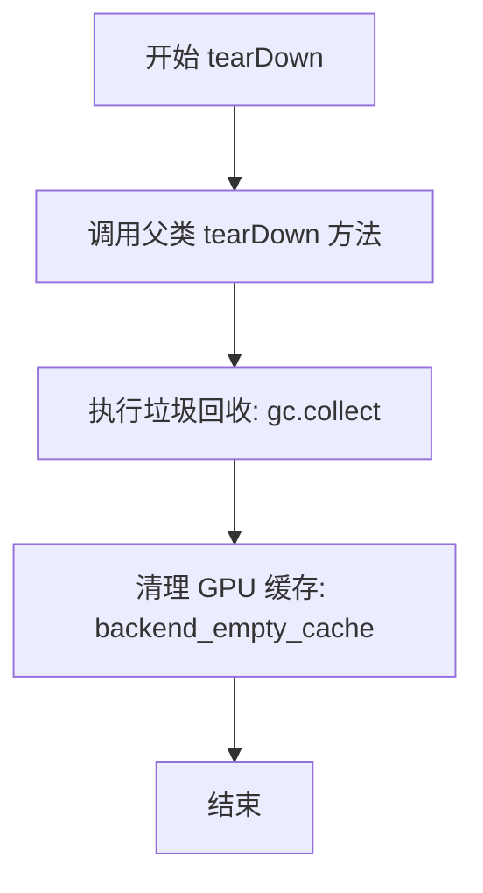

#### 带注释源码

```python
def tearDown(self):
    # clean up the VRAM after each test
    # 清理每次测试后的 VRAM（显存）
    
    # 1. 调用 unittest.TestCase 的父类 tearDown
    #    确保执行父类的标准清理逻辑
    super().tearDown()
    
    # 2. 执行 Python 垃圾回收
    #    释放不再使用的 Python 对象
    gc.collect()
    
    # 3. 清理 GPU/CUDA 缓存
    #    释放 GPU 显存，防止测试间显存泄漏
    #    torch_device 定义在 testing_utils 模块中
    backend_empty_cache(torch_device)
```


### `StableDiffusion2VPredictionPipelineFastTests.dummy_cond_unet`

这是一个属性方法，用于创建并返回一个用于 Stable Diffusion 2.x V-prediction 管道测试的虚拟 UNet2DConditionModel。该模型配置了 SD2 特定的参数，包括注意力头维度、线性投影等，适用于快速测试场景，无需加载真实模型权重。

参数：

- 无（属性方法不接受外部参数）

返回值：`UNet2DConditionModel`，返回一个配置好的虚拟 UNet2DConditionModel 模型实例，用于 Stable Diffusion 2.x V-prediction 管道测试

#### 流程图

```mermaid
flowchart TD
    A[开始 dummy_cond_unet] --> B[设置随机种子 torch.manual_seed(0)]
    B --> C[创建 UNet2DConditionModel 实例]
    C --> D[配置模型参数]
    D --> E[block_out_channels: (32, 64)]
    D --> F[layers_per_block: 2]
    D --> G[sample_size: 32]
    D --> H[in_channels: 4]
    D --> I[out_channels: 4]
    D --> J[down_block_types: DownBlock2D, CrossAttnDownBlock2D]
    D --> K[up_block_types: CrossAttnUpBlock2D, UpBlock2D]
    D --> L[cross_attention_dim: 32]
    D --> M[attention_head_dim: (2, 4)]
    D --> N[use_linear_projection: True]
    N --> O[返回 model 实例]
    O --> P[结束]
```

#### 带注释源码

```python
@property
def dummy_cond_unet(self):
    """
    创建一个用于 Stable Diffusion 2.x V-prediction 管道测试的虚拟 UNet2DConditionModel。
    
    该方法使用固定的随机种子确保模型初始化的一致性，
    配置了 SD2 特定的参数以支持 V-prediction 测试场景。
    """
    # 设置随机种子以确保模型初始化的一致性，便于测试复现
    torch.manual_seed(0)
    
    # 创建 UNet2DConditionModel 实例，配置参数如下：
    model = UNet2DConditionModel(
        # 块输出通道数：(32, 64) 表示两个下采样块分别输出32和64通道
        block_out_channels=(32, 64),
        
        # 每个块中的层数：2 层
        layers_per_block=2,
        
        # 样本尺寸：32x32
        sample_size=32,
        
        # 输入通道数：4（潜在空间的通道数）
        in_channels=4,
        
        # 输出通道数：4
        out_channels=4,
        
        # 下采样块类型：标准下采样块和交叉注意力下采样块
        down_block_types=("DownBlock2D", "CrossAttnDownBlock2D"),
        
        # 上采样块类型：交叉注意力上采样块和标准上采样块
        up_block_types=("CrossAttnUpBlock2D", "UpBlock2D"),
        
        # 交叉注意力维度：32
        cross_attention_dim=32,
        
        # SD2 特定配置：注意力头维度 (2, 4)
        attention_head_dim=(2, 4),
        
        # SD2 特定配置：使用线性投影（而非非线性投影）
        use_linear_projection=True,
    )
    
    # 返回配置好的虚拟模型实例
    return model
```


### `StableDiffusion2VPredictionPipelineFastTests.dummy_vae`

该属性方法用于创建一个虚拟的 VAE（Variational Autoencoder）模型实例，专门为 Stable Diffusion 2.x V-Prediction 测试场景设计。通过设置固定随机种子确保测试的可重复性，并配置了典型的 VAE 架构参数。

参数：

- 该方法无显式参数（隐式参数 `self` 为测试类实例）

返回值：`AutoencoderKL`，返回配置好的虚拟 VAE 模型对象，用于测试 Stable Diffusion  pipeline 的图像编码和解码功能

#### 流程图

```mermaid
flowchart TD
    A[开始 dummy_vae 属性访问] --> B[设置 PyTorch 随机种子为 0]
    B --> C[创建 AutoencoderKL 模型配置]
    C --> D[配置 block_out_channels: [32, 64]]
    D --> E[配置 in_channels: 3, out_channels: 3]
    E --> F[配置 down_block_types 和 up_block_types]
    F --> G[配置 latent_channels: 4, sample_size: 128]
    G --> H[返回初始化后的 AutoencoderKL 模型实例]
```

#### 带注释源码

```python
@property
def dummy_vae(self):
    """
    创建一个虚拟的 AutoencoderKL 模型用于测试。
    使用固定随机种子确保测试结果的可重复性。
    """
    # 设置随机种子为 0，确保测试的可重复性
    torch.manual_seed(0)
    
    # 创建 AutoencoderKL 模型实例
    # 这是一个变分自编码器，用于在 Stable Diffusion 中进行图像的潜在空间编码和解码
    model = AutoencoderKL(
        # 定义卷积块的输出通道数：[32, 64] 表示两层分别是32和64个通道
        block_out_channels=[32, 64],
        
        # 输入和输出图像的通道数（RGB 图像为3通道）
        in_channels=3,
        out_channels=3,
        
        # 下采样块类型：使用标准的 2D 下采样编码器块
        down_block_types=["DownEncoderBlock2D", "DownEncoderBlock2D"],
        
        # 上采样块类型：使用标准的 2D 上采样解码器块
        up_block_types=["UpDecoderBlock2D", "UpDecoderBlock2D"],
        
        # 潜在空间的通道数，Stable Diffusion 通常使用 4 通道的潜在表示
        latent_channels=4,
        
        # 输入图像的采样尺寸，用于确定模型处理的图像大小
        sample_size=128,
    )
    
    # 返回配置好的虚拟 VAE 模型
    return model
```


### `StableDiffusion2VPredictionPipelineFastTests.dummy_text_encoder`

这是一个属性方法，用于创建一个用于测试的虚拟（dummy）CLIPTextModel（文本编码器），该模型使用特定的配置参数进行初始化，以确保测试的可重复性。

参数：

- 无（除了隐含的 `self` 参数）

返回值：`CLIPTextModel`，返回一个使用指定配置初始化的虚拟 CLIPTextModel 实例，用于单元测试

#### 流程图

```mermaid
graph TD
    A[开始] --> B[设置随机种子 torch.manual_seed(0)]
    --> C[创建 CLIPTextConfig 配置对象]
    --> D[使用配置创建 CLIPTextModel 实例]
    --> E[返回 CLIPTextModel 实例]
```

#### 带注释源码

```python
@property
def dummy_text_encoder(self):
    """
    创建一个用于测试的虚拟 CLIP 文本编码器模型。
    
    Returns:
        CLIPTextModel: 配置好的虚拟文本编码器，用于单元测试
    """
    # 设置随机种子以确保测试的可重复性
    torch.manual_seed(0)
    
    # 创建 CLIPTextConfig 配置对象，定义模型架构参数
    config = CLIPTextConfig(
        bos_token_id=0,           # 句子开始标记 ID
        eos_token_id=2,          # 句子结束标记 ID
        hidden_size=32,          # 隐藏层维度
        intermediate_size=37,    # FFN 中间层维度
        layer_norm_eps=1e-05,    # LayerNorm  epsilon 值
        num_attention_heads=4,   # 注意力头数量
        num_hidden_layers=5,     # 隐藏层数量
        pad_token_id=1,          # 填充标记 ID
        vocab_size=1000,         # 词汇表大小
        # SD2-specific config below (Stable Diffusion 2 特定配置)
        hidden_act="gelu",       # 激活函数
        projection_dim=64,       # 投影维度
    )
    
    # 使用配置创建并返回 CLIPTextModel 实例
    return CLIPTextModel(config)
```


### `StableDiffusion2VPredictionPipelineFastTests.test_stable_diffusion_v_pred_ddim`

该测试方法用于验证 StableDiffusionPipeline 在使用 v-prediction（v预测）模式和 DDIMScheduler 时的正确性，通过生成图像并与预期像素值进行比较来确保管道工作的准确性。

参数：

- `self`：无需显式传递，是类方法的隐含参数，表示测试用例实例本身。

返回值：无返回值（`None`），该方法为单元测试方法，通过断言（assert）来验证功能正确性。

#### 流程图

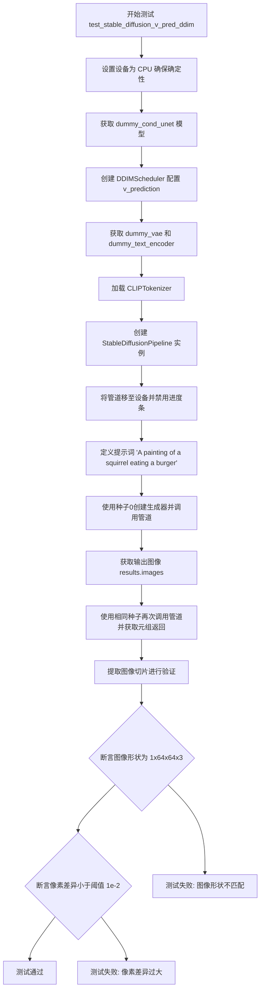

#### 带注释源码

```python
def test_stable_diffusion_v_pred_ddim(self):
    """
    测试 StableDiffusionPipeline 使用 v-prediction 和 DDIMScheduler 的功能。
    该测试验证管道能够正确生成图像，并通过与预期像素值比较来确保模型输出的准确性。
    """
    # 1. 设置设备为 CPU，确保随机数生成的确定性
    device = "cpu"  # ensure determinism for the device-dependent torch.Generator
    
    # 2. 创建虚拟的 UNet 模型用于测试
    unet = self.dummy_cond_unet
    
    # 3. 配置 DDIMScheduler，使用 v_prediction 预测类型
    scheduler = DDIMScheduler(
        beta_start=0.00085,      # 起始 beta 值
        beta_end=0.012,         # 结束 beta 值
        beta_schedule="scaled_linear",  # beta 调度策略
        clip_sample=False,      # 不裁剪样本
        set_alpha_to_one=False, # 不将 alpha 设置为1
        prediction_type="v_prediction",  # 使用 v-prediction 预测类型
    )

    # 4. 获取虚拟的 VAE 和文本编码器模型
    vae = self.dummy_vae
    bert = self.dummy_text_encoder
    
    # 5. 加载一个小型 CLIP tokenizer 用于测试
    tokenizer = CLIPTokenizer.from_pretrained("hf-internal-testing/tiny-random-clip")

    # 6. 创建 StableDiffusionPipeline 实例，禁用安全检查器和特征提取器
    sd_pipe = StableDiffusionPipeline(
        unet=unet,
        scheduler=scheduler,
        vae=vae,
        text_encoder=bert,
        tokenizer=tokenizer,
        safety_checker=None,         # 禁用安全检查器
        feature_extractor=None,      # 禁用特征提取器
        image_encoder=None,          # 无图像编码器
        requires_safety_checker=False,
    )
    
    # 7. 将管道移至指定设备并配置进度条
    sd_pipe = sd_pipe.to(device)
    sd_pipe.set_progress_bar_config(disable=None)

    # 8. 定义生成图像的提示词
    prompt = "A painting of a squirrel eating a burger"

    # 9. 第一次推理：使用 Generator 确保确定性，生成图像
    generator = torch.Generator(device=device).manual_seed(0)
    output = sd_pipe(
        [prompt], 
        generator=generator, 
        guidance_scale=6.0, 
        num_inference_steps=2, 
        output_type="np"
    )
    image = output.images  # 获取生成的图像

    # 10. 第二次推理：使用相同的种子测试元组返回模式
    generator = torch.Generator(device=device).manual_seed(0)
    image_from_tuple = sd_pipe(
        [prompt],
        generator=generator,
        guidance_scale=6.0,
        num_inference_steps=2,
        output_type="np",
        return_dict=False,  # 返回元组而非字典
    )[0]  # 获取第一个元素（图像）

    # 11. 提取图像切片用于验证（取右下角3x3像素）
    image_slice = image[0, -3:, -3:, -1]
    image_from_tuple_slice = image_from_tuple[0, -3:, -3:, -1]

    # 12. 断言验证
    # 验证生成的图像形状是否正确
    assert image.shape == (1, 64, 64, 3)
    
    # 定义预期的像素值切片
    expected_slice = np.array([0.6569, 0.6525, 0.5142, 0.4968, 0.4923, 0.4601, 0.4996, 0.5041, 0.4544])

    # 验证图像像素值与预期值的差异是否在可接受范围内
    assert np.abs(image_slice.flatten() - expected_slice).max() < 1e-2
    assert np.abs(image_from_tuple_slice.flatten() - expected_slice).max() < 1e-2
```


### `StableDiffusion2VPredictionPipelineFastTests.test_stable_diffusion_v_pred_k_euler`

该测试方法验证了使用 EulerDiscreteScheduler 进行 v-prediction 的 Stable Diffusion 2.0 管道能够正确生成图像，并确保输出图像的像素值与预期值匹配。

参数：

- `self`：隐式参数，unittest.TestCase 实例，表示测试类本身

返回值：无（`None`），该方法为单元测试方法，通过断言验证结果

#### 流程图

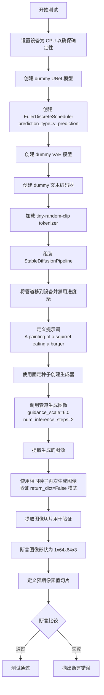

#### 带注释源码

```python
def test_stable_diffusion_v_pred_k_euler(self):
    """
    测试 Stable Diffusion 2.0 v-prediction 与 EulerDiscreteScheduler 的集成
    验证管道能够使用 v-prediction 类型正确生成图像
    """
    # 设置设备为 CPU，确保随机数生成的确定性
    device = "cpu"  # ensure determinism for the device-dependent torch.Generator
    
    # 获取预配置的 UNet 条件模型（用于图像生成的去噪网络）
    unet = self.dummy_cond_unet
    
    # 创建 Euler 离散调度器，配置 v-prediction 预测类型
    # beta 调度采用 scaled_linear 策略
    scheduler = EulerDiscreteScheduler(
        beta_start=0.00085, 
        beta_end=0.012, 
        beta_schedule="scaled_linear", 
        prediction_type="v_prediction"  # 关键：使用 v-prediction 而非 epsilon-prediction
    )
    
    # 获取预配置的 VAE 模型（变分自编码器，用于潜在空间编码/解码）
    vae = self.dummy_vae
    
    # 获取预配置的 CLIP 文本编码器（将文本转换为嵌入向量）
    bert = self.dummy_text_encoder
    
    # 从预训练模型加载 CLIP tokenizer
    tokenizer = CLIPTokenizer.from_pretrained("hf-internal-testing/tiny-random-clip")

    # 构建 Stable Diffusion 管道
    # 设置 safety_checker=None 和 feature_extractor=None 以简化测试
    sd_pipe = StableDiffusionPipeline(
        unet=unet,
        scheduler=scheduler,
        vae=vae,
        text_encoder=bert,
        tokenizer=tokenizer,
        safety_checker=None,
        feature_extractor=None,
        image_encoder=None,
        requires_safety_checker=False,
    )
    
    # 将管道移至目标设备
    sd_pipe = sd_pipe.to(device)
    
    # 配置进度条（disable=None 表示启用进度条）
    sd_pipe.set_progress_bar_config(disable=None)

    # 定义文本提示词
    prompt = "A painting of a squirrel eating a burger"
    
    # 创建确定性随机数生成器（固定种子确保结果可复现）
    generator = torch.Generator(device=device).manual_seed(0)
    
    # 调用管道进行图像生成
    # guidance_scale=6.0: Classifier-free guidance 强度
    # num_inference_steps=2: 扩散步数（低步数用于快速测试）
    # output_type="np": 返回 NumPy 数组格式
    output = sd_pipe([prompt], generator=generator, guidance_scale=6.0, num_inference_steps=2, output_type="np")

    # 从输出中提取生成的图像
    image = output.images

    # 使用相同种子再次生成，验证 return_dict=False 的兼容性
    generator = torch.Generator(device=device).manual_seed(0)
    image_from_tuple = sd_pipe(
        [prompt],
        generator=generator,
        guidance_scale=6.0,
        num_inference_steps=2,
        output_type="np",
        return_dict=False,  # 返回元组而非字典
    )[0]

    # 提取图像右下角 3x3 像素切片用于验证
    image_slice = image[0, -3:, -3:, -1]
    image_from_tuple_slice = image_from_tuple[0, -3:, -3:, -1]

    # 断言生成的图像形状正确（单张 64x64 RGB 图像）
    assert image.shape == (1, 64, 64, 3)
    
    # 定义预期像素值（由已知正确实现生成的标准值）
    expected_slice = np.array([0.5644, 0.6514, 0.5190, 0.5663, 0.5287, 0.4953, 0.5430, 0.5243, 0.4778])

    # 验证图像像素值与预期值的差异在容差范围内
    # 使用最大绝对误差 1e-2（0.01）作为判定标准
    assert np.abs(image_slice.flatten() - expected_slice).max() < 1e-2
    assert np.abs(image_from_tuple_slice.flatten() - expected_slice).max() < 1e-2
```


### `StableDiffusion2VPredictionPipelineFastTests.test_stable_diffusion_v_pred_fp16`

这是一个单元测试方法，用于验证 Stable Diffusion v-prediction 模型在 fp16（半精度浮点）模式下能否正常工作。该测试通过创建虚拟的 UNet、VAE 和文本编码器模型，将其转换为 fp16 精度，然后使用 StableDiffusionPipeline 执行推理，最后断言生成的图像形状符合预期。

参数：

- `self`：无需显式传递，测试框架自动传入

返回值：`None`，该方法为测试方法，无返回值，仅通过断言验证功能

#### 流程图

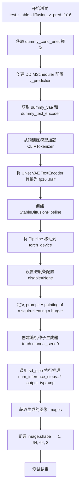

#### 带注释源码

```python
@require_accelerator  # 装饰器：要求加速器环境才能运行此测试
def test_stable_diffusion_v_pred_fp16(self):
    """Test that stable diffusion v-prediction works with fp16"""
    # 获取虚拟条件 UNet 模型（用于测试）
    unet = self.dummy_cond_unet
    
    # 创建 DDIMScheduler，配置 v_prediction 预测类型
    # beta_start/end: beta 调度起始和结束值
    # beta_schedule: 使用 scaled_linear 调度
    # clip_sample=False: 不裁剪采样
    # set_alpha_to_one=False: 不将 alpha 设置为 1
    # prediction_type="v_prediction": 使用 v-prediction 预测类型
    scheduler = DDIMScheduler(
        beta_start=0.00085,
        beta_end=0.012,
        beta_schedule="scaled_linear",
        clip_sample=False,
        set_alpha_to_one=False,
        prediction_type="v_prediction",
    )
    
    # 获取虚拟 VAE 模型
    vae = self.dummy_vae
    
    # 获取虚拟文本编码器
    bert = self.dummy_text_encoder
    
    # 从预训练模型加载分词器
    tokenizer = CLIPTokenizer.from_pretrained("hf-internal-testing/tiny-random-clip")

    # 将模型转换为 fp16（半精度浮点）以测试兼容性
    unet = unet.half()
    vae = vae.half()
    bert = bert.half()

    # 创建 Stable Diffusion Pipeline
    # safety_checker=None: 禁用安全检查器
    # feature_extractor=None: 不使用特征提取器
    # image_encoder=None: 不使用图像编码器
    # requires_safety_checker=False: 标记不需要安全检查器
    sd_pipe = StableDiffusionPipeline(
        unet=unet,
        scheduler=scheduler,
        vae=vae,
        text_encoder=bert,
        tokenizer=tokenizer,
        safety_checker=None,
        feature_extractor=None,
        image_encoder=None,
        requires_safety_checker=False,
    )
    
    # 将 Pipeline 移动到计算设备（GPU）
    sd_pipe = sd_pipe.to(torch_device)
    
    # 配置进度条（disable=None 表示不禁用）
    sd_pipe.set_progress_bar_config(disable=None)

    # 定义文本提示
    prompt = "A painting of a squirrel eating a burger"
    
    # 创建确定性随机数生成器（种子为 0）
    generator = torch.manual_seed(0)
    
    # 执行推理生成图像
    # num_inference_steps=2: 仅用 2 步推理（快速测试）
    # output_type="np": 输出为 numpy 数组
    image = sd_pipe([prompt], generator=generator, num_inference_steps=2, output_type="np").images

    # 断言生成的图像形状为 (1, 64, 64, 3)
    # 1: 批量大小为 1
    # 64, 64: 图像高度和宽度
    # 3: RGB 三个通道
    assert image.shape == (1, 64, 64, 3)
```


### `StableDiffusion2VPredictionPipelineIntegrationTests.setUp`

该方法是测试类的初始化方法，在每个集成测试运行前执行清理操作，释放GPU显存以确保测试环境的一致性。

参数：

- `self`：实例方法的标准参数，代表测试类（`StableDiffusion2VPredictionPipelineIntegrationTests`）的实例本身

返回值：`None`，该方法不返回任何值

#### 流程图

```mermaid
flowchart TD
    A[开始 setUp] --> B[调用父类 setUp 方法<br/>super().setUp]
    B --> C[执行垃圾回收<br/>gc.collect]
    C --> D[清空GPU显存缓存<br/>backend_empty_cache]
    D --> E[结束 setUp]
```

#### 带注释源码

```python
def setUp(self):
    # clean up the VRAM before each test
    # 在每个测试运行前清理VRAM，确保测试环境的干净状态
    super().setUp()  # 调用 unittest.TestCase 的 setUp 方法
    gc.collect()  # 强制Python进行垃圾回收，释放不再使用的对象
    backend_empty_cache(torch_device)  # 清空GPU显存缓存，防止显存泄漏
```


### `StableDiffusion2VPredictionPipelineIntegrationTests.tearDown`

在每个测试执行完成后，该方法负责清理VRAM（GPU内存），通过调用垃圾回收和清空GPU缓存来确保测试之间的内存隔离，防止内存泄漏。

参数：

- `self`：`unittest.TestCase`，测试类实例本身，无需显式传递

返回值：`None`，该方法不返回任何值，仅执行清理操作

#### 流程图

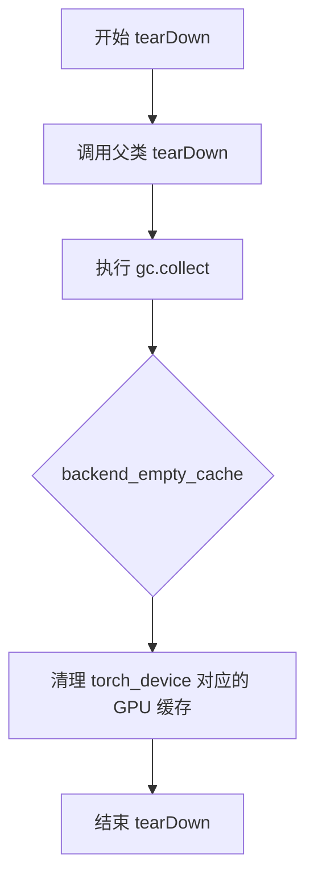

#### 带注释源码

```python
def tearDown(self):
    # clean up the VRAM after each test
    # 清理每个测试后的VRAM（GPU显存）
    super().tearDown()
    # 调用unittest.TestCase的tearDown方法，确保父类清理逻辑被执行
    
    gc.collect()
    # 触发Python的垃圾回收机制，释放不再使用的Python对象
    
    backend_empty_cache(torch_device)
    # 调用后端特定的缓存清理函数，释放torch_device（如GPU）上的缓存内存
    # 确保该设备上的缓存被清空，防止测试间的内存污染
```


### `StableDiffusion2VPredictionPipelineIntegrationTests.test_stable_diffusion_v_pred_default`

该测试方法验证了 Stable Diffusion 2 模型在使用 v-prediction（v预测）类型时的默认推理流程是否正常工作，包括模型加载、注意力切片优化、文本到图像的生成以及输出结果的正确性校验。

参数：

- `self`：无参数，测试类实例本身

返回值：无显式返回值（`None`），通过断言验证图像生成结果的正确性

#### 流程图

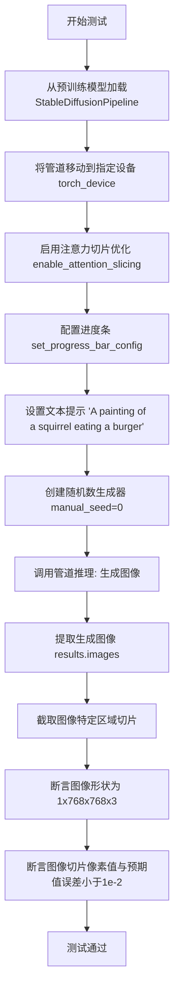

#### 带注释源码

```python
@slow  # 标记为慢速测试，需要较长时间执行
@require_torch_accelerator  # 需要GPU加速器才能运行
class StableDiffusion2VPredictionPipelineIntegrationTests(unittest.TestCase):
    """集成测试类，专门测试 Stable Diffusion 2 的 v-prediction 流水线"""
    
    def test_stable_diffusion_v_pred_default(self):
        """
        测试 Stable Diffusion 2 使用 v-prediction 的默认推理流程
        验证模型能够正确加载、推理并生成符合预期结果的图像
        """
        
        # 第1步：从预训练模型加载 StableDiffusionPipeline
        # 模型标识符 "stabilityai/stable-diffusion-2" 是 HuggingFace Hub 上的官方模型
        sd_pipe = StableDiffusionPipeline.from_pretrained("stabilityai/stable-diffusion-2")
        
        # 第2步：将管道移动到指定的计算设备（通常是 GPU）
        sd_pipe = sd_pipe.to(torch_device)
        
        # 第3步：启用注意力切片优化
        # 该优化可以将注意力计算分片处理，降低显存占用
        sd_pipe.enable_attention_slicing()
        
        # 第4步：配置进度条显示（disable=None 表示启用进度条）
        sd_pipe.set_progress_bar_config(disable=None)
        
        # 第5步：定义文本提示词
        prompt = "A painting of a squirrel eating a burger"
        
        # 第6步：创建随机数生成器并设置固定种子
        # 使用固定种子确保推理结果可复现
        generator = torch.manual_seed(0)
        
        # 第7步：调用管道进行图像生成
        # 参数说明：
        #   - [prompt]: 文本提示列表（需为列表类型）
        #   - generator: 随机数生成器，确保可复现性
        #   - guidance_scale: 引导强度 (7.5)，越高越遵循提示
        #   - num_inference_steps: 推理步数 (20)
        #   - output_type: 输出类型 "np" 返回 NumPy 数组
        output = sd_pipe([prompt], generator=generator, guidance_scale=7.5, num_inference_steps=20, output_type="np")
        
        # 第8步：从输出结果中提取生成的图像
        image = output.images
        
        # 第9步：提取图像特定区域切片进行验证
        # 选取图像右下角 253:256 位置的 3x3 像素区域
        image_slice = image[0, 253:256, 253:256, -1]
        
        # 第10步：断言验证图像形状
        # Stable Diffusion 2 输出 768x768 分辨率的 RGB 图像
        assert image.shape == (1, 768, 768, 3)
        
        # 第11步：定义预期的像素值切片
        expected_slice = np.array([0.1868, 0.1922, 0.1527, 0.1921, 0.1908, 0.1624, 0.1779, 0.1652, 0.1734])
        
        # 第12步：断言验证生成图像与预期值的差异
        # 使用最大绝对误差不超过 1e-2 的标准
        assert np.abs(image_slice.flatten() - expected_slice).max() < 1e-2
```


### `StableDiffusion2VPredictionPipelineIntegrationTests.test_stable_diffusion_v_pred_upcast_attention`

该测试方法验证了 Stable Diffusion 2 模型在使用 float16 精度（upcast attention）和启用注意力切片功能时的图像生成能力，确保模型在混合精度计算下能够正确执行 v-prediction 类型的推理并生成符合预期结果的图像。

参数： 无显式参数（继承自 `unittest.TestCase` 的测试方法，self 为隐式参数）

返回值：`None`，测试方法无返回值，通过断言验证图像生成的正确性

#### 流程图

```mermaid
flowchart TD
    A[开始测试] --> B[加载预训练模型 stable-diffusion-2-1]
    B --> C[将模型转换为 float16 精度]
    C --> D[将模型移动到 torch_device]
    D --> E[启用注意力切片优化]
    E --> F[禁用进度条配置]
    F --> G[设置随机种子为 0]
    G --> H[调用 pipeline 生成图像]
    H --> I[提取图像切片]
    I --> J[断言图像形状为 1x768x768x3]
    J --> K[断言图像切片与期望值的差异小于 5e-2]
    K --> L[测试通过]
```

#### 带注释源码

```python
def test_stable_diffusion_v_pred_upcast_attention(self):
    """
    测试 Stable Diffusion 2 v-prediction 模型在使用 float16 精度
    并启用 attention slicing 时的图像生成功能
    
    该测试验证了:
    1. 模型可以从预训练权重正确加载
    2. float16 精度转换正常工作
    3. 启用 attention slicing 后模型仍能正确推理
    4. 生成的图像符合预期的数值范围和形状
    """
    # 从预训练模型加载 StableDiffusionPipeline，指定使用 float16 精度
    # "stabilityai/stable-diffusion-2-1" 是 Stable Diffusion 2.1 的模型 ID
    sd_pipe = StableDiffusionPipeline.from_pretrained(
        "stabilityai/stable-diffusion-2-1", torch_dtype=torch.float16
    )
    
    # 将 pipeline 移动到指定的计算设备（如 GPU）
    sd_pipe = sd_pipe.to(torch_device)
    
    # 启用注意力切片技术，用于减少显存占用
    # 通过将注意力计算分块执行来降低峰值显存
    sd_pipe.enable_attention_slicing()
    
    # 配置进度条显示，disable=None 表示不禁用进度条
    sd_pipe.set_progress_bar_config(disable=None)

    # 定义文本提示词，模型将根据此文本生成图像
    prompt = "A painting of a squirrel eating a burger"
    
    # 使用固定种子 0 创建随机数生成器，确保结果可复现
    generator = torch.manual_seed(0)
    
    # 调用 pipeline 执行图像生成
    # 参数说明:
    #   - prompt: 文本提示词
    #   - generator: 随机数生成器，确保确定性
    #   - guidance_scale: 引导强度，越高越遵循提示词
    #   - num_inference_steps: 推理步数，越高生成质量越好
    #   - output_type: 输出类型，"np" 表示返回 numpy 数组
    output = sd_pipe([prompt], generator=generator, guidance_scale=7.5, num_inference_steps=20, output_type="np")

    # 从输出中获取生成的图像列表
    image = output.images
    
    # 提取图像的一个切片用于验证
    # 取第 0 张图像的 [253:256, 253:256, -1] 三个通道的最后一个通道
    image_slice = image[0, 253:256, 253:256, -1]

    # 断言验证生成的图像形状为 (1, 768, 768, 3)
    # 1 张图像，768x768 像素，3 通道 (RGB)
    assert image.shape == (1, 768, 768, 3)
    
    # 定义期望的图像切片数值（用于回归测试）
    # 这些数值是通过标准配置生成的参考值
    expected_slice = np.array([0.4209, 0.4087, 0.4097, 0.4209, 0.3860, 0.4329, 0.4280, 0.4324, 0.4187])

    # 断言生成的图像切片与期望值的差异足够小
    # 使用相对宽松的阈值 5e-2，因为 float16 计算可能引入更多数值误差
    assert np.abs(image_slice.flatten() - expected_slice).max() < 5e-2
```


### `StableDiffusion2VPredictionPipelineIntegrationTests.test_stable_diffusion_v_pred_euler`

该测试方法用于验证 Stable Diffusion 2 模型在使用 EulerDiscreteScheduler（欧拉离散调度器）进行 v-prediction（v预测）时的正确性。测试通过加载预训练模型、执行推理流程，并对比生成的图像切片与预期值来确保pipeline正常工作。

参数：

- `self`：无需显式传递，`unittest.TestCase` 的实例方法第一个参数

返回值：`None`，该方法为测试方法，通过 `assert` 语句进行验证，不返回任何值

#### 流程图

```mermaid
flowchart TD
    A[开始测试] --> B[从预训练模型加载 EulerDiscreteScheduler]
    B --> C[从预训练模型加载 StableDiffusionPipeline 并设置 scheduler]
    C --> D[将 pipeline 移动到目标设备 torch_device]
    D --> E[启用注意力切片优化]
    E --> F[禁用进度条配置]
    F --> G[设置随机种子 0 创建生成器]
    G --> H[调用 pipeline 进行推理生成图像]
    H --> I[提取图像切片 253:256, 253:256, -1]
    I --> J[断言图像形状为 (1, 768, 768, 3)]
    J --> K[定义期望的像素值数组]
    K --> L[断言实际像素值与期望值的最大差异 < 1e-2]
    L --> M[测试结束]
```

#### 带注释源码

```python
def test_stable_diffusion_v_pred_euler(self):
    """
    测试 Stable Diffusion 2 使用 EulerDiscreteScheduler 进行 v-prediction 的集成测试
    
    该测试验证：
    1. EulerDiscreteScheduler 能正确加载和配置
    2. StableDiffusionPipeline 能正确使用 v-prediction 类型的调度器
    3. 生成的图像符合预期的质量标准
    """
    
    # 第一步：创建 EulerDiscreteScheduler 调度器
    # 从预训练模型 'stabilityai/stable-diffusion-2' 的 scheduler 子目录加载
    # 该调度器配置为 v-prediction 模式
    scheduler = EulerDiscreteScheduler.from_pretrained(
        "stabilityai/stable-diffusion-2", 
        subfolder="scheduler"
    )
    
    # 第二步：创建 StableDiffusionPipeline
    # 从预训练模型加载完整的 Stable Diffusion 2 pipeline
    # 并使用上面创建的 EulerDiscreteScheduler 替换默认调度器
    sd_pipe = StableDiffusionPipeline.from_pretrained(
        "stabilityai/stable-diffusion-2", 
        scheduler=scheduler
    )
    
    # 第三步：将 pipeline 移动到指定的设备（如 CUDA 或 CPU）
    sd_pipe = sd_pipe.to(torch_device)
    
    # 第四步：启用注意力切片优化
    # 这是为了减少推理时的显存占用，通过将注意力计算分块处理
    sd_pipe.enable_attention_slicing()
    
    # 第五步：配置进度条
    # disable=None 表示不禁用进度条（显示进度条）
    sd_pipe.set_progress_bar_config(disable=None)
    
    # 第六步：准备推理参数
    # 定义文本提示词
    prompt = "A painting of a squirrel eating a burger"
    
    # 创建随机生成器并设置固定种子
    # 使用固定种子是为了确保结果可复现
    generator = torch.manual_seed(0)
    
    # 第七步：执行推理
    # 调用 pipeline 生成图像
    # 参数说明：
    #   - prompt: 文本提示
    #   - generator: 随机生成器（保证可复现性）
    #   - num_inference_steps: 推理步数（5步）
    #   - output_type: 输出类型为 numpy 数组
    output = sd_pipe([prompt], generator=generator, num_inference_steps=5, output_type="np")
    
    # 第八步：提取生成的图像
    image = output.images
    
    # 第九步：提取图像切片用于验证
    # 提取图像中心区域 (253:256, 253:256) 的最后一个通道
    image_slice = image[0, 253:256, 253:256, -1]
    
    # 第十步：断言验证
    # 验证生成的图像形状是否为 (1, 768, 768, 3)
    # 1 表示 batch size，768x768 是图像分辨率，3 是 RGB 通道
    assert image.shape == (1, 768, 768, 3)
    
    # 定义期望的像素值数组（基于已知的正确输出）
    expected_slice = np.array([0.1781, 0.1695, 0.1661, 0.1705, 0.1588, 0.1699, 0.2005, 0.1589, 0.1677])
    
    # 验证实际输出与期望值的差异
    # 使用最大绝对误差进行判断，阈值设为 1e-2（0.01）
    assert np.abs(image_slice.flatten() - expected_slice).max() < 1e-2
```


### `StableDiffusion2VPredictionPipelineIntegrationTests.test_stable_diffusion_v_pred_dpm`

该方法是Stable Diffusion 2 V预测（V-prediction）管道的集成测试，专门针对DPM（DPM-Solver Multistep）调度器进行功能验证。测试通过加载预训练模型、配置DPM调度器、执行推理生成图像，并验证输出图像的像素值是否符合预期，以确保V预测与DPM调度器的兼容性。

参数：

- `self`：`unittest.TestCase`，测试类实例本身

返回值：`None`，该方法为测试方法，不返回任何值（通过断言验证结果）

#### 流程图

```mermaid
flowchart TD
    A[测试开始] --> B[创建DPMSolverMultistepScheduler]
    B --> C[从预训练模型加载StableDiffusionPipeline]
    C --> D[将Pipeline移动到torch_device]
    D --> E[启用attention_slicing优化]
    E --> F[设置进度条配置]
    F --> G[准备prompt和随机种子]
    G --> H[调用Pipeline生成图像]
    H --> I[提取图像切片]
    I --> J[断言图像形状为768x768x3]
    J --> K[定义预期像素值]
    K --> L{断言: 实际值与预期值的差异}
    L -->|通过| M[测试通过]
    L -->|失败| N[抛出断言错误]
```

#### 带注释源码

```python
@slow  # 标记为慢速测试
@require_torch_accelerator  # 需要torch加速器
class StableDiffusion2VPredictionPipelineIntegrationTests(unittest.TestCase):
    """
    测试类：用于测试Stable Diffusion 2 V预测管道的集成测试
    """
    
    def test_stable_diffusion_v_pred_dpm(self):
        """
        测试V-prediction与DPM调度器的兼容性
        
        注意：此测试在DPM与V-prediction兼容后需要更新！
        """
        
        # 创建DPM多步调度器，从预训练模型加载
        # final_sigmas_type="sigma_min" 指定最终sigma类型
        scheduler = DPMSolverMultistepScheduler.from_pretrained(
            "stabilityai/stable-diffusion-2",  # 模型ID
            subfolder="scheduler",               # 调度器子文件夹
            final_sigmas_type="sigma_min",       # 最终sigma类型为最小sigma
        )
        
        # 从预训练模型加载StableDiffusionPipeline，并应用自定义调度器
        sd_pipe = StableDiffusionPipeline.from_pretrained(
            "stabilityai/stable-diffusion-2", 
            scheduler=scheduler
        )
        
        # 将Pipeline移动到指定的设备（如CUDA）
        sd_pipe = sd_pipe.to(torch_device)
        
        # 启用attention slicing优化，减少内存占用
        sd_pipe.enable_attention_slicing()
        
        # 配置进度条（disable=None表示不禁用进度条）
        sd_pipe.set_progress_bar_config(disable=None)
        
        # 定义文本提示
        prompt = "a photograph of an astronaut riding a horse"
        
        # 创建随机数生成器，设置固定种子以确保可重复性
        generator = torch.manual_seed(0)
        
        # 调用Pipeline进行推理生成图像
        # 参数：prompt列表、随机生成器、guidance_scale=7.5、5步推理、输出为numpy数组
        image = sd_pipe(
            [prompt], 
            generator=generator, 
            guidance_scale=7.5, 
            num_inference_steps=5, 
            output_type="np"
        ).images
        
        # 提取图像切片（用于验证）
        # 取图像右下角253:256位置的像素
        image_slice = image[0, 253:256, 253:256, -1]
        
        # 断言：验证生成的图像形状为(1, 768, 768, 3)
        assert image.shape == (1, 768, 768, 3)
        
        # 定义预期像素值（用于验证图像质量）
        expected_slice = np.array([
            0.3303, 0.3184, 0.3291, 
            0.3300, 0.3256, 0.3113, 
            0.2965, 0.3134, 0.3192
        ])
        
        # 断言：验证实际像素值与预期值的差异小于1e-2
        assert np.abs(image_slice.flatten() - expected_slice).max() < 1e-2
```


### `StableDiffusion2VPredictionPipelineIntegrationTests.test_stable_diffusion_attention_slicing_v_pred`

该测试方法用于验证 Stable Diffusion 2 模型在使用注意力切片（attention slicing）优化时的内存占用和图像质量是否符合预期。通过对比启用和禁用注意力切片两种情况下的显存使用量以及生成图像的相似度，确保注意力切片功能在 v-prediction 模型上正常工作且不会显著影响生成质量。

参数：

- `self`：`unittest.TestCase`，测试类的实例本身

返回值：`None`，该方法为测试用例，无返回值，通过断言验证功能正确性

#### 流程图

```mermaid
flowchart TD
    A[开始测试] --> B[重置峰值内存统计]
    B --> C[从预训练模型加载StableDiffusionPipeline]
    C --> D[将Pipeline移至目标设备]
    D --> E[配置进度条为启用状态]
    E --> F[设置提示词: 'a photograph of an astronaut riding a horse']
    F --> G[启用注意力切片优化]
    G --> H[设置随机种子为0]
    H --> I[调用Pipeline生成图像 with attention slicing]
    I --> J[记录启用切片时的峰值内存]
    J --> K[重置峰值内存统计]
    K --> L[禁用注意力切片]
    L --> M[重新设置随机种子为0]
    M --> N[调用Pipeline生成图像 without attention slicing]
    N --> O[记录禁用切片时的峰值内存]
    O --> P{验证内存约束}
    P -->|启用切片内存<5.5GB| Q{验证禁用切片内存>3.0GB}
    P -->|否则| R[测试失败]
    Q -->|否则| S[计算两张图像的余弦相似度距离]
    S --> T{验证图像相似度<1e-3}
    T -->|通过| U[测试通过]
    T -->|失败| V[测试失败]
```

#### 带注释源码

```python
def test_stable_diffusion_attention_slicing_v_pred(self):
    """
    测试 Stable Diffusion 2 v-prediction 模型在使用注意力切片时的内存占用和图像质量。
    该测试验证：
    1. 启用注意力切片后，显存占用应低于 5.5GB
    2. 禁用注意力切片后，显存占用应高于 3.0GB
    3. 两种情况下的图像输出应保持高度相似（余弦相似度距离 < 1e-3）
    """
    # 重置峰值内存统计，以便准确测量本次测试的内存使用
    backend_reset_peak_memory_stats(torch_device)
    
    # 定义模型ID，使用 stabilityai/stable-diffusion-2 预训练模型
    model_id = "stabilityai/stable-diffusion-2"
    
    # 从预训练模型加载 StableDiffusionPipeline，指定使用 float16 精度
    pipe = StableDiffusionPipeline.from_pretrained(model_id, torch_dtype=torch.float16)
    
    # 将 Pipeline 移至目标计算设备（如 GPU）
    pipe.to(torch_device)
    
    # 配置进度条，disable=None 表示启用进度条显示
    pipe.set_progress_bar_config(disable=None)

    # 定义文本提示词
    prompt = "a photograph of an astronaut riding a horse"

    # 启用注意力切片优化，以减少显存占用
    # 注意力切片将注意力计算分块处理，降低峰值显存
    pipe.enable_attention_slicing()
    
    # 设置随机种子为 0，确保生成结果可复现
    generator = torch.manual_seed(0)
    
    # 调用 Pipeline 生成图像，传入提示词、随机生成器、引导系数、推理步数和输出类型
    output_chunked = pipe(
        [prompt], 
        generator=generator, 
        guidance_scale=7.5, 
        num_inference_steps=10, 
        output_type="np"
    )
    
    # 获取生成的图像数组
    image_chunked = output_chunked.images

    # 记录启用注意力切片时的峰值显存使用量（字节）
    mem_bytes = backend_max_memory_allocated(torch_device)
    
    # 重置峰值内存统计，为下一次测量做准备
    backend_reset_peak_memory_stats(torch_device)
    
    # 断言：启用注意力切片时，显存占用应小于 5.5GB
    # 5.5GB = 5.5 * 10**9 字节
    assert mem_bytes < 5.5 * 10**9

    # 禁用注意力切片，以便对比测试
    pipe.disable_attention_slicing()
    
    # 重新设置随机种子为 0，确保可复现性
    generator = torch.manual_seed(0)
    
    # 在禁用注意力切片的情况下再次生成图像
    output = pipe(
        [prompt], 
        generator=generator, 
        guidance_scale=7.5, 
        num_inference_steps=10, 
        output_type="np"
    )
    
    # 获取禁用切片后的生成图像
    image = output.images

    # 记录禁用注意力切片时的峰值显存使用量（字节）
    mem_bytes = backend_max_memory_allocated(torch_device)
    
    # 断言：禁用注意力切片时，显存占用应大于 3.0GB
    # 这验证了注意力切片确实有效降低了显存使用
    assert mem_bytes > 3 * 10**9
    
    # 计算两张图像的余弦相似度距离
    max_diff = numpy_cosine_similarity_distance(image.flatten(), image_chunked.flatten())
    
    # 断言：两张图像的相似度距离应小于 1e-3
    # 这验证了注意力切片优化不会显著影响生成图像的质量
    assert max_diff < 1e-3
```


### `StableDiffusion2VPredictionPipelineIntegrationTests.test_stable_diffusion_text2img_pipeline_v_pred_default`

这是一个集成测试函数，用于验证 Stable Diffusion 2.0 文本到图像生成管道在使用 v-prediction 模型时的正确性。测试通过加载预训练模型，使用文本提示生成图像，并将生成的图像与预存的期望图像进行余弦相似度比较，以确保管道输出符合预期。

参数：

- `self`：`StableDiffusion2VPredictionPipelineIntegrationTests`，测试类实例本身，用于访问类属性和方法

返回值：`None`，该函数为测试函数，没有返回值，通过 assert 语句进行断言验证

#### 流程图

```mermaid
flowchart TD
    A[开始测试] --> B[加载期望图像<br/>load_numpy from HuggingFace]
    B --> C[从预训练模型加载管道<br/>StableDiffusionPipeline.from_pretrained]
    C --> D[将管道移至计算设备<br/>pipe.to torch_device]
    D --> E[启用注意力切片优化<br/>pipe.enable_attention_slicing]
    E --> F[配置进度条<br/>pipe.set_progress_bar_config]
    F --> G[设置文本提示<br/>prompt = 'astronaut riding a horse']
    G --> H[创建随机数生成器<br/>generator = torch.manual_seed 0]
    H --> I[调用管道生成图像<br/>pipe prompt guidance_scale generator output_type]
    I --> J[提取生成的图像<br/>image = output.images[0]]
    J --> K[断言图像形状<br/>assert image.shape == 768,768,3]
    K --> L[计算图像相似度<br/>numpy_cosine_similarity_distance]
    L --> M[断言相似度小于阈值<br/>assert max_diff < 1e-3]
    M --> N[测试通过]
```

#### 带注释源码

```python
def test_stable_diffusion_text2img_pipeline_v_pred_default(self):
    """
    测试 Stable Diffusion 2.0 v-prediction 文本到图像管道的默认配置
    验证模型能够根据文本提示生成符合预期的图像
    """
    
    # 第一步：从 HuggingFace Hub 加载期望的参考图像
    # 用于与模型生成的图像进行对比验证
    expected_image = load_numpy(
        "https://huggingface.co/datasets/hf-internal-testing/diffusers-images/resolve/main/"
        "sd2-text2img/astronaut_riding_a_horse_v_pred.npy"
    )

    # 第二步：从预训练模型加载 Stable Diffusion 2.0 管道
    # 使用 stabilityai/stable-diffusion-2 模型权重
    pipe = StableDiffusionPipeline.from_pretrained("stabilityai/stable-diffusion-2")
    
    # 第三步：将管道移至指定的计算设备
    # torch_device 是全局变量，指定使用 GPU 或 CPU
    pipe = pipe.to(torch_device)
    
    # 第四步：启用注意力切片优化
    # 用于减少显存占用，将注意力计算分片处理
    pipe.enable_attention_slicing()
    
    # 第五步：配置进度条显示
    # disable=None 表示不禁用进度条
    pipe.set_progress_bar_config(disable=None)

    # 第六步：定义文本提示
    # 这是要生成图像的文本描述
    prompt = "astronaut riding a horse"

    # 第七步：创建随机数生成器并设置种子
    # 确保生成过程可复现，固定为 0
    generator = torch.manual_seed(0)
    
    # 第八步：调用管道生成图像
    # 参数说明：
    #   - prompt: 文本提示
    #   - guidance_scale: 引导尺度，控制文本相关性 (7.5)
    #   - generator: 随机数生成器
    #   - output_type: 输出类型为 numpy 数组
    output = pipe(prompt=prompt, guidance_scale=7.5, generator=generator, output_type="np")
    
    # 第九步：从输出中提取生成的图像
    # output.images 是图像列表，取第一个元素
    image = output.images[0]

    # 第十步：断言验证图像形状
    # 验证生成的图像尺寸为 768x768 RGB 图像
    assert image.shape == (768, 768, 3)
    
    # 第十一步：计算生成图像与期望图像的余弦相似度距离
    # 使用 numpy_cosine_similarity_distance 计算相似度
    max_diff = numpy_cosine_similarity_distance(image.flatten(), expected_image.flatten())
    
    # 第十二步：断言相似度距离小于阈值
    # 确保生成的图像与期望图像足够相似 (阈值 1e-3)
    assert max_diff < 1e-3
```


### `StableDiffusion2VPredictionPipelineIntegrationTests.test_stable_diffusion_text2img_pipeline_unflawed`

该测试方法用于验证 Stable Diffusion 2.1 文本到图像生成管道的完整性，通过加载预训练模型、配置调度器、执行推理并与预期图像进行相似度比较，确保模型能够正确生成符合提示词要求的图像。

参数：此方法无显式参数（继承自 `unittest.TestCase`）

返回值：无返回值（`None`），该方法为测试用例，通过断言验证图像生成的正确性

#### 流程图

```mermaid
flowchart TD
    A[开始测试] --> B[加载预期图像 from HuggingFace]
    B --> C[从预训练模型加载 StableDiffusionPipeline: stabilityai/stable-diffusion-2-1]
    C --> D[配置调度器: DDIMScheduler with timestep_spacing='trailing' and rescale_betas_zero_snr=True]
    D --> E[启用模型CPU卸载: enable_model_cpu_offload]
    E --> F[配置进度条: set_progress_bar_config disable=None]
    F --> G[定义生成提示词 prompt]
    G --> H[创建随机数生成器: torch.Generator.cpu manual_seed=0]
    H --> I[执行推理: pipe with guidance_scale=7.5, num_inference_steps=10, guidance_rescale=0.7]
    I --> J[提取生成的图像: output.images[0]]
    J --> K{断言: image.shape == (768, 768, 3)}
    K -->|是| L[计算相似度: numpy_cosine_similarity_distance]
    L --> M{断言: max_diff < 5e-2}
    M -->|是| N[测试通过]
    M -->|否| O[测试失败 - 图像相似度不足]
    K -->|否| P[测试失败 - 图像尺寸不匹配]
```

#### 带注释源码

```python
def test_stable_diffusion_text2img_pipeline_unflawed(self):
    """
    测试 Stable Diffusion 2.1 文本到图像管道的端到端生成能力，
    验证模型能够根据文本提示生成符合预期的图像
    """
    
    # Step 1: 从 HuggingFace Hub 加载预期的参考图像（numpy 格式）
    # 用于后续与模型生成的图像进行相似度对比
    expected_image = load_numpy(
        "https://huggingface.co/datasets/hf-internal-testing/diffusers-images/resolve/main/"
        "sd2-text2img/lion_galaxy.npy"
    )

    # Step 2: 从预训练模型加载完整的 Stable Diffusion 2.1 pipeline
    # 使用 stabilityai/stable-diffusion-2-1 版本
    pipe = StableDiffusionPipeline.from_pretrained("stabilityai/stable-diffusion-2-1")
    
    # Step 3: 重新配置调度器为 DDIMScheduler
    # - timestep_spacing="trailing": 使用尾部时间步间距策略
    # - rescale_betas_zero_snr=True: 对 beta 曲线进行重缩放以确保零信噪比
    pipe.scheduler = DDIMScheduler.from_config(
        pipe.scheduler.config, timestep_spacing="trailing", rescale_betas_zero_snr=True
    )
    
    # Step 4: 启用模型 CPU 卸载功能，减少 GPU 显存占用
    # 将模型模块在推理过程中动态卸载到 CPU
    pipe.enable_model_cpu_offload(device=torch_device)
    
    # Step 5: 配置进度条显示（disable=None 表示启用默认进度条）
    pipe.set_progress_bar_config(disable=None)

    # Step 6: 定义文本提示词，描述期望生成的图像内容
    # 包含丰富的艺术风格和质量修饰词
    prompt = "A lion in galaxies, spirals, nebulae, stars, smoke, iridescent, intricate detail, octane render, 8k"

    # Step 7: 创建确定性随机数生成器
    # 使用 CPU 设备并设置固定种子 0，确保结果可复现
    generator = torch.Generator("cpu").manual_seed(0)
    
    # Step 8: 执行图像生成推理
    # 参数说明:
    # - prompt: 文本提示词
    # - guidance_scale: 7.5, 引导强度，控制生成图像与提示词的相关性
    # - num_inference_steps: 10, 推理步数
    # - guidance_rescale: 0.7, 引导重缩放因子，用于平滑处理
    # - generator: 随机数生成器，确保确定性输出
    # - output_type: "np", 返回 NumPy 数组格式的图像
    output = pipe(
        prompt=prompt,
        guidance_scale=7.5,
        num_inference_steps=10,
        guidance_rescale=0.7,
        generator=generator,
        output_type="np",
    )
    
    # Step 9: 从输出中提取生成的图像
    # output.images 是图像列表，取第一个元素
    image = output.images[0]

    # Step 10: 断言验证生成的图像尺寸是否符合预期 (768x768x3)
    assert image.shape == (768, 768, 3)
    
    # Step 11: 计算生成图像与预期图像的余弦相似度距离
    # 使用 flatten() 将图像展平为一维向量进行比较
    max_diff = numpy_cosine_similarity_distance(image.flatten(), expected_image.flatten())
    
    # Step 12: 断言验证相似度距离是否在可接受范围内 (< 0.05)
    assert max_diff < 5e-2
```


### `StableDiffusion2VPredictionPipelineIntegrationTests.test_stable_diffusion_text2img_pipeline_v_pred_fp16`

该方法是一个集成测试，用于验证 Stable Diffusion 2 模型在使用 v-prediction（v预测）和 fp16（半精度浮点）推理时的文本到图像生成功能是否正常工作。

参数：

- `self`：`unittest.TestCase`，测试用例实例本身

返回值：`None`，该方法为测试方法，使用断言验证结果而非返回值

#### 流程图

```mermaid
flowchart TD
    A[开始测试] --> B[加载预期的numpy图像]
    B --> C[从预训练模型加载StableDiffusionPipeline<br/>使用torch_dtype=torch.float16]
    C --> D[将pipeline移动到torch_device]
    D --> E[配置progress bar]
    E --> F[设置随机种子generator=0]
    F --> G[调用pipeline生成图像<br/>prompt='astronaut riding a horse'<br/>guidance_scale=7.5<br/>output_type='np']
    G --> H[获取生成的图像images[0]]
    H --> I[断言图像形状为768x768x3]
    I --> J[计算生成图像与预期图像的余弦相似度距离]
    J --> K{max_diff < 1e-3?}
    K -->|是| L[测试通过]
    K -->|否| M[测试失败]
```

#### 带注释源码

```python
def test_stable_diffusion_text2img_pipeline_v_pred_fp16(self):
    """
    测试Stable Diffusion 2在fp16推理模式下的v-prediction文本到图像生成功能
    这是一个集成测试，需要实际的预训练模型和硬件支持
    """
    # 从HuggingFace Hub加载预期的输出图像，用于对比验证
    expected_image = load_numpy(
        "https://huggingface.co/datasets/hf-internal-testing/diffusers-images/resolve/main/"
        "sd2-text2img/astronaut_riding_a_horse_v_pred_fp16.npy"
    )

    # 加载预训练的Stable Diffusion 2管道，指定使用float16（fp16）精度
    # torch_dtype=torch.float16 确保模型以半精度加载，节省显存并加速推理
    pipe = StableDiffusionPipeline.from_pretrained("stabilityai/stable-diffusion-2", torch_dtype=torch.float16)
    
    # 将管道移动到指定的计算设备（如GPU）
    pipe.to(torch_device)
    
    # 配置进度条显示（disable=None表示启用进度条）
    pipe.set_progress_bar_config(disable=None)

    # 定义输入文本提示
    prompt = "astronaut riding a horse"

    # 使用固定随机种子确保结果可复现
    generator = torch.manual_seed(0)
    
    # 调用pipeline进行推理生成图像
    # guidance_scale=7.5: classifier-free guidance的强度
    # output_type='np': 输出numpy数组格式
    output = pipe(prompt=prompt, guidance_scale=7.5, generator=generator, output_type="np")
    
    # 获取生成的图像（取第一张）
    image = output.images[0]

    # 断言：验证生成的图像形状符合预期（768x768分辨率，3通道RGB）
    assert image.shape == (768, 768, 3)
    
    # 计算生成图像与预期图像的余弦相似度距离
    max_diff = numpy_cosine_similarity_distance(image.flatten(), expected_image.flatten())
    
    # 断言：验证生成质量，最大差异应小于阈值1e-3
    assert max_diff < 1e-3
```


### `StableDiffusion2VPredictionPipelineIntegrationTests.test_download_local`

该测试方法从 HuggingFace Hub 下载 Stable Diffusion 2.1 模型的权重文件，使用 `from_single_file` 方式加载模型，配置 DDIMScheduler 和 CPU 卸载，执行一次推理并验证输出图像形状是否符合 (768, 768, 3)。

参数：

- `self`：测试类实例，无需显式传递

返回值：无显式返回值（通过 assert 断言验证）

#### 流程图

```mermaid
flowchart TD
    A[开始] --> B[从 HuggingFace Hub 下载模型权重文件]
    B --> C[使用 from_single_file 加载模型为 StableDiffusionPipeline]
    C --> D[配置 DDIMScheduler]
    D --> E[启用 CPU 模型卸载]
    E --> F[执行推理: pipe 'test', 1 step, np output]
    F --> G[获取生成的图像]
    G --> H{断言: image_out.shape == (768, 768, 3)?}
    H -->|是| I[测试通过]
    H -->|否| J[测试失败]
```

#### 带注释源码

```python
def test_download_local(self):
    """
    测试从本地文件加载 Stable Diffusion 2.1 模型并进行推理
    """
    # 从 HuggingFace Hub 下载模型权重文件（safetensors 格式）
    # 模型 ID: stabilityai/stable-diffusion-2-1
    # 文件名: v2-1_768-ema-pruned.safetensors
    filename = hf_hub_download("stabilityai/stable-diffusion-2-1", filename="v2-1_768-ema-pruned.safetensors")

    # 使用 from_single_file 方法从单个权重文件加载完整的 Stable Diffusion pipeline
    # 使用 float16 精度以减少内存占用
    pipe = StableDiffusionPipeline.from_single_file(filename, torch_dtype=torch.float16)

    # 使用 DDIMScheduler 替换默认的 scheduler
    # from_config 从当前 pipe 的 scheduler 配置创建新的 DDIMScheduler
    pipe.scheduler = DDIMScheduler.from_config(pipe.scheduler.config)

    # 启用 CPU 模型卸载，节省 GPU 显存
    # 将模型层在推理时动态加载到 GPU 并在完成后卸载回 CPU
    pipe.enable_model_cpu_offload(device=torch_device)

    # 执行推理：
    # - prompt: "test"
    # - num_inference_steps: 1（仅一步推理，用于快速测试）
    # - output_type: "np"（输出 numpy 数组格式的图像）
    # 返回 PipeOutput 对象，包含 images 列表
    image_out = pipe("test", num_inference_steps=1, output_type="np").images[0]

    # 断言验证：生成的图像形状必须为 (768, 768, 3)
    # 768x768 是 SD2 的默认输出分辨率，3 通道对应 RGB
    assert image_out.shape == (768, 768, 3)
```


### `StableDiffusion2VPredictionPipelineIntegrationTests.test_stable_diffusion_text2img_intermediate_state_v_pred`

该方法用于测试 Stable Diffusion 2 文本到图像管道的中间状态（intermediate state），特别是在使用 v-prediction（v预测）模式下的推理过程。通过注册回调函数，该测试能够在扩散模型的每个推理步骤中捕获潜在表示（latents），并验证其在特定步骤的形状和数值是否符合预期，从而确保管道正确地生成了中间结果。

参数：该方法为测试类方法，无显式参数（隐含参数为 `self`，表示测试类实例）

返回值：`None`，该方法为测试方法，通过断言验证中间状态的正确性，无返回值

#### 流程图

```mermaid
flowchart TD
    A[开始测试] --> B[初始化计数器 number_of_steps = 0]
    B --> C[定义回调函数 test_callback_fn]
    C --> D[设置回调函数标志 has_been_called = False]
    D --> E[加载预训练模型 stable-diffusion-2]
    E --> F[将模型移动到 torch_device]
    F --> G[配置注意力切片和进度条]
    G --> H[设置随机种子 generator = 0]
    H --> I[调用管道进行推理<br/>num_inference_steps=20<br/>guidance_scale=7.5<br/>callback=test_callback_fn]
    I --> J{执行推理}
    J -->|每步调用| K[回调函数执行]
    K --> L{判断 step}
    L -->|step == 0| M[验证 latents 形状为 1x4x96x96]
    L -->|step == 19| N[验证 latents 形状为 1x4x96x96]
    M --> O[验证 latents 数值 slice]
    N --> O
    O --> P[number_of_steps 计数 +1]
    P --> J
    J --> Q[推理完成]
    Q --> R[断言回调被调用过]
    R --> S[断言 number_of_steps == 20]
    S --> T[测试结束]
```

#### 带注释源码

```python
def test_stable_diffusion_text2img_intermediate_state_v_pred(self):
    """
    测试 Stable Diffusion 2 文本到图像管道的中间状态（v-prediction）
    该测试通过回调函数验证推理过程中每一步的潜在表示（latents）
    """
    number_of_steps = 0  # 初始化步数计数器

    def test_callback_fn(step: int, timestep: int, latents: torch.Tensor) -> None:
        """
        回调函数：在每个推理步骤后被调用，用于验证中间状态
        
        参数:
            step: 当前推理步骤索引（从0开始）
            timestep: 当前时间步
            latents: 当前潜在表示张量
        """
        test_callback_fn.has_been_called = True  # 标记回调已被调用
        nonlocal number_of_steps
        number_of_steps += 1  # 记录被调用的次数
        
        # 在第0步验证初始潜在表示
        if step == 0:
            # 将 latents 转为 numpy 进行数值验证
            latents = latents.detach().cpu().numpy()
            # 验证形状为 (1, 4, 96, 96) - 符合 SD2 的潜在空间维度
            assert latents.shape == (1, 4, 96, 96)
            # 提取最后3x3的切片进行数值验证
            latents_slice = latents[0, -3:, -3:, -1]
            # 预期的潜在值切片（用于回归测试）
            expected_slice = np.array([0.7749, 0.0325, 0.5088, 0.1619, 0.3372, 0.3667, -0.5186, 0.6860, 1.4326])
            # 验证数值误差小于 5e-2
            assert np.abs(latents_slice.flatten() - expected_slice).max() < 5e-2
        # 在最后一步（step=19）验证最终潜在表示
        elif step == 19:
            latents = latents.detach().cpu().numpy()
            assert latents.shape == (1, 4, 96, 96)
            latents_slice = latents[0, -3:, -3:, -1]
            expected_slice = np.array([1.3887, 1.0273, 1.7266, 0.0726, 0.6611, 0.1598, -1.0547, 0.1522, 0.0227])
            assert np.abs(latents_slice.flatten() - expected_slice).max() < 5e-2

    # 初始化回调函数标志为 False
    test_callback_fn.has_been_called = False

    # 加载 Stable Diffusion 2 预训练模型（FP16 精度）
    pipe = StableDiffusionPipeline.from_pretrained("stabilityai/stable-diffusion-2", torch_dtype=torch.float16)
    # 将模型移动到指定设备（GPU）
    pipe = pipe.to(torch_device)
    # 配置进度条
    pipe.set_progress_bar_config(disable=None)
    # 启用注意力切片以节省显存
    pipe.enable_attention_slicing()

    # 定义文本提示
    prompt = "Andromeda galaxy in a bottle"

    # 创建随机数生成器，设置种子以确保可复现性
    generator = torch.manual_seed(0)
    # 执行推理，传入回调函数和回调步长
    pipe(
        prompt=prompt,
        num_inference_steps=20,  # 20步推理
        guidance_scale=7.5,      # Classifier-free guidance 强度
        generator=generator,     # 随机生成器
        callback=test_callback_fn,  # 每步调用的回调函数
        callback_steps=1,        # 每1步调用一次回调
    )
    
    # 验证回调函数确实被调用过
    assert test_callback_fn.has_been_called
    # 验证回调被调用的次数等于推理步数（20次）
    assert number_of_steps == 20
```


### `StableDiffusion2VPredictionPipelineIntegrationTests.test_stable_diffusion_low_cpu_mem_usage_v_pred`

该方法是一个集成测试，用于验证 Stable Diffusion 2 模型在使用低 CPU 内存加载模式时的性能优势。测试通过比较 `low_cpu_mem_usage=True` 和 `low_cpu_mem_usage=False` 两种加载方式的耗时，确保低内存加载模式至少快 2 倍。

参数：此方法无显式参数（仅包含 `self` 实例参数）

返回值：`None`，该方法为测试用例，使用断言验证结果，无返回值

#### 流程图

```mermaid
flowchart TD
    A[开始测试] --> B[定义模型ID: stabilityai/stable-diffusion-2]
    B --> C[记录开始时间]
    C --> D[使用低CPU内存模式加载Pipeline<br/>StableDiffusionPipeline.from_pretrained<br/>torch_dtype=torch.float16]
    D --> E[将Pipeline移至torch_device]
    E --> F[记录低CPU内存模式加载耗时]
    F --> G[记录新的开始时间]
    G --> H[使用普通模式加载Pipeline<br/>low_cpu_mem_usage=False]
    H --> I[记录普通模式加载耗时]
    I --> J{验证: 2 * low_cpu_mem_usage_time < normal_load_time}
    J -->|通过| K[测试通过]
    J -->|失败| L[测试失败]
```

#### 带注释源码

```python
def test_stable_diffusion_low_cpu_mem_usage_v_pred(self):
    """
    测试 Stable Diffusion 2 在低 CPU 内存使用模式下的加载性能。
    
    该测试验证使用 low_cpu_mem_usage=True 加载模型比默认加载方式
    至少快 2 倍，以确保优化功能的实际效果。
    """
    # 定义要加载的预训练模型 ID
    pipeline_id = "stabilityai/stable-diffusion-2"

    # ----- 测试低 CPU 内存使用模式 -----
    # 记录开始时间
    start_time = time.time()
    
    # 使用低 CPU 内存模式从预训练模型加载 Pipeline
    # torch_dtype=torch.float16 使用半精度浮点数减少内存占用
    pipeline_low_cpu_mem_usage = StableDiffusionPipeline.from_pretrained(
        pipeline_id, 
        torch_dtype=torch.float16
    )
    
    # 将 Pipeline 移至指定的计算设备（如 GPU）
    pipeline_low_cpu_mem_usage.to(torch_device)
    
    # 计算低 CPU 内存模式的总加载时间
    low_cpu_mem_usage_time = time.time() - start_time

    # ----- 测试普通模式 -----
    # 记录新的开始时间
    start_time = time.time()
    
    # 使用普通模式（low_cpu_mem_usage=False）加载相同的 Pipeline
    # 明确设置 low_cpu_mem_usage=False 以进行对比测试
    _ = StableDiffusionPipeline.from_pretrained(
        pipeline_id, 
        torch_dtype=torch.float16, 
        low_cpu_mem_usage=False
    )
    
    # 计算普通模式的总加载时间
    normal_load_time = time.time() - start_time

    # ----- 性能验证 -----
    # 断言：低 CPU 内存模式的加载时间应该小于普通模式时间的一半
    # 这确保了 low_cpu_mem_usage 优化确实提供了显著的性能提升
    assert 2 * low_cpu_mem_usage_time < normal_load_time
```


### `StableDiffusion2VPredictionPipelineIntegrationTests.test_stable_diffusion_pipeline_with_sequential_cpu_offloading_v_pred`

这是一个集成测试方法，用于测试 Stable Diffusion 2 在启用顺序 CPU 卸载（sequential CPU offloading）功能时的 v-prediction 管道性能，并验证内存使用是否低于 2.8GB。

参数：

- `self`：`unittest.TestCase`，测试类的实例隐含参数

返回值：无显式返回值（`None`），该方法为 `unittest.TestCase` 测试方法，通过断言验证内存使用情况

#### 流程图

```mermaid
flowchart TD
    A[开始测试] --> B[清空GPU缓存]
    B --> C[重置最大内存统计]
    C --> D[重置峰值内存统计]
    D --> E[设置管道ID: stabilityai/stable-diffusion-2]
    E --> F[设置提示词: Andromeda galaxy in a bottle]
    F --> G[从预训练模型加载StableDiffusionPipeline]
    G --> H[启用注意力切片 slice_size=1]
    H --> I[启用顺序CPU卸载]
    I --> J[创建随机数生成器 seed=0]
    J --> K[调用pipeline执行推理 num_inference_steps=5]
    K --> L[获取最大内存分配量]
    L --> M{内存 < 2.8GB?}
    M -->|是| N[测试通过]
    M -->|否| O[测试失败]
```

#### 带注释源码

```python
def test_stable_diffusion_pipeline_with_sequential_cpu_offloading_v_pred(self):
    """
    测试Stable Diffusion 2在使用v-prediction和顺序CPU卸载时的管道性能，
    验证内存使用是否低于2.8GB
    """
    # 步骤1: 清空GPU缓存，释放之前测试占用的显存
    backend_empty_cache(torch_device)
    
    # 步骤2: 重置最大内存分配统计
    backend_reset_max_memory_allocated(torch_device)
    
    # 步骤3: 重置峰值内存统计
    backend_reset_peak_memory_stats(torch_device)

    # 步骤4: 定义模型ID和提示词
    pipeline_id = "stabilityai/stable-diffusion-2"
    prompt = "Andromeda galaxy in a bottle"

    # 步骤5: 从预训练模型加载Stable Diffusion管道，使用float16精度
    pipeline = StableDiffusionPipeline.from_pretrained(pipeline_id, torch_dtype=torch.float16)
    
    # 步骤6: 启用注意力切片优化，将slice_size设为1以最小化显存使用
    pipeline.enable_attention_slicing(1)
    
    # 步骤7: 启用顺序CPU卸载，将模型层逐个加载到GPU并在推理后卸载
    # 这是关键的内存优化功能，允许在显存较小的GPU上运行大模型
    pipeline.enable_sequential_cpu_offload(device=torch_device)

    # 步骤8: 创建随机数生成器并设置固定种子，确保结果可复现
    generator = torch.manual_seed(0)
    
    # 步骤9: 执行推理生成图像，仅使用5步以加快测试速度
    _ = pipeline(prompt, generator=generator, num_inference_steps=5)

    # 步骤10: 获取推理过程中最大的GPU内存分配量
    mem_bytes = backend_max_memory_allocated(torch_device)
    
    # 步骤11: 断言验证内存使用是否低于2.8GB
    # 这确保了顺序CPU卸载功能正常工作，显著降低了显存占用
    assert mem_bytes < 2.8 * 10**9
```

## 关键组件


### StableDiffusionPipeline

Stable Diffusion 2的主pipeline，封装了UNet、VAE、文本编码器、调度器等组件，负责根据文本提示生成图像。

### UNet2DConditionModel

用于去噪的UNet模型，接受噪声latent和文本条件作为输入，预测去噪后的latent。

### AutoencoderKL

变分自编码器(VAE)模型，负责将latent空间转换为图像像素空间，以及将图像编码为latent表示。

### CLIPTextModel & CLIPTokenizer

文本编码组件，将输入的文本提示转换为模型可理解的embedding向量，为UNet提供条件信息。

### DDIMScheduler

DDIM (Denoising Diffusion Implicit Models) 调度器，支持v-prediction类型，用于控制扩散模型的采样过程。

### EulerDiscreteScheduler

Euler离散调度器，支持v-prediction，提供另一种扩散采样策略。

### DPMSolverMultistepScheduler

DPM (Diffusion Probabilistic Models) 多步求解器调度器，支持v-prediction和sigma配置。

### V-Prediction

一种扩散模型预测类型，相较于epsilon-prediction，v-prediction直接预测速度向量v，在某些场景下更稳定。

### Attention Slicing

注意力切片优化技术，将注意力计算分块处理以减少显存占用，适用于显存受限的场景。

### CPU Offloading

CPU卸载技术，将模型权重在GPU和CPU之间动态转移以节省显存，包括sequential和model级别的卸载。

### FP16支持

半精度浮点支持，通过.half()方法将模型转换为fp16格式，减少显存占用并加速推理。

### StableDiffusion2VPredictionPipelineFastTests

快速单元测试类，包含v-prediction功能的有效性测试，使用虚拟(dummy)模型进行测试。

### StableDiffusion2VPredictionPipelineIntegrationTests

集成测试类，使用真实预训练模型(stabilityai/stable-diffusion-2)进行端到端测试，验证pipeline在实际场景下的正确性。

### Memory Management

显存管理机制，包括gc.collect()、backend_empty_cache()、backend_max_memory_allocated()等，用于测试过程中的显存清理和监控。


## 问题及建议


### 已知问题

-   **代码重复严重**：多个测试方法中创建 `StableDiffusionPipeline` 的代码高度重复（如 `sd_pipe` 的初始化流程），违反 DRY 原则
-   **资源清理不完整**：`tearDown` 方法中仅调用 `gc.collect()` 和 `backend_empty_cache`，但未在 GPU 测试后调用 `torch.cuda.empty_cache()`，可能导致显存泄漏
-   **硬编码数值缺乏解释**：魔法数字如 `5.5 * 10**9`（内存阈值）、`1e-2`（误差阈值）散布在测试断言中，无常量定义或注释说明
-   **缺少异常测试**：所有测试均为正向流程，未覆盖模型加载失败、输入非法参数、设备不支持等异常场景
-   **测试粒度过粗**：集成测试（标记为 `@slow`）与单元测试混合在同一类中，执行时间不可控
-   **未使用 pytest fixture**：Python unittest 框架的 `setUp`/`tearDown` 未利用 pytest 的 fixture 机制，导致资源初始化逻辑分散
-   **回调函数作用域问题**：`test_stable_diffusion_text2img_intermediate_state_v_pred` 中的 `test_callback_fn` 使用 `nonlocal` 修改外部变量，函数定义在测试方法内部，降低了可维护性

### 优化建议

-   **提取公共初始化逻辑**：使用 pytest fixture 或 `unittest.TestCase` 的类方法 `setUpClass` 封装 pipeline 初始化、tokenizer 加载等公共逻辑，减少代码重复
-   **规范化资源清理**：在 `tearDown` 中增加 `if torch.cuda.is_available(): torch.cuda.empty_cache()`，确保 GPU 内存完全释放
-   **定义测试常量**：创建类级别或模块级别常量（如 `MEMORY_THRESHOLD_GB = 5.5`、`ASSERTION_TOLERANCE = 1e-2`），提高可读性和可维护性
-   **拆分测试类**：将 `@slow` 的集成测试迁移至独立的测试类，避免影响快速单元测试的执行效率
-   **补充异常测试**：添加 `test_invalid_model_id`、`test_fp16_unsupported_device` 等异常场景测试，提升测试覆盖率
-   **重构回调函数**：将 `test_callback_fn` 提升为类方法或独立函数，避免嵌套定义和作用域混乱
-   **参数化测试**：对调度器类型（DDIM、Euler、DPM）等变化的测试使用 `@pytest.mark.parametrize` 减少冗余

## 其它


### 设计目标与约束

本代码的核心目标是验证 Stable Diffusion 2.0 V-Prediction Pipeline 的功能和正确性。测试设计遵循以下约束：
1. **功能约束**：测试覆盖多种调度器（DDIM、EulerDiscrete、DPMSolverMultistep）、不同精度（fp16/fp32）、以及各种优化功能（attention slicing、CPU offloading）
2. **性能约束**：集成测试要求内存使用低于特定阈值（如 attention slicing 测试要求 < 5.5GB，sequential CPU offloading 要求 < 2.8GB），且 CPU 加载时间需满足 2倍性能提升
3. **确定性约束**：使用固定随机种子（torch.manual_seed(0)）确保测试结果可复现

### 错误处理与异常设计

测试代码主要通过断言（assert）进行错误检测：
- **数值精度验证**：使用 np.abs().max() < 阈值 比较图像切片，阈值范围 1e-2 到 5e-2
- **内存边界检查**：验证内存分配是否在预期范围内（< 5.5GB、< 2.8GB、> 3.0GB）
- **状态验证**：通过回调函数验证中间状态的形状和数值（如 test_stable_diffusion_text2img_intermediate_state_v_pred）
- **缺失依赖处理**：使用 @require_accelerator 和 @require_torch_accelerator 装饰器处理加速器不可用的情况

### 数据流与状态机

测试数据流遵循以下路径：
1. **模型加载阶段**：从预训练模型（stabilityai/stable-diffusion-2）或本地文件加载 UNet、VAE、Text Encoder、Scheduler
2. **输入准备阶段**：将文本提示（prompt）通过 tokenizer 转换为 token IDs
3. **推理阶段**：通过 StableDiffusionPipeline 执行扩散过程，生成潜在表示（latents）
4. **后处理阶段**：VAE 解码潜在表示得到最终图像，转换为 numpy 数组

关键状态转换：
- 初始状态：文本 prompt → 文本 embedding
- 中间状态：潜在表示在每个 timestep 的演变
- 最终状态：解码后的图像矩阵

### 外部依赖与接口契约

本测试代码依赖以下核心组件：
- **diffusers 库**：StableDiffusionPipeline、DDIMScheduler、EulerDiscreteScheduler、DPMSolverMultistepScheduler、AutoencoderKL、UNet2DConditionModel
- **transformers 库**：CLIPTextConfig、CLIPTextModel、CLIPTokenizer
- **huggingface_hub**：hf_hub_download 用于下载模型权重
- **测试工具**：来自 testing_utils 的 backend_empty_cache、backend_max_memory_allocated 等内存管理函数

接口契约：
- Pipeline 输入：prompt (str/list)、generator、guidance_scale、num_inference_steps、output_type
- Pipeline 输出：包含 images 属性的对象，images 形状为 (batch_size, height, width, channels)

### 性能基准与测试覆盖率

性能基准：
- Attention slicing 内存上限：< 5.5GB
- Sequential CPU offloading 内存上限：< 2.8GB
- 无 slicing 时内存下限：> 3.0GB
- CPU 加载性能：low_cpu_mem_usage 模式需比普通模式快 2 倍以上

测试覆盖率：
- 调度器类型：DDIM、EulerDiscrete、DPMSolverMultistep
- 预测类型：v_prediction
- 精度：fp16、fp32
- 功能特性：attention slicing、CPU offloading、model cpu offload
- 加载方式：from_pretrained、from_single_file

### 并发与线程安全性

测试代码本身为串行执行，但 Pipeline 内部可能涉及以下并发考虑：
- **内存管理**：使用 gc.collect() 和 backend_empty_cache 在测试前后清理 VRAM，避免内存泄漏
- **设备状态**：每个测试使用 setUp/tearDown 确保设备状态隔离
- **随机数状态**：每个测试重新设置随机种子确保独立性

### 配置管理与环境要求

环境要求：
- Python 标准库：gc、time、unittest
- 数值计算：numpy、torch
- 深度学习框架：PyTorch (支持 CUDA 加速)
- 特定版本：transformers、diffusers、huggingface_hub

配置参数：
- 设备：torch_device（通过 testing_utils 获取）
- 随机种子：0（固定值确保可复现性）
- 测试数据：来自 HuggingFace datasets 的预定义图像

### 测试数据与 mocking 策略

Mocking 策略：
- **模型 mocking**：使用 dummy_cond_unet、dummy_vae、dummy_text_encoder 属性创建轻量级模型用于快速测试
- **数据 mocking**：使用固定随机种子生成确定性的随机数据
- **真实模型**：集成测试使用 stabilityai/stable-diffusion-2 等真实预训练模型

测试数据来源：
- 预期输出图像：从 HuggingFace datasets 加载（load_numpy）
- 潜在表示验证：使用预定义的 numpy 数组作为 expected_slice

### 可维护性与扩展性

扩展方式：
- **新增调度器测试**：参考现有 test_stable_diffusion_v_pred_ddim 和 test_stable_diffusion_v_pred_k_euler 模式添加
- **新增功能测试**：参考 test_stable_diffusion_attention_slicing_v_pred 添加优化功能验证
- **参数化测试**：可通过添加新的测试方法覆盖不同参数组合

代码组织：
- 快速测试（FastTests）与集成测试（IntegrationTests）分离
- 使用 @slow 和 @require_torch_accelerator 区分测试类型
- 共享的 setUp/tearDown 方法处理资源清理

### 版本兼容性

兼容版本要求：
- PyTorch：支持 CPU 和 CUDA (torch_device)
- diffusers：StableDiffusionPipeline 及相关调度器
- transformers：CLIPTextModel 和 CLIPTokenizer
- 精度支持：fp16 (torch.float16)、fp32 (torch.float32)

### 安全性考虑

安全检查：
- safety_checker=None 在测试中显式设置，避免安全过滤器干扰
- requires_safety_checker=False 禁用安全检查
- 模型加载使用受信任的 HuggingFace 模型 ID (stabilityai/*)

### 部署与运维注意事项

部署要求：
- GPU 显存：至少 3GB（无优化）、2.8GB（sequential CPU offloading）
- 磁盘空间：用于缓存预训练模型（stabilityai/stable-diffusion-2 约数GB）
- 网络：首次运行需要下载模型权重

运维监控：
- 通过 callback 函数监控推理过程中的中间状态
- 使用 backend_max_memory_allocated 监控内存使用
- 通过 set_progress_bar_config(disable=None) 显示进度


    