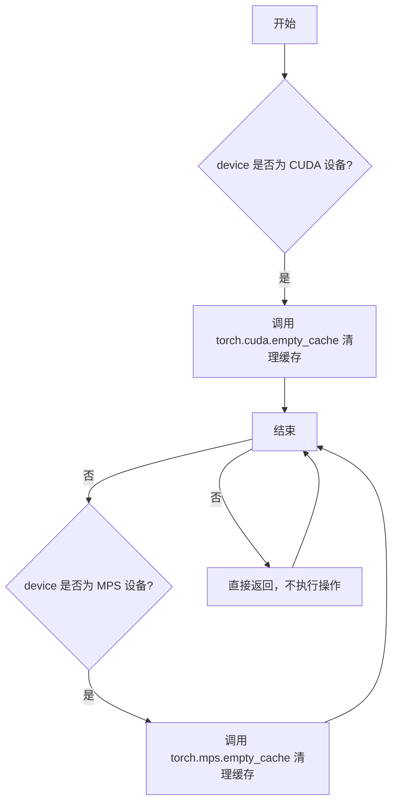
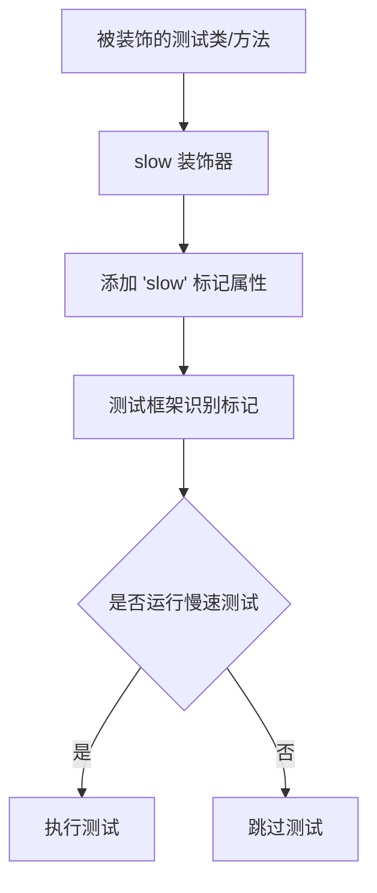
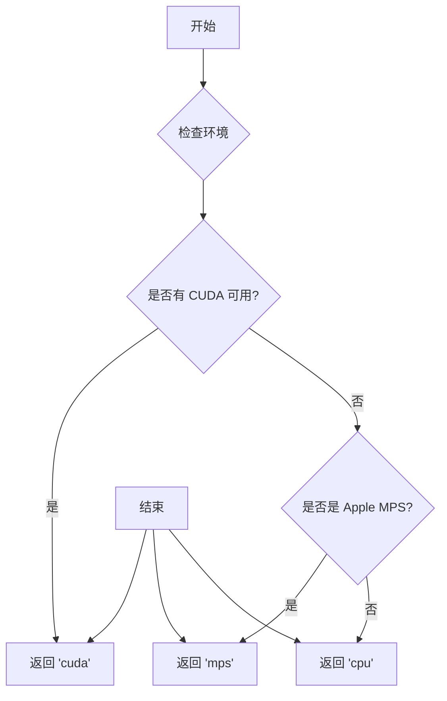
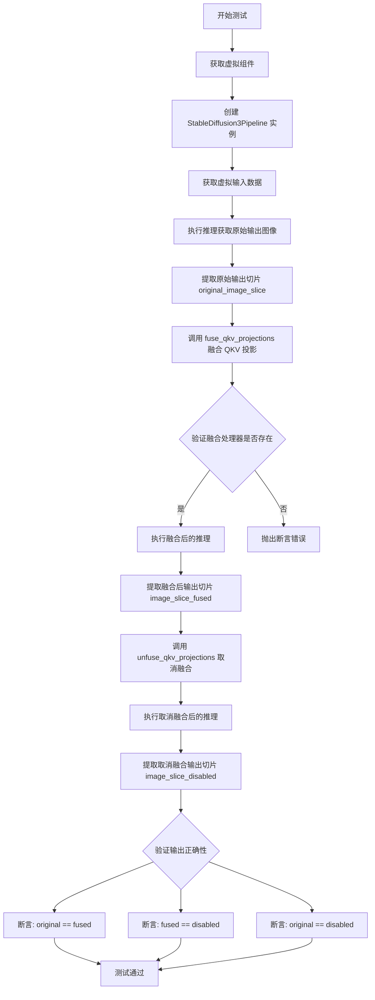
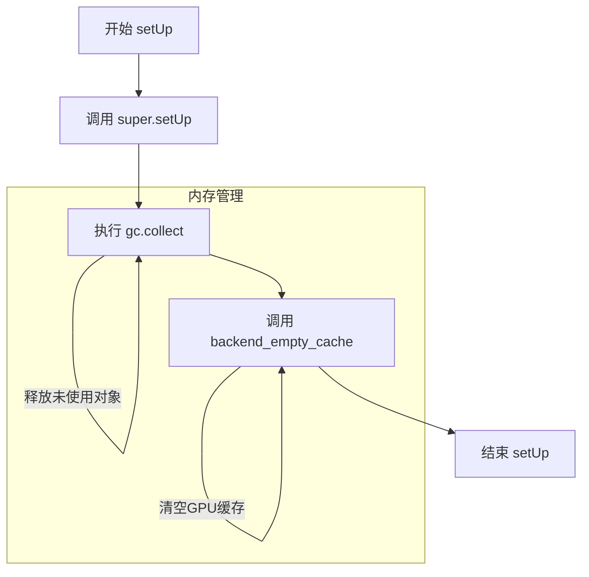
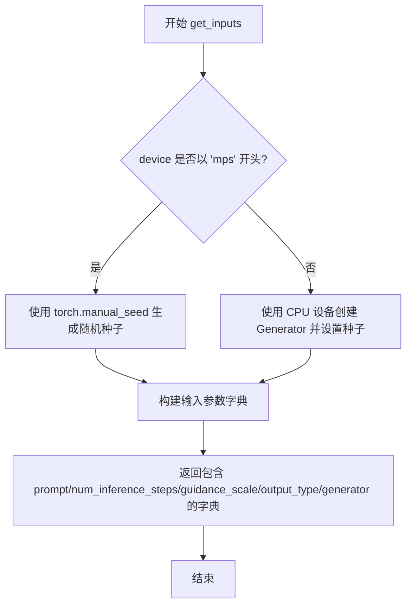
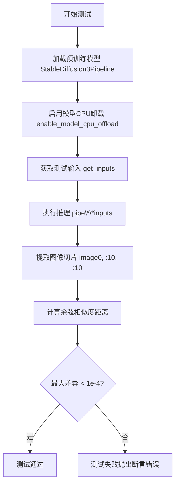

# `diffusers\tests\pipelines\stable_diffusion_3\test_pipeline_stable_diffusion_3.py` 详细设计文档

这是一个针对 Stable Diffusion 3 (SD3) 模型的单元测试与集成测试套件。该文件包含了使用虚拟组件（Dummy Components）进行快速单元测试（Fast Tests）以验证推理、QKV融合和层跳过的逻辑，以及使用真实预训练模型（Slow Tests）进行端到端质量验证的集成测试。

## 整体流程

```mermaid
graph TD
    Start[开始测试] --> Type{测试类型判断}
    Type -- Fast Test --> FastSetup[初始化: StableDiffusion3PipelineFastTests]
    FastSetup --> DummyComp[调用 get_dummy_components]
    DummyComp --> CreatePipe[实例化 Pipeline (虚拟模型)]
    CreatePipe --> DummyInput[调用 get_dummy_inputs]
    DummyInput --> RunFast[执行 pipe(**inputs)]
    RunFast --> AssertFast{断言验证}
    AssertFast -- test_inference --> Check1[验证图像Slice匹配]
    AssertFast -- test_fused_qkv_projections --> Check2[验证QKV融合与输出一致性]
    AssertFast -- test_skip_guidance_layers --> Check3[验证跳过层后的输出差异]

    Type -- Slow Test --> SlowSetup[初始化: StableDiffusion3PipelineSlowTests]
    SlowSetup --> LoadModel[调用 from_pretrained 加载真实模型]
    LoadModel --> Offload[启用 CPU Offload]
    Offload --> SlowInput[调用 get_inputs]
    SlowInput --> RunSlow[执行 pipe(**inputs)]
    RunSlow --> AssertSlow[验证: numpy_cosine_similarity_distance < 1e-4]
    AssertSlow --> End[结束]
```

## 类结构

```
unittest.TestCase (Python 标准库)
├── PipelineTesterMixin (测试混入类)
│   └── StableDiffusion3PipelineFastTests
│       ├── pipeline_class (StableDiffusion3Pipeline)
│       ├── params (frozenset)
│       ├── get_dummy_components()
│       ├── get_dummy_inputs()
│       ├── test_inference()
│       ├── test_fused_qkv_projections()
│       └── test_skip_guidance_layers()
└── StableDiffusion3PipelineSlowTests
    ├── pipeline_class
    ├── repo_id
    ├── setUp()
    ├── tearDown()
    ├── get_inputs()
    └── test_sd3_inference()
```

## 全局变量及字段


### `StableDiffusion3PipelineFastTests.pipeline_class`
    
类型变量，指向 StableDiffusion3Pipeline

类型：`type`
    


### `StableDiffusion3PipelineFastTests.params`
    
测试参数白名单

类型：`frozenset`
    


### `StableDiffusion3PipelineFastTests.batch_params`
    
批处理参数白名单

类型：`frozenset`
    


### `StableDiffusion3PipelineFastTests.test_layerwise_casting`
    
是否测试分层类型转换

类型：`bool`
    


### `StableDiffusion3PipelineFastTests.test_group_offloading`
    
是否测试组卸载

类型：`bool`
    


### `StableDiffusion3PipelineSlowTests.pipeline_class`
    
类型变量，指向 StableDiffusion3Pipeline

类型：`type`
    


### `StableDiffusion3PipelineSlowTests.repo_id`
    
模型仓库ID (stabilityai/stable-diffusion-3-medium-diffusers)

类型：`str`
    
    

## 全局函数及方法


### `backend_empty_cache`

清理 GPU 缓存，释放未使用的 GPU 内存，通常在测试的 setUp 和 tearDown 方法中调用以确保测试之间的内存隔离。

参数：

-  `device`：`str` 或 `torch.device`，目标设备标识符（如 "cuda"、"cuda:0" 或 "cpu"）

返回值：`None`，无返回值

#### 流程图



#### 带注释源码

```python
def backend_empty_cache(device):
    """
    清理指定设备的后端缓存。
    
    参数:
        device: 目标设备标识符，可以是字符串形式的设备名称
                (如 'cuda', 'cuda:0', 'mps', 'cpu') 或 torch.device 对象。
    
    返回:
        None: 该函数不返回任何值，仅执行缓存清理操作。
    """
    # 判断设备是否为 CUDA 设备
    if torch.cuda.is_available() and str(device).startswith("cuda"):
        # 调用 PyTorch 的 CUDA 缓存清理函数
        # 释放 CUDA 缓存中的未使用内存
        torch.cuda.empty_cache()
    
    # 判断设备是否为 Apple Silicon MPS 设备
    elif str(device).startswith("mps"):
        # 调用 PyTorch 的 MPS 缓存清理函数
        # 释放 Metal Performance Shaders 缓存中的内存
        torch.mps.empty_cache()
    
    # 对于 CPU 设备或其他不支持的设备，不执行任何操作
    # 因为 CPU 没有独立的缓存需要清理
```


### `numpy_cosine_similarity_distance`

该函数用于计算两个numpy数组之间的余弦相似度距离（1 - 余弦相似度），常用于图像相似度比较场景。在测试中用于验证生成图像与预期图像之间的差异。

参数：

- `arr1`：`numpy.ndarray`，第一个数组，通常为预期/参考图像数据（展平后）
- `arr2`：`numpy.ndarray`，第二个数组，通常为实际生成图像数据（展平后）

返回值：`float`，返回余弦相似度距离值，值越小表示两个数组越相似

#### 流程图

```mermaid
flowchart TD
    A[开始] --> B[接收两个numpy数组]
    B --> C[计算arr1的范数]
    B --> D[计算arr2的范数]
    C --> E[计算两个数组的点积]
    D --> E
    E --> F[计算余弦相似度: dot / (norm1 * norm2)]
    F --> G[计算距离: 1 - cosine_similarity]
    G --> H[返回距离值]
```

#### 带注释源码

```python
# 注意: 该函数定义在 testing_utils 模块中，此处为基于使用方式的推断实现

def numpy_cosine_similarity_distance(arr1: np.ndarray, arr2: np.ndarray) -> float:
    """
    计算两个numpy数组之间的余弦相似度距离。
    
    参数:
        arr1: 第一个numpy数组（预期值）
        arr2: 第二个numpy数组（实际值）
    
    返回:
        余弦相似度距离（1 - 余弦相似度），值越小表示越相似
    """
    # 将输入数组展平为一维
    arr1 = arr1.flatten()
    arr2 = arr2.flatten()
    
    # 计算点积
    dot_product = np.dot(arr1, arr2)
    
    # 计算各数组的L2范数
    norm1 = np.linalg.norm(arr1)
    norm2 = np.linalg.norm(arr2)
    
    # 避免除零
    if norm1 == 0 or norm2 == 0:
        return 1.0
    
    # 计算余弦相似度
    cosine_similarity = dot_product / (norm1 * norm2)
    
    # 返回余弦距离（1 - 余弦相似度）
    # 值越小表示两个数组越相似
    return 1.0 - cosine_similarity
```

#### 使用示例（来自测试代码）

```python
# 从测试代码中的实际调用方式
max_diff = numpy_cosine_similarity_distance(expected_slice.flatten(), image_slice.flatten())

# 验证生成的图像与预期图像的相似度
assert max_diff < 1e-4, "生成的图像与预期差异过大"
```


### `require_big_accelerator`

标记需要大型硬件（如高显存GPU）的测试，用于在测试套件中跳过不需要大型硬件的测试环境。

**注意**：该函数从 `...testing_utils` 导入，但实际实现未在当前代码文件中定义。以下信息基于其使用方式进行推断。

参数：

- 无直接参数（作为装饰器使用）

返回值：`function`，返回装饰后的函数/类

#### 流程图

```mermaid
flowchart TD
    A[定义测试类 StableDiffusion3PipelineSlowTests] --> B[@slow 装饰器]
    B --> C[@require_big_accelerator 装饰器]
    C --> D[标记该测试类需要大型硬件]
    D --> E[测试运行器检查条件]
    E --> F{是否满足硬件要求?}
    F -->|是| G[执行测试]
    F -->|否| H[跳过测试]
```

#### 带注释源码

```python
# 从 testing_utils 模块导入 require_big_accelerator 装饰器
# 该装饰器用于标记需要大型硬件加速器的测试
from ...testing_utils import (
    backend_empty_cache,
    numpy_cosine_similarity_distance,
    require_big_accelerator,  # <-- 从外部导入的装饰器
    slow,
    torch_device,
)

# 使用 @require_big_accelerator 装饰器标记需要大型硬件的测试类
# 这类测试通常需要高显存GPU（如A100、H100等）
@slow
@require_big_accelerator
class StableDiffusion3PipelineSlowTests(unittest.TestCase):
    """
    慢速测试类，用于测试 StableDiffusion3Pipeline
    需要从预训练模型加载，消耗大量显存
    """
    pipeline_class = StableDiffusion3Pipeline
    repo_id = "stabilityai/stable-diffusion-3-medium-diffusers"
    
    # ... 测试方法
```

#### 备注

由于 `require_big_accelerator` 的实际实现不在当前代码文件中，无法提供完整的函数源码。通常此类装饰器在 `testing_utils` 模块中的实现逻辑包括：

1. 检查当前运行环境是否满足大型硬件要求（如GPU显存大小）
2. 如果不满足，使用 `unittest.skip` 装饰器跳过测试
3. 如果满足，则正常执行测试

建议查看 `testing_utils` 模块的实现以获取完整信息。


### `slow`

`slow` 是来自 `testing_utils` 模块的装饰器函数，用于标记测试类或测试方法为慢速测试，以便在测试套件中将其与快速测试区分开来，通常用于需要较长运行时间或需要特殊硬件（如大型加速器）的测试场景。

参数： 无显式参数，作为装饰器使用

返回值：无显式返回值，作为装饰器修改被装饰对象的元数据

#### 流程图



#### 带注释源码

```python
# 这是一个从 testing_utils 模块导入的装饰器
# 源码位置：...testing_utils 模块中

# 典型实现可能如下：
def slow(func_or_class):
    """
    装饰器：标记测试为慢速测试
    
    作用：
    1. 为被装饰的测试类或方法添加标记属性
    2. 测试框架可以据此筛选是否运行慢速测试
    3. 常与 pytest 的 -m "not slow" 或类似机制配合使用
    """
    # 设置属性以便测试框架识别
    func_or_class.slow = True
    return func_or_class

# 在代码中的使用方式：
@slow
@require_big_accelerator
class StableDiffusion3PipelineSlowTests(unittest.TestCase):
    """
    标记为慢速测试的测试类
    
    @slow: 从 testing_utils 导入，标记此类为慢速测试
    @require_big_accelerator: 标记此类需要大型加速器才能运行
    """
    pass
```


### `torch_device`

获取测试设备，返回一个字符串，表示当前测试应使用的 PyTorch 设备（如 "cpu"、"cuda"、"mps" 等）。

#### 参数

该函数/变量无参数。

#### 返回值

- `str`：返回设备字符串，表示当前测试设备。常见值包括 "cpu"、"cuda"、"mps" 等。

#### 流程图



#### 带注释源码

```
# testing_utils 模块中的 torch_device 定义
# 注意：实际定义不在本代码文件中，从 testing_utils 导入

# 使用示例（在 StableDiffusion3PipelineFastTests 中）:

# 1. 作为参数传递给 get_dummy_inputs
inputs = self.get_dummy_inputs(torch_device)

# 2. 用于将模型移动到指定设备
pipe = pipe.to(torch_device)

# 3. 用于内存清理
backend_empty_cache(torch_device)

# 推断的实现逻辑：
def get_torch_device():
    """
    获取测试用的 PyTorch 设备。
    优先级：cuda > mps > cpu
    """
    if torch.cuda.is_available():
        return "cuda"
    elif torch.backends.mps.is_available():
        return "mps"
    else:
        return "cpu"

# 或者可能是一个简单的模块级变量
torch_device = "cuda" if torch.cuda.is_available() else "cpu"
```


### `StableDiffusion3PipelineFastTests.get_dummy_components`

该方法为 Stable Diffusion 3 Pipeline 的单元测试创建虚拟（dummy）组件，包括 Transformer、VAE、多个 TextEncoder 和 Tokenizer 等核心模型组件。通过使用固定的随机种子（torch.manual_seed(0)）确保测试的可重现性和确定性，这些组件仅用于快速测试目的，不包含预训练权重。

参数： 无

返回值：`Dict[str, Any]`，返回包含以下键的字典：
- `scheduler`: FlowMatchEulerDiscreteScheduler 实例
- `text_encoder`: CLIPTextModelWithProjection 实例
- `text_encoder_2`: CLIPTextModelWithProjection 实例
- `text_encoder_3`: T5EncoderModel 实例
- `tokenizer`: CLIPTokenizer 实例
- `tokenizer_2`: CLIPTokenizer 实例
- `tokenizer_3`: AutoTokenizer 实例
- `transformer`: SD3Transformer2DModel 实例
- `vae`: AutoencoderKL 实例
- `image_encoder`: None
- `feature_extractor`: None

#### 流程图

```mermaid
flowchart TD
    A[开始 get_dummy_components] --> B[设置随机种子 torch.manual_seed(0)]
    B --> C[创建 SD3Transformer2DModel]
    C --> D[创建 CLIPTextConfig 配置]
    D --> E[创建 CLIPTextModelWithProjection text_encoder]
    E --> F[创建另一个 CLIPTextModelWithProjection text_encoder_2]
    F --> G[从预训练加载 T5EncoderModel text_encoder_3]
    G --> H[从预训练加载 CLIPTokenizer tokenizer 和 tokenizer_2]
    H --> I[从预训练加载 AutoTokenizer tokenizer_3]
    I --> J[创建 AutoencoderKL vae]
    J --> K[创建 FlowMatchEulerDiscreteScheduler scheduler]
    K --> L[构建并返回组件字典]
```

#### 带注释源码

```python
def get_dummy_components(self):
    """
    创建虚拟组件用于单元测试，确保测试的可重现性
    """
    # 设置随机种子确保每次调用产生相同的随机初始化权重
    torch.manual_seed(0)
    
    # 创建 Transformer 模型配置参数
    transformer = SD3Transformer2DModel(
        sample_size=32,           # 输入图像尺寸
        patch_size=1,             # 补丁大小
        in_channels=4,            # 输入通道数（latent space）
        num_layers=1,             # 层数（测试用最小配置）
        attention_head_dim=8,     # 注意力头维度
        num_attention_heads=4,    # 注意力头数量
        caption_projection_dim=32,# 标题投影维度
        joint_attention_dim=32,   # 联合注意力维度
        pooled_projection_dim=64, # 池化投影维度
        out_channels=4,           # 输出通道数
    )
    
    # 配置 CLIP 文本编码器
    clip_text_encoder_config = CLIPTextConfig(
        bos_token_id=0,           # 开始 token ID
        eos_token_id=2,            # 结束 token ID
        hidden_size=32,           # 隐藏层大小
        intermediate_size=37,     # 中间层大小
        layer_norm_eps=1e-05,     # LayerNorm  epsilon
        num_attention_heads=4,    # 注意力头数量
        num_hidden_layers=5,      # 隐藏层数量
        pad_token_id=1,           # 填充 token ID
        vocab_size=1000,          # 词汇表大小
        hidden_act="gelu",        # 激活函数
        projection_dim=32,        # 投影维度
    )

    # 使用随机种子创建第一个文本编码器
    torch.manual_seed(0)
    text_encoder = CLIPTextModelWithProjection(clip_text_encoder_config)

    # 使用随机种子创建第二个文本编码器
    torch.manual_seed(0)
    text_encoder_2 = CLIPTextModelWithProjection(clip_text_encoder_config)

    # 从预训练模型加载第三个文本编码器（T5 模型）
    text_encoder_3 = T5EncoderModel.from_pretrained("hf-internal-testing/tiny-random-t5")

    # 加载三个分词器
    tokenizer = CLIPTokenizer.from_pretrained("hf-internal-testing/tiny-random-clip")
    tokenizer_2 = CLIPTokenizer.from_pretrained("hf-internal-testing/tiny-random-clip")
    tokenizer_3 = AutoTokenizer.from_pretrained("hf-internal-testing/tiny-random-t5")

    # 创建 VAE 模型
    torch.manual_seed(0)
    vae = AutoencoderKL(
        sample_size=32,           # 样本尺寸
        in_channels=3,            # 输入通道（RGB）
        out_channels=3,           # 输出通道
        block_out_channels=(4,),  # 块输出通道
        layers_per_block=1,       # 每块层数
        latent_channels=4,        # latent 通道数
        norm_num_groups=1,        # 归一化组数
        use_quant_conv=False,     # 不使用量化卷积
        use_post_quant_conv=False,# 不使用后量化卷积
        shift_factor=0.0609,      # 偏移因子
        scaling_factor=1.5035,    # 缩放因子
    )

    # 创建调度器
    scheduler = FlowMatchEulerDiscreteScheduler()

    # 返回包含所有组件的字典
    return {
        "scheduler": scheduler,
        "text_encoder": text_encoder,
        "text_encoder_2": text_encoder_2,
        "text_encoder_3": text_encoder_3,
        "tokenizer": tokenizer,
        "tokenizer_2": tokenizer_2,
        "tokenizer_3": tokenizer_3,
        "transformer": transformer,
        "vae": vae,
        "image_encoder": None,
        "feature_extractor": None,
    }
```

#### 关键组件信息

| 组件名称 | 描述 |
|---------|------|
| `SD3Transformer2DModel` | Stable Diffusion 3 的核心 Transformer 模型，用于去噪过程 |
| `CLIPTextModelWithProjection` | CLIP 文本编码器，将文本转换为 embeddings |
| `T5EncoderModel` | T5 文本编码器，用于更长的文本描述 |
| `AutoencoderKL` | VAE 模型，用于潜在空间的编码和解码 |
| `FlowMatchEulerDiscreteScheduler` | 扩散模型的调度器，控制去噪步骤 |
| `CLIPTokenizer` / `AutoTokenizer` | 文本分词器，将文本转换为 token IDs |

#### 潜在技术债务与优化空间

1. **硬编码的随机种子**：多次调用 `torch.manual_seed(0)` 导致重复代码，可以提取为一个辅助方法
2. **重复的 Tokenizer 加载**：tokenizer 和 tokenizer_2 使用相同的预训练模型，可以考虑合并
3. **魔法数字**：配置中使用了大量的硬编码数值（如 `shift_factor=0.0609`, `scaling_factor=1.5035`），缺乏注释说明来源
4. **缺失的图像编码器**：image_encoder 和 feature_extractor 固定返回 None，可能导致测试覆盖不全

#### 其它项目

- **设计目标**：为单元测试提供轻量级、可快速初始化的虚拟组件，确保测试的确定性和可重现性
- **约束条件**：组件必须与 StableDiffusion3Pipeline 的构造函数签名兼容
- **错误处理**：无显式错误处理，假设预训练模型（hf-internal-testing/tiny-random-*）始终可用
- **数据流**：该方法作为测试 fixture，其输出直接传递给 pipeline 构造函数
- **外部依赖**：依赖 `diffusers`、`transformers` 和 `torch` 库，以及特定的预训练模型路径


### `StableDiffusion3PipelineFastTests.get_dummy_inputs`

该方法用于创建虚拟输入数据（dummy inputs），模拟 StableDiffusion3Pipeline 推理所需的输入参数，包括文本提示词、随机生成器、推理步数、引导比例和输出类型等，以便进行管道功能的单元测试。

参数：

- `device`：`torch.device` 或 `str`，指定生成器和张量所在的设备（如 "cpu"、"cuda" 或 "mps"）
- `seed`：`int`，随机种子，用于生成可复现的随机数，默认为 0

返回值：`Dict`，返回包含虚拟输入的字典，键包括 "prompt"（文本提示词）、"generator"（随机生成器）、"num_inference_steps"（推理步数）、"guidance_scale"（引导比例）和 "output_type"（输出类型）

#### 流程图

```mermaid
flowchart TD
    A[开始 get_dummy_inputs] --> B{device 是否以 'mps' 开头?}
    B -->|是| C[使用 torch.manual_seed(seed) 创建生成器]
    B -->|否| D[使用 torch.Generator(device='cpu').manual_seed(seed) 创建生成器]
    C --> E[构建 inputs 字典]
    D --> E
    E --> F[设置 prompt: 'A painting of a squirrel eating a burger']
    F --> G[添加 generator 到字典]
    G --> H[添加 num_inference_steps: 2]
    H --> I[添加 guidance_scale: 5.0]
    I --> J[添加 output_type: 'np']
    J --> K[返回 inputs 字典]
    K --> L[结束]
```

#### 带注释源码

```python
def get_dummy_inputs(self, device, seed=0):
    """
    创建用于测试 StableDiffusion3Pipeline 的虚拟输入数据。
    
    参数:
        device: torch.device 或 str, 指定生成器所在的设备
        seed: int, 随机种子，用于生成可复现的随机数
    
    返回:
        dict: 包含虚拟输入的字典
    """
    # 判断设备是否为 Apple Silicon (MPS)
    # MPS 设备不支持 torch.Generator，需要使用不同的方式设置随机种子
    if str(device).startswith("mps"):
        # 对于 MPS 设备，直接使用 torch.manual_seed 设置 CPU 随机种子
        generator = torch.manual_seed(seed)
    else:
        # 对于其他设备（CPU/CUDA），创建指定设备的 Generator 对象
        # 使用固定的 CPU 设备以确保测试的可复现性
        generator = torch.Generator(device="cpu").manual_seed(seed)

    # 构建虚拟输入字典，包含 pipeline 推理所需的核心参数
    inputs = {
        "prompt": "A painting of a squirrel eating a burger",  # 测试用文本提示词
        "generator": generator,  # 随机生成器，用于控制采样噪声
        "num_inference_steps": 2,  # 推理步数，较小的值加快测试速度
        "guidance_scale": 5.0,  # CFG 引导比例，控制文本提示的影响程度
        "output_type": "np",  # 输出类型为 numpy 数组
    }
    return inputs
```


### `StableDiffusion3PipelineFastTests.test_inference`

测试 StableDiffusion3Pipeline 的基本推理功能，并验证输出数值是否在预期范围内（通过比较生成的图像切片与预定义的期望切片）。

参数：

- `self`：`unittest.TestCase`，测试类的实例，隐式参数

返回值：`None`，无返回值（测试方法，通过断言验证结果）

#### 流程图

```mermaid
flowchart TD
    A[开始测试] --> B[获取虚拟组件 get_dummy_components]
    B --> C[使用组件实例化管道 StableDiffusion3Pipeline]
    C --> D[获取虚拟输入 get_dummy_inputs]
    D --> E[调用管道进行推理 pipe.__call__]
    E --> F[提取生成的图像 image[0]]
    F --> G[flatten并拼接图像切片]
    G --> H[定义期望切片 expected_slice]
    H --> I{验证: np.allclose?}
    I -->|是| J[测试通过]
    I -->|否| K[测试失败: 抛出AssertionError]
```

#### 带注释源码

```python
def test_inference(self):
    """
    测试 StableDiffusion3Pipeline 的基本推理功能及输出数值范围
    
    测试流程:
    1. 创建虚拟组件用于测试
    2. 实例化管道并执行推理
    3. 验证输出图像数值是否与预期匹配
    """
    # 步骤1: 获取虚拟组件（模型配置、tokenizer、scheduler等）
    components = self.get_dummy_components()
    
    # 步骤2: 使用虚拟组件实例化 StableDiffusion3Pipeline
    pipe = self.pipeline_class(**components)

    # 步骤3: 获取虚拟输入（包含prompt、generator、num_inference_steps等）
    inputs = self.get_dummy_inputs(torch_device)
    
    # 步骤4: 执行推理，获取生成的图像
    # pipe返回的对象包含images属性，取第一张图像
    image = pipe(**inputs).images[0]
    
    # 步骤5: 处理生成的图像用于验证
    # 将图像展平为一维数组
    generated_slice = image.flatten()
    
    # 取前8个和后8个元素，组成16个元素的切片用于快速验证
    # 这样可以避免比较整个图像，提高测试效率
    generated_slice = np.concatenate([generated_slice[:8], generated_slice[-8:]])

    # 步骤6: 定义期望的输出切片数值
    # fmt: off  # 关闭black格式化以保持数组格式
    expected_slice = np.array([0.5112, 0.5228, 0.5235, 0.5524, 0.3188, 0.5017, 0.5574, 0.4899, 0.6812, 0.5991, 0.3908, 0.5213, 0.5582, 0.4457, 0.4204, 0.5616])
    # fmt: on  # 重新开启black格式化

    # 步骤7: 验证生成的图像是否匹配预期
    # 使用np.allclose比较，允许绝对误差为1e-3
    self.assertTrue(
        np.allclose(generated_slice, expected_slice, atol=1e-3), 
        "Output does not match expected slice."
    )
```


### `StableDiffusion3PipelineFastTests.test_fused_qkv_projections`

该测试方法用于验证 QKV（Query, Key, Value）投影融合功能对 Stable Diffusion 3 Pipeline 输出结果的影响。通过对比融合前后的输出图像切片，验证融合操作不会改变模型的输出结果，确保融合优化不会影响生成质量。

参数：无（仅包含 `self` 参数，属于 unittest.TestCase 的测试方法）

返回值：`None`，该方法为测试方法，通过断言验证融合功能的正确性，无显式返回值

#### 流程图



#### 带注释源码

```python
def test_fused_qkv_projections(self):
    """测试 QKV 投影融合功能对输出结果的影响"""
    # 使用 CPU 设备确保随机数生成的可确定性
    device = "cpu"  # ensure determinism for the device-dependent torch.Generator
    
    # 获取虚拟组件（transformer、text_encoder、vae 等）
    components = self.get_dummy_components()
    
    # 使用虚拟组件创建 StableDiffusion3Pipeline 实例
    pipe = self.pipeline_class(**components)
    
    # 将 pipeline 移动到指定设备
    pipe = pipe.to(device)
    
    # 设置进度条配置（disable=None 表示不禁用进度条）
    pipe.set_progress_bar_config(disable=None)

    # 获取虚拟输入数据
    inputs = self.get_dummy_inputs(device)
    
    # 执行推理并获取原始输出图像（未融合 QKV）
    image = pipe(**inputs).images
    
    # 提取图像右下角 3x3 像素块的最后通道
    original_image_slice = image[0, -3:, -3:, -1]

    # 调用 transformer 的 fuse_qkv_projections 方法融合 QKV 投影
    # TODO (sayakpaul): will refactor this once `fuse_qkv_projections()` has been added
    # to the pipeline level.
    pipe.transformer.fuse_qkv_projections()
    
    # 断言：验证融合后的注意力处理器是否存在
    assert check_qkv_fusion_processors_exist(pipe.transformer), (
        "Something wrong with the fused attention processors. Expected all the attention processors to be fused."
    )
    
    # 断言：验证融合后的处理器数量与原始处理器数量匹配
    assert check_qkv_fusion_matches_attn_procs_length(
        pipe.transformer, pipe.transformer.original_attn_processors
    ), "Something wrong with the attention processors concerning the fused QKV projections."

    # 使用相同的输入执行融合后的推理
    inputs = self.get_dummy_inputs(device)
    image = pipe(**inputs).images
    
    # 提取融合后的输出切片
    image_slice_fused = image[0, -3:, -3:, -1]

    # 调用 unfuse_qkv_projections 取消 QKV 投影融合
    pipe.transformer.unfuse_qkv_projections()
    
    # 执行取消融合后的推理
    inputs = self.get_dummy_inputs(device)
    image = pipe(**inputs).images
    
    # 提取取消融合后的输出切片
    image_slice_disabled = image[0, -3:, -3:, -1]

    # 断言：融合 QKV 投影不应该影响输出结果
    assert np.allclose(original_image_slice, image_slice_fused, atol=1e-3, rtol=1e-3), (
        "Fusion of QKV projections shouldn't affect the outputs."
    )
    
    # 断言：融合后与取消融合后的输出应该一致
    assert np.allclose(image_slice_fused, image_slice_disabled, atol=1e-3, rtol=1e-3), (
        "Outputs, with QKV projection fusion enabled, shouldn't change when fused QKV projections are disabled."
    )
    
    # 断言：原始输出与取消融合后的输出应该匹配（容差稍大）
    assert np.allclose(original_image_slice, image_slice_disabled, atol=1e-2, rtol=1e-2), (
        "Original outputs should match when fused QKV projections are disabled."
    )
```


### `StableDiffusion3PipelineFastTests.test_skip_guidance_layers`

测试在 Stable Diffusion 3 pipeline 推理过程中跳过特定层（skip_guidance_layers）的功能，验证使用该参数时输出与不使用时不同，且输出形状保持一致。

参数：

- `self`：`StableDiffusion3PipelineFastTests`，测试类实例，包含 pipeline_class、params 等测试配置

返回值：`None`，无显式返回值，通过测试断言验证功能

#### 流程图

```mermaid
flowchart TD
    A[开始测试] --> B[获取虚拟组件 get_dummy_components]
    B --> C[创建 pipeline 实例]
    C --> D[获取虚拟输入 get_dummy_inputs]
    D --> E[执行完整推理 pipe&#40;&#42;&#42;inputs&#41;]
    E --> F[保存完整输出 output_full]
    F --> G[复制输入并添加 skip_guidance_layers=[0]]
    G --> H[执行跳过层推理 pipe&#40;&#42;&#42;inputs_with_skip&#41;]
    H --> I[保存跳过层输出 output_skip]
    I --> J{验证输出不同}
    J -->|通过| K{验证输出形状相同}
    J -->|失败| L[测试失败: 输出应该不同]
    K -->|通过| M[设置 num_images_per_prompt=2]
    M --> N[重复完整推理]
    N --> O[重复跳过层推理]
    O --> P{验证输出不同}
    P -->|通过| Q[测试通过]
    P -->|失败| R[测试失败: 输出应该不同]
    K -->|失败| S[测试失败: 输出形状应相同]
```

#### 带注释源码

```python
def test_skip_guidance_components = self):
    """测试跳过特定guidance层的功能"""
    
    # 步骤1: 获取虚拟组件（transformer、text encoder、vae、scheduler等）
    components = self.get_dummy_components()
    
    # 步骤2: 使用虚拟组件创建 StableDiffusion3Pipeline 实例
    pipe = self.pipeline_class(**components)
    
    # 步骤3: 将 pipeline 移到测试设备并设置进度条
    pipe = pipe.to(torch_device)
    pipe.set_progress_bar_config(disable=None)

    # 步骤4: 获取默认的虚拟输入（包含 prompt、generator、num_inference_steps 等）
    inputs = self.get_dummy_inputs(torch_device)

    # 步骤5: 执行完整推理（不跳过任何层），获取输出图像
    output_full = pipe(**inputs)[0]

    # 步骤6: 复制输入并添加 skip_guidance_layers 参数，指定跳过第0层
    inputs_with_skip = inputs.copy()
    inputs_with_skip["skip_guidance_layers"] = [0]
    
    # 步骤7: 执行跳过指定层的推理
    output_skip = pipe(**inputs_with_skip)[0]

    # 步骤8: 断言验证 - 跳过层后的输出应与完整输出不同（否则说明跳过层未生效）
    self.assertFalse(
        np.allclose(output_full, output_skip, atol=1e-5), 
        "Outputs should differ when layers are skipped"
    )

    # 步骤9: 断言验证 - 两次输出的形状应保持一致
    self.assertEqual(output_full.shape, output_skip.shape, 
        "Outputs should have the same shape")

    # 步骤10: 测试多图生成场景 - 设置每prompt生成2张图
    inputs["num_images_per_prompt"] = 2
    
    # 步骤11: 再次执行完整推理
    output_full = pipe(**inputs)[0]

    # 步骤12: 再次添加 skip_guidance_layers 参数
    inputs_with_skip = inputs.copy()
    inputs_with_skip["skip_guidance_layers"] = [0]
    
    # 步骤13: 执行跳过层推理
    output_skip = pipe(**inputs_with_skip)[0]

    # 步骤14: 验证多图生成场景下输出不同
    self.assertFalse(
        np.allclose(output_full, output_skip, atol=1e-5), 
        "Outputs should differ when layers are skipped"
    )

    # 步骤15: 验证多图生成场景下输出形状相同
    self.assertEqual(output_full.shape, output_skip.shape, 
        "Outputs should have the same shape")
```


### `StableDiffusion3PipelineSlowTests.setUp`

初始化测试环境，回收内存，清空缓存，为慢速测试准备稳定的测试状态。

参数：

- `self`：`unittest.TestCase`，隐式参数，测试类实例本身

返回值：`None`，无返回值

#### 流程图



#### 带注释源码

```python
def setUp(self):
    """
    初始化测试环境，准备测试所需的资源状态。
    该方法在每个测试方法执行前被调用，用于确保测试环境的一致性。
    """
    # 调用父类的 setUp 方法，执行 unittest.TestCase 的标准初始化
    super().setUp()
    
    # 手动触发垃圾回收，回收 Python 中未被引用的对象
    # 确保之前测试留下的对象被正确释放，避免内存泄漏
    gc.collect()
    
    # 清空后端（GPU/CPU）缓存，释放显存或内存缓存
    # torch_device 是测试工具函数，返回当前测试设备
    # 这一步对于 GPU 测试尤为重要，可以避免缓存数据影响测试结果
    backend_empty_cache(torch_device)
```


### `StableDiffusion3PipelineSlowTests.tearDown`

测试结束后清理资源，释放 GPU 内存并执行垃圾回收，确保测试环境干净，避免内存泄漏影响后续测试。

参数：

- `self`：`TestCase` 实例，隐式参数，表示测试类实例本身

返回值：`None`，无返回值描述

#### 流程图

```mermaid
flowchart TD
    A[tearDown 开始] --> B[调用父类 tearDown: super().tearDown]
    B --> C[执行垃圾回收: gc.collect]
    C --> D[清理 GPU 缓存: backend_empty_cache]
    D --> E[tearDown 结束]
    
    style A fill:#f9f,stroke:#333
    style E fill:#9f9,stroke:#333
```

#### 带注释源码

```python
def tearDown(self):
    """
    测试结束后的清理方法。
    继承自 unittest.TestCase，用于在每个测试方法执行完毕后执行清理操作。
    """
    # 调用父类的 tearDown 方法，执行 unittest 框架的标准清理逻辑
    super().tearDown()
    
    # 执行 Python 垃圾回收，释放不再使用的对象内存
    gc.collect()
    
    # 调用后端特定的缓存清理函数，释放 GPU 显存
    # torch_device 是全局变量，表示当前测试使用的设备（如 'cuda:0' 或 'cpu'）
    backend_empty_cache(torch_device)
```


### `StableDiffusion3PipelineSlowTests.get_inputs`

生成用于 Stable Diffusion 3 真实推理的输入参数字典，包含提示词、推理步数、引导 scale、输出类型和随机生成器。

参数：

- `self`：隐含的实例参数，代表 `StableDiffusion3PipelineSlowTests` 类的当前实例
- `device`：`torch.device` 或 str，目标设备，用于判断是否为 Apple MPS 设备
- `seed`：`int`，随机种子，默认值为 0，用于确保可重复的生成结果

返回值：`Dict[str, Any]`，返回包含推理所需参数的字典，键值对包括 prompt（提示词）、num_inference_steps（推理步数）、guidance_scale（引导比例）、output_type（输出类型）和 generator（随机生成器）

#### 流程图



#### 带注释源码

```python
def get_inputs(self, device, seed=0):
    """
    生成用于真实推理的输入参数。
    
    Args:
        device: 目标设备，用于判断是否为 MPS 设备
        seed: 随机种子，确保结果可复现
    
    Returns:
        包含推理所需参数的字典
    """
    # 判断是否为 Apple MPS (Metal Performance Shaders) 设备
    if str(device).startswith("mps"):
        # MPS 设备使用 torch.manual_seed 直接设置种子
        generator = torch.manual_seed(seed)
    else:
        # 其他设备（如 CPU/CUDA）创建 CPU 上的生成器并设置种子
        generator = torch.Generator(device="cpu").manual_seed(seed)

    # 构建并返回推理所需的输入参数字典
    return {
        "prompt": "A photo of a cat",           # 文本提示词
        "num_inference_steps": 2,                # 推理步数
        "guidance_scale": 5.0,                   # CFG 引导比例
        "output_type": "np",                     # 输出类型为 NumPy 数组
        "generator": generator,                  # 随机生成器确保可复现性
    }
```


### `StableDiffusion3PipelineSlowTests.test_sd3_inference`

使用真实模型（stabilityai/stable-diffusion-3-medium-diffusers）进行端到端的Stable Diffusion 3推理，并验证生成图像与预期图像之间的余弦相似度距离是否在阈值范围内。

参数：

- `self`：`StableDiffusion3PipelineSlowTests`，测试类实例本身

返回值：`None`，该方法为测试用例，通过断言验证推理结果的有效性

#### 流程图



#### 带注释源码

```python
def test_sd3_inference(self):
    """
    使用真实模型进行端到端推理并验证相似度
    """
    # 从预训练模型加载StableDiffusion3Pipeline，使用float16精度
    pipe = self.pipeline_class.from_pretrained(self.repo_id, torch_dtype=torch.float16)
    
    # 启用模型CPU卸载以优化内存使用
    pipe.enable_model_cpu_offload(device=torch_device)

    # 获取测试输入参数：提示词、推理步数、引导系数、输出类型、随机生成器
    inputs = self.get_inputs(torch_device)

    # 执行推理，获取生成的图像
    image = pipe(**inputs).images[0]
    
    # 提取图像的一个切片用于对比验证
    image_slice = image[0, :10, :10]
    
    # 预期的图像切片数值（用于对比）
    # fmt: off
    expected_slice = np.array([0.4648, 0.4404, 0.4177, 0.5063, 0.4800, 0.4287, 0.5425, 0.5190, 0.4717, 0.5430, 0.5195, 0.4766, 0.5361, 0.5122, 0.4612, 0.4871, 0.4749, 0.4058, 0.4756, 0.4678, 0.3804, 0.4832, 0.4822, 0.3799, 0.5103, 0.5034, 0.3953, 0.5073, 0.4839, 0.3884])
    # fmt: on

    # 计算预期切片与实际切片之间的余弦相似度距离
    max_diff = numpy_cosine_similarity_distance(expected_slice.flatten(), image_slice.flatten())

    # 断言：最大差异应小于1e-4，否则抛出AssertionError
    assert max_diff < 1e-4
```

## 关键组件


### StableDiffusion3PipelineFastTests

核心测试类，包含Stable Diffusion 3 Pipeline的快速单元测试，验证模型推理、QKV融合投影和引导层跳过等核心功能。

### StableDiffusion3PipelineSlowTests

慢速测试类，使用实际预训练模型进行端到端推理测试，需要大型加速器支持。

### get_dummy_components

创建虚拟组件的方法，初始化SD3Transformer2DModel、CLIPTextModelWithProjection、T5EncoderModel、AutoencoderKL等模型实例，用于测试。

### get_dummy_inputs

创建虚拟输入的方法，生成测试用的prompt、generator、推理步数和guidance_scale等参数。

### test_inference

验证Pipeline基础推理功能，检查输出图像是否与预期slice匹配。

### test_fused_qkv_projections

测试QKV融合功能，验证fuse_qkv_projections和unfuse_qkv_projections方法对输出的影响，确保融合不影响推理结果。

### test_skip_guidance_layers

测试跳过引导层功能，验证skip_guidance_layers参数在单图和多图生成场景下的正确性。

### test_sd3_inference

端到端推理测试，加载实际模型权重并进行推理，验证输出与预期结果的一致性。


## 问题及建议


### 已知问题

- **重复的随机种子设置**：`get_dummy_components()` 方法中多次调用 `torch.manual_seed(0)`，这些调用之间没有实际的随机操作，代码冗余。
- **设备判断逻辑不一致**：`get_dummy_inputs()` 和 `get_inputs()` 中对 MPS 设备的特殊处理 (`str(device).startswith("mps")`) 分散在多个位置，可提取为共用工具函数。
- **资源管理不完整**：`StableDiffusion3PipelineFastTests` 类中没有像 `StableDiffusion3PipelineSlowTests` 那样在 `setUp`/`tearDown` 中调用 `gc.collect()` 和 `backend_empty_cache()`，可能导致内存泄漏。
- **TODO 标记的功能依赖**：`test_fused_qkv_projections()` 方法中提到 TODO，表明 `fuse_qkv_projections()` 在 pipeline 级别的支持尚未完成，测试依赖未被充分文档化的内部实现。
- **魔法数字和硬编码值**：多处使用硬编码数值（如 `num_inference_steps=2`, `guidance_scale=5.0`, `atol=1e-3` 等）而未提取为常量或配置，降低了可维护性。
- **测试命名不一致**：`FastTests` 使用 `get_dummy_inputs()` 而 `SlowTests` 使用 `get_inputs()`，命名风格不统一。

### 优化建议

- 提取随机种子设置和设备判断逻辑到共用的测试工具类中，避免重复代码。
- 在 `FastTests` 的 `setUp`/`tearDown` 方法中添加与 `SlowTests` 一致的资源清理逻辑。
- 将硬编码的配置值（如推理步数、guidance_scale、容差值）定义为类常量或模块级常量，提高可维护性。
- 补充针对异常输入（如空 prompt、无效的 `skip_guidance_layers` 值）的边界测试用例。
- 统一测试类的输入方法命名规范，并添加文档说明各参数的含义。
- 解决 TODO 标记的功能依赖，或在测试中添加明确的跳过条件（如果功能尚未完全实现）。

## 其它


### 设计目标与约束

设计目标：验证StableDiffusion3Pipeline在快速推理和慢速推理场景下的功能正确性，包括图像生成质量、QKV投影融合、跳过引导层等核心功能。约束条件：测试必须在CPU设备上保证确定性生成结果，支持MPS设备适配，使用固定随机种子确保可重复性。

### 错误处理与异常设计

测试用例采用assert语句进行断言验证，包括np.allclose比较浮点数近似相等、形状匹配验证、布尔条件检查。集成测试类在setUp和tearDown中进行gc.collect()和backend_empty_cache()操作以管理内存资源，捕获可能的CUDA内存溢出情况。

### 数据流与状态机

数据流：get_dummy_components()创建完整的pipeline组件→get_dummy_inputs()生成测试输入→pipeline执行推理→验证输出图像。状态转换：Pipeline初始化→设置设备→执行推理→结果验证。

### 外部依赖与接口契约

依赖项：diffusers库提供Pipeline和模型、transformers库提供文本编码器、numpy和torch用于数值计算、unittest提供测试框架。接口契约：pipeline_class需支持from_pretrained()加载、__call__()执行推理、enable_model_cpu_offload()内存管理、set_progress_bar_config()进度条控制。

### 性能考虑

测试使用small模型(tiny-random-*)进行快速验证，slow测试使用实际模型进行完整推理。通过num_inference_steps=2最小化推理步数，batch_size默认为1避免内存峰值。test_layerwise_casting和test_group_offloading验证内存优化功能。

### 测试覆盖范围

覆盖场景：正常推理流程、QKV融合投影功能验证、跳过引导层功能、多图生成能力、设备兼容性(CPU/MPS)。测试参数：prompt、height、width、guidance_scale、negative_prompt、prompt_embeds、negative_prompt_embeds。

### 配置管理

随机种子管理：通过torch.manual_seed()和Generator.manual_seed()确保可重复性。设备配置：通过torch_device全局变量动态获取测试设备。模型配置：使用预定义的small参数创建测试组件。

### 资源清理策略

tearDown方法执行gc.collect()释放Python循环引用，调用backend_empty_cache()清空GPU/加速器缓存，防止测试间内存泄漏。super().setUp()和super().tearDown()确保测试框架资源正确释放。

### 验证标准

图像输出验证：使用numpy_cosine_similarity_distance计算相似度距离，阈值设为1e-4确保生成质量。数值验证：允许atol=1e-3到1e-2的浮点误差范围，考虑不同设备的数值精度差异。

### 可维护性设计

测试代码采用PipelineTesterMixin混合类设计复用通用测试逻辑，参数使用frozenset定义保证不可变性，辅助函数check_qkv_fusion_*提供独立的验证逻辑便于扩展。
    