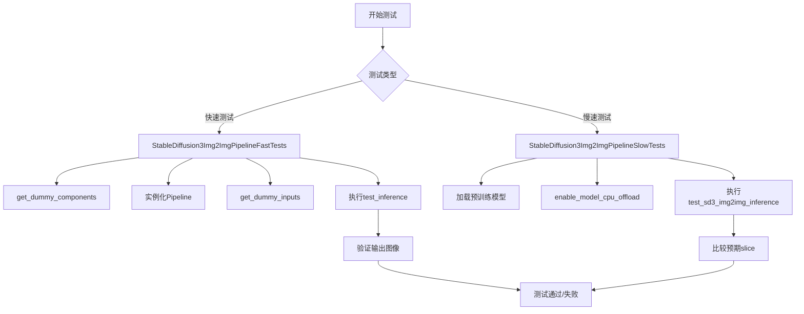
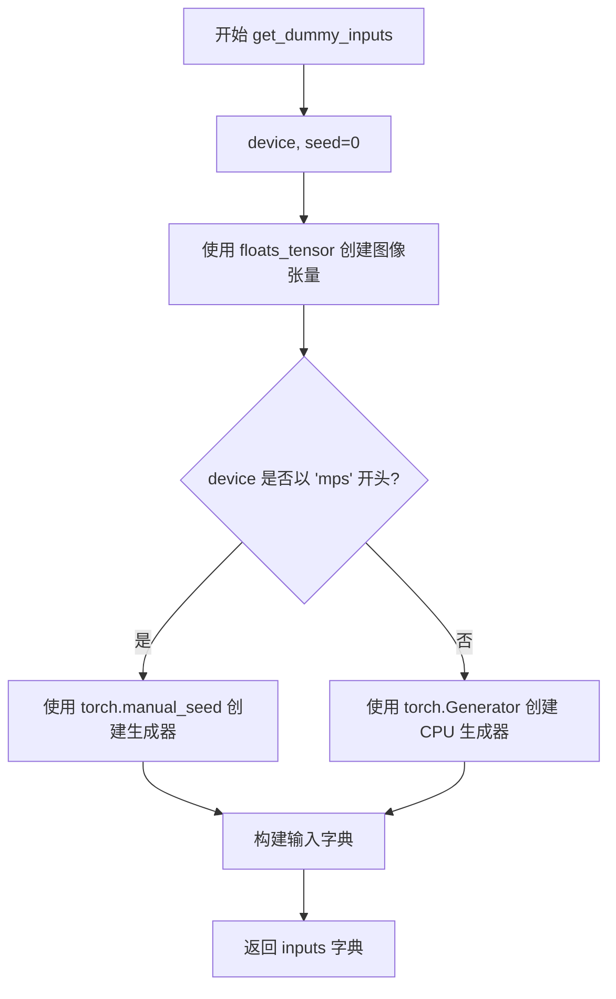
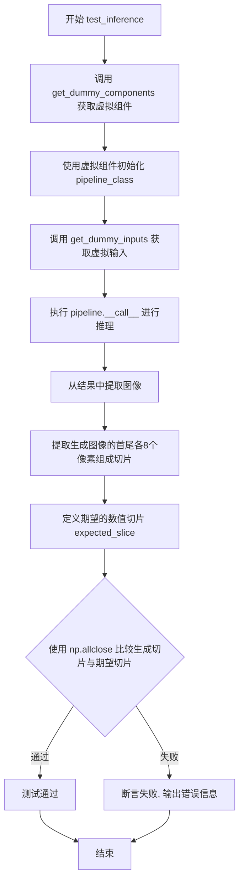
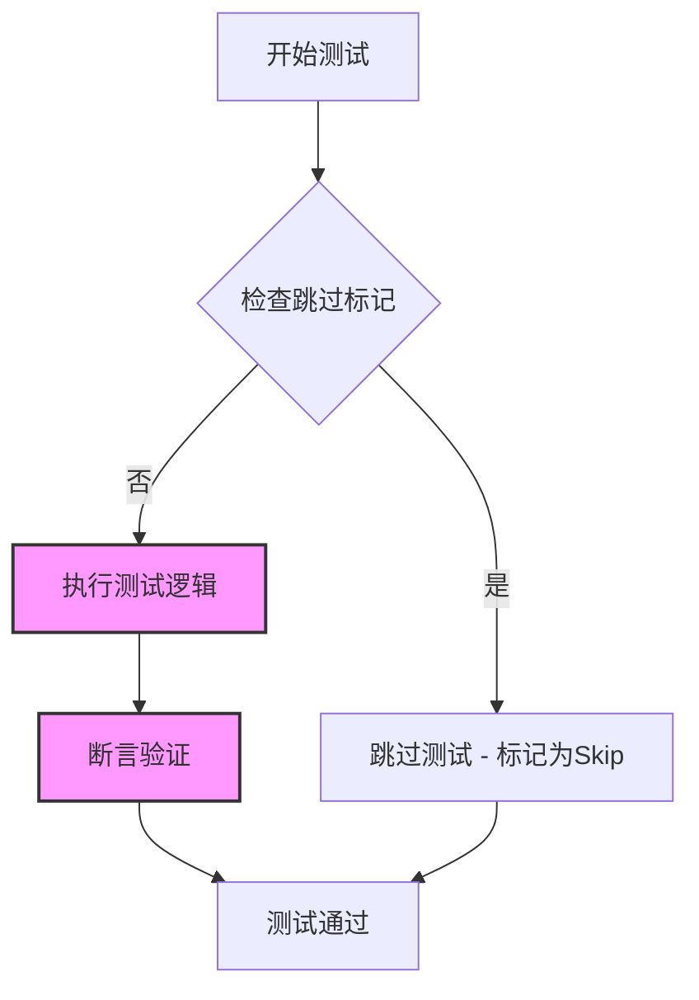
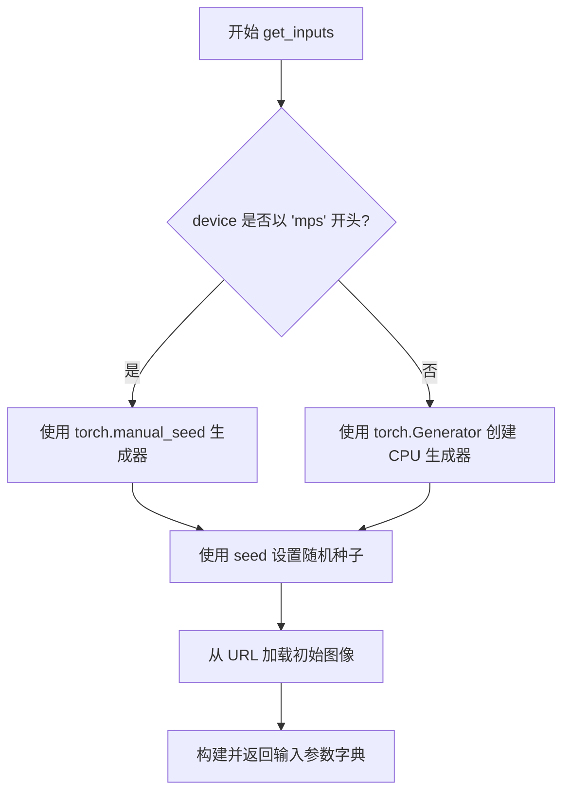
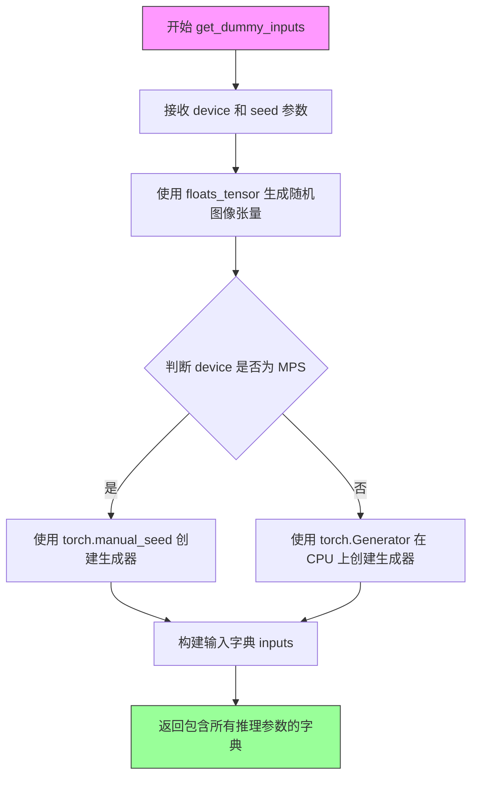
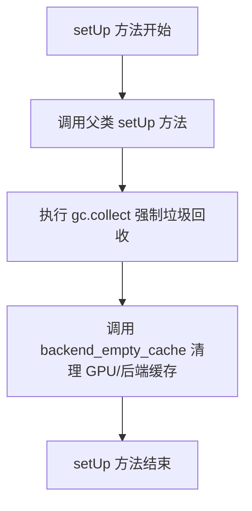
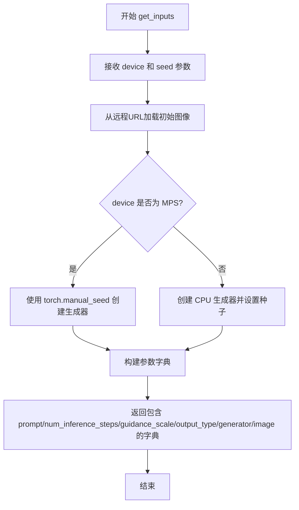

# `diffusers\tests\pipelines\stable_diffusion_3\test_pipeline_stable_diffusion_3_img2img.py` 详细设计文档

这是一个针对 StableDiffusion3Img2ImgPipeline 的测试文件，包含快速单元测试和慢速集成测试，用于验证 Stable Diffusion 3 模型在图像到图像转换任务上的功能正确性，包括模型加载、推理流程、输出验证等核心功能。

## 整体流程



## 类结构

```
unittest.TestCase
├── StableDiffusion3Img2ImgPipelineFastTests (PipelineLatentTesterMixin, PipelineTesterMixin)
│   ├── get_dummy_components()
│   ├── get_dummy_inputs()
│   ├── test_inference()
│   └── test_multi_vae()
└── StableDiffusion3Img2ImgPipelineSlowTests
├── setUp()
├── tearDown()
├── get_inputs()
└── test_sd3_img2img_inference()
```

## 全局变量及字段


### `StableDiffusion3Img2ImgPipelineFastTests.pipeline_class`
    
The pipeline class being tested, which is StableDiffusion3Img2ImgPipeline

类型：`Type[StableDiffusion3Img2ImgPipeline]`
    


### `StableDiffusion3Img2ImgPipelineFastTests.params`
    
Parameters for text-guided image variation, excluding height and width

类型：`set`
    


### `StableDiffusion3Img2ImgPipelineFastTests.required_optional_params`
    
Required optional parameters inherited from PipelineTesterMixin for pipeline testing

类型：`set`
    


### `StableDiffusion3Img2ImgPipelineFastTests.batch_params`
    
Batch parameters for text-guided image variation batch testing

类型：`set`
    


### `StableDiffusion3Img2ImgPipelineFastTests.image_params`
    
Image parameters for image-to-image pipeline testing

类型：`set`
    


### `StableDiffusion3Img2ImgPipelineFastTests.image_latents_params`
    
Image latents parameters for image-to-image pipeline latent testing

类型：`set`
    


### `StableDiffusion3Img2ImgPipelineSlowTests.pipeline_class`
    
The pipeline class being tested in slow tests, which is StableDiffusion3Img2ImgPipeline

类型：`Type[StableDiffusion3Img2ImgPipeline]`
    


### `StableDiffusion3Img2ImgPipelineSlowTests.repo_id`
    
Repository ID for loading the Stable Diffusion 3 medium model from Hugging Face Hub

类型：`str`
    
    

## 全局函数及方法


### `StableDiffusion3Img2ImgPipelineFastTests.get_dummy_components`

该方法用于创建 Stable Diffusion 3 Image-to-Image Pipeline 的所有虚拟（测试用）组件，包括 transformer 模型、三个文本编码器（CLIP 和 T5）、三个 tokenizer、VAE 解码器、调度器等，并返回包含这些组件的字典以供单元测试使用。

参数：无（仅含隐式参数 `self`）

返回值：`Dict[str, Any]`，返回一个字典，包含初始化 `StableDiffusion3Img2ImgPipeline` 所需的所有组件对象。

#### 流程图

```mermaid
flowchart TD
    A[开始 get_dummy_components] --> B[设置随机种子 torch.manual_seed(0)]
    B --> C[创建 SD3Transformer2DModel: transformer]
    C --> D[创建 CLIPTextConfig 和 CLIPTextModelWithProjection: text_encoder]
    D --> E[创建第二个 CLIPTextModelWithProjection: text_encoder_2]
    E --> F[创建 T5EncoderModel: text_encoder_3]
    F --> G[创建三个 Tokenizer: tokenizer, tokenizer_2, tokenizer_3]
    G --> H[创建 AutoencoderKL: vae]
    H --> I[创建 FlowMatchEulerDiscreteScheduler: scheduler]
    I --> J[构建返回字典]
    J --> K[返回包含所有组件的字典]
```

#### 带注释源码

```python
def get_dummy_components(self):
    """
    创建用于测试的虚拟 Stable Diffusion 3 Img2Img Pipeline 组件。
    
    该方法初始化所有必需的模型组件，包括：
    - Transformer 主干网络
    - 三个文本编码器（两个 CLIP + 一个 T5）
    - 三个对应的 tokenizer
    - VAE 解码器
    - 调度器
    
    Returns:
        Dict: 包含所有组件的字典，用于实例化 pipeline
    """
    # 设置随机种子以确保测试可重复性
    torch.manual_seed(0)
    
    # 创建 SD3 Transformer 模型（主去噪模型）
    transformer = SD3Transformer2DModel(
        sample_size=32,          # 输入图像空间分辨率
        patch_size=1,            # 补丁大小
        in_channels=4,           # 输入通道数（latent space）
        num_layers=1,            # Transformer 层数（测试用最小值）
        attention_head_dim=8,    # 注意力头维度
        num_attention_heads=4,  # 注意力头数量
        joint_attention_dim=32, # 联合注意力维度
        caption_projection_dim=32, #  caption 投影维度
        pooled_projection_dim=64,  # 池化投影维度
        out_channels=4,         # 输出通道数
    )
    
    # 配置 CLIP 文本编码器参数
    clip_text_encoder_config = CLIPTextConfig(
        bos_token_id=0,          # 句子开始 token ID
        eos_token_id=2,          # 句子结束 token ID
        hidden_size=32,          # 隐藏层维度
        intermediate_size=37,   # FFN 中间层维度
        layer_norm_eps=1e-05,    # LayerNorm epsilon
        num_attention_heads=4,  # 注意力头数
        num_hidden_layers=5,    # 隐藏层数量
        pad_token_id=1,          # 填充 token ID
        vocab_size=1000,         # 词汇表大小
        hidden_act="gelu",      # 激活函数
        projection_dim=32,       # 投影维度
    )

    # 创建第一个 CLIP 文本编码器（主文本编码器）
    torch.manual_seed(0)
    text_encoder = CLIPTextModelWithProjection(clip_text_encoder_config)

    # 创建第二个 CLIP 文本编码器（次级文本编码器）
    torch.manual_seed(0)
    text_encoder_2 = CLIPTextModelWithProjection(clip_text_encoder_config)

    # 创建第三个文本编码器：T5 编码器（用于长文本处理）
    text_encoder_3 = T5EncoderModel.from_pretrained("hf-internal-testing/tiny-random-t5")

    # 创建三个 tokenizer
    tokenizer = CLIPTokenizer.from_pretrained("hf-internal-testing/tiny-random-clip")
    tokenizer_2 = CLIPTokenizer.from_pretrained("hf-internal-testing/tiny-random-clip")
    tokenizer_3 = AutoTokenizer.from_pretrained("hf-internal-testing/tiny-random-t5")

    # 创建 VAE（变分自编码器）用于图像编解码
    torch.manual_seed(0)
    vae = AutoencoderKL(
        sample_size=32,              # 样本大小
        in_channels=3,               # 输入通道（RGB）
        out_channels=3,              # 输出通道
        block_out_channels=(4,),    # 块输出通道
        layers_per_block=1,         # 每块层数
        latent_channels=4,          # latent 通道数
        norm_num_groups=1,          # 归一化组数
        use_quant_conv=False,       # 不使用量化卷积
        use_post_quant_conv=False,  # 不使用后量化卷积
        shift_factor=0.0609,        # 偏移因子
        scaling_factor=1.5035,      # 缩放因子
    )

    # 创建调度器（使用 Euler 离散调度器）
    scheduler = FlowMatchEulerDiscreteScheduler()

    # 返回包含所有组件的字典
    return {
        "scheduler": scheduler,
        "text_encoder": text_encoder,
        "text_encoder_2": text_encoder_2,
        "text_encoder_3": text_encoder_3,
        "tokenizer": tokenizer,
        "tokenizer_2": tokenizer_2,
        "tokenizer_3": tokenizer_3,
        "transformer": transformer,
        "vae": vae,
        "image_encoder": None,       # SD3 不使用图像编码器（设为 None）
        "feature_extractor": None,   # 不使用特征提取器（设为 None）
    }
```


### `StableDiffusion3Img2ImgPipelineFastTests.get_dummy_inputs`

该方法用于生成 Stable Diffusion 3 Image-to-Image 流水线的虚拟测试输入数据，创建一个包含提示词、图像、随机生成器及推理参数的字典，供单元测试验证流水线功能使用。

参数：

- `device`：`torch.device` 或 `str`，指定生成图像张量所放置的目标设备（如 "cuda"、"cpu" 或 "mps"）
- `seed`：`int`，随机种子，默认为 0，用于确保测试结果的可复现性

返回值：`Dict`，返回包含以下键的字典：
  - `prompt`（str）：文本提示词
  - `image`（torch.Tensor）：输入图像张量，形状为 (1, 3, 32, 32)
  - `generator`（torch.Generator）：随机数生成器
  - `num_inference_steps`（int）：推理步数
  - `guidance_scale`（float）：引导比例
  - `output_type`（str）：输出类型（"np" 表示 NumPy 数组）
  - `strength`（float）：图像变换强度

#### 流程图



#### 带注释源码

```python
def get_dummy_inputs(self, device, seed=0):
    """
    生成用于测试 StableDiffusion3Img2ImgPipeline 的虚拟输入参数。
    
    参数:
        device: 目标设备，用于放置生成的图像张量
        seed: 随机种子，确保测试结果可复现
    
    返回:
        包含流水线推理所需参数的字典
    """
    # 使用 floats_tensor 创建形状为 (1, 3, 32, 32) 的随机图像张量
    # 并将其移动到指定设备
    image = floats_tensor((1, 3, 32, 32), rng=random.Random(seed)).to(device)
    
    # MPS 设备使用 torch.manual_seed，其他设备使用 torch.Generator
    if str(device).startswith("mps"):
        generator = torch.manual_seed(seed)
    else:
        # 在 CPU 上创建随机数生成器并设置种子
        generator = torch.Generator(device="cpu").manual_seed(seed)

    # 构建完整的输入参数字典
    inputs = {
        "prompt": "A painting of a squirrel eating a burger",  # 文本提示词
        "image": image,                                         # 输入图像
        "generator": generator,                                  # 随机生成器
        "num_inference_steps": 2,                                # 推理步数
        "guidance_scale": 5.0,                                   # 引导强度
        "output_type": "np",                                     # 输出为 NumPy 数组
        "strength": 0.8,                                         # 图像变换强度
    }
    return inputs
```


### `StableDiffusion3Img2ImgPipelineFastTests.test_inference`

这是 Stable Diffusion 3 (SD3) img2img pipeline 的单元测试方法，用于验证 pipeline 能否正确执行图像到图像的推理过程，并确保输出图像的数值与预期值匹配。

参数：

- 该方法无显式参数（继承自 `unittest.TestCase`，`self` 为隐含参数）

返回值：`None`，该方法为测试方法，通过 `self.assertTrue` 断言验证推理结果的正确性，无返回值。

#### 流程图



#### 带注释源码

```python
def test_inference(self):
    """
    测试 StableDiffusion3Img2ImgPipeline 的推理功能
    验证生成的图像数值是否与预期值匹配
    """
    # 步骤1: 获取虚拟组件（模型、tokenizer、scheduler等）
    components = self.get_dummy_components()
    
    # 步骤2: 使用虚拟组件实例化 StableDiffusion3Img2ImgPipeline
    pipe = self.pipeline_class(**components)
    
    # 步骤3: 获取虚拟输入（包含prompt、图像、generator等）
    inputs = self.get_dummy_inputs(torch_device)
    
    # 步骤4: 执行 pipeline 推理，获取结果
    # pipe 返回一个包含 images 属性的对象
    image = pipe(**inputs).images[0]  # 获取第一张生成的图像
    
    # 步骤5: 提取图像切片用于验证
    # 将图像展平后拼接首尾各8个像素,得到16个数值
    generated_slice = image.flatten()
    generated_slice = np.concatenate([generated_slice[:8], generated_slice[-8:]])
    
    # 步骤6: 定义期望的数值切片（来自已知正确结果）
    # fmt: off
    expected_slice = np.array([0.4564, 0.5486, 0.4868, 0.5923, 0.3775, 0.5543, 0.4807, 0.4177, 0.3778, 0.5957, 0.5726, 0.4333, 0.6312, 0.5062, 0.4838, 0.5984])
    # fmt: on
    
    # 步骤7: 断言验证生成结果与期望值的差异在容忍范围内
    self.assertTrue(
        np.allclose(generated_slice, expected_slice, atol=1e-3), 
        "Output does not match expected slice."
    )
```


### `StableDiffusion3Img2ImgPipelineFastTests.test_multi_vae`

该方法是一个测试多VAE（Variational Autoencoder）功能的测试用例，当前被@unittest.skip装饰器跳过，仅包含pass语句，未实现任何逻辑。

参数：

- `self`：隐式参数，测试类实例本身，无需额外描述

返回值：`None`，由于方法体为pass，不返回任何值

#### 流程图



#### 带注释源码

```python
@unittest.skip("Skip for now.")
def test_multi_vae(self):
    """
    测试多VAE（Variational Autoencoder）功能。
    
    该测试方法用于验证StableDiffusion3Img2ImgPipeline在处理
    多个VAE模型时的正确性，包括VAE切换、编码器和解码器的
    协同工作等场景。
    
    当前状态：
    - 该测试被@unittest.skip装饰器暂时跳过
    - 方法体仅包含pass语句，未实现任何测试逻辑
    - 原因可能是功能尚未完成或需要进一步开发
    
    注意事项：
    - 后续需要实现具体的VAE测试逻辑
    - 可能需要准备多个VAE模型实例
    - 需要定义预期的输出结果用于断言验证
    """
    pass  # TODO: 实现多VAE测试逻辑
```


### `StableDiffusion3Img2ImgPipelineSlowTests.setUp`

这是 `StableDiffusion3Img2ImgPipelineSlowTests` 测试类的初始化方法，在每个测试方法执行前被调用。该方法负责调用父类的 setUp 方法，并执行内存清理操作以确保测试环境干净。

参数：

- `self`：`unittest.TestCase`，表示测试类实例本身

返回值：`None`，该方法不返回任何值

#### 流程图

```mermaid
flowchart TD
    A[开始 setUp] --> B[调用 super().setUp]
    B --> C[执行 gc.collect]
    C --> D[调用 backend_empty_cache]
    D --> E[结束 setUp]
```

#### 带注释源码

```python
def setUp(self):
    """
    测试前置设置方法，在每个测试方法运行前被调用。
    用于初始化测试环境和清理资源。
    """
    # 调用父类的 setUp 方法，执行 unittest.TestCase 的标准初始化
    super().setUp()
    
    # 手动触发垃圾回收，释放未使用的内存对象
    gc.collect()
    
    # 调用后端特定的缓存清理函数，释放 GPU/TPU 等设备内存
    backend_empty_cache(torch_device)
```


### `StableDiffusion3Img2ImgPipelineSlowTests.tearDown`

该方法是 `StableDiffusion3Img2ImgPipelineSlowTests` 测试类的清理方法，用于在每个测试用例执行完成后进行资源清理工作，包括调用垃圾回收和清空GPU缓存。

参数：

- `self`：实例本身（隐式参数），`StableDiffusion3Img2ImgPipelineSlowTests`，代表测试类的实例

返回值：`None`，无返回值，仅执行清理操作

#### 流程图

```mermaid
flowchart TD
    A[tearDown 开始] --> B[调用 super().tearDown]
    B --> C[执行 gc.collect]
    C --> D[调用 backend_empty_cache]
    D --> E[tearDown 结束]
```

#### 带注释源码

```python
def tearDown(self):
    """
    测试用例完成后的清理方法
    
    该方法在每个测试方法执行完毕后被调用，用于清理测试过程中
    产生的内存占用和GPU缓存，确保测试环境干净，不会影响后续测试
    """
    # 首先调用父类的 tearDown 方法，执行 unittest 基础清理
    super().tearDown()
    
    # 手动触发 Python 垃圾回收，释放不再使用的 Python 对象
    gc.collect()
    
    # 调用后端特定的缓存清空函数，释放 GPU 显存
    # torch_device 是测试工具函数，返回当前测试使用的设备
    backend_empty_cache(torch_device)
```


### `StableDiffusion3Img2ImgPipelineSlowTests.get_inputs`

该方法用于准备图像到图像（img2img）推理测试的输入参数，加载初始图像并配置生成器。

参数：

- `self`：`StableDiffusion3Img2ImgPipelineSlowTests`，测试类实例本身
- `device`：`str`，目标设备（如 "cuda"、"cpu"、"mps"）
- `seed`：`int`，随机种子，默认为 0，用于生成可复现的结果

返回值：`Dict[str, Any]`，包含以下键值对：
- `prompt`: str - 文本提示词
- `num_inference_steps`: int - 推理步数
- `guidance_scale`: float - 引导比例
- `output_type`: str - 输出类型
- `generator`: torch.Generator - 随机生成器
- `image`: PIL.Image 或 torch.Tensor - 初始图像

#### 流程图



#### 带注释源码

```python
def get_inputs(self, device, seed=0):
    """
    准备图像到图像转换的测试输入参数。
    
    参数:
        device: 目标设备字符串
        seed: 随机种子，用于生成可复现的结果
    
    返回:
        包含 pipeline 调用所需参数的字典
    """
    # 从 HuggingFace datasets URL 加载初始图像
    init_image = load_image(
        "https://huggingface.co/datasets/diffusers/test-arrays/resolve/main"
        "/stable_diffusion_img2img/sketch-mountains-input.png"
    )
    
    # 根据设备类型选择随机生成器创建方式
    # MPS 设备使用 torch.manual_seed，其他设备使用 CPU 生成器
    if str(device).startswith("mps"):
        generator = torch.manual_seed(seed)
    else:
        generator = torch.Generator(device="cpu").manual_seed(seed)

    # 返回包含所有推理参数的字典
    return {
        "prompt": "A photo of a cat",           # 文本提示词
        "num_inference_steps": 2,               # 推理步数
        "guidance_scale": 5.0,                  # classifier-free guidance 强度
        "output_type": "np",                     # 输出格式为 numpy 数组
        "generator": generator,                  # 随机生成器对象
        "image": init_image,                     # 输入图像
    }
```


### `StableDiffusion3Img2ImgPipelineSlowTests.test_sd3_img2img_inference`

这是一个用于测试 Stable Diffusion 3 图像到图像（img2img）推理功能的慢速测试方法。它加载预训练的 SD3 模型，执行 img2img 推理，并将输出与预期结果进行对比验证。

参数：

- `self`：`StableDiffusion3Img2ImgPipelineSlowTests`，测试类的实例本身，包含 `pipeline_class` 和 `repo_id` 等属性

返回值：`None`，该方法为测试用例，不返回任何值

#### 流程图

```mermaid
flowchart TD
    A[开始测试] --> B[设置随机种子 torch.manual_seed]
    B --> C[从预训练模型加载管道 StableDiffusion3Img2ImgPipeline]
    C --> D[启用模型CPU卸载 enable_model_cpu_offload]
    D --> E[获取测试输入 get_inputs]
    E --> F[执行推理 pipe]
    F --> G[提取图像切片 image[0, :10, :10]]
    G --> H[获取期望切片 expected_slices.get_expectation]
    H --> I[计算余弦相似度距离]
    I --> J{距离 < 1e-4?}
    J -->|是| K[测试通过]
    J -->|否| L[测试失败并抛出异常]
```

#### 带注释源码

```python
@unittest.skip("Skip for now.")
def test_sd3_img2img_inference(self):
    """
    测试 Stable Diffusion 3 图像到图像推理功能
    使用真实模型进行端到端测试，验证推理输出的正确性
    """
    # 1. 设置随机种子以确保结果可复现
    torch.manual_seed(0)
    
    # 2. 从预训练模型加载 StableDiffusion3Img2ImgPipeline 管道
    # 使用 float16 精度以减少内存占用
    pipe = self.pipeline_class.from_pretrained(
        self.repo_id,  # "stabilityai/stable-diffusion-3-medium-diffusers"
        torch_dtype=torch.float16
    )
    
    # 3. 启用模型 CPU 卸载，将不活跃的模型层移到 CPU 以节省显存
    pipe.enable_model_cpu_offload(device=torch_device)
    
    # 4. 获取测试输入参数（包括 prompt、图像、推理步数等）
    inputs = self.get_inputs(torch_device)
    
    # 5. 执行推理，获取生成的图像结果
    # 返回 PipelineOutput 对象，包含 images 列表
    image = pipe(**inputs).images[0]
    
    # 6. 提取图像的一个切片用于对比验证 (第0行, 前10列 x 前10列)
    image_slice = image[0, :10, :10]
    
    # 7. 定义不同设备和 CUDA 版本的期望输出值
    expected_slices = Expectations(
        {
            ("xpu", 3): np.array([...]),  # XPU 设备期望值
            ("cuda", 7): np.array([...]),  # CUDA 7 期望值
            ("cuda", 8): np.array([...]),  # CUDA 8 期望值
        }
    )
    
    # 8. 根据当前环境获取对应的期望切片
    expected_slice = expected_slices.get_expectation()
    
    # 9. 计算期望值与实际输出的余弦相似度距离
    max_diff = numpy_cosine_similarity_distance(
        expected_slice.flatten(), 
        image_slice.flatten()
    )
    
    # 10. 断言输出相似度距离小于阈值，否则抛出异常
    assert max_diff < 1e-4, f"Outputs are not close enough, got {max_diff}"
```


### `StableDiffusion3Img2ImgPipelineFastTests.get_dummy_components`

该函数是 Stable Diffusion 3 图像到图像管道的测试辅助方法，用于创建和初始化虚拟（dummy）模型组件，包括 transformer、三个文本编码器、三个 tokenizer、VAE 编码器、调度器等，以便在不加载真实预训练权重的情况下进行单元测试，确保管道的基础功能正常工作。

参数：
- 无（仅包含 `self` 隐式参数）

返回值：`Dict[str, Any]`，返回包含管道所有组件的字典，包括调度器、文本编码器、tokenizer、transformer 模型、VAE 模型以及设为 None 的图像编码器和特征提取器。

#### 流程图

```mermaid
flowchart TD
    A[开始 get_dummy_components] --> B[设置随机种子 torch.manual_seed(0)]
    B --> C[创建 SD3Transformer2DModel 虚拟transformer]
    C --> D[创建 CLIPTextConfig 配置]
    D --> E[创建第一个 CLIPTextModelWithProjection 文本编码器]
    E --> F[创建第二个 CLIPTextModelWithProjection 文本编码器]
    F --> G[从预训练加载 T5EncoderModel 作为第三个文本编码器]
    G --> H[从预训练加载三个 tokenizer]
    H --> I[创建 AutoencoderKL 虚拟 VAE]
    I --> J[创建 FlowMatchEulerDiscreteScheduler 调度器]
    J --> K[组装组件字典并返回]
```

#### 带注释源码

```python
def get_dummy_components(self):
    """
    创建并返回用于测试的虚拟组件字典。
    所有组件使用固定的随机种子以确保测试可复现。
    """
    # 设置随机种子，确保测试结果可复现
    torch.manual_seed(0)
    
    # 创建 SD3 Transformer 模型（核心扩散变换器）
    transformer = SD3Transformer2DModel(
        sample_size=32,          # 输入图像尺寸
        patch_size=1,            # 补丁大小
        in_channels=4,           # 输入通道数（latent space）
        num_layers=1,           # 层数（测试用最小配置）
        attention_head_dim=8,   # 注意力头维度
        num_attention_heads=4,  # 注意力头数量
        joint_attention_dim=32, # 联合注意力维度
        caption_projection_dim=32, #  caption投影维度
        pooled_projection_dim=64,  # 池化投影维度
        out_channels=4,         # 输出通道数
    )
    
    # 创建 CLIP 文本编码器配置
    clip_text_encoder_config = CLIPTextConfig(
        bos_token_id=0,          # 起始 token ID
        eos_token_id=2,         # 结束 token ID
        hidden_size=32,         # 隐藏层大小
        intermediate_size=37,   # 中间层大小
        layer_norm_eps=1e-05,   # LayerNorm epsilon
        num_attention_heads=4,  # 注意力头数
        num_hidden_layers=5,    # 隐藏层数
        pad_token_id=1,         # 填充 token ID
        vocab_size=1000,        # 词汇表大小
        hidden_act="gelu",      # 激活函数
        projection_dim=32,      # 投影维度
    )

    # 创建第一个文本编码器（CLIP）
    torch.manual_seed(0)
    text_encoder = CLIPTextModelWithProjection(clip_text_encoder_config)

    # 创建第二个文本编码器（CLIP）
    torch.manual_seed(0)
    text_encoder_2 = CLIPTextModelWithProjection(clip_text_encoder_config)

    # 创建第三个文本编码器（T5）
    text_encoder_3 = T5EncoderModel.from_pretrained("hf-internal-testing/tiny-random-t5")

    # 加载三个 tokenizer
    tokenizer = CLIPTokenizer.from_pretrained("hf-internal-testing/tiny-random-clip")
    tokenizer_2 = CLIPTokenizer.from_pretrained("hf-internal-testing/tiny-random-clip")
    tokenizer_3 = AutoTokenizer.from_pretrained("hf-internal-testing/tiny-random-t5")

    # 创建 VAE 模型
    torch.manual_seed(0)
    vae = AutoencoderKL(
        sample_size=32,              # 样本尺寸
        in_channels=3,              # 输入通道（RGB）
        out_channels=3,             # 输出通道
        block_out_channels=(4,),    # 块输出通道
        layers_per_block=1,         # 每块层数
        latent_channels=4,          # latent 通道数
        norm_num_groups=1,          # 归一化组数
        use_quant_conv=False,       # 是否使用量化卷积
        use_post_quant_conv=False,  # 是否使用后量化卷积
        shift_factor=0.0609,        # 偏移因子
        scaling_factor=1.5035,      # 缩放因子
    )

    # 创建调度器（用于扩散采样）
    scheduler = FlowMatchEulerDiscreteScheduler()

    # 返回包含所有组件的字典
    return {
        "scheduler": scheduler,
        "text_encoder": text_encoder,
        "text_encoder_2": text_encoder_2,
        "text_encoder_3": text_encoder_3,
        "tokenizer": tokenizer,
        "tokenizer_2": tokenizer_2,
        "tokenizer_3": tokenizer_3,
        "transformer": transformer,
        "vae": vae,
        "image_encoder": None,      # 图像编码器（SD3 中未使用）
        "feature_extractor": None,  # 特征提取器（SD3 中未使用）
    }
```

#### 关键组件信息

| 组件名称 | 描述 |
|---------|------|
| `SD3Transformer2DModel` | Stable Diffusion 3 的核心变换器模型，处理潜在空间的去噪过程 |
| `CLIPTextModelWithProjection` | CLIP 文本编码器，将文本提示编码为向量表示 |
| `T5EncoderModel` | T5 文本编码器，提供额外的文本编码能力 |
| `CLIPTokenizer` | CLIP 语言的 tokenizer |
| `AutoencoderKL` | VAE 变分自编码器，用于编码和解码图像 |
| `FlowMatchEulerDiscreteScheduler` | 欧拉离散调度器，控制扩散过程的噪声调度 |
| `FlowMatchEulerDiscreteScheduler` | 基于流匹配的扩散采样调度器 |

#### 技术债务与优化空间

1. **硬编码的随机种子**：多处使用 `torch.manual_seed(0)`，可以考虑抽取为类级别或模块级别的常量
2. **重复的 tokenizer 加载**：tokenizer_2 与 tokenizer 使用相同的预训练路径，可以合并或明确区分用途
3. **虚拟参数配置**：许多模型参数（如 `num_layers=1`）是为了快速测试而设置的最小值，生产环境应使用实际预训练配置
4. **缺失的图像编码器**：返回字典中 `image_encoder` 和 `feature_extractor` 设为 `None`，如果未来 SD3 支持图像条件输入，需要补充实现


### `StableDiffusion3Img2ImgPipelineFastTests.get_dummy_inputs`

该方法用于生成测试用的虚拟输入参数，模拟图像到图像扩散管道的输入场景，包括提示词、条件图像、随机生成器及推理参数，用于验证Stable Diffusion 3图像到图像管道的功能正确性。

参数：

- `device`：`torch.device` 或 `str`，指定模型运行的目标设备（如CPU、CUDA等）
- `seed`：`int`，随机种子，用于生成可重复的随机数据，默认值为 `0`

返回值：`Dict`，包含以下键值对：

- `prompt`：`str`，文本提示词
- `image`：`torch.Tensor`，输入图像张量，形状为 `(1, 3, 32, 32)`
- `generator`：`torch.Generator`，随机数生成器
- `num_inference_steps`：`int`，推理步数
- `guidance_scale`：`float`，引导系数
- `output_type`：`str`，输出类型（如 "np" 表示 numpy 数组）
- `strength`：`float`，图像变换强度

#### 流程图



#### 带注释源码

```python
def get_dummy_inputs(self, device, seed=0):
    """
    生成用于测试 StableDiffusion3Img2ImgPipeline 的虚拟输入参数
    
    参数:
        device: 目标计算设备 (如 'cpu', 'cuda', 'mps')
        seed: 随机种子，用于保证测试结果的可重复性
    
    返回:
        包含图像生成所需全部参数的字典
    """
    # 使用随机张量生成器创建虚拟图像数据
    # 形状: (batch=1, channels=3, height=32, width=32)
    image = floats_tensor((1, 3, 32, 32), rng=random.Random(seed)).to(device)
    
    # 根据设备类型选择合适的随机生成器创建方式
    # MPS (Apple Silicon) 需要特殊处理，使用 torch.manual_seed
    if str(device).startswith("mps"):
        generator = torch.manual_seed(seed)
    else:
        # 其他设备 (CPU/CUDA) 使用独立的 Generator 对象
        generator = torch.Generator(device="cpu").manual_seed(seed)
    
    # 组装完整的输入参数字典
    inputs = {
        "prompt": "A painting of a squirrel eating a burger",  # 文本提示词
        "image": image,                                        # 条件输入图像
        "generator": generator,                                # 随机生成器确保可复现性
        "num_inference_steps": 2,                              # 扩散推理步数
        "guidance_scale": 5.0,                                 # classifier-free guidance 强度
        "output_type": "np",                                   # 输出格式为 numpy 数组
        "strength": 0.8,                                       # 图像变换强度 (0-1)
    }
    return inputs
```


### `StableDiffusion3Img2ImgPipelineFastTests.test_inference`

这是一个单元测试方法，用于验证 Stable Diffusion 3 图像到图像（Img2Img）流水线的推理功能。该测试使用虚拟（dummy）组件和输入数据来执行推理，并验证输出图像的像素值是否符合预期的基准值。

参数：

- `self`：隐式参数，测试类实例本身

返回值：`None`，该方法为 `unittest.TestCase` 的测试方法，通过 `self.assertTrue` 断言验证推理结果，不返回任何值

#### 流程图

```mermaid
flowchart TD
    A[开始测试] --> B[获取虚拟组件: get_dummy_components]
    B --> C[使用虚拟组件实例化管道: pipeline_class]
    C --> D[获取虚拟输入: get_dummy_inputs]
    D --> E[执行推理: pipe(**inputs)]
    E --> F[提取生成的图像]
    F --> G[切片图像: 连接前8和后8个像素]
    G --> H[定义期望的基准值数组]
    H --> I{验证: np.allclose]
    I -->|通过| J[测试通过]
    I -->|失败| K[抛出AssertionError]
```

#### 带注释源码

```python
def test_inference(self):
    """
    测试 Stable Diffusion 3 Img2Img 流水线的推理功能。
    使用虚拟组件和输入验证管道输出的正确性。
    """
    # Step 1: 获取预配置的虚拟组件（模型、tokenizer、调度器等）
    components = self.get_dummy_components()
    
    # Step 2: 使用虚拟组件实例化管道
    # pipeline_class 即 StableDiffusion3Img2ImgPipeline
    pipe = self.pipeline_class(**components)
    
    # Step 3: 获取虚拟输入（prompt、图像、生成器、推理步数等）
    inputs = self.get_dummy_inputs(torch_device)
    
    # Step 4: 执行推理，获取生成结果
    # 管道返回包含图像的对象，通过 .images[0] 获取第一张图像
    image = pipe(**inputs).images[0]
    
    # Step 5: 提取图像切片用于验证
    # 将图像展平为一维数组，然后拼接前8个和后8个像素值
    generated_slice = image.flatten()
    generated_slice = np.concatenate([generated_slice[:8], generated_slice[-8:]])
    
    # Step 6: 定义期望的像素值基准（用于回归测试）
    # fmt: off
    expected_slice = np.array([0.4564, 0.5486, 0.4868, 0.5923, 0.3775, 0.5543, 0.4807, 0.4177, 0.3778, 0.5957, 0.5726, 0.4333, 0.6312, 0.5062, 0.4838, 0.5984])
    # fmt: on
    
    # Step 7: 验证生成结果与期望值的接近程度
    # 允许误差为 1e-3（千分之一）
    self.assertTrue(
        np.allclose(generated_slice, expected_slice, atol=1e-3), 
        "Output does not match expected slice."
    )
```


### `StableDiffusion3Img2ImgPipelineFastTests.test_multi_vae`

该方法是一个被跳过的单元测试方法，原本用于测试多 VAE（变分自编码器）功能，但由于装饰器 `@unittest.skip("Skip for now.")` 的存在，该测试目前不执行任何操作，方法体仅为 `pass` 语句。

参数：

- `self`：`StableDiffusion3Img2ImgPipelineFastTests`，测试类实例本身，隐式参数，代表调用该方法的类实例

返回值：`None`，由于方法体为 `pass`，不返回任何值

#### 流程图

```mermaid
flowchart TD
    A[开始] --> B{检查装饰器}
    B -->|被@unittest.skip跳过| C[跳过测试]
    B -->|未被跳过| D[执行测试逻辑]
    C --> E[结束 - 无返回值]
    D --> F[pass - 空操作]
    F --> E
```

#### 带注释源码

```python
@unittest.skip("Skip for now.")
def test_multi_vae(self):
    """
    测试多VAE（变分自编码器）功能。
    
    注意：此测试当前被跳过，不执行任何操作。
    原本设计用于验证StableDiffusion3Img2ImgPipeline在多VAE场景下的正确性。
    
    参数:
        self: 测试类实例，隐式参数
        
    返回值:
        None: 由于方法体为pass语句，不返回任何值
    """
    pass  # 空方法体，待实现
```


### `StableDiffusion3Img2ImgPipelineSlowTests.setUp`

该方法是 `StableDiffusion3Img2ImgPipelineSlowTests` 测试类的初始化方法，在每个测试方法执行前被调用，用于清理GPU内存和缓存，确保测试环境处于干净状态。

参数：

- `self`：隐式参数，当前测试实例本身，无需显式传递

返回值：`None`，无返回值，仅执行清理操作

#### 流程图



#### 带注释源码

```python
def setUp(self):
    """
    测试前置设置方法，在每个测试方法运行前自动调用。
    负责初始化测试环境和清理GPU内存。
    """
    # 调用父类的 setUp 方法，确保 unittest.TestCase 的初始化逻辑被正确执行
    super().setUp()
    
    # 执行 Python 垃圾回收，释放不再使用的对象内存
    gc.collect()
    
    # 清理 GPU/后端缓存（如 CUDA、XPU 等设备的显存缓存）
    # torch_device 是一个全局变量，表示当前测试使用的设备（如 'cuda', 'cpu', 'xpu' 等）
    backend_empty_cache(torch_device)
```


### `StableDiffusion3Img2ImgPipelineSlowTests.tearDown`

这是测试框架的tearDown方法，用于在每个测试方法执行完毕后清理测试资源。它首先调用父类的tearDown方法，然后执行Python垃圾回收并清空GPU/CPU缓存，以确保测试环境不会因为残留数据而影响后续测试。

参数：

- `self`：Python类方法隐式参数，指向测试类实例本身，无实际描述意义

返回值：`None`，该方法不返回任何值，仅执行清理操作

#### 流程图

```mermaid
graph TD
    A[tearDown 方法开始] --> B[调用 super().tearDown]
    B --> C[执行 gc.collect 进行垃圾回收]
    C --> D[调用 backend_empty_cache 清理设备缓存]
    D --> E[tearDown 方法结束]

    style A fill:#f9f,color:#000
    style E fill:#9f9,color:#000
```

#### 带注释源码

```python
def tearDown(self):
    """
    测试方法执行完毕后的清理操作
    
    该方法在每个测试用例运行完成后被调用，用于清理测试过程中
    产生的临时资源，防止内存泄漏和CUDA缓存占用问题。
    """
    # 调用父类的tearDown方法，执行父类定义的清理逻辑
    super().tearDown()
    
    # 手动触发Python垃圾回收，释放不再使用的对象内存
    gc.collect()
    
    # 清理GPU/CPU设备缓存，释放设备显存或内存
    # 这是深度学习测试中的重要步骤，可以避免显存泄漏
    backend_empty_cache(torch_device)
```


### `StableDiffusion3Img2ImgPipelineSlowTests.get_inputs`

该方法用于为 Stable Diffusion 3 图像到图像（Img2Img）管道生成测试所需的输入参数。它从远程 URL 加载初始图像，并根据设备类型创建随机数生成器，最后返回一个包含管道推理所需参数的字典。

参数：

- `self`：`StableDiffusion3Img2ImgPipelineSlowTests`，隐式参数，表示当前测试类实例
- `device`：`str` 或 `torch.device`，执行推理的目标设备（如 "cuda"、"cpu" 或 "mps"）
- `seed`：`int`，随机种子，用于生成器初始化，默认为 0

返回值：`dict`，返回包含以下键值的参数字典：

- `prompt`（str）：文本提示词
- `num_inference_steps`（int）：推理步数
- `guidance_scale`（float）：引导比例
- `output_type`（str）：输出类型
- `generator`（torch.Generator）：随机数生成器
- `image`（PIL.Image）：输入图像

#### 流程图



#### 带注释源码

```python
def get_inputs(self, device, seed=0):
    """
    为 Stable Diffusion 3 Img2Img 管道生成测试输入参数
    
    参数:
        device: 目标设备 (如 'cuda', 'cpu', 'mps')
        seed: 随机种子，用于生成器
    
    返回:
        包含管道推理所需参数的字典
    """
    
    # 从远程URL加载初始图像，用于图像到图像转换
    init_image = load_image(
        "https://huggingface.co/datasets/diffusers/test-arrays/resolve/main"
        "/stable_diffusion_img2img/sketch-mountains-input.png"
    )
    
    # 根据设备类型创建随机数生成器
    # MPS (Apple Silicon) 设备需要特殊处理，使用 torch.manual_seed
    if str(device).startswith("mps"):
        generator = torch.manual_seed(seed)
    else:
        # 其他设备使用 CPU 生成器
        generator = torch.Generator(device="cpu").manual_seed(seed)

    # 构建并返回包含所有管道输入参数的字典
    return {
        "prompt": "A photo of a cat",          # 文本提示词
        "num_inference_steps": 2,              # 推理步数
        "guidance_scale": 5.0,                 # Classifier-free guidance 强度
        "output_type": "np",                   # 输出格式为 numpy 数组
        "generator": generator,                # 随机生成器确保可复现性
        "image": init_image,                   # 输入图像
    }
```


### `StableDiffusion3Img2ImgPipelineSlowTests.test_sd3_img2img_inference`

这是一个针对 Stable Diffusion 3 图像到图像（Img2Img）管道的集成测试方法，通过加载预训练模型、执行推理并验证输出图像与预期结果之间的余弦相似度，确保管道功能的正确性。

参数：

- `self`：`unittest.TestCase`，测试用例实例本身，继承自 unittest.TestCase

返回值：`None`，该方法通过断言验证推理结果，不返回任何值

#### 流程图

```mermaid
flowchart TD
    A[开始测试] --> B[设置随机种子 torch.manual_seed]
    B --> C[从预训练模型加载管道 from_pretrained]
    C --> D[启用CPU卸载 enable_model_cpu_offload]
    D --> E[获取测试输入 get_inputs]
    E --> F[执行推理 pipe]
    F --> G[提取图像切片 image[0, :10, :10]]
    G --> H[获取期望切片 get_expectation]
    H --> I[计算余弦相似度距离]
    I --> J{最大差异 < 1e-4?}
    J -->|是| K[测试通过]
    J -->|否| L[测试失败, 抛出断言错误]
    K --> M[结束测试]
    L --> M
```

#### 带注释源码

```python
def test_sd3_img2img_inference(self):
    """
    测试 StableDiffusion3Img2ImgPipeline 的推理功能
    验证模型能够正确执行图像到图像的转换，并与预期输出匹配
    """
    # 1. 设置随机种子以确保测试的可重复性
    torch.manual_seed(0)
    
    # 2. 从预训练模型加载管道，使用 float16 精度以加速推理
    # repo_id: "stabilityai/stable-diffusion-3-medium-diffusers"
    pipe = self.pipeline_class.from_pretrained(self.repo_id, torch_dtype=torch.float16)
    
    # 3. 启用模型 CPU 卸载功能，在推理过程中将模型移入/移出 CPU 内存
    # 这对于显存受限的环境尤为重要
    pipe.enable_model_cpu_offload(device=torch_device)
    
    # 4. 获取测试输入参数（包含 prompt、图像、推理步数等）
    inputs = self.get_inputs(torch_device)
    
    # 5. 执行图像到图像的推理管道，获取生成图像
    # 返回 PipelineOutput，包含生成的图像数组
    image = pipe(**inputs).images[0]
    
    # 6. 提取图像的一个切片用于验证（取第一张图像的左上角 10x10 区域）
    image_slice = image[0, :10, :10]
    
    # 7. 定义不同硬件平台（XPU、CUDA）和驱动版本对应的预期输出值
    # 用于兼容不同测试环境
    expected_slices = Expectations(
        {
            ("xpu", 3): np.array([...]),  # Intel XPU 平台预期值
            ("cuda", 7): np.array([...]), # CUDA 7.x 驱动预期值
            ("cuda", 8): np.array([...]), # CUDA 8.x 驱动预期值
        }
    )
    
    # 8. 根据当前运行环境获取对应的期望切片
    expected_slice = expected_slices.get_expectation()
    
    # 9. 计算预期切片与实际输出的余弦相似度距离
    # 距离越小表示输出越接近预期
    max_diff = numpy_cosine_similarity_distance(expected_slice.flatten(), image_slice.flatten())
    
    # 10. 断言验证最大差异小于阈值（1e-4），确保输出质量
    assert max_diff < 1e-4, f"Outputs are not close enough, got {max_diff}"
```

## 关键组件


### StableDiffusion3Img2ImgPipelineFastTests

快速测试类，继承自PipelineLatentTesterMixin、unittest.TestCase和PipelineTesterMixin，用于对Stable Diffusion 3图像到图像管道的核心推理功能进行单元测试，验证管道输出的图像张量是否符合预期的数值范围。

### StableDiffusion3Img2ImgPipelineSlowTests

慢速测试类，使用@unittest.skip装饰器标记需要大型加速器（如GPU）的真实模型推理测试，加载stabilityai/stable-diffusion-3-medium-diffusers预训练模型进行端到端验证，用于确保管道在实际硬件上的正确性。

### get_dummy_components

创建虚拟组件的方法，初始化虚拟的SD3Transformer2DModel（Transformer模型）、三个CLIPTextModelWithProjection（文本编码器）、T5EncoderModel（第三个文本编码器）、三个Tokenizer（CLIPTokenizer和AutoTokenizer）、AutoencoderKL（VAE模型）以及FlowMatchEulerDiscreteScheduler（调度器），用于无GPU环境下的快速测试。

### get_dummy_inputs / get_inputs

创建测试输入的方法，生成随机的浮点张量图像（1x3x32x32）、设置随机种子生成器、构建包含prompt、image、generator、num_inference_steps、guidance_scale、output_type和strength的参数字典，用于驱动管道执行图像转换任务。

### 张量索引与惰性加载

使用floats_tensor函数生成指定形状的随机张量，通过numpy_cosine_similarity_distance计算生成图像与预期切片之间的余弦相似度距离，使用截取（concatenate）方式提取图像的前8个和后8个像素值进行验证，实现惰性加载式的张量切片访问。

### 量化策略

在慢速测试中使用torch.float16数据类型加载预训练模型（pipe = self.pipeline_class.from_pretrained(self.repo_id, torch_dtype=torch.float16)），通过enable_model_cpu_offload启用CPU卸载功能，优化显存占用并支持大模型的推理测试。

### 随机种子控制

使用torch.manual_seed和generator.manual_seed设置随机种子，确保测试结果的可复现性，在不同设备（mps、cpu、cuda、xpu）上使用兼容的随机数生成器初始化方式。

### 显存管理与缓存清理

在SlowTests的setUp和tearDown方法中调用gc.collect()和backend_empty_cache(torch_device)进行显存的显式释放和缓存清理，防止测试间的显存泄漏，确保大型模型测试的稳定性。


## 问题及建议


### 已知问题

- `test_multi_vae` 方法被标记为跳过但完全没有任何实现，仅包含 `pass`，是一个空占位符，缺乏实际测试价值
- 硬编码的种子值 `torch.manual_seed(0)` 在多处重复使用，可能导致测试结果的确定性过强，缺乏对随机性的充分验证
- `test_sd3_img2img_inference` 中直接使用 `torch.float16`，未检查目标设备是否支持 float16 运算，可能在不支持的硬件上失败
- 慢速测试中直接加载完整的预训练模型（`stabilityai/stable-diffusion-3-medium-diffusers`），导致测试启动时间过长且资源消耗大
- `get_dummy_components` 中创建了三个文本编码器（text_encoder、text_encoder_2、text_encoder_3）和对应的 tokenizer，但某些测试场景可能不需要全部组件，造成不必要的资源初始化
- 缺少对 `image_encoder` 和 `feature_extractor` 为 `None` 时的边界条件测试，虽然代码中已设置为 `None`，但未验证 pipeline 在这种情况下的行为
- `test_inference` 方法仅验证输出与预期切片是否接近，缺少对输出形状、类型、值范围等基本属性的验证
- 断言错误信息过于简单，仅显示 "Output does not match expected slice"，缺乏调试信息（如实际值与期望值的差异）

### 优化建议

- 实现 `test_multi_vae` 方法或将其移除，避免留下空方法造成代码混淆
- 将硬编码的种子值提取为类或模块级别的常量，便于调整和在不同测试间共享
- 在使用 `float16` 之前添加设备能力检查：`if torch.cuda.is_available(): torch_dtype = torch.float16 else: torch_dtype = torch.float32`
- 考虑为慢速测试添加模型缓存机制或使用更小的模型变体进行快速验证
- 将 `get_dummy_components` 拆分为可选组件的工厂方法，按需创建文本编码器，减少不必要的初始化开销
- 添加输出属性的基本验证：`self.assertEqual(image.shape, (1, 3, 32, 32))` 和 `self.assertTrue(0 <= image.min() and image.max() <= 1)`
- 增强断言信息，使用 f-string 提供更详细的调试信息：`f"Output does not match expected slice. Max diff: {np.max(np.abs(generated_slice - expected_slice))}"`
- 考虑添加设备参数化测试（使用 `@parameterized` 装饰器），覆盖 CUDA、CPU、MPS 等多种设备

## 其它


### 设计目标与约束

本测试代码的设计目标是验证Stable Diffusion 3 Image-to-Image pipeline的功能正确性和性能稳定性。设计约束包括：1) 必须继承PipelineTesterMixin和PipelineLatentTesterMixin以复用通用测试逻辑；2) fast tests使用虚拟组件(dummy components)进行单元测试；3) slow tests使用真实预训练模型进行集成测试；4) 测试必须支持CPU和GPU(mps/cuda/xpu)多种设备；5) 必须遵循diffusers库的API约定。

### 错误处理与异常设计

测试中的错误处理包括：1) 使用np.allclose进行浮点数近似比较(容差1e-3和1e-4)；2) 使用numpy_cosine_similarity_distance计算图像相似度；3) @unittest.skip装饰器用于跳过特定测试；4) gc.collect()和backend_empty_cache()用于内存管理；5) MPS设备的特殊处理(使用torch.manual_seed而非Generator)；6) 集成测试中的try-except风格的断言验证。

### 数据流与状态机

测试数据流：get_dummy_components()创建虚拟模型组件→get_dummy_inputs()构造输入参数→test_inference()执行pipeline推理→验证输出图像与期望值的相似度。状态机涉及：Pipeline初始化状态(组件加载完成)→推理状态(执行__call__)→验证状态(结果比对)。

### 外部依赖与接口契约

外部依赖包括：1) diffusers库(StableDiffusion3Img2ImgPipeline, SD3Transformer2DModel等)；2) transformers库(CLIPTextModelWithProjection, T5EncoderModel, CLIPTokenizer等)；3) numpy和torch用于数值计算；4) testing_utils中的辅助函数(Expectations, floats_tensor等)。接口契约：pipeline_class必须实现__call__方法并返回包含images属性的对象；components字典必须包含scheduler, text_encoder系列, tokenizer系列, transformer, vae等键。

### 测试覆盖率分析

Fast tests覆盖：pipeline初始化、基础推理、输出格式验证。Slow tests覆盖：真实模型加载、CPU offload、端到端推理、跨平台兼容性(xpu/cuda)。当前覆盖缺口：未测试multi-vae场景(test_multi_vae被跳过)、未测试negative_prompt、未测试高级调度器配置。

### 性能基准与优化建议

性能基准：Fast tests使用tiny-random模型，推理步骤仅为2步；Slow tests使用20步推理。优化建议：1) 可以添加性能基准测试记录推理时间；2) 可以添加内存峰值监控；3) 可以并行化不同设备的后端测试；4) 可以使用pytest参数化测试不同seed；5) 可以添加torch.compile加速支持。

### 安全性考虑

测试代码本身不涉及用户数据处理，但slow tests从HuggingFace远程加载模型，存在网络依赖和模型篡改风险。建议：1) 验证远程模型hash；2) 添加模型缓存验证；3) 在隔离环境中运行slow tests。

### 版本兼容性

依赖版本要求：1) diffusers需支持SD3和FlowMatchEulerDiscreteScheduler；2) transformers需支持CLIPTextModelWithProjection和T5EncoderModel；3) torch需支持mps设备。兼容性风险：不同版本的transformers可能导致tokenizer行为差异。

### 部署相关

测试代码作为项目测试套件的一部分，不直接用于生产部署。但相关配置(如torch_dtype=torch.float16, enable_model_cpu_offload)反映了生产环境的典型配置模式。CI/CD应分别运行fast tests(快速反馈)和slow tests(完整验证)。

    