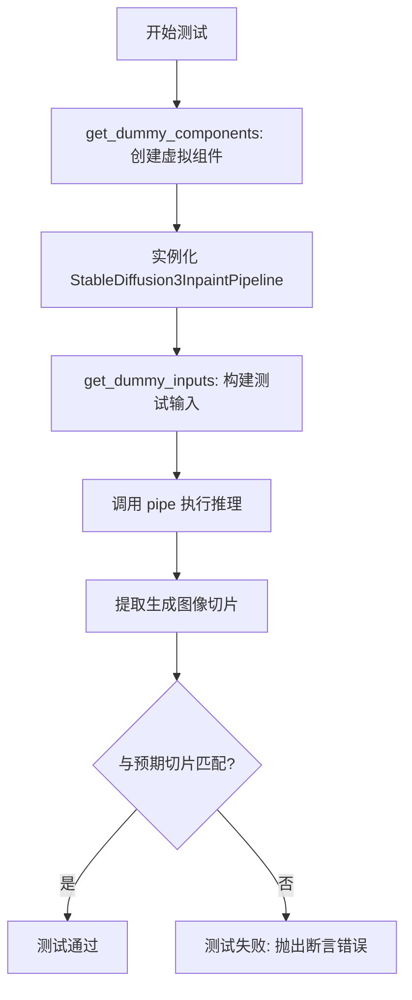
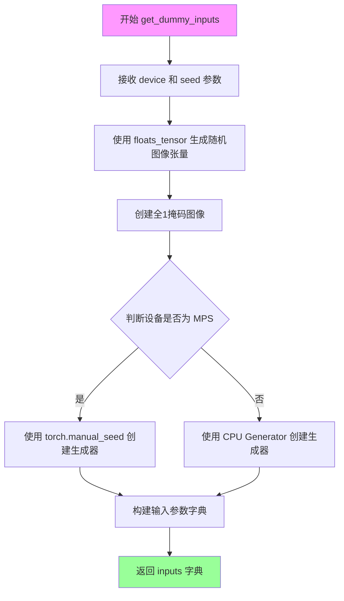
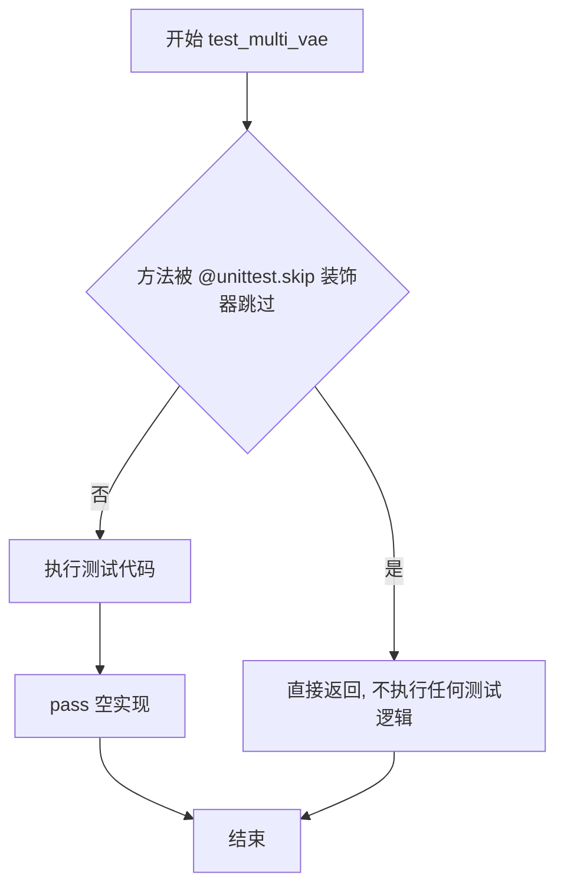
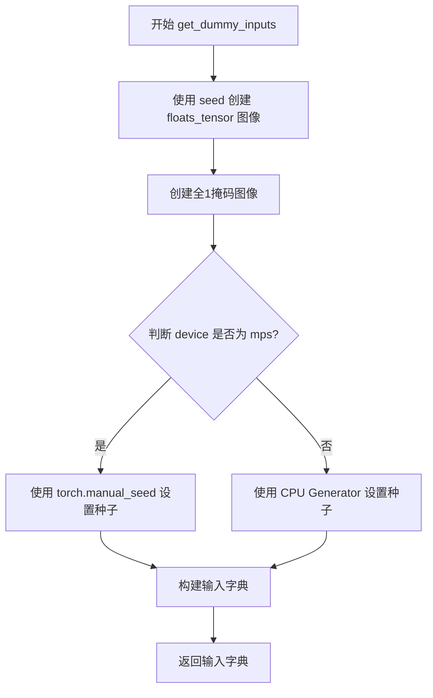
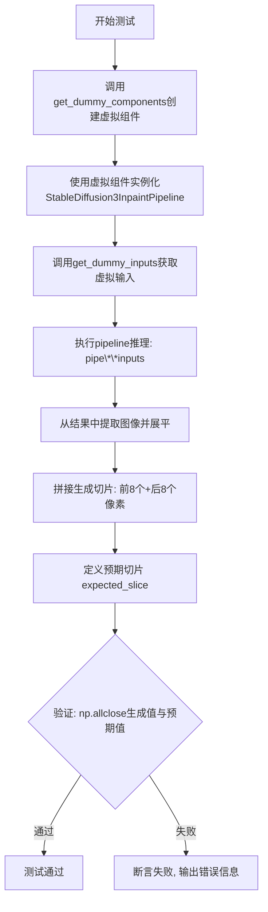
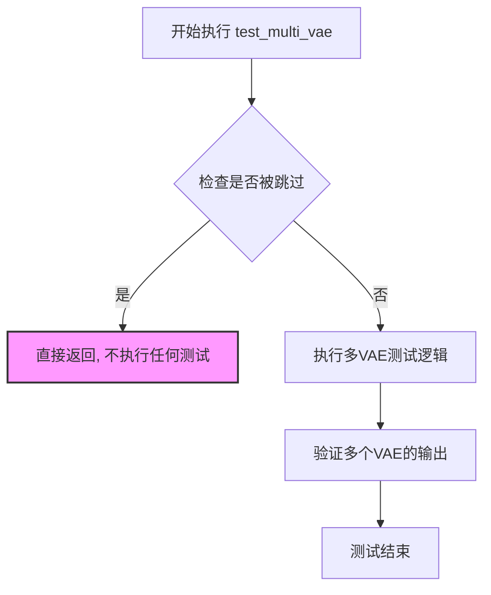

# `diffusers\tests\pipelines\stable_diffusion_3\test_pipeline_stable_diffusion_3_inpaint.py` 详细设计文档

这是一个用于测试 Stable Diffusion 3 图像修复 (Inpainting) 功能的单元测试文件，通过构建虚拟组件和输入，验证管道在给定参数下的推理结果是否符合预期。

## 整体流程



## 类结构

```
StableDiffusion3InpaintPipelineFastTests (单元测试类)
├── 继承自 PipelineLatentTesterMixin
├── 继承自 unittest.TestCase
└── 继承自 PipelineTesterMixin
```

## 全局变量及字段


### `enable_full_determinism`
    
启用完全确定性测试的全局函数，确保测试结果可复现

类型：`function`
    


### `StableDiffusion3InpaintPipelineFastTests.pipeline_class`
    
指定测试所使用的管道类为StableDiffusion3InpaintPipeline

类型：`Type[StableDiffusion3InpaintPipeline]`
    


### `StableDiffusion3InpaintPipelineFastTests.params`
    
文本引导图像修复管道的必需参数元组

类型：`Tuple[str, ...]`
    


### `StableDiffusion3InpaintPipelineFastTests.required_optional_params`
    
从PipelineTesterMixin继承的可选参数集合

类型：`Set[str]`
    


### `StableDiffusion3InpaintPipelineFastTests.batch_params`
    
文本引导图像修复的批处理参数元组

类型：`Tuple[str, ...]`
    


### `StableDiffusion3InpaintPipelineFastTests.image_params`
    
图像参数的不可变集合，当前为空待重构

类型：`frozenset`
    


### `StableDiffusion3InpaintPipelineFastTests.image_latents_params`
    
图像潜在变量的不可变集合，当前为空待重构

类型：`frozenset`
    


### `StableDiffusion3InpaintPipelineFastTests.callback_cfg_params`
    
回调配置参数集合，包含文本到图像参数及mask和masked_image_latents

类型：`Set[str]`
    
    

## 全局函数及方法


### `StableDiffusion3InpaintPipelineFastTests.get_dummy_components`

该方法用于创建并返回 Stable Diffusion 3 Inpaint Pipeline 的虚拟（测试用）组件集合，包括 transformer、文本编码器、tokenizer、VAE 和调度器等，为后续的推理测试提供所需的全部模型组件。

参数：

- （无参数）

返回值：`Dict[str, Any]`，返回一个字典，包含 Stable Diffusion 3 Inpaint Pipeline 的所有组件，如调度器、三个文本编码器及其对应的 tokenizer、transformer、VAE，以及空的 image_encoder 和 feature_extractor。

#### 流程图

```mermaid
flowchart TD
    A[开始 get_dummy_components] --> B[设置随机种子 torch.manual_seed(0)]
    B --> C[创建 SD3Transformer2DModel: transformer]
    C --> D[创建 CLIPTextConfig: clip_text_encoder_config]
    D --> E[创建 CLIPTextModelWithProjection: text_encoder]
    E --> F[创建 CLIPTextModelWithProjection: text_encoder_2]
    F --> G[加载 T5EncoderModel: text_encoder_3]
    G --> H[加载 CLIPTokenizer: tokenizer, tokenizer_2]
    H --> I[加载 AutoTokenizer: tokenizer_3]
    I --> J[创建 AutoencoderKL: vae]
    J --> K[创建 FlowMatchEulerDiscreteScheduler: scheduler]
    K --> L[构建并返回组件字典]
    
    C -->|sample_size=32, patch_size=1, in_channels=16| C
    D -->|hidden_size=32, num_attention_heads=4| D
    E -->|使用 clip_text_encoder_config| E
    G -->|hf-internal-testing/tiny-random-t5| G
    H -->|hf-internal-testing/tiny-random-clip| H
    J -->|sample_size=32, latent_channels=16| J
```

#### 带注释源码

```python
def get_dummy_components(self):
    """
    创建并返回 Stable Diffusion 3 Inpaint Pipeline 的虚拟组件集合。
    所有组件使用固定随机种子(0)以确保测试可复现性。
    """
    # 设置随机种子，确保 transformer 初始化可复现
    torch.manual_seed(0)
    # 创建 SD3 Transformer 模型，用于图像去噪的核心 transformer 架构
    # 参数：样本大小32, 补丁大小1, 输入通道16, 1层, 注意力头维度8, 4个注意力头
    transformer = SD3Transformer2DModel(
        sample_size=32,
        patch_size=1,
        in_channels=16,
        num_layers=1,
        attention_head_dim=8,
        num_attention_heads=4,
        joint_attention_dim=32,
        caption_projection_dim=32,
        pooled_projection_dim=64,
        out_channels=16,
    )
    
    # 定义 CLIP 文本编码器的配置参数
    clip_text_encoder_config = CLIPTextConfig(
        bos_token_id=0,           # 句子开始标记ID
        eos_token_id=2,           # 句子结束标记ID
        hidden_size=32,           # 隐藏层维度
        intermediate_size=37,     # FFN 中间层维度
        layer_norm_eps=1e-05,     # LayerNorm epsilon
        num_attention_heads=4,    # 注意力头数量
        num_hidden_layers=5,      # 隐藏层数量
        pad_token_id=1,           # 填充标记ID
        vocab_size=1000,          # 词汇表大小
        hidden_act="gelu",        # 激活函数
        projection_dim=32,        # 投影维度
    )

    # 使用随机种子(0)创建第一个文本编码器 (CLIP)
    torch.manual_seed(0)
    text_encoder = CLIPTextModelWithProjection(clip_text_encoder_config)

    # 使用随机种子(0)创建第二个文本编码器 (CLIP)
    torch.manual_seed(0)
    text_encoder_2 = CLIPTextModelWithProjection(clip_text_encoder_config)

    # 从预训练模型加载第三个文本编码器 (T5)
    text_encoder_3 = T5EncoderModel.from_pretrained("hf-internal-testing/tiny-random-t5")

    # 加载三个 tokenizer 用于文本处理
    tokenizer = CLIPTokenizer.from_pretrained("hf-internal-testing/tiny-random-clip")
    tokenizer_2 = CLIPTokenizer.from_pretrained("hf-internal-testing/tiny-random-clip")
    tokenizer_3 = AutoTokenizer.from_pretrained("hf-internal-testing/tiny-random-t5")

    # 使用随机种子(0)创建 VAE (变分自编码器) 用于图像编码/解码
    torch.manual_seed(0)
    vae = AutoencoderKL(
        sample_size=32,           # 输入图像尺寸
        in_channels=3,            # RGB 输入通道
        out_channels=3,           # RGB 输出通道
        block_out_channels=(4,),  # 块输出通道数
        layers_per_block=1,       # 每块层数
        latent_channels=16,       # 潜在空间通道数
        norm_num_groups=1,        # 归一化组数
        use_quant_conv=False,     # 不使用量化卷积
        use_post_quant_conv=False,# 不使用后量化卷积
        shift_factor=0.0609,      # 移位因子
        scaling_factor=1.5035,    # 缩放因子
    )

    # 创建基于 Flow Match 的欧拉离散调度器
    scheduler = FlowMatchEulerDiscreteScheduler()

    # 返回包含所有组件的字典，供 Pipeline 初始化使用
    return {
        "scheduler": scheduler,              # 噪声调度器
        "text_encoder": text_encoder,         # 主文本编码器 (CLIP)
        "text_encoder_2": text_encoder_2,     # 第二文本编码器 (CLIP)
        "text_encoder_3": text_encoder_3,     # 第三文本编码器 (T5)
        "tokenizer": tokenizer,               # 主 tokenizer
        "tokenizer_2": tokenizer_2,           # 第二 tokenizer
        "tokenizer_3": tokenizer_3,           # 第三 tokenizer
        "transformer": transformer,           # 图像生成 transformer
        "vae": vae,                           # 图像 VAE
        "image_encoder": None,                # 图像编码器 (未使用)
        "feature_extractor": None,            # 特征提取器 (未使用)
    }
```


### `StableDiffusion3InpaintPipelineFastTests.get_dummy_inputs`

该方法用于生成Stable Diffusion 3图像修复（inpainting）管道的虚拟测试输入参数，包括提示词、图像、掩码图像及推理配置等，为后续的推理测试提供标准化的输入数据。

参数：

- `device`：`torch.device`，指定计算设备（如CPU、CUDA、MPS等）
- `seed`：`int`，随机种子，默认为0，用于确保测试结果的可复现性

返回值：`dict`，返回一个包含以下键值对的字典：
- `prompt`：提示词字符串
- `image`：输入图像张量
- `mask_image`：掩码图像张量
- `height`、`width`：输出图像尺寸
- `generator`：PyTorch随机数生成器
- `num_inference_steps`：推理步数
- `guidance_scale`：引导尺度
- `output_type`：输出类型
- `strength`：图像修复强度

#### 流程图



#### 带注释源码

```python
def get_dummy_inputs(self, device, seed=0):
    """
    生成用于测试Stable Diffusion 3图像修复管道的虚拟输入参数
    
    参数:
        device: torch.device - 计算设备
        seed: int - 随机种子，默认值为0
    
    返回:
        dict: 包含所有推理所需参数的字典
    """
    # 使用floats_tensor生成形状为(1, 3, 32, 32)的随机图像张量
    # rng=random.Random(seed)确保图像内容的可复现性
    image = floats_tensor((1, 3, 32, 32), rng=random.Random(seed)).to(device)
    
    # 创建全1的掩码图像，用于表示需要修复的区域
    # 形状为(1, 1, 32, 32)，单通道掩码
    mask_image = torch.ones((1, 1, 32, 32)).to(device)
    
    # MPS设备使用torch.manual_seed，其他设备使用CPU生成器
    # 这是因为某些平台对随机数生成器的支持有限
    if str(device).startswith("mps"):
        generator = torch.manual_seed(seed)
    else:
        # 在CPU上创建生成器以确保跨平台兼容性
        generator = torch.generator(device="cpu").manual_seed(seed)

    # 构建完整的输入参数字典
    inputs = {
        "prompt": "A painting of a squirrel eating a burger",  # 测试用提示词
        "image": image,              # 输入图像
        "mask_image": mask_image,    # 修复掩码
        "height": 32,                # 输出高度
        "width": 32,                 # 输出宽度
        "generator": generator,      # 随机生成器确保可复现性
        "num_inference_steps": 2,    # 推理步数（较少用于快速测试）
        "guidance_scale": 5.0,       # Classifier-free guidance强度
        "output_type": "np",         # 输出为numpy数组
        "strength": 0.8,             # 图像修复强度（0-1之间）
    }
    return inputs
```


### `StableDiffusion3InpaintPipelineFastTests.test_inference`

该方法是 Stable Diffusion 3 图像修复管道的集成测试用例，用于验证管道在给定虚拟组件和输入参数的情况下能否正确生成图像，并通过断言比较生成结果与预期值是否在允许的误差范围内匹配。

参数：

- `self`：隐式参数，测试类实例本身

返回值：`None`（无显式返回值），该方法为单元测试方法，通过 `self.assertTrue` 断言验证生成图像与预期值是否匹配

#### 流程图

```mermaid
flowchart TD
    A[开始 test_inference 测试] --> B[调用 get_dummy_components 获取虚拟组件]
    B --> C[使用虚拟组件实例化 StableDiffusion3InpaintPipeline]
    C --> D[调用 get_dummy_inputs 获取虚拟输入]
    D --> E[执行管道推理: pipe.__call__(**inputs)]
    E --> F[获取生成的图像: image = result.images[0]]
    F --> G[提取图像切片用于验证]
    G --> H[构造预期切片 expected_slice]
    H --> I{断言: np.allclose}
    I -->|通过| J[测试通过]
    I -->|失败| K[测试失败，抛出 AssertionError]
```

#### 带注释源码

```python
def test_inference(self):
    """
    测试 StableDiffusion3InpaintPipeline 的推理功能
    验证管道能够使用虚拟组件生成图像并与预期输出匹配
    """
    # 步骤1: 获取预定义的虚拟组件（transformer, text_encoder, vae, tokenizer等）
    components = self.get_dummy_components()
    
    # 步骤2: 使用虚拟组件实例化管道
    pipe = self.pipeline_class(**components)
    
    # 步骤3: 获取虚拟输入参数（prompt, image, mask_image, height, width等）
    inputs = self.get_dummy_inputs(torch_device)
    
    # 步骤4: 执行管道推理，生成修复后的图像
    # 返回值包含图像列表，取第一个元素
    image = pipe(**inputs).images[0]
    
    # 步骤5: 提取图像切片用于验证
    # 将图像展平并拼接前8个和后8个像素值，形成16元素的切片
    generated_slice = image.flatten()
    generated_slice = np.concatenate([generated_slice[:8], generated_slice[-8:]])
    
    # 步骤6: 定义预期输出切片（基于已知正确结果）
    # fmt: off
    expected_slice = np.array([0.5035, 0.6661, 0.5859, 0.413, 0.4224, 0.4234, 0.7181, 0.5062, 0.5183, 0.6877, 0.5074, 0.585, 0.6111, 0.5422, 0.5306, 0.5891])
    # fmt: on
    
    # 步骤7: 断言验证生成结果与预期值的匹配度
    # 允许误差为 1e-3（千分之一）
    self.assertTrue(
        np.allclose(generated_slice, expected_slice, atol=1e-3), 
        "Output does not match expected slice."
    )
```


### `StableDiffusion3InpaintPipelineFastTests.test_multi_vae`

该方法是一个测试方法，用于测试多 VAE（变分自编码器）功能，但目前已被跳过（skip），方法体仅包含 `pass` 语句，未实现任何实际测试逻辑。

参数：

- `self`：隐式参数，`StableDiffusion3InpaintPipelineFastTests` 类型，表示类的实例本身

返回值：`None`，该方法为测试方法，不返回任何值

#### 流程图



#### 带注释源码

```python
@unittest.skip("Skip for now.")
def test_multi_vae(self):
    """
    测试多 VAE 功能的测试方法。
    
    该方法目前被 @unittest.skip 装饰器跳过，尚未实现具体测试逻辑。
    预期用于测试 StableDiffusion3InpaintPipeline 在使用多个 VAE 时的行为。
    
    参数:
        self: 测试类实例，隐式参数
        
    返回值:
        None: 无返回值
    """
    pass  # 空实现，等待后续实现多 VAE 测试逻辑
```


### `StableDiffusion3InpaintPipelineFastTests.get_dummy_components`

该方法用于生成 Stable Diffusion 3 图像修复管道的虚拟组件（dummy components），通过固定随机种子来创建可复现的测试环境，初始化 transformer、三个文本编码器、三个分词器、VAE、调度器等核心组件。

参数：

- `self`：隐式参数，类型为 `StableDiffusion3InpaintPipelineFastTests` 实例，表示测试类本身。

返回值：`Dict[str, Any]`，返回一个包含所有虚拟组件的字典，包括调度器、文本编码器、分词器、Transformer、VAE 等，用于管道的单元测试。

#### 流程图

```mermaid
flowchart TD
    A[开始 get_dummy_components] --> B[设置随机种子 torch.manual_seed(0)]
    B --> C[创建 SD3Transformer2DModel]
    C --> D[创建 CLIPTextConfig 配置对象]
    D --> E[使用随机种子创建 text_encoder]
    E --> F[使用随机种子创建 text_encoder_2]
    F --> G[从预训练模型加载 text_encoder_3 T5EncoderModel]
    G --> H[加载三个分词器 tokenizer tokenizer_2 tokenizer_3]
    H --> I[使用随机种子创建 AutoencoderKL vae]
    I --> J[创建 FlowMatchEulerDiscreteScheduler]
    J --> K[构建并返回包含所有组件的字典]
    K --> L[结束]
```

#### 带注释源码

```python
def get_dummy_components(self):
    """
    生成 Stable Diffusion 3 图像修复管道的虚拟组件，用于单元测试。
    通过固定随机种子确保测试结果的可复现性。
    """
    # 设置随机种子，确保 Transformer 模型初始化的一致性
    torch.manual_seed(0)
    # 创建 SD3 Transformer 2D 模型，配置图像处理参数
    transformer = SD3Transformer2DModel(
        sample_size=32,          # 输入样本尺寸
        patch_size=1,            # 补丁大小
        in_channels=16,          # 输入通道数
        num_layers=1,            # Transformer 层数
        attention_head_dim=8,    # 注意力头维度
        num_attention_heads=4,   # 注意力头数量
        joint_attention_dim=32,  # 联合注意力维度
        caption_projection_dim=32,  # 标题投影维度
        pooled_projection_dim=64,   # 池化投影维度
        out_channels=16,         # 输出通道数
    )
    
    # 配置 CLIP 文本编码器的参数
    clip_text_encoder_config = CLIPTextConfig(
        bos_token_id=0,          # 句子开始标记 ID
        eos_token_id=2,          # 句子结束标记 ID
        hidden_size=32,          # 隐藏层大小
        intermediate_size=37,    # 中间层大小
        layer_norm_eps=1e-05,    # LayerNorm  epsilon
        num_attention_heads=4,   # 注意力头数量
        num_hidden_layers=5,     # 隐藏层数量
        pad_token_id=1,          # 填充标记 ID
        vocab_size=1000,         # 词汇表大小
        hidden_act="gelu",       # 激活函数
        projection_dim=32,       # 投影维度
    )

    # 重新设置随机种子，确保文本编码器初始化的一致性
    torch.manual_seed(0)
    # 创建第一个 CLIP 文本编码器（带投影）
    text_encoder = CLIPTextModelWithProjection(clip_text_encoder_config)

    # 再次设置随机种子，创建第二个文本编码器
    torch.manual_seed(0)
    text_encoder_2 = CLIPTextModelWithProjection(clip_text_encoder_config)

    # 从预训练模型加载第三个文本编码器（T5）
    text_encoder_3 = T5EncoderModel.from_pretrained("hf-internal-testing/tiny-random-t5")

    # 加载三个分词器
    tokenizer = CLIPTokenizer.from_pretrained("hf-internal-testing/tiny-random-clip")
    tokenizer_2 = CLIPTokenizer.from_pretrained("hf-internal-testing/tiny-random-clip")
    tokenizer_3 = AutoTokenizer.from_pretrained("hf-internal-testing/tiny-random-t5")

    # 设置随机种子，创建 VAE（变分自编码器）
    torch.manual_seed(0)
    vae = AutoencoderKL(
        sample_size=32,          # 样本尺寸
        in_channels=3,           # 输入通道数（RGB）
        out_channels=3,          # 输出通道数
        block_out_channels=(4,), # 块输出通道数
        layers_per_block=1,      # 每层块数
        latent_channels=16,      # 潜在空间通道数
        norm_num_groups=1,       # 归一化组数
        use_quant_conv=False,    # 不使用量化卷积
        use_post_quant_conv=False, # 不使用后量化卷积
        shift_factor=0.0609,     # 偏移因子
        scaling_factor=1.5035,   # 缩放因子
    )

    # 创建 Flow Match Euler 离散调度器
    scheduler = FlowMatchEulerDiscreteScheduler()

    # 返回包含所有组件的字典，供管道初始化使用
    return {
        "scheduler": scheduler,            # 调度器
        "text_encoder": text_encoder,      # 文本编码器 1
        "text_encoder_2": text_encoder_2,  # 文本编码器 2
        "text_encoder_3": text_encoder_3,  # 文本编码器 3 (T5)
        "tokenizer": tokenizer,            # 分词器 1
        "tokenizer_2": tokenizer_2,        # 分词器 2
        "tokenizer_3": tokenizer_3,        # 分词器 3 (T5)
        "transformer": transformer,        # Transformer 模型
        "vae": vae,                        # VAE 模型
        "image_encoder": None,             # 图像编码器（未使用）
        "feature_extractor": None,         # 特征提取器（未使用）
    }
```


### `StableDiffusion3InpaintPipelineFastTests.get_dummy_inputs`

该函数用于生成Stable Diffusion 3图像修复管道的虚拟输入数据，包括图像、掩码图像、提示词及推理参数，用于单元测试场景。

参数：

- `self`：隐式参数，测试类实例本身
- `device`：`torch.device` 或 `str`，执行设备，用于将张量移动到指定设备（如"cpu"、"cuda"、"mps"）
- `seed`：`int`，随机种子，默认为0，用于生成可重复的随机张量

返回值：`Dict[str, Any]`，包含用于管道推理的虚拟输入字典，包括提示词、图像、掩码图像、生成器、推理步数、引导比例等参数

#### 流程图



#### 带注释源码

```
def get_dummy_inputs(self, device, seed=0):
    # 使用指定种子生成随机浮点图像张量 (1, 3, 32, 32)
    image = floats_tensor((1, 3, 32, 32), rng=random.Random(seed)).to(device)
    
    # 创建全1的掩码图像张量 (1, 1, 32, 32)，用于图像修复任务
    mask_image = torch.ones((1, 1, 32, 32)).to(device)
    
    # MPS设备使用torch.manual_seed，其他设备使用Generator对象
    if str(device).startswith("mps"):
        generator = torch.manual_seed(seed)
    else:
        generator = torch.Generator(device="cpu").manual_seed(seed)

    # 构建完整的虚拟输入字典，包含管道所需的所有参数
    inputs = {
        "prompt": "A painting of a squirrel eating a burger",  # 文本提示词
        "image": image,                                       # 输入图像
        "mask_image": mask_image,                             # 修复掩码
        "height": 32,                                         # 输出高度
        "width": 32,                                          # 输出宽度
        "generator": generator,                               # 随机生成器
        "num_inference_steps": 2,                            # 推理步数
        "guidance_scale": 5.0,                               # CFG引导强度
        "output_type": "np",                                  # 输出类型为numpy
        "strength": 0.8,                                      # 修复强度
    }
    return inputs  # 返回包含所有虚拟输入的字典
```


### `StableDiffusion3InpaintPipelineFastTests.test_inference`

该测试方法验证StableDiffusion3图像修复管道的推理功能，通过创建虚拟组件和输入，执行推理并验证输出图像的像素值与预期切片是否在指定误差范围内匹配。

参数：

- `self`：隐式参数，测试类实例本身

返回值：无返回值（测试方法，执行断言验证）

#### 流程图



#### 带注释源码

```python
def test_inference(self):
    """
    测试StableDiffusion3InpaintPipeline的推理功能
    
    该测试方法执行以下步骤:
    1. 创建虚拟组件用于测试
    2. 实例化pipeline
    3. 创建虚拟输入
    4. 执行推理
    5. 验证输出与预期值匹配
    """
    # 步骤1: 获取虚拟组件（包含transformer、text_encoder、vae等）
    components = self.get_dummy_components()
    
    # 步骤2: 使用虚拟组件实例化StableDiffusion3InpaintPipeline管道
    pipe = self.pipeline_class(**components)
    
    # 步骤3: 获取虚拟输入（包含prompt、image、mask_image等参数）
    inputs = self.get_dummy_inputs(torch_device)
    
    # 步骤4: 执行推理,调用pipeline的__call__方法
    # 返回结果包含.images属性,其中包含生成的图像
    image = pipe(**inputs).images[0]
    
    # 步骤5: 处理输出图像
    # 将图像展平为一维数组
    generated_slice = image.flatten()
    
    # 拼接生成切片:取前8个和后8个像素值用于验证
    # 这样可以减少验证所需的像素数量,加快测试速度
    generated_slice = np.concatenate([generated_slice[:8], generated_slice[-8:]])
    
    # 定义预期输出切片（基于已知正确结果）
    # fmt: off
    expected_slice = np.array([0.5035, 0.6661, 0.5859, 0.413, 0.4224, 0.4234, 0.7181, 0.5062, 0.5183, 0.6877, 0.5074, 0.585, 0.6111, 0.5422, 0.5306, 0.5891])
    # fmt: on
    
    # 步骤6: 断言验证生成图像与预期值的接近程度
    # 使用np.allclose比较,允许绝对误差为1e-3
    self.assertTrue(
        np.allclose(generated_slice, expected_slice, atol=1e-3), 
        "Output does not match expected slice."
    )
```


### `StableDiffusion3InpaintPipelineFastTests.test_multi_vae`

该函数是一个被跳过的测试用例，原本计划用于测试多VAE（变分自编码器）功能，但由于未知原因暂时被禁用，当前实现仅包含空函数体。

参数：无（仅包含隐式参数 `self`，即测试类实例）

返回值：无返回值（函数体为 `pass` 语句）

#### 流程图



#### 带注释源码

```python
@unittest.skip("Skip for now.")  # 装饰器：跳过该测试用例，暂不执行
def test_multi_vae(self):
    """
    多VAE测试方法
    
    预期功能（当前未实现）：
    - 测试StableDiffusion3InpaintPipeline在不同VAE配置下的表现
    - 验证多个VAE模型能够正确切换和共存
    - 检查多VAE情况下的图像生成一致性
    """
    pass  # 空函数体，当前无实际测试逻辑
```

## 关键组件


### StableDiffusion3InpaintPipelineFastTests

Stable Diffusion 3图像修复管道的快速测试类，负责验证pipeline的推理功能是否正确，通过创建虚拟组件和输入进行单元测试。

### get_dummy_components

创建虚拟模型组件的方法，初始化SD3Transformer2DModel、CLIPTextModelWithProjection、T5EncoderModel、AutoencoderKL等核心模型以及对应的tokenizer，用于测试目的。

### get_dummy_inputs

构建测试输入数据的方法，生成随机图像、掩码图像、生成器等输入参数，包含prompt、image、mask_image、height、width、generator、num_inference_steps、guidance_scale等关键参数。

### SD3Transformer2DModel

SD3变换器模型，配置了sample_size=32、patch_size=1、in_channels=16、num_layers=1、attention_head_dim=8、num_attention_heads=4等参数，负责图像特征的变换处理。

### CLIPTextModelWithProjection

CLIP文本编码器带投影，配置hidden_size=32、num_attention_heads=4、num_hidden_layers=5、projection_dim=32等参数，用于将文本提示编码为向量表示，支持joint_attention_dim=32的联合注意力机制。

### T5EncoderModel

T5编码器模型，用于额外的文本编码，从"hf-internal-testing/tiny-random-t5"预训练权重加载，提供第三路文本编码支持。

### AutoencoderKL

变分自编码器KL，配置latent_channels=16、block_out_channels=(4,)、layers_per_block=1、use_quant_conv=False、use_post_quant_conv=False等参数，负责图像的潜在空间编码和解码，支持shift_factor=0.0609和scaling_factor=1.5035的缩放。

### FlowMatchEulerDiscreteScheduler

Flow Match欧拉离散调度器，用于扩散模型的噪声调度，控制推理过程中的去噪步骤。

### PipelineLatentTesterMixin

管道潜在变量测试混入类，提供潜在变量相关的测试辅助功能。

### PipelineTesterMixin

管道测试混入类，提供通用的测试辅助方法和required_optional_params配置。

### test_inference

推理测试方法，执行完整的图像修复流程，验证输出图像与预期slice是否匹配（atol=1e-3），确保pipeline功能的正确性。


## 问题及建议


### 已知问题

- **魔法数字和硬编码值**：多处使用硬编码的数值如 `num_inference_steps=2`、`guidance_scale=5.0`、`strength=0.8`、`seed=0`，缺乏配置化和参数化，导致测试用例灵活性不足
- **重复代码**：多次调用 `torch.manual_seed(0)`，且 `text_encoder` 和 `text_encoder_2` 使用相同的配置重复创建，三个 tokenizer 均使用相同路径加载
- **未完成的功能**：使用 `@unittest.skip("Skip for now.")` 跳过了 `test_multi_vae` 测试，表明该功能尚未实现但被标记为待办
- **TODO 注释未完成**：`image_params` 和 `image_latents_params` 均为空集合，注释标明需要待 pipeline 重构后更新，但一直未处理
- **设备处理不一致**：`get_dummy_inputs` 中对 MPS 设备单独处理 generator 种子，但 `torch_device` 可能不是实际运行设备，导致 generator 设备与实际推理设备不匹配
- **缺乏错误处理**：模型加载（`from_pretrained`）没有异常捕获，设备兼容性检查缺失

### 优化建议

- 将硬编码的测试参数提取为类常量或配置文件，便于批量修改和扩展
- 封装随机种子管理逻辑，避免重复调用 `torch.manual_seed()`
- 将 `text_encoder`、`tokenizer` 等重复创建逻辑抽取为工厂方法或共享 fixture
- 补充或移除被跳过的测试用例，确保测试覆盖完整
- 统一设备处理逻辑，添加设备兼容性检查和优雅降级机制
- 为模型加载添加 try-except 异常处理，提升测试健壮性

## 其它


### 设计目标与约束

本测试文件旨在验证 StableDiffusion3InpaintPipeline 在图像修复任务上的正确性，确保模型在给定提示词、掩码图像和原始图像的情况下能够生成符合预期的输出。测试约束包括：使用固定的随机种子（0）以确保可重复性，仅运行2个推理步骤以加快测试速度，使用虚拟（dummy）组件而非真实预训练模型以满足单元测试的轻量级要求，图像分辨率固定为32x32像素。

### 错误处理与异常设计

测试类通过继承 unittest.TestCase 利用其内置的断言机制进行错误检测。主要断言包括：np.allclose() 用于验证生成图像与预期图像片是否在容差范围内相等，若不匹配则抛出 AssertionError 并输出详细错误信息。测试使用 @unittest.skip 装饰器临时跳过不稳定的测试用例（如 test_multi_vae），避免因未实现功能导致测试失败。此外，get_dummy_inputs 方法对 MPS 设备进行了特殊处理，使用 torch.manual_seed 而非 CPU generator 以避免兼容性问题。

### 数据流与状态机

测试数据流如下：get_dummy_components() 创建并返回包含 scheduler、三个 text_encoder、三个 tokenizer、transformer、vae 等组件的字典；get_dummy_inputs() 使用该设备信息和随机种子生成包含 prompt、image、mask_image、height、width、generator、num_inference_steps、guidance_scale、output_type、strength 的输入字典；test_inference() 将组件传递给 pipeline_class 构造函数实例化管道，将输入传递给管道调用 __call__ 方法执行推理，最终返回包含生成图像的输出对象，测试验证其第一张图像的切片数据。

### 外部依赖与接口契约

本测试依赖以下外部包：random（标准库）、unittest（标准库）、numpy（数值计算）、torch（深度学习框架）、transformers（Hugging Face 文本编码器模型）、diffusers（Hugging Face 扩散模型管道和调度器）。本地依赖包括 ...testing_utils 模块中的 enable_full_determinism、floats_tensor、torch_device 工具函数，以及 ..pipeline_params 中的文本引导图像修复相关参数类，还有 ..test_pipelines_common 中的管道测试混入类。管道类需实现 __call__ 方法并返回包含 images 属性的对象，其中 images[0] 为生成的图像数组。

### 配置与参数说明

关键配置参数包括：pipeline_class 指定被测试的管道类为 StableDiffusion3InpaintPipeline；params 定义 TEXT_GUIDED_IMAGE_INPAINTING_PARAMS 为必选参数集合；batch_params 定义批量参数；image_params 和 image_latents_params 当前为空集合（待重构后更新）；callback_cfg_params 在基础参数基础上增加 mask 和 masked_image_latents。get_dummy_components 中模型配置包括：transformer 的 sample_size=32、patch_size=1、in_channels=16、num_layers=1 等；vae 的 sample_size=32、in_channels=3、out_channels=3、block_out_channels=(4,) 等；scheduler 使用 FlowMatchEulerDiscreteScheduler。get_dummy_inputs 中的推理参数包括：num_inference_steps=2、guidance_scale=5.0、strength=0.8、output_type="np"。

### 性能基准与测试覆盖

测试性能基准：使用极少的推理步骤（2步）和小分辨率（32x32）确保测试快速执行；通过固定随机种子实现确定性输出，便于回归测试。当前测试覆盖范围：单次推理测试（test_inference）、虚拟组件创建测试、输入格式化测试、输出形状和类型验证。未覆盖场景：多 VAE 支持（test_multi_vae 已跳过）、批处理能力测试、不同的 guidance_scale 和 strength 参数组合测试、FP16/FP32 精度对比测试。

### 安全性考虑

测试代码本身不涉及用户数据处理，使用虚拟（随机初始化）组件和合成输入数据，不存在数据泄露风险。依赖的 transformers 和 diffusers 库来自官方 Hugging Face，需确保使用可信版本以避免供应链攻击。建议在 CI/CD 环境中运行测试时隔离网络访问，防止测试过程中意外下载未授权的预训练模型权重。

### 版本兼容性

代码中使用的 API 需与以下版本兼容：Python 3.8+、torch 2.0+、transformers 4.30+、diffusers 0.20+、numpy 1.24+。FlowMatchEulerDiscreteScheduler 和 SD3Transformer2DModel 为 Stable Diffusion 3 新引入的组件，需确保 diffusers 版本支持这些类。CLIPTextModelWithProjection 和 T5EncoderModel 的 API 需与 transformers 库版本匹配。测试中使用了 from_pretrained 方法加载 "hf-internal-testing/tiny-random-*" 系列虚拟模型，这些模型仅用于测试目的，不依赖特定版本的实际预训练权重。

### 部署与运行环境

本测试文件作为单元测试运行，需部署在支持 Python 的 CI/CD 环境中。运行时环境要求：CUDA 或 CPU 设备（通过 torch_device 动态检测），MPS 设备需特殊处理随机数生成器。测试可通过 python -m pytest path/to/test_file.py 或 python -m unittest path/to/test_file.py 命令执行。依赖项可通过 pip install -r requirements.txt 或类似方式安装，建议使用虚拟环境隔离项目依赖。

### 维护性与扩展性

代码结构清晰，使用混入类（PipelineLatentTesterMixin、PipelineTesterMixin）实现通用测试逻辑，便于扩展到其他管道测试。get_dummy_components 和 get_dummy_inputs 方法封装了测试数据的创建逻辑，修改测试配置时只需修改这两个方法。潜在改进空间：移除 @unittest.skip 装饰器实现 test_multi_vae 测试；增加参数化测试（@parameterized）覆盖更多场景；将硬编码的期望输出值提取为常量配置文件；添加类型注解（type hints）提高代码可读性和 IDE 支持；为长时间运行的测试添加性能基准标记。


    