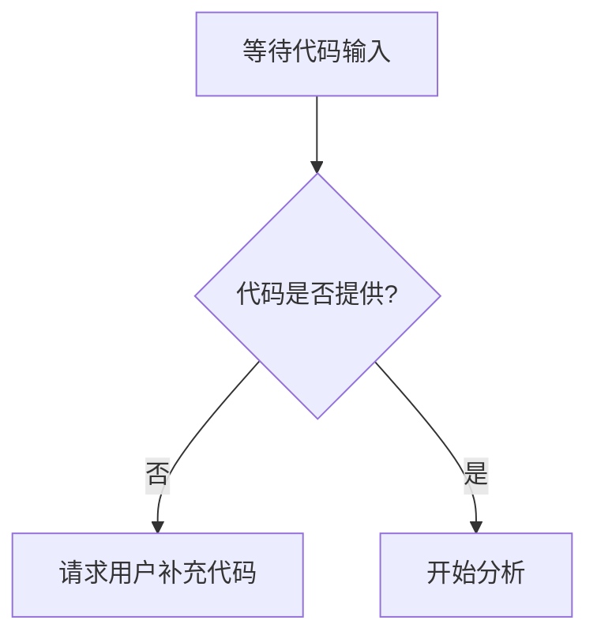

# `diffusers\tests\pipelines\stable_diffusion_adapter\__init__.py` 详细设计文档

无法生成描述 - 未提供源代码进行分析

## 整体流程



## 类结构

```

```

## 全局变量及字段


    

## 全局函数及方法


## 关键组件


## 问题及建议


### 已知问题

-   未提供代码进行分析，无法识别具体的技术债务或潜在问题

### 优化建议

-   请提供需要分析的源代码，以便进行详细的技术债务和优化空间分析


## 其它


### 设计目标与约束

（未提供代码，无法填写）

### 错误处理与异常设计

（未提供代码，无法填写）

### 数据流与状态机

（未提供代码，无法填写）

### 外部依赖与接口契约

（未提供代码，无法填写）

### 安全性考虑

（未提供代码，无法填写）

### 性能要求与基准

（未提供代码，无法填写）

### 兼容性设计

（未提供代码，无法填写）

### 配置与扩展性

（未提供代码，无法填写）

### 部署与运维相关

（未提供代码，无法填写）

### 测试策略

（未提供代码，无法填写）

### 版本演进与迁移计划

（未提供代码，无法填写）

    