# `diffusers\tests\pipelines\stable_diffusion_adapter\test_stable_diffusion_adapter.py` 详细设计文档

该文件是 Hugging Face diffusers 库中 StableDiffusionAdapterPipeline 的测试套件，用于测试 T2I-Adapter（Text-to-Image Adapter）与 Stable Diffusion 的集成功能，支持 full_adapter、light_adapter 和 multi_adapter 三种适配器类型，涵盖快速单元测试和慢速集成测试。

## 整体流程

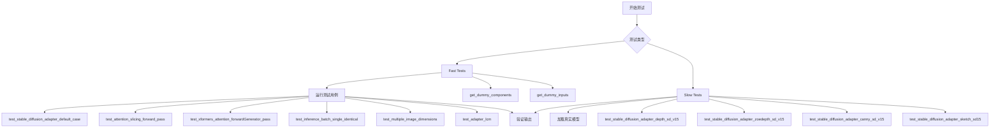

## 类结构

```
AdapterTests (基类测试)
├── StableDiffusionFullAdapterPipelineFastTests
├── StableDiffusionLightAdapterPipelineFastTests
└── StableDiffusionMultiAdapterPipelineFastTests
StableDiffusionAdapterPipelineSlowTests (独立测试类)
```

## 全局变量及字段


### `enable_full_determinism`
    
启用完全确定性模式的函数，用于确保测试结果的可重复性

类型：`function`
    


### `AdapterTests.pipeline_class`
    
指定要测试的Stable Diffusion适配器管道类

类型：`type`
    


### `AdapterTests.params`
    
文本引导图像变化任务的单样本测试参数集合

类型：`tuple`
    


### `AdapterTests.batch_params`
    
文本引导图像变化任务的批量测试参数集合

类型：`tuple`
    


### `StableDiffusionMultiAdapterPipelineFastTests.supports_dduf`
    
标识该多适配器管道是否支持DDUF（Downstream Upsampling Feature）功能

类型：`bool`
    
    

## 全局函数及方法


### `AdapterTests.get_dummy_components`

该方法用于创建虚拟的扩散模型组件（UNet、VAE、TextEncoder、Adapter等），以便在测试环境中运行 Stable Diffusion Adapter Pipeline。根据 `adapter_type` 参数的不同，创建不同类型的适配器（T2IAdapter 或 MultiAdapter），并返回包含所有必要组件的字典。

参数：

- `adapter_type`：`str`，指定适配器类型，可选值为 `"full_adapter"`、`"light_adapter"` 或 `"multi_adapter"`，用于决定创建哪种类型的 T2IAdapter
- `time_cond_proj_dim`：`Optional[int]`，可选参数，传递给 UNet2DConditionModel 的时间条件投影维度，用于支持 LCM（Latent Consistency Model）调度器

返回值：`Dict[str, Any]`，返回一个包含以下键的字典：`adapter`（T2IAdapter 或 MultiAdapter 实例）、`unet`（UNet2DConditionModel 实例）、`scheduler`（PNDMScheduler 实例）、`vae`（AutoencoderKL 实例）、`text_encoder`（CLIPTextModel 实例）、`tokenizer`（CLIPTokenizer 实例）、`safety_checker`（None）、`feature_extractor`（None）

#### 流程图

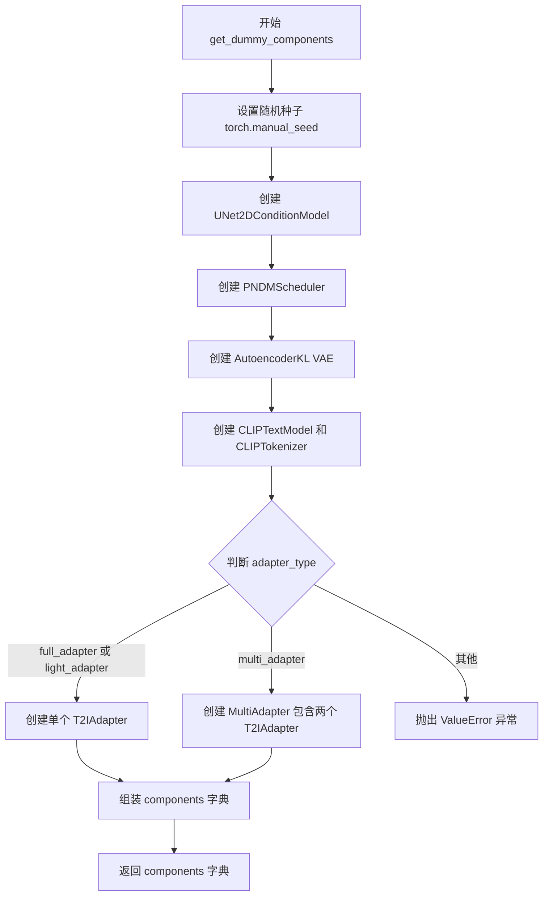

#### 带注释源码

```python
def get_dummy_components(self, adapter_type, time_cond_proj_dim=None):
    """创建虚拟的扩散模型组件用于测试
    
    参数:
        adapter_type: 适配器类型，可选 'full_adapter', 'light_adapter', 'multi_adapter'
        time_cond_proj_dim: 可选的时间条件投影维度，用于 UNet
    
    返回:
        包含所有pipeline组件的字典
    """
    # 设置随机种子以确保测试可复现性
    torch.manual_seed(0)
    
    # 创建 UNet2DConditionModel - 扩散模型的噪声预测网络
    unet = UNet2DConditionModel(
        block_out_channels=(32, 64),      # UNet 各阶段的输出通道数
        layers_per_block=2,                 # 每个块中的层数
        sample_size=32,                     # 输入样本的空间维度
        in_channels=4,                       # 输入通道数（latent space）
        out_channels=4,                     # 输出通道数
        down_block_types=("CrossAttnDownBlock2D", "DownBlock2D"),  # 下采样块类型
        up_block_types=("CrossAttnUpBlock2D", "UpBlock2D"),        # 上采样块类型
        cross_attention_dim=32,             # 交叉注意力维度
        time_cond_proj_dim=time_cond_proj_dim,  # 时间条件投影维度（可选）
    )
    
    # 创建 PNDMScheduler - 用于扩散过程的噪声调度器
    scheduler = PNDMScheduler(skip_prk_steps=True)
    
    # 设置随机种子并创建 VAE - 变分自编码器用于图像编码/解码
    torch.manual_seed(0)
    vae = AutoencoderKL(
        block_out_channels=[32, 64],       # VAE 各阶段通道数
        in_channels=3,                      # RGB图像通道数
        out_channels=3,                     # 输出通道数
        down_block_types=["DownEncoderBlock2D", "DownEncoderBlock2D"],  # 下采样编码块
        up_block_types=["UpDecoderBlock2D", "UpDecoderBlock2D"],        # 上采样解码块
        latent_channels=4,                  # latent空间的通道数
    )
    
    # 设置随机种子并创建文本编码器配置
    torch.manual_seed(0)
    text_encoder_config = CLIPTextConfig(
        bos_token_id=0,                      # 开始 token ID
        eos_token_id=2,                      # 结束 token ID
        hidden_size=32,                      # 隐藏层维度
        intermediate_size=37,                # 中间层维度
        layer_norm_eps=1e-05,                # LayerNorm  epsilon
        num_attention_heads=4,               # 注意力头数
        num_hidden_layers=5,                 # 隐藏层数量
        pad_token_id=1,                      # 填充 token ID
        vocab_size=1000,                     # 词汇表大小
    )
    
    # 创建 CLIPTextModel 文本编码器
    text_encoder = CLIPTextModel(text_encoder_config)
    
    # 从预训练模型加载 tokenizer
    tokenizer = CLIPTokenizer.from_pretrained("hf-internal-testing/tiny-random-clip")
    
    # 再次设置随机种子确保一致性
    torch.manual_seed(0)
    
    # 根据 adapter_type 创建相应类型的适配器
    if adapter_type == "full_adapter" or adapter_type == "light_adapter":
        # 创建单个 T2IAdapter（Text-to-Image Adapter）
        adapter = T2IAdapter(
            in_channels=3,                  # 输入图像通道数
            channels=[32, 64],               # 适配器各阶段通道
            num_res_blocks=2,                # 残差块数量
            downscale_factor=2,              # 下采样因子
            adapter_type=adapter_type,       # 适配器类型
        )
    elif adapter_type == "multi_adapter":
        # 创建 MultiAdapter - 包含多个 T2IAdapter 的容器
        adapter = MultiAdapter(
            [
                T2IAdapter(
                    in_channels=3,
                    channels=[32, 64],
                    num_res_blocks=2,
                    downscale_factor=2,
                    adapter_type="full_adapter",
                ),
                T2IAdapter(
                    in_channels=3,
                    channels=[32, 64],
                    num_res_blocks=2,
                    downscale_factor=2,
                    adapter_type="full_adapter",
                ),
            ]
        )
    else:
        # 不支持的适配器类型，抛出异常
        raise ValueError(
            f"Unknown adapter type: {adapter_type}, must be one of 'full_adapter', 'light_adapter', or 'multi_adapter''"
        )
    
    # 组装所有组件到字典中
    components = {
        "adapter": adapter,                  # T2IAdapter 或 MultiAdapter 实例
        "unet": unet,                        # UNet2DConditionModel 实例
        "scheduler": scheduler,              # PNDMScheduler 实例
        "vae": vae,                          # AutoencoderKL 实例
        "text_encoder": text_encoder,        # CLIPTextModel 实例
        "tokenizer": tokenizer,              # CLIPTokenizer 实例
        "safety_checker": None,              # 安全检查器（测试中设为 None）
        "feature_extractor": None,           # 特征提取器（测试中设为 None）
    }
    
    return components  # 返回组件字典供 pipeline 使用
```


### `AdapterTests.get_dummy_components_with_full_downscaling`

该方法用于生成具有8倍VAE下采样和4个UNet下采样块的虚拟组件，专门用于完整测试T2I-Adapter的下采样行为。

参数：

- `self`：`AdapterTests`，类实例方法（隐含参数）
- `adapter_type`：`str`，适配器类型，支持的值包括 `"full_adapter"`（完整适配器）、`light_adapter`（轻量适配器）或 `"multi_adapter"`（多适配器）

返回值：`Dict[str, Any]`，返回包含以下键的字典：
- `"adapter"`：T2IAdapter 或 MultiAdapter 实例
- `"unet"`：UNet2DConditionModel 实例
- `"scheduler"`：PNDMScheduler 实例
- `"vae"`：AutoencoderKL 实例
- `"text_encoder"`：CLIPTextModel 实例
- `"tokenizer"`：CLIPTokenizer 实例
- `"safety_checker"`：None
- `"feature_extractor"`：None

#### 流程图

```mermaid
flowchart TD
    A[开始 get_dummy_components_with_full_downscaling] --> B[设置随机种子 torch.manual_seed(0)]
    B --> C[创建 UNet2DConditionModel<br/>block_out_channels: (32, 32, 32, 64)<br/>4个下块]
    C --> D[创建 PNDMScheduler]
    D --> E[创建 AutoencoderKL<br/>block_out_channels: [32, 32, 32, 64]<br/>4个编码器块]
    E --> F[创建 CLIPTextModel 和 CLIPTokenizer]
    F --> G{adapter_type == 'full_adapter' 或 'light_adapter'?}
    G -->|是| H[创建 T2IAdapter<br/>downscale_factor: 8<br/>channels: [32, 32, 32, 64]]
    G -->|否| I{adapter_type == 'multi_adapter'?}
    I -->|是| J[创建 MultiAdapter<br/>包含2个 T2IAdapter<br/>每个 downscale_factor: 8]
    I -->|否| K[抛出 ValueError<br/>Unknown adapter type]
    H --> L[组装 components 字典]
    J --> L
    K --> M[结束]
    L --> N[返回 components 字典]
```

#### 带注释源码

```python
def get_dummy_components_with_full_downscaling(self, adapter_type):
    """Get dummy components with x8 VAE downscaling and 4 UNet down blocks.
    These dummy components are intended to fully-exercise the T2I-Adapter
    downscaling behavior.
    
    该方法创建一套完整的虚拟组件，专门用于测试T2I-Adapter的下采样功能。
    与 get_dummy_components 方法相比，该方法使用更深的网络结构（4个下采样块）
    和更大的下采样因子（x8），以更全面地验证适配器的行为。
    
    参数:
        adapter_type: str, 适配器类型，可选值为:
            - "full_adapter": 完整的T2I适配器
            - "light_adapter": 轻量级T2I适配器
            - "multi_adapter": 多适配器组合
    
    返回:
        dict: 包含以下键的组件字典:
            - "adapter": T2IAdapter或MultiAdapter实例
            - "unet": UNet2DConditionModel实例（4个下块配置）
            - "scheduler": PNDMScheduler实例
            - "vae": AutoencoderKL实例（4个编码器块配置）
            - "text_encoder": CLIPTextModel实例
            - "tokenizer": CLIPTokenizer实例
            - "safety_checker": None
            - "feature_extractor": None
    """
    # 设置随机种子以确保结果可复现
    torch.manual_seed(0)
    
    # 创建UNet2DConditionModel，使用4个下采样块配置
    # block_out_channels: (32, 32, 32, 64) 表示每个阶段的输出通道数
    # down_block_types: 3个CrossAttnDownBlock2D + 1个DownBlock2D
    unet = UNet2DConditionModel(
        block_out_channels=(32, 32, 32, 64),
        layers_per_block=2,
        sample_size=32,
        in_channels=4,
        out_channels=4,
        down_block_types=("CrossAttnDownBlock2D", "CrossAttnDownBlock2D", "CrossAttnDownBlock2D", "DownBlock2D"),
        up_block_types=("UpBlock2D", "CrossAttnUpBlock2D", "CrossAttnUpBlock2D", "CrossAttnUpBlock2D"),
        cross_attention_dim=32,
    )
    
    # 创建PNDMScheduler调度器
    scheduler = PNDMScheduler(skip_prk_steps=True)
    
    # 重新设置随机种子
    torch.manual_seed(0)
    
    # 创建AutoencoderKL，使用4个编码器块配置以支持x8下采样
    # latent_channels=4 与UNet的in_channels匹配
    vae = AutoencoderKL(
        block_out_channels=[32, 32, 32, 64],
        in_channels=3,
        out_channels=3,
        down_block_types=["DownEncoderBlock2D", "DownEncoderBlock2D", "DownEncoderBlock2D", "DownEncoderBlock2D"],
        up_block_types=["UpDecoderBlock2D", "UpDecoderBlock2D", "UpDecoderBlock2D", "UpDecoderBlock2D"],
        latent_channels=4,
    )
    
    # 重新设置随机种子
    torch.manual_seed(0)
    
    # 创建CLIP文本编码器配置
    text_encoder_config = CLIPTextConfig(
        bos_token_id=0,
        eos_token_id=2,
        hidden_size=32,
        intermediate_size=37,
        layer_norm_eps=1e-05,
        num_attention_heads=4,
        num_hidden_layers=5,
        pad_token_id=1,
        vocab_size=1000,
    )
    
    # 创建CLIP文本编码器和分词器
    text_encoder = CLIPTextModel(text_encoder_config)
    tokenizer = CLIPTokenizer.from_pretrained("hf-internal-testing/tiny-random-clip")

    # 重新设置随机种子
    torch.manual_seed(0)

    # 根据adapter_type创建适配器
    if adapter_type == "full_adapter" or adapter_type == "light_adapter":
        # 创建单个T2IAdapter，downscale_factor=8支持x8下采样
        adapter = T2IAdapter(
            in_channels=3,
            channels=[32, 32, 32, 64],
            num_res_blocks=2,
            downscale_factor=8,
            adapter_type=adapter_type,
        )
    elif adapter_type == "multi_adapter":
        # 创建MultiAdapter，包含两个full_adapter类型的T2IAdapter
        adapter = MultiAdapter(
            [
                T2IAdapter(
                    in_channels=3,
                    channels=[32, 32, 32, 64],
                    num_res_blocks=2,
                    downscale_factor=8,
                    adapter_type="full_adapter",
                ),
                T2IAdapter(
                    in_channels=3,
                    channels=[32, 32, 32, 64],
                    num_res_blocks=2,
                    downscale_factor=8,
                    adapter_type="full_adapter",
                ),
            ]
        )
    else:
        # 抛出不支持的适配器类型错误
        raise ValueError(
            f"Unknown adapter type: {adapter_type}, must be one of 'full_adapter', 'light_adapter', or 'multi_adapter''"
        )

    # 组装所有组件到字典中
    components = {
        "adapter": adapter,
        "unet": unet,
        "scheduler": scheduler,
        "vae": vae,
        "text_encoder": text_encoder,
        "tokenizer": tokenizer,
        "safety_checker": None,
        "feature_extractor": None,
    }
    return components
```


### `AdapterTests.get_dummy_inputs`

该方法为 T2I-Adapter 管道测试生成虚拟输入数据，包括虚拟图像、生成器、提示词及推理参数，用于确保测试的确定性和可重复性。

参数：

- `self`：`AdapterTests`，类实例本身
- `device`：`str` 或 `torch.device`，指定计算设备（如 "cpu"、"cuda" 等）
- `seed`：`int`，随机种子，默认为 0，用于保证测试的可重复性
- `height`：`int`，生成图像的高度，默认为 64
- `width`：`int`，生成图像的宽度，默认为 64
- `num_images`：`int`，生成图像的数量，默认为 1

返回值：`Dict[str, Any]`，包含以下键的字典：
- `prompt`：`str`，文本提示词
- `image`：`torch.Tensor` 或 `List[torch.Tensor]`，输入图像
- `generator`：`torch.Generator`，随机数生成器
- `num_inference_steps`：`int`，推理步数
- `guidance_scale`：`float`，引导 scale
- `output_type`：`str`，输出类型

#### 流程图

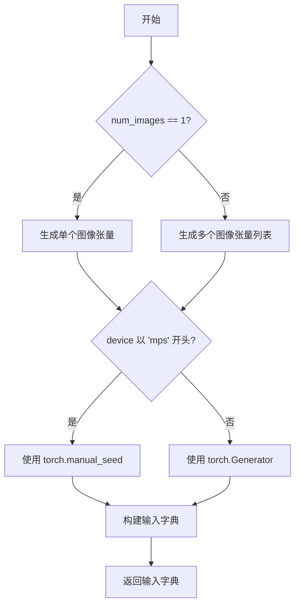

#### 带注释源码

```python
def get_dummy_inputs(self, device, seed=0, height=64, width=64, num_images=1):
    """
    生成用于测试 T2I-Adapter 管道的虚拟输入数据。
    
    参数:
        self: AdapterTests 类实例
        device: 计算设备
        seed: 随机种子，默认 0
        height: 图像高度，默认 64
        width: 图像宽度，默认 64
        num_images: 生成图像数量，默认 1
    
    返回:
        包含 prompt、image、generator 等键的字典
    """
    # 根据图像数量生成单个张量或张量列表
    if num_images == 1:
        # 使用 floats_tensor 生成指定形状的随机浮点张量
        image = floats_tensor((1, 3, height, width), rng=random.Random(seed)).to(device)
    else:
        # 为每个图像生成独立的随机张量
        image = [
            floats_tensor((1, 3, height, width), rng=random.Random(seed)).to(device) 
            for _ in range(num_images)
        ]

    # MPS 设备使用特殊的随机数生成方式
    if str(device).startswith("mps"):
        # MPS 设备使用 torch.manual_seed
        generator = torch.manual_seed(seed)
    else:
        # 其他设备使用 torch.Generator 以确保可重复性
        generator = torch.Generator(device=device).manual_seed(seed)
    
    # 构建完整的输入字典
    inputs = {
        "prompt": "A painting of a squirrel eating a burger",  # 测试用提示词
        "image": image,                                        # 输入图像
        "generator": generator,                                # 随机数生成器
        "num_inference_steps": 2,                             # 推理步数
        "guidance_scale": 6.0,                                 # CFG 引导强度
        "output_type": "np",                                   # 输出为 numpy 数组
    }
    return inputs
```


### `AdapterTests.test_attention_slicing_forward_pass`

该方法是 `AdapterTests` 测试类中的测试方法，用于验证 T2I-Adapter 管道在启用注意力切片（Attention Slicing）功能时的前向传播是否正确，通过对比输出来确保数值误差在允许范围内（2e-3）。

参数：

- `self`：`AdapterTests` 实例（隐式参数），调用测试方法本身的类实例

返回值：`any`，返回被调用方法 `_test_attention_slicing_forward_pass` 的结果（通常是无返回值或测试断言结果）

#### 流程图

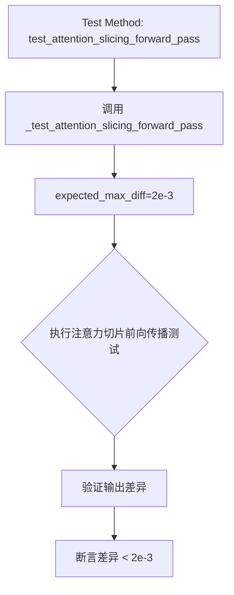

#### 带注释源码

```python
def test_attention_slicing_forward_pass(self):
    """
    测试方法：验证注意力切片前向传播
    
    该方法是一个测试用例包装器，用于测试 Stable Diffusion Adapter 管道
    在启用注意力切片（attention slicing）功能时的前向传播是否正确。
    注意力切片是一种内存优化技术，可以减少 GPU 内存使用。
    
    参数:
        self: AdapterTests 类的实例
        
    返回:
        返回 _test_attention_slicing_forward_pass 方法的执行结果
    """
    # 调用父类或 mixin 中定义的通用注意力切片测试方法
    # expected_max_diff=2e-3 表示期望的最大数值差异为 0.002
    return self._test_attention_slicing_forward_pass(expected_max_diff=2e-3)
```

**注意**：`_test_attention_slicing_forward_pass` 方法的具体实现未在此代码文件中定义，它应该是从 `PipelineTesterMixin` 或其他父类继承来的测试方法。该方法通常会：
1. 创建管道实例
2. 启用注意力切片 (`pipe.enable_attention_slicing()`)
3. 执行前向传播
4. 验证输出与基准值的差异是否在 `expected_max_diff` 范围内


### `test_xformers_attention_forwardGenerator_pass`

该函数是一个测试方法，用于验证 XFormers 注意力机制在前向传播过程中的正确性。它通过调用内部方法 `_test_xformers_attention_forwardGenerator_pass` 来执行具体的测试逻辑，并设置预期的最大差异阈值为 2e-3。

参数：

- `self`：测试类实例，隐式参数，代表当前测试类的实例对象本身

返回值：`None`（无返回值），该方法为测试方法，通过内部断言验证功能，不返回具体数值

#### 流程图

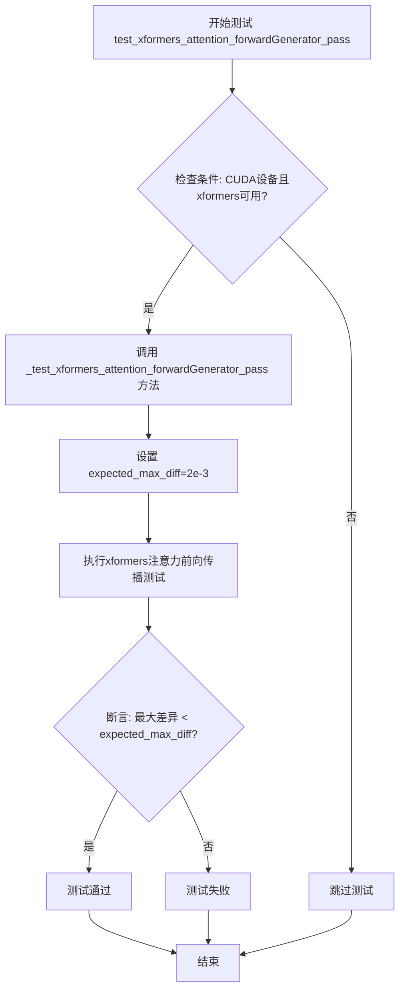

#### 带注释源码

```python
@unittest.skipIf(
    torch_device != "cuda" or not is_xformers_available(),
    reason="XFormers attention is only available with CUDA and `xformers` installed",
)
def test_xformers_attention_forwardGenerator_pass(self):
    """
    测试 XFormers 注意力机制的前向传播功能。
    
    该测试方法仅在 CUDA 设备且 xformers 库可用时执行。
    用于验证使用 XFormers 优化的注意力机制与标准注意力机制
    之间的输出差异是否在可接受的范围内。
    
    参数:
        self: 测试类实例，隐式参数
        
    返回值:
        None: 测试方法不返回任何值，通过内部断言验证正确性
    """
    # 调用内部测试方法，传入预期的最大差异阈值
    # expected_max_diff=2e-3 表示输出差异应小于 0.002
    self._test_xformers_attention_forwardGenerator_pass(expected_max_diff=2e-3)
```


### `StableDiffusionMultiAdapterPipelineFastTests.test_inference_batch_single_identical`

该方法用于测试批量推理（batch inference）与单个推理（single inference）的结果是否一致，确保管道在批量处理模式下能够产生与单独处理每个输入相同的结果。通过比较批量输出与单个输出的像素差异来验证pipeline的batch一致性。

参数：

- `self`：`StableDiffusionMultiAdapterPipelineFastTests`，测试类的实例
- `batch_size`：`int`，批量大小，默认为3
- `test_max_difference`：`bool` 或 `None`，是否测试最大像素差异，默认为None（若设备不是mps则为True）
- `test_mean_pixel_difference`：`bool` 或 `None`，是否测试平均像素差异，默认为None（若设备不是mps则为True）
- `relax_max_difference`：`bool`，是否放宽最大差异检查（取中位数而非最大值），默认为False
- `expected_max_diff`：`float`，期望的最大差异阈值，默认为2e-3
- `additional_params_copy_to_batched_inputs`：`list`，需要复制到批量输入的额外参数列表，默认为`["num_inference_steps"]`

返回值：`None`，该方法为测试方法，无返回值，通过断言验证结果

#### 流程图

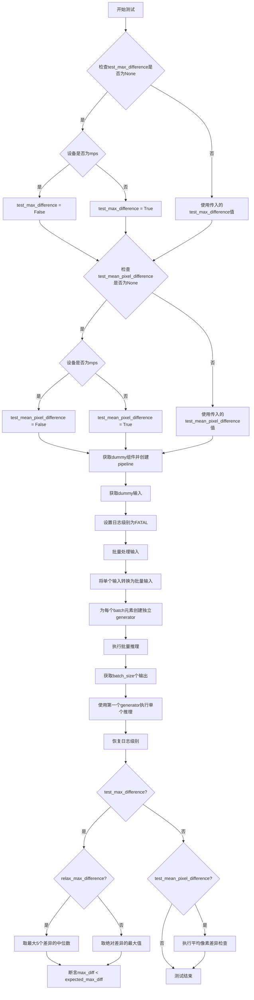

#### 带注释源码

```python
def test_inference_batch_single_identical(
    self,
    batch_size=3,
    test_max_difference=None,
    test_mean_pixel_difference=None,
    relax_max_difference=False,
    expected_max_diff=2e-3,
    additional_params_copy_to_batched_inputs=["num_inference_steps"],
):
    """
    测试批量推理与单个推理的结果一致性。
    
    参数:
        batch_size: 批量大小，默认3
        test_max_difference: 是否测试最大差异，默认None（根据设备自动设置）
        test_mean_pixel_difference: 是否测试平均像素差异，默认None（根据设备自动设置）
        relax_max_difference: 是否放宽最大差异阈值（使用中位数），默认False
        expected_max_diff: 期望的最大差异阈值，默认2e-3
        additional_params_copy_to_batched_inputs: 额外需要复制到批量输入的参数列表
    """
    # 如果未指定test_max_difference，根据设备设置默认值
    if test_max_difference is None:
        # TODO(Pedro) - not sure why, but not at all reproducible at the moment it seems
        # 确保批量和非批量结果相同
        test_max_difference = torch_device != "mps"

    # 如果未指定test_mean_pixel_difference，根据设备设置默认值
    if test_mean_pixel_difference is None:
        # TODO same as above
        test_mean_pixel_difference = torch_device != "mps"

    # 获取dummy组件并创建pipeline
    components = self.get_dummy_components()
    pipe = self.pipeline_class(**components)
    pipe.to(torch_device)
    pipe.set_progress_bar_config(disable=None)

    # 获取测试输入
    inputs = self.get_dummy_inputs(torch_device)

    # 获取logger并设置日志级别为FATAL以减少输出
    logger = logging.get_logger(pipe.__module__)
    logger.setLevel(level=diffusers.logging.FATAL)

    # 将输入批量化
    batched_inputs = {}
    for name, value in inputs.items():
        if name in self.batch_params:
            # prompt是字符串
            if name == "prompt":
                len_prompt = len(value)
                # 创建不均匀的批量大小
                batched_inputs[name] = [value[: len_prompt // i] for i in range(1, batch_size + 1)]

                # 让最后一个batch超长
                batched_inputs[name][-1] = 100 * "very long"
            elif name == "image":
                batched_images = []

                for image in value:
                    # 将每个image复制batch_size次
                    batched_images.append(batch_size * [image])

                batched_inputs[name] = batched_images
            else:
                # 其他参数复制batch_size次
                batched_inputs[name] = batch_size * [value]
        elif name == "batch_size":
            batched_inputs[name] = batch_size
        elif name == "generator":
            # 为每个batch元素创建独立的generator
            batched_inputs[name] = [self.get_generator(i) for i in range(batch_size)]
        else:
            batched_inputs[name] = value

    # 复制额外参数到批量输入
    for arg in additional_params_copy_to_batched_inputs:
        batched_inputs[arg] = inputs[arg]

    # 设置输出类型为numpy（非DanceDiffusionPipeline）
    if self.pipeline_class.__name__ != "DanceDiffusionPipeline":
        batched_inputs["output_type"] = "np"

    # 执行批量推理
    output_batch = pipe(**batched_inputs)
    # 验证批量输出的batch大小
    assert output_batch[0].shape[0] == batch_size

    # 使用第一个generator执行单个推理
    inputs["generator"] = self.get_generator(0)

    output = pipe(**inputs)

    # 恢复日志级别
    logger.setLevel(level=diffusers.logging.WARNING)
    
    # 测试最大差异
    if test_max_difference:
        if relax_max_difference:
            # 取最大的n个差异的中位数，对异常值更具鲁棒性
            diff = np.abs(output_batch[0][0] - output[0][0])
            diff = diff.flatten()
            diff.sort()
            max_diff = np.median(diff[-5:])
        else:
            max_diff = np.abs(output_batch[0][0] - output[0][0]).max()
        # 断言最大差异在预期范围内
        assert max_diff < expected_max_diff

    # 测试平均像素差异
    if test_mean_pixel_difference:
        assert_mean_pixel_difference(output_batch[0][0], output[0][0])
```


### `AdapterTests.test_multiple_image_dimensions`

该方法用于测试 T2I-Adapter 管道是否支持任意可被适配器下采样因子整除的输入维度。该测试是为了解决 T2I Adapter 的下采样填充行为与 UNet 行为不匹配的问题而添加的。测试会选择特定的 `dim` 值来在每个下采样级别产生奇数分辨率。

参数：

- `self`：`AdapterTests`，测试类的实例
- `dim`：`int`，用于测试的图像尺寸（高度和宽度），该值需要能够被适配器的 `downscale_factor` 整除

返回值：`None`，该方法为测试方法，通过断言验证结果，不返回任何值

#### 流程图

```mermaid
flowchart TD
    A[开始测试] --> B[调用 get_dummy_components_with_full_downscaling 获取虚拟组件]
    B --> C[创建 StableDiffusionAdapterPipeline 管道实例]
    C --> D[将管道移至 torch_device 设备]
    D --> E[设置进度条配置]
    E --> F[调用 get_dummy_inputs 生成虚拟输入, height=dim, width=dim]
    F --> G[执行管道 sd_pipe(**inputs) 生成图像]
    G --> H{断言 image.shape == (1, dim, dim, 3)}
    H -->|通过| I[测试通过]
    H -->|失败| J[抛出 AssertionError]
```

#### 带注释源码

```python
@parameterized.expand(
    [
        # (dim=264) The internal feature map will be 33x33 after initial pixel unshuffling (downscaled x8).
        (((4 * 8 + 1) * 8),),
        # (dim=272) The internal feature map will be 17x17 after the first T2I down block (downscaled x16).
        (((4 * 4 + 1) * 16),),
        # (dim=288) The internal feature map will be 9x9 after the second T2I down block (downscaled x32).
        (((4 * 2 + 1) * 32),),
        # (dim=320) The internal feature map will be 5x5 after the third T2I down block (downscaled x64).
        (((4 * 1 + 1) * 64),),
    ]
)
def test_multiple_image_dimensions(self, dim):
    """Test that the T2I-Adapter pipeline supports any input dimension that
    is divisible by the adapter's `downscale_factor`. This test was added in
    response to an issue where the T2I Adapter's downscaling padding
    behavior did not match the UNet's behavior.

    Note that we have selected `dim` values to produce odd resolutions at
    each downscaling level.
    """
    # 获取具有完整下采样配置的虚拟组件（x8 VAE下采样和4个UNet下块）
    components = self.get_dummy_components_with_full_downscaling()
    
    # 使用虚拟组件实例化 StableDiffusionAdapterPipeline 管道
    sd_pipe = StableDiffusionAdapterPipeline(**components)
    
    # 将管道移至目标设备（torch_device）
    sd_pipe = sd_pipe.to(torch_device)
    
    # 设置进度条配置，disable=None 表示不禁用进度条
    sd_pipe.set_progress_bar_config(disable=None)

    # 获取虚拟输入参数，指定高度和宽度为 dim
    inputs = self.get_dummy_inputs(torch_device, height=dim, width=dim)
    
    # 执行管道推理，获取生成的图像
    # **inputs 会将字典解包为关键字参数传递给管道
    image = sd_pipe(**inputs).images

    # 断言验证输出图像的形状是否为 (1, dim, dim, 3)
    # - 批量大小为 1
    # - 高度和宽度为 dim
    # - 通道数为 3 (RGB)
    assert image.shape == (1, dim, dim, 3)
```


### `AdapterTests.test_adapter_lcm`

该方法用于测试 T2I-Adapter 管道配合 LCM (Latent Consistency Model) 调度器的功能，验证适配器在快速推理模式下的图像生成是否正确。

参数：

- `self`：隐式参数，测试类实例本身，无类型描述

返回值：`None`，无返回值描述（通过断言验证功能）

#### 流程图

```mermaid
flowchart TD
    A[开始 test_adapter_lcm 测试] --> B[设置 device = 'cpu']
    B --> C[获取虚拟组件<br/>get_dummy_components<br/>time_cond_proj_dim=256]
    C --> D[创建 StableDiffusionAdapterPipeline]
    D --> E[替换调度器为 LCMScheduler]
    E --> F[将管道移至 torch_device]
    F --> G[禁用进度条]
    G --> H[获取虚拟输入<br/>get_dummy_inputs]
    H --> I[执行管道推理<br/>sd_pipe(**inputs)]
    I --> J[提取输出图像]
    J --> K[获取图像切片<br/>image[0, -3:, -3:, -1]]
    K --> L{断言验证}
    L -->|shape 验证| M[验证 image.shape == (1, 64, 64, 3)]
    L -->|像素值验证| N[验证像素差异 < 1e-2]
    M --> O[测试通过]
    N --> O
```

#### 带注释源码

```python
def test_adapter_lcm(self):
    """测试 LCM 调度器与 T2I-Adapter 管道集成的基本功能"""
    device = "cpu"  # 使用 CPU 确保设备依赖的 torch.Generator 的确定性

    # 获取具有特定时间条件投影维度的虚拟组件
    # time_cond_proj_dim=256 用于 LCM 特定配置
    components = self.get_dummy_components(time_cond_proj_dim=256)
    
    # 使用虚拟组件初始化 Stable Diffusion Adapter 管道
    sd_pipe = StableDiffusionAdapterPipeline(**components)
    
    # 将默认的 PNDMScheduler 替换为 LCMScheduler
    # LCM Scheduler 支持更少的推理步骤实现快速生成
    sd_pipe.scheduler = LCMScheduler.from_config(sd_pipe.scheduler.config)
    
    # 将管道移至目标设备（通常是 CUDA 设备）
    sd_pipe = sd_pipe.to(torch_device)
    
    # 配置进度条：disable=None 表示启用进度条
    sd_pipe.set_progress_bar_config(disable=None)

    # 获取虚拟输入：包含 prompt、image、generator 等参数
    inputs = self.get_dummy_inputs(device)
    
    # 执行管道推理：生成图像
    output = sd_pipe(**inputs)
    
    # 从输出中提取生成的图像数组
    image = output.images

    # 提取图像右下角 3x3 区域，用于后续像素值验证
    # 取最后一个通道的值用于比较
    image_slice = image[0, -3:, -3:, -1]

    # ===== 断言验证 =====
    
    # 验证输出图像形状为 1x64x64x3（批量大小1，高64，宽64，RGB 3通道）
    assert image.shape == (1, 64, 64, 3)
    
    # 定义期望的像素值切片（预先计算的标准输出）
    expected_slice = np.array([0.4535, 0.5493, 0.4359, 0.5452, 0.6086, 0.4441, 0.5544, 0.501, 0.4859])

    # 验证生成图像与期望值的最大差异小于阈值 1e-2
    # 确保 LCM 调度器下的输出具有确定性和一致性
    assert np.abs(image_slice.flatten() - expected_slice).max() < 1e-2
```


### `AdapterTests.test_adapter_lcm_custom_timesteps`

该测试方法用于验证 T2I-Adapter 管道在使用 LCMScheduler 且传入自定义时间步 (timesteps) 时的正确性。测试创建虚拟组件、配置 LCMScheduler、使用自定义时间步 [999, 499] 调用管道，并断言输出图像的形状和像素值与预期值匹配（误差小于 1e-2）。

参数：

- `self`：`AdapterTests` 实例本身，无需显式传递

返回值：`None`，该方法为单元测试方法，通过 `assert` 语句验证行为，无显式返回值

#### 流程图

```mermaid
flowchart TD
    A[开始 test_adapter_lcm_custom_timesteps] --> B[设置 device = 'cpu']
    B --> C[调用 get_dummy_components 创建虚拟组件<br/>time_cond_proj_dim=256]
    C --> D[创建 StableDiffusionAdapterPipeline]
    D --> E[将 scheduler 替换为 LCMScheduler]
    E --> F[将 pipeline 移至 torch_device]
    F --> G[配置进度条 disable=None]
    G --> H[调用 get_dummy_inputs 获取输入]
    H --> I[删除输入中的 num_inference_steps]
    I --> J[添加自定义 timesteps = [999, 499]]
    J --> K[调用 sd_pipe 生成图像]
    K --> L[提取图像切片 image[0, -3:, -3:, -1]]
    L --> M{断言 image.shape == (1, 64, 64, 3)}
    M -->|Yes| N{断言像素误差 < 1e-2}
    N -->|Yes| O[测试通过]
    N -->|No| P[抛出 AssertionError]
    M -->|No| P
```

#### 带注释源码

```python
def test_adapter_lcm_custom_timesteps(self):
    """测试 T2I-Adapter 管道在使用 LCMScheduler 且传入自定义时间步时的行为"""
    # 使用 cpu 设备以确保设备依赖的 torch.Generator 的确定性
    device = "cpu"

    # 创建虚拟组件，传入 time_cond_proj_dim=256 以支持 LCM 调度器
    components = self.get_dummy_components(time_cond_proj_dim=256)
    
    # 使用虚拟组件实例化 StableDiffusionAdapterPipeline
    sd_pipe = StableDiffusionAdapterPipeline(**components)
    
    # 将默认的 PNDMScheduler 替换为 LCMScheduler
    # LCMScheduler 支持少步推理 (LCM: Latent Consistency Models)
    sd_pipe.scheduler = LCMScheduler.from_config(sd_pipe.scheduler.config)
    
    # 将 pipeline 移至目标设备 (cuda/cpu)
    sd_pipe = sd_pipe.to(torch_device)
    
    # 配置进度条，disable=None 表示启用进度条
    sd_pipe.set_progress_bar_config(disable=None)

    # 获取虚拟输入，包含 prompt, image, generator 等
    inputs = self.get_dummy_inputs(device)
    
    # 删除 num_inference_steps，因为我们将使用自定义的 timesteps
    del inputs["num_inference_steps"]
    
    # 设置自定义时间步，这是该测试的关键：
    # 使用 [999, 499] 两个时间步而非默认的推理步数
    inputs["timesteps"] = [999, 499]
    
    # 调用 pipeline 进行推理，传入修改后的输入
    output = sd_pipe(**inputs)
    
    # 从输出中获取生成的图像
    image = output.images

    # 提取图像右下角 3x3 像素区域，用于后续的数值验证
    image_slice = image[0, -3:, -3:, -1]

    # 断言输出图像形状为 (1, 64, 64, 3)
    # 1: batch size, 64x64: 图像分辨率, 3: RGB 通道
    assert image.shape == (1, 64, 64, 3)
    
    # 预期的像素值切片（LCM 推理在 CPU 上的参考输出）
    expected_slice = np.array([0.4535, 0.5493, 0.4359, 0.5452, 0.6086, 0.4441, 0.5544, 0.501, 0.4859])

    # 断言实际输出与预期值的最大误差小于 1e-2
    # 验证自定义时间步的推理结果是否符合预期
    assert np.abs(image_slice.flatten() - expected_slice).max() < 1e-2
```


### `AdapterTests.test_encode_prompt_works_in_isolation`

该方法用于测试 `encode_prompt` 功能在隔离环境中是否正常工作，通过构造额外的必需参数（设备类型和 classifier-free guidance 标志）并委托给父类的同名测试方法进行验证。

参数：无（隐式参数 `self` 表示实例本身）

返回值：`任意类型`，返回父类 `test_encode_prompt_works_in_isolation` 方法的执行结果，具体类型取决于父类实现。

#### 流程图

```mermaid
flowchart TD
    A[开始 test_encode_prompt_works_in_isolation] --> B[获取设备类型: torch.device torch_device.type]
    B --> C[获取 guidance_scale 并判断是否大于 1.0]
    C --> D[构造 extra_required_param_value_dict 字典]
    D --> E{调用父类方法}
    E --> F[super().test_encode_prompt_works_in_isolation<br/>传入额外参数字典]
    F --> G[返回父类方法结果]
    G --> H[结束]
```

#### 带注释源码

```python
def test_encode_prompt_works_in_isolation(self):
    """
    测试 encode_prompt 在隔离环境中是否正常工作。
    该方法通过构造额外的必需参数字典并调用父类方法来实现测试。
    
    参数:
        self: AdapterTests 类的实例引用
    
    返回值:
        父类 test_encode_prompt_works_in_isolation 方法的返回值
    
    流程说明:
        1. 获取当前设备类型（如 'cuda' 或 'cpu'）
        2. 从 dummy_inputs 中获取 guidance_scale 并判断是否启用 classifier-free guidance
        3. 将设备类型和 guidance 标志封装为字典
        4. 调用父类同名方法并传递该字典进行实际测试
    """
    # 创建包含额外必需参数的字典
    # device: 获取当前 PyTorch 设备的类型字符串（如 "cuda", "cpu"）
    # do_classifier_free_guidance: 根据 guidance_scale 是否大于 1.0 决定是否启用 CFG
    extra_required_param_value_dict = {
        "device": torch.device(torch_device).type,
        "do_classifier_free_guidance": self.get_dummy_inputs(device=torch_device).get("guidance_scale", 1.0) > 1.0,
    }
    # 调用父类的测试方法，传入构造好的参数字典
    # 父类方法的具体实现未在此代码片段中显示
    return super().test_encode_prompt_works_in_isolation(extra_required_param_value_dict)
```


### `StableDiffusionFullAdapterPipelineFastTests.test_stable_diffusion_adapter_default_case`

这是一个单元测试方法，用于验证 Stable Diffusion 适配器管道在默认配置下的基本功能是否正常，通过比对生成的图像像素值与预期值来确认管道的正确性。

参数：

- `self`：隐式参数，测试类实例本身

返回值：`None`，该方法为测试方法，通过 `assert` 语句进行断言验证，不返回任何值

#### 流程图

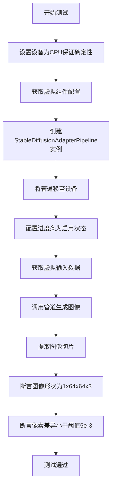

#### 带注释源码

```python
def test_stable_diffusion_adapter_default_case(self):
    """
    测试 Stable Diffusion 适配器管道在默认配置下的基本功能。
    验证管道能够正确处理输入并生成符合预期像素值的图像。
    """
    # 使用 CPU 设备以确保设备依赖的 torch.Generator 的确定性
    device = "cpu"
    
    # 获取预定义的虚拟组件（UNet、VAE、Adapter、Scheduler等）
    components = self.get_dummy_components()
    
    # 使用虚拟组件实例化 StableDiffusionAdapterPipeline
    sd_pipe = StableDiffusionAdapterPipeline(**components)
    
    # 将管道移至指定设备
    sd_pipe = sd_pipe.to(device)
    
    # 配置进度条（disable=None 表示启用进度条）
    sd_pipe.set_progress_bar_config(disable=None)
    
    # 获取虚拟输入数据（包含 prompt、image、generator 等）
    inputs = self.get_dummy_inputs(device)
    
    # 调用管道执行推理，获取结果
    image = sd_pipe(**inputs).images
    
    # 提取图像右下角 3x3 像素块用于验证
    image_slice = image[0, -3:, -3:, -1]
    
    # 断言：验证输出图像的形状为 (1, 64, 64, 3)
    assert image.shape == (1, 64, 64, 3)
    
    # 定义预期的像素值切片（9个像素值）
    expected_slice = np.array([0.4858, 0.5500, 0.4278, 0.4669, 0.6184, 0.4322, 0.5010, 0.5033, 0.4746])
    
    # 断言：验证生成图像与预期图像的像素差异小于阈值
    assert np.abs(image_slice.flatten() - expected_slice).max() < 5e-3
```


### `StableDiffusionFullAdapterPipelineFastTests.test_from_pipe_consistent_forward_pass_cpu_offload`

这是一个测试方法，用于验证在使用 CPU offload 功能时，从预训练管道加载的模型与原始模型的前向传播结果是否保持一致。该测试通过比较两种方式的输出差异来确保模型在启用 CPU offload 后仍能产生相同的推理结果。

参数：

- `self`：实例方法，无需显式传递参数

返回值：`None`，该方法为测试用例，通过断言验证结果，不返回具体数值

#### 流程图

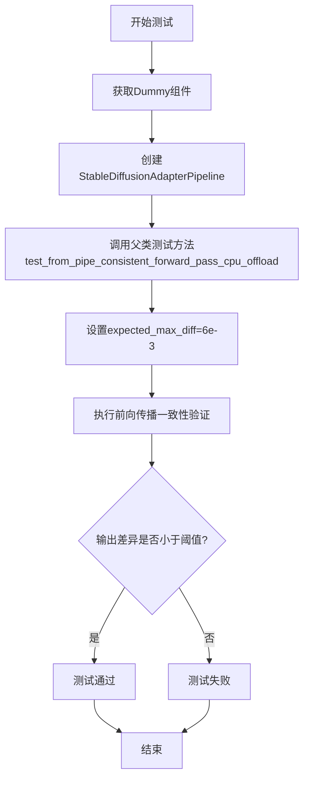

#### 带注释源码

```python
def test_from_pipe_consistent_forward_pass_cpu_offload(self):
    """
    测试从管道加载模型并启用CPU offload后，前向传播结果的一致性。
    
    该测试方法继承自StableDiffusionFullAdapterPipelineFastTests类，
    用于验证T2I-Adapter管道在使用模型CPU卸载功能时的正确性。
    
    测试逻辑：
    1. 创建完整的StableDiffusionAdapterPipeline实例
    2. 启用CPU offload功能
    3. 执行推理并获取输出
    4. 验证输出与原始模型（未使用CPU offload）的差异在允许范围内
    
    参数:
        self: 类实例引用
        
    返回值:
        None: 测试方法，通过断言进行验证
        
    异常:
        AssertionError: 当输出差异超过expected_max_diff阈值时抛出
    """
    # 调用父类的测试方法，传入期望的最大差异阈值
    # expected_max_diff=6e-3 表示允许的最大像素差异为0.006
    super().test_from_pipe_consistent_forward_pass_cpu_offload(expected_max_diff=6e-3)
```


### `StableDiffusionMultiAdapterPipelineFastTests.test_inference_batch_consistent`

该方法用于测试 T2I-Adapter 多适配器管道在批处理推理场景下的一致性。它通过使用不同的批大小（2、4、13）验证管道能够正确处理各种批处理输入，并确保输出图像数量与预期批大小相匹配。

参数：

- `self`：隐式参数，测试类实例本身
- `batch_sizes`：List[int]，要测试的批大小列表，默认值为 `[2, 4, 13]`
- `additional_params_copy_to_batched_inputs`：List[str]，需要复制到批处理输入的额外参数列表，默认值为 `["num_inference_steps"]`

返回值：`None`，该方法通过断言验证批处理推理的正确性，无显式返回值

#### 流程图

```mermaid
flowchart TD
    A[开始] --> B[获取虚拟组件 get_dummy_components]
    B --> C[创建管道并移至设备]
    C --> D[获取虚拟输入 get_dummy_inputs]
    D --> E[设置日志级别为FATAL]
    E --> F{遍历每个 batch_size}
    F -->|batch_size=2,4,13| G[初始化 batched_inputs 字典]
    G --> H{遍历 inputs 的每个键值对}
    H --> I{判断 name 是否在 batch_params 中}
    I -->|是| J{name == 'prompt'?}
    I -->|否| K{name == 'batch_size'?}
    J -->|是| L[将prompt按长度分割，最后一个设为超长字符串]
    J -->|否| M{name == 'image'?}
    M -->|是| N[将图像重复batch_size次]
    M -->|否| O[将值重复batch_size次]
    K -->|是| P[设置 batch_size]
    K -->|否| Q[保持原值]
    L --> R[添加到 batched_inputs]
    N --> R
    O --> R
    P --> R
    Q --> R
    R --> H
    H -->|完成| S[复制额外参数到 batched_inputs]
    S --> T[设置 output_type='np']
    T --> U{管道名为 DanceDiffusionPipeline?}
    U -->|是| V[移除 output_type]
    U -->|否| W[执行管道推理]
    V --> W
    W --> X[断言 len output[0] == batch_size]
    X --> Y[再次执行管道推理]
    Y --> Z[断言 output.shape[0] == batch_size]
    Z --> F
    F -->|完成| AA[恢复日志级别为WARNING]
    AA --> AB[结束]
```

#### 带注释源码

```python
def test_inference_batch_consistent(
    self, batch_sizes=[2, 4, 13], additional_params_copy_to_batched_inputs=["num_inference_steps"]
):
    """
    测试多适配器管道在批处理推理时的一致性
    
    参数:
        batch_sizes: 要测试的批大小列表
        additional_params_copy_to_batched_inputs: 需要复制到批处理输入的参数
    """
    # 1. 获取虚拟组件（UNet、VAE、Adapter、Tokenizer等）
    components = self.get_dummy_components()
    
    # 2. 使用虚拟组件创建StableDiffusionAdapterPipeline管道实例
    pipe = self.pipeline_class(**components)
    
    # 3. 将管道移至测试设备（CPU/CUDA）
    pipe.to(torch_device)
    
    # 4. 配置进度条（disable=None 表示启用进度条）
    pipe.set_progress_bar_config(disable=None)

    # 5. 获取虚拟输入（包含prompt、image、generator等）
    inputs = self.get_dummy_inputs(torch_device)

    # 6. 获取当前管道的日志记录器
    logger = logging.get_logger(pipe.__module__)
    
    # 7. 设置日志级别为FATAL以减少测试输出噪音
    logger.setLevel(level=diffusers.logging.FATAL)

    # ========== 批处理输入准备循环 ==========
    # 遍历每个要测试的批大小
    for batch_size in batch_sizes:
        # 初始化批处理输入字典
        batched_inputs = {}
        
        # 遍历原始输入的每个参数
        for name, value in inputs.items():
            # 判断该参数是否需要批处理
            if name in self.batch_params:
                # prompt是字符串，需要特殊处理
                if name == "prompt":
                    len_prompt = len(value)
                    # 将prompt按不同长度分割成batch_size个不等长的prompt
                    batched_inputs[name] = [value[: len_prompt // i] for i in range(1, batch_size + 1)]

                    # 将最后一个prompt设置为超长字符串（测试边界情况）
                    batched_inputs[name][-1] = 100 * "very long"
                # image类型需要特殊处理（可能有多张图）
                elif name == "image":
                    batched_images = []

                    # 每张图像重复batch_size次
                    for image in value:
                        batched_images.append(batch_size * [image])

                    batched_inputs[name] = batched_images
                # 其他参数直接重复batch_size次
                else:
                    batched_inputs[name] = batch_size * [value]

            # 显式设置batch_size参数
            elif name == "batch_size":
                batched_inputs[name] = batch_size
            # 非批处理参数保持原值
            else:
                batched_inputs[name] = value

        # 8. 复制额外的推理参数（如num_inference_steps）
        for arg in additional_params_copy_to_batched_inputs:
            batched_inputs[arg] = inputs[arg]

        # 9. 设置输出类型为numpy数组
        batched_inputs["output_type"] = "np"

        # 10. 特殊处理：DanceDiffusionPipeline不使用output_type参数
        if self.pipeline_class.__name__ == "DanceDiffusionPipeline":
            batched_inputs.pop("output_type")

        # 11. 第一次推理：调用管道
        output = pipe(**batched_inputs)

        # 12. 验证输出图像数量是否等于批大小
        assert len(output[0]) == batch_size

        # 13. 准备第二次推理（同样的批处理输入）
        batched_inputs["output_type"] = "np"

        if self.pipeline_class.__name__ == "DanceDiffusionPipeline":
            batched_inputs.pop("output_type")

        # 14. 第二次推理：验证结果一致性
        output = pipe(**batched_inputs)[0]

        # 15. 验证输出形状的批大小维度
        assert output.shape[0] == batch_size

    # 16. 恢复日志级别
    logger.setLevel(level=diffusers.logging.WARNING)
```


### `StableDiffusionMultiAdapterPipelineFastTests.test_num_images_per_prompt`

该方法是一个测试函数，用于验证 T2I-Adapter 管道在给定不同的 `batch_size` 和 `num_images_per_prompt` 参数时，能够正确生成相应数量的图像。测试通过遍历 `batch_sizes` 和 `num_images_per_prompts` 的组合，验证生成的图像数量是否等于 `batch_size * num_images_per_prompt`。

参数：
- `self`：测试类实例本身，无需显式传递

返回值：无（`None`），该方法为测试函数，使用断言进行验证，不返回任何值

#### 流程图

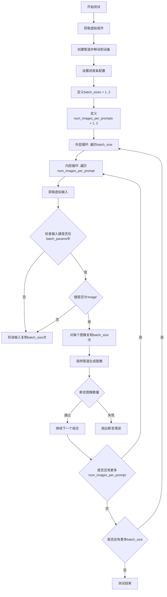

#### 带注释源码

```python
def test_num_images_per_prompt(self):
    """
    测试 num_images_per_prompt 参数在不同批次大小下是否正确工作。
    验证生成的图像数量等于 batch_size * num_images_per_prompt。
    """
    # 1. 获取虚拟组件，用于创建测试管道
    components = self.get_dummy_components()
    
    # 2. 使用虚拟组件创建 StableDiffusionAdapterPipeline 实例
    pipe = self.pipeline_class(**components)
    
    # 3. 将管道移动到指定的设备（如 CUDA 或 CPU）
    pipe = pipe.to(torch_device)
    
    # 4. 配置进度条（disable=None 表示启用进度条）
    pipe.set_progress_bar_config(disable=None)

    # 5. 定义要测试的批次大小和每提示图像数量的组合
    batch_sizes = [1, 2]
    num_images_per_prompts = [1, 2]

    # 6. 外层循环：遍历不同的批次大小
    for batch_size in batch_sizes:
        # 7. 内层循环：遍历不同的每提示图像数量
        for num_images_per_prompt in num_images_per_prompts:
            # 8. 获取虚拟输入字典
            inputs = self.get_dummy_inputs(torch_device)

            # 9. 根据 batch_size 批量处理输入参数
            for key in inputs.keys():
                if key in self.batch_params:
                    # 对于图像输入，需要对每个图像进行批量复制
                    if key == "image":
                        batched_images = []
                        # 遍历每个输入图像，将其复制 batch_size 次
                        for image in inputs[key]:
                            batched_images.append(batch_size * [image])
                        # 更新输入字典中的图像为批量版本
                        inputs[key] = batched_images
                    else:
                        # 对于其他参数（如 prompt），直接复制 batch_size 次
                        inputs[key] = batch_size * [inputs[key]]

            # 10. 调用管道生成图像，传入 num_images_per_prompt 参数
            #     pipe 返回一个元组，第一项是生成的图像
            images = pipe(**inputs, num_images_per_prompt=num_images_per_prompt)[0]

            # 11. 断言验证：生成的图像数量应该等于 batch_size * num_images_per_prompt
            assert images.shape[0] == batch_size * num_images_per_prompt
```


### `StableDiffusionAdapterPipelineSlowTests.setUp`

该方法是 `StableDiffusionAdapterPipelineSlowTests` 测试类的初始化方法，在每个测试方法执行前被调用，用于清理 Python 垃圾回收和 GPU 缓存，确保测试环境干净，避免内存泄漏导致的测试不稳定。

参数：

- `self`：实例方法隐式参数，无需显式传递

返回值：`None`，无返回值

#### 流程图

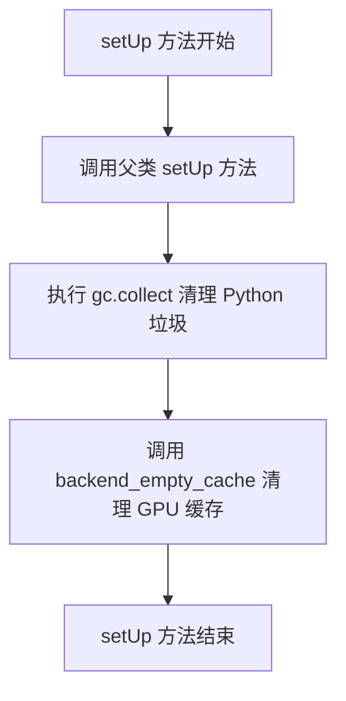

#### 带注释源码

```python
def setUp(self):
    """
    测试用例初始化方法，在每个测试方法运行前执行。
    用于准备测试环境，清理缓存以确保测试的独立性和可重复性。
    """
    super().setUp()  # 调用父类的 setUp 方法，执行 unittest.TestCase 的标准初始化逻辑
    gc.collect()  # 强制进行 Python 垃圾回收，释放不再使用的对象内存
    backend_empty_cache(torch_device)  # 清理 GPU 显存缓存，防止显存泄漏影响后续测试
```


### `StableDiffusionAdapterPipelineSlowTests.tearDown`

该方法是测试类的清理方法，在每个测试用例执行完成后被调用，用于释放测试过程中占用的资源，包括调用垃圾回收清理内存以及清空GPU缓存以确保测试环境干净。

参数： 无

返回值：`None`，无返回值描述

#### 流程图

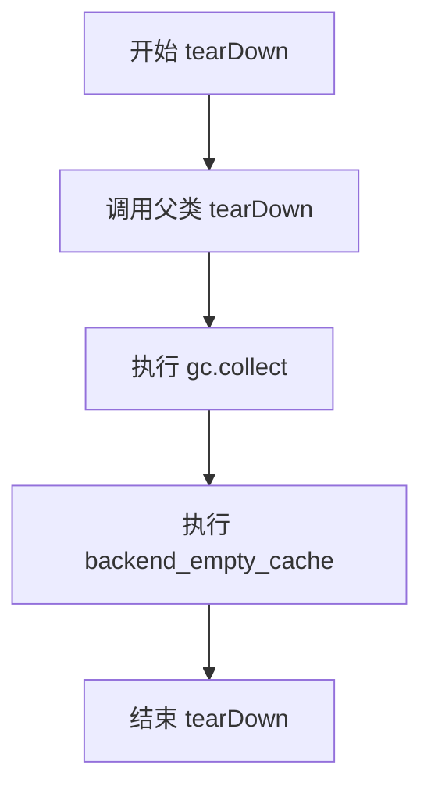

#### 带注释源码

```python
def tearDown(self):
    # 调用父类的 tearDown 方法，确保父类的清理逻辑也被执行
    super().tearDown()
    # 手动触发 Python 的垃圾回收机制，清理不再使用的对象
    gc.collect()
    # 清空 GPU 缓存，释放测试过程中占用的 GPU 显存
    backend_empty_cache(torch_device)
```


### `StableDiffusionAdapterPipelineSlowTests.test_stable_diffusion_adapter_depth_sd_v15`

该测试方法验证了 T2I-Adapter（Text-to-Image Adapter）与 Stable Diffusion v1.5 的深度估计（Depth）适配功能。它通过加载预训练的深度适配器模型和 Stable Diffusion 管道，对给定的图像进行条件生成，并使用余弦相似度验证输出图像与预期结果的一致性。

参数：

- `self`：无，实际为 unittest.TestCase 的测试方法

返回值：无（测试方法返回 None，通过断言验证结果）

#### 流程图

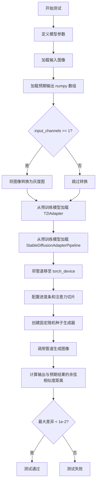

#### 带注释源码

```python
def test_stable_diffusion_adapter_depth_sd_v15(self):
    """
    测试 T2I-Adapter 深度估计模型与 Stable Diffusion v1.5 的集成功能。
    验证流程：加载预训练深度适配器 -> 创建适配管道 -> 生成图像 -> 验证输出质量
    """
    # 定义适配器模型路径（TencentARC 提供的深度估计适配器）
    adapter_model = "TencentARC/t2iadapter_depth_sd15v2"
    
    # 定义 Stable Diffusion 主模型路径
    sd_model = "stable-diffusion-v1-5/stable-diffusion-v1-5"
    
    # 输入文本提示
    prompt = "desk"
    
    # 输入图像 URL（包含深度信息的图像）
    image_url = "https://huggingface.co/datasets/hf-internal-testing/diffusers-images/resolve/main/t2i_adapter/desk_depth.png"
    
    # 输入通道数（3 表示 RGB，1 表示灰度）
    input_channels = 3
    
    # 预期输出结果的 URL（用于验证生成结果）
    out_url = "https://huggingface.co/datasets/hf-internal-testing/diffusers-images/resolve/main/t2i_adapter/t2iadapter_depth_sd15v2.npy"
    # 注意：此处被覆盖为另一个 URL，可能存在代码冗余或错误
    out_url = "https://huggingface.co/datasets/diffusers/test-arrays/resolve/main/stable_diffusion_adapter/sd_adapter_v15_zoe_depth.npy"

    # 加载输入图像
    image = load_image(image_url)
    
    # 加载预期输出结果（numpy 数组格式）
    expected_out = load_numpy(out_url)
    
    # 如果输入通道数为 1，将图像转换为灰度图
    if input_channels == 1:
        image = image.convert("L")

    # 从预训练模型加载 T2IAdapter（使用 float16 精度以节省显存）
    adapter = T2IAdapter.from_pretrained(adapter_model, torch_dtype=torch.float16)

    # 创建 Stable Diffusion 适配管道，加载主模型和适配器
    # safety_checker 设置为 None 以避免安全过滤器干扰测试
    pipe = StableDiffusionAdapterPipeline.from_pretrained(sd_model, adapter=adapter, safety_checker=None)
    
    # 将管道移至指定设备（CUDA/CPU）
    pipe.to(torch_device)
    
    # 配置进度条（disable=None 表示启用进度条）
    pipe.set_progress_bar_config(disable=None)
    
    # 启用注意力切片以减少显存占用
    pipe.enable_attention_slicing()

    # 创建固定随机种子的生成器，确保结果可复现
    generator = torch.Generator(device="cpu").manual_seed(0)
    
    # 调用管道生成图像：
    # - prompt: 文本提示
    # - image: 条件输入图像（深度图）
    # - generator: 随机生成器
    # - num_inference_steps: 推理步数（较少步数用于快速测试）
    # - output_type: 输出类型为 numpy 数组
    out = pipe(prompt=prompt, image=image, generator=generator, num_inference_steps=2, output_type="np").images

    # 计算生成结果与预期结果的余弦相似度距离
    max_diff = numpy_cosine_similarity_distance(out.flatten(), expected_out.flatten())
    
    # 断言：最大差异应小于 1e-2，否则测试失败
    assert max_diff < 1e-2
```


### `StableDiffusionAdapterPipelineSlowTests.test_stable_diffusion_adapter_zoedepth_sd_v15`

这是一个慢速测试方法，用于验证 Stable Diffusion 适配器管道在结合 ZoeDepth 适配器和 stable-diffusion-v1-5 模型时的功能正确性。该测试通过比较模型生成的图像与预期输出图像的余弦相似度距离，确保管道正确运行。

参数：

- `self`：测试类实例本身，包含测试所需的配置和工具方法

返回值：无（`None`），该方法为单元测试，通过断言验证结果

#### 流程图

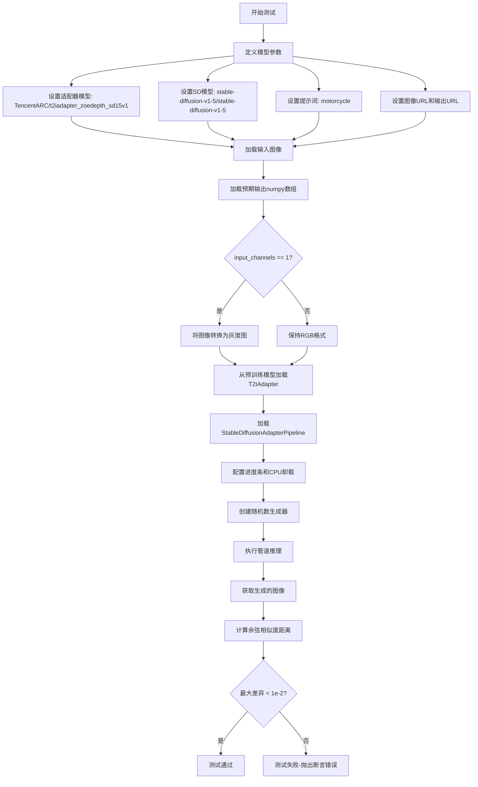

#### 带注释源码

```python
@require_torch_accelerator
def test_stable_diffusion_adapter_zoedepth_sd_v15(self):
    """
    测试 Stable Diffusion 适配器管道使用 ZoeDepth 适配器和 SD v1.5 模型的功能。
    该测试验证管道能够正确加载适配器、执行推理并生成与预期结果相近的输出。
    """
    # 定义T2I适配器模型标识符，用于从HuggingFace Hub加载预训练的ZoeDepth适配器
    adapter_model = "TencentARC/t2iadapter_zoedepth_sd15v1"
    
    # 定义Stable Diffusion基础模型标识符
    sd_model = "stable-diffusion-v1-5/stable-diffusion-v1-5"
    
    # 生成图像所用的文本提示词
    prompt = "motorcycle"
    
    # 输入图像的URL地址
    image_url = "https://huggingface.co/datasets/hf-internal-testing/diffusers-images/resolve/main/t2i_adapter/motorcycle.png"
    
    # 输入通道数，3表示RGB图像，1表示灰度图像
    input_channels = 3
    
    # 预期输出的numpy数组文件URL，用于与实际输出进行比对验证
    out_url = "https://huggingface.co/datasets/diffusers/test-arrays/resolve/main/stable_diffusion_adapter/sd_adapter_v15_zoe_depth.npy"

    # 从URL加载输入图像
    image = load_image(image_url)
    
    # 加载预期输出结果用于比对
    expected_out = load_numpy(out_url)
    
    # 如果输入为单通道，则将图像转换为灰度图
    if input_channels == 1:
        image = image.convert("L")

    # 从预训练模型加载T2IAdapter适配器，使用float16精度以加速推理
    adapter = T2IAdapter.from_pretrained(adapter_model, torch_dtype=torch.float16)

    # 从预训练模型加载StableDiffusionAdapterPipeline管道
    # 参数包括：SD模型路径、适配器实例、禁用安全检查器
    pipe = StableDiffusionAdapterPipeline.from_pretrained(sd_model, adapter=adapter, safety_checker=None)
    
    # 配置进度条显示设置
    pipe.set_progress_bar_config(disable=None)
    
    # 启用模型CPU卸载功能，以便在GPU内存有限的情况下运行
    pipe.enable_model_cpu_offload()
    
    # 创建随机数生成器，确保测试结果可复现
    generator = torch.Generator(device="cpu").manual_seed(0)
    
    # 执行管道推理：
    # - prompt: 文本提示
    # - image: 输入适配器图像
    # - generator: 随机数生成器
    # - num_inference_steps: 推理步数
    # - output_type: 输出格式为numpy数组
    out = pipe(prompt=prompt, image=image, generator=generator, num_inference_steps=2, output_type="np").images

    # 计算生成图像与预期输出之间的余弦相似度距离
    max_diff = numpy_cosine_similarity_distance(out.flatten(), expected_out.flatten())
    
    # 断言最大差异小于阈值1e-2，确保输出质量符合预期
    assert max_diff < 1e-2
```


### `StableDiffusionAdapterPipelineSlowTests.test_stable_diffusion_adapter_canny_sd_v15`

该测试方法用于验证 T2I-Adapter（canny边缘检测）与 Stable Diffusion v1.5 模型的集成功能是否正常工作。它通过加载预训练的canny适配器和SD模型，对输入图像进行推理，并比对生成结果与预期输出之间的余弦相似度距离。

参数：

-  `self`：`StableDiffusionAdapterPipelineSlowTests`，测试类的实例本身

返回值：`None`，该方法为测试方法，通过断言验证结果而非返回数据

#### 流程图

```mermaid
flowchart TD
    A[开始] --> B[定义模型参数: adapter_model, sd_model, prompt, image_url]
    B --> C[加载输入图像: load_image]
    D[加载预期输出: load_numpy]
    C --> E{input_channels == 1?}
    D --> E
    E -->|是| F[转换为灰度图: image.convert('L')]
    E -->|否| G[加载T2IAdapter: T2IAdapter.from_pretrained]
    F --> G
    G --> H[创建StableDiffusionAdapterPipeline]
    H --> I[移动到设备: pipe.to]
    I --> J[配置进度条: set_progress_bar_config]
    J --> K[启用注意力切片: enable_attention_slicing]
    K --> L[创建随机数生成器: Generator.manual_seed]
    L --> M[执行推理: pipe]
    M --> N[计算相似度: numpy_cosine_similarity_distance]
    N --> O{max_diff < 1e-2?}
    O -->|是| P[测试通过]
    O -->|否| Q[测试失败]
```

#### 带注释源码

```python
def test_stable_diffusion_adapter_canny_sd_v15(self):
    """
    测试T2I-Adapter (canny边缘检测) 与 Stable Diffusion v1.5 的集成功能
    验证模型能够根据canny边缘图像生成符合prompt描述的图像
    """
    # 定义canny适配器模型标识符
    adapter_model = "TencentARC/t2iadapter_canny_sd15v2"
    # 定义Stable Diffusion模型标识符
    sd_model = "stable-diffusion-v1-5/stable-diffusion-v1-5"
    # 定义文本提示
    prompt = "toy"
    # 定义输入图像URL (玩具的canny边缘图像)
    image_url = "https://huggingface.co/datasets/hf-internal-testing/diffusers-images/resolve/main/t2i_adapter/toy_canny.png"
    # 输入通道数 (1表示灰度图)
    input_channels = 1
    # 预期输出结果的URL
    out_url = "https://huggingface.co/datasets/diffusers/test-arrays/resolve/main/stable_diffusion_adapter/sd_adapter_v15_zoe_depth.npy"

    # 从URL加载输入图像
    image = load_image(image_url)
    # 加载预期输出结果 (numpy数组)
    expected_out = load_numpy(out_url)
    # 如果输入是单通道灰度图,转换为L模式
    if input_channels == 1:
        image = image.convert("L")

    # 从预训练模型加载T2IAdapter (canny边缘检测适配器)
    adapter = T2IAdapter.from_pretrained(adapter_model, torch_dtype=torch.float16)

    # 从预训练模型加载StableDiffusionAdapterPipeline
    # 传入SD模型和adapter,不使用safety_checker
    pipe = StableDiffusionAdapterPipeline.from_pretrained(sd_model, adapter=adapter, safety_checker=None)

    # 将pipeline移动到计算设备 (GPU/CPU)
    pipe.to(torch_device)
    # 配置进度条 (disable=None表示启用)
    pipe.set_progress_bar_config(disable=None)
    # 启用注意力切片以减少内存占用
    pipe.enable_attention_slicing()

    # 创建随机数生成器,设置种子以保证可复现性
    generator = torch.Generator(device="cpu").manual_seed(0)

    # 执行推理: 根据prompt和image生成图像
    # num_inference_steps=2: 采样步数
    # output_type="np": 输出numpy数组
    out = pipe(prompt=prompt, image=image, generator=generator, num_inference_steps=2, output_type="np").images

    # 计算生成结果与预期结果的余弦相似度距离
    max_diff = numpy_cosine_similarity_distance(out.flatten(), expected_out.flatten())
    # 断言: 相似度距离应小于阈值1e-2
    assert max_diff < 1e-2
```


### `StableDiffusionAdapterPipelineSlowTests.test_stable_diffusion_adapter_sketch_sd15`

该测试函数是一个慢速集成测试，用于验证 Stable Diffusion 适配器（sketch 版本）在 SD1.5 模型上的功能。测试加载预训练的 T2IAdapter sketch 模型和 Stable Diffusion v1.5 模型，然后使用特定的草图图像进行推理，并验证输出与预期结果的一致性。

参数：
- `self`：无，测试类实例的自身引用

返回值：`None`，该测试函数通过断言验证模型输出的正确性，不返回任何值

#### 流程图

```mermaid
flowchart TD
    A[开始测试] --> B[定义适配器模型: TencentARC/t2iadapter_sketch_sd15v2]
    B --> C[定义SD模型: stable-diffusion-v1-5/stable-diffusion-v1-5]
    C --> D[设置prompt: 'cat']
    D --> E[定义输入图像URL]
    E --> F[设置input_channels: 1]
    F --> G[定义预期输出URL]
    G --> H[加载输入图像 load_image]
    H --> I[加载预期输出 load_numpy]
    I --> J{input_channels == 1?}
    J -->|是| K[将图像转换为灰度图 convert L]
    J -->|否| L[跳过转换]
    K --> M[从预训练加载T2IAdapter]
    L --> M
    M --> N[从预训练加载StableDiffusionAdapterPipeline]
    N --> O[将pipeline移动到torch_device]
    O --> P[设置进度条配置]
    P --> Q[启用attention_slicing]
    Q --> R[创建随机数生成器]
    R --> S[执行pipeline推理]
    S --> T[计算输出与预期结果的余弦相似度距离]
    T --> U{max_diff < 1e-2?}
    U -->|是| V[测试通过]
    U -->|否| W[测试失败]
```

#### 带注释源码

```python
def test_stable_diffusion_adapter_sketch_sd15(self):
    """
    集成测试：测试 Stable Diffusion 适配器（sketch版本）在 SD1.5 模型上的功能
    验证 T2IAdapter sketch 模型能够正确处理草图图像并生成符合预期的输出
    """
    # 定义适配器模型标识符（TencentARC提供的sketch适配器）
    adapter_model = "TencentARC/t2iadapter_sketch_sd15v2"
    
    # 定义基础 Stable Diffusion 模型版本
    sd_model = "stable-diffusion-v1-5/stable-diffusion-v1-5"
    
    # 设置文本提示词
    prompt = "cat"
    
    # 输入草图图像的URL（边缘检测图）
    image_url = (
        "https://huggingface.co/datasets/hf-internal-testing/diffusers-images/resolve/main/t2i_adapter/edge.png"
    )
    
    # 输入通道数（1表示灰度图）
    input_channels = 1
    
    # 预期输出的numpy数组URL（用于验证）
    out_url = "https://huggingface.co/datasets/hf-internal-testing/diffusers-images/resolve/main/t2i_adapter/t2iadapter_sketch_sd15v2.npy"

    # 加载输入图像
    image = load_image(image_url)
    
    # 加载预期输出结果（numpy格式）
    expected_out = load_numpy(out_url)
    
    # 如果是单通道输入，转换为灰度图
    if input_channels == 1:
        image = image.convert("L")

    # 从预训练模型加载 T2IAdapter（使用float16精度）
    adapter = T2IAdapter.from_pretrained(adapter_model, torch_dtype=torch.float16)

    # 构建 Stable Diffusion 适配器管道
    pipe = StableDiffusionAdapterPipeline.from_pretrained(sd_model, adapter=adapter, safety_checker=None)
    
    # 将管道移动到指定的计算设备（GPU/CPU）
    pipe.to(torch_device)
    
    # 配置进度条（disable=None 表示启用进度条）
    pipe.set_progress_bar_config(disable=None)
    
    # 启用注意力切片以减少内存占用
    pipe.enable_attention_slicing()

    # 创建随机数生成器，确保测试可复现
    generator = torch.Generator(device="cpu").manual_seed(0)

    # 执行推理：使用提示词、输入图像、生成器和推理步数
    out = pipe(prompt=prompt, image=image, generator=generator, num_inference_steps=2, output_type="np").images

    # 计算输出与预期结果的余弦相似度距离
    max_diff = numpy_cosine_similarity_distance(out.flatten(), expected_out.flatten())
    
    # 断言：最大差异应小于阈值（0.01）
    assert max_diff < 1e-2
```


### `AdapterTests.get_dummy_components`

该方法用于创建用于测试的虚拟（dummy）组件，根据传入的 adapter_type 参数初始化 T2IAdapter、MultiAdapter 或相应的 UNet、VAE、TextEncoder 等模型组件，确保测试环境的可重复性。

参数：

- `adapter_type`：`str`，指定要创建的适配器类型，可选值为 `"full_adapter"`、`"light_adapter"` 或 `"multi_adapter"`
- `time_cond_proj_dim`：`int | None`，可选参数，用于指定 UNet 的时间条件投影维度，默认为 `None`

返回值：`dict`，返回包含所有虚拟组件的字典，包括 `adapter`、`unet`、`scheduler`、`vae`、`text_encoder`、`tokenizer`、`safety_checker` 和 `feature_extractor`

#### 流程图

```mermaid
flowchart TD
    A[开始 get_dummy_components] --> B[设置随机种子 torch.manual_seed(0)]
    B --> C[创建 UNet2DConditionModel]
    C --> D[创建 PNDMScheduler]
    D --> E[设置随机种子并创建 AutoencoderKL]
    E --> F[创建 CLIPTextModel 和 CLIPTokenizer]
    F --> G{判断 adapter_type}
    G -->|full_adapter 或 light_adapter| H[创建 T2IAdapter]
    G -->|multi_adapter| I[创建 MultiAdapter 包含两个 T2IAdapter]
    G -->|其他| J[抛出 ValueError 异常]
    H --> K[组装 components 字典]
    I --> K
    K --> L[返回 components]
    J --> M[结束]
```

#### 带注释源码

```python
def get_dummy_components(self, adapter_type, time_cond_proj_dim=None):
    """获取用于测试的虚拟组件。
    
    参数:
        adapter_type: 适配器类型，可选 'full_adapter', 'light_adapter', 'multi_adapter'
        time_cond_proj_dim: UNet 的时间条件投影维度，可选
    返回:
        包含所有虚拟组件的字典
    """
    # 设置随机种子以确保可重复性
    torch.manual_seed(0)
    # 创建虚拟 UNet 模型，用于条件去噪
    unet = UNet2DConditionModel(
        block_out_channels=(32, 64),
        layers_per_block=2,
        sample_size=32,
        in_channels=4,
        out_channels=4,
        down_block_types=("CrossAttnDownBlock2D", "DownBlock2D"),
        up_block_types=("CrossAttnUpBlock2D", "UpBlock2D"),
        cross_attention_dim=32,
        time_cond_proj_dim=time_cond_proj_dim,
    )
    # 创建 PNDMScheduler 用于调度去噪步骤
    scheduler = PNDMScheduler(skip_prk_steps=True)
    
    # 重新设置随机种子以确保 VAE 初始化一致性
    torch.manual_seed(0)
    # 创建虚拟 VAE 模型用于潜在空间编码/解码
    vae = AutoencoderKL(
        block_out_channels=[32, 64],
        in_channels=3,
        out_channels=3,
        down_block_types=["DownEncoderBlock2D", "DownEncoderBlock2D"],
        up_block_types=["UpDecoderBlock2D", "UpDecoderBlock2D"],
        latent_channels=4,
    )
    
    torch.manual_seed(0)
    # 配置文本编码器的虚拟参数
    text_encoder_config = CLIPTextConfig(
        bos_token_id=0,
        eos_token_id=2,
        hidden_size=32,
        intermediate_size=37,
        layer_norm_eps=1e-05,
        num_attention_heads=4,
        num_hidden_layers=5,
        pad_token_id=1,
        vocab_size=1000,
    )
    # 创建虚拟文本编码器模型
    text_encoder = CLIPTextModel(text_encoder_config)
    # 加载虚拟分词器
    tokenizer = CLIPTokenizer.from_pretrained("hf-internal-testing/tiny-random-clip")

    torch.manual_seed(0)

    # 根据 adapter_type 创建对应的适配器
    if adapter_type == "full_adapter" or adapter_type == "light_adapter":
        # 创建单一路线适配器（T2I Adapter）
        adapter = T2IAdapter(
            in_channels=3,
            channels=[32, 64],
            num_res_blocks=2,
            downscale_factor=2,
            adapter_type=adapter_type,
        )
    elif adapter_type == "multi_adapter":
        # 创建多重适配器，包含两个全适配器
        adapter = MultiAdapter(
            [
                T2IAdapter(
                    in_channels=3,
                    channels=[32, 64],
                    num_res_blocks=2,
                    downscale_factor=2,
                    adapter_type="full_adapter",
                ),
                T2IAdapter(
                    in_channels=3,
                    channels=[32, 64],
                    num_res_blocks=2,
                    downscale_factor=2,
                    adapter_type="full_adapter",
                ),
            ]
        )
    else:
        # 处理无效的 adapter_type
        raise ValueError(
            f"Unknown adapter type: {adapter_type}, must be one of 'full_adapter', 'light_adapter', or 'multi_adapter''"
        )

    # 组装所有组件到字典中返回
    components = {
        "adapter": adapter,
        "unet": unet,
        "scheduler": scheduler,
        "vae": vae,
        "text_encoder": text_encoder,
        "tokenizer": tokenizer,
        "safety_checker": None,
        "feature_extractor": None,
    }
    return components
```


### `AdapterTests.get_dummy_components_with_full_downscaling`

获取具有 x8 VAE 下采样和 4 个 UNet 下采样块的虚拟组件，用于完整测试 T2I-Adapter 的下采样行为。

参数：

- `adapter_type`：`str`，适配器类型，可选值为 `"full_adapter"`、`"light_adapter"` 或 `"multi_adapter"`

返回值：`dict`，包含以下键值对：
  - `"adapter"`：适配器实例（T2IAdapter 或 MultiAdapter）
  - `"unet"`：UNet2DConditionModel 实例
  - `"scheduler"`：PNDMScheduler 实例
  - `"vae"`：AutoencoderKL 实例
  - `"text_encoder"`：CLIPTextModel 实例
  - `"tokenizer"`：CLIPTokenizer 实例
  - `"safety_checker"`：None
  - `"feature_extractor"`：None

#### 流程图

```mermaid
flowchart TD
    A[开始 get_dummy_components_with_full_downscaling] --> B[设置随机种子 torch.manual_seed]
    B --> C[创建 UNet2DConditionModel 4层下采样]
    C --> D[创建 PNDMScheduler]
    D --> E[创建 AutoencoderKL 4层下采样]
    E --> F[创建 CLIPTextConfig 和 CLIPTextModel]
    F --> G[创建 CLIPTokenizer]
    G --> H{判断 adapter_type}
    H -->|full_adapter/light_adapter| I[创建 T2IAdapter downscale_factor=8]
    H -->|multi_adapter| J[创建 MultiAdapter 包含2个T2IAdapter]
    H -->|其他| K[抛出 ValueError 异常]
    I --> L[组装 components 字典]
    J --> L
    K --> L
    L --> M[返回 components 字典]
```

#### 带注释源码

```python
def get_dummy_components_with_full_downscaling(self, adapter_type):
    """Get dummy components with x8 VAE downscaling and 4 UNet down blocks.
    These dummy components are intended to fully-exercise the T2I-Adapter
    downscaling behavior.
    """
    # 设置随机种子以确保可重复性
    torch.manual_seed(0)
    
    # 创建 UNet2DConditionModel，具有4个下采样块
    # block_out_channels: (32, 32, 32, 64) 表示4个阶段的输出通道数
    unet = UNet2DConditionModel(
        block_out_channels=(32, 32, 32, 64),
        layers_per_block=2,
        sample_size=32,
        in_channels=4,
        out_channels=4,
        down_block_types=("CrossAttnDownBlock2D", "CrossAttnDownBlock2D", "CrossAttnDownBlock2D", "DownBlock2D"),
        up_block_types=("UpBlock2D", "CrossAttnUpBlock2D", "CrossAttnUpBlock2D", "CrossAttnUpBlock2D"),
        cross_attention_dim=32,
    )
    
    # 创建 PNDMScheduler（Prerequisites & Normalized Diffusion Scheduler）
    scheduler = PNDMScheduler(skip_prk_steps=True)
    
    # 重新设置随机种子以确保 VAE 的可重复性
    torch.manual_seed(0)
    
    # 创建 AutoencoderKL，具有4个下采样阶段，实现 x8 下采样
    vae = AutoencoderKL(
        block_out_channels=[32, 32, 32, 64],
        in_channels=3,
        out_channels=3,
        down_block_types=["DownEncoderBlock2D", "DownEncoderBlock2D", "DownEncoderBlock2D", "DownEncoderBlock2D"],
        up_block_types=["UpDecoderBlock2D", "UpDecoderBlock2D", "UpDecoderBlock2D", "UpDecoderBlock2D"],
        latent_channels=4,
    )
    
    # 重新设置随机种子
    torch.manual_seed(0)
    
    # 创建 CLIP 文本编码器配置
    text_encoder_config = CLIPTextConfig(
        bos_token_id=0,
        eos_token_id=2,
        hidden_size=32,
        intermediate_size=37,
        layer_norm_eps=1e-05,
        num_attention_heads=4,
        num_hidden_layers=5,
        pad_token_id=1,
        vocab_size=1000,
    )
    
    # 从配置创建 CLIP 文本编码器模型
    text_encoder = CLIPTextModel(text_encoder_config)
    
    # 加载小型随机 CLIP tokenizer
    tokenizer = CLIPTokenizer.from_pretrained("hf-internal-testing/tiny-random-clip")

    # 重新设置随机种子
    torch.manual_seed(0)

    # 根据 adapter_type 创建适配器
    if adapter_type == "full_adapter" or adapter_type == "light_adapter":
        # 创建 T2IAdapter，downscale_factor=8 表示8倍下采样
        adapter = T2IAdapter(
            in_channels=3,
            channels=[32, 32, 32, 64],
            num_res_blocks=2,
            downscale_factor=8,
            adapter_type=adapter_type,
        )
    elif adapter_type == "multi_adapter":
        # 创建 MultiAdapter，包含两个 T2IAdapter
        adapter = MultiAdapter(
            [
                T2IAdapter(
                    in_channels=3,
                    channels=[32, 32, 32, 64],
                    num_res_blocks=2,
                    downscale_factor=8,
                    adapter_type="full_adapter",
                ),
                T2IAdapter(
                    in_channels=3,
                    channels=[32, 32, 32, 64],
                    num_res_blocks=2,
                    downscale_factor=8,
                    adapter_type="full_adapter",
                ),
            ]
        )
    else:
        # 未知适配器类型，抛出异常
        raise ValueError(
            f"Unknown adapter type: {adapter_type}, must be one of 'full_adapter', 'light_adapter', or 'multi_adapter''"
        )

    # 组装所有组件为一个字典
    components = {
        "adapter": adapter,
        "unet": unet,
        "scheduler": scheduler,
        "vae": vae,
        "text_encoder": text_encoder,
        "tokenizer": tokenizer,
        "safety_checker": None,
        "feature_extractor": None,
    }
    
    # 返回组件字典
    return components
```


### `AdapterTests.get_dummy_inputs`

该函数用于生成适配器管道的虚拟输入数据，创建一个包含提示词、图像、生成器及推理参数的字典，供 StableDiffusionAdapterPipeline 进行测试或推理使用。

参数：

- `self`：`AdapterTests` 类实例，代表当前测试类的上下文
- `device`：`str`，目标设备标识符（如 "cpu"、"cuda" 等），用于将张量放置到指定设备上
- `seed`：`int`，随机种子，默认值为 0，用于确保生成图像和随机过程的可重复性
- `height`：`int`，生成图像的高度，默认值为 64 像素
- `width`：`int`，生成图像的宽度，默认值为 64 像素
- `num_images`：`int`，要生成的图像数量，默认值为 1

返回值：`Dict[str, Any]`，返回包含以下键的字典：
- `prompt`：`str`，提示词文本
- `image`：`torch.Tensor` 或 `List[torch.Tensor]`，输入图像张量或张量列表
- `generator`：`torch.Generator` 或 `None`，随机数生成器
- `num_inference_steps`：`int`，推理步数
- `guidance_scale`：`float`，引导比例系数
- `output_type`：`str`，输出类型（"np" 表示 NumPy 数组）

#### 流程图

```mermaid
flowchart TD
    A[开始 get_dummy_inputs] --> B{num_images == 1?}
    B -->|是| C[生成单个图像张量]
    B -->|否| D[生成多个图像张量列表]
    C --> E{device 以 'mps' 开头?}
    D --> E
    E -->|是| F[使用 torch.manual_seed 创建生成器]
    E -->|否| G[使用 torch.Generator 创建生成器]
    F --> H[构建输入字典]
    G --> H
    H --> I[返回包含 prompt/image/generator 等的字典]
```

#### 带注释源码

```python
def get_dummy_inputs(self, device, seed=0, height=64, width=64, num_images=1):
    """
    生成用于适配器管道的虚拟输入参数。
    
    Args:
        device (str): 目标设备（如 'cpu', 'cuda'）
        seed (int): 随机种子，用于确保可重复性
        height (int): 图像高度
        width (int): 图像宽度
        num_images (int): 生成图像的数量
    
    Returns:
        dict: 包含管道所需输入参数的字典
    """
    # 根据 num_images 判断生成单张还是多张图像
    if num_images == 1:
        # 使用 floats_tensor 生成单张图像张量，形状为 (1, 3, height, width)
        image = floats_tensor((1, 3, height, width), rng=random.Random(seed)).to(device)
    else:
        # 生成多张图像的列表
        image = [
            floats_tensor((1, 3, height, width), rng=random.Random(seed)).to(device) 
            for _ in range(num_images)
        ]

    # 针对 Apple Silicon (MPS) 设备与其他设备使用不同的随机生成器创建方式
    if str(device).startswith("mps"):
        # MPS 设备使用 torch.manual_seed
        generator = torch.manual_seed(seed)
    else:
        # 其他设备使用 torch.Generator 并设置种子
        generator = torch.Generator(device=device).manual_seed(seed)
    
    # 构建完整的输入参数字典
    inputs = {
        "prompt": "A painting of a squirrel eating a burger",  # 测试用提示词
        "image": image,                                         # 适配器输入图像
        "generator": generator,                                 # 随机生成器
        "num_inference_steps": 2,                               # 推理步数（较少以加快测试）
        "guidance_scale": 6.0,                                  # classifier-free guidance 强度
        "output_type": "np",                                    # 输出为 NumPy 数组
    }
    return inputs
```


### `AdapterTests.test_attention_slicing_forward_pass`

该方法是 `AdapterTests` 类的测试方法，用于验证 T2I-Adapter 流水线在启用注意力切片（attention slicing）优化后的前向传播正确性。通过调用内部方法 `_test_attention_slicing_forward_pass` 并设定预期的最大数值差异阈值为 2e-3，来确保优化后的输出与基准输出保持一致。

参数：

- `self`：调用该方法的对象实例

返回值：无返回值（`None`），该方法为测试方法，通过断言验证结果的正确性

#### 流程图

```mermaid
flowchart TD
    A[开始执行 test_attention_slicing_forward_pass] --> B[调用 _test_attention_slicing_forward_pass 并传入 expected_max_diff=2e-3]
    B --> C{检查注意力切片输出与基准输出的差异}
    C -->|差异 < 2e-3| D[测试通过]
    C -->|差异 >= 2e-3| E[测试失败]
```

#### 带注释源码

```python
def test_attention_slicing_forward_pass(self):
    """
    测试 T2I-Adapter 流水线在使用注意力切片优化时的前向传播正确性。
    
    注意力切片是一种内存优化技术，通过将注意力计算分片处理来减少显存占用。
    该测试方法验证启用该优化后，模型的输出结果仍然保持在可接受的误差范围内。
    
    参数:
        self: AdapterTests 类的实例对象
    
    返回值:
        None: 该方法为测试方法，通过内部断言验证正确性，无显式返回值
    
    注意:
        - 该方法实际调用 _test_attention_slicing_forward_pass(expected_max_diff=2e-3)
        - expected_max_diff=2e-3 表示允许的最大数值差异为 0.002
        - 具体的测试逻辑实现于父类或 mixin 类的 _test_attention_slicing_forward_pass 方法中
    """
    return self._test_attention_slicing_forward_pass(expected_max_diff=2e-3)
```


### `AdapterTests.test_xformers_attention_forwardGenerator_pass`

该方法是一个测试用例，用于验证T2I-Adapter管道在使用xformers注意力机制时的前向传播是否正确。方法通过`@unittest.skipIf`装饰器确保仅在CUDA环境且xformers可用时执行，否则跳过测试。实际测试逻辑委托给`_test_xformers_attention_forwardGenerator_pass`方法，预期最大误差阈值为2e-3。

参数：
- `self`：隐式参数，测试类实例本身，无类型描述

返回值：`None`，该方法为测试用例，不返回任何值

#### 流程图

```mermaid
flowchart TD
    A[开始 test_xformers_attention_forwardGenerator_pass] --> B{检查条件: torch_device == 'cuda' 且 is_xformers_available()}
    B -->|是| C[执行测试逻辑]
    B -->|否| D[跳过测试]
    C --> E[调用 self._test_xformers_attention_forwardGenerator_pass expected_max_diff=2e-3]
    E --> F[断言输出与预期最大差异小于阈值]
    F --> G[结束]
    D --> G
```

#### 带注释源码

```python
@unittest.skipIf(
    torch_device != "cuda" or not is_xformers_available(),
    reason="XFormers attention is only available with CUDA and `xformers` installed",
)
def test_xformers_attention_forwardGenerator_pass(self):
    """测试 xformers 注意力机制的前向传播是否正确。
    
    该测试方法通过以下步骤验证 T2I-Adapter 管道在使用 xformers
    加速注意力计算时的正确性：
    1. 检查运行环境是否为 CUDA 且已安装 xformers
    2. 如果条件满足，调用内部测试方法 _test_xformers_attention_forwardGenerator_pass
    3. 预期输出与参考输出的最大差异应小于 2e-3
    
    注意：该方法的具体实现逻辑在父类或 mixin 中定义，
    当前类中只提供了调用入口。
    """
    self._test_xformers_attention_forwardGenerator_pass(expected_max_diff=2e-3)
```


### `AdapterTests.test_inference_batch_single_identical`

这是一个测试方法，用于验证在使用 T2I-Adapter 的 Stable Diffusion 管道中，批处理推理时单个样本的输出与批处理中第一个样本的输出一致性（identical）。该测试确保管道在处理批量数据时能够正确地保持结果的确定性和一致性。

参数：

- `self`：当前测试类实例，无需显式传递

返回值：`None`，该方法为测试方法，通过 `assert` 语句验证结果，不返回任何值。

#### 流程图

```mermaid
flowchart TD
    A[开始 test_inference_batch_single_identical] --> B[调用 _test_inference_batch_single_identical 方法]
    B --> C[设置 expected_max_diff=2e-3]
    C --> D[在 _test_inference_batch_single_identical 内部:]
    D --> E[创建管道实例并移至设备]
    D --> F[获取虚拟输入数据 get_dummy_inputs]
    D --> G[将输入数据批处理化 batch_size=3]
    D --> H[执行批处理输出 output_batch]
    D --> I[执行单个输出 output]
    D --> J[比较批处理第一个输出与单个输出的差异]
    D --> K[断言 max_diff < expected_max_diff]
    K --> L[测试通过]
```

#### 带注释源码

```python
def test_inference_batch_single_identical(self):
    """
    测试方法：验证批处理推理时单个样本与批处理中第一个样本的输出一致性。
    
    该测试方法继承自 AdapterTests 类，用于确保 T2I-Adapter 管道在处理
    批量数据时能够产生确定性的结果。具体来说，它会比较：
    1. 使用 batch_size=3 批处理时的第一个输出
    2. 使用单独（单个）输入时的输出
    两者应该几乎完全相同（差异小于 expected_max_diff=2e-3）
    
    注意：该方法调用了父类或混合类中的 _test_inference_batch_single_identical 
    实现，expected_max_diff=2e-3 是允许的最大差异阈值。
    """
    # 调用内部测试方法，expected_max_diff=2e-3 表示允许的最大像素差异
    self._test_inference_batch_single_identical(expected_max_diff=2e-3)
```


### `AdapterTests.test_multiple_image_dimensions`

该测试方法用于验证 T2I-Adapter 管道支持任意可被适配器 downscale_factor 整除的输入图像维度。测试选取了能产生各降采样级别奇数分辨率的维度值（264、272、288、320），以确保 T2I Adapter 的降采样填充行为与 UNet 的行为一致。

参数：

- `self`：`AdapterTests`，测试类的实例对象
- `dim`：`int`，输入图像的高度和宽度维度值，通过 `@parameterized.expand` 装饰器传入四个测试用例：264、272、288、320

返回值：`None`，测试方法无返回值，通过断言验证输出图像形状

#### 流程图

```mermaid
flowchart TD
    A[开始测试] --> B[调用 get_dummy_components_with_full_downscaling 获取组件]
    B --> C[创建 StableDiffusionAdapterPipeline 实例]
    C --> D[将管道移动到 torch_device]
    D --> E[设置进度条配置 disable=None]
    E --> F[调用 get_dummy_inputs 生成输入参数]
    F --> G[执行管道推理 sd_pipe(**inputs)]
    G --> H[获取生成的图像 image = sd_pipe(...).images]
    H --> I{断言验证}
    I -->|通过| J[测试通过]
    I -->|失败| K[抛出 AssertionError]
    
    style A fill:#f9f,stroke:#333
    style J fill:#9f9,stroke:#333
    style K fill:#f99,stroke:#333
```

#### 带注释源码

```python
@parameterized.expand(
    [
        # (dim=264) The internal feature map will be 33x33 after initial pixel unshuffling (downscaled x8).
        (((4 * 8 + 1) * 8),),
        # (dim=272) The internal feature map will be 17x17 after the first T2I down block (downscaled x16).
        (((4 * 4 + 1) * 16),),
        # (dim=288) The internal feature map will be 9x9 after the second T2I down block (downscaled x32).
        (((4 * 2 + 1) * 32),),
        # (dim=320) The internal feature map will be 5x5 after the third T2I down block (downscaled x64).
        (((4 * 1 + 1) * 64),),
    ]
)
def test_multiple_image_dimensions(self, dim):
    """Test that the T2I-Adapter pipeline supports any input dimension that
    is divisible by the adapter's `downscale_factor`. This test was added in
    response to an issue where the T2I Adapter's downscaling padding
    behavior did not match the UNet's behavior.

    Note that we have selected `dim` values to produce odd resolutions at
    each downscaling level.
    """
    # Step 1: 获取具有完整降采样配置的虚拟组件（x8 VAE 降采样 + 4 个 UNet 降采样块）
    components = self.get_dummy_components_with_full_downscaling()
    
    # Step 2: 使用虚拟组件初始化 StableDiffusionAdapterPipeline 管道
    sd_pipe = StableDiffusionAdapterPipeline(**components)
    
    # Step 3: 将管道移动到指定的计算设备（CPU/CUDA）
    sd_pipe = sd_pipe.to(torch_device)
    
    # Step 4: 配置进度条（disable=None 表示启用进度条）
    sd_pipe.set_progress_bar_config(disable=None)

    # Step 5: 生成虚拟输入数据，指定图像高度和宽度为 dim
    inputs = self.get_dummy_inputs(torch_device, height=dim, width=dim)
    
    # Step 6: 执行管道推理，生成图像
    image = sd_pipe(**inputs).images

    # Step 7: 断言验证输出图像形状为 (1, dim, dim, 3)
    # - 批量大小为 1
    # - 高度和宽度与输入 dim 一致
    # - RGB 通道数为 3
    assert image.shape == (1, dim, dim, 3)
```


### `AdapterTests.test_adapter_lcm`

该方法是 `AdapterTests` 测试类中的一个测试函数，用于验证 LCM（Latent Consistency Model）调度器与 Stable Diffusion Adapter Pipeline 的集成是否正常工作。测试通过创建虚拟组件、配置 LCM 调度器、执行推理流程，并验证输出图像的像素值是否在预期范围内来确保管道的正确性。

参数：

- `self`：`AdapterTests` 类实例，隐式参数，表示测试类本身

返回值：`None`，该方法是一个测试函数，通过断言验证功能，不返回任何值

#### 流程图

```mermaid
flowchart TD
    A[开始测试 test_adapter_lcm] --> B[设置 device = cpu 保证确定性]
    B --> C[调用 get_dummy_components 获取虚拟组件<br/>time_cond_proj_dim=256]
    C --> D[创建 StableDiffusionAdapterPipeline]
    D --> E[将调度器替换为 LCMScheduler]
    E --> F[将 pipeline 移动到 torch_device]
    F --> G[设置进度条配置 disable=None]
    G --> H[调用 get_dummy_inputs 获取测试输入]
    H --> I[执行 pipeline 推理: sd_pipe(**inputs)]
    I --> J[获取输出图像: output.images]
    J --> K[提取图像切片: image[0, -3:, -3:, -1]]
    K --> L[断言图像形状 == (1, 64, 64, 3)]
    L --> M[定义期望的像素值数组 expected_slice]
    M --> N{断言: 实际切片与期望切片的<br/>最大差异 < 1e-2}
    N -->|通过| O[测试通过]
    N -->|失败| P[测试失败]
```

#### 带注释源码

```python
def test_adapter_lcm(self):
    """
    测试 LCM (Latent Consistency Model) 调度器与 Stable Diffusion Adapter Pipeline 的集成。
    该测试验证 adapter 管道在使用 LCM 调度器时能够正确生成图像，并确保输出结果确定性。
    """
    # 设置 device 为 "cpu" 以确保设备依赖的 torch.Generator 的确定性
    # 使用 CPU 可以避免 GPU 相关的不确定性因素
    device = "cpu"  # ensure determinism for the device-dependent torch.Generator

    # 获取虚拟组件，包含:
    # - UNet2DConditionModel: 条件 UNet 模型
    # - PNDMScheduler: 初始调度器（后续替换为 LCM）
    # - AutoencoderKL: VAE 编码器/解码器
    # - CLIPTextModel + CLIPTokenizer: 文本编码器
    # - T2IAdapter: T2I Adapter 模型
    # time_cond_proj_dim=256 指定时间条件投影维度
    components = self.get_dummy_components(time_cond_proj_dim=256)

    # 使用虚拟组件实例化 Stable Diffusion Adapter Pipeline
    # 该管道结合了 T2I Adapter 和 Stable Diffusion 模型
    sd_pipe = StableDiffusionAdapterPipeline(**components)

    # 从现有调度器配置创建 LCMScheduler 并替换
    # LCM (Latent Consistency Model) 是一种加速扩散模型推理的方法
    sd_pipe.scheduler = LCMScheduler.from_config(sd_pipe.scheduler.config)

    # 将 pipeline 移动到指定的计算设备 (torch_device)
    sd_pipe = sd_pipe.to(torch_device)

    # 配置进度条，disable=None 表示启用进度条
    sd_pipe.set_progress_bar_config(disable=None)

    # 获取虚拟输入，包含:
    # - prompt: 文本提示 "A painting of a squirrel eating a burger"
    # - image: 浮点张量生成的虚拟图像 (1, 3, 64, 64)
    # - generator: 随机数生成器，用于确保可重复性
    # - num_inference_steps: 推理步数 = 2
    # - guidance_scale: 引导尺度 = 6.0
    # - output_type: 输出类型 = "np" (numpy)
    inputs = self.get_dummy_inputs(device)

    # 执行管道推理，传入虚拟输入
    # 返回包含 images 属性的输出对象
    output = sd_pipe(**inputs)

    # 从输出中提取生成的图像数组
    image = output.images

    # 提取图像右下角 3x3 像素区域，用于验证
    # image[0]: 批处理第一张图像
    # [-3:, -3:, -1]: 最后3行、最后3列、最后一个通道（通常是RGB的R通道或透明度）
    image_slice = image[0, -3:, -3:, -1]

    # 断言生成的图像形状为 (1, 64, 64, 3)
    # 1: 批次大小, 64: 高度, 64: 宽度, 3: RGB 通道数
    assert image.shape == (1, 64, 64, 3)

    # 定义期望的像素值数组（来自已知正确输出）
    # 这些值是在确定性的测试环境中预先计算得出的
    expected_slice = np.array([0.4535, 0.5493, 0.4359, 0.5452, 0.6086, 0.4441, 0.5544, 0.501, 0.4859])

    # 断言实际像素值与期望值的最大差异小于 0.01 (1e-2)
    # 使用 np.abs 计算绝对差值，.flatten() 将 3x3 矩阵展平为 1D 数组
    # .max() 获取最大差异
    assert np.abs(image_slice.flatten() - expected_slice).max() < 1e-2
```


### `AdapterTests.test_adapter_lcm_custom_timesteps`

该测试方法验证了Stable Diffusion Adapter Pipeline在使用LCMScheduler时，能够正确处理自定义时间步（timesteps）进行推理。通过移除默认的`num_inference_steps`参数并显式传入`timesteps`列表[999, 499]，测试确认了pipeline能够按照指定的自定义时间步序列生成图像，并且生成的图像像素值与预期值匹配（误差小于1e-2）。

参数：

- `self`：`AdapterTests`，测试类实例，隐含参数

返回值：`None`，该方法为测试方法，通过断言验证功能，不返回任何值

#### 流程图

```mermaid
flowchart TD
    A[开始测试] --> B[设置device为cpu确保确定性]
    B --> C[获取dummy components<br/>time_cond_proj_dim=256]
    C --> D[创建StableDiffusionAdapterPipeline]
    D --> E[加载LCMScheduler替换默认scheduler]
    E --> F[将pipeline移动到torch_device]
    F --> G[设置进度条配置disable=None]
    G --> H[获取dummy inputs]
    H --> I[删除inputs中的num_inference_steps]
    I --> J[添加自定义timesteps: 999, 499]
    J --> K[调用pipeline执行推理]
    K --> L[获取生成的图像]
    L --> M[提取图像右下角3x3像素切片]
    M --> N{断言验证}
    N -->|通过| O[测试通过]
    N -->|失败| P[抛出断言错误]
```

#### 带注释源码

```python
def test_adapter_lcm_custom_timesteps(self):
    """测试使用自定义timesteps的LCM Adapter推理功能
    
    该测试验证StableDiffusionAdapterPipeline能够：
    1. 使用LCMScheduler进行推理
    2. 正确处理用户自定义的timesteps参数
    3. 生成与预期一致的图像输出
    """
    # 使用cpu设备以确保torch.Generator的确定性
    device = "cpu"  

    # 获取虚拟组件，time_cond_proj_dim=256用于LCM特定的时间条件投影维度
    components = self.get_dummy_components(time_cond_proj_dim=256)
    
    # 使用虚拟组件创建Stable Diffusion Adapter Pipeline
    sd_pipe = StableDiffusionAdapterPipeline(**components)
    
    # 使用LCMScheduler替换默认的PNDMScheduler
    # LCMScheduler支持更快的推理和自定义timesteps
    sd_pipe.scheduler = LCMScheduler.from_config(sd_pipe.scheduler.config)
    
    # 将pipeline移至指定的计算设备（通常是cuda）
    sd_pipe = sd_pipe.to(torch_device)
    
    # 配置进度条，disable=None表示显示进度条
    sd_pipe.set_progress_bar_config(disable=None)

    # 获取标准虚拟输入
    inputs = self.get_dummy_inputs(device)
    
    # 删除num_inference_steps参数，因为我们将要使用自定义timesteps
    del inputs["num_inference_steps"]
    
    # 设置自定义的时间步序列：999和499
    # 这将覆盖scheduler默认的时间步计算逻辑
    inputs["timesteps"] = [999, 499]
    
    # 执行推理，使用自定义timesteps
    output = sd_pipe(**inputs)
    
    # 从输出中获取生成的图像数组
    image = output.images

    # 提取图像右下角3x3区域的像素值用于验证
    # image shape: (batch, height, width, channels)
    image_slice = image[0, -3:, -3:, -1]

    # 断言1：验证输出图像的形状为(1, 64, 64, 3)
    assert image.shape == (1, 64, 64, 3)
    
    # 定义预期的像素值切片（来自LCM模型的已知输出）
    expected_slice = np.array([0.4535, 0.5493, 0.4359, 0.5452, 0.6086, 0.4441, 0.5544, 0.501, 0.4859])

    # 断言2：验证生成图像与预期值的最大误差小于0.01
    # 使用np.abs计算绝对误差，.max()获取最大误差值
    assert np.abs(image_slice.flatten() - expected_slice).max() < 1e-2
```


### `AdapterTests.test_encode_prompt_works_in_isolation`

该方法是 `AdapterTests` 测试类中的一个测试方法，用于验证 `encode_prompt` 方法能够独立工作（即在隔离环境中正常工作）。该方法通过构建额外的必需参数字典（包含设备类型和分类器自由引导标志），调用父类的同名测试方法来实现功能验证。

参数：

- `self`：`AdapterTests` 实例对象，调用该方法的类实例本身

返回值：`any`，返回父类 `test_encode_prompt_works_in_isolation` 方法的执行结果，具体类型取决于父类方法的返回值（通常为测试断言结果）

#### 流程图

```mermaid
flowchart TD
    A[开始执行 test_encode_prompt_works_in_isolation] --> B[获取 torch_device 类型作为 device 参数]
    B --> C[调用 self.get_dummy_inputs 获取 guidan

ce_scale]
    C --> D{guidance_scale > 1.0}
    D -->|是| E[do_classifier_free_guidance = True]
    D -->|否| F[do_classifier_free_guidance = False]
    E --> G[构建 extra_required_param_value_dict 字典]
    F --> G
    G --> H[调用 super().test_encode_prompt_works_in_isolation 传递参数字典]
    H --> I[返回父类测试结果]
```

#### 带注释源码

```python
def test_encode_prompt_works_in_isolation(self):
    """
    测试 encode_prompt 方法在隔离环境中能否正常工作。
    该测试方法验证文本编码功能独立于其他管道组件的正确性。
    """
    # 构建额外的必需参数字典，用于传递给父类测试方法
    extra_required_param_value_dict = {
        # 获取当前测试设备的类型（如 'cuda', 'cpu' 等）
        "device": torch.device(torch_device).type,
        # 根据虚拟输入的 guidance_scale 判断是否启用分类器自由引导
        # 如果 guidance_scale > 1.0 则启用，否则禁用
        "do_classifier_free_guidance": self.get_dummy_inputs(device=torch_device).get("guidance_scale", 1.0) > 1.0,
    }
    # 调用父类（PipelineTesterMixin）的同名测试方法
    # 传递额外的参数字典以满足测试环境需求
    return super().test_encode_prompt_works_in_isolation(extra_required_param_value_dict)
```


### `StableDiffusionFullAdapterPipelineFastTests.get_dummy_components`

该函数是测试类 `StableDiffusionFullAdapterPipelineFastTests` 的成员方法，用于生成用于测试的虚拟组件。它调用父类的 `get_dummy_components` 方法，传入 `"full_adapter"` 作为适配器类型，用于创建完整的 T2I-Adapter 管道测试所需的虚拟组件（包括 UNet、VAE、文本编码器、tokenizer 和调度器等）。

参数：

- `time_cond_proj_dim`：`Optional[int]`，可选参数，指定时间条件投影维度，用于条件UNet的时间嵌入。如果为 `None`，则使用默认值。

返回值：`Dict[str, Any]`，返回包含所有虚拟组件的字典，键包括 `"adapter"`、`"unet"`、`"scheduler"`、`"vae"`、`"text_encoder"`、`"tokenizer"`、`"safety_checker"` 和 `"feature_extractor"`。

#### 流程图

```mermaid
flowchart TD
    A[开始 get_dummy_components] --> B{传入 time_cond_proj_dim}
    B -->|默认值 None| C[调用父类方法 super().get_dummy_components<br/>传入 'full_adapter' 和 time_cond_proj_dim]
    D[父类 AdapterTests.get_dummy_components<br/>接收 adapter_type='full_adapter'] --> E[设置随机种子 torch.manual_seed(0)]
    E --> F[创建 UNet2DConditionModel]
    F --> G[创建 PNDMScheduler]
    G --> H[创建 AutoencoderKL VAE]
    H --> I[创建 CLIPTextModel 和 CLIPTokenizer]
    I --> J{adapter_type == 'full_adapter'<br/>或 'light_adapter'}
    J -->|是| K[创建 T2IAdapter]
    J -->|否| L{adapter_type == 'multi_adapter'}
    L -->|是| M[创建 MultiAdapter]
    L -->|否| N[抛出 ValueError 异常]
    K --> O[组装 components 字典]
    M --> O
    N --> P[结束]
    O --> Q[返回 components 字典]
    C --> R[返回 components 字典]
```

#### 带注释源码

```python
def get_dummy_components(self, time_cond_proj_dim=None):
    """
    生成用于测试的虚拟组件。
    
    参数:
        time_cond_proj_dim: 可选的时间条件投影维度参数，
                           传递给UNet2DConditionModel用于条件生成。
    
    返回:
        包含虚拟组件的字典，用于初始化StableDiffusionAdapterPipeline。
    """
    # 调用父类 AdapterTests 的 get_dummy_components 方法
    # 传入适配器类型 'full_adapter' 和可选的 time_cond_proj_dim 参数
    return super().get_dummy_components("full_adapter", time_cond_proj_dim=time_cond_proj_dim)


# 父类 AdapterTests 中的 get_dummy_components 方法完整实现：
def get_dummy_components(self, adapter_type, time_cond_proj_dim=None):
    # 设置随机种子以确保结果可复现
    torch.manual_seed(0)
    
    # 创建虚拟 UNet2DConditionModel 模型
    # 参数包括：块输出通道、每层块数、样本大小、输入/输出通道数
    # 下采样块类型、上采样块类型、交叉注意力维度和时间条件投影维度
    unet = UNet2DConditionModel(
        block_out_channels=(32, 64),
        layers_per_block=2,
        sample_size=32,
        in_channels=4,
        out_channels=4,
        down_block_types=("CrossAttnDownBlock2D", "DownBlock2D"),
        up_block_types=("CrossAttnUpBlock2D", "UpBlock2D"),
        cross_attention_dim=32,
        time_cond_proj_dim=time_cond_proj_dim,
    )
    
    # 创建 PNDMScheduler（预测-去噪调度器）
    # skip_prk_steps=True 跳过 PLMS 的 PRK 步骤
    scheduler = PNDMScheduler(skip_prk_steps=True)
    
    # 重新设置随机种子
    torch.manual_seed(0)
    
    # 创建虚拟 AutoencoderKL VAE 模型
    # 参数包括：块输出通道、输入/输出通道数、编码器/解码器块类型、潜在通道数
    vae = AutoencoderKL(
        block_out_channels=[32, 64],
        in_channels=3,
        out_channels=3,
        down_block_types=["DownEncoderBlock2D", "DownEncoderBlock2D"],
        up_block_types=["UpDecoderBlock2D", "UpDecoderBlock2D"],
        latent_channels=4,
    )
    
    # 重新设置随机种子
    torch.manual_seed(0)
    
    # 创建虚拟 CLIPTextConfig 文本编码器配置
    text_encoder_config = CLIPTextConfig(
        bos_token_id=0,
        eos_token_id=2,
        hidden_size=32,
        intermediate_size=37,
        layer_norm_eps=1e-05,
        num_attention_heads=4,
        num_hidden_layers=5,
        pad_token_id=1,
        vocab_size=1000,
    )
    
    # 根据配置创建 CLIPTextModel
    text_encoder = CLIPTextModel(text_encoder_config)
    
    # 加载虚拟 CLIPTokenizer
    tokenizer = CLIPTokenizer.from_pretrained("hf-internal-testing/tiny-random-clip")

    # 重新设置随机种子
    torch.manual_seed(0)

    # 根据 adapter_type 创建对应的适配器
    if adapter_type == "full_adapter" or adapter_type == "light_adapter":
        # 创建 T2IAdapter（Text-to-Image Adapter）
        # 参数包括：输入通道、通道列表、残差块数、下采样因子和适配器类型
        adapter = T2IAdapter(
            in_channels=3,
            channels=[32, 64],
            num_res_blocks=2,
            downscale_factor=2,
            adapter_type=adapter_type,
        )
    elif adapter_type == "multi_adapter":
        # 创建 MultiAdapter（多适配器）
        # 包含两个 T2IAdapter 的列表
        adapter = MultiAdapter(
            [
                T2IAdapter(
                    in_channels=3,
                    channels=[32, 64],
                    num_res_blocks=2,
                    downscale_factor=2,
                    adapter_type="full_adapter",
                ),
                T2IAdapter(
                    in_channels=3,
                    channels=[32, 64],
                    num_res_blocks=2,
                    downscale_factor=2,
                    adapter_type="full_adapter",
                ),
            ]
        )
    else:
        # 如果适配器类型未知，抛出 ValueError 异常
        raise ValueError(
            f"Unknown adapter type: {adapter_type}, must be one of 'full_adapter', 'light_adapter', or 'multi_adapter''"
        )

    # 组装所有组件到字典中
    components = {
        "adapter": adapter,
        "unet": unet,
        "scheduler": scheduler,
        "vae": vae,
        "text_encoder": text_encoder,
        "tokenizer": tokenizer,
        "safety_checker": None,      # 安全检查器设为 None
        "feature_extractor": None,   # 特征提取器设为 None
    }
    return components
```


### `StableDiffusionFullAdapterPipelineFastTests.get_dummy_components_with_full_downscaling`

该方法是测试辅助函数，用于创建具有完整下采样配置的虚拟组件集，专门用于测试T2I-Adapter的下采样行为。它返回包含UNet、VAE、Adapter、TextEncoder等组件的字典，这些组件配置为支持x8 VAE下采样和4个UNet下采样块，以充分验证适配器的下采样逻辑。

参数：
- 无显式参数（继承自父类，但调用时传入固定值"full_adapter"）

返回值：`Dict[str, Any]`，返回包含以下键的字典：
- `adapter`：T2IAdapter实例，配置为full_adapter类型
- `unet`：UNet2DConditionModel实例，4个下采样块
- `scheduler`：PNDMScheduler实例
- `vae`：AutoencoderKL实例，x8下采样
- `text_encoder`：CLIPTextModel实例
- `tokenizer`：CLIPTokenizer实例
- `safety_checker`：None
- `feature_extractor`：None

#### 流程图

```mermaid
flowchart TD
    A[调用get_dummy_components_with_full_downscaling] --> B[调用父类方法<br/>传入'full_adapter'参数]
    B --> C[创建UNet2DConditionModel<br/>block_out_channels=(32, 32, 32, 64)<br/>4个down_blocks]
    C --> D[创建PNDMScheduler]
    D --> E[创建AutoencoderKL<br/>block_out_channels=[32, 32, 32, 64]<br/>x8下采样]
    E --> F[创建CLIPTextModel和CLIPTokenizer]
    F --> G[根据adapter_type创建T2IAdapter<br/>或MultiAdapter]
    G --> H[构建components字典]
    H --> I[返回包含所有组件的字典]
```

#### 带注释源码

```python
def get_dummy_components_with_full_downscaling(self):
    """获取具有完整下采样配置的虚拟组件，用于测试T2I-Adapter下采样行为
    
    Returns:
        Dict[str, Any]: 包含以下键的字典:
            - adapter: T2IAdapter实例
            - unet: UNet2DConditionModel实例
            - scheduler: PNDMScheduler实例  
            - vae: AutoencoderKL实例
            - text_encoder: CLIPTextModel实例
            - tokenizer: CLIPTokenizer实例
            - safety_checker: None
            - feature_extractor: None
    """
    # 调用父类AdapterTests的同名方法，传入"full_adapter"作为适配器类型
    return super().get_dummy_components_with_full_downscaling("full_adapter")


# 父类AdapterTests中的实际实现逻辑：
def get_dummy_components_with_full_downscaling(self, adapter_type):
    """Get dummy components with x8 VAE downscaling and 4 UNet down blocks.
    These dummy components are intended to fully-exercise the T2I-Adapter
    downscaling behavior.
    """
    torch.manual_seed(0)  # 设置随机种子以确保可复现性
    
    # 创建UNet2DConditionModel：4个下采样块，通道数为(32, 32, 32, 64)
    unet = UNet2DConditionModel(
        block_out_channels=(32, 32, 32, 64),
        layers_per_block=2,
        sample_size=32,
        in_channels=4,
        out_channels=4,
        down_block_types=(
            "CrossAttnDownBlock2D", 
            "CrossAttnDownBlock2D", 
            "CrossAttnDownBlock2D", 
            "DownBlock2D"
        ),
        up_block_types=(
            "UpBlock2D", 
            "CrossAttnUpBlock2D", 
            "CrossAttnUpBlock2D", 
            "CrossAttnUpBlock2D"
        ),
        cross_attention_dim=32,
    )
    
    # 创建PNDMScheduler：用于扩散模型的噪声调度
    scheduler = PNDMScheduler(skip_prk_steps=True)
    
    torch.manual_seed(0)  # 重新设置随机种子
    
    # 创建AutoencoderKL：4个下采样块，实现x8下采样
    vae = AutoencoderKL(
        block_out_channels=[32, 32, 32, 64],
        in_channels=3,
        out_channels=3,
        down_block_types=[
            "DownEncoderBlock2D", 
            "DownEncoderBlock2D", 
            "DownEncoderBlock2D", 
            "DownEncoderBlock2D"
        ],
        up_block_types=[
            "UpDecoderBlock2D", 
            "UpDecoderBlock2D", 
            "UpDecoderBlock2D", 
            "UpDecoderBlock2D"
        ],
        latent_channels=4,
    )
    
    torch.manual_seed(0)  # 重新设置随机种子
    
    # 创建CLIP文本编码器配置
    text_encoder_config = CLIPTextConfig(
        bos_token_id=0,
        eos_token_id=2,
        hidden_size=32,
        intermediate_size=37,
        layer_norm_eps=1e-05,
        num_attention_heads=4,
        num_hidden_layers=5,
        pad_token_id=1,
        vocab_size=1000,
    )
    text_encoder = CLIPTextModel(text_encoder_config)
    
    # 创建CLIP分词器
    tokenizer = CLIPTokenizer.from_pretrained("hf-internal-testing/tiny-random-clip")

    torch.manual_seed(0)  # 重新设置随机种子

    # 根据adapter_type创建适配器
    if adapter_type == "full_adapter" or adapter_type == "light_adapter":
        # 创建T2IAdapter：支持图像到图像的适配器
        adapter = T2IAdapter(
            in_channels=3,
            channels=[32, 32, 32, 64],
            num_res_blocks=2,
            downscale_factor=8,  # x8下采样因子
            adapter_type=adapter_type,
        )
    elif adapter_type == "multi_adapter":
        # 创建MultiAdapter：多个适配器的组合
        adapter = MultiAdapter(
            [
                T2IAdapter(
                    in_channels=3,
                    channels=[32, 32, 32, 64],
                    num_res_blocks=2,
                    downscale_factor=8,
                    adapter_type="full_adapter",
                ),
                T2IAdapter(
                    in_channels=3,
                    channels=[32, 32, 32, 64],
                    num_res_blocks=2,
                    downscale_factor=8,
                    adapter_type="full_adapter",
                ),
            ]
        )
    else:
        raise ValueError(
            f"Unknown adapter type: {adapter_type}, must be one of 'full_adapter', 'light_adapter', or 'multi_adapter''"
        )

    # 组装所有组件为字典
    components = {
        "adapter": adapter,
        "unet": unet,
        "scheduler": scheduler,
        "vae": vae,
        "text_encoder": text_encoder,
        "tokenizer": tokenizer,
        "safety_checker": None,
        "feature_extractor": None,
    }
    return components
```


### `StableDiffusionFullAdapterPipelineFastTests.test_stable_diffusion_adapter_default_case`

这是一个单元测试方法，用于验证 StableDiffusion Adapter 管道的基本功能是否正常工作。测试通过创建虚拟组件和输入，运行完整的生成流程，并验证输出图像的形状和像素值是否符合预期的基准值。

参数：

- `self`：当前测试类实例，无需显式传递

返回值：`None`，该方法为测试用例，执行一系列断言但不返回值

#### 流程图

```mermaid
flowchart TD
    A[开始测试] --> B[设置device为'cpu']
    B --> C[调用get_dummy_components获取虚拟组件]
    C --> D[创建StableDiffusionAdapterPipeline实例]
    D --> E[将pipeline移动到device]
    E --> F[配置progress bar]
    F --> G[调用get_dummy_inputs获取虚拟输入]
    G --> H[执行pipeline生成图像]
    H --> I[提取图像切片 image[0, -3:, -3:, -1]]
    I --> J{断言: image.shape == (1, 64, 64, 3)}
    J -->|是| K{断言: 像素差异 < 5e-3}
    K -->|是| L[测试通过]
    J -->|否| M[抛出AssertionError]
    K -->|否| M
```

#### 带注释源码

```python
def test_stable_diffusion_adapter_default_case(self):
    """
    测试 StableDiffusion Adapter 管道默认情况下的基本功能。
    验证管道能够正确处理输入并生成预期尺寸和内容的图像。
    """
    # 使用CPU设备以确保设备依赖的torch.Generator的确定性
    device = "cpu"  
    
    # 获取虚拟组件（UNet、VAE、Adapter、Scheduler等）
    components = self.get_dummy_components()
    
    # 使用虚拟组件实例化StableDiffusionAdapterPipeline
    sd_pipe = StableDiffusionAdapterPipeline(**components)
    
    # 将pipeline移动到指定设备
    sd_pipe = sd_pipe.to(device)
    
    # 配置progress bar，设为disable=None表示启用
    sd_pipe.set_progress_bar_config(disable=None)

    # 获取虚拟输入（包含prompt、image、generator等）
    inputs = self.get_dummy_inputs(device)
    
    # 执行pipeline生成图像
    image = sd_pipe(**inputs).images
    
    # 提取图像右下角3x3像素区域用于验证
    image_slice = image[0, -3:, -3:, -1]

    # 验证输出图像形状为(1, 64, 64, 3)
    assert image.shape == (1, 64, 64, 3)
    
    # 定义预期像素值的基准数组
    expected_slice = np.array([0.4858, 0.5500, 0.4278, 0.4669, 0.6184, 0.4322, 0.5010, 0.5033, 0.4746])
    
    # 验证生成图像与预期图像的最大像素差异小于阈值
    assert np.abs(image_slice.flatten() - expected_slice).max() < 5e-3
```


### `StableDiffusionFullAdapterPipelineFastTests.test_from_pipe_consistent_forward_pass_cpu_offload`

该测试方法用于验证在使用 CPU 卸载（CPU offload）功能时，通过管道创建的适配器 pipeline 与原始 pipeline 的一致性。它继承自父类 `PipelineFromPipeTesterMixin` 的测试方法，设置最大允许差异阈值为 6e-3，确保推理结果的一致性。

参数：
- 无显式参数（继承自父类，通过 `super()` 调用）

返回值：`None`（测试方法无返回值，通过断言验证）

#### 流程图

```mermaid
flowchart TD
    A[开始测试] --> B[调用父类方法 test_from_pipe_consistent_forward_pass_cpu_offload]
    B --> C[传入 expected_max_diff=6e-3 参数]
    C --> D{父类执行测试逻辑}
    D --> E[创建原始 StableDiffusionAdapterPipeline]
    E --> F[创建基于原始管道的适配器管道]
    F --> G[执行推理并比较输出]
    G --> H{差异是否小于 6e-3?}
    H -->|是| I[测试通过]
    H -->|否| J[测试失败]
    I --> K[结束]
    J --> K
```

#### 带注释源码

```python
def test_from_pipe_consistent_forward_pass_cpu_offload(self):
    """
    测试方法：验证 CPU 卸载模式下管道的一致性前向传递
    
    该测试方法继承自父类 PipelineFromPipeTesterMixin，
    用于验证在使用 enable_model_cpu_offload() 时，
    从现有管道创建的新管道是否能够产生与原始管道一致的推理结果。
    
    测试设置的最大差异阈值为 6e-3，这是针对适配器管道的特定调整值。
    """
    # 调用父类的测试方法，传入适配器管道允许的差异阈值
    # 父类方法会执行以下操作：
    # 1. 创建原始的 StableDiffusionAdapterPipeline
    # 2. 使用 enable_model_cpu_offload() 启用 CPU 卸载
    # 3. 基于原始管道创建新管道（from_pipe）
    # 4. 对两个管道进行推理并比较输出
    # 5. 断言输出差异小于 expected_max_diff
    super().test_from_pipe_consistent_forward_pass_cpu_offload(expected_max_diff=6e-3)
```


### `StableDiffusionLightAdapterPipelineFastTests.get_dummy_components`

该方法是一个测试辅助函数，用于快速创建Stable Diffusion适配器Pipeline所需的虚拟（dummy）组件。它通过调用父类的 `get_dummy_components` 方法，指定使用 "light_adapter"（轻量适配器）类型来初始化UNet、VAE、文本编码器、分词器、调度器等核心组件，并返回一个包含这些组件的字典，供后续测试用例构建Pipeline实例使用。

参数：

- `time_cond_proj_dim`：`Optional[int]`，可选参数，指定时间条件投影维度（time conditioning projection dimension），用于控制UNet模型的时间嵌入维度，若为None则使用默认值

返回值：`Dict[str, Any]`，返回一个字典，包含以下键值对：
- `"adapter"`：T2IAdapter 或 MultiAdapter 实例
- `"unet"`：UNet2DConditionModel 实例
- `"scheduler"`：PNDMScheduler 实例
- `"vae"`：AutoencoderKL 实例
- `"text_encoder"`：CLIPTextModel 实例
- `"tokenizer"`：CLIPTokenizer 实例
- `"safety_checker"`：None
- `"feature_extractor"`：None

#### 流程图

```mermaid
flowchart TD
    A[开始 get_dummy_components] --> B[调用父类方法 get_dummy_components]
    B --> C[传入 adapter_type='light_adapter']
    C --> D{传入 time_cond_proj_dim}
    D -->|有值| E[设置 time_cond_proj_dim 参数]
    D -->|None| F[使用默认值]
    E --> G[创建 UNet2DConditionModel]
    F --> G
    G --> H[创建 PNDMScheduler]
    H --> I[创建 AutoencoderKL]
    I --> J[创建 CLIPTextModel 和 CLIPTokenizer]
    J --> K[根据 adapter_type 创建 T2IAdapter]
    K --> L[构建 components 字典]
    L --> M[返回 components 字典]
```

#### 带注释源码

```
def get_dummy_components(self, time_cond_proj_dim=None):
    # 调用父类 AdapterTests 的 get_dummy_components 方法
    # 传入 "light_adapter" 作为 adapter_type，指定使用轻量适配器
    return super().get_dummy_components("light_adapter", time_cond_proj_dim=time_cond_proj_dim)
```

> **注意**：该方法是 `StableDiffusionLightAdapterPipelineFastTests` 类的成员方法，它本身没有实现具体的组件创建逻辑，而是委托给父类 `AdapterTests` 的 `get_dummy_components` 方法执行实际的组件创建工作。真正的组件创建逻辑位于 `AdapterTests.get_dummy_components` 方法中，该方法会创建一个完整的虚拟Pipeline所需的所有组件，包括UNet、VAE、文本编码器、分词器、调度器和适配器等。


### `StableDiffusionLightAdapterPipelineFastTests.get_dummy_components_with_full_downscaling`

该方法是测试类`StableDiffusionLightAdapterPipelineFastTests`中的一个成员方法，用于获取用于测试的虚拟组件（dummy components），专门针对轻量级适配器（light_adapter）配置。该方法通过调用父类的同名方法并传入"light_adapter"类型参数，创建一个包含UNet、VAE、文本编码器、分词器、调度器和T2IAdapter的完整组件字典，用于测试Stable Diffusion适配器管道在完整降采样（x8 VAE降采样和4个UNet下采样块）场景下的功能。

参数：

- `self`：隐式参数，表示类实例本身

返回值：`Dict`，返回一个包含以下键的字典：
  - `adapter`：T2IAdapter或MultiAdapter实例
  - `unet`：UNet2DConditionModel实例
  - `scheduler`：PNDMScheduler实例
  - `vae`：AutoencoderKL实例
  - `text_encoder`：CLIPTextModel实例
  - `tokenizer`：CLIPTokenizer实例
  - `safety_checker`：None
  - `feature_extractor`：None

#### 流程图

```mermaid
flowchart TD
    A[开始 get_dummy_components_with_full_downscaling] --> B[调用父类方法 get_dummy_components_with_full_downscaling<br/>参数: 'light_adapter']
    B --> C[父类方法: 设置随机种子 torch.manual_seed(0)]
    C --> D[创建 UNet2DConditionModel<br/>block_out_channels: (32, 32, 32, 64)<br/>4个下采样块]
    D --> E[创建 PNDMScheduler<br/>skip_prk_steps: True]
    E --> F[创建 AutoencoderKL<br/>block_out_channels: [32, 32, 32, 64]<br/>4个编码器块]
    F --> G[创建 CLIPTextModel 和 CLIPTokenizer]
    G --> H[根据 adapter_type='light_adapter'<br/>创建 T2IAdapter<br/>downscale_factor=8<br/>channels: [32, 32, 32, 64]]
    H --> I[组装 components 字典]
    I --> J[返回 components 字典]
    J --> K[方法返回]
```

#### 带注释源码

```python
def get_dummy_components_with_full_downscaling(self):
    """
    获取用于测试的虚拟组件，包含完整的降采样配置。
    该方法专门为轻量级适配器(light_adapter)设计，
    用于全面测试T2I-Adapter的降采样行为。
    
    参数:
        无（除了隐式self参数）
    
    返回值:
        dict: 包含以下键的组件字典:
            - adapter: T2IAdapter实例 (light_adapter类型)
            - unet: UNet2DConditionModel实例 (4个下采样块)
            - scheduler: PNDMScheduler实例
            - vae: AutoencoderKL实例 (x8降采样)
            - text_encoder: CLIPTextModel实例
            - tokenizer: CLIPTokenizer实例
            - safety_checker: None
            - feature_extractor: None
    """
    # 调用父类 AdapterTests 的同名方法，传入 "light_adapter" 参数
    # 父类方法会创建完整的测试组件集合
    return super().get_dummy_components_with_full_downscaling("light_adapter")
```

#### 父类方法源码（AdapterTests.get_dummy_components_with_full_downscaling）

```python
def get_dummy_components_with_full_downscaling(self, adapter_type):
    """Get dummy components with x8 VAE downscaling and 4 UNet down blocks.
    These dummy components are intended to fully-exercise the T2I-Adapter
    downscaling behavior.
    
    参数:
        adapter_type: str, 适配器类型，可选值为:
            - 'full_adapter': 完整适配器
            - 'light_adapter': 轻量级适配器
            - 'multi_adapter': 多适配器
    
    返回值:
        dict: 包含完整管道组件的字典
    """
    # 设置随机种子以确保可重复性
    torch.manual_seed(0)
    
    # 创建 UNet2DConditionModel
    # 配置4个下采样块以支持更深的特征提取
    unet = UNet2DConditionModel(
        block_out_channels=(32, 32, 32, 64),  # 4个阶段的输出通道数
        layers_per_block=2,                   # 每个块包含2层
        sample_size=32,                       # 输入样本尺寸
        in_channels=4,                        # 输入通道数（latent space）
        out_channels=4,                        # 输出通道数
        # 3个CrossAttnDownBlock2D + 1个DownBlock2D
        down_block_types=("CrossAttnDownBlock2D", "CrossAttnDownBlock2D", "CrossAttnDownBlock2D", "DownBlock2D"),
        up_block_types=("UpBlock2D", "CrossAttnUpBlock2D", "CrossAttnUpBlock2D", "CrossAttnUpBlock2D"),
        cross_attention_dim=32,               # 交叉注意力维度
    )
    
    # 创建调度器（使用PNDMScheduler，跳过PRK步骤）
    scheduler = PNDMScheduler(skip_prk_steps=True)
    
    torch.manual_seed(0)
    
    # 创建 VAE（变分自编码器）
    # 配置4个编码器/解码器块以实现x8降采样
    vae = AutoencoderKL(
        block_out_channels=[32, 32, 32, 64],  # 4个阶段的输出通道
        in_channels=3,                         # RGB图像输入
        out_channels=3,                        # RGB图像输出
        down_block_types=["DownEncoderBlock2D", "DownEncoderBlock2D", "DownEncoderBlock2D", "DownEncoderBlock2D"],
        up_block_types=["UpDecoderBlock2D", "UpDecoderBlock2D", "UpDecoderBlock2D", "UpDecoderBlock2D"],
        latent_channels=4,                     # latent空间通道数
    )
    
    torch.manual_seed(0)
    
    # 创建文本编码器配置和模型
    text_encoder_config = CLIPTextConfig(
        bos_token_id=0,
        eos_token_id=2,
        hidden_size=32,
        intermediate_size=37,
        layer_norm_eps=1e-05,
        num_attention_heads=4,
        num_hidden_layers=5,
        pad_token_id=1,
        vocab_size=1000,
    )
    text_encoder = CLIPTextModel(text_encoder_config)
    
    # 加载分词器（使用tiny-random-clip模型）
    tokenizer = CLIPTokenizer.from_pretrained("hf-internal-testing/tiny-random-clip")

    torch.manual_seed(0)

    # 根据适配器类型创建相应的T2I适配器
    if adapter_type == "full_adapter" or adapter_type == "light_adapter":
        # 创建单个T2IAdapter（轻量级或完整类型）
        adapter = T2IAdapter(
            in_channels=3,
            channels=[32, 32, 32, 64],       # 与UNet匹配的通道配置
            num_res_blocks=2,                # 每个阶段2个残差块
            downscale_factor=8,              # x8降采样因子
            adapter_type=adapter_type,       # 'light_adapter' 或 'full_adapter'
        )
    elif adapter_type == "multi_adapter":
        # 创建MultiAdapter（包含多个适配器）
        adapter = MultiAdapter(
            [
                T2IAdapter(
                    in_channels=3,
                    channels=[32, 32, 32, 64],
                    num_res_blocks=2,
                    downscale_factor=8,
                    adapter_type="full_adapter",
                ),
                T2IAdapter(
                    in_channels=3,
                    channels=[32, 32, 32, 64],
                    num_res_blocks=2,
                    downscale_factor=8,
                    adapter_type="full_adapter",
                ),
            ]
        )
    else:
        raise ValueError(
            f"Unknown adapter type: {adapter_type}, must be one of 'full_adapter', 'light_adapter', or 'multi_adapter''"
        )

    # 组装所有组件到一个字典中
    components = {
        "adapter": adapter,
        "unet": unet,
        "scheduler": scheduler,
        "vae": vae,
        "text_encoder": text_encoder,
        "tokenizer": tokenizer,
        "safety_checker": None,       # 测试中不使用安全检查器
        "feature_extractor": None,    # 测试中不使用特征提取器
    }
    return components
```


### `StableDiffusionLightAdapterPipelineFastTests.test_stable_diffusion_adapter_default_case`

该方法是一个单元测试，用于验证 StableDiffusionAdapterPipeline 在使用 Light Adapter 时的默认推理行为是否符合预期。测试通过构建虚拟组件、创建 Pipeline、执行推理并验证输出图像的形状和像素值是否在预期范围内。

参数：

- 无显式参数（继承自 unittest.TestCase）

返回值：`None`，该方法为测试用例，通过断言验证图像输出，不返回任何值。

#### 流程图

```mermaid
flowchart TD
    A[开始测试] --> B[设置device为cpu确保确定性]
    B --> C[调用get_dummy_components获取虚拟组件]
    C --> D[创建StableDiffusionAdapterPipeline实例]
    D --> E[将Pipeline移至device]
    E --> F[配置进度条disable=None]
    F --> G[调用get_dummy_inputs获取虚拟输入]
    G --> H[执行Pipeline推理 sd_pipe inputs]
    H --> I[获取输出图像 images]
    I --> J[提取图像切片 image_slice]
    J --> K[断言图像形状为1,64,64,3]
    K --> L[定义期望像素值expected_slice]
    L --> M[断言像素差异小于5e-3]
    M --> N[测试结束]
```

#### 带注释源码

```python
def test_stable_diffusion_adapter_default_case(self):
    """
    测试 StableDiffusionAdapterPipeline 使用 Light Adapter 时的默认推理行为。
    验证生成的图像形状和像素值是否符合预期。
    """
    # 设置设备为 CPU，确保设备依赖的 torch.Generator 的确定性
    device = "cpu"
    
    # 获取虚拟组件（使用 light_adapter 类型）
    components = self.get_dummy_components()
    
    # 使用虚拟组件实例化 StableDiffusionAdapterPipeline
    sd_pipe = StableDiffusionAdapterPipeline(**components)
    
    # 将 Pipeline 移动到指定设备
    sd_pipe = sd_pipe.to(device)
    
    # 配置进度条，disable=None 表示启用进度条
    sd_pipe.set_progress_bar_config(disable=None)
    
    # 获取虚拟输入参数（包含 prompt、image、generator 等）
    inputs = self.get_dummy_inputs(device)
    
    # 执行推理并获取生成的图像
    image = sd_pipe(**inputs).images
    
    # 提取图像右下角 3x3 像素切片用于验证
    image_slice = image[0, -3:, -3:, -1]
    
    # 断言：验证输出图像形状为 (1, 64, 64, 3)
    assert image.shape == (1, 64, 64, 3)
    
    # 定义期望的像素值数组（用于比对）
    expected_slice = np.array([0.4965, 0.5548, 0.4330, 0.4771, 0.6226, 0.4382, 0.5037, 0.5071, 0.4782])
    
    # 断言：验证生成图像像素值与期望值的最大差异小于 5e-3
    assert np.abs(image_slice.flatten() - expected_slice).max() < 5e-3
```


### `StableDiffusionMultiAdapterPipelineFastTests.get_dummy_components`

该方法是 StableDiffusionMultiAdapterPipelineFastTests 类中的方法，用于创建多适配器（MultiAdapter）场景下的虚拟组件（dummy components），包括 UNet、VAE、文本编码器、Tokenizer、调度器以及适配器本身，返回一个包含所有组件的字典，供测试 StableDiffusionAdapterPipeline 使用。

参数：

- `time_cond_proj_dim`：`Optional[int]`，可选参数，表示时间条件投影维度，用于控制 UNet 的时间条件投影维度，默认为 None

返回值：`Dict[str, Any]`，返回一个字典，包含以下键值对：
- `"adapter"`：MultiAdapter 实例
- `"unet"`：UNet2DConditionModel 实例
- `"scheduler"`：PNDMScheduler 实例
- `"vae"`：AutoencoderKL 实例
- `"text_encoder"`：CLIPTextModel 实例
- `"tokenizer"`：CLIPTokenizer 实例
- `"safety_checker"`：None
- `"feature_extractor"`：None

#### 流程图

```mermaid
flowchart TD
    A[开始] --> B[设置随机种子 torch.manual_seed(0)]
    B --> C[创建 UNet2DConditionModel]
    C --> D[创建 PNDMScheduler]
    D --> E[设置随机种子 torch.manual_seed(0)]
    E --> F[创建 AutoencoderKL]
    F --> G[设置随机种子 torch.manual_seed(0)]
    G --> H[创建 CLIPTextConfig 和 CLIPTextModel]
    H --> I[创建 CLIPTokenizer]
    I --> J[设置随机种子 torch.manual_seed(0)]
    J --> K{判断 adapter_type}
    K -->|full_adapter 或 light_adapter| L[创建 T2IAdapter]
    K -->|multi_adapter| M[创建包含两个 T2IAdapter 的 MultiAdapter]
    K -->|其他| N[抛出 ValueError 异常]
    L --> O[构建 components 字典]
    M --> O
    N --> O
    O --> P[返回 components 字典]
```

#### 带注释源码

```python
def get_dummy_components(self, time_cond_proj_dim=None):
    """
    获取多适配器场景下的虚拟组件
    
    参数:
        time_cond_proj_dim: 可选的时间条件投影维度，用于 UNet
    返回:
        包含所有虚拟组件的字典
    """
    # 设置随机种子以确保结果可复现
    torch.manual_seed(0)
    
    # 创建 UNet2DConditionModel
    # 这是一个用于条件图像生成的去噪 UNet 模型
    unet = UNet2DConditionModel(
        block_out_channels=(32, 64),      # UNet 块的输出通道数
        layers_per_block=2,                # 每个块的层数
        sample_size=32,                   # 样本尺寸
        in_channels=4,                    # 输入通道数
        out_channels=4,                   # 输出通道数
        down_block_types=("CrossAttnDownBlock2D", "DownBlock2D"),  # 下采样块类型
        up_block_types=("CrossAttnUpBlock2D", "UpBlock2D"),        # 上采样块类型
        cross_attention_dim=32,           # 交叉注意力维度
        time_cond_proj_dim=time_cond_proj_dim,  # 时间条件投影维度（可选）
    )
    
    # 创建 PNDMScheduler
    # 这是一个用于扩散模型采样的调度器
    scheduler = PNDMScheduler(skip_prk_steps=True)
    
    # 重新设置随机种子
    torch.manual_seed(0)
    
    # 创建 AutoencoderKL
    # 这是一个变分自编码器，用于编码和解码图像
    vae = AutoencoderKL(
        block_out_channels=[32, 64],
        in_channels=3,                    # RGB 图像通道数
        out_channels=3,
        down_block_types=["DownEncoderBlock2D", "DownEncoderBlock2D"],
        up_block_types=["UpDecoderBlock2D", "UpDecoderBlock2D"],
        latent_channels=4,                # 潜在空间通道数
    )
    
    # 重新设置随机种子
    torch.manual_seed(0)
    
    # 创建文本编码器配置和模型
    text_encoder_config = CLIPTextConfig(
        bos_token_id=0,                   # 起始 token ID
        eos_token_id=2,                   # 结束 token ID
        hidden_size=32,                   # 隐藏层大小
        intermediate_size=37,             # 中间层大小
        layer_norm_eps=1e-05,             # 层归一化 epsilon
        num_attention_heads=4,            # 注意力头数
        num_hidden_layers=5,              # 隐藏层数量
        pad_token_id=1,                   # 填充 token ID
        vocab_size=1000,                  # 词汇表大小
    )
    text_encoder = CLIPTextModel(text_encoder_config)
    
    # 创建分词器
    # 从预训练模型加载一个小的随机 CLIP 分词器
    tokenizer = CLIPTokenizer.from_pretrained("hf-internal-testing/tiny-random-clip")
    
    # 重新设置随机种子
    torch.manual_seed(0)
    
    # 根据 adapter_type 创建适配器
    if adapter_type == "full_adapter" or adapter_type == "light_adapter":
        # 创建 T2IAdapter（文本到图像适配器）
        adapter = T2IAdapter(
            in_channels=3,
            channels=[32, 64],
            num_res_blocks=2,
            downscale_factor=2,
            adapter_type=adapter_type,
        )
    elif adapter_type == "multi_adapter":
        # 创建 MultiAdapter（多适配器）
        # 包含两个 T2IAdapter 实例
        adapter = MultiAdapter(
            [
                T2IAdapter(
                    in_channels=3,
                    channels=[32, 64],
                    num_res_blocks=2,
                    downscale_factor=2,
                    adapter_type="full_adapter",
                ),
                T2IAdapter(
                    in_channels=3,
                    channels=[32, 64],
                    num_res_blocks=2,
                    downscale_factor=2,
                    adapter_type="full_adapter",
                ),
            ]
        )
    else:
        # 不支持的适配器类型
        raise ValueError(
            f"Unknown adapter type: {adapter_type}, must be one of 'full_adapter', 'light_adapter', or 'multi_adapter''"
        )
    
    # 构建组件字典
    components = {
        "adapter": adapter,              # 适配器实例
        "unet": unet,                   # UNet 实例
        "scheduler": scheduler,         # 调度器实例
        "vae": vae,                     # VAE 实例
        "text_encoder": text_encoder,   # 文本编码器实例
        "tokenizer": tokenizer,         # 分词器实例
        "safety_checker": None,         # 安全检查器（测试中不需要）
        "feature_extractor": None,      # 特征提取器（测试中不需要）
    }
    
    # 返回完整的组件字典
    return components
```


### `StableDiffusionMultiAdapterPipelineFastTests.get_dummy_components_with_full_downscaling`

该方法是测试类 `StableDiffusionMultiAdapterPipelineFastTests` 的成员方法，用于获取用于测试的多适配器管道组件。它调用父类 `AdapterTests` 的 `get_dummy_components_with_full_downscaling` 方法，传入 `"multi_adapter"` 作为适配器类型，返回一个包含完整降采样配置的组件字典（x8 VAE 降采样和 4 个 UNet 下采样块）。

参数：

- `self`：隐式参数，测试类实例

返回值：`dict`，包含以下键值对：
- `"adapter"`：`MultiAdapter`，多适配器实例
- `"unet"`：`UNet2DConditionModel`，条件 UNet 模型
- `"scheduler"`：`PNDMScheduler`，调度器
- `"vae"`：`AutoencoderKL`，VAE 模型
- `"text_encoder"`：`CLIPTextModel`，文本编码器
- `"tokenizer"`：`CLIPTokenizer`，分词器
- `"safety_checker"`：`None`，安全检查器（禁用）
- `"feature_extractor"`：`None`，特征提取器（禁用）

#### 流程图

```mermaid
flowchart TD
    A[开始] --> B[调用 super.get_dummy_components_with_full_downscaling]
    B --> C{传入 adapter_type='multi_adapter'}
    C --> D[在 AdapterTests 中执行]
    D --> E[设置随机种子 torch.manual_seed(0)]
    E --> F[创建 UNet2DConditionModel]
    F --> G[创建 PNDMScheduler]
    G --> H[创建 AutoencoderKL]
    H --> I[创建 CLIPTextModel 和 CLIPTokenizer]
    I --> J{adapter_type == 'full_adapter' or 'light_adapter'?}
    J -->|否| K{adapter_type == 'multi_adapter'?}
    K -->|是| L[创建两个 T2IAdapter 组成的 MultiAdapter]
    K -->|否| M[抛出 ValueError 异常]
    L --> N[构建 components 字典]
    N --> O[返回 components]
    O --> P[结束]
```

#### 带注释源码

```python
def get_dummy_components_with_full_downscaling(self):
    """获取用于测试的多适配器管道组件，使用完整的降采样配置。
    
    该方法覆盖父类方法，指定使用 'multi_adapter' 类型，
    以测试包含多个 T2IAdapter 的管道行为。
    """
    # 调用父类 AdapterTests 的方法，传入 "multi_adapter" 参数
    return super().get_dummy_components_with_full_downscaling("multi_adapter")


# -------------------- 父类 AdapterTests 中的实际实现 --------------------

def get_dummy_components_with_full_downscaling(self, adapter_type):
    """Get dummy components with x8 VAE downscaling and 4 UNet down blocks.
    These dummy components are intended to fully-exercise the T2I-Adapter
    downscaling behavior.
    """
    # 设置随机种子以确保可重复性
    torch.manual_seed(0)
    
    # 创建 UNet2DConditionModel，包含4个下采样块
    unet = UNet2DConditionModel(
        block_out_channels=(32, 32, 32, 64),  # 4个阶段的输出通道数
        layers_per_block=2,
        sample_size=32,
        in_channels=4,
        out_channels=4,
        # 下采样块类型：3个CrossAttnDownBlock2D + 1个DownBlock2D
        down_block_types=("CrossAttnDownBlock2D", "CrossAttnDownBlock2D", "CrossAttnDownBlock2D", "DownBlock2D"),
        # 上采样块类型
        up_block_types=("UpBlock2D", "CrossAttnUpBlock2D", "CrossAttnUpBlock2D", "CrossAttnUpBlock2D"),
        cross_attention_dim=32,
    )
    
    # 创建 PNDMScheduler（跳过 PRK 步骤）
    scheduler = PNDMScheduler(skip_prk_steps=True)
    
    torch.manual_seed(0)
    
    # 创建 AutoencoderKL，包含4个下采样编码器块
    vae = AutoencoderKL(
        block_out_channels=[32, 32, 32, 64],
        in_channels=3,
        out_channels=3,
        down_block_types=["DownEncoderBlock2D", "DownEncoderBlock2D", "DownEncoderBlock2D", "DownEncoderBlock2D"],
        up_block_types=["UpDecoderBlock2D", "UpDecoderBlock2D", "UpDecoderBlock2D", "UpDecoderBlock2D"],
        latent_channels=4,
    )
    
    torch.manual_seed(0)
    
    # 创建 CLIP 文本编码器配置和模型
    text_encoder_config = CLIPTextConfig(
        bos_token_id=0,
        eos_token_id=2,
        hidden_size=32,
        intermediate_size=37,
        layer_norm_eps=1e-05,
        num_attention_heads=4,
        num_hidden_layers=5,
        pad_token_id=1,
        vocab_size=1000,
    )
    text_encoder = CLIPTextModel(text_encoder_config)
    tokenizer = CLIPTokenizer.from_pretrained("hf-internal-testing/tiny-random-clip")

    torch.manual_seed(0)

    # 根据 adapter_type 创建适配器
    if adapter_type == "full_adapter" or adapter_type == "light_adapter":
        # 单个适配器，downscale_factor=8
        adapter = T2IAdapter(
            in_channels=3,
            channels=[32, 32, 32, 64],
            num_res_blocks=2,
            downscale_factor=8,
            adapter_type=adapter_type,
        )
    elif adapter_type == "multi_adapter":
        # 多个适配器组成的 MultiAdapter
        adapter = MultiAdapter(
            [
                T2IAdapter(
                    in_channels=3,
                    channels=[32, 32, 32, 64],
                    num_res_blocks=2,
                    downscale_factor=8,
                    adapter_type="full_adapter",
                ),
                T2IAdapter(
                    in_channels=3,
                    channels=[32, 32, 32, 64],
                    num_res_blocks=2,
                    downscale_factor=8,
                    adapter_type="full_adapter",
                ),
            ]
        )
    else:
        raise ValueError(
            f"Unknown adapter type: {adapter_type}, must be one of 'full_adapter', 'light_adapter', or 'multi_adapter''"
        )

    # 组装组件字典
    components = {
        "adapter": adapter,
        "unet": unet,
        "scheduler": scheduler,
        "vae": vae,
        "text_encoder": text_encoder,
        "tokenizer": tokenizer,
        "safety_checker": None,
        "feature_extractor": None,
    }
    return components
```


### `StableDiffusionMultiAdapterPipelineFastTests.get_dummy_inputs`

该方法用于为多适配器Stable Diffusion管道生成虚拟输入参数，通过调用父类的`get_dummy_inputs`方法获取基础输入，并额外添加适配器条件缩放参数以支持多适配器场景。

参数：

- `device`：`torch.device`，运行设备（如"cpu"、"cuda"等）
- `height`：`int`，生成图像的高度，默认为64
- `width`：`int`，生成图像的宽度，默认为64
- `seed`：`int`，随机种子，默认为0

返回值：`dict`，包含管道推理所需参数的字典，包括提示词、图像张量、生成器、推理步数、引导_scale和适配器条件缩放比例等。

#### 流程图

```mermaid
flowchart TD
    A[开始 get_dummy_inputs] --> B[调用父类get_dummy_inputs方法]
    B --> C[设置num_images=2, 生成2张图像]
    C --> D[在返回的inputs字典中添加adapter_conditioning_scale]
    D --> E[返回完整的inputs字典]
    E --> F[结束]
```

#### 带注释源码

```
def get_dummy_inputs(self, device, height=64, width=64, seed=0):
    """
    为多适配器管道生成虚拟输入参数
    
    参数:
        device: 运行设备
        height: 图像高度，默认64
        width: 图像宽度，默认64
        seed: 随机种子，默认0
    
    返回:
        包含管道推理所需参数的字典
    """
    # 调用父类AdapterTests的get_dummy_inputs方法
    # 父类方法会生成:
    # - prompt: "A painting of a squirrel eating a burger"
    # - image: num_images=2时生成2张图像张量
    # - generator: torch.Generator对象
    # - num_inference_steps: 2
    # - guidance_scale: 6.0
    # - output_type: "np"
    inputs = super().get_dummy_inputs(device, seed, height=height, width=width, num_images=2)
    
    # 添加多适配器专用的conditioning_scale参数
    # 用于控制多个适配器输出的权重/缩放
    inputs["adapter_conditioning_scale"] = [0.5, 0.5]
    
    return inputs
```


### `StableDiffusionMultiAdapterPipelineFastTests.test_stable_diffusion_adapter_default_case`

这是一个测试方法，用于验证 `StableDiffusionAdapterPipeline` 在使用多适配器（MultiAdapter）时的默认行为是否正确生成图像。该测试通过比较生成的图像切片与预期像素值来确保管道的正确性。

参数：

- `self`：隐式参数，表示测试类实例本身，无类型，仅用于访问类属性和方法

返回值：`None`，该方法为单元测试方法，无返回值，通过断言验证结果

#### 流程图

```mermaid
flowchart TD
    A[开始测试] --> B[设置device为cpu确保确定性]
    B --> C[调用get_dummy_components获取多适配器组件]
    C --> D[创建StableDiffusionAdapterPipeline实例]
    D --> E[将pipeline移动到device]
    E --> F[设置进度条配置disable=None]
    F --> G[调用get_dummy_inputs获取测试输入]
    G --> H[执行pipeline推理: sd_pipe(**inputs)]
    H --> I[获取生成的图像: image = output.images]
    I --> J[提取图像切片: image_slice = image[0, -3:, -3:, -1]]
    J --> K{断言image.shape == (1, 64, 64, 3)}
    K -->|是| L{断言图像切片与预期值差异 < 5e-3}
    L -->|是| M[测试通过]
    L -->|否| N[测试失败抛出AssertionError]
    K -->|否| N
```

#### 带注释源码

```python
def test_stable_diffusion_adapter_default_case(self):
    """
    测试 StableDiffusionAdapterPipeline 使用 MultiAdapter 时的默认行为
    验证管道能正确处理多个适配器并生成符合预期的图像
    """
    # 使用 CPU 设备以确保设备依赖的 torch.Generator 的确定性
    device = "cpu"
    
    # 获取多适配器类型的虚拟组件（包含两个 T2IAdapter 组成的 MultiAdapter）
    components = self.get_dummy_components()
    
    # 使用虚拟组件实例化 StableDiffusionAdapterPipeline
    sd_pipe = StableDiffusionAdapterPipeline(**components)
    
    # 将 pipeline 移动到指定设备
    sd_pipe = sd_pipe.to(device)
    
    # 配置进度条，disable=None 表示不禁用进度条
    sd_pipe.set_progress_bar_config(disable=None)
    
    # 获取虚拟输入，包含适配器条件缩放系数 [0.5, 0.5]
    inputs = self.get_dummy_inputs(device)
    
    # 执行推理，获取生成的图像
    image = sd_pipe(**inputs).images
    
    # 提取图像右下角 3x3 区域的像素值（用于与预期值比较）
    image_slice = image[0, -3:, -3:, -1]
    
    # 断言：验证输出图像形状为 (1, 64, 64, 3)
    assert image.shape == (1, 64, 64, 3)
    
    # 定义预期的图像切片像素值（9个值，对应3x3区域）
    expected_slice = np.array([0.4902, 0.5539, 0.4317, 0.4682, 0.6190, 0.4351, 0.5018, 0.5046, 0.4772])
    
    # 断言：验证生成的图像切片与预期值的最大差异小于 5e-3
    assert np.abs(image_slice.flatten() - expected_slice).max() < 5e-3
```


### `StableDiffusionMultiAdapterPipelineFastTests.test_inference_batch_consistent`

该测试方法用于验证Stable Diffusion多适配器管道在批量推理时的一致性，通过对不同批量大小（2、4、13）的输入进行批处理，并确保两次调用管道的输出数量和形状保持一致。

参数：

- `self`：隐式参数，测试类实例本身
- `batch_sizes`：List[int]，可选，默认值为[2, 4, 13]，表示要测试的批量大小列表
- `additional_params_copy_to_batched_inputs`：List[str]，可选，默认值为["num_inference_steps"]，表示需要复制到批处理输入中的额外参数列表

返回值：`None`，该方法为测试用例，无返回值，通过断言验证批量推理的正确性

#### 流程图

```mermaid
flowchart TD
    A[开始测试] --> B[获取dummy组件]
    B --> C[创建管道并移动到设备]
    C --> D[获取dummy输入]
    D --> E[设置日志级别为FATAL]
    E --> F{遍历batch_sizes}
    F -->|当前batch_size| G[初始化batched_inputs字典]
    G --> H{遍历inputs.items}
    H --> I{判断name是否在batch_params中}
    I -->|是| J{判断name类型}
    J -->|prompt| K[将prompt分割为不等长度列表]
    J -->|image| L[将image复制batch_size次]
    J -->|其他| M[创建batch_size个value的列表]
    I -->|否| N{判断name是否为batch_size}
    N -->|是| O[设置batched_inputs['batch_size'] = batch_size]
    N -->|否| P[直接复制value]
    K --> Q[合并additional_params到batched_inputs]
    L --> Q
    M --> Q
    O --> Q
    P --> Q
    Q --> R[设置output_type为np]
    R --> S[第一次调用管道]
    S --> T{断言len output[0] == batch_size}
    T -->|通过| U[第二次调用管道]
    T -->|失败| V[测试失败]
    U --> W{断言output.shape[0] == batch_size}
    W -->|通过| X{检查下一个batch_size}
    W -->|失败| V
    X -->|还有| F
    X -->|无| Y[恢复日志级别]
    Y --> Z[结束测试]
```

#### 带注释源码

```python
def test_inference_batch_consistent(
    self, batch_sizes=[2, 4, 13], additional_params_copy_to_batched_inputs=["num_inference_steps"]
):
    """
    测试多适配器管道在批量推理时的一致性
    
    参数:
        batch_sizes: 要测试的批量大小列表
        additional_params_copy_to_batched_inputs: 需要复制到批处理输入的参数名列表
    """
    # 1. 获取预定义的dummy组件（包含UNet、VAE、Adapter、TextEncoder等）
    components = self.get_dummy_components()
    
    # 2. 使用组件实例化管道并移动到指定设备
    pipe = self.pipeline_class(**components)
    pipe.to(torch_device)
    pipe.set_progress_bar_config(disable=None)

    # 3. 获取用于测试的dummy输入
    inputs = self.get_dummy_inputs(torch_device)

    # 4. 获取日志记录器并临时降低日志级别以减少输出
    logger = logging.get_logger(pipe.__module__)
    logger.setLevel(level=diffusers.logging.FATAL)

    # 5. 遍历每个批量大小进行测试
    for batch_size in batch_sizes:
        # 6. 初始化批处理输入字典
        batched_inputs = {}
        
        # 7. 将原始输入转换为批处理格式
        for name, value in inputs.items():
            if name in self.batch_params:
                # prompt是字符串，需要特殊处理
                if name == "prompt":
                    len_prompt = len(value)
                    # 创建不等长的prompt列表
                    batched_inputs[name] = [value[: len_prompt // i] for i in range(1, batch_size + 1)]
                    # 最后一个prompt设置为超长字符串
                    batched_inputs[name][-1] = 100 * "very long"
                # image需要为每个图像复制batch_size次
                elif name == "image":
                    batched_images = []
                    for image in value:
                        batched_images.append(batch_size * [image])
                    batched_inputs[name] = batched_images
                # 其他参数直接复制为列表
                else:
                    batched_inputs[name] = batch_size * [value]
            # batch_size参数单独处理
            elif name == "batch_size":
                batched_inputs[name] = batch_size
            else:
                batched_inputs[name] = value

        # 8. 添加额外的参数（如num_inference_steps）
        for arg in additional_params_copy_to_batched_inputs:
            batched_inputs[arg] = inputs[arg]

        # 9. 设置输出类型为numpy数组
        batched_inputs["output_type"] = "np"

        # 10. 第一次调用管道并验证输出数量
        output = pipe(**batched_inputs)
        assert len(output[0]) == batch_size

        # 11. 第二次调用管道验证输出一致性
        batched_inputs["output_type"] = "np"
        output = pipe(**batched_inputs)[0]
        assert output.shape[0] == batch_size

    # 12. 恢复日志级别
    logger.setLevel(level=diffusers.logging.WARNING)
```


### `StableDiffusionMultiAdapterPipelineFastTests.test_num_images_per_prompt`

该方法是一个单元测试函数，用于验证 StableDiffusion 多适配器管道（MultiAdapter）在不同的 batch_size 和 num_images_per_prompt 参数组合下是否能正确生成对应数量的图像。测试通过遍历预定义的 batch_sizes 和 num_images_per_prompts 列表，对每种组合进行验证，确保生成的图像数量等于 batch_size * num_images_per_prompt。

参数：

- `self`：测试类实例本身，包含测试所需的属性和方法

返回值：`None`，该方法为测试方法，通过 assert 断言进行验证，不返回任何值

#### 流程图

```mermaid
flowchart TD
    A[开始测试 test_num_images_per_prompt] --> B[获取虚拟组件 components]
    B --> C[创建管道实例 pipe 并移至目标设备]
    C --> D[设置进度条配置]
    D --> E[定义 batch_sizes = [1, 2]]
    E --> F[定义 num_images_per_prompts = [1, 2]]
    F --> G[外层循环: 遍历 batch_size]
    G --> H[内层循环: 遍历 num_images_per_prompt]
    H --> I[获取虚拟输入 inputs]
    J{检查 key 是否在 batch_params 中}
    J -->|是| K{key == 'image'}
    J -->|否| O[跳过该 key]
    K -->|是| L[对图像进行批处理]
    K -->|否| M[对其他参数进行批处理]
    L --> N[将处理后的输入传入管道]
    M --> N
    O --> N
    N --> P[调用管道获取图像]
    P --> Q[断言 images.shape[0] == batch_size * num_images_per_prompt]
    Q --> R{内循环是否结束}
    R -->|否| H
    R -->|是| S{外循环是否结束}
    S -->|否| G
    S -->|是| T[测试结束]
```

#### 带注释源码

```python
def test_num_images_per_prompt(self):
    """
    测试多适配器管道在不同的 num_images_per_prompt 参数下
    是否能正确生成对应数量的图像。
    
    该测试方法验证以下场景：
    - 不同的 batch_size (1, 2)
    - 不同的 num_images_per_prompt (1, 2)
    - 验证生成的图像数量 = batch_size * num_images_per_prompt
    """
    # 步骤1: 获取虚拟组件（用于测试的轻量级模型组件）
    components = self.get_dummy_components()
    
    # 步骤2: 使用虚拟组件创建 StableDiffusionAdapterPipeline 实例
    pipe = self.pipeline_class(**components)
    
    # 步骤3: 将管道移至测试设备（如 CPU 或 CUDA）
    pipe = pipe.to(torch_device)
    
    # 步骤4: 配置进度条（disable=None 表示启用进度条）
    pipe.set_progress_bar_config(disable=None)

    # 步骤5: 定义测试参数组合
    batch_sizes = [1, 2]              # 批处理大小的测试值
    num_images_per_prompts = [1, 2]   # 每个提示生成图像数量的测试值

    # 步骤6: 外层循环遍历 batch_size
    for batch_size in batch_sizes:
        # 步骤7: 内层循环遍历 num_images_per_prompt
        for num_images_per_prompt in num_images_per_prompts:
            # 获取虚拟输入（包含 prompt、image、generator 等）
            inputs = self.get_dummy_inputs(torch_device)

            # 步骤8: 对输入进行批处理
            for key in inputs.keys():
                if key in self.batch_params:  # 检查是否为批处理参数
                    if key == "image":
                        # 对图像进行批处理：每个图像复制 batch_size 份
                        batched_images = []
                        for image in inputs[key]:
                            batched_images.append(batch_size * [image])
                        inputs[key] = batched_images
                    else:
                        # 对其他批处理参数（如 prompt）复制 batch_size 份
                        inputs[key] = batch_size * [inputs[key]]

            # 步骤9: 调用管道生成图像，传入 num_images_per_prompt 参数
            # 管道返回的格式为 (images, ...)，取第一个元素
            images = pipe(**inputs, num_images_per_prompt=num_images_per_prompt)[0]

            # 步骤10: 断言验证生成的图像数量是否符合预期
            # 预期数量 = batch_size * num_images_per_prompt
            assert images.shape[0] == batch_size * num_images_per_prompt
```


### `StableDiffusionMultiAdapterPipelineFastTests.test_inference_batch_single_identical`

该方法用于测试多适配器管道在批量推理与单次推理时输出的一致性，通过比较批处理和非批处理的输出来验证管道实现的正确性。

参数：

- `self`：隐式参数，代表测试类实例本身
- `batch_size`：`int`，默认值3，要测试的批量大小
- `test_max_difference`：`bool` 或 `None`，是否测试最大差异（当设备为mps时默认为False）
- `test_mean_pixel_difference`：`bool` 或 `None`，是否测试平均像素差异（当设备为mps时默认为False）
- `relax_max_difference`：`bool`，默认值False，是否使用中位数计算最大差异以增强对异常值的鲁棒性
- `expected_max_diff`：`float`，默认值2e-3，期望的最大差异阈值
- `additional_params_copy_to_batched_inputs`：`list`，默认值["num_inference_steps"]，需要复制到批量输入的额外参数列表

返回值：`None`，该方法为测试方法，不返回任何值，仅通过断言验证

#### 流程图

```mermaid
flowchart TD
    A[开始测试] --> B{test_max_difference是否为None}
    B -->|是| C[根据设备设置test_max_difference<br/>mps设备设为False]
    B -->|否| D{test_mean_pixel_difference为None}
    D -->|是| E[根据设备设置test_mean_pixel_difference<br/>mps设备设为False]
    D -->|否| F[获取dummy组件]
    C --> F
    E --> F
    F --> G[创建pipeline并移动到设备]
    G --> H[获取dummy输入]
    I[设置日志级别为FATAL] --> J[构建批量输入]
    J --> K[遍历输入项]
    K --> L{prompt参数?}
    L -->|是| M[创建不等长prompt列表]
    K --> N{image参数?}
    N -->|是| O[复制图像创建批量图像]
    K --> P{batch_size参数?}
    P -->|是| Q[设置批量大小]
    K --> R{generator参数?}
    R -->|是| S[为每个批次创建generator]
    K --> T[添加额外参数到批量输入]
    T --> U[执行批量推理]
    U --> V[获取批量输出形状]
    V --> W[验证批量大小]
    W --> X[创建单个generator用于非批量推理]
    X --> Y[执行非批量推理]
    Y --> Z[恢复日志级别]
    Z --> AA{需要测试最大差异?}
    AA -->|是| AB{relax_max_difference为True?}
    AB -->|是| AC[计算差异的中位数]
    AB -->|否| AD[计算最大差异]
    AC --> AE[断言max_diff < expected_max_diff]
    AD --> AE
    AA -->|否| AF{需要测试平均像素差异?}
    AF -->|是| AG[断言平均像素差异]
    AE --> AH[结束测试]
    AG --> AH
```

#### 带注释源码

```python
def test_inference_batch_single_identical(
    self,
    batch_size=3,
    test_max_difference=None,
    test_mean_pixel_difference=None,
    relax_max_difference=False,
    expected_max_diff=2e-3,
    additional_params_copy_to_batched_inputs=["num_inference_steps"],
):
    """测试批量推理与单次推理的输出是否一致
    
    参数:
        batch_size: 批量大小，默认为3
        test_max_difference: 是否测试最大差异
        test_mean_pixel_difference: 是否测试平均像素差异
        relax_max_difference: 是否放松最大差异（使用中位数）
        expected_max_diff: 期望的最大差异阈值
        additional_params_copy_to_batched_inputs: 额外复制到批量输入的参数
    """
    # 根据设备类型决定是否进行差异测试（MPS设备通常不支持完全确定性）
    if test_max_difference is None:
        # TODO(Pedro) - not sure why, but not at all reproducible at the moment it seems
        # 确保批处理和非批处理完全相同
        test_max_difference = torch_device != "mps"

    if test_mean_pixel_difference is None:
        # TODO same as above
        test_mean_pixel_difference = torch_device != "mps"

    # 获取多适配器管道的虚拟组件
    components = self.get_dummy_components()
    # 使用组件实例化管道
    pipe = self.pipeline_class(**components)
    # 将管道移动到测试设备
    pipe.to(torch_device)
    # 配置进度条（无禁用）
    pipe.set_progress_bar_config(disable=None)

    # 获取虚拟输入
    inputs = self.get_dummy_inputs(torch_device)

    # 获取日志记录器并设置日志级别为FATAL以减少输出
    logger = logging.get_logger(pipe.__module__)
    logger.setLevel(level=diffusers.logging.FATAL)

    # ========== 构建批量输入 ==========
    batched_inputs = {}
    for name, value in inputs.items():
        if name in self.batch_params:
            # prompt是字符串类型
            if name == "prompt":
                len_prompt = len(value)
                # 创建不等长的prompt列表
                batched_inputs[name] = [value[: len_prompt // i] for i in range(1, batch_size + 1)]

                # 让最后一个prompt非常长
                batched_inputs[name][-1] = 100 * "very long"
            elif name == "image":
                batched_images = []

                for image in value:
                    # 为每个图像复制batch_size份
                    batched_images.append(batch_size * [image])

                batched_inputs[name] = batched_images
            else:
                # 其他参数复制batch_size份
                batched_inputs[name] = batch_size * [value]
        elif name == "batch_size":
            batched_inputs[name] = batch_size
        elif name == "generator":
            # 为每个批次创建独立的generator
            batched_inputs[name] = [self.get_generator(i) for i in range(batch_size)]
        else:
            batched_inputs[name] = value

    # 添加额外的批量输入参数
    for arg in additional_params_copy_to_batched_inputs:
        batched_inputs[arg] = inputs[arg]

    # 设置输出类型为numpy（非DanceDiffusion管道）
    if self.pipeline_class.__name__ != "DanceDiffusionPipeline":
        batched_inputs["output_type"] = "np"

    # ========== 执行批量推理 ==========
    output_batch = pipe(**batched_inputs)
    # 验证批量输出形状
    assert output_batch[0].shape[0] == batch_size

    # ========== 执行单次推理用于比较 ==========
    # 使用第一个generator用于非批量推理
    inputs["generator"] = self.get_generator(0)

    output = pipe(**inputs)

    # 恢复日志级别
    logger.setLevel(level=diffusers.logging.WARNING)

    # ========== 验证最大差异 ==========
    if test_max_difference:
        if relax_max_difference:
            # 使用最大差异的中位数可以更好地处理异常值
            diff = np.abs(output_batch[0][0] - output[0][0])
            diff = diff.flatten()
            diff.sort()
            max_diff = np.median(diff[-5:])
        else:
            max_diff = np.abs(output_batch[0][0] - output[0][0]).max()
        
        # 断言差异在预期范围内
        assert max_diff < expected_max_diff

    # ========== 验证平均像素差异 ==========
    if test_mean_pixel_difference:
        assert_mean_pixel_difference(output_batch[0][0], output[0][0])
```


### `StableDiffusionAdapterPipelineSlowTests.setUp`

该方法为 `StableDiffusionAdapterPipelineSlowTests` 测试类的初始化方法，在每个测试用例运行前被调用，用于执行垃圾回收和清空GPU缓存，为测试准备干净的运行环境。

参数：

- `self`：无显式参数（Python隐式传递），`StableDiffusionAdapterPipelineSlowTests` 类型，表示测试类实例本身

返回值：`None`，无返回值

#### 流程图

```mermaid
flowchart TD
    A[开始 setUp] --> B[调用父类 setUp 方法]
    B --> C[执行 gc.collect 进行垃圾回收]
    C --> D[调用 backend_empty_cache 清理 GPU 缓存]
    D --> E[结束 setUp]
```

#### 带注释源码

```python
def setUp(self):
    """
    测试用例初始化方法，在每个测试方法运行前被调用。
    负责清理内存和GPU缓存，确保测试环境干净。
    """
    super().setUp()  # 调用 unittest.TestCase 的 setUp 方法
    gc.collect()  # 强制执行垃圾回收，释放未使用的内存对象
    backend_empty_cache(torch_device)  # 清空 GPU 缓存，释放显存
```


### `StableDiffusionAdapterPipelineSlowTests.tearDown`

该方法是一个测试框架的清理方法（tearDown），在每个测试用例执行完毕后自动调用，用于释放测试过程中占用的内存和GPU缓存资源，确保测试环境保持干净状态，避免测试间的相互影响。

参数：

- `self`：`StableDiffusionAdapterPipelineSlowTests`，当前测试类的实例对象，表示执行该方法的测试类实例

返回值：`None`，该方法不返回任何值，仅执行清理操作

#### 流程图

```mermaid
flowchart TD
    A[tearDown 方法开始] --> B[调用 super().tearDown]
    B --> C[执行 gc.collect 垃圾回收]
    C --> D[调用 backend_empty_cache 清理GPU缓存]
    D --> E[方法结束]
    
    style A fill:#f9f,stroke:#333
    style E fill:#9f9,stroke:#333
```

#### 带注释源码

```python
def tearDown(self):
    """
    测试用例清理方法
    
    该方法在每个测试方法执行完毕后自动调用，
    用于清理测试过程中产生的内存和GPU资源占用。
    """
    # 调用父类的 tearDown 方法，执行 unittest.TestCase 框架的标准清理
    super().tearDown()
    
    # 执行 Python 垃圾回收，释放测试过程中创建的对象
    # 确保内存中的临时对象被及时回收
    gc.collect()
    
    # 清理 GPU 显存缓存，释放在测试过程中分配的 GPU 内存
    # torch_device 是全局变量，表示当前使用的设备（如 'cuda' 或 'cpu'）
    # backend_empty_cache 是 testing_utils 中定义的工具函数
    backend_empty_cache(torch_device)
```


### `StableDiffusionAdapterPipelineSlowTests.test_stable_diffusion_adapter_depth_sd_v15`

这是一个用于测试 Stable Diffusion 适配器管线（使用深度模型 SD v1.5）的慢速集成测试。该测试加载预训练的 T2IAdapter 深度模型和 Stable Diffusion v1.5 主模型，对输入图像进行推理生成，然后将输出与预期结果进行比较以验证管线的正确性。

参数：

- `self`：无，测试类实例本身

返回值：`None`，该方法为测试方法，通过断言验证结果，不返回任何值

#### 流程图

```mermaid
flowchart TD
    A[测试开始] --> B[setUp: 垃圾回收 & 清空缓存]
    B --> C[加载适配器模型: TencentARC/t2iadapter_depth_sd15v2]
    C --> D[从预训练加载Stable Diffusion管线: stable-diffusion-v1-5]
    D --> E[配置管线: 移动到设备 & 启用attention slicing]
    E --> F[加载输入图像: desk_depth.png]
    F --> G[加载预期输出numpy数组]
    G --> H[创建随机数生成器: seed=0]
    H --> I[执行管线推理: prompt='desk', num_inference_steps=2]
    I --> J[计算输出与预期结果的余弦相似度距离]
    J --> K{最大差异 < 1e-2?}
    K -->|是| L[测试通过]
    K -->|否| M[断言失败]
    L --> N[tearDown: 垃圾回收 & 清空缓存]
    M --> N
```

#### 带注释源码

```python
@unittest.skipIf(
    not is_torch_available() or not is_accelerate_available() or is_onnx_available(),
    reason="This test requires PyTorch and accelerate to be available",
)
@slow
@require_torch_accelerator
class StableDiffusionAdapterPipelineSlowTests(unittest.TestCase):
    """慢速集成测试类，用于测试Stable Diffusion适配器管线"""
    
    def setUp(self):
        """测试前的环境准备工作"""
        super().setUp()
        gc.collect()  # 垃圾回收，释放内存
        backend_empty_cache(torch_device)  # 清空GPU缓存

    def tearDown(self):
        """测试后的清理工作"""
        super().tearDown()
        gc.collect()  # 垃圾回收
        backend_empty_cache(torch_device)  # 清空GPU缓存

    def test_stable_diffusion_adapter_depth_sd_v15(self):
        """
        测试Stable Diffusion适配器管线使用深度模型(SD v1.5)
        
        该测试执行以下步骤:
        1. 加载T2IAdapter深度预训练模型
        2. 加载Stable Diffusion v1.5主模型
        3. 加载输入图像和预期输出
        4. 执行管线推理
        5. 验证输出与预期结果的相似度
        """
        # 定义适配器模型路径 (TencentARC提供的深度模型)
        adapter_model = "TencentARC/t2iadapter_depth_sd15v2"
        
        # 定义Stable Diffusion模型路径 (v1.5版本)
        sd_model = "stable-diffusion-v1-5/stable-diffusion-v1-5"
        
        # 输入提示词
        prompt = "desk"
        
        # 输入图像URL (桌子深度图)
        image_url = "https://huggingface.co/datasets/hf-internal-testing/diffusers-images/resolve/main/t2i_adapter/desk_depth.png"
        
        # 输入通道数 (3=RGB, 1=灰度)
        input_channels = 3
        
        # 预期输出URL (用于验证结果)
        # 注意: 代码中定义了两个URL，第二个会覆盖第一个
        out_url = "https://huggingface.co/datasets/hf-internal-testing/diffusers-images/resolve/main/t2i_adapter/t2iadapter_depth_sd15v2.npy"
        out_url = "https://huggingface.co/datasets/diffusers/test-arrays/resolve/main/stable_diffusion_adapter/sd_adapter_v15_zoe_depth.npy"

        # 加载输入图像 (PIL Image)
        image = load_image(image_url)
        
        # 加载预期输出numpy数组
        expected_out = load_numpy(out_url)
        
        # 如果输入通道为1，将图像转换为灰度图
        if input_channels == 1:
            image = image.convert("L")

        # 从预训练模型加载T2IAdapter适配器
        # 使用float16精度以节省显存和加速推理
        adapter = T2IAdapter.from_pretrained(adapter_model, torch_dtype=torch.float16)

        # 从预训练模型加载Stable Diffusion适配器管线
        # safety_checker设为None以避免不必要的计算
        pipe = StableDiffusionAdapterPipeline.from_pretrained(sd_model, adapter=adapter, safety_checker=None)
        
        # 将管线移动到指定设备 (GPU)
        pipe.to(torch_device)
        
        # 配置进度条 (disable=None表示启用进度条)
        pipe.set_progress_bar_config(disable=None)
        
        # 启用attention slicing以减少显存使用
        # 该技术将attention计算分片处理
        pipe.enable_attention_slicing()

        # 创建随机数生成器并设置种子以确保可重复性
        generator = torch.Generator(device="cpu").manual_seed(0)
        
        # 执行管线推理
        # 参数:
        #   - prompt: 文本提示
        #   - image: 条件图像 (深度图)
        #   - generator: 随机数生成器
        #   - num_inference_steps: 推理步数 (较少的步数用于快速测试)
        #   - output_type: 输出类型 "np" 返回numpy数组
        out = pipe(prompt=prompt, image=image, generator=generator, num_inference_steps=2, output_type="np").images

        # 计算输出与预期结果的余弦相似度距离
        # 这是一个度量两个分布差异的指标
        max_diff = numpy_cosine_similarity_distance(out.flatten(), expected_out.flatten())
        
        # 断言最大差异小于阈值 (1e-2 = 0.01)
        # 如果差异过大，说明管线输出不符合预期
        assert max_diff < 1e-2
```


### `StableDiffusionAdapterPipelineSlowTests.test_stable_diffusion_adapter_zoedepth_sd_v15`

这是一个集成测试方法，用于验证 Stable Diffusion 适配器管道在使用 ZoeDepth 适配器模型和 Stable Diffusion v1-5 进行图像生成时的正确性。测试加载预训练的 T2IAdapter 和 Stable Diffusion 模型，根据给定的提示词和输入图像生成图像，并将输出与预期结果进行比较，验证余弦相似度距离是否在可接受的阈值范围内。

参数：无（使用 `self` 作为实例方法的第一个参数）

返回值：无（`None`，测试方法不返回任何值）

#### 流程图

```mermaid
flowchart TD
    A[开始测试] --> B[设置模型标识符和URL]
    B --> C[加载输入图像和预期输出numpy数组]
    C --> D{input_channels == 1?}
    D -->|是| E[将图像转换为灰度]
    D -->|否| F[跳过转换]
    E --> G[从预训练模型加载T2IAdapter]
    F --> G
    G --> H[从预训练模型加载StableDiffusionAdapterPipeline]
    H --> I[配置管道: 禁用进度条、启用模型CPU卸载]
    I --> J[创建随机数生成器并设置种子0]
    J --> K[调用管道生成图像]
    K --> L[计算输出与预期结果的余弦相似度距离]
    L --> M{距离 < 1e-2?}
    M -->|是| N[测试通过]
    M -->|否| O[测试失败]
    N --> P[结束]
    O --> P
```

#### 带注释源码

```python
def test_stable_diffusion_adapter_zoedepth_sd_v15(self):
    # 定义T2IAdapter模型标识符 (TencentARC提供的ZoeDepth适配器)
    adapter_model = "TencentARC/t2iadapter_zoedepth_sd15v1"
    
    # 定义Stable Diffusion基础模型标识符
    sd_model = "stable-diffusion-v1-5/stable-diffusion-v1-5"
    
    # 定义文本提示词，用于生成图像
    prompt = "motorcycle"
    
    # 输入图像的URL地址
    image_url = "https://huggingface.co/datasets/hf-internal-testing/diffusers-images/resolve/main/t2i_adapter/motorcycle.png"
    
    # 输入图像的通道数 (3表示RGB, 1表示灰度)
    input_channels = 3
    
    # 预期输出的numpy数组URL，用于验证生成结果
    out_url = "https://huggingface.co/datasets/diffusers/test-arrays/resolve/main/stable_diffusion_adapter/sd_adapter_v15_zoe_depth.npy"

    # 使用测试工具函数加载输入图像
    image = load_image(image_url)
    
    # 加载预期输出numpy数组
    expected_out = load_numpy(out_url)
    
    # 如果输入通道数为1，将图像转换为灰度图
    if input_channels == 1:
        image = image.convert("L")

    # 从预训练模型加载T2IAdapter，使用float16数据类型以减少内存占用
    adapter = T2IAdapter.from_pretrained(adapter_model, torch_dtype=torch.float16)

    # 从预训练模型加载StableDiffusionAdapterPipeline，传入adapter并禁用safety_checker
    pipe = StableDiffusionAdapterPipeline.from_pretrained(sd_model, adapter=adapter, safety_checker=None)
    
    # 配置管道：禁用进度条显示
    pipe.set_progress_bar_config(disable=None)
    
    # 启用模型CPU卸载，将模型卸载到CPU以节省GPU内存
    pipe.enable_model_cpu_offload()
    
    # 创建CPU设备上的随机数生成器，并设置种子为0以确保可重复性
    generator = torch.Generator(device="cpu").manual_seed(0)
    
    # 调用管道进行图像生成：
    # - prompt: 文本提示词
    # - image: 输入适配器图像
    # - generator: 随机数生成器
    # - num_inference_steps: 推理步数（较低用于快速测试）
    # - output_type: 输出类型为numpy数组
    out = pipe(prompt=prompt, image=image, generator=generator, num_inference_steps=2, output_type="np").images

    # 计算生成输出与预期输出之间的余弦相似度距离
    max_diff = numpy_cosine_similarity_distance(out.flatten(), expected_out.flatten())
    
    # 断言：最大差异应小于1e-2，否则测试失败
    assert max_diff < 1e-2
```


### `StableDiffusionAdapterPipelineSlowTests.test_stable_diffusion_adapter_canny_sd_v15`

这是一个集成测试方法，用于验证 T2I-Adapter (Canny边缘检测适配器) 与 Stable Diffusion v1.5 模型结合后的图像生成功能是否正常工作。该测试通过加载预训练的 Canny 边缘检测适配器和 Stable Diffusion 模型，输入特定的提示词和边缘图像，生成新的图像，并与预期输出进行相似度比较，以确保模型正确处理了适配器的条件输入。

参数：

- `self`：无，显式传递给实例方法，表示测试类实例本身

返回值：`None`，该方法为测试方法，通过断言验证功能，不返回具体数据

#### 流程图

```mermaid
flowchart TD
    A[开始测试 test_stable_diffusion_adapter_canny_sd_v15] --> B[设置适配器模型: TencentARC/t2iadapter_canny_sd15v2]
    B --> C[设置SD模型: stable-diffusion-v1-5/stable-diffusion-v1-5]
    C --> D[定义提示词: toy]
    D --> E[加载输入图像: toy_canny.png]
    E --> F{input_channels == 1?}
    F -->|是| G[将图像转换为灰度图]
    F -->|否| H[跳过转换]
    G --> I[加载预期输出numpy数组]
    H --> I
    I --> J[从预训练模型加载T2IAdapter]
    J --> K[从预训练模型加载StableDiffusionAdapterPipeline]
    K --> L[将pipeline移动到torch_device]
    L --> M[配置进度条显示]
    M --> N[启用attention slicing优化]
    N --> O[创建随机数生成器 seed=0]
    O --> P[调用pipeline生成图像]
    P --> Q[计算输出与预期结果的余弦相似度距离]
    Q --> R{最大差异 < 1e-2?}
    R -->|是| S[测试通过]
    R -->|否| T[测试失败抛出异常]
```

#### 带注释源码

```python
def test_stable_diffusion_adapter_canny_sd_v15(self):
    """
    测试T2I-Adapter (Canny边缘检测) 与 Stable Diffusion v1.5 的集成功能。
    该测试验证当使用Canny边缘图像作为条件输入时，适配器能否正确引导
    Stable Diffusion生成符合边缘轮廓的图像。
    """
    
    # 定义要使用的预训练Canny边缘检测适配器模型
    adapter_model = "TencentARC/t2iadapter_canny_sd15v2"
    
    # 定义基础Stable Diffusion模型版本
    sd_model = "stable-diffusion-v1-5/stable-diffusion-v1-5"
    
    # 输入提示词，用于引导图像生成的主题
    prompt = "toy"
    
    # 输入图像的URL，该图像包含Canny边缘检测结果
    image_url = "https://huggingface.co/datasets/hf-internal-testing/diffusers-images/resolve/main/t2i_adapter/toy_canny.png"
    
    # 适配器输入通道数，Canny边缘为单通道灰度图
    input_channels = 1
    
    # 预期输出的numpy数组URL，用于与实际输出进行比对验证
    out_url = "https://huggingface.co/datasets/diffusers/test-arrays/resolve/main/stable_diffusion_adapter/sd_adapter_v15_zoe_depth.npy"

    # 从URL加载输入图像
    image = load_image(image_url)
    
    # 加载预期输出结果（numpy数组格式）
    expected_out = load_numpy(out_url)
    
    # 如果输入是单通道灰度图，转换为L模式（灰度）
    if input_channels == 1:
        image = image.convert("L")

    # 从预训练模型加载T2IAdapter适配器，使用float16精度以减少显存占用
    adapter = T2IAdapter.from_pretrained(adapter_model, torch_dtype=torch.float16)

    # 从预训练模型加载Stable Diffusion适配器管道，并禁用安全检查器
    pipe = StableDiffusionAdapterPipeline.from_pretrained(sd_model, adapter=adapter, safety_checker=None)

    # 将整个pipeline移动到指定的计算设备（GPU）
    pipe.to(torch_device)
    
    # 配置进度条显示（disable=None表示启用进度条）
    pipe.set_progress_bar_config(disable=None)
    
    # 启用attention slicing技术，将注意力计算分片以降低显存峰值
    pipe.enable_attention_slicing()

    # 创建CPU上的随机数生成器，设置固定种子以确保可重复性
    generator = torch.Generator(device="cpu").manual_seed(0)

    # 调用pipeline执行图像生成，指定推理步数为2以加快测试速度
    # 输出类型设为"np"返回numpy数组
    out = pipe(prompt=prompt, image=image, generator=generator, num_inference_steps=2, output_type="np").images

    # 计算生成图像与预期输出之间的余弦相似度距离
    max_diff = numpy_cosine_similarity_distance(out.flatten(), expected_out.flatten())
    
    # 断言：最大差异应小于0.01（1e-2），确保生成结果与预期足够接近
    assert max_diff < 1e-2
```


### `StableDiffusionAdapterPipelineSlowTests.test_stable_diffusion_adapter_sketch_sd15`

这是一个针对Stable Diffusion适配器草图功能的集成测试方法，用于验证T2I-Adapter在处理草图/边缘图像输入时的正确性。测试通过加载预训练的适配器模型和Stable Diffusion v1.5模型，使用特定的草图图像作为条件输入，生成对应的图像，并验证输出与预期结果之间的相似度。

参数：

- `self`：测试类实例本身，无需显式传递

返回值：`None`，该方法为单元测试方法，通过断言验证结果，无显式返回值

#### 流程图

```mermaid
flowchart TD
    A[开始测试] --> B[定义适配器模型: TencentARC/t2iadapter_sketch_sd15v2]
    B --> C[定义SD模型: stable-diffusion-v1-5/stable-diffusion-v1-5]
    C --> D[设置prompt: 'cat']
    D --> E[设置图像URL和参数]
    E --> F[加载输入图像]
    F --> G{input_channels == 1?}
    G -->|是| H[将图像转换为灰度图]
    G -->|否| I[跳过转换]
    H --> J[从预训练模型加载T2IAdapter]
    I --> J
    J --> K[创建StableDiffusionAdapterPipeline]
    K --> L[将管道移动到目标设备]
    L --> M[配置进度条]
    M --> N[启用attention slicing优化]
    N --> O[创建随机数生成器]
    O --> P[执行推理生成图像]
    P --> Q[计算输出与预期结果的相似度距离]
    Q --> R{max_diff < 1e-2?}
    R -->|是| S[测试通过]
    R -->|否| T[测试失败]
```

#### 带注释源码

```python
def test_stable_diffusion_adapter_sketch_sd15(self):
    """
    测试Stable Diffusion Adapter处理草图/边缘图像输入的功能。
    验证T2I-Adapter Sketch模型与Stable Diffusion v1.5的集成是否正确工作。
    """
    # 定义T2I-Adapter模型标识符，用于从HuggingFace Hub加载草图适配器
    adapter_model = "TencentARC/t2iadapter_sketch_sd15v2"
    
    # 定义基础Stable Diffusion模型版本
    sd_model = "stable-diffusion-v1-5/stable-diffusion-v1-5"
    
    # 设置文本提示词，用于指导图像生成
    prompt = "cat"
    
    # 设置输入图像的URL，指向HuggingFace上的测试图像
    image_url = (
        "https://huggingface.co/datasets/hf-internal-testing/diffusers-images/resolve/main/t2i_adapter/edge.png"
    )
    
    # 指定输入图像的通道数，1表示灰度图像
    input_channels = 1
    
    # 设置预期输出的numpy数组文件URL，用于验证生成结果
    out_url = "https://huggingface.co/datasets/hf-internal-testing/diffusers-images/resolve/main/t2i_adapter/t2iadapter_sketch_sd15v2.npy"

    # 加载输入图像
    image = load_image(image_url)
    
    # 加载预期输出结果用于对比
    expected_out = load_numpy(out_url)
    
    # 如果输入是单通道灰度图像，转换为L模式（灰度）
    if input_channels == 1:
        image = image.convert("L")

    # 从预训练模型加载T2IAdapter适配器，使用float16精度以节省显存
    adapter = T2IAdapter.from_pretrained(adapter_model, torch_dtype=torch.float16)

    # 创建Stable Diffusion Adapter Pipeline
    # safety_checker设置为None以避免安全过滤器的干扰
    pipe = StableDiffusionAdapterPipeline.from_pretrained(sd_model, adapter=adapter, safety_checker=None)

    # 将管道移动到目标计算设备（通常是CUDA设备）
    pipe.to(torch_device)
    
    # 配置进度条显示，disable=None表示不禁用进度条
    pipe.set_progress_bar_config(disable=None)
    
    # 启用attention slicing优化，减少显存占用
    pipe.enable_attention_slicing()

    # 创建CPU上的随机数生成器，设置固定种子以确保可复现性
    generator = torch.Generator(device="cpu").manual_seed(0)

    # 执行推理
    # 参数说明：
    # - prompt: 文本提示
    # - image: 草图/边缘图像作为条件输入
    # - generator: 随机数生成器确保确定性
    # - num_inference_steps: 推理步数，2步用于快速测试
    # - output_type: 输出类型为numpy数组
    out = pipe(prompt=prompt, image=image, generator=generator, num_inference_steps=2, output_type="np").images

    # 计算生成结果与预期结果的余弦相似度距离
    max_diff = numpy_cosine_similarity_distance(out.flatten(), expected_out.flatten())
    
    # 断言：最大差异应小于0.01，验证生成质量
    assert max_diff < 1e-2
```

## 关键组件


### T2IAdapter

T2I (Text-to-Image) 适配器，用于将额外的条件图像（如深度图、边缘图、草图等）注入到Stable Diffusion生成过程中，提供额外的控制信号。

### MultiAdapter

多适配器容器，支持同时使用多个T2IAdapter，可对多个条件图像进行融合处理。

### StableDiffusionAdapterPipeline

Stable Diffusion与T2IAdapter的集成管道，协调UNet、VAE、文本编码器和适配器的交互，实现条件图像生成。

### LCMScheduler

Latent Consistency Model (LCM) 调度器，用于加速扩散模型的采样过程，实现快速推理。

### UNet2DConditionModel

条件UNet模型，在扩散过程中执行去噪操作，接收来自适配器的特征作为额外条件输入。

### AutoencoderKL

变分自编码器（VAE），负责将图像编码到潜在空间并从潜在表示解码回图像空间。

### full_adapter vs light_adapter

full_adapter提供完整的特征注入能力，light_adapter则是轻量级版本，两者在参数规模和计算成本上有差异。

### downscale_factor

适配器的下采样因子（通常为2/8/16/32/64），决定了适配器特征图相对于输入图像的分辨率比例。

### T2I-Adapter Downscaling Behavior

适配器的降采样逻辑，需要与UNet的下采样行为保持一致以正确对齐特征，这是测试中的关键验证点。

### adapter_conditioning_scale

多适配器场景下的条件缩放参数，用于控制各个适配器输出对最终生成结果的影响权重。


## 问题及建议


### 已知问题

-   **URL 覆盖 Bug**: 在 `test_stable_diffusion_adapter_depth_sd_v15` 方法中，`out_url` 变量被赋值两次，第二个赋值会覆盖第一个，这会导致测试加载错误的预期输出文件。
-   **未使用的参数**: `test_multiple_image_dimensions` 方法接收 `adapter_type` 参数但从未使用它，导致测试无法动态指定适配器类型进行测试。
-   **魔法数字**: 代码中存在大量硬编码的数值（如 `expected_slice` 数组、阈值 `5e-3`、`2e-3` 等），缺乏常量定义，降低了可维护性。
-   **重复代码模式**: `get_dummy_components` 和 `get_dummy_components_with_full_downscaling` 方法存在高度重复的代码结构，包括 UNet、VAE、文本编码器等的初始化逻辑。
-   **测试代码重复**: `test_stable_diffusion_adapter_default_case` 在三个不同的测试类中几乎完全相同，未抽取为共享方法。

### 优化建议

-   **修复 Bug**: 修正 `test_stable_diffusion_adapter_depth_sd_v15` 中的 `out_url` 重复赋值问题，确保使用正确的预期输出文件 URL。
-   **参数修复**: 在 `test_multiple_image_dimensions` 方法中正确使用 `adapter_type` 参数，或将其从方法签名中移除以避免混淆。
-   **提取常量**: 将所有硬编码的数值（如阈值、预期输出切片、设备类型等）提取为类级别常量或配置文件，提高可维护性。
-   **代码重构**: 创建一个基类或混入类（Mixin）来封装 `get_dummy_components` 和 `get_dummy_inputs` 的通用逻辑，使用模板方法模式减少重复。
-   **简化复杂方法**: 将 `test_inference_batch_single_identical` 和 `test_inference_batch_consistent` 中的批处理逻辑提取为独立的辅助方法，降低方法复杂度。
-   **统一测试接口**: 考虑将 `test_stable_diffusion_adapter_default_case` 提升到 `AdapterTests` 基类中，通过参数化或配置方式区分不同适配器类型的预期输出。

## 其它


### 设计目标与约束

本测试模块的设计目标是为 Stable Diffusion Adapter Pipeline（包括全适配器、轻量适配器和多适配器变体）提供全面可靠的单元测试和集成测试，确保 T2I-Adapter 在不同配置下（不同适配器类型、不同输入维度、不同调度器）能够正确运行并产生符合预期的输出。约束条件包括：测试必须在 CPU 和 CUDA 设备上均可运行，部分高级特性（如 xformers attention）需要特定硬件支持，测试使用固定的随机种子以确保可复现性。

### 错误处理与异常设计

测试代码中的错误处理主要体现在以下几个方面：首先，`get_dummy_components` 方法对未知的 `adapter_type` 抛出 `ValueError` 异常，明确提示支持的适配器类型；其次，批量推理测试中包含了对输出形状的断言检查，确保生成的图像数量与批次大小一致；第三，Slow Tests 使用了 `unittest.skipIf` 装饰器跳过不适用的环境。潜在改进：可添加对模型加载失败、内存不足、输入验证错误等异常情况的测试覆盖。

### 数据流与状态机

测试数据流遵循以下路径：测试用例首先通过 `get_dummy_components` 创建模拟的模型组件（UNet、VAE、Adapter、Tokenizer等），然后通过 `get_dummy_inputs` 构建符合 pipeline 要求的输入字典（包括 prompt、image、generator、num_inference_steps、guidance_scale 等），最后调用 pipeline 的 `__call__` 方法执行推理并获取输出。状态机方面，测试覆盖了不同调度器（PNDMScheduler、LCMScheduler）之间的切换，以及批量推理时对不同批次大小的处理逻辑。

### 外部依赖与接口契约

本测试模块依赖以下核心外部组件：`transformers` 库提供 CLIPTextModel 和 CLIPTokenizer；`diffusers` 库提供 StableDiffusionAdapterPipeline、UNet2DConditionModel、AutoencoderKL、LCMScheduler、PNDMScheduler、T2IAdapter 和 MultiAdapter；`numpy` 用于数值比较；`torch` 用于张量操作和设备管理。接口契约方面，pipeline 接收包含 prompt、image、generator、num_inference_steps、guidance_scale、output_type 等参数的字典，返回包含 images 的对象；适配器需要支持 full_adapter、light_adapter 和 multi_adapter 三种类型。

### 性能测试与基准

测试代码包含多个性能相关的测试用例：`test_attention_slicing_forward_pass` 验证注意力切片优化；`test_xformers_attention_forwardGenerator_pass` 验证 xformers 加速；`test_inference_batch_single_identical` 验证批量推理与单次推理的结果一致性；`test_adapter_lcm` 和 `test_adapter_lcm_custom_timesteps` 测试 LCM 调度器的性能。基准验证通过比较实际输出与预期输出的差异（使用 `np.abs().max()` 和 `numpy_cosine_similarity_distance`），允许的最大差异阈值为 1e-2 到 6e-3 不等。

### 安全性考虑

测试代码关注的安全性方面包括：模型卸载（`enable_model_cpu_offload`、`enable_attention_slicing`）用于减少 GPU 内存占用；slow tests 中使用 `torch.float16` 进行半精度推理以优化性能；测试中明确设置 `safety_checker=None` 以避免安全过滤器对测试结果的干扰。潜在改进：可增加对恶意输入（如空 prompt、损坏的图像）的鲁棒性测试。

### 兼容性分析

测试代码展示了多层次的兼容性设计：设备兼容性通过 `torch_device` 和 `unittest.skipIf` 实现 CUDA/CPU/MPS 设备的条件测试；批量大小兼容性通过 `test_inference_batch_consistent` 验证不同批次大小的处理；调度器兼容性通过 `test_adapter_lcm` 验证 PNDM 和 LCM 调度器的切换；输出格式兼容性通过 `output_type` 参数支持 "np" 格式。版本兼容性方面，测试覆盖了 stable-diffusion-v1-5 模型的多种适配器变体。

### 版本历史与变更记录

本测试文件的主要变更记录包括：添加了 `test_multiple_image_dimensions` 测试以验证 T2I-Adapter 对任意可被 downscale_factor 整除的输入维度的支持；添加了 `test_adapter_lcm` 和 `test_adapter_lcm_custom_timesteps` 测试以覆盖 LCM 调度器场景；添加了 `get_dummy_components_with_full_downscaling` 方法以全面测试 VAE x8 降采样和 4 个 UNet 下降块的行为；添加了 `test_from_pipe_consistent_forward_pass_cpu_offload` 测试以验证 CPU offload 模式下的一致性。
    