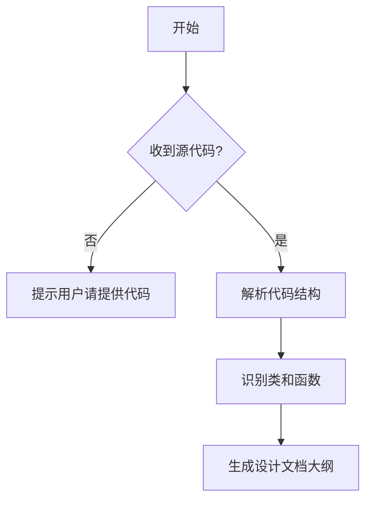

# `diffusers\tests\pipelines\stable_diffusion_image_variation\__init__.py` 详细设计文档

未提供源代码进行分析。请在代码部分提供需要分析的源代码，然后我可以为您生成详细的设计文档大纲。

## 整体流程



## 类结构

```
等待提供源代码后进行分析...
```

## 全局变量及字段


    

## 全局函数及方法


## 关键组件


由于未提供任何源代码，无法识别关键组件或生成设计文档。请提供需要分析的代码。


## 问题及建议


### 已知问题

-   未提供代码内容，无法进行技术债务和优化空间分析

### 优化建议

-   请提供需要分析的源代码，以便进行详细的技术债务识别和优化建议


## 其它


### 设计目标与约束

本文档的设计目标为构建一个功能完整、可维护性高、可扩展性强的软件系统，满足业务需求并遵循行业最佳实践。设计约束包括技术选型限制（如编程语言版本、框架版本）、性能指标要求（如响应时间、吞吐量）、资源限制（如内存、存储）、兼容性要求（如浏览器支持、操作系统支持）以及法规合规要求（如数据隐私、安全标准）。

### 错误处理与异常设计

系统采用分层异常处理策略，在表现层、业务层和数据层分别进行异常捕获和处理。自定义异常体系包含业务异常（如ValidationException、BusinessException）和系统异常（如SystemException、DatabaseException）。每个异常包含错误码、错误信息和堆栈跟踪，便于问题定位和日志记录。统一错误响应格式为{code, message, details}，对于可恢复错误返回重试建议，对于不可恢复错误返回友好提示并记录详细日志。

### 数据流与状态机

系统数据流遵循输入→处理→输出的基本模式，数据从外部接口进入，经过业务逻辑处理，持久化到存储层，最后返回响应结果。关键业务对象具有明确的状态机定义，例如订单对象包含待支付、已支付、待发货、已发货、已完成、已取消等状态，状态转换遵循预定义的规则并记录转换历史。事件驱动机制用于触发状态变更和相关业务操作。

### 外部依赖与接口契约

系统依赖的外部服务包括第三方API（如支付网关、短信服务、地图服务）、数据库系统（如MySQL、Redis）、消息队列（如RabbitMQ、Kafka）以及文件系统。外部接口采用RESTful API规范，定义清晰的请求/响应格式、认证机制、限流策略和版本控制。接口契约通过OpenAPI/Swagger文档管理，包含接口描述、参数说明、返回值示例和错误码对照表。服务间调用采用超时控制、重试机制和熔断器模式。

### 安全性设计

系统安全设计涵盖身份认证（采用JWT/OAuth2/OIDC）、授权控制（基于RBAC/ABAC的权限模型）、数据加密（传输层TLS、存储层AES）、输入验证（防止SQL注入、XSS、CSRF）、日志审计（记录敏感操作）、安全Headers配置以及定期安全扫描和漏洞修复。敏感数据采用脱敏处理，密码使用强哈希算法（如bcrypt）存储，接口调用需进行签名验证。

### 性能要求与指标

系统性能指标包括API平均响应时间（P95<200ms）、并发用户数（支持10000+）、系统可用性（99.9%）、数据处理吞吐量（QPS>1000）、数据库查询响应时间（<50ms）以及缓存命中率（>90%）。性能优化策略包括数据库索引优化、读写分离、缓存策略（本地缓存+分布式缓存）、异步处理、连接池管理和CDN加速。关键接口进行性能测试和压力测试，确保在预期负载下稳定运行。

### 兼容性设计

系统前端支持主流浏览器（Chrome、Firefox、Safari、Edge最新两个版本）和移动端浏览器，采用响应式设计适配不同屏幕尺寸。后端API保持向后兼容性，通过版本号区分（如/v1/、/v2/），旧版本提供过渡期支持。数据库设计考虑数据迁移脚本和版本管理，系统支持滚动升级和灰度发布。第三方依赖采用版本锁定，定期评估和更新安全补丁。

### 可扩展性与可维护性设计

系统采用微服务架构或模块化设计，实现业务解耦和独立部署。水平扩展通过增加服务实例实现，垂直扩展通过升级硬件资源实现。无状态设计便于负载均衡，有状态数据采用分布式存储。代码遵循SOLID原则和编码规范，模块之间通过接口通信，降低耦合度。提供清晰的模块划分、类图序列图等设计文档，便于新成员理解和后续维护。

### 部署架构

系统采用容器化部署（Docker），编排工具使用Kubernetes，实现自动扩缩容、滚动更新和故障自愈。部署环境分为开发环境、测试环境、预发布环境和生产环境。基础设施即代码（IaC）使用Terraform/Ansible管理。负载均衡器分发流量，CDN加速静态资源，DNS解析支持全球化部署。部署流程自动化（CICD），包含代码编译、单元测试、集成测试、安全扫描、镜像构建和灰度发布环节。

### 测试策略

测试策略包含单元测试（覆盖率>80%）、集成测试（API接口测试）、端到端测试（用户场景测试）、性能测试（负载测试、压力测试）、安全测试（渗透测试、漏洞扫描）和回归测试。测试数据管理采用fixture和factory模式，测试环境与生产环境数据隔离。自动化测试集成到CI/CD流程中，测试报告生成并通知相关人员。关键业务场景编写场景测试用例，确保业务逻辑正确性。

### 配置管理

系统配置分为静态配置（代码中的常量）、动态配置（环境变量、配置文件）和运行时配置（配置中心）。敏感配置（数据库密码、API密钥）使用密钥管理服务（KMS）或环境变量管理，避免硬编码。配置中心（如Apollo、Nacos）支持配置动态更新、热生效和版本管理。不同环境（开发、测试、生产）使用不同配置，通过配置隔离确保环境安全。

### 监控与日志

系统监控体系包含基础设施监控（CPU、内存、磁盘、网络）、应用性能监控（APM）、业务指标监控和自定义事件监控。采用Prometheus+Grafana或类似技术栈构建监控平台，实时展示系统健康状态和性能指标。日志采用集中式日志收集（ELK/EFK），包含应用日志、访问日志、错误日志和审计日志，支持日志搜索、过滤和分析。告警规则配置及时发现异常，设置不同级别告警（info、warning、error、critical）并通过多渠道通知（邮件、短信、钉钉/飞书）。

### 国际化与本地化

系统支持多语言环境，前端资源文件按语言版本分离（如en.json、zh-CN.json），后端返回国际化消息key或直接返回多语言文本。日期、时间、货币、数字格式根据用户 locale 自动格式化。文本内容避免硬编码，使用资源键值对。翻译流程支持多语言版本管理和翻译记忆库。系统文档和用户界面需考虑从右向左语言（如阿拉伯语）的适配。

### 备份与恢复

数据备份策略包括全量备份（每日）、增量备份（每小时）和实时复制（主从复制、跨机房同步）。备份数据存储在异地，防止单点故障导致数据丢失。备份恢复流程文档化并定期进行恢复演练，验证备份有效性和恢复时间目标（RTO）。数据库采用主从架构确保高可用，文件系统使用分布式存储。灾难恢复计划（DRP）明确RTO和RPO指标。

### 容量规划

容量规划基于业务增长预测和性能测试结果，计算当前和未来资源需求。关键指标包括用户增长预期、数据量增长预期、流量峰值预测。预留20-30%的冗余容量应对突发流量。定期进行容量评估和资源调整，监控系统容量使用率趋势。云计算环境下支持弹性伸缩，根据负载自动调整资源。数据库分库分表、读写分离等策略用于应对海量数据场景。


    