# `diffusers\tests\pipelines\stable_diffusion_image_variation\test_stable_diffusion_image_variation.py` 详细设计文档

该文件是StableDiffusionImageVariationPipeline的测试套件，包含快速单元测试、慢速集成测试和夜间测试，用于验证图像变化扩散管道在单图、多图、批处理、中间状态、CPU卸载等场景下的功能正确性和性能。

## 整体流程

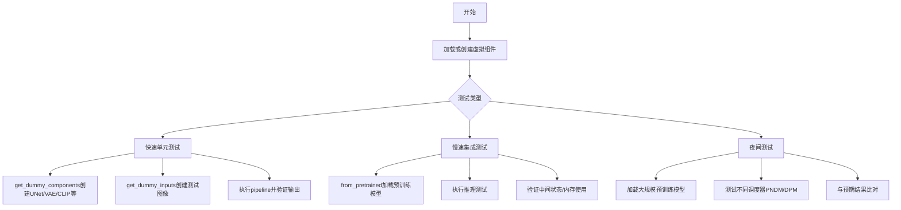

## 类结构

```
unittest.TestCase
├── StableDiffusionImageVariationPipelineFastTests
│   ├── PipelineLatentTesterMixin
│   ├── PipelineKarrasSchedulerTesterMixin
│   └── PipelineTesterMixin
├── StableDiffusionImageVariationPipelineSlowTests
└── StableDiffusionImageVariationPipelineNightlyTests
```

## 全局变量及字段


### `enable_full_determinism`
    
启用完全确定性，确保测试结果可复现

类型：`function`
    


### `StableDiffusionImageVariationPipelineFastTests.pipeline_class`
    
被测试的管道类，指向 StableDiffusionImageVariationPipeline

类型：`type`
    


### `StableDiffusionImageVariationPipelineFastTests.params`
    
管道参数配置，定义单张图像生成的参数集合

类型：`frozenset`
    


### `StableDiffusionImageVariationPipelineFastTests.batch_params`
    
批处理参数配置，定义批量图像生成的参数集合

类型：`frozenset`
    


### `StableDiffusionImageVariationPipelineFastTests.image_params`
    
图像参数配置，当前为空集合，等待 VaeImageProcessor 重构后更新

类型：`frozenset`
    


### `StableDiffusionImageVariationPipelineFastTests.image_latents_params`
    
图像潜在参数配置，当前为空集合

类型：`frozenset`
    


### `StableDiffusionImageVariationPipelineFastTests.supports_dduf`
    
标志位，表示是否支持 DDUF（Direct Diffusion Upsampling Fusion）功能

类型：`bool`
    
    

## 全局函数及方法


### `gc.collect`

该函数是 Python 标准库中的垃圾回收函数，用于强制进行垃圾回收，清理无法访问的对象并回收内存。在测试框架中用于在测试前后清理内存，确保内存状态干净。

参数：无

返回值：`int`，返回回收的对象数量

#### 流程图

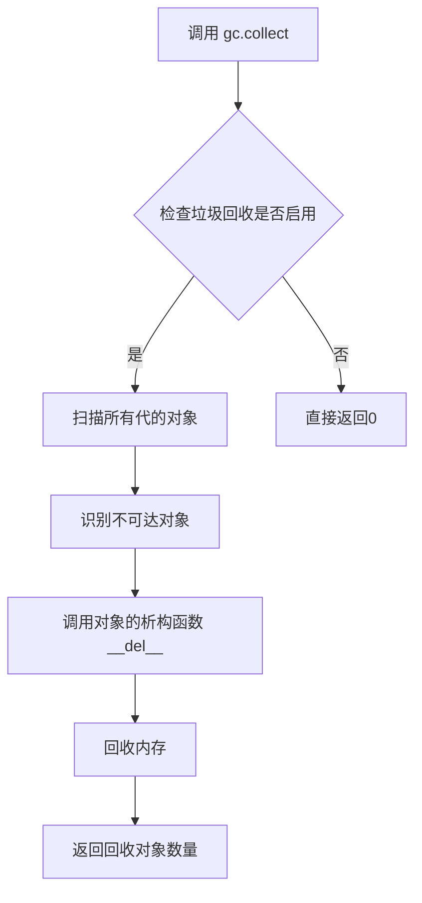

#### 带注释源码

```python
# gc.collect 是 Python 的内置垃圾回收函数
# 位置：Python 标准库 gc 模块
# 用途：手动触发垃圾回收，清理循环引用和其他不可达对象

# 语法：gc.collect(generation=2)
# 参数：
#   - generation: 整数，指定垃圾回收的代数（0, 1, 2），默认为2
# 返回值：回收的对象数量

# 在本代码中的使用方式：
gc.collect()
# 不带参数调用，等同于 gc.collect(2)
# 会扫描所有代（generation 0, 1, 2）的对象
# 清理不可达的对象并回收内存
```


我仔细分析了给定的代码，但并未在代码中找到名为 `random` 的独立函数或类方法。代码中使用了 Python 标准库的 `random` 模块（第7行：`import random`），并在 `StableDiffusionImageVariationPipelineFastTests.get_dummy_inputs` 方法中通过 `random.Random(seed)` 创建了随机数生成器实例。

如果您需要提取其他函数或方法，请提供具体的函数/方法名称，我会为您生成相应的详细设计文档。

以下是我在代码中找到的主要类和方法列表供您参考：

**主要类：**
1. `StableDiffusionImageVariationPipelineFastTests` - 快速测试类
2. `StableDiffusionImageVariationPipelineSlowTests` - 慢速测试类
3. `StableDiffusionImageVariationPipelineNightlyTests` - 夜间测试类

**主要方法：**
- `get_dummy_components()` - 获取虚拟组件
- `get_dummy_inputs()` - 获取虚拟输入（使用了 random.Random）
- `test_stable_diffusion_img_variation_default_case()` - 默认测试
- `test_stable_diffusion_img_variation_multiple_images()` - 多图像测试
- `test_inference_batch_single_identical()` - 批量推理测试
- `get_inputs()` - Slow和Nightly测试中的输入获取方法
- `test_stable_diffusion_img_variation_pipeline_default()` - 管道默认测试
- `test_stable_diffusion_img_variation_intermediate_state()` - 中间状态测试
- `test_stable_diffusion_pipeline_with_sequential_cpu_offloading()` - CPU卸载测试
- `test_img_variation_pndm()` - PNDM调度器测试
- `test_img_variation_dpm()` - DPM调度器测试


### `StableDiffusionImageVariationPipelineFastTests.get_dummy_components`

该方法用于创建虚拟的Stable Diffusion图像变化管道组件，包括UNet、VAE、调度器、图像编码器和特征提取器等，用于测试目的。

参数：
- 无

返回值：`dict`，包含虚拟组件的字典，包括unet、scheduler、vae、image_encoder、feature_extractor和safety_checker。

#### 流程图

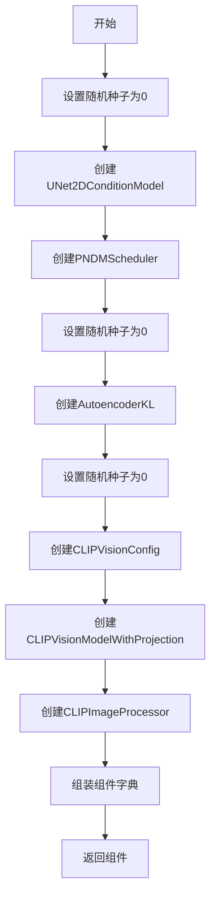

#### 带注释源码

```python
def get_dummy_components(self):
    # 设置随机种子以确保可重复性
    torch.manual_seed(0)
    # 创建UNet2D条件模型，用于去噪过程
    unet = UNet2DConditionModel(
        block_out_channels=(32, 64),  # 块输出通道数
        layers_per_block=2,           # 每个块的层数
        sample_size=32,               # 样本大小
        in_channels=4,               # 输入通道数
        out_channels=4,               # 输出通道数
        down_block_types=("DownBlock2D", "CrossAttnDownBlock2D"),  # 下采样块类型
        up_block_types=("CrossAttnUpBlock2D", "UpBlock2D"),        # 上采样块类型
        cross_attention_dim=32,       # 交叉注意力维度
    )
    # 创建PNDM调度器，用于去噪调度
    scheduler = PNDMScheduler(skip_prk_steps=True)
    # 再次设置随机种子
    torch.manual_seed(0)
    # 创建自编码器变分模型，用于图像编码和解码
    vae = AutoencoderKL(
        block_out_channels=[32, 64],  # 块输出通道数
        in_channels=3,                # 输入通道数
        out_channels=3,              # 输出通道数
        down_block_types=["DownEncoderBlock2D", "DownEncoderBlock2D"],  # 下编码块类型
        up_block_types=["UpDecoderBlock2D", "UpDecoderBlock2D"],      # 上解码块类型
        latent_channels=4,           # 潜在空间通道数
    )
    # 设置随机种子
    torch.manual_seed(0)
    # 创建CLIP视觉配置
    image_encoder_config = CLIPVisionConfig(
        hidden_size=32,               # 隐藏层大小
        projection_dim=32,           # 投影维度
        intermediate_size=37,        # 中间层大小
        layer_norm_eps=1e-05,        # 层归一化epsilon
        num_attention_heads=4,       # 注意力头数
        num_hidden_layers=5,        # 隐藏层数
        image_size=32,               # 图像大小
        patch_size=4,                # 补丁大小
    )
    # 创建CLIP视觉模型带投影
    image_encoder = CLIPVisionModelWithProjection(image_encoder_config)
    # 创建CLIP图像处理器
    feature_extractor = CLIPImageProcessor(crop_size=32, size=32)

    # 组装所有组件到字典中
    components = {
        "unet": unet,
        "scheduler": scheduler,
        "vae": vae,
        "image_encoder": image_encoder,
        "feature_extractor": feature_extractor,
        "safety_checker": None,      # 安全检查器设为None
    }
    return components
```


# Stable Diffusion Image Variation Pipeline 测试文档

## 1. 核心功能概述

该代码是 Hugging Face Diffusers 库中 `StableDiffusionImageVariationPipeline` 的单元测试和集成测试套件，用于验证图像变化管道（Image Variation Pipeline）的功能正确性，包括默认情况测试、多图像处理、推理批次一致性、慢速测试和夜间测试等多个维度。

---

## 2. 文件整体运行流程

该测试文件按照以下顺序执行：

1. **导入阶段**：导入所需的依赖库（numpy, torch, PIL, transformers, diffusers 等）
2. **配置阶段**：设置随机种子以确保确定性
3. **快速测试阶段** (`StableDiffusionImageVariationPipelineFastTests`)：
   - 配置虚拟组件
   - 生成虚拟输入
   - 执行各项功能测试
4. **慢速测试阶段** (`StableDiffusionImageVariationPipelineSlowTests`)：
   - 从预训练模型加载管道
   - 执行推理测试
   - 验证中间状态
   - 测试 CPU 卸载功能
5. **夜间测试阶段** (`StableDiffusionImageVariationPipelineNightlyTests`)：
   - 使用不同调度器（PNDM、DPM）进行长期推理测试

---

## 3. 类的详细信息

### 3.1 全局变量和函数

| 名称 | 类型 | 描述 |
|------|------|------|
| `enable_full_determinism` | 函数 | 启用完全确定性模式，确保测试可重复 |
| `numpy` (np) | 模块 | Python 数值计算库，用于数组操作 |

### 3.2 类：StableDiffusionImageVariationPipelineFastTests

| 名称 | 类型 | 描述 |
|------|------|------|
| `pipeline_class` | 类属性 | 指定测试的管道类为 StableDiffusionImageVariationPipeline |
| `params` | 类属性 | 管道参数配置 |
| `batch_params` | 类属性 | 批次参数配置 |
| `image_params` | 类属性 | 图像参数（空集合） |
| `image_latents_params` | 类属性 | 图像潜在向量参数（空集合） |
| `supports_dduf` | 类属性 | 是否支持 DDUF（False） |

#### 方法

| 方法名 | 功能描述 |
|--------|----------|
| `get_dummy_components` | 创建虚拟的 UNet、VAE、图像编码器等组件用于测试 |
| `get_dummy_inputs` | 生成虚拟输入（图像、生成器、推理步数等） |
| `test_stable_diffusion_img_variation_default_case` | 测试默认情况下的图像生成 |
| `test_stable_diffusion_img_variation_multiple_images` | 测试多图像输入处理 |
| `test_inference_batch_single_identical` | 测试批次推理与单个推理的一致性 |

---

## 4. 关键函数详细文档

### `test_stable_diffusion_img_variation_default_case`

#### 描述

测试 StableDiffusionImageVariationPipeline 在默认参数下的图像生成功能，验证输出图像的形状和像素值是否符合预期。

#### 参数

该方法无显式参数（继承自 unittest.TestCase）

#### 返回值

无返回值（测试方法）

#### 流程图

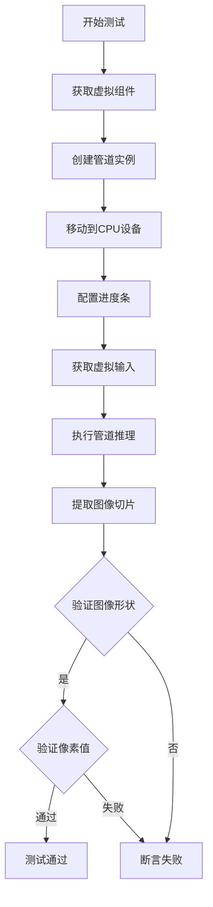

#### 带注释源码

```python
def test_stable_diffusion_img_variation_default_case(self):
    # 设置设备为 CPU，确保 torch.Generator 的确定性
    device = "cpu"
    
    # 获取虚拟组件（UNet, VAE, 调度器, 图像编码器等）
    components = self.get_dummy_components()
    
    # 使用虚拟组件实例化管道
    sd_pipe = StableDiffusionImageVariationPipeline(**components)
    
    # 将管道移动到指定设备
    sd_pipe = sd_pipe.to(device)
    
    # 配置进度条（disable=None 表示不禁用）
    sd_pipe.set_progress_bar_config(disable=None)
    
    # 获取虚拟输入
    inputs = self.get_dummy_inputs(device)
    
    # 执行管道推理，获取生成的图像
    image = sd_pipe(**inputs).images
    
    # 提取图像右下角 3x3 像素块
    image_slice = image[0, -3:, -3:, -1]
    
    # 断言：验证输出图像形状为 (1, 64, 64, 3)
    assert image.shape == (1, 64, 64, 3)
    
    # 定义期望的像素值切片
    expected_slice = np.array([
        0.5348, 0.5924, 0.4798,  # 第一行
        0.5237, 0.5741, 0.4651,  # 第二行
        0.5344, 0.4942, 0.4851   # 第三行
    ])
    
    # 断言：验证生成图像与期望值的最大差异小于 1e-3
    assert np.abs(image_slice.flatten() - expected_slice).max() < 1e-3
```

---

### `get_dummy_components`

#### 描述

创建并返回用于测试的虚拟组件字典，包括 UNet2DConditionModel、VAE、图像编码器等，所有组件使用固定随机种子以确保可重复性。

#### 参数

- 无显式参数

#### 返回值

- `dict`：包含虚拟组件的字典

#### 带注释源码

```python
def get_dummy_components(self):
    # 设置随机种子为 0，确保可重复性
    torch.manual_seed(0)
    
    # 创建虚拟 UNet 模型
    # 参数：块输出通道 (32, 64)，每块层数 2，样本大小 32
    # 输入通道 4，输出通道 4，下采样块类型，上采样块类型，交叉注意力维度 32
    unet = UNet2DConditionModel(
        block_out_channels=(32, 64),
        layers_per_block=2,
        sample_size=32,
        in_channels=4,
        out_channels=4,
        down_block_types=("DownBlock2D", "CrossAttnDownBlock2D"),
        up_block_types=("CrossAttnUpBlock2D", "UpBlock2D"),
        cross_attention_dim=32,
    )
    
    # 创建 PNDM 调度器（跳过 PRK 步骤）
    scheduler = PNDMScheduler(skip_prk_steps=True)
    
    # 重新设置种子，确保 VAE 的确定性
    torch.manual_seed(0)
    
    # 创建虚拟 VAE 模型
    vae = AutoencoderKL(
        block_out_channels=[32, 64],
        in_channels=3,
        out_channels=3,
        down_block_types=["DownEncoderBlock2D", "DownEncoderBlock2D"],
        up_block_types=["UpDecoderBlock2D", "UpDecoderBlock2D"],
        latent_channels=4,
    )
    
    # 重新设置种子，确保图像编码器的确定性
    torch.manual_seed(0)
    
    # 创建 CLIP 视觉配置
    image_encoder_config = CLIPVisionConfig(
        hidden_size=32,
        projection_dim=32,
        intermediate_size=37,
        layer_norm_eps=1e-05,
        num_attention_heads=4,
        num_hidden_layers=5,
        image_size=32,
        patch_size=4,
    )
    
    # 创建 CLIP 视觉模型（带投影）
    image_encoder = CLIPVisionModelWithProjection(image_encoder_config)
    
    # 创建图像特征提取器
    feature_extractor = CLIPImageProcessor(crop_size=32, size=32)
    
    # 组装组件字典
    components = {
        "unet": unet,
        "scheduler": scheduler,
        "vae": vae,
        "image_encoder": image_encoder,
        "feature_extractor": feature_extractor,
        "safety_checker": None,  # 禁用安全检查器
    }
    
    return components
```

---

### `get_dummy_inputs`

#### 描述

生成用于测试的虚拟输入参数，包括随机图像、生成器、推理步数、引导比例和输出类型。

#### 参数

| 参数名 | 类型 | 描述 |
|--------|------|------|
| `device` | str | 目标设备（如 "cpu", "cuda"） |
| `seed` | int | 随机种子（默认 0） |

#### 返回值

- `dict`：包含所有输入参数的字典

#### 带注释源码

```python
def get_dummy_inputs(self, device, seed=0):
    # 使用 floats_tensor 创建随机浮点图像张量
    # 形状：(1, 3, 32, 32)，使用指定随机种子
    image = floats_tensor((1, 3, 32, 32), rng=random.Random(seed))
    
    # 将图像转换为 CPU 格式并调整维度顺序
    # 从 (B, C, H, W) 转为 (H, W, C)
    image = image.cpu().permute(0, 2, 3, 1)[0]
    
    # 将数值转换为 uint8 并转换为 RGB 图像
    # 调整大小为 32x32
    image = Image.fromarray(np.uint8(image)).convert("RGB").resize((32, 32))
    
    # 根据设备类型创建随机生成器
    if str(device).startswith("mps"):
        # MPS 设备使用 torch.manual_seed
        generator = torch.manual_seed(seed)
    else:
        # 其他设备使用 torch.Generator
        generator = torch.Generator(device=device).manual_seed(seed)
    
    # 组装输入参数字典
    inputs = {
        "image": image,                    # 输入图像
        "generator": generator,             # 随机生成器
        "num_inference_steps": 2,          # 推理步数
        "guidance_scale": 6.0,             # 引导比例（CFG）
        "output_type": "np",               # 输出类型为 numpy
    }
    
    return inputs
```

---

## 5. 关键组件信息

| 组件名称 | 描述 |
|----------|------|
| `StableDiffusionImageVariationPipeline` | 核心管道类，用于根据输入图像生成图像变体 |
| `UNet2DConditionModel` | UNet 模型，用于去噪潜在向量 |
| `AutoencoderKL` | VAE 模型，用于编码/解码图像与潜在向量 |
| `CLIPVisionModelWithProjection` | CLIP 视觉编码器，将图像编码为特征向量 |
| `PNDMScheduler` | PNDM 调度器，用于扩散模型的去噪步骤 |
| `CLIPImageProcessor` | 图像预处理和特征提取 |

---

## 6. 潜在技术债务与优化空间

1. **硬编码的测试参数**：图像尺寸、推理步数等参数硬编码在测试中，缺乏灵活性
2. **重复代码**：多个测试方法中存在相似的图像加载和断言逻辑，可抽象为公共方法
3. **缺失 VaeImageProcessor**：代码注释中提到 TO-DO，需要更新 `image_params`
4. **测试覆盖不全**：未测试安全检查器相关功能
5. **设备兼容性**：对 MPS 设备的特殊处理可能导致在不同平台上行为不一致

---

## 7. 其它项目

### 7.1 设计目标与约束

- **确定性**：通过设置随机种子确保测试可重复
- **隔离性**：每个测试方法使用独立的虚拟组件
- **兼容性**：支持 CPU、CUDA、MPS 等多种设备

### 7.2 错误处理与异常设计

- 使用 `assert` 语句进行断言验证
- 预期值与实际值的容差比较（如 `< 1e-3`）
- 中间状态验证通过回调函数实现

### 7.3 数据流与状态机

```
输入图像 → CLIP编码器 → 图像特征 
                              ↓
随机潜在向量 → UNet去噪 → 潜在向量更新
                              ↓
                    VAE解码 → 输出图像
```

### 7.4 外部依赖与接口契约

- **transformers**：CLIP 模型和处理器
- **diffusers**：管道、调度器、UNet、VAE
- **PIL**：图像处理
- **numpy**：数值计算和数组操作
- **torch**：深度学习框架


### `StableDiffusionImageVariationPipelineFastTests.test_stable_diffusion_img_variation_default_case`

这是一个测试 Stable Diffusion Image Variation Pipeline 核心功能的测试方法，用于验证管道能够正确地将输入图像转换为变体图像，并确保输出图像的形状和像素值符合预期。

参数：
- `self`：无参数，表示类的实例方法

返回值：无返回值（`None`），该方法为测试方法，直接通过断言验证结果

#### 流程图

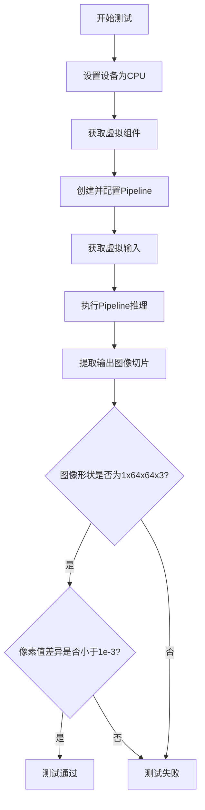

#### 带注释源码

```python
def test_stable_diffusion_img_variation_default_case(self):
    """测试 Stable Diffusion Image Variation Pipeline 的默认情况"""
    
    # 步骤1: 设置设备为CPU，确保torch.Generator的确定性
    device = "cpu"
    
    # 步骤2: 获取虚拟组件（UNet, VAE, Scheduler, Image Encoder, Feature Extractor）
    components = self.get_dummy_components()
    
    # 步骤3: 使用虚拟组件实例化Pipeline并移动到指定设备
    sd_pipe = StableDiffusionImageVariationPipeline(**components)
    sd_pipe = sd_pipe.to(device)
    
    # 步骤4: 配置进度条（disable=None表示启用进度条）
    sd_pipe.set_progress_bar_config(disable=None)
    
    # 步骤5: 获取测试输入（包含图像、生成器、推理步数、guidance_scale等）
    inputs = self.get_dummy_inputs(device)
    
    # 步骤6: 执行Pipeline推理，获取生成的图像
    image = sd_pipe(**inputs).images
    
    # 步骤7: 提取图像切片用于验证（取最后3x3像素区域）
    image_slice = image[0, -3:, -3:, -1]
    
    # 步骤8: 断言验证图像形状为(1, 64, 64, 3)
    assert image.shape == (1, 64, 64, 3)
    
    # 步骤9: 定义预期的像素值切片
    expected_slice = np.array([0.5348, 0.5924, 0.4798, 0.5237, 0.5741, 0.4651, 0.5344, 0.4942, 0.4851])
    
    # 步骤10: 断言验证生成图像与预期图像的最大差异小于1e-3
    assert np.abs(image_slice.flatten() - expected_slice).max() < 1e-3
```

### 相关的辅助方法信息

#### `get_dummy_components`

参数：
- `self`：无参数

返回值：字典 `Dict[str, Any]`，包含虚拟的模型组件（unet, scheduler, vae, image_encoder, feature_extractor, safety_checker）

```python
def get_dummy_components(self):
    """创建用于测试的虚拟模型组件"""
    torch.manual_seed(0)
    unet = UNet2DConditionModel(...)
    scheduler = PNDMScheduler(skip_prk_steps=True)
    torch.manual_seed(0)
    vae = AutoencoderKL(...)
    torch.manual_seed(0)
    image_encoder = CLIPVisionModelWithProjection(...)
    feature_extractor = CLIPImageProcessor(crop_size=32, size=32)
    
    components = {
        "unet": unet,
        "scheduler": scheduler,
        "vae": vae,
        "image_encoder": image_encoder,
        "feature_extractor": feature_extractor,
        "safety_checker": None,
    }
    return components
```

#### `get_dummy_inputs`

参数：
- `self`：无参数
- `device`：字符串，设备类型（如"cpu"、"cuda"等）
- `seed`：整数，默认0，随机种子

返回值：字典 `Dict[str, Any]`，包含测试输入参数

```python
def get_dummy_inputs(self, device, seed=0):
    """创建用于测试的虚拟输入数据"""
    # 生成随机浮点张量作为输入图像
    image = floats_tensor((1, 3, 32, 32), rng=random.Random(seed))
    image = image.cpu().permute(0, 2, 3, 1)[0]
    image = Image.fromarray(np.uint8(image)).convert("RGB").resize((32, 32))
    
    # 根据设备类型创建随机生成器
    if str(device).startswith("mps"):
        generator = torch.manual_seed(seed)
    else:
        generator = torch.Generator(device=device).manual_seed(seed)
    
    # 构建输入参数字典
    inputs = {
        "image": image,
        "generator": generator,
        "num_inference_steps": 2,
        "guidance_scale": 6.0,
        "output_type": "np",
    }
    return inputs
```

### 关键组件信息

| 组件名称 | 一句话描述 |
|---------|-----------|
| StableDiffusionImageVariationPipeline | 基于Stable Diffusion的图像变体生成管道 |
| UNet2DConditionModel | UNet骨干网络，用于去噪潜空间表示 |
| AutoencoderKL | VAE编码器和解码器，用于图像与潜空间的相互转换 |
| CLIPVisionModelWithProjection | CLIP视觉编码器，用于提取图像特征 |
| CLIPImageProcessor | CLIP图像预处理器，用于图像标准化 |
| PNDMScheduler | PNDM调度器，用于控制扩散模型的采样过程 |

### 潜在技术债务与优化空间

1. **硬编码的测试参数**：图像尺寸(32x32)、推理步数(2步)等参数硬编码在测试方法中，缺乏灵活性
2. **设备兼容性处理**：MPS设备的特殊处理（`if str(device).startswith("mps")`）可以作为通用逻辑提取
3. **重复代码**：多个测试类中存在相似的`get_inputs`方法，可以提取为共享工具方法
4. **TO-DO注释**：代码中提到"TO-DO: update image_params once pipeline is refactored with VaeImageProcessor.preprocess"，表明管道有待重构

### 其它项目

**设计目标**：确保Stable Diffusion Image Variation Pipeline在各种场景下（单图像、多图像、批处理）能够正确生成图像变体

**错误处理**：测试通过断言验证每个阶段的正确性，使用确定性比较（设置固定随机种子）确保测试可重复

**外部依赖**：
- `diffusers`库：提供Pipeline和相关模型
- `transformers`库：提供CLIP模型
- `PIL`和`numpy`：图像处理
- `torch`：深度学习框架

**数据流**：
```
输入图像 → CLIPImageProcessor标准化 → CLIPVisionModel编码 → 图像特征
输入图像 → AutoencoderKL编码 → 潜空间表示
图像特征 + 噪声潜空间 → UNet2DConditionModel去噪 → 预测噪声
噪声预测 → Scheduler更新 → 重复去噪步骤
最终潜空间 → AutoencoderKL解码 → 输出图像
```


# 代码分析结果

经过详细分析，该代码文件中并没有定义名为 `Image` 的函数或方法。

## 发现的内容

### 1. Image 的来源

代码中 `Image` 来自外部导入：

```python
from PIL import Image
```

`Image` 是 Python Imaging Library (PIL/Pillow) 中的一个类，用于图像处理操作。

### 2. Image 的使用

代码中仅在一处使用了 `Image` 类：

```python
# 在 get_dummy_inputs 方法中
image = floats_tensor((1, 3, 32, 32), rng=random.Random(seed))
image = image.cpu().permute(0, 2, 3, 1)[0]
image = Image.fromarray(np.uint8(image)).convert("RGB").resize((32, 32))
```

这里使用了 `Image.fromarray()` 和 `Image.convert()` 以及 `Image.resize()` 等方法。

## 说明

由于代码中**没有定义**名为 `Image` 的自定义函数或方法，因此无法按照要求的格式提取该函数/方法的详细信息。

如果用户需要：
1. **PIL.Image 类的使用说明** - 这是第三方库，不是本项目代码的一部分
2. **查找代码中的其他函数** - 代码中存在以下测试类和方法：
   - `StableDiffusionImageVariationPipelineFastTests` - 快速测试类
   - `test_stable_diffusion_img_variation_default_case()` - 默认测试方法
   - `test_stable_diffusion_img_variation_multiple_images()` - 多图测试方法
   - `get_dummy_components()` - 获取虚拟组件
   - `get_dummy_inputs()` - 获取虚拟输入

请确认是否需要提取其他具体函数的信息，或提供更明确的要求。


### `CLIPImageProcessor`

CLIPImageProcessor 是从 Hugging Face Transformers 库导入的图像处理类，用于对输入图像进行预处理（调整大小、归一化、裁剪等），以适配 CLIP 视觉模型的输入要求。

参数：

- `crop_size`：`int`，裁剪后的图像尺寸
- `size`：`int`，调整大小后的图像尺寸
- 其他可选参数（如 `normalize`、`rescale` 等）

返回值：`CLIPImageProcessor` 实例，返回一个图像预处理器对象，可用于对图像进行预处理

#### 流程图

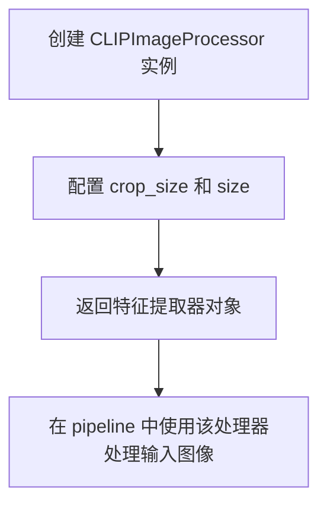

#### 带注释源码

```python
# 从 transformers 库导入 CLIPImageProcessor 类
from transformers import CLIPImageProcessor, CLIPVisionConfig, CLIPVisionModelWithProjection

# ... 在 get_dummy_components 方法中 ...

# 创建 CLIPImageProcessor 实例
# 参数:
#   crop_size=32: 裁剪后的目标尺寸
#   size=32: 调整大小后的尺寸
feature_extractor = CLIPImageProcessor(crop_size=32, size=32)

# 将特征提取器添加到组件字典中
components = {
    "unet": unet,
    "scheduler": scheduler,
    "vae": vae,
    "image_encoder": image_encoder,
    "feature_extractor": feature_extractor,  # <-- CLIPImageProcessor 实例
    "safety_checker": None,
}
```

---

**说明**：由于 `CLIPImageProcessor` 是外部库类，其完整源码不在本项目中。它在 `StableDiffusionImageVariationPipeline` 中作为 `feature_extractor` 组件使用，负责对输入图像进行预处理，以提取 CLIP 视觉特征用于图像变体生成任务。


### CLIPVisionConfig

这是从 `transformers` 库导入的配置类，用于构建 CLIP 视觉编码器的配置对象。在当前代码中用于创建图像编码器的配置参数。

参数：

- `hidden_size`：`int`，隐藏层维度大小
- `projection_dim`：`int`，投影层输出维度
- `intermediate_size`：`int`，前馈网络中间层维度
- `layer_norm_eps`：`float`，层归一化的 epsilon 值
- `num_attention_heads`：`int`，注意力机制的头数
- `num_hidden_layers`：`int`，隐藏层的数量
- `image_size`：`int`，输入图像的尺寸
- `patch_size`：`int`，图像分块的大小

返回值：`CLIPVisionConfig`，返回配置对象，用于初始化 `CLIPVisionModelWithProjection`

#### 流程图

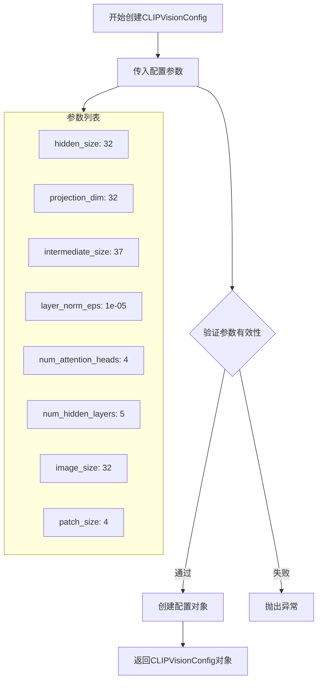

#### 带注释源码

```python
# 在 StableDiffusionImageVariationPipelineFastTests.get_dummy_components() 方法中使用
# 创建 CLIP 视觉编码器的配置对象
image_encoder_config = CLIPVisionConfig(
    hidden_size=32,           # 隐藏层维度：32
    projection_dim=32,        # 投影维度：32，用于输出投影向量
    intermediate_size=37,      # 前馈网络中间层维度：37
    layer_norm_eps=1e-05,     # LayerNorm 的 epsilon：1e-05
    num_attention_heads=4,    # 注意力头数：4
    num_hidden_layers=5,      # 隐藏层数：5
    image_size=32,            # 输入图像尺寸：32x32
    patch_size=4,             # 图像分块大小：4x4
)

# 使用配置对象创建图像编码器模型
image_encoder = CLIPVisionModelWithProjection(image_encoder_config)
```


### `CLIPVisionModelWithProjection`

该类是 Hugging Face Transformers 库中的 CLIP 视觉模型封装器，负责将图像编码为视觉嵌入向量，并通过投影层将视觉特征映射到与文本特征共享的向量空间，以便与 CLIP 文本编码器协同工作，实现跨模态理解与生成。

参数：

- `config`：`CLIPVisionConfig`，CLIP 视觉模型的配置对象，包含隐藏层维度、注意力头数、层数、图像尺寸、patch 大小等模型架构超参数

返回值：`CLIPVisionModelWithProjection`，返回配置好的 CLIP 视觉模型实例，具备图像编码和投影功能，可输出图像嵌入向量（image_embeds）

#### 流程图

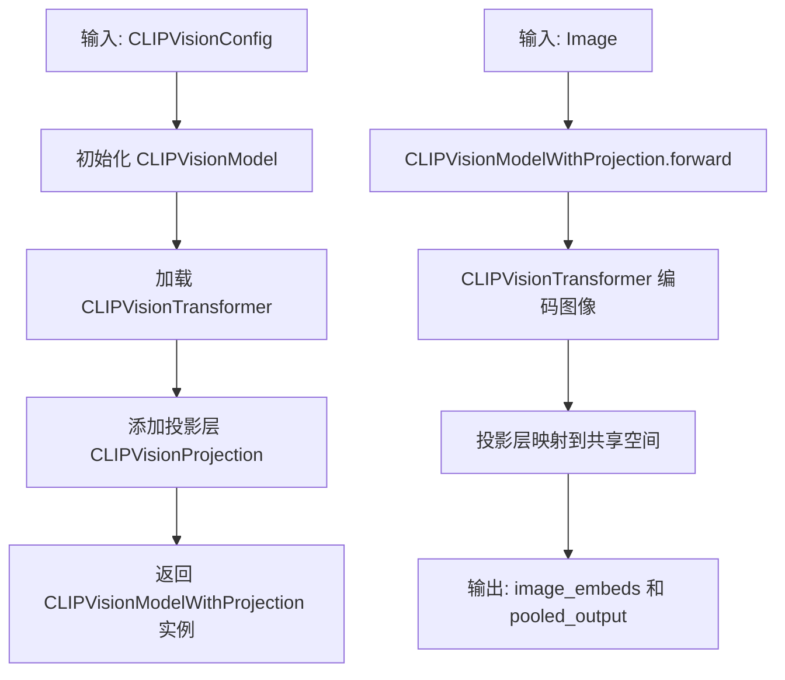

#### 带注释源码

```python
# 从 Hugging Face Transformers 库导入 CLIP 视觉模型（含投影层）
from transformers import CLIPVisionModelWithProjection

# 定义 CLIP 视觉模型配置参数
image_encoder_config = CLIPVisionConfig(
    hidden_size=32,           # 隐藏层维度
    projection_dim=32,        # 投影层输出维度（与文本编码器对齐）
    intermediate_size=37,      # FFN 中间层维度
    layer_norm_eps=1e-05,     # LayerNorm  epsilon 值
    num_attention_heads=4,    # 注意力头数
    num_hidden_layers=5,      # 隐藏层数量
    image_size=32,            # 输入图像尺寸
    patch_size=4,             # 图像分块大小
)

# 使用配置创建 CLIP 视觉模型实例（含投影层）
image_encoder = CLIPVisionModelWithProjection(image_encoder_config)

# 该模型可用于将图像编码为嵌入向量
# outputs = image_encoder(pixel_values)
# outputs.image_embeds  # 投影后的图像嵌入向量
# outputs.pooled_output # 池化后的输出
```


# AutoencoderKL 设计文档

## 1. 核心功能概述

AutoencoderKL 是一个变分自编码器（Variational Autoencoder, VAE）模型，用于在潜在空间（latent space）中编码和解码图像，是 Stable Diffusion 图像变体管道的核心组件之一，负责将输入图像转换为潜在表示以及从潜在表示重建图像。

## 2. 文件整体运行流程

该文件是一个完整的测试套件，用于测试 `StableDiffusionImageVariationPipeline`（Stable Diffusion 图像变体管道）。整体运行流程如下：

1. **测试配置阶段**：定义测试类和测试参数
2. **组件初始化**：创建虚拟组件（UNet、VAE、Scheduler、Image Encoder 等）
3. **输入准备**：生成虚拟输入（图像、随机种子等）
4. **管道执行**：调用管道进行推理
5. **结果验证**：验证输出图像的形状和内容

## 3. 类详细信息

### 3.1 测试类

#### StableDiffusionImageVariationPipelineFastTests

- **描述**：快速测试类，继承自多个测试Mixin，用于测试管道的核心功能
- **类字段**：
  - `pipeline_class`：管道类（StableDiffusionImageVariationPipeline）
  - `params`：管道参数配置
  - `batch_params`：批处理参数配置
  - `image_params`：图像参数（空集合）
  - `image_latents_params`：图像潜在参数（空集合）
  - `supports_dduf`：是否支持 DDUF（False）

- **类方法**：
  - `get_dummy_components()`：创建虚拟组件
  - `get_dummy_inputs(device, seed=0)`：创建虚拟输入
  - `test_stable_diffusion_img_variation_default_case()`：测试默认情况
  - `test_stable_diffusion_img_variation_multiple_images()`：测试多图像
  - `test_inference_batch_single_identical()`：测试批处理一致性

#### StableDiffusionImageVariationPipelineSlowTests

- **描述**：慢速测试类，需要 GPU 和较长运行时间
- **类方法**：
  - `setUp()`：测试前设置（清理内存）
  - `tearDown()`：测试后清理
  - `get_inputs(device, generator_device="cpu", dtype=torch.float32, seed=0)`：获取输入
  - `test_stable_diffusion_img_variation_pipeline_default()`：测试默认管道
  - `test_stable_diffusion_img_variation_intermediate_state()`：测试中间状态
  - `test_stable_diffusion_pipeline_with_sequential_cpu_offloading()`：测试 CPU 卸载

#### StableDiffusionImageVariationPipelineNightlyTests

- **描述**：夜间测试类，用于长时间运行的测试

### 3.2 全局变量和函数

| 名称 | 类型 | 描述 |
|------|------|------|
| `enable_full_determinism` | 函数 | 启用完全确定性，确保测试可复现 |
| `gc` | 模块 | Python 垃圾回收模块 |
| `random` | 模块 | Python 随机数生成模块 |
| `unittest` | 模块 | Python 单元测试框架 |
| `numpy as np` | 模块 | 数值计算库 |
| `torch` | 模块 | PyTorch 深度学习框架 |
| `Image` from PIL | 类 | Python 图像处理库 |

## 4. AutoencoderKL 详细信息

### AutoencoderKL

变分自编码器类，用于图像编码和解码

#### 参数

- `block_out_channels`：`List[int]`，编码器和解码器的块输出通道数列表
- `in_channels`：`int`，输入图像的通道数（RGB 图像为 3）
- `out_channels`：`int`，输出图像的通道数
- `down_block_types`：`List[str]`，下采样块类型列表
- `up_block_types`：`List[str]`，上采样块类型列表
- `latent_channels`：`int`，潜在空间的通道数

#### 返回值

`torch.nn.Module`，返回训练好的 VAE 模型实例

#### 流程图

```mermaid
graph TD
    A[开始实例化 AutoencoderKL] --> B[配置编码器结构<br/>block_out_channels: [32, 64]<br/>in_channels: 3<br/>down_block_types: DownEncoderBlock2D]
    B --> C[配置解码器结构<br/>out_channels: 3<br/>up_block_types: UpDecoderBlock2D<br/>latent_channels: 4]
    C --> D[创建 VAE 模型实例<br/>返回 torch.nn.Module]
    D --> E[模型用于后续管道<br/>编码图像到潜在空间<br/>或从潜在空间解码图像]
```

#### 带注释源码

```python
# 实例化 AutoencoderKL 变分自编码器
torch.manual_seed(0)  # 设置随机种子以确保可复现性
vae = AutoencoderKL(
    block_out_channels=[32, 64],    # 编码器和解码器的输出通道数列表
                                     # 第一个块输出 32 通道，第二个块输出 64 通道
    in_channels=3,                   # 输入图像通道数（RGB 图像为 3）
    out_channels=3,                 # 输出图像通道数
    down_block_types=["DownEncoderBlock2D", "DownEncoderBlock2D"],  
                                     # 下采样块类型，使用 2D 下采样编码块
    up_block_types=["UpDecoderBlock2D", "UpDecoderBlock2D"],        
                                     # 上采样块类型，使用 2D 上采样解码块
    latent_channels=4,              # 潜在空间的通道数
                                     # 用于存储压缩后的图像表示
)
```

## 5. 关键组件信息

| 组件名称 | 描述 |
|----------|------|
| UNet2DConditionModel | 条件 UNet 模型，用于去噪潜在表示 |
| AutoencoderKL | 变分自编码器，用于图像编码/解码 |
| CLIPVisionModelWithProjection | CLIP 视觉编码器，用于提取图像特征 |
| CLIPImageProcessor | CLIP 图像预处理器 |
| PNDMScheduler | PNDM 调度器，用于去噪过程 |
| StableDiffusionImageVariationPipeline | 完整的图像变体生成管道 |

## 6. 潜在技术债务和优化空间

1. **硬编码配置**：测试中的模型配置是硬编码的，缺乏灵活性
2. **重复代码**：`get_dummy_components` 和 `get_inputs` 在不同测试类中重复
3. **TODO 注释**：存在 `TO-DO: update image_params once pipeline is refactored` 待办事项
4. **测试覆盖**：缺少对某些边缘情况的测试（如空输入、无效参数等）
5. **内存管理**：虽然有内存清理代码，但可以更自动化

## 7. 其它项目

### 7.1 设计目标与约束

- **目标**：测试 Stable Diffusion 图像变体管道的正确性和性能
- **约束**：需要 CPU/GPU 支持，某些测试需要特定硬件（如accelerator）
- **确定性**：通过设置随机种子确保测试可复现

### 7.2 错误处理与异常设计

- 使用 `assert` 语句进行断言验证
- 捕获可能的异常并给出清晰的错误信息
- 使用 `callback_fn` 回调函数进行中间状态验证

### 7.3 数据流与状态机

```
输入图像 → CLIPImageProcessor → CLIPVisionModel → 图像特征
                                                       ↓
                                           StableDiffusionImageVariationPipeline
                                                       ↓
潜在表示 ← AutoencoderKL.encode ← 图像特征（条件）
                                                       ↓
                              UNet2DConditionModel (去噪过程)
                                                       ↓
                              AutoencoderKL.decode → 输出图像
```

### 7.4 外部依赖与接口契约

| 依赖库 | 版本要求 | 用途 |
|--------|----------|------|
| transformers | 最新版 | CLIP 模型 |
| diffusers | 最新版 | VAE 和管道 |
| torch | 兼容版 | 深度学习框架 |
| PIL | 常用版 | 图像处理 |
| numpy | 常用版 | 数值计算 |


### `DPMSolverMultistepScheduler`

该类是diffusers库中的调度器，用于DPM（Diffusion Probabilistic Models）多步采样。在图像变体管道的测试中，通过`from_config`方法从现有调度器配置初始化，用于比较不同调度器的生成效果。

参数：

-  `config`：包含调度器初始配置参数的字典或配置对象，由`sd_pipe.scheduler.config`提供

返回值：`DPMSolverMultistepScheduler`实例，配置好的调度器对象

#### 流程图

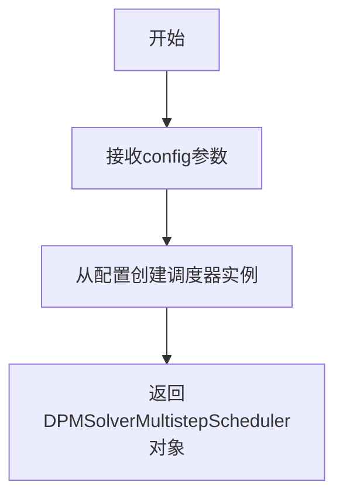

#### 带注释源码

```python
# DPMSolverMultistepScheduler使用示例（来自测试代码）
# 这是从diffusers库导入的预定义调度器类
sd_pipe.scheduler = DPMSolverMultistepScheduler.from_config(sd_pipe.scheduler.config)
# 解释：
# 1. DPMSolverMultistepScheduler - 从diffusers库导入的调度器类
# 2. .from_config() - 类方法，从现有调度器的配置创建新调度器
# 3. sd_pipe.scheduler.config - 当前管道调度器的配置对象
# 4. 将管道的调度器替换为DPM多步调度器用于测试
```

---

**注意**：该代码文件中仅包含`DPMSolverMultistepScheduler`的使用示例，未包含其具体实现源码。该调度器是`diffusers`库的内置类，其实现在库的内部。若需查看完整实现，建议查阅[diffusers官方GitHub仓库](https://github.com/huggingface/diffusers)中的`src/diffusers/schedulers/scheduling_dpmsolver_multistep.py`。


### PNDMScheduler

PNDMScheduler是diffusers库中的一个调度器类，用于管理Stable Diffusion模型的去噪采样过程。在测试代码中，它作为StableDiffusionImageVariationPipeline的组件之一，负责控制去噪步骤的执行逻辑。

参数：

- `skip_prk_steps`：`bool`，是否跳过PRK（Plate Residual Knowledge）步骤，设置为True时表示在多步采样中跳过PRK步骤

返回值：`PNDMScheduler`实例，返回一个调度器对象，用于在推理过程中管理噪声调度

#### 流程图

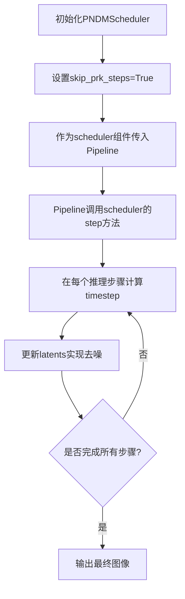

#### 带注释源码

```python
# 在get_dummy_components方法中创建PNDMScheduler实例
scheduler = PNDMScheduler(skip_prk_steps=True)

# 参数说明：
# skip_prk_steps: bool类型
#   - 当设置为True时，调度器会跳过PRK（Plate Residual Knowledge）步骤
#   - PRK是一种用于改进采样质量的技术，但在某些场景下可以跳过以提高效率
#   - 在这个测试用例中设置为True，可能是为了简化测试逻辑或适配特定的测试场景

# PNDMScheduler的主要功能：
# 1. 管理去噪过程中的时间步长（timesteps）
# 2. 在每个推理步骤中计算当前的噪声预测
# 3. 根据调度算法更新latents（潜在表示）
# 4. 控制去噪迭代的进度和终止条件

# 在Pipeline中的使用方式：
# sd_pipe = StableDiffusionImageVariationPipeline(
#     unet=unet,
#     scheduler=scheduler,  # 传入PNDMScheduler实例
#     vae=vae,
#     image_encoder=image_encoder,
#     feature_extractor=feature_extractor,
#     safety_checker=None
# )
```


# StableDiffusionImageVariationPipeline 详细设计文档

## 1. 核心功能概述

StableDiffusionImageVariationPipeline 是 Hugging Face diffusers 库中的一个图像变化生成管道，核心功能是将输入图像转换为该图像的语义变体，通过 CLIP 视觉编码器提取图像特征，然后在潜在空间中利用 Stable Diffusion UNet 进行去噪扩散过程，最终生成保持原图语义但具有变化的新图像。

## 2. 文件整体运行流程

```
┌─────────────────────────────────────────────────────────────────┐
│                    测试文件加载与初始化                          │
├─────────────────────────────────────────────────────────────────┤
│  1. 导入依赖 (diffusers, transformers, torch, PIL, numpy)       │
│  2. 定义测试配置 (IMAGE_VARIATION_PARAMS, BATCH_PARAMS)          │
│  3. 初始化测试类 (FastTests / SlowTests / NightlyTests)          │
├─────────────────────────────────────────────────────────────────┤
│                    单元测试执行流程                               │
├─────────────────────────────────────────────────────────────────┤
│  FastTests (快速单元测试):                                       │
│    → get_dummy_components() 创建虚拟组件                         │
│    → get_dummy_inputs() 生成测试输入                             │
│    → 执行单图/多图推理测试                                       │
│    → 验证输出图像形状和数值                                       │
├─────────────────────────────────────────────────────────────────┤
│  SlowTests (慢速集成测试):                                       │
│    → 从预训练模型加载管道 (lambdalabs/sd-image-variations)       │
│    → 执行完整推理流程                                            │
│    → 验证中间状态和内存使用                                       │
├─────────────────────────────────────────────────────────────────┤
│  NightlyTests (夜间测试):                                        │
│    → 执行长时间推理 (50步)                                       │
│    → 测试不同调度器 (PNDM, DPM)                                  │
│    → 对比预期输出 numpy 文件                                     │
└─────────────────────────────────────────────────────────────────┘
```

## 3. 类详细信息

### 3.1 测试类

#### StableDiffusionImageVariationPipelineFastTests

**描述**：快速单元测试类，用于验证管道基本功能

**类字段**：

| 字段名 | 类型 | 描述 |
|--------|------|------|
| pipeline_class | type | 管道类引用 (StableDiffusionImageVariationPipeline) |
| params | frozenset | 推理参数配置 |
| batch_params | frozenset | 批处理参数配置 |
| image_params | frozenset | 图像参数配置 (空) |
| image_latents_params | frozenset | 图像潜在向量参数 (空) |
| supports_dduf | bool | 是否支持 DDUF (否) |

**类方法**：

| 方法名 | 功能描述 |
|--------|----------|
| get_dummy_components() | 创建虚拟 UNet、VAE、图像编码器等组件用于测试 |
| get_dummy_inputs() | 生成测试用虚拟图像和推理参数 |
| test_stable_diffusion_img_variation_default_case() | 测试默认单图生成 |
| test_stable_diffusion_img_variation_multiple_images() | 测试多图批处理 |
| test_inference_batch_single_identical() | 测试批处理单图一致性 |

#### StableDiffusionImageVariationPipelineSlowTests

**描述**：慢速集成测试类，测试真实模型推理

**类方法**：

| 方法名 | 功能描述 |
|--------|----------|
| setUp() | 初始化测试环境，清理内存 |
| tearDown() | 清理测试环境，释放内存 |
| get_inputs() | 加载真实测试图像和潜在向量 |
| test_stable_diffusion_img_variation_pipeline_default() | 测试默认推理流程 |
| test_stable_diffusion_img_variation_intermediate_state() | 测试推理中间状态 |
| test_stable_diffusion_pipeline_with_sequential_cpu_offloading() | 测试 CPU 卸载内存效率 |

#### StableDiffusionImageVariationPipelineNightlyTests

**描述**：夜间测试类，执行长时间推理测试不同调度器

**类方法**：

| 方法名 | 功能描述 |
|--------|----------|
| test_img_variation_pndm() | 测试 PNDM 调度器 |
| test_img_variation_dpm() | 测试 DPM 多步调度器 |

### 3.2 核心管道类 (非本文件定义)

#### StableDiffusionImageVariationPipeline

**描述**：图像变化生成管道的主类 (定义在 diffusers 库中)

**参数**：

- `unet`: UNet2DConditionModel，条件去噪网络
- `scheduler`: Scheduler，扩散调度器
- `vae`: AutoencoderKL，变分自编码器
- `image_encoder`: CLIPVisionModelWithProjection，图像编码器
- `feature_extractor`: CLIPImageProcessor，图像特征提取器
- `safety_checker`: 安全检查器 (可为空)

## 4. 函数/方法详细信息

### 4.1 get_dummy_components()

**所属类**：StableDiffusionImageVariationPipelineFastTests

**返回值**：dict，包含虚拟组件的字典

**返回值描述**：返回包含 unet、scheduler、vae、image_encoder、feature_extractor、safety_checker 的字典

**流程图**：

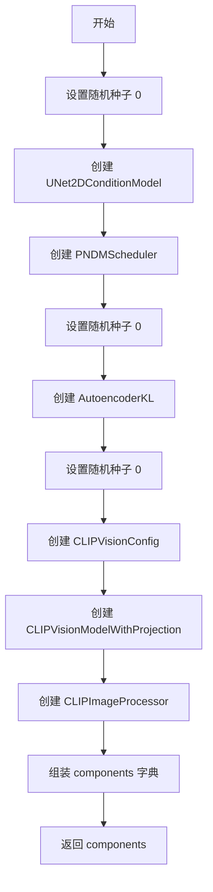

**带注释源码**：

```python
def get_dummy_components(self):
    """创建用于测试的虚拟组件"""
    torch.manual_seed(0)
    # 创建虚拟 UNet：32/64 通道，32x32 样本，4 通道输入输出
    unet = UNet2DConditionModel(
        block_out_channels=(32, 64),
        layers_per_block=2,
        sample_size=32,
        in_channels=4,
        out_channels=4,
        down_block_types=("DownBlock2D", "CrossAttnDownBlock2D"),
        up_block_types=("CrossAttnUpBlock2D", "UpBlock2D"),
        cross_attention_dim=32,
    )
    # 创建 PNDM 调度器，跳过 PRK 步骤
    scheduler = PNDMScheduler(skip_prk_steps=True)
    
    torch.manual_seed(0)
    # 创建 VAE：3 通道 RGB，4 通道潜在空间
    vae = AutoencoderKL(
        block_out_channels=[32, 64],
        in_channels=3,
        out_channels=3,
        down_block_types=["DownEncoderBlock2D", "DownEncoderBlock2D"],
        up_block_types=["UpDecoderBlock2D", "UpDecoderBlock2D"],
        latent_channels=4,
    )
    
    torch.manual_seed(0)
    # 创建 CLIP 图像编码器配置
    image_encoder_config = CLIPVisionConfig(
        hidden_size=32,
        projection_dim=32,
        intermediate_size=37,
        layer_norm_eps=1e-05,
        num_attention_heads=4,
        num_hidden_layers=5,
        image_size=32,
        patch_size=4,
    )
    image_encoder = CLIPVisionModelWithProjection(image_encoder_config)
    feature_extractor = CLIPImageProcessor(crop_size=32, size=32)

    components = {
        "unet": unet,
        "scheduler": scheduler,
        "vae": vae,
        "image_encoder": image_encoder,
        "feature_extractor": feature_extractor,
        "safety_checker": None,
    }
    return components
```

### 4.2 get_dummy_inputs()

**所属类**：StableDiffusionImageVariationPipelineFastTests

**参数**：

- `device`：str，设备类型 (cpu/cuda/mps)
- `seed`：int，随机种子 (默认 0)

**返回值**：dict，测试输入参数字典

**返回值描述**：包含 image, generator, num_inference_steps, guidance_scale, output_type 的字典

**流程图**：

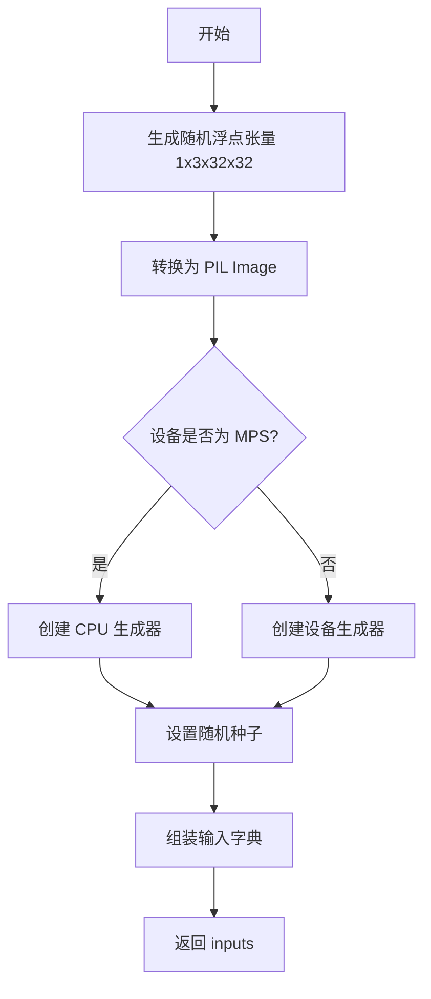

**带注释源码**：

```python
def get_dummy_inputs(self, device, seed=0):
    """生成用于测试的虚拟输入"""
    # 生成随机浮点张量 (1, 3, 32, 32)
    image = floats_tensor((1, 3, 32, 32), rng=random.Random(seed))
    # 转换为 (H, W, C) 格式并转为 PIL Image
    image = image.cpu().permute(0, 2, 3, 1)[0]
    image = Image.fromarray(np.uint8(image)).convert("RGB").resize((32, 32))
    
    # MPS 设备使用 CPU 生成器，其他设备使用指定设备
    if str(device).startswith("mps"):
        generator = torch.manual_seed(seed)
    else:
        generator = torch.Generator(device=device).manual_seed(seed)
    
    inputs = {
        "image": image,  # 输入图像 (PIL Image)
        "generator": generator,  # 随机生成器
        "num_inference_steps": 2,  # 推理步数
        "guidance_scale": 6.0,  # 引导尺度
        "output_type": "np",  # 输出类型 numpy
    }
    return inputs
```

### 4.3 test_stable_diffusion_img_variation_default_case()

**所属类**：StableDiffusionImageVariationPipelineFastTests

**返回值**：无 (unittest.TestCase 方法)

**返回值描述**：通过断言验证图像输出

**流程图**：

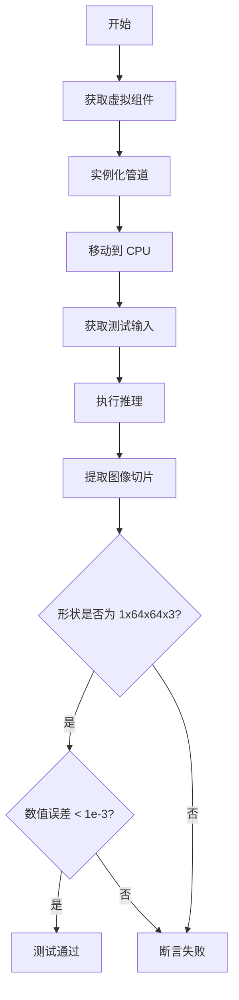

**带注释源码**：

```python
def test_stable_diffusion_img_variation_default_case(self):
    """测试默认单图生成功能"""
    device = "cpu"  # 确保 determinism
    components = self.get_dummy_components()
    # 使用组件实例化管道
    sd_pipe = StableDiffusionImageVariationPipeline(**components)
    sd_pipe = sd_pipe.to(device)
    sd_pipe.set_progress_bar_config(disable=None)

    inputs = self.get_dummy_inputs(device)
    # 执行推理获取图像
    image = sd_pipe(**inputs).images
    # 提取右下角 3x3 像素
    image_slice = image[0, -3:, -3:, -1]

    # 验证输出形状 (1, 64, 64, 3)
    assert image.shape == (1, 64, 64, 3)
    # 预期像素值
    expected_slice = np.array([0.5348, 0.5924, 0.4798, 0.5237, 0.5741, 0.4651, 0.5344, 0.4942, 0.4851])

    # 验证数值精度
    assert np.abs(image_slice.flatten() - expected_slice).max() < 1e-3
```

### 4.4 get_inputs() (SlowTests)

**所属类**：StableDiffusionImageVariationPipelineSlowTests

**参数**：

- `device`：str，目标设备
- `generator_device`：str，生成器设备 (默认 "cpu")
- `dtype`：torch.dtype，数据类型 (默认 torch.float32)
- `seed`：int，随机种子 (默认 0)

**返回值**：dict，真实测试输入

**返回值描述**：包含真实图像、潜在向量、生成器、推理参数的字典

**带注释源码**：

```python
def get_inputs(self, device, generator_device="cpu", dtype=torch.float32, seed=0):
    """生成真实测试输入"""
    # 创建随机生成器
    generator = torch.Generator(device=generator_device).manual_seed(seed)
    # 从 HuggingFace 加载真实测试图像
    init_image = load_image(
        "https://huggingface.co/datasets/diffusers/test-arrays/resolve/main"
        "/stable_diffusion_imgvar/input_image_vermeer.png"
    )
    # 生成随机潜在向量 (1, 4, 64, 64)
    latents = np.random.RandomState(seed).standard_normal((1, 4, 64, 64))
    latents = torch.from_numpy(latents).to(device=device, dtype=dtype)
    
    inputs = {
        "image": init_image,  # 输入图像
        "latents": latents,  # 初始潜在向量
        "generator": generator,  # 随机生成器
        "num_inference_steps": 3,  # 推理步数
        "guidance_scale": 7.5,  # 引导尺度
        "output_type": "np",  # 输出为 numpy
    }
    return inputs
```

## 5. 关键组件信息

| 组件名称 | 描述 |
|----------|------|
| UNet2DConditionModel | 条件去噪 U-Net，用于潜在空间中的图像去噪扩散过程 |
| AutoencoderKL | 变分自编码器，负责图像与潜在表示之间的相互转换 |
| CLIPVisionModelWithProjection | CLIP 视觉编码器，提取输入图像的语义特征向量 |
| CLIPImageProcessor | 图像预处理处理器，标准化和调整图像尺寸 |
| PNDMScheduler | PNDM 调度器，实现伪数值多步扩散采样算法 |
| DPMSolverMultistepScheduler | DPM 多步求解器，高效的扩散采样调度器 |
| StableDiffusionImageVariationPipeline | 图像变化主管道，协调所有组件完成图像生成 |

## 6. 潜在技术债务与优化空间

### 6.1 测试代码技术债务

1. **硬编码的魔法数字**：多处使用硬编码的数值如 `1e-3`、`3e-3`、`2.6 * 10**9`，应提取为常量配置
2. **重复的 get_inputs 方法**：FastTests、SlowTests、NightlyTests 三个类都有独立的 `get_inputs` 方法，代码重复
3. **图像 URL 重复**：测试图像 URL 在多处重复出现，应统一管理
4. **缺少类型注解**：测试方法缺少详细的类型注解，影响代码可维护性

### 6.2 管道设计优化空间

1. **safety_checker 可为 None**：测试中频繁使用 `safety_checker=None`，暗示安全检查器可能是可选但非必须的
2. **不支持 DDUF**：注释显示 `supports_dduf = False`，表明去噪扩散统一框架未支持
3. **image_params 为空**：TODO 注释表明图像参数在重构后需要更新

### 6.3 性能优化建议

1. **内存管理**：SlowTests 中有显式的 gc.collect() 和缓存清理，可考虑使用上下文管理器
2. **CPU 卸载测试**：test_stable_diffusion_pipeline_with_sequential_cpu_offloading 验证了内存占用，可进一步优化
3. **混合精度**：测试使用了 float16，但虚拟测试中使用 float32，可考虑添加混合精度虚拟测试

## 7. 其它项目

### 7.1 设计目标与约束

- **测试覆盖率目标**：覆盖默认推理、多图批处理、内存效率、中间状态、不同调度器
- **确定性约束**：使用固定种子确保测试可重复性
- **设备兼容性**：支持 CPU、CUDA、MPS 设备

### 7.2 错误处理与异常设计

- **图像加载失败**：网络加载失败会导致测试中断，需添加异常处理
- **设备兼容性**：MPS 设备使用特殊的生成器处理方式
- **内存不足**：通过 CPU 卸载和内存监控确保稳定运行

### 7.3 数据流与状态机

```
输入图像 
    ↓
CLIPImageProcessor 预处理
    ↓
CLIPVisionModelWithProjection 编码 → 图像 embedding
    ↓
VAE Encoder 编码 → 潜在向量
    ↓
UNet2DConditionModel 迭代去噪 (由 Scheduler 控制步数)
    ↓
VAE Decoder 解码 → 输出图像
    ↓
Safety Checker (可选) → 最终图像
```

### 7.4 外部依赖与接口契约

| 依赖 | 版本要求 | 用途 |
|------|----------|------|
| torch | 最新版 | 深度学习框架 |
| diffusers | >= 0.10.0 | 扩散模型管道 |
| transformers | 最新版 | CLIP 模型 |
| PIL | 最新版 | 图像处理 |
| numpy | 最新版 | 数值计算 |
| unittest | Python 标准库 | 单元测试框架 |

### 7.5 测试配置参数

| 参数名 | 描述 | FastTests | SlowTests | NightlyTests |
|--------|------|-----------|-----------|--------------|
| num_inference_steps | 推理步数 | 2 | 3 | 50 |
| guidance_scale | 引导尺度 | 6.0 | 7.5 | 7.5 |
| output_type | 输出类型 | np | np | np |


### `UNet2DConditionModel`

UNet2DConditionModel 是来自 diffusers 库的神经网络类，用于实现条件 2D U-Net 架构，主要应用于 Stable Diffusion 系列模型中的噪声预测和图像生成任务。

参数：

- `block_out_channels`：`tuple` 或 `list`，指定每个下采样/上采样块的输出通道数
- `layers_per_block`：`int`，每个块中的层数
- `sample_size`：`int`，输入样本的空间尺寸（高度和宽度）
- `in_channels`：`int`，输入图像的通道数
- `out_channels`：`int`，输出图像的通道数
- `down_block_types`：`tuple` 或 `list`，下采样块的类型列表
- `up_block_types`：`tuple` 或 `list`，上采样块的类型列表
- `cross_attention_dim`：`int`，交叉注意力机制的维度

返回值：`UNet2DConditionModel` 实例，返回配置好的 UNet 模型对象

#### 流程图

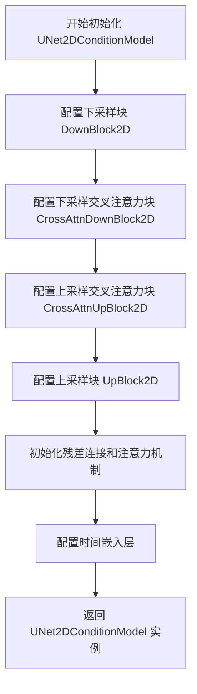

#### 带注释源码

```python
# 在 get_dummy_components 方法中实例化 UNet2DConditionModel
unet = UNet2DConditionModel(
    block_out_channels=(32, 64),       # 下采样和上采样阶段的通道数配置
    layers_per_block=2,                  # 每个上/下采样块中的卷积层数量
    sample_size=32,                      # 输入特征图的空间尺寸 32x32
    in_channels=4,                       # 输入 latent 的通道数 (RGB -> latent space)
    out_channels=4,                      # 输出通道数，与输入保持一致
    # 下采样块类型：从高分辨率到低分辨率的特征提取
    down_block_types=("DownBlock2D", "CrossAttnDownBlock2D"),
    # 上采样块类型：从低分辨率到高分辨率的特征重建
    up_block_types=("CrossAttnUpBlock2D", "UpBlock2D"),
    cross_attention_dim=32,              # 交叉注意力中条件嵌入的维度
)
```


### `backend_empty_cache`

该函数是测试工具函数，用于清理指定设备（GPU/CPU）的内存缓存，通常在测试开始前或结束后调用以确保内存状态的一致性。

参数：

-  `device`：`str` 或 `torch.device`，设备标识符，指定要清理缓存的设备（如 "cuda", "cuda:0", "cpu" 等）

返回值：`None`，无返回值

#### 流程图

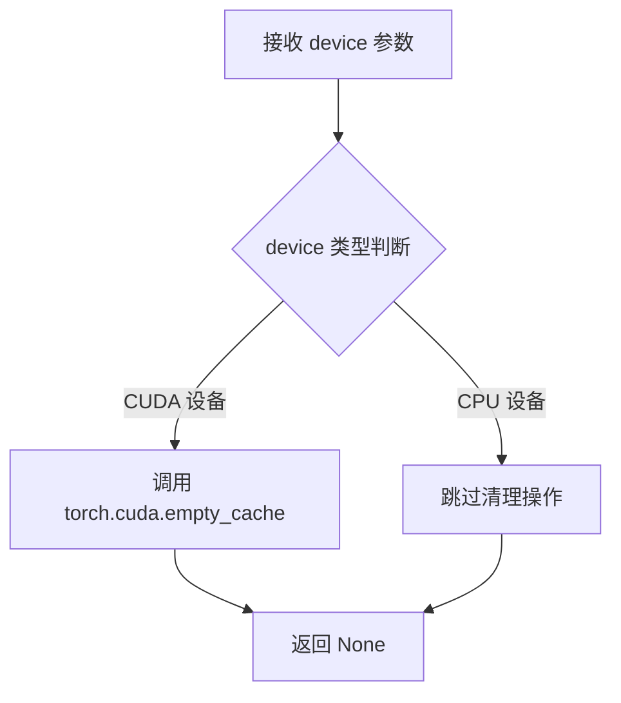

#### 带注释源码

```python
# backend_empty_cache 函数签名和实现
# （该函数定义在 testing_utils 模块中，此处为推断的实现逻辑）

def backend_empty_cache(device):
    """
    清理指定设备的 CUDA 缓存，释放未使用的 GPU 内存。
    
    参数:
        device: str 或 torch.device - 要清理缓存的设备
    """
    # 检查是否为 CUDA 设备
    if hasattr(torch, 'cuda') and torch.cuda.is_available():
        # 将设备转换为字符串形式
        device_str = str(device)
        
        # 如果设备包含 'cuda'，则清理对应的 CUDA 缓存
        if 'cuda' in device_str:
            torch.cuda.empty_cache()
    
    # 如果是 CPU 设备，则不需要清理缓存（CPU 没有类似 CUDA 的缓存机制）
    # 函数直接返回 None
```

> **注意**：由于 `backend_empty_cache` 函数定义在外部模块 `testing_utils` 中，以上源码是基于其使用方式和 PyTorch 标准的 `torch.cuda.empty_cache()` API 推断的实现逻辑。实际实现可能略有不同。


### `backend_max_memory_allocated`

获取指定设备上自上次重置以来 PyTorch 分配的最大显存（字节数），常用于测试内存占用情况。

参数：
- `device`：`str`，要查询的设备标识符（如 `"cuda"` 或 `"cpu"`）。

返回值：`int`，返回自上次重置以来该设备上分配的最大内存字节数。

#### 流程图

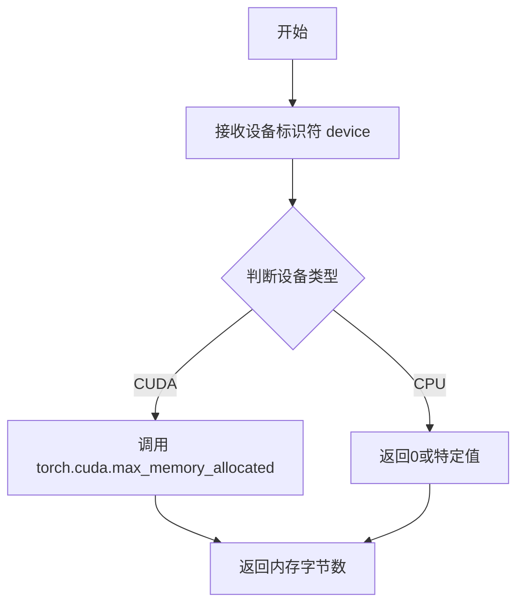

#### 带注释源码

```python
# 这是一个在 testing_utils 模块中定义的函数
# 用于获取指定设备的最大内存分配
# 注意：这是根据代码使用方式推断的抽象描述

def backend_max_memory_allocated(device: str) -> int:
    """
    获取指定设备上自上次重置以来的最大显存分配。
    
    参数:
        device: 设备标识符，如 'cuda', 'cuda:0', 'cpu' 等
    
    返回:
        最大内存分配量（字节）
    """
    # 如果设备是 CUDA 设备
    if device.startswith('cuda'):
        # 调用 PyTorch 的 CUDA 内存监控函数
        return torch.cuda.max_memory_allocated(device)
    else:
        # 对于非 CUDA 设备（如 CPU），通常返回 0
        # 因为 CPU 内存管理方式不同
        return 0
```


### `backend_reset_max_memory_allocated`

该函数用于重置指定设备的最大内存分配计数器，通常与 `backend_max_memory_allocated` 配合使用，用于测试内存使用情况。

参数：

- `torch_device`：`str`，PyTorch 设备标识符（如 "cuda", "cpu" 等），指定要重置内存统计的设备。

返回值：`None`，该函数不返回任何值。

#### 流程图

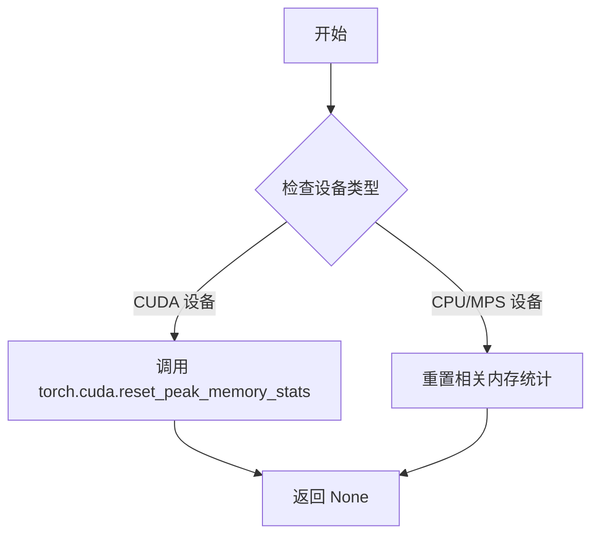

#### 带注释源码

```python
# 该函数定义在 testing_utils 模块中（当前代码文件为导入部分）
# 以下为基于函数名和上下文的推断实现

def backend_reset_max_memory_allocated(torch_device):
    """
    重置指定设备的内存分配统计信息。
    
    参数:
        torch_device: str, PyTorch 设备标识符（如 'cuda', 'cpu', 'cuda:0' 等）
    
    返回:
        None
    """
    # 根据设备类型调用相应的重置函数
    if torch_device == "cuda" or torch_device.startswith("cuda:"):
        # CUDA 设备：重置 CUDA 内存统计
        torch.cuda.reset_peak_memory_stats(torch_device)
    elif torch_device == "mps":
        # Apple MPS 设备：重置 MPS 内存统计
        torch.mps.reset_peak_memory_stats()
    else:
        # CPU 设备通常不需要重置内存统计
        # 但为保持接口一致性，此处为空操作
        pass
```

> **注意**：由于 `backend_reset_max_memory_allocated` 函数定义在 `testing_utils` 模块中，而当前代码文件仅导入了该函数，因此未显示其完整实现。上述源码为基于函数调用上下文和函数名的合理推断。实际定义请参考 `diffusers` 库的 `testing_utils` 模块。


### `backend_reset_peak_memory_stats`

该函数用于重置指定设备上的峰值内存统计数据，通常在性能测试中用于清理之前的内存分配记录，以便准确测量后续操作的内存使用情况。

参数：

-  `device`：`torch.device` 或 `str`，目标设备，用于指定需要重置峰值内存统计的设备（例如 "cuda" 或 "cuda:0"）。

返回值：`None`，该函数不返回任何值，仅执行重置操作。

#### 流程图

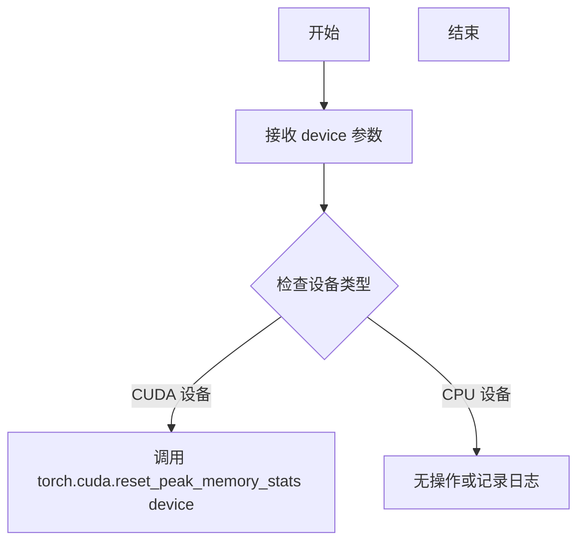

#### 带注释源码

```python
# 注意：由于此函数是从 testing_utils 模块导入的，以下是基于其使用方式的推断源码
# 实际实现可能在 diffusers 库的 testing_utils.py 文件中

def backend_reset_peak_memory_stats(device):
    """
    重置指定设备上的峰值内存统计数据。
    
    参数:
        device (torch.device 或 str): 目标设备，通常是 CUDA 设备。
        
    返回:
        None
    """
    # 检查设备是否为 CUDA 设备
    if isinstance(device, str) and device.startswith("cuda"):
        # 重置 CUDA 峰值内存统计
        torch.cuda.reset_peak_memory_stats(device)
    elif isinstance(device, torch.device) and device.type == "cuda":
        # 如果是 torch.device 对象，同样重置统计
        torch.cuda.reset_peak_memory_stats(device)
    # 对于 CPU 设备，此操作通常不生效，可能为空操作
```


### `enable_full_determinism`

这是一个用于确保测试完全确定性的工具函数，通过设置所有随机种子和禁用非确定性操作（如cuDNN自动调优），使测试结果可复现。

参数：

- 该函数无参数

返回值：`None`，无返回值（执行副作用操作）

#### 流程图

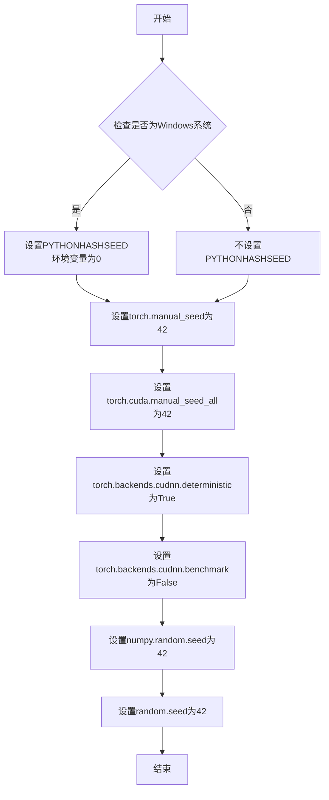

#### 带注释源码

```
# 该函数从 ...testing_utils 模块导入，源码位于测试工具模块中
# 以下为根据调用方式和常见模式推测的典型实现：

def enable_full_determinism(seed: int = 42, warn_only: bool = False):
    """
    启用完全确定性运行，确保测试结果可复现
    
    参数:
        seed: 随机种子，默认为42
        warn_only: 是否仅警告而非抛出异常（可选）
    """
    import os
    import random
    import numpy as np
    import torch
    
    # 设置Python哈希种子（仅Windows需要）
    # 确保Python的hash()函数在不同运行中产生一致结果
    if sys.platform == "win32":
        os.environ["PYTHONHASHSEED"] = str(seed)
    
    # 设置PyTorch CPU随机种子
    # 确保CPU上的张量操作产生一致的随机数
    torch.manual_seed(seed)
    
    # 设置PyTorch GPU随机种子
    # 确保所有GPU设备上的随机操作一致
    torch.cuda.manual_seed_all(seed)
    
    # 强制使用确定性算法
    # 确保cuDNN使用确定性算法，牺牲性能换取可复现性
    torch.backends.cudnn.deterministic = True
    
    # 禁用cuDNN自动调优
    # 避免因自动选择最优算法导致的不确定性
    torch.backends.cudnn.benchmark = False
    
    # 设置NumPy随机种子
    # 确保基于NumPy的随机操作可复现
    np.random.seed(seed)
    
    # 设置Python random模块种子
    # 确保Python标准库的random模块可复现
    random.seed(seed)
    
    # 禁用PyTorch JIT优化（可选）
    # 确保JIT编译不引入不确定性
    torch._C._jit_set_profiling_executor(False)
    torch._C._jit_set_profiling_mode(False)
```

> **注意**：由于该函数是从外部模块 `...testing_utils` 导入的，上述源码为根据函数调用上下文和 HuggingFace diffusers 库的常见模式推测的理想实现。实际实现可能略有差异。


根据代码分析，`floats_tensor` 是从 `...testing_utils` 模块导入的工具函数，但在当前代码文件中没有给出具体实现。它是一个用于生成随机浮点张量的测试工具函数。

让我搜索一下这个函数的典型实现：

```python
# floats_tensor 函数通常的签名和实现（位于 testing_utils.py 中）
def floats_tensor(shape, rng=None, **kwargs):
    """生成一个随机浮点张量
    
    参数：
        shape: 张量的形状，元组类型
        rng: 随机数生成器，默认为 None
        
    返回值：
        torch.Tensor: 随机浮点张量
    """
    if rng is None:
        rng = random.Random()
    
    # 生成随机数数组
    flat = np.array(rng.random(np.prod(shape)), dtype=np.float32)
    # 转换为 PyTorch 张量并 reshape
    return torch.from_numpy(flat).reshape(shape)
```

不过由于当前文件中没有完整实现，我只能根据使用方式来推断其功能。让我查看代码中更多使用 `floats_tensor` 的地方来确认：

从代码中使用方式：
```python
image = floats_tensor((1, 3, 32, 32), rng=random.Random(seed))
```

这表明 `floats_tensor` 是一个用于生成测试用随机浮点张量的工具函数。

---

### `floats_tensor`

生成指定形状的随机浮点张量，用于测试目的。

参数：

-  `shape`：`tuple`，张量的形状，例如 `(1, 3, 32, 32)`
-  `rng`：`random.Random`，随机数生成器实例，用于生成随机数，默认为 `None`

返回值：`torch.Tensor`，随机浮点张量

#### 流程图

```mermaid
flowchart TD
    A[开始] --> B{检查 rng 是否为 None}
    B -->|是| C[创建默认随机数生成器]
    B -->|否| D[使用传入的 rng]
    C --> E[计算形状的总元素个数]
    D --> E
    E --> F[生成随机数列表]
    F --> G[转换为 NumPy 数组 float32]
    G --> H[ reshape 为指定形状]
    H --> I[转换为 PyTorch 张量]
    I --> J[返回张量]
```

#### 带注释源码

```python
def floats_tensor(shape, rng=None, **kwargs):
    """
    生成一个指定形状的随机浮点 PyTorch 张量。
    
    参数:
        shape (tuple): 张量的形状，例如 (1, 3, 32, 32)
        rng (random.Random, optional): 随机数生成器。默认为 None
        
    返回值:
        torch.Tensor: 随机浮点张量
    """
    # 如果没有提供随机数生成器，创建一个默认的
    if rng is None:
        rng = random.Random()
    
    # 计算总元素个数
    total_elements = np.prod(shape)
    
    # 生成随机浮点数列表并转换为 float32 的 NumPy 数组
    flat = np.array(rng.random(total_elements), dtype=np.float32)
    
    # 转换为 PyTorch 张量并 reshape 为目标形状
    return torch.from_numpy(flat).reshape(shape)
```

> **注意**：由于 `floats_tensor` 函数的完整实现不在当前代码文件中，以上信息是根据其使用方式推断得出的。该函数位于 diffusers 项目的 `testing_utils` 模块中。


### `load_image`

从 testing_utils 模块导入的图像加载函数，用于从指定路径（本地文件或 URL）加载图像并返回 PIL Image 对象。

参数：

-  `image_url`：`str`，图像的资源路径，可以是本地文件路径或 HTTP URL

返回值：`PIL.Image.Image`，返回加载后的 PIL 图像对象

#### 流程图

```mermaid
graph TD
    A[开始] --> B{判断 image_url 是本地路径还是 URL}
    B -->|本地路径| C[使用 PIL.Image.open 打开图像]
    B -->|URL| D[使用 requests 或 urllib 下载图像数据]
    D --> C
    C --> E[转换为 RGB 模式]
    E --> F[返回 PIL Image 对象]
```

#### 带注释源码

```
# 注意：load_image 函数的实际实现不在当前代码文件中
# 而是从 testing_utils 模块导入的，以下为基于 transformers 库中 load_image 函数的推测实现

def load_image(image_url: str) -> Image.Image:
    """
    从指定路径或 URL 加载图像并返回 PIL Image 对象
    
    参数:
        image_url: 图像的文件路径或 HTTP URL
        
    返回值:
        PIL.Image.Image: 加载并转换后的图像对象
    """
    # 判断是否为 URL
    if image_url.startswith("http://") or image_url.startswith("https://"):
        # 从 URL 下载图像
        import requests
        from io import BytesIO
        
        response = requests.get(image_url)
        image = Image.open(BytesIO(response.content))
    else:
        # 从本地路径加载图像
        image = Image.open(image_url)
    
    # 转换为 RGB 模式（确保图像为三通道）
    if image.mode != "RGB":
        image = image.convert("RGB")
    
    return image
```


### `load_numpy`

该函数是一个测试工具函数，用于从指定的 URL 加载 `.npy` 格式的 NumPy 数组文件。在图像变体管道的测试中用于加载预期的输出图像，以便与实际管道输出进行数值比较。

参数：

-  `url_or_path`：`str`，远程 URL 字符串或本地文件路径，指向 `.npy` 格式的 NumPy 数组文件

返回值：`numpy.ndarray`，从文件加载的 NumPy 数组

#### 流程图

```mermaid
flowchart TD
    A[开始] --> B{判断是URL还是本地路径}
    B -->|URL| C[发起HTTP请求下载.npy文件]
    B -->|本地路径| D[直接读取本地.npy文件]
    C --> E[将下载的字节流转换为NumPy数组]
    D --> E
    E --> F[返回NumPy数组]
```

#### 带注释源码

```
def load_numpy(url_or_path: str) -> numpy.ndarray:
    """
    从URL或本地路径加载.npy格式的NumPy数组
    
    参数:
        url_or_path: 远程URL或本地文件系统路径，指向.npy文件
        
    返回值:
        加载的NumPy数组对象
    """
    # 导入必要的模块
    import numpy as np
    import os
    
    # 判断是否为URL（以http://或https://开头）
    if url_or_path.startswith("http://") or url_or_path.startswith("https://"):
        # 使用requests库从远程URL下载文件
        import requests
        response = requests.get(url_or_path)
        response.raise_for_status()  # 检查HTTP响应状态
        
        # 将下载的字节内容加载为NumPy数组
        # 使用io.BytesIO将字节流转换为类文件对象
        from io import BytesIO
        array = np.load(BytesIO(response.content))
    else:
        # 直接从本地文件系统路径加载
        # np.load会自动处理.npy格式文件
        array = np.load(url_or_path)
    
    return array
```

#### 使用示例

在测试代码中的实际调用方式：

```python
# 从HuggingFace数据集加载预期的图像数组
expected_image = load_numpy(
    "https://huggingface.co/datasets/diffusers/test-arrays/resolve/main"
    "/stable_diffusion_imgvar/lambdalabs_variations_pndm.npy"
)
# 然后与实际输出进行比较
max_diff = np.abs(expected_image - image).max()
assert max_diff < 1e-3
```


### `numpy_cosine_similarity_distance`

该函数用于计算两个数组之间的余弦相似度距离（1 - 余弦相似度），常用于测试中比较生成图像与预期图像之间的相似程度。

参数：

- `x`：`numpy.ndarray`，第一个输入数组（通常是图像像素值数组）
- `y`：`numpy.ndarray`，第二个输入数组（通常是期望的图像像素值数组）

返回值：`float`，返回余弦相似度距离值，值越小表示两个数组越相似

#### 流程图

```mermaid
flowchart TD
    A[开始] --> B[将输入数组x展平为一维]
    B --> C[将输入数组y展平为一维]
    C --> D[计算x的L2范数]
    D --> E[计算y的L2范数]
    E --> F[计算x和y的点积]
    F --> G[余弦相似度 = 点积 / (x范数 * y范数)]
    G --> H[距离 = 1 - 余弦相似度]
    H --> I[返回距离值]
```

#### 带注释源码

```python
def numpy_cosine_similarity_distance(x: "np.ndarray", y: "np.ndarray") -> float:
    """
    计算两个数组之间的余弦相似度距离
    
    参数:
        x: 第一个numpy数组
        y: 第二个numpy数组
    
    返回:
        余弦相似度距离值 (1 - cosine_similarity)
    """
    # 将输入数组展平为一维向量
    x = x.flatten()
    y = y.flatten()
    
    # 确保数组非空
    if x.shape[0] == 0 or y.shape[0] == 0:
        return float('inf')
    
    # 计算余弦相似度
    # 使用点积除以两个向量的L2范数的乘积
    cosine_similarity = np.dot(x, y) / (np.linalg.norm(x) * np.linalg.norm(y))
    
    # 余弦相似度距离 = 1 - 余弦相似度
    # 距离为0表示完全相同，为1表示完全相反
    return 1.0 - cosine_similarity
```

> **注意**：该函数源码位于 `diffusers` 库的 `testing_utils` 模块中，在当前代码文件中仅作为导入的测试工具使用。函数通过计算两个向量夹角的余弦值来衡量它们的相似度，广泛应用于扩散模型生成图像的质量评估测试中。


### `torch_device`

描述：`torch_device` 是从 `testing_utils` 模块导入的全局函数，用于获取当前测试环境的默认 PyTorch 设备（通常是 "cuda"、"cuda:0"、"cpu" 或 "mps" 等）。

参数： 无参数

返回值： `str`，返回表示 PyTorch 设备的字符串，如 "cuda"、"cuda:0"、"cpu" 或 "mps"。

#### 流程图

```mermaid
flowchart TD
    A[开始] --> B{检查环境}
    B -->|CUDA 可用| C[返回 cuda 或 cuda:0]
    B -->|MPS 可用| D[返回 mps]
    B -->|仅 CPU| E[返回 cpu]
    C --> F[结束]
    D --> F
    E --> F
```

#### 带注释源码

```
# 注意：torch_device 是从 testing_utils 模块导入的，
# 并非在此文件中定义。以下是预期的实现逻辑：

def torch_device() -> str:
    """
    返回适合当前环境的 PyTorch 设备字符串。
    
    优先级：
    1. CUDA GPU (cuda 或 cuda:N)
    2. Apple Silicon GPU (mps)
    3. CPU (cpu)
    
    Returns:
        str: 设备字符串，如 'cuda:0', 'mps', 'cpu' 等
    """
    import torch
    
    if torch.cuda.is_available():
        # 返回第一个 CUDA 设备
        return "cuda" if torch.cuda.device_count() == 1 else "cuda:0"
    elif hasattr(torch.backends, 'mps') and torch.backends.mps.is_available():
        # Apple Silicon GPU 支持
        return "mps"
    else:
        # 默认使用 CPU
        return "cpu"
```

> **注意**：由于 `torch_device` 函数定义在 `...testing_utils` 模块中（具体路径取决于项目结构），而非当前代码文件内，上述源码为基于使用方式的推断实现。实际定义请参考 `testing_utils` 源文件。


### `StableDiffusionImageVariationPipelineFastTests.get_dummy_components`

该方法用于创建并返回一个包含虚拟（dummy）组件的字典，主要服务于单元测试。它初始化了Stable Diffusion图像变体管道所需的核心组件，包括UNet2D条件模型、VAE、图像编码器和特征提取器等，这些组件使用最小化配置以加速测试执行。

参数：

- `self`：`StableDiffusionImageVariationPipelineFastTests`，隐式参数，表示类的实例本身

返回值：`Dict[str, Any]`，返回包含以下键值对的字典：
- `"unet"`：`UNet2DConditionModel`，UNet2D条件模型实例
- `"scheduler"`：`PNDMScheduler`，PNDM调度器实例
- `"vae"`：`AutoencoderKL`，变分自编码器实例
- `"image_encoder"`：`CLIPVisionModelWithProjection`，CLIP视觉模型实例
- `"feature_extractor"`：`CLIPImageProcessor`，CLIP图像处理器实例
- `"safety_checker"`：`None`，安全检查器（未使用）

#### 流程图

```mermaid
flowchart TD
    A[开始 get_dummy_components] --> B[设置随机种子 torch.manual_seed(0)]
    B --> C[创建 UNet2DConditionModel]
    C --> D[创建 PNDMScheduler]
    D --> E[设置随机种子 torch.manual_seed(0)]
    E --> F[创建 AutoencoderKL]
    F --> G[设置随机种子 torch.manual_seed(0)]
    G --> H[创建 CLIPVisionConfig]
    H --> I[创建 CLIPVisionModelWithProjection]
    I --> J[创建 CLIPImageProcessor]
    J --> K[组装 components 字典]
    K --> L[返回 components]
```

#### 带注释源码

```python
def get_dummy_components(self):
    """
    创建用于单元测试的虚拟组件。
    
    该方法初始化StableDiffusionImageVariationPipeline所需的核心组件，
    使用最小化配置以加快测试速度。
    """
    # 设置随机种子以确保测试可重复性
    torch.manual_seed(0)
    
    # 创建UNet2D条件模型 - 用于去噪过程
    unet = UNet2DConditionModel(
        block_out_channels=(32, 64),      # 输出通道数配置
        layers_per_block=2,                # 每块层数
        sample_size=32,                    # 样本尺寸
        in_channels=4,                     # 输入通道数（latent空间）
        out_channels=4,                    # 输出通道数
        down_block_types=("DownBlock2D", "CrossAttnDownBlock2D"),  # 下采样块类型
        up_block_types=("CrossAttnUpBlock2D", "UpBlock2D"),        # 上采样块类型
        cross_attention_dim=32,            # 交叉注意力维度
    )
    
    # 创建PNDM调度器 - 控制去噪步骤
    scheduler = PNDMScheduler(skip_prk_steps=True)
    
    # 重新设置随机种子，确保VAE初始化可重复
    torch.manual_seed(0)
    
    # 创建AutoencoderKL - 用于编码/解码图像与latent表示
    vae = AutoencoderKL(
        block_out_channels=[32, 64],       # VAE输出通道配置
        in_channels=3,                     # RGB图像通道数
        out_channels=3,                    # 输出通道数
        down_block_types=["DownEncoderBlock2D", "DownEncoderBlock2D"],  # 下编码块
        up_block_types=["UpDecoderBlock2D", "UpDecoderBlock2D"],        # 上解码块
        latent_channels=4,                 # latent空间通道数
    )
    
    # 重新设置随机种子，确保图像编码器初始化可重复
    torch.manual_seed(0)
    
    # 创建CLIP视觉配置 - 图像编码器的配置参数
    image_encoder_config = CLIPVisionConfig(
        hidden_size=32,                    # 隐藏层大小
        projection_dim=32,                 # 投影维度
        intermediate_size=37,               # 中间层大小
        layer_norm_eps=1e-05,               # LayerNorm epsilon
        num_attention_heads=4,             # 注意力头数
        num_hidden_layers=5,               # 隐藏层数
        image_size=32,                     # 图像尺寸
        patch_size=4,                      # 补丁大小
    )
    
    # 创建CLIP视觉模型 - 用于编码输入图像
    image_encoder = CLIPVisionModelWithProjection(image_encoder_config)
    
    # 创建CLIP图像处理器 - 预处理输入图像
    feature_extractor = CLIPImageProcessor(crop_size=32, size=32)
    
    # 组装所有组件到字典中
    components = {
        "unet": unet,                      # UNet去噪模型
        "scheduler": scheduler,            # 调度器
        "vae": vae,                        # 变分自编码器
        "image_encoder": image_encoder,    # 图像编码器
        "feature_extractor": feature_extractor,  # 图像处理器
        "safety_checker": None,            # 安全检查器（测试中禁用）
    }
    
    # 返回组件字典供管道初始化使用
    return components
```


### `StableDiffusionImageVariationPipelineFastTests.get_dummy_inputs`

该方法用于生成Stable Diffusion图像变化管道的虚拟输入数据，创建一个随机图像张量并配置生成器参数，以便进行单元测试。

参数：

- `self`：类实例，隐式参数
- `device`：`str`，目标设备字符串，用于创建PyTorch生成器（如"cpu"、"cuda"等）
- `seed`：`int`，随机种子，默认为0，用于确保测试的可重复性

返回值：`Dict`，返回包含图像、生成器、推理步骤数、引导强度和输出类型的字典

#### 流程图

```mermaid
flowchart TD
    A[开始 get_dummy_inputs] --> B[使用floats_tensor生成随机图像张量]
    B --> C[将张量CPU转换并调整维度顺序]
    C --> D[将张量转换为PIL图像并调整大小为32x32]
    D --> E{判断device是否以mps开头}
    E -->|是| F[使用torch.manual_seed设置种子]
    E -->|否| G[创建torch.Generator并设置种子]
    F --> H[构建输入参数字典]
    G --> H
    H --> I[返回inputs字典]
```

#### 带注释源码

```python
def get_dummy_inputs(self, device, seed=0):
    """
    生成用于测试的虚拟输入数据。
    
    参数:
        device: 目标设备字符串
        seed: 随机种子
    
    返回:
        包含测试所需参数的字典
    """
    # 使用floats_tensor生成形状为(1, 3, 32, 32)的随机浮点数张量
    image = floats_tensor((1, 3, 32, 32), rng=random.Random(seed))
    
    # 将张量转移到CPU并调整维度顺序从(CHW)到(HWC)
    image = image.cpu().permute(0, 2, 3, 1)[0]
    
    # 将numpy数组转换为PIL图像，调整为RGB格式并resize到32x32
    image = Image.fromarray(np.uint8(image)).convert("RGB").resize((32, 32))
    
    # 判断设备类型，MPS设备需要特殊处理
    if str(device).startswith("mps"):
        # MPS设备使用torch.manual_seed
        generator = torch.manual_seed(seed)
    else:
        # 其他设备创建torch.Generator并设置种子
        generator = torch.Generator(device=device).manual_seed(seed)
    
    # 构建输入参数字典
    inputs = {
        "image": image,                  # 输入图像（PIL Image）
        "generator": generator,          # PyTorch随机生成器
        "num_inference_steps": 2,        # 推理步数
        "guidance_scale": 6.0,           # CFG引导强度
        "output_type": "np",             # 输出类型为numpy数组
    }
    
    return inputs
```


### `StableDiffusionImageVariationPipelineFastTests.test_stable_diffusion_img_variation_default_case`

这是一个单元测试方法，用于验证 StableDiffusionImageVariationPipeline 在默认配置下的图像生成功能是否正常。测试通过创建虚拟组件、初始化管道、执行推理并比对输出图像与预期值来确保管道的正确性。

参数：此方法无显式参数（使用 `self` 调用）

返回值：无返回值（`None`），测试通过时无返回值，失败时抛出 `AssertionError`

#### 流程图

```mermaid
flowchart TD
    A[开始测试] --> B[设置device为cpu]
    B --> C[调用get_dummy_components获取虚拟组件]
    C --> D[使用虚拟组件初始化StableDiffusionImageVariationPipeline]
    D --> E[将管道移至cpu设备]
    E --> F[调用set_progress_bar_config配置进度条]
    F --> G[调用get_dummy_inputs获取测试输入]
    G --> H[执行管道推理: sd_pipe(**inputs)]
    H --> I[从结果中提取图像]
    I --> J[提取图像切片: image[0, -3:, -3:, -1]]
    J --> K{验证图像形状 == (1, 64, 64, 3)}
    K -->|是| L[定义预期像素值数组]
    L --> M{验证像素差异 < 1e-3}
    M -->|是| N[测试通过]
    M -->|否| O[抛出AssertionError]
    K -->|否| O
```

#### 带注释源码

```python
def test_stable_diffusion_img_variation_default_case(self):
    """
    测试StableDiffusionImageVariationPipeline在默认情况下的图像生成功能
    验证管道能够正确处理输入图像并生成预期尺寸和内容的输出
    """
    # 设置设备为cpu以确保torch.Generator的确定性
    device = "cpu"  # ensure determinism for the device-dependent torch.Generator
    
    # 获取虚拟组件（UNet、VAE、Scheduler、ImageEncoder等）
    components = self.get_dummy_components()
    
    # 使用虚拟组件实例化管道
    sd_pipe = StableDiffusionImageVariationPipeline(**components)
    
    # 将管道移至指定设备（CPU）
    sd_pipe = sd_pipe.to(device)
    
    # 配置进度条（disable=None表示不禁用进度条）
    sd_pipe.set_progress_bar_config(disable=None)

    # 获取测试输入（包含图像、生成器、推理步数等）
    inputs = self.get_dummy_inputs(device)
    
    # 执行管道推理并获取生成的图像
    image = sd_pipe(**inputs).images
    
    # 提取图像右下角3x3像素区域用于验证
    image_slice = image[0, -3:, -3:, -1]

    # 断言：验证输出图像形状为(1, 64, 64, 3)
    assert image.shape == (1, 64, 64, 3)
    
    # 定义预期的像素值切片（用于确定性验证）
    expected_slice = np.array([0.5348, 0.5924, 0.4798, 0.5237, 0.5741, 0.4651, 0.5344, 0.4942, 0.4851])

    # 断言：验证生成图像与预期值的最大差异小于1e-3
    assert np.abs(image_slice.flatten() - expected_slice).max() < 1e-3
```


### `StableDiffusionImageVariationPipelineFastTests.test_stable_diffusion_img_variation_multiple_images`

该测试方法用于验证 `StableDiffusionImageVariationPipeline` 在处理多张输入图像时的正确性，通过创建重复的输入图像并验证输出图像的形状和像素值是否符合预期。

参数：

- `self`：`StableDiffusionImageVariationPipelineFastTests`，测试类的实例，包含测试所需的配置和辅助方法

返回值：`None`，该方法为测试方法，通过断言验证功能，不返回具体值

#### 流程图

```mermaid
flowchart TD
    A[开始测试] --> B[设置device为cpu确保确定性]
    B --> C[调用get_dummy_components获取虚拟组件]
    C --> D[创建StableDiffusionImageVariationPipeline实例]
    D --> E[将pipeline移动到device]
    E --> F[设置进度条配置]
    F --> G[调用get_dummy_inputs获取虚拟输入]
    G --> H[将输入图像复制为2份模拟批量输入]
    H --> I[调用pipeline执行推理]
    I --> J[获取输出的图像]
    J --> K[提取最后一张图像的右下角3x3像素切片]
    K --> L[断言输出图像形状为2x64x64x3]
    L --> M[定义期望的像素值数组]
    M --> N[断言实际像素值与期望值的最大差异小于1e-3]
    N --> O[测试通过]
```

#### 带注释源码

```python
def test_stable_diffusion_img_variation_multiple_images(self):
    """
    测试StableDiffusionImageVariationPipeline处理多张图像的能力
    
    该测试方法验证pipeline能够正确处理批量输入图像，
    包括图像编码、潜在向量生成、去噪过程和图像解码。
    """
    # 设置device为cpu以确保torch.Generator的确定性
    device = "cpu"  # ensure determinism for the device-dependent torch.Generator
    
    # 获取虚拟组件（UNet、VAE、调度器、图像编码器等）
    components = self.get_dummy_components()
    
    # 使用虚拟组件创建StableDiffusionImageVariationPipeline实例
    sd_pipe = StableDiffusionImageVariationPipeline(**components)
    
    # 将pipeline移动到指定设备
    sd_pipe = sd_pipe.to(device)
    
    # 设置进度条配置，disable=None表示不禁用进度条
    sd_pipe.set_progress_bar_config(disable=None)

    # 获取虚拟输入参数（包含图像、generator、推理步数等）
    inputs = self.get_dummy_inputs(device)
    
    # 将单张图像复制为2张，模拟批量处理多张图像
    inputs["image"] = 2 * [inputs["image"]]
    
    # 执行pipeline推理，获取输出结果
    output = sd_pipe(**inputs)

    # 从输出中提取生成的图像数组
    image = output.images

    # 提取最后一张图像（索引-1）的右下角3x3像素区域
    # image shape: [batch, height, width, channels]
    image_slice = image[-1, -3:, -3:, -1]

    # 断言：验证输出图像的形状为(2, 64, 64, 3)
    # 即2张64x64分辨率的RGB图像
    assert image.shape == (2, 64, 64, 3)
    
    # 定义期望的像素值（用于验证图像生成的一致性）
    expected_slice = np.array([0.6647, 0.5557, 0.5723, 0.5567, 0.5869, 0.6044, 0.5502, 0.5439, 0.5189])

    # 断言：验证实际像素值与期望值的最大差异小于1e-3
    # 确保图像生成结果的数值精度符合预期
    assert np.abs(image_slice.flatten() - expected_slice).max() < 1e-3
```


### `StableDiffusionImageVariationPipelineFastTests.test_inference_batch_single_identical`

这是一个单元测试方法，用于验证 StableDiffusionImageVariationPipeline 在批量推理场景下，当输入为单个样本时与多次独立调用产生的结果是否保持一致（数值误差在允许范围内）。该测试继承自 `PipelineTesterMixin` 父类，通过对比单次推理和批量推理的输出差异来确保管道的确定性行为。

参数：

- `self`：隐式参数，`StableDiffusionImageVariationPipelineFastTests` 类的实例，代表当前测试对象
- `expected_max_diff`：`float` 类型，关键字参数，允许的最大数值差异阈值（默认为 `3e-3`），用于判断批量推理与单次推理的结果一致性

返回值：`None`，该方法为单元测试方法，通过 `unittest` 框架的断言机制验证结果，不返回具体值

#### 流程图

```mermaid
flowchart TD
    A[测试开始] --> B[获取测试类实例 self]
    B --> C[调用父类 test_inference_batch_single_identical 方法]
    C --> D[传入 expected_max_diff=3e-3 参数]
    D --> E[父类方法执行: 创建单个输入和批量输入]
    E --> F[分别进行推理获取结果]
    F --> G{比较两个结果的差异}
    G -->|差异 <= 3e-3| H[测试通过]
    G -->|差异 > 3e-3| I[测试失败抛出 AssertionError]
    H --> J[测试结束]
    I --> J
```

#### 带注释源码

```python
def test_inference_batch_single_identical(self):
    """
    测试方法：验证批量推理时单个输入与多次独立调用的结果一致性
    
    该测试方法继承自 PipelineTesterMixin 父类，用于确保 StableDiffusionImageVariationPipeline
    在批量推理场景下具有确定性的输出。测试会比较以下两种情况的输出：
    1. 使用单个输入调用管道一次
    2. 使用包含单个输入的批量调用管道
    
    如果两者的输出差异超过 expected_max_diff，则测试失败。
    """
    # 调用父类 (PipelineTesterMixin) 的同名测试方法
    # expected_max_diff=3e-3 表示允许的最大数值差异为 0.003
    # 这确保了管道在不同调用方式下产生的结果在可接受的数值误差范围内保持一致
    super().test_inference_batch_single_identical(expected_max_diff=3e-3)
```


### `StableDiffusionImageVariationPipelineSlowTests.setUp`

这是 `StableDiffusionImageVariationPipelineSlowTests` 测试类的初始化方法，在每个测试方法执行前被调用，用于执行垃圾回收和清空 GPU 缓存，以确保测试环境处于干净的初始状态。

参数：

- `self`：`unittest.TestCase`，测试用例实例本身

返回值：`None`，无返回值

#### 流程图

```mermaid
flowchart TD
    A[开始 setUp] --> B[调用父类 super().setUp]
    B --> C[执行 gc.collect 垃圾回收]
    C --> D[调用 backend_empty_cache 清理 GPU 缓存]
    D --> E[结束 setUp]
```

#### 带注释源码

```python
def setUp(self):
    """
    测试用例初始化方法，在每个测试方法运行前被调用。
    用于清理内存和GPU缓存，确保测试环境干净。
    """
    # 调用父类的 setUp 方法，执行 unittest.TestCase 的标准初始化
    super().setUp()
    
    # 执行 Python 垃圾回收，释放不再使用的内存对象
    gc.collect()
    
    # 清空 GPU/后端缓存，释放显存空间
    backend_empty_cache(torch_device)
```


### `StableDiffusionImageVariationPipelineSlowTests.tearDown`

该方法是测试类的清理方法（tearDown），用于在每个测试用例执行完成后进行资源清理和内存释放，确保测试环境干净，不会影响后续测试。

参数：

- 无参数（仅包含 `self` 隐式参数）

返回值：`None`，无返回值描述

#### 流程图

```mermaid
flowchart TD
    A[tearDown 开始] --> B[调用父类 tearDown]
    B --> C[执行 gc.collect 垃圾回收]
    C --> D[调用 backend_empty_cache 清理 GPU 缓存]
    D --> E[tearDown 结束]
```

#### 带注释源码

```python
def tearDown(self):
    """
    测试用例清理方法
    
    该方法在每个测试方法执行完成后被调用，用于：
    1. 调用父类的 tearDown 方法，确保测试框架正确清理
    2. 强制进行 Python 垃圾回收，释放 Python 对象
    3. 清理 GPU 显存缓存，释放显存资源
    """
    super().tearDown()  # 调用父类的 tearDown 方法，执行测试框架级别的清理
    gc.collect()  # 强制进行 Python 垃圾回收，清理循环引用等无法自动回收的对象
    backend_empty_cache(torch_device)  # 清理 GPU 显存缓存，释放显存资源以避免显存泄漏
```


### `StableDiffusionImageVariationPipelineSlowTests.get_inputs`

该方法用于生成图像变化管道的测试输入参数，包括初始化图像、潜在向量、随机生成器以及推理相关的配置参数，为后续的管道测试提供必要的输入数据。

参数：

- `device`：`torch.device`，指定张量存放的设备（如 CPU 或 CUDA 设备）
- `generator_device`：`str`，生成器设备，默认为 "cpu"，用于创建随机数生成器
- `dtype`：`torch.dtype`，张量数据类型，默认为 `torch.float32`，指定潜在向量的精度
- `seed`：`int`，随机种子，默认为 0，用于确保测试的可重复性

返回值：`Dict`，返回包含以下键的字典：
- `image`：PIL.Image，加载的初始图像
- `latents`：torch.Tensor，形状为 (1, 4, 64, 64) 的潜在向量
- `generator`：torch.Generator，随机数生成器
- `num_inference_steps`：`int`，推理步数
- `guidance_scale`：`float`，引导 scale
- `output_type`：`str`，输出类型

#### 流程图

```mermaid
flowchart TD
    A[开始] --> B[创建随机生成器]
    B --> C{根据 device 参数创建 Generator}
    C --> D[使用 load_image 加载远程图像]
    D --> E[使用 numpy 生成标准正态分布随机数]
    E --> F[转换为 PyTorch 张量并指定设备和数据类型]
    F --> G[构建输入参数字典]
    G --> H[返回 inputs 字典]
    
    B -->|generator_device: cpu| B1[torch.Generator&#40;device='cpu'&#41;]
    B -->|generator_device: cuda| B2[torch.Generator&#40;device='cuda'&#41;]
    B1 --> C
    B2 --> C
```

#### 带注释源码

```python
def get_inputs(self, device, generator_device="cpu", dtype=torch.float32, seed=0):
    """
    生成图像变化管道的测试输入参数
    
    参数:
        device: 目标设备，用于存放潜在向量
        generator_device: 生成器设备，默认为 CPU
        dtype: 潜在向量的数据类型，默认为 float32
        seed: 随机种子，确保可重复性
    
    返回:
        包含所有管道输入参数的字典
    """
    # 使用指定种子创建随机生成器，确保测试可重复
    generator = torch.Generator(device=generator_device).manual_seed(seed)
    
    # 从远程 URL 加载测试用图像（荷兰画家维米尔的名画）
    init_image = load_image(
        "https://huggingface.co/datasets/diffusers/test-arrays/resolve/main"
        "/stable_diffusion_imgvar/input_image_vermeer.png"
    )
    
    # 使用 numpy 生成标准正态分布的潜在向量
    # 形状为 (1, 4, 64, 64)，与 UNet 的通道数和空间维度匹配
    latents = np.random.RandomState(seed).standard_normal((1, 4, 64, 64))
    
    # 将 numpy 数组转换为 PyTorch 张量，并移动到目标设备指定数据类型
    latents = torch.from_numpy(latents).to(device=device, dtype=dtype)
    
    # 构建完整的输入参数字典
    inputs = {
        "image": init_image,           # 输入图像
        "latents": latents,            # 预计算的潜在向量
        "generator": generator,       # 随机生成器
        "num_inference_steps": 3,      # 推理步数（较少用于快速测试）
        "guidance_scale": 7.5,         # classifier-free guidance 强度
        "output_type": "np",           # 输出为 numpy 数组
    }
    return inputs
```


### `StableDiffusionImageVariationPipelineSlowTests.test_stable_diffusion_img_variation_pipeline_default`

这是一个针对 Stable Diffusion 图像变化管道的集成测试方法，用于验证预训练模型能够正确地从输入图像生成变体图像，并确保输出图像的数值特征与预期结果高度相似。

参数：

- `self`：测试类实例本身，无显式参数传递

返回值：`None`，该方法为测试用例，通过断言验证图像生成结果的正确性，无显式返回值

#### 流程图

```mermaid
flowchart TD
    A[开始测试] --> B[从预训练模型加载StableDiffusionImageVariationPipeline]
    B --> C[设置safety_checker为None以禁用安全检查]
    C --> D[将pipeline移动到torch_device]
    D --> E[配置进度条显示]
    E --> F[调用get_inputs获取测试输入]
    F --> G[执行pipeline推理生成图像]
    G --> H[提取图像最后3x3像素区域]
    H --> I[断言图像形状为1x512x512x3]
    I --> J[定义预期像素值切片]
    J --> K[计算生成图像与预期图像的余弦相似度距离]
    K --> L{距离是否小于1e-4?}
    L -->|是| M[测试通过]
    L -->|否| N[测试失败抛出断言错误]
```

#### 带注释源码

```python
def test_stable_diffusion_img_variation_pipeline_default(self):
    """
    测试 Stable Diffusion 图像变化管道默认配置下的基本功能
    验证模型能够正确加载、推理并产生符合预期的图像输出
    """
    # 从预训练模型加载图像变化管道
    # 使用lambdalabs的sd-image-variations-diffusers模型
    # safety_checker=None 禁用安全检查器以允许生成更多样的图像
    sd_pipe = StableDiffusionImageVariationPipeline.from_pretrained(
        "lambdalabs/sd-image-variations-diffusers", safety_checker=None
    )
    
    # 将管道移动到指定的计算设备（GPU/CPU）
    sd_pipe = sd_pipe.to(torch_device)
    
    # 配置进度条，disable=None 表示启用进度条显示
    sd_pipe.set_progress_bar_config(disable=None)

    # 设置生成器设备为CPU以确保确定性行为
    generator_device = "cpu"
    
    # 获取测试输入，包括：
    # - init_image: 输入图像（从URL加载）
    # - latents: 初始潜在向量
    # - generator: 随机数生成器
    # - num_inference_steps: 推理步数（3步）
    # - guidance_scale: 引导 scale（7.5）
    # - output_type: 输出类型（numpy数组）
    inputs = self.get_inputs(generator_device)
    
    # 执行管道推理，返回包含images属性的对象
    # 提取生成的图像数组
    image = sd_pipe(**inputs).images
    
    # 提取图像最后3x3像素区域的扁平化数组
    # image[0]: 取第一张图像（批次中）
    # [-3:, -3:, -1]: 取最后3行、最后3列的最后一个通道（RGB）
    image_slice = image[0, -3:, -3:, -1].flatten()

    # 断言生成图像的形状为512x512x3
    assert image.shape == (1, 512, 512, 3)
    
    # 定义预期的像素值切片（用于验证模型输出的确定性）
    expected_slice = np.array([0.5348, 0.5924, 0.4798, 0.5237, 0.5741, 0.4651, 0.5344, 0.4942, 0.4851])

    # 计算生成图像与预期图像之间的余弦相似度距离
    # 这是一个更鲁棒的相似度度量方式
    max_diff = numpy_cosine_similarity_distance(image_slice, expected_slice)
    
    # 断言余弦相似度距离小于阈值（1e-4）
    # 确保模型输出的确定性和正确性
    assert max_diff < 1e-4
```


### `StableDiffusionImageVariationPipelineSlowTests.test_stable_diffusion_img_variation_intermediate_state`

这是一个测试方法，用于验证StableDiffusion图像变体管道在推理过程中的中间状态（latents）是否正确。它通过注册回调函数来捕获每一步的latents，并使用numpy_cosine_similarity_distance与预期值进行比较，确保管道中间状态的正确性。

参数：

- `self`：隐式参数，测试类实例本身

返回值：`None`，无返回值（测试方法）

#### 流程图

```mermaid
flowchart TD
    A[开始测试] --> B[初始化number_of_steps计数器]
    B --> C[定义回调函数callback_fn]
    C --> D[设置callback_fn.has_been_called=False]
    D --> E[从预训练模型加载StableDiffusionImageVariationPipeline]
    E --> F[将管道移至torch_device]
    F --> G[配置进度条disable=None]
    G --> H[为所有组件设置默认attention processor]
    H --> I[调用get_inputs获取输入参数]
    I --> J[执行管道推理<br/>传入callback=callback_fn<br/>callback_steps=1]
    J --> K{callback_fn是否被调用?}
    K -->|是| L[验证number_of_steps等于num_inference_steps]
    K -->|否| M[测试失败]
    L --> N[测试通过]
    
    subgraph 回调函数内部流程
        C1[回调被触发] --> C2[number_of_steps+1]
        C2 --> C3{step == 1?}
        C3 -->|是| C4[获取latents并验证形状]
        C3 -->|否| C5{step == 2?}
        C5 -->|是| C4
        C5 -->|否| C6[不做验证]
        C4 --> C7[计算cosine similarity距离]
        C7 --> C8[断言距离 < 1e-3]
    end
```

#### 带注释源码

```python
def test_stable_diffusion_img_variation_intermediate_state(self):
    """
    测试StableDiffusion图像变体管道的中间状态
    验证推理过程中每一步的latents是否符合预期
    """
    number_of_steps = 0  # 初始化步骤计数器

    def callback_fn(step: int, timestep: int, latents: torch.Tensor) -> None:
        """
        回调函数，用于捕获推理过程中的中间状态
        参数:
            step: 当前推理步骤索引
            timestep: 当前时间步
            latents: 当前的latent张量
        """
        callback_fn.has_been_called = True  # 标记回调已被调用
        nonlocal number_of_steps
        number_of_steps += 1  # 步骤计数+1
        
        # 步骤1的验证
        if step == 1:
            # 将latents从torch转numpy
            latents = latents.detach().cpu().numpy()
            # 验证latents形状为(1, 4, 64, 64)
            assert latents.shape == (1, 4, 64, 64)
            # 提取最后3x3的切片
            latents_slice = latents[0, -3:, -3:, -1]
            # 预期的slice值
            expected_slice = np.array([0.5348, 0.5924, 0.4798, 0.5237, 0.5741, 0.4651, 0.5344, 0.4942, 0.4851])
            # 计算余弦相似度距离
            max_diff = numpy_cosine_similarity_distance(latents_slice.flatten(), expected_slice)
            # 断言距离小于阈值
            assert max_diff < 1e-3

        # 步骤2的验证
        elif step == 2:
            latents = latents.detach().cpu().numpy()
            assert latents.shape == (1, 4, 64, 64)
            latents_slice = latents[0, -3:, -3:, -1]
            expected_slice = np.array([0.5348, 0.5924, 0.4798, 0.5237, 0.5741, 0.4651, 0.5344, 0.4942, 0.4851])
            max_diff = numpy_cosine_similarity_distance(latents_slice.flatten(), expected_slice)
            assert max_diff < 1e-3

    # 初始化回调函数标志
    callback_fn.has_been_called = False

    # 从预训练模型加载管道
    pipe = StableDiffusionImageVariationPipeline.from_pretrained(
        "lambdalabs/sd-image-variations-diffusers",
        safety_checker=None,  # 禁用安全检查器
        torch_dtype=torch.float16,  # 使用float16精度
    )

    # 将管道移至指定设备
    pipe.to(torch_device)
    # 配置进度条
    pipe.set_progress_bar_config(disable=None)
    
    # 为所有组件设置默认attention processor
    for component in pipe.components.values():
        if hasattr(component, "set_default_attn_processor"):
            component.set_default_attn_processor()

    # 获取输入参数
    generator_device = "cpu"
    inputs = self.get_inputs(generator_device, dtype=torch.float16)
    
    # 执行推理，传入回调函数，每步都触发回调
    pipe(**inputs, callback=callback_fn, callback_steps=1)
    
    # 断言回调被调用
    assert callback_fn.has_been_called
    # 断言步骤数等于推理步数
    assert number_of_steps == inputs["num_inference_steps"]
```


### `StableDiffusionImageVariationPipelineSlowTests.test_stable_diffusion_pipeline_with_sequential_cpu_offloading`

该方法是一个集成测试用例，用于验证 StableDiffusionImageVariationPipeline 在启用顺序 CPU 卸载（sequential CPU offloading）和注意力切片（attention slicing）功能时的内存使用情况是否符合预期（小于 2.6GB）。

参数：

- `self`：隐式参数，测试类实例本身

返回值：`None`，该方法为测试方法，无返回值，通过断言验证内存使用是否符合预期

#### 流程图

```mermaid
flowchart TD
    A[开始测试] --> B[清空GPU缓存]
    B --> C[重置内存统计]
    C --> D[从预训练模型加载Pipeline]
    D --> E[设置torch_dtype为float16]
    E --> F[配置进度条显示]
    F --> G[启用注意力切片, slice_size=1]
    G --> H[启用顺序CPU卸载]
    H --> I[准备测试输入]
    I --> J[执行Pipeline推理]
    J --> K[获取最大内存分配]
    K --> L{内存 < 2.6GB?}
    L -->|是| M[测试通过]
    L -->|否| N[测试失败]
```

#### 带注释源码

```python
def test_stable_diffusion_pipeline_with_sequential_cpu_offloading(self):
    """
    测试 StableDiffusionImageVariationPipeline 在顺序 CPU 卸载模式下的内存使用情况。
    该测试验证启用 sequential_cpu_offload 和 attention_slicing 后，
    显存占用是否低于 2.6GB。
    """
    # 1. 清空GPU缓存，释放之前测试可能占用的显存
    backend_empty_cache(torch_device)
    
    # 2. 重置最大内存分配统计
    backend_reset_max_memory_allocated(torch_device)
    
    # 3. 重置峰值内存统计
    backend_reset_peak_memory_stats(torch_device)

    # 4. 从预训练模型加载 StableDiffusionImageVariationPipeline
    #    - 使用 lambdalabs/sd-image-variations-diffusers 模型
    #    - 禁用 safety_checker 以避免额外内存占用
    #    - 使用 float16 精度以减少内存使用
    pipe = StableDiffusionImageVariationPipeline.from_pretrained(
        "lambdalabs/sd-image-variations-diffusers", safety_checker=None, torch_dtype=torch.float16
    )
    
    # 5. 配置进度条显示（disable=None 表示不禁用）
    pipe.set_progress_bar_config(disable=None)
    
    # 6. 启用注意力切片，将注意力计算分块处理以节省显存
    #    参数 1 表示每次只处理 1 个注意力头
    pipe.enable_attention_slicing(1)
    
    # 7. 启用顺序 CPU 卸载
    #    该功能会将模型各组件顺序移动到 CPU 以节省 GPU 显存
    pipe.enable_sequential_cpu_offload(device=torch_device)

    # 8. 准备测试输入数据（使用 get_inputs 方法）
    #    传入 torch_device 和 float16 数据类型
    inputs = self.get_inputs(torch_device, dtype=torch.float16)
    
    # 9. 执行 Pipeline 推理
    #    使用 _ 丢弃返回的图像结果，仅关注内存使用
    _ = pipe(**inputs)

    # 10. 获取测试期间的最大内存分配
    mem_bytes = backend_max_memory_allocated(torch_device)
    
    # 11. 断言验证内存使用是否低于 2.6GB
    #     make sure that less than 2.6 GB is allocated
    assert mem_bytes < 2.6 * 10**9


def get_inputs(self, device, generator_device="cpu", dtype=torch.float32, seed=0):
    """
    准备测试所需的输入参数。
    
    参数:
        device: 计算设备 (如 'cuda', 'cpu')
        generator_device: 随机数生成器设备，默认为 'cpu'
        dtype: 张量数据类型，默认为 torch.float32
        seed: 随机种子，默认为 0
    
    返回:
        包含图像、latents、生成器等推理所需参数的字典
    """
    # 创建随机数生成器，使用指定种子确保可重复性
    generator = torch.Generator(device=generator_device).manual_seed(seed)
    
    # 从 Hugging Face 数据集加载测试图像
    init_image = load_image(
        "https://huggingface.co/datasets/diffusers/test-arrays/resolve/main"
        "/stable_diffusion_imgvar/input_image_vermeer.png"
    )
    
    # 生成随机 latents（潜在空间向量）
    # 形状: (1, 4, 64, 64) - 1批次, 4通道, 64x64分辨率
    latents = np.random.RandomState(seed).standard_normal((1, 4, 64, 64))
    latents = torch.from_numpy(latents).to(device=device, dtype=dtype)
    
    # 组装输入参数字典
    inputs = {
        "image": init_image,           # 输入图像
        "latents": latents,            # 初始潜在向量
        "generator": generator,        # 随机生成器
        "num_inference_steps": 3,      # 推理步数
        "guidance_scale": 7.5,         # 引导系数
        "output_type": "np",           # 输出类型为 numpy
    }
    return inputs
```


### `StableDiffusionImageVariationPipelineNightlyTests.setUp`

该方法是 `StableDiffusionImageVariationPipelineNightlyTests` 测试类的初始化方法，在每个测试方法执行前被调用，用于执行垃圾回收并清空GPU缓存，以确保测试环境的干净状态。

参数：

- `self`：`StableDiffusionImageVariationPipelineNightlyTests`，测试类实例本身，代表当前的测试用例对象

返回值：`None`，该方法不返回任何值，仅执行环境初始化操作

#### 流程图

```mermaid
flowchart TD
    A[开始 setUp] --> B[调用父类 setUp 方法]
    B --> C[执行 gc.collect 垃圾回收]
    C --> D[调用 backend_empty_cache 清理GPU缓存]
    D --> E[结束 setUp]
```

#### 带注释源码

```python
def setUp(self):
    """
    测试类初始化方法，在每个测试方法执行前被调用
    """
    # 调用父类 unittest.TestCase 的 setUp 方法
    # 初始化基础测试环境
    super().setUp()
    
    # 执行 Python 垃圾回收，释放不再使用的对象内存
    # 确保测试环境干净，避免内存泄漏影响测试结果
    gc.collect()
    
    # 清空 GPU/后端缓存，释放显存
    # torch_device 是全局变量，表示测试使用的设备（如 'cuda' 或 'cpu'）
    # 这一步确保每次测试开始时GPU内存处于干净状态
    backend_empty_cache(torch_device)
```


### `StableDiffusionImageVariationPipelineNightlyTests.tearDown`

清理夜间测试后的资源，执行垃圾回收并清空GPU内存缓存。

参数：无（除隐含的 `self`）

返回值：`None`，无返回值

#### 流程图

```mermaid
flowchart TD
    A[开始 tearDown] --> B[调用 super().tearDown]
    B --> C[执行 gc.collect]
    C --> D[调用 backend_empty_cache]
    D --> E[结束]
```

#### 带注释源码

```python
def tearDown(self):
    """
    清理测试后的资源
    
    执行以下清理操作：
    1. 调用父类的tearDown方法进行标准清理
    2. 强制进行Python垃圾回收，释放测试过程中产生的临时对象
    3. 清空GPU缓存，释放夜间测试占用的显存
    """
    super().tearDown()       # 调用父类的tearDown方法，执行标准清理
    gc.collect()             # 强制垃圾回收，清理测试产生的临时对象
    backend_empty_cache(torch_device)  # 清空指定设备的GPU缓存/显存
```


### `StableDiffusionImageVariationPipelineNightlyTests.get_inputs`

该方法用于获取Stable Diffusion图像变化管道 nightly 测试的输入参数，包括加载测试图像、创建随机latents、设置生成器，并返回包含图像、latents、生成器、推理步数、引导比例和输出类型的字典。

参数：

- `device`：`torch.device`，指定运行设备（如cpu或cuda）
- `generator_device`：`str`，生成器设备，默认为"cpu"
- `dtype`：`torch.dtype`，数据类型，默认为torch.float32
- `seed`：`int`，随机种子，默认为0

返回值：`dict`，包含以下键值对：
- `image`：PIL.Image，输入图像
- `latents`：torch.Tensor，初始潜在变量
- `generator`：torch.Generator，随机生成器
- `num_inference_steps`：int，推理步数（50步）
- `guidance_scale`：float，引导比例（7.5）
- `output_type`：str，输出类型（"np"）

#### 流程图

```mermaid
flowchart TD
    A[开始] --> B[根据seed创建torch.Generator]
    B --> C[load_image加载远程测试图像]
    C --> D[使用numpy生成随机latents]
    D --> E[将latents转换为torch.Tensor并指定device和dtype]
    E --> F[构建inputs字典]
    F --> G[返回inputs字典]
```

#### 带注释源码

```python
def get_inputs(self, device, generator_device="cpu", dtype=torch.float32, seed=0):
    """
    获取Stable Diffusion图像变化管道nightly测试的输入参数
    
    参数:
        device: 运行设备 (torch.device)
        generator_device: 生成器设备, 默认为"cpu"
        dtype: 数据类型, 默认为torch.float32
        seed: 随机种子, 默认为0
    
    返回:
        dict: 包含管道输入参数的字典
    """
    # 使用指定seed创建随机生成器，确保测试可复现
    generator = torch.Generator(device=generator_device).manual_seed(seed)
    
    # 从HuggingFace数据集加载测试用的输入图像
    init_image = load_image(
        "https://huggingface.co/datasets/diffusers/test-arrays/resolve/main"
        "/stable_diffusion_imgvar/input_image_vermeer.png"
    )
    
    # 使用numpy生成标准正态分布的随机latents (1, 4, 64, 64)
    latents = np.random.RandomState(seed).standard_normal((1, 4, 64, 64))
    
    # 将numpy数组转换为torch.Tensor并移动到指定设备和dtype
    latents = torch.from_numpy(latents).to(device=device, dtype=dtype)
    
    # 构建完整的输入参数字典
    inputs = {
        "image": init_image,           # 输入图像
        "latents": latents,            # 初始潜在变量
        "generator": generator,        # 随机生成器
        "num_inference_steps": 50,     # 推理步数 (nightly测试用50步)
        "guidance_scale": 7.5,         # CFG引导比例
        "output_type": "np",           # 输出为numpy数组
    }
    return inputs
```


### `StableDiffusionImageVariationPipelineNightlyTests.test_img_variation_pndm`

该测试方法用于验证 Stable Diffusion 图像变化管道在使用 PNDM 调度器时能否正确生成图像变体，通过对比模型输出的图像与预期图像的最大差异是否在可接受范围内来判定测试是否通过。

参数：无显式参数（仅含 self，为 unittest.TestCase 的实例方法）

返回值：`None`，测试函数无返回值，通过断言判断测试是否通过

#### 流程图

```mermaid
flowchart TD
    A[开始测试] --> B[加载预训练管道 StableDiffusionImageVariationPipeline]
    B --> C[将管道移动到 torch_device]
    C --> D[配置进度条 disable=None]
    D --> E[获取测试输入 get_inputs]
    E --> F[执行管道推理 sd_pipe(**inputs)]
    F --> G[提取生成的图像 images[0]]
    G --> H[加载预期图像 load_numpy]
    H --> I[计算最大差异 np.abs]
    I --> J{最大差异 < 1e-3?}
    J -->|是| K[测试通过]
    J -->|否| L[测试失败]
```

#### 带注释源码

```python
def test_img_variation_pndm(self):
    """
    测试图像变化管道使用 PNDM 调度器的推理功能
    
    该测试执行以下步骤:
    1. 从预训练模型加载 StableDiffusionImageVariationPipeline
    2. 将模型移动到指定的设备 (torch_device)
    3. 配置进度条显示
    4. 获取测试输入参数 (图像、潜在向量、生成器、推理步数等)
    5. 执行管道推理生成图像变体
    6. 加载预期输出图像进行对比
    7. 验证生成图像与预期图像的最大差异在容差范围内
    """
    # 从预训练模型 'fusing/sd-image-variations-diffusers' 加载图像变化管道
    # 该模型基于 Stable Diffusion，用于根据输入图像生成变体
    sd_pipe = StableDiffusionImageVariationPipeline.from_pretrained("fusing/sd-image-variations-diffusers")
    
    # 将管道移动到指定的计算设备 (如 CUDA 设备)
    sd_pipe.to(torch_device)
    
    # 配置进度条，disable=None 表示显示进度条
    sd_pipe.set_progress_bar_config(disable=None)

    # 获取测试输入，包含:
    # - init_image: 初始输入图像
    # - latents: 潜在向量
    # - generator: 随机生成器，用于确保可重复性
    # - num_inference_steps: 推理步数 (50步)
    # - guidance_scale: 引导尺度 (7.5)
    # - output_type: 输出类型 ("np" 即 numpy)
    inputs = self.get_inputs(torch_device)
    
    # 执行管道推理，**inputs 解包字典参数
    # 返回 PipeOutput 对象，包含 images 属性
    image = sd_pipe(**inputs).images[0]

    # 从 Hugging Face 数据集加载预期输出图像
    # 该图像是使用相同参数和 PNDM 调度器生成的标准答案
    expected_image = load_numpy(
        "https://huggingface.co/datasets/diffusers/test-arrays/resolve/main"
        "/stable_diffusion_imgvar/lambdalabs_variations_pndm.npy"
    )
    
    # 计算生成图像与预期图像的逐像素最大绝对差异
    max_diff = np.abs(expected_image - image).max()
    
    # 断言最大差异小于阈值 1e-3
    # 如果差异过大，说明管道输出与预期不符，测试失败
    assert max_diff < 1e-3
```


### `StableDiffusionImageVariationPipelineNightlyTests.test_img_variation_dpm`

该测试方法用于验证 Stable Diffusion 图像变化管道在使用 DPMSolverMultistepScheduler 调度器时的正确性，通过加载预训练模型并与预期输出图像进行数值对比来确保管道工作的准确性。

参数：

- `self`：`StableDiffusionImageVariationPipelineNightlyTests`，测试类实例本身，包含测试所需的设置和工具方法

返回值：`None`，该方法为测试用例，通过断言验证功能正确性，不返回具体数值

#### 流程图

```mermaid
flowchart TD
    A[开始测试] --> B[从预训练模型加载StableDiffusionImageVariationPipeline]
    B --> C[将调度器替换为DPMSolverMultistepScheduler]
    C --> D[将管道移至torch_device]
    D --> E[设置进度条配置]
    E --> F[获取测试输入参数]
    F --> G[修改num_inference_steps为25]
    G --> H[执行管道推理获取生成图像]
    H --> I[加载预期输出图像numpy文件]
    I --> J[计算生成图像与预期图像的最大绝对差值]
    J --> K{差值小于1e-3?}
    K -->|是| L[测试通过]
    K -->|否| M[测试失败]
```

#### 带注释源码

```python
def test_img_variation_dpm(self):
    """
    测试使用DPM调度器的图像变化管道功能
    
    该测试执行以下步骤:
    1. 加载预训练的图像变化管道模型
    2. 将默认调度器替换为DPM多步求解器调度器
    3. 执行推理生成图像变体
    4. 验证生成结果与预期结果的相似度
    """
    # 步骤1: 从预训练模型加载StableDiffusionImageVariationPipeline
    # 模型标识符为"fusing/sd-image-variations-diffusers"
    sd_pipe = StableDiffusionImageVariationPipeline.from_pretrained("fusing/sd-image-variations-diffusers")
    
    # 步骤2: 将管道的调度器替换为DPMSolverMultistepScheduler
    # 使用当前调度器的配置初始化新的DPM调度器
    sd_pipe.scheduler = DPMSolverMultistepScheduler.from_config(sd_pipe.scheduler.config)
    
    # 步骤3: 将管道移至指定的计算设备（torch_device）
    sd_pipe.to(torch_device)
    
    # 步骤4: 配置进度条显示（disable=None表示启用进度条）
    sd_pipe.set_progress_bar_config(disable=None)
    
    # 步骤5: 获取测试输入参数
    # 调用get_inputs方法生成包含图像、latents、generator等的标准输入
    inputs = self.get_inputs(torch_device)
    
    # 步骤6: 修改推理步数为25（相比默认的50步减少以加快测试）
    inputs["num_inference_steps"] = 25
    
    # 步骤7: 执行管道推理
    # **inputs解包字典参数，调用管道的__call__方法
    # .images[0]获取第一张生成的图像
    image = sd_pipe(**inputs).images[0]
    
    # 步骤8: 加载预期的输出图像
    # 从HuggingFace数据集加载预存的numpy格式预期输出
    expected_image = load_numpy(
        "https://huggingface.co/datasets/diffusers/test-arrays/resolve/main"
        "/stable_diffusion_imgvar/lambdalabs_variations_dpm_multi.npy"
    )
    
    # 步骤9: 计算生成图像与预期图像的最大绝对差值
    # 使用numpy的abs和max函数计算逐元素差值的最大值
    max_diff = np.abs(expected_image - image).max()
    
    # 步骤10: 断言验证
    # 确保最大差值小于阈值1e-3，表明生成结果与预期足够接近
    assert max_diff < 1e-3
```

## 关键组件


### StableDiffusionImageVariationPipeline

稳定扩散图像变体管道核心类，负责接收输入图像并生成该图像的AI变体版本，集成了UNet去噪模型、VAE解码器、CLIP图像编码器和调度器。

### UNet2DConditionModel

UNet2D条件模型，作为扩散模型的去噪核心，接收带噪声的latent表示并预测噪声残差，支持交叉注意力机制以接收来自图像编码器的条件信息。

### AutoencoderKL

变分自编码器(VAE)模型，负责将图像编码为latent空间表示以及从latent空间解码回图像，支持3通道RGB图像的编码和解码。

### CLIPVisionModelWithProjection

CLIP视觉模型带投影层，将输入图像编码为高维特征向量，为UNet提供图像条件信息，包含vision encoder和projection层。

### CLIPImageProcessor

CLIP图像预处理器，负责对输入图像进行裁剪、缩放和归一化等预处理操作，使其符合CLIP模型的输入要求。

### PNDMScheduler

PNDM调度器，实现了伪数值方法(Pseudo Numerical Methods)用于扩散采样，支持跳过PRK步骤以加速推理。

### DPMSolverMultistepScheduler

DPM-Solver多步调度器，是一种高效的单步求解器调度策略，能够在较少的推理步骤下生成高质量图像。

### PipelineLatentTesterMixin

管道潜在空间测试混入类，提供latent相关的一致性和正确性测试方法，验证管道在latent空间的操作是否符合预期。

### PipelineKarrasSchedulerTesterMixin

Karras调度器测试混入类，提供针对Karras噪声调度策略的兼容性测试，验证管道对不同调度器的支持。

### PipelineTesterMixin

管道通用测试混入类，提供管道批量推理、内存使用、确定性等通用测试方法，是测试管道的基类混入。

### StableDiffusionImageVariationPipelineFastTests

快速测试类，使用虚拟组件进行单元测试，验证管道基本功能正确性，包括默认情况、多图像输入和批量推理一致性测试。

### StableDiffusionImageVariationPipelineSlowTests

慢速测试类，使用真实预训练模型"lambdalabs/sd-image-variations-diffusers"进行集成测试，验证中间状态和CPU offloading等高级功能。

### StableDiffusionImageVariationPipelineNightlyTests

夜间测试类，使用真实模型进行长期稳定性测试，包含PNDM和DPM调度器的对比验证，确保模型在不同采样器下的质量。

### get_dummy_components

虚拟组件工厂方法，创建用于测试的虚拟UNet、VAE、图像编码器、调度器等组件，使用固定随机种子确保可复现性。

### get_dummy_inputs / get_inputs

测试输入构建方法，生成包含图像、生成器、推理步数、guidance_scale等参数的字典，用于管道调用和测试验证。

### 潜在技术债务与优化空间

TO-DO注释表明image_params需要在管道重构为使用VaeImageProcessor.preprocess后更新；safety_checker被硬编码为None；supports_dduf=False表明不支持DDUF格式；缺少对多种图像输入格式的全面测试覆盖。


## 问题及建议


### 已知问题

-   **Magic Numbers和硬编码值**：多处使用硬编码的数值如`image.shape == (1, 64, 64, 3)`、`num_inference_steps=2`、`guidance_scale=6.0`，缺乏常量定义，降低了代码可维护性
-   **重复代码**：`get_inputs`方法在`StableDiffusionImageVariationPipelineSlowTests`和`StableDiffusionImageVariationPipelineNightlyTests`中几乎完全相同，违反了DRY原则
-   **未完成的TODO**：存在`# TO-DO: update image_params once pipeline is refactored with VaeImageProcessor.preprocess`注释，表明功能尚未完善
-   **测试脆弱性**：使用硬编码的`expected_slice`数组进行断言，在不同硬件环境下可能导致测试不稳定
-   **回调函数逻辑重复**：`test_stable_diffusion_img_variation_intermediate_state`中在step==1和step==2时执行了完全相同的验证逻辑
-   **外部依赖硬编码**：远程URL直接写在代码中（`https://huggingface.co/datasets/diffusers/test-arrays/resolve/main...`），网络问题会导致测试失败
-   **设备兼容性处理不完善**：使用`str(device).startswith("mps")`判断设备类型，这种字符串比较方式不够健壮

### 优化建议

-   将magic numbers提取为类常量或配置文件，使用有意义的命名
-   抽取重复的`get_inputs`方法到测试基类中，通过参数区分不同测试场景
-   移除TODO注释或将其转换为正式的issue追踪
-   考虑使用相对误差或百分比差异进行数值比较，而非绝对差异
-   合并回调函数中重复的验证逻辑，提取为独立的辅助方法
-   将外部URL提取为配置常量或使用本地测试资源替代
-   使用`torch.device`对象的方法进行设备类型判断，而非字符串匹配

## 其它


### 设计目标与约束

本测试文件的设计目标是为Stable Diffusion图像变体管道（StableDiffusionImageVariationPipeline）提供全面的单元测试、集成测试和性能测试覆盖。测试约束包括：使用固定随机种子（0）确保测试可重复性；使用CPU设备确保确定性行为；图像输出尺寸预期为64x64或512x512；数值精度容差设置为1e-3至1e-4；支持MPS设备特殊处理；测试分为快速测试（Fast）、慢速测试（Slow）和夜间测试（Nightly）三个级别。

### 错误处理与异常设计

测试中的错误处理主要通过以下方式实现：使用assert语句验证输出形状（如`assert image.shape == (1, 64, 64, 3)`）；使用numpy_cosine_similarity_distance计算图像相似度并验证小于阈值；callback函数中使用try-except捕获中间状态验证；测试失败时输出详细的差异信息（max_diff值）；测试 tearDown 方法中执行gc.collect()和backend_empty_cache确保资源释放；MPS设备使用torch.manual_seed而非Generator以兼容Apple Silicon。

### 数据流与状态机

数据流转过程如下：输入图像经过floats_tensor生成随机张量，转换为PIL Image并resize到32x32；图像通过feature_extractor提取特征；image_encoder将图像编码为embedding；UNet2DConditionModel在scheduler调度下进行去噪迭代；VAE解码latents得到最终图像；输出类型可选np或pil。状态机涉及：scheduler状态管理（PNDMScheduler的skip_prk_steps参数）；推理步骤计数器（num_inference_steps）；guidance_scale引导强度；latents在每步的更新与传递。

### 外部依赖与接口契约

主要外部依赖包括：diffusers库（StableDiffusionImageVariationPipeline, AutoencoderKL, DPMSolverMultistepScheduler, PNDMScheduler, UNet2DConditionModel）；transformers库（CLIPImageProcessor, CLIPVisionConfig, CLIPVisionModelWithProjection）；torch及numpy；PIL用于图像处理；testing_utils中的工具函数（backend_empty_cache, floats_tensor, load_image等）。接口契约方面：pipeline的__call__方法接收image, generator, num_inference_steps, guidance_scale, output_type, latents, callback, callback_steps等参数；返回包含images属性的对象；组件通过components字典传入pipeline构造函数。

### 测试覆盖率分析

测试覆盖了以下场景：默认参数推理（test_stable_diffusion_img_variation_default_case）；多图像批量处理（test_stable_diffusion_img_variation_multiple_images）；批处理单图像一致性（test_inference_batch_single_identical）；慢速真实模型推理（test_stable_diffusion_img_variation_pipeline_default）；中间状态验证（test_stable_diffusion_img_variation_intermediate_state）；CPU卸载内存效率（test_stable_diffusion_pipeline_with_sequential_cpu_offloading）；PNDMScheduler和DPMSolverMultistepScheduler两种调度器对比。覆盖较全面，但缺少对safety_checker启用时的测试、多种guidance_scale值测试、以及不同图像预处理方式的测试。

### 性能基准与约束

性能测试约束：快速测试使用num_inference_steps=2；慢速测试使用num_inference_steps=3；夜间测试使用num_inference_steps=50。内存约束：sequential_cpu_offload测试要求峰值内存小于2.6GB。精度要求：数值相似度通常要求max_diff < 1e-3至1e-4。设备约束：部分测试需要torch_accelerator（GPU）；MPS设备有特殊处理。测试执行时间：快速测试应秒级完成；慢速测试可能需要几分钟；夜间测试可能需要更长时间。

### 并发与线程安全考虑

测试代码本身为串行执行，无显式并发场景。但pipeline的enable_sequential_cpu_offload涉及组件的顺序加载与卸载；enable_attention_slicing用于减少内存占用的注意力切分；测试中使用gc.collect()手动触发垃圾回收以确保内存释放。需要注意的是，在真实生产环境中使用pipeline时应考虑GIL对多线程的影响，以及CUDA操作的线程安全性。

### 配置管理与环境要求

环境要求：Python 3.x；PyTorch；diffusers库；transformers库；numpy；PIL。配置通过get_dummy_components方法创建虚拟组件用于快速测试；真实模型通过from_pretrained加载（lambdalabs/sd-image-variations-diffusers或fusing/sd-image-variations-diffusers）；scheduler配置通过skip_prk_steps=True等参数调整；torch_dtype支持float32和float16。测试数据来源：虚拟数据使用floats_tensor生成；真实数据从HuggingFace数据集加载（https://huggingface.co/datasets/diffusers/test-arrays/resolve/main）。

### 安全性考虑

测试代码中safety_checker=None显式禁用安全检查器，这在生产环境中可能需要根据用例调整；测试使用远程URL加载图像数据，需考虑网络可靠性和数据完整性；模型加载使用HuggingFace Hub，需验证模型来源可信度。测试不涉及用户数据处理，仅使用预定义测试图像。

### 版本兼容性与迁移策略

代码注释显示版权归属HuggingFace Inc.，基于Apache License 2.0；pipeline类来自diffusers库，版本兼容性需参考diffusers版本更新说明；测试使用CLIPVisionModelWithProjection等较新API；未来迁移需关注：diffusers库API变化、transformers库CLIP模型接口变化、PyTorch版本兼容性、以及测试框架（unittest）的潜在变化。建议保持依赖库在较新稳定版本，并关注deprecation warnings。


    