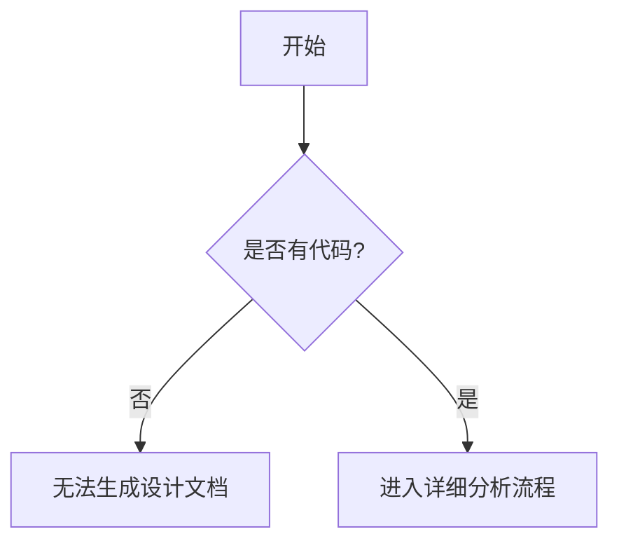

# `diffusers\tests\pipelines\stable_diffusion_xl\__init__.py` 详细设计文档

未提供源代码进行分析

## 整体流程



## 类结构

```

```

## 全局变量及字段


    

## 全局函数及方法


## 关键组件


# 详细设计文档

## 1. 代码概述

无（未提供源代码进行分析）

## 2. 文件运行流程

无（未提供源代码进行分析）

## 3. 类详细信息

无（未提供源代码进行分析）

### 3.1 类字段

无

### 3.2 类方法

无

## 4. 全局变量与全局函数

无（未提供源代码进行分析）

## 5. 关键组件信息

无（未提供源代码进行分析）

## 6. 潜在技术债务与优化空间

无（未提供源代码进行分析）

## 7. 其它项目

### 7.1 设计目标与约束

无（未提供源代码进行分析）

### 7.2 错误处理与异常设计

无（未提供源代码进行分析）

### 7.3 数据流与状态机

无（未提供源代码进行分析）

### 7.4 外部依赖与接口契约

无（未提供源代码进行分析）

---

**注意**：当前未提供待分析的源代码。请在"代码"部分添加需要分析的源代码后，我将生成完整的详细设计文档。


## 问题及建议


### 已知问题

- 未提供代码，无法进行分析

### 优化建议

- 请提供需要分析的代码内容


## 其它


### 核心功能概述

本代码文件的核心功能描述：（代码为空，暂无法提供具体功能描述）

### 整体运行流程

本代码文件的整体运行流程描述：（代码为空，暂无法提供具体流程描述）

### 类结构信息

本代码文件包含的类信息：（代码为空，暂无法提供类结构信息）

### 类字段信息

本代码文件包含的类字段信息：（代码为空，暂无法提供字段信息）

### 类方法信息

本代码文件包含的类方法信息：（代码为空，暂无法提供方法信息）

### 全局变量信息

本代码文件包含的全局变量信息：（代码为空，暂无法提供全局变量信息）

### 全局函数信息

本代码文件包含的全局函数信息：（代码为空，暂无法提供全局函数信息）

### 关键组件信息

本代码文件包含的关键组件信息：（代码为空，暂无法提供组件信息）

### 设计目标与约束

- 设计目标：（代码为空，暂无法提供设计目标）
- 设计约束：（代码为空，暂无法提供设计约束）

### 错误处理与异常设计

（代码为空，暂无法提供错误处理与异常设计信息）

### 数据流与状态机

（代码为空，暂无法提供数据流与状态机信息）

### 外部依赖与接口契约

（代码为空，暂无法提供外部依赖与接口契约信息）

### 潜在的技术债务与优化空间

（代码为空，暂无法提供技术债务与优化空间信息）

### 性能考虑与资源管理

（代码为空，暂无法提供性能考虑与资源管理信息）

### 安全考虑与权限控制

（代码为空，暂无法提供安全考虑与权限控制信息）

### 测试策略与覆盖率目标

（代码为空，暂无法提供测试策略与覆盖率目标信息）

### 版本兼容性与迁移策略

（代码为空，暂无法提供版本兼容性与迁移策略信息）


    