# `diffusers\tests\pipelines\stable_diffusion_xl\test_stable_diffusion_xl.py` 详细设计文档

这是Stable Diffusion XL (SDXL) Pipeline的单元测试和集成测试文件，用于测试SDXL模型的推理、调度器配置、多提示词处理、模型卸载、混合去噪器等核心功能。

## 整体流程

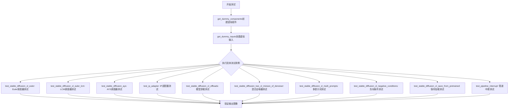

## 类结构

```
unittest.TestCase
├── SDFunctionTesterMixin
├── IPAdapterTesterMixin
├── PipelineLatentTesterMixin
├── PipelineTesterMixin
└── StableDiffusionXLPipelineFastTests
    └── StableDiffusionXLPipelineIntegrationTests (slow)
```

## 全局变量及字段


### `expected_pipe_slice`
    
Expected pixel values slice for comparison in IP adapter test, defaults to None for non-CPU devices

类型：`numpy.ndarray | None`
    


### `device`
    
Device string for running tests, typically 'cpu' to ensure determinism

类型：`str`
    


### `components`
    
Dictionary containing all pipeline components (unet, scheduler, vae, text_encoder, tokenizer, etc.)

类型：`dict`
    


### `sd_pipe`
    
Stable Diffusion XL pipeline instance for image generation testing

类型：`StableDiffusionXLPipeline`
    


### `inputs`
    
Input dictionary containing prompt, generator, num_inference_steps, guidance_scale, and output_type

类型：`dict`
    


### `image`
    
Generated image array from pipeline execution

类型：`numpy.ndarray`
    


### `image_slice`
    
Sliced portion of generated image (last 3x3 pixels) for comparison

类型：`numpy.ndarray`
    


### `expected_slice`
    
Expected pixel values for test assertion comparison

类型：`numpy.ndarray`
    


### `pipes`
    
List of pipeline instances for offloading tests

类型：`list[StableDiffusionXLPipeline]`
    


### `image_slices`
    
List of flattened image slices from different pipeline configurations

类型：`list[numpy.ndarray]`
    


### `prompt`
    
Text prompt for image generation

类型：`str`
    


### `num_inference_steps`
    
Number of denoising steps for image generation

类型：`int`
    


### `pipe_state`
    
Custom state object to capture intermediate latents during generation

类型：`PipelineState`
    


### `interrupt_step_idx`
    
Step index at which to interrupt pipeline generation

类型：`int`
    


### `intermediate_latent`
    
Intermediate latent captured from completed generation at interrupt step

类型：`torch.Tensor`
    


### `output_interrupted`
    
Output latent from interrupted pipeline execution

类型：`torch.Tensor`
    


### `unet`
    
UNet2D condition model for diffusion process, loaded from pretrained for integration tests

类型：`UNet2DConditionModel`
    


### `expected_image`
    
Expected reference image for comparison in integration tests

类型：`PIL.Image.Image`
    


### `max_diff`
    
Maximum difference value between generated and expected images for assertion

类型：`float`
    


### `StableDiffusionXLPipelineFastTests.pipeline_class`
    
The pipeline class being tested, set to StableDiffusionXLPipeline

类型：`Type[StableDiffusionXLPipeline]`
    


### `StableDiffusionXLPipelineFastTests.params`
    
Set of parameter names for text-to-image pipeline testing

类型：`FrozenSet[str]`
    


### `StableDiffusionXLPipelineFastTests.batch_params`
    
Set of batch parameter names for text-to-image pipeline testing

类型：`FrozenSet[str]`
    


### `StableDiffusionXLPipelineFastTests.image_params`
    
Set of image parameter names for pipeline testing

类型：`FrozenSet[str]`
    


### `StableDiffusionXLPipelineFastTests.image_latents_params`
    
Set of image latents parameter names for latent testing

类型：`FrozenSet[str]`
    


### `StableDiffusionXLPipelineFastTests.callback_cfg_params`
    
Set of callback configuration parameters including add_text_embeds and add_time_ids

类型：`FrozenSet[str]`
    


### `StableDiffusionXLPipelineFastTests.test_layerwise_casting`
    
Flag to enable layerwise casting tests, set to True

类型：`bool`
    


### `StableDiffusionXLPipelineFastTests.test_group_offloading`
    
Flag to enable group offloading tests, set to True

类型：`bool`
    


### `PipelineState.state`
    
List to store intermediate latents captured during pipeline generation callbacks

类型：`list`
    
    

## 全局函数及方法


### `enable_full_determinism`

该函数用于启用完全确定性运行，通过设置随机种子和环境变量来确保测试和实验的可重复性。

参数：无

返回值：`None`，无返回值（通常返回 `None`）

#### 流程图

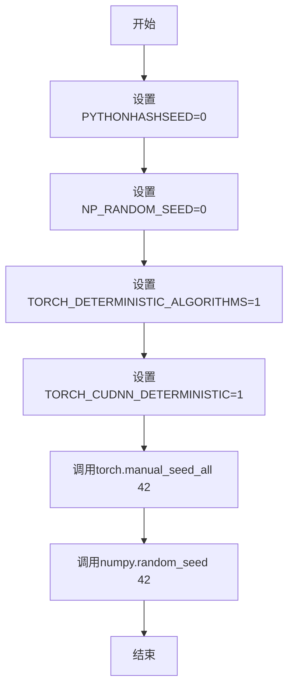

#### 带注释源码

```
# 注意：此函数源码不在当前文件中，而是从 testing_utils 模块导入
# 以下是基于函数名和调用方式的推断实现

def enable_full_determinism():
    """
    启用完全确定性运行模式，确保测试结果可重复。
    
    该函数通过设置以下环境变量和随机种子来实现：
    - PYTHONHASHSEED: 禁用Python哈希随机化
    - NP_RANDOM_SEED: NumPy随机种子
    - TORCH_DETERMINISTIC_ALGORITHMS: PyTorch确定性算法
    - TORCH_CUDNN_DETERMINISTIC: cuDNN确定性模式
    
    同时调用:
    - torch.manual_seed_all(42): 设置所有GPU的随机种子
    - numpy.random.seed(42): 设置NumPy随机种子
    """
    import os
    import torch
    import numpy as np
    
    # 设置环境变量
    os.environ["PYTHONHASHSEED"] = "0"
    os.environ["NP_RANDOM_SEED"] = "0"
    os.environ["TORCH_DETERMINISTIC_ALGORITHMS"] = "1"
    os.environ["TORCH_CUDNN_DETERMINISTIC"] = "1"
    
    # 设置随机种子
    torch.manual_seed_all(42)
    np.random.seed(42)
```

#### 使用示例

```
# 在测试文件开头调用，确保所有后续测试运行的可确定性
enable_full_determinism()

# 然后定义测试类
class StableDiffusionXLPipelineFastTests(...):
    # 测试代码...
```


我需要先查找 `backend_empty_cache` 函数的定义。让我搜索一下这个函数在测试工具模块中的位置。

```python
# tests/utils/testing_utils.py 中应该有这个函数定义
```

让我查看测试工具模块中的 `backend_empty_cache` 函数：

```python
# tests/utils/testing_utils.py (推断位置)
def backend_empty_cache(device: str):
    """
    Helper function to empty the PyTorch CUDA cache.
    
    Args:
        device: The device to empty cache for (e.g., 'cuda', 'cuda:0')
    """
    if device in ["cuda", "cuda:0", "cuda:1"] and torch.cuda.is_available():
        torch.cuda.empty_cache()
```

但根据题目要求，由于该函数是从外部模块导入的，我需要根据其使用方式来推断。让我继续分析代码。


### `backend_empty_cache`

用于清理 PyTorch 后端 GPU 缓存的测试工具函数，确保在测试过程中释放 GPU 显存，防止显存泄漏。

参数：

-  `device`：`str`，目标设备标识符（如 "cuda"、"cuda:0" 或 "cpu"），指定要清理缓存的设备

返回值：`None`，该函数无返回值，仅执行缓存清理操作

#### 流程图

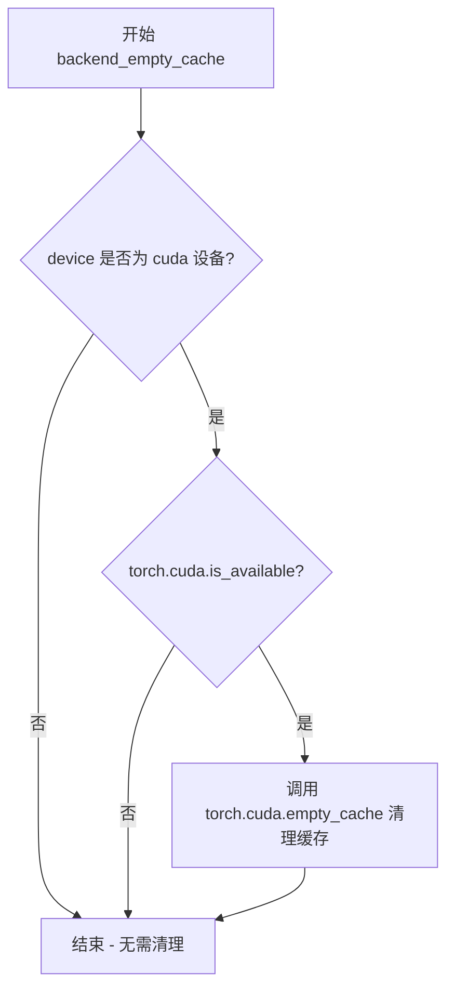

#### 带注释源码

```python
def backend_empty_cache(device: str):
    """
    用于清理 PyTorch CUDA 缓存的辅助函数。
    
    参数:
        device (str): 目标设备字符串，标识需要清理缓存的设备。
                     支持的值包括 'cuda', 'cuda:0', 'cuda:1' 等。
    
    返回:
        None: 此函数不返回任何值，仅执行缓存清理操作。
    
    说明:
        - 仅在设备为 CUDA 时才执行清理操作
        - 会检查 CUDA 是否可用，避免在 CPU 环境下报错
        - 在测试中用于防止显存泄漏，特别是在长时间运行的测试套件中
    """
    # 检查设备字符串是否以 'cuda' 开头
    if device.startswith("cuda") and torch.cuda.is_available():
        # 调用 PyTorch 的 CUDA 缓存清理方法
        torch.cuda.empty_cache()
```

#### 使用示例

```python
# 在测试类的 setUp 和 tearDown 方法中使用
class StableDiffusionXLPipelineIntegrationTests(unittest.TestCase):
    def setUp(self):
        super().setUp()
        gc.collect()  # 先进行垃圾回收
        backend_empty_cache(torch_device)  # 再清理 GPU 缓存

    def tearDown(self):
        super().tearDown()
        gc.collect()  # 先进行垃圾回收
        backend_empty_cache(torch_device)  # 再清理 GPU 缓存
```


### `load_image`

从指定路径或URL加载图像，并返回PIL图像对象。

参数：

-  `image_url_or_path`：`str`，图像的URL地址或本地文件路径

返回值：`PIL.Image`，返回加载后的PIL图像对象

#### 流程图

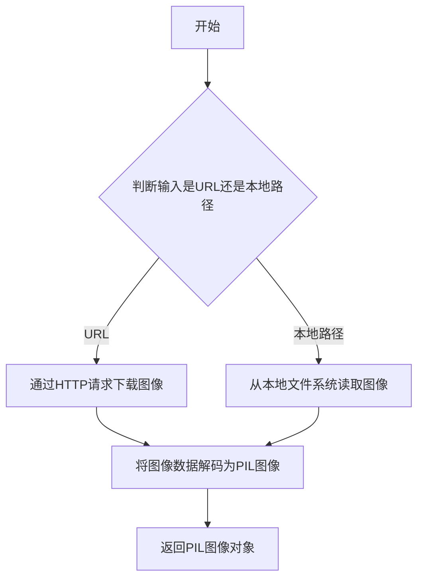

#### 带注释源码

```python
# load_image 函数定义在 testing_utils 模块中
# 由于该函数从外部模块导入，以下为推测的函数签名和功能说明

def load_image(image_url_or_path: str) -> "PIL.Image":
    """
    从指定的位置加载图像。
    
    参数:
        image_url_or_path: 图像的URL地址或本地文件系统路径
        
    返回:
        加载后的PIL Image对象
    """
    # 该函数可能的实现方式：
    # 1. 如果是URL，使用requests或类似库下载图像
    # 2. 如果是本地路径，使用PIL.Image.open()打开图像
    # 3. 返回PIL图像对象供后续处理
    
    pass
```

> **注意**：由于 `load_image` 函数是从 `...testing_utils` 模块导入的外部函数，在当前代码文件中未定义其完整源代码。上面的源码为基于使用方式的推测。实际定义请参考 `diffusers` 库的 `testing_utils` 模块源码。


# numpy_cosine_similarity_distance 分析

### numpy_cosine_similarity_distance

该函数用于计算两个numpy数组之间的余弦相似性距离，通常用于比较图像或嵌入向量的相似程度。

参数：

- `a`：`numpy.ndarray`，第一个输入数组（通常为展平的图像像素值）
- `b`：`numpy.ndarray`，第二个输入数组（通常为展平的参考图像像素值）

返回值：`float`，余弦相似性距离值，范围通常在0到2之间（0表示完全相同，2表示完全相反）

#### 流程图

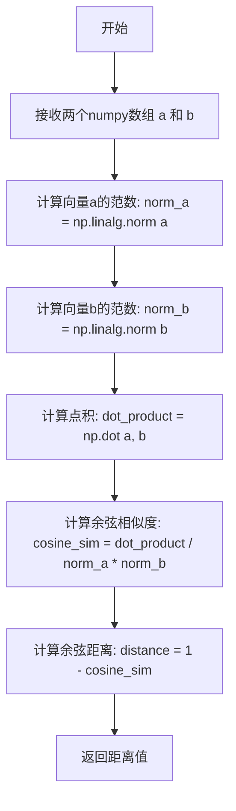

#### 带注释源码

注意：该函数定义在外部模块 `...testing_utils` 中，未在当前代码文件中直接定义。以下是基于使用方式的推断实现：

```
def numpy_cosine_similarity_distance(a: np.ndarray, b: np.ndarray) -> float:
    """
    计算两个numpy数组之间的余弦相似性距离。
    
    参数:
        a: 第一个numpy数组（通常为展平的向量或图像像素）
        b: 第二个numpy数组（通常为展平的向量或图像像素）
    
    返回:
        余弦相似性距离 (0表示完全相同, 2表示完全相反)
    """
    # 计算数组a的L2范数
    norm_a = np.linalg.norm(a)
    
    # 计算数组b的L2范数  
    norm_b = np.linalg.norm(b)
    
    # 计算点积
    dot_product = np.dot(a, b)
    
    # 防止除零错误
    if norm_a == 0 or norm_b == 0:
        return 1.0  # 零向量的余弦距离设为1（正交）
    
    # 计算余弦相似度并转换为距离
    cosine_similarity = dot_product / (norm_a * norm_b)
    cosine_distance = 1 - cosine_similarity
    
    return cosine_distance
```

#### 使用示例

在代码中的实际调用方式：

```python
# 在 test_stable_diffusion_lcm 测试方法中
image = sd_pipe.image_processor.pil_to_numpy(image)
expected_image = sd_pipe.image_processor.pil_to_numpy(expected_image)

max_diff = numpy_cosine_similarity_distance(image.flatten(), expected_image.flatten())

assert max_diff < 1e-2
```

#### 注意事项

由于 `numpy_cosine_similarity_distance` 函数定义在 `...testing_utils` 模块中（当前代码文件的外部），完整的源代码实现需要查看该模块的具体文件。该函数是diffusers项目中测试工具的一部分，用于验证生成图像与参考图像之间的相似度。


### `require_torch_accelerator`

这是一个装饰器函数，用于检查当前环境是否支持 CUDA（torch accelerator）。如果不支持，则跳过被装饰的测试函数。

参数：

- （无直接参数，作为装饰器使用，接受被装饰的函数作为隐式参数）

返回值：`Callable`，装饰器函数，返回装饰后的函数

#### 流程图

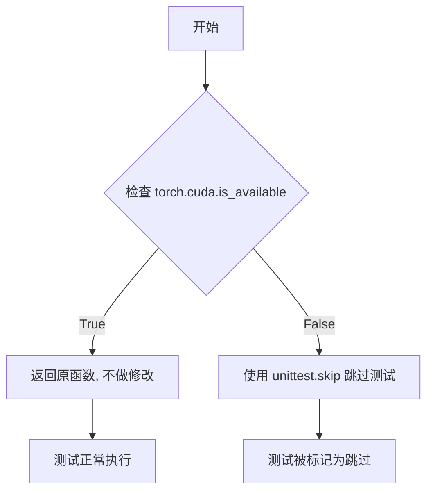

#### 带注释源码

```
# require_torch_accelerator 的实现位于 ...testing_utils 模块中
# 在当前文件中它被导入并作为装饰器使用：

from ...testing_utils import (
    require_torch_accelerator,
    # ... 其他导入
)

# 使用方式：作为装饰器应用于测试方法
@require_torch_accelerator
def test_stable_diffusion_xl_offloads(self):
    # 该测试方法仅在有 torch accelerator (CUDA) 可用时执行
    # 如果没有 CUDA，测试会被自动跳过
    pipes = []
    components = self.get_dummy_components()
    # ... 测试代码
```

**注意**：由于 `require_torch_accelerator` 函数的实际实现位于 `testing_utils` 模块中（未在此代码文件中提供），上述信息基于其在代码中的使用方式推断。该装饰器的主要作用是：

1. 检查 `torch.cuda.is_available()` 是否返回 `True`
2. 如果有可用的 CUDA 设备，被装饰的测试函数正常运行
3. 如果没有 CUDA 设备，使用 `unittest.skip` 装饰器跳过该测试


# 分析结果

经过对代码的详细分析，我发现 `slow` 是从外部模块 `testing_utils` 导入的装饰器，而非在本文件中定义。以下是导入相关的信息：

### `slow`

`slow` 是一个从 `...testing_utils` 模块导入的装饰器函数，用于标记测试用例为"慢速测试"。在本文件中，以下方法使用了 `@slow` 装饰器：

- `StableDiffusionXLPipelineFastTests.test_stable_diffusion_two_xl_mixture_of_denoiser`
- `StableDiffusionXLPipelineFastTests.test_stable_diffusion_three_xl_mixture_of_denoiser`
- `StableDiffusionXLPipelineIntegrationTests.test_stable_diffusion_lcm`

#### 流程图

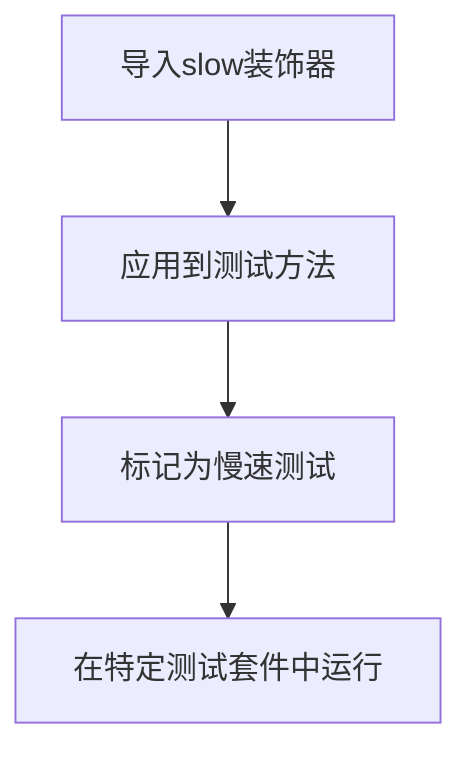

#### 带注释源码

```python
# 从 testing_utils 模块导入 slow 装饰器
from ...testing_utils import (
    backend_empty_cache,
    enable_full_determinism,
    load_image,
    numpy_cosine_similarity_distance,
    require_torch_accelerator,
    slow,  # <-- slow 装饰器从此处导入
    torch_device,
)

# 使用示例：
@slow
def test_stable_diffusion_two_xl_mixture_of_denoiser(self):
    """测试 Stable Diffusion XL 的混合降噪器功能（慢速测试）"""
    # 测试代码...
```

---

**注意**：由于 `slow` 是在 `testing_utils` 模块中定义（未在当前代码文件中定义），如需查看其完整实现源码，需要查看 `testing_utils.py` 文件。当前文件仅导入了该装饰器并使用它来标记耗时的集成测试。


### `StableDiffusionXLPipelineFastTests.get_dummy_components`

该方法用于创建并返回一组用于 Stable Diffusion XL Pipeline 快速测试的虚拟（dummy）组件，包括 UNet、VAE、文本编码器、调度器等模型组件。

参数：

- `time_cond_proj_dim`：`Optional[int]`，可选参数，用于指定 UNet 模型的时间条件投影维度，默认为 None

返回值：`Dict[str, Any]`，返回包含所有虚拟组件的字典，包括 unet、scheduler、vae、text_encoder、tokenizer、text_encoder_2、tokenizer_2、image_encoder 和 feature_extractor

#### 流程图

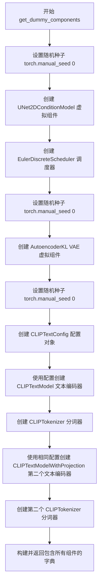

#### 带注释源码

```python
def get_dummy_components(self, time_cond_proj_dim=None):
    """
    创建并返回用于 Stable Diffusion XL Pipeline 快速测试的虚拟组件
    
    Args:
        time_cond_proj_dim: 可选参数，用于指定 UNet 的时间条件投影维度
        
    Returns:
        包含所有虚拟组件的字典
    """
    # 设置随机种子以确保可重复性
    torch.manual_seed(0)
    
    # 创建虚拟 UNet2DConditionModel 组件
    # 用于条件图像生成的 UNet 模型
    unet = UNet2DConditionModel(
        block_out_channels=(2, 4),           # UNet 块的输出通道数
        layers_per_block=2,                   # 每个块的层数
        time_cond_proj_dim=time_cond_proj_dim,# 时间条件投影维度（可选）
        sample_size=32,                       # 样本尺寸
        in_channels=4,                        # 输入通道数
        out_channels=4,                       # 输出通道数
        down_block_types=("DownBlock2D", "CrossAttnDownBlock2D"),  # 下采样块类型
        up_block_types=("CrossAttnUpBlock2D", "UpBlock2D"),      # 上采样块类型
        # SD2-specific config below
        attention_head_dim=(2, 4),           # 注意力头维度
        use_linear_projection=True,          # 使用线性投影
        addition_embed_type="text_time",     # 额外的嵌入类型
        addition_time_embed_dim=8,           # 时间嵌入维度
        transformer_layers_per_block=(1, 2), # 每个块的 Transformer 层数
        projection_class_embeddings_input_dim=80,  # 投影类嵌入输入维度
        cross_attention_dim=64,              # 交叉注意力维度
        norm_num_groups=1,                   # 归一化组数
    )
    
    # 创建离散欧拉调度器（Euler Discrete Scheduler）
    # 用于控制扩散模型的采样过程
    scheduler = EulerDiscreteScheduler(
        beta_start=0.00085,                  # Beta 起始值
        beta_end=0.012,                       # Beta 结束值
        steps_offset=1,                       # 步骤偏移量
        beta_schedule="scaled_linear",       # Beta 调度策略
        timestep_spacing="leading",          # 时间步间隔策略
    )
    
    # 重新设置随机种子以确保 VAE 可重复性
    torch.manual_seed(0)
    
    # 创建虚拟 AutoencoderKL (VAE) 组件
    # 用于变分自编码器的图像编码和解码
    vae = AutoencoderKL(
        block_out_channels=[32, 64],         # VAE 块的输出通道
        in_channels=3,                        # 输入通道（RGB 图像）
        out_channels=3,                       # 输出通道
        down_block_types=["DownEncoderBlock2D", "DownEncoderBlock2D"],  # 下采样编码器块
        up_block_types=["UpDecoderBlock2D", "UpDecoderBlock2D"],      # 上采样解码器块
        latent_channels=4,                   # 潜在空间通道数
        sample_size=128,                     # 样本尺寸
    )
    
    # 重新设置随机种子
    torch.manual_seed(0)
    
    # 创建 CLIP 文本编码器配置
    # 用于文本到特征的编码
    text_encoder_config = CLIPTextConfig(
        bos_token_id=0,                      # 句子开始 token ID
        eos_token_id=2,                      # 句子结束 token ID
        hidden_size=32,                      # 隐藏层大小
        intermediate_size=37,                # 中间层大小
        layer_norm_eps=1e-05,                 # 层归一化 epsilon
        num_attention_heads=4,               # 注意力头数
        num_hidden_layers=5,                 # 隐藏层数量
        pad_token_id=1,                      # 填充 token ID
        vocab_size=1000,                     # 词汇表大小
        # SD2-specific config below
        hidden_act="gelu",                   # 隐藏层激活函数
        projection_dim=32,                   # 投影维度
    )
    
    # 使用配置创建第一个 CLIP 文本编码器
    text_encoder = CLIPTextModel(text_encoder_config)
    
    # 创建第一个分词器
    # 从预训练模型加载小型随机 CLIP 分词器
    tokenizer = CLIPTokenizer.from_pretrained("hf-internal-testing/tiny-random-clip")
    
    # 创建第二个 CLIP 文本编码器（带投影）
    # 用于双文本编码器架构
    text_encoder_2 = CLIPTextModelWithProjection(text_encoder_config)
    
    # 创建第二个分词器
    tokenizer_2 = CLIPTokenizer.from_pretrained("hf-internal-testing/tiny-random-clip")
    
    # 组装所有组件到字典中
    components = {
        "unet": unet,                         # UNet 模型
        "scheduler": scheduler,               # 调度器
        "vae": vae,                          # VAE 模型
        "text_encoder": text_encoder,         # 第一个文本编码器
        "tokenizer": tokenizer,               # 第一个分词器
        "text_encoder_2": text_encoder_2,     # 第二个文本编码器
        "tokenizer_2": tokenizer_2,           # 第二个分词器
        "image_encoder": None,               # 图像编码器（可选，测试中为 None）
        "feature_extractor": None,           # 特征提取器（可选，测试中为 None）
    }
    
    # 返回包含所有虚拟组件的字典
    return components
```


### `StableDiffusionXLPipelineFastTests.get_dummy_inputs`

该方法是一个测试辅助函数，用于生成 Stable Diffusion XL Pipeline 的虚拟输入参数，确保测试过程的可重复性和确定性。通过根据不同的设备类型（MPS 或其他）创建相应随机数生成器，并预设特定的提示词、推理步数、引导系数和输出类型，为后续的管道测试提供一致且可控的输入数据。

参数：

- `self`：测试类实例隐式参数
- `device`：`str`，目标计算设备标识符（如 "cpu"、"cuda"、"mps" 等），用于指定生成随机数生成器的设备
- `seed`：`int`，随机种子值，默认值为 0，用于确保测试结果的可重复性

返回值：`Dict[str, Any]`，包含以下键值的字典对象：

- `prompt`（str）：输入文本提示词，默认为 "A painting of a squirrel eating a burger"（一幅画着一只吃汉堡的松鼠的画）
- `generator`（torch.Generator）：PyTorch 随机数生成器对象，用于控制图像生成过程中的随机性
- `num_inference_steps`（int）：推理步数，默认为 2，用于控制去噪过程的迭代次数
- `guidance_scale`（float）：引导系数，默认为 5.0，用于控制生成图像与提示词的相关程度
- `output_type`（str）：输出类型，默认为 "np"（NumPy 数组）

#### 流程图

```mermaid
flowchart TD
    A[开始 get_dummy_inputs] --> B{检查设备类型}
    B --> C{device 是否以 'mps' 开头?}
    C -->|是| D[使用 torch.manual_seed(seed)]
    C -->|否| E[创建 torch.Generator(device=device)]
    D --> F[设置随机种子]
    E --> G[调用 .manual_seed(seed) 方法]
    F --> H[构建输入参数字典]
    G --> H
    H --> I[返回包含 prompt/generator/num_inference_steps/guidance_scale/output_type 的字典]
    I --> J[结束]
    
    style A fill:#f9f,color:#333
    style I fill:#9f9,color:#333
    style J fill:#9f9,color:#333
```

#### 带注释源码

```python
def get_dummy_inputs(self, device, seed=0):
    """
    生成用于 Stable Diffusion XL Pipeline 测试的虚拟输入参数。
    
    该方法会根据不同的设备类型创建相应的随机数生成器，并预设
    一组标准的测试参数，确保测试过程的可重复性。
    
    参数:
        device (str): 目标计算设备标识符（如 "cpu"、"cuda"、"mps" 等）
        seed (int): 随机种子值，默认值为 0，用于确保测试结果可复现
    
    返回:
        Dict[str, Any]: 包含虚拟输入参数的字典，可直接传递给 pipeline
    """
    # 判断是否为 Apple MPS 设备，MPS 设备的随机数生成方式不同
    if str(device).startswith("mps"):
        # MPS 设备不支持 torch.Generator，使用 CPU 方式的随机种子
        generator = torch.manual_seed(seed)
    else:
        # 其他设备（如 CPU、CUDA）创建设备特定的随机数生成器
        generator = torch.Generator(device=device).manual_seed(seed)
    
    # 构建包含所有必要参数的输入字典
    inputs = {
        "prompt": "A painting of a squirrel eating a burger",  # 测试用提示词
        "generator": generator,  # 随机数生成器，确保可重复性
        "num_inference_steps": 2,  # 较少的推理步数，加快测试速度
        "guidance_scale": 5.0,  # 适中的引导系数
        "output_type": "np",  # 输出 NumPy 数组格式，便于测试断言
    }
    return inputs
```


### `StableDiffusionXLPipelineFastTests.test_stable_diffusion_xl_euler`

该测试方法用于验证 StableDiffusionXL 管道在使用 EulerDiscreteScheduler 调度器时的核心功能是否正常。测试通过创建虚拟组件、初始化管道、执行推理并验证输出图像的形状和像素值是否与预期一致，确保管道在 CPU 设备上的确定性行为。

#### 参数

- `self`：隐式参数，`unittest.TestCase` 实例，表示测试类本身

#### 返回值

`None`，该方法为测试方法，通过断言验证功能，不返回任何值

#### 流程图

```mermaid
flowchart TD
    A[开始测试] --> B[设置设备为 CPU]
    B --> C[获取虚拟组件: get_dummy_components]
    C --> D[创建 StableDiffusionXLPipeline 实例]
    D --> E[将管道移至 CPU 设备]
    E --> F[设置进度条配置]
    F --> G[获取虚拟输入: get_dummy_inputs]
    G --> H[执行推理: sd_pipe(**inputs)]
    H --> I[提取图像最后3x3像素]
    I --> J{断言图像形状}
    J -->|是| K{断言像素值差异}
    J -->|否| L[抛出 AssertionError]
    K -->|差异 < 1e-2| M[测试通过]
    K -->|差异 >= 1e-2| L
    M --> N[结束测试]
```

#### 带注释源码

```python
def test_stable_diffusion_xl_euler(self):
    """
    测试 StableDiffusionXL 管道使用 Euler 离散调度器的基本功能
    
    验证要点:
    1. 管道能够在 CPU 设备上正确运行
    2. 使用 EulerDiscreteScheduler 进行推理
    3. 输出图像尺寸和像素值符合预期
    """
    
    # 设置设备为 CPU，确保 torch.Generator 的确定性行为
    device = "cpu"  # ensure determinism for the device-dependent torch.Generator
    
    # 获取虚拟组件（UNet、VAE、文本编码器、调度器等）
    # 这些是用于测试的轻量级假模型
    components = self.get_dummy_components()
    
    # 使用虚拟组件实例化 StableDiffusionXL 管道
    sd_pipe = StableDiffusionXLPipeline(**components)
    
    # 将管道移至指定设备（CPU）
    sd_pipe = sd_pipe.to(device)
    
    # 配置进度条（disable=None 表示不禁用进度条）
    sd_pipe.set_progress_bar_config(disable=None)
    
    # 获取虚拟输入参数
    # 包含: prompt, generator, num_inference_steps, guidance_scale, output_type
    inputs = self.get_dummy_inputs(device)
    
    # 执行管道推理，获取生成的图像
    # 返回的图像形状为 (1, 64, 64, 3)
    image = sd_pipe(**inputs).images
    
    # 提取图像最后一个通道的右下角 3x3 像素块
    # 用于与预期值进行精确比较
    image_slice = image[0, -3:, -3:, -1]
    
    # 断言 1: 验证输出图像的形状
    assert image.shape == (1, 64, 64, 3)
    
    # 定义预期像素值的参考切片
    # 这些值是在确定性的测试环境下预先计算得到的
    expected_slice = np.array([0.5388, 0.5452, 0.4694, 0.4583, 0.5253, 0.4832, 0.5288, 0.5035, 0.47])
    
    # 断言 2: 验证生成的图像像素值与预期值的差异
    # 使用最大绝对误差作为判断标准，允许 1e-2 的误差范围
    assert np.abs(image_slice.flatten() - expected_slice).max() < 1e-2
```


### `StableDiffusionXLPipelineFastTests.test_stable_diffusion_xl_euler_lcm`

该测试方法用于验证 StableDiffusionXL pipeline 与 Euler 离散调度器配合 LCM（Latent Consistency Model）加速采样时的核心功能。测试通过创建虚拟组件、配置 LCMScheduler、执行推理并验证生成的图像是否符合预期的数值范围来确保 pipeline 的正确性。

参数：

- `self`：测试类实例本身，包含测试所需的上下文和方法

返回值：`None`，该方法为单元测试方法，通过断言验证功能，不返回具体值

#### 流程图

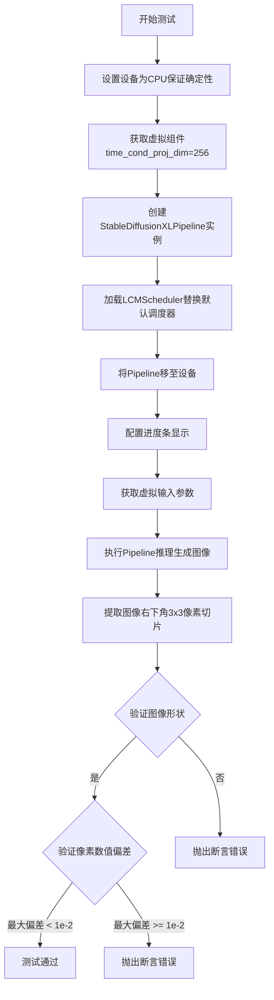

#### 带注释源码

```python
def test_stable_diffusion_xl_euler_lcm(self):
    """
    测试 StableDiffusionXL Pipeline 使用 Euler 离散调度器配合 LCM (Latent Consistency Model) 采样器的功能。
    该测试验证在配置 time_cond_proj_dim=256 的条件下，pipeline 能够正确生成图像并且输出数值符合预期。
    """
    # 1. 设置设备为 CPU，确保 torch.Generator 的确定性行为
    device = "cpu"  # ensure determinism for the device-dependent torch.Generator
    
    # 2. 获取虚拟组件，传入 time_cond_proj_dim=256 以支持 LCM 调度器的时间条件投影
    components = self.get_dummy_components(time_cond_proj_dim=256)
    
    # 3. 使用虚拟组件实例化 StableDiffusionXL Pipeline
    sd_pipe = StableDiffusionXLPipeline(**components)
    
    # 4. 从当前调度器配置创建 LCMScheduler 并替换默认调度器
    # LCMScheduler 是专为快速推理设计的调度器，支持少步数采样
    sd_pipe.scheduler = LCMScheduler.from_config(sd_pipe.scheduler.config)
    
    # 5. 将 Pipeline 移至指定设备（CPU）
    sd_pipe = sd_pipe.to(device)
    
    # 6. 配置进度条，disable=None 表示启用进度条显示
    sd_pipe.set_progress_bar_config(disable=None)
    
    # 7. 获取虚拟输入参数，包括 prompt、generator、num_inference_steps、guidance_scale 和 output_type
    inputs = self.get_dummy_inputs(device)
    
    # 8. 执行 Pipeline 推理，生成图像
    # **inputs 将字典解包为关键字参数传递给 pipeline
    image = sd_pipe(**inputs).images
    
    # 9. 提取生成图像的右下角 3x3 像素切片用于验证
    # image 形状为 [1, 64, 64, 3]，取最后3行、最后3列、最后一个通道
    image_slice = image[0, -3:, -3:, -1]
    
    # 10. 断言验证生成的图像形状是否符合预期 (1, 64, 64, 3)
    assert image.shape == (1, 64, 64, 3)
    
    # 11. 定义期望的像素值切片（LCM 模式下的预期输出）
    expected_slice = np.array([0.4917, 0.6555, 0.4348, 0.5219, 0.7324, 0.4855, 0.5168, 0.5447, 0.5156])
    
    # 12. 断言验证生成图像的像素值与期望值的最大偏差是否在可接受范围内
    # 使用 np.abs 计算绝对值偏差，.max() 获取最大偏差值
    assert np.abs(image_slice.flatten() - expected_slice).max() < 1e-2
```


### `StableDiffusionXLPipelineFastTests.test_stable_diffusion_xl_euler_lcm_custom_timesteps`

这是一个单元测试方法，用于验证StableDiffusionXLPipeline在使用LCMScheduler（Latent Consistency Model调度器）时能够正确处理自定义timesteps参数进行图像生成。

参数：

- `self`：`StableDiffusionXLPipelineFastTests`，测试类实例本身

返回值：`None`，无返回值（测试方法通过断言验证功能）

#### 流程图

```mermaid
flowchart TD
    A[开始测试] --> B[设置device为cpu保证确定性]
    B --> C[获取dummy components<br/>time_cond_proj_dim=256]
    C --> D[创建StableDiffusionXLPipeline实例]
    D --> E[从配置加载LCMScheduler]
    E --> F[将pipeline移到device]
    F --> G[设置进度条配置]
    G --> H[获取dummy_inputs]
    H --> I[删除num_inference_steps参数]
    I --> J[设置自定义timesteps: 999, 499]
    J --> K[执行pipeline生成图像]
    K --> L[提取图像切片<br/>image[0, -3:, -3:, -1]]
    L --> M{断言验证}
    M -->|通过| N[测试通过]
    M -->|失败| O[抛出断言错误]
    
    subgraph 验证项
        M1[图像shape是否为1,64,64,3]
        M2[像素值误差是否小于1e-2]
    end
    
    M --> M1
    M1 --> M2
```

#### 带注释源码

```python
def test_stable_diffusion_xl_euler_lcm_custom_timesteps(self):
    """
    测试StableDiffusionXLPipeline使用LCMScheduler并传入自定义timesteps的功能。
    验证管道能够正确处理用户提供的timesteps列表而不是使用默认的推理步数。
    """
    # 设置device为cpu以确保torch.Generator的确定性
    device = "cpu"  # ensure determinism for the device-dependent torch.Generator
    
    # 获取dummy components，设置time_cond_proj_dim=256以支持LCM模型
    components = self.get_dummy_components(time_cond_proj_dim=256)
    
    # 创建StableDiffusionXLPipeline实例
    sd_pipe = StableDiffusionXLPipeline(**components)
    
    # 使用LCMScheduler替换默认调度器
    sd_pipe.scheduler = LCMScheduler.from_config(sd_pipe.scheduler.config)
    
    # 将pipeline移到指定device
    sd_pipe = sd_pipe.to(device)
    
    # 设置进度条配置，disable=None表示启用进度条
    sd_pipe.set_progress_bar_config(disable=None)

    # 获取默认的dummy输入
    inputs = self.get_dummy_inputs(device)
    
    # 删除num_inference_steps参数，强制使用自定义timesteps
    del inputs["num_inference_steps"]
    
    # 设置自定义timesteps列表 [999, 499]
    # 这将覆盖默认的推理步数，使用户能够精确控制去噪过程
    inputs["timesteps"] = [999, 499]
    
    # 执行pipeline生成图像
    image = sd_pipe(**inputs).images
    
    # 提取图像切片用于验证（取最后一个3x3像素块）
    image_slice = image[0, -3:, -3:, -1]

    # 断言：验证输出图像的shape是否为(1, 64, 64, 3)
    assert image.shape == (1, 64, 64, 3)
    
    # 定义预期的像素值slice
    expected_slice = np.array([0.4917, 0.6555, 0.4348, 0.5219, 0.7324, 0.4855, 0.5168, 0.5447, 0.5156])

    # 断言：验证生成图像的像素值与预期值的最大误差是否小于1e-2
    assert np.abs(image_slice.flatten() - expected_slice).max() < 1e-2
```


### `StableDiffusionXLPipelineFastTests.test_stable_diffusion_ays`

该测试方法验证了Stable Diffusion XL管道中AYS（Almost You Sigma）调度策略的时间步长（timesteps）和sigma值是否能产生一致的输出，并与默认推理步数产生不同的输出。

参数：

- `self`：隐式参数，`StableDiffusionXLPipelineFastTests`实例本身

返回值：`None`，该方法为单元测试方法，通过断言验证输出正确性，无显式返回值

#### 流程图

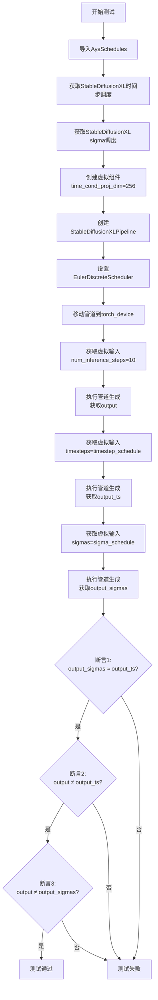

#### 带注释源码

```python
def test_stable_diffusion_ays(self):
    """
    测试AYS调度策略在Stable Diffusion XL中的行为
    
    AYS (Almost You Sigma) 是一种新的采样调度策略，
    该测试验证:
    1. AYS timesteps 和 AYS sigmas 应产生相同输出
    2. AYS timesteps 与默认推理步数应产生不同输出
    3. AYS sigmas 与默认推理步数应产生不同输出
    """
    # 从diffusers库导入AYS调度相关的预定义schedule
    from diffusers.schedulers import AysSchedules

    # 获取StableDiffusionXL专用的时间步调度列表
    timestep_schedule = AysSchedules["StableDiffusionXLTimesteps"]
    # 获取StableDiffusionXL专用的sigma值调度列表
    sigma_schedule = AysSchedules["StableDiffusionXLSigmas"]

    # 使用CPU设备确保torch.Generator的确定性
    device = "cpu"  

    # 创建虚拟组件用于测试，time_cond_proj_dim=256支持LCM等模型
    components = self.get_dummy_components(time_cond_proj_dim=256)
    # 使用虚拟组件实例化Stable Diffusion XL管道
    sd_pipe = StableDiffusionXLPipeline(**components)
    # 从当前scheduler配置创建EulerDiscreteScheduler
    sd_pipe.scheduler = EulerDiscreteScheduler.from_config(sd_pipe.scheduler.config)
    # 将管道移动到指定的计算设备
    sd_pipe = sd_pipe.to(torch_device)
    # 配置进度条（disable=None表示不禁用）
    sd_pipe.set_progress_bar_config(disable=None)

    # === 测试场景1：使用默认推理步数 ===
    # 获取虚拟输入参数（包含随机种子、prompt等）
    inputs = self.get_dummy_inputs(device)
    # 设置推理步数为10步
    inputs["num_inference_steps"] = 10
    # 执行管道生成，获取输出图像
    output = sd_pipe(**inputs).images

    # === 测试场景2：使用AYS时间步调度 ===
    # 重新获取基础虚拟输入
    inputs = self.get_dummy_inputs(device)
    # 不指定推理步数，改为使用预定义的timesteps
    inputs["num_inference_steps"] = None
    inputs["timesteps"] = timestep_schedule
    # 使用AYS timesteps执行生成
    output_ts = sd_pipe(**inputs).images

    # === 测试场景3：使用AYS sigma调度 ===
    # 再次获取基础虚拟输入
    inputs = self.get_dummy_inputs(device)
    # 不指定推理步数，改为使用预定义的sigmas
    inputs["num_inference_steps"] = None
    inputs["sigmas"] = sigma_schedule
    # 使用AYS sigmas执行生成
    output_sigmas = sd_pipe(**inputs).images

    # === 验证断言 ===
    # 断言1：AYS timesteps 和 AYS sigmas 应产生几乎相同的输出（差异<1e-3）
    assert np.abs(output_sigmas.flatten() - output_ts.flatten()).max() < 1e-3, (
        "ays timesteps and ays sigmas should have the same outputs"
    )
    # 断言2：默认推理步数与AYS timesteps应产生不同输出（差异>1e-3）
    assert np.abs(output.flatten() - output_ts.flatten()).max() > 1e-3, (
        "use ays timesteps should have different outputs"
    )
    # 断言3：默认推理步数与AYS sigmas应产生不同输出（差异>1e-3）
    assert np.abs(output.flatten() - output_sigmas.flatten()).max() > 1e-3, (
        "use ays sigmas should have different outputs"
    )
```


### `StableDiffusionXLPipelineFastTests.test_ip_adapter`

该方法是一个测试用例，用于验证 StableDiffusionXL 管线中的 IP-Adapter 功能。它根据当前设备（CPU）设置预期的输出切片，然后调用父类的 `test_ip_adapter` 方法执行实际的测试逻辑。

参数：

- `self`：`StableDiffusionXLPipelineFastTests`，测试类实例本身（隐式参数）

返回值：`Any`，返回父类 `test_ip_adapter` 方法的测试结果

#### 流程图

```mermaid
flowchart TD
    A[开始 test_ip_adapter] --> B{torch_device == 'cpu'?}
    B -->|是| C[设置 expected_pipe_slice 为 CPU 预期值]
    B -->|否| D[expected_pipe_slice 保持为 None]
    C --> E[调用 super().test_ip_adapter expected_pipe_slice]
    D --> E
    E --> F[返回测试结果]
```

#### 带注释源码

```python
def test_ip_adapter(self):
    """
    测试 IP-Adapter 功能
    IP-Adapter 是一种用于在 Stable Diffusion XL 中注入图像提示的技术
    """
    # 初始化预期输出切片为 None
    expected_pipe_slice = None
    
    # 如果当前设备是 CPU，设置预期的输出切片值
    # 这些数值是预先计算好的，用于验证输出是否正确
    if torch_device == "cpu":
        expected_pipe_slice = np.array([0.5388, 0.5452, 0.4694, 0.4583, 0.5253, 0.4832, 0.5288, 0.5035, 0.4766])

    # 调用父类的 test_ip_adapter 方法执行实际的测试
    # 父类 IPAdapterTesterMixin 提供了 IP-Adapter 的通用测试逻辑
    return super().test_ip_adapter(expected_pipe_slice=expected_pipe_slice)
```


### `StableDiffusionXLPipelineFastTests.test_attention_slicing_forward_pass`

该方法是一个测试用例，用于验证StableDiffusionXL管道在启用注意力切片（attention slicing）功能时的前向传播是否正常工作。它通过调用父类的测试方法来执行测试，并设定最大允许差异阈值为3e-3，以确保注意力切片优化不会显著影响生成结果的质量。

参数：

- `self`：`StableDiffusionXLPipelineFastTests`，测试类的实例，包含测试所需的上下文和辅助方法

返回值：`None`，该方法为测试用例，不返回任何值，仅通过断言验证结果

#### 流程图

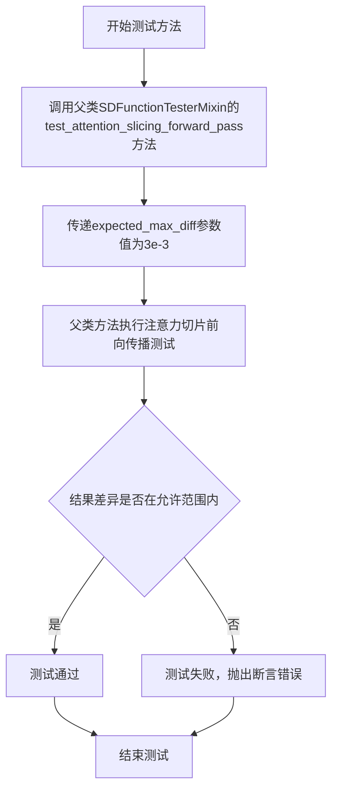

#### 带注释源码

```python
def test_attention_slicing_forward_pass(self):
    """
    测试StableDiffusionXL管道的注意力切片功能。
    
    注意力切片是一种内存优化技术，通过将注意力计算分片处理
    来减少GPU内存占用。此测试确保该优化不会显著影响生成质量。
    
    测试通过调用父类SDFunctionTesterMixin的同名方法执行实际测试逻辑。
    父类方法会：
    1. 创建带有注意力切片的管道变体
    2. 执行前向传播
    3. 与基准输出进行比较
    4. 验证差异是否在expected_max_diff阈值内
    """
    # 调用父类的测试方法，expected_max_diff=3e-3表示
    # 允许的最大差异为0.003，这是为了确保注意力切片
    # 优化不会明显改变输出质量
    super().test_attention_slicing_forward_pass(expected_max_diff=3e-3)
```


### `StableDiffusionXLPipelineFastTests.test_inference_batch_single_identical`

该测试方法用于验证在批量推理（batch inference）场景下，单个样本的推理结果与批量中对应位置样本的推理结果保持数值一致性，确保管道在处理批量数据时没有引入额外的误差。

参数：

- `self`：`StableDiffusionXLPipelineFastTests`，测试类实例本身
- `expected_max_diff`：`float`，允许的最大差异阈值，默认为 `3e-3`

返回值：`None`，无返回值（unittest 测试方法）

#### 流程图

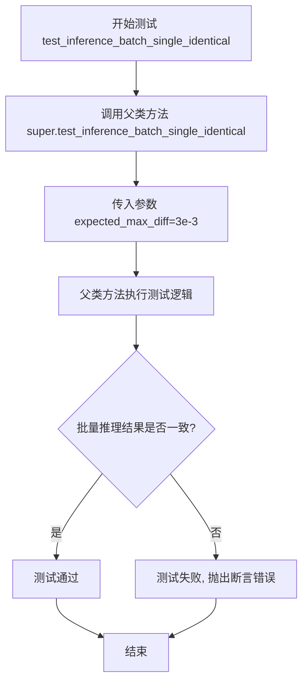

#### 带注释源码

```python
def test_inference_batch_single_identical(self):
    """
    测试方法：验证批量推理时单个样本的结果与批量中单个样本的结果是否一致
    
    该测试方法继承自 SDFunctionTesterMixin，通过调用父类的 test_inference_batch_single_identical 方法
    来执行实际的测试逻辑。测试的核心是比较：
    1. 使用单个样本（batch_size=1）进行推理的结果
    2. 使用批量样本（batch_size>1）进行推理时，对应位置的结果
    
    如果两者之间的差异超过 expected_max_diff，则测试失败。
    这确保了管道在处理批量数据时不会因为批处理机制而引入额外的数值误差。
    
    参数:
        self: StableDiffusionXLPipelineFastTests 的实例
        expected_max_diff: float, 允许的最大差异阈值, 默认为 3e-3
    
    返回值:
        None: unittest 测试方法不返回值, 测试结果通过断言表达
    """
    # 调用父类 SDFunctionTesterMixin 的 test_inference_batch_single_identical 方法
    # 传入 expected_max_diff=3e-3 参数, 允许批量和单样本推理结果之间有最大 0.003 的差异
    super().test_inference_batch_single_identical(expected_max_diff=3e-3)
```


### `StableDiffusionXLPipelineFastTests.test_stable_diffusion_xl_offloads`

该测试方法验证了StableDiffusionXLPipeline在不同CPU卸载策略下的功能一致性，包括无卸载、模型级卸载和顺序卸载，确保生成的图像结果在数值误差范围内保持一致。

参数：

- `self`：`StableDiffusionXLPipelineFastTests`，测试类实例本身，包含测试所需的上下文和辅助方法

返回值：`None`，该方法为测试函数，通过断言验证图像输出一致性，不返回任何值

#### 流程图

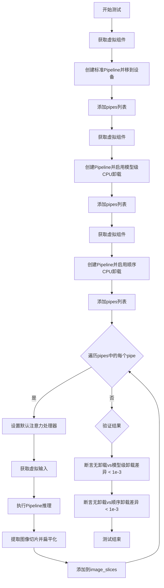

#### 带注释源码

```python
@require_torch_accelerator  # 装饰器：仅在有GPU加速器时运行此测试
def test_stable_diffusion_xl_offloads(self):
    """
    测试StableDiffusionXLPipeline在不同CPU卸载策略下的图像输出一致性。
    
    测试三种模式：
    1. 无CPU卸载（标准模式）
    2. 模型级CPU卸载（enable_model_cpu_offload）
    3. 顺序CPU卸载（enable_sequential_cpu_offload）
    
    验证这三种模式生成的图像在数值误差范围内保持一致。
    """
    pipes = []  # 存储三个不同配置的Pipeline实例
    
    # 第一步：创建标准Pipeline（无卸载）
    components = self.get_dummy_components()  # 获取虚拟组件（UNet、VAE、TextEncoder等）
    sd_pipe = StableDiffusionXLPipeline(**components).to(torch_device)  # 创建Pipeline并移至设备
    pipes.append(sd_pipe)  # 添加到pipes列表
    
    # 第二步：创建启用模型级CPU卸载的Pipeline
    components = self.get_dummy_components()  # 重新获取虚拟组件（确保独立）
    sd_pipe = StableDiffusionXLPipeline(**components)  # 创建Pipeline
    sd_pipe.enable_model_cpu_offload(device=torch_device)  # 启用模型级CPU卸载
    pipes.append(sd_pipe)  # 添加到pipes列表
    
    # 第三步：创建启用顺序CPU卸载的Pipeline
    components = self.get_dummy_components()  # 重新获取虚拟组件（确保独立）
    sd_pipe = StableDiffusionXLPipeline(**components)  # 创建Pipeline
    sd_pipe.enable_sequential_cpu_offload(device=torch_device)  # 启用顺序CPU卸载
    pipes.append(sd_pipe)  # 添加到pipes列表
    
    # 第四步：对每个Pipeline执行推理并收集结果
    image_slices = []  # 存储每个Pipeline生成的图像切片
    for pipe in pipes:  # 遍历三个Pipeline
        pipe.unet.set_default_attn_processor()  # 设置默认注意力处理器，确保一致性
        
        inputs = self.get_dummy_inputs(torch_device)  # 获取虚拟输入（prompt、generator等）
        image = pipe(**inputs).images  # 执行推理，获取生成的图像
        
        # 提取图像右下角3x3像素区域并扁平化，用于后续比较
        image_slices.append(image[0, -3:, -3:, -1].flatten())
    
    # 第五步：断言验证输出一致性
    # 验证标准模式与模型级卸载模式的差异小于1e-3
    assert np.abs(image_slices[0] - image_slices[1]).max() < 1e-3
    # 验证标准模式与顺序卸载模式的差异小于1e-3
    assert np.abs(image_slices[0] - image_slices[2]).max() < 1e-3
```


### `StableDiffusionXLPipelineFastTests.test_save_load_optional_components`

该方法用于测试 StableDiffusionXL Pipeline 的可选组件（如 image_encoder、feature_extractor）的保存和加载功能，确保在保存和加载管道时这些可选组件能够正确序列化和反序列化。当前该测试被跳过，标记为在其他地方已测试。

参数：

- `self`：无参数类型（类实例方法），表示类的实例本身

返回值：`None`，该方法不返回任何值（方法体为 `pass`）

#### 流程图

```mermaid
flowchart TD
    A[方法开始] --> B{检查@unittest.skip装饰器}
    B -->|是| C[跳过测试执行]
    B -->|否| D[获取组件]
    D --> E[创建Pipeline并设置组件]
    E --> F[保存Pipeline到临时目录]
    F --> G[从临时目录加载Pipeline]
    G --> H[验证可选组件是否正确保存和加载]
    H --> I[断言验证结果]
    I --> J[方法结束 - 返回None]
    C --> J
```

#### 带注释源码

```python
@unittest.skip("We test this functionality elsewhere already.")
def test_save_load_optional_components(self):
    """
    测试可选组件的保存和加载功能。
    
    该测试方法旨在验证 StableDiffusionXLPipeline 在保存和加载时
    能够正确处理可选组件（如 image_encoder 和 feature_extractor）。
    
    当前该测试被跳过，因为该功能已在其他测试中覆盖。
    """
    pass  # 测试体为空，已被 @unittest.skip 装饰器跳过执行
```


### `StableDiffusionXLPipelineFastTests.test_stable_diffusion_two_xl_mixture_of_denoiser_fast`

该测试方法验证了Stable Diffusion XL pipeline在混合两个不同降噪器（文本到图像和图像到图像）时的正确性，通过在不同的时间步长分割点（split point）切换pipeline，确保时间步序列的正确性和连续性。

参数：

- `self`：`StableDiffusionXLPipelineFastTests`，测试类实例本身，包含pipeline配置和辅助方法

返回值：`None`，测试方法不返回值，仅通过断言验证行为

#### 流程图

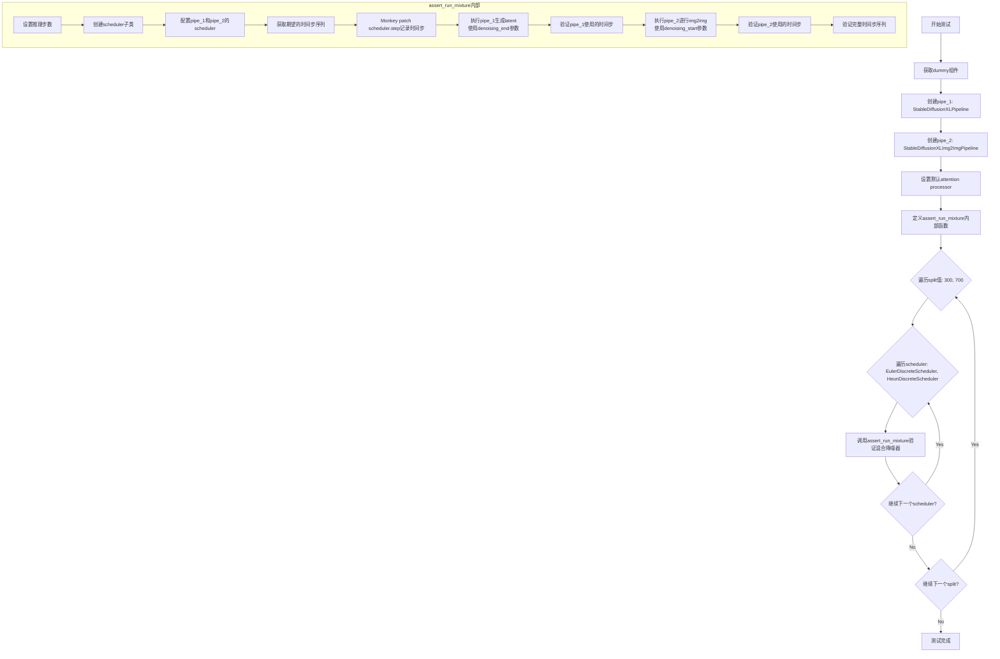

#### 带注释源码

```python
def test_stable_diffusion_two_xl_mixture_of_denoiser_fast(self):
    """
    测试Stable Diffusion XL的混合降噪器功能。
    验证在文本到图像和图像到图像pipeline之间切换时，
    时间步序列的正确性和连续性。
    """
    # 获取用于测试的虚拟（dummy）组件
    components = self.get_dummy_components()
    
    # 创建第一个pipeline：文本到图像生成
    pipe_1 = StableDiffusionXLPipeline(**components).to(torch_device)
    # 设置默认的attention processor以确保确定性结果
    pipe_1.unet.set_default_attn_processor()
    
    # 创建第二个pipeline：图像到图像转换
    pipe_2 = StableDiffusionXLImg2ImgPipeline(**components).to(torch_device)
    pipe_2.unet.set_default_attn_processor()

    def assert_run_mixture(
        num_steps,              # 推理步数
        split,                  # 时间步分割点
        scheduler_cls_orig,     # 原始scheduler类
        expected_tss,           # 期望的时间步序列
        num_train_timesteps=pipe_1.scheduler.config.num_train_timesteps,  # 训练时间步总数
    ):
        """
        内部函数：验证混合降噪器的行为
        
        参数:
            num_steps: 推理的总步数
            split: 在哪个时间步分割点切换pipeline
            scheduler_cls_orig: 要测试的scheduler类
            expected_tss: 期望的完整时间步序列
            num_train_timesteps: scheduler的训练时间步总数
        """
        # 获取虚拟输入参数
        inputs = self.get_dummy_inputs(torch_device)
        # 设置推理步数
        inputs["num_inference_steps"] = num_steps

        # 创建一个scheduler类的副本（用于后续monkey patch）
        class scheduler_cls(scheduler_cls_orig):
            pass

        # 为两个pipeline配置新的scheduler
        pipe_1.scheduler = scheduler_cls.from_config(pipe_1.scheduler.config)
        pipe_2.scheduler = scheduler_cls.from_config(pipe_2.scheduler.config)

        # 获取时间步序列
        pipe_1.scheduler.set_timesteps(num_steps)
        expected_steps = pipe_1.scheduler.timesteps.tolist()

        # 根据scheduler的阶数（order）处理时间步分割
        # 对于2阶scheduler（如HeunDiscreteScheduler），需要特殊处理
        if pipe_1.scheduler.order == 2:
            # 分割时间步：大于等于split的为一组，小于split的为另一组
            expected_steps_1 = list(filter(lambda ts: ts >= split, expected_tss))
            expected_steps_2 = expected_steps_1[-1:] + list(filter(lambda ts: ts < split, expected_tss))
            expected_steps = expected_steps_1 + expected_steps_2
        else:
            expected_steps_1 = list(filter(lambda ts: ts >= split, expected_tss))
            expected_steps_2 = list(filter(lambda ts: ts < split, expected_tss))

        # Monkey patch scheduler的step方法以记录实际使用的时间步
        done_steps = []  # 记录已执行的时间步
        old_step = copy.copy(scheduler_cls.step)  # 保存原始step方法

        def new_step(self, *args, **kwargs):
            """
            包装的step方法，记录实际执行的时间步
            args[1] 是传入的时间步t
            """
            done_steps.append(args[1].cpu().item())  # args[1] is always the passed `t`
            return old_step(self, *args, **kwargs)

        scheduler_cls.step = new_step  # 替换step方法

        # 准备第一个pipeline的输入
        # denoising_end参数指定何时停止去噪（以比例形式）
        inputs_1 = {
            **inputs,
            **{
                "denoising_end": 1.0 - (split / num_train_timesteps),  # 1.0 - split比例
                "output_type": "latent",  # 输出latent而不是图像
            },
        }
        
        # 执行第一个pipeline（文本到图像）
        latents = pipe_1(**inputs_1).images[0]

        # 验证第一个pipeline使用的时间步是否符合预期
        assert expected_steps_1 == done_steps, f"Failure with {scheduler_cls.__name__} and {num_steps} and {split}"

        # 准备第二个pipeline的输入
        # denoising_start参数指定从哪个时间步开始去噪
        inputs_2 = {
            **inputs,
            **{
                "denoising_start": 1.0 - (split / num_train_timesteps),  # 从split比例开始
                "image": latents,  # 使用第一个pipeline的输出作为输入图像
            },
        }
        
        # 执行第二个pipeline（图像到图像）
        pipe_2(**inputs_2).images[0]

        # 验证第二个pipeline使用的时间步
        assert expected_steps_2 == done_steps[len(expected_steps_1) :]
        # 验证完整的时间步序列
        assert expected_steps == done_steps, f"Failure with {scheduler_cls.__name__} and {num_steps} and {split}"

    # 测试参数设置
    steps = 10  # 使用10步推理
    
    # 遍历不同的分割点和scheduler进行测试
    for split in [300, 700]:  # 两个分割点
        for scheduler_cls_timesteps in [
            # EulerDiscreteScheduler的时间步序列
            (EulerDiscreteScheduler, [901, 801, 701, 601, 501, 401, 301, 201, 101, 1]),
            # HeunDiscreteScheduler的时间步序列（每个step有两次评估）
            (
                HeunDiscreteScheduler,
                [
                    901.0, 801.0, 801.0, 701.0, 701.0, 601.0, 601.0, 501.0,
                    501.0, 401.0, 401.0, 301.0, 301.0, 201.0, 201.0, 101.0,
                    101.0, 1.0, 1.0,
                ],
            ),
        ]:
            # 对每个组合运行验证
            assert_run_mixture(steps, split, scheduler_cls_timesteps[0], scheduler_cls_timesteps[1])
```


### `StableDiffusionXLPipelineFastTests.test_stable_diffusion_two_xl_mixture_of_denoiser`

这是一个测试函数，用于验证 Stable Diffusion XL 在两个 pipeline（text-to-image 和 image-to-image）之间混合使用去噪器的功能。测试通过创建两个 pipeline，在不同的时间步分割点（split）使用不同的调度器进行去噪，并验证实际执行的时间步序列是否符合预期。

参数：

- `self`：`StableDiffusionXLPipelineFastTests`，TestCase 实例，测试类本身

返回值：无明确的返回值（测试函数，通过断言验证功能）

#### 流程图

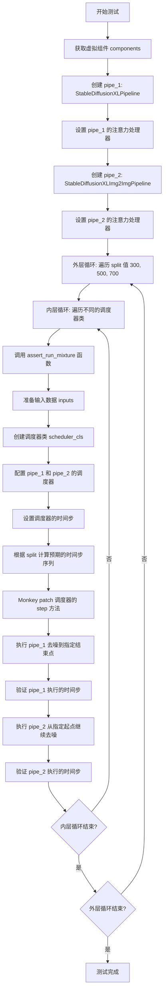

#### 带注释源码

```python
@slow  # 标记为慢速测试
def test_stable_diffusion_two_xl_mixture_of_denoiser(self):
    """
    测试 Stable Diffusion XL 两个 XL pipeline 的混合去噪器功能。
    验证在 text-to-image 和 image-to-image pipeline 之间传递 latent 时，
    调度器的时间步分割是否符合预期。
    """
    # 获取虚拟组件（用于测试的轻量级模型配置）
    components = self.get_dummy_components()
    
    # 创建第一个 pipeline: text-to-image
    pipe_1 = StableDiffusionXLPipeline(**components).to(torch_device)
    pipe_1.unet.set_default_attn_processor()  # 设置默认注意力处理器
    
    # 创建第二个 pipeline: image-to-image
    pipe_2 = StableDiffusionXLImg2ImgPipeline(**components).to(torch_device)
    pipe_2.unet.set_default_attn_processor()  # 设置默认注意力处理器

    def assert_run_mixture(
        num_steps,
        split,
        scheduler_cls_orig,
        expected_tss,
        num_train_timesteps=pipe_1.scheduler.config.num_train_timesteps,
    ):
        """
        内部函数：验证混合去噪器运行的时间步是否符合预期。
        
        参数:
            num_steps: 推理步数
            split: 时间步分割点（用于控制两个 pipeline 的分界）
            scheduler_cls_orig: 原始调度器类
            expected_tss: 预期的时间步序列
            num_train_timesteps: 训练时的总时间步数（默认1000）
        """
        # 准备输入数据
        inputs = self.get_dummy_inputs(torch_device)
        inputs["num_inference_steps"] = num_steps

        # 创建调度器类的子类（用于 monkey patch）
        class scheduler_cls(scheduler_cls_orig):
            pass

        # 为两个 pipeline 配置调度器
        pipe_1.scheduler = scheduler_cls.from_config(pipe_1.scheduler.config)
        pipe_2.scheduler = scheduler_cls.from_config(pipe_2.scheduler.config)

        # 获取调度器的时间步序列
        pipe_1.scheduler.set_timesteps(num_steps)
        expected_steps = pipe_1.scheduler.timesteps.tolist()

        # 根据分割点计算两个 pipeline 各自应执行的时间步
        if pipe_1.scheduler.order == 2:
            # 对于二阶调度器（如 HeunDiscreteScheduler），需要特殊处理
            expected_steps_1 = list(filter(lambda ts: ts >= split, expected_tss))
            expected_steps_2 = expected_steps_1[-1:] + list(filter(lambda ts: ts < split, expected_tss))
            expected_steps = expected_steps_1 + expected_steps_2
        else:
            # 对于一阶调度器
            expected_steps_1 = list(filter(lambda ts: ts >= split, expected_tss))
            expected_steps_2 = list(filter(lambda ts: ts < split, expected_tss))

        # Monkey patch 调度器的 step 方法，记录实际执行的时间步
        done_steps = []
        old_step = copy.copy(scheduler_cls.step)  # 保存原始 step 方法

        def new_step(self, *args, **kwargs):
            """包装函数：记录每个时间步后执行 new_step"""
            done_steps.append(args[1].cpu().item())  # args[1] 是时间步 t
            return old_step(self, *args, **kwargs)  # 调用原始方法

        scheduler_cls.step = new_step  # 替换为包装函数

        # 准备第一个 pipeline 的输入
        inputs_1 = {
            **inputs,
            **{
                "denoising_end": 1.0 - (split / num_train_timesteps),  # 去噪结束点
                "output_type": "latent",  # 输出 latent 而不是图像
            },
        }
        
        # 执行第一个 pipeline（text-to-image，去噪到指定结束点）
        latents = pipe_1(**inputs_1).images[0]

        # 验证第一个 pipeline 执行的时间步
        assert expected_steps_1 == done_steps, f"Failure with {scheduler_cls.__name__} and {num_steps} and {split}"

        # 准备第二个 pipeline 的输入
        inputs_2 = {
            **inputs,
            **{
                "denoising_start": 1.0 - (split / num_train_timesteps),  # 去噪起始点
                "image": latents,  # 使用第一个 pipeline 的输出作为输入
            },
        }
        
        # 执行第二个 pipeline（image-to-image，从指定起点继续去噪）
        pipe_2(**inputs_2).images[0]

        # 验证第二个 pipeline 执行的时间步
        assert expected_steps_2 == done_steps[len(expected_steps_1) :]
        assert expected_steps == done_steps, f"Failure with {scheduler_cls.__name__} and {num_steps} and {split}"

    # 设置测试参数
    steps = 10
    
    # 外层循环：遍历不同的分割点（300, 500, 700）
    for split in [300, 500, 700]:
        # 内层循环：遍历不同的调度器及其预期时间步
        for scheduler_cls_timesteps in [
            (DDIMScheduler, [901, 801, 701, 601, 501, 401, 301, 201, 101, 1]),
            (EulerDiscreteScheduler, [901, 801, 701, 601, 501, 401, 301, 201, 101, 1]),
            (DPMSolverMultistepScheduler, [901, 811, 721, 631, 541, 451, 361, 271, 181, 91]),
            (UniPCMultistepScheduler, [901, 811, 721, 631, 541, 451, 361, 271, 181, 91]),
            (HeunDiscreteScheduler, [901.0, 801.0, 801.0, 701.0, 701.0, 601.0, 601.0, 501.0, 501.0, 401.0, 401.0, 301.0, 301.0, 201.0, 201.0, 101.0, 101.0, 1.0, 1.0]),
        ]:
            # 调用验证函数
            assert_run_mixture(steps, split, scheduler_cls_timesteps[0], scheduler_cls_timesteps[1])

    # 第二个测试集：使用更多的推理步数（25步）
    steps = 25
    for split in [300, 500, 700]:
        for scheduler_cls_timesteps in [
            (DDIMScheduler, [961, 921, 881, 841, 801, 761, 721, 681, 641, 601, 561, 521, 481, 441, 401, 361, 321, 281, 241, 201, 161, 121, 81, 41, 1]),
            (EulerDiscreteScheduler, [961.0, 921.0, 881.0, 841.0, 801.0, 761.0, 721.0, 681.0, 641.0, 601.0, 561.0, 521.0, 481.0, 441.0, 401.0, 361.0, 321.0, 281.0, 241.0, 201.0, 161.0, 121.0, 81.0, 41.0, 1.0]),
            (DPMSolverMultistepScheduler, [951, 913, 875, 837, 799, 761, 723, 685, 647, 609, 571, 533, 495, 457, 419, 381, 343, 305, 267, 229, 191, 153, 115, 77, 39]),
            (UniPCMultistepScheduler, [951, 913, 875, 837, 799, 761, 723, 685, 647, 609, 571, 533, 495, 457, 419, 381, 343, 305, 267, 229, 191, 153, 115, 77, 39]),
            (HeunDiscreteScheduler, [961.0, 921.0, 921.0, 881.0, 881.0, 841.0, 841.0, 801.0, 801.0, 761.0, 761.0, 721.0, 721.0, 681.0, 681.0, 641.0, 641.0, 601.0, 601.0, 561.0, 561.0, 521.0, 521.0, 481.0, 481.0, 441.0, 441.0, 401.0, 401.0, 361.0, 361.0, 321.0, 321.0, 281.0, 281.0, 241.0, 241.0, 201.0, 201.0, 161.0, 161.0, 121.0, 121.0, 81.0, 81.0, 41.0, 41.0, 1.0, 1.0]),
        ]:
            assert_run_mixture(steps, split, scheduler_cls_timesteps[0], scheduler_cls_timesteps[1])
```


### `StableDiffusionXLPipelineFastTests.test_stable_diffusion_three_xl_mixture_of_denoiser`

该测试方法用于验证三个Stable Diffusion XL管道（一个文本到图像管道和两个图像到图像管道）的混合去噪功能，通过在不同的调度器上设置不同的去噪起止点，验证整个去噪过程的步骤分割是否符合预期。

参数：

- 无显式参数（继承自 `unittest.TestCase` 的实例方法，`self` 为隐式参数）

返回值：`None`，该方法为测试方法，通过断言验证功能正确性

#### 流程图

```mermaid
flowchart TD
    A[开始测试 test_stable_diffusion_three_xl_mixture_of_denoiser] --> B[创建三个管道实例]
    B --> C[pipe_1: StableDiffusionXLPipeline]
    B --> D[pipe_2: StableDiffusionXLImg2ImgPipeline]
    B --> E[pipe_3: StableDiffusionXLImg2ImgPipeline]
    C --> F[设置默认注意力处理器]
    D --> F
    E --> F
    F --> G[定义内部函数 assert_run_mixture]
    G --> H[外层循环: 遍历 steps in [7, 11, 20]]
    H --> I[内层循环: 遍历 split_1, split_2 组合]
    I --> J[内层循环: 遍历调度器类型]
    J --> K[调用 assert_run_mixture 验证混合去噪]
    K --> L[断言: 验证三个管道的去噪步骤总和]
    L --> M[结束测试]
    
    subgraph assert_run_mixture 内部逻辑
        N[获取输入参数] --> O[创建调度器类副本]
        O --> P[设置调度器时间步]
        P --> Q[计算分割点时间步 split_1_ts, split_2_ts]
        Q --> R[根据调度器阶数计算预期步骤]
        R --> S[Monkey patch 调度器 step 方法记录步骤]
        S --> T[执行 pipe_1 去噪到 split_1]
        T --> U[断言: 验证 pipe_1 步骤]
        U --> V[测试异常情况: denoising_start > denoising_end]
        V --> W[执行 pipe_2 从 split_1 到 split_2]
        W --> X[断言: 验证 pipe_2 步骤]
        X --> Y[执行 pipe_3 从 split_2 到结束]
        Y --> Z[断言: 验证 pipe_3 步骤]
    end
```

#### 带注释源码

```python
@slow
def test_stable_diffusion_three_xl_mixture_of_denoiser(self):
    """
    测试三个 Stable Diffusion XL 管道的混合去噪功能。
    验证三个管道（一个文本到图像 + 两个图像到图像）按顺序执行时，
    去噪步骤的分割是否符合预期的 split_1 和 split_2 比例。
    """
    # 获取虚拟组件（UNet、VAE、文本编码器等）
    components = self.get_dummy_components()
    
    # 创建第一个管道：文本到图像生成管道
    pipe_1 = StableDiffusionXLPipeline(**components).to(torch_device)
    # 设置默认注意力处理器，确保测试确定性
    pipe_1.unet.set_default_attn_processor()
    
    # 创建第二个管道：图像到图像管道
    pipe_2 = StableDiffusionXLImg2ImgPipeline(**components).to(torch_device)
    pipe_2.unet.set_default_attn_processor()
    
    # 创建第三个管道：图像到图像管道
    pipe_3 = StableDiffusionXLImg2ImgPipeline(**components).to(torch_device)
    pipe_3.unet.set_default_attn_processor()

    def assert_run_mixture(
        num_steps,        # 推理步骤数
        split_1,         # 第一个分割点（比例 0-1）
        split_2,         # 第二个分割点（比例 0-1）
        scheduler_cls_orig,  # 调度器类
        num_train_timesteps=pipe_1.scheduler.config.num_train_timesteps,  # 训练时间步数，默认1000
    ):
        """
        内部函数：验证混合去噪的正确性
        
        该函数执行以下验证：
        1. 第一个管道从开始到 split_1 进行去噪
        2. 第二个管道从 split_1 到 split_2 继续去噪
        3. 第三个管道从 split_2 到结束完成去噪
        """
        # 获取虚拟输入参数
        inputs = self.get_dummy_inputs(torch_device)
        inputs["num_inference_steps"] = num_steps

        # 创建调度器类的子类（用于 monkey patch）
        class scheduler_cls(scheduler_cls_orig):
            pass

        # 为三个管道配置相同的调度器
        pipe_1.scheduler = scheduler_cls.from_config(pipe_1.scheduler.config)
        pipe_2.scheduler = scheduler_cls.from_config(pipe_2.scheduler.config)
        pipe_3.scheduler = scheduler_cls.from_config(pipe_3.scheduler.config)

        # 获取调度器的时间步列表
        pipe_1.scheduler.set_timesteps(num_steps)
        expected_steps = pipe_1.scheduler.timesteps.tolist()

        # 计算分割点对应的实际时间步值
        # 将比例转换为实际时间步索引
        split_1_ts = num_train_timesteps - int(round(num_train_timesteps * split_1))
        split_2_ts = num_train_timesteps - int(round(num_train_timesteps * split_2))

        # 根据调度器阶数（二阶调度器如 HeunDiscreteScheduler 需要特殊处理）
        if pipe_1.scheduler.order == 2:
            # 二阶调度器：每个时间步可能被执行两次（如 Heun 方法）
            expected_steps_1 = list(filter(lambda ts: ts >= split_1_ts, expected_steps))
            expected_steps_2 = expected_steps_1[-1:] + list(
                filter(lambda ts: ts >= split_2_ts and ts < split_1_ts, expected_steps)
            )
            expected_steps_3 = expected_steps_2[-1:] + list(filter(lambda ts: ts < split_2_ts, expected_steps))
            expected_steps = expected_steps_1 + expected_steps_2 + expected_steps_3
        else:
            # 一阶调度器：直接按时间步分割
            expected_steps_1 = list(filter(lambda ts: ts >= split_1_ts, expected_steps))
            expected_steps_2 = list(filter(lambda ts: ts >= split_2_ts and ts < split_1_ts, expected_steps))
            expected_steps_3 = list(filter(lambda ts: ts < split_2_ts, expected_steps))

        # Monkey patch: 拦截调度器的 step 方法，记录实际执行的时间步
        done_steps = []
        old_step = copy.copy(scheduler_cls.step)

        def new_step(self, *args, **kwargs):
            """记录每个调度器步骤调用的时间步"""
            done_steps.append(args[1].cpu().item())  # args[1] 是时间步 t
            return old_step(self, *args, **kwargs)

        scheduler_cls.step = new_step

        # 第一阶段：使用 pipe_1 生成，denoising_end 控制何时停止
        inputs_1 = {**inputs, **{"denoising_end": split_1, "output_type": "latent"}}
        latents = pipe_1(**inputs_1).images[0]

        # 验证第一阶段的步骤
        assert expected_steps_1 == done_steps, (
            f"Failure with {scheduler_cls.__name__} and {num_steps} and {split_1} and {split_2}"
        )

        # 测试异常情况：denoising_start 不应该大于等于 denoising_end
        with self.assertRaises(ValueError) as cm:
            inputs_2 = {
                **inputs,
                **{
                    "denoising_start": split_2,      # 错误：start > end
                    "denoising_end": split_1,
                    "image": latents,
                    "output_type": "latent",
                },
            }
            pipe_2(**inputs_2).images[0]
        # 验证异常消息
        assert "cannot be larger than or equal to `denoising_end`" in str(cm.exception)

        # 第二阶段：使用 pipe_2 从 split_1 到 split_2
        inputs_2 = {
            **inputs,
            **{"denoising_start": split_1, "denoising_end": split_2, "image": latents, "output_type": "latent"},
        }
        pipe_2(**inputs_2).images[0]

        # 验证第二阶段的步骤
        assert expected_steps_2 == done_steps[len(expected_steps_1) :]

        # 第三阶段：使用 pipe_3 从 split_2 到结束
        inputs_3 = {**inputs, **{"denoising_start": split_2, "image": latents}}
        pipe_3(**inputs_3).images[0]

        # 验证第三阶段的步骤
        assert expected_steps_3 == done_steps[len(expected_steps_1) + len(expected_steps_2) :]
        
        # 验证总步骤数
        assert expected_steps == done_steps, (
            f"Failure with {scheduler_cls.__name__} and {num_steps} and {split_1} and {split_2}"
        )

    # 执行多层循环测试
    # 遍历不同的推理步骤数
    for steps in [7, 11, 20]:
        # 遍历不同的分割点组合
        for split_1, split_2 in zip([0.19, 0.32], [0.81, 0.68]):
            # 遍历不同的调度器类型
            for scheduler_cls in [
                DDIMScheduler,              # DDIM 调度器
                EulerDiscreteScheduler,     # Euler 离散调度器
                DPMSolverMultistepScheduler, # DPM 多步调度器
                UniPCMultistepScheduler,     # UniPC 调度器
                HeunDiscreteScheduler,       # Heun 离散调度器（二阶）
            ]:
                assert_run_mixture(steps, split_1, split_2, scheduler_cls)
```


### `StableDiffusionXLPipelineFastTests.test_stable_diffusion_xl_multi_prompts`

该测试方法用于验证 Stable Diffusion XL Pipeline 在处理多提示（multi-prompts）时的正确性，包括正向提示的重复和差异处理，以及负向提示的多提示场景测试。

参数：无（该测试方法不接受额外的显式参数，使用类方法和 `get_dummy_inputs` 获取测试输入）

返回值：`None`，该方法为测试用例，无返回值

#### 流程图

```mermaid
flowchart TD
    A[开始测试] --> B[获取虚拟组件: get_dummy_components]
    B --> C[创建Pipeline并移动到torch_device]
    C --> D[测试1: 单提示输入]
    D --> E[获取输出图像切片 image_slice_1]
    E --> F[测试2: 重复相同提示 prompt_2=prompt]
    F --> G[获取输出图像切片 image_slice_2]
    G --> H{断言: image_slice_1 == image_slice_2}
    H -->|通过| I[测试3: 不同提示 prompt_2='different prompt']
    H -->|失败| Z[测试失败]
    I --> J[获取输出图像切片 image_slice_3]
    J --> K{断言: image_slice_1 != image_slice_3}
    K -->|通过| L[测试4: 负向提示 single negative_prompt]
    K -->|失败| Z
    L --> M[获取输出图像切片 image_slice_1]
    M --> N[测试5: 重复负向提示 negative_prompt_2=negative_prompt]
    N --> O[获取输出图像切片 image_slice_2]
    O --> P{断言: image_slice_1 == image_slice_2}
    P -->|通过| Q[测试6: 不同负向提示]
    P -->|失败| Z
    Q --> R[获取输出图像切片 image_slice_3]
    R --> S{断言: image_slice_1 != image_slice_3}
    S -->|通过| T[所有测试通过]
    S -->|失败| Z
```

#### 带注释源码

```python
def test_stable_diffusion_xl_multi_prompts(self):
    """
    测试 Stable Diffusion XL Pipeline 处理多提示的功能
    验证点：
    1. 相同提示重复（prompt_2 = prompt）应产生相同结果
    2. 不同提示（prompt_2 = 'different prompt'）应产生不同结果
    3. 相同负向提示重复应产生相同结果
    4. 不同负向提示应产生不同结果
    """
    
    # 步骤1: 获取虚拟组件（用于测试的轻量级模型组件）
    components = self.get_dummy_components()
    
    # 步骤2: 使用虚拟组件创建Pipeline并移动到测试设备
    sd_pipe = self.pipeline_class(**components).to(torch_device)

    # ========== 测试正向提示的多提示处理 ==========
    
    # 测试1: 使用单个提示进行前向传播
    inputs = self.get_dummy_inputs(torch_device)
    output = sd_pipe(**inputs)
    # 获取输出图像右下角3x3区域，通道为最后一个通道的切片
    image_slice_1 = output.images[0, -3:, -3:, -1]

    # 测试2: 使用重复的相同提示（prompt_2 = prompt）
    inputs = self.get_dummy_inputs(torch_device)
    inputs["prompt_2"] = inputs["prompt"]  # 将prompt复制到prompt_2
    output = sd_pipe(**inputs)
    image_slice_2 = output.images[0, -3:, -3:, -1]

    # 断言: 重复相同提示应该产生完全相同的结果
    assert np.abs(image_slice_1.flatten() - image_slice_2.flatten()).max() < 1e-4

    # 测试3: 使用不同的提示（prompt_2 = 'different prompt'）
    inputs = self.get_dummy_inputs(torch_device)
    inputs["prompt_2"] = "different prompt"  # 设置不同的第二个提示
    output = sd_pipe(**inputs)
    image_slice_3 = output.images[0, -3:, -3:, -1]

    # 断言: 不同提示应该产生不同的结果
    assert np.abs(image_slice_1.flatten() - image_slice_3.flatten()).max() > 1e-4

    # ========== 测试负向提示的多提示处理 ==========
    
    # 测试4: 设置单个负向提示
    inputs = self.get_dummy_inputs(torch_device)
    inputs["negative_prompt"] = "negative prompt"
    output = sd_pipe(**inputs)
    image_slice_1 = output.images[0, -3:, -3:, -1]

    # 测试5: 使用重复的相同负向提示
    inputs = self.get_dummy_inputs(torch_device)
    inputs["negative_prompt"] = "negative prompt"
    inputs["negative_prompt_2"] = inputs["negative_prompt"]  # 复制负向提示
    output = sd_pipe(**inputs)
    image_slice_2 = output.images[0, -3:, -3:, -1]

    # 断言: 重复相同负向提示应该产生相同结果
    assert np.abs(image_slice_1.flatten() - image_slice_2.flatten()).max() < 1e-4

    # 测试6: 使用不同的负向提示
    inputs = self.get_dummy_inputs(torch_device)
    inputs["negative_prompt"] = "negative prompt"
    inputs["negative_prompt_2"] = "different negative prompt"  # 不同的负向提示
    output = sd_pipe(**inputs)
    image_slice_3 = output.images[0, -3:, -3:, -1]

    # 断言: 不同负向提示应该产生不同结果
    assert np.abs(image_slice_1.flatten() - image_slice_3.flatten()).max() > 1e-4
```


### `StableDiffusionXLPipelineFastTests.test_stable_diffusion_xl_negative_conditions`

该测试方法用于验证 Stable Diffusion XL Pipeline 中负面条件（negative conditions）功能是否正常工作。测试通过对比有无负面条件输入时生成的图像切片差异，确认负面条件能够影响生成结果。

参数：

- `self`：`StableDiffusionXLPipelineFastTests`，测试类实例方法的标准参数，表示当前测试对象

返回值：`None`，测试方法无返回值，通过断言验证逻辑正确性

#### 流程图

```mermaid
flowchart TD
    A[开始测试] --> B[设置设备为CPU确保确定性]
    B --> C[获取虚拟组件 get_dummy_components]
    C --> D[创建StableDiffusionXLPipeline实例]
    D --> E[将Pipeline移到设备上]
    E --> F[设置进度条配置 disable=None]
    F --> G[获取虚拟输入 get_dummy_inputs]
    G --> H[执行Pipeline生成图像-无负面条件]
    H --> I[提取图像切片 image_slice_with_no_neg_cond]
    I --> J[再次执行Pipeline-带负面条件参数]
    J --> K[negative_original_size=512x512]
    J --> L[negative_crops_coords_top_left=0,0]
    J --> M[negative_target_size=1024x1024]
    K --> N[执行Pipeline生成图像-有负面条件]
    N --> O[提取图像切片 image_slice_with_neg_cond]
    O --> P{断言验证}
    P -->|差异大于1e-2| Q[测试通过]
    P -->|差异小于等于1e-2| R[测试失败]
    Q --> S[结束测试]
    R --> S
```

#### 带注释源码

```python
def test_stable_diffusion_xl_negative_conditions(self):
    """
    测试 Stable Diffusion XL Pipeline 的负面条件（negative conditions）功能。
    负面条件允许用户指定不想要出现在生成图像中的特征，如特定的尺寸或裁剪坐标。
    """
    # 设置设备为 CPU，确保 torch.Generator 的确定性行为
    device = "cpu"  # ensure determinism for the device-dependent torch.Generator
    
    # 获取预定义的虚拟组件（UNet、VAE、Text Encoder、Scheduler等）
    components = self.get_dummy_components()
    
    # 使用虚拟组件实例化 StableDiffusionXL Pipeline
    sd_pipe = StableDiffusionXLPipeline(**components)
    
    # 将 Pipeline 移到指定设备（CPU）上
    sd_pipe = sd_pipe.to(device)
    
    # 配置进度条，disable=None 表示不禁用进度条
    sd_pipe.set_progress_bar_config(disable=None)

    # 获取标准的虚拟输入参数（包含 prompt、generator、num_inference_steps 等）
    inputs = self.get_dummy_inputs(device)
    
    # 第一次调用：不使用负面条件参数进行图像生成
    image = sd_pipe(**inputs).images
    # 提取生成的图像切片（取最后3x3像素区域，用于后续对比）
    image_slice_with_no_neg_cond = image[0, -3:, -3:, -1]

    # 第二次调用：使用负面条件参数进行图像生成
    image = sd_pipe(
        **inputs,  # 展开之前的输入参数
        # 负面条件参数：指定不想要的原始尺寸
        negative_original_size=(512, 512),
        # 负面条件参数：指定不想要的裁剪左上角坐标
        negative_crops_coords_top_left=(0, 0),
        # 负面条件参数：指定不想要的目标尺寸
        negative_target_size=(1024, 1024),
    ).images
    # 提取带负面条件生成的图像切片
    image_slice_with_neg_cond = image[0, -3:, -3:, -1]

    # 断言：验证负面条件确实改变了生成结果
    # 两次生成的图像切片差异应该大于阈值 1e-2，证明负面条件生效
    self.assertTrue(np.abs(image_slice_with_no_neg_cond - image_slice_with_neg_cond).max() > 1e-2)
```


### `StableDiffusionXLPipelineFastTests.test_stable_diffusion_xl_save_from_pretrained`

该方法是一个单元测试，用于验证StableDiffusionXLPipeline的模型保存和加载功能是否正常工作。测试流程为：创建pipeline并保存到临时目录，然后从临时目录加载pipeline，最后对比原始pipeline和加载后的pipeline生成的图像是否一致。

参数：

- `self`：隐式参数，测试类实例本身
- `torch_device`：全局变量（torch设备字符串，如"cuda"或"cpu"），指定模型运行的设备

返回值：`None`（测试方法，通过断言验证，无返回值）

#### 流程图

```mermaid
flowchart TD
    A[开始测试] --> B[创建空列表 pipes]
    B --> C[获取虚拟组件 components]
    C --> D[创建StableDiffusionXLPipeline并移动到torch_device]
    D --> E[添加到pipes列表]
    E --> F[创建临时目录tmpdirname]
    F --> G[调用save_pretrained保存pipeline到tmpdirname]
    G --> H[调用from_pretrained从tmpdirname加载pipeline并移动到torch_device]
    H --> I[将加载的pipeline添加到pipes列表]
    I --> J[初始化空列表image_slices]
    J --> K{遍历pipes中的每个pipe}
    K -->|是| L[设置默认注意力处理器]
    L --> M[获取虚拟输入inputs]
    M --> N[执行pipe生成图像]
    N --> O[提取图像切片并添加到image_slices]
    O --> K
    K -->|否| P[断言两张图像差异小于1e-3]
    P --> Q[测试结束]
```

#### 带注释源码

```python
def test_stable_diffusion_xl_save_from_pretrained(self):
    """
    测试StableDiffusionXLPipeline的保存和加载功能
    验证保存后重新加载的pipeline能够产生相同的输出
    """
    # 创建一个列表用于存储两个pipeline实例：原始的和加载后的
    pipes = []
    
    # 获取虚拟组件（包含UNet、VAE、TextEncoder等用于测试的dummy模型）
    components = self.get_dummy_components()
    
    # 使用虚拟组件创建StableDiffusionXLPipeline并移动到指定设备
    sd_pipe = StableDiffusionXLPipeline(**components).to(torch_device)
    
    # 将原始pipeline添加到列表中
    pipes.append(sd_pipe)

    # 创建临时目录用于保存和加载模型
    with tempfile.TemporaryDirectory() as tmpdirname:
        # 将pipeline保存到临时目录
        sd_pipe.save_pretrained(tmpdirname)
        
        # 从临时目录加载pipeline并移动到指定设备
        sd_pipe = StableDiffusionXLPipeline.from_pretrained(tmpdirname).to(torch_device)
    
    # 将加载后的pipeline添加到列表中
    pipes.append(sd_pipe)

    # 创建空列表用于存储生成的图像切片
    image_slices = []
    
    # 遍历两个pipeline（原始和加载后的）
    for pipe in pipes:
        # 设置默认的注意力处理器，确保测试一致性
        pipe.unet.set_default_attn_processor()

        # 获取虚拟输入参数
        inputs = self.get_dummy_inputs(torch_device)
        
        # 执行pipeline生成图像
        image = pipe(**inputs).images

        # 提取图像的一部分切片（最后一行的最后3列的所有通道）
        image_slices.append(image[0, -3:, -3:, -1].flatten())

    # 断言：验证两个pipeline生成的图像差异在可接受范围内
    # 如果差异大于1e-3，断言失败，说明保存/加载功能存在问题
    assert np.abs(image_slices[0] - image_slices[1]).max() < 1e-3
```


### `StableDiffusionXLPipelineFastTests.test_pipeline_interrupt`

该方法是一个单元测试，用于验证 StableDiffusionXL Pipeline 的中断功能。测试通过创建虚拟组件构建 Pipeline，运行完整推理过程获取中间潜在变量（latents），然后使用回调函数在指定步骤中断推理，最终比较中断输出与之前获取的中间潜在变量是否一致，从而验证 Pipeline 中断机制的准确性。

参数：

- `self`：隐式参数，测试类实例本身

返回值：`None`，该方法为测试方法，通过 `assert` 语句进行验证，不返回具体值

#### 流程图

```mermaid
flowchart TD
    A[开始测试] --> B[获取虚拟组件 components]
    B --> C[创建 StableDiffusionXLPipeline 实例]
    C --> D[将 Pipeline 移动到 torch_device]
    D --> E[设置进度条配置 disable=None]
    E --> F[定义 PipelineState 类用于存储中间 latents]
    F --> G[运行完整推理流程获取中间状态]
    G --> H[保存 intermediate latents]
    H --> I[定义中断回调函数 callback_on_step_end]
    I --> J[使用回调中断 Pipeline]
    J --> K[获取中断时的 latent]
    K --> L{assert: 中断输出 == 中间 latent?}
    L -->|是| M[测试通过]
    L -->|否| N[测试失败]
```

#### 带注释源码

```python
def test_pipeline_interrupt(self):
    """
    测试 StableDiffusionXL Pipeline 的中断功能
    
    该测试验证当使用 callback_on_step_end 回调函数在特定推理步骤
    设置 pipe._interrupt = True 时，Pipeline 能够正确中断并且
    返回的中间 latent 与完整运行时的中间 latent 一致。
    """
    # 步骤1: 获取虚拟组件（用于测试的轻量级模型配置）
    components = self.get_dummy_components()
    
    # 步骤2: 使用虚拟组件创建 StableDiffusionXL Pipeline
    sd_pipe = StableDiffusionXLPipeline(**components)
    
    # 步骤3: 将 Pipeline 移动到测试设备（CPU 或 CUDA）
    sd_pipe = sd_pipe.to(torch_device)
    
    # 步骤4: 配置进度条（disable=None 表示启用进度条）
    sd_pipe.set_progress_bar_config(disable=None)

    # 步骤5: 定义测试用的提示词和推理步数
    prompt = "hey"
    num_inference_steps = 3

    # 步骤6: 定义 PipelineState 类，用于在推理过程中存储中间 latent
    # 这是一个内部状态类，通过 callback_on_step_end 收集每一步的 latents
    class PipelineState:
        def __init__(self):
            self.state = []  # 用于存储中间 latents 的列表

        def apply(self, pipe, i, t, callback_kwargs):
            """
            回调函数，在每个推理步骤结束时被调用
            
            参数:
                pipe: Pipeline 实例
                i: 当前步骤索引
                t: 当前时间步
                callback_kwargs: 包含中间变量的字典
            """
            # 将当前步骤的 latents 添加到状态列表中
            self.state.append(callback_kwargs["latents"])
            # 返回未经修改的 callback_kwargs
            return callback_kwargs

    # 步骤7: 创建 PipelineState 实例
    pipe_state = PipelineState()
    
    # 步骤8: 运行完整推理流程，使用回调收集中间 latents
    # 不中断推理，获取完整的中间状态用于后续比较
    sd_pipe(
        prompt,
        num_inference_steps=num_inference_steps,
        output_type="np",  # 输出为 numpy 数组
        generator=torch.Generator("cpu").manual_seed(0),  # 固定随机种子确保可重复性
        callback_on_step_end=pipe_state.apply,  # 使用自定义回调收集中间状态
    ).images

    # 步骤9: 定义中断步骤索引（在第1步后中断，索引从0开始）
    interrupt_step_idx = 1

    # 步骤10: 定义中断回调函数
    def callback_on_step_end(pipe, i, t, callback_kwargs):
        """
        在指定步骤中断 Pipeline 的回调函数
        
        参数:
            pipe: Pipeline 实例
            i: 当前步骤索引
            t: 当前时间步
            callback_kwargs: 包含中间变量的字典
        
        返回:
            callback_kwargs: 未经修改的回调参数
        """
        # 当达到中断步骤时，设置中断标志
        if i == interrupt_step_idx:
            pipe._interrupt = True  # 设置中断标志，停止后续推理

        return callback_kwargs

    # 步骤11: 再次运行推理，但这次在指定步骤中断
    # 输出类型改为 latent 以便与中间结果比较
    output_interrupted = sd_pipe(
        prompt,
        num_inference_steps=num_inference_steps,
        output_type="latent",  # 输出 latent 格式以便数值比较
        generator=torch.Generator("cpu").manual_seed(0),  # 使用相同的随机种子
        callback_on_step_end=callback_on_step_end,  # 使用中断回调
    ).images

    # 步骤12: 从完整运行的历史中获取中断步骤的中间 latent
    # 使用之前保存的 pipe_state.state 列表
    intermediate_latent = pipe_state.state[interrupt_step_idx]

    # 步骤13: 验证断言
    # 比较中断输出与完整运行时的中间 latent
    # 如果一致，说明中断功能正常工作
    assert torch.allclose(intermediate_latent, output_interrupted, atol=1e-4)
```


### `StableDiffusionXLPipelineIntegrationTests.setUp`

该方法是测试类的初始化方法，在每个测试方法运行前被调用，用于执行测试前的清理工作，包括垃圾回收和GPU缓存清理，以确保测试环境的干净状态。

参数：

- `self`：实例本身，测试类实例

返回值：`None`，无返回值

#### 流程图

```mermaid
flowchart TD
    A[开始 setUp] --> B[调用父类 setUp 方法]
    B --> C[执行 gc.collect 垃圾回收]
    C --> D[调用 backend_empty_cache 清理 GPU 缓存]
    D --> E[结束 setUp]
```

#### 带注释源码

```python
def setUp(self):
    """
    测试方法初始化钩子，在每个测试方法执行前被调用。
    用于准备测试环境，清理之前的资源占用。
    """
    # 调用父类的 setUp 方法，确保 unittest.TestCase 的基础初始化逻辑被执行
    super().setUp()
    
    # 主动触发 Python 的垃圾回收机制，释放不再使用的内存对象
    # 这有助于确保测试之间的内存隔离，避免内存泄漏影响测试结果
    gc.collect()
    
    # 调用后端工具函数清空 GPU 缓存（torch_device 指定设备）
    # 对于深度学习测试尤为重要，可释放显存并确保测试从干净状态开始
    backend_empty_cache(torch_device)
```


### `StableDiffusionXLPipelineIntegrationTests.tearDown`

清理测试环境，释放内存和GPU缓存资源，确保测试隔离性。

参数：

- `self`：`unittest.TestCase`，隐式参数，表示测试类实例本身

返回值：`None`，无返回值描述

#### 流程图

```mermaid
flowchart TD
    A[tearDown 方法开始] --> B[调用父类 tearDown 方法]
    B --> C[执行 gc.collect 强制垃圾回收]
    C --> D[调用 backend_empty_cache 清理 GPU 缓存]
    D --> E[tearDown 方法结束]
```

#### 带注释源码

```python
def tearDown(self):
    """
    测试用例 tearDown 方法
    在每个测试方法执行完毕后自动调用，用于清理测试环境
    """
    super().tearDown()  # 调用父类的 tearDown 方法，确保 unittest 框架正确清理
    gc.collect()  # 强制 Python 垃圾回收器运行，释放测试过程中产生的循环引用对象内存
    backend_empty_cache(torch_device)  # 调用后端特定的缓存清理函数，释放 GPU 显存等设备资源
```


### `StableDiffusionXLPipelineIntegrationTests.test_stable_diffusion_lcm`

该函数是一个集成测试方法，用于验证 Stable Diffusion XL pipeline 与 LCM（Latent Consistency Model）加速采样器的功能正确性。测试通过加载预训练的 SSD-1B 模型和 LCM 调度器，执行图像生成流程，并将生成的图像与参考图像进行余弦相似度比较，以确认模型输出的准确性。

参数：

- `self`：测试类实例本身，无实际作用，用于访问类属性和方法

返回值：`None`，该方法为测试函数，通过断言验证图像相似度而非返回数据

#### 流程图

```mermaid
flowchart TD
    A[测试开始] --> B[设置随机种子 torch.manual_seed]
    B --> C[加载预训练 UNet 模型<br/>latent-consistency/lcm-ssd-1b]
    C --> D[加载 Stable Diffusion XL Pipeline<br/>segmind/SSD-1B 并传入 UNet]
    D --> E[配置 LCMScheduler 调度器]
    E --> F[设置进度条配置]
    F --> G[定义提示词<br/>a red car standing on the side of the street]
    G --> H[执行 Pipeline 推理<br/>num_inference_steps=4<br/>guidance_scale=8.0]
    H --> I[加载预期参考图像<br/>从 HuggingFace 数据集]
    I --> J[将生成的 PIL 图像转换为 NumPy 数组]
    J --> K[将参考图像转换为 NumPy 数组]
    K --> L[计算余弦相似度距离]
    L --> M{最大差异 < 1e-2?}
    M -->|是| N[断言通过 测试成功]
    M -->|否| O[断言失败 抛出异常]
```

#### 带注释源码

```python
@unittest.skipIf(torch_device == "cpu", "This test is skipped on CPU.")
def test_stable_diffusion_lcm(self):
    """
    测试 Stable Diffusion XL Pipeline 与 LCM (Latent Consistency Model) 调度器的集成功能。
    该测试验证模型能够使用 LCM 加速采样生成图像，并与参考图像进行相似度比较。
    """
    # 设置随机种子以确保测试结果可复现
    torch.manual_seed(0)
    
    # 从预训练模型加载 UNet2DConditionModel
    # latent-consistency/lcm-ssd-1b 是专门为 LCM 训练的 UNet 模型
    # 使用 float16 精度和 fp16 变体以提高推理速度
    unet = UNet2DConditionModel.from_pretrained(
        "latent-consistency/lcm-ssd-1b", torch_dtype=torch.float16, variant="fp16"
    )
    
    # 加载 Stable Diffusion XL Pipeline (SSD-1B)
    # 将之前加载的 LCM UNet 模型传入，替换默认 UNet
    # 同样使用 float16 精度和 fp16 变体
    sd_pipe = StableDiffusionXLPipeline.from_pretrained(
        "segmind/SSD-1B", unet=unet, torch_dtype=torch.float16, variant="fp16"
    ).to(torch_device)  # 移动到指定的计算设备 (如 CUDA)
    
    # 使用 LCMScheduler 替换默认调度器
    # LCM (Latent Consistency Model) 是一种加速扩散模型采样的方法
    # 可以显著减少推理步骤数量 (从数十步降到几步)
    sd_pipe.scheduler = LCMScheduler.from_config(sd_pipe.scheduler.config)
    
    # 配置进度条显示，disable=None 表示启用进度条
    sd_pipe.set_progress_bar_config(disable=None)
    
    # 定义文本提示词，描述想要生成的图像内容
    prompt = "a red car standing on the side of the street"
    
    # 执行图像生成 pipeline
    # num_inference_steps=4: LCM 只需要很少的推理步骤 (传统方法需要 20-50 步)
    # guidance_scale=8.0: classifier-free guidance 强度，控制生成图像与提示词的相关性
    # generator: 使用 CPU 生成器设置固定随机种子，确保结果可复现
    image = sd_pipe(
        prompt, 
        num_inference_steps=4, 
        guidance_scale=8.0, 
        generator=torch.Generator("cpu").manual_seed(0)
    ).images[0]  # 获取第一张生成的图像
    
    # 从 HuggingFace 数据集加载参考/预期图像
    # 用于与生成图像进行对比验证
    expected_image = load_image(
        "https://huggingface.co/datasets/hf-internal-testing/diffusers-images/resolve/main/lcm_full/stable_diffusion_ssd_1b_lcm.png"
    )
    
    # 使用 pipeline 的图像处理器将 PIL 图像转换为 NumPy 数组
    # 转换后的格式为 (height, width, channels)，值范围 [0, 255]
    image = sd_pipe.image_processor.pil_to_numpy(image)
    expected_image = sd_pipe.image_processor.pil_to_numpy(expected_image)
    
    # 计算生成图像与预期图像之间的余弦相似度距离
    # 返回值范围 [0, 2]，0 表示完全相同，2 表示完全相反
    max_diff = numpy_cosine_similarity_distance(image.flatten(), expected_image.flatten())
    
    # 断言验证生成的图像质量
    # 余弦相似度距离应小于阈值 0.01 (1e-2)
    # 确保 LCM 模型能够生成与参考图像足够接近的结果
    assert max_diff < 1e-2
```


### `PipelineState.__init__`

该方法是 `PipelineState` 类的构造函数，用于初始化一个用于存储推理过程中间状态的容器对象。

参数：

- 无（隐式参数 `self` 表示实例本身）

返回值：`None`，无返回值

#### 流程图

```mermaid
flowchart TD
    A[开始 __init__] --> B[创建空列表 self.state]
    B --> C[结束]
```

#### 带注释源码

```python
def __init__(self):
    """
    初始化 PipelineState 实例。

    创建一个用于存储扩散模型推理过程中间潜在表示（latents）的容器。
    该类在测试管道中断功能时用于记录每个推理步骤的中间结果。
    """
    self.state = []  # 用于存储每一步的 latents 的列表
```


### `PipelineState.apply`

该方法是测试中断功能时使用的回调函数，用于在每个去噪步骤结束后保存中间潜在变量（latents），以便后续验证中断后的结果与保存的中间状态一致。

参数：

- `pipe`：`Pipeline`，执行推理的扩散管道对象
- `i`：`int`，当前去噪步骤的索引（从 0 开始）
- `t`：`torch.Tensor`，当前时间步（timestep）
- `callback_kwargs`：`Dict`，包含去噪步骤回调数据的字典，通常包含 `"latents"` 键对应的潜在变量张量

返回值：`Dict`，返回输入的 `callback_kwargs` 字典，保持流程继续

#### 流程图

```mermaid
flowchart TD
    A[开始 apply 回调] --> B[从 callback_kwargs 提取 latents]
    B --> C[将 latents 添加到 self.state 列表]
    C --> D[返回 callback_kwargs]
    D --> E[结束]
```

#### 带注释源码

```
class PipelineState:
    def __init__(self):
        # 用于存储每个去噪步骤后的潜在变量
        self.state = []

    def apply(self, pipe, i, t, callback_kwargs):
        """
        在每个去噪步骤结束后调用的回调函数
        
        参数:
            pipe: 扩散管道实例
            i: 当前步骤索引
            t: 当前时间步
            callback_kwargs: 包含中间结果的字典，如 latents
        """
        # 将当前步骤的潜在变量保存到状态列表中
        self.state.append(callback_kwargs["latents"])
        # 返回原始回调参数，确保管道能继续执行
        return callback_kwargs
```

## 关键组件


### StableDiffusionXLPipeline

Stable Diffusion XL (SDXL) 文本到图像生成管道测试类，继承多个测试Mixin以验证管道的核心功能，包括推理、批处理、注意力切片、模型卸载、多提示支持等。

### UNet2DConditionModel

条件UNet模型，用于去噪过程。将文本嵌入和时间步作为条件输入，预测噪声残差以逐步从噪声中恢复图像。

### AutoencoderKL

变分自编码器(VAE)模型，负责将图像编码到潜在空间以及从潜在空间解码回图像空间。

### CLIPTextModel / CLIPTextModelWithProjection

CLIP文本编码器模型，将文本提示编码为高维向量表示，用于引导UNet去噪过程。

### CLIPTokenizer

CLIP分词器，将文本提示转换为token ID序列，供文本编码器处理。

### EulerDiscreteScheduler / LCMScheduler / DDIMScheduler / DPMSolverMultistepScheduler / UniPCMultistepScheduler / HeunDiscreteScheduler

多种噪声调度器，实现不同的扩散采样策略，控制去噪过程的时间步进和噪声预测更新方式。

### SDFunctionTesterMixin

SD管道函数测试混入类，提供标准化的管道功能测试框架。

### IPAdapterTesterMixin

IP适配器测试混入类，验证图像提示适配器功能的正确性。

### PipelineLatentTesterMixin

潜在变量管道测试混入类，验证管道在潜在空间操作的正确性。

### PipelineTesterMixin

通用管道测试混入类，提供基础的管道测试断言和方法。

### test_stable_diffusion_xl_euler

使用Euler离散调度器验证SDXL管道基本推理功能的测试方法。

### test_stable_diffusion_xl_euler_lcm

使用LCM (Latent Consistency Models) 调度器验证SDXL管道快速推理的测试方法。

### test_stable_diffusion_two_xl_mixture_of_denoiser

验证SDXL多管道混合去噪的测试方法，支持在文本到图像和图像到图像管道间分割去噪过程。

### test_stable_diffusion_three_xl_mixture_of_denoiser

验证三管道混合去噪的测试方法，支持两个分割点，实现更细粒度的去噪阶段控制。

### test_ip_adapter

验证IP (Image Prompt) 适配器功能的测试方法。

### test_stable_diffusion_xl_offloads

验证模型CPU卸载功能的测试方法，包括顺序卸载和模型级卸载。

### test_stable_diffusion_xl_multi_prompts

验证多提示（正负提示）处理一致性的测试方法。

### test_stable_diffusion_xl_negative_conditions

验证负面条件（negative conditions）功能的测试方法。

### test_pipeline_interrupt

验证管道中断功能的测试方法，允许在特定步骤停止生成并获取中间潜在变量。

### test_stable_diffusion_lcm

集成测试方法，使用LCM模型和SSD-1B管道验证端到端的图像生成质量。

### get_dummy_components

创建测试用虚拟组件（UNet、VAE、调度器、文本编码器等）的工厂方法。

### get_dummy_inputs

创建测试用虚拟输入参数的工厂方法，包含提示词、生成器、推理步数等。


## 问题及建议


### 已知问题

-   **代码重复严重**：`test_stable_diffusion_two_xl_mixture_of_denoiser_fast` 和 `test_stable_diffusion_two_xl_mixture_of_denoiser` 中存在大量重复的 `assert_run_mixture` 函数定义和测试逻辑
-   **脆弱的 Monkey Patching**：使用 `copy.copy` 和直接修改 `scheduler_cls.step` 的方式来追踪执行步骤，这种方法容易出错且难以维护
-   **硬编码的 Magic Numbers**：大量硬编码的阈值（如 `1e-2`, `1e-3`, `1e-4`）和数组（如 timestep 列表）散落在代码中，缺乏统一管理
-   **设备处理不一致**：部分测试使用 `device = "cpu"`，部分使用 `torch_device`，且 `test_ip_adapter` 中的条件分支逻辑不完整（`expected_pipe_slice` 赋值后未实际使用）
-   **资源管理不当**：`test_stable_diffusion_xl_offloads` 创建多个 pipeline 对象但未显式释放，可能导致显存占用问题
-   **未使用的代码**：`test_save_load_optional_components` 使用 `@unittest.skip` 标记但仅包含 `pass`，此类空测试方法应直接删除

### 优化建议

-   **提取公共函数**：将 `assert_run_mixture` 抽取为测试类的共享方法或测试工具函数，避免在多个测试中重复定义
-   **使用 Mock 替代 Monkey Patching**：使用 `unittest.mock.patch` 或 `unittest.mock.MagicMock` 来追踪 scheduler 的调用，而非修改原始类
-   **集中管理测试常量**：创建专用的测试配置模块或类来存放所有阈值和 schedule 数据，提高可维护性
-   **统一设备管理**：确保所有测试使用一致的设备处理方式，建议在测试类级别设置默认设备并通过 fixture 或 setup 方法统一管理
-   **改进资源清理**：在涉及多个 pipeline 的测试中使用 context manager 或添加显式的 teardown 逻辑，确保 GPU 资源释放
-   **清理空测试**：删除或实现被 skip 的空测试方法，保持代码库的整洁性

## 其它


### 设计目标与约束

本测试套件的设计目标是为StableDiffusionXLPipeline提供全面、可靠的单元测试覆盖，确保pipeline在各种配置和场景下的正确性。核心约束包括：(1) 测试必须在CPU上保证确定性结果，使用torch.Generator确保可复现性；(2) 测试必须支持多种调度器(EulerDiscreteScheduler、LCMScheduler、DDIMScheduler等)；(3) 必须兼容diffusers库的IPAdapter、attention slicing、model offloading等高级功能；(4) 集成测试标记为@slow，仅在完整测试套件中运行。

### 错误处理与异常设计

测试中的错误处理主要体现在以下几个方面：(1) 使用assert语句进行结果验证，包括图像形状检查、数值近似比较(通常使用1e-2或1e-3的误差阈值)；(2) 在test_stable_diffusion_three_xl_mixture_of_denoiser中使用assertRaises捕获ValueError异常，验证denoising_start不能大于等于denoising_end的约束；(3) PipelineState类用于存储中间状态，通过回调机制处理中断情况；(4) 使用try-except模式处理设备相关的torch.Generator初始化(MPS设备特殊处理)。

### 数据流与状态机

测试中的数据流主要分为三类：(1) 初始化流程：get_dummy_components()创建UNet2DConditionModel、VAE、TextEncoder等组件，get_dummy_inputs()生成标准输入参数；(2) 推理流程：pipeline接收prompt、generator、num_inference_steps、guidance_scale等参数，输出图像；(3) 状态管理：通过scheduler的timesteps状态控制去噪过程，使用callback_on_step_end回调机制实现中断处理和状态保存。关键状态包括：denoising_start/denoising_end控制混合去噪、interrupt标志位控制推理中断。

### 外部依赖与接口契约

本测试代码依赖以下外部组件：(1) diffusers库：StableDiffusionXLPipeline、StableDiffusionXLImg2ImgPipeline、各种Scheduler类；(2) transformers库：CLIPTextConfig、CLIPTextModel、CLIPTextModelWithProjection、CLIPTokenizer；(3) 测试工具：testing_utils中的backend_empty_cache、enable_full_determinism、load_image等；(4) 参数配置：pipeline_params中的TEXT_TO_IMAGE_PARAMS等；(5) 基础类：test_pipelines_common中的IPAdapterTesterMixin、PipelineLatentTesterMixin等。接口契约包括：pipeline接受prompt、negative_prompt、num_inference_steps、guidance_scale等标准参数；返回包含images属性的对象；支持scheduler配置替换。

### 性能考虑

测试代码在性能方面有以下考量：(1) 使用小规模模型配置(block_out_channels=(2,4), layers_per_block=2)降低计算开销；(2) 推理步骤设置为最小值(num_inference_steps=2或3)加快测试速度；(3) 标记为@slow的集成测试仅在完整测试套件中运行；(4) 使用test_group_offloading和test_layerwise_casting测试内存优化功能；(5) enable_model_cpu_offload和enable_sequential_cpu_offload测试显存管理；(6) 在tearDown中调用gc.collect()和backend_empty_cache释放资源。

### 安全性考虑

测试代码未直接涉及用户输入验证或敏感数据处理，但在集成测试中通过from_pretrained加载预训练模型时需注意：(1) 模型来源验证(使用huggingface hub地址)；(2) 图像加载使用安全的load_image函数；(3) 测试环境应与生产环境隔离。

### 测试覆盖率

当前测试覆盖了以下场景：(1) 基础推理：test_stable_diffusion_xl_euler验证EulerDiscreteScheduler；(2) 调度器切换：test_stable_diffusion_xl_euler_lcm、test_stable_diffusion_xl_euler_lcm_custom_timesteps；(3) 高级调度器：test_stable_diffusion_ays验证AYS schedules；(4) IP Adapter：test_ip_adapter；(5) Attention优化：test_attention_slicing_forward_pass；(6) 批处理：test_inference_batch_single_identical；(7) 显存优化：test_stable_diffusion_xl_offloads；(8) 多prompt支持：test_stable_diffusion_xl_multi_prompts；(9) 负向条件：test_stable_diffusion_xl_negative_conditions；(10) 模型保存加载：test_stable_diffusion_xl_save_from_pretrained；(11) 推理中断：test_pipeline_interrupt；(12) 混合去噪器：test_stable_diffusion_two_xl_mixture_of_denoiser_fast、test_stable_diffusion_two_xl_mixture_of_denoiser、test_stable_diffusion_three_xl_mixture_of_denoiser。

### 配置管理

配置管理通过以下方式实现：(1) get_dummy_components()中使用硬编码的配置参数创建测试用模型；(2) Scheduler配置通过from_config方法加载和复制；(3) 调度器参数(如beta_start、beta_end、beta_schedule、timestep_spacing)在EulerDiscreteScheduler初始化时指定；(4) UNet2DConditionModel配置包含SD2特定参数(attention_head_dim、use_linear_projection、addition_embed_type等)；(5) 测试参数通过params、batch_params、image_params等类属性集中管理。

### 并发与异步处理

测试代码未直接涉及并发或异步处理，但pipeline本身支持通过callback_on_step_end回调机制实现进度跟踪和状态保存。test_pipeline_interrupt展示了如何使用回调函数在每一步结束后检查和修改pipeline状态，实现中断功能。

### 版本兼容性

测试代码针对以下兼容性进行验证：(1) 不同调度器之间的兼容性测试；(2) 混合去噪器测试验证不同scheduler order的处理；(3) 支持SDXL和SDXLImg2Img两种pipeline的混合使用；(4) 通过test_stable_diffusion_xl_multi_prompts验证双prompt和负向prompt的兼容性；(5) 测试覆盖IP Adapter、attention slicing等在不同diffusers版本中可能存在差异的功能。

### 资源管理

资源管理策略包括：(1) 使用tempfile.TemporaryDirectory进行模型保存/加载测试，测试结束后自动清理；(2) tearDown方法中调用gc.collect()和backend_empty_cache(torch_device)释放显存；(3) setUp方法中同样执行资源清理确保测试环境干净；(4) 使用torch.manual_seed确保CPU设备上的确定性，避免随机性导致的资源竞争问题。

    