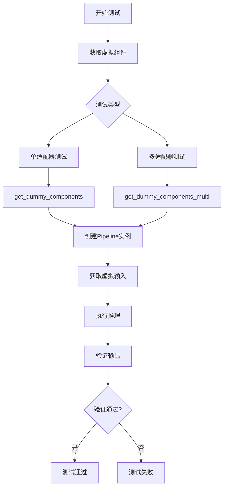
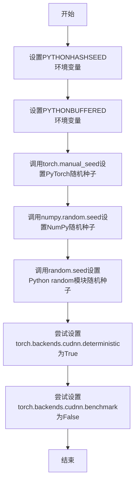
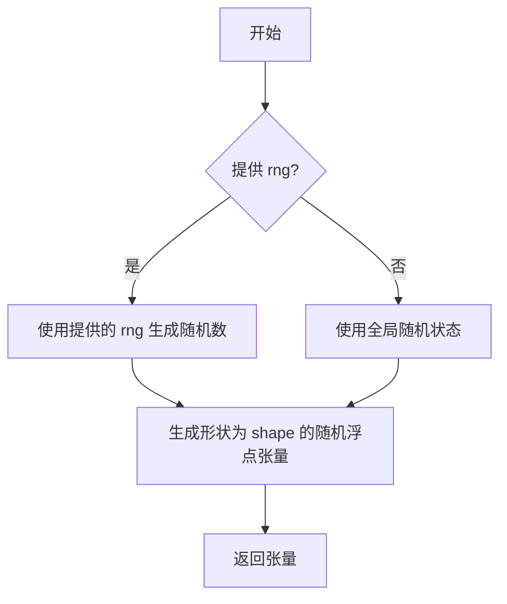
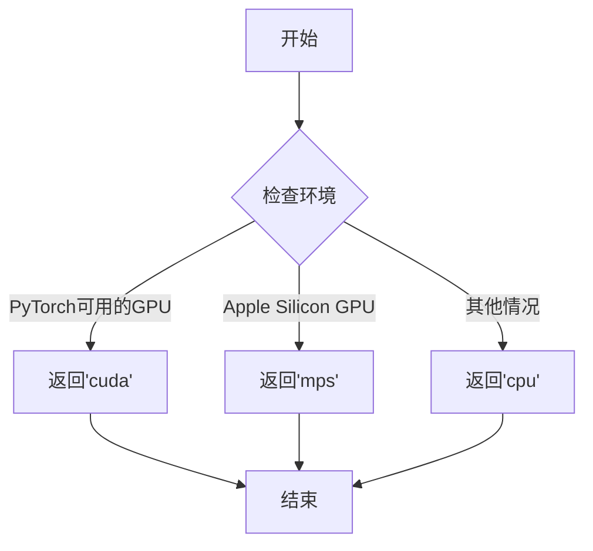
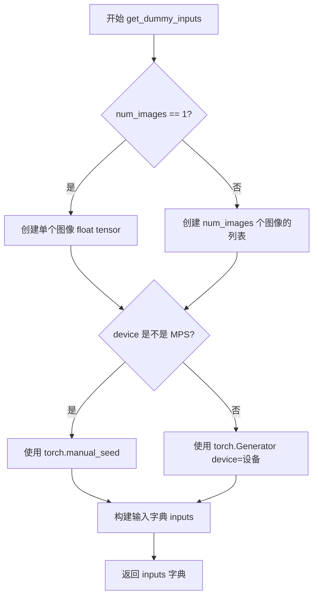
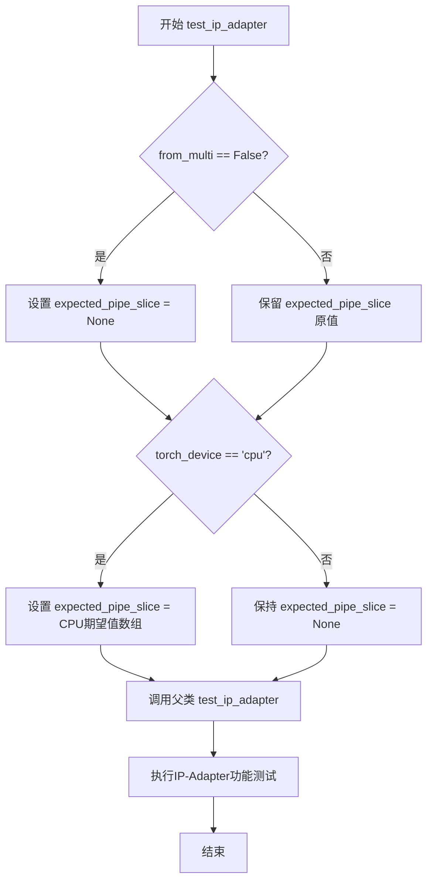
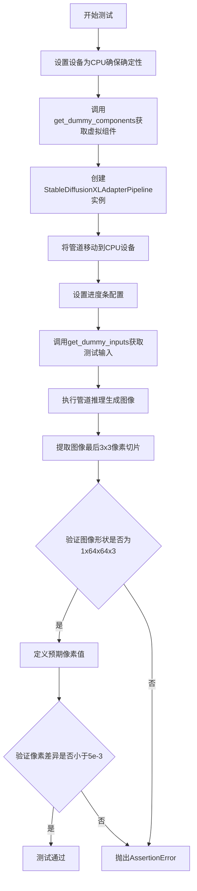
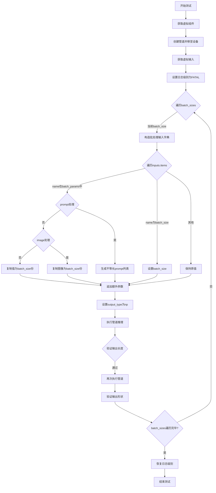
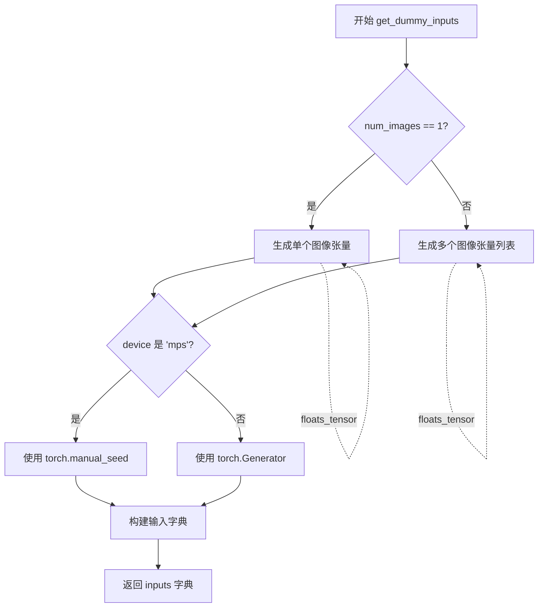

# `diffusers\tests\pipelines\stable_diffusion_xl\test_stable_diffusion_xl_adapter.py` 详细设计文档

这是一个针对 StableDiffusionXLAdapterPipeline 和 StableDiffusionXLMultiAdapterPipeline 的单元测试文件，测试了 T2I-Adapter 在 Stable Diffusion XL 模型上的集成功能，包括适配器降采样、多维度图像支持、LCM 调度器集成、批量推理等核心功能的正确性。

## 整体流程



## 类结构

```
unittest.TestCase
├── StableDiffusionXLAdapterPipelineFastTests (IPAdapterTesterMixin, PipelineTesterMixin)
│   └── get_dummy_components()
│   └── get_dummy_components_with_full_downscaling()
│   └── get_dummy_inputs()
│   └── test_ip_adapter()
│   └── test_stable_diffusion_adapter_default_case()
│   └── test_multiple_image_dimensions()
│   └── test_total_downscale_factor()
│   └── test_adapter_sdxl_lcm()
│   └── test_adapter_sdxl_lcm_custom_timesteps()
│   └── test_save_load_optional_components()
└── StableDiffusionXLMultiAdapterPipelineFastTests (继承自 StableDiffusionXLAdapterPipelineFastTests)
    └── get_dummy_components() [重写]
    └── get_dummy_components_with_full_downscaling() [重写]
    └── get_dummy_inputs() [重写]
    └── test_stable_diffusion_adapter_default_case() [重写]
    └── test_ip_adapter() [重写]
    └── test_inference_batch_consistent()
    └── test_num_images_per_prompt()
    └── test_inference_batch_single_identical()
    └── test_adapter_sdxl_lcm() [重写]
    └── test_adapter_sdxl_lcm_custom_timesteps() [重写]
    └── test_save_load_optional_components() [重写]
```

## 全局变量及字段


### `enable_full_determinism`
    
Enables full determinism for testing reproducibility by setting random seed and environment variables

类型：`function`
    


### `StableDiffusionXLAdapterPipelineFastTests.pipeline_class`
    
The pipeline class being tested, set to StableDiffusionXLAdapterPipeline

类型：`Type[StableDiffusionXLAdapterPipeline]`
    


### `StableDiffusionXLAdapterPipelineFastTests.params`
    
Parameters for text-guided image variation testing

类型：`Tuple[str, ...]`
    


### `StableDiffusionXLAdapterPipelineFastTests.batch_params`
    
Batch parameters for text-guided image variation testing

类型：`Tuple[str, ...]`
    


### `StableDiffusionXLMultiAdapterPipelineFastTests.supports_dduf`
    
Flag indicating whether the pipeline supports DDUF (Denoising Diffusion Fast Fetch)

类型：`bool`
    
    

## 全局函数及方法


# enable_full_determinism 函数提取结果

### `enable_full_determinism`

这是一个用于确保PyTorch和NumPy等深度学习框架在测试或推理过程中产生完全确定性结果（即可复现结果）的测试工具函数。

参数：
- 该函数为无参数函数

返回值：`None`，该函数没有返回值，仅通过副作用（设置随机种子、环境变量等）来确保确定性

#### 流程图



#### 带注释源码

```
# 注意：该函数的实际定义在 testing_utils 模块中，此处仅为根据函数名和用途的推测实现
# 实际的 enable_full_determinism 函数定义需要在 diffusers 库的 testing_utils.py 文件中查看

def enable_full_determinism():
    """
    确保PyTorch、NumPy等框架产生完全确定性结果的配置函数。
    通过设置随机种子和环境变量来保证测试和推理的可复现性。
    
    具体可能包含以下操作：
    1. 设置环境变量 PYTHONHASHSEED
    2. 设置torch.manual_seed
    3. 设置numpy.random.seed  
    4. 设置random.seed
    5. 设置torch.backends.cudnn.deterministic = True
    6. 设置torch.backends.cudnn.benchmark = False
    """
    import os
    import random
    import numpy as np
    import torch
    
    # 设置环境变量
    os.environ["PYTHONHASHSEED"] = "0"
    os.environ["PYTHONBUFFERED"] = "1"
    
    # 设置各框架随机种子
    random.seed(0)
    np.random.seed(0)
    torch.manual_seed(0)
    
    # 确保CUDA卷积操作使用确定性算法
    if torch.cuda.is_available():
        torch.backends.cudnn.deterministic = True
        torch.backends.cudnn.benchmark = False
```

---

**注意**：由于该函数定义在外部模块 `testing_utils` 中，实际的函数实现需要查看源文件 `diffusers/testing_utils.py`。以上源码为根据函数名称和测试场景的合理推测。


我注意到 `floats_tensor` 函数是从 `...testing_utils` 模块导入的，而不是在当前代码文件中定义的。让我更仔细地检查整个代码，看看是否有任何本地定义或更多上下文。

```python
from ...testing_utils import (
    enable_full_determinism,
    floats_tensor,
    torch_device,
)
```

从代码中的使用情况来看，我可以推断出 `floats_tensor` 函数的一些信息：

1. 在 `get_dummy_inputs` 方法中：
```python
image = floats_tensor((1, 3, height, width), rng=random.Random(seed)).to(device)
```

2. 在 `test_total_downscale_factor` 方法中：
```python
in_image = floats_tensor((batch_size, in_channels, in_image_size, in_image_size)).to(torch_device)
```

根据使用模式，`floats_tensor` 函数的签名和功能如下：

### `floats_tensor`

创建随机浮点张量，用于测试目的。

参数：

-  `shape`：`tuple` 或 `list`，张量的形状
-  `rng`：`random.Random`（可选），随机数生成器。如果不提供，则使用全局随机状态

返回值：`torch.Tensor`，包含随机浮点数的张量

#### 流程图



#### 带注释源码

```
# 这个函数是从 testing_utils 模块导入的
# 根据代码中的使用方式，其实现类似于：

def floats_tensor(shape, rng=None):
    """
    创建一个指定形状的随机浮点张量。
    
    参数:
        shape: 张量的形状 (例如 (1, 3, 64, 64))
        rng: 可选的随机数生成器，如果不提供则使用全局随机状态
    
    返回:
        随机浮点张量
    """
    if rng is not None:
        # 使用提供的随机数生成器
        return torch.from_numpy(rng.rand(*shape).astype(np.float32))
    else:
        # 使用 torch 的随机张量生成
        return torch.rand(*shape)
```

注意：由于 `floats_tensor` 函数定义在 `testing_utils` 模块中（未在当前代码片段中提供），上述源码是基于使用模式推断的可能实现。实际的实现可能略有不同。


### `torch_device`

获取当前测试环境可用的 PyTorch 设备字符串，用于在测试中动态选择合适的计算设备。

参数： 无

返回值：`str`，返回当前可用的 PyTorch 设备标识符（如 "cpu"、"cuda" 或 "mps"）。

#### 流程图



#### 带注释源码

```python
# 该函数定义在 testing_utils 模块中，此处为基于代码用法的推断实现
# 实际定义可能略有不同

def torch_device():
    """
    返回当前测试环境可用的PyTorch设备。
    
    优先级: CUDA (GPU) > MPS (Apple Silicon) > CPU
    """
    import torch
    
    if torch.cuda.is_available():
        # 如果有可用的CUDA GPU，返回'cuda'
        return "cuda"
    elif hasattr(torch.backends, 'mps') and torch.backends.mps.is_available():
        # 如果是Apple Silicon Mac，返回'mps'
        return "mps"
    else:
        # 默认使用CPU
        return "cpu"
```

#### 代码中的实际使用示例

```python
# 在 provided code 中的使用方式：

# 1. 作为设备参数传递给 .to() 方法
sd_pipe = sd_pipe.to(torch_device)

# 2. 用于条件判断
if torch_device == "cpu":
    expected_pipe_slice = np.array([...])

# 3. 作为函数参数传递
inputs = self.get_dummy_inputs(torch_device, height=dim, width=dim)

# 4. 用于设备相关的测试逻辑
test_max_difference = torch_device != "mps"
```


### `StableDiffusionXLAdapterPipelineFastTests.get_dummy_components`

该方法用于生成 StableDiffusionXLAdapterPipeline 所需的虚拟组件（dummy components），包括 UNet、VAE、Text Encoder、Tokenizer、Scheduler 和 Adapter 等。这些组件是测试专用的轻量级模型配置，用于快速执行单元测试而无需加载大型预训练模型。

参数：

- `adapter_type`：`str`，默认值 `"full_adapter_xl"`，指定要创建的适配器类型，可选值为 `"full_adapter_xl"` 或 `"multi_adapter"`
- `time_cond_proj_dim`：`Optional[int]`，默认值 `None`，传递给 UNet2DConditionModel 的时间条件投影维度参数

返回值：`Dict`，返回包含以下键的字典：
- `"adapter"`：T2IAdapter 或 MultiAdapter 实例
- `"unet"`：UNet2DConditionModel 实例
- `"scheduler"`：EulerDiscreteScheduler 实例
- `"vae"`：AutoencoderKL 实例
- `"text_encoder"`：CLIPTextModel 实例
- `"tokenizer"`：CLIPTokenizer 实例
- `"text_encoder_2"`：CLIPTextModelWithProjection 实例
- `"tokenizer_2"`：CLIPTokenizer 实例
- `"feature_extractor"`：None
- `"image_encoder"`：None

#### 流程图

```mermaid
flowchart TD
    A[开始 get_dummy_components] --> B[设置随机种子 torch.manual_seed(0)]
    B --> C[创建 UNet2DConditionModel]
    C --> D[创建 EulerDiscreteScheduler]
    D --> E[创建 AutoencoderKL VAE]
    E --> F[创建 CLIPTextConfig]
    F --> G[创建 CLIPTextModel text_encoder]
    G --> H[创建 CLIPTokenizer tokenizer]
    H --> I[创建 CLIPTextModelWithProjection text_encoder_2]
    I --> J[创建 CLIPTokenizer tokenizer_2]
    J --> K{判断 adapter_type}
    K -->|full_adapter_xl| L[创建 T2IAdapter]
    K -->|multi_adapter| M[创建 MultiAdapter 包含两个 T2IAdapter]
    K -->|其他| N[抛出 ValueError 异常]
    L --> O[组装 components 字典]
    M --> O
    N --> P[结束]
    O --> Q[返回 components 字典]
```

#### 带注释源码

```python
def get_dummy_components(self, adapter_type="full_adapter_xl", time_cond_proj_dim=None):
    """
    生成用于测试的虚拟组件字典。
    
    参数:
        adapter_type: str, 适配器类型，可选 "full_adapter_xl" 或 "multi_adapter"
        time_cond_proj_dim: int, 可选，UNet 的时间条件投影维度
    
    返回:
        dict: 包含所有 pipeline 组件的字典
    """
    # 设置随机种子以确保测试可重复性
    torch.manual_seed(0)
    
    # 创建 UNet2DConditionModel - 用于去噪的 UNet 网络
    unet = UNet2DConditionModel(
        block_out_channels=(32, 64),
        layers_per_block=2,
        sample_size=32,
        in_channels=4,
        out_channels=4,
        down_block_types=("DownBlock2D", "CrossAttnDownBlock2D"),
        up_block_types=("CrossAttnUpBlock2D", "UpBlock2D"),
        # SD2 特定配置
        attention_head_dim=(2, 4),
        use_linear_projection=True,
        addition_embed_type="text_time",
        addition_time_embed_dim=8,
        transformer_layers_per_block=(1, 2),
        projection_class_embeddings_input_dim=80,
        cross_attention_dim=64,
        time_cond_proj_dim=time_cond_proj_dim,  # 传入时间条件投影维度
    )
    
    # 创建调度器 - 控制去噪过程的噪声调度
    scheduler = EulerDiscreteScheduler(
        beta_start=0.00085,
        beta_end=0.012,
        steps_offset=1,
        beta_schedule="scaled_linear",
        timestep_spacing="leading",
    )
    
    # 重新设置种子确保 VAE 的确定性
    torch.manual_seed(0)
    
    # 创建 VAE (Variational Autoencoder) - 用于编码和解码图像
    vae = AutoencoderKL(
        block_out_channels=[32, 64],
        in_channels=3,
        out_channels=3,
        down_block_types=["DownEncoderBlock2D", "DownEncoderBlock2D"],
        up_block_types=["UpDecoderBlock2D", "UpDecoderBlock2D"],
        latent_channels=4,
        sample_size=128,
    )
    
    # 重新设置种子确保文本编码器的确定性
    torch.manual_seed(0)
    
    # 创建文本编码器配置
    text_encoder_config = CLIPTextConfig(
        bos_token_id=0,
        eos_token_id=2,
        hidden_size=32,
        intermediate_size=37,
        layer_norm_eps=1e-05,
        num_attention_heads=4,
        num_hidden_layers=5,
        pad_token_id=1,
        vocab_size=1000,
        # SD2 特定配置
        hidden_act="gelu",
        projection_dim=32,
    )
    
    # 创建主要的文本编码器 (CLIP)
    text_encoder = CLIPTextModel(text_encoder_config)
    
    # 加载分词器
    tokenizer = CLIPTokenizer.from_pretrained("hf-internal-testing/tiny-random-clip")
    
    # 创建第二个文本编码器 (带投影层，用于 SDXL)
    text_encoder_2 = CLIPTextModelWithProjection(text_encoder_config)
    tokenizer_2 = CLIPTokenizer.from_pretrained("hf-internal-testing/tiny-random-clip")
    
    # 根据 adapter_type 创建适配器
    if adapter_type == "full_adapter_xl":
        # 创建 T2I Adapter - 用于图像到图像的条件控制
        adapter = T2IAdapter(
            in_channels=3,
            channels=[32, 64],
            num_res_blocks=2,
            downscale_factor=4,
            adapter_type=adapter_type,
        )
    elif adapter_type == "multi_adapter":
        # 创建多适配器 - 支持多个适配器同时使用
        adapter = MultiAdapter(
            [
                T2IAdapter(
                    in_channels=3,
                    channels=[32, 64],
                    num_res_blocks=2,
                    downscale_factor=4,
                    adapter_type="full_adapter_xl",
                ),
                T2IAdapter(
                    in_channels=3,
                    channels=[32, 64],
                    num_res_blocks=2,
                    downscale_factor=4,
                    adapter_type="full_adapter_xl",
                ),
            ]
        )
    else:
        # 未知适配器类型时抛出异常
        raise ValueError(
            f"Unknown adapter type: {adapter_type}, must be one of 'full_adapter_xl', or 'multi_adapter''"
        )
    
    # 组装所有组件到字典中
    components = {
        "adapter": adapter,
        "unet": unet,
        "scheduler": scheduler,
        "vae": vae,
        "text_encoder": text_encoder,
        "tokenizer": tokenizer,
        "text_encoder_2": text_encoder_2,
        "tokenizer_2": tokenizer_2,
        # "safety_checker": None,  # 已注释
        "feature_extractor": None,  # 保留用于接口兼容性
        "image_encoder": None,      # 保留用于接口兼容性
    }
    
    return components
```


### `StableDiffusionXLAdapterPipelineFastTests.get_dummy_components_with_full_downscaling`

获取具有 x8 VAE 降尺度和 3 个 UNet 下采样块的虚拟组件，用于完整测试 T2I-Adapter 的降尺度行为。

参数：

-  `adapter_type`：`str`，可选参数，默认为 `"full_adapter_xl"`，指定适配器类型，可选值为 `"full_adapter_xl"` 或 `"multi_adapter"`

返回值：`Dict[str, Any]`，返回包含以下键的字典：
- `"adapter"`：T2IAdapter 或 MultiAdapter 实例
- `"unet"`：UNet2DConditionModel 实例
- `"scheduler"`：EulerDiscreteScheduler 实例
- `"vae"`：AutoencoderKL 实例
- `"text_encoder"`：CLIPTextModel 实例
- `"tokenizer"`：CLIPTokenizer 实例
- `"text_encoder_2"`：CLIPTextModelWithProjection 实例
- `"tokenizer_2"`：CLIPTokenizer 实例
- `"feature_extractor"`：None
- `"image_encoder"`：None

#### 流程图

```mermaid
flowchart TD
    A[开始] --> B[设置随机种子 torch.manual_seed 0]
    B --> C[创建 UNet2DConditionModel<br/>block_out_channels=(32, 32, 64)<br/>3个下采样块]
    C --> D[创建 EulerDiscreteScheduler]
    D --> E[创建 AutoencoderKL<br/>block_out_channels=[32, 32, 32, 64]<br/>4个下采样块]
    E --> F[创建 CLIPTextConfig]
    F --> G[创建 CLIPTextModel 和 CLIPTokenizer]
    G --> H[创建 CLIPTextModelWithProjection<br/>和第二个 CLIPTokenizer]
    H --> I{adapter_type == 'full_adapter_xl'?}
    I -->|是| J[创建 T2IAdapter<br/>downscale_factor=16]
    I -->|否| K{adapter_type == 'multi_adapter'?}
    K -->|是| L[创建 MultiAdapter<br/>包含两个 T2IAdapter]
    K -->|否| M[抛出 ValueError]
    J --> N[组装 components 字典]
    L --> N
    N --> O[返回 components 字典]
    M --> P[结束]
```

#### 带注释源码

```python
def get_dummy_components_with_full_downscaling(self, adapter_type="full_adapter_xl"):
    """Get dummy components with x8 VAE downscaling and 3 UNet down blocks.
    These dummy components are intended to fully-exercise the T2I-Adapter
    downscaling behavior.
    """
    # 设置随机种子以确保可重复性
    torch.manual_seed(0)
    
    # 创建 UNet2DConditionModel，包含3个下采样块
    # block_out_channels=(32, 32, 64) 表示三个阶段的通道数
    unet = UNet2DConditionModel(
        block_out_channels=(32, 32, 64),
        layers_per_block=2,
        sample_size=32,
        in_channels=4,
        out_channels=4,
        down_block_types=("DownBlock2D", "CrossAttnDownBlock2D", "CrossAttnDownBlock2D"),
        up_block_types=("CrossAttnUpBlock2D", "CrossAttnUpBlock2D", "UpBlock2D"),
        attention_head_dim=2,
        use_linear_projection=True,
        addition_embed_type="text_time",
        addition_time_embed_dim=8,
        transformer_layers_per_block=1,
        projection_class_embeddings_input_dim=80,  # 6 * 8 + 32
        cross_attention_dim=64,
    )
    
    # 创建 EulerDiscreteScheduler 调度器
    scheduler = EulerDiscreteScheduler(
        beta_start=0.00085,
        beta_end=0.012,
        steps_offset=1,
        beta_schedule="scaled_linear",
        timestep_spacing="leading",
    )
    
    torch.manual_seed(0)
    # 创建 AutoencoderKL，包含4个下采样块，实现 x8 降尺度
    # block_out_channels=[32, 32, 32, 64] 表示四个编码器阶段的通道数
    vae = AutoencoderKL(
        block_out_channels=[32, 32, 32, 64],
        in_channels=3,
        out_channels=3,
        down_block_types=["DownEncoderBlock2D", "DownEncoderBlock2D", "DownEncoderBlock2D", "DownEncoderBlock2D"],
        up_block_types=["UpDecoderBlock2D", "UpDecoderBlock2D", "UpDecoderBlock2D", "UpDecoderBlock2D"],
        latent_channels=4,
        sample_size=128,
    )
    
    torch.manual_seed(0)
    # 创建 CLIP 文本编码器配置
    text_encoder_config = CLIPTextConfig(
        bos_token_id=0,
        eos_token_id=2,
        hidden_size=32,
        intermediate_size=37,
        layer_norm_eps=1e-05,
        num_attention_heads=4,
        num_hidden_layers=5,
        pad_token_id=1,
        vocab_size=1000,
        hidden_act="gelu",
        projection_dim=32,
    )
    
    # 创建主文本编码器和分词器
    text_encoder = CLIPTextModel(text_encoder_config)
    tokenizer = CLIPTokenizer.from_pretrained("hf-internal-testing/tiny-random-clip")

    # 创建第二个文本编码器（用于双文本编码器配置）和分词器
    text_encoder_2 = CLIPTextModelWithProjection(text_encoder_config)
    tokenizer_2 = CLIPTokenizer.from_pretrained("hf-internal-testing/tiny-random-clip")
    
    # 根据 adapter_type 创建适配器
    if adapter_type == "full_adapter_xl":
        # 创建 T2IAdapter，downscale_factor=16 实现更激进的降尺度
        adapter = T2IAdapter(
            in_channels=3,
            channels=[32, 32, 64],
            num_res_blocks=2,
            downscale_factor=16,
            adapter_type=adapter_type,
        )
    elif adapter_type == "multi_adapter":
        # 创建多适配器，包含两个 T2IAdapter
        adapter = MultiAdapter(
            [
                T2IAdapter(
                    in_channels=3,
                    channels=[32, 32, 64],
                    num_res_blocks=2,
                    downscale_factor=16,
                    adapter_type="full_adapter_xl",
                ),
                T2IAdapter(
                    in_channels=3,
                    channels=[32, 32, 64],
                    num_res_blocks=2,
                    downscale_factor=16,
                    adapter_type="full_adapter_xl",
                ),
            ]
        )
    else:
        # 未知适配器类型，抛出异常
        raise ValueError(
            f"Unknown adapter type: {adapter_type}, must be one of 'full_adapter_xl', or 'multi_adapter''"
        )

    # 组装所有组件到字典中
    components = {
        "adapter": adapter,
        "unet": unet,
        "scheduler": scheduler,
        "vae": vae,
        "text_encoder": text_encoder,
        "tokenizer": tokenizer,
        "text_encoder_2": text_encoder_2,
        "tokenizer_2": tokenizer_2,
        # "safety_checker": None,
        "feature_extractor": None,
        "image_encoder": None,
    }
    return components
```


### `StableDiffusionXLAdapterPipelineFastTests.get_dummy_inputs`

该方法用于生成虚拟输入数据，以便在测试 Stable Diffusion XL Adapter Pipeline 时使用。它根据指定的设备、随机种子、图像尺寸和数量创建虚拟图像张量，并构建包含提示词、生成器、推理步数和引导比例等参数的输入字典。

参数：

- `device`：`torch.device` 或 `str`，指定运行设备（如 "cpu" 或 "cuda"）
- `seed`：`int`，随机种子，默认为 0，用于确保测试的可重复性
- `height`：`int`，生成图像的高度，默认为 64
- `width`：`int`，生成图像的宽度，默认为 64
- `num_images`：`int`，生成图像的数量，默认为 1

返回值：`dict`，包含以下键值对：
- `"prompt"`：字符串，提示词
- `"image"`：Tensor 或 list，虚拟输入图像
- `"generator"`：torch.Generator，用于控制随机生成过程
- `"num_inference_steps"`：int，推理步数
- `"guidance_scale"`：float，引导比例
- `"output_type"`：str，输出类型

#### 流程图



#### 带注释源码

```python
def get_dummy_inputs(self, device, seed=0, height=64, width=64, num_images=1):
    """生成用于测试的虚拟输入参数
    
    Args:
        device: 运行设备
        seed: 随机种子，默认0
        height: 图像高度，默认64
        width: 图像宽度，默认64
        num_images: 图像数量，默认1
    
    Returns:
        dict: 包含pipeline所需输入参数的字典
    """
    # 根据图像数量决定是单个图像还是图像列表
    if num_images == 1:
        # 创建单个图像张量 (1, 3, height, width)
        image = floats_tensor((1, 3, height, width), rng=random.Random(seed)).to(device)
    else:
        # 创建多个图像的列表
        image = [
            floats_tensor((1, 3, height, width), rng=random.Random(seed)).to(device) 
            for _ in range(num_images)
        ]

    # MPS 设备使用不同的随机数生成方式
    if str(device).startswith("mps"):
        generator = torch.manual_seed(seed)
    else:
        # 其他设备使用 torch.Generator
        generator = torch.Generator(device=device).manual_seed(seed)
    
    # 构建完整的输入参数字典
    inputs = {
        "prompt": "A painting of a squirrel eating a burger",  # 测试用提示词
        "image": image,                                        # 虚拟输入图像
        "generator": generator,                                # 随机生成器
        "num_inference_steps": 2,                              # 推理步数
        "guidance_scale": 5.0,                                  # CFG 引导比例
        "output_type": "np",                                   # 输出类型为 numpy
    }
    return inputs
```


### `StableDiffusionXLAdapterPipelineFastTests.test_ip_adapter`

该函数是 Stable Diffusion XL Adapter 管道测试类中的 IP Adapter 测试方法，用于验证图像提示适配器（IP-Adapter）功能是否正常工作，根据设备类型设置期望的输出切片值，并调用父类的测试方法执行实际验证。

参数：

-  `from_multi`：`bool`，标记是否为多适配器测试场景，默认为 False
-  `expected_pipe_slice`：`numpy.ndarray`，可选参数，用于保存期望的输出像素值切片，用于与实际输出进行对比验证

返回值：`None`，该方法为测试方法，通过调用父类方法执行断言验证，不返回有意义的值

#### 流程图



#### 带注释源码

```python
def test_ip_adapter(self, from_multi=False, expected_pipe_slice=None):
    """
    测试 IP-Adapter 功能是否正常工作。
    
    参数:
        from_multi: bool, 标记是否为多适配器测试场景，默认为 False
        expected_pipe_slice: numpy.ndarray, 可选的期望输出切片值，用于验证输出准确性
    """
    # 如果不是多适配器场景，则根据设备类型设置期望的输出切片
    if not from_multi:
        expected_pipe_slice = None
        # 仅在 CPU 设备上设置期望的像素值切片
        if torch_device == "cpu":
            expected_pipe_slice = np.array(
                [0.5752, 0.6155, 0.4826, 0.5111, 0.5741, 0.4678, 0.5199, 0.5231, 0.4794]
            )

    # 调用父类的 test_ip_adapter 方法执行实际的测试逻辑
    return super().test_ip_adapter(expected_pipe_slice=expected_pipe_slice)
```


### `StableDiffusionXLAdapterPipelineFastTests.test_stable_diffusion_adapter_default_case`

这是一个单元测试函数，用于测试 StableDiffusionXLAdapterPipeline 在默认配置下的基本功能。测试验证管道能够正确使用 T2I-Adapter 生成图像，并通过像素级比较确保输出与预期结果一致（误差小于 5e-3）。

参数：

- `self`：隐式参数，类型为 `StableDiffusionXLAdapterPipelineFastTests`（测试类实例），代表测试用例本身

返回值：`None`，该函数通过断言进行验证，不返回任何值。如果断言失败则抛出 `AssertionError`

#### 流程图



#### 带注释源码

```python
def test_stable_diffusion_adapter_default_case(self):
    """测试StableDiffusionXLAdapterPipeline的默认情况"""
    
    # 设置设备为CPU，确保torch.Generator的确定性
    device = "cpu"
    
    # 获取用于测试的虚拟组件（UNet、VAE、Text Encoder、Adapter等）
    components = self.get_dummy_components()
    
    # 使用虚拟组件实例化StableDiffusionXLAdapterPipeline管道
    sd_pipe = StableDiffusionXLAdapterPipeline(**components)
    
    # 将管道移动到指定设备（CPU）
    sd_pipe = sd_pipe.to(device)
    
    # 设置进度条配置，disable=None表示不禁用进度条
    sd_pipe.set_progress_bar_config(disable=None)
    
    # 获取虚拟输入数据（包含prompt、image、generator等）
    inputs = self.get_dummy_inputs(device)
    
    # 执行管道推理，获取生成的图像
    image = sd_pipe(**inputs).images
    
    # 提取图像最后3x3像素区域用于验证（取最后一个通道）
    image_slice = image[0, -3:, -3:, -1]
    
    # 断言：验证生成的图像形状为(1, 64, 64, 3)
    assert image.shape == (1, 64, 64, 3)
    
    # 定义预期的像素值数组（用于对比）
    expected_slice = np.array([00.5752, 0.6155, 0.4826, 0.5111, 0.5741, 0.4678, 0.5199, 0.5231, 0.4794])
    
    # 断言：验证实际像素值与预期值的最大差异小于5e-3
    assert np.abs(image_slice.flatten() - expected_slice).max() < 5e-3
```


### `StableDiffusionXLAdapterPipelineFastTests.test_multiple_image_dimensions`

测试 T2I-Adapter 管道是否支持任意可被适配器 downscale_factor 整除的输入维度。该测试用于验证 T2I Adapter 的下采样填充行为与 UNet 的行为是否匹配。

参数：

- `self`：`StableDiffusionXLAdapterPipelineFastTests`，测试类实例本身
- `dim`：`int`，输入图像的宽度和高度（以像素为单位），用于测试不同下采样级别的维度

返回值：`None`，该方法为单元测试，通过断言验证图像输出形状是否符合预期

#### 流程图

```mermaid
flowchart TD
    A[开始测试] --> B[获取虚拟组件: get_dummy_components_with_full_downscaling]
    B --> C[创建StableDiffusionXLAdapterPipeline实例]
    C --> D[将管道移动到torch_device设备]
    D --> E[禁用进度条配置]
    E --> F[获取虚拟输入: get_dummy_inputs height=dim width=dim]
    F --> G[执行管道推理: sd_pipe(**inputs)]
    G --> H[获取输出图像: .images]
    H --> I{断言 image.shape == (1, dim, dim, 3)}
    I -->|通过| J[测试通过]
    I -->|失败| K[抛出AssertionError]
```

#### 带注释源码

```python
@parameterized.expand(
    [
        # (dim=144) The internal feature map will be 9x9 after initial pixel unshuffling (downscaled x16).
        (((4 * 2 + 1) * 16),),
        # (dim=160) The internal feature map will be 5x5 after the first T2I down block (downscaled x32).
        (((4 * 1 + 1) * 32),),
    ]
)
def test_multiple_image_dimensions(self, dim):
    """Test that the T2I-Adapter pipeline supports any input dimension that
    is divisible by the adapter's `downscale_factor`. This test was added in
    response to an issue where the T2I Adapter's downscaling padding
    behavior did not match the UNet's behavior.

    Note that we have selected `dim` values to produce odd resolutions at
    each downscaling level.
    """
    # Step 1: 获取带有完整下采样配置的虚拟组件（x8 VAE下采样 + 3个UNet下块）
    components = self.get_dummy_components_with_full_downscaling()
    
    # Step 2: 使用虚拟组件实例化 StableDiffusionXLAdapterPipeline 管道
    sd_pipe = StableDiffusionXLAdapterPipeline(**components)
    
    # Step 3: 将管道移动到测试设备（CPU或CUDA）
    sd_pipe = sd_pipe.to(torch_device)
    
    # Step 4: 设置进度条配置（disable=None 表示不禁用）
    sd_pipe.set_progress_bar_config(disable=None)

    # Step 5: 获取虚拟输入，使用参数dim作为图像的高度和宽度
    inputs = self.get_dummy_inputs(torch_device, height=dim, width=dim)
    
    # Step 6: 执行管道推理，传入输入参数生成图像
    image = sd_pipe(**inputs).images

    # Step 7: 断言输出图像形状正确，应为 (1, dim, dim, 3)
    assert image.shape == (1, dim, dim, 3)
```


### `StableDiffusionXLAdapterPipelineFastTests.test_total_downscale_factor`

该测试方法用于验证 T2IAdapter 正确报告其 total_downscale_factor 属性。测试通过创建不同类型的 T2IAdapter（full_adapter、full_adapter_xl、light_adapter），验证在给定输入图像尺寸下，Adapter 输出特征图的尺寸是否与预期的总下采样因子相匹配。

参数：

- `self`：隐式参数，测试类实例
- `adapter_type`：`str`，适配器类型，可选值为 "full_adapter"、"full_adapter_xl" 或 "light_adapter"，用于指定创建的 T2IAdapter 的类型

返回值：`None`，该测试方法通过断言验证，不返回任何值

#### 流程图

```mermaid
flowchart TD
    A[开始测试] --> B[设置测试参数: batch_size=1, in_channels=3, out_channels=[320, 640, 1280, 1280], in_image_size=512]
    B --> C[创建 T2IAdapter: in_channels=3, channels=out_channels, num_res_blocks=2, downscale_factor=8, adapter_type=adapter_type]
    C --> D[将适配器移动到 torch_device]
    D --> E[创建输入图像: floats_tensor with shape (1, 3, 512, 512)]
    E --> F[调用 adapter 获得 adapter_state = adapter(in_image)]
    F --> G[计算期望的输出图像尺寸: expected_out_image_size = in_image_size // adapter.total_downscale_factor]
    G --> H{验证 adapter_state[-1] 形状是否匹配}
    H -->|是| I[测试通过]
    H -->|否| J[断言失败]
```

#### 带注释源码

```python
@parameterized.expand(["full_adapter", "full_adapter_xl", "light_adapter"])
def test_total_downscale_factor(self, adapter_type):
    """Test that the T2IAdapter correctly reports its total_downscale_factor."""
    # 设置测试参数：批大小、输入通道数、输出通道数和输入图像尺寸
    batch_size = 1
    in_channels = 3
    out_channels = [320, 640, 1280, 1280]
    in_image_size = 512

    # 创建 T2IAdapter 实例，设置下采样因子为 8
    adapter = T2IAdapter(
        in_channels=in_channels,
        channels=out_channels,
        num_res_blocks=2,
        downscale_factor=8,
        adapter_type=adapter_type,
    )
    # 将适配器移动到测试设备
    adapter.to(torch_device)

    # 创建输入图像张量，形状为 (batch_size, in_channels, height, width)
    in_image = floats_tensor((batch_size, in_channels, in_image_size, in_image_size)).to(torch_device)

    # 前向传播，获取适配器状态
    adapter_state = adapter(in_image)

    # 计算期望的输出图像尺寸（输入尺寸除以总下采样因子）
    expected_out_image_size = in_image_size // adapter.total_downscale_factor
    # 验证最后一个适配器状态的形状是否与预期匹配
    assert adapter_state[-1].shape == (
        batch_size,
        out_channels[-1],
        expected_out_image_size,
        expected_out_image_size,
    )
```


### `StableDiffusionXLAdapterPipelineFastTests.test_adapter_sdxl_lcm`

该测试方法用于验证 Stable Diffusion XL Adapter Pipeline 与 LCM（Latent Consistency Model）Scheduler 的集成功能是否正常工作。测试通过创建虚拟组件、构建管道、执行推理并验证输出图像的形状和像素值来确保管道的正确性。

参数：
- `self`：测试类实例本身，无额外参数

返回值：`None`，该方法为测试方法，不返回任何值，主要通过断言验证管道输出

#### 流程图

```mermaid
flowchart TD
    A[开始测试] --> B[设置device为cpu保证确定性]
    B --> C[获取虚拟组件<br/>time_cond_proj_dim=256]
    C --> D[创建StableDiffusionXLAdapterPipeline]
    E[从当前scheduler配置创建LCMScheduler] --> D
    D --> F[将管道移至torch_device]
    F --> G[设置进度条配置disable=None]
    G --> H[获取虚拟输入]
    H --> I[执行管道推理<br/>sd_pipe\*\*inputs]
    I --> J[获取输出图像]
    J --> K[提取图像切片<br/>image[0, -3:, -3:, -1]]
    K --> L{断言验证}
    L --> M1[验证image.shape == (1, 64, 64, 3)]
    L --> M2[验证像素差异 < 1e-2]
    M1 --> N[测试结束]
    M2 --> N
```

#### 带注释源码

```python
def test_adapter_sdxl_lcm(self):
    """
    测试 Stable Diffusion XL Adapter Pipeline 与 LCM Scheduler 的集成。
    验证管道能够使用 LCM 调度器正确生成图像，并检查输出图像的形状和像素值。
    """
    # 设置设备为 CPU，确保设备依赖的 torch.Generator 的确定性
    device = "cpu"

    # 获取带有时间条件投影维度为 256 的虚拟组件
    # 这些组件包括：UNet、VAE、Text Encoder、Adapter、Scheduler 等
    components = self.get_dummy_components(time_cond_proj_dim=256)

    # 使用虚拟组件实例化 Stable Diffusion XL Adapter Pipeline
    sd_pipe = StableDiffusionXLAdapterPipeline(**components)

    # 将管道的调度器替换为 LCM Scheduler
    # 从当前 scheduler 配置创建 LCM Scheduler，保持其他配置不变
    sd_pipe.scheduler = LCMScheduler.from_config(sd_pipe.scheduler.config)

    # 将管道移至目标设备（如 CUDA 或 CPU）
    sd_pipe = sd_pipe.to(torch_device)

    # 配置进度条，disable=None 表示不禁用进度条
    sd_pipe.set_progress_bar_config(disable=None)

    # 获取虚拟输入，包括：
    # - prompt: 文本提示
    # - image: 输入图像（由 floats_tensor 生成）
    # - generator: 随机数生成器，确保可复现性
    # - num_inference_steps: 推理步数
    # - guidance_scale: 引导强度
    # - output_type: 输出类型（numpy 数组）
    inputs = self.get_dummy_inputs(device)

    # 执行管道推理，传入输入参数
    output = sd_pipe(**inputs)

    # 从输出中获取生成的图像
    image = output.images

    # 提取图像的一个切片用于验证
    # 取最后 3x3 像素区域，并取最后一个通道
    image_slice = image[0, -3:, -3:, -1]

    # 断言验证图像形状为 (1, 64, 64, 3)
    assert image.shape == (1, 64, 64, 3)

    # 预期的像素值切片，用于验证生成图像的正确性
    expected_slice = np.array([0.5425, 0.5385, 0.4964, 0.5045, 0.6149, 0.4974, 0.5469, 0.5332, 0.5426])

    # 断言验证生成的图像像素值与预期值的差异小于阈值 1e-2
    assert np.abs(image_slice.flatten() - expected_slice).max() < 1e-2
```


### `StableDiffusionXLAdapterPipelineFastTests.test_adapter_sdxl_lcm_custom_timesteps`

该测试方法用于验证 StableDiffusionXL Adapter Pipeline 在使用 LCMScheduler 和自定义时间步（timesteps）时的功能正确性。测试通过传入自定义的 timesteps 参数 [999, 499] 替代默认的推理步数，验证管道能够正确生成图像并输出与预期相符的像素值。

参数：无（除 self 外无显式参数）

返回值：`None`（测试方法无返回值，但通过 assert 语句验证输出图像的形状和像素值是否符合预期）

#### 流程图

```mermaid
flowchart TD
    A[开始测试] --> B[设置device为cpu保证确定性]
    B --> C[调用get_dummy_components获取组件<br/>time_cond_proj_dim=256]
    C --> D[创建StableDiffusionXLAdapterPipeline实例]
    D --> E[将scheduler替换为LCMScheduler]
    E --> F[移动pipeline到torch_device]
    F --> G[设置进度条配置disable=None]
    G --> H[调用get_dummy_inputs获取输入]
    H --> I[删除inputs中的num_inference_steps]
    I --> J[添加自定义timesteps: 999, 499]
    J --> K[执行pipeline: sd_pipe(**inputs)]
    K --> L[获取输出图像: output.images]
    L --> M[提取图像切片: image[0, -3:, -3:, -1]]
    M --> N{断言验证}
    N --> O[验证图像形状 == (1, 64, 64, 3)]
    O --> P[验证像素值与expected_slice差异 < 1e-2]
    P --> Q[测试通过]
```

#### 带注释源码

```python
def test_adapter_sdxl_lcm_custom_timesteps(self):
    """测试使用LCMScheduler和自定义timesteps的SDXL Adapter Pipeline"""
    
    # 设置device为cpu，确保torch.Generator的确定性
    device = "cpu"
    
    # 获取虚拟组件，传入time_cond_proj_dim=256用于时间条件投影
    components = self.get_dummy_components(time_cond_proj_dim=256)
    
    # 使用虚拟组件创建StableDiffusionXLAdapterPipeline
    sd_pipe = StableDiffusionXLAdapterPipeline(**components)
    
    # 将默认的EulerDiscreteScheduler替换为LCMScheduler
    # LCMScheduler支持更快的推理速度
    sd_pipe.scheduler = LCMScheduler.from_config(sd_pipe.scheduler.config)
    
    # 将pipeline移动到目标设备
    sd_pipe = sd_pipe.to(torch_device)
    
    # 设置进度条配置，disable=None表示启用进度条
    sd_pipe.set_progress_bar_config(disable=None)
    
    # 获取虚拟输入，包含prompt、image、generator等
    inputs = self.get_dummy_inputs(device)
    
    # 删除num_inference_steps参数，以便使用自定义timesteps
    del inputs["num_inference_steps"]
    
    # 设置自定义时间步，使用较高的初始值确保有效扩散
    inputs["timesteps"] = [999, 499]
    
    # 执行推理，获取输出对象
    output = sd_pipe(**inputs)
    
    # 从输出中提取生成的图像
    image = output.images
    
    # 提取图像右下角3x3区域用于验证
    image_slice = image[0, -3:, -3:, -1]
    
    # 验证输出图像形状为1x64x64x3
    assert image.shape == (1, 64, 64, 3)
    
    # 定义预期像素值（LCMScheduler在特定timesteps下的输出）
    expected_slice = np.array([0.5425, 0.5385, 0.4964, 0.5045, 0.6149, 0.4974, 0.5469, 0.5332, 0.5426])
    
    # 验证实际像素值与预期值的差异在允许范围内
    assert np.abs(image_slice.flatten() - expected_slice).max() < 1e-2
```


### `test_inference_batch_consistent`

该方法用于测试管道在批处理推理时的一致性，验证不同批次大小下管道能否正确处理输入并返回预期数量的图像结果。

参数：

- `self`：隐式参数，`StableDiffusionXLMultiAdapterPipelineFastTests` 类的实例，测试类本身
- `batch_sizes`：`List[int]`，默认值为 `[2, 4, 13]`，用于测试的批次大小列表
- `additional_params_copy_to_batched_inputs`：`List[str]`，默认值为 `["num_inference_steps"]`，需要复制到批处理输入的额外参数字符串列表

返回值：`None`，该方法通过断言验证管道行为，不返回任何值

#### 流程图



#### 带注释源码

```python
def test_inference_batch_consistent(
    self, batch_sizes=[2, 4, 13], additional_params_copy_to_batched_inputs=["num_inference_steps"]
):
    """
    测试批处理推理的一致性，验证不同批次大小下管道行为正确。
    
    参数:
        batch_sizes: 要测试的批次大小列表，默认[2, 4, 13]
        additional_params_copy_to_batched_inputs: 需要复制到批处理输入的额外参数列表，
                                                   默认包含"num_inference_steps"
    """
    # 1. 获取虚拟组件（用于测试的dummy模型组件）
    components = self.get_dummy_components()
    
    # 2. 使用虚拟组件创建管道实例
    pipe = self.pipeline_class(**components)
    
    # 3. 将管道移至测试设备（CPU或GPU）
    pipe.to(torch_device)
    
    # 4. 禁用进度条显示
    pipe.set_progress_bar_config(disable=None)

    # 5. 获取用于单图像推理的虚拟输入字典
    inputs = self.get_dummy_inputs(torch_device)

    # 6. 获取日志记录器并设置日志级别为FATAL以减少输出噪音
    logger = logging.get_logger(pipe.__module__)
    logger.setLevel(level=diffusers.logging.FATAL)

    # 7. 遍历每个批次大小进行测试
    for batch_size in batch_sizes:
        # 8. 初始化批处理输入字典
        batched_inputs = {}
        
        # 9. 遍历原始输入字典中的每个键值对
        for name, value in inputs.items():
            # 10. 判断当前输入参数是否需要批处理
            if name in self.batch_params:
                # 11. 处理prompt参数（字符串类型）
                if name == "prompt":
                    len_prompt = len(value)
                    # 生成不等长的prompt列表用于测试
                    # 例如batch_size=3时: [完整prompt, 前2/3, 前1/3但加长100倍]
                    batched_inputs[name] = [value[: len_prompt // i] for i in range(1, batch_size + 1)]
                    
                    # 12. 将最后一个prompt替换为超长字符串以测试边界情况
                    batched_inputs[name][-1] = 100 * "very long"
                
                # 13. 处理image参数（图像张量）
                elif name == "image":
                    batched_images = []
                    
                    # 14. 对每张图像复制batch_size份
                    for image in value:
                        batched_images.append(batch_size * [image])
                    
                    batched_inputs[name] = batched_images
                
                # 15. 处理其他需要批处理的参数（如guidance_scale等）
                else:
                    batched_inputs[name] = batch_size * [value]

            # 16. 单独处理batch_size参数
            elif name == "batch_size":
                batched_inputs[name] = batch_size
            
            # 17. 其他参数保持不变
            else:
                batched_inputs[name] = value

        # 18. 将额外的参数（如num_inference_steps）添加到批处理输入
        for arg in additional_params_copy_to_batched_inputs:
            batched_inputs[arg] = inputs[arg]

        # 19. 设置输出类型为numpy数组
        batched_inputs["output_type"] = "np"

        # 20. 执行管道推理并获取输出
        output = pipe(**batched_inputs)

        # 21. 验证输出列表长度等于批次大小
        assert len(output[0]) == batch_size

        # 22. 再次执行推理（验证可重复性）
        batched_inputs["output_type"] = "np"
        
        # 23. 直接获取图像结果
        output = pipe(**batched_inputs)[0]

        # 24. 验证输出形状的批次维度正确
        assert output.shape[0] == batch_size

    # 25. 恢复日志级别
    logger.setLevel(level=diffusers.logging.WARNING)
```


### `StableDiffusionXLMultiAdapterPipelineFastTests.test_num_images_per_prompt`

该测试方法用于验证 StableDiffusionXLAdapterPipeline 在不同的 `batch_size` 和 `num_images_per_prompt` 组合下能否正确生成预期数量的图像。通过遍历不同的批处理大小和每提示图像数量，确保 pipeline 正确扩展输出图像数量。

参数：

- `self`：测试类实例本身，无需额外参数

返回值：无返回值（测试方法，通过断言验证）

#### 流程图

```mermaid
flowchart TD
    A[开始测试] --> B[获取 dummy components]
    B --> C[创建 pipeline 并移至设备]
    C --> D[设置 batch_sizes = 1, 2 和 num_images_per_prompts = 1, 2]
    D --> E{遍历 batch_size}
    E -->|当前 batch_size| F{遍历 num_images_per_prompt}
    F --> G[获取 dummy inputs]
    G --> H[根据 batch_size 批处理 inputs 中的参数]
    H --> I[调用 pipeline, 传入 num_images_per_prompt]
    I --> J{断言}
    J -->|images.shape[0] == batch_size * num_images_per_prompt| K[继续下一个组合]
    J -->|断言失败| L[抛出 AssertionError]
    K --> F
    F --> E
    E --> M[测试结束]
```

#### 带注释源码

```python
def test_num_images_per_prompt(self):
    """Test that the pipeline correctly handles the num_images_per_prompt parameter
    with different batch sizes.
    
    This test verifies that when num_images_per_prompt is set, the pipeline
    generates the expected number of images equal to batch_size * num_images_per_prompt.
    """
    # Step 1: Get dummy components for the pipeline
    components = self.get_dummy_components()
    
    # Step 2: Create pipeline instance with dummy components and move to device
    pipe = self.pipeline_class(**components)
    pipe = pipe.to(torch_device)
    pipe.set_progress_bar_config(disable=None)

    # Step 3: Define test parameters - different batch sizes and images per prompt
    batch_sizes = [1, 2]
    num_images_per_prompts = [1, 2]

    # Step 4: Iterate through all combinations of batch_size and num_images_per_prompt
    for batch_size in batch_sizes:
        for num_images_per_prompt in num_images_per_prompts:
            # Get dummy inputs for the pipeline
            inputs = self.get_dummy_inputs(torch_device)

            # Step 5: Batch-ify the inputs according to batch_size
            # This replicates input tensors to match the expected batch size
            for key in inputs.keys():
                if key in self.batch_params:
                    if key == "image":
                        # For image inputs, create list of batched images
                        batched_images = []
                        for image in inputs[key]:
                            batched_images.append(batch_size * [image])
                        inputs[key] = batched_images
                    else:
                        # For other parameters (like prompt), replicate the value
                        inputs[key] = batch_size * [inputs[key]]

            # Step 6: Call the pipeline with the specified num_images_per_prompt
            # This should generate batch_size * num_images_per_prompt images
            images = pipe(**inputs, num_images_per_prompt=num_images_per_prompt)[0]

            # Step 7: Assert that the number of generated images matches expectation
            assert images.shape[0] == batch_size * num_images_per_prompt
```


### `StableDiffusionXLMultiAdapterPipelineFastTests.test_inference_batch_single_identical`

该测试方法验证在使用批处理输入（多个prompt和image）和对应的单个输入时，StableDiffusionXLAdapterPipeline管道是否产生数值一致的结果。通过比较批处理输出与单个输入输出的像素差异是否在预设阈值内，确保管道的批处理逻辑正确无误。

参数：

- `batch_size`：`int`，默认值为 `3`，测试用的批大小，控制批处理输入中复制元素的个数
- `test_max_difference`：`bool` 或 `None`，是否测试输出之间的最大差异，默认为 `None`（在非 MPS 设备上设为 `True`）
- `test_mean_pixel_difference`：`bool` 或 `None`，是否测试输出之间的平均像素差异，默认为 `None`（在非 MPS 设备上设为 `True`）
- `relax_max_difference`：`bool`，默认值为 `False`，是否使用中位数策略放宽最大差异检查，以增强对异常值的鲁棒性
- `expected_max_diff`：`float`，默认值为 `2e-3`（即 `0.002`），期望的最大差异阈值，用于断言批处理与单输入输出的差异必须小于此值
- `additional_params_copy_to_batched_inputs`：`list`，默认值为 `["num_inference_steps"]`，需要从原始输入复制到批处理输入的额外参数列表

返回值：`None`，该方法为测试方法，不返回任何值，仅通过断言验证正确性

#### 流程图

```mermaid
flowchart TD
    A[开始 test_inference_batch_single_identical] --> B{检查 test_max_difference 是否为 None}
    B -->|是| C[设置 test_max_difference = torch_device != 'mps']
    B -->|否| D[使用传入的 test_max_difference 值]
    C --> E{检查 test_mean_pixel_difference 是否为 None}
    D --> E
    E -->|是| F[设置 test_mean_pixel_difference = torch_device != 'mps']
    E -->|否| G[使用传入的 test_mean_pixel_difference 值]
    F --> H[获取虚拟组件并创建管道]
    G --> H
    H --> I[将管道移至 torch_device 并禁用进度条]
    I --> J[获取单个输入 inputs]
    J --> K[设置日志级别为 FATAL]
    K --> L[初始化批处理输入字典 batched_inputs]
    L --> M{遍历 inputs 中的每个键值对}
    M -->|name in batch_params| N{prompt 类型?}
    M -->|batch_size| O[设置 batched_inputs['batch_size'] = batch_size]
    M -->|generator| P[为每个批次索引创建生成器]
    M -->|其他| Q[直接复制值到 batched_inputs]
    N -->|是| R[将 prompt 拆分成不等长批次]
    N -->|否| S{image 类型?}
    S -->|是| T[为每个 image 创建 batch_size 份副本]
    S -->|否| U[复制 value 共 batch_size 份]
    R --> V[将额外参数复制到 batched_inputs]
    T --> V
    U --> V
    O --> V
    P --> V
    Q --> V
    V --> W[使用批处理输入调用管道]
    W --> X[断言批处理输出数量等于 batch_size]
    X --> Y[为单个输入设置 generator]
    Y --> Z[使用单个输入调用管道]
    Z --> AA[恢复日志级别为 WARNING]
    AA --> BB{test_max_difference 为 True?}
    BB -->|是| CC{relax_max_difference 为 True?}
    CC -->|是| DD[计算差异，取最后5个元素的中位数]
    CC -->|否| EE[计算差异取最大值]
    DD --> FF[断言 max_diff < expected_max_diff]
    EE --> FF
    BB -->|否| GG{test_mean_pixel_difference 为 True?}
    GG -->|是| HH[调用 assert_mean_pixel_difference 验证平均像素差异]
    GG -->|否| II[结束测试]
    FF --> II
    HH --> II
```

#### 带注释源码

```python
def test_inference_batch_single_identical(
    self,
    batch_size=3,
    test_max_difference=None,
    test_mean_pixel_difference=None,
    relax_max_difference=False,
    expected_max_diff=2e-3,
    additional_params_copy_to_batched_inputs=["num_inference_steps"],
):
    """
    测试批处理推理与单个推理的结果一致性。
    
    参数:
        batch_size: 批处理大小，默认为3
        test_max_difference: 是否测试最大差异，默认根据设备决定
        test_mean_pixel_difference: 是否测试平均像素差异，默认根据设备决定
        relax_max_difference: 是否放宽最大差异检查（使用中位数策略）
        expected_max_diff: 期望的最大差异阈值
        additional_params_copy_to_batched_inputs: 需要复制到批处理输入的额外参数
    """
    # 如果未指定 test_max_difference，则根据设备类型决定
    # MPS 设备由于不确定性，不进行差异测试
    if test_max_difference is None:
        # TODO(Pedro) - not sure why, but not at all reproducible at the moment it seems
        # make sure that batched and non-batched is identical
        test_max_difference = torch_device != "mps"

    # 同样处理平均像素差异测试
    if test_mean_pixel_difference is None:
        # TODO same as above
        test_mean_pixel_difference = torch_device != "mps"

    # 获取虚拟组件用于测试
    components = self.get_dummy_components()
    
    # 使用虚拟组件创建 StableDiffusionXLAdapterPipeline
    pipe = self.pipeline_class(**components)
    
    # 将管道移至测试设备（CPU 或 CUDA）
    pipe.to(torch_device)
    
    # 设置进度条配置（disable=None 表示启用进度条）
    pipe.set_progress_bar_config(disable=None)

    # 获取单个输入的测试数据
    inputs = self.get_dummy_inputs(torch_device)

    # 获取日志记录器并设置日志级别为 FATAL 以减少输出
    logger = logging.get_logger(pipe.__module__)
    logger.setLevel(level=diffusers.logging.FATAL)

    # ========== 构建批处理输入 ==========
    # batchify inputs: 将单个输入转换为批处理格式
    batched_inputs = {}
    for name, value in inputs.items():
        if name in self.batch_params:
            # prompt 是字符串类型，需要特殊处理
            if name == "prompt":
                len_prompt = len(value)
                # 创建不等长的 prompt 列表，用于测试不同长度 prompt 的批处理
                # 例如 batch_size=3 时: [prompt[:len/1], prompt[:len/2], prompt[:len/3]]
                batched_inputs[name] = [value[: len_prompt // i] for i in range(1, batch_size + 1)]

                # 将最后一个 prompt 替换为很长的字符串，测试长 prompt 处理
                batched_inputs[name][-1] = 100 * "very long"
            elif name == "image":
                # image 需要为每个图像创建 batch_size 份副本
                batched_images = []

                for image in value:
                    batched_images.append(batch_size * [image])

                batched_inputs[name] = batched_images
            else:
                # 其他参数直接复制 batch_size 份
                batched_inputs[name] = batch_size * [value]
        elif name == "batch_size":
            batched_inputs[name] = batch_size
        elif name == "generator":
            # 为每个批次索引创建独立的随机生成器，确保可重复性
            batched_inputs[name] = [self.get_generator(i) for i in range(batch_size)]
        else:
            batched_inputs[name] = value

    # 将额外参数复制到批处理输入
    for arg in additional_params_copy_to_batched_inputs:
        batched_inputs[arg] = inputs[arg]

    # ========== 执行批处理推理 ==========
    # 使用批处理输入调用管道
    output_batch = pipe(**batched_inputs)
    
    # 断言批处理输出的第一项（图像）数量等于 batch_size
    assert output_batch[0].shape[0] == batch_size

    # ========== 执行单个推理 ==========
    # 重置 generator 为第一个索引的生成器
    inputs["generator"] = self.get_generator(0)

    # 使用单个输入调用管道
    output = pipe(**inputs)

    # 恢复日志级别
    logger.setLevel(level=diffusers.logging.WARNING)
    
    # ========== 验证结果一致性 ==========
    # 测试最大差异
    if test_max_difference:
        if relax_max_difference:
            # 使用中位数策略，对异常值更鲁棒
            # 计算第一个批处理输出与单个输出的差异
            diff = np.abs(output_batch[0][0] - output[0][0])
            diff = diff.flatten()
            diff.sort()
            # 取最大的5个差异值的中位数
            max_diff = np.median(diff[-5:])
        else:
            # 直接取最大差异
            max_diff = np.abs(output_batch[0][0] - output[0][0]).max()
        
        # 断言最大差异小于期望阈值
        assert max_diff < expected_max_diff

    # 测试平均像素差异
    if test_mean_pixel_difference:
        # 验证平均像素差异在可接受范围内
        assert_mean_pixel_difference(output_batch[0][0], output[0][0])
```


### `StableDiffusionXLAdapterPipelineFastTests.get_dummy_components`

该方法用于创建虚拟（dummy）组件，以便在测试 Stable Diffusion XL Adapter Pipeline 时使用。它根据传入的 adapter_type 和 time_cond_proj_dim 参数，初始化并返回一个包含所有必要组件（如 UNet、VAE、Text Encoder、Adapter 等）的字典，用于构建测试用的 pipeline。

参数：

- `adapter_type`：`str`，默认值为 `"full_adapter_xl"`，指定适配器的类型，可选值为 `"full_adapter_xl"` 或 `"multi_adapter"`，用于决定创建单适配器还是多适配器
- `time_cond_proj_dim`：`int` 或 `None`，默认值为 `None`，用于指定 UNet2DConditionModel 的时间条件投影维度（time_cond_proj_dim），影响时间嵌入的处理

返回值：`Dict[str, Any]`，返回一个包含以下键的字典：

- `adapter`：T2IAdapter 或 MultiAdapter 实例
- `unet`：UNet2DConditionModel 实例
- `scheduler`：EulerDiscreteScheduler 实例
- `vae`：AutoencoderKL 实例
- `text_encoder`：CLIPTextModel 实例
- `tokenizer`：CLIPTokenizer 实例
- `text_encoder_2`：CLIPTextModelWithProjection 实例
- `tokenizer_2`：CLIPTokenizer 实例
- `feature_extractor`：None
- `image_encoder`：None

这些组件用于初始化 StableDiffusionXLAdapterPipeline。

#### 流程图

```mermaid
flowchart TD
    A[开始 get_dummy_components] --> B[设置随机种子 torch.manual_seed(0)]
    B --> C[创建 UNet2DConditionModel]
    C --> D[创建 EulerDiscreteScheduler]
    D --> E[创建 AutoencoderKL VAE]
    E --> F[创建 CLIPTextConfig 和 CLIPTextModel]
    F --> G[创建 CLIPTokenizer]
    G --> H[创建 text_encoder_2 和 tokenizer_2]
    H --> I{adapter_type == 'full_adapter_xl'?}
    I -->|是| J[创建 T2IAdapter]
    I -->|否| K{adapter_type == 'multi_adapter'?}
    K -->|是| L[创建 MultiAdapter 包含两个 T2IAdapter]
    K -->|否| M[抛出 ValueError 未知适配器类型]
    J --> N[组装 components 字典]
    L --> N
    M --> O[结束]
    N --> P[返回 components 字典]
```

#### 带注释源码

```python
def get_dummy_components(self, adapter_type="full_adapter_xl", time_cond_proj_dim=None):
    """
    创建用于测试的虚拟组件。
    
    参数:
        adapter_type: 适配器类型，可选 "full_adapter_xl" 或 "multi_adapter"
        time_cond_proj_dim: UNet 的时间条件投影维度
    
    返回:
        包含所有 pipeline 组件的字典
    """
    # 设置随机种子以确保测试可重复性
    torch.manual_seed(0)
    
    # 创建 UNet2DConditionModel
    # 这是 Stable Diffusion XL 的核心去噪网络
    unet = UNet2DConditionModel(
        block_out_channels=(32, 64),        # UNet 输出通道数
        layers_per_block=2,                  # 每个块的层数
        sample_size=32,                      # 样本尺寸
        in_channels=4,                        # 输入通道数（latent space）
        out_channels=4,                      # 输出通道数
        down_block_types=("DownBlock2D", "CrossAttnDownBlock2D"),  # 下采样块类型
        up_block_types=("CrossAttnUpBlock2D", "UpBlock2D"),        # 上采样块类型
        attention_head_dim=(2, 4),           # 注意力头维度
        use_linear_projection=True,          # 使用线性投影
        addition_embed_type="text_time",     # 额外的嵌入类型（文本+时间）
        addition_time_embed_dim=8,           # 时间嵌入维度
        transformer_layers_per_block=(1, 2),# Transformer 层数
        projection_class_embeddings_input_dim=80,  # 投影类嵌入输入维度
        cross_attention_dim=64,              # 交叉注意力维度
        time_cond_proj_dim=time_cond_proj_dim,  # 时间条件投影维度（可选）
    )
    
    # 创建调度器（scheduler）
    # 控制去噪过程的 timestep 调度
    scheduler = EulerDiscreteScheduler(
        beta_start=0.00085,        # beta 起始值
        beta_end=0.012,           # beta 结束值
        steps_offset=1,           # step 偏移量
        beta_schedule="scaled_linear",  # beta 调度策略
        timestep_spacing="leading",     # timestep 间距策略
    )
    
    # 重新设置随机种子以确保 VAE 的可重复性
    torch.manual_seed(0)
    
    # 创建 VAE（变分自编码器）
    # 用于将图像编码到 latent space 和从 latent space 解码
    vae = AutoencoderKL(
        block_out_channels=[32, 64],    # VAE 输出通道
        in_channels=3,                 # 输入通道（RGB）
        out_channels=3,                # 输出通道
        down_block_types=["DownEncoderBlock2D", "DownEncoderBlock2D"],  # 下采样块
        up_block_types=["UpDecoderBlock2D", "UpDecoderBlock2D"],      # 上采样块
        latent_channels=4,             # latent 空间通道数
        sample_size=128,               # 样本尺寸
    )
    
    # 重新设置随机种子以确保文本编码器的可重复性
    torch.manual_seed(0)
    
    # 创建 CLIP 文本编码器配置
    text_encoder_config = CLIPTextConfig(
        bos_token_id=0,                 # 句子开始 token ID
        eos_token_id=2,                 # 句子结束 token ID
        hidden_size=32,                 # 隐藏层大小
        intermediate_size=37,           # 中间层大小
        layer_norm_eps=1e-05,           # LayerNorm epsilon
        num_attention_heads=4,          # 注意力头数
        num_hidden_layers=5,            # 隐藏层数
        pad_token_id=1,                 # 填充 token ID
        vocab_size=1000,                # 词汇表大小
        hidden_act="gelu",              # 激活函数
        projection_dim=32,              # 投影维度
    )
    
    # 创建第一个文本编码器（CLIPTextModel）
    text_encoder = CLIPTextModel(text_encoder_config)
    
    # 创建第一个分词器
    tokenizer = CLIPTokenizer.from_pretrained("hf-internal-testing/tiny-random-clip")
    
    # 创建第二个文本编码器（带投影）
    text_encoder_2 = CLIPTextModelWithProjection(text_encoder_config)
    
    # 创建第二个分词器
    tokenizer_2 = CLIPTokenizer.from_pretrained("hf-internal-testing/tiny-random-clip")
    
    # 根据 adapter_type 创建适配器
    if adapter_type == "full_adapter_xl":
        # 创建 T2I (Text-to-Image) 适配器
        # 用于将图像条件注入到生成过程中
        adapter = T2IAdapter(
            in_channels=3,                    # 输入通道（RGB）
            channels=[32, 64],                # 通道数列表
            num_res_blocks=2,                # 残差块数量
            downscale_factor=4,               # 下采样因子
            adapter_type=adapter_type,        # 适配器类型
        )
    elif adapter_type == "multi_adapter":
        # 创建多适配器（包含多个 T2IAdapter）
        adapter = MultiAdapter(
            [
                T2IAdapter(
                    in_channels=3,
                    channels=[32, 64],
                    num_res_blocks=2,
                    downscale_factor=4,
                    adapter_type="full_adapter_xl",
                ),
                T2IAdapter(
                    in_channels=3,
                    channels=[32, 64],
                    num_res_blocks=2,
                    downscale_factor=4,
                    adapter_type="full_adapter_xl",
                ),
            ]
        )
    else:
        # 不支持的适配器类型
        raise ValueError(
            f"Unknown adapter type: {adapter_type}, must be one of 'full_adapter_xl', or 'multi_adapter''"
        )
    
    # 组装所有组件到字典中
    components = {
        "adapter": adapter,                  # 适配器
        "unet": unet,                        # UNet 去噪模型
        "scheduler": scheduler,              # 调度器
        "vae": vae,                          # VAE 编解码器
        "text_encoder": text_encoder,        # 文本编码器 1
        "tokenizer": tokenizer,              # 分词器 1
        "text_encoder_2": text_encoder_2,    # 文本编码器 2（带投影）
        "tokenizer_2": tokenizer_2,          # 分词器 2
        "feature_extractor": None,           # 特征提取器（未使用）
        "image_encoder": None,               # 图像编码器（未使用）
    }
    
    # 返回组件字典，用于初始化 pipeline
    return components
```


### `StableDiffusionXLAdapterPipelineFastTests.get_dummy_components_with_full_downscaling`

获取具有完整降采样配置的虚拟组件（x8 VAE 降采样和 3 个 UNet 下采样块），用于完整测试 T2I-Adapter 的降采样行为。

参数：

- `adapter_type`：`str`，适配器类型，默认为 "full_adapter_xl"，支持 "full_adapter_xl" 或 "multi_adapter"

返回值：`Dict[str, Any]`，返回包含所有虚拟组件的字典，包括 adapter、unet、scheduler、vae、text_encoder、tokenizer、text_encoder_2、tokenizer_2、feature_extractor 和 image_encoder

#### 流程图

```mermaid
flowchart TD
    A[开始 get_dummy_components_with_full_downscaling] --> B[设置随机种子 torch.manual_seed(0)]
    B --> C[创建 UNet2DConditionModel<br/>block_out_channels=(32, 32, 64)<br/>3个下采样块]
    C --> D[创建 EulerDiscreteScheduler]
    D --> E[创建 AutoencoderKL<br/>block_out_channels=[32, 32, 32, 64]<br/>4个编码器块]
    E --> F[创建 CLIPTextConfig 和 CLIPTextModel]
    F --> G[创建 CLIPTokenizer]
    G --> H[创建 CLIPTextModelWithProjection 和第二个 CLIPTokenizer]
    H --> I{adapter_type == 'full_adapter_xl'?}
    I -->|是| J[创建 T2IAdapter<br/>downscale_factor=16<br/>channels=[32, 32, 64]]
    I -->|否| K{adapter_type == 'multi_adapter'?}
    K -->|是| L[创建 MultiAdapter<br/>包含两个 T2IAdapter]
    K -->|否| M[抛出 ValueError]
    J --> N[组装 components 字典]
    L --> N
    N --> O[返回 components 字典]
    M --> P[结束]
```

#### 带注释源码

```python
def get_dummy_components_with_full_downscaling(self, adapter_type="full_adapter_xl"):
    """Get dummy components with x8 VAE downscaling and 3 UNet down blocks.
    These dummy components are intended to fully-exercise the T2I-Adapter
    downscaling behavior.
    """
    # 设置随机种子以确保可重复性
    torch.manual_seed(0)
    
    # 创建 UNet2DConditionModel，具有3个下采样块
    # block_out_channels=(32, 32, 64) 表示3个下采样阶段
    # 包含 CrossAttnDownBlock2D 以支持注意力机制
    unet = UNet2DConditionModel(
        block_out_channels=(32, 32, 64),
        layers_per_block=2,
        sample_size=32,
        in_channels=4,
        out_channels=4,
        down_block_types=("DownBlock2D", "CrossAttnDownBlock2D", "CrossAttnDownBlock2D"),
        up_block_types=("CrossAttnUpBlock2D", "CrossAttnUpBlock2D", "UpBlock2D"),
        attention_head_dim=2,
        use_linear_projection=True,
        addition_embed_type="text_time",
        addition_time_embed_dim=8,
        transformer_layers_per_block=1,
        projection_class_embeddings_input_dim=80,
        cross_attention_dim=64,
    )
    
    # 创建欧拉离散调度器，用于扩散模型的时间步调度
    scheduler = EulerDiscreteScheduler(
        beta_start=0.00085,
        beta_end=0.012,
        steps_offset=1,
        beta_schedule="scaled_linear",
        timestep_spacing="leading",
    )
    
    # 设置随机种子
    torch.manual_seed(0)
    
    # 创建 VAE，具有4个下采样块（x8 = 2^3，但这里用4层实现更深的压缩）
    # block_out_channels=[32, 32, 32, 64] 实现更深的 latent 空间
    vae = AutoencoderKL(
        block_out_channels=[32, 32, 32, 64],
        in_channels=3,
        out_channels=3,
        down_block_types=["DownEncoderBlock2D", "DownEncoderBlock2D", "DownEncoderBlock2D", "DownEncoderBlock2D"],
        up_block_types=["UpDecoderBlock2D", "UpDecoderBlock2D", "UpDecoderBlock2D", "UpDecoderBlock2D"],
        latent_channels=4,
        sample_size=128,
    )
    
    # 设置随机种子
    torch.manual_seed(0)
    
    # 创建 CLIP 文本编码器配置
    text_encoder_config = CLIPTextConfig(
        bos_token_id=0,
        eos_token_id=2,
        hidden_size=32,
        intermediate_size=37,
        layer_norm_eps=1e-05,
        num_attention_heads=4,
        num_hidden_layers=5,
        pad_token_id=1,
        vocab_size=1000,
        hidden_act="gelu",
        projection_dim=32,
    )
    
    # 创建第一个文本编码器和分词器
    text_encoder = CLIPTextModel(text_encoder_config)
    tokenizer = CLIPTokenizer.from_pretrained("hf-internal-testing/tiny-random-clip")
    
    # 创建第二个文本编码器（带投影）和分词器
    text_encoder_2 = CLIPTextModelWithProjection(text_encoder_config)
    tokenizer_2 = CLIPTokenizer.from_pretrained("hf-internal-testing/tiny-random-clip")
    
    # 根据 adapter_type 创建适配器
    if adapter_type == "full_adapter_xl":
        # T2I 适配器，downscale_factor=16 实现高倍降采样
        adapter = T2IAdapter(
            in_channels=3,
            channels=[32, 32, 64],
            num_res_blocks=2,
            downscale_factor=16,
            adapter_type=adapter_type,
        )
    elif adapter_type == "multi_adapter":
        # 多适配器，包含两个 T2IAdapter
        adapter = MultiAdapter(
            [
                T2IAdapter(
                    in_channels=3,
                    channels=[32, 32, 64],
                    num_res_blocks=2,
                    downscale_factor=16,
                    adapter_type="full_adapter_xl",
                ),
                T2IAdapter(
                    in_channels=3,
                    channels=[32, 32, 64],
                    num_res_blocks=2,
                    downscale_factor=16,
                    adapter_type="full_adapter_xl",
                ),
            ]
        )
    else:
        raise ValueError(
            f"Unknown adapter type: {adapter_type}, must be one of 'full_adapter_xl', or 'multi_adapter''"
        )
    
    # 组装所有组件到字典中
    components = {
        "adapter": adapter,
        "unet": unet,
        "scheduler": scheduler,
        "vae": vae,
        "text_encoder": text_encoder,
        "tokenizer": tokenizer,
        "text_encoder_2": text_encoder_2,
        "tokenizer_2": tokenizer_2,
        "feature_extractor": None,
        "image_encoder": None,
    }
    return components
```


### `StableDiffusionXLAdapterPipelineFastTests.get_dummy_inputs`

该方法用于生成测试用的虚拟输入数据，构建适配器管道所需的提示词、图像、随机生成器等参数，确保测试的可重复性和确定性。

参数：

- `device`：`torch.device`，目标计算设备，用于将张量放置到指定设备并创建随机数生成器
- `seed`：`int`，随机种子，默认为0，用于确保随机数生成的可重复性
- `height`：`int`，生成图像的高度，默认为64像素
- `width`：`int`，生成图像的宽度，默认为64像素
- `num_images`：`int`，要生成的图像数量，默认为1

返回值：`dict`，包含以下键值的字典：
- `prompt`：`str`，文本提示词
- `image`：`torch.Tensor` 或 `list[torch.Tensor]`，输入图像
- `generator`：`torch.Generator`，随机数生成器
- `num_inference_steps`：`int`，推理步数
- `guidance_scale`：`float`，引导 scale
- `output_type`：`str`，输出类型

#### 流程图



#### 带注释源码

```python
def get_dummy_inputs(self, device, seed=0, height=64, width=64, num_images=1):
    # 根据 num_images 参数决定生成单个图像还是多个图像
    # 使用 floats_tensor 生成指定尺寸的随机浮点数张量
    if num_images == 1:
        # 生成单个图像张量，形状为 (1, 3, height, width)
        image = floats_tensor((1, 3, height, width), rng=random.Random(seed)).to(device)
    else:
        # 生成多个图像张量列表，每个图像尺寸相同
        image = [
            floats_tensor((1, 3, height, width), rng=random.Random(seed)).to(device) 
            for _ in range(num_images)
        ]

    # 根据设备类型选择不同的随机数生成器创建方式
    # MPS 设备使用 torch.manual_seed，其他设备使用 torch.Generator
    if str(device).startswith("mps"):
        generator = torch.manual_seed(seed)
    else:
        generator = torch.Generator(device=device).manual_seed(seed)
    
    # 构建并返回包含所有管道输入参数的字典
    inputs = {
        "prompt": "A painting of a squirrel eating a burger",  # 测试用提示词
        "image": image,                                        # 适配器输入图像
        "generator": generator,                                # 随机数生成器确保可重复性
        "num_inference_steps": 2,                              # 推理步数
        "guidance_scale": 5.0,                                 # classifier-free guidance 强度
        "output_type": "np",                                   # 输出为 numpy 数组
    }
    return inputs
```


### `StableDiffusionXLAdapterPipelineFastTests.test_ip_adapter`

该方法是 `StableDiffusionXLAdapterPipelineFastTests` 类的测试方法，用于测试 IP-Adapter 功能。当 `from_multi` 为 False 时，它会根据设备类型（CPU）设置默认的期望输出切片值，然后调用父类的 `test_ip_adapter` 方法执行实际的测试逻辑。

参数：

- `from_multi`：`bool`，表示是否使用多适配器模式。默认为 `False`。
- `expected_pipe_slice`：`numpy.ndarray`，期望的管道输出切片，用于验证测试结果。默认为 `None`。

返回值：`any`，返回父类 `IPAdapterTesterMixin.test_ip_adapter()` 方法的返回值（通常为 `None`，因为它是测试方法）。

#### 流程图

```mermaid
flowchart TD
    A[开始 test_ip_adapter] --> B{from_multi == False?}
    B -->|是| C[设置 expected_pipe_slice = None]
    C --> D{torch_device == 'cpu'?}
    D -->|是| E[设置 expected_pipe_slice = CPU默认数组]
    D -->|否| F[保持 expected_pipe_slice = None]
    B -->|否| G[保持 expected_pipe_slice 不变]
    E --> H[调用 super().test_ip_adapter]
    F --> H
    G --> H
    H --> I[返回父类测试结果]
```

#### 带注释源码

```python
def test_ip_adapter(self, from_multi=False, expected_pipe_slice=None):
    """
    测试 IP-Adapter 功能的方法。
    
    参数:
        from_multi: bool, 是否使用多适配器模式，默认为 False
        expected_pipe_slice: np.ndarray, 期望的输出切片，用于验证结果
    
    返回:
        返回父类 test_ip_adapter 方法的执行结果
    """
    # 如果不是多适配器模式，则重置 expected_pipe_slice
    if not from_multi:
        expected_pipe_slice = None
        # 在 CPU 设备上设置默认的期望输出切片值
        if torch_device == "cpu":
            expected_pipe_slice = np.array(
                [0.5752, 0.6155, 0.4826, 0.5111, 0.5741, 0.4678, 0.5199, 0.5231, 0.4794]
            )

    # 调用父类 IPAdapterTesterMixin 的 test_ip_adapter 方法执行实际测试
    return super().test_ip_adapter(expected_pipe_slice=expected_pipe_slice)
```


### `StableDiffusionXLAdapterPipelineFastTests.test_save_load_optional_components`

该函数是一个测试方法，用于测试 StableDiffusionXLAdapterPipeline 的可选组件保存和加载功能。由于该测试功能已在其他地方进行测试，因此该方法目前被跳过。

参数：

- `self`：无类型，Python 实例方法的标准参数，代表测试类实例本身

返回值：无返回值（`None`），该方法被 `@unittest.skip` 装饰器跳过，实际执行时仅执行 `pass` 语句

#### 流程图

```mermaid
flowchart TD
    A[开始执行 test_save_load_optional_components] --> B{检查装饰器}
    B -->|有 @unittest.skip 装饰器| C[跳过测试]
    B -->|无装饰器| D[执行测试逻辑]
    C --> E[测试结束]
    D --> E
    
    style C fill:#f9f,stroke:#333,stroke-width:2px
    style E fill:#9f9,stroke:#333,stroke-width:2px
```

#### 带注释源码

```python
@unittest.skip("We test this functionality elsewhere already.")
def test_save_load_optional_components(self):
    """
    测试 StableDiffusionXLAdapterPipeline 的可选组件保存和加载功能。
    
    该测试方法被 @unittest.skip 装饰器跳过，原因是在其他位置已经对该功能进行了测试。
    这避免了测试代码的重复，同时确保该功能仍然被测试覆盖。
    
    参数:
        self: 测试类实例，继承自 unittest.TestCase
        
    返回值:
        None: 该方法不执行任何测试逻辑，直接跳过
    """
    pass  # 空方法体，由于被跳过而不执行任何操作
```


### `StableDiffusionXLAdapterPipelineFastTests.test_stable_diffusion_adapter_default_case`

该方法是 Stable Diffusion XL Adapter Pipeline 的单元测试，用于验证适配器管道在默认配置下的基本图像生成功能是否正常工作。测试通过创建虚拟组件、运行管道并验证输出图像的形状和像素值是否符合预期来确保管道的核心功能完整。

参数：

- `self`：`StableDiffusionXLAdapterPipelineFastTests`，测试类实例本身，包含测试所需的上下文和辅助方法

返回值：`None`，该方法为测试方法，无返回值，通过断言验证功能正确性

#### 流程图

```mermaid
flowchart TD
    A[开始测试] --> B[设置设备为CPU确保确定性]
    B --> C[调用get_dummy_components获取虚拟组件]
    C --> D[创建StableDiffusionXLAdapterPipeline实例]
    D --> E[将管道移至CPU设备]
    E --> F[设置进度条配置]
    F --> G[调用get_dummy_inputs获取虚拟输入]
    G --> H[执行管道推理获取图像]
    H --> I[提取图像切片用于验证]
    I --> J{验证图像形状}
    J -->|通过| K[定义预期像素值]
    K --> L{验证像素值差异}
    L -->|通过| M[测试通过]
    L -->|失败| N[抛出断言错误]
    J -->|失败| N
```

#### 带注释源码

```python
def test_stable_diffusion_adapter_default_case(self):
    """测试 Stable Diffusion XL Adapter Pipeline 的默认功能"""
    
    # 设置设备为 CPU，确保 torch.Generator 的确定性
    device = "cpu"
    
    # 获取虚拟组件（包含 UNet、VAE、Text Encoder、Adapter 等）
    components = self.get_dummy_components()
    
    # 使用虚拟组件实例化 StableDiffusionXLAdapterPipeline
    sd_pipe = StableDiffusionXLAdapterPipeline(**components)
    
    # 将管道移至指定设备（CPU）
    sd_pipe = sd_pipe.to(device)
    
    # 设置进度条配置，disable=None 表示不禁用进度条
    sd_pipe.set_progress_bar_config(disable=None)
    
    # 获取虚拟输入（包含 prompt、image、generator 等）
    inputs = self.get_dummy_inputs(device)
    
    # 执行管道推理，传入虚拟输入，获取生成的图像
    image = sd_pipe(**inputs).images
    
    # 提取图像右下角 3x3 区域用于像素值验证
    # image 形状为 [batch, height, width, channels]
    image_slice = image[0, -3:, -3:, -1]
    
    # 断言：验证生成的图像形状为 (1, 64, 64, 3)
    assert image.shape == (1, 64, 64, 3)
    
    # 定义预期的像素值数组（用于验证输出正确性）
    expected_slice = np.array([00.5752, 0.6155, 0.4826, 0.5111, 0.5741, 0.4678, 0.5199, 0.5231, 0.4794])
    
    # 断言：验证实际像素值与预期值的差异小于阈值 5e-3
    assert np.abs(image_slice.flatten() - expected_slice).max() < 5e-3
```


### `StableDiffusionXLAdapterPipelineFastTests.test_multiple_image_dimensions`

该测试方法用于验证 T2I-Adapter pipeline 是否支持任意可被 adapter 的 `downscale_factor` 整除的输入维度。该测试是为了解决 T2I Adapter 的下采样填充行为与 UNet 行为不匹配的问题而添加的。

参数：

- `self`：测试类实例，无需显式传递
- `dim`：`int`，输入图像的高度和宽度（测试中传入 144 或 160）

返回值：`None`，该方法为测试用例，通过断言验证，不返回任何值

#### 流程图

```mermaid
flowchart TD
    A[开始测试] --> B[获取带有完整下采样的虚拟组件]
    B --> C[创建 StableDiffusionXLAdapterPipeline]
    C --> D[将 pipeline 移动到 torch_device]
    D --> E[设置进度条配置]
    E --> F[获取虚拟输入<br/>height=dim, width=dim]
    F --> G[执行 pipeline 推理]
    G --> H{断言}
    H -->|通过| I[测试通过]
    H -->|失败| J[抛出 AssertionError]
    
    style B fill:#f9f,stroke:#333
    style F fill:#9ff,stroke:#333
    style H fill:#ff9,stroke:#333
```

#### 带注释源码

```python
@parameterized.expand(
    [
        # (dim=144) 内部特征图在初始像素 unshuffling 后将为 9x9（下采样 x16）
        (((4 * 2 + 1) * 16),),
        # (dim=160) 内部特征图在第一个 T2I 下采样块后将为 5x5（下采样 x32）
        (((4 * 1 + 1) * 32),),
    ]
)
def test_multiple_image_dimensions(self, dim):
    """Test that the T2I-Adapter pipeline supports any input dimension that
    is divisible by the adapter's `downscale_factor`. This test was added in
    response to an issue where the T2I Adapter's downscaling padding
    behavior did not match the UNet's behavior.

    Note that we have selected `dim` values to produce odd resolutions at
    each downscaling level.
    """
    # 获取带有 x8 VAE 下采样和 3 个 UNet 下采样块的虚拟组件
    # 这些虚拟组件用于完全测试 T2I-Adapter 的下采样行为
    components = self.get_dummy_components_with_full_downscaling()
    
    # 使用虚拟组件创建 StableDiffusionXLAdapterPipeline
    sd_pipe = StableDiffusionXLAdapterPipeline(**components)
    
    # 将 pipeline 移动到测试设备（CPU 或 CUDA）
    sd_pipe = sd_pipe.to(torch_device)
    
    # 设置进度条配置（disable=None 表示启用进度条）
    sd_pipe.set_progress_bar_config(disable=None)

    # 获取虚拟输入，指定高度和宽度为 dim
    inputs = self.get_dummy_inputs(torch_device, height=dim, width=dim)
    
    # 执行 pipeline 推理，获取生成的图像
    image = sd_pipe(**inputs).images

    # 断言：验证输出图像的形状是否为 (1, dim, dim, 3)
    assert image.shape == (1, dim, dim, 3)
```


### `StableDiffusionXLAdapterPipelineFastTests.test_total_downscale_factor`

该测试方法用于验证 T2IAdapter 正确报告其 `total_downscale_factor`（总下采样因子），通过创建不同类型的适配器实例，执行前向传播，并断言输出特征图的尺寸与预期下采样因子相匹配。

参数：

- `adapter_type`：`str`，适配器类型，参数化扩展为 "full_adapter"、"full_adapter_xl" 或 "light_adapter"，用于指定要测试的 T2IAdapter 类型。

返回值：`None`，该方法为单元测试，无返回值，通过断言验证逻辑正确性。

#### 流程图

```mermaid
flowchart TD
    A[开始测试] --> B[设置测试参数: batch_size=1, in_channels=3, out_channels=[320, 640, 1280, 1280], in_image_size=512]
    B --> C[创建T2IAdapter实例<br/>in_channels=3<br/>channels=out_channels<br/>downscale_factor=8<br/>adapter_type=adapter_type]
    C --> D[将适配器移至torch_device设备]
    E[创建输入图像张量<br/>shape: (1, 3, 512, 512)] --> F
    D --> E
    E --> F[执行适配器前向传播<br/>adapter_state = adapter(in_image)]
    F --> G{断言验证}
    G --> H[计算期望输出尺寸<br/>expected_out_image_size = 512 // adapter.total_downscale_factor]
    H --> I[断言adapter_state[-1].shape ==<br/>(1, 1280, expected_out_image_size, expected_out_image_size)]
    I --> J[测试通过]
```

#### 带注释源码

```python
@parameterized.expand(["full_adapter", "full_adapter_xl", "light_adapter"])
def test_total_downscale_factor(self, adapter_type):
    """Test that the T2IAdapter correctly reports its total_downscale_factor."""
    # 定义测试参数：批次大小、输入通道数、输出通道数列表、输入图像尺寸
    batch_size = 1
    in_channels = 3
    out_channels = [320, 640, 1280, 1280]
    in_image_size = 512

    # 创建T2IAdapter实例，配置输入通道、通道数、残差块数量、下采样因子和适配器类型
    adapter = T2IAdapter(
        in_channels=in_channels,
        channels=out_channels,
        num_res_blocks=2,
        downscale_factor=8,
        adapter_type=adapter_type,
    )
    # 将适配器移至测试设备（CPU或CUDA）
    adapter.to(torch_device)

    # 创建输入图像张量，形状为 (batch_size, in_channels, height, width)
    in_image = floats_tensor((batch_size, in_channels, in_image_size, in_image_size)).to(torch_device)

    # 执行适配器前向传播，获取适配器状态输出
    adapter_state = adapter(in_image)

    # 假设adapter_state中最后一个元素的下采样程度最大，检查其是否与total_downscale_factor匹配
    # 计算期望的输出图像尺寸 = 输入图像尺寸除以总下采样因子
    expected_out_image_size = in_image_size // adapter.total_downscale_factor
    # 断言验证：输出特征图的形状应与预期尺寸匹配
    assert adapter_state[-1].shape == (
        batch_size,
        out_channels[-1],
        expected_out_image_size,
        expected_out_image_size,
    )
```


### `StableDiffusionXLAdapterPipelineFastTests.test_adapter_sdxl_lcm`

该方法是针对 Stable Diffusion XL 适配器管道的 LCM（Latent Consistency Model）加速推理测试，验证在使用 LCMScheduler 时管道能够正确生成图像并产生符合预期的输出结果。

参数：

- `self`：隐式参数，测试类实例本身，无需显式传递

返回值：无返回值（`None`），该方法为单元测试，通过断言验证管道输出的正确性

#### 流程图

```mermaid
flowchart TD
    A[开始测试 test_adapter_sdxl_lcm] --> B[设置设备为CPU保证确定性]
    B --> C[获取dummy components<br/>time_cond_proj_dim=256]
    C --> D[创建StableDiffusionXLAdapterPipeline]
    D --> E[替换scheduler为LCMScheduler]
    E --> F[将pipeline移动到torch_device]
    F --> G[禁用进度条配置]
    G --> H[获取dummy inputs]
    H --> I[执行pipeline推理<br/>sd_pipe(**inputs)]
    I --> J[提取输出图像]
    J --> K[提取图像切片<br/>image[0, -3:, -3:, -1]]
    K --> L{断言验证}
    L --> M1[验证图像shape<br/>(1, 64, 64, 3)]
    L --> M2[验证像素值差异<br/>max < 1e-2]
    M1 --> N[测试通过]
    M2 --> N
    N --> O[结束测试]
```

#### 带注释源码

```python
def test_adapter_sdxl_lcm(self):
    """
    测试 StableDiffusionXLAdapterPipeline 使用 LCMScheduler (LCM加速) 的推理功能。
    该测试验证：
    1. 适配器管道能正确加载和配置
    2. LCM Scheduler 能正确替换默认调度器
    3. 管道能成功执行推理并生成图像
    4. 生成的图像尺寸和像素值符合预期
    """
    # 设置设备为CPU，确保设备依赖的torch.Generator的确定性
    device = "cpu"
    
    # 获取虚拟组件，传入time_cond_proj_dim=256以支持时间条件投影
    # 这会创建包含UNet、VAE、TextEncoder、Adapter等的虚拟组件
    components = self.get_dummy_components(time_cond_proj_dim=256)
    
    # 使用虚拟组件实例化StableDiffusionXLAdapterPipeline
    # 该管道支持T2I-Adapter来引导图像生成
    sd_pipe = StableDiffusionXLAdapterPipeline(**components)
    
    # 使用LCMScheduler替换默认的EulerDiscreteScheduler
    # LCM (Latent Consistency Model) 是一种加速扩散模型推理的技术
    # 通过从配置中加载现有scheduler配置并替换为LCMScheduler
    sd_pipe.scheduler = LCMScheduler.from_config(sd_pipe.scheduler.config)
    
    # 将pipeline移动到指定的计算设备(CPU或GPU)
    sd_pipe = sd_pipe.to(torch_device)
    
    # 配置进度条，disable=None表示启用进度条
    sd_pipe.set_progress_bar_config(disable=None)
    
    # 获取虚拟输入，包括:
    # - prompt: 文本提示 "A painting of a squirrel eating a burger"
    # - image: 浮点张量生成的输入图像 (1, 3, 64, 64)
    # - generator: 确定性随机数生成器
    # - num_inference_steps: 2步推理
    # - guidance_scale: 5.0
    # - output_type: "np" (numpy数组)
    inputs = self.get_dummy_inputs(device)
    
    # 执行管道推理，传入所有输入参数
    # 返回包含images的输出对象
    output = sd_pipe(**inputs)
    
    # 从输出中提取生成的图像数组
    # 形状为 (batch_size, height, width, channels)
    image = output.images
    
    # 提取图像右下角3x3区域的像素值
    # 用于与预期值进行精确比较
    image_slice = image[0, -3:, -3:, -1]
    
    # ====== 断言验证开始 ======
    
    # 验证1: 确认输出图像的形状为 (1, 64, 64, 3)
    # - batch_size=1: 单张图像
    # - height=64, width=64: 由get_dummy_inputs的默认参数决定
    # - channels=3: RGB三通道
    assert image.shape == (1, 64, 64, 3)
    
    # 定义预期的像素值slice (3x3=9个值)
    # 这些值是通过已知稳定测试运行得出的参考值
    expected_slice = np.array([0.5425, 0.5385, 0.4964, 0.5045, 0.6149, 0.4974, 0.5469, 0.5332, 0.5426])
    
    # 验证2: 确保生成的图像像素值与预期值足够接近
    # 使用L-infinity范数(最大绝对误差)，阈值设为1e-2 (0.01)
    # 这确保了管道的确定性和数值稳定性
    assert np.abs(image_slice.flatten() - expected_slice).max() < 1e-2
    
    # ====== 断言验证结束 ======
    # 如果所有断言通过，测试成功；否则抛出AssertionError
```


### `StableDiffusionXLAdapterPipelineFastTests.test_adapter_sdxl_lcm_custom_timesteps`

该测试方法用于验证 StableDiffusionXL 适配器管道在使用 LCM（Latent Consistency Model）调度器并传入自定义时间步（timesteps）时的推理功能是否正常，确保管道能够正确处理自定义时间步而非默认的推理步数，并生成符合预期的图像输出。

参数：

- `self`：实例方法，无需显式传入，指向测试类实例本身

返回值：无（`None`），该方法为单元测试方法，通过断言验证结果而非返回值

#### 流程图

```mermaid
flowchart TD
    A[开始测试] --> B[设置device为cpu确保确定性]
    B --> C[调用get_dummy_components获取虚拟组件<br/>time_cond_proj_dim=256]
    C --> D[创建StableDiffusionXLAdapterPipeline实例]
    D --> E[从当前scheduler配置创建LCMScheduler]
    E --> F[将pipeline移动到torch_device]
    F --> G[设置进度条配置disable=None]
    G --> H[调用get_dummy_inputs获取虚拟输入]
    H --> I[删除inputs中的num_inference_steps]
    I --> J[添加自定义timesteps: 999, 499]
    J --> K[执行pipeline推理<br/>sd_pipe(**inputs)]
    K --> L[获取输出图像images]
    L --> M[提取图像最后3x3像素区域]
    M --> N{断言: image.shape == (1, 64, 64, 3)}
    N -->|是| O{断言: 像素差异 < 1e-2}
    O -->|是| P[测试通过]
    O -->|否| Q[断言失败]
    N -->|否| Q
```

#### 带注释源码

```python
def test_adapter_sdxl_lcm_custom_timesteps(self):
    """
    测试 StableDiffusionXL 适配器管道在使用 LCM 调度器
    和自定义时间步时的推理功能。
    """
    # 设置设备为 CPU，确保基于 torch.Generator 的确定性
    device = "cpu"

    # 获取虚拟组件，传入 time_cond_proj_dim=256 用于时间条件投影
    components = self.get_dummy_components(time_cond_proj_dim=256)

    # 使用虚拟组件实例化 StableDiffusionXLAdapterPipeline
    sd_pipe = StableDiffusionXLAdapterPipeline(**components)

    # 将调度器替换为 LCMScheduler（Latent Consistency Model 调度器）
    # 从当前 scheduler 配置创建，保持其他参数不变
    sd_pipe.scheduler = LCMScheduler.from_config(sd_pipe.scheduler.config)

    # 将 pipeline 移动到指定的计算设备（torch_device）
    sd_pipe = sd_pipe.to(torch_device)

    # 配置进度条，disable=None 表示不禁用进度条
    sd_pipe.set_progress_bar_config(disable=None)

    # 获取虚拟输入数据
    inputs = self.get_dummy_inputs(device)

    # 删除 num_inference_steps 参数，改为使用自定义 timesteps
    del inputs["num_inference_steps"]

    # 设置自定义时间步，用于控制扩散过程的时间离散化
    # 使用 [999, 499] 两个时间步进行推理
    inputs["timesteps"] = [999, 499]

    # 执行推理，将输入传递给 pipeline
    output = sd_pipe(**inputs)

    # 从输出中提取生成的图像
    image = output.images

    # 提取图像最后 3x3 像素区域用于验证
    image_slice = image[0, -3:, -3:, -1]

    # 断言：验证输出图像的形状为 (1, 64, 64, 3)
    # 单张图像，64x64 分辨率，RGB 3 通道
    assert image.shape == (1, 64, 64, 3)

    # 定义期望的像素值 slice（用于回归测试）
    expected_slice = np.array([
        0.5425, 0.5385, 0.4964,
        0.5045, 0.6149, 0.4974,
        0.5469, 0.5332, 0.5426
    ])

    # 断言：验证生成图像与期望值的差异在允许范围内
    # 使用 L2 范数计算最大绝对差异，需小于 1e-2
    assert np.abs(image_slice.flatten() - expected_slice).max() < 1e-2
```


### `StableDiffusionXLMultiAdapterPipelineFastTests.get_dummy_components`

该方法用于获取 StableDiffusionXL 多适配器管道测试所需的虚拟组件（dummy components），包括 UNet、VAE、调度器、文本编码器和适配器等，用于单元测试场景。

参数：

- `time_cond_proj_dim`：`Optional[int]`，时间条件投影维度，用于配置 UNet 模型的时间条件投影参数，默认为 None

返回值：`Dict[str, Any]`，返回包含所有虚拟组件的字典，包括 adapter、unet、scheduler、vae、text_encoder、tokenizer、text_encoder_2、tokenizer_2、feature_extractor 和 image_encoder

#### 流程图

```mermaid
flowchart TD
    A[开始 get_dummy_components] --> B[调用父类方法 get_dummy_components]
    B --> C[传入 adapter_type='multi_adapter']
    C --> D[传入 time_cond_proj_dim 参数]
    D --> E[创建 UNet2DConditionModel]
    E --> F[创建 EulerDiscreteScheduler]
    F --> G[创建 AutoencoderKL]
    G --> H[创建 CLIPTextModel 和 CLIPTokenizer]
    H --> I[创建第二个 CLIPTextModelWithProjection 和 CLIPTokenizer]
    I --> J{判断 adapter_type}
    J -->|full_adapter_xl| K[创建 T2IAdapter]
    J -->|multi_adapter| L[创建 MultiAdapter 包含两个 T2IAdapter]
    J -->|其他| M[抛出 ValueError 异常]
    K --> N[组装 components 字典]
    L --> N
    M --> O[结束]
    N --> P[返回 components 字典]
```

#### 带注释源码

```python
def get_dummy_components(self, time_cond_proj_dim=None):
    """
    获取用于测试的虚拟组件。
    
    参数:
        time_cond_proj_dim: Optional[int]
            时间条件投影维度，用于 UNet 的时间条件投影。
            如果为 None，则使用默认配置。
    
    返回:
        Dict[str, Any]: 包含所有虚拟组件的字典，用于初始化管道
    """
    # 调用父类的方法，传入 "multi_adapter" 作为适配器类型
    return super().get_dummy_components("multi_adapter", time_cond_proj_dim=time_cond_proj_dim)

# 父类 StableDiffusionXLAdapterPipelineFastTests.get_dummy_components 方法实现：
def get_dummy_components(self, adapter_type="full_adapter_xl", time_cond_proj_dim=None):
    # 设置随机种子以确保可重复性
    torch.manual_seed(0)
    
    # 创建 UNet2DConditionModel 虚拟组件
    unet = UNet2DConditionModel(
        block_out_channels=(32, 64),          # UNet 块的输出通道数
        layers_per_block=2,                   # 每个块的层数
        sample_size=32,                       # 样本尺寸
        in_channels=4,                        # 输入通道数
        out_channels=4,                       # 输出通道数
        down_block_types=("DownBlock2D", "CrossAttnDownBlock2D"),  # 下采样块类型
        up_block_types=("CrossAttnUpBlock2D", "UpBlock2D"),        # 上采样块类型
        attention_head_dim=(2, 4),           # 注意力头维度
        use_linear_projection=True,          # 使用线性投影
        addition_embed_type="text_time",     # 额外的嵌入类型
        addition_time_embed_dim=8,           # 时间嵌入维度
        transformer_layers_per_block=(1, 2), # 每个块的 Transformer 层数
        projection_class_embeddings_input_dim=80,  # 投影类别嵌入输入维度
        cross_attention_dim=64,              # 交叉注意力维度
        time_cond_proj_dim=time_cond_proj_dim,  # 时间条件投影维度（可配置）
    )
    
    # 创建调度器虚拟组件
    scheduler = EulerDiscreteScheduler(
        beta_start=0.00085,                  # Beta 起始值
        beta_end=0.012,                      # Beta 结束值
        steps_offset=1,                      # 步骤偏移
        beta_schedule="scaled_linear",       # Beta 调度策略
        timestep_spacing="leading",          # 时间步间隔策略
    )
    
    torch.manual_seed(0)
    
    # 创建 VAE 虚拟组件
    vae = AutoencoderKL(
        block_out_channels=[32, 64],         # VAE 块输出通道
        in_channels=3,                      # 输入通道
        out_channels=3,                     # 输出通道
        down_block_types=["DownEncoderBlock2D", "DownEncoderBlock2D"],  # 下采样块
        up_block_types=["UpDecoderBlock2D", "UpDecoderBlock2D"],        # 上采样块
        latent_channels=4,                  # 潜在空间通道
        sample_size=128,                    # 样本尺寸
    )
    
    torch.manual_seed(0)
    
    # 创建文本编码器配置
    text_encoder_config = CLIPTextConfig(
        bos_token_id=0,                      # 起始 token ID
        eos_token_id=2,                     # 结束 token ID
        hidden_size=32,                     # 隐藏层大小
        intermediate_size=37,               # 中间层大小
        layer_norm_eps=1e-05,               # LayerNorm epsilon
        num_attention_heads=4,              # 注意力头数量
        num_hidden_layers=5,                # 隐藏层数量
        pad_token_id=1,                     # 填充 token ID
        vocab_size=1000,                    # 词汇表大小
        hidden_act="gelu",                  # 隐藏层激活函数
        projection_dim=32,                  # 投影维度
    )
    
    # 创建文本编码器模型
    text_encoder = CLIPTextModel(text_encoder_config)
    
    # 从预训练模型加载 tokenizer
    tokenizer = CLIPTokenizer.from_pretrained("hf-internal-testing/tiny-random-clip")
    
    # 创建第二个文本编码器（带投影）
    text_encoder_2 = CLIPTextModelWithProjection(text_encoder_config)
    tokenizer_2 = CLIPTokenizer.from_pretrained("hf-internal-testing/tiny-random-clip")
    
    # 根据 adapter_type 创建适配器
    if adapter_type == "full_adapter_xl":
        # 创建 T2I 适配器
        adapter = T2IAdapter(
            in_channels=3,                  # 输入通道
            channels=[32, 64],               # 通道列表
            num_res_blocks=2,                # 残差块数量
            downscale_factor=4,              # 下采样因子
            adapter_type=adapter_type,       # 适配器类型
        )
    elif adapter_type == "multi_adapter":
        # 创建多适配器，包含两个 T2IAdapter
        adapter = MultiAdapter(
            [
                T2IAdapter(
                    in_channels=3,
                    channels=[32, 64],
                    num_res_blocks=2,
                    downscale_factor=4,
                    adapter_type="full_adapter_xl",
                ),
                T2IAdapter(
                    in_channels=3,
                    channels=[32, 64],
                    num_res_blocks=2,
                    downscale_factor=4,
                    adapter_type="full_adapter_xl",
                ),
            ]
        )
    else:
        # 未知适配器类型，抛出异常
        raise ValueError(
            f"Unknown adapter type: {adapter_type}, must be one of 'full_adapter_xl', or 'multi_adapter''"
        )
    
    # 组装所有组件到字典中
    components = {
        "adapter": adapter,                  # 适配器
        "unet": unet,                        # UNet 模型
        "scheduler": scheduler,             # 调度器
        "vae": vae,                          # VAE 模型
        "text_encoder": text_encoder,        # 文本编码器
        "tokenizer": tokenizer,              # 分词器
        "text_encoder_2": text_encoder_2,    # 第二个文本编码器
        "tokenizer_2": tokenizer_2,          # 第二个分词器
        "feature_extractor": None,          # 特征提取器（未使用）
        "image_encoder": None,               # 图像编码器（未使用）
    }
    
    return components
```


### `StableDiffusionXLMultiAdapterPipelineFastTests.get_dummy_components_with_full_downscaling`

该方法用于获取具有完整x8 VAE降采样和3个UNet下采样块的虚拟组件，专门用于全面测试T2I-Adapter的降采样行为。该方法继承自父类，通过传入"multi_adapter"参数来获取多适配器类型的虚拟组件。

参数：

- 无显式参数（内部调用父类方法时默认传入"multi_adapter"作为adapter_type参数）

返回值：`Dict[str, Any]`，返回一个包含所有虚拟组件的字典，包括adapter、unet、scheduler、vae、text_encoder、tokenizer、text_encoder_2、tokenizer_2、feature_extractor和image_encoder。

#### 流程图

```mermaid
flowchart TD
    A[开始 get_dummy_components_with_full_downscaling] --> B[调用父类方法 super().get_dummy_components_with_full_downscaling]
    B --> C[传入 adapter_type='multi_adapter']
    C --> D[父类方法执行]
    D --> D1[设置随机种子 torch.manual_seed(0)]
    D --> D2[创建 UNet2DConditionModel<br/>block_out_channels=(32, 32, 64)<br/>3个下采样块]
    D --> D3[创建 EulerDiscreteScheduler]
    D --> D4[创建 AutoencoderKL<br/>block_out_channels=[32, 32, 32, 64]<br/>4个编码器块]
    D --> D5[创建 CLIPTextConfig 和 CLIPTextModel]
    D --> D6[创建 CLIPTokenizer x2]
    D --> D7{adapter_type == 'full_adapter_xl'?}
    D7 -->|是| D8[创建 T2IAdapter<br/>downscale_factor=16]
    D7 -->|否| D9{adapter_type == 'multi_adapter'?}<br/>由于传入的是'multi_adapter'，走此分支
    D9 -->|是| D10[创建 MultiAdapter<br/>包含2个T2IAdapter]
    D9 -->|否| D11[抛出 ValueError]
    D --> D12[组装 components 字典]
    D --> D13[返回 components]
    E[返回 components 字典] --> F[结束]
```

#### 带注释源码

```python
def get_dummy_components_with_full_downscaling(self):
    """
    获取具有完整降采样的虚拟组件，用于测试T2I-Adapter的降采样行为。
    该方法继承自StableDiffusionXLAdapterPipelineFastTests，
    并自动传入"multi_adapter"参数以获取多适配器配置。
    """
    # 调用父类方法，传入"multi_adapter"类型
    return super().get_dummy_components_with_full_downscaling("multi_adapter")

# 以下为父类 StableDiffusionXLAdapterPipelineFastTests 的实现逻辑：
#
# def get_dummy_components_with_full_downscaling(self, adapter_type="full_adapter_xl"):
#     """Get dummy components with x8 VAE downscaling and 3 UNet down blocks.
#     These dummy components are intended to fully-exercise the T2I-Adapter
#     downscaling behavior.
#     """
#     torch.manual_seed(0)  # 设置随机种子以确保可重复性
#     
#     # 创建UNet2DConditionModel：3个下采样块，通道数为(32, 32, 64)
#     unet = UNet2DConditionModel(
#         block_out_channels=(32, 32, 64),
#         layers_per_block=2,
#         sample_size=32,
#         in_channels=4,
#         out_channels=4,
#         down_block_types=("DownBlock2D", "CrossAttnDownBlock2D", "CrossAttnDownBlock2D"),
#         up_block_types=("CrossAttnUpBlock2D", "CrossAttnUpBlock2D", "UpBlock2D"),
#         attention_head_dim=2,
#         use_linear_projection=True,
#         addition_embed_type="text_time",
#         addition_time_embed_dim=8,
#         transformer_layers_per_block=1,
#         projection_class_embeddings_input_dim=80,
#         cross_attention_dim=64,
#     )
#     
#     # 创建调度器：EulerDiscreteScheduler
#     scheduler = EulerDiscreteScheduler(
#         beta_start=0.00085,
#         beta_end=0.012,
#         steps_offset=1,
#         beta_schedule="scaled_linear",
#         timestep_spacing="leading",
#     )
#     
#     # 创建VAE：4个下采样块，x8降采样
#     vae = AutoencoderKL(
#         block_out_channels=[32, 32, 32, 64],
#         in_channels=3,
#         out_channels=3,
#         down_block_types=["DownEncoderBlock2D", "DownEncoderBlock2D", "DownEncoderBlock2D", "DownEncoderBlock2D"],
#         up_block_types=["UpDecoderBlock2D", "UpDecoderBlock2D", "UpDecoderBlock2D", "UpDecoderBlock2D"],
#         latent_channels=4,
#         sample_size=128,
#     )
#     
#     # 创建文本编码器配置和模型
#     text_encoder_config = CLIPTextConfig(
#         bos_token_id=0, eos_token_id=2, hidden_size=32, intermediate_size=37,
#         layer_norm_eps=1e-05, num_attention_heads=4, num_hidden_layers=5,
#         pad_token_id=1, vocab_size=1000, hidden_act="gelu", projection_dim=32,
#     )
#     text_encoder = CLIPTextModel(text_encoder_config)
#     tokenizer = CLIPTokenizer.from_pretrained("hf-internal-testing/tiny-random-clip")
#     text_encoder_2 = CLIPTextModelWithProjection(text_encoder_config)
#     tokenizer_2 = CLIPTokenizer.from_pretrained("hf-internal-testing/tiny-random-clip")
#     
#     # 创建适配器：根据adapter_type创建T2IAdapter或MultiAdapter
#     if adapter_type == "full_adapter_xl":
#         adapter = T2IAdapter(
#             in_channels=3, channels=[32, 32, 64], num_res_blocks=2,
#             downscale_factor=16, adapter_type=adapter_type,
#         )
#     elif adapter_type == "multi_adapter":
#         adapter = MultiAdapter([
#             T2IAdapter(in_channels=3, channels=[32, 32, 64], num_res_blocks=2,
#                        downscale_factor=16, adapter_type="full_adapter_xl"),
#             T2IAdapter(in_channels=3, channels=[32, 32, 64], num_res_blocks=2,
#                        downscale_factor=16, adapter_type="full_adapter_xl"),
#         ])
#     else:
#         raise ValueError(...)
#     
#     # 组装并返回组件字典
#     components = {
#         "adapter": adapter, "unet": unet, "scheduler": scheduler, "vae": vae,
#         "text_encoder": text_encoder, "tokenizer": tokenizer,
#         "text_encoder_2": text_encoder_2, "tokenizer_2": tokenizer_2,
#         "feature_extractor": None, "image_encoder": None,
#     }
#     return components
```


### `StableDiffusionXLMultiAdapterPipelineFastTests.get_dummy_inputs`

该函数是用于生成 Stable Diffusion XL 多适配器管道测试的虚拟输入数据的方法。它通过调用父类方法获取基础输入，并额外添加适配器条件缩放参数，以支持多适配器场景下的测试需求。

参数：

- `self`：隐式参数，指向类实例本身
- `device`：`str`，指定运行设备（如 "cpu" 或 "cuda"）
- `seed`：`int`，随机种子，用于生成可复现的随机数据，默认为 0
- `height`：`int`，生成图像的高度，默认为 64
- `width`：`int`，生成图像的宽度，默认为 64

返回值：`dict`，包含调用管道所需的参数字典，包括 prompt、image、generator、num_inference_steps、guidance_scale、output_type 以及 adapter_conditioning_scale

#### 流程图

```mermaid
flowchart TD
    A[开始 get_dummy_inputs] --> B[调用父类方法 get_dummy_inputs]
    B --> C[传入 device, seed, height, width, num_images=2]
    C --> D[父类方法生成基础输入字典]
    D --> E[添加 adapter_conditioning_scale: 0.5, 0.5]
    F[返回完整输入字典] --> E
```

#### 带注释源码

```python
def get_dummy_inputs(self, device, seed=0, height=64, width=64):
    """
    生成用于 StableDiffusionXLMultiAdapterPipeline 测试的虚拟输入参数。
    
    参数:
        device (str): 计算设备，如 'cpu' 或 'cuda'
        seed (int, optional): 随机种子，默认 0
        height (int, optional): 图像高度，默认 64
        width (int, optional): 图像宽度，默认 64
    
    返回:
        dict: 包含管道推理所需参数的字典
    """
    # 调用父类方法生成基础输入，num_images=2 表示生成两张适配器图像
    inputs = super().get_dummy_inputs(device, seed, height, width, num_images=2)
    
    # 为多适配器管道添加适配器条件缩放参数
    # 每个适配器使用 0.5 的条件缩放因子
    inputs["adapter_conditioning_scale"] = [0.5, 0.5]
    
    return inputs
```


### `StableDiffusionXLMultiAdapterPipelineFastTests.test_stable_diffusion_adapter_default_case`

这是一个单元测试方法，用于验证 StableDiffusion XL 多适配器管道的基本推理功能是否正常工作。测试创建虚拟组件和输入，执行管道推理，并验证输出图像的形状和像素值是否符合预期。

参数：

- `self`：`StableDiffusionXLMultiAdapterPipelineFastTests`，测试类的实例，隐式参数，无需显式传递

返回值：`None`，该方法为单元测试方法，通过 `assert` 语句进行断言验证，不返回任何值

#### 流程图

```mermaid
flowchart TD
    A[开始测试] --> B[设置设备为CPU]
    B --> C[获取虚拟组件: get_dummy_components]
    C --> D[创建StableDiffusionXLAdapterPipeline管道实例]
    D --> E[将管道移动到CPU设备]
    E --> F[设置进度条配置: disable=None]
    F --> G[获取虚拟输入: get_dummy_inputs]
    G --> H[执行管道推理: sd_pipe(**inputs)]
    H --> I[获取生成的图像: .images]
    I --> J[提取图像切片: image[0, -3:, -3:, -1]]
    J --> K{断言图像形状}
    K -->|是| L[定义预期像素值数组]
    L --> M{断言像素值差异}
    M -->|通过| N[测试通过]
    M -->|失败| O[抛出AssertionError]
    K -->|否| O
```

#### 带注释源码

```python
def test_stable_diffusion_adapter_default_case(self):
    """
    测试 StableDiffusion XL 多适配器管道的基本推理功能。
    验证管道能够正确处理适配器输入并生成预期尺寸和内容的图像。
    """
    # 设置设备为 CPU，确保 torch.Generator 的确定性
    device = "cpu"
    
    # 获取虚拟组件（包含适配器、UNet、VAE、文本编码器等）
    # 使用 "multi_adapter" 类型创建多适配器配置
    components = self.get_dummy_components()
    
    # 使用虚拟组件实例化 StableDiffusionXLAdapterPipeline 管道
    sd_pipe = StableDiffusionXLAdapterPipeline(**components)
    
    # 将管道移动到指定设备（CPU）
    sd_pipe = sd_pipe.to(device)
    
    # 配置进度条，disable=None 表示不禁用进度条
    sd_pipe.set_progress_bar_config(disable=None)
    
    # 获取虚拟输入数据（包含 prompt、image、generator 等）
    inputs = self.get_dummy_inputs(device)
    
    # 执行管道推理，生成图像
    # inputs 包含:
    #   - prompt: "A painting of a squirrel eating a burger"
    #   - image: 适配器输入图像 (1, 3, 64, 64)
    #   - generator: 随机数生成器，确保可复现性
    #   - num_inference_steps: 2（推理步数）
    #   - guidance_scale: 5.0（引导强度）
    #   - output_type: "np"（输出为 numpy 数组）
    image = sd_pipe(**inputs).images
    
    # 提取生成的图像切片用于验证
    # 取最后一个通道的最后 3x3 像素区域
    image_slice = image[0, -3:, -3:, -1]
    
    # 断言：验证生成的图像形状为 (1, 64, 64, 3)
    # 1: batch size, 64: 高度, 64: 宽度, 3: RGB 通道数
    assert image.shape == (1, 64, 64, 3)
    
    # 定义预期的像素值数组（9个值，对应 3x3 区域）
    # 这些值是通过多次运行测试确定的基准值
    expected_slice = np.array([0.5617, 0.6081, 0.4807, 0.5071, 0.5665, 0.4614, 0.5165, 0.5164, 0.4786])
    
    # 断言：验证生成的图像像素值与预期值的差异小于阈值 (5e-3)
    # 使用最大绝对误差进行比较
    assert np.abs(image_slice.flatten() - expected_slice).max() < 5e-3
```


### `StableDiffusionXLMultiAdapterPipelineFastTests.test_ip_adapter`

该方法是一个单元测试函数，用于测试StableDiffusionXL多适配器管道中的IP适配器（IP Adapter）功能。它专门针对多适配器场景，设置特定的期望输出切片值，并调用父类的测试方法来验证IP适配器在CPU设备上的正确性。

参数：

- `self`：对象实例本身，包含测试所需的属性和方法
- 无其他显式参数

返回值：`mixed`，返回父类`test_ip_adapter`方法的执行结果，通常为`None`或测试框架的测试结果对象

#### 流程图

```mermaid
flowchart TD
    A[开始 test_ip_adapter] --> B{检查 torch_device == 'cpu'}
    B -->|是| C[设置 expected_pipe_slice = np.array([0.5617, 0.6081, ...])]
    B -->|否| D[设置 expected_pipe_slice = None]
    C --> E[调用 super().test_ip_adapter]
    D --> E
    E --> F[返回测试结果]
    F --> G[结束]
```

#### 带注释源码

```python
def test_ip_adapter(self):
    """
    测试IP适配器功能，针对多适配器场景的SDXL pipeline。
    
    该方法覆盖了父类的test_ip_adapter方法，专门用于测试
    StableDiffusionXLMultiAdapterPipeline中的IP适配器功能。
    """
    # 初始化期望的输出切片为None
    expected_pipe_slice = None
    
    # 判断当前设备是否为CPU
    if torch_device == "cpu":
        # CPU设备上设置期望的像素值切片，用于验证输出正确性
        # 这些数值是多适配器场景下的预期输出
        expected_pipe_slice = np.array([
            0.5617, 0.6081, 0.4807,  # 第一行像素值
            0.5071, 0.5665, 0.4614,  # 第二行像素值
            0.5165, 0.5164, 0.4786   # 第三行像素值
        ])
    
    # 调用父类的test_ip_adapter方法进行实际测试
    # 传入from_multi=True表示这是多适配器测试
    # 传入expected_pipe_slice用于结果验证
    return super().test_ip_adapter(
        from_multi=True,              # 标记为多适配器测试
        expected_pipe_slice=expected_pipe_slice  # 期望的输出切片值
    )
```


### `StableDiffusionXLMultiAdapterPipelineFastTests.test_inference_batch_consistent`

该方法用于测试在不同批次大小下管道的输出是否保持一致性。它通过创建虚拟组件和输入，遍历不同的批次大小（2、4、13），验证管道能够正确处理批量输入并返回预期数量的图像结果。

参数：

- `batch_sizes`：`list`，默认值为 `[2, 4, 13]`，要测试的批次大小列表
- `additional_params_copy_to_batched_inputs`：`list`，默认值为 `["num_inference_steps"]`，需要复制到批处理输入的额外参数列表

返回值：`None`，该方法为测试方法，使用断言进行验证，不返回任何值

#### 流程图

```mermaid
graph TD
    A[Start test_inference_batch_consistent] --> B[Get dummy components]
    B --> C[Create pipeline instance]
    C --> D[Move pipeline to torch_device]
    D --> E[Disable progress bar]
    E --> F[Get dummy inputs]
    F --> G[Set logging to FATAL]
    G --> H[Loop through batch_sizes: 2, 4, 13]
    
    H --> I[Create batched_inputs for current batch_size]
    I --> J[Handle prompt: slice and extend]
    J --> K[Handle image: replicate for batch]
    K --> L[Handle other batch_params: replicate value]
    L --> M[Copy additional_params to batched_inputs]
    M --> N[Set output_type to 'np']
    N --> O[Call pipeline with batched_inputs]
    O --> P[Assert len(output) == batch_size]
    P --> Q[Call pipeline again with batched_inputs]
    Q --> R[Assert output.shape[0] == batch_size]
    R --> S{More batch_sizes?}
    S -->|Yes| I
    S -->|No| T[Reset logging to WARNING]
    T --> U[End]
```

#### 带注释源码

```python
def test_inference_batch_consistent(
    self, batch_sizes=[2, 4, 13], additional_params_copy_to_batched_inputs=["num_inference_steps"]
):
    # 获取虚拟组件（使用MultiAdapter类型）
    components = self.get_dummy_components()
    # 创建管道实例
    pipe = self.pipeline_class(**components)
    # 将管道移动到指定设备（CPU或GPU）
    pipe.to(torch_device)
    # 禁用进度条显示
    pipe.set_progress_bar_config(disable=None)

    # 获取虚拟输入参数（包含prompt、image、generator等）
    inputs = self.get_dummy_inputs(torch_device)

    # 获取日志记录器并设置日志级别为FATAL以减少输出
    logger = logging.get_logger(pipe.__module__)
    logger.setLevel(level=diffusers.logging.FATAL)

    # 遍历每个批次大小进行测试
    for batch_size in batch_sizes:
        # 初始化批处理输入字典
        batched_inputs = {}
        # 遍历输入字典中的每个键值对
        for name, value in inputs.items():
            # 如果该参数属于批处理参数
            if name in self.batch_params:
                # prompt是字符串类型，需要特殊处理
                if name == "prompt":
                    len_prompt = len(value)
                    # 创建不等长的批次prompt列表
                    batched_inputs[name] = [value[: len_prompt // i] for i in range(1, batch_size + 1)]
                    # 将最后一个prompt设置为超长字符串
                    batched_inputs[name][-1] = 100 * "very long"
                # image类型需要为每个图像复制batch_size份
                elif name == "image":
                    batched_images = []
                    for image in value:
                        batched_images.append(batch_size * [image])
                    batched_inputs[name] = batched_images
                # 其他参数直接复制batch_size份
                else:
                    batched_inputs[name] = batch_size * [value]
            # 处理batch_size参数
            elif name == "batch_size":
                batched_inputs[name] = batch_size
            # 其他参数保持原值
            else:
                batched_inputs[name] = value

        # 将额外的参数复制到批处理输入中
        for arg in additional_params_copy_to_batched_inputs:
            batched_inputs[arg] = inputs[arg]

        # 设置输出类型为numpy数组
        batched_inputs["output_type"] = "np"

        # 第一次调用管道
        output = pipe(**batched_inputs)

        # 验证输出数量等于批次大小
        assert len(output[0]) == batch_size

        # 第二次调用管道并获取图像
        batched_inputs["output_type"] = "np"
        output = pipe(**batched_inputs)[0]

        # 验证输出形状的第一个维度等于批次大小
        assert output.shape[0] == batch_size

    # 恢复日志级别为WARNING
    logger.setLevel(level=diffusers.logging.WARNING)
```


### `StableDiffusionXLMultiAdapterPipelineFastTests.test_save_load_optional_components`

这是一个被跳过的测试方法，用于验证 StableDiffusionXL 多适配器管道的可选组件保存和加载功能。由于该功能已在其他位置测试，此测试方法被跳过。

参数：

- `self`：无需显式传递，测试类实例本身

返回值：`None`，该方法被 `@unittest.skip` 装饰器跳过，不执行任何操作

#### 流程图

```mermaid
flowchart TD
    A[开始测试] --> B{检查装饰器}
    B --> C[被@unittest.skip装饰器跳过]
    C --> D[终止测试<br/>不执行任何断言或验证]
    
    style A fill:#f9f,stroke:#333
    style D fill:#ff9,stroke:#333
```

#### 带注释源码

```python
@unittest.skip("We test this functionality elsewhere already.")
def test_save_load_optional_components(self):
    """
    测试可选组件的保存和加载功能。
    
    该测试方法被标记为跳过，原因如下：
    1. 可选组件的保存和加载功能已在其他测试文件中实现并验证
    2. 避免测试重复，提高测试套件的执行效率
    3. 该功能属于管道基础测试的一部分，已在 test_pipelines_common 中覆盖
    
    Args:
        self: StableDiffusionXLMultiAdapterPipelineFastTests 实例
        
    Returns:
        None: 方法被跳过，不返回任何值
        
    Note:
        相关的保存/加载测试可以在以下位置找到：
        - PipelineTesterMixin 中的通用管道测试
        - IPAdapterTesterMixin 中的 IP Adapter 相关测试
    """
    pass  # 空方法体，仅用于标记该测试被跳过
```


### `StableDiffusionXLMultiAdapterPipelineFastTests.test_num_images_per_prompt`

该测试方法用于验证 StableDiffusionXL 多适配器管道在给定不同批次大小和每提示图像数量时能否正确生成相应数量的图像。测试通过遍历不同的 `batch_size` 和 `num_images_per_prompt` 组合，验证管道输出图像的批次维度是否符合 `batch_size * num_images_per_prompt` 的预期。

参数：
- 无显式参数（`self` 为实例方法隐含参数）

返回值：`None`，该方法为测试用例，通过断言验证功能，不返回具体值

#### 流程图

```mermaid
flowchart TD
    A[开始测试] --> B[获取虚拟组件 components]
    B --> C[创建管道实例 pipe]
    C --> D[将管道移至 torch_device]
    D --> E[设置进度条配置]
    E --> F[初始化 batch_sizes = [1, 2]]
    F --> G[初始化 num_images_per_prompts = [1, 2]]
    G --> H[外层循环: 遍历 batch_size]
    H --> I[内层循环: 遍历 num_images_per_prompt]
    I --> J[获取虚拟输入 inputs]
    J --> K{检查 inputs 中的 key 是否在 batch_params 中}
    K -->|是 - image| L[将图像复制 batch_size 份]
    K -->|是 - 其他| M[将参数复制 batch_size 份]
    K -->|否| N[保持原值]
    L --> O[调用管道生成图像]
    M --> O
    N --> O
    O --> P[断言: images.shape[0] == batch_size * num_images_per_prompt]
    P --> Q{内循环结束?}
    Q -->|否| I
    Q -->|是| R{外循环结束?}
    R -->|否| H
    R -->|是| S[测试结束]
```

#### 带注释源码

```python
def test_num_images_per_prompt(self):
    """
    测试 num_images_per_prompt 参数在不同批次大小下是否能正确生成对应数量的图像。
    
    该测试验证 StableDiffusionXLAdapterPipeline 的多适配器版本能够：
    1. 支持 batch_size 为 1 和 2 的批次输入
    2. 支持 num_images_per_prompt 为 1 和 2 的每提示图像数
    3. 正确输出 batch_size * num_images_per_prompt 数量的图像
    """
    # 步骤1: 获取虚拟组件（用于测试的假模型组件）
    components = self.get_dummy_components()
    
    # 步骤2: 使用虚拟组件创建 StableDiffusionXLAdapterPipeline 管道实例
    pipe = self.pipeline_class(**components)
    
    # 步骤3: 将管道移至测试设备（CPU 或 CUDA）
    pipe = pipe.to(torch_device)
    
    # 步骤4: 配置进度条（disable=None 表示启用进度条）
    pipe.set_progress_bar_config(disable=None)

    # 步骤5: 定义测试参数组合
    batch_sizes = [1, 2]              # 批次大小列表
    num_images_per_prompts = [1, 2]   # 每提示图像数量列表

    # 步骤6: 遍历所有 batch_size 和 num_images_per_prompt 组合
    for batch_size in batch_sizes:
        for num_images_per_prompt in num_images_per_prompts:
            # 获取虚拟输入（包含 prompt、image、generator 等）
            inputs = self.get_dummy_inputs(torch_device)

            # 步骤7: 根据 batch_params 将输入调整为批次形式
            for key in inputs.keys():
                if key in self.batch_params:
                    if key == "image":
                        # 对于图像，需要将每个图像复制 batch_size 份
                        batched_images = []
                        for image in inputs[key]:
                            batched_images.append(batch_size * [image])
                        inputs[key] = batched_images
                    else:
                        # 对于其他参数（如 prompt），直接复制 batch_size 份
                        inputs[key] = batch_size * [inputs[key]]

            # 步骤8: 调用管道，传入 num_images_per_prompt 参数
            # 管道返回元组 (images, ...) ，取第一个元素 images
            images = pipe(**inputs, num_images_per_prompt=num_images_per_prompt)[0]

            # 步骤9: 断言验证输出的图像数量是否符合预期
            # 预期数量 = batch_size * num_images_per_prompt
            assert images.shape[0] == batch_size * num_images_per_prompt
```


### `StableDiffusionXLMultiAdapterPipelineFastTests.test_inference_batch_single_identical`

该测试方法用于验证StableDiffusionXL多适配器pipeline在批量推理模式下与单样本推理模式的输出一致性。通过比较两种推理方式的像素差异，确保批量处理不会引入额外的误差。

参数：

- `batch_size`：`int`，默认值`3`，批量推理的样本数量
- `test_max_difference`：`bool`或`None`，默认值`None`，是否测试最大像素差异
- `test_mean_pixel_difference`：`bool`或`None`，默认值`None`，是否测试平均像素差异
- `relax_max_difference`：`bool`，默认值`False`，是否使用中位数方式计算最大差异（对异常值更鲁棒）
- `expected_max_diff`：`float`，默认值`2e-3`，允许的最大差异阈值
- `additional_params_copy_to_batched_inputs`：`list`，默认值`["num_inference_steps"]`，需要复制到批量输入的额外参数列表

返回值：`None`，该方法通过断言验证结果，不返回任何值

#### 流程图

```mermaid
flowchart TD
    A[开始测试] --> B{检查test_max_difference是否为None}
    B -->|是| C[根据设备设置test_max_difference<br/>mps设备为False，其他为True]
    B -->|否| D[使用传入的test_max_difference值]
    C --> E{检查test_mean_pixel_difference是否为None}
    D --> E
    E -->|是| F[根据设备设置test_mean_pixel_difference<br/>mps设备为False，其他为True]
    E -->|否| G[使用传入的test_mean_pixel_difference值]
    F --> H[获取dummy组件并创建pipeline]
    G --> H
    H --> I[获取dummy输入]
    J[将输入转换为批量格式] --> K[遍历batch_params中的参数]
    K --> L{prompt参数?}
    L -->|是| M[将prompt拆分为不同长度<br/>最后一条设为超长]
    K --> N{image参数?}
    N -->|是| O[为每张图片创建batch_size个副本]
    K --> P{其他参数?}
    P -->|是| Q[复制batch_size份]
    K --> R{generator参数?}
    R -->|是| S[为每个batch创建独立generator]
    M --> T[完成批量输入构造]
    O --> T
    Q --> T
    S --> T
    T --> U[执行批量推理]
    U --> V[获取批量输出]
    W[使用单个generator执行单样本推理] --> X[获取单样本输出]
    V --> Y{test_max_difference为True?}
    X --> Y
    Y -->|是| Z{relax_max_difference为True?}
    Y -->|否| AA[测试完成]
    Z -->|是| AB[计算中位数差异<br/>取最后5个最大差异的中位数]
    Z -->|否| AC[计算最大差异]
    AB --> AD[断言max_diff < expected_max_diff]
    AC --> AD
    AD --> AE{test_mean_pixel_difference为True?}
    AE -->|是| AF[调用assert_mean_pixel_difference<br/>比较批量和单样本输出]
    AE -->|否| AA
    AF --> AA
```

#### 带注释源码

```python
def test_inference_batch_single_identical(
    self,
    batch_size=3,
    test_max_difference=None,
    test_mean_pixel_difference=None,
    relax_max_difference=False,
    expected_max_diff=2e-3,
    additional_params_copy_to_batched_inputs=["num_inference_steps"],
):
    """测试批量推理与单样本推理的输出一致性
    
    参数:
        batch_size: 批量大小，默认为3
        test_max_difference: 是否测试最大像素差异，默认为None（根据设备自动设置）
        test_mean_pixel_difference: 是否测试平均像素差异，默认为None（根据设备自动设置）
        relax_max_difference: 是否使用中位数方式计算最大差异，默认为False
        expected_max_diff: 允许的最大差异阈值，默认为2e-3
        additional_params_copy_to_batched_inputs: 需要复制到批量输入的参数列表
    """
    # 根据设备设置是否测试最大差异（mps设备由于精度问题默认不测试）
    if test_max_difference is None:
        test_max_difference = torch_device != "mps"

    # 根据设备设置是否测试平均像素差异
    if test_mean_pixel_difference is None:
        test_mean_pixel_difference = torch_device != "mps"

    # 获取dummy组件并创建pipeline实例
    components = self.get_dummy_components()
    pipe = self.pipeline_class(**components)
    pipe.to(torch_device)
    pipe.set_progress_bar_config(disable=None)

    # 获取dummy输入
    inputs = self.get_dummy_inputs(torch_device)

    # 获取logger并设置为FATAL级别以减少日志输出
    logger = logging.get_logger(pipe.__module__)
    logger.setLevel(level=diffusers.logging.FATAL)

    # 将输入转换为批量格式
    batched_inputs = {}
    for name, value in inputs.items():
        if name in self.batch_params:
            # prompt是字符串类型，需要特殊处理
            if name == "prompt":
                len_prompt = len(value)
                # 创建不同长度的prompt（长度递减）
                batched_inputs[name] = [value[: len_prompt // i] for i in range(1, batch_size + 1)]
                # 最后一条prompt设为超长字符串
                batched_inputs[name][-1] = 100 * "very long"
            elif name == "image":
                # 图片需要为每个batch复制batch_size份
                batched_images = []
                for image in value:
                    batched_images.append(batch_size * [image])
                batched_inputs[name] = batched_images
            else:
                # 其他参数直接复制batch_size份
                batched_inputs[name] = batch_size * [value]
        elif name == "batch_size":
            batched_inputs[name] = batch_size
        elif name == "generator":
            # 为每个batch创建独立的generator以确保可重复性
            batched_inputs[name] = [self.get_generator(i) for i in range(batch_size)]
        else:
            batched_inputs[name] = value

    # 复制额外参数到批量输入
    for arg in additional_params_copy_to_batched_inputs:
        batched_inputs[arg] = inputs[arg]

    # 设置输出类型为numpy数组
    batched_inputs["output_type"] = "np"

    # 执行批量推理
    output_batch = pipe(**batched_inputs)
    # 验证批量输出的batch大小
    assert output_batch[0].shape[0] == batch_size

    # 使用单个generator执行单样本推理
    inputs["generator"] = self.get_generator(0)
    output = pipe(**inputs)

    # 恢复logger级别
    logger.setLevel(level=diffusers.logging.WARNING)

    # 测试最大差异
    if test_max_difference:
        if relax_max_difference:
            # 使用中位数方式计算最大差异，对异常值更鲁棒
            # 取最后5个最大差异的中位数
            diff = np.abs(output_batch[0][0] - output[0][0])
            diff = diff.flatten()
            diff.sort()
            max_diff = np.median(diff[-5:])
        else:
            # 直接计算最大差异
            max_diff = np.abs(output_batch[0][0] - output[0][0]).max()
        
        # 断言最大差异在允许范围内
        assert max_diff < expected_max_diff

    # 测试平均像素差异
    if test_mean_pixel_difference:
        assert_mean_pixel_difference(output_batch[0][0], output[0][0])
```


### `StableDiffusionXLMultiAdapterPipelineFastTests.test_adapter_sdxl_lcm`

该方法是一个单元测试函数，用于测试 StableDiffusion XL 多适配器管道在 LCM（Latent Consistency Model）推理模式下的功能是否正常。测试流程包括：创建虚拟组件、配置 LCMScheduler、执行推理并验证输出图像的形状和像素值是否符合预期。

参数：

- `self`：隐式参数，类型为 `StableDiffusionXLMultiAdapterPipelineFastTests` 实例，表示测试类本身

返回值：`None`，该方法为单元测试方法，通过 `assert` 语句进行断言验证，不返回任何值

#### 流程图

```mermaid
flowchart TD
    A([开始 test_adapter_sdxl_lcm]) --> B["device = 'cpu'"]
    B --> C["components = get_dummy_components(time_cond_proj_dim=256)"]
    C --> D["sd_pipe = StableDiffusionXLAdapterPipeline(**components)"]
    D --> E["sd_pipe.scheduler = LCMScheduler.from_config(sd_pipe.scheduler.config)"]
    E --> F["sd_pipe = sd_pipe.to(torch_device)"]
    F --> G["sd_pipe.set_progress_bar_config(disable=None)"]
    G --> H["inputs = get_dummy_inputs(device)"]
    H --> I["output = sd_pipe(**inputs)"]
    I --> J["image = output.images"]
    J --> K["image_slice = image[0, -3:, -3:, -1]"]
    K --> L{"assert image.shape == (1, 64, 64, 3)"}
    L --> M{"assert np.abs(image_slice.flatten() - expected_slice).max() < 1e-2"}
    M --> N([结束])
```

#### 带注释源码

```python
def test_adapter_sdxl_lcm(self):
    """测试 StableDiffusionXL 多适配器管道在 LCM 推理模式下的功能"""
    
    # 设置设备为 CPU，确保随机数生成器的确定性
    device = "cpu"  # ensure determinism for the device-dependent torch.Generator

    # 获取带有时间条件投影维度为 256 的虚拟组件
    # 这些组件包括：UNet、VAE、Text Encoder、Adapter 等
    components = self.get_dummy_components(time_cond_proj_dim=256)
    
    # 使用虚拟组件实例化 StableDiffusionXLAdapterPipeline 管道
    sd_pipe = StableDiffusionXLAdapterPipeline(**components)
    
    # 将管道的调度器替换为 LCMScheduler（Latent Consistency Model 调度器）
    # LCM 用于加速扩散模型的推理过程
    sd_pipe.scheduler = LCMScheduler.from_config(sd_pipe.scheduler.config)
    
    # 将管道移动到指定的计算设备（torch_device）
    sd_pipe = sd_pipe.to(torch_device)
    
    # 配置进度条显示（disable=None 表示启用进度条）
    sd_pipe.set_progress_bar_config(disable=None)

    # 获取虚拟输入数据，包括：prompt、image、generator、num_inference_steps、guidance_scale、output_type
    inputs = self.get_dummy_inputs(device)
    
    # 执行管道推理，生成图像
    output = sd_pipe(**inputs)
    
    # 从输出中提取生成的图像
    image = output.images

    # 提取图像最后 3x3 区域的像素值用于验证
    # image shape: (1, 64, 64, 3)，取 [0, -3:, -3:, -1] 得到 (3, 3, 3)
    image_slice = image[0, -3:, -3:, -1]

    # 断言：验证生成的图像形状为 (1, 64, 64, 3)
    assert image.shape == (1, 64, 64, 3)
    
    # 定义期望的像素值切片（LCM 模式下的预期输出）
    expected_slice = np.array([0.5313, 0.5375, 0.4942, 0.5021, 0.6142, 0.4968, 0.5434, 0.5311, 0.5448])

    # 断言：验证生成的图像像素值与期望值的差异小于阈值 1e-2
    # 确保 LCM 推理模式的输出与预期一致
    assert np.abs(image_slice.flatten() - expected_slice).max() < 1e-2
```


### `StableDiffusionXLMultiAdapterPipelineFastTests.test_adapter_sdxl_lcm_custom_timesteps`

该方法是一个单元测试，用于验证 Stable Diffusion XL 多适配器管道在使用 LCM（Latent Consistency Model）调度器且传入自定义时间步长时的图像生成功能是否正常。测试通过比较生成的图像切片与预期值来断言管道的正确性。

参数： 无（仅使用类方法和属性）

返回值： `None`，该方法为单元测试，无返回值，通过断言验证结果

#### 流程图

```mermaid
flowchart TD
    A[开始测试] --> B[设置device为cpu确保确定性]
    B --> C[调用get_dummy_components获取虚拟组件]
    C --> D[创建StableDiffusionXLAdapterPipeline实例]
    D --> E[从现有调度器配置创建LCMScheduler]
    E --> F[将管道移动到torch_device]
    F --> G[设置进度条配置]
    G --> H[调用get_dummy_inputs获取虚拟输入]
    H --> I[删除num_inference_steps参数]
    I --> J[设置自定义timesteps: 999, 499]
    J --> K[调用管道进行推理]
    K --> L[提取生成的图像]
    L --> M[获取图像切片 image[0, -3:, -3:, -1]]
    M --> N{断言图像形状}
    N -->|通过| O{断言像素差异小于阈值}
    O -->|通过| P[测试通过]
    N -->|失败| Q[抛出断言错误]
    O -->|失败| Q
```

#### 带注释源码

```python
def test_adapter_sdxl_lcm_custom_timesteps(self):
    """
    测试使用自定义时间步长时，LCM调度器在SDXL多适配器管道中的功能。
    该测试验证管道能够正确处理用户提供的timesteps而不是使用默认的推理步数。
    """
    device = "cpu"  # 确保确定性，使用cpu设备以获得可复现的torch.Generator结果

    # 获取虚拟组件，包含适配器、UNet、VAE、文本编码器等
    components = self.get_dummy_components(time_cond_proj_dim=256)
    
    # 创建StableDiffusionXLAdapterPipeline实例
    sd_pipe = StableDiffusionXLAdapterPipeline(**components)
    
    # 将调度器替换为LCMScheduler，用于快速推理
    sd_pipe.scheduler = LCMScheduler.from_config(sd_pipe.scheduler.config)
    
    # 将管道移动到目标设备
    sd_pipe = sd_pipe.to(torch_device)
    
    # 配置进度条，disable=None表示不禁用进度条
    sd_pipe.set_progress_bar_config(disable=None)

    # 获取虚拟输入，包含prompt、image、generator等
    inputs = self.get_dummy_inputs(device)
    
    # 删除num_inference_steps参数，因为我们使用自定义timesteps
    del inputs["num_inference_steps"]
    
    # 设置自定义时间步长，管道将使用这些特定的时间步进行推理
    inputs["timesteps"] = [999, 499]
    
    # 执行推理，获取输出
    output = sd_pipe(**inputs)
    
    # 从输出中提取生成的图像
    image = output.images

    # 提取图像右下角3x3区域用于验证
    image_slice = image[0, -3:, -3:, -1]

    # 断言：验证生成的图像形状为(1, 64, 64, 3)
    assert image.shape == (1, 64, 64, 3)
    
    # 定义预期像素值_slice = np.array([0.5313, 0.5375, 0.4942, 0.5021, 0.6142, 0.4968, 0.5434, 0.5311, 0.5448])

    # 断言：验证生成的图像与预期值的差异在可接受范围内（小于1e-2）
    assert np.abs(image_slice.flatten() - expected_slice).max() < 1e-2
```

## 关键组件


### StableDiffusionXLAdapterPipeline

Stable Diffusion XL 适配器管道，集成 T2I-Adapter 进行图像生成，支持文本引导的图像变体生成。

### T2IAdapter

Text-to-Image 适配器模块，用于将图像条件信息注入到 Stable Diffusion 的生成过程中，支持全适配器和轻量适配器类型。

### MultiAdapter

多适配器容器，允许同时使用多个 T2I-Adapter，为生成过程提供多个条件信号。

### UNet2DConditionModel

条件 UNet 模型，负责基于文本嵌入、时间步和适配器特征进行噪声预测，是扩散模型的核心组件。

### AutoencoderKL

变分自编码器（VAE），用于将图像编码到潜在空间以及从潜在空间解码重建图像。

### CLIPTextModel / CLIPTextModelWithProjection

CLIP 文本编码器模型，将文本提示编码为向量表示，用于引导图像生成过程。

### CLIPTokenizer

CLIP 分词器，负责将文本提示 token 化并转换为模型可处理的 token ID 序列。

### EulerDiscreteScheduler

欧拉离散调度器，实现扩散模型的噪声调度策略，控制去噪过程中的时间步衰减。

### LCMScheduler

LCM（Latent Consistency Models）调度器，支持加速推理，大幅减少生成所需的采样步数。

### IPAdapterTesterMixin

IP 适配器测试混入类，提供 IP 适配器相关功能的测试方法。

### PipelineTesterMixin

管道测试混入类，提供通用的管道测试方法，包括批处理一致性、图像数量验证等。

### get_dummy_components

工厂方法，创建用于测试的虚拟组件（UNet、VAE、文本编码器、适配器等），支持不同适配器类型的配置。

### get_dummy_components_with_full_downscaling

工厂方法，创建具有完整降采样配置的虚拟组件，用于测试适配器的降尺度行为（x8 VAE 降采样和 3 个 UNet 下采样块）。

### get_dummy_inputs

工厂方法，创建用于测试的虚拟输入数据，包括图像张量、生成器、推理参数等。

### test_total_downscale_factor

测试方法，验证 T2IAdapter 的 total_downscale_factor 属性是否正确计算适配器的总降采样倍数。

### test_multiple_image_dimensions

测试方法，验证适配器管道支持任意可被 downscale_factor 整除的输入分辨率，确保降采样填充行为与 UNet 匹配。

### test_adapter_sdxl_lcm

测试方法，验证适配器管道与 LCM 调度器的集成，支持快速推理。


## 问题及建议


### 已知问题

-   **魔法数字和硬编码值**：代码中存在大量硬编码的配置参数（如 `beta_start=0.00085`, `beta_end=0.012`, `steps_offset=1` 等），这些值分散在多个方法中，难以维护和修改。
-   **重复代码**：`get_dummy_components` 和 `get_dummy_components_with_full_downscaling` 方法中存在大量重复的组件创建逻辑（UNet、VAE、text_encoder 等），违反了 DRY 原则。
-   **浮点数格式错误**：在 `test_stable_diffusion_adapter_default_case` 中，`expected_slice = np.array([00.5752, ...])` 有一个前导零，这是一个潜在的语法问题（虽然在 Python 中有效）。
-   **测试逻辑不一致**：`test_ip_adapter` 方法中 `expected_pipe_slice` 的处理逻辑较为混乱，先设置为 `None` 然后在特定条件下覆盖。
-   **设备依赖性测试**：多处测试使用 `torch_device` 进行条件判断，且对 MPS 设备有特殊处理，可能导致测试行为不一致。
-   **日志管理风险**：在 `test_inference_batch_consistent` 和 `test_inference_batch_single_identical` 中手动设置和恢复日志级别，如果测试抛出异常，日志级别可能无法正确恢复。
-   **测试跳过标识**：`test_save_load_optional_components` 被无条件跳过，可能表示该功能未充分测试。
-   **继承结构复杂**：`StableDiffusionXLMultiAdapterPipelineFastTests` 继承自 `StableDiffusionXLAdapterPipelineFastTests`、`PipelineTesterMixin` 和 `unittest.TestCase`，形成菱形继承，且 `PipelineTesterMixin` 在两个父类中都出现。
-   **缺失类型注解**：所有方法都缺少类型注解和文档字符串，影响代码可读性和可维护性。

### 优化建议

-   **提取配置常量**：将硬编码的配置值提取到类级别或模块级别的常量字典中，例如创建 `DEFAULT_UNET_CONFIG`、`DEFAULT_VAE_CONFIG` 等配置对象。
-   **创建组件工厂方法**：将重复的组件创建逻辑抽取为私有方法，如 `_create_unet()`、`_create_vae()`、`_create_text_encoder()` 等，通过参数区分不同配置。
-   **修复浮点数格式**：将 `00.5752` 修正为 `0.5752`。
-   **简化测试逻辑**：重构 `test_ip_adapter` 方法，消除条件分支的混乱，明确 `expected_pipe_slice` 的来源。
-   **使用上下文管理器管理日志**：使用 `logging.temp_level()` 上下文管理器或 `try-finally` 块确保日志级别正确恢复。
-   **添加类型注解和文档**：为所有公开方法添加类型注解和 docstring，说明参数、返回值和测试目的。
-   **重新评估继承结构**：考虑使用组合而非继承，或使用 Mixin 的方式明确 `PipelineTesterMixin` 的使用方式。
-   **启用被跳过的测试**：重新评估 `test_save_load_optional_components` 是否应该被跳过，如果确实不需要测试应删除该方法。

## 其它


### 设计目标与约束

本测试模块旨在验证StableDiffusionXLAdapterPipeline及其多适配器变体的核心功能正确性，包括图像生成质量、批处理一致性、IP适配器集成、LCM调度器支持等。测试设计遵循以下约束：(1) 测试环境为CPU设备以确保可重现性；(2) 使用固定的随机种子保证确定性；(3) 允许的像素差异阈值为1e-2到5e-3之间；(4) 测试覆盖单图和多图批处理场景；(5) 支持多种适配器类型(full_adapter、full_adapter_xl、light_adapter、multi_adapter)。

### 错误处理与异常设计

代码中的错误处理主要体现在以下几个方面：(1) adapter_type参数验证：当传入未知适配器类型时，抛出ValueError并提示可选值范围；(2) 设备兼容性处理：MPS设备使用torch.manual_seed替代torch.Generator；(3) 测试跳过机制：使用@unittest.skip装饰器跳过无需测试的功能(如test_save_load_optional_components)；(4) 异常断言：通过np.abs().max()验证输出与期望值的偏差是否在容差范围内。潜在改进：可增加更多边界条件测试(如负数维度、极大batch_size)以及网络连接失败模拟。

### 数据流与状态机

测试模块主要验证以下数据流路径：(1) 适配器特征提取流程：输入图像→T2IAdapter/MultiAdapter→适配器状态→UNet；(2) 文本编码流程：prompt→CLIPTokenizer→CLIPTextModel/CLIPTextModelWithProjection→文本embedding；(3) 去噪调度流程：初始噪声→EulerDiscreteScheduler/LCMScheduler多步迭代→潜在表示；(4) VAE解码流程：潜在表示→AutoencoderKL→最终图像输出。状态转换主要发生在调度器的timestep推进过程中，测试验证了默认调度器与LCM调度器的兼容性。

### 外部依赖与接口契约

本模块依赖以下核心外部组件：(1) diffusers库：提供StableDiffusionXLAdapterPipeline、UNet2DConditionModel、AutoencoderKL、EulerDiscreteScheduler、LCMScheduler等；(2) transformers库：提供CLIPTextConfig、CLIPTextModel、CLIPTextModelWithProjection、CLIPTokenizer；(3) PyTorch：提供张量运算、随机数生成、设备管理；(4) numpy：提供数组操作和数值比较；(5) parameterized库：支持参数化测试。接口契约包括：pipeline接受prompt、image、generator、num_inference_steps、guidance_scale、output_type等参数，返回包含images属性的对象。

### 性能特征与基准测试

测试模块包含多项性能相关验证：(1) test_inference_batch_consistent：验证不同batch_size(2/4/13)下的推理一致性；(2) test_inference_batch_single_identical：验证批处理与非批处理输出的一致性，期望最大差异小于2e-3；(3) test_multiple_image_dimensions：测试不同分辨率(基于downscale_factor的倍数)下的适配器行为；(4) test_total_downscale_factor：验证T2IAdapter的total_downscale_factor计算正确性。性能基准：通过使用小规模模型配置(hidden_size=32, num_hidden_layers=5)和有限推理步数(num_inference_steps=2)实现快速测试。

### 安全性考虑

测试模块本身为纯功能验证，不涉及敏感数据处理。安全相关要点包括：(1) 测试使用虚拟/随机生成的图像和文本数据，无真实用户内容；(2) 设备选择优先使用CPU以避免GPU资源竞争；(3) 未包含安全检查器(safety_checker=None)的测试；(4) 代码遵循Apache 2.0开源许可协议。潜在安全改进：可增加对恶意输入(如超长prompt、异常图像尺寸)的鲁棒性测试。

### 配置与参数说明

关键配置参数包括：(1) 适配器配置：in_channels=3、channels=[32,64]、num_res_blocks=2、downscale_factor=4/8/16、adapter_type；(2) UNet配置：block_out_channels=(32,64)、layers_per_block=2、sample_size=32、cross_attention_dim=64；(3) 调度器配置：beta_start=0.00085、beta_end=0.012、beta_schedule="scaled_linear"、timestep_spacing="leading"；(4) VAE配置：block_out_channels=[32,64]、latent_channels=4；(5) 文本编码器配置：hidden_size=32、projection_dim=32、vocab_size=1000。测试输入默认参数：height=64、width=64、num_inference_steps=2、guidance_scale=5.0。

### 测试策略与覆盖率

测试采用多层次覆盖策略：(1) 功能测试：test_stable_diffusion_adapter_default_case验证基础图像生成；(2) 参数化测试：test_multiple_image_dimensions和test_total_downscale_factor覆盖不同配置；(3) LCM调度器测试：test_adapter_sdxl_lcm和test_adapter_sdxl_lcm_custom_timesteps验证自定义时间步；(4) 批处理测试：test_inference_batch_consistent和test_num_images_per_prompt；(5) IP适配器测试：通过test_ip_adapter验证图像提示功能；(6) 多适配器测试：继承自StableDiffusionXLAdapterPipelineFastTests的扩展测试类。测试覆盖率可进一步扩展至：长时间推理稳定性、内存泄漏检测、跨平台兼容性(Windows/Linux)。

### 版本兼容性

代码声明的依赖版本要求：(1) Python：未明确指定，但基于代码风格推测支持Python 3.8+；(2) PyTorch：需支持torch.Generator和torch_device；(3) diffusers：需包含StableDiffusionXLAdapterPipeline、LCMScheduler等组件；(4) transformers：需支持CLIPTextModelWithProjection；(5) numpy：需支持数组操作和数值比较。兼容性注意事项：MPS设备行为与其他设备(如cpu/cuda)存在差异，代码中做了特殊处理。

### 部署与运行环境

本测试模块的运行环境要求：(1) 操作系统：跨平台(Windows/Linux/macOS)；(2) Python环境：建议使用虚拟环境或conda管理依赖；(3) 硬件需求：CPU模式需要约4GB RAM，GPU模式需要支持CUDA的显卡；(4) 依赖安装：需安装diffusers、transformers、torch、numpy、parameterized等包；(5) 测试执行：通过python -m pytest或unittest框架运行；(6) 环境变量：可设置PYTORCH_ENABLE_MEM_EFFICIENT_ATTENTION=1优化内存。测试输出格式：生成图像为numpy数组(shape=(1,64,64,3))，可转换为PIL.Image或torch.Tensor。


    