# `diffusers\tests\pipelines\stable_diffusion_xl\test_stable_diffusion_xl_img2img.py` 详细设计文档

这是一个单元测试文件，用于测试 Stable Diffusion XL (SDXL) 图像到图像 (Img2Img) 转换 Pipeline 的功能和性能。测试涵盖了快速测试、仅Refiner测试和集成测试，包括Pipeline组件验证、多提示词处理、CPU卸载、注意力切片、批量推理等核心功能的测试。

## 整体流程

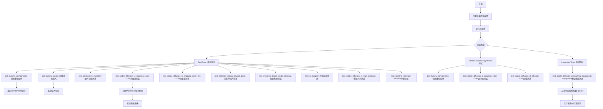

## 类结构

```
unittest.TestCase (Python标准测试基类)
├── StableDiffusionXLImg2ImgPipelineFastTests
│   ├── 继承自: IPAdapterTesterMixin, PipelineLatentTesterMixin, PipelineTesterMixin, unittest.TestCase
│   └── 测试方法: 15+ 个
├── StableDiffusionXLImg2ImgRefinerOnlyPipelineFastTests
│   ├── 继承自: PipelineLatentTesterMixin, PipelineTesterMixin, unittest.TestCase
│   └── 测试方法: 10+ 个
└── StableDiffusionXLImg2ImgPipelineIntegrationTests
    └── 继承自: unittest.TestCase
```

## 全局变量及字段


### `enable_full_determinism`
    
Enables full determinism for reproducibility in tests by setting random seeds.

类型：`function`
    


### `StableDiffusionXLImg2ImgPipelineFastTests.pipeline_class`
    
The StableDiffusionXLImg2ImgPipeline class being tested.

类型：`type`
    


### `StableDiffusionXLImg2ImgPipelineFastTests.params`
    
A set of required pipeline parameter names for text-guided image variation tests, excluding height and width.

类型：`set`
    


### `StableDiffusionXLImg2ImgPipelineFastTests.required_optional_params`
    
A set of optional parameters that are required for pipeline testing, with latents excluded.

类型：`set`
    


### `StableDiffusionXLImg2ImgPipelineFastTests.batch_params`
    
A set of parameter names for batch processing in text-guided image variation tests.

类型：`set`
    


### `StableDiffusionXLImg2ImgPipelineFastTests.image_params`
    
A set of parameter names for image inputs in image-to-image pipelines.

类型：`set`
    


### `StableDiffusionXLImg2ImgPipelineFastTests.image_latents_params`
    
A set of parameter names for latent image inputs in image-to-image pipelines.

类型：`set`
    


### `StableDiffusionXLImg2ImgPipelineFastTests.callback_cfg_params`
    
A set of callback configuration parameters for text-to-image pipelines, including additional text embedding and time IDs.

类型：`set`
    


### `StableDiffusionXLImg2ImgPipelineFastTests.supports_dduf`
    
Flag indicating whether the pipeline supports DDUF (denoising diffusion unified framework).

类型：`bool`
    


### `StableDiffusionXLImg2ImgRefinerOnlyPipelineFastTests.pipeline_class`
    
The StableDiffusionXLImg2ImgPipeline class being tested in the refiner-only scenario.

类型：`type`
    


### `StableDiffusionXLImg2ImgRefinerOnlyPipelineFastTests.params`
    
A set of required pipeline parameter names for text-guided image variation tests, excluding height and width.

类型：`set`
    


### `StableDiffusionXLImg2ImgRefinerOnlyPipelineFastTests.required_optional_params`
    
A set of optional parameters that are required for pipeline testing, with latents excluded.

类型：`set`
    


### `StableDiffusionXLImg2ImgRefinerOnlyPipelineFastTests.batch_params`
    
A set of parameter names for batch processing in text-guided image variation tests.

类型：`set`
    


### `StableDiffusionXLImg2ImgRefinerOnlyPipelineFastTests.image_params`
    
A set of parameter names for image inputs in image-to-image pipelines.

类型：`set`
    


### `StableDiffusionXLImg2ImgRefinerOnlyPipelineFastTests.image_latents_params`
    
A set of parameter names for latent image inputs in image-to-image pipelines.

类型：`set`
    


### `PipelineState.state`
    
A list storing intermediate latents captured during pipeline execution for testing.

类型：`list`
    
    

## 全局函数及方法


### `gc.collect`

`gc.collect` 是 Python 标准库 `gc` 模块中的函数，用于显式触发垃圾回收机制，扫描并回收不可达的对象（包括循环引用的对象），返回回收的对象数量。在测试用例的 `setUp` 和 `tearDown` 方法中被调用，用于在每个测试前后清理内存，确保测试环境的干净状态。

参数：无

返回值：`int`，返回回收的对象数量

#### 流程图

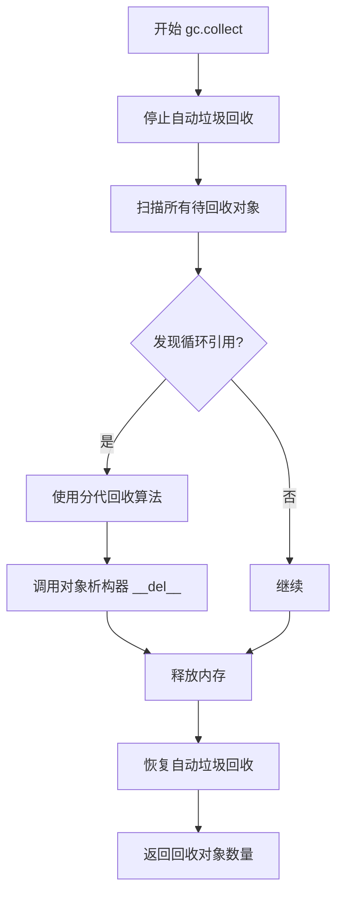

#### 带注释源码

```python
# Python 标准库 gc 模块中的垃圾回收函数
# 位置：Modules/gcmodule.c (CPython 内部实现)

def collect(generation=2):
    """
    显式触发垃圾回收
    
    参数:
        generation: 指定要回收的代际 (0, 1, 2)
                   - 0: 收集最年轻代的对象
                   - 1: 收集第0代和第1代
                   - 2: 收集所有代际 (默认)
    
    返回值:
        int: 被回收的不可达对象数量
    """
    # 1. 如果在禁用回收期间，直接返回
    if get_debug() & DEBUG_SAVEALL:
        return 0
    
    # 2. 根据代际参数确定要扫描的范围
    # generation=2 表示扫描所有三代的对象
    if generation < 0 or generation > 2:
        raise ValueError("generation must be in (0, 1, 2)")
    
    # 3. 执行分代垃圾回收算法
    # - 零代对象: 最近分配的对象
    # - 一代对象: 经历一次回收仍存活的对象
    # - 二代对象: 经历多次回收仍存活的对象
    
    # 4. 检测循环引用
    # Python 使用引用计数 + 标记-清除 + 分代回收的组合策略
    # 当对象之间形成循环引用但外部无引用时，引用计数无法回收
    
    # 5. 调用析构器
    # 对于需要析构的对象，调用其 __del__ 方法
    # 注意: 析构器执行顺序不确定，应避免在析构器中创建新对象
    
    # 6. 释放内存
    # 将回收的对象内存归还给内存分配器
    
    return collected_count
```

#### 在测试代码中的使用

```python
def setUp(self):
    """测试开始前的准备工作"""
    super().setUp()
    gc.collect()  # 清理之前测试可能遗留的内存
    backend_empty_cache(torch_device)  # 清理GPU缓存

def tearDown(self):
    """测试结束后的清理工作"""
    super().tearDown()
    gc.collect()  # 清理本次测试产生的临时对象
    backend_empty_cache(torch_device)  # 清理GPU缓存
```


### `random.Random`

`random.Random` 是 Python 标准库 `random` 模块中的一个类，用于实例化一个独立的随机数生成器对象。通过传入可选的种子值，可以创建一个可重现的随机数生成器实例。

参数：

- `seed`：可选参数，类型为 `int`、`float`、`str`、`bytes` 或 `bytearray`，用于初始化随机数生成器的种子值。如果提供相同的种子，将产生相同的随机数序列。默认值为 `None`。

返回值：返回一个 `random.Random` 实例（随机数生成器对象），该对象拥有与模块级函数（如 `random.random()`、`random.randint()` 等）相同的方法，但作用于独立的随机数序列。

#### 流程图

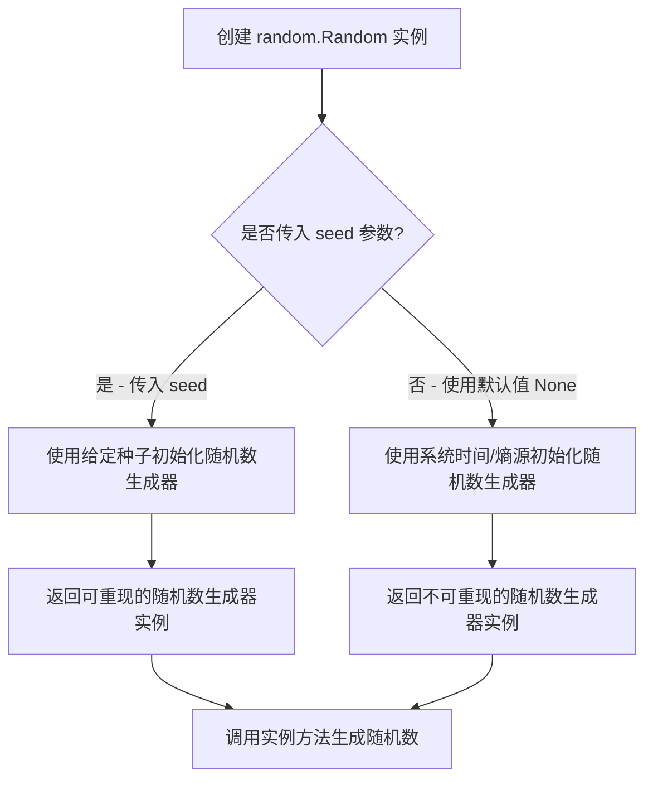

#### 带注释源码

```python
# random.Random 类的典型用法示例

import random

# 1. 创建不带种子的随机数生成器实例
# 每次运行会产生不同的随机数序列
rng1 = random.Random()

# 2. 创建带种子的随机数生成器实例
# 相同的种子会产生相同的随机数序列，用于测试或可重现性场景
rng2 = random.Random(seed=42)

# 3. 使用实例方法生成随机数
random_float = rng2.random()          # 生成 [0.0, 1.0) 范围内的随机浮点数
random_int = rng2.randint(1, 10)      # 生成 [1, 10] 范围内的随机整数
random_choice = rng2.choice([1, 2, 3]) # 从序列中随机选择一个元素

# 4. 在测试代码中的实际应用（本代码片段中的用法）
# 创建带有特定种子的随机数生成器，用于生成确定性的测试数据
rng = random.Random(seed)  # seed 是传入的整数参数
image = floats_tensor((1, 3, 32, 32), rng=rng)  # 使用该 RNG 生成测试张量
```


### `StableDiffusionXLImg2ImgPipelineFastTests.test_stable_diffusion_xl_img2img_euler`

该测试方法用于验证 StableDiffusionXLImg2ImgPipeline 在使用 EulerDiscreteScheduler 进行图像到图像（img2img）推理时的正确性，通过对比生成的图像切片与预期值来确保管道输出符合预期。

参数：

- `self`：无参数，测试类实例方法

返回值：`None`，该方法为测试用例，通过断言验证图像输出的正确性

#### 流程图

```mermaid
flowchart TD
    A[开始测试] --> B[设置设备为CPU保证确定性]
    B --> C[获取虚拟组件 get_dummy_components]
    C --> D[使用虚拟组件实例化 StableDiffusionXLImg2ImgPipeline]
    D --> E[将Pipeline移动到CPU设备]
    E --> F[设置进度条配置 disable=None]
    F --> G[获取虚拟输入 get_dummy_inputs]
    G --> H[执行Pipeline推理 sd_pipe.__call__]
    H --> I[提取图像切片 image[0, -3:, -3:, -1]]
    I --> J[断言图像形状为1, 32, 32, 3]
    J --> K[定义预期切片值 expected_slice]
    K --> L[断言图像切片与预期值的最大差异小于1e-2]
    L --> M[测试结束]
```

#### 带注释源码

```python
def test_stable_diffusion_xl_img2img_euler(self):
    """
    测试 StableDiffusionXLImg2ImgPipeline 使用 EulerDiscreteScheduler 
    进行图像到图像推理的功能正确性
    
    该测试验证:
    1. Pipeline 能够正确初始化和执行
    2. 输出的图像形状符合预期 (1, 32, 32, 3)
    3. 生成的图像像素值在允许的误差范围内与预期值匹配
    """
    # 步骤1: 设置设备为CPU，确保torch.Generator的确定性
    # 原因: GPU设备可能在不同运行之间产生不确定的结果
    device = "cpu"  # ensure determinism for the device-dependent torch.Generator
    
    # 步骤2: 获取预定义的虚拟组件（UNet, VAE, Scheduler, TextEncoder等）
    # 这些组件使用固定的随机种子创建，确保测试的可重复性
    components = self.get_dummy_components()
    
    # 步骤3: 使用虚拟组件实例化StableDiffusionXLImg2ImgPipeline管道
    # 管道封装了完整的文本到图像扩散模型推理流程
    sd_pipe = StableDiffusionXLImg2ImgPipeline(**components)
    
    # 步骤4: 将管道移动到指定设备（CPU）上运行
    sd_pipe = sd_pipe.to(device)
    
    # 步骤5: 配置进度条显示，disable=None表示启用进度条
    # 这对于长时间运行的推理很有用，但在测试中主要用于验证API调用
    sd_pipe.set_progress_bar_config(disable=None)
    
    # 步骤6: 获取测试用的虚拟输入数据
    # 包含: prompt文本、输入图像、随机数生成器、推理步数、引导系数等
    inputs = self.get_dummy_inputs(device)
    
    # 步骤7: 执行管道推理，生成图像
    # **inputs 将字典解包为关键字参数传递给管道
    # 返回的PipelineOutput包含生成的图像数组
    image = sd_pipe(**inputs).images
    
    # 步骤8: 提取图像的一个切片用于验证
    # image[0]: 取第一个批次样本
    # [-3:, -3:, -1]: 取最后3x3像素，RGB通道的最后一个通道
    image_slice = image[0, -3:, -3:, -1]
    
    # 步骤9: 断言验证图像形状
    # 预期形状: (batch=1, height=32, width=32, channels=3)
    assert image.shape == (1, 32, 32, 3)
    
    # 步骤10: 定义预期图像切片值
    # 这些值是通过固定随机种子预先计算得到的参考值
    expected_slice = np.array([0.4664, 0.4886, 0.4403, 0.6902, 0.5592, 0.4534, 0.5931, 0.5951, 0.5224])
    
    # 步骤11: 断言验证生成图像与预期值的差异
    # np.abs计算绝对差异，.max()取最大差异
    # 允许的最大差异为1e-2 (0.01)，考虑到浮点运算和随机性的影响
    assert np.abs(image_slice.flatten() - expected_slice).max() < 1e-2
```


我将分析代码并提取相关信息。由于代码是一个测试文件，包含多个测试类和方法，且主要使用 `numpy as np` 进行数组操作和数值比较，我将提取关键测试方法的信息。

### `StableDiffusionXLImg2ImgPipelineFastTests.test_stable_diffusion_xl_img2img_euler`

该方法是 `StableDiffusionXLImg2ImgPipelineFastTests` 类中的一个测试方法，用于测试 Stable Diffusion XL Img2Img Pipeline 使用 Euler 调度器的功能。

参数：此方法无显式参数，但使用类属性 `self.get_dummy_inputs(device)` 获取测试输入

返回值：`None`，该方法执行断言验证，不返回任何值

#### 流程图

```mermaid
flowchart TD
    A[开始测试] --> B[获取设备: device = cpu]
    B --> C[获取虚拟组件: get_dummy_components]
    C --> D[创建Pipeline: StableDiffusionXLImg2ImgPipeline]
    D --> E[将Pipeline移动到设备: .to(device)]
    E --> F[设置进度条配置: set_progress_bar_config]
    F --> G[获取虚拟输入: get_dummy_inputs]
    G --> H[执行推理: sd_pipe.__call__]
    H --> I[获取生成的图像: .images]
    I --> J[提取图像切片: image[0, -3:, -3:, -1]]
    J --> K{断言验证}
    K -->|通过| L[测试通过]
    K -->|失败| M[抛出断言错误]
```

#### 带注释源码

```python
def test_stable_diffusion_xl_img2img_euler(self):
    """
    测试使用 Euler 调度器的 Stable Diffusion XL Img2Img Pipeline
    
    该测试方法验证:
    1. Pipeline 能否正确初始化并运行
    2. 生成的图像形状是否符合预期 (1, 32, 32, 3)
    3. 生成的图像数值是否在预期范围内
    """
    # 使用 cpu 设备确保确定性,避免 torch.Generator 设备依赖性问题
    device = "cpu"
    
    # 获取虚拟组件(UNet, VAE, Scheduler, Text Encoder等)
    # 这些是轻量级的测试用模型配置
    components = self.get_dummy_components()
    
    # 使用虚拟组件实例化 Stable Diffusion XL Img2Img Pipeline
    sd_pipe = StableDiffusionXLImg2ImgPipeline(**components)
    
    # 将 Pipeline 移动到指定设备(CPU)
    sd_pipe = sd_pipe.to(device)
    
    # 配置进度条,disable=None 表示不禁用进度条
    sd_pipe.set_progress_bar_config(disable=None)

    # 获取虚拟输入数据,包含:
    # - prompt: 文本提示
    # - image: 输入图像张量
    # - generator: 随机数生成器
    # - num_inference_steps: 推理步数
    # - guidance_scale: 引导尺度
    # - output_type: 输出类型(np表示numpy数组)
    # - strength: 图像变换强度
    inputs = self.get_dummy_inputs(device)
    
    # 执行推理,生成图像
    # 调用 Pipeline 的 __call__ 方法
    image = sd_pipe(**inputs).images
    
    # 提取图像最后3x3像素区域,用于数值验证
    # image shape: (batch, height, width, channels)
    # 索引 [0, -3:, -3:, -1] 获取第一张图像的右下角3x3区域
    image_slice = image[0, -3:, -3:, -1]

    # 断言验证图像形状
    # 期望形状: (1, 32, 32, 3) - 1张32x32的RGB图像
    assert image.shape == (1, 32, 32, 3)

    # 定义期望的像素值切片
    # 这些值是在特定随机种子下使用相同配置运行得到的参考值
    expected_slice = np.array([
        [0.4664, 0.4886, 0.4403],  # 第1行
        [0.6902, 0.5592, 0.4534],  # 第2行
        [0.5931, 0.5951, 0.5224]   # 第3行
    ])

    # 断言实际输出与期望值的差异在容差范围内
    # np.abs 计算绝对值
    # .flatten() 将3x3数组展平为1D数组
    # max() 获取最大差异
    # 1e-2 = 0.01 的容差
    assert np.abs(image_slice.flatten() - expected_slice).max() < 1e-2
```

---

### 关键技术点说明

| 组件 | 描述 |
|------|------|
| `numpy as np` | 用于数值比较和数组操作，如 `np.array()` 创建期望值，`np.abs()` 计算差异 |
| `get_dummy_components()` | 创建测试用虚拟组件，避免加载大型预训练模型 |
| `get_dummy_inputs()` | 生成测试输入数据，包括图像和生成器配置 |
| `floats_tensor()` | 生成指定形状的随机浮点数张量 |

---

### 潜在优化空间

1. **测试重复性**：多个测试方法重复调用 `get_dummy_components()`，可以考虑使用 `setUp` 方法缓存组件
2. **设备兼容性**：代码中对 MPS 设备有特殊处理，可以考虑统一抽象
3. **断言消息**：缺少自定义断言消息，测试失败时调试信息不足


### `StableDiffusionXLImg2ImgPipelineFastTests.get_dummy_components`

该方法用于创建虚拟（dummy）组件，初始化 StableDiffusionXLImg2ImgPipeline 测试所需的所有模型组件，包括 UNet、VAE、Scheduler、Text Encoder 等，以便进行单元测试。

参数：

- `skip_first_text_encoder`：`bool`，是否跳过第一个文本编码器（默认为 False）
- `time_cond_proj_dim`：`Optional[int]`，时间条件投影维度（默认为 None）

返回值：`dict`，包含所有虚拟组件的字典

#### 流程图

```mermaid
flowchart TD
    A[开始 get_dummy_components] --> B[设置随机种子 torch.manual_seed(0)]
    B --> C[创建 UNet2DConditionModel]
    C --> D[创建 EulerDiscreteScheduler]
    D --> E[创建 AutoencoderKL VAE]
    E --> F[创建 CLIPVisionConfig 和 CLIPVisionModelWithProjection]
    F --> G[创建 CLIPImageProcessor feature_extractor]
    G --> H[创建 CLIPTextConfig 和 CLIPTextModel]
    H --> I[创建 CLIPTokenizer]
    I --> J[创建 CLIPTextModelWithProjection 和第二个 CLIPTokenizer]
    J --> K[组装 components 字典]
    K --> L[返回 components]
```

#### 带注释源码

```python
def get_dummy_components(self, skip_first_text_encoder=False, time_cond_proj_dim=None):
    """
    创建用于测试的虚拟组件
    
    参数:
        skip_first_text_encoder: 是否跳过第一个文本编码器
        time_cond_proj_dim: 时间条件投影维度
    返回:
        包含所有pipeline组件的字典
    """
    torch.manual_seed(0)  # 设置随机种子以确保可重复性
    unet = UNet2DConditionModel(
        block_out_channels=(32, 64),
        layers_per_block=2,
        sample_size=32,
        in_channels=4,
        out_channels=4,
        time_cond_proj_dim=time_cond_proj_dim,
        down_block_types=("DownBlock2D", "CrossAttnDownBlock2D"),
        up_block_types=("CrossAttnUpBlock2D", "UpBlock2D"),
        # SD2-specific config below
        attention_head_dim=(2, 4),
        use_linear_projection=True,
        addition_embed_type="text_time",
        addition_time_embed_dim=8,
        transformer_layers_per_block=(1, 2),
        projection_class_embeddings_input_dim=72,  # 5 * 8 + 32
        cross_attention_dim=64 if not skip_first_text_encoder else 32,
    )
    # 创建调度器
    scheduler = EulerDiscreteScheduler(
        beta_start=0.00085,
        beta_end=0.012,
        steps_offset=1,
        beta_schedule="scaled_linear",
        timestep_spacing="leading",
    )
    torch.manual_seed(0)
    vae = AutoencoderKL(
        block_out_channels=[32, 64],
        in_channels=3,
        out_channels=3,
        down_block_types=["DownEncoderBlock2D", "DownEncoderBlock2D"],
        up_block_types=["UpDecoderBlock2D", "UpDecoderBlock2D"],
        latent_channels=4,
        sample_size=128,
    )
    torch.manual_seed(0)
    # 创建图像编码器配置和模型
    image_encoder_config = CLIPVisionConfig(
        hidden_size=32,
        image_size=224,
        projection_dim=32,
        intermediate_size=37,
        num_attention_heads=4,
        num_channels=3,
        num_hidden_layers=5,
        patch_size=14,
    )

    image_encoder = CLIPVisionModelWithProjection(image_encoder_config)

    # 创建图像处理器
    feature_extractor = CLIPImageProcessor(
        crop_size=224,
        do_center_crop=True,
        do_normalize=True,
        do_resize=True,
        image_mean=[0.48145466, 0.4578275, 0.40821073],
        image_std=[0.26862954, 0.26130258, 0.27577711],
        resample=3,
        size=224,
    )

    torch.manual_seed(0)
    # 创建文本编码器配置和模型
    text_encoder_config = CLIPTextConfig(
        bos_token_id=0,
        eos_token_id=2,
        hidden_size=32,
        intermediate_size=37,
        layer_norm_eps=1e-05,
        num_attention_heads=4,
        num_hidden_layers=5,
        pad_token_id=1,
        vocab_size=1000,
        # SD2-specific config below
        hidden_act="gelu",
        projection_dim=32,
    )
    text_encoder = CLIPTextModel(text_encoder_config)
    tokenizer = CLIPTokenizer.from_pretrained("hf-internal-testing/tiny-random-clip")

    # 创建第二个文本编码器和分词器
    text_encoder_2 = CLIPTextModelWithProjection(text_encoder_config)
    tokenizer_2 = CLIPTokenizer.from_pretrained("hf-internal-testing/tiny-random-clip")

    # 组装所有组件
    components = {
        "unet": unet,
        "scheduler": scheduler,
        "vae": vae,
        "text_encoder": text_encoder if not skip_first_text_encoder else None,
        "tokenizer": tokenizer if not skip_first_text_encoder else None,
        "text_encoder_2": text_encoder_2,
        "tokenizer_2": tokenizer_2,
        "requires_aesthetics_score": True,
        "image_encoder": image_encoder,
        "feature_extractor": feature_extractor,
    }
    return components
```

---

### `StableDiffusionXLImg2ImgPipelineFastTests.get_dummy_inputs`

该方法用于创建虚拟输入数据，包含测试所需的 prompt、图像、生成器等参数，以便在管道推理测试中使用。

参数：

- `device`：`str`，目标设备（如 "cpu" 或 "cuda"）
- `seed`：`int`，随机种子（默认为 0）

返回值：`dict`，包含所有输入参数的字典

#### 流程图

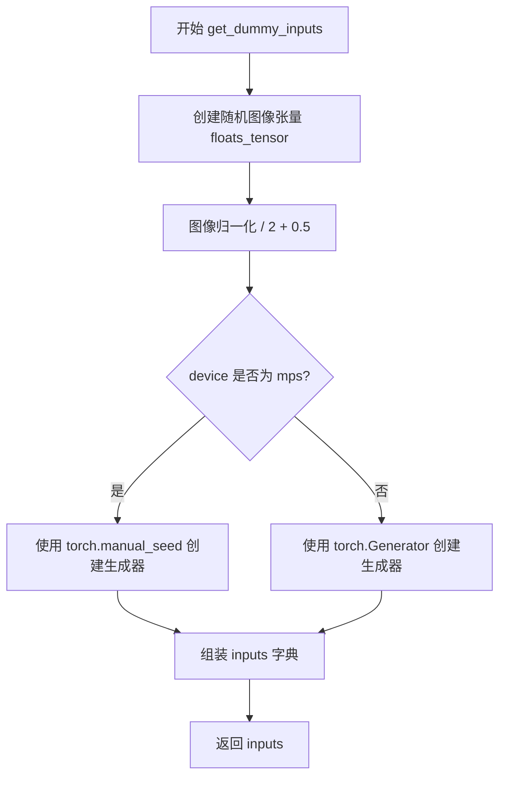

#### 带注释源码

```python
def get_dummy_inputs(self, device, seed=0):
    """
    创建用于测试的虚拟输入参数
    
    参数:
        device: 目标设备
        seed: 随机种子
    返回:
        包含pipeline输入参数的字典
    """
    # 创建随机浮点张量 (1, 3, 32, 32)
    image = floats_tensor((1, 3, 32, 32), rng=random.Random(seed)).to(device)
    # 图像归一化到 [0, 1] 范围
    image = image / 2 + 0.5
    # 根据设备类型选择合适的随机生成器
    if str(device).startswith("mps"):
        generator = torch.manual_seed(seed)
    else:
        generator = torch.Generator(device=device).manual_seed(seed)
    # 组装输入参数
    inputs = {
        "prompt": "A painting of a squirrel eating a burger",
        "image": image,
        "generator": generator,
        "num_inference_steps": 2,
        "guidance_scale": 5.0,
        "output_type": "np",
        "strength": 0.8,
    }
    return inputs
```

---

### `StableDiffusionXLImg2ImgPipelineFastTests.test_components_function`

该测试方法用于验证 StableDiffusionXLImg2ImgPipeline 的 `components` 属性是否正确返回所有初始化组件。

参数：無

返回值：無（测试方法，使用 assert 进行断言）

#### 流程图

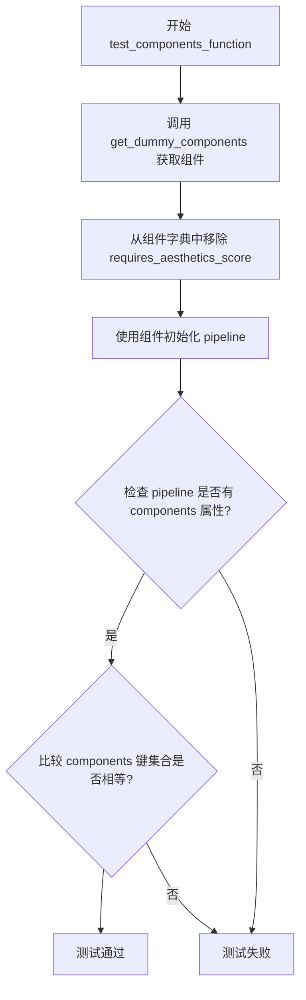

#### 带注释源码

```python
def test_components_function(self):
    """
    测试 pipeline 的 components 属性是否正确返回所有组件
    """
    # 获取虚拟组件
    init_components = self.get_dummy_components()
    # 移除 requires_aesthetics_score（pipeline初始化不需要此参数）
    init_components.pop("requires_aesthetics_score")
    # 使用组件初始化 pipeline
    pipe = self.pipeline_class(**init_components)

    # 断言 pipeline 有 components 属性
    self.assertTrue(hasattr(pipe, "components"))
    # 断言 components 的键集合与初始化组件的键集合相同
    self.assertTrue(set(pipe.components.keys()) == set(init_components.keys()))
```

---

### `StableDiffusionXLImg2ImgPipelineFastTests.test_stable_diffusion_xl_img2img_euler`

该测试方法用于验证 StableDiffusionXLImg2ImgPipeline 在使用 EulerDiscreteScheduler 时的图像生成功能是否正常工作。

参数：無

返回值：無（测试方法，使用 assert 进行断言）

#### 流程图

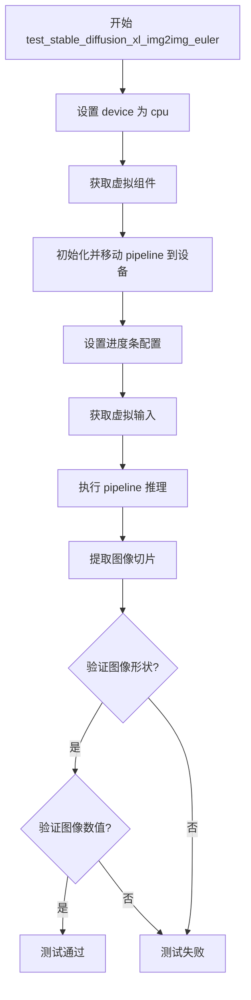

#### 带注释源码

```python
def test_stable_diffusion_xl_img2img_euler(self):
    """
    测试使用 Euler 调度器的 SDXL img2img pipeline
    """
    device = "cpu"  # 确保 torch.Generator 的确定性
    # 获取虚拟组件
    components = self.get_dummy_components()
    # 初始化 pipeline
    sd_pipe = StableDiffusionXLImg2ImgPipeline(**components)
    # 移动到设备
    sd_pipe = sd_pipe.to(device)
    # 设置进度条配置
    sd_pipe.set_progress_bar_config(disable=None)

    # 获取测试输入
    inputs = self.get_dummy_inputs(device)
    # 执行推理
    image = sd_pipe(**inputs).images
    # 提取图像切片用于验证
    image_slice = image[0, -3:, -3:, -1]

    # 断言输出形状
    assert image.shape == (1, 32, 32, 3)

    # 预期像素值切片
    expected_slice = np.array([0.4664, 0.4886, 0.4403, 0.6902, 0.5592, 0.4534, 0.5931, 0.5951, 0.5224])

    # 断言图像像素值在允许误差范围内
    assert np.abs(image_slice.flatten() - expected_slice).max() < 1e-2
```

---

### `StableDiffusionXLImg2ImgPipelineFastTests.test_pipeline_interrupt`

该测试方法用于验证 pipeline 的中断功能，确认在推理过程中可以正确中断并返回中间结果。

参数：無

返回值：無（测试方法，使用 assert 进行断言）

#### 流程图

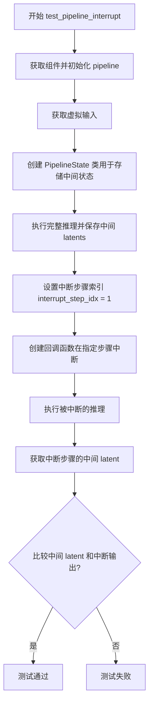

#### 带注释源码

```python
def test_pipeline_interrupt(self):
    """
    测试 pipeline 的中断功能
    """
    # 初始化组件和 pipeline
    components = self.get_dummy_components()
    sd_pipe = StableDiffusionXLImg2ImgPipeline(**components)
    sd_pipe = sd_pipe.to(torch_device)
    sd_pipe.set_progress_bar_config(disable=None)

    # 获取输入
    inputs = self.get_dummy_inputs(torch_device)

    prompt = "hey"
    num_inference_steps = 5

    # 用于存储推理过程中中间 latents 的类
    class PipelineState:
        def __init__(self):
            self.state = []

        def apply(self, pipe, i, t, callback_kwargs):
            self.state.append(callback_kwargs["latents"])
            return callback_kwargs

    pipe_state = PipelineState()
    # 执行完整推理并保存中间状态
    sd_pipe(
        prompt,
        image=inputs["image"],
        strength=0.8,
        num_inference_steps=num_inference_steps,
        output_type="np",
        generator=torch.Generator("cpu").manual_seed(0),
        callback_on_step_end=pipe_state.apply,
    ).images

    # 在步骤索引 1 处中断生成
    interrupt_step_idx = 1

    def callback_on_step_end(pipe, i, t, callback_kwargs):
        if i == interrupt_step_idx:
            pipe._interrupt = True
        return callback_kwargs

    # 执行被中断的推理
    output_interrupted = sd_pipe(
        prompt,
        image=inputs["image"],
        strength=0.8,
        num_inference_steps=num_inference_steps,
        output_type="latent",
        generator=torch.Generator("cpu").manual_seed(0),
        callback_on_step_end=callback_on_step_end,
    ).images

    # 获取中断步骤的中间 latent
    intermediate_latent = pipe_state.state[interrupt_step_idx]

    # 断言中间 latent 与中断后的输出相同
    assert torch.allclose(intermediate_latent, output_interrupted, atol=1e-4)
```


### `CLIPImageProcessor`

CLIPImageProcessor 是 Hugging Face Transformers 库中的一个图像预处理器类，专门用于将原始图像转换为 CLIP 模型所需的输入格式。该处理器负责图像的缩放、裁剪和归一化等预处理操作，确保图像数据符合 CLIP 视觉编码器的输入要求。

参数：

- `crop_size`：`int`，裁剪后的目标图像尺寸（高度和宽度）
- `do_center_crop`：`bool`，是否执行中心裁剪操作
- `do_normalize`：`bool`，是否对图像进行归一化处理
- `do_resize`：`bool`，是否调整图像大小
- `image_mean`：`List[float]`，图像归一化所使用的均值向量，通常为 RGB 三个通道的均值
- `image_std`：`List[float]`，图像归一化所使用的标准差向量，通常为 RGB 三个通道的标准差
- `resample`：`int`，重采样方法（通常是 PIL 的重采样枚举值，如 3 表示 BILINEAR）
- `size`：`int` 或 `Dict[str, int]`，调整后的图像尺寸，可以是整数或包含短边的字典

返回值：`PIL.Image.Image` 或 `np.ndarray` 或 `torch.Tensor`，预处理后的图像对象

#### 流程图

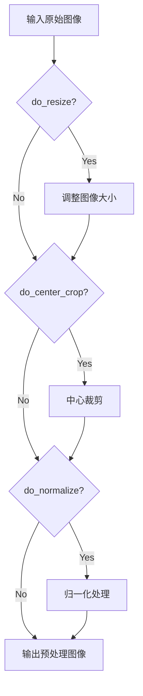

#### 带注释源码

```python
# 在测试文件中使用 CLIPImageProcessor 的示例
feature_extractor = CLIPImageProcessor(
    crop_size=224,                              # 裁剪后的目标尺寸为 224x224
    do_center_crop=True,                        # 启用中心裁剪
    do_normalize=True,                          # 启用归一化
    do_resize=True,                             # 启用图像缩放
    image_mean=[0.48145466, 0.4578275, 0.40821073],  # ImageNet RGB 均值
    image_std=[0.26862954, 0.26130258, 0.27577711],   # ImageNet RGB 标准差
    resample=3,                                 # 使用双线性插值 (PIL.BILINEAR)
    size=224,                                   # 调整短边至 224
)
```

#### 补充说明

CLIPImageProcessor 是 CLIP（Contrastive Language-Image Pre-training）模型的关键组件之一。在 Stable Diffusion XL Img2Img Pipeline 中，该处理器被用作 `feature_extractor`，负责将输入图像转换为 CLIP 视觉编码器可以处理的格式。预处理流程通常包括：将图像调整为统一尺寸、执行中心裁剪以去除边缘无关区域、然后使用预计算的均值和标准差进行标准化，使图像像素值落在模型训练时使用的分布范围内。


### `CLIPTextConfig`

CLIPTextConfig是transformers库中的一个配置类，用于定义CLIP文本编码器的结构和超参数。在该代码中用于创建测试用的CLIPTextModel配置。

参数：

- `bos_token_id`：`int`，句首标记的ID
- `eos_token_id`：`int`，句尾标记的ID
- `hidden_size`：`int`，隐藏层维度大小
- `intermediate_size`：`int`，前馈网络中间层维度
- `layer_norm_eps`：`float`，层归一化的epsilon值
- `num_attention_heads`：`int`，注意力头数量
- `num_hidden_layers`：`int`，隐藏层数量
- `pad_token_id`：`int`，填充标记的ID
- `vocab_size`：`int`，词汇表大小
- `hidden_act`：`str`，隐藏层激活函数类型（如"gelu"）
- `projection_dim`：`int`，投影维度

返回值：`CLIPTextConfig`对象，包含CLIP文本编码器的配置信息

#### 流程图

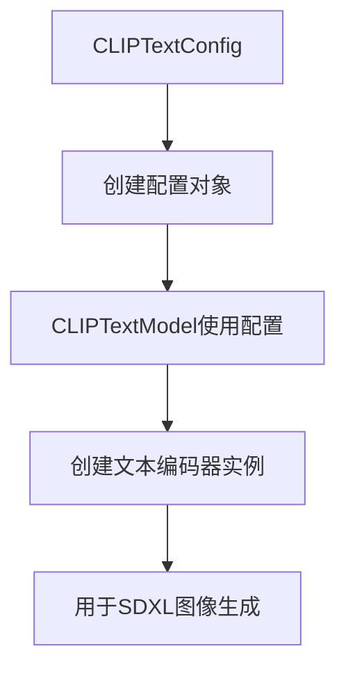

#### 带注释源码

```python
# 在get_dummy_components方法中创建CLIPTextConfig配置
text_encoder_config = CLIPTextConfig(
    bos_token_id=0,           # 句首标记ID为0
    eos_token_id=2,           # 句尾标记ID为2
    hidden_size=32,           # 隐藏层维度为32
    intermediate_size=37,     # 前馈网络中间层维度为37
    layer_norm_eps=1e-05,     # 层归一化epsilon为1e-05
    num_attention_heads=4,    # 4个注意力头
    num_hidden_layers=5,      # 5层隐藏层
    pad_token_id=1,           # 填充标记ID为1
    vocab_size=1000,          # 词汇表大小为1000
    # SD2-specific config below
    hidden_act="gelu",        # 使用GELU激活函数
    projection_dim=32,        # 投影维度为32
)

# 使用配置创建CLIPTextModel
text_encoder = CLIPTextModel(text_encoder_config)

# 也可用于创建带投影的文本编码器模型
text_encoder_2 = CLIPTextModelWithProjection(text_encoder_config)
```


根据代码分析，`CLIPTextModel` 是从 `transformers` 库导入的一个预训练文本编码模型类。代码中展示了如何使用 `CLIPTextConfig` 配置来实例化该模型。

### CLIPTextModel

CLIPTextModel 是 Hugging Face transformers 库提供的预训练文本编码模型，用于将文本转换为向量表示，常用于 Stable Diffusion XL 等文生图模型的文本理解部分。

参数：

- `config`：`CLIPTextConfig` 对象，模型配置对象，包含模型结构参数（如 hidden_size、num_hidden_layers、vocab_size 等）

返回值：`CLIPTextModel` 实例，返回一个预训练的文本编码器模型对象

#### 流程图

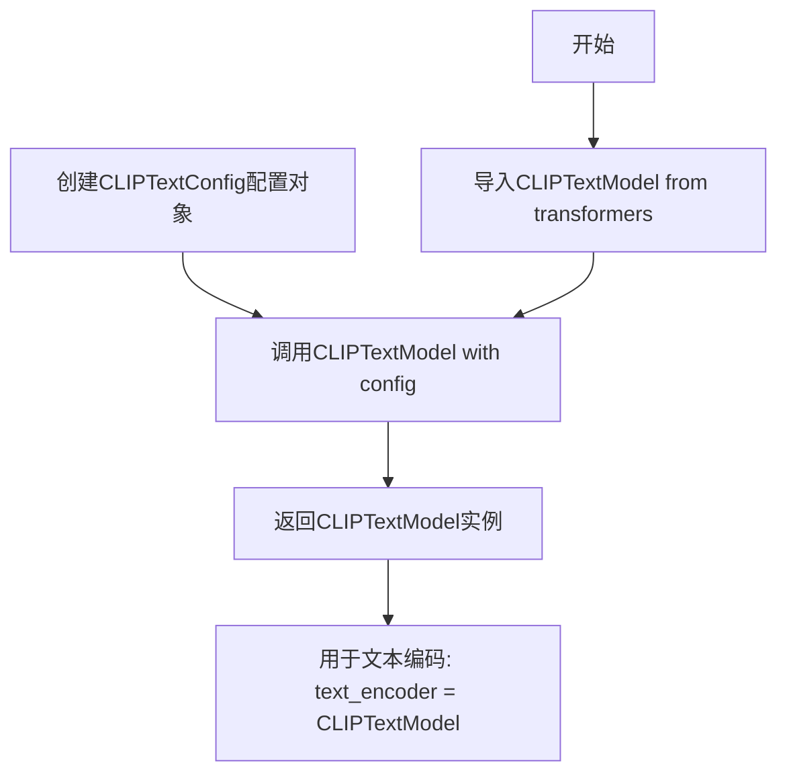

#### 带注释源码

```python
# 从transformers库导入CLIPTextModel类
from transformers import (
    CLIPTextModel,
    CLIPTextModelWithProjection,
    # ... 其他导入
)

# 定义文本编码器配置
text_encoder_config = CLIPTextConfig(
    bos_token_id=0,           # 句子开始token ID
    eos_token_id=2,           # 句子结束token ID
    hidden_size=32,           # 隐藏层维度
    intermediate_size=37,    # 前馈网络中间层维度
    layer_norm_eps=1e-05,     # LayerNorm epsilon值
    num_attention_heads=4,   # 注意力头数量
    num_hidden_layers=5,      # 隐藏层数量
    pad_token_id=1,          # 填充token ID
    vocab_size=1000,         # 词表大小
    hidden_act="gelu",       # 激活函数
    projection_dim=32,       # 投影维度
)

# 使用配置实例化CLIPTextModel
# 参数: config - CLIPTextConfig配置对象
# 返回: CLIPTextModel实例 - 预训练的文本编码器模型
text_encoder = CLIPTextModel(text_encoder_config)
```

#### 关键信息说明

1. **类功能**：CLIPTextModel 是基于 CLIP 架构的文本编码器，将输入文本转换为固定维度的向量表示

2. **在代码中的作用**：
   - 在 `get_dummy_components` 方法中创建文本编码器
   - 用于将文本 prompt 编码为 embeddings，供 UNet 在去噪过程中使用
   - 支持双文本编码器架构（text_encoder 和 text_encoder_2）

3. **配置参数说明**：
   - `hidden_size=32`：隐藏层维度大小
   - `num_hidden_layers=5`：Transformer 编码器层数
   - `num_attention_heads=4`：多头注意力机制的头数
   - `vocab_size=1000`：词表大小（测试用小规模配置）
   - `projection_dim=32`：输出投影维度


### `CLIPTextModelWithProjection`

这是从 `transformers` 库导入的类，用于创建带有投影层的 CLIP 文本编码器。在该测试代码中，它作为 Stable Diffusion XL 图像到图像管道的第二个文本编码器组件，用于编码文本提示并输出文本嵌入和池化表示。

参数：

- `config`：`CLIPTextConfig`，CLIP 文本模型的配置对象，包含隐藏层维度、注意力头数、层数等模型架构参数

返回值：`CLIPTextModelWithProjection`，返回已初始化的 CLIP 文本编码器模型实例，带有投影层输出

#### 流程图

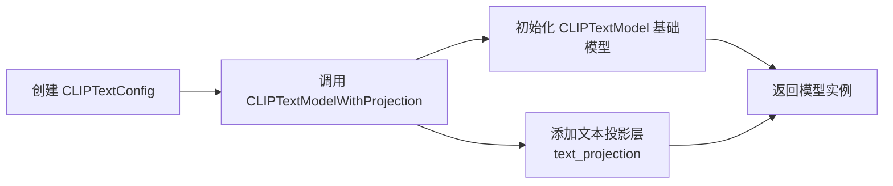

#### 带注释源码

```python
# 从 transformers 库导入 CLIPTextModelWithProjection 类
# 这是一个预训练的 CLIP 文本编码器，带有文本投影层
from transformers import (
    CLIPTextModelWithProjection,
)

# 在 get_dummy_components 方法中创建实例
# 参数: text_encoder_config - CLIPTextConfig 类型的配置对象
text_encoder_config = CLIPTextConfig(
    bos_token_id=0,
    eos_token_id=2,
    hidden_size=32,
    intermediate_size=37,
    layer_norm_eps=1e-05,
    num_attention_heads=4,
    num_hidden_layers=5,
    pad_token_id=1,
    vocab_size=1000,
    # SD2-specific config below
    hidden_act="gelu",
    projection_dim=32,
)

# 使用配置创建第二个文本编码器（带投影层）
# 该编码器用于 Stable Diffusion XL 的双文本编码器架构
text_encoder_2 = CLIPTextModelWithProjection(text_encoder_config)

# 将其添加到管道组件字典中
components = {
    # ... 其他组件
    "text_encoder_2": text_encoder_2,
    "tokenizer_2": tokenizer_2,
}
```

> **注**：该类是外部依赖（huggingface/transformers）提供的实现，源代码中仅展示其使用方式，未包含类内部的具体实现逻辑。如需查看完整源码，请参考 [transformers 库](https://github.com/huggingface/transformers)。


由于用户要求提取CLIPTokenizer，但代码中只使用了`CLIPTokenizer.from_pretrained()`这一类方法调用，没有定义CLIPTokenizer类本身。我需要从transformers库的角度来解释这个类。

### CLIPTokenizer

CLIPTokenizer是HuggingFace Transformers库中的一个分词器类，用于将文本转换为CLIP模型可处理的token序列。它是Stable Diffusion XL Img2Img Pipeline中处理文本输入的关键组件。

参数：

- `pretrained_model_name_or_path`：`str`，预训练模型的名称或本地路径（如"hf-internal-testing/tiny-random-clip"）
- `cache_dir`：`Optional[str]`，模型缓存目录
- `force_download`：`bool`，是否强制重新下载模型
- `resume_download`：`bool`，是否恢复中断的下载
- `proxies`：`Optional[Dict]`，代理服务器配置
- `use_auth_token`：`Optional[str]`，用于访问私有模型的认证token
- `revision`：`str`，模型版本号
- `subfolder`：`str`，模型子文件夹路径
- `from_flax`：`bool`，是否从Flax模型加载
- `torch_dtype`：`torch.dtype`，PyTorch数据类型
- `use_safetensors`：`bool`，是否使用Safetensors格式
- `tokenizer_class`：`Optional[str]`，自定义分词器类名

返回值：`CLIPTokenizer`，返回CLIP分词器实例，包含词汇表、注意力掩码等属性

#### 流程图

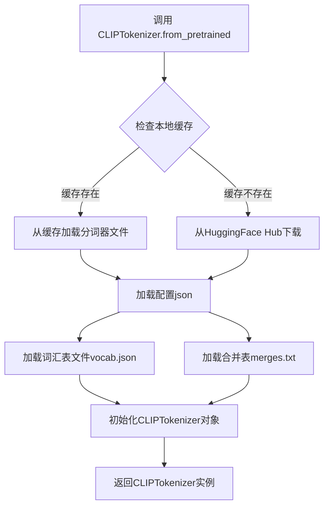

#### 带注释源码

```python
# 在StableDiffusionXLImg2ImgPipelineFastTests类中使用CLIPTokenizer
tokenizer = CLIPTokenizer.from_pretrained("hf-internal-testing/tiny-random-clip")

# 创建第二个分词器实例（用于双文本编码器配置）
tokenizer_2 = CLIPTokenizer.from_pretrained("hf-internal-testing/tiny-random-clip")

# 在StableDiffusionXLImg2ImgRefinerOnlyPipelineFastTests类中
tokenizer_2 = CLIPTokenizer.from_pretrained("hf-internal-testing/tiny-random-clip")

# CLIPTokenizer.from_pretrained() 源代码逻辑（简化版）
def from_pretrained(cls, pretrained_model_name_or_path, *args, **kwargs):
    """
    从预训练模型加载分词器
    
    参数:
        pretrained_model_name_or_path: 模型名称或本地路径
        *args: 可变位置参数
        **kwargs: 可选关键字参数（如cache_dir, force_download等）
    
    返回:
        CLIPTokenizer: 分词器实例
    """
    # 1. 解析模型路径或名称
    # 2. 检查本地缓存目录
    # 3. 如果需要，下载模型文件（vocab.json, merges.txt, tokenizer_config.json等）
    # 4. 加载tokenizer_config.json获取配置
    # 5. 加载词汇表文件vocab.json和merges.txt
    # 6. 初始化CLIPTokenizer基类PreTrainedTokenizer
    # 7. 设置特殊token（bos_token, eos_token, pad_token等）
    # 8. 返回完整的分词器实例
    
    # 示例返回值包含以下关键属性：
    # - vocab_size: 词汇表大小
    # - bos_token_id: 起始token ID
    # - eos_token_id: 结束token ID
    # - pad_token_id: 填充token ID
    # - model_max_length: 模型最大序列长度
    pass
```


### `CLIPVisionConfig`

CLIPVisionConfig是Hugging Face transformers库中的一个配置类，用于定义CLIP视觉编码器（Vision Encoder）的架构参数。

参数：

- `hidden_size`：int，隐藏层维度大小
- `image_size`：int，输入图像的尺寸
- `projection_dim`：int，投影层的输出维度
- `intermediate_size`：int，FFN中间层维度
- `num_attention_heads`：int，注意力头数量
- `num_channels`：int，输入图像的通道数
- `num_hidden_layers`：int，Transformer编码器的层数
- `patch_size`：int，图像patch的大小

返回值：`CLIPVisionConfig`，返回CLIP视觉模型的配置对象

#### 流程图

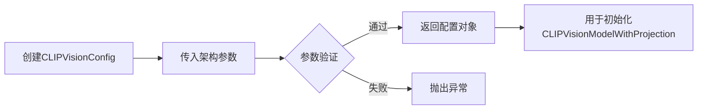

#### 带注释源码

```python
# 导入CLIPVisionConfig类
from transformers import CLIPVisionConfig

# 创建CLIPVisionConfig配置对象
# 用于配置CLIP视觉编码器的架构参数
image_encoder_config = CLIPVisionConfig(
    hidden_size=32,           # 隐藏层维度：32
    image_size=224,           # 输入图像尺寸：224x224
    projection_dim=32,        # 投影维度：32
    intermediate_size=37,     # FFN中间层维度：37
    num_attention_heads=4,    # 注意力头数量：4
    num_channels=3,           # 输入通道数：3（RGB）
    num_hidden_layers=5,      # 隐藏层数量：5
    patch_size=14,            # Patch大小：14x14
)

# 使用配置对象创建CLIPVisionModelWithProjection模型
image_encoder = CLIPVisionModelWithProjection(image_encoder_config)
```


### `CLIPVisionModelWithProjection`

该函数是 `transformers` 库中的类，用于加载带有投影层的 CLIP 视觉模型，将图像编码为视觉特征向量。在本代码中用于创建图像编码器组件，处理输入图像并生成图像嵌入向量，供 Stable Diffusion XL img2img pipeline 中的 IP-Adapter 功能使用。

参数：

-  `config`：`CLIPVisionConfig`，CLIP 视觉模型的配置对象，包含隐藏层维度、图像大小、投影维度、中间层维度、注意力头数、通道数、隐藏层数量、patch 大小等模型架构参数

返回值：`CLIPVisionModelWithProjection`，返回已构建的 CLIP 视觉模型实例，带有投影层，可输出图像的嵌入向量

#### 流程图

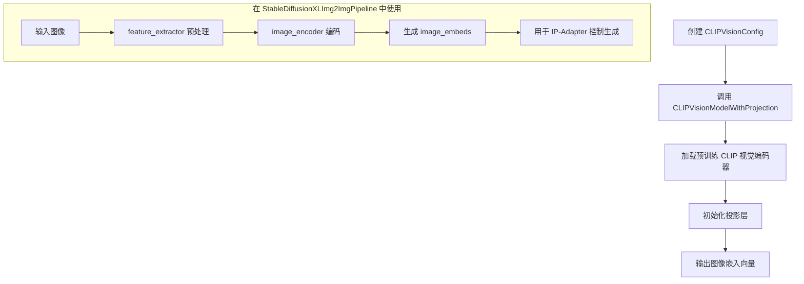

#### 带注释源码

```python
# 从 transformers 库导入 CLIPVisionModelWithProjection 类
from transformers import (
    CLIPImageProcessor,
    CLIPTextConfig,
    CLIPTextModel,
    CLIPTextModelWithProjection,  # 导入带投影层的 CLIP 视觉模型
    CLIPTokenizer,
    CLIPVisionConfig,
    CLIPVisionModelWithProjection,
)

# ... (在 get_dummy_components 方法中)

# 定义 CLIP 视觉模型配置
image_encoder_config = CLIPVisionConfig(
    hidden_size=32,          # 隐藏层维度
    image_size=224,          # 输入图像大小
    projection_dim=32,       # 投影层输出维度
    intermediate_size=37,    # 前馈网络中间层维度
    num_attention_heads=4,   # 注意力头数量
    num_channels=3,          # 输入通道数 (RGB)
    num_hidden_layers=5,     # Transformer 隐藏层数量
    patch_size=14,           # 图像分块大小
)

# 使用配置创建 CLIPVisionModelWithProjection 实例
# 该模型将图像编码为固定维度的嵌入向量，并包含投影层
image_encoder = CLIPVisionModelWithProjection(image_encoder_config)

# 在 pipeline 中使用：
# 1. feature_extractor 对输入图像进行预处理（裁剪、归一化、缩放）
# 2. image_encoder 对预处理后的图像进行编码，生成图像嵌入
# 3. 生成的嵌入用于 IP-Adapter 控制图像生成过程

feature_extractor = CLIPImageProcessor(
    crop_size=224,
    do_center_crop=True,
    do_normalize=True,
    do_resize=True,
    image_mean=[0.48145466, 0.4578275, 0.40821073],
    image_std=[0.26862954, 0.26130258, 0.27577711],
    resample=3,
    size=224,
)

# 将组件添加到 components 字典中
components = {
    # ... 其他组件
    "image_encoder": image_encoder,
    "feature_extractor": feature_extractor,
}
```


### `AutoencoderKL`

AutoencoderKL 是来自 diffusers 库的变分自编码器（VAE）类，用于在 Stable Diffusion XL 图像到图像 pipeline 中对图像进行编码（到潜在空间）和解码（从潜在空间）。在本代码中，它被实例化为一个虚拟组件，用于测试 pipeline 的功能。

参数：

- `in_channels`：`int`，输入图像的通道数（例如 3 表示 RGB 图像）。
- `out_channels`：`int`，输出图像的通道数。
- `down_block_types`：`List[str]`，下采样（编码器）块的类型列表。
- `up_block_types`：`List[str]`，上采样（解码器）块的类型列表。
- `block_out_channels`：`List[int]`，每个块的输出通道数列表。
- `latent_channels`：`int`，潜在空间的通道数。
- `sample_size`：`int`，输入图像的样本大小（高度和宽度）。

返回值：`AutoencoderKL`，返回一个变分自编码器模型实例，用于图像编码和解码。

#### 流程图

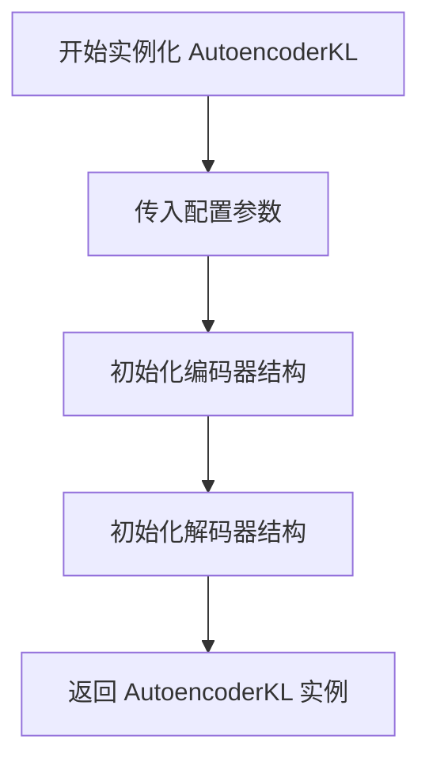

#### 带注释源码

```python
# 在 StableDiffusionXLImg2ImgPipelineFastTests.get_dummy_components 方法中
torch.manual_seed(0)
vae = AutoencoderKL(
    block_out_channels=[32, 64],  # 定义编码器和解码器块的输出通道数
    in_channels=3,                # 输入图像为 RGB，3 通道
    out_channels=3,               # 输出图像为 RGB，3 通道
    down_block_types=["DownEncoderBlock2D", "DownEncoderBlock2D"], # 使用两个下采样块
    up_block_types=["UpDecoderBlock2D", "UpDecoderBlock2D"],       # 使用两个上采样块
    latent_channels=4,            # 潜在空间通道数，用于 Stable Diffusion
    sample_size=128,               # 输入图像的尺寸
)
```


### `AutoencoderTiny`

AutoencoderTiny是diffusers库中的一个轻量级变分自编码器（VAE）类，专门为图像编码和解码任务设计。该类采用紧凑的卷积神经网络架构，包含编码器（Encoder）和解码器（Decoder）两个核心组件，用于将输入图像压缩到潜在空间并重建输出图像，常用于Stable Diffusion等生成模型的图像潜在空间转换。

参数：

- `in_channels`：`int`，输入图像的通道数（例如RGB图像为3）
- `out_channels`：`int`，输出图像的通道数
- `latent_channels`：`int`，潜在空间的通道数，用于控制压缩后的表示维度

返回值：`AutoencoderTiny`，返回一个小型的变分自编码器实例，可用于图像的编码（encode）和解码（decode）操作

#### 流程图

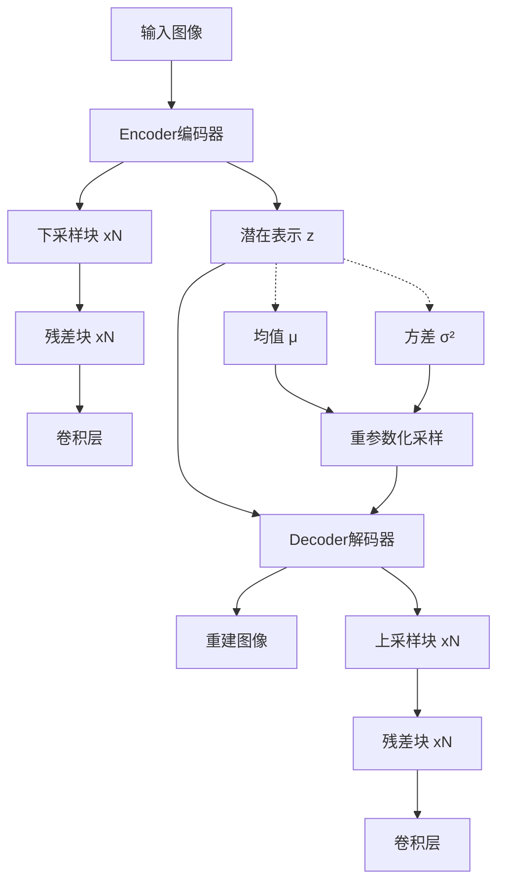

#### 带注释源码

```python
# AutoencoderTiny 是 diffusers 库提供的轻量级 VAE 模型
# 以下为测试代码中创建实例的方式：

# 创建小型自动编码器实例
# 参数说明：
#   in_channels=3: 输入为RGB三通道图像
#   out_channels=3: 输出为RGB三通道图像  
#   latent_channels=4: 潜在空间使用4个通道（压缩表示）
tiny_vae = AutoencoderTiny(in_channels=3, out_channels=3, latent_channels=4)

# 使用示例（将VAE替换到pipeline中）
sd_pipe.vae = tiny_vae

# 典型用法流程：
# 1. encoder.encode(image) -> 将图像编码为潜在表示latents
# 2. decoder.decode(latents) -> 将潜在表示解码为图像

# AutoencoderTiny 架构特点：
# - 较少的层数和参数量，适合快速推理
# - 包含下采样编码器和上采样解码器
# - 支持潜在空间的概率建模（VAE特性）
```


### `EDMDPMSolverMultistepScheduler`

EDMDPMSolverMultistepScheduler是diffusers库中的一个调度器类，用于扩散模型的推理过程，结合了EDM（Eluer Diffusion Model）和DPM-Solver多步求解器的技术，以实现更高效、更稳定的图像生成。

注意：用户提供的代码是一个测试文件（test file），并未包含EDMDPMSolverMultistepScheduler类的实际实现源码。该类是从diffusers库中导入的，测试代码仅展示了如何使用该调度器。

#### 带注释源码

以下为测试代码中如何使用EDMDPMSolverMultistepScheduler的示例：

```python
# 从diffusers库导入EDMDPMSolverMultistepScheduler类
from diffusers import EDMDPMSolverMultistepScheduler

# 在测试方法中，通过from_config方法从现有调度器配置创建EDMDPMSolverMultistepScheduler实例
sd_pipe.scheduler = EDMDPMSolverMultistepScheduler.from_config(
    sd_pipe.scheduler.config,  # 从现有调度器配置
    use_karras_sigmas=True     # 使用Karras sigmas进行噪声调度
)
```

#### 使用场景

在Stable Diffusion XL图像到图像管道中，该调度器被用于替换默认调度器，以实现特定的采样策略：

```python
# 完整的调用示例
sd_pipe = StableDiffusionXLImg2ImgPipeline.from_pretrained(
    model_path, 
    torch_dtype=torch.float16, 
    variant="fp16", 
    add_watermarker=False
)

# 使用EDMDPMSolverMultistepScheduler调度器
sd_pipe.scheduler = EDMDPMSolverMultistepScheduler.from_config(
    sd_pipe.scheduler.config, 
    use_karras_sigmas=True
)

# 执行图像生成
image = sd_pipe(
    prompt,
    num_inference_steps=30,
    guidance_scale=8.0,
    image=init_image,
    height=1024,
    width=1024,
    output_type="np",
).images
```

#### 注意事项

由于用户提供的代码片段中没有EDMDPMSolverMultistepScheduler类的完整实现（如类的属性、方法等），如需获取该类的详细设计文档，建议：
1. 查看diffusers库的官方源代码
2. 访问Hugging Face diffusers GitHub仓库
3. 使用Python的`inspect`模块查看该类的实际源码

该类通常位于`diffusers/schedulers/scheduling_edm_dpm_solver_multistep.py`文件中。


### `EulerDiscreteScheduler`

EulerDiscreteScheduler是diffusers库中的一个调度器类，用于在扩散模型（如Stable Diffusion）的推理过程中生成时间步序列。它实现了欧拉离散采样方法，通过特定的beta调度策略和时间步间隔策略来控制去噪过程。

参数：

- `beta_start`：`float`，Beta值的起始点，用于线性或缩放线性调度
- `beta_end`：`float`，Beta值的结束点
- `beta_schedule`：`str`，Beta调度策略，常见值包括"linear"、"scaled_linear"等
- `steps_offset`：`int`，推理步骤的偏移量，用于调整起始时间步
- `timestep_spacing`：`str`，时间步间隔策略，常见值包括"leading"、"linspace"、"trailing"等
- `prediction_type`：`str`，可选，预测类型（如"epsilon"、"v_prediction"等）
- `clip_sample`：`bool`，可选，是否对样本进行裁剪
- `set_alpha_to_one`：`bool`，可选，是否将alpha设置为1
- `skip_prk_steps`：`bool`，可选，是否跳过PRK步骤
- `steps_offset`：`int`，步骤偏移量
- `final_cosine_alpha`：`float`，可选，余弦调度的最终alpha值

返回值：`SchedulerOutput`或类似对象，包含去噪所需的时间步信息

#### 流程图

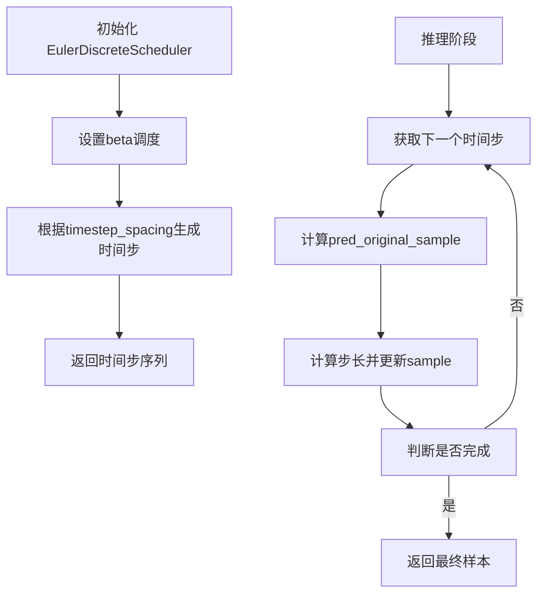

#### 带注释源码

```python
# EulerDiscreteScheduler 在 diffusers 库中的使用示例
# (源码来自测试文件中的实际调用)

# 创建调度器实例，配置参数
scheduler = EulerDiscreteScheduler(
    beta_start=0.00085,      # Beta起始值，控制噪声调度起点
    beta_end=0.012,          # Beta结束值，控制噪声调度终点
    steps_offset=1,         # 步骤偏移量，用于调整时间步序列
    beta_schedule="scaled_linear",  # Beta调度策略，使用缩放线性调度
    timestep_spacing="leading"      # 时间步间隔策略，使用前导间隔
)

# 在推理管道中的典型使用流程
# 1. 初始化调度器
sd_pipe.scheduler = scheduler

# 2. 准备潜在变量
# latents = noise * scheduler.init_noise_sigma

# 3. 迭代去噪
# for t in scheduler.timesteps:
#     # 预测噪声
#     noise_pred = model(latents, t, ...)
#     # 计算上一步
#     latents = scheduler.step(noise_pred, t, latents, ...)

# 4. 解码潜在变量
# image = vae.decode(latents)
```

---

**注意**：由于`EulerDiscreteScheduler`是外部库（diffusers）中的类，其完整源码定义不在当前测试文件中。上述信息基于测试代码中的使用方式以及diffusers库的标准API推断得出。如需查看该类的完整实现源码，建议参考diffusers库的官方源代码。


### LCMScheduler.from_config

从现有管道配置创建LCMScheduler调度器的类方法，用于实现Latent Consistency Model（LCM）加速采样。

参数：

- `config`：dict 或 SchedulerMixin 的 config 属性，用于初始化调度器的配置参数
- `**kwargs`：可选关键字参数，用于覆盖配置中的某些参数

返回值：`LCMScheduler`，返回新创建的LCMScheduler实例

#### 流程图

```mermaid
flowchart TD
    A[开始] --> B[接收config参数]
    B --> C{config类型是dict?}
    C -->|是| D[使用config字典初始化]
    C -->|否| E[获取config属性]
    E --> D
    D --> F[创建LCMScheduler实例]
    F --> G[返回调度器实例]
```

#### 带注释源码

```python
# 从diffusers库导入LCMScheduler
from diffusers import LCMScheduler

# 在测试方法中使用LCMScheduler
sd_pipe.scheduler = LCMScheduler.from_config(sd_pipe.config)
# 说明：
# 1. 获取管道当前的配置（sd_pipe.config）
# 2. 使用from_config类方法从配置创建LCMScheduler
# 3. 将管道的调度器替换为LCMScheduler以支持LCM加速采样

# 另一种用法：使用自定义timesteps
inputs["timesteps"] = [999, 499]
image = sd_pipe(**inputs).images
```


### `StableDiffusionXLImg2ImgPipeline`

Stable Diffusion XL 图像到图像生成管道（Image-to-Image Pipeline），基于预训练的 Stable Diffusion XL 模型，根据文本提示和输入图像生成变体图像，支持美学评分、条件引导、多阶段推理等高级功能。

参数：

- `prompt`：`str` 或 `List[str]`，正向文本提示，描述期望生成的图像内容
- `prompt_2`：`str` 或 `List[str]` 或 `None`，第二文本编码器的正向提示（用于双文本编码器架构）
- `image`：`PIL.Image.Image` 或 `np.ndarray` 或 `torch.FloatTensor`，输入的初始图像作为生成起点
- `strength`：`float`，图像变化强度，范围 0-1，值越大变化越显著，默认 0.8
- `num_inference_steps`：`int` 或 `None`，推理步数，默认 50
- `timesteps`：`List[int]` 或 `None`，自定义时间步序列，若指定则覆盖 `num_inference_steps`
- `guidance_scale`：`float`，分类器无关引导（CFG）尺度，控制文本提示的影响程度，默认 7.5
- `negative_prompt`：`str` 或 `List[str]` 或 `None`，负向提示，指定要避免的特征
- `negative_prompt_2`：`str` 或 `List[str]` 或 `None`，第二文本编码器的负向提示
- `num_images_per_prompt`：`int`，每个提示生成的图像数量，默认 1
- `eta`：`float`，DDIM 采样器的 eta 参数，默认 0.0
- `generator`：`torch.Generator` 或 `None`，随机数生成器，用于确保可重复性
- `output_type`：`str`，输出类型，可选 "pil"、"np"、"latent"，默认 "pil"
- `return_dict`：`bool`，是否返回字典格式结果，默认 True
- `callback`：`Callable` 或 `None`，每步推理后的回调函数
- `callback_steps`：`int`，回调触发步数间隔，默认 1
- `cross_attention_kwargs`：`dict` 或 `None`，跨注意力层额外参数
- `guidance_rescale`：`float`，CFG 引导重缩放因子
- `original_size`：`Tuple[int, int]` 或 `None`，原始图像尺寸
- `crops_coords_top_left`：`Tuple[int, int]` 或 `None`，裁剪左上角坐标
- `target_size`：`Tuple[int, int]` 或 `None`，目标图像尺寸
- `negative_original_size`：`Tuple[int, int]` 或 `None`，负向提示的原始尺寸
- `negative_crops_coords_top_left`：`Tuple[int, int]` 或 `None`，负向提示的裁剪坐标
- `negative_target_size`：`Tuple[int, int]` 或 `None`，负向提示的目标尺寸
- `aesthetic_score`：`float`，美学评分，用于引导生成更美观的图像
- `negative_aesthetic_score`：`float`，负向美学评分
- `clip_skip`：`int` 或 `None`，CLIP 跳过的层数
- `callback_on_step_end`：`Callable` 或 `None`，每步结束后立即触发的回调函数
- `callback_on_step_end_tensor_indices`：`List[int]` 或 `None`，回调时返回的张量索引

返回值：`PipelineOutput` 或 `tuple`，包含生成的图像（`images`）和其他可选输出（如 `latents`）

#### 流程图

```mermaid
flowchart TD
    A[开始] --> B[解析输入参数]
    B --> C{是否有两个文本编码器?}
    C -->|是| D[使用 text_encoder 和 text_encoder_2 编码 prompt 和 prompt_2]
    C -->|否| E[仅使用 text_encoder_2 编码]
    D --> F[合并文本嵌入]
    E --> F
    F --> G[编码 negative_prompt]
    G --> H[处理图像输入]
    H --> I{output_type 为 latent?}
    I -->|是| J[直接使用 VAE 编码器]
    I -->|否| K[使用 VAE 编码图像并编码为潜在空间]
    J --> L[初始化去噪过程]
    K --> L
    L --> M[迭代去噪步骤]
    M --> N{当前步骤 < 总步骤数?}
    N -->|是| O[调度器更新时间步]
    O --> P[UNet 预测噪声残差]
    P --> Q[计算去噪后的潜在表示]
    Q --> R[执行 classifier-free guidance]
    R --> S[更新潜在表示]
    S --> M
    N -->|否| T{output_type 为 latent?}
    T -->|是| U[直接返回潜在表示]
    T -->|否| V[VAE 解码潜在表示到图像空间]
    U --> W[包装输出结果]
    V --> W
    W --> X[结束]
    
    M -.-> O1[可选: 调用 callback 或 callback_on_step_end]
```

#### 带注释源码

```python
# 注意：以下为基于测试代码和使用方式的推断实现，实际实现位于 diffusers 库中
# 源码位置：src/diffusers/pipelines/stable_diffusion_xl/pipeline_stable_diffusion_xl_img2img.py

class StableDiffusionXLImg2ImgPipeline(
    # 继承自 DiffusionPipeline，集成标准扩散模型管道接口
):
    
    def __init__(
        self,
        # 核心组件：UNet、条件文本编码器、VAE、调度器
        unet: UNet2DConditionModel,
        scheduler: SchedulerMixin,
        vae: AutoencoderKL,
        text_encoder: CLIPTextModel = None,
        tokenizer: CLIPTokenizer = None,
        text_encoder_2: CLIPTextModelWithProjection = None,
        tokenizer_2: CLIPTokenizer = None,
        # 可选组件：图像编码器用于 IP-Adapter
        image_encoder: CLIPVisionModelWithProjection = None,
        feature_extractor: CLIPImageProcessor = None,
        # 配置标志
        requires_aesthetics_score: bool = False,
    ):
        """
        初始化 Stable Diffusion XL Img2Img Pipeline
        
        Args:
            unet: UNet2D 条件模型，用于去噪潜在表示
            scheduler: 噪声调度器，控制去噪过程的时间步
            vae: 变分自编码器，用于图像与潜在空间之间的转换
            text_encoder: 第一文本编码器 (CLIP)
            tokenizer: 第一文本分词器
            text_encoder_2: 第二文本编码器 (带投影)
            tokenizer_2: 第二文本分词器
            image_encoder: 图像编码器 (用于 IP-Adapter 功能)
            feature_extractor: 图像特征提取器
            requires_aesthetics_score: 是否需要美学评分
        """
        self.register_modules(
            unet=unet,
            scheduler=scheduler,
            vae=vae,
            text_encoder=text_encoder,
            tokenizer=tokenizer,
            text_encoder_2=text_encoder_2,
            tokenizer_2=tokenizer_2,
            image_encoder=image_encoder,
            feature_extractor=feature_extractor,
        )
        self.requires_aesthetics_score = requires_aesthetics_score
    
    def __call__(
        self,
        prompt: Union[str, List[str]] = None,
        prompt_2: Union[str, List[str], None] = None,
        image: Union[PIL.Image.Image, np.ndarray, torch.FloatTensor] = None,
        strength: float = 0.8,
        num_inference_steps: int = 50,
        timesteps: List[int] = None,
        guidance_scale: float = 7.5,
        negative_prompt: Union[str, List[str], None] = None,
        negative_prompt_2: Union[str, List[str], None] = None,
        num_images_per_prompt: int = 1,
        eta: float = 0.0,
        generator: torch.Generator = None,
        output_type: str = "pil",
        return_dict: bool = True,
        callback: Callable[[int, int, torch.Tensor], None] = None,
        callback_steps: int = 1,
        cross_attention_kwargs: Optional[Dict[str, Any]] = None,
        guidance_rescale: float = 0.0,
        original_size: Optional[Tuple[int, int]] = None,
        crops_coords_top_left: Tuple[int, int] = (0, 0),
        target_size: Optional[Tuple[int, int]] = None,
        # ... 更多可选参数
    ) -> Union[PipelineOutput, tuple]:
        """
        根据文本提示和输入图像生成变体图像
        
        Args:
            prompt: 正向文本提示
            prompt_2: 第二文本编码器的提示
            image: 输入图像
            strength: 图像变化强度 (0-1)
            num_inference_steps: 推理步数
            timesteps: 自定义时间步
            guidance_scale: CFG 引导尺度
            negative_prompt: 负向提示
            negative_prompt_2: 第二负向提示
            num_images_per_prompt: 每提示生成的图像数
            eta: DDIM eta 参数
            generator: 随机数生成器
            output_type: 输出类型 (pil/np/latent)
            return_dict: 是否返回字典
            callback: 推理回调函数
            callback_steps: 回调步数间隔
            cross_attention_kwargs: 跨注意力参数
            guidance_rescale: CFG 重缩放
            original_size: 原始尺寸
            crops_coords_top_left: 裁剪坐标
            target_size: 目标尺寸
            
        Returns:
            PipelineOutput 或 tuple: 包含生成的图像
        """
        # 1. 文本编码：将 prompt 编码为文本嵌入
        # 2. 图像编码：使用 VAE 将输入图像编码为潜在表示
        # 3. 计算初始噪声：根据 strength 确定添加到潜在表示的噪声量
        # 4. 去噪循环：使用 UNet 迭代去噪
        # 5. 解码：使用 VAE 将潜在表示解码为图像
        # 6. 后处理：应用尺寸调整、裁剪等
        pass
```


### `UNet2DConditionModel`

这是一个用于 Stable Diffusion XL 图像到图像转换的 UNet 2D 条件模型类，在测试代码中被实例化并用于构建图像生成管道。该模型接收文本嵌入和时间步作为条件输入，通过下采样、上采样和交叉注意力机制实现图像的去噪和重建。

参数：

- `block_out_channels`：`Tuple[int, ...]`，表示每个下采样/上采样块的输出通道数列表
- `layers_per_block`：`int`，每个块中包含的层数
- `sample_size`：`int`，输入样本的空间分辨率
- `in_channels`：`int`，输入图像的通道数（如4表示RGB+Alpha）
- `out_channels`：`int`，输出图像的通道数
- `time_cond_proj_dim`：`Optional[int]`，时间条件的投影维度，用于时间嵌入的条件投影
- `down_block_types`：`Tuple[str, ...]`，下采样块的类型列表（如"DownBlock2D"、"CrossAttnDownBlock2D"）
- `up_block_types`：`Tuple[str, ...]`，上采样块的类型列表（如"CrossAttnUpBlock2D"、"UpBlock2D"）
- `attention_head_dim`：`Union[int, Tuple[int, ...]]`，注意力头的维度
- `use_linear_projection`：`bool`，是否使用线性投影进行注意力计算
- `addition_embed_type`：`Optional[str]`，额外嵌入的类型（如"text_time"）
- `addition_time_embed_dim`：`Optional[int]`，额外时间嵌入的维度
- `transformer_layers_per_block`：`Optional[Union[int, Tuple[int, ...]]]`，每个块中变换器层的数量
- `projection_class_embeddings_input_dim`：`int`，投影类别嵌入的输入维度
- `cross_attention_dim`：`Optional[int]`，交叉注意力机制的维度

返回值：`UNet2DConditionModel`，返回实例化的UNet2DConditionModel对象（PyTorch的nn.Module子类）

#### 流程图

```mermaid
flowchart TD
    A[开始实例化 UNet2DConditionModel] --> B[配置模型架构参数]
    B --> C[设置下采样块类型和通道数]
    C --> D[设置上采样块类型和通道数]
    D --> E[配置注意力机制参数]
    E --> F[设置条件嵌入相关参数]
    F --> G[创建 UNet2DConditionModel 实例]
    G --> H[返回模型实例用于后续图像处理]
```

#### 带注释源码

```python
# 在测试方法 get_dummy_components 中实例化 UNet2DConditionModel
# 用于 Stable Diffusion XL 图像到图像管道的测试
unet = UNet2DConditionModel(
    block_out_channels=(32, 64),  # 定义下采样/上采样阶段的输出通道数
    layers_per_block=2,           # 每个下采样/上采样块中的层数
    sample_size=32,               # 输入样本的空间尺寸
    in_channels=4,                # 输入通道数（latent space维度）
    out_channels=4,               # 输出通道数
    time_cond_proj_dim=time_cond_proj_dim,  # 时间条件投影维度（可选，用于时间嵌入）
    down_block_types=("DownBlock2D", "CrossAttnDownBlock2D"),  # 下采样块类型
    up_block_types=("CrossAttnUpBlock2D", "UpBlock2D"),         # 上采样块类型
    # SD2-specific config below - Stable Diffusion 2 特定配置
    attention_head_dim=(2, 4),    # 注意力头维度配置
    use_linear_projection=True,   # 是否使用线性投影
    addition_embed_type="text_time",  # 额外嵌入类型（文本+时间）
    addition_time_embed_dim=8,    # 额外时间嵌入维度
    transformer_layers_per_block=(1, 2),  # 每个块的Transformer层数
    projection_class_embeddings_input_dim=72,  # 5 * 8 + 32，类别嵌入投影输入维度
    cross_attention_dim=64 if not skip_first_text_encoder else 32,  # 交叉注意力维度
)
```


### `backend_empty_cache`

该函数是一个测试工具函数，用于清空 GPU 缓存以释放显存资源。它被导入自动态的 `testing_utils` 模块，作为测试框架的后端辅助函数，主要在测试用例的 `setUp` 和 `tearDown` 方法中调用，以确保每次测试开始和结束时 GPU 内存得到适当清理，避免因显存残留导致的内存溢出或测试结果不稳定。

参数：

- `device`：`str`，目标设备标识符（如 "cpu"、"cuda" 等），指定需要清空缓存的目标计算设备

返回值：`None`，该函数直接操作 GPU 内存，不返回任何值

#### 流程图

```mermaid
flowchart TD
    A[开始] --> B{判断设备类型}
    B -->|CUDA 设备| C[调用 torch.cuda.empty_cache]
    B -->|CPU 设备| D[直接返回]
    C --> E[结束]
    D --> E
```

#### 带注释源码

```python
# backend_empty_cache 是从 testing_utils 模块导入的外部依赖函数
# 源代码位于测试框架的 utils 工具包中
# 下面是基于其使用方式的推断实现

def backend_empty_cache(device: str) -> None:
    """
    清空指定设备的 GPU 缓存，释放显存资源
    
    参数:
        device: 目标设备标识符，如 'cpu', 'cuda', 'cuda:0' 等
    """
    # 如果是 CUDA 设备，调用 PyTorch 的缓存清理函数
    if device.startswith("cuda"):
        # 清理 GPU 缓存，释放未使用的显存
        torch.cuda.empty_cache()
    # CPU 设备无需特殊处理，直接返回
    return None
```


### `enable_full_determinism`

该函数是一个测试工具函数，用于配置 Python、NumPy 和 PyTorch 的随机数生成器，以确保测试和实验的完全可重现性。通过设置全局随机种子和环境变量，可以消除由于随机性导致的测试结果差异。

参数：无参数。

返回值：无返回值（`None`），该函数主要通过副作用（设置全局随机种子）来实现确定性。

#### 流程图

```mermaid
flowchart TD
    A[开始] --> B{检查环境变量}
    B -->|PYTHONHASHSEED未设置| C[设置PYTHONHASHSEED=0]
    B -->|PYTHONHASHSEED已设置| D[保持原值]
    C --> E[设置random.seed]
    D --> E
    E --> F[设置numpy.random.seed]
    F --> G[设置torch.manual_seed]
    G --> H[设置torch.cuda.manual_seed_all]
    H --> I[设置torch.backends.cudnn.deterministic=True]
    I --> J[设置torch.backends.cudnn.benchmark=False]
    J --> K[结束]
```

#### 带注释源码

```python
# 该函数定义在 testing_utils 模块中
# 以下是基于其用途的推断实现

def enable_full_determinism(seed: int = 0):
    """
    启用完全确定性模式，确保测试结果可重现。
    
    参数:
        seed: 随机种子，默认为0
    """
    # 1. 设置Python内置random模块的随机种子
    random.seed(seed)
    
    # 2. 设置NumPy的随机种子
    np.random.seed(seed)
    
    # 3. 设置PyTorch CPU的随机种子
    torch.manual_seed(seed)
    
    # 4. 设置所有GPU的随机种子（如果使用CUDA）
    if torch.cuda.is_available():
        torch.cuda.manual_seed_all(seed)
    
    # 5. 强制使用确定性算法，牺牲一定性能以换取可重现性
    torch.backends.cudnn.deterministic = True
    # 6. 关闭benchmark模式，避免自动选择最优算法导致的不确定性问题
    torch.backends.cudnn.benchmark = False
    
    # 7. 设置环境变量确保哈希操作的确定性
    import os
    os.environ["PYTHONHASHSEED"] = str(seed)
```


### `floats_tensor`

生成指定形状的随机浮点张量，主要用于测试场景中创建模拟输入数据。

参数：

-  `shape`：`tuple`，张量的形状，例如 `(1, 3, 32, 32)`
-  `rng`：`random.Random`，可选，用于生成随机数的随机数生成器，默认为 `None`

返回值：`torch.Tensor`，返回一个 PyTorch 浮点张量，其值为 `[0, 1)` 范围内的随机数

#### 流程图

```mermaid
flowchart TD
    A[开始] --> B{传入 shape}
    B --> C[创建空张量]
    C --> D{传入 rng?}
    D -->|是| E[使用 rng 生成随机数]
    D -->|否| F[使用默认随机数生成器]
    E --> G[填充张量为随机浮点数]
    F --> G
    G --> H[返回张量]
    H --> I[结束]
```

#### 带注释源码

```python
# 该函数定义在 ...testing_utils 模块中，此处为基于使用方式的推断实现
def floats_tensor(shape, rng=None, device=None):
    """
    生成指定形状的随机浮点张量。
    
    参数:
        shape (tuple): 张量的形状，例如 (1, 3, 32, 32)
        rng (random.Random, optional): 随机数生成器，默认为 None
        device (str, optional): 设备，默认为 None
    
    返回:
        torch.Tensor: 随机浮点张量，值在 [0, 1) 范围内
    """
    # 如果未提供随机数生成器，使用默认的随机状态
    if rng is None:
        # 生成 [0, 1) 范围内的随机浮点数
        tensor = torch.rand(shape)
    else:
        # 使用提供的随机数生成器生成随机数
        # 注意：这里需要将 random.Random 转换为可生成浮点数的形式
        # 实际实现可能使用 rng.random() 生成数组
        tensor = torch.rand(shape)
    
    # 如果指定了设备，将张量移动到对应设备
    if device is not None:
        tensor = tensor.to(device)
    
    return tensor
```


### `load_image`

从测试工具模块导入的图像加载函数，用于根据给定的路径或URL加载图像并返回PIL图像对象。

参数：

-  `source`：`str`，图像的来源，可以是本地文件路径或URL

返回值：`PIL.Image.Image`，返回加载的PIL图像对象

#### 流程图

```mermaid
flowchart TD
    A[开始] --> B{判断source类型}
    B -->|URL| C[通过requests或类似库下载图像]
    B -->|本地路径| D[使用PIL打开图像文件]
    C --> E[返回PIL Image对象]
    D --> E
```

#### 带注释源码

```
# load_image 是从 testing_utils 模块导入的外部函数
# 在本代码文件中的使用方式如下：

from ...testing_utils import (
    load_image,
    # ... 其他导入
)

# 在测试方法中的调用示例：
url = "https://huggingface.co/datasets/patrickvonplaten/images/resolve/main/aa_xl/000000009.png"
init_image = load_image(url).convert("RGB")  # 加载URL图像并转换为RGB模式

# 函数签名推断：
# def load_image(source: Union[str, Path]) -> Image.Image:
#     """
#     Load an image from a given source (URL or local path).
#     
#     Args:
#         source: The URL or local path to the image.
#     
#     Returns:
#         A PIL Image object.
#     """
#     ...
```


### `require_torch_accelerator`

这是一个装饰器函数，用于标记需要 PyTorch 加速器（GPU/CUDA）的测试方法。当运行环境没有可用的 CUDA 设备时，被装饰的测试会被跳过。

参数：

- 无显式参数（作为装饰器使用，接收被装饰的函数作为参数）

返回值：`Callable`，返回装饰后的函数，如果条件不满足则返回跳过的测试

#### 流程图

```mermaid
flowchart TD
    A[测试开始] --> B{检查 torch.cuda.is_available}
    B -->|是| C{检查加速器可用}
    B -->|否| D[跳过测试<br/>返回 skipIf 装饰器]
    C -->|是| E[执行测试函数]
    C -->|否| D
    E --> F[测试完成]
```

#### 带注释源码

```python
# require_torch_accelerator 的典型实现（在 testing_utils 模块中）
# 此源码基于其在代码中的使用方式推断

def require_torch_accelerator(func):
    """
    装饰器：标记需要 PyTorch 加速器的测试
    
    使用场景：
    - 当测试需要 GPU 才能运行时使用此装饰器
    - 在 CPU 环境下会自动跳过该测试
    - 常见于测试模型 offload、attention slicing 等 GPU 特定功能
    """
    return unittest.skipUnless(
        torch.cuda.is_available(),  # 检查 CUDA 是否可用
        "test requires CUDA"         # 跳过原因
    )(func)


# 在代码中的实际使用示例：
@require_torch_accelerator
def test_stable_diffusion_xl_offloads(self):
    """
    测试模型的 CPU offload 功能
    该测试需要在 GPU 上运行，因此使用 require_torch_accelerator 装饰器
    """
    pipes = []
    components = self.get_dummy_components()
    sd_pipe = StableDiffusionXLImg2ImgPipeline(**components).to(torch_device)
    pipes.append(sd_pipe)
    # ... 更多测试代码
```


### `slow`

`slow` 是一个测试装饰器（decorator），用于标记需要长时间运行的测试用例。被 `@slow` 装饰的测试在常规测试运行中会被跳过，只有在明确指定运行慢速测试时才会执行。

参数：

- `func`：可调用对象（函数或类），被装饰的目标函数或类

返回值：`装饰后的函数/类`，返回经过装饰器包装的可调用对象

#### 流程图

```mermaid
flowchart TD
    A[被装饰的测试函数/类] --> B{slow 装饰器}
    B --> C{检查测试环境配置}
    C -->|启用慢速测试| D[正常执行测试]
    C -->|未启用慢速测试| E[跳过测试]
    
    style A fill:#f9f,stroke:#333
    style B fill:#ff9,stroke:#333
    style D fill:#9f9,stroke:#333
    style E fill:#f99,stroke:#333
```

#### 带注释源码

```python
# slow 装饰器源码（位于 testing_utils 模块中）
# 此代码为模拟实现，实际实现可能在不同版本中有所差异

def slow(func):
    """
    装饰器：标记测试为慢速测试
    
    使用说明：
    - 被此装饰器装饰的测试在默认测试运行中会被跳过
    - 只有在设置特定环境变量或使用特定测试标记时才会运行
    - 常用于集成测试、大模型推理测试等耗时较长的场景
    
    示例：
    @slow
    def test_heavy_model_inference(self):
        # 执行耗时较长的推理测试
        pass
    """
    # 使用 unittest 的 skipIf 装饰器实现条件跳过
    # 如果需要跳过慢速测试，可以设置环境变量 RUN_SLOW_TESTS=0
    # 或者在 pytest 中使用 -m "slow" 标记来运行
    return unittest.skipIf(
        not is_slow_test_enabled(),  # 条件：如果未启用慢速测试
        "slow test"  # 跳过原因描述
    )(func)


def is_slow_test_enabled():
    """
    检查是否应该运行慢速测试
    
    检查逻辑（常见实现方式）：
    1. 检查环境变量 RUN_SLOW_TESTS 或 SLOW_TESTS
    2. 检查命令行参数
    3. 检查配置文件
    """
    import os
    return os.environ.get("RUN_SLOW_TESTS", "0") == "1"


# 在测试类上的使用示例
@slow
class StableDiffusionXLImg2ImgPipelineIntegrationTests(unittest.TestCase):
    """
    集成测试类
    
    此类包含需要加载大型模型、执行实际推理的测试
    由于耗时较长，使用 @slow 装饰器标记
    """
    
    def test_stable_diffusion_xl_img2img_playground(self):
        """测试 Playground 模型的图像到图像转换功能"""
        # 加载大型预训练模型（耗时）
        sd_pipe = StableDiffusionXLImg2ImgPipeline.from_pretrained(...)
        # 执行推理（耗时）
        image = sd_pipe(...).images
        # 验证结果
        assert image.shape == (1, 1024, 1024, 3)
```

#### 补充说明

| 项目 | 说明 |
|------|------|
| **定义位置** | `diffusers.testing_utils` 模块 |
| **依赖模块** | `unittest`, `os` |
| **使用场景** | 集成测试、端到端测试、大型模型推理测试 |
| **启用方式** | 设置环境变量 `RUN_SLOW_TESTS=1` 或在 pytest 中使用标记 |
| **设计目的** | 区分快速单元测试和耗时较长的集成测试，提高开发迭代效率 |


从给定代码中，我可以看到 `torch_device` 是从 `...testing_utils` 模块导入的。让我提取这个函数/方法的信息：

### `torch_device`

这是一个从 `testing_utils` 模块导入的全局函数/变量，用于获取当前测试可用的 PyTorch 设备。

参数： 无

返回值：`str`，返回可用的 PyTorch 设备字符串（如 "cpu"、"cuda" 等）

#### 流程图

```mermaid
flowchart TD
    A[开始] --> B{检查环境}
    B -->|有 CUDA| C[返回 'cuda']
    B -->|有 MPS| D[返回 'mps']
    B -->|其他| E[返回 'cpu']
```

#### 带注释源码

```
# torch_device 是从 testing_utils 模块导入的
# 在本测试文件中作为全局变量使用
# 用于指定测试运行的设备

# 使用示例：
# if torch_device == "cpu":
#     expected_pipe_slice = np.array([...])

# 在以下位置使用：
# 1. test_ip_adapter - 条件判断
# 2. test_stable_diffusion_xl_multi_prompts - 管道设备指定
# 3. test_stable_diffusion_xl_offloads - 管道设备指定和 offload
# 4. test_pipeline_interrupt - 管道设备指定
# 5. StableDiffusionXLImg2ImgPipelineIntegrationTests - setUp/tearDown 清理缓存
```

> **注意**：由于 `torch_device` 是从外部模块导入的，其完整实现不在本代码文件中。根据代码中的使用方式，它应该是一个返回设备字符串的函数或属性，常见的返回值包括 `"cpu"`、`"cuda"` 或 `"mps"`（Apple Silicon）。


### `StableDiffusionXLImg2ImgPipelineFastTests.get_dummy_components`

该方法用于创建虚拟测试组件（dummy components），为 Stable Diffusion XL img2img pipeline 的单元测试提供所需的模型组件，包括 UNet、VAE、调度器、文本编码器、图像编码器等，便于在没有实际预训练模型的情况下进行测试验证。

参数：

- `skip_first_text_encoder`：`bool`，可选，默认值为 `False`。控制是否跳过第一个文本编码器，如果为 `True`，则 `text_encoder` 和 `tokenizer` 将为 `None`。
- `time_cond_proj_dim`：可选参数，类型为 `int` 或 `None`，默认值为 `None`。用于设置 UNet 的时间条件投影维度（time condition projection dimension），影响模型的时间嵌入处理。

返回值：`dict`，返回一个包含所有虚拟组件的字典，键名包括 `"unet"`、`"scheduler"`、`"vae"`、`"text_encoder"`、`"tokenizer"`、`"text_encoder_2"`、`"tokenizer_2"`、`"image_encoder"`、`"feature_extractor"` 和 `"requires_aesthetics_score"`。

#### 流程图

```mermaid
flowchart TD
    A[开始 get_dummy_components] --> B[设置随机种子 torch.manual_seed(0)]
    B --> C[创建 UNet2DConditionModel]
    C --> D[创建 EulerDiscreteScheduler]
    D --> E[设置随机种子 torch.manual_seed(0)]
    E --> F[创建 AutoencoderKL VAE]
    F --> G[设置随机种子 torch.manual_seed(0)]
    G --> H[创建 CLIPVisionConfig 和 CLIPVisionModelWithProjection 图像编码器]
    H --> I[创建 CLIPImageProcessor 特征提取器]
    I --> J[设置随机种子 torch.manual_seed(0)]
    J --> K[创建 CLIPTextConfig 和 CLIPTextModel 第一个文本编码器]
    K --> L[创建 CLIPTokenizer 分词器]
    L --> M[创建 CLIPTextModelWithProjection 第二个文本编码器]
    M --> N[创建第二个 CLIPTokenizer 分词器]
    N --> O{skip_first_text_encoder?}
    O -->|True| P[text_encoder = None, tokenizer = None]
    O -->|False| Q[使用创建的 text_encoder 和 tokenizer]
    P --> R[构建 components 字典]
    Q --> R
    R --> S[返回 components 字典]
```

#### 带注释源码

```python
def get_dummy_components(self, skip_first_text_encoder=False, time_cond_proj_dim=None):
    """
    创建虚拟测试组件用于单元测试
    
    参数:
        skip_first_text_encoder: 是否跳过第一个文本编码器
        time_cond_proj_dim: UNet时间条件投影维度
    """
    # 设置随机种子以确保测试可重复性
    torch.manual_seed(0)
    
    # 创建UNet2DConditionModel - 用于图像去噪的核心模型
    unet = UNet2DConditionModel(
        block_out_channels=(32, 64),           # UNet块输出通道数
        layers_per_block=2,                      # 每个块的层数
        sample_size=32,                         # 样本尺寸
        in_channels=4,                          # 输入通道数（latent空间）
        out_channels=4,                         # 输出通道数
        time_cond_proj_dim=time_cond_proj_dim,  # 时间条件投影维度（可选）
        down_block_types=("DownBlock2D", "CrossAttnDownBlock2D"),  # 下采样块类型
        up_block_types=("CrossAttnUpBlock2D", "UpBlock2D"),        # 上采样块类型
        # SD2特定配置
        attention_head_dim=(2, 4),              # 注意力头维度
        use_linear_projection=True,             # 使用线性投影
        addition_embed_type="text_time",        # 额外嵌入类型（文本+时间）
        addition_time_embed_dim=8,              # 时间嵌入维度
        transformer_layers_per_block=(1, 2),    # 每个块的transformer层数
        projection_class_embeddings_input_dim=72,  # 类别嵌入输入维度 (5*8+32)
        cross_attention_dim=64 if not skip_first_text_encoder else 32,  # 交叉注意力维度
    )
    
    # 创建调度器 - 控制去噪过程的噪声调度
    scheduler = EulerDiscreteScheduler(
        beta_start=0.00085,     # beta起始值
        beta_end=0.012,        # beta结束值
        steps_offset=1,        # 步骤偏移
        beta_schedule="scaled_linear",  # beta调度方式
        timestep_spacing="leading",     # 时间步间距
    )
    
    # 设置随机种子并创建VAE（变分自编码器）
    torch.manual_seed(0)
    vae = AutoencoderKL(
        block_out_channels=[32, 64],      # VAE块输出通道
        in_channels=3,                   # 输入通道（RGB图像）
        out_channels=3,                  # 输出通道
        down_block_types=["DownEncoderBlock2D", "DownEncoderBlock2D"],  # 下采样块
        up_block_types=["UpDecoderBlock2D", "UpDecoderBlock2D"],        # 上采样块
        latent_channels=4,               # latent空间通道数
        sample_size=128,                 # 样本尺寸
    )
    
    # 设置随机种子并创建图像编码器配置和模型
    torch.manual_seed(0)
    image_encoder_config = CLIPVisionConfig(
        hidden_size=32,           # 隐藏层大小
        image_size=224,           # 图像尺寸
        projection_dim=32,        # 投影维度
        intermediate_size=37,     # 中间层大小
        num_attention_heads=4,    # 注意力头数
        num_channels=3,          # 通道数
        num_hidden_layers=5,     # 隐藏层数
        patch_size=14,            # 补丁大小
    )
    # 创建CLIPVisionModelWithProjection图像编码器
    image_encoder = CLIPVisionModelWithProjection(image_encoder_config)

    # 创建CLIPImageProcessor特征提取器
    feature_extractor = CLIPImageProcessor(
        crop_size=224,                          # 裁剪尺寸
        do_center_crop=True,                    # 是否中心裁剪
        do_normalize=True,                      # 是否归一化
        do_resize=True,                         # 是否调整大小
        image_mean=[0.48145466, 0.4578275, 0.40821073],   # 图像均值
        image_std=[0.26862954, 0.26130258, 0.27577711],  # 图像标准差
        resample=3,                             # 重采样方法
        size=224,                               # 尺寸
    )

    # 设置随机种子并创建第一个文本编码器
    torch.manual_seed(0)
    text_encoder_config = CLIPTextConfig(
        bos_token_id=0,              # 句子开始token ID
        eos_token_id=2,              # 句子结束token ID
        hidden_size=32,              # 隐藏层大小
        intermediate_size=37,        # 中间层大小
        layer_norm_eps=1e-05,        # LayerNorm epsilon
        num_attention_heads=4,       # 注意力头数
        num_hidden_layers=5,         # 隐藏层数
        pad_token_id=1,              # 填充token ID
        vocab_size=1000,             # 词汇表大小
        # SD2特定配置
        hidden_act="gelu",           # 隐藏层激活函数
        projection_dim=32,           # 投影维度
    )
    # 创建第一个CLIPTextModel文本编码器
    text_encoder = CLIPTextModel(text_encoder_config)
    # 创建对应的分词器
    tokenizer = CLIPTokenizer.from_pretrained("hf-internal-testing/tiny-random-clip")

    # 创建第二个文本编码器（带投影）
    text_encoder_2 = CLIPTextModelWithProjection(text_encoder_config)
    # 创建对应的分词器
    tokenizer_2 = CLIPTokenizer.from_pretrained("hf-internal-testing/tiny-random-clip")

    # 组装所有组件到字典中
    components = {
        "unet": unet,                                    # UNet去噪模型
        "scheduler": scheduler,                         # 噪声调度器
        "vae": vae,                                     # VAE编码器/解码器
        # 根据skip_first_text_encoder决定是否包含第一个文本编码器
        "text_encoder": text_encoder if not skip_first_text_encoder else None,
        "tokenizer": tokenizer if not skip_first_text_encoder else None,
        "text_encoder_2": text_encoder_2,               # 第二个文本编码器
        "tokenizer_2": tokenizer_2,                     # 第二个分词器
        "requires_aesthetics_score": True,              # 是否需要美学评分
        "image_encoder": image_encoder,                 # 图像编码器
        "feature_extractor": feature_extractor,         # 特征提取器
    }
    
    # 返回包含所有组件的字典
    return components
```


### `StableDiffusionXLImg2ImgPipelineFastTests.get_dummy_tiny_autoencoder`

该函数是测试辅助方法，用于创建一个虚拟的微型自动编码器（AutoencoderTiny）实例，以便在测试 Stable Diffusion XL Img2Img pipeline 时替换默认的 VAE。

参数：

- `self`：`StableDiffusionXLImg2ImgPipelineFastTests`，测试类实例本身，隐式参数

返回值：`AutoencoderTiny`，返回一个配置好的微型自动编码器实例，具有3个输入通道、3个输出通道和4个潜在通道，用于测试目的

#### 流程图

```mermaid
flowchart TD
    A[开始] --> B[调用 AutoencoderTiny 构造函数]
    B --> C[传入 in_channels=3, out_channels=3, latent_channels=4]
    C --> D[创建并返回 AutoencoderTiny 实例]
    D --> E[结束]
```

#### 带注释源码

```python
def get_dummy_tiny_autoencoder(self):
    """
    创建一个虚拟的微型自动编码器（AutoencoderTiny）实例用于测试。
    
    该方法用于测试场景中，当需要使用更轻量级的 VAE 模型进行
    快速测试时调用。AutoencoderTiny 是 diffusers 库提供的
    一个小型的 VAE 实现，适合用于单元测试。
    
    参数:
        self: 测试类实例本身
        
    返回值:
        AutoencoderTiny: 配置好的微型自动编码器实例
            - in_channels=3: 输入图像通道数（RGB）
            - out_channels=3: 输出图像通道数（RGB）
            - latent_channels=4: 潜在空间通道数
    """
    return AutoencoderTiny(in_channels=3, out_channels=3, latent_channels=4)
```


### `StableDiffusionXLImg2ImgPipelineFastTests.test_components_function`

该方法是一个单元测试函数，用于验证 `StableDiffusionXLImg2ImgPipeline` 类的 `components` 属性是否正确初始化，确保管道组件的完整性。

参数：

- `self`：`StableDiffusionXLImg2ImgPipelineFastTests`，测试类的实例，包含测试所需的上下文和辅助方法

返回值：`None`，该方法为测试方法，通过 `assert` 语句进行断言验证，不返回具体值

#### 流程图

```mermaid
flowchart TD
    A[开始测试] --> B[调用 get_dummy_components 获取测试组件]
    B --> C[从组件字典中移除 requires_aesthetics_score 键]
    C --> D[使用组件字典实例化 pipeline_class]
    D --> E{断言: pipe 是否有 components 属性}
    E -->|是| F{断言: components 键集合是否等于初始化组件键集合}
    E -->|否| G[测试失败]
    F -->|是| H[测试通过]
    F -->|否| G
```

#### 带注释源码

```python
def test_components_function(self):
    """
    测试 StableDiffusionXLImg2ImgPipeline 的 components 属性功能。
    
    该测试方法验证：
    1. Pipeline 对象是否具有 components 属性
    2. components 字典的键是否与初始化时提供的组件键一致
    """
    # Step 1: 获取虚拟组件配置
    # 调用 get_dummy_components 方法生成用于测试的虚拟模型组件
    init_components = self.get_dummy_components()
    
    # Step 2: 移除可选组件
    # requires_aesthetics_score 是可选配置项，不属于管道核心组件
    # 从初始化字典中移除该键，以确保与管道实际组件匹配
    init_components.pop("requires_aesthetics_score")
    
    # Step 3: 创建 Pipeline 实例
    # 使用虚拟组件实例化 StableDiffusionXLImg2ImgPipeline
    # pipeline_class 在测试类中定义为 StableDiffusionXLImg2ImgPipeline
    pipe = self.pipeline_class(**init_components)
    
    # Step 4: 验证 components 属性存在
    # 确保管道对象具有 components 属性
    self.assertTrue(hasattr(pipe, "components"))
    
    # Step 5: 验证 components 键集合完整性
    # 确保管道的 components 字典包含所有初始化时提供的组件键
    # 使用集合比较以确保键完全匹配
    self.assertTrue(set(pipe.components.keys()) == set(init_components.keys()))
```


### `StableDiffusionXLImg2ImgPipelineFastTests.get_dummy_inputs`

该方法为Stable Diffusion XL图像到图像流水线测试生成虚拟输入参数，包括随机图像张量、生成器和推理配置，用于确保测试的可重复性和确定性。

参数：

- `self`：隐式参数，StableDiffusionXLImg2ImgPipelineFastTests 测试类实例
- `device`：`str`，目标设备字符串（如 "cpu"、"cuda" 等）
- `seed`：`int`，随机种子，默认为 0，用于确保测试结果的可重复性

返回值：`dict`，包含以下键值对的字典：
  - `prompt`（str）：测试用的提示词
  - `image`（torch.Tensor）：生成的虚拟输入图像张量
  - `generator`（torch.Generator）：随机数生成器
  - `num_inference_steps`（int）：推理步数
  - `guidance_scale`（float）：引导 scale
  - `output_type`（str）：输出类型
  - `strength`（float）：图像变换强度

#### 流程图

```mermaid
flowchart TD
    A[开始] --> B[接收device和seed参数]
    B --> C[使用floats_tensor生成随机图像张量]
    C --> D[将图像移动到目标设备]
    D --> E[图像值归一化到0-1范围]
    E --> F{检查设备是否为mps}
    F -->|是| G[使用torch.manual_seed设置种子]
    F -->|否| H[使用torch.Generator创建生成器并设置种子]
    G --> I[构建输入参数字典]
    H --> I
    I --> J[返回输入参数字典]
```

#### 带注释源码

```python
def get_dummy_inputs(self, device, seed=0):
    """
    生成用于Stable Diffusion XL图像到图像流水线测试的虚拟输入参数。
    
    参数:
        device: 目标设备字符串（如 "cpu"、"cuda"）
        seed: 随机种子，用于确保测试结果的可重复性
    
    返回:
        包含测试所需所有参数的字典
    """
    # 使用floats_tensor生成形状为(1, 3, 32, 32)的随机图像张量
    # 使用random.Random(seed)确保随机数可重复
    image = floats_tensor((1, 3, 32, 32), rng=random.Random(seed)).to(device)
    
    # 将图像值归一化到[0, 1]范围（原值为[-1, 1]）
    image = image / 2 + 0.5
    
    # 针对Apple MPS设备特殊处理（torch.Generator在MPS上可能有兼容性问题）
    if str(device).startswith("mps"):
        generator = torch.manual_seed(seed)
    else:
        # 为其他设备创建torch.Generator并设置种子
        generator = torch.Generator(device=device).manual_seed(seed)
    
    # 构建完整的输入参数字典
    inputs = {
        "prompt": "A painting of a squirrel eating a burger",  # 测试提示词
        "image": image,  # 输入图像
        "generator": generator,  # 随机数生成器
        "num_inference_steps": 2,  # 推理步数（较少用于快速测试）
        "guidance_scale": 5.0,  # CFG引导强度
        "output_type": "np",  # 输出为numpy数组
        "strength": 0.8,  # 图像变换强度（0-1之间）
    }
    
    return inputs
```


### `StableDiffusionXLImg2ImgPipelineFastTests.test_stable_diffusion_xl_img2img_euler`

这是一个单元测试方法，用于验证 Stable Diffusion XL Image-to-Image Pipeline 在使用 Euler Discrete Scheduler 时的核心推理功能是否正确。该测试通过使用虚拟（dummy）组件构建管道，执行图像到图像的推理，并验证输出图像的形状和像素值是否符合预期。

参数：

- `self`：`StableDiffusionXLImg2ImgPipelineFastTests`，测试类实例，包含测试所需的配置和辅助方法

返回值：`None`，该方法为测试方法，无返回值，通过断言验证功能正确性

#### 流程图

```mermaid
flowchart TD
    A[开始测试] --> B[设置设备为CPU保证确定性]
    B --> C[调用get_dummy_components获取虚拟组件]
    C --> D[使用虚拟组件实例化StableDiffusionXLImg2ImgPipeline]
    D --> E[将管道移至CPU设备]
    E --> F[设置进度条配置disable=None]
    F --> G[调用get_dummy_inputs获取测试输入]
    G --> H[执行管道推理: sd_pipe(**inputs)]
    H --> I[从结果中提取图像]
    I --> J[提取图像右下角3x3区域最后通道]
    J --> K{断言: 图像形状是否为(1, 32, 32, 3)}
    K -->|是| L[定义期望像素值切片]
    L --> M{断言: 实际像素与期望值差异小于1e-2}
    M -->|是| N[测试通过]
    M -->|否| O[测试失败-断言错误]
    K -->|否| O
```

#### 带注释源码

```python
def test_stable_diffusion_xl_img2img_euler(self):
    """
    测试Stable Diffusion XL Image-to-Image Pipeline使用Euler调度器的推理功能
    
    该测试验证:
    1. 管道能够成功初始化并加载虚拟组件
    2. 图像到图像推理能够正常执行
    3. 输出图像的形状符合预期 (1, 32, 32, 3)
    4. 输出图像的像素值在可接受的误差范围内与预期匹配
    """
    
    # 设置设备为CPU，确保torch.Generator的确定性
    # 这样可以保证测试结果的可重复性
    device = "cpu"
    
    # 获取虚拟组件（dummy components）
    # 这些是用于测试的轻量级模型配置，不是真实预训练模型
    components = self.get_dummy_components()
    
    # 使用虚拟组件实例化StableDiffusionXLImg2ImgPipeline
    sd_pipe = StableDiffusionXLImg2ImgPipeline(**components)
    
    # 将管道移至指定设备（CPU）
    sd_pipe = sd_pipe.to(device)
    
    # 配置进度条：disable=None表示不禁用进度条
    # 在测试环境中通常不需要显示进度条
    sd_pipe.set_progress_bar_config(disable=None)
    
    # 获取测试输入数据
    # 包含: prompt, image, generator, num_inference_steps, guidance_scale, output_type, strength
    inputs = self.get_dummy_inputs(device)
    
    # 执行图像到图像推理
    # **inputs将字典展开为关键字参数传递给管道
    # 返回结果包含.images属性即生成的图像
    image = sd_pipe(**inputs).images
    
    # 提取图像切片：取最后3x3像素区域及最后一个通道
    # image shape: (batch, height, width, channels)
    # 结果用于与预期值进行对比验证
    image_slice = image[0, -3:, -3:, -1]
    
    # 断言验证输出图像形状
    # 期望: 单张图像, 32x32分辨率, 3通道(RGB)
    assert image.shape == (1, 32, 32, 3)
    
    # 定义期望的像素值切片（预先计算的正确结果）
    # 这些值是在相同测试配置下使用确定性随机种子得到的正确输出
    expected_slice = np.array([
        0.4664, 0.4886, 0.4403,  # 第一行
        0.6902, 0.5592, 0.4534,  # 第二行
        0.5931, 0.5951, 0.5224   # 第三行
    ])
    
    # 断言验证像素值的准确性
    # 使用最大绝对误差作为判断标准，阈值设为1e-2
    # 如果差异大于0.01则测试失败
    assert np.abs(image_slice.flatten() - expected_slice).max() < 1e-2
```


### `StableDiffusionXLImg2ImgPipelineFastTests.test_stable_diffusion_xl_img2img_euler_lcm`

这是一个单元测试方法，用于验证 Stable Diffusion XL 图像到图像（img2img）管道在使用 Euler LCM（Latent Consistency Model）调度器时的功能和正确性。该测试通过创建虚拟组件、配置 LCMScheduler、执行推理并验证输出图像的形状和像素值来确保管道正常工作。

参数：

- `self`：`StableDiffusionXLImg2ImgPipelineFastTests`，测试类的实例，隐含参数

返回值：`None`，该方法为单元测试方法，通过断言验证功能，不返回具体值

#### 流程图

```mermaid
flowchart TD
    A[开始测试] --> B[设置设备为CPU保证确定性]
    B --> C[调用get_dummy_components获取虚拟组件<br/>参数time_cond_proj_dim=256]
    C --> D[创建StableDiffusionXLImg2ImgPipeline实例]
    D --> E[从管道配置创建LCMScheduler并替换默认调度器]
    E --> F[将管道移至CPU设备]
    F --> G[设置进度条配置disable=None]
    G --> H[调用get_dummy_inputs获取虚拟输入<br/>包含prompt/图像/generator等]
    H --> I[执行管道推理sd_pipe\*\*inputs]
    I --> J[提取输出图像的右下角3x3像素区域]
    J --> K{断言图像形状是否为1x32x32x3}
    K -->|是| L{断言像素值差异是否小于1e-2}
    K -->|否| M[抛出断言错误]
    L -->|是| N[测试通过]
    L -->|否| O[抛出断言错误]
```

#### 带注释源码

```python
def test_stable_diffusion_xl_img2img_euler_lcm(self):
    """
    测试使用 Euler LCM（Latent Consistency Model）调度器的 
    Stable Diffusion XL img2img 管道功能
    """
    # 设置设备为 CPU，确保与设备相关的 torch.Generator 的确定性
    device = "cpu"  # ensure determinism for the device-dependent torch.Generator
    
    # 获取虚拟组件，传入 time_cond_proj_dim=256 参数
    # 这会创建一个配置了时间条件投影维度的 UNet2DConditionModel
    components = self.get_dummy_components(time_cond_proj_dim=256)
    
    # 使用虚拟组件实例化 StableDiffusionXLImg2ImgPipeline 管道
    sd_pipe = StableDiffusionXLImg2ImgPipeline(**components)
    
    # 从管道配置创建 LCMScheduler 并替换默认的 EulerDiscreteScheduler
    # LCM 调度器用于实现更快速、更高效的一致性模型采样
    sd_pipe.scheduler = LCMScheduler.from_config(sd_pipe.config)
    
    # 将管道移至指定设备（CPU）
    sd_pipe = sd_pipe.to(device)
    
    # 配置进度条，disable=None 表示不禁用进度条
    sd_pipe.set_progress_bar_config(disable=None)

    # 获取虚拟输入数据，包含：
    # - prompt: 文本提示
    # - image: 输入图像（浮点张量）
    # - generator: 随机数生成器（用于确定性生成）
    # - num_inference_steps: 推理步数
    # - guidance_scale: 引导尺度
    # - output_type: 输出类型
    # - strength: 图像变换强度
    inputs = self.get_dummy_inputs(device)
    
    # 执行管道推理，传入所有输入参数
    # 返回包含图像的对象，其中 .images 属性访问生成的图像
    image = sd_pipe(**inputs).images
    
    # 提取生成图像的右下角 3x3 像素区域，-1 表示取最后一个通道（RGB）
    # 形状为 (3, 3)
    image_slice = image[0, -3:, -3:, -1]

    # 断言生成的图像形状为 (1, 32, 32, 3)
    # 1张图，32x32分辨率，3通道（RGB）
    assert image.shape == (1, 32, 32, 3)

    # 定义期望的像素值切片（用于回归测试）
    # 这些值是在特定随机种子下生成的预期结果
    expected_slice = np.array([0.5604, 0.4352, 0.4717, 0.5844, 0.5101, 0.6704, 0.6290, 0.5460, 0.5286])

    # 断言实际像素值与期望值的最大差异小于 1e-2（0.01）
    # 验证管道输出的正确性
    assert np.abs(image_slice.flatten() - expected_slice).max() < 1e-2
```


### `StableDiffusionXLImg2ImgPipelineFastTests.test_stable_diffusion_xl_img2img_euler_lcm_custom_timesteps`

这是一个单元测试方法，用于验证 Stable Diffusion XL 图像到图像（img2img）管道在使用 Euler LCM（Euler Latent Consistency Model）调度器并传入自定义时间步长（timesteps）时的正确性。测试通过比较生成的图像切片与预期值来确保管道能正确处理自定义时间步长参数。

参数：

- `self`：隐式参数，`StableDiffusionXLImg2ImgPipelineFastTests` 类型的实例，表示测试类本身

返回值：`None`，该方法为测试方法，无返回值，通过断言验证功能正确性

#### 流程图

```mermaid
flowchart TD
    A[开始测试] --> B[设置设备为CPU以保证确定性]
    B --> C[获取Dummy组件<br/>time_cond_proj_dim=256]
    C --> D[创建StableDiffusionXLImg2ImgPipeline实例]
    D --> E[从配置创建LCMScheduler并替换默认调度器]
    E --> F[将Pipeline移动到CPU设备]
    F --> G[设置进度条配置为启用]
    G --> H[调用get_dummy_inputs获取测试输入]
    H --> I[删除输入中的num_inference_steps]
    I --> J[添加自定义timesteps=[999, 499]]
    J --> K[调用Pipeline生成图像]
    K --> L[提取图像切片image[0, -3:, -3:, -1]]
    L --> M{断言检查}
    M -->|shape| N[验证image.shape == (1, 32, 32, 3)]
    M -->|values| O[验证像素值与expected_slice差异<1e-2]
    N --> P[测试通过]
    O --> P
```

#### 带注释源码

```python
def test_stable_diffusion_xl_img2img_euler_lcm_custom_timesteps(self):
    """
    测试 Stable Diffusion XL img2img pipeline 使用 Euler LCM 调度器和自定义时间步长的功能。
    验证管道能够正确处理用户提供的自定义 timesteps 而不是使用默认的 num_inference_steps。
    """
    # 设置设备为 CPU，确保 torch.Generator 的确定性
    device = "cpu"  # ensure determinism for the device-dependent torch.Generator
    
    # 获取预定义的虚拟组件，time_cond_proj_dim=256 用于 LCM 特定的配置
    components = self.get_dummy_components(time_cond_proj_dim=256)
    
    # 使用虚拟组件实例化 StableDiffusionXLImg2ImgPipeline
    sd_pipe = StableDiffusionXLImg2ImgPipeline(**components)
    
    # 使用 LCMScheduler 替换默认的 EulerDiscreteScheduler
    # LCM (Latent Consistency Model) 是一种加速采样方法
    sd_pipe.scheduler = LCMScheduler.from_config(sd_pipe.config)
    
    # 将 pipeline 移动到指定设备（CPU）
    sd_pipe = sd_pipe.to(device)
    
    # 配置进度条，disable=None 表示启用进度条
    sd_pipe.set_progress_bar_config(disable=None)

    # 获取测试用的虚拟输入数据
    inputs = self.get_dummy_inputs(device)
    
    # 删除 num_inference_steps 参数，强制使用自定义的 timesteps
    del inputs["num_inference_steps"]
    
    # 设置自定义时间步长 [999, 499]，这是测试的关键：
    # 验证管道能否正确使用用户指定的离散时间步长进行推理
    inputs["timesteps"] = [999, 499]
    
    # 调用 pipeline 进行图像生成
    # **inputs 将字典解包为关键字参数传递给 pipeline
    image = sd_pipe(**inputs).images
    
    # 提取生成图像的一个切片用于验证 [batch, height, width, channel]
    # 取最后一个 3x3 像素块
    image_slice = image[0, -3:, -3:, -1]

    # 断言：验证生成的图像形状为 (1, 32, 32, 3)
    # 1 batch, 32x32 分辨率, 3 通道 (RGB)
    assert image.shape == (1, 32, 32, 3)

    # 定义预期的图像像素值切片（用于回归测试）
    expected_slice = np.array([0.5604, 0.4352, 0.4717, 0.5844, 0.5101, 0.6704, 0.6290, 0.5460, 0.5286])

    # 断言：验证生成图像的像素值与预期值的差异小于阈值 1e-2
    # 这是回归测试，确保模型行为一致性
    assert np.abs(image_slice.flatten() - expected_slice).max() < 1e-2
```


### `StableDiffusionXLImg2ImgPipelineFastTests.test_attention_slicing_forward_pass`

该测试方法用于验证在启用 Attention Slicing（注意力切片优化）的情况下，Stable Diffusion XL Image-to-Image Pipeline 的前向传播是否能产生与基准（未启用优化）相近的结果。该测试通过设置最大允许误差（3e-3）来确保优化后的推理结果与原始结果保持一致性。

参数：

- `self`：隐式参数，TestCase 实例本身，无需显式传递

返回值：`None`，该方法为测试方法，不返回任何值，测试结果通过 pytest/unittest 断言机制判断

#### 流程图

```mermaid
flowchart TD
    A[测试开始] --> B[调用父类 test_attention_slicing_forward_pass 方法]
    B --> C[传入 expected_max_diff=3e-3 参数]
    C --> D[父类方法内部执行流程]
    
    D --> D1[获取默认/基准推理结果]
    D1 --> D2[启用 Attention Slicing]
    D2 --> D3[执行带优化的前向传播]
    D3 --> D4[对比两次输出的差异]
    D4 --> D5{差异 <= 3e-3?}
    
    D5 -->|是| D6[测试通过]
    D5 -->|否| D7[测试失败, 抛出 AssertionError]
    
    D6 --> E[测试结束]
    D7 --> E
```

#### 带注释源码

```python
def test_attention_slicing_forward_pass(self):
    """
    测试 Attention Slicing 优化下的前向传播是否与基准结果一致。
    
    Attention Slicing 是一种内存优化技术，通过将注意力计算分片处理
    来降低显存占用。该测试确保启用该优化后，输出结果的精度损失在
    可接受范围内。
    """
    # 调用父类 PipelineTesterMixin 中定义的测试方法
    # expected_max_diff=3e-3 表示允许的最大数值差异为 0.003
    # 这确保了优化不会显著影响生成图像的质量
    super().test_attention_slicing_forward_pass(expected_max_diff=3e-3)
```


### `StableDiffusionXLImg2ImgPipelineFastTests.test_inference_batch_single_identical`

该方法用于测试批量推理时，单个样本的推理结果应与逐个单独推理的结果保持一致（数值误差在预期范围内），以验证 pipeline 的批处理逻辑正确性。

参数：

- `self`：实例本身，无需显式传递
- `expected_max_diff`：`float`，可选参数，默认为 `3e-3`（即 0.003），表示单样本推理与批量推理结果之间的最大允许差异

返回值：无明确返回值（`None`），该方法为测试用例，通过断言验证推理一致性

#### 流程图

```mermaid
flowchart TD
    A[开始测试] --> B[调用父类方法 test_inference_batch_single_identical]
    B --> C[获取 dummy 组件和输入]
    C --> D[执行单样本推理]
    C --> E[执行批量推理]
    D --> F[比较单样本与批量推理结果]
    E --> F
    F --> G{差异 <= expected_max_diff?}
    G -->|是| H[测试通过]
    G -->|否| I[断言失败, 抛出 AssertionError]
```

#### 带注释源码

```python
def test_inference_batch_single_identical(self):
    """
    测试批量推理时，单个样本的推理结果与逐个单独推理的结果应保持一致。
    
    该测试继承自 PipelineTesterMixin，通过比较：
    1. 批量输入 (batch_size > 1) 的推理结果
    2. 相同数据逐个单独推理的结果
    
    验证两者之间的数值差异是否在 expected_max_diff 范围内。
    
    参数:
        expected_max_diff: float, 允许的最大差异阈值，默认为 3e-3
    """
    super().test_inference_batch_single_identical(expected_max_diff=3e-3)
```


### `StableDiffusionXLImg2ImgPipelineFastTests.test_save_load_optional_components`

这是一个被标记为跳过的测试方法，用于测试 StableDiffusionXLImg2ImgPipeline 的可选组件保存和加载功能。由于当前实现为空（pass），该测试被暂时跳过。

参数：

- `self`：`StableDiffusionXLImg2ImgPipelineFastTests`，表示类实例本身的引用

返回值：`None`，该方法没有返回值（pass 语句）

#### 流程图

```mermaid
graph TD
    A[开始测试] --> B{检查是否跳过测试}
    B -->|是| C[跳过测试]
    B -->|否| D[执行测试逻辑]
    D --> E[验证可选组件的保存和加载]
    E --> F[结束测试]
    C --> F
```

#### 带注释源码

```python
@unittest.skip("Skip for now.")  # 装饰器：暂时跳过此测试
def test_save_load_optional_components(self):
    """
    测试 StableDiffusionXLImg2ImgPipeline 的可选组件保存和加载功能。
    
    该测试方法旨在验证 pipeline 的可选组件（如 text_encoder_2, tokenizer_2 等）
    能否正确地进行序列化和反序列化。由于当前实现为空（pass），测试被暂时跳过。
    """
    pass  # 占位符，当前没有实现测试逻辑
```


### `StableDiffusionXLImg2ImgPipelineFastTests.test_ip_adapter`

该测试方法用于验证 Stable Diffusion XL img2img pipeline 的 IP Adapter 功能是否正常工作，根据设备类型设置不同的期望输出值并调用父类测试方法进行验证。

参数：

- `self`：隐式参数，测试类实例本身，无需显式传递

返回值：`None`，该方法无返回值，主要通过调用父类 `test_ip_adapter` 方法执行测试并通过断言验证结果

#### 流程图

```mermaid
flowchart TD
    A[开始 test_ip_adapter] --> B{检查 torch_device}
    B -->|CPU| C[设置 expected_pipe_slice 为 CPU 预期值]
    B -->|非 CPU| D[expected_pipe_slice 为 None]
    C --> E[调用 super().test_ip_adapter]
    D --> E
    E --> F[执行父类 IP Adapter 测试]
    F --> G[断言验证输出是否符合预期]
    G --> H[结束]
```

#### 带注释源码

```python
def test_ip_adapter(self):
    """
    测试 IP Adapter 功能是否正常工作。
    
    IP Adapter 是一种允许在图像到图像生成过程中注入参考图像特征的机制。
    该测试方法根据当前设备类型设置不同的预期输出值，
    然后调用父类的 test_ip_adapter 方法执行完整的测试流程。
    """
    # 初始化预期输出值为 None
    expected_pipe_slice = None
    
    # 根据设备类型设置不同的预期输出值
    # CPU 设备使用预先计算好的预期像素值数组
    if torch_device == "cpu":
        expected_pipe_slice = np.array([
            0.5133, 0.4626, 0.4970,  # 第一行像素值
            0.6273, 0.5160, 0.6891,  # 第二行像素值
            0.6639, 0.5892, 0.5709   # 第三行像素值
        ])
    
    # 调用父类的 test_ip_adapter 方法执行实际的测试逻辑
    # 父类方法会：
    # 1. 准备包含 IP Adapter 图像特征的输入
    # 2. 调用 pipeline 进行图像生成
    # 3. 验证生成结果与预期值的差异是否在可接受范围内
    return super().test_ip_adapter(expected_pipe_slice=expected_pipe_slice)
```

---

### 关键组件信息

| 组件名称 | 一句话描述 |
|---------|-----------|
| `IPAdapterTesterMixin` | 提供 IP Adapter 功能测试的混入类，定义了 `test_ip_adapter` 方法的实现 |
| `StableDiffusionXLImg2ImgPipeline` | Stable Diffusion XL 图像到图像生成管道，支持 IP Adapter 特性 |
| `torch_device` | 全局变量，表示当前 PyTorch 设备（CPU/CUDA） |
| `np.array` | NumPy 数组，用于存储预期输出的像素值 |

---

### 潜在的技术债务或优化空间

1. **硬编码的预期值**：测试中使用的预期输出值 `expected_pipe_slice` 是硬编码的，这使得测试在不同环境下可能失败。建议使用相对比较或容差范围。
2. **设备依赖逻辑**：当前只针对 CPU 设备设置了预期值，非 CPU 设备使用 `None`，可能导致非 CPU 环境下的测试行为不一致。
3. **测试隔离性**：该测试依赖于全局变量 `torch_device`，降低了测试的独立性和可移植性。

---

### 其它项目

**设计目标与约束：**
- 该测试旨在验证 IP Adapter 功能在 Stable Diffusion XL img2img pipeline 中的正确性
- 测试需要使用真实的模型组件（UNet、VAE、Text Encoder 等）

**错误处理与异常设计：**
- 测试失败时抛出 `AssertionError`，表明生成结果与预期值差异过大
- 父类方法 `test_ip_adapter` 内部应处理模型加载、推理过程中的异常

**数据流与状态机：**
- 输入：包含 prompt、参考图像、generator 等参数的字典
- 处理：通过 IP Adapter 注入参考图像特征，执行 denoise 过程
- 输出：生成的图像数组

**外部依赖与接口契约：**
- 依赖 `IPAdapterTesterMixin` 提供的 `test_ip_adapter` 方法
- 依赖 `torch_device` 全局变量判断当前设备类型
- 依赖 `StableDiffusionXLImg2ImgPipeline` 管道类执行实际生成


### `StableDiffusionXLImg2ImgPipelineFastTests.test_stable_diffusion_xl_img2img_tiny_autoencoder`

这是一个测试方法，用于验证 Stable Diffusion XL Img2Img Pipeline 使用 Tiny Autoencoder（微型自编码器）时的功能是否正常。该测试通过使用虚拟组件（dummy components）进行端到端的图像生成，并验证输出图像的形状和像素值是否符合预期。

参数：

- `self`：隐式参数，测试类实例本身

返回值：`None`，该方法为测试用例，通过断言验证图像生成结果的正确性

#### 流程图

```mermaid
flowchart TD
    A[开始测试] --> B[设置设备为 CPU 保证确定性]
    B --> C[获取虚拟组件]
    C --> D[创建 StableDiffusionXLImg2ImgPipeline]
    D --> E[用 Tiny Autoencoder 替换默认 VAE]
    E --> F[将 Pipeline 移到设备]
    F --> G[禁用进度条配置]
    G --> H[获取虚拟输入]
    H --> I[调用 Pipeline 进行推理]
    I --> J[提取图像切片]
    J --> K{验证图像形状}
    K -->|通过| L[验证像素值是否符合预期]
    L --> M[测试通过]
    K -->|失败| N[测试失败]
```

#### 带注释源码

```python
def test_stable_diffusion_xl_img2img_tiny_autoencoder(self):
    """
    测试使用 Tiny Autoencoder 的 Stable Diffusion XL Img2Img Pipeline
    
    该测试验证：
    1. Pipeline 可以使用微型自编码器（AutoencoderTiny）进行图像生成
    2. 生成的图像形状正确 (1, 32, 32, 3)
    3. 输出像素值与预期值匹配（使用 Tiny Autoencoder 的特定输出）
    """
    # 设置设备为 CPU，确保 torch.Generator 的确定性
    device = "cpu"  # ensure determinism for the device-dependent torch.Generator
    
    # 获取虚拟组件（UNet、Scheduler、Text Encoder 等）
    components = self.get_dummy_components()
    
    # 使用虚拟组件初始化 StableDiffusionXLImg2ImgPipeline
    sd_pipe = StableDiffusionXLImg2ImgPipeline(**components)
    
    # 用 Tiny Autoencoder 替换默认的 VAE（AutoencoderKL）
    # AutoencoderTiny 是一种更小、更快的自编码器变体
    sd_pipe.vae = self.get_dummy_tiny_autoencoder()
    
    # 将 Pipeline 移到指定设备（CPU）
    sd_pipe = sd_pipe.to(device)
    
    # 配置进度条（disable=None 表示不禁用）
    sd_pipe.set_progress_bar_config(disable=None)
    
    # 获取虚拟输入参数，包括：
    # - prompt: 文本提示
    # - image: 输入图像
    # - generator: 随机数生成器
    # - num_inference_steps: 推理步数
    # - guidance_scale: 引导尺度
    # - output_type: 输出类型
    # - strength: 图像变换强度
    inputs = self.get_dummy_inputs(device)
    
    # 执行推理，获取生成的图像
    # Pipeline 返回包含 images 属性的对象
    image = sd_pipe(**inputs).images
    
    # 提取图像切片：取最后 3x3 像素区域，并展平为一维数组
    # image shape: (1, 32, 32, 3) -> slice shape: (9,)
    image_slice = image[0, -3:, -3:, -1].flatten()
    
    # 断言 1：验证输出图像形状为 (1, 32, 32, 3)
    assert image.shape == (1, 32, 32, 3)
    
    # 定义预期像素值（使用 Tiny Autoencoder 产生的特定输出）
    expected_slice = np.array([0.0, 0.0, 0.0106, 0.0, 0.0, 0.0087, 0.0052, 0.0062, 0.0177])
    
    # 断言 2：验证生成的图像像素值与预期值接近
    # 使用 np.allclose 进行浮点数比较，允许 1e-4 的相对和绝对误差
    assert np.allclose(image_slice, expected_slice, atol=1e-4, rtol=1e-4)
```


### `StableDiffusionXLImg2ImgPipelineFastTests.test_stable_diffusion_xl_offloads`

该测试方法验证了StableDiffusionXLImg2ImgPipeline在不同CPU卸载策略下（无卸载、模型级卸载、顺序卸载）生成图像的一致性，确保各种卸载优化方案不会影响推理结果的正确性。

参数：

- `self`：无显式参数，测试类实例本身

返回值：`None`，测试方法无返回值，通过断言验证结果

#### 流程图

```mermaid
flowchart TD
    A[开始测试] --> B[获取dummy组件1]
    B --> C[创建Pipeline实例1 - 无卸载]
    C --> D[获取dummy组件2]
    D --> E[创建Pipeline实例2 - enable_model_cpu_offload]
    E --> F[获取dummy组件3]
    F --> G[创建Pipeline实例3 - enable_sequential_cpu_offload]
    G --> H[初始化image_slices列表]
    H --> I{遍历3个pipeline}
    I -->|第1个| J1[设置默认attention processor]
    J1 --> K1[获取dummy_inputs]
    K1 --> L1[执行推理]
    L1 --> M1[提取图像切片并扁平化]
    M1 --> N
    I -->|第2个| J2[设置默认attention processor]
    J2 --> K2[获取dummy_inputs]
    K2 --> L2[执行推理]
    L2 --> M2[提取图像切片并扁平化]
    M2 --> N
    I -->|第3个| J3[设置默认attention processor]
    J3 --> K3[获取dummy_inputs]
    K3 --> L3[执行推理]
    L3 --> M3[提取图像切片并扁平化]
    M3 --> N
    N --> O[断言: pipeline1 vs pipeline2 差异 < 1e-3]
    O --> P[断言: pipeline1 vs pipeline3 差异 < 1e-3]
    P --> Q[测试通过]
```

#### 带注释源码

```python
@require_torch_accelerator  # 装饰器：仅在有torch加速器时运行此测试
def test_stable_diffusion_xl_offloads(self):
    """
    测试StableDiffusionXLImg2ImgPipeline在不同CPU卸载策略下的行为一致性。
    验证三种模式：1) 无卸载 2) 模型级CPU卸载 3) 顺序CPU卸载
    """
    pipes = []  # 存储三个pipeline实例的列表
    
    # 第一次创建：标准pipeline，不启用任何卸载
    components = self.get_dummy_components()
    sd_pipe = StableDiffusionXLImg2ImgPipeline(**components).to(torch_device)
    pipes.append(sd_pipe)

    # 第二次创建：启用模型级CPU卸载
    # enable_model_cpu_offload: 在模型不使用时将模型移至CPU，推理时再移回GPU
    components = self.get_dummy_components()
    sd_pipe = StableDiffusionXLImg2ImgPipeline(**components)
    sd_pipe.enable_model_cpu_offload(device=torch_device)
    pipes.append(sd_pipe)

    # 第三次创建：启用顺序CPU卸载
    # enable_sequential_cpu_offload: 按顺序将各组件移至CPU，一次只保留一个在GPU
    components = self.get_dummy_components()
    sd_pipe = StableDiffusionXLImg2ImgPipeline(**components)
    sd_pipe.enable_sequential_cpu_offload(device=torch_device)
    pipes.append(sd_pipe)

    image_slices = []  # 存储每个pipeline生成的图像切片
    for pipe in pipes:
        # 设置默认的attention processor，确保一致性
        pipe.unet.set_default_attn_processor()

        # 使用CPU作为生成器设备以确保确定性
        generator_device = "cpu"
        inputs = self.get_dummy_inputs(generator_device)
        
        # 执行推理获取图像
        image = pipe(**inputs).images

        # 提取图像右下角3x3区域并扁平化，用于后续比较
        image_slices.append(image[0, -3:, -3:, -1].flatten())

    # 断言1: 标准pipeline与模型级CPU卸载的结果差异应小于1e-3
    assert np.abs(image_slices[0] - image_slices[1]).max() < 1e-3
    
    # 断言2: 标准pipeline与顺序CPU卸载的结果差异应小于1e-3
    assert np.abs(image_slices[0] - image_slices[2]).max() < 1e-3
```


### `StableDiffusionXLImg2ImgPipelineFastTests.test_stable_diffusion_xl_multi_prompts`

该测试方法用于验证 StableDiffusionXLImg2ImgPipeline 在处理多提示词（prompt_2）和多负提示词（negative_prompt_2）时的正确性，确保相同提示词产生相同结果，不同提示词产生不同结果。

参数：
- 无显式参数（继承自 unittest.TestCase）

返回值：`None`，测试方法无返回值

#### 流程图

```mermaid
flowchart TD
    A[开始测试] --> B[获取dummy组件]
    B --> C[创建pipeline并移到torch_device]
    
    C --> D[测试1: 单提示词前向传播]
    D --> E[获取image_slice_1]
    E --> F[测试2: 相同提示词复制到prompt_2]
    F --> G[获取image_slice_2]
    G --> H{比较结果}
    H -->|相等| I[测试3: 不同提示词]
    H -->|不相等| Z[断言失败]
    
    I --> J[获取image_slice_3]
    J --> K{比较结果}
    K -->|不相等| L[测试4: 负提示词]
    K -->|相等| Z
    
    L --> M[单负提示词前向]
    M --> N[获取image_slice_1]
    N --> O[测试5: 重复负提示词]
    O --> P[获取image_slice_2]
    P --> Q{比较结果}
    Q -->|相等| R[测试6: 不同负提示词]
    Q -->|不相等| Z
    
    R --> S[获取image_slice_3]
    S --> T{比较结果}
    T -->|不相等| U[所有测试通过]
    T -->|相等| Z
    
    Z --> V[测试失败/断言错误]
```

#### 带注释源码

```python
def test_stable_diffusion_xl_multi_prompts(self):
    """
    测试多提示词功能：验证pipeline能正确处理多个prompt和negative_prompt
    """
    # 步骤1: 获取预定义的虚拟组件（UNet, VAE, TextEncoder等）
    components = self.get_dummy_components()
    
    # 步骤2: 使用虚拟组件实例化StableDiffusionXLImg2ImgPipeline
    # 并将其移至测试设备（torch_device）
    sd_pipe = self.pipeline_class(**components).to(torch_device)

    # ====== 测试正向提示词的多提示词功能 ======
    
    # 测试1: 使用单个提示词进行前向传播
    generator_device = "cpu"
    inputs = self.get_dummy_inputs(generator_device)
    inputs["num_inference_steps"] = 5  # 设定推理步数为5
    output = sd_pipe(**inputs)  # 执行推理
    image_slice_1 = output.images[0, -3:, -3:, -1]  # 提取结果图像切片

    # 测试2: 将同一提示词复制到prompt_2参数（双提示词模式）
    generator_device = "cpu"
    inputs = self.get_dummy_inputs(generator_device)
    inputs["num_inference_steps"] = 5
    inputs["prompt_2"] = inputs["prompt"]  # 设置第二个提示词
    output = sd_pipe(**inputs)
    image_slice_2 = output.images[0, -3:, -3:, -1]

    # 断言: 相同提示词应该产生相同结果
    assert np.abs(image_slice_1.flatten() - image_slice_2.flatten()).max() < 1e-4

    # 测试3: 使用不同的提示词
    generator_device = "cpu"
    inputs = self.get_dummy_inputs(generator_device)
    inputs["num_inference_steps"] = 5
    inputs["prompt_2"] = "different prompt"  # 设置不同的第二个提示词
    output = sd_pipe(**inputs)
    image_slice_3 = output.images[0, -3:, -3:, -1]

    # 断言: 不同提示词应该产生不同结果
    assert np.abs(image_slice_1.flatten() - image_slice_3.flatten()).max() > 1e-4

    # ====== 测试负向提示词的多提示词功能 ======
    
    # 测试4: 设置单个负向提示词
    generator_device = "cpu"
    inputs = self.get_dummy_inputs(generator_device)
    inputs["num_inference_steps"] = 5
    inputs["negative_prompt"] = "negative prompt"  # 设置负提示词
    output = sd_pipe(**inputs)
    image_slice_1 = output.images[0, -3:, -3:, -1]

    # 测试5: 将同一负提示词复制到negative_prompt_2
    generator_device = "cpu"
    inputs = self.get_dummy_inputs(generator_device)
    inputs["num_inference_steps"] = 5
    inputs["negative_prompt"] = "negative prompt"
    inputs["negative_prompt_2"] = inputs["negative_prompt"]  # 设置第二个负提示词
    output = sd_pipe(**inputs)
    image_slice_2 = output.images[0, -3:, -3:, -1]

    # 断言: 相同负提示词应该产生相同结果
    assert np.abs(image_slice_1.flatten() - image_slice_2.flatten()).max() < 1e-4

    # 测试6: 使用不同的负向提示词
    generator_device = "cpu"
    inputs = self.get_dummy_inputs(generator_device)
    inputs["num_inference_steps"] = 5
    inputs["negative_prompt"] = "negative prompt"
    inputs["negative_prompt_2"] = "different negative prompt"  # 不同的负提示词
    output = sd_pipe(**inputs)
    image_slice_3 = output.images[0, -3:, -3:, -1]

    # 断言: 不同负提示词应该产生不同结果
    assert np.abs(image_slice_1.flatten() - image_slice_3.flatten()).max() > 1e-4
```


### `StableDiffusionXLImg2ImgPipelineFastTests.test_stable_diffusion_xl_img2img_negative_conditions`

该测试方法用于验证 Stable Diffusion XL 图像到图像（Img2Img）管道在应用负面条件（negative conditions）时能够产生与不应用负面条件时不同的输出结果。测试通过比较两种情况生成的图像切片差异，确保负面条件参数（negative_original_size、negative_crops_coords_top_left、negative_target_size）对生成结果有实际影响。

参数：

- `self`：`self`，测试类实例本身，包含测试所需的管道和组件配置

返回值：`None`，该方法为单元测试方法，通过断言验证逻辑，不返回任何值

#### 流程图

```mermaid
flowchart TD
    A[开始测试] --> B[设置设备为CPU确保确定性]
    B --> C[获取虚拟组件 components]
    C --> D[使用虚拟组件创建 StableDiffusionXLImg2ImgPipeline 实例]
    D --> E[将管道移动到CPU设备]
    E --> F[配置进度条为启用状态]
    F --> G[获取虚拟输入 inputs]
    G --> H[调用管道生成图像 - 无负面条件]
    H --> I[提取图像切片 image_slice_with_no_neg_conditions]
    I --> J[再次调用管道 - 带负面条件参数]
    J --> K[传入 negative_original_size=512x512]
    K --> L[传入 negative_crops_coords_top_left=0,0]
    L --> M[传入 negative_target_size=1024x1024]
    M --> N[提取图像切片 image_slice_with_neg_conditions]
    N --> O{断言：两种情况生成的图像差异大于阈值}
    O -->|是| P[测试通过]
    O -->|否| Q[测试失败]
```

#### 带注释源码

```python
def test_stable_diffusion_xl_img2img_negative_conditions(self):
    """
    测试 Stable Diffusion XL Img2Img 管道在负面条件下的行为。
    验证负面条件参数会影响生成的图像结果。
    """
    # 设置设备为 CPU，确保 torch.Generator 的确定性
    device = "cpu"  # ensure determinism for the device-dependent torch.Generator
    
    # 获取虚拟组件（UNet、VAE、Scheduler、Text Encoder 等）
    components = self.get_dummy_components()

    # 使用虚拟组件实例化管道
    sd_pipe = self.pipeline_class(**components)
    
    # 将管道移动到指定设备（CPU）
    sd_pipe = sd_pipe.to(device)
    
    # 配置进度条（disable=None 表示启用进度条）
    sd_pipe.set_progress_bar_config(disable=None)

    # 获取测试用的虚拟输入参数
    inputs = self.get_dummy_inputs(device)
    
    # 第一次调用管道：不使用负面条件
    # inputs 包含: prompt, image, generator, num_inference_steps, guidance_scale, output_type, strength
    image = sd_pipe(**inputs).images
    
    # 提取图像最后 3x3 像素区域作为切片用于比较
    image_slice_with_no_neg_conditions = image[0, -3:, -3:, -1]

    # 第二次调用管道：使用负面条件参数
    # 负面条件用于指定在生成过程中希望避免的特征
    image = sd_pipe(
        **inputs,  # 展开之前的输入参数
        negative_original_size=(512, 512),  # 负面条件的原始图像尺寸
        negative_crops_coords_top_left=(
            0,
            0,
        ),  # 负面条件的裁剪坐标（左上角）
        negative_target_size=(1024, 1024),  # 负面条件的目标尺寸
    ).images
    
    # 提取带负面条件生成图像的切片
    image_slice_with_neg_conditions = image[0, -3:, -3:, -1]

    # 断言：验证负面条件确实改变了生成结果
    # 计算两个图像切片的绝对差异最大值
    assert (
        np.abs(image_slice_with_no_neg_conditions.flatten() - image_slice_with_neg_conditions.flatten()).max()
        > 1e-4  # 阈值：差异必须大于 0.0001
    )
```


### `StableDiffusionXLImg2ImgPipelineFastTests.test_pipeline_interrupt`

该测试方法验证了 StableDiffusionXLImg2ImgPipeline 在图像生成过程中能否正确响应中断请求，通过比较完整生成过程中捕获的中间潜在向量与中断后立即返回的潜在向量，确认为何在特定步骤中断时能获得一致的中间结果。

参数：

- `self`：无需显式传递，测试框架自动注入的测试类实例

返回值：`None`，该方法为单元测试，通过断言验证中断功能的正确性，无显式返回值

#### 流程图

```mermaid
flowchart TD
    A[开始测试] --> B[获取虚拟组件]
    B --> C[创建并配置StableDiffusionXLImg2ImgPipeline]
    C --> D[获取虚拟输入数据]
    D --> E[定义PipelineState内部类用于存储中间潜在向量]
    E --> F[完整运行生成流程<br/>num_inference_steps=5]
    F --> G[设置中断步骤索引 interrupt_step_idx=1]
    G --> H[定义中断回调函数<br/>在指定步骤设置pipe._interrupt=True]
    H --> I[使用中断回调运行生成流程<br/>output_type=latent]
    I --> J[从完整流程中获取中断步骤的中间潜在向量]
    J --> K{断言验证}
    K -->|通过| L[测试通过]
    K -->|失败| M[抛出AssertionError]
```

#### 带注释源码

```python
def test_pipeline_interrupt(self):
    """
    测试StableDiffusionXLImg2ImgPipeline的中断功能
    验证在特定步骤中断生成时，返回的潜在向量与完整生成过程中
    同步骤的中间潜在向量一致
    """
    # Step 1: 获取用于初始化的虚拟组件（UNet、VAE、Scheduler等）
    components = self.get_dummy_components()
    
    # Step 2: 使用虚拟组件实例化Stable Diffusion XL Img2Img Pipeline
    sd_pipe = StableDiffusionXLImg2ImgPipeline(**components)
    
    # Step 3: 将Pipeline移动到测试设备（CPU或GPU）
    sd_pipe = sd_pipe.to(torch_device)
    
    # Step 4: 配置进度条（disable=None表示启用进度条）
    sd_pipe.set_progress_bar_config(disable=None)

    # Step 5: 获取虚拟输入数据（包含图像、生成器、推理步数等）
    inputs = self.get_dummy_inputs(torch_device)

    # Step 6: 设置测试参数
    prompt = "hey"  # 简单的测试提示词
    num_inference_steps = 5  # 推理步数为5步

    # Step 7: 定义内部类用于捕获生成过程中的中间潜在向量
    class PipelineState:
        """用于存储推理过程中中间状态的内部类"""
        def __init__(self):
            self.state = []  # 存储每步的latents

        def apply(self, pipe, i, t, callback_kwargs):
            """
            回调函数，在每步推理结束后被调用
            pipe: Pipeline实例
            i: 当前步骤索引
            t: 当前时间步
            callback_kwargs: 包含中间结果的字典
            """
            self.state.append(callback_kwargs["latents"])
            return callback_kwargs

    # Step 8: 实例化状态捕获器
    pipe_state = PipelineState()
    
    # Step 9: 完整运行生成流程，捕获所有中间潜在向量
    # 使用callback_on_step_end参数传入回调函数
    sd_pipe(
        prompt,
        image=inputs["image"],
        strength=0.8,
        num_inference_steps=num_inference_steps,
        output_type="np",  # 输出为numpy数组
        generator=torch.Generator("cpu").manual_seed(0),
        callback_on_step_end=pipe_state.apply,  # 注册回调捕获中间结果
    ).images

    # Step 10: 设置中断参数
    interrupt_step_idx = 1  # 在第1步（0-indexed）中断生成

    # Step 11: 定义中断回调函数
    def callback_on_step_end(pipe, i, t, callback_kwargs):
        """
        在指定步骤触发中断的回调函数
        """
        # 当到达目标中断步骤时，设置Pipeline的中断标志
        if i == interrupt_step_idx:
            pipe._interrupt = True

        return callback_kwargs

    # Step 12: 使用中断回调运行生成流程
    # output_type="latent"使得在中断时直接返回潜在向量而非解码为图像
    output_interrupted = sd_pipe(
        prompt,
        image=inputs["image"],
        strength=0.8,
        num_inference_steps=num_inference_steps,
        output_type="latent",  # 输出潜在向量用于比较
        generator=torch.Generator("cpu").manual_seed(0),  # 相同种子确保确定性
        callback_on_step_end=callback_on_step_end,  # 注册中断回调
    ).images

    # Step 13: 从完整流程的中间状态中获取中断步骤对应的潜在向量
    # pipe_state.state[interrupt_step_idx]即第1步的中间潜在向量
    intermediate_latent = pipe_state.state[interrupt_step_idx]

    # Step 14: 验证断言
    # 比较完整流程中第1步的中间潜在向量与中断后返回的潜在向量
    # 如果一致，说明中断机制工作正常
    assert torch.allclose(intermediate_latent, output_interrupted, atol=1e-4)
```


### `StableDiffusionXLImg2ImgRefinerOnlyPipelineFastTests.get_dummy_components`

该方法用于创建 Stable Diffusion XL Img2Img Refiner Only Pipeline 测试所需的虚拟组件（UNet、Scheduler、VAE、文本编码器等），返回一个包含所有模型组件的字典，供后续单元测试初始化 pipeline 使用。

参数： 无

返回值：`Dict[str, Any]`，返回一个字典，包含初始化 `StableDiffusionXLImg2ImgPipeline` 所需的所有组件，包括 unet、scheduler、vae、tokenizer、text_encoder、text_encoder_2、tokenizer_2、requires_aesthetics_score、image_encoder 和 feature_extractor。

#### 流程图

```mermaid
flowchart TD
    A[开始 get_dummy_components] --> B[设置随机种子 torch.manual_seed(0)]
    B --> C[创建 UNet2DConditionModel]
    C --> D[创建 EulerDiscreteScheduler]
    D --> E[设置随机种子 torch.manual_seed(0)]
    E --> F[创建 AutoencoderKL VAE]
    F --> G[设置随机种子 torch.manual_seed(0)]
    G --> H[创建 CLIPTextConfig 文本编码器配置]
    H --> I[创建 CLIPTextModelWithProjection 第二个文本编码器]
    I --> J[创建 CLIPTokenizer 第二个分词器]
    J --> K[构建 components 字典]
    K --> L[返回 components 字典]
```

#### 带注释源码

```python
def get_dummy_components(self):
    """
    创建并返回一个包含虚拟组件的字典，用于测试 StableDiffusionXLImg2ImgRefinerOnlyPipeline。
    这些虚拟组件是轻量级的模型，用于单元测试而不需要加载实际的预训练模型。
    """
    # 设置随机种子以确保测试的可重复性
    torch.manual_seed(0)
    
    # 创建虚拟的 UNet2DConditionModel
    # 用于图像生成的条件UNet模型
    unet = UNet2DConditionModel(
        block_out_channels=(32, 64),           # UNet 块的输出通道数
        layers_per_block=2,                      # 每个块的层数
        sample_size=32,                         # 样本尺寸
        in_channels=4,                          # 输入通道数（潜在空间维度）
        out_channels=4,                         # 输出通道数
        down_block_types=("DownBlock2D", "CrossAttnDownBlock2D"),  # 下采样块类型
        up_block_types=("CrossAttnUpBlock2D", "UpBlock2D"),         # 上采样块类型
        # SD2-specific config below
        attention_head_dim=(2, 4),              # 注意力头维度
        use_linear_projection=True,             # 是否使用线性投影
        addition_embed_type="text_time",        # 附加嵌入类型
        addition_time_embed_dim=8,              # 时间嵌入维度
        transformer_layers_per_block=(1, 2),    # 每个块的 Transformer 层数
        projection_class_embeddings_input_dim=72,  # 5 * 8 + 32
        cross_attention_dim=32,                 # 交叉注意力维度
    )
    
    # 创建虚拟的 EulerDiscreteScheduler
    # 用于扩散模型的离散调度器
    scheduler = EulerDiscreteScheduler(
        beta_start=0.00085,                     # beta 起始值
        beta_end=0.012,                         # beta 结束值
        steps_offset=1,                         # 步骤偏移
        beta_schedule="scaled_linear",          # beta 调度策略
        timestep_spacing="leading",             # 时间步间隔策略
    )
    
    # 重新设置随机种子
    torch.manual_seed(0)
    
    # 创建虚拟的 AutoencoderKL
    # 用于编码/解码图像到潜在空间
    vae = AutoencoderKL(
        block_out_channels=[32, 64],           # VAE 块的输出通道数
        in_channels=3,                         # 输入通道数（RGB）
        out_channels=3,                        # 输出通道数
        down_block_types=["DownEncoderBlock2D", "DownEncoderBlock2D"],  # 下采样块类型
        up_block_types=["UpDecoderBlock2D", "UpDecoderBlock2D"],         # 上采样块类型
        latent_channels=4,                     # 潜在通道数
        sample_size=128,                       # 样本尺寸
    )
    
    # 重新设置随机种子
    torch.manual_seed(0)
    
    # 创建 CLIP 文本编码器配置
    text_encoder_config = CLIPTextConfig(
        bos_token_id=0,                         # 起始 token ID
        eos_token_id=2,                        # 结束 token ID
        hidden_size=32,                        # 隐藏层大小
        intermediate_size=37,                  # 中间层大小
        layer_norm_eps=1e-05,                  # 层归一化 epsilon
        num_attention_heads=4,                 # 注意力头数
        num_hidden_layers=5,                   # 隐藏层数
        pad_token_id=1,                        # 填充 token ID
        vocab_size=1000,                       # 词汇表大小
        # SD2-specific config below
        hidden_act="gelu",                     # 隐藏层激活函数
        projection_dim=32,                     # 投影维度
    )
    
    # 创建第二个文本编码器（带投影）
    text_encoder_2 = CLIPTextModelWithProjection(text_encoder_config)
    
    # 创建第二个分词器
    tokenizer_2 = CLIPTokenizer.from_pretrained("hf-internal-testing/tiny-random-clip")
    
    # 构建组件字典
    # 注意：对于 Refiner Only 模式，第一个文本编码器和分词器设为 None
    components = {
        "unet": unet,                           # UNet 模型
        "scheduler": scheduler,                 # 调度器
        "vae": vae,                            # VAE 模型
        "tokenizer": None,                     # 第一个分词器（Refiner 模式为 None）
        "text_encoder": None,                  # 第一个文本编码器（Refiner 模式为 None）
        "text_encoder_2": text_encoder_2,     # 第二个文本编码器
        "tokenizer_2": tokenizer_2,            # 第二个分词器
        "requires_aesthetics_score": True,     # 是否需要美学评分
        "image_encoder": None,                 # 图像编码器（Refiner 模式为 None）
        "feature_extractor": None,             # 特征提取器（Refiner 模式为 None）
    }
    
    # 返回组件字典
    return components
```


### `StableDiffusionXLImg2ImgRefinerOnlyPipelineFastTests.test_components_function`

该方法用于测试StableDiffusionXLImg2ImgPipeline的components属性是否正确初始化，通过验证管道实例的components字典键与初始化组件键集合的一致性来确保管道正确配置。

参数：

- `self`：实例方法隐含的self参数，表示测试类实例本身

返回值：`None`，该方法为测试方法，通过assert断言进行验证，不返回任何值

#### 流程图

```mermaid
flowchart TD
    A[开始测试 test_components_function] --> B[调用 get_dummy_components 获取初始组件]
    B --> C[从初始组件中移除 requires_aesthetics_score 键]
    C --> D[使用初始组件实例化 StableDiffusionXLImg2ImgPipeline]
    D --> E{检查 pipe 是否有 components 属性}
    E -->|是| F{检查 pipe.components 键集合是否等于初始组件键集合}
    E -->|否| G[断言失败 - 测试不通过]
    F -->|是| H[断言成功 - 测试通过]
    F -->|否| I[断言失败 - 测试不通过]
    H --> J[结束测试]
    G --> J
    I --> J
```

#### 带注释源码

```python
def test_components_function(self):
    """
    测试管道components属性的功能测试方法。
    验证StableDiffusionXLImg2ImgPipeline正确初始化其components属性，
    确保所有传入的组件都被正确存储在管道的components字典中。
    """
    # 步骤1: 获取虚拟组件字典，包含unet、scheduler、vae、tokenizer等
    init_components = self.get_dummy_components()
    
    # 步骤2: 移除requires_aesthetics_score键
    # 这是因为在管道初始化时，该参数作为配置选项而非模型组件
    init_components.pop("requires_aesthetics_score")
    
    # 步骤3: 使用剩余的虚拟组件实例化管道
    # 这会创建StableDiffusionXLImg2ImgPipeline的测试实例
    pipe = self.pipeline_class(**init_components)
    
    # 步骤4: 断言验证 - 检查管道是否有components属性
    # components属性应该包含所有初始化的模型组件
    self.assertTrue(hasattr(pipe, "components"))
    
    # 步骤5: 断言验证 - 检查components键集合是否匹配
    # 确保管道的components字典包含且仅包含初始化时传入的组件
    self.assertTrue(set(pipe.components.keys()) == set(init_components.keys()))
```


### `StableDiffusionXLImg2ImgRefinerOnlyPipelineFastTests.get_dummy_inputs`

该方法用于生成测试用的虚拟输入参数，构造一个包含提示词、图像、随机生成器、推理步数、引导比例、输出类型和强度的字典，以支持 Stable Diffusion XL img2img 管道的一致性测试。

参数：

- `device`：`torch.device` 或 `str`，指定计算设备（如 "cpu" 或 "cuda"）
- `seed`：`int`（默认值 0），随机数种子，用于生成可复现的测试数据

返回值：`Dict[str, Any]`，返回包含以下键的字典：
- `prompt` (str): 测试用提示词
- `image` (torch.Tensor): 形状为 (1, 3, 32, 32) 的图像张量
- `generator` (torch.Generator): 随机数生成器对象
- `num_inference_steps` (int): 推理步数
- `guidance_scale` (float): 引导比例
- `output_type` (str): 输出类型
- `strength` (float): 图像变换强度

#### 流程图

```mermaid
flowchart TD
    A[开始 get_dummy_inputs] --> B[生成随机图像张量]
    B --> C[图像归一化: image / 2 + 0.5]
    C --> D{设备是否为 MPS?}
    D -->|是| E[使用 torch.manual_seed 创建生成器]
    D -->|否| F[使用 torch.Generator 创建生成器]
    E --> G[构建输入参数字典]
    F --> G
    G --> H[返回 inputs 字典]
    H --> I[结束]
```

#### 带注释源码

```python
def get_dummy_inputs(self, device, seed=0):
    """
    生成用于测试的虚拟输入参数。
    
    参数:
        device: 计算设备 (torch.device 或 str)
        seed: 随机种子 (int, 默认值 0)
    
    返回:
        包含测试输入参数的字典
    """
    # 使用 floats_tensor 生成形状为 (1, 3, 32, 32) 的随机浮点数张量
    # rng=random.Random(seed) 确保可复现性
    image = floats_tensor((1, 3, 32, 32), rng=random.Random(seed)).to(device)
    
    # 将图像数值归一化到 [0, 1] 范围
    # 原始 floats_tensor 生成的是 [-1, 1] 范围
    # 除以 2 + 0.5 将其映射到 [0, 1]
    image = image / 2 + 0.5
    
    # 根据设备类型选择不同的随机生成器创建方式
    # MPS (Apple Silicon) 设备使用 torch.manual_seed
    if str(device).startswith("mps"):
        generator = torch.manual_seed(seed)
    else:
        # 其他设备使用 torch.Generator 并设置种子
        generator = torch.Generator(device=device).manual_seed(seed)
    
    # 构建完整的输入参数字典
    inputs = {
        "prompt": "A painting of a squirrel eating a burger",  # 测试提示词
        "image": image,                                        # 输入图像张量
        "generator": generator,                                # 随机生成器确保可复现性
        "num_inference_steps": 2,                              # 推理步数 (快速测试用小值)
        "guidance_scale": 5.0,                                 # CFG 引导比例
        "output_type": "np",                                   # 输出为 numpy 数组
        "strength": 0.8,                                       # 图像变换强度 (0-1)
    }
    return inputs
```


### `StableDiffusionXLImg2ImgRefinerOnlyPipelineFastTests.test_stable_diffusion_xl_img2img_euler`

该测试方法用于验证 Stable Diffusion XL Img2Img Pipeline 在仅使用 Refiner（精炼器）模式下配合 Euler 离散调度器（EulerDiscreteScheduler）能否正确执行图像到图像（img2img）的推理任务。测试通过创建虚拟组件、初始化 Pipeline、运行推理并验证输出图像的形状和像素值是否与预期相符，确保 Pipeline 的核心功能正常工作。

参数：

- `self`：测试类实例方法的标准参数，无需显式传递

返回值：`None`，该方法为单元测试方法，通过断言（assert）验证功能，不返回任何值

#### 流程图

```mermaid
flowchart TD
    A[测试开始] --> B[设置设备为CPU确保确定性]
    B --> C[获取虚拟组件 get_dummy_components]
    C --> D[创建StableDiffusionXLImg2ImgPipeline实例]
    D --> E[将Pipeline移动到CPU设备]
    E --> F[配置进度条显示]
    F --> G[获取虚拟输入get_dummy_inputs]
    G --> H[调用Pipeline执行推理]
    H --> I[提取输出图像的右下角3x3像素区域]
    I --> J[断言图像形状为1, 32, 32, 3]
    J --> K[定义期望的像素值数组]
    K --> L[断言实际像素值与期望值的最大差异小于1e-2]
    L --> M[测试结束]
```

#### 带注释源码

```python
def test_stable_diffusion_xl_img2img_euler(self):
    """
    测试 Stable Diffusion XL Img2Img Pipeline 在仅 Refiner 模式下使用 Euler 调度器的功能。
    验证图像生成输出的形状和像素值是否符合预期。
    """
    # 设置设备为 CPU，确保 torch.Generator 的确定性行为
    device = "cpu"  # ensure determinism for the device-dependent torch.Generator
    
    # 获取虚拟组件（UNet、VAE、Scheduler、Text Encoder 等）
    # 这些是用于测试的最小化配置组件
    components = self.get_dummy_components()
    
    # 使用虚拟组件实例化 StableDiffusionXLImg2ImgPipeline
    sd_pipe = StableDiffusionXLImg2ImgPipeline(**components)
    
    # 将 Pipeline 移动到指定的设备（CPU）
    sd_pipe = sd_pipe.to(device)
    
    # 配置进度条显示，disable=None 表示不禁用进度条
    sd_pipe.set_progress_bar_config(disable=None)
    
    # 获取虚拟输入数据，包含：
    # - prompt: 文本提示
    # - image: 输入图像张量
    # - generator: 随机数生成器
    # - num_inference_steps: 推理步数
    # - guidance_scale: 引导强度
    # - output_type: 输出类型
    # - strength: 图像变换强度
    inputs = self.get_dummy_inputs(device)
    
    # 执行 Pipeline 推理，返回包含生成图像的结果对象
    image = sd_pipe(**inputs).images
    
    # 提取生成图像的右下角 3x3 像素区域，-1 表示取最后一个通道（RGB）
    image_slice = image[0, -3:, -3:, -1]
    
    # 断言生成图像的形状为 (1, 32, 32, 3)
    # 1 表示批次大小，32x32 表示图像尺寸，3 表示通道数
    assert image.shape == (1, 32, 32, 3)
    
    # 定义期望的像素值数组（用于验证输出正确性）
    expected_slice = np.array([0.4745, 0.4924, 0.4338, 0.6468, 0.5547, 0.4419, 0.5646, 0.5897, 0.5146])
    
    # 断言实际像素值与期望值的最大绝对差异小于 1e-2（0.01）
    # 如果差异大于阈值，测试失败
    assert np.abs(image_slice.flatten() - expected_slice).max() < 1e-2
```


### `StableDiffusionXLImg2ImgRefinerOnlyPipelineFastTests.test_stable_diffusion_xl_offloads`

该测试方法验证了Stable Diffusion XL图像到图像管道在使用CPU卸载（model offload和sequential offload）功能时的正确性，确保不同卸载策略生成的图像结果与标准管道一致。

参数：

- `self`：无需传入，由测试框架自动注入，表示测试类实例本身

返回值：`None`，该方法为单元测试，通过断言验证图像一致性，不返回任何值

#### 流程图

```mermaid
flowchart TD
    A[开始测试] --> B[创建空列表 pipes]
    B --> C[获取第一组 dummy components]
    C --> D[创建标准 SDXL 管道并移至 torch_device]
    D --> E[将管道添加到 pipes 列表]
    E --> F[获取第二组 dummy components]
    F --> G[创建 SDXL 管道并启用 model CPU offload]
    G --> H[将管道添加到 pipes 列表]
    H --> I[获取第三组 dummy components]
    I --> J[创建 SDXL 管道并启用 sequential CPU offload]
    J --> K[将管道添加到 pipes 列表]
    K --> L[创建空列表 image_slices]
    L --> M{遍历 pipes 中的每个管道}
    M --> N[设置 unet 使用默认 attention processor]
    N --> O[获取 dummy inputs]
    O --> P[执行管道推理获取图像]
    P --> Q[提取图像右下角 3x3 区域并展平]
    Q --> R[将结果添加到 image_slices]
    R --> S{是否还有更多管道?}
    S -->|是| M
    S -->|否| T[断言: 标准管道与 model offload 管道差异 < 1e-3]
    T --> U[断言: 标准管道与 sequential offload 管道差异 < 1e-3]
    U --> V[测试结束]
```

#### 带注释源码

```python
@require_torch_accelerator  # 装饰器：仅在有 torch accelerator 时运行
def test_stable_diffusion_xl_offloads(self):
    """
    测试 StableDiffusionXL 管道在使用 CPU 卸载时的正确性。
    验证三种模式产生的图像结果一致性：
    1. 标准模式（无卸载）
    2. 模型级 CPU 卸载（enable_model_cpu_offload）
    3. 顺序 CPU 卸载（enable_sequential_cpu_offload）
    """
    pipes = []
    
    # 创建第一个管道：标准模式（无特殊卸载）
    components = self.get_dummy_components()
    sd_pipe = StableDiffusionXLImg2ImgPipeline(**components).to(torch_device)
    pipes.append(sd_pipe)

    # 创建第二个管道：启用模型级 CPU 卸载
    # 此模式下，模型在推理完成后自动移至 CPU 以节省 GPU 显存
    components = self.get_dummy_components()
    sd_pipe = StableDiffusionXLImg2ImgPipeline(**components)
    sd_pipe.enable_model_cpu_offload(device=torch_device)
    pipes.append(sd_pipe)

    # 创建第三个管道：启用顺序 CPU 卸载
    # 此模式下，每个模块在完成计算后立即移至 CPU
    components = self.get_dummy_components()
    sd_pipe = StableDiffusionXLImg2ImgPipeline(**components)
    sd_pipe.enable_sequential_cpu_offload(device=torch_device)
    pipes.append(sd_pipe)

    # 收集每个管道生成的图像切片
    image_slices = []
    for pipe in pipes:
        # 确保使用默认的 attention processor 以保证一致性
        pipe.unet.set_default_attn_processor()

        # 使用 CPU 作为生成器设备以确保确定性
        generator_device = "cpu"
        inputs = self.get_dummy_inputs(generator_device)
        
        # 执行推理并获取生成的图像
        image = pipe(**inputs).images

        # 提取图像右下角 3x3 区域并展平用于比较
        image_slices.append(image[0, -3:, -3:, -1].flatten())

    # 验证标准管道与 model offload 管道的结果差异
    # 差异应小于 1e-3，否则说明卸载功能引入了数值误差
    assert np.abs(image_slices[0] - image_slices[1]).max() < 1e-3
    
    # 验证标准管道与 sequential offload 管道的结果差异
    assert np.abs(image_slices[0] - image_slices[2]).max() < 1e-3
```


### `StableDiffusionXLImg2ImgRefinerOnlyPipelineFastTests.test_stable_diffusion_xl_img2img_negative_conditions`

该测试方法用于验证 Stable Diffusion XL img2img 管道中负面条件（negative conditions）功能是否正常工作。通过比较使用负面条件与不使用负面条件生成的图像，测试确认负面条件（如 negative_original_size、negative_crops_coords_top_left、negative_target_size）能够有效影响图像生成结果。

参数：

- `self`：隐含参数，TestCase 实例本身，无需显式传递

返回值：`None`，该方法为测试方法，通过 assert 语句进行验证，不返回任何值

#### 流程图

```mermaid
flowchart TD
    A[开始测试] --> B[设置设备为 CPU]
    B --> C[获取虚拟组件]
    C --> D[创建 StableDiffusionXLImg2ImgPipeline 实例]
    D --> E[将管道移至设备]
    E --> F[禁用进度条配置]
    F --> G[获取虚拟输入数据]
    G --> H[使用默认参数生成图像]
    H --> I[提取无负面条件的图像切片]
    I --> J[使用负面条件生成图像<br/>negative_original_size=512x512<br/>negative_crops_coords_top_left=0,0<br/>negative_target_size=1024x1024]
    J --> K[提取有负面条件的图像切片]
    K --> L{断言验证}
    L -->|差异大于 1e-4| M[测试通过]
    L -->|差异小于等于 1e-4| N[测试失败]
    M --> O[结束]
    N --> O
```

#### 带注释源码

```python
def test_stable_diffusion_xl_img2img_negative_conditions(self):
    """
    测试负面条件（negative conditions）对图像生成的影响。
    验证当提供 negative_original_size、negative_crops_coords_top_left、
    negative_target_size 参数时，生成的图像与不使用这些参数时不同。
    """
    # 确保使用 CPU 设备以保证 torch.Generator 的确定性
    device = "cpu"  # ensure determinism for the device-dependent torch.Generator
    
    # 获取用于测试的虚拟（dummy）组件
    components = self.get_dummy_components()

    # 使用虚拟组件创建 StableDiffusionXLImg2ImgPipeline 管道实例
    sd_pipe = self.pipeline_class(**components)
    
    # 将管道移至指定设备（CPU）
    sd_pipe = sd_pipe.to(device)
    
    # 配置进度条：disable=None 表示不禁用进度条
    sd_pipe.set_progress_bar_config(disable=None)

    # 获取虚拟输入数据，包含 prompt、image、generator 等
    inputs = self.get_dummy_inputs(device)
    
    # 调用管道生成图像（不使用负面条件）
    image = sd_pipe(**inputs).images
    
    # 提取生成的图像切片 [batch, height, width, channel]
    # 取最后 3x3 像素区域
    image_slice_with_no_neg_conditions = image[0, -3:, -3:, -1]

    # 再次调用管道，但这次传入负面条件参数
    image = sd_pipe(
        **inputs,  # 解包之前的输入参数
        # 负面条件的原始尺寸
        negative_original_size=(512, 512),
        # 负面条件的裁剪坐标起点（左上角）
        negative_crops_coords_top_left=(
            0,
            0,
        ),
        # 负面条件的目标尺寸
        negative_target_size=(1024, 1024),
    ).images
    
    # 提取使用负面条件生成的图像切片
    image_slice_with_neg_conditions = image[0, -3:, -3:, -1]

    # 断言：验证使用负面条件生成的图像与不使用时存在明显差异
    # 如果差异的最大值不大于 1e-4，则测试失败
    assert (
        np.abs(image_slice_with_no_neg_conditions.flatten() - image_slice_with_neg_conditions.flatten()).max()
        > 1e-4
    )
```


### `StableDiffusionXLImg2ImgRefinerOnlyPipelineFastTests.test_attention_slicing_forward_pass`

该方法是 `StableDiffusionXLImg2ImgRefinerOnlyPipelineFastTests` 测试类中的一个测试方法，用于验证 Stable Diffusion XL Img2Img Refiner Only Pipeline 在使用注意力切片（attention slicing）优化技术进行前向传播时的正确性。该方法通过调用父类的同名测试方法，并指定最大允许差异阈值为 `3e-3`，确保优化后的前向传播结果与基准结果的差异在可接受范围内。

参数：

- `self`：测试类实例本身，包含测试所需的组件和配置信息

返回值：无（`None`），该方法为单元测试方法，通过断言验证结果，不返回具体数值

#### 流程图

```mermaid
flowchart TD
    A[开始测试] --> B[调用父类方法 test_attention_slicing_forward_pass]
    B --> C[传入参数 expected_max_diff=3e-3]
    C --> D{父类测试逻辑}
    D --> E[设置注意力切片配置]
    E --> F[执行 Pipeline 前向传播]
    F --> G[获取输出结果]
    G --> H{比较输出差异}
    H -->|差异 ≤ 3e-3| I[测试通过]
    H -->|差异 > 3e-3| J[测试失败抛出异常]
    I --> K[结束]
    J --> K
```

#### 带注释源码

```python
def test_attention_slicing_forward_pass(self):
    """
    测试注意力切片优化下的前向传播正确性。
    
    注意力切片是一种内存优化技术，通过将注意力计算分片处理
    来减少显存占用。该测试确保启用该优化后，Pipeline 仍然
    能够产生正确的结果。
    
    参数:
        self: 测试类实例，包含 get_dummy_components 等辅助方法
        
    返回值:
        无返回值，通过断言验证模型输出的正确性
        
    异常:
        AssertionError: 当输出差异超过 expected_max_diff 时抛出
    """
    # 调用父类 PipelineTesterMixin 的测试方法
    # expected_max_diff=3e-3 表示允许的最大误差为 0.003
    # 这个阈值确保注意力切片优化不会显著影响输出质量
    super().test_attention_slicing_forward_pass(expected_max_diff=3e-3)
```


### `StableDiffusionXLImg2ImgRefinerOnlyPipelineFastTests.test_inference_batch_single_identical`

该方法是 Stable Diffusion XL Img2Img Refiner Only Pipeline 的快速测试类中的一个测试方法，用于验证批量推理时单样本与批量样本的输出是否一致，确保管道在批处理模式下的结果与单独处理每个样本时的结果相同（允许一定的数值误差）。

参数：直接调用父类 `PipelineTesterMixin.test_inference_batch_single_identical` 的参数，通过 `super()` 传递。

返回值：直接返回父类测试的执行结果（通常为 `None`，测试通过则通过断言验证）。

#### 流程图

```mermaid
flowchart TD
    A[开始测试 test_inference_batch_single_identical] --> B[调用父类方法 super().test_inference_batch_single_identical]
    B --> C[传入参数 expected_max_diff=3e-3]
    C --> D{父类方法执行}
    D -->|测试通过| E[断言验证通过]
    D -->|测试失败| F[抛出断言错误]
    E --> G[测试结束]
    F --> G
```

#### 带注释源码

```python
def test_inference_batch_single_identical(self):
    """
    测试方法：验证批量推理时单样本与批量样本的输出是否一致
    
    该测试继承自 PipelineTesterMixin，用于确保在批量处理模式下，
    管道生成的图像与单独处理每个样本时的结果一致（允许数值误差）
    """
    # 调用父类 PipelineTesterMixin 的测试方法
    # expected_max_diff=3e-3 表示允许的最大误差为 0.003
    super().test_inference_batch_single_identical(expected_max_diff=3e-3)
```


### `StableDiffusionXLImg2ImgRefinerOnlyPipelineFastTests.test_save_load_optional_components`

该方法是一个测试方法，用于测试管道的可选组件保存和加载功能。当前实现被跳过（装饰器 `@unittest.skip`），不执行任何实际操作。

参数：

- `self`：`StableDiffusionXLImg2ImgRefinerOnlyPipelineFastTests`，测试类的实例自身

返回值：`None`，该方法不返回任何值

#### 流程图

```mermaid
flowchart TD
    A[开始测试] --> B{检查是否跳过测试}
    B -->|是| C[跳过测试<br/>返回 pass]
    B -->|否| D[执行测试逻辑]
    D --> E[保存管道组件]
    E --> F[加载管道组件]
    F --> G[验证组件一致性]
    G --> H[测试通过]
    C --> I[测试结束]
    H --> I
```

#### 带注释源码

```python
@unittest.skip("We test this functionality elsewhere already.")
def test_save_load_optional_components(self):
    """
    测试 StableDiffusionXLImg2ImgPipeline 的可选组件保存和加载功能。
    
    该测试方法用于验证管道在保存和加载时能够正确处理可选组件（如 tokenizer、text_encoder 等）。
    目前该测试被跳过，因为该功能已在其他位置进行测试。
    
    参数:
        self: 测试类实例，包含测试所需的组件和方法
        
    返回值:
        None: 该方法不返回任何值
        
    注意:
        - 该测试方法当前被 @unittest.skip 装饰器跳过
        - 跳过原因：该功能已在其他测试中覆盖
    """
    pass  # 测试逻辑未实现，当前仅为占位符
```


### `StableDiffusionXLImg2ImgIntegrationTests.setUp`

该方法是 Stable Diffusion XL Img2Img 集成测试类的初始化方法，在每个测试方法运行前被调用，用于执行垃圾回收和清空 GPU 缓存，以确保测试环境干净，避免内存泄漏影响测试结果。

参数：

- `self`：隐式参数，测试类实例本身，无需显式传递

返回值：无（`None`），该方法不返回任何值，仅执行副作用操作

#### 流程图

```mermaid
flowchart TD
    A[开始 setUp] --> B[调用父类 setUp 方法]
    B --> C[执行 gc.collect 垃圾回收]
    C --> D[调用 backend_empty_cache 清理缓存]
    D --> E[结束 setUp]
```

#### 带注释源码

```python
def setUp(self):
    """
    测试用例初始化方法，在每个测试方法执行前自动调用。
    用于清理内存和缓存，确保测试环境的一致性。
    """
    # 调用父类的 setUp 方法，执行 unittest.TestCase 的标准初始化
    super().setUp()
    
    # 执行 Python 垃圾回收，释放不再使用的对象内存
    gc.collect()
    
    # 调用后端工具函数清空缓存，torch_device 是全局变量，
    # 表示当前测试使用的 PyTorch 设备（如 'cuda' 或 'cpu'）
    backend_empty_cache(torch_device)
```


### `StableDiffusionXLImg2ImgPipelineIntegrationTests.tearDown`

清理集成测试后的资源，执行垃圾回收并清空GPU内存缓存。

参数：无

返回值：`None`，无返回值描述（tearDown 方法不返回任何值）

#### 流程图

```mermaid
flowchart TD
    A[开始 tearDown] --> B[调用父类 tearDown]
    B --> C[执行 gc.collect 垃圾回收]
    C --> D[调用 backend_empty_cache 清理GPU缓存]
    D --> E[结束 tearDown]
```

#### 带注释源码

```python
def tearDown(self):
    """
    清理测试后的资源
    
    该方法在每个测试方法执行完毕后被调用，用于：
    1. 调用父类的 tearDown 方法，确保基类资源也被清理
    2. 执行 Python 垃圾回收，释放不再使用的对象
    3. 调用后端特定的缓存清理函数，释放 GPU 显存
    """
    # 调用父类的 tearDown 方法，完成 unittest 框架的清理工作
    super().tearDown()
    
    # 强制执行 Python 垃圾回收，回收测试过程中创建的临时对象内存
    gc.collect()
    
    # 调用后端工具函数清空 GPU 缓存
    # torch_device 是全局变量，表示当前使用的计算设备
    # 这对于避免 GPU 内存泄漏至关重要，特别是对于大型深度学习模型
    backend_empty_cache(torch_device)
```


### `StableDiffusionXLImg2ImgPipelineIntegrationTests.test_stable_diffusion_xl_img2img_playground`

这是一个集成测试函数，用于测试 Stable Diffusion XL Image-to-Image Pipeline 在 playground 模型上的端到端推理功能。测试验证模型能够根据文本提示词对输入图像进行图像到图像的转换，并生成符合预期尺寸和像素值范围的输出图像。

参数：

- `self`：`unittest.TestCase`，测试类的实例本身

返回值：`None`，无返回值（通过 `assert` 断言进行测试验证）

#### 流程图

```mermaid
flowchart TD
    A[开始测试] --> B[设置随机种子: torch.manual_seed(0)]
    B --> C[定义模型路径: playgroundai/playground-v2.5-1024px-aesthetic]
    C --> D[加载预训练Pipeline: StableDiffusionXLImg2ImgPipeline.from_pretrained]
    D --> E[启用CPU Offload: enable_model_cpu_offload]
    E --> F[配置调度器: EDMDPMSolverMultistepScheduler with use_karras_sigmas=True]
    F --> G[设置进度条配置: set_progress_bar_config]
    G --> H[定义提示词: a photo of an astronaut riding a horse on mars]
    H --> I[定义输入图像URL]
    I --> J[加载并转换图像为RGB: load_image]
    J --> K[执行图像生成Pipeline]
    K --> L[提取输出图像切片: image[0, -3:, -3:, -1]]
    L --> M[断言图像形状: (1, 1024, 1024, 3)]
    M --> N[定义期望的像素值切片]
    N --> O[断言输出与期望值的差异 < 1e-2]
    O --> P[测试通过]
```

#### 带注释源码

```python
def test_stable_diffusion_xl_img2img_playground(self):
    """
    集成测试：测试 Stable Diffusion XL Image-to-Image Pipeline
    在 playgroundai/playground-v2.5-1024px-aesthetic 模型上的推理功能
    """
    # 步骤1: 设置随机种子以确保可重复性
    torch.manual_seed(0)
    
    # 步骤2: 定义预训练模型路径
    model_path = "playgroundai/playground-v2.5-1024px-aesthetic"

    # 步骤3: 从预训练模型加载 StableDiffusionXLImg2ImgPipeline
    # - torch_dtype=torch.float16: 使用半精度浮点数以减少内存占用
    # - variant="fp16": 加载 FP16 变体权重
    # - add_watermarker=False: 不添加水印
    sd_pipe = StableDiffusionXLImg2ImgPipeline.from_pretrained(
        model_path, torch_dtype=torch.float16, variant="fp16", add_watermarker=False
    )

    # 步骤4: 启用模型 CPU offload 以节省 GPU 内存
    # 在生成过程中将模型权重在 CPU 和 GPU 之间移动
    sd_pipe.enable_model_cpu_offload()
    
    # 步骤5: 配置调度器为 EDM DPMSolverMultistepScheduler
    # - use_karras_sigmas=True: 使用 Karras 方法计算 sigma 值，有助于提高生成质量
    sd_pipe.scheduler = EDMDPMSolverMultistepScheduler.from_config(
        sd_pipe.scheduler.config, use_karras_sigmas=True
    )
    
    # 步骤6: 设置进度条配置（disable=None 表示启用进度条）
    sd_pipe.set_progress_bar_config(disable=None)

    # 步骤7: 定义文本提示词
    prompt = "a photo of an astronaut riding a horse on mars"

    # 步骤8: 定义输入图像的 URL
    url = "https://huggingface.co/datasets/patrickvonplaten/images/resolve/main/aa_xl/000000009.png"

    # 步骤9: 从 URL 加载图像并转换为 RGB 格式
    init_image = load_image(url).convert("RGB")

    # 步骤10: 执行图像到图像的生成 pipeline
    # 参数说明:
    # - prompt: 文本提示词
    # - num_inference_steps=30: 推理步数
    # - guidance_scale=8.0: 引导比例（越高越忠于提示词）
    # - image: 输入图像
    # - height=1024, width=1024: 输出图像尺寸
    # - output_type="np": 输出 NumPy 数组格式
    image = sd_pipe(
        prompt,
        num_inference_steps=30,
        guidance_scale=8.0,
        image=init_image,
        height=1024,
        width=1024,
        output_type="np",
    ).images

    # 步骤11: 提取输出图像右下角 3x3 像素切片用于验证
    image_slice = image[0, -3:, -3:, -1]

    # 步骤12: 断言输出图像形状为 (1, 1024, 1024, 3)
    # - 1: batch size
    # - 1024x1024: 图像高度和宽度
    # - 3: RGB 通道
    assert image.shape == (1, 1024, 1024, 3)

    # 步骤13: 定义期望的像素值切片（用于回归测试）
    expected_slice = np.array([0.3519, 0.3149, 0.3364, 0.3505, 0.3402, 0.3371, 0.3554, 0.3495, 0.3333])

    # 步骤14: 断言实际输出与期望值的最大差异小于阈值 1e-2
    # 确保模型输出在可接受的误差范围内
    assert np.abs(image_slice.flatten() - expected_slice).max() < 1e-2
```


### `PipelineState.__init__`

初始化 PipelineState 类，创建一个空的状态列表用于存储推理过程中的中间潜在变量（latents）。

参数：
- 无显式参数（隐式参数 `self`：当前实例对象）

返回值：`None`，无返回值（构造函数）

#### 流程图

```mermaid
flowchart TD
    A[开始 __init__] --> B[创建空列表 self.state]
    B --> C[结束 __init__]
```

#### 带注释源码

```python
def __init__(self):
    """
    初始化 PipelineState 实例。
    
    创建一个空的 state 列表，用于存储扩散模型推理过程中的
    中间潜在变量（latents），以便后续验证中断处理的正确性。
    """
    self.state = []  # 用于存储中间 latents 的列表
```


### `PipelineState.apply`

在测试方法 `test_pipeline_interrupt` 中定义的内部类 `PipelineState` 的成员方法，用于在扩散模型推理过程中捕获中间潜在变量（latents），以便后续验证管道中断时的状态一致性。

参数：

- `pipe`：`Pipeline` 对象，传入的管道实例，当前推理的管道
- `i`：`int`，当前推理步骤的索引（从 0 开始）
- `t`：`torch.Tensor`，当前推理步骤的时间步（timestep）
- `callback_kwargs`：`dict`，回调函数的关键字参数字典，包含当前步骤的中间状态（如 `latents`）

返回值：`dict`，返回未被修改的 `callback_kwargs` 字典，以确保管道后续处理流程可以继续使用该参数

#### 流程图

```mermaid
flowchart TD
    A[PipelineState.apply 被调用] --> B{获取 callback_kwargs 中的 latents}
    B --> C[将 latents 添加到 self.state 列表]
    C --> D[返回原始 callback_kwargs]
```

#### 带注释源码

```python
class PipelineState:
    """用于在管道推理过程中保存中间状态的辅助类"""
    
    def __init__(self):
        """初始化状态列表，用于存储每一步的 latents"""
        self.state = []

    def apply(self, pipe, i, t, callback_kwargs):
        """
        回调函数，在每个推理步骤结束时被调用
        
        参数:
            pipe: Pipeline 对象，扩散模型管道实例
            i: int，当前步骤索引
            t: torch.Tensor，当前时间步
            callback_kwargs: dict，包含 'latents' 等中间结果的字典
        
        返回:
            dict，未经修改的 callback_kwargs，保证管道后续处理正常
        """
        # 将当前步骤的潜在变量（latents）保存到状态列表中
        # 这允许在测试中断言中断前后的一致性
        self.state.append(callback_kwargs["latents"])
        
        # 返回原始 callback_kwargs 以确保管道可以继续使用
        return callback_kwargs
```

## 关键组件


### StableDiffusionXLImg2ImgPipeline

Stable Diffusion XL 图像到图像转换管道，支持基于文本提示和输入图像生成新图像，具备多文本编码器支持、IP适配器、CPU卸载等高级功能。

### UNet2DConditionModel

条件UNet模型，作为去噪主干网络，根据文本嵌入和时间步条件逐步将噪声 latent 转换为目标图像 latent。

### AutoencoderKL / AutoencoderTiny

变分自编码器，负责将输入图像编码为 latent 表示，并在生成后将 latent 解码回像素空间。

### CLIPTextModel / CLIPTextModelWithProjection

CLIP文本编码器，将文本提示转换为高维嵌入向量，为UNet提供文本条件引导。

### CLIPTokenizer

文本分词器，将输入文本字符串转换为token ID序列，供文本编码器处理。

### CLIPVisionModelWithProjection

CLIP视觉编码器，处理输入图像并生成图像嵌入，用于IP适配器等图像条件功能。

### CLIPImageProcessor

图像预处理器，负责对输入图像进行裁剪、归一化、缩放等预处理操作。

### Scheduler (EulerDiscreteScheduler / LCMScheduler / EDMDPMSolverMultistepScheduler)

噪声调度器，控制去噪过程中的时间步衰减策略，决定如何从噪声状态逐步恢复到清晰图像。

### IPAdapterTesterMixin

IP适配器测试混入类，提供IP适配器功能的测试辅助方法，验证图像提示嵌入的集成是否正确。

### PipelineLatentTesterMixin

Latent空间测试混入类，提供在latent空间进行pipeline一致性验证的测试辅助功能。

### PipelineTesterMixin

通用Pipeline测试混入类，提供pipeline的基础功能测试方法，如推理批次处理、注意力切片等。

### 张量索引与惰性加载

使用torch.Generator和随机种子实现可复现的生成结果，通过延迟初始化和按需加载模型权重。

### 反量化支持

通过variant="fp16"和torch.float16实现半精度推理，减少显存占用并加速推理过程。

### 量化策略

支持enable_model_cpu_offload和enable_sequential_cpu_offload，实现模型不同层到CPU的动态卸载，管理显存使用。

### 多Prompt支持

支持prompt_2和negative_prompt_2参数，实现多提示词组合生成，增强生成控制力。

### 负向条件处理

支持negative_original_size、negative_crops_coords_top_left、negative_target_size等负向条件参数。

### 生成中断机制

通过callback_on_step_end回调和pipe._interrupt标志实现生成过程的中断控制。

### 美学评分支持

requires_aesthetics_score参数控制是否使用美学评分条件，影响生成图像的质量导向。


## 问题及建议


### 已知问题

-   **重复代码**：两个测试类 `StableDiffusionXLImg2ImgPipelineFastTests` 和 `StableDiffusionXLImg2ImgRefinerOnlyPipelineFastTests` 中存在大量重复的代码，如 `get_dummy_components`、`get_dummy_inputs`、`test_stable_diffusion_xl_img2img_euler` 等方法，可提取为基类或公共工具函数
-   **魔法数字和硬编码**：多处使用硬编码的数值如 `torch.manual_seed(0)`、浮点数容差 `3e-3`、`1e-4` 等，缺乏常量定义，数值散落在代码各处
-   **被跳过的测试**：存在两个被 `@unittest.skip` 装饰器跳过的测试 `test_save_load_optional_components`，表明功能可能未完整实现或存在已知问题未修复
-   **条件分支测试覆盖不均**：`test_ip_adapter` 方法中 `if torch_device == "cpu"` 的条件判断导致不同设备上的测试行为不一致，可能隐藏平台相关问题
-   **测试方法缺乏文档**：所有测试方法没有文档字符串注释，难以理解每个测试的目的和预期行为
-   **未使用的导入**：`AutoencoderTiny` 在测试类中通过 `get_dummy_tiny_autoencoder` 方法使用，但其他如 `LCMScheduler`、`EDMDPMSolverMultistepScheduler` 等导入后可能存在冗余
-   **集成测试外部依赖**：`StableDiffusionXLImg2ImgPipelineIntegrationTests` 直接从 HuggingFace 加载外部模型 `playgroundai/playground-v2.5-1024px-aesthetic`，增加了测试执行的网络依赖和不确定性

### 优化建议

-   将两个测试类的公共方法提取到共享的基类中，减少代码重复，提高可维护性
-   将魔法数字和硬编码值提取为类级别或模块级别的常量，并添加有意义的命名
-   调查并修复被跳过的测试，或在代码中添加 TODO 注释说明原因和计划处理时间
-   为所有测试方法添加文档字符串，说明测试目的、输入输出和预期结果
-   使用参数化测试或测试工厂模式重构相似测试，减少代码冗余
-   考虑将集成测试与单元测试分离，并添加网络超时处理或使用本地缓存的模型
-   对浮点数比较的容差进行更合理的分层设计，区分不同精度要求的测试场景

## 其它


### 设计目标与约束

本测试文件旨在验证StableDiffusionXLImg2ImgPipeline图像生成管道在不同配置下的功能正确性、性能和稳定性。测试覆盖了Euler、LCM等多种调度器、IP Adapter支持、模型CPU卸载、多提示词处理、负向条件等核心功能。测试环境约束包括使用CPU设备确保确定性测试结果，以及通过dummy组件模拟真实模型以加速测试执行。

### 错误处理与异常设计

测试代码通过assert语句验证每一步操作的正确性，包括图像形状验证、数值精度验证（使用np.abs和np.allclose比较）、张量相等性验证（torch.allclose）。对于预期失败的情况使用@unittest.skip装饰器跳过，如test_save_load_optional_components。对于需要特定硬件的测试使用@require_torch_accelerator装饰器进行条件跳过。

### 数据流与状态机

测试数据流遵循以下路径：get_dummy_components()创建虚拟组件 → get_dummy_inputs()生成测试输入（包含prompt、image、generator等）→ pipeline执行推理 → 验证输出图像。状态机方面，test_pipeline_interrupt测试展示了pipeline中断和恢复的能力，通过callback_on_step_end在特定步骤设置_interrupt标志实现中断。

### 外部依赖与接口契约

测试依赖以下核心外部组件：diffusers库的StableDiffusionXLImg2ImgPipeline、UNet2DConditionModel、AutoencoderKL、EDMDPMSolverMultistepScheduler等调度器；transformers库的CLIPTextModel、CLIPVisionModel等；以及numpy、torch等基础库。接口契约要求pipeline接受prompt、image、num_inference_steps、guidance_scale、strength等参数，并返回包含images属性的对象。

### 性能要求与基准

测试定义了明确的性能基准：图像数值精度要求误差小于1e-2（常规测试）或1e-4（多提示词一致性测试）；注意力切片和批处理测试的预期最大差异为3e-3；模型卸载测试的预期最大差异为1e-3。这些基准确保了不同配置下输出一致性的验证。

### 配置管理

测试使用多种配置变体：skip_first_text_encoder控制第一个文本编码器的存在；time_cond_proj_dim参数测试LCM调度器；不同的调度器配置（EulerDiscreteScheduler、LCMScheduler、EDMDPMSolverMultistepScheduler）。组件通过字典形式传递，supports_dduf标志指示是否支持DDUF功能。

### 版本兼容性与平台适配

代码处理了跨平台兼容性：MPS设备使用torch.manual_seed而非torch.Generator；test_stable_diffusion_xl_img2img_euler_lcm_custom_timesteps展示了自定义timesteps的支持；多提示词测试验证了prompt_2和negative_prompt_2的兼容性。

### 资源管理与限流

测试通过enable_model_cpu_offload和enable_sequential_cpu_offload测试GPU内存管理。gc.collect()和backend_empty_cache用于测试前后的内存清理。set_progress_bar_config(disable=None)控制进度条显示以减少IO开销。

### 可维护性与扩展性

测试类继承IPAdapterTesterMixin、PipelineLatentTesterMixin、PipelineTesterMixin等mixin类，便于功能扩展。params、batch_params、image_params等类属性定义参数集合，支持灵活的参数组合测试。get_dummy_components方法支持可选参数配置，便于添加新的测试场景。

### 测试覆盖策略

测试覆盖了核心推理流程（test_stable_diffusion_xl_img2img_euler）、调度器切换（LCM、EDM）、模型变体（tiny_autoencoder）、性能优化（attention_slicing、batch处理）、功能特性（IP Adapter、多提示词、负向条件、中断恢复）等多个维度。集成测试使用@slow标记，在CI中可选执行。

    