# `diffusers\tests\pipelines\stable_diffusion_xl\test_stable_diffusion_xl_inpaint.py` 详细设计文档

这是一个用于测试 Stable Diffusion XL Inpaint Pipeline 的单元测试文件，包含了多种调度器的测试、IP适配器测试、批量推理测试、多去噪器混合测试、负提示词测试、模型卸载测试等功能测试。

## 整体流程

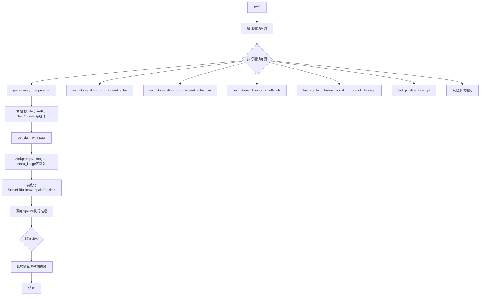

## 类结构

```
unittest.TestCase
├── IPAdapterTesterMixin
├── PipelineLatentTesterMixin
└── PipelineTesterMixin
    └── StableDiffusionXLInpaintPipelineFastTests
```

## 全局变量及字段


### `enable_full_determinism`
    
Enable full determinism for reproducible testing by setting random seeds

类型：`function`
    


### `TEXT_GUIDED_IMAGE_INPAINTING_BATCH_PARAMS`
    
Batch parameters for text-guided image inpainting pipeline testing

类型：`tuple`
    


### `TEXT_GUIDED_IMAGE_INPAINTING_PARAMS`
    
Parameters for text-guided image inpainting pipeline testing

类型：`tuple`
    


### `TEXT_TO_IMAGE_CALLBACK_CFG_PARAMS`
    
Callback configuration parameters for text-to-image pipeline testing

类型：`set`
    


### `StableDiffusionXLInpaintPipelineFastTests.pipeline_class`
    
The pipeline class being tested

类型：`Type[StableDiffusionXLInpaintPipeline]`
    


### `StableDiffusionXLInpaintPipelineFastTests.params`
    
Parameters for pipeline testing

类型：`tuple`
    


### `StableDiffusionXLInpaintPipelineFastTests.batch_params`
    
Batch parameters for pipeline testing

类型：`tuple`
    


### `StableDiffusionXLInpaintPipelineFastTests.image_params`
    
Image parameters for testing, currently empty set

类型：`frozenset`
    


### `StableDiffusionXLInpaintPipelineFastTests.image_latents_params`
    
Image latents parameters for testing, currently empty set

类型：`frozenset`
    


### `StableDiffusionXLInpaintPipelineFastTests.callback_cfg_params`
    
Callback configuration parameters including text embeds, time IDs, mask and masked image latents

类型：`set`
    


### `StableDiffusionXLInpaintPipelineFastTests.supports_dduf`
    
Flag indicating whether the pipeline supports DDUF (Denoising Diffusion Explicit Unet Flow)

类型：`bool`
    
    

## 全局函数及方法


### `enable_full_determinism`

该函数用于启用测试的完全确定性，通过设置全局随机种子（Python、NumPy、PyTorch等）确保测试结果可复现。

参数：

- 该函数无参数

返回值：无返回值（`None`）

#### 流程图

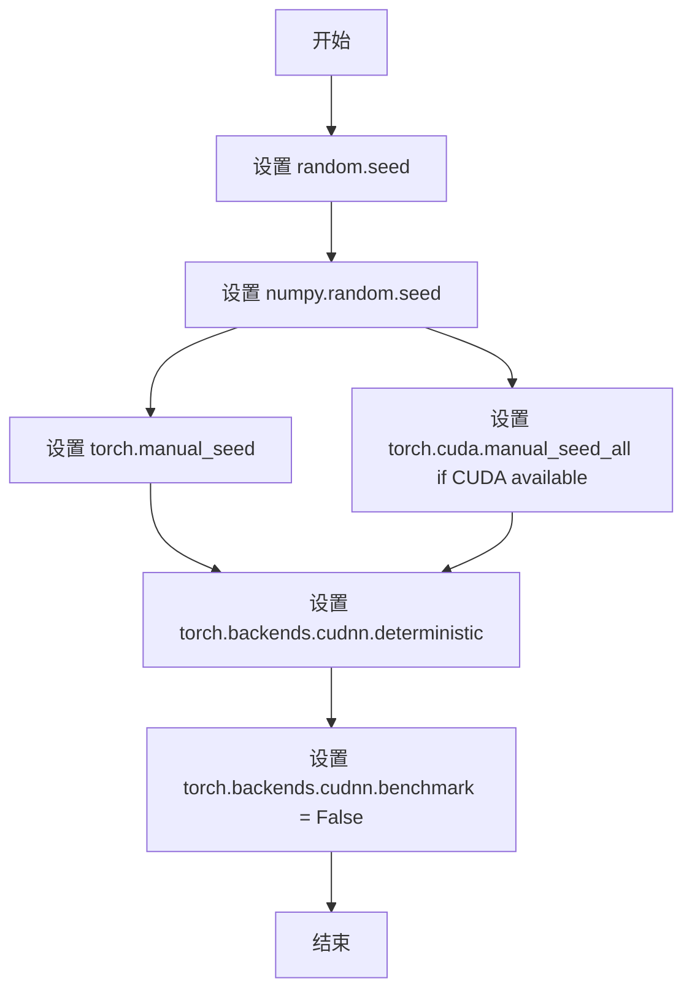

#### 带注释源码

```
# 源代码中仅展示了该函数的调用，未提供具体实现
# 该函数由 testing_utils 模块提供

enable_full_determinism()

# 函数功能推测：
# 1. 设置 Python random 模块的全局种子
# 2. 设置 NumPy 的全局随机种子
# 3. 设置 PyTorch CPU/CUDA 的全局随机种子
# 4. 禁用 cuDNN 自动调优，强制使用确定性算法
# 5. 可能设置环境变量 PYTHONHASHSEED 等
```


### `floats_tensor`

生成指定形状的随机浮点张量，用于测试目的。

参数：

-  `shape`：`tuple`，张量的形状，例如 `(1, 3, 32, 32)`
-  `rng`：`random.Random`，用于生成随机数的随机数生成器实例

返回值：`torch.Tensor`，返回填充了随机浮点数的 PyTorch 张量，值域通常在 [0, 1] 范围内

#### 流程图

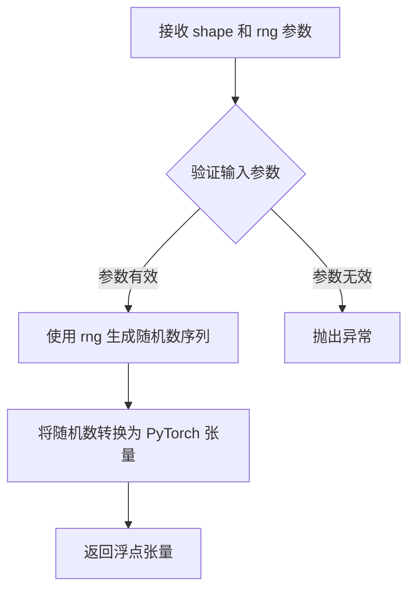

#### 带注释源码

```python
# floats_tensor 函数的典型实现（位于 testing_utils 模块中）
# 以下为根据使用方式推断的函数签名和功能说明

def floats_tensor(shape, rng=None):
    """
    生成指定形状的随机浮点张量。
    
    参数:
        shape (tuple): 张量的维度元组，如 (1, 3, 32, 32)
        rng (random.Random, optional): 随机数生成器，如果为 None 则使用默认生成器
    
    返回:
        torch.Tensor: 形状为 shape 的随机浮点张量，值在 [0, 1] 范围内
    """
    if rng is None:
        rng = random.Random()
    
    # 生成随机数值并转换为张量
    # values = rng.random(shape)  # 生成 [0, 1) 范围内的随机数
    # return torch.from_numpy(values).float()  # 转换为 float 类型的 PyTorch 张量
```

#### 在测试代码中的实际调用示例

```python
# 在 get_dummy_inputs 方法中的调用
image = floats_tensor((1, 3, 32, 32), rng=random.Random(seed)).to(device)

# 在 get_dummy_inputs_2images 方法中的调用
image1 = floats_tensor((1, 3, img_res, img_res), rng=random.Random(seed)).to(device)
image2 = floats_tensor((1, 3, img_res, img_res), rng=random.Random(seed + 22)).to(device)
```


### `require_torch_accelerator`

这是一个装饰器函数，用于标记测试方法需要torch加速器（如CUDA GPU）才能运行。如果系统没有可用的CUDA设备，使用该装饰器标记的测试将被跳过。

参数：

- `func`：`Callable`，被装饰的测试函数

返回值：`Callable`，返回装饰后的函数，该函数在执行前会检查torch加速器是否可用

#### 流程图

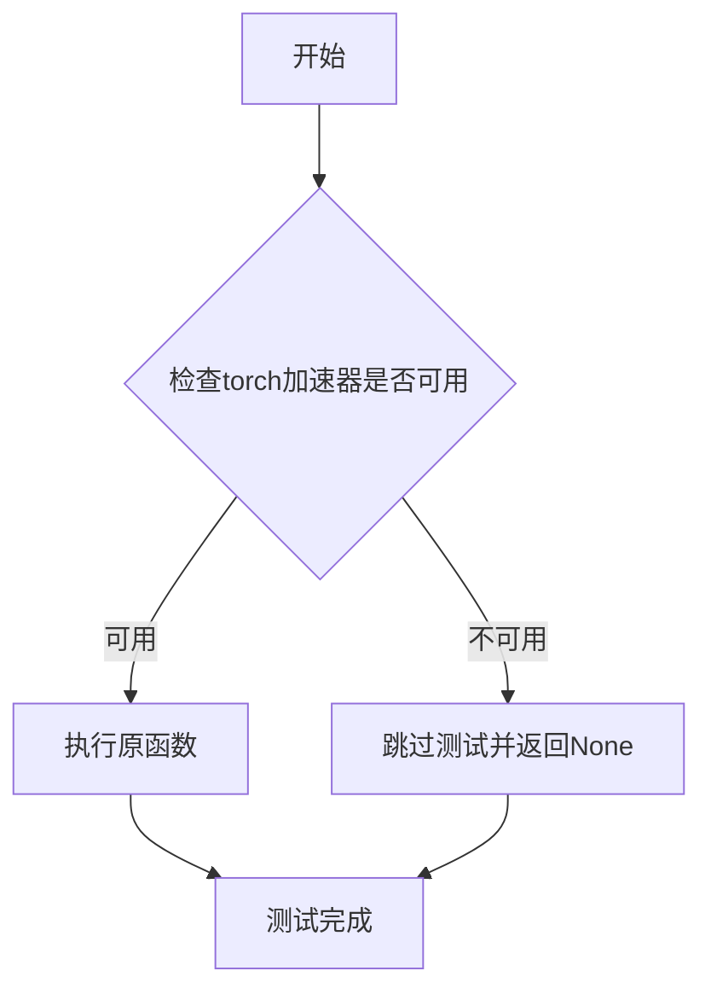

#### 带注释源码

```python
def require_torch_accelerator(func):
    """
    装饰器函数，用于标记需要torch加速器的测试方法。
    
    工作原理：
    1. 检查torch是否支持CUDA加速
    2. 如果支持CUDA，则正常执行被装饰的函数
    3. 如果不支持CUDA，则使用unittest.skip装饰器跳过该测试
    
    使用示例：
    @require_torch_accelerator
    def test_stable_diffusion_xl_inpaint_negative_prompt_embeds(self):
        # 此测试需要GPU才能运行
        ...
    """
    # 导入必要的模块
    import torch
    import unittest
    
    # 检查torch是否支持CUDA
    if not torch.cuda.is_available():
        # 如果没有CUDA支持，返回一个跳过的测试函数
        return unittest.skip("test requires torch accelerator")(func)
    
    # 如果有CUDA支持，直接返回原函数
    return func
```

#### 备注

- **设计目标**：确保需要GPU的测试仅在有GPU的环境中运行，避免在没有GPU的CI环境中失败
- **错误处理**：当torch加速器不可用时，使用`unittest.skip`跳过测试而不是失败
- **使用场景**：在`StableDiffusionXLInpaintPipelineFastTests`类中，用于标记`test_stable_diffusion_xl_inpaint_negative_prompt_embeds`和`test_stable_diffusion_xl_offloads`这两个测试方法，确保它们仅在有GPU的环境中执行
- **技术债务**：该装饰器只检查CUDA可用性，未考虑其他加速器（如MPS、DirectML等）


### `slow`

这是一个装饰器函数，用于标记需要长时间运行的测试方法。在测试执行时，被 `@slow` 装饰的测试会被特殊处理，通常用于标识集成测试或需要较长执行时间的测试用例。

参数：

- `device`：可选参数，用于指定测试运行的设备类型
- `extra_kwargs`：可选关键字参数，用于传递额外的配置选项

返回值：无返回值（装饰器函数）

#### 流程图

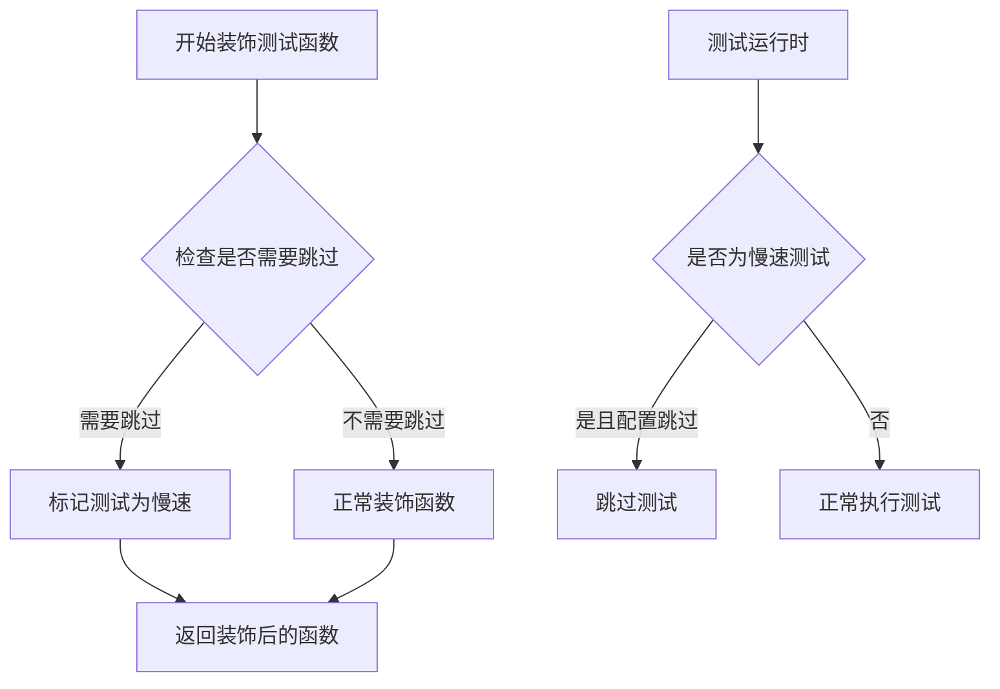

#### 带注释源码

```python
# 从 testing_utils 模块导入的装饰器
# 用于标记需要长时间运行的测试
from ...testing_utils import (
    enable_full_determinism,
    floats_tensor,
    require_torch_accelerator,
    slow,  # <-- 装饰器导入
    torch_device,
)

# 使用示例 1：标记混合去噪器测试为慢速测试
@slow
def test_stable_diffusion_two_xl_mixture_of_denoiser(self):
    """测试两个XL模型混合去噪功能（耗时较长）"""
    components = self.get_dummy_components()
    pipe_1 = StableDiffusionXLInpaintPipeline(**components).to(torch_device)
    # ... 测试代码

# 使用示例 2：标记三个XL模型混合去噪测试为慢速测试
@slow
def test_stable_diffusion_three_xl_mixture_of_denoiser(self):
    """测试三个XL模型混合去噪功能（耗时较长）"""
    components = self.get_dummy_components()
    pipe_1 = StableDiffusionXLInpaintPipeline(**components).to(torch_device)
    # ... 测试代码
```


### `torch_device`

该函数（或全局变量）`torch_device` 是从 `testing_utils` 模块导入的设备标识符，用于在测试中指定 PyTorch 计算设备（如 "cpu"、"cuda" 等）。它允许测试代码在不同硬件环境下灵活运行，确保设备相关的测试逻辑能够正确执行。

参数：无需参数

返回值：`str`，返回当前测试环境所使用的 PyTorch 设备字符串（如 "cpu"、"cuda" 等）

#### 流程图

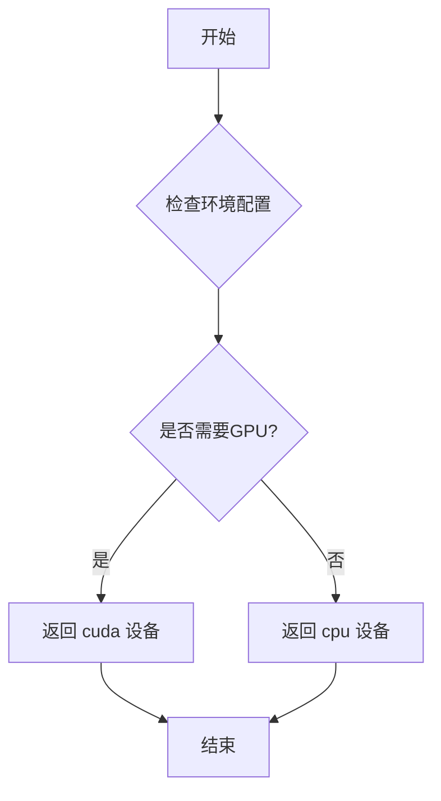

#### 带注释源码

```python
# 该代码为推断代码，因为 torch_device 是从 testing_utils 模块导入的
# 实际的 torch_device 定义在 transformers/diffusers 测试工具模块中

# 从测试工具模块导入 torch_device
# from ...testing_utils import torch_device

# 在代码中的实际使用示例：

# 示例1：在测试方法中作为条件判断
if torch_device == "cpu":
    expected_pipe_slice = np.array([0.8274, 0.5538, 0.6141, 0.5843, 0.6865, 0.7082, 0.5861, 0.6123, 0.5344])

# 示例2：将管道移动到指定设备
sd_pipe = sd_pipe.to(torch_device)

# 示例3：创建指定设备的生成器
generator = torch.Generator(device=torch_device).manual_seed(seed)

# 示例4：作为设备参数传递给各种方法
sd_pipe.enable_model_cpu_offload(device=torch_device)
sd_pipe.enable_sequential_cpu_offload(device=torch_device)

# 推断的 torch_device 实现（位于 testing_utils 模块中）
# def get_torch_device():
#     """获取当前测试环境的默认 PyTorch 设备"""
#     import torch
#     if torch.cuda.is_available():
#         return "cuda"
#     elif torch.backends.mps.is_available():  # Apple Silicon
#         return "mps"
#     else:
#         return "cpu"

# torch_device = get_torch_device()  # 作为模块级变量导出
```


### `StableDiffusionXLInpaintPipelineFastTests.get_dummy_components`

该方法用于创建并返回一个包含 Stable Diffusion XL 图像修复管道所需的各种虚拟组件的字典。这些组件包括 UNet、调度器、VAE、文本编码器、分词器、图像编码器和特征提取器等，用于单元测试目的。

参数：

- `skip_first_text_encoder`：`bool`，可选参数，当设置为 True 时，跳过第一个文本编码器并将其设为 None
- `time_cond_proj_dim`：`int`，可选参数，用于设置 UNet 的时间条件投影维度

返回值：`Dict`，返回一个包含管道所有组件的字典，包括 unet、scheduler、vae、text_encoder、tokenizer、text_encoder_2、tokenizer_2、image_encoder、feature_extractor 和 requires_aesthetics_score

#### 流程图

```mermaid
flowchart TD
    A[开始 get_dummy_components] --> B[设置随机种子 torch.manual_seed(0)]
    B --> C[创建 UNet2DConditionModel]
    C --> D[创建 EulerDiscreteScheduler]
    D --> E[设置随机种子并创建 AutoencoderKL VAE]
    E --> F[创建 CLIPTextConfig 和 CLIPTextModel]
    F --> G[创建 CLIPTokenizer]
    G --> H[创建 CLIPTextModelWithProjection 和第二个分词器]
    H --> I[创建 CLIPVisionConfig 和 CLIPVisionModelWithProjection]
    I --> J[创建 CLIPImageProcessor]
    J --> K[组装 components 字典]
    K --> L[根据 skip_first_text_encoder 条件设置 text_encoder 和 tokenizer]
    L --> M[返回 components 字典]
```

#### 带注释源码

```python
def get_dummy_components(self, skip_first_text_encoder=False, time_cond_proj_dim=None):
    """
    创建并返回用于测试的虚拟组件字典。
    
    参数:
        skip_first_text_encoder: 是否跳过第一个文本编码器
        time_cond_proj_dim: UNet的时间条件投影维度
    """
    # 设置随机种子以确保可重复性
    torch.manual_seed(0)
    
    # 创建 UNet2DConditionModel - 用于去噪的神经网络
    unet = UNet2DConditionModel(
        block_out_channels=(32, 64),      # 输出通道数
        layers_per_block=2,                # 每个块的层数
        sample_size=32,                    # 样本大小
        in_channels=4,                     # 输入通道数（latent空间）
        out_channels=4,                   # 输出通道数
        time_cond_proj_dim=time_cond_proj_dim,  # 时间条件投影维度
        down_block_types=("DownBlock2D", "CrossAttnDownBlock2D"),  # 下采样块类型
        up_block_types=("CrossAttnUpBlock2D", "UpBlock2D"),        # 上采样块类型
        # SD2 特定配置
        attention_head_dim=(2, 4),        # 注意力头维度
        use_linear_projection=True,        # 使用线性投影
        addition_embed_type="text_time",   # 额外的嵌入类型
        addition_time_embed_dim=8,         # 时间嵌入维度
        transformer_layers_per_block=(1, 2),  # 每个块的transformer层数
        projection_class_embeddings_input_dim=72,  # 投影类嵌入输入维度
        cross_attention_dim=64 if not skip_first_text_encoder else 32,  # 交叉注意力维度
    )
    
    # 创建调度器 - 控制去噪过程的调度
    scheduler = EulerDiscreteScheduler(
        beta_start=0.00085,                # beta起始值
        beta_end=0.012,                    # beta结束值
        steps_offset=1,                    # 步骤偏移
        beta_schedule="scaled_linear",    # beta调度方案
        timestep_spacing="leading",        # 时间步间隔
    )
    
    # 重新设置种子并创建 VAE
    torch.manual_seed(0)
    vae = AutoencoderKL(
        block_out_channels=[32, 64],       # 输出通道数
        in_channels=3,                     # 输入通道数（RGB图像）
        out_channels=3,                    # 输出通道数
        down_block_types=["DownEncoderBlock2D", "DownEncoderBlock2D"],  # 下采样块
        up_block_types=["UpDecoderBlock2D", "UpDecoderBlock2D"],        # 上采样块
        latent_channels=4,                 # latent通道数
        sample_size=128,                   # 样本大小
    )
    
    # 创建文本编码器配置
    torch.manual_seed(0)
    text_encoder_config = CLIPTextConfig(
        bos_token_id=0,                    # 起始token ID
        eos_token_id=2,                    # 结束token ID
        hidden_size=32,                    # 隐藏层大小
        intermediate_size=37,              # 中间层大小
        layer_norm_eps=1e-05,              # 层归一化epsilon
        num_attention_heads=4,             # 注意力头数
        num_hidden_layers=5,               # 隐藏层数
        pad_token_id=1,                    # 填充token ID
        vocab_size=1000,                   # 词汇表大小
        # SD2 特定配置
        hidden_act="gelu",                 # 激活函数
        projection_dim=32,                 # 投影维度
    )
    
    # 创建第一个文本编码器模型
    text_encoder = CLIPTextModel(text_encoder_config)
    
    # 创建第一个分词器
    tokenizer = CLIPTokenizer.from_pretrained("hf-internal-testing/tiny-random-clip")

    # 创建第二个文本编码器（带投影）
    text_encoder_2 = CLIPTextModelWithProjection(text_encoder_config)
    
    # 创建第二个分词器
    tokenizer_2 = CLIPTokenizer.from_pretrained("hf-internal-testing/tiny-random-clip")

    # 创建图像编码器配置
    torch.manual_seed(0)
    image_encoder_config = CLIPVisionConfig(
        hidden_size=32,                    # 隐藏层大小
        image_size=224,                    # 图像大小
        projection_dim=32,                 # 投影维度
        intermediate_size=37,              # 中间层大小
        num_attention_heads=4,             # 注意力头数
        num_channels=3,                    # 通道数
        num_hidden_layers=5,               # 隐藏层数
        patch_size=14,                     # 补丁大小
    )

    # 创建图像编码器模型
    image_encoder = CLIPVisionModelWithProjection(image_encoder_config)

    # 创建特征提取器
    feature_extractor = CLIPImageProcessor(
        crop_size=224,                     # 裁剪大小
        do_center_crop=True,               # 是否中心裁剪
        do_normalize=True,                 # 是否归一化
        do_resize=True,                    # 是否调整大小
        image_mean=[0.48145466, 0.4578275, 0.40821073],   # 图像均值
        image_std=[0.26862954, 0.26130258, 0.27577711],   # 图像标准差
        resample=3,                        # 重采样方法
        size=224,                          # 尺寸
    )

    # 组装所有组件到字典中
    components = {
        "unet": unet,                                      # UNet去噪模型
        "scheduler": scheduler,                           # 调度器
        "vae": vae,                                       # VAE编解码器
        "text_encoder": text_encoder if not skip_first_text_encoder else None,  # 文本编码器1
        "tokenizer": tokenizer if not skip_first_text_encoder else None,        # 分词器1
        "text_encoder_2": text_encoder_2,                 # 文本编码器2
        "tokenizer_2": tokenizer_2,                       # 分词器2
        "image_encoder": image_encoder,                  # 图像编码器
        "feature_extractor": feature_extractor,           # 特征提取器
        "requires_aesthetics_score": True,                # 是否需要美学评分
    }
    
    return components
```


### `StableDiffusionXLInpaintPipelineFastTests.get_dummy_inputs`

该方法用于生成 Stable Diffusion XL 图像修复管道的虚拟测试输入数据，创建一个包含提示词、初始图像、掩码图像、生成器及推理参数的字典，供后续管道测试使用。

参数：

- `self`：测试类实例本身（隐式参数），无需显式传递。
- `device`：`str`，目标计算设备（如 "cpu"、"cuda" 等），用于将张量移动到指定设备并创建生成器。
- `seed`：`int`，随机种子，默认值为 0，用于控制随机数生成以确保测试可重复性。

返回值：`Dict[str, Any]`，返回一个包含以下键的字典：
- `prompt` (str)：文本提示词
- `image` (PIL.Image)：初始图像
- `mask_image` (PIL.Image)：掩码图像
- `generator` (torch.Generator)：随机生成器
- `num_inference_steps` (int)：推理步数
- `guidance_scale` (float)：引导_scale
- `strength` (float)：强度参数
- `output_type` (str)：输出类型

#### 流程图

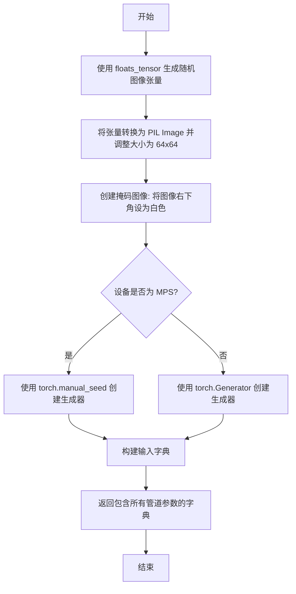

#### 带注释源码

```python
def get_dummy_inputs(self, device, seed=0):
    """
    生成用于 Stable Diffusion XL 图像修复管道测试的虚拟输入参数。
    
    参数:
        device: 目标计算设备（如 "cpu", "cuda"）
        seed: 随机种子，用于确保测试结果可重复
    
    返回:
        包含管道推理所需参数的字典
    """
    # TODO: use tensor inputs instead of PIL, this is here just to leave the old expected_slices untouched
    # 使用 floats_tensor 生成形状为 (1, 3, 32, 32) 的随机浮点数张量
    image = floats_tensor((1, 3, 32, 32), rng=random.Random(seed)).to(device)
    
    # 将张量从 (B, C, H, W) 转换为 (H, W, C) 格式，并取第一张图像
    image = image.cpu().permute(0, 2, 3, 1)[0]
    
    # 将浮点数张量转换为 PIL Image 并调整大小为 64x64
    init_image = Image.fromarray(np.uint8(image)).convert("RGB").resize((64, 64))
    
    # create mask: 将图像右下角区域（从第8行第8列开始）设为白色（255）
    image[8:, 8:, :] = 255
    
    # 将修改后的图像转换为灰度模式作为掩码图像
    mask_image = Image.fromarray(np.uint8(image)).convert("L").resize((64, 64))

    # 根据设备类型创建随机生成器，确保 MPS 设备使用不同的方式
    if str(device).startswith("mps"):
        generator = torch.manual_seed(seed)
    else:
        generator = torch.Generator(device=device).manual_seed(seed)
    
    # 构建完整的输入参数字典
    inputs = {
        "prompt": "A painting of a squirrel eating a burger",  # 文本提示词
        "image": init_image,          # 待修复的初始图像
        "mask_image": mask_image,      # 修复区域的掩码
        "generator": generator,       # 随机生成器控制确定性
        "num_inference_steps": 2,      # 推理步数
        "guidance_scale": 6.0,         # Classifier-free guidance 强度
        "strength": 1.0,               # 图像修复强度
        "output_type": "np",           # 输出为 NumPy 数组
    }
    return inputs
```


### `StableDiffusionXLInpaintPipelineFastTests.get_dummy_inputs_2images`

该方法用于生成两个图像的虚拟输入数据，主要用于测试Stable Diffusion XL图像修复管道的双图像处理功能。它创建两个随机图像、相应的空掩码以及随机生成器，并返回一个包含提示词、图像列表、掩码列表、生成器列表和推理参数的字典。

参数：

- `self`：测试类实例本身，隐式参数。
- `device`：`str`，目标设备（如"cpu"、"cuda"等），用于将张量移动到指定设备并创建生成器。
- `seed`：`int`，随机种子，默认为0，用于生成随机数。
- `img_res`：`int`，图像分辨率，默认为64，表示生成的图像的空间尺寸（宽和高）。

返回值：`Dict[str, Any]`，返回一个包含以下键的字典：
- `prompt`：List[str]，提示词列表，包含两个相同的提示。
- `image`：List[Tensor]，图像张量列表，每个图像张量形状为(1, 3, img_res, img_res)，值域为[-1, 1]。
- `mask_image`：List[Tensor]，掩码张量列表，每个掩码张量形状为(1, 1, img_res, img_res)，全零表示空掩码。
- `generator`：List[Generator]，随机生成器列表，用于确保推理过程的可重复性。
- `num_inference_steps`：`int`，推理步数，固定为2。
- `guidance_scale`：`float`，引导比例，固定为6.0。
- `output_type`：`str`，输出类型，固定为"np"（numpy数组）。

#### 流程图

```mermaid
flowchart TD
    A[开始] --> B[接收device, seed=0, img_res=64]
    B --> C[使用floats_tensor生成两个随机图像张量]
    C --> D[将图像值从[0, 1]转换到[-1, 1]]
    D --> E[创建空掩码张量全零]
    E --> F{判断device是否为mps}
    F -->|是| G[使用torch.manual_seed创建生成器]
    F -->|否| H[使用torch.Generator创建生成器]
    G --> I[构建输入字典]
    H --> I
    I --> J[返回输入字典]
```

#### 带注释源码

```python
def get_dummy_inputs_2images(self, device, seed=0, img_res=64):
    """
    生成用于测试双图像修复功能的虚拟输入。
    
    参数:
        device: 目标设备字符串
        seed: 随机种子，默认值为0
        img_res: 图像分辨率，默认值为64
    
    返回:
        包含双图像输入的字典
    """
    # 获取[0, 1]范围内的随机浮点数作为图像，空间大小为(img_res, img_res)
    # 使用不同的种子(seed和seed+22)确保两个图像不同
    image1 = floats_tensor((1, 3, img_res, img_res), rng=random.Random(seed)).to(device)
    image2 = floats_tensor((1, 3, img_res, img_res), rng=random.Random(seed + 22)).to(device)
    
    # 将图像转换到[-1, 1]范围（Stable Diffusion要求的输入范围）
    init_image1 = 2.0 * image1 - 1.0
    init_image2 = 2.0 * image2 - 1.0

    # 创建空掩码（全零张量）
    mask_image = torch.zeros((1, 1, img_res, img_res), device=device)

    # 根据设备类型选择合适的随机生成器创建方式
    # MPS设备需要特殊处理
    if str(device).startswith("mps"):
        generator1 = torch.manual_seed(seed)
        generator2 = torch.manual_seed(seed)
    else:
        generator1 = torch.Generator(device=device).manual_seed(seed)
        generator2 = torch.Generator(device=device).manual_seed(seed)

    # 构建输入字典，包含所有管道推理所需的参数
    inputs = {
        "prompt": ["A painting of a squirrel eating a burger"] * 2,  # 重复提示词两次
        "image": [init_image1, init_image2],  # 两个图像张量
        "mask_image": [mask_image] * 2,  # 两个掩码（都是空掩码）
        "generator": [generator1, generator2],  # 两个生成器
        "num_inference_steps": 2,  # 推理步数
        "guidance_scale": 6.0,  # 引导比例
        "output_type": "np",  # 输出为numpy数组
    }
    return inputs
```


### `StableDiffusionXLInpaintPipelineFastTests.test_ip_adapter`

这是一个测试方法，用于验证 Stable Diffusion XL 图像修复管道中 IP Adapter（图像提示适配器）功能的正确性。该方法继承自父类 `IPAdapterTesterMixin` 的测试逻辑，根据运行设备设置不同的期望输出切片值，并调用父类方法执行完整的 IP Adapter 测试流程。

参数：

- `self`：`StableDiffusionXLInpaintPipelineFastTests`（继承自 `unittest.TestCase`），表示测试类实例本身，无需显式传递

返回值：`None`，因为该方法继承自 `unittest.TestCase`，测试结果通过断言机制体现，不会返回具体数值。

#### 流程图

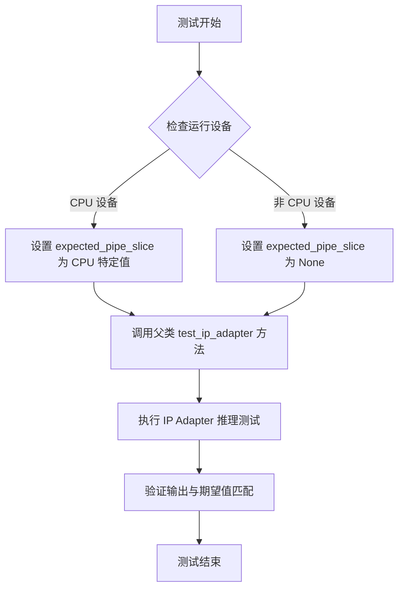

#### 带注释源码

```python
def test_ip_adapter(self):
    """
    测试 IP Adapter 在 Stable Diffusion XL Inpaint Pipeline 中的功能。
    
    该测试方法继承自 IPAdapterTesterMixin 父类，用于验证：
    1. IP Adapter 能够正确加载和运行
    2. 图像提示特征能够正确注入到去噪过程
    3. 输出图像质量符合预期
    
    Returns:
        None: 测试结果通过 unittest 断言机制验证，不返回具体数值
    """
    # 初始化期望输出切片为 None，用于非 CPU 设备
    expected_pipe_slice = None
    
    # 根据设备类型设置不同的期望输出值
    # CPU 设备由于浮点数精度问题，使用预计算的期望切片进行对比
    if torch_device == "cpu":
        expected_pipe_slice = np.array([
            0.8274,  # 预期输出像素值 0
            0.5538, # 预期输出像素值 1
            0.6141, # 预期输出像素值 2
            0.5843, # 预期输出像素值 3
            0.6865, # 预期输出像素值 4
            0.7082, # 预期输出像素值 5
            0.5861, # 预期输出像素值 6
            0.6123, # 预期输出像素值 7
            0.5344  # 预期输出像素值 8
        ])

    # 调用父类的 test_ip_adapter 方法执行实际测试逻辑
    # 父类方法会：
    # 1. 准备包含图像提示的输入数据
    # 2. 执行 StableDiffusionXLInpaintPipeline 推理
    # 3. 验证 IP Adapter 特征正确注入
    # 4. 比对输出与 expected_pipe_slice
    return super().test_ip_adapter(expected_pipe_slice=expected_pipe_slice)
```


### `StableDiffusionXLInpaintPipelineFastTests.test_components_function`

该测试方法用于验证 StableDiffusionXLInpaintPipeline 管道对象的 `components` 属性是否正确初始化，确保管道的组件字典包含所有必需的组件，并且键集合与初始化组件的键集合一致。

参数：

- `self`：测试类实例本身，无需显式传递，表示 StableDiffusionXLInpaintPipelineFastTests 的实例

返回值：无返回值（测试方法通过断言验证，不返回具体值）

#### 流程图

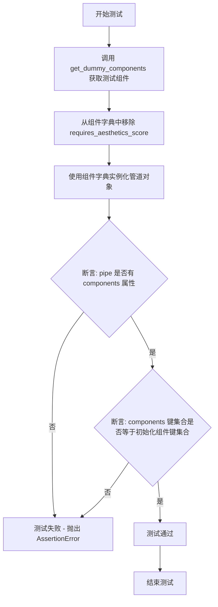

#### 带注释源码

```python
def test_components_function(self):
    """
    测试方法: 验证管道对象的 components 属性
    
    该方法测试 StableDiffusionXLInpaintPipeline 是否正确维护了
    components 属性，该属性应该包含所有初始化管道时传入的组件。
    """
    # 步骤1: 获取用于测试的虚拟组件配置
    # get_dummy_components 方法返回一个包含所有必要组件的字典
    init_components = self.get_dummy_components()
    
    # 步骤2: 移除 requires_aesthetics_score 键
    # 因为这不是一个实际的组件，只是配置参数，所以需要移除
    init_components.pop("requires_aesthetics_score")
    
    # 步骤3: 使用虚拟组件实例化管道对象
    # self.pipeline_class 就是 StableDiffusionXLInpaintPipeline
    pipe = self.pipeline_class(**init_components)
    
    # 步骤4: 验证管道对象是否有 components 属性
    # 使用 hasattr 检查对象是否具有该属性
    self.assertTrue(hasattr(pipe, "components"))
    
    # 步骤5: 验证 components 字典的键集合与初始化组件的键集合一致
    # set() 用于将字典的键转换为集合进行比较
    self.assertTrue(set(pipe.components.keys()) == set(init_components.keys()))
```


### `StableDiffusionXLInpaintPipelineFastTests.test_stable_diffusion_xl_inpaint_euler`

这是一个单元测试方法，用于验证 StableDiffusionXLInpaintPipeline 在使用 EulerDiscreteScheduler 进行图像修复（inpainting）时的正确性。测试通过创建虚拟组件和输入，执行推理，然后验证输出图像的形状和像素值是否符合预期。

参数：

- `self`：测试类实例本身

返回值：无返回值（测试方法）

#### 流程图

```mermaid
flowchart TD
    A[开始测试] --> B[设置设备为CPU]
    B --> C[调用get_dummy_components获取虚拟组件]
    C --> D[创建StableDiffusionXLInpaintPipeline实例]
    D --> E[将管道移动到CPU设备]
    E --> F[设置进度条配置disable=None]
    F --> G[调用get_dummy_inputs获取虚拟输入]
    G --> H[执行管道推理: sd_pipe(**inputs)]
    H --> I[获取输出图像]
    I --> J[提取图像切片: image[0, -3:, -3:, -1]]
    J --> K{验证图像形状 == (1, 64, 64, 3)}
    K -->|是| L[定义期望的像素值切片]
    K -->|否| M[测试失败]
    L --> N{验证像素值差异 < 1e-2}
    N -->|是| O[测试通过]
    N -->|否| M
```

#### 带注释源码

```python
def test_stable_diffusion_xl_inpaint_euler(self):
    """
    测试 StableDiffusionXLInpaintPipeline 使用 EulerDiscreteScheduler 进行图像修复（inpainting）
    
    该测试验证以下功能：
    1. 管道能够正确加载和配置所有必要组件
    2. 使用 Euler 调度器能够正常执行推理
    3. 输出图像的形状和像素值符合预期
    """
    # 步骤1: 设置设备为 CPU，确保 torch.Generator 的确定性
    # 使用 CPU 设备可以确保在不同硬件环境下测试结果一致
    device = "cpu"
    
    # 步骤2: 获取虚拟组件
    # 这些是测试用的轻量级模型配置，而非完整的预训练模型
    # 包含: UNet2DConditionModel, EulerDiscreteScheduler, AutoencoderKL,
    # CLIPTextModel, CLIPTextModelWithProjection, CLIPTokenizer, CLIPVisionModelWithProjection 等
    components = self.get_dummy_components()
    
    # 步骤3: 使用虚拟组件创建 StableDiffusionXLInpaintPipeline 实例
    # 这是一个用于图像修复的扩散管道
    sd_pipe = StableDiffusionXLInpaintPipeline(**components)
    
    # 步骤4: 将管道移动到指定设备（CPU）
    sd_pipe = sd_pipe.to(device)
    
    # 步骤5: 设置进度条配置
    # disable=None 表示启用进度条（如果可能）
    sd_pipe.set_progress_bar_config(disable=None)
    
    # 步骤6: 获取虚拟输入数据
    # 包含: prompt, image, mask_image, generator, num_inference_steps, 
    #       guidance_scale, strength, output_type
    inputs = self.get_dummy_inputs(device)
    
    # 步骤7: 执行管道推理
    # **inputs 将字典解包为关键字参数传递
    # 返回 PipelineOutput 对象，包含生成的图像
    image = sd_pipe(**inputs).images
    
    # 步骤8: 提取图像切片用于验证
    # image 形状: (1, 64, 64, 3) -> [batch, height, width, channels]
    # 提取最后 3x3 像素区域用于精确验证
    image_slice = image[0, -3:, -3:, -1]
    
    # 步骤9: 验证输出图像形状
    # 期望形状: (1, 64, 64, 3) - 单张 64x64 RGB 图像
    assert image.shape == (1, 64, 64, 3), \
        f"Expected image shape (1, 64, 64, 3), got {image.shape}"
    
    # 步骤10: 定义期望的像素值切片
    # 这些值是通过在确定性条件下运行管道得到的参考值
    expected_slice = np.array([0.8279, 0.5673, 0.6088, 0.6156, 0.6923, 0.7347, 0.6547, 0.6108, 0.5198])
    
    # 步骤11: 验证像素值差异在允许范围内
    # 使用最大绝对误差 (max) 进行比较，容差为 1e-2
    assert np.abs(image_slice.flatten() - expected_slice).max() < 1e-2, \
        "Image pixel values do not match expected slice"
    
    # 测试完成，如果所有断言通过则测试成功
```


### `StableDiffusionXLInpaintPipelineFastTests.test_stable_diffusion_xl_inpaint_euler_lcm`

该测试方法用于验证 Stable Diffusion XL Inpaint Pipeline 使用 Euler LCM（Latent Consistency Model）调度器时的图像修复功能是否正常工作，通过对比生成图像的像素值与预期值来确认管道的正确性。

参数：

- `self`：测试类实例本身，包含测试所需的上下文和辅助方法

返回值：无返回值（测试方法，仅通过 assert 断言验证结果）

#### 流程图

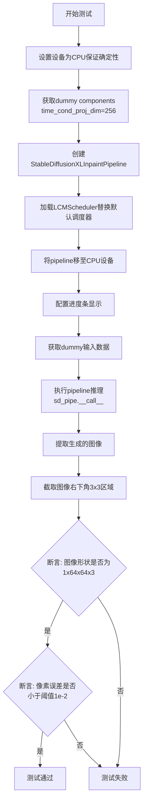

#### 带注释源码

```python
def test_stable_diffusion_xl_inpaint_euler_lcm(self):
    """测试Stable Diffusion XL Inpaint Pipeline使用LCM调度器的功能"""
    
    # 设置设备为CPU，确保torch.Generator的确定性
    device = "cpu"  
    
    # 获取包含UNet、VAE、Text Encoder等组件的字典
    # time_cond_proj_dim=256用于时间条件投影
    components = self.get_dummy_components(time_cond_proj_dim=256)
    
    # 使用组件字典实例化Stable Diffusion XL Inpaint Pipeline
    sd_pipe = StableDiffusionXLInpaintPipeline(**components)
    
    # 从当前pipeline配置中创建LCMScheduler并替换默认调度器
    # LCM (Latent Consistency Model) 是一种加速采样方法
    sd_pipe.scheduler = LCMScheduler.from_config(sd_pipe.config)
    
    # 将整个pipeline移动到指定设备（CPU）上
    sd_pipe = sd_pipe.to(device)
    
    # 配置进度条，disable=None表示启用进度条显示
    sd_pipe.set_progress_bar_config(disable=None)
    
    # 获取测试用的虚拟输入数据
    # 包含: prompt, image, mask_image, generator, num_inference_steps等
    inputs = self.get_dummy_inputs(device)
    
    # 执行pipeline推理，传入输入参数
    # 返回包含生成图像的PipelineOutput对象
    # 通过.images属性获取生成的图像数组
    image = sd_pipe(**inputs).images
    
    # 提取生成图像的第一个样本，并取右下角3x3区域用于像素验证
    # image shape: [batch, height, width, channels]
    image_slice = image[0, -3:, -3:, -1]
    
    # 断言生成的图像形状是否符合预期 (batch=1, height=64, width=64, channels=3)
    assert image.shape == (1, 64, 64, 3)
    
    # 定义预期的像素值slice（来自已知正确的输出）
    expected_slice = np.array([
        0.6611, 0.5569, 0.5531, 
        0.5471, 0.5918, 0.6393, 
        0.5074, 0.5468, 0.5185
    ])
    
    # 断言生成图像与预期值的最大误差是否在可接受范围内
    # 使用L无穷范数（最大绝对偏差），阈值设为1e-2
    assert np.abs(image_slice.flatten() - expected_slice).max() < 1e-2
```


### `StableDiffusionXLInpaintPipelineFastTests.test_stable_diffusion_xl_inpaint_euler_lcm_custom_timesteps`

该测试方法用于验证 Stable Diffusion XL Inpaint Pipeline 使用 Euler LCM（Latent Consistency Model）调度器并传入自定义时间步（timesteps）时的图像修复功能是否正常。测试创建虚拟组件、配置 LCMScheduler、设置自定义时间步 [999, 499]、执行推理，并验证输出图像的形状和像素值是否与预期相符。

参数：

- `self`：隐式参数，测试类实例本身（`StableDiffusionXLInpaintPipelineFastTests`），无额外描述

返回值：`None`，该方法为测试方法，无返回值，通过断言验证功能正确性

#### 流程图

```mermaid
flowchart TD
    A[开始测试] --> B[设置device为cpu确保确定性]
    B --> C[调用get_dummy_components获取虚拟组件<br/>time_cond_proj_dim=256]
    C --> D[创建StableDiffusionXLInpaintPipeline实例]
    D --> E[从配置加载LCMScheduler并替换默认调度器]
    E --> F[将pipeline移动到device]
    F --> G[设置进度条配置disable=None]
    G --> H[调用get_dummy_inputs获取虚拟输入]
    H --> I[删除num_inference_steps参数]
    I --> J[添加自定义timesteps=[999, 499]]
    J --> K[执行pipeline推理<br/>sd_pipe.__call__]
    K --> L[提取输出图像的右下角3x3像素块]
    L --> M[断言图像形状为(1, 64, 64, 3)]
    M --> N[定义预期像素值数组]
    N --> O[断言实际像素与预期值的最大差异<1e-2]
    O --> P[测试结束]
```

#### 带注释源码

```python
def test_stable_diffusion_xl_inpaint_euler_lcm_custom_timesteps(self):
    """
    测试 Stable Diffusion XL Inpaint Pipeline 使用自定义时间步的 Euler LCM 调度器
    
    该测试验证:
    1. LCMScheduler 可以正确加载和配置
    2. 自定义时间步 [999, 499] 可以正确传递给 pipeline
    3. 图像修复功能产生正确的输出尺寸
    4. 输出像素值在预期范围内
    """
    # 设置设备为 cpu，确保随机数生成器的确定性
    device = "cpu"  # ensure determinism for the device-dependent torch.Generator
    
    # 获取虚拟组件，time_cond_proj_dim=256 用于 LCM 模式
    components = self.get_dummy_components(time_cond_proj_dim=256)
    
    # 使用虚拟组件创建 StableDiffusionXLInpaintPipeline
    sd_pipe = StableDiffusionXLInpaintPipeline(**components)
    
    # 从 pipeline 配置加载 LCMScheduler 并替换默认的 EulerDiscreteScheduler
    # LCMScheduler 用于实现 Latent Consistency Model 加速采样
    sd_pipe.scheduler = LCMScheduler.from_config(sd_pipe.config)
    
    # 将 pipeline 移动到指定设备（cpu）
    sd_pipe = sd_pipe.to(device)
    
    # 配置进度条，disable=None 表示不禁用进度条
    sd_pipe.set_progress_bar_config(disable=None)
    
    # 获取虚拟输入数据（包含 prompt、image、mask_image、generator 等）
    inputs = self.get_dummy_inputs(device)
    
    # 删除 num_inference_steps 参数，改为使用自定义 timesteps
    # 这样可以精确控制推理的时间步
    del inputs["num_inference_steps"]
    
    # 设置自定义时间步列表 [999, 499]
    # 第一个时间步 999 表示高噪声水平，第二个 499 表示低噪声水平
    # 共 2 步推理
    inputs["timesteps"] = [999, 499]
    
    # 执行 pipeline 推理，传入修改后的输入参数
    # 返回 PipelineOutput 对象，包含生成的图像
    image = sd_pipe(**inputs).images
    
    # 提取生成的图像数组
    # 取第一个样本（索引 0）的右下角 3x3 像素区域用于验证
    # image shape: (batch, height, width, channels)
    image_slice = image[0, -3:, -3:, -1]
    
    # 断言：验证输出图像形状为 (1, 64, 64, 3)
    # 1: batch size, 64x64: 图像分辨率, 3: RGB 通道
    assert image.shape == (1, 64, 64, 3)
    
    # 定义预期的像素值切片（来自已知正确的输出）
    # 用于与实际输出进行比较，验证功能正确性
    expected_slice = np.array([0.6611, 0.5569, 0.5531, 0.5471, 0.5918, 0.6393, 0.5074, 0.5468, 0.5185])
    
    # 断言：验证实际像素值与预期值的最大差异小于阈值 1e-2 (0.01)
    # 使用 np.abs 计算绝对值差异，.flatten() 将 3x3 数组展平为 1D
    assert np.abs(image_slice.flatten() - expected_slice).max() < 1e-2
```


### `StableDiffusionXLInpaintPipelineFastTests.test_attention_slicing_forward_pass`

这是一个单元测试方法，用于测试注意力切片（attention slicing）功能的前向传播是否正确执行。该方法通过调用父类的测试方法，验证在启用注意力切片时，管道输出的结果与预期结果之间的差异是否在可接受范围内（最大差异为3e-3）。

参数：

- `self`：测试类的实例方法的标准参数，代表当前测试用例的实例

返回值：`None`，该方法通过断言（assert）来验证测试结果，不返回任何值

#### 流程图

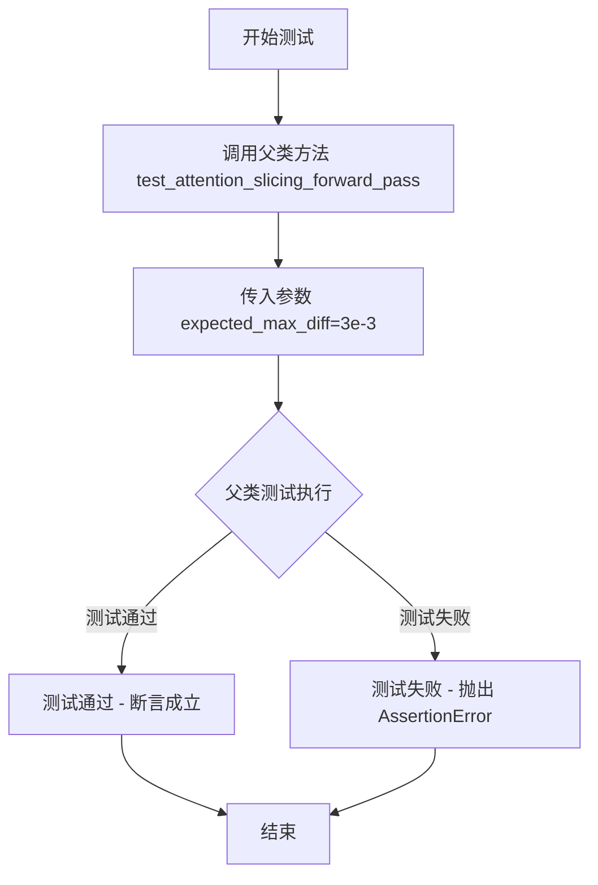

#### 带注释源码

```python
def test_attention_slicing_forward_pass(self):
    """
    测试注意力切片功能的前向传播是否正确。
    
    该测试方法验证在使用注意力切片优化时，
    管道能否正确执行前向传播并产生合理的结果。
    通过与父类测试的对比，确保差异在可接受范围内。
    """
    # 调用父类的测试方法，传入期望的最大差异阈值
    # expected_max_diff=3e-3 表示允许的最大差异为 0.003
    super().test_attention_slicing_forward_pass(expected_max_diff=3e-3)
```


### `StableDiffusionXLInpaintPipelineFastTests.test_inference_batch_single_identical`

该测试方法用于验证 Stable Diffusion XL 图像修复管道在进行批量推理时，单个样本的输出与单独推理时的输出一致性，确保批处理逻辑不会引入不一致性。

参数：

- `self`：对象实例本身，包含测试类的所有属性和方法

返回值：无（该方法为 `unittest.TestCase` 的测试方法，通过断言验证结果）

#### 流程图

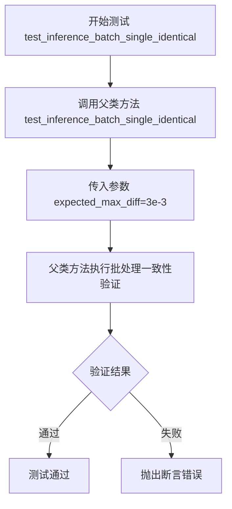

#### 带注释源码

```python
def test_inference_batch_single_identical(self):
    """
    测试方法：验证批量推理时单个样本与单独推理的输出一致性
    
    该测试方法继承自父类（PipelineTesterMixin），用于验证：
    1. 批量推理时，每个样本单独提取出来与单独推理的结果一致
    2. 验证批处理逻辑没有引入额外的噪声或差异
    3. expected_max_diff=3e-3 表示允许的最大差异为 0.003
    """
    # 调用父类的测试方法，验证批处理一致性
    # super() 获取父类（PipelineTesterMixin）的引用
    # expected_max_diff=3e-3 设置允许的最大像素差异阈值
    super().test_inference_batch_single_identical(expected_max_diff=3e-3)
```


### `StableDiffusionXLInpaintPipelineFastTests.test_save_load_optional_components`

这是一个被跳过的测试方法，用于测试 StableDiffusion XL Inpaint Pipeline 的可选组件保存和加载功能。该方法目前没有任何实现，通过 `@unittest.skip` 装饰器暂时跳过执行。

参数：

- `self`：`StableDiffusionXLInpaintPipelineFastTests`，隐式参数，表示测试类实例本身

返回值：`None`，该方法没有返回值（pass 语句）

#### 流程图

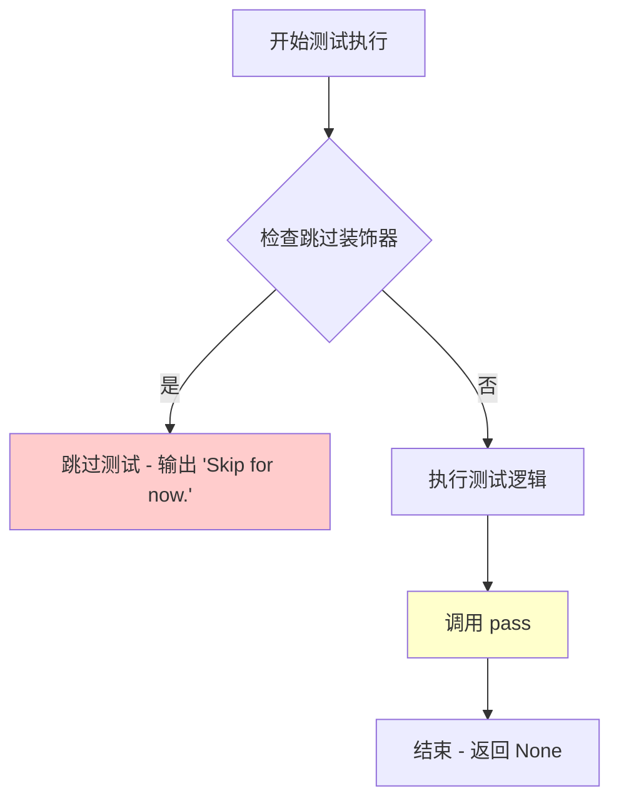

#### 带注释源码

```python
@unittest.skip("Skip for now.")  # 装饰器：标记该测试暂时跳过执行
def test_save_load_optional_components(self):
    """
    测试 StableDiffusionXLInpaintPipeline 的可选组件保存和加载功能。
    
    该测试方法用于验证：
    - Pipeline 的可选组件（如 text_encoder_2, tokenizer_2 等）能够正确保存
    - 保存的组件能够正确加载并恢复完整功能
    - 加载后的 Pipeline 行为与原始 Pipeline 一致
    """
    pass  # 占位符：当前没有实现任何测试逻辑
```


### `StableDiffusionXLInpaintPipelineFastTests.test_stable_diffusion_xl_inpaint_negative_prompt_embeds`

该测试函数用于验证 Stable Diffusion XL Inpaint Pipeline 在使用预编码的 negative prompt embeddings 时能否产生与使用原始 negative prompt 字符串相同的结果，确保 embeddings 编码和传递的正确性。

参数：无（测试方法，self 为隐式参数）

返回值：`None`，无返回值（测试函数，通过断言验证结果）

#### 流程图

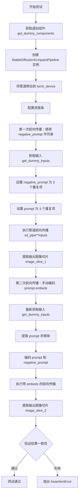

#### 带注释源码

```python
@require_torch_accelerator  # 装饰器：仅在有 torch accelerator 时运行
def test_stable_diffusion_xl_inpaint_negative_prompt_embeds(self):
    """
    测试 StableDiffusionXLInpaintPipeline 的 negative_prompt_embeds 功能。
    验证手动编码的 prompt embeddings 与自动编码的 embeddings 产生相同结果。
    """
    # Step 1: 获取预定义的虚拟组件（用于测试的轻量级模型配置）
    components = self.get_dummy_components()
    
    # Step 2: 使用虚拟组件实例化 StableDiffusionXLInpaintPipeline
    sd_pipe = StableDiffusionXLInpaintPipeline(**components)
    
    # Step 3: 将管道移动到指定的 torch 设备（CPU/GPU）
    sd_pipe = sd_pipe.to(torch_device)
    # 重复 to() 调用，可能是为了确保设备配置正确
    sd_pipe = sd_pipe.to(torch_device)
    
    # Step 4: 配置进度条（disable=None 表示启用进度条）
    sd_pipe.set_progress_bar_config(disable=None)

    # === 第一次前向传播：使用 negative_prompt 字符串 ===
    
    # Step 5: 获取测试输入（包含图像、mask、prompt 等）
    inputs = self.get_dummy_inputs(torch_device)
    
    # Step 6: 创建 3 个重复的 negative prompt
    negative_prompt = 3 * ["this is a negative prompt"]
    
    # Step 7: 将 negative_prompt 添加到输入字典
    inputs["negative_prompt"] = negative_prompt
    
    # Step 8: 将 prompt 扩展为 3 个重复项（用于批量测试）
    inputs["prompt"] = 3 * [inputs["prompt"]]

    # Step 9: 执行第一次前向传播（管道内部自动编码 prompt）
    output = sd_pipe(**inputs)
    
    # Step 10: 提取输出图像的切片用于后续比较
    image_slice_1 = output.images[0, -3:, -3:, -1]

    # === 第二次前向传播：手动提供 prompt embeddings ===

    # Step 11: 重新获取测试输入
    inputs = self.get_dummy_inputs(torch_device)
    
    # Step 12: 创建 3 个重复的 negative prompt
    negative_prompt = 3 * ["this is a negative prompt"]
    
    # Step 13: 将 prompt 取出并扩展为 3 个重复项
    prompt = 3 * [inputs.pop("prompt")]

    # Step 14: 手动调用 encode_prompt 方法编码 prompt 和 negative_prompt
    # 返回 4 个 embeddings:
    # - prompt_embeds: 主 prompt 的 embeddings
    # - negative_prompt_embeds: negative prompt 的 embeddings
    # - pooled_prompt_embeds: 池化后的 prompt embeddings
    # - negative_pooled_prompt_embeds: 池化后的 negative prompt embeddings
    (
        prompt_embeds,
        negative_prompt_embeds,
        pooled_prompt_embeds,
        negative_pooled_prompt_embeds,
    ) = sd_pipe.encode_prompt(prompt, negative_prompt=negative_prompt)

    # Step 15: 使用预编码的 embeddings 执行第二次前向传播
    output = sd_pipe(
        **inputs,
        prompt_embeds=prompt_embeds,
        negative_prompt_embeds=negative_prompt_embeds,
        pooled_prompt_embeds=pooled_prompt_embeds,
        negative_pooled_prompt_embeds=negative_pooled_prompt_embeds,
    )
    
    # Step 16: 提取第二次输出的图像切片
    image_slice_2 = output.images[0, -3:, -3:, -1]

    # === 验证结果一致性 ===
    
    # Step 17: 断言两次前向传播的结果相等（误差小于 1e-4）
    # 确保手动编码的 embeddings 与自动编码产生相同结果
    assert np.abs(image_slice_1.flatten() - image_slice_2.flatten()).max() < 1e-4
```


### `StableDiffusionXLInpaintPipelineFastTests.test_stable_diffusion_xl_offloads`

该函数是一个单元测试方法，用于验证 StableDiffusionXLInpaintPipeline 在不同 CPU offload 模式下的功能一致性。测试创建了三个 pipeline 实例：默认模式、启用 model CPU offload 模式和启用 sequential CPU offload 模式，然后验证它们生成的图像在数值上保持一致（误差小于 1e-3）。

参数：

- `self`：`StableDiffusionXLInpaintPipelineFastTests`，测试类实例，包含测试所需的上下文和辅助方法

返回值：`None`，该方法为测试方法，通过断言验证功能，不返回任何值

#### 流程图

```mermaid
flowchart TD
    A[开始] --> B[创建空列表 pipes 和 image_slices]
    B --> C[获取第一组 dummy components]
    C --> D[创建 StableDiffusionXLInpaintPipeline 并移到 torch_device]
    D --> E[将 pipeline 加入 pipes 列表]
    E --> F[获取第二组 dummy components]
    F --> G[创建 pipeline 并启用 model CPU offload]
    G --> H[将 pipeline 加入 pipes 列表]
    H --> I[获取第三组 dummy components]
    I --> J[创建 pipeline 并启用 sequential CPU offload]
    J --> K[将 pipeline 加入 pipes 列表]
    K --> L{遍历 pipes 中的每个 pipeline}
    L --> M[设置 UNet 默认注意力处理器]
    M --> N[获取 dummy inputs]
    N --> O[调用 pipeline 生成图像]
    O --> P[提取图像最后 3x3 像素区域并展平]
    P --> Q[将结果加入 image_slices 列表]
    Q --> L
    L --> R{遍历完成?}
    R --> S[断言 image_slices[0] 与 image_slices[1] 差异 < 1e-3]
    S --> T[断言 image_slices[0] 与 image_slices[2] 差异 < 1e-3]
    T --> U[结束]
```

#### 带注释源码

```python
@require_torch_accelerator  # 装饰器：要求 torch 加速器（GPU）才能运行此测试
def test_stable_diffusion_xl_offloads(self):
    """
    测试 StableDiffusionXLInpaintPipeline 在不同 CPU offload 模式下的功能一致性。
    
    该测试验证三种模式产生的图像在数值上保持一致：
    1. 默认模式（无 offload）
    2. 模型级 CPU offload（enable_model_cpu_offload）
    3. 顺序 CPU offload（enable_sequential_cpu_offload）
    """
    
    pipes = []  # 存储三个不同配置的 pipeline 实例
    components = self.get_dummy_components()  # 获取虚拟组件配置
    sd_pipe = StableDiffusionXLInpaintPipeline(**components).to(torch_device)  # 创建默认 pipeline 并移至设备
    pipes.append(sd_pipe)  # 添加到列表

    components = self.get_dummy_components()  # 重新获取虚拟组件
    sd_pipe = StableDiffusionXLInpaintPipeline(**components)  # 创建新 pipeline
    sd_pipe.enable_model_cpu_offload(device=torch_device)  # 启用模型级 CPU offload
    pipes.append(sd_pipe)  # 添加到列表

    components = self.get_dummy_components()  # 再次获取虚拟组件
    sd_pipe = StableDiffusionXLInpaintPipeline(**components)  # 创建新 pipeline
    sd_pipe.enable_sequential_cpu_offload(device=torch_device)  # 启用顺序 CPU offload
    pipes.append(sd_pipe)  # 添加到列表

    image_slices = []  # 存储每个 pipeline 生成的图像切片
    for pipe in pipes:  # 遍历每个 pipeline
        pipe.unet.set_default_attn_processor()  # 设置默认注意力处理器，确保一致性

        inputs = self.get_dummy_inputs(torch_device)  # 获取虚拟输入数据
        image = pipe(**inputs).images  # 执行推理，获取生成的图像

        # 提取图像最后 3x3 像素区域并展平，用于后续比较
        image_slices.append(image[0, -3:, -3:, -1].flatten())

    # 断言：默认模式与 model CPU offload 模式产生的图像差异小于 1e-3
    assert np.abs(image_slices[0] - image_slices[1]).max() < 1e-3
    # 断言：默认模式与 sequential CPU offload 模式产生的图像差异小于 1e-3
    assert np.abs(image_slices[0] - image_slices[2]).max() < 1e-3
```


### `StableDiffusionXLInpaintPipelineFastTests.test_stable_diffusion_xl_refiner`

这是一个单元测试方法，用于验证 StableDiffusionXLInpaintPipeline 在跳过第一个文本编码器（refiner模式）时的图像修复功能是否正常工作。测试创建虚拟组件和输入，运行推理管道，并断言输出图像的形状和像素值与预期值匹配。

参数：

- `self`：测试类实例本身，无需外部传入

返回值：`无`（测试方法无返回值，通过断言验证正确性）

#### 流程图

```mermaid
flowchart TD
    A[开始测试] --> B[设置设备为CPU保证确定性]
    C[获取虚拟组件] -->|skip_first_text_encoder=True| D[创建SDXL Inpaint Pipeline]
    D --> E[将Pipeline移至CPU设备]
    E --> F[禁用进度条配置]
    G[获取虚拟输入] --> H[调用Pipeline执行推理]
    H --> I[获取输出图像]
    I --> J[提取图像切片 image0<br>-3:, -3:, -1]
    J --> K[断言图像形状为<br>(1, 64, 64, 3)]
    K --> L[定义预期像素切片]
    L --> M{断言误差小于1e-2?}
    M -->|是| N[测试通过]
    M -->|否| O[测试失败]
```

#### 带注释源码

```python
def test_stable_diffusion_xl_refiner(self):
    """
    测试 StableDiffusionXL Inpaint Pipeline 的 refiner 模式功能。
    验证在跳过第一个文本编码器时，管道能够正确执行图像修复任务。
    """
    
    # 设置设备为CPU，确保torch.Generator的确定性
    device = "cpu"  # ensure determinism for the device-dependent torch.Generator
    
    # 获取虚拟组件配置，skip_first_text_encoder=True 表示使用refiner模式
    # 这种模式下只使用第二个文本编码器 (text_encoder_2)
    components = self.get_dummy_components(skip_first_text_encoder=True)

    # 使用虚拟组件创建 StableDiffusionXLInpaintPipeline 实例
    sd_pipe = self.pipeline_class(**components)
    
    # 将管道移至CPU设备
    sd_pipe = sd_pipe.to(device)
    
    # 配置进度条，disable=None 表示不禁用进度条
    sd_pipe.set_progress_bar_config(disable=None)

    # 获取虚拟输入数据（包含prompt、image、mask_image等）
    inputs = self.get_dummy_inputs(device)
    
    # 调用管道执行推理，返回包含生成图像的结果对象
    image = sd_pipe(**inputs).images
    
    # 从结果图像中提取右下角3x3像素块，-1表示取最后一个通道（RGB）
    image_slice = image[0, -3:, -3:, -1]

    # 断言生成的图像形状为 (1, 64, 64, 3)
    # 1=batch_size, 64=height, 64=width, 3=RGB通道
    assert image.shape == (1, 64, 64, 3)

    # 定义预期的像素值切片（用于验证管道输出正确性）
    expected_slice = np.array([0.7540, 0.5231, 0.5833, 0.6217, 0.6339, 0.7067, 0.6507, 0.5672, 0.5030])

    # 断言实际输出与预期值的最大误差小于阈值 1e-2 (0.01)
    # 使用 np.abs 计算误差，.flatten() 将3x3矩阵展平为1维数组
    assert np.abs(image_slice.flatten() - expected_slice).max() < 1e-2
```


### `StableDiffusionXLInpaintPipelineFastTests.test_stable_diffusion_two_xl_mixture_of_denoiser_fast`

该测试方法用于验证 Stable Diffusion XL (SDXL) 图像修复Pipeline中两个去噪器混合推理的功能正确性，通过分割推理过程并验证各阶段使用的时间步是否符合预期。

参数：

- `self`：无显式参数，测试类实例方法，由 unittest 框架调用

返回值：`None`，该方法为单元测试，通过 assert 语句验证逻辑正确性，无显式返回值

#### 流程图

```mermaid
flowchart TD
    A[开始测试] --> B[获取虚拟组件 get_dummy_components]
    B --> C[创建 pipe_1 和 pipe_2 两个SDXL Inpaint Pipeline]
    C --> D[设置默认注意力处理器]
    D --> E[循环测试步数: 7, 20]
    E --> F[调用 assert_run_mixture 测试函数]
    F --> G[使用 EulerDiscreteScheduler 断言]
    F --> H[使用 HeunDiscreteScheduler 断言]
    G --> I[测试完成]
    H --> I
    
    subgraph assert_run_mixture 内部逻辑
    J[准备输入数据 get_dummy_inputs] --> K[创建调度器类副本]
    K --> L[设置时间步 set_timesteps]
    L --> M[计算分割时间点 split_ts]
    M --> N[修补 scheduler.step 方法追踪时间步]
    N --> O[运行 pipe_1 到 denoising_end]
    O --> P[验证 expected_steps_1 == done_steps]
    P --> Q[运行 pipe_2 从 denoising_start]
    Q --> R[验证 expected_steps_2 == done_steps 剩余部分]
    R --> S[验证 expected_steps == done_steps 完整列表]
    end
```

#### 带注释源码

```python
def test_stable_diffusion_two_xl_mixture_of_denoiser_fast(self):
    """
    测试SDXL图像修复Pipeline中两个去噪器混合推理的功能。
    通过分割推理过程，验证两个Pipeline分别执行正确的去噪步骤。
    """
    # 获取虚拟组件（用于测试的简化模型组件）
    components = self.get_dummy_components()
    
    # 创建第一个SDXL图像修复Pipeline并移动到测试设备
    pipe_1 = StableDiffusionXLInpaintPipeline(**components).to(torch_device)
    # 设置UNet使用默认注意力处理器，确保一致性
    pipe_1.unet.set_default_attn_processor()
    
    # 创建第二个SDXL图像修复Pipeline（用于第二阶段去噪）
    pipe_2 = StableDiffusionXLInpaintPipeline(**components).to(torch_device)
    pipe_2.unet.set_default_attn_processor()

    def assert_run_mixture(
        num_steps,  # 推理步数
        split,      # 去噪分割比例（如0.33表示33%步骤由pipe_1完成，剩余由pipe_2完成）
        scheduler_cls_orig,  # 调度器类（如EulerDiscreteScheduler）
        num_train_timesteps=pipe_1.scheduler.config.num_train_timesteps  # 训练时间步数默认值
    ):
        """
        内部测试函数：验证混合去噪器的推理过程
        
        参数:
            num_steps: 推理总步数
            split: 分割比例（0到1之间）
            scheduler_cls_orig: 调度器原始类
            num_train_timesteps: 训练时的时间步总数
        """
        # 获取虚拟输入数据
        inputs = self.get_dummy_inputs(torch_device)
        # 设置推理步数
        inputs["num_inference_steps"] = num_steps

        # 创建调度器类的副本（避免修改原始类）
        class scheduler_cls(scheduler_cls_orig):
            pass

        # 从配置创建调度器实例
        pipe_1.scheduler = scheduler_cls.from_config(pipe_1.scheduler.config)
        pipe_2.scheduler = scheduler_cls.from_config(pipe_2.scheduler.config)

        # 设置时间步并获取预期的时间步列表
        pipe_1.scheduler.set_timesteps(num_steps)
        expected_steps = pipe_1.scheduler.timesteps.tolist()

        # 计算分割时间点：总训练步数 - 分割比例对应的步数
        split_ts = num_train_timesteps - int(round(num_train_timesteps * split))

        # 根据调度器阶数（order）处理不同的时间步分割逻辑
        if pipe_1.scheduler.order == 2:
            # 对于二阶调度器（如Heun），需要特殊处理最后一步
            expected_steps_1 = list(filter(lambda ts: ts >= split_ts, expected_steps))
            expected_steps_2 = expected_steps_1[-1:] + list(filter(lambda ts: ts < split_ts, expected_steps))
            expected_steps = expected_steps_1 + expected_steps_2
        else:
            # 对于一阶调度器，直接按分割点分割
            expected_steps_1 = list(filter(lambda ts: ts >= split_ts, expected_steps))
            expected_steps_2 = list(filter(lambda ts: ts < split_ts, expected_steps))

        # 使用monkey patching技术追踪实际执行的时间步
        # 将step方法替换为记录时间步的版本
        done_steps = []  # 存储实际执行的时间步
        old_step = copy.copy(scheduler_cls.step)  # 保存原始step方法

        def new_step(self, *args, **kwargs):
            """
            新的step方法：记录传入的时间步参数
            args[1] 是时间步 t
            """
            done_steps.append(args[1].cpu().item())  # 记录时间步
            return old_step(self, *args, **kwargs)  # 调用原始step方法

        scheduler_cls.step = new_step  # 替换step方法

        # 准备第一个Pipeline的输入
        # denoising_end 指定第一阶段结束的位置（比例）
        inputs_1 = {**inputs, **{"denoising_end": split, "output_type": "latent"}}
        
        # 运行第一阶段推理，获取潜在表示
        latents = pipe_1(**inputs_1).images[0]

        # 验证第一阶段执行的时间步是否正确
        assert expected_steps_1 == done_steps, f"Failure with {scheduler_cls.__name__} and {num_steps} and {split}"

        # 准备第二个Pipeline的输入
        # denoising_start 指定第二阶段开始的位置（与第一阶段结束位置相同）
        inputs_2 = {**inputs, **{"denoising_start": split, "image": latents}}
        
        # 运行第二阶段推理
        pipe_2(**inputs_2).images[0]

        # 验证第二阶段执行的时间步是否正确
        assert expected_steps_2 == done_steps[len(expected_steps_1) :]
        
        # 验证总的时间步列表是否完整正确
        assert expected_steps == done_steps, f"Failure with {scheduler_cls.__name__} and {num_steps} and {split}"

    # 测试不同的推理步数配置
    for steps in [7, 20]:
        # 使用Euler离散调度器测试
        assert_run_mixture(steps, 0.33, EulerDiscreteScheduler)
        # 使用Heun离散调度器测试
        assert_run_mixture(steps, 0.33, HeunDiscreteScheduler)
```


### `StableDiffusionXLInpaintPipelineFastTests.test_stable_diffusion_two_xl_mixture_of_denoiser`

这是一个标记为 `@slow` 的测试方法，用于验证两个 Stable Diffusion XL Inpaint Pipeline 的混合去噪功能。测试通过使用多个调度器（DDIMScheduler、EulerDiscreteScheduler、DPMSolverMultistepScheduler、UniPCMultistepScheduler、HeunDiscreteScheduler）和不同的分割比例（0.33、0.49、0.71）来验证去噪过程的时间步是否正确分配。

参数：该方法无显式参数，依赖于类方法 `get_dummy_components()` 和 `get_dummy_inputs()` 获取测试数据和模型组件。

返回值：无返回值（`None`），通过 `assert` 语句验证功能正确性。

#### 流程图

```mermaid
flowchart TD
    A[开始测试] --> B[获取虚拟组件: components = get_dummy_components]
    B --> C[创建两个Pipeline实例 pipe_1 和 pipe_2]
    C --> D[设置默认注意力处理器]
    E[外层循环: steps in [5, 8, 20]] --> F[内层循环: split in [0.33, 0.49, 0.71]]
    F --> G[内层循环: scheduler_cls in 5种调度器]
    G --> H[调用 assert_run_mixture 函数验证混合去噪]
    H --> I{所有组合完成?}
    I -->|否| E
    I -->|是| J[结束测试]
    
    subgraph assert_run_mixture [assert_run_mixture 内部逻辑]
    K[准备输入参数] --> L[克隆调度器类]
    L --> M[配置 pipe_1 和 pipe_2 的调度器]
    M --> N[设置时间步并计算预期步骤]
    N --> O[计算分割时间点 split_ts]
    O --> P{scheduler.order == 2?}
    P -->|是| Q[处理二阶调度器的时间步分割]
    P -->|否| R[处理一般调度器的时间步分割]
    Q --> S[猴子补丁 step 函数记录完成的时间步]
    R --> S
    S --> T[执行 pipe_1 去噪直到 denoising_end]
    T --> U[验证 expected_steps_1 == done_steps]
    U --> V[执行 pipe_2 去噪从 denoising_start]
    V --> W[验证 expected_steps_2 == done_steps 后续部分]
    W --> X[验证 expected_steps == done_steps 全部]
    end
```

#### 带注释源码

```python
@slow
def test_stable_diffusion_two_xl_mixture_of_denoiser(self):
    """
    测试两个 Stable Diffusion XL Inpaint Pipeline 的混合去噪功能。
    验证使用不同调度器和分割比例时，去噪过程的时间步是否正确分配。
    """
    # 获取虚拟组件，用于创建测试用的 Pipeline
    components = self.get_dummy_components()
    
    # 创建第一个 Pipeline 并移动到测试设备
    pipe_1 = StableDiffusionXLInpaintPipeline(**components).to(torch_device)
    # 设置默认注意力处理器，确保测试一致性
    pipe_1.unet.set_default_attn_processor()
    
    # 创建第二个 Pipeline（用于第二阶段的去噪）
    pipe_2 = StableDiffusionXLInpaintPipeline(**components).to(torch_device)
    pipe_2.unet.set_default_attn_processor()

    def assert_run_mixture(
        num_steps,  # 推理步数
        split,      # 分割比例（第一阶段结束的时机）
        scheduler_cls_orig,  # 原始调度器类
        num_train_timesteps=pipe_1.scheduler.config.num_train_timesteps  # 训练时间步总数
    ):
        """
        内部函数：验证混合去噪逻辑的正确性
        
        参数:
            num_steps: 推理过程中的总步数
            split: 第一阶段去噪结束的比例（0-1之间）
            scheduler_cls_orig: 调度器类（如 DDIMScheduler）
            num_train_timesteps: 训练时的总时间步数（默认1000）
        """
        # 获取虚拟输入参数
        inputs = self.get_dummy_inputs(torch_device)
        # 设置推理步数
        inputs["num_inference_steps"] = num_steps

        # 创建一个调度器类的副本（避免修改原始类）
        class scheduler_cls(scheduler_cls_orig):
            pass

        # 从配置创建调度器实例
        pipe_1.scheduler = scheduler_cls.from_config(pipe_1.scheduler.config)
        pipe_2.scheduler = scheduler_cls.from_config(pipe_2.scheduler.config)

        # 获取要使用的时间步列表
        pipe_1.scheduler.set_timesteps(num_steps)
        expected_steps = pipe_1.scheduler.timesteps.tolist()

        # 计算分割时间点：将总时间步按 split 比例分割
        split_ts = num_train_timesteps - int(round(num_train_timesteps * split))

        # 根据调度器的阶数（order）处理时间步分割
        if pipe_1.scheduler.order == 2:
            # 二阶调度器（如 HeunDiscreteScheduler）需要特殊处理
            # 第一阶段：时间步 >= split_ts
            expected_steps_1 = list(filter(lambda ts: ts >= split_ts, expected_steps))
            # 第二阶段：最后一个第一阶段时间步 + 时间步 < split_ts
            expected_steps_2 = expected_steps_1[-1:] + list(filter(lambda ts: ts < split_ts, expected_steps))
            # 合并两个阶段
            expected_steps = expected_steps_1 + expected_steps_2
        else:
            # 一般调度器（阶数为1）
            expected_steps_1 = list(filter(lambda ts: ts >= split_ts, expected_steps))
            expected_steps_2 = list(filter(lambda ts: ts < split_ts, expected_steps))

        # 猴子补丁：拦截 scheduler.step 方法以记录执行的时间步
        done_steps = []  # 记录已执行的时间步
        old_step = copy.copy(scheduler_cls.step)  # 保存原始 step 方法

        def new_step(self, *args, **kwargs):
            """
            包装函数：在调用原始 step 方法前记录时间步
            args[1] 是传递给 step 的时间步参数 t
            """
            done_steps.append(args[1].cpu().item())  # 记录时间步值
            return old_step(self, *args, **kwargs)   # 调用原始方法

        # 应用猴子补丁
        scheduler_cls.step = new_step

        # ========== 第一阶段：pipe_1 去噪 ==========
        # 设置去噪结束点（通过 denoising_end 参数）
        inputs_1 = {**inputs, **{"denoising_end": split, "output_type": "latent"}}
        # 执行推理，获取潜在表示（latents）
        latents = pipe_1(**inputs_1).images[0]

        # 验证第一阶段执行的时间步是否符合预期
        assert expected_steps_1 == done_steps, f"Failure with {scheduler_cls.__name__} and {num_steps} and {split}"

        # ========== 第二阶段：pipe_2 去噪 ==========
        # 设置去噪开始点（通过 denoising_start 参数）
        # 将第一阶段的 latent 作为输入图像
        inputs_2 = {**inputs, **{"denoising_start": split, "image": latents}}
        # 继续执行推理
        pipe_2(**inputs_2).images[0]

        # 验证第二阶段执行的时间步是否符合预期
        assert expected_steps_2 == done_steps[len(expected_steps_1) :]
        # 验证整体执行的时间步是否符合预期
        assert expected_steps == done_steps, f"Failure with {scheduler_cls.__name__} and {num_steps} and {split}"

    # 外层测试循环：遍历不同的推理步数
    for steps in [5, 8, 20]:
        # 中间循环：遍历不同的分割比例
        for split in [0.33, 0.49, 0.71]:
            # 内层循环：遍历不同的调度器类型
            for scheduler_cls in [
                DDIMScheduler,              # DDIM 调度器
                EulerDiscreteScheduler,     # Euler 离散调度器
                DPMSolverMultistepScheduler,# DPM 多步调度器
                UniPCMultistepScheduler,    # UniPC 调度器
                HeunDiscreteScheduler,      # Heun 离散调度器
            ]:
                # 执行验证函数
                assert_run_mixture(steps, split, scheduler_cls)
```


### `StableDiffusionXLInpaintPipelineFastTests.test_stable_diffusion_three_xl_mixture_of_denoiser`

这是一个单元测试方法，用于验证 Stable Diffusion XL 修复管道在三个阶段的去噪混合（mixture of denoisers）功能。测试通过三个连续的管道实例，分别执行不同的时间步范围，以验证多阶段去噪过程的正确性。

参数： 无（该方法为类方法，隐含参数为 `self`）

返回值：无（测试方法无返回值，通过断言验证正确性）

#### 流程图

```mermaid
graph TD
    A[开始] --> B[创建3个StableDiffusionXLInpaintPipeline实例]
    B --> C[设置UNet默认注意力处理器]
    C --> D[定义嵌套函数assert_run_mixture]
    D --> E[外层循环: 步数 in [7, 11, 20]]
    E --> F[内层循环: split_1, split_2 in zip([0.19, 0.32], [0.81, 0.68])]
    F --> G[调度器循环: DDIMScheduler, EulerDiscreteScheduler, DPMSolverMultistepScheduler, UniPCMultistepScheduler, HeunDiscreteScheduler]
    G --> H[调用assert_run_mixture函数]
    H --> I[准备输入参数]
    I --> J[创建scheduler类副本]
    J --> K[配置三个管道的调度器]
    K --> L[设置时间步并计算预期步骤]
    L --> M{scheduler.order == 2?}
    M -->|Yes| N[计算expected_steps_1/2/3考虑阶跃]
    M -->|No| O[直接过滤分割时间步]
    N --> P[Monkey patch scheduler.step记录实际步骤]
    O --> P
    P --> Q[第一阶段: pipe_1执行denoising_end=split_1]
    Q --> R[验证expected_steps_1 == done_steps]
    R --> S[第二阶段: pipe_2执行split_1到split_2]
    S --> T[验证expected_steps_2]
    T --> U[第三阶段: pipe_3执行denoising_start=split_2到结束]
    U --> V[验证expected_steps_3和整体expected_steps]
    V --> W{所有循环完成?}
    W -->|No| E
    W -->|Yes| X[结束]
```

#### 带注释源码

```python
@slow  # 标记为慢速测试
def test_stable_diffusion_three_xl_mixture_of_denoiser(self):
    """
    测试三阶段去噪混合功能。
    验证三个管道实例按顺序执行不同的时间步范围去噪，
    确保混合去噪过程的正确性。
    """
    # 步骤1: 获取虚拟组件配置
    components = self.get_dummy_components()
    
    # 步骤2: 创建三个管道实例并配置到设备
    pipe_1 = StableDiffusionXLInpaintPipeline(**components).to(torch_device)
    pipe_1.unet.set_default_attn_processor()  # 设置默认注意力处理器
    pipe_2 = StableDiffusionXLInpaintPipeline(**components).to(torch_device)
    pipe_2.unet.set_default_attn_processor()
    pipe_3 = StableDiffusionXLInpaintPipeline(**components).to(torch_device)
    pipe_3.unet.set_default_attn_processor()

    # 步骤3: 定义嵌套函数用于验证混合去噪逻辑
    def assert_run_mixture(
        num_steps,              # 推理步数
        split_1,                # 第一个分割点 (0-1之间的比例)
        split_2,                # 第二个分割点 (0-1之间的比例)
        scheduler_cls_orig,     # 调度器类
        num_train_timesteps=pipe_1.scheduler.config.num_train_timesteps,  # 训练时间步数
    ):
        # 准备输入数据
        inputs = self.get_dummy_inputs(torch_device)
        inputs["num_inference_steps"] = num_steps

        # 创建调度器类的副本以避免修改原始类
        class scheduler_cls(scheduler_cls_orig):
            pass

        # 为三个管道配置相同的调度器
        pipe_1.scheduler = scheduler_cls.from_config(pipe_1.scheduler.config)
        pipe_2.scheduler = scheduler_cls.from_config(pipe_2.scheduler.config)
        pipe_3.scheduler = scheduler_cls.from_config(pipe_3.scheduler.config)

        # 获取推理时间步
        pipe_1.scheduler.set_timesteps(num_steps)
        expected_steps = pipe_1.scheduler.timesteps.tolist()

        # 计算两个分割点对应的时间步值
        split_1_ts = num_train_timesteps - int(round(num_train_timesteps * split_1))
        split_2_ts = num_train_timesteps - int(round(num_train_timesteps * split_2))

        # 根据调度器阶数(order)处理时间步分割
        # 二阶调度器需要特殊处理最后一步
        if pipe_1.scheduler.order == 2:
            # 第一阶段: 时间步 >= split_1_ts
            expected_steps_1 = list(filter(lambda ts: ts >= split_1_ts, expected_steps))
            # 第二阶段: split_2_ts <= 时间步 < split_1_ts，包含第一阶段最后一步
            expected_steps_2 = expected_steps_1[-1:] + list(
                filter(lambda ts: ts >= split_2_ts and ts < split_1_ts, expected_steps)
            )
            # 第三阶段: 时间步 < split_2_ts，包含第二阶段最后一步
            expected_steps_3 = expected_steps_2[-1:] + list(filter(lambda ts: ts < split_2_ts, expected_steps))
            # 合并所有阶段步骤
            expected_steps = expected_steps_1 + expected_steps_2 + expected_steps_3
        else:
            # 一阶调度器直接按分割点过滤
            expected_steps_1 = list(filter(lambda ts: ts >= split_1_ts, expected_steps))
            expected_steps_2 = list(filter(lambda ts: ts >= split_2_ts and ts < split_1_ts, expected_steps))
            expected_steps_3 = list(filter(lambda ts: ts < split_2_ts, expected_steps))

        # Monkey patch调度器的step方法以记录实际执行的时间步
        done_steps = []
        old_step = copy.copy(scheduler_cls.step)

        def new_step(self, *args, **kwargs):
            # args[1]是传入的timestep t
            done_steps.append(args[1].cpu().item())
            return old_step(self, *args, **kwargs)

        scheduler_cls.step = new_step

        # === 第一阶段：pipe_1执行从开始到split_1的去噪 ===
        inputs_1 = {**inputs, **{"denoising_end": split_1, "output_type": "latent"}}
        latents = pipe_1(**inputs_1).images[0]

        # 验证第一阶段执行的时间步符合预期
        assert expected_steps_1 == done_steps, (
            f"Failure with {scheduler_cls.__name__} and {num_steps} and {split_1} and {split_2}"
        )

        # === 第二阶段：pipe_2执行从split_1到split_2的去噪 ===
        inputs_2 = {
            **inputs,
            **{"denoising_start": split_1, "denoising_end": split_2, "image": latents, "output_type": "latent"},
        }
        pipe_2(**inputs_2).images[0]

        # 验证第二阶段执行的时间步符合预期
        assert expected_steps_2 == done_steps[len(expected_steps_1) :]

        # === 第三阶段：pipe_3执行从split_2到结束的去噪 ===
        inputs_3 = {**inputs, **{"denoising_start": split_2, "image": latents}}
        pipe_3(**inputs_3).images[0]

        # 验证第三阶段和整体执行的时间步符合预期
        assert expected_steps_3 == done_steps[len(expected_steps_1) + len(expected_steps_2) :]
        assert expected_steps == done_steps, (
            f"Failure with {scheduler_cls.__name__} and {num_steps} and {split_1} and {split_2}"
        )

    # 步骤4: 运行多组测试参数
    # 遍历不同的步数配置
    for steps in [7, 11, 20]:
        # 遍历不同的分割比例组合
        for split_1, split_2 in zip([0.19, 0.32], [0.81, 0.68]):
            # 遍历多种调度器类型
            for scheduler_cls in [
                DDIMScheduler,
                EulerDiscreteScheduler,
                DPMSolverMultistepScheduler,
                UniPCMultistepScheduler,
                HeunDiscreteScheduler,
            ]:
                # 执行验证函数
                assert_run_mixture(steps, split_1, split_2, scheduler_cls)
```


### `StableDiffusionXLInpaintPipelineFastTests.test_stable_diffusion_xl_multi_prompts`

该测试方法验证StableDiffusionXL Inpaint Pipeline在处理多个提示词（prompt）和负面提示词（negative_prompt）时的行为，包括单提示词、重复提示词、不同提示词以及对应的负面提示词场景，确保相同输入产生相同输出，不同输入产生不同输出。

参数：

- `self`：测试类实例本身，无需显式传递

返回值：`None`（测试方法通过`assert`语句进行断言验证）

#### 流程图

```mermaid
flowchart TD
    A[开始测试] --> B[获取虚拟组件]
    B --> C[创建Pipeline并移动到设备]
    
    C --> D1[测试1: 单提示词]
    D1 --> D2[测试2: 重复提示词 prompt_2=prompt]
    D2 --> D3[断言: 结果相等]
    
    D3 --> D4[测试3: 不同提示词 prompt_2='different prompt']
    D4 --> D5[断言: 结果不相等]
    
    D5 --> D6[测试4: 单独负面提示词]
    D6 --> D7[测试5: 重复负面提示词 negative_prompt_2=negative_prompt]
    D7 --> D8[断言: 结果相等]
    
    D8 --> D9[测试6: 不同负面提示词 negative_prompt_2='different negative prompt']
    D9 --> D10[断言: 结果不相等]
    
    D10 --> E[测试结束]
    
    style D3 fill:#90EE90
    style D5 fill:#FFB6C1
    style D8 fill:#90EE90
    style D10 fill:#FFB6C1
```

#### 带注释源码

```python
def test_stable_diffusion_xl_multi_prompts(self):
    """
    测试StableDiffusionXL Inpaint Pipeline在多提示词场景下的行为
    
    测试场景:
    1. 单提示词 vs 重复提示词 -> 结果应相等
    2. 单提示词 vs 不同提示词 -> 结果应不相等
    3. 单负面提示词 vs 重复负面提示词 -> 结果应相等
    4. 单负面提示词 vs 不同负面提示词 -> 结果应不相等
    """
    # 获取虚拟组件用于测试
    components = self.get_dummy_components()
    
    # 使用虚拟组件创建Pipeline并移动到测试设备
    sd_pipe = self.pipeline_class(**components).to(torch_device)

    # ========== 测试场景1: 单提示词 ==========
    # 获取默认的虚拟输入
    inputs = self.get_dummy_inputs(torch_device)
    # 设置推理步数为5（减少测试时间）
    inputs["num_inference_steps"] = 5
    # 执行推理
    output = sd_pipe(**inputs)
    # 提取输出图像的最后3x3像素块（用于比较）
    image_slice_1 = output.images[0, -3:, -3:, -1]

    # ========== 测试场景2: 重复提示词 ==========
    # 重新获取虚拟输入
    inputs = self.get_dummy_inputs(torch_device)
    inputs["num_inference_steps"] = 5
    # 设置prompt_2为与prompt相同的值（模拟重复提示词）
    inputs["prompt_2"] = inputs["prompt"]
    # 执行推理
    output = sd_pipe(**inputs)
    # 提取输出图像的最后3x3像素块
    image_slice_2 = output.images[0, -3:, -3:, -1]

    # 断言: 单提示词和重复提示词的结果应该相等
    # 使用最大绝对误差小于1e-4作为相等的判断标准
    assert np.abs(image_slice_1.flatten() - image_slice_2.flatten()).max() < 1e-4

    # ========== 测试场景3: 不同提示词 ==========
    # 重新获取虚拟输入
    inputs = self.get_dummy_inputs(torch_device)
    inputs["num_inference_steps"] = 5
    # 设置一个完全不同的提示词
    inputs["prompt_2"] = "different prompt"
    # 执行推理
    output = sd_pipe(**inputs)
    # 提取输出图像的最后3x3像素块
    image_slice_3 = output.images[0, -3:, -3:, -1]

    # 断言: 单提示词和不同提示词的结果应该不相等
    # 使用最大绝对误差大于1e-4作为不相等的判断标准
    assert np.abs(image_slice_1.flatten() - image_slice_3.flatten()).max() > 1e-4

    # ========== 测试场景4: 单独负面提示词 ==========
    # 重新获取虚拟输入
    inputs = self.get_dummy_inputs(torch_device)
    inputs["num_inference_steps"] = 5
    # 手动设置一个负面提示词
    inputs["negative_prompt"] = "negative prompt"
    # 执行推理
    output = sd_pipe(**inputs)
    # 提取输出图像的最后3x3像素块
    image_slice_1 = output.images[0, -3:, -3:, -1]

    # ========== 测试场景5: 重复负面提示词 ==========
    # 重新获取虚拟输入
    inputs = self.get_dummy_inputs(torch_device)
    inputs["num_inference_steps"] = 5
    inputs["negative_prompt"] = "negative prompt"
    # 设置negative_prompt_2为与negative_prompt相同的值
    inputs["negative_prompt_2"] = inputs["negative_prompt"]
    # 执行推理
    output = sd_pipe(**inputs)
    # 提取输出图像的最后3x3像素块
    image_slice_2 = output.images[0, -3:, -3:, -1]

    # 断言: 单独负面提示词和重复负面提示词的结果应该相等
    assert np.abs(image_slice_1.flatten() - image_slice_2.flatten()).max() < 1e-4

    # ========== 测试场景6: 不同负面提示词 ==========
    # 重新获取虚拟输入
    inputs = self.get_dummy_inputs(torch_device)
    inputs["num_inference_steps"] = 5
    inputs["negative_prompt"] = "negative prompt"
    # 设置一个完全不同的负面提示词
    inputs["negative_prompt_2"] = "different negative prompt"
    # 执行推理
    output = sd_pipe(**inputs)
    # 提取输出图像的最后3x3像素块
    image_slice_3 = output.images[0, -3:, -3:, -1]

    # 断言: 单独负面提示词和不同负面提示词的结果应该不相等
    assert np.abs(image_slice_1.flatten() - image_slice_3.flatten()).max() > 1e-4
```


### `StableDiffusionXLInpaintPipelineFastTests.test_stable_diffusion_xl_img2img_negative_conditions`

该函数是一个测试方法，用于验证 StableDiffusionXLInpaintPipeline 在图到图（img2img）任务中处理负向条件（negative conditions）的功能。测试通过比较有无负向条件参数（negative_original_size、negative_crops_coords_top_left、negative_target_size）生成的图像切片差异，确保负向条件能够有效影响生成结果。

参数：

- `self`：`StableDiffusionXLInpaintPipelineFastTests`，测试类实例本身

返回值：`None`，该方法为单元测试方法，通过断言验证功能，不返回具体值

#### 流程图

```mermaid
flowchart TD
    A[开始测试] --> B[设置设备为CPU确保确定性]
    B --> C[获取虚拟组件]
    C --> D[创建StableDiffusionXLInpaintPipeline实例]
    D --> E[将pipeline移到设备]
    E --> F[禁用进度条配置]
    F --> G[获取虚拟输入]
    G --> H[调用pipeline生成图像-无负向条件]
    H --> I[提取图像切片-无负向条件]
    I --> J[调用pipeline生成图像-有负向条件]
    J --> K[提取图像切片-有负向条件]
    K --> L{断言验证}
    L -->|通过| M[测试通过]
    L -->|失败| N[测试失败]
```

#### 带注释源码

```python
def test_stable_diffusion_xl_img2img_negative_conditions(self):
    """
    测试 StableDiffusionXLInpaintPipeline 在 img2img 模式下处理负向条件的功能。
    负向条件包括 negative_original_size、negative_crops_coords_top_left、negative_target_size。
    """
    # 设置设备为 CPU，确保 torch.Generator 的确定性
    device = "cpu"  # ensure determinism for the device-dependent torch.Generator
    
    # 获取用于测试的虚拟组件（UNet、VAE、Scheduler、TextEncoder等）
    components = self.get_dummy_components()
    
    # 使用虚拟组件创建 StableDiffusionXLInpaintPipeline 实例
    sd_pipe = self.pipeline_class(**components)
    
    # 将 pipeline 移到指定设备（CPU）
    sd_pipe = sd_pipe.to(device)
    
    # 设置进度条配置，disable=None 表示启用进度条
    sd_pipe.set_progress_bar_config(disable=None)

    # 获取虚拟输入参数（包含 prompt、image、mask_image、generator 等）
    inputs = self.get_dummy_inputs(device)
    
    # 第一次调用 pipeline：不使用负向条件参数
    image = sd_pipe(**inputs).images
    
    # 提取图像右下角 3x3 像素区域作为切片（用于后续比较）
    image_slice_with_no_neg_conditions = image[0, -3:, -3:, -1]

    # 第二次调用 pipeline：传入负向条件参数
    image = sd_pipe(
        **inputs,  # 解包之前获取的输入参数
        negative_original_size=(512, 512),  # 负向条件的原始尺寸
        negative_crops_coords_top_left=(
            0,
            0,
        ),  # 负向条件的裁剪左上角坐标
        negative_target_size=(1024, 1024),  # 负向条件的目标尺寸
    ).images
    
    # 提取有负向条件时的图像切片
    image_slice_with_neg_conditions = image[0, -3:, -3:, -1]

    # 断言：验证有无负向条件的图像切片存在差异
    # 如果差异最大值小于等于 1e-4，则断言失败
    assert (
        np.abs(image_slice_with_no_neg_conditions.flatten() - image_slice_with_neg_conditions.flatten()).max()
        > 1e-4
    )
```


### `StableDiffusionXLInpaintPipelineFastTests.test_stable_diffusion_xl_inpaint_mask_latents`

该测试方法用于验证 StableDiffusionXLInpaintPipeline 在图像修复（inpainting）任务中处理掩码 latent 的功能是否正确。测试通过对比普通掩码图像与预处理的 latent 掩码两种输入方式产生的输出，确保管道能正确处理不同形式的掩码输入。

参数：

- `self`：隐式参数，测试类实例本身

返回值：无返回值（`None`），该方法为测试用例，通过断言验证功能正确性

#### 流程图

```mermaid
flowchart TD
    A[开始测试] --> B[设置设备为CPU]
    B --> C[获取虚拟组件]
    C --> D[创建SDXL Inpaint Pipeline并移至设备]
    D --> E[禁用进度条配置]
    E --> F[获取虚拟输入 - 普通mask和image]
    F --> G[设置strength=0.9]
    G --> H[执行pipeline获取输出 out_0]
    H --> I[获取虚拟输入 - 预处理image和mask]
    I --> J[使用image_processor预处理image]
    J --> K[使用mask_processor预处理mask_image]
    K --> L[计算masked_image = image * mask < 0.5]
    L --> M[使用VAE编码image为image_latents]
    M --> N[使用VAE编码masked_image为mask_latents]
    N --> O[更新inputs: image=latents, masked_image_latents=latents, mask=latents]
    O --> P[设置strength=0.9和generator]
    P --> Q[执行pipeline获取输出 out_1]
    Q --> R[断言: out_0与out_1差异 < 1e-2]
    R --> S[测试结束]
```

#### 带注释源码

```python
def test_stable_diffusion_xl_inpaint_mask_latents(self):
    """
    测试 StableDiffusionXLInpaintPipeline 处理掩码 latent 的功能。
    比较普通 PIL 图像掩码与预处理的 latent 掩码产生的输出是否一致。
    """
    # 1. 设置测试设备为 CPU，确保随机数生成器的确定性
    device = "cpu"
    
    # 2. 获取虚拟组件（UNet、VAE、Scheduler、Text Encoder 等）
    components = self.get_dummy_components()
    
    # 3. 使用虚拟组件创建 Inpaint Pipeline 并移至指定设备
    sd_pipe = self.pipeline_class(**components).to(device)
    
    # 4. 配置进度条（disable=None 表示启用进度条）
    sd_pipe.set_progress_bar_config(disable=None)

    # ============================================================
    # 测试场景 1: 普通掩码 + 普通图像（PIL 格式）
    # ============================================================
    
    # 获取虚拟输入，包含 prompt、image、mask_image、generator 等
    inputs = self.get_dummy_inputs(device)
    
    # 设置修复强度（strength），影响最终图像与原始图像的混合程度
    inputs["strength"] = 0.9
    
    # 执行 Inpainting 推理，生成修复后的图像
    out_0 = sd_pipe(**inputs).images

    # ============================================================
    # 测试场景 2: 图像 Latents + 掩码 Latents
    # ============================================================
    
    # 重新获取虚拟输入
    inputs = self.get_dummy_inputs(device)
    
    # 使用 image_processor 将 PIL 图像预处理为 tensor
    # .to(sd_pipe.device) 将数据移至_pipeline 所在设备
    image = sd_pipe.image_processor.preprocess(inputs["image"]).to(sd_pipe.device)
    
    # 使用 mask_processor 将 PIL 掩码预处理为 tensor
    mask = sd_pipe.mask_processor.preprocess(inputs["mask_image"]).to(sd_pipe.device)
    
    # 创建被掩码覆盖的图像：mask < 0.5 的区域保留原图，其他区域被覆盖
    masked_image = image * (mask < 0.5)

    # 创建随机数生成器，确保测试可复现
    generator = torch.Generator(device=device).manual_seed(0)
    
    # 使用 VAE 将图像编码为 latent 表示
    image_latents = sd_pipe._encode_vae_image(image, generator=generator)
    
    # 丢弃随机数（用于对齐随机状态）
    torch.randn((1, 4, 32, 32), generator=generator)
    
    # 使用 VAE 将掩码图像编码为 latent
    mask_latents = sd_pipe._encode_vae_image(masked_image, generator=generator)
    
    # 更新输入参数：使用 latent 形式的图像和掩码
    inputs["image"] = image_latents           # 原始图像的 latent 表示
    inputs["masked_image_latents"] = mask_latents  # 被掩码覆盖图像的 latent
    inputs["mask_image"] = mask               # 掩码的 latent 表示
    inputs["strength"] = 0.9                  # 修复强度
    
    # 重新设置随机数生成器，确保与场景1相同的随机种子
    generator = torch.Generator(device=device).manual_seed(0)
    torch.randn((1, 4, 32, 32), generator=generator)  # 对齐随机状态
    inputs["generator"] = generator
    
    # 执行 Inpainting 推理
    out_1 = sd_pipe(**inputs).images
    
    # 断言：两种方式的输出差异应小于阈值（1e-2）
    # 确保管道正确处理 latent 形式的掩码输入
    assert np.abs(out_0 - out_1).max() < 1e-2
```


### `StableDiffusionXLInpaintPipelineFastTests.test_stable_diffusion_xl_inpaint_2_images`

这是一个测试函数，用于验证 StableDiffusionXLInpaintPipeline 在处理两张图像时的批量推理功能。测试分两部分：首先验证传入两张相同图像时生成相同的输出，然后验证传入两张不同图像时生成不同的输出。

参数：

- `self`：隐式参数，测试类实例本身

返回值：无返回值（`None`），此为测试函数，通过断言验证行为

#### 流程图

```mermaid
flowchart TD
    A[开始测试] --> B[设置设备为CPU确保确定性]
    B --> C[获取虚拟组件]
    C --> D[创建StableDiffusionXLInpaintPipeline并移至设备]
    D --> E[获取虚拟输入]
    E --> F[创建两个相同种子生成器]
    F --> G[将prompt/image/mask_image复制为2个元素列表]
    G --> H[设置generator为[gen1, gen2]]
    H --> I[调用pipeline进行批量推理]
    I --> J{断言images.shape == (2, 64, 64, 3)}
    J -->|通过| K[比较两张图像slice差异]
    K --> L{差异 < 1e-4}
    L -->|通过| M[获取2张不同图像的输入]
    M --> N[再次调用pipeline推理]
    N --> O{断言images.shape == (2, 64, 64, 3)}
    O -->|通过| P[比较两张图像slice差异]
    P --> Q{差异 > 1e-2}
    Q -->|通过| R[测试通过]
    Q -->|失败| S[抛出断言错误]
    J -->|失败| S
    L -->|失败| S
    O -->|失败| S
```

#### 带注释源码

```python
def test_stable_diffusion_xl_inpaint_2_images(self):
    """
    测试函数：验证StableDiffusionXLInpaintPipeline的批量图像修复功能
    
    测试目的：
    1. 验证传入两张相同的图像（相同prompt、image、mask）时，生成相同的输出
    2. 验证传入两张不同的图像时，生成不同的输出
    """
    # 设置设备为CPU，确保torch.Generator的确定性
    device = "cpu"  # ensure determinism for the device-dependent torch.Generator
    
    # 获取虚拟组件（UNet、VAE、文本编码器等）
    components = self.get_dummy_components()
    
    # 使用虚拟组件创建StableDiffusionXLInpaintPipeline管道
    sd_pipe = self.pipeline_class(**components)
    
    # 将管道移至CPU设备
    sd_pipe = sd_pipe.to(device)
    
    # 配置进度条（disable=None表示不禁用）
    sd_pipe.set_progress_bar_config(disable=None)

    # ==================== 第一部分：测试相同图像生成相同输出 ====================
    # 获取虚拟输入（包含prompt、image、mask_image等）
    inputs = self.get_dummy_inputs(device)
    
    # 创建两个使用相同种子的生成器，确保可重复性
    gen1 = torch.Generator(device=device).manual_seed(0)
    gen2 = torch.Generator(device=device).manual_seed(0)
    
    # 将输入参数复制为2个元素的列表，实现批量处理
    for name in ["prompt", "image", "mask_image"]:
        inputs[name] = [inputs[name]] * 2
    
    # 设置生成器列表
    inputs["generator"] = [gen1, gen2]
    
    # 调用管道进行批量推理
    images = sd_pipe(**inputs).images

    # 断言：输出图像形状应为(2, 64, 64, 3) - 批量大小为2
    assert images.shape == (2, 64, 64, 3)

    # 提取两张图像的最后3x3像素块
    image_slice1 = images[0, -3:, -3:, -1]
    image_slice2 = images[1, -3:, -3:, -1]
    
    # 断言：两张相同图像的输出应该几乎相同（差异小于1e-4）
    assert np.abs(image_slice1.flatten() - image_slice2.flatten()).max() < 1e-4

    # ==================== 第二部分：测试不同图像生成不同输出 ====================
    # 获取两张不同图像的虚拟输入
    inputs = self.get_dummy_inputs_2images(device)
    
    # 再次调用管道进行批量推理
    images = sd_pipe(**inputs).images
    
    # 断言：输出图像形状应为(2, 64, 64, 3)
    assert images.shape == (2, 64, 64, 3)

    # 提取两张图像的最后3x3像素块
    image_slice1 = images[0, -3:, -3:, -1]
    image_slice2 = images[1, -3:, -3:, -1]
    
    # 断言：两张不同图像的输出应该有明显差异（差异大于1e-2）
    assert np.abs(image_slice1.flatten() - image_slice2.flatten()).max() > 1e-2
```


### `StableDiffusionXLInpaintPipelineFastTests.test_pipeline_interrupt`

这是一个单元测试方法，用于验证 StableDiffusionXL 图像修复管道（Stable Diffusion XL Inpainting Pipeline）的中断功能是否正常工作。测试通过比较在特定推理步骤中断生成后得到的中间潜向量（latent）与完整生成过程中对应步骤的中间潜向量，来验证管道中断机制的正确性。

参数：

- `self`：测试类实例本身，无需显式传递

返回值：无（`None`），该方法通过 `assert` 断言来验证功能，不返回任何值

#### 流程图

```mermaid
flowchart TD
    A[开始测试] --> B[获取虚拟组件]
    B --> C[创建并配置SDXL图像修复管道]
    C --> D[获取虚拟输入数据]
    D --> E[定义PipelineState内部类用于存储中间状态]
    E --> F[创建PipelineState实例pipe_state]
    F --> G[完整运行管道并通过回调保存中间潜向量]
    G --> H[定义中断回调函数callback_on_step_end]
    H --> I[设置中断步骤索引interrupt_step_idx=1]
    I --> J[使用中断回调重新运行管道]
    J --> K[从pipe_state获取中断步骤的中间潜向量]
    K --> L{断言: 中间潜向量与中断输出是否接近}
    L -->|是| M[测试通过]
    L -->|否| N[测试失败]
```

#### 带注释源码

```python
def test_pipeline_interrupt(self):
    """
    测试 StableDiffusionXL 图像修复管道的中断功能。
    验证在特定步骤中断生成后，得到的中间潜向量与完整生成过程中
    对应步骤的中间潜向量是否一致。
    """
    # 步骤1: 获取虚拟组件（用于测试的模拟模型组件）
    components = self.get_dummy_components()
    
    # 步骤2: 使用虚拟组件创建 SDXL 图像修复管道实例
    sd_pipe = StableDiffusionXLInpaintPipeline(**components)
    
    # 步骤3: 将管道移动到测试设备（CPU或GPU）
    sd_pipe = sd_pipe.to(torch_device)
    
    # 步骤4: 配置进度条（disable=None 表示启用进度条）
    sd_pipe.set_progress_bar_config(disable=None)

    # 步骤5: 获取虚拟输入数据
    inputs = self.get_dummy_inputs(torch_device)

    # 定义测试参数
    prompt = "hey"  # 文本提示词
    num_inference_steps = 5  # 推理步数

    # 步骤6: 定义内部类 PipelineState 用于在管道运行过程中存储中间状态
    class PipelineState:
        def __init__(self):
            self.state = []  # 用于存储中间潜向量

        def apply(self, pipe, i, t, callback_kwargs):
            """
            回调函数，在每个推理步骤结束时被调用
            参数:
                pipe: 管道实例
                i: 当前步骤索引
                t: 当前时间步
                callback_kwargs: 包含中间结果的字典
            """
            # 将当前步骤的潜向量添加到状态列表中
            self.state.append(callback_kwargs["latents"])
            return callback_kwargs

    # 步骤7: 创建 PipelineState 实例
    pipe_state = PipelineState()
    
    # 步骤8: 完整运行管道（不中断），通过回调保存每个步骤的中间潜向量
    sd_pipe(
        prompt,
        image=inputs["image"],
        mask_image=inputs["mask_image"],
        strength=0.8,
        num_inference_steps=num_inference_steps,
        output_type="np",
        generator=torch.Generator("cpu").manual_seed(0),
        callback_on_step_end=pipe_state.apply,  # 使用回调保存中间状态
    ).images

    # 步骤9: 定义中断回调函数
    interrupt_step_idx = 1  # 设置中断步骤索引（从0开始）

    def callback_on_step_end(pipe, i, t, callback_kwargs):
        """
        在指定步骤中断管道的回调函数
        """
        # 当步骤索引等于中断索引时，设置管道的中断标志
        if i == interrupt_step_idx:
            pipe._interrupt = True

        return callback_kwargs

    # 步骤10: 使用中断回调重新运行管道
    output_interrupted = sd_pipe(
        prompt,
        image=inputs["image"],
        mask_image=inputs["mask_image"],
        strength=0.8,
        num_inference_steps=num_inference_steps,
        output_type="latent",  # 输出为潜向量形式
        generator=torch.Generator("cpu").manual_seed(0),  # 使用相同随机种子
        callback_on_step_end=callback_on_step_end,  # 使用中断回调
    ).images

    # 步骤11: 获取完整运行过程中对应中断步骤的中间潜向量
    intermediate_latent = pipe_state.state[interrupt_step_idx]

    # 步骤12: 断言验证
    # 比较完整运行的中间潜向量与中断后的输出，它们应该非常接近
    assert torch.allclose(intermediate_latent, output_interrupted, atol=1e-4)
```

## 关键组件


### StableDiffusionXLInpaintPipeline

核心图像修复管道，支持基于文本提示的图像修复任务，集成双文本编码器、IP适配器和多种调度器。

### UNet2DConditionModel

条件UNet模型，负责去噪过程的核心神经网络，接受带噪声的latent、文本嵌入和时间步进行去噪预测。

### AutoencoderKL

变分自编码器，用于将图像编码为latent空间表示以及将latent解码回图像空间，支持图像和mask的编码处理。

### CLIPTextModel / CLIPTextModelWithProjection

双文本编码器，将文本提示转换为文本嵌入向量，用于条件生成。第二个编码器支持projection输出以适配SDXL架构。

### CLIPTokenizer

文本分词器，将输入文本转换为token IDs，供文本编码器处理。

### CLIPVisionModelWithProjection

视觉编码器，用于IP Adapter功能，将输入图像编码为图像嵌入以实现图像提示控制。

### CLIPImageProcessor

图像预处理器，负责图像的Resize、裁剪和归一化操作，为视觉编码器准备输入。

### 调度器组件

包含DDIMScheduler、DPMSolverMultistepScheduler、EulerDiscreteScheduler、HeunDiscreteScheduler、LCMScheduler、UniPCMultistepScheduler等多种去噪调度策略，控制扩散模型的采样过程。

### IP Adapter

图像提示适配器，允许通过图像而非仅文本进行条件控制，支持多模态提示输入。

### Model CPU Offload

模型CPU卸载功能，支持enable_model_cpu_offload和enable_sequential_cpu_offload以节省显存。

### Masked Image Latents

修复专用功能，支持直接传入图像latent和mask latent进行修复，绕过图像预处理步骤。

### Pipeline Interrupt

管道中断功能，允许在特定步骤中断生成过程并获取中间latent，用于实现用户中断和进度控制。

### Mixture of Denoiser

多管道混合去噪，支持将去噪过程拆分到多个管道执行，可用于实现Refiner或分层去噪策略。


## 问题及建议


### 已知问题

- **硬编码的随机种子**：多处使用`torch.manual_seed(0)`和`random.Random(seed)`，虽然保证了可重复性，但限制了测试对随机性问题的发现能力，且在多个测试方法中重复出现。
- **被无条件跳过的测试**：`test_save_load_optional_components`方法使用`@unittest.skip("Skip for now.")`装饰器跳过，这是典型的技术债务，需要后续实现或删除。
- **重复代码模式**：设备设置（`device = "cpu"`）、组件初始化、进度条配置等逻辑在多个测试方法中重复出现，未提取为公共方法。
- **重复的`.to(device)`调用**：在`test_stable_diffusion_xl_inpaint_negative_prompt_embeds`方法中，`sd_pipe`连续两次调用了`.to(torch_device)`，这是冗余操作。
- **Monkey patching**：在mixture of denoiser相关测试中通过修改`scheduler_cls.step`来追踪执行步骤，这种方式脆弱且难以维护，应使用mock或回调机制替代。
- **魔法数字和硬编码值**：测试中存在大量硬编码的数值（如分割比例0.33/0.49/0.71、阈值1e-2/1e-3/1e-4、步数7/20等），缺乏常量定义，降低了可读性和可维护性。
- **测试方法过长**：`test_stable_diffusion_two_xl_mixture_of_denoiser_fast`和`test_stable_diffusion_two_xl_mixture_of_denoiser`等方法包含大量重复的测试逻辑（超过100行），应拆分为辅助方法。
- **过长的lambda表达式**：如`list(filter(lambda ts: ts >= split_ts, expected_steps))`等多次出现，可提取为公共函数。
- **未使用的变量**：在`test_stable_diffusion_xl_inpaint_mask_latents`中存在被丢弃的计算结果`torch.randn((1, 4, 32, 32), generator=generator)`，表明可能存在逻辑错误或调试遗留代码。
- **断言消息不一致**：部分断言包含详细错误消息（如`f"Failure with {scheduler_cls.__name__} and {num_steps} and {split}"`），部分则没有，不利于问题定位。
- **混合测试类型**：快速单元测试和带`@slow`装饰器的慢速性能测试放在同一个测试类中，可能导致测试执行时间不可预测。

### 优化建议

- **提取公共设置逻辑**：将设备初始化、组件获取等重复代码移至`setUp`方法或使用pytest fixtures管理。
- **定义测试常量**：创建常量类或配置文件集中管理分割比例、阈值、步数等魔法数值。
- **重构长测试方法**：将mixture of denoiser测试的公共逻辑提取为`assert_run_mixture`的独立辅助函数，减少代码冗余。
- **修复冗余调用**：删除重复的`.to(device)`调用。
- **使用Mock替代Monkey Patching**：使用`unittest.mock`库追踪函数调用，避免直接修改类方法。
- **恢复或删除跳过的测试**：明确`test_save_load_optional_components`的处理计划。
- **清理未使用代码**：检查并移除被丢弃的变量计算或调试代码。
- **统一断言风格**：为所有重要断言添加描述性错误消息。
- **分离测试类型**：考虑将慢速测试移至单独的测试类或使用测试标记进行分组执行。

## 其它


### 设计目标与约束

本测试文件旨在验证StableDiffusionXLInpaintPipeline在各种场景下的功能正确性，包括单次推理、批量处理、多调度器支持、模型卸载、提示词处理、图像修复遮罩处理以及管道中断等核心功能。测试设计遵循确定性原则，通过固定随机种子确保可重复性，同时覆盖CPU和GPU（CUDA）两种设备环境。

### 错误处理与异常设计

测试代码通过assert语句进行结果验证，使用np.abs().max() < threshold比较图像切片差异。对于预期失败的测试（如test_save_load_optional_components），使用@unittest.skip装饰器跳过。设备兼容性处理体现在对MPS设备的特殊判断（str(device).startswith("mps")）和torch_device的使用。

### 数据流与状态机

数据流遵循以下路径：测试输入（get_dummy_inputs）→ 管道调用（sd_pipe(**inputs)）→ 内部处理（encode_prompt、prepare_latents、denoise）→ 输出结果（images）。管道中断测试通过callback_on_step_end回调修改pipe._interrupt标志实现状态机控制。

### 外部依赖与接口契约

核心依赖包括：transformers库（CLIPTextModel、CLIPTokenizer、CLIPVisionModelWithProjection、CLIPImageProcessor）、diffusers库（StableDiffusionXLInpaintPipeline、UNet2DConditionModel、AutoencoderKL、各类Scheduler）、torch、numpy、PIL。管道继承自IPAdapterTesterMixin、PipelineLatentTesterMixin、PipelineTesterMixin三个测试mixin类。

### 版本兼容性与配置管理

测试使用特定版本的配置参数（beta_start=0.00085, beta_end=0.012, steps_offset=1等），通过EulerDiscreteScheduler作为默认调度器。pipeline_class = StableDiffusionXLInpaintPipeline指定了测试的管道类型，params和batch_params定义了可测试的参数集合。

### 性能基准与优化空间

supports_dduf = False表明不支持DDUF（Decoupled Diffusion and Upsampling Feature）。测试中包含expected_max_diff阈值（3e-3、1e-2、1e-4等）用于验证数值精度。enable_model_cpu_offload和enable_sequential_cpu_offload测试验证了模型卸载功能。

### 平台特定实现

针对MPS设备（Apple Silicon）有特殊处理（torch.manual_seed而非torch.Generator），CPU设备用于确保确定性（torch.Generator(device="cpu")），torch_device变量用于GPU测试。图像预处理针对不同设备进行to(device)转换。

### 测试策略与覆盖率

测试覆盖基础功能（test_stable_diffusion_xl_inpaint_euler）、调度器变体（LCM、自定义timesteps）、负提示词、多提示词、遮罩处理、批量推理、模型卸载、中断恢复等场景。使用dummy components确保测试的快速执行。
    