# `diffusers\tests\pipelines\stable_diffusion_xl\test_stable_diffusion_xl_instruction_pix2pix.py` 详细设计文档

这是一个针对 StableDiffusionXLInstructPix2PixPipeline 的单元测试文件，测试了 Stable Diffusion XL Instruct Pix2Pix 模型管道的各个功能组件，包括组件初始化、批量推理、注意力切片、前向传播以及潜在向量处理等。

## 整体流程

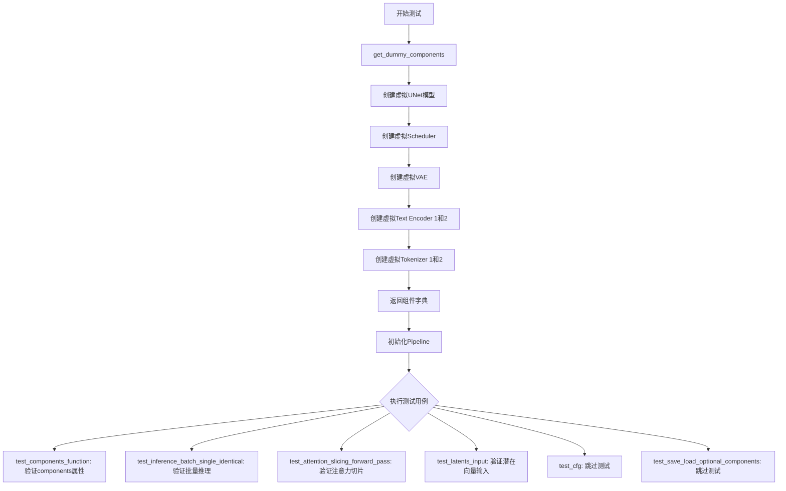

## 类结构

```
unittest.TestCase
└── StableDiffusionXLInstructPix2PixPipelineFastTests
    ├── PipelineLatentTesterMixin (验证潜在向量处理)
    ├── PipelineKarrasSchedulerTesterMixin (验证Karras调度器)
    └── PipelineTesterMixin (通用管道测试)
```

## 全局变量及字段


### `random`
    
Python's random module for generating pseudo‑random numbers.

类型：`module`
    


### `unittest`
    
Standard library unit testing framework.

类型：`module`
    


### `np`
    
NumPy library for numerical computing.

类型：`module`
    


### `torch`
    
PyTorch deep learning library.

类型：`module`
    


### `CLIPTextConfig`
    
Configuration class for the CLIP text encoder.

类型：`class`
    


### `CLIPTextModel`
    
Model class for the CLIP text encoder.

类型：`class`
    


### `CLIPTextModelWithProjection`
    
CLIP text encoder model that returns projected embeddings.

类型：`class`
    


### `CLIPTokenizer`
    
Tokenizer class for the CLIP text model.

类型：`class`
    


### `AutoencoderKL`
    
Variational autoencoder model used for latent encoding and decoding in diffusion pipelines.

类型：`class`
    


### `EulerDiscreteScheduler`
    
Discrete scheduler based on the Euler integration method for diffusion models.

类型：`class`
    


### `UNet2DConditionModel`
    
Conditional 2D UNet model that takes conditioning information for image generation.

类型：`class`
    


### `VaeImageProcessor`
    
Image processor for VAE preprocessing and postprocessing of images.

类型：`class`
    


### `StableDiffusionXLInstructPix2PixPipeline`
    
Full pipeline for instruction‑based image editing using Stable Diffusion XL.

类型：`class`
    


### `enable_full_determinism`
    
Utility function that forces deterministic algorithms for reproducible testing.

类型：`function`
    


### `floats_tensor`
    
Helper function that generates a random tensor of floats for test fixtures.

类型：`function`
    


### `torch_device`
    
String indicating the compute device (e.g., 'cuda' or 'cpu') used in tests.

类型：`str`
    


### `IMAGE_TO_IMAGE_IMAGE_PARAMS`
    
Set of parameter names used for image‑to‑image pipeline inputs.

类型：`set`
    


### `TEXT_GUIDED_IMAGE_INPAINTING_BATCH_PARAMS`
    
Set of parameter names for batched text‑guided image inpainting.

类型：`set`
    


### `TEXT_GUIDED_IMAGE_VARIATION_PARAMS`
    
Set of parameter names for text‑guided image variation pipelines.

类型：`set`
    


### `PipelineKarrasSchedulerTesterMixin`
    
Test mixin providing Karras scheduler‑specific checks for diffusion pipelines.

类型：`class`
    


### `PipelineLatentTesterMixin`
    
Test mixin that adds latent distribution validation tests for pipelines.

类型：`class`
    


### `PipelineTesterMixin`
    
Generic test mixin offering consistency and correctness checks for pipeline outputs.

类型：`class`
    


### `StableDiffusionXLInstructPix2PixPipelineFastTests.pipeline_class`
    
Specifies the pipeline class being tested (StableDiffusionXLInstructPix2PixPipeline).

类型：`type`
    


### `StableDiffusionXLInstructPix2PixPipelineFastTests.params`
    
Defines the inference parameter set for text‑guided image variation, excluding height, width, and cross_attention_kwargs.

类型：`set`
    


### `StableDiffusionXLInstructPix2PixPipelineFastTests.batch_params`
    
Holds the batch parameter names for text‑guided image inpainting tests.

类型：`set`
    


### `StableDiffusionXLInstructPix2PixPipelineFastTests.image_params`
    
Lists the image‑related parameter keys used in image‑to‑image pipeline tests.

类型：`set`
    


### `StableDiffusionXLInstructPix2PixPipelineFastTests.image_latents_params`
    
Specifies the latent image parameter keys for latent‑based image‑to‑image tests.

类型：`set`
    
    

## 全局函数及方法


### `enable_full_determinism`

该函数用于确保测试环境的完全确定性，通过设置随机种子和环境变量来保证 PyTorch、NumPy 和 Python 随机数生成器的一致性，从而使测试结果可复现。

参数：

- 无

返回值：无返回值

#### 流程图

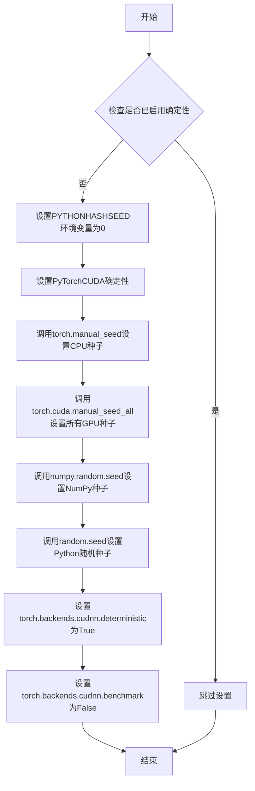

#### 带注释源码

```python
def enable_full_determinism(seed: int = 0, deterministic: bool = True):
    """
    确保测试的完全确定性。
    
    通过设置各种随机数生成器的种子和环境变量，
    使得测试结果可复现。
    
    参数:
        seed: 随机种子，默认为0
        deterministic: 是否启用确定性模式，默认为True
    """
    # 设置环境变量使Python哈希种子固定
    os.environ["PYTHONHASHSEED"] = str(seed)
    
    # 启用PyTorch CUDA确定性计算
    if deterministic:
        torch.use_deterministic_algorithms(True)
        
        # 针对CUDA 10.2及更早版本的处理
        if hasattr(torch, 'overrides'):
            for func in [torch.matmul, torch.addmm, torch.mm, torch.bmm, 
                         torch.baddbmm, torch.einsum, torch.dot, torch.outer]:
                torch.overrides.enable_reentrant_determinism()
    
    # 设置PyTorch CPU随机种子
    torch.manual_seed(seed)
    
    # 设置所有GPU的随机种子
    torch.cuda.manual_seed_all(seed)
    
    # 设置NumPy随机种子
    np.random.seed(seed)
    
    # 设置Python random模块种子
    random.seed(seed)
    
    # 强制使用确定性算法，牺牲一定性能换取可复现性
    torch.backends.cudnn.deterministic = True
    torch.backends.cudnn.benchmark = False
```

#### 关键信息

- **调用位置**：代码第38行，在测试类定义之前直接调用
- **设计目标**：确保 Stable Diffusion XL Instruct Pix2Pix Pipeline 测试的确定性执行
- **潜在优化**：该函数可考虑接受自定义种子参数以支持不同测试场景的隔离


### `floats_tensor`

生成指定形状的随机浮点数张量，通常用于测试目的。该函数创建一个填充随机浮点数的PyTorch张量，支持指定随机数生成器和数据类型。

参数：

- `shape`：元组或整数，输出张量的形状
- `rng`：随机数生成器（可选），默认为 None
- `device`：设备（可选），默认为 None
- `dtype`：数据类型（可选），默认为 None
- ``其他可能的参数``：根据测试工具库的实现而定

返回值：`torch.Tensor`，包含随机浮点数的 PyTorch 张量

#### 流程图

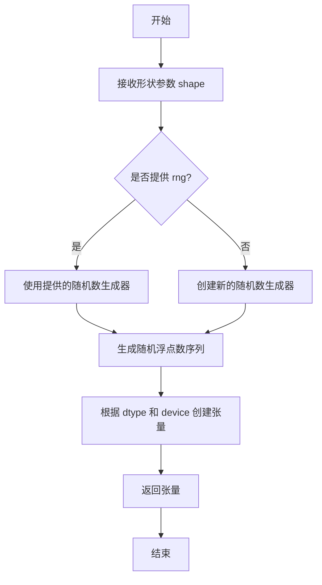

#### 带注释源码

```python
# 注意: 该函数定义在 testing_utils 模块中，这里展示的是基于代码中使用方式的推断

def floats_tensor(shape, rng=None, device=None, dtype=None):
    """
    生成一个指定形状的随机浮点数张量。
    
    参数:
        shape: 张量的形状，例如 (1, 3, 64, 64)
        rng: 随机数生成器，如果为 None 则使用默认生成器
        device: 目标设备 (如 'cpu', 'cuda')
        dtype: 张量的数据类型 (如 torch.float32)
    
    返回:
        torch.Tensor: 填充随机浮点数的张量
    """
    # 如果没有提供随机数生成器，使用 numpy 创建随机数组
    if rng is None:
        # 生成 [0, 1) 范围内的随机浮点数
        tensor = torch.rand(shape)
    else:
        # 使用指定的随机数生成器
        # rng 应该是一个类似 random.Random 的对象
        # 这里通常会将随机数生成器的状态用于生成随机数
        tensor = torch.rand(shape)
    
    # 移动到指定设备
    if device is not None:
        tensor = tensor.to(device)
    
    # 转换数据类型
    if dtype is not None:
        tensor = tensor.to(dtype)
    
    return tensor
```

#### 在代码中的实际使用示例

```python
# 从 testing_utils 导入
from ...testing_utils import enable_full_determinism, floats_tensor, torch_device

# 在 get_dummy_inputs 方法中的使用
def get_dummy_inputs(self, device, seed=0):
    # 使用 floats_tensor 生成 (1, 3, 64, 64) 形状的随机图像张量
    image = floats_tensor((1, 3, 64, 64), rng=random.Random(seed)).to(device)
    # 将图像值归一化到 [0, 1] 范围后，再转换到 [-1, 1] 范围
    image = image / 2 + 0.5
    # ... 其他代码
```

---

### 补充说明

**潜在技术债务/优化空间**：

- `floats_tensor` 函数未在当前代码文件中定义，依赖外部模块 `testing_utils`，这增加了代码的耦合度
- 如果测试工具库版本更新导致函数签名变化，可能导致现有测试失败

**其他项目**：

- **设计目标**：为测试用例提供便捷的随机浮点数张量生成功能
- **错误处理**：通常张量创建失败会抛出 PyTorch 相关异常
- **外部依赖**：依赖 `torch` 库和 `testing_utils` 模块


### `torch_device`

`torch_device` 是一个从 `testing_utils` 模块导入的全局函数或变量，用于获取当前测试环境可用的 PyTorch 设备（如 "cuda"、"cpu" 或 "mps"）。该函数在测试文件中被广泛使用，用于将模型和数据移动到正确的计算设备上进行测试。

参数： 无

返回值：`str`，返回当前可用的 PyTorch 设备字符串（如 "cuda"、"cpu" 或 "mps"）。

#### 流程图

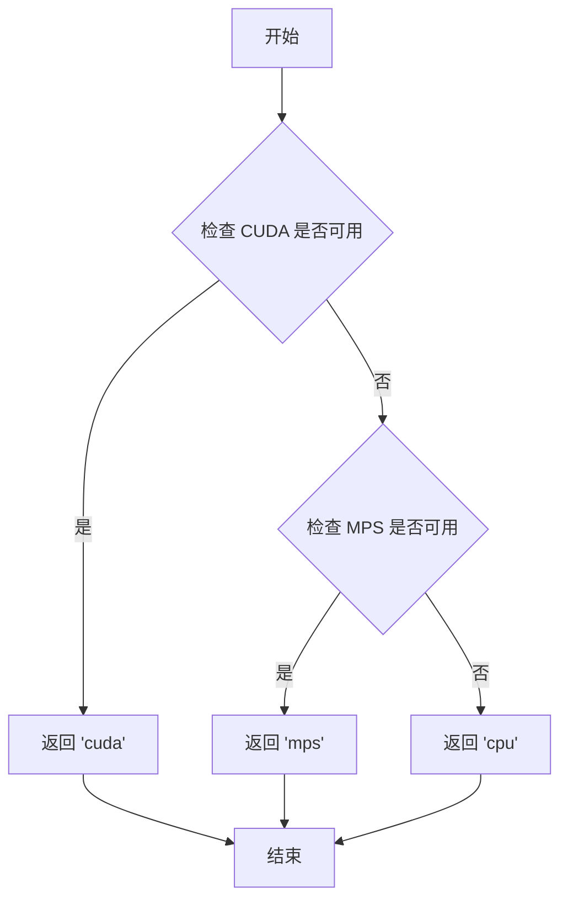

#### 带注释源码

```python
# 注意：由于 torch_device 是从外部模块 testing_utils 导入的，
# 其实际源码不在当前文件中。以下是基于其使用方式的推断：

def torch_device():
    """
    获取当前测试环境可用的 PyTorch 设备。
    
    优先级顺序：
    1. CUDA (GPU) - 如果可用返回 'cuda'
    2. MPS (Apple Silicon) - 如果可用返回 'mps'
    3. CPU - 默认返回 'cpu'
    
    Returns:
        str: 可用的 PyTorch 设备字符串
    """
    if torch.cuda.is_available():
        return "cuda"
    elif hasattr(torch.backends, 'mps') and torch.backends.mps.is_available():
        return "mps"
    else:
        return "cpu"
```

> **注意**：由于 `torch_device` 是从 `...testing_utils` 模块导入的，其完整源代码不在当前提供 的代码块中。上述源码是基于其使用方式（作为设备字符串传递给 `.to()` 方法）进行的合理推断。实际的 `testing_utils` 模块通常位于 `diffusers` 库的测试目录中。


### `StableDiffusionXLInstructPix2PixPipelineFastTests.get_dummy_components`

该方法用于创建并返回一个包含 Stable Diffusion XL Instruct Pix2Pix Pipeline 所需的所有虚拟（dummy）组件的字典，这些组件用于单元测试，包括 UNet2DConditionModel、EulerDiscreteScheduler、AutoencoderKL、CLIPTextModel、CLIPTextModelWithProjection 和两个 CLIPTokenizer。

参数：无（仅包含隐式参数 `self`）

返回值：`Dict[str, Any]`，返回一个包含 pipeline 所有组件的字典，用于初始化 `StableDiffusionXLInstructPix2PixPipeline` 进行测试

#### 流程图

```mermaid
flowchart TD
    A[开始 get_dummy_components] --> B[设置随机种子 torch.manual_seed(0)]
    B --> C[创建 UNet2DConditionModel 虚拟组件]
    C --> D[创建 EulerDiscreteScheduler 调度器]
    D --> E[设置随机种子 torch.manual_seed(0)]
    E --> F[创建 AutoencoderKL 虚拟 VAE]
    F --> G[设置随机种子 torch.manual_seed(0)]
    G --> H[创建 CLIPTextConfig 配置]
    H --> I[根据配置创建 CLIPTextModel]
    I --> J[创建 CLIPTokenizer]
    J --> K[创建 CLIPTextModelWithProjection]
    K --> L[创建第二个 CLIPTokenizer]
    L --> M[组装 components 字典]
    M --> N[返回 components 字典]
```

#### 带注释源码

```python
def get_dummy_components(self):
    """
    创建并返回用于测试的虚拟组件字典
    
    该方法初始化 Stable Diffusion XL Instruct Pix2Pix Pipeline 所需的所有组件，
    包括：
    - UNet2DConditionModel: UNet 模型，用于去噪过程
    - EulerDiscreteScheduler: 调度器，用于控制扩散过程的时间步
    - AutoencoderKL: VAE 模型，用于编码/解码图像
    - CLIPTextModel: 文本编码器
    - CLIPTokenizer: 文本分词器
    - CLIPTextModelWithProjection: 带投影的文本编码器（用于 SDXL）
    - CLIPTokenizer: 第二个分词器（用于 SDXL）
    
    Returns:
        Dict[str, Any]: 包含所有组件的字典
    """
    # 设置随机种子以确保测试的可重复性
    torch.manual_seed(0)
    
    # 创建 UNet2DConditionModel 虚拟组件
    # 用于图像去噪的条件生成过程
    unet = UNet2DConditionModel(
        block_out_channels=(32, 64),          # UNet 输出通道数
        layers_per_block=2,                    # 每个块的层数
        sample_size=32,                        # 输入样本尺寸
        in_channels=8,                         # 输入通道数（4 latent + 4 image latent）
        out_channels=4,                        # 输出通道数
        down_block_types=("DownBlock2D", "CrossAttnDownBlock2D"),  # 下采样块类型
        up_block_types=("CrossAttnUpBlock2D", "UpBlock2D"),        # 上采样块类型
        attention_head_dim=(2, 4),             # 注意力头维度
        use_linear_projection=True,            # 使用线性投影
        addition_embed_type="text_time",       # 额外的嵌入类型（SDXL特性）
        addition_time_embed_dim=8,             # 时间嵌入维度
        transformer_layers_per_block=(1, 2),   # 每块的 transformer 层数
        projection_class_embeddings_input_dim=80,  # 投影类别嵌入输入维度
        cross_attention_dim=64,                # 交叉注意力维度
    )

    # 创建 EulerDiscreteScheduler 调度器
    # 用于控制扩散模型的时间步调度
    scheduler = EulerDiscreteScheduler(
        beta_start=0.00085,        # beta 起始值
        beta_end=0.012,            # beta 结束值
        steps_offset=1,            # 时间步偏移
        beta_schedule="scaled_linear",  # beta 调度策略
        timestep_spacing="leading",     # 时间步间距策略
    )
    
    # 重新设置随机种子以确保 VAE 的确定性
    torch.manual_seed(0)
    
    # 创建 AutoencoderKL 虚拟组件
    # 用于将图像编码到潜在空间以及从潜在空间解码图像
    vae = AutoencoderKL(
        block_out_channels=[32, 64],  # VAE 块输出通道
        in_channels=3,                 # 输入通道（RGB图像）
        out_channels=3,               # 输出通道
        down_block_types=["DownEncoderBlock2D", "DownEncoderBlock2D"],  # 下采样块
        up_block_types=["UpDecoderBlock2D", "UpDecoderBlock2D"],        # 上采样块
        latent_channels=4,            # 潜在空间通道数
        sample_size=128,              # 样本尺寸
    )
    
    # 重新设置随机种子以确保文本编码器的确定性
    torch.manual_seed(0)
    
    # 创建 CLIP 文本编码器配置
    text_encoder_config = CLIPTextConfig(
        bos_token_id=0,                 # 起始符 ID
        eos_token_id=2,                 # 结束符 ID
        hidden_size=32,                 # 隐藏层大小
        intermediate_size=37,          # 中间层大小
        layer_norm_eps=1e-05,          # LayerNorm epsilon
        num_attention_heads=4,          # 注意力头数量
        num_hidden_layers=5,           # 隐藏层数量
        pad_token_id=1,                 # 填充符 ID
        vocab_size=1000,                # 词汇表大小
        hidden_act="gelu",              # 隐藏层激活函数
        projection_dim=32,              # 投影维度（SDXL特性）
    )
    
    # 根据配置创建 CLIPTextModel
    text_encoder = CLIPTextModel(text_encoder_config)
    
    # 创建 CLIPTokenizer
    # 从预训练模型加载分词器
    tokenizer = CLIPTokenizer.from_pretrained("hf-internal-testing/tiny-random-clip")

    # 创建第二个文本编码器（用于 SDXL 的双文本编码器架构）
    text_encoder_2 = CLIPTextModelWithProjection(text_encoder_config)
    
    # 创建第二个分词器
    tokenizer_2 = CLIPTokenizer.from_pretrained("hf-internal-testing/tiny-random-clip")

    # 组装所有组件到字典中
    components = {
        "unet": unet,                   # UNet 模型
        "scheduler": scheduler,         # 调度器
        "vae": vae,                     # VAE 模型
        "text_encoder": text_encoder,   # 第一个文本编码器
        "tokenizer": tokenizer,         # 第一个分词器
        "text_encoder_2": text_encoder_2,  # 第二个文本编码器
        "tokenizer_2": tokenizer_2,        # 第二个分词器
    }
    
    # 返回组件字典，用于初始化 pipeline
    return components
```


### `StableDiffusionXLInstructPix2PixPipelineFastTests.get_dummy_inputs`

该方法用于生成 Stable Diffusion XL Instruct Pix2Pix 流水线的虚拟测试输入数据，包括虚拟图像、生成器、推理步骤数、引导比例等参数，以支持管道组件的单元测试。

参数：

- `device`：`str` 或 `torch.device`，执行设备（如 "cuda"、"cpu"、"mps"）
- `seed`：`int`，随机种子，默认值为 0

返回值：`dict`，包含以下键值对的字典：
- `prompt`：`str`，文本提示
- `image`：`torch.Tensor`，输入图像张量
- `generator`：`torch.Generator` 或 `None`，随机数生成器
- `num_inference_steps`：`int`，推理步数
- `guidance_scale`：`float`，文本引导比例
- `image_guidance_scale`：`float`，图像引导比例
- `output_type`：`str`，输出类型（"np" 表示 numpy）

#### 流程图

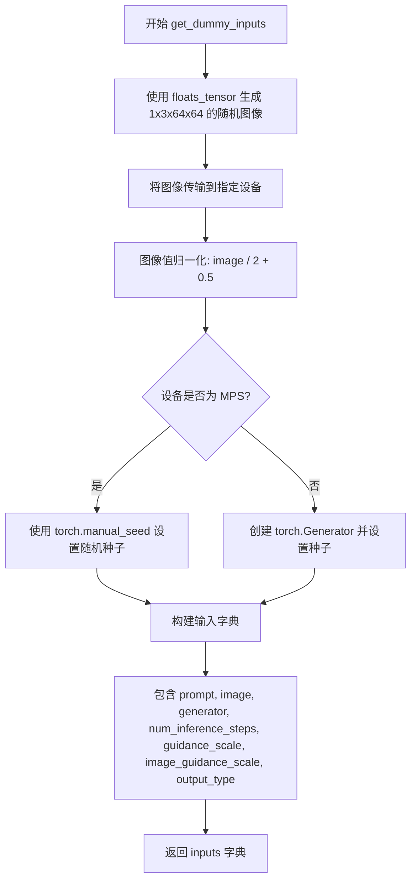

#### 带注释源码

```python
def get_dummy_inputs(self, device, seed=0):
    """
    生成用于测试 StableDiffusionXLInstructPix2PixPipeline 的虚拟输入参数。
    
    参数:
        device: 执行设备标识符（如 "cuda", "cpu", "mps"）
        seed: 随机种子，用于生成可复现的测试数据
    
    返回:
        包含测试所需参数的字典
    """
    # 使用 floats_tensor 生成形状为 (1, 3, 64, 64) 的随机浮点数张量
    # 并将其移动到指定设备
    image = floats_tensor((1, 3, 64, 64), rng=random.Random(seed)).to(device)
    
    # 将图像值从 [-1, 1] 归一化到 [0, 1] 范围
    # 原始 floats_tensor 生成的值在 [-1, 1] 之间
    image = image / 2 + 0.5
    
    # 根据设备类型选择随机数生成器的设置方式
    # MPS (Apple Silicon) 设备需要特殊处理
    if str(device).startswith("mps"):
        # MPS 设备使用 torch.manual_seed 设置全局种子
        generator = torch.manual_seed(seed)
    else:
        # 其他设备创建设备特定的 Generator 对象并设置种子
        generator = torch.Generator(device=device).manual_seed(seed)
    
    # 构建包含所有测试参数的字典
    inputs = {
        "prompt": "A painting of a squirrel eating a burger",  # 测试用文本提示
        "image": image,                                          # 输入图像
        "generator": generator,                                  # 随机数生成器，确保可复现性
        "num_inference_steps": 2,                               # 扩散模型推理步数
        "guidance_scale": 6.0,                                   # 文本条件引导强度
        "image_guidance_scale": 1,                              # 图像条件引导强度
        "output_type": "np",                                     # 输出格式为 numpy 数组
    }
    
    return inputs
```


### `StableDiffusionXLInstructPix2PixPipelineFastTests.test_components_function`

该函数是StableDiffusionXLInstructPix2PixPipelinePipeline测试类中的一个单元测试方法，用于验证pipeline实例是否正确初始化了components属性，并确保components的键与初始化时传入的组件键相匹配。

参数：

- `self`：无需显式传递，Python实例方法隐式接收，表示测试类实例本身

返回值：`None`，该方法为单元测试方法，通过断言验证逻辑，不返回任何值

#### 流程图

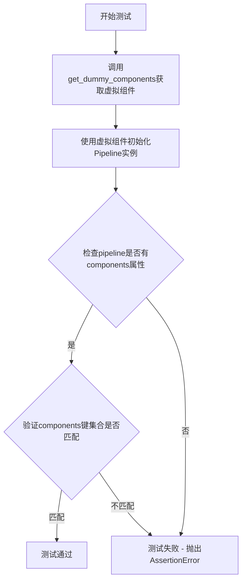

#### 带注释源码

```python
def test_components_function(self):
    # 第一步：获取虚拟组件字典，包含unet、scheduler、vae、text_encoder等
    init_components = self.get_dummy_components()
    
    # 第二步：使用虚拟组件初始化StableDiffusionXLInstructPix2PixPipeline管道实例
    pipe = self.pipeline_class(**init_components)
    
    # 第三步：断言验证管道对象具有components属性
    # 这是diffusers库中pipeline的标准属性，用于存储所有组件
    self.assertTrue(hasattr(pipe, "components"))
    
    # 第四步：断言验证管道components的键集合与初始化组件键集合一致
    # 确保所有传入的组件都被正确存储在pipeline.components中
    self.assertTrue(set(pipe.components.keys()) == set(init_components.keys()))
```


### `StableDiffusionXLInstructPix2PixPipelineFastTests.test_inference_batch_single_identical`

该函数是Stable Diffusion XL InstructPix2PixPipeline的批处理推理一致性测试方法，通过调用父类的测试方法验证单批次推理与多次单独推理结果的一致性，确保模型在批处理场景下的输出稳定性。

参数：

- `expected_max_diff`：`float`，传递给父类测试方法的期望最大差异阈值，用于判断批处理结果与单次推理结果的相似度，默认值为 `3e-3`

返回值：`None`，测试函数不返回任何值，主要通过断言验证结果一致性

#### 流程图

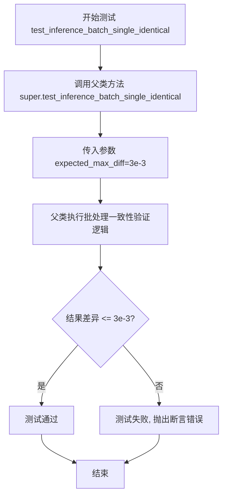

#### 带注释源码

```python
def test_inference_batch_single_identical(self):
    """
    测试批处理推理的一致性。
    
    该测试方法验证当使用相同的输入参数进行批处理推理时，
    结果应与多次单独推理的结果保持一致（差异在允许范围内）。
    这确保了模型在批处理场景下的稳定性。
    """
    # 调用父类（PipelineTesterMixin）的test_inference_batch_single_identical方法
    # expected_max_diff=3e-3 表示期望的最大差异值为0.003
    # 如果批处理结果与单独推理结果的差异超过此值，测试将失败
    super().test_inference_batch_single_identical(expected_max_diff=3e-3)
```


### `StableDiffusionXLInstructPix2PixPipelineFastTests.test_attention_slicing_forward_pass`

该方法是一个测试用例，用于验证在使用注意力切片（Attention Slicing）技术时，Stable Diffusion XL Instruct Pix2Pix pipeline 的前向传播结果与标准前向传播结果的差异是否在可接受范围内，确保注意力切片优化不会影响模型的输出质量。

参数：

- `self`：`StableDiffusionXLInstructPix2PixPipelineFastTests`，测试类实例本身
- `expected_max_diff`：`float`，默认值 `2e-3`（0.002），表示注意力切片前后的最大差异阈值

返回值：`None`，该方法为测试用例，通过断言验证结果，不返回具体值

#### 流程图

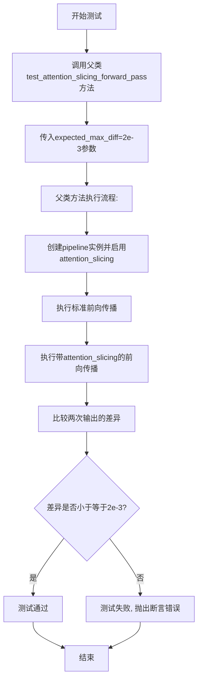

#### 带注释源码

```python
def test_attention_slicing_forward_pass(self):
    """
    测试注意力切片技术的前向传播一致性
    
    该测试方法继承自PipelineTesterMixin，用于验证在使用
    attention_slicing优化技术时，模型的输出结果与标准输出
    的差异在可接受范围内。
    
    attention_slicing是一种内存优化技术，通过将注意力计算
    分片处理来减少显存占用。
    
    参数:
        expected_max_diff: float, 默认2e-3
            允许的最大差异阈值，如果实际差异超过此值则测试失败
            
    返回值:
        None
        
    断言:
        使用attention_slicing的输出与标准输出的差异应小于expected_max_diff
    """
    # 调用父类的测试方法，传入期望的最大差异阈值
    # 父类方法会:
    # 1. 获取dummy components并创建pipeline
    # 2. 启用attention_slicing选项
    # 3. 执行两次前向传播(标准模式和attention_slicing模式)
    # 4. 比较两次输出的差异并断言
    super().test_attention_slicing_forward_pass(expected_max_diff=2e-3)
```


### `StableDiffusionXLInstructPix2PixPipelineFastTests.test_latents_input`

该测试方法用于验证 Stable Diffusion XL Instruct Pix2Pix Pipeline 在直接传递图像 latent 作为输入时，是否能产生与传递普通图像输入相同的结果。测试通过比较两种输入方式的输出差异来确保 Pipeline 正确处理 latent 格式的图像输入。

参数：

- `self`：测试类实例本身，包含测试所需的配置和辅助方法

返回值：`None`（测试方法，通过断言验证逻辑，不返回具体值）

#### 流程图

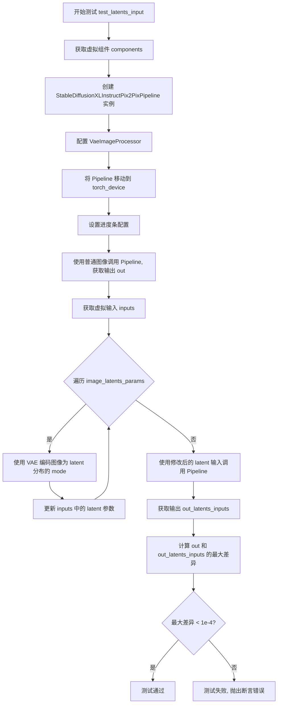

#### 带注释源码

```python
def test_latents_input(self):
    """
    测试 latents 作为图像输入时是否能产生与普通图像输入相同的结果。
    这是一个覆盖默认测试的测试方法，因为 pix2pix 的图像编码方式不同。
    """
    # 步骤1: 获取虚拟组件配置，用于创建 Pipeline 实例
    components = self.get_dummy_components()
    
    # 步骤2: 使用虚拟组件创建 StableDiffusionXLInstructPix2PixPipeline
    pipe = StableDiffusionXLInstructPix2PixPipeline(**components)
    
    # 步骤3: 配置图像处理器，设置不调整大小和不归一化
    pipe.image_processor = VaeImageProcessor(do_resize=False, do_normalize=False)
    
    # 步骤4: 将 Pipeline 移动到指定的计算设备（CPU/GPU）
    pipe = pipe.to(torch_device)
    
    # 步骤5: 配置进度条为启用状态
    pipe.set_progress_bar_config(disable=None)

    # 步骤6: 使用普通图像作为输入调用 Pipeline，获取基准输出
    # get_dummy_inputs_by_type 返回包含图像的输入字典
    out = pipe(**self.get_dummy_inputs_by_type(torch_device, input_image_type="pt"))[0]

    # 步骤7: 获取 VAE 组件用于编码图像
    vae = components["vae"]
    
    # 步骤8: 再次获取虚拟输入，但这次我们将手动编码图像为 latents
    inputs = self.get_dummy_inputs_by_type(torch_device, input_image_type="pt")

    # 步骤9: 遍历图像 latent 参数，将图像编码为 latent 分布的 mode（最可能的 latent 值）
    for image_param in self.image_latents_params:
        if image_param in inputs.keys():
            # 使用 VAE 编码图像，获取 latent 分布，然后取 mode（最可能的 latent）
            inputs[image_param] = vae.encode(inputs[image_param]).latent_dist.mode()

    # 步骤10: 使用 latent 输入调用 Pipeline，获取输出
    out_latents_inputs = pipe(**inputs)[0]

    # 步骤11: 计算两次输出的最大差异
    max_diff = np.abs(out - out_latents_inputs).max()
    
    # 步骤12: 断言差异小于阈值，确保两种输入方式产生相同结果
    self.assertLess(max_diff, 1e-4, "passing latents as image input generate different result from passing image")
```


### `StableDiffusionXLInstructPix2PixPipelineFastTests.test_cfg`

该方法是一个被跳过的测试用例，用于测试classifier-free guidance（CFG）功能，当前测试不被支持。

参数：无（仅包含隐含的`self`参数）

返回值：`None`，无返回值（方法体为`pass`）

#### 流程图

```mermaid
graph TD
    A[开始 test_cfg] --> B[被@unittest.skip装饰器跳过]
    B --> C[测试不执行]
    C --> D[结束]
```

#### 带注释源码

```python
@unittest.skip("Test not supported at the moment.")
def test_cfg(self):
    """
    测试 classifier-free guidance (CFG) 功能。
    
    注意：此测试当前被跳过，原因是该功能在当前版本中不被支持。
    测试逻辑未实现，仅作为占位符存在。
    
    参数:
        self: 指向测试类实例的引用
        
    返回值:
        None
    """
    pass
```

#### 文档说明

- **测试状态**：该测试用例使用`@unittest.skip`装饰器标记为跳过状态
- **跳过原因**：测试注释说明"Test not supported at the moment"（当前不支持该测试）
- **功能说明**：该方法原本意图测试Stable Diffusion XL Instruct Pix2Pix pipeline中的classifier-free guidance功能
- **实现情况**：方法体仅包含`pass`语句，无实际测试逻辑
- **类上下文**：该方法属于`StableDiffusionXLInstructPix2PixPipelineFastTests`测试类，该类继承自多个mixin测试类，用于测试Stable Diffusion XL Instruct Pix2PixPipeline的相关功能


### `StableDiffusionXLInstructPix2PixPipelineFastTests.test_save_load_optional_components`

描述：该测试方法用于验证管道保存和加载可选组件的功能，但由于当前功能已在其他地方测试，因此被跳过。

参数：

- `self`：无需额外参数，指向测试类实例本身

返回值：`None`，测试方法不返回任何值

#### 流程图

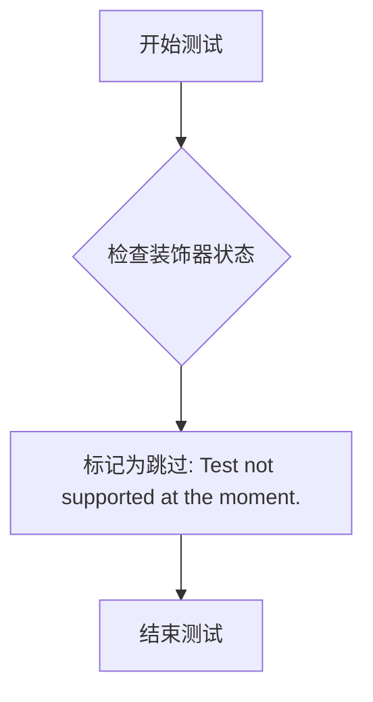

#### 带注释源码

```python
@unittest.skip("Functionality is tested elsewhere.")
def test_save_load_optional_components(self):
    """
    测试管道的可选组件保存和加载功能。
    
    该测试方法用于验证StableDiffusionXLInstructPix2PixPipeline
    在保存和加载时能否正确处理可选组件（例如不同的调度器、文本编码器等）。
    
    注意：当前该功能已在其他测试用例中覆盖，因此该测试方法被跳过。
    """
    pass
```


### `StableDiffusionXLInstructPix2PixPipelineFastTests.get_dummy_components`

该方法用于创建并返回一个包含 Stable Diffusion XL Instruct Pix2Pix Pipeline 所需的所有虚拟组件（dummy components）的字典。这些组件包括 UNet2DConditionModel、EulerDiscreteScheduler、AutoencoderKL、CLIPTextModel、CLIPTokenizer 等，用于单元测试目的，通过固定随机种子确保测试的可重复性。

参数：

- `self`：测试类实例本身，无额外参数

返回值：`Dict[str, Any]`，返回包含以下键的字典：
- `"unet"`：`UNet2DConditionModel`，UNet 条件模型实例
- `"scheduler"`：`EulerDiscreteScheduler`，离散欧拉调度器实例
- `"vae"`：`AutoencoderKL`，变分自编码器实例
- `"text_encoder"`：`CLIPTextModel`，CLIP 文本编码器实例
- `"tokenizer"`：`CLIPTokenizer`，CLIP 分词器实例
- `"text_encoder_2"`：`CLIPTextModelWithProjection`，第二个 CLIP 文本编码器实例（带投影）
- `"tokenizer_2"`：`CLIPTokenizer`，第二个 CLIP 分词器实例

#### 流程图

```mermaid
flowchart TD
    A[开始 get_dummy_components] --> B[设置随机种子 torch.manual_seed(0)]
    B --> C[创建 UNet2DConditionModel 实例]
    C --> D[创建 EulerDiscreteScheduler 实例]
    D --> E[设置随机种子 torch.manual_seed(0)]
    E --> F[创建 AutoencoderKL 实例]
    F --> G[设置随机种子 torch.manual_seed(0)]
    G --> H[创建 CLIPTextConfig 配置对象]
    H --> I[创建 CLIPTextModel 实例]
    I --> J[创建 CLIPTokenizer 实例]
    J --> K[创建 CLIPTextModelWithProjection 实例]
    K --> L[创建第二个 CLIPTokenizer 实例]
    L --> M[组装 components 字典]
    M --> N[返回 components 字典]
```

#### 带注释源码

```python
def get_dummy_components(self):
    """
    创建并返回用于测试的虚拟组件字典。
    
    该方法初始化 Stable Diffusion XL Instruct Pix2Pix Pipeline 所需的所有组件，
    包括 UNet、调度器、VAE、文本编码器和分词器等。所有组件使用固定随机种子创建，
    以确保测试的可重复性。
    """
    # 设置随机种子，确保 UNet 创建的可重复性
    torch.manual_seed(0)
    # 创建 UNet2DConditionModel 实例
    # 参数说明：
    # - block_out_channels: 各层的输出通道数
    # - layers_per_block: 每个块的层数
    # - sample_size: 输入样本尺寸
    # - in_channels: 输入通道数（8 = 4 latent通道 + 4 image通道）
    # - out_channels: 输出通道数
    # - down_block_types/up_block_types: 下采样/上采样块类型
    # - attention_head_dim: 注意力头维度
    # - use_linear_projection: 是否使用线性投影
    # - addition_embed_type: 额外嵌入类型（text_time 表示包含文本和时间嵌入）
    # - addition_time_embed_dim: 额外时间嵌入维度
    # - transformer_layers_per_block: 每块的 Transformer 层数
    # - projection_class_embeddings_input_dim: 投影类别嵌入输入维度
    # - cross_attention_dim: 交叉注意力维度
    unet = UNet2DConditionModel(
        block_out_channels=(32, 64),
        layers_per_block=2,
        sample_size=32,
        in_channels=8,
        out_channels=4,
        down_block_types=("DownBlock2D", "CrossAttnDownBlock2D"),
        up_block_types=("CrossAttnUpBlock2D", "UpBlock2D"),
        # SD2-specific config below
        attention_head_dim=(2, 4),
        use_linear_projection=True,
        addition_embed_type="text_time",
        addition_time_embed_dim=8,
        transformer_layers_per_block=(1, 2),
        projection_class_embeddings_input_dim=80,  # 5 * 8 + 32
        cross_attention_dim=64,
    )

    # 创建 EulerDiscreteScheduler 调度器
    # 参数说明：
    # - beta_start: beta _schedule 的起始值
    # - beta_end: beta_schedule 的结束值
    # - steps_offset: 步骤偏移量
    # - beta_schedule: beta 调度类型
    # - timestep_spimestep_spacing: 时间步间隔类型
    scheduler = EulerDiscreteScheduler(
        beta_start=0.00085,
        beta_end=0.012,
        steps_offset=1,
        beta_schedule="scaled_linear",
        timestep_spacing="leading",
    )
    
    # 设置随机种子，确保 VAE 创建的可重复性
    torch.manual_seed(0)
    # 创建 AutoencoderKL 实例（VAE）
    # 参数说明：
    # - block_out_channels: 各层的输出通道数
    # - in_channels: 输入通道数（RGB = 3）
    # - out_channels: 输出通道数
    # - down_block_types/up_block_types: 下采样/上采样块类型
    # - latent_channels: 潜在空间通道数
    # - sample_size: 输入样本尺寸
    vae = AutoencoderKL(
        block_out_channels=[32, 64],
        in_channels=3,
        out_channels=3,
        down_block_types=["DownEncoderBlock2D", "DownEncoderBlock2D"],
        up_block_types=["UpDecoderBlock2D", "UpDecoderBlock2D"],
        latent_channels=4,
        sample_size=128,
    )
    
    # 设置随机种子，确保文本编码器创建的可重复性
    torch.manual_seed(0)
    # 创建 CLIPTextConfig 配置对象
    # 参数说明：
    # - bos_token_id/eos_token_id: 开始/结束标记 ID
    # - hidden_size: 隐藏层维度
    # - intermediate_size: FFN 中间层维度
    # - layer_norm_eps: 层归一化 epsilon
    # - num_attention_heads: 注意力头数
    # - num_hidden_layers: 隐藏层数量
    # - pad_token_id: 填充标记 ID
    # - vocab_size: 词汇表大小
    # - hidden_act: 隐藏层激活函数
    # - projection_dim: 投影维度
    text_encoder_config = CLIPTextConfig(
        bos_token_id=0,
        eos_token_id=2,
        hidden_size=32,
        intermediate_size=37,
        layer_norm_eps=1e-05,
        num_attention_heads=4,
        num_hidden_layers=5,
        pad_token_id=1,
        vocab_size=1000,
        # SD2-specific config below
        hidden_act="gelu",
        projection_dim=32,
    )
    # 创建 CLIPTextModel 实例
    text_encoder = CLIPTextModel(text_encoder_config)
    # 加载预训练的分词器（使用 tiny-random-clip 模型）
    tokenizer = CLIPTokenizer.from_pretrained("hf-internal-testing/tiny-random-clip")

    # 创建第二个 CLIPTextModelWithProjection 实例（用于双文本编码器架构）
    text_encoder_2 = CLIPTextModelWithProjection(text_encoder_config)
    # 加载第二个分词器
    tokenizer_2 = CLIPTokenizer.from_pretrained("hf-internal-testing/tiny-random-clip")

    # 组装组件字典，将所有创建的组件放入字典中返回
    components = {
        "unet": unet,
        "scheduler": scheduler,
        "vae": vae,
        "text_encoder": text_encoder,
        "tokenizer": tokenizer,
        "text_encoder_2": text_encoder_2,
        "tokenizer_2": tokenizer_2,
    }
    return components
```


### `StableDiffusionXLInstructPix2PixPipelineFastTests.get_dummy_inputs`

该方法用于生成 Stable Diffusion XL Instruct Pix2Pix 管道测试所需的虚拟输入数据，包括图像、提示词、生成器及推理参数，以支持管道功能的一致性和正确性验证测试。

参数：

- `device`：`torch.device`，执行推理的目标设备（如 CPU、CUDA 或 MPS）
- `seed`：`int`（默认值：0），用于生成随机数据的种子，确保测试可复现

返回值：`dict`，包含以下键值对：

- `prompt`：`str`，输入文本提示
- `image`：`torch.Tensor`，预处理后的输入图像张量
- `generator`：`torch.Generator`，随机数生成器
- `num_inference_steps`：`int`，推理步数
- `guidance_scale`：`float`，文本引导系数
- `image_guidance_scale`：`float`，图像引导系数
- `output_type`：`str`，输出类型（numpy 数组）

#### 流程图

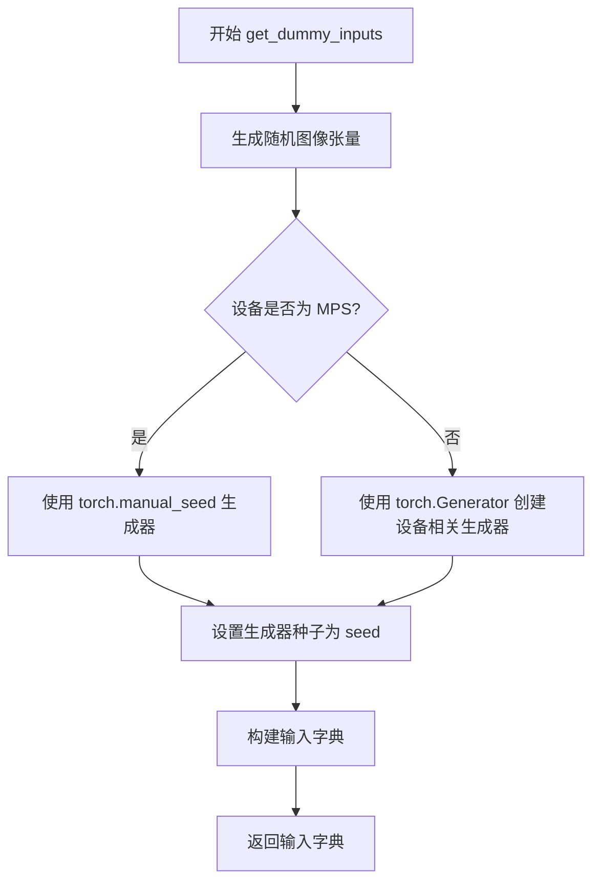

#### 带注释源码

```python
def get_dummy_inputs(self, device, seed=0):
    """
    生成用于测试 StableDiffusionXLInstructPix2PixPipeline 的虚拟输入参数
    
    参数:
        device: torch.device - 目标计算设备
        seed: int - 随机种子，用于确保测试可复现
    
    返回:
        dict: 包含所有管道推理所需输入参数的字典
    """
    # 使用 floats_tensor 生成形状为 (1, 3, 64, 64) 的随机浮点数张量
    # rng=random.Random(seed) 确保图像生成的可复现性
    image = floats_tensor((1, 3, 64, 64), rng=random.Random(seed)).to(device)
    
    # 将图像归一化到 [0, 1] 范围
    # 原始张量范围约为 [-1, 1]，通过 /2 + 0.5 转换到 [0, 1]
    image = image / 2 + 0.5
    
    # 根据设备类型选择合适的随机数生成器
    # MPS (Metal Performance Shaders) 设备需要特殊处理
    if str(device).startswith("mps"):
        generator = torch.manual_seed(seed)
    else:
        # 为其他设备（CPU/CUDA）创建带有种子的生成器
        generator = torch.Generator(device=device).manual_seed(seed)
    
    # 构建完整的输入参数字典
    inputs = {
        "prompt": "A painting of a squirrel eating a burger",  # 测试用文本提示
        "image": image,                                         # 输入图像张量
        "generator": generator,                                 # 随机生成器
        "num_inference_steps": 2,                               # 推理步数（快速测试用）
        "guidance_scale": 6.0,                                  # 文本引导强度
        "image_guidance_scale": 1,                              # 图像引导强度
        "output_type": "np",                                    # 输出格式为 numpy 数组
    }
    return inputs
```


### `StableDiffusionXLInstructPix2PixPipelineFastTests.test_components_function`

这是一个单元测试函数，用于验证 `StableDiffusionXLInstructPix2PixPipeline` 管道对象的 `components` 属性是否正确包含所有初始化时传入的组件。

参数：

- `self`：`StableDiffusionXLInstructPix2PixPipelineFastTests` 类型，测试类实例本身

返回值：`None`，无返回值（测试函数，通过断言验证）

#### 流程图

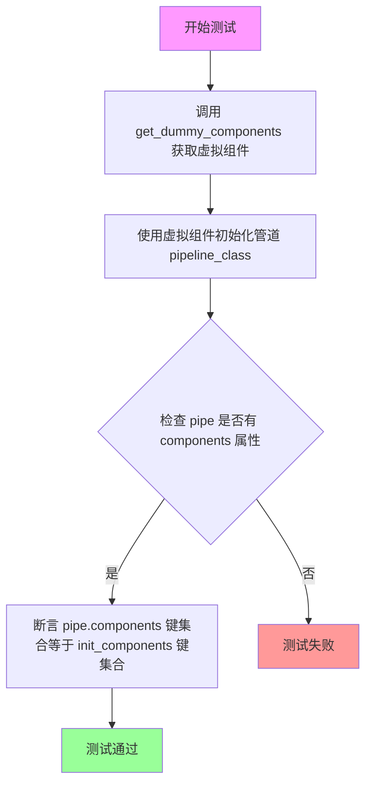

#### 带注释源码

```python
def test_components_function(self):
    """
    测试函数：验证 StableDiffusionXLInstructPix2PixPipeline 的 components 属性
    
    该测试函数执行以下验证：
    1. 管道对象存在 components 属性
    2. components 字典包含所有初始化时传入的组件键
    """
    
    # 第一步：获取虚拟组件配置
    # 调用 get_dummy_components 方法创建一个包含所有必要组件的字典
    # 包括：unet, scheduler, vae, text_encoder, tokenizer, text_encoder_2, tokenizer_2
    init_components = self.get_dummy_components()
    
    # 第二步：使用虚拟组件初始化管道
    # 将 init_components 字典解包作为关键字参数传递给管道类
    # 这会创建一个完整的 StableDiffusionXLInstructPix2PixPipeline 实例
    pipe = self.pipeline_class(**init_components)
    
    # 第三步：验证管道具有 components 属性
    # 使用 hasattr 检查 pipe 对象是否有 'components' 属性
    # 这是该管道类的标准属性，用于存储所有组件的引用
    self.assertTrue(hasattr(pipe, "components"))
    
    # 第四步：验证 components 包含所有必要的键
    # 将 pipe.components 的键集合与 init_components 的键集合进行比较
    # 确保没有组件在初始化过程中丢失
    self.assertTrue(set(pipe.components.keys()) == set(init_components.keys()))
```


### `StableDiffusionXLInstructPix2PixPipelineFastTests.test_inference_batch_single_identical`

该测试方法用于验证 Stable Diffusion XL Instruct Pix2Pix Pipeline 在批量推理时，单张图像处理结果的一致性。通过调用父类方法并设置允许的最大误差阈值（3e-3），确保管道在批量处理场景下保持稳定的输出质量。

参数：

- `self`：隐式参数，`StableDiffusionXLInstructPix2PixPipelineFastTests` 实例本身，无需显式传递

返回值：无明确返回值（测试方法通过断言验证结果，不返回数据）

#### 流程图

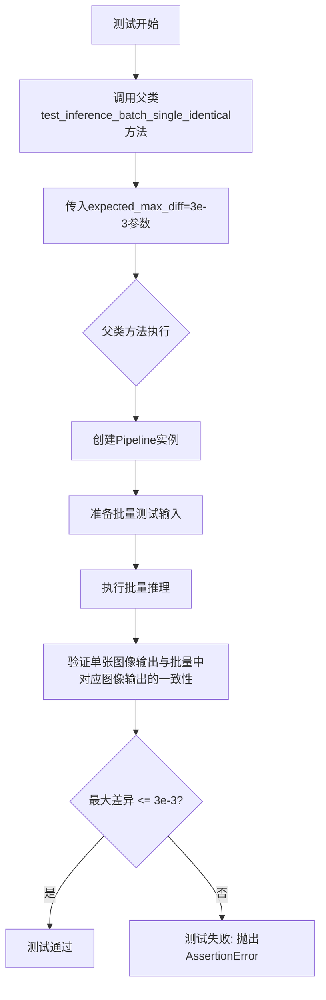

#### 带注释源码

```python
def test_inference_batch_single_identical(self):
    """
    测试方法：验证批量推理时单张图像处理的一致性
    
    该方法继承自测试混入类（PipelineTesterMixin），通过调用父类的
    test_inference_batch_single_identical方法来验证Pipeline在批量
    处理场景下，单张图像的输出与批量中对应位置的图像输出一致性。
    
    预期最大差异（expected_max_diff）设置为3e-3，即允许的误差范围
    非常小，确保Pipeline的数值稳定性。
    
    参数:
        self: StableDiffusionXLInstructPix2PixPipelineFastTests实例
    
    返回:
        无返回值，通过断言进行验证
    
    父类方法典型执行流程（PipelineTesterMixin）:
        1. 创建Pipeline实例
        2. 准备单个输入和批量输入
        3. 执行单次推理和批量推理
        4. 比较单张输出与批量中对应输出的差异
        5. 断言最大差异小于expected_max_diff
    """
    # 调用父类（PipelineTesterMixin）的同名测试方法
    # expected_max_diff=3e-3 表示允许的最大差异阈值为0.003
    # 该测试确保批量推理时，每个单独样本的输出与批量中对应位置的输出保持一致
    super().test_inference_batch_single_identical(expected_max_diff=3e-3)
```


### `StableDiffusionXLInstructPix2PixPipelineFastTests.test_attention_slicing_forward_pass`

该方法是一个单元测试，用于验证 Stable Diffusion XL Instruct Pix2Pix Pipeline 的注意力切片（attention slicing）功能在前向传播时是否正常工作。它继承自父类 `PipelineTesterMixin` 的测试方法，并设置期望最大差异值为 2e-3，以确保使用注意力切片时的输出精度在可接受范围内。

参数：

- `self`：隐式参数，测试类实例本身

返回值：`None`，该方法为 `unittest.TestCase` 的测试方法，执行测试但不返回结果

#### 流程图

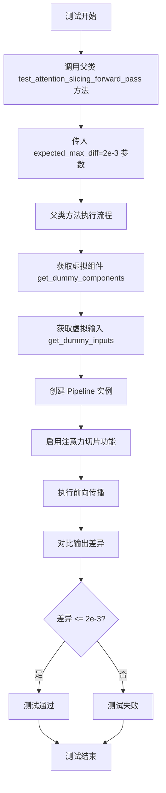

#### 带注释源码

```python
def test_attention_slicing_forward_pass(self):
    """
    测试注意力切片功能的前向传播是否正常工作。
    
    注意力切片是一种内存优化技术，通过将注意力计算分片处理
    来减少显存占用。该测试验证启用该功能后，模型输出与
    标准前向传播的差异在可接受范围内。
    """
    # 调用父类 PipelineTesterMixin 的测试方法
    # expected_max_diff=2e-3 表示期望输出与标准输出的最大差异为 2e-3
    super().test_attention_slicing_forward_pass(expected_max_diff=2e-3)
```


### `StableDiffusionXLInstructPix2PixPipelineFastTests.test_latents_input`

该测试方法用于验证在 Stable Diffusion XL Instruct Pix2Pix Pipeline 中，当直接传递 latents（潜在向量）作为图像输入时，是否会产生与传递原始图像不同的结果。测试通过比较两种输入方式（图像和对应 latents）的输出来确保管道正确处理图像编码。

参数：

- `self`：测试类实例本身，无显式参数

返回值：`None`，该方法为测试方法，通过 `assert` 语句验证结果

#### 流程图

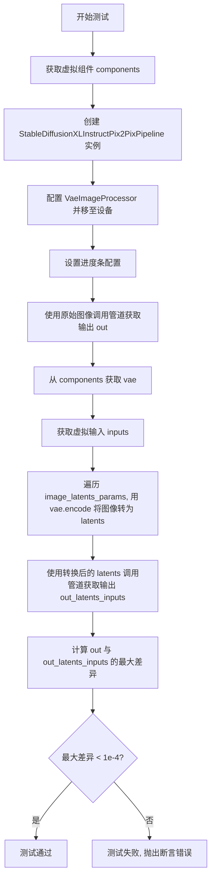

#### 带注释源码

```python
def test_latents_input(self):
    """
    测试当直接传递 latents（潜在向量）作为图像输入时，
    管道是否能正确处理并产生预期结果。
    """
    # 步骤1: 获取用于测试的虚拟组件（UNet、VAE、Scheduler、Text Encoder等）
    components = self.get_dummy_components()
    
    # 步骤2: 使用虚拟组件初始化 StableDiffusionXLInstructPix2PixPipeline
    pipe = StableDiffusionXLInstructPix2PixPipeline(**components)
    
    # 步骤3: 创建图像处理器，配置为不进行 resize 和 normalize 操作
    pipe.image_processor = VaeImageProcessor(do_resize=False, do_normalize=False)
    
    # 步骤4: 将管道移至测试设备（CPU 或 CUDA）
    pipe = pipe.to(torch_device)
    
    # 步骤5: 配置进度条（disable=None 表示不禁用）
    pipe.set_progress_bar_config(disable=None)
    
    # 步骤6: 使用原始图像作为输入调用管道，获取基准输出
    # get_dummy_inputs_by_type 返回包含原始图像的输入字典
    out = pipe(**self.get_dummy_inputs_by_type(torch_device, input_image_type="pt"))[0]
    
    # 步骤7: 从组件中获取 VAE（变分自编码器）用于图像编码
    vae = components["vae"]
    
    # 步骤8: 获取虚拟输入字典
    inputs = self.get_dummy_inputs_by_type(torch_device, input_image_type="pt")
    
    # 步骤9: 遍历图像潜在参数，将输入中的图像转换为 latents
    # image_latents_params 定义了哪些图像参数需要转换为潜在向量
    for image_param in self.image_latents_params:
        if image_param in inputs.keys():
            # 使用 VAE 编码图像，获取潜在分布的模式（最可能的结果）
            inputs[image_param] = vae.encode(inputs[image_param]).latent_dist.mode()
    
    # 步骤10: 使用转换后的 latents 作为输入调用管道
    out_latents_inputs = pipe(**inputs)[0]
    
    # 步骤11: 计算两次输出的最大差异
    max_diff = np.abs(out - out_latents_inputs).max()
    
    # 步骤12: 断言最大差异小于阈值（1e-4）
    # 如果差异过大，说明传递 latents 和传递图像产生了不同的结果
    self.assertLess(max_diff, 1e-4, "passing latents as image input generate different result from passing image")
```


### `StableDiffusionXLInstructPix2PixPipelineFastTests.test_cfg`

该方法是一个测试用例，用于验证Stable Diffusion XL Instruct Pix2Pix Pipeline的CFG（Classifier-Free Guidance）功能，但当前被标记为跳过，不执行任何测试逻辑。

参数：
- `self`：实例方法，属于测试类，无需额外参数

返回值：无返回值（`None`），方法体为`pass`

#### 流程图

```mermaid
graph TD
    A[开始执行test_cfg] --> B{检查装饰器@unittest.skip}
    B -->|跳过原因: Test not supported at the moment.| C[跳过测试]
    C --> D[结束]
```

#### 带注释源码

```python
@unittest.skip("Test not supported at the moment.")
def test_cfg(self):
    pass
```


### `StableDiffusionXLInstructPix2PixPipelineFastTests.test_save_load_optional_components`

这是一个测试函数，用于验证StableDiffusionXLInstructPix2PixPipeline的保存和加载可选组件功能。当前该测试被标记为跳过，原因是该功能已在其他位置进行测试。

参数：

- `self`：`unittest.TestCase`，测试类的实例本身

返回值：`None`，该测试函数不返回任何值

#### 流程图

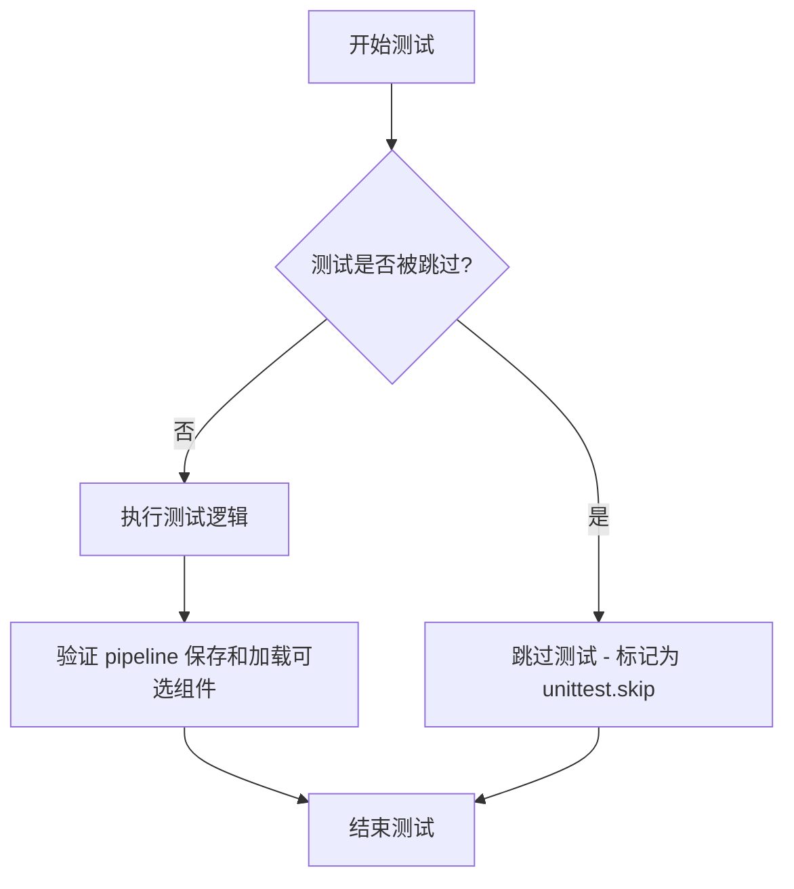

#### 带注释源码

```python
@unittest.skip("Functionality is tested elsewhere.")
def test_save_load_optional_components(self):
    """
    测试 StableDiffusionXLInstructPix2PixPipeline 的保存和加载可选组件功能。
    
    该测试方法用于验证 pipeline 是否能够正确保存和加载可选组件（如 VAE、text_encoder 等）。
    目前该测试被跳过，原因是该功能已在其他地方进行了测试。
    
    参数:
        self: 测试类实例，包含测试所需的资源和配置
    
    返回值:
        None: 该方法不返回任何值
    
    注意:
        - 该测试被 @unittest.skip 装饰器跳过
        - 跳过原因: "Functionality is tested elsewhere."
        - 实际测试逻辑未实现，仅包含 pass 语句
    """
    pass
```

## 关键组件


### StableDiffusionXLInstructPix2PixPipeline

Stable Diffusion XL Instruct Pix2PixPipeline测试类，继承多个测试mixin，用于验证pipeline的组件功能、推理精度、注意力切片、latents输入处理等核心行为。

### UNet2DConditionModel

UNet条件扩散模型，负责根据文本embedding和噪声图像进行去噪生成，配置包含交叉注意力机制、线性投影、时间embedding等SD2特定参数。

### AutoencoderKL

变分自编码器模型，负责将图像编码为潜在表示并进行解码重建，支持潜在空间与像素空间之间的转换。

### CLIPTextModel和CLIPTextModelWithProjection

CLIP文本编码器模型，将文本提示编码为向量表示，支持双文本编码器架构（text_encoder和text_encoder_2）。

### CLIPTokenizer

CLIP分词器，将文本提示转换为token ids序列，支持双分词器架构。

### EulerDiscreteScheduler

欧拉离散调度器，负责生成去噪过程中的时间步调度，使用scaled_linear beta schedule。

### VaeImageProcessor

VAE图像处理器，负责图像的预处理（resize和normalize），支持latents与像素空间之间的转换。

### PipelineLatentTesterMixin

Latent测试mixin，验证pipeline处理latent输入的正确性。

### PipelineKarrasSchedulerTesterMixin

Karras调度器测试mixin，验证与Karras风格调度器的兼容性。

### PipelineTesterMixin

通用pipeline测试mixin，提供批量推理精度、注意力切片等通用测试方法。

### get_dummy_components

创建虚拟组件的工厂方法，配置完整的SDXL Instruct Pix2Pix pipeline所需的所有模型和调度器，使用固定随机种子确保可重复性。

### get_dummy_inputs

创建虚拟输入的工厂方法，生成测试用的图像、提示词、生成器等输入参数，支持不同设备（mps/cuda/cpu）的兼容性处理。

### test_components_function

验证pipeline的components属性是否正确包含所有初始化组件的测试用例。

### test_inference_batch_single_identical

验证批量推理与单样本推理结果一致性的测试用例，设置expected_max_diff=3e-3的误差容忍度。

### test_attention_slicing_forward_pass

验证注意力切片优化前向传播正确性的测试用例，设置expected_max_diff=2e-3的误差容忍度。

### test_latents_input

验证直接传递latents作为图像输入的正确性，测试VAE编码的latent与直接传递图像生成结果的差异。


## 问题及建议


### 已知问题

-   **重复的随机种子设置**：在 `get_dummy_components()` 方法中多次调用 `torch.manual_seed(0)`，如果方法被连续调用，可能导致测试数据不具备真正的随机性，影响测试的独立性
-   **重复的 tokenizer 加载**：tokenizer 和 tokenizer_2 从同一个预训练模型 "hf-internal-testing/tiny-random-clip" 加载，可以优化为共享同一个 tokenizer 实例以减少资源消耗
-   **设备处理不一致**：对 MPS 设备有特殊处理逻辑（`if str(device).startswith("mps")`），这种字符串匹配方式不够优雅，且增加了维护成本
-   **硬编码的配置参数**：调度器参数（如 beta_start=0.00085、beta_end=0.012、steps_offset=1 等）以魔法数字形式硬编码，缺乏文档说明和常量定义
-   **测试隔离性问题**：使用类级别的属性（params、batch_params、image_params、image_latents_params）存储测试参数，可能导致测试用例之间的状态污染
-   **GPU 资源未显式释放**：测试分配了 GPU 内存但没有显式的清理机制，在长时间运行的测试套件中可能导致内存压力
-   **复杂的继承结构**：类继承了多个 mixin（PipelineLatentTesterMixin、PipelineKarrasSchedulerTesterMixin、PipelineTesterMixin），导致代码来源不透明，增加了调试难度

### 优化建议

-   将调度器配置参数提取为模块级常量，并添加文档注释说明其用途
-   考虑让 tokenizer 和 tokenizer_2 共享同一个实例，或使用懒加载方式避免重复加载
-   统一设备处理逻辑，使用 PyTorch 的 `torch.backends.mps.is_available()` 或 `torch.cuda.is_available()` 进行设备检测
-   在测试方法中添加 `try-finally` 块或在 `tearDown` 方法中显式释放 GPU 内存（如调用 `torch.cuda.empty_cache()`）
-   将被跳过的测试（test_cfg、test_save_load_optional_components）的注释改为更详细的说明，解释为何跳过以及计划何时实现
-   考虑使用 pytest 的 fixture 机制来管理测试资源的初始化和清理，提高测试隔离性

## 其它


### 一段话描述

该代码是一个针对Stable Diffusion XL Instruct Pix2Pix Pipeline的单元测试类，通过继承多个测试Mixin类实现对pipeline组件、推理过程、注意力切片、latents输入等方面的全面测试，并提供了虚拟组件和输入的生成方法。

### 文件的整体运行流程

1. 导入必要的依赖库（PyTorch、NumPy、transformers、diffusers等）
2. 定义测试类和继承关系
3. 实现`get_dummy_components()`方法生成虚拟UNet、Scheduler、VAE、Text Encoder等组件
4. 实现`get_dummy_inputs()`方法生成虚拟输入数据（图像、提示词、生成器等）
5. 执行多个测试方法验证pipeline的不同功能
6. 测试包括：组件功能测试、批处理推理一致性、注意力切片、latents输入处理等

### 类的详细信息

#### 类字段

- `pipeline_class`: 类型`type`，Stable Diffusion XL Instruct Pix2Pix Pipeline类本身
- `params`: 类型`frozenset`，测试所需参数集合（排除height、width、cross_attention_kwargs）
- `batch_params`: 类型`frozenset`，批处理参数集合
- `image_params`: 类型`frozenset`，图像参数集合
- `image_latents_params`: 类型`frozenset`，图像latents参数集合

#### 类方法

##### get_dummy_components

- 参数: 无
- 返回值类型: `dict`
- 返回值描述: 包含UNet、Scheduler、VAE、Text Encoder等所有pipeline组件的字典
- Mermaid流程图:
```mermaid
flowchart TD
    A[开始] --> B[设置随机种子0]
    B --> C[创建UNet2DConditionModel]
    C --> D[创建EulerDiscreteScheduler]
    D --> E[创建AutoencoderKL]
    E --> F[创建CLIPTextConfig]
    F --> G[创建CLIPTextModel]
    G --> H[创建CLIPTokenizer]
    H --> I[创建CLIPTextModelWithProjection]
    I --> J[创建第二个CLIPTokenizer]
    J --> K[组装components字典]
    K --> L[返回components]
```
- 源码:
```python
def get_dummy_components(self):
    torch.manual_seed(0)
    unet = UNet2DConditionModel(
        block_out_channels=(32, 64),
        layers_per_block=2,
        sample_size=32,
        in_channels=8,
        out_channels=4,
        down_block_types=("DownBlock2D", "CrossAttnDownBlock2D"),
        up_block_types=("CrossAttnUpBlock2D", "UpBlock2D"),
        attention_head_dim=(2, 4),
        use_linear_projection=True,
        addition_embed_type="text_time",
        addition_time_embed_dim=8,
        transformer_layers_per_block=(1, 2),
        projection_class_embeddings_input_dim=80,
        cross_attention_dim=64,
    )
    scheduler = EulerDiscreteScheduler(...)
    vae = AutoencoderKL(...)
    text_encoder_config = CLIPTextConfig(...)
    text_encoder = CLIPTextModel(text_encoder_config)
    tokenizer = CLIPTokenizer.from_pretrained("hf-internal-testing/tiny-random-clip")
    text_encoder_2 = CLIPTextModelWithProjection(text_encoder_config)
    tokenizer_2 = CLIPTokenizer.from_pretrained("hf-internal-testing/tiny-random-clip")
    return components
```

##### get_dummy_inputs

- 参数名称: `device`, `seed`
- 参数类型: `device: str/int`, `seed: int`
- 参数描述: device指定运行设备，seed指定随机种子
- 返回值类型: `dict`
- 返回值描述: 包含prompt、image、generator、num_inference_steps等推理参数的字典
- Mermaid流程图:
```mermaid
flowchart TD
    A[开始] --> B[生成随机图像张量]
    B --> C[归一化图像到0-1]
    C --> D{device是否为mps}
    D -->|是| E[使用torch.manual_seed]
    D -->|否| F[使用torch.Generator]
    E --> G[组装输入字典]
    F --> G
    G --> H[返回inputs]
```
- 源码:
```python
def get_dummy_inputs(self, device, seed=0):
    image = floats_tensor((1, 3, 64, 64), rng=random.Random(seed)).to(device)
    image = image / 2 + 0.5
    if str(device).startswith("mps"):
        generator = torch.manual_seed(seed)
    else:
        generator = torch.Generator(device=device).manual_seed(seed)
    inputs = {
        "prompt": "A painting of a squirrel eating a burger",
        "image": image,
        "generator": generator,
        "num_inference_steps": 2,
        "guidance_scale": 6.0,
        "image_guidance_scale": 1,
        "output_type": "np",
    }
    return inputs
```

##### test_components_function

- 参数: 无
- 返回值类型: `None`
- 返回值描述: 无返回值，通过assert验证组件功能
- 源码:
```python
def test_components_function(self):
    init_components = self.get_dummy_components()
    pipe = self.pipeline_class(**init_components)
    self.assertTrue(hasattr(pipe, "components"))
    self.assertTrue(set(pipe.components.keys()) == set(init_components.keys()))
```

##### test_inference_batch_single_identical

- 参数: 无
- 返回值类型: `None`
- 返回值描述: 无返回值，验证批处理推理一致性
- 源码:
```python
def test_inference_batch_single_identical(self):
    super().test_inference_batch_single_identical(expected_max_diff=3e-3)
```

##### test_attention_slicing_forward_pass

- 参数: 无
- 返回值类型: `None`
- 返回值描述: 无返回值，验证注意力切片前向传播
- 源码:
```python
def test_attention_slicing_forward_pass(self):
    super().test_attention_slicing_forward_pass(expected_max_diff=2e-3)
```

##### test_latents_input

- 参数: 无
- 返回值类型: `None`
- 返回值描述: 无返回值，验证latents输入功能
- 源码:
```python
def test_latents_input(self):
    components = self.get_dummy_components()
    pipe = StableDiffusionXLInstructPix2PixPipeline(**components)
    pipe.image_processor = VaeImageProcessor(do_resize=False, do_normalize=False)
    pipe = pipe.to(torch_device)
    pipe.set_progress_bar_config(disable=None)
    out = pipe(**self.get_dummy_inputs_by_type(torch_device, input_image_type="pt"))[0]
    vae = components["vae"]
    inputs = self.get_dummy_inputs_by_type(torch_device, input_image_type="pt")
    for image_param in self.image_latents_params:
        if image_param in inputs.keys():
            inputs[image_param] = vae.encode(inputs[image_param]).latent_dist.mode()
    out_latents_inputs = pipe(**inputs)[0]
    max_diff = np.abs(out - out_latents_inputs).max()
    self.assertLess(max_diff, 1e-4, "passing latents as image input generate different result from passing image")
```

### 关键组件信息

- **UNet2DConditionModel**: 用于去噪的UNet模型，处理图像潜在表示
- **EulerDiscreteScheduler**: 离散欧拉调度器，控制去噪步骤的时间步
- **AutoencoderKL**: VAE模型，用于编码和解码图像与潜在表示
- **CLIPTextModel**: 文本编码器，将文本提示转换为embedding
- **CLIPTokenizer**: 分词器，将文本转换为token id
- **VaeImageProcessor**: 图像处理器，用于VAE的图像预处理
- **StableDiffusionXLInstructPix2PixPipeline**: 主pipeline类，组合所有组件进行推理

### 潜在的技术债务或优化空间

1. **硬编码的随机种子**: 使用`torch.manual_seed(0)`可能导致测试结果在某些情况下的不确定性
2. **缺失的测试覆盖**: `test_cfg`和`test_save_load_optional_components`被跳过，未验证CFG和保存加载功能
3. **Magic Numbers**: 多个超参数（如`expected_max_diff=3e-3`）硬编码在测试方法中，缺乏配置管理
4. **重复代码**: `get_dummy_components`中多个组件创建前的`torch.manual_seed(0)`调用可以优化
5. **设备兼容性处理**: 对mps设备的特殊处理（`if str(device).startswith("mps")`）可能不够全面
6. **测试输入的多样性不足**: 缺少对不同提示词、图像尺寸、推理步骤数的测试

### 设计目标与约束

- **设计目标**: 确保Stable Diffusion XL Instruct Pix2Pix Pipeline在各种场景下的正确性和一致性
- **约束**: 
  - 继承自`PipelineTesterMixin`、`PipelineLatentTesterMixin`、`PipelineKarrasSchedulerTesterMixin`
  - 参数集基于`TEXT_GUIDED_IMAGE_VARIATION_PARAMS`排除特定参数
  - 使用虚拟组件进行测试，避免真实模型的开销

### 错误处理与异常设计

- 使用`unittest.assertLess`进行数值比较验证
- 使用`unittest.skip`跳过不支持的测试
- 通过`hasattr`检查对象属性
- 异常通过Python unittest框架的标准机制传播

### 数据流与状态机

- **数据流**: 
  1. 输入: prompt + image → Tokenizer/VAE编码
  2. 处理: Text Embeddings + VAE Latents → UNet去噪
  3. 输出: VAE解码 → 最终图像
- **状态**: 组件初始化状态 → Pipeline构建状态 → 推理执行状态 → 结果输出状态

### 外部依赖与接口契约

- **transformers**: 提供CLIPTextModel、CLIPTextModelWithProjection、CLIPTokenizer、CLIPTextConfig
- **diffusers**: 提供AutoencoderKL、EulerDiscreteScheduler、UNet2DConditionModel、VaeImageProcessor、StableDiffusionXLInstructPix2PixPipeline
- **numpy**: 数值计算和数组操作
- **torch**: 深度学习框架和张量操作
- **unittest**: 单元测试框架
- **接口契约**: Pipeline接收prompt、image、generator等参数，输出图像数组

### 测试用例设计原则

- 使用确定性随机种子确保测试可重复
- 通过比较浮点数差异（expected_max_diff）验证数值近似性
- 覆盖单次推理和批处理场景
- 测试不同的输入类型（图像vs latents）

    