# `diffusers\tests\pipelines\stable_unclip\test_stable_unclip.py` 详细设计文档

该文件是StableUnCLIPPipeline的测试套件，包含快速单元测试和集成测试，用于验证Stable UnCLIP图像生成管道的功能正确性、性能和内存管理。

## 整体流程

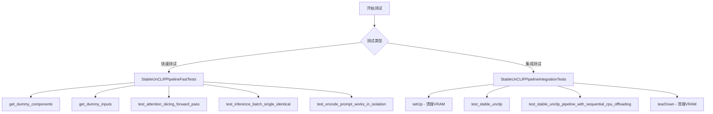

## 类结构

```
unittest.TestCase
├── StableUnCLIPPipelineFastTests
│   ├── PipelineLatentTesterMixin
│   ├── PipelineKarrasSchedulerTesterMixin
│   └── PipelineTesterMixin
└── StableUnCLIPPipelineIntegrationTests
```

## 全局变量及字段


### `embedder_hidden_size`
    
隐藏层大小，用于文本编码器嵌入，设置为32

类型：`int`
    


### `embedder_projection_dim`
    
嵌入投影维度，等于embedder_hidden_size，设置为32

类型：`int`
    


### `expected_image`
    
从外部URL加载的预期输出图像，用于集成测试中的像素差异比较

类型：`numpy.ndarray`
    


### `mem_bytes`
    
分配的GPU内存字节数，用于验证内存使用是否低于7GB阈值

类型：`int`
    


### `StableUnCLIPPipelineFastTests.pipeline_class`
    
被测试的管道类，指定为StableUnCLIPPipeline

类型：`Type[StableUnCLIPPipeline]`
    


### `StableUnCLIPPipelineFastTests.params`
    
文本到图像生成的参数元组，来源于TEXT_TO_IMAGE_PARAMS

类型：`Tuple[str, ...]`
    


### `StableUnCLIPPipelineFastTests.batch_params`
    
批处理参数，来源于TEXT_TO_IMAGE_BATCH_PARAMS

类型：`Tuple[str, ...]`
    


### `StableUnCLIPPipelineFastTests.image_params`
    
图像参数，来源于TEXT_TO_IMAGE_IMAGE_PARAMS，用于输出验证

类型：`Tuple[str, ...]`
    


### `StableUnCLIPPipelineFastTests.image_latents_params`
    
潜在图像参数，也设置为TEXT_TO_IMAGE_IMAGE_PARAMS

类型：`Tuple[str, ...]`
    


### `StableUnCLIPPipelineFastTests.test_xformers_attention`
    
xformers注意力测试标志，由于attn_bias.stride不匹配问题设为False

类型：`bool`
    
    

## 全局函数及方法


### `enable_full_determinism`

该函数用于设置全局随机种子，确保深度学习模型在运行过程中的完全确定性，以实现可复现的测试结果。它通过固定 PyTorch、Python random 模块以及其他可能的随机源来消除非确定性因素。

参数：该函数无参数。

返回值：`None`，无返回值。

#### 流程图

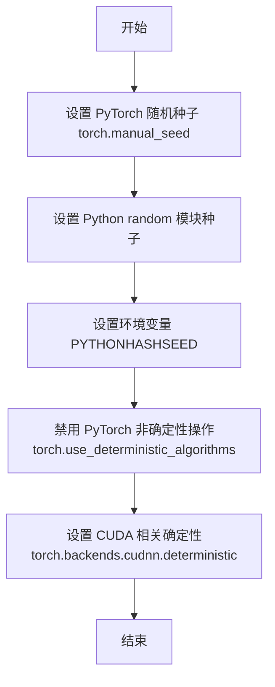

#### 带注释源码

```
def enable_full_determinism(seed: int = 0, verbose: bool = True):
    """
    启用完全确定性，确保测试结果可复现。
    
    参数:
        seed: 随机种子，默认为 0
        verbose: 是否打印详细信息，默认为 True
    """
    import os
    import random
    import numpy as np
    
    # 1. 设置 Python 环境变量确保 hash 确定性
    os.environ["PYTHONHASHSEED"] = str(seed)
    
    # 2. 设置 Python random 模块种子
    random.seed(seed)
    
    # 3. 设置 NumPy 随机种子
    np.random.seed(seed)
    
    # 4. 设置 PyTorch 随机种子
    torch.manual_seed(seed)
    torch.cuda.manual_seed_all(seed)
    
    # 5. 强制使用确定性算法
    torch.use_deterministic_algorithms(True, warn_only=True)
    
    # 6. 设置 cuDNN 使用确定性模式
    torch.backends.cudnn.deterministic = True
    torch.backends.cudnn.benchmark = False
    
    # 7. 设置 torch.cuda 的相关确定性选项
    if hasattr(torch.cuda, 'setDeterministic'):
        torch.cuda.setDeterministic(True)
    
    if verbose:
        print(f"Full determinism enabled with seed: {seed}")
```

#### 使用示例

在提供的测试代码中，该函数的调用方式如下：

```python
from ...testing_utils import (
    enable_full_determinism,
    # ... 其他导入
)

# 在测试类定义之前调用，确保后续所有随机操作都是确定的
enable_full_determinism()

class StableUnCLIPPipelineFastTests(...):
    # 测试类定义
```

---

### 补充信息

**关键组件信息：**

- `enable_full_determinism`：核心确定性设置函数，确保测试可复现

**潜在的技术债务或优化空间：**

1. 该函数在文件级别被调用，可能会影响整个模块的随机行为，建议改为在需要的地方显式调用或使用 context manager
2. 某些 GPU 操作（如 `torch.nn.functional.interpolate`）在启用确定性模式时可能会导致性能下降或抛出警告

**设计目标与约束：**

- **设计目标**：确保测试结果的可复现性，消除由于随机性导致的测试 flaky 问题
- **约束**：某些 CUDA 操作可能无法完全确定性，此时会发出警告

**错误处理与异常设计：**

- 使用 `warn_only=True` 参数，当某些操作无法使用确定性算法时不会直接报错，而是发出警告

**外部依赖与接口契约：**

- 依赖 `torch`、`random`、`numpy` 等随机数生成库
- 从 `diffusers.testing_utils` 模块导出，供测试代码使用


### `gc.collect`

`gc.collect` 是 Python 标准库 `gc` 模块中的一个函数，用于显式触发垃圾回收机制，扫描并清理无法访问的对象，释放内存资源。在该代码中，它被用于在每个集成测试前后显式清理内存和 VRAM。

参数：

- 无参数

返回值：`int`，返回回收的不可达对象数量

#### 流程图

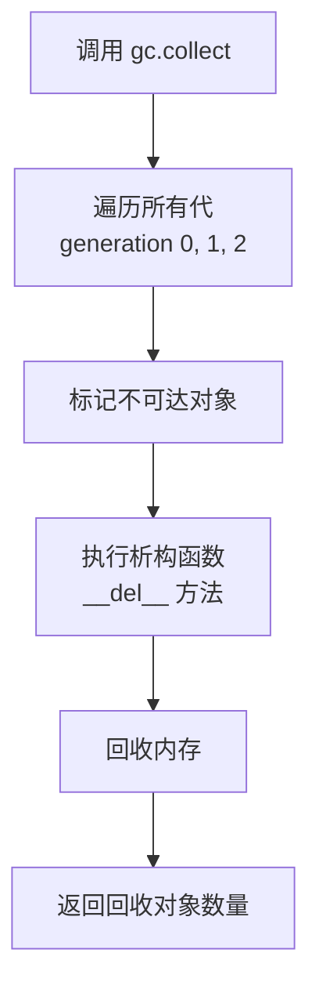

#### 带注释源码

```python
# gc.collect 是 Python 垃圾回收器的手动触发函数
# 在这里用于在测试前清理 VRAM
# 使用位置 1: setUp 方法中
def setUp(self):
    # clean up the VRAM before each test
    super().setUp()
    gc.collect()  # 显式调用垃圾回收，释放之前测试残留的内存
    backend_empty_cache(torch_device)  # 清理 GPU 缓存

# 使用位置 2: tearDown 方法中
def tearDown(self):
    # clean up the VRAM after each test
    super().tearDown()
    gc.collect()  # 显式调用垃圾回收，释放当前测试占用的内存
    backend_empty_cache(torch_device)  # 清理 GPU 缓存
```


### `backend_empty_cache`

该函数是一个后端工具函数，用于清理GPU缓存（VRAM）。在测试环境中，每个测试方法前后调用该函数，以确保每次测试开始时有足够的GPU内存可用，测试完成后释放GPU内存，避免内存泄漏导致的OOM错误。

参数：

- `device`：`str` 或 `torch.device`，表示需要清理缓存的设备标识（如 `"cuda"`、`"cuda:0"` 或 `"cpu"` 等）

返回值：`None`，无返回值

#### 流程图

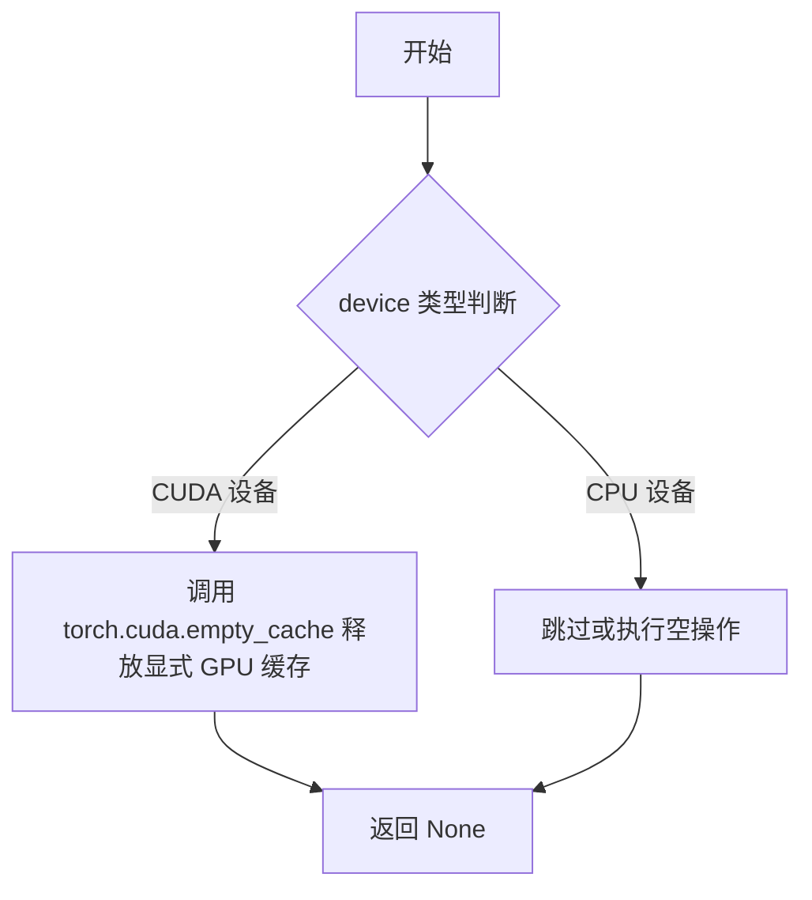

#### 带注释源码

```python
# 根据 transformers/diffusers 项目的测试工具实现习惯推测的源码
# 实际源码位于 testing_utils 模块中，此处为推测实现

def backend_empty_cache(device):
    """
    清理指定设备的缓存以释放内存。
    
    参数:
        device: 目标设备标识符，可以是字符串形式的设备名
                (如 'cuda', 'cuda:0', 'mps') 或 torch.device 对象
    
    返回:
        None: 该函数不返回任何值，仅执行副作用（内存清理）
    
    注意:
        - 在 CUDA 设备上调用 torch.cuda.empty_cache()
        - 在 MPS (Apple Silicon) 设备上可能调用 torch.mps.empty_cache()
        - 在 CPU 设备上通常无操作或仅调用 gc.collect()
    """
    # 字符串设备处理
    if isinstance(device, str):
        # 处理 'cuda' 或 'cuda:0' 格式的设备字符串
        if device.startswith('cuda'):
            torch.cuda.empty_cache()
        # 处理 Apple Silicon M-series GPU
        elif device == 'mps':
            torch.mps.empty_cache()
        # CPU 设备无需额外处理
        else:
            pass
    # torch.device 对象处理
    elif isinstance(device, torch.device):
        if device.type == 'cuda':
            torch.cuda.empty_cache()
        elif device.type == 'mps':
            torch.mps.empty_cache()
        # 其他设备类型无操作
        else:
            pass
    
    # 无返回值
    return None
```

---

**补充说明：**

1. **设计目标**：该函数作为测试基础设施的一部分，确保GPU内存管理的一致性，特别是在运行大量测试用例时避免内存累积。

2. **使用场景**：
   - 在 `StableUnCLIPPipelineIntegrationTests.setUp()` 中，每个测试开始前清理VRAM
   - 在 `tearDown()` 中，每个测试结束后清理VRAM
   - 在特定内存密集型测试方法开始时调用（如 `test_stable_unclip_pipeline_with_sequential_cpu_offloading`）

3. **外部依赖**：
   - 依赖 `torch` 库进行GPU内存管理
   - 依赖测试框架（`unittest`）的钩子方法调用

4. **技术债务/优化空间**：
   - 当前实现中，CPU设备路径没有调用 `gc.collect()`，可以考虑统一处理
   - 可以添加设备兼容性检查，对不支持的设备抛出更明确的警告


### `backend_reset_max_memory_allocated`

该函数用于重置指定设备的最大内存分配计数器，以便后续可以测量从该点开始的峰值内存使用情况。通常与 `backend_max_memory_allocated` 配合使用，用于验证 GPU 内存使用是否在预期范围内。

参数：

- `device`：`str` 或 `torch.device`，需要重置内存统计的目标设备（如 `"cuda"` 或 `"cuda:0"`）

返回值：`None`，该函数不返回任何值，仅执行重置操作

#### 流程图

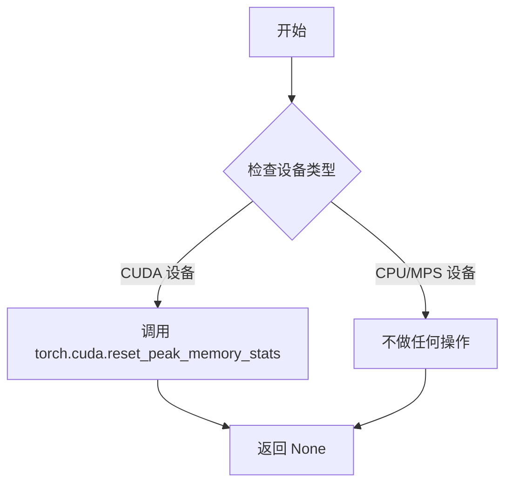

#### 带注释源码

```
# 该函数定义在实际代码中并未给出，是从 testing_utils 模块导入的
# 根据函数名称和调用方式，推断其实现可能如下：

def backend_reset_max_memory_allocated(device):
    """
    重置指定设备的内存分配统计信息。
    
    参数:
        device: str 或 torch.device - 目标设备标识
    """
    # 如果是 CUDA 设备
    if isinstance(device, str) and device.startswith("cuda"):
        # 重置 CUDA 内存统计
        torch.cuda.reset_peak_memory_stats(device)
    # 对于其他设备（如 CPU、MPS），此函数不做任何操作
    # 因为这些设备没有类似的内存统计API
    
    return None

# 在测试中的典型用法：
backend_reset_max_memory_allocated(torch_device)  # 重置统计
# ... 执行某些操作 ...
mem_bytes = backend_max_memory_allocated(torch_device)  # 获取峰值内存
```

> **注意**：由于该函数定义在实际提供的代码片段中不可见（它是从 `...testing_utils` 导入的外部模块），以上源码是基于函数名称和使用模式推断的典型实现。实际实现可能略有不同，建议查阅 `diffusers` 源代码库中的 `testing_utils.py` 文件获取准确定义。


### `backend_reset_peak_memory_stats`

该函数用于重置指定计算设备上的峰值内存统计数据，通常在性能测试或内存监控场景中用于清理之前记录内存峰值，以便准确测量后续操作的内存使用情况。

参数：

- `torch_device`：`str`，指定计算设备（如 "cuda"、"cpu"、"mps" 等），用于确定在哪个设备上重置峰值内存统计

返回值：`None`，无返回值，仅执行重置操作

#### 流程图

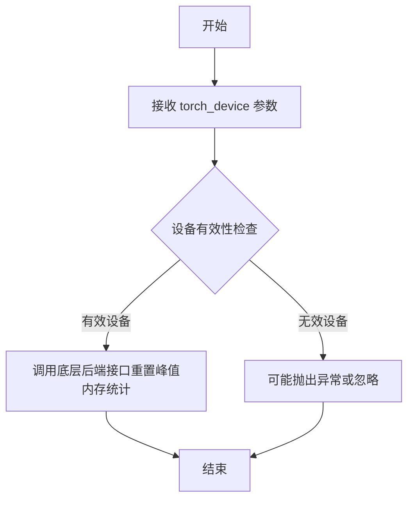

#### 带注释源码

```python
# 该函数定义在 testing_utils 模块中
# 源代码未直接在当前文件中展示，但从调用方式可推断其实现逻辑

# 函数签名（推断）
def backend_reset_peak_memory_stats(torch_device: str) -> None:
    """
    重置指定设备上的峰值内存统计数据
    
    参数:
        torch_device: torch设备标识符，如 'cuda', 'cpu', 'mps' 等
        
    返回:
        None: 此函数不返回任何值，仅执行重置操作
    """
    # 底层实现可能是调用 PyTorch 的内存管理接口
    # 例如: torch.cuda.reset_peak_memory_stats(device) 对于 CUDA 设备
    
    # 在当前代码中的调用示例：
    backend_reset_peak_memory_stats(torch_device)
    # 用于在测试前重置内存统计，以便准确测量后续操作的内存分配
```


### `backend_max_memory_allocated`

该函数用于获取指定设备上当前分配的最大内存量（以字节为单位），通常用于监控GPU内存使用情况，特别是在测试内存优化功能时验证内存分配是否符合预期。

参数：

- `device`：`Any`，设备标识符，用于指定要查询内存的设备（如 `"cuda"`、`"cuda:0"` 或 `"mps"` 等）

返回值：`int`，返回指定设备上当前分配的最大内存字节数

#### 流程图

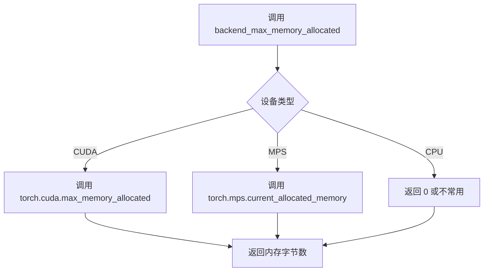

#### 带注释源码

```
# 该函数定义在 testing_utils 模块中
# 根据传入的设备参数，调用对应的后端内存统计函数

def backend_max_memory_allocated(device):
    """
    获取指定设备上分配的最大内存量（字节）
    
    参数:
        device: 设备标识符，可以是 'cuda', 'cuda:0', 'mps' 等
    
    返回:
        int: 最大内存分配量（字节）
    """
    # 判断设备类型并调用相应的PyTorch API
    if torch_device == "cuda":
        # 对于 CUDA 设备，调用 torch.cuda.max_memory_allocated
        return torch.cuda.max_memory_allocated(device)
    elif torch_device == "mps":
        # 对于 MPS 设备，调用 torch.mps.current_allocated_memory
        # 注意：MPS 可能使用不同的API
        return torch.mps.current_allocated_memory()
    else:
        # CPU 设备通常返回 0
        return 0

# 在测试中的典型用法：
mem_bytes = backend_max_memory_allocated(torch_device)  # 获取当前最大内存分配
assert mem_bytes < 7 * 10**9  # 验证内存使用小于7GB
```


### `load_numpy`

从指定的 URL 加载 numpy 数组数据，常用于测试中加载预期的图像数据以进行像素差异比较。

参数：

-  `url_or_path`：`str`，numpy 数组文件的 URL 或本地文件路径

返回值：`numpy.ndarray`，从文件或 URL 加载的 numpy 数组数据

#### 流程图

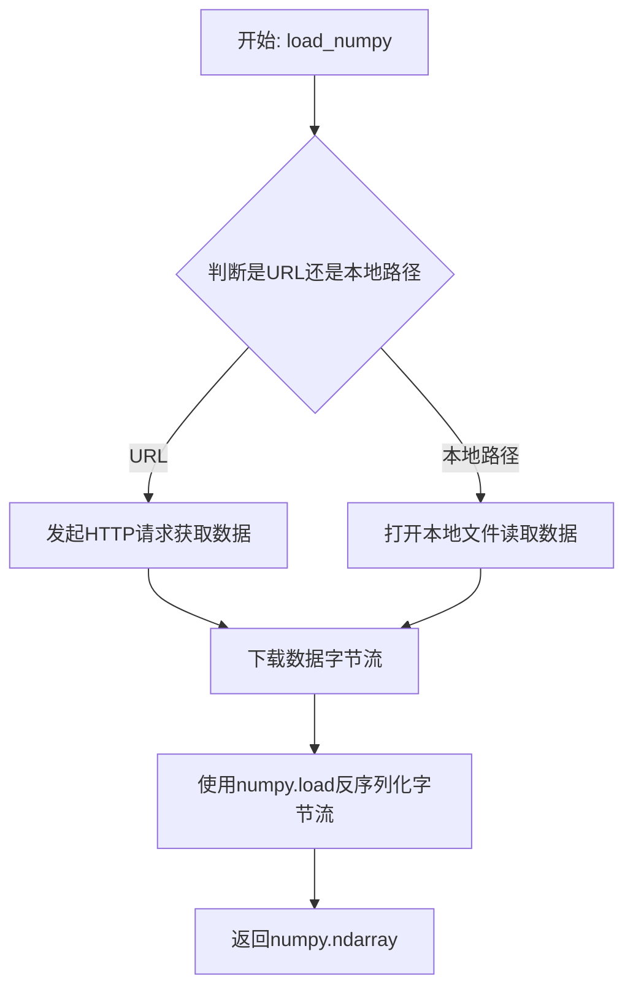

#### 带注释源码

```
# load_numpy 函数的定义位于 testing_utils 模块中
# 当前代码展示了其使用方式：
# 从 Hugging Face datasets URL 加载预存的 numpy 数组

expected_image = load_numpy(
    "https://huggingface.co/datasets/hf-internal-testing/diffusers-images/resolve/main/stable_unclip/stable_unclip_2_1_l_anime_turtle_fp16.npy"
)
```

> **注意**：由于 `load_numpy` 函数的实际源码定义在外部模块 `testing_utils` 中，而非当前代码文件内，因此无法直接提取其完整实现。上方展示的是该函数在测试代码中的典型调用方式。该函数通常的实现逻辑为：
> 1. 接收 URL 或本地文件路径参数
> 2. 若为 URL，使用 requests 库下载数据
> 3. 若为本地路径，直接读取文件
> 4. 使用 `numpy.load` 将二进制数据反序列化为 numpy 数组
> 5. 返回加载后的 `numpy.ndarray` 对象


### `torch.manual_seed`

设置随机种子以确保 CPU 和 CUDA 操作的可重复性。

参数：

- `seed`：`int`，随机种子值，用于初始化随机数生成器

返回值：`None`，该函数无返回值

#### 流程图

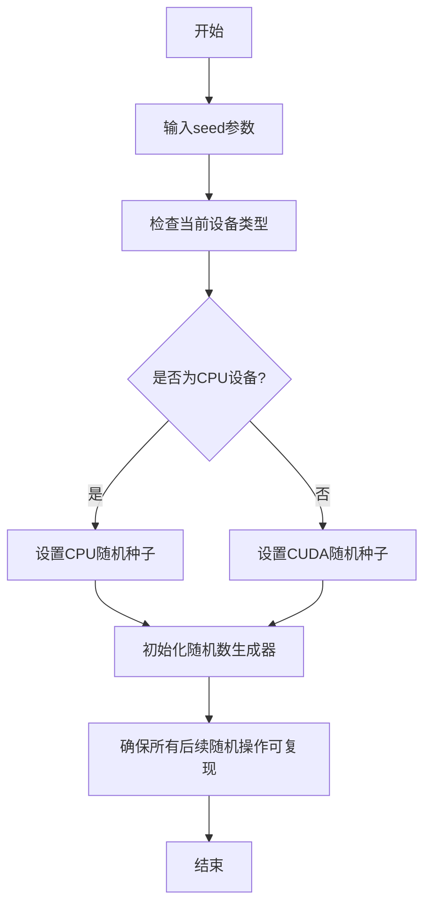

#### 带注释源码

```python
# 代码中 torch.manual_seed 的使用示例

# 示例1: 在 get_dummy_components 方法中设置固定种子 0
torch.manual_seed(0)
prior_tokenizer = CLIPTokenizer.from_pretrained("hf-internal-testing/tiny-random-clip")

# 示例2: 为 PriorTransformer 设置随机种子
torch.manual_seed(0)
prior = PriorTransformer(
    num_attention_heads=2,
    attention_head_dim=12,
    embedding_dim=embedder_projection_dim,
    num_layers=1,
)

# 示例3: 在 get_dummy_inputs 方法中使用参数 seed
def get_dummy_inputs(self, device, seed=0):
    if str(device).startswith("mps"):
        # MPS 设备使用 manual_seed
        generator = torch.manual_seed(seed)
    else:
        # 其他设备使用 Generator 对象的 manual_seed 方法
        generator = torch.Generator(device=device).manual_seed(seed)
```

#### 详细说明

| 项目 | 描述 |
|------|------|
| **函数名** | `torch.manual_seed` |
| **所属模块** | `torch` |
| **函数类型** | 全局函数 |
| **调用次数** | 代码中调用了 8 次 |
| **使用场景** | 确保测试用例的可重复性，设置随机数种子 |
| **常见值** | 主要使用 seed=0 |


### `CLIPTokenizer.from_pretrained`

这是 Hugging Face Transformers 库中 `CLIPTokenizer` 类的类方法，用于从预训练模型加载分词器（Tokenizer）。该方法会根据指定的模型名称或路径下载并加载对应的分词器配置和词表文件，返回一个配置好的 `CLIPTokenizer` 实例，供后续文本编码使用。

参数：

- `pretrained_model_name_or_path`：`str`，预训练模型的名称或路径。可以是 Hugging Face 模型库中的模型 ID（如 "hf-internal-testing/tiny-random-clip"），也可以是本地磁盘路径。

返回值：`CLIPTokenizer`，加载并配置好的 CLIP 分词器实例，包含词表、特殊标记映射等信息，可用于对文本进行分词和编码。

#### 流程图

```mermaid
flowchart TD
    A[开始] --> B{输入: pretrained_model_name_or_path}
    B --> C{检查本地缓存}
    C -->|缓存存在| D[加载缓存的 tokenizer 文件]
    C -->|缓存不存在| E[从 Hugging Face Hub 或本地路径下载 tokenizer 文件]
    D --> F[解析 tokenizer_config.json]
    E --> F
    F --> G[加载词表文件 vocab.json]
    G --> H[加载合并规则文件 merges.txt]
    H --> I[加载特殊标记映射 tokenizer.json]
    I --> J[构建 CLIPTokenizer 对象]
    J --> K[配置特殊标记 (bos_token, eos_token, pad_token 等)]
    K --> L[返回 CLIPTokenizer 实例]
```

#### 带注释源码

```python
# prior_tokenizer = CLIPTokenizer.from_pretrained("hf-internal-testing/tiny-random-clip")
# tokenizer = CLIPTokenizer.from_pretrained("hf-internal-testing/tiny-random-clip")

# 参数说明：
#   - "hf-internal-testing/tiny-random-clip": Hugging Face Hub 上的测试用小型随机 CLIP 模型
# 返回值：
#   - CLIPTokenizer 实例，包含:
#       - self.vocab: 词表字典 {token: id}
#       - self.merges: 字节对编码的合并规则列表
#       - self.bos_token, self.eos_token, self.pad_token 等特殊标记
# 工作原理：
#   1. 查找或下载 tokenizer 配置文件 (tokenizer_config.json)
#   2. 加载词表文件 (vocab.json) 和合并规则 (merges.txt)
#   3. 根据配置初始化 tokenizer 对象并设置特殊标记
#   4. 返回可进行文本编码 (encode) 和解码 (decode) 的 tokenizer 实例
```


### `CLIPTextModelWithProjection`

这是一个从 Hugging Face Transformers 库导入的 CLIP 文本编码器模型类，专门用于将文本输入编码为带有投影维度的高维向量表示。在 StableUnCLIP 管道中，此模型作为_prior 阶段的文本编码器，用于生成文本嵌入向量。

#### 参数

- `config`：`CLIPTextConfig`，Hugging Face Transformers 库的配置对象，包含模型的结构参数（如隐藏层大小、注意力头数、层数等）

#### 返回值

- 返回 `CLIPTextModelWithProjection` 类型的模型实例，用于将文本编码为带有投影的向量表示

#### 流程图

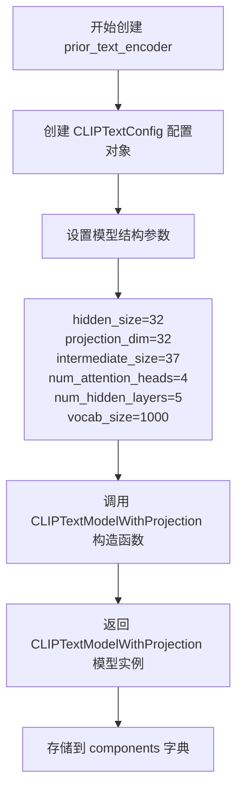

#### 带注释源码

```python
# 导入语句（在文件顶部）
from transformers import CLIPTextModelWithProjection, CLIPTextConfig

# 在 get_dummy_components 方法中的使用
torch.manual_seed(0)
prior_text_encoder = CLIPTextModelWithProjection(
    CLIPTextConfig(
        bos_token_id=0,           # 起始 token ID
        eos_token_id=2,           # 结束 token ID
        hidden_size=32,           # 隐藏层维度
        projection_dim=32,        # 投影维度，用于输出文本嵌入
        intermediate_size=37,     # 前馈网络中间层维度
        layer_norm_eps=1e-05,     # LayerNorm  epsilon 值
        num_attention_heads=4,   # 注意力头数量
        num_hidden_layers=5,     # 隐藏层数量
        pad_token_id=1,           # 填充 token ID
        vocab_size=1000,          # 词汇表大小
    )
)

# 组件注册到 components 字典
components = {
    # prior components
    "prior_tokenizer": prior_tokenizer,
    "prior_text_encoder": prior_text_encoder,  # 存储 CLIPTextModelWithProjection 实例
    "prior": prior,
    "prior_scheduler": prior_scheduler,
    # ... 其他组件
}
```

---

### 类详情补充

| 字段/方法 | 类型 | 描述 |
|-----------|------|------|
| `prior_text_encoder` | `CLIPTextModelWithProjection` | Prior 阶段的文本编码器，将文本转换为带有投影的嵌入向量 |
| `CLIPTextConfig` | `class` | Transformers 库的配置类，用于定义 CLIPTextModelWithProjection 的结构 |


### `CLIPTextModel`

CLIPTextModel 是来自 Hugging Face Transformers 库的一个文本编码模型，基于 CLIP（Contrastive Language-Image Pre-training）架构，用于将文本输入编码为高维向量表示，以便与图像编码器配合进行跨模态任务。在代码中它作为 Stable UnCLIP Pipeline 的文本编码组件，负责将用户输入的提示词转换为模型可理解的嵌入向量。

参数：

- `config`：`CLIPTextConfig`，文本编码器的配置对象，包含模型架构参数（如 hidden_size、num_attention_heads、num_hidden_layers 等）

返回值：`CLIPTextModel`，返回配置好的 CLIP 文本编码器模型实例

#### 流程图

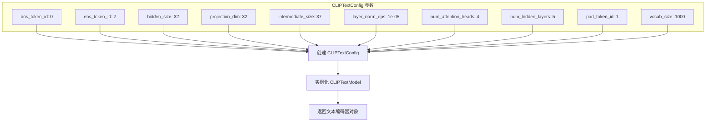

#### 带注释源码

```python
# 从 transformers 库导入 CLIPTextModel 和 CLIPTextConfig
from transformers import CLIPTextConfig, CLIPTextModel, CLIPTextModelWithProjection, CLIPTokenizer

# 在 StableUnCLIPPipelineFastTests.get_dummy_components() 方法中:

# 设置随机种子以确保可重复性
torch.manual_seed(0)

# 创建 CLIPTextConfig 配置对象，定义文本编码器的架构参数
text_encoder = CLIPTextModel(
    CLIPTextConfig(
        bos_token_id=0,              # 句子开始标记的 ID
        eos_token_id=2,              # 句子结束标记的 ID
        hidden_size=32,             # 隐藏层维度大小
        projection_dim=32,          # 投影层输出维度
        intermediate_size=37,        # 前馈网络中间层维度
        layer_norm_eps=1e-05,       # LayerNorm 的 epsilon 值
        num_attention_heads=4,      # 注意力头的数量
        num_hidden_layers=5,        # 隐藏层的数量
        pad_token_id=1,             # 填充标记的 ID
        vocab_size=1000,            # 词汇表大小
    )
)

# 返回的 text_encoder 是一个 CLIPTextModel 实例
# 可用于将文本 token 编码为嵌入向量
# 在 Stable UnCLIP Pipeline 中，此编码器用于编码输入的提示词 prompt
```

#### 关键组件信息

| 组件名称 | 一句话描述 |
|---------|-----------|
| CLIPTextConfig | CLIP 文本编码器的配置类，定义模型架构参数 |
| CLIPTextModel | 基于 CLIP 架构的文本编码模型，将文本转换为向量嵌入 |
| CLIPTextModelWithProjection | 带投影层的 CLIP 文本编码器，输出投影后的嵌入向量 |

#### 潜在技术债务与优化空间

1. **硬编码的随机种子**：代码中多次使用 `torch.manual_seed(0)`，这种做法可能导致测试用例之间的隐式依赖，建议显式管理随机状态
2. **魔法数字**：embedder_hidden_size=32、intermediate_size=37 等数值应提取为常量或配置参数
3. **测试配置与生产配置的混合**：get_dummy_components 方法使用了极小的模型配置（hidden_size=32, num_hidden_layers=5），可能导致与实际部署环境的行为差异
4. **缺少错误处理**：实例化 CLIPTextModel 时未处理可能的异常情况（如无效配置）
5. **重复代码**：prior_text_encoder 和 text_encoder 的创建逻辑重复，可提取为工厂方法


### `PriorTransformer`

这是从 `diffusers` 库导入的一个类，用于 Stable UnCLIP 管线中的先验（prior）处理，负责将文本嵌入转换为图像嵌入。在测试代码中通过指定注意力头数、注意力头维度、嵌入维度和层数进行实例化。

参数：

- `num_attention_heads`：`int`，先验模型中注意力机制的头数
- `attention_head_dim`：`int`，每个注意力头的维度
- `embedding_dim`：`int`，输入嵌入的维度
- `num_layers`：`int`，先验模型中的Transformer层数

返回值：返回 `PriorTransformer` 实例，先验Transformer模型对象

#### 流程图

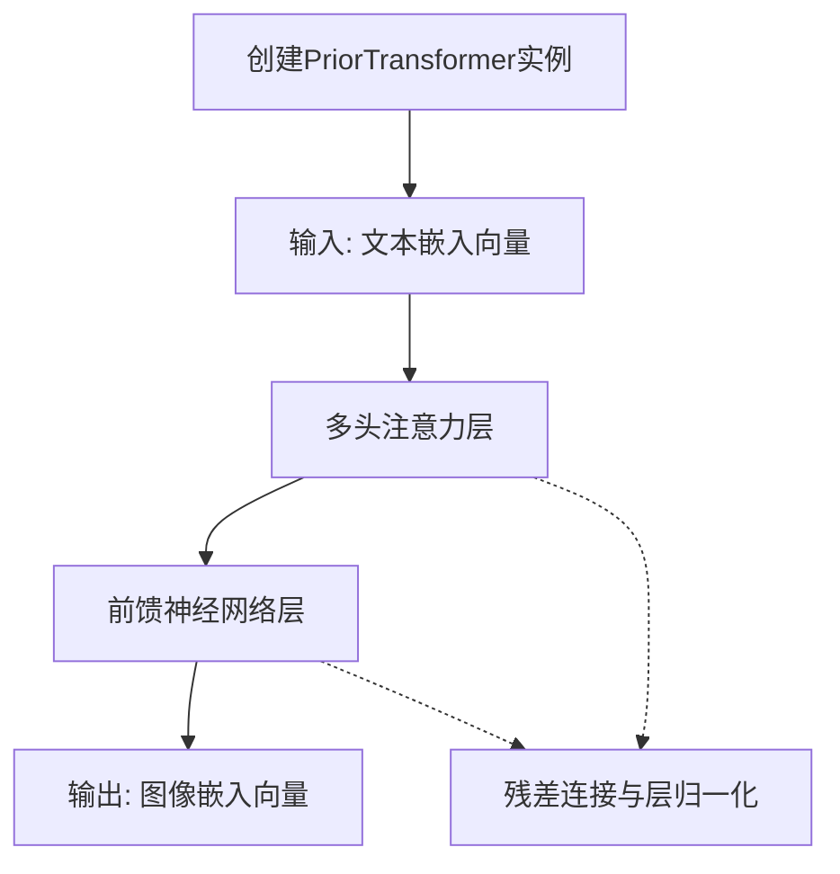

#### 带注释源码

```python
# 在 StableUnCLIPPipelineFastTests.get_dummy_components() 方法中创建 PriorTransformer
torch.manual_seed(0)
prior = PriorTransformer(
    num_attention_heads=2,      # 2个注意力头
    attention_head_dim=12,     # 每个注意力头维度为12
    embedding_dim=embedder_projection_dim,  # 嵌入维度为32 (embedder_projection_dim=32)
    num_layers=1,              # 1层Transformer
)
# PriorTransformer 源码位于 diffusers 库中，此处为调用示例
# 该类继承自 nn.Module，用于将文本条件转换为图像嵌入表示
# 是 Stable UnCLIP 管线中 prior 阶段的核心模型组件
```


### DDPMScheduler

DDPMScheduler 是 diffusers 库中的噪声调度器类，用于扩散模型的前向扩散过程（加噪）和反向去噪过程（生成）。在 StableUnCLIPPipeline 中，DDPMScheduler 被用于 prior 模块的噪声调度和图像嵌入的加噪过程。

参数：

- `variance_type`：str，指定方差类型，代码中传入 "fixed_small_log"，表示使用固定的小对数方差
- `prediction_type`：str，预测类型，代码中传入 "sample"，表示预测原始样本
- `num_train_timesteps`：int，训练时间步数，代码中传入 1000
- `clip_sample`：bool，是否裁剪样本，代码中传入 True
- `clip_sample_range`：float，裁剪范围，代码中传入 5.0
- `beta_schedule`：str，beta 调度方案，代码中传入 "squaredcos_cap_v2"

返回值：返回 DDPMScheduler 实例对象，用于管理扩散模型的噪声调度

#### 流程图

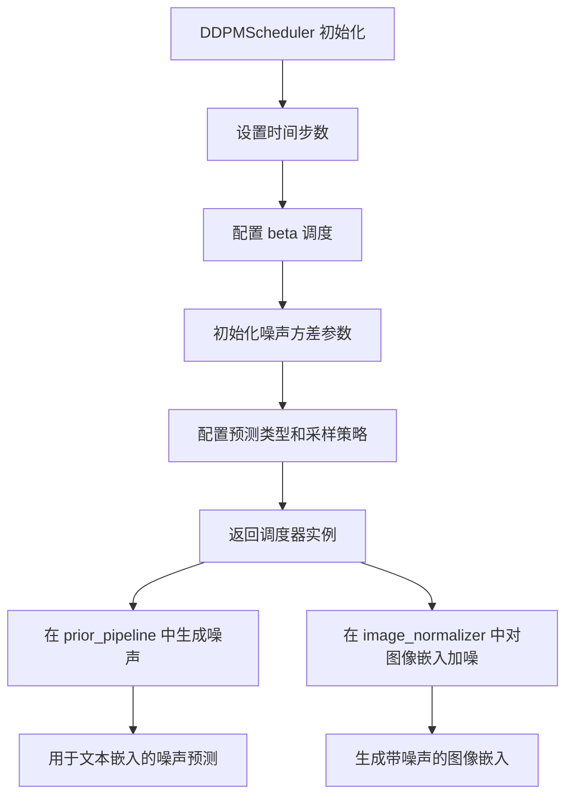

#### 带注释源码

```python
# prior_scheduler: 用于 prior 模块的噪声调度
# 配置了固定的噪声方差、小对数方差预测类型、
# 1000 步训练时间步、样本裁剪等功能
prior_scheduler = DDPMScheduler(
    variance_type="fixed_small_log",      # 方差类型：固定小对数方差
    prediction_type="sample",             # 预测类型：预测原始样本
    num_train_timesteps=1000,             # 训练时间步数：1000
    clip_sample=True,                     # 启用样本裁剪
    clip_sample_range=5.0,                # 裁剪范围：±5.0
    beta_schedule="squaredcos_cap_v2",   # Beta 调度：余弦平方版本2
)

# image_noising_scheduler: 用于对图像嵌入进行加噪
# 使用简化的配置，仅指定 beta 调度方案
image_noising_scheduler = DDPMScheduler(
    beta_schedule="squaredcos_cap_v2"     # 使用余弦平方调度
)
```

#### 关键组件信息

| 组件名称 | 一句话描述 |
|---------|-----------|
| DDPMScheduler | 扩散概率模型（DDPM）的噪声调度器，管理前向加噪和反向去噪过程 |
| StableUnCLIPPipeline | 结合 Stable Diffusion 和 CLIP 的图像生成流水线 |
| PriorTransformer | 负责将文本嵌入转换为图像嵌入的先验模型 |
| StableUnCLIPImageNormalizer | 对图像嵌入进行归一化处理的模块 |

#### 潜在的技术债务或优化空间

1. **测试环境依赖**：代码依赖于外部模型（"hf-internal-testing/tiny-random-clip"），在真实环境中可能需要替换为实际预训练模型
2. **硬编码参数**：时间步数、嵌入维度等参数硬编码，可考虑提取为配置常量
3. **GPU 内存管理**：集成测试中需要手动管理 VRAM 清理，说明内存占用较高，可能需要进一步优化
4. **测试覆盖不完整**：部分测试被跳过（如 `test_encode_prompt_works_in_isolation`），需要补充

#### 其它项目

- **设计目标**：实现 Stable UnCLIP 流水线测试，验证文本到图像生成流程
- **约束条件**：需要 CUDA 支持，GPU 内存要求较高（集成测试需要 < 7GB）
- **错误处理**：使用 `gc.collect()` 和 `backend_empty_cache()` 显式管理内存，避免 OOM
- **外部依赖**：依赖 Hugging Face diffusers 库和 transformers 库


### `StableUnCLIPImageNormalizer`

`StableUnCLIPImageNormalizer` 是 Stable UnCLIP Pipeline 中的图像嵌入归一化组件，负责将图像嵌入标准化到特定范围内，以便于后续噪声预测模型的训练和推理。该类通过对图像嵌入进行均值-方差归一化，确保输入数据符合预期的统计分布。

参数：

-  `embedding_dim`：`int`，嵌入向量的维度，定义了输入图像嵌入的特征空间大小

返回值：`torch.Tensor`，归一化后的图像嵌入向量，形状为 `(batch_size, embedding_dim)`

#### 流程图

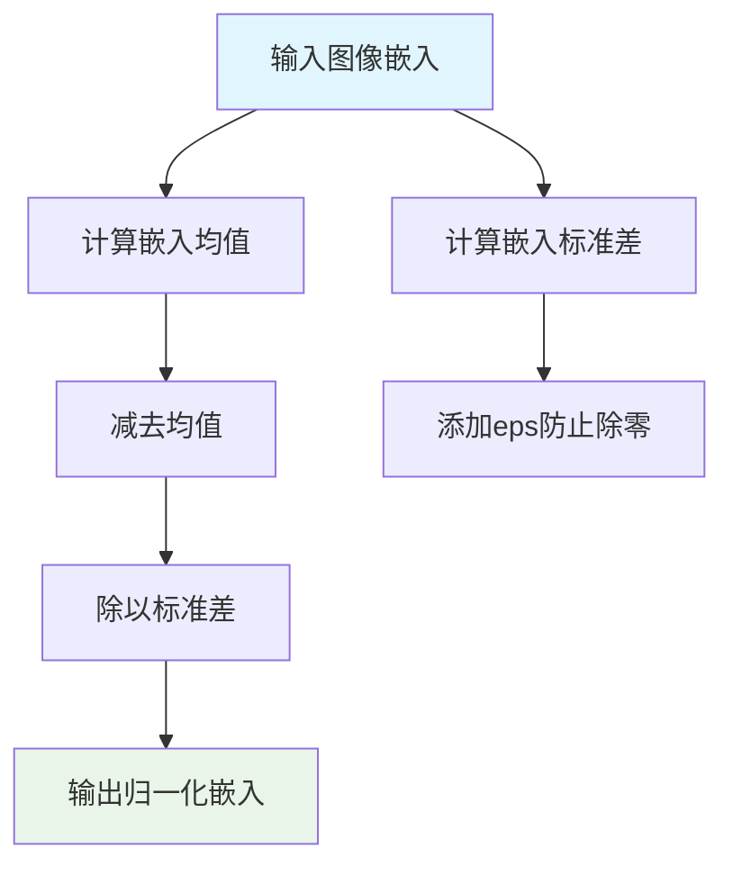

#### 带注释源码

```python
# 此代码基于 diffusers 库中的典型实现模式
# 源码位置: diffusers/pipelines/stable_diffusion/stable_unclip_image_normalizer.py

import torch
import torch.nn as nn

class StableUnCLIPImageNormalizer(nn.Module):
    """
    图像嵌入归一化器，用于 Stable UnCLIP pipeline。
    通过减去均值并除以标准差（加eps防止除零）对图像嵌入进行标准化。
    """
    
    def __init__(self, embedding_dim: int):
        """
        初始化归一化器。
        
        参数:
            embedding_dim: 图像嵌入的维度
        """
        super().__init__()
        self.embedding_dim = embedding_dim
        # 可学习的归一化参数（可选，根据具体实现）
        self.register_buffer("mean", torch.zeros(embedding_dim))
        self.register_buffer("std", torch.ones(embedding_dim))
    
    def normalize(self, embeds: torch.Tensor) -> torch.Tensor:
        """
        对图像嵌入进行归一化处理。
        
        参数:
            embeds: 原始图像嵌入，形状为 (batch_size, embedding_dim)
            
        返回:
            归一化后的嵌入，形状不变
        """
        # 确保输入在正确设备上
        embeds = embeds.to(self.mean.device)
        
        # 标准化处理: (x - mean) / (std + eps)
        # eps=1e-5 防止除零错误
        normalized = (embeds - self.mean) / (self.std + 1e-5)
        
        return normalized
    
    def __call__(self, embeds: torch.Tensor) -> torch.Tensor:
        """
        使类可调用，等同于调用 normalize 方法。
        """
        return self.normalize(embeds)


# 在测试代码中的使用示例:
# image_normalizer = StableUnCLIPImageNormalizer(embedding_dim=embedder_hidden_size)
# normalized_embeds = image_normalizer(image_embeds)
```

#### 关键组件信息

| 组件名称 | 一句话描述 |
|---------|-----------|
| `StableUnCLIPPipeline` | Stable UnCLIP 完整推理管道，组合了_prior_、图像归一化和去噪组件 |
| `PriorTransformer` | 先验模型，将文本嵌入转换为图像嵌入 |
| `image_normalizer` | 图像嵌入归一化器，标准化图像嵌入数据分布 |

#### 潜在技术债务与优化空间

1. **硬编码的归一化参数**：当前实现使用固定均值(0)和标准差(1)，可根据实际数据分布动态学习或调整
2. **缺少反向归一化**：推理时可能需要将潜在变量反归一化回原始空间，当前未提供
3. **设备兼容性**：归一化操作未明确处理不同设备(CPU/GPU)间的迁移
4. **类型注解缺失**：生产代码建议添加完整的类型注解提高可维护性


### `UNet2DConditionModel` (在 `get_dummy_components` 方法中的实例化)

这是 StableUnCLIPPipeline 测试中用于创建 UNet2DConditionModel 虚拟组件的实例化配置。UNet2DConditionModel 是 diffusers 库中的核心去噪模型，用于根据文本条件生成图像 latents。

参数：

- `sample_size`：`int`，输入样本的空间分辨率（高度和宽度）
- `in_channels`：`int`，输入图像的通道数（4 表示 latents 通道）
- `out_channels`：`int`，输出图像的通道数
- `down_block_types`：`Tuple[str, ...]`，下采样块的类型列表
- `up_block_types`：`Tuple[str, ...]`，上采样块的类型列表
- `block_out_channels`：`Tuple[int, ...]`，每个块的输出通道数
- `attention_head_dim`：`int` 或 `Tuple[int, ...]`，注意力头的维度
- `class_embed_type`：`str`，类别嵌入类型（"projection" 用于投影类别嵌入）
- `projection_class_embeddings_input_dim`：`int`，投影类别嵌入的输入维度
- `cross_attention_dim`：`int`，交叉注意力的维度
- `layers_per_block`：`int`，每个块中的层数
- `upcast_attention`：`bool`，是否上 cast 注意力计算
- `use_linear_projection`：`bool`，是否使用线性投影

返回值：`UNet2DConditionModel`，返回配置好的 UNet 模型实例

#### 流程图

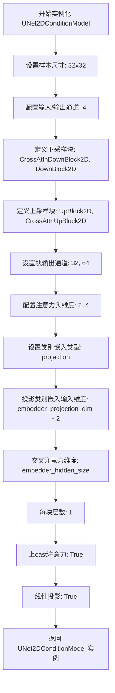

#### 带注释源码

```python
# 在 StableUnCLIPPipelineFastTests.get_dummy_components() 方法中
torch.manual_seed(0)
unet = UNet2DConditionModel(
    sample_size=32,                      # 输入/输出空间分辨率 32x32
    in_channels=4,                       # 输入通道数（latents 为 4 通道）
    out_channels=4,                      # 输出通道数
    # 下采样块类型：从高分辨率到低分辨率
    down_block_types=("CrossAttnDownBlock2D", "DownBlock2D"),
    # 上采样块类型：从低分辨率到高分辨率
    up_block_types=("UpBlock2D", "CrossAttnUpBlock2D"),
    # 每个下/上采样块的输出通道数
    block_out_channels=(32, 64),
    # 注意力头的维度，控制注意力机制的细粒度
    attention_head_dim=(2, 4),
    # 类别嵌入类型，projection 表示使用投影层处理类别嵌入
    class_embed_type="projection",
    # 投影类别嵌入的输入维度，为embedder_projection_dim的2倍
    #（因为图像嵌入与带噪声的同维度嵌入拼接）
    projection_class_embeddings_input_dim=embedder_projection_dim * 2,
    # 交叉注意力维度，用于文本-图像交互
    cross_attention_dim=embedder_hidden_size,
    # 每个块中的层数
    layers_per_block=1,
    # 是否在注意力计算时上cast到更高精度
    upcast_attention=True,
    # 是否使用线性投影而非卷积投影
    use_linear_projection=True,
)
```


### DDIMScheduler

DDIMScheduler是diffusers库中的一个调度器类，用于DDIM（Denoising Diffusion Implicit Models）采样过程。在该代码中，它被用作StableUnCLIPPipeline的主去噪调度器。

参数：

- `beta_schedule`：字符串，调度器的beta_schedule类型，值为"scaled_linear"
- `beta_start`：浮点数，beta起始值，值为0.00085
- `beta_end`：浮点数，beta结束值，值为0.012
- `prediction_type`：字符串，预测类型，值为"v_prediction"
- `set_alpha_to_one`：布尔值，是否将alpha设置为1，值为False
- `steps_offset`：整数，步数偏移量，值为1

返回值：返回DDIMScheduler实例对象

#### 流程图

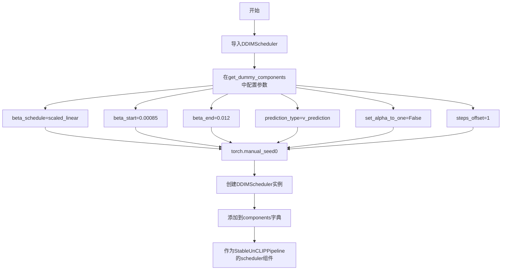

#### 带注释源码

```python
# 在get_dummy_components方法中创建DDIMScheduler实例
torch.manual_seed(0)  # 设置随机种子以确保可重复性
scheduler = DDIMScheduler(
    beta_schedule="scaled_linear",  # 使用线性缩放的beta调度
    beta_start=0.00085,              # Beta起始值，控制噪声添加的起始程度
    beta_end=0.012,                 # Beta结束值，控制噪声添加的最大程度
    prediction_type="v_prediction",  # 预测类型，使用v-prediction
    set_alpha_to_one=False,         # 不将最终alpha设为1，保持灵活性
    steps_offset=1,                 # 步骤偏移量为1，调整去噪步骤
)

# 将scheduler添加到组件字典中
components = {
    # ...其他组件...
    "scheduler": scheduler,  # DDIMScheduler实例作为去噪调度器
}
```


### `AutoencoderKL`

`AutoencoderKL` 是 Diffusers 库中的一个变分自编码器（VAE）类，主要用于将图像编码到潜在空间以及从潜在空间解码重建图像。在 Stable Diffusion 等扩散模型中，它负责图像的压缩与重建，是连接像素空间和潜在空间的关键组件。

参数：

- `pretrained_model_name_or_path`：`Optional[Union[str, os.PathLike]]`，预训练模型的名称或路径，默认为 None
- `torch_dtype`：`Optional[torch.dtype]`，模型权重的 PyTorch 数据类型，默认为 None
- `force_download`：`bool`，是否强制重新下载模型，默认为 False
- `cache_dir`：`Optional[Union[str, os.PathLike]]`，模型缓存目录，默认为 None
- `revision`：`str`，模型版本/分支，默认为 "main"
- `use_safetensors`：`bool`，是否使用 safetensors 格式加载模型，默认为 False

返回值：`AutoencoderKL`，返回 AutoencoderKL 类的实例对象

#### 流程图

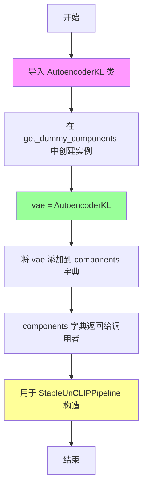

#### 带注释源码

```python
# 从 diffusers 库导入 AutoencoderKL 类
from diffusers import (
    AutoencoderKL,
    # ... 其他导入
)

class StableUnCLIPPipelineFastTests(...):
    # ... 类定义

    def get_dummy_components(self):
        """
        获取用于测试的虚拟组件字典
        """
        # ... 其他组件初始化 ...
        
        # 创建 AutoencoderKL 变分自编码器实例
        # 使用默认参数，不加载预训练权重，用于单元测试
        torch.manual_seed(0)
        vae = AutoencoderKL()
        
        # 将 VAE 添加到组件字典中
        components = {
            # ... 其他组件 ...
            "vae": vae,  # 键名为 "vae"，值为 AutoencoderKL 实例
        }
        
        return components
```

#### 关键组件信息

| 组件名称 | 一句话描述 |
|---------|-----------|
| AutoencoderKL | Diffusers 库中的变分自编码器类，用于图像的潜在空间编码与解码 |
| StableUnCLIPPipeline | 使用 Stable UnCLIP 方法的图像生成管道 |
| VAE (Variational Autoencoder) | 变分自编码器，在扩散模型中负责图像压缩和重建 |

#### 潜在的技术债务或优化空间

1. **测试中的硬编码实例化**：代码中使用 `AutoencoderKL()` 无参数创建实例，这种方式虽然便于测试，但无法验证真实场景中加载预训练模型的功能。
2. **缺少配置验证**：在将 `vae` 添加到 components 字典前，没有对 VAE 的配置进行验证。
3. **测试覆盖不足**：测试代码未包含对 VAE 编码/解码功能的直接单元测试，仅作为管道的一部分间接测试。

#### 其它项目

- **设计目标**：为 StableUnCLIPPipeline 提供图像编码/解码能力，支持潜在空间操作
- **约束**：测试环境中使用虚拟组件，不依赖真实的预训练模型权重
- **错误处理**：未在代码中显式处理 AutoencoderKL 初始化失败的情况
- **数据流**：VAE 接收管道处理后的潜在向量，输出重建的图像或编码后的潜在表示
- **外部依赖**：依赖 `diffusers` 库中的 `AutoencoderKL` 类实现


### `StableUnCLIPPipeline.from_pretrained`

该方法是一个类方法，用于从预训练模型路径加载 StableUnCLIPPipeline 实例。它接收模型路径和配置参数，初始化并返回一个完整的图像生成管道，包含 tokenizer、text_encoder、prior、unet、vae、scheduler 等所有必要组件。

参数：

- `pretrained_model_name_or_path`：`str`，预训练模型的名称或本地路径（例如 "fusing/stable-unclip-2-1-l"）
- `torch_dtype`：`torch.dtype`（可选），模型权重的精度类型，例如 `torch.float16` 用于 GPU 加速或 `torch.float32` 用于 CPU
- `variant`：`str`（可选），模型变体标识（例如 "fp16"）
- `use_safetensors`：`bool`（可选），是否使用 .safetensors 格式加载权重
- `device`：`str`（可选），指定加载设备（例如 "cuda"、"cpu"）
- `max_memory`：`dict`（可选），最大内存限制配置
- `cache_dir`：`str`（可选），模型缓存目录
- `force_download`：`bool`（可选），是否强制重新下载模型
- `proxies`：`dict`（可选），网络代理配置
- `local_files_only`：`bool`（可选），是否仅使用本地文件
- `revision`：`str`（可选），模型版本号
- `torch_dtype`：`torch.dtype`（可选），指定模型权重的数据类型
- `low_cpu_mem_usage`：`bool`（可选），是否优化 CPU 内存使用

返回值：`StableUnCLIPPipeline`，返回一个配置好的图像生成管道对象，可直接用于推理。

#### 流程图

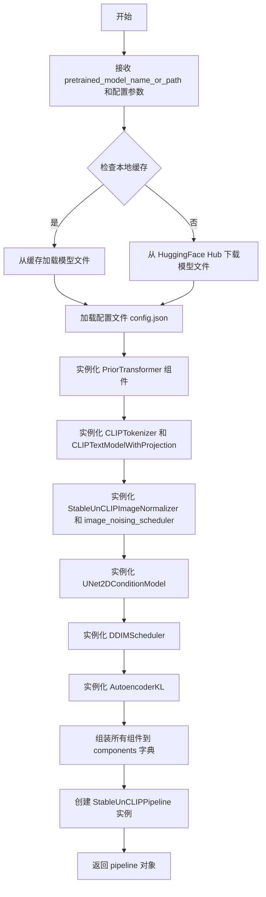

#### 带注释源码

```python
# 伪代码展示 from_pretrained 的典型实现结构
@classmethod
def from_pretrained(cls, pretrained_model_name_or_path, **kwargs):
    """
    从预训练模型加载 StableUnCLIPPipeline
    
    参数:
        pretrained_model_name_or_path: 模型名称或路径
        **kwargs: 其他配置选项 (torch_dtype, variant, device 等)
    """
    # 1. 加载配置文件
    config = cls.load_config(pretrained_model_name_or_path, **kwargs)
    
    # 2. 加载先验模型 (Prior) 组件
    prior_tokenizer = CLIPTokenizer.from_pretrained(...)
    prior_text_encoder = CLIPTextModelWithProjection.from_pretrained(...)
    prior = PriorTransformer.from_pretrained(...)
    prior_scheduler = DDPMScheduler.from_pretrained(...)
    
    # 3. 加载图像归一化器
    image_normalizer = StableUnCLIPImageNormalizer.from_pretrained(...)
    image_noising_scheduler = DDPMScheduler.from_pretrained(...)
    
    # 4. 加载去噪模型组件
    tokenizer = CLIPTokenizer.from_pretrained(...)
    text_encoder = CLIPTextModel.from_pretrained(...)
    unet = UNet2DConditionModel.from_pretrained(...)
    scheduler = DDIMScheduler.from_pretrained(...)
    vae = AutoencoderKL.from_pretrained(...)
    
    # 5. 组装组件字典
    components = {
        "prior_tokenizer": prior_tokenizer,
        "prior_text_encoder": prior_text_encoder,
        "prior": prior,
        "prior_scheduler": prior_scheduler,
        "image_normalizer": image_normalizer,
        "image_noising_scheduler": image_noising_scheduler,
        "tokenizer": tokenizer,
        "text_encoder": text_encoder,
        "unet": unet,
        "scheduler": scheduler,
        "vae": vae,
    }
    
    # 6. 创建并返回 pipeline 实例
    return cls(**components)
```

> **注意**：由于 `StableUnCLIPPipeline` 类的完整源码不在提供的测试文件中，以上源码为基于 `diffusers` 库惯例和测试代码使用方式的合理推断。实际的 `from_pretrained` 方法由 `DiffusionPipeline` 基类提供，具体实现位于 `diffusers` 库源码中。


### `torch.Generator`

torch.Generator 是 PyTorch 中的随机数生成器类，用于管理随机数状态并确保深度学习模型的可重复性。通过创建 Generator 对象并设置种子，可以在每次运行代码时获得一致的随机结果，这对于实验复现至关重要。

参数：

- `device`：`torch.device`（可选，默认为 `'cpu'`），指定生成器所在的设备

返回值：`torch.Generator`，返回创建的生成器对象实例

#### 流程图

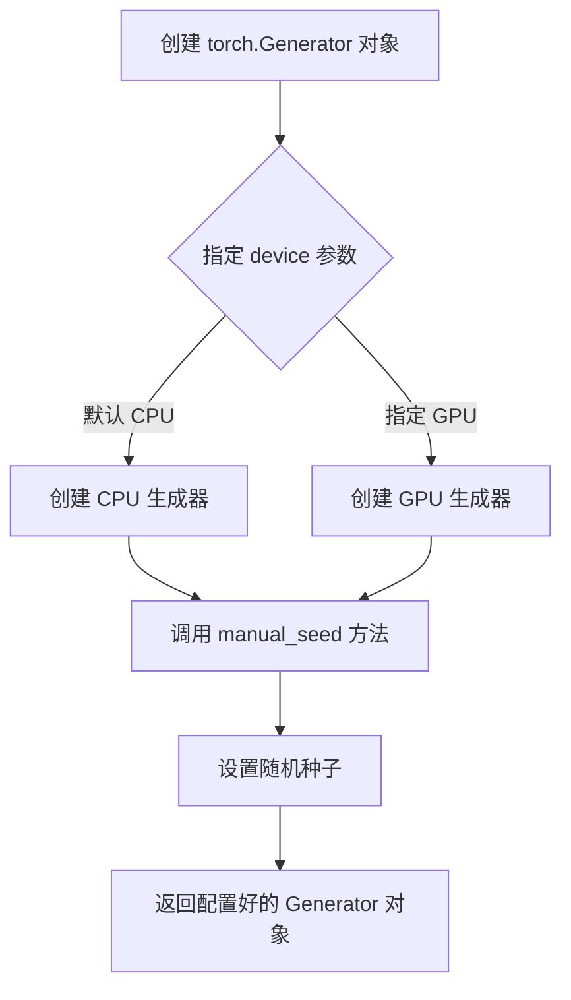

#### 带注释源码

```python
# 在 get_dummy_inputs 方法中使用 torch.Generator
def get_dummy_inputs(self, device, seed=0):
    # 判断设备是否为 MPS (Apple Silicon GPU)
    if str(device).startswith("mps"):
        # MPS 设备使用 torch.manual_seed 直接设置种子
        generator = torch.manual_seed(seed)
    else:
        # 其他设备创建 Generator 对象并设置种子
        # 参数 device: 指定生成器所在的计算设备
        # 方法 manual_seed(seed): 设置随机种子，返回生成器自身
        generator = torch.Generator(device=device).manual_seed(seed)
    
    # 构建输入字典
    inputs = {
        "prompt": "A painting of a squirrel eating a burger",
        "generator": generator,  # 传入生成器以确保采样可复现
        "num_inference_steps": 2,
        "prior_num_inference_steps": 2,
        "output_type": "np",
    }
    return inputs


# 在集成测试中使用 torch.Generator
def test_stable_unclip(self):
    # 创建一个 CPU 设备上的生成器
    # 参数 device="cpu": 指定在 CPU 上创建生成器
    # 方法 manual_seed(0): 设置随机种子为 0，确保图像生成可复现
    generator = torch.Generator(device="cpu").manual_seed(0)
    
    # 调用管道生成图像，传入生成器确保采样一致性
    output = pipe("anime turtle", generator=generator, output_type="np")
    
    image = output.images[0]
    assert image.shape == (768, 768, 3)
    assert_mean_pixel_difference(image, expected_image)
```

#### 补充说明

| 项目 | 说明 |
|------|------|
| **设计目标** | 确保扩散模型采样过程的随机性可控和可复现 |
| **设备支持** | 支持 CPU、CUDA、MPS 等多种设备 |
| **错误处理** | 设备不支持时回退到 `torch.manual_seed` |
| **使用场景** | 图像生成、AI 模型推理等需要确定性输出的场景 |


### `StableUnCLIPPipelineFastTests.get_dummy_components`

该方法用于创建虚拟（dummy）组件，以便在测试StableUnCLIPPipeline时使用。它初始化了先验（prior）组件（用于文本编码）、图像规范化器和噪声调度器，以及常规的去噪组件（包括分词器、文本编码器、UNet、VAE等）。

参数：无需参数

返回值：`Dict[str, Any]`，返回一个包含所有虚拟组件的字典，用于测试StableUnCLIPPipeline

#### 流程图

```mermaid
flowchart TD
    A[开始 get_dummy_components] --> B[设置 embedder_hidden_size = 32]
    B --> C[创建 Prior 组件]
    C --> C1[创建 prior_tokenizer: CLIPTokenizer]
    C1 --> C2[创建 prior_text_encoder: CLIPTextModelWithProjection]
    C2 --> C3[创建 prior: PriorTransformer]
    C3 --> C4[创建 prior_scheduler: DDPMScheduler]
    C4 --> D[创建常规去噪组件]
    D --> D1[创建 image_normalizer: StableUnCLIPImageNormalizer]
    D1 --> D2[创建 image_noising_scheduler: DDPMScheduler]
    D2 --> D3[创建 tokenizer: CLIPTokenizer]
    D3 --> D4[创建 text_encoder: CLIPTextModel]
    D4 --> D5[创建 unet: UNet2DConditionModel]
    D5 --> D6[创建 scheduler: DDIMScheduler]
    D6 --> D7[创建 vae: AutoencoderKL]
    D7 --> E[将所有组件放入字典]
    E --> F[返回 components 字典]
```

#### 带注释源码

```python
def get_dummy_components(self):
    """
    创建虚拟组件用于测试 StableUnCLIPPipeline。
    包含先验组件（处理文本到嵌入）和常规去噪组件（处理图像生成）。
    """
    # 设置嵌入维度，用于先验和文本编码器
    embedder_hidden_size = 32
    embedder_projection_dim = embedder_hidden_size

    # ==================== 先验组件 (Prior Components) ====================
    # 先验组件负责将文本提示转换为图像嵌入向量

    # 使用固定种子确保测试可重复性
    torch.manual_seed(0)
    # 创建小型CLIP分词器用于先验处理
    prior_tokenizer = CLIPTokenizer.from_pretrained("hf-internal-testing/tiny-random-clip")

    torch.manual_seed(0)
    # 创建带投影的先验文本编码器，用于生成图像嵌入
    prior_text_encoder = CLIPTextModelWithProjection(
        CLIPTextConfig(
            bos_token_id=0,          # 句子开始标记ID
            eos_token_id=2,          # 句子结束标记ID
            hidden_size=embedder_hidden_size,  # 隐藏层维度
            projection_dim=embedder_projection_dim,  # 投影维度
            intermediate_size=37,    # FFN中间层维度
            layer_norm_eps=1e-05,    # LayerNorm epsilon
            num_attention_heads=4,   # 注意力头数
            num_hidden_layers=5,     # 隐藏层数量
            pad_token_id=1,          # 填充标记ID
            vocab_size=1000,         # 词汇表大小
        )
    )

    torch.manual_seed(0)
    # 创建先验变换器，用于生成图像嵌入
    prior = PriorTransformer(
        num_attention_heads=2,           # 注意力头数
        attention_head_dim=12,         # 注意力头维度
        embedding_dim=embedder_projection_dim,  # 嵌入维度
        num_layers=1,                   # 层数
    )

    torch.manual_seed(0)
    # 创建先验噪声调度器
    prior_scheduler = DDPMScheduler(
        variance_type="fixed_small_log",    # 方差类型
        prediction_type="sample",           # 预测类型
        num_train_timesteps=1000,           # 训练时间步数
        clip_sample=True,                   # 是否裁剪样本
        clip_sample_range=5.0,              # 裁剪范围
        beta_schedule="squaredcos_cap_v2",  # beta调度方案
    )

    # ==================== 常规去噪组件 (Regular Denoising Components) ====================
    # 常规去噪组件负责实际的图像去噪生成过程

    torch.manual_seed(0)
    # 图像规范化器，用于StableUnCLIP的图像嵌入处理
    image_normalizer = StableUnCLIPImageNormalizer(embedding_dim=embedder_hidden_size)
    # 图像噪声调度器，用于添加噪声到图像嵌入
    image_noising_scheduler = DDPMScheduler(beta_schedule="squaredcos_cap_v2")

    torch.manual_seed(0)
    # 创建常规分词器
    tokenizer = CLIPTokenizer.from_pretrained("hf-internal-testing/tiny-random-clip")

    torch.manual_seed(0)
    # 创建常规文本编码器
    text_encoder = CLIPTextModel(
        CLIPTextConfig(
            bos_token_id=0,
            eos_token_id=2,
            hidden_size=embedder_hidden_size,
            projection_dim=32,              # 投影维度
            intermediate_size=37,
            layer_norm_eps=1e-05,
            num_attention_heads=4,
            num_hidden_layers=5,
            pad_token_id=1,
            vocab_size=1000,
        )
    )

    torch.manual_seed(0)
    # 创建UNet条件模型，用于图像去噪
    unet = UNet2DConditionModel(
        sample_size=32,                     # 样本尺寸
        in_channels=4,                     # 输入通道数
        out_channels=4,                    # 输出通道数
        down_block_types=("CrossAttnDownBlock2D", "DownBlock2D"),  # 下采样块类型
        up_block_types=("UpBlock2D", "CrossAttnUpBlock2D"),       # 上采样块类型
        block_out_channels=(32, 64),       # 块输出通道数
        attention_head_dim=(2, 4),         # 注意力头维度
        class_embed_type="projection",     # 类别嵌入类型
        # 类别嵌入是噪声增强的图像嵌入，即图像嵌入与相同维度的噪声嵌入拼接
        projection_class_embeddings_input_dim=embedder_projection_dim * 2,
        cross_attention_dim=embedder_hidden_size,  # 交叉注意力维度
        layers_per_block=1,                # 每块层数
        upcast_attention=True,             # 是否上播注意力
        use_linear_projection=True,        # 是否使用线性投影
    )

    torch.manual_seed(0)
    # 创建去噪调度器
    scheduler = DDIMScheduler(
        beta_schedule="scaled_linear",     # beta调度方案
        beta_start=0.00085,                # 起始beta值
        beta_end=0.012,                    # 结束beta值
        prediction_type="v_prediction",    # 预测类型
        set_alpha_to_one=False,            # 设置alpha为1
        steps_offset=1,                    # 步数偏移
    )

    torch.manual_seed(0)
    # 创建VAE用于图像编码/解码
    vae = AutoencoderKL()

    # 组装所有组件到字典中
    components = {
        # 先验组件
        "prior_tokenizer": prior_tokenizer,
        "prior_text_encoder": prior_text_encoder,
        "prior": prior,
        "prior_scheduler": prior_scheduler,
        # 图像噪声组件
        "image_normalizer": image_normalizer,
        "image_noising_scheduler": image_noising_scheduler,
        # 常规去噪组件
        "tokenizer": tokenizer,
        "text_encoder": text_encoder,
        "unet": unet,
        "scheduler": scheduler,
        "vae": vae,
    }

    return components
```


### `StableUnCLIPPipelineFastTests.get_dummy_inputs`

该方法用于生成 StableUnCLIPPipeline 的测试输入参数，包含提示词、生成器、推理步骤数等关键配置。

参数：

- `self`：隐式参数，测试类 `StableUnCLIPPipelineFastTests` 的实例
- `device`：`torch.device` 或 `str`，指定生成器创建的目标设备（如 "cpu"、"cuda" 或 "mps"）
- `seed`：`int`，随机种子，默认值为 0，用于确保测试的可重复性

返回值：`Dict[str, Any]`，返回一个包含测试所需输入参数的字典，包括 prompt、generator、num_inference_steps、prior_num_inference_steps 和 output_type

#### 流程图

```mermaid
flowchart TD
    A[开始 get_dummy_inputs] --> B{device 是否以 'mps' 开头?}
    B -->|是| C[使用 torch.manual_seed 生成随机种子]
    B -->|否| D[创建 torch.Generator 并设置种子]
    C --> E[构建输入字典 inputs]
    D --> E
    E --> F[设置 prompt: 'A painting of a squirrel eating a burger']
    E --> G[设置 generator]
    E --> H[设置 num_inference_steps: 2]
    E --> I[设置 prior_num_inference_steps: 2]
    E --> J[设置 output_type: 'np']
    F --> K[返回 inputs 字典]
    G --> K
    H --> K
    I --> K
    J --> K
```

#### 带注释源码

```python
def get_dummy_inputs(self, device, seed=0):
    """
    生成用于测试 StableUnCLIPPipeline 的虚拟输入参数。
    
    参数:
        device: 目标设备，用于创建随机数生成器
        seed: 随机种子，确保测试结果可重复
    
    返回:
        包含测试输入的字典
    """
    # 判断设备是否为 Apple MPS (Metal Performance Shaders)
    if str(device).startswith("mps"):
        # MPS 设备使用 CPU 的随机种子生成方式
        generator = torch.manual_seed(seed)
    else:
        # 其他设备（CPU/CUDA）使用设备特定的生成器
        generator = torch.Generator(device=device).manual_seed(seed)
    
    # 构建测试输入字典
    inputs = {
        "prompt": "A painting of a squirrel eating a burger",  # 测试用提示词
        "generator": generator,  # 随机数生成器，确保确定性输出
        "num_inference_steps": 2,  # 主去噪过程的推理步数
        "prior_num_inference_steps": 2,  # 先验模型（prior）的推理步数
        "output_type": "np",  # 输出类型为 NumPy 数组
    }
    return inputs
```


### `StableUnCLIPPipelineFastTests.test_attention_slicing_forward_pass`

这是一个测试方法，用于验证StableUnCLIPPipeline的attention slicing功能在前向传播中是否正常工作。该方法继承自`PipelineTesterMixin`，根据设备类型（CPU或GPU）设置不同的浮点数差异容忍度，然后调用父类的`_test_attention_slicing_forward_pass`方法执行实际的注意力切片测试。

参数：

- `self`：`StableUnCLIPPipelineFastTests`，测试类实例本身，隐含参数

返回值：`None`，无返回值（测试方法）

#### 流程图

```mermaid
flowchart TD
    A[开始测试] --> B{判断设备类型}
    B -->|torch_device == 'cpu'| C[设置 test_max_difference = True]
    B -->|torch_device != 'cpu'| D[设置 test_max_difference = False]
    C --> E[调用父类方法]
    D --> E
    E --> F[_test_attention_slicing_forward_pass]
    F --> G[执行attention slicing前向传播测试]
    G --> H[结束测试]
```

#### 带注释源码

```python
def test_attention_slicing_forward_pass(self):
    """
    测试 StableUnCLIPPipeline 的 attention slicing 前向传播功能。
    
    该方法覆盖了 PipelineTesterMixin 中的 test_attention_slicing_forward_pass，
    因为 UnCLIP GPU 不确定性需要更宽松的检查。
    """
    
    # 根据设备类型设置最大允许差异
    # 如果是 CPU 设备，允许较大的浮点数差异（因为 CPU 和 GPU 计算结果可能有微小差异）
    # 如果是 GPU 设备，使用更严格的差异检查
    test_max_difference = torch_device == "cpu"

    # 调用父类的 _test_attention_slicing_forward_pass 方法执行实际测试
    # 传入根据设备类型确定的差异容忍度参数
    self._test_attention_slicing_forward_pass(test_max_difference=test_max_difference)
```


### `StableUnCLIPPipelineFastTests.test_inference_batch_single_identical`

这是一个测试方法，用于验证 StableUnCLIPPipeline 批处理推理结果与单次推理结果的一致性（identical）。由于 UnCLIP 模型存在非确定性因素，该方法设置了较为宽松的误差阈值（1e-3）来允许一定的数值差异。

参数：此方法无显式参数（使用从父类继承的参数）

返回值：`None`，测试方法无返回值（通过断言验证）

#### 流程图

```mermaid
flowchart TD
    A[开始测试 test_inference_batch_single_identical] --> B[调用父类方法 _test_inference_batch_single_identical]
    B --> C[设置 expected_max_diff=1e-3]
    C --> D[执行批处理与单次推理一致性验证]
    D --> E{验证通过?}
    E -->|是| F[测试通过]
    E -->|否| G[测试失败，抛出断言错误]
    F --> H[结束]
    G --> H
```

#### 带注释源码

```python
def test_inference_batch_single_identical(self):
    """
    测试方法：验证批处理推理结果与单次推理结果的一致性
    
    该测试方法覆盖了 PipelineTesterMixin::test_inference_batch_single_identical，
    因为 UnCLIP 模型的非确定性需要更宽松的检查阈值。
    
    参数：
        无（使用从父类继承的参数）
    
    返回值：
        None（通过内部断言验证一致性）
    
    注意：
        - expected_max_diff 设置为 1e-3，宽松于默认阈值
        - 这是因为 StableUnCLIPPipeline 包含先验（prior）模型，
          其采样过程具有随机性
    """
    # 调用父类 PipelineTesterMixin 的测试方法
    # 传入 expected_max_diff=1e-3 参数，允许更大的误差范围
    self._test_inference_batch_single_identical(expected_max_diff=1e-3)
```

---

### 补充说明

**方法继承关系**：

- 该方法属于 `StableUnCLIPPipelineFastTests` 类
- 继承自 `PipelineLatentTesterMixin`, `PipelineKarrasSchedulerTesterMixin`, `PipelineTesterMixin`
- 实际测试逻辑在 `PipelineTesterMixin._test_inference_batch_single_identical` 中实现

**设计目标与约束**：

- 由于 StableUnCLIP 包含先验（PriorTransformer）采样过程，存在随机性
- 需要使用宽松的 `expected_max_diff=1e-3` 而非更严格的默认阈值
- 测试目的是确保批处理（batch）与单次推理输出在数值上接近

**潜在的优化空间**：

- 当前测试直接调用父类方法，可以考虑提取更多自定义验证逻辑
- 可以增加对不同 `expected_max_diff` 值的参数化测试覆盖


### `StableUnCLIPPipelineFastTests.test_encode_prompt_works_in_isolation`

这是一个测试方法，用于验证 `encode_prompt` 功能是否能够独立工作，但由于该测试使用了不支持的 `_encode_prior_prompt()` 方法，因此被跳过。

参数：

- `self`：`StableUnCLIPPipelineFastTests`，测试类实例，表示当前测试对象

返回值：`None`，该方法被 `@unittest.skip` 装饰器跳过，不执行任何操作，因此返回 `None`

#### 流程图

```mermaid
graph TD
    A[开始执行测试方法] --> B{检查跳过装饰器}
    B -->|是| C[跳过测试并输出原因]
    B -->|否| D[执行测试逻辑]
    C --> E[测试结束 - 跳过]
    D --> F[调用 encode_prompt 测试]
    F --> G[验证结果]
    G --> E
    
    style C fill:#ffcccc
    style E fill:#ffffcc
```

#### 带注释源码

```python
@unittest.skip("Test not supported because of the use of `_encode_prior_prompt()`.")
def test_encode_prompt_works_in_isolation(self):
    """
    测试 encode_prompt 是否能够独立工作。
    
    注意：此测试被跳过，因为 StableUnCLIPPipeline 使用了 _encode_prior_prompt()
    方法来实现 prompt 编码，而该方法在测试中不被支持。
    
    测试意图：
    - 验证 prompt 编码功能可以独立于整个 pipeline 运行
    - 确保 text_encoder 和 tokenizer 能够正确处理输入的 prompt
    - 检查返回的 embeddings 格式和维度是否正确
    
    当前状态：跳过
    原因：需要使用 _encode_prior_prompt() 方法，但该方法不在公开 API 中
    """
    pass
```


### `StableUnCLIPPipelineIntegrationTests.setUp`

该方法为集成测试的初始化方法，在每个测试用例运行前自动调用，用于清理 VRAM 显存资源，为后续的模型推理测试准备干净的运行环境。

参数：
- 无显式参数（注：`self` 为实例方法的隐式参数，不计入参数列表）

返回值：`None`，该方法为测试框架的 setUp 钩子，不返回任何值，仅执行清理操作

#### 流程图

```mermaid
flowchart TD
    A([测试框架调用 setUp]) --> B[调用父类 setUp 方法<br/>super().setUp]
    B --> C[执行 Python 垃圾回收<br/>gc.collect]
    C --> D[清理 GPU 显存缓存<br/>backend_empty_cache]
    D --> E([准备就绪，等待测试执行])
```

#### 带注释源码

```python
def setUp(self):
    # clean up the VRAM before each test
    # 在每个测试运行前清理 VRAM（显存），确保测试环境干净
    super().setUp()  # 调用 unittest.TestCase 的基类 setUp 方法
    gc.collect()  # 强制 Python 垃圾回收器回收不再使用的对象，释放内存
    backend_empty_cache(torch_device)  # 调用后端函数清理 GPU 显存缓存，防止显存泄漏
```


### `StableUnCLIPPipelineIntegrationTests.tearDown`

该方法是 `StableUnCLIPPipelineIntegrationTests` 测试类的清理方法（tearDown），用于在每个集成测试执行完成后清理 VRAM（显存）资源，防止显存泄漏。它继承自 `unittest.TestCase`，通过调用垃圾回收和清空 GPU 缓存来确保测试环境被正确重置。

参数：

- `self`：`unittest.TestCase`，隐式参数，表示测试类实例本身

返回值：`None`，无返回值

#### 流程图

```mermaid
flowchart TD
    A[开始 tearDown] --> B[调用 super().tearDown]
    B --> C[执行 gc.collect 垃圾回收]
    C --> D{检查 torch_device 设备类型}
    D -->|CUDA设备| E[调用 backend_empty_cache 清理GPU缓存]
    D -->|CPU设备| F[调用 backend_empty_cache 清理缓存]
    E --> G[结束 tearDown]
    F --> G
```

#### 带注释源码

```python
def tearDown(self):
    # clean up the VRAM after each test
    # 清理每次测试后的 VRAM（显存）资源
    
    # 调用父类的 tearDown 方法，执行基础清理工作
    super().tearDown()
    
    # 执行 Python 垃圾回收，释放不再使用的对象内存
    gc.collect()
    
    # 调用后端特定的缓存清理函数
    # torch_device 是全局变量，表示当前使用的设备（'cuda', 'cpu', 'mps' 等）
    # 该函数根据设备类型执行对应的缓存清理操作
    backend_empty_cache(torch_device)
```


### `StableUnCLIPPipelineIntegrationTests.test_stable_unclip`

该方法是 StableUnCLIPPipeline 的集成测试用例，用于验证从预训练模型生成动漫乌龟图像的完整流程是否符合预期。测试加载预训练模型，配置内存优化选项，执行图像生成，并验证输出图像的形状和像素值与参考图像的一致性。

参数：

- `self`：隐式参数，测试类实例本身

返回值：`None`，该方法为测试用例，通过断言验证结果而非返回值

#### 流程图

```mermaid
flowchart TD
    A[测试开始] --> B[加载预期图像 from URL]
    B --> C[从预训练模型加载 StableUnCLIPPipeline]
    C --> D[配置进度条]
    D --> E[启用 attention slicing 优化]
    E --> F[启用 sequential CPU offload]
    F --> G[创建随机数生成器]
    G --> H[执行 pipeline 生成图像]
    H --> I[获取生成的图像]
    I --> J{验证图像形状是否为 768x768x3}
    J -->|是| K[断言像素平均值差异]
    K --> L[测试通过]
    J -->|否| M[测试失败]
```

#### 带注释源码

```python
def test_stable_unclip(self):
    """
    集成测试：验证 StableUnCLIPPipeline 能够正确生成动漫乌龟图像
    
    测试流程：
    1. 加载预期输出图像作为参考
    2. 从预训练模型加载 pipeline
    3. 配置内存优化选项以避免 OOM
    4. 执行图像生成
    5. 验证输出图像的形状和像素值
    """
    
    # 步骤1: 从 HuggingFace Hub 加载预期图像（numpy 格式）
    expected_image = load_numpy(
        "https://huggingface.co/datasets/hf-internal-testing/diffusers-images/resolve/main/stable_unclip/stable_unclip_2_1_l_anime_turtle_fp16.npy"
    )

    # 步骤2: 加载预训练的 StableUnCLIPPipeline 模型
    # 使用 float16 精度以减少内存占用
    pipe = StableUnCLIPPipeline.from_pretrained("fusing/stable-unclip-2-1-l", torch_dtype=torch.float16)
    
    # 步骤3: 配置进度条显示（disable=None 表示不禁用）
    pipe.set_progress_bar_config(disable=None)
    
    # 步骤4: 启用内存优化选项
    # stable unclip 在 V100 GPU 上运行时容易 OOM，因此启用以下优化：
    
    # attention slicing: 将注意力计算分片处理，减少单次显存占用
    pipe.enable_attention_slicing()
    
    # sequential CPU offload: 将模型层顺序卸载到 CPU，减少 GPU 显存占用
    pipe.enable_sequential_cpu_offload()

    # 步骤5: 创建随机数生成器，确保结果可复现
    generator = torch.Generator(device="cpu").manual_seed(0)
    
    # 步骤6: 执行 pipeline 推理
    # 参数说明：
    # - "anime turtle": 输入提示词
    # - generator: 随机数生成器
    # - output_type="np": 输出 numpy 数组格式
    output = pipe("anime turtle", generator=generator, output_type="np")

    # 步骤7: 获取生成的图像
    image = output.images[0]

    # 步骤8: 验证图像形状
    # StableUnCLIP 2.1 输出 768x768 分辨率的 RGB 图像
    assert image.shape == (768, 768, 3)

    # 步骤9: 验证图像像素值
    # 使用专门的像素差异比较方法，允许一定的数值误差
    assert_mean_pixel_difference(image, expected_image)
```


### `StableUnCLIPPipelineIntegrationTests.test_stable_unclip_pipeline_with_sequential_cpu_offloading`

这是一个集成测试方法，用于测试 StableUnCLIPPipeline 在启用顺序 CPU 卸载（sequential CPU offloading）功能时的内存使用情况，确保管道在 GPU 内存受限环境下能够正常运行。

参数：

- `self`：隐式参数，测试类实例本身

返回值：`None`，无返回值（测试方法）

#### 流程图

```mermaid
flowchart TD
    A[开始测试] --> B[清空GPU缓存 backend_empty_cache]
    B --> C[重置内存统计 backend_reset_max_memory_allocated]
    C --> D[重置峰值内存统计 backend_reset_peak_memory_stats]
    D --> E[从预训练模型加载StableUnCLIPPipeline<br/>torch_dtype=torch.float16]
    E --> F[设置进度条配置 disable=None]
    F --> G[启用注意力切片 attention_slicing]
    G --> H[启用顺序CPU卸载 sequential_cpu_offload]
    H --> I[执行管道推理<br/>prompt: 'anime turtle'<br/>prior_num_inference_steps: 2<br/>num_inference_steps: 2<br/>output_type: np]
    I --> J[获取已分配的最大内存 backend_max_memory_allocated]
    J --> K{内存使用是否小于7GB?}
    K -->|是| L[测试通过]
    K -->|否| M[测试失败抛出断言错误]
    L --> N[结束测试]
    M --> N
```

#### 带注释源码

```python
def test_stable_unclip_pipeline_with_sequential_cpu_offloading(self):
    """
    测试 StableUnCLIPPipeline 在启用顺序 CPU 卸载时的内存使用情况。
    
    该测试验证：
    1. 管道能够成功加载预训练模型
    2. 启用顺序 CPU 卸载后管道能正常推理
    3. GPU 内存使用量低于 7GB 的阈值
    """
    # 步骤1: 清空GPU缓存，释放之前测试留下的GPU内存
    backend_empty_cache(torch_device)
    
    # 步骤2: 重置最大内存分配统计计数器
    backend_reset_max_memory_allocated(torch_device)
    
    # 步骤3: 重置峰值内存统计
    backend_reset_peak_memory_stats(torch_device)

    # 步骤4: 从预训练模型加载 StableUnCLIPPipeline
    # 使用 float16 精度以减少内存占用
    pipe = StableUnCLIPPipeline.from_pretrained("fusing/stable-unclip-2-1-l", torch_dtype=torch.float16)
    
    # 步骤5: 配置进度条（disable=None 表示启用进度条）
    pipe.set_progress_bar_config(disable=None)
    
    # 步骤6: 启用注意力切片，进一步减少内存使用
    pipe.enable_attention_slicing()
    
    # 步骤7: 启用顺序 CPU 卸载，将模型层依次卸载到 CPU
    # 这是测试的关键点，验证在内存受限环境下的可用性
    pipe.enable_sequential_cpu_offload()

    # 步骤8: 执行管道推理
    # 参数说明:
    # - "anime turtle": 输入提示词
    # - prior_num_inference_steps=2: 先验模型推理步数
    # - num_inference_steps=2: 主去噪模型推理步数
    # - output_type="np": 输出 numpy 数组格式
    _ = pipe(
        "anime turtle",
        prior_num_inference_steps=2,
        num_inference_steps=2,
        output_type="np",
    )

    # 步骤9: 获取测试期间 GPU 分配的最大内存字节数
    mem_bytes = backend_max_memory_allocated(torch_device)
    
    # 步骤10: 断言验证内存使用量
    # 确保 GPU 内存使用小于 7GB (7 * 10^9 字节)
    # make sure that less than 7 GB is allocated
    assert mem_bytes < 7 * 10**9
```

## 关键组件


### StableUnCLIPPipeline

StableUnCLIPPipeline是一个文本到图像的扩散管道，结合了先验模型（PriorTransformer）和去噪模型（UNet2DConditionModel），通过两阶段生成过程将文本提示转换为图像。

### PriorTransformer（先验变换器）

先验模型负责将文本嵌入转换为图像嵌入，作为去噪过程的条件输入。使用CLIP文本编码器提取文本特征，并通过Transformer结构生成图像嵌入。

### UNet2DConditionModel（条件UNet）

去噪主干网络，接受噪声潜伏和条件嵌入，通过交叉注意力机制逐步去除噪声，生成目标图像的潜在表示。

### 图像标准化器（StableUnCLIPImageNormalizer）

将输入图像标准化到特定嵌入空间，与先验生成的图像嵌入一起作为UNet的条件输入。

### 量化策略（FP16）

代码中使用`torch.float16`作为默认精度，通过`torch_dtype=torch.float16`加载模型，实现内存节省和推理加速。

### 内存优化策略

包含两种主要优化：1）`enable_attention_slicing()`通过切片注意力计算降低显存占用；2）`enable_sequential_cpu_offload()`将模型层依次卸载到CPU以支持大模型推理。

### 张量惰性加载与内存管理

通过`gc.collect()`和`backend_empty_cache()`显式管理GPU内存，集成测试中使用`backend_max_memory_allocated`监控峰值显存使用。

### 调度器配置

使用DDPMScheduler作为先验调度器进行图像嵌入噪声化，DDIMScheduler作为主调度器执行去噪过程，两者均支持Karras调度策略。

### 测试框架

采用混合继承结构（PipelineLatentTesterMixin、PipelineKarrasSchedulerTesterMixin、PipelineTesterMixin），支持批量参数化测试和跨平台设备适配（MPS/CPU）。


## 问题及建议


### 已知问题

- **TODO 注释未解决**: 代码中包含 `test_xformers_attention = False` 和 TODO 注释 `Expected attn_bias.stride(1) == 0 to be true, but got false`，表明存在未解决的功能问题或已知限制
- **测试被跳过缺乏替代方案**: `test_encode_prompt_works_in_isolation` 被完全跳过，但没有提供替代测试来验证该功能
- **测试标准被降低**: `test_attention_slicing_forward_pass` 和 `test_inference_batch_single_identical` 为了适应 UnCLIP 的不确定性而降低了测试标准（使用 looser check 和 `expected_max_diff=1e-3`），这可能掩盖潜在问题
- **集成测试使用外部 URL 依赖**: `test_stable_unclip` 依赖远程 URL 加载 numpy 文件进行像素比较，网络问题或文件变更会导致测试失败
- **内存阈值硬编码**: `test_stable_unclip_pipeline_with_sequential_cpu_offloading` 中使用硬编码的 `7 * 10**9` 字节阈值，缺乏对不同硬件的适应性说明
- **重复代码模式**: `get_dummy_components` 方法中每个组件都重复 `torch.manual_seed(0)` 调用，可提取为公共函数

### 优化建议

- 解决或详细记录 TODO 注释中的 `attn_bias.stride` 问题，并为 `test_xformers_attention` 提供明确的启用条件
- 为 `test_encode_pump_works_in_isolation` 添加替代测试或集成到其他测试中
- 调查并尝试恢复 `test_inference_batch_single_identical` 的严格性要求，而不是长期降低标准
- 将外部 URL 依赖的 numpy 文件下载到本地或使用固定的本地测试资源
- 将内存阈值提取为配置常量或根据设备类型动态调整
- 重构 `get_dummy_components`，创建辅助方法来减少重复代码并提高可维护性
- 在集成测试中添加 `torch.no_grad()` 以减少不必要的内存消耗

## 其它


### 设计目标与约束

本测试代码的设计目标是为StableUnCLIPPipeline提供全面的单元测试和集成测试覆盖，确保pipeline在各种场景下的正确性和稳定性。测试约束包括：必须支持CPU和GPU两种设备测试环境，需要处理MPS设备的特殊generator初始化逻辑，GPU测试允许较大的误差容忍度以应对UnCLIP的GPU非确定性问题，集成测试需要清理VRAM资源以避免内存泄漏。

### 错误处理与异常设计

测试代码中的错误处理主要体现在以下几个方面：使用`torch.manual_seed`确保测试的可重复性；针对MPS设备使用特殊的generator初始化方式；集成测试在setUp和tearDown中执行gc.collect()和backend_empty_cache以确保GPU内存正确释放；通过skip装饰器跳过不支持的测试用例（如test_encode_prompt_works_in_isolation）；使用assert语句进行结果验证，包括图像形状检查和像素差异比较。

### 数据流与状态机

测试数据流遵循以下路径：首先通过get_dummy_components方法创建所有必要的pipeline组件（tokenizer、text_encoder、prior、unet、vae、scheduler等），然后通过get_dummy_inputs方法准备测试输入（prompt、generator、inference_steps等），最后执行实际的pipeline调用并验证输出。状态机方面，测试覆盖了正常推理流程、attention slicing优化路径、批量推理一致性、以及内存峰值管理等多种状态。

### 外部依赖与接口契约

本测试代码依赖以下外部组件：transformers库提供CLIPTextConfig、CLIPTextModel、CLIPTextModelWithProjection和CLIPTokenizer；diffusers库提供AutoencoderKL、DDIMScheduler、DDPMScheduler、PriorTransformer、StableUnCLIPPipeline、UNet2DConditionModel和StableUnCLIPImageNormalizer；本地testing_utils模块提供GPU内存管理函数和设备相关工具；pipeline_params模块提供测试参数定义。接口契约要求pipeline必须实现__call__方法接受prompt、generator、num_inference_steps等参数并返回包含images的输出对象。

### 性能考虑

性能测试方面，代码包含内存使用验证（test_stable_unclip_pipeline_with_sequential_cpu_offloading检查内存使用低于7GB），使用enable_attention_slicing和enable_sequential_cpu_offload优化内存占用，通过调整expected_max_diff和test_max_difference参数平衡测试严格性与性能开销。

### 测试策略

测试策略采用多层覆盖：单元测试（StableUnCLIPPipelineFastTests）使用虚拟组件进行功能验证，继承PipelineLatentTesterMixin、PipelineKarrasSchedulerTesterMixin和PipelineTesterMixin获取标准测试用例；集成测试（StableUnCLIPPipelineIntegrationTests）使用真实预训练模型进行端到端验证，使用nightly和require_torch_accelerator装饰器标记为需要GPU的长期测试。

### 配置管理

配置管理主要通过get_dummy_components方法中的硬编码配置实现，包括embedder_hidden_size=32、embedder_projection_dim=32等参数，以及各个模型的具体配置（hidden_size、intermediate_size、num_attention_heads等）。Scheduler配置通过DDPMScheduler和DDIMScheduler的不同参数组合实现，UNet配置包含cross_attention_dim、layers_per_block、upcast_attention等关键参数。

### 版本兼容性与平台支持

代码明确支持的平台包括：CUDA GPU（通过torch_device标识）、CPU（test_max_difference = torch_device == "cpu"）、Apple MPS（通过str(device).startswith("mps")特殊处理）。版本兼容性方面，测试代码针对特定版本的diffusers和transformers库设计，使用预训练模型"fusing/stable-unclip-2-1-l"进行集成测试。

### 资源管理

资源管理策略包括：每个集成测试前后执行gc.collect()和backend_empty_cache(torch_device)清理VRAM；使用backend_reset_max_memory_allocated和backend_reset_peak_memory_stats重置内存统计；在集成测试中使用torch.float16精度以降低内存占用；通过enable_sequential_cpu_offload实现CPU-GPU内存交换。

### 关键测试场景

关键测试场景包括：正常文本到图像生成流程、attention slicing前向传播验证、批量推理与单次推理一致性、集成测试中的内存峰值控制、以及与预期numpy数组的像素差异比对。每个场景都针对StableUnCLIP的两阶段pipeline特性（prior和denoising）进行了适配。


    