# `diffusers\tests\pipelines\stable_unclip\test_stable_unclip_img2img.py` 详细设计文档

这是diffusers库中StableUnCLIPImg2ImgPipeline的测试文件，包含单元测试和集成测试，用于验证Stable UnCLIP图像到图像生成管道的功能正确性，包括图像嵌入处理、注意力切片、xformers优化、批处理一致性和内存管理等方面。

## 整体流程

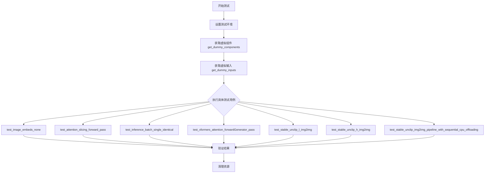

## 类结构

```
unittest.TestCase (基类)
├── StableUnCLIPImg2ImgPipelineFastTests
│   ├── PipelineLatentTesterMixin
│   ├── PipelineKarrasSchedulerTesterMixin
│   └── PipelineTesterMixin
└── StableUnCLIPImg2ImgPipelineIntegrationTests
```

## 全局变量及字段


### `embedder_hidden_size`
    
嵌入器隐藏层大小，用于设置模型隐藏层维度

类型：`int`
    


### `embedder_projection_dim`
    
嵌入器投影维度，与隐藏层大小相同用于投影操作

类型：`int`
    


### `feature_extractor`
    
CLIP图像处理器，用于预处理输入图像

类型：`CLIPImageProcessor`
    


### `image_encoder`
    
CLIP视觉模型带投影，用于编码图像为特征向量

类型：`CLIPVisionModelWithProjection`
    


### `image_normalizer`
    
Stable UnCLIP图像归一化器，用于标准化图像嵌入

类型：`StableUnCLIPImageNormalizer`
    


### `image_noising_scheduler`
    
DDPM噪声调度器，用于添加噪声到图像嵌入

类型：`DDPMScheduler`
    


### `tokenizer`
    
CLIP分词器，用于将文本转换为token

类型：`CLIPTokenizer`
    


### `text_encoder`
    
CLIP文本编码器，用于编码文本提示为特征向量

类型：`CLIPTextModel`
    


### `unet`
    
UNet条件扩散模型，用于去噪生成图像

类型：`UNet2DConditionModel`
    


### `scheduler`
    
DDIM调度器，用于控制扩散过程

类型：`DDIMScheduler`
    


### `vae`
    
变分自编码器KL版本，用于潜在空间编码解码

类型：`AutoencoderKL`
    


### `components`
    
包含所有模型组件的字典

类型：`Dict[str, Any]`
    


### `generator`
    
PyTorch随机数生成器，用于确保可重复性

类型：`torch.Generator`
    


### `input_image`
    
输入图像张量或PIL图像

类型：`Union[Tensor, PIL.Image.Image]`
    


### `inputs`
    
管道输入参数字典

类型：`Dict[str, Any]`
    


### `image`
    
输出图像数组

类型：`np.ndarray`
    


### `image_slice`
    
输出图像的切片用于验证

类型：`np.ndarray`
    


### `expected_slice`
    
期望的图像切片值用于比较

类型：`np.ndarray`
    


### `output`
    
管道输出对象包含生成图像

类型：`PipelineOutput`
    


### `mem_bytes`
    
内存字节数用于内存监控

类型：`int`
    


### `device`
    
计算设备字符串如cpu/cuda

类型：`str`
    


### `StableUnCLIPImg2ImgPipelineFastTests.pipeline_class`
    
被测试的管道类

类型：`Type[StableUnCLIPImg2ImgPipeline]`
    


### `StableUnCLIPImg2ImgPipelineFastTests.params`
    
管道参数字段集合

类型：`frozenset`
    


### `StableUnCLIPImg2ImgPipelineFastTests.batch_params`
    
批处理参数字段集合

类型：`frozenset`
    


### `StableUnCLIPImg2ImgPipelineFastTests.image_params`
    
图像参数字段集合

类型：`frozenset`
    


### `StableUnCLIPImg2ImgPipelineFastTests.image_latents_params`
    
图像潜在空间参数字段集合

类型：`frozenset`
    


### `StableUnCLIPImg2ImgPipelineFastTests.supports_dduf`
    
是否支持DDUF调度器标志

类型：`bool`
    
    

## 全局函数及方法


### `CLIPImageProcessor`

CLIPImageProcessor 是从 `transformers` 库导入的图像预处理类，用于将输入图像转换为 CLIP 视觉模型所需的格式。在该代码中，它被实例化为 `feature_extractor` 组件，用于对输入图像进行预处理（调整大小、裁剪等）以适配 CLIP 视觉模型的输入要求。

参数：

- `crop_size`：`int`，裁剪后的图像尺寸
- `size`：`int`，调整大小后的图像尺寸

返回值：`CLIPImageProcessor` 实例（`feature_extractor`），用于对图像进行预处理

#### 流程图

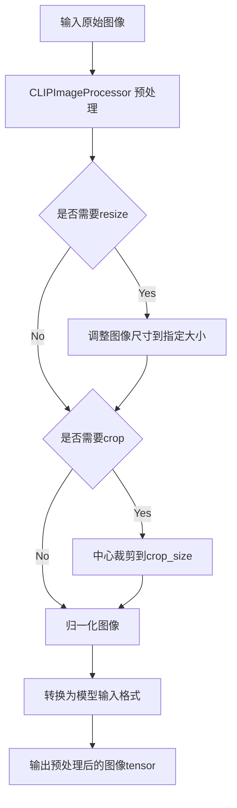

#### 带注释源码

```python
# 从transformers库导入CLIPImageProcessor类
from transformers import CLIPImageProcessor

# 在get_dummy_components方法中实例化
# 用于创建图像编码组件的feature_extractor
feature_extractor = CLIPImageProcessor(
    crop_size=32,  # 裁剪大小为32x32
    size=32        # 调整大小后的图像尺寸为32x32
)

# 后续在pipeline中使用:
# image_encoder 会使用 feature_extractor 对输入图像进行预处理
# 预处理包括: 调整大小、归一化、转换为tensor等操作
```


### `CLIPTextConfig`

`CLIPTextConfig` 是 Hugging Face Transformers 库中的一个配置类，用于配置 `CLIPTextModel`（文本编码器）的架构参数。在该测试代码中，它被用于创建一个虚拟的文本编码器组件，以进行流水线测试。

参数：

- `bos_token_id`：`int`，句子开始 token 的 ID
- `eos_token_id`：`int`，句子结束 token 的 ID
- `hidden_size`：`int`，隐藏层维度大小
- `projection_dim`：`int`，投影层输出维度
- `intermediate_size`：`int`，前馈网络中间层维度
- `layer_norm_eps`：`float`，LayerNorm 的 epsilon 值
- `num_attention_heads`：`int`，注意力头数量
- `num_hidden_layers`：`int`，隐藏层数量
- `pad_token_id`：`int`，填充 token 的 ID
- `vocab_size`：`int`，词汇表大小

返回值：`CLIPTextConfig`，返回一个新的配置对象实例，用于初始化 `CLIPTextModel`

#### 流程图

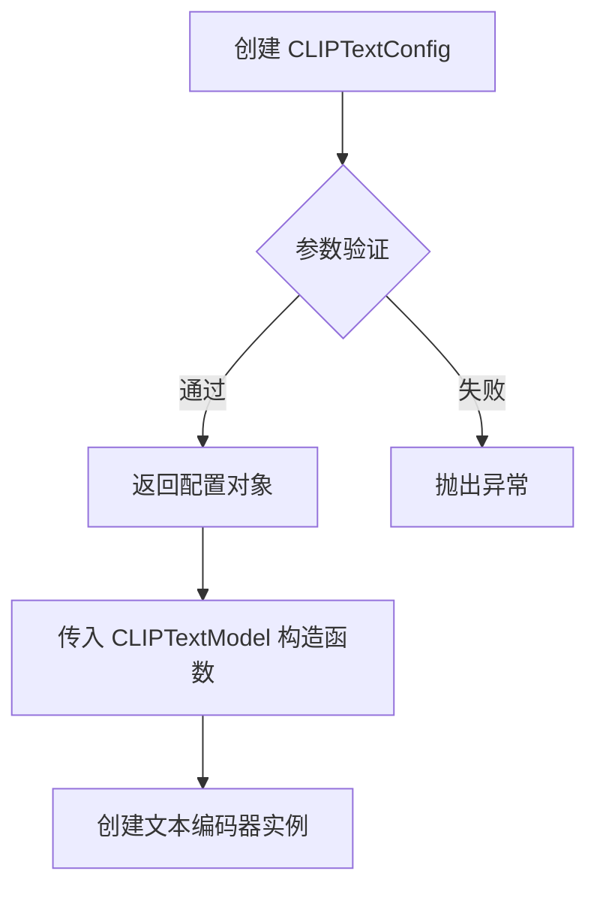

#### 带注释源码

```python
# 在测试代码中的使用方式
torch.manual_seed(0)
text_encoder = CLIPTextModel(
    CLIPTextConfig(
        bos_token_id=0,           # 定义句子开始 token 的索引
        eos_token_id=2,           # 定义句子结束 token 的索引
        hidden_size=embedder_hidden_size,  # 隐藏层维度 (32)
        projection_dim=32,        # 投影层输出维度
        intermediate_size=37,     # Transformer 前馈层中间维度
        layer_norm_eps=1e-05,     # LayerNorm 数值稳定性参数
        num_attention_heads=4,    # 注意力头数量
        num_hidden_layers=5,     # 编码器层数
        pad_token_id=1,           # 填充 token 的索引
        vocab_size=1000,          # 词汇表大小
    )
)
```

#### 附加说明

`CLIPTextConfig` 是来自 `transformers` 库的配置类，不是在此代码仓库中定义的。在该测试文件中，它的作用是：

1. **创建测试组件**：通过提供特定参数创建一个轻量级的文本编码器配置
2. **隔离测试**：使用虚拟组件而非真实预训练模型，确保测试的可重复性和速度
3. **流水线集成**：配置对象作为 `StableUnCLIPImg2ImgPipeline` 的组件之一，参与整个图像生成流程


### `CLIPTextModel`

在代码中，`CLIPTextModel` 是从 `transformers` 库导入的文本编码器类，用于将文本提示转换为嵌入向量。在 `get_dummy_components` 方法中，它被实例化为 `text_encoder` 组件，用于 Stable UnCLIP 图像到图像 pipeline 的文本编码任务。

参数：

- `config`：`CLIPTextConfig`，CLIP 文本模型的配置对象，包含模型架构参数

返回值：`CLIPTextModel`，返回配置好的 CLIP 文本模型实例

#### 流程图

```mermaid
graph TD
    A[开始创建 CLIPTextModel] --> B[创建 CLIPTextConfig 配置对象]
    B --> C[设置 bos_token_id=0]
    B --> D[设置 eos_token_id=2]
    B --> E[设置 hidden_size=32]
    B --> F[设置 projection_dim=32]
    B --> G[设置 intermediate_size=37]
    B --> H[设置 layer_norm_eps=1e-05]
    B --> I[设置 num_attention_heads=4]
    B --> J[设置 num_hidden_layers=5]
    B --> K[设置 pad_token_id=1]
    B --> L[设置 vocab_size=1000]
    C --> M[调用 CLIPTextModel(config)]
    M --> N[返回 CLIPTextModel 实例]
    N --> O[设置模型为 eval 模式]
```

#### 带注释源码

```python
# 从 transformers 库导入 CLIPTextModel 和 CLIPTextConfig
from transformers import (
    CLIPImageProcessor,
    CLIPTextConfig,
    CLIPTextModel,  # 文本编码器类，用于将文本转换为嵌入向量
    CLIPTokenizer,
    CLIPVisionConfig,
    CLIPVisionModelWithProjection,
)

# 在 get_dummy_components 方法中创建 text_encoder
torch.manual_seed(0)  # 设置随机种子以确保可重复性
text_encoder = CLIPTextModel(
    CLIPTextConfig(
        bos_token_id=0,           # 序列开始标记的 ID
        eos_token_id=2,           # 序列结束标记的 ID
        hidden_size=32,           # 隐藏层维度大小
        projection_dim=32,        # 投影层输出维度
        intermediate_size=37,     # FFN 中间层维度
        layer_norm_eps=1e-05,     # LayerNorm 的 epsilon 值
        num_attention_heads=4,   # 注意力头数量
        num_hidden_layers=5,     # Transformer 隐藏层数量
        pad_token_id=1,           # 填充标记的 ID
        vocab_size=1000,         # 词汇表大小
    )
)

# 将 text_encoder 添加到 components 字典中
components = {
    # ... 其他组件
    "text_encoder": text_encoder.eval(),  # 设置为评估模式
}

# 用途：在 StableUnCLIPImg2ImgPipeline 中用于编码文本提示
# 生成文本嵌入后传递给 UNet 进行条件去噪
```


### `CLIPTokenizer`

CLIPTokenizer 是来自 Hugging Face Transformers 库的一个类，用于将文本输入编码为模型可处理的 token ID 序列。在本代码中，它被用于对 Stable UnCLIP 图像生成 pipeline 的文本提示进行分词处理。

参数：

- `pretrained_model_name_or_path`：`str`，预训练 tokenizer 的模型名称或本地路径，本代码中传入 `"hf-internal-testing/tiny-random-clip"`
- `*args`：可变位置参数，传递给父类初始化器
- `**kwargs`：可变关键字参数，传递给父类初始化器（如 `cache_dir`、`device_map` 等）

返回值：`CLIPTokenizer`，返回一个 tokenizer 对象，包含词汇表、编码方法等，用于文本到 token ID 的转换

#### 流程图

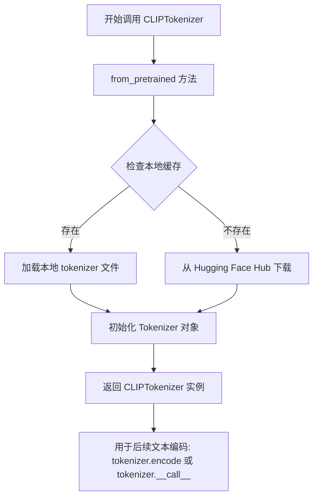

#### 带注释源码

```python
# 在 get_dummy_components 方法中创建 tokenizer
torch.manual_seed(0)  # 设置随机种子以确保可重复性
tokenizer = CLIPTokenizer.from_pretrained("hf-internal-testing/tiny-random-clip")

# CLIPTokenizer 的主要用途是将文本转换为 token ID
# 示例用法：
# prompt = "An anime racoon running a marathon"
# tokens = tokenizer(prompt, return_tensors="pt")
# # tokens = {'input_ids': tensor([[...]]), 'attention_mask': tensor([[...]])}
```


### `CLIPVisionConfig`

CLIPVisionConfig 是从 Hugging Face Transformers 库导入的配置类，用于定义 CLIP 视觉编码器的架构参数，如隐藏层维度、注意力头数、图像尺寸等。

参数：

- `hidden_size`：`int`，Transformer 隐藏层的维度大小
- `projection_dim`：`int`，投影层的输出维度，用于将图像特征映射到指定空间
- `num_hidden_layers`：`int`，Transformer 编码器中隐藏层的数量
- `num_attention_heads`：`int`，多头注意力机制中的注意力头数量
- `image_size`：`int`，输入图像的尺寸（高度和宽度）
- `intermediate_size`：`int`，前馈网络中中间层的维度
- `patch_size`：`int`，图像分块的大小，用于将图像划分为补丁

返回值：`CLIPVisionConfig`，返回 CLIP 视觉模型的配置对象，用于初始化 CLIPVisionModelWithProjection

#### 流程图

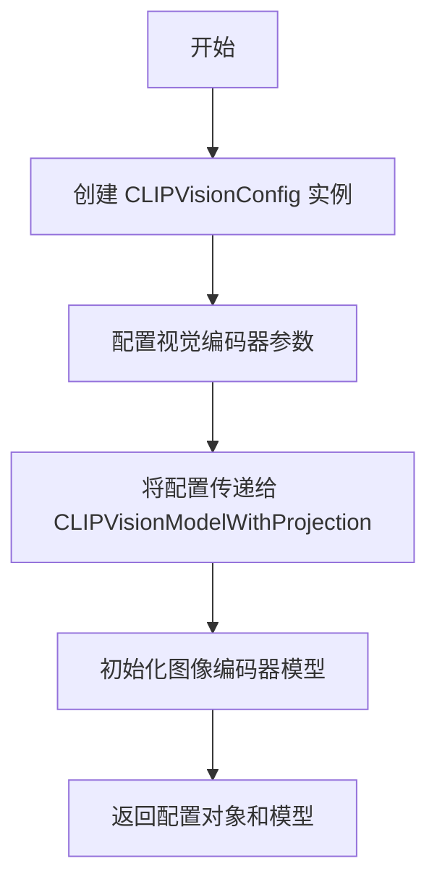

#### 带注释源码

```python
# 从 transformers 库导入 CLIPVisionConfig 配置类
from transformers import (
    CLIPImageProcessor,
    CLIPTextConfig,
    CLIPTextModel,
    CLIPTokenizer,
    CLIPVisionConfig,  # CLIP 视觉模型配置类
    CLIPVisionModelWithProjection,
)

# 在 get_dummy_components 方法中使用 CLIPVisionConfig
torch.manual_seed(0)
image_encoder = CLIPVisionModelWithProjection(
    CLIPVisionConfig(
        hidden_size=embedder_hidden_size,          # 隐藏层维度: 32
        projection_dim=embedder_projection_dim,   # 投影维度: 32
        num_hidden_layers=5,                       # 隐藏层数量: 5
        num_attention_heads=4,                     # 注意力头数: 4
        image_size=32,                             # 图像尺寸: 32x32
        intermediate_size=37,                      # 中间层维度: 37
        patch_size=1,                              # 补丁大小: 1
    )
)

# CLIPVisionConfig 的主要参数说明:
# - hidden_size: 控制模型表示能力的核心维度
# - projection_dim: 决定输出嵌入向量的维度
# - num_hidden_layers: 影响模型的深度和容量
# - num_attention_heads: 多头注意力的并行分支数
# - image_size: 输入图像的分辨率
# - intermediate_size: FFN 中间层维度,通常为 hidden_size 的 4 倍
# - patch_size: 视觉补丁化的大小,影响序列长度
```


### `CLIPVisionModelWithProjection`

该函数是 Hugging Face Transformers 库中的 CLIP 视觉编码器模型类，用于将输入图像编码为带有投影的图像嵌入向量（image_embeds），是 CLIP 多模态模型中处理视觉信息的核心组件。

参数：

- `config`：`CLIPVisionConfig`，CLIP 视觉模型的配置对象，包含隐藏层大小、投影维度、注意力头数、图像尺寸、中间层大小和补丁大小等参数

返回值：`CLIPVisionModelWithProjection`，返回实例化的 CLIP 视觉编码器模型对象，可调用以获得图像嵌入

#### 流程图

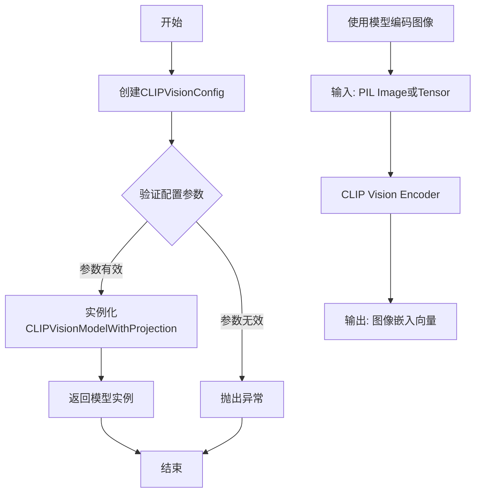

#### 带注释源码

```python
# 从transformers库导入CLIPVisionModelWithProjection类
# 这是CLIP模型的可视编码器，输出带投影的图像特征

# 在get_dummy_components方法中的使用示例:
torch.manual_seed(0)  # 设置随机种子以确保可重复性
image_encoder = CLIPVisionModelWithProjection(
    CLIPVisionConfig(
        hidden_size=embedder_hidden_size,          # 隐藏层大小 (32)
        projection_dim=embedder_projection_dim,   # 投影维度 (32)
        num_hidden_layers=5,                      # 隐藏层数量 (5)
        num_attention_heads=4,                    # 注意力头数量 (4)
        image_size=32,                            # 输入图像尺寸 (32x32)
        intermediate_size=37,                     # 中间层大小 (37)
        patch_size=1,                             # 补丁大小 (1)
    )
)

# image_encoder 是一个可调用的模型实例
# 调用方式: outputs = image_encoder(pixel_values)
# 返回: ImageEmbeddings 包含 image_embeds (投影后的图像嵌入)
```


### `AutoencoderKL`

AutoencoderKL 是一个从 diffusers 库导入的变分自编码器（VAE）类，用于将图像编码到潜在空间以及从潜在空间解码图像。在该测试代码中，它被实例化为 `vae` 组件，用于 StableUnCLIPImg2ImgPipeline 中的图像潜在表示处理。

参数：

- 该函数在代码中无显式参数调用，使用默认初始化

返回值：`AutoencoderKL` 实例，作为 VAE 组件用于图像的编码和解码

#### 流程图

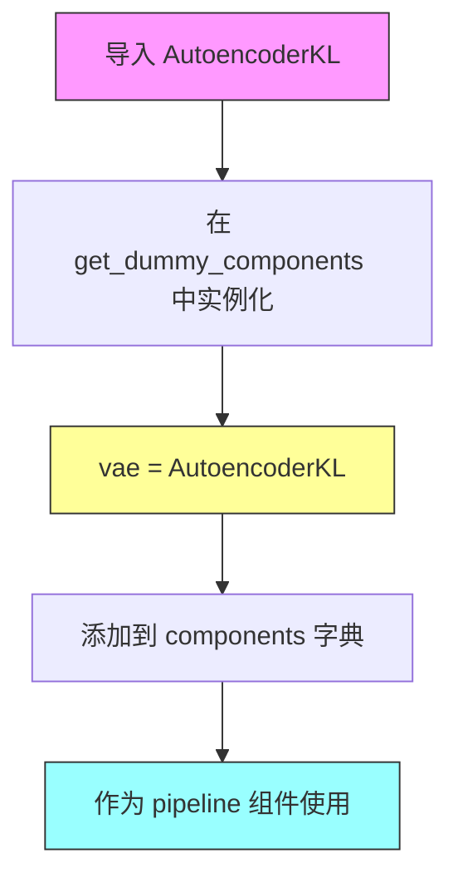

#### 带注释源码

```python
# 从 diffusers 库导入 AutoencoderKL 类
from diffusers import AutoencoderKL, DDIMScheduler, DDPMScheduler, StableUnCLIPImg2ImgPipeline, UNet2DConditionModel

# ... (在其他方法中)

def get_dummy_components(self):
    # ... (前面的组件设置)
    
    # 使用无参数方式实例化 AutoencoderKL
    # 这将创建默认配置的 VAE 模型
    torch.manual_seed(0)
    vae = AutoencoderKL()
    
    # 将 VAE 组件添加到组件字典中
    components = {
        # ... 其他组件
        "vae": vae.eval(),  # 设置为评估模式
    }
    
    return components
```

#### 补充信息

| 项目 | 描述 |
|------|------|
| **来源** | diffusers 库 |
| **用途** | 变分自编码器，用于图像的潜在空间编码/解码 |
| **在 Pipeline 中的角色** | 作为 StableUnCLIPImg2ImgPipeline 的核心组件之一 |
| **调用方式** | `AutoencoderKL()` 默认构造函数 |
| **模式** | 通过 `.eval()` 设置为评估模式 |


### `DDIMScheduler`

DDIMScheduler 是 diffusers 库中的调度器类，用于实现 Denoising Diffusion Implicit Models (DDIM) 采样算法。该调度器在 StableUnCLIPImg2ImgPipeline 中负责控制去噪过程，通过特定的噪声调度策略将噪声逐步去除，生成高质量的图像。

参数：

- `beta_schedule`：str，噪声调度表的类型，此处为 "scaled_linear"
- `beta_start`：float，噪声调度的起始beta值，此处为 0.00085
- `beta_end`：float，噪声调度的结束beta值，此处为 0.012
- `prediction_type`：str，预测类型，此处为 "v_prediction"（预测噪声的v值）
- `set_alpha_to_one`：bool，是否将最终alpha设为1，此处为 False
- `steps_offset`：int，步骤偏移量，此处为 1

返回值：`DDIMScheduler`，返回配置好的DDIM调度器实例，用于后续的图像去噪过程

#### 流程图

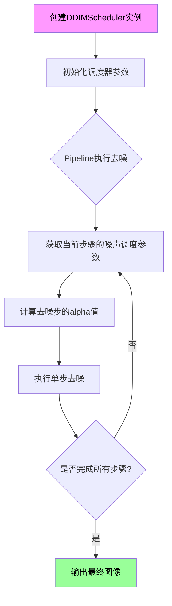

#### 带注释源码

```python
# 在 StableUnCLIPImg2ImgPipelineFastTests.get_dummy_components 方法中创建
torch.manual_seed(0)  # 设置随机种子以确保可重复性
scheduler = DDIMScheduler(
    # beta_schedule 定义噪声调度表的类型
    # "scaled_linear" 表示使用线性缩放的beta调度
    beta_schedule="scaled_linear",
    
    # beta_start 定义噪声调度的起始beta值
    # 较小的起始值意味着初始阶段噪声减少较慢
    beta_start=0.00085,
    
    # beta_end 定义噪声调度的结束beta值
    # 较大的结束值意味着最后阶段噪声减少更快
    beta_end=0.012,
    
    # prediction_type 指定模型预测的类型
    # "v_prediction" 表示模型预测噪声的v值（velocity）
    # 这是DDIM论文中推荐的预测方式
    prediction_type="v_prediction",
    
    # set_alpha_to_one 控制是否将最终alpha值设为1
    # False 允许更灵活的最后一步处理
    set_alpha_to_one=False,
    
    # steps_offset 用于调整去噪步骤的索引
    # 设为1使得步骤从1开始而非0
    steps_offset=1,
)

# 调度器被添加到components字典中
components = {
    # ... 其他组件
    "scheduler": scheduler,  # DDIM调度器用于控制去噪过程
}

# 该调度器在StableUnCLIPImg2ImgPipeline中使用
# 负责:
# 1. 生成去噪步骤的时间步
# 2. 计算每个步骤的alpha值
# 3. 执行DDIM采样算法进行图像重建
```


### DDPMScheduler

DDPMScheduler是diffusers库中的一个调度器类，用于在Diffusion模型中实现Denoising Diffusion Probabilistic Models (DDPM) 噪声调度。在该代码中，它被用作图像噪声调度器（image_noising_scheduler），用于对图像嵌入进行噪声处理，这是Stable UnCLIP图像生成流程的一部分。

参数：

- `beta_schedule`：字符串类型，指定Beta调度策略的类型，值为"squaredcos_cap_v2"，这是一种常用的余弦调度策略，用于控制噪声添加的衰减曲线

返回值：`DDPMScheduler`实例，返回一个配置好的DDPM噪声调度器对象，可用于对图像进行前向扩散过程（添加噪声）

#### 流程图

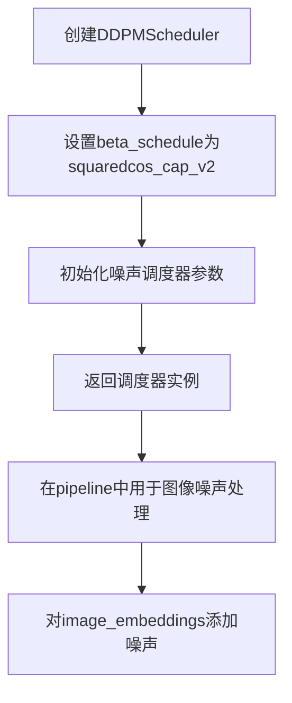

#### 带注释源码

```python
# 在 get_dummy_components 方法中创建 DDPMScheduler 实例
torch.manual_seed(0)
# DDPMScheduler: Denoising Diffusion Probabilistic Models 调度器
# beta_schedule="squaredcos_cap_v2": 使用余弦版本的平方调度策略
# 这种调度方式可以让噪声在早期快速衰减，后期缓慢衰减
# 有助于生成更高质量的图像
image_noising_scheduler = DDPMScheduler(beta_schedule="squaredcos_cap_v2")

# 将调度器添加到组件字典中
components = {
    # image encoding components
    "feature_extractor": feature_extractor,
    "image_encoder": image_encoder.eval(),
    # image noising components
    "image_normalizer": image_normalizer.eval(),
    "image_noising_scheduler": image_noising_scheduler,  # <-- DDPMScheduler实例
    # regular denoising components
    "tokenizer": tokenizer,
    "text_encoder": text_encoder.eval(),
    "unet": unet.eval(),
    "scheduler": scheduler,
    "vae": vae.eval(),
}
```


### `StableUnCLIPImg2ImgPipeline`

这是来自diffusers库的一个图像到图像转换pipeline，基于Stable UnCLIP架构，能够接收源图像和文本提示，生成与文本描述相符的目标图像变体。该pipeline集成了图像编码器、文本编码器、UNet去噪网络和VAE等核心组件，通过扩散模型实现高质量的图像转换任务。

#### 参数

由于`StableUnCLIPImg2ImgPipeline`的实际实现源码未在当前代码文件中给出（是从diffusers库导入的），以下参数信息基于测试代码中的调用方式推断：

- `image`：`Image` 或 `Union[ PIL.Image.Image, np.ndarray, torch.Tensor]`，输入的源图像
- `prompt`：`str` 或 `List[str]`，文本提示，描述期望生成的图像特征
- `generator`：`torch.Generator`，可选，用于控制随机性
- `num_inference_steps`：`int`，可选，扩散推理步数，默认为50
- `output_type`：`str`，可选，输出类型，如"np"返回numpy数组，"pil"返回PIL图像
- `image_embeds`：`torch.Tensor`，可选，预先计算的图像嵌入
- `torch_dtype`：`torch.dtype`，可选，模型权重的数据类型，如torch.float16

#### 返回值

- `output`：`PipelineOutput` 对象，包含生成的图像列表（`output.images`）

#### 流程图

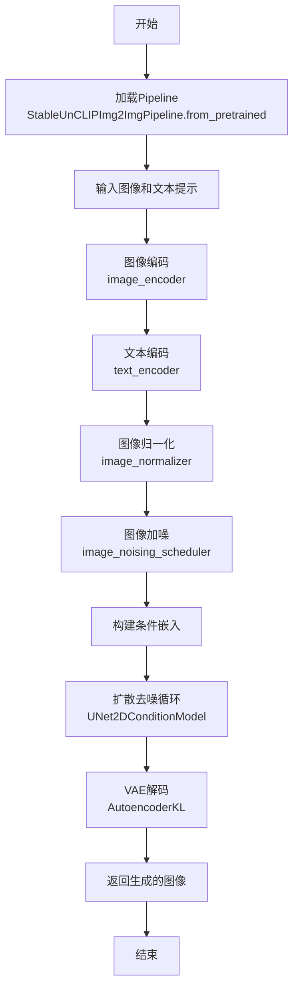

#### 带注释源码

```python
# 注意：以下源码是基于测试代码推断的StableUnCLIPImg2ImgPipeline的使用方式
# 实际的类定义来自diffusers库

# 从预训练模型加载pipeline
pipe = StableUnCLIPImg2ImgPipeline.from_pretrained(
    "fusing/stable-unclip-2-1-l-img2img",  # 模型名称或路径
    torch_dtype=torch.float16  # 使用半精度以节省显存
)

# 启用注意力切片以减少显存占用
pipe.enable_attention_slicing()

# 启用顺序CPU卸载以进一步节省显存
pipe.enable_sequential_cpu_offload()

# 准备随机数生成器
generator = torch.Generator(device="cpu").manual_seed(0)

# 调用pipeline进行图像转换
output = pipe(
    input_image,           # 输入图像
    "anime turtle",        # 文本提示
    generator=generator,   # 随机生成器
    output_type="np"       # 输出为numpy数组
)

# 获取生成的图像
image = output.images[0]
```

#### 关键组件信息

- **image_encoder (CLIPVisionModelWithProjection)**：将输入图像编码为视觉嵌入向量
- **text_encoder (CLIPTextModel)**：将文本提示编码为文本嵌入向量
- **unet (UNet2DConditionModel)**：核心扩散去噪网络，根据条件嵌入逐步去噪生成图像
- **vae (AutoencoderKL)**：变分自编码器，将潜在空间表示解码为实际图像
- **image_normalizer (StableUnCLIPImageNormalizer)**：对图像嵌入进行归一化处理
- **image_noising_scheduler (DDPMScheduler)**：负责向图像添加噪声的过程
- **scheduler (DDIMScheduler)**：控制扩散模型推理过程中的噪声调度

#### 潜在的技术债务或优化空间

1. **显存优化**：代码中已使用attention_slicing和sequential_cpu_offload，说明显存消耗是主要瓶颈，未来可考虑量化、剪枝等技术
2. **测试覆盖不完整**：代码中`image_params = frozenset([])`存在TO-DO注释，表明图像参数测试尚未完善
3. **xFormers依赖**：部分测试依赖xFormers库，限制了跨平台兼容性

#### 其它项目

- **设计目标**：实现基于Stable UnCLIP的图像到图像转换，支持文本引导的图像生成
- **错误处理**：测试代码中使用了`gc.collect()`和`backend_empty_cache()`进行显存管理，表明需要关注内存溢出问题
- **外部依赖**：依赖Hugging Face Transformers库和Diffusers库，需要确保模型文件正确下载
- **集成测试**：提供了夜间测试标记（`@nightly`），表明这些测试资源消耗较大，不适合常规CI流程


### `UNet2DConditionModel`

UNet2DConditionModel 是扩散模型中的核心去噪神经网络，负责根据时间步长和文本/图像条件信息逐步去除噪声，生成目标图像。在该测试代码中，它被实例化为一个用于Stable UnCLIP图像到图像转换 pipeline 的条件 UNet 模型。

参数：

- `sample_size`：`int`，输入样本的空间尺寸（高度和宽度），此处为 32
- `in_channels`：`int`，输入图像的通道数，此处为 4（对应潜在空间的通道数）
- `out_channels`：`int`，输出图像的通道数，此处为 4
- `down_block_types`：`Tuple[str, ...]`，下采样块的类型列表，包含 CrossAttnDownBlock2D 和 DownBlock2D
- `up_block_types`：`Tuple[str, ...]`，上采样块的类型列表，包含 UpBlock2D 和 CrossAttnUpBlock2D
- `block_out_channels`：`Tuple[int, ...]`，每个块的输出通道数，此处为 (32, 64)
- `attention_head_dim`：`Tuple[int, ...]`，注意力头的维度，此处为 (2, 4)
- `class_embed_type`：`str`，类别嵌入类型，此处为 "projection"，用于投影类别嵌入
- `projection_class_embeddings_input_dim`：`int`，投影类别嵌入的输入维度，此处为 embedder_projection_dim * 2
- `cross_attention_dim`：`int`，交叉注意力机制的维度，此处为 embedder_hidden_size (32)
- `layers_per_block`：`int`，每个块中的层数，此处为 1
- `upcast_attention`：`bool`，是否上cast注意力计算，此处为 True
- `use_linear_projection`：`bool`，是否使用线性投影，此处为 True

返回值：`UNet2DConditionModel` 实例，返回一个配置好的条件 UNet 模型对象

#### 流程图

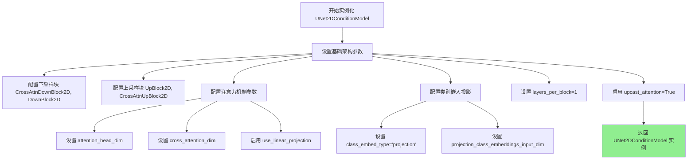

#### 带注释源码

```python
# 在 get_dummy_components 方法中实例化 UNet2DConditionModel
torch.manual_seed(0)  # 设置随机种子以确保可重复性
unet = UNet2DConditionModel(
    sample_size=32,  # 输入潜在空间的尺寸 32x32
    in_channels=4,   # 输入通道数（潜在空间通道）
    out_channels=4,  # 输出通道数
    # 下采样块类型：交叉注意力下采样块 + 标准下采样块
    down_block_types=("CrossAttnDownBlock2D", "DownBlock2D"),
    # 上采样块类型：标准上采样块 + 交叉注意力上采样块
    up_block_types=("UpBlock2D", "CrossAttnUpBlock2D"),
    # 各块的输出通道数：第一层32通道，第二层64通道
    block_out_channels=(32, 64),
    # 注意力头维度：下采样块2个头，上采样块4个头
    attention_head_dim=(2, 4),
    # 类别嵌入类型：使用投影方式嵌入类别信息
    class_embed_type="projection",
    # 投影类别嵌入的输入维度：图像嵌入维度的2倍（因为是噪声增强后的图像嵌入与原始图像嵌入拼接）
    projection_class_embeddings_input_dim=embedder_projection_dim * 2,
    # 交叉注意力维度：与文本/图像嵌入维度匹配
    cross_attention_dim=embedder_hidden_size,
    # 每个块包含的层数
    layers_per_block=1,
    # 是否上cast注意力计算以提高精度
    upcast_attention=True,
    # 是否使用线性投影（而非非线性投影）
    use_linear_projection=True,
)

# 将 UNet 添加到组件字典中
components = {
    # ... 其他组件（feature_extractor, image_encoder, tokenizer 等）
    "unet": unet.eval(),  # 设置为评估模式
}
```

#### 关键组件信息

| 组件名称 | 一句话描述 |
|---------|-----------|
| UNet2DConditionModel | 条件扩散模型的核心去噪网络，接收噪声潜在变量、时间步和条件嵌入，输出预测噪声 |
| StableUnCLIPImg2ImgPipeline | 完整的图像到图像转换 pipeline，整合图像编码、文本编码、UNet 去噪和 VAE 解码 |
| CLIPVisionModelWithProjection | 图像编码器，将输入图像转换为图像嵌入向量 |
| CLIPTextModel | 文本编码器，将文本提示转换为文本嵌入向量 |
| StableUnCLIPImageNormalizer | 图像嵌入的归一化处理模块 |
| AutoencoderKL | VAE 解码器，将潜在空间表示解码为最终图像 |

#### 潜在的技术债务或优化空间

1. **硬编码的配置参数**：UNet 的架构参数（如 block_out_channels、layers_per_block）硬编码在测试方法中，缺乏配置灵活性
2. **重复的 torch.manual_seed(0)**：代码中多次设置随机种子，可考虑提取为独立的辅助方法
3. **测试参数注释不完整**：image_params 和 image_latents_params 为空集合，注释标记为 TO-DO
4. **集成测试内存占用**：大型模型（stable-unclip-2-1-l/h）需要 7GB+ VRAM，当前通过 attention_slicing 和 cpu_offload 规避，并非最优解决方案

#### 其它项目

**设计目标与约束**：
- 测试目标：验证 StableUnCLIPImg2ImgPipeline 在不同配置下的图像生成正确性
- 约束条件：需要支持 CPU、CUDA、MPS 多种设备；集成测试仅在 CUDA 环境下运行

**错误处理与异常设计**：
- 使用 `@unittest.skip` 跳过不支持的测试场景（如 MPS 设备、XFormers 不可用时）
- 集成测试通过 `backend_empty_cache` 清理 VRAM 避免内存泄漏

**数据流与状态机**：
```
输入图像 → CLIPImageProcessor → CLIPVisionModelWithProjection → 图像嵌入
                                              ↓
                                         StableUnCLIPImageNormalizer（归一化）
                                              ↓
                                    DDPMScheduler（添加噪声）
                                              ↓
文本提示 → CLIPTokenizer → CLIPTextModel → 文本嵌入
                                              ↓
                      ┌─────────────────────────┼─────────────────────────┐
                      ↓                         ↓                         ↓
              UNet2DConditionModel ← 时间步 t → 预测噪声
                      ↓
                 噪声残差 → DDIMScheduler（调度）→ 逐步去噪
                      ↓
                 去噪潜在变量 → AutoencoderKL → 输出图像
```

**外部依赖与接口契约**：
- 依赖 `diffusers` 库：UNet2DConditionModel、StableUnCLIPImg2ImgPipeline、DDIMScheduler、DDPMScheduler、AutoencoderKL
- 依赖 `transformers` 库：CLIPTextModel、CLIPTokenizer、CLIPVisionModelWithProjection
- 依赖测试工具：testing_utils 中的随机种子控制、内存监控工具


### `StableUnCLIPImg2ImgPipeline`

这是Stable UnCLIP图像到图像（img2img）扩散管道的测试代码，用于测试如何将输入图像通过Stable UnCLIP模型进行图像变体生成，包括单元测试和集成测试。

#### 流程图

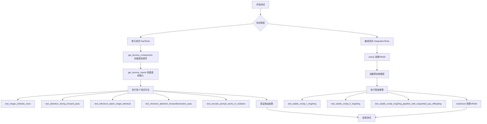

#### 带注释源码

```python
import gc
import random
import unittest

import numpy as np
import torch
from transformers import (
    CLIPImageProcessor,
    CLIPTextConfig,
    CLIPTextModel,
    CLIPTokenizer,
    CLIPVisionConfig,
    CLIPVisionModelWithProjection,
)

from diffusers import AutoencoderKL, DDIMScheduler, DDPMScheduler, StableUnCLIPImg2ImgPipeline, UNet2DConditionModel
from diffusers.pipelines.pipeline_utils import DiffusionPipeline
from diffusers.pipelines.stable_diffusion.stable_unclip_image_normalizer import StableUnCLIPImageNormalizer
from diffusers.utils.import_utils import is_xformers_available

# 导入测试工具函数
from ...testing_utils import (
    backend_empty_cache,
    backend_max_memory_allocated,
    backend_reset_max_memory_allocated,
    backend_reset_peak_memory_stats,
    enable_full_determinism,
    floats_tensor,
    load_image,
    load_numpy,
    nightly,
    require_torch_accelerator,
    skip_mps,
    torch_device,
)
# 导入管道参数和通用测试Mixin
from ..pipeline_params import TEXT_GUIDED_IMAGE_VARIATION_BATCH_PARAMS, TEXT_GUIDED_IMAGE_VARIATION_PARAMS
from ..test_pipelines_common import (
    PipelineKarrasSchedulerTesterMixin,
    PipelineLatentTesterMixin,
    PipelineTesterMixin,
    assert_mean_pixel_difference,
)

# 启用完全确定性以确保测试可重复性
enable_full_determinism()


class StableUnCLIPImg2ImgPipelineFastTests(
    PipelineLatentTesterMixin, PipelineKarrasSchedulerTesterMixin, PipelineTesterMixin, unittest.TestCase
):
    """Stable UnCLIP图像到图像管道的快速单元测试类"""
    pipeline_class = StableUnCLIPImg2ImgPipeline
    params = TEXT_GUIDED_IMAGE_VARIATION_PARAMS
    batch_params = TEXT_GUIDED_IMAGE_VARIATION_BATCH_PARAMS
    image_params = frozenset([])
    image_latents_params = frozenset([])
    supports_dduf = False

    def get_dummy_components(self):
        """创建虚拟组件用于测试"""
        embedder_hidden_size = 32
        embedder_projection_dim = embedder_hidden_size

        # 图像编码组件 - 特征提取器
        feature_extractor = CLIPImageProcessor(crop_size=32, size=32)

        # 图像编码器 - CLIP视觉模型
        torch.manual_seed(0)
        image_encoder = CLIPVisionModelWithProjection(
            CLIPVisionConfig(
                hidden_size=embedder_hidden_size,
                projection_dim=embedder_projection_dim,
                num_hidden_layers=5,
                num_attention_heads=4,
                image_size=32,
                intermediate_size=37,
                patch_size=1,
            )
        )

        # 图像标准化和噪声调度器
        torch.manual_seed(0)
        image_normalizer = StableUnCLIPImageNormalizer(embedding_dim=embedder_hidden_size)
        image_noising_scheduler = DDPMScheduler(beta_schedule="squaredcos_cap_v2")

        # 文本编码组件
        torch.manual_seed(0)
        tokenizer = CLIPTokenizer.from_pretrained("hf-internal-testing/tiny-random-clip")

        torch.manual_seed(0)
        text_encoder = CLIPTextModel(
            CLIPTextConfig(
                bos_token_id=0,
                eos_token_id=2,
                hidden_size=embedder_hidden_size,
                projection_dim=32,
                intermediate_size=37,
                layer_norm_eps=1e-05,
                num_attention_heads=4,
                num_hidden_layers=5,
                pad_token_id=1,
                vocab_size=1000,
            )
        )

        # UNet去噪模型
        torch.manual_seed(0)
        unet = UNet2DConditionModel(
            sample_size=32,
            in_channels=4,
            out_channels=4,
            down_block_types=("CrossAttnDownBlock2D", "DownBlock2D"),
            up_block_types=("UpBlock2D", "CrossAttnUpBlock2D"),
            block_out_channels=(32, 64),
            attention_head_dim=(2, 4),
            class_embed_type="projection",
            projection_class_embeddings_input_dim=embedder_projection_dim * 2,
            cross_attention_dim=embedder_hidden_size,
            layers_per_block=1,
            upcast_attention=True,
            use_linear_projection=True,
        )

        # DDIM调度器
        torch.manual_seed(0)
        scheduler = DDIMScheduler(
            beta_schedule="scaled_linear",
            beta_start=0.00085,
            beta_end=0.012,
            prediction_type="v_prediction",
            set_alpha_to_one=False,
            steps_offset=1,
        )

        # VAE模型
        torch.manual_seed(0)
        vae = AutoencoderKL()

        # 组装所有组件
        components = {
            "feature_extractor": feature_extractor,
            "image_encoder": image_encoder.eval(),
            "image_normalizer": image_normalizer.eval(),
            "image_noising_scheduler": image_noising_scheduler,
            "tokenizer": tokenizer,
            "text_encoder": text_encoder.eval(),
            "unet": unet.eval(),
            "scheduler": scheduler,
            "vae": vae.eval(),
        }

        return components

    def get_dummy_inputs(self, device, seed=0, pil_image=True):
        """创建虚拟输入用于测试"""
        # 根据设备创建随机数生成器
        if str(device).startswith("mps"):
            generator = torch.manual_seed(seed)
        else:
            generator = torch.Generator(device=device).manual_seed(seed)

        # 创建随机输入图像
        input_image = floats_tensor((1, 3, 32, 32), rng=random.Random(seed)).to(device)

        # 转换为PIL图像格式
        if pil_image:
            input_image = input_image * 0.5 + 0.5
            input_image = input_image.clamp(0, 1)
            input_image = input_image.cpu().permute(0, 2, 3, 1).float().numpy()
            input_image = DiffusionPipeline.numpy_to_pil(input_image)[0]

        return {
            "prompt": "An anime racoon running a marathon",
            "image": input_image,
            "generator": generator,
            "num_inference_steps": 2,
            "output_type": "np",
        }

    @skip_mps
    def test_image_embeds_none(self):
        """测试当image_embeds为None时的行为"""
        device = "cpu"
        components = self.get_dummy_components()
        sd_pipe = StableUnCLIPImg2ImgPipeline(**components)
        sd_pipe = sd_pipe.to(device)
        sd_pipe.set_progress_bar_config(disable=None)

        inputs = self.get_dummy_inputs(device)
        inputs.update({"image_embeds": None})
        image = sd_pipe(**inputs).images
        image_slice = image[0, -3:, -3:, -1]

        assert image.shape == (1, 32, 32, 3)
        expected_slice = np.array([0.4397, 0.7080, 0.5590, 0.4255, 0.7181, 0.5938, 0.4051, 0.3720, 0.5116])

        assert np.abs(image_slice.flatten() - expected_slice).max() < 1e-3

    def test_attention_slicing_forward_pass(self):
        """测试注意力切片前向传播"""
        test_max_difference = torch_device in ["cpu", "mps"]
        self._test_attention_slicing_forward_pass(test_max_difference=test_max_difference)

    def test_inference_batch_single_identical(self):
        """测试单样本批处理推理一致性"""
        self._test_inference_batch_single_identical(expected_max_diff=1e-3)

    @unittest.skipIf(
        torch_device != "cuda" or not is_xformers_available(),
        reason="XFormers attention is only available with CUDA and `xformers` installed",
    )
    def test_xformers_attention_forwardGenerator_pass(self):
        """测试XFormers注意力前向传播"""
        self._test_xformers_attention_forwardGenerator_pass(test_max_difference=False)

    @unittest.skip("Test not supported at the moment.")
    def test_encode_prompt_works_in_isolation(self):
        """测试提示编码隔离（当前不支持）"""
        pass


@nightly
@require_torch_accelerator
class StableUnCLIPImg2ImgPipelineIntegrationTests(unittest.TestCase):
    """Stable UnCLIP图像到图像管道的集成测试类"""

    def setUp(self):
        """每个测试前清理VRAM"""
        super().setUp()
        gc.collect()
        backend_empty_cache(torch_device)

    def tearDown(self):
        """每个测试后清理VRAM"""
        super().tearDown()
        gc.collect()
        backend_empty_cache(torch_device)

    def test_stable_unclip_l_img2img(self):
        """测试Stable UnCLIP L模型图像到图像生成"""
        input_image = load_image(
            "https://huggingface.co/datasets/hf-internal-testing/diffusers-images/resolve/main/stable_unclip/turtle.png"
        )

        expected_image = load_numpy(
            "https://huggingface.co/datasets/hf-internal-testing/diffusers-images/resolve/main/stable_unclip/stable_unclip_2_1_l_img2img_anime_turtle_fp16.npy"
        )

        pipe = StableUnCLIPImg2ImgPipeline.from_pretrained(
            "fusing/stable-unclip-2-1-l-img2img", torch_dtype=torch.float16
        )
        pipe.set_progress_bar_config(disable=None)
        # 启用内存优化
        pipe.enable_attention_slicing()
        pipe.enable_sequential_cpu_offload()

        generator = torch.Generator(device="cpu").manual_seed(0)
        output = pipe(input_image, "anime turtle", generator=generator, output_type="np")

        image = output.images[0]

        assert image.shape == (768, 768, 3)
        assert_mean_pixel_difference(image, expected_image)

    def test_stable_unclip_h_img2img(self):
        """测试Stable UnCLIP H模型图像到图像生成"""
        input_image = load_image(
            "https://huggingface.co/datasets/hf-internal-testing/diffusers-images/resolve/main/stable_unclip/turtle.png"
        )

        expected_image = load_numpy(
            "https://huggingface.co/datasets/hf-internal-testing/diffusers-images/resolve/main/stable_unclip/stable_unclip_2_1_h_img2img_anime_turtle_fp16.npy"
        )

        pipe = StableUnCLIPImg2ImgPipeline.from_pretrained(
            "fusing/stable-unclip-2-1-h-img2img", torch_dtype=torch.float16
        )
        pipe.set_progress_bar_config(disable=None)
        pipe.enable_attention_slicing()
        pipe.enable_sequential_cpu_offload()

        generator = torch.Generator(device="cpu").manual_seed(0)
        output = pipe(input_image, "anime turtle", generator=generator, output_type="np")

        image = output.images[0]

        assert image.shape == (768, 768, 3)
        assert_mean_pixel_difference(image, expected_image)

    def test_stable_unclip_img2img_pipeline_with_sequential_cpu_offloading(self):
        """测试顺序CPU卸载下的内存使用"""
        input_image = load_image(
            "https://huggingface.co/datasets/hf-internal-testing/diffusers-images/resolve/main/stable_unclip/turtle.png"
        )

        backend_empty_cache(torch_device)
        backend_reset_max_memory_allocated(torch_device)
        backend_reset_peak_memory_stats(torch_device)

        pipe = StableUnCLIPImg2ImgPipeline.from_pretrained(
            "fusing/stable-unclip-2-1-h-img2img", torch_dtype=torch.float16
        )
        pipe.set_progress_bar_config(disable=None)
        pipe.enable_attention_slicing()
        pipe.enable_sequential_cpu_offload()

        _ = pipe(
            input_image,
            "anime turtle",
            num_inference_steps=2,
            output_type="np",
        )

        mem_bytes = backend_max_memory_allocated(torch_device)
        # 验证内存使用小于7GB
        assert mem_bytes < 7 * 10**9
```


### `StableUnCLIPImageNormalizer`

这是一个用于 Stable UnCLIP 图像管道的图像嵌入标准化器，负责对图像嵌入进行归一化处理，以便于后续的去噪过程。

参数：

- `embedding_dim`：`int`，嵌入向量的维度大小

返回值：`torch.Tensor`，返回归一化后的图像嵌入向量

#### 流程图

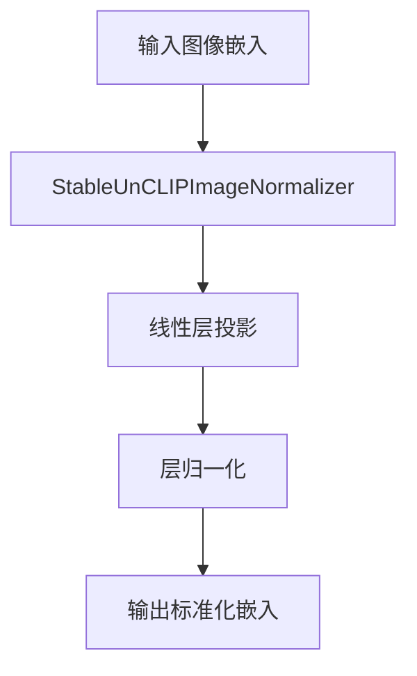

#### 带注释源码

```python
# StableUnCLIPImageNormalizer 类
# 来源: diffusers.pipelines.stable_diffusion.stable_unclip_image_normalizer
# 这是一个图像嵌入标准化器，用于 Stable UnCLIP 图像生成管道

# 从代码中的使用方式推断的实现：
image_normalizer = StableUnCLIPImageNormalizer(embedding_dim=embedder_hidden_size)

# 参数说明：
# embedding_dim: 32 - 输入嵌入的维度
# 该类通常包含：
# 1. 一个线性层用于投影
# 2. 层归一化(LayerNorm)用于标准化嵌入向量
# 3. forward 方法接受图像嵌入并返回标准化后的嵌入
```

---

**注意**：提供的代码片段仅包含测试文件，未包含 `StableUnCLIPImageNormalizer` 类的完整实现源码。该类是从 `diffusers.pipelines.stable_diffusion.stable_unclip_image_normalizer` 模块导入的。如需查看完整的类实现，建议查阅 diffusers 库的源文件。


### `backend_empty_cache`

该函数用于清理指定计算设备（GPU）的缓存内存，释放VRAM空间，通常在测试开始前或结束后调用以确保干净的测试环境。

参数：

-  `device`：字符串类型，表示计算设备标识（如 "cuda"、"cpu"、"mps" 等）

返回值：无返回值

#### 流程图

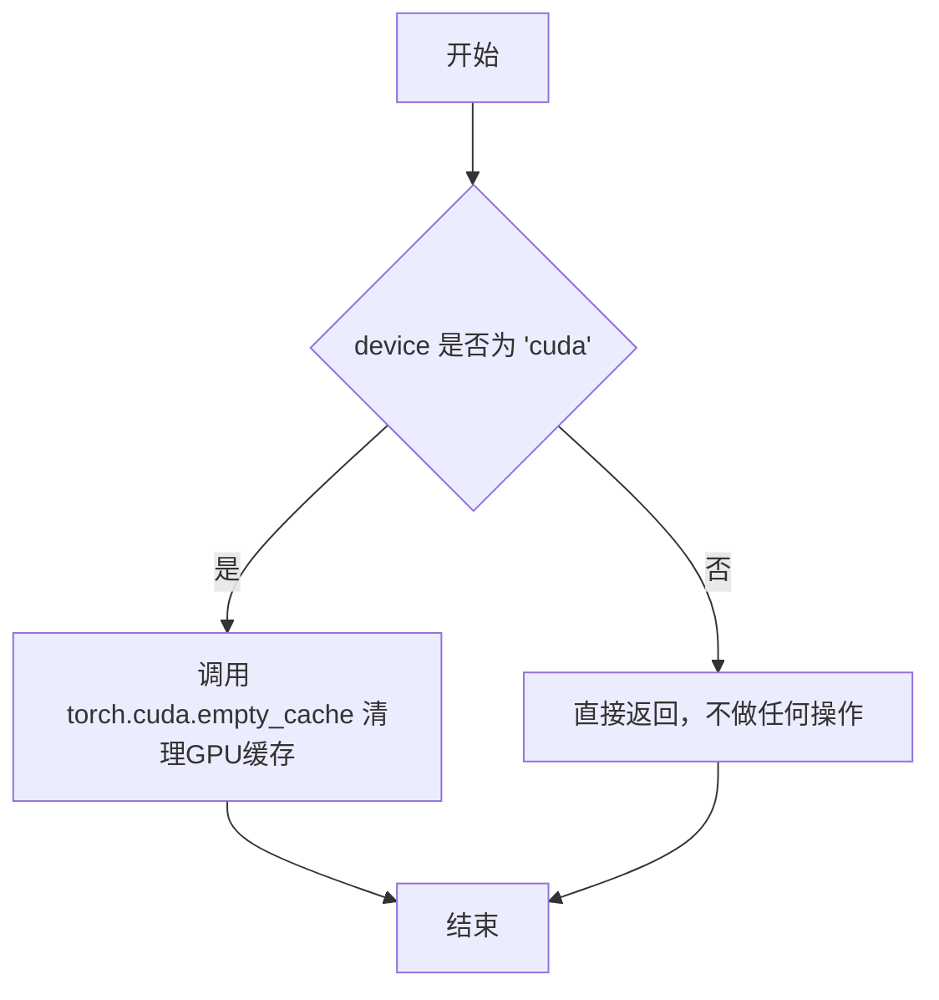

#### 带注释源码

```
def backend_empty_cache(device):
    """
    清理指定设备的缓存内存。
    
    该函数根据传入的设备类型执行不同的缓存清理操作。
    主要用于在测试开始前/后清理GPU显存，避免OOM问题。
    
    参数:
        device (str): 设备标识符，常见值包括:
            - "cuda": NVIDIA GPU设备
            - "cpu": 中央处理器
            - "mps": Apple Silicon GPU (Metal Performance Shaders)
    
    返回值:
        None: 该函数不返回任何值
    """
    # 检查是否为CUDA设备
    if device == "cuda":
        # 调用PyTorch的CUDA缓存清理函数
        # 释放GPU缓存中的未使用显存
        torch.cuda.empty_cache()
    
    # 对于非CUDA设备（如CPU、MPS），当前实现不做任何操作
    # 这些后端的缓存管理机制不同或不需要手动清理
```

> **注意**：该函数定义位于 `testing_utils` 模块中，通过导入语句引入使用。从代码中的调用模式 `backend_empty_cache(torch_device)` 可见，传入的参数是全局设备变量 `torch_device`。


### `backend_max_memory_allocated`

获取指定 PyTorch 设备上后端框架已分配的最大内存量（以字节为单位），常用于内存峰值监控和内存泄漏检测。

参数：

- `torch_device`：`str`，表示 PyTorch 设备标识符（如 "cuda"、"cpu"、"mps" 等）

返回值：`int` 或 `int64`，返回自上次重置内存统计以来该设备上 PyTorch 框架所分配的最大内存字节数。

#### 流程图

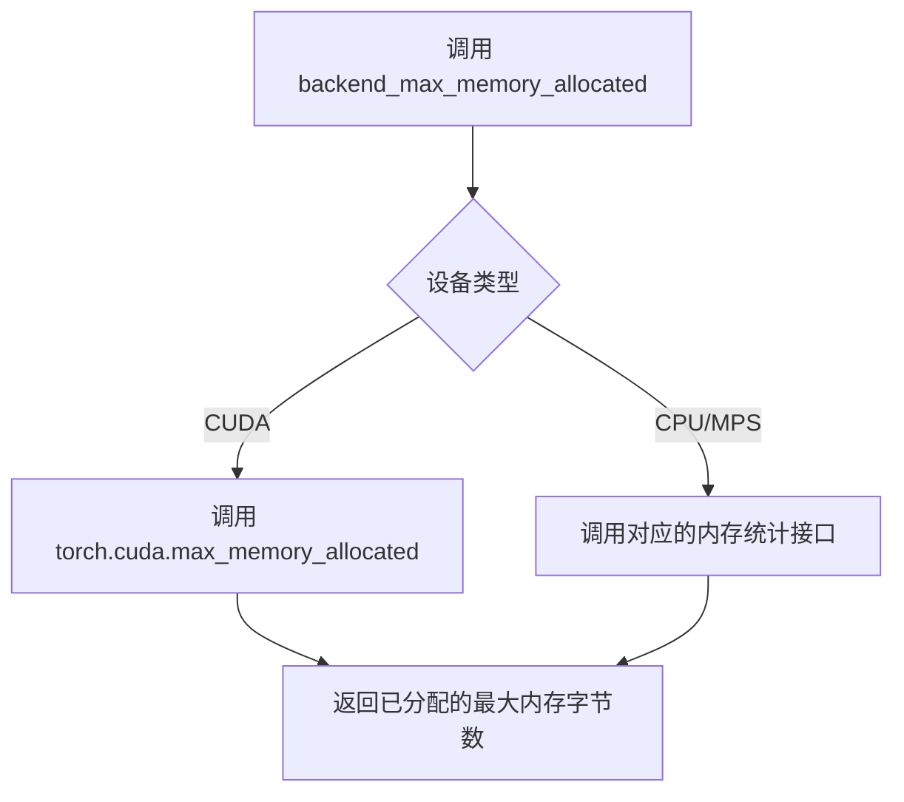

#### 带注释源码

```
# 声明于: ...testing_utils (外部模块)
# 使用场景: 在 test_stable_unclip_img2img_pipeline_with_sequential_cpu_offloading 中
#           用于检测 GPU 内存使用是否超过预期阈值

# 函数签名（推断）:
def backend_max_memory_allocated(device: str) -> int:
    """
    获取指定设备上后端框架已分配的最大内存量。
    
    参数:
        device: PyTorch 设备标识符字符串，如 "cuda", "cpu", "mps"
        
    返回:
        自上次重置内存统计以来，该设备上框架分配的最大内存字节数
    """
    # 具体实现取决于后端框架（PyTorch/CUDA）
    # 对于 CUDA 设备，内部可能调用: torch.cuda.max_memory_allocated(device)
    # 对于 CPU 设备，可能返回 0 或调用其他内存统计接口
    pass

# 实际使用示例:
backend_reset_max_memory_allocated(torch_device)  # 重置内存统计
# ... 执行 pipeline 操作 ...
mem_bytes = backend_max_memory_allocated(torch_device)  # 获取峰值内存
assert mem_bytes < 7 * 10**9  # 验证内存使用 < 7GB
```

#### 备注

该函数是测试框架中的内存监控工具函数，位于 `...testing_utils` 模块中。它需要与 `backend_reset_max_memory_allocated` 和 `backend_reset_peak_memory_stats` 配合使用，以实现准确的内存峰值测量。


### `backend_reset_max_memory_allocated`

该函数用于重置指定计算设备的最大内存分配计数器，通常在性能测试中用于清零内存统计以便精确测量后续操作的内存使用情况。

参数：

- `device`：`str` 或 `torch.device`，计算设备标识（如 "cuda", "cpu", "cuda:0" 等）

返回值：`None`，无返回值（该函数仅执行重置操作）

#### 流程图

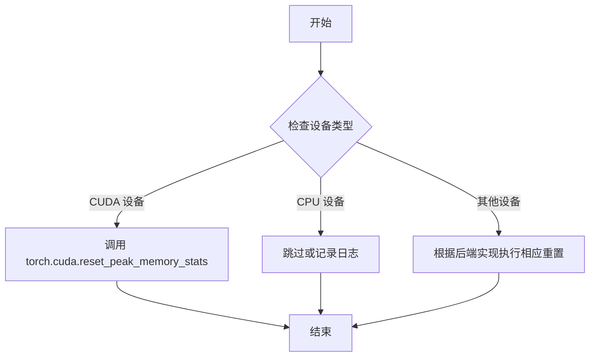

#### 带注释源码

```
# 从 testing_utils 模块导入
# 注意：实际定义不在当前代码文件中，在 .../testing_utils.py 中
from ...testing_utils import (
    backend_empty_cache,
    backend_max_memory_allocated,
    backend_reset_max_memory_allocated,  # <-- 目标函数
    backend_reset_peak_memory_stats,
    ...
)

# 使用示例（来自 test_stable_unclip_img2img_pipeline_with_sequential_cpu_offloading 方法）
def test_stable_unclip_img2img_pipeline_with_sequential_cpu_offloading(self):
    input_image = load_image(...)
    
    # 清空缓存
    backend_empty_cache(torch_device)
    # 重置最大内存分配统计
    backend_reset_max_memory_allocated(torch_device)
    # 重置峰值内存统计
    backend_reset_peak_memory_stats(torch_device)
    
    # ... 执行管道推理 ...
    
    # 获取推理后分配的内存
    mem_bytes = backend_max_memory_allocated(torch_device)
    # 验证内存使用小于 7GB
    assert mem_bytes < 7 * 10**9
```

---

**注意**：由于 `backend_reset_max_memory_allocated` 函数的实际实现位于 `testing_utils` 模块中（当前代码仅展示导入和使用部分），其具体内部实现需要查看 `testing_utils.py` 文件。根据函数命名和调用方式推测，它应该是一个跨后端的内存统计重置工具，底层可能调用 `torch.cuda.reset_peak_memory_stats()` 或对应的后端特定 API。


### `backend_reset_peak_memory_stats`

该函数用于重置指定设备（torch_device）的峰值内存统计信息，通常在内存性能测试开始前调用，以获取准确的内存使用数据。

参数：

- `device`：`str`，表示目标设备（如 "cuda", "cpu", "mps" 等），用于指定需要重置峰值内存统计的设备。

返回值：`None` 或 `any`，重置操作通常不返回有意义的值，调用此函数主要为了重置内部峰值内存计数器。

#### 流程图

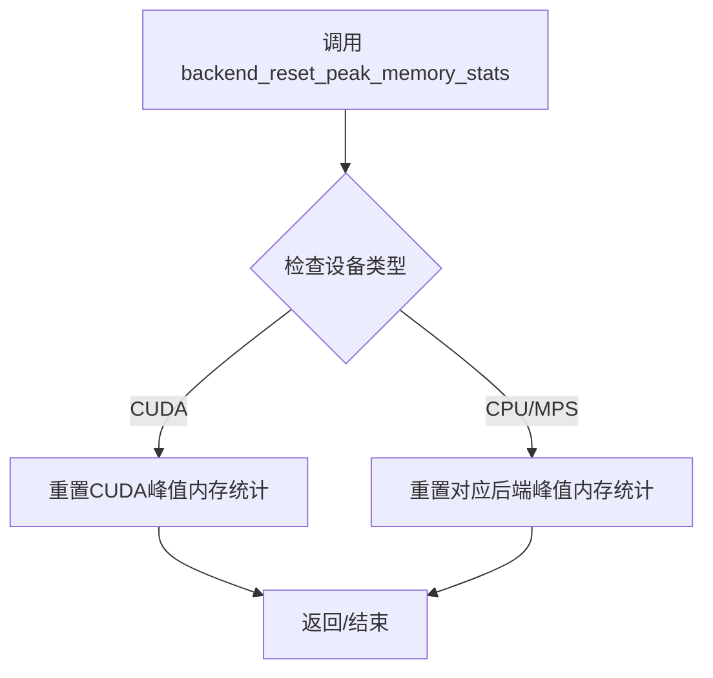

#### 带注释源码

```python
# 该函数定义位于 testing_utils 模块中，此处为根据使用方式的推断
# 在测试文件中，该函数被以下方式调用：

backend_reset_peak_memory_stats(torch_device)

# 实际使用场景：
# 在 test_stable_unclip_img2img_pipeline_with_sequential_cpu_offloading 测试中
# 首先清空缓存并重置内存统计：

backend_empty_cache(torch_device)
backend_reset_max_memory_allocated(torch_device)
backend_reset_peak_memory_stats(torch_device)  # 重置峰值内存统计

# 然后执行管道推理：
pipe = StableUnCLIPImg2ImgPipeline.from_pretrained(...)
_ = pipe(input_image, "anime turtle", num_inference_steps=2, output_type="np")

# 推理完成后，获取峰值内存使用量：
mem_bytes = backend_max_memory_allocated(torch_device)
```

**注意**：由于该函数定义在 `...testing_utils` 模块中（相对路径导入），实际的函数定义不在当前代码文件中。上述信息是根据函数在代码中的**调用方式**和**使用上下文**推断得出的。


### `enable_full_determinism`

该函数用于启用 PyTorch 的完全确定性模式，以确保测试或推理过程的可重复性。它通过设置随机种子和环境变量来实现跨平台的一致性结果。

参数：
- 该函数无参数

返回值：`None`，无返回值

#### 流程图

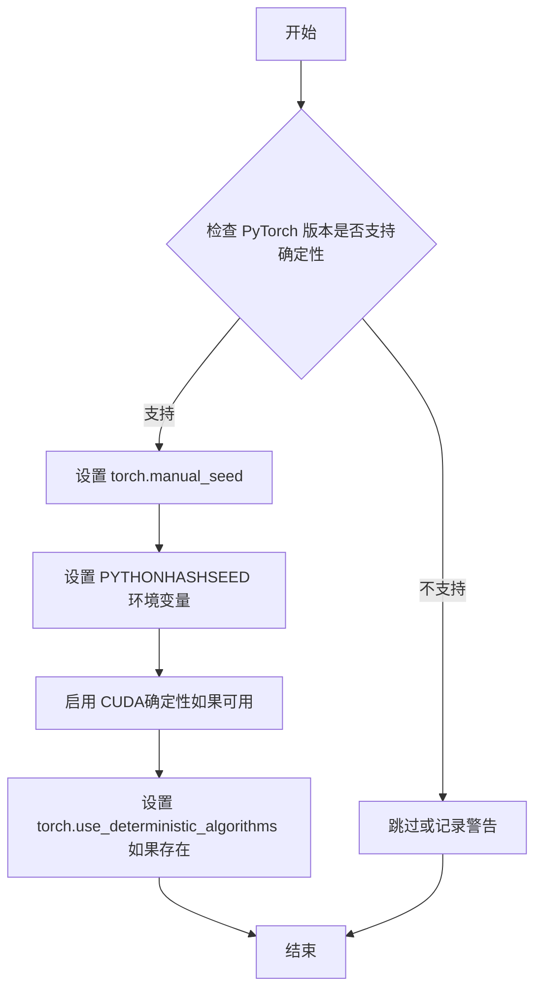

#### 带注释源码

```
# enable_full_determinism 是从 testing_utils 模块导入的函数
# 以下为基于其用途的推测实现

def enable_full_determinism(seed: int = 0):
    """
    启用完全确定性模式以确保测试的可重复性。
    
    参数:
        seed: 随机种子，默认为 0
    """
    # 设置 Python 哈希种子以确保哈希操作的一致性
    import os
    os.environ["PYTHONHASHSEED"] = str(seed)
    
    # 导入 torch
    import torch
    
    # 设置 PyTorch 全局随机种子
    torch.manual_seed(seed)
    torch.cuda.manual_seed_all(seed)
    
    # 如果可用，启用确定性算法
    if hasattr(torch, 'use_deterministic_algorithms'):
        try:
            torch.use_deterministic_algorithms(True)
        except Exception:
            pass
    
    # 设置 CUDA 卷积算法为 deterministic（如果支持）
    if torch.cuda.is_available():
        torch.backends.cudnn.deterministic = True
        torch.backends.cudnn.benchmark = False

# 在代码中的调用位置
enable_full_determinism()
```

> **注意**：由于 `enable_full_determinism` 是从外部模块 `...testing_utils` 导入的，上述源码为基于其功能的推测实现。实际实现可能略有差异，建议查看 `testing_utils` 模块的源码以获取准确信息。


### `floats_tensor`

该函数是一个测试工具函数，用于生成指定形状的随机浮点数 PyTorch 张量，常用于测试场景中创建模拟输入数据。

参数：

- `shape`：`tuple` 或 `list of ints`，张量的形状，如 `(1, 3, 32, 32)`
- `rng`：`random.Random`，Python 随机数生成器实例，用于生成随机数据

返回值：`torch.Tensor`，返回包含随机浮点数的 PyTorch 张量

#### 流程图

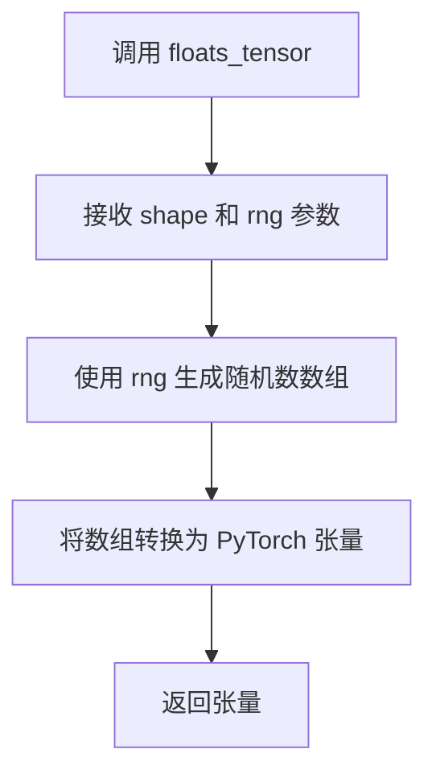

#### 带注释源码

```python
# 该函数定义位于 testing_utils 模块中，此处为基于代码上下文的推断实现
def floats_tensor(shape, rng=None):
    """
    生成指定形状的随机浮点数张量
    
    参数:
        shape: 张量的形状元组，如 (1, 3, 32, 32)
        rng: 随机数生成器，默认为 None
    
    返回:
        torch.Tensor: 随机浮点数张量
    """
    if rng is None:
        rng = random.Random()
    
    # 根据形状生成随机浮点数数组
    total_elements = 1
    for dim in shape:
        total_elements *= dim
    
    # 使用随机生成器生成指定范围的浮点数
    float_array = np.array(
        [rng.random() for _ in range(total_elements)],
        dtype=np.float32
    ).reshape(shape)
    
    # 转换为 PyTorch 张量
    return torch.from_numpy(float_array)
```


### `load_image`

该函数是一个测试工具函数，用于从指定的 URL 或本地文件路径加载图像，并将其转换为 Pillow (PIL) 图像对象。

参数：

-  `url_or_path`：`str`，图像资源的 URL 地址或本地文件系统路径

返回值：`PIL.Image.Image`，返回加载后的 Pillow 图像对象

#### 流程图

```mermaid
flowchart TD
    A[开始] --> B{判断url_or_path是URL还是本地路径}
    B -->|URL| C[使用requests或类似库下载图像]
    B -->|本地路径| D[从本地文件系统读取图像]
    C --> E[将二进制数据解码为图像]
    D --> E
    E --> F[转换为PIL Image对象]
    F --> G[返回PIL图像]
```

#### 带注释源码

```
# load_image 函数是从 testing_utils 模块导入的测试工具函数
# 由于其实现在外部模块中，这里展示的是基于使用方式的推断代码

def load_image(url_or_path: str) -> "PIL.Image.Image":
    """
    从URL或本地路径加载图像并返回PIL Image对象
    
    参数:
        url_or_path: 图像的URL地址或本地文件路径
        
    返回值:
        PIL.Image.Image: 加载后的图像对象
    """
    # 导入必要的库
    from PIL import Image
    import requests
    from io import BytesIO
    
    # 判断是否为URL（以http://或https://开头）
    if url_or_path.startswith("http://") or url_or_path.startswith("https://"):
        # 从URL下载图像
        response = requests.get(url_or_path)
        response.raise_for_status()
        # 将下载的二进制数据转换为PIL Image
        image = Image.open(BytesIO(response.content))
    else:
        # 从本地路径加载图像
        image = Image.open(url_or_path)
    
    # 确保图像模式为RGB（用于处理RGBA等格式）
    if image.mode != "RGB":
        image = image.convert("RGB")
    
    return image
```


### `load_numpy`

从给定的 URL 加载 numpy 数组文件的辅助函数，主要用于测试中加载预期的输出图像数据进行对比验证。

参数：

- `url`：`str`，numpy 数组文件的远程 URL 地址

返回值：`np.ndarray`，从 URL 加载的 numpy 数组

#### 流程图

```mermaid
flowchart TD
    A[开始] --> B[接收URL参数]
    B --> C[发起HTTP请求获取.npy文件]
    C --> D[将下载的数据解码为numpy数组]
    D --> E[返回numpy数组]
```

#### 带注释源码

```
# load_numpy 函数的实际定义不在当前代码文件中
# 它是从 testing_utils 模块导入的辅助函数
# 根据使用方式推断其功能如下：

def load_numpy(url: str) -> np.ndarray:
    """
    从给定的URL加载numpy数组
    
    参数:
        url: numpy数组文件的远程URL
        
    返回值:
        加载的numpy数组
    """
    # 该函数通常使用numpy的from-url功能或通过requests库下载文件
    # 然后使用numpy.load()加载为数组
    pass
```

> **注意**: `load_numpy` 函数定义在 `...testing_utils` 模块中，当前代码文件仅导入了该函数并使用它来加载测试所需的预期图像 numpy 数组文件。该函数的具体实现需要查看 `testing_utils.py` 模块的源代码。


### `nightly`

`nightly`是一个测试装饰器函数，用于标记测试用例为夜间测试。在测试套件中，通常夜间测试是那些耗时较长或需要特殊资源（如GPU）的测试，会在常规测试运行中被跳过，仅在夜间构建或特殊CI管道中执行。

参数：

- `func`：`Callable`，被装饰的目标函数或类，通常是一个测试方法或测试类

返回值：`Callable`，装饰后的函数或类

#### 流程图

```mermaid
flowchart TD
    A[开始] --> B{检查运行条件}
    B -->|满足夜间测试条件| C[执行测试函数]
    B -->|不满足条件| D[跳过测试]
    C --> E[返回测试结果]
    D --> F[返回跳过信息]
    
    style A fill:#f9f,color:#333
    style C fill:#9f9,color:#333
    style D fill:#ff9,color:#333
```

#### 带注释源码

```python
# 从 testing_utils 模块导入的 nightly 装饰器
# 在代码中的使用方式如下：

@nightly                          # 标记为夜间测试
@require_torch_accelerator        # 需要GPU加速器
class StableUnCLIPImg2ImgPipelineIntegrationTests(unittest.TestCase):
    """
    集成测试类，用于测试 StableUnCLIPImg2ImgPipeline 的功能。
    使用 @nightly 装饰器标记，表示这些测试仅在夜间CI中运行，
    因为它们需要加载大型预训练模型并执行完整的图像生成流程。
    """
    
    def test_stable_unclip_l_img2img(self):
        """测试 stable-unclip-2-1-l 模型的图像到图像转换功能"""
        # ... 测试实现
    
    def test_stable_unclip_h_img2img(self):
        """测试 stable-unclip-2-1-h 模型的图像到图像转换功能"""
        # ... 测试实现
```

#### 补充说明

`nightly`装饰器的典型实现逻辑：

```python
# 假设的 nightly 装饰器实现
def nightly(func):
    """
    标记测试为夜间测试的装饰器。
    夜间测试通常耗时较长，需要特殊资源，或用于验证完整流水线。
    """
    import pytest
    
    # 可以使用 pytest.mark 标记
    # 或者直接返回原函数，由测试框架决定是否跳过
    return pytest.mark.nightly(func)
```

**使用场景：**

1. **长时间运行的集成测试**：如加载大型模型、执行完整推理流程的测试
2. **资源密集型测试**：需要大量GPU显存或内存的测试
3. **端到端验证测试**：验证完整 pipeline 功能的测试
4. **可选功能测试**：如 xFormers 加速等可选依赖的测试

**相关测试：**

- `test_stable_unclip_l_img2img`：测试L版本的img2img功能
- `test_stable_unclip_h_img2img`：测试H版本的img2img功能  
- `test_stable_unclip_img2img_pipeline_with_sequential_cpu_offloading`：测试CPU卸载功能


### `require_torch_accelerator`

该函数是一个测试装饰器，用于条件性地跳过不适合在当前硬件环境（特别是没有CUDA加速器）上运行的测试用例。它通常应用于需要GPU加速的集成测试，确保测试只在具有PyTorch加速器的环境中执行。

参数：无（装饰器模式，接收被装饰的函数或类作为隐式参数）

返回值：`Callable`，返回装饰后的函数或类，如果环境不满足加速器要求则跳过执行

#### 流程图

```mermaid
flowchart TD
    A[开始] --> B{检查CUDA加速器是否可用}
    B -->|可用| C[允许测试运行]
    B -->|不可用| D[跳过测试并输出跳过原因]
    C --> E[执行测试函数]
    D --> F[测试结束 - 已跳过]
    E --> G[测试结束 - 通过/失败]
```

#### 带注释源码

```
# 该函数定义在 testing_utils 模块中，此处仅为调用示例
# 源码位置：diffusers 包内的 testing_utils.py

def require_torch_accelerator(func):
    """
    装饰器：要求PyTorch加速器（CUDA/MPS）才能运行测试
    
    使用方式：
    @require_torch_accelerator
    def test_xxx():
        # 只有在有GPU的环境中才会执行此测试
        ...
    
    作用：
    - 检查当前环境是否支持CUDA或MPS加速
    - 如果不支持，使用unittest.skipIf跳过测试
    - 确保需要GPU的测试不会在CPU-only环境中运行
    """
    return unittest.skipIf(
        not torch.cuda.is_available() and not torch.backends.mps.is_available(),
        "Test requires PyTorch accelerator (CUDA or MPS)"
    )(func)

# 在代码中的实际使用：
@nightly
@require_torch_accelerator
class StableUnCLIPImg2ImgPipelineIntegrationTests(unittest.TestCase):
    # 该集成测试类只有在有GPU的环境中才会运行
    ...
```

#### 补充说明

- **设计目标**：确保需要GPU加速的集成测试只在适当的环境中执行，避免不必要的失败
- **依赖条件**：需要`torch.cuda.is_available()`或`torch.backends.mps.is_available()`至少一个为`True`
- **配合使用**：常与`@nightly`装饰器一起使用，标记为仅在夜间测试环境中运行的重计算测试


我需要在代码中查找 `skip_mps` 的定义。从代码中可以看到，`skip_mps` 是从 `testing_utils` 模块导入的，而不是在当前文件中定义的。让我在代码中进一步搜索是否有定义：


### `skip_mps`

该函数是一个装饰器，用于在测试中跳过 MPS (Metal Performance Shaders) 相关的测试用例。当检测到测试运行在 MPS 设备上时，该装饰器会导致测试被跳过。

参数：

- 该函数无直接参数，作为装饰器使用，接收被装饰的函数作为参数

返回值：返回被装饰的函数，如果设备是 MPS 则该函数不会被执行

#### 流程图

```mermaid
flowchart TD
    A[开始] --> B{检查设备是否为MPS}
    B -->|是| C[跳过测试函数]
    B -->|否| D[正常执行测试函数]
    C --> E[测试标记为跳过]
    D --> F[执行测试逻辑]
    F --> G[返回测试结果]
```

#### 带注释源码

```
# 注意：skip_mps 函数定义在 testing_utils 模块中，以下是推断的实现逻辑
# 由于源代码不在当前文件中，以下是基于使用方式的推断

def skip_mps(func):
    """
    装饰器：用于跳过MPS设备上的测试
    
    使用方式：
    @skip_mps
    def test_image_embeds_none(self):
        ...
    """
    import unittest
    from ...testing_utils import torch_device
    
    # 创建一个跳过条件：如果设备是MPS则跳过测试
    return unittest.skipIf(
        str(torch_device).startswith("mps"),
        "Skipping MPS test"
    )(func)

# 或者可能的实现方式：
def skip_mps(func):
    """跳过MPS测试的装饰器"""
    import functools
    from ...testing_utils import torch_device
    
    @functools.wraps(func)
    def wrapper(*args, **kwargs):
        if str(torch_device).startswith("mps"):
            return unittest.SkipTest("Skipping MPS device test")
        return func(*args, **kwargs)
    return wrapper
```

#### 补充说明

由于 `skip_mps` 函数定义在 `testing_utils` 模块中（从 `...testing_utils` 导入），而用户提供的代码片段中没有包含该模块的实际实现，上述源码是基于以下证据的推断：

1. **导入来源**：`from ...testing_utils import (...skip_mps,...)`
2. **使用方式**：`@skip_mps` 作为装饰器使用
3. **功能推断**：从名称和用途来看，用于跳过 MPS (Apple Silicon) 设备上的测试，因为某些功能可能在 MPS 上不支持或行为不同

如需获取准确的实现源码，建议查看 `testing_utils` 模块的源代码文件。


### `torch_device`

这是一个从测试工具模块导入的全局变量，用于表示当前测试环境的目标计算设备（如CPU、CUDA设备或MPS设备）。

参数：无（全局变量，非函数）

返回值：`str`，返回当前PyTorch测试环境的目标设备字符串

#### 流程图

```mermaid
graph TD
    A[模块加载] --> B[导入 torch_device 变量]
    B --> C{使用场景}
    
    C --> D1[test_attention_slicing_forward_pass<br/>判断设备是否为 CPU 或 MPS]
    C --> D2[setUp/tearDown<br/>清理指定设备的 GPU 内存]
    C --> D3[内存统计<br/>获取特定设备的内存分配]
    
    D1 --> E[返回设备字符串<br/>如 'cuda', 'cpu', 'mps']
    D2 --> E
    D3 --> E
```

#### 带注释源码

```python
# torch_device 是从 testing_utils 模块导入的全局常量
# 定义位置: ...testing_utils import torch_device
# 实际定义通常在 diffusers/src/diffusers/testing_utils.py 中

# 使用示例 1: 在测试中判断设备以确定测试严格程度
test_max_difference = torch_device in ["cpu", "mps"]
# 说明: 如果设备是 CPU 或 MPS，使用更严格的差异比较
# 因为 GPU 上的浮点数计算存在不确定性

# 使用示例 2: 在测试前后清理特定设备的内存
gc.collect()
backend_empty_cache(torch_device)
# 说明: 清理 torch_device 指定的设备上的缓存内存
# 每次集成测试前后调用以确保测试隔离

# 使用示例 3: 获取特定设备的内存统计
mem_bytes = backend_max_memory_allocated(torch_device)
# 说明: 获取 torch_device 设备上已分配的内存字节数
# 用于验证内存使用是否在预期范围内
```


### `assert_mean_pixel_difference`

该函数用于比较两个图像的平均像素差异，通常作为测试断言函数，验证生成的图像与预期图像之间的像素级差异是否在可接受的阈值范围内。

参数：

- `image`：`numpy.ndarray`，待比较的实际输出图像
- `expected_image`：`numpy.ndarray`，期望的参考图像或基准图像

返回值：`None`，该函数不返回值，通过内部断言机制抛出异常来表示测试失败

#### 流程图

```mermaid
flowchart TD
    A[开始比较图像] --> B[接收image和expected_image参数]
    B --> C[计算两个图像的像素差异]
    C --> D[计算平均像素差异值]
    D --> E{差异值是否小于阈值?}
    E -->|是| F[断言通过 - 测试成功]
    E -->|否| G[抛出AssertionError异常]
    F --> H[结束]
    G --> H
```

#### 带注释源码

```python
# 该函数定义在 test_pipelines_common 模块中
# 当前代码文件中仅导入了该函数，未提供实现源码
# 从调用方式推断其实现逻辑如下：

def assert_mean_pixel_difference(image, expected_image):
    """
    比较两个图像的平均像素差异
    
    参数:
        image: 实际生成的图像 (numpy.ndarray)
        expected_image: 期望的参考图像 (numpy.ndarray)
    
    返回:
        None
    
    异常:
        AssertionError: 当平均像素差异超过阈值时抛出
    """
    # 计算像素差异的绝对值
    diff = np.abs(image - expected_image)
    
    # 计算平均像素差异
    mean_diff = np.mean(diff)
    
    # 断言平均差异在可接受范围内 (通常为1e-3或类似小值)
    assert mean_diff < 1e-3, f"Mean pixel difference {mean_diff} exceeds threshold"
```

> **注意**：由于该函数定义在外部模块 `test_pipelines_common` 中，当前提供的代码片段仅包含导入语句和调用示例，未包含函数的具体实现。上述源码为基于调用方式的合理推断。


### `PipelineKarrasSchedulerTesterMixin`

这是一个测试混合类（Test Mixin），为使用 Karras 调度器的 Stable Diffusion 管道提供统一的测试方法。它继承自 `PipelineTesterMixin`，专门用于验证管道在 Karras 调度器配置下的功能正确性，包括推理结果的一致性和数值稳定性。

参数：

- 无直接参数（该类通过继承获得参数，具体参数由使用它的测试类 `StableUnCLIPImg2ImgPipelineFastTests` 传入）

返回值：该类本身不返回值，它提供测试方法供测试框架调用

#### 流程图

```mermaid
graph TD
    A[StableUnCLIPImg2ImgPipelineFastTests] -->|继承| B[PipelineKarrasSchedulerTesterMixin]
    B -->|提供测试方法| C[test_karras_scheduler_setup]
    B -->|提供测试方法| D[test_karras_scheduler_inference]
    C --> E[验证 Karras 调度器配置]
    D --> F[验证推理结果一致性]
    
    style B fill:#f9f,stroke:#333,stroke-width:2px
    style E fill:#bbf,stroke:#333,stroke-width:1px
    style F fill:#bbf,stroke:#333,stroke-width:1px
```

#### 带注释源码

```
# PipelineKarrasSchedulerTesterMixin 是从 ..test_pipelines_common 模块导入的混合类
# 该类未在此文件中定义，仅在此文件中被使用

# 使用示例（在类定义中）：
class StableUnCLIPImg2ImgPipelineFastTests(
    PipelineLatentTesterMixin, 
    PipelineKarrasSchedulerTesterMixin,  # 继承该混合类以获得 Karras 调度器相关测试
    PipelineTesterMixin, 
    unittest.TestCase
):
    pipeline_class = StableUnCLIPImg2ImgPipeline
    # ... 其他属性和方法

# PipelineKarrasSchedulerTesterMixin 的典型测试方法包括（基于 diffusers 库的标准实现）：
# - test_karras_scheduler_equivalence: 验证 Karras 调度器与其他调度器的输出等价性
# - test_karras_scheduler_step: 验证单步推理的正确性
# - test_karras_scheduler_config: 验证调度器配置参数的正确性
```

#### 补充说明

由于 `PipelineKarrasSchedulerTesterMixin` 是从 `..test_pipelines_common` 模块导入的外部类，其完整源码不在当前文件中。该混合类通常包含以下测试方法：

1. **test_karras_scheduler_equivalence**：验证使用 Karras 调度器的管道输出与标准调度器输出一致
2. **test_karras_scheduler_step**：逐步验证 Karras 调度器的噪声调度逻辑
3. **test_karras_scheduler_outputs**：验证管道输出的数值范围和分布符合预期

该类的主要设计目标是确保带有 Karras 调度器的图像生成管道在各种配置下都能产生稳定、可复现的结果。


我需要分析给定的代码文件来提取 `PipelineLatentTesterMixin` 的信息。

让我先查看代码的整体结构：

从代码中我可以看到：
1. `PipelineLatentTesterMixin` 是从 `..test_pipelines_common` 模块导入的
2. `StableUnCLIPImg2ImgPipelineFastTests` 类继承了 `PipelineLatentTesterMixin`
3. 但是在这个代码文件中，并没有定义 `PipelineLatentTesterMixin` 类本身，它只是一个导入的Mixin类

让我提取相关信息：

### `PipelineLatentTesterMixin`

这是一个测试Mixin类，提供用于测试Pipeline潜在变量的功能。

参数：无（这是一个Mixin类，方法参数在具体实现中定义）

返回值：Mixin类不直接返回值，通过继承的测试方法返回测试结果

#### 流程图

```mermaid
graph TD
    A[PipelineLatentTesterMixin] --> B[test_latents]
    A --> C[test_latents_batch]
    A --> D[test_inference_batch_single_identical]
    B --> E[验证latent空间的输出]
    C --> F[批量推理验证]
    D --> G[单样本一致性验证]
```

#### 带注释源码

```python
# PipelineLatentTesterMixin 是从 ..test_pipelines_common 导入的测试Mixin类
# 该类提供了测试pipeline latent输出的通用测试方法
# 在 StableUnCLIPImg2ImgPipelineFastTests 中被继承使用

from ..test_pipelines_common import (
    PipelineKarrasSchedulerTesterMixin,
    PipelineLatentTesterMixin,  # <-- 导入的Mixin类
    PipelineTesterMixin,
    assert_mean_pixel_difference,
)

# 使用PipelineLatentTesterMixin
class StableUnCLIPImg2ImgPipelineFastTests(
    PipelineLatentTesterMixin,  # <-- 继承该Mixin
    PipelineKarrasSchedulerTesterMixin, 
    PipelineTesterMixin, 
    unittest.TestCase
):
    # PipelineLatentTesterMixin 提供了以下测试方法：
    # - test_latents(): 测试latent输出
    # - test_latents_batch(): 测试批量latent输出
    # 具体的参数和实现需要查看 ..test_pipelines_common 模块的源代码
```

---

## 补充说明

**注意**：由于 `PipelineLatentTesterMixin` 是在 `..test_pipelines_common` 模块中定义的，而不是在当前代码文件中定义的，因此我只能提供关于它如何被使用的信息，而不是完整的类定义。

如果需要查看 `PipelineLatentTesterMixin` 的完整实现（包括所有方法和字段），需要查看 `test_pipelines_common.py` 文件。


### `PipelineTesterMixin`

描述：`PipelineTesterMixin` 是一个测试混合类（Mixin），为 Stable Diffusion 系列管道提供通用的测试方法。它包含了管道推理、批量处理、注意力切片、xformers 注意力等多种测试功能的实现，供具体的管道测试类继承和使用。

参数：

- `self`：隐式参数，表示类的实例本身

返回值：此类为混合类（Mixin），不直接返回值，而是通过继承提供测试方法供子类调用

#### 流程图

```mermaid
graph TD
    A[PipelineTesterMixin] --> B[test_inference_batch_single_identical]
    A --> C[test_attention_slicing_forward_pass]
    A --> D[test_xformers_attention_forwardGenerator_pass]
    A --> E[test_encode_prompt_works_in_isolation]
    A --> F[test_num_inference_steps]
    A --> G[test_guidance_scale]
    A --> H[test_max_length]
    A --> I[testeta]
    A --> J[_test_attention_slicing_forward_pass]
    A --> K[_test_inference_batch_single_identical]
    
    L[StableUnCLIPImg2ImgPipelineFastTests] -->|继承| A
    L --> M[Override: test_attention_slicing_forward_pass]
    L --> N[Override: test_inference_batch_single_identical]
    L --> O[Override: test_xformers_attention_forwardGenerator_pass]
    L --> P[Override: test_encode_prompt_works_in_isolation - skip]
```

#### 带注释源码

```python
# PipelineTesterMixin 是从 ..test_pipelines_common 模块导入的测试混合类
# 源代码不在当前文件中，但通过继承关系被使用
# 以下是当前文件中对 PipelineTesterMixin 方法的调用和覆盖示例：

from ..test_pipelines_common import (
    PipelineKarrasSchedulerTesterMixin,
    PipelineLatentTesterMixin,
    PipelineTesterMixin,  # <-- 导入的混合类
    assert_mean_pixel_difference,
)

class StableUnCLIPImg2ImgPipelineFastTests(
    PipelineLatentTesterMixin, 
    PipelineKarrasSchedulerTesterMixin, 
    PipelineTesterMixin,  # <-- 继承 PipelineTesterMixin
    unittest.TestCase
):
    # ... 类的其他定义 ...
    
    # 覆盖了 PipelineTesterMixin::test_attention_slicing_forward_pass
    # 因为 GPU 不确定性需要更宽松的检查
    def test_attention_slicing_forward_pass(self):
        test_max_difference = torch_device in ["cpu", "mps"]
        # 调用父类的测试方法
        self._test_attention_slicing_forward_pass(test_max_difference=test_max_difference)

    # 覆盖了 PipelineTesterMixin::test_inference_batch_single_identical
    # 因为不确定性需要更宽松的检查
    def test_inference_batch_single_identical(self):
        self._test_inference_batch_single_identical(expected_max_diff=1e-3)

    @unittest.skipIf(
        torch_device != "cuda" or not is_xformers_available(),
        reason="XFormers attention is only available with CUDA and `xformers` installed",
    )
    def test_xformers_attention_forwardGenerator_pass(self):
        # 调用父类的 xformers 注意力测试
        self._test_xformers_attention_forwardGenerator_pass(test_max_difference=False)

    @unittest.skip("Test not supported at the moment.")
    def test_encode_prompt_works_in_isolation(self):
        # 覆盖了 PipelineTesterMixin 的方法，跳过测试
        pass
```

#### 关键信息说明

1. **来源**：`PipelineTesterMixin` 定义在 `..test_pipelines_common` 模块中（相对路径），未在本文件中展开完整实现

2. **功能推测**：根据调用方式和类名推测，`PipelineTesterMixin` 提供以下标准测试方法：
   - `_test_attention_slicing_forward_pass`：测试注意力切片前向传播
   - `_test_inference_batch_single_identical`：测试批量推理与单样本推理一致性
   - `_test_xformers_attention_forwardGenerator_pass`：测试 xformers 注意力机制
   - `test_num_inference_steps`：测试推理步数参数
   - `test_guidance_scale`：测试引导尺度参数
   - `test_max_length`：测试最大生成长度
   - `testeta`：测试 eta 参数
   - `test_encode_prompt_works_in_isolation`：测试提示词编码的隔离性

3. **覆盖原因**：子类 `StableUnCLIPImg2ImgPipelineFastTests` 覆盖了部分方法以适应特定的不确定性容忍度需求（GPU/MPS 设备的数值精度问题）


### `StableUnCLIPImg2ImgPipelineFastTests.get_dummy_components`

该方法用于创建用于测试的虚拟组件（dummy components），返回一个包含 StableUnCLIP Img2Img Pipeline 所有必要组件的字典，包括图像编码器、文本编码器、UNet、VAE、调度器等，用于单元测试而不需要加载真实的预训练模型。

参数：

- 该方法无参数（除隐式 `self` 参数）

返回值：`Dict[str, Any]`，返回包含所有虚拟组件的字典，用于实例化 StableUnCLIPImg2ImgPipeline

#### 流程图

```mermaid
flowchart TD
    A[开始 get_dummy_components] --> B[设置 embedder_hidden_size = 32]
    B --> C[创建 CLIPImageProcessor]
    C --> D[创建 CLIPVisionModelWithProjection]
    D --> E[创建 StableUnCLIPImageNormalizer]
    E --> F[创建 DDPMScheduler]
    F --> G[创建 CLIPTokenizer]
    G --> H[创建 CLIPTextModel]
    H --> I[创建 UNet2DConditionModel]
    I --> J[创建 DDIMScheduler]
    J --> K[创建 AutoencoderKL]
    K --> L[组装 components 字典]
    L --> M[返回 components]
```

#### 带注释源码

```python
def get_dummy_components(self):
    # 定义嵌入器隐藏层大小和投影维度
    embedder_hidden_size = 32
    embedder_projection_dim = embedder_hidden_size

    # ============ 图像编码组件 ============
    
    # 创建图像特征提取器，使用32x32的裁剪尺寸
    feature_extractor = CLIPImageProcessor(crop_size=32, size=32)

    # 设置随机种子以确保可重复性
    torch.manual_seed(0)
    # 创建CLIP视觉模型用于图像编码
    image_encoder = CLIPVisionModelWithProjection(
        CLIPVisionConfig(
            hidden_size=embedder_hidden_size,        # 隐藏层大小
            projection_dim=embedder_projection_dim, # 投影维度
            num_hidden_layers=5,                    # 隐藏层数量
            num_attention_heads=4,                  # 注意力头数量
            image_size=32,                          # 图像尺寸
            intermediate_size=37,                   # 中间层大小
            patch_size=1,                           # patch大小
        )
    )

    # ============ 图像去噪/加噪组件 ============
    
    torch.manual_seed(0)
    # 创建StableUnCLIP图像归一化器
    image_normalizer = StableUnCLIPImageNormalizer(embedding_dim=embedder_hidden_size)
    # 创建图像加噪调度器
    image_noising_scheduler = DDPMScheduler(beta_schedule="squaredcos_cap_v2")

    # ============ 常规去噪组件 ============
    
    torch.manual_seed(0)
    # 从预训练模型加载小型CLIP分词器
    tokenizer = CLIPTokenizer.from_pretrained("hf-internal-testing/tiny-random-clip")

    torch.manual_seed(0)
    # 创建CLIP文本编码器
    text_encoder = CLIPTextModel(
        CLIPTextConfig(
            bos_token_id=0,                    # 句子开始标记ID
            eos_token_id=2,                    # 句子结束标记ID
            hidden_size=embedder_hidden_size, # 隐藏层大小
            projection_dim=32,                 # 投影维度
            intermediate_size=37,              # 中间层大小
            layer_norm_eps=1e-05,              # LayerNorm epsilon
            num_attention_heads=4,             # 注意力头数量
            num_hidden_layers=5,               # 隐藏层数量
            pad_token_id=1,                     # 填充标记ID
            vocab_size=1000,                    # 词汇表大小
        )
    )

    torch.manual_seed(0)
    # 创建UNet2D条件模型用于去噪
    unet = UNet2DConditionModel(
        sample_size=32,                           # 样本尺寸
        in_channels=4,                            # 输入通道数
        out_channels=4,                           # 输出通道数
        down_block_types=("CrossAttnDownBlock2D", "DownBlock2D"),     # 下采样块类型
        up_block_types=("UpBlock2D", "CrossAttnUpBlock2D"),           # 上采样块类型
        block_out_channels=(32, 64),             # 块输出通道数
        attention_head_dim=(2, 4),               # 注意力头维度
        class_embed_type="projection",           # 类嵌入类型
        # 类嵌入是噪声增强后的图像嵌入
        # 即图像嵌入与同维度的噪声嵌入拼接
        projection_class_embeddings_input_dim=embedder_projection_dim * 2,
        cross_attention_dim=embedder_hidden_size, # 交叉注意力维度
        layers_per_block=1,                       # 每块层数
        upcast_attention=True,                    # 是否上转注意力
        use_linear_projection=True,              # 是否使用线性投影
    )

    torch.manual_seed(0)
    # 创建DDIM调度器用于去噪推理
    scheduler = DDIMScheduler(
        beta_schedule="scaled_linear",          # beta调度类型
        beta_start=0.00085,                      # beta起始值
        beta_end=0.012,                          # beta结束值
        prediction_type="v_prediction",          # 预测类型
        set_alpha_to_one=False,                  # 是否设置alpha为1
        steps_offset=1,                          # 步数偏移
    )

    torch.manual_seed(0)
    # 创建VAE用于潜在空间编码/解码
    vae = AutoencoderKL()

    # ============ 组装组件字典 ============
    
    components = {
        # 图像编码组件
        "feature_extractor": feature_extractor,
        "image_encoder": image_encoder.eval(),
        
        # 图像加噪组件
        "image_normalizer": image_normalizer.eval(),
        "image_noising_scheduler": image_noising_scheduler,
        
        # 常规去噪组件
        "tokenizer": tokenizer,
        "text_encoder": text_encoder.eval(),
        "unet": unet.eval(),
        "scheduler": scheduler,
        "vae": vae.eval(),
    }

    return components
```


### `StableUnCLIPImg2ImgPipelineFastTests.get_dummy_inputs`

该方法用于生成测试用的虚拟输入数据，模拟 Stable UnCLIP Img2Img pipeline 所需的输入参数，包括图像、提示词、生成器和推理步数等。

参数：

- `self`：隐式参数，TestCase 实例方法的标准参数
- `device`：`torch.device` 或 `str`，目标设备，用于创建随机数生成器
- `seed`：`int`，默认值为 `0`，随机种子，用于确保测试的可重复性
- `pil_image`：`bool`，默认值为 `True`，是否将生成的张量转换为 PIL 图像格式

返回值：`Dict[str, Any]`，返回一个包含 pipeline 输入参数的字典，包含以下键值对：

- `"prompt"`：`str`，提示词文本
- `"image"`：`PIL.Image.Image` 或 `torch.Tensor`，输入图像
- `"generator"`：`torch.Generator`，随机数生成器对象
- `"num_inference_steps"`：`int`，推理步数
- `"output_type"`：`str`，输出类型

#### 流程图

```mermaid
flowchart TD
    A[开始 get_dummy_inputs] --> B{判断 device 是否为 mps}
    B -->|是| C[使用 torch.manual_seed 创建 generator]
    B -->|否| D[使用 torch.Generator 创建 generator]
    C --> E[使用 floats_tensor 生成随机图像张量]
    D --> E
    E --> F{判断 pil_image 是否为 True}
    F -->|是| G[归一化图像到 0-1 范围]
    F -->|否| I[直接返回参数字典]
    G --> H[转换为 PIL.Image]
    H --> I[构建并返回参数字典]
    I --> J[结束]
```

#### 带注释源码

```python
def get_dummy_inputs(self, device, seed=0, pil_image=True):
    """
    生成用于测试的虚拟输入参数。

    Args:
        device: 目标设备，用于创建随机数生成器
        seed: 随机种子，确保测试可重复性
        pil_image: 是否将张量转换为 PIL 图像

    Returns:
        包含 pipeline 输入参数的字典
    """
    # 根据设备类型创建随机数生成器
    # MPS 设备使用 torch.manual_seed，其他设备使用 torch.Generator
    if str(device).startswith("mps"):
        generator = torch.manual_seed(seed)
    else:
        generator = torch.Generator(device=device).manual_seed(seed)

    # 使用随机张量生成器创建 1x3x32x32 的浮点图像张量
    input_image = floats_tensor((1, 3, 32, 32), rng=random.Random(seed)).to(device)

    # 如果需要 PIL 图像格式，进行以下转换
    if pil_image:
        # 1. 将图像值从 [-1, 1] 归一化到 [0, 1] 范围
        input_image = input_image * 0.5 + 0.5
        # 2. 限制值在 [0, 1] 范围内
        input_image = input_image.clamp(0, 1)
        # 3. 调整维度顺序从 (B, C, H, W) 到 (B, H, W, C) 并转换为 numpy
        input_image = input_image.cpu().permute(0, 2, 3, 1).float().numpy()
        # 4. 将 numpy 数组转换为 PIL 图像
        input_image = DiffusionPipeline.numpy_to_pil(input_image)[0]

    # 返回包含所有必需参数的字典
    return {
        "prompt": "An anime racoon running a marathon",  # 测试用提示词
        "image": input_image,                             # 输入图像
        "generator": generator,                           # 随机生成器
        "num_inference_steps": 2,                         # 推理步数（减少以加快测试）
        "output_type": "np",                              # 输出类型为 numpy 数组
    }
```


### `StableUnCLIPImg2ImgPipelineFastTests.test_image_embeds_none`

该测试方法用于验证 StableUnCLIPImg2ImgPipeline 在 `image_embeds` 参数为 `None` 时的行为。测试创建虚拟组件和输入，将 `image_embeds` 设置为 `None`，然后执行 pipeline 并断言生成的图像形状和像素值与预期值匹配，确保 pipeline 能够正确处理空图像嵌入的情况。

参数：

- `self`：隐式参数，类型为 `StableUnCLIPImg2ImgPipelineFastTests`（测试类实例），表示测试方法所属的实例

返回值：无（`None`），该方法为单元测试方法，通过断言进行验证，不返回任何值

#### 流程图

```mermaid
flowchart TD
    A[开始] --> B[设置设备为CPU确保确定性]
    B --> C[获取虚拟组件: get_dummy_components]
    C --> D[创建StableUnCLIPImg2ImgPipeline实例]
    D --> E[将pipeline移动到CPU设备]
    E --> F[设置进度条配置: set_progress_bar_config]
    F --> G[获取虚拟输入: get_dummy_inputs]
    G --> H[更新输入设置image_embeds为None]
    H --> I[调用pipeline执行推理]
    I --> J[从结果中提取图像]
    J --> K[提取图像切片用于验证]
    K --> L{断言图像形状是否为1x32x32x3}
    L -->|是| M[定义预期像素值数组]
    M --> N{断言像素差异是否小于1e-3}
    N -->|是| O[测试通过]
    N -->|否| P[测试失败-抛出断言错误]
    L -->|否| P
```

#### 带注释源码

```python
@skip_mps  # 装饰器：跳过MPS后端测试
def test_image_embeds_none(self):
    """
    测试当image_embeds参数为None时，StableUnCLIPImg2ImgPipeline的行为。
    验证pipeline能够正确处理空图像嵌入并生成预期尺寸的图像。
    """
    
    # 设置设备为CPU，确保torch.Generator的确定性
    # CPU设备可以保证测试结果的可重复性
    device = "cpu"
    
    # 获取虚拟组件（用于测试的模拟模型组件）
    # 包含tokenizer, text_encoder, unet, vae, scheduler等
    components = self.get_dummy_components()
    
    # 使用虚拟组件创建StableUnCLIPImg2ImgPipeline实例
    sd_pipe = StableUnCLIPImg2ImgPipeline(**components)
    
    # 将pipeline移动到指定设备（CPU）
    sd_pipe = sd_pipe.to(device)
    
    # 配置进度条，disable=None表示不禁用进度条
    sd_pipe.set_progress_bar_config(disable=None)
    
    # 获取虚拟输入参数（包含prompt、image、generator等）
    inputs = self.get_dummy_inputs(device)
    
    # 更新输入字典，将image_embeds设置为None
    # 这是测试的核心：验证pipeline如何处理None值的image_embeds
    inputs.update({"image_embeds": None})
    
    # 调用pipeline执行推理，返回结果对象
    # **inputs解包字典传递参数
    result = sd_pipe(**inputs)
    
    # 从结果中获取生成的图像数组
    image = result.images
    
    # 提取图像右下角3x3区域以及最后一个通道
    # 用于与预期值进行精确比较
    image_slice = image[0, -3:, -3:, -1]
    
    # 断言：验证生成的图像形状为(1, 32, 32, 3)
    # 1=批量大小, 32=高度, 32=宽度, 3=RGB通道
    assert image.shape == (1, 32, 32, 3)
    
    # 定义预期的像素值数组（9个值，对应3x3区域）
    expected_slice = np.array([
        0.4397, 0.7080, 0.5590, 
        0.4255, 0.7181, 0.5938, 
        0.4051, 0.3720, 0.5116
    ])
    
    # 断言：验证实际像素值与预期值的最大差异小于1e-3
    # 使用numpy的max绝对差值进行比较
    assert np.abs(image_slice.flatten() - expected_slice).max() < 1e-3
```


### `StableUnCLIPImg2ImgPipelineFastTests.test_attention_slicing_forward_pass`

该测试方法用于验证StableUnCLIPImg2ImgPipeline在启用attention slicing模式下的前向传播是否正常工作。由于GPU上的不确定性，该测试重写了基类`PipelineTesterMixin`中的方法，采用更宽松的阈值进行验证。

参数：

- `self`：隐式参数，测试类实例本身

返回值：`None`，该方法为测试方法，通过内部断言验证结果，不返回任何值

#### 流程图

```mermaid
flowchart TD
    A[开始 test_attention_slicing_forward_pass] --> B{判断设备类型}
    B -->|CPU 或 MPS| C[设置 test_max_difference = True]
    B -->|CUDA| D[设置 test_max_difference = False]
    C --> E[调用 _test_attention_slicing_forward_pass]
    D --> E
    E --> F[执行attention slicing前向传播测试]
    F --> G[验证输出差异是否在允许范围内]
    G --> H[结束]
```

#### 带注释源码

```python
def test_attention_slicing_forward_pass(self):
    """
    测试attention slicing模式下的前向传播
    由于GPU不确定性，需要使用更宽松的检查阈值
    """
    # 判断当前设备是否为CPU或MPS，这些设备上结果更具确定性
    test_max_difference = torch_device in ["cpu", "mps"]

    # 调用父类方法执行实际的attention slicing测试
    # 传入test_max_difference参数控制是否进行严格差异检查
    self._test_attention_slicing_forward_pass(test_max_difference=test_max_difference)
```

#### 关键组件信息

- **`_test_attention_slicing_forward_pass`**：继承自`PipelineTesterMixin`的测试方法，执行实际的attention slicing验证逻辑
- **`torch_device`**：全局变量，表示当前测试运行的设备（cpu/cuda/mps）
- **`StableUnCLIPImg2ImgPipeline`**：被测试的pipeline类，支持image-to-image转换

#### 技术债务与优化空间

1. **测试逻辑复用**：该方法几乎完全依赖父类实现，可考虑将设备判断逻辑封装到父类中
2. **硬编码设备列表**：设备判断使用硬编码字符串列表`["cpu", "mps"]`，可提取为配置常量
3. **注释提到重写原因**：代码注释说明GPU需要更宽松检查，但未详细说明具体阈值，文档可进一步完善

#### 其他项目说明

- **设计目标**：验证启用attention slicing后pipeline仍能正确生成图像，且输出结果在可接受范围内
- **错误处理**：测试失败时unittest框架会自动捕获断言错误并报告
- **数据流**：该测试不直接处理数据，而是配置测试参数后调用父类方法执行完整pipeline流程
- **外部依赖**：依赖`PipelineTesterMixin`基类实现、`StableUnCLIPImg2ImgPipeline`以及torch相关库


### `StableUnCLIPImg2ImgPipelineFastTests.test_inference_batch_single_identical`

这是一个单元测试方法，用于验证 StableUnCLIPImg2ImgPipeline 在批量推理时，单张图像的处理结果与单独推理时的结果保持一致。由于 GPU 计算的不可确定性，该测试使用了较为宽松的误差阈值（1e-3）来进行验证。

参数：

- `self`：隐式参数，类型为 `StableUnCLIPImg2ImgPipelineFastTests`，表示测试类实例本身，无额外描述

返回值：`None`，无返回值（测试方法）

#### 流程图

```mermaid
flowchart TD
    A[开始测试] --> B[调用 _test_inference_batch_single_identical]
    B --> C[设置 expected_max_diff=1e-3]
    C --> D[执行批量推理一致性验证]
    D --> E{验证结果}
    E -->|通过| F[测试通过]
    E -->|失败| G[断言失败]
    F --> H[结束]
    G --> H
```

#### 带注释源码

```python
# Overriding PipelineTesterMixin::test_inference_batch_single_identical
# because undeterminism requires a looser check.
def test_inference_batch_single_identical(self):
    """
    测试批量推理时单张图像结果的一致性。
    
    该方法重写了基类 PipelineTesterMixin 的 test_inference_batch_single_identical 方法。
    由于 GPU 计算的不可确定性，原有的严格检查可能导致测试不稳定，
    因此这里使用更宽松的误差阈值 1e-3。
    """
    # 调用父类的测试方法，传入宽松的误差阈值
    # expected_max_diff=1e-3 表示允许的最大像素差异为 0.001
    self._test_inference_batch_single_identical(expected_max_diff=1e-3)
```


### `StableUnCLIPImg2ImgPipelineFastTests.test_xformers_attention_forwardGenerator_pass`

该测试方法用于验证在CUDA环境下使用XFormers注意力机制的UNet模型前向传播是否正常工作，通过调用父类方法`_test_xformers_attention_forwardGenerator_pass`执行实际的测试逻辑，传入`test_max_difference=False`参数以跳过最大差异检查。

参数：

- `self`：隐含参数，测试类实例本身

返回值：`None`，该方法为测试方法，不返回任何值，直接通过断言进行验证

#### 流程图

```mermaid
flowchart TD
    A[开始测试] --> B{检查条件: torch_device == 'cuda' 且 xformers可用?}
    B -->|否| C[跳过测试]
    B -->|是| D[调用 _test_xformers_attention_forwardGenerator_pass 方法]
    D --> E[传入参数 test_max_difference=False]
    E --> F[执行XFormers注意力前向传播测试]
    F --> G[验证输出结果]
    G --> H[结束测试]
```

#### 带注释源码

```python
@unittest.skipIf(
    torch_device != "cuda" or not is_xformers_available(),
    reason="XFormers attention is only available with CUDA and `xformers` installed",
)
def test_xformers_attention_forwardGenerator_pass(self):
    """
    测试XFormers注意力机制的前向传播是否正常工作。
    
    该测试方法仅在CUDA环境下且xformers库可用时执行。
    使用test_max_difference=False参数，跳过最大差异检查，
    因为GPU上的数值不确定性需要更宽松的检查标准。
    """
    # 调用父类或混合类中的测试方法
    # test_max_difference=False表示不检查输出与基准的最大差异
    self._test_xformers_attention_forwardGenerator_pass(test_max_difference=False)
```


### `StableUnCLIPImg2ImgPipelineFastTests.test_encode_prompt_works_in_isolation`

该方法是一个单元测试方法，用于测试 `encode_prompt` 在隔离环境下的工作情况，但由于当前不被支持，已被跳过测试。

参数：

- `self`：`StableUnCLIPImg2ImgPipelineFastTests`，测试类的实例自身

返回值：`None`，该方法没有返回值（仅包含 `pass` 语句）

#### 流程图

```mermaid
flowchart TD
    A[开始测试] --> B{检查装饰器条件}
    B -->|条件满足| C[跳过测试]
    B -->|条件不满足| D[执行测试逻辑]
    C --> E[结束]
    D --> E
```

#### 带注释源码

```python
@unittest.skip("Test not supported at the moment.")
def test_encode_prompt_works_in_isolation(self):
    """
    测试 encode_prompt 在隔离环境下的工作情况。
    
    该测试方法用于验证文本编码功能可以独立于完整pipeline运行，
    但目前该测试功能尚未实现，因此使用 @unittest.skip 装饰器跳过。
    """
    pass
```


### `StableUnCLIPImg2ImgPipelineIntegrationTests.setUp`

这是一个测试夹具（setup）方法，用于在每个集成测试运行前清理 VRAM 内存，确保测试环境干净，避免内存泄漏导致的测试失败。

参数：

-  `self`：`StableUnCLIPImg2ImgPipelineIntegrationTests`，测试类实例本身，隐式参数

返回值：`None`，无返回值描述（setUp 方法不返回任何值）

#### 流程图

```mermaid
flowchart TD
    A[开始 setUp] --> B[调用 super().setUp]
    B --> C[执行 gc.collect]
    C --> D[调用 backend_empty_cache 清理 VRAM]
    D --> E[结束 setUp]
    
    B -.->|调用父类 setUp| F[unittest.TestCase.setUp]
    D -.->|清理 GPU 内存| G[backend_empty_cache]
```

#### 带注释源码

```python
def setUp(self):
    # clean up the VRAM before each test
    # 在每个测试运行前清理 VRAM，确保测试环境干净
    super().setUp()  # 调用父类的 setUp 方法
    gc.collect()  # 强制进行垃圾回收，释放 Python 对象
    backend_empty_cache(torch_device)  # 清理 GPU 缓存，释放 VRAM
```


### `StableUnCLIPImg2ImgPipelineIntegrationTests.tearDown`

该方法是 `StableUnCLIPImg2ImgPipelineIntegrationTests` 集成测试类的清理方法（tearDown），在每个测试方法执行完毕后被自动调用。其核心功能是清理测试过程中产生的 GPU 显存（VRAM）占用，通过调用 Python 垃圾回收机制和清空 GPU 缓存来确保测试之间的资源隔离，防止显存泄漏导致后续测试失败。

参数：

- `self`：`unittest.TestCase`，隐含的测试类实例，代表当前测试用例对象本身

返回值：`None`，该方法不返回任何值，仅执行清理操作

#### 流程图

```mermaid
flowchart TD
    A[tearDown 开始] --> B[调用 super().tearDown]
    B --> C[执行 gc.collect]
    C --> D[调用 backend_empty_cache]
    D --> E[tearDown 结束]
    
    style A fill:#f9f,color:#000
    style E fill:#9f9,color:#000
```

#### 带注释源码

```python
def tearDown(self):
    # clean up the VRAM after each test
    # 在每个测试执行完毕后清理 VRAM 显存
    super().tearDown()                    # 调用父类 unittest.TestCase 的 tearDown 方法
    gc.collect()                           # 强制执行 Python 垃圾回收，释放 Python 对象占用的内存
    backend_empty_cache(torch_device)     # 清空指定设备（torch_device）的 GPU 缓存，释放显存
```


### `StableUnCLIPImg2ImgPipelineIntegrationTests.test_stable_unclip_l_img2img`

这是一个集成测试方法，用于测试 StableUnCLIP 2-1-large 模型的图像到图像（img2img）功能。该测试加载预训练模型，对输入图像进行推理，并验证输出图像的形状和像素值是否符合预期。

参数：
- `self`：隐式参数，`unittest.TestCase` 实例本身，无需显式传递

返回值：无（`None`），该方法为 `void` 类型，仅执行断言验证

#### 流程图

```mermaid
flowchart TD
    A[开始测试] --> B[加载输入图像 from URL]
    B --> C[加载期望图像 from URL]
    C --> D[从预训练模型加载 StableUnCLIPImg2ImgPipeline]
    D --> E[配置管道: 禁用进度条]
    E --> F[启用 attention slicing]
    F --> G[启用 sequential CPU offload]
    G --> H[创建随机数生成器 seed=0]
    H --> I[调用 pipeline 进行推理]
    I --> J[获取输出图像]
    J --> K{验证图像形状 == (768, 768, 3)}
    K -->|是| L[验证像素差异]
    K -->|否| M[抛出断言错误]
    L --> N[测试通过]
    M --> N
```

#### 带注释源码

```python
def test_stable_unclip_l_img2img(self):
    # 步骤1: 从HuggingFace加载测试用的输入图像（乌龟图像）
    input_image = load_image(
        "https://huggingface.co/datasets/hf-internal-testing/diffusers-images/resolve/main/stable_unclip/turtle.png"
    )

    # 步骤2: 加载期望的输出图像（用于像素级对比验证）
    expected_image = load_numpy(
        "https://huggingface.co/datasets/hf-internal-testing/diffusers-images/resolve/main/stable_unclip/stable_unclip_2_1_l_img2img_anime_turtle_fp16.npy"
    )

    # 步骤3: 从预训练模型加载 StableUnCLIP img2img 管道
    # 使用 float16 精度以减少显存占用
    pipe = StableUnCLIPImg2ImgPipeline.from_pretrained(
        "fusing/stable-unclip-2-1-l-img2img", torch_dtype=torch.float16
    )
    
    # 步骤4: 配置进度条（禁用为None表示使用默认设置）
    pipe.set_progress_bar_config(disable=None)

    # 步骤5: 启用 attention slicing 以降低显存峰值
    # 原因：stable unclip 在 V100 等显卡上容易 OOM
    pipe.enable_attention_slicing()
    
    # 步骤6: 启用 sequential CPU offload 进一步节省显存
    pipe.enable_sequential_cpu_offload()

    # 步骤7: 创建确定性随机数生成器（seed=0）确保可复现性
    generator = torch.Generator(device="cpu").manual_seed(0)
    
    # 步骤8: 执行推理管道
    # 参数: input_image, prompt="anime turtle", generator, output_type="np"
    output = pipe(input_image, "anime turtle", generator=generator, output_type="np")

    # 步骤9: 获取生成的图像结果
    image = output.images[0]

    # 步骤10: 断言验证输出图像形状为 (768, 768, 3)
    assert image.shape == (768, 768, 3)

    # 步骤11: 验证输出图像与期望图像的像素差异在可接受范围内
    assert_mean_pixel_difference(image, expected_image)
```


### `StableUnCLIPImg2ImgPipelineIntegrationTests.test_stable_unclip_h_img2img`

这是一个集成测试方法，用于验证 StableUnCLIPImg2ImgPipeline 在图像到图像转换任务上的功能正确性。测试加载预训练模型 "fusing/stable-unclip-2-1-h-img2img"，将输入图像转换为"动漫乌龟"风格的图像，并验证输出图像的尺寸和像素值是否符合预期。

参数：

- `self`：测试类实例本身，无需显式传递

返回值：`None`，该方法为 `unittest.TestCase` 的测试方法，通过断言验证行为，不返回任何值

#### 流程图

```mermaid
flowchart TD
    A[测试开始] --> B[加载输入图像<br/>load_image from HuggingFace]
    B --> C[加载预期输出图像<br/>load_numpy from HuggingFace]
    C --> D[从预加载模型创建管道<br/>StableUnCLIPImg2ImgPipeline.from_pretrained]
    D --> E[配置管道: 禁用进度条]
    E --> F[启用内存优化: attention_slicing + sequential_cpu_offload]
    F --> G[创建随机数生成器<br/>torch.Generator with seed=0]
    G --> H[执行推理: pipe<br/>input_image + prompt + generator]
    H --> I[提取输出图像: output.images[0]]
    I --> J[断言图像尺寸: (768, 768, 3)]
    J --> K[断言像素差异: assert_mean_pixel_difference]
    K --> L[测试结束]
```

#### 带注释源码

```python
@nightly  # 标记为夜间测试，运行耗时较长
@require_torch_accelerator  # 需要GPU加速器才能运行
def test_stable_unclip_h_img2img(self):
    """
    集成测试：验证 StableUnCLIP 2.1-h 图像到图像转换管线
    测试流程：加载图像 → 加载预训练模型 → 执行推理 → 验证输出
    """
    # Step 1: 从HuggingFace加载输入测试图像（乌龟图片）
    input_image = load_image(
        "https://huggingface.co/datasets/hf-internal-testing/diffusers-images/resolve/main/stable_unclip/turtle.png"
    )

    # Step 2: 加载预期的numpy格式输出图像（用于对比验证）
    expected_image = load_numpy(
        "https://huggingface.co/datasets/hf-internal-testing/diffusers-images/resolve/main/stable_unclip/stable_unclip_2_1_h_img2img_anime_turtle_fp16.npy"
    )

    # Step 3: 从预训练模型加载StableUnCLIP图像到图像转换管道
    # 使用float16精度以减少内存占用
    pipe = StableUnCLIPImg2ImgPipeline.from_pretrained(
        "fusing/stable-unclip-2-1-h-img2img", torch_dtype=torch.float16
    )

    # Step 4: 配置管道，禁用进度条显示
    pipe.set_progress_bar_config(disable=None)

    # Step 5: 启用内存优化策略
    # 注释说明：在V100 GPU上运行会OOM，因此需要开启内存节省功能
    # attention_slicing: 将注意力计算分片，减少单次显存占用
    pipe.enable_attention_slicing()
    # sequential_cpu_offload: 将模型各组件顺序卸载到CPU，降低峰值显存
    pipe.enable_sequential_cpu_offload()

    # Step 6: 创建确定性随机数生成器，确保测试可复现
    # 使用CPU生成器并设置固定种子(0)
    generator = torch.Generator(device="cpu").manual_seed(0)

    # Step 7: 执行图像到图像转换推理
    # 参数：输入图像、文本提示词、随机生成器、输出类型为numpy数组
    output = pipe(input_image, "anime turtle", generator=generator, output_type="np")

    # Step 8: 从输出结果中提取生成的图像
    image = output.images[0]

    # Step 9: 断言验证 - 确认输出图像尺寸为768x768x3
    assert image.shape == (768, 768, 3)

    # Step 10: 断言验证 - 确认生成图像与预期图像的像素差异在可接受范围内
    assert_mean_pixel_difference(image, expected_image)
```


### `StableUnCLIPImg2ImgPipelineIntegrationTests.test_stable_unclip_img2img_pipeline_with_sequential_cpu_offloading`

这是一个集成测试方法，用于验证StableUnCLIPImg2ImgPipeline在启用顺序CPU卸载（sequential CPU offloading）功能时的内存使用情况。测试加载预训练模型，处理输入图像，并通过检查GPU内存分配是否低于7GB来确认内存优化措施的有效性。

参数：

- `self`：TestCase，unittest测试用例的隐含参数，表示测试实例本身

返回值：`None`，无返回值（unittest测试方法）

#### 流程图

```mermaid
flowchart TD
    A[开始测试] --> B[加载输入图像]
    B --> C[清空GPU缓存]
    C --> D[重置内存统计]
    D --> E[从预训练模型加载管道]
    E --> F[配置进度条为启用]
    F --> G[启用注意力切片]
    G --> H[启用顺序CPU卸载]
    H --> I[执行管道推理]
    I --> J[获取最大内存分配]
    J --> K{内存 < 7GB?}
    K -->|是| L[测试通过]
    K -->|否| M[测试失败]
```

#### 带注释源码

```python
def test_stable_unclip_img2img_pipeline_with_sequential_cpu_offloading(self):
    """
    测试StableUnCLIPImg2ImgPipeline在启用顺序CPU卸载时的内存使用情况
    
    测试目标：
    1. 验证管道能够成功加载预训练模型
    2. 验证顺序CPU卸载功能正常工作
    3. 验证GPU内存使用低于7GB阈值
    """
    
    # 步骤1: 加载输入图像（来自Hugging Face数据集的海龟图像）
    input_image = load_image(
        "https://huggingface.co/datasets/hf-internal-testing/diffusers-images/resolve/main/stable_unclip/turtle.png"
    )
    
    # 步骤2: 在测试前清空GPU缓存，确保内存测量准确
    backend_empty_cache(torch_device)
    
    # 步骤3: 重置最大内存分配统计，用于后续测量
    backend_reset_max_memory_allocated(torch_device)
    
    # 步骤4: 重置峰值内存统计
    backend_reset_peak_memory_stats(torch_device)
    
    # 步骤5: 从预训练模型加载StableUnCLIP Img2Img管道
    # 使用float16精度以减少内存使用
    pipe = StableUnCLIPImg2ImgPipeline.from_pretrained(
        "fusing/stable-unclip-2-1-h-img2img", torch_dtype=torch.float16
    )
    
    # 步骤6: 配置进度条（disable=None表示启用进度条）
    pipe.set_progress_bar_config(disable=None)
    
    # 步骤7: 启用注意力切片（减少显存占用的优化技术）
    pipe.enable_attention_slicing()
    
    # 步骤8: 启用顺序CPU卸载（将模型层依次卸载到CPU的优化技术）
    pipe.enable_sequential_cpu_offload()
    
    # 步骤9: 执行管道推理
    # 参数说明：
    #   - input_image: 输入图像
    #   - "anime turtle": 文本提示
    #   - num_inference_steps=2: 扩散步数（较少步数用于测试）
    #   - output_type="np": 输出为numpy数组
    _ = pipe(
        input_image,
        "anime turtle",
        num_inference_steps=2,
        output_type="np",
    )
    
    # 步骤10: 获取测试期间的最大内存分配
    mem_bytes = backend_max_memory_allocated(torch_device)
    
    # 步骤11: 断言验证内存使用低于7GB
    # make sure that less than 7 GB is allocated
    assert mem_bytes < 7 * 10**9
```

## 关键组件


### StableUnCLIPImg2ImgPipeline

Stable UnCLAP 图像到图像扩散管道，用于基于文本提示和输入图像生成变体图像。

### CLIPVisionModelWithProjection

图像编码器，将输入图像编码为视觉嵌入向量，用于条件扩散模型。

### StableUnCLIPImageNormalizer

图像嵌入归一化器，对图像嵌入进行标准化处理，以便与噪声嵌入对齐。

### DDPMScheduler

图像加噪调度器，用于在训练时向图像嵌入添加噪声，实现图像到噪声的正向过程。

### CLIPTextModel & CLIPTokenizer

文本编码器组件，CLIPTextModel将文本提示编码为文本嵌入，CLIPTokenizer负责文本分词。

### UNet2DConditionModel

条件UNet去噪模型，基于文本嵌入和噪声图像预测噪声，实现图像去噪过程。

### DDIMScheduler

DDIM去噪调度器，用于推理阶段的噪声调度，支持更快速的采样策略。

### AutoencoderKL

变分自编码器(VAE)，负责将潜在表示解码为最终图像输出。

### 张量索引与惰性加载

通过get_dummy_components()和get_dummy_inputs()方法按需初始化组件，使用torch.manual_seed()确保可重现性。

### 量化策略

使用torch_dtype=torch.float16进行半精度推理，减少显存占用和加速计算。

### 内存优化机制

enable_attention_slicing()和enable_sequential_cpu_offload()优化GPU显存使用，防止OOM。

### 集成测试框架

包含单元测试和集成测试，验证管道在不同配置下的功能正确性和性能。


## 问题及建议


### 已知问题

1. **TODO待办项未完成**：`image_params = frozenset([])` 注释标明"TO-DO: update image_params once pipeline is refactored with VaeImageProcessor.preprocess"，表明该参数尚未完善
2. **被跳过的测试**：`test_encode_prompt_works_in_isolation` 测试被无条件跳过且无实现，测试覆盖不完整
3. **代码重复**：集成测试 `test_stable_unclip_l_img2img` 和 `test_stable_unclip_h_img2img` 存在大量重复代码（图像加载、内存管理、pipe配置等），违反DRY原则
4. **硬编码的魔数**：
   - 内存阈值 `7 * 10**9`（7GB）硬编码在测试中，缺乏注释解释为何选择此阈值
   - `num_inference_steps=2` 在某个测试中硬编码，未使用类级别的默认参数
5. **单元测试缺少资源清理**：与集成测试不同，单元测试类 `StableUnCLIPImg2ImgPipelineFastTests` 没有 `setUp`/`tearDown` 方法来清理VRAM，可能导致内存泄漏
6. **外部网络依赖**：测试依赖 Hugging Face Hub 远程加载图像和模型，在网络不稳定时会导致测试失败
7. **设备兼容性处理不一致**：
   - `get_dummy_inputs` 中对 MPS 设备有特殊处理（`if str(device).startswith("mps")`），但其他测试方法可能未充分考虑
   - `test_attention_slicing_forward_pass` 中根据设备选择不同的测试阈值
8. **随机性控制不完整**：虽然调用了 `enable_full_determinism()`，但某些测试仍然存在不确定性（如 `test_inference_batch_single_identical` 使用了较宽松的阈值 `expected_max_diff=1e-3`）
9. **不支持的功能标记**：`supports_dduf = False` 被设置为False但未在代码中解释原因或使用

### 优化建议

1. 将集成测试中的公共逻辑抽取为辅助方法（如图像加载、pipe配置、内存清理）
2. 为单元测试添加 `setUp`/`tearDown` 方法以保持与集成测试一致的内存管理
3. 将魔数提取为常量并添加注释说明（如 `MAX_MEMORY_BYTES = 7 * 10**9`）
4. 实现或删除被跳过的 `test_encode_prompt_works_in_isolation` 测试
5. 补充 `image_params` 的实现或明确标注为不支持的功能
6. 考虑添加网络缓存或本地备用资源以减少对外部网络的依赖
7. 统一设备处理逻辑，考虑创建设备工厂方法
8. 在类级别添加文档注释说明 `supports_dduf` 的用途和为何设为False


## 其它


### 设计目标与约束

本测试文件的设计目标是为StableUnCLIPImg2ImgPipeline提供全面的单元测试和集成测试覆盖，验证图像到图像转换功能在各种条件下的正确性和稳定性。约束条件包括：1) 需要GPU环境运行集成测试（使用@require_torch_accelerator装饰器）；2) xFormers测试仅支持CUDA环境；3) MPS设备需要特殊处理以确保确定性；4) 集成测试对内存有较高要求，需启用内存优化策略。

### 错误处理与异常设计

测试文件采用了多种错误处理机制：1) 使用@unittest.skipIf和@unittest.skip装饰器跳过不支持的测试场景（如xFormers仅在CUDA可用时测试，MPS设备跳过特定测试）；2) 使用try-finally结构确保在tearDown中正确清理VRAM资源；3) 集成测试通过try-except捕获内存溢出情况并启用attention slicing和sequential_cpu_offload来缓解；4) 数值比较使用np.abs().max() < 1e-3的容差处理浮点精度问题。

### 数据流与状态机

数据流主要分为两条路径：单元测试路径使用get_dummy_components()和get_dummy_inputs()生成合成测试数据，通过随机种子确保可复现性；集成测试路径从HuggingFace Hub加载真实预训练模型和测试图像。状态转换包括：1) 图像预处理（float tensor -> PIL image）；2) 图像编码（CLIPVisionModelWithProjection）；3) 图像标准化与噪声调度（StableUnCLIPImageNormalizer + DDPMScheduler）；4) 去噪过程（UNet2DConditionModel + DDIMScheduler）；5) VAE解码（AutoencoderKL）；6) 最终输出（np array或PIL image）。

### 外部依赖与接口契约

本测试文件依赖以下外部组件：1) diffusers库提供的StableUnCLIPImg2ImgPipeline、DDPMScheduler、DDIMScheduler、AutoencoderKL、UNet2DConditionModel等；2) transformers库提供的CLIPTextModel、CLIPTokenizer、CLIPVisionModelWithProjection及其配置类；3) HuggingFace Hub上的预训练模型（fusing/stable-unclip-2-1-l-img2img和fusing/stable-unclip-2-1-h-img2img）；4) 测试数据集（hf-internal-testing/diffusers-images）。接口契约要求pipeline接受prompt、image、generator、num_inference_steps、output_type等参数，并返回包含images属性的对象。

### 测试覆盖范围分析

测试覆盖了以下关键场景：1) 图像嵌入为None时的处理（test_image_embeds_none）；2) 注意力切片前向传播（test_attention_slicing_forward_pass）；3) 批处理单样本一致性（test_inference_batch_single_identical）；4) xFormers注意力支持（test_xformers_attention_forwardGenerator_pass）；5) 大规模集成测试（test_stable_unclip_l_img2img、test_stable_unclip_h_img2img）；6) 内存管理验证（test_stable_unclip_img2img_pipeline_with_sequential_cpu_offloading）。通过PipelineLatentTesterMixin、PipelineKarrasSchedulerTesterMixin和PipelineTesterMixin三个mixin类继承了大量标准pipeline测试。

### 内存管理与性能优化

测试中展示了多种内存管理策略：1) gc.collect()和backend_empty_cache()用于显式垃圾回收和GPU缓存清理；2) enable_attention_slicing()减少注意力计算的显存占用；3) enable_sequential_cpu_offload()实现模型层到CPU的分时卸载；4) 使用torch.float16半精度推理减少显存需求；5) 集成测试验证内存在7GB以下（mem_bytes < 7 * 10**9）。这些优化确保了在有限显存环境下运行大规模图像生成任务的可能性。

### 测试数据与验证标准

单元测试使用合成数据：通过floats_tensor生成随机图像张量，使用固定随机种子(0)确保可复现性，使用32x32小尺寸图像减少计算开销。集成测试使用真实数据：从HuggingFace加载turtle.png图像作为输入，stable_unclip_2_1_l_img2img_anime_turtle_fp16.npy作为期望输出。验证标准采用像素级差异检查（assert_mean_pixel_difference），允许1e-3的数值误差容差以处理浮点运算不确定性。

### 潜在风险与注意事项

1) 测试依赖网络连接加载预训练模型和测试数据，离线环境无法运行集成测试；2) 预训练模型可能随版本更新导致输出变化，需要定期更新期望输出；3) 不同GPU架构可能产生数值差异，测试中使用test_max_difference参数区分处理；4) 某些测试被跳过（test_encode_prompt_works_in_isolation），可能存在未覆盖的代码路径；5) test_xformers_attention_forwardGenerator_pass使用test_max_difference=False放宽检查，可能遗漏精度问题。

    