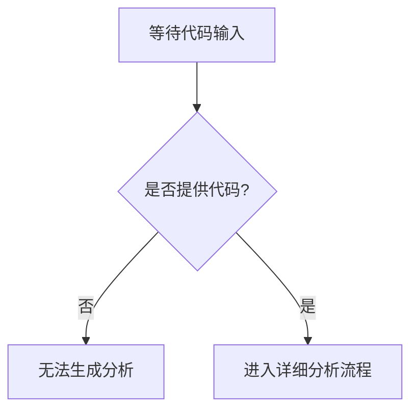

# `diffusers\tests\pipelines\stable_video_diffusion\__init__.py` 详细设计文档

未提供代码进行分析，请提供需要分析的源代码文件内容。

## 整体流程



## 类结构

```
无法分析 - 未提供代码
```

## 全局变量及字段


    

## 全局函数及方法


## 关键组件


### 无可用代码

未提供源代码，无法识别关键组件。


## 问题及建议


### 已知问题

-   代码内容为空，未提供待分析的源代码
-   无法基于空代码进行技术债务识别和优化建议

### 优化建议

-   请提供待分析的源代码内容，以便进行完整的技术债务和优化空间分析
-   建议在提供代码时标注编程语言类型，便于选择合适的分析工具和方法
-   如涉及多个文件，建议提供文件列表或项目结构说明


## 其它


### 设计目标与约束

描述该模块的设计目标，如性能要求、兼容性约束、安全性要求等，以及所采用的技术栈限制、编码规范约束、平台限制等。

### 错误处理与异常设计

描述模块中错误的分类（如业务异常、系统异常、第三方异常等），异常的统一处理方式，错误码的设计规范，以及降级策略和容错机制。

### 数据流与状态机

描述数据的输入来源、处理流程、输出目标，以及对象的状态流转逻辑、状态触发条件、状态变更规则等。

### 外部依赖与接口契约

描述该模块依赖的外部服务或库，包括依赖的版本要求、接口调用方式、超时设置、重试策略等，以及暴露给外部的接口规范。

### 性能考量与资源管理

描述关键性能指标（如响应时间、吞吐量、并发数等），内存使用限制，连接池配置，以及缓存策略和资源释放机制。

### 配置与可扩展性

描述模块的可配置项及其默认值，配置加载方式，以及扩展点设计（如插件机制、策略模式、观察者模式等）。

### 安全性设计

描述认证授权机制，数据加密方案，敏感信息保护措施，以及安全审计和日志记录要求。

### 测试策略

描述单元测试覆盖要求，集成测试场景，性能测试用例，以及测试数据和测试环境要求。

### 部署与运维

描述部署方式，依赖的运行环境，监控指标，日志规范，以及备份和恢复策略。

### 版本兼容性

描述与历史版本的兼容性策略，API版本管理，以及数据迁移方案。

### 命名规范与编码约定

描述类名、函数名、变量名的命名规范，注释要求，以及代码风格统一约定。


    