# `diffusers\tests\pipelines\stable_video_diffusion\test_stable_video_diffusion.py` 详细设计文档

这是一个用于测试 StableVideoDiffusionPipeline 的单元测试文件，包含了快速测试类和慢速测试类，用于验证管道的前向传播、模型加载保存、精度转换、设备迁移、CPU卸载等功能是否正常工作。

## 整体流程

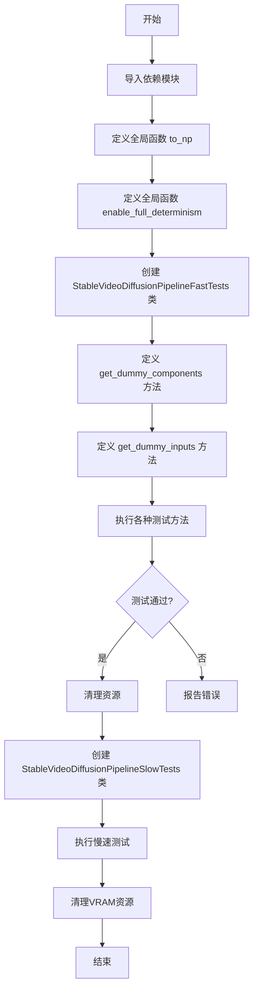

## 类结构

```
unittest.TestCase
└── StableVideoDiffusionPipelineFastTests (继承 PipelineTesterMixin)
    ├── pipeline_class
    ├── params
    ├── batch_params
    ├── required_optional_params
    ├── supports_dduf
    ├── get_dummy_components()
    ├── get_dummy_inputs()
    ├── test_attention_slicing_forward_pass() [跳过]
    ├── test_inference_batch_single_identical() [跳过]
    ├── test_inference_batch_consistent() [跳过]
    ├── test_np_output_type()
    ├── test_dict_tuple_outputs_equivalent()
    ├── test_float16_inference() [跳过]
    ├── test_save_load_float16()
    ├── test_save_load_optional_components()
    ├── test_save_load_local()
    ├── test_to_device()
    ├── test_to_dtype()
    ├── test_sequential_cpu_offload_forward_pass()
    ├── test_model_cpu_offload_forward_pass()
    ├── test_xformers_attention_forwardGenerator_pass()
    └── test_disable_cfg()
└── StableVideoDiffusionPipelineSlowTests (继承 unittest.TestCase)
    ├── setUp()
    ├── tearDown()
    └── test_sd_video() [需要 @slow 和 @require_torch_accelerator]
```

## 全局变量及字段


### `enable_full_determinism`
    
启用完全确定性，确保测试结果可复现

类型：`function`
    


### `to_np`
    
将torch.Tensor转换为numpy数组

类型：`function`
    


### `gc`
    
Python垃圾回收模块

类型：`module`
    


### `random`
    
Python随机数生成模块

类型：`module`
    


### `tempfile`
    
Python临时文件和目录操作模块

类型：`module`
    


### `unittest`
    
Python单元测试框架

类型：`module`
    


### `np`
    
NumPy数值计算库

类型：`module`
    


### `torch`
    
PyTorch深度学习框架

类型：`module`
    


### `diffusers`
    
Diffusers扩散模型库

类型：`module`
    


### `StableVideoDiffusionPipelineFastTests.pipeline_class`
    
指定被测试的管道类为StableVideoDiffusionPipeline

类型：`type`
    


### `StableVideoDiffusionPipelineFastTests.params`
    
管道必需参数集合，当前包含image参数

类型：`frozenset`
    


### `StableVideoDiffusionPipelineFastTests.batch_params`
    
批处理参数集合，包含image和generator用于批量推理

类型：`frozenset`
    


### `StableVideoDiffusionPipelineFastTests.required_optional_params`
    
可选但常用的参数集合，如num_inference_steps、generator等

类型：`frozenset`
    


### `StableVideoDiffusionPipelineFastTests.supports_dduf`
    
标志位，表示该管道不支持DDUF（Decoupled Diffusion Upsampling Fusion）

类型：`bool`
    
    

## 全局函数及方法


### `to_np`

将 PyTorch Tensor 转换为 NumPy 数组的辅助函数，用于在测试中比较 pipeline 输出。

参数：

- `tensor`：`Union[torch.Tensor, Any]`，输入的张量，可以是 PyTorch 张量或任意其他类型的数据

返回值：`Union[np.ndarray, Any]`，如果输入是 PyTorch Tensor，则返回.detach().cpu().numpy()转换后的 NumPy 数组；否则原样返回输入数据

#### 流程图

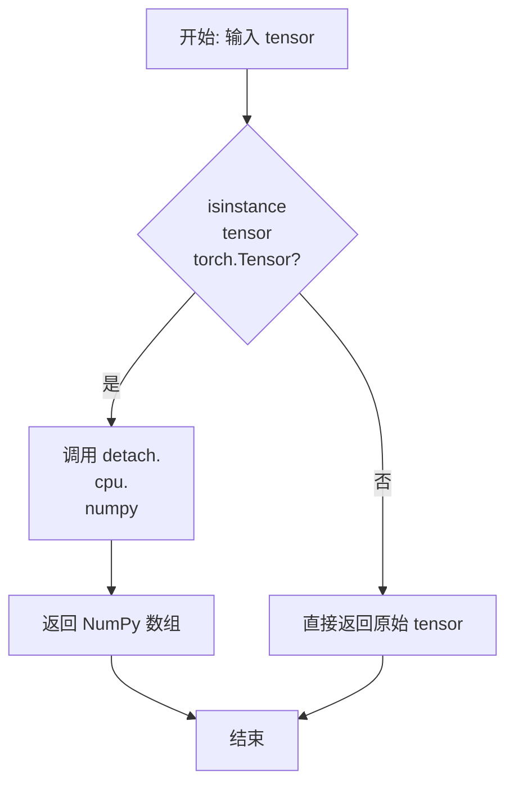

#### 带注释源码

```python
def to_np(tensor):
    """
    将 PyTorch Tensor 转换为 NumPy 数组的辅助函数。
    
    参数:
        tensor: 输入的张量，可以是 PyTorch 张量或任意其他类型的数据
        
    返回值:
        如果输入是 PyTorch Tensor，则返回 detach().cpu().numpy() 转换后的 NumPy 数组；
        否则原样返回输入数据
    """
    # 检查输入是否为 PyTorch Tensor
    if isinstance(tensor, torch.Tensor):
        # 如果是 Tensor，进行三步转换：
        # 1. detach() - 分离出计算图，停止梯度追踪
        # 2. cpu() - 将 Tensor 移至 CPU（避免 CUDA 内存问题）
        # 3. numpy() - 转换为 NumPy 数组
        tensor = tensor.detach().cpu().numpy()

    # 返回转换后的数组或原始输入（非 Tensor 情况）
    return tensor
```


### `enable_full_determinism`

该函数用于在测试环境中启用完全确定性，确保多次运行测试时能够获得完全一致的结果。通过设置随机种子和环境变量，确保 PyTorch、NumPy 和 Python 内置随机数生成器的行为是可重复的。

参数：无

返回值：无

#### 流程图

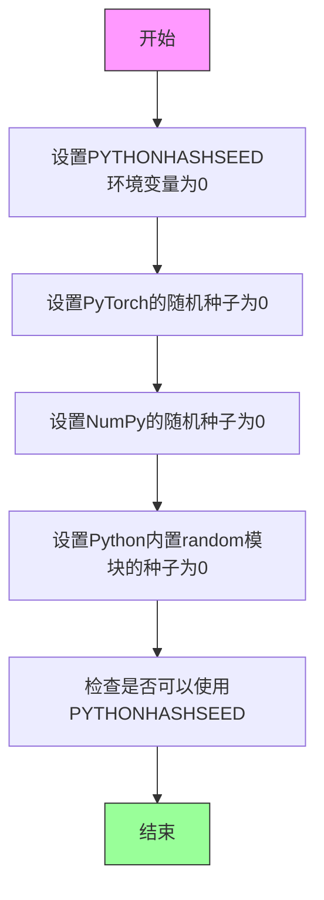

#### 带注释源码

```
# 该函数从 testing_utils 模块导入，未在此文件中定义
# 函数定义位于 .../testing_utils.py 中

# 调用方式：
enable_full_determinism()

# 预期功能（基于函数名推断）：
"""
def enable_full_determinism():
    '''
    启用完全确定性模式，确保测试结果可重复。
    通过设置各种随机数生成器的种子来实现。
    '''
    import os
    import random
    import numpy as np
    import torch
    
    # 设置Python哈希随机种子（影响字典顺序等）
    os.environ['PYTHONHASHSEED'] = '0'
    
    # 设置Python内置random模块的种子
    random.seed(0)
    
    # 设置NumPy的随机种子
    np.random.seed(0)
    
    # 设置PyTorch的随机种子
    torch.manual_seed(0)
    
    # 如果使用CUDA，可能还需要设置其他选项
    if torch.cuda.is_available():
        torch.cuda.manual_seed(0)
        torch.cuda.manual_seed_all(0)
        torch.backends.cudnn.deterministic = True
        torch.backends.cudnn.benchmark = False
"""
```

> **注意**：由于 `enable_full_determinism` 函数定义在 `.../testing_utils` 模块中（未在当前代码文件中显示），上述源码是基于函数名和用途的合理推断。实际实现可能包含更多细节，如设置环境变量、处理多GPU情况等。该函数在测试文件开头被调用，目的是确保整个测试文件的随机操作是可重复的，这对于调试和回归测试非常重要。


### `StableVideoDiffusionPipelineFastTests.get_dummy_components`

该方法为 StableVideoDiffusionPipeline 创建虚拟组件（dummy components），用于单元测试。它初始化并返回一个包含 UNet、图像编码器、调度器、VAE 和特征提取器的字典，所有组件均使用固定随机种子以确保测试可复现。

参数：无

返回值：`Dict[str, Any]`，返回包含以下键的字典：
- `unet`: UNetSpatioTemporalConditionModel 实例
- `image_encoder`: CLIPVisionModelWithProjection 实例
- `scheduler`: EulerDiscreteScheduler 实例
- `vae`: AutoencoderKLTemporalDecoder 实例
- `feature_extractor`: CLIPImageProcessor 实例

#### 流程图

```mermaid
flowchart TD
    A[开始 get_dummy_components] --> B[设置随机种子 torch.manual_seed(0)]
    B --> C[创建 UNetSpatioTemporalConditionModel]
    C --> D[创建 EulerDiscreteScheduler]
    D --> E[设置随机种子 torch.manual_seed(0)]
    E --> F[创建 AutoencoderKLTemporalDecoder]
    F --> G[设置随机种子 torch.manual_seed(0)]
    G --> H[创建 CLIPVisionConfig 配置]
    H --> I[使用配置创建 CLIPVisionModelWithProjection]
    I --> J[设置随机种子 torch.manual_seed(0)]
    J --> K[创建 CLIPImageProcessor]
    K --> L[组装 components 字典]
    L --> M[返回 components 字典]
```

#### 带注释源码

```python
def get_dummy_components(self):
    """
    创建并返回 StableVideoDiffusionPipeline 所需的虚拟组件字典。
    所有组件使用固定随机种子确保测试可复现。
    """
    
    # 设置随机种子，确保 UNet 初始化可复现
    torch.manual_seed(0)
    
    # 创建 UNet 时空条件模型 - 负责视频生成的核心神经网络
    unet = UNetSpatioTemporalConditionModel(
        block_out_channels=(32, 64),           # UNet 块输出通道数
        layers_per_block=2,                    # 每个块的层数
        sample_size=32,                        # 样本空间尺寸
        in_channels=8,                         # 输入通道数（4 latents + 4 time embeddings）
        out_channels=4,                        # 输出通道数
        down_block_types=(                     # 下采样块类型
            "CrossAttnDownBlockSpatioTemporal",
            "DownBlockSpatioTemporal",
        ),
        up_block_types=(                       # 上采样块类型
            "UpBlockSpatioTemporal",
            "CrossAttnUpBlockSpatioTemporal",
        ),
        cross_attention_dim=32,                # 交叉注意力维度
        num_attention_heads=8,                 # 注意力头数量
        projection_class_embeddings_input_dim=96,  # 类别嵌入投影输入维度
        addition_time_embed_dim=32,           # 时间嵌入维度
    )
    
    # 创建欧拉离散调度器 - 控制去噪过程的噪声调度
    scheduler = EulerDiscreteScheduler(
        beta_start=0.00085,                    # Beta 起始值
        beta_end=0.012,                        # Beta 结束值
        beta_schedule="scaled_linear",         # Beta 调度策略
        interpolation_type="linear",          # 插值类型
        num_train_timesteps=1000,              # 训练时间步数
        prediction_type="v_prediction",        # 预测类型
        sigma_max=700.0,                       # 最大噪声 sigma
        sigma_min=0.002,                       # 最小噪声 sigma
        steps_offset=1,                        # 步骤偏移
        timestep_spacing="leading",            # 时间步间距策略
        timestep_type="continuous",            # 时间步类型
        trained_betas=None,                    # 自定义 betas
        use_karras_sigmas=True,                # 是否使用 Karras sigmas
    )

    # 重新设置随机种子，确保 VAE 初始化可复现
    torch.manual_seed(0)
    
    # 创建 VAE（变分自编码器）- 负责图像的编码和解码
    vae = AutoencoderKLTemporalDecoder(
        block_out_channels=[32, 64],           # VAE 块输出通道
        in_channels=3,                         # 输入通道（RGB）
        out_channels=3,                        # 输出通道（RGB）
        down_block_types=["DownEncoderBlock2D", "DownEncoderBlock2D"],  # 下采样块类型
        latent_channels=4,                     # 潜在空间通道数
    )

    # 重新设置随机种子，确保 CLIP 视觉模型初始化可复现
    torch.manual_seed(0)
    
    # 创建 CLIP 视觉配置
    config = CLIPVisionConfig(
        hidden_size=32,                        # 隐藏层维度
        projection_dim=32,                     # 投影维度
        num_hidden_layers=5,                   # 隐藏层数量
        num_attention_heads=4,                 # 注意力头数量
        image_size=32,                         # 图像尺寸
        intermediate_size=37,                  # 中间层维度
        patch_size=1,                          # patch 大小
    )
    
    # 创建 CLIP 视觉模型（带投影）- 用于编码输入图像
    image_encoder = CLIPVisionModelWithProjection(config)

    # 重新设置随机种子，确保特征提取器初始化可复现
    torch.manual_seed(0)
    
    # 创建 CLIP 图像处理器 - 预处理输入图像
    feature_extractor = CLIPImageProcessor(
        crop_size=32,                          # 裁剪尺寸
        size=32,                                # 输入尺寸
    )

    # 组装组件字典，包含 Pipeline 需要的所有模型和处理器
    components = {
        "unet": unet,                          # UNet 时空条件模型
        "image_encoder": image_encoder,        # CLIP 图像编码器
        "scheduler": scheduler,                # 噪声调度器
        "vae": vae,                            # VAE 解码器
        "feature_extractor": feature_extractor,  # 图像特征提取器
    }
    
    # 返回完整的组件字典，供 Pipeline 初始化使用
    return components
```


### `StableVideoDiffusionPipelineFastTests.get_dummy_inputs`

这是一个测试用的辅助方法，用于生成虚拟输入数据（dummy inputs），以便在单元测试中验证 `StableVideoDiffusionPipeline` 的各种功能，而无需加载真实的预训练模型权重。

参数：

- `self`：隐含的类实例参数，代表 `StableVideoDiffusionPipelineFastTests` 的实例
- `device`：`str`，指定生成的张量应该被移动到的目标设备（如 `"cpu"`、`"cuda"`、`"mps"` 等）
- `seed`：`int`，随机数生成器的种子，用于确保测试结果的可重复性，默认值为 `0`

返回值：`dict`，返回一个包含调用 `StableVideoDiffusionPipeline` 所需参数的字典

#### 流程图

```mermaid
flowchart TD
    A[开始 get_dummy_inputs] --> B{device 是否以 'mps' 开头?}
    B -- 是 --> C[使用 torch.manual_seed(seed) 创建 generator]
    B -- 否 --> D[使用 torch.Generator(device='cpu').manual_seed(seed) 创建 generator]
    C --> E[使用 floats_tensor 生成 (1,3,32,32) 形状的图像]
    D --> E
    E --> F[将图像移动到 device]
    F --> G[构建包含所有参数的字典]
    G --> H[返回 inputs 字典]
```

#### 带注释源码

```
def get_dummy_inputs(self, device, seed=0):
    # 检查设备类型，如果是 MPS (Apple Silicon) 设备
    if str(device).startswith("mps"):
        # MPS 设备使用 torch.manual_seed() 直接设置随机种子
        generator = torch.manual_seed(seed)
    else:
        # 其他设备（如 CPU、CUDA）创建 CPU 上的随机数生成器并设置种子
        generator = torch.Generator(device="cpu").manual_seed(seed)

    # 使用 floats_tensor 生成一个形状为 (1, 3, 32, 32) 的随机浮点数张量
    # 使用固定的随机种子 (0) 确保测试的可重复性
    image = floats_tensor((1, 3, 32, 32), rng=random.Random(0)).to(device)

    # 构建包含所有推理所需参数的字典
    inputs = {
        "generator": generator,          # 随机数生成器，用于控制生成过程的随机性
        "image": image,                   # 输入图像张量，形状为 (batch, channels, height, width)
        "num_inference_steps": 2,         # 推理步数，DDIM/Euler 等调度器使用的采样步数
        "output_type": "pt",              # 输出类型，"pt" 表示返回 PyTorch 张量
        "min_guidance_scale": 1.0,        # 最小引导强度（无分类器引导）
        "max_guidance_scale": 2.5,        # 最大引导强度
        "num_frames": 2,                  # 生成的视频帧数
        "height": 32,                     # 输出图像高度
        "width": 32,                      # 输出图像宽度
    }
    return inputs
```


### `StableVideoDiffusionPipelineFastTests.test_attention_slicing_forward_pass`

该方法是一个被标记为"Deprecated functionality"的测试用例，原本用于测试StableVideoDiffusionPipeline的attention slicing前向传播功能，目前已被跳过的空实现。

参数：

-  `self`：`StableVideoDiffusionPipelineFastTests` 实例，代表测试类本身

返回值：`None`，无返回值（方法体为空，只有 `pass` 语句）

#### 流程图

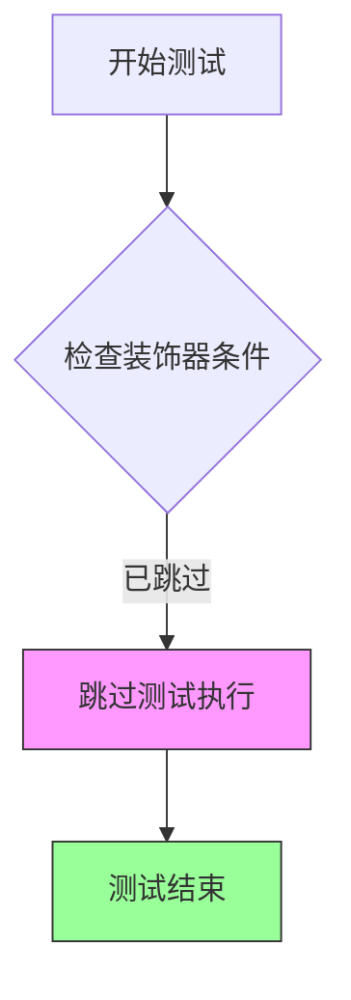

#### 带注释源码

```python
@unittest.skip("Deprecated functionality")
def test_attention_slicing_forward_pass(self):
    """
    测试方法：test_attention_slicing_forward_pass
    
    原始功能说明：
    - 该测试用于验证StableVideoDiffusionPipeline在使用attention slicing技术时的前向传播是否正确
    - Attention slicing是一种内存优化技术，用于减少扩散模型在推理时的显存占用
    
    当前状态：
    - 由于功能已被弃用(deprecated)，该测试方法被@unittest.skip装饰器跳过
    - 方法体为空(pass)，不执行任何实际测试逻辑
    
    参数:
        self: StableVideoDiffusionPipelineFastTests的实例方法隐含参数
    
    返回值:
        None: 无返回值
    """
    pass
```


### `StableVideoDiffusionPipelineFastTests.test_inference_batch_single_identical`

该测试方法用于验证StableVideoDiffusionPipeline在批处理推理（batch_size=2）与单次推理时输出的一致性，确保批处理不会改变模型的推理结果。

参数：

- `self`：`StableVideoDiffusionPipelineFastTests`，测试类实例，表示当前测试对象
- `batch_size`：`int`，默认值为`2`，批处理大小，指定在批处理推理中使用的样本数量
- `expected_max_diff`：`float`，默认值为`1e-4`，期望的最大差异阈值，用于判断单次和批处理输出是否足够接近

返回值：`None`，该方法为测试方法，无返回值，通过断言验证结果正确性

#### 流程图

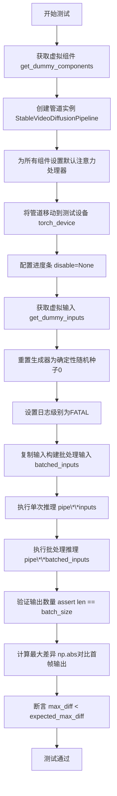

#### 带注释源码

```python
@unittest.skip("Batched inference works and outputs look correct, but the test is failing")
def test_inference_batch_single_identical(
    self,
    batch_size=2,
    expected_max_diff=1e-4,
):
    """
    测试方法：验证批处理推理与单次推理的输出一致性
    
    参数:
        batch_size: 批处理大小，默认为2
        expected_max_diff: 期望的最大差异阈值，默认为1e-4
    
    返回:
        None (通过断言验证结果)
    """
    # 步骤1: 获取虚拟组件（用于测试的dummy模型组件）
    components = self.get_dummy_components()
    
    # 步骤2: 使用虚拟组件创建StableVideoDiffusionPipeline实例
    pipe = self.pipeline_class(**components)
    
    # 步骤3: 为所有组件设置默认注意力处理器
    for components in pipe.components.values():
        if hasattr(components, "set_default_attn_processor"):
            components.set_default_attn_processor()
    
    # 步骤4: 将管道移动到测试设备（如cuda或cpu）
    pipe.to(torch_device)
    
    # 步骤5: 配置进度条（disable=None表示不禁用）
    pipe.set_progress_bar_config(disable=None)
    
    # 步骤6: 获取虚拟输入（包含图像、生成器等）
    inputs = self.get_dummy_inputs(torch_device)
    
    # 步骤7: 重置生成器，确保使用确定性的随机种子
    # 避免在get_dummy_inputs中可能使用过的生成器状态
    inputs["generator"] = torch.Generator("cpu").manual_seed(0)
    
    # 步骤8: 获取logger并设置日志级别为FATAL以减少输出
    logger = logging.get_logger(pipe.__module__)
    logger.setLevel(level=diffusers.logging.FATAL)
    
    # 步骤9: 准备批处理输入
    # 复制原始输入到批处理字典
    batched_inputs = {}
    batched_inputs.update(inputs)
    
    # 为批处理创建多个独立生成器（每个样本一个）
    batched_inputs["generator"] = [torch.Generator("cpu").manual_seed(0) for i in range(batch_size)]
    
    # 沿batch维度拼接图像
    batched_inputs["image"] = torch.cat([inputs["image"]] * batch_size, dim=0)
    
    # 步骤10: 执行单次推理（非批处理）
    output = pipe(**inputs).frames
    
    # 步骤11: 执行批处理推理
    output_batch = pipe(**batched_inputs).frames
    
    # 步骤12: 验证批处理输出的数量
    assert len(output_batch) == batch_size
    
    # 步骤13: 计算批处理第一个输出与单次推理输出的最大差异
    max_diff = np.abs(to_np(output_batch[0]) - to_np(output[0])).max()
    
    # 步骤14: 断言差异小于期望的最大差异阈值
    assert max_diff < expected_max_diff
```


### `StableVideoDiffusionPipelineFastTests.test_inference_batch_consistent`

该方法是一个单元测试函数，用于测试批量推理的一致性，但由于与 `test_inference_batch_single_identical` 测试相似，已被标记为跳过（Skip），方法体未实现具体逻辑，仅包含 `pass` 语句。

参数：

- `self`：`StableVideoDiffusionPipelineFastTests`，测试类的实例对象，隐式参数，表示当前测试对象本身

返回值：`None`，该方法没有返回值（方法体仅包含 `pass` 语句）

#### 流程图

```mermaid
flowchart TD
    A[开始测试] --> B{检查装饰器}
    B -->|@unittest.skip| C[跳过测试]
    C --> D[结束]
    
    style A fill:#f9f,stroke:#333
    style C fill:#fcc,stroke:#333
    style D fill:#9f9,stroke:#333
```

#### 带注释源码

```python
@unittest.skip("Test is similar to test_inference_batch_single_identical")
def test_inference_batch_consistent(self):
    """
    测试批量推理的一致性。
    
    该测试方法用于验证在使用批量输入时，模型的推理结果应与单独处理每个输入时的结果一致。
    但该测试目前被跳过，原因是其功能与 test_inference_batch_single_identical 相似。
    
    参数:
        self: StableVideoDiffusionPipelineFastTests
            测试类的实例对象，继承自 unittest.TestCase
            
    返回值:
        None: 该方法不返回任何值，仅包含 pass 语句
        
    注意:
        - 该测试方法使用了 @unittest.skip 装饰器进行跳过
        - 跳过原因: "Test is similar to test_inference_batch_single_identical"
        - 方法体为空，未实现具体的测试逻辑
    """
    pass
```


### `StableVideoDiffusionPipelineFastTests.test_np_output_type`

该测试方法用于验证 StableVideoDiffusionPipeline 管道在设置 `output_type="np"` 时能否正确返回 NumPy 数组类型的输出，并确保输出张量的维度符合预期（5维）。

参数：

- `self`：隐式参数，测试类实例本身

返回值：`None`，该方法为单元测试，通过 `self.assertTrue` 和 `self.assertEqual` 断言进行验证，无显式返回值

#### 流程图

```mermaid
flowchart TD
    A[开始测试] --> B[获取虚拟组件: get_dummy_components]
    B --> C[使用虚拟组件实例化管道: StableVideoDiffusionPipeline]
    C --> D[遍历管道组件，设置默认注意力处理器]
    D --> E[将管道移至测试设备: torch_device]
    E --> F[禁用进度条显示]
    F --> G[获取虚拟输入: get_dummy_inputs]
    G --> H[设置 output_type 为 'np']
    H --> I[执行管道推理: pipe(**inputs)]
    I --> J[获取输出帧: .frames]
    J --> K{断言输出类型为 np.ndarray}
    K -->|是| L{断言输出维度为 5}
    K -->|否| M[测试失败]
    L -->|是| N[测试通过]
    L -->|否| M
```

#### 带注释源码

```python
def test_np_output_type(self):
    """
    测试管道在 output_type='np' 时是否返回 NumPy 数组类型。
    验证输出形状为5维张量（帧数、通道、高度、宽度等）。
    """
    # 步骤1：获取虚拟组件（用于测试的模拟模型组件）
    components = self.get_dummy_components()
    
    # 步骤2：使用虚拟组件实例化 StableVideoDiffusionPipeline 管道
    pipe = self.pipeline_class(**components)
    
    # 步骤3：遍历管道中的所有组件，为支持该功能的组件设置默认注意力处理器
    for component in pipe.components.values():
        if hasattr(component, "set_default_attn_processor"):
            component.set_default_attn_processor()

    # 步骤4：将管道移至测试设备（如 CUDA、CPU 等）
    pipe.to(torch_device)
    
    # 步骤5：配置进度条（disable=None 表示启用进度条显示）
    pipe.set_progress_bar_config(disable=None)

    # 步骤6：定义生成器设备为 CPU
    generator_device = "cpu"
    
    # 步骤7：获取虚拟输入参数
    inputs = self.get_dummy_inputs(generator_device)
    
    # 步骤8：将输出类型设置为 'np'（NumPy 数组）
    inputs["output_type"] = "np"
    
    # 步骤9：执行管道推理，获取输出帧
    output = pipe(**inputs).frames
    
    # 步骤10：断言输出是 NumPy 数组类型
    self.assertTrue(isinstance(output, np.ndarray))
    
    # 步骤11：断言输出是5维张量
    self.assertEqual(len(output.shape), 5)
```


### `StableVideoDiffusionPipelineFastTests.test_dict_tuple_outputs_equivalent`

该测试方法用于验证 StableVideoDiffusionPipeline 在使用字典形式返回结果（return_dict=True）和使用元组形式返回结果（return_dict=False）时，生成的视频帧数据是否等价，确保两种返回方式的输出在数值上保持一致。

参数：

- `expected_max_difference`：`float`，默认值 `1e-4`，期望的最大差异阈值，用于判断两种返回方式的输出是否足够接近

返回值：`None`，无返回值（测试方法，通过断言验证输出等价性）

#### 流程图

```mermaid
flowchart TD
    A[开始测试] --> B[获取虚拟组件]
    B --> C[创建Pipeline实例]
    C --> D[设置默认注意力处理器]
    D --> E[将Pipeline移至设备]
    E --> F[禁用进度条]
    F --> G[使用字典形式调用Pipeline]
    G --> H[获取输出帧: output = pipe(...).frames[0]]
    H --> I[使用元组形式调用Pipeline]
    I --> J[获取输出帧: output_tuple = pipe(..., return_dict=False)[0]]
    J --> K[计算输出差异]
    K --> L{差异 < 阈值?}
    L -->|是| M[测试通过]
    L -->|否| N[测试失败]
```

#### 带注释源码

```python
def test_dict_tuple_outputs_equivalent(self, expected_max_difference=1e-4):
    """
    测试方法：验证字典和元组返回方式输出的等价性
    
    参数:
        expected_max_difference (float): 允许的最大差异阈值，默认1e-4
    返回:
        None: 通过断言验证，无直接返回值
    """
    # 步骤1: 获取虚拟组件（用于测试的dummy components）
    components = self.get_dummy_components()
    
    # 步骤2: 使用虚拟组件创建Pipeline实例
    pipe = self.pipeline_class(**components)
    
    # 步骤3: 为所有组件设置默认的注意力处理器
    for component in pipe.components.values():
        if hasattr(component, "set_default_attn_processor"):
            component.set_default_attn_processor()
    
    # 步骤4: 将Pipeline移至测试设备（torch_device）
    pipe.to(torch_device)
    
    # 步骤5: 禁用进度条显示
    pipe.set_progress_bar_config(disable=None)
    
    # 步骤6: 设置生成器设备为CPU
    generator_device = "cpu"
    
    # 步骤7: 使用字典形式调用Pipeline（默认return_dict=True）
    # 调用get_dummy_inputs获取测试输入，.frames[0]获取第一帧结果
    output = pipe(**self.get_dummy_inputs(generator_device)).frames[0]
    
    # 步骤8: 使用元组形式调用Pipeline（return_dict=False）
    # 元组形式返回的第一个元素即为frames[0]
    output_tuple = pipe(**self.get_dummy_inputs(generator_device), return_dict=False)[0]
    
    # 步骤9: 将输出转换为numpy数组并计算最大差异
    max_diff = np.abs(to_np(output) - to_np(output_tuple)).max()
    
    # 步骤10: 断言验证差异小于阈值
    self.assertLess(max_diff, expected_max_difference)
```


### `StableVideoDiffusionPipelineFastTests.test_float16_inference`

该测试方法用于验证 StableVideoDiffusionPipeline 在 float16（半精度）推理模式下的输出与 float32（全精度）推理模式的输出差异是否在可接受范围内，确保模型在不同数值精度下的一致性。

参数：

- `self`：无需显式传递，测试类实例自动传入
- `expected_max_diff`：`float`，可选，默认值为 `5e-2`（0.05），表示期望的最大差异阈值

返回值：`None`，无返回值，该方法为测试方法，通过 `assert` 断言验证结果

#### 流程图

```mermaid
flowchart TD
    A[开始测试] --> B[获取虚拟组件]
    B --> C[创建 float32 管道并设置默认注意力处理器]
    C --> D[将 float32 管道移动到 torch_device]
    D --> E[获取虚拟组件用于 float16 管道]
    E --> F[创建 float16 管道并设置默认注意力处理器]
    F --> G[将 float16 管道移动到 torch_device<br/>并转换为 torch.float16]
    G --> H[获取 float32 推理输入]
    H --> I[执行 float32 推理获取输出 frames[0]]
    I --> J[获取 float16 推理输入]
    J --> K[执行 float16 推理获取输出 frames[0]]
    K --> L[计算输出差异的最大绝对值]
    L --> M{最大差异 <br/>expected_max_diff?}
    M -->|是| N[测试通过]
    M -->|否| O[断言失败<br/>输出差异过大]
    
    style N fill:#90EE90
    style O fill:#FFB6C1
```

#### 带注释源码

```python
@unittest.skip("Test is currently failing")
def test_float16_inference(self, expected_max_diff=5e-2):
    """
    测试 float16 推理与 float32 推理的一致性。
    
    参数:
        expected_max_diff: 期望的最大差异阈值，默认值为 5e-2 (0.05)
    """
    # 步骤1: 获取虚拟组件（用于测试的假模型组件）
    components = self.get_dummy_components()
    
    # 步骤2: 创建 float32 管道实例
    pipe = self.pipeline_class(**components)
    
    # 步骤3: 为所有组件设置默认注意力处理器
    for component in pipe.components.values():
        if hasattr(component, "set_default_attn_processor"):
            component.set_default_attn_processor()
    
    # 步骤4: 将管道移动到目标设备（CPU/CUDA/XPU）
    pipe.to(torch_device)
    
    # 步骤5: 设置进度条配置（disable=None 表示启用进度条）
    pipe.set_progress_bar_config(disable=None)
    
    # 步骤6: 重新获取虚拟组件用于创建 float16 管道
    components = self.get_dummy_components()
    pipe_fp16 = self.pipeline_class(**components)
    
    # 步骤7: 为 float16 管道设置默认注意力处理器
    for component in pipe_fp16.components.values():
        if hasattr(component, "set_default_attn_processor"):
            component.set_default_attn_processor()
    
    # 步骤8: 将 float16 管道移动到目标设备并转换为半精度 float16
    pipe_fp16.to(torch_device, torch.float16)
    pipe_fp16.set_progress_bar_config(disable=None)
    
    # 步骤9: 获取 float32 推理的输入数据
    inputs = self.get_dummy_inputs(torch_device)
    
    # 步骤10: 执行 float32 推理并获取第一帧输出
    output = pipe(**inputs).frames[0]
    
    # 步骤11: 获取 float16 推理的输入数据
    fp16_inputs = self.get_dummy_inputs(torch_device)
    
    # 步骤12: 执行 float16 推理并获取第一帧输出
    output_fp16 = pipe_fp16(**fp16_inputs).frames[0]
    
    # 步骤13: 计算 float32 和 float16 输出之间的最大差异
    max_diff = np.abs(to_np(output) - to_np(output_fp16)).max()
    
    # 步骤14: 断言最大差异是否在可接受范围内
    self.assertLess(max_diff, expected_max_diff, "The outputs of the fp16 and fp32 pipelines are too different.")
```


### `StableVideoDiffusionPipelineFastTests.test_save_load_float16`

该方法用于测试 StableVideoDiffusionPipeline 在 float16（半精度）模型权重下的保存和加载功能，确保pipeline在以float16格式保存后能够正确加载，并且加载后的模型在推理时产生的输出与原始float16模型的输出在数值上保持一致（差异小于指定的阈值）。

参数：

- `expected_max_diff`：`float`，默认值 `1e-2`（0.01），表示float16模型保存前后输出结果的最大允许差异阈值

返回值：`None`，该方法通过断言验证功能，不返回任何值

#### 流程图

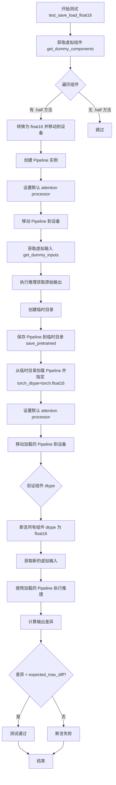

#### 带注释源码

```python
@require_accelerator
def test_save_load_float16(self, expected_max_diff=1e-2):
    """
    测试 StableVideoDiffusionPipeline 在 float16 精度下的保存和加载功能。
    
    该测试验证以下关键点：
    1. Pipeline 组件可以正确转换为 float16 并移动到设备
    2. Pipeline 可以使用 save_pretrained 保存到磁盘
    3. 使用 from_pretrained 可以正确加载 float16 模型
    4. 加载后的模型在推理时保持 float16 精度
    5. 保存前后推理结果的数值差异在可接受范围内
    
    参数:
        expected_max_diff: float, 默认 1e-2
            允许的最大数值差异阈值，用于验证保存加载后输出的一致性
    """
    
    # Step 1: 获取虚拟组件（用于测试的模拟模型组件）
    components = self.get_dummy_components()
    
    # Step 2: 将所有可转换的组件转换为 float16 并移动到目标设备
    # .half() 方法将模型权重从 float32 转换为 float16（半精度）
    for name, module in components.items():
        if hasattr(module, "half"):
            components[name] = module.to(torch_device).half()

    # Step 3: 使用转换后的组件创建 Pipeline 实例
    pipe = self.pipeline_class(**components)
    
    # Step 4: 为所有组件设置默认的 attention processor
    # 这确保了在推理时使用标准的注意力机制
    for component in pipe.components.values():
        if hasattr(component, "set_default_attn_processor"):
            component.set_default_attn_processor()
    
    # Step 5: 将 Pipeline 移动到目标设备并配置进度条
    pipe.to(torch_device)
    pipe.set_progress_bar_config(disable=None)

    # Step 6: 获取测试用的虚拟输入数据
    inputs = self.get_dummy_inputs(torch_device)
    
    # Step 7: 使用原始 float16 Pipeline 执行推理，获取基准输出
    output = pipe(**inputs).frames[0]

    # Step 8: 创建临时目录用于保存模型
    with tempfile.TemporaryDirectory() as tmpdir:
        # Step 9: 将 Pipeline 保存到临时目录
        # safe_serialization 参数默认使用 True，使用 safetensors 格式
        pipe.save_pretrained(tmpdir)
        
        # Step 10: 从临时目录加载 Pipeline，并明确指定 torch_dtype=torch.float16
        # 这确保加载的模型权重保持 float16 精度
        pipe_loaded = self.pipeline_class.from_pretrained(tmpdir, torch_dtype=torch.float16)
        
        # Step 11: 为加载的 Pipeline 组件设置默认 attention processor
        for component in pipe_loaded.components.values():
            if hasattr(component, "set_default_attn_processor"):
                component.set_default_attn_processor()
        
        # Step 12: 将加载的 Pipeline 移动到目标设备
        pipe_loaded.to(torch_device)
        pipe_loaded.set_progress_bar_config(disable=None)

    # Step 13: 验证加载后的所有组件都保持了 float16 数据类型
    # 这是确保模型在加载后仍然使用半精度计算的关键检查
    for name, component in pipe_loaded.components.items():
        if hasattr(component, "dtype"):
            self.assertTrue(
                component.dtype == torch.float16,
                f"`{name}.dtype` switched from `float16` to {component.dtype} after loading.",
            )

    # Step 14: 使用加载的 Pipeline 执行推理，获取保存后的输出
    inputs = self.get_dummy_inputs(torch_device)
    output_loaded = pipe_loaded(**inputs).frames[0]
    
    # Step 15: 计算原始输出和加载后输出的数值差异
    max_diff = np.abs(to_np(output) - to_np(output_loaded)).max()
    
    # Step 16: 断言差异在允许范围内
    # 如果差异过大，说明保存/加载过程改变了模型的数值行为
    self.assertLess(
        max_diff, expected_max_diff, "The output of the fp16 pipeline changed after saving and loading."
    )
```


### `StableVideoDiffusionPipelineFastTests.test_save_load_optional_components`

该方法用于测试 StableVideoDiffusionPipeline 的可选组件在保存和加载过程中的正确性。具体来说，它将管道中的所有可选组件设置为 None，保存管道到磁盘，重新加载管道，然后验证可选组件是否正确保持为 None，并且重新加载后的管道输出与原始输出在指定阈值内等价。

参数：

- `self`：隐式参数，StableVideoDiffusionPipelineFastTests 的实例方法
- `expected_max_difference`：`float`，默认为 1e-4，表示原始输出与加载后输出的最大允许差异

返回值：`None`，该方法是一个测试用例，没有返回值，通过断言验证正确性

#### 流程图

```mermaid
flowchart TD
    A[开始测试] --> B{检查 pipeline_class 是否有 _optional_components 属性}
    B -->|没有| C[直接返回, 测试跳过]
    B -->|有| D[获取虚拟组件]
    D --> E[创建 Pipeline 实例]
    E --> F[设置默认 attention processor]
    F --> G[将 Pipeline 移动到测试设备]
    G --> H[设置进度条配置]
    H --> I[将所有可选组件设为 None]
    I --> J[获取虚拟输入]
    J --> K[执行 Pipeline 并获取输出 frames[0]]
    K --> L[创建临时目录]
    L --> M[保存 Pipeline 到临时目录, safe_serialization=False]
    M --> N[从临时目录加载 Pipeline]
    N --> O[设置默认 attention processor]
    O --> P[将加载的 Pipeline 移动到测试设备]
    P --> Q[验证所有可选组件是否仍为 None]
    Q --> R[断言所有可选组件都为 None]
    R --> S[重新获取虚拟输入]
    S --> T[执行加载的 Pipeline 并获取输出 frames[0]]
    T --> U[计算输出差异]
    U --> V{差异是否小于 expected_max_difference?}
    V -->|是| W[测试通过]
    V -->|否| X[测试失败, 抛出 AssertionError]
```

#### 带注释源码

```python
def test_save_load_optional_components(self, expected_max_difference=1e-4):
    """
    测试可选组件的保存和加载功能。
    
    该测试验证：
    1. 可选组件可以被设置为 None
    2. 包含 None 可选组件的管道可以正确保存和加载
    3. 加载后的管道可以正常执行推理
    4. 加载前后的输出结果应该保持一致（在允许的差异范围内）
    
    参数:
        expected_max_difference: float, 默认 1e-4
            允许的最大输出差异。如果实际差异大于此值，测试将失败。
    """
    # 首先检查管道类是否有 _optional_components 属性
    # 如果没有，说明该管道没有可选组件，直接返回
    if not hasattr(self.pipeline_class, "_optional_components"):
        return

    # 步骤1: 创建带有虚拟组件的管道
    components = self.get_dummy_components()
    pipe = self.pipeline_class(**components)
    
    # 为每个组件设置默认的 attention processor
    # 这确保了在测试中注意力机制使用标准实现
    for component in pipe.components.values():
        if hasattr(component, "set_default_attn_processor"):
            component.set_default_attn_processor()
    
    # 将管道移动到测试设备（如 CPU/CUDA）
    pipe.to(torch_device)
    # 配置进度条（disable=None 表示启用进度条）
    pipe.set_progress_bar_config(disable=None)

    # 步骤2: 将所有可选组件设置为 None
    # 这是测试的核心：验证可选组件可以为 None 且管道仍能工作
    for optional_component in pipe._optional_components:
        setattr(pipe, optional_component, None)

    # 步骤3: 使用设置了可选组件为 None 的管道进行推理
    generator_device = "cpu"
    inputs = self.get_dummy_inputs(generator_device)
    output = pipe(**inputs).frames[0]

    # 步骤4: 保存和加载管道
    with tempfile.TemporaryDirectory() as tmpdir:
        # 保存管道到临时目录，safe_serialization=False 表示不使用安全序列化
        pipe.save_pretrained(tmpdir, safe_serialization=False)
        
        # 从临时目录加载管道
        pipe_loaded = self.pipeline_class.from_pretrained(tmpdir)
        
        # 为加载的管道设置默认 attention processor
        for component in pipe_loaded.components.values():
            if hasattr(component, "set_default_attn_processor"):
                component.set_default_attn_processor()
        
        # 将加载的管道移动到测试设备
        pipe_loaded.to(torch_device)
        pipe_loaded.set_progress_bar_config(disable=None)

    # 步骤5: 验证加载后的管道中，可选组件是否仍然为 None
    # 这是确保可选组件在保存/加载过程中正确处理的关键验证
    for optional_component in pipe._optional_components:
        self.assertTrue(
            getattr(pipe_loaded, optional_component) is None,
            f"`{optional_component}` did not stay set to None after loading.",
        )

    # 步骤6: 使用加载的管道进行推理，验证功能正常
    inputs = self.get_dummy_inputs(generator_device)
    output_loaded = pipe_loaded(**inputs).frames[0]

    # 步骤7: 计算输出差异，验证保存/加载过程没有改变管道的输出行为
    max_diff = np.abs(to_np(output) - to_np(output_loaded)).max()
    self.assertLess(max_diff, expected_max_difference)
```


### `StableVideoDiffusionPipelineFastTests.test_save_load_local`

该方法用于测试 StableVideoDiffusionPipeline 的保存和加载功能，验证管道在本地保存后再加载是否能保持相同的输出结果，确保模型序列化/反序列化的正确性。

参数：

- `self`：`StableVideoDiffusionPipelineFastTests`，测试类实例，表示当前测试对象
- `expected_max_difference`：`float`，默认为 `9e-4`，允许的原始输出与加载后输出之间的最大差异阈值

返回值：`None`，该方法为单元测试，通过 `self.assertLess` 断言验证结果，无显式返回值

#### 流程图

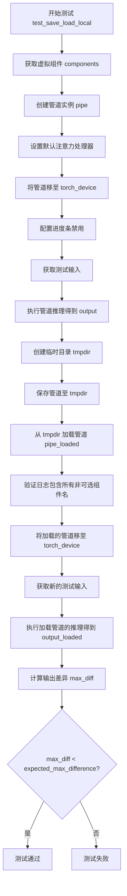

#### 带注释源码

```python
def test_save_load_local(self, expected_max_difference=9e-4):
    """
    测试 StableVideoDiffusionPipeline 的本地保存和加载功能
    
    参数:
        expected_max_difference: float, 允许的最大差异阈值，默认为 9e-4
    """
    # 步骤1: 获取虚拟组件（用于测试的dummy模型组件）
    components = self.get_dummy_components()
    
    # 步骤2: 使用组件创建管道实例
    pipe = self.pipeline_class(**components)
    
    # 步骤3: 为每个组件设置默认的注意力处理器（如果组件支持）
    for component in pipe.components.values():
        if hasattr(component, "set_default_attn_processor"):
            component.set_default_attn_processor()

    # 步骤4: 将管道移至测试设备（通常是 cuda 或 cpu）
    pipe.to(torch_device)
    
    # 步骤5: 配置进度条（disable=None 表示启用进度条）
    pipe.set_progress_bar_config(disable=None)

    # 步骤6: 获取测试输入数据
    inputs = self.get_dummy_inputs(torch_device)
    
    # 步骤7: 执行推理，获取原始输出（取第一帧）
    output = pipe(**inputs).frames[0]

    # 步骤8: 获取日志记录器，用于捕获加载时的日志信息
    logger = logging.get_logger("diffusers.pipelines.pipeline_utils")
    logger.setLevel(diffusers.logging.INFO)

    # 步骤9: 创建临时目录用于保存管道
    with tempfile.TemporaryDirectory() as tmpdir:
        # 步骤10: 将管道保存到临时目录（不使用安全序列化）
        pipe.save_pretrained(tmpdir, safe_serialization=False)

        # 步骤11: 从保存的目录加载管道，并捕获日志
        with CaptureLogger(logger) as cap_logger:
            pipe_loaded = self.pipeline_class.from_pretrained(tmpdir)

        # 步骤12: 验证日志中包含所有非可选组件的名称
        for name in pipe_loaded.components.keys():
            if name not in pipe_loaded._optional_components:
                assert name in str(cap_logger)

        # 步骤13: 将加载的管道移至测试设备
        pipe_loaded.to(torch_device)
        
        # 步骤14: 配置加载管道的进度条
        pipe_loaded.set_progress_bar_config(disable=None)

    # 步骤15: 获取新的测试输入（重新生成以确保独立性）
    inputs = self.get_dummy_inputs(torch_device)
    
    # 步骤16: 执行加载管道的推理，获取输出
    output_loaded = pipe_loaded(**inputs).frames[0]

    # 步骤17: 计算原始输出与加载输出之间的最大差异
    max_diff = np.abs(to_np(output) - to_np(output_loaded)).max()
    
    # 步骤18: 断言差异小于允许的阈值
    self.assertLess(max_diff, expected_max_difference)
```


### `StableVideoDiffusionPipelineFastTests.test_to_device`

该方法是一个单元测试，用于验证 `StableVideoDiffusionPipeline` 的设备迁移功能（`to` 方法），确保管道组件能够正确地在不同设备（CPU 和加速器设备）之间迁移，并且迁移后推理结果不包含 NaN 值。

参数：

- `self`：隐式参数，类型为 `StableVideoDiffusionPipelineFastTests`，表示测试类实例本身

返回值：`None`，无返回值（测试方法使用断言进行验证）

#### 流程图

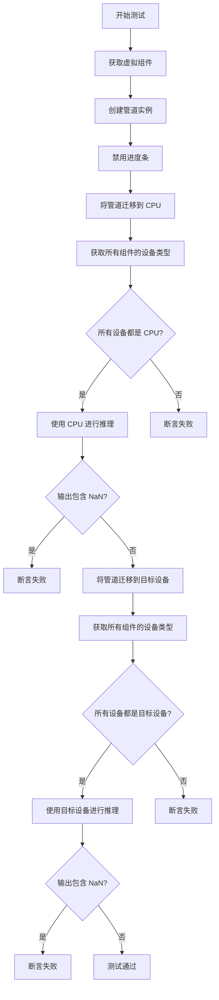

#### 带注释源码

```python
@require_accelerator
def test_to_device(self):
    """
    测试管道的设备迁移功能 (to 方法)
    验证管道组件能够正确迁移到不同设备并正常推理
    """
    # 1. 获取虚拟（dummy）组件，用于测试
    components = self.get_dummy_components()
    
    # 2. 使用虚拟组件创建管道实例
    pipe = self.pipeline_class(**components)
    
    # 3. 设置进度条配置（禁用）
    pipe.set_progress_bar_config(disable=None)

    # 4. 将管道迁移到 CPU 设备
    pipe.to("cpu")
    
    # 5. 收集所有组件的设备类型（仅收集有 device 属性的组件）
    model_devices = [
        component.device.type 
        for component in pipe.components.values() 
        if hasattr(component, "device")
    ]
    
    # 6. 断言：所有组件都应该在 CPU 上
    self.assertTrue(all(device == "cpu" for device in model_devices))

    # 7. 使用 CPU 设备进行推理，获取第一帧输出
    output_cpu = pipe(**self.get_dummy_inputs("cpu")).frames[0]
    
    # 8. 断言：CPU 输出的帧数据中不应包含 NaN 值
    self.assertTrue(np.isnan(output_cpu).sum() == 0)

    # 9. 将管道迁移到目标设备（如 CUDA）
    pipe.to(torch_device)
    
    # 10. 再次收集所有组件的设备类型
    model_devices = [
        component.device.type 
        for component in pipe.components.values() 
        if hasattr(component, "device")
    ]
    
    # 11. 断言：所有组件都应该在目标设备上
    self.assertTrue(all(device == torch_device for device in model_devices))

    # 12. 使用目标设备进行推理
    output_device = pipe(**self.get_dummy_inputs(torch_device)).frames[0]
    
    # 13. 断言：目标设备输出的帧数据中不应包含 NaN 值
    self.assertTrue(np.isnan(to_np(output_device)).sum() == 0)
```


### `StableVideoDiffusionPipelineFastTests.test_to_dtype`

该测试方法用于验证 StableVideoDiffusionPipeline 的 `to()` 方法能否正确地将管道中所有模型组件的数据类型（dtype）从默认的 float32 转换为指定的目标数据类型（如 float16），并确保转换后所有组件的数据类型符合预期。

参数：

- `self`：TestCase 实例，测试类的隐式参数，用于访问测试类的属性和方法

返回值：`None`，该方法为测试用例，无返回值，通过断言验证数据类型转换的正确性

#### 流程图

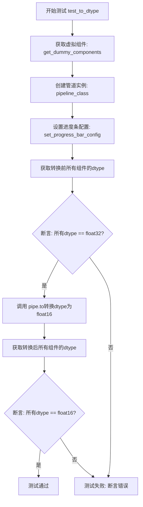

#### 带注释源码

```python
def test_to_dtype(self):
    """
    测试管道的 to() 方法是否能正确转换所有模型组件的数据类型（dtype）
    """
    # 第一步：获取虚拟组件（用于测试的模拟模型组件）
    components = self.get_dummy_components()
    
    # 第二步：使用虚拟组件创建 StableVideoDiffusionPipeline 实例
    pipe = self.pipeline_class(**components)
    
    # 第三步：禁用进度条（测试环境下不需要显示进度）
    pipe.set_progress_bar_config(disable=None)

    # 第四步：获取转换前所有组件的 dtype
    # 遍历管道所有组件，过滤出具有 dtype 属性的组件（如神经网络模型）
    model_dtypes = [
        component.dtype 
        for component in pipe.components.values() 
        if hasattr(component, "dtype")
    ]
    
    # 第五步：断言验证初始状态下所有组件的 dtype 都是 float32
    self.assertTrue(
        all(dtype == torch.float32 for dtype in model_dtypes),
        "初始状态下所有模型组件应该是 float32 类型"
    )

    # 第六步：调用管道的 to() 方法，将所有组件转换为 float16
    pipe.to(dtype=torch.float16)

    # 第七步：再次获取转换后所有组件的 dtype
    model_dtypes = [
        component.dtype 
        for component in pipe.components.values() 
        if hasattr(component, "dtype")
    ]
    
    # 第八步：断言验证转换后所有组件的 dtype 都是 float16
    self.assertTrue(
        all(dtype == torch.float16 for dtype in model_dtypes),
        "转换后所有模型组件应该是 float16 类型"
    )
```


### `StableVideoDiffusionPipelineFastTests.test_sequential_cpu_offload_forward_pass`

这是一个单元测试方法，用于验证 StableVideoDiffusionPipeline 在启用顺序 CPU 卸载（sequential CPU offload）功能后，推理结果应与未启用该功能时保持一致。该测试通过比较两种情况下的输出差异来确保 CPU 卸载机制不会影响模型的推理质量。

参数：

- `self`：`StableVideoDiffusionPipelineFastTests`，测试类的实例，包含测试所需的上下文和辅助方法
- `expected_max_diff`：`float`，默认值为 `1e-4`，表示期望的最大差异阈值，用于判断两次推理结果是否足够接近

返回值：`None`，该方法为测试用例，通过断言验证结果，不返回任何值

#### 流程图

```mermaid
flowchart TD
    A[开始测试] --> B[获取虚拟组件: get_dummy_components]
    B --> C[创建管道实例: pipeline_class]
    C --> D[为每个组件设置默认注意力处理器]
    D --> E[将管道移动到设备: torch_device]
    E --> F[设置进度条配置: disable=None]
    F --> G[获取虚拟输入: get_dummy_inputs]
    G --> H[执行管道推理 - 不使用CPU卸载]
    H --> I[提取输出帧: frames[0]]
    I --> J[启用顺序CPU卸载: enable_sequential_cpu_offload]
    J --> K[重新获取虚拟输入]
    K --> L[执行管道推理 - 使用CPU卸载]
    L --> M[提取输出帧: frames[0]]
    M --> N[计算输出差异: np.abs]
    N --> O{差异 < expected_max_diff?}
    O -->|是| P[测试通过]
    O -->|否| Q[测试失败 - 抛出断言错误]
```

#### 带注释源码

```python
@require_accelerator
@require_accelerate_version_greater("0.14.0")
def test_sequential_cpu_offload_forward_pass(self, expected_max_diff=1e-4):
    """
    测试顺序CPU卸载功能是否正确工作。
    
    该测试验证在启用顺序CPU卸载后，模型的推理结果应与
    未启用时保持一致（差异在expected_max_diff范围内）。
    
    参数:
        expected_max_diff: float, 默认为1e-4, 允许的最大差异阈值
    """
    # 步骤1: 获取虚拟组件（用于测试的模拟模型组件）
    components = self.get_dummy_components()
    
    # 步骤2: 使用虚拟组件创建StableVideoDiffusionPipeline实例
    pipe = self.pipeline_class(**components)
    
    # 步骤3: 为每个组件设置默认的注意力处理器
    # 这是为了确保测试的一致性，避免使用自定义注意力处理器导致差异
    for component in pipe.components.values():
        if hasattr(component, "set_default_attn_processor"):
            component.set_default_attn_processor()
    
    # 步骤4: 将管道移动到指定的计算设备（通常是GPU）
    pipe.to(torch_device)
    
    # 步骤5: 配置进度条（disable=None表示启用进度条）
    pipe.set_progress_bar_config(disable=None)
    
    # 步骤6: 获取虚拟输入数据（包含随机种子、图像、推理步数等）
    generator_device = "cpu"
    inputs = self.get_dummy_inputs(generator_device)
    
    # 步骤7: 执行推理（不使用CPU卸载）
    # 返回的frames是一个列表，每个元素是一组生成的帧序列
    output_without_offload = pipe(**inputs).frames[0]
    
    # 步骤8: 启用顺序CPU卸载
    # 这会将模型的不同部分依次卸载到CPU，以节省GPU显存
    pipe.enable_sequential_cpu_offload(device=torch_device)
    
    # 步骤9: 重新获取虚拟输入（因为某些输入可能已被消耗）
    inputs = self.get_dummy_inputs(generator_device)
    
    # 步骤10: 执行推理（使用顺序CPU卸载）
    output_with_offload = pipe(**inputs).frames[0]
    
    # 步骤11: 计算两次推理结果的最大差异
    # 使用numpy计算绝对差异并取最大值
    max_diff = np.abs(to_np(output_with_offload) - to_np(output_without_offload)).max()
    
    # 步骤12: 断言验证差异在可接受范围内
    # 如果差异过大，说明CPU卸载机制引入了数值误差
    self.assertLess(max_diff, expected_max_diff, "CPU offloading should not affect the inference results")
```


### `StableVideoDiffusionPipelineFastTests.test_model_cpu_offload_forward_pass`

该测试方法用于验证StableVideoDiffusionPipeline在启用CPU模型卸载（model CPU offload）功能后的推理结果与未启用时保持一致，确保CPU卸载机制不会影响模型的推理质量。

参数：

- `self`：隐式参数，测试类实例本身
- `expected_max_diff`：`float`，默认为`2e-4`，允许的最大差异阈值，用于判断启用CPU卸载前后的输出差异是否在可接受范围内

返回值：`None`，该方法为单元测试，通过`assert`语句进行断言验证

#### 流程图

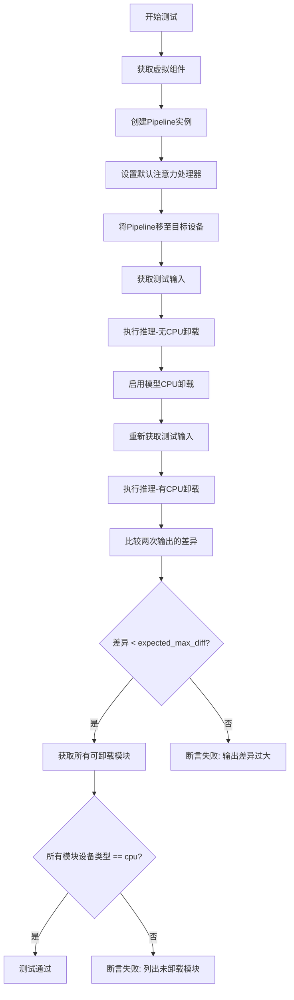

#### 带注释源码

```python
@require_accelerator  # 装饰器：仅在有加速器可用时运行
@require_accelerate_version_greater("0.17.0")  # 装饰器：要求accelerate版本大于0.17.0
def test_model_cpu_offload_forward_pass(self, expected_max_diff=2e-4):
    """
    测试启用模型CPU卸载后的前向传播是否产生正确结果。
    
    测试流程:
    1. 在GPU上执行推理，获取基准输出
    2. 启用CPU卸载功能
    3. 再次执行推理，获取卸载后的输出
    4. 比较两次输出的差异，应在允许范围内
    5. 验证所有可卸载模块已被移至CPU
    """
    # 设置生成器设备为CPU
    generator_device = "cpu"
    
    # 获取虚拟组件（用于测试的dummy模型）
    components = self.get_dummy_components()
    
    # 创建Pipeline实例
    pipe = self.pipeline_class(**components)

    # 遍历所有组件，设置默认的注意力处理器
    for component in pipe.components.values():
        if hasattr(component, "set_default_attn_processor"):
            component.set_default_attn_processor()

    # 将Pipeline移至目标设备（如CUDA）
    pipe = pipe.to(torch_device)
    
    # 配置进度条（禁用）
    pipe.set_progress_bar_config(disable=None)

    # 获取测试输入数据
    inputs = self.get_dummy_inputs(generator_device)
    
    # 第一次推理：不启用CPU卸载，获取基准输出
    output_without_offload = pipe(**inputs).frames[0]

    # 启用模型CPU卸载功能
    pipe.enable_model_cpu_offload(device=torch_device)
    
    # 重新获取测试输入（可能需要重置随机种子等）
    inputs = self.get_dummy_inputs(generator_device)
    
    # 第二次推理：启用CPU卸载后
    output_with_offload = pipe(**inputs).frames[0]

    # 计算两次输出的最大差异
    max_diff = np.abs(to_np(output_with_offload) - to_np(output_without_offload)).max()
    
    # 断言：差异应小于允许的最大差异
    self.assertLess(max_diff, expected_max_diff, "CPU offloading should not affect the inference results")
    
    # 收集所有可卸载的模块（排除在卸载列表外的模块）
    offloaded_modules = [
        v
        for k, v in pipe.components.items()
        if isinstance(v, torch.nn.Module) and k not in pipe._exclude_from_cpu_offload
    ]
    
    # 断言：所有可卸载模块的设备类型应为CPU
    (
        self.assertTrue(all(v.device.type == "cpu" for v in offloaded_modules)),
        f"Not offloaded: {[v for v in offloaded_modules if v.device.type != 'cpu']}",
    )
```


### `StableVideoDiffusionPipelineFastTests.test_xformers_attention_forwardGenerator_pass`

该测试方法用于验证 XFormers 内存高效注意力机制与默认注意力机制的输出结果一致性，确保启用 XFormers 优化后不会影响模型的推理质量。

参数：

- `self`：隐式参数，TestCase 实例本身

返回值：无返回值（`None`），该方法为单元测试，通过断言验证结果

#### 流程图

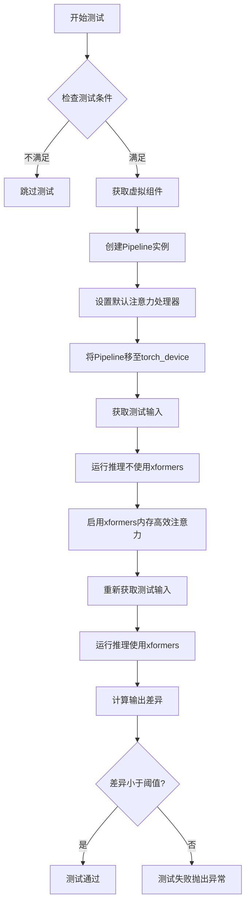

#### 带注释源码

```python
@unittest.skipIf(
    torch_device != "cuda" or not is_xformers_available(),
    reason="XFormers attention is only available with CUDA and `xformers` installed",
)
def test_xformers_attention_forwardGenerator_pass(self):
    """
    测试XFormers内存高效注意力机制对推理结果的影响
    验证启用xformers后输出与默认实现一致
    """
    # 定义允许的最大差异阈值
    expected_max_diff = 9e-4

    # 检查测试类是否启用了xformers测试标志
    if not self.test_xformers_attention:
        return

    # 获取预定义的虚拟组件（unet, vae, scheduler等）
    components = self.get_dummy_components()
    # 使用虚拟组件实例化StableVideoDiffusionPipeline
    pipe = self.pipeline_class(**components)
    # 遍历所有组件，设置默认注意力处理器
    for component in pipe.components.values():
        if hasattr(component, "set_default_attn_processor"):
            component.set_default_attn_processor()
    # 将Pipeline移至测试设备（cuda/xpu）
    pipe.to(torch_device)
    # 配置进度条（disable=None表示不禁用）
    pipe.set_progress_bar_config(disable=None)

    # 获取测试输入数据
    inputs = self.get_dummy_inputs(torch_device)
    # 执行推理（不使用xformers优化）
    output_without_offload = pipe(**inputs).frames[0]
    # 确保输出为CPU张量以便后续处理
    output_without_offload = (
        output_without_offload.cpu() if torch.is_tensor(output_without_offload) else output_without_offload
    )

    # 启用XFormers内存高效注意力
    pipe.enable_xformers_memory_efficient_attention()
    # 重新获取测试输入（需要新生成以确保一致性）
    inputs = self.get_dummy_inputs(torch_device)
    # 执行推理（使用xformers优化）
    output_with_offload = pipe(**inputs).frames[0]
    # 确保输出为CPU张量
    output_with_offload = (
        output_with_offload.cpu() if torch.is_tensor(output_with_offload) else output_without_offload
    )

    # 计算两个输出之间的最大绝对差异
    max_diff = np.abs(to_np(output_with_offload) - to_np(output_without_offload)).max()
    # 断言：xformers不应显著影响推理结果
    self.assertLess(max_diff, expected_max_diff, "XFormers attention should not affect the inference results")
```


### `StableVideoDiffusionPipelineFastTests.test_disable_cfg`

该测试方法验证了当 `max_guidance_scale` 设置为 1.0 时，即禁用 Classifier-Free Guidance (CFG) 时，StableVideoDiffusionPipeline 管道能否正常生成视频帧，并确保输出的帧数据具有 5 维形状（批量、时间步、高度、宽度、通道）。

参数：

- `self`：`StableVideoDiffusionPipelineFastTests`，测试类的实例，用于访问测试所需的组件和方法

返回值：无明确返回值（`None`），该测试通过 `assertEqual` 断言验证输出形状是否符合预期（5 维）

#### 流程图

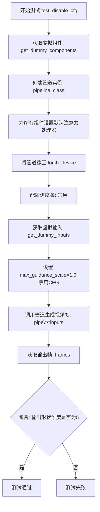

#### 带注释源码

```python
def test_disable_cfg(self):
    """
    测试禁用 CFG (Classifier-Free Guidance) 时的管道行为。
    当 max_guidance_scale 设为 1.0 时，CFG 被禁用。
    """
    # 步骤1: 获取虚拟组件（用于测试的模拟模型组件）
    components = self.get_dummy_components()
    
    # 步骤2: 使用虚拟组件创建 StableVideoDiffusionPipeline 实例
    pipe = self.pipeline_class(**components)
    
    # 步骤3: 为所有可用的组件设置默认注意力处理器
    for component in pipe.components.values():
        if hasattr(component, "set_default_attn_processor"):
            component.set_default_attn_processor()

    # 步骤4: 将管道移至指定的计算设备（如 CUDA）
    pipe.to(torch_device)
    
    # 步骤5: 配置进度条（禁用进度条显示）
    pipe.set_progress_bar_config(disable=None)

    # 步骤6: 获取虚拟输入数据，指定生成器设备为 CPU
    generator_device = "cpu"
    inputs = self.get_dummy_inputs(generator_device)
    
    # 步骤7: 设置 max_guidance_scale 为 1.0，从而禁用 CFG
    inputs["max_guidance_scale"] = 1.0
    
    # 步骤8: 调用管道进行推理，获取生成的视频帧
    output = pipe(**inputs).frames
    
    # 步骤9: 断言输出帧的形状维度为 5
    # 形状应为 (batch_size, num_frames, height, width, channels)
    self.assertEqual(len(output.shape), 5)
```


### `StableVideoDiffusionPipelineSlowTests.setUp`

该方法是 `StableVideoDiffusionPipelineSlowTests` 测试类的初始化方法，在每个测试方法执行前被自动调用，用于清理 GPU 显存（VRAM）和其他计算资源，确保测试环境处于干净状态，避免因之前测试残留的 GPU 内存或缓存导致后续测试出现内存相关错误。

参数：

- `self`：`StableVideoDiffusionPipelineSlowTests` 测试类实例，隐式参数，无需显式传递

返回值：`None`，该方法不返回任何值，仅执行清理操作

#### 流程图

```mermaid
flowchart TD
    A[开始 setUp] --> B[调用 super().setUp]
    B --> C[执行 gc.collect]
    C --> D[调用 backend_empty_cache]
    D --> E[结束]
```

#### 带注释源码

```python
def setUp(self):
    # clean up the VRAM before each test
    # 在每个测试运行前清理 VRAM，确保测试环境干净
    super().setUp()              # 调用父类 unittest.TestCase 的 setUp 方法
    gc.collect()                 # 强制 Python 垃圾回收器回收不再使用的对象
    backend_empty_cache(torch_device)  # 清空 GPU 显存缓存，torch_device 指定目标设备
```


### `StableVideoDiffusionPipelineSlowTests.tearDown`

这是 `StableVideoDiffusionPipelineSlowTests` 测试类的 `tearDown` 方法，用于在每个测试用例执行完成后清理 VRAM（显存）资源，防止显存泄漏。

参数： 无

返回值：`None`，该方法不返回任何值，仅执行清理操作

#### 流程图

```mermaid
flowchart TD
    A[tearDown 开始] --> B[调用父类 tearDown]
    B --> C[执行 gc.collect 强制垃圾回收]
    C --> D[调用 backend_empty_cache 清理 GPU 缓存]
    D --> E[tearDown 结束]
```

#### 带注释源码

```python
def tearDown(self):
    # clean up the VRAM after each test
    # 清理测试后的 VRAM（显存）资源
    super().tearDown()  # 调用父类的 tearDown 方法，执行标准清理
    gc.collect()        # 强制 Python 垃圾回收器运行，释放 Python 对象
    backend_empty_cache(torch_device)  # 清空 GPU 缓存，释放显存
```


### `StableVideoDiffusionPipelineSlowTests.test_sd_video`

这是一个集成测试方法，用于测试 Stable Video Diffusion 模型从预训练模型加载、推理到输出验证的完整流程，验证模型能够正确生成指定帧数的视频内容。

参数：

- `self`：`StableVideoDiffusionPipelineSlowTests`，测试类实例本身

返回值：`None`，该方法为测试方法，通过断言进行验证，不返回具体数值

#### 流程图

```mermaid
flowchart TD
    A[测试开始] --> B[setUp: 清理VRAM]
    B --> C[从stabilityai/stable-video-diffusion-img2vid加载Pipeline]
    C --> D[启用model_cpu_offload]
    D --> E[设置进度条配置]
    E --> F[加载测试图像]
    F --> G[创建随机数生成器 seed=0]
    G --> H[设置生成帧数 num_frames=3]
    H --> I[调用pipe推理]
    I --> J[获取输出frames]
    J --> K{验证图像形状}
    K -->|通过| L[提取图像切片]
    K -->|失败| M[断言失败]
    L --> N{验证切片相似度}
    N -->|通过| O[测试通过]
    N -->|失败| M
    O --> P[tearDown: 清理VRAM]
    P --> Q[测试结束]
```

#### 带注释源码

```python
# 标记为慢速测试，需要GPU加速器
@slow
# 要求使用torch加速器
@require_torch_accelerator
class StableVideoDiffusionPipelineSlowTests(unittest.TestCase):
    """
    慢速集成测试类，用于测试Stable Video Diffusion模型的完整推理流程
    """
    
    def setUp(self):
        """
        测试前准备：清理VRAM缓存，确保测试环境干净
        """
        # 清理Python垃圾回收
        gc.collect()
        # 清理GPU/加速器缓存
        backend_empty_cache(torch_device)

    def tearDown(self):
        """
        测试后清理：释放VRAM资源
        """
        gc.collect()
        backend_empty_cache(torch_device)

    def test_sd_video(self):
        """
        核心测试方法：验证Stable Video Diffusion模型能够正确生成视频帧
        
        测试流程：
        1. 从预训练模型加载StableVideoDiffusionPipeline
        2. 配置CPU offload以优化显存使用
        3. 加载测试图像
        4. 执行推理生成视频帧
        5. 验证输出形状和内容质量
        """
        # 从HuggingFace Hub加载预训练的Stable Video Diffusion模型
        # variant="fp16"使用半精度浮点数以减少显存占用
        pipe = StableVideoDiffusionPipeline.from_pretrained(
            "stabilityai/stable-video-diffusion-img2vid",  # 模型名称
            variant="fp16",                                 # 使用FP16变体
            torch_dtype=torch.float16,                      # 设置torch数据类型为FP16
        )
        
        # 启用模型CPU卸载，将不活跃的模型层移到CPU以节省VRAM
        pipe.enable_model_cpu_offload(device=torch_device)
        
        # 配置进度条，disable=None表示不禁用进度条
        pipe.set_progress_bar_config(disable=None)
        
        # 从URL加载测试用的猫图像
        image = load_image(
            "https://huggingface.co/datasets/hf-internal-testing/diffusers-images/resolve/main/pix2pix/cat_6.png?download=true"
        )

        # 创建CPU随机数生成器，种子设为0以确保可复现性
        generator = torch.Generator("cpu").manual_seed(0)
        
        # 设置要生成的视频帧数
        num_frames = 3

        # 执行图像到视频的推理转换
        # 参数说明：
        # - image: 输入图像
        # - num_frames: 输出视频帧数
        # - generator: 随机数生成器确保可复现
        # - num_inference_steps: 推理步数
        # - output_type: 输出类型为numpy数组
        output = pipe(
            image=image,
            num_frames=num_frames,
            generator=generator,
            num_inference_steps=3,
            output_type="np",
        )

        # 从输出中提取第一组生成的视频帧
        image = output.frames[0]
        
        # 断言验证输出形状：(帧数, 高度, 宽度, RGB通道)
        # 期望: (3, 576, 1024, 3)
        assert image.shape == (num_frames, 576, 1024, 3)

        # 提取最后一帧图像的右下角3x3像素块用于质量验证
        image_slice = image[0, -3:, -3:, -1]
        
        # 期望的像素值切片（已预先计算）
        expected_slice = np.array([0.8592, 0.8645, 0.8499, 0.8722, 0.8769, 0.8421, 0.8557, 0.8528, 0.8285])
        
        # 使用余弦相似度距离验证生成图像质量
        # 相似度距离小于0.001视为通过
        assert numpy_cosine_similarity_distance(image_slice.flatten(), expected_slice.flatten()) < 1e-3
```

## 关键组件


### StableVideoDiffusionPipeline

StableVideoDiffusionPipeline 是稳定视频扩散模型的核心管道类，负责协调图像到视频的生成过程。该管道接受图像输入，经过图像编码、潜在空间处理、时间步迭代等阶段，最终生成视频帧序列。

### UNetSpatioTemporalConditionModel

UNetSpatioTemporalConditionModel 是时空条件UNet模型，用于在潜在空间中执行去噪操作。该模型结合了空间注意力和时间注意力机制，能够处理视频帧之间的时间依赖关系，实现连续视频帧的生成。

### AutoencoderKLTemporalDecoder

AutoencoderKLTemporalDecoder 是变分自编码器的时序解码器组件，负责将潜在空间表示解码为实际的像素值视频帧。该组件在管道的最后阶段将处理后的潜在向量转换为我们可查看的视频图像。

### CLIPVisionModelWithProjection

CLIPVisionModelWithProjection 是基于CLIP架构的图像编码器，带有投影层。该组件将输入图像编码为高维特征表示，用于后续的视频生成条件控制。

### CLIPImageProcessor

CLIPImageProcessor 是图像预处理器，负责对输入图像进行尺寸调整、归一化等预处理操作，使其符合模型输入要求。

### EulerDiscreteScheduler

EulerDiscreteScheduler 是基于欧拉方法的离散调度器，用于控制去噪过程中的时间步采样和噪声调度策略。该调度器实现了v_prediction预测类型，支持karras_sigmas等高级采样技术。

### 测试框架组件

测试框架包含两类测试用例：StableVideoDiffusionPipelineFastTests 用于快速单元测试，验证管道的基本功能正确性；StableVideoDiffusionPipelineSlowTests 用于慢速集成测试，使用真实模型和预训练权重进行端到端验证。


## 问题及建议


### 已知问题

-   **大量测试被跳过**：4个测试方法（`test_attention_slicing_forward_pass`、`test_inference_batch_single_identical`、`test_inference_batch_consistent`、`test_float16_inference`）被 `@unittest.skip` 装饰器跳过，表明这些功能可能存在问题或不完整，其中 `test_inference_batch_single_identical` 明确标记为"Batched inference works and outputs look correct, but the test is failing"。
-   **重复代码模式**：在多个测试方法中重复出现设置 `set_default_attn_processor`、设置 progress bar、组件设备迁移等相同代码块，违反了 DRY 原则。
-   **设备兼容性问题**：在 `get_dummy_inputs` 中对 MPS 设备有特殊处理（`if str(device).startswith("mps")`），说明跨平台兼容性存在潜在问题。
-   **日志级别管理不一致**：测试中多次动态设置日志级别（如 `logger.setLevel(level=diffusers.logging.FATAL)` 和 `logger.setLevel(diffusers.logging.INFO)`），可能影响测试结果的可靠性。
-   **临时资源管理**：使用 `tempfile.TemporaryDirectory()` 但未显式使用上下文管理器（with 语句），虽然 Python 会自动清理，但显式管理更佳。
-   **测试参数硬编码**：各类测试中的阈值（如 `expected_max_diff=1e-4`、`expected_max_diff=5e-2`）和配置参数散落在各方法中，缺乏统一的配置管理。
-   **缺失的异常处理**：测试方法中没有显式的异常捕获和断言信息，当测试失败时难以快速定位问题。
-   **内存管理**：慢速测试中虽然调用了 `gc.collect()` 和 `backend_empty_cache()`，但未检查清理是否成功。

### 优化建议

-   **重构公共方法**：提取重复的设置逻辑（如 `set_default_attn_processor`、设备迁移、progress bar 配置）为类的私有方法或 `setUp` 方法，减少代码冗余。
-   **统一配置管理**：创建类级别的配置字典或使用 `pytest fixture` 来管理测试参数（如阈值、设备类型），提高可维护性。
-   **修复跳过的测试**：调查并修复被跳过的测试，特别是批处理推理相关的测试，以提升测试覆盖率和功能完整性。
-   **改进日志管理**：使用 pytest 的日志 fixture 或在测试开始时统一配置日志级别，避免在测试方法中动态修改。
-   **添加设备抽象层**：封装设备检测和兼容处理的逻辑，统一处理 CUDA、MPS、CPU 等不同设备的差异。
-   **增强错误信息**：在断言中添加更详细的错误消息，如 `assert max_diff < expected_max_diff, f"Outputs differ by {max_diff}, expected less than {expected_max_diff}"`。
-   **使用上下文管理器**：对临时目录等资源使用 `with` 语句进行显式管理，提高代码清晰度。


## 其它


### 设计目标与约束

本测试文件旨在验证StableVideoDiffusionPipeline的核心功能，包括模型加载、推理执行、输出格式转换、设备迁移、内存优化技术（CPU offload、xFormers）以及模型保存与加载。测试覆盖PyTorch_float32/float16两种精度模式，支持CPU、CUDA、XPU、MPS多种设备平台，要求输出结果与预期值的差异控制在1e-2至1e-4范围内。

### 错误处理与异常设计

代码采用unittest框架进行错误处理，主要包括：设备兼容性检查（@require_accelerator、@require_torch_accelerator、@unittest.skipIf）、可选组件缺失容错（hasattr动态检测）、内存异常捕获（gc.collect + backend_empty_cache）、数值稳定性验证（np.isnan检测）、精度差异阈值断言。测试中部分用例标记为skip或deprecated，反映已知功能限制或待修复问题。

### 数据流与状态机

测试数据流遵循以下状态转换：get_dummy_components()创建组件 → get_dummy_inputs()生成输入 → pipeline初始化 → 设备迁移(to_device/to_dtype) → 推理执行 → 输出验证。状态机涉及模型权重加载、梯度关闭（eval模式）、内存设备切换、精度类型转换、offload启用/禁用等状态管理。

### 外部依赖与接口契约

核心依赖包括：transformers(CLIPImageProcessor/CLIPVisionConfig/CLIPVisionModelWithProjection)、diffusers(AutoencoderKLTemporalDecoder/EulerDiscreteScheduler/StableVideoDiffusionPipeline/UNetSpatioTemporalConditionModel)、numpy、torch。项目内部依赖testing_utils模块提供的工具函数（CaptureLogger、backend_empty_cache、enable_full_determinism、floats_tensor等）以及test_pipelines_common基类。pipeline_class使用StableVideoDiffusionPipeline，params包含image参数，batch_params包含image和generator。

### 性能考虑与基准测试

测试定义了多个性能基准：test_inference_batch_single_identical期望max_diff<1e-4，test_dict_tuple_outputs_equivalent期望max_diff<1e-4，test_float16_inference期望max_diff<5e-2，test_save_load_float16期望max_diff<1e-2，test_save_load_local期望max_diff<9e-4，test_sequential_cpu_offload_forward_pass期望max_diff<1e-4，test_model_cpu_offload_forward_pass期望max_diff<2e-4，test_xformers_attention_forwardGenerator_pass期望max_diff<9e-4。测试涵盖CPU offload、model offload、xFormers memory efficient attention等内存优化技术。

### 安全性与合规性

测试文件使用safe_serialization=False进行模型保存以避免安全序列化开销。enable_full_determinism函数确保测试可复现性。临时文件操作使用tempfile.TemporaryDirectory自动清理。敏感操作（如.half()转换）仅在特定条件下执行并伴随dtype验证。

### 兼容性矩阵

| 功能 | 支持情况 |
|------|----------|
| float16推理 | 仅CUDA/XPU |
| xFormers | 仅CUDA+已安装xformers |
| MPS设备 | 部分支持（需特殊处理generator） |
| 批处理推理 | 部分测试失败被skip |
| 可选组件 | 支持_save_load_optional_components |
| 输出格式 | pt, np, pil |

### 测试策略与覆盖率

测试覆盖以下维度：功能正确性（np/tuple输出等价）、数值精度（float16 vs float32）、设备迁移（cpu/cuda/xpu）、内存优化（sequential/_model_cpu_offload、xformers）、模型持久化（save/load）、配置灵活性（可选组件、dtype转换）。Slow测试类使用真实模型(stabilityai/stable-video-diffusion-img2vid)进行端到端验证。

### 配置管理与环境要求

测试依赖以下环境变量和配置：torch_device（设备标识）、transformers版本要求（特定测试需要accelerate>0.14.0或>0.17.0）、xformers可选安装。Random seed通过enable_full_determinism和manual_seed统一管理，确保测试确定性。

    