# `diffusers\tests\pipelines\test_pipeline_utils.py` 详细设计文档

这是一个测试文件，用于验证diffusers库中管道工具函数的正确性，主要包含SafeTensors兼容性检查、变体文件匹配以及管道进度条和设备/数据类型稳定性的单元测试。

## 整体流程

```mermaid
graph TD
    A[开始测试] --> B[IsSafetensorsCompatibleTests]
    B --> B1[test_all_is_compatible]
    B --> B2[test_diffusers_model_is_compatible]
    B --> B3[test_diffusers_model_is_not_compatible]
    B --> B4[test_transformer_model_is_compatible]
    B --> B5[test_transformer_model_is_not_compatible]
    B --> B6[test_*_variant系列]
    B --> B7[test_*_sharded系列]
    A --> C[VariantCompatibleSiblingsTest]
    C --> C1[test_only_non_variants_downloaded]
    C --> C2[test_only_variants_downloaded]
    C --> C3[test_mixed_variants_downloaded]
    C --> C4[test_*_sharded_*系列]
    C --> C5[test_download_onnx_models]
    C --> C6[test_download_flax_models]
    A --> D[ProgressBarTests]
    D --> D1[get_dummy_components_image_generation]
    D --> D2[get_dummy_components_video_generation]
    D --> D3[test_text_to_image]
    D --> D4[test_image_to_image]
    D --> D5[test_inpainting]
    D --> D6[test_text_to_video]
    D --> D7[test_video_to_video]
    A --> E[PipelineDeviceAndDtypeStabilityTests]
    E --> E1[get_dummy_components_image_generation]
    E --> E2[test_deterministic_device]
    E --> E3[test_deterministic_dtype]
```

## 类结构

```
unittest.TestCase (Python标准库)
├── IsSafetensorsCompatibleTests (SafeTensors兼容性测试)
├── VariantCompatibleSiblingsTest (变体文件兄弟匹配测试)
├── ProgressBarTests (进度条功能测试)
│   └── get_dummy_components_image_generation (辅助方法)
│   └── get_dummy_components_video_generation (辅助方法)
└── PipelineDeviceAndDtypeStabilityTests (设备和数据类型稳定性测试)
    └── get_dummy_components_image_generation (辅助方法)
```

## 全局变量及字段


### `torch_device`
    
全局测试设备字符串，用于指定运行测试的计算设备（如'cuda'或'cpu'）

类型：`str`
    


### `PipelineDeviceAndDtypeStabilityTests.expected_pipe_device`
    
期望的管道设备对象，指定测试预期的设备类型和索引

类型：`torch.device`
    


### `PipelineDeviceAndDtypeStabilityTests.expected_pipe_dtype`
    
期望的管道数据类型，指定测试预期的张量数据类型（如torch.float64）

类型：`torch.dtype`
    
    

## 全局函数及方法


### `is_safetensors_compatible`

该函数用于检查给定的文件列表是否与 safetensors 格式兼容。它通过检查是否存在对应的 .safetensors 文件来验证兼容性，并支持变体（如 fp16）检查和指定文件夹名称过滤。

参数：

- `filenames`：`List[str]`，文件名列表，包含模型文件的路径（如 "unet/diffusion_pytorch_model.bin"）
- `variant`：`Optional[str]`，可选参数，指定要检查的变体（如 "fp16"），默认为 None
- `folder_names`：`Optional[Set[str]]`，可选参数，指定要检查的文件夹名称集合，默认为 None

返回值：`bool`，如果文件列表与 safetensors 格式兼容则返回 True，否则返回 False

#### 流程图

```mermaid
flowchart TD
    A[开始检查 is_safetensors_compatible] --> B{filenames 是否为空?}
    B -->|是| C[返回 False]
    B -->|否| D{是否指定了 variant?}
    D -->|是| E[构建 variant 模式<br/>如: {variant}.safetensors]
    D -->|否| F[使用默认 .safetensors 模式]
    E --> G{是否指定了 folder_names?}
    F --> G
    G -->|是| H[只检查 folder_names 中的文件夹]
    G -->|否| I[检查所有文件夹]
    H --> J{每个相关文件夹是否有 safetensors 文件?}
    I --> J
    J -->|所有相关文件夹都有| K[返回 True]
    J -->|有文件夹缺失| L[返回 False]
    C --> M[结束]
    K --> M
    L --> M
```

#### 带注释源码

```python
# 注意: 源代码未在提供的代码片段中显示
# 以下是基于测试用例推断的函数行为和逻辑

def is_safetensors_compatible(filenames, variant=None, folder_names=None):
    """
    检查给定的文件列表是否与 safetensors 格式兼容。
    
    参数:
        filenames: 文件名列表，如 ["unet/diffusion_pytorch_model.bin", "unet/diffusion_pytorch_model.safetensors"]
        variant: 可选的变体标识符，如 "fp16"
        folder_names: 可选的文件夹名称集合，用于过滤要检查的文件夹
    
    返回:
        bool: 如果所有相关组件都有对应的 safetensors 文件则返回 True
    """
    
    # 1. 确定要检查的文件模式（基于 variant）
    #    - 如果指定了 variant: 查找 {filename}.{variant}.safetensors
    #    - 如果没有指定 variant: 查找 {filename}.safetensors
    
    # 2. 确定要检查的文件夹（基于 folder_names）
    #    - 如果指定了 folder_names: 只检查这些文件夹
    #    - 如果没有指定: 检查所有包含模型文件的文件夹
    
    # 3. 对于每个相关文件夹，检查是否存在对应的 safetensors 文件
    #    - diffusers 模型: 检查 diffusion_pytorch_model.safetensors
    #    - transformer 模型: 检查 model.safetensors
    #    - 支持分片模型: 检查 model-XXXXX-of-YYYYY.safetensors
    
    # 4. 返回结果
    #    - 所有相关文件夹都有 safetensors 文件: True
    #    - 任何相关文件夹缺少 safetensors 文件: False
    
    # 示例逻辑:
    # filenames = ["unet/diffusion_pytorch_model.bin", "unet/diffusion_pytorch_model.safetensors"]
    # variant = None
    # folder_names = None
    # 结果: True (两个文件都有对应的 safetensors 版本)
    
    pass  # 实际实现需要查看 diffusers.pipelines.pipeline_loading_utils 源代码
```

---

**备注**: 由于提供的代码片段仅包含测试用例，未包含 `is_safetensors_compatible` 函数的实际实现源代码，上述源码是基于测试用例行为推断的注释版本。如需获取完整的函数实现，建议查看 `diffusers` 库的源代码文件 `diffusers/pipelines/pipeline_loading_utils.py`。


### `variant_compatible_siblings`

该函数根据指定的变体（如 `fp16`）从文件列表中筛选出兼容的模型文件，并返回模型文件名集合和对应的变体文件名集合。主要用于 diffusion 模型的下载和加载过程中，处理不同变体版本（fp16、fp32等）的模型文件选择。

参数：

- `filenames`：`List[str]`，要检查的文件名列表，包含可能的模型文件路径（如 "unet/diffusion_pytorch_model.fp16.safetensors"）
- `variant`：`Optional[str]`，指定的变体版本（如 "fp16"、"fp32" 等），用于筛选对应变体的模型文件，默认为 None
- `ignore_patterns`：`Optional[List[str]]`，可选的文件名忽略模式列表（如 ["*.bin"]），用于在筛选时排除匹配的文件

返回值：`Tuple[Set[str], Set[str]]`，返回两个集合——第一个是筛选后的模型文件名集合（model_filenames），第二个是变体文件名集合（variant_filenames）

#### 流程图

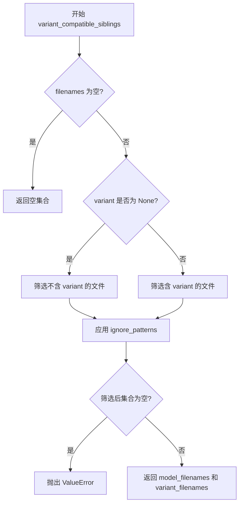

#### 带注释源码

```python
def variant_compatible_siblings(filenames: List[str], variant: Optional[str] = None, ignore_patterns: Optional[List[str]] = None):
    """
    根据变体版本筛选兼容的模型文件。
    
    Args:
        filenames: 模型文件列表，如 ["unet/model.safetensors", "unet/model.fp16.safetensors"]
        variant: 变体版本，如 "fp16"，None 表示非变体版本
        ignore_patterns: 忽略的文件模式，如 ["*.bin"]
    
    Returns:
        Tuple[Set[str], Set[str]]: (model_filenames, variant_filenames)
    """
    # 根据 variant 参数决定筛选逻辑
    # 当 variant=None 时，选择不含 variant 标识的原始模型文件
    # 当 variant="fp16" 时，选择包含 variant 标识的 fp16 版本文件
    
    # 筛选逻辑会区分：
    # 1. 普通模型文件（不含 variant 后缀）
    # 2. 变体模型文件（包含 variant 后缀，如 .fp16.）
    # 3. 分片模型文件（包含 -00001-of-00002 等分片编号）
    
    # 示例：
    # filenames = ["unet/model.safetensors", "unet/model.fp16.safetensors"]
    # variant = "fp16" -> model_filenames = {"unet/model.fp16.safetensors"}
    # variant = None -> model_filenames = {"unet/model.safetensors"}
```


### `require_torch_accelerator`

该函数是一个装饰器，用于检查 PyTorch 加速器（通常是 CUDA）是否可用。如果加速器不可用，则跳过被装饰的测试类或测试函数。

参数：

- `cls` 或 `func`：`类型`（类或函数），被装饰的目标（测试类或测试函数）

返回值：`类型`（类或函数），返回被装饰的目标，如果加速器不可用则返回跳过测试的装饰器

#### 流程图

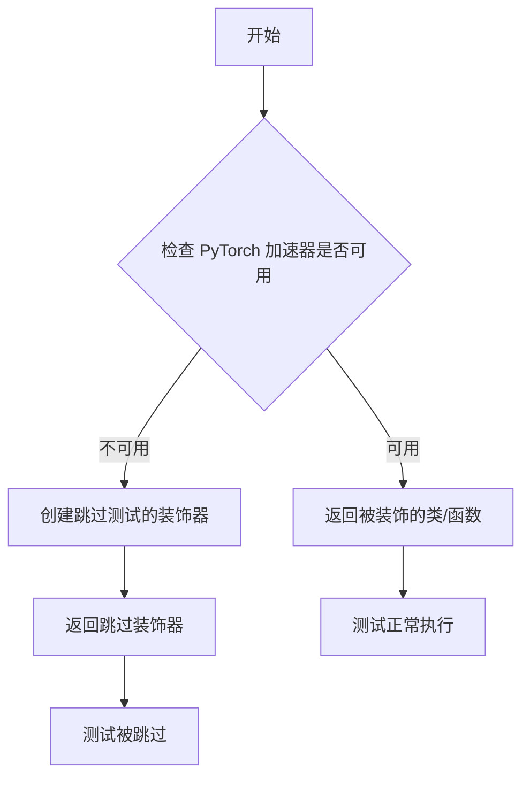

#### 带注释源码

```
# 这是一个从 ..testing_utils 导入的装饰器函数
# 它的实现不在当前代码文件中，而是在 testing_utils 模块中
# 基于使用方式推断其行为:

from ..testing_utils import require_torch_accelerator, torch_device

# 使用示例：
@require_torch_accelerator
class PipelineDeviceAndDtypeStabilityTests(unittest.TestCase):
    # 测试类内容
    ...

# 装饰器逻辑推断：
# 1. 检查 torch.cuda.is_available() 或类似的加速器检测
# 2. 如果有可用的 CUDA 设备，返回原始类，测试正常运行
# 3. 如果没有 CUDA，使用 unittest.skip 装饰器跳过测试
# 4. 确保需要 GPU 的测试只在有 GPU 的环境中运行
```

---

**注意**：由于 `require_torch_accelerator` 函数是从 `..testing_utils` 模块导入的，其完整源代码不在当前文件中。上述描述基于函数名、导入路径和其在代码中的使用方式推断得出。实际实现可能位于 `diffusers` 包的测试工具模块中。


### Image.new

PIL 库中的 Image.new 函数，用于创建一个指定模式、尺寸和颜色值的新图像对象。

参数：

- `mode`：`str`，图像模式，常用值包括 "RGB"（彩色图像）、"L"（灰度图像）、"RGBA"（带透明通道的彩色图像）等
- `size`：`tuple[int, int]`，图像尺寸，格式为 (宽度, 高度)
- `color`：`int | tuple[int, ...] | str`，可选参数，用于填充图像的背景颜色。可以是单个灰度值、RGB/RGBA 元组或颜色名称字符串（如 "red"），默认为 0（黑色）

返回值：`PIL.Image.Image`，新创建的 PIL 图像对象

#### 流程图

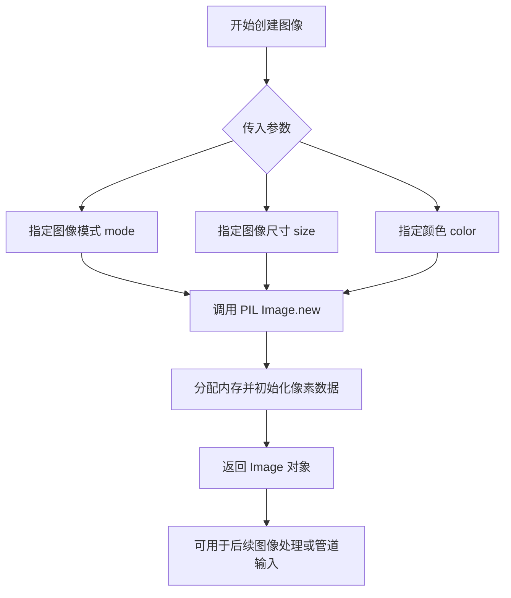

#### 带注释源码

```python
# 在测试代码中的实际使用示例

# 1. 创建用于图像到图像测试的输入图像
# 32x32 像素的 RGB 彩色图像，黑色背景
image = Image.new("RGB", (32, 32))

# 2. 创建用于修复（inpainting）测试的输入图像和掩码
# 掩码图像同样为 32x32 RGB 格式
image = Image.new("RGB", (32, 32))
mask = Image.new("RGB", (32, 32))

# 3. 创建用于视频到视频测试的帧序列
# 创建 num_frames 帧，每帧为 32x32 RGB 图像
num_frames = 2
video = [Image.new("RGB", (32, 32))] * num_frames
```

#### 详细说明

`Image.new` 是 Pillow 库中最基础且最常用的图像创建函数之一。在当前测试代码中，主要用于：

1. **生成测试输入**：为各种扩散管道（StableDiffusionImg2ImgPipeline、StableDiffusionInpaintPipeline 等）创建虚拟输入图像
2. **创建掩码**：在修复（inpainting）测试中创建空白掩码图像
3. **构建视频帧序列**：在视频生成测试中创建初始帧数组

该函数支持多种颜色格式：
- 灰度模式下的单个整数值：`Image.new("L", (32, 32), 255)` 创建白色图像
- RGB 元组：`Image.new("RGB", (32, 32), (255, 0, 0))` 创建红色图像
- 颜色名称字符串：`Image.new("RGB", (32, 32), "green")` 创建绿色图像


### `re.search`

`re.search` 是 Python 标准库中的正则表达式匹配函数，用于在字符串中搜索与指定模式匹配的第一个位置。在该代码中用于从进度条的 stderr 输出中提取最大步数。

参数：

- `pattern`：`str`，正则表达式模式，此处为 `"/(.*?) "`，用于匹配进度条中的步数信息（如 "1/5" 中的 "5"）
- `string`：`str`，要搜索的字符串，此处为从 stderr 重定向捕获的输出内容

返回值：`Match | None`，返回第一个匹配的模式对象（Match 对象），如果未找到匹配则返回 `None`。此处通过 `.group(1)` 方法提取第一个捕获组的内容。

#### 流程图

```mermaid
flowchart TD
    A[开始] --> B[调用 pipe 生成图像/视频]
    B --> C[重定向 stderr 到 StringIO]
    C --> D[调用 re.search 搜索模式]
    D --> E{找到匹配?}
    E -->|是| F[提取匹配组 group(1) 获取最大步数]
    E -->|否| G[返回 None]
    F --> H[验证进度条显示正确]
    G --> H
    H --> I[结束]
```

#### 带注释源码

```python
# 在 test_text_to_image 方法中的使用示例
with io.StringIO() as stderr, contextlib.redirect_stderr(stderr):
    _ = pipe(**inputs)  # 执行管道生成图像
    stderr = stderr.getvalue()  # 获取 stderr 输出
    # 使用 re.search 从进度条输出中提取最大步数
    # 进度条格式类似: "#####| 1/5 [00:01<00:00]"
    # 正则表达式 "/(.*?) " 匹配 "/" 到 " " 之间的内容，即 "5"
    max_steps = re.search("/(.*?) ", stderr).group(1)
    self.assertTrue(max_steps is not None and len(max_steps) > 0)
    self.assertTrue(
        f"{max_steps}/{max_steps}" in stderr, "Progress bar should be enabled and stopped at the max step"
    )
```


### `torch.manual_seed`

设置 PyTorch 的随机种子，用于确保使用 CPU 和 CUDA 张量时的随机操作可复现。在测试代码中用于确保每次运行生成相同的随机初始化权重，从而保证测试的确定性。

参数：

- `seed`：`int`，要设置的随机种子值

返回值：`None`，该函数无返回值

#### 流程图

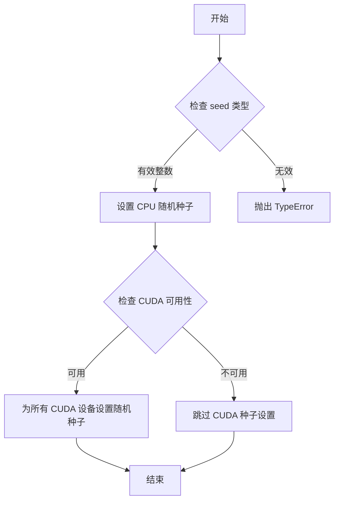

#### 带注释源码

```python
# torch.manual_seed 的使用示例（来自测试代码）
# 该函数定义位于 PyTorch 库中，非本代码库定义

# 在测试代码中的调用方式：
torch.manual_seed(0)  # 设置随机种子为 0，确保后续随机操作可复现

# 典型调用场景（在测试代码中）：
# 1. 初始化 UNet2DConditionModel 前
torch.manual_seed(0)
unet = UNet2DConditionModel(...)

# 2. 初始化 DDIMScheduler 后（虽然示例中未直接调用，但通常配合使用）

# 3. 初始化 AutoencoderKL 前
torch.manual_seed(0)
vae = AutoencoderKL(...)

# 4. 初始化 CLIPTextModel 配置前
torch.manual_seed(0)
text_encoder = CLIPTextModel(text_encoder_config)

# 5. 初始化 MotionAdapter 前
torch.manual_seed(0)
motion_adapter = MotionAdapter(...)

# 目的：确保模型权重初始化、dropout 等随机操作在每次测试运行时产生相同结果
# 从而使单元测试具有确定性和可重复性
```


### `CLIPTokenizer.from_pretrained`

该函数是 HuggingFace Transformers 库中 `CLIPTokenizer` 类的类方法，用于从预训练模型或本地路径加载分词器（Tokenizer），是扩散模型管道初始化过程中的关键组件，负责将文本输入转换为模型可处理的 token 序列。

参数：

- `pretrained_model_name_or_path`：`str`、`Path` 或 `os.PathLike`，指定预训练模型的名字（位于 HuggingFace Hub）或本地路径
- `subfolder`：`str`（可选），模型在仓库或本地目录中的子文件夹路径，默认为空字符串
- `cache_dir`：`str`（可选），指定下载模型的缓存目录
- `force_download`：`bool`（可选），是否强制重新下载模型，默认为 `False`
- `resume_download`：`bool`（可选），是否在中断后恢复下载，默认为 `True`
- `proxies`：`dict`（可选），用于 HTTP/SOCKS 代理的字典
- `local_files_only`：`bool`（可选），是否仅使用本地文件，默认为 `False`
- `use_auth_token`：`str` 或 `bool`（可选），用于访问私有模型的认证 token
- `revision`：`str`（可选），模型仓库的版本号，默认为 `"main"`
- `mirror`：`str`（可选），镜像源地址

返回值：`CLIPTokenizer`，返回一个配置好的 CLIP 分词器对象，包含词汇表、特殊 token 映射、截断和填充参数等，可对文本进行编码和解码。

#### 流程图

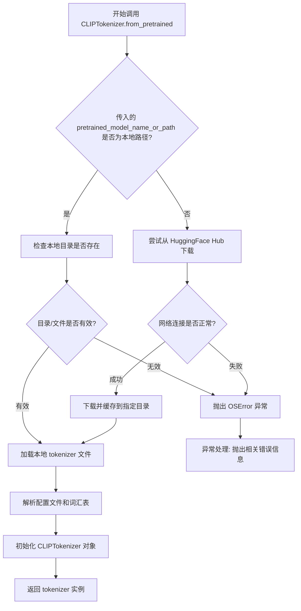

#### 带注释源码

```python
# transformers/src/transformers/tokenization_utils_base.py 中的 from_pretrained 方法
# 此源码基于 HuggingFace Transformers 库的核心实现逻辑

@classmethod
def from_pretrained(cls, pretrained_model_name_or_path, *args, **kwargs):
    """
    从预训练模型或本地路径实例化一个分词器。
    
    参数:
        pretrained_model_name_or_path (str, os.PathLike): 
            - HuggingFace Hub 上的模型 ID (如 "openai/clip-vit-base-patch32")
            - 包含 tokenizer 配置的本地目录路径
        subfolder (str, optional): 
            模型目录中的子文件夹路径
        cache_dir (str, optional): 
            缓存目录路径，默认为 ~/.cache/huggingface/hub
        force_download (bool, optional):
            是否强制重新下载，默认为 False
        ...
    
    返回:
        tokenizer (CLIPTokenizer): 
            配置好的分词器对象
    
    异常:
        OSError: 当指定的模型路径不存在或无法下载时抛出
        ValueError: 当参数无效时抛出
    """
    # 1. 解析输入参数
    #    - 处理 subfolder、cache_dir 等配置
    #    - 验证 pretrained_model_name_or_path 的有效性
    config_tokenizer_class = None
    
    # 2. 尝试从缓存或远程仓库加载
    #    - 优先检查本地缓存
    #    - 如不存在则从 HuggingFace Hub 下载
    #    - 处理分片模型文件的合并
    pretrained_model_name_or_path = str(pretrained_model_name_or_path)
    
    # 3. 加载 tokenizer 配置文件
    #    - 读取 tokenizer_config.json
    #    - 解析特殊 token、词汇表路径等
    # 4. 加载词汇表文件
    #    - 读取 vocab.json 和 merges.txt
    #    - 构建 token 到 ID 的映射
    # 5. 实例化 tokenizer 对象
    #    - 继承 PreTrainedTokenizerBase 的所有功能
    #    - 初始化词汇表、特殊 token 映射
    #    - 设置最大序列长度、截断策略等
    
    # 6. 返回配置完整的 tokenizer 实例
    #    - 可直接用于 encode()、decode() 等操作
    
    return tokenizer
```


### `IsSafetensorsCompatibleTests.test_all_is_compatible`

该测试方法用于验证给定的文件名列表（包含 `.bin` 和 `.safetensors` 格式的模型文件）是否完全兼容 safetensors 格式。它通过调用 `is_safetensors_compatible` 函数并断言返回结果为 `True` 来确认所有模型文件都支持 safetensors 格式。

参数：

- `self`：无需显式传入的参数，表示测试类实例本身。

返回值：`bool`，测试通过时断言成功（即 `is_safetensors_compatible` 返回 `True`），失败时抛出 `AssertionError`。

#### 流程图

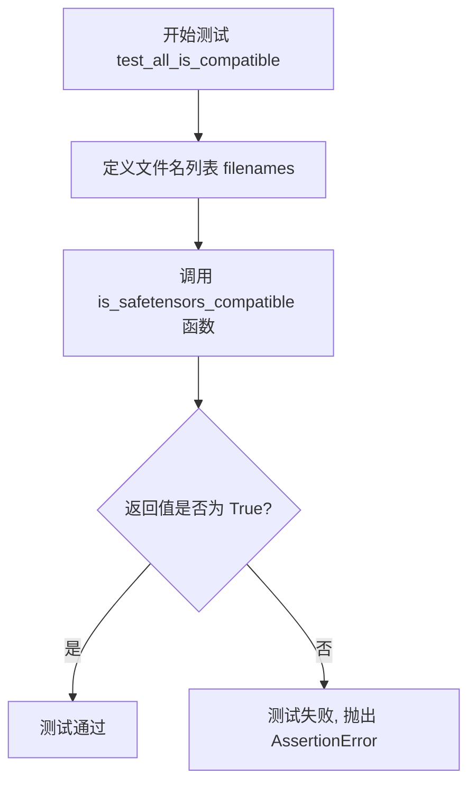

#### 带注释源码

```python
def test_all_is_compatible(self):
    """
    测试所有模型文件是否与 safetensors 格式兼容。
    
    该测试用例验证当文件名列表包含所有组件的 .bin 和 .safetensors 格式时,
    is_safetensors_compatible 函数是否正确返回 True。
    """
    # 定义包含所有模型组件的文件名列表
    # 包括 safety_checker, vae, text_encoder, unet 的 .bin 和 .safetensors 格式
    filenames = [
        "safety_checker/pytorch_model.bin",           # safety_checker 的 pytorch 格式
        "safety_checker/model.safetensors",           # safety_checker 的 safetensors 格式
        "vae/diffusion_pytorch_model.bin",            # VAE 的 pytorch 格式
        "vae/diffusion_pytorch_model.safetensors",    # VAE 的 safetensors 格式
        "text_encoder/pytorch_model.bin",              # text_encoder 的 pytorch 格式
        "text_encoder/model.safetensors",             # text_encoder 的 safetensors 格式
        "unet/diffusion_pytorch_model.bin",            # UNet 的 pytorch 格式
        "unet/diffusion_pytorch_model.safetensors",    # UNet 的 safetensors 格式
    ]
    # 断言所有文件都兼容 safetensors 格式
    # 预期结果: is_safetensors_compatible 应返回 True
    self.assertTrue(is_safetensors_compatible(filenames))
```


### `IsSafetensorsCompatibleTests.test_diffusers_model_is_compatible`

该测试方法用于验证 `is_safetensors_compatible` 函数能够正确识别包含 Diffusers 风格模型文件（同时存在 `.bin` 和 `.safetensors` 格式）的兼容性情况。具体来说，它测试当文件名列表中包含 `unet/diffusion_pytorch_model.bin` 和 `unet/diffusion_pytorch_model.safetensors` 时，函数应返回 `True`。

参数： 无（`self` 为隐式参数，表示测试类实例）

返回值： 无返回值（unittest 测试方法通过 `self.assertTrue()` 断言验证结果）

#### 流程图

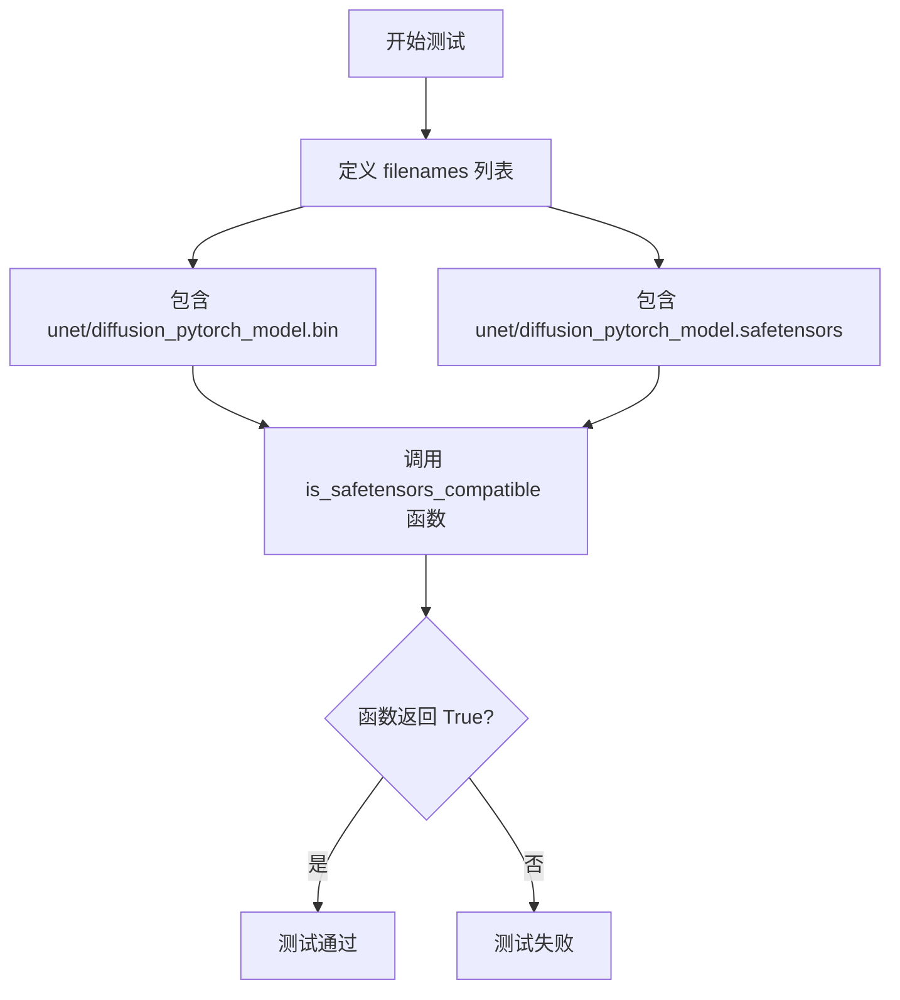

#### 带注释源码

```python
def test_diffusers_model_is_compatible(self):
    """
    测试 Diffusers 模型（unet）的 safetensors 兼容性。
    
    该测试验证当存在以下两种格式的模型文件时：
    - unet/diffusion_pytorch_model.bin
    - unet/diffusion_pytorch_model.safetensors
    
    is_safetensors_compatible 函数应返回 True，表示该模型组件
    同时支持两种格式，可以安全地使用 safetensors 加载。
    """
    # 定义测试用的文件名列表，包含 unet 组件的两种格式
    filenames = [
        "unet/diffusion_pytorch_model.bin",
        "unet/diffusion_pytorch_model.safetensors",
    ]
    # 断言函数返回 True，验证兼容性检查逻辑正确
    self.assertTrue(is_safetensors_compatible(filenames))
```


### `IsSafetensorsCompatibleTests.test_diffusers_model_is_not_compatible`

该测试方法用于验证 `is_safetensors_compatible` 函数在检测到 Diffusers 模型缺少 safetensors 格式文件时的兼容性判断是否正确。具体来说，它构造了一组包含 `.bin` 和 `.safetensors` 格式文件的文件名列表，但故意移除 `unet/diffusion_pytorch_model.safetensors`，然后断言函数返回 `False`，以确保能够正确识别模型不兼容的情况。

参数：

- `self`：无额外参数，`unittest.TestCase` 的实例方法隐式参数

返回值：无返回值（`None`），该方法为单元测试方法，通过 `assertFalse` 断言验证兼容性

#### 流程图

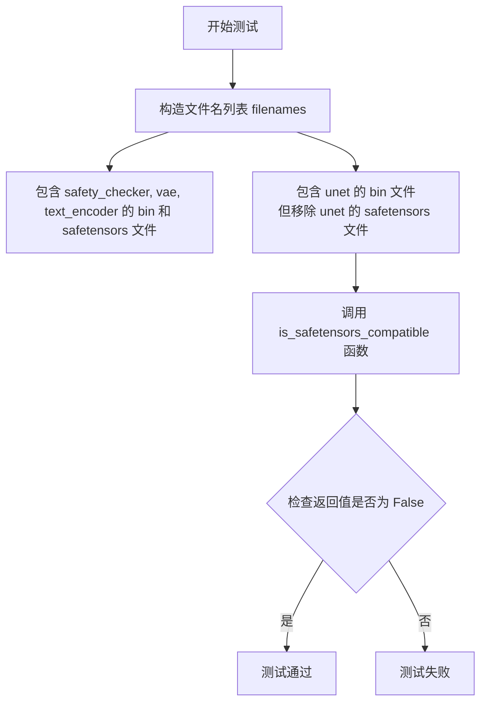

#### 带注释源码

```python
def test_diffusers_model_is_not_compatible(self):
    """
    测试当 Diffusers 模型缺少 safetensors 格式文件时,
    is_safetensors_compatible 函数应返回 False
    
    该测试确保函数能够正确检测到模型文件不兼容的情况,
    即存在 .bin 格式但缺少对应的 .safetensors 格式文件
    """
    # 构造文件名列表,包含多个组件的模型文件
    # safety_checker, vae, text_encoder 都有对应的 bin 和 safetensors 文件
    # 但 unet 只有 bin 文件,缺少 safetensors 文件
    filenames = [
        "safety_checker/pytorch_model.bin",          # safety_checker 的 bin 格式
        "safety_checker/model.safetensors",          # safety_checker 的 safetensors 格式
        "vae/diffusion_pytorch_model.bin",           # vae 的 bin 格式
        "vae/diffusion_pytorch_model.safetensors",   # vae 的 safetensors 格式
        "text_encoder/pytorch_model.bin",            # text_encoder 的 bin 格式
        "text_encoder/model.safetensors",            # text_encoder 的 safetensors 格式
        "unet/diffusion_pytorch_model.bin",          # unet 的 bin 格式
        # 注释掉: 'unet/diffusion_pytorch_model.safetensors',  # 故意移除 unet 的 safetensors 文件
    ]
    
    # 断言 is_safetensors_compatible 返回 False
    # 因为 unet 组件只有 bin 格式,缺少 safetensors 格式文件
    # 这表示模型不兼容 safetensors 格式
    self.assertFalse(is_safetensors_compatible(filenames))
```


### `IsSafetensorsCompatibleTests.test_transformer_model_is_compatible`

该测试方法用于验证 `is_safetensors_compatible` 函数在仅包含 transformer 模型（如 text_encoder）相关文件时的兼容性判断是否正确。

参数：

- `self`：`IsSafetensorsCompatibleTests`，测试类实例本身

返回值：`None`，该方法为测试方法，通过 `assertTrue` 断言验证兼容性，不返回具体值

#### 流程图

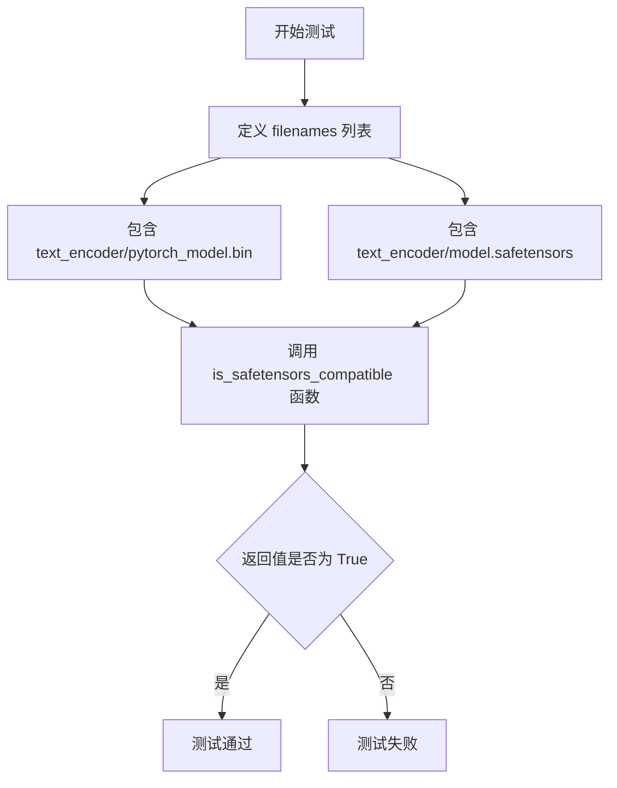

#### 带注释源码

```python
def test_transformer_model_is_compatible(self):
    """
    测试 is_safetensors_compatible 函数在仅包含 transformer 模型（如 text_encoder）文件时的兼容性判断。
    
    该测试验证当给定文件列表只包含 transformer 模型（text_encoder）的 .bin 和 .safetensors 格式文件时，
    is_safetensors_compatible 函数应返回 True，表示这些文件格式兼容。
    """
    # 定义测试用的文件名列表，包含 transformer 模型（text_encoder）的两种格式
    filenames = [
        "text_encoder/pytorch_model.bin",      # PyTorch 格式的权重文件
        "text_encoder/model.safetensors",       # SafeTensors 格式的权重文件
    ]
    # 断言 is_safetensors_compatible 函数返回 True，验证兼容性判断正确
    self.assertTrue(is_safetensors_compatible(filenames))
```


### `IsSafetensorsCompatibleTests.test_transformer_model_is_not_compatible`

该测试方法用于验证当给定的模型文件列表中缺少某些必需的 safetensors 格式文件时，`is_safetensors_compatible` 函数能够正确返回 False。具体来说，它测试了当 text_encoder 组件缺少 safetensors 格式的模型文件时，系统应该判定为不兼容。

参数：

- `self`：`unittest.TestCase`，测试类的实例本身

返回值：`None`，无直接返回值，通过 `assertFalse` 断言验证 `is_safetensors_compatible(filenames)` 返回 `False`

#### 流程图

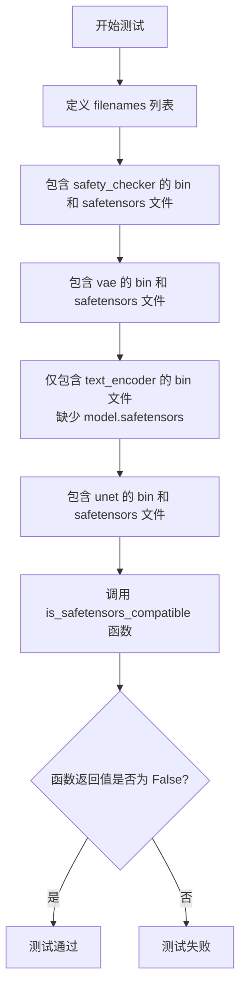

#### 带注释源码

```python
def test_transformer_model_is_not_compatible(self):
    """
    测试当模型文件列表中缺少某些 safetensors 格式文件时的不兼容场景。
    具体验证 text_encoder 缺少 model.safetensors 文件时的情况。
    """
    # 定义包含多个模型组件文件的文件名列表
    filenames = [
        # safety_checker 组件：同时存在 bin 和 safetensors 格式
        "safety_checker/pytorch_model.bin",
        "safety_checker/model.safetensors",
        
        # vae 组件：同时存在 bin 和 safetensors 格式
        "vae/diffusion_pytorch_model.bin",
        "vae/diffusion_pytorch_model.safetensors",
        
        # text_encoder 组件：仅存在 bin 格式
        # 缺少: 'text_encoder/model.safetensors'
        "text_encoder/pytorch_model.bin",
        
        # unet 组件：同时存在 bin 和 safetensors 格式
        "unet/diffusion_pytorch_model.bin",
        "unet/diffusion_pytorch_model.safetensors",
    ]
    
    # 断言：对于这种缺少关键 safetensors 文件的情况，
    # is_safetensors_compatible 函数应返回 False，表示不兼容
    self.assertFalse(is_safetensors_compatible(filenames))
```


### `IsSafetensorsCompatibleTests.test_all_is_compatible_variant`

该测试方法用于验证 `is_safetensors_compatible` 函数在处理带有 variant（如 fp16）后缀的模型文件时的兼容性判断逻辑。测试首先验证不带 variant 参数时返回 False（因为文件带有 fp16 变体后缀），然后验证带 variant="fp16" 参数时返回 True。

参数：

- `self`：`unittest.TestCase`，测试用例的实例对象，隐式参数

返回值：`None`，该方法为测试方法，通过断言验证行为，不返回任何值

#### 流程图

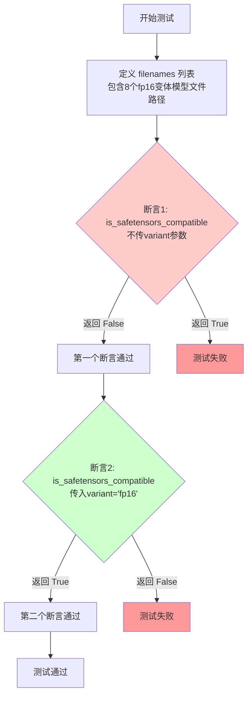

#### 带注释源码

```python
def test_all_is_compatible_variant(self):
    """
    测试 is_safetensors_compatible 函数在处理带有 variant 后缀（如 fp16）的模型文件时的兼容性判断。
    
    该测试验证：
    1. 当不指定 variant 参数时，带有 fp16 后缀的文件名被判定为不兼容
    2. 当指定 variant="fp16" 参数后，相同的文件名被判定为兼容
    """
    # 定义包含 fp16 变体后缀的模型文件路径列表
    # 包含 safety_checker, vae, text_encoder, unet 四个组件的 .bin 和 .safetensors 文件
    filenames = [
        "safety_checker/pytorch_model.fp16.bin",
        "safety_checker/model.fp16.safetensors",
        "vae/diffusion_pytorch_model.fp16.bin",
        "vae/diffusion_pytorch_model.fp16.safetensors",
        "text_encoder/pytorch_model.fp16.bin",
        "text_encoder/model.fp16.safetensors",
        "unet/diffusion_pytorch_model.fp16.bin",
        "unet/diffusion_pytorch_model.fp16.safetensors",
    ]
    
    # 断言1：不传入 variant 参数时，函数应返回 False
    # 因为默认情况下，带有 fp16 后缀的文件名与不带后缀的模型不匹配
    self.assertFalse(is_safetensors_compatible(filenames))
    
    # 断言2：传入 variant="fp16" 参数后，函数应返回 True
    # 因为指定了 variant 后，函数会匹配带有 fp16 后缀的文件名
    self.assertTrue(is_safetensors_compatible(filenames, variant="fp16"))
```


### `IsSafetensorsCompatibleTests.test_diffusers_model_is_compatible_variant`

该测试方法验证 `is_safetensors_compatible` 函数在处理包含变体（如 fp16）的 Diffusers 模型文件时的兼容性判断逻辑。测试首先验证不带 variant 参数时返回 False（不兼容），然后验证带 variant="fp16" 参数时返回 True（兼容）。

参数：

- `self`：`unittest.TestCase`，测试类实例本身

返回值：`None`，该方法为单元测试方法，通过 `assertTrue` / `assertFalse` 断言验证兼容性结果

#### 流程图

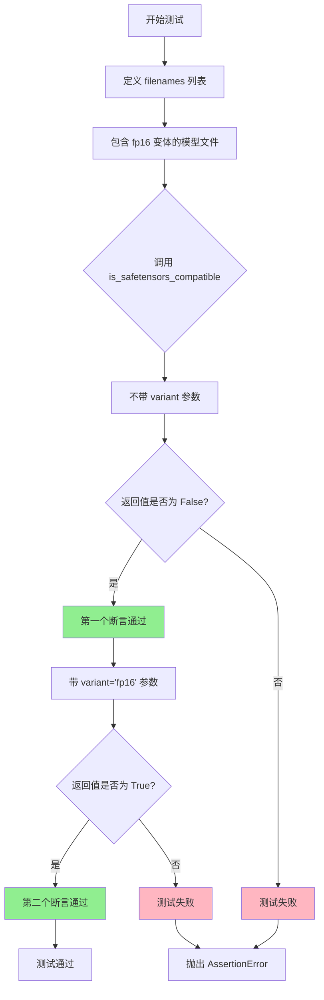

#### 带注释源码

```python
def test_diffusers_model_is_compatible_variant(self):
    """
    测试 Diffusers 模型的 safetensors 兼容性，支持变体（variant）参数。
    
    该测试验证当模型文件名包含 .fp16. 变体时：
    1. 不指定 variant 参数时，is_safetensors_compatible 应返回 False（不兼容）
    2. 指定 variant='fp16' 参数时，is_safetensors_compatible 应返回 True（兼容）
    """
    # 定义包含 fp16 变体文件的文件名列表
    filenames = [
        "unet/diffusion_pytorch_model.fp16.bin",        # FP16 变体的 PyTorch bin 文件
        "unet/diffusion_pytorch_model.fp16.safetensors", # FP16 变体的 safetensors 文件
    ]
    
    # 断言1：不带 variant 参数时应返回 False
    # 因为 filenames 中包含变体标记 .fp16.，不带 variant 参数默认不兼容变体文件
    self.assertFalse(is_safetensors_compatible(filenames))
    
    # 断言2：带 variant="fp16" 参数时应返回 True
    # 指定 variant 参数后，系统会匹配带该变体后缀的文件
    self.assertTrue(is_safetensors_compatible(filenames, variant="fp16"))
```


### `IsSafetensorsCompatibleTests.test_diffusers_model_is_compatible_variant_mixed`

该测试方法用于验证 `is_safetensors_compatible` 函数在处理混合变体文件（一个是非变体的 `.bin` 文件，另一个是带变体后缀的 `.fp16.safetensors` 文件）时的兼容性判断逻辑。

参数：

- `self`：`IsSafetensorsCompatibleTests`，测试类的实例本身

返回值：`None`，测试方法无返回值，通过 `assert` 语句验证逻辑正确性

#### 流程图

```mermaid
flowchart TD
    A[开始测试 test_diffusers_model_is_compatible_variant_mixed] --> B[定义 filenames 列表: 'unet/diffusion_pytorch_model.bin' 和 'unet/diffusion_pytorch_model.fp16.safetensors']
    B --> C[调用 is_safetensors_compatible(filenames) 不传 variant 参数]
    C --> D{返回值是否为 False?}
    D -->|是| E[调用 is_safetensors_compatible(filenames, variant='fp16') 传入 variant 参数]
    D -->|否| F[测试失败: 应该返回 False]
    E --> G{返回值是否为 True?}
    G -->|是| H[测试通过]
    G -->|否| I[测试失败: 应该返回 True]
```

#### 带注释源码

```python
def test_diffusers_model_is_compatible_variant_mixed(self):
    """
    测试混合变体场景下 is_safetensors_compatible 函数的兼容性判断。
    
    场景描述：
    - 文件列表包含一个非变体的 .bin 文件和一个带 fp16 变体的 .safetensors 文件
    - 不指定 variant 时，应返回 False（因为文件不全是 safetensors 格式）
    - 指定 variant='fp16' 时，应返回 True（因为匹配了 fp16 变体）
    """
    # 定义测试用的文件名列表，模拟混合变体场景
    filenames = [
        "unet/diffusion_pytorch_model.bin",           # 非变体的 PyTorch 权重文件
        "unet/diffusion_pytorch_model.fp16.safetensors",  # fp16 变体的 safetensors 权重文件
    ]
    
    # 断言1：不指定 variant 参数时，应该返回 False
    # 原因：混合格式（非 safetensors 和 safetensors），且没有变体信息
    self.assertFalse(is_safetensors_compatible(filenames))
    
    # 断言2：指定 variant='fp16' 时，应该返回 True
    # 原因：所有文件都支持 fp16 变体（.bin 隐式支持，.fp16.safetensors 显式支持）
    self.assertTrue(is_safetensors_compatible(filenames, variant="fp16"))
```


### `IsSafetensorsCompatibleTests.test_diffusers_model_is_not_compatible_variant`

该测试方法用于验证当模型文件列表包含 fp16 变体但缺少 `unet/diffusion_pytorch_model.fp16.safetensors` 时，`is_safetensors_compatible` 函数在未指定 variant 参数的情况下返回 `False`，确保函数能够正确检测出变体模型的不兼容性。

参数：

- `self`：`unittest.TestCase`，隐式参数，表示测试类实例本身

返回值：`None`，无返回值（测试方法）

#### 流程图

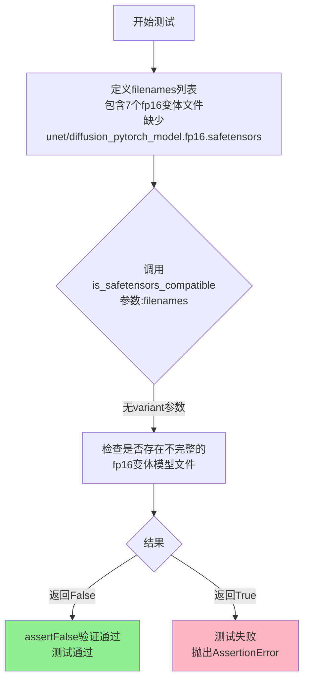

#### 带注释源码

```python
def test_diffusers_model_is_not_compatible_variant(self):
    """
    测试当模型文件列表包含 fp16 变体但缺少必要的 safetensors 文件时，
    is_safetensors_compatible 函数在未指定 variant 参数时应返回 False。
    """
    # 定义文件名列表，包含多个组件的 fp16 变体文件
    # safety_checker, vae, text_encoder 都有完整的 fp16 bin 和 safetensors
    # unet 只有 fp16 bin，缺少 fp16 safetensors
    filenames = [
        "safety_checker/pytorch_model.fp16.bin",
        "safety_checker/model.fp16.safetensors",
        "vae/diffusion_pytorch_model.fp16.bin",
        "vae/diffusion_pytorch_model.fp16.safetensors",
        "text_encoder/pytorch_model.fp16.bin",
        "text_encoder/model.fp16.safetensors",
        "unet/diffusion_pytorch_model.fp16.bin",
        # 注释掉: 'unet/diffusion_pytorch_model.fp16.safetensors',
    ]
    
    # 验证 is_safetensors_compatible 在未指定 variant 参数时
    # 对于包含不完整 fp16 变体文件的情况返回 False
    self.assertFalse(is_safetensors_compatible(filenames))
```


### `IsSafetensorsCompatibleTests.test_transformer_model_is_compatible_variant`

该测试方法用于验证当提供fp16变体（variant）时，transformer模型文件（如text_encoder）的兼容性检查是否正确工作。

参数：

- `self`：`unittest.TestCase`，测试类的实例本身，用于访问断言方法

返回值：`None`，该方法为测试方法，通过`self.assertFalse`和`self.assertTrue`进行断言验证，不返回具体值

#### 流程图

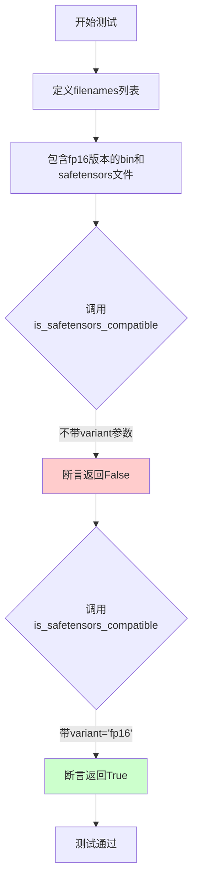

#### 带注释源码

```python
def test_transformer_model_is_compatible_variant(self):
    """
    Test that transformer model files are compatible when variant is specified.
    
    This test verifies:
    1. Without variant parameter, mixed bin/safetensors files return False
    2. With variant='fp16', the function correctly identifies compatible files
    """
    # Define filenames containing fp16 variant model files
    # text_encoder component with fp16 precision in both .bin and .safetensors formats
    filenames = [
        "text_encoder/pytorch_model.fp16.bin",
        "text_encoder/model.fp16.safetensors",
    ]
    
    # First assertion: without variant, mixed formats should be incompatible
    # This fails because we have both .bin and .safetensors without variant context
    self.assertFalse(is_safetensors_compatible(filenames))
    
    # Second assertion: with variant="fp16", the files are compatible
    # The function should recognize both files belong to fp16 variant
    self.assertTrue(is_safetensors_compatible(filenames, variant="fp16"))
```


### `IsSafetensorsCompatibleTests.test_transformer_model_is_not_compatible_variant`

该测试方法用于验证 `is_safetensors_compatible` 函数在检测模型文件不兼容场景时的正确性。具体而言，当给定一组包含 `fp16` 变体模型文件（缺少 `text_encoder` 的 `safetensors` 变体文件）的文件名列表时，该函数应返回 `False`，表明这些文件不满足 safetensors 兼容性要求。

参数：

- `self`：`IsSafetensorsCompatibleTests`，测试类的实例，提供了测试上下文和断言方法

返回值：`None`，该方法为测试方法，无返回值，通过 `unittest.TestCase.assertFalse` 进行断言验证

#### 流程图

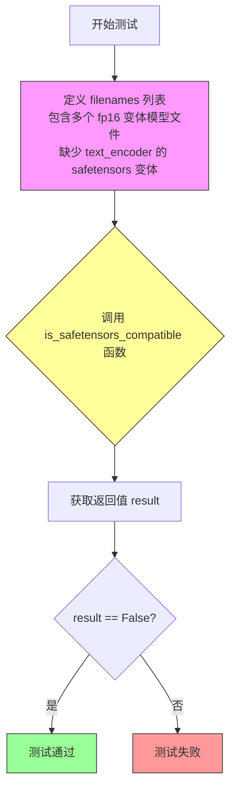

#### 带注释源码

```python
def test_transformer_model_is_not_compatible_variant(self):
    """
    测试当存在 fp16 变体模型文件但缺少特定组件的 safetensors 变体时，
    is_safetensors_compatible 函数应返回 False。
    
    具体场景：
    - 包含 safety_checker、vae、text_encoder、unet 的 fp16 变体文件
    - 但缺少 text_encoder 的 model.fp16.safetensors 文件
    - 此时应该返回 False，表示不兼容
    """
    # 定义测试用的文件名列表，包含多个组件的 fp16 变体文件
    filenames = [
        "safety_checker/pytorch_model.fp16.bin",           # safety_checker 的 fp16 bin 文件
        "safety_checker/model.fp16.safetensors",           # safety_checker 的 fp16 safetensors 文件
        "vae/diffusion_pytorch_model.fp16.bin",            # vae 的 fp16 bin 文件
        "vae/diffusion_pytorch_model.fp16.safetensors",    # vae 的 fp16 safetensors 文件
        "text_encoder/pytorch_model.fp16.bin",             # text_encoder 的 fp16 bin 文件（注意：缺少对应的 safetensors）
        "unet/diffusion_pytorch_model.fp16.bin",           # unet 的 fp16 bin 文件
        "unet/diffusion_pytorch_model.fp16.safetensors",   # unet 的 fp16 safetensors 文件
    ]
    # 断言：由于缺少 text_encoder 的 safetensors 变体文件，函数应返回 False
    self.assertFalse(is_safetensors_compatible(filenames))
```


### `IsSafetensorsCompatibleTests.test_transformer_model_is_compatible_variant_extra_folder`

这是一个单元测试方法，用于验证在指定特定文件夹名称集合（`folder_names`）时，`is_safetensors_compatible` 函数对包含 fp16 变体文件的文件名列表的兼容性判断是否正确。该测试确保当只考虑 `vae` 和 `unet` 文件夹时，不带 `variant` 参数调用返回 `False`，而带 `variant="fp16"` 参数调用返回 `True`。

参数：

- `self`：`IsSafetensorsCompatibleTests`（隐式参数），测试类实例本身，用于访问类方法和断言。

返回值：`None`，测试方法不返回值，通过 `assertTrue` 和 `assertFalse` 进行验证。

#### 流程图

```mermaid
flowchart TD
    A[开始测试] --> B[定义filenames列表: 包含safety_checker, vae, text_encoder, unet的fp16文件]
    B --> C[调用is_safetensors_compatible<br/>参数: filenames, folder_names={'vae', 'unet'}]
    C --> D{返回值是否为False?}
    D -->|是| E[调用assertFalse验证通过]
    D -->|否| F[测试失败]
    E --> G[调用is_safetensors_compatible<br/>参数: filenames, folder_names={'vae', 'unet'}, variant='fp16']
    G --> H{返回值是否为True?}
    H -->|是| I[调用assertTrue验证通过]
    H -->|否| J[测试失败]
    I --> K[测试通过]
    F --> K
    J --> K
```

#### 带注释源码

```python
def test_transformer_model_is_compatible_variant_extra_folder(self):
    """
    测试函数：验证当指定folder_names参数时，is_safetensors_compatible对fp16变体文件的兼容性判断
    
    测试场景：
    - filenames列表包含safety_checker, vae, text_encoder, unet的fp16文件
    - 其中text_encoder缺少fp16版本的safetensors文件
    - 测试当folder_names={'vae', 'unet'}时（即只考虑vae和unet文件夹）
    """
    # 定义文件名列表，包含各组件的fp16格式bin和safetensors文件
    # 注意：text_encoder缺少model.fp16.safetensors文件
    filenames = [
        "safety_checker/pytorch_model.fp16.bin",           # safety_checker的fp16 bin文件
        "safety_checker/model.fp16.safetensors",          # safety_checker的fp16 safetensors文件
        "vae/diffusion_pytorch_model.fp16.bin",            # vae的fp16 bin文件
        "vae/diffusion_pytorch_model.fp16.safetensors",    # vae的fp16 safetensors文件
        "text_encoder/pytorch_model.fp16.bin",              # text_encoder的fp16 bin文件（无safetensors版本）
        "unet/diffusion_pytorch_model.fp16.bin",            # unet的fp16 bin文件
        "unet/diffusion_pytorch_model.fp16.safetensors",    # unet的fp16 safetensors文件
    ]
    
    # 测试1：不指定variant参数
    # 由于text_encoder缺少fp16 safetensors文件，且folder_names只包含vae和unet
    # 但整体文件列表不完整兼容（因为text_encoder缺失），应返回False
    self.assertFalse(is_safetensors_compatible(filenames, folder_names={"vae", "unet"}))
    
    # 测试2：指定variant="fp16"参数
    # 当指定variant时，只检查folder_names={'vae', 'unet'}中的文件
    # vae和unet都有完整的fp16 bin和safetensors文件，因此返回True
    self.assertTrue(is_safetensors_compatible(filenames, folder_names={"vae", "unet"}, variant="fp16"))
```


### `IsSafetensorsCompatibleTests.test_transformer_model_is_not_compatible_variant_extra_folder`

该测试方法用于验证 `is_safetensors_compatible` 函数在处理带有特定文件夹名称变体（如 `text_encoder`）的模型文件时，能够正确识别出不兼容的情况。测试通过构建包含 `fp16` 变体的文件路径列表，并指定特定的 `folder_names` 参数，断言函数返回 `False`，确保模型加载时的兼容性检查逻辑正确。

参数：

- `self`：`IsSafetensorsCompatibleTests`，测试类的实例，用于访问断言方法

返回值：`None`，该方法为测试方法，不返回任何值，通过断言表达验证逻辑

#### 流程图

```mermaid
flowchart TD
    A[开始测试] --> B[定义文件路径列表 filenames]
    B --> C[调用 is_safetensors_compatible 函数]
    C --> D[传入 filenames 和 folder_names={'text_encoder'}]
    D --> E{检查返回值是否为 False}
    E -->|是| F[测试通过]
    E -->|否| G[测试失败]
```

#### 带注释源码

```python
def test_transformer_model_is_not_compatible_variant_extra_folder(self):
    """
    测试当 folder_names 指定为 {'text_encoder'} 时，
    is_safetensors_compatible 函数应返回 False，
    因为提供的文件列表中 text_encoder 文件夹缺少 .safetensors 格式的 fp16 变体文件。
    """
    # 定义一组模型文件路径，包含 fp16 变体
    filenames = [
        "safety_checker/pytorch_model.fp16.bin",           # safety_checker 的 fp16 bin 文件
        "safety_checker/model.fp16.safetensors",           # safety_checker 的 fp16 safetensors 文件
        "vae/diffusion_pytorch_model.fp16.bin",             # vae 的 fp16 bin 文件
        "vae/diffusion_pytorch_model.fp16.safetensors",     # vae 的 fp16 safetensors 文件
        "text_encoder/pytorch_model.fp16.bin",              # text_encoder 的 fp16 bin 文件（缺少对应的 .safetensors 文件）
        "unet/diffusion_pytorch_model.fp16.bin",             # unet 的 fp16 bin 文件
        "unet/diffusion_pytorch_model.fp16.safetensors",     # unet 的 fp16 safetensors 文件
    ]
    
    # 断言：指定 folder_names 为 {'text_encoder'} 时，函数应返回 False
    # 因为 text_encoder 文件夹中只有 .bin 文件，缺少 .safetensors 文件
    self.assertFalse(is_safetensors_compatible(filenames, folder_names={"text_encoder"}))
```


### `IsSafetensorsCompatibleTests.test_transformers_is_compatible_sharded`

该测试用例用于验证 `is_safetensors_compatible` 函数在处理包含分片（sharded）SafeTensors 文件的 Transformer 模型（如 text_encoder）时是否能正确判断其兼容性。具体来说，它检查当文件列表中同时存在传统的 PyTorch `.bin` 文件和带有分片编号的 `.safetensors` 文件（如 `model-00001-of-00002.safetensors`）时，系统是否将其识别为兼容的模型配置。

参数：
-  `self`：`IsSafetensorsCompatibleTests` (继承自 `unittest.TestCase`)，测试用例的实例本身。

返回值：`None`，该方法不返回值，主要通过 `self.assertTrue` 进行断言验证。

#### 流程图

```mermaid
graph TD
    A([开始 / Start]) --> B[定义文件列表 / Define Filenames]
    B --> C[调用 is_safetensors_compatible / Call is_safetensors_compatible]
    C --> D{结果是否为真? / Is Result True?}
    D -- 是 / Yes --> E([测试通过 / Test Passes])
    D -- 否 / No --> F([测试失败 / Test Fails])
```

#### 带注释源码

```python
def test_transformers_is_compatible_sharded(self):
    """
    测试分片后的 Transformer 模型文件列表是否被识别为 SafeTensors 兼容。
    """
    # 1. 构造包含混合格式和分片文件的文件名列表
    # 包含一个 .bin 文件 (PyTorch 格式) 和两个分片的 .safetensors 文件
    filenames = [
        "text_encoder/pytorch_model.bin",
        "text_encoder/model-00001-of-00002.safetensors",
        "text_encoder/model-00002-of-00002.safetensors",
    ]
    
    # 2. 调用被测试的函数 is_safetensors_compatible
    # 3. 断言返回结果为 True，表示系统认为这种混合配置是兼容的
    self.assertTrue(is_safetensors_compatible(filenames))
```


### `IsSafetensorsCompatibleTests.test_transformers_is_compatible_variant_sharded`

该测试方法用于验证 `is_safetensors_compatible` 函数在处理带变体（variant）的分片（sharded）模型文件时的兼容性判断逻辑。测试场景包括一个非变体的 `.bin` 文件和两个带 `fp16` 变体的分片 `.safetensors` 文件，验证不带变体参数时返回 `False`，带 `variant="fp16"` 参数时返回 `True`。

参数：

- `self`：`IsSafetensorsCompatibleTests`，测试类的实例，包含测试所需的断言方法

返回值：`None`，该方法为测试方法，不返回任何值，通过断言验证兼容性

#### 流程图

```mermaid
flowchart TD
    A[开始测试] --> B[定义 filenames 列表]
    B --> C[包含 pytorch_model.bin 和 fp16 分片 safetensors 文件]
    D[调用 is_safetensors_compatible without variant] --> E{返回值是否为 False?}
    E -->|是| F[调用 is_safetensors_compatible with variant='fp16']
    E -->|否| G[测试失败]
    F --> H{返回值是否为 True?}
    H -->|是| I[测试通过]
    H -->|否| J[测试失败]
```

#### 带注释源码

```python
def test_transformers_is_compatible_variant_sharded(self):
    """
    测试 is_safetensors_compatible 函数对带变体的分片模型的兼容性判断。
    
    该测试验证：
    1. 当存在非变体 .bin 文件和带 fp16 变体的分片 .safetensors 文件时，
       不指定 variant 参数应返回 False（因为格式不匹配）
    2. 指定 variant="fp16" 参数后应返回 True（因为都是 fp16 变体）
    """
    # 定义测试用的文件名列表
    # 包含一个非变体的 bin 文件和两个 fp16 变体的分片 safetensors 文件
    filenames = [
        "text_encoder/pytorch_model.bin",
        "text_encoder/model.fp16-00001-of-00002.safetensors",
        "text_encoder/model.fp16-00001-of-00002.safetensors",  # 注意：此处文件名重复，可能为测试用例笔误
    ]
    # 断言：不带 variant 参数时，混合非变体和变体文件应返回 False
    self.assertFalse(is_safetensors_compatible(filenames))
    # 断言：指定 variant="fp16" 参数后，应返回 True
    self.assertTrue(is_safetensors_compatible(filenames, variant="fp16"))
```


### `IsSafetensorsCompatibleTests.test_diffusers_is_compatible_sharded`

该测试方法用于验证分片（sharded）Diffusers模型（例如带有多部分`.safetensors`文件的UNet）是否与safetensors格式兼容。它通过调用`is_safetensors_compatible`函数检查给定的文件名列表是否同时包含`.bin`和`.safetensors`分片文件，并断言结果为`True`。

参数：

- `self`：`IsSafetensorsCompatibleTests`，测试类实例本身，包含测试所需的状态和方法

返回值：`None`，该方法为测试方法，无显式返回值，通过`assertTrue`断言验证兼容性

#### 流程图

```mermaid
flowchart TD
    A[开始测试 test_diffusers_is_compatible_sharded] --> B[定义filenames列表]
    B --> C[包含3个文件: unet/diffusion_pytorch_model.bin, unet/diffusion_pytorch_model-00001-of-00002.safetensors, unet/diffusion_pytorch_model-00002-of-00002.safetensors]
    C --> D[调用is_safetensors_compatible函数]
    D --> E{检查是否为safetensors兼容}
    E -->|是| F[返回True]
    E -->|否| G[返回False]
    F --> H{assertTrue验证}
    H -->|通过| I[测试通过]
    G --> H
    H -->|失败| J[测试失败]
```

#### 带注释源码

```python
def test_diffusers_is_compatible_sharded(self):
    """
    测试分片的Diffusers模型（如UNet）是否与safetensors格式兼容。
    分片模型通常有多个safetensors文件（如model-00001-of-00002.safetensors）
    配合一个.bin文件使用。
    """
    # 定义测试用的文件名列表
    # 包含一个.bin文件和两个分片的.safetensors文件
    filenames = [
        "unet/diffusion_pytorch_model.bin",                                    # UNet的.bin权重文件
        "unet/diffusion_pytorch_model-00001-of-00002.safetensors",           # 第一个safetensors分片
        "unet/diffusion_pytorch_model-00002-of-00002.safetensors",           # 第二个safetensors分片
    ]
    # 断言is_safetensors_compatible函数返回True
    # 验证分片的diffusers模型与safetensors格式兼容
    self.assertTrue(is_safetensors_compatible(filenames))
```


### `IsSafetensorsCompatibleTests.test_diffusers_is_compatible_variant_sharded`

该测试方法用于验证 `is_safetensors_compatible` 函数在处理带有变体（variant）的分片（sharded）Diffusers模型文件时的兼容性判断逻辑。

参数：

- `self`：unittest.TestCase 的实例方法，无需显式传递

返回值：`None`（无返回值），该方法通过 `assertFalse` 和 `assertTrue` 断言来验证函数行为

#### 流程图

```mermaid
flowchart TD
    A[开始测试] --> B[定义 filenames 列表]
    B --> C[包含 bin 文件和 fp16 变体的分片 safetensors 文件]
    C --> D{调用 is_safetensors_compatible without variant}
    D --> E{返回 False?}
    E -->|是| F[第一个断言通过: assertFalse]
    E -->|否| G[测试失败]
    F --> H{调用 is_safetensors_compatible with variant='fp16'}
    H --> I{返回 True?}
    I -->|是| J[第二个断言通过: assertTrue]
    I -->|否| K[测试失败]
    J --> L[测试通过]
```

#### 带注释源码

```python
def test_diffusers_is_compatible_variant_sharded(self):
    """
    测试 Diffusers 模型（带 variant 的分片文件）的 safetensors 兼容性判断
    
    该测试验证 is_safetensors_compatible 函数能正确处理以下场景：
    1. 当不指定 variant 时，带有 variant 的分片文件与不带 variant 的 bin 文件不兼容
    2. 当指定 variant='fp16' 时，相同 variant 的分片文件应该被正确识别为兼容
    """
    # 定义文件名列表：包含一个 .bin 文件和两个带有 fp16 variant 的分片 .safetensors 文件
    # 注意：这里第二个和第三个文件名相同，可能是测试代码的笔误，但符合原始代码
    filenames = [
        "unet/diffusion_pytorch_model.bin",                                           # 不带 variant 的 bin 文件
        "unet/diffusion_pytorch_model.fp16-00001-of-00002.safetensors",              # 带 fp16 variant 的第1个分片
        "unet/diffusion_pytorch_model.fp16-00001-of-00002.safetensors",              # 带 fp16 variant 的第2个分片（与上面相同）
    ]
    
    # 断言1：不指定 variant 时，由于 bin 文件没有 fp16 variant，而 safetensors 文件有 fp16 variant
    # 因此应该返回 False（不兼容）
    self.assertFalse(is_safetensors_compatible(filenames))
    
    # 断言2：指定 variant="fp16" 后，bin 文件虽然本身没有 fp16，但系统会尝试查找 fp16 variant 的对应文件
    # 由于存在 fp16 variant 的 safetensors 分片文件，应该返回 True（兼容）
    self.assertTrue(is_safetensors_compatible(filenames, variant="fp16"))
```


### `IsSafetensorsCompatibleTests.test_diffusers_is_compatible_only_variants`

该测试方法用于验证当模型文件仅包含 variant 版本（如 fp16）的 safetensors 文件时，`is_safetensors_compatible` 函数的兼容性检查逻辑是否正确。

参数：

- `self`：`IsSafetensorsCompatibleTests`（`unittest.TestCase`），表示测试用例的实例本身

返回值：`None`，该方法为测试方法，通过 `assert` 语句验证逻辑，不返回具体值

#### 流程图

```mermaid
flowchart TD
    A[开始测试] --> B[定义 filenames 列表<br/>包含 fp16 variant 文件]
    --> C[调用 is_safetensors_compatible<br/>不传 variant 参数]
    --> D{返回值是否为 False?}
    D -->|是| E[调用 is_safetensors_compatible<br/>传入 variant='fp16']
    --> F{返回值是否为 True?}
    F -->|是| G[测试通过]
    D -->|否| H[测试失败]
    F -->|否| H
```

#### 带注释源码

```python
def test_diffusers_is_compatible_only_variants(self):
    """
    测试当模型文件仅包含 variant 版本（如 fp16）时的兼容性检查。
    
    场景：
    - 只提供了 unet/diffusion_pytorch_model.fp16.safetensors
    - 没有非 variant 版本的文件
    """
    
    # 定义测试用的文件名列表，仅包含 fp16 variant 版本
    filenames = [
        "unet/diffusion_pytorch_model.fp16.safetensors",
    ]
    
    # 断言1：不指定 variant 时，应该返回 False
    # 因为没有非 variant 版本的文件作为基础模型
    self.assertFalse(is_safetensors_compatible(filenames))
    
    # 断言2：指定 variant="fp16" 时，应该返回 True
    # 因为提供了 fp16 版本的模型文件
    self.assertTrue(is_safetensors_compatible(filenames, variant="fp16"))
```


### `IsSafetensorsCompatibleTests.test_diffestensors_is_compatible_no_components`

这是一个单元测试方法，用于验证 `is_safetensors_compatible` 函数在处理不包含任何组件文件名时的行为。测试用例仅提供一个位于根目录下的 `diffusion_pytorch_model.bin` 文件，不包含任何组件标识（如 `unet/`、`vae/`、`text_encoder/` 等），预期函数应返回 `False`。

参数：

- `self`：`IsSafetensorsCompatibleTests`，测试类实例本身，用于调用继承自 `unittest.TestCase` 的断言方法

返回值：`None`，测试方法无显式返回值，通过 `self.assertFalse()` 进行断言验证

#### 流程图

```mermaid
graph TD
    A[开始测试] --> B[定义文件名列表: diffusion_pytorch_model.bin]
    B --> C[调用 is_safetensors_compatible 函数]
    C --> D{返回值是否为 False?}
    D -->|是| E[测试通过]
    D -->|否| F[测试失败]
```

#### 带注释源码

```python
def test_diffusers_is_compatible_no_components(self):
    """
    测试当文件名列表只包含根目录下的 diffusion_pytorch_model.bin 文件时，
    is_safetensors_compatible 函数应返回 False。
    
    原因：该文件没有明确的组件前缀（如 unet/、vae/、text_encoder/ 等），
    无法确定其所属的模型组件，因此不应被视为 safetensors 兼容。
    """
    # 定义测试用例：仅包含一个不带组件标识的 .bin 文件
    filenames = [
        "diffusion_pytorch_model.bin",
    ]
    # 断言 is_safetensors_compatible 函数返回 False
    # 因为该文件名没有组件路径前缀，无法确定其组件类型
    self.assertFalse(is_safetensors_compatible(filenames))
```


### `IsSafetensorsCompatibleTests.test_diffusers_is_compatible_no_components_only_variants`

该测试方法用于验证当模型文件列表中仅包含变体版本（如 fp16）的文件，且没有组件子目录（如 unet、vae 等）时，`is_safetensors_compatible` 函数能正确返回 `False`；当指定了匹配的 variant 参数时，才能返回 `True`。

参数：

-  `self`：`IsSafetensorsCompatibleTests`，unittest.TestCase 的实例，代表测试类本身

返回值：无（`void`），该方法为测试方法，通过 `assertFalse` 和 `assertTrue` 断言来验证逻辑

#### 流程图

```mermaid
flowchart TD
    A[开始测试] --> B[定义 filenames 列表]
    B --> C[只包含 'diffusion_pytorch_model.fp16.bin']
    C --> D[调用 is_safetensors_compatible<br/>不传 variant 参数]
    D --> E{返回值是否为 False?}
    E -->|是| F[调用 is_safetensors_compatible<br/>传入 variant='fp16']
    E -->|否| G[测试失败]
    F --> H{返回值是否为 True?}
    H -->|是| I[测试通过]
    H -->|否| J[测试失败]
```

#### 带注释源码

```python
def test_diffusers_is_compatible_no_components_only_variants(self):
    """
    测试仅包含变体版本文件且没有组件目录时的兼容性检查。
    场景：diffusion_pytorch_model.fp16.bin 没有对应的 .safetensors 文件，
    也不在任何组件子目录中（如 unet/、vae/ 等）。
    """
    # 定义测试用的文件名列表，仅包含一个 fp16 变体的 .bin 文件
    filenames = [
        "diffusion_pytorch_model.fp16.bin",
    ]
    # 断言：不传 variant 参数时，应该返回 False
    # 因为没有对应的 .safetensors 文件
    self.assertFalse(is_safetensors_compatible(filenames))
    # 断言：传入 variant="fp16" 时，应该返回 True
    # 因为文件名中包含指定的变体后缀
    self.assertTrue(is_safetensors_compatible(filenames, variant="fp16"))
```


### `IsSafetensorsCompatibleTests.test_is_compatible_mixed_variants`

该测试方法用于验证当给定一组包含混合变体（variant）的文件列表时，`is_safetensors_compatible` 函数能否正确识别其为兼容的。具体来说，它测试一个文件列表包含一个带 `fp16` 变体的 safetensors 文件和一个不带变体的 safetensors 文件，在指定 `variant="fp16"` 参数的情况下，函数应返回 `True`。

参数：

- `self`：`IsSafetensorsCompatibleTests`，测试类实例本身，代表当前测试用例

返回值：`None`，该方法为测试方法，无显式返回值，通过 `assertTrue` 断言验证 `is_safetensors_compatible` 函数的返回值是否为 `True`

#### 流程图

```mermaid
flowchart TD
    A[开始测试 test_is_compatible_mixed_variants] --> B[定义 filenames 列表]
    B --> C[包含 unet/diffusion_pytorch_model.fp16.safetensors]
    B --> D[包含 vae/diffusion_pytorch_model.safetensors]
    C --> E[调用 is_safetensors_compatible 函数]
    D --> E
    E --> F[传入参数 variant='fp16']
    F --> G{is_safetensors_compatible 返回值}
    G -->|True| H[断言通过 - 测试成功]
    G -->|False| I[断言失败 - 测试失败]
    H --> J[结束测试]
    I --> J
```

#### 带注释源码

```python
def test_is_compatible_mixed_variants(self):
    """
    测试 is_safetensors_compatible 函数在处理混合变体文件时的兼容性判断。
    
    该测试用例验证当文件列表中包含：
    1. 带变体后缀的文件 (fp16)
    2. 不带变体后缀的文件
    
    在指定 variant 参数为 'fp16' 的情况下，函数能否正确识别这种混合场景为兼容状态。
    """
    # 定义测试用的文件名列表
    # 场景：unet 模型有 fp16 变体版本，vae 模型只有非变体版本
    filenames = [
        "unet/diffusion_pytorch_model.fp16.safetensors",   # 带 fp16 变体的 unet 模型
        "vae/diffusion_pytorch_model.safetensors",          # 不带变体的 vae 模型
    ]
    # 验证在 variant='fp16' 参数下，混合变体文件列表被认为是兼容的
    # 预期结果：True，因为 unet 有 fp16 版本，vae 虽然没有 fp16 版本但可以接受非变体版本
    self.assertTrue(is_safetensors_compatible(filenames, variant="fp16"))
```

---

### 关联函数：`is_safetensors_compatible`

由于测试方法调用了 `is_safetensors_compatible` 函数，以下是该函数的文档参考：

参数：

- `filenames`：`List[str]`，模型文件路径列表
- `variant`：`Optional[str]`，可选参数，指定模型的变体类型（如 "fp16"）
- `folder_names`：`Optional[Set[str]]`，可选参数，指定要检查的文件夹名称集合

返回值：`bool`，返回所有文件是否与指定变体兼容

#### 带注释源码（推断）

```python
def is_safetensors_compatible(filenames, variant=None, folder_names=None):
    """
    检查给定的模型文件列表是否与指定变体兼容。
    
    兼容规则：
    1. 如果指定了 variant，则所有文件要么匹配该 variant，要么没有 variant 后缀
    2. 如果未指定 variant，则所有文件必须使用相同的格式（要么全是 safetensors，要么全是 bin）
    3. 对于 folder_names 中指定的文件夹，会应用特定的兼容性检查
    
    参数:
        filenames: 模型文件名列表
        variant: 变体名称（如 'fp16'）
        folder_names: 可选的文件夹名称集合
    
    返回:
        bool: 如果文件列表兼容返回 True，否则返回 False
    """
    # ... 函数实现细节
```


### `IsSafetensorsCompatibleTests.test_is_compatible_variant_and_non_safetensors`

该测试方法用于验证当模型文件列表中同时存在 variant（如 fp16）格式的 safetensors 文件和非 safetensors 格式的 bin 文件时，`is_safetensors_compatible` 函数在指定 variant 参数的情况下应返回 `False`，确保模型文件的格式一致性。

参数：

- `self`：`unittest.TestCase`，测试类实例本身，用于调用断言方法

返回值：无（`None`），测试方法通过断言表达预期结果，不返回具体值

#### 流程图

```mermaid
flowchart TD
    A[开始测试] --> B[定义filenames列表]
    B --> C[包含fp16.safetensors文件]
    B --> D[包含.bin文件]
    C --> E[调用is_safetensors_compatible函数<br/>传入filenames和variant='fp16']
    E --> F{函数返回值}
    F -->|返回False| G[断言通过]
    F -->|返回True| H[断言失败]
    G --> I[测试通过]
    H --> I
```

#### 带注释源码

```python
def test_is_compatible_variant_and_non_safetensors(self):
    """
    测试场景：验证当存在variant格式的safetensors文件和非safetensors文件时
    函数返回False
    
    预期行为：
    - unet/diffusion_pytorch_model.fp16.safetensors 符合variant='fp16'的safetensors格式
    - vae/diffusion_pytorch_model.bin 是非safetensors格式，与variant不兼容
    - 因此函数应返回False，表示文件列表不兼容
    """
    # 定义包含混合格式的模型文件列表
    filenames = [
        "unet/diffusion_pytorch_model.fp16.safetensors",  # fp16 variant的safetensors文件
        "vae/diffusion_pytorch_model.bin",                 # 非safetensors的bin文件
    ]
    # 断言：指定variant='fp16'时，函数应返回False
    # 因为bin文件不匹配fp16 safetensors格式
    self.assertFalse(is_safetensors_compatible(filenames, variant="fp16"))
```


### `VariantCompatibleSiblingsTest.test_only_non_variants_downloaded`

该测试方法用于验证当不指定变体（variant=None）时，函数仅返回非变体文件，排除变体文件（如 fp16）。

参数：
- 无显式参数（仅含 `self`）

返回值：无返回值（测试方法，使用断言验证行为）

#### 流程图

```mermaid
flowchart TD
    A[开始测试] --> B[设置 ignore_patterns = ['*.bin']]
    B --> C[设置 variant = 'fp16']
    C --> D[定义包含变体和非变体文件的文件名列表]
    D --> E[调用 variant_compatible_siblings 函数<br/>variant=None, ignore_patterns=ignore_patterns]
    E --> F{获取返回的 model_filenames}
    F --> G[断言: 验证所有 model_filenames 不包含 variant 字符串]
    G --> H{断言结果}
    H -->|通过| I[测试通过]
    H -->|失败| J[测试失败]
```

#### 带注释源码

```python
def test_only_non_variants_downloaded(self):
    # 定义忽略模式：跳过所有 .bin 文件
    ignore_patterns = ["*.bin"]
    # 指定变体类型为 fp16（但测试时不使用此变体）
    variant = "fp16"
    # 构造包含变体和非变体文件名的列表（来自 vae、text_encoder、unet 目录）
    filenames = [
        f"vae/diffusion_pytorch_model.{variant}.safetensors",   # fp16 变体文件
        "vae/diffusion_pytorch_model.safetensors",               # 非变体文件
        f"text_encoder/model.{variant}.safetensors",             # fp16 变体文件
        "text_encoder/model.safetensors",                         # 非变体文件
        f"unet/diffusion_pytorch_model.{variant}.safetensors",   # fp16 变体文件
        "unet/diffusion_pytorch_model.safetensors",               # 非变体文件
    ]

    # 调用 variant_compatible_siblings 函数，variant 参数为 None
    # 期望行为：仅返回非变体文件，过滤掉变体文件
    model_filenames, variant_filenames = variant_compatible_siblings(
        filenames, variant=None, ignore_patterns=ignore_patterns
    )
    # 断言验证：确保返回的 model_filenames 中不包含 variant 字符串
    assert all(variant not in f for f in model_filenames)
```


### `VariantCompatibleSiblingsTest.test_only_variants_downloaded`

该测试方法用于验证当指定特定变体（如 fp16）时，`variant_compatible_siblings` 函数仅返回包含该变体名称的文件名。测试通过传入包含变体和非变体文件的文件名列表，调用函数后断言所有返回的模型文件名都包含指定的变体字符串。

参数：

- `self`：无参数类型，TestCase 实例本身

返回值：无返回值类型，该方法为测试方法，不返回任何值，仅通过断言验证结果

#### 流程图

```mermaid
flowchart TD
    A[开始测试] --> B[设置 ignore_patterns = ['*.bin']]
    B --> C[设置 variant = 'fp16']
    C --> D[定义包含变体和非变体文件的文件名列表]
    D --> E[调用 variant_compatible_siblings 函数]
    E --> F[传入 filenames, variant=variant, ignore_patterns=ignore_patterns]
    F --> G{获取返回的 model_filenames 和 variant_filenames}
    H[断言: 验证所有 model_filenames 都包含 variant]
    G --> H
    H --> I{断言结果为真?}
    I -->|是| J[测试通过]
    I -->|否| K[测试失败]
```

#### 带注释源码

```python
def test_only_variants_downloaded(self):
    """
    测试当指定 variant='fp16' 时，variant_compatible_siblings 函数
    仅返回包含 variant 字符串的文件名
    """
    # 设置忽略模式：忽略所有 .bin 文件
    ignore_patterns = ["*.bin"]
    # 指定要测试的变体类型
    variant = "fp16"
    # 定义包含变体和非变体文件的文件名列表
    # 例如: vae/diffusion_pytorch_model.fp16.safetensors (变体)
    #       vae/diffusion_pytorch_model.safetensors (非变体)
    filenames = [
        f"vae/diffusion_pytorch_model.{variant}.safetensors",  # fp16 变体
        "vae/diffusion_pytorch_model.safetensors",              # 非变体
        f"text_encoder/model.{variant}.safetensors",            # fp16 变体
        "text_encoder/model.safetensors",                       # 非变体
        f"unet/diffusion_pytorch_model.{variant}.safetensors",  # fp16 变体
        "unet/diffusion_pytorch_model.safetensors",              # 非变体
    ]

    # 调用被测试的 variant_compatible_siblings 函数
    # 传入文件名列表、指定 variant='fp16'、忽略 *.bin 文件
    model_filenames, variant_filenames = variant_compatible_siblings(
        filenames, variant=variant, ignore_patterns=ignore_patterns
    )
    # 断言：验证所有返回的 model_filenames 都包含 variant 字符串 'fp16'
    # 即确保只下载了变体版本的文件
    assert all(variant in f for f in model_filenames)
```


### `VariantCompatibleSiblingsTest.test_mixed_variants_downloaded`

该测试方法用于验证当模型文件同时包含variant版本（如fp16）和非variant版本时，`variant_compatible_siblings`函数能够正确筛选出符合variant要求的文件。

参数：

- `self`：无（测试类实例本身），隐式参数

返回值：`None`（通过`assert`语句进行断言验证，无显式返回值）

#### 流程图

```mermaid
flowchart TD
    A[开始测试] --> B[设置ignore_patterns = ['*.bin']]
    B --> C[设置variant = 'fp16']
    C --> D[设置non_variant_file = 'text_encoder/model.safetensors']
    D --> E[构建filenames列表<br/>包含vae的variant和非variant<br/>包含text_encoder非variant<br/>包含unet的variant和非variant]
    E --> F[调用variant_compatible_siblings函数<br/>传入filenames, variant, ignore_patterns]
    F --> G[获取返回的model_filenames和variant_filenames]
    G --> H{断言验证}
    H -->|通过| I[测试通过]
    H -->|失败| J[测试失败]
    
    H -.- K[验证规则:<br/>如果文件名不是non_variant_file<br/>则应包含variant<br/>否则不包含variant]
```

#### 带注释源码

```python
def test_mixed_variants_downloaded(self):
    # 设置忽略模式，排除.bin文件
    ignore_patterns = ["*.bin"]
    # 设置要测试的variant类型为fp16
    variant = "fp16"
    # 定义一个不应包含variant的文件名（text_encoder只有非variant版本）
    non_variant_file = "text_encoder/model.safetensors"
    # 构建测试用的文件名列表，包含混合的variant和非variant文件
    filenames = [
        f"vae/diffusion_pytorch_model.{variant}.safetensors",  # vae的variant文件
        "vae/diffusion_pytorch_model.safetensors",             # vae的非variant文件
        "text_encoder/model.safetensors",                      # text_encoder仅有非variant文件
        f"unet/diffusion_pytorch_model.{variant}.safetensors", # unet的variant文件
        "unet/diffusion_pytorch_model.safetensors",            # unet的非variant文件
    ]
    # 调用被测试的variant_compatible_siblings函数
    model_filenames, variant_filenames = variant_compatible_siblings(
        filenames, variant=variant, ignore_patterns=ignore_patterns
    )
    # 断言验证：除text_encoder外，其他模型文件应包含variant
    # text_encoder文件（non_variant_file）不应包含variant
    assert all(
        variant in f if f != non_variant_file else variant not in f 
        for f in model_filenames
    )
```


### `VariantCompatibleSiblingsTest.test_non_variants_in_main_dir_downloaded`

该测试方法用于验证当不指定 variant 参数时，能够正确筛选出主目录中的非变体模型文件（如 `diffusion_pytorch_model.safetensors` 和 `model.safetensors`），并确保返回的文件名中不包含变体标识（如 "fp16"）。

参数： 无显式参数（除了隐式的 `self`）

返回值：无返回值（通过断言验证结果）

#### 流程图

```mermaid
flowchart TD
    A[开始测试] --> B[设置 ignore_patterns = ['*.bin']]
    B --> C[设置 variant = 'fp16']
    C --> D[定义 filenames 列表<br/>包含变体和非变体文件]
    D --> E[调用 variant_compatible_siblings 函数<br/>variant=None, ignore_patterns=ignore_patterns]
    E --> F{验证结果}
    F -->|通过| G[断言成功: 所有 model_filenames 不包含 variant]
    F -->|失败| H[断言失败]
    G --> I[测试结束]
    H --> I
```

#### 带注释源码

```python
def test_non_variants_in_main_dir_downloaded(self):
    """
    测试当不下载变体版本时，主目录中的非变体文件是否能正确被筛选出来。
    预期行为：variant=None 时，应只返回不包含 variant 标识的文件名。
    """
    # 定义需要忽略的文件模式（这里忽略所有 .bin 文件）
    ignore_patterns = ["*.bin"]
    
    # 设置变体标识为 "fp16"
    variant = "fp16"
    
    # 模拟文件列表，包含变体和非变体版本的文件名
    # - diffusion_pytorch_model.fp16.safetensors (变体版本)
    # - diffusion_pytorch_model.safetensors (非变体版本)
    # - model.fp16.safetensors (变体版本)
    # - model.safetensors (非变体版本)
    filenames = [
        f"diffusion_pytorch_model.{variant}.safetensors",  # 变体文件
        "diffusion_pytorch_model.safetensors",             # 非变体文件
        "model.safetensors",                               # 非变体文件
        f"model.{variant}.safetensors",                    # 变体文件
    ]
    
    # 调用被测函数，传入 variant=None 表示不选择变体版本
    model_filenames, variant_filenames = variant_compatible_siblings(
        filenames, variant=None, ignore_patterns=ignore_patterns
    )
    
    # 断言：验证返回的 model_filenames 中所有文件名都不包含 variant 标识
    # 预期结果：应只包含 'diffusion_pytorch_model.safetensors' 和 'model.safetensors'
    assert all(variant not in f for f in model_filenames)
```


### `VariantCompatibleSiblingsTest.test_variants_in_main_dir_downloaded`

该测试方法用于验证当模型文件位于根目录（非子文件夹）且同时存在普通版本和变体版本（如 fp16）时，`variant_compatible_siblings` 函数能够正确筛选出变体版本的文件。测试通过传入包含多种文件（普通 .safetensors 和带 variant 后缀的 .safetensors）的文件名列表，并指定 `variant="fp16"`，最终断言所有返回的模型文件名都应包含 variant 字符串，从而确保变体文件被正确选择。

参数：此方法无显式参数（仅包含 `self` 实例引用）

返回值：无返回值（`None`），该方法为单元测试方法，通过 `assert` 语句进行断言验证

#### 流程图

```mermaid
flowchart TD
    A[开始测试] --> B[设置 ignore_patterns = ['*.bin']]
    B --> C[设置 variant = 'fp16']
    C --> D[定义 filenames 列表<br/>包含普通版本和 fp16 版本的文件]
    D --> E[调用 variant_compatible_siblings 函数<br/>传入 filenames, variant, ignore_patterns]
    E --> F{函数返回结果}
    F --> G[解包获取 model_filenames<br/>和 variant_filenames]
    G --> H{断言验证}
    H -->|通过| I[测试通过]
    H -->|失败| J[测试失败]
```

#### 带注释源码

```python
def test_variants_in_main_dir_downloaded(self):
    """
    测试当模型文件位于主目录（非子文件夹）时，
    variant_compatible_siblings 函数能否正确筛选出变体版本文件。
    
    场景：同时存在普通版本和 fp16 变体版本的文件名列表，
    期望返回的所有 model_filenames 都包含 variant 字符串。
    """
    # 定义需要忽略的文件模式（.bin 文件）
    ignore_patterns = ["*.bin"]
    
    # 指定要筛选的变体类型
    variant = "fp16"
    
    # 模拟模型文件列表：包含普通版本和 fp16 变体版本
    # 重复的 diffusion_pytorch_model 文件用于测试去重逻辑
    filenames = [
        f"diffusion_pytorch_model.{variant}.safetensors",  # fp16 变体
        "diffusion_pytorch_model.safetensors",             # 普通版本
        "model.safetensors",                               # 普通版本
        f"model.{variant}.safetensors",                   # fp16 变体
        f"diffusion_pytorch_model.{variant}.safetensors", # 重复的 fp16 变体
        "diffusion_pytorch_model.safetensors",            # 重复的普通版本
    ]
    
    # 调用待测函数：筛选出与指定 variant 兼容的文件 siblings
    model_filenames, variant_filenames = variant_compatible_siblings(
        filenames, variant=variant, ignore_patterns=ignore_patterns
    )
    
    # 断言：验证所有返回的 model_filenames 都包含 variant 字符串
    # 即确保变体版本被正确选择
    assert all(variant in f for f in model_filenames)
```


### `VariantCompatibleSiblingsTest.test_mixed_variants_in_main_dir_downloaded`

该测试方法用于验证 `variant_compatible_siblings` 函数在处理主目录中混合变体和非变体文件时的正确性。当存在变体版本（如 fp16）和非变体版本的文件时，该方法确保函数能够正确区分和返回相应的文件列表。

参数：

- `self`：`unittest.TestCase`，测试类实例本身

返回值：无（测试方法，使用 assert 断言验证行为）

局部变量：

- `ignore_patterns`：`list[str]`，忽略模式列表，用于过滤 `.bin` 文件
- `variant`：`str`，目标变体类型（"fp16"）
- `non_variant_file`：`str`，非变体文件的预期值（"model.safetensors"）
- `filenames`：`list[str]`，待处理的模型文件路径列表

#### 流程图

```mermaid
flowchart TD
    A[开始测试] --> B[设置 ignore_patterns = ['*.bin']]
    B --> C[设置 variant = 'fp16']
    C --> D[设置 non_variant_file = 'model.safetensors']
    D --> E[定义 filenames 列表]
    E --> F[调用 variant_compatible_siblings 函数]
    F --> G{验证结果}
    G --> H[断言: model.safetensors 不包含 variant]
    G --> I[断言: 其他文件包含 variant]
    H --> J[测试通过]
    I --> J
```

#### 带注释源码

```python
def test_mixed_variants_in_main_dir_downloaded(self):
    # 定义忽略模式，排除 .bin 文件
    ignore_patterns = ["*.bin"]
    # 指定目标变体类型为 fp16
    variant = "fp16"
    # 标记预期不包含变体的文件
    non_variant_file = "model.safetensors"
    # 定义待处理的模型文件列表
    # 包含: fp16 变体版本、非 fp16 版本和普通 model.safetensors
    filenames = [
        f"diffusion_pytorch_model.{variant}.safetensors",  # fp16 变体
        "diffusion_pytorch_model.safetensors",              # 非变体
        "model.safetensors",                                # 普通模型文件（非变体）
    ]
    # 调用被测试函数，返回模型文件名和变体文件名
    model_filenames, variant_filenames = variant_compatible_siblings(
        filenames, variant=variant, ignore_patterns=ignore_patterns
    )
    # 断言验证: 对于非 variant_file，应该包含 variant；对于 variant_file，不应包含 variant
    assert all(variant in f if f != non_variant_file else variant not in f for f in model_filenames)
```


### `VariantCompatibleSiblingsTest.test_sharded_variants_in_main_dir_downloaded`

该测试方法用于验证当模型文件包含分片（sharded）的 variant 版本（如 fp16）时，`variant_compatible_siblings` 函数能够正确识别并返回包含 variant 标识的文件名。测试模拟了主目录下的分片模型文件场景，包括非 variant 的分片文件、variant 的分片文件以及对应的索引文件。

参数：

- `self`：`unittest.TestCase`，测试类实例本身

返回值：无（`None`），该方法为单元测试方法，通过断言验证逻辑正确性，不返回任何值

#### 流程图

```mermaid
flowchart TD
    A[开始测试] --> B[设置 ignore_patterns = ['*.bin']]
    B --> C[设置 variant = 'fp16']
    C --> D[定义 filenames 列表]
    D --> E[包含多种文件类型]
    E --> F[非 variant 索引文件: diffusion_pytorch_model.safetensors.index.json]
    E --> G[非 variant 分片文件: diffusion_pytorch_model-0000X-of-0000Y.safetensors]
    E --> H[variant 分片文件: diffusion_pytorch_model.fp16-0000X-of-0000Y.safetensors]
    E --> I[variant 索引文件: diffusion_pytorch_model.safetensors.index.fp16.json]
    F --> J[调用 variant_compatible_siblings 函数]
    G --> J
    H --> J
    I --> J
    J --> K{断言验证}
    K --> L[所有 model_filenames 都包含 variant]
    L --> M[测试通过]
```

#### 带注释源码

```python
def test_sharded_variants_in_main_dir_downloaded(self):
    """
    测试当主目录下存在分片的 variant 模型文件时，
    variant_compatible_siblings 函数能正确返回包含 variant 的文件名
    """
    # 定义要忽略的文件模式，这里忽略所有 .bin 文件
    ignore_patterns = ["*.bin"]
    # 指定要测试的 variant 类型
    variant = "fp16"
    
    # 模拟主目录下的文件列表，包含：
    # 1. 非 variant 的 safetensors 索引文件
    # 2. 非 variant 的分片模型文件（3个分片）
    # 3. variant 的分片模型文件（2个分片）
    # 4. variant 的索引文件
    filenames = [
        "diffusion_pytorch_model.safetensors.index.json",                    # 非 variant 索引
        "diffusion_pytorch_model-00001-of-00003.safetensors",               # 非 variant 分片1
        "diffusion_pytorch_model-00002-of-00003.safetensors",               # 非 variant 分片2
        "diffusion_pytorch_model-00003-of-00003.safetensors",               # 非 variant 分片3
        f"diffusion_pytorch_model.{variant}-00001-of-00002.safetensors",   # variant 分片1
        f"diffusion_pytorch_model.{variant}-00002-of-00002.safetensors",   # variant 分片2
        f"diffusion_pytorch_model.safetensors.index.{variant}.json",       # variant 索引
    ]
    
    # 调用被测试函数，传入文件名列表、variant 参数和忽略模式
    model_filenames, variant_filenames = variant_compatible_siblings(
        filenames, variant=variant, ignore_patterns=ignore_patterns
    )
    
    # 断言验证：确保所有返回的 model_filenames 都包含 variant 标识
    # 即返回的应该是 variant 版本的文件，而非非 variant 版本
    assert all(variant in f for f in model_filenames)
```


### `VariantCompatibleSiblingsTest.test_mixed_sharded_and_variant_in_main_dir_downloaded`

该测试方法用于验证 `variant_compatible_siblings` 函数在处理混合分片模型文件和变体文件时的正确性。测试场景包含：主目录下同时存在分片模型文件（sharded）和单个变体文件，验证函数能正确返回包含变体的文件名列表。

参数：无（仅包含 `self` 隐式参数）

返回值：`None`（测试方法无返回值，通过断言验证）

#### 流程图

```mermaid
graph TD
    A[开始测试] --> B[设置 ignore_patterns = ['*.bin']]
    B --> C[设置 variant = 'fp16']
    C --> D[准备 filenames 列表<br/>包含: 分片文件 + fp16 变体文件]
    D --> E[调用 variant_compatible_siblings 函数]
    E --> F{验证结果}
    F -->|通过| G[所有 model_filenames 包含 variant]
    F -->|失败| H[抛出 AssertionError]
    G --> I[测试通过]
    H --> I
```

#### 带注释源码

```python
def test_mixed_sharded_and_variant_in_main_dir_downloaded(self):
    """
    测试当主目录下同时存在分片模型文件和变体文件时，
    variant_compatible_siblings 函数能否正确返回包含变体的文件名。
    
    测试场景：
    - diffusion_pytorch_model.safetensors.index.json (分片索引)
    - diffusion_pytorch_model-00001-of-00003.safetensors (分片1)
    - diffusion_pytorch_model-00002-of-00003.safetensors (分片2)
    - diffusion_pytorch_model-00003-of-00003.safetensors (分片3)
    - diffusion_pytorch_model.fp16.safetensors (fp16 变体)
    """
    
    # 设置忽略模式：忽略所有 .bin 文件
    ignore_patterns = ["*.bin"]
    
    # 设置变体为 fp16
    variant = "fp16"
    
    # 准备文件名列表，包含分片文件和非分片变体文件
    filenames = [
        "diffusion_pytorch_model.safetensors.index.json",  # 分片索引文件
        "diffusion_pytorch_model-00001-of-00003.safetensors",  # 第1个分片
        "diffusion_pytorch_model-00002-of-00003.safetensors",  # 第2个分片
        "diffusion_pytorch_model-00003-of-00003.safetensors",  # 第3个分片
        f"diffusion_pytorch_model.{variant}.safetensors",  # fp16 变体文件
    ]
    
    # 调用被测试函数，分离出模型文件名和变体文件名
    model_filenames, variant_filenames = variant_compatible_siblings(
        filenames, 
        variant=variant,  # 指定要查找的变体为 fp16
        ignore_patterns=ignore_patterns  # 忽略 .bin 文件
    )
    
    # 断言验证：确保所有返回的 model_filenames 都包含 variant
    assert all(variant in f for f in model_filenames)
```


### `VariantCompatibleSiblingsTest.test_mixed_sharded_non_variants_in_main_dir_downloaded`

这是一个单元测试方法，用于测试当主目录中同时存在分片（sharded）的 variant 和非 variant 模型文件时，`variant_compatible_siblings` 函数是否能正确返回仅包含非 variant 文件的列表。测试场景包括：带有 variant 后缀的 safetensors.index.json 文件、不带 variant 的 index 文件、以及两者的分片权重文件。

参数：无（该方法是类方法，隐含参数为 `self`）

返回值：无（该方法为测试方法，通过 `assert` 语句进行断言验证，不返回具体值）

#### 流程图

```mermaid
flowchart TD
    A[开始测试] --> B[设置 ignore_patterns = ['*.bin']]
    B --> C[设置 variant = 'fp16']
    C --> D[定义 filenames 列表<br/>包含 variant 和 non-variant 的<br/>safetensors.index.json 及分片文件]
    D --> E[调用 variant_compatible_siblings 函数<br/>传入 filenames, variant=None,<br/>ignore_patterns]
    E --> F[获取返回值<br/>model_filenames 和 variant_filenames]
    F --> G[断言: 验证所有 model_filenames<br/>中都不包含 variant 字符串]
    G --> H{断言结果}
    H -->|通过| I[测试通过]
    H -->|失败| J[测试失败]
```

#### 带注释源码

```python
def test_mixed_sharded_non_variants_in_main_dir_downloaded(self):
    """
    测试当主目录中混合存在分片的 variant 和非 variant 文件时，
    variant_compatible_siblings 函数在 variant=None 时能否正确返回非 variant 文件
    """
    # 定义要忽略的文件模式（此测试中忽略所有 .bin 文件）
    ignore_patterns = ["*.bin"]
    # 定义 variant 类型
    variant = "fp16"
    
    # 构建测试用的文件名列表，模拟混合场景：
    # - 带有 variant 后缀的索引文件: diffusion_pytorch_model.safetensors.index.fp16.json
    # - 不带 variant 的索引文件: diffusion_pytorch_model.safetensors.index.json
    # - 不带 variant 的分片文件: diffusion_pytorch_model-0000X-of-0000Y.safetensors
    # - 带 variant 的分片文件: diffusion_pytorch_model.fp16-0000X-of-0000Y.safetensors
    filenames = [
        f"diffusion_pytorch_model.safetensors.index.{variant}.json",  # 带 variant 的索引文件
        "diffusion_pytorch_model.safetensors.index.json",            # 不带 variant 的索引文件
        "diffusion_pytorch_model-00001-of-00003.safetensors",         # 不带 variant 的分片文件 1
        "diffusion_pytorch_model-00002-of-00003.safetensors",         # 不带 variant 的分片文件 2
        "diffusion_pytorch_model-00003-of-00003.safetensors",         # 不带 variant 的分片文件 3
        f"diffusion_pytorch_model.{variant}-00001-of-00002.safetensors",  # 带 variant 的分片文件 1
        f"diffusion_pytorch_model.{variant}-00002-of-00002.safetensors",  # 带 variant 的分片文件 2
    ]
    
    # 调用被测试的 variant_compatible_siblings 函数
    # 关键点：variant 参数传入 None，表示我们希望获取非 variant 的文件
    model_filenames, variant_filenames = variant_compatible_siblings(
        filenames, variant=None, ignore_patterns=ignore_patterns
    )
    
    # 断言验证：确保返回的 model_filenames 中所有文件都不包含 variant 字符串
    # 预期结果：应返回不带 variant 的索引文件和分片文件
    assert all(variant not in f for f in model_filenames)
```


### `VariantCompatibleSiblingsTest.test_sharded_non_variants_downloaded`

该测试方法验证当只有非变体版本的分片模型文件（如 `diffusion_pytorch_model-00001-of-00003.safetensors`）可用时，`variant_compatible_siblings` 函数能够正确返回所有非变体文件，排除所有变体文件（如 `fp16` 版本）。

参数：

- 该测试方法没有显式参数（`self` 为 Python unittest 的隐式参数）

返回值：
- 该测试方法无返回值（返回类型为 `None`），通过断言验证逻辑正确性

#### 流程图

```mermaid
flowchart TD
    A[开始测试] --> B[设置 ignore_patterns = ['*.bin']]
    B --> C[设置 variant = 'fp16']
    C --> D[构造 filenames 列表<br/>包含非变体和变体分片文件]
    D --> E[调用 variant_compatible_siblings<br/>filenames=filenames<br/>variant=None<br/>ignore_patterns=ignore_patterns]
    E --> F{断言验证}
    F -->|通过| G[测试通过]
    F -->|失败| H[测试失败]
    
    subgraph filenames 内容
    D1[unet/diffusion_pytorch_model.safetensors.index.fp16.json]
    D2[unet/diffusion_pytorch_model.safetensors.index.json]
    D3[unet/diffusion_pytorch_model-00001-of-00003.safetensors]
    D4[unet/diffusion_pytorch_model-00002-of-00003.safetensors]
    D5[unet/diffusion_pytorch_model-00003-of-00003.safetensors]
    D6[unet/diffusion_pytorch_model.fp16-00001-of-00002.safetensors]
    D7[unet/diffusion_pytorch_model.fp16-00002-of-00002.safetensors]
    end
    
    D -.-> D1
    D -.-> D2
    D -.-> D3
    D -.-> D4
    D -.-> D5
    D -.-> D6
    D -.-> D7
```

#### 带注释源码

```python
def test_sharded_non_variants_downloaded(self):
    """
    测试场景：当只有非变体版本的分片模型文件被下载时，
    variant_compatible_siblings 函数应返回所有非变体文件，
    而不包含任何变体文件（如 fp16 版本）
    """
    # 定义忽略模式：忽略所有 .bin 文件
    ignore_patterns = ["*.bin"]
    
    # 设定变体类型为 fp16（虽然测试 variant=None 的场景）
    variant = "fp16"
    
    # 构造测试文件列表，包含：
    # 1. 变体和非变体的 .index.json 文件
    # 2. 非变体的分片 safetensors 文件（-00001-of-00003 等）
    # 3. 变体的分片 safetensors 文件（.fp16-00001-of-00002 等）
    filenames = [
        f"unet/diffusion_pytorch_model.safetensors.index.{variant}.json",  # 变体索引文件
        "unet/diffusion_pytorch_model.safetensors.index.json",              # 非变体索引文件
        "unet/diffusion_pytorch_model-00001-of-00003.safetensors",          # 非变体分片1
        "unet/diffusion_pytorch_model-00002-of-00003.safetensors",          # 非变体分片2
        "unet/diffusion_pytorch_model-00003-of-00003.safetensors",          # 非变体分片3
        f"unet/diffusion_pytorch_model.{variant}-00001-of-00002.safetensors",  # 变体分片1
        f"unet/diffusion_pytorch_model.{variant}-00002-of-00002.safetensors",  # 变体分片2
    ]
    
    # 调用被测试函数，variant=None 表示我们想要非变体版本的文件
    model_filenames, variant_filenames = variant_compatible_siblings(
        filenames, 
        variant=None, 
        ignore_patterns=ignore_patterns
    )
    
    # 断言：验证返回的 model_filenames 中不包含任何 variant 字符串
    # 预期结果：应只返回非变体文件（索引文件 + 3个分片文件）
    assert all(variant not in f for f in model_filenames)
```


### `VariantCompatibleSiblingsTest.test_sharded_variants_downloaded`

该测试函数用于验证分片变体文件（如 fp16 版本的 model-00001-of-00002.safetensors）的正确下载逻辑，确保返回的模型文件名列表中所有文件都包含指定的变体字符串（如 "fp16"），并且模型文件名与变体文件名列表相等。

参数：

- `self`：隐式参数，测试用例实例本身

返回值：无返回值（测试用例通过断言验证逻辑正确性）

#### 流程图

```mermaid
flowchart TD
    A[开始测试] --> B[设置 ignore_patterns = ['*.bin']]
    B --> C[设置 variant = 'fp16']
    C --> D[准备 filenames 列表<br/>包含分片变体和非变体文件]
    D --> E[调用 variant_compatible_siblings 函数<br/>传入 filenames, variant, ignore_patterns]
    E --> F{获取返回值<br/>model_filenames, variant_filenames}
    F --> G[断言1: 验证所有 model_filenames<br/>都包含 variant 字符串]
    G --> H[断言2: 验证 model_filenames == variant_filenames]
    H --> I[测试通过]
```

#### 带注释源码

```python
def test_sharded_variants_downloaded(self):
    # 定义忽略模式：跳过所有 .bin 文件
    ignore_patterns = ["*.bin"]
    # 指定要测试的变体类型
    variant = "fp16"
    
    # 准备测试用的文件名列表，包含：
    # 1. 变体和非变体的 safetensors.index.json 文件
    # 2. 非变体的分片模型文件 (00001-of-00003, 00002-of-00003, 00003-of-00003)
    # 3. 变体分片模型文件 (fp16-00001-of-00002, fp16-00002-of-00002)
    filenames = [
        f"unet/diffusion_pytorch_model.safetensors.index.{variant}.json",  # fp16 版本的索引文件
        "unet/diffusion_pytorch_model.safetensors.index.json",  # 非变体索引文件
        "unet/diffusion_pytorch_model-00001-of-00003.safetensors",  # 非变体分片1
        "unet/diffusion_pytorch_model-00002-of-00003.safetensors",  # 非变体分片2
        "unet/diffusion_pytorch_model-00003-of-00003.safetensors",  # 非变体分片3
        f"unet/diffusion_pytorch_model.{variant}-00001-of-00002.safetensors",  # fp16 变体分片1
        f"unet/diffusion_pytorch_model.{variant}-00002-of-00002.safetensors",  # fp16 变体分片2
    ]
    
    # 调用被测试的函数 variant_compatible_siblings
    # 该函数根据 variant 参数筛选兼容的模型文件
    model_filenames, variant_filenames = variant_compatible_siblings(
        filenames, variant=variant, ignore_patterns=ignore_patterns
    )
    
    # 断言1：验证返回的 model_filenames 中所有文件都包含 variant 字符串
    assert all(variant in f for f in model_filenames)
    
    # 断言2：验证 model_filenames 和 variant_filenames 相等
    # 这表明筛选出的文件全部是变体版本
    assert model_filenames == variant_filenames
```


### `VariantCompatibleSiblingsTest.test_single_variant_with_sharded_non_variant_downloaded`

该测试方法用于验证 `variant_compatible_siblings` 函数在存在单个变体文件（如 `fp16`）和分片非变体文件时的正确行为。测试确保当指定 `variant="fp16"` 时，返回的模型文件名都包含该变体标识。

参数：此方法为测试类的实例方法，无需显式传入参数。测试内部使用的参数如下：

- `self`：测试类实例，无需传入
- `filenames`：列表类型，待检查的文件名列表，包含分片的非变体 safetensors 文件和一个单独的 fp16 变体文件
- `variant`：字符串类型，指定为 `"fp16"`，表示要查找的变体类型
- `ignore_patterns`：列表类型，指定为 `["*.bin"]`，表示忽略以 `.bin` 结尾的文件

返回值：无显式返回值（`None`），通过断言验证函数行为的正确性。

#### 流程图

```mermaid
flowchart TD
    A[开始测试] --> B[设置 ignore_patterns = ['*.bin']]
    B --> C[设置 variant = 'fp16']
    C --> D[构建 filenames 列表]
    D --> E[调用 variant_compatible_siblings 函数]
    E --> F{断言检查}
    F -->|通过| G[测试通过]
    F -->|失败| H[测试失败]
```

#### 带注释源码

```python
def test_single_variant_with_sharded_non_variant_downloaded(self):
    """
    测试当存在单个变体文件（fp16）和分片的非变体文件时的行为。
    验证 variant_compatible_siblings 函数能正确返回包含变体的文件名。
    """
    # 设置忽略模式：忽略所有 .bin 文件
    ignore_patterns = ["*.bin"]
    # 设置变体类型为 fp16
    variant = "fp16"
    
    # 构建文件名列表：
    # - unet/diffusion_pytorch_model.safetensors.index.json：非变体索引文件
    # - unet/diffusion_pytorch_model-00001-of-00003.safetensors：非变体分片文件1
    # - unet/diffusion_pytorch_model-00002-of-00003.safetensors：非变体分片文件2
    # - unet/diffusion_pytorch_model-00003-of-00003.safetensors：非变体分片文件3
    # - unet/diffusion_pytorch_model.fp16.safetensors：fp16 变体文件
    filenames = [
        "unet/diffusion_pytorch_model.safetensors.index.json",
        "unet/diffusion_pytorch_model-00001-of-00003.safetensors",
        "unet/diffusion_pytorch_model-00002-of-00003.safetensors",
        "unet/diffusion_pytorch_model-00003-of-00003.safetensors",
        f"unet/diffusion_pytorch_model.{variant}.safetensors",
    ]
    
    # 调用待测试的 variant_compatible_siblings 函数
    # 预期行为：返回的文件名都应包含 variant（fp16）
    model_filenames, variant_filenames = variant_compatible_siblings(
        filenames, variant=variant, ignore_patterns=ignore_patterns
    )
    
    # 断言：所有返回的 model_filenames 都应包含 variant 字符串
    assert all(variant in f for f in model_filenames)
```


### `VariantCompatibleSiblingsTest.test_mixed_single_variant_with_sharded_non_variant_downloaded`

这是一个单元测试方法，用于验证在混合场景下（部分组件是单一变体文件，部分组件是分片的非变体文件）的模型文件选择逻辑是否正确。

参数：此方法无显式参数（继承自 unittest.TestCase）

返回值：此方法无返回值（unittest 测试方法）

#### 流程图

```mermaid
flowchart TD
    A[开始测试] --> B[设置 ignore_patterns = ['*.bin']]
    B --> C[设置 variant = 'fp16']
    C --> D[设置 allowed_non_variant = 'unet']
    D --> E[定义 filenames 列表<br/>包含 vae 的分片非变体和单一变体<br/>以及 unet 的分片非变体]
    E --> F[调用 variant_compatible_siblings<br/>filenames=filenames<br/>variant=variant<br/>ignore_patterns=ignore_patterns]
    F --> G{执行断言}
    G --> H[验证结果:<br/>vae 相关文件应包含 variant<br/>unet 相关文件不应包含 variant]
    H --> I[测试通过]
    G --> J{断言失败}
    J --> K[测试失败]
```

#### 带注释源码

```python
def test_mixed_single_variant_with_sharded_non_variant_downloaded(self):
    """
    测试混合场景：一个组件(vae)有单一变体文件 + 分片非变体文件，
    另一个组件(unet)只有分片的非变体文件。
    验证 variant_compatible_siblings 函数能正确处理这种混合情况。
    """
    # 设置忽略模式：忽略所有 .bin 文件
    ignore_patterns = ["*.bin"]
    # 目标变体版本
    variant = "fp16"
    # 允许非变体的组件名称（该组件不下载变体版本）
    allowed_non_variant = "unet"
    
    # 构建文件名列表：
    # 1. vae 组件：分片的非变体文件 + 单一变体文件
    # 2. unet 组件：只有分片的非变体文件（无可用变体）
    filenames = [
        # VAE 组件的文件
        "vae/diffusion_pytorch_model.safetensors.index.json",  # VAE 分片索引文件（非变体）
        "vae/diffusion_pytorch_model-00001-of-00003.safetensors",  # VAE 分片文件（非变体）
        "vae/diffusion_pytorch_model-00002-of-00003.safetensors",  # VAE 分片文件（非变体）
        "vae/diffusion_pytorch_model-00003-of-00003.safetensors",  # VAE 分片文件（非变体）
        f"vae/diffusion_pytorch_model.{variant}.safetensors",  # VAE 单一变体文件
        
        # UNet 组件的文件（只有分片非变体，无变体版本可用）
        "unet/diffusion_pytorch_model.safetensors.index.json",  # UNet 分片索引文件（非变体）
        "unet/diffusion_pytorch_model-00001-of-00003.safetensors",  # UNet 分片文件（非变体）
        "unet/diffusion_pytorch_model-00002-of-00003.safetensors",  # UNet 分片文件（非变体）
        "unet/diffusion_pytorch_model-00003-of-00003.safetensors",  # UNet 分片文件（非变体）
    ]
    
    # 调用被测试函数：variant_compatible_siblings
    # 该函数根据 variant 参数从文件名列表中筛选出兼容的模型文件
    model_filenames, variant_filenames = variant_compatible_siblings(
        filenames, 
        variant=variant, 
        ignore_patterns=ignore_patterns
    )
    
    # 断言验证逻辑：
    # 对于不包含 allowed_non_variant 的文件，应该包含 variant
    # 对于包含 allowed_non_variant 的文件，不应该包含 variant
    # 即：vae 应该用 fp16 版本，unet 只能用非 fp16 版本
    assert all(
        variant in f if allowed_non_variant not in f else variant not in f 
        for f in model_filenames
    )
```


### `VariantCompatibleSiblingsTest.test_sharded_mixed_variants_downloaded`

该方法用于测试在同时存在分片模型文件和非分片模型文件，以及混合变体文件的情况下，`variant_compatible_siblings` 函数能否正确筛选出符合变体要求的模型文件。测试场景中 vae 组件有 fp16 变体和分片文件，unet 组件只有非 fp16 的分片文件（被允许），需要验证返回的模型文件名中，对于 vae 应该包含 variant，对于 unet（allowed_non_variant）不应包含 variant。

参数：
- `self`：unittest.TestCase，测试类实例本身

返回值：无（该方法为测试方法，通过 assert 语句进行断言验证，不返回任何值）

#### 流程图

```mermaid
graph TD
    A[开始测试] --> B[设置测试参数]
    B --> C[定义 ignore_patterns = ['*.bin']]
    B --> D[定义 variant = 'fp16']
    B --> E[定义 allowed_non_variant = 'unet']
    B --> F[构造 filenames 列表]
    F --> G[调用 variant_compatible_siblings 函数]
    G --> H{断言验证}
    H --> I[结束测试]
    
    subgraph filenames 内容
    F1[vae/fp16 变体分片文件]
    F2[vae 非变体分片文件]
    F3[unet 非变体分片文件]
    end
    
    subgraph 预期结果
    G1[vae 相关文件应包含 variant]
    G2[unet 相关文件不包含 variant]
    end
```

#### 带注释源码

```python
def test_sharded_mixed_variants_downloaded(self):
    """
    测试分片混合变体下载场景
    
    场景描述：
    - vae 组件：有 fp16 变体分片文件 + 非变体分片文件
    - unet 组件：只有非变体的分片文件（允许使用非变体）
    
    预期结果：
    - vae 相关文件应包含 fp16 变体
    - unet 相关文件不包含 fp16 变体（因为 allowed_non_variant='unet'）
    """
    # 设置要忽略的文件模式：忽略所有 .bin 文件
    ignore_patterns = ["*.bin"]
    
    # 设置目标变体为 fp16
    variant = "fp16"
    
    # 设置允许使用非变体的组件名称
    allowed_non_variant = "unet"
    
    # 构造文件名列表，包含各种分片和变体组合
    filenames = [
        # vae 的 fp16 变体索引文件
        f"vae/diffusion_pytorch_model.safetensors.index.{variant}.json",
        # vae 的非变体索引文件
        "vae/diffusion_pytorch_model.safetensors.index.json",
        # unet 的非变体索引文件
        "unet/diffusion_pytorch_model.safetensors.index.json",
        # unet 的非变体分片文件（共3个）
        "unet/diffusion_pytorch_model-00001-of-00003.safetensors",
        "unet/diffusion_pytorch_model-00002-of-00003.safetensors",
        "unet/diffusion_pytorch_model-00003-of-00003.safetensors",
        # vae 的 fp16 变体分片文件（共2个）
        f"vae/diffusion_pytorch_model.{variant}-00001-of-00002.safetensors",
        f"vae/diffusion_pytorch_model.{variant}-00002-of-00002.safetensors",
        # vae 的非变体分片文件（共3个）
        "vae/diffusion_pytorch_model-00001-of-00003.safetensors",
        "vae/diffusion_pytorch_model-00002-of-00003.safetensors",
        "vae/diffusion_pytorch_model-00003-of-00003.safetensors",
    ]
    
    # 调用被测试函数，获取模型文件名和变体文件名
    model_filenames, variant_filenames = variant_compatible_siblings(
        filenames, variant=variant, ignore_patterns=ignore_patterns
    )
    
    # 断言验证：
    # 对于不包含 allowed_non_variant ('unet') 的文件，应该包含 variant ('fp16')
    # 对于包含 allowed_non_variant ('unet') 的文件，不应包含 variant ('fp16')
    assert all(
        variant in f if allowed_non_variant not in f else variant not in f 
        for f in model_filenames
    )
```


### VariantCompatibleSiblingsTest.test_downloading_when_no_variant_exists

该测试方法用于验证当请求下载特定变体（如fp16）的模型文件，但该变体不存在时，系统能够正确抛出ValueError异常。

参数：

- `self`：`unittest.TestCase`，测试类实例本身

调用 `variant_compatible_siblings` 函数参数：

- `filenames`：`List[str]`，模型文件名列表，此处为 `["model.safetensors", "diffusion_pytorch_model.safetensors"]`
- `variant`：`str`，要下载的变体类型，此处为 `"fp16"`
- `ignore_patterns`：`List[str]`，忽略的文件模式，此处为 `["*.bin"]`

返回值：此测试方法不直接返回值，而是验证 `variant_compatible_siblings` 函数抛出 `ValueError` 异常，异常消息应包含 "but no such modeling files are available."

#### 流程图

```mermaid
flowchart TD
    A[开始测试] --> B[设置ignore_patterns = ['*.bin']]
    B --> C[设置variant = 'fp16']
    C --> D[设置filenames = ['model.safetensors', 'diffusion_pytorch_model.safetensors']]
    D --> E[调用variant_compatible_siblings函数]
    E --> F{是否存在variant文件?}
    F -->|否| G[抛出ValueError异常]
    G --> H[验证异常消息包含指定文本]
    H --> I[测试通过]
    F -->|是| J[测试失败]
```

#### 带注释源码

```python
def test_downloading_when_no_variant_exists(self):
    """
    测试当请求下载特定变体但该变体不存在时的错误处理。
    验证variant_compatible_siblings函数能正确抛出ValueError。
    """
    # 设置忽略模式：跳过所有.bin文件
    ignore_patterns = ["*.bin"]
    
    # 设置要查找的变体类型为fp16
    variant = "fp16"]
    
    # 提供不包含fp16变体的文件列表
    # 这些文件都是基础版本，没有fp16后缀
    filenames = ["model.safetensors", "diffusion_pytorch_model.safetensors"]
    
    # 使用assertRaisesRegex验证函数会抛出预期内容的ValueError
    # 预期错误消息：'but no such modeling files are available.'
    with self.assertRaisesRegex(ValueError, "but no such modeling files are available. "):
        # 调用variant_compatible_siblings函数
        # 期望：因找不到fp16变体文件而抛出ValueError
        model_filenames, variant_filenames = variant_compatible_siblings(
            filenames, variant=variant, ignore_patterns=ignore_patterns
        )
```


### `VariantCompatibleSiblingsTest.test_downloading_use_safetensors_false`

该测试方法验证当设置 `ignore_patterns = ["*.safetensors"]` 且 `variant = None` 时，`variant_compatible_siblings` 函数能够正确过滤掉所有 `.safetensors` 格式的文件，仅返回非 safetensors 格式的文件（如 `.bin` 文件）。

参数：此方法无显式参数（仅包含 `self`）

返回值：`None`，该方法为测试方法，无返回值；内部调用 `variant_compatible_siblings` 返回元组 `(model_filenames, variant_filenames)`，测试通过断言验证结果。

#### 流程图

```mermaid
flowchart TD
    A[开始测试] --> B[设置 ignore_patterns = ['*.safetensors']]
    B --> C[定义 filenames 列表]
    C --> D[包含 .bin 和 .safetensors 文件]
    D --> E[调用 variant_compatible_siblings 函数]
    E --> F{获取返回的 model_filenames 和 variant_filenames}
    F --> G[断言: 所有 model_filenames 都不包含 '.safetensors']
    G --> H{断言结果}
    H -->|通过| I[测试通过]
    H -->|失败| J[测试失败]
```

#### 带注释源码

```python
def test_downloading_use_safetensors_false(self):
    """
    测试当 ignore_patterns 设置为忽略 safetensors 文件时，
    variant_compatible_siblings 函数能够正确过滤文件。
    """
    # 设置忽略模式为忽略所有 .safetensors 格式的文件
    ignore_patterns = ["*.safetensors"]
    
    # 定义待处理的文件名列表，包含 .bin 和 .safetensors 两种格式
    filenames = [
        "text_encoder/model.bin",                    # text_encoder 的 .bin 文件
        "unet/diffusion_pytorch_model.bin",          # unet 的 .bin 文件
        "unet/diffusion_pytorch_model.safetensors",  # unet 的 .safetensors 文件（应被忽略）
    ]
    
    # 调用 variant_compatible_siblings 函数进行文件过滤
    # 参数: 
    #   - filenames: 文件名列表
    #   - variant=None: 不指定变体版本
    #   - ignore_patterns: 忽略模式
    # 返回: (model_filenames, variant_filenames) 元组
    model_filenames, variant_filenames = variant_compatible_siblings(
        filenames, variant=None, ignore_patterns=ignore_patterns
    )

    # 断言: 验证所有返回的 model_filenames 都不包含 '.safetensors' 字符串
    # 预期结果: model_filenames 应只包含 .bin 文件，不包含 .safetensors 文件
    assert all(".safetensors" not in f for f in model_filenames)
```


### VariantCompatibleSiblingsTest.test_non_variant_in_main_dir_with_variant_in_subfolder

该测试方法用于验证 `variant_compatible_siblings` 函数在主目录中存在非变体文件，而在子文件夹中存在变体文件时的正确行为。测试确保函数能够正确区分和选择文件，在这种情况下，主目录中的非变体文件应被保留，而子文件夹中的变体文件也应被正确处理。

参数：

- `self`：无需显式传递，由测试框架自动传入的 `VariantCompatibleSiblingsTest` 实例，表示当前测试类对象

返回值：`None`，该方法为测试方法，无返回值，通过断言验证逻辑正确性

#### 流程图

```mermaid
flowchart TD
    A[开始测试] --> B[设置 ignore_patterns = ['*.bin']]
    B --> C[设置 variant = 'fp16']
    C --> D[设置 allowed_non_variant = 'diffusion_pytorch_model.safetensors']
    D --> E[定义文件名列表 filenames]
    E --> F[调用 variant_compatible_siblings 函数]
    F --> G{验证结果}
    G --> H[断言: 所有非 allowed_non_variant 的文件应包含 variant]
    G --> I[断言: allowed_non_variant 文件不应包含 variant]
    H --> J[测试通过]
    I --> J
```

#### 带注释源码

```python
def test_non_variant_in_main_dir_with_variant_in_subfolder(self):
    """
    测试当主目录中存在非变体文件，而子文件夹中存在变体文件时的兼容性。
    
    场景描述：
    - 主目录（根目录）有一个非变体文件：diffusion_pytorch_model.safetensors
    - 子目录（unet/）有一个变体文件：unet/diffusion_pytorch_model.fp16.safetensors
    
    预期行为：
    - 函数应返回正确区分的文件列表
    - 非变体文件应不包含 variant 字符串
    - 变体文件应包含 variant 字符串
    """
    # 设置忽略模式：忽略所有 .bin 文件
    ignore_patterns = ["*.bin"]
    
    # 设置变体类型为 fp16
    variant = "fp16"
    
    # 设置允许的非变体文件名（主目录中的文件）
    allowed_non_variant = "diffusion_pytorch_model.safetensors"
    
    # 定义文件名列表：
    # 1. 子目录中的变体文件：unet/diffusion_pytorch_model.fp16.safetensors
    # 2. 主目录中的非变体文件：diffusion_pytorch_model.safetensors
    filenames = [
        f"unet/diffusion_pytorch_model.{variant}.safetensors",  # 变体文件（在子目录）
        "diffusion_pytorch_model.safetensors",  # 非变体文件（在主目录）
    ]
    
    # 调用 variant_compatible_siblings 函数获取模型文件名和变体文件名
    model_filenames, variant_filenames = variant_compatible_siblings(
        filenames, 
        variant=variant, 
        ignore_patterns=ignore_patterns
    )
    
    # 断言验证：
    # - 对于非 allowed_non_variant 的文件（如 unet/ 下的文件），应包含 variant
    # - 对于 allowed_non_variant 的文件（如主目录的 diffusion_pytorch_model.safetensors），不应包含 variant
    assert all(
        variant in f if allowed_non_variant not in f else variant not in f 
        for f in model_filenames
    )
```


### `VariantCompatibleSiblingsTest.test_download_variants_when_component_has_no_safetensors_variant`

该测试方法用于验证当组件（如unet）没有safetensors变体时，系统能够正确选择需要下载的文件。测试场景为：unet只有.bin格式的fp16变体，vae同时存在.safetensors和.safetensors的fp16变体，预期结果为下载unet的.bin格式fp16变体和vae的safetensors格式fp16变体。

参数：

- `self`：`VariantCompatibleSiblingsTest`，测试类实例本身，用于访问类方法和断言

返回值：`无`（测试方法无返回值，通过断言验证逻辑正确性）

#### 流程图

```mermaid
flowchart TD
    A[开始测试] --> B[设置ignore_patterns=None]
    B --> C[设置variant=fp16]
    C --> D[定义文件名列表: unet的bin变体, vae的safetensors原版和fp16变体]
    D --> E[调用variant_compatible_siblings函数]
    E --> F{分析文件名并过滤}
    F --> G[识别unet没有safetensors变体]
    G --> H[选择unet的.bin格式fp16变体]
    G --> I[选择vae的.safetensors格式fp16变体]
    H --> J[返回model_filenames和variant_filenames]
    I --> J
    J --> K{断言model_filenames等于预期集合}
    K -->|通过| L[测试通过]
    K -->|失败| M[测试失败]
```

#### 带注释源码

```python
def test_download_variants_when_component_has_no_safetensors_variant(self):
    """
    测试当组件没有safetensors变体时的下载行为
    
    测试场景：
    - unet: 只有.bin格式的fp16变体，没有.safetensors格式
    - vae: 同时存在.safetensors原版和fp16变体
    
    预期行为：
    - 下载unet的.bin格式fp16变体
    - 下载vae的.safetensors格式fp16变体
    """
    # 设置忽略模式为None，表示不忽略任何文件类型
    ignore_patterns = None
    
    # 设置要测试的变体类型
    variant = "fp16"
    
    # 定义文件名列表，包含：
    # 1. unet的bin格式fp16变体 - 没有对应的safetensors变体
    # 2. vae的safetensors原版
    # 3. vae的safetensors fp16变体
    filenames = [
        f"unet/diffusion_pytorch_model.{variant}.bin",
        "vae/diffusion_pytorch_model.safetensors",
        f"vae/diffusion_pytorch_model.{variant}.safetensors",
    ]
    
    # 调用variant_compatible_siblings函数进行文件名过滤和选择
    # 参数：
    # - filenames: 候选文件名列表
    # - variant: 目标变体类型(fp16)
    # - ignore_patterns: 忽略模式(None表示不过滤)
    # 返回值：
    # - model_filenames: 将要下载的模型文件名集合
    # - variant_filenames: 变体文件名集合
    model_filenames, variant_filenames = variant_compatible_siblings(
        filenames, variant=variant, ignore_patterns=ignore_patterns
    )
    
    # 断言验证：
    # 预期model_filenames应该包含：
    # 1. unet的bin格式fp16变体（因为没有safetensors变体）
    # 2. vae的safetensors格式fp16变体
    assert {
        f"unet/diffusion_pytorch_model.{variant}.bin",
        f"vae/diffusion_pytorch_model.{variant}.safetensors",
    } == model_filenames
```


### `VariantCompatibleSiblingsTest.test_error_when_download_sharded_variants_when_component_has_no_safetensors_variant`

该测试方法用于验证当存在分片（sharded）模型文件但某些组件没有对应 variant 的 safetensors 格式时，`variant_compatible_siblings` 函数能够正确抛出 ValueError 异常。

参数：

- `self`：`unittest.TestCase`，测试类的实例本身

返回值：`None`，该方法为测试方法，不返回任何值，通过 `assertRaisesRegex` 验证异常

#### 流程图

```mermaid
flowchart TD
    A[开始测试] --> B[设置 ignore_patterns = ['*.bin']]
    B --> C[设置 variant = 'fp16']
    C --> D[构建 filenames 列表]
    D --> E[包含多个分片文件:<br/>vae 有 .bin.index.fp16.json<br/>vae 有 fp16-00002-of-00002.bin<br/>vae 有 safetensors 分片<br/>unet 有 safetensors 分片]
    E --> F{调用 variant_compatible_siblings}
    F --> G[预期抛出 ValueError]
    G --> H[错误消息包含 'but no such modeling files are available.']
    H --> I[测试通过]
    
    style A fill:#f9f,color:#000
    style G fill:#f96,color:#000
    style I fill:#9f9,color:#000
```

#### 带注释源码

```python
def test_error_when_download_sharded_variants_when_component_has_no_safetensors_variant(self):
    """
    测试当分片 variant 存在但组件没有对应的 safetensors variant 时是否正确抛出异常。
    
    测试场景：
    - vae 组件：有 fp16 的 .bin 文件，但没有 fp16 的 safetensors 文件
    - unet 组件：有 safetensors 分片文件，但没有 fp16 variant
    - 期望行为：抛出 ValueError
    """
    # 1. 设置忽略模式：忽略所有 .bin 文件
    ignore_patterns = ["*.bin"]
    
    # 2. 设置目标 variant
    variant = "fp16"
    
    # 3. 构建文件名列表，包含混合情况：
    #    - vae: 有 fp16 variant 的 .bin 文件索引，但没有 fp16 safetensors
    #    - unet: 只有非 variant 的 safetensors 分片
    filenames = [
        # vae 的 fp16 .bin 索引文件
        f"vae/diffusion_pytorch_model.bin.index.{variant}.json",
        # vae 的 safetensors 索引文件（非 variant）
        "vae/diffusion_pytorch_model.safetensors.index.json",
        # vae 的 fp16 variant .bin 文件（第二个分片）
        f"vae/diffusion_pytorch_model.{variant}-00002-of-00002.bin",
        # vae 的 safetensors 分片文件（非 variant）
        "vae/diffusion_pytorch_model-00001-of-00003.safetensors",
        "vae/diffusion_pytorch_model-00002-of-00003.safetensors",
        "vae/diffusion_pytorch_model-00003-of-00003.safetensors",
        # unet 的 safetensors 索引和分片（非 variant）
        "unet/diffusion_pytorch_model.safetensors.index.json",
        "unet/diffusion_pytorch_model-00001-of-00003.safetensors",
        "unet/diffusion_pytorch_model-00002-of-00003.safetensors",
        "unet/diffusion_pytorch_model-00003-of-00003.safetensors",
        # vae 的 fp16 variant .bin 文件（第一个分片）
        f"vae/diffusion_pytorch_model.{variant}-00001-of-00002.bin",
    ]
    
    # 4. 验证函数正确抛出 ValueError
    #    错误消息应包含 "but no such modeling files are available."
    with self.assertRaisesRegex(ValueError, "but no such modeling files are available. "):
        model_filenames, variant_filenames = variant_compatible_siblings(
            filenames, variant=variant, ignore_patterns=ignore_patterns
        )
```


### `VariantCompatibleSiblingsTest.test_download_sharded_variants_when_component_has_no_safetensors_variant_and_safetensors_false`

这是一个单元测试方法，用于测试当组件没有safetensors变体且用户明确指定不使用safetensors（通过ignore_patterns排除safetensors文件）时，分片模型文件的下载逻辑是否正确。

参数：

-  `self`：隐式参数，`unittest.TestCase`，代表测试用例实例本身

返回值：`None`，该方法为测试方法，通过assert语句验证逻辑，不返回任何值

#### 流程图

```mermaid
flowchart TD
    A[开始测试] --> B[设置ignore_patterns为['*.safetensors']]
    B --> C[设置allowed_non_variant为'unet']
    C --> D[设置variant为'fp16']
    D --> E[定义filenames列表<br/>包含vae和unet的多种分片文件]
    E --> F[调用variant_compatible_siblings函数<br/>传入filenames, variant, ignore_patterns]
    F --> G{获取model_filenames和variant_filenames}
    G --> H[断言验证: model_filenames中<br/>非unet文件应包含variant<br/>unet文件不应包含variant]
    H --> I{断言结果}
    I -->|通过| J[测试通过]
    I -->|失败| K[测试失败]
```

#### 带注释源码

```python
def test_download_sharded_variants_when_component_has_no_safetensors_variant_and_safetensors_false(self):
    """
    测试当组件没有safetensors变体且safetensors为false时的分片变体下载逻辑
    
    测试场景：
    - ignore_patterns设置为排除所有safetensors文件
    - allowed_non_variant设置为'unet'，表示unet组件允许使用非variant版本
    - variant设置为'fp16'
    - 文件列表包含vae和unet组件的分片模型文件（包括.bin和.safetensors）
    
    预期结果：
    - 对于vae组件：由于ignore_patterns排除了safetensors文件，应选择fp16变体的bin文件
    - 对于unet组件：由于allowed_non_variant为'unet'，应选择非variant的safetensors文件
    """
    
    # 1. 设置忽略模式：排除所有safetensors文件，模拟safetensors=False的场景
    ignore_patterns = ["*.safetensors"]
    
    # 2. 设置允许使用非变体版本的组件名称
    allowed_non_variant = "unet"
    
    # 3. 设置要下载的变体类型
    variant = "fp16"
    
    # 4. 定义测试用的文件名列表
    # 包含vae和unet的多种分片文件：
    # - vae的fp16索引文件、safetensors索引文件
    # - vae的fp16分片bin文件、safetensors分片文件
    # - unet的safetensors索引文件和分片文件
    filenames = [
        f"vae/diffusion_pytorch_model.bin.index.{variant}.json",           # vae的fp16 bin索引
        "vae/diffusion_pytorch_model.safetensors.index.json",              # vae的safetensors索引
        f"vae/diffusion_pytorch_model.{variant}-00002-of-00002.bin",       # vae的fp16分片bin
        "vae/diffusion_pytorch_model-00001-of-00003.safetensors",         # vae的safetensors分片1
        "vae/diffusion_pytorch_model-00002-of-00003.safetensors",         # vae的safetensors分片2
        "vae/diffusion_pytorch_model-00003-of-00003.safetensors",         # vae的safetensors分片3
        "unet/diffusion_pytorch_model.safetensors.index.json",            # unet的safetensors索引
        "unet/diffusion_pytorch_model-00001-of-00003.safetensors",        # unet的safetensors分片1
        "unet/diffusion_pytorch_model-00002-of-00003.safetensors",        # unet的safetensors分片2
        "unet/diffusion_pytorch_model-00003-of-00003.safetensors",        # unet的safetensors分片3
        f"vae/diffusion_pytorch_model.{variant}-00001-of-00002.bin",      # vae的fp16分片bin
    ]
    
    # 5. 调用被测试的variant_compatible_siblings函数
    # 该函数根据variant和ignore_patterns筛选合适的模型文件
    model_filenames, variant_filenames = variant_compatible_siblings(
        filenames, variant=variant, ignore_patterns=ignore_patterns
    )
    
    # 6. 验证结果
    # 断言：对于非unet组件的文件名，应包含variant (fp16)
    #      对于unet组件的文件名，不应包含variant (因为allowed_non_variant='unet')
    assert all(
        variant in f if allowed_non_variant not in f else variant not in f 
        for f in model_filenames
    ), "变体筛选逻辑不正确"
```


### `VariantCompatibleSiblingsTest.test_download_sharded_legacy_variants`

该测试方法用于验证 `variant_compatible_siblings` 函数在处理遗留（legacy）分片变体文件时的正确性。测试场景包含混合的legacy格式文件名（如 `diffusion_pytorch_model.safetensors.fp16.index.json`）和标准的分片文件，验证函数能够正确筛选出包含指定变体（如fp16）的所有模型文件。

参数：

- `self`：隐式参数，`unittest.TestCase` 实例，表示测试类本身

返回值：无（该方法为 `void` 方法，通过 `assert` 语句进行断言验证）

#### 流程图

```mermaid
flowchart TD
    A[开始测试] --> B[设置 ignore_patterns = None]
    B --> C[设置 variant = 'fp16']
    C --> D[定义 filenames 列表<br/>包含7个legacy格式的文件名]
    D --> E[调用 variant_compatible_siblings 函数]
    E --> F{验证返回值}
    F --> G[断言: model_filenames 中所有文件<br/>都包含 variant 字符串]
    G --> H{断言通过?}
    H -->|是| I[测试通过]
    H -->|否| J[测试失败]
```

#### 带注释源码

```python
def test_download_sharded_legacy_variants(self):
    """
    测试 variant_compatible_siblings 函数在处理遗留（legacy）分片变体文件时的行为。
    
    该测试验证了当存在以下复杂文件名模式时，函数能够正确选择包含指定变体（fp16）的文件：
    - legacy格式: diffusion_pytorch_model.safetensors.fp16.index.json
    - 标准分片: diffusion_pytorch_model-00001-of-00003.safetensors
    - 变体分片: diffusion_pytorch_model.fp16-00001-of-00002.safetensors
    """
    # 设置 ignore_patterns 为 None，表示不忽略任何文件模式
    ignore_patterns = None
    
    # 指定要筛选的变体类型为 fp16
    variant = "fp16"
    
    # 定义测试用的文件名列表，包含legacy格式和标准格式的混合文件
    filenames = [
        # Legacy格式的索引文件（变体在.safetensors之后）
        f"vae/transformer/diffusion_pytorch_model.safetensors.{variant}.index.json",
        # 标准格式的索引文件
        "vae/diffusion_pytorch_model.safetensors.index.json",
        # Legacy格式的分片文件（变体在文件扩展名之前）
        f"vae/diffusion_pytorch_model-00002-of-00002.{variant}.safetensors",
        # 标准格式的非变体分片文件
        "vae/diffusion_pytorch_model-00001-of-00003.safetensors",
        "vae/diffusion_pytorch_model-00002-of-00003.safetensors",
        "vae/diffusion_pytorch_model-00003-of-00003.safetensors",
        # Legacy格式的分片文件（另一种变体命名方式）
        f"vae/diffusion_pytorch_model-00001-of-00002.{variant}.safetensors",
    ]
    
    # 调用被测试的函数，获取模型文件名和变体文件名
    model_filenames, variant_filenames = variant_compatible_siblings(
        filenames, variant=variant, ignore_patterns=ignore_patterns
    )
    
    # 断言验证：所有返回的 model_filenames 都应包含 variant 字符串
    # 这确保了函数正确地筛选出了 fp16 变体文件
    assert all(variant in f for f in model_filenames)
```


### `VariantCompatibleSiblingsTest.test_download_onnx_models`

该测试方法用于验证在使用 `variant_compatible_siblings` 函数处理 ONNX 模型文件时的兼容性筛选逻辑，特别是当指定忽略 `.safetensors` 文件后，系统应正确返回所有 ONNX 模型文件。

参数： 无（仅包含隐式参数 `self`）

返回值：`None`，该方法为测试方法，不返回任何值，仅通过断言验证逻辑正确性

#### 流程图

```mermaid
graph TD
    A[开始测试] --> B[设置 ignore_patterns<br/>ignore_patterns = ['*.safetensors']]
    B --> C[定义 filenames 列表<br/>filenames = ['vae/model.onnx', 'unet/model.onnx']]
    C --> D[调用 variant_compatible_siblings 函数<br/>variant_compatible_siblings<br/>filenames, variant=None<br/>ignore_patterns=ignore_patterns]
    D --> E[获取返回值<br/>model_filenames, variant_filenames]
    E --> F{断言验证<br/>model_filenames == set(filenames)}
    F -->|通过| G[测试通过]
    F -->|失败| H[抛出 AssertionError]
```

#### 带注释源码

```python
def test_download_onnx_models(self):
    """
    测试下载 ONNX 模型时的文件筛选逻辑。
    验证在忽略 .safetensors 文件后，系统能正确返回所有 ONNX 模型文件。
    """
    # 设置忽略模式：排除所有 .safetensors 格式的文件
    ignore_patterns = ["*.safetensors"]
    
    # 定义待筛选的 ONNX 模型文件名列表
    # 包含 VAE 和 UNet 两个组件的 ONNX 模型
    filenames = [
        "vae/model.onnx",
        "unet/model.onnx",
    ]
    
    # 调用 variant_compatible_siblings 函数进行文件筛选
    # 参数说明：
    #   - filenames: 待筛选的文件名列表
    #   - variant: 指定模型变体（None 表示非变体版本）
    #   - ignore_patterns: 需要忽略的文件模式
    # 返回值：
    #   - model_filenames: 筛选后的模型文件名集合
    #   - variant_filenames: 筛选后的变体文件名集合
    model_filenames, variant_filenames = variant_compatible_siblings(
        filenames, variant=None, ignore_patterns=ignore_patterns
    )
    
    # 断言验证：筛选后的模型文件名应与原始文件名列表一致
    # 因为 ONNX 文件不受 ignore_patterns 影响，应全部保留
    assert model_filenames == set(filenames)
```


### `VariantCompatibleSiblingsTest.test_download_flax_models`

该测试函数验证了 `variant_compatible_siblings` 函数在处理 Flax 模型（.msgpack 格式）时的正确性，确保忽略 safetensors 和 bin 格式文件后，能够正确返回所有 Flax 模型文件。

参数：

- `self`：`unittest.TestCase`，测试用例实例本身

返回值：`None`，测试函数无返回值，通过断言验证结果

#### 流程图

```mermaid
flowchart TD
    A[开始测试] --> B[设置 ignore_patterns]
    B --> C[定义 filenames 列表包含两个 msgpack 文件]
    C --> D[调用 variant_compatible_siblings 函数]
    D --> E{验证结果}
    E -->|通过| F[测试通过]
    E -->|失败| G[抛出 AssertionError]
    
    style A fill:#f9f,stroke:#333
    style F fill:#9f9,stroke:#333
    style G fill:#f99,stroke:#333
```

#### 带注释源码

```python
def test_download_flax_models(self):
    """
    测试 variant_compatible_siblings 函数处理 Flax 模型的能力。
    Flax 模型使用 .msgpack 格式，此测试验证在忽略 safetensors 和 bin 文件后，
    函数能正确返回所有 Flax 模型文件。
    """
    # 定义要忽略的文件模式：safetensors 和 bin 格式
    ignore_patterns = ["*.safetensors", "*.bin"]
    
    # 定义待处理的 Flax 模型文件名列表
    filenames = [
        "vae/diffusion_flax_model.msgpack",
        "unet/diffusion_flax_model.msgpack",
    ]
    
    # 调用被测试函数 variant_compatible_siblings
    # 参数: filenames - 模型文件列表
    #       variant - None 表示不指定变体（如 fp16）
    #       ignore_patterns - 忽略的文件模式
    model_filenames, variant_filenames = variant_compatible_siblings(
        filenames, variant=None, ignore_patterns=ignore_patterns
    )
    
    # 断言：验证返回的 model_filenames 与输入的 filenames 集合相等
    # 由于没有变体文件，variant_filenames 应为空或与 model_filenames 相关
    assert model_filenames == set(filenames)
```


### `ProgressBarTests.get_dummy_components_image_generation`

该方法用于创建虚拟的图像生成组件字典，初始化并返回一个包含UNet、调度器、VAE、文本编码器和分词器等核心组件的测试用字典，以确保测试的可重复性和独立性。

**参数：** 无

**返回值：** `Dict[str, Any]`，返回一个包含图像生成管道所需核心组件的字典，包括unet（UNet2DConditionModel）、scheduler（DDIMScheduler）、vae（AutoencoderKL）、text_encoder（CLIPTextModel）、tokenizer（CLIPTokenizer）以及safety_checker、feature_extractor和image_encoder（均为None）。

#### 流程图

```mermaid
flowchart TD
    A[开始] --> B[设置cross_attention_dim=8]
    B --> C[随机种子设置为0]
    C --> D[创建UNet2DConditionModel]
    D --> E[创建DDIMScheduler]
    E --> F[随机种子设置为0]
    F --> G[创建AutoencoderKL]
    G --> H[随机种子设置为0]
    H --> I[创建CLIPTextConfig]
    I --> J[创建CLIPTextModel]
    J --> K[从预训练模型加载CLIPTokenizer]
    K --> L[构建components字典]
    L --> M[返回components]
```

#### 带注释源码

```python
def get_dummy_components_image_generation(self):
    """
    生成用于图像生成的虚拟组件字典。
    该方法创建模拟的模型组件，用于测试目的。
    
    Returns:
        Dict[str, Any]: 包含以下键的字典：
            - unet: UNet2DConditionModel实例
            - scheduler: DDIMScheduler实例
            - vae: AutoencoderKL实例
            - text_encoder: CLIPTextModel实例
            - tokenizer: CLIPTokenizer实例
            - safety_checker: None
            - feature_extractor: None
            - image_encoder: None
    """
    # 定义交叉注意力维度，用于UNet和文本编码器
    cross_attention_dim = 8

    # 设置随机种子以确保可重复性
    torch.manual_seed(0)
    # 创建UNet2DConditionModel用于去噪过程
    unet = UNet2DConditionModel(
        block_out_channels=(4, 8),          # UNet块的输出通道数
        layers_per_block=1,                  # 每个块的层数
        sample_size=32,                      # 样本空间尺寸
        in_channels=4,                       # 输入通道数（latent空间）
        out_channels=4,                      # 输出通道数
        down_block_types=("DownBlock2D", "CrossAttnDownBlock2D"),  # 下采样块类型
        up_block_types=("CrossAttnUpBlock2D", "UpBlock2D"),       # 上采样块类型
        cross_attention_dim=cross_attention_dim,  # 交叉注意力维度
        norm_num_groups=2,                   # 归一化组数
    )
    # 创建DDIM调度器用于去噪调度
    scheduler = DDIMScheduler(
        beta_start=0.00085,                  # beta起始值
        beta_end=0.012,                      # beta结束值
        beta_schedule="scaled_linear",       # beta调度策略
        clip_sample=False,                   # 是否裁剪样本
        set_alpha_to_one=False,              # alpha设置标志
    )
    
    # 重新设置随机种子
    torch.manual_seed(0)
    # 创建AutoencoderKL用于变分自编码器
    vae = AutoencoderKL(
        block_out_channels=[4, 8],           # VAE块输出通道
        in_channels=3,                      # 输入通道数（RGB图像）
        out_channels=3,                     # 输出通道数
        down_block_types=["DownEncoderBlock2D", "DownEncoderBlock2D"],  # 下编码块类型
        up_block_types=["UpDecoderBlock2D", "UpDecoderBlock2D"],        # 上解码块类型
        latent_channels=4,                  # 潜在空间通道数
        norm_num_groups=2,                   # 归一化组数
    )
    
    # 重新设置随机种子
    torch.manual_seed(0)
    # 创建CLIP文本编码器配置
    text_encoder_config = CLIPTextConfig(
        bos_token_id=0,                      # 起始符ID
        eos_token_id=2,                      # 结束符ID
        hidden_size=cross_attention_dim,    # 隐藏层大小
        intermediate_size=16,               # 中间层大小
        layer_norm_eps=1e-05,                # 层归一化epsilon
        num_attention_heads=2,               # 注意力头数
        num_hidden_layers=2,                 # 隐藏层数
        pad_token_id=1,                      # 填充符ID
        vocab_size=1000,                     # 词汇表大小
    )
    # 创建CLIP文本编码器模型
    text_encoder = CLIPTextModel(text_encoder_config)
    # 加载CLIP分词器
    tokenizer = CLIPTokenizer.from_pretrained("hf-internal-testing/tiny-random-clip")

    # 组装所有组件到字典中
    components = {
        "unet": unet,                        # UNet条件模型
        "scheduler": scheduler,              # 调度器
        "vae": vae,                          # 变分自编码器
        "text_encoder": text_encoder,        # 文本编码器
        "tokenizer": tokenizer,              # 分词器
        "safety_checker": None,              # 安全检查器（未使用）
        "feature_extractor": None,           # 特征提取器（未使用）
        "image_encoder": None,               # 图像编码器（未使用）
    }
    return components
```


### `ProgressBarTests.get_dummy_components_video_generation`

该方法为视频生成任务创建并返回一个包含虚拟（dummy）组件的字典，用于测试AnimateDiffPipeline和AnimateDiffVideoToVideoPipeline的进度条功能。它初始化UNet2DConditionModel、DDIMScheduler、AutoencoderKL、MotionAdapter、CLIPTextModel和CLIPTokenizer等核心组件，并设置特定的随机种子以确保可重复性。

参数：该方法没有显式参数（隐式参数`self`为`ProgressBarTests`实例）

返回值：`Dict[str, Any]`，返回一个包含视频生成所需全部虚拟组件的字典，包括unet（UNet2DConditionModel）、scheduler（DDIMScheduler）、vae（AutoencoderKL）、motion_adapter（MotionAdapter）、text_encoder（CLIPTextModel）、tokenizer（CLIPTokenizer）、feature_extractor（None）、image_encoder（None）

#### 流程图

```mermaid
flowchart TD
    A[开始] --> B[设置cross_attention_dim=8和block_out_channels]
    B --> C[使用torch.manual_seed设置随机种子0]
    C --> D[创建UNet2DConditionModel]
    D --> E[创建DDIMScheduler]
    E --> F[使用torch.manual_seed设置随机种子0]
    F --> G[创建AutoencoderKL]
    G --> H[使用torch.manual_seed设置随机种子0]
    H --> I[创建CLIPTextConfig]
    I --> J[创建CLIPTextModel]
    J --> K[创建CLIPTokenizer]
    K --> L[使用torch.manual_seed设置随机种子0]
    L --> M[创建MotionAdapter]
    M --> N[构建components字典]
    N --> O[返回components字典]
```

#### 带注释源码

```python
def get_dummy_components_video_generation(self):
    """
    为视频生成任务创建虚拟组件，用于测试进度条功能。
    """
    # 定义交叉注意力维度和块输出通道数
    cross_attention_dim = 8
    block_out_channels = (8, 8)

    # 设置随机种子确保可重复性
    torch.manual_seed(0)
    # 创建UNet2DConditionModel：用于图像/视频潜在空间到潜在空间的去噪
    unet = UNet2DConditionModel(
        block_out_channels=block_out_channels,
        layers_per_block=2,
        sample_size=8,  # 较小的样本尺寸用于快速测试
        in_channels=4,
        out_channels=4,
        down_block_types=("CrossAttnDownBlock2D", "DownBlock2D"),  # 包含交叉注意力的下采样块
        up_block_types=("CrossAttnUpBlock2D", "UpBlock2D"),        # 包含交叉注意力的上采样块
        cross_attention_dim=cross_attention_dim,
        norm_num_groups=2,
    )
    
    # 创建DDIMScheduler：用于控制去噪过程的调度器
    scheduler = DDIMScheduler(
        beta_start=0.00085,
        beta_end=0.012,
        beta_schedule="linear",  # 线性beta调度
        clip_sample=False,
    )
    
    # 重新设置随机种子以确保VAE初始化的可重复性
    torch.manual_seed(0)
    # 创建AutoencoderKL：用于编码/解码图像到潜在空间
    vae = AutoencoderKL(
        block_out_channels=block_out_channels,
        in_channels=3,   # RGB图像
        out_channels=3,
        down_block_types=["DownEncoderBlock2D", "DownEncoderBlock2D"],
        up_block_types=["UpDecoderBlock2D", "UpDecoderBlock2D"],
        latent_channels=4,
        norm_num_groups=2,
    )
    
    # 重新设置随机种子以确保文本编码器初始化的可重复性
    torch.manual_seed(0)
    # 创建CLIPTextConfig：文本编码器的配置
    text_encoder_config = CLIPTextConfig(
        bos_token_id=0,
        eos_token_id=2,
        hidden_size=cross_attention_dim,  # 隐藏层大小与交叉注意力维度一致
        intermediate_size=37,
        layer_norm_eps=1e-05,
        num_attention_heads=4,
        num_hidden_layers=5,
        pad_token_id=1,
        vocab_size=1000,
    )
    # 创建CLIPTextModel：用于将文本转换为嵌入向量
    text_encoder = CLIPTextModel(text_encoder_config)
    # 创建CLIPTokenizer：用于将文本分词为token
    tokenizer = CLIPTokenizer.from_pretrained("hf-internal-testing/tiny-random-clip")
    
    # 重新设置随机种子以确保运动适配器初始化的可重复性
    torch.manual_seed(0)
    # 创建MotionAdapter：AnimateDiff特有的运动模块，用于添加时间维度的注意力
    motion_adapter = MotionAdapter(
        block_out_channels=block_out_channels,
        motion_layers_per_block=2,
        motion_norm_num_groups=2,
        motion_num_attention_heads=4,
    )

    # 组装所有组件到字典中
    components = {
        "unet": unet,
        "scheduler": scheduler,
        "vae": vae,
        "motion_adapter": motion_adapter,  # 视频生成特有组件
        "text_encoder": text_encoder,
        "tokenizer": tokenizer,
        "feature_extractor": None,  # 可选的图像特征提取器
        "image_encoder": None,       # 可选的图像编码器
    }
    return components
```


### `ProgressBarTests.test_text_to_image`

这是一个单元测试方法，用于验证Stable Diffusion文本到图像Pipeline的进度条功能是否正常工作。测试确保进度条在默认情况下正确显示推理步骤，并在禁用后正确隐藏。

参数：

- `self`：隐式参数，TestCase实例本身

返回值：`None`，该方法为测试方法，不返回任何值

#### 流程图

```mermaid
flowchart TD
    A[开始测试] --> B[获取虚拟图像生成组件]
    B --> C[创建StableDiffusionPipeline实例]
    C --> D[将Pipeline移动到torch设备]
    D --> E[准备输入参数: prompt和num_inference_steps]
    E --> F[使用io.StringIO重定向stderr]
    F --> G[调用Pipeline执行推理]
    G --> H[从stderr中提取进度条的最大步数]
    H --> I{验证进度条是否正确显示}
    I -->|是| J[验证进度条停止在最大步数]
    I -->|否| K[测试失败]
    J --> L[调用set_progress_bar_config禁用进度条]
    L --> M[再次执行Pipeline推理]
    M --> N{验证stderr为空}
    N -->|是| O[测试通过]
    N -->|否| P[测试失败]
    K --> Q[结束测试]
    O --> Q
    P --> Q
```

#### 带注释源码

```python
def test_text_to_image(self):
    """
    测试文本到图像Pipeline的进度条功能
    
    该测试验证：
    1. 进度条在默认情况下正确显示推理步骤
    2. 进度条在禁用后正确隐藏
    """
    # 步骤1: 获取虚拟的图像生成组件（UNet, VAE, TextEncoder等）
    components = self.get_dummy_components_image_generation()
    
    # 步骤2: 使用虚拟组件创建StableDiffusionPipeline
    pipe = StableDiffusionPipeline(**components)
    
    # 步骤3: 将Pipeline移动到指定的torch设备（如cuda或cpu）
    pipe.to(torch_device)

    # 步骤4: 准备输入参数
    # prompt: 生成图像的文本提示
    # num_inference_steps: 推理步数
    inputs = {"prompt": "a cute cat", "num_inference_steps": 2}
    
    # 步骤5: 重定向stderr以捕获进度条输出
    with io.StringIO() as stderr, contextlib.redirect_stderr(stderr):
        # 执行推理生成图像
        _ = pipe(**inputs)
        
        # 获取stderr输出内容
        stderr = stderr.getvalue()
        
        # 使用正则表达式从进度条输出中提取最大步数
        # 进度条格式示例: "#####| 1/5 [00:01<00:00]"
        # 正则表达式匹配 "/" 后面的数字直到空格
        max_steps = re.search("/(.*?) ", stderr).group(1)
        
        # 验证成功提取到步数
        self.assertTrue(max_steps is not None and len(max_steps) > 0)
        
        # 验证进度条显示到了最大步数（即完成状态）
        self.assertTrue(
            f"{max_steps}/{max_steps}" in stderr, 
            "Progress bar should be enabled and stopped at the max step"
        )

    # 步骤6: 禁用进度条
    pipe.set_progress_bar_config(disable=True)
    
    # 步骤7: 再次执行推理并验证进度条被禁用
    with io.StringIO() as stderr, contextlib.redirect_stderr(stderr):
        _ = pipe(**inputs)
        
        # 验证stderr为空（进度条已禁用）
        self.assertTrue(
            stderr.getvalue() == "", 
            "Progress bar should be disabled"
        )
```


### ProgressBarTests.test_image_to_image

该测试方法用于验证 Stable Diffusion Image-to-Image (Img2Img) Pipeline 的进度条功能是否正常工作。测试会检查默认情况下进度条是否正确显示，以及通过 `set_progress_bar_config(disable=True)` 禁用后进度条是否正确隐藏。

参数：

- `self`：`ProgressBarTests`，测试类的实例本身

返回值：`None`，该方法为单元测试方法，使用断言验证行为，不返回任何值

#### 流程图

```mermaid
flowchart TD
    A[开始测试] --> B[获取虚拟图像生成组件]
    B --> C[创建 StableDiffusionImg2ImgPipeline 实例]
    C --> D[将管道移动到 torch_device]
    D --> E[创建 32x32 RGB 测试图像]
    E --> F[构建输入字典: prompt, num_inference_steps, strength, image]
    F --> G[使用 io.StringIO 重定向 stderr]
    G --> H[调用 pipe 进行图像生成]
    H --> I[获取 stderr 输出并使用正则提取最大步数]
    I --> J{断言: max_steps 存在且非空}
    J -->|是| K{断言: 进度条显示格式正确}
    J -->|否| L[测试失败]
    K -->|是| M[调用 set_progress_bar_config 禁用进度条]
    K -->|否| L
    M --> N[再次调用 pipe 进行图像生成]
    N --> O[断言 stderr 为空]
    O -->|是| P[测试通过]
    O -->|否| L
```

#### 带注释源码

```python
def test_image_to_image(self):
    # 获取用于图像生成的虚拟组件（UNet, VAE, TextEncoder, Scheduler 等）
    components = self.get_dummy_components_image_generation()
    
    # 使用虚拟组件实例化 StableDiffusionImg2ImgPipeline（图像到图像扩散管道）
    pipe = StableDiffusionImg2ImgPipeline(**components)
    
    # 将管道移动到指定的 torch 设备（如 cuda 或 cpu）
    pipe.to(torch_device)

    # 创建一个 32x32 的 RGB 测试图像（用于 img2img 的输入图像）
    image = Image.new("RGB", (32, 32))
    
    # 构建输入字典：提示词、推理步数、图像强度（strength）、输入图像
    # strength=0.5 表示保留 50% 的原图像特征
    inputs = {"prompt": "a cute cat", "num_inference_steps": 2, "strength": 0.5, "image": image}
    
    # 使用 io.StringIO 重定向标准错误输出，用于捕获进度条的输出
    with io.StringIO() as stderr, contextlib.redirect_stderr(stderr):
        # 调用管道执行图像生成（进度条默认启用）
        _ = pipe(**inputs)
        
        # 获取重定向的标准错误输出内容
        stderr = stderr.getvalue()
        
        # 使用正则表达式从进度条输出中提取最大步数
        # 进度条格式类似: "#####| 1/5 [00:01<00:00]"，提取 "5"
        # 注意：对于 strength 依赖的 img2img，无法预先计算精确步数
        max_steps = re.search("/(.*?) ", stderr).group(1)
        
        # 断言：确保成功提取到最大步数且不为空
        self.assertTrue(max_steps is not None and len(max_steps) > 0)
        
        # 断言：验证进度条格式正确（如 "5/5"），确保进度条停在最大步数
        self.assertTrue(
            f"{max_steps}/{max_steps}" in stderr, "Progress bar should be enabled and stopped at the max step"
        )

    # 配置管道进度条为禁用状态
    pipe.set_progress_bar_config(disable=True)
    
    # 再次使用 io.StringIO 重定向标准错误输出
    with io.StringIO() as stderr, contextlib.redirect_stderr(stderr):
        # 再次调用管道执行图像生成（此时进度条应被禁用）
        _ = pipe(**inputs)
        
        # 断言：确保禁用了进度条后，stderr 为空（无进度条输出）
        self.assertTrue(stderr.getvalue() == "", "Progress bar should be disabled")
```


### ProgressBarTests.test_inpainting

该方法用于测试 Stable Diffusion 图像修复（Inpainting）Pipeline 的进度条功能是否正常工作。测试涵盖两个场景：验证进度条在启用状态下能正确显示推理步骤，以及在禁用状态下不产生任何进度条输出。

参数：

- `self`：`ProgressBarTests`，测试类实例本身，包含测试所需的上下文和辅助方法

返回值：`None`，该方法为测试方法，不返回任何值，仅通过断言验证进度条行为

#### 流程图

```mermaid
flowchart TD
    A[开始测试] --> B[调用get_dummy_components_image_generation获取虚拟组件]
    B --> C[创建StableDiffusionInpaintPipeline实例]
    C --> D[将Pipeline移动到测试设备]
    D --> E[创建虚拟输入图像和掩码图像]
    E --> F[构建输入参数字典]
    F --> G[使用io.StringIO重定向stderr]
    G --> H[执行Pipeline推理]
    H --> I[从stderr中提取最大步骤数]
    I --> J{验证进度条输出}
    J -->|启用进度条| K[断言max_steps不为空]
    K --> L[断言进度条达到最大步骤]
    L --> M[调用set_progress_bar_config禁用进度条]
    M --> N[再次执行Pipeline推理]
    N --> O{验证进度条已禁用}
    O --> P[断言stderr为空]
    P --> Q[测试结束]
```

#### 带注释源码

```python
def test_inpainting(self):
    """
    测试 Stable Diffusion Inpainting Pipeline 的进度条功能
    
    测试场景：
    1. 验证进度条在默认情况下正确启用并显示推理步骤
    2. 验证通过 set_progress_bar_config(disable=True) 可以正确禁用进度条
    """
    
    # 步骤1: 获取虚拟组件（用于测试的模拟模型组件）
    components = self.get_dummy_components_image_generation()
    
    # 步骤2: 创建 StableDiffusionInpaintPipeline 实例
    # 这是一个用于图像修复的 Pipeline，接受带掩码的图像和文本提示
    pipe = StableDiffusionInpaintPipeline(**components)
    
    # 步骤3: 将 Pipeline 移动到指定的测试设备（如 cuda 或 cpu）
    pipe.to(torch_device)
    
    # 步骤4: 创建虚拟的输入图像和掩码图像
    # Image.new 创建指定尺寸的 RGB 图像
    image = Image.new("RGB", (32, 32))  # 32x32 像素的输入图像
    mask = Image.new("RGB", (32, 32))    # 32x32 像素的掩码图像
    
    # 步骤5: 构建输入参数字典
    inputs = {
        "prompt": "a cute cat",          # 文本提示
        "num_inference_steps": 2,         # 推理步骤数
        "strength": 0.5,                  # 图像修复强度 (0-1)
        "image": image,                   # 输入图像
        "mask_image": mask,               # 修复掩码
    }
    
    # 步骤6: 测试进度条启用状态
    # 使用 io.StringIO 捕获 stderr（进度条输出到 stderr）
    with io.StringIO() as stderr, contextlib.redirect_stderr(stderr):
        # 执行 Pipeline 推理
        _ = pipe(**inputs)
        
        # 获取 stderr 输出
        stderr = stderr.getvalue()
        
        # 使用正则表达式从进度条输出中提取最大步骤数
        # 进度条格式示例: "#####| 1/5 [00:01<00:00]"
        # 正则表达式匹配 "/" 和空格之间的数字
        max_steps = re.search("/(.*?) ", stderr).group(1)
        
        # 断言: 验证成功提取到步骤数
        self.assertTrue(max_steps is not None and len(max_steps) > 0)
        
        # 断言: 验证进度条显示达到最大步骤
        # 格式应为 "5/5" 表示完成所有步骤
        self.assertTrue(
            f"{max_steps}/{max_steps}" in stderr, 
            "Progress bar should be enabled and stopped at the max step"
        )
    
    # 步骤7: 测试进度条禁用状态
    # 调用 set_progress_bar_config 禁用进度条
    pipe.set_progress_bar_config(disable=True)
    
    # 再次执行 Pipeline 并验证没有进度条输出
    with io.StringIO() as stderr, contextlib.redirect_stderr(stderr):
        _ = pipe(**inputs)
        
        # 断言: 验证 stderr 为空（进度条被完全禁用）
        self.assertTrue(stderr.getvalue() == "", "Progress bar should be disabled")
```


### ProgressBarTests.test_text_to_video

该方法是一个单元测试函数，用于测试AnimateDiffPipeline在文本到视频生成任务中的进度条功能。它通过创建虚拟组件、初始化管道、执行推理以及切换进度条配置，来验证进度条是否正确显示和禁用。

参数：

- `self`：隐式参数，类型为`ProgressBarTests`（unittest.TestCase的子类），表示测试类的实例本身

返回值：`None`，该方法为测试方法，不返回任何值，主要通过断言进行验证

#### 流程图

```mermaid
flowchart TD
    A[开始测试] --> B[获取视频生成虚拟组件]
    B --> C[创建AnimateDiffPipeline实例]
    C --> D[将管道移至torch_device]
    E[构建输入字典: prompt, num_inference_steps, num_frames]
    D --> E
    F[重定向stderr到StringIO]
    E --> F
    G[执行管道推理 pipe**inputs]
    F --> G
    H[从stderr中提取进度步骤数]
    G --> H
    I[断言进度步骤存在且非空]
    H --> I
    J[断言进度条显示正确格式 max_steps/max_steps]
    I --> J
    K[设置进度条禁用]
    J --> K
    L[再次重定向stderr]
    K --> L
    M[执行禁用状态下的管道推理]
    L --> M
    N[断言stderr为空, 进度条已禁用]
    M --> N
    O[结束测试]
    N --> O
```

#### 带注释源码

```python
def test_text_to_video(self):
    """
    测试AnimateDiffPipeline在文本到视频生成时的进度条功能
    
    测试流程:
    1. 获取虚拟视频生成组件
    2. 创建AnimateDiffPipeline实例并移至设备
    3. 执行推理并验证进度条正确显示
    4. 禁用进度条后再次执行验证已禁用
    """
    # 步骤1: 获取虚拟视频生成组件（包含unet, scheduler, vae, motion_adapter等）
    components = self.get_dummy_components_video_generation()
    
    # 步骤2: 使用组件创建AnimateDiffPipeline管道
    pipe = AnimateDiffPipeline(**components)
    
    # 将管道移至测试设备（如cuda或cpu）
    pipe.to(torch_device)

    # 步骤3: 准备输入参数
    # prompt: 文本提示词
    # num_inference_steps: 推理步数
    # num_frames: 生成视频的帧数
    inputs = {"prompt": "a cute cat", "num_inference_steps": 2, "num_frames": 2}
    
    # 使用StringIO捕获stderr输出（进度条信息输出到stderr）
    with io.StringIO() as stderr, contextlib.redirect_stderr(stderr):
        # 执行管道推理
        _ = pipe(**inputs)
        
        # 获取stderr内容
        stderr = stderr.getvalue()
        
        # 正则匹配进度步骤数: 从 "#####| 1/5 [00:01<00:00]" 提取 "5"
        # 注意: 无法事先计算确切步数（如img2img的strength参数影响）
        max_steps = re.search("/(.*?) ", stderr).group(1)
        
        # 断言: 提取到最大步骤数且非空
        self.assertTrue(max_steps is not None and len(max_steps) > 0)
        
        # 断言: 进度条显示完整（格式如 "5/5"）
        self.assertTrue(
            f"{max_steps}/{max_steps}" in stderr, 
            "Progress bar should be enabled and stopped at the max step"
        )

    # 步骤4: 禁用进度条
    pipe.set_progress_bar_config(disable=True)
    
    # 验证禁用状态
    with io.StringIO() as stderr, contextlib.redirect_stderr(stderr):
        # 再次执行推理
        _ = pipe(**inputs)
        
        # 断言: stderr为空（进度条已禁用，无输出）
        self.assertTrue(stderr.getvalue() == "", "Progress bar should be disabled")
```


### `ProgressBarTests.test_video_to_video`

该测试方法验证 AnimateDiffVideoToVideoPipeline 的进度条功能是否正常工作，通过检查进度条在启用和禁用状态下的输出行为，确保进度条能够正确显示推理步数并在禁用时不产生任何输出。

参数：

- `self`：`unittest.TestCase`，测试类的实例，隐式参数

返回值：`None`，该测试方法不返回任何值，仅执行断言验证

#### 流程图

```mermaid
flowchart TD
    A[开始测试] --> B[获取虚拟视频生成组件]
    B --> C[创建 AnimateDiffVideoToVideoPipeline 实例]
    C --> D[将管道移至测试设备]
    D --> E[创建虚拟视频数据]
    E --> F[准备输入参数]
    F --> G[启用进度条: 重定向 stderr 并执行管道]
    G --> H[从 stderr 中提取最大步数]
    H --> I[断言进度条步数存在]
    I --> J[断言进度条显示到最大步数]
    J --> K[禁用进度条配置]
    K --> L[再次执行管道]
    L --> M[断言 stderr 输出为空]
    M --> N[测试结束]
```

#### 带注释源码

```python
def test_video_to_video(self):
    """
    测试 AnimateDiffVideoToVideoPipeline 的进度条功能。
    
    该测试验证：
    1. 进度条在启用时正确显示推理步数
    2. 进度条在禁用时不产生任何输出
    """
    
    # 步骤1: 获取虚拟视频生成所需的组件（UNet、VAE、调度器、文本编码器等）
    components = self.get_dummy_components_video_generation()
    
    # 步骤2: 使用虚拟组件创建 AnimateDiffVideoToVideoPipeline 管道实例
    pipe = AnimateDiffVideoToVideoPipeline(**components)
    
    # 步骤3: 将管道移至指定的测试设备（如 cuda 或 cpu）
    pipe.to(torch_device)

    # 步骤4: 创建虚拟视频输入数据（2帧，每帧 32x32 RGB 图像）
    num_frames = 2
    video = [Image.new("RGB", (32, 32))] * num_frames
    
    # 步骤5: 准备管道输入参数
    inputs = {"prompt": "a cute cat", "num_inference_steps": 2, "video": video}
    
    # 步骤6: 测试进度条启用状态
    # 使用 StringIO 重定向 stderr 以捕获进度条输出
    with io.StringIO() as stderr, contextlib.redirect_stderr(stderr):
        
        # 执行管道进行视频到视频的推理
        _ = pipe(**inputs)
        
        # 获取重定向的 stderr 输出
        stderr = stderr.getvalue()
        
        # 使用正则表达式从进度条输出中提取最大步数
        # 进度条格式示例: "#####| 1/5 [00:01<00:00]"
        max_steps = re.search("/(.*?) ", stderr).group(1)
        
        # 断言: 成功提取到最大步数
        self.assertTrue(max_steps is not None and len(max_steps) > 0)
        
        # 断言: 进度条显示到达最大步数（如 "2/2"）
        self.assertTrue(
            f"{max_steps}/{max_steps}" in stderr, 
            "Progress bar should be enabled and stopped at the max step"
        )

    # 步骤7: 禁用进度条
    pipe.set_progress_bar_config(disable=True)
    
    # 步骤8: 测试进度条禁用状态
    with io.StringIO() as stderr, contextlib.redirect_stderr(stderr):
        
        # 再次执行管道
        _ = pipe(**inputs)
        
        # 断言: 禁用进度条后 stderr 应为空
        self.assertTrue(stderr.getvalue() == "", "Progress bar should be disabled")
```


### `PipelineDeviceAndDtypeStabilityTests.get_dummy_components_image_generation`

该方法用于创建图像生成管道的虚拟组件（dummy components），包括UNet2DConditionModel、DDIMScheduler、AutoencoderKL、CLIPTextModel和CLIPTokenizer等，用于测试设备和数据类型稳定性。

参数：无（仅含self隐式参数）

返回值：`Dict[str, Any]`，返回一个包含所有虚拟组件的字典，包括unet、scheduler、vae、text_encoder、tokenizer、safety_checker、feature_extractor和image_encoder等键值对。

#### 流程图

```mermaid
flowchart TD
    A[开始] --> B[设置 cross_attention_dim = 8]
    B --> C[使用 torch.manual_seed 固定随机种子]
    C --> D[创建 UNet2DConditionModel]
    D --> E[创建 DDIMScheduler]
    E --> F[使用 torch.manual_seed 固定随机种子]
    F --> G[创建 AutoencoderKL]
    G --> H[使用 torch.manual_seed 固定随机种子]
    H --> I[创建 CLIPTextConfig]
    I --> J[创建 CLIPTextModel]
    J --> K[创建 CLIPTokenizer]
    K --> L[构建 components 字典]
    L --> M[返回 components]
```

#### 带注释源码

```python
def get_dummy_components_image_generation(self):
    """
    创建用于图像生成管道的虚拟组件，用于测试设备和数据类型稳定性。
    """
    # 定义交叉注意力维度
    cross_attention_dim = 8

    # 固定随机种子以确保可重复性
    torch.manual_seed(0)
    # 创建 UNet2DConditionModel 模型
    # 参数：块输出通道数为(4, 8)，每块层数为1，样本大小为32
    # 输入通道数为4，输出通道数为4
    # 下采样块类型为DownBlock2D和CrossAttnDownBlock2D
    # 上采样块类型为CrossAttnUpBlock2D和UpBlock2D
    # 交叉注意力维度为cross_attention_dim，规范化组数为2
    unet = UNet2DConditionModel(
        block_out_channels=(4, 8),
        layers_per_block=1,
        sample_size=32,
        in_channels=4,
        out_channels=4,
        down_block_types=("DownBlock2D", "CrossAttnDownBlock2D"),
        up_block_types=("CrossAttnUpBlock2D", "UpBlock2D"),
        cross_attention_dim=cross_attention_dim,
        norm_num_groups=2,
    )
    
    # 创建 DDIMScheduler 调度器
    # 参数：beta起始值为0.00085，beta结束值为0.012
    # beta调度方式为scaled_linear，不裁剪样本，set_alpha_to_one为False
    scheduler = DDIMScheduler(
        beta_start=0.00085,
        beta_end=0.012,
        beta_schedule="scaled_linear",
        clip_sample=False,
        set_alpha_to_one=False,
    )
    
    # 重新固定随机种子
    torch.manual_seed(0)
    # 创建 AutoencoderKL 变分自编码器
    # 参数：块输出通道数为[4, 8]，输入输出通道数为3
    # 下采样块类型为DownEncoderBlock2D，上采样块类型为UpDecoderBlock2D
    # 潜在通道数为4，规范组数为2
    vae = AutoencoderKL(
        block_out_channels=[4, 8],
        in_channels=3,
        out_channels=3,
        down_block_types=["DownEncoderBlock2D", "DownEncoderBlock2D"],
        up_block_types=["UpDecoderBlock2D", "UpDecoderBlock2D"],
        latent_channels=4,
        norm_num_groups=2,
    )
    
    # 重新固定随机种子
    torch.manual_seed(0)
    # 创建 CLIPTextConfig 文本编码器配置
    # 参数：起始token id为0，结束token id为2
    # 隐藏层大小为cross_attention_dim，中间层大小为16
    # 层归一化epsilon为1e-05，注意力头数为2
    # 隐藏层数为2，padding token id为1，词汇表大小为1000
    text_encoder_config = CLIPTextConfig(
        bos_token_id=0,
        eos_token_id=2,
        hidden_size=cross_attention_dim,
        intermediate_size=16,
        layer_norm_eps=1e-05,
        num_attention_heads=2,
        num_hidden_layers=2,
        pad_token_id=1,
        vocab_size=1000,
    )
    
    # 使用配置创建 CLIPTextModel 文本编码器模型
    text_encoder = CLIPTextModel(text_encoder_config)
    
    # 从预训练模型加载 CLIPTokenizer 分词器
    tokenizer = CLIPTokenizer.from_pretrained("hf-internal-testing/tiny-random-clip")

    # 构建组件字典，包含所有创建的模型和配置
    components = {
        "unet": unet,
        "scheduler": scheduler,
        "vae": vae,
        "text_encoder": text_encoder,
        "tokenizer": tokenizer,
        "safety_checker": None,
        "feature_extractor": None,
        "image_encoder": None,
    }
    
    # 返回包含所有虚拟组件的字典
    return components
```


### `PipelineDeviceAndDtypeStabilityTests.test_deterministic_device`

该测试方法用于验证在使用不同设备初始化Pipeline的各个组件后，Pipeline的`device`属性能否正确返回预期的设备（`torch_device:0`），确保设备传播逻辑的正确性。

参数：

- `self`：`PipelineDeviceAndDtypeStabilityTests`，测试类实例，包含类属性`expected_pipe_device`（期望的管道设备）

返回值：`None`，该方法为单元测试方法，通过断言验证设备是否符合预期，不返回任何值。

#### 流程图

```mermaid
flowchart TD
    A[开始测试] --> B[调用 get_dummy_components_image_generation 获取虚拟组件]
    B --> C[创建 StableDiffusionPipeline 并移动到 torch_device, dtype=torch.float32]
    C --> D[将 pipe.unet 移动到 CPU 设备]
    D --> E[将 pipe.vae 移动到 torch_device]
    E --> F[将 pipe.text_encoder 移动到 torch_device:0]
    F --> G[获取 pipe.device]
    G --> H{断言: pipe.device 是否等于 expected_pipe_device}
    H -->|是| I[测试通过]
    H -->|否| J[测试失败，抛出 AssertionError]
```

#### 带注释源码

```python
def test_deterministic_device(self):
    """
    测试确定性设备:验证Pipeline设备属性在组件分布在不同设备时的正确性
    
    该测试确保当Pipeline的各个组件（unet, vae, text_encoder）被手动放置在
    不同设备上时，Pipeline的device属性仍然能够正确返回预期的设备。
    这对于验证设备传播机制非常重要。
    """
    # 步骤1: 获取用于图像生成的虚拟组件
    # 这些组件是轻量级的测试模型,不会加载实际的预训练权重
    components = self.get_dummy_components_image_generation()

    # 步骤2: 创建StableDiffusionPipeline并将其移动到指定设备和数据类型
    # 管道首先被放置在torch_device上,数据类型为float32
    pipe = StableDiffusionPipeline(**components)
    pipe.to(device=torch_device, dtype=torch.float32)

    # 步骤3: 手动将各个组件放置在不同设备上
    # 这是测试场景:模拟实际使用中组件可能分布在不同设备的情况
    
    # 将UNet模型移至CPU设备
    pipe.unet.to(device="cpu")
    
    # 将VAE移至torch_device
    pipe.vae.to(device=torch_device)
    
    # 将文本编码器移至torch_device:0
    pipe.text_encoder.to(device=f"{torch_device}:0")

    # 步骤4: 获取Pipeline的设备属性
    # Pipeline.device应该返回预期的设备,而不是简单返回第一个组件的设备
    pipe_device = pipe.device

    # 步骤5: 断言验证
    # 期望设备为 torch_device:0 (如 "cuda:0")
    # 即使组件分布在不同设备上,Pipeline.device也应该返回正确的预期设备
    self.assertEqual(
        self.expected_pipe_device,
        pipe_device,
        f"Wrong expected device. Expected {self.expected_pipe_device}. Got {pipe_device}.",
    )
```


### `PipelineDeviceAndDtypeStabilityTests.test_deterministic_dtype`

该测试方法用于验证 StableDiffusionPipeline 在为不同组件（UNet、VAE、Text Encoder）设置不同数据类型（dtype）后，整体管道能够正确返回预期的数据类型（dtype），确保设备与数据类型转换的确定性。

参数：

- `self`：`PipelineDeviceAndDtypeStabilityTests`，测试类的实例本身，用于访问类属性和调用类方法

返回值：`None`，该方法为 unittest 测试方法，通过 `self.assertEqual` 断言验证数据类型，不返回任何值

#### 流程图

```mermaid
flowchart TD
    A[开始] --> B[调用 get_dummy_components_image_generation 获取虚拟组件]
    B --> C[创建 StableDiffusionPipeline 实例并转换为 torch.float32]
    C --> D[将 UNet 的 dtype 设置为 torch.float16]
    D --> E[将 VAE 的 dtype 设置为 torch.float32]
    E --> F[将 Text Encoder 的 dtype 设置为 torch.float64]
    F --> G[获取 pipe.dtype]
    G --> H{pipe_dtype 是否等于 expected_pipe_dtype}
    H -->|是| I[测试通过]
    H -->|否| J[测试失败并抛出 AssertionError]
```

#### 带注释源码

```python
def test_deterministic_dtype(self):
    """
    测试管道数据类型（dtype）的确定性。
    验证在分别为不同组件设置不同数据类型后，管道的 dtype 属性能够正确反映预期的数据类型。
    """
    # 步骤1：获取用于图像生成的虚拟组件（UNet、VAE、Text Encoder等）
    components = self.get_dummy_components_image_generation()

    # 步骤2：创建 StableDiffusionPipeline 并将其整体转换为指定设备和 float32 类型
    pipe = StableDiffusionPipeline(**components)
    pipe.to(device=torch_device, dtype=torch.float32)

    # 步骤3：分别为各个组件设置不同的数据类型
    # UNet 使用 float16（半精度，通常用于加速推理）
    pipe.unet.to(dtype=torch.float16)
    # VAE 使用 float32（单精度，保持较好的重建质量）
    pipe.vae.to(dtype=torch.float32)
    # Text Encoder 使用 float64（双精度，确保文本编码的精度）
    pipe.text_encoder.to(dtype=torch.float64)

    # 步骤4：获取管道最终的数据类型
    # 根据 diffusers 库的实现，pipe.dtype 会综合考虑各组件的 dtype
    pipe_dtype = pipe.dtype

    # 步骤5：断言验证数据类型是否符合预期
    # 预期数据类型在类属性中定义：expected_pipe_dtype = torch.float64
    self.assertEqual(
        self.expected_pipe_dtype,  # 预期值：torch.float64
        pipe_dtype,                 # 实际值：pipe.dtype 的返回值
        f"Wrong expected dtype. Expected {self.expected_pipe_dtype}. Got {pipe_dtype}.",
    )
```

## 关键组件


### is_safetensors_compatible 函数

该函数用于检查给定的文件名列表是否与 safetensors 格式兼容，支持变体（如 fp16）检查和分片模型文件识别。

### variant_compatible_siblings 函数

该函数用于从模型文件列表中分离出变体文件和非变体文件，支持自定义忽略模式，处理分片模型和不同框架（safetensors、bin、onnx、flax）的文件。

### IsSafetensorsCompatibleTests 测试类

该测试类通过多个测试用例验证 is_safetensors_compatible 函数在各种场景下的正确性，包括基础兼容性、变体兼容性、分片模型支持等。

### VariantCompatibleSiblingsTest 测试类

该测试类全面测试 variant_compatible_siblings 函数处理变体文件、分片模型、混合场景以及不同框架模型的能力。

### ProgressBarTests 测试类

该测试类验证扩散管道（文本到图像、图像到图像、图像修复、视频到视频）的进度条功能是否正常工作。

### PipelineDeviceAndDtypeStabilityTests 测试类

该测试类验证管道在设备和数据类型转换时的稳定性和一致性。

### get_dummy_components_image_generation 函数

该函数创建用于图像生成的虚拟组件（UNet、VAE、scheduler、text_encoder、tokenizer等），配置为极小的测试规模。

### get_dummy_components_video_generation 函数

该函数创建用于视频生成的虚拟组件，额外包含 MotionAdapter 以支持 AnimateDiff 视频生成。


## 问题及建议


### 已知问题

-   **代码重复**：多个测试类中都有 `get_dummy_components_image_generation` 方法，且实现几乎完全相同（如 `ProgressBarTests` 和 `PipelineDeviceAndDtypeStabilityTests`），违反 DRY 原则。
-   **缺少参数化测试**：`IsSafetensorsCompatibleTests` 和 `VariantCompatibleSiblingsTest` 中存在大量模式相似的测试用例，未使用参数化测试（如 `unittest parameterized`），导致代码冗长。
-   **硬编码配置**：测试中使用大量硬编码的配置值（如 `cross_attention_dim=8`、`beta_start=0.00085` 等），缺乏配置常量或工厂方法。
-   **缺乏文档注释**：测试方法缺少 docstring，导致测试目的和验证逻辑不清晰。
-   **测试粒度过粗**：部分测试在单个方法中验证多个条件（如 `test_all_is_compatible` 同时检查多个文件路径兼容性），降低测试的可读性和可维护性。
-   **魔法字符串**：多处使用字符串常量（如 `"fp16"`、文件夹名）但未定义为常量，导致修改时容易遗漏。
-   **资源浪费**：每个测试都会重新创建完整的模型组件（UNet、VAE、TextEncoder 等），增加测试执行时间。

### 优化建议

-   **提取公共测试工具类**：将 `get_dummy_components_image_generation` 和 `get_dummy_components_video_generation` 提取到共享的测试工具类或 fixture 中。
-   **引入参数化测试**：使用 `@parameterized.expand` 或类似框架重构相似的测试用例，减少重复代码。
-   **定义配置常量**：在文件顶部或配置类中集中定义 variant、文件夹名、路径模式等常量。
-   **添加测试文档**：为每个测试方法添加清晰的 docstring，说明测试目的、输入和预期结果。
-   **拆分复杂测试**：将包含多个断言的测试拆分为更小的单元测试，提高测试的可读性和调试能力。
-   **使用 Mock 框架**：对于不依赖模型实际行为的测试，可以使用 `unittest.mock` 模拟组件，减少资源消耗。
-   **优化进度条测试逻辑**：当前使用正则表达式解析 stderr 的方式较为脆弱，建议通过更可靠的方式验证进度条行为。


## 其它


### 设计目标与约束

本测试文件的设计目标是验证diffusers库中模型加载和管道配置的兼容性、安全性和稳定性。具体约束包括：
1. 测试仅在配置了torch加速器的环境中运行（通过`@require_torch_accelerator`装饰器）
2. 使用固定的随机种子（torch.manual_seed(0)）确保测试可重复性
3. 测试覆盖多种管道类型：文本到图像、图像到图像、图像修复、视频生成、视频到视频
4. 模型组件使用最小化配置以降低测试资源消耗

### 错误处理与异常设计

测试中的错误处理主要通过以下方式实现：
1. **断言验证**：使用`self.assertTrue`、`self.assertFalse`、`self.assertEqual`验证预期结果
2. **正则匹配**：使用`assertRaisesRegex`捕获特定异常并验证错误消息格式（如"but no such modeling files are available."）
3. **stderr捕获**：通过`contextlib.redirect_stderr`和`io.StringIO`捕获进度条输出进行验证
4. **空值检查**：验证进度条禁用时stderr为空字符串

### 数据流与状态机

测试数据流遵循以下路径：
1. **模型兼容性测试流程**：
   - 输入：文件名列表（filenames）
   - 处理：调用`is_safetensors_compatible()`或`variant_compatible_siblings()`
   - 输出：布尔值或(模型文件名集, 变体文件名集)元组

2. **管道执行测试流程**：
   - 输入：提示词(prompt)、推理步数(num_inference_steps)、可选参数(图像/掩码/视频)
   - 处理：管道调用→进度条显示→推理完成
   - 输出：生成的图像/视频对象

3. **设备/类型稳定性测试流程**：
   - 输入：组件字典
   - 处理：管道创建→设备/类型设置→各组件单独设置→验证最终状态
   - 输出：设备对象和数据类型对象

### 外部依赖与接口契约

本测试文件依赖以下外部组件和接口：
1. **核心依赖**：
   - `torch`：张量计算和设备管理
   - `PIL.Image`：图像处理
   - `transformers`：CLIP文本编码器配置和模型
   - `diffusers`：各种扩散管道和模型类

2. **被测接口**：
   - `is_safetensors_compatible(filenames, variant=None, folder_names=None)`：验证safetensors兼容性
   - `variant_compatible_siblings(filenames, variant=None, ignore_patterns=None)`：获取变体兼容文件
   - 各管道类的`__init__`、`to()`、`__call__()`方法
   - `set_progress_bar_config(disable=Bool)`方法

3. **测试工具**：
   - `testing_utils.require_torch_accelerator`：环境检查装饰器
   - `testing_utils.torch_device`：设备配置常量

### 性能考量与资源限制

1. 使用极小模型配置（cross_attention_dim=8, block_out_channels=(4,8)）降低内存占用
2. 推理步数设置为最小值（num_inference_steps=2）
3. 视频帧数限制为2帧
4. 图像尺寸固定为32x32像素

### 测试覆盖范围

测试覆盖了以下场景：
1. Safetensors与bin格式文件的兼容性判断
2. 变体（variant）文件的处理（fp16等）
3. 分片（sharded）模型的兼容性
4. 混合版本文件的处理
5. 主目录和子目录文件的变体匹配
6. ONNX和Flax模型的支持
7. 进度条的启用/禁用功能
8. 管道设备和数据类型的传播与覆盖

### 已知限制

1. 部分测试依赖特定的torch_device配置
2. 进度条测试使用正则表达式解析输出，格式依赖tqdm库的具体实现
3. 视频生成测试仅验证基本功能，未验证输出质量


    