# `diffusers\tests\pipelines\test_pipelines.py` 详细设计文档

这是一个全面的测试套件，用于验证 Hugging Face Diffusers 库的 DiffusionPipeline 功能，涵盖模型下载、缓存策略、权重加载（safetensors/bin）、自定义管道、Textual Inversion、LoRA 热交换以及管道组件的序列化和反序列化。

## 整体流程

```mermaid
graph TD
    Start[测试启动] --> TestCaseSelection{选择测试用例}
    TestCaseSelection --> DownloadTests[DownloadTests]
    TestCaseSelection --> CustomPipelineTests[CustomPipelineTests]
    TestCaseSelection --> PipelineFastTests[PipelineFastTests]
    TestCaseSelection --> PipelineSlowTests[PipelineSlowTests]
    subgraph DownloadTests [下载与缓存逻辑]
        DT1[调用 DiffusionPipeline.download]
        DT2{Hub资源?}
        DT2 -- 是 --> DT3[下载 model_index.json]
        DT2 -- 否 --> DT4[使用本地/缓存]
        DT3 --> DT5[解析 JSON 获取类名与组件]
        DT5 --> DT6[按需下载权重文件 (UNet, VAE, etc.)]
        DT6 --> DT7[处理 Variant (fp16/no_ema) 和 格式 (safetensors)]
    end
    subgraph PipelineFastTests [组件与加载逻辑]
        PT1[实例化 Dummy Models (UNet, VAE, TextEncoder)]
        PT2[调用 StableDiffusionPipeline.from_pretrained]
        PT3[加载配置文件与权重]
        PT4[注册组件到 Pipeline]
        PT5[测试 save_pretrained 与 from_pretrained]
    end
    subgraph TestLoraHotSwapping [LoRA 热交换]
        LT1[加载基础 Pipeline]
        LT2[添加 Adapter (LoRA Config)]
        LT3[保存 Adapter 权重]
        LT4[加载新 Adapter 并热交换]
        LT5{验证输出一致性}
    end
```

## 类结构

```
unittest.TestCase (基类)
├── DownloadTests (下载测试)
│   ├── test_less_downloads_passed_object
│   ├── test_download_only_pytorch
│   ├── test_download_safetensors
│   ├── test_text_inversion_download
│   └── ... (共约 30 个测试方法)
├── CustomPipelineTests (自定义管道)
│   ├── test_load_custom_pipeline
│   ├── test_load_custom_github
│   ├── test_remote_components
│   └── ... (共约 10 个测试方法)
├── PipelineFastTests (快速管道测试)
│   ├── setUp / tearDown
│   ├── dummy_image / dummy_uncond_unet / dummy_cond_unet
│   ├── dummy_vae / dummy_text_encoder / dummy_extractor
│   ├── test_uncond_unet_components
│   ├── test_stable_diffusion_components
│   ├── test_set_scheduler
│   └── ... (共约 20 个测试方法)
├── PipelineSlowTests (慢速管道测试)
│   ├── test_smart_download
│   ├── test_from_save_pretrained
│   └── ... (需要网络/重计算)
├── PipelineNightlyTests (夜间测试)
│   └── test_ddpm_ddim_equality_batched
└── TestLoraHotSwappingForPipeline (LoRA 热交换)
    ├── get_unet_lora_config
    ├── get_lora_state_dicts
    ├── check_pipeline_hotswap
    └── test_hotswapping_pipeline

DiffusionPipeline (抽象管道)
└── CustomPipeline (继承自 Diffusers)

ModelMixin (模型混合)
└── CustomEncoder (自定义编码器)
```

## 全局变量及字段


### `torch_device`
    
全局设备字符串，用于指定运行模型的目标设备（如cuda或cpu）

类型：`str`
    


### `enable_full_determinism`
    
启用完全确定性模式的函数调用，确保测试结果可复现

类型：`function`
    


### `CustomEncoder.linear`
    
自定义编码器中的线性变换层，用于特征映射

类型：`nn.Linear`
    


### `CustomPipeline.encoder`
    
自定义pipeline中的编码器组件，处理输入数据

类型：`CustomEncoder`
    


### `CustomPipeline.scheduler`
    
自定义pipeline中的调度器，控制扩散过程的噪声调度

类型：`DDIMScheduler`
    
    

## 全局函数及方法


### `_test_from_save_pretrained_dynamo`

这是一个用于子进程运行的 torch.compile 特定测试函数，验证在使用 `torch.compile` 编译模型后，`save_pretrained` 和 `from_pretrained` 能正确保存和加载编译后的模型，且模型输出结果一致。

参数：

- `in_queue`：`<class 'multiprocessing.queues.Queue'>`，用于接收数据的输入队列（虽然在此函数中未直接使用，但为与 run_test_in_subprocess 接口兼容而保留）
- `out_queue`：`<class 'multiprocessing.queues.queues.Queue'>`，用于输出测试结果的队列，包含 error 字段
- `timeout`：`<class 'int'>`，队列操作的超时时间（秒）

返回值：`<class 'NoneType'>`，无直接返回值，结果通过 `out_queue` 传递，包含 `{"error": error}` 字典

#### 流程图

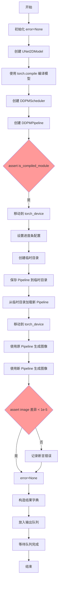

#### 带注释源码

```python
# Will be run via run_test_in_subprocess
def _test_from_save_pretrained_dynamo(in_queue, out_queue, timeout):
    """
    测试函数：验证 torch.compile 编译后的模型在保存/加载后输出一致性
    
    该函数设计为通过 run_test_in_subprocess 在子进程中运行，
    以避免 torch.compile 的全局状态影响其他测试
    """
    error = None
    try:
        # 1. Load models - 创建 UNet2DModel 实例
        model = UNet2DModel(
            block_out_channels=(32, 64),
            layers_per_block=2,
            sample_size=32,
            in_channels=3,
            out_channels=3,
            down_block_types=("DownBlock2D", "AttnDownBlock2D"),
            up_block_types=("AttnUpBlock2D", "UpBlock2D"),
        )
        # 2. 使用 torch.compile 编译模型 - 启用 PyTorch 2.0 的 torch.compile 优化
        model = torch.compile(model)
        # 3. 创建 DDPMScheduler 用于扩散模型调度
        scheduler = DDPMScheduler(num_train_timesteps=10)

        # 4. 创建 DDPMPipeline
        ddpm = DDPMPipeline(model, scheduler)

        # previous diffusers versions stripped compilation off
        # compiled modules - 验证 UNet 已被 torch.compile 编译
        assert is_compiled_module(ddpm.unet)

        # 5. 将 Pipeline 移动到指定设备
        ddpm.to(torch_device)
        ddpm.set_progress_bar_config(disable=None)

        # 6. 测试保存和加载流程
        with tempfile.TemporaryDirectory() as tmpdirname:
            # 保存到临时目录
            ddpm.save_pretrained(tmpdirname)
            # 从临时目录加载
            new_ddpm = DDPMPipeline.from_pretrained(tmpdirname)
            new_ddpm.to(torch_device)

        # 7. 使用相同随机种子生成图像，验证输出一致性
        generator = torch.Generator(device=torch_device).manual_seed(0)
        image = ddpm(generator=generator, num_inference_steps=5, output_type="np").images

        generator = torch.Generator(device=torch_device).manual_seed(0)
        new_image = new_ddpm(generator=generator, num_inference_steps=5, output_type="np").images

        # 8. 断言：编译后保存/加载的模型应产生相同输出
        assert np.abs(image - new_image).max() < 1e-5, "Models don't give the same forward pass"
    except Exception:
        # 捕获任何异常并记录错误信息
        error = f"{traceback.format_exc()}"

    # 9. 通过队列返回结果
    results = {"error": error}
    out_queue.put(results, timeout=timeout)
    out_queue.join()
```


### CustomEncoder.__init__

该方法用于初始化 CustomEncoder 类，调用父类的初始化方法并创建一个输入输出维度均为 3 的线性层。

参数：无（除隐式参数 `self` 外）

返回值：`None`，无返回值（构造函数）

#### 流程图

```mermaid
flowchart TD
    A[开始 __init__] --> B[调用 super().__init__ 初始化基类]
    B --> C[创建 nn.Linear(3, 3) 赋值给 self.linear]
    C --> D[结束]
```

#### 带注释源码

```python
class CustomEncoder(ModelMixin, ConfigMixin):
    def __init__(self):
        """
        初始化 CustomEncoder 实例。
        继承自 ModelMixin 和 ConfigMixin，用于提供模型配置和加载功能。
        """
        # 调用父类 ModelMixin 和 ConfigMixin 的初始化方法
        # ConfigMixin 提供了配置保存和加载的基础功能
        super().__init__()
        
        # 创建一个线性变换层：输入维度 3，输出维度 3，无偏置
        # 该层将用于自定义的编码功能
        self.linear = nn.Linear(3, 3)
```


### `CustomPipeline.__init__`

该方法是 `CustomPipeline` 类的构造函数，用于初始化一个自定义的扩散管道。它接受一个编码器和一个调度器作为参数，调用父类的初始化方法，并通过 `register_modules` 方法注册传入的模块，使管道能够使用这些自定义组件进行推理。

参数：

- `encoder`：`CustomEncoder`，自定义的编码器模块，用于处理输入数据
- `scheduler`：`DDIMScheduler`，DDIM 调度器，用于控制扩散过程的采样步骤

返回值：`None`，该方法不返回任何值

#### 流程图

```mermaid
flowchart TD
    A[开始 __init__] --> B[调用 super().__init__ 初始化父类 DiffusionPipeline]
    B --> C[调用 self.register_modules 注册 encoder 和 scheduler 模块]
    C --> D[结束 __init__]
```

#### 带注释源码

```python
class CustomPipeline(DiffusionPipeline):
    """
    自定义扩散管道类，继承自 DiffusionPipeline。
    用于演示如何创建包含自定义编码器和调度器的扩散管道。
    """
    
    def __init__(self, encoder: CustomEncoder, scheduler: DDIMScheduler):
        """
        初始化 CustomPipeline 实例。
        
        参数:
            encoder: CustomEncoder 类型的编码器实例，用于处理输入数据
            scheduler: DDIMScheduler 类型的调度器实例，用于控制扩散推理过程
        """
        # 调用父类 DiffusionPipeline 的 __init__ 方法
        # 负责初始化管道的基本配置和组件管理
        super().__init__()
        
        # 使用 register_modules 方法注册自定义的编码器和调度器
        # 这使得这些组件可以被管道识别和管理
        # 参数以关键字参数的形式传递，键名将成为组件的属性名
        self.register_modules(encoder=encoder, scheduler=scheduler)
```


### `DownloadTests.test_less_downloads_passed_object`

该方法是一个单元测试，用于验证当使用 `DiffusionPipeline.download` 方法并显式传递 `safety_checker=None` 参数时，安全检查器（safety_checker）组件不会被下载，而其他必要的组件（如 unet、tokenizer、vae 等）仍然会被正确下载。

参数：

- `self`：`DownloadTests` 类实例，Python 实例方法的隐式参数

返回值：`None`，该方法为测试方法，通过断言验证行为，不返回任何值

#### 流程图

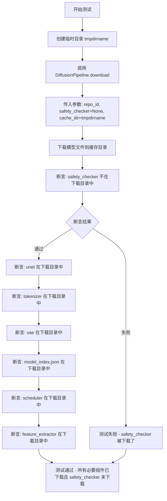

#### 带注释源码

```python
def test_less_downloads_passed_object(self):
    """
    测试当显式传递 safety_checker=None 时，
    safety_checker 组件不会被下载到本地缓存
    """
    # 使用临时目录作为缓存目录，测试完成后自动清理
    with tempfile.TemporaryDirectory() as tmpdirname:
        # 调用 DiffusionPipeline.download 方法下载模型
        # 参数 safety_checker=None 表示不下载安全检查器组件
        cached_folder = DiffusionPipeline.download(
            "hf-internal-testing/tiny-stable-diffusion-pipe", 
            safety_checker=None, 
            cache_dir=tmpdirname
        )

        # 断言1: 确保 safety_checker 确实没有被下载
        # 检查缓存目录的文件列表中不包含 safety_checker 目录
        assert "safety_checker" not in os.listdir(cached_folder)

        # 断言2-7: 确保其他必要的组件都被正确下载
        assert "unet" in os.listdir(cached_folder)          # UNet 模型
        assert "tokenizer" in os.listdir(cached_folder)      # 分词器
        assert "vae" in os.listdir(cached_folder)             # VAE 模型
        assert "model_index.json" in os.listdir(cached_folder) # 模型索引配置
        assert "scheduler" in os.listdir(cached_folder)       # 调度器配置
        assert "feature_extractor" in os.listdir(cached_folder) # 特征提取器
```


### `DownloadTests.test_download_only_pytorch`

该测试方法用于验证 `DiffusionPipeline.download` 在下载模型时能够正确过滤文件，确保只下载 PyTorch 格式的文件（`.bin`），而不会下载 Flax 格式（`.msgpack`）或 safetensors 格式（`.safetensors`）的文件。

参数：无（该方法为实例方法，`self` 为隐式参数，指向测试类实例）

返回值：无（`None`，测试方法无返回值，通过断言验证行为）

#### 流程图

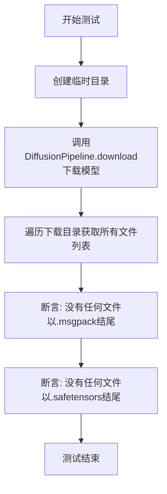

#### 带注释源码

```python
def test_download_only_pytorch(self):
    """
    测试 DiffusionPipeline.download 方法只下载 PyTorch 格式文件，
    而不下载 Flax 或 safetensors 格式的文件。
    """
    # 创建临时目录用于存放下载的模型
    with tempfile.TemporaryDirectory() as tmpdirname:
        # pipeline has Flax weights
        # 调用 DiffusionPipeline.download 从 HuggingFace Hub 下载模型
        # 传入 safety_checker=None 跳过安全检查器的下载
        # cache_dir 指定缓存目录为临时目录
        tmpdirname = DiffusionPipeline.download(
            "hf-internal-testing/tiny-stable-diffusion-pipe", 
            safety_checker=None, 
            cache_dir=tmpdirname
        )

        # 使用 os.walk 遍历下载目录，收集所有文件路径
        # os.walk 返回 (dirpath, dirnames, filenames) 三元组
        # t[-1] 取的是文件名列表 filenames
        all_root_files = [t[-1] for t in os.walk(os.path.join(tmpdirname))]
        # 将嵌套列表展平为单一文件列表
        files = [item for sublist in all_root_files for item in sublist]

        # None of the downloaded files should be a flax file even if we have some here:
        # https://huggingface.co/hf-internal-testing/tiny-stable-diffusion-pipe/blob/main/unet/diffusion_flax_model.msgpack
        # 断言: 确保下载的文件中不包含 .msgpack 格式的 Flax 模型文件
        assert not any(f.endswith(".msgpack") for f in files)
        
        # We need to never convert this tiny model to safetensors for this test to pass
        # 断言: 确保下载的文件中不包含 .safetensors 格式的文件
        assert not any(f.endswith(".safetensors") for f in files)
```


### `DownloadTests.test_force_safetensors_error`

该测试方法用于验证当模型仓库不提供 `safetensors` 格式的权重文件，但用户强制指定 `use_safetensors=True` 进行下载时，系统应正确抛出 `EnvironmentError` 异常。

参数：

- `self`：`DownloadTests` 类实例，隐式参数

返回值：`None`，该方法为测试用例，通过 `assertRaises` 验证异常抛出

#### 流程图

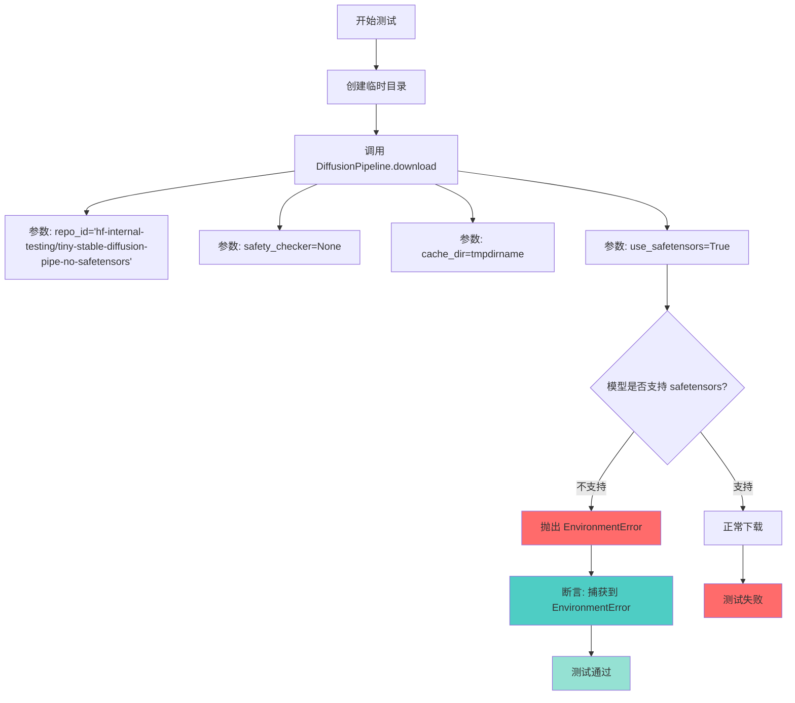

#### 带注释源码

```python
def test_force_safetensors_error(self):
    """
    测试当模型仓库不提供 safetensors 权重时，
    强制使用 use_safetensors=True 应抛出 EnvironmentError
    """
    # 创建临时目录用于缓存下载的模型
    with tempfile.TemporaryDirectory() as tmpdirname:
        # pipeline has Flax weights
        # 使用 assertRaises 验证下载不支持 safetensors 的模型时
        # 强制使用 use_safetensors=True 会抛出 EnvironmentError
        with self.assertRaises(EnvironmentError):
            tmpdirname = DiffusionPipeline.download(
                "hf-internal-testing/tiny-stable-diffusion-pipe-no-safetensors",  # 不支持 safetensors 的测试模型
                safety_checker=None,                                               # 不下载安全检查器
                cache_dir=tmpdirname,                                              # 指定缓存目录
                use_safetensors=True,                                             # 强制使用 safetensors 格式
            )
```


### `DownloadTests.test_download_safetensors`

该测试方法验证了从HuggingFace Hub下载safetensors格式模型的功能，确保下载的文件中不包含传统的PyTorch `.bin`格式权重文件，仅保留safetensors格式的权重文件。

参数： 无显式参数（使用`self`进行测试）

返回值：`None`，该方法为单元测试方法，通过`assert`断言验证下载结果

#### 流程图

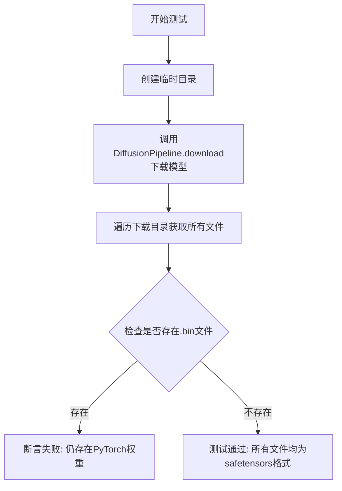

#### 带注释源码

```python
def test_download_safetensors(self):
    """
    测试safetensors格式模型的下载功能
    
    该测试验证:
    1. 能够成功从HuggingFace Hub下载带有safetensors权重的模型
    2. 下载的文件中不包含传统的PyTorch .bin格式权重文件
    3. 确保模型下载时正确处理了权重格式的优先级
    """
    # 创建一个临时目录用于存放下载的模型
    with tempfile.TemporaryDirectory() as tmpdirname:
        # pipeline has Flax weights
        # 调用DiffusionPipeline.download方法下载指定的模型
        # 模型: hf-internal-testing/tiny-stable-diffusion-pipe-safetensors
        # safety_checker=None: 不下载安全检查器组件
        # cache_dir=tmpdirname: 指定本地缓存目录
        tmpdirname = DiffusionPipeline.download(
            "hf-internal-testing/tiny-stable-diffusion-pipe-safetensors",
            safety_checker=None,
            cache_dir=tmpdirname,
        )

        # 遍历下载目录，获取所有文件的文件名列表
        # os.walk会递归遍历目录，返回(root, dirs, files)元组
        # t[-1] 取files列表
        all_root_files = [t[-1] for t in os.walk(os.path.join(tmpdirname))]
        # 将嵌套列表展平为单层列表
        files = [item for sublist in all_root_files for item in sublist]

        # None of the downloaded files should be a pytorch file even if we have some here:
        # https://huggingface.co/hf-internal-testing/tiny-stable-diffusion-pipe/blob/main/unet/diffusion_flax_model.msgpack
        # 断言：确保下载的文件中没有.bin格式的PyTorch权重文件
        # 这是验证safetensors格式被正确下载的关键检查点
        assert not any(f.endswith(".bin") for f in files)
```


### `DownloadTests.test_download_safetensors_index`

该方法是一个测试用例，用于验证在使用 safetensors 格式下载 Hugging Face Hub 上的扩散模型时，模型索引（Index Files）的处理是否正确。它遍历两种 variant 配置（"fp16" 和 None），确保下载的文件数量、格式和变体命名符合预期。

参数：

- `self`：`DownloadTests`，隐式参数，测试类实例本身

返回值：`None`，该方法为测试用例，无返回值，通过断言验证逻辑正确性

#### 流程图

```mermaid
flowchart TD
    A[开始测试] --> B[遍历 variant in ['fp16', None]]
    B --> C[创建临时目录]
    C --> D[调用 DiffusionPipeline.download]
    D --> E[使用 os.walk 收集所有下载的文件]
    E --> F{判断 variant 类型}
    F -->|variant is None| G[断言: 文件中不包含 'fp16']
    F -->|variant is 'fp16'| H[断言: safetensors 文件都包含 'fp16']
    G --> I[断言: .safetensors 文件数量为 8]
    H --> I
    I --> J[断言: 没有 .bin 文件]
    J --> K{检查下一个 variant}
    K -->|还有 variant| B
    K -->|完成| L[测试结束]
```

#### 带注释源码

```python
def test_download_safetensors_index(self):
    """
    测试使用 safetensors 格式下载模型时，索引文件的处理是否正确。
    验证 variant='fp16' 和 variant=None 两种情况下的文件命名和数量。
    """
    # 遍历两种 variant 配置：'fp16' 和 None
    for variant in ["fp16", None]:
        # 创建临时目录用于缓存下载的模型
        with tempfile.TemporaryDirectory() as tmpdirname:
            # 调用 DiffusionPipeline.download 下载模型
            # 使用 safetensors 格式，并指定 variant
            tmpdirname = DiffusionPipeline.download(
                "hf-internal-testing/tiny-stable-diffusion-pipe-indexes",  # 测试模型 ID
                cache_dir=tmpdirname,                                      # 本地缓存目录
                use_safetensors=True,                                      # 强制使用 safetensors 格式
                variant=variant,                                           # 模型变体：'fp16' 或 None
            )

            # 遍历下载目录，收集所有文件路径
            all_root_files = [t[-1] for t in os.walk(os.path.join(tmpdirname))]
            # 将嵌套列表展平为单层文件列表
            files = [item for sublist in all_root_files for item in sublist]

            # 验证文件命名逻辑：
            # 如果 variant=None，不应包含 fp16 变体的文件
            if variant is None:
                assert not any("fp16" in f for f in files), \
                    "当 variant=None 时，不应下载包含 'fp16' 的文件"
            else:
                # 如果 variant='fp16'，所有 safetensors 文件应包含 'fp16'
                model_files = [f for f in files if "safetensors" in f]
                assert all("fp16" in f for f in model_files), \
                    "当 variant='fp16' 时，所有 safetensors 文件应包含 'fp16'"

            # 验证下载的 safetensors 文件数量为 8
            assert len([f for f in files if ".safetensors" in f]) == 8, \
                f"预期 8 个 .safetensors 文件，实际: {len([f for f in files if '.safetensors' in f])}"

            # 验证没有下载 .bin (PyTorch) 格式的文件
            assert not any(".bin" in f for f in files), \
                "使用 safetensors 时，不应下载 .bin 文件"
```


### DownloadTests.test_download_bin_index

该方法用于测试从HuggingFace下载bin格式（PyTorch）的stable-diffusion-pipeline-indexes模型，并验证下载的文件格式是否符合预期（使用.bin格式，不包含.safetensors格式）。

参数：

- `self`：`DownloadTests`，测试类实例本身

返回值：`None`，该方法为测试用例，无返回值，通过assert语句进行断言验证

#### 流程图

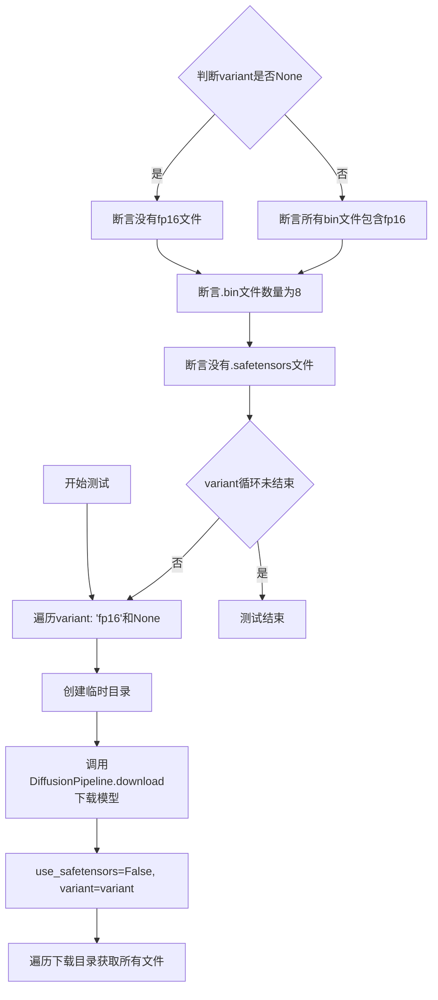

#### 带注释源码

```python
def test_download_bin_index(self):
    """
    测试下载bin格式（PyTorch）的模型索引文件。
    验证：
    1. 下载的模型使用.bin格式而非.safetensors格式
    2. variant='fp16'时，bin文件应包含fp16
    3. 不下载safetensors格式的文件
    """
    # 遍历两种variant: fp16版本和默认版本
    for variant in ["fp16", None]:
        # 创建临时目录用于存放下载的模型
        with tempfile.TemporaryDirectory() as tmpdirname:
            # 调用DiffusionPipeline.download下载指定模型
            # 使用bin格式(safetensors=False),并指定variant
            tmpdirname = DiffusionPipeline.download(
                "hf-internal-testing/tiny-stable-diffusion-pipe-indexes",
                cache_dir=tmpdirname,
                use_safetensors=False,  # 强制使用PyTorch的.bin格式
                variant=variant,       # 指定变体版本:fp16或默认
            )

            # 递归遍历下载目录,获取所有文件路径
            all_root_files = [t[-1] for t in os.walk(os.path.join(tmpdirname))]
            # 展平嵌套列表
            files = [item for sublist in all_root_files for item in sublist]

            # 验证逻辑:
            # 如果variant为None,确保没有fp16文件(默认版本)
            if variant is None:
                assert not any("fp16" in f for f in files)
            else:
                # variant为fp16时,确保所有bin文件包含fp16标记
                model_files = [f for f in files if "bin" in f]
                assert all("fp16" in f for f in model_files)

            # 确保下载了8个.bin文件
            assert len([f for f in files if ".bin" in f]) == 8
            # 确保没有任何.safetensors文件
            assert not any(".safetensors" in f for f in files)
```


### `DownloadTests.test_download_no_safety_checker`

该测试方法验证了在使用 `safety_checker=None` 参数加载 `StableDiffusionPipeline` 时，生成的结果与默认加载（包含安全检查器）的管道结果在数值上保持一致（差异小于 1e-3），确保禁用安全检查器不会影响正常的图像生成功能。

参数：

- `self`：`DownloadTests`，隐式参数，表示测试类实例本身

返回值：`None`，无返回值，这是一个单元测试方法，通过断言验证行为

#### 流程图

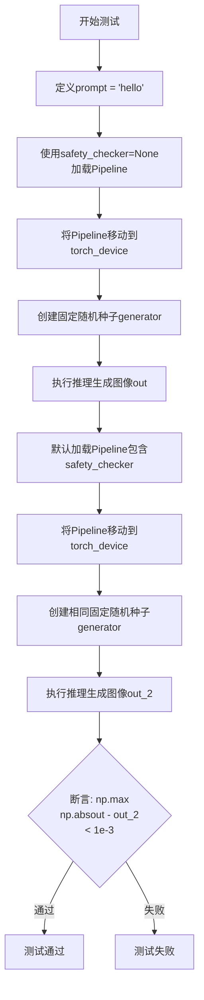

#### 带注释源码

```python
def test_download_no_safety_checker(self):
    """
    测试验证：当使用 safety_checker=None 加载 StableDiffusionPipeline 时，
    生成的图像与默认加载（包含安全检查器）的管道生成结果在数值上保持一致。
    """
    # 1. 定义测试用的提示词
    prompt = "hello"
    
    # 2. 使用 safety_checker=None 参数加载管道，禁用安全检查器
    # 从预训练模型 "hf-internal-testing/tiny-stable-diffusion-torch" 加载
    pipe = StableDiffusionPipeline.from_pretrained(
        "hf-internal-testing/tiny-stable-diffusion-torch", safety_checker=None
    )
    
    # 3. 将管道移动到指定的计算设备（如 CUDA）
    pipe = pipe.to(torch_device)
    
    # 4. 创建固定随机种子生成器，确保结果可复现
    generator = torch.manual_seed(0)
    
    # 5. 执行推理生成图像，num_inference_steps=2 表示2步推理
    # output_type="np" 表示返回 numpy 数组格式的图像
    out = pipe(prompt, num_inference_steps=2, generator=generator, output_type="np").images

    # 6. 对比测试：使用默认参数加载管道（包含 safety_checker）
    pipe_2 = StableDiffusionPipeline.from_pretrained("hf-internal-testing/tiny-stable-diffusion-torch")
    
    # 7. 同样移动到计算设备
    pipe_2 = pipe_2.to(torch_device)
    
    # 8. 使用相同的固定随机种子
    generator = torch.manual_seed(0)
    
    # 9. 执行相同的推理流程
    out_2 = pipe_2(prompt, num_inference_steps=2, generator=generator, output_type="np").images

    # 10. 断言验证：两次生成图像的最大绝对差异小于 1e-3
    # 即验证禁用安全检查器不会影响图像生成的数值结果
    assert np.max(np.abs(out - out_2)) < 1e-3
```


### `DownloadTests.test_cached_files_are_used_when_no_internet`

该测试方法验证当网络不可用时，系统能否正确使用本地缓存的文件来加载模型。测试通过模拟 HTTP 500 错误来模拟服务器宕机情况，然后从缓存中加载已下载的模型，并确保模型参数与原始参数一致。

参数：

-  `self`：无显式参数，`unittest.TestCase` 的实例方法标准参数，表示测试类实例

返回值：无返回值（`None`），测试方法通过断言验证行为

#### 流程图

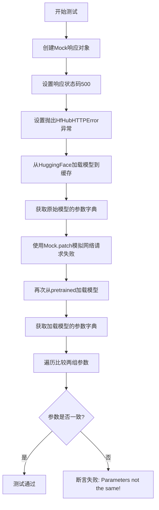

#### 带注释源码

```python
def test_cached_files_are_used_when_no_internet(self):
    # 创建一个模拟的HTTP响应对象，用于模拟服务器宕机的情况
    # 这是一个mock对象，用于替换真实的网络请求
    response_mock = mock.Mock()
    response_mock.status_code = 500  # HTTP 500 表示服务器内部错误
    response_mock.headers = {}  # 响应头为空字典
    # 配置raise_for_status方法，当被调用时抛出HfHubHTTPError异常
    response_mock.raise_for_status.side_effect = HfHubHTTPError("Server down", response=mock.Mock())
    response_mock.json.return_value = {}  # JSON响应为空字典

    # 首次从HuggingFace Hub下载模型，确保模型已被缓存到本地
    # safety_checker=None 表示不下载安全检查器组件
    orig_pipe = DiffusionPipeline.from_pretrained(
        "hf-internal-testing/tiny-stable-diffusion-torch", safety_checker=None
    )
    
    # 提取原始模型中具有可训练参数的所有组件
    # 过滤掉没有parameters属性的组件（如tokenizer等）
    orig_comps = {k: v for k, v in orig_pipe.components.items() if hasattr(v, "parameters")}

    # 在模拟的网络环境下测试：模拟HTTP请求返回500错误
    # 这会模拟服务器宕机/网络不可用的情况
    with mock.patch("requests.request", return_value=response_mock):
        # 尝试再次从pretrained加载模型，此时应该从缓存加载
        pipe = DiffusionPipeline.from_pretrained(
            "hf-internal-testing/tiny-stable-diffusion-torch", safety_checker=None
        )
        # 获取从缓存加载的模型的参数字典
        comps = {k: v for k, v in pipe.components.items() if hasattr(v, "parameters")}

    # 遍历比较原始模型和从缓存加载的模型的参数
    # 验证两者是否完全一致
    for m1, m2 in zip(orig_comps.values(), comps.values()):
        for p1, p2 in zip(m1.parameters(), m2.parameters()):
            # 比较参数值是否相同
            # ne() 返回两个张量不相等的元素，sum() 统计不相等元素的个数
            if p1.data.ne(p2.data).sum() > 0:
                assert False, "Parameters not the same!"
```


### `DownloadTests.test_download_from_variant_folder`

该测试方法验证了从 Hugging Face Hub 下载 Stable Diffusion 模型时，默认情况下不会下载 variant 文件夹（如 `fp16` 变体）中的文件，而是仅下载基础文件。它通过遍历 `use_safetensors` 为 `True` 和 `False` 两种情况，确保下载逻辑正确筛选文件。

参数：

- `self`：`DownloadTests`（隐含的 unittest.TestCase 参数），表示测试类实例本身

返回值：`None`，因为这是测试方法，不返回任何值

#### 流程图

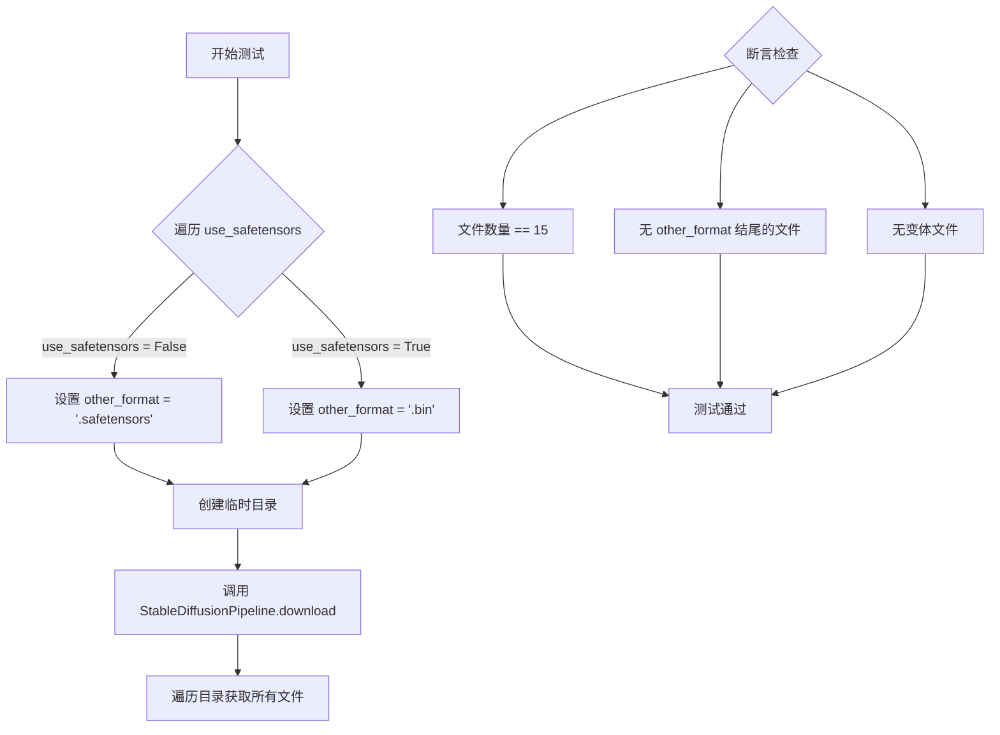

#### 带注释源码

```python
def test_download_from_variant_folder(self):
    """测试从 variant 文件夹下载时的行为，验证不会下载变体文件"""
    # 遍历两种 safetensors 格式：False 使用 .bin，True 使用 .safetensors
    for use_safetensors in [False, True]:
        # 确定当前不使用格式（用于后续断言检查）
        other_format = ".bin" if use_safetensors else ".safetensors"
        
        # 创建临时目录用于缓存下载的模型
        with tempfile.TemporaryDirectory() as tmpdirname:
            # 从 Hugging Face Hub 下载模型到临时目录
            # 传入 use_safetensors 参数指定格式，但默认不指定 variant
            # 这样只会下载基础文件，不会下载变体文件（如 fp16）
            tmpdirname = StableDiffusionPipeline.download(
                "hf-internal-testing/stable-diffusion-all-variants",
                cache_dir=tmpdirname,
                use_safetensors=use_safetensors,
            )
            
            # 遍历下载目录，获取所有文件（递归）
            all_root_files = [t[-1] for t in os.walk(tmpdirname)]
            # 展平嵌套列表
            files = [item for sublist in all_root_files for item in sublist]

            # 断言1：只应下载 15 个文件（基础文件，不含变体）
            # https://huggingface.co/hf-internal-testing/stable-diffusion-all-variants/tree/main/unet
            assert len(files) == 15, f"We should only download 15 files, not {len(files)}"
            
            # 断言2：下载的文件不应包含其他格式的文件
            # 例如当 use_safetensors=True 时，不应下载 .bin 文件
            assert not any(f.endswith(other_format) for f in files)
            
            # 断言3：不应有变体文件（文件名包含 3 个点，如 xxx.fp16.bin）
            # 变体文件命名格式通常为: diffusion_pytorch_model.fp16.safetensors
            assert not any(len(f.split(".")) == 3 for f in files)
```


### `DownloadTests.test_download_variant_all`

该测试方法用于验证在使用指定variant（如fp16）下载StableDiffusionPipeline时，能够正确下载所有模型文件的variant版本，并且不会下载非variant版本或其他格式的文件。

参数：

- `self`：`DownloadTests`（隐式），测试类实例本身，无需显式传递

返回值：`None`，该方法为测试方法，无返回值（返回None）

#### 流程图

```mermaid
flowchart TD
    A[开始测试] --> B[循环 use_safetensors in [False, True]]
    B --> C[设置格式变量]
    C --> D[创建临时目录]
    D --> E[调用 StableDiffusionPipeline.download]
    E --> F[遍历目录获取所有文件]
    F --> G[断言文件总数为15]
    H[断言variant文件数量为4]
    H --> I[断言没有非variant文件]
    I --> J[断言没有other_format文件]
    J --> K[结束测试]
    
    B --> B1[use_safetensors = False]
    B1 --> C
    B --> B2[use_safetensors = True]
    B2 --> C
```

#### 带注释源码

```python
def test_download_variant_all(self):
    """
    测试使用variant参数下载pipeline时，所有模型文件都下载为指定的variant格式。
    
    测试逻辑：
    1. 分别测试use_safetensors为True和False两种情况
    2. 使用variant='fp16'下载hf-internal-testing/stable-diffusion-all-variants
    3. 验证下载的文件符合预期：
       - 总共15个文件
       - 4个variant文件（unet, vae, text_encoder, safety_checker各一个）
       - 没有非variant文件
       - 没有其他格式的文件
    """
    # 遍历两种安全张量格式选项
    for use_safetensors in [False, True]:
        # 确定其他格式和当前格式的扩展名
        # 如果use_safetensors为True，则其他格式为.bin，当前格式为.safetensors
        other_format = ".bin" if use_safetensors else ".safetensors"
        this_format = ".safetensors" if use_safetensors else ".bin"
        
        # 指定要下载的variant类型
        variant = "fp16"

        # 创建临时目录用于缓存下载的模型
        with tempfile.TemporaryDirectory() as tmpdirname:
            # 调用StableDiffusionPipeline.download下载模型
            # 参数：
            # - pretrained_model_name_or_path: "hf-internal-testing/stable-diffusion-all-variants"
            # - cache_dir: tmpdirname, 本地缓存目录
            # - variant: variant, 指定要下载的variant（如fp16, no_ema等）
            # - use_safetensors: use_safetensors, 是否使用safetensors格式
            tmpdirname = StableDiffusionPipeline.download(
                "hf-internal-testing/stable-diffusion-all-variants",
                cache_dir=tmpdirname,
                variant=variant,
                use_safetensors=use_safetensors,
            )
            
            # 遍历下载的目录，获取所有文件路径
            all_root_files = [t[-1] for t in os.walk(tmpdirname)]
            # 展平嵌套列表
            files = [item for sublist in all_root_files for item in sublist]

            # 断言：总共应该有15个文件
            # 这个仓库只有15个文件，不应该多也不应该少
            assert len(files) == 15, f"We should only download 15 files, not {len(files)}"
            
            # 断言：应该有4个variant文件
            # unet, vae, text_encoder, safety_checker各一个variant文件
            # 文件名格式如：diffusion_pytorch_model.fp16.safetensors
            assert len([f for f in files if f.endswith(f"{variant}{this_format}")]) == 4
            
            # 断言：所有当前格式的文件都应该是variant文件
            # 即：不存在既不是variant又是当前格式的文件
            # 例如：不能有 diffusion_pytorch_model.safetensors（不含fp16）
            assert not any(
                f.endswith(this_format) and not f.endswith(f"{variant}{this_format}") 
                for f in files
            )
            
            # 断言：不应该存在其他格式的文件
            # 例如：如果use_safetensors=True，则不应该有.bin文件
            assert not any(f.endswith(other_format) for f in files)
```


### `DownloadTests.test_text_inversion_download`

这是一个测试方法，用于验证Stable Diffusion pipeline的文本反转（Textual Inversion）下载和加载功能。该测试覆盖了多种场景：本地单token加载、带权重名的单token加载、多token加载、A1111格式加载、多embedding加载、state dict加载等，确保pipeline能正确处理不同格式的文本反转嵌入。

参数：

- `self`：隐式参数，类型为`DownloadTests`（unittest.TestCase），代表测试用例实例本身

返回值：`None`，无返回值（测试方法）

#### 流程图

```mermaid
flowchart TD
    A[开始测试] --> B[加载Stable Diffusion Pipeline]
    B --> C[获取原始tokenizer大小]
    
    D[测试1: 单token本地加载] --> D1[创建临时目录]
    D1 --> D2[保存单token嵌入到learned_embeds.bin]
    D2 --> D3[调用load_textual_inversion加载]
    D3 --> D4[验证token ID和嵌入权重]
    D4 --> D5[运行pipeline推理验证]
    
    E[测试2: 单token带权重名] --> E1[创建临时目录]
    E1 --> E2[保存带权重名的嵌入]
    E2 --> E3[调用load_textual_inversion with weight_name]
    E3 --> E4[验证token ID和嵌入权重]
    E4 --> E5[运行pipeline推理验证]
    
    F[测试3: 多token加载] --> F1[创建临时目录]
    F1 --> F2[保存3个token嵌入]
    F2 --> F3[调用load_textual_inversion加载]
    F3 --> F4[验证多个token ID和嵌入权重]
    F4 --> F5[验证prompt转换]
    F5 --> F6[运行pipeline推理验证]
    
    G[测试4: A1111格式] --> G1[创建临时目录]
    G1 --> G2[保存A1111格式的嵌入]
    G2 --> G3[调用load_textual_inversion加载]
    G3 --> G4[验证token ID和嵌入权重]
    G4 --> G5[运行pipeline推理验证]
    
    H[测试5: 多embedding加载] --> H1[创建两个临时目录]
    H1 --> H2[分别保存不同embedding]
    H2 --> H3[调用load_textual_inversion加载列表]
    H3 --> H4[验证两个token]
    H4 --> H5[运行pipeline推理验证]
    
    I[测试6: State Dict加载-单token] --> I1[创建单token的state dict]
    I1 --> I2[直接调用load_textual_inversion加载dict]
    I2 --> I3[验证token和权重]
    I3 --> I4[运行pipeline推理]
    
    J[测试7: State Dict加载-多token] --> J1[创建两个token的state dict]
    J1 --> J2[作为列表加载两个dict]
    J2 --> J3[验证两个token]
    J3 --> J4[运行pipeline推理]
    
    K[测试8: A1111多token State Dict] --> K1[创建A1111格式state dict]
    K1 --> K2[直接加载A1111格式]
    K2 --> K3[验证3个token ID]
    K3 --> K4[运行pipeline推理]
    
    L[测试9: 多embedding重复引用] --> L1[创建单个embedding]
    L1 --> L2[加载并在prompt中重复使用]
    L2 --> L3[验证展开逻辑]
    L3 --> L4[运行pipeline推理]
    
    C --> D
    D5 --> E
    E5 --> F
    F6 --> G
    G5 --> H
    H5 --> I
    I4 --> J
    J4 --> K
    K4 --> L
    L4 --> M[结束测试]
```

#### 带注释源码

```python
def test_text_inversion_download(self):
    """
    测试Textual Inversion功能的多种加载场景
    """
    # 1. 加载基础Stable Diffusion Pipeline
    pipe = StableDiffusionPipeline.from_pretrained(
        "hf-internal-testing/tiny-stable-diffusion-torch", safety_checker=None
    )
    pipe = pipe.to(torch_device)
    
    # 获取原始tokenizer的vocab大小，用于后续验证
    num_tokens = len(pipe.tokenizer)

    # ============================================================
    # 测试1: 单token本地文件加载
    # ============================================================
    with tempfile.TemporaryDirectory() as tmpdirname:
        # 创建单token嵌入: token "<*>" -> 向量(32,)
        ten = {"<*>": torch.ones((32,))}
        torch.save(ten, os.path.join(tmpdirname, "learned_embeds.bin"))

        # 加载textual inversion
        pipe.load_textual_inversion(tmpdirname)

        # 验证token被正确添加
        token = pipe.tokenizer.convert_tokens_to_ids("<*>")
        assert token == num_tokens, "Added token must be at spot `num_tokens`"
        # 验证嵌入权重正确 (1*32=32)
        assert pipe.text_encoder.get_input_embeddings().weight[-1].sum().item() == 32
        # 验证prompt转换
        assert pipe._maybe_convert_prompt("<*>", pipe.tokenizer) == "<*>"

        # 运行推理验证pipeline正常工作
        prompt = "hey <*>"
        out = pipe(prompt, num_inference_steps=1, output_type="np").images
        assert out.shape == (1, 128, 128, 3)

    # ============================================================
    # 测试2: 单token本地文件加载 - 指定权重文件名
    # ============================================================
    with tempfile.TemporaryDirectory() as tmpdirname:
        # 创建单token嵌入: token "<**>" -> 向量(1, 32)*2=64
        ten = {"<**>": 2 * torch.ones((1, 32))}
        torch.save(ten, os.path.join(tmpdirname, "learned_embeds.bin"))

        # 指定weight_name参数加载
        pipe.load_textual_inversion(tmpdirname, weight_name="learned_embeds.bin")

        # 验证token被添加在下一个位置
        token = pipe.tokenizer.convert_tokens_to_ids("<**>")
        assert token == num_tokens + 1, "Added token must be at spot `num_tokens`"
        # 验证权重: 2*32=64
        assert pipe.text_encoder.get_input_embeddings().weight[-1].sum().item() == 64
        assert pipe._maybe_convert_prompt("<**>", pipe.tokenizer) == "<**>"

        prompt = "hey <**>"
        out = pipe(prompt, num_inference_steps=1, output_type="np").images
        assert out.shape == (1, 128, 128, 3)

    # ============================================================
    # 测试3: 多token加载 (一个token名对应多个嵌入)
    # ============================================================
    with tempfile.TemporaryDirectory() as tmpdirname:
        # 创建3个token的嵌入: token "<***>" -> 3个向量(1,32)
        # 3*32=96, 4*32=128, 5*32=160
        ten = {"<***>": torch.cat([3 * torch.ones((1, 32)), 4 * torch.ones((1, 32)), 5 * torch.ones((1, 32))])}
        torch.save(ten, os.path.join(tmpdirname, "learned_embeds.bin"))

        pipe.load_textual_inversion(tmpdirname)

        # 验证3个连续的token ID
        token = pipe.tokenizer.convert_tokens_to_ids("<***>")
        token_1 = pipe.tokenizer.convert_tokens_to_ids("<***>_1")
        token_2 = pipe.tokenizer.convert_tokens_to_ids("<***>_2")

        assert token == num_tokens + 2, "Added token must be at spot `num_tokens`"
        assert token_1 == num_tokens + 3, "Added token must be at spot `num_tokens`"
        assert token_2 == num_tokens + 4, "Added token must be at spot `num_tokens`"
        # 验证3个嵌入的权重
        assert pipe.text_encoder.get_input_embeddings().weight[-3].sum().item() == 96
        assert pipe.text_encoder.get_input_embeddings().weight[-2].sum().item() == 128
        assert pipe.text_encoder.get_input_embeddings().weight[-1].sum().item() == 160
        # 验证prompt被正确展开
        assert pipe._maybe_convert_prompt("<***>", pipe.tokenizer) == "<***> <***>_1 <***>_2"

        prompt = "hey <***>"
        out = pipe(prompt, num_inference_steps=1, output_type="np").images
        assert out.shape == (1, 128, 128, 3)

    # ============================================================
    # 测试4: A1111格式加载 (webui格式)
    # ============================================================
    with tempfile.TemporaryDirectory() as tmpdirname:
        # A1111格式使用string_to_param结构
        ten = {
            "string_to_param": {
                "*": torch.cat([3 * torch.ones((1, 32)), 4 * torch.ones((1, 32)), 5 * torch.ones((1, 32))])
            },
            "name": "<****>",
        }
        torch.save(ten, os.path.join(tmpdirname, "a1111.bin"))

        pipe.load_textual_inversion(tmpdirname, weight_name="a1111.bin")

        # 验证token和嵌入
        token = pipe.tokenizer.convert_tokens_to_ids("<****>")
        token_1 = pipe.tokenizer.convert_tokens_to_ids("<****>_1")
        token_2 = pipe.tokenizer.convert_tokens_to_ids("<****>_2")

        assert token == num_tokens + 5, "Added token must be at spot `num_tokens`"
        assert token_1 == num_tokens + 6, "Added token must be at spot `num_tokens`"
        assert token_2 == num_tokens + 7, "Added token must be at spot `num_tokens`"
        assert pipe.text_encoder.get_input_embeddings().weight[-3].sum().item() == 96
        assert pipe.text_encoder.get_input_embeddings().weight[-2].sum().item() == 128
        assert pipe.text_encoder.get_input_embeddings().weight[-1].sum().item() == 160
        assert pipe._maybe_convert_prompt("<****>", pipe.tokenizer) == "<****> <****>_1 <****>_2"

        prompt = "hey <****>"
        out = pipe(prompt, num_inference_steps=1, output_type="np").images
        assert out.shape == (1, 128, 128, 3)

    # ============================================================
    # 测试5: 多embedding文件加载 (列表形式)
    # ============================================================
    with tempfile.TemporaryDirectory() as tmpdirname1:
        with tempfile.TemporaryDirectory() as tmpdirname2:
            # 第一个embedding
            ten = {"<*****>": torch.ones((32,))}
            torch.save(ten, os.path.join(tmpdirname1, "learned_embeds.bin"))

            # 第二个embedding
            ten = {"<******>": 2 * torch.ones((1, 32))}
            torch.save(ten, os.path.join(tmpdirname2, "learned_embeds.bin"))

            # 加载两个目录
            pipe.load_textual_inversion([tmpdirname1, tmpdirname2])

            # 验证第一个token
            token = pipe.tokenizer.convert_tokens_to_ids("<*****>")
            assert token == num_tokens + 8, "Added token must be at spot `num_tokens`"
            assert pipe.text_encoder.get_input_embeddings().weight[-2].sum().item() == 32
            assert pipe._maybe_convert_prompt("<*****>", pipe.tokenizer) == "<*****>"

            # 验证第二个token
            token = pipe.tokenizer.convert_tokens_to_ids("<******>")
            assert token == num_tokens + 9, "Added token must be at spot `num_tokens`"
            assert pipe.text_encoder.get_input_embeddings().weight[-1].sum().item() == 64
            assert pipe._maybe_convert_prompt("<******>", pipe.tokenizer) == "<******>"

            prompt = "hey <*****> <******>"
            out = pipe(prompt, num_inference_steps=1, output_type="np").images
            assert out.shape == (1, 128, 128, 3)

    # ============================================================
    # 测试6: State Dict直接加载 - 单token
    # ============================================================
    # 直接传递state dict而非文件路径
    ten = {"<x>": torch.ones((32,))}
    pipe.load_textual_inversion(ten)

    token = pipe.tokenizer.convert_tokens_to_ids("<x>")
    assert token == num_tokens + 10, "Added token must be at spot `num_tokens`"
    assert pipe.text_encoder.get_input_embeddings().weight[-1].sum().item() == 32
    assert pipe._maybe_convert_prompt("<x>", pipe.tokenizer) == "<x>"

    prompt = "hey <x>"
    out = pipe(prompt, num_inference_steps=1, output_type="np").images
    assert out.shape == (1, 128, 128, 3)

    # ============================================================
    # 测试7: State Dict直接加载 - 多token (列表形式)
    # ============================================================
    ten1 = {"<xxxxx>": torch.ones((32,))}
    ten2 = {"<xxxxxx>": 2 * torch.ones((1, 32))}

    pipe.load_textual_inversion([ten1, ten2])

    token = pipe.tokenizer.convert_tokens_to_ids("<xxxxx>")
    assert token == num_tokens + 11, "Added token must be at spot `num_tokens`"
    assert pipe.text_encoder.get_input_embeddings().weight[-2].sum().item() == 32
    assert pipe._maybe_convert_prompt("<xxxxx>", pipe.tokenizer) == "<xxxxx>"

    token = pipe.tokenizer.convert_tokens_to_ids("<xxxxxx>")
    assert token == num_tokens + 12, "Added token must be at spot `num_tokens`"
    assert pipe.text_encoder.get_input_embeddings().weight[-1].sum().item() == 64
    assert pipe._maybe_convert_prompt("<xxxxxx>", pipe.tokenizer) == "<xxxxxx>"

    prompt = "hey <xxxxx> <xxxxxx>"
    out = pipe(prompt, num_inference_steps=1, output_type="np").images
    assert out.shape == (1, 128, 128, 3)

    # ============================================================
    # 测试8: A1111格式 - State Dict直接加载
    # ============================================================
    # A1111格式的state dict直接传递
    ten = {
        "string_to_param": {
            "*": torch.cat([3 * torch.ones((1, 32)), 4 * torch.ones((1, 32)), 5 * torch.ones((1, 32))])
        },
        "name": "<xxxx>",
    }

    pipe.load_textual_inversion(ten)

    token = pipe.tokenizer.convert_tokens_to_ids("<xxxx>")
    token_1 = pipe.tokenizer.convert_tokens_to_ids("<xxxx>_1")
    token_2 = pipe.tokenizer.convert_tokens_to_ids("<xxxx>_2")

    assert token == num_tokens + 13, "Added token must be at spot `num_tokens`"
    assert token_1 == num_tokens + 14, "Added token must be at spot `num_tokens`"
    assert token_2 == num_tokens + 15, "Added token must be at spot `num_tokens`"
    assert pipe.text_encoder.get_input_embeddings().weight[-3].sum().item() == 96
    assert pipe.text_encoder.get_input_embeddings().weight[-2].sum().item() == 128
    assert pipe.text_encoder.get_input_embeddings().weight[-1].sum().item() == 160
    assert pipe._maybe_convert_prompt("<xxxx>", pipe.tokenizer) == "<xxxx> <xxxx>_1 <xxxx>_2"

    prompt = "hey <xxxx>"
    out = pipe(prompt, num_inference_steps=1, output_type="np").images
    assert out.shape == (1, 128, 128, 3)

    # ============================================================
    # 测试9: 多embedding重复引用验证
    # ============================================================
    # 验证同一embedding在prompt中多次使用时的展开逻辑
    ten = {"<cat>": torch.ones(3, 32)}
    pipe.load_textual_inversion(ten)

    # 验证"<cat> <cat>"被正确展开为"<cat> <cat>_1 <cat>_2 <cat> <cat>_1 <cat>_2"
    assert (
        pipe._maybe_convert_prompt("<cat> <cat>", pipe.tokenizer) == "<cat> <cat>_1 <cat>_2 <cat> <cat>_1 <cat>_2"
    )

    prompt = "hey <cat> <cat>"
    out = pipe(prompt, num_inference_steps=1, output_type="np").images
    assert out.shape == (1, 128, 128, 3)
```


### `DownloadTests.test_text_inversion_multi_tokens`

该测试方法验证了 Stable Diffusion Pipeline 中 `load_textual_inversion` 方法对多个文本反转嵌入（multi-token textual inversion）的加载功能，通过三种不同的加载方式（单独加载、列表加载、张量堆叠加载）来确保嵌入向量和分词器状态的一致性。

参数：

- `self`：隐式参数，`DownloadTests` 类的实例方法调用

返回值：`None`，该方法为测试用例，无返回值

#### 流程图

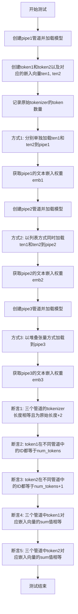

#### 带注释源码

```python
def test_text_inversion_multi_tokens(self):
    """测试多种方式加载多个文本反转token的功能"""
    
    # 步骤1: 创建第一个pipeline并加载预训练模型
    pipe1 = StableDiffusionPipeline.from_pretrained(
        "hf-internal-testing/tiny-stable-diffusion-torch", safety_checker=None
    )
    pipe1 = pipe1.to(torch_device)  # 移动到指定设备

    # 步骤2: 定义两个自定义token和对应的嵌入向量
    token1, token2 = "<*>", "<**>"  # 自定义文本反转token
    ten1 = torch.ones((32,))       # 第一个token的嵌入向量，全1
    ten2 = torch.ones((32,)) * 2    # 第二个token的嵌入向量，全2

    # 步骤3: 记录原始tokenizer的token数量
    num_tokens = len(pipe1.tokenizer)

    # 步骤4: 方式1 - 分别单独加载每个文本反转嵌入
    pipe1.load_textual_inversion(ten1, token=token1)
    pipe1.load_textual_inversion(ten2, token=token2)
    emb1 = pipe1.text_encoder.get_input_embeddings().weight

    # 步骤5: 创建第二个pipeline进行方式2测试
    pipe2 = StableDiffusionPipeline.from_pretrained(
        "hf-internal-testing/tiny-stable-diffusion-torch", safety_checker=None
    )
    pipe2 = pipe2.to(torch_device)
    
    # 方式2 - 以列表方式同时加载多个文本反转嵌入
    pipe2.load_textual_inversion([ten1, ten2], token=[token1, token2])
    emb2 = pipe2.text_encoder.get_input_embeddings().weight

    # 步骤6: 创建第三个pipeline进行方式3测试
    pipe3 = StableDiffusionPipeline.from_pretrained(
        "hf-internal-testing/tiny-stable-diffusion-torch", safety_checker=None
    )
    pipe3 = pipe3.to(torch_device)
    
    # 方式3 - 以堆叠张量方式加载多个文本反转嵌入
    pipe3.load_textual_inversion(torch.stack([ten1, ten2], dim=0), token=[token1, token2])
    emb3 = pipe3.text_encoder.get_input_embeddings().weight

    # 步骤7: 验证结果
    # 验证1: 三个管道的tokenizer大小都增加了2个token
    assert len(pipe1.tokenizer) == len(pipe2.tokenizer) == len(pipe3.tokenizer) == num_tokens + 2
    
    # 验证2: token1在所有管道中的ID都等于原始tokenizer大小
    assert (
        pipe1.tokenizer.convert_tokens_to_ids(token1)
        == pipe2.tokenizer.convert_tokens_to_ids(token1)
        == pipe3.tokenizer.convert_tokens_to_ids(token1)
        == num_tokens
    )
    
    # 验证3: token2在所有管道中的ID都等于原始tokenizer大小+1
    assert (
        pipe1.tokenizer.convert_tokens_to_ids(token2)
        == pipe2.tokenizer.convert_tokens_to_ids(token2)
        == pipe3.tokenizer.convert_tokens_to_ids(token2)
        == num_tokens + 1
    )
    
    # 验证4: token1对应嵌入向量的sum值在三个管道中相等
    assert emb1[num_tokens].sum().item() == emb2[num_tokens].sum().item() == emb3[num_tokens].sum().item()
    
    # 验证5: token2对应嵌入向量的sum值在三个管道中相等
    assert (
        emb1[num_tokens + 1].sum().item() == emb2[num_tokens + 1].sum().item() == emb3[num_tokens + 1].sum().item()
    )
```


### `DownloadTests.test_local_save_load_index`

该方法是一个测试用例，用于验证 StableDiffusionPipeline 在本地保存和加载索引时的正确性。它通过下载预训练模型，将其保存到本地，然后重新加载并比较生成结果，以确保保存/加载过程不会改变模型的输出。

参数：

- `self`：`DownloadTests`（测试类实例），代表当前测试类的实例对象

返回值：`None`（测试方法无返回值）

#### 流程图

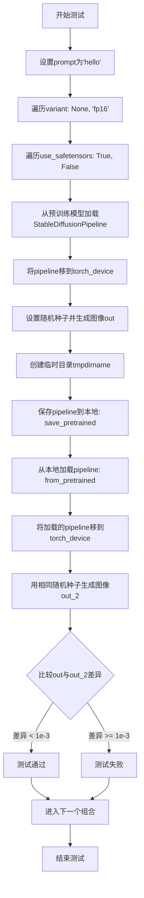

#### 带注释源码

```python
@pytest.mark.xfail(condition=is_transformers_version(">", "4.56.2"), reason="Some import error", strict=False)
def test_local_save_load_index(self):
    """
    测试本地保存和加载索引功能
    验证在使用不同variant和safetensors选项时，pipeline能正确保存和加载
    """
    prompt = "hello"  # 测试用的提示词
    # 遍历两种variant配置：None和fp16
    for variant in [None, "fp16"]:
        # 遍历两种safetensors配置：True和False
        for use_safe in [True, False]:
            # 1. 从预训练模型加载StableDiffusionPipeline
            # 使用hf-internal-testing/tiny-stable-diffusion-pipe-indexes模型
            pipe = StableDiffusionPipeline.from_pretrained(
                "hf-internal-testing/tiny-stable-diffusion-pipe-indexes",
                variant=variant,              # 模型变体：None或"fp16"
                use_safetensors=use_safe,     # 是否使用safetensors格式
                safety_checker=None,          # 不加载safety_checker以加快测试
            )
            # 2. 将pipeline移到指定设备（如cuda）
            pipe = pipe.to(torch_device)
            
            # 3. 使用固定随机种子生成图像，确保可复现性
            generator = torch.manual_seed(0)
            out = pipe(prompt, num_inference_steps=2, generator=generator, output_type="np").images
            
            # 4. 创建临时目录用于保存和加载
            with tempfile.TemporaryDirectory() as tmpdirname:
                # 将pipeline保存到本地目录
                pipe.save_pretrained(tmpdirname, variant=variant, safe_serialization=use_safe)
                # 从本地目录重新加载pipeline
                pipe_2 = StableDiffusionPipeline.from_pretrained(
                    tmpdirname, safe_serialization=use_safe, variant=variant
                )
                # 将重新加载的pipeline移到指定设备
                pipe_2 = pipe_2.to(torch_device)
            
            # 5. 使用相同的随机种子生成第二组图像
            generator = torch.manual_seed(0)
            out_2 = pipe_2(prompt, num_inference_steps=2, generator=generator, output_type="np").images
            
            # 6. 断言：比较两组图像的差异，差异应该小于1e-3
            assert np.max(np.abs(out - out_2)) < 1e-3
```


### `DownloadTests.test_download_ignore_files`

这是一个单元测试方法，用于验证在使用 `DiffusionPipeline.download` 下载模型时，能够正确忽略指定的文件（如 Flax 权重文件）。

参数：

- `self`：`DownloadTests`（`unittest.TestCase` 的实例），表示测试类实例本身

返回值：`None`（测试方法无返回值）

#### 流程图

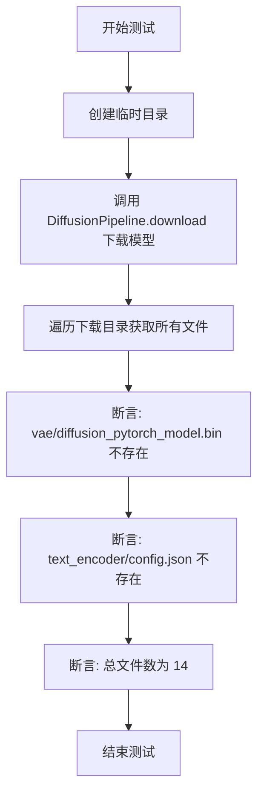

#### 带注释源码

```python
def test_download_ignore_files(self):
    """
    测试 DiffusionPipeline.download 能够忽略 model_index.json 中指定不下载的文件。
    参考: https://huggingface.co/hf-internal-testing/tiny-stable-diffusion-pipe-ignore-files/blob/main/model_index.json#L4
    """
    # 创建临时目录用于存放下载的模型文件
    with tempfile.TemporaryDirectory() as tmpdirname:
        # 下载指定的模型仓库，该仓库在 model_index.json 中配置了 ignore_files 参数
        # 预期行为：忽略 vae 的权重文件和 text_encoder 的配置文件
        tmpdirname = DiffusionPipeline.download(
            "hf-internal-testing/tiny-stable-diffusion-pipe-ignore-files"
        )
        
        # 递归遍历下载目录，收集所有文件
        all_root_files = [t[-1] for t in os.walk(os.path.join(tmpdirname))]
        # 将嵌套列表展平为单层列表
        files = [item for sublist in all_root_files for item in sublist]

        # 断言1: 确认 vae 的 PyTorch 权重文件未被下载（虽然仓库中存在 Flax 权重）
        # 参考: https://huggingface.co/hf-internal-testing/tiny-stable-diffusion-pipe/blob/main/unet/diffusion_flax_model.msgpack
        assert not any(f in ["vae/diffusion_pytorch_model.bin", "text_encoder/config.json"] for f in files)
        
        # 断言2: 确认下载的文件总数为 14 个
        assert len(files) == 14
```


### `CustomPipelineTests.test_load_custom_pipeline`

该测试方法用于验证能否从 Hugging Face Hub 加载自定义的 DiffusionPipeline，通过指定 `custom_pipeline` 参数来加载社区分享的自定义管道实现，并确保加载后的管道类名正确。

参数：
- `self`：`unittest.TestCase`，测试类实例本身

返回值：`None`，测试方法无返回值，通过断言验证行为

#### 流程图

```mermaid
flowchart TD
    A[开始测试] --> B[调用 DiffusionPipeline.from_pretrained]
    B --> C[指定 pretrained_model_name_or_path='google/ddpm-cifar10-32']
    B --> D[指定 custom_pipeline='hf-internal-testing/diffusers-dummy-pipeline']
    C --> E[从 Hub 下载并加载自定义管道类]
    E --> F[调用 pipeline.to(torch_device)]
    F --> G[将管道移动到指定设备]
    G --> H{断言 pipeline.__class__.__name__ == 'CustomPipeline'}
    H -->|通过| I[测试通过]
    H -->|失败| J[测试失败]
```

#### 带注释源码

```python
def test_load_custom_pipeline(self):
    """
    测试从 HuggingFace Hub 加载自定义 Pipeline 的功能。
    
    该测试验证 DiffusionPipeline.from_pretrained 能够通过 custom_pipeline 
    参数加载社区分享的自定义管道实现，而非内置的标准管道。
    """
    # 使用 DiffusionPipeline.from_pretrained 加载自定义管道
    # 参数:
    #   - pretrained_model_name_or_path: 基础模型路径，这里使用 google/ddpm-cifar10-32
    #   - custom_pipeline: 指定自定义管道的Hub仓库ID
    #     该仓库包含 CustomPipeline 类定义: 
    #     https://huggingface.co/hf-internal-testing/diffusers-dummy-pipeline/blob/main/pipeline.py#L24
    pipeline = DiffusionPipeline.from_pretrained(
        "google/ddpm-cifar10-32", 
        custom_pipeline="hf-internal-testing/diffusers-dummy-pipeline"
    )
    
    # 将加载的管道移动到指定的计算设备 (torch_device)
    # torch_device 是测试框架定义的全局变量，通常为 'cuda' 或 'cpu'
    pipeline = pipeline.to(torch_device)
    
    # 验证加载的管道类名是否为 'CustomPipeline'
    # 注意: "CustomPipeline" 并不是 diffusers 库内置的类，
    # 而是定义在 Hub 仓库中的自定义类
    assert pipeline.__class__.__name__ == "CustomPipeline"
```


### `CustomPipelineTests.test_load_custom_github`

该方法测试从 GitHub 加载自定义 pipeline 的功能。它首先从主分支加载自定义 pipeline，验证输出全为 1；然后切换到特定版本（0.10.2）重新加载，验证输出不再全为 1，并确认最终加载的 pipeline 类名为 `UnetSchedulerOneForwardPipeline`。

参数：

- `self`：`CustomPipelineTests`，测试类实例本身，用于访问测试类的属性和方法

返回值：`None`，该方法为测试方法，通过断言验证功能，不返回具体值

#### 流程图

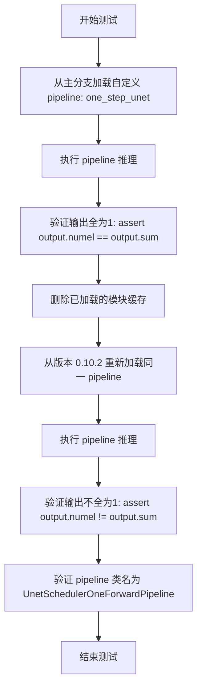

#### 带注释源码

```python
def test_load_custom_github(self):
    """
    测试从 GitHub 仓库加载自定义 pipeline 的功能。
    验证不同版本的同一自定义 pipeline 产生不同的输出结果。
    """
    # 步骤1: 从 HuggingFace Hub 加载预训练模型，并指定自定义 pipeline
    # custom_pipeline="one_step_unet" 指定要加载的自定义 pipeline 名称
    # custom_revision="main" 指定使用 main 分支的版本
    pipeline = DiffusionPipeline.from_pretrained(
        "google/ddpm-cifar10-32", custom_pipeline="one_step_unet", custom_revision="main"
    )

    # 步骤2: 使用 torch.no_grad() 禁用梯度计算，减少内存占用
    # 执行 pipeline 推理（无输入参数，使用默认配置）
    # 根据 GitHub PR #1690，main 分支的 pipeline 输出应全为 1
    with torch.no_grad():
        output = pipeline()

    # 步骤3: 断言验证输出全为 1
    # output.numel() 返回输出张量的元素总数
    # output.sum() 返回输出张量的所有元素之和
    # 如果全为 1，则 numel == sum
    assert output.numel() == output.sum()

    # 步骤4: 清理模块缓存
    # Python 不允许直接覆盖已导入的模块，因此需要手动删除模块缓存
    # 这样可以重新加载不同版本的同一模块
    # 参考: https://stackoverflow.com/questions/3105801/unload-a-module-in-python
    del sys.modules["diffusers_modules.git.one_step_unet"]

    # 步骤5: 从指定版本 0.10.2 重新加载同一自定义 pipeline
    pipeline = DiffusionPipeline.from_pretrained(
        "google/ddpm-cifar10-32", custom_pipeline="one_step_unet", custom_revision="0.10.2"
    )
    
    # 步骤6: 再次执行推理
    with torch.no_grad():
        output = pipeline()

    # 步骤7: 验证新版本的输出不再全为 1
    assert output.numel() != output.sum()

    # 步骤8: 最终验证加载的 pipeline 类名符合预期
    # 不同版本应加载不同的 pipeline 实现类
    assert pipeline.__class__.__name__ == "UnetSchedulerOneForwardPipeline"
```


### `CustomPipelineTests.test_run_custom_pipeline`

该测试方法验证了从 HuggingFace Hub 加载自定义 DiffusionPipeline 并执行推理的功能。它加载一个自定义 pipeline（`hf-internal-testing/diffusers-dummy-pipeline`），将其移至目标设备，执行 2 步推理，最后验证输出图像的形状和文本返回值是否符合预期。

参数：
- 该方法无显式参数（继承自 `unittest.TestCase`）

返回值：
- 该方法无返回值（`void`），通过 `assert` 语句进行断言验证

#### 流程图

```mermaid
flowchart TD
    A[开始] --> B[调用 DiffusionPipeline.from_pretrained<br/>加载自定义 pipeline]
    B --> C[调用 pipeline.to<br/>将模型移至 torch_device]
    C --> D[调用 pipeline 并传入参数<br/>num_inference_steps=2<br/>output_type='np']
    D --> E{断言 images[0].shape == (1, 32, 32, 3)}
    E -->|通过| F{断言 output_str == 'This is a test'}
    E -->|失败| G[抛出 AssertionError]
    F -->|通过| H[测试通过]
    F -->|失败| G
```

#### 带注释源码

```python
def test_run_custom_pipeline(self):
    """
    测试从 HuggingFace Hub 加载自定义 pipeline 并运行推理的功能。
    
    该测试验证：
    1. 可以通过 custom_pipeline 参数加载非内置的 Pipeline 类
    2. 自定义 Pipeline 能够在指定设备上正常运行
    3. Pipeline 返回预期的图像格式和自定义输出字符串
    """
    # 步骤1: 从预训练模型加载自定义 pipeline
    # 使用 "google/ddpm-cifar10-32" 作为基础模型
    # 通过 custom_pipeline 参数指定自定义 pipeline 的仓库路径
    pipeline = DiffusionPipeline.from_pretrained(
        "google/ddpm-cifar10-32", 
        custom_pipeline="hf-internal-testing/diffusers-dummy-pipeline"
    )
    
    # 步骤2: 将 pipeline 移至指定的计算设备
    # torch_device 是一个全局配置变量，表示目标设备（如 'cuda' 或 'cpu'）
    pipeline = pipeline.to(torch_device)
    
    # 步骤3: 执行推理
    # 调用 pipeline 的 __call__ 方法，传入推理参数
    # num_inference_steps=2: 指定推理步数（去噪迭代次数）
    # output_type='np': 指定输出格式为 numpy 数组
    # 返回值: (images, output_str) 元组
    #   - images: numpy 数组，形状为 (batch_size, height, width, channels)
    #   - output_str: 自定义 Pipeline 返回的字符串
    images, output_str = pipeline(num_inference_steps=2, output_type="np")
    
    # 步骤4: 验证输出图像形状
    # CIFAR-10 图像尺寸为 32x32，RGB 3通道
    # 断言图像形状为 (1, 32, 32, 3)，对应 batch_size=1
    assert images[0].shape == (1, 32, 32, 3)
    
    # 步骤5: 验证自定义输出字符串
    # 该字符串由自定义 Pipeline 的 __call__ 方法返回
    # 预期值为 "This is a test"，用于验证自定义 Pipeline 的返回机制
    # 参考: https://huggingface.co/hf-internal-testing/diffusers-dummy-pipeline/blob/main/pipeline.py#L102
    assert output_str == "This is a test"
```


### `CustomPipelineTests.test_remote_components`

这是一个测试方法，用于验证 DiffusionPipeline 是否能够正确加载远程自定义组件（如自定义 UNet 和 Scheduler）以及自定义 Pipeline。

参数：

- `self`：隐式参数，`CustomPipelineTests` 实例本身

返回值：`None`，此方法为测试方法，不返回任何值

#### 流程图

```mermaid
flowchart TD
    A[开始测试] --> B[验证未传递 trust_remote_code 时抛出 ValueError]
    B --> C[使用 trust_remote_code=True 加载自定义组件]
    C --> D[断言 pipeline.config.unet 包含自定义模块信息]
    D --> E[断言 pipeline.config.scheduler 包含自定义调度器信息]
    E --> F[断言管道类名为 StableDiffusionXLPipeline]
    F --> G[将管道移至 torch_device 并运行推理]
    G --> H[断言输出图像形状为 1x64x64x3]
    H --> I[使用 custom_pipeline 参数加载显式自定义管道]
    I --> J[再次验证 config 中的自定义组件信息]
    J --> K[断言管道类名为 MyPipeline]
    K --> L[再次运行推理验证]
    L --> M[结束测试]
```

#### 带注释源码

```python
def test_remote_components(self):
    """
    测试远程自定义组件的加载功能，包括：
    1. 验证必须传递 trust_remote_code 参数
    2. 测试仅加载自定义组件（my_unet, my_scheduler）
    3. 测试同时加载自定义组件和自定义管道
    """
    
    # 步骤 1: 确保未传递 trust_remote_code 时会抛出 ValueError
    # 这是安全机制，防止未经授权的远程代码执行
    with self.assertRaises(ValueError):
        pipeline = DiffusionPipeline.from_pretrained("hf-internal-testing/tiny-sdxl-custom-components")

    # 步骤 2: 测试仅加载自定义组件 "my_unet", "my_scheduler"
    # 加载预训练模型，启用远程代码信任
    pipeline = DiffusionPipeline.from_pretrained(
        "hf-internal-testing/tiny-sdxl-custom-components", trust_remote_code=True
    )

    # 验证 UNet 配置指向自定义模块
    assert pipeline.config.unet == ("diffusers_modules.local.my_unet_model", "MyUNetModel")
    # 验证 Scheduler 配置指向自定义调度器
    assert pipeline.config.scheduler == ("diffusers_modules.local.my_scheduler", "MyScheduler")
    # 验证加载的是 Stable Diffusion XL 管道
    assert pipeline.__class__.__name__ == "StableDiffusionXLPipeline"

    # 将管道移至指定设备（CPU/GPU）
    pipeline = pipeline.to(torch_device)
    # 运行推理生成图像
    images = pipeline("test", num_inference_steps=2, output_type="np")[0]

    # 验证生成的图像形状正确（批大小1，64x64分辨率，RGB 3通道）
    assert images.shape == (1, 64, 64, 3)

    # 步骤 3: 测试同时指定自定义组件和自定义管道
    pipeline = DiffusionPipeline.from_pretrained(
        "hf-internal-testing/tiny-sdxl-custom-components", 
        custom_pipeline="my_pipeline", 
        trust_remote_code=True
    )

    # 再次验证配置中的自定义组件信息
    assert pipeline.config.unet == ("diffusers_modules.local.my_unet_model", "MyUNetModel")
    assert pipeline.config.scheduler == ("diffusers_modules.local.my_scheduler", "MyScheduler")
    # 验证此时加载的是自定义命名的管道类
    assert pipeline.__class__.__name__ == "MyPipeline"

    # 再次运行推理验证功能正常
    pipeline = pipeline.to(torch_device)
    images = pipeline("test", num_inference_steps=2, output_type="np")[0]

    # 再次验证输出图像形状
    assert images.shape == (1, 64, 64, 3)
```


### `CustomPipelineTests.test_remote_auto_custom_pipe`

这是一个测试方法，用于验证 DiffusionPipeline 能否从远程仓库自动加载自定义组件（unet、scheduler）和自定义 pipeline。

参数：

- `self`：`unittest.TestCase`，测试类的实例对象

返回值：`None`，无返回值（测试方法）

#### 流程图

```mermaid
flowchart TD
    A[开始测试] --> B[验证需要 trust_remote_code 参数]
    B --> C{是否传入 trust_remote_code?}
    C -->|否| D[抛出 ValueError 异常]
    C -->|是| E[使用 trust_remote_code=True 加载管道]
    E --> F[断言 pipeline.config.unet 包含自定义 UNet]
    F --> G[断言 pipeline.config.scheduler 包含自定义 Scheduler]
    G --> H[断言 pipeline 类名为 'MyPipeline']
    H --> I[将管道移动到 torch_device]
    I --> J[执行推理: pipeline num_inference_steps=2]
    J --> K[断言输出图像形状为 (1, 64, 64, 3)]
    K --> L[测试结束]
    
    D --> L
```

#### 带注释源码

```python
def test_remote_auto_custom_pipe(self):
    """测试 DiffusionPipeline 能否自动加载远程自定义组件和自定义 pipeline"""
    
    # 1. 验证必须传入 trust_remote_code 参数才能加载远程自定义组件
    # 如果未传入 trust_remote_code，应抛出 ValueError 异常
    with self.assertRaises(ValueError):
        pipeline = DiffusionPipeline.from_pretrained("hf-internal-testing/tiny-sdxl-custom-all")

    # 2. 使用 trust_remote_code=True 加载自定义组件和自定义 pipeline
    # 该仓库包含自定义的 my_unet_model 和 my_scheduler 组件
    pipeline = DiffusionPipeline.from_pretrained(
        "hf-internal-testing/tiny-sdxl-custom-all", trust_remote_code=True
    )

    # 3. 验证成功加载了自定义的 UNet 组件
    # 检查配置中 UNet 的模块路径和类名
    assert pipeline.config.unet == ("diffusers_modules.local.my_unet_model", "MyUNetModel")

    # 4. 验证成功加载了自定义的 Scheduler 组件
    # 检查配置中 Scheduler 的模块路径和类名
    assert pipeline.config.scheduler == ("diffusers_modules.local.my_scheduler", "MyScheduler")

    # 5. 验证管道类名是自定义的 "MyPipeline"
    assert pipeline.__class__.__name__ == "MyPipeline"

    # 6. 将管道移动到指定的计算设备（如 CUDA 或 CPU）
    pipeline = pipeline.to(torch_device)

    # 7. 执行推理，使用简短的推理步数（2步）生成图像
    # 输入文本 prompt 为 "test"，输出类型为 numpy 数组
    images = pipeline("test", num_inference_steps=2, output_type="np")[0]

    # 8. 验证输出图像的形状是否为 (1, 64, 64, 3)
    # 批次大小为 1，图像高度和宽度为 64，RGB 通道数为 3
    assert images.shape == (1, 64, 64, 3)
```


### `CustomPipelineTests.test_local_custom_pipeline_repo`

该方法用于测试从本地自定义管道仓库加载自定义 DiffusionPipeline 的功能。它首先获取测试目录中的自定义管道路径，然后使用 `DiffusionPipeline.from_pretrained` 方法加载该自定义管道，最后对加载的管道进行断言验证，确保管道名称、输出图像形状和输出字符串都符合预期。

参数：

- `self`：`CustomPipelineTests` 类实例，表示测试类本身

返回值：`None`，该方法为测试方法，不返回任何值，仅通过断言进行验证

#### 流程图

```mermaid
flowchart TD
    A[开始] --> B[获取本地自定义管道路径]
    B --> C[调用 DiffusionPipeline.from_pretrained 加载自定义管道]
    C --> D[将管道移动到指定设备]
    D --> E[调用管道执行推理]
    E --> F[断言管道类名为 'CustomLocalPipeline']
    F --> G[断言图像形状为 (1, 32, 32, 3)]
    G --> H[断言输出字符串为 'This is a local test']
    H --> I[结束]
```

#### 带注释源码

```python
def test_local_custom_pipeline_repo(self):
    """
    测试从本地自定义管道仓库加载自定义 DiffusionPipeline 的功能。
    该测试验证了本地自定义管道能够正确加载并执行推理。
    """
    # 获取测试目录中自定义管道 fixtures 的路径
    local_custom_pipeline_path = get_tests_dir("fixtures/custom_pipeline")
    
    # 使用 DiffusionPipeline 的 from_pretrained 方法加载自定义管道
    # 参数:
    #   - "google/ddpm-cifar10-32": 预训练模型的基础路径
    #   - custom_pipeline: 指定自定义管道的路径
    pipeline = DiffusionPipeline.from_pretrained(
        "google/ddpm-cifar10-32", custom_pipeline=local_custom_pipeline_path
    )
    
    # 将加载的管道移动到指定的计算设备（如 CUDA 或 CPU）
    pipeline = pipeline.to(torch_device)
    
    # 调用管道执行推理
    # 参数:
    #   - num_inference_steps: 推理步数，设置为 2 步
    #   - output_type: 输出类型，设置为 "np" 返回 numpy 数组
    # 返回值:
    #   - images: 生成的图像数组
    #   - output_str: 管道返回的字符串输出
    images, output_str = pipeline(num_inference_steps=2, output_type="np")

    # 断言验证管道类名是否为 "CustomLocalPipeline"
    assert pipeline.__class__.__name__ == "CustomLocalPipeline"
    
    # 断言验证生成的图像形状是否为 (1, 32, 32, 3)
    # 1 表示批次大小，32x32 表示图像宽高，3 表示 RGB 通道
    assert images[0].shape == (1, 32, 32, 3)
    
    # 断言验证管道输出的字符串是否为 "This is a local test"
    # 该字符串来自自定义管道的实现，用于验证管道正确加载
    # 比较地址: https://github.com/huggingface/diffusers/blob/main/tests/fixtures/custom_pipeline/pipeline.py#L102
    assert output_str == "This is a local test"
```


### `CustomPipelineTests.test_custom_model_and_pipeline`

该方法用于测试自定义模型（CustomEncoder）和调度器（DDIMScheduler）构成的 CustomPipeline 的保存和加载功能是否正常工作。它通过保存管道到临时目录、从预训练模型加载管道、再次保存，然后比较两次保存的配置文件来验证配置的完整性和一致性。

参数：

- `self`：隐式参数，类型为 `CustomPipelineTests` 实例，表示测试类本身

返回值：无返回值（`None`），该方法为一个测试用例，通过断言验证管道配置是否正确保存和加载

#### 流程图

```mermaid
flowchart TD
    A[开始测试] --> B[创建 CustomEncoder 实例]
    B --> C[创建 DDIMScheduler 实例]
    C --> D[使用 encoder 和 scheduler 创建 CustomPipeline]
    E[创建临时目录] --> F[调用 save_pretrained 保存管道到临时目录]
    F --> G[调用 from_pretrained 从临时目录加载管道]
    G --> H[再次调用 save_pretrained 保存加载的管道]
    H --> I[提取原管道配置 conf_1]
    I --> J[提取新管道配置 conf_2]
    J --> K[删除 conf_2 中的 _name_or_path 字段]
    K --> L{conf_1 == conf_2?}
    L -->|是| M[测试通过]
    L -->|否| N[测试失败]
```

#### 带注释源码

```python
def test_custom_model_and_pipeline(self):
    """
    测试自定义模型和管道的保存/加载功能
    验证 CustomEncoder 和 DDIMScheduler 组成的管道配置能正确序列化
    """
    # 步骤1: 创建自定义编码器实例 (CustomEncoder 继承自 ModelMixin 和 ConfigMixin)
    # CustomEncoder 包含一个简单的线性层 nn.Linear(3, 3)
    pipe = CustomPipeline(
        encoder=CustomEncoder(),
        scheduler=DDIMScheduler(),
    )

    # 步骤2: 创建临时目录用于保存管道
    with tempfile.TemporaryDirectory() as tmpdirname:
        # 使用 save_pretrained 方法保存管道
        # safe_serialization=False 表示使用 PyTorch 的 .bin 格式而非 safetensors 格式
        pipe.save_pretrained(tmpdirname, safe_serialization=False)

        # 步骤3: 从预训练模型加载管道 (从保存的临时目录)
        pipe_new = CustomPipeline.from_pretrained(tmpdirname)
        
        # 步骤4: 再次保存加载后的管道
        pipe_new.save_pretrained(tmpdirname)

    # 步骤5: 提取配置信息进行比较
    # 将配置转换为字典格式以便比较
    conf_1 = dict(pipe.config)
    conf_2 = dict(pipe_new.config)

    # 步骤6: 删除 _name_or_path 字段
    # 该字段包含路径信息，每次加载可能不同，因此需要排除
    del conf_2["_name_or_path"]

    # 步骤7: 断言验证配置是否一致
    # 如果配置相同，说明自定义模型和调度器能够正确保存和加载
    assert conf_1 == conf_2
```


### `CustomPipelineTests.test_download_from_git`

该测试方法用于验证从 Hugging Face Hub 下载自定义 pipeline（`clip_guided_stable_diffusion`）的功能，并测试其是否能正确运行 CLIP 引导的稳定扩散推理。该测试需要 GPU 加速。

参数：

- `self`：`unittest.TestCase`，表示测试用例的实例本身

返回值：`None`，该方法为测试用例，无返回值

#### 流程图

```mermaid
flowchart TD
    A[开始测试] --> B[加载CLIP模型和特征提取器<br/>model_id: laion/CLIP-ViT-B-32-laion2B-s34B-b79K]
    B --> C{加载成功?}
    C -->|是| D[使用DiffusionPipeline加载自定义pipeline<br/>custom_pipeline: clip_guided_stable_diffusion<br/>传入clip_model和feature_extractor]
    C -->|否| E[测试失败]
    D --> F[启用attention_slicing优化]
    F --> G[将pipeline移到GPU设备]
    G --> H[断言pipeline类名为CLIPGuidedStableDiffusion]
    H --> I[执行推理<br/>prompt: a prompt<br/>num_inference_steps: 2<br/>output_type: np]
    I --> J[断言输出图像形状为512x512x3]
    J --> K[测试结束]
    E --> K
```

#### 带注释源码

```python
@slow  # 标记为慢速测试，需要较长时间运行
@require_torch_accelerator  # 需要GPU加速才能运行
def test_download_from_git(self):
    # 注意：adaptive_avg_pool2d_backward_cuda 没有确定性实现
    # 因此该测试被标记为slow且需要GPU
    clip_model_id = "laion/CLIP-ViT-B-32-laion2B-s34B-b79K"

    # 1. 从预训练模型加载CLIP图像特征提取器
    feature_extractor = CLIPImageProcessor.from_pretrained(clip_model_id)
    
    # 2. 从预训练模型加载CLIP模型，使用float16精度
    clip_model = CLIPModel.from_pretrained(clip_model_id, torch_dtype=torch.float16)

    # 3. 使用DiffusionPipeline加载自定义pipeline
    # custom_pipeline指向社区示例中的clip_guided_stable_diffusion
    # 该pipeline需要额外的clip_model和feature_extractor参数
    pipeline = DiffusionPipeline.from_pretrained(
        "CompVis/stable-diffusion-v1-4",
        custom_pipeline="clip_guided_stable_diffusion",
        clip_model=clip_model,
        feature_extractor=feature_extractor,
        torch_dtype=torch.float16,
    )
    
    # 4. 启用attention slicing以减少显存使用
    pipeline.enable_attention_slicing()
    
    # 5. 将pipeline移到GPU设备
    pipeline = pipeline.to(torch_device)

    # 6. 验证pipeline类名正确
    # 注意："CLIPGuidedStableDiffusion"类不在库的pypi包中定义，
    # 而是单独定义在GitHub社区示例文件夹中：
    # https://github.com/huggingface/diffusers/blob/main/examples/community/clip_guided_stable_diffusion.py
    assert pipeline.__class__.__name__ == "CLIPGuidedStableDiffusion"

    # 7. 执行推理，验证输出图像形状
    image = pipeline("a prompt", num_inference_steps=2, output_type="np").images[0]
    assert image.shape == (512, 512, 3)
```


### `PipelineFastTests.setUp`

该方法是 `PipelineFastTests` 测试类的初始化方法，在每个测试用例执行前被调用，用于清理 VRAM 和内存资源，确保测试环境处于干净状态。

参数：

- 无显式参数（隐式参数 `self` 表示实例本身）

返回值：`None`，无返回值

#### 流程图

```mermaid
flowchart TD
    A[开始 setUp] --> B[调用父类 setUp 方法]
    B --> C[执行 gc.collect 垃圾回收]
    C --> D[调用 backend_empty_cache 清理 VRAM]
    D --> E[结束 setUp]
```

#### 带注释源码

```python
def setUp(self):
    # clean up the VRAM before each test
    # 在每个测试开始前清理 VRAM，以确保测试之间不会相互影响
    
    # 调用父类的 setUp 方法，执行 unittest.TestCase 的标准初始化
    super().setUp()
    
    # 手动调用 Python 的垃圾回收器，释放未使用的内存对象
    gc.collect()
    
    # 调用后端特定的缓存清理函数，释放 GPU/ML 加速器显存
    # torch_device 是全局变量，标识当前测试使用的设备（如 'cuda', 'cpu', 'mps' 等）
    backend_empty_cache(torch_device)
```


### `PipelineFastTests.tearDown`

这是 `PipelineFastTests` 测试类的拆构方法，用于在每个测试用例执行完毕后清理 VRAM（显存）资源。

参数：

- `self`：隐式参数，`PipelineFastTests` 类的实例本身，无显式类型描述

返回值：`None`，无返回值，这是 unittest 框架的 tearDown 标准返回值

#### 流程图

```mermaid
flowchart TD
    A[开始 tearDown] --> B[调用父类 tearDown 方法]
    B --> C[执行 gc.collect 垃圾回收]
    C --> D[调用 backend_empty_cache 清理 GPU 缓存]
    D --> E[结束 tearDown]
```

#### 带注释源码

```python
def tearDown(self):
    # 清理每个测试后的 VRAM
    # 1. 首先调用父类的 tearDown 方法，确保 unittest 框架的清理逻辑正常执行
    super().tearDown()
    # 2. 执行 Python 垃圾回收，释放不再使用的 Python 对象
    gc.collect()
    # 3. 调用后端特定的缓存清理函数，释放 GPU/设备显存
    backend_empty_cache(torch_device)
```


### `PipelineFastTests.dummy_image`

该方法用于创建虚拟图像张量，作为测试 Stable Diffusion pipeline 组件的输入数据。它生成一个带有随机浮点数的小批次图像张量，模拟真实的图像输入。

参数： 无（仅包含 `self` 参数）

返回值：`torch.Tensor`，返回形状为 (batch_size, num_channels, height, width) = (1, 3, 32, 32) 的随机浮点数图像张量

#### 流程图

```mermaid
flowchart TD
    A[开始 dummy_image] --> B[设置 batch_size=1]
    B --> C[设置 num_channels=3]
    C --> D[设置 sizes=(32, 32)]
    D --> E[调用 floats_tensor 生成随机张量]
    E --> F[将张量移动到 torch_device]
    F --> G[返回图像张量]
```

#### 带注释源码

```python
def dummy_image(self):
    """
    创建一个用于测试的虚拟图像张量。
    
    该方法生成一个形状为 (batch_size, num_channels, height, width) 的随机浮点数张量，
    模拟真实的图像输入，用于测试 Stable Diffusion pipeline 的各个组件。
    
    Returns:
        torch.Tensor: 形状为 (1, 3, 32, 32) 的随机浮点数图像张量
    """
    # 设置批次大小为1
    batch_size = 1
    # 设置通道数为3（RGB图像）
    num_channels = 3
    # 设置图像尺寸为32x32
    sizes = (32, 32)

    # 使用 floats_tensor 函数生成随机浮点数张量
    # 参数：(batch_size, num_channels) + sizes 构成形状 (1, 3, 32, 32)
    # rng=random.Random(0) 使用固定的随机种子确保测试可重复性
    image = floats_tensor((batch_size, num_channels) + sizes, rng=random.Random(0)).to(torch_device)
    # 将张量移动到指定的计算设备（CPU或GPU）
    return image
```


### `PipelineFastTests.dummy_uncond_unet`

该方法是 `PipelineFastTests` 测试类中的一个辅助工厂方法，用于创建一个虚拟的（dummy）无条件 UNet2DModel 模型，主要用于单元测试。该模型具有固定的架构配置，使用固定的随机种子以确保测试的可重复性。

参数：

- `sample_size`：`int`，可选参数，默认为 32，表示模型的样本空间尺寸

返回值：`UNet2DModel`，返回创建的无条件 UNet2DModel 模型实例

#### 流程图

```mermaid
flowchart TD
    A[开始 dummy_uncond_unet] --> B[设置随机种子 torch.manual_seed(0)]
    B --> C[创建 UNet2DModel 实例]
    C --> D[配置模型参数]
    D --> E[返回模型实例]
```

#### 带注释源码

```python
def dummy_uncond_unet(self, sample_size=32):
    """
    创建一个用于测试的无条件 UNet2DModel 模型。
    
    参数:
        sample_size: 模型的空间分辨率，默认为 32
    返回:
        UNet2DModel: 配置好的虚拟模型实例
    """
    # 设置随机种子以确保测试结果可复现
    torch.manual_seed(0)
    
    # 使用 UNet2DModel 类创建模型实例
    model = UNet2DModel(
        block_out_channels=(32, 64),        # 下采样和上采样块的输出通道数
        layers_per_block=2,                  # 每个块中的卷积层数量
        sample_size=sample_size,             # 输入/输出的空间尺寸
        in_channels=3,                       # 输入通道数（RGB图像为3）
        out_channels=3,                      # 输出通道数
        down_block_types=("DownBlock2D", "AttnDownBlock2D"),  # 下采样块类型
        up_block_types=("AttnUpBlock2D", "UpBlock2D"),        # 上采样块类型
    )
    
    # 返回配置好的模型供测试使用
    return model
```


### `PipelineFastTests.dummy_cond_unet`

这是一个测试辅助方法，用于创建一个虚拟的、条件性的 UNet2DConditionModel 模型实例，主要用于单元测试中，无需加载真实的预训练权重。

参数：

- `self`：隐式参数，PipelineFastTests 类的实例
- `sample_size`：`int`，默认值为 32，指定生成的 UNet 模型的样本大小（spatial dimension）

返回值：`UNet2DConditionModel`，返回一个配置好的虚拟条件 UNet 模型实例，可用于测试

#### 流程图

```mermaid
flowchart TD
    A[开始 dummy_cond_unet] --> B[设置随机种子 torch.manual_seed(0)]
    B --> C[创建 UNet2DConditionModel 模型实例]
    C --> D[配置模型参数]
    D --> E[block_out_channels: (32, 64)]
    D --> F[layers_per_block: 2]
    D --> G[sample_size: 传入参数]
    D --> H[in_channels: 4]
    D --> I[out_channels: 4]
    D --> J[down_block_types: DownBlock2D, CrossAttnDownBlock2D]
    D --> K[up_block_types: CrossAttnUpBlock2D, UpBlock2D]
    D --> L[cross_attention_dim: 32]
    L --> M[返回模型实例]
```

#### 带注释源码

```python
def dummy_cond_unet(self, sample_size=32):
    """
    创建一个虚拟的条件 UNet2D 模型用于测试。
    
    参数:
        sample_size (int): 模型的样本大小，默认为 32
        
    返回:
        UNet2DConditionModel: 一个配置好的虚拟条件 UNet 模型
    """
    # 设置随机种子以确保测试的可重复性
    torch.manual_seed(0)
    
    # 创建 UNet2DConditionModel 模型实例
    # 该模型用于条件扩散任务（如 Stable Diffusion）
    model = UNet2DConditionModel(
        block_out_channels=(32, 64),        # 每个阶段的输出通道数
        layers_per_block=2,                  # 每个块中的层数
        sample_size=sample_size,              # 输入样本的空间维度
        in_channels=4,                       # 输入通道数（latent space + timestep）
        out_channels=4,                       # 输出通道数
        down_block_types=("DownBlock2D", "CrossAttnDownBlock2D"),  # 下采样块类型
        up_block_types=("CrossAttnUpBlock2D", "UpBlock2D"),        # 上采样块类型
        cross_attention_dim=32,              # 交叉注意力维度（用于文本条件）
    )
    return model
```


### `PipelineFastTests.dummy_vae`

这是一个属性方法（property），用于在测试中快速创建一个虚拟的 VAE（变分自编码器）模型实例。该方法主要用于 DiffusionPipeline 的单元测试中，作为 pipeline 组件的占位模型。

参数：  
- 该方法无显式参数（为属性方法，通过 `self` 访问）

返回值：`AutoencoderKL`，返回创建的虚拟 VAE 模型实例

#### 流程图

```mermaid
flowchart TD
    A[开始 dummy_vae 属性访问] --> B[设置随机种子 torch.manual_seed(0)]
    --> C[创建 AutoencoderKL 模型实例]
    --> D[配置模型参数: block_out_channels=[32, 64], in_channels=3, out_channels=3]
    --> E[配置下采样块: DownEncoderBlock2D, DownEncoderBlock2D]
    --> F[配置上采样块: UpDecoderBlock2D, UpDecoderBlock2D]
    --> G[设置 latent_channels=4]
    --> H[返回模型实例]
```

#### 带注释源码

```python
@property
def dummy_vae(self):
    """
    创建一个虚拟的 AutoencoderKL (VAE) 模型实例，用于测试目的。
    该方法使用固定随机种子确保测试的可重复性。
    
    配置说明：
    - block_out_channels: [32, 64] 定义编码器和解码器的通道数
    - in_channels/out_channels: 3 对应 RGB 图像
    - latent_channels: 4 VAE 潜在空间的通道数
    - down_block_types/up_block_types: 定义 VAE 的上下采样结构
    """
    torch.manual_seed(0)  # 设置随机种子以确保测试可重复性
    model = AutoencoderKL(
        block_out_channels=[32, 64],  # VAE 编码器和解码器的通道配置
        in_channels=3,                # 输入通道数 (RGB 图像)
        out_channels=3,               # 输出通道数
        down_block_types=["DownEncoderBlock2D", "DownEncoderBlock2D"],  # 下采样块类型
        up_block_types=["UpDecoderBlock2D", "UpDecoderBlock2D"],        # 上采样块类型
        latent_channels=4,            # 潜在空间的通道数
    )
    return model
```


### `PipelineFastTests.dummy_text_encoder`

这是一个测试用的属性方法，用于创建并返回一个配置好的 `CLIPTextModel` 实例，作为测试中的虚拟文本编码器组件。该方法通过固定的随机种子和预定义的配置参数，确保每次调用都能生成一致的可用于测试的模型对象。

参数：

- `self`：`PipelineFastTests` 实例本身，无需显式传递

返回值：`CLIPTextModel`，返回一个基于 `CLIPTextConfig` 配置的 `CLIPTextModel` 实例，该模型包含特定的参数设置（如隐藏层大小为 32、5 层隐藏层、4 个注意力头等），用于单元测试中的管道组件测试。

#### 流程图

```mermaid
flowchart TD
    A[开始] --> B[设置随机种子 torch.manual_seed(0)]
    B --> C[创建 CLIPTextConfig 对象]
    C --> D[配置模型参数: bos_token_id, eos_token_id, hidden_size=32, intermediate_size=37, layer_norm_eps=1e-05, num_attention_heads=4, num_hidden_layers=5, pad_token_id=1, vocab_size=1000]
    D --> E[使用 CLIPTextConfig 初始化 CLIPTextModel]
    E --> F[返回 CLIPTextModel 实例]
```

#### 带注释源码

```python
@property
def dummy_text_encoder(self):
    """
    测试用虚拟文本编码器属性方法。
    
    创建一个配置好的 CLIPTextModel 实例，用于管道测试。
    使用固定随机种子确保测试可重复性。
    """
    # 设置 PyTorch 随机种子为 0，确保测试结果可复现
    torch.manual_seed(0)
    
    # 定义 CLIP 文本编码器的配置参数
    config = CLIPTextConfig(
        bos_token_id=0,           # 句子开始 token 的 ID
        eos_token_id=2,           # 句子结束 token 的 ID
        hidden_size=32,           # 隐藏层维度
        intermediate_size=37,    # 前馈网络中间层维度
        layer_norm_eps=1e-05,    # LayerNorm  epsilon 值
        num_attention_heads=4,   # 注意力头数量
        num_hidden_layers=5,     # 隐藏层数量
        pad_token_id=1,          # 填充 token 的 ID
        vocab_size=1000,         # 词汇表大小
    )
    
    # 使用配置创建 CLIPTextModel 实例并返回
    return CLIPTextModel(config)
```


### `PipelineFastTests.dummy_extractor`

这是一个测试用的虚拟特征提取器属性方法，返回一个模拟的特征提取函数，用于 Pipeline 测试中替代真实的图像处理器。

参数： 无（该属性不接受外部参数，内部的 `extract` 函数接受 `*args` 和 `**kwargs` 以保持接口灵活性）

返回值：`function`，返回一个名为 `extract` 的函数，该函数被调用时返回一个模拟的 `Out` 对象，该对象具有 `pixel_values` 属性和 `to` 方法。

#### 流程图

```mermaid
graph TD
    A[调用 dummy_extractor 属性] --> B{返回 extract 函数}
    B --> C[用户调用 extract 函数]
    C --> D[创建 Out 类实例]
    D --> E[初始化 pixel_values 为空张量]
    E --> F[返回 Out 实例]
    
    style A fill:#f9f,stroke:#333
    style F fill:#9f9,stroke:#333
```

#### 带注释源码

```python
@property
def dummy_extractor(self):
    """
    这是一个虚拟的特征提取器属性，用于测试目的。
    返回一个模拟的特征提取函数 extract，该函数不需要真实的图像处理能力。
    
    返回:
        extract: 一个接受任意参数的函数，返回一个模拟的输出对象
    """
    def extract(*args, **kwargs):
        """
        模拟的特征提取函数。
        接受任意参数（保持接口兼容性），返回一个模拟的输出对象。
        
        参数:
            *args: 任意位置参数（未被使用）
            **kwargs: 任意关键字参数（未被使用）
        
        返回:
            Out: 一个模拟的输出对象，具有 pixel_values 属性和 to 方法
        """
        class Out:
            """
            模拟的特征提取输出类。
            用于替代真实的图像处理器输出，如 CLIPImageProcessor 的输出。
            """
            def __init__(self):
                # 初始化一个空的 pixel_values 张量，形状为 [0]（批处理大小为0）
                self.pixel_values = torch.ones([0])

            def to(self, device):
                """
                将对象移动到指定设备（模拟方法，实际不执行操作）。
                
                参数:
                    device: 目标设备（如 'cuda' 或 'cpu'）
                
                返回:
                    self: 返回自身以支持链式调用
                """
                self.pixel_values.to(device)
                return self

        return Out()

    return extract
```


### `PipelineFastTests.test_uncond_unet_components`

这是一个参数化测试方法，用于验证无条件 UNet 管道组件的功能正确性。测试通过创建虚拟 UNet 模型和调度器，构造管道并执行推理，最后验证输出图像的形状是否符合预期。

参数：

- `self`：`PipelineFastTests`，测试类的实例
- `scheduler_fn`：`Callable`，可选，默认值为 `DDPMScheduler`，用于创建调度器实例的函数，可以是 `DDIMScheduler` 或 `DDPMScheduler`
- `pipeline_fn`：`Callable`，可选，默认值为 `DDPMPipeline`，用于创建管道实例的函数，可以是 `DDIMPipeline` 或 `DDPMPipeline`
- `sample_size`：`int` 或 `tuple`，可选，默认值为 `32`，输出图像的尺寸，可以是整数（如 32）或元组（如 (32, 64) 或 (64, 32)）

返回值：`None`，此方法为单元测试方法，没有返回值（返回类型为 `None`）

#### 流程图

```mermaid
flowchart TD
    A[开始测试] --> B[创建虚拟UNet模型: dummy_uncond_unet sample_size]
    B --> C[创建调度器实例: scheduler_fn]
    C --> D[创建管道实例: pipeline_fn unet scheduler]
    D --> E[将管道移动到设备: .to torch_device]
    E --> F[设置随机种子: torch.manual_seed 0]
    F --> G[执行管道推理: pipeline generator num_inference_steps output_type]
    G --> H[获取输出图像: .images]
    H --> I[计算期望的sample_size形状]
    I --> J{断言: out_image.shape == 1 sample_size 3}
    J -->|通过| K[测试通过]
    J -->|失败| L[抛出AssertionError]
```

#### 带注释源码

```python
@parameterized.expand(
    [
        [DDIMScheduler, DDIMPipeline, 32],
        [DDPMScheduler, DDPMPipeline, 32],
        [DDIMScheduler, DDIMPipeline, (32, 64)],
        [DDPMScheduler, DDPMPipeline, (64, 32)],
    ]
)
def test_uncond_unet_components(self, scheduler_fn=DDPMScheduler, pipeline_fn=DDPMPipeline, sample_size=32):
    """
    参数化测试：验证无条件UNet管道组件的功能正确性
    
    测试参数组合：
    - DDIMScheduler + DDIMPipeline + sample_size=32
    - DDPMScheduler + DDPMPipeline + sample_size=32
    - DDIMScheduler + DDIMPipeline + sample_size=(32, 64)
    - DDPMScheduler + DDPMPipeline + sample_size=(64, 32)
    """
    
    # 步骤1: 使用测试类的辅助方法创建虚拟的无条件UNet模型
    # dummy_uncond_unet 是 PipelineFastTests 类的方法
    unet = self.dummy_uncond_unet(sample_size)
    
    # 步骤2: 使用传入的调度器函数创建调度器实例
    scheduler = scheduler_fn()
    
    # 步骤3: 创建扩散管道实例，传入UNet和调度器
    # 支持 DDPMPipeline 或 DDIMPipeline
    pipeline = pipeline_fn(unet, scheduler).to(torch_device)
    
    # 步骤4: 设置随机数生成器，确保测试结果可重复
    generator = torch.manual_seed(0)
    
    # 步骤5: 执行管道推理，生成图像
    # num_inference_steps=2: 使用2步推理加快测试速度
    # output_type="np": 返回NumPy数组格式的图像
    out_image = pipeline(
        generator=generator,
        num_inference_steps=2,
        output_type="np",
    ).images
    
    # 步骤6: 计算期望的输出图像尺寸
    # 如果 sample_size 是整数，转换为 (sample_size, sample_size) 元组
    # 如果 sample_size 已经是元组，保持不变
    sample_size = (sample_size, sample_size) if isinstance(sample_size, int) else sample_size
    
    # 步骤7: 断言验证输出图像形状正确
    # 期望形状: (batch_size=1, height, width, channels=3)
    assert out_image.shape == (1, *sample_size, 3)
```


### `PipelineFastTests.test_stable_diffusion_components`

该测试方法用于验证Stable Diffusion组件属性（components property）在不同Pipeline变体中是否正确工作，确保从主Pipeline复制的组件可以成功用于初始化其他相关Pipeline（如Inpaint、Img2Img、Text2Img）并生成正确尺寸的输出图像。

参数：

- `self`：`PipelineFastTests`，隐式参数，测试类实例本身

返回值：`None`，该方法为单元测试方法，无返回值，通过断言验证行为

#### 流程图

```mermaid
flowchart TD
    A[开始测试] --> B[创建dummy条件UNet模型]
    B --> C[创建PNDM调度器]
    C --> D[获取dummy VAE]
    D --> E[获取dummy文本编码器]
    E --> F[加载CLIP分词器]
    F --> G[创建dummy图像并转换为PIL格式]
    G --> H[创建InpaintPipeline Legacy]
    H --> I[通过components属性创建Img2ImgPipeline]
    I --> J[通过components属性创建Text2ImgPipeline]
    J --> K[设置随机种子]
    K --> L[执行Inpaint推理]
    L --> M[执行Img2Img推理]
    M --> N[执行Text2Img推理]
    N --> O{验证输出形状}
    O -->|Inpaint| P[shape == (1, 32, 32, 3)?]
    O -->|Img2Img| Q[shape == (1, 32, 32, 3)?]
    O -->|Text2Img| R[shape == (1, 64, 64, 3)?]
    P --> S{所有断言通过}
    Q --> S
    R --> S
    S --> T[测试通过]
```

#### 带注释源码

```python
def test_stable_diffusion_components(self):
    """Test that components property works correctly"""
    # 创建用于条件生成的虚拟UNet模型（输入通道为4，输出通道为4）
    unet = self.dummy_cond_unet()
    
    # 创建PNDM调度器，并配置跳过PRK步骤
    scheduler = PNDMScheduler(skip_prk_steps=True)
    
    # 获取虚拟VAE模型
    vae = self.dummy_vae
    
    # 获取虚拟文本编码器（CLIP模型）
    bert = self.dummy_text_encoder
    
    # 从预训练模型加载CLIP分词器
    tokenizer = CLIPTokenizer.from_pretrained("hf-internal-testing/tiny-random-clip")

    # 生成虚拟输入图像并转换为PIL Image格式
    image = self.dummy_image().cpu().permute(0, 2, 3, 1)[0]
    init_image = Image.fromarray(np.uint8(image)).convert("RGB")
    
    # 创建mask图像，用于inpainting任务
    mask_image = Image.fromarray(np.uint8(image + 4)).convert("RGB").resize((32, 32))

    # 使用虚拟组件创建Legacy Inpainting Pipeline
    # 确保PNDM调度器跳过PRK步骤
    inpaint = StableDiffusionInpaintPipelineLegacy(
        unet=unet,
        scheduler=scheduler,
        vae=vae,
        text_encoder=bert,
        tokenizer=tokenizer,
        safety_checker=None,
        feature_extractor=self.dummy_extractor,
    ).to(torch_device)
    
    # 从inpaint pipeline的components属性创建Img2Img Pipeline
    # image_encoder设置为None
    img2img = StableDiffusionImg2ImgPipeline(**inpaint.components, image_encoder=None).to(torch_device)
    
    # 从inpaint pipeline的components属性创建Text2Img Pipeline
    # image_encoder设置为None
    text2img = StableDiffusionPipeline(**inpaint.components, image_encoder=None).to(torch_device)

    # 测试用的prompt
    prompt = "A painting of a squirrel eating a burger"

    # 设置随机种子以确保可重复性
    generator = torch.manual_seed(0)
    
    # 执行Inpainting推理
    image_inpaint = inpaint(
        [prompt],
        generator=generator,
        num_inference_steps=2,
        output_type="np",
        image=init_image,
        mask_image=mask_image,
    ).images
    
    # 执行Img2Img推理
    image_img2img = img2img(
        [prompt],
        generator=generator,
        num_inference_steps=2,
        output_type="np",
        image=init_image,
    ).images
    
    # 执行Text2Img推理
    image_text2img = text2img(
        [prompt],
        generator=generator,
        num_inference_steps=2,
        output_type="np",
    ).images

    # 验证Inpainting输出形状为(1, 32, 32, 3)
    assert image_inpaint.shape == (1, 32, 32, 3)
    
    # 验证Img2Img输出形状为(1, 32, 32, 3)
    assert image_img2img.shape == (1, 32, 32, 3)
    
    # 验证Text2Img输出形状为(1, 64, 64, 3)
    # Text2Img使用更高的分辨率，因为它的sample_size与inpaint/img2img不同
    assert image_text2img.shape == (1, 64, 64, 3)
```


### `PipelineFastTests.test_pipe_false_offload_warn`

测试方法，验证在使用 `enable_model_cpu_offload` 后调用 `to(device)` 时是否产生正确的警告信息，确保用户不会被建议在已经启用 CPU offload 的管道上再次调用 `to`。

参数：

- `self`：`PipelineFastTests`，测试类实例本身

返回值：`None`，无返回值（测试方法）

#### 流程图

```mermaid
flowchart TD
    A[开始] --> B[创建 dummy UNet 模型]
    B --> C[创建 PNDMScheduler 调度器]
    C --> D[创建 dummy VAE]
    D --> E[创建 dummy Text Encoder]
    E --> F[创建 CLIP Tokenizer]
    F --> G[实例化 StableDiffusionPipeline]
    G --> H[调用 enable_model_cpu_offload]
    H --> I[捕获 diffusers.pipelines.pipeline_utils 日志]
    I --> J[调用 sd.to torch_device]
    J --> K{检查日志中是否包含警告}
    K -->|是| L[测试通过]
    K -->|否| M[测试失败]
    L --> N[创建第二个 Pipeline 实例]
    N --> O[结束]
```

#### 带注释源码

```python
@require_torch_accelerator  # 装饰器：仅在有 torch accelerator 时运行
def test_pipe_false_offload_warn(self):
    """
    测试当管道已经启用 model CPU offload 后，
    再调用 .to() 方法时是否产生正确的警告信息。
    """
    # 创建测试所需的各个组件
    unet = self.dummy_cond_unet()  # 创建一个虚拟的条件 UNet 模型
    scheduler = PNDMScheduler(skip_prk_steps=True)  # 创建 PNDM 调度器
    vae = self.dummy_vae  # 获取虚拟 VAE 模型
    bert = self.dummy_text_encoder  # 获取虚拟文本编码器
    # 从预训练模型加载分词器
    tokenizer = CLIPTokenizer.from_pretrained("hf-internal-testing/tiny-random-clip")

    # 实例化 StableDiffusionPipeline
    sd = StableDiffusionPipeline(
        unet=unet,
        scheduler=scheduler,
        vae=vae,
        text_encoder=bert,
        tokenizer=tokenizer,
        safety_checker=None,  # 不使用安全检查器
        feature_extractor=self.dummy_extractor,
    )

    # 启用模型 CPU offload（将模型卸载到 CPU 以节省显存）
    sd.enable_model_cpu_offload(device=torch_device)

    # 获取特定 logger 用于捕获日志
    logger = logging.get_logger("diffusers.pipelines.pipeline_utils")
    
    # 使用 CaptureLogger 上下文管理器捕获日志输出
    with CaptureLogger(logger) as cap_logger:
        # 将管道移动到目标设备（这里会触发警告）
        sd.to(torch_device)

    # 断言：验证捕获的日志中包含预期的警告信息
    assert "It is strongly recommended against doing so" in str(cap_logger)

    # 创建一个新的 pipeline 实例（用于后续可能的测试）
    sd = StableDiffusionPipeline(
        unet=unet,
        scheduler=scheduler,
        vae=vae,
        text_encoder=bert,
        tokenizer=tokenizer,
        safety_checker=None,
        feature_extractor=self.dummy_extractor,
    )
```


### `PipelineFastTests.test_set_scheduler`

该测试方法用于验证 StableDiffusionPipeline 是否支持动态切换不同的调度器（Scheduler），包括 DDIMScheduler、DDPMScheduler、PNDMScheduler、LMSDiscreteScheduler、EulerDiscreteScheduler、EulerAncestralDiscreteScheduler 和 DPMSolverMultistepScheduler。

参数：

- `self`：`unittest.TestCase`，测试类实例本身，隐式参数

返回值：`None`，无显式返回值（unittest 测试方法）

#### 流程图

```mermaid
flowchart TD
    A[开始测试] --> B[创建 dummy UNet 模型]
    B --> C[创建 PNDMScheduler 调度器]
    C --> D[创建 dummy VAE 模型]
    D --> E[创建 dummy Text Encoder 模型]
    E --> F[加载 CLIP Tokenizer]
    F --> G[创建 StableDiffusionPipeline 实例]
    G --> H[将调度器切换为 DDIMScheduler 并断言类型]
    H --> I[将调度器切换为 DDPMScheduler 并断言类型]
    I --> J[将调度器切换为 PNDMScheduler 并断言类型]
    J --> K[将调度器切换为 LMSDiscreteScheduler 并断言类型]
    K --> L[将调度器切换为 EulerDiscreteScheduler 并断言类型]
    L --> M[将调度器切换为 EulerAncestralDiscreteScheduler 并断言类型]
    M --> N[将调度器切换为 DPMSolverMultistepScheduler 并断言类型]
    N --> O[结束测试]
```

#### 带注释源码

```python
def test_set_scheduler(self):
    """
    测试 StableDiffusionPipeline 是否支持动态切换不同的调度器。
    验证 pipeline.scheduler 可以被替换为各种常见的调度器类型。
    """
    # Step 1: 创建用于测试的虚拟（dummy）模型组件
    # 创建条件 UNet 模型（用于条件扩散）
    unet = self.dummy_cond_unet()
    
    # Step 2: 创建初始调度器 PNDMScheduler
    # skip_prk_steps=True 表示跳过 PLMS 步骤
    scheduler = PNDMScheduler(skip_prk_steps=True)
    
    # Step 3: 获取虚拟 VAE 模型
    vae = self.dummy_vae
    
    # Step 4: 获取虚拟 Text Encoder 模型
    bert = self.dummy_text_encoder
    
    # Step 5: 从预训练模型加载 Tokenizer
    # 使用 HuggingFace Hub 上的微型随机 CLIP tokenizer
    tokenizer = CLIPTokenizer.from_pretrained("hf-internal-testing/tiny-random-clip")
    
    # Step 6: 创建 StableDiffusionPipeline 实例
    # 传入所有必需的组件，并将 safety_checker 设为 None 以简化测试
    sd = StableDiffusionPipeline(
        unet=unet,
        scheduler=scheduler,
        vae=vae,
        text_encoder=bert,
        tokenizer=tokenizer,
        safety_checker=None,
        feature_extractor=self.dummy_extractor,
    )
    
    # Step 7: 测试调度器切换 - DDIMScheduler
    # 从当前调度器配置创建新的 DDIMScheduler
    sd.scheduler = DDIMScheduler.from_config(sd.scheduler.config)
    # 验证调度器类型已正确更改
    assert isinstance(sd.scheduler, DDIMScheduler)
    
    # Step 8: 测试调度器切换 - DDPMScheduler
    sd.scheduler = DDPMScheduler.from_config(sd.scheduler.config)
    assert isinstance(sd.scheduler, DDPMScheduler)
    
    # Step 9: 测试调度器切换 - PNDMScheduler
    sd.scheduler = PNDMScheduler.from_config(sd.scheduler.config)
    assert isinstance(sd.scheduler, PNDMScheduler)
    
    # Step 10: 测试调度器切换 - LMSDiscreteScheduler
    sd.scheduler = LMSDiscreteScheduler.from_config(sd.scheduler.config)
    assert isinstance(sd.scheduler, LMSDiscreteScheduler)
    
    # Step 11: 测试调度器切换 - EulerDiscreteScheduler
    sd.scheduler = EulerDiscreteScheduler.from_config(sd.scheduler.config)
    assert isinstance(sd.scheduler, EulerDiscreteScheduler)
    
    # Step 12: 测试调度器切换 - EulerAncestralDiscreteScheduler
    sd.scheduler = EulerAncestralDiscreteScheduler.from_config(sd.scheduler.config)
    assert isinstance(sd.scheduler, EulerAncestralDiscreteScheduler)
    
    # Step 13: 测试调度器切换 - DPMSolverMultistepScheduler
    sd.scheduler = DPMSolverMultistepScheduler.from_config(sd.scheduler.config)
    assert isinstance(sd.scheduler, DPMSolverMultistepScheduler)
    
    # 测试完成，所有调度器类型切换均成功
```


### `PipelineFastTests.test_set_component_to_none`

这是一个测试方法，用于验证当 Stable Diffusion Pipeline 的可选组件（如 feature_extractor）设置为 None 时，Pipeline 仍能正常运行并生成有效的图像。该测试通过比较正常情况和 feature_extractor 为 None 时的输出来确保组件可选性的正确实现。

参数：

- `self`：表示测试类实例本身，无需显式传递

返回值：`None`，该方法为测试方法，无返回值，通过断言验证功能正确性

#### 流程图

```mermaid
flowchart TD
    A[开始测试] --> B[创建UNet模型]
    B --> C[创建PNDMScheduler]
    C --> D[创建VAE模型]
    D --> E[创建Text Encoder和Tokenizer]
    E --> F[创建Stable Diffusion Pipeline]
    F --> G[设置随机种子并生成第一张图像]
    G --> H[将feature_extractor设为None]
    H --> I[重置随机种子并生成第二张图像]
    I --> J{比较两图像差异}
    J -->|差异小于1e-3| K[测试通过]
    J -->|差异大于等于1e-3| L[测试失败]
    K --> M[结束]
    L --> M
```

#### 带注释源码

```python
def test_set_component_to_none(self):
    """
    测试当可选组件设置为None时，Pipeline是否能正常工作。
    验证feature_extractor为None时不会导致推理失败。
    """
    # 创建条件UNet模型（用于条件扩散）
    unet = self.dummy_cond_unet()
    
    # 创建PNDM调度器，并跳过PRK步骤
    scheduler = PNDMScheduler(skip_prk_steps=True)
    
    # 创建虚拟VAE模型
    vae = self.dummy_vae
    
    # 创建虚拟文本编码器
    bert = self.dummy_text_encoder
    
    # 从预训练模型加载分词器
    tokenizer = CLIPTokenizer.from_pretrained("hf-internal-testing/tiny-random-clip")

    # 创建Stable Diffusion Pipeline，传入所有必要组件
    pipeline = StableDiffusionPipeline(
        unet=unet,                    # UNet条件模型
        scheduler=scheduler,           # 调度器
        vae=vae,                      # VAE变分自编码器
        text_encoder=bert,            # 文本编码器
        tokenizer=tokenizer,           # 分词器
        safety_checker=None,           # 安全检查器（设为None）
        feature_extractor=self.dummy_extractor,  # 特征提取器
    )

    # 创建CPU上的随机数生成器，设置种子为0以保证可重复性
    generator = torch.Generator(device="cpu").manual_seed(0)

    # 输入提示词
    prompt = "This is a flower"

    # 第一次推理：使用正常的feature_extractor生成图像
    out_image = pipeline(
        prompt=prompt,                 # 文本提示
        generator=generator,            # 随机数生成器
        num_inference_steps=1,         # 推理步数
        output_type="np",              # 输出为numpy数组
    ).images

    # 将feature_extractor设置为None
    pipeline.feature_extractor = None
    
    # 重置随机数生成器，使用相同种子
    generator = torch.Generator(device="cpu").manual_seed(0)

    # 第二次推理：feature_extractor为None时生成图像
    out_image_2 = pipeline(
        prompt=prompt,
        generator=generator,
        num_inference_steps=1,
        output_type="np",
    ).images

    # 断言1：验证输出图像形状正确 (batch_size=1, height=64, width=64, channels=3)
    assert out_image.shape == (1, 64, 64, 3)
    
    # 断言2：验证两次输出的差异足够小（小于0.001）
    # 这确保了feature_extractor为None时Pipeline仍能产生有效输出
    assert np.abs(out_image - out_image_2).max() < 1e-3
```


### `PipelineFastTests.test_optional_components_is_none`

该测试方法用于验证当 `StableDiffusionPipeline` 的可选组件（如 `safety_checker` 和 `image_encoder`）被设置为 `None` 时，管道能够正确处理这些可选组件，并确保 `image_encoder` 在组件列表中且值为 `None`。

参数：

- `self`：`unittest.TestCase`，测试类的实例对象，隐式参数

返回值：`None`，该方法为测试方法，无返回值，通过断言验证逻辑正确性

#### 流程图

```mermaid
flowchart TD
    A[开始测试] --> B[创建虚拟UNet模型]
    B --> C[创建PNDM调度器]
    C --> D[创建虚拟VAE模型]
    D --> E[创建虚拟文本编码器]
    E --> F[加载分词器]
    F --> G[构建组件字典<br/>safety_checker=None<br/>不包含image_encoder]
    G --> H[创建StableDiffusionPipeline实例]
    H --> I{断言1: 验证组件键列表}
    I -->|通过| J{断言2: 验证image_encoder为None}
    J -->|通过| K[测试通过]
    J -->|失败| L[测试失败]
    I -->|失败| L
```

#### 带注释源码

```python
def test_optional_components_is_none(self):
    """
    测试当可选组件为None时，StableDiffusionPipeline能够正确处理。
    验证image_encoder作为可选组件被正确处理为None。
    """
    # 创建虚拟的条件UNet模型（用于条件扩散）
    unet = self.dummy_cond_unet()
    
    # 创建PNDM调度器，并跳过PRK步骤
    scheduler = PNDMScheduler(skip_prk_steps=True)
    
    # 创建虚拟的VAE模型
    vae = self.dummy_vae
    
    # 创建虚拟的CLIP文本编码器
    bert = self.dummy_text_encoder
    
    # 从预训练模型加载分词器
    tokenizer = CLIPTokenizer.from_pretrained("hf-internal-testing/tiny-random-clip")

    # 构建组件字典，其中safety_checker设为None，故意不包含image_encoder
    items = {
        "feature_extractor": self.dummy_extractor,
        "unet": unet,
        "scheduler": scheduler,
        "vae": vae,
        "text_encoder": bert,
        "tokenizer": tokenizer,
        "safety_checker": None,  # 可选组件设为None
        # we don't add an image encoder  # 不提供image_encoder组件
    }

    # 使用组件字典创建StableDiffusionPipeline实例
    pipeline = StableDiffusionPipeline(**items)

    # 断言1：验证pipeline的components键包含image_encoder和所有提供的items键
    # sorted()确保顺序无关性
    assert sorted(pipeline.components.keys()) == sorted(["image_encoder"] + list(items.keys()))
    
    # 断言2：验证未提供的image_encoder组件被正确设置为None
    assert pipeline.image_encoder is None
```


### `PipelineFastTests.test_save_safe_serialization`

该测试方法验证了使用安全序列化（safetensors格式）保存和加载 StableDiffusionPipeline 的功能是否正常工作，确保 VAE、UNet 和文本编码器的模型权重都能以 safetensors 格式正确保存和读取。

参数：

- `self`：`PipelineFastTests`，测试类实例本身

返回值：`None`，该方法为单元测试，没有返回值，通过断言验证功能正确性

#### 流程图

```mermaid
flowchart TD
    A[开始测试] --> B[从预训练模型加载 StableDiffusionPipeline]
    B --> C[创建临时目录]
    C --> D[调用 save_pretrained 保存Pipeline<br/>参数: safe_serialization=True]
    D --> E{验证文件是否存在}
    E --> F[检查 vae/diffusion_pytorch_model.safetensors]
    E --> G[检查 unet/diffusion_pytorch_model.safetensors]
    E --> H[检查 text_encoder/model.safetensors]
    F --> I[使用 safetensors.torch.load_file 加载验证]
    G --> I
    H --> I
    I --> J[从保存路径重新加载 Pipeline]
    J --> K[验证各组件非空: unet, vae, text_encoder, scheduler, feature_extractor]
    K --> L[测试结束]
```

#### 带注释源码

```python
def test_save_safe_serialization(self):
    """
    测试安全序列化功能：验证 Pipeline 使用 safetensors 格式保存和加载模型。
    
    测试步骤：
    1. 从预训练模型加载 StableDiffusionPipeline
    2. 使用 safe_serialization=True 保存到临时目录
    3. 验证各组件的 safetensors 文件存在且可正确加载
    4. 重新加载 Pipeline 并验证所有组件正确恢复
    """
    # 步骤1: 从预训练模型加载完整的 StableDiffusionPipeline
    # 包含: unet, vae, text_encoder, tokenizer, scheduler, safety_checker, feature_extractor
    pipeline = StableDiffusionPipeline.from_pretrained("hf-internal-testing/tiny-stable-diffusion-torch")
    
    # 步骤2: 创建临时目录用于保存模型
    with tempfile.TemporaryDirectory() as tmpdirname:
        # 保存 Pipeline 到指定目录，使用安全序列化格式（safetensors 而非 pytorch bin）
        # 参数 safe_serialization=True 会将所有模型权重保存为 .safetensors 格式
        pipeline.save_pretrained(tmpdirname, safe_serialization=True)

        # ======== 验证 VAE 模型的 safetensors 文件 ========
        # 构建 VAE 模型权重文件路径
        vae_path = os.path.join(tmpdirname, "vae", "diffusion_pytorch_model.safetensors")
        # 断言文件存在
        assert os.path.exists(vae_path), f"Could not find {vae_path}"
        # 使用 safetensors 库加载文件验证格式正确性
        _ = safetensors.torch.load_file(vae_path)

        # ======== 验证 UNet 模型的 safetensors 文件 ========
        unet_path = os.path.join(tmpdirname, "unet", "diffusion_pytorch_model.safetensors")
        assert os.path.exists(unet_path), f"Could not find {unet_path}"
        _ = safetensors.torch.load_file(unet_path)

        # ======== 验证 Text Encoder 模型的 safetensors 文件 ========
        text_encoder_path = os.path.join(tmpdirname, "text_encoder", "model.safetensors")
        assert os.path.exists(text_encoder_path), f"Could not find {text_encoder_path}"
        _ = safetensors.torch.load_file(text_encoder_path)

        # 步骤3: 从保存的目录重新加载 Pipeline，验证所有组件正确恢复
        pipeline = StableDiffusionPipeline.from_pretrained(tmpdirname)
        
        # 断言各核心组件非空且已正确加载
        assert pipeline.unet is not None           # UNet2DConditionModel
        assert pipeline.vae is not None             # AutoencoderKL
        assert pipeline.text_encoder is not None   # CLIPTextModel
        assert pipeline.scheduler is not None       # 调度器（如 PNDMScheduler）
        assert pipeline.feature_extractor is not None  # CLIPImageProcessor
```


### `PipelineFastTests.test_optional_components`

该测试方法用于验证 StableDiffusionPipeline 中可选组件（如 safety_checker 和 feature_extractor）的加载、保存和传递逻辑，包括传入 None、从不存在的目录加载、部分加载等各种场景。

参数： 无（该方法为类方法，使用 `self` 访问测试类的属性和辅助方法）

返回值：`None`，该方法为单元测试，使用断言验证行为，不返回任何值

#### 流程图

```mermaid
flowchart TD
    A[开始测试] --> B[创建虚拟UNet模型]
    B --> C[加载PNDM调度器]
    C --> D[创建虚拟VAE和文本编码器]
    D --> E[加载分词器]
    E --> F[创建包含safety_checker的Pipeline]
    F --> G{断言 requires_safety_checker 为 True}
    G -->|通过| H[保存Pipeline到临时目录]
    
    H --> I1[测试1: 传入None加载]
    I1 --> I2[断言 requires_safety_checker 为 False]
    I2 --> I3[断言 safety_checker 和 feature_extractor 配置为 None]
    I3 --> J1[测试2: 从保存的None加载]
    J1 --> J2[断言配置保持为None]
    J2 --> J3[删除safety_checker目录并修改config]
    J3 --> J4[使用requires_safety_checker=False加载]
    J4 --> J5[验证配置正确]
    J5 --> K1[测试3: 部分加载 - 仅传入feature_extractor]
    K1 --> K2[验证safety_checker为None但feature_extractor存在]
    K2 --> K3[测试4: 部分加载 - 同时传入safety_checker和requires_safety_checker]
    K3 --> K4[验证两者都存在]
    K4 --> K5[测试5: 加载时传入feature_extractor]
    K5 --> K6[验证所有配置正确]
    K6 --> L[结束测试]
    
    G -->|失败| M[测试失败]
```

#### 带注释源码

```python
def test_optional_components(self):
    """
    测试可选组件的加载、保存和传递逻辑。
    验证 safety_checker 和 feature_extractor 可以被设置为 None，
    并且在保存和重新加载后能够正确处理。
    """
    # 1. 创建测试所需的虚拟组件
    unet = self.dummy_cond_unet()  # 创建虚拟条件UNet模型
    pndm = PNDMScheduler.from_config("hf-internal-testing/tiny-stable-diffusion-torch", subfolder="scheduler")
    vae = self.dummy_vae  # 创建虚拟VAE模型
    bert = self.dummy_text_encoder  # 创建虚拟文本编码器
    tokenizer = CLIPTokenizer.from_pretrained("hf-internal-testing/tiny-random-clip")

    # 2. 创建包含 safety_checker 的原始 Pipeline
    orig_sd = StableDiffusionPipeline(
        unet=unet,
        scheduler=pndm,
        vae=vae,
        text_encoder=bert,
        tokenizer=tokenizer,
        safety_checker=unet,  # 传入实际的 unet 作为 safety_checker
        feature_extractor=self.dummy_extractor,
    )
    sd = orig_sd

    # 3. 验证初始配置：requires_safety_checker 应该为 True
    assert sd.config.requires_safety_checker is True

    # === 测试场景 1: 传入 None 值加载 ===
    with tempfile.TemporaryDirectory() as tmpdirname:
        sd.save_pretrained(tmpdirname)  # 保存 Pipeline

        # 加载时显式传入 None，并设置 requires_safety_checker=False
        sd = StableDiffusionPipeline.from_pretrained(
            tmpdirname, feature_extractor=None, safety_checker=None, requires_safety_checker=False
        )

        # 验证配置已更新为 None
        assert sd.config.requires_safety_checker is False
        assert sd.config.safety_checker == (None, None)
        assert sd.config.feature_extractor == (None, None)

    # === 测试场景 2: 从保存的 None 配置加载 ===
    with tempfile.TemporaryDirectory() as tmpdirname:
        sd.save_pretrained(tmpdirname)

        # 直接从保存的目录加载（配置中已包含 None）
        sd = StableDiffusionPipeline.from_pretrained(tmpdirname)

        assert sd.config.requires_safety_checker is False
        assert sd.config.safety_checker == (None, None)
        assert sd.config.feature_extractor == (None, None)

        # 保存原始配置（包含 safety_checker）
        orig_sd.save_pretrained(tmpdirname)

        # 删除 safety_checker 目录并手动修改 config.json
        shutil.rmtree(os.path.join(tmpdirname, "safety_checker"))
        with open(os.path.join(tmpdirname, sd.config_name)) as f:
            config = json.load(f)
            config["safety_checker"] = [None, None]  # 手动设置为 None
        with open(os.path.join(tmpdirname, sd.config_name), "w") as f:
            json.dump(config, f)

        # 使用 requires_safety_checker=False 加载
        sd = StableDiffusionPipeline.from_pretrained(tmpdirname, requires_safety_checker=False)
        sd.save_pretrained(tmpdirname)
        sd = StableDiffusionPipeline.from_pretrained(tmpdirname)

        # 验证配置保持为 None
        assert sd.config.requires_safety_checker is False
        assert sd.config.safety_checker == (None, None)
        assert sd.config.feature_extractor == (None, None)

        # === 测试场景 3: 从删除字段的 config 加载 ===
        with open(os.path.join(tmpdirname, sd.config_name)) as f:
            config = json.load(f)
            del config["safety_checker"]  # 删除 safety_checker 字段
            del config["feature_extractor"]  # 删除 feature_extractor 字段
        with open(os.path.join(tmpdirname, sd.config_name), "w") as f:
            json.dump(config, f)

        sd = StableDiffusionPipeline.from_pretrained(tmpdirname)

        assert sd.config.requires_safety_checker is False
        assert sd.config.safety_checker == (None, None)
        assert sd.config.feature_extractor == (None, None)

    # === 测试场景 4: 部分加载 - 仅传入 feature_extractor ===
    with tempfile.TemporaryDirectory() as tmpdirname:
        sd.save_pretrained(tmpdirname)

        # 只传入 feature_extractor，不传 safety_checker
        sd = StableDiffusionPipeline.from_pretrained(tmpdirname, feature_extractor=self.dummy_extractor)

        assert sd.config.requires_safety_checker is False
        assert sd.config.safety_checker == (None, None)
        assert sd.config.feature_extractor != (None, None)  # feature_extractor 存在

        # === 测试场景 5: 部分加载 - 同时传入 safety_checker ===
        sd = StableDiffusionPipeline.from_pretrained(
            tmpdirname,
            feature_extractor=self.dummy_extractor,
            safety_checker=unet,
            requires_safety_checker=[True, True],
        )

        assert sd.config.requires_safety_checker == [True, True]
        assert sd.config.safety_checker != (None, None)
        assert sd.config.feature_extractor != (None, None)

    # === 测试场景 6: 加载时传入 feature_extractor ===
    with tempfile.TemporaryDirectory() as tmpdirname:
        sd.save_pretrained(tmpdirname)
        sd = StableDiffusionPipeline.from_pretrained(tmpdirname, feature_extractor=self.dummy_extractor)

        assert sd.config.requires_safety_checker == [True, True]
        assert sd.config.safety_checker != (None, None)
        assert sd.config.feature_extractor != (None, None)
```


### `PipelineFastTests.test_pipe_to`

该方法用于测试 `StableDiffusionPipeline` 的 `.to()` 方法在不同参数组合下的设备（device）和数据类型（dtype）转换功能，确保管道能够正确地移动到指定设备并转换数据类型。

参数：

- `self`：`PipelineFastTests`，测试类实例本身

返回值：`None`，该方法为测试方法，无返回值，通过断言验证管道属性

#### 流程图

```mermaid
flowchart TD
    A[开始测试] --> B[创建虚拟UNet模型]
    B --> C[创建PNDM调度器]
    C --> D[创建虚拟VAE和文本编码器]
    D --> E[加载分词器]
    E --> F[创建StableDiffusionPipeline实例]
    F --> G[获取设备类型 device_type]
    
    G --> H1[测试设备转换: sd.to device_type]
    H1 --> H2[测试设备转换: sd.to torch.device device_type]
    H2 --> H3[测试设备转换: sd.to device_type, torch.float32]
    H3 --> H4[测试设备转换: sd.to device=device_type]
    H4 --> H5[测试设备转换: sd.to torch_device=device_type]
    H5 --> H6[测试设备转换: sd.to device_type, dtype=torch.float32]
    H6 --> H7[测试设备转换: sd.to device_type, torch_dtype=torch.float32]
    
    H7 --> I1[断言所有设备转换结果]
    I1 --> I2[测试dtype转换: sd.to torch.float16]
    I2 --> I3[测试dtype转换: sd.to None, torch.float16]
    I3 --> I4[测试dtype转换: sd.to dtype=torch.float16]
    I4 --> I5[测试dtype转换: sd.to dtype=torch.float16重复]
    I5 --> I6[测试dtype转换: sd.to None, dtype=torch.float16]
    I6 --> I7[测试dtype转换: sd.to None, torch_dtype=torch.float16]
    
    I7 --> J1[断言所有dtype转换结果]
    J1 --> J2[测试组合转换: device+dtype]
    J2 --> J3[断言组合转换结果]
    J3 --> K[结束测试]
```

#### 带注释源码

```python
def test_pipe_to(self):
    """
    测试 StableDiffusionPipeline 的 .to() 方法在不同参数组合下的
    设备（device）和数据类型（dtype）转换功能
    """
    # 创建虚拟组件用于测试
    unet = self.dummy_cond_unet()  # 创建虚拟条件UNet模型
    scheduler = PNDMScheduler(skip_prk_steps=True)  # 创建PNDM调度器，跳过PRK步骤
    vae = self.dummy_vae  # 获取虚拟VAE模型
    bert = self.dummy_text_encoder  # 获取虚拟文本编码器
    tokenizer = CLIPTokenizer.from_pretrained("hf-internal-testing/tiny-random-clip")  # 加载分词器

    # 创建StableDiffusionPipeline实例
    sd = StableDiffusionPipeline(
        unet=unet,
        scheduler=scheduler,
        vae=vae,
        text_encoder=bert,
        tokenizer=tokenizer,
        safety_checker=None,  # 不使用安全检查器
        feature_extractor=self.dummy_extractor,  # 使用虚拟特征提取器
    )

    # 获取设备类型（如 'cuda' 或 'cpu'）
    device_type = torch.device(torch_device).type

    # ==================== 测试设备转换 ====================
    # 测试不同的设备参数组合方式
    sd1 = sd.to(device_type)  # 方式1: 仅传递device_type
    sd2 = sd.to(torch.device(device_type))  # 方式2: 传递torch.device对象
    sd3 = sd.to(device_type, torch.float32)  # 方式3: device_type + dtype
    sd4 = sd.to(device=device_type)  # 方式4: 使用device关键字参数
    sd5 = sd.to(torch_device=device_type)  # 方式5: 使用torch_device关键字参数
    sd6 = sd.to(device_type, dtype=torch.float32)  # 方式6: device_type + dtype关键字
    sd7 = sd.to(device_type, torch_dtype=torch.float32)  # 方式7: device_type + torch_dtype关键字

    # 验证所有转换后的设备类型正确
    assert sd1.device.type == device_type
    assert sd2.device.type == device_type
    assert sd3.device.type == device_type
    assert sd4.device.type == device_type
    assert sd5.device.type == device_type
    assert sd6.device.type == device_type
    assert sd7.device.type == device_type

    # ==================== 测试数据类型转换 ====================
    # 测试不同的dtype参数组合方式
    sd1 = sd.to(torch.float16)  # 方式1: 仅传递dtype
    sd2 = sd.to(None, torch.float16)  # 方式2: device为None + dtype
    sd3 = sd.to(dtype=torch.float16)  # 方式3: 使用dtype关键字参数
    sd4 = sd.to(dtype=torch.float16)  # 方式4: 重复dtype参数
    sd5 = sd.to(None, dtype=torch.float16)  # 方式5: device为None + dtype关键字
    sd6 = sd.to(None, torch_dtype=torch.float16)  # 方式6: device为None + torch_dtype关键字

    # 验证所有转换后的dtype正确
    assert sd1.dtype == torch.float16
    assert sd2.dtype == torch.float16
    assert sd3.dtype == torch.float16
    assert sd4.dtype == torch.float16
    assert sd5.dtype == torch.float16
    assert sd6.dtype == torch.float16

    # ==================== 测试设备+数据类型组合转换 ====================
    # 测试同时指定设备和dtype的组合
    sd1 = sd.to(device=device_type, dtype=torch.float16)  # 方式1: device + dtype
    sd2 = sd.to(torch_device=device_type, torch_dtype=torch.float16)  # 方式2: torch_device + torch_dtype
    sd3 = sd.to(device_type, torch.float16)  # 方式3: 位置参数

    # 验证dtype转换结果
    assert sd1.dtype == torch.float16
    assert sd2.dtype == torch.float16
    assert sd3.dtype == torch.float16

    # 验证设备转换结果
    assert sd1.device.type == device_type
    assert sd2.device.type == device_type
    assert sd3.device.type == device_type
```


### `PipelineFastTests.test_name_or_path`

该方法是一个单元测试，用于验证 `DiffusionPipeline` 对象的 `name_or_path` 属性在从预训练模型加载和保存后加载时的正确性。它首先从 HuggingFace Hub 加载一个预训练模型，验证 `name_or_path` 等于模型路径；然后将管道保存到本地临时目录，再次加载后验证 `name_or_path` 等于本地目录路径。

参数：

- `self`：`PipelineFastTests` 实例，测试类本身，无需额外参数

返回值：`None`，该方法为测试方法，无显式返回值，通过断言验证行为

#### 流程图

```mermaid
flowchart TD
    A[开始测试] --> B[定义模型路径: hf-internal-testing/tiny-stable-diffusion-torch]
    B --> C[从预训练模型加载 DiffusionPipeline]
    C --> D{断言: sd.name_or_path == model_path}
    D -->|通过| E[创建临时目录]
    D -->|失败| F[测试失败]
    E --> G[将 pipeline 保存到临时目录]
    G --> H[从临时目录重新加载 pipeline]
    H --> I{断言: sd.name_or_path == tmpdirname}
    I -->|通过| J[测试通过]
    I -->|失败| F
```

#### 带注释源码

```python
def test_name_or_path(self):
    """测试 DiffusionPipeline 的 name_or_path 属性在加载和保存后的行为"""
    # 1. 定义测试用的模型路径（来自 HuggingFace Hub 的测试模型）
    model_path = "hf-internal-testing/tiny-stable-diffusion-torch"
    
    # 2. 从预训练模型加载 DiffusionPipeline
    # 这会根据 model_path 从缓存或远程下载模型并实例化管道
    sd = DiffusionPipeline.from_pretrained(model_path)
    
    # 3. 验证 name_or_path 属性等于加载时的模型路径
    # 断言确保从远程加载时，name_or_path 正确反映原始模型标识符
    assert sd.name_or_path == model_path
    
    # 4. 创建临时目录用于保存和重新加载测试
    with tempfile.TemporaryDirectory() as tmpdirname:
        # 5. 将管道保存到临时目录
        # 这会序列化管道的所有组件（模型权重、配置等）到指定目录
        sd.save_pretrained(tmpdirname)
        
        # 6. 从本地保存的目录重新加载管道
        # 此时不再从远程加载，而是从本地文件系统读取
        sd = DiffusionPipeline.from_pretrained(tmpdirname)
        
        # 7. 验证 name_or_path 属性等于本地目录路径
        # 断言确保从本地加载时，name_or_path 正确反映本地路径
        assert sd.name_or_path == tmpdirname
```


### `PipelineSlowTests.setUp`

该方法是 `PipelineSlowTests` 测试类的初始化方法，在每个测试用例运行前执行清理 VRAM 的操作，以确保测试环境干净且内存充足。

参数：

- `self`：`PipelineSlowTests`，测试类实例，隐式参数，代表当前测试对象本身

返回值：`None`，该方法为测试准备环境，不返回任何值

#### 流程图

```mermaid
flowchart TD
    A[开始 setUp] --> B[调用父类 setUp 方法]
    B --> C[执行 gc.collect 垃圾回收]
    C --> D[调用 backend_empty_cache 清理 GPU 缓存]
    D --> E[结束 setUp]
```

#### 带注释源码

```python
def setUp(self):
    # clean up the VRAM before each test
    # 在每个测试之前清理 VRAM
    super().setUp()  # 调用 unittest.TestCase 的 setUp 方法
    gc.collect()  # 手动触发 Python 垃圾回收，释放 Python 对象占用的内存
    backend_empty_cache(torch_device)  # 清理 GPU 显存缓存，torch_device 指定了当前测试使用的设备
```


### `PipelineSlowTests.tearDown`

该方法是 `PipelineSlowTests` 测试类的拆钩子（tearDown）方法，用于在每个测试用例执行完成后清理 GPU 显存（VRAM），防止显存泄漏导致的测试失败。

参数：
- （无显式参数，继承自 `unittest.TestCase.tearDown`）

返回值：`None`，无返回值描述

#### 流程图

```mermaid
flowchart TD
    A[开始 tearDown] --> B[调用父类 tearDown 方法]
    B --> C[执行 gc.collect 垃圾回收]
    C --> D[调用 backend_empty_cache 清理 GPU 缓存]
    D --> E[结束]
```

#### 带注释源码

```python
def tearDown(self):
    # 清理测试后的 VRAM（显存）
    # 1. 首先调用父类的 tearDown 方法，执行 unittest 框架的标准清理逻辑
    super().tearDown()
    
    # 2. 执行 Python 垃圾回收，释放不再使用的对象
    gc.collect()
    
    # 3. 调用后端特定的缓存清理函数，释放 GPU 显存
    #    torch_device 是全局变量，标识当前使用的设备（如 'cuda', 'cpu', 'mps' 等）
    backend_empty_cache(torch_device)
```


### `PipelineSlowTests.test_smart_download`

该测试方法用于验证 DiffusionPipeline 的智能下载功能，确保下载的模型文件完整且不包含不必要的大文件（如 big_array.npy），同时验证所有必需的配置文件和权重文件都已正确下载。

参数：

- `self`：测试类实例，无需显式传递

返回值：`None`，该方法为测试方法，通过断言验证文件存在性，不返回具体数据

#### 流程图

```mermaid
flowchart TD
    A[开始测试] --> B[设置模型ID: hf-internal-testing/unet-pipeline-dummy]
    B --> C[创建临时目录]
    C --> D[调用 DiffusionPipeline.from_pretrained 下载模型]
    D --> E[构造本地仓库路径]
    E --> F[获取 snapshot 目录路径]
    F --> G{验证文件存在性}
    G --> H[检查 DiffusionPipeline.config_name 存在]
    H --> I[检查 CONFIG_NAME 存在]
    I --> J[检查 SCHEDULER_CONFIG_NAME 存在]
    J --> K[检查根目录 WEIGHTS_NAME 存在]
    K --> L[检查 scheduler 子目录 SCHEDULER_CONFIG_NAME 存在]
    L --> M[检查 unet 子目录 WEIGHTS_NAME 存在]
    M --> N[验证 big_array.npy 不存在]
    N --> O[测试通过]
    
    style A fill:#f9f,color:#000
    style O fill:#9f9,color:#000
    style N fill:#ff9,color:#000
```

#### 带注释源码

```python
def test_smart_download(self):
    """
    测试 DiffusionPipeline 的智能下载功能。
    验证下载的文件包含所有必需的配置文件和权重文件，
    同时确保不会下载不必要的大文件（如 big_array.npy）。
    """
    # 定义测试用的模型 ID（ HuggingFace Hub 上的测试模型）
    model_id = "hf-internal-testing/unet-pipeline-dummy"
    
    # 创建临时目录用于缓存下载的模型
    with tempfile.TemporaryDirectory() as tmpdirname:
        # 调用 from_pretrained 下载模型
        # cache_dir: 指定缓存目录
        # force_download: 强制重新下载（忽略缓存）
        _ = DiffusionPipeline.from_pretrained(
            model_id, 
            cache_dir=tmpdirname, 
            force_download=True
        )
        
        # 构造本地仓库的目录名称
        # 将模型 ID 中的 "/" 替换为 "--"
        # 例如: "hf-internal-testing/unet-pipeline-dummy" -> "models--hf-internal-testing--unet-pipeline-dummy"
        local_repo_name = "--".join(["models"] + model_id.split("/"))
        
        # 构建 snapshot 目录的完整路径
        snapshot_dir = os.path.join(tmpdirname, local_repo_name, "snapshots")
        
        # 获取 snapshot 目录下的第一个子目录（通常是提交哈希值）
        snapshot_dir = os.path.join(snapshot_dir, os.listdir(snapshot_dir)[0])

        # ============ 验证所有必需的文件都已下载 ============
        
        # 检查管道配置文件是否存在
        assert os.path.isfile(os.path.join(snapshot_dir, DiffusionPipeline.config_name))
        
        # 检查模型配置文件是否存在
        assert os.path.isfile(os.path.join(snapshot_dir, CONFIG_NAME))
        
        # 检查调度器配置文件是否存在
        assert os.path.isfile(os.path.join(snapshot_dir, SCHEDULER_CONFIG_NAME))
        
        # 检查根目录的权重文件是否存在
        assert os.path.isfile(os.path.join(snapshot_dir, WEIGHTS_NAME))
        
        # 检查 scheduler 子目录中的调度器配置
        assert os.path.isfile(os.path.join(snapshot_dir, "scheduler", SCHEDULER_CONFIG_NAME))
        
        # 检查 unet 子目录中的权重文件
        assert os.path.isfile(os.path.join(snapshot_dir, "unet", WEIGHTS_NAME))
        
        # 再次确认 unet 权重文件存在（可能是重复检查以确保完整性）
        assert os.path.isfile(os.path.join(snapshot_dir, "unet", WEIGHTS_NAME))
        
        # ============ 验证不必要的大文件未被下载 ============
        # 这个大 numpy 文件不应该被下载
        # 参考: https://huggingface.co/hf-internal-testing/unet-pipeline-dummy/blob/main/big_array.npy
        assert not os.path.isfile(os.path.join(snapshot_dir, "big_array.npy"))
```


### `PipelineSlowTests.test_from_save_pretrained`

该测试方法验证了 Diffusers 库中 `DiffusionPipeline` 的保存 (`save_pretrained`) 和加载 (`from_pretrained`) 功能是否正常工作。具体流程为：创建一个包含 UNet2DModel 和 DDPMScheduler 的 DDPMPipeline，将其保存到临时目录，然后从该目录重新加载 pipeline，最后使用相同的随机种子分别运行两个 pipeline 并比较生成的图像是否一致，以确保模型在保存和加载后能够产生相同的推理结果。

参数：

- `self`：测试类实例本身，无需显式传递

返回值：无返回值（测试方法，通过断言验证）

#### 流程图

```mermaid
flowchart TD
    A[开始测试] --> B[创建 UNet2DModel 实例]
    B --> C[创建 DDPMScheduler 实例]
    C --> D[创建 DDPMPipeline]
    D --> E[将 pipeline 移动到 torch_device]
    E --> F[设置进度条配置]
    F --> G[创建临时目录]
    G --> H[保存 pipeline 到临时目录: ddpm.save_pretrained]
    H --> I[从临时目录加载新 pipeline: DDPMPipeline.from_pretrained]
    I --> J[将新 pipeline 移动到 torch_device]
    J --> K[使用 seed=0 创建生成器]
    K --> L[运行原始 pipeline 生成图像]
    L --> M[使用 seed=0 创建新生成器]
    M --> N[运行加载的 pipeline 生成新图像]
    N --> O{比较两图像差异是否小于 1e-5}
    O -->|是| P[测试通过]
    O -->|否| Q[抛出断言错误: Models don't give the same forward pass]
    P --> R[结束测试]
    Q --> R
```

#### 带注释源码

```python
def test_from_save_pretrained(self):
    # 1. 创建 UNet2DModel 实例
    # 这是一个用于去噪的 UNet 模型，配置如下：
    # - block_out_channels: (32, 64) 表示两层输出通道数
    # - layers_per_block: 2 每层块数
    # - sample_size: 32 样本尺寸
    # - in_channels/out_channels: 3 输入输出通道数（RGB图像）
    # - down_block_types/up_block_types: 下采样和上采样块类型
    model = UNet2DModel(
        block_out_channels=(32, 64),
        layers_per_block=2,
        sample_size=32,
        in_channels=3,
        out_channels=3,
        down_block_types=("DownBlock2D", "AttnDownBlock2D"),
        up_block_types=("AttnUpBlock2D", "UpBlock2D"),
    )
    
    # 2. 创建 DDPMScheduler（去噪扩散概率模型调度器）
    # num_train_timesteps: 10 训练时间步数（低值用于快速测试）
    scheduler = DDPMScheduler(num_train_timesteps=10)

    # 3. 创建 DDPMPipeline（完整扩散 pipeline）
    ddpm = DDPMPipeline(model, scheduler)
    
    # 4. 将 pipeline 移动到指定设备（如 CUDA 或 CPU）
    ddpm.to(torch_device)
    
    # 5. 配置进度条（disable=None 表示启用进度条）
    ddpm.set_progress_bar_config(disable=None)

    # 6. 创建临时目录用于保存模型
    with tempfile.TemporaryDirectory() as tmpdirname:
        # 7. 保存 pipeline 到临时目录
        # 这会保存模型权重、调度器配置等所有必要文件
        ddpm.save_pretrained(tmpdirname)
        
        # 8. 从临时目录加载新的 pipeline
        # 验证加载功能是否正常工作
        new_ddpm = DDPMPipeline.from_pretrained(tmpdirname)
        
        # 9. 将新加载的 pipeline 移动到相同设备
        new_ddpm.to(torch_device)

    # 10. 使用确定性随机种子生成图像
    # 创建生成器并设置固定种子 0，确保可复现性
    generator = torch.Generator(device=torch_device).manual_seed(0)
    
    # 11. 运行原始 pipeline 进行推理
    # - generator: 随机生成器
    # - num_inference_steps: 5 推理步数
    # - output_type="np": 返回 NumPy 数组格式的图像
    image = ddpm(generator=generator, num_inference_steps=5, output_type="np").images

    # 12. 使用相同种子创建新生成器
    generator = torch.Generator(device=torch_device).manual_seed(0)
    
    # 13. 运行新加载的 pipeline 进行推理
    new_image = new_ddpm(generator=generator, num_inference_steps=5, output_type="np").images

    # 14. 断言验证两幅图像的最大差异是否在容忍范围内
    # 如果模型保存/加载不正确，图像会产生显著差异
    assert np.abs(image - new_image).max() < 1e-5, "Models don't give the same forward pass"
```


### `PipelineSlowTests.test_from_pretrained_hub`

该测试方法验证了从 HuggingFace Hub 预训练模型加载 `DDPMPipeline` 和 `DiffusionPipeline` 的功能一致性。测试创建两个相同配置的管道实例，使用相同的随机种子生成图像，并断言两者输出的差异小于阈值，以确保模型加载和推理的正确性。

参数：

-  `self`：`unittest.TestCase`，测试类实例本身

返回值：无返回值（测试方法，使用断言验证）

#### 流程图

```mermaid
flowchart TD
    A[开始测试] --> B[设置模型路径: google/ddpm-cifar10-32]
    B --> C[创建DDPMScheduler: num_train_timesteps=10]
    C --> D[使用DDPMPipeline.from_pretrained加载模型]
    D --> E[将管道移到torch_device]
    E --> F[设置进度条配置]
    F --> G[使用DiffusionPipeline.from_pretrained加载模型]
    G --> H[将管道移到torch_device]
    H --> I[设置进度条配置]
    I --> J[创建随机数生成器 seed=0]
    J --> K[执行ddpm推理: num_inference_steps=5, output_type=np]
    K --> L[创建新的随机数生成器 seed=0]
    L --> M[执行ddpm_from_hub推理: num_inference_steps=5, output_type=np]
    M --> N[断言两个输出差异 < 1e-5]
    N --> O[测试结束]
```

#### 带注释源码

```python
def test_from_pretrained_hub(self):
    """
    测试从预训练模型加载DDPMPipeline和DiffusionPipeline的功能一致性
    
    该测试验证：
    1. DDPMPipeline可以直接从预训练模型加载
    2. DiffusionPipeline也可以从同一个预训练模型加载
    3. 两者使用相同的随机种子时应产生相同的输出
    """
    # 定义模型路径 - 使用google/ddpm-cifar10-32预训练模型
    model_path = "google/ddpm-cifar10-32"

    # 创建DDPMScheduler调度器，配置训练时间步数为10
    scheduler = DDPMScheduler(num_train_timesteps=10)

    # 使用DDPMPipeline直接从预训练路径加载模型，并传入自定义调度器
    ddpm = DDPMPipeline.from_pretrained(model_path, scheduler=scheduler)
    # 将管道移动到指定的计算设备（GPU/CPU）
    ddpm = ddpm.to(torch_device)
    # 配置进度条显示，disable=None表示启用进度条
    ddpm.set_progress_bar_config(disable=None)

    # 使用基类DiffusionPipeline从相同的预训练路径加载
    # 这会使用model_index.json中定义的默认管道类
    ddpm_from_hub = DiffusionPipeline.from_pretrained(model_path, scheduler=scheduler)
    # 移动到计算设备
    ddpm_from_hub = ddpm_from_hub.to(torch_device)
    # 配置进度条
    ddpm_from_hub.set_progress_bar_config(disable=None)

    # 创建随机数生成器，设置固定种子为0以确保可重复性
    generator = torch.Generator(device=torch_device).manual_seed(0)
    # 执行推理：5步推理，输出为numpy数组
    image = ddpm(generator=generator, num_inference_steps=5, output_type="np").images

    # 重新创建相同种子的生成器
    generator = torch.Generator(device=torch_device).manual_seed(0)
    # 使用第二个管道执行相同推理
    new_image = ddpm_from_hub(generator=generator, num_inference_steps=5, output_type="np").images

    # 断言：两个管道生成的图像差异应小于1e-5
    # 确保不同加载方式产生相同的结果
    assert np.abs(image - new_image).max() < 1e-5, "Models don't give the same forward pass"
```


### `PipelineSlowTests.test_output_format`

该测试方法用于验证 DiffusionPipeline 的输出格式是否正确，包括 `np.ndarray`、`PIL.Image.Image` 以及默认的 PIL 格式。通过加载预训练的 DDIM 模型和调度器，运行推理并检查输出图像的类型、形状和容器是否符合预期。

参数：

- `self`：`PipelineSlowTests`，测试类实例本身，无额外参数

返回值：无（测试方法，通过 assert 断言验证输出格式）

#### 流程图

```mermaid
flowchart TD
    A[开始测试] --> B[加载预训练模型路径: google/ddpm-cifar10-32]
    B --> C[从预训练路径加载 DDIMScheduler]
    C --> D[从预训练路径加载 DDIMPipeline 并注入 scheduler]
    D --> E[将 pipeline 移动到 torch_device]
    E --> F[设置进度条禁用状态]
    F --> G[测试 output_type='np']
    G --> H{断言 images.shape == (1, 32, 32, 3)}
    H --> I{断言 isinstance(images, np.ndarray)}
    I --> J[测试 output_type='pil', num_inference_steps=4]
    J --> K{断言 isinstance(images, list)}
    K --> L{断言 len(images) == 1}
    L --> M{断言 isinstance(images[0], PIL.Image.Image)}
    M --> N[测试默认输出: num_inference_steps=4]
    N --> O{断言 isinstance(images, list)}
    O --> P{断言 isinstance(images[0], PIL.Image.Image)}
    P --> Q[测试通过]
```

#### 带注释源码

```python
def test_output_format(self):
    """
    测试 DiffusionPipeline 的输出格式是否正确。
    验证三种输出模式：numpy 数组、PIL Image、以及默认的 PIL Image。
    """
    # 定义模型路径
    model_path = "google/ddpm-cifar10-32"

    # 从预训练路径加载 DDIMScheduler 调度器
    scheduler = DDIMScheduler.from_pretrained(model_path)
    
    # 从预训练路径加载 DDIMPipeline，并注入自定义调度器
    pipe = DDIMPipeline.from_pretrained(model_path, scheduler=scheduler)
    
    # 将 pipeline 移动到指定的计算设备（如 CUDA）
    pipe.to(torch_device)
    
    # 配置进度条，disable=None 表示不禁用进度条
    pipe.set_progress_bar_config(disable=None)

    # 测试输出类型为 numpy 数组
    images = pipe(output_type="np").images
    
    # 断言：验证图像形状为 (1, 32, 32, 3)，即 batch=1, 32x32 分辨率, RGB 3通道
    assert images.shape == (1, 32, 32, 3)
    
    # 断言：验证返回的是 numpy.ndarray 类型
    assert isinstance(images, np.ndarray)

    # 测试输出类型为 PIL Image，指定推理步数为 4
    images = pipe(output_type="pil", num_inference_steps=4).images
    
    # 断言：验证返回的是 list 类型（因为 output_type='pil' 时返回 PIL Image 列表）
    assert isinstance(images, list)
    
    # 断言：验证列表长度为 1（单张图像）
    assert len(images) == 1
    
    # 断言：验证列表中的元素是 PIL.Image.Image 类型
    assert isinstance(images[0], PIL.Image.Image)

    # 测试默认输出（不指定 output_type，默认应为 PIL Image）
    images = pipe(num_inference_steps=4).images
    
    # 断言：验证默认返回的是 list 类型
    assert isinstance(images, list)
    
    # 断言：验证默认返回的元素是 PIL.Image.Image 类型
    assert isinstance(images[0], PIL.Image.Image)
```


### `PipelineSlowTests.test_from_flax_from_pt`

这是一个测试函数，用于验证 PyTorch 模型与 Flax 模型之间的双向互转换功能是否正常工作。测试流程为：加载 PyTorch 格式的 Stable Diffusion Pipeline，保存为 PyTorch 格式后加载为 Flax Pipeline，再将 Flax Pipeline 保存并重新加载为 PyTorch Pipeline，最后比较两次加载的 PyTorch Pipeline 生成的图像是否一致。

参数：

- `self`：`PipelineSlowTests`（隐式参数），测试类的实例本身

返回值：无（`None`），该方法为单元测试方法，通过 `assert` 断言验证功能，不返回具体数值

#### 流程图

```mermaid
flowchart TD
    A[开始测试] --> B[加载 PyTorch 格式的 StableDiffusionPipeline]
    B --> C[将 Pipeline 移动到 torch_device]
    C --> D[创建临时目录 tmpdirname1]
    D --> E[保存 Pipeline 为 PyTorch 格式]
    E --> F[使用 FlaxStableDiffusionPipeline.from_pretrained 加载<br/>并设置 from_pt=True 转换为 Flax 格式]
    F --> G[创建临时目录 tmpdirname2]
    G --> H[保存 Flax Pipeline 和参数]
    H --> I[使用 StableDiffusionPipeline.from_pretrained 加载<br/>并设置 from_flax=True 转换回 PyTorch 格式]
    I --> J[将重新加载的 Pipeline 移动到 torch_device]
    J --> K[设置 prompt = 'Hello']
    K --> L[使用原始 Pipeline 生成图像 image_0]
    L --> M[使用转换后的 Pipeline 生成图像 image_1]
    M --> N{验证 image_0 与 image_1 的差异}
    N -->|差异 < 1e-5| O[测试通过]
    N -->|差异 >= 1e-5| P[测试失败: 模型未给出相同的输出]
    O --> Z[结束测试]
```

#### 带注释源码

```python
@require_flax  # 装饰器：仅在 Flax 可用时运行此测试
def test_from_flax_from_pt(self):
    """
    测试 PyTorch 到 Flax 再到 PyTorch 的模型转换流程。
    验证转换前后模型生成结果的一致性。
    """
    # 步骤 1: 加载 PyTorch 格式的 Stable Diffusion Pipeline
    pipe_pt = StableDiffusionPipeline.from_pretrained(
        "hf-internal-testing/tiny-stable-diffusion-torch",  # HuggingFace 模型 ID
        safety_checker=None  # 不加载安全检查器以简化测试
    )
    # 步骤 2: 将 Pipeline 移动到指定设备（如 CUDA）
    pipe_pt.to(torch_device)

    # 步骤 3: 导入 Flax Pipeline 类
    from diffusers import FlaxStableDiffusionPipeline

    # 步骤 4: 将 PyTorch Pipeline 保存到临时目录
    with tempfile.TemporaryDirectory() as tmpdirname:
        pipe_pt.save_pretrained(tmpdirname)

        # 步骤 5: 从保存的目录加载 Flax Pipeline，设置 from_pt=True 表示从 PyTorch 格式转换
        pipe_flax, params = FlaxStableDiffusionPipeline.from_pretrained(
            tmpdirname, safety_checker=None, from_pt=True
        )

    # 步骤 6: 将 Flax Pipeline 保存回临时目录（带参数）
    with tempfile.TemporaryDirectory() as tmpdirname:
        pipe_flax.save_pretrained(tmpdirname, params=params)
        
        # 步骤 7: 从 Flax 格式重新加载为 PyTorch Pipeline，设置 from_flax=True
        pipe_pt_2 = StableDiffusionPipeline.from_pretrained(
            tmpdirname, safety_checker=None, from_flax=True
        )
        # 步骤 8: 将重新加载的 Pipeline 移动到指定设备
        pipe_pt_2.to(torch_device)

    # 步骤 9: 设置测试用的 prompt
    prompt = "Hello"

    # 步骤 10: 使用原始 Pipeline 生成图像
    generator = torch.manual_seed(0)  # 设置随机种子以确保可复现性
    image_0 = pipe_pt(
        [prompt],
        generator=generator,
        num_inference_steps=2,  # 推理步数
        output_type="np",  # 输出为 numpy 数组
    ).images[0]

    # 步骤 11: 使用转换后的 Pipeline 生成图像（相同种子）
    generator = torch.manual_seed(0)
    image_1 = pipe_pt_2(
        [prompt],
        generator=generator,
        num_inference_steps=2,
        output_type="np",
    ).images[0]

    # 步骤 12: 验证两个图像的差异是否在可接受范围内
    assert np.abs(image_0 - image_1).sum() < 1e-5, "Models don't give the same forward pass"
```


### `TestLoraHotSwappingForPipeline.tearDown`

该方法是 `TestLoraHotSwappingForPipeline` 测试类的清理方法（tearDown），用于在每个测试用例执行完成后进行资源清理工作。它调用父类的 tearDown 方法，重置 TorchDynamo 编译器缓存，执行垃圾回收，并清空 GPU 缓存，以确保测试之间的隔离性，防止因模型复用导致的重新编译错误。

参数： 无（仅包含隐式参数 `self`）

返回值：无（`None`）

#### 流程图

```mermaid
flowchart TD
    A[开始 tearDown] --> B[调用 super().tearDown]
    B --> C[调用 torch.compiler.reset 重置 Dynamo 缓存]
    C --> D[调用 gc.collect 执行垃圾回收]
    D --> E[调用 backend_empty_cache 清理 GPU 缓存]
    E --> F[结束]
    
    style A fill:#f9f,stroke:#333
    style F fill:#f9f,stroke:#333
```

#### 带注释源码

```python
def tearDown(self):
    # 关键点：必须为每个测试重置 dynamo 缓存。否则，如果测试重新使用相同的模型，
    # 将会出现重新编译错误，因为 torch 在同一进程中运行时会缓存模型。
    # 首先调用父类的 tearDown 方法，执行 unittest 框架标准的清理逻辑
    super().tearDown()
    # 重置 TorchDynamo 编译器的缓存，防止因缓存导致的重复编译问题
    torch.compiler.reset()
    # 手动触发 Python 垃圾回收，释放测试过程中产生的临时对象
    gc.collect()
    # 调用后端特定的缓存清空函数，释放 GPU 显存
    backend_empty_cache(torch_device)
```


### `TestLoraHotSwappingForPipeline.get_unet_lora_config`

该方法用于创建并返回一个适用于 UNet 模型的 LoRA（Low-Rank Adaptation）配置对象。它使用 PEFT 库中的 `LoraConfig` 类来定义 LoRA 适配器的参数，包括 rank、alpha 缩放因子、目标模块等。

参数：

- `lora_rank`：`int`，LoRA 适配器的秩（rank），决定了低秩矩阵的维度
- `lora_alpha`：`int`，LoRA 的 alpha 缩放因子，用于调整适配器权重的影响程度
- `target_modules`：`list`，要应用 LoRA 的模块名称列表（如 `["to_q", "to_k", "to_v", "to_out.0"]`）

返回值：`LoraConfig`（来自 peft 库），返回配置好的 LoRA 配置对象，用于后续添加到 UNet 模型中

#### 流程图

```mermaid
flowchart TD
    A[开始] --> B[接收参数: lora_rank, lora_alpha, target_modules]
    B --> C{导入 LoraConfig}
    C --> D[创建 LoraConfig 对象]
    D --> E[设置 r=lora_rank]
    D --> F[设置 lora_alpha=lora_alpha]
    D --> G[设置 target_modules=target_modules]
    D --> H[设置 init_lora_weights=False]
    D --> I[设置 use_dora=False]
    E --> J[返回 unet_lora_config]
    F --> J
    G --> J
    H --> J
    I --> J
    J --> K[结束]
```

#### 带注释源码

```python
def get_unet_lora_config(self, lora_rank, lora_alpha, target_modules):
    """
    创建并返回 UNet 模型的 LoRA 配置
    
    该方法用于生成一个 LoraConfig 对象，用于在测试中配置 UNet 模型的 LoRA 适配器。
    它封装了 PEFT 库中 LoraConfig 的创建逻辑，提供统一的接口。
    
    参数:
        lora_rank: LoRA 适配器的秩，决定低秩矩阵的维度大小
        lora_alpha: LoRA 的 alpha 缩放因子，用于调整适配器权重的影响
        target_modules: 要应用 LoRA 的模块名称列表
    
    返回:
        LoraConfig: 配置好的 LoRA 配置对象
    """
    # 从 peft 库导入 LoraConfig 类
    # PEFT (Parameter-Efficient Fine-Tuning) 提供了 LoRA 等高效微调方法
    from peft import LoraConfig

    # 创建 LoraConfig 对象并配置各个参数
    unet_lora_config = LoraConfig(
        r=lora_rank,                    # LoRA 秩，决定低秩矩阵的维度
        lora_alpha=lora_alpha,           # Alpha 缩放因子
        target_modules=target_modules,   # 目标模块列表
        init_lora_weights=False,         # 不初始化 LoRA 权重（使用默认权重）
        use_dora=False,                  # 不使用 DoRA（Decomposed Rank-Adaptive）方法
    )
    return unet_lora_config  # 返回配置对象
```


### TestLoraHotSwappingForPipeline.get_lora_state_dicts

该方法用于获取LoRA适配器的状态字典。它遍历指定的模块，调用PEFT库的`get_peft_model_state_dict`函数获取每个模块的LoRA层权重，并返回一个包含所有模块LoRA状态字典的字典。

参数：

- `self`：`TestLoraHotSwappingForPipeline`，方法所属的测试类实例
- `modules_to_save`：`Dict[str, Optional[nn.Module]]`，需要保存LoRA权重的模块字典，键为模块名称，值为模块对象（可以为None）
- `adapter_name`：`str`，PEFT适配器的名称，用于指定要获取哪个adapter的状态字典

返回值：`Dict[str, Dict[str, torch.Tensor]]`，返回的字典，键为`{module_name}_lora_layers`格式，值为对应模块的LoRA层状态字典

#### 流程图

```mermaid
flowchart TD
    A[开始 get_lora_state_dicts] --> B[初始化空字典 state_dicts]
    B --> C{遍历 modules_to_save.items}
    C -->|module 为 None| D[跳过当前模块]
    C -->|module 不为 None| E[调用 get_peft_model_state_dict]
    E --> F[构建键名: f"{module_name}_lora_layers"]
    F --> G[将结果存入 state_dicts]
    D --> C
    G --> C
    C --> H{遍历完成?}
    H -->|是| I[返回 state_dicts]
```

#### 带注释源码

```python
def get_lora_state_dicts(self, modules_to_save, adapter_name):
    """
    获取指定模块的LoRA状态字典。
    
    参数:
        modules_to_save: 包含模块名称和模块对象的字典
        adapter_name: PEFT适配器的名称
    
    返回:
        包含各模块LoRA层状态字典的字典
    """
    # 从peft库导入获取PEFT模型状态字典的函数
    from peft import get_peft_model_state_dict

    # 初始化用于存储结果的状态字典
    state_dicts = {}
    
    # 遍历需要保存的模块
    for module_name, module in modules_to_save.items():
        # 仅处理非空模块
        if module is not None:
            # 使用PEFT库获取指定adapter的LoRA层状态字典
            state_dicts[f"{module_name}_lora_layers"] = get_peft_model_state_dict(
                module, adapter_name=adapter_name
            )
    
    # 返回收集到的所有LoRA状态字典
    return state_dicts
```


### `TestLoraHotSwappingForPipeline.get_dummy_input`

该方法用于生成测试 Stable Diffusion Pipeline 所需的虚拟输入参数字典，包含提示词、推理步数、引导系数、输出类型等配置信息，用于 LoRA 热交换功能的测试场景。

参数：

- `self`：`TestLoraHotSwappingForPipeline`，类的实例本身，无需显式传递

返回值：`Dict[str, Any]`，返回包含 Pipeline 推理所需输入参数的字典

#### 流程图

```mermaid
flowchart TD
    A[开始 get_dummy_input] --> B[创建 pipeline_inputs 字典]
    B --> C[设置 prompt: 'A painting of a squirrel eating a burger']
    B --> D[设置 num_inference_steps: 5]
    B --> E[设置 guidance_scale: 6.0]
    B --> F[设置 output_type: 'np']
    B --> G[设置 return_dict: False]
    C --> H[返回 pipeline_inputs 字典]
    D --> H
    E --> H
    F --> H
    G --> H
```

#### 带注释源码

```python
def get_dummy_input(self):
    """
    生成用于测试 Stable Diffusion Pipeline 的虚拟输入参数。
    
    此方法创建一个包含推理所需参数的字典，用于 LoRA 热交换功能的测试。
    返回的参数将直接传递给 StableDiffusionPipeline 的 __call__ 方法。
    
    Returns:
        dict: 包含以下键值的字典:
            - prompt (str): 输入提示词，描述期望生成的图像内容
            - num_inference_steps (int): 推理时的采样步数
            - guidance_scale (float): CFG 引导系数，控制生成图像与提示词的相关性
            - output_type (str): 输出格式，此处为 'np' 表示返回 numpy 数组
            - return_dict (bool): 是否返回字典格式的输出，False 则返回元组
    """
    # 定义 Pipeline 推理所需的所有输入参数
    pipeline_inputs = {
        "prompt": "A painting of a squirrel eating a burger",  # 文本提示词
        "num_inference_steps": 5,  # 扩散模型推理步数
        "guidance_scale": 6.0,  # 分类器自由引导（CFG）强度
        "output_type": "np",  # 输出类型为 numpy 数组
        "return_dict": False,  # 不使用字典格式返回结果
    }
    # 返回包含所有输入参数的字典供 Pipeline 使用
    return pipeline_inputs
```


### `TestLoraHotSwappingForPipeline.check_pipeline_hotswap`

该方法用于检查在Diffusion Pipeline中热交换（hotswap）LoRA适配器是否正常工作，且不会触发模型重新编译（recompilation）。测试流程包括：创建两个不同配置的LoRA适配器、分别保存、加载第一个适配器、热交换为第二个适配器，并验证输出结果的一致性。

参数：

- `self`：`TestLoraHotSwappingForPipeline`，方法所属的测试类实例
- `do_compile`：`bool`，控制是否对模型进行torch.compile编译以测试编译场景下的热交换
- `rank0`：`int`，第一个LoRA适配器的rank（维度）值
- `rank1`：`int`，第二个LoRA适配器的rank（维度）值
- `target_modules0`：`List[str]`，第一个适配器要应用的模块名称列表（如`["to_q", "to_k", "to_v", "to_out.0"]`）
- `target_modules1`：`Optional[List[str]]`，第二个适配器要应用的模块名称列表，默认为`None`（此时使用`target_modules0`的副本）

返回值：`None`，该方法为测试方法，通过断言验证结果，不返回具体数值

#### 流程图

```mermaid
flowchart TD
    A[开始检查Pipeline热交换] --> B[获取虚拟输入参数]
    B --> C[从预训练模型加载StableDiffusionPipeline]
    C --> D[创建两个不同rank的LoRA配置]
    D --> E[为pipeline.unet添加adapter0并生成输出output0_before]
    E --> F[为pipeline.unet添加adapter1并切换到adapter1生成输出output1_before]
    F --> G{验证两个输出不同}
    G -->|是| H[创建临时目录保存两个adapter权重]
    G -->|否| I[抛出断言错误]
    H --> J[重新加载pipeline并启用lora热交换]
    J --> K[加载adapter0权重]
    K --> L{do_compile为True?}
    L -->|是| M[对unet进行torch.compile]
    L -->|否| N[直接生成输出output0_after]
    M --> N
    N --> O[验证output0_before与output0_after一致]
    O --> P[热交换加载adapter1权重]
    P --> Q[生成output1_after]
    Q --> R[验证output1_before与output1_after一致]
    R --> S[测试结束]
```

#### 带注释源码

```python
def check_pipeline_hotswap(self, do_compile, rank0, rank1, target_modules0, target_modules1=None):
    """
    Check that hotswapping works on a pipeline.

    Steps:
    - create 2 LoRA adapters and save them
    - load the first adapter
    - hotswap the second adapter
    - check that the outputs are correct
    - optionally compile the model

    Note: We set rank == alpha here because save_lora_adapter does not save the alpha scalings, thus the test would
    fail if the values are different. Since rank != alpha does not matter for the purpose of this test, this is
    fine.
    """
    # 创建两个不同rank和alpha的LoRA适配器
    dummy_input = self.get_dummy_input()
    # 从预训练模型加载Stable Diffusion Pipeline并移动到设备
    pipeline = StableDiffusionPipeline.from_pretrained("hf-internal-testing/tiny-sd-pipe").to(torch_device)
    # 设置alpha值等于rank值（测试场景下rank != alpha不影响功能）
    alpha0, alpha1 = rank0, rank1
    # 取最大rank用于后续enable_lora_hotswap
    max_rank = max([rank0, rank1])
    # 如果未指定target_modules1，则使用target_modules0的副本
    if target_modules1 is None:
        target_modules1 = target_modules0[:]
    # 创建两个LoRA配置对象
    lora_config0 = self.get_unet_lora_config(rank0, alpha0, target_modules0)
    lora_config1 = self.get_unet_lora_config(rank1, alpha1, target_modules1)

    # 添加第一个adapter并生成输出
    torch.manual_seed(0)
    pipeline.unet.add_adapter(lora_config0, adapter_name="adapter0")
    output0_before = pipeline(**dummy_input, generator=torch.manual_seed(0))[0]

    # 添加第二个adapter并切换到该adapter生成输出
    torch.manual_seed(1)
    pipeline.unet.add_adapter(lora_config1, adapter_name="adapter1")
    pipeline.unet.set_adapter("adapter1")
    output1_before = pipeline(**dummy_input, generator=torch.manual_seed(0))[0]

    # 健全性检查：确保两个adapter产生的输出确实不同
    tol = 1e-3
    assert not np.allclose(output0_before, output1_before, atol=tol, rtol=tol)
    assert not (output0_before == 0).all()
    assert not (output1_before == 0).all()

    with tempfile.TemporaryDirectory() as tmp_dirname:
        # 获取两个adapter的state dict并保存到磁盘
        lora0_state_dicts = self.get_lora_state_dicts({"unet": pipeline.unet}, adapter_name="adapter0")
        StableDiffusionPipeline.save_lora_weights(
            save_directory=os.path.join(tmp_dirname, "adapter0"), safe_serialization=True, **lora0_state_dicts
        )
        lora1_state_dicts = self.get_lora_state_dicts({"unet": pipeline.unet}, adapter_name="adapter1")
        StableDiffusionPipeline.save_lora_weights(
            save_directory=os.path.join(tmp_dirname, "adapter1"), safe_serialization=True, **lora1_state_dicts
        )
        del pipeline

        # 重新加载pipeline
        pipeline = StableDiffusionPipeline.from_pretrained("hf-internal-testing/tiny-sd-pipe").to(torch_device)
        # 如果需要编译或rank不同，则启用lora热交换功能
        if do_compile or (rank0 != rank1):
            # no need to prepare if the model is not compiled or if the ranks are identical
            pipeline.enable_lora_hotswap(target_rank=max_rank)

        # 构建adapter权重文件路径
        file_name0 = os.path.join(tmp_dirname, "adapter0", "pytorch_lora_weights.safetensors")
        file_name1 = os.path.join(tmp_dirname, "adapter1", "pytorch_lora_weights.safetensors")

        # 加载第一个adapter权重
        pipeline.load_lora_weights(file_name0)
        # 如果需要编译，则对unet进行torch.compile
        if do_compile:
            pipeline.unet = torch.compile(pipeline.unet, mode="reduce-overhead")

        # 生成输出并验证与之前的输出一致
        output0_after = pipeline(**dummy_input, generator=torch.manual_seed(0))[0]

        # sanity check: still same result
        assert np.allclose(output0_before, output0_after, atol=tol, rtol=tol)

        # 热交换加载第二个adapter
        pipeline.load_lora_weights(file_name1, hotswap=True, adapter_name="default_0")
        output1_after = pipeline(**dummy_input, generator=torch.manual_seed(0))[0]

        # sanity check: since it's the same LoRA, the results should be identical
        assert np.allclose(output1_before, output1_after, atol=tol, rtol=tol)
```


### `TestLoraHotSwappingForPipeline.test_hotswapping_pipeline`

该方法是 `TestLoraHotSwappingForPipeline` 测试类中的一个测试用例，用于验证在 Stable Diffusion Pipeline 中热交换（hotswap）LoRA 适配器的功能是否正常工作，且不会触发模型重新编译。

参数：

- `rank0`：`int`，第一个 LoRA adapter 的 rank（秩）值
- `rank1`：`int`，第二个 LoRA adapter 的 rank（秩）值

返回值：`None`，该方法为测试用例，无返回值

#### 流程图

```mermaid
flowchart TD
    A[开始测试] --> B[调用 check_pipeline_hotswap 方法]
    B --> C[创建两个不同 rank 的 LoRA 适配器]
    C --> D[加载第一个适配器 adapter0]
    D --> E[执行推理生成 output0_before]
    E --> F[添加第二个适配器 adapter1 并切换]
    F --> G[执行推理生成 output1_before]
    G --> H[保存两个适配器到临时目录]
    H --> I[重新加载 Pipeline 和第一个适配器]
    I --> J[执行推理验证结果一致性]
    J --> K[热交换加载第二个适配器]
    K --> L[执行推理验证热交换结果]
    L --> M[结束测试]
```

#### 带注释源码

```python
@parameterized.expand([(11, 11), (7, 13), (13, 7)])  # 参数化测试: 测试小rank到大rank和大rank到小rank的情况
def test_hotswapping_pipeline(self, rank0, rank1):
    """
    测试 Pipeline 中的 LoRA 热交换功能是否正常工作。
    
    该测试验证:
    1. 可以在同一个 Pipeline 中加载多个 LoRA 适配器
    2. 可以在不重新加载整个模型的情况下切换适配器（热交换）
    3. 热交换后的输出结果与直接加载第二个适配器的结果一致
    
    Args:
        rank0: 第一个 LoRA 适配器的 rank 值
        rank1: 第二个 LoRA 适配器的 rank 值
    """
    self.check_pipeline_hotswap(
        do_compile=False,  # 不使用 torch.compile 编译模型
        rank0=rank0,        # 第一个适配器的 rank
        rank1=rank1,        # 第二个适配器的 rank
        target_modules0=["to_q", "to_k", "to_v", "to_out.0"]  # LoRA 目标模块（注意力机制的查询、键、值和输出层）
    )
```


### TestLoraHotSwappingForPipeline.test_hotswapping_compiled_pipline_linear

该方法是一个参数化测试方法，用于验证在PyTorch编译模式下，Stable Diffusion Pipeline中LoRA适配器的热交换（hotswap）功能是否正常工作，且不会触发意外的模块重新编译。该测试通过在编译环境中切换不同秩（rank）的LoRA适配器，确保热交换机制的稳定性和正确性。

参数：

- `self`：TestLoraHotSwappingForPipeline，当前测试类的实例，无需显式传递
- `rank0`：int，第一个LoRA适配器的秩（rank）参数，用于定义LoRA矩阵的维度
- `rank1`：int，第二个LoRA适配器的秩（rank）参数，用于定义热交换后的LoRA矩阵维度

返回值：无（None），该方法为测试方法，不返回任何值，主要通过断言验证功能正确性

#### 流程图

```mermaid
flowchart TD
    A[开始测试 test_hotswapping_compiled_pipline_linear] --> B[定义 target_modules 列表]
    B --> C[配置 torch._dynamo 编译环境]
    C --> D[设置 error_on_recompile=True]
    D --> E[清空 inductor 缓存]
    E --> F[调用 check_pipeline_hotswap 方法]
    F --> G{执行热交换测试}
    G --> H[创建两个不同rank的LoRA适配器]
    H --> I[保存适配器权重]
    I --> J[加载第一个适配器并编译模型]
    J --> K[执行推理验证输出]
    K --> L[热交换第二个适配器]
    L --> M{检查是否触发重新编译}
    M -->|是| N[抛出编译错误]
    M -->|否| O[验证输出正确性]
    O --> P[测试通过]
```

#### 带注释源码

```python
@parameterized.expand([(11, 11), (7, 13), (13, 7)])  # 参数化测试：测试小rank到大rank、大rank到小rank、同rank三种场景
def test_hotswapping_compiled_pipline_linear(self, rank0, rank1):
    # 测试方法：验证编译模式下LoRA适配器热交换功能
    # 目标模块列表：包含query、key、value和输出投影的LoRA层
    target_modules = ["to_q", "to_k", "to_v", "to_out.0"]
    
    # 使用torch._dynamo配置补丁，当发生重新编译时抛出错误
    # 同时清空inductor缓存确保干净的编译环境
    with torch._dynamo.config.patch(error_on_recompile=True), torch._inductor.utils.fresh_inductor_cache():
        # 调用核心测试方法，执行完整的热交换验证流程
        # 参数do_compile=True表示启用torch.compile编译模型
        self.check_pipeline_hotswap(do_compile=True, rank0=rank0, rank1=rank1, target_modules0=target_modules)
```


### `TestLoraHotSwappingForPipeline.test_enable_lora_hotswap_called_after_adapter_added_raises`

该测试方法用于验证当 `enable_lora_hotswap` 在添加第一个 adapter 之后调用时是否会正确抛出 RuntimeError。它确保 LoRA hotswap 功能必须在加载第一个 adapter 之前启用，否则会报错提示用户正确调用顺序。

参数：此方法无显式参数（仅包含 `self`）

返回值：`None`，该方法为测试方法，不返回任何值

#### 流程图

```mermaid
flowchart TD
    A[开始测试] --> B[创建 LoRA 配置]
    B --> C[加载 StableDiffusionPipeline]
    C --> D[向 UNet 添加 adapter]
    D --> E[调用 enable_lora_hotswap]
    E --> F{是否抛出 RuntimeError?}
    F -->|是| G[验证错误消息]
    G --> H[测试通过]
    F -->|否| I[测试失败]
```

#### 带注释源码

```python
def test_enable_lora_hotswap_called_after_adapter_added_raises(self):
    """
    测试 enable_lora_hotswap 在添加 adapter 之后调用时是否正确抛出异常。
    
    该测试确保用户必须先调用 enable_lora_hotswap 再加载第一个 adapter，
    否则会收到明确的错误提示。
    """
    # 创建一个 LoRA 配置，使用 rank=8, alpha=8, 目标模块为 to_q
    lora_config = self.get_unet_lora_config(8, 8, target_modules=["to_q"])
    
    # 从预训练模型加载 StableDiffusionPipeline 并移动到指定设备
    pipeline = StableDiffusionPipeline.from_pretrained("hf-internal-testing/tiny-sd-pipe").to(torch_device)
    
    # 向 pipeline 的 UNet 添加 LoRA adapter
    # 注意：此时已经添加了 adapter，之后再调用 enable_lora_hotswap 应该报错
    pipeline.unet.add_adapter(lora_config)
    
    # 定义期望的错误消息，使用 re.escape 转义特殊字符
    msg = re.escape("Call `enable_lora_hotswap` before loading the first adapter.")
    
    # 断言：调用 enable_lora_hotswap 应该抛出 RuntimeError，且错误消息匹配
    # 这是测试的核心：验证在错误的时间点调用该方法会被正确拒绝
    with self.assertRaisesRegex(RuntimeError, msg):
        pipeline.enable_lora_hotswap(target_rank=32)
```

## 关键组件


### 张量索引与惰性加载

通过`test_cached_files_are_used_when_no_internet`和`test_local_files_only_are_used_when_no_internet`测试，验证在无网络环境下正确使用本地缓存的文件，实现模型的惰性加载，避免不必要的网络请求。

### 反量化支持

代码包含对`safetensors`和`.bin`格式的下载验证，通过`test_download_safetensors`、`test_download_bin_index`等测试确保反量化过程中正确处理不同的模型格式文件，包括`.safetensors`和`.bin`的互相转换逻辑。

### 量化策略

通过`test_download_variant_all`、`test_download_variant_partly`、`test_download_variants_with_sharded_checkpoints`等测试，验证针对不同variant（如fp16、no_ema）的量化模型下载策略，确保按需下载正确精度的模型权重。

### 下载与缓存机制

`DownloadTests`类中包含大量测试用例，验证DiffusionPipeline的下载逻辑，包括缓存命中检查、HEAD请求优化、模型文件过滤等核心功能，确保高效的网络请求管理。

### 模型变体处理

支持variant参数指定特定模型变体，通过`test_download_from_variant_folder`等测试验证变体文件夹的识别和下载，确保只获取指定变体的模型文件。

### 自定义Pipeline加载

`CustomPipeline`和`CustomEncoder`类展示了自定义Pipeline的创建和注册机制，通过`test_load_custom_pipeline`等测试验证从Hub加载自定义Pipeline的功能。

### 文本反转(Textual Inversion)

`test_text_inversion_download`系列测试验证Textual Inversion技术的加载，包括单token、多token、a1111格式等多种嵌入方式的处理。

### LoRA热插拔

`TestLoraHotSwappingForPipeline`类专门测试LoRA适配器的热插拔功能，通过`test_hotswapping_pipeline`等用例验证在不重新编译的情况下动态切换LoRA权重的能力。

### DDUF格式支持

通过`test_load_dduf_from_hub`、`test_dduf_load_sharded_checkpoint_diffusion_model`等测试，验证DDUF格式模型的下载和加载，支持分片检查点的处理。

### Pipeline组件管理

`PipelineFastTests`类中包含对可选组件、组件替换、调度器切换等功能的测试，通过`test_optional_components`、`test_set_scheduler`等验证组件的灵活配置能力。

### 安全检查器控制

通过`test_download_no_safety_checker`、`test_load_no_safety_checker_explicit_locally`等测试，验证安全检查器的可选加载和控制功能。


## 问题及建议


### 已知问题

-   **大量测试被跳过或标记为预期失败**：存在多个 `@unittest.skip` 和 `@pytest.mark.xfail` 装饰器，表明测试存在不稳定性或已知问题，这反映了代码的技术债务。
-   **测试依赖外部服务和网络**：许多测试需要下载 HuggingFace Hub 上的模型（如 `hf-internal-testing/tiny-stable-diffusion-torch`），网络不稳定会导致测试失败，降低了测试的可靠性。
-   **测试间存在潜在的顺序依赖**：部分测试（如 `TestLoraHotSwappingForPipeline`）需要特定的 torch dynamo 缓存状态清理，测试之间可能存在隐藏的依赖关系。
-   **硬编码的版本检查**：多处使用 `is_transformers_version(">", "4.56.2")` 进行条件判断，表明对特定版本的 transformers 库存在兼容性问题。
-   **重复的测试代码模式**：大量重复的模型加载、临时目录创建、断言逻辑等，导致代码冗余，难以维护。
-   **测试覆盖度过高**：部分测试函数（如 `test_text_inversion_download`）包含过多的测试场景，导致单个测试过于臃肿，难以定位失败原因。
-   **资源清理风险**：虽然有 `setUp` 和 `tearDown` 方法进行 GPU 内存清理，但在测试过程中如果发生异常，可能导致资源泄漏。

### 优化建议

-   **重构测试结构**：将重复的模型加载、临时目录管理等逻辑抽取为共享的辅助方法或 fixtures，减少代码冗余。
-   **增加测试隔离性**：避免测试之间的状态共享，特别是全局配置和缓存，确保每个测试可以独立运行。
-   **改进错误处理和日志记录**：在关键操作（如模型下载、权重加载）中添加更详细的日志和错误信息，便于调试。
-   **使用 mock 替代真实网络请求**：对于不依赖模型内容的测试，可以使用 `requests_mock` 或 `unittest.mock` 完全模拟网络请求，提高测试速度和可靠性。
-   **拆分大型测试函数**：将 `test_text_inversion_download` 等大型测试拆分为多个小型、专注的测试函数，每个测试只验证一个场景。
-   **清理技术债务**：针对被跳过的测试和 xfail 标记的问题，制定计划逐步修复或移除这些标记，而不是长期忽略。
-   **版本兼容性抽象**：将版本检查逻辑封装为独立的工具函数或配置类，避免在测试代码中散布大量的版本判断逻辑。

## 其它


### 设计目标与约束

本测试文件主要验证diffusers库的DiffusionPipeline在模型下载、加载、保存等方面的功能正确性。设计目标包括：1）确保HuggingFace Hub模型下载的完整性，包括不同格式（safetensors/bin）的支持；2）验证模型变体（variant）加载机制，包括fp16、no_ema等变体；3）测试缓存机制，确保离线时能使用已缓存的模型；4）验证自定义组件和远程代码加载的安全性；5）测试LoRA适配器的热交换功能，确保torch.compile编译后的模型能够动态切换LoRA权重而不触发重编译。约束条件包括：测试依赖特定版本的transformers（>4.47.1或>4.56.2有不同行为），部分测试在MPS设备上行为不一致，某些测试因CI不稳定被跳过。

### 错误处理与异常设计

代码中展示了多种异常处理场景：1）网络错误模拟（通过mock模拟500错误），验证离线缓存回退机制；2）文件不存在错误（FileNotFoundError）当使用local_files_only但缓存为空时；3）参数校验错误（ValueError）如variant不存在、trust_remote_code未传递等；4）版本不兼容错误（EnvironmentError）当强制使用safetensors但模型不支持时；5）自定义pipeline加载错误（NotImplementedError）当使用不支持的DDUF格式配合custom_pipeline或load_connected_pipeline时；6）LoRA热交换错误，包括adapter未预先添加、target_modules不兼容等RuntimeError。错误信息通过assert语句和self.assertRaises/assertRaisesRegex进行验证，确保异常被正确抛出并包含有意义的提示信息。

### 数据流与状态机

测试覆盖了DiffusionPipeline的完整数据流：1）下载流程：snapshot_download -> 解析model_index.json -> 按需下载组件文件 -> 缓存到本地；2）加载流程：from_pretrained -> 读取配置文件 -> 实例化各组件（UNet/VAE/TextEncoder/Scheduler等）-> 组装pipeline；3）保存流程：save_pretrained -> 序列化各组件权重和配置 -> 写入指定目录；4）变体选择流程：检查variant参数 -> 匹配对应格式文件（fp16.bin/safetensors）-> 优先使用变体文件；5）LoRA热交换状态机：enable_lora_hotswap -> load_lora_weights(hotswap=True) -> 动态替换adapter权重。状态转换通过pipeline对象的components属性、config属性和实际模型参数的一致性验证。

### 外部依赖与接口契约

核心依赖包括：1）huggingface_hub库：提供snapshot_download、from_pretrained等API；2）transformers库：CLIPTextModel、CLIPTokenizer、CLIPImageProcessor等；3）diffusers自身：各Pipeline类、Scheduler类、UNet/VAE模型类；4）torch和numpy：模型计算和数值比较；5）safetensors：安全序列化格式；6）peft库（可选）：LoRA适配器支持。接口契约方面：from_pretrained必须接受pretrained_model_name_or_path参数，可选scheduler、variant、use_safetensors、cache_dir等；save_pretrained必须能序列化pipeline所有组件；load_textual_inversion接受文件路径或state_dict；load_lora_weights和save_lora_weights处理adapter权重文件。测试使用mock模拟HTTP请求，验证与HuggingFace Hub的交互符合预期。

### 性能考虑

测试涉及的性能相关配置包括：1）torch.compile编译：TestLoraHotSwappingForPipeline验证编译后模型的热交换能力，使用mode="reduce-overhead"；2）模型CPU卸载：enable_model_cpu_offload减少GPU显存占用；3）注意力切片：enable_attention_slicing提升内存效率；4）缓存清理：gc.collect()和backend_empty_cache在测试前后清理VRAM；5）确定性保证：enable_full_determinism确保可复现性。性能测试标记为@slow或@nightly，大规模数值比较使用np.allclose和np.abs.max控制容差（通常1e-3到1e-5）。

### 安全考虑

安全相关测试覆盖：1）local_files_only模式：验证完全离线时的行为；2）trust_remote_code参数：自定义组件加载必须显式启用，存在代码执行风险；3）safetensors格式：相比pickle序列化的.bin文件更安全，防止恶意权重文件；4）敏感信息处理：测试不包含实际用户数据，仅使用公开的hf-internal-testing模型；5）HF Hub交互：通过mock模拟网络请求，避免真实网络依赖。CustomPipelineTests.test_remote_components等测试验证了未启用trust_remote_code时的安全拒绝行为。

### 版本兼容性

代码中显式处理版本兼容性：1）transformers版本检查：is_transformers_version(">", "4.56.2")条件标记xfail，某些测试在高于4.56.2版本时预期失败；2）hf_hub版本检查：require_hf_hub_version_greater("0.26.5")确保Hub API兼容性；3）torch版本要求：require_torch_2、get_python_version检查；4）PEFT版本要求：require_peft_version_greater("0.14.0")；5）条件跳过：MPS设备特定测试、ONNX运行时可选依赖。测试还验证了不同transformers版本下模型加载行为的差异。

### 测试覆盖率

测试覆盖的场景包括：1）下载测试：缓存命中/未命中、HEAD/GET请求数、文件类型过滤；2）变体测试：全部变体、部分变体、不存在变体；3）序列化测试：safetensors vs bin、保存后重新加载、配置一致性；4）可选组件：safety_checker、feature_extractor的None处理；5）Textual Inversion：单token、多token、a1111格式、state_dict直接加载；6）Custom Pipeline：Hub自定义pipeline、GitHub pipeline、本地文件/目录；7）LoRA：热交换、编译兼容性、多adapter切换。覆盖率统计通过文件数量断言（如len(files)==15）和组件属性检查完成。

### 部署与运维

测试环境模拟了多种部署场景：1）临时目录管理：tempfile.TemporaryDirectory确保测试后清理；2）设备兼容性：torch_device支持cuda/cpu/mps；3）模型缓存：cache_dir参数控制缓存位置；4）分布式训练兼容性：torch_device作为全局配置；5）CI/CD集成：subprocess运行torch.compile测试避免状态污染。运维相关配置通过DiffusionPipeline.set_progress_bar_config控制日志输出，CaptureLogger捕获warning信息进行验证。

### 监控与日志

测试中的日志监控机制：1）logging.get_logger捕获diffusers内部日志；2）CaptureLogger上下文管理器收集日志输出；3）验证特定warning消息如"Keyword arguments are not expected"；4）LoRA热交换的warning消息验证；5）deprecation warning检测（test_download_legacy_variants_with_sharded_ckpts_raises_warning）。测试通过字符串匹配验证日志内容，确保关键操作的可见性和可追溯性。Progress bar配置测试验证了禁用/启用状态机的正确性。


    