# `diffusers\tests\pipelines\test_pipelines_auto.py` 详细设计文档

这是一个测试文件，用于测试 diffusers 库中的 AutoPipeline 类，包括 AutoPipelineForText2Image、AutoPipelineForImage2Image 和 AutoPipelineForInpainting。测试涵盖从预训练模型加载管道、从现有管道创建新管道、处理 ControlNet 和 PAG（可拒绝采样）等功能，验证管道配置、类名和组件的正确性。

## 整体流程

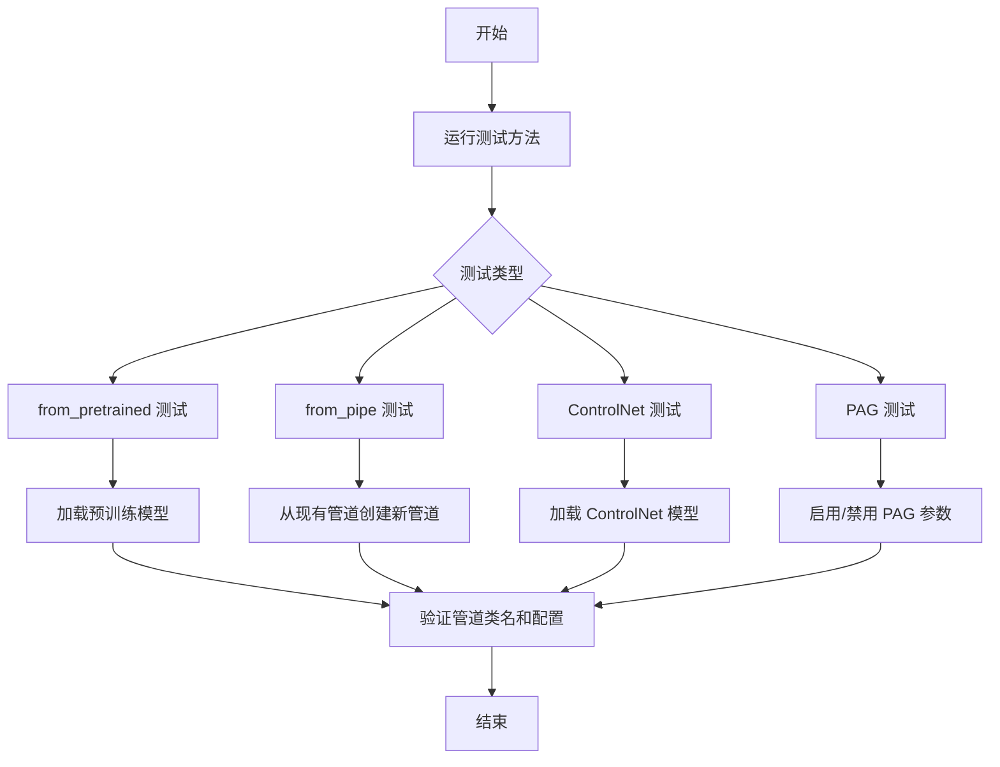

## 类结构

```
unittest.TestCase (基类)
├── AutoPipelineFastTest (快速测试类)
│   └── dummy_image_encoder (属性方法)
└── AutoPipelineIntegrationTest (集成测试类)
```

## 全局变量及字段


### `PRETRAINED_MODEL_REPO_MAPPING`
    
一个有序字典，将模型标识符映射到HuggingFace Hub上的预训练模型仓库ID，用于集成测试

类型：`OrderedDict[str, str]`
    


    

## 全局函数及方法


### `AutoPipelineFastTest.dummy_image_encoder`

该方法是一个测试辅助属性（property），用于创建一个配置极简的虚拟 CLIP Vision 模型（包含投影层），旨在为单元测试提供可复现的图像编码器mock对象，避免依赖外部预训练模型。

参数：

- `self`：`AutoPipelineFastTest`，隐式参数，指向测试类实例本身

返回值：`CLIPVisionModelWithProjection`，返回一个配置极简的虚拟 CLIP Vision 模型实例，其所有维度参数（hidden_size、projection_dim、num_hidden_layers 等）均设为1，并使用固定随机种子（0）确保可复现性。

#### 流程图

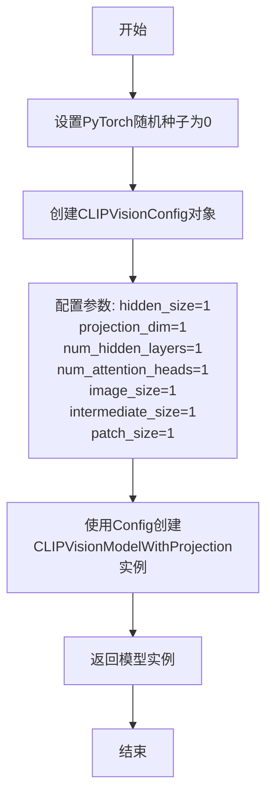

#### 带注释源码

```python
@property
def dummy_image_encoder(self):
    """
    创建一个虚拟的 CLIP Vision 模型，用于测试目的。
    使用固定随机种子确保测试的可复现性。
    """
    # 设置 PyTorch 随机种子为 0，确保每次调用生成的模型权重一致
    torch.manual_seed(0)
    
    # 创建 CLIP Vision 配置对象，使用极简参数
    # 所有维度参数均设为 1，以减少计算开销并加快测试速度
    config = CLIPVisionConfig(
        hidden_size=1,          # 隐藏层大小
        projection_dim=1,      # 投影维度
        num_hidden_layers=1,   # 隐藏层数量
        num_attention_heads=1, # 注意力头数量
        image_size=1,          # 输入图像尺寸
        intermediate_size=1,   # 中间层（FFN）维度
        patch_size=1,          # 图像分块大小
    )
    
    # 使用上述配置实例化一个带投影层的 CLIP Vision 模型
    # 该模型可用于 pipelines 中的图像编码功能测试
    return CLIPVisionModelWithProjection(config)
```


### `AutoPipelineFastTest.test_from_pipe_consistent`

该测试方法验证了在使用 `from_pipe` 方法在不同类型的 AutoPipeline 之间转换时，管道配置（config）能够被正确保留。具体流程为：先从预训练模型创建 Text2Image 管道，保存原始配置；然后转换为 Image2Image 管道，验证配置一致；最后再转换回 Text2Image 管道，再次验证配置一致。

参数：

- `self`：`AutoPipelineFastTest`，unittest.TestCase 的实例，测试类本身，包含测试所需的环境和辅助方法

返回值：`None`，测试方法无返回值，通过 assert 断言进行验证

#### 流程图

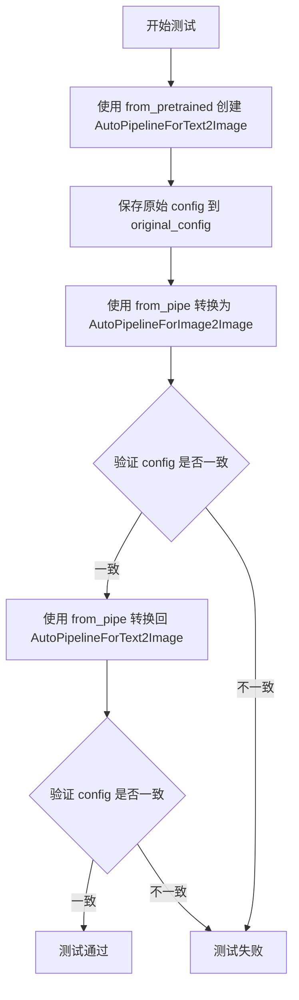

#### 带注释源码

```python
def test_from_pipe_consistent(self):
    """
    测试 from_pipe 方法在转换 pipeline 类型时能够保持配置一致。
    验证: Text2Image -> Image2Image -> Text2Image 的配置保持不变。
    """
    # 步骤1: 从预训练模型创建 Text2Image 管道
    # 使用 hf-internal-testing/tiny-stable-diffusion-pipe 模型
    # requires_safety_checker=False 禁用安全检查器
    pipe = AutoPipelineForText2Image.from_pretrained(
        "hf-internal-testing/tiny-stable-diffusion-pipe", requires_safety_checker=False
    )
    
    # 步骤2: 提取并保存管道的原始配置
    # 将配置转换为字典形式，便于后续比较
    original_config = dict(pipe.config)

    # 步骤3: 使用 from_pipe 方法从现有管道创建 Image2Image 管道
    # 这应该保留原始管道的所有配置
    pipe = AutoPipelineForImage2Image.from_pipe(pipe)
    
    # 断言: 验证转换后的管道配置与原始配置一致
    assert dict(pipe.config) == original_config

    # 步骤4: 再次使用 from_pipe 方法从 Image2Image 管道创建 Text2Image 管道
    pipe = AutoPipelineForText2Image.from_pipe(pipe)
    
    # 断言: 验证再次转换后的管道配置与原始配置一致
    assert dict(pipe.config) == original_config
```


### `AutoPipelineFastTest.test_from_pipe_override`

该测试方法用于验证在使用 `from_pipe` 方法从已有 Pipeline 创建新 Pipeline 时，可以通过参数覆盖（override）原始配置项（如 `requires_safety_checker`），确保配置参数能够被正确更新和继承。

参数：

- `self`：`AutoPipelineFastTest`，测试类实例本身的引用

返回值：`None`，该方法为测试方法，通过 `assert` 语句进行断言验证，不返回具体值

#### 流程图

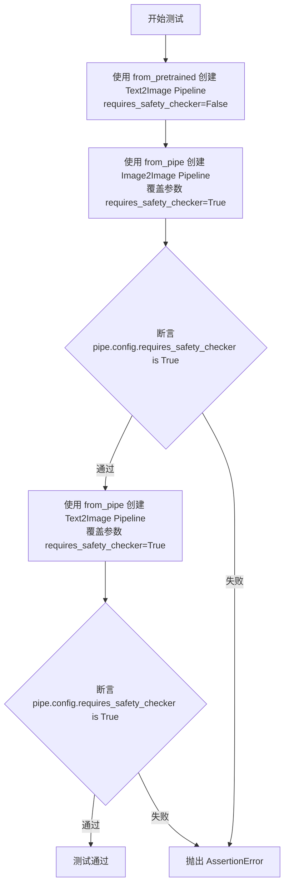

#### 带注释源码

```python
def test_from_pipe_override(self):
    """
    测试 from_pipe 方法能够覆盖原始 pipeline 的配置参数
    
    验证点：
    1. 从 Text2Image Pipeline 使用 from_pipe 转换为 Image2Image Pipeline 时
       可以通过参数覆盖原有配置
    2. 继续转换回 Text2Image Pipeline 时，覆盖的配置能够保持
    """
    
    # 第一步：创建一个 Text2Image Pipeline，初始设置 requires_safety_checker=False
    pipe = AutoPipelineForText2Image.from_pretrained(
        "hf-internal-testing/tiny-stable-diffusion-pipe", 
        requires_safety_checker=False  # 初始关闭 safety checker
    )

    # 第二步：使用 from_pipe 从已有 pipeline 创建 Image2Image Pipeline
    # 并通过参数覆盖将 requires_safety_checker 设置为 True
    pipe = AutoPipelineForImage2Image.from_pipe(
        pipe, 
        requires_safety_checker=True  # 覆盖原配置，设置为 True
    )
    
    # 断言：验证配置已被成功覆盖
    assert pipe.config.requires_safety_checker is True

    # 第三步：继续使用 from_pipe 从 Image2Image Pipeline 创建 Text2Image Pipeline
    # 保持 requires_safety_checker=True 的设置
    pipe = AutoPipelineForText2Image.from_pipe(
        pipe, 
        requires_safety_checker=True  # 继续覆盖，保持为 True
    )
    
    # 断言：验证配置在多次转换后仍然保持正确
    assert pipe.config.requires_safety_checker is True
```


### `AutoPipelineFastTest.test_from_pipe_consistent_sdxl`

该测试方法用于验证在使用 `from_pipe` 方法在不同类型的 AutoPipeline（如 Image2Image、Text2Image）之间转换时，pipeline 的配置（config）能够保持一致性。主要针对 Stable Diffusion XL (SDXL) 模型的 pipeline 转换场景。

参数：

- `self`：`AutoPipelineFastTest`，测试类的实例对象，包含测试所需的状态和方法

返回值：`None`，测试方法通过 assert 语句进行验证，不返回具体值

#### 流程图

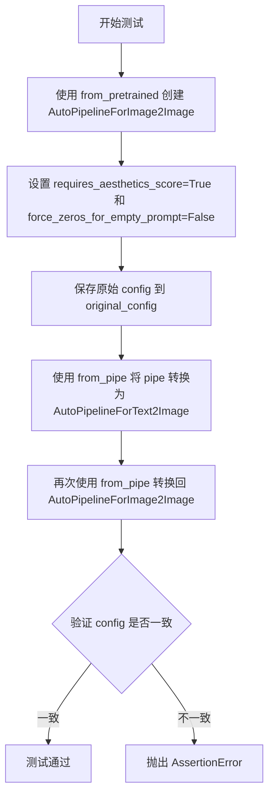

#### 带注释源码

```python
def test_from_pipe_consistent_sdxl(self):
    """
    测试 from_pipe 方法在不同 AutoPipeline 类型之间转换时配置的一致性
    针对 Stable Diffusion XL (SDXL) 模型
    """
    
    # 步骤1: 从预训练模型创建 Image2Image pipeline
    # 使用 hf-internal-testing 提供的测试用小型 SDXL 模型
    # 参数 requires_aesthetics_score=True 启用美学评分功能
    # 参数 force_zeros_for_empty_prompt=False 控制空提示词时的行为
    pipe = AutoPipelineForImage2Image.from_pretrained(
        "hf-internal-testing/tiny-stable-diffusion-xl-pipe",
        requires_aesthetics_score=True,
        force_zeros_for_empty_prompt=False,
    )

    # 步骤2: 保存原始 pipeline 的配置信息
    # 将 config 转换为字典形式以便后续比较
    original_config = dict(pipe.config)

    # 步骤3: 将 Image2Image pipeline 转换为 Text2Image pipeline
    # 使用 from_pipe 方法基于已有 pipeline 创建新类型的 pipeline
    # 该方法会自动迁移原 pipeline 的组件和配置
    pipe = AutoPipelineForText2Image.from_pipe(pipe)
    
    # 步骤4: 再次将 Text2Image pipeline 转换回 Image2Image pipeline
    # 完成一轮完整的转换循环
    pipe = AutoPipelineForImage2Image.from_pipe(pipe)

    # 步骤5: 验证转换后的 pipeline 配置与原始配置一致
    # 使用 assert 确保配置字典完全相同
    # 如果配置不一致，将抛出 AssertionError
    assert dict(pipe.config) == original_config
```


### `AutoPipelineFastTest.test_kwargs_local_files_only`

该测试方法用于验证 `AutoPipelineForText2Image` 在 `local_files_only=True` 模式下能否正确加载本地缓存的模型文件。测试通过模拟本地文件环境（修改 commit_id），确保管道能够绕过网络请求直接加载本地模型。

参数：

- `self`：隐式参数，`AutoPipelineFastTest` 类的实例对象，无需显式传递

返回值：`None`，测试方法无返回值，通过断言表达成功/失败

#### 流程图

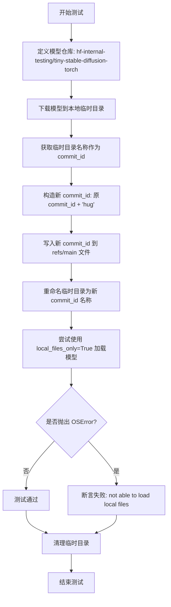

#### 带注释源码

```python
def test_kwargs_local_files_only(self):
    """
    测试 AutoPipelineForText2Image 在 local_files_only=True 模式下
    能否正确加载本地缓存的模型文件
    """
    # 定义测试用的模型仓库标识符
    repo = "hf-internal-testing/tiny-stable-diffusion-torch"
    
    # 使用 DiffusionPipeline.download 下载模型到本地缓存目录
    # 返回值为本地缓存目录的路径字符串
    tmpdirname = DiffusionPipeline.download(repo)
    
    # 将字符串路径转换为 Path 对象，便于后续路径操作
    tmpdirname = Path(tmpdirname)

    # edit commit_id to so that it's not the latest commit
    # 获取当前下载目录的名称作为 commit_id（模拟旧版本）
    commit_id = tmpdirname.name
    
    # 构造一个新的 commit_id（通过拼接字符串模拟不同的版本）
    # 这样做是为了让本地文件的 commit_id 与远程最新版本不一致
    new_commit_id = commit_id + "hug"

    # 构建 refs/main 文件的完整路径
    # tmpdirname 的结构通常为: cache_root/models/huggingface/xxx/
    # parent.parent 退两级到 cache_root，然后拼接 refs/main
    ref_dir = tmpdirname.parent.parent / "refs/main"
    
    # 打开 ref_dir 对应的文件（可能不存在，会自动创建）
    # 写入新的 commit_id，模拟本地存储的是旧版本
    with open(ref_dir, "w") as f:
        f.write(new_commit_id)

    # 构造新目录路径：将原目录重命名为新的 commit_id
    new_tmpdirname = tmpdirname.parent / new_commit_id
    
    # 执行目录重命名操作，模拟本地存储的是非最新版本
    os.rename(tmpdirname, new_tmpdirname)

    try:
        # 尝试使用 local_files_only=True 加载模型
        # 期望行为：即使 commit_id 不是最新，也应该能从本地加载
        # 因为 local_files_only=True 会强制使用本地缓存，不访问远程
        AutoPipelineForText2Image.from_pretrained(repo, local_files_only=True)
    except OSError:
        # 如果抛出 OSError，说明本地文件加载失败
        # 这是一个测试失败的情况
        assert False, "not able to load local files"

    # 清理测试产生的临时目录，避免影响后续测试
    shutil.rmtree(tmpdirname.parent.parent)
```


### `AutoPipelineFastTest.test_from_pretrained_text2img`

该测试方法验证 `AutoPipelineForText2Image.from_pretrained()` 的核心功能，包括基础 Text2Image pipeline 的加载、ControlNet 集成、 PAG（Prompt-to-Image Generation）功能以及 ControlNet 与 PAG 的组合场景。

参数：

- `self`：`AutoPipelineFastTest`，测试类实例，隐式参数

返回值：`None`，无返回值（测试方法）

#### 流程图

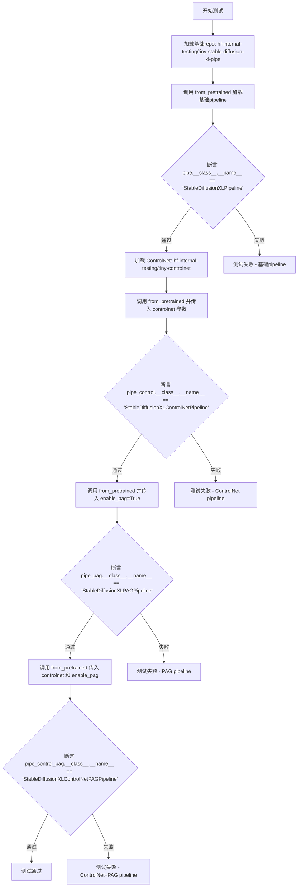

#### 带注释源码

```python
def test_from_pretrained_text2img(self):
    """
    测试 AutoPipelineForText2Image.from_pretrained() 的多种配置场景：
    1. 基础 Text2Image pipeline
    2. 带 ControlNet 的 pipeline
    3. 带 PAG (Prompt-to-Image Generation) 的 pipeline
    4. 同时带 ControlNet 和 PAG 的 pipeline
    """
    # 定义预训练模型仓库地址（使用 HuggingFace 测试用小型 XL pipeline）
    repo = "hf-internal-testing/tiny-stable-diffusion-xl-pipe"
    
    # 场景1: 加载基础 Text2Image pipeline
    # 调用 from_pretrained 加载标准的 Stable Diffusion XL pipeline
    pipe = AutoPipelineForText2Image.from_pretrained(repo)
    # 断言验证加载的 pipeline 类型为 StableDiffusionXLPipeline
    assert pipe.__class__.__name__ == "StableDiffusionXLPipeline"

    # 准备 ControlNet 模型（用于后续测试）
    # 从预训练仓库加载一个轻量级的 ControlNet 模型
    controlnet = ControlNetModel.from_pretrained("hf-internal-testing/tiny-controlnet")
    
    # 场景2: 加载带 ControlNet 的 Text2Image pipeline
    # 在 from_pretrained 中传入 controlnet 参数，切换到 ControlNet pipeline
    pipe_control = AutoPipelineForText2Image.from_pretrained(repo, controlnet=controlnet)
    # 断言验证加载的 pipeline 类型为 StableDiffusionXLControlNetPipeline
    assert pipe_control.__class__.__name__ == "StableDiffusionXLControlNetPipeline"

    # 场景3: 加载带 PAG 的 Text2Image pipeline
    # 传入 enable_pag=True 参数，启用 Prompt-to-Image Generation 功能
    pipe_pag = AutoPipelineForText2Image.from_pretrained(repo, enable_pag=True)
    # 断言验证加载的 pipeline 类型为 StableDiffusionXLPAGPipeline
    assert pipe_pag.__class__.__name__ == "StableDiffusionXLPAGPipeline"

    # 场景4: 同时加载带 ControlNet 和 PAG 的 Text2Image pipeline
    # 组合 controlnet 和 enable_pag 两个参数
    pipe_control_pag = AutoPipelineForText2Image.from_pretrained(
        repo, 
        controlnet=controlnet, 
        enable_pag=True
    )
    # 断言验证加载的 pipeline 类型为 StableDiffusionXLControlNetPAGPipeline
    assert pipe_control_pag.__class__.__name__ == "StableDiffusionXLControlNetPAGPipeline"
```


### `AutoPipelineFastTest.test_from_pipe_pag_text2img`

该测试方法用于验证 AutoPipeline 中 `from_pipe` 方法在不同场景下（启用/禁用 PAG、传入/不传入 ControlNet）正确切换到对应 Pipeline 类的能力，包括从 StableDiffusionXLPipeline、StableDiffusionXLControlNetPipeline 和 StableDiffusionXLControlNetPAGPipeline 三种基础管道进行转换的全面测试。

参数：

- `self`：`AutoPipelineFastTest`，表示测试类实例本身

返回值：`None`，该方法为测试方法，无返回值，通过 assert 语句进行断言验证

#### 流程图

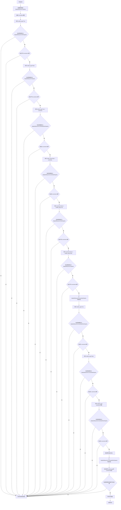

#### 带注释源码

```python
def test_from_pipe_pag_text2img(self):
    """
    测试 AutoPipelineForText2Image.from_pipe 方法在不同 PAG 和 ControlNet 配置下的行为。
    验证管道能够正确地从一种 Pipeline 类切换到另一种 Pipeline 类。
    """
    
    # ------------------------------------------------------------
    # 第一部分：从 StableDiffusionXLPipeline 开始测试
    # ------------------------------------------------------------
    
    # 1. 加载基础的无 ControlNet 的 SDXL 文本到图像管道
    pipe = AutoPipelineForText2Image.from_pretrained(
        "hf-internal-testing/tiny-stable-diffusion-xl-pipe"
    )
    
    # 2. 加载 ControlNet 模型（用于后续测试）
    controlnet = ControlNetModel.from_pretrained("hf-internal-testing/tiny-controlnet")

    # --- 测试 enable_pag 标志（不使用 controlnet）---
    
    # 3. 测试仅启用 PAG（enable_pag=True），不带 controlnet
    # 期望切换到 StableDiffusionXLPAGPipeline
    pipe_pag = AutoPipelineForText2Image.from_pipe(pipe, enable_pag=True)
    assert pipe_pag.__class__.__name__ == "StableDiffusionXLPAGPipeline"
    assert "controlnet" not in pipe_pag.components  # 确认不含 controlnet

    # 4. 测试禁用 PAG（enable_pag=False），不带 controlnet
    # 期望回到 StableDiffusionXLPipeline
    pipe = AutoPipelineForText2Image.from_pipe(pipe, enable_pag=False)
    assert pipe.__class__.__name__ == "StableDiffusionXLPipeline"
    assert "controlnet" not in pipe.components

    # --- 测试 enable_pag + controlnet 标志组合 ---

    # 5. 测试启用 PAG 且传入 controlnet
    # 期望切换到 StableDiffusionXLControlNetPAGPipeline
    pipe_control_pag = AutoPipelineForText2Image.from_pipe(
        pipe, controlnet=controlnet, enable_pag=True
    )
    assert pipe_control_pag.__class__.__name__ == "StableDiffusionXLControlNetPAGPipeline"
    assert "controlnet" in pipe_control_pag.components  # 确认包含 controlnet

    # 6. 测试禁用 PAG 且传入 controlnet
    # 期望切换到 StableDiffusionXLControlNetPipeline
    pipe_control = AutoPipelineForText2Image.from_pipe(
        pipe, controlnet=controlnet, enable_pag=False
    )
    assert pipe_control.__class__.__name__ == "StableDiffusionXLControlNetPipeline"
    assert "controlnet" in pipe_control.components

    # 7. 测试启用 PAG 且显式传入 controlnet=None（覆盖原管道组件）
    # 期望切换到不带 controlnet 的 StableDiffusionXLPAGPipeline
    pipe_pag = AutoPipelineForText2Image.from_pipe(
        pipe, controlnet=None, enable_pag=True
    )
    assert pipe_pag.__class__.__name__ == "StableDiffusionXLPAGPipeline"
    assert "controlnet" not in pipe_pag.components

    # 8. 测试禁用 PAG 且传入 controlnet=None
    # 期望回到不带 controlnet 的 StableDiffusionXLPipeline
    pipe = AutoPipelineForText2Image.from_pipe(
        pipe, controlnet=None, enable_pag=False
    )
    assert pipe.__class__.__name__ == "StableDiffusionXLPipeline"
    assert "controlnet" not in pipe.components

    # ------------------------------------------------------------
    # 第二部分：从 StableDiffusionXLControlNetPipeline 开始测试
    # ------------------------------------------------------------

    # --- 测试 enable_pag 标志（从带 controlnet 的管道转换）---

    # 9. 测试启用 PAG（enable_pag=True），保留原 controlnet
    # 期望切换到 StableDiffusionXLControlNetPAGPipeline
    pipe_control_pag = AutoPipelineForText2Image.from_pipe(
        pipe_control, enable_pag=True
    )
    assert pipe_control_pag.__class__.__name__ == "StableDiffusionXLControlNetPAGPipeline"
    assert "controlnet" in pipe_control_pag.components

    # 10. 测试禁用 PAG（enable_pag=False），保留原 controlnet
    # 期望回到 StableDiffusionXLControlNetPipeline
    pipe_control = AutoPipelineForText2Image.from_pipe(
        pipe_control, enable_pag=False
    )
    assert pipe_control.__class__.__name__ == "StableDiffusionXLControlNetPipeline"
    assert "controlnet" in pipe_control.components

    # --- 测试 enable_pag + controlnet 标志组合 ---

    # 11. 测试启用 PAG 且传入新的 controlnet（覆盖原管道组件）
    pipe_control_pag = AutoPipelineForText2Image.from_pipe(
        pipe_control, controlnet=controlnet, enable_pag=True
    )
    assert pipe_control_pag.__class__.__name__ == "StableDiffusionXLControlNetPAGPipeline"
    assert "controlnet" in pipe_control_pag.components

    # 12. 测试禁用 PAG 且传入新的 controlnet
    pipe_control = AutoPipelineForText2Image.from_pipe(
        pipe_control, controlnet=controlnet, enable_pag=False
    )
    assert pipe_control.__class__.__name__ == "StableDiffusionXLControlNetPipeline"
    assert "controlnet" in pipe_control.components

    # 13. 测试启用 PAG 且传入 controlnet=None（移除 controlnet 组件）
    pipe_pag = AutoPipelineForText2Image.from_pipe(
        pipe_control, controlnet=None, enable_pag=True
    )
    assert pipe_pag.__class__.__name__ == "StableDiffusionXLPAGPipeline"
    assert "controlnet" not in pipe_pag.components

    # 14. 测试禁用 PAG 且传入 controlnet=None
    pipe = AutoPipelineForText2Image.from_pipe(
        pipe_control, controlnet=None, enable_pag=False
    )
    assert pipe.__class__.__name__ == "StableDiffusionXLPipeline"
    assert "controlnet" not in pipe.components

    # ------------------------------------------------------------
    # 第三部分：从 StableDiffusionXLControlNetPAGPipeline 开始测试
    # ------------------------------------------------------------

    # --- 测试 enable_pag 标志（从带 controlnet 的 PAG 管道转换）---

    # 15. 测试启用 PAG（enable_pag=True），保留原 controlnet
    pipe_control_pag = AutoPipelineForText2Image.from_pipe(
        pipe_control_pag, enable_pag=True
    )
    assert pipe_control_pag.__class__.__name__ == "StableDiffusionXLControlNetPAGPipeline"
    assert "controlnet" in pipe_control_pag.components

    # 16. 测试禁用 PAG（enable_pag=False），保留原 controlnet
    pipe_control = AutoPipelineForText2Image.from_pipe(
        pipe_control_pag, enable_pag=False
    )
    assert pipe_control.__class__.__name__ == "StableDiffusionXLControlNetPipeline"
    assert "controlnet" in pipe_control.components

    # --- 测试 enable_pag + controlnet 标志组合 ---

    # 17. 测试启用 PAG 且传入 controlnet（显式指定）
    pipe_control_pag = AutoPipelineForText2Image.from_pipe(
        pipe_control_pag, controlnet=controlnet, enable_pag=True
    )
    assert pipe_control_pag.__class__.__name__ == "StableDiffusionXLControlNetPAGPipeline"
    assert "controlnet" in pipe_control_pag.components

    # 18. 测试禁用 PAG 且传入 controlnet
    pipe_control = AutoPipelineForText2Image.from_pipe(
        pipe_control_pag, controlnet=controlnet, enable_pag=False
    )
    assert pipe_control.__class__.__name__ == "StableDiffusionXLControlNetPipeline"
    assert "controlnet" in pipe_control.components

    # 19. 测试启用 PAG 且传入 controlnet=None
    pipe_pag = AutoPipelineForText2Image.from_pipe(
        pipe_control_pag, controlnet=None, enable_pag=True
    )
    assert pipe_pag.__class__.__name__ == "StableDiffusionXLPAGPipeline"
    assert "controlnet" not in pipe_pag.components

    # 20. 测试禁用 PAG 且传入 controlnet=None
    pipe = AutoPipelineForText2Image.from_pipe(
        pipe_control_pag, controlnet=None, enable_pag=False
    )
    assert pipe.__class__.__name__ == "StableDiffusionXLPipeline"
    assert "controlnet" not in pipe.components

    # 21. 测试禁用 PAG 且不传 controlnet 参数（保留原管道中的 controlnet）
    pipe = AutoPipelineForText2Image.from_pipe(pipe_control_pag, enable_pag=False)
    assert pipe.__class__.__name__ == "StableDiffusionXLControlNetPipeline"
    assert "controlnet" in pipe.components
```


### `AutoPipelineFastTest.test_from_pretrained_img2img`

该方法是一个单元测试方法，用于测试 `AutoPipelineForImage2Image` 类的 `from_pretrained` 方法能否正确加载不同配置的 Image-to-Image 扩散管道，包括基础 img2img 管道、带 ControlNet 的管道、带 PAG（Prompt All Guidance）的管道以及同时带 ControlNet 和 PAG 的管道。

参数：

- `self`：隐式参数，`AutoPipelineFastTest` 类的实例，表示测试类本身

返回值：`None`，无返回值（测试方法，通过断言验证）

#### 流程图

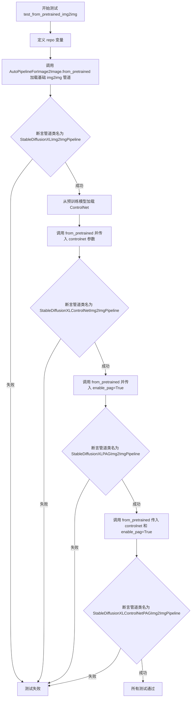

#### 带注释源码

```python
def test_from_pretrained_img2img(self):
    """
    测试 AutoPipelineForImage2Image.from_pretrained 方法的各种配置组合
    
    该测试验证以下四种场景：
    1. 基础 Image-to-Image 管道
    2. 带 ControlNet 的 Image-to-Image 管道
    3. 带 PAG 的 Image-to-Image 管道
    4. 同时带 ControlNet 和 PAG 的 Image-to-Image 管道
    """
    # 定义测试用的预训练模型仓库标识符
    repo = "hf-internal-testing/tiny-stable-diffusion-xl-pipe"

    # 测试场景1：加载基础的 Image-to-Image 管道
    pipe = AutoPipelineForImage2Image.from_pretrained(repo)
    # 验证加载的管道类名是否为预期的 StableDiffusionXLImg2ImgPipeline
    assert pipe.__class__.__name__ == "StableDiffusionXLImg2ImgPipeline"

    # 加载 ControlNet 模型用于后续测试
    controlnet = ControlNetModel.from_pretrained("hf-internal-testing/tiny-controlnet")
    
    # 测试场景2：加载带 ControlNet 的 Image-to-Image 管道
    pipe_control = AutoPipelineForImage2Image.from_pretrained(repo, controlnet=controlnet)
    # 验证加载的管道类名是否为预期的 StableDiffusionXLControlNetImg2ImgPipeline
    assert pipe_control.__class__.__name__ == "StableDiffusionXLControlNetImg2ImgPipeline"

    # 测试场景3：加载带 PAG（Prompt All Guidance）的 Image-to-Image 管道
    pipe_pag = AutoPipelineForImage2Image.from_pretrained(repo, enable_pag=True)
    # 验证加载的管道类名是否为预期的 StableDiffusionXLPAGImg2ImgPipeline
    assert pipe_pag.__class__.__name__ == "StableDiffusionXLPAGImg2ImgPipeline"

    # 测试场景4：加载同时带 ControlNet 和 PAG 的 Image-to-Image 管道
    pipe_control_pag = AutoPipelineForImage2Image.from_pretrained(
        repo, 
        controlnet=controlnet, 
        enable_pag=True
    )
    # 验证加载的管道类名是否为预期的 StableDiffusionXLControlNetPAGImg2ImgPipeline
    assert pipe_control_pag.__class__.__name__ == "StableDiffusionXLControlNetPAGImg2ImgPipeline"
```


### `AutoPipelineFastTest.test_from_pretrained_img2img_refiner`

该测试方法用于验证 `AutoPipelineForImage2Image.from_pretrained` 在加载带有 refiner 的 Stable Diffusion XL 模型时的正确性，涵盖基础 img2img pipeline、ControlNet 集成、PAG（Progressive Attention Guidance）功能以及 ControlNet 与 PAG 的组合场景。

参数：

- `self`：`AutoPipelineFastTest`，表示测试类实例本身

返回值：`None`，该方法为测试方法，无返回值，通过断言验证管道类型

#### 流程图

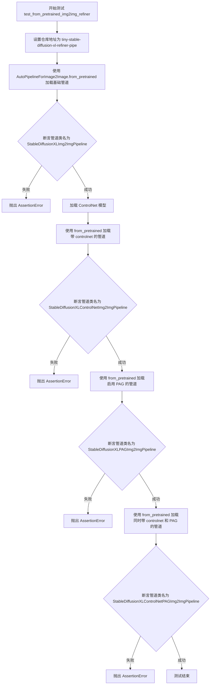

#### 带注释源码

```python
def test_from_pretrained_img2img_refiner(self):
    """
    测试 AutoPipelineForImage2Image.from_pretrained 在 refiner 模型上的功能。
    
    验证以下四种场景的管道加载：
    1. 基础的 Image-to-Image 管道
    2. 带 ControlNet 的 Image-to-Image 管道
    3. 启用 PAG（Progressive Attention Guidance）的 Image-to-Image 管道
    4. 同时带 ControlNet 和 PAG 的 Image-to-Image 管道
    """
    # 定义测试用的 refiner 模型仓库地址
    repo = "hf-internal-testing/tiny-stable-diffusion-xl-refiner-pipe"

    # 场景1: 加载基础的 Stable Diffusion XL Image-to-Image 管道
    pipe = AutoPipelineForImage2Image.from_pretrained(repo)
    # 验证加载的管道类型是否为 StableDiffusionXLImg2ImgPipeline
    assert pipe.__class__.__name__ == "StableDiffusionXLImg2ImgPipeline"

    # 加载 ControlNet 模型用于后续测试
    controlnet = ControlNetModel.from_pretrained("hf-internal-testing/tiny-controlnet")
    
    # 场景2: 加载带 ControlNet 的 Image-to-Image 管道
    pipe_control = AutoPipelineForImage2Image.from_pretrained(repo, controlnet=controlnet)
    # 验证加载的管道类型是否为 StableDiffusionXLControlNetImg2ImgPipeline
    assert pipe_control.__class__.__name__ == "StableDiffusionXLControlNetImg2ImgPipeline"

    # 场景3: 加载启用 PAG 的 Image-to-Image 管道
    pipe_pag = AutoPipelineForImage2Image.from_pretrained(repo, enable_pag=True)
    # 验证加载的管道类型是否为 StableDiffusionXLPAGImg2ImgPipeline
    assert pipe_pag.__class__.__name__ == "StableDiffusionXLPAGImg2ImgPipeline"

    # 场景4: 加载同时带 ControlNet 和 PAG 的 Image-to-Image 管道
    pipe_control_pag = AutoPipelineForImage2Image.from_pretrained(repo, controlnet=controlnet, enable_pag=True)
    # 验证加载的管道类型是否为 StableDiffusionXLControlNetPAGImg2ImgPipeline
    assert pipe_control_pag.__class__.__name__ == "StableDiffusionXLControlNetPAGImg2ImgPipeline"
```


### `AutoPipelineFastTest.test_from_pipe_pag_img2img`

该测试方法用于验证 AutoPipeline 在 Image2Image 任务中切换 PAG（Progressive Attention Guidance）模式的功能。它测试了从普通 StableDiffusionXLImg2ImgPipeline 转换为 StableDiffusionXLPAGImg2ImgPipeline，以及反向转换的正确性。

参数：

- `self`：测试类实例本身，无需显式传递

返回值：`None`，该方法为单元测试方法，通过 assert 语句进行断言验证，不返回具体值。

#### 流程图

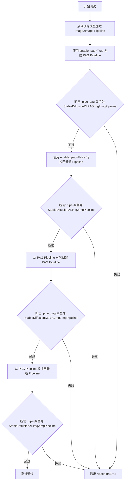

#### 带注释源码

```python
def test_from_pipe_pag_img2img(self):
    """
    测试 AutoPipelineForImage2Image 在启用/禁用 PAG 模式下的 from_pipe 转换功能。
    验证 enable_pag 参数可以正确地在普通 Image2Image Pipeline 和 PAG Image2Image Pipeline 之间切换。
    """
    # 第一部分：从普通 Image2Image Pipeline 测试 PAG 转换
    # 使用测试专用的轻量级 XL 模型进行测试
    pipe = AutoPipelineForImage2Image.from_pretrained("hf-internal-testing/tiny-stable-diffusion-xl-pipe")
    
    # 测试 enable_pag=True：应该生成带 PAG 的 Image2Image Pipeline
    pipe_pag = AutoPipelineForImage2Image.from_pipe(pipe, enable_pag=True)
    
    # 断言：验证生成的 Pipeline 类型确实是 PAG 版本
    assert pipe_pag.__class__.__name__ == "StableDiffusionXLPAGImg2ImgPipeline"
    
    # 测试 enable_pag=False：从 PAG 版本切换回普通版本
    pipe = AutoPipelineForImage2Image.from_pipe(pipe, enable_pag=False)
    
    # 断言：验证切换回普通版本成功
    assert pipe.__class__.__name__ == "StableDiffusionXLImg2ImgPipeline"
    
    # 第二部分：从已经是 PAG 的 Pipeline 进行测试（验证连续转换的稳定性）
    # 再次启用 PAG 模式
    pipe_pag = AutoPipelineForImage2Image.from_pipe(pipe_pag, enable_pag=True)
    
    # 断言：从 PAG 转换到 PAG 应该保持 PAG 特性
    assert pipe_pag.__class__.__name__ == "StableDiffusionXLPAGImg2ImgPipeline"
    
    # 再次禁用 PAG 模式
    pipe = AutoPipelineForImage2Image.from_pipe(pipe_pag, enable_pag=False)
    
    # 断言：验证最终转换回普通版本成功
    assert pipe.__class__.__name__ == "StableDiffusionXLImg2ImgPipeline"
```


### `AutoPipelineFastTest.test_from_pretrained_inpaint`

该测试方法用于验证 `AutoPipelineForInpainting` 类从预训练模型加载修复（Inpainting）管道的能力，并检查启用 `enable_pag=True` 参数时能否正确加载对应的 PAG（Prompt Attention Guidance）修复管道。

参数：
- `self`：隐式参数，`unittest.TestCase` 实例本身，无需显式传递

返回值：`None`，测试方法无返回值，通过 `assert` 语句进行断言验证

#### 流程图

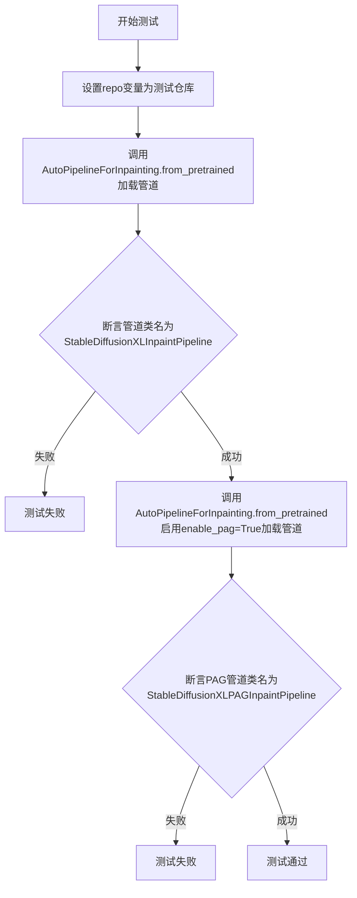

#### 带注释源码

```python
def test_from_pretrained_inpaint(self):
    """
    测试 AutoPipelineForInpainting.from_pretrained 方法的功能。
    
    该测试验证：
    1. 能够从预训练模型加载基础的 Inpainting 管道
    2. 能够在启用 enable_pag=True 时加载对应的 PAG Inpainting 管道
    """
    # 定义测试用的预训练模型仓库地址
    # 使用 HuggingFace 上的测试用小型 Stable Diffusion XL Inpainting 管道模型
    repo = "hf-internal-testing/tiny-stable-diffusion-xl-pipe"

    # 测试1：加载基础的 Inpainting 管道
    # 调用 AutoPipelineForInpainting 的 from_pretrained 类方法
    # 该方法会自动根据模型配置选择合适的管道类
    pipe = AutoPipelineForInpainting.from_pretrained(repo)
    
    # 断言验证加载的管道类型正确
    # 应该自动映射为 StableDiffusionXLInpaintPipeline 类
    assert pipe.__class__.__name__ == "StableDiffusionXLInpaintPipeline"

    # 测试2：加载启用 PAG（Prompt Attention Guidance）的 Inpainting 管道
    # enable_pag=True 参数会指示自动管道系统加载对应的 PAG 变体
    # PAG 是一种提升生成质量的引导技术
    pipe_pag = AutoPipelineForInpainting.from_pretrained(repo, enable_pag=True)
    
    # 断言验证启用了 PAG 的管道类型正确
    # 应该自动映射为 StableDiffusionXLPAGInpaintPipeline 类
    assert pipe_pag.__class__.__name__ == "StableDiffusionXLPAGInpaintPipeline"
```


### `AutoPipelineFastTest.test_from_pretrained_inpaint_from_inpaint`

该测试方法用于验证 AutoPipelineForInpainting 能否从预训练的 Inpainting 专用模型仓库成功加载，并且支持启用 PAG（Progressive Acceleration Guidance）功能。测试通过检查返回的管道类名来确认加载的正确性。

参数：

- `self`：`AutoPipelineFastTest`，测试类的实例，隐式参数

返回值：`None`，测试方法无返回值，通过断言验证功能

#### 流程图

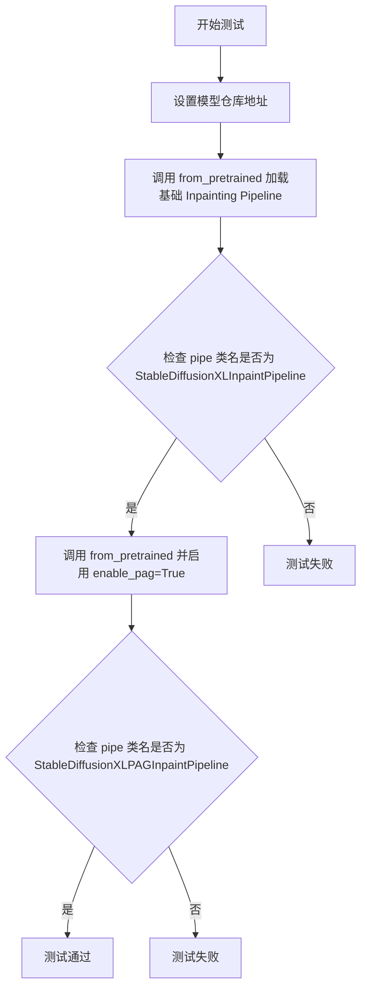

#### 带注释源码

```python
def test_from_pretrained_inpaint_from_inpaint(self):
    """
    测试从预训练的 Inpainting 专用模型加载 pipeline 的功能。
    
    该测试验证以下两种场景：
    1. 加载基础 Inpainting Pipeline
    2. 加载支持 PAG（Progressive Acceleration Guidance）的 Inpainting Pipeline
    """
    # 定义测试用的模型仓库地址（针对 XL Inpainting 专用模型）
    repo = "hf-internal-testing/tiny-stable-diffusion-xl-inpaint-pipe"

    # 场景1：加载基础 Inpainting Pipeline，不启用任何特殊功能
    pipe = AutoPipelineForInpainting.from_pretrained(repo)
    
    # 断言验证返回的管道类名为预期的 StableDiffusionXLInpaintPipeline
    assert pipe.__class__.__name__ == "StableDiffusionXLInpaintPipeline"

    # 场景2：从同一个仓库加载，但启用 PAG（Progressive Acceleration Guidance）功能
    # 这确保 Inpainting 专用 pipeline 支持 PAG 功能
    pipe = AutoPipelineForInpainting.from_pretrained(repo, enable_pag=True)
    
    # 断言验证返回的管道类名为支持 PAG 的 StableDiffusionXLPAGInpaintPipeline
    assert pipe.__class__.__name__ == "StableDiffusionXLPAGInpaintPipeline"
```


### `AutoPipelineFastTest.test_from_pipe_pag_inpaint`

该方法用于测试 `AutoPipelineForInpainting` 类中 `from_pipe` 方法在处理 `enable_pag` 参数时的功能正确性，验证从普通 Inpainting pipeline 到 PAG (Prompt-Aware Guidance) Inpainting pipeline 的转换逻辑，以及从 PAG pipeline 转换回普通 pipeline 的功能。

参数：

- `self`：测试类实例，无需显式传递

返回值：`None`，该方法为单元测试方法，无返回值

#### 流程图

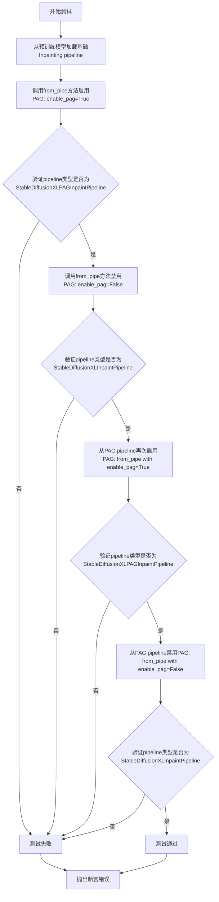

#### 带注释源码

```python
def test_from_pipe_pag_inpaint(self):
    """
    测试 AutoPipelineForInpainting.from_pipe 方法在 enable_pag 参数下的功能。
    
    该测试验证以下场景：
    1. 从普通 Inpainting pipeline 通过 enable_pag=True 转换为 PAG pipeline
    2. 从普通 Inpainting pipeline 通过 enable_pag=False 保持为普通 pipeline
    3. 从 PAG Inpainting pipeline 再次启用/禁用 PAG 的转换逻辑
    """
    
    # 步骤1: 从预训练模型加载基础的 StableDiffusionXLInpaintPipeline
    # 使用 HuggingFace 测试仓库的微型模型进行测试
    pipe = AutoPipelineForInpainting.from_pretrained(
        "hf-internal-testing/tiny-stable-diffusion-xl-pipe"
    )
    
    # 步骤2: 测试 enable_pag=True 标志
    # 期望从 StableDiffusionXLInpaintPipeline 转换为 StableDiffusionXLPAGInpaintPipeline
    pipe_pag = AutoPipelineForInpainting.from_pipe(pipe, enable_pag=True)
    
    # 断言验证转换后的 pipeline 类名是否为预期的 PAG Inpainting pipeline
    assert pipe_pag.__class__.__name__ == "StableDiffusionXLPAGInpaintPipeline"
    
    # 步骤3: 测试 enable_pag=False 标志
    # 期望保持为普通的 StableDiffusionXLInpaintPipeline
    pipe = AutoPipelineForInpainting.from_pipe(pipe, enable_pag=False)
    
    # 断言验证 pipeline 类名
    assert pipe.__class__.__name__ == "StableDiffusionXLInpaintPipeline"
    
    # 步骤4: 从已启用 PAG 的 pipeline (pipe_pag) 再次测试 enable_pag=True
    # 验证从 PAG pipeline 转换为 PAG pipeline 的场景
    pipe_pag = AutoPipelineForInpainting.from_pipe(pipe_pag, enable_pag=True)
    
    # 断言验证 pipeline 类名
    assert pipe_pag.__class__.__name__ == "StableDiffusionXLPAGInpaintPipeline"
    
    # 步骤5: 从已启用 PAG 的 pipeline (pipe_pag) 测试 enable_pag=False
    # 验证从 PAG pipeline 转换回普通 pipeline 的场景
    pipe = AutoPipelineForInpainting.from_pipe(pipe_pag, enable_pag=False)
    
    # 断言验证 pipeline 类名
    assert pipe.__class__.__name__ == "StableDiffusionXLInpaintPipeline"
```


### `AutoPipelineFastTest.test_from_pipe_pag_new_task`

该测试方法用于验证 `from_pipe` 方法能够在不同任务类型（如 Text2Image、Image2Image、Inpainting）之间正确转换启用了 PAG（Progressive Attribute Guidance）的 pipeline，并确保类名映射正确。

参数：无（`self` 为 unittest.TestCase 的实例引用）

返回值：`None`，该方法为测试用例，无返回值

#### 流程图

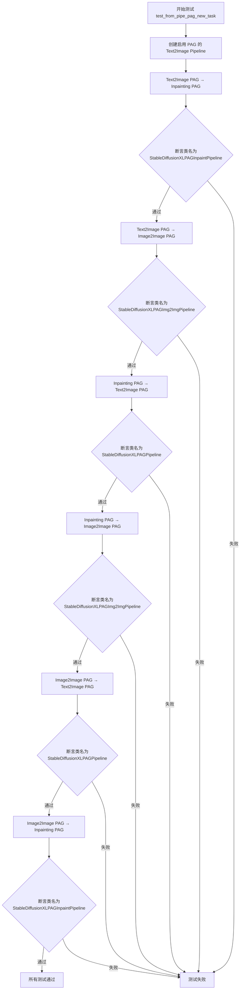

#### 带注释源码

```python
def test_from_pipe_pag_new_task(self):
    # 目的：验证 from_pipe_new_task 功能，仅需确保能够从不同任务映射到相同的 pipeline
    # 原因：enable_pag + controlnet 标志已在 test_from_pipe_pag_text2img 和 test_from_pipe_pag_inpaint 中测试
    # 1. 创建启用 PAG 的 Text2Image Pipeline
    pipe_pag_text2img = AutoPipelineForText2Image.from_pretrained(
        "hf-internal-testing/tiny-stable-diffusion-xl-pipe", enable_pag=True
    )

    # 2. 测试 Text2Image PAG → Inpainting PAG 转换
    pipe_pag_inpaint = AutoPipelineForInpainting.from_pipe(pipe_pag_text2img)
    # 断言转换后的类名为 StableDiffusionXLPAGInpaintPipeline
    assert pipe_pag_inpaint.__class__.__name__ == "StableDiffusionXLPAGInpaintPipeline"
    
    # 3. 测试 Text2Image PAG → Image2Image PAG 转换
    pipe_pag_img2img = AutoPipelineForImage2Image.from_pipe(pipe_pag_text2img)
    # 断言转换后的类名为 StableDiffusionXLPAGImg2ImgPipeline
    assert pipe_pag_img2img.__class__.__name__ == "StableDiffusionXLPAGImg2ImgPipeline"

    # 4. 测试 Inpainting PAG → Text2Image PAG 转换
    pipe_pag_text2img = AutoPipelineForText2Image.from_pipe(pipe_pag_inpaint)
    # 断言转换后的类名为 StableDiffusionXLPAGPipeline
    assert pipe_pag_text2img.__class__.__name__ == "StableDiffusionXLPAGPipeline"
    
    # 5. 测试 Inpainting PAG → Image2Image PAG 转换
    pipe_pag_img2img = AutoPipelineForImage2Image.from_pipe(pipe_pag_inpaint)
    # 断言转换后的类名为 StableDiffusionXLPAGImg2ImgPipeline
    assert pipe_pag_img2img.__class__.__name__ == "StableDiffusionXLPAGImg2ImgPipeline"

    # 6. 测试 Image2Image PAG → Text2Image PAG 转换
    pipe_pag_text2img = AutoPipelineForText2Image.from_pipe(pipe_pag_img2img)
    # 断言转换后的类名为 StableDiffusionXLPAGPipeline
    assert pipe_pag_text2img.__class__.__name__ == "StableDiffusionXLPAGPipeline"
    
    # 7. 测试 Image2Image PAG → Inpainting PAG 转换
    pipe_pag_inpaint = AutoPipelineForInpainting.from_pipe(pipe_pag_img2img)
    # 断言转换后的类名为 StableDiffusionXLPAGInpaintPipeline
    assert pipe_pag_inpaint.__class__.__name__ == "StableDiffusionXLPAGInpaintPipeline"
```


### `AutoPipelineFastTest.test_from_pipe_controlnet_text2img`

该方法用于测试通过 `from_pipe` 方法将 ControlNet 组件添加到 Text2Image pipeline 的功能，验证 ControlNet 组件能够正确添加到 pipeline 中并能被移除。

参数：

- `self`：`AutoPipelineFastTest`，测试类实例本身

返回值：`None`，无返回值（测试方法通过断言验证行为）

#### 流程图

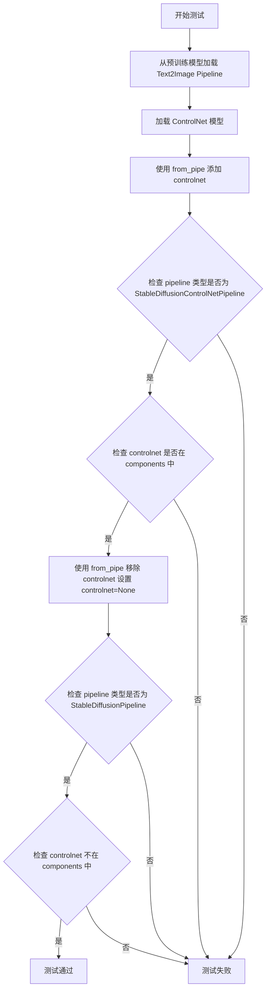

#### 带注释源码

```python
def test_from_pipe_controlnet_text2img(self):
    """
    测试使用 from_pipe 方法为 Text2Image Pipeline 添加或移除 ControlNet 组件。
    
    测试步骤：
    1. 创建一个基础的 Text2Image pipeline
    2. 创建一个 ControlNet 模型
    3. 通过 from_pipe 将 ControlNet 添加到 pipeline 中
    4. 验证得到的 pipeline 是 StableDiffusionControlNetPipeline 且包含 controlnet 组件
    5. 通过 from_pipe 移除 ControlNet（设置 controlnet=None）
    6. 验证得到的 pipeline 是 StableDiffusionPipeline 且不包含 controlnet 组件
    """
    # 步骤1: 从预训练模型加载基础的 Text2Image Pipeline
    pipe = AutoPipelineForText2Image.from_pretrained("hf-internal-testing/tiny-stable-diffusion-pipe")
    
    # 步骤2: 加载 ControlNet 模型
    controlnet = ControlNetModel.from_pretrained("hf-internal-testing/tiny-controlnet")
    
    # 步骤3: 使用 from_pipe 方法将 ControlNet 添加到 pipeline 中
    # 这会创建一个支持 ControlNet 的 Text2Image Pipeline
    pipe = AutoPipelineForText2Image.from_pipe(pipe, controlnet=controlnet)
    
    # 步骤4: 断言 - 验证 pipeline 类型是 StableDiffusionControlNetPipeline
    assert pipe.__class__.__name__ == "StableDiffusionControlNetPipeline"
    
    # 步骤5: 断言 - 验证 controlnet 组件已添加到 pipeline 的 components 字典中
    assert "controlnet" in pipe.components
    
    # 步骤6: 使用 from_pipe 方法移除 ControlNet
    # 设置 controlnet=None 会创建一个不支持 ControlNet 的 pipeline
    pipe = AutoPipelineForText2Image.from_pipe(pipe, controlnet=None)
    
    # 步骤7: 断言 - 验证 pipeline 类型恢复为 StableDiffusionPipeline
    assert pipe.__class__.__name__ == "StableDiffusionPipeline"
    
    # 步骤8: 断言 - 验证 controlnet 组件已从 pipeline 中移除
    assert "controlnet" not in pipe.components
```


### `AutoPipelineFastTest.test_from_pipe_controlnet_img2img`

该测试方法验证了 AutoPipelineForImage2Image 管道通过 `from_pipe` 方法动态添加和移除 ControlNet 模型的功能，确保能够在 Image2Image 任务中使用 ControlNet 控制图像生成。

参数：

- `self`：`unittest.TestCase`，测试用例实例本身

返回值：`None`，该方法为单元测试方法，无返回值，通过断言验证功能正确性

#### 流程图

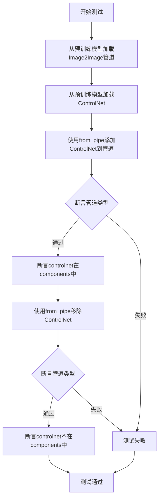

#### 带注释源码

```python
def test_from_pipe_controlnet_img2img(self):
    """
    测试通过 from_pipe 方法在 Image2Image 管道中添加和移除 ControlNet
    
    该测试验证以下场景:
    1. 从预训练模型加载基础 Image2Image 管道
    2. 加载 ControlNet 模型
    3. 通过 from_pipe 方法将 ControlNet 添加到管道
    4. 验证生成的管道类型为 StableDiffusionControlNetImg2ImgPipeline
    5. 验证 ControlNet 组件存在于管道组件中
    6. 通过传入 controlnet=None 移除 ControlNet
    7. 验证管道恢复为不带 ControlNet 的 Img2Img 管道
    """
    # 步骤1: 从预训练模型加载 Image2Image 管道
    # 使用 HuggingFace 测试专用的微型稳定扩散管道
    pipe = AutoPipelineForImage2Image.from_pretrained(
        "hf-internal-testing/tiny-stable-diffusion-pipe"
    )
    
    # 步骤2: 加载 ControlNet 模型
    # 使用 HuggingFace 测试专用的微型 ControlNet
    controlnet = ControlNetModel.from_pretrained(
        "hf-internal-testing/tiny-controlnet"
    )
    
    # 步骤3: 使用 from_pipe 方法将 ControlNet 添加到管道
    # 该方法会基于原管道创建一个新的带 ControlNet 的管道
    pipe = AutoPipelineForImage2Image.from_pipe(pipe, controlnet=controlnet)
    
    # 步骤4: 断言管道类型为 StableDiffusionControlNetImg2ImgPipeline
    # 验证 ControlNet 已成功添加到 Image2Image 管道
    assert pipe.__class__.__name__ == "StableDiffusionControlNetImg2ImgPipeline"
    
    # 步骤5: 断言 controlnet 存在于管道的 components 字典中
    # 验证 ControlNet 已被注册为管道的组件之一
    assert "controlnet" in pipe.components
    
    # 步骤6: 使用 from_pipe 方法移除 ControlNet
    # 通过传入 controlnet=None 可以移除已添加的 ControlNet
    pipe = AutoPipelineForImage2Image.from_pipe(pipe, controlnet=None)
    
    # 步骤7: 断言管道类型恢复为 StableDiffusionImg2ImgPipeline
    # 验证 ControlNet 已成功从管道中移除
    assert pipe.__class__.__name__ == "StableDiffusionImg2ImgPipeline"
    
    # 步骤8: 断言 controlnet 不存在于管道的 components 字典中
    # 验证 ControlNet 组件已被完全移除
    assert "controlnet" not in pipe.components
```


### `AutoPipelineFastTest.test_from_pipe_controlnet_inpaint`

该方法用于测试通过 `from_pipe` 方法将 ControlNet 模型添加到 Inpainting  pipeline 的功能，验证添加和移除 ControlNet 后 pipeline 类型和组件的正确性。

参数：

- `self`：`AutoPipelineFastTest`，测试用例实例本身

返回值：`None`，该方法为测试方法，通过断言验证逻辑，不返回任何值

#### 流程图

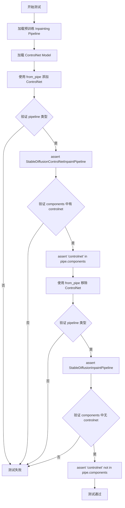

#### 带注释源码

```python
def test_from_pipe_controlnet_inpaint(self):
    """
    测试 AutoPipelineForInpainting 的 from_pipe 方法添加和移除 ControlNet 的功能。
    
    该测试验证：
    1. 可以通过 from_pipe 方法将 ControlNet 添加到 Inpainting pipeline
    2. 添加后 pipeline 类型变为 StableDiffusionControlNetInpaintPipeline
    3. ControlNet 被正确添加到 pipeline 的 components 中
    4. 可以通过设置 controlnet=None 移除 ControlNet
    5. 移除后 pipeline 类型恢复为 StableDiffusionInpaintPipeline
    6. ControlNet 从 pipeline 的 components 中被正确移除
    """
    # 步骤1: 从预训练模型加载 Inpainting Pipeline
    # 使用 hf-internal-testing/tiny-stable-diffusion-torch 模型进行测试
    pipe = AutoPipelineForInpainting.from_pretrained("hf-internal-testing/tiny-stable-diffusion-torch")
    
    # 步骤2: 加载 ControlNet 模型
    # 使用 hf-internal-testing/tiny-controlnet 模型进行测试
    controlnet = ControlNetModel.from_pretrained("hf-internal-testing/tiny-controlnet")
    
    # 步骤3: 使用 from_pipe 方法将 ControlNet 添加到 Inpainting Pipeline
    # from_pipe 方法会基于原始 pipeline 创建一个新的 pipeline，并添加指定的组件
    pipe = AutoPipelineForInpainting.from_pipe(pipe, controlnet=controlnet)
    
    # 步骤4: 验证新 pipeline 的类型是 StableDiffusionControlNetInpaintPipeline
    assert pipe.__class__.__name__ == "StableDiffusionControlNetInpaintPipeline"
    
    # 步骤5: 验证 ControlNet 已添加到 pipeline 的 components 字典中
    assert "controlnet" in pipe.components
    
    # 步骤6: 再次使用 from_pipe 方法，通过设置 controlnet=None 移除 ControlNet
    # 这会创建一个不包含 ControlNet 的新 Inpainting Pipeline
    pipe = AutoPipelineForInpainting.from_pipe(pipe, controlnet=None)
    
    # 步骤7: 验证移除 ControlNet 后的 pipeline 类型是 StableDiffusionInpaintPipeline
    assert pipe.__class__.__name__ == "StableDiffusionInpaintPipeline"
    
    # 步骤8: 验证 ControlNet 已从 pipeline 的 components 字典中移除
    assert "controlnet" not in pipe.components
```


### `AutoPipelineFastTest.test_from_pipe_controlnet_new_task`

该测试方法验证了 AutoPipeline 系列中带有 ControlNet 的 pipeline 在不同任务（Text2Image、Image2Image、Inpainting）之间转换时的行为，包括是否正确保留或替换 controlnet 组件。

参数：

- `self`：隐式参数，表示测试类的实例本身，无需显式传递

返回值：无（`None`），该方法为单元测试方法，通过 assert 语句进行断言验证，不返回任何值

#### 流程图

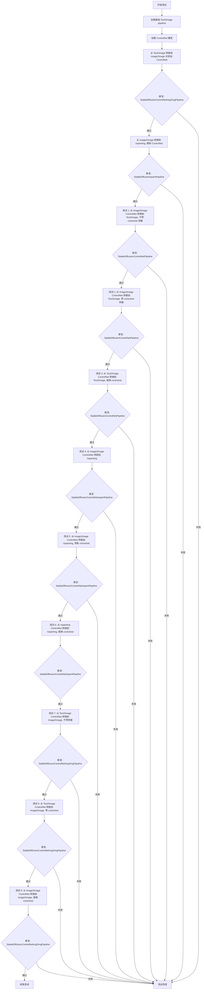

#### 带注释源码

```python
def test_from_pipe_controlnet_new_task(self):
    """
    测试带有 ControlNet 的 pipeline 在不同任务类型之间转换的行为。
    
    验证以下场景:
    1. Text2Image -> Image2Image (添加 ControlNet)
    2. Image2Image (带 ControlNet) -> Inpainting (移除 ControlNet)
    3-5. 在 Text2Image/Image2Image/Inpainting 之间转换时 ControlNet 的保留/替换逻辑
    6-9. 同上，但测试更细粒度的转换场景
    """
    # 步骤 1: 加载基础 Text2Image pipeline
    pipe_text2img = AutoPipelineForText2Image.from_pretrained("hf-internal-testing/tiny-stable-diffusion-torch")
    
    # 步骤 2: 加载 ControlNet 模型
    controlnet = ControlNetModel.from_pretrained("hf-internal-testing/tiny-controlnet")

    # 步骤 3: 从 Text2Image 转换到 Image2Image, 并添加 ControlNet
    pipe_control_img2img = AutoPipelineForImage2Image.from_pipe(pipe_text2img, controlnet=controlnet)
    
    # 断言: 验证 pipeline 类型为 StableDiffusionControlNetImg2ImgPipeline
    assert pipe_control_img2img.__class__.__name__ == "StableDiffusionControlNetImg2ImgPipeline"
    
    # 断言: 验证 controlnet 组件存在于 pipeline 中
    assert "controlnet" in pipe_control_img2img.components

    # 步骤 4: 从带 ControlNet 的 Image2Image 转换到 Inpainting, 移除 ControlNet
    pipe_inpaint = AutoPipelineForInpainting.from_pipe(pipe_control_img2img, controlnet=None)
    
    # 断言: 验证 pipeline 类型为 StableDiffusionInpaintPipeline
    assert pipe_inpaint.__class__.__name__ == "StableDiffusionInpaintPipeline"
    
    # 断言: 验证 controlnet 组件已从 pipeline 中移除
    assert "controlnet" not in pipe_inpaint.components

    # ===== 测试 Text2Image ControlNet 转换场景 =====
    
    # 测试 1: 从 Image2Image ControlNet 转换到 Text2Image, 不传入 controlnet 参数
    pipe_control_text2img = AutoPipelineForText2Image.from_pipe(pipe_control_img2img)
    assert pipe_control_text2img.__class__.__name__ == "StableDiffusionControlNetPipeline"
    assert "controlnet" in pipe_control_text2img.components

    # 测试 2: 从 Image2Image ControlNet 转换到 Text2Image, 显式传入 controlnet 参数
    pipe_control_text2img = AutoPipelineForText2Image.from_pipe(pipe_control_img2img, controlnet=controlnet)
    assert pipe_control_text2img.__class__.__name__ == "StableDiffusionControlNetPipeline"
    assert "controlnet" in pipe_control_text2img.components

    # 测试 3: 从同类型 Text2Image ControlNet  pipeline 转换, 替换为不同的 controlnet
    pipe_control_text2img = AutoPipelineForText2Image.from_pipe(pipe_control_text2img, controlnet=controlnet)
    assert pipe_control_text2img.__class__.__name__ == "StableDiffusionControlNetPipeline"
    assert "controlnet" in pipe_control_text2img.components

    # ===== 测试 Inpainting ControlNet 转换场景 =====

    # 测试 4: 从 Image2Image ControlNet 转换到 Inpainting
    pipe_control_inpaint = AutoPipelineForInpainting.from_pipe(pipe_control_img2img)
    assert pipe_control_inpaint.__class__.__name__ == "StableDiffusionControlNetInpaintPipeline"
    assert "controlnet" in pipe_control_inpaint.components

    # 测试 5: 从 Image2Image ControlNet 转换到 Inpainting, 传入新的 controlnet
    pipe_control_inpaint = AutoPipelineForInpainting.from_pipe(pipe_control_img2img, controlnet=controlnet)
    assert pipe_control_inpaint.__class__.__name__ == "StableDiffusionControlNetInpaintPipeline"
    assert "controlnet" in pipe_control_inpaint.components

    # 测试 6: 从 Inpainting ControlNet 转换到 Inpainting, 替换 controlnet
    pipe_control_inpaint = AutoPipelineForInpainting.from_pipe(pipe_control_inpaint, controlnet=controlnet)
    assert pipe_control_inpaint.__class__.__name__ == "StableDiffusionControlNetInpaintPipeline"
    assert "controlnet" in pipe_control_inpaint.components

    # ===== 测试 Image2Image ControlNet 转换场景 =====

    # 测试 7: 从 Text2img ControlNet 转换到 Image2Image, 不带 controlnet 参数
    pipe_control_img2img = AutoPipelineForImage2Image.from_pipe(pipe_control_text2img)
    assert pipe_control_img2img.__class__.__name__ == "StableDiffusionControlNetImg2ImgPipeline"
    assert "controlnet" in pipe_control_img2img.components

    # 测试 8: 从 Text2img ControlNet 转换到 Image2Image, 带新的 controlnet
    pipe_control_img2img = AutoPipelineForImage2Image.from_pipe(pipe_control_text2img, controlnet=controlnet)
    assert pipe_control_img2img.__class__.__name__ == "StableDiffusionControlNetImg2ImgPipeline"
    assert "controlnet" in pipe_control_img2img.components

    # 测试 9: 从 Image2img ControlNet 转换到 Image2Image, 替换 controlnet
    pipe_control_img2img = AutoPipelineForImage2Image.from_pipe(pipe_control_img2img, controlnet=controlnet)
    assert pipe_control_img2img.__class__.__name__ == "StableDiffusionControlNetImg2ImgPipeline"
    assert "controlnet" in pipe_control_img2img.components
```


### `AutoPipelineFastTest.test_from_pipe_optional_components`

该测试方法用于验证在使用 `from_pipe` 方法在不同 pipeline 类型之间转换时，可选组件（如 `image_encoder`）的正确处理行为——确保源 pipeline 的可选组件能够正确传递或被显式覆盖。

参数：

- `self`：`AutoPipelineFastTest`，表示测试类实例本身，用于访问类的属性和方法

返回值：`None`，测试方法无返回值，通过断言验证行为

#### 流程图

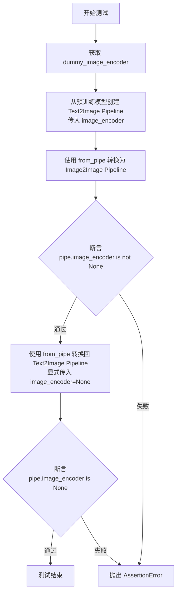

#### 带注释源码

```python
def test_from_pipe_optional_components(self):
    """
    测试 from_pipe 方法在转换 pipeline 时如何处理可选组件（如 image_encoder）。
    验证：
    1. 当不显式传递 image_encoder 时，源 pipeline 的 image_encoder 会被保留
    2. 当显式传递 image_encoder=None 时，image_encoder 会被设为 None
    """
    # 第一步：创建模拟的 image_encoder 组件
    # 使用类属性 dummy_image_encoder 获取一个虚拟的 CLIPVisionModelWithProjection 模型
    image_encoder = self.dummy_image_encoder

    # 第二步：使用 from_pretrained 创建初始的 Text2Image Pipeline
    # 传入 image_encoder 作为可选组件
    pipe = AutoPipelineForText2Image.from_pretrained(
        "hf-internal-testing/tiny-stable-diffusion-pipe",
        image_encoder=image_encoder,
    )

    # 第三步：使用 from_pipe 将 pipeline 转换为 Image2Image 类型
    # 此时 image_encoder 应该被保留（因为没有显式覆盖）
    pipe = AutoPipelineForImage2Image.from_pipe(pipe)
    
    # 验证 image_encoder 组件确实存在
    assert pipe.image_encoder is not None

    # 第四步：再次使用 from_pipe 转换回 Text2Image 类型
    # 这次显式传入 image_encoder=None 来覆盖之前的组件
    pipe = AutoPipelineForText2Image.from_pipe(pipe, image_encoder=None)
    
    # 验证 image_encoder 已被成功移除
    assert pipe.image_encoder is None
```


### `AutoPipelineIntegrationTest.test_pipe_auto`

该方法是一个集成测试，用于验证 AutoPipeline 在不同任务（Text2Image、Image2Image、Inpainting）之间的自动切换能力，通过预训练模型仓库映射表遍历多个模型，测试从预训练模型加载管道以及通过 `from_pipe` 方法在不同任务管道之间转换的正确性。

参数：

- `self`：隐式参数，`unittest.TestCase`，表示测试类实例本身

返回值：无（`None`），该方法为单元测试方法，通过断言验证管道类型，不返回任何值

#### 流程图

```mermaid
flowchart TD
    A[开始 test_pipe_auto] --> B[遍历 PRETRAINED_MODEL_REPO_MAPPING]
    B --> C{当前模型名称}
    C --> D[加载 Text2Image 管道<br/>AutoPipelineForText2Image.from_pretrained]
    D --> E[断言管道类型匹配<br/>AUTO_TEXT2IMAGE_PIPELINES_MAPPING]
    E --> F[转换到 Text2Image<br/>AutoPipelineForText2Image.from_pipe]
    F --> G[断言管道类型匹配]
    G --> H[转换到 Image2Image<br/>AutoPipelineForImage2Image.from_pipe]
    H --> I[断言管道类型匹配]
    I --> J{模型名不含'kandinsky'?}
    J -->|是| K[转换到 Inpainting<br/>AutoPipelineForInpainting.from_pipe]
    J -->|否| L[跳过 Inpainting 测试]
    K --> L
    L --> M[清理内存<br/>del + gc.collect]
    M --> N[加载 Image2Image 管道<br/>AutoPipelineForImage2Image.from_pretrained]
    N --> O[断言管道类型匹配<br/>AUTO_IMAGE2IMAGE_PIPELINES_MAPPING]
    O --> P[转换到 Text2Image<br/>AutoPipelineForText2Image.from_pipe]
    P --> Q[断言管道类型匹配]
    Q --> R[转换到 Image2Image<br/>AutoPipelineForImage2Image.from_pipe]
    R --> S[断言管道类型匹配]
    S --> T{模型名不含'kandinsky'?}
    T -->|是| U[转换到 Inpainting<br/>AutoPipelineForInpainting.from_pipe]
    T -->|否| V[跳过 Inpainting 测试]
    U --> V
    V --> W[清理内存<br/>del + gc.collect]
    W --> X{模型名不含'kandinsky'?}
    X -->|是| Y[加载 Inpainting 管道<br/>AutoPipelineForInpainting.from_pretrained]
    X -->|否| Z[结束测试]
    Y --> AA[断言管道类型匹配<br/>AUTO_INPAINT_PIPELINES_MAPPING]
    AA --> AB[转换到 Text2Image<br/>AutoPipelineForText2Image.from_pipe]
    AB --> AC[断言管道类型匹配]
    AC --> AD[转换到 Image2Image<br/>AutoPipelineForImage2Image.from_pipe]
    AD --> AE[断言管道类型匹配]
    AE --> AF[转换到 Inpainting<br/>AutoPipelineForInpainting.from_pipe]
    AF --> AG[断言管道类型匹配]
    AG --> AH[清理内存]
    AH --> Z
```

#### 带注释源码

```python
@slow  # 标记为慢速测试，需要较长时间执行
class AutoPipelineIntegrationTest(unittest.TestCase):
    """
    集成测试类，验证 AutoPipeline 在不同扩散模型上的自动管道切换功能。
    包括 Text2Image、Image2Image、Inpainting 三种任务类型之间的转换测试。
    """

    def test_pipe_auto(self):
        """
        测试 AutoPipeline 的自动管道映射功能。
        
        该测试遍历预定义的模型仓库映射表 (PRETRAINED_MODEL_REPO_MAPPING)，
        对每个模型执行以下测试流程：
        1. Text2Image 管道测试：加载、转换到 Image2Image、转换到 Inpainting
        2. Image2Image 管道测试：加载、转换到 Text2Image、转换到 Inpainting
        3. Inpainting 管道测试：加载、转换到 Text2Image、转换到 Image2Image
        
        使用 gc.collect() 显式触发垃圾回收以释放 GPU 内存。
        """
        # 遍历所有预训练模型仓库映射
        for model_name, model_repo in PRETRAINED_MODEL_REPO_MAPPING.items():
            # ========== 测试 Text2Image 管道 ==========
            # 使用 fp16 变体加载 Text2Image 管道
            pipe_txt2img = AutoPipelineForText2Image.from_pretrained(
                model_repo, variant="fp16", torch_dtype=torch.float16
            )
            # 验证加载的管道类型是否与预定义的映射表匹配
            self.assertIsInstance(pipe_txt2img, AUTO_TEXT2IMAGE_PIPELINES_MAPPING[model_name])

            # 测试从 Text2Image 管道转换到同类型 Text2Image 管道
            pipe_to = AutoPipelineForText2Image.from_pipe(pipe_txt2img)
            self.assertIsInstance(pipe_to, AUTO_TEXT2IMAGE_PIPELINES_MAPPING[model_name])

            # 测试从 Text2Image 管道转换到 Image2Image 管道
            pipe_to = AutoPipelineForImage2Image.from_pipe(pipe_txt2img)
            self.assertIsInstance(pipe_to, AUTO_IMAGE2IMAGE_PIPELINES_MAPPING[model_name])

            # Kandinsky 模型不支持 Inpainting，跳过该测试
            if "kandinsky" not in model_name:
                # 测试从 Text2Image 管道转换到 Inpainting 管道
                pipe_to = AutoPipelineForInpainting.from_pipe(pipe_txt2img)
                self.assertIsInstance(pipe_to, AUTO_INPAINT_PIPELINES_MAPPING[model_name])

            # 释放 GPU 内存
            del pipe_txt2img, pipe_to
            gc.collect()

            # ========== 测试 Image2Image 管道 ==========
            # 使用 fp16 变体加载 Image2Image 管道
            pipe_img2img = AutoPipelineForImage2Image.from_pretrained(
                model_repo, variant="fp16", torch_dtype=torch.float16
            )
            # 验证加载的管道类型是否与预定义的映射表匹配
            self.assertIsInstance(pipe_img2img, AUTO_IMAGE2IMAGE_PIPELINES_MAPPING[model_name])

            # 测试从 Image2Image 管道转换到 Text2Image 管道
            pipe_to = AutoPipelineForText2Image.from_pipe(pipe_img2img)
            self.assertIsInstance(pipe_to, AUTO_TEXT2IMAGE_PIPELINES_MAPPING[model_name])

            # 测试从 Image2Image 管道转换到同类型 Image2Image 管道
            pipe_to = AutoPipelineForImage2Image.from_pipe(pipe_img2img)
            self.assertIsInstance(pipe_to, AUTO_IMAGE2IMAGE_PIPELINES_MAPPING[model_name])

            # Kandinsky 模型不支持 Inpainting，跳过该测试
            if "kandinsky" not in model_name:
                # 测试从 Image2Image 管道转换到 Inpainting 管道
                pipe_to = AutoPipelineForInpainting.from_pipe(pipe_img2img)
                self.assertIsInstance(pipe_to, AUTO_INPAINT_PIPELINES_MAPPING[model_name])

            # 释放 GPU 内存
            del pipe_img2img, pipe_to
            gc.collect()

            # ========== 测试 Inpainting 管道 ==========
            # Kandinsky 模型不支持 Inpainting，跳过整个 Inpainting 测试块
            if "kandinsky" not in model_name:
                # 使用 fp16 变体加载 Inpainting 管道
                pipe_inpaint = AutoPipelineForInpainting.from_pretrained(
                    model_repo, variant="fp16", torch_dtype=torch.float16
                )
                # 验证加载的管道类型是否与预定义的映射表匹配
                self.assertIsInstance(pipe_inpaint, AUTO_INPAINT_PIPELINES_MAPPING[model_name])

                # 测试从 Inpainting 管道转换到 Text2Image 管道
                pipe_to = AutoPipelineForText2Image.from_pipe(pipe_inpaint)
                self.assertIsInstance(pipe_to, AUTO_TEXT2IMAGE_PIPELINES_MAPPING[model_name])

                # 测试从 Inpainting 管道转换到 Image2Image 管道
                pipe_to = AutoPipelineForImage2Image.from_pipe(pipe_inpaint)
                self.assertIsInstance(pipe_to, AUTO_IMAGE2IMAGE_PIPELINES_MAPPING[model_name])

                # 测试从 Inpainting 管道转换到同类型 Inpainting 管道
                pipe_to = AutoPipelineForInpainting.from_pipe(pipe_inpaint)
                self.assertIsInstance(pipe_to, AUTO_INPAINT_PIPELINES_MAPPING[model_name])

                # 释放 GPU 内存
                del pipe_inpaint, pipe_to
                gc.collect()
```


### `AutoPipelineIntegrationTest.test_from_pipe_consistent`

该测试方法验证在使用 `from_pipe` 方法将一个 diffusion pipeline 转换为不同类型的 pipeline 时，配置信息能够正确保留。它遍历多种预训练模型架构（stable-diffusion、DeepFloyd IF、Kandinsky），并测试 Text2Image、Image2Image、Inpainting 三种 pipeline 类型之间的相互转换，确保配置一致性。

参数：

- `self`：unittest.TestCase，测试类的实例本身

返回值：无（测试方法，通过断言验证，不返回具体值）

#### 流程图

```mermaid
flowchart TD
    A[开始测试] --> B[遍历 PRETRAINED_MODEL_REPO_MAPPING]
    B --> C{判断模型名称}
    C -->|kandinsky 或 kandinsky22| D[设置 auto_pipes 为 Text2Image 和 Image2Image]
    C -->|其他模型| E[设置 auto_pipes 为三种 pipeline]
    D --> F[遍历 pipe_from_class]
    E --> F
    F --> G[from_pretrained 加载原始 pipeline]
    G --> H[保存原始 config]
    F --> I[遍历 pipe_to_class]
    I --> J[from_pipe 转换 pipeline]
    J --> K{断言 config 一致}
    K -->|通过| L[删除 pipeline 对象]
    K -->|失败| M[测试失败]
    L --> I
    I --> N[gc.collect 垃圾回收]
    N --> F
    F --> O[测试结束]
```

#### 带注释源码

```python
def test_from_pipe_consistent(self):
    """
    测试从预训练模型加载 pipeline 并使用 from_pipe 转换为其他类型时，
    配置信息是否保持一致。
    
    测试覆盖的模型：
    - stable-diffusion
    - if (DeepFloyd/IF-I-XL-v1.0)
    - kandinsky
    - kandinsky22
    
    测试覆盖的 pipeline 转换：
    - Text2Image -> Text2Image/Image2Image/Inpainting
    - Image2Image -> Text2Image/Image2Image/Inpainting
    - Inpainting -> Text2Image/Image2Image/Inpainting
    """
    # 遍历所有预定义的模型仓库映射
    for model_name, model_repo in PRETRAINED_MODEL_REPO_MAPPING.items():
        
        # 根据模型名称决定测试哪些 pipeline 类型
        # Kandinsky 系列不支持 Inpainting，因此只测试两种
        if model_name in ["kandinsky", "kandinsky22"]:
            auto_pipes = [AutoPipelineForText2Image, AutoPipelineForImage2Image]
        else:
            # 其他模型测试全部三种 pipeline 类型
            auto_pipes = [AutoPipelineForText2Image, AutoPipelineForImage2Image, AutoPipelineForInpainting]

        # 遍历所有需要测试的来源 pipeline 类型
        for pipe_from_class in auto_pipes:
            # 使用 from_pretrained 加载原始 pipeline，指定 fp16 变体和 dtype
            pipe_from = pipe_from_class.from_pretrained(
                model_repo, 
                variant="fp16", 
                torch_dtype=torch.float16
            )
            # 保存原始配置用于后续比较
            pipe_from_config = dict(pipe_from.config)

            # 遍历所有目标 pipeline 类型，测试相互转换
            for pipe_to_class in auto_pipes:
                # 使用 from_pipe 从已有 pipeline 创建新类型的 pipeline
                pipe_to = pipe_to_class.from_pipe(pipe_from)
                # 断言转换后的 config 与原始 config 完全一致
                self.assertEqual(dict(pipe_to.config), pipe_from_config)

            # 清理内存，删除 pipeline 对象
            del pipe_from, pipe_to
            # 强制垃圾回收，释放 GPU 内存
            gc.collect()
```


### `AutoPipelineIntegrationTest.test_controlnet`

该测试方法验证了 AutoPipeline 与 ControlNet 模型的集成功能，包括通过 `from_pretrained` 和 `from_pipe` 两种方式创建支持 ControlNet 的 Text2Image、Image2Image 和 Inpainting 管道，并确保管道实例类型和配置正确。

参数：

- `self`：`unittest.TestCase`，测试类实例本身

返回值：`None`，该方法为测试方法，不返回任何值

#### 流程图

```mermaid
flowchart TD
    A[开始测试] --> B[定义模型仓库地址]
    B --> C[从预训练模型加载 ControlNet]
    C --> D[从预训练创建 Text2Image 管道 with ControlNet]
    D --> E{断言管道类型是否正确}
    E -->|是| F[从预训练创建 Image2Image 管道 with ControlNet]
    E -->|否| Z[测试失败]
    F --> G{断言管道类型是否正确}
    G -->|是| H[从预训练创建 Inpainting 管道 with ControlNet]
    G -->|否| Z
    H --> I{断言管道类型是否正确}
    I -->|是| J[遍历三个源管道]
    I -->|否| Z
    J --> K[使用 from_pipe 转换为 Text2Image]
    K --> L{断言类型和配置}
    L -->|通过| M[使用 from_pipe 转换为 Image2Image]
    L -->|失败| Z
    M --> N{断言类型和配置}
    N -->|通过| O[使用 from_pipe 转换为 Inpainting]
    N -->|失败| Z
    O --> P{断言类型和配置}
    P -->|通过| Q{还有更多源管道?}
    P -->|失败| Z
    Q -->|是| J
    Q -->|否| R[测试通过]
```

#### 带注释源码

```python
def test_controlnet(self):
    # 定义基础模型仓库和 ControlNet 模型仓库地址
    # 用于测试 ControlNet 管道在不同任务类型间的转换
    model_repo = "stable-diffusion-v1-5/stable-diffusion-v1-5"
    controlnet_repo = "lllyasviel/sd-controlnet-canny"

    # 从预训练模型加载 ControlNet 模型
    # 使用 float16 精度以减少显存占用
    controlnet = ControlNetModel.from_pretrained(controlnet_repo, torch_dtype=torch.float16)

    # 测试 from_pretrained: 创建支持 ControlNet 的 Text2Image 管道
    pipe_txt2img = AutoPipelineForText2Image.from_pretrained(
        model_repo, controlnet=controlnet, torch_dtype=torch.float16
    )
    # 断言管道类型是否为 stable-diffusion-controlnet 类型的 Text2Image 管道
    self.assertIsInstance(pipe_txt2img, AUTO_TEXT2IMAGE_PIPELINES_MAPPING["stable-diffusion-controlnet"])

    # 测试 from_pretrained: 创建支持 ControlNet 的 Image2Image 管道
    pipe_img2img = AutoPipelineForImage2Image.from_pretrained(
        model_repo, controlnet=controlnet, torch_dtype=torch.float16
    )
    # 断言管道类型是否为 stable-diffusion-controlnet 类型的 Image2Image 管道
    self.assertIsInstance(pipe_img2img, AUTO_IMAGE2IMAGE_PIPELINES_MAPPING["stable-diffusion-controlnet"])

    # 测试 from_pretrained: 创建支持 ControlNet 的 Inpainting 管道
    pipe_inpaint = AutoPipelineForInpainting.from_pretrained(
        model_repo, controlnet=controlnet, torch_dtype=torch.float16
    )
    # 断言管道类型是否为 stable-diffusion-controlnet 类型的 Inpainting 管道
    self.assertIsInstance(pipe_inpaint, AUTO_INPAINT_PIPELINES_MAPPING["stable-diffusion-controlnet"])

    # 测试 from_pipe: 验证不同任务类型管道之间的转换
    # 遍历三个源管道 (txt2img, img2img, inpaint)
    for pipe_from in [pipe_txt2img, pipe_img2img, pipe_inpaint]:
        # 从任意管道转换为 Text2Image 管道
        pipe_to = AutoPipelineForText2Image.from_pipe(pipe_from)
        # 断言转换后的管道类型正确
        self.assertIsInstance(pipe_to, AUTO_TEXT2IMAGE_PIPELINES_MAPPING["stable-diffusion-controlnet"])
        # 断言转换后的配置与原始 txt2img 管道配置一致
        self.assertEqual(dict(pipe_to.config), dict(pipe_txt2img.config))

        # 从任意管道转换为 Image2Image 管道
        pipe_to = AutoPipelineForImage2Image.from_pipe(pipe_from)
        # 断言转换后的管道类型正确
        self.assertIsInstance(pipe_to, AUTO_IMAGE2IMAGE_PIPELINES_MAPPING["stable-diffusion-controlnet"])
        # 断言转换后的配置与原始 img2img 管道配置一致
        self.assertEqual(dict(pipe_to.config), dict(pipe_img2img.config))

        # 从任意管道转换为 Inpainting 管道
        pipe_to = AutoPipelineForInpainting.from_pipe(pipe_from)
        # 断言转换后的管道类型正确
        self.assertIsInstance(pipe_to, AUTO_INPAINT_PIPELINES_MAPPING["stable-diffusion-controlnet"])
        # 断言转换后的配置与原始 inpaint 管道配置一致
        self.assertEqual(dict(pipe_to.config), dict(pipe_inpaint.config))
```

## 关键组件


### AutoPipeline自动管道系统

AutoPipeline是diffusers库中的自动管道系统，允许用户在不同的扩散模型任务（文本到图像、图像到图像、修复）之间灵活转换，同时保留配置。

### from_pipe管道转换

支持在已有管道基础上创建新任务的管道实例，保留原管道的组件配置，支持从Text2Image转换到Image2Image、Inpainting等任务。

### PRETRAINED_MODEL_REPO_MAPPING预训练模型映射

定义了测试用的预训练模型仓库映射表，包含stable-diffusion、IF、Kandinsky等模型的仓库ID。

### ControlNet支持

在AutoPipeline中集成ControlNet控制网络，支持在Text2Image、Image2Image、Inpainting任务中使用ControlNet。

### enable_pag特性

PAG（Progressive Adversarial Generation）标志位，支持启用渐进对抗生成策略，可通过参数动态开启或关闭。

### 量化策略（torch.float16）

测试中使用torch.float16半精度浮点数据类型，属于模型量化的一种形式，用于降低内存占用和提高推理速度。

### from_pretrained动态加载

支持从预训练模型仓库动态加载管道，支持variant、torch_dtype等参数配置。

### 可选组件传递机制

管道转换时支持可选组件（如image_encoder）的传递和重置，可通过from_pipe方法动态修改。

## 问题及建议


### 已知问题

- **测试用例包含敏感信息泄露**：代码中包含硬编码的 HuggingFace 模型仓库路径（如 "hf-internal-testing/tiny-stable-diffusion-pipe"），这些路径可能包含内部测试信息，在开源项目中应避免暴露。
- **资源清理不完整**：`test_kwargs_local_files_only` 测试在删除目录后，`new_tmpdirname` 变量仍指向已删除的路径，可能导致引用错误；同时 `shutil.rmtree(tmpdirname.parent.parent)` 会删除整个测试目录，可能影响并行测试环境。
- **测试覆盖不足**：缺少对 `from_pipe` 方法在异常情况下的测试（如传递无效参数、模型加载失败等），也没有测试并发调用 `from_pipe` 的线程安全性。
- **测试逻辑重复**：大量测试用例（如 `test_from_pipe_pag_text2img`、`test_from_pipe_pag_img2img` 等）包含高度相似的验证逻辑，代码冗余度高，难以维护。
- **缺少参数化测试**：相同的测试模式（如测试 `enable_pag` 与 `controlnet` 的组合）被多次手动编写，应使用 pytest 参数化功能简化。
- **全局状态依赖**：测试使用 `torch.manual_seed(0)` 设置随机种子，但没有恢复到原始状态，可能影响其他测试的随机性。
- **集成测试标记不完善**：虽然部分测试标记为 `@slow`，但 `test_pipe_auto` 和 `test_from_pipe_consistent` 在 `PRETRAINED_MODEL_REPO_MAPPING` 上循环，可能执行时间过长，影响 CI/CD 效率。

### 优化建议

- **使用 pytest 参数化**：将重复的测试模式（如 `enable_pag` 与 `controlnet` 组合）提取为参数化测试，减少代码重复。
- **完善资源管理**：使用 `tempfile` 模块管理临时文件，确保测试结束后自动清理；添加 `finally` 块保证清理逻辑执行。
- **增强错误处理测试**：添加对无效参数、模型加载失败、网络异常等边界情况的测试用例。
- **优化集成测试**：对需要加载大型模型的集成测试进行更细粒度的 `@slow` 标记，或将其移到单独的测试套件中。
- **减少硬编码**：将模型路径等配置提取为测试 fixtures 或配置文件，提高代码可维护性。
- **添加异步测试**：对于不依赖顺序的测试，考虑使用 `unittest.TestCase` 的异步支持或 pytest 的异步插件，提高测试并行执行效率。

## 其它


### 设计目标与约束

本测试套件的设计目标是验证 diffusers 库中 AutoPipeline 类的核心功能，包括跨任务 pipeline 转换（如 Text2Image 到 Image2Image）、ControlNet 集成、PAG（Prompt Attention Guidance）功能以及配置一致性保持。约束条件包括：必须使用 unittest 框架、集成测试需标记为 @slow、测试必须在 CPU 和 GPU 环境下均可运行、依赖的模型必须是 HuggingFace Hub 上的公开模型。

### 错误处理与异常设计

测试中主要处理的异常类型包括：OSError（在 local_files_only 测试中，当本地文件无法加载时抛出）、AssertionError（当 pipeline 类型或配置不符合预期时抛出）、RuntimeError（当模型加载失败时可能抛出）。测试采用 try-except 块处理特定异常，如 test_kwargs_local_files_only 中捕获 OSError 并将其转换为断言失败。关键原则是测试失败时应提供清晰的错误信息，包括预期的 pipeline 类别名称和实际获得的类别名称。

### 数据流与状态机

数据流主要分为三个阶段：第一阶段是 from_pretrained 创建初始 pipeline，从 HuggingFace Hub 下载模型权重和配置；第二阶段是通过 from_pipe 方法进行 pipeline 类型转换，保持配置和组件的一致性；第三阶段是验证转换后的 pipeline 配置与原始配置的一致性。状态转换包括：基础 pipeline 到 ControlNet pipeline、基础 pipeline 到 PAG pipeline、不同任务类型之间的转换（Text2Image ↔ Image2Image ↔ Inpainting）。

### 外部依赖与接口契约

核心依赖包括：torch（深度学习框架）、transformers（CLIPVisionConfig 和 CLIPVisionModelWithProjection）、diffusers（DiffusionPipeline、AutoPipelineForText2Image、AutoPipelineForImage2Image、AutoPipelineForInpainting、ControlNetModel）。接口契约方面，from_pretrained 方法接受 repo_id 和可选参数（variant、torch_dtype、controlnet、enable_pag 等），返回对应类型的 DiffusionPipeline 实例；from_pipe 方法接受一个已有的 pipeline 对象和可选覆盖参数，返回转换后的新 pipeline 对象。

### 性能考虑

集成测试标记为 @slow，表示这些测试需要较长时间运行。测试中使用 gc.collect() 和 del 语句显式管理内存，特别是在循环中处理大型模型时。测试使用 tiny 版本的模型（hf-internal-testing/tiny-*）以降低资源消耗。fp16 变体用于减少显存占用。

### 安全性考虑

测试中使用 requires_safety_checker=False 参数来禁用安全检查器，这在测试环境中是合理的。模型加载时指定 torch_dtype=torch.float16，确保使用半精度浮点数，减少内存占用同时保持数值稳定性。测试不涉及用户数据的处理，所有模型都来自公开的 HuggingFace Hub。

### 测试覆盖范围

单元测试覆盖：from_pipe 配置一致性、from_pipe 参数覆盖（requires_safety_checker）、SDXL pipeline 一致性、local_files_only 模式、从预创建不同类型 pipeline（Text2Image、Image2Image、Inpainting）、PAG 功能、ControlNet 集成、Optional 组件处理。集成测试覆盖：多种预训练模型映射（stable-diffusion、if、kandinsky、kandinsky22）、跨任务 pipeline 转换、ControlNet pipeline 完整流程。

### 配置管理

使用 OrderedDict 存储 PRETRAINED_MODEL_REPO_MAPPING，定义模型名称到 HuggingFace Hub 仓库 ID 的映射。Pipeline 配置通过 dict(pipe.config) 形式进行深拷贝和比较，确保配置转换的一致性。测试验证的配置项包括：requires_safety_checker、requires_aesthetics_score、force_zeros_for_empty_prompt、components 字典内容。

### 版本兼容性

代码指定了 Python 3.x 兼容性（通过编码声明），需要 diffusers 库支持 AutoPipeline 相关类。测试假设 transformers 库支持 CLIPVisionConfig 和 CLIPVisionModelWithProjection。torch_dtype 参数的使用表明需要支持 PyTorch 的 dtype 系统。

### 并发和线程安全性

测试主要在单线程环境下运行，没有显式的线程同步机制。pipeline 对象在测试间通过 del 和 gc.collect() 进行清理，避免对象残留导致的潜在并发问题。集成测试中对每个模型执行完整的 cleanup 流程。

### 资源管理

测试使用临时目录进行本地文件测试（tmpdirname），测试完成后通过 shutil.rmtree 清理。所有大型模型对象在不使用时显式删除。集成测试在每个模型验证后执行 gc.collect()，确保显存及时释放。Dummy image encoder 通过 property 方法懒加载，避免不必要的资源占用。

### 日志和监控

测试使用标准的 unittest assert 机制，没有显式的日志记录。@slow 装饰器用于标记长时间运行的集成测试，便于测试框架进行选择性执行。测试输出主要通过 unittest 的标准输出流展示。

    