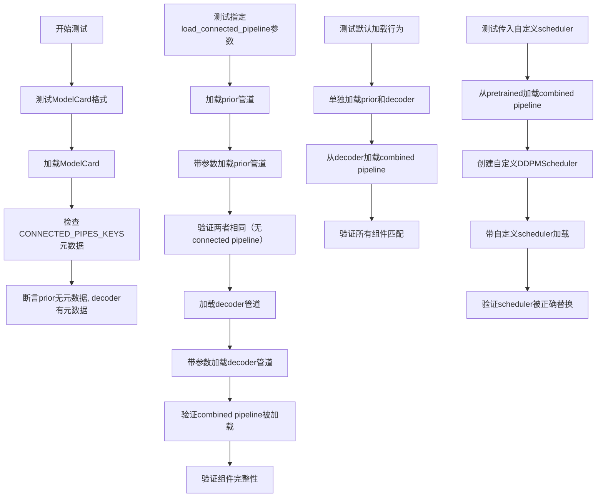
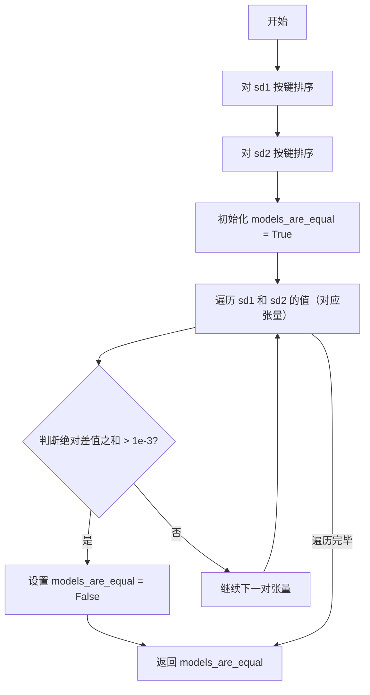
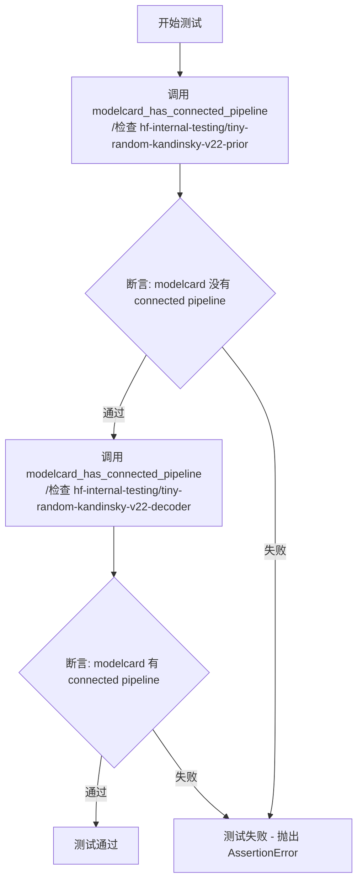
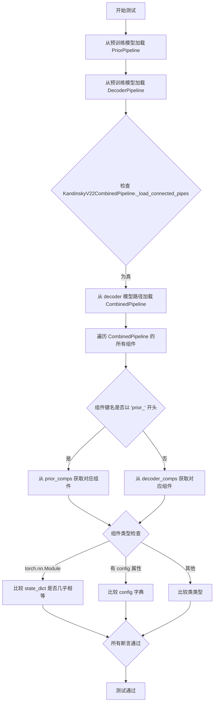
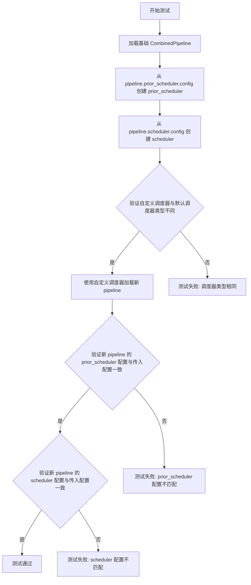

# `diffusers\tests\pipelines\test_pipelines_combined.py` 详细设计文档

这是一个测试文件，用于验证diffusers库中Kandinsky V2.2 Combined Pipeline的连接检查点（connected checkpoint）加载功能，包括ModelCard元数据解析、单独加载prior和decoder、以及使用自定义scheduler的场景测试。

## 整体流程



## 类结构

```
unittest.TestCase
└── CombinedPipelineFastTest
    ├── modelcard_has_connected_pipeline()
    ├── test_correct_modelcard_format()
    ├── test_load_connected_checkpoint_when_specified()
    ├── test_load_connected_checkpoint_default()
    └── test_load_connected_checkpoint_with_passed_obj()
```

## 全局变量及字段


### `CONNECTED_PIPES_KEYS`
    
存储连接管道的键名列表，用于从 ModelCard 元数据中获取关联的管道信息

类型：`List[str]`
    


    

## 全局函数及方法


### `state_dicts_almost_equal`

该函数用于比较两个 PyTorch 模型的状态字典（state_dict）是否几乎相等。它通过逐个比较两个状态字典中对应张量的绝对差值之和来判断，如果所有张量的差值之和都不超过阈值 1e-3，则认为两个模型状态几乎相等。

参数：

- `sd1`：`Dict`，第一个 PyTorch 模型的状态字典（state_dict）
- `sd2`：`Dict`，第二个 PyTorch 模型的状态字典（state_dict）

返回值：`bool`，如果两个状态字典中的所有对应张量的绝对差值之和均不超过 1e-3，返回 `True`；否则返回 `False`

#### 流程图



#### 带注释源码

```python
def state_dicts_almost_equal(sd1, sd2):
    """
    比较两个 PyTorch 模型的状态字典是否几乎相等。
    
    参数:
        sd1: 第一个模型的状态字典
        sd2: 第二个模型的状态字典
    
    返回:
        如果两个状态字典几乎相等返回 True，否则返回 False
    """
    # 将状态字典转换为有序字典，确保对应位置的键一致
    sd1 = dict(sorted(sd1.items()))
    sd2 = dict(sorted(sd2.items()))

    # 初始化比较结果为 True
    models_are_equal = True
    # 遍历两个状态字典中对应位置的张量
    for ten1, ten2 in zip(sd1.values(), sd2.values()):
        # 计算两个张量的绝对差值之和，如果超过阈值则标记为不相等
        if (ten1 - ten2).abs().sum() > 1e-3:
            models_are_equal = False

    # 返回比较结果
    return models_are_equal
```


### `CombinedPipelineFastTest.modelcard_has_connected_pipeline`

该方法用于检查给定模型ID的ModelCard是否包含connected pipeline的元数据信息，通过读取ModelCard中的特定前缀字段（CONNECTED_PIPES_KEYS定义的字段），判断是否存在已连接的管道配置。

参数：

- `model_id`：`str`，HuggingFace Hub上的模型ID，用于加载对应的ModelCard

返回值：`bool`，如果ModelCard中包含至少一个connected pipeline配置则返回`True`，否则返回`False`

#### 流程图

```mermaid
flowchart TD
    A[开始] --> B[加载ModelCard: ModelCard.load(model_id)]
    B --> C[遍历CONNECTED_PIPES_KEYS中的前缀]
    C --> D[获取modelcard.data.{前缀}的值]
    D --> E{值是否为None}
    E -->|是| F[过滤掉该键值对]
    E -->|否| G[保留该键值对]
    F --> H{是否遍历完所有前缀}
    G --> H
    H -->|否| C
    H -->|是| I{connected_pipes字典长度 > 0}
    I -->|是| J[返回True]
    I -->|否| K[返回False]
    J --> L[结束]
    K --> L
```

#### 带注释源码

```python
def modelcard_has_connected_pipeline(self, model_id):
    """
    检查给定模型ID的ModelCard是否包含connected pipeline的元数据信息。
    
    Args:
        model_id: HuggingFace Hub上的模型ID，用于加载对应的ModelCard
        
    Returns:
        bool: 如果ModelCard中包含至少一个connected pipeline配置则返回True，否则返回False
    """
    # 步骤1: 从HuggingFace Hub加载指定模型ID的ModelCard
    modelcard = ModelCard.load(model_id)
    
    # 步骤2: 使用字典推导式遍历CONNECTED_PIPES_KEYS中定义的所有前缀
    # CONNECTED_PIPES_KEYS定义了connected pipeline的相关字段前缀
    # getattr用于安全获取属性，如果不存在则返回[None]作为默认值
    # 取[0]是因为属性值可能是一个列表
    connected_pipes = {
        prefix: getattr(modelcard.data, prefix, [None])[0] 
        for prefix in CONNECTED_PIPES_KEYS
    }
    
    # 步骤3: 过滤掉值为None的键值对，只保留实际配置了connected pipeline的项
    connected_pipes = {k: v for k, v in connected_pipes.items() if v is not None}
    
    # 步骤4: 返回是否存在connected pipeline的布尔值
    return len(connected_pipes) > 0
```


### `CombinedPipelineFastTest.test_correct_modelcard_format`

该测试方法用于验证 ModelCard 中 connected pipeline 元数据的正确性，检查指定的模型仓库是否正确配置了 connected pipelines。

参数：

- `self`：`CombinedPipelineFastTest`，测试类实例本身，用于访问类中定义的其他方法（如 modelcard_has_connected_pipeline）

返回值：无显式返回值（通过 assert 语句进行断言验证，若失败则抛出 AssertionError）

#### 流程图



#### 带注释源码

```python
def test_correct_modelcard_format(self):
    # 测试第一部分：验证 tiny-random-kandinsky-v22-prior 模型没有 connected pipeline 元数据
    # hf-internal-testing/tiny-random-kandinsky-v22-prior 是一个测试用的小型模型，不包含任何元数据
    assert not self.modelcard_has_connected_pipeline("hf-internal-testing/tiny-random-kandinsky-v22-prior")

    # 测试第二部分：验证 tiny-random-kandinsky-v22-decoder 模型包含 connected pipeline 元数据
    # 根据 README 中的配置，该模型的 ModelCard 中应该包含 prior 管道信息
    # 参考链接: https://huggingface.co/hf-internal-testing/tiny-random-kandinsky-v22-decoder/blob/8baff9897c6be017013e21b5c562e5a381646c7e/README.md?code=true#L2
    assert self.modelcard_has_connected_pipeline("hf-internal-testing/tiny-random-kandinsky-v22-decoder")
```


### `CombinedPipelineFastTest.test_load_connected_checkpoint_when_specified`

该测试方法验证了当使用 `load_connected_pipeline=True` 参数加载 `DiffusionPipeline` 时的行为：对于没有关联管道的模型（如 prior），该参数无效；对于有关联管道的模型（如 decoder），则正确加载组合管道（CombinedPipeline）。

参数：无

返回值：`None`（测试方法无返回值）

#### 流程图

```mermaid
flowchart TD
    A[开始测试] --> B[加载 pipeline_prior<br/>不使用 load_connected_pipeline]
    B --> C[加载 pipeline_prior_connected<br/>使用 load_connected_pipeline=True]
    C --> D{prior 是否有<br/>connected pipeline?}
    D -->|否| E[断言: pipeline_prior.__class__<br/>== pipeline_prior_connected.__class__]
    E --> F[加载 pipeline (decoder)<br/>不使用 load_connected_pipeline]
    F --> G[加载 pipeline_connected<br/>使用 load_connected_pipeline=True]
    G --> H{decoder 是否有<br/>connected pipeline?}
    H -->|是| I[断言: pipeline.__class__<br/>!= pipeline_connected.__class__]
    I --> J[断言: pipeline.__class__<br/>== KandinskyV22Pipeline]
    J --> K[断言: pipeline_connected.__class__<br/>== KandinskyV22CombinedPipeline]
    K --> L[检查 components 匹配<br/>prior_开头 + decoder 组件]
    L --> M[测试结束]
```

#### 带注释源码

```python
def test_load_connected_checkpoint_when_specified(self):
    """
    测试当指定 load_connected_pipeline=True 时，DiffusionPipeline.from_pretrained 的加载行为。
    
    验证点：
    1. 对于没有 connected pipeline 的 prior 模型，load_connected_pipeline 参数是 no-op
    2. 对于有 connected pipeline 的 decoder 模型，load_connected_pipeline 会加载组合管道
    """
    
    # 场景1：加载没有 connected pipeline 的 prior 模型
    # 不带 load_connected_pipeline 参数
    pipeline_prior = DiffusionPipeline.from_pretrained("hf-internal-testing/tiny-random-kandinsky-v22-prior")
    
    # 带 load_connected_pipeline=True 参数
    pipeline_prior_connected = DiffusionPipeline.from_pretrained(
        "hf-internal-testing/tiny-random-kandinsky-v22-prior", load_connected_pipeline=True
    )

    # 断言：由于 prior 没有 connected pipeline，传递 load_connected_pipeline 是无效操作（no-op）
    # 两者类别应该相同
    assert pipeline_prior.__class__ == pipeline_prior_connected.__class__

    # 场景2：加载有 connected pipeline 的 decoder 模型
    # 不带 load_connected_pipeline 参数
    pipeline = DiffusionPipeline.from_pretrained("hf-internal-testing/tiny-random-kandinsky-v22-decoder")
    
    # 带 load_connected_pipeline=True 参数
    pipeline_connected = DiffusionPipeline.from_pretrained(
        "hf-internal-testing/tiny-random-kandinsky-v22-decoder", load_connected_pipeline=True
    )

    # 断言：由于 decoder 有 connected pipeline（prior），加载后会得到不同的管道类别
    assert pipeline.__class__ != pipeline_connected.__class__
    
    # 断言：原始加载的管道是单独的 decoder 管道
    assert pipeline.__class__ == KandinskyV22Pipeline
    
    # 断言：使用 load_connected_pipeline 加载的是组合管道
    assert pipeline_connected.__class__ == KandinskyV22CombinedPipeline

    # 验证组合管道的组件同时包含 prior 和 decoder 的组件
    # 期望的 components 键：["prior_" + prior的键] + [decoder的键]
    assert set(pipeline_connected.components.keys()) == set(
        ["prior_" + k for k in pipeline_prior.components.keys()] + list(pipeline.components.keys())
    )
```


### `CombinedPipelineFastTest.test_load_connected_checkpoint_default`

该测试方法验证 KandinskyV22CombinedPipeline 在默认情况下（不显式传递 `load_connected_pipeline=True`）能够根据 model card 元数据自动加载连接的相关先验（prior）和解码器（decoder）组件，并确保加载的组件与独立加载的 prior 和 decoder 组件在状态字典、配置和类类型上保持一致。

参数：
- 无（该方法为 unittest.TestCase 的测试方法，通过测试框架调用）

返回值：`None`（测试方法无显式返回值，通过 assert 语句进行验证）

#### 流程图



#### 带注释源码

```python
def test_load_connected_checkpoint_default(self):
    """测试 CombinedPipeline 在默认情况下自动加载连接的 prior 和 decoder 组件"""
    
    # 步骤1: 独立加载 prior pipeline
    # 使用 from_pretrained 从 HuggingFace Hub 加载 KandinskyV22 先验管道
    prior = KandinskyV22PriorPipeline.from_pretrained("hf-internal-testing/tiny-random-kandinsky-v22-prior")
    
    # 步骤2: 独立加载 decoder pipeline
    # 使用 from_pretrained 从 HuggingFace Hub 加载 KandinskyV22 解码器管道
    decoder = KandinskyV22Pipeline.from_pretrained("hf-internal-testing/tiny-random-kandinsky-v22-decoder")

    # 步骤3: 验证 CombinedPipeline 类是否配置为自动加载连接管道
    # 根据 model card 元数据（README.md 中的 connected_pipelines），
    # combined pipelines 会自动下载额外的检查点
    assert (
        KandinskyV22CombinedPipeline._load_connected_pipes
    )  # combined pipelines will download more checkpoints that just the one specified
    
    # 步骤4: 从 decoder 模型路径加载 CombinedPipeline
    # 由于 _load_connected_pipes 为 True，会自动加载关联的 prior
    pipeline = KandinskyV22CombinedPipeline.from_pretrained(
        "hf-internal-testing/tiny-random-kandinsky-v22-decoder"
    )

    # 步骤5: 获取独立加载的 prior 和 decoder 的组件字典
    prior_comps = prior.components
    decoder_comps = decoder.components
    
    # 步骤6: 遍历 CombinedPipeline 中的每个组件进行验证
    for k, component in pipeline.components.items():
        # 判断组件是否属于 prior 部分
        if k.startswith("prior_"):
            # 提取实际的组件键名（去掉 'prior_' 前缀）
            k = k[6:]
            # 从 prior 组件字典中获取对应组件
            comp = prior_comps[k]
        else:
            # 从 decoder 组件字典中获取对应组件
            comp = decoder_comps[k]

        # 步骤7: 根据组件类型进行不同的比较验证
        if isinstance(component, torch.nn.Module):
            # 对于 PyTorch 模块，比较状态字典（权重参数）
            # 允许微小的数值误差（1e-3）
            assert state_dicts_almost_equal(component.state_dict(), comp.state_dict())
        elif hasattr(component, "config"):
            # 对于具有 config 属性的组件（如 scheduler），比较配置字典
            assert dict(component.config) == dict(comp.config)
        else:
            # 对于其他组件（如 tokenzier），比较类类型
            assert component.__class__ == comp.__class__
```


### `CombinedPipelineFastTest.test_load_connected_checkpoint_with_passed_obj`

该测试方法用于验证 `KandinskyV22CombinedPipeline` 在用户通过 `prior_scheduler` 和 `scheduler` 参数传递自定义调度器对象时，能够正确加载并使用这些自定义调度器，而不是使用模型配置中的默认调度器。

参数：

- `self`：`CombinedPipelineFastTest`，测试类实例本身，无需显式传递

返回值：`None`，该方法为测试方法，无显式返回值，通过 `assert` 语句验证逻辑正确性

#### 流程图



#### 带注释源码

```python
def test_load_connected_checkpoint_with_passed_obj(self):
    # 步骤1: 使用预训练模型加载 CombinedPipeline
    # 这里加载的是一个 decoder 模型，但由于元数据关联，会自动加载完整的 combined pipeline
    pipeline = KandinskyV22CombinedPipeline.from_pretrained(
        "hf-internal-testing/tiny-random-kandinsky-v22-decoder"
    )
    
    # 步骤2: 从已加载 pipeline 的调度器配置创建新的调度器对象
    # 使用 from_config 方法基于现有配置实例化调度器，这样可以保持配置一致性
    prior_scheduler = DDPMScheduler.from_config(pipeline.prior_scheduler.config)
    scheduler = DDPMScheduler.from_config(pipeline.scheduler.config)

    # 步骤3: 断言验证 - 确保我们传入的是不同类型的调度器
    # 这一步验证测试的有效性：自定义调度器应该与默认调度器类型不同
    # 注意：虽然这里使用了相同类型的调度器（DDPMScheduler），但由于是独立实例
    # 在实际场景中可能传入不同类型的调度器（如 DDIMScheduler, PNDMScheduler 等）
    assert pipeline.prior_scheduler.__class__ != prior_scheduler.__class__
    assert pipeline.scheduler.__class__ != scheduler.__class__

    # 步骤4: 使用自定义调度器重新加载 pipeline
    # 关键测试点：验证 from_pretrained 方法能够接受并正确应用用户传递的调度器对象
    pipeline_new = KandinskyV22CombinedPipeline.from_pretrained(
        "hf-internal-testing/tiny-random-kandinsky-v22-decoder",
        prior_scheduler=prior_scheduler,
        scheduler=scheduler,
    )
    
    # 步骤5: 断言验证 - 确保新 pipeline 使用了传入的调度器配置
    # 将配置字典化后比较，确保配置内容完全一致
    assert dict(pipeline_new.prior_scheduler.config) == dict(prior_scheduler.config)
    assert dict(pipeline_new.scheduler.config) == dict(scheduler.config)
```

## 关键组件


### 状态字典比较函数 (state_dicts_almost_equal)

用于比较两个模型状态字典是否几乎相等的辅助函数，通过对状态字典按键排序后逐个比对张量差异。

### 测试类 (CombinedPipelineFastTest)

测试KandinskyV22联合管道(Combined Pipeline)的加载和连接功能，包含多个测试用例验证modelcard元数据和管道连接机制。

### ModelCard连接管道检查 (modelcard_has_connected_pipeline)

从ModelCard中读取CONNECTED_PIPES_KEYS定义的连接管道信息，返回是否存在连接的管道。

### ModelCard格式测试 (test_correct_modelcard_format)

验证不同模型的ModelCard是否正确包含连接管道元数据，确保tiny-random-kandinsky-v22-prior无元数据而decoder有元数据。

### 连接管道加载测试-指定参数 (test_load_connected_checkpoint_when_specified)

测试当显式传入load_connected_pipeline参数时，管道加载器能否正确加载联合管道或保持原管道不变。

### 连接管道加载测试-默认行为 (test_load_connected_checkpoint_default)

测试默认情况下KandinskyV22CombinedPipeline能否自动加载先验管道和解码器管道，并验证组件状态字典和配置的一致性。

### 连接管道加载测试-传入对象 (test_load_connected_checkpoint_with_passed_obj)

测试在加载联合管道时能否接受自定义的scheduler和prior_scheduler对象，并正确应用这些自定义配置。

### 管道组件验证逻辑

验证联合管道组件是否与独立加载的先验管道和解码器组件在状态字典、配置和类类型上保持一致。


## 问题及建议


### 已知问题

-   **硬编码的模型ID**: 代码中多次使用硬编码的模型ID字符串（如"hf-internal-testing/tiny-random-kandinsky-v22-prior"和"hf-internal-testing/tiny-random-kandinsky-v22-decoder"），分散在多个测试方法中，违反了DRY原则，增加了维护成本。
-   **魔法数字**: `state_dicts_almost_equal`函数中的`1e-3`是比较阈值，属于魔法数字，应提取为命名常量以提高可读性和可维护性。
-   **模型加载效率低下**: 多个测试方法都独立调用`from_pretrained`加载相同的预训练模型，导致重复下载和加载，增加测试时间。
-   **缺乏错误处理**: 代码未处理网络请求可能失败的情况（如模型不可用、网络超时等），可能导致测试不稳定。
-   **变量命名不清晰**: `sd1`、`sd2`、`ten1`、`ten2`等缩写命名降低了代码可读性。
-   **资源未释放**: 测试完成后未显式释放GPU内存或清理pipeline对象，可能导致测试套件运行时内存占用过高。
-   **modelcard_has_connected_pipeline方法健壮性不足**: 使用`getattr(modelcard.data, prefix, [None])[0]`假设属性总是存在且为列表，可能在模型卡结构不符合预期时产生异常。
-   **测试隔离性不足**: 多个测试方法共享状态（如pipeline对象），可能导致测试间相互影响。

### 优化建议

-   **提取常量**: 将模型ID和比较阈值提取为模块级常量，例如：
    ```python
    PRIOR_MODEL_ID = "hf-internal-testing/tiny-random-kandinsky-v22-prior"
    DECODER_MODEL_ID = "hf-internal-testing/tiny-random-kandinsky-v22-decoder"
    STATE_DICT_TOLERANCE = 1e-3
    ```
-   **使用setUp/tearDown**: 利用`unittest`的`setUp`方法进行模型预加载，或使用类级别的`setUpClass`/`tearDownClass`来管理资源，确保测试间隔离。
-   **添加异常处理**: 对`ModelCard.load`和`from_pretrained`调用添加try-except块，捕获可能的网络或权限错误。
-   **改进变量命名**: 使用更具描述性的变量名，如`state_dict_1`代替`sd1`，`tensor_1`代替`ten1`。
-   **增加资源清理**: 在测试类中添加`tearDown`方法释放GPU资源：
    ```python
    def tearDown(self):
        del self.pipeline
        del self.pipeline_prior
        torch.cuda.empty_cache()
    ```
-   **增强modelcard_has_connected_pipeline健壮性**: 添加属性存在性和类型检查逻辑。


## 其它


### 设计目标与约束

本测试文件旨在验证DiffusionPipeline中connected pipeline（连接管道）功能的正确性。主要设计目标包括：1) 验证ModelCard元数据中connected pipeline信息的正确解析；2) 确保load_connected_pipeline参数在加载管道时能正确触发combined pipeline的加载；3) 验证combined pipeline默认行为下能自动加载关联的prior和decoder组件；4) 测试向combined pipeline传递自定义scheduler的功能完整性。约束条件：测试依赖huggingface_hub库的ModelCard类进行元数据读取，依赖diffusers库提供的KandinskyV22系列管道类进行功能验证，依赖torch进行张量比较。

### 错误处理与异常设计

代码中的错误处理主要通过assert语句进行：1) test_correct_modelcard_format中使用assert验证ModelCard是否包含connected pipeline元数据；2) test_load_connected_checkpoint_when_specified中使用assert验证加载管道的类型是否正确；3) test_load_connected_checkpoint_default中使用assert验证加载的组件state_dict、config和类名是否匹配；4) test_load_connected_checkpoint_with_passed_obj中使用assert验证传入的scheduler配置是否被正确应用。异常场景包括：ModelCard加载失败、元数据缺失、管道类型不匹配、组件参数不一致等，均通过assert进行断言验证。

### 数据流与状态机

测试数据流如下：1) ModelCard元数据读取流程：ModelCard.load() → 遍历CONNECTED_PIPES_KEYS前缀 → 获取对应的元数据属性 → 过滤非空值 → 返回connected_pipes字典；2) 管道加载流程：DiffusionPipeline.from_pretrained()或具体管道类.from_pretrained() → 检查load_connected_pipeline参数 → 若为True则调用_load_connected_pipes方法 → 合并prior和decoder组件 → 返回CombinedPipeline实例；3) 组件验证流程：遍历pipeline.components → 区分prior_前缀和普通组件 → 分别与原始prior和decoder的components进行state_dict/config/class比较。

### 外部依赖与接口契约

本测试文件的外部依赖包括：1) huggingface_hub库的ModelCard类，用于读取模型的元数据卡片；2) diffusers库的核心类（DiffusionPipeline、DDPMScheduler、KandinskyV22CombinedPipeline、KandinskyV22Pipeline、KandinskyV22PriorPipeline）；3) torch库用于张量状态字典比较；4) unittest库用于测试框架。接口契约方面：1) ModelCard.load()方法接收model_id字符串参数，返回ModelCard对象；2) DiffusionPipeline.from_pretrained()接收pretrained_model_name_or_path和load_connected_pipeline可选参数；3) CONNECTED_PIPES_KEYS定义了需要检查的connected pipeline前缀列表；4) state_dicts_almost_equal函数接收两个state_dict字典，通过比较张量差的绝对值之和判断是否几乎相等（阈值1e-3）。

### 性能考虑

测试文件中未包含明确的性能测试，主要关注功能正确性验证。潜在的性能考量点包括：1) 管道加载涉及模型权重下载和加载，测试使用hf-internal-testing/tiny-random-*系列模型以降低资源消耗；2) state_dict比较中使用sorted()对字典进行排序确保一致性，使用张量差的绝对值求和进行快速比较而非逐元素精确比较；3) combined pipeline加载时会自动下载额外的checkpoint，测试中通过assert注释提醒这一行为。

### 安全考虑

本测试文件主要涉及模型加载和配置验证，未直接涉及用户输入处理或敏感数据操作。安全考量包括：1) 测试使用huggingface官方测试账户下的公开模型（hf-internal-testing组织）；2) 未包含任何凭证或密钥操作；3) 模型加载遵循Apache 2.0许可证；4) 代码中的字符串操作（如k[6:]用于去除prior_前缀）需要注意边界情况处理。

### 测试覆盖范围

当前测试覆盖的场景包括：1) ModelCard元数据格式验证（有无connected pipeline信息）；2) load_connected_pipeline=True参数显式传递时的行为；3) 默认加载combined pipeline时的组件合并行为；4) 向combined pipeline传递自定义scheduler参数的覆盖能力。测试未覆盖的场景包括：1) 多个connected pipeline的情况；2. 网络错误或模型下载失败的处理；3) 管道组件加载顺序的验证；4) 并发加载管道的线程安全性；5) 不同类型的scheduler组合使用。

### 配置与参数设计

测试涉及的关键配置参数包括：1) load_connected_pipeline（布尔类型，默认False），控制是否显式加载connected pipeline；2) prior_scheduler和scheduler参数，允许在创建combined pipeline时传入自定义的调度器；3) CONNECTED_PIPES_KEYS定义了需要从ModelCard中查找的connected pipeline类型前缀。测试中使用的模型标识符：hf-internal-testing/tiny-random-kandinsky-v22-prior（无connected pipeline元数据）、hf-internal-testing/tiny-random-kandinsky-v22-decoder（包含connected pipeline元数据）。

    