# `diffusers\tests\pipelines\test_pipelines_common.py` 详细设计文档

这是一个Diffusion Pipeline测试框架，包含多个Mixin类用于测试各种Pipeline功能，包括VAE切片/平铺、IP适配器、缓存机制、模型卸载、管道序列化等核心功能的单元测试和集成测试。

## 整体流程

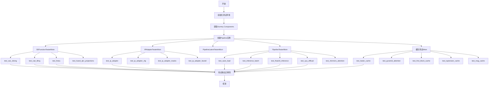

## 类结构

```
SDFunctionTesterMixin (测试VAE功能)
├── test_vae_slicing
├── test_vae_tiling
├── test_freeu
└── test_fused_qkv_projections
IPAdapterTesterMixin (测试IP适配器)
├── test_pipeline_signature
├── test_ip_adapter
├── test_ip_adapter_cfg
├── test_ip_adapter_masks
└── test_ip_adapter_faceid
FluxIPAdapterTesterMixin (测试Flux IP适配器)
├── test_pipeline_signature
└── test_ip_adapter
PipelineLatentTesterMixin (测试Latent)
├── test_pt_np_pil_outputs_equivalent
├── test_pt_np_pil_inputs_equivalent
├── test_latents_input
└── test_multi_vae
PipelineFromPipeTesterMixin (测试from_pipe)
├── test_from_pipe_consistent_config
└── test_from_pipe_consistent_forward_pass
PipelineKarrasSchedulerTesterMixin
└── test_karras_schedulers_shape
PipelineTesterMixin (主测试类)
├── test_save_load_local
├── test_pipeline_call_signature
├── test_inference_batch_consistent
├── test_float16_inference
├── test_attention_slicing_forward_pass
├── test_sequential_cpu_offload_forward_pass
├── test_model_cpu_offload_forward_pass
├── test_xformers_attention_forwardGenerator_pass
├── test_cfg
├── test_callback_inputs
├── test_encode_prompt_works_in_isolation
└── ... (更多测试方法)
PipelinePushToHubTester
PyramidAttentionBroadcastTesterMixin
FasterCacheTesterMixin
FirstBlockCacheTesterMixin
TaylorSeerCacheTesterMixin
MagCacheTesterMixin
```

## 全局变量及字段


### `torch_device`
    
Global variable indicating the device (e.g., 'cuda', 'cpu', 'mps') to run tests on, imported from testing_utils

类型：`str`
    


### `TOKEN`
    
HuggingFace Hub token for authentication during testing, imported from test_utils

类型：`str`
    


### `USER`
    
HuggingFace Hub username for testing, imported from test_utils

类型：`str`
    


### `is_staging_test`
    
Flag indicating whether tests are running in staging environment, imported from test_utils

类型：`bool`
    


### `PipelineLatentTesterMixin.image_params`
    
Property defining which image parameters (e.g., 'pt', 'pil', 'np') should be tested for equivalent outputs

类型：`frozenset`
    


### `PipelineLatentTesterMixin.image_latents_params`
    
Property defining which image latent parameters should be tested for direct latent input equivalence

类型：`frozenset`
    


### `PipelineFromPipeTesterMixin.original_pipeline_class`
    
Property returning the original pipeline class (StableDiffusionPipeline, StableDiffusionXLPipeline, or KolorsPipeline) based on the current pipeline class name

类型：`type`
    


### `PipelineTesterMixin.required_optional_params`
    
Frozenset of canonical optional parameters passed to __call__ regardless of pipeline type (num_inference_steps, num_images_per_prompt, generator, latents, output_type, return_dict)

类型：`frozenset`
    


### `PipelineTesterMixin.test_attention_slicing`
    
Flag indicating whether the pipeline supports attention slicing optimization; defaults to True

类型：`bool`
    


### `PipelineTesterMixin.test_xformers_attention`
    
Flag indicating whether xformers memory efficient attention should be tested; defaults to True

类型：`bool`
    


### `PipelineTesterMixin.test_layerwise_casting`
    
Flag indicating whether layerwise dtype casting should be tested; defaults to False

类型：`bool`
    


### `PipelineTesterMixin.test_group_offloading`
    
Flag indicating whether group offloading should be tested; defaults to False

类型：`bool`
    


### `PipelineTesterMixin.supports_dduf`
    
Flag indicating whether the pipeline supports DDUF (Diffusers Dedicated Upload Format) serialization; defaults to True

类型：`bool`
    


### `PipelineTesterMixin.pipeline_class`
    
Property returning the pipeline class being tested; must be set in child test class

类型：`Callable | DiffusionPipeline`
    


### `PipelineTesterMixin.params`
    
Property defining required parameters that must be present in the pipeline's __call__ signature

类型：`frozenset`
    


### `PipelineTesterMixin.batch_params`
    
Property defining parameters that should be batched when passed to the pipeline's __call__ method

类型：`frozenset`
    


### `PipelineTesterMixin.callback_cfg_params`
    
Property defining parameters that need special handling when passed to callback functions during classifier-free guidance

类型：`frozenset`
    


### `PipelinePushToHubTester.identifier`
    
Unique identifier (UUID) for the test pipeline repository

类型：`uuid.UUID`
    


### `PipelinePushToHubTester.repo_id`
    
Repository ID for the test pipeline (format: 'test-pipeline-{identifier}')

类型：`str`
    


### `PipelinePushToHubTester.org_repo_id`
    
Organization repository ID for testing (format: 'valid_org/{repo_id}-org')

类型：`str`
    


### `PyramidAttentionBroadcastTesterMixin.pab_config`
    
Configuration for pyramid attention broadcast cache testing

类型：`PyramidAttentionBroadcastConfig`
    


### `FasterCacheTesterMixin.faster_cache_config`
    
Configuration for faster cache testing with spatial/temporal attention block skip ranges

类型：`FasterCacheConfig`
    


### `FirstBlockCacheTesterMixin.first_block_cache_config`
    
Configuration for first block cache testing with threshold set to 0.8

类型：`FirstBlockCacheConfig`
    


### `TaylorSeerCacheTesterMixin.taylorseer_cache_config`
    
Configuration for TaylorSeer cache testing with cache_interval=5, max_order=1, and lite mode enabled

类型：`TaylorSeerCacheConfig`
    


### `MagCacheTesterMixin.mag_cache_config`
    
Configuration for MagCache testing with threshold=0.06, max_skip_steps=3, and retention_ratio=0.2

类型：`MagCacheConfig`
    
    

## 全局函数及方法


### `to_np`

该函数用于将PyTorch张量（torch.Tensor）转换为NumPy数组。如果输入是torch.Tensor类型，则先将其从计算图中分离（detach），然后移到CPU，最后转换为NumPy数组；如果输入不是张量，则直接返回原值。这是一个在diffusers测试框架中广泛使用的工具函数，用于统一不同类型的输出格式以便进行比较。

参数：

- `tensor`：`Any`，输入的张量或任意数据类型的对象。如果该对象是`torch.Tensor`类型，则会执行转换为NumPy数组的操作；否则直接返回原对象。

返回值：`Union[numpy.ndarray, Any]`，返回转换后的NumPy数组（当输入为torch.Tensor时），或者返回原始输入对象（当输入不是张量时）。

#### 流程图

```mermaid
flowchart TD
    A[开始: 输入tensor] --> B{isinstance(tensor, torch.Tensor)?}
    B -- 是 --> C[tensor.detach]
    C --> D[tensor.cpu]
    D --> E[tensor.numpy]
    E --> F[返回NumPy数组]
    B -- 否 --> G[返回原始tensor]
    F --> H[结束]
    G --> H
```

#### 带注释源码

```python
def to_np(tensor):
    """
    将PyTorch张量转换为NumPy数组的辅助函数。
    
    参数:
        tensor: 任意类型的输入，如果是torch.Tensor则转换为NumPy数组，
              否则直接返回原值。
    """
    # 检查输入是否为PyTorch张量类型
    if isinstance(tensor, torch.Tensor):
        # 1. detach(): 从当前计算图中分离张量，避免梯度跟踪
        # 2. cpu(): 将张量从GPU移至CPU（如果是GPU张量）
        # 3. numpy(): 将张量转换为NumPy数组
        tensor = tensor.detach().cpu().numpy()

    # 返回转换后的NumPy数组或原始输入（非张量情况）
    return tensor
```


### `check_same_shape`

该函数用于检查给定张量列表中的所有张量是否具有相同的形状。它通过提取所有张量的形状并与第一个形状进行比较来验证一致性，常用于测试或验证数据批处理时的形状一致性。

参数：

- `tensor_list`：`List[torch.Tensor]`，需要检查形状一致性的张量列表

返回值：`bool`，如果所有张量的形状相同则返回 `True`，否则返回 `False`

#### 流程图

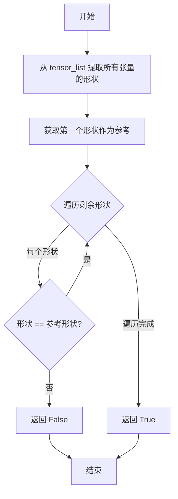

#### 带注释源码

```python
def check_same_shape(tensor_list):
    """
    检查所有张量是否具有相同的形状。
    
    参数:
        tensor_list: 包含多个 torch.Tensor 的列表
        
    返回:
        bool: 如果所有张量形状相同返回 True，否则返回 False
    """
    # 1. 提取列表中所有张量的形状，生成形状列表
    shapes = [tensor.shape for tensor in tensor_list]
    
    # 2. 使用 all() 检查所有形状是否与第一个形状相同
    #    从 shapes[1:] 开始遍历，与 shapes[0] 比较
    #    如果所有形状都相同，返回 True；否则返回 False
    return all(shape == shapes[0] for shape in shapes[1:])
```


### `check_qkv_fusion_matches_attn_procs_length`

该函数用于验证在融合QKV投影后，模型的注意力处理器数量是否与融合前保持一致。这是确保QKV融合操作正确性的一个关键检查函数，通常在测试`fuse_qkv_projections`功能时使用。

参数：

- `model`：`torch.nn.Module`，需要检查的模型对象，该对象应具有`attn_processors`属性
- `original_attn_processors`：`Dict`，融合前的原始注意力处理器字典

返回值：`bool`，返回`True`表示当前注意力处理器数量与原始数量相等，返回`False`表示数量发生变化

#### 流程图

```mermaid
flowchart TD
    A[开始] --> B[获取模型的当前注意力处理器]
    B --> C[current_attn_processors = model.attn_processors]
    C --> D[比较长度是否相等]
    D --> E{len(current_attn_processors) == len(original_attn_processors)?}
    E -->|True| F[返回 True]
    E -->|False| G[返回 False]
    F --> H[结束]
    G --> H
```

#### 带注释源码

```python
def check_qkv_fusion_matches_attn_procs_length(model, original_attn_processors):
    """
    检查QKV融合后模型的注意力处理器数量是否与融合前一致
    
    该函数用于验证fuse_qkv_projections操作没有意外地改变
    注意力处理器的数量，这是确保融合操作正确性的重要检查。
    
    参数:
        model: 带有attn_processors属性的PyTorch模块（如UNet、Transformer等）
        original_attn_processors: 融合前的原始注意力处理器字典
    
    返回:
        bool: 当前处理器数量与原始数量相等返回True，否则返回False
    """
    # 从模型中获取当前的注意力处理器
    # 在QKV融合后，attn_processors应该被替换为融合版本的处理器
    current_attn_processors = model.attn_processors
    
    # 比较融合前后的处理器数量
    # 如果数量不一致，说明融合过程可能存在问题
    return len(current_attn_processors) == len(original_attn_processors)
```


### `check_qkv_fusion_processors_exist`

该函数用于检查给定的模型是否已将所有注意力处理器融合为融合版本（Fused Processor）。它通过获取模型的 `attn_processors`，提取每个处理器的类名，并判断所有类名是否都以 "Fused" 开头来确认融合状态。通常在 QKV 投影融合（`fuse_qkv_projections`）操作后被调用，以验证融合是否成功应用。

参数：

- `model`：需要检查的模型对象，应具有 `attn_processors` 属性，通常是 `nn.Module` 的子类（如 UNet、Transformer 等）

返回值：`bool`，如果所有注意力处理器的类名都以 "Fused" 开头则返回 `True`，否则返回 `False`

#### 流程图

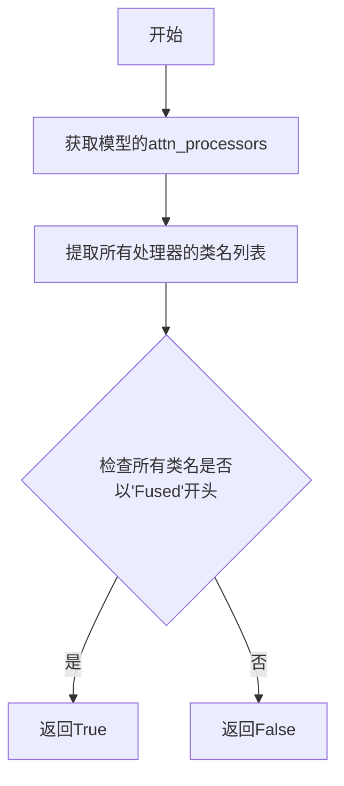

#### 带注释源码

```python
def check_qkv_fusion_processors_exist(model):
    """
    检查模型的注意力处理器是否都已融合为Fused版本
    
    参数:
        model: 具有attn_processors属性的模型对象
        
    返回:
        bool: 所有注意力处理器是否都是Fused类型
    """
    # 获取模型当前的注意力处理器字典
    # attn_processors 是一个字典，键为处理器名称，值为处理器实例
    current_attn_processors = model.attn_processors
    
    # 提取所有处理器的类名，创建一个列表
    # 例如: ['AttnProcessor', 'AttnProcessor'] 或 ['FusedAttnProcessor', 'FusedAttnProcessor']
    proc_names = [v.__class__.__name__ for _, v in current_attn_processors.items()]
    
    # 判断所有处理器类名是否都以"Fused"开头
    # 如果是，说明QKV融合已成功应用
    return all(p.startswith("Fused") for p in proc_names)
```


### `check_qkv_fused_layers_exist`

该函数用于检查模型中所有支持 QKV 融合的注意力模块（AttentionModuleMixin）是否已完成融合操作。它通过遍历模型的子模块，检查每个支持 QKV 融合的模块是否设置了 `fused_projections` 属性，并且指定的层名称对应的属性是否都已存在（非 None）。最终返回一个布尔值，表示所有支持 QKV 融合的模块是否都已完成融合。

参数：

- `model`：`torch.nn.Module`，要检查的模型对象
- `layer_names`：`List[str]`，需要检查的层名称列表，例如 `["q_proj", "k_proj", "v_proj"]`

返回值：`bool`，如果所有支持 QKV 融合的子模块都已完成融合则返回 `True`，否则返回 `False`

#### 流程图

```mermaid
flowchart TD
    A[开始 check_qkv_fused_layers_exist] --> B[初始化空列表 is_fused_submodules]
    B --> C[遍历 model.modules 中的所有子模块]
    C --> D{子模块是否为 AttentionModuleMixin}
    D -->|否| C
    D -->|是| E{子模块是否支持 QKV 融合}
    E -->|否| C
    E -->|是| F[获取 fused_projections 属性值]
    F --> G[初始化 is_fused_layer = True]
    G --> H{遍历 layer_names 中的每个层名}
    H --> I{getattr 返回值是否为 None}
    I -->|是| J[设置 is_fused_layer = False]
    J --> H
    I -->|否| H
    H --> K{所有层检查完毕}
    K --> L[计算 is_fused = is_fused_attribute_set AND is_fused_layer]
    L --> M[将 is_fused 添加到 is_fused_submodules]
    M --> C
    C --> N{所有子模块遍历完毕}
    N --> O[返回 all(is_fused_submodules)]
    O --> P[结束]
```

#### 带注释源码

```python
def check_qkv_fused_layers_exist(model, layer_names):
    """
    检查模型中所有支持 QKV 融合的注意力模块是否已完成融合。
    
    Args:
        model: 要检查的模型（通常是 UNet 或 Transformer）
        layer_names: 需要检查的层名称列表，如 ["q_proj", "k_proj", "v_proj"]
    
    Returns:
        bool: 如果所有支持 QKV 融合的模块都已完成融合返回 True，否则返回 False
    """
    # 用于记录每个子模块是否完成融合
    is_fused_submodules = []
    
    # 遍历模型中的所有子模块
    for submodule in model.modules():
        # 检查子模块是否为注意力模块混合类且支持 QKV 融合
        # AttentionModuleMixin 是 diffusers 中定义的混合类，用于标识支持 QKV 融合的模块
        if not isinstance(submodule, AttentionModuleMixin) or not submodule._supports_qkv_fusion:
            continue  # 跳过不支持 QKV 融合的模块
        
        # 获取 fused_projections 属性，表示投影层是否已融合
        is_fused_attribute_set = submodule.fused_projections
        
        # 初始化标记，假设所有层都已融合
        is_fused_layer = True
        
        # 检查指定的层名称对应的属性是否都存在（非 None）
        for layer in layer_names:
            # 使用 getattr 获取属性值，如果不存在则返回 None
            # 只有当所有层都不为 None 时，才认为该模块已完成融合
            is_fused_layer = is_fused_layer and getattr(submodule, layer, None) is not None
        
        # 只有同时满足 fused_projections 属性已设置 AND 所有指定层都存在时，才认为该模块已融合
        is_fused = is_fused_attribute_set and is_fused_layer
        
        # 记录该子模块的融合状态
        is_fused_submodules.append(is_fused)
    
    # 返回是否所有支持 QKV 融合的子模块都已完成融合
    return all(is_fused_submodules)
```


### `assert_mean_pixel_difference`

该函数是一个全局辅助函数，用于比较两个图像的平均像素差异是否在可接受的范围内。它常用于测试管道输出图像的质量，确保输出图像与参考图像之间的平均像素差异不超过指定阈值。

参数：

- `image`：numpy.ndarray 或 PIL.Image.Image，需要测试的图像
- `expected_image`：numpy.ndarray 或 PIL.Image.Image，期望的参考图像
- `expected_max_diff`：float，默认值为 10.0，允许的最大平均像素差异

返回值：`None`，该函数通过 assert 语句进行验证，如果差异超过阈值则抛出 AssertionError

#### 流程图

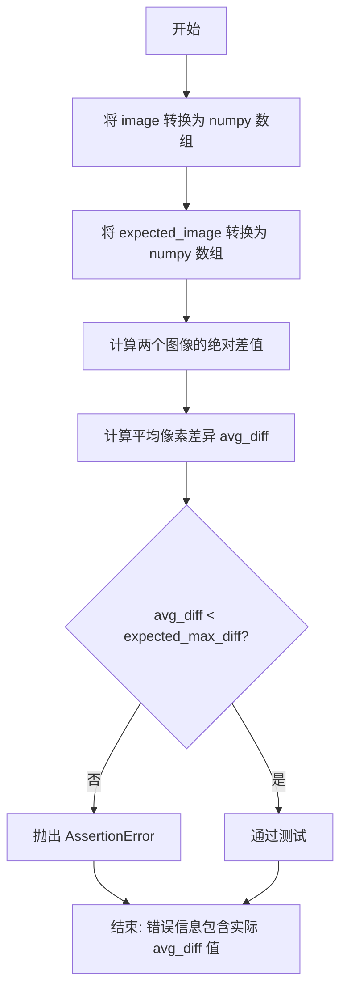

#### 带注释源码

```python
def assert_mean_pixel_difference(image, expected_image, expected_max_diff=10):
    """
    检查测试图像与期望图像之间的平均像素差异是否在可接受范围内。
    
    参数:
        image: 需要测试的图像，支持 numpy.ndarray 或 PIL.Image.Image 格式
        expected_image: 期望的参考图像，支持 numpy.ndarray 或 PIL.Image.Image 格式
        expected_max_diff: 允许的最大平均像素差异，默认值为 10
    """
    # 将输入图像转换为 numpy 数组（float32 类型）
    image = np.asarray(DiffusionPipeline.numpy_to_pil(image)[0], dtype=np.float32)
    
    # 将期望图像转换为 numpy 数组（float32 类型）
    expected_image = np.asarray(DiffusionPipeline.numpy_to_pil(expected_image)[0], dtype=np.float32)
    
    # 计算两个图像之间的绝对差值，然后求平均值
    avg_diff = np.abs(image - expected_image).mean()
    
    # 使用 assert 验证平均差异是否在允许范围内
    # 如果超过阈值，抛出 AssertionError 并显示实际差异值
    assert avg_diff < expected_max_diff, f"Error image deviates {avg_diff} pixels on average"
```


### SDFunctionTesterMixin.test_vae_slicing

该方法用于测试VAE切片(VAE Slicing)功能，验证在启用VAE切片后，批量图像解码的结果应与未启用切片时的结果保持一致（误差在允许范围内），以确保VAE切片优化不会影响输出质量。

参数：

- `self`：隐式参数，`SDFunctionTesterMixin`类的实例，表示测试方法本身
- `image_count`：`int`，批量处理的图像数量，默认为4

返回值：`None`，该方法为测试用例，通过断言验证结果，无显式返回值

#### 流程图

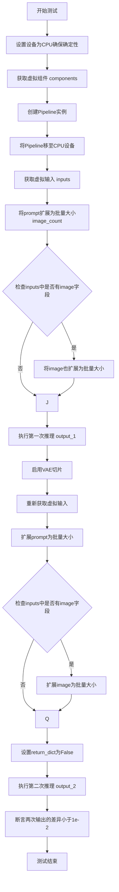

#### 带注释源码

```python
def test_vae_slicing(self, image_count=4):
    """
    测试VAE切片功能，确保启用VAE切片后解码结果与未启用时一致
    
    参数:
        image_count: 批量处理的图像数量，默认值为4
    """
    # 设置设备为CPU以确保设备依赖的torch.Generator的确定性
    device = "cpu"  # ensure determinism for the device-dependent torch.Generator
    
    # 获取测试用的虚拟组件
    components = self.get_dummy_components()
    # 注释掉的代码：可以自定义调度器
    # components["scheduler"] = LMSDiscreteScheduler.from_config(components["scheduler"].config)
    
    # 使用虚拟组件创建Pipeline
    pipe = self.pipeline_class(**components)
    
    # 将Pipeline移至指定设备(CPU)
    pipe = pipe.to(device)
    
    # 配置进度条（disable=None表示启用进度条）
    pipe.set_progress_bar_config(disable=None)

    # 获取虚拟输入
    inputs = self.get_dummy_inputs(device)
    
    # 将prompt扩展为批量大小
    inputs["prompt"] = [inputs["prompt"]] * image_count
    
    # 如果输入中有image字段（如I2V_Gen pipeline），也扩展为批量大小
    if "image" in inputs:  # fix batch size mismatch in I2V_Gen pipeline
        inputs["image"] = [inputs["image"]] * image_count
    
    # 执行第一次推理（不启用VAE切片）
    output_1 = pipe(**inputs)

    # 启用VAE切片功能
    pipe.enable_vae_slicing()
    
    # 重新获取虚拟输入
    inputs = self.get_dummy_inputs(device)
    
    # 同样扩展prompt和image为批量大小
    inputs["prompt"] = [inputs["prompt"]] * image_count
    if "image" in inputs:
        inputs["image"] = [inputs["image"]] * image_count
    
    # 设置return_dict为False以使用元组形式返回
    inputs["return_dict"] = False
    
    # 执行第二次推理（启用VAE切片）
    output_2 = pipe(**inputs)

    # 断言：比较两次输出的差异，确保差异小于阈值1e-2
    # 验证VAE切片不会影响输出质量
    assert np.abs(output_2[0].flatten() - output_1[0].flatten()).max() < 1e-2
```


### `SDFunctionTesterMixin.test_vae_tiling`

该方法用于测试变分自编码器（VAE）的平铺解码（Tiling Decod）功能是否正常工作。它通过比较启用平铺与未启用平铺的VAE解码结果，验证平铺解码在512x512分辨率下能产生相同的结果，并测试平铺解码在不同形状输入下的兼容性。

参数： 无显式参数（该方法为类方法，使用 `self` 访问测试类的属性）

返回值： `None`，该方法为测试方法，通过 `assert` 语句进行断言验证，不返回任何值

#### 流程图

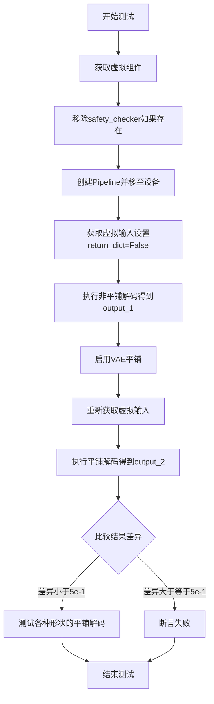

#### 带注释源码

```python
def test_vae_tiling(self):
    """
    测试 VAE 平铺解码功能。
    
    该测试方法验证：
    1. 启用平铺后的 VAE 解码结果应与未启用时相近（容差 5e-1）
    2. 平铺解码能够处理不同形状的输入
    """
    # 获取测试所需的虚拟组件
    components = self.get_dummy_components()

    # 如果存在 safety_checker，将其设为 None（确保测试环境干净）
    if "safety_checker" in components:
        components["safety_checker"] = None
    
    # 使用虚拟组件创建 Pipeline
    pipe = self.pipeline_class(**components)
    # 将 Pipeline 移至测试设备（由 torch_device 指定）
    pipe = pipe.to(torch_device)
    # 配置进度条（disable=None 表示启用进度条）
    pipe.set_progress_bar_config(disable=None)

    # 获取虚拟输入参数
    inputs = self.get_dummy_inputs(torch_device)
    # 设置 return_dict=False 以返回元组而非字典
    inputs["return_dict"] = False

    # 测试 1：512x512 分辨率下的非平铺解码
    output_1 = pipe(**inputs)[0]

    # 启用 VAE 平铺功能
    pipe.enable_vae_tiling()
    # 重新获取虚拟输入（确保输入独立）
    inputs = self.get_dummy_inputs(torch_device)
    inputs["return_dict"] = False
    # 执行平铺解码
    output_2 = pipe(**inputs)[0]

    # 断言：平铺解码与非平铺解码的结果差异应小于 5e-1
    assert np.abs(to_np(output_2) - to_np(output_1)).max() < 5e-1

    # 测试 2：验证平铺解码支持不同形状的输入
    shapes = [(1, 4, 73, 97), (1, 4, 65, 49)]
    with torch.no_grad():
        for shape in shapes:
            # 创建指定形状的零张量
            zeros = torch.zeros(shape).to(torch_device)
            # 使用 VAE 解码器处理（测试平铺是否能处理各种形状）
            pipe.vae.decode(zeros)
```


### `SDFunctionTesterMixin.test_freeu`

该方法用于测试 Stable Diffusion 管道中的 FreeU（FreeU 是一种无需训练的去噪加速技术，通过修改 UNet 上采样块的特征来加速推理）功能的启用、禁用以及正确性验证。测试会对比正常推理、启用 FreeU、禁用 FreeU 三种状态下的输出，确保 FreeU 能在不影响基准性能的前提下产生预期的去噪效果差异。

参数： 该方法为实例方法，隐式接收 `self` 参数，无显式参数列表。

返回值： 无显式返回值（`None`），该方法为单元测试方法，通过 `assert` 语句进行断言验证。

#### 流程图

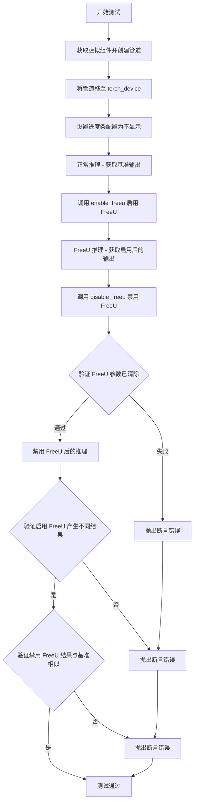

#### 带注释源码

```python
# MPS 当前不支持 ComplexFloats，而 FreeU 需要 ComplexFloats，因此跳过 MPS 设备测试
# 参见 https://github.com/huggingface/diffusers/issues/7569
@skip_mps
def test_freeu(self):
    """
    测试 FreeU 功能的启用、禁用和正确性。
    
    测试流程：
    1. 执行正常推理作为基准
    2. 启用 FreeU 并执行推理，验证输出与基准不同
    3. 禁用 FreeU 并验证相关参数已清除
    4. 禁用后执行推理，验证输出与基准相似
    """
    # Step 1: 获取虚拟组件并创建管道实例
    components = self.get_dummy_components()
    pipe = self.pipeline_class(**components)
    
    # Step 2: 将管道移至测试设备（CPU 或 CUDA）
    pipe = pipe.to(torch_device)
    
    # Step 3: 配置进度条（disable=None 表示不禁用进度条）
    pipe.set_progress_bar_config(disable=None)

    # ========== 正常推理（基准） ==========
    # 获取虚拟输入
    inputs = self.get_dummy_inputs(torch_device)
    # 设置不返回字典，返回元组
    inputs["return_dict"] = False
    # 设置输出类型为 numpy 数组
    inputs["output_type"] = "np"
    # 执行推理并获取输出（索引 [0] 获取图像张量）
    output = pipe(**inputs)[0]

    # ========== FreeU 启用推理 ==========
    # 启用 FreeU，传入缩放参数 s1, s2, b1, b2
    # s1, s2: 跳过层特征的缩放因子
    # b1, b2: 上采样块特征的缩放因子
    pipe.enable_freeu(s1=0.9, s2=0.2, b1=1.2, b2=1.4)
    
    # 重新获取虚拟输入（确保输入独立）
    inputs = self.get_dummy_inputs(torch_device)
    inputs["return_dict"] = False
    inputs["output_type"] = "np"
    # 执行启用 FreeU 后的推理
    output_freeu = pipe(**inputs)[0]

    # ========== FreeU 禁用推理 ==========
    # 禁用 FreeU 功能
    pipe.disable_freeu()
    
    # 定义 FreeU 相关的参数键名
    freeu_keys = {"s1", "s2", "b1", "b2"}
    
    # 验证禁用后 UNet 上采样块的 FreeU 参数已被清除为 None
    for upsample_block in pipe.unet.up_blocks:
        for key in freeu_keys:
            assert getattr(upsample_block, key) is None, f"Disabling of FreeU should have set {key} to None."

    # 执行禁用 FreeU 后的推理
    inputs = self.get_dummy_inputs(torch_device)
    inputs["return_dict"] = False
    inputs["output_type"] = "np"
    output_no_freeu = pipe(**inputs)[0]

    # ========== 断言验证 ==========
    # 验证 1: 启用 FreeU 应该产生与基准不同的结果
    # 比较输出图像右下角 3x3 像素区域（最后一个通道）
    assert not np.allclose(output[0, -3:, -3:, -1], output_freeu[0, -3:, -3:, -1]), (
        "Enabling of FreeU should lead to different results."
    )
    
    # 验证 2: 禁用 FreeU 后应该产生与基准相似的结果
    # 允许的最大绝对误差为 1e-2
    assert np.allclose(output, output_no_freeu, atol=1e-2), (
        f"Disabling of FreeU should lead to results similar to the default pipeline results but Max Abs Error={np.abs(output_no_freeu - output).max()}."
    )
```


### `SDFunctionTesterMixin.test_fused_qkv_projections`

该测试方法用于验证扩散管道中QKV（Query-Key-Value）投影融合功能是否正常工作。它通过融合QKV投影进行推理，然后解除融合，再次推理，并使用断言验证三种情况下的输出应该保持一致（允许一定的数值误差），以确保融合/解融操作不会影响最终的生成结果。

参数：

- 该方法无显式参数（隐式参数 `self` 为测试类实例）

返回值：`None`（无返回值，该方法通过断言进行测试验证）

#### 流程图

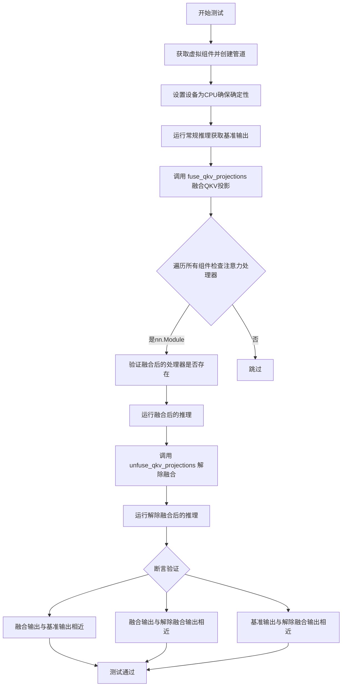

#### 带注释源码

```python
def test_fused_qkv_projections(self):
    """
    测试融合QKV投影功能。
    
    该测试验证以下场景：
    1. 常规推理（基准）
    2. 融合QKV投影后的推理
    3. 解除融合QKV投影后的推理
    
    验证这三种情况的输出应该一致（允许数值误差），
    以确保融合/解融操作不会影响生成质量。
    """
    # 使用CPU设备以确保随机数生成的确定性
    device = "cpu"
    
    # 获取测试用的虚拟组件
    components = self.get_dummy_components()
    
    # 创建扩散管道实例
    pipe = self.pipeline_class(**components)
    
    # 将管道移动到指定设备
    pipe = pipe.to(device)
    
    # 配置进度条（disable=None 表示启用进度条）
    pipe.set_progress_bar_config(disable=None)
    
    # 获取虚拟输入数据
    inputs = self.get_dummy_inputs(device)
    
    # 设置返回格式为非字典（返回元组）
    inputs["return_dict"] = False
    
    # 执行第一次推理（常规/基准推理）
    image = pipe(**inputs)[0]
    
    # 提取输出图像的一个切片用于后续比较
    # 取最后3x3像素区域，用于快速验证
    original_image_slice = image[0, -3:, -3:, -1]
    
    # 调用管道方法融合QKV投影
    # 这会将注意力处理器替换为融合版本
    pipe.fuse_qkv_projections()
    
    # 遍历管道的所有组件
    for _, component in pipe.components.items():
        # 检查组件是否为nn.Module且支持QKV融合
        if (
            isinstance(component, nn.Module)
            and hasattr(component, "original_attn_processors")
            and component.original_attn_processors is not None
        ):
            # 验证融合后的注意力处理器是否都存在
            assert check_qkv_fusion_processors_exist(component), (
                "Something wrong with the fused attention processors. "
                "Expected all the attention processors to be fused."
            )
            
            # 验证融合后的处理器数量与原始数量一致
            assert check_qkv_fusion_matches_attn_procs_length(
                component, component.original_attn_procs
            ), (
                "Something wrong with the attention processors concerning "
                "the fused QKV projections."
            )
    
    # 使用融合后的QKV投影进行推理
    inputs = self.get_dummy_inputs(device)
    inputs["return_dict"] = False
    image_fused = pipe(**inputs)[0]
    image_slice_fused = image_fused[0, -3:, -3:, -1]
    
    # 解除QKV投影融合
    pipe.unfuse_qkv_projections()
    
    # 再次运行推理（使用解除融合的配置）
    inputs = self.get_dummy_inputs(device)
    inputs["return_dict"] = False
    image_disabled = pipe(**inputs)[0]
    image_slice_disabled = image_disabled[0, -3:, -3:, -1]
    
    # 断言：融合后的输出应与基准输出相近
    # 允许相对误差rtol=1e-2和绝对误差atol=1e-2
    assert np.allclose(original_image_slice, image_slice_fused, atol=1e-2, rtol=1e-2), (
        "Fusion of QKV projections shouldn't affect the outputs."
    )
    
    # 断言：融合输出与解除融合输出应相近
    assert np.allclose(image_slice_fused, image_slice_disabled, atol=1e-2, rtol=1e-2), (
        "Outputs, with QKV projection fusion enabled, shouldn't change when "
        "fused QKV projections are disabled."
    )
    
    # 断言：基准输出与解除融合输出应相近
    assert np.allclose(original_image_slice, image_slice_disabled, atol=1e-2, rtol=1e-2), (
        "Original outputs should match when fused QKV projections are disabled."
    )
```


### `IPAdapterTesterMixin.test_pipeline_signature`

该测试方法用于验证支持 IP Adapter 的管道类在其 `__call__` 方法中是否正确包含了 `ip_adapter_image` 和 `ip_adapter_image_embeds` 这两个关键参数，确保管道能够接收图像和图像嵌入作为 IP Adapter 的输入。

参数：

- `self`：测试类的实例（隐式参数），用于访问 `pipeline_class` 属性

返回值：`None`，该方法为测试方法，通过断言进行验证，不返回任何值

#### 流程图

```mermaid
flowchart TD
    A[开始] --> B[获取 pipeline_class.__call__ 方法的签名参数]
    B --> C{检查 pipeline_class 是否继承自 IPAdapterMixin}
    C -->|是 --> D{检查 'ip_adapter_image' 是否在参数中}
    C -->|否 --> E[抛出 AssertionError]
    D -->|是 --> F{检查 'ip_adapter_image_embeds' 是否在参数中}
    D -->|否 --> G[抛出 AssertionError: 'ip_adapter_image' 参数必须被支持]
    F -->|是 --> H[测试通过]
    F -->|否 --> I[抛出 AssertionError: 'ip_adapter_image_embeds' 参数必须被支持]
```

#### 带注释源码

```python
def test_pipeline_signature(self):
    """
    测试管道的 __call__ 方法签名是否包含 IP Adapter 所需的参数。
    
    该测试方法验证实现 IPAdapterMixin 的管道类是否在其 __call__ 方法中
    正确支持 'ip_adapter_image' 和 'ip_adapter_image_embeds' 参数。
    这是 IP Adapter 功能正常工作的前提条件。
    """
    # 使用 inspect 模块获取管道类 __call__ 方法的签名参数
    parameters = inspect.signature(self.pipeline_class.__call__).parameters

    # 首先断言管道类必须继承自 IPAdapterMixin
    # 这是确保该管道支持 IP Adapter 功能的基础
    assert issubclass(self.pipeline_class, IPAdapterMixin)
    
    # 检查 __call__ 方法是否包含 ip_adapter_image 参数
    # 该参数用于传递 IP Adapter 的输入图像
    self.assertIn(
        "ip_adapter_image",
        parameters,
        "`ip_adapter_image` argument must be supported by the `__call__` method",
    )
    
    # 检查 __call__ 方法是否包含 ip_adapter_image_embeds 参数
    # 该参数用于传递预计算的 IP Adapter 图像嵌入
    self.assertIn(
        "ip_adapter_image_embeds",
        parameters,
        "`ip_adapter_image_embeds` argument must be supported by the `__call__` method",
    )
```


### `IPAdapterTesterMixin._get_dummy_image_embeds`

该方法用于生成虚拟的图像嵌入向量（image embeddings），主要供 IP-Adapter 相关测试使用。它创建一个形状为 (2, 1, cross_attention_dim) 的随机张量，作为测试中模拟图像嵌入的输入。

参数：

- `cross_attention_dim`：`int`，交叉注意力维度，默认为 32。用于指定生成的图像嵌入向量的维度大小。

返回值：`torch.Tensor`，形状为 (2, 1, cross_attention_dim) 的随机张量，表示模拟的图像嵌入向量。

#### 流程图

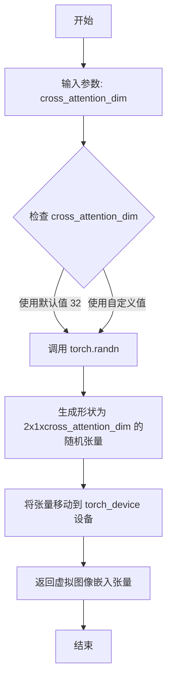

#### 带注释源码

```python
def _get_dummy_image_embeds(self, cross_attention_dim: int = 32):
    """
    生成虚拟的图像嵌入向量用于 IP-Adapter 测试。
    
    该方法创建一个形状为 (2, 1, cross_attention_dim) 的随机张量，
    模拟真实场景中的图像嵌入输入。在测试 IP-Adapter 功能时，
    用于验证 pipeline 是否正确处理 ip_adapter_image_embeds 参数。
    
    参数:
        cross_attention_dim: int, 交叉注意力维度, 默认为 32。
                            决定了生成嵌入向量的特征维度。
    
    返回:
        torch.Tensor: 形状为 (2, 1, cross_attention_dim) 的随机张量,
                     包含模拟的图像嵌入向量, 位于 torch_device 设备上。
    """
    # 使用 torch.randn 生成标准正态分布的随机张量
    # 形状 (2, 1, cross_attention_dim) 表示:
    #   - 2: batch size 或样本数量
    #   - 1: 图像数量
    #   - cross_attention_dim: 嵌入向量维度
    return torch.randn((2, 1, cross_attention_dim), device=torch_device)
```


### `IPAdapterTesterMixin._get_dummy_faceid_image_embeds`

生成虚拟的 FaceID 图像嵌入张量，用于 IP Adapter 测试场景。该方法创建一个形状为 (2, 1, 1, cross_attention_dim) 的随机张量，模拟 FaceID 类型的图像嵌入输入。

参数：

- `self`：`IPAdapterTesterMixin` 的实例对象，隐式参数
- `cross_attention_dim`：`int`，跨注意力维度参数，默认为 32，用于指定生成嵌入向量的特征维度

返回值：`torch.Tensor`，形状为 (2, 1, 1, cross_attention_dim) 的四维随机张量，表示虚拟的 FaceID 图像嵌入

#### 流程图

```mermaid
flowchart TD
    A[开始] --> B[接收 cross_attention_dim 参数<br/>默认值=32]
    B --> C{生成随机张量}
    C --> D[使用 torch.randn<br/>形状: (2, 1, 1, cross_attention_dim)<br/>设备: torch_device]
    D --> E[返回 Tensor]
    E --> F[结束]
```

#### 带注释源码

```python
def _get_dummy_faceid_image_embeds(self, cross_attention_dim: int = 32):
    """
    生成虚拟的 FaceID 图像嵌入张量，用于 IP Adapter 测试。
    
    该方法创建一个四维随机张量来模拟 FaceID 类型的图像嵌入输入。
    与普通的图像嵌入不同，FaceID 嵌入具有额外的维度 (2, 1, 1, cross_attention_dim)，
    其中包含额外的空间维度用于面部特征的编码。
    
    参数:
        cross_attention_dim (int): 跨注意力机制的维度，控制生成嵌入向量的特征长度。
                                   默认值为 32，适用于测试环境。
    
    返回:
        torch.Tensor: 形状为 (2, 1, 1, cross_attention_dim) 的四维随机张量。
                      - 第一个维度 (2): 批次大小
                      - 第二个维度 (1): 空间维度
                      - 第三个维度 (1): 额外的特征维度
                      - 第四个维度 (cross_attention_dim): 嵌入特征维度
    
    示例:
        >>> embeds = self._get_dummy_faceid_image_embeds(cross_attention_dim=32)
        >>> print(embeds.shape)
        torch.Size([2, 1, 1, 32])
    """
    # 使用 torch.randn 生成标准正态分布的随机张量
    # 形状 (2, 1, 1, cross_attention_dim) 对应:
    # - 2: 样本数量（支持多adapter测试）
    # - 1: 空间高度维度
    # - 1: 空间宽度维度  
    # - cross_attention_dim: 嵌入维度
    return torch.randn((2, 1, 1, cross_attention_dim), device=torch_device)
```


### `IPAdapterTesterMixin._get_dummy_masks`

该方法用于生成虚拟的 IP Adapter 掩码张量，创建一个左侧为白色（值为1）、右侧为黑色（值为0）的掩码，用于测试 IP Adapter 的掩码功能。

参数：

- `input_size`：`int`，掩码的宽度和高度，默认为 64

返回值：`torch.Tensor`，形状为 (1, 1, input_size, input_size) 的掩码张量，其中左侧一半为 1，右侧一半为 0

#### 流程图

```mermaid
flowchart TD
    A[开始 _get_dummy_masks] --> B[创建形状为 (1, 1, input_size, input_size) 的全零张量]
    B --> C[将掩码左侧一半设置为 1]
    C --> D[返回掩码张量]
    D --> E[结束]
```

#### 带注释源码

```python
def _get_dummy_masks(self, input_size: int = 64):
    """
    生成用于测试 IP Adapter 的虚拟掩码张量。
    
    创建一个形状为 (1, 1, input_size, input_size) 的掩码，
    其中左侧一半为白色（值为1），右侧一半为黑色（值为0）。
    这种掩码常用于测试图像分区或选择性注意力机制。
    
    参数:
        input_size: 掩码的空间尺寸，默认为 64
        
    返回:
        torch.Tensor: 形状为 (1, 1, input_size, input_size) 的掩码张量
    """
    # 创建一个全零张量，形状为 (batch=1, channel=1, height=input_size, width=input_size)
    _masks = torch.zeros((1, 1, input_size, input_size), device=torch_device)
    # 将左侧一半（列索引从 0 到 input_size/2）设置为 1
    _masks[0, :, :, : int(input_size / 2)] = 1
    # 返回生成的掩码张量
    return _masks
```


### `IPAdapterTesterMixin._modify_inputs_for_ip_adapter_test`

该方法用于在 IP Adapter 测试前修改输入参数，确保测试环境的一致性。它会检查管道签名中是否包含 `image` 和 `strength` 参数，如有则设置较少的推理步数以加速测试，同时统一设置输出类型为 numpy 数组并禁用字典返回格式。

参数：

- `self`：`IPAdapterTesterMixin`，类的实例，隐式参数
- `inputs`：`Dict[str, Any]`，包含管道调用所需的输入参数字典

返回值：`Dict[str, Any]`，返回修改后的输入参数字典

#### 流程图

```mermaid
flowchart TD
    A[开始] --> B[获取 pipeline_class.__call__ 方法签名]
    B --> C{检查参数中是否同时存在 'image' 和 'strength'}
    C -->|是| D[设置 inputs['num_inference_steps'] = 4]
    C -->|否| E[跳过此步骤]
    D --> F[设置 inputs['output_type'] = 'np']
    E --> F
    F --> G[设置 inputs['return_dict'] = False]
    G --> H[返回修改后的 inputs]
```

#### 带注释源码

```python
def _modify_inputs_for_ip_adapter_test(self, inputs: Dict[str, Any]):
    """
    修改输入参数以适配 IP Adapter 测试需求
    
    该方法执行以下修改:
    1. 如果管道支持 'image' 和 'strength' 参数,设置较少的推理步数(4步)以加速测试
    2. 强制设置输出类型为 numpy 数组
    3. 禁用字典返回格式,使用元组返回
    
    参数:
        inputs: 包含管道调用参数的字典
        
    返回:
        修改后的输入参数字典
    """
    # 获取管道 __call__ 方法的参数签名
    parameters = inspect.signature(self.pipeline_class.__call__).parameters
    
    # 检查管道是否支持 image 和 strength 参数(如 image-to-image 管道)
    if "image" in parameters.keys() and "strength" in parameters.keys():
        # 对于支持 strength 的管道,设置较少的推理步数以加快测试速度
        inputs["num_inference_steps"] = 4

    # 统一设置输出类型为 numpy 数组,便于结果比较
    inputs["output_type"] = "np"
    
    # 禁用字典返回格式,返回元组以保持与测试预期的一致性
    inputs["return_dict"] = False
    
    # 返回修改后的输入参数
    return inputs
```


### `IPAdapterTesterMixin.test_ip_adapter`

该方法用于测试 IP-Adapter（图像提示适配器）功能，验证单IP适配器和多IP适配器在不同缩放权重下的行为是否符合预期，包括适配器权重为0时应产生与无适配器相同的输出，权重非0时应产生明显不同的输出。

参数：

- `expected_max_diff`：`float`，默认为 `1e-4`，表示无适配器时允许的最大差异阈值（在CPU上会调整为 `9e-4`）
- `expected_pipe_slice`：可选参数，预期输出切片，用于与参考输出进行比较

返回值：`None`，该方法为测试方法，通过断言验证行为

#### 流程图

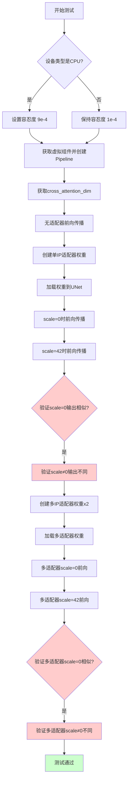

#### 带注释源码

```python
def test_ip_adapter(self, expected_max_diff: float = 1e-4, expected_pipe_slice=None):
    r"""Tests for IP-Adapter.

    The following scenarios are tested:
      - Single IP-Adapter with scale=0 should produce same output as no IP-Adapter.
      - Multi IP-Adapter with scale=0 should produce same output as no IP-Adapter.
      - Single IP-Adapter with scale!=0 should produce different output compared to no IP-Adapter.
      - Multi IP-Adapter with scale!=0 should produce different output compared to no IP-Adapter.
    """
    # CPU上的测试使用更高的容忍度，因为静态切片的比较可能不稳定
    expected_max_diff = 9e-4 if torch_device == "cpu" else expected_max_diff

    # 获取虚拟组件并初始化Pipeline
    components = self.get_dummy_components()
    pipe = self.pipeline_class(**components).to(torch_device)
    pipe.set_progress_bar_config(disable=None)
    # 从UNet配置中获取cross_attention_dim，默认为32
    cross_attention_dim = pipe.unet.config.get("cross_attention_dim", 32)

    # ========== 基准测试：无IP适配器的前向传播 ==========
    inputs = self._modify_inputs_for_ip_adapter_test(self.get_dummy_inputs(torch_device))
    if expected_pipe_slice is None:
        output_without_adapter = pipe(**inputs)[0]
    else:
        output_without_adapter = expected_pipe_slice

    # ========== 测试1：单IP适配器 ==========
    # 创建适配器状态字典并加载到UNet
    adapter_state_dict = create_ip_adapter_state_dict(pipe.unet)
    pipe.unet._load_ip_adapter_weights(adapter_state_dict)

    # 单适配器 + scale=0（应无影响）
    inputs = self._modify_inputs_for_ip_adapter_test(self.get_dummy_inputs(torch_device))
    inputs["ip_adapter_image_embeds"] = [self._get_dummy_image_embeds(cross_attention_dim)]
    pipe.set_ip_adapter_scale(0.0)
    output_without_adapter_scale = pipe(**inputs)[0]
    if expected_pipe_slice is not None:
        output_without_adapter_scale = output_without_adapter_scale[0, -3:, -3:, -1].flatten()

    # 单适配器 + scale=42（应有影响）
    inputs = self._modify_inputs_for_ip_adapter_test(self.get_dummy_inputs(torch_device))
    inputs["ip_adapter_image_embeds"] = [self._get_dummy_image_embeds(cross_attention_dim)]
    pipe.set_ip_adapter_scale(42.0)
    output_with_adapter_scale = pipe(**inputs)[0]
    if expected_pipe_slice is not None:
        output_with_adapter_scale = output_with_adapter_scale[0, -3:, -3:, -1].flatten()

    # 计算差异并断言
    max_diff_without_adapter_scale = np.abs(output_without_adapter_scale - output_without_adapter).max()
    max_diff_with_adapter_scale = np.abs(output_with_adapter_scale - output_without_adapter).max()

    # 验证scale=0时输出应与无适配器相同
    self.assertLess(
        max_diff_without_adapter_scale,
        expected_max_diff,
        "Output without ip-adapter must be same as normal inference",
    )
    # 验证scale≠0时输出应与无适配器不同
    self.assertGreater(
        max_diff_with_adapter_scale, 1e-2, "Output with ip-adapter must be different from normal inference"
    )

    # ========== 测试2：多IP适配器 ==========
    adapter_state_dict_1 = create_ip_adapter_state_dict(pipe.unet)
    adapter_state_dict_2 = create_ip_adapter_state_dict(pipe.unet)
    pipe.unet._load_ip_adapter_weights([adapter_state_dict_1, adapter_state_dict_2])

    # 多适配器 + scale=[0.0, 0.0]
    inputs = self._modify_inputs_for_ip_adapter_test(self.get_dummy_inputs(torch_device))
    inputs["ip_adapter_image_embeds"] = [self._get_dummy_image_embeds(cross_attention_dim)] * 2
    pipe.set_ip_adapter_scale([0.0, 0.0])
    output_without_multi_adapter_scale = pipe(**inputs)[0]
    if expected_pipe_slice is not None:
        output_without_multi_adapter_scale = output_without_multi_adapter_scale[0, -3:, -3:, -1].flatten()

    # 多适配器 + scale=[42.0, 42.0]
    inputs = self._modify_inputs_for_ip_adapter_test(self.get_dummy_inputs(torch_device))
    inputs["ip_adapter_image_embeds"] = [self._get_dummy_image_embeds(cross_attention_dim)] * 2
    pipe.set_ip_adapter_scale([42.0, 42.0])
    output_with_multi_adapter_scale = pipe(**inputs)[0]
    if expected_pipe_slice is not None:
        output_with_multi_adapter_scale = output_with_multi_adapter_scale[0, -3:, -3:, -1].flatten()

    max_diff_without_multi_adapter_scale = np.abs(
        output_without_multi_adapter_scale - output_without_adapter
    ).max()
    max_diff_with_multi_adapter_scale = np.abs(output_with_multi_adapter_scale - output_without_adapter).max()
    
    # 验证多适配器scale=0时输出相似
    self.assertLess(
        max_diff_without_multi_adapter_scale,
        expected_max_diff,
        "Output without multi-ip-adapter must be same as normal inference",
    )
    # 验证多适配器scale≠0时输出不同
    self.assertGreater(
        max_diff_with_multi_adapter_scale,
        1e-2,
        "Output with multi-ip-adapter scale must be different from normal inference",
    )
```


### `IPAdapterTesterMixin.test_ip_adapter_cfg`

该测试方法用于验证 IP-Adapter 与 Classifier-Free Guidance (CFG) 的兼容性，通过对比启用 CFG（guidance_scale > 1）和不启用 CFG（guidance_scale = 1.0）时管道的输出形状，确保两者兼容。

参数：

- `expected_max_diff`：`float`，可选参数，默认值为 `1e-4`，用于控制测试中的最大期望差异阈值（当前版本中未直接使用，但保留用于未来扩展）

返回值：`None`，该测试方法通过断言验证，不返回任何值

#### 流程图

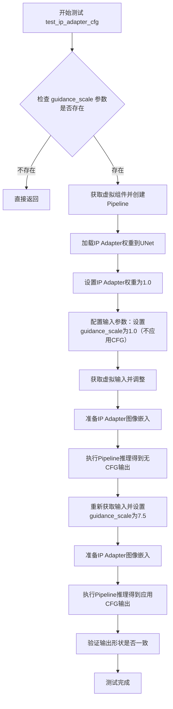

#### 带注释源码

```python
def test_ip_adapter_cfg(self, expected_max_diff: float = 1e-4):
    """
    验证 IP-Adapter 在 Classifier-Free Guidance (CFG) 场景下的兼容性。
    
    测试流程：
    1. 检查管道是否支持 guidance_scale 参数
    2. 创建虚拟管道并加载 IP Adapter 权重
    3. 分别在无 CFG (guidance_scale=1.0) 和有 CFG (guidance_scale=7.5) 情况下进行推理
    4. 验证两种情况下的输出形状一致
    
    参数:
        expected_max_diff: float类型数值，用于控制测试中的最大期望差异阈值。
                          当前实现中未直接使用，但保留用于未来扩展。
    """
    # 获取 __call__ 方法的参数签名
    parameters = inspect.signature(self.pipeline_class.__call__).parameters

    # 如果管道不支持 guidance_scale 参数，直接返回（跳过测试）
    if "guidance_scale" not in parameters:
        return

    # 获取测试用的虚拟组件
    components = self.get_dummy_components()
    # 创建管道并移至测试设备
    pipe = self.pipeline_class(**components).to(torch_device)
    pipe.set_progress_bar_config(disable=None)
    # 从 UNet 配置中获取 cross_attention_dim，若未设置则默认为 32
    cross_attention_dim = pipe.unet.config.get("cross_attention_dim", 32)

    # 创建 IP Adapter 状态字典并加载权重到 UNet
    adapter_state_dict = create_ip_adapter_state_dict(pipe.unet)
    pipe.unet._load_ip_adapter_weights(adapter_state_dict)
    # 设置 IP Adapter 的权重为 1.0
    pipe.set_ip_adapter_scale(1.0)

    # ===== 场景 1：不应用 CFG (guidance_scale = 1.0) =====
    # 获取并修改虚拟输入
    inputs = self._modify_inputs_for_ip_adapter_test(self.get_dummy_inputs(torch_device))
    # 准备 IP Adapter 图像嵌入（取第一个并增加batch维度）
    inputs["ip_adapter_image_embeds"] = [self._get_dummy_image_embeds(cross_attention_dim)[0].unsqueeze(0)]
    # 设置 guidance_scale 为 1.0（不应用 CFG）
    inputs["guidance_scale"] = 1.0
    # 执行推理
    out_no_cfg = pipe(**inputs)[0]

    # ===== 场景 2：应用 CFG (guidance_scale = 7.5) =====
    # 重新获取并修改虚拟输入
    inputs = self._modify_inputs_for_ip_adapter_test(self.get_dummy_inputs(torch_device))
    # 准备 IP Adapter 图像嵌入
    inputs["ip_adapter_image_embeds"] = [self._get_dummy_image_embeds(cross_attention_dim)]
    # 设置 guidance_scale 为 7.5（应用 CFG）
    inputs["guidance_scale"] = 7.5
    # 执行推理
    out_cfg = pipe(**inputs)[0]

    # 验证两种情况下的输出形状是否一致
    assert out_cfg.shape == out_no_cfg.shape
```


### `IPAdapterTesterMixin.test_ip_adapter_masks`

该方法用于测试 IP-Adapter 的掩码（masks）功能，验证在单 IP-Adapter 场景下，使用掩码时 scale=0 应该产生与普通推理相同的结果，而 scale!=0 应该产生与普通推理不同的结果。

参数：

- `self`：隐式参数，类型为 `IPAdapterTesterMixin`，测试类实例本身
- `expected_max_diff`：`float`，默认值 `1e-4`，允许的最大差异阈值，用于断言验证

返回值：`None`，该方法为测试方法，通过 `unittest` 断言验证行为，不返回任何值

#### 流程图

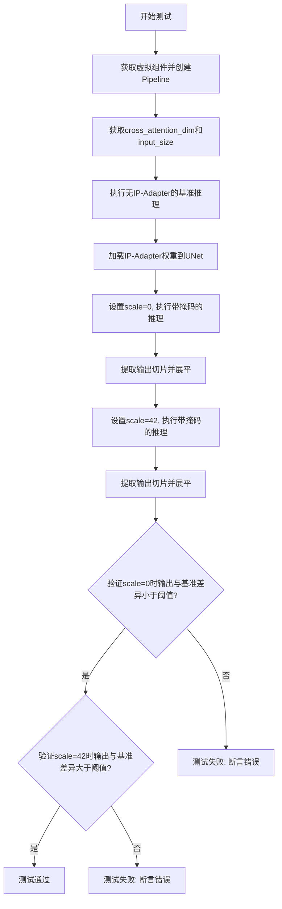

#### 带注释源码

```python
def test_ip_adapter_masks(self, expected_max_diff: float = 1e-4):
    """
    测试IP-Adapter的掩码（masks）功能。
    
    验证以下场景：
    - 单IP-Adapter + 掩码 + scale=0：应产生与普通推理相同的结果
    - 单IP-Adapter + 掩码 + scale!=0：应产生与普通推理不同的结果
    """
    
    # 获取虚拟组件并创建Pipeline实例
    components = self.get_dummy_components()
    pipe = self.pipeline_class(**components).to(torch_device)
    pipe.set_progress_bar_config(disable=None)
    
    # 从UNet和VAE配置中获取参数
    cross_attention_dim = pipe.unet.config.get("cross_attention_dim", 32)
    sample_size = pipe.unet.config.get("sample_size", 32)
    block_out_channels = pipe.vae.config.get("block_out_channels", [128, 256, 512, 512])
    # 计算输入尺寸: sample_size * 2^(层数-1)
    input_size = sample_size * (2 ** (len(block_out_channels) - 1))

    # --- 场景1: 无IP-Adapter的基准推理 ---
    inputs = self._modify_inputs_for_ip_adapter_test(self.get_dummy_inputs(torch_device))
    output_without_adapter = pipe(**inputs)[0]
    # 提取最后3x3像素区域并展平用于比较
    output_without_adapter = output_without_adapter[0, -3:, -3:, -1].flatten()

    # 加载IP-Adapter权重到UNet
    adapter_state_dict = create_ip_adapter_state_dict(pipe.unet)
    pipe.unet._load_ip_adapter_weights(adapter_state_dict)

    # --- 场景2: 单IP-Adapter + 掩码 + scale=0 ---
    inputs = self._modify_inputs_for_ip_adapter_test(self.get_dummy_inputs(torch_device))
    inputs["ip_adapter_image_embeds"] = [self._get_dummy_image_embeds(cross_attention_dim)]
    inputs["cross_attention_kwargs"] = {"ip_adapter_masks": [self._get_dummy_masks(input_size)]}
    pipe.set_ip_adapter_scale(0.0)
    output_without_adapter_scale = pipe(**inputs)[0]
    output_without_adapter_scale = output_without_adapter_scale[0, -3:, -3:, -1].flatten()

    # --- 场景3: 单IP-Adapter + 掩码 + scale=42 ---
    inputs = self._modify_inputs_for_ip_adapter_test(self.get_dummy_inputs(torch_device))
    inputs["ip_adapter_image_embeds"] = [self._get_dummy_image_embeds(cross_attention_dim)]
    inputs["cross_attention_kwargs"] = {"ip_adapter_masks": [self._get_dummy_masks(input_size)]}
    pipe.set_ip_adapter_scale(42.0)
    output_with_adapter_scale = pipe(**inputs)[0]
    output_with_adapter_scale = output_with_adapter_scale[0, -3:, -3:, -1].flatten()

    # 计算差异
    max_diff_without_adapter_scale = np.abs(output_without_adapter_scale - output_without_adapter).max()
    max_diff_with_adapter_scale = np.abs(output_with_adapter_scale - output_without_adapter).max()

    # 断言验证
    self.assertLess(
        max_diff_without_adapter_scale,
        expected_max_diff,
        "Output without ip-adapter must be same as normal inference",
    )
    self.assertGreater(
        max_diff_with_adapter_scale, 1e-3, "Output with ip-adapter must be different from normal inference"
    )
```


### `IPAdapterTesterMixin.test_ip_adapter_faceid`

该测试方法用于验证 IP-Adapter（FaceID 模式）的功能是否正常工作。测试场景包括：1) 当 IP-Adapter 权重 scale=0 时，输出应与不使用 IP-Adapter 时相同；2) 当 scale!=0 时，输出应与不使用 IP-Adapter 时不同。

参数：

- `expected_max_diff`：`float`，默认值 `1e-4`，用于断言无 IP-Adapter 时输出差异的最大允许阈值

返回值：`None`，该方法为测试方法，通过 `unittest` 断言验证功能正确性

#### 流程图

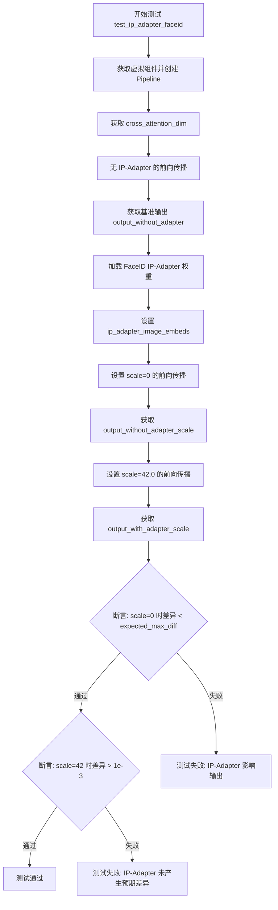

#### 带注释源码

```python
def test_ip_adapter_faceid(self, expected_max_diff: float = 1e-4):
    """
    测试 IP-Adapter FaceID 模式的功能。
    
    测试场景：
    1. 单个 IP-Adapter，scale=0 时应产生与不使用 IP-Adapter 相同的输出
    2. 单个 IP-Adapter，scale!=0 时应产生与不使用 IP-Adapter 不同的输出
    """
    # 1. 创建虚拟组件和 Pipeline
    components = self.get_dummy_components()
    pipe = self.pipeline_class(**components).to(torch_device)
    pipe.set_progress_bar_config(disable=None)
    
    # 2. 获取 cross_attention_dim 配置
    cross_attention_dim = pipe.unet.config.get("cross_attention_dim", 32)

    # 3. 不使用 IP-Adapter 的基准前向传播
    inputs = self._modify_inputs_for_ip_adapter_test(self.get_dummy_inputs(torch_device))
    output_without_adapter = pipe(**inputs)[0]
    # 提取最后 3x3 像素区域并展平用于比较
    output_without_adapter = output_without_adapter[0, -3:, -3:, -1].flatten()

    # 4. 加载 FaceID IP-Adapter 权重到 UNet
    adapter_state_dict = create_ip_adapter_faceid_state_dict(pipe.unet)
    pipe.unet._load_ip_adapter_weights(adapter_state_dict)

    # 5. 使用 scale=0 的前向传播（应无效果）
    inputs = self._modify_inputs_for_ip_adapter_test(self.get_dummy_inputs(torch_device))
    inputs["ip_adapter_image_embeds"] = [self._get_dummy_faceid_image_embeds(cross_attention_dim)]
    pipe.set_ip_adapter_scale(0.0)
    output_without_adapter_scale = pipe(**inputs)[0]
    output_without_adapter_scale = output_without_adapter_scale[0, -3:, -3:, -1].flatten()

    # 6. 使用 scale=42.0 的前向传播（应有效果）
    inputs = self._modify_inputs_for_ip_adapter_test(self.get_dummy_inputs(torch_device))
    inputs["ip_adapter_image_embeds"] = [self._get_dummy_faceid_image_embeds(cross_attention_dim)]
    pipe.set_ip_adapter_scale(42.0)
    output_with_adapter_scale = pipe(**inputs)[0]
    output_with_adapter_scale = output_with_adapter_scale[0, -3:, -3:, -1].flatten()

    # 7. 计算输出差异
    max_diff_without_adapter_scale = np.abs(output_without_adapter_scale - output_without_adapter).max()
    max_diff_with_adapter_scale = np.abs(output_with_adapter_scale - output_without_adapter).max()

    # 8. 断言验证
    self.assertLess(
        max_diff_without_adapter_scale,
        expected_max_diff,
        "Output without ip-adapter must be same as normal inference",
    )
    self.assertGreater(
        max_diff_with_adapter_scale, 1e-3, "Output with ip-adapter must be different from normal inference"
    )
```


### `FluxIPAdapterTesterMixin.test_pipeline_signature`

该方法用于验证 Flux Pipeline 是否正确实现了 IP Adapter 相关的接口参数。它通过检查 `pipeline_class.__call__` 方法的签名，确保存在 `ip_adapter_image` 和 `ip_adapter_image_embeds` 这两个关键参数，从而保证 Pipeline 支持 IP Adapter 功能。

参数：

- `self`：`unittest.TestCase` 或 `PipelineTesterMixin` 子类的实例，测试框架的隐含参数，代表当前测试对象

返回值：`None`，该方法为测试用例，不返回任何值，仅通过 `assert` 和 `self.assertIn` 抛出异常来表示测试结果

#### 流程图

```mermaid
flowchart TD
    A[开始 test_pipeline_signature] --> B[获取 pipeline_class.__call__ 方法的签名]
    B --> C{检查 pipeline_class 是否继承自 FluxIPAdapterMixin}
    C -->|是| D[断言通过]
    C -->|否| E[抛出 AssertionError]
    D --> F{参数列表中是否包含 'ip_adapter_image'}
    F -->|是| G[断言通过]
    F -->|否| H[抛出 AssertionError 并提示缺少该参数]
    G --> I{参数列表中是否包含 'ip_adapter_image_embeds'}
    I -->|是| J[断言通过]
    I -->|否| K[抛出 AssertionError 并提示缺少该参数]
    J --> L[测试通过]
    H --> L
    K --> L
```

#### 带注释源码

```python
def test_pipeline_signature(self):
    """
    验证 Flux Pipeline 是否支持 IP Adapter 所需的参数签名。
    
    该测试方法检查以下几点：
    1. 当前测试类所测试的 pipeline 是否继承了 FluxIPAdapterMixin
    2. pipeline 的 __call__ 方法是否包含 ip_adapter_image 参数
    3. pipeline 的 __call__ 方法是否包含 ip_adapter_image_embeds 参数
    
    这些参数是 Flux IP Adapter 功能实现的必要条件。
    """
    # 获取被测试 pipeline 类的 __call__ 方法的签名参数
    parameters = inspect.signature(self.pipeline_class.__call__).parameters

    # 断言：确保测试的 pipeline 继承自 FluxIPAdapterMixin
    # 这是验证该 pipeline 支持 Flux IP Adapter 功能的前提条件
    assert issubclass(self.pipeline_class, FluxIPAdapterMixin)
    
    # 断言：验证 __call__ 方法支持 ip_adapter_image 参数
    # 该参数用于传递 IP Adapter 的输入图像
    self.assertIn(
        "ip_adapter_image",
        parameters,
        "`ip_adapter_image` argument must be supported by the `__call__` method",
    )
    
    # 断言：验证 __call__ 方法支持 ip_adapter_image_embeds 参数
    # 该参数用于传递 IP Adapter 的图像嵌入向量
    self.assertIn(
        "ip_adapter_image_embeds",
        parameters,
        "`ip_adapter_image_embeds` argument must be supported by the `__call__` method",
    )
```


### `FluxIPAdapterTesterMixin._get_dummy_image_embeds`

该方法是FluxIPAdapterTesterMixin类中的一个私有辅助方法，用于生成虚拟的图像嵌入张量。在测试Flux IP-Adapter功能时，此方法为pipeline提供模拟的图像嵌入输入数据，以便验证IP-Adapter在不同缩放因子下的行为是否正确。

参数：

- `image_embed_dim`：`int`，图像嵌入向量的维度参数，默认为768

返回值：`torch.Tensor`，返回一个形状为(1, 1, image_embed_dim)的随机张量，表示在指定设备上的虚拟图像嵌入

#### 流程图

```mermaid
flowchart TD
    A[开始] --> B[接收image_embed_dim参数<br/>默认值为768]
    B --> C[调用torch.randn生成随机张量<br/>形状为1×1×image_embed_dim]
    C --> D[将张量放置在torch_device设备上]
    D --> E[返回虚拟图像嵌入张量]
    E --> F[结束]
```

#### 带注释源码

```python
def _get_dummy_image_embeds(self, image_embed_dim: int = 768):
    """
    生成用于测试IP-Adapter的虚拟图像嵌入向量。
    
    此方法在Flux IP-Adapter的测试用例中被调用，用于创建模拟的图像嵌入输入。
    这些虚拟嵌入用于验证pipeline在加载IP-Adapter权重后能否正确处理图像条件输入。
    
    参数:
        image_embed_dim (int): 图像嵌入的维度，默认为768。
                              这个默认值对应于典型Flux模型的语言模型维度。
        
    返回:
        torch.Tensor: 形状为(1, 1, image_embed_dim)的随机张量。
                     - 第一个维度1表示批次大小
                     - 第二个维度1表示图像数量
                     - 第三个维度image_embed_dim是嵌入向量的维度
                     
    示例:
        >>> # 在test_ip_adapter测试中调用
        >>> image_embed_dim = pipe.transformer.config.pooled_projection_dim
        >>> dummy_embeds = self._get_dummy_image_embeds(image_embed_dim)
        >>> inputs["ip_adapter_image_embeds"] = [dummy_embeds]
    """
    # 使用torch.randn生成指定形状的随机张量
    # 张量值为标准正态分布的随机值
    # 同时将张量放置在测试设备上（由torch_device指定，如cuda或cpu）
    return torch.randn((1, 1, image_embed_dim), device=torch_device)
```


### `FluxIPAdapterTesterMixin._modify_inputs_for_ip_adapter_test`

该方法用于在 Flux IP-Adapter 测试之前修改输入参数，确保输入符合测试要求。它设置负提示词为空、配置真实验证框比例（如适用）、并将输出类型设置为 numpy 数组且禁用字典返回格式。

参数：

- `self`：`FluxIPAdapterTesterMixin`，mixin 类实例，隐式参数
- `inputs`：`Dict[str, Any]`，管道调用的输入参数字典，包含提示词、图像等测试所需参数

返回值：`Dict[str, Any]`，修改后的输入字典，已配置好 IP-Adapter 测试所需的所有参数

#### 流程图

```mermaid
flowchart TD
    A[开始] --> B[设置 inputs['negative_prompt'] = '']
    B --> C{pipeline_class.__call__ 中是否有<br/>'true_cfg_scale' 参数?}
    C -->|是| D[设置 inputs['true_cfg_scale'] = 4.0]
    C -->|否| E[跳过此步骤]
    D --> F[设置 inputs['output_type'] = 'np']
    E --> F
    F --> G[设置 inputs['return_dict'] = False]
    G --> H[返回修改后的 inputs]
```

#### 带注释源码

```python
def _modify_inputs_for_ip_adapter_test(self, inputs: Dict[str, Any]):
    """
    修改输入参数以适配 Flux IP-Adapter 测试需求。
    
    此方法在运行 IP-Adapter 相关测试前被调用，用于配置测试所需的
    特定输入参数，确保测试环境的一致性和可重复性。
    
    参数:
        inputs: 包含管道调用所需参数的字典，如 prompt、image 等
        
    返回:
        修改后的输入字典，已配置好测试所需的参数
    """
    # 1. 设置负提示词为空字符串
    #    确保在测试时不使用负面引导，避免影响测试结果的一致性
    inputs["negative_prompt"] = ""
    
    # 2. 检查管道是否支持 true_cfg_scale 参数
    #    如果支持，则设置为 4.0，这是 Flux 模型中用于控制
    #    真实CFG比例的特殊参数
    if "true_cfg_scale" in inspect.signature(self.pipeline_class.__call__).parameters:
        inputs["true_cfg_scale"] = 4.0
    
    # 3. 设置输出类型为 numpy 数组
    #    便于后续与预期结果进行数值比较
    inputs["output_type"] = "np"
    
    # 4. 禁用字典返回格式
    #    使返回值为元组形式 (output,)，与某些测试的预期格式兼容
    inputs["return_dict"] = False
    
    # 5. 返回配置完成的输入字典
    return inputs
```


### `FluxIPAdapterTesterMixin.test_ip_adapter`

该方法用于测试 Flux IP-Adapter 的功能，包括单IP-Adapter和多IP-Adapter在不同缩放因子下的行为，验证当缩放因子为0时应产生与不使用IP-Adapter相同的输出，而当缩放因子非0时应产生不同的输出。

参数：

- `expected_max_diff`：`float`，可选，默认值为 `1e-4`，表示期望的最大差异阈值
- `expected_pipe_slice`：可选，默认值为 `None`，用于指定期望的管道输出切片

返回值：无返回值（`None`），该方法为测试方法，通过断言验证IP-Adapter的行为

#### 流程图

```mermaid
flowchart TD
    A[开始测试] --> B{torch_device == 'cpu'}
    B -- 是 --> C[设置expected_max_diff=9e-4]
    B -- 否 --> D[保持expected_max_diff原值]
    C --> E[获取虚拟组件并创建管道]
    D --> E
    E --> F[获取image_embed_dim]
    F --> G[前向传播without IP-Adapter]
    G --> H[创建IP-Adapter状态字典并加载权重]
    H --> I[设置ip_adapter_scale=0.0]
    I --> J[前向传播with single IP-Adapter scale=0]
    J --> K{expected_pipe_slice不为None?}
    K -- 是 --> L[提取输出切片]
    K -- 否 --> M[继续]
    L --> N[计算max_diff_without_adapter_scale]
    M --> N
    N --> O[设置ip_adapter_scale=42.0]
    O --> P[前向传播with single IP-Adapter scale=42]
    P --> Q[计算max_diff_with_adapter_scale]
    Q --> R[断言: scale=0时差异小于阈值]
    R --> S[断言: scale!=0时差异大于阈值]
    S --> T[创建多个IP-Adapter状态字典]
    T --> U[设置ip_adapter_scale=[0.0, 0.0]]
    U --> V[前向传播with multi IP-Adapter scale=0]
    V --> W[计算max_diff_without_multi_adapter_scale]
    W --> X[设置ip_adapter_scale=[42.0, 42.0]]
    X --> Y[前向传播with multi IP-Adapter scale=42]
    Y --> Z[计算max_diff_with_multi_adapter_scale]
    Z --> AA[断言: multi-scale=0时差异小于阈值]
    AA --> BB[断言: multi-scale!=0时差异大于阈值]
    BB --> CC[结束测试]
```

#### 带注释源码

```python
def test_ip_adapter(self, expected_max_diff: float = 1e-4, expected_pipe_slice=None):
    r"""Tests for IP-Adapter.

    The following scenarios are tested:
      - Single IP-Adapter with scale=0 should produce same output as no IP-Adapter.
      - Multi IP-Adapter with scale=0 should produce same output as no IP-Adapter.
      - Single IP-Adapter with scale!=0 should produce different output compared to no IP-Adapter.
      - Multi IP-Adapter with scale!=0 should produce different output compared to no IP-Adapter.
    """
    # Raising the tolerance for this test when it's run on a CPU because we
    # compare against static slices and that can be shaky (with a VVVV low probability).
    expected_max_diff = 9e-4 if torch_device == "cpu" else expected_max_diff

    # 获取虚拟组件并创建管道实例，移至测试设备
    components = self.get_dummy_components()
    pipe = self.pipeline_class(**components).to(torch_device)
    pipe.set_progress_bar_config(disable=None)
    
    # 获取图像嵌入维度，从transformer配置中读取pooled_projection_dim，若无则默认为768
    image_embed_dim = (
        pipe.transformer.config.pooled_projection_dim
        if hasattr(pipe.transformer.config, "pooled_projection_dim")
        else 768
    )

    # 1. 不使用IP-Adapter的前向传播（基准）
    inputs = self._modify_inputs_for_ip_adapter_test(self.get_dummy_inputs(torch_device))
    if expected_pipe_slice is None:
        output_without_adapter = pipe(**inputs)[0]
    else:
        output_without_adapter = expected_pipe_slice

    # 2. 单IP-Adapter测试用例
    # 创建IP-Adapter状态字典并加载权重到transformer
    adapter_state_dict = create_flux_ip_adapter_state_dict(pipe.transformer)
    pipe.transformer._load_ip_adapter_weights(adapter_state_dict)

    # 使用单IP-Adapter但scale=0（应无效果）
    inputs = self._modify_inputs_for_ip_adapter_test(self.get_dummy_inputs(torch_device))
    inputs["ip_adapter_image_embeds"] = [self._get_dummy_image_embeds(image_embed_dim)]
    inputs["negative_ip_adapter_image_embeds"] = [self._get_dummy_image_embeds(image_embed_dim)]
    pipe.set_ip_adapter_scale(0.0)
    output_without_adapter_scale = pipe(**inputs)[0]
    if expected_pipe_slice is not None:
        output_without_adapter_scale = output_without_adapter_scale[0, -3:, -3:, -1].flatten()

    # 使用单IP-Adapter且scale=42.0（应有效果）
    inputs = self._modify_inputs_for_ip_adapter_test(self.get_dummy_inputs(torch_device))
    inputs["ip_adapter_image_embeds"] = [self._get_dummy_image_embeds(image_embed_dim)]
    inputs["negative_ip_adapter_image_embeds"] = [self._get_dummy_image_embeds(image_embed_dim)]
    pipe.set_ip_adapter_scale(42.0)
    output_with_adapter_scale = pipe(**inputs)[0]
    if expected_pipe_slice is not None:
        output_with_adapter_scale = output_with_adapter_scale[0, -3:, -3:, -1].flatten()

    # 计算差异并断言
    max_diff_without_adapter_scale = np.abs(output_without_adapter_scale - output_without_adapter).max()
    max_diff_with_adapter_scale = np.abs(output_with_adapter_scale - output_without_adapter).max()

    self.assertLess(
        max_diff_without_adapter_scale,
        expected_max_diff,
        "Output without ip-adapter must be same as normal inference",
    )
    self.assertGreater(
        max_diff_with_adapter_scale, 1e-2, "Output with ip-adapter must be different from normal inference"
    )

    # 3. 多IP-Adapter测试用例
    adapter_state_dict_1 = create_flux_ip_adapter_state_dict(pipe.transformer)
    adapter_state_dict_2 = create_flux_ip_adapter_state_dict(pipe.transformer)
    pipe.transformer._load_ip_adapter_weights([adapter_state_dict_1, adapter_state_dict_2])

    # 使用多IP-Adapter但scale=0（应无效果）
    inputs = self._modify_inputs_for_ip_adapter_test(self.get_dummy_inputs(torch_device))
    inputs["ip_adapter_image_embeds"] = [self._get_dummy_image_embeds(image_embed_dim)] * 2
    inputs["negative_ip_adapter_image_embeds"] = [self._get_dummy_image_embeds(image_embed_dim)] * 2
    pipe.set_ip_adapter_scale([0.0, 0.0])
    output_without_multi_adapter_scale = pipe(**inputs)[0]
    if expected_pipe_slice is not None:
        output_without_multi_adapter_scale = output_without_multi_adapter_scale[0, -3:, -3:, -1].flatten()

    # 使用多IP-Adapter且scale=42.0（应有效果）
    inputs = self._modify_inputs_for_ip_adapter_test(self.get_dummy_inputs(torch_device))
    inputs["ip_adapter_image_embeds"] = [self._get_dummy_image_embeds(image_embed_dim)] * 2
    inputs["negative_ip_adapter_image_embeds"] = [self._get_dummy_image_embeds(image_embed_dim)] * 2
    pipe.set_ip_adapter_scale([42.0, 42.0])
    output_with_multi_adapter_scale = pipe(**inputs)[0]
    if expected_pipe_slice is not None:
        output_with_multi_adapter_scale = output_with_multi_adapter_scale[0, -3:, -3:, -1].flatten()

    # 计算差异并断言
    max_diff_without_multi_adapter_scale = np.abs(
        output_without_multi_adapter_scale - output_without_adapter
    ).max()
    max_diff_with_multi_adapter_scale = np.abs(output_with_multi_adapter_scale - output_without_adapter).max()
    self.assertLess(
        max_diff_without_multi_adapter_scale,
        expected_max_diff,
        "Output without multi-ip-adapter must be same as normal inference",
    )
    self.assertGreater(
        max_diff_with_multi_adapter_scale,
        1e-2,
        "Output with multi-ip-adapter scale must be different from normal inference",
    )
```


### `PipelineLatentTesterMixin.get_dummy_inputs_by_type`

该方法用于生成不同输入类型的虚拟测试输入，支持将图像在 PyTorch 张量（pt）、NumPy 数组（np）和 PIL 图像（pil）之间相互转换，以便测试管道对不同输入格式的处理能力。

参数：

- `device`：`str`，目标设备（如 "cpu" 或 "cuda"），用于将张量移动到指定设备
- `seed`：`int`，随机种子，默认值为 0，用于生成可复现的随机数据
- `input_image_type`：`str`，输入图像类型，可选值为 "pt"、"np" 或 "pil"，默认值为 "pt"
- `output_type`：`str`，输出类型，可选值为 "pt"、"np" 或 "pil"，默认值为 "np"

返回值：`Dict[str, Any]`，包含转换后的输入参数字典

#### 流程图

```mermaid
flowchart TD
    A[开始] --> B[调用 get_dummy_inputs 获取基础输入]
    B --> C[定义内部函数 convert_to_pt]
    C --> D{image 类型判断}
    D -->|torch.Tensor| E[直接使用]
    D -->|np.ndarray| F[调用 numpy_to_pt]
    D -->|PIL.Image| G[先转 numpy 再转 pt]
    D -->|其他| H[抛出 ValueError]
    E --> I[定义内部函数 convert_pt_to_type]
    I --> J{input_image_type 判断}
    J -->|"pt"| K[直接返回]
    J -->|"np"| L[调用 pt_to_numpy]
    J -->|"pil"| M[先转 numpy 再转 pil]
    J -->|其他| N[抛出 ValueError]
    L --> O[遍历 self.image_params]
    M --> O
    K --> O
    O --> P{检查 image_param 是否在 inputs 中}
    P -->|是| Q[转换为 pt 后再转目标类型]
    P -->|否| R[设置 output_type]
    Q --> R
    R --> S[返回处理后的 inputs]
```

#### 带注释源码

```python
def get_dummy_inputs_by_type(self, device, seed=0, input_image_type="pt", output_type="np"):
    """
    生成不同输入类型的虚拟测试输入
    
    参数:
        device: 目标设备
        seed: 随机种子
        input_image_type: 输入图像类型 ("pt", "np", "pil")
        output_type: 输出类型 ("pt", "np", "pil")
    """
    # 1. 获取基础虚拟输入（由子类实现）
    inputs = self.get_dummy_inputs(device, seed)

    # 2. 定义内部函数：将任意图像类型转换为 PyTorch 张量
    def convert_to_pt(image):
        if isinstance(image, torch.Tensor):
            input_image = image
        elif isinstance(image, np.ndarray):
            input_image = VaeImageProcessor.numpy_to_pt(image)
        elif isinstance(image, PIL.Image.Image):
            input_image = VaeImageProcessor.pil_to_numpy(image)
            input_image = VaeImageProcessor.numpy_to_pt(input_image)
        else:
            raise ValueError(f"unsupported input_image_type {type(image)}")
        return input_image

    # 3. 定义内部函数：将 PyTorch 张量转换为目标类型
    def convert_pt_to_type(image, input_image_type):
        if input_image_type == "pt":
            input_image = image
        elif input_image_type == "np":
            input_image = VaeImageProcessor.pt_to_numpy(image)
        elif input_image_type == "pil":
            input_image = VaeImageProcessor.pt_to_numpy(image)
            input_image = VaeImageProcessor.numpy_to_pil(input_image)
        else:
            raise ValueError(f"unsupported input_image_type {input_image_type}.")
        return input_image

    # 4. 遍历所有图像参数，进行类型转换
    for image_param in self.image_params:
        if image_param in inputs.keys():
            # 转换为 pt -> 再转换为目标类型
            inputs[image_param] = convert_pt_to_type(
                convert_to_pt(inputs[image_param]).to(device), input_image_type
            )

    # 5. 设置输出类型
    inputs["output_type"] = output_type

    return inputs
```


### `PipelineLatentTesterMixin.test_pt_np_pil_outputs_equivalent`

该方法用于测试当输出类型分别为 PyTorch 张量（pt）、NumPy 数组（np）和 PIL 图像（pil）时，pipeline 生成的输出结果是否等价。这是验证图像输出格式转换一致性的关键测试用例。

参数：

- `expected_max_diff`：`float`，可选参数，默认为 `1e-4`，表示允许的最大误差阈值，用于判断不同输出类型之间的差异是否在可接受范围内。

返回值：`None`，该方法无返回值，通过断言来验证测试结果。

#### 流程图

```mermaid
flowchart TD
    A[开始测试] --> B[获取虚拟组件并创建Pipeline]
    B --> C[将Pipeline移至torch_device]
    C --> D[配置进度条禁用]
    D --> E[获取三种输出类型的dummy输入: pt, np, pil]
    E --> F[执行三次Pipeline推理]
    F --> G1[output_pt: output_type='pt']
    F --> G2[output_np: output_type='np']
    F --> G3[output_pil: output_type='pil']
    G1 --> H[比较output_pt与output_np的差异]
    H --> I{max_diff < expected_max_diff?}
    I -->|是| J[比较output_pil与output_np的差异]
    I -->|否| K[断言失败: pt与np输出不等价]
    J --> L{max_diff < 2.0?}
    L -->|是| M[测试通过]
    L -->|否| N[断言失败: pil与np输出不等价]
```

#### 带注释源码

```python
def test_pt_np_pil_outputs_equivalent(self, expected_max_diff=1e-4):
    """
    测试不同输出类型（pt、np、pil）的输出等价性
    该方法是一个包装器，实际测试逻辑在 _test_pt_np_pil_outputs_equivalent 中实现
    
    参数:
        expected_max_diff: float类型，允许的最大误差阈值，默认为1e-4
    """
    # 调用内部实现方法，传入期望的最大误差阈值
    self._test_pt_np_pil_outputs_equivalent(expected_max_diff=expected_max_diff)


def _test_pt_np_pil_outputs_equivalent(self, expected_max_diff=1e-4, input_image_type="pt"):
    """
    内部测试实现方法，实际执行输出等价性验证
    
    参数:
        expected_max_diff: float类型，允许的最大误差阈值
        input_image_type: str类型，输入图像类型，默认为"pt"
    
    流程:
        1. 获取虚拟组件并创建Pipeline实例
        2. 将Pipeline移至指定设备(torch_device)
        3. 禁用进度条以确保测试确定性
        4. 使用三种不同的输出类型(pt、np、pil)执行推理
        5. 比较输出结果之间的差异
        6. 通过断言验证差异在允许范围内
    """
    # Step 1: 获取虚拟组件用于测试
    components = self.get_dummy_components()
    
    # Step 2: 创建Pipeline实例并移至测试设备
    pipe = self.pipeline_class(**components)
    pipe = pipe.to(torch_device)
    
    # Step 3: 禁用进度条，确保测试环境一致性
    pipe.set_progress_bar_config(disable=None)

    # Step 4: 执行三次Pipeline推理，分别使用不同的输出类型
    # 输出类型为PyTorch张量
    output_pt = pipe(
        **self.get_dummy_inputs_by_type(torch_device, input_image_type=input_image_type, output_type="pt")
    )[0]
    
    # 输出类型为NumPy数组
    output_np = pipe(
        **self.get_dummy_inputs_by_type(torch_device, input_image_type=input_image_type, output_type="np")
    )[0]
    
    # 输出类型为PIL图像
    output_pil = pipe(
        **self.get_dummy_inputs_by_type(torch_device, input_image_type=input_image_type, output_type="pil")
    )[0]

    # Step 5: 验证pt输出与np输出的一致性
    # 将pt张量转换为numpy并进行维度变换从(CHW)到(HWC)
    max_diff = np.abs(output_pt.cpu().numpy().transpose(0, 2, 3, 1) - output_np).max()
    # 断言差异在允许范围内
    self.assertLess(
        max_diff, expected_max_diff, 
        "`output_type=='pt'` generate different results from `output_type=='np'`"
    )

    # Step 6: 验证pil输出与np输出的一致性
    # 将PIL图像转换为numpy数组并与np输出比较
    # 需要将np输出从[0,1]范围缩放到[0,255]并四舍五入
    max_diff = np.abs(np.array(output_pil[0]) - (output_np * 255).round()).max()
    self.assertLess(
        max_diff, 2.0, 
        "`output_type=='pil'` generate different results from `output_type=='np'`"
    )
```


### `PipelineLatentTesterMixin._test_pt_np_pil_outputs_equivalent`

该方法用于测试扩散管道在三种不同输出类型（PyTorch张量、NumPy数组、PIL图像）下的输出等价性，确保不同输出格式产生一致的生成结果。

参数：

- `expected_max_diff`：`float`，可选，默认值为 `1e-4`，表示 PyTorch 和 NumPy 输出之间允许的最大差异阈值
- `input_image_type`：`str`，可选，默认值为 `"pt"`，指定输入图像的类型（`"pt"`、`"np"` 或 `"pil"`）

返回值：`None`，该方法直接通过 `assertLess` 断言进行验证，不返回任何值

#### 流程图

```mermaid
flowchart TD
    A[开始] --> B[获取虚拟组件并创建管道]
    B --> C[将管道移动到 torch_device]
    C --> D[配置进度条禁用]
    D --> E[获取 PT 格式输入并执行推理]
    E --> F[获取 NP 格式输入并执行推理]
    F --> G[获取 PIL 格式输入并执行推理]
    G --> H[比较 PT 与 NP 输出差异]
    H --> I{差异 < expected_max_diff?}
    I -->|是| J[比较 PIL 与 NP 输出差异]
    I -->|否| K[断言失败: PT 和 NP 输出不一致]
    J --> L{差异 < 2.0?}
    L -->|是| M[测试通过]
    L -->|否| N[断言失败: PIL 和 NP 输出不一致]
```

#### 带注释源码

```python
def _test_pt_np_pil_outputs_equivalent(self, expected_max_diff=1e-4, input_image_type="pt"):
    """
    测试管道输出在不同 output_type 下是否等价
    
    参数:
        expected_max_diff: pt 和 np 输出之间允许的最大差异
        input_image_type: 输入图像的类型 (pt/np/pil)
    """
    # 1. 获取虚拟组件并实例化管道
    components = self.get_dummy_components()
    pipe = self.pipeline_class(**components)
    pipe = pipe.to(torch_device)
    pipe.set_progress_bar_config(disable=None)

    # 2. 使用三种不同的 output_type 执行推理
    # PyTorch 张量输出
    output_pt = pipe(
        **self.get_dummy_inputs_by_type(torch_device, input_image_type=input_image_type, output_type="pt")
    )[0]
    
    # NumPy 数组输出
    output_np = pipe(
        **self.get_dummy_inputs_by_type(torch_device, input_image_type=input_image_type, output_type="np")
    )[0]
    
    # PIL 图像输出
    output_pil = pipe(
        **self.get_dummy_inputs_by_type(torch_device, input_image_type=input_image_type, output_type="pil")
    )[0]

    # 3. 验证 pt 和 np 输出的等价性
    # 将 pt 输出从 (B,C,H,W) 转换为 (B,H,W,C) 便于与 np 比较
    max_diff = np.abs(output_pt.cpu().numpy().transpose(0, 2, 3, 1) - output_np).max()
    self.assertLess(
        max_diff, expected_max_diff, "`output_type=='pt'` generate different results from `output_type=='np'`"
    )

    # 4. 验证 pil 和 np 输出的等价性
    # PIL 输出需要转换为数组并乘以 255（因为 np 输出范围为 [0,1]）
    max_diff = np.abs(np.array(output_pil[0]) - (output_np * 255).round()).max()
    self.assertLess(max_diff, 2.0, "`output_type=='pil'` generate different results from `output_type=='np'`")
```


### `PipelineLatentTesterMixin.test_pt_np_pil_inputs_equivalent`

该方法用于测试当使用不同的图像输入类型（PyTorch张量、NumPy数组、PIL图像）时，Pipeline是否产生等效的输出结果。

参数：

- `self`：隐式参数，测试类实例本身

返回值：无返回值（`None`），该方法为测试方法，通过 `assertLess` 断言验证输出等效性

#### 流程图

```mermaid
flowchart TD
    A[开始测试 test_pt_np_pil_inputs_equivalent] --> B{检查 image_params 是否为空}
    B -->|为空| C[直接返回，不执行测试]
    B -->|非空| D[获取虚拟组件 get_dummy_components]
    D --> E[创建 Pipeline 并移至 torch_device]
    E --> F[设置进度条禁用]
    F --> G[使用 pt 输入类型执行推理]
    G --> H[使用 np 输入类型执行推理]
    H --> I[使用 pil 输入类型执行推理]
    I --> J[计算 pt 与 np 输出差异]
    J --> K{差异 < 1e-4?}
    K -->|是| L[计算 pil 与 np 输出差异]
    K -->|否| M[断言失败: pt 和 np 输出不同]
    L --> N{差异 < 1e-2?}
    N -->|是| O[测试通过]
    N -->|否| P[断言失败: pil 和 np 输出不同]
```

#### 带注释源码

```python
def test_pt_np_pil_inputs_equivalent(self):
    """
    测试当使用不同输入图像类型（pt、np、pil）时，Pipeline是否产生等效的输出。
    这确保了输入格式的灵活性不会影响最终的生成结果。
    """
    # 如果没有定义任何图像参数，则跳过此测试
    if len(self.image_params) == 0:
        return

    # 获取虚拟组件，用于构建测试用的Pipeline
    components = self.get_dummy_components()
    
    # 使用虚拟组件创建Pipeline实例
    pipe = self.pipeline_class(**components)
    
    # 将Pipeline移至指定的计算设备（如CPU/GPU）
    pipe = pipe.to(torch_device)
    
    # 配置进度条为禁用状态（测试时不需要显示进度）
    pipe.set_progress_bar_config(disable=None)

    # 使用PyTorch张量（pt）作为输入执行推理
    out_input_pt = pipe(**self.get_dummy_inputs_by_type(torch_device, input_image_type="pt"))[0]
    
    # 使用NumPy数组（np）作为输入执行推理
    out_input_np = pipe(**self.get_dummy_inputs_by_type(torch_device, input_image_type="np"))[0]
    
    # 使用PIL图像（pil）作为输入执行推理
    out_input_pil = pipe(**self.get_dummy_inputs_by_type(torch_device, input_image_type="pil"))[0]

    # 计算PyTorch输入与NumPy输入的输出差异
    max_diff = np.abs(out_input_pt - out_input_np).max()
    # 断言：pt和np输入类型应产生相同结果（差异小于1e-4）
    self.assertLess(max_diff, 1e-4, "`input_type=='pt'` generate different result from `input_type=='np'`")
    
    # 计算PIL输入与NumPy输入的输出差异
    max_diff = np.abs(out_input_pil - out_input_np).max()
    # 断言：pil和np输入类型应产生相似结果（差异小于1e-2，容差更大因为PIL有额外转换）
    self.assertLess(max_diff, 1e-2, "`input_type=='pt'` generate different result from `input_type=='np'`")
```


### `PipelineLatentTesterMixin.test_latents_input`

该方法用于测试直接传递 latents（潜在向量）作为图像输入时，是否产生与传递图像相同的结果。测试通过比较两种方式的输出差异来验证 VAE 编码/解码的一致性。

参数：

- `self`：`PipelineLatentTesterMixin`（隐式），测试类的实例本身

返回值：`None`（无返回值），该方法为测试方法，通过 `assertLess` 断言来验证结果，若测试失败则抛出异常。

#### 流程图

```mermaid
flowchart TD
    A[开始] --> B{检查 image_latents_params 是否为空}
    B -->|是| C[直接返回]
    B -->|否| D[获取虚拟组件 components]
    E[创建 Pipeline 实例] --> D
    D --> F[配置 VaeImageProcessor 并移动到设备]
    G[获取虚拟输入 input_image_type='pt'] --> F
    F --> H[运行推理获取输出 out]
    I[获取 VAE 组件] --> J
    J[重新获取虚拟输入并提取 generator] --> K
    K{遍历 image_latents_params}
    K -->|image_param 在 inputs 中| L[使用 VAE 编码图像为 latent]
    L --> M[乘以 scaling_factor]
    M --> K
    K -->|不在| K
    K --> N[使用 latent 输入运行推理获取 out_latents_inputs]
    H --> O[计算输出差异 max_diff]
    N --> O
    O --> P{assertLess max_diff < 1e-4}
    P -->|是| Q[测试通过]
    P -->|否| R[测试失败: 抛出 AssertionError]
```

#### 带注释源码

```python
def test_latents_input(self):
    """
    测试直接传递 latents 作为图像输入是否产生与传递图像相同的结果。
    该测试验证 VAE 编码/解码流程的一致性。
    """
    # 如果没有定义 image_latents_params，则跳过测试
    if len(self.image_latents_params) == 0:
        return

    # 获取虚拟组件（由子类实现）
    components = self.get_dummy_components()
    # 使用虚拟组件创建 pipeline
    pipe = self.pipeline_class(**components)
    # 配置图像处理器：不进行 resize 和 normalize
    pipe.image_processor = VaeImageProcessor(do_resize=False, do_normalize=False)
    # 将 pipeline 移动到测试设备（CPU/CUDA）
    pipe = pipe.to(torch_device)
    # 设置进度条配置（disable=None 表示启用进度条）
    pipe.set_progress_bar_config(disable=None)

    # 第一次推理：使用普通图像输入（torch tensor）
    out = pipe(**self.get_dummy_inputs_by_type(torch_device, input_image_type="pt"))[0]

    # 获取 VAE 组件用于编码图像
    vae = components["vae"]
    # 重新获取虚拟输入
    inputs = self.get_dummy_inputs_by_type(torch_device, input_image_type="pt")
    # 提取随机数生成器以保证可复现性
    generator = inputs["generator"]
    
    # 遍历所有图像潜在向量参数
    for image_param in self.image_latents_params:
        if image_param in inputs.keys():
            # 使用 VAE 将图像编码为潜在向量
            # latent_dist.sample(generator) 从分布中采样
            # 乘以 scaling_factor 进行缩放（这是 VAE 的标准操作）
            inputs[image_param] = (
                vae.encode(inputs[image_param]).latent_dist.sample(generator) * vae.config.scaling_factor
            )
    
    # 第二次推理：使用 latent 作为输入
    out_latents_inputs = pipe(**inputs)[0]

    # 计算两次输出的最大差异
    max_diff = np.abs(out - out_latents_inputs).max()
    # 断言：差异应小于阈值（1e-4）
    # 如果差异过大，说明传递 latent 和传递图像产生了不同的结果
    self.assertLess(max_diff, 1e-4, "passing latents as image input generate different result from passing image")
```


### `PipelineLatentTesterMixin.test_multi_vae`

该方法用于测试 pipelines 是否支持多种不同的 VAE（变分自编码器）模型，通过替换管道中的默认 VAE 并验证输出形状是否保持一致，从而确保管道的 VAE 兼容性。

参数： 该方法无显式参数（`self` 为隐式参数）

返回值：`None`，该方法为测试方法，通过 `assert` 语句进行断言验证，不返回任何值

#### 流程图

```mermaid
flowchart TD
    A[开始] --> B[获取虚拟组件 components]
    B --> C[创建并初始化管道 pipe]
    C --> D[获取 VAE 配置参数: block_out_channels, norm_num_groups]
    D --> E[定义 VAE 类列表: AutoencoderKL, AsymmetricAutoencoderKL, ConsistencyDecoderVAE, AutoencoderTiny]
    E --> F[定义对应的 VAE 配置列表 configs]
    F --> G[使用默认 VAE 运行管道, 获取输出 out_np]
    G --> H{遍历 VAE 类和配置}
    H -->|是| I[创建新 VAE 实例]
    I --> J[将新 VAE 移到 torch_device]
    J --> K[替换 components 中的 vae]
    K --> L[创建新的管道 vae_pipe]
    L --> M[运行新管道获取输出 out_vae_np]
    M --> N{断言: out_vae_np.shape == out_np.shape}
    N -->|通过| O[继续下一个 VAE]
    O --> H
    H -->|遍历完成| P[结束]
```

#### 带注释源码

```python
def test_multi_vae(self):
    """
    测试管道是否支持多种 VAE 模型。
    通过将默认 VAE 替换为不同的 VAE 类，验证输出形状是否保持一致。
    """
    # 1. 获取测试所需的虚拟组件
    components = self.get_dummy_components()
    
    # 2. 使用虚拟组件创建管道实例并移至测试设备
    pipe = self.pipeline_class(**components)
    pipe = pipe.to(torch_device)
    # 禁用进度条以便测试输出更清晰
    pipe.set_progress_bar_config(disable=None)

    # 3. 从默认 VAE 配置中提取必要参数
    block_out_channels = pipe.vae.config.block_out_channels
    norm_num_groups = pipe.vae.config.norm_num_groups

    # 4. 定义要测试的 VAE 类列表
    vae_classes = [AutoencoderKL, AsymmetricAutoencoderKL, ConsistencyDecoderVAE, AutoencoderTiny]
    
    # 5. 定义对应的 VAE 配置生成函数参数
    configs = [
        get_autoencoder_kl_config(block_out_channels, norm_num_groups),
        get_asym_autoencoder_kl_config(block_out_channels, norm_num_groups),
        get_consistency_vae_config(block_out_channels, norm_num_groups),
        get_autoencoder_tiny_config(block_out_channels),
    ]

    # 6. 使用默认 VAE 运行管道，获取基准输出
    out_np = pipe(**self.get_dummy_inputs_by_type(torch_device, input_image_type="np"))[0]

    # 7. 遍历每种 VAE 类型进行测试
    for vae_cls, config in zip(vae_classes, configs):
        # 使用对应配置实例化 VAE
        vae = vae_cls(**config)
        # 将 VAE 移至测试设备
        vae = vae.to(torch_device)
        # 替换管道组件中的 VAE
        components["vae"] = vae
        # 使用新 VAE 创建管道
        vae_pipe = self.pipeline_class(**components)
        # 运行新管道获取输出
        out_vae_np = vae_pipe(**self.get_dummy_inputs_by_type(torch_device, input_image_type="np"))[0]

        # 8. 断言输出形状必须与基准形状一致，确保 VAE 兼容性
        assert out_vae_np.shape == out_np.shape
```


### `PipelineFromPipeTesterMixin.get_dummy_inputs_pipe`

该方法用于生成适配管道测试的虚拟输入数据，通过设置特定的输出类型和返回格式参数，确保测试用例能够以非字典形式获取NumPy数组格式的输出。

参数：

- `self`：`PipelineFromPipeTesterMixin` 类的实例，代表测试混入对象本身
- `device`：`str`，指定运行设备（如 "cpu"、"cuda" 等），用于初始化输入张量
- `seed`：`int`，默认值 0，用于设置随机种子以确保测试结果的可重复性

返回值：`Dict[str, Any]`，返回包含管道调用所需参数的字典，其中包含 "output_type"（设为 "np"）和 "return_dict"（设为 False）

#### 流程图

```mermaid
flowchart TD
    A[开始] --> B[调用self.get_dummy_inputs_device_seed]
    B --> C[获取基础输入字典]
    C --> D[设置inputs['output_type'] = 'np']
    D --> E[设置inputs['return_dict'] = False]
    E --> F[返回inputs字典]
    F --> G[结束]
```

#### 带注释源码

```python
def get_dummy_inputs_pipe(self, device, seed=0):
    """
    生成用于管道测试的虚拟输入。
    
    该方法是对基类 get_dummy_inputs 方法的封装，添加了特定的输出格式参数，
    以便测试 from_pipe 功能时能够比较管道输出。
    
    参数:
        device: 运行设备标识符
        seed: 随机种子，用于生成可复现的测试数据
    
    返回:
        包含管道调用参数的字典，output_type 设为 "np"（NumPy 数组），
        return_dict 设为 False（返回元组而非字典）
    """
    # 调用子类实现的 get_dummy_inputs 方法获取基础输入参数
    # 子类需要实现 PipelineTesterMixin 接口
    inputs = self.get_dummy_inputs(device, seed=seed)
    
    # 设置输出类型为 NumPy 数组，便于比较和验证
    inputs["output_type"] = "np"
    
    # 设置 return_dict 为 False，使管道返回元组 (images, ...)
    # 这样可以与原始管道的输出格式保持一致
    inputs["return_dict"] = False
    
    return inputs
```


### `PipelineFromPipeTesterMixin.get_dummy_inputs_for_pipe_original`

该方法用于获取与原始管道（StableDiffusionPipeline、StableDiffusionXLPipeline 或 KolorsPipeline）的 `__call__` 方法签名相匹配的虚拟输入。它从 `get_dummy_inputs_pipe` 获取完整的虚拟输入，然后过滤掉原始管道不支持的参数，确保输入兼容。

参数：

- `self`：`PipelineFromPipeTesterMixin`，mixin 类实例
- `device`：`str` 或 `torch.device`，要为其创建虚拟输入的计算设备
- `seed`：`int`（默认值=0），用于随机数生成的种子，确保测试可复现

返回值：`Dict[str, Any]`，包含过滤后的虚拟输入字典，只包含原始管道 `__call__` 方法支持的参数

#### 流程图

```mermaid
flowchart TD
    A[开始] --> B[调用 get_dummy_inputs_pipe 获取完整虚拟输入]
    B --> C[获取原始管道类的 __call__ 方法签名]
    C --> D[提取签名中的参数名称集合]
    E{遍历完整虚拟输入的键值对}
    E -->|当前键在原始管道参数集合中| F[将该键值对添加到过滤后的输入字典]
    E -->|当前键不在原始管道参数集合中| G[跳过该键值对]
    F --> H[检查是否还有未处理的键]
    G --> H
    H -->|是| E
    H -->|否| I[返回过滤后的虚拟输入字典]
```

#### 带注释源码

```python
def get_dummy_inputs_for_pipe_original(self, device, seed=0):
    """
    获取与原始管道兼容的虚拟输入。
    
    该方法从 get_dummy_inputs_pipe 获取完整的虚拟输入，然后过滤掉
    原始管道（如 StableDiffusionPipeline）的 __call__ 方法不支持的参数。
    这在测试 from_pipe 功能时确保输入与原始管道兼容。
    
    参数:
        device: 计算设备标识符
        seed: 随机种子，用于生成可复现的测试数据
    
    返回:
        包含过滤后参数的字典，仅包含原始管道支持的那些参数
    """
    # 初始化空字典，用于存储过滤后的输入
    inputs = {}
    
    # 调用 get_dummy_inputs_pipe 获取完整的虚拟输入
    # 该方法内部调用 get_dummy_inputs 并设置 output_type="np" 和 return_dict=False
    full_inputs = self.get_dummy_inputs_pipe(device, seed=seed)
    
    # 使用 inspect 模块获取原始管道类的 __call__ 方法参数签名
    # original_pipeline_class 根据管道名称自动推断为 StableDiffusionPipeline、
    # StableDiffusionXLPipeline 或 KolorsPipeline
    original_call_params = inspect.signature(self.original_pipeline_class.__call__).parameters
    
    # 将参数名称转换为集合以便快速查找
    original_param_keys = set(original_call_params.keys())
    
    # 遍历完整虚拟输入中的所有键值对
    for k, v in full_inputs.items():
        # 只保留在原始管道 __call__ 签名中存在的参数
        if k in original_param_keys:
            inputs[k] = v
    
    # 返回过滤后的输入字典，确保与原始管道兼容
    return inputs
```


### `PipelineFromPipeTesterMixin.test_from_pipe_consistent_config`

该测试方法用于验证管道配置在通过 `from_pipe` 方法转换后的兼容性，确保原始管道（如 StableDiffusionPipeline、StableDiffusionXLPipeline 或 KolorsPipeline）与目标管道类之间的配置保持一致。它首先从 HuggingFace Hub 加载原始管道，然后通过 `from_pipe` 方法将其转换为当前测试的管道类，再转换回原始管道类，最后比较两次转换后的配置是否与原始配置相同。

参数：

- `self`：`PipelineFromPipeTesterMixin` 测试类的实例本身，无需显式传递

返回值：`None`，该方法为测试方法，通过断言验证配置一致性

#### 流程图

```mermaid
flowchart TD
    A[开始测试] --> B{判断 original_pipeline_class 类型}
    B -->|StableDiffusionPipeline| C[设置 repo: tiny-stable-diffusion-pipe]
    B -->|StableDiffusionXLPipeline| D[设置 repo: tiny-stable-diffusion-xl-pipe]
    B -->|KolorsPipeline| E[设置 repo: tiny-kolors-pipe]
    B -->|其他| F[抛出 ValueError]
    C --> G[从预训练模型加载原始管道 pipe_original]
    D --> G
    E --> G
    G --> H[获取当前管道虚拟组件 pipe_components]
    H --> I[筛选出不在 pipe_original 中的额外组件]
    I --> J[使用 from_pipe 方法创建目标管道 pipe]
    J --> K[筛选出 pipe 中不存在或类型不同的原始管道组件]
    K --> L[再次使用 from_pipe 转换回原始管道类]
    L --> M[提取并过滤 pipe_original 的配置]
    N[提取并过滤 pipe_original_2 的配置]
    M --> O[断言两个配置相等]
    O --> P[测试结束]
```

#### 带注释源码

```python
def test_from_pipe_consistent_config(self):
    """
    测试 from_pipe 方法在转换管道配置时的一致性。
    验证原始管道通过 from_pipe 转换到目标管道，再转换回原始管道后，
    配置应与原始配置保持一致。
    """
    # 根据原始管道类型选择对应的测试仓库和初始化参数
    if self.original_pipeline_class == StableDiffusionPipeline:
        original_repo = "hf-internal-testing/tiny-stable-diffusion-pipe"
        original_kwargs = {"requires_safety_checker": False}
    elif self.original_pipeline_class == StableDiffusionXLPipeline:
        original_repo = "hf-internal-testing/tiny-stable-diffusion-xl-pipe"
        original_kwargs = {"requires_aesthetics_score": True, "force_zeros_for_empty_prompt": False}
    elif self.original_pipeline_class == KolorsPipeline:
        original_repo = "hf-internal-testing/tiny-kolors-pipe"
        original_kwargs = {"force_zeros_for_empty_prompt": False}
    else:
        raise ValueError(
            "original_pipeline_class must be either StableDiffusionPipeline or StableDiffusionXLPipeline"
        )

    # 第一步：从预训练模型加载原始管道（SD 或 SDXL 或 Kolors）
    pipe_original = self.original_pipeline_class.from_pretrained(original_repo, **original_kwargs)

    # 第二步：将原始管道转换为目标管道类
    # 获取当前测试管道的虚拟组件
    pipe_components = self.get_dummy_components()
    # 找出不在原始管道中的额外组件（目标管道特有的组件）
    pipe_additional_components = {}
    for name, component in pipe_components.items():
        if name not in pipe_original.components:
            pipe_additional_components[name] = component

    # 使用 from_pipe 方法从原始管道创建目标管道
    pipe = self.pipeline_class.from_pipe(pipe_original, **pipe_additional_components)

    # 第三步：将目标管道转换回原始管道类
    # 找出原始管道中不存在于当前管道或类型不匹配的组件
    original_pipe_additional_components = {}
    for name, component in pipe_original.components.items():
        if name not in pipe.components or not isinstance(component, pipe.components[name].__class__):
            original_pipe_additional_components[name] = component

    # 使用 from_pipe 方法从当前管道创建原始管道
    pipe_original_2 = self.original_pipeline_class.from_pipe(pipe, **original_pipe_additional_components)

    # 第四步：比较配置
    # 过滤掉以 "_" 开头的内部配置项
    original_config = {k: v for k, v in pipe_original.config.items() if not k.startswith("_")}
    original_config_2 = {k: v for k, v in pipe_original_2.config.items() if not k.startswith("_")}
    
    # 断言转换后的配置与原始配置相同
    assert original_config_2 == original_config
```


### `PipelineFromPipeTesterMixin.test_from_pipe_consistent_forward_pass`

该测试方法验证通过 `from_pipe` 方法创建的管道与通过直接初始化（`__init__`）创建的管道在前向传播时产生一致的输出结果，确保管道组件复用功能的正确性。

参数：

- `self`：隐含的 `self` 参数，表示测试类的实例
- `expected_max_diff`：`float`，可选参数，默认为 `1e-3`，表示允许的最大差异阈值

返回值：`None`，测试方法无返回值（通过 `assert` 语句进行验证）

#### 流程图

```mermaid
flowchart TD
    A[开始测试] --> B[获取虚拟组件]
    B --> C[获取原始管道类的预期模块]
    C --> D[分离组件: 原始管道组件 vs 当前管道附加组件]
    D --> E[使用原始组件创建原始管道]
    E --> F[执行原始管道推理, 保存输出]
    G[使用当前组件创建当前管道]
    G --> H[执行当前管道推理, 保存输出]
    H --> I[使用from_pipe从原始管道创建新管道]
    I --> J[执行新管道推理, 保存输出]
    J --> K{输出差异 < expected_max_diff?}
    K -->|是| L[验证通过: from_pipe不影响原始管道输出]
    K -->|否| M[测试失败: 输出差异过大]
    L --> N{原始管道两次输出差异 < expected_max_diff?}
    N -->|是| O[验证原始管道注意力处理器未被修改]
    N -->|否| P[测试失败: from_pipe改变了原始管道]
    O --> Q[测试通过]
    M --> Q
    P --> Q
```

#### 带注释源码

```python
def test_from_pipe_consistent_forward_pass(self, expected_max_diff=1e-3):
    """
    测试通过 from_pipe 方法创建的管道与通过 __init__ 创建的管道在前向传播时产生一致的输出。
    
    参数:
        expected_max_diff: float, 允许的最大差异阈值，默认为 1e-3
    """
    # 获取虚拟组件（用于测试的假组件）
    components = self.get_dummy_components()
    
    # 获取原始管道类的签名键（预期模块）
    original_expected_modules, _ = self.original_pipeline_class._get_signature_keys(self.original_pipeline_class)

    # pipeline components that are also expected to be in the original pipeline
    # 存储同时存在于原始管道和当前管道的组件
    original_pipe_components = {}
    
    # additional components that are in the pipeline, but not expected in the original pipeline
    # 存储当前管道有但原始管道没有的额外组件
    current_pipe_additional_components = {}

    # 遍历所有组件，分离为原始管道组件和额外组件
    for name, component in components.items():
        if name in original_expected_modules:
            original_pipe_components[name] = component
        else:
            current_pipe_additional_components[name] = component
    
    # additional components that are not in the pipeline, but expected in the original pipeline
    # 处理原始管道需要但当前管道没有的组件
    original_pipe_additional_components = {}
    for name in original_expected_modules:
        if name not in original_pipe_components:
            # 如果是可选组件，设为 None；否则抛出错误
            if name in self.original_pipeline_class._optional_components:
                original_pipe_additional_components[name] = None
            else:
                raise ValueError(f"missing required module for {self.original_pipeline_class.__class__}: {name}")

    # 使用原始组件创建原始管道
    pipe_original = self.original_pipeline_class(**original_pipe_components, **original_pipe_additional_components)
    
    # 为所有组件设置默认注意力处理器
    for component in pipe_original.components.values():
        if hasattr(component, "set_default_attn_processor"):
            component.set_default_attn_processor()
    
    # 将管道移动到测试设备并禁用进度条
    pipe_original.to(torch_device)
    pipe_original.set_progress_bar_config(disable=None)
    
    # 获取原始管道的输入并执行推理
    inputs = self.get_dummy_inputs_for_pipe_original(torch_device)
    output_original = pipe_original(**inputs)[0]

    # 使用当前组件创建当前管道
    pipe = self.pipeline_class(**components)
    
    # 设置默认注意力处理器
    for component in pipe.components.values():
        if hasattr(component, "set_default_attn_processor"):
            component.set_default_attn_processor()
    
    # 移动到设备并执行推理
    pipe.to(torch_device)
    pipe.set_progress_bar_config(disable=None)
    inputs = self.get_dummy_inputs_pipe(torch_device)
    output = pipe(**inputs)[0]

    # 使用 from_pipe 从原始管道创建新管道
    pipe_from_original = self.pipeline_class.from_pipe(pipe_original, **current_pipe_additional_components)
    pipe_from_original.to(torch_device)
    pipe_from_original.set_progress_bar_config(disable=None)
    inputs = self.get_dummy_inputs_pipe(torch_device)
    output_from_original = pipe_from_original(**inputs)[0]

    # 验证：通过 __init__ 和 from_pipe 创建的管道输出应一致
    max_diff = np.abs(to_np(output) - to_np(output_from_original)).max()
    self.assertLess(
        max_diff,
        expected_max_diff,
        "The outputs of the pipelines created with `from_pipe` and `__init__` are different.",
    )

    # 再次使用原始管道输入执行推理
    inputs = self.get_dummy_inputs_for_pipe_original(torch_device)
    output_original_2 = pipe_original(**inputs)[0]

    # 验证：from_pipe 不应改变原始管道的输出
    max_diff = np.abs(to_np(output_original) - to_np(output_original_2)).max()
    self.assertLess(max_diff, expected_max_diff, "`from_pipe` should not change the output of original pipeline.")

    # 验证：原始管道的注意力处理器未被修改
    for component in pipe_original.components.values():
        if hasattr(component, "attn_processors"):
            assert all(type(proc) == AttnProcessor for proc in component.attn_processors.values()), (
                "`from_pipe` changed the attention processor in original pipeline."
            )
```


### `PipelineFromPipeTesterMixin.test_from_pipe_consistent_forward_pass_cpu_offload`

该方法用于测试在使用模型 CPU 卸载（CPU Offload）功能时，通过 `from_pipe` 方法创建的管道与通过 `__init__` 方法创建的管道在前向传播过程中输出的一致性。

参数：

- `self`：测试类实例，代表当前的测试用例对象。
- `expected_max_diff`：`float`，默认值为 `1e-3`，表示允许的最大输出差异阈值。

返回值：`None`，该方法为一个测试用例，通过断言验证输出的一致性，不返回任何值。

#### 流程图

```mermaid
flowchart TD
    A[开始测试] --> B[获取虚拟组件 components]
    B --> C[创建当前管道的实例 pipe]
    C --> D[为所有组件设置默认注意力处理器]
    D --> E[启用模型 CPU 卸载]
    E --> F[获取虚拟输入并执行前向传播得到 output]
    F --> G[获取原始管道类的期望模块列表]
    G --> H[将组件分类为原始管道组件、原始管道额外组件和当前管道额外组件]
    H --> I[使用原始管道组件创建原始管道 pipe_original]
    J[为 pipe_original 设置默认注意力处理器]
    J --> K[使用 from_pipe 从 pipe_original 创建新管道 pipe_from_original]
    K --> L[为 pipe_from_original 设置默认注意力处理器并启用 CPU 卸载]
    L --> M[获取虚拟输入并执行前向传播得到 output_from_original]
    M --> N[计算 output 与 output_from_original 之间的最大差异]
    N --> O{最大差异 < expected_max_diff?}
    O -->|是| P[测试通过]
    O -->|否| Q[测试失败, 抛出 AssertionError]
```

#### 带注释源码

```python
@require_accelerator
@require_accelerate_version_greater("0.14.0")
def test_from_pipe_consistent_forward_pass_cpu_offload(self, expected_max_diff=1e-3):
    # 获取用于测试的虚拟组件
    components = self.get_dummy_components()
    
    # 使用当前管道类创建管道实例
    pipe = self.pipeline_class(**components)
    
    # 遍历所有组件，为具有 set_default_attn_processor 方法的组件设置默认注意力处理器
    for component in pipe.components.values():
        if hasattr(component, "set_default_attn_processor"):
            component.set_default_attn_processor()
    
    # 启用模型 CPU 卸载功能，将模型参数卸载到 CPU 以节省显存
    pipe.enable_model_cpu_offload(device=torch_device)
    pipe.set_progress_bar_config(disable=None)
    
    # 获取虚拟输入并在启用 CPU 卸载的情况下执行前向传播
    inputs = self.get_dummy_inputs_pipe(torch_device)
    output = pipe(**inputs)[0]

    # 获取原始管道类的签名键（期望的模块列表）
    original_expected_modules, _ = self.original_pipeline_class._get_signature_keys(self.original_pipeline_class)
    
    # 初始化三个字典用于分类组件：
    # 1. original_pipe_components: 同时存在于当前管道和原始管道中的组件
    # 2. original_pipe_additional_components: 原始管道需要但当前管道没有的组件
    # 3. current_pipe_additional_components: 当前管道有但原始管道不需要的组件
    original_pipe_components = {}
    original_pipe_additional_components = {}
    current_pipe_additional_components = {}
    
    # 遍历所有组件，根据名称进行分类
    for name, component in components.items():
        if name in original_expected_modules:
            original_pipe_components[name] = component
        else:
            current_pipe_additional_components[name] = component
    
    # 检查原始管道期望的模块是否都已包含
    for name in original_expected_modules:
        if name not in original_pipe_components:
            # 如果组件不在 original_pipe_components 中，检查是否是可选组件
            if name in self.original_pipeline_class._optional_components:
                original_pipe_additional_components[name] = None
            else:
                raise ValueError(f"missing required module for {self.original_pipeline_class.__class__}: {name}")

    # 使用原始管道组件和原始管道额外组件创建原始管道
    pipe_original = self.original_pipeline_class(**original_pipe_components, **original_pipe_additional_components)
    
    # 为原始管道设置默认注意力处理器
    for component in pipe_original.components.values():
        if hasattr(component, "set_default_attn_processor"):
            component.set_default_attn_processor()
    
    pipe_original.set_progress_bar_config(disable=None)

    # 使用 from_pipe 方法从原始管道创建当前管道的新实例，传入当前管道的额外组件
    pipe_from_original = self.pipeline_class.from_pipe(pipe_original, **current_pipe_additional_components)
    
    # 为从原始管道创建的管道设置默认注意力处理器
    for component in pipe_from_original.components.values():
        if hasattr(component, "set_default_attn_processor"):
            component.set_default_attn_processor()

    # 启用模型 CPU 卸载
    pipe_from_original.enable_model_cpu_offload(device=torch_device)
    pipe_from_original.set_progress_bar_config(disable=None)
    
    # 获取虚拟输入并执行前向传播
    inputs = self.get_dummy_inputs_pipe(torch_device)
    output_from_original = pipe_from_original(**inputs)[0]

    # 计算两个输出之间的最大差异
    max_diff = np.abs(to_np(output) - to_np(output_from_original)).max()
    
    # 断言最大差异在允许范围内
    self.assertLess(
        max_diff,
        expected_max_diff,
        "The outputs of the pipelines created with `from_pipe` and `__init__` are different.",
    )
```


### `PipelineKarrasSchedulerTesterMixin.test_karras_schedulers_shape`

该方法是一个测试用例，用于验证使用 KarrasDiffusionSchedulers 的 PyTorch 管道在切换不同调度器时输出形状的一致性。测试会遍历所有 Karras 类型的调度器，运行推理并确保每个调度器产生的输出张量形状相同。

**参数：**

- `self`：测试类的实例，包含 `pipeline_class`、`get_dummy_components()` 和 `get_dummy_inputs()` 等属性和方法
- `num_inference_steps_for_strength`：可选的整型参数，默认值为 4，用于有 strength 参数的管道
- `num_inference_steps_for_strength_for_iterations`：可选的整型参数，默认值为 5，用于 KDPM2 调度器

**返回值：** 无返回值（测试方法，通过 `assert` 语句验证形状一致性）

#### 流程图

```mermaid
flowchart TD
    A[开始测试] --> B[获取虚拟组件 components]
    B --> C[创建管道实例 pipe]
    C --> D[配置调度器: skip_prk_steps=True]
    D --> E[将管道移至 torch_device]
    E --> F[设置进度条禁用]
    F --> G[获取虚拟输入 inputs]
    G --> H[设置 num_inference_steps=2]
    H --> I{"检查 'strength' 是否在 inputs 中"}
    I -->|是| J[设置 num_inference_steps_for_strength 和 strength=0.5]
    I -->|否| K[初始化空输出列表 outputs]
    J --> K
    K --> L{遍历 KarrasDiffusionSchedulers}
    L -->|当前调度器| M{"检查调度器名是否包含 'KDPM2'"}
    M -->|是| N[设置 num_inference_steps_for_strength_for_iterations]
    M -->|否| O[获取调度器类并从配置创建实例]
    N --> O
    O --> P[运行管道推理获取输出]
    P --> Q[将输出添加到 outputs 列表]
    Q --> R{"检查调度器名是否包含 'KDPM2'"}
    R -->|是| S[重置 num_inference_steps=2]
    R -->|否| T{继续遍历下一个调度器}
    S --> T
    T -->|还有更多调度器| L
    T -->|遍历完成| U[断言: check_same_shape验证所有输出形状一致]
    U --> V[结束测试]
```

#### 带注释源码

```python
@require_torch
class PipelineKarrasSchedulerTesterMixin:
    """
    This mixin is designed to be used with unittest.TestCase classes.
    It provides a set of common tests for each PyTorch pipeline that makes use of KarrasDiffusionSchedulers
    equivalence of dict and tuple outputs, etc.
    """

    def test_karras_schedulers_shape(
        self, num_inference_steps_for_strength=4, num_inference_steps_for_strength_for_iterations=5
    ):
        # 获取虚拟组件，用于测试
        components = self.get_dummy_components()
        # 使用虚拟组件初始化管道
        pipe = self.pipeline_class(**components)

        # 确保 PNDM 调度器不需要预热步骤（PRK步骤跳过）
        pipe.scheduler.register_to_config(skip_prk_steps=True)

        # 将管道移至测试设备（CPU或GPU）
        pipe.to(torch_device)
        # 禁用进度条显示
        pipe.set_progress_bar_config(disable=None)
        # 获取虚拟输入数据
        inputs = self.get_dummy_inputs(torch_device)
        # 默认设置推理步数为2
        inputs["num_inference_steps"] = 2

        # 如果输入中包含 strength 参数（通常用于 img2img 任务）
        if "strength" in inputs:
            # 使用较大的推理步数用于 strength 相关的测试
            inputs["num_inference_steps"] = num_inference_steps_for_strength
            # 设置强度值为 0.5
            inputs["strength"] = 0.5

        # 存储所有调度器的输出结果
        outputs = []
        # 遍历所有 KarrasDiffusionSchedulers 枚举值
        for scheduler_enum in KarrasDiffusionSchedulers:
            # KDPM2 调度器需要更多的推理步数进行迭代
            if "KDPM2" in scheduler_enum.name:
                inputs["num_inference_steps"] = num_inference_steps_for_strength_for_iterations

            # 使用 diffusers 模块获取调度器类
            scheduler_cls = getattr(diffusers, scheduler_enum.name)
            # 使用当前调度器配置创建新的调度器实例
            pipe.scheduler = scheduler_cls.from_config(pipe.scheduler.config)
            # 运行管道推理，获取第一个输出元素（图像）
            output = pipe(**inputs)[0]
            # 将输出添加到列表中
            outputs.append(output)

            # KDPM2 调度器处理完毕后，重置推理步数
            if "KDPM2" in scheduler_enum.name:
                inputs["num_inference_steps"] = 2

        # 断言所有输出的形状相同
        assert check_same_shape(outputs)
```


### `PipelineTesterMixin.get_generator`

创建一个带有指定种子的 PyTorch 随机数生成器对象，用于确保扩散管道推理过程的可重复性。

参数：

- `seed`：`int`，用于初始化随机数生成器的种子值，确保推理结果的可重复性

返回值：`torch.Generator`，返回 PyTorch 的随机数生成器对象

#### 流程图

```mermaid
flowchart TD
    A[开始 get_generator] --> B{检查 torch_device 是否为 'mps'}
    B -->|是| C[device = 'cpu']
    B -->|否| D[device = torch_device]
    C --> E[创建 Generator 对象]
    D --> E
    E --> F[使用 seed 手动设置生成器种子]
    F --> G[返回 generator 对象]
```

#### 带注释源码

```python
def get_generator(self, seed):
    """
    创建一个带有指定种子的 PyTorch 随机数生成器。
    
    参数:
        seed (int): 用于初始化随机数生成器的种子值
        
    返回:
        torch.Generator: PyTorch 随机数生成器对象
    """
    # 确定运行设备，若设备为 'mps'（Apple Silicon），则回退到 'cpu'
    # 这是因为某些功能（如 FreeU）在 mps 设备上不受支持
    device = torch_device if torch_device != "mps" else "cpu"
    
    # 创建指定设备上的 PyTorch 随机数生成器
    generator = torch.Generator(device).manual_seed(seed)
    
    # 返回配置好种子的生成器，确保推理过程可复现
    return generator
```


### `PipelineTesterMixin.get_dummy_components`

该方法是 `PipelineTesterMixin` 类的抽象方法，用于在测试中获取虚拟（dummy）组件字典。该方法设计为在子类中重写，以提供针对特定管道的虚拟组件配置。基类实现会抛出 `NotImplementedError`，确保子类必须实现此方法。

参数：

- `self`：隐式参数，表示类的实例本身，无类型标注。

返回值：`Dict[str, Any]`，应返回包含管道所需组件的字典，例如 `unet`、`vae`、`scheduler` 等。在基类中，此方法会抛出 `NotImplementedError` 异常。

#### 流程图

```mermaid
flowchart TD
    A[开始 get_dummy_components] --> B{子类是否重写此方法?}
    B -- 是 --> C[返回虚拟组件字典]
    B -- 否 --> D[抛出 NotImplementedError]
    D --> E[提示需在子类中实现]
```

#### 带注释源码

```python
def get_dummy_components(self):
    """
    获取用于测试的虚拟组件字典。
    
    该方法是一个抽象方法，设计用于在 PipelineTesterMixin 的子类中被重写。
    子类应实现此方法以返回包含管道所需全部组件的字典，例如：
    - unet: UNet2DConditionModel 实例
    - vae: AutoencoderKL 实例
    - scheduler: 调度器实例
    - text_encoder: 文本编码器实例
    - tokenizer: 分词器实例
    等等。
    
    返回:
        Dict[str, Any]: 包含组件名称及其对应实例的字典。
        
     Raises:
        NotImplementedError: 如果在基类中调用或子类未重写此方法。
    """
    raise NotImplementedError(
        "You need to implement `get_dummy_components(self)` in the child test class. "
        "See existing pipeline tests for reference."
    )
```


### `PipelineTesterMixin.get_dummy_inputs`

该方法是 `PipelineTesterMixin` 测试混入类中的一个抽象方法，用于生成用于测试的虚拟输入数据。该方法需要由子类实现，以提供针对特定流水线的虚拟输入参数。

参数：

- `self`：调用该方法的实例对象，代表具体的测试类实例
- `device`：`str`，目标设备字符串，指定虚拟输入应该放置在的设备上（如 `"cpu"` 或 `"cuda"`）
- `seed`：`int`，默认值 `0`，随机种子，用于生成可复现的虚拟数据

返回值：`Dict[str, Any]`，返回包含流水线调用所需参数的字典，具体键值对取决于子类的实现

#### 流程图

```mermaid
flowchart TD
    A[开始 get_dummy_inputs] --> B{检查子类是否实现该方法}
    B -->|未实现| C[抛出 NotImplementedError]
    B -->|已实现| D[接收 device 和 seed 参数]
    D --> E[根据 seed 创建随机数生成器]
    E --> F[生成虚拟输入参数]
    F --> G[将 tensors 移动到指定 device]
    G --> H[返回输入参数字典]
```

#### 带注释源码

```python
def get_dummy_inputs(self, device, seed=0):
    """
    生成用于测试流水线的虚拟输入参数。
    
    这是一个抽象方法，子类必须实现此方法以提供针对特定流水线的
    虚拟输入。典型的实现应包含如 prompt、guidance_scale、num_inference_steps
    等参数的虚拟数据。
    
    参数:
        device: str
            目标设备字符串，如 "cpu" 或 "cuda"
        seed: int
            随机种子，默认值为 0，用于确保测试的可复现性
            
    返回:
        Dict[str, Any]:
            包含流水线 __call__ 方法所需参数的字典
            
    异常:
        NotImplementedError:
            当子类未实现此方法时抛出
    """
    raise NotImplementedError(
        "You need to implement `get_dummy_inputs(self, device, seed)` in the child test class. "
        "See existing pipeline tests for reference."
    )
```


### `PipelineTesterMixin.setUp`

该方法是测试类的初始化方法，在每个测试用例运行前被调用，用于清理 GPU 显存并检查测试管道是否已弃用。

参数：
- 该方法无显式参数（使用 `self` 作为实例引用）

返回值：`None`，无返回值

#### 流程图

```mermaid
flowchart TD
    A[开始 setUp] --> B[调用父类 setUp 方法]
    B --> C[重置 torch 编译器]
    C --> D[执行垃圾回收]
    D --> E{检查 pipeline_class 属性是否存在}
    E -->|是| F{检查是否继承自 DeprecatedPipelineMixin}
    E -->|否| G[结束 setUp]
    F -->|是| H[跳过测试]
    F -->|否| G
    H --> G
```

#### 带注释源码

```python
def setUp(self):
    # clean up the VRAM before each test
    # 调用父类的 setUp 方法，确保测试框架正确初始化
    super().setUp()
    # 重置 torch 编译器状态，清除可能的编译缓存
    torch.compiler.reset()
    # 手动触发 Python 垃圾回收，释放未使用的内存
    gc.collect()
    # 调用后端特定的清空缓存函数，清理 GPU 显存
    backend_empty_cache(torch_device)

    # Skip tests for pipelines that inherit from DeprecatedPipelineMixin
    # 动态导入 DeprecatedPipelineMixin 类，用于检查管道是否已弃用
    from diffusers.pipelines.pipeline_utils import DeprecatedPipelineMixin

    # 如果当前测试类定义了 pipeline_class 属性
    if hasattr(self, "pipeline_class") and issubclass(self.pipeline_class, DeprecatedPipelineMixin):
        # 导入 pytest 用于跳过测试
        import pytest

        # 跳过已弃用管道的测试，并提供跳过原因
        pytest.skip(reason=f"Deprecated Pipeline: {self.pipeline_class.__name__}")
```


### `PipelineTesterMixin.tearDown`

该方法是一个测试清理方法，用于在每个测试用例执行完毕后清理 VRAM 内存，以防止 CUDA 运行时错误。它重置 torch 编译器、强制垃圾回收并清空 GPU 缓存。

参数：

- `self`：`PipelineTesterMixin`（隐式），测试类实例本身，无需显式传递

返回值：`None`，无返回值

#### 流程图

```mermaid
flowchart TD
    A[tearDown 开始] --> B[调用 super.tearDown]
    B --> C[调用 torch.compiler.reset]
    C --> D[调用 gc.collect]
    D --> E[调用 backend_empty_cache 清理 GPU 缓存]
    E --> F[tearDown 结束]
    
    style A fill:#f9f,stroke:#333
    style F fill:#9f9,stroke:#333
```

#### 带注释源码

```python
def tearDown(self):
    """
    清理测试环境，释放 VRAM 内存以防止 CUDA 运行时错误。
    
    该方法在每个测试用例执行完毕后被调用，执行以下清理操作：
    1. 调用父类的 tearDown 方法
    2. 重置 torch 编译器状态
    3. 强制进行 Python 垃圾回收
    4. 清空 GPU 缓存
    """
    # 调用 unittest.TestCase 的 tearDown 方法
    super().tearDown()
    
    # 重置 torch 编译器的状态，清理编译缓存
    torch.compiler.reset()
    
    # 强制进行垃圾回收，释放未使用的 Python 对象
    gc.collect()
    
    # 清空 GPU 缓存，释放 VRAM
    # torch_device 是全局变量，表示当前使用的设备（如 'cuda' 或 'cpu'）
    backend_empty_cache(torch_device)
```


### `PipelineTesterMixin.test_save_load_local`

该方法用于测试 DiffusionPipeline 的本地保存和加载功能，确保保存后的模型在重新加载后能够产生与原始模型相近的推理结果。

参数：

- `self`：隐式参数，类型为 `PipelineTesterMixin` 的实例，代表测试mixin类本身
- `expected_max_difference`：`float` 类型，默认为 `5e-4`，表示加载后的输出与原始输出的最大允许差异

返回值：`None`，该方法通过 `assert` 语句进行断言测试，不返回任何值

#### 流程图

```mermaid
flowchart TD
    A[开始] --> B[获取虚拟组件]
    B --> C[创建Pipeline并设置默认注意力处理器]
    C --> D[将Pipeline移至测试设备]
    D --> E[设置进度条配置为disable=None]
    E --> F[获取虚拟输入并执行推理得到output]
    F --> G[创建临时目录]
    G --> H[保存Pipeline到临时目录 safe_serialization=False]
    H --> I[从临时目录加载Pipeline]
    I --> J[为加载的Pipeline设置默认注意力处理器]
    J --> K{检查非可选组件是否在日志中}
    K -->|是| L[将加载的Pipeline移至测试设备]
    K -->|否| M[抛出AssertionError]
    L --> N[使用相同虚拟输入执行推理得到output_loaded]
    N --> O[计算输出差异max_diff]
    O --> P{max_diff < expected_max_difference?}
    P -->|是| Q[测试通过]
    P -->|否| R[测试失败 - 断言错误]
```

#### 带注释源码

```python
def test_save_load_local(self, expected_max_difference=5e-4):
    """
    测试 DiffusionPipeline 的本地保存和加载功能。
    
    该测试执行以下步骤：
    1. 创建虚拟组件并初始化 Pipeline
    2. 执行推理获取原始输出
    3. 将 Pipeline 保存到临时目录
    4. 从临时目录加载 Pipeline
    5. 再次执行推理获取加载后的输出
    6. 比较两次输出的差异，确保差异在允许范围内
    
    参数:
        expected_max_difference: float, 默认 5e-4
            允许的最大输出差异阈值
    """
    # 步骤1: 获取虚拟组件（由子类实现）
    components = self.get_dummy_components()
    
    # 使用虚拟组件创建 Pipeline
    pipe = self.pipeline_class(**components)
    
    # 为所有组件设置默认注意力处理器
    for component in pipe.components.values():
        if hasattr(component, "set_default_attn_processor"):
            component.set_default_attn_processor()

    # 将 Pipeline 移至测试设备 (torch_device)
    pipe.to(torch_device)
    
    # 设置进度条配置
    pipe.set_progress_bar_config(disable=None)

    # 步骤2: 获取虚拟输入并执行推理
    inputs = self.get_dummy_inputs(torch_device)
    output = pipe(**inputs)[0]

    # 获取日志记录器用于捕获加载过程中的日志
    logger = logging.get_logger("diffusers.pipelines.pipeline_utils")
    logger.setLevel(diffusers.logging.INFO)

    # 创建临时目录用于保存和加载
    with tempfile.TemporaryDirectory() as tmpdir:
        # 步骤3: 将 Pipeline 保存到临时目录（不使用安全序列化）
        pipe.save_pretrained(tmpdir, safe_serialization=False)

        # 步骤4: 从临时目录加载 Pipeline，同时捕获日志
        with CaptureLogger(logger) as cap_logger:
            pipe_loaded = self.pipeline_class.from_pretrained(tmpdir)

        # 为加载的 Pipeline 设置默认注意力处理器
        for component in pipe_loaded.components.values():
            if hasattr(component, "set_default_attn_processor"):
                component.set_default_attn_processor()

        # 验证所有非可选组件都被记录在日志中
        for name in pipe_loaded.components.keys():
            if name not in pipe_loaded._optional_components:
                assert name in str(cap_logger)

        # 将加载的 Pipeline 移至测试设备
        pipe_loaded.to(torch_device)
        pipe_loaded.set_progress_bar_config(disable=None)

    # 步骤5: 使用相同输入执行推理
    inputs = self.get_dummy_inputs(torch_device)
    output_loaded = pipe_loaded(**inputs)[0]

    # 步骤6: 计算并验证输出差异
    max_diff = np.abs(to_np(output) - to_np(output_loaded)).max()
    self.assertLess(max_diff, expected_max_difference)
```


### `PipelineTesterMixin.test_pipeline_call_signature`

该方法用于验证扩散管道（DiffusionPipeline）的 `__call__` 方法签名是否符合预期的参数规范，确保所有必需参数和可选参数都已正确定义。

参数：
- `self`：测试类实例本身，包含 `pipeline_class`、`params` 和 `required_optional_params` 属性

返回值：无（测试方法，通过 `assert` 语句进行验证）

#### 流程图

```mermaid
flowchart TD
    A[开始: test_pipeline_call_signature] --> B{检查 __call__ 方法是否存在}
    B -->|不存在| C[断言失败: 抛出异常]
    B -->|存在| D[获取 __call__ 方法签名]
    D --> E[遍历参数, 识别有默认值的可选参数]
    E --> F[移除 self 和 kwargs]
    F --> G{检查必需参数是否完整}
    G -->|不完整| H[断言失败: 缺少必需参数]
    G -->|完整| I{检查可选参数是否完整}
    I -->|不完整| J[断言失败: 缺少可选参数]
    I -->|完整| K[测试通过]
```

#### 带注释源码

```python
def test_pipeline_call_signature(self):
    """
    验证 pipeline 的 __call__ 方法签名是否符合预期的参数规范。
    
    检查内容:
    1. pipeline_class 是否有 __call__ 方法
    2. __call__ 方法是否包含 self.params 中定义的所有必需参数
    3. __call__ 方法是否包含 self.required_optional_params 中定义的所有可选参数
    """
    # 1. 检查 pipeline_class 是否有 __call__ 方法
    self.assertTrue(
        hasattr(self.pipeline_class, "__call__"), 
        f"{self.pipeline_class} should have a `__call__` method"
    )

    # 2. 获取 __call__ 方法的签名参数
    parameters = inspect.signature(self.pipeline_class.__call__).parameters

    # 3. 识别所有有默认值的可选参数
    optional_parameters = set()
    for k, v in parameters.items():
        if v.default != inspect._empty:  # inspect._empty 表示没有默认值
            optional_parameters.add(k)

    # 4. 获取所有参数名（排除 self）
    parameters = set(parameters.keys())
    parameters.remove("self")
    parameters.discard("kwargs")  # kwargs 可以被添加如果 pipeline call 函数参数已弃用

    # 5. 检查 self.params 中定义的必需参数是否都存在于方法签名中
    remaining_required_parameters = set()
    for param in self.params:
        if param not in parameters:
            remaining_required_parameters.add(param)

    self.assertTrue(
        len(remaining_required_parameters) == 0,
        f"Required parameters not present: {remaining_required_parameters}",
    )

    # 6. 检查 self.required_optional_params 中定义的可选参数是否都存在且为可选
    remaining_required_optional_parameters = set()
    for param in self.required_optional_params:
        if param not in optional_parameters:
            remaining_required_optional_parameters.add(param)

    self.assertTrue(
        len(remaining_required_optional_parameters) == 0,
        f"Required optional parameters not present: {remaining_required_optional_parameters}",
    )
```


### `PipelineTesterMixin.test_inference_batch_consistent`

该方法用于测试管道在处理不同批次大小时的推理一致性，确保批量推理时输出的图像数量与请求的批次大小相匹配。

参数：

- `batch_sizes`：可选的 List[int]，默认值为 [2]，表示要测试的批次大小列表

返回值：无返回值（void），该方法通过断言验证推理结果的正确性

#### 流程图

```mermaid
flowchart TD
    A[开始测试] --> B[获取虚拟组件]
    B --> C[创建管道并移动到设备]
    C --> D[获取虚拟输入并设置随机种子]
    D --> E[准备批次输入列表]
    E --> F{遍历每个批次大小}
    F -->|是| G[为当前批次大小准备输入]
    G --> H[复制原始输入]
    H --> I{遍历batch_params中的参数}
    I -->|prompt| J[创建不等长的prompt列表]
    I -->|其他参数| K[复制值创建批次]
    I -->|结束| L{设置generator}
    L -->|batch_generator=True| M[为每个样本创建独立generator]
    L -->|batch_generator=False| N[使用相同generator]
    M --> O[执行管道推理]
    N --> O
    O --> P[断言输出数量等于批次大小]
    P --> F
    F -->|遍历完成| Q[测试结束]
```

#### 带注释源码

```python
def test_inference_batch_consistent(self, batch_sizes=[2]):
    """
    测试管道在不同批次大小下的推理一致性
    
    参数:
        batch_sizes: 要测试的批次大小列表，默认为[2]
    
    返回:
        无返回值，通过断言验证
    """
    # 调用内部实现方法
    self._test_inference_batch_consistent(batch_sizes=batch_sizes)

def _test_inference_batch_consistent(
    self, 
    batch_sizes=[2], 
    additional_params_copy_to_batched_inputs=["num_inference_steps"], 
    batch_generator=True
):
    """
    内部实现方法，用于测试批次推理一致性
    
    参数:
        batch_sizes: 要测试的批次大小列表
        additional_params_copy_to_batched_inputs: 额外需要复制到批次输入的参数列表
        batch_generator: 是否为每个批次样本创建独立的generator
    
    返回:
        无返回值，通过断言验证
    """
    # 1. 获取虚拟组件（由子类实现）
    components = self.get_dummy_components()
    
    # 2. 创建管道并移动到测试设备
    pipe = self.pipeline_class(**components)
    pipe.to(torch_device)
    pipe.set_progress_bar_config(disable=None)

    # 3. 获取虚拟输入并设置随机生成器
    inputs = self.get_dummy_inputs(torch_device)
    inputs["generator"] = self.get_generator(0)

    # 4. 获取日志记录器并设置日志级别为FATAL以减少输出
    logger = logging.get_logger(pipe.__module__)
    logger.setLevel(level=diffusers.logging.FATAL)

    # 5. 准备批次输入列表
    batched_inputs = []
    for batch_size in batch_sizes:
        # 5.1 复制原始输入到新字典
        batched_input = {}
        batched_input.update(inputs)

        # 5.2 遍历batch_params中的参数并处理
        for name in self.batch_params:
            if name not in inputs:
                continue

            value = inputs[name]
            if name == "prompt":
                # 对于prompt，创建不等长的批次（用于测试不同长度prompt的处理）
                len_prompt = len(value)
                # 将prompt分割成不同长度的片段
                batched_input[name] = [value[: len_prompt // i] for i in range(1, batch_size + 1)]
                # 确保最后一个prompt非常长（边界测试）
                batched_input[name][-1] = 100 * "very long"
            else:
                # 对于其他参数，直接复制值创建批次
                batched_input[name] = batch_size * [value]

        # 5.3 处理generator参数
        if batch_generator and "generator" in inputs:
            # 为每个样本创建独立的generator以确保随机性
            batched_input["generator"] = [self.get_generator(i) for i in range(batch_size)]

        # 5.4 处理batch_size参数
        if "batch_size" in inputs:
            batched_input["batch_size"] = batch_size

        batched_inputs.append(batched_input)

    # 6. 执行推理并验证结果
    logger.setLevel(level=diffusers.logging.WARNING)
    for batch_size, batched_input in zip(batch_sizes, batched_inputs):
        # 执行管道推理
        output = pipe(**batched_input)
        # 断言：输出图像数量必须等于请求的批次大小
        assert len(output[0]) == batch_size
```


### `PipelineTesterMixin._test_inference_batch_consistent`

该方法用于测试在不同批量大小下推理结果的一致性。它创建多个不同批量大小的输入批次，对管道进行推理，并验证输出的批量大小是否与预期一致。

参数：

- `batch_sizes`：`List[int]`，要测试的批量大小列表，默认为 `[2]`
- `additional_params_copy_to_batched_inputs`：`List[str]`，需要复制到批量输入的额外参数列表，默认为 `["num_inference_steps"]`
- `batch_generator`：`bool`，是否为每个批量创建独立的生成器，默认为 `True`

返回值：`None`，该方法通过 `assert` 语句进行验证，不返回任何值

#### 流程图

```mermaid
flowchart TD
    A[开始] --> B[获取虚拟组件]
    B --> C[创建管道并移至设备]
    C --> D[获取虚拟输入]
    D --> E[设置随机种子生成器]
    E --> F[日志级别设为FATAL]
    F --> G[遍历每个batch_size]
    G --> H[创建batched_input副本]
    H --> I[处理batch_params中的每个参数]
    I --> J{prompt参数?}
    J -->|是| K[创建不等长的prompts]
    J -->|否| L[复制值batch_size次]
    K --> M[设置批量生成器]
    L --> M
    M --> N[执行管道推理]
    N --> O{断言输出数量==batch_size}
    O -->|通过| P[继续下一个batch_size]
    O -->|失败| Q[抛出断言错误]
    P --> G
    G --> R[完成所有测试]
    R --> S[结束]
```

#### 带注释源码

```python
def _test_inference_batch_consistent(
    self, batch_sizes=[2], additional_params_copy_to_batched_inputs=["num_inference_steps"], batch_generator=True
):
    """
    测试在不同批量大小下推理结果的一致性
    
    参数:
        batch_sizes: 要测试的批量大小列表
        additional_params_copy_to_batched_inputs: 需要复制到批量输入的额外参数
        batch_generator: 是否为每个批量创建独立的生成器
    """
    # 1. 获取虚拟组件用于测试
    components = self.get_dummy_components()
    
    # 2. 创建管道实例并移至测试设备
    pipe = self.pipeline_class(**components)
    pipe.to(torch_device)
    pipe.set_progress_bar_config(disable=None)

    # 3. 获取虚拟输入（包含prompt等参数）
    inputs = self.get_dummy_inputs(torch_device)
    
    # 4. 创建固定随机种子生成器以确保可重复性
    inputs["generator"] = self.get_generator(0)

    # 5. 获取管道模块的日志记录器
    logger = logging.get_logger(pipe.__module__)
    
    # 6. 设置日志级别为FATAL以减少测试输出
    logger.setLevel(level=diffusers.logging.FATAL)

    # 7. 为每个批量大小准备批量输入
    batched_inputs = []
    for batch_size in batch_sizes:
        # 创建输入的副本
        batched_input = {}
        batched_input.update(inputs)

        # 8. 遍历batch_params中的参数并批量化处理
        for name in self.batch_params:
            if name not in inputs:
                continue

            value = inputs[name]
            if name == "prompt":
                len_prompt = len(value)
                # 对于prompt，创建不等长的批次（用于测试不同长度prompt）
                batched_input[name] = [value[: len_prompt // i] for i in range(1, batch_size + 1)]

                # 最后一个prompt设为超长（压力测试）
                batched_input[name][-1] = 100 * "very long"

            else:
                # 其他参数直接复制batch_size次
                batched_input[name] = batch_size * [value]

        # 9. 如果启用batch_generator，为每个批次项创建独立生成器
        if batch_generator and "generator" in inputs:
            batched_input["generator"] = [self.get_generator(i) for i in range(batch_size)]

        # 10. 如果输入中有batch_size参数，更新它
        if "batch_size" in inputs:
            batched_input["batch_size"] = batch_size

        batched_inputs.append(batched_input)

    # 11. 更改日志级别为WARNING
    logger.setLevel(level=diffusers.logging.WARNING)
    
    # 12. 对每个批量大小执行推理并验证
    for batch_size, batched_input in zip(batch_sizes, batched_inputs):
        output = pipe(**batched_input)
        # 验证输出数量是否等于批量大小
        assert len(output[0]) == batch_size
```


### `PipelineTesterMixin.test_inference_batch_single_identical`

该方法用于测试当输入为批量（batch）时，批量中第一个样本的输出应与单独推理（single inference）的输出保持一致（数值误差在允许范围内），以验证批量推理的正确性。

参数：

- `batch_size`：`int`，批量大小，默认为 3
- `expected_max_diff`：`float`，允许的最大误差，默认为 1e-4

返回值：无（该方法为 `void`，通过 `assert` 断言进行验证）

#### 流程图

```mermaid
flowchart TD
    A[开始 test_inference_batch_single_identical] --> B[调用 _test_inference_batch_single_identical]
    B --> C[获取 dummy components 并初始化 pipeline]
    C --> D[设置默认 attention processor]
    D --> E[将 pipeline 移至 torch_device]
    E --> F[获取 dummy inputs 并重置 generator]
    F --> G[日志级别设为 FATAL]
    G --> H[将 inputs 复制到 batched_inputs]
    H --> I{遍历 batch_params}
    I -->|name == prompt| J[根据 batch_size 切分 prompt]
    I -->|其他参数| K[复制 batch_size 份]
    I -->|结束| L[检查并处理 generator]
    L --> M[设置 batch_size 和额外参数]
    M --> N[执行单样本推理: output = pipe inputs]
    N --> O[执行批量推理: output_batch = pipe batched_inputs]
    O --> P[断言 batch 输出数量等于 batch_size]
    P --> Q[计算第一项输出的最大误差]
    Q --> R{断言 max_diff < expected_max_diff}
    R -->|是| S[测试通过]
    R -->|否| T[抛出 AssertionError]
```

#### 带注释源码

```python
def test_inference_batch_single_identical(self, batch_size=3, expected_max_diff=1e-4):
    """
    测试批量推理时，批量中第一个样本的输出应与单独推理的输出保持一致。
    这是一个包装方法，实际逻辑在 _test_inference_batch_single_identical 中实现。

    参数:
        batch_size: int，批量大小，默认为 3
        expected_max_diff: float，允许的最大误差，默认为 1e-4
    """
    self._test_inference_batch_single_identical(batch_size=batch_size, expected_max_diff=expected_max_diff)

def _test_inference_batch_single_identical(
    self,
    batch_size=2,
    expected_max_diff=1e-4,
    additional_params_copy_to_batched_inputs=["num_inference_steps"],
):
    """
    内部实现方法，执行批量推理一致性测试的核心逻辑。

    参数:
        batch_size: int，批量大小，默认为 2
        expected_max_diff: float，允许的最大误差，默认为 1e-4
        additional_params_copy_to_batched_inputs: list，需要复制到批量输入的额外参数列表，默认为 ["num_inference_steps"]
    """
    # 1. 获取虚拟组件并初始化 pipeline
    components = self.get_dummy_components()
    pipe = self.pipeline_class(**components)
    
    # 2. 为所有组件设置默认的 attention processor
    for components in pipe.components.values():
        if hasattr(components, "set_default_attn_processor"):
            components.set_default_attn_processor()

    # 3. 将 pipeline 移至测试设备 (torch_device)
    pipe.to(torch_device)
    # 4. 禁用进度条
    pipe.set_progress_bar_config(disable=None)
    
    # 5. 获取虚拟输入
    inputs = self.get_dummy_inputs(torch_device)
    # 6. 重置 generator，以防在 get_dummy_inputs 中被使用过
    inputs["generator"] = self.get_generator(0)

    # 7. 获取 logger 并将日志级别设为 FATAL 以减少日志输出
    logger = logging.get_logger(pipe.__module__)
    logger.setLevel(level=diffusers.logging.FATAL)

    # 8. 将 inputs 复制到 batched_inputs 作为批量输入的起点
    batched_inputs = {}
    batched_inputs.update(inputs)

    # 9. 遍历 batch_params，将参数批量化为 batch_size 份
    for name in self.batch_params:
        if name not in inputs:
            continue

        value = inputs[name]
        if name == "prompt":
            # 对于 prompt，根据 batch_size 进行不等长切分，最后一个设为超长 prompt
            len_prompt = len(value)
            batched_inputs[name] = [value[: len_prompt // i] for i in range(1, batch_size + 1)]
            batched_inputs[name][-1] = 100 * "very long"
        else:
            # 其他参数直接复制 batch_size 份
            batched_inputs[name] = batch_size * [value]

    # 10. 处理 generator，为每个 batch 项创建独立的 generator
    if "generator" in inputs:
        batched_inputs["generator"] = [self.get_generator(i) for i in range(batch_size)]

    # 11. 设置 batch_size 参数
    if "batch_size" in inputs:
        batched_inputs["batch_size"] = batch_size

    # 12. 复制额外的参数到批量输入
    for arg in additional_params_copy_to_batched_inputs:
        batched_inputs[arg] = inputs[arg]

    # 13. 执行单样本推理
    output = pipe(**inputs)
    # 14. 执行批量推理
    output_batch = pipe(**batched_inputs)

    # 15. 断言批量输出的数量等于 batch_size
    assert output_batch[0].shape[0] == batch_size

    # 16. 计算批量中第一个样本与单样本输出的最大绝对误差
    max_diff = np.abs(to_np(output_batch[0][0]) - to_np(output[0][0])).max()
    # 17. 断言误差在允许范围内
    assert max_diff < expected_max_diff
```


### `PipelineTesterMixin._test_inference_batch_single_identical`

该方法用于测试管道在批处理推理时与单样本推理的结果一致性，确保批处理不会改变模型的输出结果。

参数：

-  `self`：`PipelineTesterMixin`，测试混入类实例
-  `batch_size`：`int`，批处理大小，默认为 2
-  `expected_max_diff`：`float`，期望的最大差异阈值，默认为 1e-4
-  `additional_params_copy_to_batched_inputs`：`List[str]` 或 `["num_inference_steps"]`，需要复制到批处理输入的额外参数列表

返回值：`None`，该方法通过断言验证结果一致性，不返回任何值

#### 流程图

```mermaid
flowchart TD
    A[开始] --> B[获取虚拟组件并创建管道]
    B --> C[设置默认注意力处理器]
    C --> D[将管道移至 torch_device 并禁用进度条]
    D --> E[获取单样本输入并重置生成器]
    E --> F[复制输入到 batched_inputs]
    F --> G{遍历 batch_params 中的参数名}
    G -->|name == 'prompt'| H[根据 batch_size 切分 prompt]
    G -->|其他参数| I[将参数复制 batch_size 次]
    H --> J[处理 generator 参数]
    I --> J
    J --> K[处理 batch_size 和额外参数]
    K --> L[执行单样本推理]
    L --> M[执行批处理推理]
    M --> N{断言 batch_size 匹配}
    N -->|通过| O[计算输出差异]
    O --> P{差异 < expected_max_diff?}
    P -->|是| Q[测试通过]
    P -->|否| R[断言失败]
```

#### 带注释源码

```python
def _test_inference_batch_single_identical(
    self,
    batch_size=2,
    expected_max_diff=1e-4,
    additional_params_copy_to_batched_inputs=["num_inference_steps"],
):
    """
    测试批处理推理与单样本推理的输出一致性。
    
    参数:
        batch_size: 批处理大小
        expected_max_diff: 期望的最大差异阈值
        additional_params_copy_to_batched_inputs: 需要复制到批处理输入的额外参数
    """
    # 1. 获取虚拟组件并创建管道实例
    components = self.get_dummy_components()
    pipe = self.pipeline_class(**components)
    
    # 2. 为所有组件设置默认注意力处理器
    for components in pipe.components.values():
        if hasattr(components, "set_default_attn_processor"):
            components.set_default_attn_processor()

    # 3. 将管道移至目标设备并禁用进度条
    pipe.to(torch_device)
    pipe.set_progress_bar_config(disable=None)
    
    # 4. 获取单样本输入并重置生成器以确保可重复性
    inputs = self.get_dummy_inputs(torch_device)
    inputs["generator"] = self.get_generator(0)

    # 5. 获取日志记录器并设置为静默模式
    logger = logging.get_logger(pipe.__module__)
    logger.setLevel(level=diffusers.logging.FATAL)

    # 6. 批处理输入准备：复制原始输入
    batched_inputs = {}
    batched_inputs.update(inputs)

    # 7. 遍历批处理参数，将参数批处理化
    for name in self.batch_params:
        if name not in inputs:
            continue

        value = inputs[name]
        if name == "prompt":
            # 对于 prompt，根据 batch_size 切分生成不同长度的 prompt
            len_prompt = len(value)
            batched_inputs[name] = [value[: len_prompt // i] for i in range(1, batch_size + 1)]
            # 最后一个 prompt 设置为超长字符串
            batched_inputs[name][-1] = 100 * "very long"

        else:
            # 其他参数复制 batch_size 次
            batched_inputs[name] = batch_size * [value]

    # 8. 处理生成器参数，为每个批次项创建独立的生成器
    if "generator" in inputs:
        batched_inputs["generator"] = [self.get_generator(i) for i in range(batch_size)]

    # 9. 处理 batch_size 参数
    if "batch_size" in inputs:
        batched_inputs["batch_size"] = batch_size

    # 10. 复制额外的参数到批处理输入
    for arg in additional_params_copy_to_batched_inputs:
        batched_inputs[arg] = inputs[arg]

    # 11. 执行单样本推理
    output = pipe(**inputs)
    
    # 12. 执行批处理推理
    output_batch = pipe(**batched_inputs)

    # 13. 断言批处理输出的 batch_size 正确
    assert output_batch[0].shape[0] == batch_size

    # 14. 计算单样本输出与批处理第一个输出的最大差异
    max_diff = np.abs(to_np(output_batch[0][0]) - to_np(output[0][0])).max()
    
    # 15. 断言差异在允许范围内
    assert max_diff < expected_max_diff
```


### `PipelineTesterMixin.test_dict_tuple_outputs_equivalent`

该方法用于测试管道在返回字典格式（`return_dict=True`）和元组格式（`return_dict=False`）时，输出是否等价。它通过比较两种返回方式的输出差异，确保管道在不同返回格式下产生一致的结果。

参数：

- `expected_slice`：`Optional[Any]`，可选参数，用于指定预期的输出切片。如果为 `None`，则使用实际管道输出进行比较。默认值为 `None`。
- `expected_max_difference`：`float`，可选参数，允许的最大差异阈值。如果实际差异超过该值，则测试失败。默认值为 `1e-4`。

返回值：`None`，该方法没有返回值，主要通过断言来验证输出的等价性。

#### 流程图

```mermaid
flowchart TD
    A[开始] --> B[获取虚拟组件]
    B --> C[创建管道实例]
    C --> D[设置默认注意力处理器]
    D --> E[将管道移动到设备]
    E --> F[配置进度条]
    F --> G{expected_slice is None?}
    G -->|是| H[使用管道输出作为基准]
    G -->|否| I[使用expected_slice作为基准]
    H --> J[执行管道获取元组输出]
    I --> J
    J --> K{expected_slice is None?}
    K -->|是| L[计算完整输出差异]
    K -->|否| M{output_tuple.ndim != 5?}
    M -->|是| N[提取[-3:,-3:,-1]切片]
    M -->|否| O[提取[-3:,-3:,-1,-1]切片]
    N --> P[计算切片差异]
    O --> P
    L --> Q[断言差异小于阈值]
    P --> Q
    Q --> R[结束]
```

#### 带注释源码

```python
def test_dict_tuple_outputs_equivalent(self, expected_slice=None, expected_max_difference=1e-4):
    """
    测试管道返回字典和元组格式时输出是否等价。
    
    参数:
        expected_slice: 可选的预期输出切片，用于比较
        expected_max_difference: 允许的最大差异阈值
    """
    # 1. 获取虚拟组件用于测试
    components = self.get_dummy_components()
    
    # 2. 使用虚拟组件创建管道实例
    pipe = self.pipeline_class(**components)
    
    # 3. 为所有组件设置默认注意力处理器
    for component in pipe.components.values():
        if hasattr(component, "set_default_attn_processor"):
            component.set_default_attn_processor()
    
    # 4. 将管道移动到测试设备
    pipe.to(torch_device)
    
    # 5. 配置进度条（禁用）
    pipe.set_progress_bar_config(disable=None)
    
    # 6. 确定生成器设备（使用CPU以确保确定性）
    generator_device = "cpu"
    
    # 7. 根据expected_slice获取基准输出
    if expected_slice is None:
        # 如果没有提供切片，执行管道获取实际输出
        output = pipe(**self.get_dummy_inputs(generator_device))[0]
    else:
        # 使用提供的预期切片
        output = expected_slice
    
    # 8. 执行管道并获取元组格式的输出（return_dict=False）
    output_tuple = pipe(**self.get_dummy_inputs(generator_device), return_dict=False)[0]
    
    # 9. 计算输出差异
    if expected_slice is None:
        # 完整输出比较
        max_diff = np.abs(to_np(output) - to_np(output_tuple)).max()
    else:
        # 切片比较（处理不同维度的输出）
        if output_tuple.ndim != 5:
            # 对于4D输出，提取最后3x3x1的切片
            max_diff = np.abs(to_np(output) - to_np(output_tuple)[0, -3:, -3:, -1].flatten()).max()
        else:
            # 对于5D输出，提取最后3x3x1x1的切片
            max_diff = np.abs(to_np(output) - to_np(output_tuple)[0, -3:, -3:, -1, -1].flatten()).max()
    
    # 10. 断言差异在允许范围内
    self.assertLess(max_diff, expected_max_difference)
```


### `PipelineTesterMixin.test_components_function`

该方法用于测试 DiffusionPipeline 类的 `components` 属性是否正确初始化，确保传入的组件与 pipeline 实例的 `components` 属性保持一致。

参数：
- `self`：调用该方法的 PipelineTesterMixin 实例，无需显式传递

返回值：`None`，该方法通过断言验证，无显式返回值

#### 流程图

```mermaid
flowchart TD
    A[开始] --> B[调用 get_dummy_components 获取初始组件]
    B --> C[过滤掉 str, int, float 类型的组件值]
    C --> D[使用过滤后的组件创建 Pipeline 实例]
    D --> E{验证 pipe 是否有 components 属性}
    E -->|是| F[验证 components 键集合是否与初始组件键集合相等]
    E -->|否| G[测试失败: 缺少 components 属性]
    F --> H{键集合是否相等}
    H -->|是| I[测试通过]
    H -->|否| J[测试失败: 键集合不匹配]
```

#### 带注释源码

```python
def test_components_function(self):
    """
    测试 Pipeline 的 components 属性是否正确初始化。
    
    该测试方法验证：
    1. Pipeline 实例具有 'components' 属性
    2. Pipeline 的 components 键与初始化时传入的组件键完全一致
    """
    # 获取测试用的虚拟组件配置
    init_components = self.get_dummy_components()
    
    # 过滤掉字符串、整数、浮点数类型的值
    # 因为这些是配置参数而非实际的模型组件
    init_components = {k: v for k, v in init_components.items() if not isinstance(v, (str, int, float))}

    # 使用过滤后的组件创建 Pipeline 实例
    pipe = self.pipeline_class(**init_components)

    # 断言验证：Pipeline 必须具有 components 属性
    self.assertTrue(hasattr(pipe, "components"))
    
    # 断言验证：Pipeline 的 components 键集合必须与初始化的组件键集合完全一致
    self.assertTrue(set(pipe.components.keys()) == set(init_components.keys()))
```


### `PipelineTesterMixin.test_float16_inference`

该方法用于测试 DiffusionPipeline 在 float16（半精度）推理模式下的正确性。它创建两个相同的 pipeline 实例，一个使用默认的 float32 精度，另一个使用 float16 精度，然后比较两者的输出差异，确保差异在可接受的阈值范围内。

参数：

- `expected_max_diff`：`float`，默认值 `5e-2`（0.05），表示 float32 和 float16 输出之间的最大允许差异（通过余弦相似度距离衡量）

返回值：`None`，该方法没有返回值，通过 `assert` 语句进行断言验证

#### 流程图

```mermaid
flowchart TD
    A[开始测试] --> B[获取 dummy components]
    B --> C[创建 float32 pipeline 实例]
    C --> D[设置默认 attention processor]
    D --> E[将 pipeline 移动到 torch_device]
    E --> F[创建 float16 pipeline 实例]
    F --> G[设置默认 attention processor]
    G --> H[将 pipeline 移动到 torch_device 并转换为 float16]
    H --> I[获取 float32 输入]
    I --> J[重置 generator]
    J --> K[执行 float32 推理]
    K --> L[获取 float16 输入]
    L --> M[重置 generator]
    M --> N[执行 float16 推理]
    N --> O[将输出移到 CPU]
    O --> P{输出是 torch.Tensor?}
    P -->|是| Q[转换为 numpy]
    P -->|否| R[直接使用]
    Q --> S[计算余弦相似度距离]
    R --> S
    S --> T{max_diff < expected_max_diff?}
    T -->|是| U[测试通过]
    T -->|否| V[测试失败抛出 AssertionError]
```

#### 带注释源码

```python
@unittest.skipIf(torch_device not in ["cuda", "xpu"], reason="float16 requires CUDA or XPU")
@require_accelerator
def test_float16_inference(self, expected_max_diff=5e-2):
    """
    测试 DiffusionPipeline 在 float16（半精度）推理模式下的正确性。
    
    该测试会比较 float32 和 float16 两种精度下的推理结果，确保它们之间的
    差异在可接受的范围内。由于 float16 精度较低，会存在一定的数值差异。
    """
    # 获取用于初始化 pipeline 的虚拟组件
    components = self.get_dummy_components()
    
    # 创建第一个 pipeline 实例（使用默认的 float32 精度）
    pipe = self.pipeline_class(**components)
    
    # 为所有组件设置默认的 attention processor
    for component in pipe.components.values():
        if hasattr(component, "set_default_attn_processor"):
            component.set_default_attn_processor()

    # 将 pipeline 移动到指定的设备（cuda 或 xpu）
    pipe.to(torch_device)
    
    # 配置进度条（disable=None 表示不禁用进度条）
    pipe.set_progress_bar_config(disable=None)

    # 重新获取 components 用于创建 float16 pipeline
    components = self.get_dummy_components()
    
    # 创建第二个 pipeline 实例（用于 float16 推理）
    pipe_fp16 = self.pipeline_class(**components)
    
    # 为 float16 pipeline 设置默认 attention processor
    for component in pipe_fp16.components.values():
        if hasattr(component, "set_default_attn_processor"):
            component.set_default_attn_processor()
    
    # 将 pipeline 移动到设备并转换为 float16（半精度）
    pipe_fp16.to(torch_device, torch.float16)
    pipe_fp16.set_progress_bar_config(disable=None)

    # 获取用于 float32 推理的输入
    inputs = self.get_dummy_inputs(torch_device)
    
    # 重置 generator，以确保两次推理使用相同的随机种子
    if "generator" in inputs:
        inputs["generator"] = self.get_generator(0)
    
    # 执行 float32 推理并获取输出
    output = pipe(**inputs)[0]

    # 获取用于 float16 推理的输入
    fp16_inputs = self.get_dummy_inputs(torch_device)
    
    # 重置 generator
    if "generator" in fp16_inputs:
        fp16_inputs["generator"] = self.get_generator(0)
    
    # 执行 float16 推理并获取输出
    output_fp16 = pipe_fp16(**fp16_inputs)[0]

    # 如果输出是 torch.Tensor，移到 CPU 并转换为 numpy
    if isinstance(output, torch.Tensor):
        output = output.cpu()
        output_fp16 = output_fp16.cpu()

    # 计算 float32 和 float16 输出之间的余弦相似度距离
    max_diff = numpy_cosine_similarity_distance(output.flatten(), output_fp16.flatten())
    
    # 断言差异小于阈值
    assert max_diff < expected_max_diff
```


### `PipelineTesterMixin.test_save_load_float16`

该方法用于测试管道在 float16（半精度）数据类型下的保存和加载功能是否正常工作。它会验证管道组件在保存为 float16 后再加载回来时，dtype 能保持为 float16，并且输出的最大差异在预期范围内。

参数：

- `self`：调用该方法的测试类实例（PipelineTesterMixin 或其子类），无类型描述
- `expected_max_diff`：`float`，允许的输出最大差异阈值，默认为 `1e-2`（0.01）

返回值：`None`，该方法无返回值（测试方法，通过断言验证正确性）

#### 流程图

```mermaid
flowchart TD
    A[获取虚拟组件] --> B{遍历组件处理精度}
    B -->|有 _keep_in_fp32_modules| C[保留模块保持 float32]
    B -->|其他模块| D[转换为 float16]
    B -->|有 half 方法| E[调用 half 转为半精度]
    B -->|无上述属性| F[保持原样]
    C --> G[创建 Pipeline 实例]
    D --> G
    E --> G
    F --> G
    G --> H[设置默认注意力处理器]
    H --> I[移动到目标设备]
    I --> J[禁用进度条]
    J --> K[获取推理输入并执行推理]
    K --> L[保存 Pipeline 到临时目录]
    L --> M[从目录加载 Pipeline 并指定 torch_dtype=torch.float16]
    M --> N[验证所有组件 dtype 为 float16]
    N --> O[移动到目标设备并设置进度条]
    O --> P[再次获取输入并推理]
    P --> Q{计算输出差异}
    Q -->|差异 < expected_max_diff| R[测试通过]
    Q -->|差异 >= expected_max_diff| S[测试失败抛出异常]
```

#### 带注释源码

```python
@unittest.skipIf(torch_device not in ["cuda", "xpu"], reason="float16 requires CUDA or XPU")
@require_accelerator
def test_save_load_float16(self, expected_max_diff=1e-2):
    """
    测试 Pipeline 在 float16 精度下的保存和加载功能
    
    参数:
        expected_max_diff: 允许的输出最大差异阈值，默认为 0.01
    """
    # 1. 获取虚拟组件（由子类实现）
    components = self.get_dummy_components()
    
    # 2. 遍历组件，处理精度转换
    for name, module in components.items():
        # 处理需要保留为 float32 的模块（如某些稳定性要求高的模块）
        if hasattr(module, "_keep_in_fp32_modules") and module._keep_in_fp32_modules is not None:
            for name, param in module.named_parameters():
                # 如果参数属于需要保留在 fp32 的模块，转换为 float32
                if any(
                    module_to_keep_in_fp32 in name.split(".")
                    for module_to_keep_in_fp32 in module._keep_in_fp32_modules
                ):
                    param.data = param.data.to(torch_device).to(torch.float32)
                else:
                    # 其他参数转换为 float16
                    param.data = param.data.to(torch_device).to(torch.float16)
        # 对于有 half() 方法的模块，直接调用转为半精度
        elif hasattr(module, "half"):
            components[name] = module.to(torch_device).half()
    
    # 3. 使用处理后的组件创建 Pipeline
    pipe = self.pipeline_class(**components)
    for component in pipe.components.values():
        if hasattr(component, "set_default_attn_processor"):
            component.set_default_attn_processor()
    pipe.to(torch_device)
    pipe.set_progress_bar_config(disable=None)
    
    # 4. 第一次推理（原始 float16 Pipeline）
    inputs = self.get_dummy_inputs(torch_device)
    output = pipe(**inputs)[0]
    
    # 5. 保存 Pipeline 到临时目录
    with tempfile.TemporaryDirectory() as tmpdir:
        pipe.save_pretrained(tmpdir)
        # 6. 从保存的目录加载 Pipeline，指定 torch_dtype=torch.float16
        pipe_loaded = self.pipeline_class.from_pretrained(tmpdir, torch_dtype=torch.float16)
        for component in pipe_loaded.components.values():
            if hasattr(component, "set_default_attn_processor"):
                component.set_default_attn_processor()
        pipe_loaded.to(torch_device)
        pipe_loaded.set_progress_bar_config(disable=None)
    
    # 7. 验证加载后的组件 dtype 确实为 float16
    for name, component in pipe_loaded.components.items():
        if hasattr(component, "dtype"):
            self.assertTrue(
                component.dtype == torch.float16,
                f"`{name}.dtype` switched from `float16` to {component.dtype} after loading.",
            )
    
    # 8. 使用加载的 Pipeline 进行推理
    inputs = self.get_dummy_inputs(torch_device)
    output_loaded = pipe_loaded(**inputs)[0]
    
    # 9. 比较两次输出的差异
    max_diff = np.abs(to_np(output) - to_np(output_loaded)).max()
    self.assertLess(
        max_diff, expected_max_diff, "The output of the fp16 pipeline changed after saving and loading."
    )
```


### `PipelineTesterMixin.test_save_load_optional_components`

该方法用于测试 DiffusionPipeline 的可选组件（optional components）在保存和加载后是否能正确保持为 None 状态，并且验证加载后的 pipeline 推理结果与原始 pipeline 一致，确保可选组件的缺失不会影响管道的功能完整性。

**参数：**

- `self`：调用该方法的测试类实例本身（类型：`PipelineTesterMixin` 或其子类），代表测试上下文
- `expected_max_difference`：允许的最大输出差异阈值（类型：`float`，默认值：`1e-4`），用于判断保存/加载前后的输出是否足够接近

**返回值：** 该方法无显式返回值（返回类型：`None`），通过 `assert` 语句进行断言验证

#### 流程图

```mermaid
flowchart TD
    A[开始测试] --> B{检查 _optional_components 属性是否存在}
    B -->|否| C[直接返回, 跳过测试]
    B -->|是| D{检查 _optional_components 是否为空}
    D -->|是| C
    D -->|否| E[获取虚拟组件]
    E --> F[创建 Pipeline 实例]
    F --> G[设置默认注意力处理器并移至 torch_device]
    H[将所有可选组件设置为 None] --> I[获取虚拟输入并设置随机种子为 0]
    I --> J[执行推理, 获取输出]
    J --> K[创建临时目录]
    K --> L[保存 Pipeline 到临时目录]
    L --> M[从临时目录加载 Pipeline]
    M --> N[设置默认注意力处理器并移至 torch_device]
    O{验证加载后的可选组件仍为 None} -->|失败| P[抛出 AssertionError]
    O -->|成功| Q[获取虚拟输入并设置随机种子为 0]
    Q --> R[执行推理, 获取加载后的输出]
    R --> S[计算输出差异的最大值]
    S --> T{差异是否小于阈值}
    T -->|否| U[抛出 AssertionError]
    T -->|是| V[测试通过]
```

#### 带注释源码

```python
def test_save_load_optional_components(self, expected_max_difference=1e-4):
    """
    测试可选组件的保存和加载功能。
    
    该测试验证以下场景：
    1. 当 pipeline 的所有可选组件被设置为 None 时，能够正确保存和加载
    2. 加载后，这些可选组件应保持为 None 状态
    3. 保存/加载前后的推理结果应该一致（差异在预期范围内）
    
    参数:
        expected_max_difference: float, 默认 1e-4
            允许的最大输出差异阈值
    """
    # 检查 pipeline 类是否定义了可选组件属性
    if not hasattr(self.pipeline_class, "_optional_components"):
        return
    # 如果没有定义可选组件，则直接返回
    if not self.pipeline_class._optional_components:
        return
    
    # 获取测试所需的虚拟组件配置
    components = self.get_dummy_components()
    # 使用配置创建 pipeline 实例
    pipe = self.pipeline_class(**components)
    
    # 遍历所有组件，设置默认的注意力处理器
    for component in pipe.components.values():
        if hasattr(component, "set_default_attn_processor"):
            component.set_default_attn_processor()
    
    # 将 pipeline 移动到测试设备 (torch_device)
    pipe.to(torch_device)
    # 配置进度条 (disable=None 表示不禁用进度条)
    pipe.set_progress_bar_config(disable=None)

    # 步骤1: 将所有可选组件设置为 None
    for optional_component in pipe._optional_components:
        setattr(pipe, optional_component, None)

    # 使用 CPU 作为生成器设备以确保确定性
    generator_device = "cpu"
    # 获取虚拟输入数据
    inputs = self.get_dummy_inputs(generator_device)
    # 设置随机种子为 0，确保可重复性
    torch.manual_seed(0)
    # 执行推理，获取原始输出
    output = pipe(**inputs)[0]

    # 创建临时目录用于保存和加载
    with tempfile.TemporaryDirectory() as tmpdir:
        # 保存 pipeline 到临时目录 (使用不安全序列化以加快测试)
        pipe.save_pretrained(tmpdir, safe_serialization=False)
        
        # 从临时目录加载 pipeline
        pipe_loaded = self.pipeline_class.from_pretrained(tmpdir)
        
        # 为加载的 pipeline 设置默认注意力处理器
        for component in pipe_loaded.components.values():
            if hasattr(component, "set_default_attn_processor"):
                component.set_default_attn_processor()
        
        # 移动到测试设备并配置进度条
        pipe_loaded.to(torch_device)
        pipe_loaded.set_progress_bar_config(disable=None)

    # 步骤2: 验证加载后的可选组件仍然为 None
    for optional_component in pipe._optional_components:
        self.assertTrue(
            getattr(pipe_loaded, optional_component) is None,
            f"`{optional_component}` did not stay set to None after loading.",
        )

    # 步骤3: 验证保存/加载后的推理结果一致性
    inputs = self.get_dummy_inputs(generator_device)
    torch.manual_seed(0)  # 重新设置相同种子以确保可比较性
    output_loaded = pipe_loaded(**inputs)[0]

    # 计算两个输出之间的最大绝对差异
    max_diff = np.abs(to_np(output) - to_np(output_loaded)).max()
    # 验证差异在允许范围内
    self.assertLess(max_diff, expected_max_difference)
```


### `PipelineTesterMixin.test_to_device`

该方法用于测试管道在 CPU 和目标设备（如 CUDA）之间的设备迁移功能，确保组件正确移动到指定设备并且推理结果不包含 NaN 值。

参数：
- `self`：`PipelineTesterMixin` 类的实例方法，无显式参数

返回值：`None`，该方法为测试方法，使用断言验证设备迁移的正确性

#### 流程图

```mermaid
flowchart TD
    A[开始测试 test_to_device] --> B[获取虚拟组件 components]
    B --> C[创建管道实例 pipe]
    C --> D[禁用进度条配置]
    D --> E[将管道移动到 CPU]
    E --> F[获取所有组件的设备类型]
    F --> G{所有设备是否为 CPU?}
    G -->|是| H[使用 CPU 进行推理]
    G -->|否| I[断言失败, 测试不通过]
    H --> J{输出是否包含 NaN?}
    J -->|否| K[将管道移动到目标设备 torch_device]
    J -->|是| I
    K --> L[获取所有组件的设备类型]
    L --> M{所有设备是否为目标设备?}
    M -->|是| N[使用目标设备进行推理]
    M -->|否| I
    N --> O{输出是否包含 NaN?}
    O -->|否| P[测试通过]
    O -->|是| I
```

#### 带注释源码

```python
@require_accelerator
def test_to_device(self):
    """
    测试管道的设备迁移功能。
    
    该测试方法验证:
    1. 管道组件可以正确移动到 CPU
    2. 在 CPU 上进行推理时输出不包含 NaN
    3. 管道组件可以正确移动到目标设备 (torch_device)
    4. 在目标设备上进行推理时输出不包含 NaN
    """
    # 1. 获取虚拟组件，用于测试
    components = self.get_dummy_components()
    
    # 2. 创建管道实例
    pipe = self.pipeline_class(**components)
    
    # 3. 设置进度条配置为禁用
    pipe.set_progress_bar_config(disable=None)

    # 4. 将管道移动到 CPU 设备
    pipe.to("cpu")
    
    # 5. 获取所有组件的设备类型
    model_devices = [component.device.type for component in components.values() if hasattr(component, "device")]
    
    # 6. 断言所有组件都在 CPU 上
    self.assertTrue(all(device == "cpu" for device in model_devices))

    # 7. 使用 CPU 进行推理，并检查输出不包含 NaN
    output_cpu = pipe(**self.get_dummy_inputs("cpu"))[0]
    self.assertTrue(np.isnan(output_cpu).sum() == 0)

    # 8. 将管道移动到目标设备 (torch_device)
    pipe.to(torch_device)
    
    # 9. 获取所有组件的设备类型
    model_devices = [component.device.type for component in components.values() if hasattr(component, "device")]
    
    # 10. 断言所有组件都在目标设备上
    self.assertTrue(all(device == torch_device for device in model_devices))

    # 11. 使用目标设备进行推理，并检查输出不包含 NaN
    output_device = pipe(**self.get_dummy_inputs(torch_device))[0]
    self.assertTrue(np.isnan(to_np(output_device)).sum() == 0)
```


### `PipelineTesterMixin.test_to_dtype`

该方法用于测试管道的 `to(dtype=...)` 方法是否正确地将所有模型组件的 dtype 从默认的 `torch.float32` 转换为指定的 dtype（如 `torch.float16`）。

参数：无（继承自 `unittest.TestCase` 的测试方法，`self` 为隐式参数）

返回值：`None`，该方法为单元测试方法，通过断言验证 dtype 转换的正确性，不返回任何值。

#### 流程图

```mermaid
flowchart TD
    A[开始 test_to_dtype] --> B[获取虚拟组件 components]
    B --> C[创建管道实例 pipe]
    C --> D[设置进度条配置 disable=None]
    D --> E[获取转换前所有组件的 dtype 列表]
    E --> F{检查所有 dtype == torch.float32?}
    F -->|是| G[调用 pipe.to dtype=torch.float16 转换 dtype]
    F -->|否| H[抛出断言错误]
    G --> I[获取转换后所有组件的 dtype 列表]
    I --> J{检查所有 dtype == torch.float16?}
    J -->|是| K[测试通过]
    J -->|否| L[抛出断言错误]
    K --> M[结束]
    H --> M
    L --> M
```

#### 带注释源码

```python
def test_to_dtype(self):
    """
    测试管道的 to(dtype=...) 方法能否正确转换所有模型组件的数据类型。
    验证流程：
    1. 获取虚拟组件并创建管道实例
    2. 检查默认状态下所有组件 dtype 为 float32
    3. 调用 to(dtype=torch.float16) 转换数据类型
    4. 验证转换后所有组件 dtype 为 float16
    """
    # Step 1: 获取虚拟组件（由子类实现）
    components = self.get_dummy_components()
    
    # Step 2: 使用虚拟组件创建管道实例
    pipe = self.pipeline_class(**components)
    
    # Step 3: 设置进度条配置（disable=None 表示不禁用进度条）
    pipe.set_progress_bar_config(disable=None)
    
    # Step 4: 获取所有组件中具有 dtype 属性的数据类型列表
    # 过滤掉没有 dtype 属性的组件（如字典、字符串等）
    model_dtypes = [component.dtype for component in components.values() if hasattr(component, "dtype")]
    
    # Step 5: 断言默认情况下所有模型组件的 dtype 为 torch.float32
    self.assertTrue(all(dtype == torch.float32 for dtype in model_dtypes))
    
    # Step 6: 调用管道的 to 方法，将所有组件转换为 float16
    pipe.to(dtype=torch.float16)
    
    # Step 7: 再次获取转换后所有组件的 dtype
    model_dtypes = [component.dtype for component in components.values() if hasattr(component, "dtype")]
    
    # Step 8: 断言转换后所有模型组件的 dtype 为 torch.float16
    self.assertTrue(all(dtype == torch.float16 for dtype in model_dtypes))
```


### `PipelineTesterMixin.test_attention_slicing_forward_pass`

该方法用于测试注意力切片（Attention Slicing）功能的前向传播是否正确。它通过比较未启用切片、启用切片大小为1和2的输出，验证注意力切片不会影响推理结果。

参数：

- `expected_max_diff`：`float`，默认为 `1e-3`，允许的最大差异阈值

返回值：`None`，该方法为测试方法，不返回任何值

#### 流程图

```mermaid
flowchart TD
    A[开始测试] --> B{检查 test_attention_slicing 是否启用}
    B -->|否| C[直接返回]
    B -->|是| D[获取虚拟组件并创建 Pipeline]
    D --> E[设置默认注意力处理器并移至目标设备]
    E --> F[获取虚拟输入并执行无切片的推理]
    F --> G[启用 slice_size=1 的注意力切片]
    G --> H[获取新输入并执行推理]
    H --> I[启用 slice_size=2 的注意力切片]
    I --> J[获取新输入并执行推理]
    J --> K{test_max_difference 为真?}
    K -->|是| L[计算最大差异并断言]
    K -->|否| M{test_mean_pixel_difference 为真?}
    L --> M
    M -->|是| N[计算平均像素差异并断言]
    M -->|否| O[测试完成]
    C --> O
    N --> O
```

#### 带注释源码

```python
def test_attention_slicing_forward_pass(self, expected_max_diff=1e-3):
    """
    测试注意力切片功能的前向传播。
    
    参数:
        expected_max_diff: 允许的最大差异阈值，默认为 1e-3
    """
    # 调用内部测试方法
    self._test_attention_slicing_forward_pass(expected_max_diff=expected_max_diff)

def _test_attention_slicing_forward_pass(
    self, test_max_difference=True, test_mean_pixel_difference=True, expected_max_diff=1e-3
):
    """
    内部注意力切片测试实现。
    
    参数:
        test_max_difference: 是否测试最大差异
        test_mean_pixel_difference: 是否测试平均像素差异
        expected_max_diff: 允许的最大差异阈值
    """
    # 如果当前测试类未启用注意力切片测试，则直接返回
    if not self.test_attention_slicing:
        return

    # 获取虚拟组件并创建 Pipeline
    components = self.get_dummy_components()
    pipe = self.pipeline_class(**components)
    
    # 为所有组件设置默认注意力处理器
    for component in pipe.components.values():
        if hasattr(component, "set_default_attn_processor"):
            component.set_default_attn_processor()
    
    # 将 Pipeline 移至目标设备并设置进度条
    pipe.to(torch_device)
    pipe.set_progress_bar_config(disable=None)

    # 使用 CPU 作为生成器设备以确保确定性
    generator_device = "cpu"
    
    # 1. 无注意力切片的推理
    inputs = self.get_dummy_inputs(generator_device)
    output_without_slicing = pipe(**inputs)[0]

    # 2. 启用 slice_size=1 的注意力切片
    pipe.enable_attention_slicing(slice_size=1)
    inputs = self.get_dummy_inputs(generator_device)
    output_with_slicing1 = pipe(**inputs)[0]

    # 3. 启用 slice_size=2 的注意力切片
    pipe.enable_attention_slicing(slice_size=2)
    inputs = self.get_dummy_inputs(generator_device)
    output_with_slicing2 = pipe(**inputs)[0]

    # 测试最大差异
    if test_max_difference:
        # 计算不同切片大小下的最大差异
        max_diff1 = np.abs(to_np(output_with_slicing1) - to_np(output_without_slicing)).max()
        max_diff2 = np.abs(to_np(output_with_slicing2) - to_np(output_without_slicing)).max()
        
        # 断言注意力切片不应影响推理结果
        self.assertLess(
            max(max_diff1, max_diff2),
            expected_max_diff,
            "Attention slicing should not affect the inference results"
        )

    # 测试平均像素差异
    if test_mean_pixel_difference:
        # 验证 slice_size=1 的平均像素差异
        assert_mean_pixel_difference(to_np(output_with_slicing1[0]), to_np(output_without_slicing[0]))
        # 验证 slice_size=2 的平均像素差异
        assert_mean_pixel_difference(to_np(output_with_slicing2[0]), to_np(output_without_slicing[0]))
```


### `PipelineTesterMixin._test_attention_slicing_forward_pass`

该方法测试注意力切片（attention slicing）功能的前向传播是否正确。它通过比较未启用切片、启用slice_size=1和slice_size=2三种情况下的输出差异，验证注意力切片不会影响推理结果。

参数：

- `test_max_difference`：`bool`，是否测试最大差异，默认为`True`
- `test_mean_pixel_difference`：`bool`，是否测试平均像素差异，默认为`True`
- `expected_max_diff`：`float`，允许的最大差异阈值，默认为`1e-3`

返回值：无返回值（`None`），该方法直接进行断言验证

#### 流程图

```mermaid
flowchart TD
    A[开始测试] --> B{test_attention_slicing是否为True}
    B -->|否| C[直接返回]
    B -->|是| D[获取虚拟组件]
    D --> E[创建Pipeline并设置默认注意力处理器]
    E --> F[将Pipeline移动到torch_device]
    F --> G[获取虚拟输入并执行前向传播 - 无切片]
    G --> H[启用slice_size=1的注意力切片]
    H --> I[执行前向传播 - slice_size=1]
    I --> J[启用slice_size=2的注意力切片]
    J --> K[执行前向传播 - slice_size=2]
    K --> L{test_max_difference为True?}
    L -->|是| M[计算并断言最大差异]
    L -->|否| N{test_mean_pixel_difference为True?}
    M --> N
    N -->|是| O[计算并断言平均像素差异]
    N -->|否| P[测试完成]
    O --> P
```

#### 带注释源码

```python
def _test_attention_slicing_forward_pass(
    self, test_max_difference=True, test_mean_pixel_difference=True, expected_max_diff=1e-3
):
    """
    测试注意力切片功能的前向传播是否正确。
    
    参数:
        test_max_difference: 是否测试最大差异
        test_mean_pixel_difference: 是否测试平均像素差异
        expected_max_diff: 允许的最大差异阈值
    """
    # 如果当前pipeline不支持注意力切片测试，则直接返回
    if not self.test_attention_slicing:
        return

    # 获取测试所需的虚拟组件
    components = self.get_dummy_components()
    
    # 使用虚拟组件创建pipeline
    pipe = self.pipeline_class(**components)
    
    # 为所有组件设置默认的注意力处理器
    for component in pipe.components.values():
        if hasattr(component, "set_default_attn_processor"):
            component.set_default_attn_processor()
    
    # 将pipeline移动到测试设备
    pipe.to(torch_device)
    
    # 设置进度条配置（禁用）
    pipe.set_progress_bar_config(disable=None)

    # 使用CPU作为生成器设备以确保确定性
    generator_device = "cpu"
    
    # 获取虚拟输入，执行无切片的前向传播
    inputs = self.get_dummy_inputs(generator_device)
    output_without_slicing = pipe(**inputs)[0]

    # 启用注意力切片，slice_size=1
    pipe.enable_attention_slicing(slice_size=1)
    inputs = self.get_dummy_inputs(generator_device)
    output_with_slicing1 = pipe(**inputs)[0]

    # 启用注意力切片，slice_size=2
    pipe.enable_attention_slicing(slice_size=2)
    inputs = self.get_dummy_inputs(generator_device)
    output_with_slicing2 = pipe(**inputs)[0]

    # 如果需要测试最大差异
    if test_max_difference:
        # 计算启用切片后与无切片的差异
        max_diff1 = np.abs(to_np(output_with_slicing1) - to_np(output_without_slicing)).max()
        max_diff2 = np.abs(to_np(output_with_slicing2) - to_np(output_without_slicing)).max()
        
        # 断言差异在允许范围内
        self.assertLess(
            max(max_diff1, max_diff2),
            expected_max_diff,
            "Attention slicing should not affect the inference results"
        )

    # 如果需要测试平均像素差异
    if test_mean_pixel_difference:
        assert_mean_pixel_difference(to_np(output_with_slicing1[0]), to_np(output_without_slicing[0]))
        assert_mean_pixel_difference(to_np(output_with_slicing2[0]), to_np(output_without_slicing[0]))
```


### `PipelineTesterMixin.test_sequential_cpu_offload_forward_pass`

该方法用于测试在使用顺序 CPU 卸载（sequential CPU offload）功能时，DiffusionPipeline 的前向传播是否仍能产生正确的结果。它会验证推理结果与未启用卸载时的结果一致，并确保所有模型组件被正确卸载到 CPU 或 meta device，同时检查钩子是否正确安装。

参数：

- `expected_max_diff`：`float`，默认为 `1e-4`，表示允许的最大差异阈值，用于验证 CPU 卸载前后的输出差异应小于此值。

返回值：`None`，该方法为测试方法，通过断言验证功能正确性，不返回任何值。

#### 流程图

```mermaid
flowchart TD
    A[开始] --> B[获取虚拟组件]
    B --> C[创建 Pipeline 并设置默认注意力处理器]
    C --> D[将 Pipeline 移至目标设备]
    D --> E[获取虚拟输入并设置随机种子]
    E --> F[执行无卸载的前向传播]
    F --> G[启用顺序 CPU 卸载]
    G --> H[断言执行设备类型正确]
    H --> I[重新获取虚拟输入并设置相同随机种子]
    I --> J[执行有卸载的前向传播]
    J --> K[计算输出差异最大值]
    K --> L{差异是否小于阈值?}
    L -->|是| M[收集所有可卸载的 torch.nn.Module 组件]
    L -->|否| Z[断言失败，抛出异常]
    M --> N[验证所有模块已移至 meta device]
    N --> O{所有模块都在 meta device?}
    O -->|是| P[验证所有模块已安装 _hf_hook]
    O -->|否| Z
    P --> Q{所有模块都有 hook?}
    Q -->|是| R[验证 hook 类型正确]
    Q -->|否| Z
    R --> S{所有 hook 类型正确?}
    S -->|是| T[测试通过]
    S -->|否| Z
    Z[结束 - 测试失败]
    T[结束 - 测试通过]
```

#### 带注释源码

```python
@require_accelerator
@require_accelerate_version_greater("0.14.0")
def test_sequential_cpu_offload_forward_pass(self, expected_max_diff=1e-4):
    """测试顺序 CPU 卸载功能的前向传播是否正确"""
    import accelerate

    # 1. 获取虚拟组件用于测试
    components = self.get_dummy_components()
    
    # 2. 创建 Pipeline 实例
    pipe = self.pipeline_class(**components)
    
    # 3. 为所有组件设置默认注意力处理器
    for component in pipe.components.values():
        if hasattr(component, "set_default_attn_processor"):
            component.set_default_attn_processor()
    
    # 4. 将 Pipeline 移至目标设备（如 CUDA）
    pipe.to(torch_device)
    pipe.set_progress_bar_config(disable=None)

    # 5. 获取虚拟输入（使用 CPU 设备以确保确定性）
    generator_device = "cpu"
    inputs = self.get_dummy_inputs(generator_device)
    
    # 6. 设置随机种子并执行无卸载的前向传播
    torch.manual_seed(0)
    output_without_offload = pipe(**inputs)[0]

    # 7. 启用顺序 CPU 卸载
    pipe.enable_sequential_cpu_offload(device=torch_device)
    
    # 8. 验证执行设备已正确设置
    assert pipe._execution_device.type == torch_device

    # 9. 使用相同的虚拟输入和随机种子执行有卸载的前向传播
    inputs = self.get_dummy_inputs(generator_device)
    torch.manual_seed(0)
    output_with_offload = pipe(**inputs)[0]

    # 10. 计算输出差异并验证结果一致性
    max_diff = np.abs(to_np(output_with_offload) - to_np(output_without_offload)).max()
    self.assertLess(max_diff, expected_max_diff, "CPU offloading should not affect the inference results")

    # 11. 收集所有需要卸载的模块（排除在 _exclude_from_cpu_offload 中的模块）
    offloaded_modules = {
        k: v
        for k, v in pipe.components.items()
        if isinstance(v, torch.nn.Module) and k not in pipe._exclude_from_cpu_offload
    }
    
    # 12. 验证所有模块已移至 meta device
    self.assertTrue(
        all(v.device.type == "meta" for v in offloaded_modules.values()),
        f"Not offloaded: {[k for k, v in offloaded_modules.items() if v.device.type != 'meta']}",
    )
    
    # 13. 验证所有模块已安装 _hf_hook
    self.assertTrue(
        all(hasattr(v, "_hf_hook") for k, v in offloaded_modules.items()),
        f"No hook attached: {[k for k, v in offloaded_modules.items() if not hasattr(v, '_hf_hook')]}",
    )
    
    # 14. 验证安装的 hook 类型正确（应为 AlignDevicesHook 或包含它的 SequentialHook）
    offloaded_modules_with_incorrect_hooks = {}
    for k, v in offloaded_modules.items():
        if hasattr(v, "_hf_hook"):
            if isinstance(v._hf_hook, accelerate.hooks.SequentialHook):
                # 如果是 SequentialHook，检查其 hooks 属性是否只包含 AlignDevicesHook
                for hook in v._hf_hook.hooks:
                    if not isinstance(hook, accelerate.hooks.AlignDevicesHook):
                        offloaded_modules_with_incorrect_hooks[k] = type(v._hf_hook.hooks[0])
            elif not isinstance(v._hf_hook, accelerate.hooks.AlignDevicesHook):
                offloaded_modules_with_incorrect_hooks[k] = type(v._hf_hook)

    self.assertTrue(
        len(offloaded_modules_with_incorrect_hooks) == 0,
        f"Not installed correct hook: {offloaded_modules_with_incorrect_hooks}",
    )
```


### `PipelineTesterMixin.test_model_cpu_offload_forward_pass`

该方法用于测试 Pipeline 的模型 CPU 卸载（Model CPU Offload）功能是否正常工作。它通过比较未启用和启用 CPU 卸载两种情况下的模型输出，验证 CPU 卸载功能不会影响推理结果的正确性，同时检查所有模型组件是否正确卸载到 CPU 并安装了正确的钩子。

参数：

- `self`：调用此方法的测试类实例（PipelineTesterMixin 或其子类），无需显式传递
- `expected_max_diff`：`float` 类型，默认值为 `2e-4`（即 0.0002），允许的最大输出差异阈值，用于判断 CPU 卸载前后的输出是否足够接近

返回值：无（`None`），该方法为单元测试方法，通过 `self.assertLess` 等断言验证结果，不返回任何值

#### 流程图

```mermaid
flowchart TD
    A[开始测试] --> B[获取虚拟组件]
    B --> C[创建Pipeline实例]
    C --> D[设置默认注意力处理器]
    D --> E[将Pipeline移至目标设备]
    E --> F[获取虚拟输入]
    F --> G[设置随机种子为0]
    G --> H[执行推理 - 无CPU卸载]
    H --> I[启用模型CPU卸载]
    I --> J[再次获取虚拟输入]
    J --> K[设置随机种子为0]
    K --> L[执行推理 - 启用CPU卸载]
    L --> M{比较输出差异}
    M -->|差异小于阈值| N[收集已卸载模块]
    M -->|差异大于阈值| X[测试失败 - 断言错误]
    N --> O[验证1: 所有模块在CPU上]
    O --> P[验证2: 所有模块有钩子]
    P --> Q{检查钩子类型}
    Q -->|全部为CpuOffload| R[测试通过]
    Q -->|存在错误钩子类型| Y[测试失败 - 断言错误]
```

#### 带注释源码

```python
@require_accelerator  # 需要accelerate库
@require_accelerate_version_greater("0.17.0")  # 需要accelerate版本大于0.17.0
def test_model_cpu_offload_forward_pass(self, expected_max_diff=2e-4):
    """
    测试模型的CPU卸载功能。
    
    该测试验证：
    1. 启用CPU卸载后推理结果与未启用时基本一致
    2. 所有模型组件正确卸载到CPU
    3. 所有模型组件正确安装了加速钩子
    
    参数:
        expected_max_diff: 允许的最大输出差异阈值，默认2e-4
    """
    import accelerate  # 导入accelerate库用于钩子类型检查

    generator_device = "cpu"  # 使用CPU作为生成器设备以确保确定性
    components = self.get_dummy_components()  # 获取测试用的虚拟组件
    pipe = self.pipeline_class(**components)  # 创建Pipeline实例

    # 为所有组件设置默认的注意力处理器
    for component in pipe.components.values():
        if hasattr(component, "set_default_attn_processor"):
            component.set_default_attn_processor()

    pipe = pipe.to(torch_device)  # 将Pipeline移至目标设备（如CUDA）
    pipe.set_progress_bar_config(disable=None)  # 配置进度条

    # 第一次推理：不启用CPU卸载
    inputs = self.get_dummy_inputs(generator_device)  # 获取虚拟输入
    torch.manual_seed(0)  # 设置随机种子确保可重复性
    output_without_offload = pipe(**inputs)[0]  # 执行推理获取输出

    # 启用模型CPU卸载
    pipe.enable_model_cpu_offload(device=torch_device)
    assert pipe._execution_device.type == torch_device  # 验证执行设备类型

    # 第二次推理：启用CPU卸载后
    inputs = self.get_dummy_inputs(generator_device)  # 重新获取虚拟输入
    torch.manual_seed(0)  # 再次设置相同随机种子
    output_with_offload = pipe(**inputs)[0]  # 执行推理获取输出

    # 比较两次输出的差异
    max_diff = np.abs(to_np(output_with_offload) - to_np(output_without_offload)).max()
    # 断言：CPU卸载不应影响推理结果
    self.assertLess(max_diff, expected_max_diff, "CPU offloading should not affect the inference results")

    # 收集所有需要卸载的模块（排除在_exclude_from_cpu_offload中的模块）
    offloaded_modules = {
        k: v
        for k, v in pipe.components.items()
        if isinstance(v, torch.nn.Module) and k not in pipe._exclude_from_cpu_offload
    }
    
    # 验证1：检查所有模块是否已卸载到CPU
    self.assertTrue(
        all(v.device.type == "cpu" for v in offloaded_modules.values()),
        f"Not offloaded: {[k for k, v in offloaded_modules.items() if v.device.type != 'cpu']}",
    )
    
    # 验证2：检查所有模块是否安装了钩子
    self.assertTrue(
        all(hasattr(v, "_hf_hook") for k, v in offloaded_modules.items()),
        f"No hook attached: {[k for k, v in offloaded_modules.items() if not hasattr(v, '_hf_hook')]}",
    )
    
    # 验证3：检查所有模块是否安装了正确类型的钩子（应为CpuOffload）
    offloaded_modules_with_incorrect_hooks = {}
    for k, v in offloaded_modules.items():
        if hasattr(v, "_hf_hook") and not isinstance(v._hf_hook, accelerate.hooks.CpuOffload):
            offloaded_modules_with_incorrect_hooks[k] = type(v._hf_hook)

    self.assertTrue(
        len(offloaded_modules_with_incorrect_hooks) == 0,
        f"Not installed correct hook: {offloaded_modules_with_incorrect_hooks}",
    )
```


### `PipelineTesterMixin.test_cpu_offload_forward_pass_twice`

该方法用于测试在启用模型CPU卸载（Model CPU Offload）功能的情况下，连续两次执行推理是否能产生一致的结果，并验证所有模型组件是否正确卸载到CPU设备以及hooks是否正确安装。

参数：

- `self`：测试类实例，PipelineTesterMixin的子类实例
- `expected_max_diff`：`float`，默认值2e-4，允许的最大差异阈值，用于判断两次推理结果是否一致

返回值：`None`，该方法为测试方法，通过assert语句进行断言验证，不返回任何值

#### 流程图

```mermaid
flowchart TD
    A[开始测试] --> B[获取虚拟组件]
    B --> C[创建Pipeline实例]
    C --> D[设置默认注意力处理器]
    D --> E[禁用进度条]
    E --> F[第一次启用模型CPU卸载]
    F --> G[获取虚拟输入]
    G --> H[执行第一次推理]
    H --> I[第二次启用模型CPU卸载]
    I --> J[获取虚拟输入]
    J --> K[执行第二次推理]
    K --> L{计算两次输出差异}
    L --> M{差异 < expected_max_diff?}
    M -->|是| N[验证模块卸载到CPU]
    M -->|否| O[断言失败]
    N --> P{所有模块设备类型为cpu?}
    P -->|是| Q[验证hooks已安装]
    P -->|否| O
    Q --> R{所有模块有_hf_hook?}
    R -->|是| S[验证hooks类型正确]
    R -->|否| O
    S --> T{所有hooks为CpuOffload类型?}
    T -->|是| U[测试通过]
    T -->|否| O
```

#### 带注释源码

```python
@require_accelerator  # 需要加速器（GPU）环境
@require_accelerate_version_greater("0.17.0")  # 需要accelerate库版本大于0.17.0
def test_cpu_offload_forward_pass_twice(self, expected_max_diff=2e-4):
    """
    测试在启用模型CPU卸载后，连续两次执行推理的结果是否一致。
    
    参数:
        expected_max_diff: 允许的最大差异阈值，默认值为2e-4
    """
    import accelerate  # 导入accelerate库用于检查hooks类型

    generator_device = "cpu"  # 使用CPU作为生成器设备以确保确定性
    components = self.get_dummy_components()  # 获取测试用的虚拟组件
    pipe = self.pipeline_class(**components)  # 创建Pipeline实例

    # 为所有组件设置默认的注意力处理器
    for component in pipe.components.values():
        if hasattr(component, "set_default_attn_processor"):
            component.set_default_attn_processor()

    pipe.set_progress_bar_config(disable=None)  # 禁用进度条

    # 第一次启用模型CPU卸载
    pipe.enable_model_cpu_offload()
    inputs = self.get_dummy_inputs(generator_device)
    output_with_offload = pipe(**inputs)[0]  # 执行第一次推理

    # 第二次启用模型CPU卸载（重复调用）
    pipe.enable_model_cpu_offload()
    inputs = self.get_dummy_inputs(generator_device)
    output_with_offload_twice = pipe(**inputs)[0]  # 执行第二次推理

    # 计算两次推理结果的差异
    max_diff = np.abs(to_np(output_with_offload) - to_np(output_with_offload_twice)).max()
    # 断言：第二次推理结果应与第一次一致
    self.assertLess(
        max_diff, expected_max_diff, "running CPU offloading 2nd time should not affect the inference results"
    )

    # 收集所有需要卸载的模块（排除指定不卸载的模块）
    offloaded_modules = {
        k: v
        for k, v in pipe.components.items()
        if isinstance(v, torch.nn.Module) and k not in pipe._exclude_from_cpu_offload
    }
    
    # 1. 检查所有模块是否已卸载到CPU
    self.assertTrue(
        all(v.device.type == "cpu" for v in offloaded_modules.values()),
        f"Not offloaded: {[k for k, v in offloaded_modules.items() if v.device.type != 'cpu']}",
    )
    
    # 2. 检查所有模块是否已安装hooks
    self.assertTrue(
        all(hasattr(v, "_hf_hook") for k, v in offloaded_modules.items()),
        f"No hook attached: {[k for k, v in offloaded_modules.items() if not hasattr(v, '_hf_hook')]}",
    )
    
    # 3. 检查所有模块的hooks类型是否正确（应为CpuOffload）
    offloaded_modules_with_incorrect_hooks = {}
    for k, v in offloaded_modules.items():
        if hasattr(v, "_hf_hook") and not isinstance(v._hf_hook, accelerate.hooks.CpuOffload):
            offloaded_modules_with_incorrect_hooks[k] = type(v._hf_hook)

    self.assertTrue(
        len(offloaded_modules_with_incorrect_hooks) == 0,
        f"Not installed correct hook: {offloaded_modules_with_incorrect_hooks}",
    )
```


### `PipelineTesterMixin.test_sequential_offload_forward_pass_twice`

该方法用于测试在已启用顺序 CPU 卸载的情况下再次调用 `enable_sequential_cpu_offload` 时，pipeline 的推理结果是否保持一致。它验证了重复启用顺序卸载机制不会影响模型的输出，确保卸载逻辑具有幂等性。

参数：

- `self`：`PipelineTesterMixin` 类实例，隐含参数，表示测试类的实例本身
- `expected_max_diff`：`float`，默认值 `2e-4`，表示两次推理输出之间的最大允许差异，用于判断输出是否一致

返回值：无返回值（`None`），该方法为测试方法，通过 `assert` 语句验证推理结果是否符合预期

#### 流程图

```mermaid
flowchart TD
    A[开始] --> B[获取虚拟组件]
    B --> C[创建 Pipeline 实例]
    C --> D[设置默认注意力处理器]
    D --> E[禁用进度条]
    E --> F[首次启用顺序 CPU 卸载]
    F --> G[获取虚拟输入]
    G --> H[执行第一次推理]
    H --> I[再次启用顺序 CPU 卸载]
    I --> J[获取虚拟输入]
    J --> K[执行第二次推理]
    K --> L{计算输出差异}
    L --> M{差异 < expected_max_diff?}
    M -->|是| N[验证模块卸载到 meta 设备]
    M -->|否| O[断言失败]
    N --> P{所有模块有 _hf_hook?}
    P -->|是| Q{验证钩子类型正确?}
    P -->|否| R[断言失败]
    Q -->|是| S[结束]
    Q -->|否| T[断言失败]
```

#### 带注释源码

```python
@require_accelerator  # 需要加速器环境
@require_accelerate_version_greater("0.14.0")  # 需要 accelerate 版本大于 0.14.0
def test_sequential_offload_forward_pass_twice(self, expected_max_diff=2e-4):
    """
    测试在已启用顺序 CPU 卸载的情况下，再次调用 enable_sequential_cpu_offload 时，
    pipeline 的推理结果是否保持一致。
    
    参数:
        expected_max_diff: 允许的最大差异阈值，默认 2e-4
    """
    import accelerate  # 导入 accelerate 库用于检查钩子类型

    generator_device = "cpu"  # 设置生成器设备为 CPU 以确保确定性
    components = self.get_dummy_components()  # 获取测试用的虚拟组件
    pipe = self.pipeline_class(**components)  # 使用虚拟组件创建 pipeline 实例

    # 遍历所有组件，设置默认注意力处理器
    for component in pipe.components.values():
        if hasattr(component, "set_default_attn_processor"):
            component.set_default_attn_processor()

    pipe.set_progress_bar_config(disable=None)  # 禁用进度条配置

    # 第一次启用顺序 CPU 卸载
    pipe.enable_sequential_cpu_offload(device=torch_device)
    inputs = self.get_dummy_inputs(generator_device)  # 获取虚拟输入
    output_with_offload = pipe(**inputs)[0]  # 执行第一次推理并获取输出

    # 第二次启用顺序 CPU 卸载（测试重复调用的幂等性）
    pipe.enable_sequential_cpu_offload(device=torch_device)
    inputs = self.get_dummy_inputs(generator_device)  # 重新获取虚拟输入
    output_with_offload_twice = pipe(**inputs)[0]  # 执行第二次推理

    # 计算两次推理结果的差异
    max_diff = np.abs(to_np(output_with_offload) - to_np(output_with_offload_twice)).max()
    # 断言差异在允许范围内
    self.assertLess(
        max_diff, expected_max_diff, "running sequential offloading second time should have the inference results"
    )

    # 收集所有需要卸载的模块（排除在 _exclude_from_cpu_offload 中的模块）
    offloaded_modules = {
        k: v
        for k, v in pipe.components.items()
        if isinstance(v, torch.nn.Module) and k not in pipe._exclude_from_cpu_offload
    }
    
    # 验证所有模块已正确卸载到 meta 设备
    self.assertTrue(
        all(v.device.type == "meta" for v in offloaded_modules.values()),
        f"Not offloaded: {[k for k, v in offloaded_modules.items() if v.device.type != 'meta']}",
    )
    
    # 验证所有模块都已安装钩子
    self.assertTrue(
        all(hasattr(v, "_hf_hook") for k, v in offloaded_modules.items()),
        f"No hook attached: {[k for k, v in offloaded_modules.items() if not hasattr(v, '_hf_hook')]}",
    )
    
    # 验证安装的钩子类型是否正确（AlignDevicesHook 或包含 AlignDevicesHook 的 SequentialHook）
    offloaded_modules_with_incorrect_hooks = {}
    for k, v in offloaded_modules.items():
        if hasattr(v, "_hf_hook"):
            if isinstance(v._hf_hook, accelerate.hooks.SequentialHook):
                # 如果是 SequentialHook，检查其 hooks 属性是否只包含 AlignDevicesHook
                for hook in v._hf_hook.hooks:
                    if not isinstance(hook, accelerate.hooks.AlignDevicesHook):
                        offloaded_modules_with_incorrect_hooks[k] = type(v._hf_hook.hooks[0])
            elif not isinstance(v._hf_hook, accelerate.hooks.AlignDevicesHook):
                offloaded_modules_with_incorrect_hooks[k] = type(v._hf_hook)

    self.assertTrue(
        len(offloaded_modules_with_incorrect_hooks) == 0,
        f"Not installed correct hook: {offloaded_modules_with_incorrect_hooks}",
    )
```


### `PipelineTesterMixin.test_xformers_attention_forwardGenerator_pass`

该方法用于测试在使用 xformers 优化的注意力机制时，扩散管道的推理结果应与标准注意力机制保持一致。它通过比较启用 xformers 前后生成的图像差异来验证内存高效注意力实现是否正确工作。

参数：

- `self`：调用此方法的测试类实例（PipelineTesterMixin 或其子类）

返回值：无返回值（此方法为 unittest 测试方法，通过断言验证结果）

#### 流程图

```mermaid
flowchart TD
    A[开始测试] --> B{检查xformers是否可用且在CUDA设备上}
    B -->|否| C[跳过测试]
    B -->|是| D{检查test_xformers_attention标志}
    D -->|False| E[返回]
    D -->|True| F[获取dummy组件并创建pipeline]
    F --> G[设置默认attention processor]
    G --> H[将pipeline移至torch_device]
    H --> I[获取dummy输入并执行推理不使用xformers]
    I --> J[保存输出并转为CPU tensor]
    J --> K[启用xformers memory efficient attention]
    K --> L[获取新的dummy输入并执行推理使用xformers]
    L --> M[保存输出并转为CPU tensor]
    M --> N{检查test_max_difference}
    N -->|True| O[计算输出差异的最大值]
    O --> P{差异是否小于expected_max_diff}
    P -->|否| Q[断言失败: XFormers attention影响了推理结果]
    P -->|是| R{检查test_mean_pixel_difference}
    N -->|False| R
    R -->|True| S[验证平均像素差异]
    R -->|False| T[测试结束]
    S --> T
    Q --> T
```

#### 带注释源码

```python
@unittest.skipIf(
    torch_device != "cuda" or not is_xformers_available(),
    reason="XFormers attention is only available with CUDA and `xformers` installed",
)
def test_xformers_attention_forwardGenerator_pass(self):
    """
    测试 xformers 优化的注意力机制是否正确工作。
    该测试方法是一个包装器，用于在满足条件时运行实际的测试逻辑。
    """
    self._test_xformers_attention_forwardGenerator_pass()

def _test_xformers_attention_forwardGenerator_pass(
    self, test_max_difference=True, test_mean_pixel_difference=True, expected_max_diff=1e-4
):
    """
    实际的 xformers 注意力测试实现。
    
    参数:
        test_max_difference: 是否测试最大差异
        test_mean_pixel_difference: 是否测试平均像素差异
        expected_max_diff: 允许的最大差异阈值
    """
    # 如果测试类禁用了 xformers 注意力测试，则直接返回
    if not self.test_xformers_attention:
        return

    # 获取测试用的虚拟组件（由子类实现）
    components = self.get_dummy_components()
    
    # 使用虚拟组件创建扩散管道
    pipe = self.pipeline_class(**components)
    
    # 为所有组件设置默认的注意力处理器
    for component in pipe.components.values():
        if hasattr(component, "set_default_attn_processor"):
            component.set_default_attn_processor()
    
    # 将管道移至测试设备（CPU 或 CUDA）
    pipe.to(torch_device)
    
    # 配置进度条（禁用）
    pipe.set_progress_bar_config(disable=None)

    # 第一次推理：不使用 xformers
    inputs = self.get_dummy_inputs(torch_device)
    output_without_offload = pipe(**inputs)[0]
    # 确保输出是 CPU tensor（如果已经是 tensor）
    output_without_offload = (
        output_without_offload.cpu() if torch.is_tensor(output_without_offload) else output_without_offload
    )

    # 启用 xformers 内存高效注意力机制
    pipe.enable_xformers_memory_efficient_attention()
    
    # 第二次推理：使用 xformers
    inputs = self.get_dummy_inputs(torch_device)
    output_with_offload = pipe(**inputs)[0]
    # 注意：这里有个潜在的 bug，应该使用 output_with_offload 而不是 output_without_offload
    output_with_offload = (
        output_with_offload.cpu() if torch.is_tensor(output_with_offload) else output_without_offload
    )

    # 验证：检查最大差异是否在允许范围内
    if test_max_difference:
        max_diff = np.abs(to_np(output_with_offload) - to_np(output_without_offload)).max()
        self.assertLess(max_diff, expected_max_diff, "XFormers attention should not affect the inference results")

    # 验证：检查平均像素差异
    if test_mean_pixel_difference:
        assert_mean_pixel_difference(output_with_offload[0], output_without_offload[0])
```


### `PipelineTesterMixin._test_xformers_attention_forwardGenerator_pass`

该方法用于测试 xformers 内存高效注意力机制（Memory Efficient Attention）在扩散管道推理过程中的正确性。它通过对比启用 xformers 前后的推理输出，验证 xformers 注意力机制不会影响模型的生成结果。

参数：

- `self`：`PipelineTesterMixin` 类的实例
- `test_max_difference`：`bool`，是否测试最大像素差异，默认为 `True`
- `test_mean_pixel_difference`：`bool`，是否测试平均像素差异，默认为 `True`
- `expected_max_diff`：`float`，期望的最大差异阈值，默认为 `1e-4`

返回值：`None`，该方法为测试方法，直接通过 `assert` 语句验证结果

#### 流程图

```mermaid
flowchart TD
    A[开始测试] --> B{检查test_xformers_attention标志}
    B -->|否| C[直接返回]
    B -->|是| D[获取虚拟组件]
    D --> E[创建管道实例]
    E --> F[设置默认注意力处理器]
    F --> G[将管道移至torch_device]
    G --> H[获取虚拟输入]
    H --> I[执行推理without xformers]
    I --> J[启用xformers内存高效注意力]
    J --> K[重新获取虚拟输入]
    K --> L[执行推理with xformers]
    L --> M{test_max_difference为真?}
    M -->|是| N[计算最大差异]
    N --> O{差异小于阈值?}
    O -->|否| P[断言失败: XFormers影响推理结果]
    O -->|是| Q{test_mean_pixel_difference为真?}
    M -->|否| Q
    Q -->|是| R[断言平均像素差异]
    Q -->|否| S[测试通过]
    P --> S
```

#### 带注释源码

```python
@unittest.skipIf(
    torch_device != "cuda" or not is_xformers_available(),
    reason="XFormers attention is only available with CUDA and `xformers` installed",
)
def test_xformers_attention_forwardGenerator_pass(self):
    """
    测试 xformers 注意力机制的公开方法
    仅在 CUDA 可用且 xformers 已安装时运行
    """
    self._test_xformers_attention_forwardGenerator_pass()

def _test_xformers_attention_forwardGenerator_pass(
    self, test_max_difference=True, test_mean_pixel_difference=True, expected_max_diff=1e-4
):
    """
    内部测试方法：验证 xformers 内存高效注意力机制不影响推理结果
    
    参数:
        test_max_difference: 是否测试最大差异
        test_mean_pixel_difference: 是否测试平均像素差异
        expected_max_diff: 期望的最大差异阈值
    """
    # 如果管道不支持 xformers 注意力则跳过
    if not self.test_xformers_attention:
        return

    # 1. 获取虚拟组件并创建管道
    components = self.get_dummy_components()
    pipe = self.pipeline_class(**components)
    
    # 2. 为所有组件设置默认注意力处理器
    for component in pipe.components.values():
        if hasattr(component, "set_default_attn_processor"):
            component.set_default_attn_processor()
    
    # 3. 将管道移至目标设备
    pipe.to(torch_device)
    pipe.set_progress_bar_config(disable=None)

    # 4. 第一次推理：不启用 xformers
    inputs = self.get_dummy_inputs(torch_device)
    output_without_offload = pipe(**inputs)[0]
    # 确保输出为 CPU tensor 或 numpy 数组
    output_without_offload = (
        output_without_offload.cpu() if torch.is_tensor(output_without_offload) else output_without_offload
    )

    # 5. 启用 xformers 内存高效注意力
    pipe.enable_xformers_memory_efficient_attention()
    
    # 6. 第二次推理：启用 xformers
    inputs = self.get_dummy_inputs(torch_device)
    output_with_offload = pipe(**inputs)[0]
    output_with_offload = (
        output_with_offload.cpu() if torch.is_tensor(output_with_offload) else output_without_offload
    )

    # 7. 测试最大差异
    if test_max_difference:
        max_diff = np.abs(to_np(output_with_offload) - to_np(output_without_offload)).max()
        self.assertLess(max_diff, expected_max_diff, "XFormers attention should not affect the inference results")

    # 8. 测试平均像素差异
    if test_mean_pixel_difference:
        assert_mean_pixel_difference(output_with_offload[0], output_without_offload[0])
```


### `PipelineTesterMixin.test_num_images_per_prompt`

该方法用于测试管道的 `num_images_per_prompt` 参数功能是否正确，通过不同的批次大小（batch_size）和每提示图像数量（num_images_per_prompt）组合验证生成的图像数量是否符合预期。

参数：

- `self`：`PipelineTesterMixin` 类的实例，调用该测试方法的对象本身

返回值：`None`，该方法是一个测试用例，不返回任何值，仅通过断言验证结果

#### 流程图

```mermaid
flowchart TD
    A[开始测试] --> B{检查__call__方法是否支持num_images_per_prompt参数}
    B -->|不支持| C[直接返回,跳过测试]
    B -->|支持| D[获取虚拟组件并创建管道]
    D --> E[将管道移至torch_device]
    F[遍历batch_sizes: 1, 2] --> G[遍历num_images_per_prompts: 1, 2]
    G --> H[获取虚拟输入]
    H --> I{检查输入参数是否属于batch_params}
    I -->|是| J[将该参数扩展为batch_size倍]
    I -->|否| K[保持原样]
    J --> L
    K --> L[调用管道生成图像,传入num_images_per_prompt参数]
    L --> M{断言 images.shape[0] == batch_size * num_images_per_prompt}
    M -->|通过| N[继续下一个组合]
    M -->|失败| O[抛出AssertionError]
    N --> G
    G --> F
    F --> P[测试结束]
```

#### 带注释源码

```python
def test_num_images_per_prompt(self):
    """
    测试管道的 num_images_per_prompt 参数功能。
    验证当指定 batch_size 和 num_images_per_prompt 时，
    生成的图像数量是否等于两者的乘积。
    """
    # 获取管道 __call__ 方法的签名
    sig = inspect.signature(self.pipeline_class.__call__)

    # 如果管道不支持 num_images_per_prompt 参数，则跳过测试
    if "num_images_per_prompt" not in sig.parameters:
        return

    # 获取虚拟组件并创建管道实例
    components = self.get_dummy_components()
    pipe = self.pipeline_class(**components)
    
    # 将管道移至测试设备（CPU或GPU）
    pipe = pipe.to(torch_device)
    
    # 设置进度条配置（disable=None 表示启用进度条）
    pipe.set_progress_bar_config(disable=None)

    # 定义测试使用的批次大小和每提示图像数量
    batch_sizes = [1, 2]
    num_images_per_prompts = [1, 2]

    # 遍历所有批次大小和每提示图像数量的组合
    for batch_size in batch_sizes:
        for num_images_per_prompt in num_images_per_prompts:
            # 获取虚拟输入数据
            inputs = self.get_dummy_inputs(torch_device)

            # 将批次参数扩展为指定的批次大小
            for key in inputs.keys():
                if key in self.batch_params:
                    inputs[key] = batch_size * [inputs[key]]

            # 调用管道生成图像，传入 num_images_per_prompt 参数
            images = pipe(**inputs, num_images_per_prompt=num_images_per_prompt)[0]

            # 断言生成的图像数量是否正确
            # 期望数量 = batch_size * num_images_per_prompt
            assert images.shape[0] == batch_size * num_images_per_prompt
```


### `PipelineTesterMixin.test_cfg`

该方法用于测试扩散Pipeline的Classifier-Free Guidance (CFG)功能，验证在使用不同guidance_scale参数时，Pipeline能够正确运行并产生相同形状的输出。

参数：

- `self`：调用该方法的测试类实例，无显式参数

返回值：`None`，该方法通过断言验证输出形状，不返回任何值

#### 流程图

```mermaid
flowchart TD
    A[开始 test_cfg] --> B{检查 pipeline_class.__call__ 是否支持 guidance_scale}
    B -->|不支持| C[直接返回]
    B -->|支持| D[获取虚拟组件 get_dummy_components]
    D --> E[创建 Pipeline 并移至 torch_device]
    E --> F[获取虚拟输入 get_dummy_inputs]
    F --> G[设置 guidance_scale=1.0, 执行无CFG推理]
    G --> H[获取输出 out_no_cfg]
    H --> I[设置 guidance_scale=7.5, 执行CFG推理]
    I --> J[获取输出 out_cfg]
    J --> K{验证输出形状是否一致}
    K -->|一致| L[测试通过]
    K -->|不一致| M[抛出断言错误]
    L --> N[结束]
    M --> N
```

#### 带注释源码

```python
def test_cfg(self):
    """
    测试 Pipeline 的 Classifier-Free Guidance (CFG) 功能。
    
    该测试验证当使用不同的 guidance_scale 值时，Pipeline 能够正确运行
    并产生相同形状的输出。这是扩散模型推理中的关键功能。
    """
    # 获取 pipeline 的 __call__ 方法签名
    sig = inspect.signature(self.pipeline_class.__call__)

    # 检查该 pipeline 是否支持 guidance_scale 参数
    # 如果不支持（例如某些不使用 CFG 的 pipeline），则直接返回
    if "guidance_scale" not in sig.parameters:
        return

    # 获取测试所需的虚拟组件（由子类实现）
    components = self.get_dummy_components()
    
    # 使用虚拟组件创建扩散 Pipeline
    pipe = self.pipeline_class(**components)
    
    # 将 Pipeline 移至测试设备（CPU 或 CUDA）
    pipe = pipe.to(torch_device)
    
    # 配置进度条（disable=None 表示不禁用进度条）
    pipe.set_progress_bar_config(disable=None)

    # 获取虚拟输入数据
    inputs = self.get_dummy_inputs(torch_device)

    # 测试场景1：使用 guidance_scale=1.0（无 CFG 效果）
    # 当 guidance_scale=1.0 时，理论上等同于不使用 CFG
    inputs["guidance_scale"] = 1.0
    out_no_cfg = pipe(**inputs)[0]

    # 测试场景2：使用 guidance_scale=7.5（启用 CFG）
    # 这是常用的 CFG 强度值，会产生更清晰/更具引导性的输出
    inputs["guidance_scale"] = 7.5
    out_cfg = pipe(**inputs)[0]

    # 断言：无论是否启用 CFG，输出的形状必须一致
    # 这确保了 Pipeline 实现的一致性和正确性
    assert out_cfg.shape == out_no_cfg.shape
```


### `PipelineTesterMixin.test_callback_inputs`

该方法用于测试管道的回调输入功能，验证 `callback_on_step_end` 和 `callback_on_step_end_tensor_inputs` 参数的正确性，确保回调函数只能访问允许的 tensor 输入，并且能够正确修改管道内部状态（如 latents）。

参数：

- `self`：隐式参数，类型为 `PipelineTesterMixin`，代表测试类的实例本身

返回值：无返回值（`None`），该方法为单元测试方法，通过 `assert` 语句验证预期行为

#### 流程图

```mermaid
flowchart TD
    A[开始 test_callback_inputs] --> B{检查 pipeline_class.__call__ 是否支持回调参数}
    B -->|不支持| C[直接返回]
    B -->|支持| D[获取虚拟组件并创建 pipeline]
    D --> E{验证 _callback_tensor_inputs 属性存在}
    E -->|不存在| F[抛出断言错误]
    E --> G[定义回调函数 callback_inputs_subset]
    G --> H[定义回调函数 callback_inputs_all]
    H --> I[准备输入, 设置 callback_on_step_end=callback_inputs_subset]
    I --> J[执行管道推理, output_type=latent]
    J --> K[准备输入, 设置 callback_on_step_end=callback_inputs_all]
    K --> L[再次执行管道推理]
    L --> M[定义回调函数 callback_inputs_change_tensor]
    M --> N[在最后一步将 latents 置零]
    N --> O[准备输入, 设置 callback_on_step_end=callback_inputs_change_tensor]
    O --> P[执行管道推理]
    P --> Q{验证 output.abs().sum() == 0}
    Q -->|是| R[测试通过]
    Q -->|否| S[测试失败]
    R --> T[结束]
    S --> T
```

#### 带注释源码

```python
def test_callback_inputs(self):
    """
    测试管道的回调输入功能。
    
    该测试验证：
    1. 管道支持 callback_on_step_end 和 callback_on_step_end_tensor_inputs 参数
    2. _callback_tensor_inputs 属性正确定义了回调函数可以访问的 tensor 变量列表
    3. 回调函数可以正确接收和修改管道内部状态（如 latents）
    """
    # 获取 pipeline_class.__call__ 方法的签名
    sig = inspect.signature(self.pipeline_class.__call__)
    
    # 检查是否支持回调相关的参数
    has_callback_tensor_inputs = "callback_on_step_end_tensor_inputs" in sig.parameters
    has_callback_step_end = "callback_on_step_end" in sig.parameters

    # 如果管道不支持回调功能，直接返回
    if not (has_callback_tensor_inputs and has_callback_step_end):
        return

    # 获取虚拟组件并创建 pipeline 实例
    components = self.get_dummy_components()
    pipe = self.pipeline_class(**components)
    pipe = pipe.to(torch_device)
    pipe.set_progress_bar_config(disable=None)
    
    # 验证 pipeline 具有 _callback_tensor_inputs 属性
    # 该属性定义了回调函数可以使用的 tensor 变量列表
    self.assertTrue(
        hasattr(pipe, "_callback_tensor_inputs"),
        f" {self.pipeline_class} should have `_callback_tensor_inputs` that defines a list of tensor variables its callback function can use as inputs",
    )

    # 定义回调函数：仅验证输入是允许的 tensor 的子集
    def callback_inputs_subset(pipe, i, t, callback_kwargs):
        # 遍历回调参数
        for tensor_name, tensor_value in callback_kwargs.items():
            # 检查只传递了允许的 tensor 输入
            assert tensor_name in pipe._callback_tensor_inputs

        return callback_kwargs

    # 定义回调函数：验证所有允许的 tensor 都被传递
    def callback_inputs_all(pipe, i, t, callback_kwargs):
        for tensor_name in pipe._callback_tensor_inputs:
            assert tensor_name in callback_kwargs

        # 遍历回调参数
        for tensor_name, tensor_value in callback_kwargs.items():
            # 检查只传递了允许的 tensor 输入
            assert tensor_name in pipe._callback_tensor_inputs

        return callback_kwargs

    # 准备输入参数
    inputs = self.get_dummy_inputs(torch_device)

    # 测试 1: 传递回调参数的子集
    inputs["callback_on_step_end"] = callback_inputs_subset
    inputs["callback_on_step_end_tensor_inputs"] = ["latents"]
    inputs["output_type"] = "latent"
    output = pipe(**inputs)[0]

    # 测试 2: 传递所有允许的回调参数
    inputs["callback_on_step_end"] = callback_inputs_all
    inputs["callback_on_step_end_tensor_inputs"] = pipe._callback_tensor_inputs
    inputs["output_type"] = "latent"
    output = pipe(**inputs)[0]

    # 定义回调函数：在最后一步将 latents 置零
    def callback_inputs_change_tensor(pipe, i, t, callback_kwargs):
        is_last = i == (pipe.num_timesteps - 1)
        if is_last:
            # 将 latents 替换为全零 tensor
            callback_kwargs["latents"] = torch.zeros_like(callback_kwargs["latents"])
        return callback_kwargs

    # 测试 3: 验证回调函数可以修改管道内部状态
    inputs["callback_on_step_end"] = callback_inputs_change_tensor
    inputs["callback_on_step_end_tensor_inputs"] = pipe._callback_tensor_inputs
    inputs["output_type"] = "latent"
    output = pipe(**inputs)[0]
    
    # 验证输出确实是全零（因为回调在最后一步将 latents 置零）
    assert output.abs().sum() == 0
```


### `PipelineTesterMixin.test_callback_cfg`

该测试方法用于验证在启用 Classifier-Free Guidance (CFG) 时，回调函数能够正确动态调整 `guidance_scale` 参数。测试创建一个包含回调函数的管道，执行推理后验证 `guidance_scale` 是否按预期增加。

参数：
- 无显式参数（继承自 `unittest.TestCase` 的 `self`）

返回值：`None`，该方法为测试方法，通过断言验证行为，不返回任何值

#### 流程图

```mermaid
flowchart TD
    A[开始 test_callback_cfg] --> B{检查 pipeline_class.__call__ 是否支持回调}
    B -->|不支持| C[直接返回]
    B -->|支持| D{检查是否支持 guidance_scale}
    D -->|不支持| C
    D -->|支持| E[获取虚拟组件并创建 pipeline]
    E --> F[验证 pipeline 具有 _callback_tensor_inputs 属性]
    F --> G[定义回调函数 callback_increase_guidance]
    G --> H[设置输入参数: guidance_scale=2.0]
    H --> I[设置回调函数和回调张量输入]
    I --> J[执行管道推理]
    J --> K[断言: guidance_scale == 初始值 + 推理步数]
    K --> L[结束]
```

#### 带注释源码

```python
def test_callback_cfg(self):
    """
    测试回调函数在 Classifier-Free Guidance 模式下动态调整 guidance_scale 的能力。
    
    该测试验证：
    1. pipeline 支持 callback_on_step_end 和 callback_on_step_end_tensor_inputs
    2. pipeline 支持 guidance_scale 参数
    3. 回调函数能够通过修改 callback_kwargs 中的值来影响推理过程
    4. guidance_scale 的累积效果正确（每步增加 1.0，总共增加 num_timesteps 次）
    """
    # 获取 pipeline __call__ 方法的签名
    sig = inspect.signature(self.pipeline_class.__call__)
    # 检查是否支持回调张量输入
    has_callback_tensor_inputs = "callback_on_step_end_tensor_inputs" in sig.parameters
    # 检查是否支持回调 step end
    has_callback_step_end = "callback_on_step_end" in sig.parameters

    # 如果不支持回调功能，直接返回（跳过测试）
    if not (has_callback_tensor_inputs and has_callback_step_end):
        return

    # 如果不支持 guidance_scale，直接返回（跳过测试）
    if "guidance_scale" not in sig.parameters:
        return

    # 获取虚拟组件并创建 pipeline 实例
    components = self.get_dummy_components()
    pipe = self.pipeline_class(**components)
    pipe.to(torch_device)
    pipe.set_progress_bar_config(disable=None)
    
    # 验证 pipeline 具有 _callback_tensor_inputs 属性
    # 该属性定义了回调函数可以使用的张量变量列表
    self.assertTrue(
        hasattr(pipe, "_callback_tensor_inputs"),
        f" {self.pipeline_class} should have `_callback_tensor_inputs` that defines a list of tensor variables its callback function can use as inputs",
    )

    # 定义回调函数：每步将 guidance_scale 增加 1.0
    def callback_increase_guidance(pipe, i, t, callback_kwargs):
        """
        回调函数：在每个去噪步骤结束时增加 guidance_scale
        
        参数:
            pipe: pipeline 实例
            i: 当前步骤索引
            t: 当前时间步
            callback_kwargs: 回调关键字参数字典
            
        返回:
            修改后的 callback_kwargs
        """
        pipe._guidance_scale += 1.0

        return callback_kwargs

    # 获取虚拟输入
    inputs = self.get_dummy_inputs(torch_device)

    # 使用 CFG guidance，因为某些 pipeline 会在去噪循环之外修改 latents 的形状
    inputs["guidance_scale"] = 2.0  # 初始 guidance_scale
    inputs["callback_on_step_end"] = callback_increase_guidance  # 设置回调函数
    inputs["callback_on_step_end_tensor_inputs"] = pipe._callback_tensor_inputs  # 设置回调可用的张量
    _ = pipe(**inputs)[0]  # 执行推理

    # 验证：guidance_scale 应增加 num_timesteps 次（每步 +1.0）
    # 注意：这考虑了根据 strength 修改推理步数的模型
    assert pipe.guidance_scale == (inputs["guidance_scale"] + pipe.num_timesteps)
```


### `PipelineTesterMixin.test_serialization_with_variants`

该方法用于测试管道在保存时能否正确处理变体（variants），例如 `fp16` 变体。它通过将管道保存到临时目录，然后验证每个模型组件的子文件夹中是否存在以变体名称（如 `fp16`）开头的模型文件，以及 `model_index.json` 是否正确引用了这些子文件夹。

参数：

- `self`：`PipelineTesterMixin`，表示测试类的实例本身，包含 `pipeline_class`、`get_dummy_components()` 等属性和方法

返回值：`None`，该方法是一个测试用例，使用 `assert` 语句进行断言，不返回任何值

#### 流程图

```mermaid
flowchart TD
    A[开始] --> B[获取虚拟组件 components = self.get_dummy_components]
    B --> C[创建管道实例 pipe = self.pipeline_class]
    C --> D[筛选模型组件 model_components = [nn.Module类型的组件]]
    D --> E[设置变体 variant = 'fp16']
    E --> F[创建临时目录 tmpdir]
    F --> G[保存管道到临时目录 pipe.save_pretrained with variant=fp16]
    G --> H[读取 model_index.json]
    H --> I{遍历 tmpdir 中的子文件夹}
    I -->|是文件夹且在 model_components 中| J[验证子文件夹存在且包含以 fp16 开头的文件]
    I -->|不满足条件| K[继续下一个子文件夹]
    J --> L{所有模型组件验证通过?}
    L -->|是| M[测试通过]
    L -->|否| N[抛出断言错误]
    K --> I
    M --> O[结束]
    N --> O
```

#### 带注释源码

```python
def test_serialization_with_variants(self):
    """
    测试管道的序列化功能是否支持变体（variants）保存。
    验证保存时创建的子文件夹和文件符合指定的变体格式。
    """
    # 步骤1：获取测试所需的虚拟组件
    components = self.get_dummy_components()
    
    # 步骤2：使用虚拟组件实例化管道
    pipe = self.pipeline_class(**components)
    
    # 步骤3：筛选出包含 nn.Module 的组件名称，用于后续验证
    # 这些是实际的模型组件（如 unet, vae, text_encoder 等）
    model_components = [
        component_name 
        for component_name, component in pipe.components.items() 
        if isinstance(component, nn.Module)
    ]
    
    # 步骤4：定义要测试的变体类型（fp16 表示半精度浮点）
    variant = "fp16"

    # 步骤5：使用临时目录进行测试，避免污染文件系统
    with tempfile.TemporaryDirectory() as tmpdir:
        # 步骤6：保存管道到临时目录，指定变体为 fp16
        # safe_serialization=False 表示不使用安全序列化（可能是为了测试方便）
        pipe.save_pretrained(tmpdir, variant=variant, safe_serialization=False)

        # 步骤7：读取保存的 model_index.json 配置文件
        with open(f"{tmpdir}/model_index.json", "r") as f:
            config = json.load(f)

        # 步骤8：遍历临时目录中的所有项
        for subfolder in os.listdir(tmpdir):
            # 检查是否是文件夹、是否在模型组件列表中、是否在 config 中
            if not os.path.isfile(subfolder) and subfolder in model_components:
                folder_path = os.path.join(tmpdir, subfolder)
                
                # 验证文件夹存在且子文件夹名称在配置中
                is_folder = os.path.isdir(folder_path) and subfolder in config
                
                # 验证该文件夹中至少有一个文件的扩展名以 variant 开头（如 model.fp16.safetensors）
                # split(".")[1] 获取文件扩展名的第一部分（如 fp16）
                has_variant_file = any(
                    p.split(".")[1].startswith(variant) 
                    for p in os.listdir(folder_path)
                )
                
                # 断言验证：文件夹存在且包含变体文件
                assert is_folder and has_variant_file, (
                    f"组件 {subfolder} 的变体验证失败："
                    f"文件夹存在={is_folder}, 包含变体文件={has_variant_file}"
                )
```


### `PipelineTesterMixin.test_loading_with_variants`

该方法用于测试 DiffusionPipeline 能否正确加载带有特定变体（如 fp16）的模型权重。它通过保存和重新加载管道，比较原始管道和加载管道的模型参数，确保变体加载功能正常工作。

参数：

- `self`：`PipelineTesterMixin` 类的实例本身，无需显式传递

返回值：`None`，该方法为测试方法，使用 `self.assertTrue` 进行断言验证

#### 流程图

```mermaid
flowchart TD
    A[开始测试] --> B[获取虚拟组件 components]
    B --> C[使用 components 创建管道 pipe]
    C --> D[设置变体 variant = 'fp16']
    D --> E[创建临时目录 tmpdir]
    E --> F[保存管道到临时目录: pipe.save_pretrained tmpdir variant=fp16]
    F --> G[从临时目录加载管道: pipe_loaded = from_pretrained tmpdir variant=fp16]
    G --> H[筛选出 pipe 中的所有 nn.Module 组件]
    H --> I[筛选出 pipe_loaded 中的所有 nn.Module 组件]
    I --> J{遍历所有组件名称}
    J -->|对于每个组件| K[获取对应的参数 p1, p2]
    K --> L{检查 p1 和 p2 是否都是 NaN}
    L -->|是| J
    L -->|否| M[断言 p1 和 p2 相等: torch.equal p1 p2]
    M --> J
    J --> N{所有组件检查完成?}
    N -->|是| O[测试通过]
```

#### 带注释源码

```python
def test_loading_with_variants(self):
    """
    测试 DiffusionPipeline 是否能正确加载带有特定变体（如 fp16）的模型权重。
    测试流程：创建管道 -> 保存到临时目录（带变体）-> 重新加载（指定变体）-> 比较参数
    """
    # 1. 获取测试所需的虚拟组件（由子类实现）
    components = self.get_dummy_components()
    
    # 2. 使用虚拟组件创建 DiffusionPipeline 实例
    pipe = self.pipeline_class(**components)
    
    # 3. 设置要测试的变体类型为 fp16（半精度浮点数）
    variant = "fp16"

    # 定义内部辅助函数：检查 tensor 是否包含 NaN 值
    def is_nan(tensor):
        if tensor.ndimension() == 0:
            # 标量张量：使用 .item() 获取 Python 布尔值
            has_nan = torch.isnan(tensor).item()
        else:
            # 非标量张量：使用 .any() 检查是否存在任意 NaN
            has_nan = torch.isnan(tensor).any()
        return has_nan

    # 4. 使用临时目录进行文件操作（自动清理）
    with tempfile.TemporaryDirectory() as tmpdir:
        # 5. 将管道保存到临时目录，指定变体为 fp16，使用不安全序列化（允许非安全张量）
        pipe.save_pretrained(tmpdir, variant=variant, safe_serialization=False)
        
        # 6. 从临时目录重新加载管道，同样指定 variant=fp16
        pipe_loaded = self.pipeline_class.from_pretrained(tmpdir, variant=variant)

        # 7. 筛选出原始管道中所有的 nn.Module 类型组件（如 unet, vae, text_encoder 等）
        model_components_pipe = {
            component_name: component
            for component_name, component in pipe.components.items()
            if isinstance(component, nn.Module)
        }
        
        # 8. 筛选出加载后管道中所有的 nn.Module 类型组件
        model_components_pipe_loaded = {
            component_name: component
            for component_name, component in pipe_loaded.components.items()
            if isinstance(component, nn.Module)
        }
        
        # 9. 遍历每个模型组件，验证参数一致性
        for component_name in model_components_pipe:
            pipe_component = model_components_pipe[component_name]
            pipe_loaded_component = model_components_pipe_loaded[component_name]
            
            # 使用 zip 并行遍历两个组件的参数
            for p1, p2 in zip(pipe_component.parameters(), pipe_loaded_component.parameters()):
                # NaN 检查：仅当两个参数不全是 NaN 时才进行相等性断言
                # 这是为了兼容 MPS (Apple Silicon) 设备上的某些边缘情况
                if not (is_nan(p1) and is_nan(p2)):
                    self.assertTrue(torch.equal(p1, p2))
```


### `PipelineTesterMixin.test_loading_with_incorrect_variants_raises_error`

该测试方法验证当尝试使用不匹配的 `variant` 参数加载模型时（例如模型保存时没有保存 `fp16` 变体，但加载时指定 `variant="fp16"`），`from_pretrained` 方法是否会正确抛出 `ValueError` 异常。

参数： 无显式参数（继承自 `unittest.TestCase` 的测试方法，`self` 为隐式参数）

返回值：`None`，该方法为测试用例，不返回任何值

#### 流程图

```mermaid
flowchart TD
    A[开始测试] --> B[获取虚拟组件 components]
    B --> C[使用 components 初始化 pipeline 实例]
    C --> D[创建临时目录 tmpdir]
    D --> E[保存 pipeline 到 tmpdir, 不包含 variant]
    E --> F[尝试使用 variant=fp16 加载模型]
    F --> G{是否抛出 ValueError?}
    G -->|是| H[验证错误消息包含预期文本]
    H --> I[测试通过]
    G -->|否| J[测试失败]
```

#### 带注释源码

```python
def test_loading_with_incorrect_variants_raises_error(self):
    """
    测试当保存的模型不包含指定 variant 时，加载操作应抛出 ValueError。
    这是一个负面测试用例，用于验证错误处理逻辑的正确性。
    """
    # 获取测试所需的虚拟组件（由子类实现的具体 pipeline 组件）
    components = self.get_dummy_components()
    
    # 使用虚拟组件初始化 pipeline 实例
    pipe = self.pipeline_class(**components)
    
    # 定义要尝试加载的 variant 类型
    variant = "fp16"

    # 创建临时目录用于保存和加载模型
    with tempfile.TemporaryDirectory() as tmpdir:
        # 将 pipeline 保存到临时目录，但不保存 variant 相关文件
        # 这模拟了只有默认权重而没有 fp16 变体权重的场景
        pipe.save_pretrained(tmpdir, safe_serialization=False)

        # 尝试使用指定的 variant 加载模型，预期会抛出 ValueError
        with self.assertRaises(ValueError) as error:
            _ = self.pipeline_class.from_pretrained(tmpdir, variant=variant)

        # 验证错误消息中包含预期的错误提示信息
        # 确保错误是因为尝试加载不匹配的 variant 而非其他原因
        assert f"You are trying to load the model files of the `variant={variant}`" in str(error.exception)
```


### `PipelineTesterMixin.test_encode_prompt_works_in_isolation`

该方法是一个单元测试，用于验证 `encode_prompt` 方法能否在隔离环境中正确工作（即仅使用文本编码器/分词器而不需要完整的管道组件）。测试通过比较使用预计算提示嵌入的管道输出与完整管道输出来确保一致性。

参数：

- `self`：`PipelineTesterMixin`，测试用例实例本身
- `extra_required_param_value_dict`：`Dict`，可选，默认值为 `None`。提供 `encode_prompt` 额外需要的参数值字典
- `atol`：`float`，可选，默认值为 `1e-4`。绝对容差，用于数值比较
- `rtol`：`float`，可选，默认值为 `1e-4`。相对容差，用于数值比较

返回值：无（该方法为 `void`，通过断言验证结果）

#### 流程图

```mermaid
flowchart TD
    A[开始测试] --> B{检查 pipeline_class 是否有 encode_prompt}
    B -->|没有| C[直接返回]
    B -->|有| D[获取虚拟组件]
    
    D --> E[创建仅包含文本编码器/分词器的管道]
    E --> F[获取虚拟输入]
    
    F --> G[解析 encode_prompt 方法签名]
    G --> H[提取必需参数列表]
    
    H --> I[从输入中构造 encode_prompt 参数字典]
    I --> J{检查必需参数是否缺失}
    
    J -->|缺失| K{尝试从 __call__ 获取默认值}
    K -->|有默认值| L[使用默认值]
    K -->|无默认值| M{检查 extra_required_param_value_dict}
    M -->|有值| N[使用提供的值]
    M -->|无值| O[抛出 ValueError]
    
    J -->|不缺失| P[执行 encode_prompt]
    
    L --> P
    N --> P
    O --> P
    
    P --> Q[使用 AST 解析获取返回变量名]
    Q --> R[将输出打包为 prompt_embeds 字典]
    
    R --> S[创建不含文本编码器的管道]
    S --> T[使用预计算的嵌入和其他输入运行管道]
    
    T --> U[创建完整管道并运行]
    U --> V[比较两个输出是否一致]
    
    V -->|一致| W[测试通过]
    V -->|不一致| X[测试失败]
```

#### 带注释源码

```python
def test_encode_prompt_works_in_isolation(self, extra_required_param_value_dict=None, atol=1e-4, rtol=1e-4):
    """
    测试 encode_prompt 方法是否能独立运行。
    
    该测试验证：
    1. encode_prompt 可以单独使用文本编码器/分词器运行
    2. 预计算的 prompt embeddings 可用于没有文本编码器的管道
    3. 结果与完整管道输出一致
    """
    # 如果管道没有 encode_prompt 方法，直接返回
    if not hasattr(self.pipeline_class, "encode_prompt"):
        return

    # 获取虚拟组件配置
    components = self.get_dummy_components()

    # 仅保留文本编码器相关组件，模拟真实场景
    components_with_text_encoders = {}
    for k in components:
        if "text" in k or "tokenizer" in k:
            components_with_text_encoders[k] = components[k]
        else:
            components_with_text_encoders[k] = None
    
    # 创建仅包含文本编码器的管道
    pipe_with_just_text_encoder = self.pipeline_class(**components_with_text_encoders)
    pipe_with_just_text_encoder = pipe_with_just_text_encoder.to(torch_device)

    # 获取虚拟输入
    inputs = self.get_dummy_inputs(torch_device)
    
    # 获取 encode_prompt 方法的签名和参数
    encode_prompt_signature = inspect.signature(pipe_with_just_text_encoder.encode_prompt)
    encode_prompt_parameters = list(encode_prompt_signature.parameters.values())

    # 提取没有默认值的必需参数
    required_params = []
    for param in encode_prompt_parameters:
        if param.name == "self" or param.name == "kwargs":
            continue
        if param.default is inspect.Parameter.empty:
            required_params.append(param.name)

    # 从输入中构造 encode_prompt 所需的参数字典
    encode_prompt_param_names = [p.name for p in encode_prompt_parameters if p.name != "self"]
    input_keys = list(inputs.keys())
    encode_prompt_inputs = {k: inputs.pop(k) for k in input_keys if k in encode_prompt_param_names}

    # 获取管道 __call__ 方法的签名
    pipe_call_signature = inspect.signature(pipe_with_just_text_encoder.__call__)
    pipe_call_parameters = pipe_call_signature.parameters

    # 对于 encode_prompt 中的每个必需参数，检查是否缺失
    # 如果缺失，尝试从 __call__ 的默认值获取
    for required_param_name in required_params:
        if required_param_name not in encode_prompt_inputs:
            pipe_call_param = pipe_call_parameters.get(required_param_name, None)
            if pipe_call_param is not None and pipe_call_param.default is not inspect.Parameter.empty:
                # 使用 __call__ 的默认值
                encode_prompt_inputs[required_param_name] = pipe_call_param.default
            elif extra_required_param_value_dict is not None and isinstance(extra_required_param_value_dict, dict):
                encode_prompt_inputs[required_param_name] = extra_required_param_value_dict[required_param_name]
            else:
                raise ValueError(
                    f"Required parameter '{required_param_name}' in "
                    f"encode_prompt has no default in either encode_prompt or __call__."
                )

    # 执行 encode_prompt 方法
    with torch.no_grad():
        encoded_prompt_outputs = pipe_with_just_text_encoder.encode_prompt(**encode_prompt_inputs)

    # 通过 AST 解析程序化地确定 encode_prompt 的返回变量名
    ast_visitor = ReturnNameVisitor()
    encode_prompt_tree = ast_visitor.get_ast_tree(cls=self.pipeline_class)
    ast_visitor.visit(encode_prompt_tree)
    prompt_embed_kwargs = ast_visitor.return_names
    prompt_embeds_kwargs = dict(zip(prompt_embed_kwargs, encoded_prompt_outputs))

    # 打包 encode_prompt 的输出
    adapted_prompt_embeds_kwargs = {
        k: prompt_embeds_kwargs.pop(k) for k in list(prompt_embeds_kwargs.keys()) if k in pipe_call_parameters
    }

    # 创建不含文本编码器的管道，使用预计算的嵌入运行
    components_with_text_encoders = {}
    for k in components:
        if "text" in k or "tokenizer" in k:
            components_with_text_encoders[k] = None
        else:
            components_with_text_encoders[k] = components[k]
    pipe_without_text_encoders = self.pipeline_class(**components_with_text_encoders).to(torch_device)

    # 处理 negative_prompt：如果已在 inputs 中计算了嵌入，则设为 None
    pipe_without_tes_inputs = {**inputs, **adapted_prompt_embeds_kwargs}
    if (
        pipe_call_parameters.get("negative_prompt", None) is not None
        and pipe_call_parameters.get("negative_prompt").default is not None
    ):
        pipe_without_tes_inputs.update({"negative_prompt": None})

    # 处理某些管道（如 PixArt）需要将 prompt 设为 None 的情况
    if (
        pipe_call_parameters.get("prompt", None) is not None
        and pipe_call_parameters.get("prompt").default is inspect.Parameter.empty
        and pipe_call_parameters.get("prompt_embeds", None) is not None
        and pipe_call_parameters.get("prompt_embeds").default is None
    ):
        pipe_without_tes_inputs.update({"prompt": None})

    # 运行不含文本编码器的管道
    pipe_out = pipe_without_text_encoders(**pipe_without_tes_inputs)[0]

    # 与完整管道输出进行比较
    full_pipe = self.pipeline_class(**components).to(torch_device)
    inputs = self.get_dummy_inputs(torch_device)
    pipe_out_2 = full_pipe(**inputs)[0]

    # 验证结果一致性
    if isinstance(pipe_out, np.ndarray) and isinstance(pipe_out_2, np.ndarray):
        self.assertTrue(np.allclose(pipe_out, pipe_out_2, atol=atol, rtol=rtol))
    elif isinstance(pipe_out, torch.Tensor) and isinstance(pipe_out_2, torch.Tensor):
        self.assertTrue(torch.allclose(pipe_out, pipe_out_2, atol=atol, rtol=rtol))
```


### `PipelineTesterMixin.test_StableDiffusionMixin_component`

该测试方法用于验证任何继承自 `StableDiffusionMixin` 的管道是否包含必需的 `vae` 和 `unet` 组件。它首先检查管道类是否为 `StableDiffusionMixin` 的子类，然后创建管道实例并断言 `vae` 属性是 `AutoencoderKL` 或 `AutoencoderTiny` 的实例，同时 `unet` 属性是指定 UNet 模型类型之一（包括 `UNet2DConditionModel`、`UNet3DConditionModel`、`I2VGenXLUNet`、`UNetMotionModel`、`UNetControlNetXSModel`）的实例。

参数：

- `self`：`PipelineTesterMixin`，隐式参数，表示测试类实例本身

返回值：`None`，该方法为测试方法，不返回任何值

#### 流程图

```mermaid
flowchart TD
    A[开始] --> B{检查 pipeline_class 是否为 StableDiffusionMixin 的子类}
    B -->|否| C[直接返回]
    B -->|是| D[调用 get_dummy_components 获取虚拟组件]
    D --> E[使用虚拟组件创建管道实例 pipe]
    E --> F{断言 pipe.vae 存在且为 AutoencoderKL 或 AutoencoderTiny 实例}
    F -->|失败| G[抛出 AssertionError]
    F -->|成功| H{断言 pipe.unet 存在且为指定的 UNet 类型实例}
    H -->|失败| I[抛出 AssertionError]
    H -->|成功| J[测试通过]
    
    C --> K[结束]
    G --> K
    I --> K
    J --> K
```

#### 带注释源码

```python
def test_StableDiffusionMixin_component(self):
    """
    测试方法：验证继承自 StableDiffusionMixin 的管道是否包含必需的 vae 和 unet 组件。
    
    该测试确保所有基于 StableDiffusionMixin 的管道都具有：
    - vae 组件：应为 AutoencoderKL 或 AutoencoderTiny 类型
    - unet 组件：应为 UNet2DConditionModel、UNet3DConditionModel、I2VGenXLUNet、UNetMotionModel 或 UNetControlNetXSModel 类型
    """
    # 检查当前测试的管道类是否继承自 StableDiffusionMixin
    if not issubclass(self.pipeline_class, StableDiffusionMixin):
        # 如果不是 StableDiffusionMixin 的子类，则直接返回，不执行后续测试
        return
    
    # 获取虚拟组件，用于创建测试管道实例
    components = self.get_dummy_components()
    
    # 使用虚拟组件实例化管道
    pipe = self.pipeline_class(**components)
    
    # 断言验证 vae 属性存在且类型正确
    # vae 必须是 AutoencoderKL 或 AutoencoderTiny 类型的实例
    self.assertTrue(
        hasattr(pipe, "vae") and isinstance(pipe.vae, (AutoencoderKL, AutoencoderTiny)),
        "Pipeline must have a 'vae' attribute that is an instance of AutoencoderKL or AutoencoderTiny"
    )
    
    # 断言验证 unet 属性存在且类型正确
    # unet 必须是指定的 UNet 模型类型之一
    self.assertTrue(
        hasattr(pipe, "unet")
        and isinstance(
            pipe.unet,
            (
                UNet2DConditionModel,      # 2D 条件 UNet 模型
                UNet3DConditionModel,     # 3D 条件 UNet 模型
                I2VGenXLUNet,             # I2VGenXL UNet 模型
                UNetMotionModel,          # 运动 UNet 模型
                UNetControlNetXSModel     # ControlNet XS UNet 模型
            ),
        ),
        "Pipeline must have a 'unet' attribute that is an instance of a valid UNet model type"
    )
```


### `PipelineTesterMixin.test_save_load_dduf`

该方法用于测试 DiffusionPipeline 的 DDUF（Diffusers Dynamic Upload Format）格式的保存和加载功能，确保通过 DDUF 格式保存并加载后的 Pipeline 仍然能够产生与原始 Pipeline 相同的推理结果。

参数：

-  `self`：`PipelineTesterMixin`，测试混入类的实例，包含 `pipeline_class`、`supports_dduf` 等属性
-  `atol`：`float`，可选，默认为 `1e-4`，用于 numpy 或 torch 数值比较的绝对容差
-  `rtol`：`float`，可选，默认为 `1e-4`，用于 numpy 或 torch 数值比较的相对容差

返回值：`None`，该方法为测试用例，通过 assert 断言验证保存和加载后的输出一致性

#### 流程图

```mermaid
flowchart TD
    A[开始测试] --> B{检查 supports_dduf}
    B -->|False| C[直接返回，跳过测试]
    B -->|True| D[获取虚拟组件 components]
    D --> E[创建 Pipeline 实例并移至 torch_device]
    E --> F[设置进度条禁用]
    F --> G[获取虚拟输入 inputs]
    G --> H[设置随机种子为 0]
    H --> I[执行原始 Pipeline 推理]
    I --> J[创建临时目录 tmpdir]
    J --> K[保存 Pipeline 到 tmpdir]
    K --> L[使用 export_folder_as_dduf 导出为 DDUF 格式]
    L --> M[从 tmpdir 和 dduf_file 加载 Pipeline]
    M --> N[设置相同随机种子]
    N --> O[执行加载后 Pipeline 推理]
    O --> P{比较输出类型}
    P -->|numpy.ndarray| Q[使用 np.allclose 比较]
    P -->|torch.Tensor| R[使用 torch.allclose 比较]
    Q --> S[断言比较结果]
    R --> S
    S --> T[结束测试]
```

#### 带注释源码

```python
@require_hf_hub_version_greater("0.26.5")
@require_transformers_version_greater("4.47.1")
def test_save_load_dduf(self, atol=1e-4, rtol=1e-4):
    """测试 DDUF 格式的保存和加载功能
    
    参数:
        atol: 绝对容差，用于数值比较
        rtol: 相对容差，用于数值比较
    """
    # 如果 pipeline 不支持 DDUF，则跳过测试
    if not self.supports_dduf:
        return

    # 导入 DDUF 导出函数
    from huggingface_hub import export_folder_as_dduf

    # 1. 获取虚拟组件并创建原始 Pipeline
    components = self.get_dummy_components()
    pipe = self.pipeline_class(**components)
    pipe = pipe.to(torch_device)
    pipe.set_progress_bar_config(disable=None)

    # 2. 获取虚拟输入并设置随机种子保证可复现性
    inputs = self.get_dummy_inputs(device="cpu")
    inputs.pop("generator")
    inputs["generator"] = torch.manual_seed(0)

    # 3. 执行原始 Pipeline 推理，获取输出
    pipeline_out = pipe(**inputs)[0]

    # 4. 创建临时目录并保存 Pipeline 为 DDUF 格式
    with tempfile.TemporaryDirectory() as tmpdir:
        # 构建 DDUF 文件名（使用小写类名）
        dduf_filename = os.path.join(tmpdir, f"{pipe.__class__.__name__.lower()}.dduf")
        
        # 使用 safe_serialization=True 保存
        pipe.save_pretrained(tmpdir, safe_serialization=True)
        
        # 导出为 DDUF 格式
        export_folder_as_dduf(dduf_filename, folder_path=tmpdir)
        
        # 从 DDUF 文件加载 Pipeline
        loaded_pipe = self.pipeline_class.from_pretrained(tmpdir, dduf_file=dduf_filename).to(torch_device)

    # 5. 使用相同随机种子执行加载后 Pipeline 推理
    inputs["generator"] = torch.manual_seed(0)
    loaded_pipeline_out = loaded_pipe(**inputs)[0]

    # 6. 验证输出数值一致性（支持 numpy 和 torch tensor）
    if isinstance(pipeline_out, np.ndarray) and isinstance(loaded_pipeline_out, np.ndarray):
        assert np.allclose(pipeline_out, loaded_pipeline_out, atol=atol, rtol=rtol)
    elif isinstance(pipeline_out, torch.Tensor) and isinstance(loaded_pipeline_out, torch.Tensor):
        assert torch.allclose(pipeline_out, loaded_pipeline_out, atol=atol, rtol=rtol)
```


### `PipelineTesterMixin.test_layerwise_casting_inference`

该测试方法用于验证 DiffusionPipeline 的分层类型转换（layerwise casting）推理功能是否正常工作。它首先获取虚拟组件并创建管道，然后根据管道类型选择 transformer 或 unet 作为 denoiser，接着启用分层类型转换（将存储数据类型设置为 float8_e4m3fn，计算数据类型设置为 bfloat16），最后执行一次前向传播以验证功能。

参数：

- `self`：`PipelineTesterMixin`，隐式参数，表示测试类的实例本身

返回值：`None`，该方法不返回任何值，仅执行测试逻辑并通过断言验证结果

#### 流程图

```mermaid
flowchart TD
    A[开始测试] --> B{检查 test_layerwise_casting 是否启用}
    B -->|否| C[直接返回, 跳过测试]
    B -->|是| D[获取虚拟组件 components]
    E[创建管道实例 pipe] --> D
    D --> F[将管道移至 torch_device, 类型为 bfloat16]
    F --> G[禁用进度条]
    G --> H{检查管道是否有 transformer 属性}
    H -->|是| I[denoiser = pipe.transformer]
    H -->|否| J[denoiser = pipe.unet]
    I --> K[启用分层类型转换: storage_dtype=torch.float8_e4m3fn, compute_dtype=torch.bfloat16]
    J --> K
    K --> L[获取虚拟输入 inputs]
    L --> M[执行管道前向传播: pipe]
    M --> N[结束测试]
```

#### 带注释源码

```python
def test_layerwise_casting_inference(self):
    """
    测试分层类型转换（layerwise casting）推理功能。
    
    该测试方法验证管道在启用分层类型转换后能够正常执行推理。
    分层类型转换允许在存储时使用较低精度的数据类型（如 float8），
    而在计算时使用较高精度的数据类型（如 bfloat16），以节省显存。
    """
    # 检查测试是否被启用，如果 test_layerwise_casting 为 False 则跳过
    if not self.test_layerwise_casting:
        return

    # 获取测试所需的虚拟组件（由子类实现）
    components = self.get_dummy_components()
    
    # 使用虚拟组件创建扩散管道实例
    pipe = self.pipeline_class(**components)
    
    # 将管道移至指定设备，并使用 bfloat16 数据类型
    pipe.to(torch_device, dtype=torch.bfloat16)
    
    # 禁用进度条显示
    pipe.set_progress_bar_config(disable=None)

    # 根据管道类型选择 denoiser（transformer 或 unet）
    # 这是 DiffusionPipeline 的核心去噪模型
    denoiser = pipe.transformer if hasattr(pipe, "transformer") else pipe.unet
    
    # 启用分层类型转换功能
    # storage_dtype: 用于存储模型参数的数据类型（节省显存）
    # compute_dtype: 用于计算的数据类型（保持精度）
    denoiser.enable_layerwise_casting(
        storage_dtype=torch.float8_e4m3fn, 
        compute_dtype=torch.bfloat16
    )

    # 获取测试用的虚拟输入数据
    inputs = self.get_dummy_inputs(torch_device)
    
    # 执行管道前向传播，获取输出结果
    # 输出结果被赋值给 _ 表示结果不被使用，仅验证执行成功
    _ = pipe(**inputs)[0]
```


### `PipelineTesterMixin.test_group_offloading_inference`

该方法用于测试 DiffusionPipeline 在启用组卸载（group offloading）功能时的推理结果是否与未启用时保持一致。它通过创建管道、执行常规推理、启用不同级别的组卸载（块级和叶子级）后再执行推理，最后比较输出差异以验证组卸载功能的正确性。

参数：

-  `self`：`PipelineTesterMixin` 类实例，隐含参数，测试框架传入的测试用例对象

返回值：`None`，该方法为测试用例，通过断言验证结果而非返回值

#### 流程图

```mermaid
flowchart TD
    A[开始: test_group_offloading_inference] --> B{self.test_group_offloading是否为True}
    B -- 否 --> C[直接返回, 跳过测试]
    B -- 是 --> D[创建辅助函数: create_pipe]
    D --> E[创建辅助函数: enable_group_offload_on_component]
    E --> F[创建辅助函数: run_forward]
    F --> G[创建管道并执行无组卸载的推理]
    G --> H[获取输出: output_without_group_offloading]
    H --> I[创建新管道, 启用块级组卸载]
    I --> J[执行推理: output_with_group_offloading1]
    J --> K[创建新管道, 启用叶子级组卸载]
    K --> L[执行推理: output_with_group_offloading2]
    L --> M{输出是否为torch.Tensor}
    M -- 是 --> N[转换为numpy数组]
    M -- 否 --> O[保持原类型]
    N --> P
    O --> P
    P{比较输出差异}
    P --> Q[断言: output_without ≈ output_with_group_offloading1, atol=1e-4]
    Q --> R[断言: output_without ≈ output_with_group_offloading2, atol=1e-4]
    R --> S[测试通过]
```

#### 带注释源码

```python
@require_torch_accelerator
def test_group_offloading_inference(self):
    """测试启用组卸载功能时管道的推理结果是否与未启用时一致"""
    
    # 如果测试类未启用组卸载测试标记，则直接返回
    if not self.test_group_offloading:
        return

    def create_pipe():
        """创建并返回配置好的管道实例"""
        torch.manual_seed(0)  # 设置随机种子以确保可复现性
        components = self.get_dummy_components()  # 获取虚拟组件
        pipe = self.pipeline_class(**components)  # 实例化管道
        pipe.set_progress_bar_config(disable=None)  # 配置进度条
        return pipe

    def enable_group_offload_on_component(pipe, group_offloading_kwargs):
        """
        在管道的指定组件上启用组卸载功能
        
        注意：故意不测试 VAE，因为某些测试会启用 VAE tiling，
        如果启用 tiling 后执行前向传播，当使用 accelerator streams 时，
        层的执行顺序不会被正确跟踪，导致错误。
        """
        # 需要启用组卸载的组件列表
        for component_name in [
            "text_encoder",
            "text_encoder_2",
            "text_encoder_3",
            "transformer",
            "unet",
            "controlnet",
        ]:
            # 检查管道是否有该组件
            if not hasattr(pipe, component_name):
                continue
            component = getattr(pipe, component_name)
            
            # 检查组件是否支持组卸载
            if not getattr(component, "_supports_group_offloading", True):
                continue
            
            # 根据组件类型选择启用方式
            if hasattr(component, "enable_group_offload"):
                # 对于 diffusers ModelMixin 实现
                component.enable_group_offload(torch.device(torch_device), **group_offloading_kwargs)
            else:
                # 对于其他非 diffusers 的模型
                apply_group_offloading(
                    component, onload_device=torch.device(torch_device), **group_offloading_kwargs
                )
            
            # 验证所有模块都已正确安装组卸载钩子
            self.assertTrue(
                all(
                    module._diffusers_hook.get_hook("group_offloading") is not None
                    for module in component.modules()
                    if hasattr(module, "_diffusers_hook")
                )
            )
        
        # 将 VAE 等组件移到目标设备
        for component_name in ["vae", "vqvae", "image_encoder"]:
            component = getattr(pipe, component_name, None)
            if isinstance(component, torch.nn.Module):
                component.to(torch_device)

    def run_forward(pipe):
        """执行管道前向传播并返回输出"""
        torch.manual_seed(0)  # 确保可复现性
        inputs = self.get_dummy_inputs(torch_device)  # 获取虚拟输入
        return pipe(**inputs)[0]  # 执行推理，返回第一项（图像）

    # 1. 常规推理（无组卸载）
    pipe = create_pipe().to(torch_device)
    output_without_group_offloading = run_forward(pipe)

    # 2. 启用块级组卸载后推理
    pipe = create_pipe()
    enable_group_offload_on_component(pipe, {"offload_type": "block_level", "num_blocks_per_group": 1})
    output_with_group_offloading1 = run_forward(pipe)

    # 3. 启用叶子级组卸载后推理
    pipe = create_pipe()
    enable_group_offload_on_component(pipe, {"offload_type": "leaf_level"})
    output_with_group_offloading2 = run_forward(pipe)

    # 如果输出是 Tensor，转换为 numpy 数组以便比较
    if torch.is_tensor(output_without_group_offloading):
        output_without_group_offloading = output_without_group_offloading.detach().cpu().numpy()
        output_with_group_offloading1 = output_with_group_offloading1.detach().cpu().numpy()
        output_with_group_offloading2 = output_with_group_offloading2.detach().cpu().numpy()

    # 验证：块级组卸载的输出应与常规推理结果接近
    self.assertTrue(np.allclose(output_without_group_offloading, output_with_group_offloading1, atol=1e-4))
    
    # 验证：叶子级组卸载的输出应与常规推理结果接近
    self.assertTrue(np.allclose(output_without_group_offloading, output_with_group_offloading2, atol=1e-4))
```


### `PipelineTesterMixin.test_torch_dtype_dict`

该方法用于测试管道的 `torch_dtype_dict` 功能，验证在使用 `torch_dtype` 参数加载管道时，各组件的 `dtype` 是否正确设置。它获取虚拟组件，创建管道，保存到临时目录，然后使用指定的 `torch_dtype_dict` 重新加载，并逐个检查每个 `torch.nn.Module` 组件的 `dtype` 是否与预期值匹配。

参数：
- `self`：测试类实例本身，无额外参数

返回值：`None`，该方法为测试方法，通过断言验证组件的 dtype，不返回有意义的值

#### 流程图

```mermaid
flowchart TD
    A[开始测试] --> B[获取虚拟组件 components]
    B --> C{components 是否为空?}
    C -->|是| D[跳过测试 - 没有定义虚拟组件]
    C -->|否| E[使用 components 创建管道 pipe]
    E --> F[获取 components 的第一个键作为 specified_key]
    F --> G[创建临时目录 tmpdirname]
    G --> H[将管道保存到临时目录]
    H --> I[创建 torch_dtype_dict: specified_key -> bfloat16, default -> float16]
    I --> J[使用 torch_dtype 加载管道]
    J --> K{遍历 loaded_pipe.components 中的每个组件}
    K --> L{组件是 nn.Module 且有 dtype 属性?}
    L -->|否| K
    L -->|是| M[从 torch_dtype_dict 获取期望的 dtype]
    M --> N[断言组件的实际 dtype 是否等于期望 dtype]
    N --> K
    K --> O[结束测试]
```

#### 带注释源码

```python
def test_torch_dtype_dict(self):
    """
    测试管道的 torch_dtype_dict 功能。
    验证在使用 torch_dtype 参数加载管道时，各组件的 dtype 是否正确设置。
    """
    # 1. 获取虚拟组件（由子类实现）
    components = self.get_dummy_components()
    
    # 2. 如果没有虚拟组件，则跳过测试
    if not components:
        self.skipTest("No dummy components defined.")

    # 3. 使用虚拟组件创建管道
    pipe = self.pipeline_class(**components)
    
    # 4. 获取组件字典的第一个键，用于在 torch_dtype_dict 中指定特殊的 dtype
    specified_key = next(iter(components.keys()))

    # 5. 创建临时目录用于保存和加载管道
    with tempfile.TemporaryDirectory(ignore_cleanup_errors=True) as tmpdirname:
        # 6. 将管道保存到临时目录（使用不安全序列化以加快速度）
        pipe.save_pretrained(tmpdirname, safe_serialization=False)
        
        # 7. 定义 torch_dtype_dict：指定键使用 bfloat16，默认使用 float16
        torch_dtype_dict = {specified_key: torch.bfloat16, "default": torch.float16}
        
        # 8. 使用 torch_dtype 参数加载管道
        loaded_pipe = self.pipeline_class.from_pretrained(tmpdirname, torch_dtype=torch_dtype_dict)

    # 9. 遍历加载后的管道所有组件，验证 dtype 是否正确
    for name, component in loaded_pipe.components.items():
        # 只检查 torch.nn.Module 类型且有 dtype 属性的组件
        if isinstance(component, torch.nn.Module) and hasattr(component, "dtype"):
            # 获取期望的 dtype：如果组件名在 dict 中使用该值，否则使用 default 值
            expected_dtype = torch_dtype_dict.get(name, torch_dtype_dict.get("default", torch.float32))
            
            # 断言实际 dtype 与期望 dtype 匹配
            self.assertEqual(
                component.dtype,
                expected_dtype,
                f"Component '{name}' has dtype {component.dtype} but expected {expected_dtype}",
            )
```


### `PipelineTesterMixin.test_pipeline_with_accelerator_device_map`

该方法用于测试扩散管道在使用加速器设备映射（device_map）时的保存和加载功能是否正常工作，确保通过设备映射加载的管道与原始管道产生相同的输出。

参数：

- `expected_max_difference`：`float`，默认值 `1e-4`，允许的最大差异阈值，用于比较原始管道和加载管道的输出差异

返回值：`None`，该方法没有返回值，通过 `assertLess` 断言来验证测试结果

#### 流程图

```mermaid
flowchart TD
    A[开始测试] --> B[获取虚拟组件]
    B --> C[创建管道并移至设备]
    C --> D[设置随机种子并获取输入]
    D --> E[运行原始管道推理得到输出 out]
    E --> F[创建临时目录]
    F --> G[保存管道至临时目录]
    G --> H[从临时目录加载管道, 使用 device_map]
    H --> I[为加载的管道设置默认注意力处理器]
    I --> J[使用相同随机种子运行加载管道推理]
    J --> K[计算两个输出的最大差异]
    K --> L{最大差异 < 阈值?}
    L -->|是| M[测试通过]
    L -->|否| N[测试失败，抛出 AssertionError]
```

#### 带注释源码

```python
def test_pipeline_with_accelerator_device_map(self, expected_max_difference=1e-4):
    """
    测试管道在使用 accelerator device_map 时的保存和加载功能。
    
    该测试验证：
    1. 管道可以使用 device_map 参数正确保存和加载
    2. 加载后的管道与原始管道产生数值上相近的输出
    
    参数:
        expected_max_difference: float, 默认 1e-4
            允许的最大差异阈值，如果实际差异超过此值则测试失败
    """
    # 步骤1: 获取虚拟组件（由子类实现的具体pipeline组件）
    components = self.get_dummy_components()
    
    # 步骤2: 使用虚拟组件创建pipeline并移至测试设备
    pipe = self.pipeline_class(**components)
    pipe = pipe.to(torch_device)
    
    # 步骤3: 禁用进度条以便更清晰的测试输出
    pipe.set_progress_bar_config(disable=None)

    # 步骤4: 设置随机种子确保可重复性，获取测试输入
    torch.manual_seed(0)
    inputs = self.get_dummy_inputs(torch_device)
    
    # 步骤5: 设置生成器种子确保随机操作可重复
    inputs["generator"] = torch.manual_seed(0)
    
    # 步骤6: 运行原始管道的推理，获取输出作为参考
    out = pipe(**inputs)[0]

    # 步骤7: 创建临时目录用于保存和加载管道
    with tempfile.TemporaryDirectory() as tmpdir:
        # 步骤8: 将管道保存到临时目录
        pipe.save_pretrained(tmpdir)
        
        # 步骤9: 从临时目录加载管道，使用 device_map 参数
        # device_map 参数告诉 accelerate 如何在多设备间分配模型
        loaded_pipe = self.pipeline_class.from_pretrained(tmpdir, device_map=torch_device)
        
        # 步骤10: 为加载的管道设置默认注意力处理器
        for component in loaded_pipe.components.values():
            if hasattr(component, "set_default_attn_processor"):
                component.set_default_attn_processor()
    
    # 步骤11: 使用相同的随机种子运行加载管道的推理
    inputs["generator"] = torch.manual_seed(0)
    loaded_out = loaded_pipe(**inputs)[0]
    
    # 步骤12: 将输出转换为 numpy 数组并计算最大差异
    max_diff = np.abs(to_np(out) - to_np(loaded_out)).max()
    
    # 步骤13: 断言验证差异在允许范围内
    # 如果差异过大，说明 device_map 加载的管道行为与原始管道不一致
    self.assertLess(max_diff, expected_max_difference)
```


### `PipelineTesterMixin.test_pipeline_level_group_offloading_sanity_checks`

该方法是一个测试用例，用于验证 Pipeline 级别的 Group Offloading 功能的完整性检查。它会创建一个 Pipeline，启用 Group Offloading（排除某个模块），然后验证被排除的模块保留在原始设备上，而其他模块被正确卸载到指定的 offload 设备。

参数：
- `self`：隐式参数，测试类实例本身。

返回值：`None`，该方法为测试用例，无返回值，通过 `assert` 语句验证正确性。

#### 流程图

```mermaid
flowchart TD
    A[开始: test_pipeline_level_group_offloading_sanity_checks] --> B[获取虚拟组件 components]
    B --> C[创建 Pipeline 实例 pipe]
    C --> D{检查组件是否支持 Group Offloading}
    D -->|不支持| E[跳过测试]
    D -->|支持| F[获取所有 nn.Module 组件名称并排序]
    F --> G[选择第一个模块名作为排除模块 exclude_module_name]
    G --> H[设置 offload_device = 'cpu']
    H --> I[启用 Group Offloading<br/>exclude_modules=exclude_module_name]
    I --> J[获取被排除的模块并验证其设备类型为 torch_device]
    J --> K{遍历所有组件}
    K --> L{跳过排除的模块且是 nn.Module}
    L -->|否| K
    L -->|是| M{检查是否有参数}
    M -->|无参数| K
    M -->|有参数| N[获取第一个参数的设备]
    N --> O{验证设备类型为 offload_device}
    O -->|失败| P[抛出 AssertionError]
    O -->|成功| K
    K --> Q[结束测试]
```

#### 带注释源码

```python
@require_torch_accelerator
def test_pipeline_level_group_offloading_sanity_checks(self):
    # 1. 获取虚拟组件配置，用于创建测试用的 Pipeline
    components = self.get_dummy_components()
    # 2. 创建 DiffusionPipeline 实例
    pipe: DiffusionPipeline = self.pipeline_class(**components)

    # 3. 遍历所有组件，检查是否支持 group offloading
    # 如果某个组件不支持 group offloading，则跳过该测试
    for name, component in pipe.components.items():
        if hasattr(component, "_supports_group_offloading"):
            if not component._supports_group_offloading:
                pytest.skip(f"{self.pipeline_class.__name__} is not suitable for this test.")

    # 4. 获取所有 torch.nn.Module 类型的组件名称并排序
    # 排序是为了确保可复现性，选择第一个作为被排除的模块
    module_names = sorted(
        [name for name, component in pipe.components.items() if isinstance(component, torch.nn.Module)]
    )
    exclude_module_name = module_names[0]
    
    # 5. 设置 offload 目标设备为 CPU
    offload_device = "cpu"
    
    # 6. 启用 Pipeline 级别的 Group Offloading
    # 参数:
    #   - onload_device: 运行时加载模型的设备 (torch_device)
    #   - offload_device: 卸载模型的设备 (cpu)
    #   - offload_type: 卸载类型 (leaf_level)
    #   - exclude_modules: 排除的模块名称 (第一个模块)
    pipe.enable_group_offload(
        onload_device=torch_device,
        offload_device=offload_device,
        offload_type="leaf_level",
        exclude_modules=exclude_module_name,
    )
    
    # 7. 验证被排除的模块设备类型等于原始设备 (torch_device)
    excluded_module = getattr(pipe, exclude_module_name)
    self.assertTrue(torch.device(excluded_module.device).type == torch.device(torch_device).type)

    # 8. 验证其他所有非排除模块都被正确卸载到 offload_device
    for name, component in pipe.components.items():
        if name not in [exclude_module_name] and isinstance(component, torch.nn.Module):
            # 获取组件的参数列表
            # 注意: 组件的 .device 属性返回的是 onload_device，需要检查实际参数的设备
            params = list(component.parameters())
            if not params:
                # 跳过没有参数的模块 (如只有 buffer 的虚拟安全检查器)
                continue
            # 获取第一个参数的设备
            component_device = params[0].device
            # 验证设备类型为 offload_device (cpu)
            self.assertTrue(torch.device(component_device).type == torch.device(offload_device).type)
```


### `PipelineTesterMixin.test_pipeline_level_group_offloading_inference`

该方法用于测试流水线级别的组卸载（group offloading）推理功能，验证启用组卸载后的推理结果与常规推理结果的差异是否在可接受范围内。

参数：

-  `expected_max_difference`：`float`，可选，默认值为 `1e-4`。表示常规推理与启用组卸载推理之间的最大允许差异阈值。

返回值：`None`，该方法通过 `assert` 语句进行断言验证，不返回具体数值。

#### 流程图

```mermaid
flowchart TD
    A[开始测试] --> B[获取虚拟组件]
    B --> C[创建 DiffusionPipeline 实例]
    C --> D{检查组件是否支持组卸载}
    D -->|不支持| E[跳过测试]
    D -->|支持| F[执行常规推理]
    F --> G[将 pipeline 移至 CPU 并删除]
    G --> H[重新创建 pipeline 并启用组卸载]
    H --> I[执行组卸载推理]
    I --> J{比较输出差异}
    J -->|差异 > 阈值| K[断言失败]
    J -->|差异 <= 阈值| L[断言通过]
    L --> M[测试结束]
    K --> M
```

#### 带注释源码

```python
@require_torch_accelerator  # 仅在有 GPU/加速器时运行
def test_pipeline_level_group_offloading_inference(self, expected_max_difference=1e-4):
    """
    测试流水线级别的组卸载推理功能。
    
    该测试执行以下步骤：
    1. 创建虚拟组件并初始化 pipeline
    2. 检查所有组件是否支持组卸载，如不支持则跳过
    3. 执行常规推理并保存输出
    4. 启用 leaf_level 类型的组卸载
    5. 使用相同的随机种子执行组卸载推理
    6. 比较两种推理方式的输出差异，确保差异在预期范围内
    """
    # 步骤1：获取虚拟组件
    components = self.get_dummy_components()
    # 创建 DiffusionPipeline 实例
    pipe: DiffusionPipeline = self.pipeline_class(**components)

    # 步骤2：检查所有组件是否支持组卸载
    for name, component in pipe.components.items():
        if hasattr(component, "_supports_group_offloading"):
            # 如果组件不支持组卸载，则跳过该测试
            if not component._supports_group_offloading:
                pytest.skip(f"{self.pipeline_class.__name__} is not suitable for this test.")

    # 步骤3：执行常规推理
    pipe = pipe.to(torch_device)  # 移至加速器设备
    pipe.set_progress_bar_config(disable=None)  # 禁用进度条
    torch.manual_seed(0)  # 设置随机种子以确保可重复性
    inputs = self.get_dummy_inputs(torch_device)  # 获取虚拟输入
    inputs["generator"] = torch.manual_seed(0)  # 设置生成器种子
    out = pipe(**inputs)[0]  # 执行推理并获取输出

    # 清理：移至 CPU 并删除 pipeline 以释放显存
    pipe.to("cpu")
    del pipe

    # 步骤4：使用组卸载进行推理
    pipe: DiffusionPipeline = self.pipeline_class(**components)
    offload_device = "cpu"  # 卸载目标设备为 CPU
    # 启用 leaf_level 级别的组卸载
    pipe.enable_group_offload(
        onload_device=torch_device,  # 加载回的目标设备
        offload_device=offload_device,  # 卸载到的设备
        offload_type="leaf_level",  # 卸载类型为叶子层级
    )
    pipe.set_progress_bar_config(disable=None)
    inputs["generator"] = torch.manual_seed(0)  # 相同的随机种子
    out_offload = pipe(**inputs)[0]  # 执行组卸载推理

    # 步骤6：比较输出差异
    max_diff = np.abs(to_np(out) - to_np(out_offload)).max()
    # 断言：差异必须小于预期最大差异阈值
    self.assertLess(max_diff, expected_max_difference)
```


### `PipelinePushToHubTester.get_pipeline_components`

该方法用于获取Stable Diffusion Pipeline所需的虚拟（dummy）组件，包括UNet、调度器（DDIMScheduler）、VAE、文本编码器（CLIPTextModel）和分词器（CLIPTokenizer）。这些组件用于测试目的，不包含真实的预训练权重。

参数：

- `self`：`PipelinePushToHubTester` 实例本身，无需显式传递

返回值：`Dict[str, Any]`，返回一个字典，包含以下键值对：
  - `"unet"`：`UNet2DConditionModel` 实例，条件UNet模型
  - `"scheduler"`：`DDIMScheduler` 实例，DDIM调度器
  - `"vae"`：`AutoencoderKL` 实例，变分自编码器
  - `"text_encoder"`：`CLIPTextModel` 实例，CLIP文本编码器
  - `"tokenizer"`：`CLIPTokenizer` 实例，CLIP分词器
  - `"safety_checker"`：`None`，安全检查器（未使用）
  - `"feature_extractor"`：`None`，特征提取器（未使用）

#### 流程图

```mermaid
flowchart TD
    A[开始] --> B[创建UNet2DConditionModel]
    B --> C[创建DDIMScheduler]
    C --> D[创建AutoencoderKL]
    D --> E[创建CLIPTextConfig]
    E --> F[创建CLIPTextModel]
    F --> G[创建临时目录]
    G --> H[创建vocab.json和merges.txt]
    H --> I[创建CLIPTokenizer]
    I --> J[组装components字典]
    J --> K[返回components]
```

#### 带注释源码

```python
def get_pipeline_components(self):
    """
    获取用于测试的虚拟Pipeline组件。
    返回一个包含UNet、调度器、VAE、文本编码器和分词器等组件的字典。
    """
    # 创建UNet2DConditionModel组件
    unet = UNet2DConditionModel(
        block_out_channels=(32, 64),      # 输出通道数
        layers_per_block=2,               # 每个块的层数
        sample_size=32,                   # 样本大小
        in_channels=4,                    # 输入通道数
        out_channels=4,                   # 输出通道数
        down_block_types=("DownBlock2D", "CrossAttnDownBlock2D"),  # 下采样块类型
        up_block_types=("CrossAttnUpBlock2D", "UpBlock2D"),        # 上采样块类型
        cross_attention_dim=32,          # 交叉注意力维度
    )

    # 创建DDIM调度器组件
    scheduler = DDIMScheduler(
        beta_start=0.00085,              # Beta起始值
        beta_end=0.012,                  # Beta结束值
        beta_schedule="scaled_linear",   # Beta调度策略
        clip_sample=False,                # 是否裁剪样本
        set_alpha_to_one=False,          # 是否将alpha设置为1
    )

    # 创建AutoencoderKL组件
    vae = AutoencoderKL(
        block_out_channels=[32, 64],     # 输出通道数
        in_channels=3,                   # 输入通道数（RGB图像）
        out_channels=3,                   # 输出通道数
        down_block_types=["DownEncoderBlock2D", "DownEncoderBlock2D"],  # 下采样编码器块类型
        up_block_types=["UpDecoderBlock2D", "UpDecoderBlock2D"],        # 上采样解码器块类型
        latent_channels=4,                # 潜在空间通道数
    )

    # 配置CLIP文本编码器
    text_encoder_config = CLIPTextConfig(
        bos_token_id=0,                  # 句子开始token ID
        eos_token_id=2,                  # 句子结束token ID
        hidden_size=32,                  # 隐藏层大小
        intermediate_size=37,            # 中间层大小
        layer_norm_eps=1e-05,             # LayerNorm epsilon
        num_attention_heads=4,            # 注意力头数
        num_hidden_layers=5,             # 隐藏层数量
        pad_token_id=1,                  # 填充token ID
        vocab_size=1000,                 # 词汇表大小
    )
    # 创建CLIP文本编码器模型
    text_encoder = CLIPTextModel(text_encoder_config)

    # 创建临时目录用于存储词汇表文件
    with tempfile.TemporaryDirectory() as tmpdir:
        # 定义虚拟词汇表
        dummy_vocab = {"<|startoftext|>": 0, "<|endoftext|>": 1, "!": 2}
        # 保存词汇表为JSON文件
        vocab_path = os.path.join(tmpdir, "vocab.json")
        with open(vocab_path, "w") as f:
            json.dump(dummy_vocab, f)

        # 定义BPE合并规则
        merges = "Ġ t\nĠt h"
        merges_path = os.path.join(tmpdir, "merges.txt")
        with open(merges_path, "w") as f:
            f.writelines(merges)
        # 创建CLIP分词器
        tokenizer = CLIPTokenizer(vocab_file=vocab_path, merges_file=merges_path)

    # 组装所有组件为字典
    components = {
        "unet": unet,
        "scheduler": scheduler,
        "vae": vae,
        "text_encoder": text_encoder,
        "tokenizer": tokenizer,
        "safety_checker": None,       # 安全检查器设为None
        "feature_extractor": None,    # 特征提取器设为None
    }
    return components
```


### PipelinePushToHubTester.test_push_to_hub

该方法是一个单元测试，用于验证将 StableDiffusionPipeline 推送到 Hugging Face Hub 的功能是否正常工作。测试会创建虚拟的 pipeline 组件，推送至 Hub，然后通过重新加载模型来验证参数的完整性和一致性。

参数：

- `self`：隐式参数，表示测试类实例本身，无需显式传递

返回值：无（`None`），该方法为单元测试，通过 `assert` 语句进行验证，不返回任何值

#### 流程图

```mermaid
flowchart TD
    A[开始测试] --> B[获取 pipeline 组件]
    B --> C[创建 StableDiffusionPipeline 实例]
    C --> D[调用 push_to_hub 方法推送到 Hub]
    D --> E[从 Hub 重新加载 UNet 模型]
    E --> F{验证参数一致性}
    F -->|通过| G[删除测试仓库]
    G --> H[使用 save_pretrained 方式推送]
    H --> I[再次从 Hub 重新加载 UNet]
    I --> J{再次验证参数一致性}
    J -->|通过| K[删除测试仓库]
    K --> L[测试结束]
    F -->|失败| M[抛出断言错误]
    J -->|失败| M
```

#### 带注释源码

```python
def test_push_to_hub(self):
    """
    测试将 StableDiffusionPipeline 推送到 Hugging Face Hub 的功能。
    
    该测试执行以下步骤：
    1. 获取虚拟的 pipeline 组件（UNet、VAE、scheduler、text_encoder、tokenizer）
    2. 创建 StableDiffusionPipeline 实例
    3. 使用 push_to_hub 方法推送到 Hub
    4. 从 Hub 重新加载模型并验证参数一致性
    5. 通过 save_pretrained 方式再次推送
    6. 再次验证参数一致性
    7. 清理测试仓库
    """
    # 第一步：获取虚拟的 pipeline 组件
    # 这些组件是用于测试的假模型，不包含预训练权重
    components = self.get_pipeline_components()
    
    # 第二步：使用获取的组件创建 StableDiffusionPipeline
    pipeline = StableDiffusionPipeline(**components)
    
    # 第三步：将 pipeline 推送到 Hugging Face Hub
    # self.repo_id 是测试专用的仓库 ID
    pipeline.push_to_hub(self.repo_id, token=TOKEN)

    # 第四步：从 Hub 重新加载 UNet 模型进行验证
    # 加载路径格式：{USER}/{repo_id}/unet
    new_model = UNet2DConditionModel.from_pretrained(f"{USER}/{self.repo_id}", subfolder="unet")
    
    # 获取原始的 UNet 组件
    unet = components["unet"]
    
    # 第五步：验证推送后的模型参数与原始参数一致
    # 使用 zip 遍历两组参数并逐个比较
    for p1, p2 in zip(unet.parameters(), new_model.parameters()):
        self.assertTrue(torch.equal(p1, p2))

    # 第六步：清理测试仓库
    # 使用 delete_repo 删除之前创建的测试仓库
    delete_repo(token=TOKEN, repo_id=self.repo_id)

    # 第七步：另一种推送方式 - 通过 save_pretrained
    # 使用临时目录来保存本地模型，然后推送到 Hub
    with tempfile.TemporaryDirectory() as tmp_dir:
        # 保存模型到临时目录并推送到 Hub
        pipeline.save_pretrained(tmp_dir, repo_id=self.repo_id, push_to_hub=True, token=TOKEN)

    # 第八步：再次从 Hub 重新加载并验证
    new_model = UNet2DConditionModel.from_pretrained(f"{USER}/{self.repo_id}", subfolder="unet")
    for p1, p2 in zip(unet.parameters(), new_model.parameters()):
        self.assertTrue(torch.equal(p1, p2))

    # 第九步：最终清理 - 删除测试仓库
    delete_repo(self.repo_id, token=TOKEN)
```


### `PipelinePushToHubTester.test_push_to_hub_in_organization`

该方法用于测试将 Stable Diffusion Pipeline 推送到 Hugging Face Hub 的组织仓库（organization repository）中，并验证推送后能够正确加载和保存模型参数。测试流程包括：创建包含 UNet、VAE、Text Encoder 等组件的 Pipeline，推送到组织仓库，从仓库加载模型进行参数比对，通过 save_pretrained 方式再次推送并验证，最后清理测试仓库。

参数：

- `self`：TestCase实例方法的标准参数，表示当前测试用例对象

返回值：`None`，该方法为 unittest 测试方法，通过断言验证正确性，不返回具体值

#### 流程图

```mermaid
flowchart TD
    A[开始测试] --> B[获取Pipeline组件]
    B --> C[创建StableDiffusionPipeline实例]
    C --> D[使用push_to_hub推送到组织仓库]
    D --> E[从组织仓库加载UNet模型]
    E --> F[比对原始组件与加载模型的参数]
    F --> G{参数是否一致?}
    G -->|是| H[删除组织仓库]
    G -->|否| I[测试失败]
    H --> J[创建临时目录]
    J --> K[使用save_pretrained推送到组织仓库]
    K --> L[再次从组织仓库加载UNet模型]
    L --> M[再次比对参数]
    M --> N{参数是否一致?}
    N -->|是| O[删除组织仓库]
    N -->|否| P[测试失败]
    O --> Q[测试通过]
```

#### 带注释源码

```python
def test_push_to_hub_in_organization(self):
    """
    测试将Pipeline推送到组织仓库的功能
    
    该测试验证:
    1. 能通过push_to_hub方法推送Pipeline到组织仓库
    2. 能通过save_pretrained方法推送Pipeline到组织仓库
    3. 推送后能从仓库正确加载模型参数
    4. 清理操作能正确删除测试仓库
    """
    # Step 1: 获取用于测试的Pipeline组件（包含UNet、VAE、TextEncoder等）
    components = self.get_pipeline_components()
    
    # Step 2: 使用组件创建StableDiffusionPipeline实例
    pipeline = StableDiffusionPipeline(**components)
    
    # Step 3: 将Pipeline推送到组织仓库 (org_repo_id格式: "valid_org/test-pipeline-{uuid}-org")
    pipeline.push_to_hub(self.org_repo_id, token=TOKEN)
    
    # Step 4: 从组织仓库加载UNet模型进行验证
    new_model = UNet2DConditionModel.from_pretrained(self.org_repo_id, subfolder="unet")
    
    # Step 5: 获取原始UNet组件用于比对
    unet = components["unet"]
    
    # Step 6: 遍历所有参数，验证推送后加载的模型与原始模型参数一致
    for p1, p2 in zip(unet.parameters(), new_model.parameters()):
        # 使用torch.equal确保参数完全相同
        self.assertTrue(torch.equal(p1, p2))
    
    # Step 7: 清理测试仓库，删除首次推送的仓库
    delete_repo(token=TOKEN, repo_id=self.org_repo_id)
    
    # Step 8: 测试另一种推送方式 - 通过save_pretrained结合push_to_hub参数
    with tempfile.TemporaryDirectory() as tmp_dir:
        # 保存到临时目录并推送到Hub
        pipeline.save_pretrained(tmp_dir, push_to_hub=True, token=TOKEN, repo_id=self.org_repo_id)
    
    # Step 9: 再次从组织仓库加载UNet模型，验证第二次推送
    new_model = UNet2DConditionModel.from_pretrained(self.org_repo_id, subfolder="unet")
    
    # Step 10: 再次比对参数一致性
    for p1, p2 in zip(unet.parameters(), new_model.parameters()):
        self.assertTrue(torch.equal(p1, p2))
    
    # Step 11: 最终清理，删除测试仓库
    delete_repo(self.org_repo_id, token=TOKEN)
```


### `PipelinePushToHubTester.test_push_to_hub_library_name`

该方法用于测试将扩散管道推送到 Hugging Face Hub 时，模型卡片（ModelCard）的 `library_name` 字段是否正确设置为 "diffusers"。该测试确保通过 `push_to_hub` 方法推送的管道能够正确标识其库来源。

参数：

- `self`：`PipelinePushToHubTester`，测试类实例，包含 `repo_id`、`org_repo_id` 等类属性

返回值：`None`，该方法通过断言验证，不返回任何值

#### 流程图

```mermaid
flowchart TD
    A[开始测试] --> B[获取管道组件: get_pipeline_components]
    B --> C[创建 StableDiffusionPipeline 实例]
    C --> D[调用 pipeline.push_to_hub 推送到 Hub]
    D --> E[加载模型卡片: ModelCard.load]
    E --> F{检查 library_name == 'diffusers'}
    F -->|是| G[断言通过]
    F -->|否| H[断言失败]
    G --> I[清理: delete_repo 删除测试仓库]
    H --> I
    I[结束测试]
```

#### 带注释源码

```python
@unittest.skipIf(
    not is_jinja_available(),
    reason="Model card tests cannot be performed without Jinja installed.",
)
def test_push_to_hub_library_name(self):
    """
    测试将 StableDiffusionPipeline 推送到 Hub 后，
    模型卡片的 library_name 字段是否为 'diffusers'
    """
    # 步骤1: 获取虚拟的管道组件（unet, scheduler, vae, text_encoder, tokenizer 等）
    components = self.get_pipeline_components()
    
    # 步骤2: 使用组件创建 StableDiffusionPipeline 实例
    pipeline = StableDiffusionPipeline(**components)
    
    # 步骤3: 将管道推送到 Hugging Face Hub
    # 使用类属性 self.repo_id 和测试令 TOKEN
    pipeline.push_to_hub(self.repo_id, token=TOKEN)

    # 步骤4: 从 Hub 加载模型卡片并验证 library_name 字段
    # USER 和 TOKEN 为测试工具中定义的全局变量
    model_card = ModelCard.load(f"{USER}/{self.repo_id}", token=TOKEN).data
    
    # 断言：确保 library_name 为 "diffusers"
    assert model_card.library_name == "diffusers"

    # 步骤5: 清理测试仓库，删除远程仓库以避免污染
    delete_repo(self.repo_id, token=TOKEN)
```


### `PyramidAttentionBroadcastTesterMixin.test_pyramid_attention_broadcast_layers`

该方法用于测试 Pyramid Attention Broadcast（金字塔注意力广播）功能是否正确配置和运行。它验证了：
1. 缓存钩子（hook）是否正确附加到模型模块
2. 钩子类型是否正确（PyramidAttentionBroadcastHook）
3. 缓存状态在推理过程中是否正确更新
4. 推理完成后状态是否正确重置

参数：

- `self`：隐含参数，测试类实例本身

返回值：无（`None`），该方法为测试方法，通过 `assert` 语句验证正确性

#### 流程图

```mermaid
flowchart TD
    A[开始测试] --> B[获取设备: cpu]
    B --> C[检查get_dummy_components参数]
    C --> D[获取num_layers和num_single_layers参数]
    D --> E[创建pipeline实例]
    E --> F[设置PAB配置的current_timestep_callback]
    F --> G[获取denoiser: transformer或unet]
    G --> H[启用PAB缓存配置]
    H --> I[计算期望的hook数量]
    I --> J[遍历denoiser的所有模块]
    J --> K{模块有_diffusers_hook?}
    K -->|是| L[获取pyramid_attention_broadcast hook]
    K -->|否| M[跳过该模块]
    L --> N{Hook存在?}
    N -->|是| O[验证Hook类型是PyramidAttentionBroadcastHook]
    N -->|否| P[继续下一个模块]
    O --> Q[验证cache初始为None]
    Q --> R[执行推理步骤]
    R --> S[回调检查cache和iteration更新]
    S --> T[推理完成后验证状态重置]
    T --> U[测试结束]
    P --> U
    M --> J
```

#### 带注释源码

```python
def test_pyramid_attention_broadcast_layers(self):
    """
    测试 Pyramid Attention Broadcast 层的配置和状态管理。
    验证:
    1. PAB hooks 正确附加到所有指定的模块
    2. Hook 类型正确
    3. 缓存状态在推理期间正确更新
    4. 推理后状态正确重置
    """
    device = "cpu"  # 确保设备无关的torch.Generator的确定性

    # 初始化层计数器和组件参数字典
    num_layers = 0
    num_single_layers = 0
    dummy_component_kwargs = {}
    
    # 检查 get_dummy_components 方法的参数
    dummy_component_parameters = inspect.signature(self.get_dummy_components).parameters
    if "num_layers" in dummy_component_parameters:
        num_layers = 2
        dummy_component_kwargs["num_layers"] = num_layers
    if "num_single_layers" in dummy_component_parameters:
        num_single_layers = 2
        dummy_component_kwargs["num_single_layers"] = num_single_layers

    # 创建pipeline实例
    components = self.get_dummy_components(**dummy_component_kwargs)
    pipe = self.pipeline_class(**components)
    pipe.set_progress_bar_config(disable=None)

    # 设置当前时间步回调，用于PAB配置
    self.pab_config.current_timestep_callback = lambda: pipe.current_timestep
    
    # 获取去噪器：优先使用transformer，否则使用unet
    denoiser = pipe.transformer if hasattr(pipe, "transformer") else pipe.unet
    denoiser.enable_cache(self.pab_config)

    # 计算期望的hook数量
    expected_hooks = 0
    if self.pab_config.spatial_attention_block_skip_range is not None:
        expected_hooks += num_layers + num_single_layers
    if self.pab_config.temporal_attention_block_skip_range is not None:
        expected_hooks += num_layers + num_single_layers
    if self.pab_config.cross_attention_block_skip_range is not None:
        expected_hooks += num_layers + num_single_layers

    # 获取去噪器（重复获取，可能是为了确保正确）
    denoiser = pipe.transformer if hasattr(pipe, "transformer") else pipe.unet
    
    # 遍历所有模块，验证hook是否正确附加
    count = 0
    for module in denoiser.modules():
        if hasattr(module, "_diffusers_hook"):
            hook = module._diffusers_hook.get_hook("pyramid_attention_broadcast")
            if hook is None:
                continue
            count += 1
            # 验证hook类型
            self.assertTrue(
                isinstance(hook, PyramidAttentionBroadcastHook),
                "Hook should be of type PyramidAttentionBroadcastHook.",
            )
            # 验证缓存初始为None
            self.assertTrue(hook.state.cache is None, "Cache should be None at initialization.")
    
    # 验证hook数量匹配
    self.assertEqual(count, expected_hooks, "Number of hooks should match the expected number.")

    # 执行虚拟推理步骤以确保状态正确更新
    def pab_state_check_callback(pipe, i, t, kwargs):
        """推理过程中的回调函数，验证状态更新"""
        for module in denoiser.modules():
            if hasattr(module, "_diffusers_hook"):
                hook = module._diffusers_hook.get_hook("pyramid_attention_broadcast")
                if hook is None:
                    continue
                # 验证缓存已更新
                self.assertTrue(
                    hook.state.cache is not None,
                    "Cache should have updated during inference.",
                )
                # 验证迭代计数已更新
                self.assertTrue(
                    hook.state.iteration == i + 1,
                    "Hook iteration state should have updated during inference.",
                )
        return {}

    # 准备推理输入
    inputs = self.get_dummy_inputs(device)
    inputs["num_inference_steps"] = 2
    inputs["callback_on_step_end"] = pab_state_check_callback
    
    # 执行推理
    pipe(**inputs)[0]

    # 推理后验证状态重置
    # 在pipeline内部会调用reset_stateful_hooks，重置状态
    for module in denoiser.modules():
        if hasattr(module, "_diffusers_hook"):
            hook = module._diffusers_hook.get_hook("pyramid_attention_broadcast")
            if hook is None:
                continue
            # 验证缓存重置为None
            self.assertTrue(
                hook.state.cache is None,
                "Cache should be reset to None after inference.",
            )
            # 验证迭代重置为0
            self.assertTrue(
                hook.state.iteration == 0,
                "Iteration should be reset to 0 after inference.",
            )
```


### `PyramidAttentionBroadcastTesterMixin.test_pyramid_attention_broadcast_inference`

该方法是一个测试用例，用于验证 Pyramid Attention Broadcast (PAB) 缓存机制在扩散管道推理中的正确性。测试会比较三种推理场景的输出：正常推理、启用 PAB 推理、禁用 PAB 后的推理，以确保 PAB 机制的输出在容差范围内与基准输出一致。

**参数：**

- `self`：`PyramidAttentionBroadcastTesterMixin`，测试 mixin 类实例
- `expected_atol`：`float`，绝对误差容限（默认为 0.2），因为使用随机未收敛模型需要较高容差

**返回值：** `None`，该方法为测试方法，使用断言验证结果而非返回值

#### 流程图

```mermaid
flowchart TD
    A[开始测试] --> B[创建CPU设备和Dummy组件]
    B --> C[创建并初始化Pipeline]
    C --> D[运行无PAB的基准推理]
    D --> E[获取输出并提取前8和后8个元素]
    E --> F[配置PAB并启用缓存]
    F --> G[运行启用PAB的推理]
    G --> H[获取PAB启用输出并提取切片]
    H --> I[禁用PAB缓存]
    I --> J[运行禁用PAB的推理]
    J --> K[获取禁用PAB输出并提取切片]
    K --> L{断言1: PAB输出与基准接近?}
    L -->|是| M{断言2: 禁用PAB输出与基准一致?}
    L -->|否| N[测试失败]
    M -->|是| O[测试通过]
    M -->|否| N
```

#### 带注释源码

```python
def test_pyramid_attention_broadcast_inference(self, expected_atol: float = 0.2):
    """
    测试金字塔注意力广播(PAB)功能的推理流程
    
    Args:
        expected_atol: 绝对误差容限，默认0.2（因为使用随机模型）
    
    Returns:
        None（使用assert进行验证）
    """
    # 使用CPU设备确保确定性（避免GPU随机性影响）
    device = "cpu"
    
    # 设置层数参数用于创建dummy组件
    num_layers = 2
    
    # 获取测试用的虚拟组件配置
    components = self.get_dummy_components(num_layers=num_layers)
    
    # 使用虚拟组件创建扩散Pipeline
    pipe = self.pipeline_class(**components)
    
    # 将Pipeline移至指定设备并禁用进度条
    pipe = pipe.to(device)
    pipe.set_progress_bar_config(disable=None)

    # ====== 第一步：运行无PAB的基准推理 ======
    # 获取默认输入参数
    inputs = self.get_dummy_inputs(device)
    
    # 设置推理步数为4（减少测试时间）
    inputs["num_inference_steps"] = 4
    
    # 执行基准推理
    output = pipe(**inputs)[0]
    
    # 提取输出图像的特定切片用于比较（取前8和后8个元素）
    original_image_slice = output.flatten()
    original_image_slice = np.concatenate((original_image_slice[:8], original_image_slice[-8:]))

    # ====== 第二步：运行启用PAB的推理 ======
    # 设置PAB配置的当前时间步回调（用于动态获取当前推理步骤）
    self.pab_config.current_timestep_callback = lambda: pipe.current_timestep
    
    # 获取去噪器（可能是transformer或unet）
    denoiser = pipe.transformer if hasattr(pipe, "transformer") else pipe.unet
    
    # 启用PAB缓存机制
    denoiser.enable_cache(self.pab_config)

    # 重新获取输入并执行推理
    inputs = self.get_dummy_inputs(device)
    inputs["num_inference_steps"] = 4
    output = pipe(**inputs)[0]
    
    # 提取PAB启用状态的输出切片
    image_slice_pab_enabled = output.flatten()
    image_slice_pab_enabled = np.concatenate((image_slice_pab_enabled[:8], image_slice_pab_enabled[-8:]))

    # ====== 第三步：运行禁用PAB后的推理 ======
    # 禁用PAB缓存
    denoiser.disable_cache()

    # 再次执行推理
    inputs = self.get_dummy_inputs(device)
    inputs["num_inference_steps"] = 4
    output = pipe(**inputs)[0]
    
    # 提取禁用PAB后的输出切片
    image_slice_pab_disabled = output.flatten()
    image_slice_pab_disabled = np.concatenate((image_slice_pab_disabled[:8], image_slice_pab_disabled[-8:]))

    # ====== 第四步：验证结果 ======
    # 验证1：PAB输出应与基准输出在容差范围内接近
    assert np.allclose(original_image_slice, image_slice_pab_enabled, atol=expected_atol), (
        "PAB outputs should not differ much in specified timestep range."
    )
    
    # 验证2：禁用PAB后输出应与基准完全一致
    assert np.allclose(original_image_slice, image_slice_pab_disabled, atol=1e-4), (
        "Outputs from normal inference and after disabling cache should not differ."
    )
```


### `FasterCacheTesterMixin.test_faster_cache_basic_warning_or_errors_raised`

该测试方法用于验证 FasterCache 功能在配置不当（如未提供 `attention_weight_callback` 或使用了不支持的 `tensor_format`）时能否正确触发警告或抛出异常，确保用户能够获得明确的错误反馈。

参数：
- `self`：隐式参数，测试类实例本身，无需额外描述

返回值：`None`，测试方法通过断言验证行为，不返回任何值

#### 流程图

```mermaid
flowchart TD
    A[开始测试] --> B[获取虚拟组件]
    B --> C[创建日志记录器]
    C --> D[测试场景1: 缺少attention_weight_callback]
    D --> E[创建pipeline实例]
    E --> F[使用CaptureLogger捕获日志]
    F --> G[配置FasterCacheConfig: attention_weight_callback=None]
    G --> H[应用faster_cache到transformer]
    H --> I{日志中包含警告信息?}
    I -->|是| J[断言通过]
    I -->|否| K[断言失败-测试失败]
    J --> L[测试场景2: 不支持的tensor_format]
    L --> M[创建新的pipeline实例]
    M --> N[配置FasterCacheConfig: tensor_format='BFHWC']
    N --> O[应用faster_cache到transformer]
    O --> P{是否抛出ValueError?}
    P -->|是| Q[断言通过-测试通过]
    P -->|否| R[断言失败-测试失败]
    K --> S[测试失败]
    R --> S
    Q --> S
```

#### 带注释源码

```python
def test_faster_cache_basic_warning_or_errors_raised(self):
    """
    测试 FasterCache 配置错误时的警告和异常处理行为。
    
    测试场景:
    1. 当未提供 attention_weight_callback 时，应该产生警告信息
    2. 当使用不支持的 tensor_format 时，应该抛出 ValueError 异常
    """
    # 获取测试所需的虚拟组件，用于构建 pipeline
    components = self.get_dummy_components()

    # 获取 diffusers.hooks.faster_cache 模块的日志记录器
    logger = logging.get_logger("diffusers.hooks.faster_cache")
    # 设置日志级别为 INFO，确保捕获警告信息
    logger.setLevel(logging.INFO)

    # ===== 测试场景 1: 缺少 attention_weight_callback =====
    # 创建 pipeline 实例
    pipe = self.pipeline_class(**components)
    # 使用 CaptureLogger 上下文管理器捕获日志输出
    with CaptureLogger(logger) as cap_logger:
        # 创建 FasterCacheConfig，传入 spatial_attention_block_skip_range=2
        # 并设置 attention_weight_callback=None（故意不提供回调函数）
        config = FasterCacheConfig(spatial_attention_block_skip_range=2, attention_weight_callback=None)
        # 将 FasterCache 应用于 pipeline 的 transformer 模块
        apply_faster_cache(pipe.transformer, config)
    # 断言：验证日志输出中包含预期的警告信息
    self.assertTrue("No `attention_weight_callback` provided when enabling FasterCache" in cap_logger.out)

    # ===== 测试场景 2: 不支持的 tensor_format =====
    # 创建新的 pipeline 实例（重置状态）
    pipe = self.pipeline_class(**components)
    # 使用 assertRaises 验证：当传入不支持的 tensor_format 时会抛出 ValueError
    with self.assertRaises(ValueError):
        # 创建 FasterCacheConfig，传入不支持的 tensor_format="BFHWC"
        config = FasterCacheConfig(spatial_attention_block_skip_range=2, tensor_format="BFHWC")
        # 将 FasterCache 应用于 pipeline 的 transformer 模块
        apply_faster_cache(pipe.transformer, config)
```


### `FasterCacheTesterMixin.test_faster_cache_inference`

该方法用于测试 FasterCache 缓存机制在扩散管道推理中的正确性。它通过比较启用和禁用 FasterCache 时的输出来验证缓存功能是否正常工作，并确保缓存输出与基准输出的差异在可接受的容差范围内。

参数：

- `expected_atol`：`float`，默认值为 `0.1`，预期的绝对误差容限（Absolute Tolerance），用于验证 FasterCache 启用时输出与基准输出的最大允许差异

返回值：`None`，该方法通过断言验证结果，不返回任何值

#### 流程图

```mermaid
flowchart TD
    A[开始测试] --> B[创建基准管道并运行推理]
    B --> C[获取基准输出切片]
    C --> D[创建新管道并启用FasterCache]
    D --> E[运行启用FasterCache的推理]
    E --> F[获取FasterCache启用时的输出切片]
    F --> G[禁用FasterCache并运行推理]
    G --> H[获取FasterCache禁用时的输出切片]
    H --> I{断言: 基准输出与FasterCache启用输出相近?}
    I -->|是| J{断言: 基准输出与FasterCache禁用输出相等?}
    I -->|否| K[抛出断言错误: FasterCache输出差异过大]
    J -->|是| L[测试通过]
    J -->|否| M[抛出断言错误: 禁用缓存后输出不一致]
```

#### 带注释源码

```python
def test_faster_cache_inference(self, expected_atol: float = 0.1):
    """
    测试 FasterCache 缓存机制的推理功能。
    
    该测试方法验证以下场景：
    1. 不使用 FasterCache 的基准推理
    2. 启用 FasterCache 的推理
    3. 禁用 FasterCache 的推理
    
    通过比较这三种情况的输出，确保缓存机制：
    - 启用时输出与基准输出接近（允许一定容差）
    - 禁用后输出与基准输出完全一致
    """
    device = "cpu"  # 使用 CPU 设备以确保结果的可重复性

    def create_pipe():
        """创建并配置扩散管道实例的内部函数"""
        torch.manual_seed(0)  # 设置随机种子以确保可重复性
        num_layers = 2  # 设置层数参数
        components = self.get_dummy_components(num_layers=num_layers)  # 获取虚拟组件
        pipe = self.pipeline_class(**components)  # 实例化管道
        pipe = pipe.to(device)  # 移动到指定设备
        pipe.set_progress_bar_config(disable=None)  # 配置进度条
        return pipe

    def run_forward(pipe):
        """执行管道前向传播的内部函数"""
        torch.manual_seed(0)  # 再次设置随机种子以确保一致性
        inputs = self.get_dummy_inputs(device)  # 获取虚拟输入
        inputs["num_inference_steps"] = 4  # 设置推理步数
        return pipe(**inputs)[0]  # 执行推理并返回第一项输出

    # 场景1: 运行不使用 FasterCache 的基准推理
    pipe = create_pipe()
    output = run_forward(pipe).flatten()
    # 提取输出张量的前8个和后8个元素组成切片，用于后续比较
    original_image_slice = np.concatenate((output[:8], output[-8:]))

    # 场景2: 运行启用 FasterCache 的推理
    # 设置时间步回调函数，用于 FasterCache 内部逻辑
    self.faster_cache_config.current_timestep_callback = lambda: pipe.current_timestep
    pipe = create_pipe()  # 创建新的管道实例
    pipe.transformer.enable_cache(self.faster_cache_config)  # 在 transformer 上启用 FasterCache
    output = run_forward(pipe).flatten()
    image_slice_faster_cache_enabled = np.concatenate((output[:8], output[-8:]))

    # 场景3: 运行禁用 FasterCache 的推理
    pipe.transformer.disable_cache()  # 禁用 FasterCache
    output = run_forward(pipe).flatten()
    image_slice_faster_cache_disabled = np.concatenate((output[:8], output[-8:]))

    # 断言验证：FasterCache 启用时的输出应该与基准输出接近（允许 expected_atol 的差异）
    assert np.allclose(original_image_slice, image_slice_faster_cache_enabled, atol=expected_atol), (
        "FasterCache outputs should not differ much in specified timestep range."
    )
    
    # 断言验证：禁用 FasterCache 后的输出应该与基准输出完全一致
    assert np.allclose(original_image_slice, image_slice_faster_cache_disabled, atol=1e-4), (
        "Outputs from normal inference and after disabling cache should not differ."
    )
```


### `FasterCacheTesterMixin.test_faster_cache_state`

该测试方法用于验证 FasterCache 缓存机制的状态管理工作是否正常，包括检查缓存钩子是否正确附加、推理过程中状态是否正确更新、以及推理完成后状态是否正确重置。

参数：

-  `self`：`FasterCacheTesterMixin`，表示测试类的实例本身，隐含参数，无需显式传递

返回值：`None`，无返回值（测试方法，通过断言验证状态）

#### 流程图

```mermaid
flowchart TD
    A[开始测试] --> B[获取设备: cpu]
    B --> C[检查get_dummy_components参数]
    C --> D{num_layers参数存在?}
    D -->|是| E[设置num_layers=2]
    D -->|否| F{num_single_layers参数存在?}
    E --> F
    F -->|是| G[设置num_single_layers=2]
    F -->|否| H[创建pipeline组件]
    G --> H
    H --> I[创建pipeline并设置进度条]
    I --> J[设置current_timestep_callback]
    J --> K[启用FasterCache]
    K --> L[计算期望钩子数量]
    L --> M[验证Denoiser钩子附加]
    M --> N[遍历所有模块验证Block钩子]
    N --> O[执行推理并检查状态更新]
    O --> P[验证状态重置]
    P --> Q[测试结束]
```

#### 带注释源码

```python
def test_faster_cache_state(self):
    """
    测试 FasterCache 缓存状态管理功能
    验证：1. 缓存钩子正确附加 2. 推理中状态正确更新 3. 推理后状态正确重置
    """
    # 从 faster_cache 模块导入钩子类型常量
    from diffusers.hooks.faster_cache import _FASTER_CACHE_BLOCK_HOOK, _FASTER_CACHE_DENOISER_HOOK

    # 使用 CPU 设备确保随机数生成的可重复性
    device = "cpu"  # ensure determinism for the device-dependent torch.Generator
    
    # 初始化层数变量
    num_layers = 0
    num_single_layers = 0
    dummy_component_kwargs = {}
    
    # 检查 get_dummy_components 方法的参数签名
    dummy_component_parameters = inspect.signature(self.get_dummy_components).parameters
    
    # 根据参数设置 num_layers
    if "num_layers" in dummy_component_parameters:
        num_layers = 2
        dummy_component_kwargs["num_layers"] = num_layers
    
    # 根据参数设置 num_single_layers
    if "num_single_layers" in dummy_component_parameters:
        num_single_layers = 2
        dummy_component_kwargs["num_single_layers"] = num_single_layers

    # 获取测试组件
    components = self.get_dummy_components(**dummy_component_kwargs)
    
    # 创建 pipeline 实例
    pipe = self.pipeline_class(**components)
    
    # 禁用进度条配置
    pipe.set_progress_bar_config(disable=None)

    # 设置时间步回调函数，用于获取当前推理的时间步
    self.faster_cache_config.current_timestep_callback = lambda: pipe.current_timestep
    
    # 在 transformer 上启用 FasterCache
    pipe.transformer.enable_cache(self.faster_cache_config)

    # 计算期望的钩子数量
    expected_hooks = 0
    
    # 如果配置了空间注意力块跳过范围，则累加层数
    if self.faster_cache_config.spatial_attention_block_skip_range is not None:
        expected_hooks += num_layers + num_single_layers
    
    # 如果配置了时间注意力块跳过范围，则累加层数
    if self.faster_cache_config.temporal_attention_block_skip_range is not None:
        expected_hooks += num_layers + num_single_layers

    # 获取去噪器模块（可能是 transformer 或 unet）
    denoiser = pipe.transformer if hasattr(pipe, "transformer") else pipe.unet
    
    # 验证 FasterCacheDenoiserHook 是否正确附加到去噪器
    self.assertTrue(
        hasattr(denoiser, "_diffusers_hook")
        and isinstance(denoiser._diffusers_hook.get_hook(_FASTER_CACHE_DENOISER_HOOK), FasterCacheDenoiserHook),
        "Hook should be of type FasterCacheDenoiserHook.",
    )

    # 遍历所有模块，验证 FasterCacheBlockHook 是否正确附加
    count = 0
    for name, module in denoiser.named_modules():
        if hasattr(module, "_diffusers_hook"):
            if name == "":
                # 跳过根去噪器模块
                continue
            count += 1
            self.assertTrue(
                isinstance(module._diffusers_hook.get_hook(_FASTER_CACHE_BLOCK_HOOK), FasterCacheBlockHook),
                "Hook should be of type FasterCacheBlockHook.",
            )
    
    # 验证钩子数量是否符合预期
    self.assertEqual(count, expected_hooks, "Number of hooks should match expected number.")

    # 定义回调函数，用于在推理过程中检查状态更新
    def faster_cache_state_check_callback(pipe, i, t, kwargs):
        """
        在每个推理步骤结束时调用的回调函数
        验证缓存状态、频率增量、迭代计数等是否正确更新
        """
        for name, module in denoiser.named_modules():
            if not hasattr(module, "_diffusers_hook"):
                continue
            
            if name == "":
                # 根去噪器模块的状态检查
                state = module._diffusers_hook.get_hook(_FASTER_CACHE_DENOISER_HOOK).state
                if not self.faster_cache_config.is_guidance_distilled:
                    # 验证低频和高频增量是否已设置
                    self.assertTrue(state.low_frequency_delta is not None, "Low frequency delta should be set.")
                    self.assertTrue(state.high_frequency_delta is not None, "High frequency delta should be set.")
            else:
                # 内部模块的缓存状态检查
                state = module._diffusers_hook.get_hook(_FASTER_CACHE_BLOCK_HOOK).state
                # 验证缓存已设置且长度为2
                self.assertTrue(state.cache is not None and len(state.cache) == 2, "Cache should be set.")
            
            # 验证迭代计数是否正确更新
            self.assertTrue(state.iteration == i + 1, "Hook iteration state should have updated during inference.")
        return {}

    # 准备推理输入
    inputs = self.get_dummy_inputs(device)
    inputs["num_inference_steps"] = 4
    inputs["callback_on_step_end"] = faster_cache_state_check_callback
    
    # 执行推理
    _ = pipe(**inputs)[0]

    # 推理后，验证状态是否被正确重置
    for name, module in denoiser.named_modules():
        if not hasattr(module, "_diffusers_hook"):
            continue

        if name == "":
            # 根去噪器模块的状态重置验证
            state = module._diffusers_hook.get_hook(_FASTER_CACHE_DENOISER_HOOK).state
            self.assertTrue(state.iteration == 0, "Iteration should be reset to 0.")
            self.assertTrue(state.low_frequency_delta is None, "Low frequency delta should be reset to None.")
            self.assertTrue(state.high_frequency_delta is None, "High frequency delta should be reset to None.")
        else:
            # 内部模块的状态重置验证
            state = module._diffusers_hook.get_hook(_FASTER_CACHE_BLOCK_HOOK).state
            self.assertTrue(state.iteration == 0, "Iteration should be reset to 0.")
            self.assertTrue(state.batch_size is None, "Batch size should be reset to None.")
            self.assertTrue(state.cache is None, "Cache should be reset to None.")
```


### `FirstBlockCacheTesterMixin.test_first_block_cache_inference`

该方法是一个测试函数，用于验证 FirstBlockCache（首块缓存）功能是否正常工作。测试会比较三种情况下的推理结果：未启用缓存、启用缓存后、以及禁用缓存后。测试确保启用缓存后的输出与基准输出差异在可接受范围内，同时禁用缓存后应完全恢复原始行为。

参数：

-  `expected_atol`：`float`，绝对容差（absolute tolerance），用于比较启用 FirstBlockCache 时的输出与基准输出的差异。默认值为 `0.1`。

返回值：`None`，该方法为测试函数，没有返回值，通过 `assert` 语句进行验证。

#### 流程图

```mermaid
flowchart TD
    A[开始测试] --> B[创建pipeline: create_pipe]
    B --> C[运行无缓存推理: run_forward]
    C --> D[提取输出片段: original_image_slice]
    D --> E[重新创建pipeline]
    E --> F[启用FirstBlockCache: pipe.transformer.enable_cache]
    F --> G[运行推理获取缓存输出]
    G --> H[提取缓存输出片段: image_slice_fbc_enabled]
    H --> I[禁用缓存: pipe.transformer.disable_cache]
    I --> J[运行推理获取禁用后输出]
    J --> K[提取禁用后输出片段: image_slice_fbc_disabled]
    K --> L{断言: 缓存输出与基准接近?}
    L -->|是| M{断言: 禁用后输出与基准相同?}
    L -->|否| N[测试失败: 缓存输出差异过大]
    M -->|是| O[测试通过]
    M -->|否| P[测试失败: 禁用后输出不同]
```

#### 带注释源码

```python
def test_first_block_cache_inference(self, expected_atol: float = 0.1):
    """
    测试 FirstBlockCache 的推理功能
    
    该测试验证:
    1. 启用 FirstBlockCache 后的输出应与基准输出接近 (在 expected_atol 范围内)
    2. 禁用 FirstBlockCache 后的输出应与基准输出完全一致 (atol=1e-4)
    
    参数:
        expected_atol: float, 启用缓存时的绝对容差默认值0.1
    """
    device = "cpu"  # 使用CPU确保torch.Generator的确定性

    def create_pipe():
        """创建并配置pipeline的辅助函数"""
        torch.manual_seed(0)  # 固定随机种子确保可重复性
        num_layers = 2
        components = self.get_dummy_components(num_layers=num_layers)  # 获取虚拟组件
        pipe = self.pipeline_class(**components)
        pipe = pipe.to(device)
        pipe.set_progress_bar_config(disable=None)
        return pipe

    def run_forward(pipe):
        """运行pipeline前向传播的辅助函数"""
        torch.manual_seed(0)
        inputs = self.get_dummy_inputs(device)
        inputs["num_inference_steps"] = 4  # 设置推理步数
        return pipe(**inputs)[0]

    # ===== 场景1: 不使用 FirstBlockCache (基准) =====
    pipe = create_pipe()
    output = run_forward(pipe).flatten()
    # 提取前8和后8个元素用于比较，减少比较维度
    original_image_slice = np.concatenate((output[:8], output[-8:]))

    # ===== 场景2: 启用 FirstBlockCache =====
    pipe = create_pipe()
    # 启用首块缓存，使用类属性中的 FirstBlockCacheConfig(threshold=0.8)
    pipe.transformer.enable_cache(self.first_block_cache_config)
    output = run_forward(pipe).flatten()
    image_slice_fbc_enabled = np.concatenate((output[:8], output[-8:]))

    # ===== 场景3: 禁用 FirstBlockCache =====
    pipe.transformer.disable_cache()
    output = run_forward(pipe).flatten()
    image_slice_fbc_disabled = np.concatenate((output[:8], output[-8:]))

    # ===== 验证断言 =====
    # 验证1: 启用缓存后的输出应与基准输出接近
    assert np.allclose(original_image_slice, image_slice_fbc_enabled, atol=expected_atol), (
        "FirstBlockCache outputs should not differ much."
    )
    # 验证2: 禁用缓存后的输出应与基准输出完全一致
    assert np.allclose(original_image_slice, image_slice_fbc_disabled, atol=1e-4), (
        "Outputs from normal inference and after disabling cache should not differ."
    )
```


### `TaylorSeerCacheTesterMixin.test_taylorseer_cache_inference`

该测试方法用于验证 TaylorSeerCache（泰勒展开缓存优化机制）在扩散模型推理过程中的正确性和有效性。通过对比基准推理、启用缓存推理和禁用缓存推理的输出结果，确保缓存机制能够在保持输出质量的同时实现推理加速。

参数：

- `expected_atol`：`float`，默认值 `0.1`，允许的绝对误差容忍度，用于验证 TaylorSeerCache 输出与基准输出的相似度

返回值：`None`，该方法为测试用例，通过断言验证缓存行为的正确性

#### 流程图

```mermaid
flowchart TD
    A[开始测试] --> B[创建管道 create_pipe]
    B --> C[运行基准推理 run_forward]
    C --> D[提取输出切片 original_image_slice]
    D --> E[创建新管道并启用TaylorSeerCache]
    E --> F[运行缓存推理 run_forward]
    F --> G[提取缓存启用输出切片 image_slice_fbc_enabled]
    G --> H[禁用缓存并运行推理 run_forward]
    H --> I[提取缓存禁用输出切片 image_slice_fbc_disabled]
    I --> J{断言: 缓存输出与基准误差 <= expected_atol}
    J -->|通过| K{断言: 禁用缓存输出与基准误差 <= 1e-4}
    J -->|失败| L[抛出AssertionError: TaylorSeerCache输出差异过大]
    K -->|通过| M[测试通过]
    K -->|失败| N[抛出AssertionError: 禁用缓存后输出不匹配]
```

#### 带注释源码

```python
def test_taylorseer_cache_inference(self, expected_atol: float = 0.1):
    """验证 TaylorSeerCache 在推理过程中的正确性"""
    device = "cpu"  # 使用 CPU 确保确定性结果

    def create_pipe():
        """创建并配置扩散管道"""
        torch.manual_seed(0)  # 设置随机种子确保可重复性
        num_layers = 2  # 配置层数
        components = self.get_dummy_components(num_layers=num_layers)  # 获取虚拟组件
        pipe = self.pipeline_class(**components)  # 初始化管道
        pipe = pipe.to(device)  # 移动到设备
        pipe.set_progress_bar_config(disable=None)  # 配置进度条
        return pipe

    def run_forward(pipe):
        """执行管道前向传播"""
        torch.manual_seed(0)  # 再次设置种子确保一致性
        inputs = self.get_dummy_inputs(device)  # 获取虚拟输入
        inputs["num_inference_steps"] = 50  # 设置推理步数
        return pipe(**inputs)[0]  # 执行推理并返回图像

    # === 基准测试：无需缓存的推理 ===
    pipe = create_pipe()
    output = run_forward(pipe).flatten()  # 执行基准推理
    # 提取前8和后8个像素作为代表样本
    original_image_slice = np.concatenate((output[:8], output[-8:]))

    # === 测试缓存启用：启用 TaylorSeerCache ===
    pipe = create_pipe()
    # 启用缓存并传入配置
    pipe.transformer.enable_cache(self.taylorseer_cache_config)
    output = run_forward(pipe).flatten()  # 执行带缓存的推理
    image_slice_fbc_enabled = np.concatenate((output[:8], output[-8:]))

    # === 测试缓存禁用：禁用缓存 ===
    pipe.transformer.disable_cache()  # 禁用缓存
    output = run_forward(pipe).flatten()  # 执行禁用缓存后的推理
    image_slice_fbc_disabled = np.concatenate((output[:8], output[-8:]))

    # === 验证断言 ===
    # 验证 TaylorSeerCache 输出与基准的误差在容忍范围内
    assert np.allclose(original_image_slice, image_slice_fbc_enabled, atol=expected_atol), (
        "TaylorSeerCache outputs should not differ much."
    )
    # 验证禁用缓存后输出与基准完全一致
    assert np.allclose(original_image_slice, image_slice_fbc_disabled, atol=1e-4), (
        "Outputs from normal inference and after disabling cache should not differ."
    )
```


### `MagCacheTesterMixin.test_mag_cache_inference`

该方法用于测试 MagCache（一种扩散模型缓存优化技术）的推理功能。它创建虚拟管道，分别在无缓存、启用缓存、禁用缓存三种情况下运行推理，并验证缓存输出的质量与基准输出的差异是否在可接受范围内。

参数：

-  `self`：隐式参数，测试类实例本身
-  `expected_atol`：`float`，可选参数，默认为 `0.1`，表示启用缓存时允许的最大绝对误差（atol）

返回值：无返回值（`None`），该方法通过断言验证缓存行为是否符合预期

#### 流程图

```mermaid
flowchart TD
    A[开始测试] --> B[创建虚拟管道 create_pipe]
    B --> C[运行基准推理 run_forward]
    C --> D[提取基准输出片段 original_image_slice]
    D --> E[创建新管道并启用 MagCache]
    E --> F[运行启用缓存的推理]
    F --> G[提取启用缓存的输出片段 image_slice_enabled]
    G --> H[禁用缓存]
    H --> I[运行禁用缓存的推理]
    I --> J[提取禁用缓存的输出片段 image_slice_disabled]
    J --> K{断言: 启用缓存输出与基准接近?}
    K -->|是| L{断言: 禁用缓存输出与基准接近?}
    K -->|否| M[测试失败]
    L -->|是| N[测试通过]
    L -->|否| M
```

#### 带注释源码

```python
def test_mag_cache_inference(self, expected_atol: float = 0.1):
    """
    测试 MagCache 缓存优化技术的推理功能
    
    参数:
        expected_atol: float, 启用缓存时允许的最大绝对误差,默认0.1
    """
    device = "cpu"  # 使用CPU确保测试的确定性

    def create_pipe():
        """创建虚拟扩散管道用于测试"""
        torch.manual_seed(0)  # 设置随机种子确保可重复性
        num_layers = 2  # 虚拟层数配置
        components = self.get_dummy_components(num_layers=num_layers)  # 获取虚拟组件
        pipe = self.pipeline_class(**components)  # 初始化管道
        pipe = pipe.to(device)  # 移动到指定设备
        pipe.set_progress_bar_config(disable=None)  # 配置进度条
        return pipe

    def run_forward(pipe):
        """执行管道前向传播"""
        torch.manual_seed(0)  # 重新设置种子确保一致性
        inputs = self.get_dummy_inputs(device)  # 获取虚拟输入
        inputs["num_inference_steps"] = 50  # 匹配配置中的推理步数
        return pipe(**inputs)[0]  # 执行推理并返回第一项输出

    # 1. 运行无缓存的基准推理
    pipe = create_pipe()
    output = run_forward(pipe).flatten()
    # 提取前8个和后8个元素组成片段用于比较
    original_image_slice = np.concatenate((output[:8], output[-8:]))

    # 2. 运行启用 MagCache 的推理
    pipe = create_pipe()
    pipe.transformer.enable_cache(self.mag_cache_config)  # 启用MagCache缓存
    output = run_forward(pipe).flatten()
    image_slice_enabled = np.concatenate((output[:8], output[-8:]))

    # 3. 运行禁用 MagCache 的推理
    pipe.transformer.disable_cache()  # 禁用缓存
    output = run_forward(pipe).flatten()
    image_slice_disabled = np.concatenate((output[:8], output[-8:]))

    # 断言: 启用缓存的输出应与基准输出接近(在expected_atol范围内)
    assert np.allclose(original_image_slice, image_slice_enabled, atol=expected_atol), (
        "MagCache outputs should not differ too much from baseline."
    )

    # 断言: 禁用缓存后的输出应与基准输出完全一致(在1e-4范围内)
    assert np.allclose(original_image_slice, image_slice_disabled, atol=1e-4), (
        "Outputs after disabling cache should match original inference exactly."
    )
```

## 关键组件


### PyramidAttentionBroadcast (PAB)

一种基于金字塔注意力广播的缓存优化策略，通过空间和时间维度上的块级跳过来减少推理计算量，同时保持输出质量。

### FasterCache

一种更快的缓存机制，通过空间注意力块跳过范围、时间步跳过范围和无条件批次跳过范围等配置来实现推理加速，并支持注意力权重回调函数。

### FirstBlockCache

一种针对UNet首块的缓存策略，通过设置阈值来跳过首块的计算，适用于对推理速度有较高要求的场景。

### TaylorSeerCache

基于泰勒展开的缓存优化，通过缓存间隔、最大阶数、泰勒因子数据类型等配置实现近似推理加速。

### MagCache

一种基于幅度（magnitude）的缓存策略，通过阈值、跳过步数、保留比例等参数来动态调整缓存行为。

### IP Adapter

图像提示适配器，支持单适配器和多适配器场景，允许通过图像嵌入来调整pipeline的生成行为，支持面部ID等高级功能。

### VAE Slicing

VAE切片技术，将VAE解码过程分割为多个小批次处理，减少内存占用，适用于高分辨率图像生成。

### VAE Tiling

VAE平铺技术，将图像分割成多个tile分别编码/解码，然后再合并，支持任意形状的图像处理。

### FreeU

一种针对UNet上采样块的优化技术，通过调整skip connection的权重来改善生成质量。

### Fused QKV Projections

融合的QKV投影，将query、key、value的投影合并计算，提高注意力机制的计算效率。

### Attention Slicing

注意力切片技术，将注意力计算分割为更小的片段处理，降低显存峰值。

### XFormers Memory Efficient Attention

XFormers的高效注意力实现，利用内存优化技术加速注意力计算。

### CPU Offloading

CPU卸载技术，包括顺序CPU卸载和模型级CPU卸载，将模型层在CPU和GPU之间迁移以节省显存。

### Group Offloading

分组卸载技术，将模型组件分组管理，支持块级和叶子级卸载策略。

### Layerwise Casting

逐层类型转换，支持在不同精度（如float8_e4m3fn和bfloat16）之间切换以优化性能和内存。

### DDUF (Diffusers Universal Format)

通用的pipeline导出格式，支持将pipeline导出为独立的压缩文件，便于分发和部署。

## 问题及建议


### 已知问题

-   **大量重复代码**：多个TesterMixin类中存在高度重复的测试逻辑，例如`get_dummy_inputs`方法、`to_np`辅助函数、以及相似的测试结构在不同mixin中反复出现，增加维护成本。
-   **魔法数字和硬编码值**：代码中散布着大量硬编码的数值（如tolerance值9e-4、1e-4、5e-2，阈值0.8、0.06等）和固定的设备选择（torch_device），缺乏统一的配置管理。
-   **测试方法职责过重**：部分测试方法（如`test_from_pipe_consistent_forward_pass`）过于庞大，包含大量设置逻辑和嵌套循环，可读性和可维护性较差。
-   **缺少错误处理测试**：大多数测试仅验证正常路径和预期行为，缺乏对异常输入、边界条件、错误参数组合的测试覆盖。
-   **测试隔离不足**：`setUp`和`tearDown`方法依赖全局状态（torch_device、torch.compiler.reset()），测试之间可能存在隐式依赖。
-   **文档不完整**：许多类和方法缺少文档字符串说明其目的、参数含义和返回值描述，影响代码可理解性。
-   **冗余的GPU/CPU设备检查**：大量测试使用`@require_accelerator`装饰器，但同时在方法内部进行设备类型检查，造成双重验证开销。
-   **性能测试不足**：缺少对大规模输入、长时间运行的性能基准测试，无法评估不同优化策略的实际效果。

### 优化建议

-   **提取公共工具类**：将重复的辅助函数（如`to_np`、`check_same_shape`、各类型的`_get_dummy_*`方法）提取到独立的工具类或基类中，通过继承或组合减少代码冗余。
-   **集中配置管理**：创建专门的测试配置类或fixture，统一管理tolerance值、设备选择、默认参数等，修改时只需更新一处。
-   **拆分大型测试方法**：将过长或过于复杂的测试方法拆分为更小、职责单一的方法，每个方法只测试一个方面，提高可读性和可维护性。
-   **增加错误路径测试**：添加对无效输入、类型错误、参数越界等异常情况的测试用例，提高测试覆盖率。
-   **改进测试隔离**：减少对全局状态的依赖，考虑使用pytest fixture或类级别的setup来实现更清晰的测试生命周期管理。
-   **完善文档注释**：为所有公开的类、方法和重要变量添加详细的文档字符串，说明其目的、参数和返回值含义。
-   **精简设备检查逻辑**：统一使用装饰器进行设备检查，移除方法内部的冗余检查，或者在配置层面统一处理设备兼容性。
-   **添加性能测试**：考虑添加专门的性能测试方法，用于评估内存使用、推理时间等指标，便于量化优化效果。


## 其它


### 设计目标与约束

本测试套件的设计目标是验证diffusers库中各种扩散管道(DiffusionPipeline)的核心功能，包括：1) 基础的推理与加载功能；2) VAE相关特性(切片、瓦片化)；3) 注意力机制优化(融合QKV投影、xformers、分片)；4) IP-Adapter支持；5) 多种缓存机制(FasterCache、FirstBlockCache、TaylorSeerCache、MagCache、PyramidAttentionBroadcast)；6) CPU/GPU卸载策略；7) 管道变体与序列化。约束条件包括：必须继承DiffusionPipeline或相关Mixin类；必须实现get_dummy_components()和get_dummy_inputs()方法；测试必须在CPU和CUDA环境下都能运行(部分测试有设备限制)。

### 错误处理与异常设计

代码采用多层错误处理机制：1) 使用unittest.assertLess/assertGreater进行数值比较验证，确保输出差异在预期范围内；2) 使用pytest.skipIf装饰器条件跳过不适用的测试(如MPS不支持ComplexFloats)；3) 使用self.assertRaises捕获预期异常(如加载错误变体时抛出ValueError)；4) 使用CaptureLogger捕获日志输出进行验证；5) 数值误差检查使用np.allclose和torch.allclose进行浮点数近似比较。

### 数据流与状态机

管道推理的数据流遵循：输入预处理(图像/文本编码) → 调度器初始化 → 扩散过程循环(latents去噪) → VAE解码 → 输出后处理。状态机涉及：1) 调度器状态(timesteps、sigma)；2) VAE切片/瓦片化状态；3) 注意力处理器状态(QKV融合/分片)；4) IP-Adapter权重与尺度状态；5) 缓存Hook状态(迭代计数、缓存内容)；6) CPU卸载状态(设备转移、Hook安装)。

### 外部依赖与接口契约

核心依赖包括：torch>=1.9.0、numpy、PIL、transformers、accelerate、xformers(可选)、huggingface_hub。关键接口契约：1) pipeline_class必须继承DiffusionPipeline；2) 组件必须实现set_default_attn_processor()方法(用于注意力处理器重置)；3) __call__方法签名必须包含required_optional_params中的参数；4) get_dummy_components()返回包含所有必要组件的字典；5) IP-Adapter管道必须实现_load_ip_adapter_weights()和set_ip_adapter_scale()方法。

### 性能基准与优化空间

测试中定义的预期最大差异值(actual_max_diff)即性能基准：常规推理为1e-4，float16推理为5e-2，CPU卸载为1e-4，注意力分片为1e-3。优化空间包括：1) 减少测试中的重复组件初始化；2) 使用fixture共享测试资源；3) 对GPU内存敏感的测试添加更细粒度的清理；4) 增加对更多调度器的兼容性测试覆盖。

### 安全性与合规性

测试套件包含安全性相关测试：1) push_to_hub测试验证模型上传功能；2) safety_checker组件测试；3) 模型序列化安全性(safe_serialization参数)；4) 敏感信息处理(测试使用虚拟凭据TOKEN/USER)。合规性方面：版本检查装饰器(require_torch、require_accelerator等)确保环境兼容性。

### 可维护性与扩展性

代码的可维护性设计：1) Mixin类模式便于功能复用与组合；2) 参数化配置(FasterCacheConfig、PyramidAttentionBroadcastConfig等)便于调优；3) 清晰的测试命名规范(test_功能名)；4) 详细的docstring说明测试场景。扩展性设计：1) _modify_inputs_for_ip_adapter_test()等方法允许子类定制输入；2) callback机制允许用户干预推理过程；3) 缓存机制采用Plugin模式易于添加新缓存策略。

    