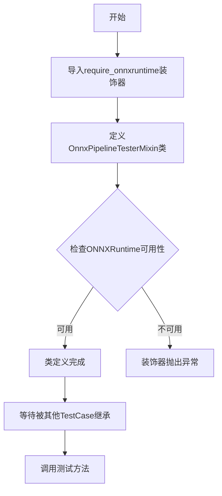
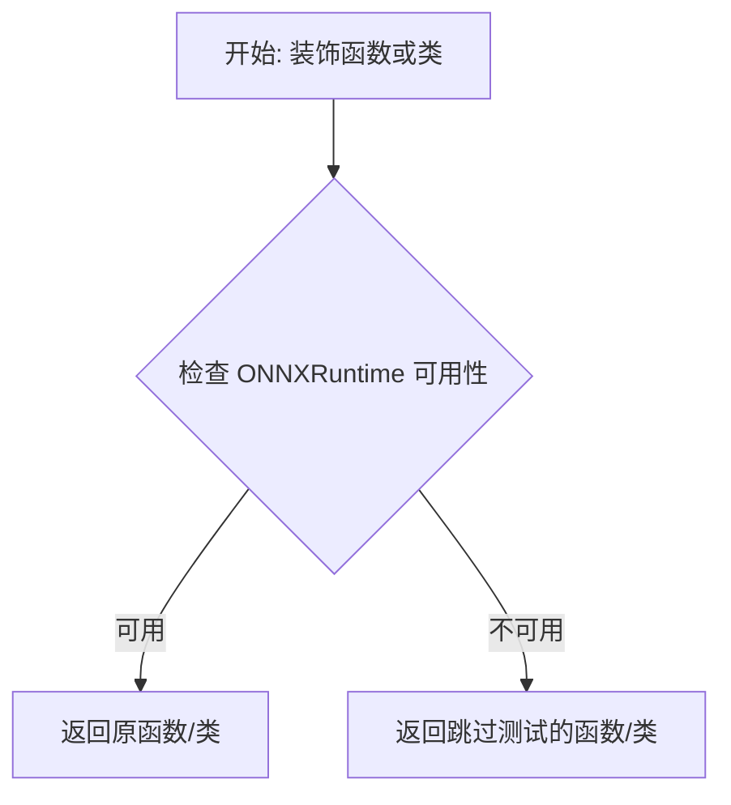

# `diffusers\tests\pipelines\test_pipelines_onnx_common.py` 详细设计文档

一个用于ONNXRuntime管道测试的unittest.TestCase混合类，提供保存加载管道、字典和元组输出等价性等通用测试功能

## 整体流程



## 类结构

```
object
└── OnnxPipelineTesterMixin (测试混合类)
```

## 全局变量及字段


    

## 全局函数及方法


### `require_onnxruntime`

`require_onnxruntime` 是一个装饰器函数，用于检查 ONNXRuntime 是否可用。如果不可用，它会跳过被装饰的测试函数或类，确保测试在满足依赖条件时执行。

参数：

- `func`：`callable` 或 `type`，被装饰的函数或类，通常是测试方法或测试类。

返回值：`callable`，返回装饰后的函数或类，如果 ONNXRuntime 不可用，则返回跳过的测试函数或类。

#### 流程图



#### 带注释源码

```python
# 导入所需的模块
from unittest import skipIf

# 假设 is_onnxruntime_available() 是从 testing_utils 导入的函数，用于检查 ONNXRuntime 是否安装
# from ..testing_utils import is_onnxruntime_available

def require_onnxruntime(func):
    """
    装饰器：检查 ONNXRuntime 是否可用，如果不可用则跳过测试。
    
    参数:
        func: 被装饰的函数或类，通常是测试方法或测试类。
    
    返回:
        如果 ONNXRuntime 可用，返回原函数/类；否则返回一个跳过测试的函数/类。
    """
    # 使用 skipIf 装饰器，如果 ONNXRuntime 不可用则跳过测试
    # 假设 is_onnxruntime_available() 检查 ONNXRuntime 是否安装
    return skipIf(not is_onnxruntime_available(), "test requires ONNXRuntime")(func)

# 注意：实际实现可能略有不同，但核心逻辑如上。
# 在提供的代码中，该装饰器用于类 OnnxPipelineTesterMixin，以跳过需要 ONNXRuntime 的测试。
```


## 关键组件


### OnnxPipelineTesterMixin

该类是一个基于 unittest.TestCase 的 ONNXRuntime 管道测试 mixin，提供保存加载管道、字典与元组输出等价性等通用测试能力的占位符基类。

### 文件整体运行流程

该模块导入后，OnnxPipelineTesterMixin 类通过 @require_onnxruntime 装饰器检查 ONNXRuntime 依赖是否可用，随后该 mixin 类可供其他测试类继承以获得标准化的 ONNX 管道测试能力。

### 类详细信息

#### OnnxPipelineTesterMixin

- **类型**: 类 (mixin)
- **描述**: 用于与 unittest.TestCase 类配合使用的测试 mixin，为 ONNXRuntime 管道提供通用测试方法（如保存加载、输出格式等价性验证）

##### 类字段

无

##### 类方法

无

##### 全局变量/函数

| 名称 | 类型 | 描述 |
|------|------|------|
| require_onnxruntime | 装饰器函数 | 条件装饰器，用于检查 ONNXRuntime 依赖是否已安装，未安装时跳过相关测试 |

### 关键组件信息

| 组件名称 | 一句话描述 |
|----------|------------|
| OnnxPipelineTesterMixin | 提供 ONNXRuntime 管道通用测试能力的空实现 mixin 类 |
| require_onnxruntime | 依赖检查装饰器，确保测试环境具备 ONNXRuntime |

### 潜在技术债务或优化空间

1. **空实现占位符**: 该类目前仅有 `pass` 语句，未实现任何测试方法，需要后续补充具体的测试逻辑
2. **功能缺失**: 文档中提到的保存加载测试、输出等价性验证等功能均未实现
3. **文档与实现不符**: 类文档描述了预期功能，但代码中没有任何实际实现

### 其它项目

#### 设计目标与约束

- **设计目标**: 为 ONNXRuntime 管道提供统一的测试框架接口
- **约束**: 必须与 unittest.TestCase 兼容，且依赖 ONNXRuntime 库

#### 错误处理与异常设计

- 通过 @require_onnxruntime 装饰器处理可选依赖缺失情况，测试将被跳过而非失败

#### 外部依赖与接口契约

- 依赖: ONNXRuntime (通过 require_onnxruntime 条件导入)
- 预期子类需实现具体的测试方法以提供实际测试能力


## 问题及建议


### 已知问题

-   **空实现类**: 类体仅包含 `pass` 语句，没有任何实际的测试方法或功能实现，使用该 mixin 不会产生任何效果
-   **设计不完整**: 作为一个测试 mixin，设计目标不明确，未提供任何可供子类复用的测试逻辑
-   **缺乏具体测试用例**: 文档注释中提到"提供保存加载管道、字典和元组输出等价性等通用测试"，但未实现任何相关测试方法
-   **依赖不明确**: 依赖 `@require_onnxruntime` 装饰器，但该装饰器的具体实现和错误处理机制未知
-   **无错误处理**: 缺少对 ONNXRuntime 依赖缺失或环境配置错误时的处理逻辑

### 优化建议

-   **实现测试方法**: 根据文档描述，实现 save/load 管道测试、dict 和 tuple 输出等价性测试等具体方法
-   **添加依赖检查**: 在类级别或方法级别添加 ONNXRuntime 可用性检查，明确处理依赖缺失的场景
-   **完善文档**: 为每个测试方法添加详细的 docstring，说明测试目的、输入输出和预期行为
-   **考虑抽象基类**: 如果当前仅为占位符，考虑使用 `abc` 模块将其定义为抽象类，强制子类实现具体测试
-   **提取通用逻辑**: 将测试中通用的 setup/teardown 逻辑提取为可复用方法
-   **添加配置选项**: 考虑添加类级别的配置选项，如测试模型路径、超参数等，提高测试灵活性

## 其它


### 设计目标与约束

**设计目标**：为使用 ONNXRuntime 的 pipeline 提供统一的测试框架，确保不同 pipeline 的核心功能（如保存加载、输出等价性）得到一致验证。

**约束条件**：
- 必须与 unittest.TestCase 配合使用
- 依赖 onnxruntime 库，装饰器 @require_onnxruntime 控制测试执行条件
- 作为 Mixin 类，本身不直接实例化，需继承使用

### 错误处理与异常设计

**依赖缺失处理**：通过 @require_onnxruntime 装饰器在测试执行前检查 onnxruntime 是否可用，若不可用则跳过测试（pytest.mark.skip 或 unittest.SkipTest）

**预期异常类型**：
- ImportError：onnxruntime 模块未安装
- FileNotFoundError：测试所需的 ONNX 模型文件或 pipeline 保存文件不存在
- ONNXRuntimeError：ONNX 模型推理过程中的运行时错误

### 外部依赖与接口契约

**外部依赖**：
- `onnxruntime`：核心 ONNX 推理引擎
- `..testing_utils`：包含 require_onnxruntime 装饰器的工具模块
- `unittest`：Python 标准测试框架

**接口契约**：
- Mixin 类需与 unittest.TestCase 或其子类一起使用
- 预期提供测试方法：test_save_load（保存加载pipeline）、test_output_dict_tuple_equivalence（dict和tuple输出一致性）等
- 子类可覆盖或扩展测试方法

### 数据流与状态机

**数据流**：
- 输入：待测试的 ONNX pipeline 对象、测试数据
- 处理：加载 pipeline、推理、比较输出
- 输出：测试通过/失败结果

**状态机**：不适用，该类为静态测试工具，无内部状态转换

### 使用示例与集成指南

**集成方式**：

```python
from onnx_pipeline_tester import OnnxPipelineTesterMixin
import unittest

class TestMyPipeline(OnnxPipelineTesterMixin, unittest.TestCase):
    def setUp(self):
        # 初始化 pipeline
        self.pipeline = load_my_pipeline()
    
    def test_inference(self):
        result = self.pipeline(input_data)
        self.assertIsNotNone(result)
```

### 测试覆盖范围建议

**建议测试项**：
- pipeline 保存与加载（pickle/onnx 文件）
- 批量推理与单样本推理一致性
- dict 和 tuple 输出格式等价性
- 设备兼容性（CPU/GPU）
- 异常输入的错误处理

### 已知限制与未来扩展

**当前限制**：
- 类为占位符（pass），无实际测试实现
- 依赖外部测试工具函数 require_onnxruntime 的具体实现

**未来扩展**：
- 实现具体的测试方法
- 添加性能基准测试
- 支持更多输出格式验证

    