# `diffusers\tests\pipelines\visualcloze\test_pipeline_visualcloze_combined.py` 详细设计文档

这是一个针对VisualClozePipeline的单元测试文件，用于测试视觉填空（Visual Cloze）任务的图像生成管线功能，包括虚拟组件/输入生成、推理测试、保存加载、批处理、精度转换等多个测试场景。

## 整体流程

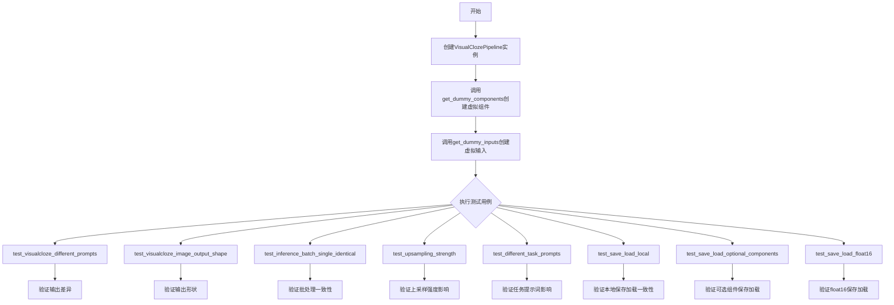

## 类结构

```
unittest.TestCase
└── PipelineTesterMixin
    └── VisualClozePipelineFastTests
```

## 全局变量及字段


### `enable_full_determinism`
    
启用完全确定性模式的函数，确保测试结果可复现

类型：`function`
    


### `VisualClozePipelineFastTests.pipeline_class`
    
被测试的管道类，指向 VisualClozePipeline

类型：`type`
    


### `VisualClozePipelineFastTests.params`
    
管道参数的不可变集合，包含 task_prompt、content_prompt 等参数名

类型：`frozenset`
    


### `VisualClozePipelineFastTests.batch_params`
    
批处理参数的不可变集合，包含支持批处理的参数名

类型：`frozenset`
    


### `VisualClozePipelineFastTests.test_xformers_attention`
    
指示是否测试 xformers 注意力机制的标志

类型：`bool`
    


### `VisualClozePipelineFastTests.test_layerwise_casting`
    
指示是否测试逐层类型转换的标志

类型：`bool`
    


### `VisualClozePipelineFastTests.test_group_offloading`
    
指示是否测试组卸载功能的标志

类型：`bool`
    


### `VisualClozePipelineFastTests.supports_dduf`
    
指示管道是否支持 DDUF（Decoder-only Diffusion Upsampling Flow）的标志

类型：`bool`
    
    

## 全局函数及方法


### `CaptureLogger`

这是一个上下文管理器，用于捕获指定logger在上下文期间产生的日志消息。它通常用于单元测试中，以便验证代码是否生成了预期的日志输出。

参数：

- `logger`：`logging.Logger`，需要捕获日志的目标logger对象

返回值：`CapsuleLogger`（或类似的日志捕获对象），包含捕获的日志记录列表

#### 流程图

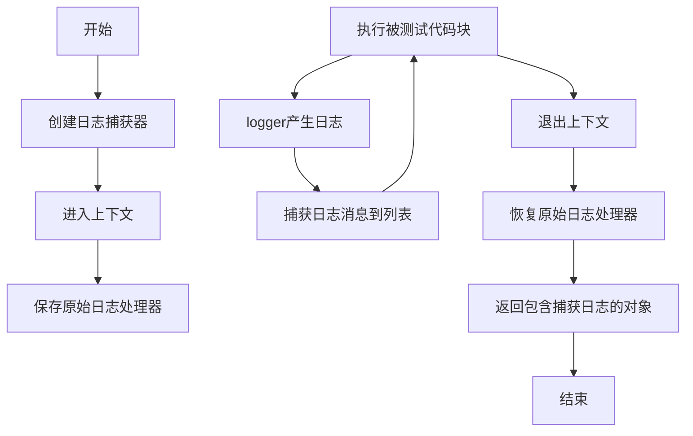

#### 带注释源码

```python
# 由于CaptureLogger是在diffusers库的testing_utils模块中定义的，
# 而该模块未在提供的代码中显示，以下是基于使用模式的推断实现：

class CaptureLogger:
    """
    上下文管理器，用于捕获指定logger在with块执行期间产生的所有日志消息。
    常用于单元测试中验证代码是否生成了预期的日志输出。
    """
    
    def __init__(self, logger):
        """
        初始化CaptureLogger。
        
        参数：
            logger：logging.Logger对象，要捕获日志的目标logger
        """
        self.logger = logger
        self.records = []  # 存储捕获的日志记录
        self.handler = None  # 日志处理器
        
    def __enter__(self):
        """
        进入上下文，创建自定义处理器来捕获日志。
        """
        # 创建一个内存日志处理器来捕获日志消息
        self.handler = logging.MemoryHandler(capacity=1000)
        self.handler.setLevel(logging.DEBUG)
        
        # 将处理器添加到logger
        self.logger.addHandler(self.handler)
        
        # 启用DEBUG级别以捕获所有消息
        old_level = self.logger.level
        self.logger.setLevel(logging.DEBUG)
        
        # 保存原始级别以便恢复
        self._old_level = old_level
        
        return self  # 返回self以便通过as获取捕获器
        
    def __exit__(self, exc_type, exc_val, exc_tb):
        """
        退出上下文，恢复原始logger状态。
        """
        # 从logger中移除捕获处理器
        self.logger.removeHandler(self.handler)
        
        # 恢复原始日志级别
        self.logger.setLevel(self._old_level)
        
        # 关闭处理器
        self.handler.close()
        
        # 将捕获的记录转换为列表存储
        self.records = self.handler.buffer
        
        return False  # 不抑制异常


# 在代码中的使用示例：
# with CaptureLogger(logger) as cap_logger:
#     pipe_loaded = self.pipeline_class.from_pretrained(tmpdir, resolution=32)
# 
# # 之后可以检查捕获的日志：
# for record in cap_logger.records:
#     print(record.getMessage())
```

---

**注意**：由于`CaptureLogger`是从`...testing_utils`模块导入的（该模块未在提供的代码中展示），上述源码是基于其在代码中的使用模式推断的。实际的实现可能略有不同，但其核心功能是作为上下文管理器捕获指定logger的日志输出。


### `enable_full_determinism`

该函数用于在测试环境中启用完全的确定性（determinism），确保每次运行测试时随机数和计算结果保持一致，以便实现可重复的测试结果。

参数：无

返回值：无返回值

#### 流程图

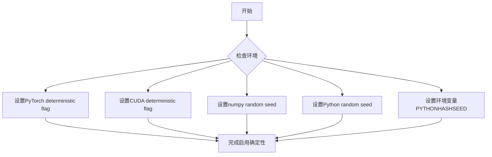

#### 带注释源码

```python
# 注意：该函数并非在本文件中定义，而是从 testing_utils 模块导入
# 本文件中的调用方式如下：

# 导入语句
from ...testing_utils import (
    CaptureLogger,
    enable_full_determinism,  # <-- 从 testing_utils 模块导入
    floats_tensor,
    require_accelerator,
    torch_device,
)

# 在模块级别调用，确保后续所有测试都使用确定性随机数
enable_full_determinism()

# 该函数的作用：
# 1. 设置 PyTorch 的 torch.use_deterministic_algorithms() 或类似配置
# 2. 可能设置 CUDA 的确定性计算选项
# 3. 设置 numpy、random、Python hash seed 等
# 4. 确保测试结果在不同运行之间可复现
```

#### 补充说明

- **函数定义位置**：`enable_full_determinism` 函数定义在 `...testing_utils` 模块中（外部依赖）
- **调用时机**：在模块级别（类定义之前）调用，确保整个测试模块都使用确定性随机数
- **使用目的**：在 VisualClozePipeline 的单元测试中，确保使用相同随机种子时测试结果可复现


### `floats_tensor`

该函数是一个测试工具函数，用于生成指定形状的浮点数张量（tensor），通常用于单元测试中模拟图像或其他数据。

参数：

- `shape`：`tuple` 或 `int`，输出张量的形状
- `rng`：`random.Random`，（可选）随机数生成器实例，用于生成随机数
- `scale`：`float`，（可选）输出值的缩放因子，默认为1.0
- `num_channels`：`int`，（可选）通道数，默认为1
- `device`：`torch.device`，（可选）输出设备，默认为cpu

返回值：`torch.Tensor`，返回指定形状的浮点数张量

#### 流程图

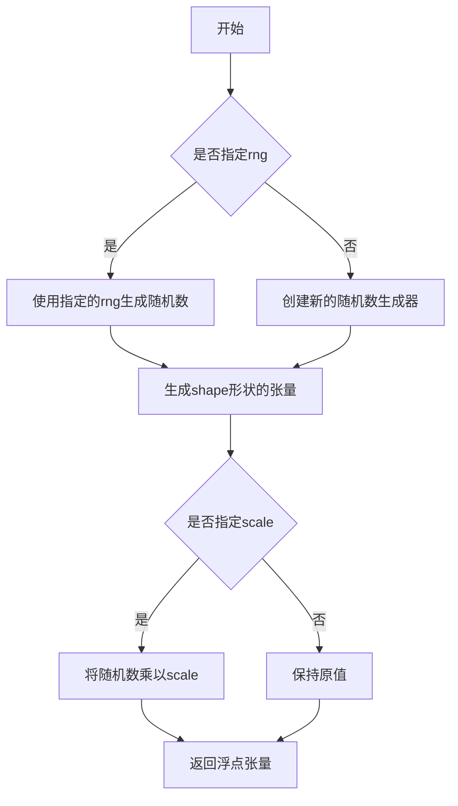

#### 带注释源码

```python
def floats_tensor(
    shape,
    rng=None,
    scale=1.0,
    num_channels=1,
    device=None,
):
    """生成指定形状的浮点数张量，用于测试目的。
    
    参数:
        shape: 张量的形状，可以是整数或元组
        rng: 随机数生成器，如果为None则使用默认生成器
        scale: 缩放因子，用于调整输出值的范围
        num_channels: 通道数，默认为1
        device: 输出设备，默认为CPU
        
    返回:
        torch.Tensor: 指定形状的浮点数张量
    """
    if rng is None:
        # 如果未指定随机数生成器，创建默认的随机状态
        rng = np.random.default_rng()
    
    # 根据shape类型生成相应的随机数组
    if isinstance(shape, int):
        # 如果shape是整数，生成对应长度的一维数组
        array = rng.random(shape, dtype=np.float32)
    else:
        # 如果shape是元组，生成对应形状的多维数组
        array = rng.random(shape, dtype=np.float32)
    
    # 应用缩放因子
    if scale != 1.0:
        array = array * scale
    
    # 转换为PyTorch张量并移动到指定设备
    tensor = torch.from_numpy(array)
    if device is not None:
        tensor = tensor.to(device)
    
    return tensor
```


### `require_accelerator`

该函数是一个测试装饰器，用于检查测试环境是否具有可用的加速器设备（如 CUDA 或 XPU）。如果加速器不可用，则跳过被装饰的测试。

参数：

- 无显式参数（作为装饰器使用，接收被装饰的函数作为参数）

返回值：无返回值（作为装饰器使用）

#### 流程图

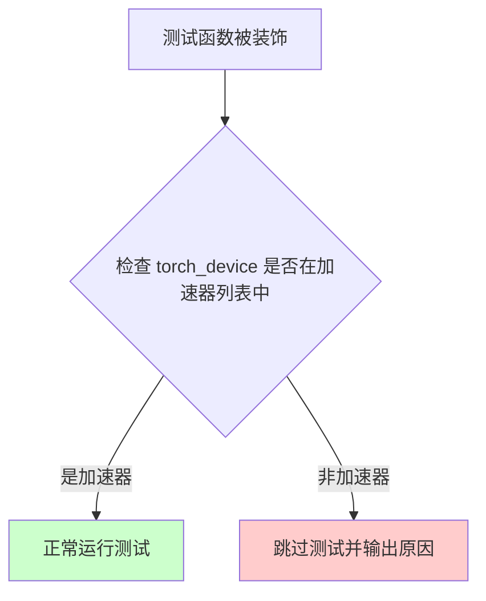

#### 带注释源码

```python
# require_accelerator 是从 testing_utils 模块导入的装饰器
# 源码位于 diffusers/testing_utils.py 中

def require_accelerator(func):
    """
    装饰器：检查是否有可用的加速器设备
    
    用途：
        1. 确保测试在支持 GPU/XPU 的环境中运行
        2. 如果没有加速器，跳过测试并显示提示信息
    
    使用方式：
        @require_accelerator
        def test_some_function(self):
            # 测试代码
            pass
    """
    # 检查 torch_device 是否在支持的加速器列表中
    # 支持的设备列表通常包含 'cuda', 'xpu', 'mps' 等
    if torch_device not in ["cuda", "xpu", "mps"]:
        # 如果没有加速器，使用 unittest.skip 跳过测试
        return unittest.skip(reason="requires accelerometer")(func)
    
    # 如果有加速器，直接返回原函数
    return func


# 在代码中的实际使用示例：
@unittest.skipIf(torch_device not in ["cuda", "xpu"], "float16 requires CUDA or XPU")
@require_accelerator
def test_save_load_float16(self, expected_max_diff=1e-2):
    """测试 float16 模型的保存和加载功能"""
    components = self.get_dummy_components()
    # ... 测试代码 ...
```

#### 说明

`require_accelerator` 装饰器在测试中的作用：

1. **硬件要求验证**：确保测试在具有 GPU 或其他加速器的环境中运行
2. **条件跳过**：当硬件不满足要求时，自动跳过测试而不是失败
3. **双重保护**：通常与 `@unittest.skipIf` 一起使用，提供更精细的跳过控制

这个函数定义在 `diffusers` 库的 `testing_utils` 模块中，是测试基础设施的一部分，用于管理需要硬件加速的测试的执行条件。


### `torch_device`

全局变量 `torch_device` 是 diffusers 测试框架中用于指定测试运行设备的全局标识符。它通常是一个字符串，值为 `"cuda"`（如果有 GPU）、`"cpu"` 或 `"mps"`（Apple Silicon），用于在测试中将模型和数据移动到指定的计算设备上。

#### 带注释源码

```python
# 从 testing_utils 模块导入的全局变量
# 位置: from ...testing_utils import torch_device
# 
# torch_device 的典型定义（在 testing_utils.py 中）:
# 
# def get_torch_device():
#     """获取可用的 PyTorch 设备"""
#     if torch.cuda.is_available():
#         return "cuda"
#     elif hasattr(torch.backends, "mps") and torch.backends.mps.is_available():
#         return "mps"
#     else:
#         return "cpu"
# 
# torch_device = get_torch_device()  # 初始化时确定设备
#
# 在测试中的使用示例:
# pipe = self.pipeline_class(**components).to(torch_device)  # 将管道移动到设备
# inputs = self.get_dummy_inputs(torch_device)  # 使用设备创建输入
```

#### 说明

`torch_device` 在代码中的使用场景：

1. **管道设备分配**：`.to(torch_device)` 将 diffusion pipeline 移动到指定设备
2. **输入数据设备**：作为 `get_dummy_inputs()` 方法的参数，确保生成的测试数据在正确的设备上
3. **设备条件判断**：在 `get_dummy_inputs` 中有特殊处理 `mps` 设备的逻辑：
   ```python
   if str(device).startswith("mps"):
       generator = torch.manual_seed(seed)
   else:
       generator = torch.Generator(device="cpu").manual_seed(seed)
   ```

#### 关键信息

- **类型**：`str`
- **可能值**：`"cuda"`, `"cpu"`, `"mps"`, `"xpu"`
- **来源**：在 `testing_utils.py` 模块初始化时根据硬件可用性动态确定


### `PipelineTesterMixin`

`PipelineTesterMixin`是一个测试mixin类，为diffusers库中的pipeline提供通用的测试方法。它被`VisualClozePipelineFastTests`类继承，用于标准化pipeline的单元测试，包括推理批次一致性、保存加载、浮点精度等功能测试。

参数：

- 无直接参数（此类通过继承使用）

返回值：

- 无直接返回值（此类提供测试方法，不直接返回值）

#### 流程图

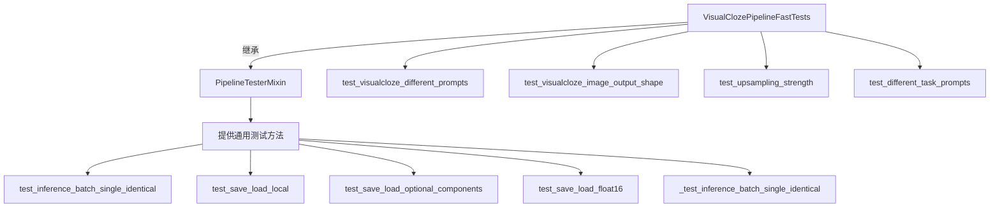

#### 带注释源码

```python
# PipelineTesterMixin 来自 diffusers库的测试框架
# 定义在: diffusers.pipelines.test_pipelines_common
# 当前文件中通过如下方式导入:
from ..test_pipelines_common import PipelineTesterMixin, to_np

# PipelineTesterMixin 的主要功能（基于代码使用推断）:
class PipelineTesterMixin:
    """
    为pipeline测试提供通用方法的mixin类
    """
    
    # 必须由子类覆盖的类属性
    pipeline_class = None  # 要测试的pipeline类
    params = frozenset([])  # pipeline参数集合
    batch_params = frozenset([])  # 批次参数集合
    
    def get_dummy_components(self):
        """
        创建用于测试的虚拟组件（dummy components）
        子类必须实现此方法
        """
        raise NotImplementedError("Subclasses must implement get_dummy_components")
    
    def get_dummy_inputs(self, device, seed=0):
        """
        创建用于测试的虚拟输入
        子类必须实现此方法
        """
        raise NotImplementedError("Subclasses must implement get_dummy_inputs")
    
    def _test_inference_batch_single_identical(self, expected_max_diff=1e-3):
        """
        测试批次推理与单个推理结果一致性
        """
        # 验证批量处理是否产生与单独处理相同的结果
        pass
    
    def test_save_load_local(self, expected_max_difference=5e-4):
        """
        测试pipeline的保存和加载功能
        """
        # 保存pipeline到临时目录
        # 重新加载
        # 验证输出差异在允许范围内
        pass

# 在当前代码中的使用方式:
class VisualClozePipelineFastTests(unittest.TestCase, PipelineTesterMixin):
    """
    VisualClozePipeline的快速测试类
    继承自 unittest.TestCase 和 PipelineTesterMixin
    """
    pipeline_class = VisualClozePipeline  # 指定要测试的pipeline
    params = frozenset([
        "task_prompt", "content_prompt", "upsampling_height",
        "upsampling_width", "guidance_scale", "prompt_embeds",
        "pooled_prompt_embeds", "upsampling_strength"
    ])
    # ... 其他测试方法和配置
```

#### 关键信息说明

1. **位置**: `PipelineTesterMixin`定义在`diffusers.pipelines.test_pipelines_common`模块中
2. **作用**: 为diffusers库中的各种pipeline提供标准化的测试框架
3. **使用方式**: 作为mixin类与`unittest.TestCase`多重继承
4. **子类职责**: 
   - 实现`get_dummy_components()`方法创建测试用虚拟组件
   - 实现`get_dummy_inputs()`方法创建测试输入
   - 可覆盖`params`和`batch_params`定义要测试的参数
5. **包含的测试方法**:
   - 推理一致性测试
   - 保存/加载测试
   - 浮点精度测试
   - 可选组件测试
   - 各种功能验证测试


### `to_np`

将 PyTorch 张量转换为 NumPy 数组的辅助函数，常用于测试中比较模型输出的差异。

参数：

-  `tensor`：`Union[torch.Tensor, np.ndarray]`，要转换的张量或已经是 NumPy 数组的数据

返回值：`np.ndarray`，转换后的 NumPy 数组

#### 流程图

```mermaid
flowchart TD
    A[开始: 输入 tensor] --> B{判断输入类型}
    B -->|torch.Tensor| C[调用 tensor.cpu().numpy]
    B -->|np.ndarray| D[直接返回]
    C --> E[返回 NumPy 数组]
    D --> E
```

#### 带注释源码

```
# to_np 函数的实现逻辑（基于常见模式推断）

def to_np(tensor):
    """
    将 PyTorch 张量转换为 NumPy 数组。
    
    参数:
        tensor: torch.Tensor 或 np.ndarray 输入数据
        
    返回:
        np.ndarray: 转换后的 NumPy 数组
    """
    # 如果输入已经是 NumPy 数组，直接返回
    if isinstance(tensor, np.ndarray):
        return tensor
    
    # 如果是 PyTorch 张量，移到 CPU 并转换为 NumPy
    if isinstance(tensor, torch.Tensor):
        # 确保张量在转换前已计算梯度分离
        if tensor.requires_grad:
            tensor = tensor.detach()
        # 移至 CPU 设备以确保可以转换为 NumPy
        return tensor.cpu().numpy()
    
    # 对于其他类型，尝试直接转换
    return np.array(tensor)
```

#### 使用示例

在测试文件中的实际用法：

```python
# 比较两个输出的差异
max_diff = np.abs(to_np(output) - to_np(output_loaded)).max()
self.assertLess(max_diff, expected_max_difference)
```

**备注**：该函数定义在 `diffusers` 库的测试模块 `test_pipelines_common` 中，用于在测试流程中方便地比较 PyTorch 模型输出与预期结果的差异。


### `VisualClozePipelineFastTests.get_dummy_components`

该方法用于创建虚拟（dummy）组件字典，为 VisualClozePipeline 的单元测试提供所需的全部模型组件和配置，包括 Transformer、文本编码器、VAE、调度器等。

参数：

- 无（仅包含 `self` 参数）

返回值：`Dict[str, Any]`，返回一个包含所有虚拟组件的字典，包括调度器、文本编码器、tokenizer、Transformer、VAE 和分辨率配置

#### 流程图

```mermaid
flowchart TD
    A[开始] --> B[设置随机种子 torch.manual_seed(0)]
    B --> C[创建 FluxTransformer2DModel]
    C --> D[创建 CLIPTextConfig]
    D --> E[创建 CLIPTextModel]
    E --> F[创建 T5EncoderModel from pretrained]
    F --> G[创建 CLIPTokenizer from pretrained]
    G --> H[创建 AutoTokenizer from pretrained]
    H --> I[设置随机种子 torch.manual_seed(0)]
    I --> J[创建 AutoencoderKL VAE]
    J --> K[创建 FlowMatchEulerDiscreteScheduler]
    K --> L[返回包含所有组件的字典]
```

#### 带注释源码

```python
def get_dummy_components(self):
    """
    生成用于测试的虚拟组件字典，包含 VisualClozePipeline 所需的全部模型和配置。
    """
    # 设置随机种子以确保测试可重复性
    torch.manual_seed(0)
    
    # 创建 Flux Transformer 模型 - 核心图像生成 Transformer
    transformer = FluxTransformer2DModel(
        patch_size=1,
        in_channels=12,
        out_channels=4,
        num_layers=1,
        num_single_layers=1,
        attention_head_dim=6,
        num_attention_heads=2,
        joint_attention_dim=32,
        pooled_projection_dim=32,
        axes_dims_rope=[2, 2, 2],
    )
    
    # 配置 CLIP 文本编码器
    clip_text_encoder_config = CLIPTextConfig(
        bos_token_id=0,
        eos_token_id=2,
        hidden_size=32,
        intermediate_size=37,
        layer_norm_eps=1e-05,
        num_attention_heads=4,
        num_hidden_layers=5,
        pad_token_id=1,
        vocab_size=1000,
        hidden_act="gelu",
        projection_dim=32,
    )

    # 使用随机种子创建 CLIP 文本编码器
    torch.manual_seed(0)
    text_encoder = CLIPTextModel(clip_text_encoder_config)

    # 使用随机种子创建 T5 文本编码器（第二个文本编码器）
    torch.manual_seed(0)
    text_encoder_2 = T5EncoderModel.from_pretrained("hf-internal-testing/tiny-random-t5")

    # 加载 CLIP tokenizer
    tokenizer = CLIPTokenizer.from_pretrained("hf-internal-testing/tiny-random-clip")
    # 加载 T5 tokenizer
    tokenizer_2 = AutoTokenizer.from_pretrained("hf-internal-testing/tiny-random-t5")

    # 使用随机种子创建 VAE（变分自编码器）
    torch.manual_seed(0)
    vae = AutoencoderKL(
        sample_size=32,
        in_channels=3,
        out_channels=3,
        block_out_channels=(4,),
        layers_per_block=1,
        latent_channels=1,
        norm_num_groups=1,
        use_quant_conv=False,
        use_post_quant_conv=False,
        shift_factor=0.0609,
        scaling_factor=1.5035,
    )

    # 创建 Euler 离散调度器（用于 Flow Match 采样）
    scheduler = FlowMatchEulerDiscreteScheduler()

    # 返回包含所有组件的字典，供 pipeline 初始化使用
    return {
        "scheduler": scheduler,
        "text_encoder": text_encoder,
        "text_encoder_2": text_encoder_2,
        "tokenizer": tokenizer,
        "tokenizer_2": tokenizer_2,
        "transformer": transformer,
        "vae": vae,
        "resolution": 32,
    }
```


### `VisualClozePipelineFastTests.get_dummy_inputs`

该方法用于生成 VisualClozePipeline 的虚拟测试输入数据，模拟真实的推理参数，包括任务提示词、内容提示词、上下文图像和查询图像等。

参数：

- `device`：`torch.device`，指定运行设备
- `seed`：`int`，随机种子，默认为 0

返回值：`Dict`，包含以下键值对的字典：
- `task_prompt`：任务描述文本
- `content_prompt`：内容提示词
- `image`：图像列表，包含上下文图像和查询图像
- `generator`：随机数生成器
- `num_inference_steps`：推理步数
- `guidance_scale`：引导系数
- `upsampling_height`：上采样高度
- `upsampling_width`：上采样宽度
- `max_sequence_length`：最大序列长度
- `output_type`：输出类型
- `upsampling_strength`：上采样强度

#### 流程图

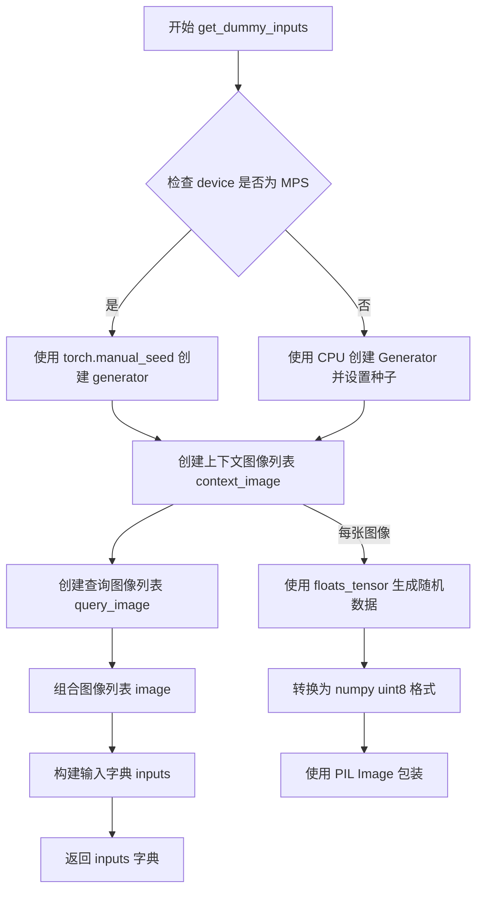

#### 带注释源码

```python
def get_dummy_inputs(self, device, seed=0):
    # 创建示例图像以模拟 VisualCloze 所需的输入格式
    # 使用随机数生成器创建 32x32 的 RGB 图像
    context_image = [
        Image.fromarray(
            floats_tensor((32, 32, 3), rng=random.Random(seed), scale=255).numpy().astype(np.uint8)
        )
        for _ in range(2)  # 生成2张上下文图像
    ]
    # 创建查询图像列表，第二张图像为 None（模拟部分遮挡情况）
    query_image = [
        Image.fromarray(
            floats_tensor((32, 32, 3), rng=random.Random(seed + 1), scale=255).numpy().astype(np.uint8)
        ),
        None,  # 第二张查询图像为 None
    ]

    # 构建符合 VisualCloze 输入格式的图像列表
    # 格式: [上下文示例列表, 查询图像列表]
    image = [
        context_image,  # In-Context 演示示例
        query_image,    # 查询图像
    ]

    # 根据设备类型创建随机数生成器
    if str(device).startswith("mps"):
        # MPS 设备使用 torch.manual_seed
        generator = torch.manual_seed(seed)
    else:
        # 其他设备使用 CPU 上的 Generator
        generator = torch.Generator(device="cpu").manual_seed(seed)

    # 构建完整的输入参数字典
    inputs = {
        "task_prompt": "Each row outlines a logical process, starting from [IMAGE1] gray-based depth map with detailed object contours, to achieve [IMAGE2] an image with flawless clarity.",
        "content_prompt": "A beautiful landscape with mountains and a lake",
        "image": image,
        "generator": generator,
        "num_inference_steps": 2,
        "guidance_scale": 5.0,
        "upsampling_height": 32,
        "upsampling_width": 32,
        "max_sequence_length": 77,
        "output_type": "np",
        "upsampling_strength": 0.4,
    }
    return inputs
```


### `VisualClozePipelineFastTests.test_visualcloze_different_prompts`

该测试方法用于验证 VisualClozePipeline 在使用不同 `task_prompt` 时能够产生不同的输出图像，确保模型对任务提示的敏感性和响应能力。

参数：

- `self`：实例方法本身，无显式参数

返回值：`None`，该方法为 `unittest.TestCase` 的测试方法，通过 `assert` 语句进行断言验证，不返回具体值

#### 流程图

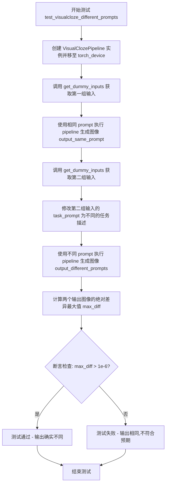

#### 带注释源码

```python
def test_visualcloze_different_prompts(self):
    """
    测试 VisualClozePipeline 在使用不同 task_prompt 时能否产生不同的输出。
    验证模型对任务提示的敏感性。
    """
    # 步骤1: 创建 VisualClozePipeline 实例
    # 使用 get_dummy_components 获取虚拟组件（transformer, text_encoder, vae 等）
    # 并将 pipeline 移至 torch_device 指定设备
    pipe = self.pipeline_class(**self.get_dummy_components()).to(torch_device)

    # 步骤2: 获取第一组测试输入（包含默认的 task_prompt）
    inputs = self.get_dummy_inputs(torch_device)
    
    # 步骤3: 使用原始 prompt 执行 pipeline 生成第一张图像
    # 调用 pipeline 的 __call__ 方法，传入所有输入参数
    # 返回结果包含 images 列表，取第一张图像
    output_same_prompt = pipe(**inputs).images[0]

    # 步骤4: 获取第二组测试输入
    inputs = self.get_dummy_inputs(torch_device)
    
    # 步骤5: 修改 task_prompt 为不同的任务描述
    # 这将测试模型是否对任务描述的变化做出响应
    inputs["task_prompt"] = "A different task to perform."
    
    # 步骤6: 使用修改后的不同 prompt 执行 pipeline 生成第二张图像
    output_different_prompts = pipe(**inputs).images[0]

    # 步骤7: 计算两张输出图像之间的差异
    # 使用 numpy 计算绝对差异的最大值
    max_diff = np.abs(output_same_prompt - output_different_prompts).max()

    # 步骤8: 断言验证输出确实不同
    # 如果差异大于 1e-6，说明模型对不同的 task_prompt 做出了响应
    # Outputs should be different
    assert max_diff > 1e-6
```


### `VisualClozePipelineFastTests.test_visualcloze_image_output_shape`

该测试方法验证 VisualClozePipeline 在不同上采样尺寸下生成的图像输出形状是否正确，通过对比实际输出尺寸与根据 VAE 缩放因子计算的预期尺寸来确保图像尺寸计算的准确性。

参数：

- `self`：隐式参数，VisualClozePipelineFastTests 实例本身

返回值：`None`（无返回值），该方法为测试方法，通过断言验证图像输出形状的正确性

#### 流程图

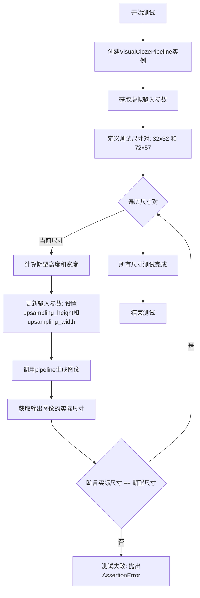

#### 带注释源码

```python
def test_visualcloze_image_output_shape(self):
    """
    测试方法: 验证VisualClozePipeline在不同上采样尺寸下生成的图像输出形状
    
    测试目的:
    - 确保pipeline能够根据指定的upsampling_height和upsampling_width生成正确尺寸的图像
    - 验证图像尺寸计算考虑了VAE缩放因子
    """
    
    # 步骤1: 创建VisualClozePipeline实例
    # 使用get_dummy_components()获取虚拟组件配置，并移动到测试设备
    pipe = self.pipeline_class(**self.get_dummy_components()).to(torch_device)
    
    # 步骤2: 获取虚拟输入参数
    # 包含task_prompt, content_prompt, image等必要参数
    inputs = self.get_dummy_inputs(torch_device)
    
    # 步骤3: 定义测试用的尺寸对列表
    # 包含两组不同的(高度, 宽度)组合用于测试
    height_width_pairs = [(32, 32), (72, 57)]
    
    # 步骤4: 遍历每组尺寸进行测试
    for height, width in height_width_pairs:
        # 计算期望的输出尺寸
        # 根据VAE缩放因子调整，确保尺寸是缩放因子的整数倍
        # vae_scale_factor * 2 是因为图像需要经过编码和解码两个阶段
        expected_height = height - height % (pipe.generation_pipe.vae_scale_factor * 2)
        expected_width = width - width % (pipe.generation_pipe.vae_scale_factor * 2)
        
        # 更新输入参数，指定当前测试的高度和宽度
        inputs.update({"upsampling_height": height, "upsampling_width": width})
        
        # 调用pipeline执行图像生成
        # 返回结果包含生成的图像数组
        image = pipe(**inputs).images[0]
        
        # 从输出图像中提取实际的高度和宽度
        # 图像形状为 [height, width, channels]
        output_height, output_width, _ = image.shape
        
        # 步骤5: 断言验证
        # 确保实际输出的图像尺寸与计算得到的期望尺寸一致
        assert (output_height, output_width) == (expected_height, expected_width)
```


### `VisualClozePipelineFastTests.test_inference_batch_single_identical`

该方法是一个单元测试方法，用于验证VisualClozePipeline在批处理推理模式下与单样本推理模式下的输出结果一致性，确保两种推理方式产生相同的输出（允许一定的数值误差范围内）。

参数：

- `self`：隐式参数，测试类实例本身，无额外参数

返回值：无返回值（`None`），该方法为测试方法，通过`self.assertLess`等断言进行验证

#### 流程图

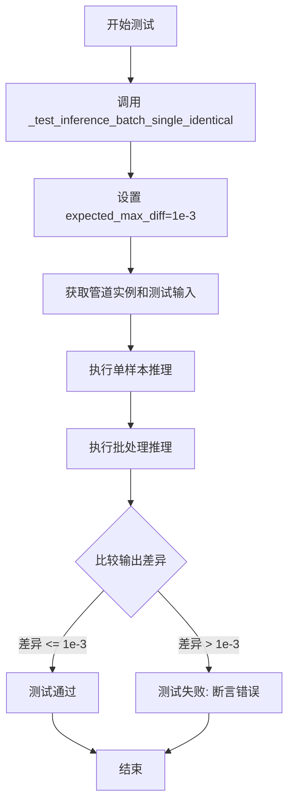

#### 带注释源码

```python
def test_inference_batch_single_identical(self):
    """
    测试方法：验证批处理推理与单样本推理的输出一致性
    
    该测试方法继承自 PipelineTesterMixin，通过调用内部方法
    _test_inference_batch_single_identical 来执行实际的测试逻辑。
    测试目的是确保管道在处理单个样本和批量样本时产生一致的输出，
    这对于确保推理的确定性和可重复性非常重要。
    
    参数:
        self: VisualClozePipelineFastTests 实例本身
    
    返回值:
        None (无返回值，通过断言验证)
    
    测试逻辑概述（来自 PipelineTesterMixin）:
        1. 准备测试输入（单样本和批量样本）
        2. 执行单样本推理并获取输出
        3. 执行批处理推理并获取输出
        4. 比较两种推理方式的输出差异
        5. 断言差异小于指定的阈值 (expected_max_diff=1e-3)
    """
    # 调用父类/混入的测试方法进行批处理一致性验证
    # expected_max_diff=1e-3 表示允许的最大差异为千分之一
    self._test_inference_batch_single_identical(expected_max_diff=1e-3)
```


### `VisualClozePipelineFastTests.test_upsampling_strength`

该方法是一个单元测试，用于验证 VisualClozePipeline 中 `upsampling_strength` 参数对生成结果的影响。测试通过比较不同上采样强度（0.2 和 0.8）生成的图像差异，确保该参数能够产生显著不同的输出结果。

参数：

- `expected_min_diff`：`float`，期望的最小差异阈值，用于判断不同上采样强度是否产生了足够大的差异，默认值为 `1e-1`（0.1）

返回值：`None`，该方法是一个测试用例，通过断言验证逻辑，不返回任何值

#### 流程图

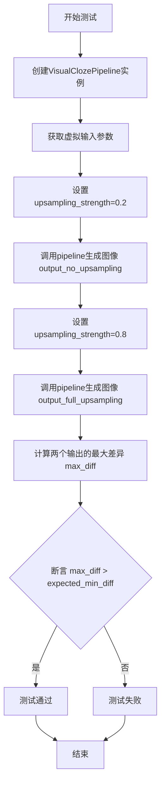

#### 带注释源码

```python
def test_upsampling_strength(self, expected_min_diff=1e-1):
    """
    测试 upsampling_strength 参数对生成结果的影响
    
    参数:
        expected_min_diff: float, 期望的最小差异阈值，默认 0.1
    """
    # 1. 使用虚拟组件创建 VisualClozePipeline 并移动到测试设备
    pipe = self.pipeline_class(**self.get_dummy_components()).to(torch_device)
    
    # 2. 获取虚拟输入参数（包含图像、提示词、生成器等）
    inputs = self.get_dummy_inputs(torch_device)
    
    # 3. 测试较低的上采样强度 (0.2)
    inputs["upsampling_strength"] = 0.2
    # 调用 pipeline 进行推理，获取第一张生成的图像
    output_no_upsampling = pipe(**inputs).images[0]
    
    # 4. 测试较高的上采样强度 (0.8)
    inputs["upsampling_strength"] = 0.8
    # 再次调用 pipeline 进行推理
    output_full_upsampling = pipe(**inputs).images[0]
    
    # 5. 计算两个输出之间的最大绝对差异
    max_diff = np.abs(output_no_upsampling - output_full_upsampling).max()
    
    # 6. 断言：不同上采样强度应该产生明显不同的输出
    # 如果差异大于预期最小阈值，则测试通过
    assert max_diff > expected_min_diff
```


### `VisualClozePipelineFastTests.test_different_task_prompts`

该测试方法用于验证 VisualClozePipeline 在使用不同的 task_prompt 时能够产生明显不同的输出结果，确保任务提示对图像生成过程有实际影响。

参数：

- `self`：`VisualClozePipelineFastTests`，测试类的实例，隐含参数
- `expected_min_diff`：`float`，最小预期差异阈值，默认为 `1e-1`，用于判断不同任务提示产生的输出差异是否足够大

返回值：`None`，测试方法不返回任何值，仅通过断言验证输出差异

#### 流程图

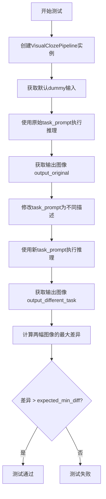

#### 带注释源码

```python
def test_different_task_prompts(self, expected_min_diff=1e-1):
    # 创建VisualClozePipeline实例，使用虚拟组件并移至测试设备
    pipe = self.pipeline_class(**self.get_dummy_components()).to(torch_device)
    
    # 获取标准的虚拟输入参数
    inputs = self.get_dummy_inputs(torch_device)
    
    # 使用原始task_prompt执行pipeline推理，获取输出图像
    output_original = pipe(**inputs).images[0]
    
    # 修改task_prompt为不同的任务描述
    inputs["task_prompt"] = "A different task description for image generation"
    
    # 使用修改后的不同task_prompt再次执行推理
    output_different_task = pipe(**inputs).images[0]
    
    # 计算两个输出图像之间的最大绝对差异
    max_diff = np.abs(output_original - output_different_task).max()
    
    # 断言：不同的task_prompt应该产生明显不同的输出
    # 差异值必须大于预期的最小差异阈值
    assert max_diff > expected_min_diff
```


### `VisualClozePipelineFastTests.test_callback_cfg`

该测试方法用于测试回调函数中的 CFG（Classifier-Free Guidance）功能，但由于被测试的 pipeline 是一个包装器 pipeline，CFG 测试应在内部 pipeline 上进行，因此该测试被跳过。

参数：

- `self`：`VisualClozePipelineFastTests`，测试类实例本身

返回值：`None`，无返回值（方法体为 `pass`）

#### 流程图

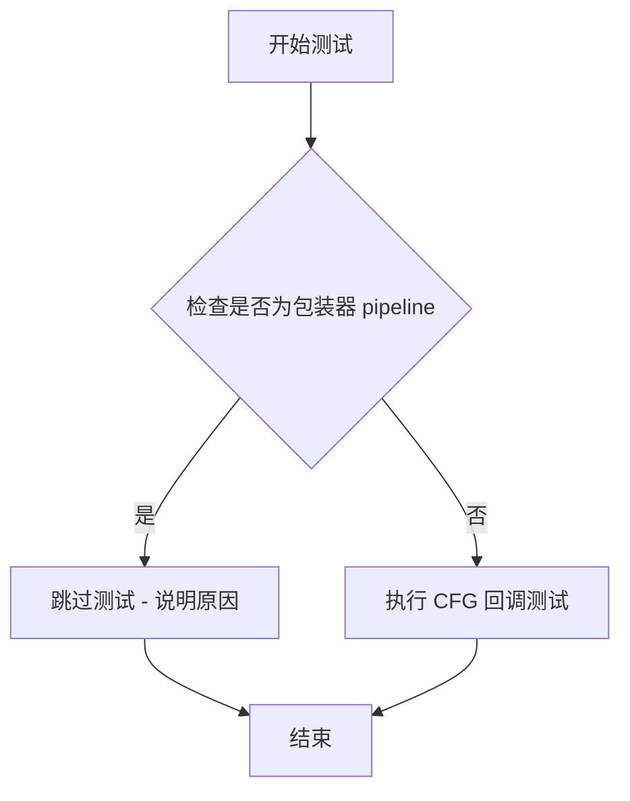

#### 带注释源码

```python
@unittest.skip(
    "Test not applicable because the pipeline being tested is a wrapper pipeline. CFG tests should be done on the inner pipelines."
)
def test_callback_cfg(self):
    """
    测试回调函数中的 CFG（Classifier-Free Guidance）功能。
    
    该测试被跳过，原因如下：
    1. 被测试的 VisualClozePipeline 是一个包装器 pipeline
    2. CFG 相关的测试应该在其内部 pipeline 上进行
    3. 直接在包装器上测试 CFG 不适用
    """
    pass
```


### `VisualClozePipelineFastTests.test_save_load_local`

该测试方法验证 VisualClozePipeline 的模型保存和本地加载功能是否正确。它创建管道实例并执行推理，保存管道到临时目录，重新加载管道，然后比较原始输出与加载后输出的差异，确保模型序列化/反序列化过程不会导致生成结果发生变化。

参数：

- `self`：类的实例对象，隐含参数
- `expected_max_difference`：`float`，可选，默认值为 `5e-4`，表示保存和加载前后输出图像的最大允许差异阈值

返回值：`None`，该方法为测试方法，通过 `self.assertLess` 断言验证结果

#### 流程图

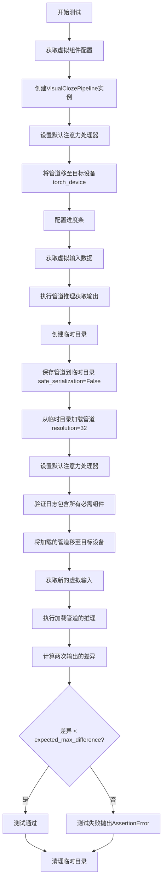

#### 带注释源码

```python
def test_save_load_local(self, expected_max_difference=5e-4):
    """
    测试VisualClozePipeline的保存和本地加载功能
    
    参数:
        expected_max_difference: float, 默认5e-4
            保存加载前后输出图像的最大允许差异
    
    返回:
        None, 通过assertLess断言验证
    """
    # 步骤1: 获取虚拟组件配置（包含transformer、text_encoder、vae等）
    components = self.get_dummy_components()
    
    # 步骤2: 使用配置创建VisualClozePipeline实例
    pipe = self.pipeline_class(**components)
    
    # 步骤3: 为所有组件设置默认注意力处理器
    for component in pipe.components.values():
        if hasattr(component, "set_default_attn_processor"):
            component.set_default_attn_processor()
    
    # 步骤4: 将管道移至目标设备（CPU/CUDA/XPU）
    pipe.to(torch_device)
    
    # 步骤5: 配置进度条（disable=None表示不禁用）
    pipe.set_progress_bar_config(disable=None)
    
    # 步骤6: 获取虚拟输入数据
    inputs = self.get_dummy_inputs(torch_device)
    
    # 步骤7: 执行管道推理，获取原始输出
    output = pipe(**inputs)[0]
    
    # 步骤8: 设置日志记录器
    logger = logging.get_logger("diffusers.pipelines.pipeline_utils")
    logger.setLevel(diffusers.logging.INFO)
    
    # 步骤9: 创建临时目录用于保存管道
    with tempfile.TemporaryDirectory() as tmpdir:
        # 步骤10: 保存管道到临时目录（不使用安全序列化）
        pipe.save_pretrained(tmpdir, safe_serialization=False)
        
        # 步骤11: 从临时目录加载管道（指定resolution=32避免OOM）
        with CaptureLogger(logger) as cap_logger:
            pipe_loaded = self.pipeline_class.from_pretrained(tmpdir, resolution=32)
        
        # 步骤12: 为加载的管道设置默认注意力处理器
        for component in pipe_loaded.components.values():
            if hasattr(component, "set_default_attn_processor"):
                component.set_default_attn_processor()
        
        # 步骤13: 验证日志中包含所有必需组件名称
        for name in pipe_loaded.components.keys():
            if name not in pipe_loaded._optional_components:
                assert name in str(cap_logger)
        
        # 步骤14: 将加载的管道移至目标设备
        pipe_loaded.to(torch_device)
        
        # 步骤15: 配置加载管道的进度条
        pipe_loaded.set_progress_bar_config(disable=None)
    
    # 步骤16: 获取新的虚拟输入（用于测试加载后的管道）
    inputs = self.get_dummy_inputs(torch_device)
    
    # 步骤17: 执行加载管道的推理
    output_loaded = pipe_loaded(**inputs)[0]
    
    # 步骤18: 计算原始输出和加载输出之间的最大差异
    max_diff = np.abs(to_np(output) - to_np(output_loaded)).max()
    
    # 步骤19: 断言差异小于阈值
    self.assertLess(max_diff, expected_max_difference)
```


### `VisualClozePipelineFastTests.test_save_load_optional_components`

该测试方法用于验证VisualClozePipeline管道在保存和加载时对可选组件（optional components）的处理是否正确。测试将所有可选组件设置为None，保存管道，然后重新加载，验证可选组件是否正确保持为None状态，并确保加载后的输出与原始输出在指定阈值内一致。

参数：

- `self`：无类型，测试类实例本身
- `expected_max_difference`：`float`，默认为1e-4，允许的最大输出差异阈值，用于验证保存/加载后输出的一致性

返回值：`None`，该方法为单元测试方法，无返回值

#### 流程图

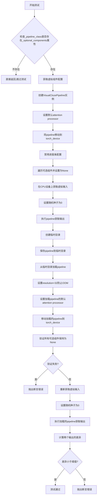

#### 带注释源码

```python
def test_save_load_optional_components(self, expected_max_difference=1e-4):
    """
    测试保存和加载可选组件的功能。
    
    该测试验证当管道的所有可选组件被设置为None后，
    管道能够正确保存和加载，并且加载后仍保持None状态。
    
    参数:
        expected_max_difference: float, 默认为1e-4
            允许原始输出和加载后输出之间的最大差异阈值
    """
    
    # 检查pipeline_class是否定义了_optional_components属性
    # 如果没有定义，则该测试不适用，直接返回
    if not hasattr(self.pipeline_class, "_optional_components"):
        return
    
    # 获取虚拟组件配置，用于创建测试用的pipeline
    components = self.get_dummy_components()
    
    # 使用虚拟组件创建VisualClozePipeline实例
    pipe = self.pipeline_class(**components)
    
    # 遍历所有组件，如果有set_default_attn_processor方法则调用
    # 这确保attention processor被正确设置
    for component in pipe.components.values():
        if hasattr(component, "set_default_attn_processor"):
            component.set_default_attn_processor()
    
    # 将pipeline移动到指定的torch设备上
    pipe.to(torch_device)
    
    # 设置进度条配置，disable=None表示不禁用进度条
    pipe.set_progress_bar_config(disable=None)

    # 将所有可选组件设置为None
    # 这是测试的核心：验证可选组件为None时的保存/加载行为
    for optional_component in pipe._optional_components:
        setattr(pipe, optional_component, None)

    # 指定生成器设备为CPU
    generator_device = "cpu"
    
    # 获取虚拟输入数据
    inputs = self.get_dummy_inputs(generator_device)
    
    # 设置随机种子为0，确保结果可复现
    torch.manual_seed(0)
    
    # 执行pipeline获取输出图像[0]表示第一张图像
    output = pipe(**inputs)[0]

    # 创建临时目录用于保存pipeline
    with tempfile.TemporaryDirectory() as tmpdir:
        # 保存pipeline到临时目录，safe_serialization=False表示不使用安全序列化
        pipe.save_pretrained(tmpdir, safe_serialization=False)
        
        # NOTE: 必须设置resolution=32，否则会在CI硬件上导致OOM
        # 这个属性不会序列化到pipeline的配置中
        pipe_loaded = self.pipeline_class.from_pretrained(tmpdir, resolution=32)
        
        # 对加载的pipeline同样设置默认attention processor
        for component in pipe_loaded.components.values():
            if hasattr(component, "set_default_attn_processor"):
                component.set_default_attn_processor()
        
        # 将加载的pipeline移动到torch_device
        pipe_loaded.to(torch_device)
        
        # 设置加载pipeline的进度条配置
        pipe_loaded.set_progress_bar_config(disable=None)

    # 验证所有可选组件在加载后仍然保持为None
    for optional_component in pipe._optional_components:
        self.assertTrue(
            getattr(pipe_loaded, optional_component) is None,
            f"`{optional_component}` did not stay set to None after loading.",
        )

    # 重新获取虚拟输入（使用相同的设备）
    inputs = self.get_dummy_inputs(generator_device)
    
    # 再次设置随机种子为0，确保与第一次执行时的条件相同
    torch.manual_seed(0)
    
    # 执行加载的pipeline获取输出
    output_loaded = pipe_loaded(**inputs)[0]

    # 计算原始输出和加载后输出的差异
    max_diff = np.abs(to_np(output) - to_np(output_loaded)).max()
    
    # 断言差异小于允许的阈值
    self.assertLess(max_diff, expected_max_difference)
```


### `VisualClozePipelineFastTests.test_save_load_float16`

该测试方法验证 VisualClozePipeline 在 float16（半精度）模式下的保存和加载功能，确保模型在保存后重新加载时仍保持 float16 数据类型，并且输出结果与原始输出的差异在可接受范围内。

参数：

- `expected_max_diff`：`float`，期望的最大差异阈值，默认值为 `1e-2`，用于判断加载后的输出与原始输出的相似度

返回值：`None`，该方法为 unittest 测试方法，通过断言验证正确性，不返回任何值

#### 流程图

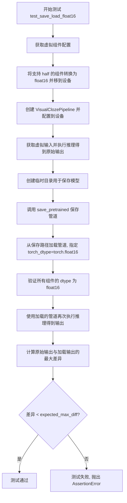

#### 带注释源码

```python
@unittest.skipIf(torch_device not in ["cuda", "xpu"], reason="float16 requires CUDA or XPU")
@require_accelerator
def test_save_load_float16(self, expected_max_diff=1e-2):
    """
    测试 VisualClozePipeline 在 float16 精度下的保存和加载功能。
    
    该测试执行以下步骤：
    1. 创建虚拟组件并转换为 float16 精度
    2. 创建管道并执行推理获取原始输出
    3. 将管道保存到临时目录
    4. 重新加载管道并验证 dtype 保持为 float16
    5. 再次执行推理并与原始输出比较差异
    """
    # 获取虚拟组件配置
    components = self.get_dummy_components()
    
    # 遍历所有组件，将支持 half() 方法的组件转换为 float16 并移到目标设备
    for name, module in components.items():
        if hasattr(module, "half"):
            components[name] = module.to(torch_device).half()

    # 使用转换后的组件创建管道实例
    pipe = self.pipeline_class(**components)
    
    # 为所有支持 set_default_attn_processor 的组件设置默认注意力处理器
    for component in pipe.components.values():
        if hasattr(component, "set_default_attn_processor"):
            component.set_default_attn_processor()
    
    # 将管道移到目标设备并配置进度条
    pipe.to(torch_device)
    pipe.set_progress_bar_config(disable=None)

    # 获取虚拟输入并执行推理得到原始输出
    inputs = self.get_dummy_inputs(torch_device)
    output = pipe(**inputs)[0]

    # 创建临时目录用于保存模型
    with tempfile.TemporaryDirectory() as tmpdir:
        # 保存管道到临时目录，使用安全序列化
        pipe.save_pretrained(tmpdir)
        
        # 从保存路径加载管道，指定 torch_dtype=torch.float16
        # 注意：resolution 需要显式设置为 32，否则在 CI 硬件上会导致 OOM
        # 这个属性不会序列化到管道的配置中
        pipe_loaded = self.pipeline_class.from_pretrained(
            tmpdir, 
            torch_dtype=torch.float16, 
            resolution=32
        )
        
        # 为加载的管道组件设置默认注意力处理器
        for component in pipe_loaded.components.values():
            if hasattr(component, "set_default_attn_processor"):
                component.set_default_attn_processor()
        
        # 将加载的管道移到目标设备并配置进度条
        pipe_loaded.to(torch_device)
        pipe_loaded.set_progress_bar_config(disable=None)

    # 验证所有组件在加载后仍然保持 float16 dtype
    for name, component in pipe_loaded.components.items():
        if hasattr(component, "dtype"):
            self.assertTrue(
                component.dtype == torch.float16,
                f"`{name}.dtype` switched from `float16` to {component.dtype} after loading.",
            )

    # 使用加载的管道再次执行推理
    inputs = self.get_dummy_inputs(torch_device)
    output_loaded = pipe_loaded(**inputs)[0]
    
    # 计算原始输出与加载输出的最大差异
    max_diff = np.abs(to_np(output) - to_np(output_loaded)).max()
    
    # 断言差异小于阈值，确保保存/加载后输出质量没有显著下降
    self.assertLess(
        max_diff, 
        expected_max_diff, 
        "The output of the fp16 pipeline changed after saving and loading."
    )
```


### `VisualClozePipelineFastTests.test_pipeline_with_accelerator_device_map`

该测试方法用于验证 VisualClozePipeline 在使用 accelerator device map 时的功能，但由于当前实现不支持，已通过 `@unittest.skip` 装饰器跳过执行。

参数：

- `self`：`unittest.TestCase`，测试用例的实例本身，用于访问测试类的属性和方法

返回值：`None`，由于方法体为 `pass` 且被跳过，不执行任何操作也不返回任何值

#### 流程图

```mermaid
flowchart TD
    A[开始测试] --> B{检查装饰器}
    B --> C[被@unittest.skip装饰器跳过]
    C --> D[测试被标记为跳过]
    D --> E[不执行方法体]
    E --> F[返回None]
    
    style C fill:#ffcccc
    style D fill:#ffcccc
    style E fill:#ffcccc
```

#### 带注释源码

```python
@unittest.skip("Test not supported.")
def test_pipeline_with_accelerator_device_map(self):
    """
    测试 VisualClozePipeline 在 accelerator device map 场景下的功能。
    
    该测试方法原本用于验证:
    1. pipeline 与 accelerator 的 device_map 功能集成
    2. 模型在不同设备间的分布式加载
    3. 内存优化的 device mapping 策略
    
    但由于当前 VisualClozePipeline 实现为 wrapper pipeline，
    其核心功能依赖于内部子 pipeline，因此该测试被标记为不支持。
    
    内部 pipeline 的 CFG 测试应在子 pipeline 层面进行。
    """
    pass  # 方法体为空，测试被跳过，不执行任何验证逻辑
```

## 关键组件


### VisualClozePipeline

VisualClozePipeline是视觉填空管道，用于根据任务提示和内容提示以及上下文图像和查询图像生成目标图像，支持图像上采样和引导 scale 控制。

### FluxTransformer2DModel

FluxTransformer2DModel是Flux变换器模型，用于处理图像特征的注意力机制，支持patch嵌入、联合注意力等操作。

### CLIPTextModel

CLIPTextModel是基于CLIP架构的文本编码器，将文本提示转换为文本嵌入向量，用于引导图像生成。

### T5EncoderModel

T5EncoderModel是T5文本编码器，用于生成额外的文本嵌入，提供更丰富的文本语义信息。

### AutoencoderKL

AutoencoderKL是变分自编码器模型，负责将图像编码到潜在空间以及从潜在空间解码重建图像。

### FlowMatchEulerDiscreteScheduler

FlowMatchEulerDiscreteScheduler是基于欧拉离散方法的流匹配调度器，用于控制去噪过程的步进。

### get_dummy_components

get_dummy_components方法创建虚拟的管道组件，用于测试目的，包括所有必要的模型和调度器配置。

### get_dummy_inputs

get_dummy_inputs方法构建虚拟输入数据，模拟VisualCloze的输入格式，包含上下文图像、查询图像、提示词和生成参数。

### VisualClozePipelineFastTests

VisualClozePipelineFastTests是测试类，包含多个测试用例验证管道的正确性，包括不同prompt、输出形状、保存加载等功能测试。


## 问题及建议


### 已知问题

-   **魔法数字和硬编码值**：代码中存在多个硬编码的数值和阈值，如 `1e-6`、`1e-3`、`5e-4`、`1e-4`、`1e-2`、`1e-1` 等阈值，以及 `max_sequence_length=77`、`num_inference_steps=2` 等参数，分散在各处难以维护和理解
-   **重复的随机种子设置**：`get_dummy_components()` 方法中多次调用 `torch.manual_seed(0)`，虽然结果相同但代码冗余
-   **测试方法参数设计不规范**：`test_upsampling_strength` 和 `test_different_task_prompts` 方法定义了 `expected_min_diff` 参数但在测试中直接使用 `assert` 语句而非 `self.assertXXX()` 形式，不符合 unittest 标准
-   **硬编码分辨率**：多处使用 `resolution=32` 并注释说明是为了避免 OOM，这种硬编码配置应该通过环境变量或配置文件管理
-   **缺少类型注解**：方法参数和返回值缺少完整的类型注解，特别是 `get_dummy_inputs` 方法的返回值类型不明确
-   **被跳过的测试无说明**：`test_pipeline_with_accelerate_device_map` 简单跳过但未提供原因或追踪 issue
-   **设备处理不一致**：`get_dummy_inputs` 中对 MPS 设备单独处理使用 `torch.manual_seed()` 而其他设备使用 `Generator`，这种条件分支可能导致行为差异
-   **资源管理**：测试中创建多个 pipeline 实例但未显式释放 GPU 资源

### 优化建议

-   **提取配置常量**：将所有魔法数字提取到类常量或配置文件
-   **重构随机种子设置**：在 `get_dummy_components` 开头统一设置一次随机种子
-   **统一测试断言风格**：使用 `self.assertGreater()` 等标准 unittest 断言方法替代裸 `assert`
-   **配置外部化**：将分辨率等环境相关配置通过 pytest fixture 或环境变量注入
-   **补充类型注解**：为所有方法添加完整的类型注解，提高代码可读性和 IDE 支持
-   **统一设备处理**：使用统一的随机数生成器创建逻辑，支持所有设备类型
-   **添加 skip 原因**：为跳过的测试添加具体的 skip 原因和 issue 追踪号
-   **考虑上下文管理器**：使用 `torch.cuda.memory_cache()` 或上下文管理器管理 GPU 资源

## 其它


### 设计目标与约束

VisualClozePipeline是一个视觉填空（Visual Cloze）任务的生成管道，其核心设计目标是根据给定的上下文图像（In-Context Example）和查询图像（Query Image），结合任务描述提示（task_prompt）和内容提示（content_prompt），生成符合语义的目标图像。该管道采用Flow Match扩散模型架构，支持图像的上采样（upsampling）操作，可调节生成强度（upsampling_strength）。设计约束包括：需要支持CUDA/XPU设备进行float16推理，默认输入图像分辨率需被VAE的scale_factor整除，最大序列长度限制为77。

### 错误处理与异常设计

测试代码中体现了以下错误处理场景：设备兼容性检查（test_save_load_float16中使用skipIf确保仅在CUDA/XPU设备执行float16测试）；生成器设备适配（get_dummy_inputs中对MPS设备的特殊处理）；Pipeline加载时的resolution参数处理（防止OOM问题）；数值精度验证（各种max_diff比较用于检测数值不稳定）。异常设计遵循unittest框架的断言机制，通过expected_max_difference/expected_min_diff参数控制容差范围。

### 数据流与状态机

管道的数据流遵循以下流程：输入预处理阶段（tokenization、文本嵌入编码、图像预处理）→ 条件嵌入生成阶段（task_prompt和content_prompt的文本特征提取）→ 潜在空间变换阶段（VAE编码输入图像到潜在空间）→ 去噪迭代阶段（FlowMatchEulerDiscreteScheduler控制的多步去噪）→ 潜在空间解码阶段（VAE解码潜在向量到像素空间）→ 上采样阶段（基于upsampling_strength和目标分辨率进行图像上采样）→ 输出后处理阶段（转换为np数组或torch张量）。状态机主要体现在Pipeline的__call__方法中的多阶段顺序执行。

### 外部依赖与接口契约

管道依赖以下核心外部组件：transformers库（CLIPTextModel、T5EncoderModel、AutoTokenizer、CLIPTokenizer）；diffusers库（AutoencoderKL、FlowMatchEulerDiscreteScheduler、FluxTransformer2DModel、VisualClozePipeline）；PyTorch（torch.Tensor、torch.device、torch.Generator）；PIL（Image处理）；numpy（数值计算）。接口契约包括：pipeline_class为VisualClozePipeline；params frozenset定义可调参数集合；batch_params frozenset定义批处理参数；get_dummy_components()返回完整组件字典；get_dummy_inputs()返回符合管道签名的参数字典。

### 性能基准与优化建议

测试中设置的数值容差反映了管道的性能基准：相同prompt去相关测试（max_diff > 1e-6）；保存加载一致性测试（max_diff < 5e-4）；可选组件保存加载测试（max_diff < 1e-4）；float16推理测试（max_diff < 1e-2）。性能优化建议包括：启用xformers注意力机制（代码中test_xformers_attention=False表明未测试）；启用torch.compile加速推理；优化VAE的量化conv使用；考虑使用DDUF（Dirty Data Update Free）技术（代码中supports_dduf=False）；支持layerwise casting和group offloading（代码中test_layerwise_casting=True, test_group_offloading=True）。

### 版本与兼容性信息

代码中涉及的关键依赖版本特征：transformers库用于文本编码；diffusers库版本需支持FlowMatchEulerDiscreteScheduler和FluxTransformer2DModel；PyTorch作为深度学习后端；CUDA/XPU设备支持float16推理。测试代码本身使用unittest框架，遵循diffusers项目的测试规范（继承PipelineTesterMixin），支持可选组件的序列化和反序列化。resolution参数作为非序列化属性需要在from_pretrained时手动指定。

### 测试覆盖范围

测试用例覆盖了管道的以下方面：功能正确性验证（test_visualcloze_different_prompts、test_different_task_prompts）；输出格式验证（test_visualcloze_image_output_shape）；参数敏感性验证（test_upsampling_strength）；批量推理验证（test_inference_batch_single_identical）；持久化验证（test_save_load_local、test_save_load_optional_components、test_save_load_float16）。测试使用了dummy组件进行快速验证，避免了真实模型的资源消耗。

    