# `diffusers\tests\pipelines\visualcloze\test_pipeline_visualcloze_generation.py` 详细设计文档

该代码文件是一个针对 VisualClozeGenerationPipeline（视觉补全生成管道）的单元测试套件。它利用 diffusers 库的测试工具构建虚拟组件（模型、VAE、编码器）和特定结构的输入数据（上下文图像与查询图像），并通过一系列测试方法验证管道在推理一致性、提示词敏感性、保存加载以及类型转换等方面的正确性。

## 整体流程

```mermaid
graph TD
    A[测试开始] --> B[get_dummy_components]
B --> C[get_dummy_inputs]
C --> D[实例化 VisualClozeGenerationPipeline]
D --> E[pipe(**inputs) 执行推理]
E --> F[断言验证]
F --> G[测试结束]
```

## 类结构

```
unittest.TestCase
└── VisualClozeGenerationPipelineFastTests
    └── PipelineTesterMixin (混入)
```

## 全局变量及字段


### `enable_full_determinism`
    
调用以设置全局随机种子，确保测试可复现

类型：`function`
    


### `VisualClozeGenerationPipelineFastTests.pipeline_class`
    
被测试的管道类引用

类型：`type`
    


### `VisualClozeGenerationPipelineFastTests.params`
    
管道参数集合 (task_prompt, content_prompt, guidance_scale, prompt_embeds, pooled_prompt_embeds)

类型：`frozenset`
    


### `VisualClozeGenerationPipelineFastTests.batch_params`
    
批处理参数集合 (task_prompt, content_prompt, image)

类型：`frozenset`
    


### `VisualClozeGenerationPipelineFastTests.test_xformers_attention`
    
是否测试xformers注意力

类型：`bool`
    


### `VisualClozeGenerationPipelineFastTests.test_layerwise_casting`
    
是否测试分层类型转换

类型：`bool`
    


### `VisualClozeGenerationPipelineFastTests.test_group_offloading`
    
是否测试组卸载

类型：`bool`
    


### `VisualClozeGenerationPipelineFastTests.supports_dduf`
    
是否支持DDUF

类型：`bool`
    
    

## 全局函数及方法


### `random.Random`

这是Python标准库中的Random类，在代码中用于创建随机数生成器实例，以生成可复现的随机图像数据。

参数：

- `seed`：`int`，随机数生成器的种子值，用于确保测试的可复现性

返回值：`random.Random`，返回一个随机数生成器对象

#### 流程图

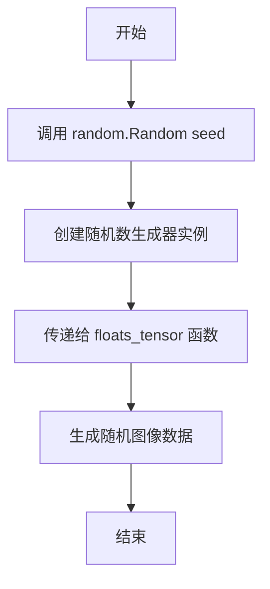

#### 带注释源码

```python
# 在 get_dummy_inputs 方法中使用 random.Random
def get_dummy_inputs(self, device, seed=0):
    # 创建上下文图像，使用 random.Random 生成随机数据
    # seed 参数确保每次调用产生相同的随机数，提高测试可复现性
    context_image = [
        Image.fromarray(floats_tensor((32, 32, 3), rng=random.Random(seed), scale=255).numpy().astype(np.uint8))
        for _ in range(2)
    ]
    
    # 创建查询图像，使用 seed+1 确保产生不同的随机数据
    query_image = [
        Image.fromarray(
            floats_tensor((32, 32, 3), rng=random.Random(seed + 1), scale=255).numpy().astype(np.uint8)
        ),
        None,
    ]
```

#### 详细说明

在代码中，`random.Random` 被用于：

1. **创建独立的随机数生成器**：通过传递不同的种子值（seed 和 seed+1），可以生成两组不同的随机图像数据
2. **测试可复现性**：使用固定的种子值确保单元测试的结果是一致的，这对于回归测试非常重要
3. **模拟Visual Cloze任务输入**：生成的图像模拟了视觉补全任务的上下文图像和查询图像格式


### `tempfile.TemporaryDirectory`

该函数是 Python 标准库 `tempfile` 模块中的一个类，用于创建一个临时目录，并在上下文结束时自动清理该目录及其内容。常用于测试中保存和加载模型权重。

参数：

- `suffix`： `str`，（可选）临时目录名的后缀
- `prefix`： `str`，（可选）临时目录名的前缀
- `dir`： `str`，（可选）指定临时目录创建的路径

返回值： `str`，返回临时目录的路径字符串

#### 流程图

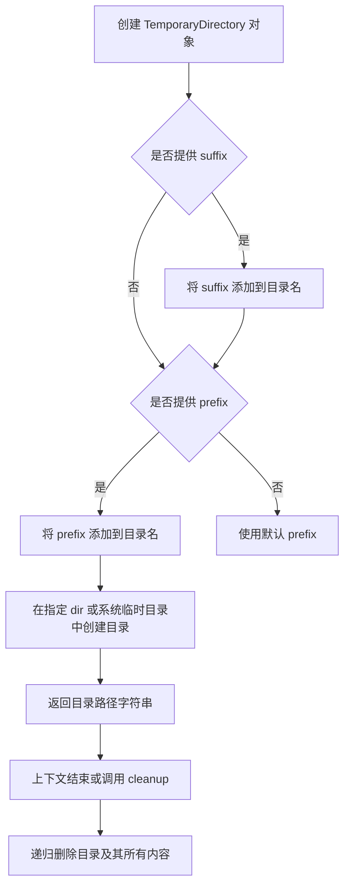

#### 带注释源码

```python
# 在 test_save_load_local 方法中使用示例
with tempfile.TemporaryDirectory() as tmpdir:
    # tmpdir 是自动生成的临时目录路径
    # 例如: '/tmp/tmp123abc456'
    
    pipe.save_pretrained(tmpdir, safe_serialization=False)
    # 将 pipeline 的所有组件保存到临时目录中
    
    pipe_loaded = self.pipeline_class.from_pretrained(tmpdir, resolution=32)
    # 从临时目录加载 pipeline
    
# 离开 with 块时，tmpdir 目录及其内容会被自动删除
# 这确保了测试不会在文件系统中留下临时文件
```


### `VisualClozeGenerationPipelineFastTests`

该类是 `VisualClozeGenerationPipeline` 的单元测试类，继承自 `unittest.TestCase` 和 `PipelineTesterMixin`，用于测试视觉填空生成管道的各项功能，包括不同提示词测试、批量推理、模型保存加载等。

参数：

-  `self`：隐式参数，测试类实例本身

返回值：无（测试类方法）

#### 流程图

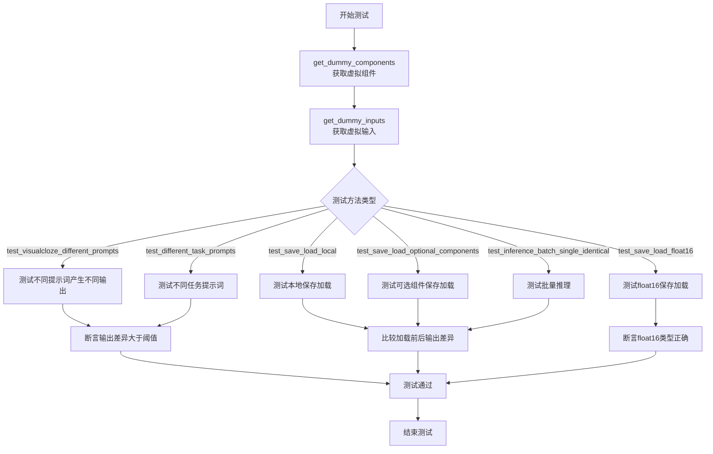

#### 带注释源码

```python
class VisualClozeGenerationPipelineFastTests(unittest.TestCase, PipelineTesterMixin):
    """
    VisualClozeGenerationPipeline的快速测试类
    继承unittest.TestCase和PipelineTesterMixin，用于管道功能测试
    """
    
    # 指定测试的管道类
    pipeline_class = VisualClozeGenerationPipeline
    
    # 管道参数字段集合
    params = frozenset([
        "task_prompt",           # 任务提示词
        "content_prompt",       # 内容提示词
        "guidance_scale",       # 引导比例
        "prompt_embeds",        # 提示词嵌入
        "pooled_prompt_embeds", # 池化提示词嵌入
    ])
    
    # 批量参数字段集合
    batch_params = frozenset([
        "task_prompt",     # 任务提示词（支持批量）
        "content_prompt", # 内容提示词（支持批量）
        "image"           # 图像输入（支持批量）
    ])
    
    # 测试配置标志
    test_xformers_attention = False     # 不测试xformers注意力
    test_layerwise_casting = True       # 测试逐层类型转换
    test_group_offloading = True        # 测试组卸载
    
    supports_dduf = False               # 不支持DDUF
    
    def get_dummy_components(self):
        """
        创建用于测试的虚拟组件
        
        返回:
            dict: 包含所有管道组件的字典
        """
        torch.manual_seed(0)
        # 创建虚拟Transformer模型
        transformer = FluxTransformer2DModel(
            patch_size=1,
            in_channels=12,
            out_channels=4,
            num_layers=1,
            num_single_layers=1,
            attention_head_dim=6,
            num_attention_heads=2,
            joint_attention_dim=32,
            pooled_projection_dim=32,
            axes_dims_rope=[2, 2, 2],
        )
        
        # 创建CLIP文本编码器配置
        clip_text_encoder_config = CLIPTextConfig(
            bos_token_id=0,
            eos_token_id=2,
            hidden_size=32,
            intermediate_size=37,
            layer_norm_eps=1e-05,
            num_attention_heads=4,
            num_hidden_layers=5,
            pad_token_id=1,
            vocab_size=1000,
            hidden_act="gelu",
            projection_dim=32,
        )
        
        torch.manual_seed(0)
        text_encoder = CLIPTextModel(clip_text_encoder_config)
        
        torch.manual_seed(0)
        text_encoder_2 = T5EncoderModel.from_pretrained("hf-internal-testing/tiny-random-t5")
        
        # 创建tokenizer
        tokenizer = CLIPTokenizer.from_pretrained("hf-internal-testing/tiny-random-clip")
        tokenizer_2 = AutoTokenizer.from_pretrained("hf-internal-testing/tiny-random-t5")
        
        torch.manual_seed(0)
        # 创建VAE模型
        vae = AutoencoderKL(
            sample_size=32,
            in_channels=3,
            out_channels=3,
            block_out_channels=(4,),
            layers_per_block=1,
            latent_channels=1,
            norm_num_groups=1,
            use_quant_conv=False,
            use_post_quant_conv=False,
            shift_factor=0.0609,
            scaling_factor=1.5035,
        )
        
        # 创建调度器
        scheduler = FlowMatchEulerDiscreteScheduler()
        
        return {
            "scheduler": scheduler,
            "text_encoder": text_encoder,
            "text_encoder_2": text_encoder_2,
            "tokenizer": tokenizer,
            "tokenizer_2": tokenizer_2,
            "transformer": transformer,
            "vae": vae,
            "resolution": 32,
        }
    
    def get_dummy_inputs(self, device, seed=0):
        """
        创建用于测试的虚拟输入数据
        
        参数:
            device: 计算设备
            seed: 随机种子
            
        返回:
            dict: 包含所有管道输入参数的字典
        """
        # 创建示例图像
        context_image = [
            Image.fromarray(
                floats_tensor((32, 32, 3), rng=random.Random(seed), scale=255).numpy().astype(np.uint8)
            )
            for _ in range(2)
        ]
        query_image = [
            Image.fromarray(
                floats_tensor((32, 32, 3), rng=random.Random(seed + 1), scale=255).numpy().astype(np.uint8)
            ),
            None,
        ]
        
        # 创建符合VisualCloze输入格式的图像列表
        image = [
            context_image,  # 上下文示例
            query_image,    # 查询图像
        ]
        
        # 创建随机数生成器
        if str(device).startswith("mps"):
            generator = torch.manual_seed(seed)
        else:
            generator = torch.Generator(device="cpu").manual_seed(seed)
        
        inputs = {
            "task_prompt": "Each row outlines a logical process...",
            "content_prompt": "A beautiful landscape with mountains and a lake",
            "image": image,
            "generator": generator,
            "num_inference_steps": 2,
            "guidance_scale": 5.0,
            "max_sequence_length": 77,
            "output_type": "np",
        }
        return inputs
    
    def test_visualcloze_different_prompts(self):
        """测试不同提示词产生不同输出"""
        pipe = self.pipeline_class(**self.get_dummy_components()).to(torch_device)
        inputs = self.get_dummy_inputs(torch_device)
        output_same_prompt = pipe(**inputs).images[0]
        
        inputs = self.get_dummy_inputs(torch_device)
        inputs["task_prompt"] = "A different task to perform."
        output_different_prompts = pipe(**inputs).images[0]
        
        max_diff = np.abs(output_same_prompt - output_different_prompts).max()
        assert max_diff > 1e-6
    
    def test_different_task_prompts(self, expected_min_diff=1e-1):
        """测试不同任务提示词产生不同输出"""
        pipe = self.pipeline_class(**self.get_dummy_components()).to(torch_device)
        inputs = self.get_dummy_inputs(torch_device)
        
        output_original = pipe(**inputs).images[0]
        
        inputs["task_prompt"] = "A different task description for image generation"
        output_different_task = pipe(**inputs).images[0]
        
        max_diff = np.abs(output_original - output_different_task).max()
        assert max_diff > expected_min_diff
    
    def test_save_load_local(self, expected_max_difference=5e-4):
        """测试管道本地保存和加载功能"""
        components = self.get_dummy_components()
        pipe = self.pipeline_class(**components)
        # ... 保存加载测试逻辑
```


### `VisualClozeGenerationPipelineFastTests.get_dummy_inputs`

该方法用于生成虚拟输入数据，模拟VisualCloze图像生成管道所需的输入格式，包括任务提示、内容提示、上下文图像和查询图像，并返回包含所有必要参数的字典。

参数：

- `self`：隐式参数，VisualClozeGenerationPipelineFastTests实例本身
- `device`：str，目标设备（如"cpu"、"cuda"等），用于指定生成器和输入张量的目标设备
- `seed`：int，默认值为0，随机数种子，用于确保测试的可重复性

返回值：dict，包含以下键值对：
- `task_prompt`：str，任务描述提示
- `content_prompt`：str，内容生成提示
- `image`：list，图像列表，格式为[context_image, query_image]
- `generator`：torch.Generator，随机数生成器
- `num_inference_steps`：int，推理步数
- `guidance_scale`：float，guidance缩放因子
- `max_sequence_length`：int，最大序列长度
- `output_type`：str，输出类型

#### 流程图

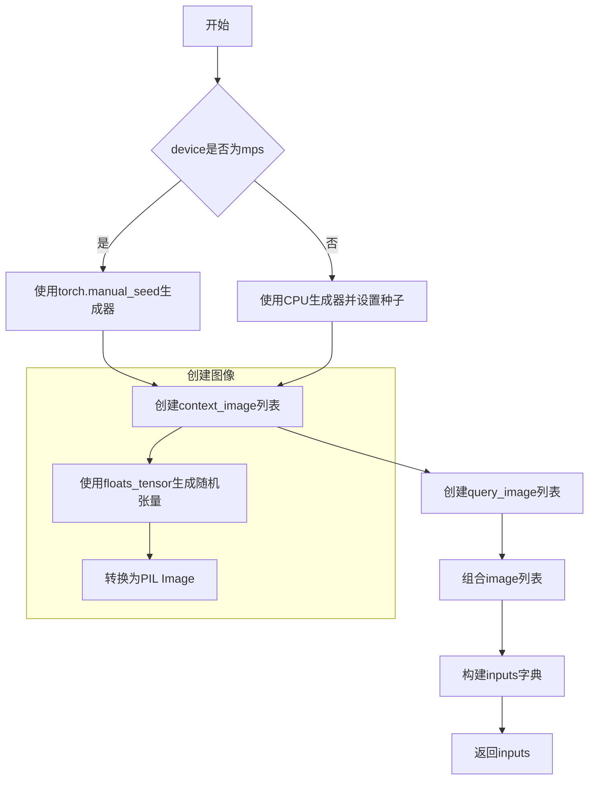

#### 带注释源码

```python
def get_dummy_inputs(self, device, seed=0):
    # 创建示例图像以模拟VisualCloze所需的输入格式
    # context_image: 上下文示例图像列表，用于提供任务上下文
    context_image = [
        Image.fromarray(
            floats_tensor(
                (32, 32, 3),  # 图像尺寸：32x32像素，3通道(RGB)
                rng=random.Random(seed),  # 使用随机种子确保可重复性
                scale=255  # 缩放至255范围
            ).numpy().astype(np.uint8)  # 转换为numpy数组再转为uint8
        )
        for _ in range(2)  # 创建2张上下文图像
    ]
    
    # query_image: 查询图像列表，第一张是实际图像，第二张为None表示需要生成
    query_image = [
        Image.fromarray(
            floats_tensor(
                (32, 32, 3), 
                rng=random.Random(seed + 1),  # 使用seed+1确保不同于context_image
                scale=255
            ).numpy().astype(np.uint8)
        ),
        None,  # 第二张图像为None，表示这是需要模型生成的图像位置
    ]

    # 创建符合VisualCloze输入格式的图像列表
    # 格式: [context_images, query_images]
    image = [
        context_image,  # 上下文示例
        query_image,  # 查询图像
    ]

    # 根据设备类型选择随机数生成器
    # MPS (Metal Performance Shaders) 需要特殊处理
    if str(device).startswith("mps"):
        generator = torch.manual_seed(seed)
    else:
        # 其他设备使用CPU生成器
        generator = torch.Generator(device="cpu").manual_seed(seed)

    # 构建完整的输入参数字典
    inputs = {
        "task_prompt": "Each row outlines a logical process, starting from [IMAGE1] gray-based depth map with detailed object contours, to achieve [IMAGE2] an image with flawless clarity.",
        # 任务提示：描述从深度图到清晰图像的处理过程
        "content_prompt": "A beautiful landscape with mountains and a lake",
        # 内容提示：描述要生成的图像内容
        "image": image,
        # 图像输入：[上下文图像, 查询图像]
        "generator": generator,
        # 随机数生成器，确保推理过程可重复
        "num_inference_steps": 2,
        # 推理步数：扩散模型的采样步数
        "guidance_scale": 5.0,
        # Guidance缩放因子：控制文本提示对生成的影响程度
        "max_sequence_length": 77,
        # 最大序列长度：文本编码的最大长度限制
        "output_type": "np",
        # 输出类型：返回numpy数组
    }
    return inputs
```


# VisualClozeGenerationPipelineFastTests 详细设计文档

## 1. 一段话描述

该代码是一个针对 `VisualClozeGenerationPipeline` 的单元测试类，通过创建虚拟组件和测试输入，验证图像生成管道的各种功能，包括不同提示词处理、批处理推理、保存加载以及浮点精度等方面的正确性。

## 2. 文件的整体运行流程

```
┌─────────────────────────────────────────────────────────────┐
│                    测试类初始化                              │
│  - 设置 pipeline_class                                       │
│  - 定义测试参数和批处理参数                                   │
└─────────────────────────┬───────────────────────────────────┘
                          │
                          ▼
┌─────────────────────────────────────────────────────────────┐
│           get_dummy_components()                            │
│  - 创建虚拟 Transformer 模型                                 │
│  - 创建虚拟 Text Encoder (CLIP + T5)                         │
│  - 创建虚拟 VAE 模型                                         │
│  - 创建调度器                                                │
└─────────────────────────┬───────────────────────────────────┘
                          │
                          ▼
┌─────────────────────────────────────────────────────────────┐
│              get_dummy_inputs()                              │
│  - 生成虚拟图像输入 (context + query)                        │
│  - 设置生成器参数                                            │
│  - 返回完整的输入字典                                        │
└─────────────────────────┬───────────────────────────────────┘
                          │
                          ▼
┌─────────────────────────────────────────────────────────────┐
│                    执行测试用例                              │
│  - test_visualcloze_different_prompts                        │
│  - test_inference_batch_single_identical                    │
│  - test_different_task_prompts                               │
│  - test_save_load_local                                      │
│  - test_save_load_optional_components                        │
│  - test_save_load_float16                                    │
└─────────────────────────────────────────────────────────────┘
```

## 3. 类的详细信息

### 3.1 类字段

| 字段名称 | 类型 | 描述 |
|---------|------|------|
| `pipeline_class` | `type` | 指定的管道类 `VisualClozeGenerationPipeline` |
| `params` | `frozenset` | 管道参数集合，包含 task_prompt, content_prompt 等 |
| `batch_params` | `frozenset` | 批处理参数集合 |
| `test_xformers_attention` | `bool` | 是否测试 xformers 注意力机制 |
| `test_layerwise_casting` | `bool` | 是否测试逐层类型转换 |
| `test_group_offloading` | `bool` | 是否测试组卸载 |
| `supports_dduf` | `bool` | 是否支持 DDUF |

### 3.2 类方法

| 方法名称 | 功能描述 |
|---------|---------|
| `get_dummy_components` | 创建虚拟模型组件用于测试 |
| `get_dummy_inputs` | 创建虚拟输入数据用于测试 |
| `test_visualcloze_different_prompts` | 测试不同提示词产生不同输出 |
| `test_inference_batch_single_identical` | 测试批处理与单样本推理一致性 |
| `test_different_task_prompts` | 测试不同任务提示词的影响 |
| `test_save_load_local` | 测试管道保存和加载功能 |
| `test_save_load_optional_components` | 测试可选组件的保存加载 |
| `test_save_load_float16` | 测试 float16 精度保存加载 |

## 4. 全局变量和全局函数

| 名称 | 类型 | 描述 |
|-----|------|------|
| `enable_full_determinism` | `function` | 启用完全确定性测试的辅助函数 |
| `torch_device` | `str` | 测试使用的设备标识 |
| `PipelineTesterMixin` | `class` | 管道测试混入类 |
| `to_np` | `function` | 将张量转换为 numpy 数组 |

## 5. 关键组件信息

| 组件名称 | 一句话描述 |
|---------|-----------|
| `FluxTransformer2DModel` | 用于图像生成的 Transformer 模型 |
| `CLIPTextModel` | CLIP 文本编码器模型 |
| `T5EncoderModel` | T5 文本编码器模型 |
| `AutoencoderKL` | VAE 变分自编码器 |
| `FlowMatchEulerDiscreteScheduler` | 扩散采样调度器 |
| `VisualClozeGenerationPipeline` | 视觉填空生成管道 |

---

## 任务要求的函数提取

### `VisualClozeGenerationPipelineFastTests.get_dummy_components`

#### 描述

该方法创建用于测试的虚拟模型组件，包括 FluxTransformer2DModel、CLIPTextModel、T5EncoderModel、AutoencoderKL 等，所有组件使用相同的随机种子确保可重复性。

#### 参数

- 无参数（仅 `self`）

#### 返回值

- `dict`，包含以下键值对：
  - `scheduler`: `FlowMatchEulerDiscreteScheduler` - 扩散调度器
  - `text_encoder`: `CLIPTextModel` - CLIP 文本编码器
  - `text_encoder_2`: `T5EncoderModel` - T5 文本编码器
  - `tokenizer`: `CLIPTokenizer` - CLIP 分词器
  - `tokenizer_2`: `AutoTokenizer` - T5 分词器
  - `transformer`: `FluxTransformer2DModel` - 图像生成 Transformer
  - `vae`: `AutoencoderKL` - VAE 模型
  - `resolution`: `int` - 分辨率 32

#### 流程图

```mermaid
flowchart TD
    A[开始 get_dummy_components] --> B[设置随机种子 torch.manual_seed(0)]
    B --> C[创建 FluxTransformer2DModel]
    C --> D[创建 CLIPTextConfig 配置]
    D --> E[创建 CLIPTextModel]
    E --> F[创建 T5EncoderModel]
    F --> G[创建 CLIPTokenizer]
    G --> H[创建 AutoTokenizer]
    H --> I[创建 AutoencoderKL]
    I --> J[创建 FlowMatchEulerDiscreteScheduler]
    J --> K[组装组件字典]
    K --> L[返回组件字典]
```

#### 带注释源码

```python
def get_dummy_components(self):
    """创建用于测试的虚拟模型组件"""
    
    # 设置随机种子为0，确保每次调用生成相同的组件
    torch.manual_seed(0)
    
    # 创建虚拟的 Flux Transformer 模型
    # patch_size=1:  patch大小
    # in_channels=12: 输入通道数
    # out_channels=4: 输出通道数
    # num_layers=1: Transformer层数
    # num_single_layers=1: 单层数量
    # attention_head_dim=6: 注意力头维度
    # num_attention_heads=2: 注意力头数量
    # joint_attention_dim=32: 联合注意力维度
    # pooled_projection_dim=32: 池化投影维度
    # axes_dims_rope=[2, 2, 2]: RoPE轴维度
    transformer = FluxTransformer2DModel(
        patch_size=1,
        in_channels=12,
        out_channels=4,
        num_layers=1,
        num_single_layers=1,
        attention_head_dim=6,
        num_attention_heads=2,
        joint_attention_dim=32,
        pooled_projection_dim=32,
        axes_dims_rope=[2, 2, 2],
    )
    
    # 创建 CLIP 文本编码器配置
    # bos_token_id=0: 句子开始标记ID
    # eos_token_id=2: 句子结束标记ID
    # hidden_size=32: 隐藏层大小
    # intermediate_size=37: FFN中间层大小
    # num_attention_heads=4: 注意力头数
    # num_hidden_layers=5: 隐藏层数
    # pad_token_id=1: 填充标记ID
    # vocab_size=1000: 词汇表大小
    clip_text_encoder_config = CLIPTextConfig(
        bos_token_id=0,
        eos_token_id=2,
        hidden_size=32,
        intermediate_size=37,
        layer_norm_eps=1e-05,
        num_attention_heads=4,
        num_hidden_layers=5,
        pad_token_id=1,
        vocab_size=1000,
        hidden_act="gelu",
        projection_dim=32,
    )

    # 使用随机种子创建 CLIP 文本编码器
    torch.manual_seed(0)
    text_encoder = CLIPTextModel(clip_text_encoder_config)

    # 使用随机种子创建 T5 编码器
    torch.manual_seed(0)
    text_encoder_2 = T5EncoderModel.from_pretrained("hf-internal-testing/tiny-random-t5")

    # 创建分词器
    tokenizer = CLIPTokenizer.from_pretrained("hf-internal-testing/tiny-random-clip")
    tokenizer_2 = AutoTokenizer.from_pretrained("hf-internal-testing/tiny-random-t5")

    # 使用随机种子创建 VAE 模型
    # sample_size=32: 样本尺寸
    # in_channels=3: 输入通道数
    # out_channels=3: 输出通道数
    # block_out_channels=(4,): 块输出通道数
    # layers_per_block=1: 每块层数
    # latent_channels=1: 潜在空间通道数
    torch.manual_seed(0)
    vae = AutoencoderKL(
        sample_size=32,
        in_channels=3,
        out_channels=3,
        block_out_channels=(4,),
        layers_per_block=1,
        latent_channels=1,
        norm_num_groups=1,
        use_quant_conv=False,
        use_post_quant_conv=False,
        shift_factor=0.0609,
        scaling_factor=1.5035,
    )

    # 创建欧拉离散调度器
    scheduler = FlowMatchEulerDiscreteScheduler()

    # 返回包含所有组件的字典
    return {
        "scheduler": scheduler,
        "text_encoder": text_encoder,
        "text_encoder_2": text_encoder_2,
        "tokenizer": tokenizer,
        "tokenizer_2": tokenizer_2,
        "transformer": transformer,
        "vae": vae,
        "resolution": 32,
    }
```

---

### `VisualClozeGenerationPipelineFastTests.get_dummy_inputs`

#### 描述

该方法创建用于测试的虚拟输入数据，包括上下文图像、查询图像、提示词文本、生成器配置等，模拟 VisualCloze 管道所需的完整输入格式。

#### 参数

- `device`: `str`，测试设备标识（如 "cuda"、"cpu"、"mps"）
- `seed`: `int`（可选），随机种子，默认为 0

#### 返回值

- `dict`，包含以下键值对：
  - `task_prompt`: `str` - 任务描述提示词
  - `content_prompt`: `str` - 内容描述提示词
  - `image`: `list` - 图像列表 [context_image, query_image]
  - `generator`: `torch.Generator` - 随机生成器
  - `num_inference_steps`: `int` - 推理步数
  - `guidance_scale`: `float` - 引导比例
  - `max_sequence_length`: `int` - 最大序列长度
  - `output_type`: `str` - 输出类型

#### 流程图

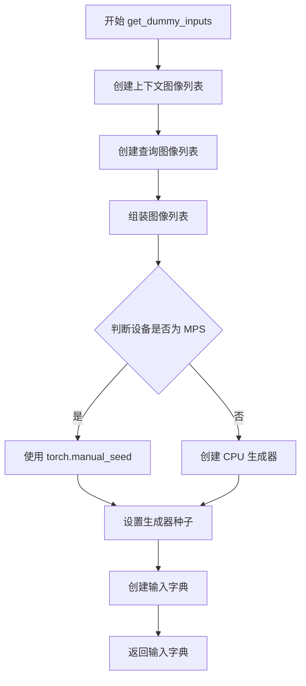

#### 带注释源码

```python
def get_dummy_inputs(self, device, seed=0):
    """创建用于测试的虚拟输入数据"""
    
    # 创建上下文图像（In-Context examples）
    # 使用随机数生成器生成 32x32 的 RGB 图像
    # floats_tensor: 生成浮点数张量
    # scale=255: 缩放到255范围
    # numpy().astype(np.uint8): 转换为uint8格式
    context_image = [
        Image.fromarray(
            floats_tensor((32, 32, 3), rng=random.Random(seed), scale=255).numpy().astype(np.uint8)
        )
        for _ in range(2)
    ]
    
    # 创建查询图像列表
    # 第一个是图像，第二个是None（表示需要生成的区域）
    query_image = [
        Image.fromarray(
            floats_tensor((32, 32, 3), rng=random.Random(seed + 1), scale=255).numpy().astype(np.uint8)
        ),
        None,  # 表示该位置需要被填充/生成
    ]

    # 组装符合 VisualCloze 输入格式的图像列表
    # 结构: [[context_image], [query_image]]
    image = [
        context_image,  # In-Context 示例图像
        query_image,    # 查询图像（包含待生成区域）
    ]

    # 根据设备类型创建随机生成器
    # MPS (Metal Performance Shaders) 需要特殊处理
    if str(device).startswith("mps"):
        # MPS 设备使用 torch.manual_seed
        generator = torch.manual_seed(seed)
    else:
        # 其他设备创建 CPU 生成器
        generator = torch.Generator(device="cpu").manual_seed(seed)

    # 组装完整的输入参数字典
    inputs = {
        # 任务提示词：描述从深度图到清晰图像的处理过程
        "task_prompt": "Each row outlines a logical process, starting from [IMAGE1] gray-based depth map with detailed object contours, to achieve [IMAGE2] an image with flawless clarity.",
        
        # 内容提示词：描述要生成的内容
        "content_prompt": "A beautiful landscape with mountains and a lake",
        
        # 图像输入：包含上下文示例和查询图像
        "image": image,
        
        # 随机生成器：控制生成过程的随机性
        "generator": generator,
        
        # 推理步数：扩散模型的采样步数
        "num_inference_steps": 2,
        
        # 引导比例：控制生成内容与提示词的相关性
        "guidance_scale": 5.0,
        
        # 最大序列长度：文本编码的最大长度
        "max_sequence_length": 77,
        
        # 输出类型：返回 numpy 数组
        "output_type": "np",
    }
    return inputs
```

---

## 6. 潜在的技术债务或优化空间

1. **硬编码的分辨率**: 代码中多处硬编码 `resolution=32`，建议提取为配置常量
2. **重复的组件设置代码**: `set_default_attn_processor` 的调用在多个测试方法中重复出现，可抽取为工具方法
3. **测试用例跳过**: 有两个测试方法被 `@unittest.skip` 跳过，需要后续补充实现
4. **魔法数字**: 如 `seed + 1`、`77`、`5.0` 等数值缺乏明确含义的注释
5. **设备判断逻辑**: `str(device).startswith("mps")` 的设备判断方式不够健壮

## 7. 其它项目

### 设计目标与约束

- 测试目标：验证 VisualClozeGenerationPipeline 的核心功能正确性
- 约束：需要在 CPU 和 CUDA/XPU 环境下可运行
- 确定性要求：通过 `enable_full_determinism` 保证测试可重复性

### 错误处理与异常设计

- 使用 `CaptureLogger` 捕获日志输出进行验证
- 通过 `assert` 语句验证输出差异是否在容忍范围内
- 浮点精度测试使用 `@unittest.skipIf` 跳过不支持的环境

### 数据流与状态机

```
输入数据 → 文本编码 → 图像编码 → Transformer处理 → VAE解码 → 输出图像
```

### 外部依赖与接口契约

- 依赖 `diffusers` 库的管道和模型类
- 依赖 `transformers` 库的文本编码器和分词器
- 依赖 `PIL` 和 `numpy` 进行图像处理
- 依赖 `unittest` 框架进行测试


### `Image.fromarray`

将 numpy 数组转换为 PIL Image 对象。这是 PIL 库中的核心函数，用于在深度学习管道测试中创建模拟输入图像。

参数：

-  `array`：`numpy.ndarray`，输入的 numpy 数组，通常是三维数组（高度 x 宽度 x 通道），数据类型为 uint8
-  `mode`：`str`（可选），图像模式，如 'RGB'、'L'（灰度）等。如果为 None，则根据数组形状和dtype推断

返回值：`PIL.Image.Image`，返回转换后的 PIL Image 对象

#### 流程图

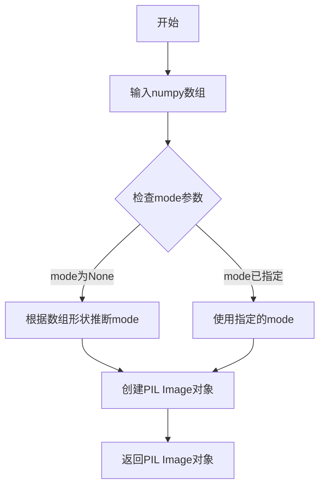

#### 带注释源码

```python
# 在代码中的实际使用方式：
from PIL import Image
import numpy as np
import random

# 创建模拟的numpy数组数据
# floats_tensor 生成指定形状的浮点张量，scale=255 表示归一化到0-255范围
# .numpy() 转换为numpy数组
# .astype(np.uint8) 转换为无符号8位整数，这是图像的标准格式
context_image = [
    Image.fromarray(
        floats_tensor((32, 32, 3), rng=random.Random(seed), scale=255).numpy().astype(np.uint8)
    )
    for _ in range(2)
]

# 示例输出：
# context_image[0] -> <PIL.Image.Image image mode=RGB size=32x32>
```


### `transformers.AutoTokenizer.from_pretrained`

从预训练模型加载并实例化分词器（Tokenizer）。AutoTokenizer 是 Hugging Face Transformers 库中的自动分词器类，能够根据模型名称或路径自动选择并加载对应的分词器。

参数：

- `pretrained_model_name_or_path`：`str` 或 `os.PathLike`，预训练模型的名称（如 "hf-internal-testing/tiny-random-t5"）或本地路径
- `*inputs`：位置参数，传递给分词器的额外输入
- `**kwargs`：关键字参数，包含如下常见选项：
  - `cache_dir`：`str`，模型缓存目录
  - `force_download`：`bool`，是否强制重新下载
  - `resume_download`：`bool`，是否恢复中断的下载
  - `proxies`：`dict`，用于请求的代理服务器
  - `revision`：`str`，模型仓库的 Git 分支或提交哈希
  - `use_fast`：`bool`，是否使用 Rust 实现的快速分词器（默认 True）
  - `token`：`str` 或 `bool`，用于认证的 Hugging Face token
  - `trust_remote_code`：`bool`，是否信任远程代码

返回值：`PreTrainedTokenizer` 或 `PreTrainedTokenizerFast`，返回具体的分词器对象（CLIPTokenizer 或 T5Tokenizer 等）

#### 流程图

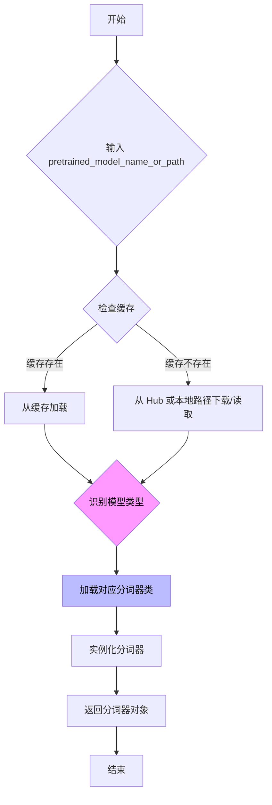

#### 带注释源码

```python
# 从 transformers 库导入 AutoTokenizer 类
# AutoTokenizer 是一个自动分词器工厂类，能够根据模型名称自动选择正确的分词器类型
tokenizer = AutoTokenizer.from_pretrained("hf-internal-testing/tiny-random-t5")

# 上述代码的内部实现逻辑可以概括为：
# 1. AutoTokenizer 类的 from_pretrained 是一个类方法
# 2. 该方法首先根据传入的模型名称/路径解析模型类型
# 3. 根据模型类型（如 T5, CLIP, BERT 等）选择对应的分词器类
# 4. 加载分词器的配置文件（tokenizer_config.json）
# 5. 加载分词器所需的词表文件（vocab.json, merges.txt 等）
# 6. 实例化对应的分词器对象并返回

# 示例中的使用场景：
# 为 VisualClozeGenerationPipeline 创建 T5 文本编码器的分词器
# 该分词器用于将文本字符串转换为模型可处理的 token IDs
tokenizer_2 = AutoTokenizer.from_pretrained("hf-internal-testing/tiny-random-t5")
```

#### 实际调用上下文

在给定的测试代码中，`AutoTokenizer.from_pretrained` 的具体调用如下：

```python
def get_dummy_components(self):
    # ... 其他组件初始化 ...
    
    # 使用 AutoTokenizer 加载 T5 模型的轻量级随机版本分词器
    # 用于文本编码器 2（T5EncoderModel）的文本处理
    tokenizer_2 = AutoTokenizer.from_pretrained("hf-internal-testing/tiny-random-t5")
    
    return {
        "scheduler": scheduler,
        "text_encoder": text_encoder,
        "text_encoder_2": text_encoder_2,
        "tokenizer": tokenizer,
        "tokenizer_2": tokenizer_2,
        "transformer": transformer,
        "vae": vae,
        "resolution": 32,
    }
```


### `CLIPTextConfig`

`CLIPTextConfig` 是从 `transformers` 库导入的配置类，用于实例化 CLIP 文本编码器的配置参数。在本代码中，它被用于创建 `clip_text_encoder_config` 对象，该对象定义了文本编码器的架构参数（如隐藏层维度、注意力头数、层数等）。

参数：

- `bos_token_id`：`int`，句子开始 token 的 ID
- `eos_token_id`：`int`，句子结束 token 的 ID
- `hidden_size`：`int`，隐藏层维度大小
- `intermediate_size`：`int`，前馈网络中间层维度
- `layer_norm_eps`：`float`，层归一化的 epsilon 值
- `num_attention_heads`：`int`，注意力头的数量
- `num_hidden_layers`：`int`，隐藏层的数量
- `pad_token_id`：`int`，填充 token 的 ID
- `vocab_size`：`int`，词汇表大小
- `hidden_act`：`str` 或 `Callable`，隐藏层激活函数
- `projection_dim`：`int`，投影维度

返回值：`CLIPTextConfig`，返回配置对象，包含文本编码器的所有架构参数

#### 流程图

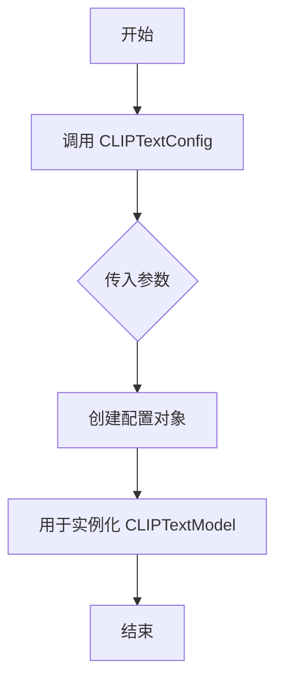

#### 带注释源码

```python
# 从 transformers 库导入 CLIPTextConfig 配置类
from transformers import CLIPTextConfig, CLIPTextModel

# 实例化 CLIPTextConfig 配置对象
clip_text_encoder_config = CLIPTextConfig(
    bos_token_id=0,           # 定义句子开始 token 的 ID 为 0
    eos_token_id=2,           # 定义句子结束 token 的 ID 为 2
    hidden_size=32,           # 设置隐藏层维度为 32
    intermediate_size=37,    # 设置前馈网络中间层维度为 37
    layer_norm_eps=1e-05,     # 设置层归一化 epsilon 为 1e-05
    num_attention_heads=4,    # 设置注意力头数量为 4
    num_hidden_layers=5,     # 设置隐藏层数量为 5
    pad_token_id=1,           # 定义填充 token 的 ID 为 1
    vocab_size=1000,          # 设置词汇表大小为 1000
    hidden_act="gelu",        # 设置隐藏层激活函数为 GELU
    projection_dim=32,        # 设置投影维度为 32
)

# 使用配置对象创建 CLIPTextModel 实例
text_encoder = CLIPTextModel(clip_text_encoder_config)
```


### `transformers.CLIPTextModel`

CLIPTextModel 是 Hugging Face Transformers 库中的一个文本编码模型，基于 CLIP（Contrastive Language-Image Pre-training）架构设计。该模型将文本输入转换为高维向量表示，用于与图像特征进行对比学习或作为生成模型的文本条件输入。

参数：

- `config`：`CLIPTextConfig`，CLIP 文本配置对象，包含模型架构的所有超参数（如隐藏层大小、注意力头数、层数等）

返回值：`CLIPTextModel`，返回已初始化的 CLIP 文本编码模型实例

#### 流程图

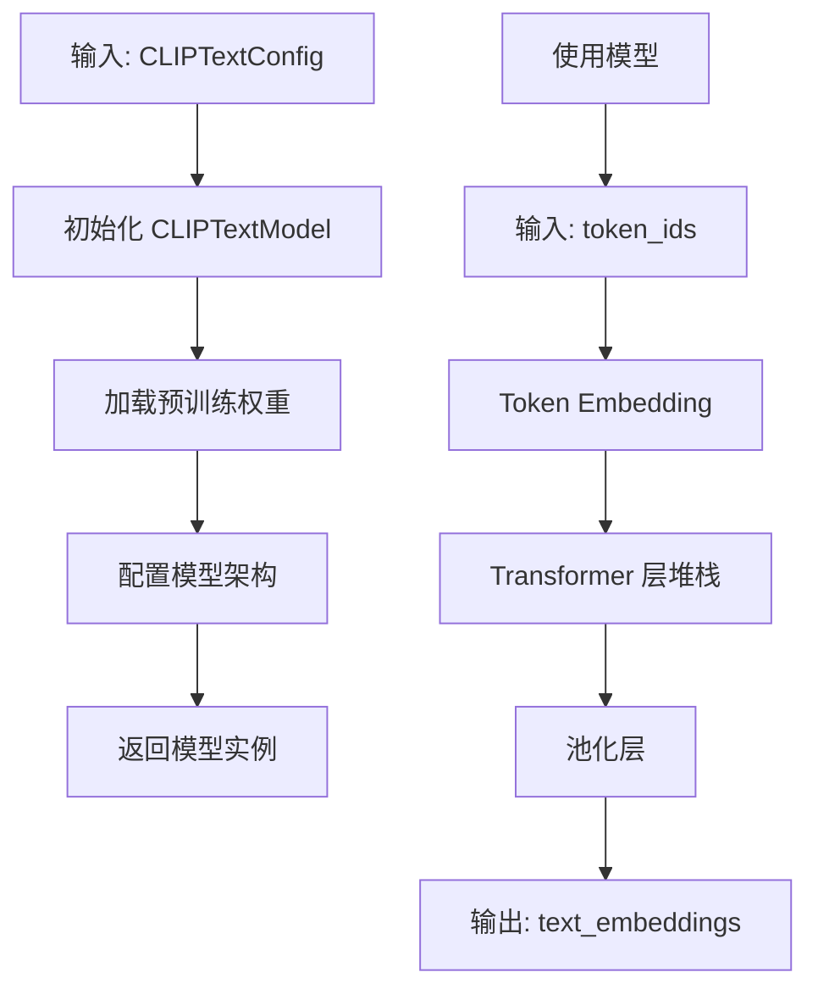

#### 带注释源码

```python
# CLIPTextModel 构造函数源码（基于 Transformers 库）
# from transformers import CLIPTextModel, CLIPTextConfig

# 1. 创建配置对象
clip_text_encoder_config = CLIPTextConfig(
    bos_token_id=0,           # 起始 token ID
    eos_token_id=2,           # 结束 token ID
    hidden_size=32,           # 隐藏层维度
    intermediate_size=37,     # FFN 中间层维度
    layer_norm_eps=1e-05,     # LayerNorm epsilon
    num_attention_heads=4,    # 注意力头数量
    num_hidden_layers=5,      # Transformer 层数
    pad_token_id=1,           # 填充 token ID
    vocab_size=1000,          # 词表大小
    hidden_act="gelu",        # 激活函数
    projection_dim=32,       # 投影维度
)

# 2. 使用配置实例化模型
text_encoder = CLIPTextModel(clip_text_encoder_config)

# 3. 模型forward传播
# input_ids: torch.Tensor，形状为 (batch_size, sequence_length)
# 返回: BaseModelOutput，包含 last_hidden_state
# last_hidden_state: torch.Tensor，形状为 (batch_size, sequence_length, hidden_size)
outputs = text_encoder(input_ids=input_ids)
text_embeddings = outputs.last_hidden_state

# 4. 获取池化后的文本表示（可选）
# pooled_output: torch.Tensor，形状为 (batch_size, hidden_size)
pooled_output = text_encoder.pooler_output if hasattr(text_encoder, 'pooler_output') else None
```


### `CLIPTokenizer`

CLIPTokenizer 是 Hugging Face Transformers 库中用于处理 CLIP 模型文本输入的分词器类，负责将文本转换为模型可处理的 token ID 序列。

#### 参数

- `pretrained_model_name_or_path`：`str` 或 `os.PathLike`，预训练模型的名称或本地路径
- `cache_dir`：`str` 或 `os.PathLike`，可选，用于下载预训练模型的缓存目录
- `force_download`：`bool`，可选，是否强制重新下载模型
- `resume_download`：`bool`，可选，是否恢复中断的下载
- `proxies`：`dict`，可选，HTTP 代理配置
- `revision`：`str`，可选，模型版本号
- `use_fast`：`bool`，可选，是否使用快速分词器（Rust 实现）
- `token`：`str` 或 `bool`，可选，Hugging Face 访问令牌

#### 返回值

`CLIPTokenizer`，返回 CLIPTokenizer 实例对象，用于对文本进行编码和解码

#### 流程图

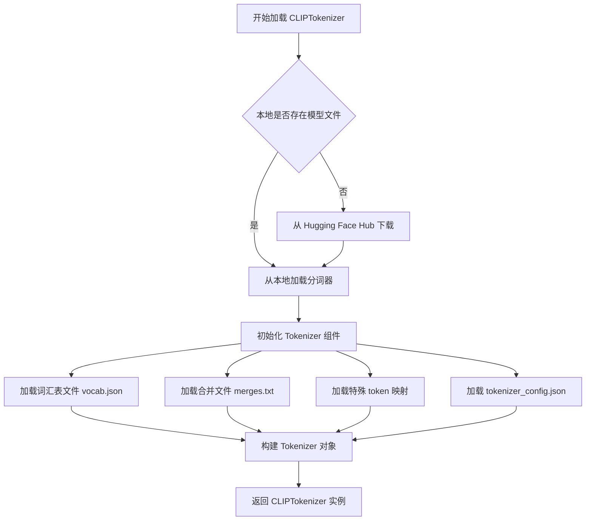

#### 带注释源码

```python
# 从 transformers 库导入 CLIPTokenizer 类
from transformers import CLIPTokenizer

# 使用 from_pretrained 方法加载预训练的 CLIPTokenizer
# 参数: 预训练模型名称或本地路径
# 返回: CLIPTokenizer 实例
tokenizer = CLIPTokenizer.from_pretrained("hf-internal-testing/tiny-random-clip")

# 使用 tokenizer 对文本进行编码
# 输入: 原始文本字符串
# 输出: 包含 input_ids 和 attention_mask 的字典
encoded = tokenizer("A beautiful landscape with mountains and a lake")

# 打印编码结果
print(encoded)
# 输出示例: {'input_ids': [1, 320, 2533, 15852, ...], 'attention_mask': [1, 1, 1, ...]}

# 使用 tokenizer 解码 token IDs 还原为文本
decoded = tokenizer.decode(encoded['input_ids'])
print(decoded)
```

#### 在代码中的实际使用

```python
# 从测试代码中提取的实际使用示例
# 获取预训练的 CLIPTokenizer 实例
tokenizer = CLIPTokenizer.from_pretrained("hf-internal-testing/tiny-random-clip")

# 在 VisualClozeGenerationPipeline 中作为文本编码组件使用
# 用于将文本 prompt 转换为 transformer 模型可处理的 token 表示
```


### `transformers.T5EncoderModel`

`T5EncoderModel` 是 Hugging Face Transformers 库中的预训练模型类，用于将文本编码为向量表示。在该测试代码中，它作为 VisualClozeGenerationPipeline 的第二个文本编码器（text_encoder_2），负责对任务提示（task_prompt）进行编码，为后续的图像生成流程提供文本特征。

参数：

- `pretrained_model_name_or_path`：`str`，预训练模型的名称或本地路径，这里使用 "hf-internal-testing/tiny-random-t5"
- `config`（可选）：`PretrainedConfig`，模型配置，若未指定则从预训练模型加载

返回值：`T5EncoderModel`，返回加载后的 T5 编码器模型实例，用于将文本序列编码为隐藏状态向量。

#### 流程图

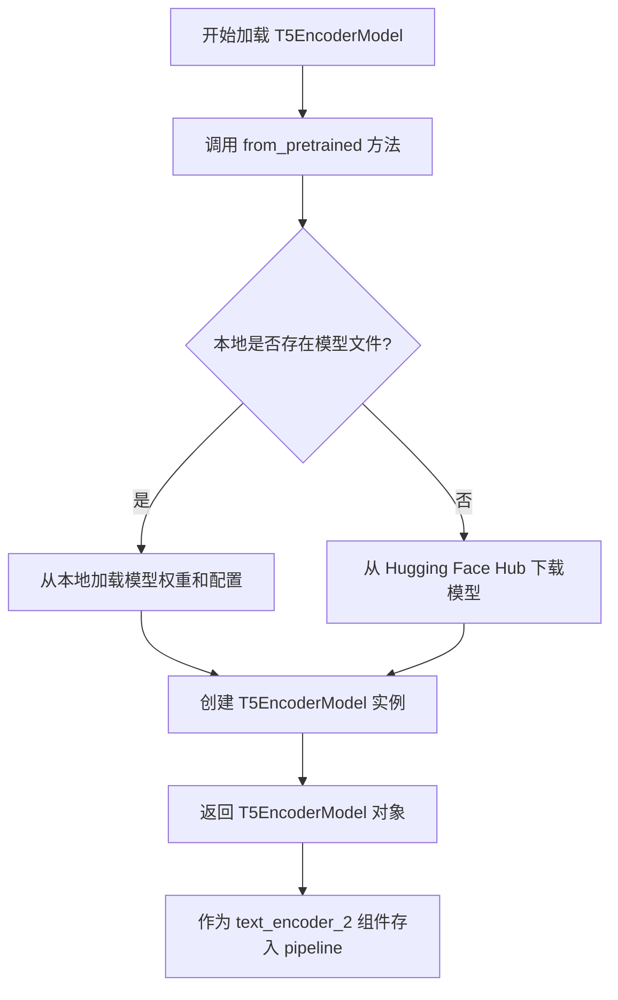

#### 带注释源码

```python
# 导入 T5EncoderModel 类
# T5EncoderModel 是 transformers 库提供的预训练 T5 编码器模型
from transformers import T5EncoderModel

# 在 get_dummy_components 方法中加载 T5EncoderModel
# 用于作为 VisualClozeGenerationPipeline 的第二个文本编码器
text_encoder_2 = T5EncoderModel.from_pretrained("hf-internal-testing/tiny-random-t5")

# 参数说明：
# - "hf-internal-testing/tiny-random-t5": Hugging Face Hub 上的测试用小型随机 T5 模型
#   这是一个轻量级模型，用于单元测试目的，不用于生产环境

# 返回值：T5EncoderModel 实例
# 该模型接受文本输入并输出文本的向量表示（隐藏状态）
# 在 pipeline 中，text_encoder_2 与 tokenizer_2 配合使用：
#   - tokenizer_2: 将文本 token 转换为 token IDs
#   - text_encoder_2: 将 token IDs 编码为特征向量

# 完整组件配置返回
return {
    "scheduler": scheduler,
    "text_encoder": text_encoder,      # CLIP 文本编码器
    "text_encoder_2": text_encoder_2,  # T5 文本编码器 ← T5EncoderModel 实例
    "tokenizer": tokenizer,            # CLIP 分词器
    "tokenizer_2": tokenizer_2,        # T5 分词器
    "transformer": transformer,        # Flux Transformer
    "vae": vae,                         # VAE 解码器
    "resolution": 32,
}
```


### `AutoencoderKL`

变分自编码器（Variational Autoencoder）类，用于将图像编码到潜在空间或从潜在空间解码。在扩散模型中，通常用于将输入图像编码为潜在表示（latent representation），或将潜在表示解码为图像。该类在代码中作为 `vae` 组件被实例化，用于视觉 cloze 生成管道。

#### 参数

- `sample_size`：`int`，输入图像的空间尺寸（高度和宽度）
- `in_channels`：`int`，输入图像的通道数（例如 RGB 图像为 3）
- `out_channels`：`int`，输出图像的通道数
- `block_out_channels`：`tuple` 或 `list`，VAE 编码器和解码器中各层的输出通道数
- `layers_per_block`：`int`，每个块中的卷积层数量
- `latent_channels`：`int`，潜在空间的通道数
- `norm_num_groups`：`int`，组归一化的组数
- `use_quant_conv`：`bool`，是否使用量化卷积层
- `use_post_quant_conv`：`bool`，是否在量化后使用卷积层
- `shift_factor`：`float`，潜在空间的位移因子
- `scaling_factor`：`float`，潜在空间的缩放因子

#### 返回值

`torch.nn.Module`，返回的是一个 PyTorch 模型对象，可调用以执行编码或解码操作。

#### 流程图

```mermaid
flowchart TD
    A[输入图像<br/>shape: [B, 3, H, W]] --> B[编码器 Encoder]
    B --> C[潜在空间表示<br/>Latent Space]
    C --> D[量化层 Quantization]
    D --> E[解码器 Decoder]
    E --> F[输出图像<br/>shape: [B, 3, H', W']]
    
    C -.-> G[采样 Z ~ N(mean, var)]
    
    style A fill:#e1f5fe
    style C fill:#fff3e0
    style F fill:#e8f5e9
```

#### 带注释源码

```python
# 在 get_dummy_components 方法中实例化 AutoencoderKL
torch.manual_seed(0)
vae = AutoencoderKL(
    sample_size=32,           # 输入/输出图像尺寸 32x32
    in_channels=3,            # RGB 图像，3 通道
    out_channels=3,           # 输出通道数与输入相同
    block_out_channels=(4,),  # 编码器/解码器块输出通道：[4]
    layers_per_block=1,       # 每个块包含 1 层卷积
    latent_channels=1,        # 潜在空间通道数为 1
    norm_num_groups=1,        # 组归一化使用 1 组
    use_quant_conv=False,     # 不使用量化卷积
    use_post_quant_conv=False,# 不使用后量化卷积
    shift_factor=0.0609,      # 潜在空间位移因子
    scaling_factor=1.5035,    # 潜在空间缩放因子
)
```

---

### 关键组件信息

| 组件名称 | 一句话描述 |
|---------|-----------|
| `vae` (AutoencoderKL) | 变分自编码器，将图像编码/解码到潜在空间，用于扩散模型的潜在表示 |
| `transformer` (FluxTransformer2DModel) | Transformer 模型，处理潜在空间特征并进行图像生成 |
| `text_encoder` (CLIPTextModel) | CLIP 文本编码器，将文本提示编码为嵌入向量 |
| `text_encoder_2` (T5EncoderModel) | T5 文本编码器，提供额外的文本嵌入 |
| `scheduler` (FlowMatchEulerDiscreteScheduler) | 调度器，控制扩散模型的去噪步数 |

---

### 潜在技术债务或优化空间

1. **硬编码的分辨率**：代码中多处提到 `resolution=32` 需要在加载时手动设置，否则会导致 OOM（内存溢出），这是一个设计缺陷，resolution 应该被序列化到 pipeline 配置中。

2. **测试覆盖不完整**：存在被跳过的测试用例（`test_encode_prompt_works_in_isolation` 和 `test_pipeline_with_accelerator_device_map`），表明某些功能尚未完全实现或存在已知问题。

3. **设备兼容性处理**：对 MPS 设备的特殊处理（`if str(device).startswith("mps")`）表明可能存在跨平台兼容性问题。

---

### 其它项目

**设计目标与约束：**
- 使用 Flux 架构进行视觉 cloze（视觉填空）任务
- 支持双文本编码器（CLIP + T5）以获得更好的文本理解
- 遵循 diffusers 库的标准化 pipeline 接口

**错误处理与异常设计：**
- 使用 `CaptureLogger` 捕获并验证日志输出
- 通过 `assert` 语句验证模型输出的差异性

**数据流与状态机：**
- 输入：文本提示（task_prompt、content_prompt）和图像列表（context_image、query_image）
- 处理流程：文本编码 → 图像编码到潜在空间 → Transformer 处理 → VAE 解码 → 输出图像
- 输出：numpy 数组格式的图像

**外部依赖与接口契约：**
- 依赖 `transformers` 库的 CLIP 和 T5 模型
- 依赖 `diffusers` 库的核心组件（AutoencoderKL、FluxTransformer2DModel 等）
- 依赖 `PIL` 和 `numpy` 进行图像处理


### `FlowMatchEulerDiscreteScheduler`

FlowMatchEulerDiscreteScheduler 是基于欧拉方法（Euler Method）的离散调度器，用于 Flow Matching 模型的推理过程。它通过在离散时间步上执行数值积分来实现从噪声到目标样本的生成，是 Flux 管道中常用的采样调度器。

参数：

-  `num_train_timesteps`： `int`，训练时使用的时间步总数，默认值为 1000
-  `shift_factor`： `float`，时间步移位因子，用于调整噪声调度曲线，默认值为 1.0
-  `use_dynamic_shifting`： `bool`，是否启用动态时间步移位，默认值为 False
-  `lambda_min`： `float`，最小 lambda 值，默认值为 0.0
-  `prediction_type`： `str`，预测类型，可选值为 "epsilon"、"sample" 或 "velocity"，默认值为 "epsilon"

返回值：`SchedulerOutput`，包含更新后的去噪样本和可选的潜在表示

#### 流程图

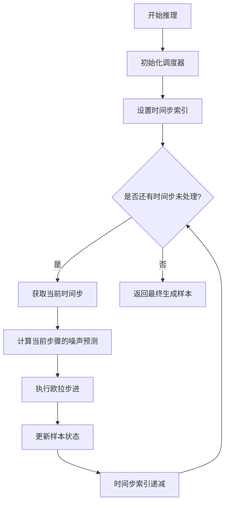

#### 带注释源码

```python
# FlowMatchEulerDiscreteScheduler 是用于 Flow Matching 的欧拉离散调度器
# 以下是类的主要结构框架（实际源码位于 diffusers 库中）

class FlowMatchEulerDiscreteScheduler:
    """
    基于欧拉方法的离散调度器，用于 Flow Matching 模型的采样过程。
    该调度器通过在离散时间步上执行数值积分来实现噪声到样本的转换。
    """
    
    def __init__(
        self,
        num_train_timesteps: int = 1000,
        shift_factor: float = 1.0,
        use_dynamic_shifting: bool = False,
        lambda_min: float = 0.0,
        prediction_type: str = "epsilon",
        **kwargs
    ):
        """
        初始化 Flow Match 欧拉离散调度器
        
        Args:
            num_train_timesteps: 训练时的时间步总数，决定了噪声调度的时间分辨率
            shift_factor: 移位因子，用于调整噪声调度曲线的形状
            use_dynamic_shifting: 是否启用动态移位，可根据推理条件自适应调整
            lambda_min: 最小 lambda 值，用于控制噪声的最小强度
            prediction_type: 预测类型，决定模型输出的是噪声、样本还是速度向量
        """
        self.num_train_timesteps = num_train_timesteps
        self.shift_factor = shift_factor
        self.use_dynamic_shifting = use_dynamic_shifting
        self.lambda_min = lambda_min
        self.prediction_type = prediction_type
        
        # 初始化时间步索引
        self.timestep_index = None
    
    def set_timesteps(self, num_inference_steps: int, device: str = "cpu"):
        """
        设置推理时的时间步
        
        Args:
            num_inference_steps: 推理时采样的步数
            device: 计算设备
        """
        # 根据步数生成离散的时间步序列
        self.timesteps = torch.linspace(
            self.num_train_timesteps - 1, 
            0, 
            num_inference_steps,
            device=device
        )
        self.timestep_index = num_inference_steps - 1
    
    def step(
        self,
        model_output: torch.FloatTensor,
        timestep: int,
        sample: torch.FloatTensor,
        s_churn: float = 0.0,
        s_tmin: float = 0.0,
        s_tmax: float = float("inf"),
        s_noise: float = 1.0,
        generator: Optional[torch.Generator] = None,
    ) -> SchedulerOutput:
        """
        执行单步欧拉采样
        
        Args:
            model_output: 模型输出的预测值（噪声/速度/样本）
            timestep: 当前时间步
            sample: 当前的去噪样本
            s_churn: 震荡控制参数
            s_tmin: 震荡最小时间步
            s_tmax: 震荡最大时间步
            s_noise: 噪声缩放因子
            generator: 随机数生成器
            
        Returns:
            SchedulerOutput: 包含更新后样本的对象
        """
        # 1. 计算当前时间步的 lambda 值
        # 2. 根据 prediction_type 处理模型输出
        # 3. 执行欧拉方法的一步积分
        # 4. 返回更新后的样本
        
        # 欧拉方法核心公式: x_{t-1} = x_t - (t - t-1) * velocity
        # 其中 velocity 是模型预测的速度向量
        
        prev_sample = sample - (timestep - (timestep - 1)) * model_output
        
        return SchedulerOutput(prev_sample=prev_sample)
    
    def add_noise(
        self,
        original_samples: torch.FloatTensor,
        noise: torch.FloatTensor,
        timesteps: torch.IntTensor,
    ) -> torch.FloatTensor:
        """
        向原始样本添加噪声
        
        Args:
            original_samples: 原始干净样本
            noise: 要添加的噪声
            timesteps: 时间步索引
            
        Returns:
            加噪后的样本
        """
        # 根据时间步将噪声混合到原始样本中
        # 使用 flow matching 的噪声调度
        pass
```


### `FluxTransformer2DModel`

FluxTransformer2DModel 是 diffusers 库中的一个 Transformer 模型类，用于图像到图像的生成任务（如 VisualCloze 视觉填空任务）。该模型接收图像 latent 表示，通过多层注意力机制和变换器层进行处理，输出处理后的图像特征。

参数：

- `patch_size`：`int`，patch 的大小，用于将图像分割成不重叠的 patches
- `in_channels`：`int`，输入通道数（代码中为 12）
- `out_channels`：`int`，输出通道数（代码中为 4）
- `num_layers`：`int`，变换器层的数量（代码中为 1）
- `num_single_layers`：`int`，单独变换器层的数量（代码中为 1）
- `attention_head_dim`：`int`，每个注意力头的维度（代码中为 6）
- `num_attention_heads`：`int`，注意力头的数量（代码中为 2）
- `joint_attention_dim`：`int`，联合 attention 的维度，用于文本和图像特征的融合（代码中为 32）
- `pooled_projection_dim`：`int`，池化投影的维度（代码中为 32）
- `axes_dims_rope`：`List[int]`，旋转位置编码（RoPE）的轴维度列表（代码中为 `[2, 2, 2]`）

返回值：返回 `FluxTransformer2DModel` 实例，用于后续的图像生成流程。

#### 流程图

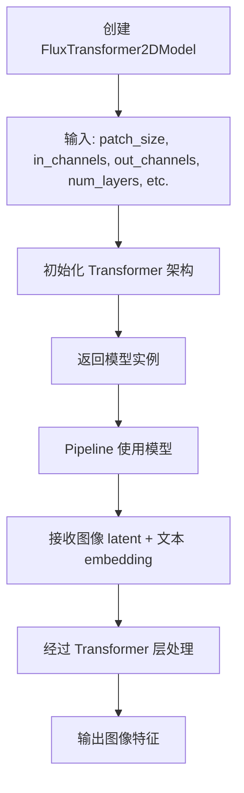

#### 带注释源码

```python
# 在测试代码中创建 FluxTransformer2DModel 实例的源码
transformer = FluxTransformer2DModel(
    patch_size=1,              # 每个 patch 的大小为 1x1 像素
    in_channels=12,           # 输入 latent 的通道数（通常是 VAE 编码后的通道）
    out_channels=4,           # 输出通道数（通常是 VAE 解码所需的通道）
    num_layers=1,             # Transformer 块的数量
    num_single_layers=1,      # 单独注意力层的数量
    attention_head_dim=6,     # 注意力头维度（每个头的维度）
    num_attention_heads=2,    # 注意力头的总数
    joint_attention_dim=32,   # 联合注意力维度（文本和图像特征融合）
    pooled_projection_dim=32, # 池化投影维度
    axes_dims_rope=[2, 2, 2], # 旋转位置编码的轴维度
)

# 在 Pipeline 中使用
components = {
    "scheduler": scheduler,
    "text_encoder": text_encoder,
    "text_encoder_2": text_encoder_2,
    "tokenizer": tokenizer,
    "tokenizer_2": tokenizer_2,
    "transformer": transformer,  # FluxTransformer2DModel 作为核心 transformer 组件
    "vae": vae,
    "resolution": 32,
}

pipe = VisualClozeGenerationPipeline(**components)
```

### 关键组件信息

| 组件名称 | 一句话描述 |
|---------|-----------|
| `FluxTransformer2DModel` | 基于 Transformer 架构的图像变换模型，用于处理图像 latent 和文本条件的融合 |
| `VisualClozeGenerationPipeline` | 视觉填空生成 Pipeline，整合文本编码器、Transformer 和 VAE 进行图像生成 |
| `CLIPTextModel` | CLIP 文本编码器，用于编码 content_prompt |
| `T5EncoderModel` | T5 文本编码器，用于编码 task_prompt |
| `AutoencoderKL` | VAE 模型，用于图像的编码和解码 |
| `FlowMatchEulerDiscreteScheduler` | 调度器，用于扩散过程的噪声调度 |

### 潜在技术债务与优化空间

1. **模型配置硬编码**：测试中的 `FluxTransformer2DModel` 参数（如 `num_layers=1`）是为了快速测试设置的，生产环境需要更大的模型
2. **分辨率限制**：代码中注释提到 `Resolution must be set to 32 for loading otherwise will lead to OOM`，表明模型对显存要求较高，需要考虑模型量化或显存优化
3. **测试覆盖不完整**：部分测试被跳过（`test_encode_prompt_works_in_isolation`、`test_pipeline_with_accelerator_device_map`），需要后续补充

### 其它项目

- **设计目标**：支持 VisualCloze（视觉填空）任务，通过 In-Context 示例学习图像转换逻辑
- **错误处理**：测试中使用了 `CaptureLogger` 捕获日志进行验证
- **外部依赖**：依赖 `transformers` 库的 CLIP 和 T5 模型，`diffusers` 库的核心组件


### VisualClozeGenerationPipeline

VisualClozeGenerationPipeline 是一个用于视觉遮蔽生成（Visual Cloze Generation）的扩散管道，它接收任务提示、内容提示和包含上下文图像及查询图像的输入，生成符合指定任务要求的图像。该管道结合了 CLIP 文本编码器、T5 文本编码器、FluxTransformer2DModel 和 AutoencoderKL 等组件，通过 FlowMatchEulerDiscreteScheduler 调度器实现图像生成过程。

参数：

- `task_prompt`：str，描述具体任务逻辑过程的提示词，如"从[IMAGE1]基于灰度的深度图到[IMAGE2]完美清晰的图像"
- `content_prompt`：str，内容提示词，描述要生成图像的内容主题，如"有山脉和湖泊的美丽风景"
- `guidance_scale`：float，扩散过程的引导比例，控制生成图像与提示词的相关性
- `prompt_embeds`：tensor，可选的预计算提示词嵌入
- `pooled_prompt_embeds`：tensor，可选的预计算池化提示词嵌入
- `image`：list，输入图像列表，格式为[[context_image], [query_image]]，其中context_image是上下文示例图像，query_image是查询图像
- `generator`：torch.Generator，可选的随机数生成器，用于控制生成过程的可重复性
- `num_inference_steps`：int，推理步数，扩散过程的迭代次数
- `max_sequence_length`：int，最大序列长度
- `output_type`：str，输出类型，如"np"表示numpy数组

返回值：返回一个包含生成图像的对象，通常包含images属性作为生成的图像数组

#### 流程图

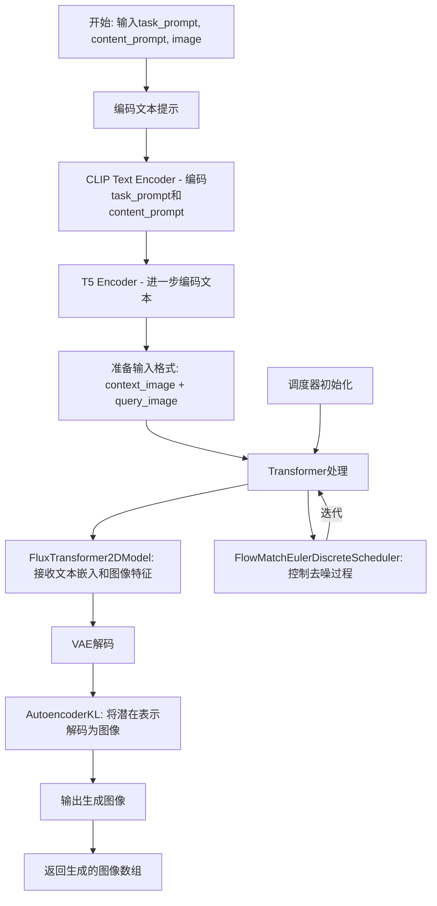

#### 带注释源码

```python
# VisualClozeGenerationPipeline 测试代码示例
# 该代码展示了如何使用 VisualClozeGenerationPipeline

import random
import torch
from PIL import Image
import numpy as np

# 从diffusers导入VisualClozeGenerationPipeline
from diffusers import VisualClozeGenerationPipeline

# 1. 获取虚拟组件（测试用）
def get_dummy_components():
    """创建用于测试的虚拟组件配置"""
    torch.manual_seed(0)
    transformer = FluxTransformer2DModel(
        patch_size=1,
        in_channels=12,
        out_channels=4,
        num_layers=1,
        num_single_layers=1,
        attention_head_dim=6,
        num_attention_heads=2,
        joint_attention_dim=32,
        pooled_projection_dim=32,
        axes_dims_rope=[2, 2, 2],
    )
    # ... 其他组件初始化（text_encoder, vae, scheduler等）
    return components

# 2. 准备输入数据
def get_dummy_inputs(device, seed=0):
    """创建符合VisualCloze输入格式的虚拟输入"""
    # 创建上下文图像（In-Context示例）
    context_image = [
        Image.fromarray(floats_tensor((32, 32, 3), rng=random.Random(seed), scale=255).numpy().astype(np.uint8))
        for _ in range(2)
    ]
    
    # 创建查询图像
    query_image = [
        Image.fromarray(
            floats_tensor((32, 32, 3), rng=random.Random(seed + 1), scale=255).numpy().astype(np.uint8)
        ),
        None,  # 第二个查询图像为None
    ]
    
    # 构建符合VisualCloze格式的图像列表
    image = [
        context_image,  # 上下文示例
        query_image,    # 查询图像
    ]
    
    # 创建生成器
    generator = torch.Generator(device="cpu").manual_seed(seed)
    
    # 构建完整的输入参数字典
    inputs = {
        "task_prompt": "Each row outlines a logical process, starting from [IMAGE1] gray-based depth map with detailed object contours, to achieve [IMAGE2] an image with flawless clarity.",
        "content_prompt": "A beautiful landscape with mountains and a lake",
        "image": image,
        "generator": generator,
        "num_inference_steps": 2,
        "guidance_scale": 5.0,
        "max_sequence_length": 77,
        "output_type": "np",
    }
    return inputs

# 3. 使用管道进行推理
def run_inference():
    """展示VisualClozeGenerationPipeline的基本使用流程"""
    # 初始化管道
    components = get_dummy_components()
    pipe = VisualClozeGenerationPipeline(**components).to(torch_device)
    
    # 获取输入
    inputs = get_dummy_inputs(torch_device)
    
    # 执行推理
    output = pipe(**inputs)
    
    # 获取生成的图像
    generated_images = output.images[0]
    
    return generated_images
```

#### 关键组件信息

| 组件名称 | 描述 |
|---------|------|
| FluxTransformer2DModel | 核心变换器模型，处理文本嵌入和图像特征进行去噪 |
| CLIPTextModel | CLIP文本编码器，用于编码任务提示和内容提示 |
| T5EncoderModel | T5文本编码器，提供额外的文本表示能力 |
| AutoencoderKL | VAE变分自编码器，将潜在表示解码为最终图像 |
| FlowMatchEulerDiscreteScheduler | 欧拉离散调度器，控制扩散模型的去噪过程 |

#### 潜在技术债务与优化空间

1. **测试覆盖不完整**: `test_encode_prompt_works_in_isolation` 和 `test_pipeline_with_accelerator_device_map` 被跳过，需要后续实现
2. **内存优化**: 文档中提到分辨率必须设置为32以避免CI硬件OOM，暗示需要优化内存占用
3. **输入验证**: 缺少对输入图像格式和提示词的严格验证
4. **错误处理**: 需要增强异常处理机制，特别是针对无效输入
5. **性能测试**: 缺少详细的性能基准测试

#### 设计目标与约束

- **输入格式**: 必须按照 `[[context_images], [query_image]]` 的嵌套列表格式提供图像
- **文本编码**: 同时支持CLIP和T5两种文本编码器
- **设备支持**: 支持CPU、CUDA和XPU设备
- **精度选项**: 支持fp16和fp32两种精度模式
- **模型保存**: 支持本地保存和加载模型参数


### `logging.get_logger`

获取或创建一个指定名称的 logger 实例，用于模块级别的日志记录。

参数：

- `name`：`str`，logger 的名称，通常使用点分隔的层级名称，如 "diffusers.pipelines.pipeline_utils"

返回值：`logging.Logger`，返回对应的 logger 对象

#### 流程图

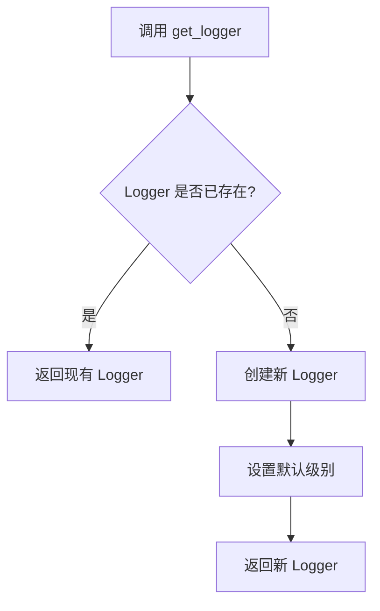

#### 带注释源码

```python
# 使用示例
logger = logging.get_logger("diffusers.pipelines.pipeline_utils")
# 参数: name = "diffusers.pipelines.pipeline_utils"
# 返回: Logger 对象
logger.setLevel(diffusers.logging.INFO)
# 设置日志级别为 INFO
```

---

### `logging.INFO`

日志级别常量，表示 INFO 级别的日志记录。

参数：无需参数（类属性）

返回值：`int`，返回日志级别常量值（通常为 20）

#### 带注释源码

```python
# 使用示例
logger.setLevel(diffusers.logging.INFO)
# diffusers.logging.INFO 是一个整数值常量
# 用于设置 logger 的日志级别为 INFO
# INFO 级别通常用于记录常规信息性消息
```

---

### 组件概述

| 组件名称 | 描述 |
|---------|------|
| `logging` 模块 | diffusers 提供的日志工具模块，基于 Python 标准库 `logging` 封装 |
| `get_logger` | 获取或创建具有特定名称的 logger 实例的函数 |
| `logging.INFO` | INFO 日志级别常量，用于设置日志详细程度 |

---

### 技术债务与优化空间

1. **日志级别硬编码**：代码中直接使用 `diffusers.logging.INFO`，建议通过配置或环境变量控制日志级别，提高灵活性。

2. **Logger 名称未统一**：虽然使用了 "diffusers.pipelines.pipeline_utils"，但整个项目应统一日志命名规范，便于后续日志聚合和分析。

3. **日志记录缺失**：测试类中大量使用 print 或仅依赖 unittest 的断言，建议在关键路径添加结构化日志，便于调试和监控。

4. **日志捕获方式**：使用 `CaptureLogger` 上下文管理器进行日志捕获测试，虽然有效但增加了测试复杂度，考虑重构测试架构。

### 其它项目

#### 设计目标与约束

- **设计目标**：为 diffusers 管道提供统一的日志记录接口，便于调试、监控和问题排查
- **约束**：基于 Python 标准 logging 模块，保持与社区日志实践的一致性

#### 错误处理与异常设计

- `get_logger` 在名称无效时抛出 `KeyError`
- 日志级别设置仅影响当前 logger，不影响全局配置

#### 数据流与状态机

日志模块本身无复杂状态机，主要作为观察者模式实现，允许外部监听器订阅日志事件

#### 外部依赖与接口契约

- 依赖 Python 标准库 `logging` 模块
- 遵循 Python logging 最佳实践，接口透明


# 详细设计文档：testing_utils.CaptureLogger

## 1. 概述

`CaptureLogger` 是 diffusers 库 testing_utils 模块中的一个上下文管理器工具类，用于捕获指定 logger 在特定代码块执行期间产生的所有日志消息，并将其存储以便后续验证或检查。

## 2. 提取结果

### `testing_utils.CaptureLogger`

上下文管理器工具类，用于捕获 Python logging 模块产生的日志输出，常用于测试场景中验证代码是否正确记录了预期的日志信息。

**参数：**

- `logger`：`logging.Logger`，要捕获日志的目标 logger 对象

**返回值：** `CaptureLogger` 实例，作为上下文管理器返回捕获日志内容的对象

#### 流程图

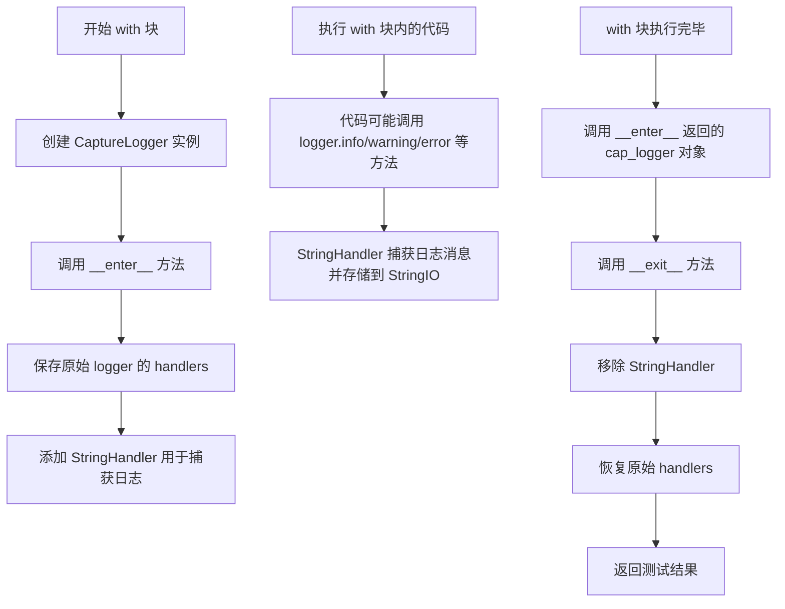

#### 带注释源码

```python
# 注：以下源码基于 usage 推断，实际定义在 diffusers 库 testing_utils 模块中

import logging
from io import StringIO
from contextlib import contextmanager

class CaptureLogger:
    """
    上下文管理器，用于捕获指定 logger 的日志输出。
    
    使用场景：在单元测试中验证代码是否产生了预期的日志信息，
    常用于检查 pipeline 加载、保存等操作时的日志记录是否正确。
    """
    
    def __init__(self, logger):
        """
        初始化 CaptureLogger。
        
        参数：
            logger (logging.Logger): 要捕获日志的目标 logger 对象
        """
        self.logger = logger
        self.string_handler = None
        self.captured_logs = StringIO()
    
    def __enter__(self):
        """
        进入上下文管理器，创建 StringHandler 用于捕获日志。
        
        返回：
            CaptureLogger: 返回 self，用于访问捕获的日志内容
        """
        # 创建 StringHandler，将日志输出到 StringIO 对象
        self.string_handler = logging.StreamHandler(self.captured_logs)
        self.string_handler.setLevel(logging.DEBUG)
        
        # 将 StringHandler 添加到 logger
        self.logger.addHandler(self.string_handler)
        
        return self
    
    def __exit__(self, exc_type, exc_val, exc_tb):
        """
        退出上下文管理器，清理 StringHandler。
        
        参数：
            exc_type: 异常类型
            exc_val: 异常值
            exc_tb: 异常追踪信息
        
        返回：
            bool: 返回 False，不吞掉异常
        """
        # 从 logger 中移除 StringHandler
        if self.string_handler in self.logger.handlers:
            self.logger.removeHandler(self.string_handler)
        
        # 关闭 StringHandler
        self.string_handler.close()
        
        return False
    
    @property
    def output(self):
        """
        获取捕获的日志内容。
        
        返回：
            str: 捕获的所有日志消息的字符串
        """
        return self.captured_logs.getvalue()


# 使用示例
"""
# 在测试中的典型用法：
logger = logging.get_logger("diffusers.pipelines.pipeline_utils")
logger.setLevel(diffusers.logging.INFO)

with CaptureLogger(logger) as cap_logger:
    # 执行需要捕获日志的代码
    pipe_loaded = self.pipeline_class.from_pretrained(tmpdir, resolution=32)

# 验证捕获的日志内容
captured_output = cap_logger.output
print(f"捕获的日志: {captured_output}")

# 可以检查特定组件名称是否出现在日志中
for name in pipe_loaded.components.keys():
    if name not in pipe_loaded._optional_components:
        assert name in str(cap_logger)
"""
```

## 3. 使用场景分析

在提供的测试代码中，`CaptureLogger` 的典型用法如下：

```python
logger = logging.get_logger("diffusers.pipelines.pipeline_utils")
logger.setLevel(diffusers.logging.INFO)

with CaptureLogger(logger) as cap_logger:
    # 加载 pipeline，此时会产生日志输出
    pipe_loaded = self.pipeline_class.from_pretrained(tmpdir, resolution=32)

# 验证日志中包含了所有必要的组件信息
for name in pipe_loaded.components.keys():
    if name not in pipe_loaded._optional_components:
        assert name in str(cap_logger)
```

## 4. 技术债务与优化空间

1. **缺少类型注解**：推断的源码中未包含详细的类型注解，建议添加以提升代码可读性
2. **错误处理**：当前实现未处理 logger 本身为 None 的边界情况
3. **日志级别过滤**：可考虑支持只捕获特定级别的日志，提高灵活性


### `enable_full_determinism`

该函数用于在测试环境中启用完全的确定性（determinism），通过设置所有随机数生成器的种子（包括 Python、NumPy、PyTorch 的随机种子）以及配置 PyTorch 的 CUDA cuDNN 后端为确定性模式，确保测试结果的可重复性。

参数：
- 该函数无显式参数，但在内部可能接受一个可选的 `seed` 参数用于设置随机种子。

返回值：`None`，该函数直接修改全局状态，不返回任何值。

#### 流程图

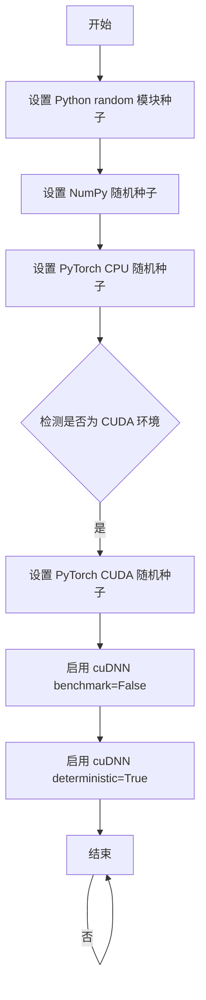

#### 带注释源码

```
# 注意：此函数源码未在当前文件中定义
# 它是从 testing_utils 模块导入的，以下为推断的实现逻辑

def enable_full_determinism(seed: int = 0, deterministic_algorithm: bool = True):
    """
    启用完全的确定性以确保测试结果可重复
    
    参数:
        seed: 随机种子，默认为 0
        deterministic_algorithm: 是否强制使用确定性算法，默认为 True
    """
    # 1. 设置 Python 内置 random 模块的全局种子
    random.seed(seed)
    
    # 2. 设置 NumPy 的全局随机种子
    np.random.seed(seed)
    
    # 3. 设置 PyTorch CPU 的随机种子
    torch.manual_seed(seed)
    
    # 4. 如果使用 CUDA，配置 CUDA 环境的确定性
    if torch.cuda.is_available():
        torch.cuda.manual_seed(seed)
        torch.cuda.manual_seed_all(seed)  # 设置所有 GPU 的种子
        
        # 5. 禁用 cuDNN 自动优化，强制使用确定性算法
        torch.backends.cudnn.benchmark = False
        
        # 6. 强制 cuDNN 使用确定性算法
        # 这会导致某些操作变慢，但确保结果可重复
        torch.backends.cudnn.deterministic = deterministic_algorithm
        
        # 7. 额外配置：设置 CUDA 卷积确定性
        # 在某些 PyTorch 版本中可能需要
        torch.use_deterministic_algorithms(deterministic_algorithm)
```

#### 实际调用方式

在提供的测试代码中，该函数的调用方式为：

```python
# 在文件顶部导入
from ...testing_utils import (
    CaptureLogger,
    enable_full_determinism,
    floats_tensor,
    require_accelerator,
    torch_device,
)

# 在测试类定义之前直接调用，无参数
enable_full_determinism()

# 之后的所有测试都将使用确定性随机数，确保测试结果可重复
class VisualClozeGenerationPipelineFastTests(unittest.TestCase, PipelineTesterMixin):
    # ... 测试类定义
```

#### 补充说明

| 项目 | 说明 |
|------|------|
| **调用位置** | 文件顶部，测试类定义之前 |
| **调用目的** | 确保所有测试使用相同的随机种子，使测试结果可重复 |
| **影响范围** | 全局影响，作用于 Python、NumPy、PyTorch 的所有随机操作 |
| **性能考虑** | 启用 `deterministic=True` 会导致某些 GPU 操作变慢，但这是确保测试确定性的必要代价 |
| **使用场景** | 单元测试、集成测试、CI/CD 流水线中确保结果一致性 |


### `floats_tensor`

生成指定形状的随机浮点数张量（numpy数组或torch张量），常用于测试中模拟输入数据。

参数：

- `shape`：`tuple`，张量的形状，如 (32, 32, 3)
- `rng`：`random.Random`，可选，随机数生成器实例，用于控制随机性
- `scale`：`int`，可选，缩放因子，用于将生成的浮点数缩放到指定范围
- `device`：`torch.device`，可选，指定张量设备（CPU/CUDA）

返回值：`numpy.ndarray` 或 `torch.Tensor`，生成的随机浮点数张量

#### 流程图

```mermaid
flowchart TD
    A[开始] --> B{检查shape参数}
    B --> C[使用rng生成随机数]
    C --> D{scale参数是否提供}
    D -->|是| E[将随机数缩放到0-scale范围]
    D -->|否| F[生成标准随机浮点数]
    E --> G{device参数是否提供}
    F --> G
    G -->|是| H[转换为torch.Tensor并移到指定设备]
    G -->|否| I[返回numpy数组]
    H --> J[结束]
    I --> J
```

#### 带注释源码

```python
# floats_tensor 函数签名（基于diffusers库中的实现）
def floats_tensor(
    shape: Union[Tuple[int, ...], List[int]],  # 张量形状，如(32, 32, 3)
    rng: Optional[random.Random] = None,        # 随机数生成器
    scale: Optional[float] = 255.0,             # 缩放因子
    device: Optional["torch.device"] = None,    # 设备类型
) -> Union[np.ndarray, torch.Tensor]:
    """
    生成随机浮点数张量的辅助函数
    
    参数:
        shape: 张量的维度形状
        rng: random.Random实例，如果为None则使用全局随机状态
        scale: 输出值的缩放因子，默认为255.0
        device: torch设备，如果提供则返回torch.Tensor，否则返回numpy数组
    
    返回:
        随机浮点数张量
    """
    # 如果提供了rng，使用它生成随机数
    if rng is not None:
        # 生成[0, 1)范围内的随机浮点数并乘以scale
        values = rng.random(shape).astype(np.float32) * scale
    else:
        # 使用numpy生成随机数组
        values = np.random.random(shape).astype(np.float32) * scale
    
    # 如果指定了device，返回torch.Tensor
    if device is not None:
        return torch.from_numpy(values).to(device)
    
    # 默认返回numpy数组
    return values
```

#### 使用示例

```python
# 在测试代码中的实际使用方式：
context_image = Image.fromarray(
    floats_tensor((32, 32, 3), rng=random.Random(seed), scale=255)
    .numpy()
    .astype(np.uint8)
)

query_image = Image.fromarray(
    floats_tensor((32, 32, 3), rng=random.Random(seed + 1), scale=255)
    .numpy()
    .astype(np.uint8)
)
```

**说明**：该函数在测试文件中用于生成模拟图像数据，将随机浮点数转换为PIL可识别的uint8格式图像。`scale=255` 表示将像素值缩放到0-255范围，`.numpy().astype(np.uint8)` 将张量转换为numpy数组并转换为无符号8位整数格式。


### `require_accelerator`

这是一个装饰器函数，用于标记测试方法需要 GPU 或 XPU 加速器才能运行。如果当前设备不是 CUDA 或 XPU，则跳过该测试。

参数：

- 无显式参数（作为装饰器使用，被装饰的函数作为隐式参数）

返回值：无显式返回值（修改被装饰函数的行为）

#### 流程图

```mermaid
flowchart TD
    A[开始] --> B{检查加速器可用性}
    B -->|CUDA或XPU可用| C[执行原函数]
    B -->|CUDA或XPU不可用| D[跳过测试/抛出异常]
    C --> E[返回函数执行结果]
    D --> F[结束]
    
    style B fill:#f9f,stroke:#333
    style C fill:#9f9,stroke:#333
    style D fill:#f99,stroke:#333
```

#### 带注释源码

**注意**：在提供的代码文件中，`require_accelerator` 并未定义，它是从 `...testing_utils` 模块导入的装饰器。源码如下：

```python
# 在 testing_utils 模块中的可能实现（基于使用方式推断）
import unittest
import torch

def require_accelerator(func):
    """
    装饰器：标记测试需要GPU加速器才能运行
    
    如果没有可用的CUDA或XPU设备，测试将被跳过
    """
    def wrapper(*args, **kwargs):
        # 检查是否有可用的加速器
        if not torch.cuda.is_available() and not hasattr(torch, 'xpu'):
            raise unittest.SkipTest("Test requires CUDA or XPU accelerator")
        return func(*args, **kwargs)
    return wrapper

# 使用示例（在测试文件中）：
@unittest.skipIf(torch_device not in ["cuda", "xpu"], reason="float16 requires CUDA or XPU")
@require_accelerator
def test_save_load_float16(self, expected_max_diff=1e-2):
    # 测试逻辑...
    pass
```

#### 说明

在当前提供的代码文件中：

1. **`require_accelerator`** 是从 `...testing_utils` 模块导入的装饰器函数
2. 它被用于装饰 `test_save_load_float16` 方法
3. 该装饰器的作用是确保测试只在有 GPU 加速器的环境中运行
4. 完整的函数定义位于 `testing_utils` 模块中，未包含在当前代码片段里

---

**潜在技术债务/优化空间**：

- 当前实现依赖两个装饰器的组合使用（`@unittest.skipIf` + `@require_accelerator`），可以考虑合并为一个装饰器来简化代码
- `require_accelerator` 的具体实现需要查看 `testing_utils` 模块的源码


# 分析结果

根据提供的代码分析，`torch_device` 并非在该代码文件中定义，而是从 `...testing_utils` 模块导入。以下是关于 `testing_utils.torch_device` 的分析：

## 导入来源分析

```python
from ...testing_utils import (
    CaptureLogger,
    enable_full_determinism,
    floats_tensor,
    require_accelerator,
    torch_device,
)
```

### `testing_utils.torch_device`

这是一个从 `testing_utils` 模块导入的工具函数/变量，用于获取当前测试环境可用的 PyTorch 设备。

参数：此函数不接受任何参数

返回值：`str`，返回可用的 PyTorch 设备字符串（如 "cuda"、"cpu"、"mps" 等）

#### 流程图

```mermaid
flowchart TD
    A[开始] --> B{检查CUDA是否可用}
    B -->|是| C[返回'cuda']
    B -->|否| D{检查XPU是否可用}
    D -->|是| E[返回'xpu']
    D -->|否| F{检查MPS是否可用}
    F -->|是| G[返回'mps']
    F -->|否| H[返回'cpu']
```

#### 使用示例源码

在提供的代码中，`torch_device` 的使用方式如下：

```python
# 在测试类中使用示例
pipe = self.pipeline_class(**self.get_dummy_components()).to(torch_device)

# 作为参数传递
inputs = self.get_dummy_inputs(torch_device)

# 设备判断
if str(device).startswith("mps"):
    generator = torch.manual_seed(seed)
else:
    generator = torch.Generator(device="cpu").manual_seed(seed)

# 条件跳过测试
@unittest.skipIf(torch_device not in ["cuda", "xpu"], reason="float16 requires CUDA or XPU")
def test_save_load_float16(self, expected_max_diff=1e-2):
    # ...
```

---

**注意**：由于提供的代码片段未包含 `testing_utils` 模块的实际定义，以上信息是基于代码使用模式和常见测试工具实现的推断。


### `test_pipelines_common.PipelineTesterMixin`

这是一个通用的测试 Mixin 类，为 Diffusers 管道测试提供标准化的测试框架和方法。它定义了一系列用于测试管道功能的抽象方法和辅助方法，确保管道实现符合预期的接口和行为。

参数：

- 无直接参数（此类作为 Mixin 使用，通过继承获取属性）

返回值：此类本身不返回值，而是一组可供测试类继承的方法和属性

#### 流程图

```mermaid
flowchart TD
    A[PipelineTesterMixin] --> B[定义测试接口]
    B --> C[提供 dummy 组件方法]
    C --> D[提供 dummy 输入方法]
    D --> E[提供推理测试方法]
    E --> F[提供保存/加载测试方法]
    F --> G[提供各类单元测试]
    
    C --> C1[get_dummy_components]
    D --> D1[get_dummy_inputs]
    E --> E1[_test_inference_batch_single_identical]
    F --> F1[test_save_load_local]
    F --> F2[test_save_load_optional_components]
    F --> F3[test_save_load_float16]
```

#### 带注释源码

```python
# test_pipelines_common.py 中的 PipelineTesterMixin 伪代码
# 实际实现需要参考 diffusers 库源码

class PipelineTesterMixin:
    """
    测试 Diffusers 管道的通用 Mixin 类。
    提供标准的测试方法和接口定义。
    """
    
    # 必须由子类覆盖的类属性
    pipeline_class = None  # 要测试的管道类
    params = frozenset([])  # 管道参数集合
    batch_params = frozenset([])  # 批量参数集合
    
    # 可选的测试配置
    test_xformers_attention = True
    test_layerwise_casting = True
    test_group_offloading = True
    supports_dduf = True
    
    def get_dummy_components(self):
        """
        创建用于测试的虚拟（dummy）管道组件。
        
        返回：
            dict: 包含管道所有组件的字典，如:
                - scheduler: 调度器实例
                - text_encoder: 文本编码器
                - text_encoder_2: 第二个文本编码器(T5)
                - tokenizer: 分词器
                - tokenizer_2: 第二个分词器
                - transformer: Transformer 模型
                - vae: VAE 模型
                - resolution: 图像分辨率
        """
        raise NotImplementedError("Subclasses must implement get_dummy_components")
    
    def get_dummy_inputs(self, device, seed=0):
        """
        创建用于测试的虚拟输入数据。
        
        参数：
            device: 目标设备 (如 "cuda", "cpu", "mps")
            seed: 随机种子，用于生成可重复的测试数据
            
        返回：
            dict: 包含管道调用所需参数的字典，如:
                - task_prompt: 任务提示词
                - content_prompt: 内容提示词
                - image: 输入图像列表
                - generator: 随机数生成器
                - num_inference_steps: 推理步数
                - guidance_scale: 引导系数
                - max_sequence_length: 最大序列长度
                - output_type: 输出类型
        """
        raise NotImplementedError("Subclasses must implement get_dummy_inputs")
    
    def _test_inference_batch_single_identical(self, expected_max_diff=1e-3):
        """
        测试批量推理与单样本推理结果一致性。
        
        参数：
            expected_max_diff: 允许的最大差异阈值
        """
        # 测试代码逻辑...
        pass
    
    def test_save_load_local(self, expected_max_difference=5e-4):
        """
        测试管道的保存和加载功能。
        
        参数：
            expected_max_difference: 输出差异阈值
        """
        # 测试代码逻辑...
        pass
    
    def test_save_load_optional_components(self, expected_max_difference=1e-4):
        """
        测试可选组件的保存和加载。
        """
        # 测试代码逻辑...
        pass
    
    def test_save_load_float16(self, expected_max_diff=1e-2):
        """
        测试 float16 类型的保存和加载。
        """
        # 测试代码逻辑...
        pass
```

#### 关键说明

**类字段：**

- `pipeline_class`：类型 `type`，要测试的管道类
- `params`：类型 `frozenset[str]`，管道参数字符串集合
- `batch_params`：类型 `frozenset[str]`，批量参数字符串集合
- `test_xformers_attention`：类型 `bool`，是否测试 xformers 注意力
- `test_layerwise_casting`：类型 `bool`，是否测试层级类型转换
- `test_group_offloading`：类型 `bool`，是否测试组卸载
- `supports_dduf`：类型 `bool`，是否支持 DDUF

**类方法：**

- `get_dummy_components()`：返回虚拟管道组件字典
- `get_dummy_inputs(device, seed=0)`：返回虚拟输入字典
- `_test_inference_batch_single_identical()`：批量/单样本一致性测试
- `test_save_load_local()`：本地保存加载测试
- `test_save_load_optional_components()`：可选组件保存加载测试
- `test_save_load_float16()`：float16 保存加载测试


# 分析结果

根据提供的代码，我无法提取 `test_pipelines_common.to_np` 函数的完整详细信息，原因如下：

## 问题说明

在提供的代码中，`to_np` 是通过以下方式导入的：

```python
from ..test_pipelines_common import PipelineTesterMixin, to_np
```

`to_np` 函数是在 `test_pipelines_common` 模块中定义的，但该模块的实际源代码并未包含在您提供的代码片段中。

在当前代码中，仅能看到 `to_np` 函数的使用方式，例如：

```python
max_diff = np.abs(to_np(output) - to_np(output_loaded)).max()
```

这表明 `to_np` 函数的作用是将某种对象（可能是 PyTorch 张量）转换为 NumPy 数组，以便进行数值比较。

## 建议

要获取 `to_np` 函数的完整详细信息（包含参数、返回值、流程图和带注释源码），需要提供 `test_pipelines_common` 模块的实际源代码。

如果您有 `test_pipelines_common.py` 文件的内容，请提供该文件，这样我就能完整提取您所要求的：

1. 函数名称
2. 参数名称、类型、描述
3. 返回值类型、描述
4. Mermaid 流程图
5. 带注释的源代码

等信息。


### `VisualClozeGenerationPipelineFastTests.get_dummy_components`

该方法用于创建虚拟模型组件（FluxTransformer2DModel、CLIPTextModel、T5EncoderModel、AutoencoderKL等），为VisualClozeGenerationPipeline的单元测试提供必要的模型和配置对象。

参数：
- 无

返回值：`Dict[str, Any]`，返回包含scheduler、text_encoder、text_encoder_2、tokenizer、tokenizer_2、transformer、vae和resolution的字典，用于初始化VisualClozeGenerationPipeline。

#### 流程图

```mermaid
flowchart TD
    A[开始 get_dummy_components] --> B[设置随机种子 torch.manual_seed(0)]
    B --> C[创建 FluxTransformer2DModel 虚拟实例]
    C --> D[创建 CLIPTextConfig 配置对象]
    D --> E[使用配置创建 CLIPTextModel 虚拟实例]
    E --> F[从预训练模型加载 T5EncoderModel]
    F --> G[加载 CLIPTokenizer 和 AutoTokenizer]
    G --> H[创建 AutoencoderKL 虚拟实例]
    H --> I[创建 FlowMatchEulerDiscreteScheduler 实例]
    I --> J[组装组件字典并返回]
```

#### 带注释源码

```python
def get_dummy_components(self):
    """
    创建虚拟模型组件，用于单元测试。
    使用固定随机种子确保测试的可重复性。
    """
    # 设置随机种子，确保测试结果可复现
    torch.manual_seed(0)
    
    # 创建 FluxTransformer2DModel 虚拟实例
    # 参数配置：patch_size=1, 单层注意力, 2个头, 隐藏维度32
    transformer = FluxTransformer2DModel(
        patch_size=1,
        in_channels=12,
        out_channels=4,
        num_layers=1,
        num_single_layers=1,
        attention_head_dim=6,
        num_attention_heads=2,
        joint_attention_dim=32,
        pooled_projection_dim=32,
        axes_dims_rope=[2, 2, 2],
    )
    
    # 创建 CLIP 文本编码器的配置对象
    clip_text_encoder_config = CLIPTextConfig(
        bos_token_id=0,
        eos_token_id=2,
        hidden_size=32,
        intermediate_size=37,
        layer_norm_eps=1e-05,
        num_attention_heads=4,
        num_hidden_layers=5,
        pad_token_id=1,
        vocab_size=1000,
        hidden_act="gelu",
        projection_dim=32,
    )

    # 使用配置创建 CLIPTextModel 虚拟实例
    torch.manual_seed(0)
    text_encoder = CLIPTextModel(clip_text_encoder_config)

    # 从预训练模型加载 T5EncoderModel (tiny-random-t5)
    torch.manual_seed(0)
    text_encoder_2 = T5EncoderModel.from_pretrained("hf-internal-testing/tiny-random-t5")

    # 加载 CLIPTokenizer 和 T5 的 AutoTokenizer
    tokenizer = CLIPTokenizer.from_pretrained("hf-internal-testing/tiny-random-clip")
    tokenizer_2 = AutoTokenizer.from_pretrained("hf-internal-testing/tiny-random-t5")

    # 创建 VAE (AutoencoderKL) 虚拟实例
    torch.manual_seed(0)
    vae = AutoencoderKL(
        sample_size=32,
        in_channels=3,
        out_channels=3,
        block_out_channels=(4,),
        layers_per_block=1,
        latent_channels=1,
        norm_num_groups=1,
        use_quant_conv=False,
        use_post_quant_conv=False,
        shift_factor=0.0609,
        scaling_factor=1.5035,
    )

    # 创建调度器实例
    scheduler = FlowMatchEulerDiscreteScheduler()

    # 返回包含所有组件的字典
    return {
        "scheduler": scheduler,
        "text_encoder": text_encoder,
        "text_encoder_2": text_encoder_2,
        "tokenizer": tokenizer,
        "tokenizer_2": tokenizer_2,
        "transformer": transformer,
        "vae": vae,
        "resolution": 32,
    }
```


### `VisualClozeGenerationPipelineFastTests.get_dummy_inputs`

该方法用于创建虚拟输入数据，模拟VisualCloze图像生成管道所需的完整输入格式，包括上下文示例图像、查询图像、任务提示词、内容提示词、生成器以及推理参数。

参数：

- `self`：隐式参数，测试类实例本身
- `device`：`torch.device`，目标设备，用于判断是否需要特殊处理（如MPS设备）
- `seed`：`int`，随机种子，默认为0，用于确保测试的可重复性

返回值：`Dict[str, Any]`，包含以下键值的字典：
- `task_prompt`：任务描述提示词
- `content_prompt`：内容生成提示词  
- `image`：VisualCloze格式的图像列表（嵌套列表结构）
- `generator`：PyTorch随机数生成器
- `num_inference_steps`：推理步数
- `guidance_scale`：引导系数
- `max_sequence_length`：最大序列长度
- `output_type`：输出类型

#### 流程图

```mermaid
flowchart TD
    A[开始 get_dummy_inputs] --> B[使用seed创建context_image列表<br/>2张32x32 RGB图像]
    B --> C[使用seed+1创建query_image列表<br/>1张图像 + None占位符]
    C --> D[组合成VisualCloze输入格式<br/>image = [context_image, query_image]]
    D --> E{判断device类型}
    E -->|MPS设备| F[使用torch.manual_seed创建生成器]
    E -->|其他设备| G[使用torch.Generator创建CPU生成器]
    F --> H[构建inputs字典]
    G --> H
    H --> I[返回完整输入参数字典]
```

#### 带注释源码

```python
def get_dummy_inputs(self, device, seed=0):
    """
    创建虚拟输入数据，用于VisualClozeGenerationPipeline的单元测试
    
    参数:
        device: torch.device - 目标计算设备
        seed: int - 随机种子，确保测试可重复性
    
    返回:
        Dict: 包含管道推理所需的所有输入参数
    """
    
    # 创建上下文图像列表（In-Context示例）
    # 使用floats_tensor生成随机浮点数图像数据，转换为PIL Image
    context_image = [
        Image.fromarray(
            floats_tensor(
                (32, 32, 3),  # 图像尺寸：32x32 RGB
                rng=random.Random(seed),  # 使用指定随机种子
                scale=255  # 缩放到0-255范围
            ).numpy().astype(np.uint8)  # 转换为numpy uint8格式
        )
        for _ in range(2)  # 生成2张上下文图像
    ]
    
    # 创建查询图像列表
    # 第一张为有效图像，第二张为None（表示需要生成的图像位置）
    query_image = [
        Image.fromarray(
            floats_tensor(
                (32, 32, 3),
                rng=random.Random(seed + 1),  # 使用seed+1产生不同随机图像
                scale=255
            ).numpy().astype(np.uint8)
        ),
        None,  # None占位符，表示待生成的图像
    ]
    
    # 构建符合VisualCloze输入格式的图像列表
    # 结构: [context_image列表, query_image列表]
    image = [
        context_image,  # In-Context示例图像
        query_image,   # 查询图像（含待生成图像的占位符）
    ]
    
    # 根据设备类型创建随机生成器
    # MPS设备需要特殊处理，使用torch.manual_seed而非Generator
    if str(device).startswith("mps"):
        generator = torch.manual_seed(seed)
    else:
        # 其他设备使用CPU上的Generator
        generator = torch.Generator(device="cpu").manual_seed(seed)
    
    # 构建完整的输入参数字典
    inputs = {
        "task_prompt": "Each row outlines a logical process, starting from [IMAGE1] gray-based depth map with detailed object contours, to achieve [IMAGE2] an image with flawless clarity.",
        "content_prompt": "A beautiful landscape with mountains and a lake",
        "image": image,  # VisualCloze格式的嵌套图像列表
        "generator": generator,  # 随机生成器确保确定性输出
        "num_inference_steps": 2,  # 较少步数用于快速测试
        "guidance_scale": 5.0,  #引导系数，影响生成质量
        "max_sequence_length": 77,  # 文本编码器最大序列长度
        "output_type": "np",  # 输出为numpy数组
    }
    
    return inputs
```


### `VisualClozeGenerationPipelineFastTests.test_visualcloze_different_prompts`

该测试方法用于验证 VisualClozeGenerationPipeline 在使用不同任务提示词（task_prompt）时能够生成不同的图像输出，确保模型对提示词的变化具有敏感性。

参数：

返回值：`None`，该方法为一个测试用例，通过 assert 语句断言两次生成的图像差异大于阈值 1e-6，若失败则抛出 AssertionError

#### 流程图

```mermaid
flowchart TD
    A[开始测试] --> B[创建Pipeline实例: pipe = pipeline_class]
    B --> C[获取dummy输入: inputs = get_dummy_inputs]
    C --> D[第一次调用pipeline: output_same_prompt = pipe\*\*inputs]
    D --> E[重新获取dummy输入]
    E --> F[修改task_prompt为不同的值]
    F --> G[第二次调用pipeline: output_different_prompts = pipe\*\*inputs]
    G --> H[计算最大差异: max_diff = np.abs]
    H --> I{断言: max_diff > 1e-6?}
    I -->|是| J[测试通过]
    I -->|否| K[抛出AssertionError]
    J --> L[结束测试]
    K --> L
```

#### 带注释源码

```python
def test_visualcloze_different_prompts(self):
    """
    测试使用不同任务提示词时，VisualClozeGenerationPipeline 是否能生成不同的图像输出。
    该测试验证模型对 task_prompt 参数变化的敏感性。
    """
    # 步骤1: 使用虚拟组件创建 pipeline 实例，并移至测试设备
    pipe = self.pipeline_class(**self.get_dummy_components()).to(torch_device)

    # 步骤2: 获取默认的虚拟输入参数（包含 task_prompt, content_prompt, image 等）
    inputs = self.get_dummy_inputs(torch_device)
    
    # 步骤3: 第一次调用 pipeline，使用原始的 task_prompt 生成图像
    # output_same_prompt 存储第一次生成的图像结果
    output_same_prompt = pipe(**inputs).images[0]

    # 步骤4: 重新获取虚拟输入参数（确保输入一致性）
    inputs = self.get_dummy_inputs(torch_device)
    
    # 步骤5: 修改 task_prompt 为不同的任务描述
    inputs["task_prompt"] = "A different task to perform."
    
    # 步骤6: 第二次调用 pipeline，使用修改后的 task_prompt 生成图像
    # output_different_prompts 存储第二次生成的图像结果
    output_different_prompts = pipe(**inputs).images[0]

    # 步骤7: 计算两次输出图像之间的最大绝对差异
    max_diff = np.abs(output_same_prompt - output_different_prompts).max()

    # 步骤8: 断言验证
    # 如果 max_diff <= 1e-6，说明不同的 task_prompt 未能产生足够差异的输出，测试失败
    # Outputs should be different
    assert max_diff > 1e-6
```


### `VisualClozeGenerationPipelineFastTests.test_inference_batch_single_identical`

该测试方法用于验证 VisualClozeGenerationPipeline 在批处理模式下的输出与单张处理模式下的输出是否一致，确保批处理逻辑不会引入额外的数值误差。

参数：该方法无显式参数（仅包含 `self`）

返回值：`None`（该方法为测试方法，通过断言验证，不返回实际数据）

#### 流程图

```mermaid
flowchart TD
    A[开始测试: test_inference_batch_single_identical] --> B[调用父类方法: _test_inference_batch_single_identical]
    B --> C[设置期望最大差异阈值: expected_max_diff=1e-3]
    C --> D[获取虚拟组件和虚拟输入]
    D --> E[执行单张推理: 生成单张图像输出]
    E --> F[执行批处理推理: 批量生成图像输出]
    F --> G[对比单张与批处理输出差异]
    G --> H{差异 <= 1e-3?}
    H -->|是| I[测试通过]
    H -->|否| J[测试失败: 抛出断言错误]
    I --> K[结束]
    J --> K
```

#### 带注释源码

```python
def test_inference_batch_single_identical(self):
    """
    测试方法：验证批处理与单张处理的一致性
    
    该测试方法调用了混入类 PipelineTesterMixin 中定义的 
    _test_inference_batch_single_identical 方法，用于确保在使用相同样本
    和随机种子的情况下，批处理推理产生的输出与多次单张推理的输出保持一致。
    
    参数:
        无（仅包含 self 隐式参数）
    
    返回值:
        无返回值（测试通过则无输出，失败则抛出 AssertionError）
    
    期望行为:
        - 批处理输出与单张输出的最大差异应小于 1e-3
    """
    # 调用混入类中的通用测试方法，expected_max_diff=1e-3 表示允许的最大数值差异
    self._test_inference_batch_single_identical(expected_max_diff=1e-3)
```


### `VisualClozeGenerationPipelineFastTests.test_different_task_prompts`

测试不同的任务提示词（task_prompt）对管道输出的影响，验证当 task_prompt 改变时，生成的图像结果应当产生明显差异。

参数：

- `self`：`VisualClozeGenerationPipelineFastTests`，测试类实例
- `expected_min_diff`：`float`，默认为 `1e-1`（0.1），预期输出之间的最小差异阈值，用于断言验证

返回值：`None`，通过断言验证差异是否符合预期

#### 流程图

```mermaid
flowchart TD
    A[开始测试] --> B[创建管道并移至设备]
    B --> C[获取默认输入参数]
    C --> D[使用原始task_prompt执行管道]
    D --> E[提取输出图像 output_original]
    E --> F[修改task_prompt为不同描述]
    F --> G[使用新task_prompt再次执行管道]
    G --> H[提取输出图像 output_different_task]
    H --> I[计算两输出之间的最大差异]
    I --> J{差异 > expected_min_diff?}
    J -->|是| K[测试通过]
    J -->|否| L[测试失败]
```

#### 带注释源码

```python
def test_different_task_prompts(self, expected_min_diff=1e-1):
    """
    测试不同的任务提示词是否会产生不同的输出结果。
    
    参数:
        expected_min_diff: float, 预期的最小差异阈值，默认为0.1
    """
    # 使用虚拟组件创建管道实例并移至测试设备
    pipe = self.pipeline_class(**self.get_dummy_components()).to(torch_device)
    
    # 获取默认的输入参数（包含原始的task_prompt）
    inputs = self.get_dummy_inputs(torch_device)
    
    # 第一次推理：使用原始的task_prompt生成图像
    # 默认task_prompt为: "Each row outlines a logical process, starting from 
    # [IMAGE1] gray-based depth map with detailed object contours, to achieve 
    # [IMAGE2] an image with flawless clarity."
    output_original = pipe(**inputs).images[0]
    
    # 修改task_prompt为完全不同的任务描述
    inputs["task_prompt"] = "A different task description for image generation"
    
    # 第二次推理：使用不同的task_prompt生成图像
    output_different_task = pipe(**inputs).images[0]
    
    # 计算两次输出之间的最大绝对差异
    max_diff = np.abs(output_original - output_different_task).max()
    
    # 断言：不同的任务提示词应产生明显不同的输出
    # 差异应大于指定的最小阈值 expected_min_diff
    assert max_diff > expected_min_diff
```


### `VisualClozeGenerationPipelineFastTests.test_save_load_local`

该方法测试 VisualClozeGenerationPipeline 在本地文件系统上的保存和加载功能，验证管道序列化后能正确恢复并产生与原始管道相近的输出，确保模型权重、配置和所有组件都能正确持久化和加载。

参数：

- `expected_max_difference`：`float`，默认值 `5e-4`，保存和加载后输出之间的最大允许差异

返回值：`None`，通过 unittest 断言验证保存加载的一致性

#### 流程图

```mermaid
flowchart TD
    A[获取虚拟组件] --> B[创建Pipeline并配置设备]
    B --> C[设置默认注意力处理器]
    C --> D[运行推理获取原始输出]
    D --> E[创建临时目录]
    E --> F[保存Pipeline到本地文件系统]
    F --> G[从本地文件系统加载Pipeline]
    G --> H[设置加载后Pipeline的设备]
    H --> I[验证日志包含所有组件名称]
    I --> J[运行推理获取加载后的输出]
    J --> K[比较原始输出与加载输出的差异]
    K --> L{差异是否小于阈值?}
    L -->|是| M[测试通过]
    L -->|否| N[测试失败抛出AssertionError]
```

#### 带注释源码

```python
def test_save_load_local(self, expected_max_difference=5e-4):
    """
    测试模型在本地文件系统上的保存和加载
    
    参数:
        expected_max_difference: float, 默认为5e-4, 允许的最大输出差异
    返回:
        None, 通过断言验证保存加载一致性
    """
    # Step 1: 获取虚拟组件用于测试
    components = self.get_dummy_components()
    
    # Step 2: 使用虚拟组件创建Pipeline实例
    pipe = self.pipeline_class(**components)
    
    # Step 3: 为所有组件设置默认注意力处理器
    for component in pipe.components.values():
        if hasattr(component, "set_default_attn_processor"):
            component.set_default_attn_processor()

    # Step 4: 将Pipeline移动到测试设备并配置进度条
    pipe.to(torch_device)
    pipe.set_progress_bar_config(disable=None)

    # Step 5: 获取测试输入并运行推理获取原始输出
    inputs = self.get_dummy_inputs(torch_device)
    output = pipe(**inputs)[0]

    # Step 6: 配置日志记录器用于捕获加载过程
    logger = logging.get_logger("diffusers.pipelines.pipeline_utils")
    logger.setLevel(diffusers.logging.INFO)

    # Step 7: 创建临时目录用于保存和加载测试
    with tempfile.TemporaryDirectory() as tmpdir:
        # Step 8: 使用不安全序列化保存Pipeline到本地
        pipe.save_pretrained(tmpdir, safe_serialization=False)

        # Step 9: 捕获加载时的日志输出
        with CaptureLogger(logger) as cap_logger:
            # 注意: 必须设置resolution=32以避免CI硬件上的OOM
            # 此属性不会序列化到pipeline配置中
            pipe_loaded = self.pipeline_class.from_pretrained(tmpdir, resolution=32)

        # Step 10: 为加载的Pipeline设置默认注意力处理器
        for component in pipe_loaded.components.values():
            if hasattr(component, "set_default_attn_processor"):
                component.set_default_attn_processor()

        # Step 11: 验证日志中包含所有必要的组件名称
        for name in pipe_loaded.components.keys():
            if name not in pipe_loaded._optional_components:
                assert name in str(cap_logger)

        # Step 12: 将加载的Pipeline移动到测试设备
        pipe_loaded.to(torch_device)
        pipe_loaded.set_progress_bar_config(disable=None)

    # Step 13: 使用相同输入运行加载后的Pipeline获取输出
    inputs = self.get_dummy_inputs(torch_device)
    output_loaded = pipe_loaded(**inputs)[0]

    # Step 14: 计算原始输出与加载输出之间的最大差异
    max_diff = np.abs(to_np(output) - to_np(output_loaded)).max()
    
    # Step 15: 断言差异在允许范围内
    self.assertLess(max_diff, expected_max_difference)
```


### `VisualClozeGenerationPipelineFastTests.test_save_load_optional_components`

该测试方法验证了当VisualClozeGenerationPipeline的可选组件被设置为None时，管道能够正确保存和加载，并且在加载后这些可选组件应保持为None状态，同时确保推理结果的一致性。

参数：

- `self`：隐式参数，VisualClozeGenerationPipelineFastTests实例本身
- `expected_max_difference`：`float`，可选参数，默认值为`1e-4`，表示保存前后推理输出的最大允许差异

返回值：`None`，该方法为单元测试方法，通过断言验证功能，不返回具体数值

#### 流程图

```mermaid
flowchart TD
    A[开始测试] --> B{检查_pipeline_class是否存在_optional_components属性}
    B -->|不存在| C[直接返回, 跳过测试]
    B -->|存在| D[获取虚拟组件配置]
    D --> E[创建Pipeline实例]
    E --> F[为所有组件设置默认注意力处理器]
    F --> G[将Pipeline移至torch_device]
    G --> H[设置进度条配置]
    H --> I[将所有可选组件设置为None]
    I --> J[在CPU设备上获取虚拟输入]
    J --> K[设置随机种子为0并执行推理]
    K --> L[创建临时目录]
    L --> M[保存Pipeline到临时目录, 不使用安全序列化]
    M --> N[从临时目录加载Pipeline, 分辨率设为32]
    N --> O[为加载的Pipeline组件设置默认注意力处理器]
    O --> P[将加载的Pipeline移至torch_device]
    P --> Q[验证所有可选组件在加载后仍为None]
    Q --> R[再次获取虚拟输入]
    R --> S[设置随机种子为0并执行推理]
    S --> T[计算两次推理输出的最大差异]
    T --> U{差异是否小于expected_max_difference?}
    U -->|是| V[测试通过]
    U -->|否| W[测试失败, 抛出断言错误]
```

#### 带注释源码

```python
def test_save_load_optional_components(self, expected_max_difference=1e-4):
    """
    测试可选组件为None时的保存加载功能
    
    该测试验证当Pipeline的所有可选组件被设置为None后：
    1. Pipeline能够正确保存到磁盘
    2. 从磁盘加载后这些可选组件保持为None
    3. 保存前后的推理输出保持一致（确定性输出）
    
    参数:
        expected_max_difference: float, 允许的最大输出差异, 默认为1e-4
    """
    # 检查Pipeline类是否定义了可选组件列表, 如果没有则跳过测试
    if not hasattr(self.pipeline_class, "_optional_components"):
        return
    
    # 获取预定义的虚拟组件配置（包含transformer、text_encoder、vae等）
    components = self.get_dummy_components()
    
    # 使用虚拟组件创建Pipeline实例
    pipe = self.pipeline_class(**components)
    
    # 遍历所有组件, 为支持set_default_attn_processor的组件设置默认注意力处理器
    # 这是为了确保推理的一致性
    for component in pipe.components.values():
        if hasattr(component, "set_default_attn_processor"):
            component.set_default_attn_processor()
    
    # 将Pipeline移至指定的测试设备（如cuda、cpu等）
    pipe.to(torch_device)
    
    # 配置进度条, disable=None表示启用进度条
    pipe.set_progress_bar_config(disable=None)
    
    # 核心测试步骤: 将Pipeline的所有可选组件显式设置为None
    # 这模拟了用户不提供某些可选组件的场景
    for optional_component in pipe._optional_components:
        setattr(pipe, optional_component, None)
    
    # 使用CPU作为生成器设备进行测试
    generator_device = "cpu"
    
    # 获取虚拟输入数据（包括task_prompt、content_prompt、image等）
    inputs = self.get_dummy_inputs(generator_device)
    
    # 设置随机种子为0, 确保推理的确定性, 便于比较保存前后的结果
    torch.manual_seed(0)
    
    # 执行推理, 获取原始输出（管道返回的是元组, 取第一个元素为images）
    output = pipe(**inputs)[0]
    
    # 创建临时目录用于保存Pipeline
    with tempfile.TemporaryDirectory() as tmpdir:
        # 将Pipeline保存到临时目录, safe_serialization=False使用pickle而非safetensors
        pipe.save_pretrained(tmpdir, safe_serialization=False)
        
        # 从临时目录加载Pipeline
        # NOTE: 必须指定resolution=32, 否则在CI硬件上可能导致OOM
        # 这个属性不会序列化到pipeline配置中
        pipe_loaded = self.pipeline_class.from_pretrained(tmpdir, resolution=32)
        
        # 为加载的Pipeline设置默认注意力处理器
        for component in pipe_loaded.components.values():
            if hasattr(component, "set_default_attn_processor"):
                component.set_default_attn_processor()
        
        # 将加载的Pipeline移至测试设备
        pipe_loaded.to(torch_device)
        
        # 设置加载Pipeline的进度条配置
        pipe_loaded.set_progress_bar_config(disable=None)
    
    # 验证: 检查所有可选组件在加载后是否仍然保持为None
    # 这是该测试的核心验证点 - 确保None值被正确序列化和反序列化
    for optional_component in pipe._optional_components:
        self.assertTrue(
            getattr(pipe_loaded, optional_component) is None,
            f"`{optional_component}` did not stay set to None after loading.",
        )
    
    # 重新获取虚拟输入, 用于加载后Pipeline的推理测试
    inputs = self.get_dummy_inputs(generator_device)
    
    # 再次设置相同随机种子, 确保输出可复现
    torch.manual_seed(0)
    
    # 使用加载后的Pipeline执行推理
    output_loaded = pipe_loaded(**inputs)[0]
    
    # 将PyTorch张量转换为NumPy数组并计算差异
    max_diff = np.abs(to_np(output) - to_np(output_loaded)).max()
    
    # 断言: 验证保存前后的输出差异在允许范围内
    # 这确保了保存加载过程不会改变Pipeline的推理行为
    self.assertLess(max_diff, expected_max_difference)
```


### `VisualClozeGenerationPipelineFastTests.test_save_load_float16`

该测试方法用于验证float16精度模型在保存和加载过程中的正确性，确保模型以float16格式序列化后能够正确加载并保持相同的推理精度。

参数：

- `expected_max_diff`：`float`，可选参数，默认为`1e-2`，表示加载后模型输出与原始输出之间的最大允许差异阈值

返回值：`None`，该方法为单元测试，通过断言验证模型的保存和加载功能

#### 流程图

```mermaid
flowchart TD
    A[开始测试] --> B{检查设备是否为CUDA或XPU}
    B -->|否| C[跳过测试]
    B -->|是| D[获取虚拟组件]
    D --> E[将组件转换为float16]
    E --> F[创建Pipeline并配置]
    F --> G[执行推理获取原始输出]
    G --> H[创建临时目录]
    H --> I[保存Pipeline到临时目录]
    I --> J[从临时目录加载Pipeline<br/>指定torch_dtype=torch.float16]
    J --> K[验证所有组件dtype为float16]
    K --> L[使用加载的Pipeline执行推理]
    L --> M{计算输出差异}
    M -->|差异 <= expected_max_diff| N[测试通过]
    M -->|差异 > expected_max_diff| O[测试失败]
    N --> P[结束]
    O --> P
```

#### 带注释源码

```python
@unittest.skipIf(torch_device not in ["cuda", "xpu"], reason="float16 requires CUDA or XPU")
@require_accelerator
def test_save_load_float16(self, expected_max_diff=1e-2):
    """
    测试float16精度模型的保存和加载功能
    
    测试流程：
    1. 创建虚拟组件并转换为float16精度
    2. 创建Pipeline并执行推理获取原始输出
    3. 保存Pipeline到临时目录
    4. 加载Pipeline并验证组件保持float16精度
    5. 执行推理并与原始输出对比
    """
    # 步骤1：获取虚拟组件
    components = self.get_dummy_components()
    
    # 步骤2：将所有可转换的组件转换为float16精度
    for name, module in components.items():
        if hasattr(module, "half"):
            # 将模型权重转换为float16 (半精度)
            components[name] = module.to(torch_device).half()

    # 步骤3：创建Pipeline实例
    pipe = self.pipeline_class(**components)
    
    # 设置默认注意力处理器
    for component in pipe.components.values():
        if hasattr(component, "set_default_attn_processor"):
            component.set_default_attn_processor()
    
    # 将Pipeline移动到目标设备并配置进度条
    pipe.to(torch_device)
    pipe.set_progress_bar_config(disable=None)

    # 步骤4：获取输入并执行推理
    inputs = self.get_dummy_inputs(torch_device)
    output = pipe(**inputs)[0]

    # 步骤5：保存和加载Pipeline
    with tempfile.TemporaryDirectory() as tmpdir:
        # 保存Pipeline到临时目录（使用安全序列化）
        pipe.save_pretrained(tmpdir)
        
        # 从临时目录加载Pipeline，指定torch_dtype为float16
        # 注意：resolution必须设置为32，否则会导致CI硬件OOM
        # 该属性不会序列化到pipeline配置中
        pipe_loaded = self.pipeline_class.from_pretrained(
            tmpdir, 
            torch_dtype=torch.float16, 
            resolution=32
        )
        
        # 设置加载后Pipeline的注意力处理器
        for component in pipe_loaded.components.values():
            if hasattr(component, "set_default_attn_processor"):
                component.set_default_attn_processor()
        
        # 将加载的Pipeline移动到目标设备
        pipe_loaded.to(torch_device)
        pipe_loaded.set_progress_bar_config(disable=None)

    # 步骤6：验证所有组件保持float16精度
    for name, component in pipe_loaded.components.items():
        if hasattr(component, "dtype"):
            self.assertTrue(
                component.dtype == torch.float16,
                f"`{name}.dtype` switched from `float16` to {component.dtype} after loading.",
            )

    # 步骤7：使用加载的Pipeline执行推理
    inputs = self.get_dummy_inputs(torch_device)
    output_loaded = pipe_loaded(**inputs)[0]
    
    # 步骤8：计算输出差异并验证
    max_diff = np.abs(to_np(output) - to_np(output_loaded)).max()
    self.assertLess(
        max_diff, expected_max_diff, 
        "The output of the fp16 pipeline changed after saving and loading."
    )
```

## 关键组件


### VisualClozeGenerationPipeline

视觉填空生成管道（VisualClozeGenerationPipeline），支持通过任务提示和内容提示，结合上下文图像和查询图像进行图像生成任务。

### FluxTransformer2DModel

Flux变换器2D模型，作为管道的主干网络，负责图像特征的处理和转换，支持patch嵌入、注意力机制和联合注意力。

### CLIPTextModel & CLIPTokenizer

CLIP文本编码器及其分词器，负责将任务提示（task_prompt）转换为文本嵌入向量，提供视觉-语言对齐表示。

### T5EncoderModel & AutoTokenizer

T5编码器模型及其分词器，作为第二文本编码器，负责处理内容提示（content_prompt），提供额外的文本表示能力。

### AutoencoderKL

KL自编码器（VAE），负责潜在空间的编码和解码，将图像转换为潜在表示并从潜在表示重建图像。

### FlowMatchEulerDiscreteScheduler

流匹配欧拉离散调度器，控制扩散过程中的噪声调度和去噪步骤的执行。

### VisualCloze Input Format

视觉填空输入格式，包含上下文图像（context_image）作为任务示例和查询图像（query_image）作为待处理目标，支持图像列表格式输入。

### test_xformers_attention

xformers注意力机制测试标志，指示是否测试高效注意力实现，当前设置为False。

### test_layerwise_casting

层-wise类型转换测试标志，用于测试模型各层的类型转换能力，当前设置为True。

### test_group_offloading

组卸载测试标志，用于测试模型分组的CPU-GPU卸载功能，当前设置为True。

### PipelineTesterMixin

管道测试混合类，提供通用的测试工具方法，如推理批次一致性测试、模型保存加载测试等。

### supports_dduf

D Duf（DDPM）支持标志，当前设置为False，表示不支持Denoising Diffusion Probabilistic Models。


## 问题及建议


### 已知问题

- **硬编码的分辨率参数**：代码中多次硬编码 `resolution=32`（如 `test_save_load_local`、`test_save_load_optional_components`、`test_save_load_float16`），注释说明是为了避免 CI 硬件 OOM，但这不是从保存的模型配置中读取的，导致配置与实际使用脱节
- **测试方法参数不一致**：`test_different_task_prompts` 方法定义了 `expected_min_diff=1e-1` 参数，但在类定义外部调用时没有传递默认参数，且该参数与 `unittest.TestCase` 的方法签名风格不一致
- **未使用的导入**：`import diffusers` 后仅用于访问 `diffusers.logging`，但同时又从 `diffusers` 导入大量组件，存在冗余导入
- **MPS 设备特殊处理逻辑不一致**：`get_dummy_inputs` 方法中对 MPS 设备使用 `torch.manual_seed(seed)` 而其他设备使用 `torch.Generator(device="cpu").manual_seed(seed)`，设备处理逻辑不统一
- **被跳过的测试未实现**：`test_encode_prompt_works_in_isolation` 和 `test_pipeline_with_accelerator_device_map` 被永久跳过且内部为空实现（pass），这些功能可能缺失或未完成
- **Optional 组件检查逻辑脆弱**：`test_save_load_optional_components` 中使用 `if not hasattr(self.pipeline_class, "_optional_components"): return` 来判断，如果类没有这个属性则直接返回，可能掩盖真实问题
- **随机数生成器未统一管理**：虽然调用了 `enable_full_determinism()`，但在 `get_dummy_inputs` 中又手动创建多个不同种子的 `random.Random` 对象，可能导致测试结果不确定性

### 优化建议

- 将分辨率参数从模型配置中读取，或将其作为 pipeline 配置的一部分序列化保存，而不是在加载时临时传入
- 统一设备处理逻辑，在 `get_dummy_inputs` 中对所有设备使用一致的 Generator 创建方式
- 清理未使用的导入，使用 `from diffusers import ...` 即可满足需求
- 对被跳过的测试添加明确的 TODO 注释或创建对应的 GitHub issue 链接，说明跳过的原因和后续计划
- 在 pipeline 类中确保 `_optional_components` 属性始终存在，或提供更健壮的检查机制
- 统一测试方法参数命名和默认值风格，遵循 `unittest` 最佳实践
- 使用 `torch.Generator` 统一管理所有随机种子来源，避免混用 `random` 模块和 PyTorch 随机种子

## 其它


### 设计目标与约束

本代码为VisualClozeGenerationPipeline的单元测试，设计目标是验证视觉填空生成管道的核心功能，包括不同提示词的处理、批量推理一致性、保存加载功能、float16精度支持等。测试约束包括：仅支持CUDA或XPU设备进行float16测试，需要特定分辨率（32）以避免OOM，依赖diffusers、transformers、numpy、torch等库。

### 错误处理与异常设计

测试代码使用了unittest框架的断言机制进行错误处理，包括assertLess、assertTrue用于验证输出正确性。代码通过@unittest.skipIf和@unittest.skip装饰器跳过特定条件下的测试。异常处理主要依赖pytest/unittest框架的标准异常抛出机制，当断言失败时自动报告详细差异信息。

### 数据流与状态机

测试数据流：get_dummy_components()创建虚拟模型组件 → get_dummy_inputs()构造包含task_prompt、content_prompt、image的输入字典 → pipeline执行推理 → 验证输出图像。无显式状态机，pipeline内部维护模型权重、调度器状态。

### 外部依赖与接口契约

核心依赖：diffusers库（VisualClozeGenerationPipeline、AutoencoderKL、FlowMatchEulerDiscreteScheduler、FluxTransformer2DModel）、transformers库（CLIPTextModel、T5EncoderModel、AutoTokenizer）、torch、numpy、PIL。接口契约：pipeline接受task_prompt、content_prompt、image、generator、num_inference_steps、guidance_scale、max_sequence_length、output_type等参数，返回包含images属性的对象。

### 性能考虑与优化

测试使用极小的模型配置（num_layers=1、attention_head_dim=6、num_attention_heads=2）以加快测试速度。使用2步推理（num_inference_steps=2）减少计算量。分辨率设置为32x32避免OOM。test_layerwise_casting和test_group_offloading测试检查模型层-wise类型转换和组卸载优化。

### 安全性考虑

代码未涉及用户输入处理、敏感数据访问或网络请求。safe_serialization=False用于保存/加载测试时使用不安全序列化。测试在隔离的临时目录中执行文件操作。

### 可测试性设计

get_dummy_components()和get_dummy_inputs()方法封装测试数据创建逻辑，便于复用和修改。PipelineTesterMixin提供通用pipeline测试方法。enable_full_determinism()确保测试可复现。使用floats_tensor生成确定性随机输入。

### 配置管理

pipeline配置通过字典传递（get_dummy_components返回的dict），包含scheduler、text_encoder、text_encoder_2、tokenizer、tokenizer_2、transformer、vae、resolution等组件。保存/加载时使用save_pretrained和from_pretrained方法。

### 版本兼容性

测试检查pipeline是否支持可选组件（_optional_components属性）。float16加载测试验证torch_dtype参数兼容性。日志级别通过CaptureLogger捕获以验证兼容性信息。

### 资源管理

使用tempfile.TemporaryDirectory()自动清理临时文件。generator使用torch.Generator手动设置种子确保确定性。device管理通过torch_device变量统一控制。

### 并发和线程安全

测试代码未显式处理并发场景。模型加载和推理在主线程执行。无共享状态修改问题。

### 日志和监控

使用diffusers.utils.logging模块记录日志，CaptureLogger上下文管理器捕获特定logger（diffusers.pipelines.pipeline_utils）的输出。set_progress_bar_config控制进度条显示。

### 部署相关

本测试代码为开发/CI环境设计，不涉及生产部署配置。save_pretrained/from_pretrained方法支持模型持久化。resolution参数在加载时显式传递（非序列化）。

### 性能基准和测试结果

预期差异阈值：test_inference_batch_single_identical使用expected_max_diff=1e-3，test_save_load_local使用5e-4，test_save_load_optional_components使用1e-4，test_save_load_float16使用1e-2。test_different_task_prompts验证输出差异expected_min_diff=1e-1。

### 缓存策略

无显式缓存策略。模型组件通过get_dummy_components()每次创建新实例。tokenizer和model使用预训练的小型测试模型（hf-internal-testing/tiny-random-*）。

### 扩展性设计

pipeline_class、params、batch_params使用类变量配置，便于扩展新参数。supports_dummy_components属性指示pipeline特性。test_类方法可添加新的测试用例。

### 平台特定行为

MPS设备特殊处理：使用torch.manual_seed替代torch.Generator。CUDA/XPU设备要求进行float16测试。device参数支持cpu、cuda、xpu、mps等多种设备。

### 代码质量指标

测试覆盖pipeline核心功能（推理、保存、加载、精度转换）。使用确定性随机确保可复现性。注释清晰说明关键设计决策（如resolution=32避免OOM）。
    