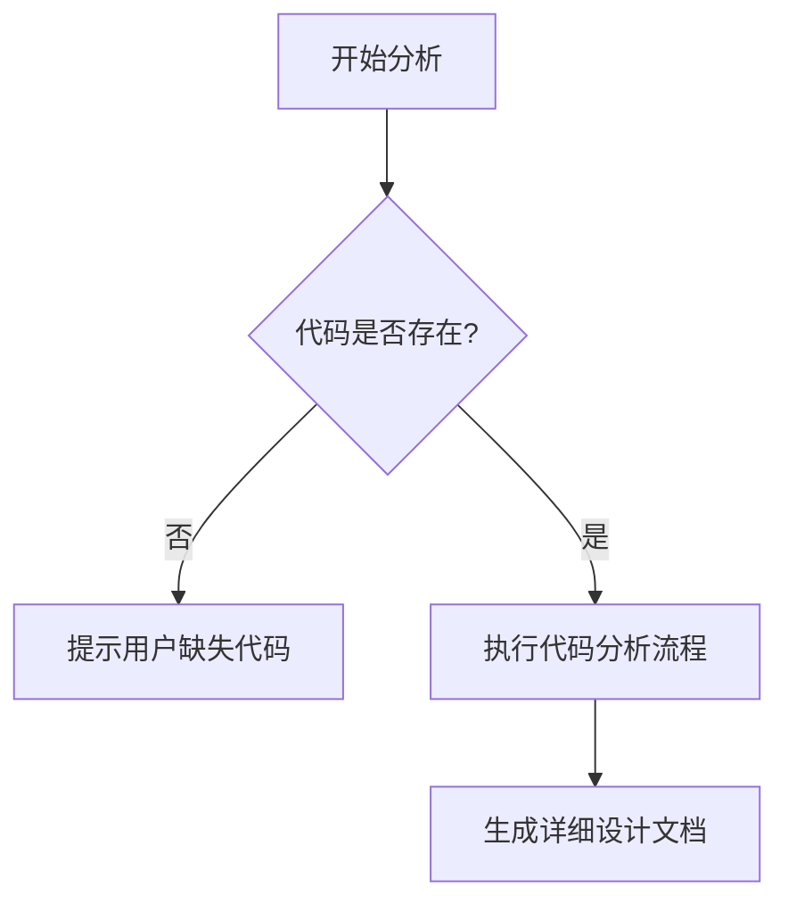

# `diffusers\tests\pipelines\wan\__init__.py` 详细设计文档

未提供源代码文件

## 整体流程



## 类结构

```

```

## 全局变量及字段


    

## 全局函数及方法


## 关键组件


由于未提供源代码，我无法识别关键组件或生成详细设计文档。

请提供需要分析的代码，以便我按照要求的格式输出包含以下内容的文档：

- 代码核心功能描述
- 文件运行流程
- 类详细信息（字段、方法、全局变量和函数）
- 关键组件信息
- 技术债务或优化空间
- 其它项目（设计目标、错误处理、数据流等）


## 问题及建议


### 已知问题

-   缺少待分析的源代码，无法进行具体的技术债务识别和优化建议
-   当前提供的代码块为空，无法提取类、方法、全局变量等关键设计元素
-   缺少文件运行流程、类结构、接口契约等必要信息，无法生成完整的设计文档

### 优化建议

-   请提供完整的源代码以便进行详细的技术债务分析和优化建议
-   建议包含完整的业务逻辑实现代码
-   建议提供相关的配置文件、依赖说明等辅助信息
-   若有多文件项目，建议提供完整的项目结构
-   在获取代码后，可从以下方面进行优化：代码复杂度分析、重复代码提取、单一职责原则遵循度、性能瓶颈识别、错误处理完善度、安全漏洞检查等方面进行深入分析


## 其它


### 设计目标与约束

**设计目标**：明确该代码模块需要达成的业务目标和技术目标，包括功能目标（如实现用户认证、数据处理、接口服务等）和非功能目标（如性能要求、安全性、可维护性等）。

**设计约束**：列出开发过程中的各种约束条件，如技术栈限制（编程语言版本、框架版本）、环境约束（运行平台、硬件要求）、时间约束、兼容性要求等。

### 错误处理与异常设计

**异常分类**：定义代码中可能出现的异常类型，包括系统异常（如网络超时、数据库连接失败）、业务异常（如参数验证失败、权限不足）以及第三方异常（如外部API调用失败）。

**异常处理策略**：说明每类异常的处理方式，包括日志记录、用户提示、重试机制、降级策略等。明确异常向上抛出的层级和在本层消化的边界。

**错误码与错误信息**：定义统一的错误码体系，每个错误码对应具体的错误描述，便于问题定位和前端展示。

### 数据流与状态机

**数据流向**：描述数据在系统中的流转路径，包括数据输入源、数据处理流程、数据输出目的地。明确数据在各环节的格式转换和业务处理逻辑。

**状态机设计**（如适用）：如果代码涉及状态转换（如订单状态、工作流节点、连接状态等），应绘制状态机图，列出所有状态、触发条件、转换动作以及异常状态处理。

### 外部依赖与接口契约

**外部依赖**：列出代码所依赖的外部系统、第三方库、中间件等，包括依赖名称、版本号、用途说明以及调用方式。

**接口契约**：详细描述模块对外提供的接口（API、RPC、消息队列等）和对内调用的接口。包括接口名称、请求参数、响应格式、调用示例、错误返回规范以及接口的幂等性、限流、超时等特性说明。

### 配置文件与参数说明

**配置项列表**：列出所有可配置的参数，包括配置名称、默认值、取值范围、配置方式（环境变量、配置文件、启动参数等）以及配置变更的影响范围。

**敏感信息管理**：说明敏感信息（如密钥、密码、Token等）的管理方式，配置文件中应使用占位符或外部密钥管理服务。

### 性能考量与资源使用

**性能指标**：明确系统应达到的性能指标，如响应时间（TP50、TP99）、吞吐量（TPS、QPS）、并发数等。

**资源消耗**：说明代码运行时的资源消耗预估，包括内存使用、CPU占用、网络带宽、磁盘IO等，以及资源瓶颈所在。

**性能优化建议**：基于代码逻辑分析，提出可能的性能优化点，如缓存使用、异步处理、批量操作、连接池配置等。

### 安全设计

**认证与授权**：说明身份验证方式（Token、Session、OAuth等）和权限控制机制（角色权限、API级别控制等）。

**数据安全**：描述敏感数据加密传输（HTTPS）、敏感数据存储加密、输入参数校验、SQL注入防护、XSS防护等安全措施。

**审计日志**：说明需要记录的安全相关日志，如登录日志、敏感操作日志、权限变更日志等。

### 测试策略

**单元测试**：说明单元测试的覆盖范围和测试方法，列出关键测试用例。

**集成测试**：描述模块间集成测试的策略和测试场景。

** Mock 策略**：说明外部依赖的Mock方案，确保测试的独立性。

### 部署与运维

**部署架构**：描述部署拓扑结构，包括服务实例数、负载均衡、容器化方案（如Docker、Kubernetes）等。

**健康检查**：说明健康检查接口和监控指标，便于运维监控。

**日志规范**：定义日志输出格式、日志级别使用规范、日志收集方案（ELK、Loki等）。

### 版本演进与兼容性

**版本历史**：记录代码的版本变更历史，包括版本号、变更内容、变更原因。

**向后兼容性**：说明接口的向后兼容策略，版本升级时的平滑过渡方案。

**数据迁移**（如适用）：如果涉及数据结构变更，说明数据迁移方案和回滚策略。


    