# `diffusers\tests\pipelines\wan\test_wan.py` 详细设计文档

这是WanPipeline的单元测试和集成测试文件，用于测试Wan文本转视频（text-to-video）扩散管道的推理、保存加载和集成功能。

## 整体流程

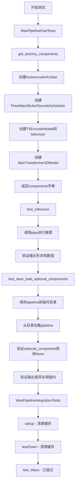

## 类结构

```
unittest.TestCase
├── WanPipelineFastTests (PipelineTesterMixin)
│   ├── get_dummy_components()
│   ├── get_dummy_inputs()
│   ├── test_inference()
│   ├── test_attention_slicing_forward_pass() [已跳过]
│   └── test_save_load_optional_components()
└── WanPipelineIntegrationTests
setUp()
tearDown()
test_Wanx() [已跳过
```

## 全局变量及字段


### `WanPipelineFastTests.pipeline_class`
    
指定测试所使用的管道类为 WanPipeline

类型：`Type[WanPipeline]`
    


### `WanPipelineFastTests.params`
    
定义文本到图像管道的参数集合

类型：`frozenset`
    


### `WanPipelineFastTests.batch_params`
    
定义批处理参数的集合

类型：`TEXT_TO_IMAGE_BATCH_PARAMS`
    


### `WanPipelineFastTests.image_params`
    
定义图像参数的集合

类型：`TEXT_TO_IMAGE_IMAGE_PARAMS`
    


### `WanPipelineFastTests.image_latents_params`
    
定义图像潜在变量的参数集合

类型：`TEXT_TO_IMAGE_IMAGE_PARAMS`
    


### `WanPipelineFastTests.required_optional_params`
    
定义可选但推荐的参数集合

类型：`frozenset`
    


### `WanPipelineFastTests.test_xformers_attention`
    
指示是否启用 xformers 注意力机制进行测试

类型：`bool`
    


### `WanPipelineFastTests.supports_dduf`
    
指示是否支持 DDUF（Decoupled Diffusion Upsampling Flow）功能

类型：`bool`
    


### `WanPipelineIntegrationTests.prompt`
    
集成测试用的文本提示词

类型：`str`
    
    

## 全局函数及方法


### `enable_full_determinism`

在提供的代码片段中，`enable_full_determinism` 函数未包含具体实现，仅有从 `...testing_utils` 模块的导入和调用语句。根据其名称和调用上下文推测，该函数用于设置随机种子和环境变量，以确保测试或运行结果的完全可复现性（确定性）。

参数：
- （无参数）

返回值：`未知`，由于未获取到函数定义，无法确定其返回值类型和值。

#### 流程图

```mermaid
graph TD
    A[开始] --> B{调用 enable_full_determinism}
    B --> C[设置随机种子]
    C --> D[设置环境变量]
    D --> E[确保确定性]
    E --> F[结束]
    note: 由于未找到函数定义，此流程图为基于函数名的推测，并非实际源码逻辑。
```

#### 带注释源码

```python
# 源码不可用
# 在给定代码中未找到 enable_full_determinism 的定义，仅有如下导入和使用：
from ...testing_utils import enable_full_determinism

# 调用该函数以启用确定性模式
enable_full_determinism()
```


### `WanPipelineFastTests.get_dummy_components`

该方法用于创建并返回一个包含 WanPipeline 所需的所有虚拟（dummy）组件的字典。这些组件包括 VAE、调度器、文本编码器、分词器和 Transformer 模型，用于单元测试目的。

参数：

- 该方法无参数（仅包含 `self`）

返回值：`dict`，返回包含以下键的组件字典：
- `transformer`：WanTransformer3DModel 实例
- `vae`：AutoencoderKLWan 实例
- `scheduler`：FlowMatchEulerDiscreteScheduler 实例
- `text_encoder`：T5EncoderModel 实例
- `tokenizer`：AutoTokenizer 实例
- `transformer_2`：None（可选组件）

#### 流程图

```mermaid
flowchart TD
    A[开始 get_dummy_components] --> B[设置随机种子 torch.manual_seed(0)]
    B --> C[创建 AutoencoderKLWan vae]
    C --> D[设置随机种子 torch.manual_seed(0)]
    D --> E[创建 FlowMatchEulerDiscreteScheduler scheduler]
    E --> F[加载 T5EncoderModel text_encoder]
    F --> G[加载 AutoTokenizer tokenizer]
    G --> H[设置随机种子 torch.manual_seed(0)]
    H --> I[创建 WanTransformer3DModel transformer]
    I --> J[组装组件字典 components]
    J --> K[返回 components 字典]
```

#### 带注释源码

```python
def get_dummy_components(self):
    """
    创建用于测试的虚拟组件。
    
    该方法初始化所有 WanPipeline 需要的组件，包括：
    - VAE (变分自编码器)
    - 调度器 (用于扩散过程)
    - 文本编码器 (将文本转换为嵌入)
    - 分词器 (将文本分词)
    - Transformer 模型 (用于去噪过程)
    - transformer_2 (可选组件，设为 None)
    
    Returns:
        dict: 包含所有组件的字典
    """
    # 设置随机种子以确保测试可复现性
    torch.manual_seed(0)
    
    # 创建 VAE 模型 - 用于将图像编码到潜在空间和解码回来
    vae = AutoencoderKLWan(
        base_dim=3,
        z_dim=16,
        dim_mult=[1, 1, 1, 1],
        num_res_blocks=1,
        temperal_downsample=[False, True, True],
    )

    # 重新设置随机种子以确保各组件间的独立性
    torch.manual_seed(0)
    
    # 创建调度器 - 使用 FlowMatchEulerDiscreteScheduler
    # shift 参数控制噪声调度的时间偏移
    # TODO: 未来可能实现 FlowDPMSolverMultistepScheduler
    scheduler = FlowMatchEulerDiscreteScheduler(shift=7.0)
    
    # 加载预训练的文本编码器 (T5) 和分词器
    # 使用 tiny-random-t5 模型以加快测试速度
    text_encoder = T5EncoderModel.from_pretrained("hf-internal-testing/tiny-random-t5")
    tokenizer = AutoTokenizer.from_pretrained("hf-internal-testing/tiny-random-t5")

    # 再次设置随机种子
    torch.manual_seed(0)
    
    # 创建 3D Transformer 模型 - 用于去噪过程的核心组件
    transformer = WanTransformer3DModel(
        patch_size=(1, 2, 2),       # 时空 patch 大小
        num_attention_heads=2,     # 注意力头数量
        attention_head_dim=12,     # 每个头的维度
        in_channels=16,             # 输入通道数
        out_channels=16,            # 输出通道数
        text_dim=32,                # 文本嵌入维度
        freq_dim=256,               # 频率维度 (用于 RoPE)
        ffn_dim=32,                 # 前馈网络维度
        num_layers=2,               # Transformer 层数
        cross_attn_norm=True,       # 是否对交叉注意力进行归一化
        qk_norm="rms_norm_across_heads",  # Query/Key 归一化方式
        rope_max_seq_len=32,        # RoPE 最大序列长度
    )

    # 组装所有组件到字典中
    components = {
        "transformer": transformer,      # 主去噪 Transformer
        "vae": vae,                       # 变分自编码器
        "scheduler": scheduler,           # 扩散调度器
        "text_encoder": text_encoder,    # 文本编码器
        "tokenizer": tokenizer,           # 分词器
        "transformer_2": None,            # 可选的第二个 Transformer (此 pipeline 未使用)
    }
    
    # 返回组件字典供 pipeline 初始化使用
    return components
```


### `WanPipelineFastTests.get_dummy_inputs`

该方法用于生成 WanPipeline 推理测试所需的虚拟输入参数，根据设备类型（MPS 或其他）创建相应随机数生成器，并返回一个包含提示词、负提示词、随机生成器、推理步数、引导强度、图像尺寸、帧数和最大序列长度等完整输入字典。

参数：

- `self`：隐式参数，测试类实例
- `device`：`str` 或 `torch.device`，执行推理的目标设备，用于创建随机数生成器
- `seed`：`int`，随机种子，默认为 0，用于保证测试结果的可复现性

返回值：`Dict[str, Any]`，包含以下键值的字典：
  - `prompt` (str): 正向提示词
  - `negative_prompt` (str): 负向提示词
  - `generator` (torch.Generator): 随机数生成器实例
  - `num_inference_steps` (int): 推理步数
  - `guidance_scale` (float): 引导比例系数
  - `height` (int): 生成图像高度
  - `width` (int): 生成图像宽度
  - `num_frames` (int): 生成视频帧数
  - `max_sequence_length` (int): 最大序列长度
  - `output_type` (str): 输出类型（"pt" 表示 PyTorch 张量）

#### 流程图

```mermaid
flowchart TD
    A[开始 get_dummy_inputs] --> B{device 是否为 MPS 设备}
    B -->|是| C[使用 torch.manual_seed(seed)]
    B -->|否| D[创建 torch.Generator 并设置种子]
    C --> E[构建输入参数字典]
    D --> E
    E --> F[返回 inputs 字典]
    
    style A fill:#f9f,stroke:#333
    style F fill:#9f9,stroke:#333
```

#### 带注释源码

```python
def get_dummy_inputs(self, device, seed=0):
    """
    生成用于 WanPipeline 推理测试的虚拟输入参数。
    
    Args:
        self: WanPipelineFastTests 测试类实例
        device: 目标设备，用于创建随机数生成器
        seed: 随机种子，确保测试结果可复现
    
    Returns:
        包含完整推理参数的字典
    """
    # 判断设备是否为 Apple MPS (Metal Performance Shaders)
    if str(device).startswith("mps"):
        # MPS 设备不支持 torch.Generator，使用 CPU 随机种子代替
        generator = torch.manual_seed(seed)
    else:
        # 其他设备（CPU/CUDA）创建设备特定的随机数生成器
        generator = torch.Generator(device=device).manual_seed(seed)
    
    # 构建完整的虚拟输入参数字典
    inputs = {
        "prompt": "dance monkey",           # 正向提示词
        "negative_prompt": "negative",      # 负向提示词（待完善标记 TODO）
        "generator": generator,             # 随机数生成器，确保确定性输出
        "num_inference_steps": 2,           # 推理步数，减少以加速测试
        "guidance_scale": 6.0,              # classifier-free guidance 强度
        "height": 16,                       # 生成图像高度（像素）
        "width": 16,                        # 生成图像宽度（像素）
        "num_frames": 9,                    # 视频生成帧数
        "max_sequence_length": 16,          # 文本序列最大长度
        "output_type": "pt",                # 输出格式：PyTorch 张量
    }
    return inputs
```


### `WanPipelineFastTests.test_inference`

该方法是一个单元测试函数，用于验证 WanPipeline（万向流水线）在文本到视频生成任务上的推理功能。测试通过创建虚拟组件、运行推理流程、验证输出视频的形状（9帧、3通道、16x16分辨率）以及比对其像素值Slice来确保流水线的正确性。

参数：

- `self`：隐式参数，WanPipelineFastTests 实例本身

返回值：`None`（无返回值），该方法为测试函数，通过 unittest 断言验证结果

#### 流程图

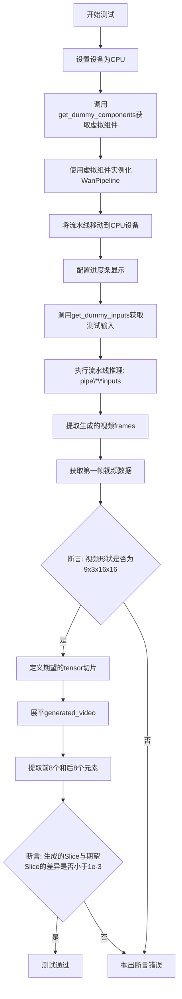

#### 带注释源码

```python
def test_inference(self):
    """
    测试 WanPipeline 的推理功能
    验证生成的视频形状和内容是否符合预期
    """
    # 1. 设置测试设备为 CPU
    device = "cpu"

    # 2. 获取虚拟组件（用于测试的模拟模型组件）
    # 包含: transformer, vae, scheduler, text_encoder, tokenizer, transformer_2
    components = self.get_dummy_components()
    
    # 3. 使用虚拟组件实例化 WanPipeline 流水线
    pipe = self.pipeline_class(**components)
    
    # 4. 将流水线移动到指定设备（CPU）
    pipe.to(device)
    
    # 5. 配置进度条（disable=None 表示不禁用进度条）
    pipe.set_progress_bar_config(disable=None)

    # 6. 获取测试输入参数
    # 包含: prompt, negative_prompt, generator, num_inference_steps, 
    #       guidance_scale, height, width, num_frames, max_sequence_length, output_type
    inputs = self.get_dummy_inputs(device)
    
    # 7. 执行推理，获取生成的视频 frames
    # 调用流水线的 __call__ 方法进行文本到视频生成
    video = pipe(**inputs).frames
    
    # 8. 提取第一帧视频数据（通常 batch_size=1）
    generated_video = video[0]
    
    # 9. 断言验证：生成的视频形状必须为 (9, 3, 16, 16)
    # 9: 帧数 (num_frames)
    # 3: 通道数 (RGB)
    # 16: 高度
    # 16: 宽度
    self.assertEqual(generated_video.shape, (9, 3, 16, 16))

    # 10. 定义期望的像素值切片（用于数值验证）
    # 这是一个预计算的标准输出，用于确保推理结果的一致性
    # fmt: off
    expected_slice = torch.tensor([
        0.4525, 0.452, 0.4485, 0.4534, 0.4524, 0.4529, 
        0.454, 0.453, 0.5127, 0.5326, 0.5204, 0.5253, 
        0.5439, 0.5424, 0.5133, 0.5078
    ])
    # fmt: on

    # 11. 处理生成的视频数据：展平并提取特定元素
    # 将 4D 张量 (9,3,16,16) 展平为 1D
    generated_slice = generated_video.flatten()
    
    # 提取前8个元素和后8个元素，共16个元素用于比对
    # 这样可以验证生成图像的主要特征
    generated_slice = torch.cat([generated_slice[:8], generated_slice[-8:]])
    
    # 12. 断言验证：生成的像素值与期望值的差异必须小于 1e-3
    # 使用 torch.allclose 进行浮点数近似比较
    self.assertTrue(torch.allclose(generated_slice, expected_slice, atol=1e-3))
```


### `test_attention_slicing_forward_pass`

这是一个被跳过的单元测试方法，用于测试 WanPipeline 的注意力切片（attention slicing）前向传播功能。由于测试被标记为不支持，该方法体为空实现。

参数：

- `self`：`WanPipelineFastTests`，测试类实例，隐式参数，表示调用该方法的类实例本身

返回值：`None`，无返回值，因为函数体只有 `pass` 语句

#### 流程图

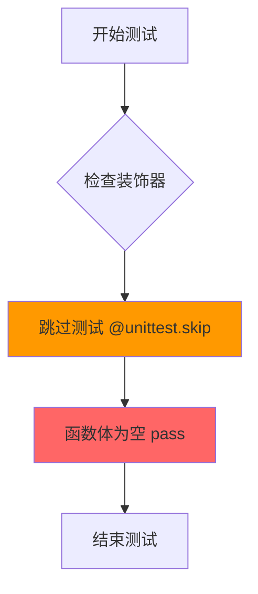

#### 带注释源码

```python
@unittest.skip("Test not supported")
def test_attention_slicing_forward_pass(self):
    """
    测试 WanPipeline 的注意力切片前向传播功能。
    
    注意：此测试当前不被支持，因此被跳过。
    """
    pass  # 空实现，测试被跳过
```


### `WanPipelineFastTests.test_save_load_optional_components`

该方法用于测试 WanPipeline 在包含可选组件（`transformer_2`）为 `None` 时的保存和加载功能，验证可选组件在序列化/反序列化后保持 `None` 状态，并且加载后的管道生成的输出与原始管道一致（差异在允许范围内）。

参数：

- `expected_max_difference`：`float`，允许的最大输出差异阈值，默认为 `1e-4`

返回值：`None`，该方法为单元测试，通过断言验证行为，不返回任何值。

#### 流程图

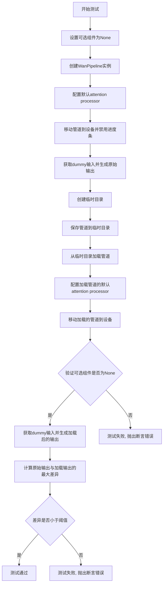

#### 带注释源码

```python
# 测试可选组件(transformer_2)的保存和加载功能
def test_save_load_optional_components(self, expected_max_difference=1e-4):
    # 定义要测试的可选组件名称
    optional_component = "transformer_2"

    # 步骤1: 获取默认的虚拟组件配置
    components = self.get_dummy_components()
    # 将可选组件设置为None
    components[optional_component] = None
    
    # 步骤2: 使用包含None可选组件的配置创建管道实例
    pipe = self.pipeline_class(**components)
    
    # 步骤3: 为所有组件设置默认的attention processor
    for component in pipe.components.values():
        if hasattr(component, "set_default_attn_processor"):
            component.set_default_attn_processor()
    
    # 步骤4: 将管道移动到指定设备并配置进度条
    pipe.to(torch_device)
    pipe.set_progress_bar_config(disable=None)

    # 步骤5: 获取测试输入并在CPU上生成原始输出
    generator_device = "cpu"
    inputs = self.get_dummy_inputs(generator_device)
    torch.manual_seed(0)  # 设置随机种子以确保可重复性
    output = pipe(**inputs)[0]  # 执行推理获取第一帧结果

    # 步骤6: 创建临时目录用于保存管道
    with tempfile.TemporaryDirectory() as tmpdir:
        # 保存管道到临时目录(不使用安全序列化)
        pipe.save_pretrained(tmpdir, safe_serialization=False)
        
        # 从保存的目录加载管道
        pipe_loaded = self.pipeline_class.from_pretrained(tmpdir)
        
        # 为加载的管道组件设置默认attention processor
        for component in pipe_loaded.components.values():
            if hasattr(component, "set_default_attn_processor"):
                component.set_default_attn_processor()
        
        # 步骤7: 将加载的管道移动到设备
        pipe_loaded.to(torch_device)
        pipe_loaded.set_progress_bar_config(disable=None)

    # 步骤8: 断言验证可选组件在加载后仍然为None
    self.assertTrue(
        getattr(pipe_loaded, optional_component) is None,
        f"`{optional_component}` did not stay set to None after loading.",
    )

    # 步骤9: 使用相同的输入生成加载后管道的输出
    inputs = self.get_dummy_inputs(generator_device)
    torch.manual_seed(0)  # 相同的随机种子确保可重复性
    output_loaded = pipe_loaded(**inputs)[0]

    # 步骤10: 计算原始输出与加载输出之间的最大差异
    max_diff = np.abs(output.detach().cpu().numpy() - output_loaded.detach().cpu().numpy()).max()
    
    # 步骤11: 断言验证差异在允许范围内
    self.assertLess(max_diff, expected_max_difference)
```


### `WanPipelineIntegrationTests.setUp`

该方法为集成测试的初始化方法，在每个测试方法执行前被调用，用于清理 Python 垃圾回收和 GPU 缓存，以确保测试环境的干净状态。

参数：

- `self`：隐式参数，`WanPipelineIntegrationTests` 实例，代表当前测试类对象

返回值：`None`，无返回值

#### 流程图

```mermaid
flowchart TD
    A[setUp 开始] --> B[调用 super().setUp]
    B --> C[执行 gc.collect]
    C --> D[调用 backend_empty_cache]
    D --> E[setUp 结束]
```

#### 带注释源码

```python
def setUp(self):
    """
    测试初始化方法，在每个测试方法运行前被调用。
    清理内存和 GPU 缓存，确保测试环境干净。
    """
    # 调用父类的 setUp 方法，执行 unittest.TestCase 的标准初始化
    super().setUp()
    
    # 手动触发 Python 垃圾回收，释放不再使用的对象内存
    gc.collect()
    
    # 调用后端工具函数清空 GPU 缓存（如果使用 CUDA）
    # torch_device 是从 testing_utils 导入的全局变量，表示当前测试设备
    backend_empty_cache(torch_device)
```


### `WanPipelineIntegrationTests.tearDown`

这是一个测试清理方法，用于在每个集成测试执行完毕后回收资源并清理 GPU 内存，确保测试环境不会因残留数据而影响后续测试。

参数：
- （无显式参数，隐含参数 `self` 为测试类实例）

返回值：`None`，无返回值描述

#### 流程图

```mermaid
flowchart TD
    A[开始 tearDown] --> B[调用 super().tearDown]
    B --> C[执行 gc.collect 强制垃圾回收]
    C --> D[调用 backend_empty_cache 清理 GPU 缓存]
    D --> E[结束 tearDown]
```

#### 带注释源码

```python
def tearDown(self):
    """
    测试清理方法，在每个集成测试结束后执行。
    负责清理测试过程中产生的临时对象和 GPU 缓存。
    """
    # 调用父类的 tearDown 方法，确保测试框架正常清理
    super().tearDown()
    
    # 强制 Python 垃圾回收器运行，释放不再使用的对象
    gc.collect()
    
    # 清理后端（GPU）缓存，释放 GPU 内存资源
    # torch_device 是全局变量，表示当前使用的计算设备
    backend_empty_cache(torch_device)
```


### `WanPipelineIntegrationTests.test_Wanx`

该测试方法用于测试 WanPipeline 的集成功能，目前已被标记为跳过（TODO），尚未实现具体测试逻辑。

参数：

-  `self`：无需传入，由 unittest 框架自动传递，代表测试类实例

返回值：`None`，该方法未实现任何返回值逻辑

#### 流程图

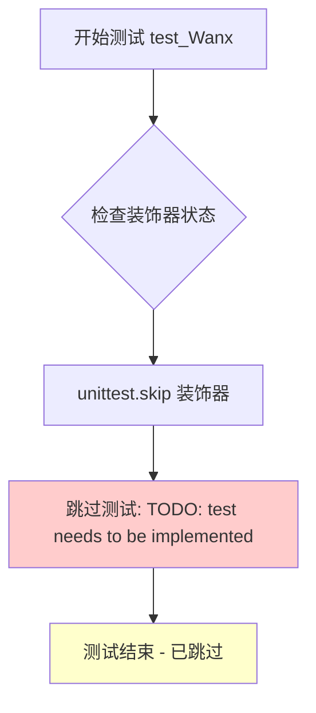

#### 带注释源码

```python
@unittest.skip("TODO: test needs to be implemented")
def test_Wanx(self):
    """
    WanPipeline 集成测试方法
    
    该方法旨在测试 WanPipeline 在实际推理场景下的功能，
    包括：
    - 文本到视频生成
    - 模型加载与推理
    - 输出帧数、尺寸验证
    
    当前状态：
    - 已被 unittest.skip 装饰器跳过
    - 方法体仅为 pass 占位符
    - 等待具体测试逻辑实现
    
    参数:
        self: unittest.TestCase 实例自动传递
        
    返回值:
        None: 测试被跳过，无实际执行
        
    异常:
        unittest.SkipTest: 由装饰器自动触发
    """
    pass
```

#### 补充说明

| 项目 | 描述 |
|------|------|
| **所属测试类** | `WanPipelineIntegrationTests` |
| **类装饰器** | `@slow`, `@require_torch_accelerator` |
| **方法装饰器** | `@unittest.skip("TODO: test needs to be implemented")` |
| **测试类型** | 集成测试 (Integration Test) |
| **当前状态** | 已实现但被跳过 |
| **优先级** | 中等 (待实现) |
| **预期功能** | 测试 WanPipeline 的完整推理流程，包括文本编码、Transformer 处理、VAE 解码生成视频帧 |


### `WanPipelineFastTests.get_dummy_components`

该方法是WanPipelineFastTests测试类中的一个辅助方法，用于创建虚拟（dummy）组件以进行WanPipeline的单元测试。它初始化了VAE、调度器、文本编码器、标记器和Transformer模型等核心组件，并返回一个包含这些组件的字典，供后续的推理测试和加载保存测试使用。

参数：
- 该方法无参数（除隐含的`self`）

返回值：`dict`，返回包含以下键值对的字典：
- `"transformer"`：`WanTransformer3DModel`，Wan变换器3D模型实例
- `"vae"`：`AutoencoderKLWan`，VAE模型实例
- `"scheduler"`：`FlowMatchEulerDiscreteScheduler`，调度器实例
- `"text_encoder"`：`T5EncoderModel`，T5文本编码器实例
- `"tokenizer"`：`AutoTokenizer`，T5标记器实例
- `"transformer_2"`：`None`，可选的第二个变换器（此处设为None）

#### 流程图

```mermaid
flowchart TD
    A[开始 get_dummy_components] --> B[设置随机种子 torch.manual_seed(0)]
    B --> C[创建 VAE: AutoencoderKLWan]
    C --> D[设置随机种子 torch.manual_seed(0)]
    D --> E[创建调度器: FlowMatchEulerDiscreteScheduler]
    E --> F[加载预训练 T5EncoderModel]
    F --> G[加载预训练 AutoTokenizer]
    G --> H[设置随机种子 torch.manual_seed(0)]
    H --> I[创建 Transformer: WanTransformer3DModel]
    I --> J[构建 components 字典]
    J --> K[返回 components]
    
    style A fill:#f9f,stroke:#333
    style K fill:#9f9,stroke:#333
```

#### 带注释源码

```python
def get_dummy_components(self):
    """
    创建用于测试的虚拟组件。
    
    该方法初始化所有必需的Pipeline组件，包括：
    - VAE (Variational Autoencoder)
    - 调度器 (Scheduler)
    - 文本编码器 (Text Encoder)
    - 标记器 (Tokenizer)
    - Transformer 模型
    
    Returns:
        dict: 包含所有组件的字典，用于实例化 WanPipeline
    """
    # 设置随机种子以确保测试可复现性
    torch.manual_seed(0)
    
    # 创建虚拟 VAE 模型
    # 参数说明：
    # - base_dim: 基础维度
    # - z_dim: 潜在空间维度
    # - dim_mult: 维度倍数列表
    # - num_res_blocks: 残差块数量
    # - temperal_downsample: 时间下采样配置
    vae = AutoencoderKLWan(
        base_dim=3,
        z_dim=16,
        dim_mult=[1, 1, 1, 1],
        num_res_blocks=1,
        temperal_downsample=[False, True, True],
    )

    # 再次设置随机种子，确保一致性
    torch.manual_seed(0)
    
    # 创建调度器：使用 FlowMatchEulerDiscreteScheduler
    # shift=7.0 是该调度器的特定参数
    # TODO: 注释提到未来可能实现 FlowDPMSolverMultistepScheduler
    scheduler = FlowMatchEulerDiscreteScheduler(shift=7.0)
    
    # 加载预训练的 T5 文本编码器和标记器
    # 使用 HuggingFace 的测试用 tiny-random-t5 模型
    text_encoder = T5EncoderModel.from_pretrained("hf-internal-testing/tiny-random-t5")
    tokenizer = AutoTokenizer.from_pretrained("hf-internal-testing/tiny-random-t5")

    # 再次设置随机种子
    torch.manual_seed(0)
    
    # 创建虚拟 Transformer 模型
    # 参数说明：
    # - patch_size: patch 大小 (时间, 高度, 宽度)
    # - num_attention_heads: 注意力头数量
    # - attention_head_dim: 注意力头维度
    # - in_channels/out_channels: 输入输出通道数
    # - text_dim: 文本嵌入维度
    # - freq_dim: 频率维度
    # - ffn_dim: 前馈网络维度
    # - num_layers: 层数
    # - cross_attn_norm: 跨注意力归一化
    # - qk_norm: QK 归一化类型
    # - rope_max_seq_len: RoPE 最大序列长度
    transformer = WanTransformer3DModel(
        patch_size=(1, 2, 2),
        num_attention_heads=2,
        attention_head_dim=12,
        in_channels=16,
        out_channels=16,
        text_dim=32,
        freq_dim=256,
        ffn_dim=32,
        num_layers=2,
        cross_attn_norm=True,
        qk_norm="rms_norm_across_heads",
        rope_max_seq_len=32,
    )

    # 组装组件字典
    components = {
        "transformer": transformer,      # 主 Transformer 模型
        "vae": vae,                      # VAE 编码器/解码器
        "scheduler": scheduler,          # 噪声调度器
        "text_encoder": text_encoder,    # 文本编码器
        "tokenizer": tokenizer,          # 文本标记器
        "transformer_2": None,           # 可选的第二个 Transformer（此处未使用）
    }
    
    # 返回组件字典供 Pipeline 初始化使用
    return components
```


### `WanPipelineFastTests.get_dummy_inputs`

该方法用于生成 WanPipeline 测试所需的虚拟输入参数，根据设备类型（MPS 或其他）创建适当的随机数生成器，并返回一个包含提示词、负提示词、生成器、推理步数、引导系数、视频尺寸等关键参数的字典，以支持管道推理测试。

参数：

- `device`：`str` 或 `torch.device`，执行推理的目标设备，用于确定生成器的设备类型
- `seed`：`int`，随机种子，默认为 0，用于控制生成器的随机性

返回值：`Dict[str, Any]`，包含以下键的字典：

- `prompt`：提示词文本
- `negative_prompt`：负提示词文本
- `generator`：PyTorch 随机数生成器
- `num_inference_steps`：推理步数
- `guidance_scale`：引导系数
- `height`：生成视频的高度
- `width`：生成视频的宽度
- `num_frames`：生成视频的帧数
- `max_sequence_length`：最大序列长度
- `output_type`：输出类型（PyTorch 张量）

#### 流程图

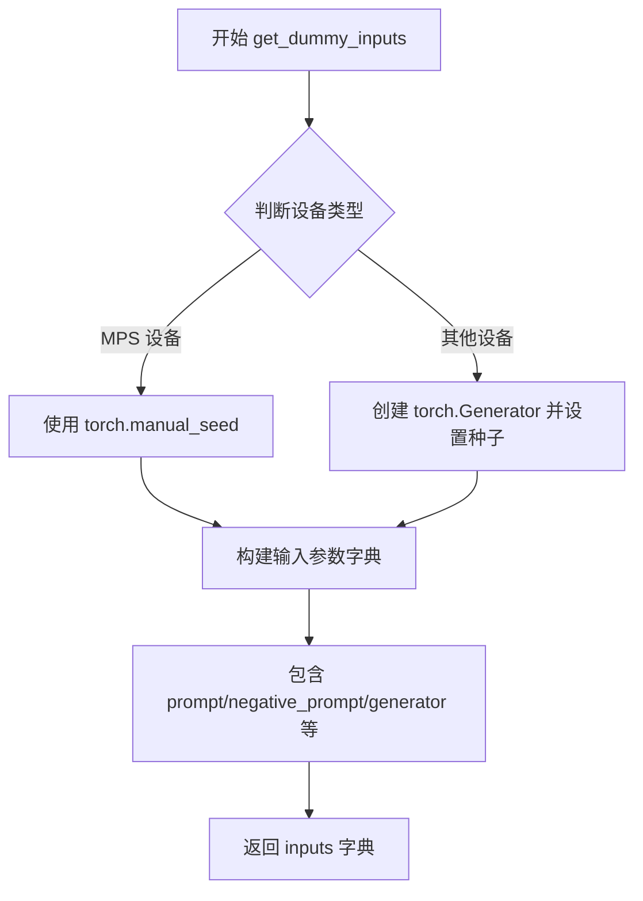

#### 带注释源码

```python
def get_dummy_inputs(self, device, seed=0):
    """
    生成用于测试 WanPipeline 的虚拟输入参数。
    
    参数:
        device: 目标设备，用于创建随机数生成器
        seed: 随机种子，用于控制生成结果的确定性
    
    返回:
        包含管道推理所需参数的字典
    """
    # 判断是否为 MPS (Apple Silicon) 设备
    if str(device).startswith("mps"):
        # MPS 设备不支持 Generator，使用 torch.manual_seed 替代
        generator = torch.manual_seed(seed)
    else:
        # 其他设备创建指定设备的生成器并设置种子
        generator = torch.Generator(device=device).manual_seed(seed)
    
    # 构建完整的输入参数字典
    inputs = {
        "prompt": "dance monkey",                    # 文本提示词
        "negative_prompt": "negative",                # 负提示词（待完善标记 TODO）
        "generator": generator,                      # 随机数生成器
        "num_inference_steps": 2,                    # 推理步数（测试用小值）
        "guidance_scale": 6.0,                       # CFG 引导强度
        "height": 16,                                # 输出高度（16 像素）
        "width": 16,                                 # 输出宽度（16 像素）
        "num_frames": 9,                             # 输出帧数（9 帧）
        "max_sequence_length": 16,                   # 文本编码最大序列长度
        "output_type": "pt",                         # 输出为 PyTorch 张量
    }
    return inputs
```


### `WanPipelineFastTests.test_inference`

该测试方法用于验证 WanPipeline（文本到视频生成管道）的推理功能。测试创建一个虚拟的管道组件配置，执行文本到视频的生成推理，并验证生成的视频帧的形状和像素值是否符合预期。

参数：

- 无显式参数（仅包含 `self` 隐式参数）

返回值：`None`，该方法为测试方法，通过断言验证推理结果的正确性

#### 流程图

```mermaid
flowchart TD
    A[开始 test_inference 测试] --> B[设置设备为 CPU]
    B --> C[获取虚拟组件配置 get_dummy_components]
    C --> D[使用虚拟组件创建 WanPipeline 实例]
    D --> E[将管道移至 CPU 设备]
    E --> F[设置进度条配置 disable=None]
    F --> G[获取虚拟输入 get_dummy_inputs]
    G --> H[执行管道推理 pipe(**inputs)]
    H --> I[获取生成的视频帧 frames]
    I --> J[验证视频形状为 9x3x16x16]
    J --> K[提取并验证生成视频的像素值切片]
    K --> L[结束测试]
```

#### 带注释源码

```python
def test_inference(self):
    # 设置测试设备为 CPU
    device = "cpu"

    # 获取虚拟的组件配置（VAE、调度器、文本编码器、Transformer等）
    components = self.get_dummy_components()
    
    # 使用虚拟组件实例化 WanPipeline 管道
    pipe = self.pipeline_class(**components)
    
    # 将管道移至指定设备（CPU）
    pipe.to(device)
    
    # 设置进度条配置，disable=None 表示不禁用进度条
    pipe.set_progress_bar_config(disable=None)

    # 获取虚拟输入参数（提示词、负提示词、生成器、推理步数等）
    inputs = self.get_dummy_inputs(device)
    
    # 执行管道推理，**inputs 解包字典参数
    # 返回结果包含 frames 属性，即生成的视频帧
    video = pipe(**inputs).frames
    
    # 从返回结果中获取第一个视频（批次中的第一个）
    generated_video = video[0]
    
    # 断言验证：生成视频的形状应为 (9, 3, 16, 16)
    # 9帧，每帧3通道（RGB），高度16，宽度16
    self.assertEqual(generated_video.shape, (9, 3, 16, 16))

    # 定义预期输出的像素值切片（用于数值验证）
    # fmt: off
    expected_slice = torch.tensor([0.4525, 0.452, 0.4485, 0.4534, 0.4524, 0.4529, 0.454, 0.453, 0.5127, 0.5326, 0.5204, 0.5253, 0.5439, 0.5424, 0.5133, 0.5078])
    # fmt: on

    # 扁平化生成视频，获取所有像素值
    generated_slice = generated_video.flatten()
    
    # 提取前8个和后8个像素值（共16个），与预期值对比
    generated_slice = torch.cat([generated_slice[:8], generated_slice[-8:]])
    
    # 断言验证：生成像素值与预期值的差异应在 1e-3 范围内
    self.assertTrue(torch.allclose(generated_slice, expected_slice, atol=1e-3))
```


### `WanPipelineFastTests.test_attention_slicing_forward_pass`

这是一个测试方法，用于测试 WanPipeline 的注意力切片（attention slicing）前向传递功能。由于该测试被标记为不支持（@unittest.skip），当前未实现具体测试逻辑。

参数：

- `self`：`WanPipelineFastTests`，测试类实例本身，表示调用此方法的测试类对象

返回值：`None`，该方法没有返回值（pass 语句相当于返回 None）

#### 流程图

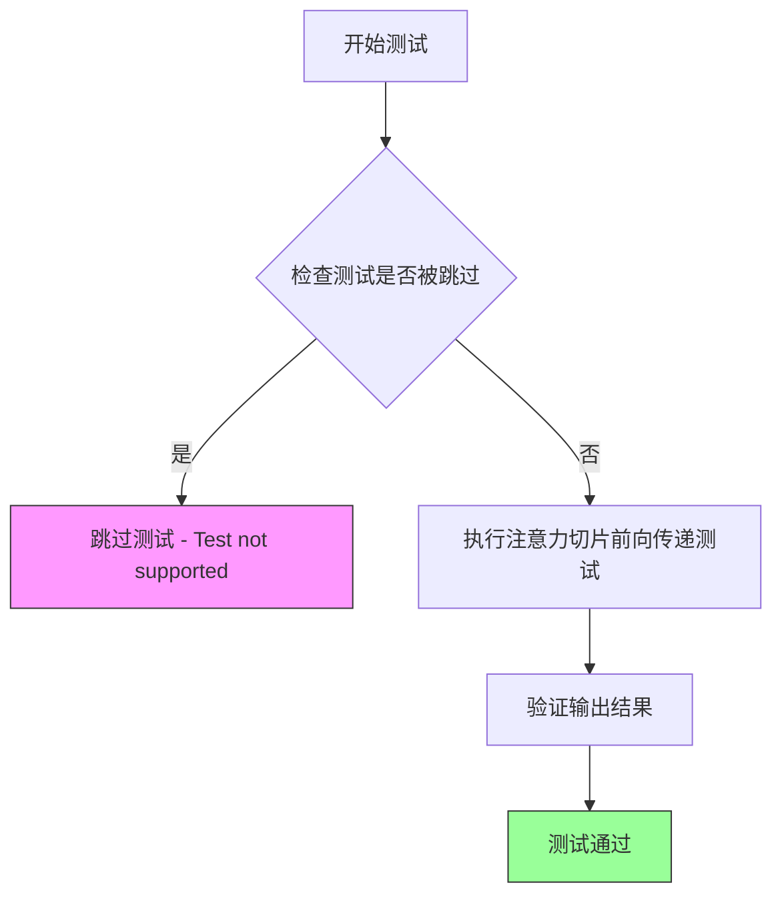

#### 带注释源码

```python
@unittest.skip("Test not supported")
def test_attention_slicing_forward_pass(self):
    """
    测试 WanPipeline 的注意力切片（attention slicing）前向传递功能。
    
    注意：此测试当前被跳过，未实现具体测试逻辑。
    注意力切片是一种内存优化技术，用于减少大型模型在推理时的显存占用。
    
    参数:
        无额外的参数（除隐含的 self）
    
    返回值:
        无返回值（方法体为 pass）
    """
    pass  # 测试未实现，仅包含 pass 语句作为占位符
```


### `WanPipelineFastTests.test_save_load_optional_components`

该测试方法用于验证 WanPipeline 在保存和加载时能否正确处理可选组件（`transformer_2`）为 `None` 的情况，确保保存前后的输出差异在允许范围内。

参数：

- `self`：隐式参数，`WanPipelineFastTests` 实例，表示测试类本身
- `expected_max_difference`：`float`，允许的最大差异阈值，默认为 `1e-4`

返回值：无（`None`），该方法为单元测试方法，通过断言验证行为而非返回值

#### 流程图

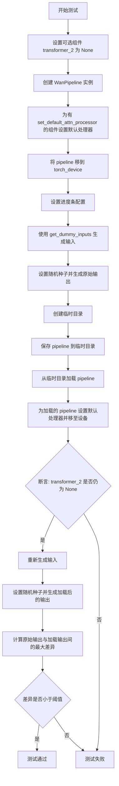

#### 带注释源码

```python
def test_save_load_optional_components(self, expected_max_difference=1e-4):
    """
    测试保存/加载可选组件功能
    验证 transformer_2 为 None 时，pipeline 能正确保存和加载，且输出保持一致
    """
    # 定义要测试的可选组件名称
    optional_component = "transformer_2"

    # 1. 获取虚拟组件配置，并将指定可选组件设为 None
    components = self.get_dummy_components()
    components[optional_component] = None
    
    # 2. 使用组件字典创建 WanPipeline 实例
    pipe = self.pipeline_class(**components)
    
    # 3. 为所有有 set_default_attn_processor 方法的组件设置默认注意力处理器
    for component in pipe.components.values():
        if hasattr(component, "set_default_attn_processor"):
            component.set_default_attn_processor()
    
    # 4. 将 pipeline 移至指定的 torch 设备（如 cuda/cpu）
    pipe.to(torch_device)
    
    # 5. 配置进度条（disable=None 表示不禁用）
    pipe.set_progress_bar_config(disable=None)

    # 6. 准备生成器设备和输入参数
    generator_device = "cpu"
    inputs = self.get_dummy_inputs(generator_device)
    
    # 7. 设置随机种子确保可重复性，生成原始输出
    torch.manual_seed(0)
    output = pipe(**inputs)[0]

    # 8. 创建临时目录用于保存模型
    with tempfile.TemporaryDirectory() as tmpdir:
        # 9. 保存 pipeline 到临时目录（不使用安全序列化）
        pipe.save_pretrained(tmpdir, safe_serialization=False)
        
        # 10. 从保存的目录加载 pipeline
        pipe_loaded = self.pipeline_class.from_pretrained(tmpdir)
        
        # 11. 为加载的 pipeline 同样设置默认注意力处理器
        for component in pipe_loaded.components.values():
            if hasattr(component, "set_default_attn_processor"):
                component.set_default_attn_processor()
        
        # 12. 将加载的 pipeline 移至设备并配置进度条
        pipe_loaded.to(torch_device)
        pipe_loaded.set_progress_bar_config(disable=None)

    # 13. 断言：验证可选组件在加载后仍为 None
    self.assertTrue(
        getattr(pipe_loaded, optional_component) is None,
        f"`{optional_component}` did not stay set to None after loading.",
    )

    # 14. 重新生成输入，使用相同随机种子
    inputs = self.get_dummy_inputs(generator_device)
    torch.manual_seed(0)
    
    # 15. 生成加载后 pipeline 的输出
    output_loaded = pipe_loaded(**inputs)[0]

    # 16. 计算两个输出的最大差异
    max_diff = np.abs(output.detach().cpu().numpy() - output_loaded.detach().cpu().numpy()).max()
    
    # 17. 断言：差异应小于允许的阈值
    self.assertLess(max_diff, expected_max_difference)
```


### `WanPipelineIntegrationTests.setUp`

该方法是 WanPipelineIntegrationTests 测试类的初始化设置方法，用于在每个测试方法运行前执行清理工作，确保测试环境处于干净状态。

参数：

- `self`：`WanPipelineIntegrationTests`，测试类实例本身

返回值：`None`，无返回值，仅执行环境清理操作

#### 流程图

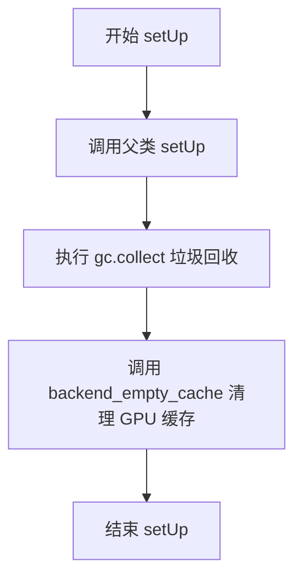

#### 带注释源码

```python
def setUp(self):
    """
    测试方法执行前的初始化设置。
    清理内存和GPU缓存，确保测试环境干净。
    """
    # 调用父类的 setUp 方法，执行 unittest.TestCase 的基础初始化
    super().setUp()
    
    # 手动触发 Python 垃圾回收，清理未使用的对象
    gc.collect()
    
    # 调用后端工具函数清理 GPU 显存缓存
    # torch_device 是全局变量，定义在 testing_utils 中
    backend_empty_cache(torch_device)
```


### `WanPipelineIntegrationTests.tearDown`

该方法为集成测试类的清理方法，在每个测试方法执行完毕后自动调用，负责回收内存并清空 GPU 缓存，以确保测试环境干净，避免内存泄漏和显存占用问题。

参数：无（仅包含隐式的 `self` 参数）

返回值：`None`，无返回值

#### 流程图

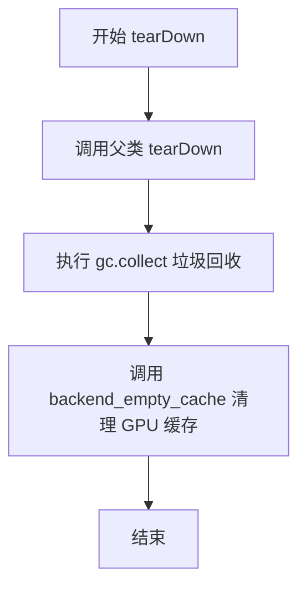

#### 带注释源码

```python
def tearDown(self):
    """
    测试方法执行完成后的清理操作
    
    执行流程：
    1. 调用父类的 tearDown 方法，确保父类清理逻辑被执行
    2. 手动触发 Python 垃圾回收，释放测试过程中产生的临时对象
    3. 调用后端特定的缓存清理函数，释放 GPU 显存
    """
    # 调用父类的 tearDown 方法，执行 unittest.TestCase 标准清理逻辑
    super().tearDown()
    
    # 手动触发 Python 的垃圾回收器，清理测试过程中产生的循环引用对象
    gc.collect()
    
    # 清理深度学习框架（PyTorch）的 GPU 缓存，释放显存空间
    # torch_device 是测试工具函数，提供当前测试设备标识
    backend_empty_cache(torch_device)
```


### `WanPipelineIntegrationTests.test_Wanx`

这是一个集成测试方法，用于测试 WanPipeline 的 Wanx 功能。该测试目前被标记为跳过（skip），原因是"TODO: test needs to be implemented"，表明测试逻辑尚未完成实现。

参数：

- `self`：`WanPipelineIntegrationTests`，表示测试类的当前实例对象，用于访问类属性和方法

返回值：`None`，测试方法通常不返回具体值，而是通过断言来验证功能正确性

#### 流程图

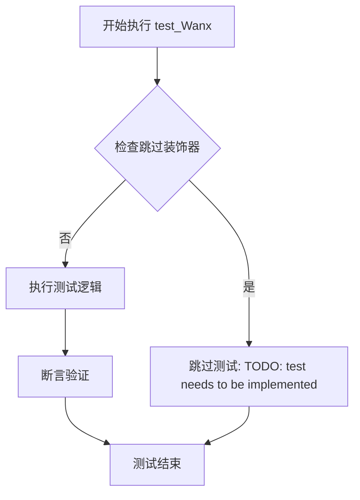

#### 带注释源码

```python
@unittest.skip("TODO: test needs to be implemented")
def test_Wanx(self):
    """
    WanPipeline 集成测试方法 - 测试 Wanx 功能
    
    该测试方法用于验证 WanPipeline 的 Wanx 相关功能。
    当前状态：已被 @unittest.skip 装饰器跳过，测试逻辑尚未实现。
    
    参数:
        self: WanPipelineIntegrationTests 的实例对象
    
    返回值:
        None: 测试方法不返回具体值，通过 self.assert* 方法进行验证
    """
    pass  # 测试逻辑待实现，当前仅作为占位符
```

## 关键组件


### WanPipeline

WanPipeline 是 Wan 文本到视频生成管道的主类，整合了 VAE、Transformer、文本编码器和调度器，实现从文本提示生成视频的功能。

### AutoencoderKLWan

AutoencoderKLWan 是 Wan 模型的变分自编码器（VAE），负责将视频压缩到潜在空间（编码）以及从潜在表示重建视频（解码），支持 3D 视频数据的处理。

### WanTransformer3DModel

WanTransformer3DModel 是 3D 变换器模型，作为去噪主干网络，在潜在空间中对视频进行多步去噪处理，支持时空注意力机制和文本条件引导。

### FlowMatchEulerDiscreteScheduler

FlowMatchEulerDiscreteScheduler 是基于欧拉离散方法的 Flow Match 调度器，用于控制扩散采样过程的噪声调度，支持 shift 参数配置。

### T5EncoderModel

T5EncoderModel 是基于 T5 架构的文本编码器，将文本提示转换为文本嵌入向量，为生成过程提供条件信息。

### 张量索引与惰性加载

在 test_inference 方法中使用 `video[0]` 进行张量索引，仅在需要时访问生成的视频帧，避免不必要的内存加载。

### 潜在空间反量化支持

通过 AutoencoderKLWan 的解码功能，将 16 维的潜在表示反量化（重建）为实际的视频张量（9 帧、3 通道、16x16 分辨率）。

### 测试组件配置

get_dummy_components 方法配置了完整的测试组件集，包括 VAE、Transformer、调度器、文本编码器和分词器，用于单元测试。

### 设备兼容性处理

get_dummy_inputs 方法针对 MPS 设备使用不同的随机数生成器创建方式，确保测试在不同后端设备上的兼容性。


## 问题及建议


### 已知问题

-   **未实现的测试方法**：存在两个被跳过的测试 - `test_attention_slicing_forward_pass` 和 `test_Wanx`，分别标注为"Test not supported"和"TODO: test needs to be implemented"，导致测试覆盖不完整
-   **硬编码的测试种子**：多处使用 `torch.manual_seed(0)` 固定随机种子，可能导致测试结果不够随机且容易被"作弊"通过
-   **TODO注释未完成**：代码中存在两处TODO注释（负提示词和FlowDPMSolverMultistepScheduler），表明功能尚未完全实现但测试已编写
-   **未使用的参数**：`test_save_load_optional_components` 方法签名包含 `expected_max_difference=1e-4` 参数，但在方法体内未被使用
-   **测试命名不一致**：`test_Wanx` 方法名不符合常规测试命名规范（应类似 `test_wanx` 或 `test_wanx_inference`）
-   **设备兼容性处理**：对MPS设备的特殊处理（`if str(device).startswith("mps")`）与CPU/其他设备处理逻辑不同，可能导致行为不一致

### 优化建议

-   **实现或移除未完成的测试**：将 `test_attention_slicing_forward_pass` 和 `test_Wanx` 完整实现，或从代码库中删除
-   **移除硬编码随机种子**：在单元测试中使用动态随机种子，或至少在文档中说明为何需要固定种子
-   **完成TODO项**：实现FlowDPMSolverMultistepScheduler或移除对它的引用；完善负提示词的测试用例
-   **修复参数使用**：在 `test_save_load_optional_components` 中使用 `expected_max_difference` 参数进行差异比较，或删除该参数
-   **统一测试命名**：将 `test_Wanx` 重命名为 `test_wanx` 或更描述性的名称
-   **简化设备处理逻辑**：统一 `get_dummy_inputs` 中的随机数生成器创建方式，移除设备特定的分支
-   **增强错误处理**：在集成测试的 `setUp` 和 `tearDown` 中添加异常处理，确保资源清理不会因前序测试失败而中断

## 其它


### 设计目标与约束

本测试文件旨在验证WanPipeline（文本到视频生成pipeline）的核心功能，包括模型组件的初始化、推理过程、参数配置以及可选组件的保存与加载。测试约束包括：仅支持CPU和CUDA设备，禁用了xFormers注意力优化，不支持DDUF（Decoupled Diffusion Upsampling Features），且部分测试用例被标记为跳过或待实现。

### 错误处理与异常设计

测试文件中使用了`unittest`框架的异常处理机制。对于不支持的测试用例（如`test_attention_slicing_forward_pass`和`test_Wanx`），使用`@unittest.skip`装饰器跳过执行。在`test_save_load_optional_components`方法中，通过断言验证可选组件（如`transformer_2`）在保存和加载后保持为`None`。推理测试通过`torch.allclose`进行数值近似比较，允许一定的容差（`atol=1e-3`）。

### 数据流与状态机

测试数据流如下：首先通过`get_dummy_components`方法创建虚拟模型组件（VAE、scheduler、text_encoder、tokenizer、transformer），然后通过`get_dummy_inputs`方法构造包含prompt、negative_prompt、generator、num_inference_steps等参数的输入字典。pipeline执行推理后返回视频帧，测试验证输出形状为(9, 3, 16, 16)，即9帧、3通道、16x16分辨率。状态转换包括：组件初始化 → 参数配置 → pipeline执行 → 输出验证。

### 外部依赖与接口契约

主要依赖包括：`transformers`库提供`AutoTokenizer`和`T5EncoderModel`；`diffusers`库提供`AutoencoderKLWan`、`FlowMatchEulerDiscreteScheduler`、`WanPipeline`和`WanTransformer3DModel`；测试工具来自`...testing_utils`（如`require_torch_accelerator`、`slow`）和`..pipeline_params`。接口契约方面，`WanPipeline`接受components字典作为初始化参数，调用时接受prompt、negative_prompt、generator、num_inference_steps、guidance_scale、height、width、num_frames、max_sequence_length、output_type等参数，返回包含frames的结果对象。

### 配置与参数说明

关键配置参数包括：`batch_params`使用`TEXT_TO_IMAGE_BATCH_PARAMS`，`image_params`使用`TEXT_TO_IMAGE_IMAGE_PARAMS`，`params`使用`TEXT_TO_IMAGE_PARAMS`并排除`cross_attention_kwargs`。`required_optional_params`定义了可选参数集合：num_inference_steps、generator、latents、return_dict、callback_on_step_end、callback_on_step_end_tensor_inputs。测试使用FlowMatchEulerDiscreteScheduler，shift参数设为7.0；transformer配置包括patch_size=(1,2,2)、num_attention_heads=2、attention_head_dim=12、num_layers=2、rope_max_seq_len=32。

### 测试覆盖范围

测试覆盖了以下场景：基础推理功能验证（test_inference）、可选组件的保存与加载（test_save_load_optional_components）、集成测试框架（WanPipelineIntegrationTests）。测试使用固定的随机种子（torch.manual_seed(0)）确保可复现性，数值验证通过切片比较预期值与实际输出。集成测试使用`@slow`和`@require_torch_accelerator`装饰器标记，setUp和tearDown方法中执行gc.collect()和backend_empty_cache以管理内存。

### 技术债务与优化空间

当前测试存在以下技术债务：test_attention_slicing_forward_pass被跳过，未实现注意力切片功能测试；test_Wanx标记为TODO，集成测试未完成；negative_prompt标注为TODO，未验证负面提示词的实际效果；注释提到"TODO: impl FlowDPMSolverMultistepScheduler"，表明调度器实现不完整。优化方向包括：实现完整的集成测试、添加更多参数化测试用例、验证不同配置下的模型行为、以及增加性能基准测试。

### 版本与兼容性信息

代码基于Apache License 2.0开源协议，版权归属HuggingFace Team（2025年）。依赖版本需兼容transformers和diffusers库的最新API，测试框架要求Python 3.8+和PyTorch。device支持包括CPU和CUDA设备，MPS设备通过特殊处理（直接使用torch.manual_seed）兼容。


    