# `diffusers\tests\pipelines\wan\test_wan_22.py` 详细设计文档

这是用于测试WanPipeline（ Wan 2.2 和 Wan 2.25B 版本）的单元测试文件，主要验证文本到视频生成功能，包括模型推理、保存加载、可选组件处理等核心功能。

## 整体流程

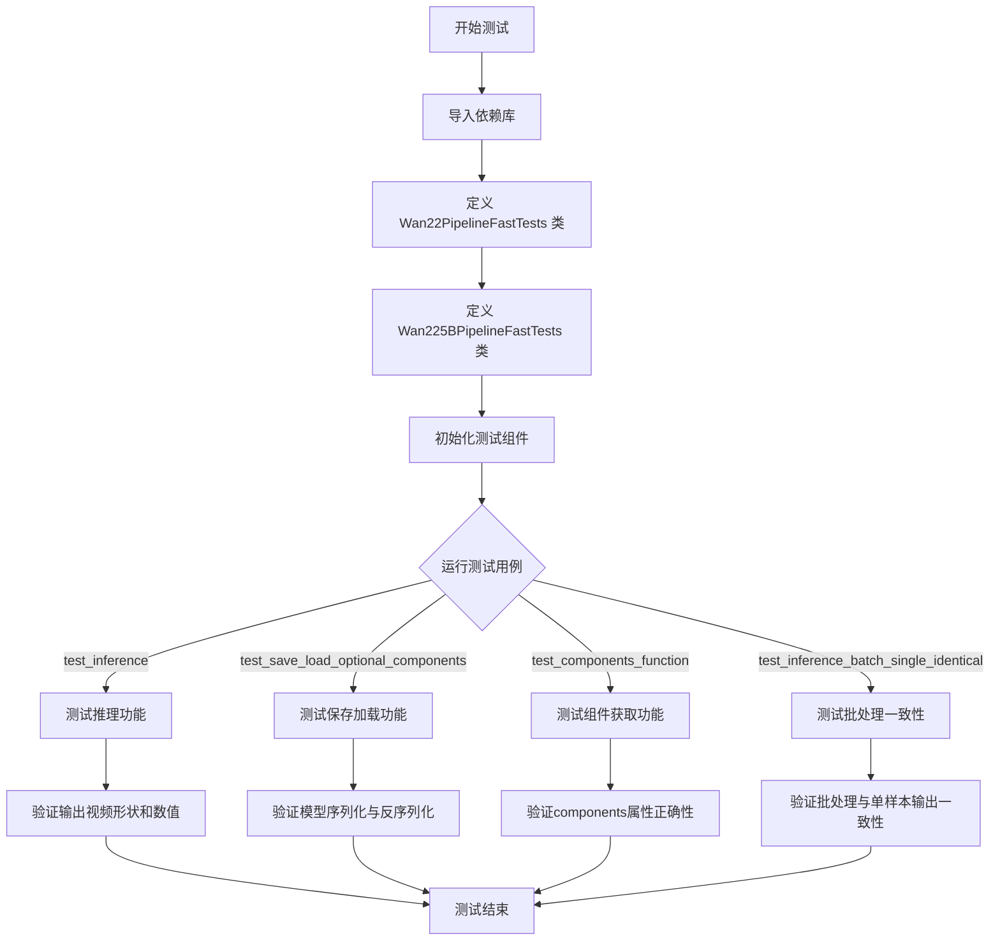

## 类结构

```
unittest.TestCase (基类)
├── PipelineTesterMixin (混入类)
└── Wan22PipelineFastTests
    └── 测试 Wan 2.2 Pipeline
└── Wan225BPipelineFastTests
```

## 全局变量及字段


### `device`
    
运行设备字符串，通常为'cpu'或'cuda'等

类型：`str`
    


### `components`
    
包含pipeline所有组件的字典，如transformer、vae、scheduler等

类型：`Dict[str, Any]`
    


### `pipe`
    
WanPipeline实例，被测试的pipeline对象

类型：`WanPipeline`
    


### `inputs`
    
包含推理所需参数的字典，如prompt、negative_prompt、generator等

类型：`Dict[str, Any]`
    


### `video`
    
pipeline返回的视频帧列表

类型：`List[Tensor]`
    


### `generated_video`
    
实际生成的视频张量，形状为(frames, channels, height, width)

类型：`Tensor`
    


### `expected_slice`
    
期望的张量值切片，用于验证输出正确性

类型：`Tensor`
    


### `generated_slice`
    
实际生成的张量切片，通过flatten和cat获取部分像素值

类型：`Tensor`
    


### `max_diff`
    
输出与加载后输出之间的最大绝对差异值

类型：`float`
    


### `optional_component`
    
可选组件的名称字符串，如'transformer'或'transformer_2'

类型：`str`
    


### `init_components`
    
初始化时的组件字典，用于测试components属性

类型：`Dict[str, Any]`
    


### `output`
    
原始pipeline的输出张量

类型：`Tensor`
    


### `output_loaded`
    
从保存并加载的pipeline得到的输出张量

类型：`Tensor`
    


### `Wan22PipelineFastTests.pipeline_class`
    
指定测试使用的pipeline类为WanPipeline

类型：`Type[WanPipeline]`
    


### `Wan22PipelineFastTests.params`
    
文本到图像参数集，去除了cross_attention_kwargs

类型：`Set[str]`
    


### `Wan22PipelineFastTests.batch_params`
    
批处理参数集

类型：`Set[str]`
    


### `Wan22PipelineFastTests.image_params`
    
图像参数集

类型：`Set[str]`
    


### `Wan22PipelineFastTests.image_latents_params`
    
图像潜在向量参数集

类型：`Set[str]`
    


### `Wan22PipelineFastTests.required_optional_params`
    
必需的可选参数集合，包括num_inference_steps、generator等

类型：`Frozenset[str]`
    


### `Wan22PipelineFastTests.test_xformers_attention`
    
标志位，禁用xformers注意力测试

类型：`bool`
    


### `Wan22PipelineFastTests.supports_dduf`
    
标志位，表示不支持DDUF功能

类型：`bool`
    


### `Wan225BPipelineFastTests.pipeline_class`
    
指定测试使用的pipeline类为WanPipeline

类型：`Type[WanPipeline]`
    


### `Wan225BPipelineFastTests.params`
    
文本到图像参数集，去除了cross_attention_kwargs

类型：`Set[str]`
    


### `Wan225BPipelineFastTests.batch_params`
    
批处理参数集

类型：`Set[str]`
    


### `Wan225BPipelineFastTests.image_params`
    
图像参数集

类型：`Set[str]`
    


### `Wan225BPipelineFastTests.image_latents_params`
    
图像潜在向量参数集

类型：`Set[str]`
    


### `Wan225BPipelineFastTests.required_optional_params`
    
必需的可选参数集合，包括num_inference_steps、generator等

类型：`Frozenset[str]`
    


### `Wan225BPipelineFastTests.test_xformers_attention`
    
标志位，禁用xformers注意力测试

类型：`bool`
    


### `Wan225BPipelineFastTests.supports_dduf`
    
标志位，表示不支持DDUF功能

类型：`bool`
    
    

## 全局函数及方法


### `enable_full_determinism`

该函数用于启用PyTorch的完全确定性模式，确保测试和实验结果可复现。它通过设置随机种子、环境变量和PyTorch的配置来消除所有非确定性因素。

参数： 无

返回值： `None`，无返回值

#### 流程图

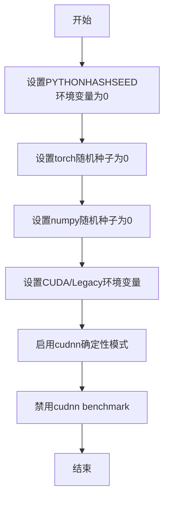

#### 带注释源码

```
# 由于源代码未在文件中直接定义，以下为基于函数调用方式的推断源码
# 实际实现位于 testing_utils 模块中

def enable_full_determinism(seed: int = 0, extra_seed: bool = True):
    """
    启用完全确定性模式，确保测试结果可复现
    
    参数:
        seed: int, 随机种子，默认为0
        extra_seed: bool, 是否设置额外的随机种子，默认为True
    
    返回:
        None
    """
    import os
    import random
    import numpy as np
    import torch
    
    # 1. 设置Python哈希种子，确保Python内置随机性可复现
    os.environ["PYTHONHASHSEED"] = str(seed)
    
    # 2. 设置Python内置random模块的种子
    random.seed(seed)
    
    # 3. 设置NumPy的随机种子
    np.random.seed(seed)
    
    # 4. 设置PyTorch的随机种子
    torch.manual_seed(seed)
    
    # 5. 如果使用CUDA，设置GPU随机种子
    if torch.cuda.is_available():
        torch.cuda.manual_seed(seed)
        torch.cuda.manual_seed_all(seed)
    
    # 6. 设置环境变量启用CUDA确定性
    os.environ["CUBLAS_WORKSPACE_CONFIG"] = ":4096:8"
    
    # 7. 启用PyTorch确定性算法
    torch.backends.cudnn.deterministic = True
    torch.backends.cudnn.benchmark = False
    
    # 8. 禁用PyTorch多线程不确定性
    torch.set_num_threads(1)
    
    # 9. 如果启用了额外种子设置，设置更多随机源
    if extra_seed:
        # 设置PyTorch CUDA工作空间配置
        if hasattr(torch, 'use_deterministic_algorithms'):
            try:
                torch.use_deterministic_algorithms(True)
            except Exception:
                pass
```

**注意**：由于 `enable_full_determinism` 函数的具体实现未在当前文件中提供，以上源码是基于函数名和常见实现方式的推断。实际的完整实现可能包含更多细节，建议查阅 `testing_utils` 模块的源代码获取准确信息。


### `torch_device`

该全局变量从 `testing_utils` 模块导入，用于指定 PyTorch 运行时使用的设备（通常是 "cuda"、"cpu" 或 "mps"），以便在测试中一致地处理设备分配。

#### 流程图

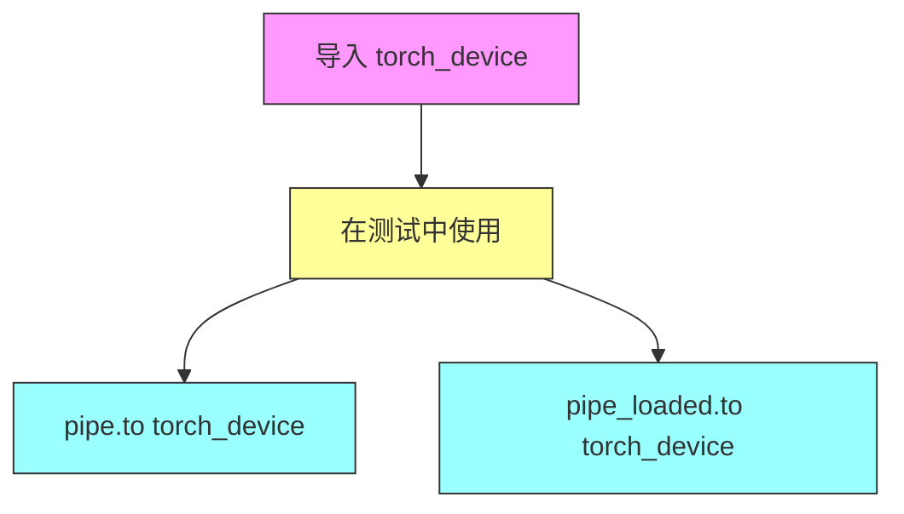

#### 带注释源码

```python
# 从 testing_utils 模块导入的全局变量
# 用于指定 PyTorch 计算设备
from ...testing_utils import (
    enable_full_determinism,
    torch_device,  # <-- 全局变量：设备字符串，如 "cuda", "cpu", "mps"
)

# 在测试方法中使用示例：
# pipe.to(torch_device)          # 将管道模型移动到指定设备
# pipe_loaded.to(torch_device)   # 将加载的管道模型移动到指定设备
```


### `AutoTokenizer`

`AutoTokenizer` 是 Hugging Face Transformers 库中的一个自动 tokenizer 类，用于根据预训练模型名称或路径自动加载对应的 tokenizer。它是 Transformers 库的核心组件之一，支持数百种预训练模型的 tokenizer。

#### 参数

- `pretrained_model_name_or_path`：`str` 或 `os.PathLike`，预训练模型的名称（如 "hf-internal-testing/tiny-random-t5"）或本地路径。
- `*inputs`：位置参数，传递给底层 tokenizer 的额外输入。
- `**kwargs`：关键字参数，包括 `cache_dir`（缓存目录）、`force_download`（强制下载）、`resume_download`（恢复下载）、`proxies`（代理）、`local_files_only`（仅使用本地文件）、`token`（认证令牌）、`revision`（模型版本）、`subfolder`（子文件夹）、`padding`（填充策略）、`truncation`（截断）、`max_length`（最大长度）等。

#### 返回值

`~tokenization_utils_base.PreTrainedTokenizerBase`，返回对应的 PreTrainedTokenizer 或 PreTrainedTokenizerFast 对象，用于将文本编码为 token ID 序列或解码。

#### 流程图

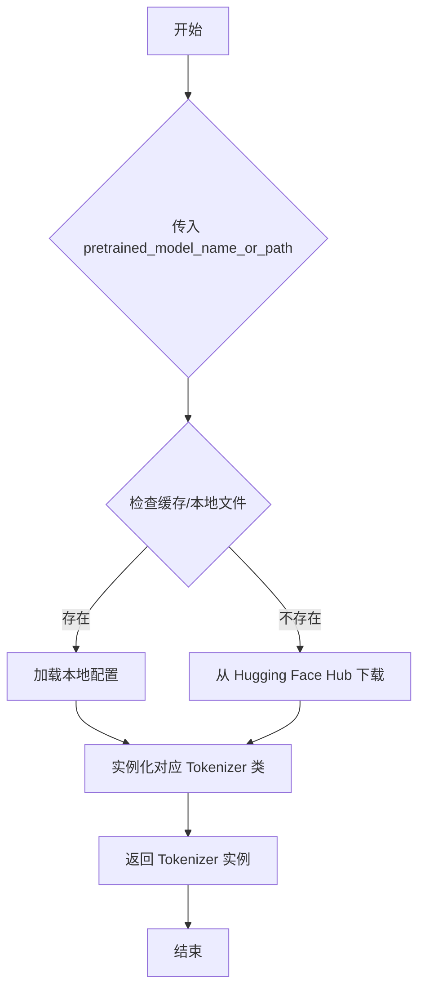

#### 带注释源码

```python
# 在代码中的实际使用方式：
tokenizer = AutoTokenizer.from_pretrained("hf-internal-testing/tiny-random-t5")

# 解释：
# AutoTokenizer.from_pretrained() 是类方法
# "hf-internal-testing/tiny-random-t5" 是预训练模型的标识符
# 该方法会自动：
#   1. 从 Hugging Face Hub 或本地加载 tokenizer 配置文件
#   2. 下载对应的 vocab.json / merges.txt 等词表文件
#   3. 实例化相应的 Tokenizer 类（本例为 T5TokenizerFast）
# 返回的 tokenizer 对象可以用于：
#   - encoding: tokenizer.encode("text") -> [token_ids]
#   - decoding: tokenizer.decode([token_ids]) -> "text"
#   - batch encoding: tokenizer(texts, padding=True, truncation=True, return_tensors="pt")
```


# T5EncoderModel 分析文档

根据代码分析，`T5EncoderModel` 是从 Hugging Face `transformers` 库导入的外部类，并非在本代码库中定义。代码中仅展示了其 `from_pretrained` 方法的调用方式。以下是基于代码上下文的分析文档：

### `T5EncoderModel.from_pretrained`

从预训练模型加载 T5 编码器模型。

参数：

- `pretrained_model_name_or_path`：`str`，模型名称或路径（如 "hf-internal-testing/tiny-random-t5"）

返回值：`T5EncoderModel`，加载的 T5 编码器模型实例。

#### 带注释源码

```python
# 从 transformers 库导入 T5EncoderModel 类
from transformers import AutoTokenizer, T5EncoderModel

# 在测试代码中使用 from_pretrained 方法加载模型
text_encoder = T5EncoderModel.from_pretrained("hf-internal-testing/tiny-random-t5")
```

> **注意**：由于 `T5EncoderModel` 是外部库（transformers）定义的类，其完整的类字段、类方法、mermaid 流程图等信息需要参考 transformers 官方文档。本代码仅展示了其作为文本编码器组件在 WanPipeline 中的使用方式。


### `AutoencoderKLWan`

AutoencoderKLWan 是来自 diffusers 库的视频/图像变分自编码器 (VAE) 类，基于 KL 散度损失进行潜在空间压缩与重建，支持时序下采样和多尺度维度配置，用于 WanPipeline 中视频生成任务的潜在表示编码与解码。

参数：

- `base_dim`：`int`，基础维度大小，决定 VAE 特征的初始通道数
- `z_dim`：`int`，潜在空间维度 (latent dimension)，控制压缩后的潜在向量通道数
- `dim_mult`：`List[int]`，各层维度倍率列表，用于构建 U-Net 风格的多层级结构
- `num_res_blocks`：`int`，每层残差块的数量
- `temperal_downsample`：`List[bool]`，时序下采样标志列表，指定哪些层级进行时间维度下采样
- `in_channels`：`int`，输入图像通道数（可选，默认 3）
- `out_channels`：`int`，输出图像通道数（可选，默认 3）
- `is_residual`：`bool`，是否使用残差连接（可选）
- `patch_size`：`int`，空间分块大小（可选）
- `latents_mean`：`List[float]`，潜在向量均值列表，用于归一化（可选）
- `latents_std`：`List[float]`，潜在向量标准差列表，用于归一化（可选）
- `scale_factor_spatial`：`int`，空间缩放因子（可选）
- `scale_factor_temporal`：`int`，时序缩放因子（可选）

返回值：`AutoencoderKLWan` 实例，作为 VAE 组件用于 WanPipeline

#### 流程图

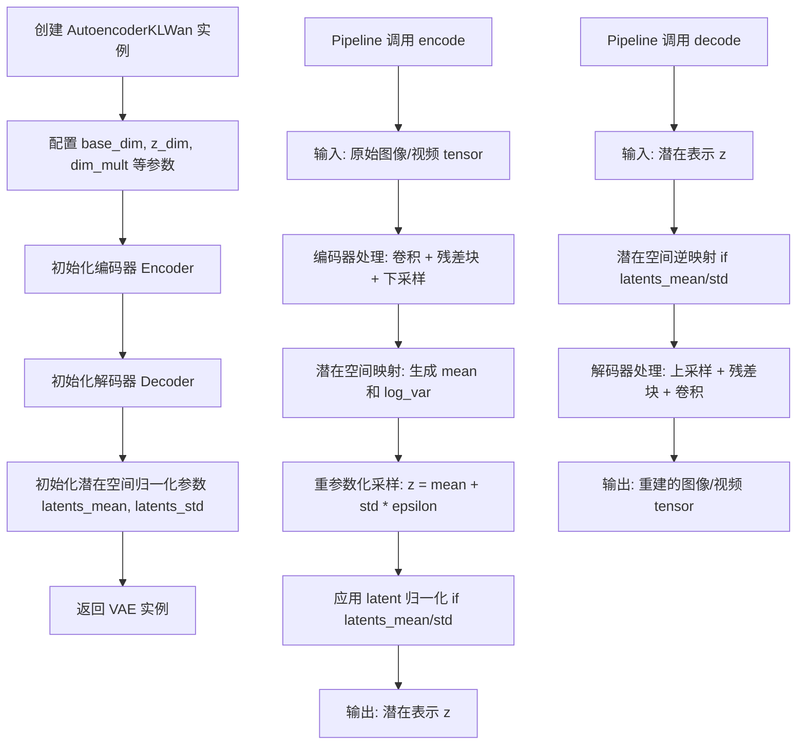

#### 带注释源码

```python
# 以下为测试代码中 AutoencoderKLWan 的使用示例 (非类定义源码)

# ==================== Wan22PipelineFastTests 中的用法 ====================
torch.manual_seed(0)
vae = AutoencoderKLWan(
    base_dim=3,               # 基础维度: 3
    z_dim=16,                 # 潜在维度: 16
    dim_mult=[1, 1, 1, 1],    # 4层维度倍率均为1
    num_res_blocks=1,         # 每层1个残差块
    temperal_downsample=[False, True, True],  # 第2、3层进行时序下采样
)
# 用途: 用于 Wan 2.2 版本的视频生成 pipeline
# 输入图像通道: 3 (RGB)
# 输出潜在通道: 16


# ==================== Wan225BPipelineFastTests 中的用法 ====================
torch.manual_seed(0)
vae = AutoencoderKLWan(
    base_dim=3,
    z_dim=48,                 # 更大的潜在维度
    in_channels=12,           # 输入通道: 12 (可能为多帧堆叠)
    out_channels=12,          # 输出通道: 12
    is_residual=True,         # 使用残差模式
    patch_size=2,             # 空间分块大小
    latents_mean=[0.0] * 48,  # 潜在均值归一化
    latents_std=[1.0] * 48,   # 潜在标准差归一化
    dim_mult=[1, 1, 1, 1],
    num_res_blocks=1,
    scale_factor_spatial=16,   # 空间下采样倍率
    scale_factor_temporal=4,  # 时序下采样倍率
    temperal_downsample=[False, True, True],
)
# 用途: 用于 Wan 2.25B 版本的视频生成 pipeline
# 支持更大分辨率和更长视频的处理


# ==================== 在 Pipeline 中的典型使用流程 ====================

# 1. 编码阶段 (将图像转换为潜在表示)
# components = {"vae": vae, "transformer": transformer, ...}
# pipe = WanPipeline(**components)
# latent_dist = vae.encode(image_tensor)  # 返回潜在分布
# latents = latent_dist.sample(generator)  # 采样潜在向量
# latents = latents * vae.config.scaling_factor  # 应用缩放因子

# 2. 解码阶段 (将潜在表示转换回图像)
# image_tensor = vae.decode(latents)  # 返回重建图像

# 3. 特性说明
# - 使用 KL 散度损失进行训练，潜在空间遵循高斯分布
# - 支持 3D 卷积 (空间 + 时序)，适用于视频生成
# - temperal_downsample 控制时序维度的下采样策略
# - 可选的 latents_mean/std 用于推理时的潜在空间归一化
# - is_residual 模式支持残差解码 (输出为残差而非直接重建)
```

#### 补充说明

由于 `AutoencoderKLWan` 类定义位于 diffusers 库内部，测试代码仅展示了其初始化接口。根据测试中的使用模式，该类的主要功能包括：

1. **编码 (encode)**: 将输入图像/视频编码为潜在空间的均值和方差分布
2. **解码 (decode)**: 将潜在向量解码重建为图像/视频
3. **重参数化 (reparameterize)**: 在训练/推理过程中采样潜在向量
4. **时序处理**: 通过 `temperal_downsample` 参数支持视频的时序下采样
5. **配置属性**: 通过 `vae.config` 访问缩放因子等配置


### `UniPCMultistepScheduler`

`UniPCMultistepScheduler` 是 diffusers 库中的一个调度器类，用于扩散模型的推理过程。在代码中，它被配置为使用流预测 (flow_prediction) 模式，并设置了流偏移参数。

参数：

-  `prediction_type`：`str`，指定预测类型，这里使用 "flow_prediction"
-  `use_flow_sigmas`：`bool`，是否使用流 sigma，这里设置为 True
-  `flow_shift`：`float`，流偏移参数，这里设置为 3.0

返回值：`UniPCMultistepScheduler` 实例

#### 带注释源码

```python
# 在 get_dummy_components 方法中创建 UniPCMultistepScheduler 实例
scheduler = UniPCMultistepScheduler(
    prediction_type="flow_prediction",  # 预测类型为流预测
    use_flow_sigmas=True,               # 启用流 sigma
    flow_shift=3.0                      # 流偏移量为 3.0
)
```

#### 说明

由于 `UniPCMultistepScheduler` 是来自 diffusers 库的类，其完整定义不在本代码仓库中。从代码中的使用方式可以看出：

1. **prediction_type="flow_prediction"**：表示使用流预测作为噪声预测类型
2. **use_flow_sigmas=True**：启用流 sigma 用于调度
3. **flow_shift=3.0**：流偏移量设置为 3.0，这是流匹配（flow matching）模型中常用的参数

该调度器在 WanPipeline 中用于控制扩散推理过程的噪声调度，通过配置这些参数来适应特定的扩散模型架构（如 Wan 模型）。


# WanPipeline 详细设计文档

由于提供的代码是测试文件而非 `WanPipeline` 类的实际实现源码，我将从测试代码中提取该类的使用方式、接口规范和运行流程，为您呈现基于测试用例的详细分析文档。

---

### `WanPipeline`

WanPipeline 是 Hugging Face Diffusers 库中的一个视频生成扩散管道类，负责协调 VAE、Transformer 模型、调度器和文本编码器等组件，根据文本提示（prompt）生成对应的视频内容。该管道支持多种配置模式，包括 Wan 2.2 和 Wan 2.25B 版本，能够处理负向提示（negative_prompt）、分类器自由引导（classifier-free guidance）等高级生成策略，并返回包含生成视频帧的对象。

#### 参数

- `transformer`：`WanTransformer3DModel` 类型，主要的 Transformer 主干网络，负责潜在空间的视频生成
- `vae`：`AutoencoderKLWan` 类型，变分自编码器，负责将潜在表示解码为实际视频帧
- `scheduler`：`SchedulerMixin` 类型（测试中使用 `UniPCMultistepScheduler`），扩散过程的时间步调度器
- `text_encoder`：`PreTrainedModel` 类型（测试中使用 `T5EncoderModel`），文本编码器，将文本提示转换为嵌入向量
- `tokenizer`：`PreTrainedTokenizer` 类型，文本分词器，负责将文本输入转换为 token ID 序列
- `transformer_2`：`WanTransformer3DModel` 类型，可选的第二个 Transformer 模型（用于某些特定版本）
- `boundary_ratio`：`float` 类型，边界比例参数，用于控制生成内容的边界特性
- `expand_timesteps`：`bool` 类型，是否扩展时间步的标志

#### 返回值

返回包含 `frames` 属性的对象，其结构为 `List[Tensor]`，每个 Tensor 的形状为 `(num_frames, channels, height, width)`，代表生成的视频帧序列。

#### 流程图

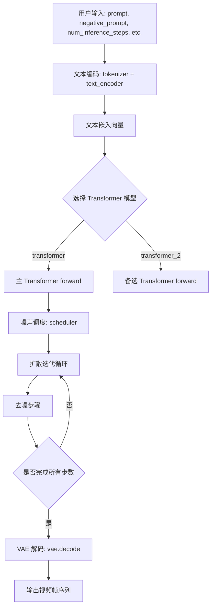

#### 带注释源码

```python
# 注意：以下源码是基于测试用例 Wan22PipelineFastTests 和 Wan225BPipelineFastTests
# 推断出的 WanPipeline 类的典型使用方式和结构，并非实际实现源码

# 1. 管道初始化（从测试用例 get_dummy_components 推断）
pipe = WanPipeline(
    transformer=transformer,        # WanTransformer3DModel 实例
    vae=vae,                         # AutoencoderKLWan 实例  
    scheduler=scheduler,             # UniPCMultistepScheduler 实例
    text_encoder=text_encoder,       # T5EncoderModel 实例
    tokenizer=tokenizer,             # AutoTokenizer 实例
    transformer_2=transformer_2,     # 可选的第二个 Transformer
    boundary_ratio=0.875,            # 边界比例参数
    # expand_timesteps=True          # 仅 Wan 2.25B 版本
)

# 2. 设备配置
pipe.to("cpu")  # 或 "cuda" 等设备

# 3. 进度条配置
pipe.set_progress_bar_config(disable=None)

# 4. 执行推理（从测试用例 get_dummy_inputs 推断）
inputs = {
    "prompt": "dance monkey",           # 文本提示
    "negative_prompt": "negative",     # 负向提示
    "generator": torch.Generator(),    # 随机数生成器
    "num_inference_steps": 2,          # 推理步数
    "guidance_scale": 6.0,             # 引导 scale
    "height": 16,                      # 视频高度
    "width": 16,                       # 视频宽度
    "num_frames": 9,                   # 帧数量
    "max_sequence_length": 16,         # 最大序列长度
    "output_type": "pt",               # 输出类型 (pytorch tensor)
}

# 5. 调用管道生成视频
output = pipe(**inputs)  # 返回包含 .frames 属性的对象
video = output.frames    # List[Tensor], shape: (num_frames, channels, height, width)

# 6. 视频保存/加载（从 test_save_load_optional_components 推断）
pipe.save_pretrained("/tmp/model_path", safe_serialization=False)
pipe_loaded = WanPipeline.from_pretrained("/tmp/model_path")
```

---

### 类的详细信息

#### 全局变量和函数

由于没有直接提供 WanPipeline 类的实现源码，以下信息基于测试代码中的使用模式推断：

| 名称 | 类型 | 描述 |
|------|------|------|
| `WanPipeline` | 类 | 视频生成扩散管道主类 |
| `pipeline_class` | 类属性 | 在测试中指向 `WanPipeline` |
| `params` | frozenset | 管道参数字段集合（排除 cross_attention_kwargs） |
| `batch_params` | set | 批次参数字段集合 |
| `image_params` | set | 图像参数字段集合 |
| `required_optional_params` | frozenset | 必须的可选参数字段集合 |

#### 类方法（基于测试用例推断）

| 方法名 | 功能描述 |
|--------|----------|
| `__init__` | 初始化管道组件 |
| `to(device)` | 将管道移至指定设备 |
| `set_progress_bar_config` | 配置进度条显示 |
| `__call__` | 执行文本到视频的生成推理 |
| `save_pretrained` | 保存管道模型权重 |
| `from_pretrained` | 从预训练路径加载管道 |

---

### 关键组件信息

| 组件名称 | 类型 | 一句话描述 |
|----------|------|------------|
| `transformer` | WanTransformer3DModel | 3D 视频生成 Transformer 主干网络 |
| `vae` | AutoencoderKLWan | 视频潜在空间变分自编码器 |
| `scheduler` | UniPCMultistepScheduler | 多步统一预测一致性（UniPC）调度器 |
| `text_encoder` | T5EncoderModel | T5 文本编码器模型 |
| `tokenizer` | AutoTokenizer | 文本分词器 |
| `transformer_2` | WanTransformer3DModel | 可选的辅助 Transformer（用于 Wan 2.25B） |

---

### 潜在的技术债务或优化空间

1. **测试代码中的 TODO 项**：在 `Wan225BPipelineFastTests.get_dummy_inputs` 方法中存在 `# TODO` 注释，表明 `negative_prompt` 参数的处理可能尚未完全确定。

2. **硬编码的测试参数**：多处使用 `torch.manual_seed(0)` 进行随机种子固定，可能掩盖某些随机性相关的边界情况。

3. **版本兼容性处理**：代码中通过 `boundary_ratio` 和 `transformer_2` 等参数区分不同版本（Wan 2.2 vs Wan 2.25B），这种条件逻辑可能导致未来维护复杂。

4. **设备兼容性**：针对 MPS 设备有特殊处理（`if str(device).startswith("mps")`），表明可能存在跨平台兼容性技术债务。

---

### 其它项目

#### 设计目标与约束

- **设计目标**：支持文本到视频的高质量生成，支持多种配置变体（Wan 2.2、Wan 2.25B）
- **约束条件**：测试用例显示支持的输出类型仅为 `"pt"` (PyTorch Tensor)

#### 错误处理与异常设计

- 测试中使用了 `@unittest.skip("Test not supported")` 跳过不支持的测试（如 `test_attention_slicing_forward_pass`），表明某些高级功能可能尚未实现或存在已知问题

#### 数据流与状态机

- 管道状态转换：`初始化` → `设备迁移` → `推理调用` → `返回结果`
- 组件间数据流：文本 → Tokenizer → Text Encoder → 文本嵌入 → Transformer → 噪声调度循环 → VAE 解码 → 视频帧

#### 外部依赖与接口契约

- 依赖库：`torch`, `numpy`, `transformers`, `diffusers`
- 关键接口：`WanPipeline.__call__` 接受字典参数并返回包含 `frames` 属性的对象

---

**注意**：由于原始代码仅提供了测试文件而未包含 `WanPipeline` 类的实际实现源码，上述文档中的类结构、方法和流程图是基于测试用例中的使用模式推断得出的。如需获取完整的实现细节，建议查阅 Diffusers 库源代码或官方文档。


### WanTransformer3DModel

`WanTransformer3DModel` 是从 diffusers 库导入的一个 3D 变换器模型类，用于 Wan 视频生成 pipeline 的核心变换器组件。该类实现了时空注意力机制，支持文本条件注入、旋转位置编码（RoPE）等特性，用于将噪声 latent 逐步去噪生成视频。

参数：

- `patch_size`：tuple，时空 patch 划分大小，代码中传入 `(1, 2, 2)` 表示时间和空间维度的 patch 划分
- `num_attention_heads`：int，注意力头的数量，代码中为 2
- `attention_head_dim`：int，每个注意力头的维度，代码中为 12
- `in_channels`：int，输入 latent 的通道数，第一次使用为 16，第二次使用为 48（Wan22 和 Wan225B 版本不同）
- `out_channels`：int，输出 latent 的通道数，与 in_channels 相同
- `text_dim`：int，文本嵌入的维度，代码中为 32
- `freq_dim`：int，频率维度，用于 RoPE 或其他频率相关计算，代码中为 256
- `ffn_dim`：int，前馈神经网络的隐藏层维度，代码中为 32
- `num_layers`：int，变换器层的数量，代码中为 2
- `cross_attn_norm`：bool，是否对交叉注意力进行归一化，代码中为 True
- `qk_norm`：str，查询和键的归一化方式，代码中为 `"rms_norm_across_heads"`
- `rope_max_seq_len`：int，旋转位置编码的最大序列长度，代码中为 32

返回值：返回 `WanTransformer3DModel` 类的实例对象

#### 流程图

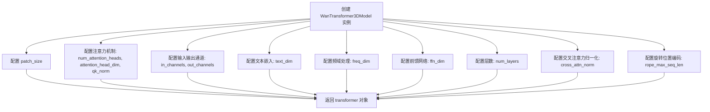

#### 带注释源码

```python
# 从 diffusers 库导入 WanTransformer3DModel 类
from diffusers import WanTransformer3DModel

# 第一次实例化 - 用于 Wan22PipelineFastTests
torch.manual_seed(0)
transformer = WanTransformer3DModel(
    patch_size=(1, 2, 2),           # 时空 patch 划分: 1个时间步, 2x2空间
    num_attention_heads=2,          # 2个注意力头
    attention_head_dim=12,          # 每个头维度为12
    in_channels=16,                 # 输入通道数为16 (latent空间维度)
    out_channels=16,                # 输出通道数与输入相同
    text_dim=32,                    # 文本嵌入维度32
    freq_dim=256,                   # 频率维度256
    ffn_dim=32,                     # 前馈网络隐藏层维度32
    num_layers=2,                   # 2层变换器
    cross_attn_norm=True,           # 启用交叉注意力归一化
    qk_norm="rms_norm_across_heads", # 使用跨头的RMS归一化
    rope_max_seq_len=32,            # RoPE最大序列长度32
)

# 第二次实例化 - 用于 Wan225BPipelineFastTests (不同的通道数配置)
torch.manual_seed(0)
transformer_2 = WanTransformer3DModel(
    patch_size=(1, 2, 2),
    num_attention_heads=2,
    attention_head_dim=12,
    in_channels=48,                 # Wan225B 版本使用48通道
    out_channels=48,
    text_dim=32,
    freq_dim=256,
    ffn_dim=32,
    num_layers=2,
    cross_attn_norm=True,
    qk_norm="rms_norm_across_heads",
    rope_max_seq_len=32,
)
```


### `Wan22PipelineFastTests.get_dummy_components`

该方法用于创建并返回 WanPipeline 测试所需的虚拟组件字典，包括 VAE、调度器、文本编码器、分词器和两个 Transformer 模型等，为后续的推理测试提供必要的依赖对象。

参数：无

返回值：`Dict[str, Any]`，返回包含 WanPipeline 所有组件的字典，包括 transformer、vae、scheduler、text_encoder、tokenizer、transformer_2 和 boundary_ratio

#### 流程图

```mermaid
flowchart TD
    A[开始 get_dummy_components] --> B[设置随机种子 torch.manual_seed(0)]
    B --> C[创建 AutoencoderKLWan VAE 模型]
    C --> D[设置随机种子 torch.manual_seed(0)]
    D --> E[创建 UniPCMultistepScheduler 调度器]
    E --> F[加载 T5EncoderModel 文本编码器]
    F --> G[加载 AutoTokenizer 分词器]
    G --> H[设置随机种子 torch.manual_seed(0)]
    H --> I[创建 WanTransformer3DModel transformer]
    I --> J[设置随机种子 torch.manual_seed(0)]
    J --> K[创建 WanTransformer3DModel transformer_2]
    K --> L[组装 components 字典]
    L --> M[返回 components 字典]
    
    subgraph components_dict
        N["transformer: transformer"]
        O["vae: vae"]
        P["scheduler: scheduler"]
        Q["text_encoder: text_encoder"]
        R["tokenizer: tokenizer"]
        S["transformer_2: transformer_2"]
        T["boundary_ratio: 0.875"]
    end
    
    L --> components_dict
    components_dict --> M
```

#### 带注释源码

```python
def get_dummy_components(self):
    """
    创建并返回用于测试的虚拟组件字典。
    
    该方法初始化 WanPipeline 需要的所有模型组件，
    包括 VAE、调度器、文本编码器、分词器和两个 Transformer 模型。
    
    Returns:
        Dict[str, Any]: 包含所有 pipeline 组件的字典
    """
    # 设置随机种子以确保测试可重复性
    torch.manual_seed(0)
    
    # 创建 VAE (Variational Autoencoder) 模型
    # base_dim: 基础维度, z_dim: 潜在空间维度
    # dim_mult: 维度 multipliers, num_res_blocks: 残差块数量
    # temperal_downsample: 时间维度下采样配置
    vae = AutoencoderKLWan(
        base_dim=3,
        z_dim=16,
        dim_mult=[1, 1, 1, 1],
        num_res_blocks=1,
        temperal_downsample=[False, True, True],
    )

    # 重新设置随机种子确保各组件初始化独立
    torch.manual_seed(0)
    
    # 创建 UniPCMultistepScheduler 调度器
    # prediction_type: 预测类型为 flow_prediction
    # use_flow_sigmas: 使用 flow sigmas, flow_shift: flow 偏移量
    scheduler = UniPCMultistepScheduler(
        prediction_type="flow_prediction", 
        use_flow_sigmas=True, 
        flow_shift=3.0
    )
    
    # 加载预训练的 T5 文本编码器和分词器
    # 使用 tiny-random-t5 模型以加快测试速度
    text_encoder = T5EncoderModel.from_pretrained("hf-internal-testing/tiny-random-t5")
    tokenizer = AutoTokenizer.from_pretrained("hf-internal-testing/tiny-random-t5")

    # 创建第一个 Transformer 模型 (主模型)
    torch.manual_seed(0)
    transformer = WanTransformer3DModel(
        patch_size=(1, 2, 2),          # 空间时间 patch 大小
        num_attention_heads=2,          # 注意力头数量
        attention_head_dim=12,         # 注意力头维度
        in_channels=16,                # 输入通道数
        out_channels=16,                # 输出通道数
        text_dim=32,                   # 文本嵌入维度
        freq_dim=256,                  # 频率维度
        ffn_dim=32,                    # 前馈网络维度
        num_layers=2,                  # Transformer 层数
        cross_attn_norm=True,          # 是否对交叉注意力做归一化
        qk_norm="rms_norm_across_heads",  # QK 归一化类型
        rope_max_seq_len=32,           # RoPE 最大序列长度
    )

    # 创建第二个 Transformer 模型 (可能是用于双流模型)
    torch.manual_seed(0)
    transformer_2 = WanTransformer3DModel(
        patch_size=(1, 2, 2),
        num_attention_heads=2,
        attention_head_dim=12,
        in_channels=16,
        out_channels=16,
        text_dim=32,
        freq_dim=256,
        ffn_dim=32,
        num_layers=2,
        cross_attn_norm=True,
        qk_norm="rms_norm_across_heads",
        rope_max_seq_len=32,
    )

    # 组装所有组件到字典中
    # boundary_ratio: 边界比例，用于控制 transformer 和 transformer_2 的使用
    components = {
        "transformer": transformer,          # 主 Transformer 模型
        "vae": vae,                         # VAE 编解码器
        "scheduler": scheduler,             # 噪声调度器
        "text_encoder": text_encoder,       # 文本编码器
        "tokenizer": tokenizer,             # 分词器
        "transformer_2": transformer_2,     # 第二个 Transformer 模型
        "boundary_ratio": 0.875,            # 边界比例参数
    }
    
    return components
```


### `Wan22PipelineFastTests.get_dummy_inputs`

该方法是一个测试辅助函数，用于为 Wan22Pipeline 生成虚拟输入参数，支持不同设备（MPS 或其他设备）的随机数生成器初始化，确保测试的可重复性。

参数：

- `self`：`Wan22PipelineFastTests`，测试类实例本身
- `device`：`str`，目标设备标识，用于创建对应设备的随机数生成器
- `seed`：`int`，随机种子，默认值为 0，用于控制随机数生成的可重复性

返回值：`dict`，包含以下键值对：
- `prompt`：str，正向提示词
- `negative_prompt`：str，负向提示词
- `generator`：torch.Generator 或 None，随机数生成器
- `num_inference_steps`：int，推理步数
- `guidance_scale`：float，分类器自由引导权重
- `height`：int，生成图像高度
- `width`：int，生成图像宽度
- `num_frames`：int，生成帧数（视频）
- `max_sequence_length`：int，最大序列长度
- `output_type`：str，输出类型

#### 流程图

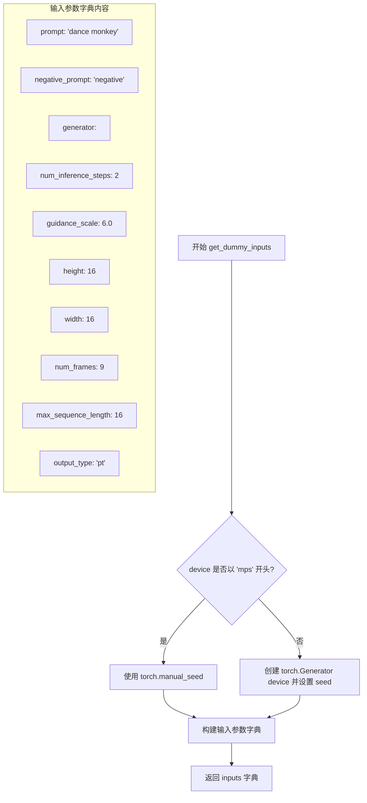

#### 带注释源码

```python
def get_dummy_inputs(self, device, seed=0):
    """
    生成用于测试 Wan22Pipeline 的虚拟输入参数
    
    参数:
        device: 目标设备字符串标识
        seed: 随机种子，用于确保测试可重复性
    
    返回:
        包含完整推理参数的字典
    """
    # 针对 Apple MPS 设备特殊处理：直接使用 torch.manual_seed
    # 而非创建 Generator 对象（MPS 不支持 torch.Generator）
    if str(device).startswith("mps"):
        generator = torch.manual_seed(seed)
    else:
        # 为其他设备（CPU/CUDA）创建随机数生成器
        generator = torch.Generator(device=device).manual_seed(seed)
    
    # 构建完整的输入参数字典
    inputs = {
        "prompt": "dance monkey",           # 正向提示词
        "negative_prompt": "negative",      # 负向提示词
        "generator": generator,             # 随机数生成器（确保可重复性）
        "num_inference_steps": 2,           # 推理步数（快速测试用）
        "guidance_scale": 6.0,              # CFG 引导权重
        "height": 16,                       # 输出高度（16 像素）
        "width": 16,                        # 输出宽度（16 像素）
        "num_frames": 9,                    # 生成帧数（视频生成）
        "max_sequence_length": 16,          # 文本序列最大长度
        "output_type": "pt",                # 输出类型：PyTorch 张量
    }
    return inputs
```


### `Wan22PipelineFastTests.test_inference`

该测试方法用于验证 WanPipeline 在 Wan 2.2 模型配置下的推理功能。测试通过创建虚拟组件（VAE、Transformer、Scheduler 等）和虚拟输入，执行完整的文本到视频生成流程，并验证生成视频的形状和像素值是否符合预期。

参数：

- `self`：隐式参数，测试类实例本身

返回值：`None`，该方法为单元测试方法，通过断言验证推理结果，不返回实际数据

#### 流程图

```mermaid
flowchart TD
    A[开始测试] --> B[设置设备为 CPU]
    B --> C[调用 get_dummy_components 获取虚拟组件]
    C --> D[使用虚拟组件创建 WanPipeline 实例]
    D --> E[将 Pipeline 移动到设备]
    E --> F[配置进度条 disable=None]
    F --> G[调用 get_dummy_inputs 获取虚拟输入]
    G --> H[执行推理: pipe(**inputs)]
    H --> I[获取生成的视频 frames]
    I --> J[验证视频形状是否为 (9, 3, 16, 16)]
    J --> K[提取生成视频的切片用于数值验证]
    K --> L[验证切片数值与期望值是否接近 atol=1e-3]
    L --> M[测试结束]
```

#### 带注释源码

```python
def test_inference(self):
    """测试 WanPipeline 在 Wan 2.2 配置下的推理功能"""
    
    # 步骤1: 设置测试设备为 CPU
    device = "cpu"

    # 步骤2: 获取虚拟组件（用于测试的模拟模型组件）
    # 包含: transformer, vae, scheduler, text_encoder, tokenizer, transformer_2, boundary_ratio
    components = self.get_dummy_components()
    
    # 步骤3: 使用虚拟组件创建 Pipeline 实例
    # pipeline_class = WanPipeline
    pipe = self.pipeline_class(
        **components,
    )
    
    # 步骤4: 将 Pipeline 移动到指定设备
    pipe.to(device)
    
    # 步骤5: 配置进度条（disable=None 表示启用进度条）
    pipe.set_progress_bar_config(disable=None)

    # 步骤6: 获取虚拟输入参数
    # 包含: prompt, negative_prompt, generator, num_inference_steps, 
    #       guidance_scale, height, width, num_frames, max_sequence_length, output_type
    inputs = self.get_dummy_inputs(device)
    
    # 步骤7: 执行推理并获取生成的视频帧
    # 调用 __call__ 方法返回 PipelineOutput 对象，包含 .frames 属性
    video = pipe(**inputs).frames
    generated_video = video[0]
    
    # 步骤8: 验证生成的视频形状
    # 期望形状: (9 帧, 3 通道, 16 高度, 16 宽度)
    self.assertEqual(generated_video.shape, (9, 3, 16, 16))

    # 步骤9: 定义期望的像素值切片（用于数值验证）
    # fmt: off
    expected_slice = torch.tensor([0.4525, 0.452, 0.4485, 0.4534, 0.4524, 0.4529, 0.454, 0.453, 0.5127, 0.5326, 0.5204, 0.5253, 0.5439, 0.5424, 0.5133, 0.5078])
    # fmt: on

    # 步骤10: 提取生成视频的切片进行数值验证
    # 展平并取前8个和后8个像素值
    generated_slice = generated_video.flatten()
    generated_slice = torch.cat([generated_slice[:8], generated_slice[-8:]])
    
    # 步骤11: 验证生成内容与期望值的接近程度
    # 使用 atol=1e-3 (绝对容差) 进行比较
    self.assertTrue(torch.allclose(generated_slice, expected_slice, atol=1e-3))
```


### `Wan22PipelineFastTests.test_attention_slicing_forward_pass`

该方法是一个被跳过的单元测试，用于测试 WanPipeline 的注意力切片前向传播功能。由于当前测试被标记为不支持且方法体为空（仅有 pass 语句），因此不执行任何实际的测试逻辑。

参数：

- `self`：`Wan22PipelineFastTests` 类型，隐含的实例引用，指向测试类本身

返回值：`None`，无返回值（方法体为空）

#### 流程图

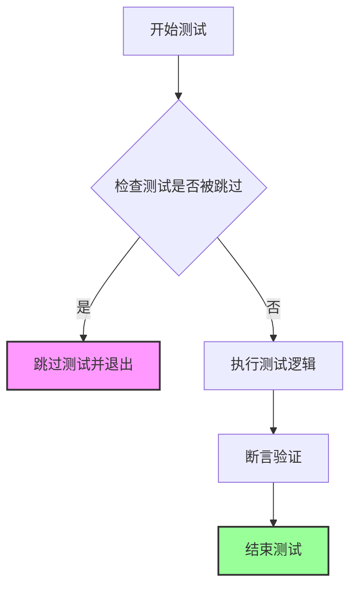

#### 带注释源码

```python
@unittest.skip("Test not supported")  # 装饰器：标记该测试不支持，跳过执行
def test_attention_slicing_forward_pass(self):
    """
    测试 WanPipeline 的注意力切片前向传播功能。
    
    注意：此测试当前被标记为不支持，因此不执行任何实际测试逻辑。
    该测试可能用于验证模型在启用注意力切片优化时的前向传播正确性。
    
    参数:
        self: Wan22PipelineFastTests 实例
        
    返回值:
        None
    """
    pass  # 方法体为空，不执行任何操作
```


### `Wan22PipelineFastTests.test_save_load_optional_components`

该测试方法用于验证 WanPipeline 在保存和加载时处理可选组件（optional components）为 `None` 的能力。测试确保当某个可选组件（如 `transformer`）在初始化时被设为 `None` 时，保存到磁盘后重新加载时该组件仍然保持 `None`，并且保存前后两次推理的输出差异在可接受的阈值范围内。

参数：

- `expected_max_difference`：`float`，可选参数，默认值为 `1e-4`，表示保存前后两次推理输出结果的最大允许差异阈值

返回值：`None`，该方法为 unittest 测试用例，无返回值

#### 流程图

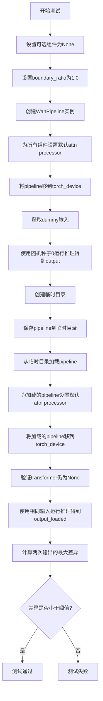

#### 带注释源码

```python
def test_save_load_optional_components(self, expected_max_difference=1e-4):
    """
    测试当可选组件为None时，pipeline能否正确保存和加载。
    
    参数:
        expected_max_difference: float, 默认1e-4, 允许的最大差异阈值
    """
    # 1. 定义要设为None的可选组件名称
    optional_component = "transformer"
    
    # 2. 获取虚拟组件配置
    components = self.get_dummy_components()
    
    # 3. 将指定的可选组件设置为None
    # 这模拟了用户不提供该组件的场景
    components[optional_component] = None
    
    # 4. 设置boundary_ratio为1.0
    # 对于wan 2.2 14B模型，当boundary_ratio为1.0时，transformer不会被使用
    components["boundary_ratio"] = 1.0
    
    # 5. 使用配置创建pipeline实例
    pipe = self.pipeline_class(**components)
    
    # 6. 为所有组件设置默认的attention processor
    # 这确保了推理时使用标准的注意力机制
    for component in pipe.components.values():
        if hasattr(component, "set_default_attn_processor"):
            component.set_default_attn_processor()
    
    # 7. 将pipeline移到指定的设备（如CPU或GPU）
    pipe.to(torch_device)
    
    # 8. 设置进度条配置（disable=None表示启用进度条）
    pipe.set_progress_bar_config(disable=None)
    
    # 9. 获取用于推理的虚拟输入
    generator_device = "cpu"
    inputs = self.get_dummy_inputs(generator_device)
    
    # 10. 设置随机种子以确保可重复性
    torch.manual_seed(0)
    
    # 11. 第一次推理：使用包含None组件的pipeline
    # pipe(**inputs)返回PipeOutput对象，[0]获取frames
    output = pipe(**inputs)[0]
    
    # 12. 创建临时目录用于保存pipeline
    with tempfile.TemporaryDirectory() as tmpdir:
        # 13. 保存pipeline到临时目录
        # safe_serialization=False表示不使用安全序列化
        pipe.save_pretrained(tmpdir, safe_serialization=False)
        
        # 14. 从保存的目录重新加载pipeline
        pipe_loaded = self.pipeline_class.from_pretrained(tmpdir)
        
        # 15. 为加载的pipeline设置默认attn processor
        for component in pipe_loaded.components.values():
            if hasattr(component, "set_default_attn_processor"):
                component.set_default_attn_processor()
        
        # 16. 将加载的pipeline移到设备
        pipe_loaded.to(torch_device)
        
        # 17. 设置进度条配置
        pipe_loaded.set_progress_bar_config(disable=None)
    
    # 18. 验证加载后的pipeline中transformer仍为None
    # 这是测试的核心：确保None值被正确保存和加载
    self.assertTrue(
        getattr(pipe_loaded, "transformer") is None,
        "`transformer` did not stay set to None after loading.",
    )
    
    # 19. 使用相同的输入进行第二次推理
    inputs = self.get_dummy_inputs(generator_device)
    torch.manual_seed(0)  # 再次设置相同种子
    output_loaded = pipe_loaded(**inputs)[0]
    
    # 20. 计算两次输出之间的最大差异
    # 将tensor转换为numpy数组进行数值比较
    max_diff = np.abs(output.detach().cpu().numpy() - output_loaded.detach().cpu().numpy()).max()
    
    # 21. 验证差异在允许范围内
    self.assertLess(max_diff, expected_max_difference)
```


### `Wan225BPipelineFastTests.get_dummy_components`

该方法用于创建和初始化WanPipeline所需的虚拟（dummy）组件，包括VAE、调度器、文本编码器、分词器和Transformer模型，并返回一个包含所有组件的字典。

参数：

- 无显式参数（`self`为隐式参数，表示类实例本身）

返回值：`dict`，返回一个包含以下键的字典：
- `transformer`: WanTransformer3DModel实例
- `vae`: AutoencoderKLWan实例
- `scheduler`: UniPCMultistepScheduler实例
- `text_encoder`: T5EncoderModel实例
- `tokenizer`: AutoTokenizer实例
- `transformer_2`: None（双Transformer配置中的第二个）
- `boundary_ratio`: float (0.875)
- `expand_timesteps`: bool (True)

#### 流程图

```mermaid
flowchart TD
    A[开始 get_dummy_components] --> B[设置 torch.manual_seed(0)]
    B --> C[创建 AutoencoderKLWan - vae]
    C --> D[设置 torch.manual_seed(0)]
    D --> E[创建 UniPCMultistepScheduler - scheduler]
    E --> F[加载 T5EncoderModel - text_encoder]
    F --> G[加载 AutoTokenizer - tokenizer]
    G --> H[设置 torch.manual_seed(0)]
    H --> I[创建 WanTransformer3DModel - transformer]
    I --> J[构建 components 字典]
    J --> K[返回 components 字典]
    K --> L[结束]
    
    style B fill:#f9f,color:#000
    style D fill:#f9f,color:#000
    style H fill:#f9f,color:#000
    style J fill:#9f9,color:#000
    style K fill:#9f9,color:#000
```

#### 带注释源码

```python
def get_dummy_components(self):
    """
    创建用于测试WanPipeline的虚拟组件。
    
    该方法初始化所有必需的模型组件，包括VAE、Transformer、
    文本编码器、调度器等，以便进行推理测试。
    """
    # 设置随机种子以确保测试可重复性
    torch.manual_seed(0)
    
    # 创建VAE (Variational Autoencoder) 模型
    # 参数说明:
    # - base_dim=3: 基础维度
    # - z_dim=48: 潜在空间维度
    # - in_channels=12: 输入通道数
    # - out_channels=12: 输出通道数
    # - is_residual=True: 使用残差连接
    # - patch_size=2: 补丁大小
    # - latents_mean/std: 潜在变量的均值和标准差
    # - dim_mult=[1,1,1,1]: 维度 multipliers
    # - temperal_downsample=[False,True,True]: 时间下采样配置
    vae = AutoencoderKLWan(
        base_dim=3,
        z_dim=48,
        in_channels=12,
        out_channels=12,
        is_residual=True,
        patch_size=2,
        latents_mean=[0.0] * 48,
        latents_std=[1.0] * 48,
        dim_mult=[1, 1, 1, 1],
        num_res_blocks=1,
        scale_factor_spatial=16,
        scale_factor_temporal=4,
        temperal_downsample=[False, True, True],
    )

    # 重新设置随机种子确保各组件独立性
    torch.manual_seed(0)
    
    # 创建UniPC多步调度器
    # 参数说明:
    # - prediction_type="flow_prediction": 预测类型为流预测
    # - use_flow_sigmas=True: 使用流sigmas
    # - flow_shift=3.0: 流偏移量
    scheduler = UniPCMultistepScheduler(
        prediction_type="flow_prediction",
        use_flow_sigmas=True,
        flow_shift=3.0
    )
    
    # 加载预训练的T5文本编码器（用于测试的微型随机模型）
    text_encoder = T5EncoderModel.from_pretrained("hf-internal-testing/tiny-random-t5")
    
    # 加载对应的分词器
    tokenizer = AutoTokenizer.from_pretrained("hf-internal-testing/tiny-random-t5")

    # 再次设置随机种子确保Transformer初始化确定性
    torch.manual_seed(0)
    
    # 创建Wan 3D Transformer模型
    # 参数说明:
    # - patch_size=(1,2,2): 3D补丁大小（时间×高度×宽度）
    # - num_attention_heads=2: 注意力头数
    # - attention_head_dim=12: 注意力头维度
    # - in_channels=48: 输入通道数（与VAE z_dim对应）
    # - out_channels=48: 输出通道数
    # - text_dim=32: 文本嵌入维度
    # - freq_dim=256: 频率维度
    # - ffn_dim=32: 前馈网络维度
    # - num_layers=2: Transformer层数
    # - cross_attn_norm=True: 跨注意力归一化
    # - qk_norm="rms_norm_across_heads": QK归一化方式
    # - rope_max_seq_len=32: 旋转位置编码最大序列长度
    transformer = WanTransformer3DModel(
        patch_size=(1, 2, 2),
        num_attention_heads=2,
        attention_head_dim=12,
        in_channels=48,
        out_channels=48,
        text_dim=32,
        freq_dim=256,
        ffn_dim=32,
        num_layers=2,
        cross_attn_norm=True,
        qk_norm="rms_norm_across_heads",
        rope_max_seq_len=32,
    )

    # 组装所有组件为字典
    components = {
        "transformer": transformer,       # 主Transformer模型
        "vae": vae,                        # VAE编码器/解码器
        "scheduler": scheduler,            # 调度器
        "text_encoder": text_encoder,     # 文本编码器
        "tokenizer": tokenizer,            # 分词器
        "transformer_2": None,            # 第二个Transformer（2.2版本为None）
        "boundary_ratio": None,            # 边界比率（2.2版本为None）
        "expand_timesteps": True,          # 是否展开时间步
    }
    
    # 返回组件字典供pipeline使用
    return components
```


### `Wan225BPipelineFastTests.get_dummy_inputs`

该方法用于生成测试 Wan225B Pipeline 所需的虚拟输入参数，封装了文本提示、负向提示、随机数生成器、推理步数、引导 scale、图像尺寸、帧数等推理所需的核心参数，并返回包含这些参数的字典对象供测试使用。

参数：

- `self`：隐式参数，类型为 `Wan225BPipelineFastTests`（测试类实例），表示当前测试类对象
- `device`：`torch.device` 或 `str`，目标计算设备，用于创建随机数生成器（如 "cpu", "cuda", "mps"）
- `seed`：`int`，随机种子，默认值为 `0`，用于控制推理的可重复性

返回值：`Dict[str, Any]`，包含以下键值对的字典：
- `prompt`: 文本提示（"dance monkey"）
- `negative_prompt`: 负向提示（"negative"）
- `generator`: PyTorch 随机数生成器
- `num_inference_steps`: 推理步数（2）
- `guidance_scale`: 引导 scale（6.0）
- `height`: 生成图像高度（32）
- `width`: 生成图像宽度（32）
- `num_frames`: 生成视频帧数（9）
- `max_sequence_length`: 最大序列长度（16）
- `output_type`: 输出类型（"pt"）

#### 流程图

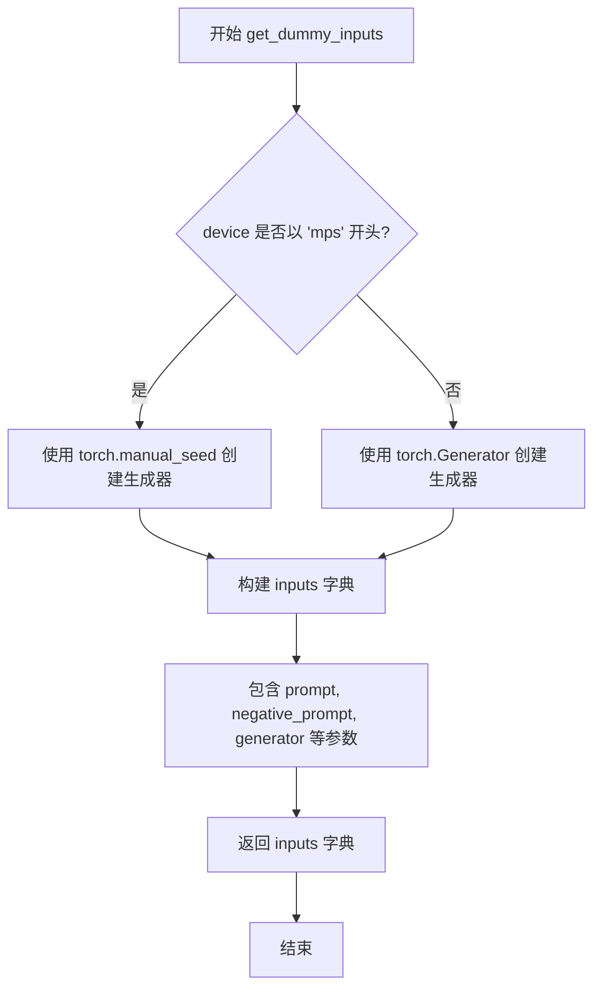

#### 带注释源码

```python
def get_dummy_inputs(self, device, seed=0):
    """
    生成用于测试 Wan225B Pipeline 的虚拟输入参数。
    
    参数:
        device: 目标计算设备（如 "cpu", "cuda", "mps"）
        seed: 随机种子，默认值为 0，用于确保测试可重复性
    
    返回:
        包含推理所需参数的字典
    """
    # 针对 Apple MPS 设备使用特殊的随机数生成方式
    if str(device).startswith("mps"):
        # MPS 设备不支持 torch.Generator，使用 torch.manual_seed 替代
        generator = torch.manual_seed(seed)
    else:
        # 为其他设备（CPU/CUDA）创建标准 PyTorch 随机数生成器
        generator = torch.Generator(device=device).manual_seed(seed)
    
    # 构建完整的输入参数字典，用于 Pipeline 推理
    inputs = {
        "prompt": "dance monkey",              # 正向文本提示
        "negative_prompt": "negative",         # 负向提示，用于引导模型避免生成的内容
        "generator": generator,                # 随机数生成器，确保可重复性
        "num_inference_steps": 2,              # 推理步数（较少步数用于快速测试）
        "guidance_scale": 6.0,                 # Classifier-free guidance 权重
        "height": 32,                          # 生成图像高度（像素）
        "width": 32,                           # 生成图像宽度（像素）
        "num_frames": 9,                       # 生成视频的帧数
        "max_sequence_length": 16,             # 文本编码器的最大序列长度
        "output_type": "pt",                   # 输出类型：PyTorch 张量
    }
    return inputs
```


### `Wan225BPipelineFastTests.test_inference`

该函数是 `Wan225BPipelineFastTests` 类中的一个测试方法，用于验证 WanPipeline（ Wan 2.2 版本的 5B 参数模型）在 CPU 设备上的推理功能是否正确。它通过创建虚拟组件和输入，执行文本到视频的生成，验证生成视频的形状和像素值是否符合预期。

参数：

- `self`：测试类实例本身，无需外部传入

返回值：无显式返回值（测试方法，通过 `self.assertEqual` 和 `self.assertTrue` 断言验证结果）

#### 流程图

```mermaid
flowchart TD
    A[开始 test_inference 测试] --> B[设置设备为 'cpu']
    B --> C[调用 get_dummy_components 获取虚拟组件]
    C --> D[使用 WanPipeline 创建管道实例]
    D --> E[将管道移到 CPU 设备]
    E --> F[设置进度条配置 disable=None]
    F --> G[调用 get_dummy_inputs 获取虚拟输入]
    G --> H[执行管道推理: pipe(**inputs)]
    H --> I[获取生成的视频帧: video = result.frames]
    I --> J[验证视频形状是否为 (9, 3, 32, 32)]
    J --> K[提取生成视频切片用于数值验证]
    K --> L[验证切片值与预期值是否接近 atol=1e-3]
    L --> M{验证通过?}
    M -->|是| N[测试通过]
    M -->|否| O[测试失败抛出 AssertionError]
```

#### 带注释源码

```python
def test_inference(self):
    # 1. 设置测试设备为 CPU
    device = "cpu"

    # 2. 获取虚拟组件（VAE、调度器、文本编码器、Transformer 等）
    components = self.get_dummy_components()
    
    # 3. 使用 WanPipeline 类和虚拟组件创建管道实例
    pipe = self.pipeline_class(
        **components,
    )
    
    # 4. 将管道移至指定设备（CPU）
    pipe.to(device)
    
    # 5. 配置进度条（disable=None 表示不禁用进度条）
    pipe.set_progress_bar_config(disable=None)

    # 6. 获取虚拟输入参数（提示词、负提示词、随机种子等）
    inputs = self.get_dummy_inputs(device)
    
    # 7. 执行推理调用，返回结果包含 frames 属性
    # 输入参数: prompt="dance monkey", negative_prompt="negative",
    #           num_inference_steps=2, guidance_scale=6.0,
    #           height=32, width=32, num_frames=9, max_sequence_length=16
    video = pipe(**inputs).frames
    
    # 8. 获取生成的视频（取第一个结果）
    generated_video = video[0]
    
    # 9. 断言验证：生成的视频形状应为 (9, 3, 32, 32)
    # 即 9 帧、3 通道（RGB）、高度 32、宽度 32
    self.assertEqual(generated_video.shape, (9, 3, 32, 32))

    # 10. 定义预期输出的像素值切片（用于数值验证）
    # fmt: off
    expected_slice = torch.tensor([[[0.4814, 0.4298, 0.5094, 0.4289, 0.5061, 0.4301, 0.5043, 0.4284, 0.5375,
                                    0.5965, 0.5527, 0.6014, 0.5228, 0.6076, 0.6644, 0.5651]]])
    # fmt: on

    # 11. 从生成的视频中提取切片：
    #     - 先展平所有像素
    #     - 取前 8 个和最后 8 个像素（共 16 个）
    generated_slice = generated_video.flatten()
    generated_slice = torch.cat([generated_slice[:8], generated_slice[-8:]])
    
    # 12. 断言验证：生成切片与预期值的差异应在容忍范围内 (atol=1e-3)
    self.assertTrue(
        torch.allclose(generated_slice, expected_slice, atol=1e-3),
        f"generated_slice: {generated_slice}, expected_slice: {expected_slice}",
    )
```


### `Wan225BPipelineFastTests.test_attention_slicing_forward_pass`

该测试方法用于验证 WanPipeline 的 attention slicing 前向传播功能是否正确实现。由于该功能在当前版本中不被支持，测试被跳过。

参数：

- `self`：`Wan225BPipelineFastTests`，测试类实例，代表当前的测试用例对象

返回值：`None`，该方法不返回任何值（方法体仅包含 `pass` 语句）

#### 流程图

```mermaid
flowchart TD
    A[开始测试] --> B{检查装饰器}
    B -->|@unittest.skip| C[跳过测试]
    C --> D[测试不执行]
    
    style A fill:#f9f,color:#000
    style C fill:#fcc,color:#000
    style D fill:#fcc,color:#000
```

#### 带注释源码

```python
@unittest.skip("Test not supported")
def test_attention_slicing_forward_pass(self):
    """
    测试 WanPipeline 的 attention slicing 前向传播功能。
    
    该测试用于验证使用 attention slicing 优化技术的
    前向传播是否能产生正确的结果。
    
    注意：由于 WanPipeline 当前不支持 attention slicing 功能，
    此测试被跳过。
    """
    pass  # 测试方法体为空，不执行任何验证逻辑
```

#### 附加说明

| 项目 | 说明 |
|------|------|
| **所属类** | `Wan225BPipelineFastTests` |
| **测试类型** | 单元测试（Unit Test） |
| **跳过原因** | `"Test not supported"` - WanPipeline 当前不支持 attention slicing 功能 |
| **装饰器** | `@unittest.skip("Test not supported")` |
| **设计目标** | 验证 attention slicing 优化技术的正确性（暂未实现） |
| **技术债务** | 该测试方法为空实现，需要在未来版本中实现完整的 attention slicing 前向传播验证逻辑 |


### `Wan225BPipelineFastTests.test_components_function`

该方法是 Wan225BPipelineFastTests 测试类中的一个单元测试方法，用于验证 WanPipeline 在初始化后是否正确构建了 components 属性，并且该属性包含了所有必需的组件键。

参数：

- `self`：`Wan225BPipelineFastTests`，测试类的实例，表示当前测试对象

返回值：`None`，该方法为测试方法，通过断言验证功能，不返回任何值

#### 流程图

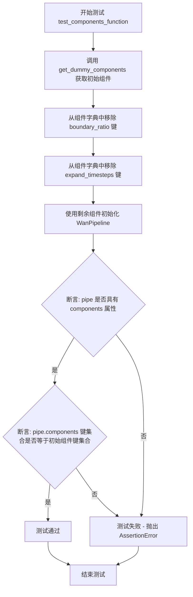

#### 带注释源码

```python
def test_components_function(self):
    """
    测试 WanPipeline 的 components 属性功能。
    
    该测试方法验证：
    1. WanPipeline 实例在初始化后具有 'components' 属性
    2. components 字典包含所有传入的组件键（排除 boundary_ratio 和 expand_timesteps）
    """
    
    # 第一步：获取测试所需的虚拟组件
    # 调用 get_dummy_components 方法创建一组用于测试的虚拟组件
    # 这些组件包括：transformer, vae, scheduler, text_encoder, tokenizer, transformer_2
    init_components = self.get_dummy_components()
    
    # 第二步：从初始组件中移除 boundary_ratio 和 expand_timesteps
    # 这两个参数是 Wan225BPipeline 特有的可选参数
    # 测试的目的是验证基础组件是否正确传递到 pipeline 中
    init_components.pop("boundary_ratio")
    init_components.pop("expand_timesteps")
    
    # 第三步：使用剩余组件初始化 WanPipeline
    # 将组件字典解包传入 pipeline_class（即 WanPipeline）
    # pipeline 内部应该将这些组件存储在 self.components 属性中
    pipe = self.pipeline_class(**init_components)
    
    # 第四步：验证 pipeline 具有 components 属性
    # 使用 hasattr 检查对象是否具有名为 'components' 的属性
    self.assertTrue(hasattr(pipe, "components"))
    
    # 第五步：验证 components 键集合的正确性
    # 将 pipe.components 的键集合与初始组件键集合进行对比
    # 确保所有传入的组件都被正确存储，且没有多余的键
    self.assertTrue(set(pipe.components.keys()) == set(init_components.keys()))
```


### `Wan225BPipelineFastTests.test_save_load_optional_components`

该方法用于测试WanPipeline在保存和加载时对可选组件（如transformer_2）的处理是否正确，验证当组件被设置为None时，加载后仍能保持None且推理结果一致。

参数：

- `expected_max_difference`：`float`，允许的最大数值差异阈值，默认为1e-4，用于判断保存前后两次推理结果的差异是否在可接受范围内

返回值：`None`，该方法为单元测试方法，通过`self.assertTrue`和`self.assertLess`等断言进行验证，无显式返回值

#### 流程图

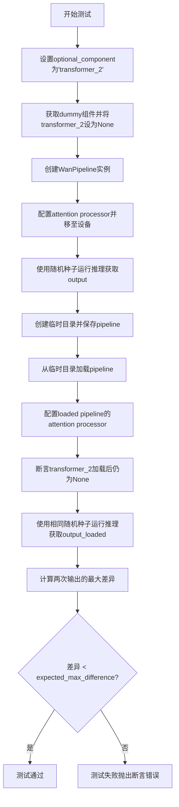

#### 带注释源码

```python
def test_save_load_optional_components(self, expected_max_difference=1e-4):
    # 定义要测试的可选组件名称
    optional_component = "transformer_2"

    # 获取测试用的虚拟组件配置
    components = self.get_dummy_components()
    # 将指定的可选组件设置为None，模拟该组件不可用的情况
    components[optional_component] = None
    
    # 创建WanPipeline实例，传入包含None组件的配置
    pipe = self.pipeline_class(**components)
    
    # 遍历所有组件，为支持set_default_attn_processor的组件设置默认的attention processor
    for component in pipe.components.values():
        if hasattr(component, "set_default_attn_processor"):
            component.set_default_attn_processor()
    
    # 将pipeline移至测试设备（由torch_device指定）
    pipe.to(torch_device)
    # 配置进度条（disable=None表示不禁用进度条）
    pipe.set_progress_bar_config(disable=None)

    # 设置生成器设备为CPU
    generator_device = "cpu"
    # 获取测试输入参数
    inputs = self.get_dummy_inputs(generator_device)
    
    # 设置随机种子以确保可重复性
    torch.manual_seed(0)
    # 执行推理，获取第一帧结果（[0]获取frames列表的第一个元素）
    output = pipe(**inputs)[0]

    # 创建临时目录用于保存模型
    with tempfile.TemporaryDirectory() as tmpdir:
        # 保存pipeline到临时目录，safe_serialization=False使用不安全序列化（更快）
        pipe.save_pretrained(tmpdir, safe_serialization=False)
        
        # 从保存的目录加载pipeline
        pipe_loaded = self.pipeline_class.from_pretrained(tmpdir)
        
        # 为加载的pipeline同样设置默认attention processor
        for component in pipe_loaded.components.values():
            if hasattr(component, "set_default_attn_processor"):
                component.set_default_attn_processor()
        
        # 将加载的pipeline移至测试设备
        pipe_loaded.to(torch_device)
        pipe_loaded.set_progress_bar_config(disable=None)

    # 断言：验证可选组件在加载后仍保持为None
    self.assertTrue(
        getattr(pipe_loaded, optional_component) is None,
        f"`{optional_component}` did not stay set to None after loading.",
    )

    # 重新获取测试输入
    inputs = self.get_dummy_inputs(generator_device)
    # 使用相同的随机种子确保可重复性
    torch.manual_seed(0)
    # 执行第二次推理，获取加载后的输出
    output_loaded = pipe_loaded(**inputs)[0]

    # 计算两次输出（原始和加载后）的最大绝对差异
    max_diff = np.abs(output.detach().cpu().numpy() - output_loaded.detach().cpu().numpy()).max()
    
    # 断言：验证差异小于允许的最大阈值
    self.assertLess(max_diff, expected_max_difference)
```


### `Wan225BPipelineFastTests.test_inference_batch_single_identical`

该测试方法用于验证 WanPipeline 在批量推理模式下，单个样本的输出与单独推理时的输出是否保持一致，确保批处理逻辑没有引入额外的误差或不确定性。

参数：

- `self`：`Wan225BPipelineFastTests`，测试类实例本身，包含测试所需的组件和配置
- `expected_max_diff`：`float`，类型为浮点数，默认值为 `2e-3`（即 0.002），表示单个样本在批量推理和单独推理时输出之间的最大允许差异

返回值：`None`，该方法为 `unittest.TestCase` 的测试方法，通过断言验证正确性，不返回任何值

#### 流程图

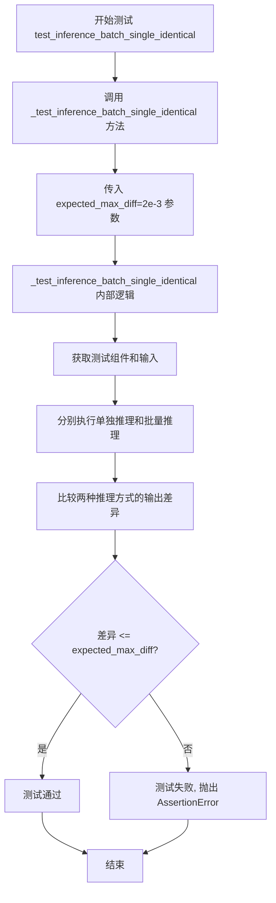

#### 带注释源码

```python
def test_inference_batch_single_identical(self):
    """
    测试批量推理时单个样本的一致性。
    
    该测试方法继承自 PipelineTesterMixin，通过调用父类的 
    _test_inference_batch_single_identical 方法来验证：
    1. 批量推理模式下，单个样本的输出与单独推理时的输出是否一致
    2. 验证批处理逻辑没有引入额外的数值误差
    3. 确保在启用批处理时模型行为的确定性
    
    参数:
        expected_max_diff: float, 默认 2e-3
            允许的最大差异阈值，超过此阈值则测试失败
    
    返回:
        None: 测试方法通过断言进行验证，不返回值
    """
    # 调用父类 PipelineTesterMixin 提供的测试方法
    # 该方法会:
    # 1. 使用 get_dummy_components 获取测试所需的虚拟组件
    # 2. 使用 get_dummy_inputs 获取测试输入
    # 3. 分别执行单次推理和批量推理
    # 4. 比较两者的输出差异是否在 expected_max_diff 范围内
    self._test_inference_batch_single_identical(expected_max_diff=2e-3)
```

## 关键组件


### WanPipeline

WanPipeline是主pipeline类，封装了文本到视频生成的全部流程，包含vae、transformer、transformer_2、scheduler、text_encoder、tokenizer等核心组件，支持通过boundary_ratio参数动态切换使用单transformer还是双transformer架构。

### AutoencoderKLWan

AutoencoderKLWan是变分自编码器(VAE)模型，负责将图像/视频编码为潜在表示(latents)并进行解码，支持残差连接(is_residual)、时序下采样(temperal_downsample)和空间/时序缩放因子配置。

### WanTransformer3DModel

WanTransformer3DModel是3D变换器模型，处理视频生成的注意力计算，支持patch嵌入、旋转位置编码(rope_max_seq_len)、跨注意力规范化和查询键归一化(qk_norm)，同时支持双transformer架构(transformer和transformer_2)。

### UniPCMultistepScheduler

UniPCMultistepScheduler是UniPC多步调度器，支持flow_prediction预测类型、flow_shift参数配置和use_flow_sigmas选项，用于控制去噪过程的迭代步数和噪声调度。

### T5EncoderModel

T5EncoderModel是文本编码器，将输入提示(prompt)编码为文本嵌入向量，供transformer进行跨注意力处理。

### AutoTokenizer

AutoTokenizer是分词器，负责将文本提示(prompt)和负提示(negative_prompt)转换为模型可处理的token序列。

### boundary_ratio参数

boundary_ratio是控制双transformer架构使用比例的参数，当boundary_ratio=1.0时表示不使用transformer_2（用于Wan 2.2 14B模型），允许pipeline在不同模型配置间灵活切换。

### 可选组件动态加载机制

通过将transformer或transformer_2设置为None来支持可选组件的动态加载，pipeline在推理时根据组件是否为None来决定是否使用对应transformer，实现模型结构的灵活配置。

### 视频生成参数配置

视频生成参数包括height、width、num_frames、max_sequence_length等，控制生成视频的分辨率、帧数和序列长度，支持不同尺寸的视频输出。


## 问题及建议


### 已知问题

-   **代码重复严重**：`Wan22PipelineFastTests` 和 `Wan225BPipelineFastTests` 两个测试类存在大量重复代码，包括 `get_dummy_inputs` 方法结构、`test_save_load_optional_components` 方法、以及 `test_attention_slicing_forward_pass` 空测试方法。
-   **硬编码随机种子**：多处使用 `torch.manual_seed(0)`，测试结果确定性过强，缺乏随机性验证，可能隐藏边界条件问题。
-   **未完成的功能标记**：`negative_prompt` 参数旁存在 `# TODO` 注释，表明该功能可能未完全实现或测试覆盖不完整。
-   **被跳过的测试**：`test_attention_slicing_forward_pass` 方法被 `@unittest.skip("Test not supported")` 跳过，但未说明具体原因或解决方案，导致注意力切片功能无法验证。
-   **测试用例复用真实模型路径**：使用 `"hf-internal-testing/tiny-random-t5"` 预训练模型路径，测试依赖于外部服务可用性。
-   **Magic Numbers 缺乏解释**：如 `expected_max_difference=1e-4`、`boundary_ratio=0.875` 等关键参数缺乏注释说明其业务含义。
-   **冗余的对象创建**：`get_dummy_components` 方法中 `WanTransformer3DModel` 被创建两次（`transformer` 和 `transformer_2`），第二次创建时可复用第一次的配置但未这样做。

### 优化建议

-   **提取公共基类**：将两个测试类的共同逻辑提取到 `PipelineTesterMixin` 的更具体基类中，减少约 40% 的重复代码。
-   **参数化测试**：使用 `unittest.parameterized` 或 pytest 的 parametrize 装饰器，将不同配置的测试合并为参数化测试用例。
-   **添加边界条件测试**：增加对 `boundary_ratio` 为边界值（如 0、1、None）、`num_frames` 为 1 或极大值情况的测试。
-   **补充 TODO 项**：明确 `negative_prompt` 的实现状态，如已实现则补充测试覆盖，如未实现则移除或添加明确的实现计划。
-   **消除硬编码种子**：考虑使用参数化随机种子或添加专门的随机性测试方法，覆盖多种种子场景。
-   **添加异常测试**：增加对无效输入（如负数尺寸、不支持的 `output_type`）的异常处理测试。
-   **提取配置常量**：将 `expected_max_difference`、`atol=1e-3` 等数值定义为类或模块级常量，并添加文档说明其依据。

## 其它


### 设计目标与约束

本测试文件旨在验证WanPipeline（ Wan 2.2 和 Wan 2.2B 版本）在文本到视频生成任务中的核心功能正确性。测试覆盖两种pipeline配置：Wan22PipelineFastTests针对Wan 2.2版本（使用transformer和transformer_2双transformer架构），Wan225BPipelineFastTests针对Wan 2.2B版本（单一transformer配置）。测试约束包括：设备限制为CPU测试（不支持CUDA特定测试），测试分辨率较低（16x16和32x32），推理步数仅为2步以加快测试速度，不支持xFormers注意力机制和DDUF（Diffusion-Distilled Upsampling Features）。

### 错误处理与异常设计

测试类使用`@unittest.skip("Test not supported")`装饰器跳过不支持的测试用例（如test_attention_slicing_forward_pass），表明某些功能在当前版本中尚未实现或不支持。在test_save_load_optional_components中，通过检查组件加载后是否保持None状态来验证可选组件的正确处理。测试使用torch.allclose进行浮点数近似比较（atol=1e-3），以处理数值计算的精度问题。Wan225BPipelineFastTests中test_components_function验证components属性的存在性和键值匹配，确保管道初始化时的错误能在早期被捕获。

### 数据流与状态机

测试数据流遵循以下路径：首先通过get_dummy_components创建虚拟组件（VAE、Scheduler、Text Encoder、Tokenizer、Transformer等），然后通过get_dummy_inputs构造输入参数（prompt、negative_prompt、generator、num_inference_steps等），最后调用pipe(**inputs)执行推理并获取生成的视频frames。状态转换包括：pipeline初始化状态 → 设备加载状态（.to(device)）→ 推理完成状态 → 结果验证状态。在test_save_load_optional_components中，额外包含保存 → 加载 → 再推理的状态转换流程。

### 外部依赖与接口契约

主要外部依赖包括：transformers库（AutoTokenizer、T5EncoderModel）、diffusers库（AutoencoderKLWan、UniPCMultistepScheduler、WanPipeline、WanTransformer3DModel）、numpy、torch。接口契约方面，pipeline_class必须继承PipelineTesterMixin并实现特定接口：get_dummy_components()返回组件字典、get_dummy_inputs()返回符合TEXT_TO_IMAGE_PARAMS的输入、test_inference()验证生成结果的shape和数值、test_save_load_optional_components()验证模型序列化/反序列化能力。pipeline组件必须实现set_default_attn_processor()方法（如果支持）。

### 性能要求与基准测试

测试未包含明确的性能基准测试，但通过以下方式隐式控制性能：使用极小的模型配置（num_layers=2、attention_head_dim=12、patch_size=(1,2,2)）、使用2步推理、使用CPU设备。test_inference_batch_single_identical使用expected_max_diff=2e-3验证批处理和单样本推理的一致性。generated_slice通过取前8和后8个元素进行验证，减少完全比较的计算开销。

### 版本兼容性

测试针对两个特定的pipeline版本：Wan 2.2和Wan 2.2B。Wan22PipelineFastTests要求transformer和transformer_2同时存在，boundary_ratio参数有效；Wan225BPipelineFastTests要求transformer_2可为None，boundary_ratio和expand_timesteps参数可选。测试使用hf-internal-testing/tiny-random-t5作为固定的文本编码器模型，确保测试环境的可重复性。

### 安全性考虑

测试代码不涉及用户数据处理，仅使用虚拟输入（"dance monkey"、negative_prompt等）。模型加载使用safe_serialization=False参数，表明测试环境优先考虑兼容性而非安全性。在生产环境中应启用安全序列化。

### 测试策略与覆盖率

测试策略采用单元测试和集成测试结合：get_dummy_components()和get_dummy_inputs()提供测试数据生成机制，test_inference()验证核心推理功能，test_save_load_optional_components()验证模型持久化，test_components_function()验证组件访问接口。覆盖率方面：未覆盖的测试包括注意力切片（已跳过）、xFormers注意力、DDUF支持、错误输入验证、边界条件测试（如num_frames=1、height=0等）。

### 配置管理

测试配置通过类属性集中管理：params定义允许的参数集合、batch_params定义批处理参数、image_params定义图像参数、required_optional_params定义必需的可选参数。get_dummy_components()中硬编码了所有模型超参数（base_dim、z_dim、dim_mult等），这些参数代表最小可运行配置，用于快速验证功能正确性。

### 日志与监控

测试使用pipe.set_progress_bar_config(disable=None)配置进度条显示，便于调试时观察推理进度。unittest框架本身提供标准的测试结果输出，包括通过/失败状态和错误详情。

### 扩展性与未来考虑

测试框架设计支持扩展：新测试类可通过继承PipelineTesterMixin添加更多pipeline变体。get_dummy_components()的结构允许替换不同的组件实现（如不同的VAE或Scheduler）。当前未实现的测试（attention_slicing、xformers等）为未来功能扩展预留了测试位置。


    