# `diffusers\tests\pipelines\wan\test_wan_22_image_to_video.py` 详细设计文档

该文件是Wan图像到视频生成pipeline的单元测试文件，包含两个测试类Wan22ImageToVideoPipelineFastTests和Wan225BImageToVideoPipelineFastTests，用于测试WanImageToVideoPipeline的不同版本功能，包括推理测试、模型保存加载测试、组件功能测试等。

## 整体流程

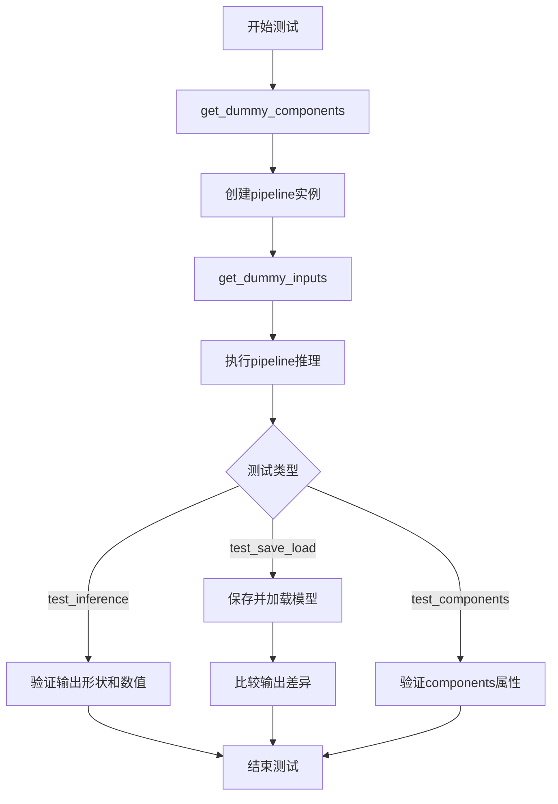

## 类结构

```
unittest.TestCase
└── PipelineTesterMixin (混合类)
    └── Wan22ImageToVideoPipelineFastTests
        ├── get_dummy_components()
        ├── get_dummy_inputs()
        ├── test_inference()
        ├── test_attention_slicing_forward_pass()
        └── test_save_load_optional_components()
    └── Wan225BImageToVideoPipelineFastTests
        ├── get_dummy_components()
        ├── get_dummy_inputs()
        ├── test_inference()
        ├── test_attention_slicing_forward_pass()
        ├── test_components_function()
        ├── test_save_load_optional_components()
        ├── test_inference_batch_single_identical()
        └── test_callback_inputs()
```

## 全局变量及字段


### `enable_full_determinism`
    
Enables full determinism for reproducible test results across runs

类型：`function`
    


### `torch_device`
    
Device string for running PyTorch models (e.g., 'cpu', 'cuda', 'mps')

类型：`str`
    


### `Wan22ImageToVideoPipelineFastTests.pipeline_class`
    
The pipeline class being tested for Wan 2.2 image to video generation

类型：`Type[WanImageToVideoPipeline]`
    


### `Wan22ImageToVideoPipelineFastTests.params`
    
Set of required parameters for text-to-image pipeline excluding cross_attention_kwargs

类型：`frozenset`
    


### `Wan22ImageToVideoPipelineFastTests.batch_params`
    
Batch parameters configuration for text-to-image pipeline testing

类型：`type`
    


### `Wan22ImageToVideoPipelineFastTests.image_params`
    
Image parameters configuration for text-to-image pipeline testing

类型：`type`
    


### `Wan22ImageToVideoPipelineFastTests.image_latents_params`
    
Image latents parameters configuration for text-to-image pipeline testing

类型：`type`
    


### `Wan22ImageToVideoPipelineFastTests.required_optional_params`
    
Set of optional parameters that can be passed to pipeline including inference steps, generator, latents, and callbacks

类型：`frozenset`
    


### `Wan22ImageToVideoPipelineFastTests.test_xformers_attention`
    
Flag indicating whether xFormers attention mechanism is tested (disabled for this pipeline)

类型：`bool`
    


### `Wan22ImageToVideoPipelineFastTests.supports_dduf`
    
Flag indicating whether DDUF (Denoising Diffusion UnFlow) is supported

类型：`bool`
    


### `Wan225BImageToVideoPipelineFastTests.pipeline_class`
    
The pipeline class being tested for Wan 2.2 5B image to video generation

类型：`Type[WanImageToVideoPipeline]`
    


### `Wan225BImageToVideoPipelineFastTests.params`
    
Set of required parameters for text-to-image pipeline excluding cross_attention_kwargs

类型：`frozenset`
    


### `Wan225BImageToVideoPipelineFastTests.batch_params`
    
Batch parameters configuration for text-to-image pipeline testing

类型：`type`
    


### `Wan225BImageToVideoPipelineFastTests.image_params`
    
Image parameters configuration for text-to-image pipeline testing

类型：`type`
    


### `Wan225BImageToVideoPipelineFastTests.image_latents_params`
    
Image latents parameters configuration for text-to-image pipeline testing

类型：`type`
    


### `Wan225BImageToVideoPipelineFastTests.required_optional_params`
    
Set of optional parameters that can be passed to pipeline including inference steps, generator, latents, and callbacks

类型：`frozenset`
    


### `Wan225BImageToVideoPipelineFastTests.test_xformers_attention`
    
Flag indicating whether xFormers attention mechanism is tested (disabled for this pipeline)

类型：`bool`
    


### `Wan225BImageToVideoPipelineFastTests.supports_dduf`
    
Flag indicating whether DDUF (Denoising Diffusion UnFlow) is supported

类型：`bool`
    
    

## 全局函数及方法


### `enable_full_determinism`

该函数用于在测试环境中启用完全的确定性执行，通过设置随机种子、禁用CUDA非确定性操作等方式，确保深度学习测试结果的可复现性。

参数：无

返回值：无

#### 流程图

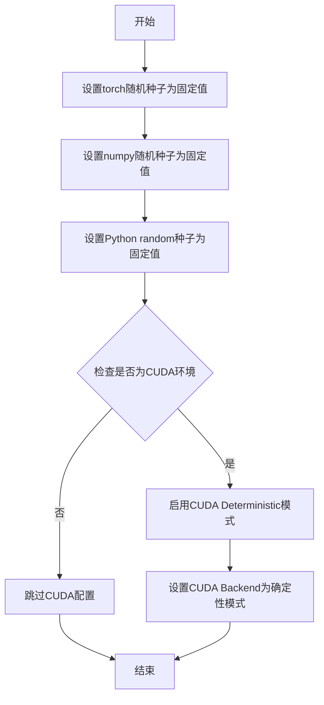

#### 带注释源码

```
# 该函数从 testing_utils 模块导入
# 定义位于项目源码的 src/diffusers/testing_utils.py 或类似位置
# 函数签名: def enable_full_determinism(seed: int = 42, extra_seed: bool = True) -> None

def enable_full_determinism():
    """
    启用完全确定性，确保测试结果可复现。
    
    典型实现包含以下步骤：
    1. 设置 PyTorch 随机种子 (torch.manual_seed)
    2. 设置 NumPy 随机种子 (np.random.seed)
    3. 设置 Python 内置 random 模块种子 (random.seed)
    4. 设置环境变量 PYTHONHASHSEED
    5. 如果使用 CUDA，启用 torch.backends.cudnn.deterministic
    6. 如果使用 CUDA，启用 torch.backends.cudnn.benchmark = False
    7. 可能设置 torch.use_deterministic_algorithms(True)
    """
    # 示例实现（基于diffusers项目常见模式）:
    import os
    import random
    import numpy as np
    import torch
    
    # 设置固定种子值确保可复现性
    seed = 42
    
    # 1. PyTorch 随机种子
    torch.manual_seed(seed)
    torch.cuda.manual_seed_all(seed)
    
    # 2. NumPy 随机种子
    np.random.seed(seed)
    
    # 3. Python random 模块种子
    random.seed(seed)
    
    # 4. 设置 Python 哈希种子以确保哈希操作确定性
    os.environ["PYTHONHASHSEED"] = str(seed)
    
    # 5. CUDA 确定性配置
    if torch.cuda.is_available():
        torch.backends.cudnn.deterministic = True
        torch.backends.cudnn.benchmark = False
        # 尝试启用确定性算法（如支持）
        if hasattr(torch, 'use_deterministic_algorithms'):
            try:
                torch.use_deterministic_algorithms(True)
            except RuntimeError:
                # 某些操作可能不支持确定性
                pass

# 在测试文件中的调用位置
enable_full_determinism()  # 第43行，在unittest类定义之前调用
```

#### 补充说明

| 项目 | 描述 |
|------|------|
| **导入来源** | `from ...testing_utils import enable_full_determinism` |
| **调用位置** | 第43行，类定义之前 |
| **调用方式** | `enable_full_determinism()`（无参数） |
| **设计目标** | 确保测试环境的确定性，使单元测试结果可复现 |
| **潜在优化** | 可考虑添加参数以支持自定义种子值，增强灵活性 |
| **错误处理** | 某些CUDA操作可能不支持确定性算法，需捕获对应异常 |


### `torch_device`

`torch_device` 是从 `testing_utils` 模块导入的全局变量，用于在测试中指定 PyTorch 计算设备（通常是 "cuda"、"cpu" 或 "mps"）。

参数： 无

返回值：`str`，返回当前配置的 PyTorch 设备字符串

#### 流程图

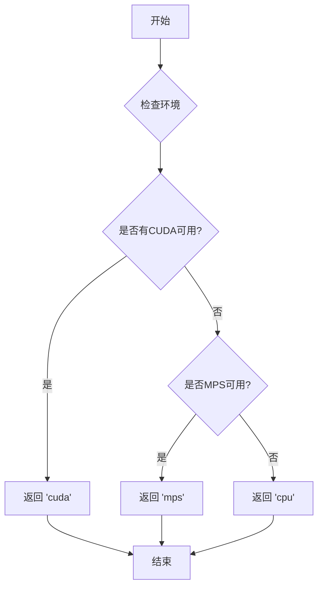

#### 带注释源码

```python
# torch_device 是从 testing_utils 模块导入的全局变量
# 在这个测试文件中使用方式如下：

# 1. 将管道移动到指定设备
pipe.to(torch_device)

# 2. 加载模型到指定设备
pipe_loaded.to(torch_device)

# 3. 作为设备参数传递给其他函数
generator_device = "cpu"
```

#### 说明

`torch_device` 的具体定义不在当前代码文件中，它是从上级目录的 `testing_utils` 模块导入的。根据使用模式，它应该是一个字符串类型的全局变量，值可能是：

- `"cuda"` - NVIDIA GPU 设备
- `"cpu"` - 中央处理器  
- `"mps"` - Apple Silicon GPU (Metal Performance Shaders)

这是测试框架中常见的模式，用于在不同硬件环境下灵活运行测试。


### `AutoencoderKLWan`

变分自编码器 (VAE) 类，用于 Wan 模型的图像到视频任务，将图像编码为潜在表示并从潜在表示解码重建图像。

参数：

- `base_dim`：`int`，基础维度大小
- `z_dim`：`int`，潜在空间维度
- `dim_mult`：`list`，各层维度乘法器列表
- `num_res_blocks`：`int`，每层残差块数量
- `temperal_downsample`：`list`，时间维度降采样配置
- `in_channels`：`int`，输入通道数（可选）
- `out_channels`：`int`，输出通道数（可选）
- `is_residual`：`bool`，是否使用残差连接（可选）
- `patch_size`：`int`，patch 大小（可选）
- `latents_mean`：`list`，潜在变量均值（可选）
- `latents_std`：`list`，潜在变量标准差（可选）
- `scale_factor_spatial`：`int`，空间缩放因子（可选）
- `scale_factor_temporal`：`int`，时间缩放因子（可选）

返回值：`AutoencoderKLWan` 实例

#### 流程图

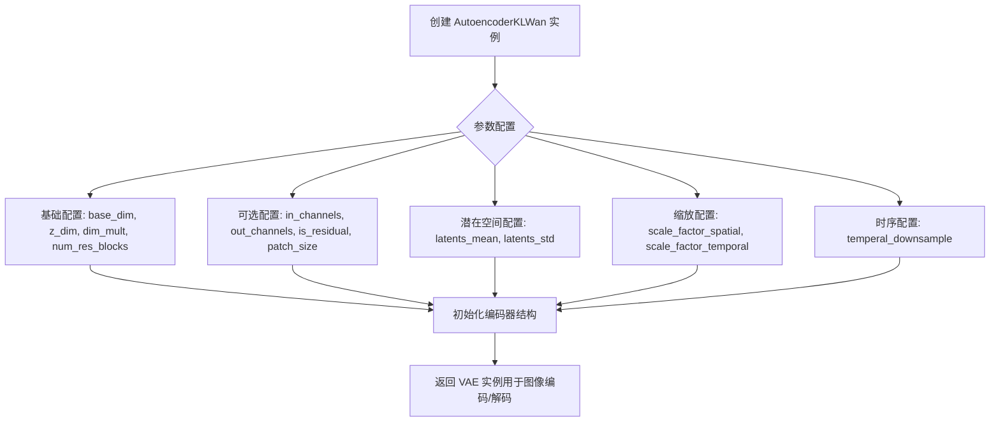

#### 带注释源码

```python
# 在 Wan22ImageToVideoPipelineFastTests.get_dummy_components() 中的调用示例
torch.manual_seed(0)
vae = AutoencoderKLWan(
    base_dim=3,           # 输入图像的通道数 (RGB = 3)
    z_dim=16,             # 潜在空间的维度
    dim_mult=[1, 1, 1, 1], # 各层维度倍数 [1x, 1x, 1x, 1x]
    num_res_blocks=1,    # 每层残差块数量
    temperal_downsample=[False, True, True], # 时序降采样配置: 第1层不平滑, 后两层平滑
)

# 在 Wan225BImageToVideoPipelineFastTests.get_dummy_components() 中的调用示例
torch.manual_seed(0)
vae = AutoencoderKLWan(
    base_dim=3,               # 输入通道数
    z_dim=48,                 # 潜在维度
    in_channels=12,           # VAE 输入通道
    out_channels=12,          # VAE 输出通道
    is_residual=True,         # 使用残差连接
    patch_size=2,             # patch 大小
    latents_mean=[0.0] * 48,  # 潜在变量均值向量
    latents_std=[1.0] * 48,   # 潜在变量标准差向量
    dim_mult=[1, 1, 1, 1],    # 各层维度倍数
    num_res_blocks=1,         # 残差块数量
    scale_factor_spatial=16,  # 空间缩放因子
    scale_factor_temporal=4,  # 时间缩放因子
    temperal_downsample=[False, True, True], # 时序降采样配置
)
```


### `UniPCMultistepScheduler`

UniPCMultistepScheduler 是一个用于 Wan 图像到视频生成管道的调度器（Scheduler），主要用于扩散模型的推理过程中控制噪声去除的步骤和时间步调度。

参数：

- `prediction_type`：`str`，预测类型，指定模型预测的类型（如 "flow_prediction" 表示流预测）
- `use_flow_sigmas`：`bool`，是否使用流 sigma，用于控制流模型的行为
- `flow_shift`：`float`，流偏移量，用于调整流模型的偏移参数（代码中设置为 3.0）

返回值：`UniPCMultistepScheduler` 对象，返回一个调度器实例，用于后续管道推理

#### 流程图

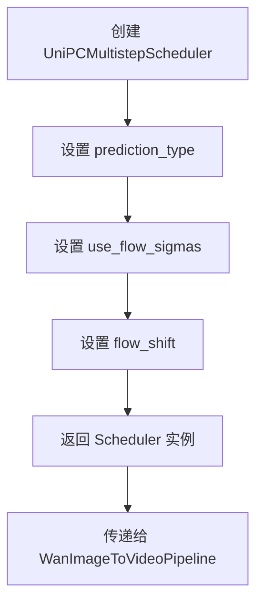

#### 带注释源码

```python
# 在测试代码中实例化 UniPCMultistepScheduler
# 第一次出现（Wan22ImageToVideoPipelineFastTests 类中）
scheduler = UniPCMultistepScheduler(
    prediction_type="flow_prediction",  # 指定预测类型为流预测
    use_flow_sigmas=True,                # 启用流 sigma
    flow_shift=3.0                       # 流偏移量参数
)

# 第二次出现（Wan225BImageToVideoPipelineFastTests 类中）
scheduler = UniPCMultistepScheduler(
    prediction_type="flow_prediction",
    use_flow_sigmas=True,
    flow_shift=3.0
)
```

---

**注意**：提供的代码文件是一个测试文件（`test_*.py`），其中仅包含对 `UniPCMultistepScheduler` 的**调用和实例化**，并未包含该类的实际定义代码。`UniPCMultistepScheduler` 是从 `diffusers` 库导入的类（`from diffusers import ... UniPCMultistepScheduler ...`），其完整实现位于 diffusers 库内部。如需获取 `UniPCMultistepScheduler` 类的完整源代码（包括所有方法、字段和内部逻辑），需要查看 diffusers 库的源码。


### WanImageToVideoPipeline

WanImageToVideoPipeline 是从 diffusers 库导入的图像到视频生成管道类，负责根据输入的图像和文本提示生成视频帧序列。该类接收预训练的 VAE、Transformer、Scheduler 和文本编码器等组件，通过扩散模型技术实现图像驱动的视频生成功能。

**注意**：当前提供的代码为测试文件（unittest），并未包含 `WanImageToVideoPipeline` 类的完整实现源码。以下信息基于测试代码中的使用方式推断得出。

#### 参数

- `transformer`：`WanTransformer3DModel`，主要的 3D 变换器模型，用于视频生成的扩散过程
- `vae`：`AutoencoderKLWan`，变分自编码器，用于潜在空间的编码和解码
- `scheduler`：`UniPCMultistepScheduler`，调度器，控制扩散模型的采样步骤
- `text_encoder`：`T5EncoderModel`，文本编码器，将文本提示编码为向量表示
- `tokenizer`：分词器，用于将文本提示转换为 token
- `transformer_2`：`Optional[WanTransformer3DModel]`，可选的第二个变换器模型（用于某些特定版本如 Wan 2.2）
- `image_encoder`：`Optional[Any]`，可选的图像编码器（当前测试中为 None）
- `image_processor`：`Optional[Any]`，可选的图像处理器（当前测试中为 None）
- `boundary_ratio`：`Optional[float]`，边界比率参数，用于控制视频生成的边界
- `expand_timesteps`：`Optional[bool]`，是否扩展时间步长（用于特定版本如 Wan 2.2 14B）

#### 调用参数（`__call__` 方法）

- `image`：`PIL.Image.Image`，输入的起始图像
- `prompt`：`str`，文本提示，描述期望生成的视频内容
- `negative_prompt`：`str`，负面提示，指定不希望出现的内容
- `height`：`int`，生成视频的高度（像素）
- `width`：`int`，生成视频的宽度（像素）
- `generator`：`torch.Generator`，随机数生成器，用于控制生成过程的可重复性
- `num_inference_steps`：`int`，推理步数，决定扩散过程的迭代次数
- `guidance_scale`：`float`，引导尺度，控制文本提示对生成结果的影响程度
- `num_frames`：`int`，生成视频的帧数
- `max_sequence_length`：`int`，最大序列长度，用于文本编码
- `output_type`：`str`，输出类型（如 "pt" 表示 PyTorch 张量）

#### 返回值

- 返回对象包含 `frames` 属性，类型为 `List[torch.Tensor]`，其中每个 tensor 的形状为 `(num_frames, channels, height, width)`，表示生成的视频帧序列

#### 流程图

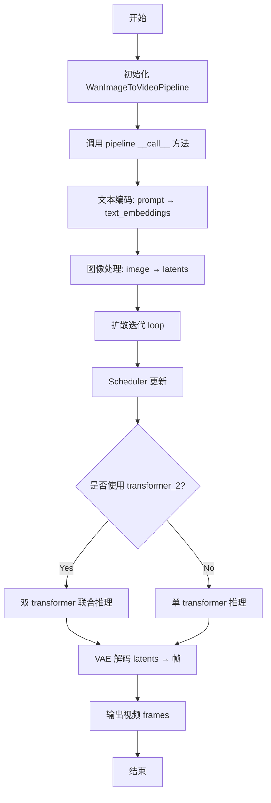

#### 带注释源码

```
# 测试代码中的使用方式（并非 WanImageToVideoPipeline 的实现源码）

# 1. 组件初始化
components = {
    "transformer": transformer,           # 主要 3D Transformer 模型
    "vae": vae,                             # VAE 编码器/解码器
    "scheduler": scheduler,                # 扩散调度器
    "text_encoder": text_encoder,          # T5 文本编码器
    "tokenizer": tokenizer,                # 分词器
    "transformer_2": transformer_2,        # 可选第二个 Transformer
    "image_encoder": None,                 # 图像编码器（可选）
    "image_processor": None,               # 图像处理器（可选）
    "boundary_ratio": 0.875,               # 边界比率
    "expand_timesteps": True,               # 时间步扩展
}

# 2. Pipeline 实例化
pipe = WanImageToVideoPipeline(**components)

# 3. 设备配置
pipe.to(device)  # 如 "cpu"

# 4. 设置进度条
pipe.set_progress_bar_config(disable=None)

# 5. 调用生成视频
inputs = {
    "image": image,                        # PIL Image
    "prompt": "dance monkey",               # 文本提示
    "negative_prompt": "negative",         # 负面提示
    "height": 16,                          # 高度
    "width": 16,                           # 宽度
    "generator": generator,                # 随机生成器
    "num_inference_steps": 2,              # 推理步数
    "guidance_scale": 6.0,                 # 引导尺度
    "num_frames": 9,                       # 帧数
    "max_sequence_length": 16,            # 最大序列长度
    "output_type": "pt",                   # 输出类型
}

# 6. 获取生成的视频
result = pipe(**inputs)
video = result.frames                      # List[Tensor], shape: [N, C, H, W]
generated_video = video[0]                  # Tensor, shape: [9, 3, 16, 16]

# 7. 模型保存与加载
pipe.save_pretrained(tmpdir, safe_serialization=False)
pipe_loaded = WanImageToVideoPipeline.from_pretrained(tmpdir)

# 8. 访问组件
components_dict = pipe.components  # 获取所有组件的字典
```

#### 关键组件信息

| 组件名称 | 描述 |
|---------|------|
| WanTransformer3DModel | 3D 变换器模型，用于视频扩散生成的核心神经网络 |
| AutoencoderKLWan | 基于 KL 对齐的变分自编码器，处理潜在空间编码 |
| UniPCMultistepScheduler | 多步 UniPC 调度器，用于扩散模型的条件采样 |
| T5EncoderModel | T5 文本编码器，将文本提示转换为语义向量 |

#### 潜在技术债务与优化空间

1. **缺少实现源码**：当前仅有测试代码，无法进行完整的架构分析
2. **测试覆盖不完整**：多个测试被跳过（`test_attention_slicing_forward_pass`、`test_callback_inputs`）
3. **硬编码参数**：测试中使用了硬编码的种子（`torch.manual_seed(0)`），可能导致测试的脆弱性
4. **负面提示未完善**：代码中存在 `# TODO` 标记，表示负面提示功能待完善
5. **边界条件处理**：`boundary_ratio` 和 `expand_timesteps` 的交互逻辑需要更清晰的文档说明

#### 其他项目

- **设计目标**：实现图像驱动的视频生成，支持文本提示引导
- **约束条件**：需要 GPU 加速（测试中在 CPU 上运行）
- **错误处理**：测试使用 `torch.allclose` 进行数值误差验证
- **外部依赖**：依赖 `diffusers`、`transformers`、`torch`、`PIL` 等库


# WanTransformer3DModel 详细设计文档

## 1. 一段话描述

WanTransformer3DModel 是基于 3D 变换器架构的扩散模型核心组件，用于图像到视频（Image-to-Video）生成任务，通过时空注意力机制和旋转位置编码（RoPE）处理视频帧的潜在表示，实现从图像和文本提示生成动态视频内容。

## 2. 文件的整体运行流程

该文件是 Wan 模型的图像到视频 pipeline 单元测试文件，主要包含两个测试类：

1. **Wan22ImageToVideoPipelineFastTests**：测试 Wan 2.2 版本的图像到视频 pipeline
2. **Wan225BImageToVideoPipelineFastTests**：测试 Wan 2.2 5B 参数版本的图像到视频 pipeline

整体流程：
```
get_dummy_components() → 实例化所有模型组件（包括 WanTransformer3DModel）
                            ↓
get_dummy_inputs() → 准备测试输入（图像、prompt、参数等）
                            ↓
test_inference() → 执行推理并验证输出
                            ↓
test_save_load_optional_components() → 测试模型保存/加载功能
```

## 3. 类的详细信息

### 3.1 WanTransformer3DModel（导入的模型类）

#### 类字段

由于 `WanTransformer3DModel` 是从 `diffusers` 库导入的外部类，其内部实现细节未在本文件中定义。以下是从实例化参数推断的类字段：

- `patch_size`：元组 (int, int, int)，定义时空_patch_的大小
- `num_attention_heads`：int，注意力头数量
- `attention_head_dim`：int，每个注意力头的维度
- `in_channels`：int，输入通道数
- `out_channels`：int，输出通道数
- `text_dim`：int，文本嵌入维度
- `freq_dim`：int，频率维度
- `ffn_dim`：int，前馈网络维度
- `num_layers`：int，变换器层数
- `cross_attn_norm`：bool，是否对交叉注意力进行归一化
- `qk_norm`：str，查询-键归一化方法（如 "rms_norm_across_heads"）
- `rope_max_seq_len`：int，旋转位置编码的最大序列长度

#### 类方法

由于 `WanTransformer3DModel` 是外部类，其具体方法未在本文件中定义。从测试代码中可以看到它作为 PyTorch 模块使用，支持 `to(device)` 方法进行设备转换，以及 `set_default_attn_processor()` 方法设置注意力处理器。

### 3.2 Wan22ImageToVideoPipelineFastTests（测试类）

#### 类字段

| 名称 | 类型 | 描述 |
|------|------|------|
| pipeline_class | type | 测试的 pipeline 类（WanImageToVideoPipeline） |
| params | frozenset | 文本到图像参数集合 |
| batch_params | type | 批处理参数配置 |
| image_params | type | 图像参数配置 |
| image_latents_params | type | 图像潜在向量参数 |
| required_optional_params | frozenset | 必需的可选参数集合 |
| test_xformers_attention | bool | 是否测试 xformers 注意力 |
| supports_dduf | bool | 是否支持 DDUF |

#### 类方法

##### get_dummy_components()

准备测试用的虚拟组件。

参数：
- 无

返回值：`dict`，包含所有模型组件的字典

```python
def get_dummy_components(self):
    torch.manual_seed(0)
    vae = AutoencoderKLWan(
        base_dim=3,
        z_dim=16,
        dim_mult=[1, 1, 1, 1],
        num_res_blocks=1,
        temperal_downsample=[False, True, True],
    )

    torch.manual_seed(0)
    scheduler = UniPCMultistepScheduler(prediction_type="flow_prediction", use_flow_sigmas=True, flow_shift=3.0)
    text_encoder = T5EncoderModel.from_pretrained("hf-internal-testing/tiny-random-t5")
    tokenizer = AutoTokenizer.from_pretrained("hf-internal-testing/tiny-random-t5")

    torch.manual_seed(0)
    transformer = WanTransformer3DModel(
        patch_size=(1, 2, 2),
        num_attention_heads=2,
        attention_head_dim=12,
        in_channels=36,
        out_channels=16,
        text_dim=32,
        freq_dim=256,
        ffn_dim=32,
        num_layers=2,
        cross_attn_norm=True,
        qk_norm="rms_norm_across_heads",
        rope_max_seq_len=32,
    )

    torch.manual_seed(0)
    transformer_2 = WanTransformer3DModel(
        patch_size=(1, 2, 2),
        num_attention_heads=2,
        attention_head_dim=12,
        in_channels=36,
        out_channels=16,
        text_dim=32,
        freq_dim=256,
        ffn_dim=32,
        num_layers=2,
        cross_attn_norm=True,
        qk_norm="rms_norm_across_heads",
        rope_max_seq_len=32,
    )

    components = {
        "transformer": transformer,
        "vae": vae,
        "scheduler": scheduler,
        "text_encoder": text_encoder,
        "tokenizer": tokenizer,
        "transformer_2": transformer_2,
        "image_encoder": None,
        "image_processor": None,
        "boundary_ratio": 0.875,
    }
    return components
```

##### get_dummy_inputs(device, seed=0)

准备测试输入数据。

参数：
- `device`：str，目标设备（"cpu" 或 "cuda"）
- `seed`：int，随机种子（默认 0）

返回值：`dict`，包含所有输入参数的字典

```python
def get_dummy_inputs(self, device, seed=0):
    if str(device).startswith("mps"):
        generator = torch.manual_seed(seed)
    else:
        generator = torch.Generator(device=device).manual_seed(seed)
    image_height = 16
    image_width = 16
    image = Image.new("RGB", (image_width, image_height))
    inputs = {
        "image": image,
        "prompt": "dance monkey",
        "negative_prompt": "negative",  # TODO
        "height": image_height,
        "width": image_width,
        "generator": generator,
        "num_inference_steps": 2,
        "guidance_scale": 6.0,
        "num_frames": 9,
        "max_sequence_length": 16,
        "output_type": "pt",
    }
    return inputs
```

##### test_inference()

执行推理测试，验证 pipeline 能否正确生成视频。

参数：
- 无

返回值：无

```python
def test_inference(self):
    device = "cpu"

    components = self.get_dummy_components()
    pipe = self.pipeline_class(
        **components,
    )
    pipe.to(device)
    pipe.set_progress_bar_config(disable=None)

    inputs = self.get_dummy_inputs(device)
    video = pipe(**inputs).frames
    generated_video = video[0]
    self.assertEqual(generated_video.shape, (9, 3, 16, 16))

    # fmt: off
    expected_slice = torch.tensor([0.4527, 0.4526, 0.4498, 0.4539, 0.4521, 0.4524, 0.4533, 0.4535, 0.5154,
                                   0.5353, 0.5200, 0.5174, 0.5434, 0.5301, 0.5199, 0.5216])
    # fmt: on

    generated_slice = generated_video.flatten()
    generated_slice = torch.cat([generated_slice[:8], generated_slice[-8:]])
    self.assertTrue(
        torch.allclose(generated_slice, expected_slice, atol=1e-3),
        f"generated_slice: {generated_slice}, expected_slice: {expected_slice}",
    )
```

### 3.3 Wan225BImageToVideoPipelineFastTests（测试类）

结构与 Wan22ImageToVideoPipelineFastTests 类似，主要区别在于模型配置参数不同：

- VAE 使用更大的 `z_dim=48`
- Transformer 使用 `in_channels=48`, `out_channels=48`
- 不使用 `transformer_2`（设为 None）
- 新增 `expand_timesteps=True` 参数

## 4. 全局变量和全局函数

| 名称 | 类型 | 描述 |
|------|------|------|
| `enable_full_determinism` | function | 启用完全确定性模式的测试工具函数 |

## 5. WanTransformer3DModel 函数/方法详情

### WanTransformer3DModel.__init__

由于 WanTransformer3DModel 是外部导入的类，以下信息从测试代码中的实例化调用推断：

**参数**：

- `patch_size`：tuple (int, int, int)，时空 patch 分割大小，代码中使用 (1, 2, 2)
- `num_attention_heads`：int，注意力头数量，代码中使用 2
- `attention_head_dim`：int，注意力头维度，代码中使用 12
- `in_channels`：int，输入通道数，Wan22 使用 36，Wan225B 使用 48
- `out_channels`：int，输出通道数，Wan22 使用 16，Wan225B 使用 48
- `text_dim`：int，文本嵌入维度，代码中使用 32
- `freq_dim`：int，频率维度，代码中使用 256
- `ffn_dim`：int，前馈网络隐藏层维度，代码中使用 32
- `num_layers`：int，变换器层数，代码中使用 2
- `cross_attn_norm`：bool，是否对交叉注意力进行归一化，代码中使用 True
- `qk_norm`：str，查询-键归一化方法，代码中使用 "rms_norm_across_heads"
- `rope_max_seq_len`：int，旋转位置编码最大序列长度，代码中使用 32

**返回值**：WanTransformer3DModel 实例

#### 流程图

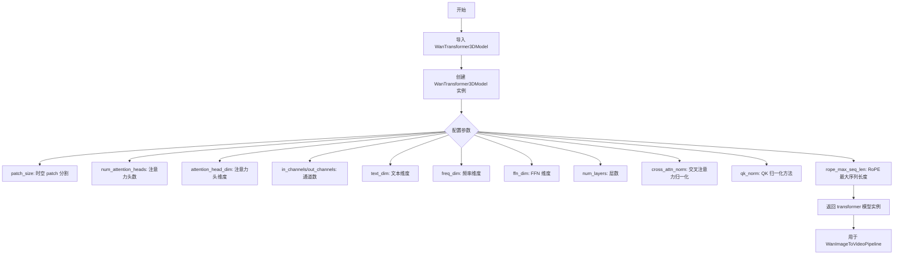

#### 带注释源码（从测试代码中提取的实例化部分）

```python
# Wan 2.2 版本 (Wan22ImageToVideoPipelineFastTests)
torch.manual_seed(0)
transformer = WanTransformer3DModel(
    patch_size=(1, 2, 2),           # 时空 patch 大小: 时间1, 空间2x2
    num_attention_heads=2,          # 2个注意力头
    attention_head_dim=12,          # 每个注意力头维度为12
    in_channels=36,                 # 输入36通道 (可能包含图像latent + 文本conditioning)
    out_channels=16,                # 输出16通道 (视频latent)
    text_dim=32,                    # 文本嵌入维度32
    freq_dim=256,                   # 频率维度256
    ffn_dim=32,                     # 前馈网络维度32
    num_layers=2,                   # 2层变换器
    cross_attn_norm=True,           # 启用交叉注意力归一化
    qk_norm="rms_norm_across_heads", # 使用跨头的RMS归一化
    rope_max_seq_len=32,            # RoPE最大序列长度32
)

# Wan 2.2 5B 版本 (Wan225BImageToVideoPipelineFastTests)
torch.manual_seed(0)
transformer = WanTransformer3DModel(
    patch_size=(1, 2, 2),
    num_attention_heads=2,
    attention_head_dim=12,
    in_channels=48,                 # 更大的输入通道数
    out_channels=48,                # 更大的输出通道数
    text_dim=32,
    freq_dim=256,
    ffn_dim=32,
    num_layers=2,
    cross_attn_norm=True,
    qk_norm="rms_norm_across_heads",
    rope_max_seq_len=32,
)
```

## 6. 关键组件信息

| 组件名称 | 一句话描述 |
|----------|------------|
| WanTransformer3DModel | 基于 3D 变换器的扩散模型核心，用于图像到视频生成 |
| AutoencoderKLWan | VAE 编码器/解码器，用于图像/视频与潜在表示之间的转换 |
| WanImageToVideoPipeline | 完整的图像到视频生成 pipeline，协调各组件工作 |
| UniPCMultistepScheduler | 多步 UniPC 调度器，用于扩散模型的噪声调度 |
| T5EncoderModel | T5 文本编码器，将文本 prompt 转换为文本嵌入 |
| AutoTokenizer | T5 分词器，用于将文本分割为 token |

## 7. 潜在的技术债务或优化空间

1. **测试代码中的 TODO**：negative_prompt 被标记为 "TODO"，说明负提示的处理可能未完全实现
2. **缺少 attention slicing 测试**：相关测试被跳过（`@unittest.skip`），可能表明该功能尚未完全支持
3. **参数配置较为简化**：虚拟测试使用较小的参数（如 num_layers=2），与实际生产模型差距较大
4. **xformers 注意力测试被禁用**：`test_xformers_attention = False`，可能意味着与 xformers 的集成存在问题

## 8. 其它项目

### 设计目标与约束

- **目标**：测试 Wan 图像到视频生成 pipeline 的功能正确性
- **约束**：使用小型随机模型（tiny-random-t5）和较少层数进行快速测试

### 错误处理与异常设计

- 使用 `torch.allclose()` 验证数值精度
- 预期输出与实际输出的容差为 `atol=1e-3`
- 保存/加载测试使用 `expected_max_difference=1e-4` 验证一致性

### 数据流与状态机

```
输入图像 + Prompt
    ↓
Tokenizer → T5Encoder → Text Embeddings
    ↓
VAE Encoder → Image Latents
    ↓
WanTransformer3DModel (多次迭代)
    ↓
Scheduler (噪声调度)
    ↓
VAE Decoder → Output Video
```

### 外部依赖与接口契约

- **diffusers 库**：提供核心模型和 pipeline
- **transformers 库**：提供 T5 文本编码器
- **PyTorch**：深度学习框架
- **PIL**：图像处理
- **numpy**：数值计算


### `AutoTokenizer`

`AutoTokenizer` 是 Hugging Face Transformers 库中的一个自动 tokenizer 类，用于根据预训练模型的名称或路径自动加载对应的分词器。在该代码中，它被用于加载 T5 文本编码器所需的分词器。

参数：

- `pretrained_model_name_or_path`：`str`，预训练模型的名称或路径（例如 "hf-internal-testing/tiny-random-t5"）
- `*args`：可变位置参数，用于传递其他位置参数
- `**kwargs`：可变关键字参数，用于传递其他关键字参数（如 `cache_dir`, `force_download`, `resume_download` 等）

返回值：`tokenizer`，返回一个分词器对象（具体类型取决于模型，通常是 `PreTrainedTokenizer` 或其子类）

#### 流程图

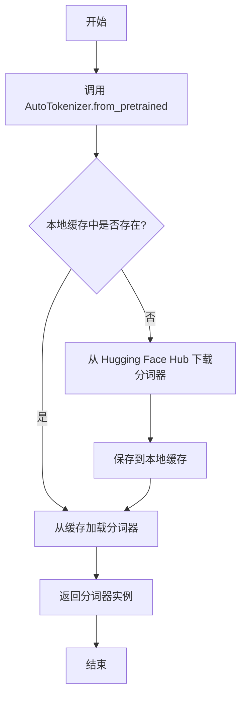

#### 带注释源码

```python
# 从 transformers 库导入 AutoTokenizer 类
from transformers import AutoTokenizer, T5EncoderModel

# 在 get_dummy_components 方法中使用 AutoTokenizer
# 用于加载 T5 文本编码器的分词器
tokenizer = AutoTokenizer.from_pretrained("hf-internal-testing/tiny-random-t5")

# 参数说明：
# - "hf-internal-testing/tiny-random-t5": 预训练模型名称或路径
#   这是一个用于测试的 tiny 随机 T5 模型
#
# 返回值：
# - tokenizer: PreTrainedTokenizer 类型
#   包含分词器 vocab、token 映射关系等
#   用于将文本字符串转换为模型输入的 token IDs
```


我分析了这代码，发现 `T5EncoderModel` 是从 `transformers` 库导入的外部依赖类，并非在此代码文件中定义。该类在此测试文件中通过 `from_pretrained` 方法加载预训练模型，作为文本编码器组件用于 Wan Image To Video Pipeline 测试中。

让我详细提取代码中相关使用信息：

### `T5EncoderModel.from_pretrained`

这是 `transformers` 库的类方法，用于加载预训练的 T5 编码器模型。在本测试代码中用于创建文本编码器组件。

参数：

- `pretrained_model_name_or_path`：`str`，预训练模型的名称或路径，这里使用 `"hf-internal-testing/tiny-random-t5"`

返回值：`T5EncoderModel`，加载后的 T5 编码器模型实例

#### 流程图

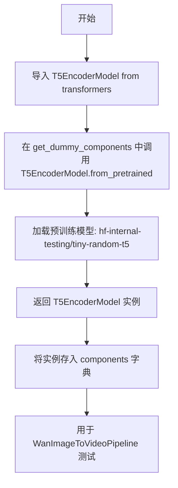

#### 带注释源码

```python
# 导入 T5EncoderModel - 来自 Hugging Face transformers 库的预训练 T5 编码器
from transformers import AutoTokenizer, T5EncoderModel

def get_dummy_components(self):
    """获取用于测试的虚拟组件"""
    
    # ... (vae 和 scheduler 初始化代码)
    
    # 创建文本编码器 - 使用 T5EncoderModel
    # 从预训练模型 "hf-internal-testing/tiny-random-t5" 加载
    # 这是一个小型随机初始化的 T5 模型，用于测试目的
    text_encoder = T5EncoderModel.from_pretrained("hf-internal-testing/tiny-random-t5")
    
    # 创建分词器 - 配合文本编码器使用
    tokenizer = AutoTokenizer.from_pretrained("hf-internal-testing/tiny-random-t5")
    
    # ... (transformer 初始化代码)
    
    # 组装所有组件到字典中
    components = {
        "transformer": transformer,
        "vae": vae,
        "scheduler": scheduler,
        "text_encoder": text_encoder,  # T5EncoderModel 实例
        "tokenizer": tokenizer,
        "transformer_2": transformer_2,
        "image_encoder": None,
        "image_processor": None,
        "boundary_ratio": 0.875,
    }
    return components
```

---

## 补充说明

### 关键组件信息

| 组件名称 | 描述 |
|---------|------|
| `T5EncoderModel` | Hugging Face transformers 库提供的 T5 文本编码器，用于将文本提示编码为模型可处理的表示 |
| `AutoTokenizer` | T5 专用的分词器，用于将文本转换为 token |

### 潜在技术债务

1. **硬编码模型路径**：使用 `"hf-internal-testing/tiny-random-t5"` 硬编码，在不同环境可能不可用
2. **Magic Number**：如 `boundary_ratio=0.875` 缺乏配置说明

### 设计目标

- 测试 Wan Image To Video Pipeline 的推理功能
- 验证模型在不同配置下的兼容性


### `Wan22ImageToVideoPipelineFastTests.get_dummy_components`

该方法用于生成虚拟（dummy）图像到视频Pipeline所需的全部组件，包括VAE、调度器、文本编码器、分词器、Transformer模型等，以便在单元测试中进行推理验证。

参数：

- 无（仅包含 `self` 隐式参数）

返回值：`Dict[str, Any]`，返回一个包含Pipeline所有组件的字典，包括transformer、vae、scheduler、text_encoder、tokenizer、transformer_2、image_encoder、image_processor和boundary_ratio等键值对。

#### 流程图

```mermaid
flowchart TD
    A[开始 get_dummy_components] --> B[设置随机种子 torch.manual_seed(0)]
    B --> C[创建 VAE: AutoencoderKLWan]
    C --> D[设置随机种子 torch.manual_seed(0)]
    D --> E[创建 Scheduler: UniPCMultistepScheduler]
    E --> F[加载 Text Encoder: T5EncoderModel]
    F --> G[加载 Tokenizer: AutoTokenizer]
    G --> H[设置随机种子 torch.manual_seed(0)]
    H --> I[创建 Transformer 1: WanTransformer3DModel]
    I --> J[设置随机种子 torch.manual_seed(0)]
    J --> K[创建 Transformer 2: WanTransformer3DModel]
    K --> L[组装 components 字典]
    L --> M[返回 components]
```

#### 带注释源码

```
def get_dummy_components(self):
    """
    生成用于测试的虚拟Pipeline组件。
    确保所有组件使用相同的随机种子以获得可复现的测试结果。
    """
    # 设置随机种子，确保VAE初始化可复现
    torch.manual_seed(0)
    vae = AutoencoderKLWan(
        base_dim=3,          # VAE基础维度
        z_dim=16,            # 潜在空间维度
        dim_mult=[1, 1, 1, 1],  # 各层维度倍数
        num_res_blocks=1,    # 残差块数量
        temperal_downsample=[False, True, True],  # 时间下采样配置
    )

    # 重新设置随机种子，确保Scheduler初始化可复现
    torch.manual_seed(0)
    scheduler = UniPCMultistepScheduler(
        prediction_type="flow_prediction",  # 预测类型为flow
        use_flow_sigmas=True,               # 使用flow sigmas
        flow_shift=3.0,                     # flow偏移量
    )
    
    # 加载预训练的文本编码器模型（用于测试的tiny版本）
    text_encoder = T5EncoderModel.from_pretrained("hf-internal-testing/tiny-random-t5")
    # 加载对应的分词器
    tokenizer = AutoTokenizer.from_pretrained("hf-internal-testing/tiny-random-t5")

    # 设置随机种子，确保第一个Transformer模型初始化可复现
    torch.manual_seed(0)
    transformer = WanTransformer3DModel(
        patch_size=(1, 2, 2),        # 时空补丁大小
        num_attention_heads=2,       # 注意力头数量
        attention_head_dim=12,       # 注意力头维度
        in_channels=36,              # 输入通道数
        out_channels=36,             # 输出通道数
        text_dim=32,                 # 文本嵌入维度
        freq_dim=256,                # 频率维度
        ffn_dim=32,                  # 前馈网络维度
        num_layers=2,                # Transformer层数
        cross_attn_norm=True,        # 启用跨注意力归一化
        qk_norm="rms_norm_across_heads",  # QK归一化方式
        rope_max_seq_len=32,         # RoPE最大序列长度
    )

    # 设置随机种子，确保第二个Transformer模型初始化可复现
    torch.manual_seed(0)
    transformer_2 = WanTransformer3DModel(
        patch_size=(1, 2, 2),
        num_attention_heads=2,
        attention_head_dim=12,
        in_channels=36,
        out_channels=36,
        text_dim=32,
        freq_dim=256,
        ffn_dim=32,
        num_layers=2,
        cross_attn_norm=True,
        qk_norm="rms_norm_across_heads",
        rope_max_seq_len=32,
    )

    # 组装所有组件到字典中
    components = {
        "transformer": transformer,       # 主Transformer模型
        "vae": vae,                         # 变分自编码器
        "scheduler": scheduler,             # 调度器
        "text_encoder": text_encoder,      # 文本编码器
        "tokenizer": tokenizer,             # 分词器
        "transformer_2": transformer_2,     # 第二个Transformer模型（可选）
        "image_encoder": None,              # 图像编码器（测试中未使用）
        "image_processor": None,            # 图像处理器（测试中未使用）
        "boundary_ratio": 0.875,            # 边界比例参数
    }
    return components
```


### `Wan22ImageToVideoPipelineFastTests.get_dummy_inputs`

该方法用于生成图像转视频管道的虚拟测试输入参数，构建包含图像、提示词、生成器配置等在内的完整输入字典，以便进行单元测试。

参数：

- `self`：隐含参数，类方法实例
- `device`：目标计算设备（str 或类似类型），用于创建随机数生成器
- `seed`：随机种子（int），默认值为 0，用于保证测试的可重复性

返回值：`dict`，包含图像转视频管道推理所需的所有输入参数，如图像、提示词、负提示词、图像尺寸、生成器、推理步数、引导系数、帧数等

#### 流程图

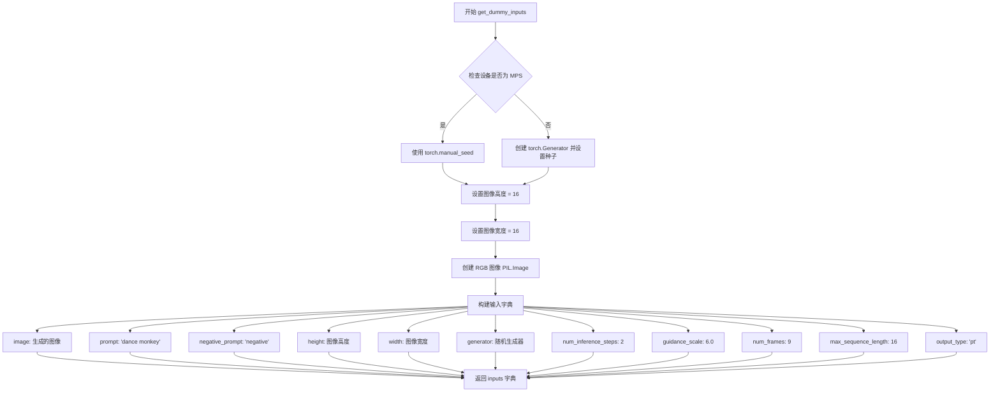

#### 带注释源码

```python
def get_dummy_inputs(self, device, seed=0):
    # 根据设备类型选择随机数生成方式
    # MPS 设备使用 torch.manual_seed，其他设备使用 torch.Generator
    if str(device).startswith("mps"):
        generator = torch.manual_seed(seed)
    else:
        generator = torch.Generator(device=device).manual_seed(seed)
    
    # 设置测试用图像尺寸
    image_height = 16
    image_width = 16
    
    # 创建 RGB 格式的测试图像
    image = Image.new("RGB", (image_width, image_height))
    
    # 构建完整的输入参数字典
    inputs = {
        "image": image,                    # 输入图像，PIL Image 对象
        "prompt": "dance monkey",          # 文本提示词
        "negative_prompt": "negative",     # 负向提示词，用于引导生成
        "height": image_height,            # 输出图像高度
        "width": image_width,              # 输出图像宽度
        "generator": generator,            # 随机数生成器，确保可重复性
        "num_inference_steps": 2,          # 推理步数，控制去噪迭代次数
        "guidance_scale": 6.0,             # 引导系数，控制文本提示影响力
        "num_frames": 9,                   # 生成视频的帧数
        "max_sequence_length": 16,        # 文本序列最大长度
        "output_type": "pt",               # 输出类型，PyTorch 张量
    }
    return inputs
```


### `Wan22ImageToVideoPipelineFastTests.test_inference`

这是一个单元测试方法，用于验证 Wan22 图像到视频生成管道的推理功能是否正常工作，通过比较生成的视频帧与预期值来确保管道输出的正确性。

参数：

- `self`：隐式参数，`Wan22ImageToVideoPipelineFastTests` 类型的实例，表示测试类本身

返回值：无返回值（`None`），该方法为 `unittest.TestCase` 的测试方法，通过 `assert` 语句验证结果

#### 流程图

```mermaid
flowchart TD
    A[开始测试] --> B[设置设备为 CPU]
    B --> C[获取虚拟组件: get_dummy_components]
    C --> D[创建管道实例: pipeline_class]
    D --> E[将管道移至设备: pipe.to]
    E --> F[配置进度条: set_progress_bar_config]
    F --> G[获取虚拟输入: get_dummy_inputs]
    G --> H[执行推理: pipe(**inputs)]
    H --> I[提取生成的视频: frames]
    I --> J{验证视频形状}
    J -->|形状为 9x3x16x16| K[提取并处理生成的切片]
    J -->|形状不匹配| L[测试失败]
    K --> M[与预期切片比较: torch.allclose]
    M -->|通过| N[测试通过]
    M -->|失败| O[测试失败并输出差异]
```

#### 带注释源码

```python
def test_inference(self):
    """测试 Wan22 图像到视频管道的推理功能"""
    device = "cpu"  # 设置测试设备为 CPU

    # 获取虚拟组件，用于初始化管道
    components = self.get_dummy_components()
    # 使用管道类创建管道实例，传入所有组件
    pipe = self.pipeline_class(
        **components,
    )
    # 将管道移至指定设备（CPU）
    pipe.to(device)
    # 配置进度条，disable=None 表示不禁用
    pipe.set_progress_bar_config(disable=None)

    # 获取虚拟输入参数
    inputs = self.get_dummy_inputs(device)
    # 执行管道推理，返回结果对象
    result = pipe(**inputs)
    # 从结果中提取生成的视频帧
    video = result.frames
    # 获取第一个视频（通常批处理中只有一个）
    generated_video = video[0]
    # 验证生成的视频形状是否为 (9, 3, 16, 16)
    # 9 帧，3 通道（RGB），16x16 像素
    self.assertEqual(generated_video.shape, (9, 3, 16, 16))

    # 预期的输出切片数值（用于验证）
    # fmt: off
    expected_slice = torch.tensor([0.4527, 0.4526, 0.4498, 0.4539, 0.4521, 0.4524, 0.4533, 0.4535, 0.5154,
                                   0.5353, 0.5200, 0.5174, 0.5434, 0.5301, 0.5199, 0.5216])
    # fmt: on

    # 将生成的视频展平为一维
    generated_slice = generated_video.flatten()
    # 取前8个和后8个元素，共16个元素用于比较
    generated_slice = torch.cat([generated_slice[:8], generated_slice[-8:]])
    # 验证生成结果与预期值的接近程度
    # 允许的绝对误差为 1e-3
    self.assertTrue(
        torch.allclose(generated_slice, expected_slice, atol=1e-3),
        f"generated_slice: {generated_slice}, expected_slice: {expected_slice}",
    )
```


### `Wan22ImageToVideoPipelineFastTests.test_attention_slicing_forward_pass`

这是一个测试 Wan 2.2 图像到视频管道中注意力切片（attention slicing）前向传递功能的单元测试方法。由于 Wan 2.2 管道不支持注意力切片功能，该测试被跳过。

参数：

- `self`：测试类的实例方法隐式参数，无需显式传递

返回值：`None`，无返回值（方法体为 `pass`）

#### 流程图

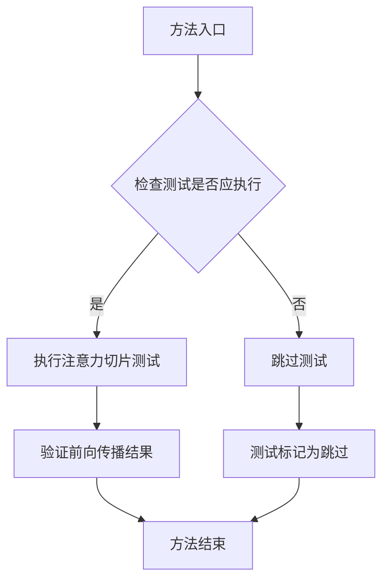

#### 带注释源码

```python
@unittest.skip("Test not supported")
def test_attention_slicing_forward_pass(self):
    """
    测试 Wan 2.2 图像到视频管道的注意力切片前向传递功能。
    
    注意力切片（Attention Slicing）是一种优化技术，用于将大型注意力矩阵
    分割成较小的块，以减少内存占用。然而，当前 Wan 2.2 管道不支持此功能，
    因此该测试被跳过。
    
    测试参数:
        self: 测试类实例，继承自 unittest.TestCase
        
    返回值:
        None: 该方法不返回任何值
        
    注意:
        - 该测试方法体仅为 pass，实际测试逻辑未实现
        - 使用 @unittest.skip 装饰器标记为跳过
        - 跳过原因: "Test not supported"
    """
    pass  # 空方法体，测试被跳过
```


### `Wan22ImageToVideoPipelineFastTests.test_save_load_optional_components`

该方法用于测试 Wan22 图像到视频管道在保存和加载时处理可选组件（如 transformer、image_encoder、image_processor）的能力，验证这些可选组件在设置为 None 后能够正确保存和恢复，同时确保保存前后的推理结果差异在允许范围内。

参数：

- `expected_max_difference`：`float`，可选参数，默认为 1e-4，表示保存前后推理结果的最大允许差异

返回值：`None`，该方法为测试用例，无返回值，通过断言验证逻辑正确性

#### 流程图

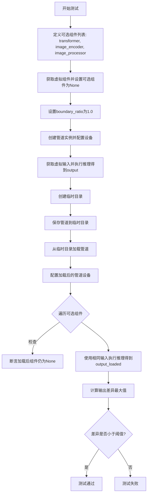

#### 带注释源码

```python
def test_save_load_optional_components(self, expected_max_difference=1e-4):
    """
    测试保存和加载可选组件的功能。
    
    参数:
        expected_max_difference: float, 允许的最大输出差异,默认为1e-4
    """
    # 定义需要测试的可选组件列表
    optional_component = ["transformer", "image_encoder", "image_processor"]

    # 获取虚拟组件配置
    components = self.get_dummy_components()
    
    # 将可选组件设置为None
    for component in optional_component:
        components[component] = None
    
    # 设置boundary_ratio为1.0,用于wan 2.2 14B模型
    # 当boundary_ratio为1.0时,transformer不会被使用
    components["boundary_ratio"] = 1.0

    # 使用组件创建管道实例
    pipe = self.pipeline_class(**components)
    
    # 为每个组件设置默认的attention processor
    for component in pipe.components.values():
        if hasattr(component, "set_default_attn_processor"):
            component.set_default_attn_processor()
    
    # 将管道移动到测试设备
    pipe.to(torch_device)
    pipe.set_progress_bar_config(disable=None)

    # 获取虚拟输入数据
    generator_device = "cpu"
    inputs = self.get_dummy_inputs(generator_device)
    
    # 设置随机种子以确保可重复性
    torch.manual_seed(0)
    
    # 执行推理,获取原始输出
    output = pipe(**inputs)[0]

    # 使用临时目录进行保存/加载测试
    with tempfile.TemporaryDirectory() as tmpdir:
        # 保存管道到临时目录
        pipe.save_pretrained(tmpdir, safe_serialization=False)
        
        # 从临时目录加载管道
        pipe_loaded = self.pipeline_class.from_pretrained(tmpdir)
        
        # 为加载的管道设置默认attention processor
        for component in pipe_loaded.components.values():
            if hasattr(component, "set_default_attn_processor"):
                component.set_default_attn_processor()
        
        # 将加载的管道移动到测试设备
        pipe_loaded.to(torch_device)
        pipe_loaded.set_progress_bar_config(disable=None)

    # 验证可选组件在加载后仍然为None
    for component in optional_component:
        self.assertTrue(
            getattr(pipe_loaded, component) is None,
            f"`{component}` did not stay set to None after loading.",
        )

    # 使用相同的输入获取加载管道的输出
    inputs = self.get_dummy_inputs(generator_device)
    torch.manual_seed(0)
    output_loaded = pipe_loaded(**inputs)[0]

    # 计算输出之间的最大差异
    max_diff = np.abs(output.detach().cpu().numpy() - output_loaded.detach().cpu().numpy()).max()
    
    # 断言差异在允许范围内
    self.assertLess(max_diff, expected_max_difference)
```


### `Wan225BImageToVideoPipelineFastTests.get_dummy_components`

该方法用于创建测试所需的虚拟（dummy）组件对象，初始化Wan 2.2B图像到视频管道的所有模型组件，包括VAE、Transformer、调度器、文本编码器等，以便进行单元测试和推理验证。

参数：

- `self`：隐式参数，指向类实例本身

返回值：`dict`，返回包含所有虚拟组件的字典，包括transformer、vae、scheduler、text_encoder、tokenizer、transformer_2、image_encoder、image_processor等键及其对应的模型实例或None值。

#### 流程图

```mermaid
flowchart TD
    A[开始 get_dummy_components] --> B[设置随机种子 torch.manual_seed(0)]
    B --> C[创建 AutoencoderKLWan 虚拟实例 vae]
    C --> D[设置随机种子 torch.manual_seed(0)]
    D --> E[创建 UniPCMultistepScheduler 虚拟实例 scheduler]
    E --> F[加载 T5EncoderModel 文本编码器]
    F --> G[加载 AutoTokenizer 分词器]
    G --> H[设置随机种子 torch.manual_seed(0)]
    H --> I[创建 WanTransformer3DModel 虚拟实例 transformer]
    I --> J[构建 components 字典]
    J --> K[返回 components 字典]
```

#### 带注释源码

```python
def get_dummy_components(self):
    """
    创建并返回用于测试的虚拟组件。
    
    该方法初始化Wan 2.2B图像到视频管道所需的所有模型组件，
    包括VAE、Transformer、调度器、文本编码器等，用于单元测试。
    """
    # 设置随机种子以确保测试可重复性
    torch.manual_seed(0)
    
    # 创建虚拟VAE（变分自编码器）组件
    # 参数配置：z_dim=48表示潜在空间维度，in_channels=12和out_channels=12
    # temperal_downsample配置时间维度的下采样策略
    vae = AutoencoderKLWan(
        base_dim=3,
        z_dim=48,
        in_channels=12,
        out_channels=12,
        is_residual=True,
        patch_size=2,
        latents_mean=[0.0] * 48,
        latents_std=[1.0] * 48,
        dim_mult=[1, 1, 1, 1],
        num_res_blocks=1,
        scale_factor_spatial=16,
        scale_factor_temporal=4,
        temperal_downsample=[False, True, True],
    )

    # 重新设置随机种子
    torch.manual_seed(0)
    
    # 创建UniPC多步调度器，用于扩散模型的推理过程
    # 配置flow_prediction预测类型和flow_shift=3.0参数
    scheduler = UniPCMultistepScheduler(
        prediction_type="flow_prediction", 
        use_flow_sigmas=True, 
        flow_shift=3.0
    )
    
    # 从预训练模型加载T5文本编码器（测试用小型随机模型）
    text_encoder = T5EncoderModel.from_pretrained("hf-internal-testing/tiny-random-t5")
    
    # 加载对应的分词器
    tokenizer = AutoTokenizer.from_pretrained("hf-internal-testing/tiny-random-t5")

    # 再次设置随机种子用于Transformer初始化
    torch.manual_seed(0)
    
    # 创建Wan 3D Transformer模型实例
    # 配置：48通道输入输出，2层，2个注意力头，每头12维
    # 使用RMS norm和旋转位置编码（RoPE）
    transformer = WanTransformer3DModel(
        patch_size=(1, 2, 2),
        num_attention_heads=2,
        attention_head_dim=12,
        in_channels=48,
        out_channels=48,
        text_dim=32,
        freq_dim=256,
        ffn_dim=32,
        num_layers=2,
        cross_attn_norm=True,
        qk_norm="rms_norm_across_heads",
        rope_max_seq_len=32,
    )

    # 组装所有组件到字典中返回
    # transformer_2为双Transformer配置，此处设为None
    # image_encoder和image_processor也设为None（可选组件）
    # boundary_ratio和expand_timesteps为Wan 2.2 14B模型的特定参数
    components = {
        "transformer": transformer,
        "vae": vae,
        "scheduler": scheduler,
        "text_encoder": text_encoder,
        "tokenizer": tokenizer,
        "transformer_2": None,
        "image_encoder": None,
        "image_processor": None,
        "boundary_ratio": None,
        "expand_timesteps": True,
    }
    return components
```


### `Wan225BImageToVideoPipelineFastTests.get_dummy_inputs`

该方法用于生成测试所需的虚拟输入参数，创建一个包含图像、提示词、生成器、推理步数等信息的字典，供管道推理测试使用。

参数：

- `self`：隐式参数，类型为 `Wan225BImageToVideoPipelineFastTests`，表示类的实例本身
- `device`：`str`，目标设备字符串，用于指定在哪个设备上创建生成器（如 "cpu"、"cuda" 等）
- `seed`：`int`，随机种子，默认为 0，用于控制生成器的随机性

返回值：`Dict[str, Any]`，返回包含以下键的字典：
- `image`：PIL.Image 对象，RGB 格式的测试图像
- `prompt`：`str`，正向提示词
- `negative_prompt`：`str`，负向提示词
- `height`：`int`，图像高度
- `width`：`int`，图像宽度
- `generator`：`torch.Generator`，PyTorch 随机生成器
- `num_inference_steps`：`int`，推理步数
- `guidance_scale`：`float`，引导_scale
- `num_frames`：`int`，生成的帧数
- `max_sequence_length`：`int`，最大序列长度
- `output_type`：`str`，输出类型

#### 流程图

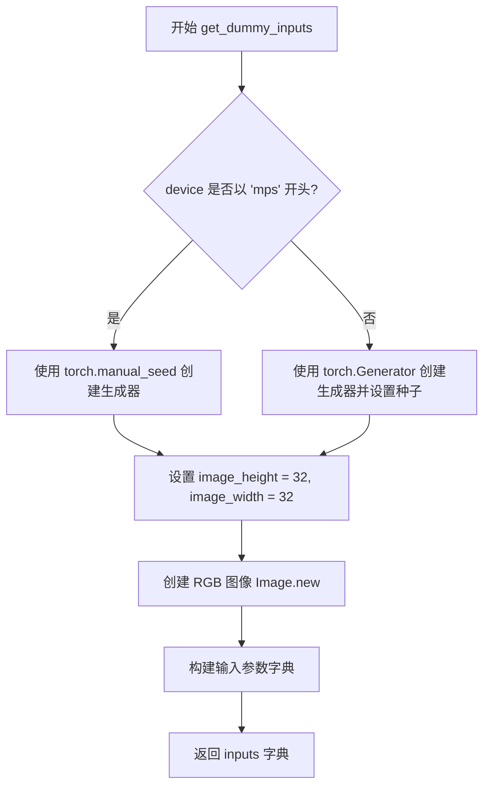

#### 带注释源码

```python
def get_dummy_inputs(self, device, seed=0):
    """
    生成用于管道推理测试的虚拟输入参数。

    参数:
        device: 目标设备字符串
        seed: 随机种子，默认为 0

    返回:
        包含所有推理参数的字典
    """
    # 根据设备类型选择生成器创建方式
    # MPS (Apple Silicon) 设备使用 torch.manual_seed
    if str(device).startswith("mps"):
        generator = torch.manual_seed(seed)
    else:
        # 其他设备（如 CPU、CUDA）使用 torch.Generator
        generator = torch.Generator(device=device).manual_seed(seed)
    
    # 设置测试图像的尺寸 (32x32)
    image_height = 32
    image_width = 32
    
    # 创建 RGB 格式的测试用图像
    image = Image.new("RGB", (image_width, image_height))
    
    # 构建完整的输入参数字典
    inputs = {
        "image": image,                    # 输入图像
        "prompt": "dance monkey",           # 正向提示词
        "negative_prompt": "negative",     # 负向提示词 (标记为 TODO)
        "height": image_height,            # 输出高度
        "width": image_width,              # 输出宽度
        "generator": generator,            # 随机生成器
        "num_inference_steps": 2,          # 推理步数
        "guidance_scale": 6.0,             # 引导强度
        "num_frames": 9,                   # 生成帧数
        "max_sequence_length": 16,         # 最大序列长度
        "output_type": "pt",               # 输出类型 (PyTorch tensor)
    }
    return inputs
```


### `Wan225BImageToVideoPipelineFastTests.test_inference`

该方法是 `Wan225BImageToVideoPipelineFastTests` 测试类中的推理测试方法，用于验证 Wan2.2 图像到视频生成管道（pipeline）的核心推理功能是否正常工作。测试通过构建虚拟组件、创建管道、执行推理并验证输出帧的形状和数值正确性来确保管道的功能完整性。

参数：

- `self`：隐式参数，测试类实例本身

返回值：`None`，该方法为单元测试方法，通过 `self.assertEqual` 和 `self.assertTrue` 断言验证推理结果的正确性，无显式返回值。

#### 流程图

```mermaid
flowchart TD
    A[测试开始] --> B[设置设备为 CPU]
    B --> C[获取虚拟组件: get_dummy_components]
    C --> D[创建管道实例 WanImageToVideoPipeline]
    D --> E[将管道移至 CPU 设备]
    E --> F[设置进度条配置]
    F --> G[获取虚拟输入: get_dummy_inputs]
    G --> H[执行管道推理: pipe\*\*inputs]
    H --> I[获取生成的视频 frames]
    I --> J[提取第一个视频 video[0]]
    J --> K{断言: 视频形状是否为 9x3x32x32}
    K -->|是| L[定义期望值 tensor]
    K -->|否| M[测试失败]
    L --> N[展平并拼接生成视频片段]
    N --> O{断言: 生成片段与期望值是否接近}
    O -->|是| P[测试通过]
    O -->|否| Q[测试失败并显示差异]
```

#### 带注释源码

```python
def test_inference(self):
    """测试 Wan2.2 图像到视频管道的推理功能"""
    # 步骤1: 设置测试设备为 CPU
    device = "cpu"

    # 步骤2: 获取虚拟组件（VAE、Transformer、Scheduler、TextEncoder等）
    components = self.get_dummy_components()
    
    # 步骤3: 使用虚拟组件创建 WanImageToVideoPipeline 管道实例
    pipe = self.pipeline_class(
        **components,
    )
    
    # 步骤4: 将管道移至指定设备（CPU）
    pipe.to(device)
    
    # 步骤5: 配置进度条（disable=None 表示不禁用）
    pipe.set_progress_bar_config(disable=None)

    # 步骤6: 获取虚拟输入参数（图像、提示词、推理步数等）
    inputs = self.get_dummy_inputs(device)
    
    # 步骤7: 执行管道推理，传入输入参数，获取结果
    # pipe(**inputs) 返回 PipelineOutput 对象，包含 frames 属性
    video = pipe(**inputs).frames
    
    # 步骤8: 获取第一个生成的视频（frames 是一个列表）
    generated_video = video[0]
    
    # 步骤9: 断言验证生成的视频形状
    # 期望形状: (9帧, 3通道, 32高度, 32宽度)
    self.assertEqual(generated_video.shape, (9, 3, 32, 32))

    # 步骤10: 定义期望的数值切片（用于验证数值正确性）
    # fmt: off
    expected_slice = torch.tensor([[0.4833, 0.4305, 0.5100, 0.4299, 0.5056, 0.4298, 0.5052, 0.4332, 0.5550,
                                   0.6092, 0.5536, 0.5928, 0.5199, 0.5864, 0.6705, 0.5493]])
    # fmt: on

    # 步骤11: 提取生成的视频片段用于验证
    # 将视频展平为一维，然后取前8个和后8个元素拼接
    generated_slice = generated_video.flatten()
    generated_slice = torch.cat([generated_slice[:8], generated_slice[-8:]])
    
    # 步骤12: 断言验证生成数值与期望值的接近程度
    # 使用 torch.allclose 检查是否在 atol=1e-3 误差范围内
    self.assertTrue(
        torch.allclose(generated_slice, expected_slice, atol=1e-3),
        f"generated_slice: {generated_slice}, expected_slice: {expected_slice}",
    )
```


### `Wan225BImageToVideoPipelineFastTests.test_attention_slicing_forward_pass`

这是一个被跳过的测试方法，用于测试 Wan225B 图像到视频管道的 attention slicing 前向传播功能。由于该功能当前不被支持，测试被跳过。

参数：无

返回值：无

#### 流程图

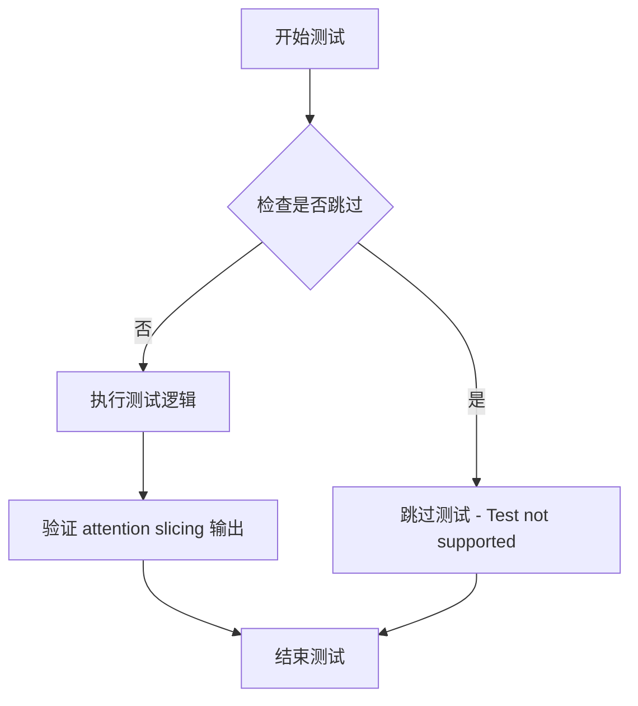

#### 带注释源码

```python
@unittest.skip("Test not supported")
def test_attention_slicing_forward_pass(self):
    """
    测试 Wan225B 图像到视频管道的 attention slicing 前向传播。
    
    该测试方法用于验证 attention slicing 功能是否正常工作。
    Attention slicing 是一种内存优化技术，将大型注意力矩阵分块处理，
    以减少 GPU 内存占用。
    
    当前该功能在 Wan225B 管道中不被支持，因此测试被跳过。
    
    Parameters:
        无 - 继承自 unittest.TestCase，使用类级别的测试组件
    
    Returns:
        无 - 测试被跳过，不执行任何验证
    
    Raises:
        unittest.SkipTest: 总是抛出跳过异常，提示 "Test not supported"
    """
    pass
```


### `Wan225BImageToVideoPipelineFastTests.test_components_function`

该测试方法用于验证 `WanImageToVideoPipeline` 管道对象正确初始化其 `components` 属性，确保传入的组件被正确存储并且键值匹配。

参数：

- `self`：`Wan225BImageToVideoPipelineFastTests`，测试类实例本身

返回值：无返回值（测试方法，使用 `assert` 语句进行断言验证）

#### 流程图

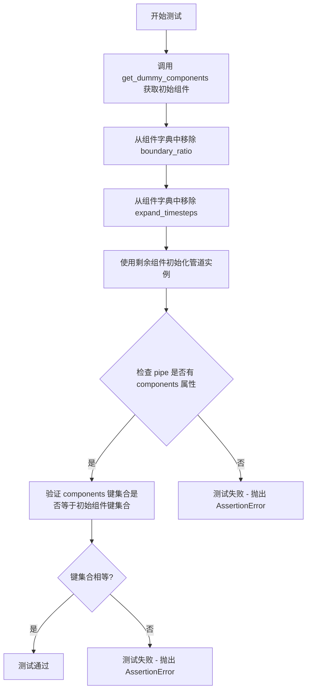

#### 带注释源码

```
def test_components_function(self):
    # 获取预定义的测试组件字典
    # 包含: transformer, vae, scheduler, text_encoder, tokenizer, 
    #       transformer_2, image_encoder, image_processor, boundary_ratio, expand_timesteps
    init_components = self.get_dummy_components()
    
    # 移除 boundary_ratio 参数，测试不传入该参数时的行为
    init_components.pop("boundary_ratio")
    
    # 移除 expand_timesteps 参数，测试不传入该参数时的行为
    init_components.pop("expand_timesteps")
    
    # 使用剩余的组件初始化 WanImageToVideoPipeline 管道
    pipe = self.pipeline_class(**init_components)

    # 断言1: 验证管道对象具有 components 属性
    self.assertTrue(hasattr(pipe, "components"))
    
    # 断言2: 验证管道的 components 键集合与初始传入的组件键集合完全一致
    self.assertTrue(set(pipe.components.keys()) == set(init_components.keys()))
```


### `Wan225BImageToVideoPipelineFastTests.test_save_load_optional_components`

该测试方法用于验证 Wan225B 图像到视频管道在保存和加载时对可选组件（如 transformer_2、image_encoder、image_processor）的处理是否正确，特别是当这些组件被设置为 None 时，保存后加载是否能保持其状态，并且加载后的输出与原始输出的差异是否在可接受范围内。

参数：

- `self`：`Wan225BImageToVideoPipelineFastTests`，unittest 测试用例实例，隐含参数
- `expected_max_difference`：`float`，可选参数，默认为 `1e-4`，用于比较保存前后输出差异的最大阈值

返回值：无返回值（void），该方法为测试用例，通过断言验证逻辑正确性

#### 流程图

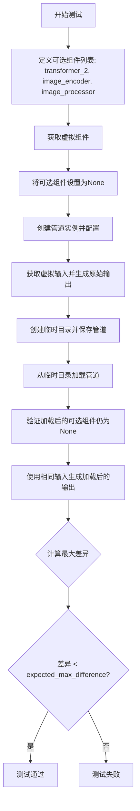

#### 带注释源码

```python
def test_save_load_optional_components(self, expected_max_difference=1e-4):
    # 定义可选组件列表，这些组件在保存加载后应保持为None
    optional_component = ["transformer_2", "image_encoder", "image_processor"]

    # 获取预定义的虚拟组件配置
    components = self.get_dummy_components()
    
    # 将可选组件设置为None，模拟这些组件不可用的情况
    for component in optional_component:
        components[component] = None
    
    # 创建管道实例，使用上述组件配置
    pipe = self.pipeline_class(**components)
    
    # 为所有组件设置默认的注意力处理器（如果支持）
    for component in pipe.components.values():
        if hasattr(component, "set_default_attn_processor"):
            component.set_default_attn_processor()
    
    # 将管道移动到测试设备
    pipe.to(torch_device)
    
    # 配置进度条（此处为禁用）
    pipe.set_progress_bar_config(disable=None)

    # 设置生成器设备为CPU
    generator_device = "cpu"
    
    # 获取虚拟输入数据
    inputs = self.get_dummy_inputs(generator_device)
    
    # 设置随机种子以确保可重复性
    torch.manual_seed(0)
    
    # 执行管道推理，获取原始输出
    output = pipe(**inputs)[0]

    # 使用临时目录进行保存和加载测试
    with tempfile.TemporaryDirectory() as tmpdir:
        # 保存管道到临时目录（不使用安全序列化）
        pipe.save_pretrained(tmpdir, safe_serialization=False)
        
        # 从临时目录加载管道
        pipe_loaded = self.pipeline_class.from_pretrained(tmpdir)
        
        # 为加载的管道组件设置默认注意力处理器
        for component in pipe_loaded.components.values():
            if hasattr(component, "set_default_attn_processor"):
                component.set_default_attn_processor()
        
        # 将加载的管道移动到测试设备
        pipe_loaded.to(torch_device)
        
        # 配置加载管道的进度条
        pipe_loaded.set_progress_bar_config(disable=None)

    # 验证加载后的可选组件是否仍为None
    for component in optional_component:
        self.assertTrue(
            getattr(pipe_loaded, component) is None,
            f"`{component}` did not stay set to None after loading.",
        )

    # 使用相同输入获取加载管道的新输出
    inputs = self.get_dummy_inputs(generator_device)
    torch.manual_seed(0)
    output_loaded = pipe_loaded(**inputs)[0]

    # 计算原始输出和加载输出之间的最大差异
    max_diff = np.abs(output.detach().cpu().numpy() - output_loaded.detach().cpu().numpy()).max()
    
    # 断言最大差异小于阈值
    self.assertLess(max_diff, expected_max_difference)
```


### `Wan225BImageToVideoPipelineFastTests.test_inference_batch_single_identical`

该方法是 Wan225B 图像到视频管道的测试用例，用于验证批量推理时单帧结果与单独推理结果的一致性，确保管道在批处理模式下产生与单独处理相同的输出。

参数：

- `self`：测试类实例本身，无额外参数

返回值：`None`，该方法为测试用例，执行断言验证而非返回值

#### 流程图

```mermaid
flowchart TD
    A[开始测试 test_inference_batch_single_identical] --> B[调用 _test_inference_batch_single_identical 方法]
    B --> C[设置 expected_max_diff=2e-3]
    C --> D[执行批量推理一致性验证]
    D --> E{验证结果是否在容差范围内}
    E -->|是| F[测试通过]
    E -->|否| G[测试失败, 抛出断言错误]
    F --> H[结束]
    G --> H
```

#### 带注释源码

```python
def test_inference_batch_single_identical(self):
    """
    测试方法：验证批量推理时单帧结果与单独推理结果的一致性
    
    该测试方法继承自 PipelineTesterMixin，通过调用内部方法
    _test_inference_batch_single_identical 来执行实际的验证逻辑。
    验证的目的是确保在使用批处理方式推理时，
    单个样本的输出与单独推理时的输出保持一致。
    
    参数:
        self: Wan225BImageToVideoPipelineFastTests 实例
        
    返回值:
        None: 测试方法不返回任何值，通过断言验证
        
    异常:
        AssertionError: 当批量推理结果与单独推理结果的差异超过 expected_max_diff 时抛出
    """
    # 调用父类/混入类的测试方法，expected_max_diff=2e-3 表示允许的最大差异
    self._test_inference_batch_single_identical(expected_max_diff=2e-3)
```

---

#### 补充说明

**设计目标**：确保 Wan225B 图像到视频管道在批处理模式下输出确定性结果，验证管道的数学一致性和数值稳定性。

**依赖方法**：该方法依赖于 `PipelineTesterMixin` 类中的 `_test_inference_batch_single_identical` 方法，该方法的具体实现未在本代码文件中展示，但根据命名惯例应执行以下操作：

1. 使用相同输入分别执行单独推理和批量推理
2. 比较两种方式的输出差异
3. 断言差异小于 `expected_max_diff`（此处为 2e-3）

**潜在优化空间**：

- 当前测试使用较少的推理步数（2步）和帧数（9帧），可考虑增加压力测试
- expected_max_diff=2e-3 相对宽松，可根据模型稳定性适当收紧
- 建议添加对不同批大小的测试覆盖


### `Wan225BImageToVideoPipelineFastTests.test_callback_inputs`

该测试方法用于测试回调输入功能，但由于当前不支持此测试项，已通过 `@unittest.skip` 装饰器跳过执行。

参数：
- 无（仅包含 `self` 参数，代表类实例本身）

返回值：无返回值（方法体为 `pass` 语句）

#### 流程图

```mermaid
flowchart TD
    A[开始测试方法] --> B{检查装饰器}
    B -->|存在@unittest.skip| C[跳过测试并输出跳过原因: Test not supported]
    C --> D[结束]
    
    style C fill:#f9f,stroke:#333,stroke-width:2px
```

#### 带注释源码

```python
@unittest.skip("Test not supported")
def test_callback_inputs(self):
    """
    测试回调输入功能
    
    该测试方法原本用于验证 pipeline 的回调输入功能是否正常工作。
    测试内容包括：
    - callback_on_step_end 参数的处理
    - callback_on_step_end_tensor_inputs 参数的处理
    
    当前状态：
    - 由于测试项不被支持，使用 @unittest.skip 装饰器跳过执行
    - 方法体仅为 pass 占位符，未实现实际测试逻辑
    
    所属类：Wan225BImageToVideoPipelineFastTests
    父类：PipelineTesterMixin, unittest.TestCase
    
    注意：
    - 该测试方法在 required_optional_params 中定义了 callback_on_step_end 
      和 callback_on_step_end_tensor_inputs 参数
    - 这些参数是 WanImageToVideoPipeline 的可选参数，用于在推理步骤结束时
      调用自定义回调函数
    """
    pass
```

## 关键组件


### WanImageToVideoPipeline

Wan图像到视频生成的主pipeline类，负责协调VAE、变换器、文本编码器等组件完成图像到视频的生成任务。

### AutoencoderKLWan

变分自编码器(VAE)模型，负责将图像编码到潜在空间并进行解码，支持时序下采样以处理视频帧。

### WanTransformer3DModel

3D变换器模型，负责去噪过程的核心计算，支持时空注意力机制和旋转位置编码(ROPE)。

### UniPCMultistepScheduler

多步调度器，基于flow_prediction类型进行噪声调度，支持flow_shift参数控制生成过程。

### T5EncoderModel

文本编码器，将文本提示编码为语义向量，供变换器在去噪过程中使用。

### WanTransformer3DModel (transformer_2)

第二个3D变换器模型，用于Wan 2.2版本的pipeline中，可选启用以支持更大规模的模型。

### get_dummy_components

测试辅助方法，创建用于单元测试的虚拟组件，包括随机初始化的VAE、变换器、调度器等。

### get_dummy_inputs

测试辅助方法，创建用于推理测试的虚拟输入参数，包括图像、提示词、生成器等配置。

### test_inference

推理测试方法，验证pipeline能够正确生成指定形状(帧数x通道x高度x宽度)的视频帧。

### test_save_load_optional_components

保存加载测试方法，验证pipeline的组件可选项(如transformer_2、image_encoder)在保存和加载后能正确保持None状态。

### test_components_function

组件功能测试方法，验证pipeline对象具有components属性且包含所有必要的组件键。

### test_inference_batch_single_identical

批处理一致性测试方法，验证批处理生成结果与单样本生成结果的一致性。


## 问题及建议


### 已知问题

- **代码重复严重**：`get_dummy_components` 和 `get_dummy_inputs` 方法在 `Wan22ImageToVideoPipelineFastTests` 和 `Wan225BImageToVideoPipelineFastTests` 两个测试类中几乎完全重复，违反了 DRY 原则
- **硬编码的占位符**：`"negative_prompt": "negative", # TODO` 仅使用占位符，未实际测试负提示词功能
- **Magic Numbers 缺乏解释**：模型参数（patch_size、dim_mult、num_layers 等）和测试参数（num_inference_steps=2、guidance_scale=6.0 等）以硬编码形式存在，缺乏文档说明
- **不一致的组件处理**：`boundary_ratio` 在 Wan22 测试中设为 0.875，在 Wan225B 测试中设为 None，行为不一致且缺乏说明
- **测试覆盖不完整**：多个测试方法使用 `@unittest.skip` 跳过（`test_attention_slicing_forward_pass`、`test_callback_inputs`），导致关键功能未验证
- **资源浪费**：Wan22 测试创建了两个 `WanTransformer3DModel` 实例（transformer 和 transformer_2），但未明确说明双transformer的测试意图
- **外部依赖风险**：测试依赖加载外部预训练模型 `"hf-internal-testing/tiny-random-t5"`，可能导致网络问题影响测试稳定性
- **设备兼容性处理不完善**：`get_dummy_inputs` 中对 MPS 设备使用 `torch.manual_seed(seed)` 而非 `torch.Generator`，可能导致随机性测试不一致
- **错误处理缺失**：未验证组件为 None 时的 pipeline 行为，也未测试模型加载失败等异常情况

### 优化建议

- **提取公共基类**：将重复的 `get_dummy_components` 和 `get_dummy_inputs` 逻辑提取到抽象基类中，通过参数化配置差异化参数
- **添加配置常量**：将 magic numbers 提取为类或模块级常量，并添加文档注释说明其含义和选择依据
- **完善 TODO 项**：实现负提示词的真正测试用例，或移除 TODO 注释改为明确的占位符标记
- **统一组件处理逻辑**：明确 `boundary_ratio` 和 `expand_timesteps` 的作用和测试场景，确保两个测试类的行为一致
- **减少跳过测试**：评估是否可以启用 `test_attention_slicing_forward_pass` 和 `test_callback_inputs`，或添加明确的原因说明
- **优化资源使用**：如双 transformer 不是测试目标，应移除 `transformer_2` 的创建；如需测试，添加明确注释说明测试目的
- **模拟外部依赖**：使用 mock 替代真实模型加载，或提供离线测试模式
- **增强设备兼容性**：统一使用 `torch.Generator` 处理随机种子，确保各设备行为一致
- **添加异常测试**：增加对 None 组件、模型加载失败、参数边界值等异常情况的测试覆盖

## 其它


### 设计目标与约束

本测试文件旨在验证WanImageToVideoPipeline（ Wan 图像到视频生成管道）的核心功能，包括模型推理、组件保存与加载、批处理一致性等。设计目标为确保管道在不同配置下（ Wan2.2 和 Wan2.2 5B 版本）能够正确生成视频帧，并保持输出的确定性和一致性。测试约束包括：仅支持 CPU 设备推理、使用固定的随机种子确保可重复性、跳过不支持的测试用例（如 xformers attention 和 callback inputs）。

### 错误处理与异常设计

测试中的错误处理主要依赖于 unittest 框架的断言机制。当管道输出与预期结果不匹配时（如视频形状错误、数值差异超过阈值），测试会抛出 AssertionError 并附带详细的错误信息（如 generated_slice 与 expected_slice 的对比）。对于不支持的测试用例，使用 @unittest.skip 装饰器跳过，避免误报。代码中未实现显式的异常捕获或自定义异常类，所有错误均通过测试失败的形式呈现。

### 数据流与状态机

测试数据流如下：1）get_dummy_components() 创建虚拟模型组件（VAE、Transformer、Scheduler、Text Encoder 等）；2）get_dummy_inputs() 生成虚拟输入（图像、提示词、随机数生成器等）；3）管道接收输入后执行推理，生成视频帧；4）测试断言验证输出形状和数值正确性。状态机方面，管道从初始化状态（组件绑定）经过推理调用，最终返回输出结果。测试不涉及复杂的状态转换，主要关注单次推理流程。

### 外部依赖与接口契约

本测试依赖以下外部库和模块：torch（张量计算）、numpy（数值比较）、PIL（图像生成）、transformers（T5 文本编码器）、diffusers（Wan 模型和管道）。接口契约包括：管道类必须实现 __call__ 方法并返回包含 frames 属性的对象；组件需支持 set_default_attn_processor 方法（可选）；save_pretrained 和 from_pretrained 方法需能正确序列化和反序列化管道。测试通过 PipelineTesterMixin 混入类遵循通用测试规范，确保与其他 diffusers 管道的接口一致性。

### 测试覆盖范围

本测试文件覆盖以下场景：1）test_inference：验证基本推理功能，检查输出形状和数值精度；2）test_save_load_optional_components：验证可选组件（transformer_2、image_encoder 等）为 None 时能正确保存和加载；3）test_components_function：验证管道 components 属性的完整性；4）test_inference_batch_single_identical：验证批处理与单样本处理的一致性。测试覆盖了 2.2 和 5B 两个版本的管道配置，但跳过了 attention slicing、xformers、DDUF 等高级功能。

### 配置与参数说明

关键配置参数包括：num_inference_steps=2（推理步数）、guidance_scale=6.0（引导 scale）、num_frames=9（生成帧数）、output_type="pt"（输出 PyTorch 张量）、max_sequence_length=16（最大序列长度）。Wan2.2 版本使用 boundary_ratio=0.875，而 5B 版本使用 boundary_ratio=None 和 expand_timesteps=True。虚拟组件的维度配置（如 patch_size=(1,2,2)、attention_head_dim=12）经过简化以加速测试。

### 测试环境要求

测试环境要求 Python 3.8+，PyTorch 1.0+，diffusers 库已安装。设备支持仅限于 CPU（device="cpu"），测试代码中未包含 CUDA 或 MPS 设备的完整适配（尽管 get_dummy_inputs 中有 mps 兼容逻辑）。随机性通过 torch.manual_seed 和 Generator.manual_seed 控制，确保测试可重复。临时目录用于保存和加载模型检查点。

### 已知限制与待办项

测试代码中存在以下已知限制：1）negative_prompt 参数标记为 TODO，未实际测试负面提示的影响；2）多个测试用例被 @unittest.skip 跳过，包括 attention_slicing、callback_inputs 等；3）xformers attention 和 DDUF 功能明确标记为不支持（test_xformers_attention=False、supports_dduf=False）；4）Wan2.2 5B 版本的 boundary_ratio=1.0 场景未完整测试（仅在 test_save_load_optional_components 中提及）。


    