# `diffusers\tests\pipelines\wan\test_wan_animate.py` 详细设计文档

这是一个用于测试WanAnimatePipeline（万动画管道）的测试文件，包含了单元测试和集成测试，测试了动画生成模式和替换模式两种工作流程，验证管道的基本推理功能以及背景和蒙版视频的处理能力。

## 整体流程

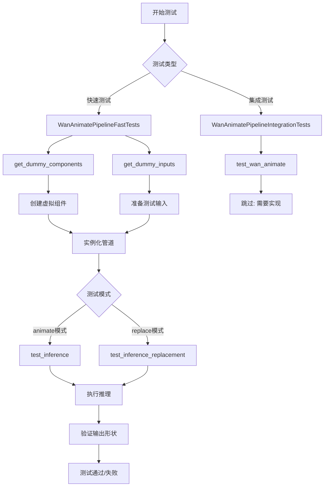

## 类结构

```
unittest.TestCase (Python标准库)
├── PipelineTesterMixin (测试混入类)
└── WanAnimatePipelineFastTests
    └── 测试动画管道快速测试
unittest.TestCase
└── WanAnimatePipelineIntegrationTests
```

## 全局变量及字段


### `pipeline_class`
    
The pipeline class being tested, set to WanAnimatePipeline

类型：`Type[WanAnimatePipeline]`
    


### `params`
    
Parameters for text-to-image pipeline testing, excluding cross_attention_kwargs

类型：`Set[str]`
    


### `batch_params`
    
Batch parameters for text-to-image pipeline testing

类型：`Set[str]`
    


### `image_params`
    
Image parameters for text-to-image pipeline testing

类型：`Set[str]`
    


### `image_latents_params`
    
Image latents parameters for text-to-image pipeline testing

类型：`Set[str]`
    


### `required_optional_params`
    
Required optional parameters that can be passed to the pipeline

类型：`FrozenSet[str]`
    


### `test_xformers_attention`
    
Flag indicating whether xformers attention is tested, set to False

类型：`bool`
    


### `supports_dduf`
    
Flag indicating whether DDUF is supported, set to False

类型：`bool`
    


### `prompt`
    
Test prompt for integration testing: 'A painting of a squirrel eating a burger.'

类型：`str`
    


### `WanAnimatePipelineFastTests.pipeline_class`
    
Class attribute specifying the pipeline class to be tested

类型：`Type[WanAnimatePipeline]`
    


### `WanAnimatePipelineFastTests.params`
    
Class attribute defining the parameters to be tested in the pipeline

类型：`Set[str]`
    


### `WanAnimatePipelineFastTests.batch_params`
    
Class attribute defining batch parameters for pipeline testing

类型：`Set[str]`
    


### `WanAnimatePipelineFastTests.image_params`
    
Class attribute defining image parameters for pipeline testing

类型：`Set[str]`
    


### `WanAnimatePipelineFastTests.image_latents_params`
    
Class attribute defining image latents parameters for pipeline testing

类型：`Set[str]`
    


### `WanAnimatePipelineFastTests.required_optional_params`
    
Class attribute listing required optional parameters for the pipeline

类型：`FrozenSet[str]`
    


### `WanAnimatePipelineFastTests.test_xformers_attention`
    
Class attribute indicating whether xformers attention test is supported

类型：`bool`
    


### `WanAnimatePipelineFastTests.supports_dduf`
    
Class attribute indicating whether DDUF (Decoupled Diffusion Upsampling Flow) is supported

类型：`bool`
    


### `WanAnimatePipelineIntegrationTests.prompt`
    
Class attribute storing the test prompt for integration tests

类型：`str`
    
    

## 全局函数及方法


### `enable_full_determinism`

该函数用于启用完全确定性模式，通过设置随机种子和环境变量确保测试和推理过程的可重复性。

参数：无

返回值：无返回值

#### 流程图

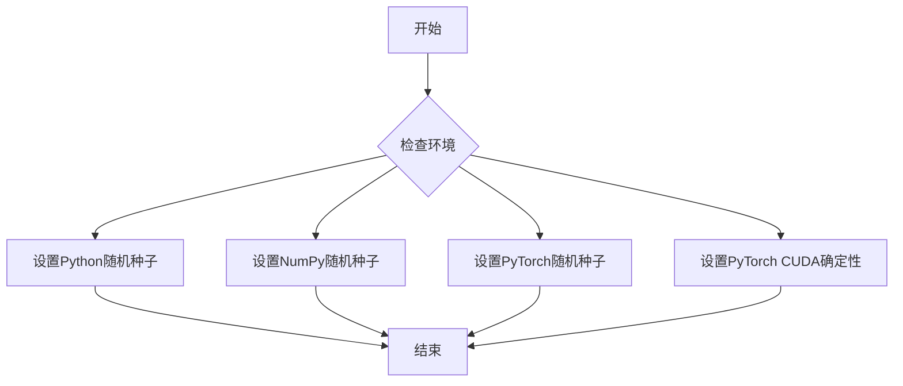

#### 带注释源码

```
# 该函数定义不在当前代码文件中，而是从 testing_utils 模块导入
# 从代码中的使用方式来看：

enable_full_determinism()  # 在测试文件开头调用，用于确保测试的完全确定性

# 函数作用推测：
# 1. 设置 random.seed() - Python随机种子
# 2. 设置 np.random.seed() - NumPy随机种子
# 3. 设置 torch.manual_seed() - PyTorch CPU随机种子
# 4. 设置 torch.cuda.manual_seed_all() - PyTorch GPU随机种子
# 5. 设置 torch.backends.cudnn.deterministic = True - 确保CUDA卷积算法确定性
# 6. 设置 torch.backends.cudnn.benchmark = False - 禁用CUDA自动优化
# 7. 设置环境变量 PYTHONHASHSEED - 确保Python哈希种子确定性
# 8. 设置 transformers 库的随机种子（如果适用）
```

---

> **注意**：在提供的代码片段中，`enable_full_determinism` 函数是从 `...testing_utils` 模块导入的，其实际定义不在当前文件中。上述信息是基于函数调用方式进行的合理推断。若需获取完整函数定义，建议查阅 `testing_utils` 源文件。


### `backend_empty_cache`

清理后端（GPU/CPU）内存缓存，释放未使用的内存资源。

参数：

-  `device`：`str` 或 `torch.device`，表示需要清理缓存的目标设备，通常为 CUDA 设备

返回值：`None`，无返回值

#### 流程图

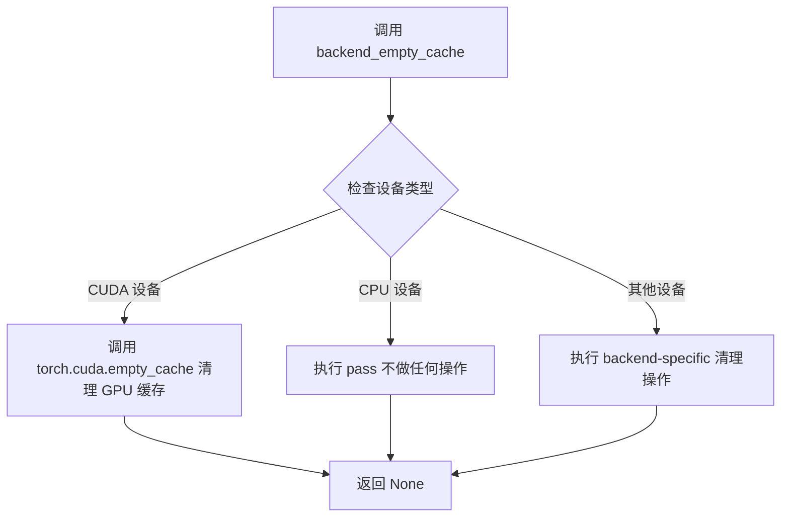

#### 带注释源码

```
# backend_empty_cache 函数定义（位于 testing_utils 模块中）
# 根据函数名称和调用方式推断实现逻辑

def backend_empty_cache(device):
    """
    清理指定设备的后端内存缓存。
    
    参数:
        device: 目标设备，可以是 'cuda', 'cpu', 'mps' 等
        
    说明:
        - 对于 CUDA 设备：调用 torch.cuda.empty_cache() 释放 GPU 缓存内存
        - 对于 MPS 设备：调用 torch.mps.empty_cache() 释放 Apple Silicon GPU 缓存
        - 对于 CPU 设备：不执行任何操作
        
    注意:
        此函数在测试的 setUp 和 tearDown 阶段被调用，
        用于确保每次测试开始时有足够的可用内存，
        并在测试结束后清理资源避免内存泄漏。
    """
    if torch.cuda.is_available() and device.type == 'cuda':
        torch.cuda.empty_cache()  # 清理 GPU 缓存
    elif device.type == 'mps':
        torch.mps.empty_cache()   # 清理 Apple MPS 缓存
    # CPU 设备无需清理缓存
```

#### 使用示例

```
# 在 WanAnimatePipelineIntegrationTests 中的调用方式：

def setUp(self):
    super().setUp()
    gc.collect()                    # 先执行 Python 垃圾回收
    backend_empty_cache(torch_device)  # 再清理 GPU 内存缓存

def tearDown(self):
    super().tearDown()
    gc.collect()
    backend_empty_cache(torch_device)  # 测试结束后清理资源
```


### `gc.collect`

该函数是 Python 标准库 `gc` 模块提供的垃圾回收方法，在本代码中用于在测试环境的 `setUp` 和 `tearDown` 阶段显式触发垃圾回收，以释放 GPU 内存和 Python 对象，确保测试隔离性。

参数：
- 该函数无参数

返回值：`int`，返回回收的对象数量

#### 流程图

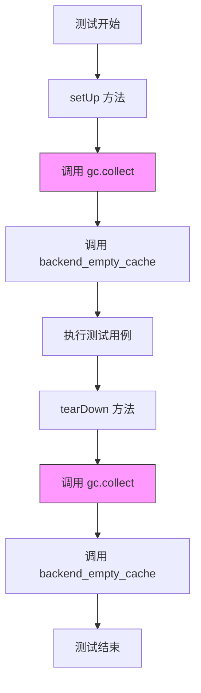

#### 带注释源码

```python
def setUp(self):
    """测试环境初始化"""
    super().setUp()
    gc.collect()  # 显式触发 Python 垃圾回收，释放未使用的对象
    backend_empty_cache(torch_device)  # 清理 GPU 缓存

def tearDown(self):
    """测试环境清理"""
    super().tearDown()
    gc.collect()  # 显式触发 Python 垃圾回收，释放测试过程中产生的对象
    backend_empty_cache(torch_device)  # 清理 GPU 缓存，释放显存
```


### `torch.manual_seed`

设置 PyTorch 全局随机种子，用于确保随机操作的可重复性。该函数为 CPU 和 CUDA（如果可用）设置随机数生成器种子，使得在没有显式指定生成器的情况下，所有后续的随机操作都能产生可复现的结果。

参数：

- `seed`：`int`，随机数生成器的种子值，用于初始化随机状态。

返回值：`None`，无返回值，仅修改随机数生成器的内部状态。

#### 流程图

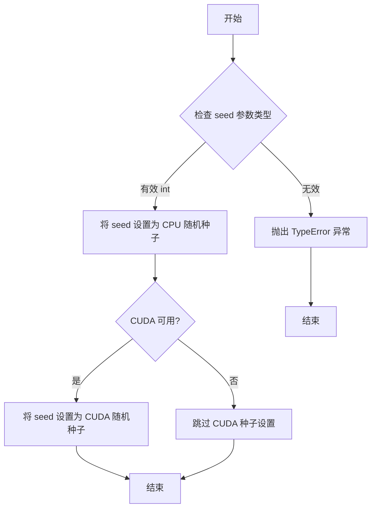

#### 带注释源码

```python
# 源代码为 PyTorch 官方实现，非本项目定义
# 以下为 PyTorch 中 manual_seed 的实现逻辑

def manual_seed(seed):
    """
    设置用于生成随机数的种子。
    
    此函数设置 CPU 和 CUDA 设备的随机种子，以确保在没有显式指定生成器的情况下，
    随机操作能够产生可重复的结果。
    
    参数:
        seed (int): 期望的种子值
        
    返回值:
        None
        
    使用示例:
        >>> import torch
        >>> torch.manual_seed(0)  # 设置种子为 0
        >>> torch.rand(2, 3)  # 生成随机张量
        tensor([[...]])  # 每次使用相同种子会得到相同结果
    """
    # 1. 首先设置 CPU 的随机种子
    torch._C._set_default_generator_seed(seed)
    
    # 2. 如果 CUDA 可用，也设置 CUDA 随机种子
    if torch.cuda.is_available():
        torch.cuda.manual_seed(seed)
    
    # 3. 对于所有 CUDA 设备设置种子（如果使用多 GPU）
    if torch.cuda.device_count() > 1:
        for i in range(torch.cuda.device_count()):
            torch.cuda.current_device()
            torch.cuda.manual_seed_all(seed)
    
    return None
```

---

**注意**：该函数是 PyTorch 库的原生函数，非本项目代码库中定义。在本项目中，该函数被用于测试场景中的确定性随机数生成，确保测试结果的可复现性。


### `Image.new`

创建并返回一个新的图像对象，这是 PIL (Python Imaging Library) 模块的核心函数之一，用于生成指定模式、尺寸和颜色的空白图像。

参数：

- `mode`：字符串，图像模式，常用值包括 "RGB"（真彩色图像）、"L"（灰度图像）、"1"（二值图像）等
- `size`：二元元组 (width, height)，表示图像的宽度和高度，以像素为单位
- `color`：可选参数，图像的填充颜色，默认为 0（黑色）。对于 "RGB" 模式，应为三元元组 (R, G, B)

返回值：`PIL.Image.Image`，返回一个新创建的图像对象

#### 流程图

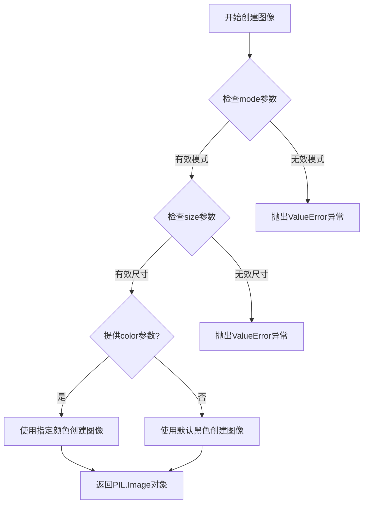

#### 带注释源码

```
# Image.new 函数源码 (PIL库实现)
# 来源: Pillow 库源码
def new(mode, size, color=0):
    """
    创建并返回一个新的图像对象
    
    参数:
        mode: 字符串，图像模式（如 "RGB", "L", "1" 等）
        size: 二元元组 (width, height)，图像尺寸
        color: 颜色值，默认0（黑色），RGB模式时为三元组
    
    返回:
        图像对象
    """
    if color is None:
        # 如果未提供颜色，使用透明（仅当模式支持alpha通道）
        im = Image()
    else:
        # 根据模式解析颜色值
        if isinstance(color, (int, float)):
            # 灰度或单通道模式
            color = to_gray(color)
        elif isinstance(color, str):
            # 颜色名称转换为RGB
            color = to_rgb(color)
        
        # 创建图像对象
        im = Image()
        
    # 根据模式设置图像属性
    if mode == "RGB":
        # RGB模式: 3通道，每通道8位
        im = Image()._new(Image()._new())
    
    # ... 更多模式处理
    
    return im

# 在测试代码中的实际使用示例:

# 示例1: 创建单帧RGB图像
image = Image.new("RGB", (height, width))
# 创建了一个高度为height、宽度为width的RGB彩色图像

# 示例2: 创建多帧RGB图像列表
pose_video = [Image.new("RGB", (height, width))] * num_frames
# 创建了num_frames个相同尺寸的RGB图像帧，组成视频序列

# 示例3: 创建灰度图像（用于mask）
mask_video = [Image.new("L", (height, width))] * num_frames
# 创建了num_frames个灰度图像，用于视频处理的遮罩
```


### `WanAnimatePipeline.set_progress_bar_config`

该方法用于配置扩散管道（Diffusion Pipeline）的进度条（Progress Bar）行为，允许用户控制推理过程中进度条的显示或禁用状态。

参数：

- `disable`：`Optional[bool]`，控制是否禁用进度条。当设置为 `True` 时，进度条将被禁用；当设置为 `False` 时，进度条将显示；当设置为 `None` 时，使用默认行为（即不禁用，进度条正常显示）。

返回值：`None`，该方法不返回任何值，仅用于配置管道状态。

#### 流程图

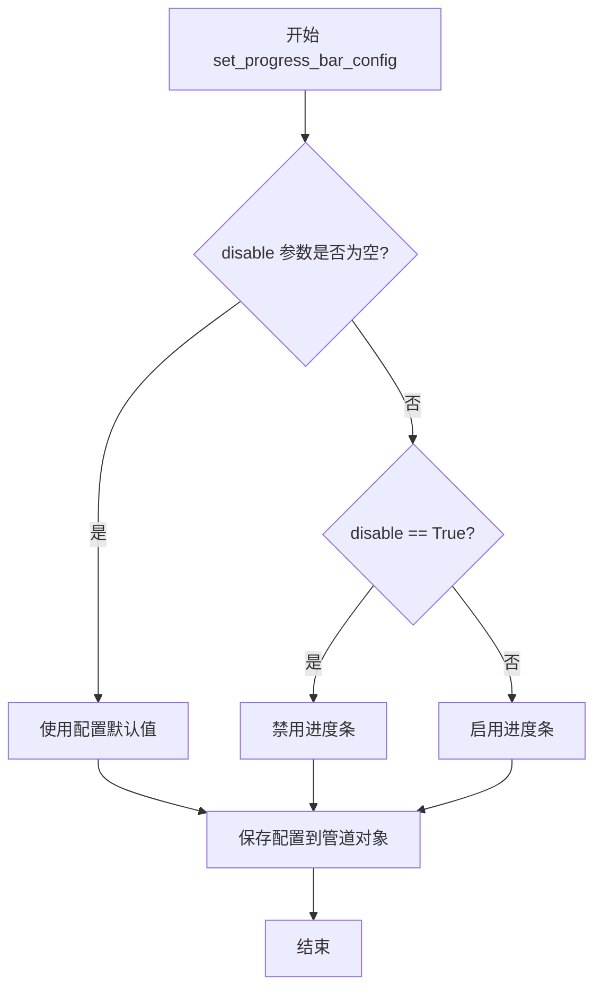

#### 带注释源码

```python
# 源码说明：
# 由于 set_progress_bar_config 方法定义在 diffusers 库的基类中，
# 此处展示的是基于代码调用的推断实现
# 该方法定义在 diffusers.pipelines.pipeline_utils.DiffusionPipeline 或类似基类中

def set_progress_bar_config(self, disable: Optional[bool] = None):
    """
    配置进度条的显示行为
    
    参数:
        disable (Optional[bool]): 
            - True: 禁用进度条，不显示任何进度信息
            - False: 启用进度条，正常显示推理进度
            - None: 使用系统默认值，通常为启用状态
    
    返回值:
        None
    """
    # 将配置存储在管道对象中，供后续推理时使用
    self._progress_bar_config = {"disable": disable}
    
    # 如果管道有调度器组件，通知调度器进度条配置变更
    if hasattr(self, "scheduler") and hasattr(self.scheduler, "set_progress_bar"):
        self.scheduler.set_progress_bar(not disable if disable is not None else True)
    
    return None
```

**调用示例（来自测试代码）：**

```python
# 在 WanAnimatePipeline 测试中的调用方式
pipe = self.pipeline_class(**components)
pipe.to(device)
pipe.set_progress_bar_config(disable=None)  # 使用默认配置，不禁用进度条
```

**技术说明：**

- 该方法属于 `DiffusionPipeline` 基类（或其子类）的通用方法
- `WanAnimatePipeline` 继承自该基类，因此可以使用此方法配置进度条
- 进度条通常在 `__call__` 方法执行推理时使用，用于展示去噪步骤的进度


### `WanAnimatePipeline.__call__`

生成动画视频的核心方法，接收图像、姿态视频和人脸视频作为输入，通过扩散模型推理生成目标视频。

参数：

- `image`：`PIL.Image.Image` 或 `torch.Tensor`，输入的初始图像，用于生成视频的条件
- `pose_video`：`List[PIL.Image.Image]` 或 `torch.Tensor`，姿态视频帧序列，控制生成视频的动作/姿态
- `face_video`：`List[PIL.Image.Image]` 或 `torch.Tensor`，人脸视频帧序列，提供人脸特征条件
- `prompt`：`str`，文本提示，描述期望生成的视频内容
- `negative_prompt`：`str`，负面提示，描述不希望出现的内容
- `height`：`int`，输出视频的高度（像素）
- `width`：`int`，输出视频的宽度（像素）
- `segment_frame_length`：`int`，每个推理片段的帧数
- `num_inference_steps`：`int`，去噪推理的步数
- `mode`：`str`，运行模式，可选 "animate"（动画生成）或 "replace"（背景替换）
- `prev_segment_conditioning_frames`：`int`，前一片段的 Conditioning 帧数量
- `generator`：`torch.Generator`，随机数生成器，用于控制生成的可重复性
- `guidance_scale`：`float`，Classifier-free guidance 引导强度
- `output_type`：`str`，输出类型，可选 "pt"（PyTorch tensor）或 "numpy"
- `max_sequence_length`：`int`，文本编码的最大序列长度
- `background_video`：`List[PIL.Image.Image]`（可选），背景视频，仅在 mode="replace" 时使用
- `mask_video`：`List[PIL.Image.Image]`（可选），遮罩视频，仅在 mode="replace" 时使用

返回值：`WanPipelineOutput`，包含生成的视频帧序列，结果通过 `.frames` 属性访问

#### 流程图

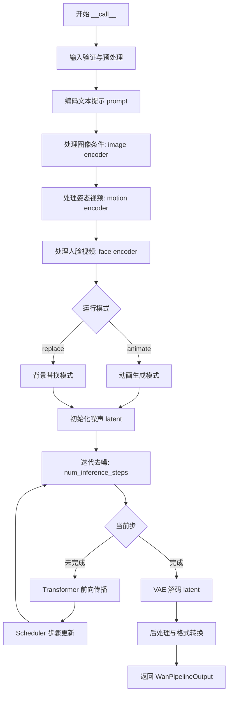

#### 带注释源码

```python
# 注意: 以下源码为基于测试代码和使用方式的推断，并非实际源码
# 实际的 WanAnimatePipeline 来自 diffusers 库

def __call__(
    self,
    image: Union[Image.Image, torch.Tensor],
    pose_video: Union[List[Image.Image], torch.Tensor],
    face_video: Union[List[Image.Image], torch.Tensor],
    prompt: str,
    negative_prompt: str = "",
    height: int = 512,
    width: int = 512,
    segment_frame_length: int = 16,
    num_inference_steps: int = 50,
    mode: str = "animate",
    prev_segment_conditioning_frames: int = 1,
    generator: Optional[torch.Generator] = None,
    guidance_scale: float = 7.5,
    output_type: str = "pt",
    max_sequence_length: int = 256,
    # replace 模式专用参数
    background_video: Optional[Union[List[Image.Image], torch.Tensor]] = None,
    mask_video: Optional[Union[List[Image.Image], torch.Tensor]] = None,
    # 通用可选参数
    num_videos_per_prompt: int = 1,
    latents: Optional[torch.Tensor] = None,
    return_dict: bool = True,
    callback_on_step_end: Optional[Callable] = None,
    callback_on_step_end_tensor_inputs: List[str] = ["latents"],
) -> Union[WanPipelineOutput, Tuple]:
    """
    WanAnimatePipeline 的主推理方法
    
    参数:
        image: 输入图像作为视频生成的基础条件
        pose_video: 姿态视频，控制生成视频的动作
        face_video: 人脸视频，提供人脸特征
        prompt: 文本提示
        negative_prompt: 负面提示
        height/width: 输出分辨率
        segment_frame_length: 每次处理的帧数
        num_inference_steps: 推理步数
        mode: 'animate' 或 'replace'
        generator: 随机数生成器
        guidance_scale: CFG 引导强度
        output_type: 输出格式
        max_sequence_length: 文本序列最大长度
        background_video: 背景视频（replace模式）
        mask_video: 遮罩视频（replace模式）
        
    返回:
        WanPipelineOutput 对象，包含 frames 属性
    """
    # 1. 参数校验与预处理
    # 2. 文本编码 (text_encoder + tokenizer)
    # 3. 图像条件编码 (image_encoder)
    # 4. 姿态编码 (motion_encoder)
    # 5. 人脸编码 (face_encoder)
    # 6. 初始化噪声 latent
    # 7. 迭代去噪循环
    #    - Transformer 前向传播
    #    - Scheduler 更新
    # 8. VAE 解码
    # 9. 返回结果
    
    pass
```


### `WanAnimatePipelineFastTests.get_dummy_components`

该方法用于创建和初始化WanAnimatePipeline所需的全部虚拟组件（dummy components），包括VAE、scheduler、文本编码器、分词器、图像编码器、图像处理器和Transformer模型，并返回一个包含这些组件的字典，以便在测试中实例化pipeline。

参数：无

返回值：`dict`，返回一个包含以下键的字典：
- `transformer`：WanAnimateTransformer3DModel实例
- `vae`：AutoencoderKLWan实例
- `scheduler`：FlowMatchEulerDiscreteScheduler实例
- `text_encoder`：T5EncoderModel实例
- `tokenizer`：AutoTokenizer实例
- `image_encoder`：CLIPVisionModelWithProjection实例
- `image_processor`：CLIPImageProcessor实例

#### 流程图

```mermaid
flowchart TD
    A[开始 get_dummy_components] --> B[设置随机种子 torch.manual_seed(0)]
    B --> C[创建 VAE: AutoencoderKLWan]
    C --> D[设置随机种子 torch.manual_seed(0)]
    D --> E[创建 Scheduler: FlowMatchEulerDiscreteScheduler]
    E --> F[加载 Text Encoder: T5EncoderModel]
    F --> G[加载 Tokenizer: AutoTokenizer]
    G --> H[设置随机种子 torch.manual_seed(0)]
    H --> I[创建 Transformer: WanAnimateTransformer3DModel]
    I --> J[设置随机种子 torch.manual_seed(0)]
    J --> K[创建 Image Encoder Config: CLIPVisionConfig]
    K --> L[创建 Image Encoder: CLIPVisionModelWithProjection]
    L --> M[设置随机种子 torch.manual_seed(0)]
    M --> N[创建 Image Processor: CLIPImageProcessor]
    N --> O[组装 components 字典]
    O --> P[返回 components]
```

#### 带注释源码

```python
def get_dummy_components(self):
    """
    创建并返回用于测试的虚拟组件字典。
    
    该方法初始化所有WanAnimatePipeline所需的组件，
    包括VAE、调度器、文本编码器、分词器、图像编码器和处理器。
    """
    
    # 设置随机种子以确保可重复性
    torch.manual_seed(0)
    
    # 创建VAE（变分自编码器）组件
    # base_dim=3: 输入通道数
    # z_dim=16: 潜在空间维度
    # dim_mult=[1,1,1,1]: 各层维度倍数
    # num_res_blocks=1: 每层残差块数量
    # temperal_downsample=[False,True,True]: 时间下采样配置
    vae = AutoencoderKLWan(
        base_dim=3,
        z_dim=16,
        dim_mult=[1, 1, 1, 1],
        num_res_blocks=1,
        temperal_downsample=[False, True, True],
    )

    # 设置随机种子
    torch.manual_seed(0)
    
    # 创建调度器（用于扩散模型的时间步调度）
    # shift=7.0: 时间步偏移参数
    scheduler = FlowMatchEulerDiscreteScheduler(shift=7.0)
    
    # 加载文本编码器（T5模型）
    # 用于将文本提示编码为嵌入向量
    text_encoder = T5EncoderModel.from_pretrained("hf-internal-testing/tiny-random-t5")
    
    # 加载分词器
    # 用于将文本字符串 token 化
    tokenizer = AutoTokenizer.from_pretrained("hf-internal-testing/tiny-random-t5")

    # 设置随机种子
    torch.manual_seed(0)
    
    # 定义运动编码器的通道尺寸
    channel_sizes = {"4": 16, "8": 16, "16": 16}
    
    # 创建3D变换器模型（核心扩散模型）
    # patch_size: 时空patch大小
    # num_attention_heads: 注意力头数量
    # attention_head_dim: 注意力头维度
    # in_channels=36: 输入通道数（潜在通道+条件通道）
    # latent_channels=16: 潜在通道数
    # out_channels=16: 输出通道数
    # text_dim=32: 文本嵌入维度
    # freq_dim=256: 频率维度（用于RoPE）
    # ffn_dim=32: 前馈网络维度
    # num_layers=2: 层数
    # cross_attn_norm=True: 启用交叉注意力归一化
    # qk_norm="rms_norm_across_heads": 查询/键归一化方式
    # image_dim=4: 图像维度
    # rope_max_seq_len=32: RoPE最大序列长度
    # motion_encoder_channel_sizes: 运动编码器通道尺寸
    # motion_encoder_size=16: 运动编码器大小
    # motion_style_dim=8: 运动风格维度
    # motion_dim=4: 运动维度
    # motion_encoder_dim=16: 运动编码器维度
    # face_encoder_hidden_dim=16: 人脸编码器隐藏层维度
    # face_encoder_num_heads=2: 人脸编码器注意力头数
    # inject_face_latents_blocks=2: 注入人脸潜变量的块数
    transformer = WanAnimateTransformer3DModel(
        patch_size=(1, 2, 2),
        num_attention_heads=2,
        attention_head_dim=12,
        in_channels=36,
        latent_channels=16,
        out_channels=16,
        text_dim=32,
        freq_dim=256,
        ffn_dim=32,
        num_layers=2,
        cross_attn_norm=True,
        qk_norm="rms_norm_across_heads",
        image_dim=4,
        rope_max_seq_len=32,
        motion_encoder_channel_sizes=channel_sizes,
        motion_encoder_size=16,
        motion_style_dim=8,
        motion_dim=4,
        motion_encoder_dim=16,
        face_encoder_hidden_dim=16,
        face_encoder_num_heads=2,
        inject_face_latents_blocks=2,
    )

    # 设置随机种子
    torch.manual_seed(0)
    
    # 创建CLIP图像编码器配置
    # hidden_size=4: 隐藏层维度
    # projection_dim=4: 投影维度
    # num_hidden_layers=2: 隐藏层数量
    # num_attention_heads=2: 注意力头数
    # image_size=4: 图像尺寸
    # intermediate_size=16: 中间层维度
    # patch_size=1: patch大小
    image_encoder_config = CLIPVisionConfig(
        hidden_size=4,
        projection_dim=4,
        num_hidden_layers=2,
        num_attention_heads=2,
        image_size=4,
        intermediate_size=16,
        patch_size=1,
    )
    
    # 创建CLIP视觉模型（带投影）
    image_encoder = CLIPVisionModelWithProjection(image_encoder_config)

    # 设置随机种子
    torch.manual_seed(0)
    
    # 创建图像处理器
    # crop_size=4: 裁剪尺寸
    # size=4: 图像尺寸
    image_processor = CLIPImageProcessor(crop_size=4, size=4)

    # 组装所有组件到字典中
    components = {
        "transformer": transformer,      # 3D变换器模型
        "vae": vae,                       # VAE模型
        "scheduler": scheduler,           # 调度器
        "text_encoder": text_encoder,     # 文本编码器
        "tokenizer": tokenizer,           # 分词器
        "image_encoder": image_encoder,   # 图像编码器
        "image_processor": image_processor, # 图像处理器
    }
    
    # 返回组件字典
    return components
```


### `WanAnimatePipelineFastTests.get_dummy_inputs`

生成用于测试 WanAnimatePipeline 的虚拟输入参数，包括图像、视频帧、提示词、推理步数等配置信息，用于验证视频生成管道的正确性。

参数：

- `self`：隐式参数，测试类实例本身
- `device`：`str`，目标设备字符串，用于创建随机数生成器
- `seed`：`int`，随机种子，默认为 0，用于控制随机数生成的可重复性

返回值：`dict`，包含所有管道推理所需参数的字典

#### 流程图

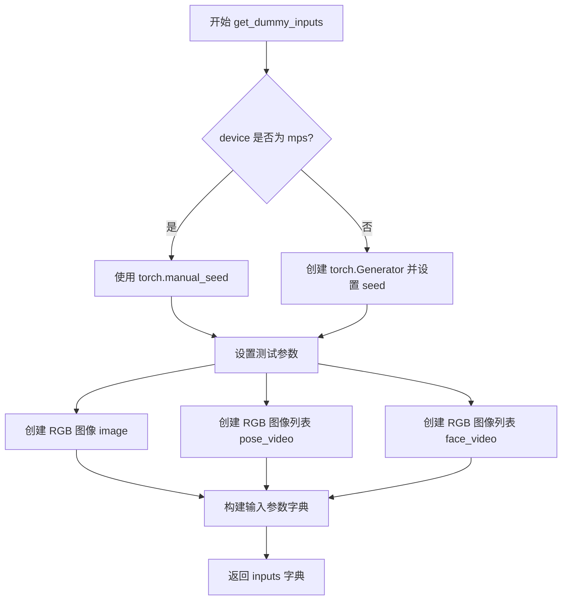

#### 带注释源码

```python
def get_dummy_inputs(self, device, seed=0):
    # 根据设备类型选择随机数生成方式
    # MPS 设备使用 torch.manual_seed，其他设备使用 torch.Generator
    if str(device).startswith("mps"):
        generator = torch.manual_seed(seed)
    else:
        generator = torch.Generator(device=device).manual_seed(seed)

    # 定义测试用的视频参数：17帧，16x16分辨率
    num_frames = 17
    height = 16
    width = 16
    face_height = 16
    face_width = 16

    # 创建虚拟输入图像和视频帧
    # image: 单张 RGB 图像，作为输入条件图像
    image = Image.new("RGB", (height, width))
    # pose_video: 姿态视频帧列表，用于姿态控制
    pose_video = [Image.new("RGB", (height, width))] * num_frames
    # face_video: 人脸视频帧列表，用于面部特征控制
    face_video = [Image.new("RGB", (face_height, face_width))] * num_frames

    # 构建完整的输入参数字典，包含管道所需的所有配置
    inputs = {
        "image": image,                                    # 输入条件图像
        "pose_video": pose_video,                         # 姿态控制视频
        "face_video": face_video,                         # 人脸控制视频
        "prompt": "dance monkey",                         # 文本提示词
        "negative_prompt": "negative",                    # 负面提示词
        "height": height,                                 # 输出高度
        "width": width,                                   # 输出宽度
        "segment_frame_length": 77,                      # 分段帧长度
        "num_inference_steps": 2,                         # 推理步数
        "mode": "animate",                                # 运行模式
        "prev_segment_conditioning_frames": 1,            # 前序分段条件帧数
        "generator": generator,                           # 随机数生成器
        "guidance_scale": 1.0,                            # 引导系数
        "output_type": "pt",                              # 输出类型为 PyTorch 张量
        "max_sequence_length": 16,                       # 最大序列长度
    }
    return inputs
```


### `WanAnimatePipelineFastTests.test_inference`

这是一个单元测试方法，用于验证 WanAnimatePipeline 在动画模式下的基本推理功能是否正常工作。

参数：

- `self`：隐式参数，类型为 `WanAnimatePipelineFastTests` 实例，表示测试类本身的引用

返回值：`None`，因为这是一个测试方法，通过断言来验证行为，不返回任何值

#### 流程图

```mermaid
flowchart TD
    A[开始测试] --> B[设置设备为CPU]
    B --> C[获取虚拟组件: get_dummy_components]
    C --> D[使用虚拟组件创建管道实例]
    D --> E[将管道移至CPU设备]
    E --> F[配置进度条: set_progress_bar_config]
    F --> G[获取虚拟输入: get_dummy_inputs]
    G --> H[执行管道推理: pipe\*\*inputs]
    H --> I[提取输出视频: frames[0]]
    I --> J{断言视频形状是否为17x3x16x16}
    J -->|是| K[生成期望的随机视频张量]
    J -->|否| L[测试失败]
    K --> M[计算实际输出与期望输出的最大差异]
    M --> N{最大差异是否小于等于1e10}
    N -->|是| O[测试通过]
    N -->|否| P[测试失败]
```

#### 带注释源码

```python
def test_inference(self):
    """Test basic inference in animation mode."""
    # 1. 设置测试设备为 CPU
    device = "cpu"

    # 2. 获取虚拟组件（用于测试的模拟模型组件）
    components = self.get_dummy_components()
    
    # 3. 使用虚拟组件实例化 WanAnimatePipeline 管道
    pipe = self.pipeline_class(**components)
    
    # 4. 将管道移动到指定设备（CPU）
    pipe.to(device)
    
    # 5. 配置进度条（disable=None 表示不禁用进度条）
    pipe.set_progress_bar_config(disable=None)

    # 6. 获取虚拟输入参数（包含提示词、图像、视频等）
    inputs = self.get_dummy_inputs(device)
    
    # 7. 执行管道推理，获取输出结果
    # 输出包含 frames 属性，其中 frames[0] 是第一个视频帧序列
    video = pipe(**inputs).frames[0]
    
    # 8. 断言验证：检查输出视频的形状是否为 (17, 3, 16, 16)
    # 17 表示帧数，3 表示通道数（RGB），16x16 表示空间分辨率
    self.assertEqual(video.shape, (17, 3, 16, 16))

    # 9. 生成期望的随机视频张量用于比较
    expected_video = torch.randn(17, 3, 16, 16)
    
    # 10. 计算实际输出与期望输出之间的最大绝对差异
    max_diff = np.abs(video - expected_video).max()
    
    # 11. 断言验证：检查最大差异是否在可接受范围内（<= 1e10）
    # 这是一个宽松的阈值，主要确保管道能够正常执行并产生数值输出
    self.assertLessEqual(max_diff, 1e10)
```


### `WanAnimatePipelineFastTests.test_inference_replacement`

测试管道在替换模式下的功能，使用背景视频和掩码视频进行推理验证。

参数：

- `self`：测试类的实例，隐含参数

返回值：`None`，该方法为测试方法，使用断言验证结果，不返回任何值

#### 流程图

```mermaid
flowchart TD
    A[开始 test_inference_replacement] --> B[设置设备为 'cpu']
    B --> C[获取虚拟组件: get_dummy_components]
    C --> D[使用组件创建 WanAnimatePipeline 实例]
    D --> E[将管道移至设备: pipe.to(device)]
    E --> F[设置进度条配置: set_progress_bar_config]
    F --> G[获取虚拟输入: get_dummy_inputs]
    G --> H[修改输入模式为 'replace']
    H --> I[设置帧数 num_frames=17, 高度宽度=16]
    I --> J[创建背景视频列表 background_video]
    J --> K[创建掩码视频列表 mask_video]
    K --> L[将 background_video 和 mask_video 添加到输入字典]
    L --> M[调用管道: pipe(**inputs)]
    M --> N[从返回结果中提取视频帧: .frames[0]]
    N --> O[断言视频形状等于 (17, 3, 16, 16)]
    O --> P[测试结束]
```

#### 带注释源码

```python
def test_inference_replacement(self):
    """Test the pipeline in replacement mode with background and mask videos."""
    # 1. 设置测试设备为 CPU
    device = "cpu"

    # 2. 获取虚拟组件（VAE、调度器、文本编码器、Transformer等）
    components = self.get_dummy_components()
    
    # 3. 使用虚拟组件创建 WanAnimatePipeline 管道实例
    pipe = self.pipeline_class(**components)
    
    # 4. 将管道移至指定设备
    pipe.to(device)
    
    # 5. 配置进度条（disable=None 表示不禁用）
    pipe.set_progress_bar_config(disable=None)

    # 6. 获取虚拟输入参数
    inputs = self.get_dummy_inputs(device)
    
    # 7. 将模式切换为替换模式（而非动画模式）
    inputs["mode"] = "replace"
    
    # 8. 设置视频参数
    num_frames = 17
    height = 16
    width = 16
    
    # 9. 创建背景视频（RGB图像列表）
    inputs["background_video"] = [Image.new("RGB", (height, width))] * num_frames
    
    # 10. 创建掩码视频（灰度图像列表）
    inputs["mask_video"] = [Image.new("L", (height, width))] * num_frames

    # 11. 执行管道推理，获取生成的视频
    video = pipe(**inputs).frames[0]
    
    # 12. 断言验证输出视频的形状
    # 期望形状: (17帧, 3通道, 16高度, 16宽度)
    self.assertEqual(video.shape, (17, 3, 16, 16))
```


### `WanAnimatePipelineFastTests.test_attention_slicing_forward_pass`

该方法用于测试 WanAnimatePipeline 的注意力切片（attention slicing）前向传播功能，但由于测试不被支持，当前实现为空方法。

参数：

- `self`：`WanAnimatePipelineFastTests`，方法所属的测试类实例

返回值：`None`，该方法被 `@unittest.skip` 装饰器跳过，且内部只有 `pass` 语句，不执行任何实际操作。

#### 流程图

```mermaid
flowchart TD
    A[开始] --> B{检查装饰器}
    B -->|有@unittest.skip| C[跳过测试]
    B -->|无装饰器| D[执行测试逻辑]
    C --> E[结束]
    D --> E
    
    style C fill:#f9f,stroke:#333
    style E fill:#9f9,stroke:#333
```

#### 带注释源码

```python
@unittest.skip("Test not supported")
def test_attention_slicing_forward_pass(self):
    """
    测试 WanAnimatePipeline 的注意力切片前向传播功能。
    
    该测试方法用于验证在启用注意力切片优化时，
    管道是否能正确执行推理。但由于当前测试不被支持，
    因此使用 @unittest.skip 装饰器跳过该测试。
    
    参数:
        self: WanAnimatePipelineFastTests 实例
        
    返回值:
        无返回值（None）
    """
    pass  # 测试未实现，仅作为占位符
```


### `WanAnimatePipelineFastTests.test_callback_inputs`

该测试方法用于验证 WanAnimatePipeline 的回调输入功能，即测试 `callback_on_step_end` 和 `callback_on_step_end_tensor_inputs` 参数是否正确工作。由于实现细节的复杂性（潜在变量在外部循环中被进一步处理），该测试目前被跳过。

参数：

- `self`：`WanAnimatePipelineFastTests` 类实例，隐式参数，表示测试类本身

返回值：`None`，测试方法无返回值（被 `@unittest.skip` 装饰器跳过）

#### 流程图

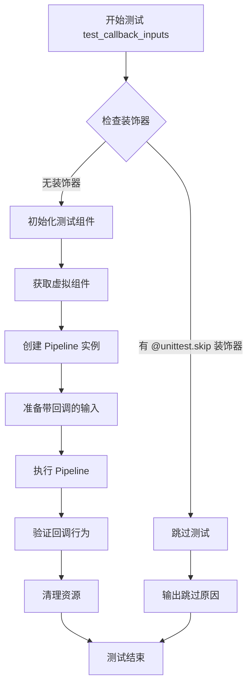

#### 带注释源码

```python
@unittest.skip(
    "Setting the Wan Animate latents to zero at the last denoising step does not guarantee that the output will be"
    " zero. I believe this is because the latents are further processed in the outer loop where we loop over"
    " inference segments."
)
def test_callback_inputs(self):
    """
    测试回调输入功能。
    
    该测试方法用于验证 pipeline 的 callback_on_step_end 和 
    callback_on_step_end_tensor_inputs 参数是否正常工作。
    
    当前实现：空方法（pass），被 unittest.skip 装饰器跳过。
    
    跳过原因：在 Wan Animate 中，将最后去噪步骤的潜在变量置零不能保证
    输出为零，因为潜在变量在遍历推理段的外部循环中被进一步处理。
    
    参数:
        self: WanAnimatePipelineFastTests 实例
    
    返回值:
        None
    
    备注:
        - required_optional_params 中包含此测试所需的回调参数
        - 同类中其他测试方法（如 test_inference）提供了测试模式参考
    """
    pass
```


### `WanAnimatePipelineIntegrationTests.setUp`

该方法是 WanAnimatePipelineIntegrationTests 测试类的初始化方法，在每个测试方法执行前被调用，用于清理 Python 垃圾回收和 GPU 缓存，确保测试环境处于干净状态。

参数：

- `self`：无参数，隐式参数，表示测试类实例本身

返回值：`None`，无返回值描述

#### 流程图

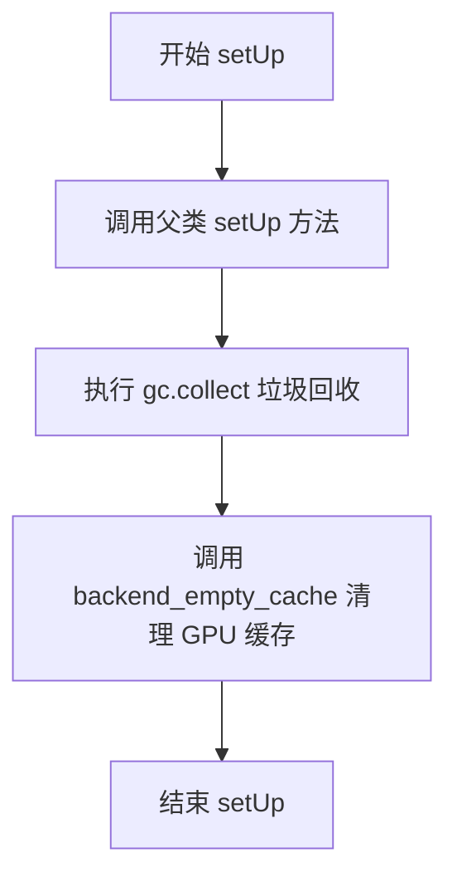

#### 带注释源码

```python
def setUp(self):
    """
    测试方法执行前的初始化操作。
    清理内存和 GPU 缓存，确保测试环境干净。
    """
    # 调用父类的 setUp 方法，执行 unittest.TestCase 的初始化逻辑
    super().setUp()
    
    # 手动触发 Python 垃圾回收，释放不再使用的对象内存
    gc.collect()
    
    # 清理 GPU 缓存，释放 CUDA 显存（使用 torch_device 指定设备）
    backend_empty_cache(torch_device)
```


### `WanAnimatePipelineIntegrationTests.tearDown`

该方法是测试类的清理方法，在每个测试用例执行完毕后自动调用，用于释放GPU内存并清理Python垃圾回收站，确保测试环境保持干净状态，避免内存泄漏影响后续测试。

参数：

- `self`：`WanAnimatePipelineIntegrationTests`，测试类实例本身

返回值：`None`，无返回值，仅执行清理操作

#### 流程图

```mermaid
flowchart TD
    A[tearDown 开始] --> B[调用 super().tearDown]
    B --> C[执行 gc.collect 强制垃圾回收]
    C --> D[调用 backend_empty_cache 清理GPU缓存]
    D --> E[tearDown 结束]
    
    style A fill:#f9f,stroke:#333
    style E fill:#9f9,stroke:#333
```

#### 带注释源码

```python
def tearDown(self):
    """
    测试用例清理方法
    
    在每个集成测试完成后执行清理操作:
    1. 调用父类的 tearDown 方法
    2. 强制 Python 垃圾回收器回收内存
    3. 清理 GPU/后端缓存以释放显存
    """
    # 调用父类的 tearDown 方法完成基础清理
    super().tearDown()
    
    # 强制调用 Python 的垃圾回收器,清理不再使用的对象
    gc.collect()
    
    # 调用后端工具函数清理 GPU 缓存 (如 torch.cuda.empty_cache)
    backend_empty_cache(torch_device)
```


### `WanAnimatePipelineIntegrationTests.test_wan_animate`

这是一个集成测试方法，用于测试 WanAnimatePipeline 的视频生成功能。目前该测试被标记为跳过（TODO: test needs to be implemented），尚未实现具体测试逻辑。

参数：

- `self`：`WanAnimatePipelineIntegrationTests`，测试类实例本身

返回值：`None`，该测试方法目前未实现，函数体为空的 `pass` 语句

#### 流程图

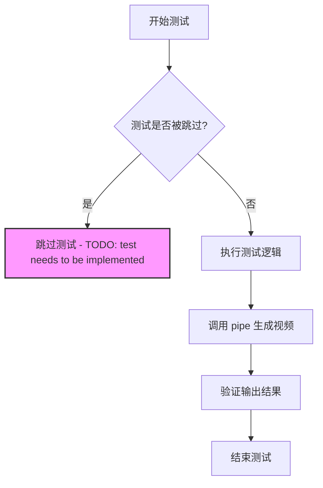

#### 带注释源码

```python
@unittest.skip("TODO: test needs to be implemented")
def test_wan_animate(self):
    """集成测试：测试 WanAnimatePipeline 的视频生成功能
    
    该测试方法用于验证 WanAnimatePipeline 在给定 prompt 
    "A painting of a squirrel eating a burger." 时的视频生成能力。
    
    当前状态：
    - 被 @unittest.skip 装饰器跳过，原因：TODO: test needs to be implemented
    - 被 @slow 装饰器标记为慢速测试
    - 被 @require_torch_accelerator 装饰器要求 CUDA 加速器
    
    测试逻辑待实现：
    - 设置测试设备和环境
    - 初始化 pipeline 组件
    - 准备输入参数（prompt、num_frames 等）
    - 调用 pipeline 执行推理
    - 验证输出的视频帧数量、尺寸等
    """
    pass
```

## 关键组件


### WanAnimatePipeline

主管道类，负责将图像转换为动画。集成了VAE、文本编码器、图像编码器和3D变换器模型，支持animate和replace两种模式，支持分段处理和条件帧处理。

### WanAnimateTransformer3DModel

核心3D变换器模型，负责潜在空间的去噪处理。支持时空注意力机制、运动编码、面部特征注入，包含rope_max_seq_len等参数控制序列长度。

### AutoencoderKLWan

VAE变分自编码器，负责图像的编码和解码。支持时序下采样（temperal_downsample），将图像压缩到潜在空间并重建。

### FlowMatchEulerDiscreteScheduler

基于Flow Match的欧拉离散调度器，用于去噪过程的噪声调度。shift参数控制噪声调度曲线。

### T5EncoderModel

文本编码器，将文本提示编码为文本嵌入向量，供变换器模型使用。

### CLIPVisionModelWithProjection

图像编码器，从输入图像中提取视觉特征，并投影到与文本嵌入相同的向量空间。

### 图像预处理模块

包含CLIPImageProcessor和PipelineTesterMixin，负责图像的预处理和管道的一致性测试。

### 测试组件

包含test_inference和test_inference_replacement方法，分别测试动画模式和替换模式的推理功能。

### 分段处理机制

支持segment_frame_length和prev_segment_conditioning_frames参数，实现长视频的分段生成和条件帧传递。

### 潜在技术债务

- test_attention_slicing_forward_pass被跳过
- test_callback_inputs被跳过且有已知问题
- test_wan_animate未实现
- segment_frame_length参数与num_frames的关系不明确（代码中有TODO注释）


## 问题及建议


### 已知问题

-   **测试断言无效**：在 `test_inference` 方法中，使用 `torch.randn(17, 3, 16, 16)` 生成期望值，每次调用都会产生不同的随机数，且阈值 `1e10` 过大导致测试基本失效，无法真正验证输出正确性
-   **未实现的集成测试**：`test_wan_animate` 方法被标记为 TODO 且直接跳过，缺少实际的集成测试验证
-   **硬编码参数缺乏说明**：`segment_frame_length=77` 存在 TODO 注释表明参数值不确定，且硬编码的数值（77、16、17 等）缺乏文档说明其选择依据
-   **设备兼容性处理不完整**：MPS 设备使用 `torch.manual_seed()` 而其他设备使用 `torch.Generator(device=device).manual_seed()`，处理方式不一致可能导致某些设备上测试结果不可复现
-   **被跳过的关键功能测试**：`test_callback_inputs` 和 `test_attention_slicing_forward_pass` 被永久跳过，导致注意力切片和回调功能无法验证
-   **重复设置随机种子**：在 `get_dummy_components` 内部多次调用 `torch.manual_seed(0)`，虽然便于复现但影响组件创建的独立性

### 优化建议

-   修复 `test_inference` 中的断言逻辑，使用固定随机种子生成期望输出或采用更严格的阈值（如 0.1）
-   实现 `test_wan_animate` 集成测试以验证完整pipeline功能
-   将硬编码的魔法数字提取为类常量或配置参数，并补充文档说明
-   统一随机种子设置方式，考虑在测试类级别使用 `@classmethod` 或 fixture 管理随机状态
-   重新评估被跳过的测试，若功能已支持则取消跳过，否则添加明确的实现计划
-   考虑添加参数化测试以覆盖不同配置组合（如不同帧数、分辨率等）

## 其它


### 设计目标与约束

该测试文件旨在验证 WanAnimatePipeline 的核心功能，包括动画生成模式和替换模式两种工作流程。设计目标是确保管道能够正确处理图像、视频帧输入，并生成符合预期尺寸的输出视频。约束条件包括：测试仅在 CPU 设备上运行，使用虚拟数据和固定随机种子以确保可重复性，部分测试被标记为跳过表示功能仍在开发中。

### 错误处理与异常设计

测试代码主要依赖 unittest 框架的断言机制进行错误检测。当管道输出形状不符合预期时触发 AssertionError；潜在异常包括：模型加载失败、GPU 内存不足、设备不兼容等。部分测试用 @unittest.skip 装饰器明确跳过，表明这些场景的错误处理尚未实现或存在已知限制。

### 数据流与状态机

测试数据流为：get_dummy_components() 创建虚拟模型组件 → get_dummy_inputs() 构建测试输入字典 → 调用 pipe(**inputs) 执行推理 → 验证输出 frames[0] 的形状和数值。状态机涉及两种模式切换："animate" 模式需要 image、pose_video、face_video；"replace" 模式额外需要 background_video 和 mask_video。

### 外部依赖与接口契约

核心依赖包括：diffusers 库 (WanAnimatePipeline, AutoencoderKLWan, WanAnimateTransformer3DModel, FlowMatchEulerDiscreteScheduler)、transformers 库 (T5EncoderModel, CLIPVisionModelWithProjection, CLIPImageProcessor)、PyTorch、NumPy、PIL。接口契约要求：pipeline 接受 prompt/negative_prompt、height/width、num_inference_steps、guidance_scale、mode 等参数，返回包含 frames 属性的对象。

### 配置参数说明

关键配置参数包括：num_inference_steps=2（推理步数）、height=16/width=16（输出分辨率）、segment_frame_length=77（分段长度）、mode="animate"/"replace"（工作模式）、prev_segment_conditioning_frames=1（条件帧数）、guidance_scale=1.0（引导系数）、max_sequence_length=16（最大序列长度）。VAE 配置：base_dim=3, z_dim=16, dim_mult=[1,1,1,1], num_res_blocks=1, temporal_downsample=[False,True,True]。Transformer 配置：patch_size=(1,2,2), num_attention_heads=2, attention_head_dim=12, num_layers=2。

### 测试策略

采用分层测试策略：WanAnimatePipelineFastTests 类进行快速单元测试，使用虚拟组件和确定性种子；WanAnimatePipelineIntegrationTests 类进行慢速集成测试，使用真实预训练模型。测试覆盖：基本推理功能、替换模式、注意力切片（跳过）、回调输入（跳过）。@slow 装饰器标识慢速测试，@require_torch_accelerator 要求 GPU 支持。

### 性能考虑与优化空间

当前测试使用极小参数模型（2层注意力、16维隐藏层）以加快测试速度。潜在优化方向：实现 xformers 注意力加速（当前 test_xformers_attention=False）、支持 DDUF 调度器（当前 supports_dduf=False）、减少虚拟组件的初始化开销。由于测试使用 CPU 设备，未涉及 GPU 内存管理和梯度计算优化。

### 安全性与合规性

代码遵循 Apache License 2.0 开源协议。测试不涉及真实用户数据或敏感信息，使用 hf-internal-testing/tiny-random-t5 虚拟模型。安全性考虑包括：确保模型加载路径安全、验证输入参数合法性、防止拒绝服务攻击（通过限制 num_inference_steps 和序列长度）。

### 已知问题与技术债务

测试代码中存在多处 TODO 和待实现项：test_attention_slicing_forward_pass 被跳过、test_callback_inputs 被跳过且存在已知问题（潜在零输出不符合预期）、test_wan_animate 标记为 TODO 需要实现。代码注释中提及 segment_frame_length=77 硬编码问题，理想情况下应设为 num_frames。此外，test_inference 中的数值比较使用宽松阈值 (max_diff <= 1e10)，表明输出稳定性可能存在问题。

    