# `diffusers\tests\pipelines\wan\test_wan_image_to_video.py` 详细设计文档

这是一个Wan Image to Video Pipeline的单元测试文件，包含了两个测试类（WanImageToVideoPipelineFastTests和WanFLFToVideoPipelineFastTests），用于测试图像到视频生成管道的推理、保存/加载和可选组件功能。

## 整体流程

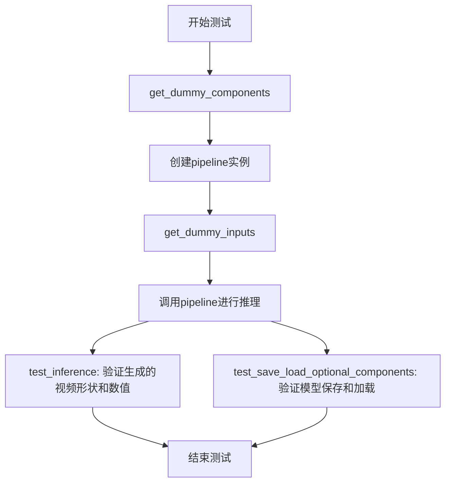

## 类结构

```
PipelineTesterMixin (混入类)
└── WanImageToVideoPipelineFastTests (测试类)
    ├── get_dummy_components()
    ├── get_dummy_inputs()
    ├── test_inference()
    ├── test_attention_slicing_forward_pass()
    ├── test_inference_batch_single_identical()
    └── test_save_load_optional_components()
WanFLFToVideoPipelineFastTests (测试类)
    ├── get_dummy_components()
    ├── get_dummy_inputs()
    ├── test_inference()
    ├── test_attention_slicing_forward_pass()
    ├── test_inference_batch_single_identical()
    └── test_save_load_optional_components()
```

## 全局变量及字段


### `enable_full_determinism`
    
Enables deterministic operations for reproducibility in testing

类型：`function`
    


### `torch_device`
    
The device to run torch operations on (e.g., 'cuda', 'cpu')

类型：`str`
    


### `TEXT_TO_IMAGE_BATCH_PARAMS`
    
Set of batch parameter names for text-to-image pipeline testing

类型：`set`
    


### `TEXT_TO_IMAGE_IMAGE_PARAMS`
    
Set of image parameter names for text-to-image pipeline testing

类型：`set`
    


### `TEXT_TO_IMAGE_PARAMS`
    
Set of parameter names for text-to-image pipeline testing

类型：`set`
    


### `PipelineTesterMixin`
    
Mixin class providing common test utilities for diffusion pipeline testing

类型：`class`
    


### `WanImageToVideoPipelineFastTests.pipeline_class`
    
The pipeline class being tested (WanImageToVideoPipeline)

类型：`type`
    


### `WanImageToVideoPipelineFastTests.params`
    
Set of pipeline parameters for testing, excluding cross_attention_kwargs, height, and width

类型：`set`
    


### `WanImageToVideoPipelineFastTests.batch_params`
    
Set of batch parameter names for text-to-image pipeline testing

类型：`set`
    


### `WanImageToVideoPipelineFastTests.image_params`
    
Set of image parameter names for text-to-image pipeline testing

类型：`set`
    


### `WanImageToVideoPipelineFastTests.image_latents_params`
    
Set of image latents parameter names for text-to-image pipeline testing

类型：`set`
    


### `WanImageToVideoPipelineFastTests.required_optional_params`
    
Frozenset of optional parameters that are required for the pipeline

类型：`frozenset`
    


### `WanImageToVideoPipelineFastTests.test_xformers_attention`
    
Flag indicating whether xformers attention testing is supported

类型：`bool`
    


### `WanImageToVideoPipelineFastTests.supports_dduf`
    
Flag indicating whether the pipeline supports DDUF (Decoupled Diffusion Upsampling Flow)

类型：`bool`
    


### `WanFLFToVideoPipelineFastTests.pipeline_class`
    
The pipeline class being tested (WanImageToVideoPipeline for FLF t2v)

类型：`type`
    


### `WanFLFToVideoPipelineFastTests.params`
    
Set of pipeline parameters for testing, excluding cross_attention_kwargs, height, and width

类型：`set`
    


### `WanFLFToVideoPipelineFastTests.batch_params`
    
Set of batch parameter names for text-to-image pipeline testing

类型：`set`
    


### `WanFLFToVideoPipelineFastTests.image_params`
    
Set of image parameter names for text-to-image pipeline testing

类型：`set`
    


### `WanFLFToVideoPipelineFastTests.image_latents_params`
    
Set of image latents parameter names for text-to-image pipeline testing

类型：`set`
    


### `WanFLFToVideoPipelineFastTests.required_optional_params`
    
Frozenset of optional parameters that are required for the pipeline

类型：`frozenset`
    


### `WanFLFToVideoPipelineFastTests.test_xformers_attention`
    
Flag indicating whether xformers attention testing is supported

类型：`bool`
    


### `WanFLFToVideoPipelineFastTests.supports_dduf`
    
Flag indicating whether the pipeline supports DDUF (Decoupled Diffusion Upsampling Flow)

类型：`bool`
    
    

## 全局函数及方法


### `WanImageToVideoPipelineFastTests.get_dummy_components`

该方法用于创建图像到视频管道测试所需的虚拟（dummy）组件，包括 VAE、调度器、文本编码器、Transformer 模型、图像编码器和图像处理器等，以便在单元测试中进行快速的推理测试而不需要加载真实的预训练模型。

参数：

- `self`：隐式参数，类型为 `WanImageToVideoPipelineFastTests` 实例，代表测试类本身

返回值：`Dict[str, Any]`，返回一个包含所有管道组件的字典，包括：

- `transformer`: WanTransformer3DModel 实例
- `vae`: AutoencoderKLWan 实例
- `scheduler`: FlowMatchEulerDiscreteScheduler 实例
- `text_encoder`: T5EncoderModel 实例
- `tokenizer`: AutoTokenizer 实例
- `image_encoder`: CLIPVisionModelWithProjection 实例
- `image_processor`: CLIPImageProcessor 实例
- `transformer_2`: None（可选组件）

#### 流程图

```mermaid
flowchart TD
    A[开始 get_dummy_components] --> B[设置随机种子 torch.manual_seed(0)]
    B --> C[创建 AutoencoderKLWan vae 组件]
    C --> D[创建 FlowMatchEulerDiscreteScheduler 调度器]
    D --> E[加载 T5EncoderModel 文本编码器]
    E --> F[加载 AutoTokenizer 分词器]
    F --> G[创建 WanTransformer3DModel Transformer 组件]
    G --> H[创建 CLIPVisionConfig 图像编码器配置]
    H --> I[创建 CLIPVisionModelWithProjection 图像编码器]
    I --> J[创建 CLIPImageProcessor 图像处理器]
    J --> K[构建 components 字典]
    K --> L[返回 components 字典]
```

#### 带注释源码

```python
def get_dummy_components(self):
    """
    创建用于测试的虚拟组件字典，包含图像到视频管道所需的所有模型和处理器。
    """
    # 设置随机种子以确保测试可重复性
    torch.manual_seed(0)
    
    # 创建 VAE（变分自编码器）组件，用于图像/视频的编码和解码
    vae = AutoencoderKLWan(
        base_dim=3,              # 基础维度
        z_dim=16,                # 潜在空间维度
        dim_mult=[1, 1, 1, 1],   # 各层维度倍数
        num_res_blocks=1,        # 残差块数量
        temperal_downsample=[False, True, True],  # 时间下采样配置
    )

    torch.manual_seed(0)
    # 创建调度器，用于扩散模型的推理步骤调度
    # TODO: impl FlowDPMSolverMultistepScheduler
    scheduler = FlowMatchEulerDiscreteScheduler(shift=7.0)
    
    # 加载小型 T5 文本编码器模型
    text_encoder = T5EncoderModel.from_pretrained("hf-internal-testing/tiny-random-t5")
    
    # 加载对应的分词器
    tokenizer = AutoTokenizer.from_pretrained("hf-internal-testing/tiny-random-t5")

    torch.manual_seed(0)
    # 创建 3D Transformer 模型，用于图像到视频的生成
    transformer = WanTransformer3DModel(
        patch_size=(1, 2, 2),          # patch 尺寸
        num_attention_heads=2,         # 注意力头数量
        attention_head_dim=12,         # 注意力头维度
        in_channels=36,                # 输入通道数
        out_channels=16,               # 输出通道数
        text_dim=32,                   # 文本嵌入维度
        freq_dim=256,                  # 频率维度
        ffn_dim=32,                    # 前馈网络维度
        num_layers=2,                  # Transformer 层数
        cross_attn_norm=True,          # 跨注意力归一化
        qk_norm="rms_norm_across_heads",  # QK 归一化方式
        rope_max_seq_len=32,           # RoPE 最大序列长度
        image_dim=4,                   # 图像嵌入维度
    )

    torch.manual_seed(0)
    # 配置 CLIP 图像编码器
    image_encoder_config = CLIPVisionConfig(
        hidden_size=4,             # 隐藏层大小
        projection_dim=4,         # 投影维度
        num_hidden_layers=2,      # 隐藏层数量
        num_attention_heads=2,    # 注意力头数量
        image_size=32,            # 图像尺寸
        intermediate_size=16,    # 中间层维度
        patch_size=1,             # patch 尺寸
    )
    # 创建 CLIP 视觉模型并带投影
    image_encoder = CLIPVisionModelWithProjection(image_encoder_config)

    torch.manual_seed(0)
    # 创建 CLIP 图像处理器
    image_processor = CLIPImageProcessor(crop_size=32, size=32)

    # 组装所有组件到字典中
    components = {
        "transformer": transformer,          # 主 Transformer 模型
        "vae": vae,                          # VAE 编码器/解码器
        "scheduler": scheduler,              # 扩散调度器
        "text_encoder": text_encoder,       # 文本编码器
        "tokenizer": tokenizer,              # 文本分词器
        "image_encoder": image_encoder,     # 图像编码器
        "image_processor": image_processor,  # 图像处理器
        "transformer_2": None,               # 可选的第二个 Transformer（暂未使用）
    }
    return components
```

---

### `WanFLFToVideoPipelineFastTests.get_dummy_components`

该方法同样用于创建虚拟组件，但针对的是 FLF（First-Last-Frame）图像到视频管道测试，与 `WanImageToVideoPipelineFastTests` 的主要区别在于图像编码器配置中的 `image_size` 和 `image_processor` 的尺寸为 4（而非 32），以及 `transformer` 配置中增加了 `pos_embed_seq_len` 参数。

参数：

- `self`：隐式参数，类型为 `WanFLFToVideoPipelineFastTests` 实例

返回值：`Dict[str, Any]`，返回包含管道组件的字典，结构与上述类似，但组件参数略有不同。

#### 流程图

```mermaid
flowchart TD
    A[开始 get_dummy_components] --> B[设置随机种子 torch.manual_seed(0)]
    B --> C[创建 AutoencoderKLWan vae 组件]
    C --> D[创建 FlowMatchEulerDiscreteScheduler 调度器]
    D --> E[加载 T5EncoderModel 文本编码器]
    E --> F[加载 AutoTokenizer 分词器]
    F --> G[创建 WanTransformer3DModel Transformer 组件<br>额外参数: pos_embed_seq_len=2 * (4 * 4 + 1)]
    G --> H[创建 CLIPVisionConfig 图像编码器配置<br>image_size=4]
    H --> I[创建 CLIPVisionModelWithProjection 图像编码器]
    I --> J[创建 CLIPImageProcessor 图像处理器<br>crop_size=4, size=4]
    J --> K[构建 components 字典]
    K --> L[返回 components 字典]
```

#### 带注释源码

```python
def get_dummy_components(self):
    """
    创建用于 FLF（首尾帧）图像到视频管道测试的虚拟组件。
    """
    torch.manual_seed(0)
    
    # 创建 VAE 组件
    vae = AutoencoderKLWan(
        base_dim=3,
        z_dim=16,
        dim_mult=[1, 1, 1, 1],
        num_res_blocks=1,
        temperal_downsample=[False, True, True],
    )

    torch.manual_seed(0)
    # 创建调度器
    scheduler = FlowMatchEulerDiscreteScheduler(shift=7.0)
    
    # 加载文本编码器和分词器
    text_encoder = T5EncoderModel.from_pretrained("hf-internal-testing/tiny-random-t5")
    tokenizer = AutoTokenizer.from_pretrained("hf-internal-testing/tiny-random-t5")

    torch.manual_seed(0)
    # 创建 Transformer 模型，增加了位置嵌入序列长度参数
    transformer = WanTransformer3DModel(
        patch_size=(1, 2, 2),
        num_attention_heads=2,
        attention_head_dim=12,
        in_channels=36,
        out_channels=16,
        text_dim=32,
        freq_dim=256,
        ffn_dim=32,
        num_layers=2,
        cross_attn_norm=True,
        qk_norm="rms_norm_across_heads",
        rope_max_seq_len=32,
        image_dim=4,
        pos_embed_seq_len=2 * (4 * 4 + 1),  # 额外参数：位置嵌入序列长度
    )

    torch.manual_seed(0)
    # 配置图像编码器（使用较小的 image_size=4）
    image_encoder_config = CLIPVisionConfig(
        hidden_size=4,
        projection_dim=4,
        num_hidden_layers=2,
        num_attention_heads=2,
        image_size=4,              # 较小的图像尺寸
        intermediate_size=16,
        patch_size=1,
    )
    image_encoder = CLIPVisionModelWithProjection(image_encoder_config)

    torch.manual_seed(0)
    # 创建图像处理器（使用较小的尺寸）
    image_processor = CLIPImageProcessor(crop_size=4, size=4)

    # 组装组件字典
    components = {
        "transformer": transformer,
        "vae": vae,
        "scheduler": scheduler,
        "text_encoder": text_encoder,
        "tokenizer": tokenizer,
        "image_encoder": image_encoder,
        "image_processor": image_processor,
        "transformer_2": None,
    }
    return components
```


### `WanImageToVideoPipelineFastTests.get_dummy_inputs`

该方法用于生成虚拟输入参数，为 Wan 图像转视频管道的推理测试提供必要的输入数据，包括图像、提示词、负提示词、尺寸、生成器、推理步数、引导 scale、帧数和最大序列长度等。

参数：

- `self`：隐式参数，类型为 `WanImageToVideoPipelineFastTests` 实例，表示类方法本身的引用
- `device`：`str`，目标设备字符串，用于创建生成器或设置种子，指定运行推理的设备（如 "cpu"、"cuda" 等）
- `seed`：`int`（默认值为 `0`），随机种子，用于初始化生成器以保证结果可复现

返回值：`Dict[str, Any]`，返回包含所有虚拟输入参数的字典，包括图像、提示词、负提示词、高度、宽度、生成器、推理步数、引导 scale、帧数、最大序列长度和输出类型

#### 流程图

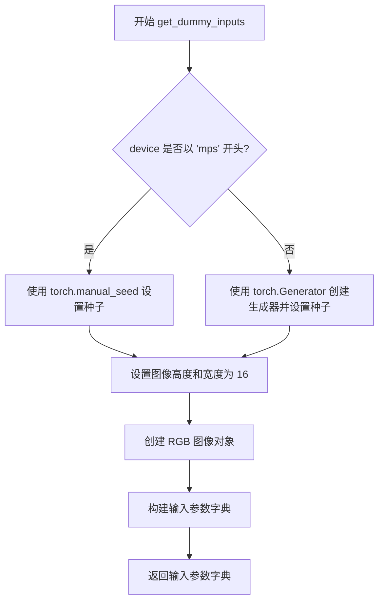

#### 带注释源码

```python
def get_dummy_inputs(self, device, seed=0):
    """
    生成用于管道推理测试的虚拟输入参数。
    
    参数:
        device: 目标设备字符串，用于创建生成器。
        seed: 随机种子，默认值为 0。
    
    返回:
        包含所有管道推理所需参数的字典。
    """
    # 针对 Apple MPS 设备使用特殊的随机种子设置方式
    if str(device).startswith("mps"):
        generator = torch.manual_seed(seed)
    else:
        # 为其他设备（CPU/CUDA）创建 PyTorch 生成器
        generator = torch.Generator(device=device).manual_seed(seed)
    
    # 定义虚拟图像的尺寸
    image_height = 16
    image_width = 16
    
    # 创建一个虚拟 RGB 图像（PIL Image 对象）
    image = Image.new("RGB", (image_width, image_height))
    
    # 构建完整的输入参数字典
    inputs = {
        "image": image,                     # 输入图像
        "prompt": "dance monkey",          # 文本提示词
        "negative_prompt": "negative",      # 负向提示词（TODO 标记待改进）
        "height": image_height,            # 输出高度
        "width": image_width,              # 输出宽度
        "generator": generator,            # 随机生成器
        "num_inference_steps": 2,          # 推理步数
        "guidance_scale": 6.0,             # 引导强度
        "num_frames": 9,                   # 生成帧数
        "max_sequence_length": 16,         # 最大序列长度
        "output_type": "pt",               # 输出类型（PyTorch 张量）
    }
    return inputs
```

---

### `WanFLFToVideoPipelineFastTests.get_dummy_inputs`

该方法同样用于生成虚拟输入参数，为 Wan FLF（First-Last Frame）图像转视频管道的推理测试提供必要的输入数据。相比第一个方法，此版本额外包含 `last_image` 参数，支持基于首尾帧的视频生成任务。

参数：

- `self`：隐式参数，类型为 `WanFLFToVideoPipelineFastTests` 实例，表示类方法本身的引用
- `device`：`str`，目标设备字符串，用于创建生成器或设置种子，指定运行推理的设备（如 "cpu"、"cuda" 等）
- `seed`：`int`（默认值为 `0`），随机种子，用于初始化生成器以保证结果可复现

返回值：`Dict[str, Any]`，返回包含所有虚拟输入参数的字典，包括图像、首尾帧、提示词、负提示词、高度、宽度、生成器、推理步数、引导 scale、帧数、最大序列长度和输出类型

#### 流程图

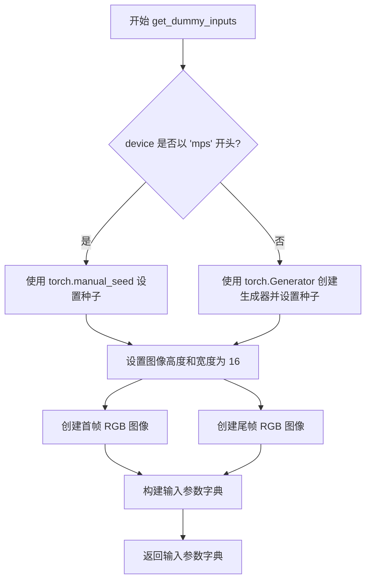

#### 带注释源码

```python
def get_dummy_inputs(self, device, seed=0):
    """
    生成用于 Wan FLF（首尾帧）图像转视频管道推理测试的虚拟输入参数。
    
    参数:
        device: 目标设备字符串，用于创建生成器。
        seed: 随机种子，默认值为 0。
    
    返回:
        包含所有管道推理所需参数的字典，包括首帧和尾帧图像。
    """
    # 针对 Apple MPS 设备使用特殊的随机种子设置方式
    if str(device).startswith("mps"):
        generator = torch.manual_seed(seed)
    else:
        # 为其他设备（CPU/CUDA）创建 PyTorch 生成器
        generator = torch.Generator(device=device).manual_seed(seed)
    
    # 定义虚拟图像的尺寸
    image_height = 16
    image_width = 16
    
    # 创建首帧和尾帧虚拟 RGB 图像（PIL Image 对象）
    # FLF 管道需要首帧和尾帧来生成中间帧视频
    image = Image.new("RGB", (image_width, image_height))
    last_image = Image.new("RGB", (image_width, image_height))
    
    # 构建完整的输入参数字典
    inputs = {
        "image": image,                     # 输入首帧图像
        "last_image": last_image,           # 输入尾帧图像（FLF 专用）
        "prompt": "dance monkey",          # 文本提示词
        "negative_prompt": "negative",      # 负向提示词
        "height": image_height,            # 输出高度
        "width": image_width,              # 输出宽度
        "generator": generator,            # 随机生成器
        "num_inference_steps": 2,          # 推理步数
        "guidance_scale": 6.0,             # 引导强度
        "num_frames": 9,                   # 生成帧数
        "max_sequence_length": 16,         # 最大序列长度
        "output_type": "pt",               # 输出类型（PyTorch 张量）
    }
    return inputs
```


### `WanImageToVideoPipelineFastTests.test_inference`

这是一个单元测试方法，用于测试 WanImageToVideoPipeline 的推理功能。方法创建虚拟组件（VAE、transformer、scheduler 等），构建管道，执行图像到视频的推理，验证生成视频的形状为 (9, 3, 16, 16) 且数值与预期值接近。

参数：

- `self`：无参数，测试类实例本身

返回值：`None`，无返回值（测试方法）

#### 流程图

```mermaid
flowchart TD
    A[开始 test_inference 测试] --> B[设置设备为 CPU]
    B --> C[调用 get_dummy_components 获取虚拟组件]
    C --> D[使用虚拟组件创建 WanImageToVideoPipeline 实例]
    D --> E[将管道移至 CPU 设备]
    E --> F[设置进度条配置 disable=None]
    F --> G[调用 get_dummy_inputs 获取虚拟输入]
    G --> H[执行管道推理: pipe\*\*inputs]
    H --> I[获取生成的视频帧: video.frames]
    I --> J[验证视频形状为 (9, 3, 16, 16)]
    J --> K[定义期望的数值切片 expected_slice]
    K --> L[提取生成视频的首尾各8个数值]
    L --> M[验证生成数值与期望值的误差在 1e-3 范围内]
    M --> N[测试通过 - 结束]
```

#### 带注释源码

```python
def test_inference(self):
    """测试 WanImageToVideoPipeline 的推理功能"""
    
    # 设置测试设备为 CPU
    device = "cpu"

    # 获取虚拟组件（用于测试的模拟模型组件）
    components = self.get_dummy_components()
    
    # 使用虚拟组件实例化图像到视频管道
    pipe = self.pipeline_class(**components)
    
    # 将管道移至指定设备（CPU）
    pipe.to(device)
    
    # 配置进度条（disable=None 表示不禁用进度条）
    pipe.set_progress_bar_config(disable=None)

    # 获取测试用的虚拟输入数据
    inputs = self.get_dummy_inputs(device)
    
    # 执行管道推理，生成视频帧
    # 返回值是一个 PipelineOutput 对象，包含 frames 属性
    video = pipe(**inputs).frames
    
    # 获取第一个（通常也是唯一的）生成的视频
    generated_video = video[0]
    
    # 断言验证：生成的视频形状应为 (9, 3, 16, 16)
    # 9 帧，3 通道（RGB），16x16 像素
    self.assertEqual(generated_video.shape, (9, 3, 16, 16))

    # 定义期望的数值切片（用于数值验证）
    # fmt: off
    expected_slice = torch.tensor([
        0.4525, 0.4525, 0.4497, 0.4536, 0.452, 0.4529, 0.454, 0.4535, 
        0.5072, 0.5527, 0.5165, 0.5244, 0.5481, 0.5282, 0.5208, 0.5214
    ])
    # fmt: on

    # 展平生成的视频张量
    generated_slice = generated_video.flatten()
    
    # 提取首尾各 8 个数值，组成 16 个值的切片进行对比
    # 这样可以验证视频帧的开始和结束部分的数值
    generated_slice = torch.cat([generated_slice[:8], generated_slice[-8:]])
    
    # 断言验证：生成数值与期望值的误差应在允许范围内 (atol=1e-3)
    self.assertTrue(torch.allclose(generated_slice, expected_slice, atol=1e-3))
```


### `test_attention_slicing_forward_pass`

该方法是用于测试注意力切片（attention slicing）前向传播功能的测试用例，目前被标记为不支持且未实现具体测试逻辑。

参数：

- `self`：`WanImageToVideoPipelineFastTests` 或 `WanFLFToVideoPipelineFastCases` 实例，表示调用该方法的类实例本身。

返回值：`None`，该方法未实现具体测试逻辑，仅包含 `pass` 语句。

#### 流程图

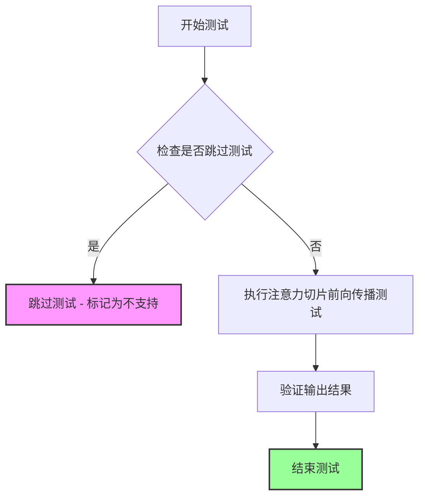

#### 带注释源码

```python
@unittest.skip("Test not supported")
def test_attention_slicing_forward_pass(self):
    """
    测试注意力切片（attention slicing）前向传播功能。
    
    该测试方法用于验证模型在使用注意力切片优化时的前向传播是否正确。
    注意力切片是一种内存优化技术，通过分片处理注意力矩阵来降低显存占用。
    
    当前状态：
    - 该测试被标记为不支持（@unittest.skip装饰器）
    - 方法体仅包含pass语句，未实现任何测试逻辑
    - 可能原因：当前Pipeline不支持注意力切片功能，或该功能尚未实现
    """
    pass  # 空实现，等待未来功能支持后填充具体测试逻辑
```


### `WanImageToVideoPipelineFastTests.test_inference_batch_single_identical`

该方法是一个测试用例，用于验证批量推理时单个样本与单独推理的结果一致性，但目前已被跳过（标记为TODO，需要重新访问）。

参数：

- `self`：`WanImageToVideoPipelineFastTests`，表示 unittest.TestCase 的实例对象

返回值：`None`，因为方法体只有 `pass` 语句，不返回任何值

#### 流程图

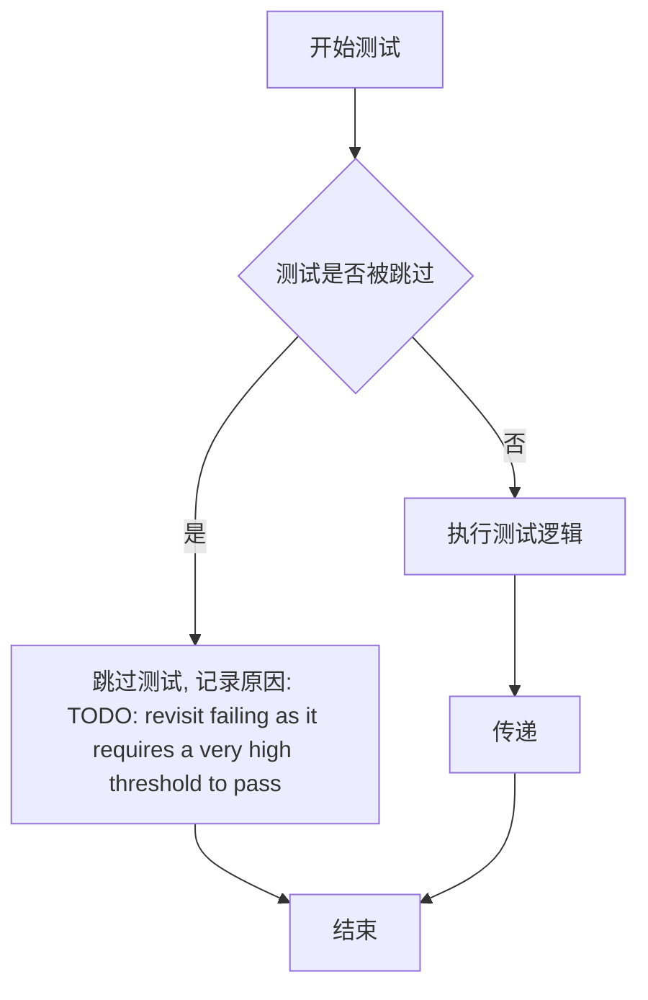

#### 带注释源码

```python
@unittest.skip("TODO: revisit failing as it requires a very high threshold to pass")
def test_inference_batch_single_identical(self):
    """
    测试方法：test_inference_batch_single_identical
    
    目的：验证批量推理时，单个样本的结果应与单独推理的结果完全一致。
    
    当前状态：该测试已被跳过，原因是需要非常高的阈值才能通过测试，需要重新访问和修复。
    
    参数：
        - self: WanImageToVideoPipelineFastTests 的实例对象，继承自 unittest.TestCase
    
    返回值：
        - None
    
    注意：
        - 该方法体只有 pass 语句，实际测试逻辑未实现
        - 使用 @unittest.skip 装饰器跳过此测试
    """
    pass
```


### `WanImageToVideoPipelineFastTests.test_save_load_optional_components`

该测试方法验证了 Wan 图像到视频管道在保存和加载时处理可选组件（特别是 `transformer_2`）的能力，确保当可选组件为 `None` 时，保存加载流程仍能正确保持其状态，并且加载后的推理结果与原始推理结果保持一致（差异在允许范围内）。

参数：

-  `expected_max_difference`：`float`，可选参数，默认为 `1e-4`，指定保存/加载前后两次推理结果的最大允许差异

返回值：`None`，该方法为测试用例，无返回值

#### 流程图

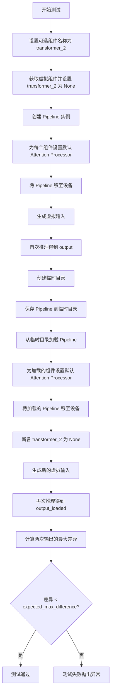

#### 带注释源码

```python
def test_save_load_optional_components(self, expected_max_difference=1e-4):
    # 定义要测试的可选组件名称
    optional_component = "transformer_2"

    # 获取虚拟组件字典，并将指定的可选组件设置为 None
    components = self.get_dummy_components()
    components[optional_component] = None
    
    # 使用组件字典实例化 Pipeline
    pipe = self.pipeline_class(**components)
    
    # 遍历所有组件，为具有 set_default_attn_processor 方法的组件设置默认注意力处理器
    for component in pipe.components.values():
        if hasattr(component, "set_default_attn_processor"):
            component.set_default_attn_processor()
    
    # 将 Pipeline 移动到指定的计算设备
    pipe.to(torch_device)
    # 配置进度条（disable=None 表示不禁用进度条）
    pipe.set_progress_bar_config(disable=None)

    # 获取用于生成器的 CPU 设备
    generator_device = "cpu"
    # 生成虚拟输入参数
    inputs = self.get_dummy_inputs(generator_device)
    
    # 设置随机种子以确保可重复性
    torch.manual_seed(0)
    # 执行首次推理，获取原始输出（取第一帧/第一元素）
    output = pipe(**inputs)[0]

    # 使用临时目录进行保存/加载测试
    with tempfile.TemporaryDirectory() as tmpdir:
        # 将 Pipeline 保存到临时目录（不使用安全序列化）
        pipe.save_pretrained(tmpdir, safe_serialization=False)
        
        # 从保存的目录重新加载 Pipeline
        pipe_loaded = self.pipeline_class.from_pretrained(tmpdir)
        
        # 为加载的 Pipeline 组件设置默认注意力处理器
        for component in pipe_loaded.components.values():
            if hasattr(component, "set_default_attn_processor"):
                component.set_default_attn_processor()
        
        # 将加载的 Pipeline 移到设备上
        pipe_loaded.to(torch_device)
        pipe_loaded.set_progress_bar_config(disable=None)

    # 断言：验证加载后的可选组件仍然为 None
    self.assertTrue(
        getattr(pipe_loaded, optional_component) is None,
        f"`{optional_component}` did not stay set to None after loading.",
    )

    # 生成新的虚拟输入用于第二次推理
    inputs = self.get_dummy_inputs(generator_device)
    # 重新设置随机种子以确保可重复性
    torch.manual_seed(0)
    # 执行第二次推理（使用加载后的 Pipeline）
    output_loaded = pipe_loaded(**inputs)[0]

    # 计算两次输出之间的最大绝对差异
    max_diff = np.abs(output.detach().cpu().numpy() - output_loaded.detach().cpu().numpy()).max()
    
    # 断言：验证差异小于允许的最大差异
    self.assertLess(max_diff, expected_max_difference)
```


### `WanImageToVideoPipelineFastTests.get_dummy_components`

该方法用于创建并返回 WanImageToVideoPipeline（图像到视频生成管道）所需的所有虚拟（测试用）组件，包括 VAE、调度器、文本编码器、分词器、图像编码器和图像处理器等，以便进行单元测试。

参数：

- 该方法无显式参数（隐含参数 `self` 为测试类实例）

返回值：`Dict[str, Any]`，返回一个包含管道所需全部虚拟组件的字典

#### 流程图

```mermaid
flowchart TD
    A[开始 get_dummy_components] --> B[设置随机种子 torch.manual_seed(0)]
    B --> C[创建 VAE: AutoencoderKLWan]
    C --> D[创建调度器: FlowMatchEulerDiscreteScheduler]
    D --> E[加载文本编码器: T5EncoderModel]
    E --> F[加载分词器: AutoTokenizer]
    F --> G[创建 Transformer: WanTransformer3DModel]
    G --> H[创建图像编码器配置: CLIPVisionConfig]
    H --> I[创建图像编码器: CLIPVisionModelWithProjection]
    I --> J[创建图像处理器: CLIPImageProcessor]
    J --> K[组装组件字典]
    K --> L[返回 components 字典]
```

#### 带注释源码

```python
def get_dummy_components(self):
    """
    创建用于测试的虚拟组件字典，包含 WanImageToVideoPipeline 的所有必要组件。
    
    Returns:
        Dict[str, Any]: 包含以下键的字典:
            - transformer: WanTransformer3DModel 实例
            - vae: AutoencoderKLWan 实例
            - scheduler: FlowMatchEulerDiscreteScheduler 实例
            - text_encoder: T5EncoderModel 实例
            - tokenizer: AutoTokenizer 实例
            - image_encoder: CLIPVisionModelWithProjection 实例
            - image_processor: CLIPImageProcessor 实例
            - transformer_2: None (可选组件)
    """
    # 设置随机种子以确保测试可重复性
    torch.manual_seed(0)
    
    # 创建 VAE (变分自编码器) 模型
    # base_dim: 基础维度, z_dim: 潜在空间维度
    # dim_mult: 维度 multipliers, num_res_blocks: 残差块数量
    # temperal_downsample: 时间下采样配置
    vae = AutoencoderKLWan(
        base_dim=3,
        z_dim=16,
        dim_mult=[1, 1, 1, 1],
        num_res_blocks=1,
        temperal_downsample=[False, True, True],
    )

    torch.manual_seed(0)
    # 创建调度器：使用 FlowMatchEulerDiscreteScheduler
    # shift=7.0: 时间步偏移参数
    scheduler = FlowMatchEulerDiscreteScheduler(shift=7.0)
    
    # 加载预训练的 T5 文本编码器 (使用 tiny-random-t5 以加快测试)
    text_encoder = T5EncoderModel.from_pretrained("hf-internal-testing/tiny-random-t5")
    
    # 加载对应的分词器
    tokenizer = AutoTokenizer.from_pretrained("hf-internal-testing/tiny-random-t5")

    torch.manual_seed(0)
    # 创建 3D Transformer 模型 (用于图像到视频生成)
    # patch_size: 时空 patch 大小, num_attention_heads: 注意力头数
    # attention_head_dim: 注意力头维度, in_channels/out_channels: 输入输出通道数
    # text_dim: 文本嵌入维度, freq_dim: 频率维度, ffn_dim: 前馈网络维度
    # num_layers: 层数, cross_attn_norm: 跨注意力归一化
    # qk_norm: Query-Key 归一化方式, rope_max_seq_len: RoPE 最大序列长度
    # image_dim: 图像嵌入维度
    transformer = WanTransformer3DModel(
        patch_size=(1, 2, 2),
        num_attention_heads=2,
        attention_head_dim=12,
        in_channels=36,
        out_channels=16,
        text_dim=32,
        freq_dim=256,
        ffn_dim=32,
        num_layers=2,
        cross_attn_norm=True,
        qk_norm="rms_norm_across_heads",
        rope_max_seq_len=32,
        image_dim=4,
    )

    torch.manual_seed(0)
    # 配置 CLIP 视觉编码器 (用于图像编码)
    # hidden_size: 隐藏层大小, projection_dim: 投影维度
    # num_hidden_layers: 隐藏层数量, num_attention_heads: 注意力头数
    # image_size: 图像尺寸, intermediate_size: 中间层大小, patch_size: patch 大小
    image_encoder_config = CLIPVisionConfig(
        hidden_size=4,
        projection_dim=4,
        num_hidden_layers=2,
        num_attention_heads=2,
        image_size=32,
        intermediate_size=16,
        patch_size=1,
    )
    
    # 创建 CLIP 视觉模型 (带投影)
    image_encoder = CLIPVisionModelWithProjection(image_encoder_config)

    torch.manual_seed(0)
    # 创建图像预处理器
    # crop_size: 裁剪尺寸, size: 输入图像尺寸
    image_processor = CLIPImageProcessor(crop_size=32, size=32)

    # 组装所有组件到字典中
    components = {
        "transformer": transformer,          # 3D Transformer 模型
        "vae": vae,                          # 变分自编码器
        "scheduler": scheduler,              # 调度器
        "text_encoder": text_encoder,        # 文本编码器
        "tokenizer": tokenizer,              # 分词器
        "image_encoder": image_encoder,      # 图像编码器
        "image_processor": image_processor,  # 图像处理器
        "transformer_2": None,               # 第二个 Transformer (可选，为 None)
    }
    
    # 返回组件字典供管道初始化使用
    return components
```


### `WanImageToVideoPipelineFastTests.get_dummy_inputs`

该方法用于生成测试用的虚拟输入参数，为 WanImageToVideoPipeline 的推理测试准备必要的输入数据，包括图像、提示词、生成器等配置。

参数：

- `self`：隐式参数，类方法的标准参数，代表 WanImageToVideoPipelineFastTests 类的实例
- `device`：`str`，目标设备字符串，用于指定推理设备（如 "cpu"、"cuda" 等）
- `seed`：`int`，随机种子，默认为 0，用于确保测试的可重复性

返回值：`dict`，包含以下键值对的字典：

- `image`：PIL.Image 对象，测试用虚拟 RGB 图像
- `prompt`：`str`，正向提示词
- `negative_prompt`：`str`，负向提示词
- `height`：`int`，图像高度
- `width`：`int`，图像宽度
- `generator`：`torch.Generator`，PyTorch 随机数生成器
- `num_inference_steps`：`int`，推理步数
- `guidance_scale`：`float`，引导尺度
- `num_frames`：`int`，生成的视频帧数
- `max_sequence_length`：`int`，最大序列长度
- `output_type`：`str`，输出类型（"pt" 表示 PyTorch 张量）

#### 流程图

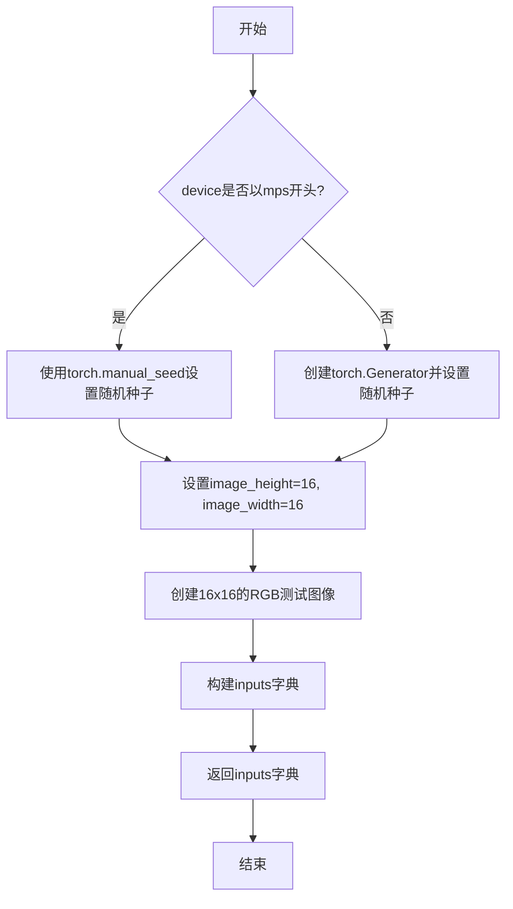

#### 带注释源码

```python
def get_dummy_inputs(self, device, seed=0):
    """
    生成用于测试的虚拟输入参数
    
    参数:
        device: str - 目标设备，如 'cpu', 'cuda', 'mps' 等
        seed: int - 随机种子，用于确保测试可重复性
    
    返回:
        dict: 包含图像生成所需的所有输入参数
    """
    # 处理 M1/M2 Mac 设备 (Apple Silicon) 的特殊情况
    # Apple Silicon 设备使用 'mps' 前缀，不能使用 torch.Generator
    if str(device).startswith("mps"):
        # 对于 mps 设备，直接使用 torch.manual_seed
        generator = torch.manual_seed(seed)
    else:
        # 对于其他设备 (cpu, cuda)，创建带种子的生成器
        generator = torch.Generator(device=device).manual_seed(seed)
    
    # 定义测试图像的尺寸
    image_height = 16
    image_width = 16
    
    # 创建一个 16x16 的虚拟 RGB 图像用于测试
    image = Image.new("RGB", (image_width, image_height))
    
    # 构建完整的输入参数字典
    inputs = {
        "image": image,                    # 输入图像 (PIL.Image)
        "prompt": "dance monkey",          # 正向提示词
        "negative_prompt": "negative",    # 负向提示词 (TODO: 待改进)
        "height": image_height,           # 输出图像高度
        "width": image_width,              # 输出图像宽度
        "generator": generator,           # 随机数生成器
        "num_inference_steps": 2,         # 推理步数 (较少以加快测试)
        "guidance_scale": 6.0,            # classifier-free guidance 强度
        "num_frames": 9,                  # 要生成的视频帧数
        "max_sequence_length": 16,        # 文本编码器的最大序列长度
        "output_type": "pt",              # 输出类型: PyTorch 张量
    }
    return inputs
```


### `WanImageToVideoPipelineFastTests.test_inference`

该测试方法用于验证 WanImageToVideoPipeline（ Wan 图生视频管道）的推理功能是否正确。测试通过创建虚拟组件和输入，执行图生视频推理，并验证生成的视频帧的形状和像素值是否符合预期。

参数：

- `self`：`WanImageToVideoPipelineFastTests`，测试类实例，隐式参数，用于访问类的属性和方法

返回值：`None`，该方法为测试方法，无返回值；通过断言验证推理结果，若失败则抛出异常

#### 流程图

```mermaid
flowchart TD
    A[开始测试] --> B[设置设备为 CPU]
    B --> C[调用 get_dummy_components 获取虚拟组件]
    C --> D[使用虚拟组件创建 WanImageToVideoPipeline 实例]
    D --> E[将管道移至 CPU 设备]
    E --> F[设置进度条配置 disable=None]
    F --> G[调用 get_dummy_inputs 获取虚拟输入]
    G --> H[执行管道推理: pipe(**inputs)]
    H --> I[获取生成的视频帧: .frames]
    I --> J[验证视频形状为 9x3x16x16]
    J --> K[提取生成视频的首尾片段]
    K --> L[验证片段数值与预期值匹配]
    L --> M[测试通过]
```

#### 带注释源码

```python
def test_inference(self):
    """
    测试 WanImageToVideoPipeline 的推理功能
    验证生成的视频帧形状和数值是否符合预期
    """
    # 1. 设置测试设备为 CPU
    device = "cpu"

    # 2. 获取虚拟组件（transformer, vae, scheduler, text_encoder, tokenizer, image_encoder, image_processor）
    components = self.get_dummy_components()
    
    # 3. 使用虚拟组件实例化图生视频管道
    pipe = self.pipeline_class(**components)
    
    # 4. 将管道移至指定设备（CPU）
    pipe.to(device)
    
    # 5. 配置进度条（disable=None 表示不禁用进度条）
    pipe.set_progress_bar_config(disable=None)

    # 6. 获取虚拟输入（包含图像、提示词、推理步数等参数）
    inputs = self.get_dummy_inputs(device)
    
    # 7. 执行推理并获取生成的视频帧
    # 输入参数：image, prompt, negative_prompt, height, width, generator, 
    #          num_inference_steps, guidance_scale, num_frames, max_sequence_length, output_type
    video = pipe(**inputs).frames
    
    # 8. 获取第一个视频（批次中只有一个）
    generated_video = video[0]
    
    # 9. 断言验证：视频帧数=9, 通道数=3, 高度=16, 宽度=16
    self.assertEqual(generated_video.shape, (9, 3, 16, 16))

    # 10. 定义预期输出的像素值切片（用于数值验证）
    # fmt: off
    expected_slice = torch.tensor([
        0.4525, 0.4525, 0.4497, 0.4536, 0.452, 0.4529, 0.454, 0.4535,  # 前8个像素
        0.5072, 0.5527, 0.5165, 0.5244, 0.5481, 0.5282, 0.5208, 0.5214  # 后8个像素
    ])
    # fmt: on

    # 11. 展平视频并拼接首尾各8个像素值
    generated_slice = generated_video.flatten()
    generated_slice = torch.cat([generated_slice[:8], generated_slice[-8:]])
    
    # 12. 断言验证：生成的像素值与预期值在 1e-3 误差范围内匹配
    self.assertTrue(torch.allclose(generated_slice, expected_slice, atol=1e-3))
```


### `WanImageToVideoPipelineFastTests.test_attention_slicing_forward_pass`

这是一个被跳过的测试方法，用于测试 Wan 图像到视频管道的注意力切片（attention slicing）前向传播功能。由于当前测试不被支持，该方法体为空（pass），不执行任何实际逻辑。

参数：

- `self`：`WanImageToVideoPipelineFastTests`，表示类的实例本身

返回值：`None`，该方法不返回任何值

#### 流程图

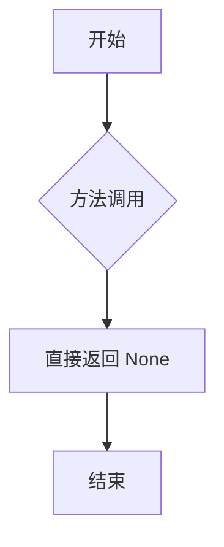

#### 带注释源码

```python
@unittest.skip("Test not supported")
def test_attention_slicing_forward_pass(self):
    """
    测试 Wan 图像到视频管道的注意力切片前向传播功能。
    
    该测试方法目前被标记为不支持，因此方法体为空（pass），
    不会执行任何实际的推理或验证逻辑。
    
    参数:
        self: WanImageToVideoPipelineFastTests 类实例
    
    返回值:
        None
    """
    pass
```


### `WanImageToVideoPipelineFastTests.test_inference_batch_single_identical`

该方法是一个被跳过的单元测试，用于验证图像到视频管道在批量推理时单个样本与单独推理结果的一致性。由于当前实现需要非常高的阈值才能通过测试，因此该测试被暂时禁用。

参数：

- `self`：`WanImageToVideoPipelineFastTests`，测试类实例本身，用于访问类成员和方法

返回值：`None`，无返回值（测试方法）

#### 流程图

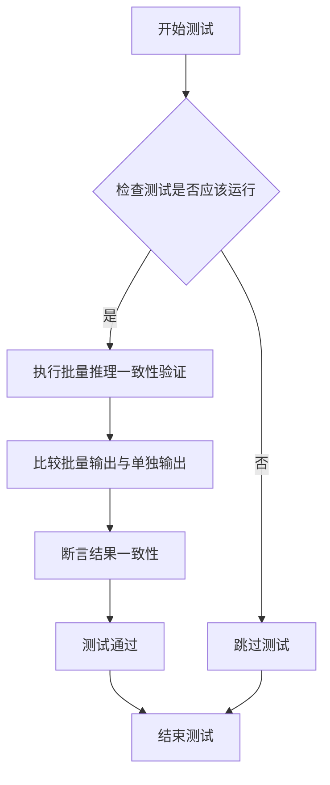

> **注意**：当前该测试被 `@unittest.skip` 装饰器跳过，因此实际流程直接跳转到结束，不执行任何验证逻辑。

#### 带注释源码

```python
@unittest.skip("TODO: revisit failing as it requires a very high threshold to pass")
def test_inference_batch_single_identical(self):
    """
    测试批量推理时，单个样本的输出应与单独推理时的输出完全一致。
    
    该测试用于验证管道的确定性（determinism），
    确保相同输入无论是以批量还是单独方式处理，结果都相同。
    
    当前状态：
    - 测试被 @unittest.skip 装饰器跳过
    - 原因：实现需要非常高的数值阈值才能通过测试
    - 后续需要重新审视并调整阈值或优化实现
    """
    pass  # 测试逻辑尚未实现
```


### `WanImageToVideoPipelineFastTests.test_save_load_optional_components`

该测试方法用于验证 WanImageToVideoPipeline 对可选组件（特别是 transformer_2）的保存和加载功能是否正确。测试会创建一个包含 None 可选组件的 pipeline，执行推理后保存到磁盘，再重新加载，验证可选组件保持为 None 且加载前后的输出差异在允许范围内。

参数：

- `self`：隐式参数，测试用例的实例对象
- `expected_max_difference`：`float`，可选参数，默认值为 `1e-4`，表示期望的最大差异阈值，用于判断保存前后输出的一致性

返回值：`None`，该方法为测试用例，通过断言验证逻辑，不返回实际数据

#### 流程图

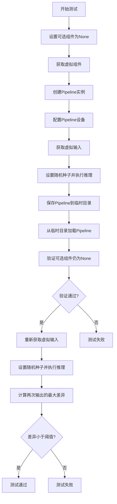

#### 带注释源码

```python
# 测试保存和加载可选组件的功能
# _optional_components 包括 transformer, transformer_2 和 image_encoder, image_processor,
# 但对于 wan2.1 i2v pipeline，只有 transformer_2 是可选的
def test_save_load_optional_components(self, expected_max_difference=1e-4):
    # 定义要测试的可选组件名称
    optional_component = "transformer_2"

    # 获取虚拟组件配置
    components = self.get_dummy_components()
    # 将指定的可选组件设置为 None
    components[optional_component] = None
    
    # 使用组件创建 Pipeline 实例
    pipe = self.pipeline_class(**components)
    
    # 为每个组件设置默认的注意力处理器
    for component in pipe.components.values():
        if hasattr(component, "set_default_attn_processor"):
            component.set_default_attn_processor()
    
    # 将 pipeline 移动到测试设备
    pipe.to(torch_device)
    # 配置进度条（disable=None 表示不禁用）
    pipe.set_progress_bar_config(disable=None)

    # 设置生成器设备为 CPU
    generator_device = "cpu"
    # 获取虚拟输入数据
    inputs = self.get_dummy_inputs(generator_device)
    
    # 设置随机种子以确保可重复性
    torch.manual_seed(0)
    # 执行推理，获取第一帧输出
    output = pipe(**inputs)[0]

    # 创建临时目录用于保存
    with tempfile.TemporaryDirectory() as tmpdir:
        # 保存 Pipeline 到临时目录（不使用安全序列化）
        pipe.save_pretrained(tmpdir, safe_serialization=False)
        
        # 从保存的目录加载 Pipeline
        pipe_loaded = self.pipeline_class.from_pretrained(tmpdir)
        
        # 为加载的 Pipeline 设置默认注意力处理器
        for component in pipe_loaded.components.values():
            if hasattr(component, "set_default_attn_processor"):
                component.set_default_attn_processor()
        
        # 将加载的 Pipeline 移动到测试设备
        pipe_loaded.to(torch_device)
        # 配置进度条
        pipe_loaded.set_progress_bar_config(disable=None)

    # 验证可选组件在加载后仍为 None
    self.assertTrue(
        getattr(pipe_loaded, optional_component) is None,
        f"`{optional_component}` did not stay set to None after loading.",
    )

    # 重新获取虚拟输入
    inputs = self.get_dummy_inputs(generator_device)
    # 设置相同的随机种子
    torch.manual_seed(0)
    # 执行推理，获取加载后的输出
    output_loaded = pipe_loaded(**inputs)[0]

    # 计算两次输出的最大差异
    max_diff = np.abs(output.detach().cpu().numpy() - output_loaded.detach().cpu().numpy()).max()
    
    # 验证差异在允许范围内
    self.assertLess(max_diff, expected_max_difference)
```


### `WanFLFToVideoPipelineFastTests.get_dummy_components`

该方法用于创建和初始化WanFLFToVideoPipeline（ Wan图转视频流水线）的虚拟（dummy）组件集合，通过预设随机种子确保可重复性，初始化各类AI模型组件（VAE、Transformer、文本编码器、图像编码器等）及其配置，为后续的流水线推理测试提供所需的全部组件对象。

参数：

- `self`：隐式参数，代表类实例本身，无需显式传递

返回值：`Dict[str, Any]`，返回一个包含流水线所需所有组件的字典，包括transformer、vae、scheduler、text_encoder、tokenizer、image_encoder、image_processor以及可选的transformer_2（值为None），用于构建测试用的图转视频流水线实例。

#### 流程图

```mermaid
flowchart TD
    A[开始 get_dummy_components] --> B[设置随机种子 torch.manual_seed(0)]
    B --> C[创建 VAE: AutoencoderKLWan]
    C --> D[设置随机种子 torch.manual_seed(0)]
    D --> E[创建 Scheduler: FlowMatchEulerDiscreteScheduler]
    E --> F[加载 Text Encoder: T5EncoderModel]
    F --> G[加载 Tokenizer: AutoTokenizer]
    G --> H[设置随机种子 torch.manual_seed(0)]
    H --> I[创建 Transformer: WanTransformer3DModel]
    I --> J[设置随机种子 torch.manual_seed(0)]
    J --> K[配置图像编码器参数: CLIPVisionConfig]
    K --> L[创建图像编码器: CLIPVisionModelWithProjection]
    L --> M[设置随机种子 torch.manual_seed(0)]
    M --> N[创建图像处理器: CLIPImageProcessor]
    N --> O[组装组件字典 components]
    O --> P[返回 components 字典]
```

#### 带注释源码

```python
def get_dummy_components(self):
    """
    创建并返回用于测试的虚拟组件集合。
    这些组件将用于初始化 WanImageToVideoPipeline 流水线。
    """
    # 设置随机种子以确保结果可重复性
    torch.manual_seed(0)
    
    # 创建变分自编码器 (VAE) - 负责图像/视频的编码和解码
    vae = AutoencoderKLWan(
        base_dim=3,              # 基础维度
        z_dim=16,                # 潜在空间维度
        dim_mult=[1, 1, 1, 1],   # 各层维度倍数
        num_res_blocks=1,        # 残差块数量
        temperal_downsample=[False, True, True],  # 时间维度下采样配置
    )

    # 重新设置随机种子，确保每个组件的初始化相互独立
    torch.manual_seed(0)
    
    # 创建调度器 - 控制去噪过程的采样策略
    # TODO: impl FlowDPMSolverMultistepScheduler - 未来可能替换为更高效的调度器
    scheduler = FlowMatchEulerDiscreteScheduler(shift=7.0)
    
    # 加载文本编码器 - 将文本提示转换为向量表示
    text_encoder = T5EncoderModel.from_pretrained("hf-internal-testing/tiny-random-t5")
    
    # 加载分词器 - 将文本分割为token序列
    tokenizer = AutoTokenizer.from_pretrained("hf-internal-testing/tiny-random-t5")

    # 设置随机种子，初始化Transformer模型
    torch.manual_seed(0)
    
    # 创建3D Transformer模型 - 核心扩散模型，负责去噪过程
    transformer = WanTransformer3DModel(
        patch_size=(1, 2, 2),         # 时空patch大小
        num_attention_heads=2,        # 注意力头数量
        attention_head_dim=12,        # 注意力头维度
        in_channels=36,              # 输入通道数
        out_channels=16,             # 输出通道数
        text_dim=32,                 # 文本嵌入维度
        freq_dim=256,                # 频率维度
        ffn_dim=32,                  # 前馈网络维度
        num_layers=2,                # Transformer层数
        cross_attn_norm=True,         # 是否对交叉注意力进行归一化
        qk_norm="rms_norm_across_heads",  # Query/Key归一化方式
        rope_max_seq_len=32,         # 旋转位置编码最大序列长度
        image_dim=4,                 # 图像嵌入维度
        pos_embed_seq_len=2 * (4 * 4 + 1),  # 位置编码序列长度
    )

    # 设置随机种子，初始化图像编码器相关配置
    torch.manual_seed(0)
    
    # 配置CLIP图像编码器参数
    image_encoder_config = CLIPVisionConfig(
        hidden_size=4,               # 隐藏层大小
        projection_dim=4,            # 投影维度
        num_hidden_layers=2,         # 隐藏层数量
        num_attention_heads=2,       # 注意力头数量
        image_size=4,                # 图像尺寸
        intermediate_size=16,        # 中间层大小
        patch_size=1,                # Patch大小
    )
    
    # 创建CLIP视觉模型 - 编码图像为视觉嵌入
    image_encoder = CLIPVisionModelWithProjection(image_encoder_config)

    # 设置随机种子，创建图像处理器
    torch.manual_seed(0)
    
    # 创建图像预处理器 - 调整图像大小并进行归一化
    image_processor = CLIPImageProcessor(crop_size=4, size=4)

    # 组装所有组件到字典中
    components = {
        "transformer": transformer,           # 3D扩散Transformer模型
        "vae": vae,                           # 变分自编码器
        "scheduler": scheduler,               # 噪声调度器
        "text_encoder": text_encoder,         # 文本编码器
        "tokenizer": tokenizer,               # 文本分词器
        "image_encoder": image_encoder,       # 图像编码器
        "image_processor": image_processor,   # 图像处理器
        "transformer_2": None,                 # 第二个Transformer（可选，当前为None）
    }
    
    # 返回组件字典，用于流水线初始化
    return components
```


### `WanFLFToVideoPipelineFastTests.get_dummy_inputs`

该方法用于生成Wan图像转视频 pipeline的虚拟测试输入数据，构建包含图像、提示词、生成器等参数的字典，以支持pipeline的推理测试。

参数：

- `device`：`str`，目标设备字符串，用于指定在哪个设备上运行（如"cpu"或"mps"）
- `seed`：`int`，随机种子，默认为0，用于控制生成器的随机性

返回值：`dict`，包含以下键值对的字典：
  - `image`：PIL.Image对象，输入的首帧图像
  - `last_image`：PIL.Image对象，输入的最后一帧图像
  - `prompt`：`str`，正向提示词
  - `negative_prompt`：`str`，负向提示词
  - `height`：`int`，输出视频高度
  - `width`：`int`，输出视频宽度
  - `generator`：`torch.Generator`，PyTorch随机生成器对象
  - `num_inference_steps`：`int`，推理步数
  - `guidance_scale`：`float`，引导 scale
  - `num_frames`：`int`，生成视频的帧数
  - `max_sequence_length`：`int`，最大序列长度
  - `output_type`：`str`，输出类型

#### 流程图

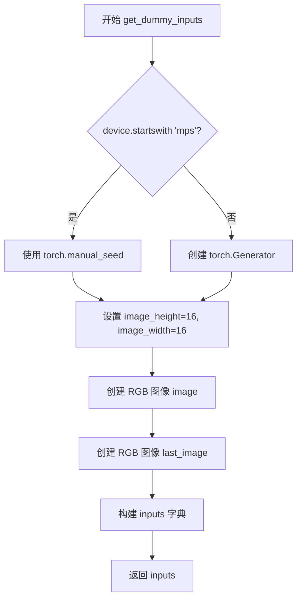

#### 带注释源码

```python
def get_dummy_inputs(self, device, seed=0):
    """
    生成用于测试 WanImageToVideoPipeline 的虚拟输入参数
    
    参数:
        device: str，目标设备标识符
        seed: int，随机种子用于生成器
    
    返回:
        dict: 包含pipeline所需的所有测试输入参数
    """
    # 判断是否为苹果MPS设备
    if str(device).startswith("mps"):
        # MPS设备使用torch.manual_seed设置随机种子
        generator = torch.manual_seed(seed)
    else:
        # 其他设备创建PyTorch生成器并设置种子
        generator = torch.Generator(device=device).manual_seed(seed)
    
    # 设置测试用图像尺寸
    image_height = 16
    image_width = 16
    
    # 创建虚拟输入图像（PIL Image对象）
    image = Image.new("RGB", (image_width, image_height))
    # 创建虚拟最后帧图像（用于FLFT2V场景）
    last_image = Image.new("RGB", (image_width, image_height))
    
    # 构建完整的输入参数字典
    inputs = {
        "image": image,                    # 输入首帧图像
        "last_image": last_image,           # 输入最后帧图像（FLFT2V特有）
        "prompt": "dance monkey",           # 文本提示词
        "negative_prompt": "negative",      # 负向提示词
        "height": image_height,            # 输出高度
        "width": image_width,               # 输出宽度
        "generator": generator,             # 随机生成器
        "num_inference_steps": 2,           # 推理步数（测试用小值）
        "guidance_scale": 6.0,              # CFG引导强度
        "num_frames": 9,                   # 生成帧数
        "max_sequence_length": 16,         # 最大序列长度
        "output_type": "pt",               # 输出类型（PyTorch张量）
    }
    return inputs
```


### `WanFLFToVideoPipelineFastTests.test_inference`

该方法是 `WanFLFToVideoPipelineFastTests` 测试类中的核心推理测试方法，用于验证 WanImageToVideoPipeline 在 FLF (First-Last Frame) 模式下能够正确生成视频，并校验输出视频的形状和像素值是否符合预期。

参数：

- `self`：无，属于类方法隐式参数，代表测试类实例本身

返回值：`None`，该方法为测试方法，通过 `self.assertEqual` 和 `self.assertTrue` 断言验证输出，不返回任何值

#### 流程图

```mermaid
flowchart TD
    A[开始 test_inference 测试] --> B[设置 device = 'cpu']
    B --> C[调用 get_dummy_components 获取虚拟组件]
    C --> D[使用虚拟组件初始化 WanImageToVideoPipeline 管道]
    D --> E[将管道移动到 cpu 设备]
    E --> F[配置进度条 disable=None]
    F --> G[调用 get_dummy_inputs 获取虚拟输入]
    G --> H[执行管道推理: pipe(**inputs)]
    H --> I[获取生成的视频 frames]
    I --> J[提取第一帧视频 generated_video]
    J --> K[断言视频形状为 (9, 3, 16, 16)]
    K --> L[定义期望的 tensor slice]
    L --> M[将生成的视频展平并拼接首尾各8个元素]
    M --> N[断言生成的 slice 与期望值接近 atol=1e-3]
    N --> O[测试结束]
```

#### 带注释源码

```python
def test_inference(self):
    """
    测试 WanImageToVideoPipeline 的推理功能，验证 FLF (First-Last Frame) 模式下的
    视频生成是否正确。该测试使用虚拟组件和虚拟输入进行端到端验证。
    """
    
    # 步骤1: 确定运行设备为 CPU
    device = "cpu"

    # 步骤2: 获取虚拟组件 (transformer, vae, scheduler, text_encoder, tokenizer, image_encoder, image_processor)
    # 这些组件是使用随机种子初始化的确定性模型，用于测试Reproducibility
    components = self.get_dummy_components()
    
    # 步骤3: 使用虚拟组件实例化 WanImageToVideoPipeline 管道
    # pipeline_class 指向 WanImageToVideoPipeline
    pipe = self.pipeline_class(**components)
    
    # 步骤4: 将管道移至指定设备 (cpu)
    pipe.to(device)
    
    # 步骤5: 配置进度条，disable=None 表示不禁用进度条
    pipe.set_progress_bar_config(disable=None)

    # 步骤6: 获取虚拟输入，包含 image, last_image, prompt, negative_prompt, 
    # height, width, generator, num_inference_steps, guidance_scale, num_frames 等参数
    inputs = self.get_dummy_inputs(device)
    
    # 步骤7: 执行管道推理，**inputs 将字典解包为关键字参数传入
    # 返回值是一个包含 frames 属性的对象
    video = pipe(**inputs).frames
    
    # 步骤8: 提取第一个生成的视频 (因为批量推理可能返回多个视频)
    generated_video = video[0]
    
    # 步骤9: 断言生成的视频形状为 (9, 3, 16, 16)
    # 9 表示帧数，3 表示 RGB 通道数，16x16 表示空间分辨率
    self.assertEqual(generated_video.shape, (9, 3, 16, 16))

    # 步骤10: 定义期望的 tensor slice 值，用于数值精度验证
    # 这些值是通过固定随机种子得到的预期输出片段
    # fmt: off
    expected_slice = torch.tensor([0.4531, 0.4527, 0.4498, 0.4542, 0.4526, 0.4527, 0.4534, 0.4534, 0.5061, 0.5185, 0.5283, 0.5181, 0.5309, 0.5365, 0.5113, 0.5244])
    # fmt: on

    # 步骤11: 将生成的视频展平为一维 tensor，然后拼接首尾各8个元素
    # 形成一个16元素的 slice 用于与 expected_slice 对比
    generated_slice = generated_video.flatten()
    generated_slice = torch.cat([generated_slice[:8], generated_slice[-8:]])
    
    # 步骤12: 断言生成的 slice 与期望值在容差 1e-3 范围内相等
    # 验证管道输出的数值正确性
    self.assertTrue(torch.allclose(generated_slice, expected_slice, atol=1e-3))
```


### `WanFLFToVideoPipelineFastTests.test_attention_slicing_forward_pass`

这是一个被跳过的测试方法，用于测试注意力切片（attention slicing）前向传播功能。当前该测试未实现，仅包含 `pass` 语句并使用 `@unittest.skip` 装饰器标记为不支持的测试。

参数：

- `self`：`WanFLFToVideoPipelineFastTests`（隐式参数），表示类的实例对象本身

返回值：`None`，该方法不返回任何值

#### 流程图

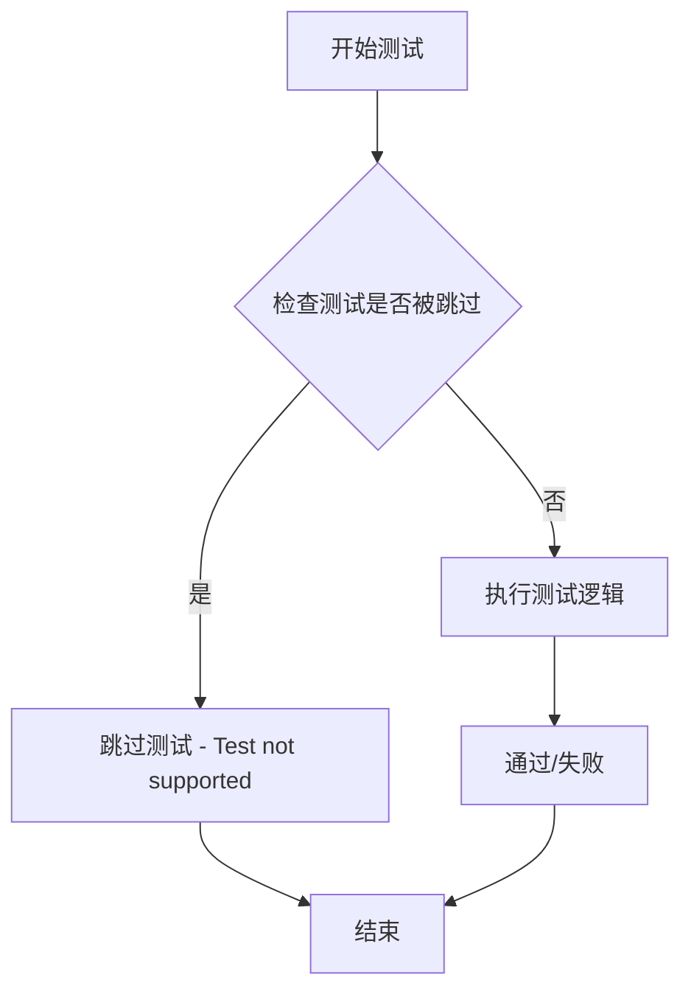

#### 带注释源码

```python
@unittest.skip("Test not supported")
def test_attention_slicing_forward_pass(self):
    """
    测试 Wan 图像到视频流水线的注意力切片（attention slicing）前向传播功能。
    
    该测试方法用于验证在使用注意力切片优化时，模型前向传播的正确性。
    当前实现中，该测试被标记为不支持，因此被跳过。
    
    注意：
    - 注意力切片是一种内存优化技术，将大型注意力矩阵分割成较小的块进行处理
    - 该测试目前未实现具体验证逻辑
    """
    pass
```


### `WanFLFToVideoPipelineFastTests.test_inference_batch_single_identical`

这是一个被跳过的测试方法，用于验证图像到视频管道在批量推理时，单个样本的推理结果应与单独推理时完全一致（deterministic）。该测试目前因需要较高的误差阈值才能通过而被跳过。

参数：

- `self`：`WanFLFToVideoPipelineFastTests`（隐式参数），测试类实例本身

返回值：`None`，该方法为 `pass` 空实现，不返回任何值

#### 流程图

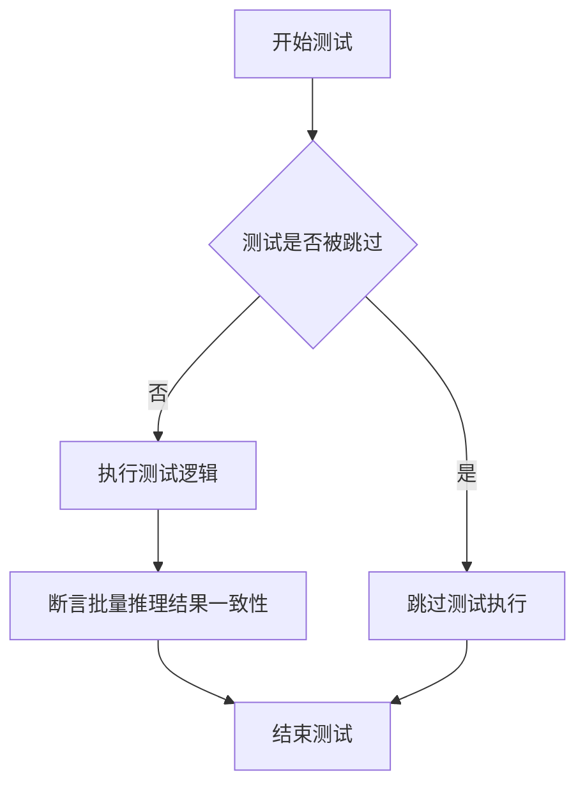

#### 带注释源码

```python
@unittest.skip("TODO: revisit failing as it requires a very high threshold to pass")
def test_inference_batch_single_identical(self):
    """
    测试方法：test_inference_batch_single_identical
    
    用途：验证批量推理时，单个样本的输出应与单独推理时的输出完全一致。
    这是一个重要的确定性（determinism）测试，确保管道不会因批处理而产生不同的结果。
    
    当前状态：该测试被 @unittest.skip 装饰器跳过，
    原因是测试需要非常高的误差阈值（1e-3）才能通过，这表明当前实现可能存在数值精度问题。
    
    参数：
        - self: WanFLFToVideoPipelineFastTests 实例，隐式参数
    
    返回值：
        - None: 空方法体，仅包含 pass 语句
    """
    pass  # 空实现，测试被跳过
```


### `WanFLFToVideoPipelineFastTests.test_save_load_optional_components`

该测试方法用于验证 Wan 图像到视频管道在保存和加载时正确处理可选组件（特别是 `transformer_2`），确保当可选组件被设为 `None` 时，保存和加载流程能够正确保留该状态，并且在加载后重新推理的输出与原始输出保持一致（差异小于指定阈值）。

参数：

- `expected_max_difference`：`float`，可选，默认值为 `1e-4`。用于指定保存/加载前后两次推理输出允许的最大差异阈值。

返回值：`None`，无返回值（测试方法）。

#### 流程图

```mermaid
flowchart TD
    A[开始测试] --> B[设置可选组件名称: transformer_2]
    B --> C[获取虚拟组件并将 transformer_2 设为 None]
    C --> D[创建 WanImageToVideoPipeline 实例]
    D --> E[为所有组件设置默认 attention processor]
    E --> F[将 pipeline 移动到 torch_device]
    F --> G[配置进度条]
    G --> H[获取虚拟输入]
    H --> I[设置随机种子并执行推理得到 output]
    I --> J[创建临时目录]
    J --> K[保存 pipeline 到临时目录 safe_serialization=False]
    K --> L[从临时目录加载 pipeline]
    L --> M[为加载的组件设置默认 attention processor]
    M --> N[将加载的 pipeline 移动到 torch_device]
    N --> O[配置进度条]
    O --> P{验证 transformer_2 是否仍为 None}
    P -->|是| Q[获取新的虚拟输入]
    P -->|否| R[测试失败: 抛出断言错误]
    Q --> S[设置随机种子并执行推理得到 output_loaded]
    S --> T[计算两次输出的最大差异]
    T --> U{最大差异 < expected_max_difference?}
    U -->|是| V[测试通过]
    U -->|否| R
    
    style R fill:#ff6b6b
    style V fill:#51cf66
```

#### 带注释源码

```python
def test_save_load_optional_components(self, expected_max_difference=1e-4):
    """
    测试保存和加载可选组件的功能。
    
    验证当 transformer_2 设置为 None 时：
    1. 保存操作能够正确处理
    2. 加载后该组件仍为 None
    3. 加载后的推理结果与原始推理结果一致
    
    参数:
        expected_max_difference: float, 允许的最大差异阈值，默认 1e-4
    """
    # 定义要测试的可选组件名称
    optional_component = "transformer_2"

    # 获取虚拟组件配置，并将指定的可选组件设置为 None
    components = self.get_dummy_components()
    components[optional_component] = None
    
    # 使用配置好的组件创建 pipeline 实例
    pipe = self.pipeline_class(**components)
    
    # 遍历所有组件，为有 set_default_attn_processor 方法的组件设置默认 attention processor
    for component in pipe.components.values():
        if hasattr(component, "set_default_attn_processor"):
            component.set_default_attn_processor()
    
    # 将 pipeline 移动到指定的计算设备（如 cuda 或 cpu）
    pipe.to(torch_device)
    
    # 配置进度条（disable=None 表示不禁用进度条）
    pipe.set_progress_bar_config(disable=None)

    # 获取用于生成器的设备（这里固定使用 cpu）
    generator_device = "cpu"
    
    # 获取虚拟输入数据
    inputs = self.get_dummy_inputs(generator_device)
    
    # 设置随机种子为 0，确保结果可复现
    torch.manual_seed(0)
    
    # 执行推理，frames 是一个列表，取第一个元素作为输出
    output = pipe(**inputs)[0]

    # 使用临时目录保存和加载模型
    with tempfile.TemporaryDirectory() as tmpdir:
        # 将 pipeline 保存到临时目录，不使用安全序列化
        pipe.save_pretrained(tmpdir, safe_serialization=False)
        
        # 从保存的目录加载 pipeline
        pipe_loaded = self.pipeline_class.from_pretrained(tmpdir)
        
        # 同样为加载的组件设置默认 attention processor
        for component in pipe_loaded.components.values():
            if hasattr(component, "set_default_attn_processor"):
                component.set_default_attn_processor()
        
        # 将加载的 pipeline 移动到指定设备
        pipe_loaded.to(torch_device)
        
        # 配置加载后 pipeline 的进度条
        pipe_loaded.set_progress_bar_config(disable=None)

    # 断言验证：加载后的 pipeline 中指定的可选组件仍然为 None
    self.assertTrue(
        getattr(pipe_loaded, optional_component) is None,
        f"`{optional_component}` did not stay set to None after loading.",
    )

    # 使用相同的输入和随机种子进行第二次推理
    inputs = self.get_dummy_inputs(generator_device)
    torch.manual_seed(0)
    output_loaded = pipe_loaded(**inputs)[0]

    # 计算两次输出（原始和加载后）的最大差异
    max_diff = np.abs(output.detach().cpu().numpy() - output_loaded.detach().cpu().numpy()).max()
    
    # 断言：最大差异应小于指定的阈值
    self.assertLess(max_diff, expected_max_difference)
```

## 关键组件


### WanImageToVideoPipeline

主测试类，继承自PipelineTesterMixin和unittest.TestCase，用于测试Wan模型的图像到视频生成功能。包含管道参数配置、虚拟组件构建、推理测试和保存加载测试。

### WanFLFToVideoPipelineFastTests

另一个测试类，与WanImageToVideoPipeline类似但针对FLF（First-Last-Frame）变体，增加了last_image参数支持。

### AutoencoderKLWan

变分自编码器（VAE）组件，用于将图像编码到潜在空间并从潜在空间解码回图像。配置包括base_dim、z_dim、dim_mult和num_res_blocks。

### FlowMatchEulerDiscreteScheduler

流匹配欧拉离散调度器，用于扩散模型的推理过程。配置参数shift=7.0控制噪声调度。

### T5EncoderModel

文本编码器组件，将文本提示（prompt）编码为模型可理解的特征表示。使用预训练的tiny-random-t5模型。

### WanTransformer3DModel

3D变换器模型，是图像到视频生成的核心组件。配置包括patch_size、num_attention_heads、attention_head_dim、in_channels、out_channels等参数。

### CLIPVisionModelWithProjection

CLIP视觉编码器，用于处理输入图像并生成视觉特征。配置包括hidden_size、projection_dim、num_hidden_layers等。

### CLIPImageProcessor

图像预处理组件，负责将PIL图像转换为模型所需的张量格式。配置crop_size和size参数。

### get_dummy_components

工厂方法，构建测试所需的全部虚拟组件字典，包含transformer、vae、scheduler、text_encoder、tokenizer、image_encoder、image_processor等。

### get_dummy_inputs

工厂方法，构建测试所需的输入参数字典，包含image、prompt、negative_prompt、height、width、generator、num_inference_steps等。

### test_inference

推理测试方法，验证管道能够正确生成指定形状（9帧、3通道、16x16像素）的视频输出。

### test_save_load_optional_components

保存加载测试方法，验证管道的模型组件可以正确序列化和反序列化，特别测试可选组件（如transformer_2）的处理。

## 问题及建议


### 已知问题

- **TODO 标记未完成**: 代码中存在多处 TODO 注释，包括 TODO: impl FlowDPMSolverMultistepScheduler、negative_prompt 处理标记为 TODO、test_inference_batch_single_identical 标记为 TODO: revisit failing，表明有未完成的功能或待修复的问题
- **重复代码**: WanImageToVideoPipelineFastTests 和 WanFLFToVideoPipelineFastTests 两个测试类中存在大量重复代码，包括 get_dummy_components、get_dummy_inputs 和 test_save_load_optional_components 方法，可提取为基类或公共工具函数
- **硬编码的测试参数**: 期望输出值（如 expected_slice）硬编码在测试中，缺乏文档说明其来源和合理性
- **测试被跳过**: test_attention_slicing_forward_pass 和 test_inference_batch_single_identical 被无条件跳过，导致测试覆盖不完整
- **参数不一致**: WanFLFToVideoPipelineFastTests 中 image_encoder_config 的 image_size=4 与图像尺寸配置可能存在语义不一致
- **Magic Numbers**: 大量使用魔数如 shift=7.0、num_inference_steps=2、guidance_scale=6.0、num_frames=9 等，缺乏配置常量或参数化
- **Seed 重复使用**: 多个组件初始化时重复使用 torch.manual_seed(0)，可能导致随机数序列关联性过强
- **MPS 设备特殊处理**: get_dummy_inputs 中对 MPS 设备的特殊处理（使用 torch.manual_seed 替代 torch.Generator）可能导致测试行为不一致

### 优化建议

- 将重复的 get_dummy_components 和 get_dummy_inputs 方法提取到测试基类中，通过参数化或子类覆盖特定配置
- 将 TODO 事项纳入项目任务跟踪系统，确保 FlowDPMSolverMultistepScheduler 实现和 negative_prompt 优化得到处理
- 使用 pytest 参数化或配置文件管理测试参数，将硬编码的 magic numbers 提取为可配置的常量
- 调查并修复被跳过的测试，或在测试文档中明确说明跳过的原因和修复计划
- 统一图像尺寸参数命名和语义，确保 image_size、crop_size、size 等参数配置一致
- 考虑使用更健壮的随机性测试策略，使用不同的 seed 或禁用特定组件的随机性而非全局 seed
- 为期望输出值添加注释说明其计算依据或来源，便于后续维护和更新
- 考虑为 MPS 设备实现与 CUDA/CPU 一致的 generator 行为，或在测试文档中说明差异原因

## 其它


### 设计目标与约束

本测试文件旨在验证WanImageToVideoPipeline图像转视频功能的正确性，包括单图转视频（WanImageToVideoPipelineFastTests）和首尾帧插值转视频（WanFLFToVideoPipelineFastTests）两种模式。测试约束包括：仅支持CPU设备推理，跳过xformers注意力测试，跳过DDUF支持，测试使用虚拟（dummy）组件而非真实预训练模型，以确保测试速度和可重复性。

### 错误处理与异常设计

测试中的错误处理主要依赖unittest框架的断言机制。test_inference使用self.assertEqual验证输出形状，使用torch.allclose比较数值精度；test_save_load_optional_components使用self.assertTrue和self.assertLess验证保存/加载功能。被跳过的测试使用@unittest.skip装饰器标记，包括test_attention_slicing_forward_pass（不支持）和test_inference_batch_single_identical（阈值问题待修复）。

### 数据流与状态机

测试数据流如下：get_dummy_components创建虚拟VAE、scheduler、text_encoder、tokenizer、image_encoder、image_processor和transformer组件；get_dummy_inputs生成包含image、prompt、negative_prompt、height、width、generator、num_inference_steps、guidance_scale、num_frames、max_sequence_length和output_type的输入字典；pipe(**inputs)执行推理并返回包含frames的结果对象。状态转换包括：组件初始化→设备转移→推理执行→结果验证。

### 外部依赖与接口契约

本测试文件依赖以下外部组件：diffusers库提供WanImageToVideoPipeline、AutoencoderKLWan、FlowMatchEulerDiscreteScheduler、WanTransformer3DModel；transformers库提供AutoTokenizer、CLIPImageProcessor、CLIPVisionConfig、CLIPVisionModelWithProjection、T5EncoderModel；PIL提供Image；numpy和torch提供数值计算。接口契约要求pipeline_class必须实现__call__方法返回包含frames属性的对象，组件必须实现set_default_attn_processor方法（如果支持）。

### 性能考虑

测试使用极小规模模型配置（num_layers=2，attention_head_dim=12，hidden_size=4等）以确保快速执行。num_inference_steps设置为2，远低于实际使用的50步。图像尺寸为16x16，帧数为9，均为最小配置。测试禁用进度条显示（set_progress_bar_config(disable=None)）以减少输出开销。

### 安全性考虑

测试使用hf-internal-testing/tiny-random-t5虚拟模型而非真实模型，避免网络下载和潜在的安全风险。临时文件操作使用tempfile.TemporaryDirectory确保自动清理。测试不涉及真实用户数据，仅使用合成图像和文本提示。

### 测试策略

采用单元测试框架unittest，结合PipelineTesterMixin提供通用测试接口。测试覆盖：推理功能验证（test_inference）、可选组件保存加载（test_save_load_optional_components）。使用固定随机种子（torch.manual_seed(0)）确保可重复性。通过expected_slice进行数值回归测试，确保输出精度控制在atol=1e-3以内。

### 配置管理

测试参数通过类属性集中配置：params定义TEXT_TO_IMAGE_PARAMS排除项，batch_params、image_params、image_latents_params定义批处理和图像相关参数，required_optional_params定义必需的可选参数。组件配置通过get_dummy_components中的硬编码参数创建，形成稳定的测试基线。

### 版本兼容性

测试针对diffusers库特定版本设计，依赖AutoencoderKLWan、FlowMatchEulerDiscreteScheduler、WanTransformer3DModel等类。跳过xformers测试（test_xformers_attention=False）和DDUF支持（supports_dduf=False）以适配不同后端配置。测试假设transformer_2为可选组件但实际可能为必选。

### 内存管理

使用torch.manual_seed(0)固定随机状态确保可重复。使用tempfile.TemporaryDirectory自动管理临时文件生命周期。测试在CPU设备执行，避免GPU内存占用。生成器（generator）用于控制随机性而非每次重新创建。

    