# `diffusers\tests\pipelines\wan\test_wan_vace.py` 详细设计文档

这是一个WanVACE视频生成Pipeline的单元测试文件，测试了WanVACEPipeline的核心功能，包括基础推理、单参考图像推理、多参考图像推理、双Transformer模式切换、边界比率控制以及模型的保存加载等功能。

## 整体流程

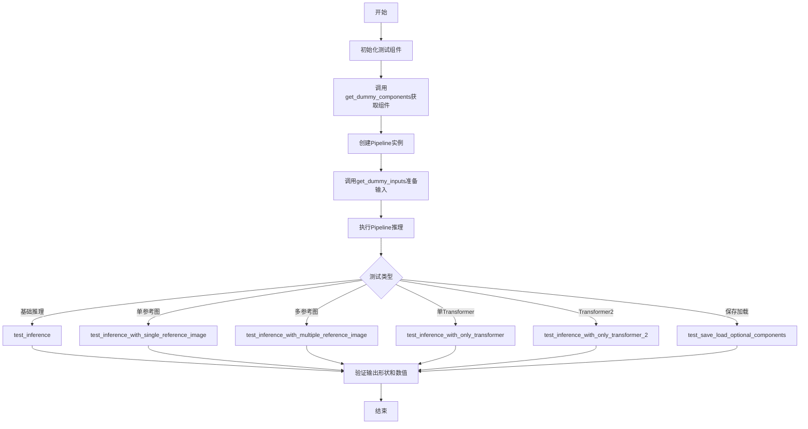

## 类结构

```
PipelineTesterMixin (测试基类)
└── WanVACEPipelineFastTests (单元测试类)
    ├── get_dummy_components (获取测试组件)
    ├── get_dummy_inputs (获取测试输入)
    └── test_* (多个测试方法)
```

## 全局变量及字段


### `tempfile`
    
用于创建临时目录和文件的模块

类型：`module`
    


### `unittest`
    
Python单元测试框架

类型：`module`
    


### `np`
    
numpy数值计算库

类型：`module`
    


### `torch`
    
PyTorch深度学习框架

类型：`module`
    


### `Image`
    
PIL图像处理类

类型：`class`
    


### `AutoTokenizer`
    
Hugging Face Transformers自动分词器

类型：`class`
    


### `T5EncoderModel`
    
T5文本编码器模型

类型：`class`
    


### `AutoencoderKLWan`
    
Wan VAE变分自编码器模型

类型：`class`
    


### `FlowMatchEulerDiscreteScheduler`
    
流匹配欧拉离散调度器

类型：`class`
    


### `UniPCMultistepScheduler`
    
UniPC多步噪声调度器

类型：`class`
    


### `WanVACEPipeline`
    
Wan VACE视频生成主Pipeline

类型：`class`
    


### `WanVACETransformer3DModel`
    
Wan VACE 3D变换器模型

类型：`class`
    


### `enable_full_determinism`
    
启用测试完全确定性函数

类型：`function`
    


### `torch_device`
    
PyTorch设备标识字符串

类型：`str`
    


### `TEXT_TO_IMAGE_BATCH_PARAMS`
    
文本到图像批处理参数集合

类型：`set`
    


### `TEXT_TO_IMAGE_IMAGE_PARAMS`
    
文本到图像图像参数集合

类型：`set`
    


### `TEXT_TO_IMAGE_PARAMS`
    
文本到图像基础参数集合

类型：`set`
    


### `PipelineTesterMixin`
    
Pipeline测试混入基类

类型：`class`
    


### `WanVACEPipelineFastTests.pipeline_class`
    
测试目标Pipeline类引用

类型：`type`
    


### `WanVACEPipelineFastTests.params`
    
TEXT_TO_IMAGE_PARAMS排除cross_attention_kwargs后的参数集合

类型：`set`
    


### `WanVACEPipelineFastTests.batch_params`
    
批处理参数集合

类型：`set`
    


### `WanVACEPipelineFastTests.image_params`
    
图像参数集合

类型：`set`
    


### `WanVACEPipelineFastTests.image_latents_params`
    
图像潜在向量参数集合

类型：`set`
    


### `WanVACEPipelineFastTests.required_optional_params`
    
必需的可选参数不可变集合

类型：`frozenset`
    


### `WanVACEPipelineFastTests.test_xformers_attention`
    
是否测试xformers注意力机制标志

类型：`bool`
    


### `WanVACEPipelineFastTests.supports_dduf`
    
是否支持DDUF特性标志

类型：`bool`
    
    

## 全局函数及方法


### `enable_full_determinism`

该函数用于设置随机种子以确保测试可复现，通过配置 NumPy、PyTorch 和 Python 的随机数生成器为固定种子，使测试结果在任何环境下都能保持一致。

参数：

- 该函数无参数

返回值：无返回值（`None`），仅执行副作用操作

#### 流程图

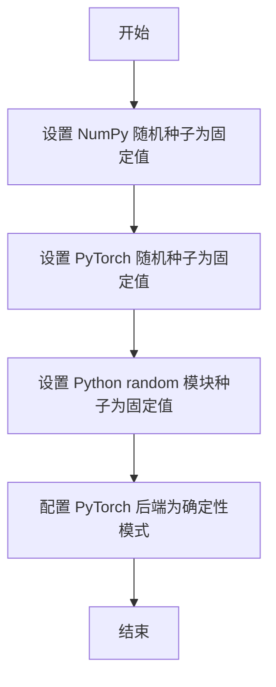

#### 带注释源码

```python
# 该函数定义位于 testing_utils 模块中
# 导入方式: from ...testing_utils import enable_full_determinism
# 调用位置: 代码文件开头，直接调用 enable_full_determinism()

# 函数调用示例（来自提供的代码）:
enable_full_determinism()

# 推断的实现逻辑:
def enable_full_determinism():
    """
    设置随机种子以确保测试可复现
    
    该函数通常会:
    1. 设置 numpy.random.seed(固定值)
    2. 设置 torch.manual_seed(固定值)
    3. 设置 torch.cuda.manual_seed_all(固定值)（如果使用CUDA）
    4. 配置 PyTorch 使用确定性算法（torch.backends.cudnn.deterministic = True）
    5. 可能设置环境变量 PYTHONHASHSEED
    """
    # ... 具体实现取决于 testing_utils 模块
    pass
```


### `torch_device`

获取测试设备，用于在测试中动态选择合适的 PyTorch 计算设备（通常是 CUDA 或 CPU）。

参数：此函数不接受任何参数。

返回值：`str`，返回 PyTorch 设备字符串（如 `"cuda"` 或 `"cpu"`），用于将模型和数据放置到相应的计算设备上。

#### 流程图

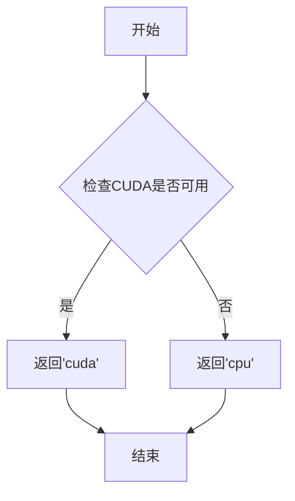

#### 带注释源码

```
# torch_device 函数定义不在本文件中
# 它是从 testing_utils 模块导入的辅助函数

# 以下是函数在本文件中的使用示例：

from ...testing_utils import enable_full_determinism, torch_device

# 使用方式1: 传递给需要设备的函数
pipe.to(torch_device)  # 将管道模型移动到设备上

# 使用方式2: 作为参数传递
inputs = self.get_dummy_inputs(torch_device)  # 获取虚拟输入数据

# 使用方式3: 直接比较或判断
if str(device).startswith("mps"):
    # 处理Apple Silicon MPS设备
```

**注意**：该函数定义在 `testing_utils` 模块中，未在本代码文件中实现。从使用方式推断，该函数通过 `torch.cuda.is_available()` 检查是否有可用的 CUDA 设备，如有则返回 `"cuda"`，否则返回 `"cpu"`。这是测试框架中常用的设备选择模式，确保测试可以在不同的硬件环境下正常运行。


### `Image.new`

创建指定尺寸、颜色模式的新图像，返回一个 PIL Image 对象。

参数：

- `mode`：`str`，图像模式，常用值包括 "RGB"（彩色图像）、"L"（灰度图像）、"RGBA"（带透明通道的彩色图像）等
- `size`：`tuple[int, int]`，图像尺寸，格式为 `(width, height)`，即宽度在前，高度在后
- `color`：`int | float | str | tuple`，可选参数，用于填充图像的背景颜色。默认为 0（黑色）。可以接受单个数值（灰度值）、RGB 元组、RGBA 元组或颜色名称字符串（如 "red"）

返回值：`PIL.Image.Image`，新创建的 PIL 图像对象

#### 流程图

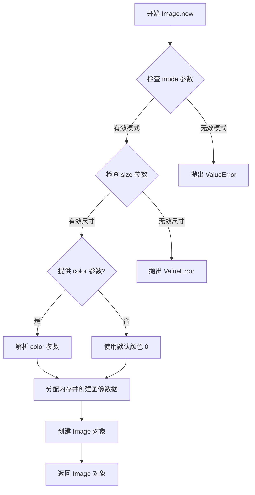

#### 带注释源码

```python
# PIL/Image.py 中的实现逻辑（简化版）

def new(mode, size, color=0):
    """
    创建新图像
    
    参数:
        mode: 图像模式字符串，如 'RGB', 'L', 'RGBA' 等
        size: (width, height) 元组
        color: 背景颜色，默认为 0（黑色）
    
    返回:
        PIL Image 对象
    """
    # 验证图像模式是否有效
    if mode not in _MODEINFO:
        raise ValueError(f"Unknown mode: {mode}")
    
    # 验证尺寸参数
    if not isinstance(size, tuple) or len(size) != 2:
        raise ValueError("Size must be a 2-tuple")
    
    # 获取图像深度信息
    im_info = _MODEINFO[mode]
    if color is None:
        # 如果 color 为 None，创建未初始化的图像
        data = None
    else:
        # 根据模式解析颜色值
        # 例如：'RGB' 模式需要 3 元组，'L' 模式需要单个值
        color = _get_color(color, mode)
        
        # 计算图像总像素数
        width, height = size
        total_pixels = width * height
        
        # 创建图像数据并填充颜色
        # 对于不同模式，使用不同的字节深度
        bytes_per_pixel = im_info["bands"]
        data = _create_image_data(size, mode, color)
    
    # 创建并返回 Image 对象
    return Image._frombytes(mode, size, data)
```

**代码中的实际调用示例：**

```python
# 创建 RGB 彩色视频帧
height = 16
width = 16
num_frames = 17
video = [Image.new("RGB", (height, width))] * num_frames

# 创建 L 模式的灰度掩码
mask = [Image.new("L", (height, width), 0)] * num_frames

# 创建单张参考图像（用于参考图像引导功能）
reference_image = Image.new("RGB", (16, 16))
```


### `pipe.set_progress_bar_config()`

设置进度条配置，用于控制推理过程中进度条的显示行为。该方法通常定义在 `DiffusionPipeline` 基类中，用于配置 pipeline 的进度条显示选项。

参数：

-  `disable`：`Optional[bool]`，控制是否禁用进度条。传递 `None` 表示不改变当前设置，传递 `True` 禁用进度条，传递 `False` 启用进度条。

返回值：`None`，无返回值（根据代码使用方式推断）。

#### 流程图

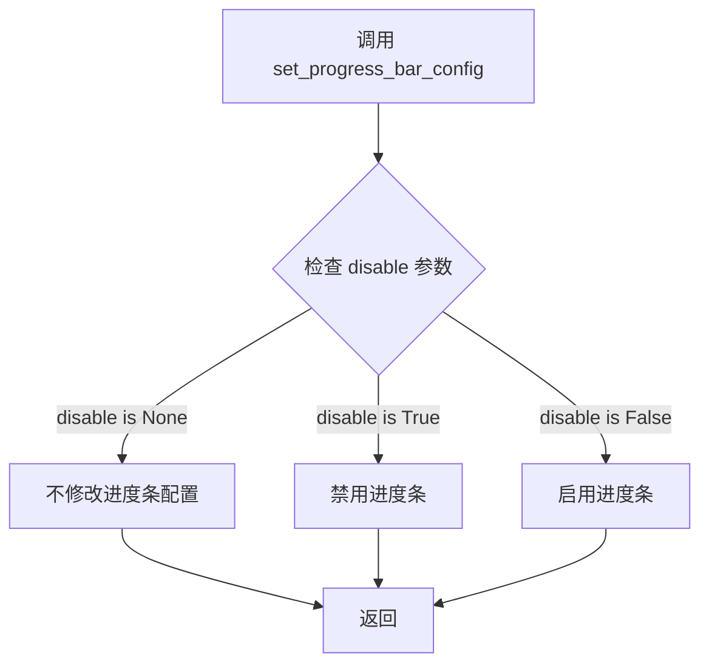

#### 带注释源码

```python
# 以下是测试代码中对该方法的调用示例

# 创建 pipeline 实例
components = self.get_dummy_components()
pipe = self.pipeline_class(**components)
pipe.to(device)

# 设置进度条配置
# disable=None 表示不改变进度条配置（保持默认行为）
pipe.set_progress_bar_config(disable=None)

# 后续进行推理
inputs = self.get_dummy_inputs(device)
video = pipe(**inputs).frames[0]
```

#### 补充说明

1. **方法位置**：该方法定义在 `diffusers` 库的 `DiffusionPipeline` 基类中，`WanVACEPipeline` 继承自该基类，因此可以使用此方法。

2. **使用场景**：
   - 在测试环境中，通常传递 `disable=None` 来保持默认的进度条设置
   - 在需要静默执行时，可以传递 `disable=True` 来禁用进度条输出
   - 在需要显示进度时，可以传递 `disable=False`

3. **相关代码调用**（在测试文件中多次出现）：
   ```python
   pipe.set_progress_bar_config(disable=None)  # 出现在 test_inference, test_inference_with_single_reference_image, test_inference_with_multiple_reference_image, test_inference_with_only_transformer, test_inference_with_only_transformer_2, test_save_load_optional_components 等多个测试方法中
   ```

4. **技术债务/优化空间**：
   - 测试代码中多次重复调用 `set_progress_bar_config(disable=None)`，可以考虑提取为测试fixture
   - 该方法的返回值类型在当前代码中未明确，建议在基类中明确定义返回类型以支持链式调用


### WanVACEPipeline.__call__

执行WanVACE Pipeline推理，根据文本提示和可选的参考图像生成视频。

参数：

- `video`：`List[Image.Image]`，输入视频帧列表，每帧为PIL图像
- `mask`：`List[Image.Image]`，输入掩码列表，用于指示需要保留或修改的区域
- `prompt`：`str`，文本提示，描述想要生成的视频内容
- `negative_prompt`：`str`，负面提示，描述不希望出现的内容
- `generator`：`torch.Generator`，随机数生成器，用于控制生成过程的可重复性
- `num_inference_steps`：`int`，推理步数，决定去噪过程的迭代次数
- `guidance_scale`：`float`，引导比例，控制文本提示对生成结果的影响程度
- `height`：`int`，生成视频的高度（像素）
- `width`：`int`，生成视频的宽度（像素）
- `num_frames`：`int`，生成视频的帧数
- `max_sequence_length`：`int`，文本序列的最大长度
- `output_type`：`str`，输出类型，如"pt"表示PyTorch张量
- `reference_images`：`Optional[Union[Image.Image, List[List[Image.Image]]]]`，可选的参考图像，用于视频修复或扩展

返回值：`PipelineOutput`，包含生成结果的管道输出对象，其`frames`属性为`List[Tensor]`，其中每个Tensor的形状为`(C, H, W)`或`(F, C, H, W)`，F为帧数，C为通道数，H和W为高度和宽度

#### 流程图

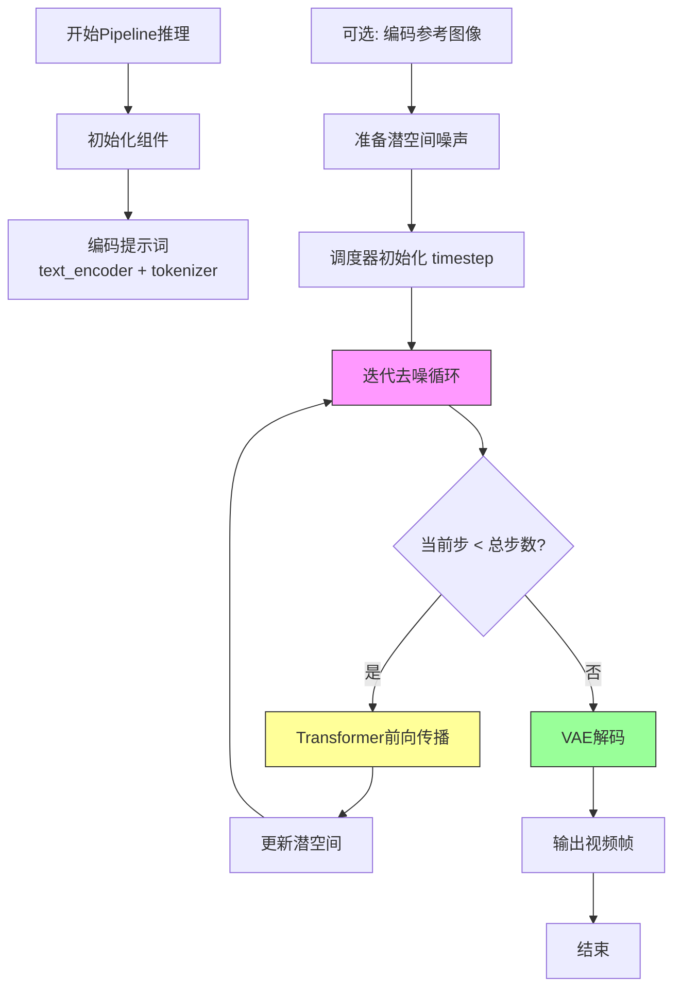

#### 带注释源码

```python
# 测试代码：WanVACEPipeline 的使用示例

def test_inference(self):
    """测试基本的Pipeline推理功能"""
    device = "cpu"

    # 1. 获取虚拟组件（用于测试）
    components = self.get_dummy_components()
    
    # 2. 创建Pipeline实例
    pipe = self.pipeline_class(**components)
    pipe.to(device)
    pipe.set_progress_bar_config(disable=None)

    # 3. 准备输入参数
    inputs = self.get_dummy_inputs(device)
    
    # 4. 执行Pipeline推理
    # 调用 WanVACEPipeline.__call__(**inputs)
    # 返回值包含 .frames 属性，存储生成的视频帧
    video = pipe(**inputs).frames[0]
    
    # 5. 验证输出形状 (17帧, 3通道, 16x16分辨率)
    self.assertEqual(video.shape, (17, 3, 16, 16))

def get_dummy_components(self):
    """创建测试用的虚拟组件"""
    torch.manual_seed(0)
    vae = AutoencoderKLWan(
        base_dim=3,
        z_dim=16,
        dim_mult=[1, 1, 1, 1],
        num_res_blocks=1,
        temperal_downsample=[False, True, True],
    )

    torch.manual_seed(0)
    scheduler = FlowMatchEulerDiscreteScheduler(shift=7.0)
    text_encoder = T5EncoderModel.from_pretrained("hf-internal-testing/tiny-random-t5")
    tokenizer = AutoTokenizer.from_pretrained("hf-internal-testing/tiny-random-t5")

    torch.manual_seed(0)
    transformer = WanVACETransformer3DModel(
        patch_size=(1, 2, 2),
        num_attention_heads=2,
        attention_head_dim=12,
        in_channels=16,
        out_channels=16,
        text_dim=32,
        freq_dim=256,
        ffn_dim=32,
        num_layers=3,
        cross_attn_norm=True,
        qk_norm="rms_norm_across_heads",
        rope_max_seq_len=32,
        vace_layers=[0, 2],
        vace_in_channels=96,
    )

    components = {
        "transformer": transformer,
        "vae": vae,
        "scheduler": scheduler,
        "text_encoder": text_encoder,
        "tokenizer": tokenizer,
        "transformer_2": None,
    }
    return components

def get_dummy_inputs(self, device, seed=0):
    """创建测试用的虚拟输入参数"""
    if str(device).startswith("mps"):
        generator = torch.manual_seed(seed)
    else:
        generator = torch.Generator(device=device).manual_seed(seed)

    num_frames = 17
    height = 16
    width = 16

    # 创建虚拟视频帧和掩码
    video = [Image.new("RGB", (height, width))] * num_frames
    mask = [Image.new("L", (height, width), 0)] * num_frames

    inputs = {
        "video": video,
        "mask": mask,
        "prompt": "dance monkey",
        "negative_prompt": "negative",
        "generator": generator,
        "num_inference_steps": 2,
        "guidance_scale": 6.0,
        "height": 16,
        "width": 16,
        "num_frames": num_frames,
        "max_sequence_length": 16,
        "output_type": "pt",
    }
    return inputs
```


### `WanVACEPipeline.save_pretrained`

该方法继承自 diffusers 库的基类 Pipeline，用于将 WanVACEPipeline 的所有组件（transformer、vae、scheduler、text_encoder、tokenizer 等）保存到指定目录，支持安全和非安全两种序列化方式。

参数：

- `save_directory`：`str`，保存模型的目录路径
- `safe_serialization`：`bool`，是否使用安全序列化（默认为 True）；若为 False，则使用 pickle 方式保存

返回值：`None`，该方法直接写入文件，无返回值

#### 流程图

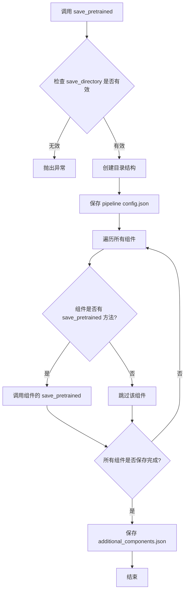

#### 带注释源码

```python
# 在 test_save_load_optional_components 方法中调用
# 代码位置：第 232 行

with tempfile.TemporaryDirectory() as tmpdir:
    # 调用 save_pretrained 方法保存 pipeline
    # 参数说明：
    #   tmpdir: 临时目录路径，用于保存模型文件
    #   safe_serialization=False: 关闭安全序列化，使用 pickle 方式保存（可保存非安全张量）
    pipe.save_pretrained(tmpdir, safe_serialization=False)
    
    # 保存后可使用 from_pretrained 重新加载
    pipe_loaded = self.pipeline_class.from_pretrained(tmpdir)
```


### `WanVACEPipeline.from_pretrained`

从预训练模型目录加载 WanVACEPipeline 管道实例。该方法是 Diffusers 库中管道类的标准类方法，用于加载通过 `save_pretrained` 保存的模型权重、配置和组件。

参数：

-  `pretrained_model_name_or_path`：`str` 或 `os.PathLike`，预训练模型的目录路径或 Hugging Face Hub 上的模型 ID
-  `**kwargs`：可选，关键字参数，用于传递额外的加载选项（如 `torch_dtype`、`device_map`、`variant` 等）

返回值：`WanVACEPipeline`，返回加载后的管道实例，包含已恢复的 transformer、vae、scheduler、text_encoder、tokenizer 等组件

#### 流程图

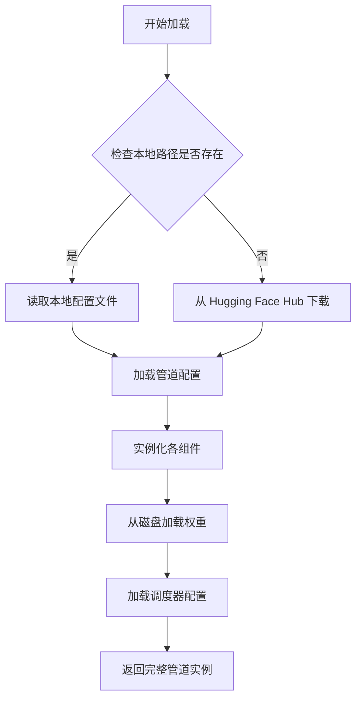

#### 带注释源码

```python
# 在测试代码中的使用方式
# self.pipeline_class 是 WanVACEPipeline
# from_pretrained 是类方法，从预训练路径加载模型

pipe_loaded = self.pipeline_class.from_pretrained(tmpdir)  # tmpdir 是保存模型的目录路径
```

```python
# 调用示例（来自测试代码）
pipe_loaded = self.pipeline_class.from_pretrained(tmpdir)
# 后续设置
for component in pipe_loaded.components.values():
    if hasattr(component, "set_default_attn_processor"):
        component.set_default_attn_processor()
pipe_loaded.to(torch_device)
pipe_loaded.set_progress_bar_config(disable=None)
```


### `WanVACEPipelineFastTests.get_dummy_components`

该方法用于创建虚拟组件（dummy components），为 WanVACE Pipeline 的单元测试提供必要的模型和调度器组件。它初始化了 VAE、transformer、text_encoder、tokenizer 和 scheduler 等关键组件，并使用固定的随机种子确保结果可复现。

参数：

- 该方法无显式参数（隐含参数 `self` 为 unittest.TestCase 实例）

返回值：`dict`，返回一个包含虚拟组件的字典，键名为组件名称，值为对应的模型或调度器实例。

#### 流程图

```mermaid
flowchart TD
    A[开始 get_dummy_components] --> B[设置随机种子 torch.manual_seed(0)]
    B --> C[创建 AutoencoderKLWan 虚拟 VAE]
    C --> D[设置随机种子 torch.manual_seed(0)]
    D --> E[创建 FlowMatchEulerDiscreteScheduler]
    E --> F[加载 T5EncoderModel 作为 text_encoder]
    F --> G[加载 AutoTokenizer]
    G --> H[设置随机种子 torch.manual_seed(0)]
    H --> I[创建 WanVACETransformer3DModel 虚拟 transformer]
    I --> J[构建 components 字典]
    J --> K[返回 components 字典]
```

#### 带注释源码

```python
def get_dummy_components(self):
    """
    创建虚拟组件用于测试 WanVACE Pipeline。
    
    该方法初始化所有必需的模型组件：
    - VAE (AutoencoderKLWan): 用于编码/解码视频 latent
    - Scheduler (FlowMatchEulerDiscreteScheduler): 扩散调度器
    - Text Encoder (T5EncoderModel): 文本编码器
    - Tokenizer: 文本分词器
    - Transformer (WanVACETransformer3DModel): 主干变换器模型
    """
    # 设置随机种子确保测试可复现性
    torch.manual_seed(0)
    
    # 创建虚拟 VAE 模型
    # base_dim=3: 输入通道数 (RGB)
    # z_dim=16: latent 空间维度
    # dim_mult=[1, 1, 1, 1]: 各层维度倍数
    # num_res_blocks=1: 每层残差块数量
    # temperal_downsample=[False, True, True]: 时序下采样配置
    vae = AutoencoderKLWan(
        base_dim=3,
        z_dim=16,
        dim_mult=[1, 1, 1, 1],
        num_res_blocks=1,
        temperal_downsample=[False, True, True],
    )

    # 再次设置随机种子确保 scheduler 初始化可复现
    torch.manual_seed(0)
    
    # 创建 Flow Match 调度器
    # shift=7.0: Flow matching 的位移参数
    scheduler = FlowMatchEulerDiscreteScheduler(shift=7.0)
    
    # 加载虚拟 T5 文本编码器 (使用 tiny-random-t5 模型)
    text_encoder = T5EncoderModel.from_pretrained("hf-internal-testing/tiny-random-t5")
    
    # 加载对应的分词器
    tokenizer = AutoTokenizer.from_pretrained("hf-internal-testing/tiny-random-t5")

    # 设置随机种子确保 transformer 初始化可复现
    torch.manual_seed(0)
    
    # 创建虚拟 3D Transformer 模型
    # patch_size=(1, 2, 2): 时空 patch 大小
    # num_attention_heads=2: 注意力头数量
    # attention_head_dim=12: 每个头的维度
    # in_channels=16 / out_channels=16: 输入输出通道数
    # text_dim=32: 文本嵌入维度
    # freq_dim=256: 频率维度 (用于 RoPE)
    # ffn_dim=32: 前馈网络维度
    # num_layers=3: Transformer 层数
    # cross_attn_norm=True: 是否对交叉注意力做归一化
    # qk_norm="rms_norm_across_heads": QK 归一化方式
    # rope_max_seq_len=32: RoPE 最大序列长度
    # vace_layers=[0, 2]: VACE 激活的层索引
    # vace_in_channels=96: VACE 输入通道数
    transformer = WanVACETransformer3DModel(
        patch_size=(1, 2, 2),
        num_attention_heads=2,
        attention_head_dim=12,
        in_channels=16,
        out_channels=16,
        text_dim=32,
        freq_dim=256,
        ffn_dim=32,
        num_layers=3,
        cross_attn_norm=True,
        qk_norm="rms_norm_across_heads",
        rope_max_seq_len=32,
        vace_layers=[0, 2],
        vace_in_channels=96,
    )

    # 组装组件字典
    # transformer: 主干变换器
    # vae: 变分自编码器
    # scheduler: 扩散调度器
    # text_encoder: 文本编码器
    # tokenizer: 分词器
    # transformer_2: 第二个变换器 (可选, 此处设为 None)
    components = {
        "transformer": transformer,
        "vae": vae,
        "scheduler": scheduler,
        "text_encoder": text_encoder,
        "tokenizer": tokenizer,
        "transformer_2": None,  # 第二个 transformer 暂未使用
    }
    
    # 返回组件字典供 pipeline 初始化使用
    return components
```


### `WanVACEPipelineFastTests.get_dummy_inputs`

该方法用于创建虚拟输入数据，模拟视频生成pipeline所需的输入参数，包括视频帧、掩码、提示词、生成器等，用于测试WanVACEPipeline的推理功能。

参数：

- `device`：`torch.device` 或 `str`，目标设备，用于创建随机数生成器
- `seed`：`int`，默认值为 0，用于设置随机数种子以确保可重复性

返回值：`Dict`，返回包含以下键的字典：
- `video`：视频帧列表（PIL.Image列表）
- `mask`：掩码列表（PIL.Image列表）
- `prompt`：正向提示词（str）
- `negative_prompt`：负向提示词（str）
- `generator`：随机数生成器（torch.Generator）
- `num_inference_steps`：推理步数（int）
- `guidance_scale`：引导 scale（float）
- `height`：输出高度（int）
- `width`：输出宽度（int）
- `num_frames`：帧数（int）
- `max_sequence_length`：最大序列长度（int）
- `output_type`：输出类型（str）

#### 流程图

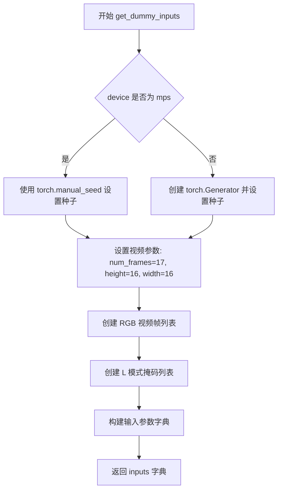

#### 带注释源码

```python
def get_dummy_inputs(self, device, seed=0):
    """
    创建虚拟输入数据，用于测试 WanVACEPipeline 推理功能
    
    参数:
        device: 目标设备 (torch.device 或 str)
        seed: 随机种子，默认值为 0
    
    返回:
        dict: 包含视频生成所需的所有输入参数
    """
    
    # 根据设备类型选择合适的随机数生成方式
    # MPS 设备使用 torch.manual_seed，其他设备使用 torch.Generator
    if str(device).startswith("mps"):
        generator = torch.manual_seed(seed)
    else:
        generator = torch.Generator(device=device).manual_seed(seed)

    # 设置视频帧的基本参数
    num_frames = 17  # 视频总帧数
    height = 16      # 帧高度
    width = 16       # 帧宽度

    # 创建虚拟视频帧：RGB 模式的图像列表
    # 每个帧都是 16x16 的 RGB 图像
    video = [Image.new("RGB", (height, width))] * num_frames
    
    # 创建虚拟掩码：L 模式（灰度）的图像列表
    # 所有掩码值设为 0（全黑/不遮挡）
    mask = [Image.new("L", (height, width), 0)] * num_frames

    # 构建完整的输入参数字典
    inputs = {
        "video": video,                    # 输入视频帧列表
        "mask": mask,                       # 输入掩码列表
        "prompt": "dance monkey",           # 正向提示词
        "negative_prompt": "negative",      # 负向提示词
        "generator": generator,             # 随机数生成器
        "num_inference_steps": 2,           # 推理步数
        "guidance_scale": 6.0,              # Classifier-free guidance 权重
        "height": 16,                       # 输出高度
        "width": 16,                        # 输出宽度
        "num_frames": num_frames,           # 输出帧数
        "max_sequence_length": 16,         # 文本编码器最大序列长度
        "output_type": "pt",                # 输出类型为 PyTorch tensor
    }
    return inputs
```


### `WanVACEPipelineFastTests.test_inference`

该测试方法用于验证 WanVACEPipeline 管道的基础视频生成推理功能是否正常工作，包括创建管道、执行推理、验证输出形状以及数值正确性。

参数：

- 该方法无显式参数（隐含参数为 `self`，表示测试类实例）

返回值：无返回值（`None`），该方法为单元测试，使用断言进行验证

#### 流程图

```mermaid
flowchart TD
    A[开始测试 test_inference] --> B[设置设备为 CPU]
    B --> C[调用 get_dummy_components 获取虚拟组件]
    C --> D[使用虚拟组件创建 WanVACEPipeline 实例]
    D --> E[将管道移至 CPU 设备]
    E --> F[设置进度条配置 disable=None]
    F --> G[调用 get_dummy_inputs 获取虚拟输入]
    G --> H[执行管道推理: pipe\*\*inputs]
    H --> I[获取生成的视频 frames[0]]
    I --> J{验证视频形状是否为 17x3x16x16}
    J -->|是| K[提取视频切片用于数值验证]
    J -->|否| L[断言失败 - 测试失败]
    K --> M{验证数值是否在容差范围内}
    M -->|是| N[测试通过]
    M -->|否| O[断言失败 - 测试失败]
```

#### 带注释源码

```python
def test_inference(self):
    """
    测试 WanVACEPipeline 的基础推理功能
    
    该测试验证：
    1. 管道能够成功创建并执行推理
    2. 输出视频的形状正确
    3. 输出数值的确定性（使用固定随机种子）
    """
    # 步骤1: 设置测试设备为 CPU
    device = "cpu"

    # 步骤2: 获取虚拟组件（用于测试的轻量级模型组件）
    # 这些组件是随机初始化的，用于快速测试
    components = self.get_dummy_components()
    
    # 步骤3: 使用虚拟组件创建 WanVACEPipeline 实例
    pipe = self.pipeline_class(**components)
    
    # 步骤4: 将管道移至指定设备（CPU）
    pipe.to(device)
    
    # 步骤5: 配置进度条（disable=None 表示不禁用进度条）
    pipe.set_progress_bar_config(disable=None)

    # 步骤6: 获取虚拟输入参数
    # 包含: video, mask, prompt, negative_prompt, generator, 
    #       num_inference_steps, guidance_scale, height, width, num_frames 等
    inputs = self.get_dummy_inputs(device)
    
    # 步骤7: 执行管道推理并获取生成的视频帧
    # pipe(**inputs) 返回一个对象，其 .frames[0] 属性包含生成的视频
    video = pipe(**inputs).frames[0]
    
    # 步骤8: 断言验证输出形状
    # 预期形状: (17帧, 3通道, 16高度, 16宽度)
    self.assertEqual(video.shape, (17, 3, 16, 16))

    # 步骤9: 定义预期的输出数值切片（用于确定性验证）
    # fmt: off
    expected_slice = [0.4523, 0.45198, 0.44872, 0.45326, 0.45211, 0.45258, 
                      0.45344, 0.453, 0.52431, 0.52572, 0.50701, 0.5118, 
                      0.53717, 0.53093, 0.50557, 0.51402]
    # fmt: on

    # 步骤10: 提取视频切片用于数值验证
    # 展平视频张量并取前8个和后8个元素（共16个）
    video_slice = video.flatten()
    video_slice = torch.cat([video_slice[:8], video_slice[-8:]])
    
    # 步骤11: 将数值四舍五入到5位小数以便比较
    video_slice = [round(x, 5) for x in video_slice.tolist()]
    
    # 步骤12: 断言验证数值是否在容差范围内
    # 使用 np.allclose 进行近似相等比较，容差为 1e-3
    self.assertTrue(np.allclose(video_slice, expected_slice, atol=1e-3))
```


### `WanVACEPipelineFastTests.test_inference_with_single_reference_image`

测试单参考图像推理功能，验证当提供单张参考图像时，WanVACEPipeline 能够正确生成视频帧，并确保输出形状和数据值符合预期。

参数：

- `self`：`unittest.TestCase`，Python unittest 框架的测试用例实例，隐含参数

返回值：`None`，无显式返回值，通过 `assert` 断言验证推理结果的正确性

#### 流程图

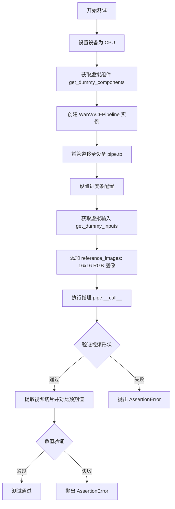

#### 带注释源码

```python
def test_inference_with_single_reference_image(self):
    """测试单参考图像推理功能
    
    验证当提供单张参考图像时，WanVACEPipeline 能够正确处理
    并生成符合预期形状和数值范围的视频帧。
    """
    # 步骤1: 设置计算设备为 CPU
    device = "cpu"

    # 步骤2: 获取预定义的虚拟组件（用于测试的轻量级模型）
    # 包含: transformer, vae, scheduler, text_encoder, tokenizer, transformer_2
    components = self.get_dummy_components()
    
    # 步骤3: 使用虚拟组件实例化 WanVACEPipeline
    pipe = self.pipeline_class(**components)
    
    # 步骤4: 将管道移至指定设备 (CPU)
    pipe.to(device)
    
    # 步骤5: 配置进度条（disable=None 表示不禁用进度条）
    pipe.set_progress_bar_config(disable=None)

    # 步骤6: 获取虚拟输入参数
    # 包含: video, mask, prompt, negative_prompt, generator, 
    #       num_inference_steps, guidance_scale, height, width, num_frames 等
    inputs = self.get_dummy_inputs(device)
    
    # 步骤7: 添加单张参考图像作为额外输入
    # 创建一个 16x16 的 RGB 图像作为参考图像
    inputs["reference_images"] = Image.new("RGB", (16, 16))
    
    # 步骤8: 执行推理管道
    # 返回 PipelineOutput 对象，通过 .frames[0] 获取第一个视频帧
    # 预期输出形状: (17, 3, 16, 16) -> (帧数, 通道数, 高度, 宽度)
    video = pipe(**inputs).frames[0]
    
    # 步骤9: 断言验证输出形状
    # 17 帧 RGB 图像，尺寸 16x16
    self.assertEqual(video.shape, (17, 3, 16, 16))

    # 步骤10: 定义预期输出数值切片（用于确定性验证）
    # fmt: off  # 禁用代码格式化以保持数值格式
    expected_slice = [
        0.45247, 0.45214, 0.44874, 0.45314, 0.45171, 0.45299,  # 前6个值
        0.45428, 0.45317, 0.51378, 0.52658, 0.53361, 0.52303,  # 中间6个值
        0.46204, 0.50435, 0.52555, 0.51342                       # 后4个值
    ]
    # fmt: on  # 恢复代码格式化

    # 步骤11: 提取并处理视频数据用于比较
    video_slice = video.flatten()  # 展平为1D张量
    video_slice = torch.cat([video_slice[:8], video_slice[-8:]])  # 取首尾各8个元素
    video_slice = [round(x, 5) for x in video_slice.tolist()]  # 保留5位小数

    # 步骤12: 数值精度验证
    # 允许误差范围: 1e-3 (0.001)
    self.assertTrue(np.allclose(video_slice, expected_slice, atol=1e-3))
```


### `WanVACEPipelineFastTests.test_inference_with_multiple_reference_image`

该测试方法用于验证 WanVACE 管道在多参考图像输入情况下的推理功能，通过传入嵌套列表格式的多张参考图像，验证管道能够正确处理并生成符合预期形状和数值的视频帧。

参数：

- `self`：类实例方法，无需显式传递

返回值：`None`，测试方法通过断言验证输出，不返回具体值

#### 流程图

```mermaid
flowchart TD
    A[开始测试] --> B[设置设备为cpu]
    B --> C[调用get_dummy_components获取虚拟组件]
    C --> D[创建WanVACEPipeline实例]
    D --> E[将管道移至cpu设备]
    E --> F[配置进度条显示]
    F --> G[调用get_dummy_inputs获取输入参数]
    G --> H[设置reference_images为嵌套列表: [[Image1, Image2]]]
    H --> I[执行管道推理: pipe(**inputs)]
    I --> J[获取输出frames[0]]
    J --> K{断言验证}
    K -->|通过| L[验证视频形状为17x3x16x16]
    K -->|通过| M[验证视频帧数值slice与expected_slice接近]
    L --> N[测试结束]
    M --> N
```

#### 带注释源码

```python
def test_inference_with_multiple_reference_image(self):
    """
    测试使用多参考图像进行推理的功能
    验证管道能处理嵌套列表格式的reference_images参数
    """
    # 1. 设置测试设备为CPU
    device = "cpu"

    # 2. 获取虚拟组件（用于测试的模拟模型组件）
    components = self.get_dummy_components()
    
    # 3. 使用虚拟组件实例化WanVACEPipeline管道
    pipe = self.pipeline_class(**components)
    
    # 4. 将管道移至指定设备
    pipe.to(device)
    
    # 5. 配置进度条（disable=None表示不禁用）
    pipe.set_progress_bar_config(disable=None)

    # 6. 获取测试用的虚拟输入参数
    inputs = self.get_dummy_inputs(device)
    
    # 7. 添加多参考图像输入 - 嵌套列表格式表示多组参考图像
    # 格式: [[Image1, Image2, ...]] 表示第一组参考图像包含2张
    inputs["reference_images"] = [[Image.new("RGB", (16, 16))] * 2]
    
    # 8. 执行管道推理，获取生成的视频帧
    # 返回对象包含frames属性，frames[0]为第一个生成的视频
    video = pipe(**inputs).frames[0]
    
    # 9. 断言验证：视频形状应为 (帧数, 通道数, 高度, 宽度)
    # 17帧, 3通道(RGB), 16x16分辨率
    self.assertEqual(video.shape, (17, 3, 16, 16))

    # 10. 预期的输出数值片段（用于验证输出正确性）
    # fmt: off
    expected_slice = [
        0.45321, 0.45221, 0.44818, 0.45375,  # 前8个元素的前4个
        0.45268, 0.4519, 0.45271, 0.45253,  # 前8个元素的后4个
        0.51244, 0.52223, 0.51253, 0.51321,  # 后8个元素的前4个
        0.50743, 0.51177, 0.51626, 0.50983   # 后8个元素的后4个
    ]
    # fmt: on

    # 11. 提取视频帧的数值进行验证
    # 将视频展平，取前8个和后8个元素（共16个）进行比较
    video_slice = video.flatten()
    video_slice = torch.cat([video_slice[:8], video_slice[-8:]])
    
    # 12. 数值四舍五入到5位小数
    video_slice = [round(x, 5) for x in video_slice.tolist()]
    
    # 13. 验证实际输出与预期值的接近程度（允许1e-3的误差）
    self.assertTrue(np.allclose(video_slice, expected_slice, atol=1e-3))
```


### `WanVACEPipelineFastTests.test_attention_slicing_forward_pass`

该测试方法用于验证注意力切片（attention slicing）功能的前向传播，但由于当前不支持该功能，已被跳过。

参数：

- `self`：`unittest.TestCase`， unittest测试框架的标准实例参数，代表测试类本身

返回值：`None`，该方法被跳过，不执行任何测试逻辑，因此无返回值

#### 流程图

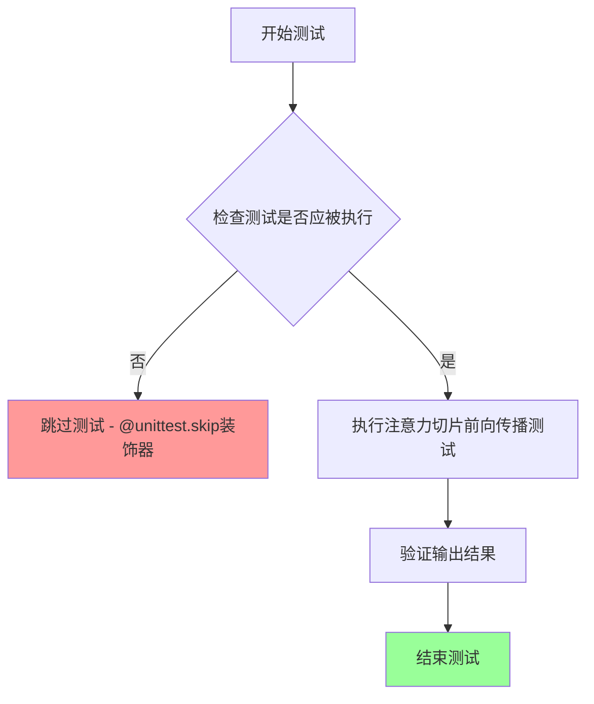

#### 带注释源码

```python
@unittest.skip("Test not supported")
def test_attention_slicing_forward_pass(self):
    """
    测试注意力切片(attention slicing)的前向传播功能。
    
    该测试方法用于验证WanVACEPipeline在启用注意力切片优化时
    是否能够正确执行前向传播。注意力切片是一种内存优化技术，
    可以减少大型模型在推理时的显存占用。
    
    当前状态：
    - 该测试已被@unittest.skip装饰器跳过
    - 跳过原因：Test not supported
    - 方法体为空，仅包含pass语句
    
    注意：
    注意力切片（Attention Slicing）是diffusers库中的一种优化技术，
    允许将注意力计算分片处理以节省显存。在WanVACEPipeline中，
    由于某些底层实现限制，此测试被标记为不支持。
    """
    pass  # 测试主体为空，已被跳过
```


### WanVACEPipelineFastTests.test_encode_prompt_works_in_isolation

该测试方法用于验证prompt编码能够独立（隔离）工作，即测试文本编码器在处理单个prompt时的正确性。由于WanVACEPipeline当前不支持一次传递多个prompts，此测试被无条件跳过。

参数：

- `self`：`WanVACEPipelineFastTests`，unittest.TestCase的实例方法，表示测试类本身

返回值：`None`，该方法不返回任何值（方法体为`pass`语句）

#### 流程图

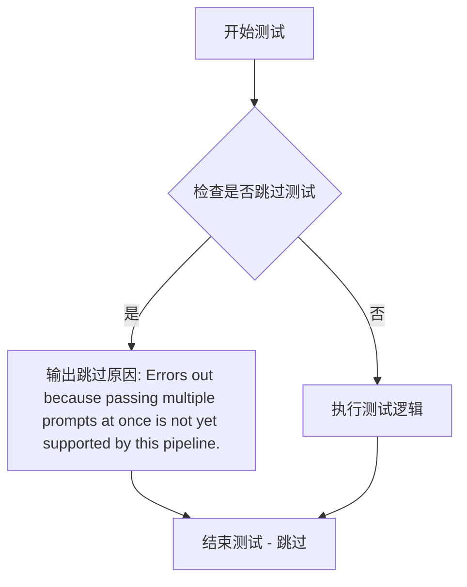

#### 带注释源码

```python
@unittest.skip("Errors out because passing multiple prompts at once is not yet supported by this pipeline.")
def test_encode_prompt_works_in_isolation(self):
    """
    测试prompt编码在隔离模式下是否正常工作。
    
    该测试方法的目的是验证文本编码器能够正确处理单个prompt，
    确保编码过程不依赖于其他输入或状态。
    
    注意：由于WanVACEPipeline当前不支持一次传递多个prompts，
    此测试被跳过以避免运行错误。
    """
    pass  # 测试逻辑未实现，方法被跳过
```

#### 附加信息

| 项目 | 说明 |
|------|------|
| **跳过原因** | Errors out because passing multiple prompts at once is not yet supported by this pipeline. |
| **跳过装饰器** | `@unittest.skip()` |
| **所属测试类** | `WanVACEPipelineFastTests` |
| **测试类型** | 单元测试（Unit Test） |
| **测试目标** | 验证文本编码器的隔离工作能力 |
| **技术债务** | 该测试被永久跳过，表明pipeline需要支持批量prompt处理功能 |


### `WanVACEPipelineFastTests.test_inference_batch_consistent`

这是一个单元测试方法，用于测试 WanVA CE Pipeline 的批处理一致性。该测试方法由于当前管道暂不支持批处理功能而被跳过，不执行任何实际验证逻辑。

参数：

- `self`：`WanVACEPipelineFastTests`，测试类实例，表示当前测试对象

返回值：`None`，该方法不返回任何值（方法体为空操作 `pass`）

#### 流程图

```mermaid
flowchart TD
    A[开始测试] --> B{检查装饰器}
    B -->|有@unittest.skip装饰器| C[跳过测试]
    C --> D[结束 - 不执行任何断言]
    
    style C fill:#ff9900
    style D fill:#ffcc00
```

#### 带注释源码

```python
@unittest.skip("Batching is not yet supported with this pipeline")
def test_inference_batch_consistent(self):
    """
    测试 WanVACEPipeline 的批处理一致性。
    
    该测试方法用于验证管道在处理多个批次输入时，
    能否产生一致的结果。但由于当前实现中批处理功能
    尚未支持，因此使用 @unittest.skip 装饰器跳过执行。
    
    Parameters:
        self: WanVACEPipelineFastTests 实例，继承自 unittest.TestCase
        
    Returns:
        None: 由于测试被跳过，不执行任何操作
        
    Note:
        跳过原因: "Batching is not yet supported with this pipeline"
        这是当前管道的一个功能限制，需要后续版本实现批处理支持。
    """
    pass  # 空方法体，测试被跳过
```


### `WanVACEPipelineFastTests.test_inference_batch_single_identical`

该测试方法用于验证在批处理模式下，单个样本的推理结果与单独推理结果的一致性。由于 WanVACEPipeline 当前不支持批处理功能，该测试被跳过。

参数：

- `self`：隐式参数，`WanVACEPipelineFastTests` 测试类实例，无需显式传入

返回值：`None`，测试被跳过，不执行实际逻辑

#### 流程图

```mermaid
flowchart TD
    A[开始执行 test_inference_batch_single_identical] --> B{检查 @unittest.skip 装饰器}
    B -->|测试被标记为跳过| C[跳过测试并输出原因: Batching is not yet supported with this pipeline]
    C --> D[测试结束]
    B -->|测试未被跳过| E[调用 super().test_inference_batch_single_identical]
    E --> D
```

#### 带注释源码

```python
@unittest.skip("Batching is not yet supported with this pipeline")
def test_inference_batch_single_identical(self):
    """
    测试批处理单个样本的一致性。
    
    该测试方法继承自 PipelineTesterMixin，用于验证：
    1. 使用单个提示词调用管道生成结果
    2. 使用包含单个提示词的批处理调用管道生成结果
    3. 比较两者输出是否一致
    
    当前实现：
    - 使用 @unittest.skip 装饰器跳过测试
    - 跳过原因：WanVACEPipeline 管道尚不支持批处理功能
    - 调用父类方法但实际不会执行（因测试已跳过）
    
    Returns:
        None: 测试被跳过，无返回值
    """
    return super().test_inference_batch_single_identical()
```


### `WanVACEPipelineFastTests.test_float16_inference`

该测试方法用于验证FP16（半精度浮点数）推理功能，但由于AutoencoderKLWan编码的潜在变量始终为FP32数据类型，该测试当前被跳过。

参数：

- `self`：`WanVACEPipelineFastTests`，测试类实例本身

返回值：`None`，无返回值（方法体为`pass`）

#### 流程图

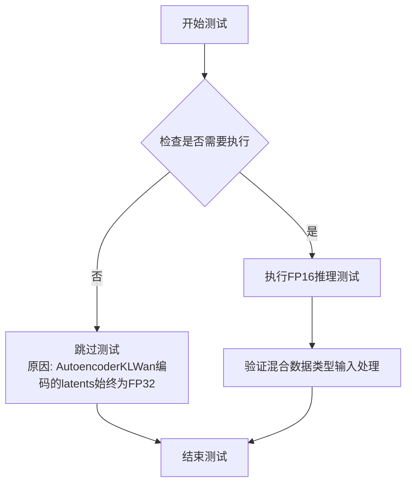

#### 带注释源码

```python
@unittest.skip(
    "AutoencoderKLWan encoded latents are always in FP32. This test is not designed to handle mixed dtype inputs"
)
def test_float16_inference(self):
    """
    测试FP16推理功能
    
    注意：此测试被跳过，原因如下：
    - AutoencoderKLWan 编码的潜在变量（latents）始终为 FP32 类型
    - 该测试设计用于处理混合数据类型输入，但当前实现不支持
    - 需要对 AutoencoderKLWan 进行相应修改后才能启用此测试
    
    Args:
        self: WanVACEPipelineFastTests 实例
        
    Returns:
        None
        
    Raises:
        unittest.SkipTest: 测试被跳过
    """
    pass
```

#### 技术债务说明

| 项目 | 说明 |
|------|------|
| **跳过原因** | AutoencoderKLWan 编码的 latents 始终为 FP32，不支持混合精度推理 |
| **优化方向** | 需要修改 AutoencoderKLWan 以支持 FP16 编码，从而启用此测试 |
| **影响范围** | 无法验证 pipeline 在混合精度（FP16/FP32）下的正确性和性能 |
| **优先级** | 中等 - 功能验证类测试 |


### `WanVACEPipelineFastTests.test_save_load_float16`

该测试方法用于验证 FP16（半精度浮点数）格式的模型保存和加载功能，但由于 AutoencoderKLWan 编码的潜在变量始终为 FP32 格式，此测试目前不支持混合精度输入，因此被跳过。

参数：

- `self`：`WanVACEPipelineFastTests`，表示测试类实例本身，无需额外参数

返回值：无返回值（`None`），该方法被 `@unittest.skip` 装饰器跳过，实际执行体为空（`pass`）

#### 流程图

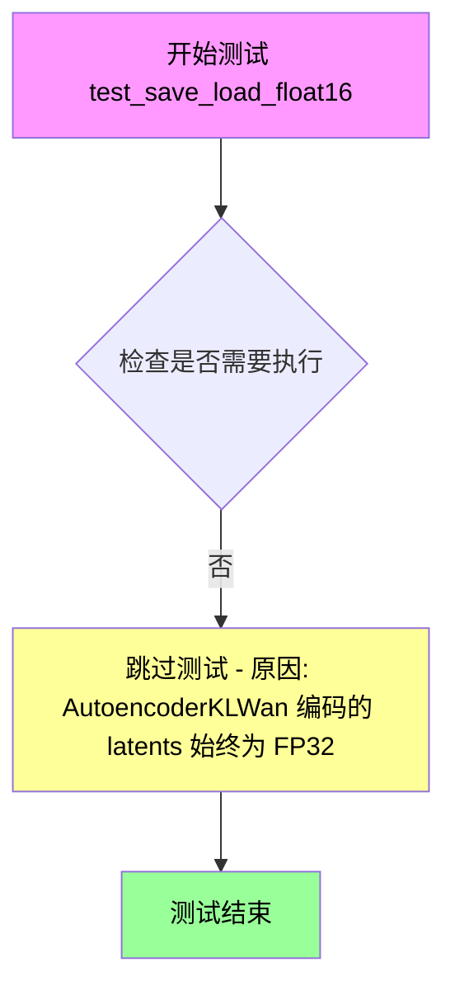

#### 带注释源码

```python
@unittest.skip(
    "AutoencoderKLWan encoded latents are always in FP32. This test is not designed to handle mixed dtype inputs"
)
def test_save_load_float16(self):
    """
    测试 FP16 保存加载功能
    
    该测试方法原本用于验证模型在 FP16（半精度浮点数）格式下的保存和加载是否正常工作。
    但由于以下原因被跳过：
    - AutoencoderKLWan 编码的 latents（潜在变量）始终为 FP32 格式
    - 该测试未设计处理混合精度输入的场景
    
    参数:
        self: WanVACEPipelineFastTests - 测试类实例
        
    返回值:
        None - 测试被跳过，无实际执行
    """
    pass  # 测试主体为空，已被 skip 装饰器跳过
```


### WanVACEPipelineFastTests.test_inference_with_only_transformer

该测试方法用于验证 WanVACEPipeline 在仅使用主 transformer（不包含 transformer_2）时的推理功能，通过设置 `transformer_2` 为 None 和 `boundary_ratio` 为 0.0 来确保仅依赖主 transformer 进行视频生成。

参数：

- `self`：实例方法，WanVACEPipelineFastTests 类的实例本身，无需显式传递

返回值：无返回值（测试方法，使用 assert 断言验证结果）

#### 流程图

```mermaid
flowchart TD
    A[开始测试] --> B[获取虚拟组件: get_dummy_components]
    B --> C[设置 transformer_2 = None]
    C --> D[设置 boundary_ratio = 0.0]
    D --> E[创建管道实例: WanVACEPipeline]
    E --> F[将管道移至设备: torch_device]
    F --> G[配置进度条: set_progress_bar_config]
    G --> H[获取虚拟输入: get_dummy_inputs]
    H --> I[执行推理: pipe(**inputs)]
    I --> J[提取输出视频: .frames[0]]
    J --> K{断言验证}
    K -->|通过| L[测试通过]
    K -->|失败| M[抛出断言错误]
```

#### 带注释源码

```python
def test_inference_with_only_transformer(self):
    # 步骤1: 获取预定义的虚拟组件配置
    # 这些组件包括 VAE、scheduler、text_encoder、tokenizer 和 transformer
    components = self.get_dummy_components()
    
    # 步骤2: 配置测试场景 - 仅使用主 transformer
    # 将 transformer_2 设置为 None，确保不使用第二个 transformer
    components["transformer_2"] = None
    
    # 步骤3: 设置边界比率
    # boundary_ratio = 0.0 表示完全使用主 transformer 的推理路径
    components["boundary_ratio"] = 0.0
    
    # 步骤4: 使用配置好的组件创建 WanVACEPipeline 管道实例
    pipe = self.pipeline_class(**components)
    
    # 步骤5: 将管道移至计算设备（CPU 或 CUDA）
    pipe.to(torch_device)
    
    # 步骤6: 配置进度条显示（disable=None 表示不禁用进度条）
    pipe.set_progress_bar_config(disable=None)
    
    # 步骤7: 准备虚拟输入数据
    # 包含 video, mask, prompt, negative_prompt, generator 等参数
    inputs = self.get_dummy_inputs(torch_device)
    
    # 步骤8: 执行管道推理，生成视频帧
    # 返回 PipelineOutput 对象，通过 .frames[0] 获取第一批次视频
    video = pipe(**inputs).frames[0]
    
    # 步骤9: 断言验证输出形状
    # 预期形状: (17 帧, 3 通道, 16 高度, 16 宽度)
    assert video.shape == (17, 3, 16, 16)
```


### `WanVACEPipelineFastTests.test_inference_with_only_transformer_2`

该测试方法用于验证 WanVACEPipeline 仅使用 transformer_2 模型进行推理的功能，通过设置 `transformer` 为 None、`transformer_2` 为有效的 transformer 模型，并配置 `boundary_ratio` 为 1.0 来实现仅使用 transformer_2 的推理场景。

参数：

- `self`：测试类实例本身，无参数描述

返回值：无明确返回值（测试方法，通过 assert 断言验证结果）

#### 流程图

```mermaid
flowchart TD
    A[开始测试] --> B[获取虚拟组件]
    B --> C[设置 transformer_2 为有效模型]
    C --> D[设置 transformer 为 None]
    D --> E[创建 UniPCMultistepScheduler 替换原 scheduler]
    E --> F[设置 boundary_ratio 为 1.0]
    F --> G[创建 WanVACEPipeline 实例]
    G --> H[将 pipeline 移到 torch_device]
    H --> I[配置进度条]
    I --> J[获取虚拟输入]
    J --> K[执行 pipeline 推理]
    K --> L[获取输出视频 frames[0]]
    L --> M{验证视频形状是否为 17x3x16x16}
    M -->|是| N[测试通过]
    M -->|否| O[断言失败]
```

#### 带注释源码

```python
def test_inference_with_only_transformer_2(self):
    # 1. 获取预配置的虚拟组件字典
    components = self.get_dummy_components()
    
    # 2. 将 transformer_2 设置为有效的 transformer 模型
    #    这样管道将只使用 transformer_2 进行推理
    components["transformer_2"] = components["transformer"]
    
    # 3. 将 transformer 设置为 None，确保只使用 transformer_2
    components["transformer"] = None

    # 4. 替换调度器为 UniPCMultistepScheduler
    #    原因：FlowMatchEulerDiscreteScheduler 不支持低噪声单独运行
    #    因为起始时间步 t == 1000 等于 boundary_timestep
    components["scheduler"] = UniPCMultistepScheduler(
        prediction_type="flow_prediction", 
        use_flow_sigmas=True, 
        flow_shift=3.0
    )

    # 5. 设置 boundary_ratio 为 1.0
    #    这表示完全使用 transformer_2 的推理路径
    components["boundary_ratio"] = 1.0
    
    # 6. 使用配置的组件创建 WanVACEPipeline
    pipe = self.pipeline_class(**components)
    
    # 7. 将 pipeline 移到测试设备（CPU 或 CUDA）
    pipe.to(torch_device)
    
    # 8. 配置进度条（disable=None 表示启用进度条）
    pipe.set_progress_bar_config(disable=None)

    # 9. 获取虚拟输入数据
    inputs = self.get_dummy_inputs(torch_device)
    
    # 10. 执行推理并获取输出视频
    #     返回值包含 frames 属性，取第一个元素得到视频张量
    video = pipe(**inputs).frames[0]
    
    # 11. 断言验证输出形状
    #     预期形状：(17 帧, 3 通道, 16 高度, 16 宽度)
    assert video.shape == (17, 3, 16, 16)
```


### `WanVACEPipelineFastTests.test_save_load_optional_components`

该测试方法用于验证 WanVACEPipeline 在某些可选组件（如 transformer）被设置为 `None` 时，能否正确执行保存和加载操作，并在加载后保持这些组件为 `None`，同时确保输出结果的一致性。

参数：

- `self`：`unittest.TestCase`，测试类实例
- `expected_max_difference`：`float`，期望的最大差异阈值，默认为 `1e-4`，用于比较保存前后输出的最大差异

返回值：`None`，该方法为单元测试方法，无返回值

#### 流程图

```mermaid
flowchart TD
    A[开始测试] --> B[定义可选组件列表: transformer]
    B --> C[获取基础组件]
    C --> D[设置 transformer_2 = transformer]
    D --> E[更换调度器为 UniPCMultistepScheduler]
    E --> F[将可选组件设置为 None]
    F --> G[设置 boundary_ratio = 1.0]
    G --> H[创建管道实例]
    H --> I[设置默认注意力处理器]
    I --> J[移动管道到设备并禁用进度条]
    J --> K[生成随机输入并获取输出]
    K --> L[保存管道到临时目录]
    L --> M[从临时目录加载管道]
    M --> N[设置加载管道的默认注意力处理器]
    N --> O[移动加载管道到设备]
    O --> P[验证可选组件仍为 None]
    P --> Q[使用相同输入获取加载管道的输出]
    Q --> R{计算输出差异}
    R -->|差异 < 阈值| S[测试通过]
    R -->|差异 >= 阈值| T[测试失败]
```

#### 带注释源码

```python
def test_save_load_optional_components(self, expected_max_difference=1e-4):
    """
    测试可选组件的保存和加载功能
    验证当 transformer 设置为 None 时，保存加载后仍为 None，且输出保持一致
    """
    # 1. 定义需要测试的可选组件列表
    optional_component = ["transformer"]

    # 2. 获取基础组件配置
    components = self.get_dummy_components()
    
    # 3. 设置 transformer_2 使用同一个 transformer 实例
    components["transformer_2"] = components["transformer"]
    
    # 4. 替换调度器为 UniPCMultistepScheduler
    # 原因: FlowMatchEulerDiscreteScheduler 不支持仅运行低噪声调度
    components["scheduler"] = UniPCMultistepScheduler(
        prediction_type="flow_prediction", 
        use_flow_sigmas=True, 
        flow_shift=3.0
    )
    
    # 5. 将指定的可选组件设置为 None
    for component in optional_component:
        components[component] = None

    # 6. 设置边界比率
    components["boundary_ratio"] = 1.0

    # 7. 创建管道实例
    pipe = self.pipeline_class(**components)
    
    # 8. 为所有组件设置默认注意力处理器
    for component in pipe.components.values():
        if hasattr(component, "set_default_attn_processor"):
            component.set_default_attn_processor()
            
    # 9. 移动管道到设备并配置进度条
    pipe.to(torch_device)
    pipe.set_progress_bar_config(disable=None)

    # 10. 获取测试输入（在 CPU 设备上生成随机数）
    generator_device = "cpu"
    inputs = self.get_dummy_inputs(generator_device)
    
    # 11. 使用固定随机种子获取原始输出
    torch.manual_seed(0)
    output = pipe(**inputs)[0]

    # 12. 创建临时目录用于保存
    with tempfile.TemporaryDirectory() as tmpdir:
        # 13. 保存管道到临时目录（不使用安全序列化）
        pipe.save_pretrained(tmpdir, safe_serialization=False)
        
        # 14. 从临时目录加载管道
        pipe_loaded = self.pipeline_class.from_pretrained(tmpdir)
        
        # 15. 为加载的管道设置默认注意力处理器
        for component in pipe_loaded.components.values():
            if hasattr(component, "set_default_attn_processor"):
                component.set_default_attn_processor()
                
        # 16. 移动加载的管道到设备
        pipe_loaded.to(torch_device)
        pipe_loaded.set_progress_bar_config(disable=None)

    # 17. 验证可选组件在加载后仍为 None
    for component in optional_component:
        assert getattr(pipe_loaded, component) is None, \
            f"`{component}` did not stay set to None after loading."

    # 18. 使用相同输入获取加载管道的输出
    inputs = self.get_dummy_inputs(generator_device)
    torch.manual_seed(0)
    output_loaded = pipe_loaded(**inputs)[0]

    # 19. 计算输出差异并验证
    max_diff = np.abs(
        output.detach().cpu().numpy() - 
        output_loaded.detach().cpu().numpy()
    ).max()
    
    # 20. 断言差异在允许范围内
    assert max_diff < expected_max_difference, \
        "Outputs exceed expecpted maximum difference"
```

## 关键组件


### WanVACEPipeline

WanVACE视频生成管道的主类，整合了transformer、VAE、调度器和文本编码器，实现文本到视频的生成功能，支持单/多参考图像输入。

### WanVACETransformer3DModel

3D视觉-音频-文本编码器模型，负责视频帧的潜在空间建模，支持VACE层和双transformer架构。

### AutoencoderKLWan

基于KL散度的Wan VAE模型，用于视频潜在表示的编码和解码，支持时序下采样。

### FlowMatchEulerDiscreteScheduler

基于Flow Matching的欧拉离散调度器，用于扩散采样的噪声调度。

### UniPCMultistepScheduler

UniPC多步调度器，支持flow_prediction模式，用于双transformer架构的低噪声推理。

### T5EncoderModel

文本编码器模型，将文本提示转换为特征表示。

### 张量索引与切片

通过torch.cat对视频张量进行首尾切片提取，用于输出验证。

### 惰性加载机制

使用from_pretrained实现模型的延迟加载，支持安全序列化与反序列化。

### 双Transformers架构

支持transformer和transformer_2组合，通过boundary_ratio参数控制双pipeline协作。

### 参考图像支持

支持单张reference_images和批量reference_images输入，用于视频生成的条件控制。

### 调度器兼容性检测

针对FlowMatchEulerDiscreteScheduler的低噪声限制问题，动态切换调度器类型。


## 问题及建议


### 已知问题

-   **语法错误**：`test_inference_batch_single_identical` 方法中 `@unittest.skip` 装饰器后的方法体先执行 `pass`，然后执行 `return super().test_inference_batch_single_identical()`，这会导致在跳过装饰器失效时产生逻辑错误，且 `return` 语句永远不会被执行（因为 `pass` 后面的代码不可达）。
-   **魔法数字缺乏抽象**：多处使用硬编码的数值如 `num_frames=17`、`height=16`、`width=16`、`max_sequence_length=16` 等，未定义为常量，降低了代码可维护性。
-   **代码重复**：获取视频帧切片并进行断言的逻辑在 `test_inference`、`test_inference_with_single_reference_image`、`test_inference_with_multiple_reference_image` 三个方法中完全重复。
-   **测试设置代码重复**：每个测试方法中都包含 `pipe.to(device)` 和 `pipe.set_progress_bar_config(disable=None)` 的重复调用。
-   **随机种子管理不一致**：`get_dummy_components` 方法内多次调用 `torch.manual_seed(0)`，每次调用会重置随机状态，可能导致组件间的随机性关联丢失。
-   **跳过测试缺乏明确原因说明**：`@unittest.skip` 装饰器仅包含简短描述，未提供详细的技术原因或相关 issue 链接，不利于后续维护者理解。
-   **缺失边界条件测试**：未覆盖 `num_frames=1`、`height=1`、`width=1` 等极端边界情况，以及空 `prompt`、无效 `negative_prompt` 等异常输入。

### 优化建议

-   **修复语法错误**：将 `test_inference_batch_single_identical` 方法体中的 `pass` 和后续 `return` 语句移除或修正为正确的跳过逻辑。
-   **提取常量**：在类或模块级别定义测试常量，如 `DEFAULT_NUM_FRAMES = 17`、`DEFAULT_HEIGHT = 16`、`DEFAULT_WIDTH = 16` 等。
-   **提取辅助方法**：将重复的视频帧断言逻辑抽取为私有方法（如 `_assert_video_slice_equal`），将管道设置逻辑抽取为 `_setup_pipeline` 方法。
-   **优化随机种子管理**：在 `get_dummy_components` 方法开始时一次性设置种子，或使用 `torch.Generator` 显式管理各组件的随机状态。
-   **完善跳过注释**：为每个 `@unittest.skip` 添加更详细的说明，包括具体的错误信息、相关 GitHub issue 或技术限制的具体描述。
-   **增加测试用例**：补充边界条件测试和异常输入处理测试，提升测试覆盖率。

## 其它


### 设计目标与约束

本测试文件旨在验证WanVACEPipeline在不同配置下的功能正确性，包括单transformer、双transformer、参考图像等场景。约束条件包括：设备限制为CPU和CUDA，不支持float16推理，不支持批处理，不支持xFormers注意力优化。

### 错误处理与异常设计

测试中通过@unittest.skip装饰器明确标注不支持的测试用例，包括注意力切片、多提示批处理、float16推理等。断言使用np.allclose验证输出精度，设置atol=1e-3的容差范围。对于不支持的功能，测试会被跳过而非失败，确保测试套件的可执行性。

### 数据流与状态机

数据流经过以下阶段：1)初始化组件(get_dummy_components)创建VAE、scheduler、text_encoder、tokenizer、transformer；2)准备输入(get_dummy_inputs)生成video、mask、prompt等；3)管道执行(pipe(**inputs))调用__call__方法；4)输出验证检查frames[0]的shape和数值slice。状态机涉及scheduler的step更新和transformer的推理状态转换。

### 外部依赖与接口契约

依赖包括：transformers(T5EncoderModel, AutoTokenizer)、diffusers(AutoencoderKLWan, FlowMatchEulerDiscreteScheduler, UniPCMultistepScheduler, WanVACEPipeline, WanVACETransformer3DModel)、PIL、numpy、torch。接口契约要求pipeline_class必须继承PipelineTesterMixin，提供get_dummy_components()和get_dummy_inputs()方法，参数需符合TEXT_TO_IMAGE_PARAMS规范。

### 性能考量与基准

测试使用固定的随机种子(torch.manual_seed(0))确保可重复性。推理步骤设置为2(num_inference_steps=2)以加快测试速度。视频尺寸为17帧16x16，transformer层数为3，attention head为2，这些配置均为最小化测试配置。性能基准通过expected_slice数组定义，用于回归检测。

### 安全性与合规性

代码包含Apache 2.0许可证头部声明。使用safe_serialization=False进行模型保存以支持非安全格式。测试不涉及敏感数据，仅使用dummy组件和固定提示词"dance monkey"。未发现潜在的安全漏洞或合规性问题。

### 兼容性设计

测试通过检查device类型(mps设备特殊处理generator)实现跨平台兼容。transformer_2可为None支持可选组件。output_type="pt"指定PyTorch张量输出格式。boundary_ratio参数支持0.0(仅transformer)和1.0(仅transformer_2)的灵活配置。

### 测试覆盖范围

覆盖场景包括：基础推理、单参考图像推理、多参考图像推理、仅transformer模式、仅transformer_2模式、保存加载功能。跳过的测试明确标注原因，确保测试套件完整性但避免失败。预期输出slice用于关键数值验证。

### 配置管理与默认值

组件通过get_dummy_components集中配置，关键参数包括：vae(base_dim=3, z_dim=16)、transformer(num_layers=3, num_attention_heads=2)、scheduler(shift=7.0)。可选参数通过required_optional_params定义，包括generator、latents、callback等。默认值在pipeline初始化时由diffusers框架设定。

### 资源清理与副作用

使用tempfile.TemporaryDirectory()确保临时文件自动清理。Generator设置固定种子支持确定性测试。pipeline通过set_progress_bar_config(disable=None)控制进度条显示。测试完成后资源应被Python垃圾回收机制自动释放。

    