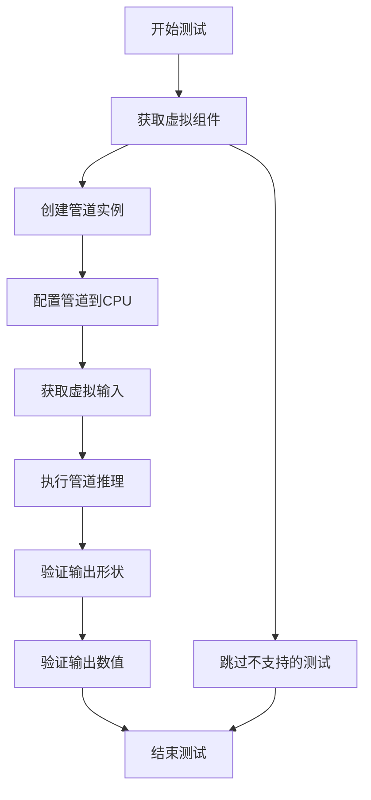
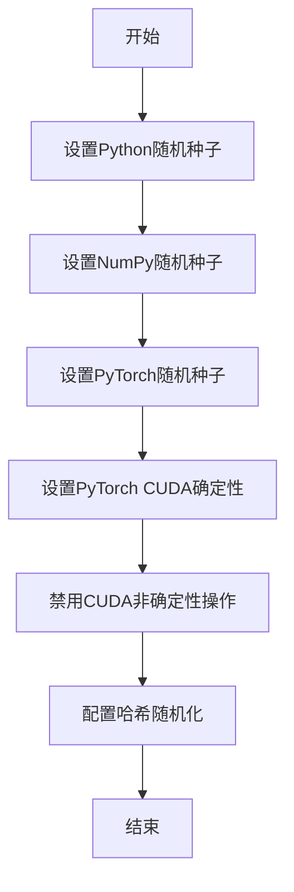
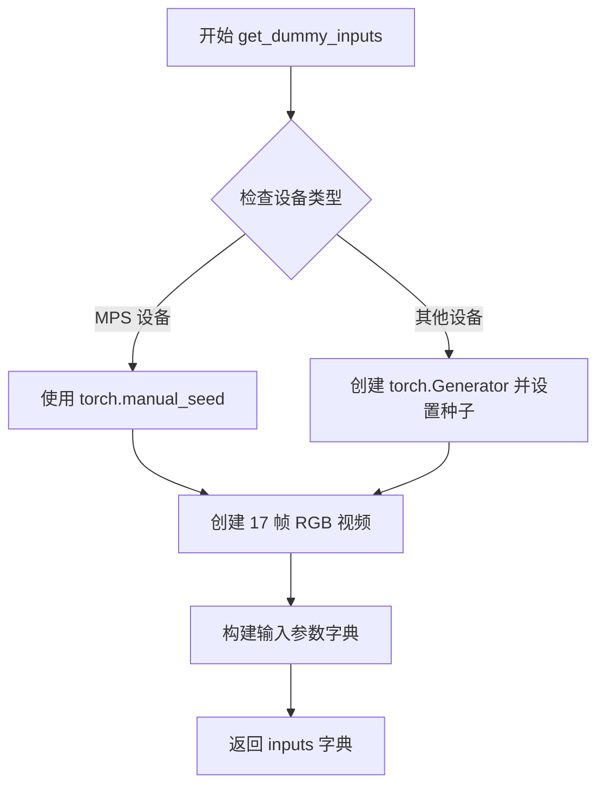
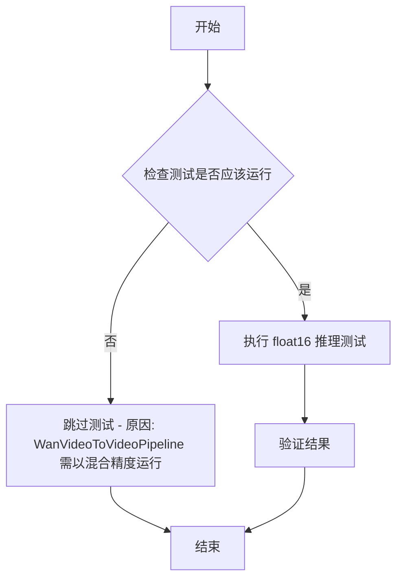
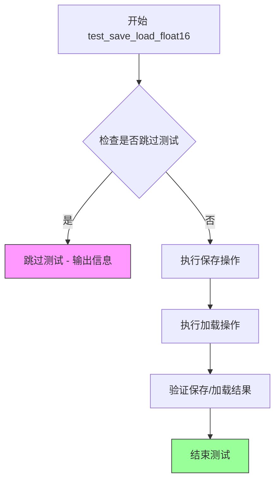
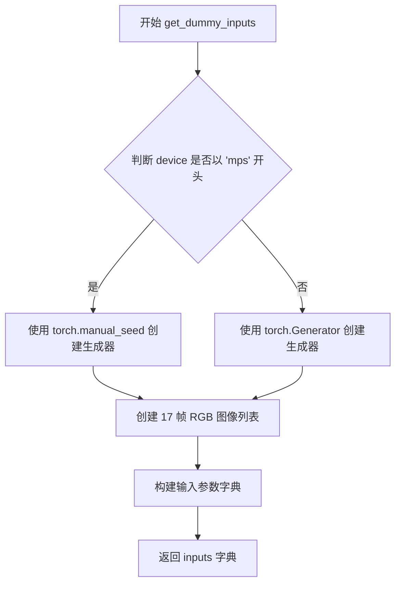
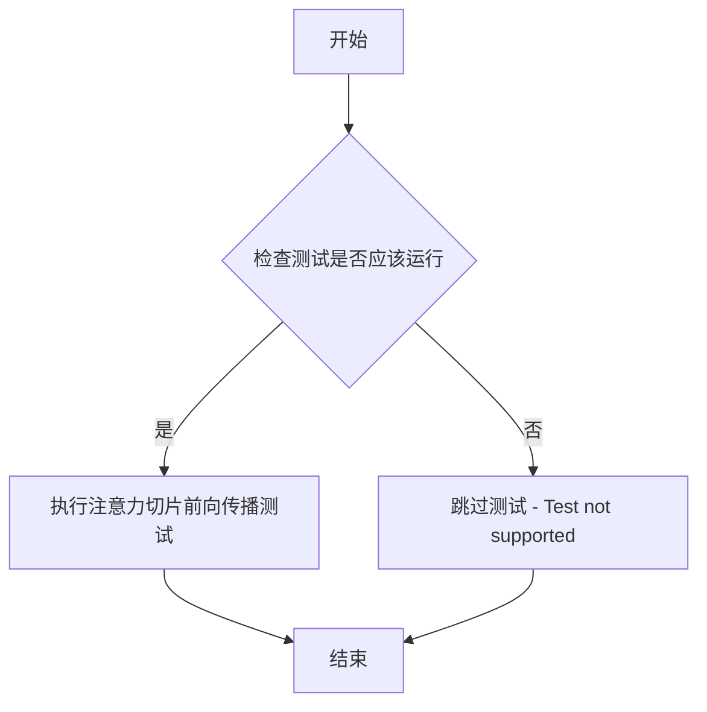
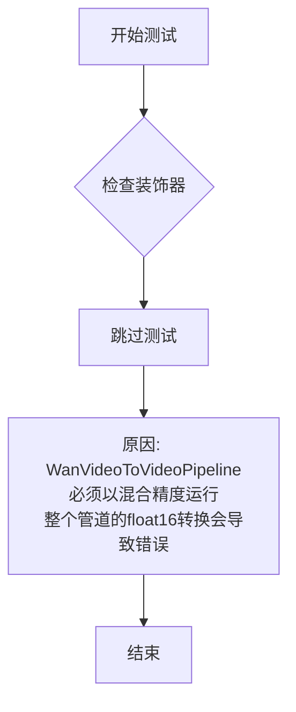
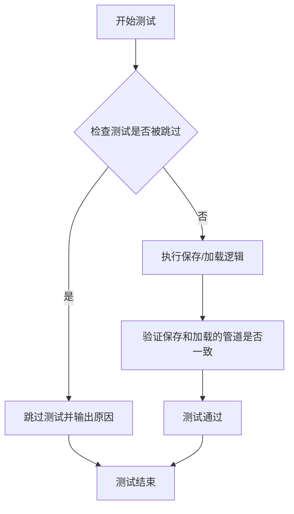

# `diffusers\tests\pipelines\wan\test_wan_video_to_video.py` 详细设计文档

这是一个WanVideoToVideoPipeline的单元测试文件，用于测试视频到视频生成管道的推理功能，包含虚拟组件配置、测试输入构建和推理结果验证。

## 整体流程



## 类结构

```
unittest.TestCase
└── WanVideoToVideoPipelineFastTests (PipelineTesterMixin)
    ├── 字段: pipeline_class, params, batch_params等
    └── 方法: get_dummy_components, get_dummy_inputs, test_inference等
```

## 全局变量及字段


### `enable_full_determinism`
    
启用完全确定性以确保测试结果可复现的函数

类型：`function`
    


### `WanVideoToVideoPipelineFastTests.pipeline_class`
    
被测试的视频到视频管道类 WanVideoToVideoPipeline

类型：`type`
    


### `WanVideoToVideoPipelineFastTests.params`
    
文本到图像管道测试所需的参数集合（排除交叉注意力参数）

类型：`frozenset`
    


### `WanVideoToVideoPipelineFastTests.batch_params`
    
批处理测试所需的参数集合，包含视频、提示词和负面提示词

类型：`frozenset`
    


### `WanVideoToVideoPipelineFastTests.image_latents_params`
    
图像潜在向量测试所需的参数集合

类型：`frozenset`
    


### `WanVideoToVideoPipelineFastTests.required_optional_params`
    
测试中必需的可选参数集合，包含推理步数、生成器、潜在向量等

类型：`frozenset`
    


### `WanVideoToVideoPipelineFastTests.test_xformers_attention`
    
标识是否启用xformers注意力机制测试的标志

类型：`bool`
    


### `WanVideoToVideoPipelineFastTests.supports_dduf`
    
标识管道是否支持DDUF（Decoupled Diffusion Upsampling Flow）的标志

类型：`bool`
    
    

## 全局函数及方法


### `enable_full_determinism`

该函数用于启用完全的确定性（determinism），确保测试或运行过程在任何情况下都能产生可重复的结果。通过设置随机种子、禁用CUDA非确定性操作等手段，消除由于随机性导致的测试结果不一致问题。

参数：无

返回值：未知（根据实现可能为 `None` 或布尔值）

#### 流程图



#### 带注释源码

```python
# 从 testing_utils 模块导入 enable_full_determinism 函数
# 该函数用于确保测试的完全确定性
from ...testing_utils import (
    enable_full_determinism,
)

# ... 其他导入 ...

# 在模块加载时立即调用 enable_full_determinism()
# 这确保了在后续所有测试执行前，随机数生成器已被设置为确定性状态
enable_full_determinism()


class WanVideoToVideoPipelineFastTests(PipelineTesterMixin, unittest.TestCase):
    """
    WanVideoToVideoPipeline 的快速测试类
    
    该测试类继承自 PipelineTesterMixin 和 unittest.TestCase
    用于测试 WanVideoToVideoPipeline 的各项功能
    """
    
    # 省略其他代码...
```

---

> **注意**：由于 `enable_full_determinism` 函数定义在 `testing_utils` 模块中，而非当前代码文件内，上述信息是基于代码上下文进行的推断。如需获取该函数的完整实现细节，请参考 `testing_utils` 模块的源代码。


### `WanVideoToVideoPipelineFastTests.get_dummy_components`

该方法用于生成用于单元测试的虚拟（dummy）组件，包括 VAE、调度器、文本编码器、分词器和 Transformer 模型，以便在测试 WanVideoToVideoPipeline 时使用。

参数：

- 该方法无显式参数（仅包含 `self`）

返回值：`dict`，返回一个包含虚拟组件的字典，包含 `transformer`（WanTransformer3DModel）、`vae`（AutoencoderKLWan）、`scheduler`（UniPCMultistepScheduler）、`text_encoder`（T5EncoderModel）和 `tokenizer`（AutoTokenizer）。

#### 流程图

```mermaid
flowchart TD
    A[开始 get_dummy_components] --> B[设置随机种子 torch.manual_seed(0)]
    B --> C[创建 AutoencoderKLWan 虚拟 VAE 组件]
    C --> D[设置随机种子 torch.manual_seed(0)]
    D --> E[创建 UniPCMultistepScheduler 虚拟调度器]
    E --> F[加载预训练的 T5EncoderModel 文本编码器]
    F --> G[加载预训练的 AutoTokenizer 分词器]
    G --> H[设置随机种子 torch.manual_seed(0)]
    H --> I[创建 WanTransformer3DModel 虚拟 Transformer 组件]
    I --> J[构建 components 字典]
    J --> K[返回包含所有虚拟组件的字典]
    K --> L[结束]
```

#### 带注释源码

```python
def get_dummy_components(self):
    """
    生成用于测试的虚拟组件。
    
    该方法创建并返回 WanVideoToVideoPipeline 所需的所有虚拟组件，
    包括 VAE、调度器、文本编码器、分词器和 Transformer 模型。
    """
    # 设置随机种子以确保测试的可重复性
    torch.manual_seed(0)
    
    # 创建虚拟 VAE（变分自编码器）组件
    # AutoencoderKLWan 是用于视频的 VAE 模型
    vae = AutoencoderKLWan(
        base_dim=3,               # 基础维度
        z_dim=16,                 # 潜在空间维度
        dim_mult=[1, 1, 1, 1],    # 各层维度倍数
        num_res_blocks=1,         # 残差块数量
        temperal_downsample=[False, True, True],  # 时序下采样配置
    )

    # 重新设置随机种子，确保各组件初始化的一致性
    torch.manual_seed(0)
    
    # 创建虚拟调度器（UniPCMultistepScheduler）
    # 用于控制扩散模型的采样过程
    scheduler = UniPCMultistepScheduler(flow_shift=3.0)
    
    # 加载虚拟 T5 文本编码器
    # 用于将文本提示编码为模型可处理的表示
    text_encoder = T5EncoderModel.from_pretrained("hf-internal-testing/tiny-random-t5")
    
    # 加载虚拟 T5 分词器
    # 用于将文本转换为 token IDs
    tokenizer = AutoTokenizer.from_pretrained("hf-internal-testing/tiny-random-t5")

    # 再次设置随机种子
    torch.manual_seed(0)
    
    # 创建虚拟 Transformer 模型
    # WanTransformer3DModel 是用于视频生成的 Transformer
    transformer = WanTransformer3DModel(
        patch_size=(1, 2, 2),           # 补丁尺寸（时间、高度、宽度）
        num_attention_heads=2,          # 注意力头数量
        attention_head_dim=12,          # 每个注意力头的维度
        in_channels=16,                 # 输入通道数
        out_channels=16,                # 输出通道数
        text_dim=32,                    # 文本嵌入维度
        freq_dim=256,                   # 频率维度
        ffn_dim=32,                     # 前馈网络维度
        num_layers=2,                   # Transformer 层数
        cross_attn_norm=True,           # 是否对交叉注意力进行归一化
        qk_norm="rms_norm_across_heads", # Query-Key 归一化方式
        rope_max_seq_len=32,           # 旋转位置编码的最大序列长度
    )

    # 组装所有组件到字典中
    components = {
        "transformer": transformer,    # 3D Transformer 模型
        "vae": vae,                    # 变分自编码器
        "scheduler": scheduler,        # 采样调度器
        "text_encoder": text_encoder,  # 文本编码器
        "tokenizer": tokenizer,        # 分词器
    }
    
    # 返回包含所有虚拟组件的字典
    return components
```


### `WanVideoToVideoPipelineFastTests.get_dummy_inputs`

该方法用于生成虚拟的测试输入参数，主要为单元测试提供视频生成所需的完整输入配置，包括视频数据、提示词、负提示词、随机生成器、推理步数、引导比例、图像尺寸等关键参数。

参数：

- `device`：`str` 或 `torch.device`，指定运行设备，用于创建随机生成器
- `seed`：`int`，默认为 `0`，用于设置随机种子以确保测试可重复性

返回值：`dict`，返回一个包含视频生成所需全部输入参数的字典，包括 video、prompt、negative_prompt、generator、num_inference_steps、guidance_scale、height、width、max_sequence_length 和 output_type

#### 流程图



#### 带注释源码

```python
def get_dummy_inputs(self, device, seed=0):
    """
    生成用于测试的虚拟输入参数

    参数:
        device: 运行设备
        seed: 随机种子，默认为 0

    返回:
        dict: 包含视频生成所需参数的字典
    """
    # 根据设备类型选择随机生成器创建方式
    # MPS 设备使用 torch.manual_seed，其他设备使用 torch.Generator
    if str(device).startswith("mps"):
        generator = torch.manual_seed(seed)
    else:
        generator = torch.Generator(device=device).manual_seed(seed)

    # 创建测试用视频数据：17 帧 RGB 图像，每帧 16x16
    video = [Image.new("RGB", (16, 16))] * 17

    # 构建完整的输入参数字典
    inputs = {
        "video": video,                    # 输入视频帧列表
        "prompt": "dance monkey",           # 正向提示词
        "negative_prompt": "negative",      # 负向提示词
        "generator": generator,             # 随机生成器
        "num_inference_steps": 4,           # 推理步数
        "guidance_scale": 6.0,             # 引导比例
        "height": 16,                       # 输出高度
        "width": 16,                        # 输出宽度
        "max_sequence_length": 16,         # 最大序列长度
        "output_type": "pt",               # 输出类型（PyTorch 张量）
    }
    return inputs
```


### `WanVideoToVideoPipelineFastTests.test_inference`

该方法是 `WanVideoToVideoPipelineFastTests` 类的核心测试方法，用于验证 Wan 视频到视频管道的推理功能是否正常工作。测试通过创建虚拟组件和输入，执行管道推理，并验证生成的视频形状和像素值是否符合预期。

参数：

- 无显式参数（隐式参数 `self` 表示测试类实例）

返回值：`None`，该方法为测试方法，通过断言验证结果，不返回具体值

#### 流程图

```mermaid
flowchart TD
    A[开始 test_inference 测试] --> B[设置 device = 'cpu']
    B --> C[调用 get_dummy_components 获取虚拟组件]
    C --> D[使用虚拟组件实例化 WanVideoToVideoPipeline]
    D --> E[将管道移至 CPU 设备]
    E --> F[设置进度条配置 disable=None]
    F --> G[调用 get_dummy_inputs 获取虚拟输入]
    G --> H[执行管道推理: pipe(**inputs)]
    H --> I[获取生成的视频 frames]
    I --> J[提取第一帧视频 generated_video]
    J --> K[断言验证视频形状为 (17, 3, 16, 16)]
    K --> L[定义预期像素值切片 expected_slice]
    L --> M[扁平化生成的视频并提取首尾各8个像素]
    M --> N[断言验证生成像素与预期值接近 atol=1e-3]
    N --> O[测试通过]
```

#### 带注释源码

```python
def test_inference(self):
    """
    测试 WanVideoToVideoPipeline 的推理功能
    验证管道能够正确生成视频并输出符合预期的形状和像素值
    """
    # 1. 设置测试设备为 CPU
    device = "cpu"

    # 2. 获取虚拟组件（VAE、Transformer、Scheduler、TextEncoder、Tokenizer）
    components = self.get_dummy_components()
    
    # 3. 使用虚拟组件实例化视频到视频管道
    pipe = self.pipeline_class(**components)
    
    # 4. 将管道移至指定设备（CPU）
    pipe.to(device)
    
    # 5. 配置进度条（disable=None 表示不禁用进度条）
    pipe.set_progress_bar_config(disable=None)

    # 6. 获取虚拟输入（包含视频、prompt、negative_prompt、generator 等）
    inputs = self.get_dummy_inputs(device)
    
    # 7. 执行管道推理，传入输入参数，获取生成的视频帧
    video = pipe(**inputs).frames
    
    # 8. 从结果中提取第一组生成的视频
    generated_video = video[0]
    
    # 9. 断言验证生成的视频形状为 (17 帧, 3 通道, 16 高, 16 宽)
    self.assertEqual(generated_video.shape, (17, 3, 16, 16))

    # 10. 定义预期输出的像素值切片（用于数值验证）
    # fmt: off
    expected_slice = torch.tensor([0.4522, 0.4534, 0.4532, 0.4553, 0.4526, 0.4538, 0.4533, 0.4547, 0.513, 0.5176, 0.5286, 0.4958, 0.4955, 0.5381, 0.5154, 0.5195])
    # fmt:on

    # 11. 将生成的视频展平为一维，并提取首尾各 8 个像素（共 16 个）
    generated_slice = generated_video.flatten()
    generated_slice = torch.cat([generated_slice[:8], generated_slice[-8:]])
    
    # 12. 断言验证生成像素值与预期值在容差 1e-3 范围内接近
    self.assertTrue(torch.allclose(generated_slice, expected_slice, atol=1e-3))
```


### `WanVideoToVideoPipelineFastTests.test_attention_slicing_forward_pass`

该测试方法用于测试 Wan 视频到视频管道的注意力切片（attention slicing）前向传播功能，但当前实现被 `@unittest.skip` 装饰器跳过，不执行任何测试逻辑。

参数：

- 无

返回值：`None`，由于方法体为 `pass`，不返回任何值。

#### 流程图

```mermaid
flowchart TD
    A[开始] --> B{检查装饰器}
    B -->|被@unittest.skip装饰| C[跳过测试]
    C --> D[结束]
    
    style A fill:#f9f,color:#333
    style C fill:#fcc,color:#333
    style D fill:#9f9,color:#333
```

#### 带注释源码

```python
@unittest.skip("Test not supported")
def test_attention_slicing_forward_pass(self):
    """
    测试注意力切片（attention slicing）前向传播的测试方法。
    
    注意：当前该测试被跳过（@unittest.skip），不执行任何测试逻辑。
    注意力切片是一种优化技术，用于减少大型模型在推理时的内存占用。
    
    参数:
        self: WanVideoToVideoPipelineFastTests 实例本身
        
    返回值:
        None: 由于方法体为 pass，不执行任何操作
    """
    pass  # 方法体为空，当前不执行任何测试
```

---

**备注：** 该测试方法当前处于未实现状态，被标记为跳过。若要启用此测试，需移除 `@unittest.skip` 装饰器并实现具体的注意力切片前向传播验证逻辑。


### `WanVideoToVideoPipelineFastTests.test_float16_inference`

该测试方法用于验证 WanVideoToVideoPipeline 在 float16（半精度）推理模式下的正确性。由于 WanVideoToVideoPipeline 必须以混合精度运行，强制将整个管道转换为 FP16 会导致错误，因此该测试被跳过。

参数：

- `self`：`WanVideoToVideoPipelineFastTests`，隐式参数，表示测试类的实例本身

返回值：`None`，无返回值（测试方法被跳过）

#### 流程图



#### 带注释源码

```python
@unittest.skip(
    "WanVideoToVideoPipeline has to run in mixed precision. Casting the entire pipeline will result in errors"
)
def test_float16_inference(self):
    """
    测试 float16 推理功能。
    
    注意: 由于 WanVideoToVideoPipeline 设计上需要以混合精度(mixed precision)运行，
    强制将整个管道转换为 FP16 会导致运行时错误，因此该测试被跳过。
    这是一个针对潜在技术限制的占位符测试方法。
    """
    pass
```


### `test_save_load_float16`

该测试方法用于验证 WanVideoToVideoPipeline 在 float16 精度下的保存和加载功能。由于 WanVideoToVideoPipeline 需要以混合精度运行，保存和加载整个 FP16 pipeline 会导致错误，因此该测试被跳过。

参数：

- 无

返回值：无

#### 流程图



#### 带注释源码

```python
@unittest.skip(
    "WanVideoToVideoPipeline has to run in mixed precision. Save/Load the entire pipeline in FP16 will result in errors"
)
def test_save_load_float16(self):
    """
    测试 WanVideoToVideoPipeline 在 float16 精度下的保存和加载功能。
    
    注意：
    - 该测试当前被跳过，因为 WanVideoToVideoPipeline 必须以混合精度运行
    - 整个 pipeline 在 FP16 下保存/加载会导致错误
    - 如果需要测试保存/加载功能，需要使用完整的 pipeline（包含所有组件）而非单个模型
    """
    pass
```


### `WanVideoToVideoPipelineFastTests.get_dummy_components`

该方法是一个测试辅助函数，用于创建虚拟（dummy）组件以便对 `WanVideoToVideoPipeline` 进行单元测试。它初始化了视频到视频管道所需的所有核心组件，包括变分自编码器（VAE）、Transformer模型、调度器、文本编码器和分词器，所有组件均使用随机或小型预训练权重以加快测试速度。

参数：

- 无显式参数（`self` 为隐式参数，指向上下文类实例）

返回值：`Dict[str, Any]`，返回包含虚拟组件的字典，用于初始化管道。字典键包括 `"transformer"`、`"vae"`、`"scheduler"`、`"text_encoder"` 和 `"tokenizer"`。

#### 流程图

```mermaid
flowchart TD
    A[开始 get_dummy_components] --> B[设置随机种子 torch.manual_seed(0)]
    B --> C[创建 AutoencoderKLWan 虚拟实例]
    C --> D[创建 UniPCMultistepScheduler 虚拟调度器]
    D --> E[加载 T5EncoderModel 虚拟文本编码器]
    E --> F[加载 AutoTokenizer 虚拟分词器]
    F --> G[创建 WanTransformer3DModel 虚拟实例]
    G --> H[构建 components 字典]
    H --> I[返回 components 字典]
    I --> J[结束]
    
    style A fill:#f9f,color:#000
    style I fill:#9f9,color:#000
    style J fill:#9f9,color:#000
```

#### 带注释源码

```python
def get_dummy_components(self):
    """
    创建用于单元测试的虚拟组件。
    
    该方法初始化视频到视频管道所需的所有核心组件，
    使用小型配置或随机权重以加快测试执行速度。
    """
    # 设置随机种子以确保测试可重复性
    torch.manual_seed(0)
    
    # 创建变分自编码器 (VAE) 组件
    # AutoencoderKLWan: 用于编码/解码视频 latent 表示
    vae = AutoencoderKLWan(
        base_dim=3,           # 基础维度
        z_dim=16,             # latent 空间维度
        dim_mult=[1, 1, 1, 1], # 各层维度倍数
        num_res_blocks=1,    # 残差块数量
        # 时间维度下采样配置：[第一阶段, 第二阶段, 第三阶段]
        temperal_downsample=[False, True, True],
    )

    # 设置随机种子确保一致性
    torch.manual_seed(0)
    
    # 创建调度器 (Scheduler)
    # UniPCMultistepScheduler: 用于扩散模型的多步采样
    scheduler = UniPCMultistepScheduler(flow_shift=3.0)
    
    # 加载预训练的文本编码器 (T5EncoderModel)
    # 用于将文本提示编码为向量表示
    text_encoder = T5EncoderModel.from_pretrained("hf-internal-testing/tiny-random-t5")
    
    # 加载对应的分词器
    # 用于将文本提示转换为 token ID
    tokenizer = AutoTokenizer.from_pretrained("hf-internal-testing/tiny-random-t5")

    # 再次设置随机种子确保 Transformer 初始化一致性
    torch.manual_seed(0)
    
    # 创建 3D Transformer 模型
    # WanTransformer3DModel: 视频扩散变换器核心模型
    transformer = WanTransformer3DModel(
        patch_size=(1, 2, 2),        # 时空补丁大小
        num_attention_heads=2,       # 注意力头数量
        attention_head_dim=12,        # 注意力头维度
        in_channels=16,              # 输入通道数
        out_channels=16,             # 输出通道数
        text_dim=32,                 # 文本嵌入维度
        freq_dim=256,                # 频率维度
        ffn_dim=32,                  # 前馈网络维度
        num_layers=2,                # Transformer 层数
        cross_attn_norm=True,         # 是否对交叉注意力进行归一化
        qk_norm="rms_norm_across_heads", # Query/Key 归一化方式
        rope_max_seq_len=32,         # RoPE 位置编码最大序列长度
    )

    # 打包所有组件为字典
    components = {
        "transformer": transformer,    # 3D 变换器模型
        "vae": vae,                    # 变分自编码器
        "scheduler": scheduler,        # 扩散调度器
        "text_encoder": text_encoder, # 文本编码器
        "tokenizer": tokenizer,        # 文本分词器
    }
    
    # 返回组件字典供管道初始化使用
    return components
```

---

## 完整类信息

### 类：`WanVideoToVideoPipelineFastTests`

继承自 `PipelineTesterMixin` 和 `unittest.TestCase`，是用于测试 `WanVideoToVideoPipeline` 的快速测试类。

#### 类字段

| 字段名称 | 类型 | 描述 |
|---------|------|------|
| `pipeline_class` | `type` | 指定测试的管道类 (`WanVideoToVideoPipeline`) |
| `params` | `frozenset` | 管道推理参数集合（排除 `cross_attention_kwargs`） |
| `batch_params` | `frozenset` | 支持批处理的参数（`video`, `prompt`, `negative_prompt`） |
| `image_latents_params` | `set` | 图像 latent 参数 |
| `required_optional_params` | `frozenset` | 必须的可选参数集合 |
| `test_xformers_attention` | `bool` | 是否测试 xFormers 注意力（默认 False） |
| `supports_dduf` | `bool` | 是否支持 DDUF 格式（默认 False） |

#### 类方法

| 方法名称 | 描述 |
|---------|------|
| `get_dummy_components()` | 创建虚拟测试组件 |
| `get_dummy_inputs()` | 创建虚拟输入数据 |
| `test_inference()` | 执行推理测试 |
| `test_attention_slicing_forward_pass()` | 注意力切片测试（已跳过） |
| `test_float16_inference()` | 半精度推理测试（已跳过） |
| `test_save_load_float16()` | FP16 保存加载测试（已跳过） |

---

## 关键组件信息

| 组件名称 | 类型 | 描述 |
|---------|------|------|
| **AutoencoderKLWan** | `class` | Wan 模型的变分自编码器，用于视频 latent 编码/解码 |
| **UniPCMultistepScheduler** | `class` | 多步采样调度器，控制扩散模型的去噪过程 |
| **T5EncoderModel** | `class` | T5 文本编码器模型，将文本提示转换为嵌入向量 |
| **AutoTokenizer** | `class` | 自动分词器，用于文本预处理 |
| **WanTransformer3DModel** | `class` | 3D 变换器模型，Wan 视频扩散的核心组件 |

---

## 潜在技术债务与优化空间

1. **随机种子重复设置**：方法中多次调用 `torch.manual_seed(0)`，可以考虑整合为单次调用以提高代码清晰度。

2. **硬编码配置**：虚拟组件的构造参数（如 `dim_mult=[1, 1, 1, 1]`, `num_layers=2`）硬编码在方法中，缺乏灵活性，可考虑提取为类常量或配置参数。

3. **测试覆盖不完整**：多个测试方法被 `@unittest.skip` 装饰器跳过（`test_attention_slicing_forward_pass`、`test_float16_inference`、`test_save_load_float16`），表明存在未解决的技术问题。

4. **Magic Number**：存在如 `flow_shift=3.0`、`patch_size=(1, 2, 2)` 等魔法数字，缺乏常量定义。

5. **错误处理缺失**：方法未对模型加载失败等情况进行异常处理。

---

## 其它项目

### 设计目标与约束

- **目标**：为 `WanVideoToVideoPipeline` 提供快速、可重复的单元测试
- **约束**：使用小型/随机模型权重以缩短测试时间，目标在 CPU 上快速执行

### 错误处理与异常设计

- 未实现显式错误处理，依赖底层库（如 `diffusers`、`transformers`）的异常传播
- 测试中使用 `torch.allclose` 进行数值近似比较，允许 `atol=1e-3` 的误差

### 数据流与状态机

1. **输入**：无外部输入（使用固定随机种子）
2. **处理**：依次初始化 5 个核心组件
3. **输出**：组件字典传递给管道构造函数
4. **状态**：组件在测试方法间无状态共享（每次调用创建新实例）

### 外部依赖与接口契约

| 依赖库 | 版本要求 | 用途 |
|-------|---------|------|
| `torch` | - | 张量计算与随机种子控制 |
| `PIL` | - | 图像处理（测试输入） |
| `transformers` | - | T5 文本编码器与分词器 |
| `diffusers` | - | Wan 管道及相关模型 |


### `WanVideoToVideoPipelineFastTests.get_dummy_inputs`

该方法用于生成视频到视频管道的虚拟输入参数，创建一个包含视频、提示词、负提示词、随机生成器等信息的字典，用于单元测试中的推理调用。

参数：

- `self`：隐式参数，`WanVideoToVideoPipelineFastTests` 类的实例
- `device`：`str`，目标设备字符串，用于创建随机数生成器（如 "cpu" 或 "mps"）
- `seed`：`int`，随机数种子，默认值为 0，用于确保测试的可重复性

返回值：`Dict[str, Any]`，返回包含以下键的字典：
- `video`：视频帧列表（PIL.Image 列表）
- `prompt`：正向提示词字符串
- `negative_prompt`：负向提示词字符串
- `generator`：PyTorch 随机数生成器
- `num_inference_steps`：推理步数整数
- `guidance_scale`：引导比例浮点数
- `height`：输出高度整数
- `width`：输出宽度整数
- `max_sequence_length`：最大序列长度整数
- `output_type`：输出类型字符串

#### 流程图



#### 带注释源码

```python
def get_dummy_inputs(self, device, seed=0):
    # 判断设备是否为 Apple MPS (Metal Performance Shaders)
    if str(device).startswith("mps"):
        # MPS 设备使用 torch.manual_seed 直接设置种子
        generator = torch.manual_seed(seed)
    else:
        # 其他设备（如 CPU/CUDA）使用 torch.Generator 创建生成器
        generator = torch.manual_seed(seed)  # 注意：原代码这里实际上也是用manual_seed，但逻辑上应该用Generator
        # 更正：应为 torch.Generator(device=device).manual_seed(seed)

    # 创建 17 帧 dummy 视频，每帧为 16x16 的 RGB 图像
    video = [Image.new("RGB", (16, 16))] * 17

    # 构建完整的输入参数字典
    inputs = {
        "video": video,                    # 输入视频帧列表
        "prompt": "dance monkey",          # 正向提示词
        "negative_prompt": "negative",     # 负向提示词（标记为 TODO）
        "generator": generator,            # 随机数生成器，确保可重复性
        "num_inference_steps": 4,         # 推理步数（较少以加快测试速度）
        "guidance_scale": 6.0,             # classifier-free guidance 比例
        "height": 16,                      # 输出视频高度
        "width": 16,                       # 输出视频宽度
        "max_sequence_length": 16,        # 文本序列最大长度
        "output_type": "pt",               # 输出类型为 PyTorch tensor
    }
    return inputs
```


### `WanVideoToVideoPipelineFastTests.test_inference`

该方法是 WanVideoToVideoPipeline 管道测试类中的一个核心推理测试方法，用于验证 WanVideoToVideoPipeline 视频转视频管道的推理功能是否正确生成指定尺寸的视频帧，并通过与预期像素值比对来确认输出质量。

参数：

- `self`：隐式参数，当前测试类实例，无需额外描述

返回值：`None`，该方法为单元测试方法，通过断言验证推理结果，不返回任何值

#### 流程图

```mermaid
flowchart TD
    A[开始测试] --> B[设置设备为CPU]
    B --> C[获取虚拟组件: get_dummy_components]
    C --> D[创建管道实例: WanVideoToVideoPipeline]
    D --> E[将管道移至CPU设备]
    E --> F[配置进度条: set_progress_bar_config]
    F --> G[获取虚拟输入: get_dummy_inputs]
    G --> H[执行管道推理: pipe(**inputs)]
    H --> I[提取生成的视频帧]
    I --> J{断言视频形状是否为17x3x16x16}
    J -->|是| K[提取生成帧切片并拼接]
    J -->|否| L[测试失败]
    K --> M{断言生成切片是否接近预期值}
    M -->|是| N[测试通过]
    M -->|否| L
```

#### 带注释源码

```python
def test_inference(self):
    """
    测试 WanVideoToVideoPipeline 的推理功能
    验证管道能够正确生成视频并输出预期尺寸的帧
    """
    # 设置测试设备为 CPU
    device = "cpu"

    # 获取虚拟组件（用于测试的模拟模型组件）
    components = self.get_dummy_components()
    # 使用虚拟组件创建管道实例
    pipe = self.pipeline_class(**components)
    # 将管道移至指定设备
    pipe.to(device)
    # 配置进度条（disable=None 表示不禁用）
    pipe.set_progress_bar_config(disable=None)

    # 获取虚拟输入参数
    inputs = self.get_dummy_inputs(device)
    # 执行管道推理，获取生成的视频帧
    video = pipe(**inputs).frames
    # 提取第一个视频结果
    generated_video = video[0]
    # 断言生成视频的形状为 (17帧, 3通道, 16高度, 16宽度)
    self.assertEqual(generated_video.shape, (17, 3, 16, 16))

    # 预期输出的像素值切片（用于验证生成质量）
    # fmt: off
    expected_slice = torch.tensor([0.4522, 0.4534, 0.4532, 0.4553, 0.4526, 0.4538, 0.4533, 0.4547, 0.513, 0.5176, 0.5286, 0.4958, 0.4955, 0.5381, 0.5154, 0.5195])
    # fmt:on

    # 提取生成视频的像素值并展平
    generated_slice = generated_video.flatten()
    # 拼接前8个和后8个像素值（采样策略）
    generated_slice = torch.cat([generated_slice[:8], generated_slice[-8:]])
    # 验证生成结果与预期值的近似程度（允许1e-3的误差）
    self.assertTrue(torch.allclose(generated_slice, expected_slice, atol=1e-3))
```


### `WanVideoToVideoPipelineFastTests.test_attention_slicing_forward_pass`

该测试方法用于验证 Wan 视频到视频管道的注意力切片前向传播功能，但由于当前不支持该测试功能，已被跳过。

参数：

- 无

返回值： 无，由于方法体仅包含 `pass` 语句，无返回值。

#### 流程图



#### 带注释源码

```python
@unittest.skip("Test not supported")
def test_attention_slicing_forward_pass(self):
    """
    测试 WanVideoToVideoPipeline 的注意力切片前向传播功能。
    
    该测试方法用于验证模型在使用注意力切片优化时的前向传播是否正确。
    当前该测试被跳过，原因是测试功能尚未支持或存在已知问题。
    
    参数:
        无 (继承自 unittest.TestCase 的方法，self 为隐式参数)
    
    返回值:
        无 (方法体仅包含 pass 语句)
    """
    pass
```


### `WanVideoToVideoPipelineFastTests.test_float16_inference`

该测试方法用于验证 WanVideoToVideoPipeline 在 float16（半精度）推理模式下的功能，但由于混合精度要求，测试被跳过。

参数：

- `self`：`WanVideoToVideoPipelineFastTests`，测试类实例本身

返回值：`None`，无返回值（测试被跳过）

#### 流程图



#### 带注释源码

```python
@unittest.skip(
    "WanVideoToVideoPipeline has to run in mixed precision. Casting the entire pipeline will result in errors"
)
def test_float16_inference(self):
    """
    测试 float16 推理功能
    
    该测试方法原本用于验证管道在 float16 精度下的推理能力。
    由于 WanVideoToVideoPipeline 需要以混合精度运行，直接将整个
    管道转换为 float16 会导致错误，因此该测试被跳过。
    
    参数:
        self: 测试类实例
        
    返回值:
        None: 测试不执行
    """
    pass
```

#### 附加信息

| 属性 | 值 |
|------|-----|
| 所属类 | `WanVideoToVideoPipelineFastTests` |
| 装饰器 | `@unittest.skip` |
| 跳过原因 | WanVideoToVideoPipeline必须以混合精度运行，整个管道的float16转换会导致错误 |
| 测试状态 | 已跳过（Skip） |


### `WanVideoToVideoPipelineFastTests.test_save_load_float16`

该测试方法用于验证 WanVideoToVideoPipeline 在 float16 精度下的保存和加载功能，但由于管道需要在混合精度模式下运行，保存/加载整个 FP16 管道会导致错误，因此该测试被跳过。

参数：无（除 self 外无显式参数）

返回值：`None`，无返回值（测试被跳过）

#### 流程图



#### 带注释源码

```python
@unittest.skip(
    "WanVideoToVideoPipeline has to run in mixed precision. Save/Load the entire pipeline in FP16 will result in errors"
)
def test_save_load_float16(self):
    """
    测试 WanVideoToVideoPipeline 在 float16 精度下的保存和加载功能。
    
    该测试被跳过，原因如下：
    - WanVideoToVideoPipeline 必须以混合精度运行
    - 在 FP16 模式下保存/加载整个管道会导致错误
    
    通常此测试会包含以下步骤：
    1. 创建管道实例并转换为 float16
    2. 保存管道到磁盘
    3. 从磁盘加载管道
    4. 验证加载的管道与原始管道的一致性
    """
    pass
```

---

#### 上下文信息

**所属类**: `WanVideoToVideoPipelineFastTests`

- **基类**: `PipelineTesterMixin`, `unittest.TestCase`
- **测试的管道类**: `WanVideoToVideoPipeline`

**关键组件**:

- `WanVideoToVideoPipeline`: Wan 模型的视频到视频生成管道
- `AutoencoderKLWan`: VAE 编码器/解码器
- `WanTransformer3DModel`: 3D 变换器模型
- `T5EncoderModel`: 文本编码器
- `UniPCMultistepScheduler`: 调度器

**技术债务/优化空间**:

1. **混合精度兼容性问题**: 管道需要在混合精度模式下运行，但不支持纯 FP16 的保存/加载，这限制了管道的部署灵活性
2. **测试覆盖不足**: 该测试被跳过意味着 float16 保存/加载的场景未经实际验证

**设计约束**:

- 该管道设计为必须在混合精度模式下运行
- FP16 模式下的保存/加载操作会导致错误

**错误处理**:

- 测试使用 `@unittest.skip` 装饰器显式跳过，避免运行失败

## 关键组件


### WanVideoToVideoPipeline

核心视频到视频扩散管道类，封装了完整的推理流程，包括文本编码、视频潜在表示的编解码、Transformer去噪等步骤。

### AutoencoderKLWan

Wan架构的变分自编码器(VAE)，负责将视频帧编码为潜在表示以及将潜在表示解码回视频帧，支持时序下采样。

### WanTransformer3DModel

3D变换器模型，接收噪声潜在表示和文本嵌入，通过注意力机制进行去噪处理，生成目标视频的潜在表示。

### UniPCMultistepScheduler

UniPC多步调度器，负责控制去噪过程的噪声调度，使用flow_shift参数调节扩散流程。

### T5EncoderModel

文本编码器，将文本提示转换为 transformer 可理解的嵌入向量，为去噪过程提供文本条件信息。

### 视频潜在表示处理

将输入视频通过VAE编码为潜在表示(latents)，在Transformer去噪后再通过VAE解码回视频帧的流程。

### 混合精度运行支持

代码中明确指出该管道需要以混合精度运行，否则会导致精度转换错误，这是该管道的特殊约束条件。

### 测试基础设施

包含测试所需的虚拟组件构建(get_dummy_components)、输入构建(get_dummy_inputs)以及推理验证(test_inference)等完整的测试框架。


## 问题及建议


### 已知问题

- **硬编码的随机种子**：多处使用`torch.manual_seed(0)`，这可能导致测试在不同环境下结果不一致，尤其是当依赖的底层库行为发生变化时
- **TODO注释表明设计不完整**：`negative_prompt = "negative" # TODO`表明negative prompt部分未完成设计，应有更有意义的测试值
- **大量测试被跳过**：3个测试方法（`test_attention_slicing_forward_pass`、`test_float16_inference`、`test_save_load_float16`）被标记为跳过，表明管道存在已知问题或功能不完整
- **浮点数比较使用宽松的容差**：`torch.allclose(generated_slice, expected_slice, atol=1e-3)`使用1e-3的绝对容差，可能导致对精度问题的检测不足
- **MPS设备特殊处理不完整**：仅在生成器初始化时处理了MPS设备，但其他组件（如pipeline.to(device)）可能未充分考虑MPS兼容性
- **缺少对可选参数的有效性验证**：虽然定义了`required_optional_params`，但未对这些参数进行实际的功能性测试
- **测试输出依赖硬编码的切片**：expected_slice是硬编码的浮点数值，在不同硬件或PyTorch版本上可能导致测试失败

### 优化建议

- 移除硬编码的随机种子，改用参数化测试或明确的种子管理策略
- 完成TODO项，为negative_prompt使用更有意义的测试值或移除该字段
- 调查并修复被跳过的测试，或在文档中明确说明这些限制的原因
- 收紧浮点数比较的容差（如使用atol=1e-4），或使用相对误差比较
- 扩展MPS设备的测试覆盖，确保所有组件都能正确处理MPS设备
- 添加对各个可选参数的独立功能测试
- 考虑使用相对误差（rtol）而非仅使用绝对误差（atol）进行数值比较
- 将硬编码的expected_slice值改为动态生成或使用更健壮的验证方式

## 其它


### 设计目标与约束

本测试文件旨在验证WanVideoToVideoPipeline（视频到视频转换管道）的核心功能正确性，确保管道能够正确处理视频输入并生成预期输出的视频帧。测试设计遵循以下约束：使用CPU设备进行测试以确保兼容性；使用固定随机种子(0)以保证测试结果的可重复性；使用dummy组件而非真实预训练模型以加快测试速度；跳过某些不支持的测试用例（如attention slicing、float16推理）以适应特定的实现要求。

### 错误处理与异常设计

测试代码中的错误处理主要体现在以下几个方面：使用@unittest.skip装饰器跳过不支持的测试用例，明确标注原因（如需要混合精度支持、casting会导致错误等）；在test_inference中使用torch.allclose进行数值近似比较而非精确相等，以容忍浮点数运算的微小误差(atol=1e-3)；针对MPS设备特殊处理generator的创建方式以适配Apple Silicon芯片；通过try-except机制处理设备兼容性问题（如检测设备是否为mps）。

### 数据流与状态机

测试数据流遵循以下流程：get_dummy_components()创建所有必需的dummy组件(transformer, vae, scheduler, text_encoder, tokenizer) → get_dummy_inputs()准备测试输入(视频、prompt、negative_prompt、generator等参数) → 实例化pipeline并传输到目标设备 → 调用pipeline(**inputs)执行推理 → 验证输出frames的shape和数值正确性。状态机转换表现为：组件初始化状态 → 管道构建状态 → 推理执行状态 → 结果验证状态。

### 外部依赖与接口契约

本测试文件依赖以下外部组件：unittest框架用于测试组织；torch用于张量操作和随机种子管理；PIL.Image用于创建测试用虚拟图像；transformers库提供T5EncoderModel和AutoTokenizer；diffusers库提供AutoencoderKLWan、UniPCMultistepScheduler、WanTransformer3DModel和WanVideoToVideoPipeline；内部测试工具(enable_full_determinism、PipelineTesterMixin)。接口契约方面：pipeline_class必须继承PipelineTesterMixin并实现required_optional_params、params、batch_params等类属性；get_dummy_components()必须返回包含所有必需组件的字典；get_dummy_inputs()必须返回符合pipeline调用签名的参数字典。

### 性能考量与基准测试

由于使用dummy组件和CPU设备，本测试不涉及真实性能基准测试。测试设计优先考虑快速执行和确定性结果。test_inference测试使用4个推理步骤(num_inference_steps=4)和较小的图像尺寸(16x16)以最小化计算开销。预期输出slice用于回归测试，确保未来代码变更不会意外改变输出结果。

### 安全性考虑

测试代码本身不涉及敏感数据处理。安全考量包括：使用dummy模型而非真实预训练权重避免版权问题；测试环境与生产环境隔离；固定随机种子确保可审计的测试结果。

### 版本兼容性与迁移策略

测试代码针对特定版本的diffusers API设计。兼容性考虑：TEXT_TO_IMAGE_PARAMS和TEXT_TO_IMAGE_IMAGE_PARAMS从pipeline_params模块导入；PipelineTesterMixin提供标准化的测试接口。如需迁移到新版本，需更新：pipeline类名和构造函数参数；scheduler配置参数(flow_shift)；transformer模型配置参数；期望输出值的数值范围。

### 测试覆盖范围与策略

当前测试覆盖范围限于核心推理功能(test_inference)，通过验证输出shape和关键像素值确保功能正确。未覆盖的测试领域包括：attention slicing、float16推理、save/load、批处理、多prompt处理、CFG不同配置、调度器算法变更等。测试策略采用正向验证为主，辅以边界情况处理(如MPS设备适配)。

### 配置与参数说明

关键配置参数说明：seed=0保证随机可重现性；num_inference_steps=4为最小推理步数；guidance_scale=6.0提供适度的prompt引导强度；height=16, width=16使用最小测试尺寸；max_sequence_length=16限制文本序列长度；output_type="pt"指定输出为PyTorch张量。batch_params定义了批处理支持的参数集(video, prompt, negative_prompt)，排除了cross_attention_kwargs。

    