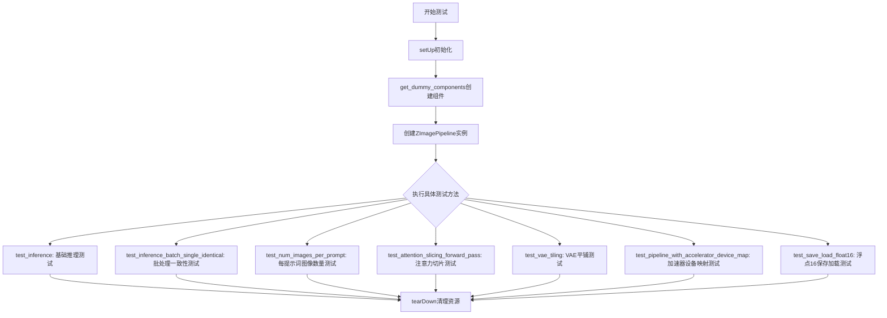
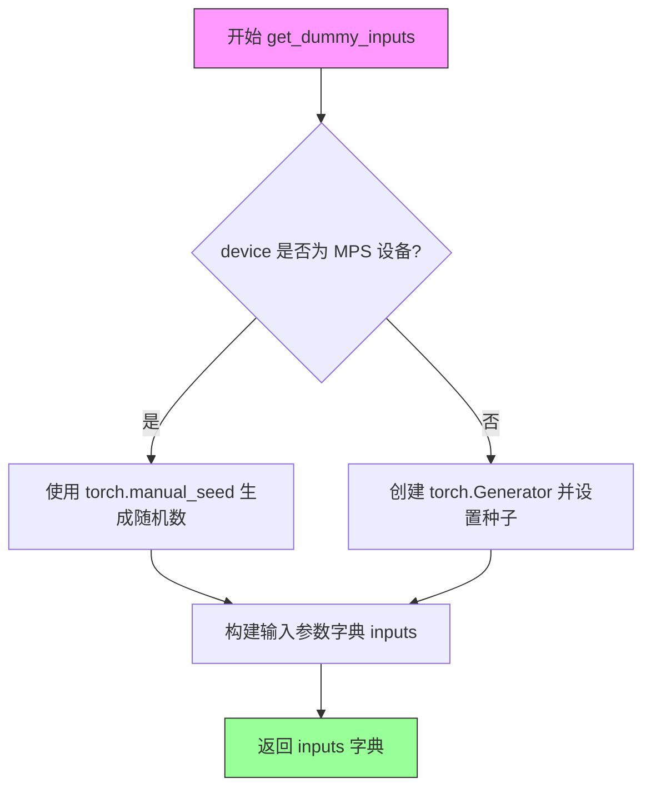
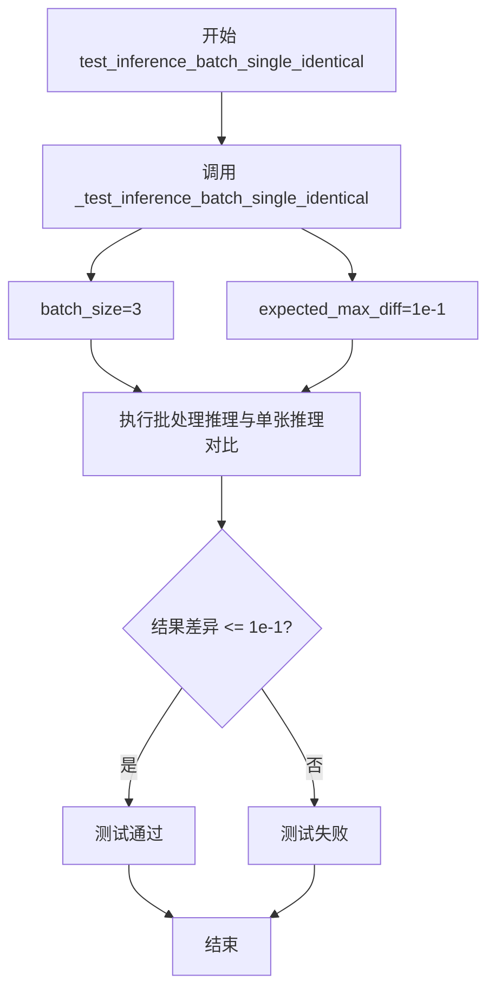
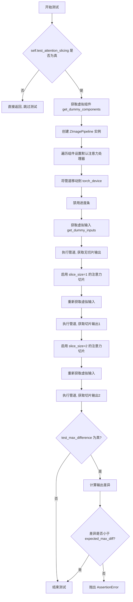
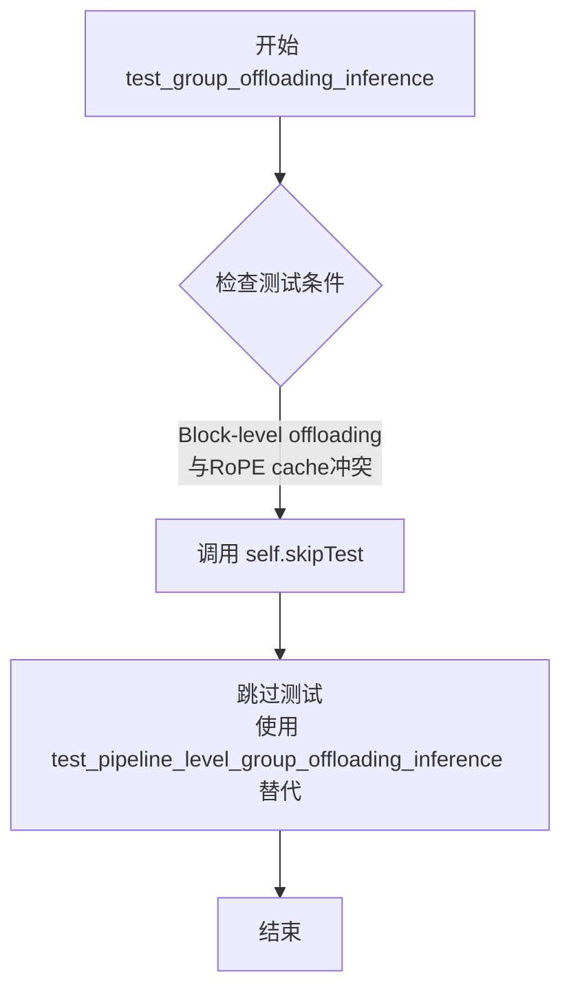
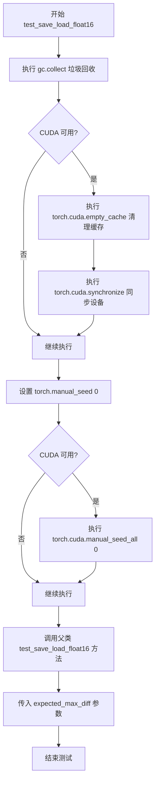
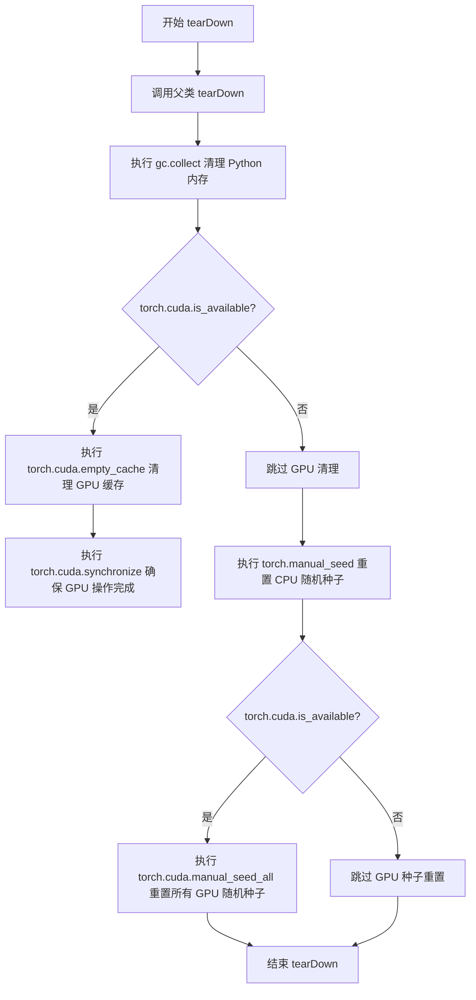
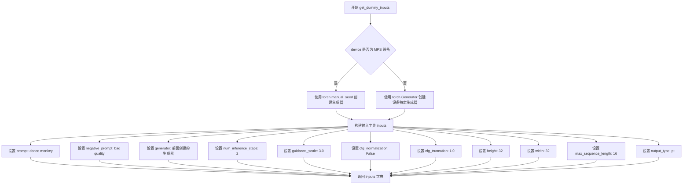
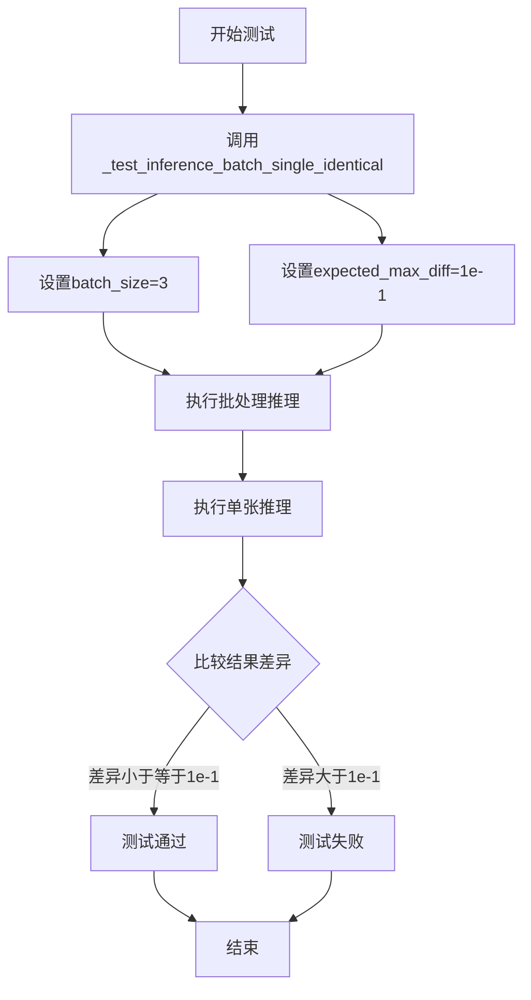

# `diffusers\tests\pipelines\z_image\test_z_image.py` 详细设计文档

这是 Z-Image Pipeline 的单元测试文件，包含多个测试方法用于验证文本到图像生成管道的功能，包括推理、批处理、注意力切片、VAE平铺、模型保存加载等关键功能的正确性。

## 整体流程



## 类结构

```
unittest.TestCase
└── ZImagePipelineFastTests (继承 PipelineTesterMixin)
    └── 使用组件: ZImagePipeline, ZImageTransformer2DModel, AutoencoderKL, FlowMatchEulerDiscreteScheduler, Qwen3Model, Qwen2Tokenizer
```

## 全局变量及字段


### `ZImagePipelineFastTests.pipeline_class`
    
要测试的管道类引用

类型：`type[ZImagePipeline]`
    


### `ZImagePipelineFastTests.params`
    
文本到图像参数集合（TEXT_TO_IMAGE_PARAMS减去cross_attention_kwargs）

类型：`frozenset`
    


### `ZImagePipelineFastTests.batch_params`
    
批处理参数集合

类型：`set`
    


### `ZImagePipelineFastTests.image_params`
    
图像参数集合

类型：`set`
    


### `ZImagePipelineFastTests.image_latents_params`
    
图像潜在参数集合

类型：`set`
    


### `ZImagePipelineFastTests.required_optional_params`
    
必需的可选参数集合

类型：`frozenset`
    


### `ZImagePipelineFastTests.supports_dduf`
    
是否支持DDUF（不支持，值为False）

类型：`bool`
    


### `ZImagePipelineFastTests.test_xformers_attention`
    
是否测试xformers注意力（不测试，值为False）

类型：`bool`
    


### `ZImagePipelineFastTests.test_layerwise_casting`
    
是否测试分层转换（测试，值为True）

类型：`bool`
    


### `ZImagePipelineFastTests.test_group_offloading`
    
是否测试组卸载（测试，值为True）

类型：`bool`
    
    

## 全局函数及方法


### `ZImagePipelineFastTests.setUp`

该方法是测试类的初始化方法，用于在每个测试方法运行前清理内存、释放GPU缓存并设置随机种子，确保测试环境的可重复性和一致性。

参数：
- 无显式参数（`self` 为隐式参数，表示测试类实例）

返回值：`None`，无返回值

#### 流程图

```mermaid
flowchart TD
    A([开始 setUp]) --> B[gc.collect<br/>垃圾回收释放内存]
    B --> C{torch.cuda.is_available<br/>检查CUDA是否可用}
    C -->|是| D[torch.cuda.empty_cache<br/>清空CUDA缓存]
    D --> E[torch.cuda.synchronize<br/>同步CUDA操作]
    E --> F[torch.manual_seed(0)<br/>设置CPU随机种子为0]
    F --> G{torch.cuda.is_available<br/>再次检查CUDA是否可用}
    G -->|是| H[torch.cuda.manual_seed_all(0)<br/>设置所有GPU随机种子为0]
    H --> I([结束 setUp])
    C -->|否| F
    G -->|否| I
```

#### 带注释源码

```python
def setUp(self):
    """
    初始化测试环境。
    
    该方法在每个测试方法执行前调用，用于：
    1. 清理内存中的垃圾对象
    2. 释放GPU显存缓存
    3. 设置随机种子确保测试可重复性
    """
    # 步骤1: 调用垃圾回收器，清理不再使用的Python对象
    gc.collect()
    
    # 步骤2: 如果CUDA可用，清空GPU缓存并同步
    if torch.cuda.is_available():
        torch.cuda.empty_cache()      # 释放未使用的GPU显存
        torch.cuda.synchronize()      # 等待所有CUDA操作完成
    
    # 步骤3: 设置CPU随机种子为0，确保CPU计算可重复
    torch.manual_seed(0)
    
    # 步骤4: 如果CUDA可用，设置所有GPU的随机种子为0
    if torch.cuda.is_available():
        torch.cuda.manual_seed_all(0) # 设置所有可见GPU的随机种子
```

---

### 关联信息

#### 关键组件信息

| 组件名称 | 一句话描述 |
|---------|-----------|
| `gc` | Python内置的垃圾回收模块，用于自动清理内存中的循环引用对象 |
| `torch.cuda` | PyTorch的CUDA接口，用于GPU计算和显存管理 |
| `torch.manual_seed` | PyTorch的随机种子设置函数，用于控制CPU随机数生成 |
| `torch.cuda.manual_seed_all` | PyTorch的GPU随机种子设置函数，用于控制所有GPU的随机数生成 |

#### 技术债务与优化空间

1. **硬编码的随机种子值**：当前种子固定为 `0`，建议可通过类属性或环境变量配置，提高测试灵活性
2. **重复的CUDA可用性检查**：代码中两次调用 `torch.cuda.is_available()`，可考虑提取为局部变量减少调用开销
3. **缺乏异常处理**：未对 `gc.collect()` 或 CUDA操作可能的异常进行捕获，建议添加 try-except 保护

#### 设计目标与约束

- **设计目标**：确保每个测试方法在干净、可预测的环境中运行，避免测试间的状态污染
- **约束条件**：由于Z-Image使用了complex64 RoPE操作，禁用了确定性算法 (`torch.use_deterministic_algorithms(False)`)

#### 错误处理与异常设计

- 未对CUDA操作失败进行显式处理，依赖unittest框架的默认异常传播机制
- 若 `torch.cuda.is_available()` 在测试中途返回不同结果，可能导致测试不一致

#### 外部依赖与接口契约

- 依赖 `gc`、`torch`、`os` 等标准库和PyTorch库
- 作为 `unittest.TestCase` 的 `setUp` 方法，由测试框架自动调用，无需手动触发


### `ZImagePipelineFastTests.tearDown`

清理测试资源，回收内存，重置随机种子，确保测试间的隔离性。

参数：
- 无（继承自 `unittest.TestCase`，隐式接收 `self`）

返回值：`None`，无返回值

#### 流程图

```mermaid
flowchart TD
    A[开始 tearDown] --> B[调用父类 tearDown: super().tearDown]
    B --> C[执行垃圾回收: gc.collect]
    C --> D{Check: CUDA 可用?}
    D -->|Yes| E[清空 CUDA 缓存: torch.cuda.empty_cache]
    E --> F[同步 CUDA: torch.cuda.synchronize]
    D -->|No| G[重置 CPU 随机种子: torch.manual_seed]
    F --> H[重置 CPU 随机种子: torch.manual_seed]
    G --> I{Check: CUDA 可用?}
    I -->|Yes| J[重置所有 GPU 随机种子: torch.cuda.manual_seed_all]
    I -->|No| K[结束]
    J --> K[结束]
```

#### 带注释源码

```python
def tearDown(self):
    """
    清理测试资源，回收内存，重置随机种子
    
    目的：
    1. 释放测试过程中分配的 GPU 内存
    2. 确保测试间的随机性一致，避免测试间相互影响
    3. 调用父类 tearDown 执行基类清理逻辑
    """
    # Step 1: 调用父类的 tearDown 方法
    # 继承自 PipelineTesterMixin 和 unittest.TestCase
    # 执行基类定义的清理逻辑
    super().tearDown()
    
    # Step 2: 手动触发垃圾回收
    # 回收 Python 对象，释放不再引用的内存
    gc.collect()
    
    # Step 3: 检查 CUDA 是否可用
    if torch.cuda.is_available():
        # Step 3a: 清空 CUDA 缓存
        # 释放未使用的 CUDA 内存缓存
        torch.cuda.empty_cache()
        
        # Step 3b: 同步 CUDA 操作
        # 确保所有 CUDA 核函数执行完成
        torch.cuda.synchronize()
    
    # Step 4: 重置 CPU 随机种子
    # 将随机数生成器重置到已知状态（种子 0）
    # 确保测试结果可复现
    torch.manual_seed(0)
    
    # Step 5: 检查 CUDA 是否可用（第二次检查）
    if torch.cuda.is_available():
        # Step 5a: 重置所有 GPU 的随机种子
        # 对于多 GPU 系统，确保所有设备使用相同种子
        torch.cuda.manual_seed_all(0)
```


### `ZImagePipelineFastTests.get_dummy_components`

创建虚拟的管道组件字典，用于单元测试。该方法初始化并返回 Z-Image 管道所需的所有核心组件（Transformer、VAE、调度器、文本编码器、分词器），设置随机种子以确保测试可重复性，并对特定张量进行固定值初始化以避免测试环境中的 NaN 问题。

参数：
- 无（仅包含隐式参数 `self`）

返回值：`Dict[str, Any]`，返回包含虚拟组件的字典，键为组件名称，值为对应的模型或配置对象

#### 流程图

```mermaid
flowchart TD
    A[开始 get_dummy_components] --> B[设置随机种子 torch.manual_seed(0)]
    B --> C[创建 ZImageTransformer2DModel]
    C --> D[修复 x_pad_token 和 cap_pad_token]
    D --> E[创建 AutoencoderKL]
    E --> F[创建 FlowMatchEulerDiscreteScheduler]
    F --> G[创建 Qwen3Config]
    G --> H[创建 Qwen3Model 文本编码器]
    H --> I[加载 Qwen2Tokenizer]
    I --> J[组装组件字典]
    J --> K[返回 components 字典]
    
    style A fill:#f9f,color:#000
    style K fill:#9f9,color:#000
```

#### 带注释源码

```python
def get_dummy_components(self):
    """
    创建并返回虚拟的管道组件字典，用于单元测试。
    所有组件使用固定的随机种子确保测试可重复性。
    """
    # 设置随机种子，确保测试结果可重现
    torch.manual_seed(0)
    
    # 创建虚拟的 Z-Image Transformer 模型
    # 包含图像变换的所有配置参数
    transformer = ZImageTransformer2DModel(
        all_patch_size=(2,),           # 图像分块大小
        all_f_patch_size=(1,),         # 频率分块大小
        in_channels=16,                # 输入通道数
        dim=32,                        # 模型维度
        n_layers=2,                   # Transformer 层数
        n_refiner_layers=1,           # 精炼层数量
        n_heads=2,                    # 注意力头数
        n_kv_heads=2,                  # Key-Value 头数
        norm_eps=1e-5,                # LayerNorm  epsilon
        qk_norm=True,                  # 是否使用 QK 归一化
        cap_feat_dim=16,               # 捕获特征维度
        rope_theta=256.0,              # RoPE 旋转位置编码基础频率
        t_scale=1000.0,               # 时间步缩放因子
        axes_dims=[8, 4, 4],          # RoPE 轴维度
        axes_lens=[256, 32, 32],      # RoPE 轴长度
    )
    
    # x_pad_token 和 cap_pad_token 使用 torch.empty 初始化
    # 这可能导致测试环境中出现 NaN 数据值
    # 通过复制 ones_like 数据固定它们，防止 NaN 问题
    with torch.no_grad():
        transformer.x_pad_token.copy_(torch.ones_like(transformer.x_pad_token.data))
        transformer.cap_pad_token.copy_(torch.ones_like(transformer.cap_pad_token.data))

    # 设置随机种子，确保 VAE 创建可重现
    torch.manual_seed(0)
    
    # 创建虚拟的 VAE (变分自编码器) 模型
    # 用于图像的编码和解码
    vae = AutoencoderKL(
        in_channels=3,                 # RGB 图像输入通道
        out_channels=3,                # RGB 图像输出通道
        down_block_types=["DownEncoderBlock2D", "DownEncoderBlock2D"],  # 下采样块类型
        up_block_types=["UpDecoderBlock2D", "UpDecoderBlock2D"],        # 上采样块类型
        block_out_channels=[32, 64],  # 块输出通道数
        layers_per_block=1,            # 每块层数
        latent_channels=16,           # 潜在空间通道数
        norm_num_groups=32,           # 归一化组数
        sample_size=32,               # 样本空间大小
        scaling_factor=0.3611,        # 缩放因子
        shift_factor=0.1159,          # 偏移因子
    )

    # 设置随机种子，确保调度器创建可重现
    torch.manual_seed(0)
    
    # 创建基于 Flow Match 的欧拉离散调度器
    # 用于 diffusion 模型的噪声调度
    scheduler = FlowMatchEulerDiscreteScheduler()

    # 设置随机种子，确保文本编码器创建可重现
    torch.manual_seed(0)
    
    # 创建 Qwen3 配置对象
    config = Qwen3Config(
        hidden_size=16,                # 隐藏层维度
        intermediate_size=16,         # 前馈网络中间层维度
        num_hidden_layers=2,          # 隐藏层数量
        num_attention_heads=2,        # 注意力头数
        num_key_value_heads=2,        # KV 头数
        vocab_size=151936,            # 词汇表大小
        max_position_embeddings=512,  # 最大位置嵌入长度
    )
    
    # 使用配置创建 Qwen3 文本编码器模型
    text_encoder = Qwen3Model(config)
    
    # 从预训练模型加载 Qwen2 分词器
    # 用于文本到 token 的转换
    tokenizer = Qwen2Tokenizer.from_pretrained("hf-internal-testing/tiny-random-Qwen2VLForConditionalGeneration")

    # 组装所有组件到字典中
    components = {
        "transformer": transformer,      # 图像 Transformer 模型
        "vae": vae,                       # VAE 编码器/解码器
        "scheduler": scheduler,           # 噪声调度器
        "text_encoder": text_encoder,     # 文本编码器
        "tokenizer": tokenizer,           # 分词器
    }
    
    # 返回组件字典，供管道初始化使用
    return components
```


### `ZImagePipelineFastTests.get_dummy_inputs`

该方法是测试类 `ZImagePipelineFastTests` 的成员方法，用于创建并返回虚拟的输入参数字典。该字典包含了文本到图像生成所需的全部参数（如提示词、推理步数、图像尺寸等），专供单元测试的推理流程使用，确保测试环境的一致性和可重复性。

参数：

- `device`：`torch.device` 或 `str`，执行推理的目标设备（如 "cpu"、"cuda" 等）
- `seed`：`int`，随机数种子，默认值为 `0`，用于初始化生成器以保证结果可复现

返回值：`dict`，包含以下键值对的字典：

| 键名 | 类型 | 描述 |
|------|------|------|
| `prompt` | `str` | 正向提示词 |
| `negative_prompt` | `str` | 负向提示词 |
| `generator` | `torch.Generator` | 随机数生成器 |
| `num_inference_steps` | `int` | 推理步数 |
| `guidance_scale` | `float` | 引导系数 |
| `cfg_normalization` | `bool` | 是否启用 CFG 归一化 |
| `cfg_truncation` | `float` | CFG 截断值 |
| `height` | `int` | 输出图像高度 |
| `width` | `int` | 输出图像宽度 |
| `max_sequence_length` | `int` | 最大序列长度 |
| `output_type` | `str` | 输出类型（"pt" 表示 PyTorch 张量） |

#### 流程图



#### 带注释源码

```python
def get_dummy_inputs(self, device, seed=0):
    """
    创建并返回虚拟的输入参数字典，用于测试 ZImagePipeline 的推理功能。
    
    参数:
        device: 目标设备 (如 'cpu', 'cuda', 'mps')
        seed: 随机种子，用于保证测试结果的可复现性
    
    返回:
        包含文本到图像生成所需参数的字典
    """
    # 判断是否为 Apple Silicon 的 MPS 设备
    # MPS 设备不支持 torch.Generator，需使用 torch.manual_seed 替代
    if str(device).startswith("mps"):
        generator = torch.manual_seed(seed)
    else:
        # 在其他设备上创建带有种子的生成器
        generator = torch.Generator(device=device).manual_seed(seed)

    # 构建完整的测试输入参数字典
    inputs = {
        "prompt": "dance monkey",              # 正向提示词
        "negative_prompt": "bad quality",      # 负向提示词
        "generator": generator,                 # 随机数生成器
        "num_inference_steps": 2,              # 推理步数（较少以加快测试）
        "guidance_scale": 3.0,                 # Classifier-free guidance 强度
        "cfg_normalization": False,             # 是否启用 CFG 归一化
        "cfg_truncation": 1.0,                  # CFG 截断系数
        "height": 32,                          # 输出图像高度（像素）
        "width": 32,                           # 输出图像宽度（像素）
        "max_sequence_length": 16,             # 文本序列最大长度
        "output_type": "pt",                   # 输出格式为 PyTorch 张量
    }

    return inputs
```


### `ZImagePipelineFastTests.test_inference`

该方法执行基础推理测试，验证 ZImagePipeline 输出图像的形状为 (3, 32, 32) 且像素值与预期值在允许误差范围内匹配，确保图像生成管道的核心功能正常工作。

参数：

- `self`：隐式参数，测试类实例本身

返回值：无返回值（`None`），该方法为 unittest 测试方法，通过断言验证推理结果是否符合预期

#### 流程图

```mermaid
flowchart TD
    A[开始 test_inference 测试] --> B[设置 device = 'cpu']
    B --> C[获取虚拟组件: get_dummy_components]
    C --> D[实例化 ZImagePipeline]
    D --> E[将管道移至 CPU 设备]
    E --> F[设置进度条配置]
    F --> G[获取虚拟输入: get_dummy_inputs]
    G --> H[执行推理: pipe(**inputs)]
    H --> I[提取生成的图像: image[0]]
    I --> J{断言图像形状 == (3, 32, 32)}
    J -->|是| K[定义预期像素切片]
    K --> L[提取生成图像的切片]
    L --> M{断言像素值近似匹配}
    M -->|是| N[测试通过]
    M -->|否| O[测试失败]
    J -->|否| O
    N --> P[结束]
    O --> P
```

#### 带注释源码

```python
def test_inference(self):
    """执行基础推理测试，验证 ZImagePipeline 输出图像形状和像素值"""
    
    # 设置测试设备为 CPU
    device = "cpu"

    # 获取虚拟组件（transformer, vae, scheduler, text_encoder, tokenizer）
    # 用于构建测试所需的 ZImagePipeline 实例
    components = self.get_dummy_components()
    
    # 使用虚拟组件实例化 ZImagePipeline 管道
    pipe = self.pipeline_class(**components)
    
    # 将管道移至指定设备（CPU）
    pipe.to(device)
    
    # 配置进度条：disable=None 表示启用进度条
    pipe.set_progress_bar_config(disable=None)

    # 获取虚拟输入参数，包括 prompt、negative_prompt、generator 等
    inputs = self.get_dummy_inputs(device)
    
    # 执行图像生成推理，返回包含图像的结果对象
    # .images 属性提取生成的图像列表
    image = pipe(**inputs).images
    
    # 获取第一张生成的图像（因为 num_images_per_prompt 默认为 1）
    generated_image = image[0]
    
    # 断言验证：生成的图像形状必须为 (3, 32, 32)
    # 3 表示 RGB 通道数，32x32 为图像高度和宽度
    self.assertEqual(generated_image.shape, (3, 32, 32))

    # 定义预期像素值切片（用于验证图像质量）
    # fmt: off  # 禁用代码格式化
    expected_slice = torch.tensor([
        0.4622, 0.4532, 0.4714, 0.5087, 0.5371, 0.5405, 
        0.4492, 0.4479, 0.2984, 0.2783, 0.5409, 0.6577, 
        0.3952, 0.5524, 0.5262, 0.453
    ])
    # fmt: on  # 恢复代码格式化

    # 提取生成图像的像素值并展平为一维张量
    generated_slice = generated_image.flatten()
    
    # 选取前 8 个和后 8 个像素值组成测试切片（共 16 个值）
    # 这种采样方式可以检测图像生成的整体分布
    generated_slice = torch.cat([generated_slice[:8], generated_slice[-8:]])
    
    # 断言验证：生成图像的像素值与预期值近似匹配
    # atol=5e-2 允许最大绝对误差为 0.05
    self.assertTrue(torch.allclose(generated_slice, expected_slice, atol=5e-2))
```


### `ZImagePipelineFastTests.test_inference_batch_single_identical`

该方法用于验证 ZImagePipeline 在批处理推理模式下与单张推理模式下生成的图像结果一致性，确保批处理操作不会引入额外的数值误差。

参数：

- `self`：`ZImagePipelineFastTests`，测试类实例本身

返回值：`None`，该方法为测试方法，通过断言验证一致性，不返回具体数值

#### 流程图



#### 带注释源码

```python
def test_inference_batch_single_identical(self):
    """
    验证批处理推理与单张推理结果的一致性
    
    该测试方法确保使用 batch_size=3 进行批处理推理时，
    生成的图像结果与单独进行3次单张推理的结果保持一致，
    允许的最大差异为 1e-1 (0.1)
    
    测试逻辑封装在父类 PipelineTesterMixin 的
    _test_inference_batch_single_identical 方法中
    """
    # 调用父类的一致性测试方法
    # batch_size=3: 测试3张图像的批处理
    # expected_max_diff=1e-1: 允许的最大像素差异为0.1
    self._test_inference_batch_single_identical(batch_size=3, expected_max_diff=1e-1)
```


### `ZImagePipelineFastTests.test_num_images_per_prompt`

验证 `num_images_per_prompt` 参数在不同批次大小和每提示图像数量组合下的正确性，确保管道输出的图像数量符合预期。

参数：

- `self`：隐式参数，`ZImagePipelineFastTests` 类的实例

返回值：无（`None`），测试方法不返回任何值

#### 流程图

```mermaid
flowchart TD
    A[开始] --> B[检查 pipeline_class.__call__ 是否支持 num_images_per_prompt 参数]
    B --> C{参数存在?}
    C -->|否| D[直接返回]
    C -->|是| E[获取虚拟组件并创建 Pipeline 实例]
    E --> F[将 Pipeline 移至 torch_device]
    F --> G[初始化测试参数: batch_sizes=[1, 2], num_images_per_prompts=[1, 2]]
    G --> H{遍历 batch_size}
    H -->|batch_size=1| I{遍历 num_images_per_prompt}
    H -->|batch_size=2| I
    I -->|num_images_per_prompt=1| J[获取虚拟输入并将批次参数扩展 batch_size 倍]
    I -->|num_images_per_prompt=2| J
    J --> K[调用 pipe 并传入 num_images_per_prompt 参数]
    K --> L{断言 images.shape[0] == batch_size * num_images_per_prompt}
    L -->|通过| M[清理资源: del pipe, gc.collect, cuda empty_cache]
    L -->|失败| N[抛出 AssertionError]
    M --> O[结束]
    N --> O
```

#### 带注释源码

```python
def test_num_images_per_prompt(self):
    """
    测试 num_images_per_prompt 参数在不同批次配置下的正确性。
    
    该测试方法验证:
    1. pipeline 的 __call__ 方法是否支持 num_images_per_prompt 参数
    2. 不同的 batch_size 和 num_images_per_prompt 组合是否能正确生成对应数量的图像
    """
    import inspect

    # 使用 inspect 模块获取 pipeline_class.__call__ 方法的签名
    sig = inspect.signature(self.pipeline_class.__call__)

    # 检查该方法是否支持 num_images_per_prompt 参数
    if "num_images_per_prompt" not in sig.parameters:
        # 如果不支持则直接返回，不执行后续测试
        return

    # 获取虚拟组件配置（包含 transformer, vae, scheduler, text_encoder, tokenizer）
    components = self.get_dummy_components()
    
    # 使用虚拟组件创建 ZImagePipeline 实例
    pipe = self.pipeline_class(**components)
    
    # 将 pipeline 移动到测试设备（通常是 cuda 或 cpu）
    pipe = pipe.to(torch_device)
    
    # 配置进度条（disable=None 表示不禁用进度条）
    pipe.set_progress_bar_config(disable=None)

    # 定义测试的批次大小和每提示图像数量的组合
    batch_sizes = [1, 2]
    num_images_per_prompts = [1, 2]

    # 外层循环：遍历不同的批次大小
    for batch_size in batch_sizes:
        # 内层循环：遍历不同的每提示图像数量
        for num_images_per_prompt in num_images_per_prompts:
            # 获取虚拟输入参数
            inputs = self.get_dummy_inputs(torch_device)

            # 对于需要批次化的参数，将其扩展为 batch_size 倍
            # 例如：如果 batch_size=2，则 prompt 变为 [prompt, prompt]
            for key in inputs.keys():
                if key in self.batch_params:
                    inputs[key] = batch_size * [inputs[key]]

            # 调用 pipeline 进行推理，传入 num_images_per_prompt 参数
            # 返回值为 tuple，第一个元素是图像列表
            images = pipe(**inputs, num_images_per_prompt=num_images_per_prompt)[0]

            # 断言：实际生成的图像数量应等于 batch_size * num_images_per_prompt
            assert images.shape[0] == batch_size * num_images_per_prompt

    # 清理资源：删除 pipeline 对象，回收内存
    del pipe
    gc.collect()
    
    # 如果使用 CUDA，进一步清理 CUDA 缓存并同步
    if torch.cuda.is_available():
        torch.cuda.empty_cache()
        torch.cuda.synchronize()
```


### `ZImagePipelineFastTests.test_attention_slicing_forward_pass`

验证注意力切片（Attention Slicing）功能不影响推理结果的测试方法。通过对比启用不同 slice_size 的注意力切片与不使用切片时的输出差异，确保注意力切片优化不会改变模型的推理输出。

参数：

- `self`：`ZImagePipelineFastTests`，类实例本身
- `test_max_difference`：`bool`，是否测试最大差异，默认为 `True`
- `test_mean_pixel_difference`：`bool`，是否测试平均像素差异，默认为 `True`
- `expected_max_diff`：`float`，允许的最大差异阈值，默认为 `1e-3`

返回值：`None`，该方法为测试方法，无返回值

#### 流程图



#### 带注释源码

```python
def test_attention_slicing_forward_pass(
    self, test_max_difference=True, test_mean_pixel_difference=True, expected_max_diff=1e-3
):
    """
    验证注意力切片不影响推理结果的测试方法
    
    参数:
        test_max_difference: 是否测试最大差异
        test_mean_pixel_difference: 是否测试平均像素差异
        expected_max_diff: 允许的最大差异阈值
    """
    # 如果测试标志为 False，则跳过此测试
    if not self.test_attention_slicing:
        return

    # 获取虚拟组件（用于测试的模拟模型组件）
    components = self.get_dummy_components()
    
    # 创建 ZImagePipeline 实例
    pipe = self.pipeline_class(**components)
    
    # 遍历所有组件，为支持该功能的组件设置默认注意力处理器
    for component in pipe.components.values():
        if hasattr(component, "set_default_attn_processor"):
            component.set_default_attn_processor()
    
    # 将管道移动到测试设备
    pipe.to(torch_device)
    
    # 设置进度条配置（禁用进度条输出）
    pipe.set_progress_bar_config(disable=None)

    # 设置生成器设备为 CPU
    generator_device = "cpu"
    
    # 获取虚拟输入参数
    inputs = self.get_dummy_inputs(generator_device)
    
    # 执行推理，获取不使用注意力切片时的输出
    output_without_slicing = pipe(**inputs)[0]

    # 启用注意力切片，slice_size=1（最小切片）
    pipe.enable_attention_slicing(slice_size=1)
    
    # 重新获取虚拟输入（确保随机种子等状态一致）
    inputs = self.get_dummy_inputs(generator_device)
    
    # 执行推理，获取使用 slice_size=1 时的输出
    output_with_slicing1 = pipe(**inputs)[0]

    # 启用注意力切片，slice_size=2
    pipe.enable_attention_slicing(slice_size=2)
    
    # 重新获取虚拟输入
    inputs = self.get_dummy_inputs(generator_device)
    
    # 执行推理，获取使用 slice_size=2 时的输出
    output_with_slicing2 = pipe(**inputs)[0]

    # 如果需要测试最大差异
    if test_max_difference:
        # 计算使用 slice_size=1 时与不使用切片的输出差异
        max_diff1 = np.abs(to_np(output_with_slicing1) - to_np(output_without_slicing)).max()
        
        # 计算使用 slice_size=2 时与不使用切片的输出差异
        max_diff2 = np.abs(to_np(output_with_slicing2) - to_np(output_without_slicing)).max()
        
        # 断言：注意力切片不应影响推理结果
        # 最大差异应小于预设阈值 expected_max_diff
        self.assertLess(
            max(max_diff1, max_diff2),
            expected_max_diff,
            "Attention slicing should not affect the inference results",
        )
```


### `ZImagePipelineFastTests.test_vae_tiling`

验证 VAE 平铺（tiling）功能不会影响推理结果的正确性，通过对比开启和关闭 tiling 时的输出差异来确保平铺不会引入额外的误差。

参数：

- `expected_diff_max`：`float`，期望的最大差异阈值，默认为 0.2，用于判断平铺和非平铺输出的差异是否在可接受范围内

返回值：`None`，无返回值（unittest 测试方法）

#### 流程图

```mermaid
flowchart TD
    A[开始 test_vae_tiling] --> B[获取虚拟组件 components]
    B --> C[创建 ZImagePipeline 实例并加载到 CPU]
    C --> D[设置进度条为启用状态]
    D --> E[准备输入参数: height=128, width=128]
    E --> F[执行不带平铺的推理]
    F --> G[output_without_tiling = pipe(inputs)]
    G --> H[启用 VAE tiling]
    H --> I[准备相同的输入参数]
    I --> J[执行带平铺的推理]
    J --> K[output_with_tiling = pipe(inputs)]
    K --> L{差异 <= expected_diff_max?}
    L -->|是| M[测试通过]
    L -->|否| N[测试失败，抛出 AssertionError]
    M --> O[结束]
    N --> O
```

#### 带注释源码

```python
def test_vae_tiling(self, expected_diff_max: float = 0.2):
    """
    验证 VAE 平铺（tiling）功能不会影响推理结果的正确性。
    
    测试通过对比开启和关闭 tiling 时的输出来确保平铺不会引入
    额外的误差，差异应小于 expected_diff_max 阈值。
    
    参数:
        expected_diff_max: float, 允许的最大差异阈值，默认为 0.2
    """
    # 设置生成器设备为 CPU
    generator_device = "cpu"
    # 获取虚拟组件，用于构建 pipeline
    components = self.get_dummy_components()

    # 创建 ZImagePipeline 实例
    pipe = self.pipeline_class(**components)
    # 将 pipeline 加载到 CPU 设备
    pipe.to("cpu")
    # 设置进度条配置，disable=None 表示启用进度条
    pipe.set_progress_bar_config(disable=None)

    # ====== 第一部分：不使用平铺的推理 ======
    # 获取虚拟输入参数
    inputs = self.get_dummy_inputs(generator_device)
    # 设置较大的图像尺寸以测试平铺效果
    inputs["height"] = inputs["width"] = 128
    # 执行推理，获取无平铺的输出图像
    output_without_tiling = pipe(**inputs)[0]

    # ====== 第二部分：使用平铺的推理 ======
    # 启用 VAE tiling 功能
    pipe.vae.enable_tiling()
    # 重新获取虚拟输入参数（重置生成器种子）
    inputs = self.get_dummy_inputs(generator_device)
    # 设置相同的图像尺寸
    inputs["height"] = inputs["width"] = 128
    # 执行推理，获取带平铺的输出图像
    output_with_tiling = pipe(**inputs)[0]

    # ====== 验证结果 ======
    # 将 PyTorch 张量转换为 NumPy 数组并计算最大差异
    # 断言差异小于预期阈值，确保平铺不影响结果
    self.assertLess(
        (to_np(output_without_tiling) - to_np(output_with_tiling)).max(),
        expected_diff_max,
        "VAE tiling should not affect the inference results",
    )
```


### `ZImagePipelineFastTests.test_pipeline_with_accelerator_device_map`

验证 accelerator 设备映射功能是否正常工作。该测试方法继承自 `PipelineTesterMixin`，通过调用父类方法实现，并针对 Z-Image 模型中 complex64 类型的 RoPE 嵌入操作设置了较高的数值容差阈值（5e-4）。

参数：

- `self`：`ZImagePipelineFastTests`，测试类实例本身
- `expected_max_difference`：`float`，期望的最大数值差异阈值，用于比较设备映射前后的推理结果差异，默认值为 `5e-4`（0.0005）。由于 Z-Image 使用 complex64 类型的 RoPE 嵌入操作，数值精度要求相对宽松

返回值：`None`，该方法通过调用父类的同名方法执行测试，不直接返回测试结果

#### 流程图

```mermaid
flowchart TD
    A[开始测试] --> B[设置容差阈值<br/>expected_max_difference=5e-4]
    B --> C[调用父类方法<br/>super().test_pipeline_with_accelerator_device_map]
    C --> D[父类方法执行设备映射测试]
    D --> E{测试是否通过}
    E -->|通过| F[测试通过]
    E -->|失败| G[抛出断言错误]
    F --> H[结束测试]
    G --> H
```

#### 带注释源码

```python
def test_pipeline_with_accelerator_device_map(self, expected_max_difference=5e-4):
    """
    验证 accelerator 设备映射功能
    
    该测试方法继承自 PipelineTesterMixin，用于测试在使用 accelerator 或
    device_map 时，pipeline 能否正确地在不同设备上分配模型组件并完成推理。
    Z-Image 模型使用 complex64 类型的 RoPE 嵌入操作，具有较高的数值容差，
    因此自定义 expected_max_difference=5e-4（默认通常为 1e-4）
    
    参数:
        expected_max_difference: float, 允许的最大数值差异阈值
        
    返回:
        None: 测试结果通过 unittest 框架的断言机制报告
    """
    # Z-Image RoPE embeddings (complex64) have slightly higher numerical tolerance
    # 设置注释说明：由于 Z-Image 使用 complex64 类型的 RoPE 嵌入操作
    # 需要更高的数值容差阈值来避免误报测试失败
    super().test_pipeline_with_accelerator_device_map(expected_max_difference=expected_max_difference)
    # 调用父类 PipelineTesterMixin 的同名测试方法执行实际的设备映射测试
    # 父类方法会:
    # 1. 创建 pipeline 实例
    # 2. 配置 accelerator 或 device_map
    # 3. 执行推理并比较结果差异
    # 4. 根据 expected_max_difference 判断测试是否通过
```


### `ZImagePipelineFastTests.test_group_offloading_inference`

该测试方法用于验证 Z-Image Pipeline 的组卸载推理功能，但由于 Block-level offloading 与 RoPE cache 存在冲突，该测试被跳过，改用 Pipeline-level offloading 测试。

参数：

- `self`：`ZImagePipelineFastTests`，隐式参数，代表测试类实例本身

返回值：`None`，无返回值（该方法通过 `skipTest` 抛出异常跳过测试）

#### 流程图



#### 带注释源码

```python
def test_group_offloading_inference(self):
    """
    测试 Z-Image Pipeline 的组卸载推理功能。
    
    注意：由于 Block-level offloading 与 RoPE cache 存在冲突，
    此测试被跳过，改用 Pipeline-level offloading 测试。
    """
    # Block-level offloading conflicts with RoPE cache. 
    # Pipeline-level offloading (tested separately) works fine.
    self.skipTest("Using test_pipeline_level_group_offloading_inference instead")
```


### `ZImagePipelineFastTests.test_save_load_float16`

验证float16模型在保存和加载后的功能一致性，确保模型权重以float16格式保存后，加载并进行推理的结果与原始float32模型的输出差异在可接受范围内。

参数：

- `self`：`ZImagePipelineFastTests`，测试类实例本身，包含测试所需的组件和配置
- `expected_max_diff`：`float`，默认值为`1e-2`（0.01），期望的最大差异阈值，用于验证float16模型保存加载后的输出与原始输出的差异

返回值：`None`，无显式返回值，通过测试断言验证功能正确性

#### 流程图



#### 带注释源码

```python
def test_save_load_float16(self, expected_max_diff=1e-2):
    """
    验证float16模型保存加载功能
    
    该测试方法执行以下步骤：
    1. 清理GPU内存，确保测试环境干净
    2. 设置随机种子，确保测试可复现
    3. 调用父类的test_save_load_float16方法执行实际的保存/加载测试
    
    参数:
        expected_max_diff: float, 默认为1e-2
            期望的最大差异阈值，用于验证float16模型保存加载后的输出
            与原始float32模型输出的差异是否在可接受范围内
    
    返回:
        None: 无显式返回值，通过测试断言验证功能正确性
    """
    # 步骤1: 执行垃圾回收，释放未使用的Python对象内存
    gc.collect()
    
    # 步骤2: 检查CUDA是否可用
    if torch.cuda.is_available():
        # 清理CUDA缓存，释放GPU显存
        torch.cuda.empty_cache()
        # 同步CUDA操作，确保所有GPU操作完成
        torch.cuda.synchronize()
    
    # 步骤3: 设置PyTorch随机种子为0，确保CPU操作的确定性
    torch.manual_seed(0)
    
    # 步骤4: 如果CUDA可用，为所有GPU设置相同的随机种子
    if torch.cuda.is_available():
        torch.cuda.manual_seed_all(0)
    
    # 步骤5: 调用父类(PipelineTesterMixin)的test_save_load_float16方法
    # 执行实际的float16模型保存和加载验证
    # 传入期望的最大差异阈值参数
    super().test_save_load_float16(expected_max_diff=expected_max_diff)
```


### `ZImagePipelineFastTests.setUp`

该方法为测试初始化方法，在每个测试用例执行前被调用，用于清理GPU内存、设置随机种子以确保测试的可重复性。

参数：无（`self` 为隐含参数，不计入）

返回值：`None`，无返回值

#### 流程图

```mermaid
flowchart TD
    A[开始 setUp] --> B[执行 gc.collect 垃圾回收]
    B --> C{检查 CUDA 是否可用}
    C -->|是| D[执行 torch.cuda.empty_cache 清理缓存]
    D --> E[执行 torch.cuda.synchronize 同步设备]
    E --> F[执行 torch.manual_seed(0) 设置CPU随机种子]
    F --> G{再次检查 CUDA 是否可用}
    G -->|是| H[执行 torch.cuda.manual_seed_all(0) 设置所有GPU随机种子]
    G -->|否| I[结束 setUp]
    C -->|否| F
    
    H --> I
```

#### 带注释源码

```python
def setUp(self):
    """
    测试环境初始化方法，在每个测试方法运行前自动调用。
    主要职责：清理GPU内存、设置随机种子确保测试可重复性。
    """
    # 执行垃圾回收，释放不再使用的内存资源
    gc.collect()
    
    # 检查CUDA是否可用（是否有GPU设备）
    if torch.cuda.is_available():
        # 清空GPU缓存，释放未使用的显存
        torch.cuda.empty_cache()
        # 同步CUDA流，确保所有GPU操作完成后再继续
        torch.cuda.synchronize()
    
    # 设置CPU随机种子为0，确保CPU计算结果可重复
    torch.manual_seed(0)
    
    # 再次检查CUDA可用性（如有多GPU，设置所有GPU的随机种子）
    if torch.cuda.is_available():
        # 为所有GPU设备设置相同的随机种子0
        torch.cuda.manual_seed_all(0)
```


### `ZImagePipelineFastTests.tearDown`

清理测试资源，回收GPU内存，重置随机种子，确保测试环境干净且可重复。

参数：

- `self`：隐式参数，`ZImagePipelineFastTests` 实例，表示当前测试对象

返回值：`None`，无返回值描述（方法执行清理操作后直接返回）

#### 流程图



#### 带注释源码

```python
def tearDown(self):
    """
    清理测试资源，回收GPU内存，重置随机种子。
    
    此方法在每个测试用例执行完毕后调用，确保：
    1. 父类清理逻辑执行
    2. Python垃圾回收完成
    3. GPU显存和缓存释放
    4. 随机种子重置以保证测试可重复性
    """
    # 调用父类的 tearDown 方法，执行基类定义的清理逻辑
    super().tearDown()
    
    # 强制进行Python垃圾回收，释放不再使用的对象内存
    gc.collect()
    
    # 检查是否有CUDA设备可用
    if torch.cuda.is_available():
        # 清空GPU缓存，释放未使用的GPU显存
        torch.cuda.empty_cache()
        # 同步CPU和GPU操作，确保所有GPU任务完成后才继续
        torch.cuda.synchronize()
    
    # 重置CPU随机种子为0，确保测试结果可重复
    torch.manual_seed(0)
    
    # 如果有CUDA设备，再次检查并重置所有GPU的随机种子
    if torch.cuda.is_available():
        torch.cuda.manual_seed_all(0)
```


### `ZImagePipelineFastTests.get_dummy_components`

该方法用于创建虚拟组件（transformer、vae、scheduler、text_encoder、tokenizer）字典，为 ZImagePipeline 的单元测试提供必要的依赖对象。

参数：

- 该方法无显式参数（仅包含隐式 `self` 参数）

返回值：`dict`，返回包含以下键值对的字典：
- `"transformer"`：`ZImageTransformer2DModel`，图像变换模型
- `"vae"`：`AutoencoderKL`，变分自编码器
- `"scheduler"`：`FlowMatchEulerDiscreteScheduler`，调度器
- `"text_encoder"`：`Qwen3Model`，文本编码器模型
- `"tokenizer"`：`Qwen2Tokenizer`，文本分词器

#### 流程图

```mermaid
flowchart TD
    A[开始 get_dummy_components] --> B[设置随机种子 torch.manual_seed(0)]
    B --> C[创建 ZImageTransformer2DModel]
    C --> D[修复 x_pad_token 和 cap_pad_token 避免 NaN]
    D --> E[创建 AutoencoderKL vae]
    E --> F[创建 FlowMatchEulerDiscreteScheduler]
    F --> G[创建 Qwen3Config 和 Qwen3Model text_encoder]
    G --> H[从预训练模型加载 Qwen2Tokenizer]
    H --> I[构建 components 字典]
    I --> J[返回 components]
```

#### 带注释源码

```python
def get_dummy_components(self):
    """
    创建虚拟组件字典，用于测试 ZImagePipeline 推理
    """
    # 设置随机种子确保可重复性
    torch.manual_seed(0)
    
    # 1. 创建 Transformer 模型 (ZImageTransformer2DModel)
    # 用于图像特征提取和去噪处理
    transformer = ZImageTransformer2DModel(
        all_patch_size=(2,),
        all_f_patch_size=(1,),
        in_channels=16,
        dim=32,
        n_layers=2,
        n_refiner_layers=1,
        n_heads=2,
        n_kv_heads=2,
        norm_eps=1e-5,
        qk_norm=True,
        cap_feat_dim=16,
        rope_theta=256.0,
        t_scale=1000.0,
        axes_dims=[8, 4, 4],
        axes_lens=[256, 32, 32],
    )
    
    # 2. 修复 padding token
    # x_pad_token 和 cap_pad_token 使用 torch.empty 初始化
    # 可能导致 NaN 数据，修复为全1张量避免测试问题
    with torch.no_grad():
        transformer.x_pad_token.copy_(torch.ones_like(transformer.x_pad_token.data))
        transformer.cap_pad_token.copy_(torch.ones_like(transformer.cap_pad_token.data))

    # 3. 创建 VAE 模型 (AutoencoderKL)
    # 用于图像的编码和解码
    torch.manual_seed(0)
    vae = AutoencoderKL(
        in_channels=3,
        out_channels=3,
        down_block_types=["DownEncoderBlock2D", "DownEncoderBlock2D"],
        up_block_types=["UpDecoderBlock2D", "UpDecoderBlock2D"],
        block_out_channels=[32, 64],
        layers_per_block=1,
        latent_channels=16,
        norm_num_groups=32,
        sample_size=32,
        scaling_factor=0.3611,
        shift_factor=0.1159,
    )

    # 4. 创建调度器 (FlowMatchEulerDiscreteScheduler)
    # 控制去噪过程的采样策略
    torch.manual_seed(0)
    scheduler = FlowMatchEulerDiscreteScheduler()

    # 5. 创建文本编码器 (Qwen3Model)
    # 将文本提示转换为特征向量
    torch.manual_seed(0)
    config = Qwen3Config(
        hidden_size=16,
        intermediate_size=16,
        num_hidden_layers=2,
        num_attention_heads=2,
        num_key_value_heads=2,
        vocab_size=151936,
        max_position_embeddings=512,
    )
    text_encoder = Qwen3Model(config)

    # 6. 创建分词器 (Qwen2Tokenizer)
    # 将文本分割为 token 序列
    tokenizer = Qwen2Tokenizer.from_pretrained("hf-internal-testing/tiny-random-Qwen2VLForConditionalGeneration")

    # 7. 组装组件字典并返回
    components = {
        "transformer": transformer,
        "vae": vae,
        "scheduler": scheduler,
        "text_encoder": text_encoder,
        "tokenizer": tokenizer,
    }
    return components
```


### `ZImagePipelineFastTests.get_dummy_inputs`

该方法用于创建虚拟输入字典，模拟 ZImagePipeline 的推理参数。主要功能是根据传入的设备类型和随机种子，生成包含 prompt、negative_prompt、generator、推理步数、引导系数等关键参数的测试输入数据，用于单元测试中的推理验证。

参数：

- `self`：`ZImagePipelineFastTests`，测试类实例，隐含参数
- `device`：`str` 或 `torch.device`，目标计算设备，用于创建对应设备的随机生成器
- `seed`：`int`，随机种子，默认值为 0，用于控制生成器的随机性

返回值：`Dict`，返回包含以下键值对的字典：
- `"prompt"`：`str`，正向提示词，值为 `"dance monkey"`
- `"negative_prompt"`：`str`，负向提示词，值为 `"bad quality"`
- `generator`：`torch.Generator`，随机数生成器，用于控制推理过程的可重复性
- `"num_inference_steps"`：`int`，推理步数，值为 `2`
- `"guidance_scale"`：`float`，引导系数，值为 `3.0`
- `"cfg_normalization"`：`bool`，CFG归一化标志，值为 `False`
- `"cfg_truncation"`：`float`，CFG截断系数，值为 `1.0`
- `"height"`：`int`，生成图像高度，值为 `32`
- `"width"`：`int`，生成图像宽度，值为 `32`
- `"max_sequence_length"`：`int`，最大序列长度，值为 `16`
- `"output_type"`：`str`，输出类型，值为 `"pt"`（PyTorch张量）

#### 流程图



#### 带注释源码

```python
def get_dummy_inputs(self, device, seed=0):
    """
    创建虚拟输入字典，用于测试 ZImagePipeline 推理
    
    参数:
        device: 目标计算设备 (如 'cpu', 'cuda', 'mps')
        seed: 随机种子，默认值为 0
    
    返回:
        包含测试所需的各项参数的字典
    """
    # 针对 MPS 设备使用不同的生成器创建方式
    # MPS (Apple Silicon) 不支持 torch.Generator，需要使用 torch.manual_seed
    if str(device).startswith("mps"):
        generator = torch.manual_seed(seed)
    else:
        # 对于其他设备 (cpu, cuda)，使用设备特定的生成器
        generator = torch.Generator(device=device).manual_seed(seed)

    # 构建完整的输入参数字典
    inputs = {
        "prompt": "dance monkey",  # 正向提示词
        "negative_prompt": "bad quality",  # 负向提示词
        "generator": generator,  # 随机生成器，确保可重复性
        "num_inference_steps": 2,  # 推理步数
        "guidance_scale": 3.0,  # Classifier-Free Guidance 引导系数
        "cfg_normalization": False,  # CFG 归一化开关
        "cfg_truncation": 1.0,  # CFG 截断系数
        "height": 32,  # 输出图像高度
        "width": 32,  # 输出图像宽度
        "max_sequence_length": 16,  # 文本序列最大长度
        "output_type": "pt",  # 输出类型为 PyTorch 张量
    }

    return inputs
```


### `ZImagePipelineFastTests.test_inference`

测试 ZImagePipeline 的基础推理功能，验证模型能够根据文本提示生成指定尺寸的图像，并通过数值比较确保输出图像的像素值与预期值在允许的误差范围内一致。

参数：

- `self`：隐式参数，unittest.TestCase 实例，表示测试类本身

返回值：无（通过 unittest 断言验证功能）

#### 流程图

```mermaid
flowchart TD
    A[开始 test_inference] --> B[设置 device = cpu]
    B --> C[调用 get_dummy_components 获取虚拟组件]
    C --> D[使用虚拟组件实例化 ZImagePipeline]
    D --> E[将 pipeline 移动到 cpu 设备]
    E --> F[配置进度条: 禁用=None]
    F --> G[调用 get_dummy_inputs 获取虚拟输入]
    G --> H[执行 pipeline 推理: pipe\*\*inputs]
    H --> I[提取生成的图像: images[0]]
    I --> J{断言图像形状}
    J -->|通过| K[创建预期像素值张量]
    J -->|失败| L[测试失败]
    K --> M[展平图像并提取前8和后8个像素]
    M --> N{数值接近性断言}
    N -->|通过| O[测试通过]
    N -->|失败| L
```

#### 带注释源码

```python
def test_inference(self):
    """
    测试 ZImagePipeline 的基础推理功能
    
    验证流程:
    1. 创建包含虚拟组件的 pipeline
    2. 使用虚拟输入执行推理
    3. 验证输出图像形状为 (3, 32, 32)
    4. 验证生成图像的像素值与预期值在允许误差范围内
    """
    # 步骤1: 设置目标设备为 CPU
    device = "cpu"

    # 步骤2: 获取虚拟组件 (transformer, vae, scheduler, text_encoder, tokenizer)
    components = self.get_dummy_components()
    
    # 步骤3: 使用虚拟组件实例化 ZImagePipeline
    pipe = self.pipeline_class(**components)
    
    # 步骤4: 将 pipeline 移动到指定设备
    pipe.to(device)
    
    # 步骤5: 配置进度条显示 (disable=None 表示不禁用)
    pipe.set_progress_bar_config(disable=None)

    # 步骤6: 获取虚拟输入 (包含 prompt, negative_prompt, generator 等)
    inputs = self.get_dummy_inputs(device)
    
    # 步骤7: 执行推理，获取生成的图像
    # pipe(**inputs) 返回一个包含 images 属性的对象
    image = pipe(**inputs).images
    
    # 步骤8: 提取第一张生成的图像
    generated_image = image[0]
    
    # 步骤9: 断言验证 - 图像形状应为 (3, 32, 32)
    # 3 表示 RGB 通道, 32x32 表示图像宽高
    self.assertEqual(generated_image.shape, (3, 32, 32))

    # 步骤10: 定义预期像素值切片 (用于数值验证)
    # fmt: off  # 关闭黑色格式化以保持数组格式
    expected_slice = torch.tensor([
        0.4622, 0.4532, 0.4714, 0.5087, 0.5371, 0.5405, 0.4492, 0.4479, 
        0.2984, 0.2783, 0.5409, 0.6577, 0.3952, 0.5524, 0.5262, 0.453
    ])
    # fmt: on  # 恢复格式化

    # 步骤11: 提取生成图像的像素值进行对比
    # 将图像展平为一维，然后取前8个和后8个像素 (共16个)
    generated_slice = generated_image.flatten()
    generated_slice = torch.cat([generated_slice[:8], generated_slice[-8:]])
    
    # 步骤12: 断言验证 - 数值应在 5e-2 (0.05) 误差范围内接近
    self.assertTrue(torch.allclose(generated_slice, expected_slice, atol=5e-2))
```


### `ZImagePipelineFastTests.test_inference_batch_single_identical`

该方法用于测试批处理推理与单张推理的一致性，确保使用批量prompts生成图像的结果与逐个使用单个prompt生成的结果保持一致。

参数：

- `self`：`ZImagePipelineFastTests`，隐式参数，测试类实例本身

返回值：`None`，无直接返回值（unittest测试方法，通过断言验证一致性）

#### 流程图



#### 带注释源码

```python
def test_inference_batch_single_identical(self):
    """
    测试批处理推理与单张推理的一致性
    
    该测试方法调用父类或混入类的 _test_inference_batch_single_identical 方法，
    验证以下场景的结果一致性：
    1. 使用批量prompts一次性生成多张图像
    2. 使用相同的prompts逐个生成图像
    
    期望最大差异设为 1e-1 (0.1)，允许一定的数值误差
    """
    # 调用内部测试方法，传入批大小为3，期望最大差异为0.1
    self._test_inference_batch_single_identical(batch_size=3, expected_max_diff=1e-1)
```


### `ZImagePipelineFastTests.test_num_images_per_prompt`

该测试方法用于验证 ZImagePipeline 在不同批次大小和每提示词图像数量组合下的图像生成数量是否正确。通过遍历 `batch_size` 和 `num_images_per_prompt` 的多种组合，断言生成的图像张量的第一维大小等于 `batch_size * num_images_per_prompt`，确保管道正确实现了批量生成和单提示词多图功能。

参数：
- `self`：隐式参数，ZImagePipelineFastTests 实例本身，无类型描述

返回值：无返回值（测试方法，使用断言验证正确性）

#### 流程图

```mermaid
flowchart TD
    A[开始测试] --> B{检查 num_images_per_prompt 参数是否存在于管道调用签名中}
    B -->|不存在| C[直接返回, 跳过测试]
    B -->|存在| D[获取虚拟组件并创建管道实例]
    D --> E[将管道移至 torch_device]
    E --> F[设置进度条配置为启用]
    F --> G[定义批次大小列表: 1, 2]
    G --> H[定义每提示词图像数列表: 1, 2]
    H --> I[外层循环: 遍历 batch_size]
    I --> J[内层循环: 遍历 num_images_per_prompt]
    J --> K[获取虚拟输入]
    K --> L[根据 batch_params 将输入中的批处理参数扩展为 batch_size 份]
    L --> M[调用管道并传入 num_images_per_prompt 参数]
    M --> N{断言: images.shape[0] == batch_size * num_images_per_prompt}
    N -->|失败| O[抛出 AssertionError]
    N -->|成功| P[继续内层循环]
    P --> J
    J --> Q[内层循环结束]
    Q --> I
    I --> R[外层循环结束]
    R --> S[删除管道引用]
    S --> T[垃圾回收]
    T --> U{检查 CUDA 是否可用}
    U -->|是| V[清空 CUDA 缓存并同步]
    U -->|否| W[测试结束]
    V --> W
```

#### 带注释源码

```python
def test_num_images_per_prompt(self):
    """
    测试 ZImagePipeline 在不同批次大小和每提示词图像数量下的图像生成功能。
    验证生成的图像数量是否等于 batch_size * num_images_per_prompt。
    """
    import inspect

    # 获取 ZImagePipeline.__call__ 方法的签名
    sig = inspect.signature(self.pipeline_class.__call__)

    # 检查管道是否支持 num_images_per_prompt 参数
    if "num_images_per_prompt" not in sig.parameters:
        # 如果不支持,直接返回,跳过测试
        return

    # 使用虚拟组件创建管道实例
    components = self.get_dummy_components()
    pipe = self.pipeline_class(**components)
    # 将管道移至计算设备(CPU或GPU)
    pipe = pipe.to(torch_device)
    # 配置进度条(传入 None 表示不改变默认设置)
    pipe.set_progress_bar_config(disable=None)

    # 定义测试用的批次大小
    batch_sizes = [1, 2]
    # 定义测试用的每提示词图像数量
    num_images_per_prompts = [1, 2]

    # 遍历所有批次大小
    for batch_size in batch_sizes:
        # 遍历所有每提示词图像数量
        for num_images_per_prompt in num_images_per_prompts:
            # 获取虚拟输入参数
            inputs = self.get_dummy_inputs(torch_device)

            # 根据 batch_params 将支持批处理的输入参数扩展为 batch_size 份
            # 例如: 如果 batch_size=2, 则将单个 prompt 扩展为 [prompt, prompt]
            for key in inputs.keys():
                if key in self.batch_params:
                    inputs[key] = batch_size * [inputs[key]]

            # 调用管道进行推理,传入 num_images_per_prompt 参数
            # 返回值为 PipelineOutput,images 属性包含生成的图像
            images = pipe(**inputs, num_images_per_prompt=num_images_per_prompt)[0]

            # 断言: 生成的图像数量应该等于 batch_size * num_images_per_prompt
            assert images.shape[0] == batch_size * num_images_per_prompt

    # 测试完成后清理资源
    del pipe
    gc.collect()
    if torch.cuda.is_available():
        torch.cuda.empty_cache()
        torch.cuda.synchronize()
```


### `ZImagePipelineFastTests.test_attention_slicing_forward_pass`

测试注意力切片（Attention Slicing）功能是否正确实现，确保启用注意力切片后不会影响模型的推理结果。该测试通过比较未启用切片、slice_size=1、slice_size=2 三种情况下的输出差异来验证功能的正确性。

参数：

- `self`：`ZImagePipelineFastTests`，测试类实例本身
- `test_max_difference`：`bool`，是否执行最大差异检查，默认为 True
- `test_mean_pixel_difference`：`bool`，是否执行平均像素差异检查（当前未使用），默认为 True
- `expected_max_diff`：`float`，允许的最大差异阈值，默认为 1e-3

返回值：`None`，无返回值，通过 `self.assertLess` 断言验证结果

#### 流程图

```mermaid
flowchart TD
    A[开始测试] --> B{检查 test_attention_slicing 标志}
    B -->|否| C[直接返回]
    B -->|是| D[获取虚拟组件]
    D --> E[创建 ZImagePipeline 实例]
    E --> F[设置默认注意力处理器]
    F --> G[将管道移至 torch_device]
    G --> H[获取虚拟输入-无切片]
    H --> I[执行推理-无切片]
    I --> J[启用 slice_size=1]
    J --> K[获取虚拟输入-slice_size=1]
    K --> L[执行推理-slice_size=1]
    L --> M[启用 slice_size=2]
    M --> N[获取虚拟输入-slice_size=2]
    N --> O[执行推理-slice_size=2]
    O --> P{test_max_difference?}
    P -->|否| Q[测试结束]
    P -->|是| R[计算最大差异]
    R --> S{差异 < expected_max_diff?}
    S -->|是| Q
    S -->|否| T[断言失败]
    T --> Q
```

#### 带注释源码

```python
def test_attention_slicing_forward_pass(
    self, test_max_difference=True, test_mean_pixel_difference=True, expected_max_diff=1e-3
):
    """
    测试注意力切片前向传播功能
    
    该测试验证注意力切片(Attention Slicing)功能不会影响模型的推理结果。
    通过比较未启用切片和启用不同 slice_size 的输出差异来进行验证。
    
    参数:
        test_max_difference: 是否测试最大差异
        test_mean_pixel_difference: 是否测试平均像素差异(当前未使用)
        expected_max_diff: 允许的最大差异阈值
    """
    # 检查是否启用注意力切片测试
    if not self.test_attention_slicing:
        return

    # 获取虚拟组件(包含 transformer, vae, scheduler, text_encoder, tokenizer)
    components = self.get_dummy_components()
    
    # 使用虚拟组件创建 ZImagePipeline 实例
    pipe = self.pipeline_class(**components)
    
    # 为所有支持该方法的组件设置默认注意力处理器
    for component in pipe.components.values():
        if hasattr(component, "set_default_attn_processor"):
            component.set_default_attn_processor()
    
    # 将管道移至测试设备
    pipe.to(torch_device)
    
    # 配置进度条(禁用)
    pipe.set_progress_bar_config(disable=None)

    # 设置生成器设备为 CPU
    generator_device = "cpu"
    
    # 获取虚拟输入-无切片模式
    inputs = self.get_dummy_inputs(generator_device)
    
    # 执行推理-无切片
    # output_without_slicing 作为基准输出
    output_without_slicing = pipe(**inputs)[0]

    # 启用注意力切片, slice_size=1
    pipe.enable_attention_slicing(slice_size=1)
    
    # 重新获取虚拟输入
    inputs = self.get_dummy_inputs(generator_device)
    
    # 执行推理-slice_size=1
    output_with_slicing1 = pipe(**inputs)[0]

    # 启用注意力切片, slice_size=2
    pipe.enable_attention_slicing(slice_size=2)
    
    # 重新获取虚拟输入
    inputs = self.get_dummy_inputs(generator_device)
    
    # 执行推理-slice_size=2
    output_with_slicing2 = pipe(**inputs)[0]

    # 如果需要测试最大差异
    if test_max_difference:
        # 计算 slice_size=1 与无切片的差异
        max_diff1 = np.abs(to_np(output_with_slicing1) - to_np(output_without_slicing)).max()
        
        # 计算 slice_size=2 与无切片的差异
        max_diff2 = np.abs(to_np(output_with_slicing2) - to_np(output_without_slicing)).max()
        
        # 断言:注意力切片不应影响推理结果
        # 差异应小于 expected_max_diff
        self.assertLess(
            max(max_diff1, max_diff2),
            expected_max_diff,
            "Attention slicing should not affect the inference results",
        )
```


### `ZImagePipelineFastTests.test_vae_tiling`

该测试方法用于验证 VAE（变分自编码器）的平铺（Tiling）功能是否正常工作。通过比较启用平铺与未启用平铺两种情况下的输出图像差异，确保平铺机制不会对推理结果产生显著影响，从而保证图像生成的一致性。

参数：

- `self`：隐含的 `TestCase` 实例，表示当前测试类对象
- `expected_diff_max`：`float`，默认值为 `0.2`，允许启用与未启用平铺时图像像素值的最大差异阈值

返回值：`None`，测试方法无返回值，通过 `self.assertLess` 断言验证结果

#### 流程图

```mermaid
flowchart TD
    A[开始测试 test_vae_tiling] --> B[获取虚拟组件 components]
    B --> C[创建 ZImagePipeline 实例并移至 CPU]
    C --> D[设置进度条配置 disable=None]
    D --> E[准备无平铺的输入: height=128, width=128]
    E --> F[执行无平铺推理 output_without_tiling]
    F --> G[启用 VAE 平铺: pipe.vae.enable_tiling]
    G --> H[准备相同的输入参数]
    H --> I[执行带平铺推理 output_with_tiling]
    I --> J{计算差异是否小于 expected_diff_max}
    J -->|是| K[测试通过]
    J -->|否| L[测试失败，抛出 AssertionError]
    K --> M[结束测试]
    L --> M
```

#### 带注释源码

```python
def test_vae_tiling(self, expected_diff_max: float = 0.2):
    """
    测试 VAE 平铺功能
    
    参数:
        expected_diff_max: 允许的最大差异值，默认为 0.2
    """
    # 设置生成器设备为 CPU
    generator_device = "cpu"
    
    # 获取虚拟组件（包含 transformer、vae、scheduler、text_encoder、tokenizer 等）
    components = self.get_dummy_components()

    # 创建 ZImagePipeline 实例
    pipe = self.pipeline_class(**components)
    
    # 将 pipeline 移至 CPU 设备
    pipe.to("cpu")
    
    # 设置进度条配置（disable=None 表示不禁用进度条）
    pipe.set_progress_bar_config(disable=None)

    # === 第一部分：测试不带平铺的推理 ===
    # 获取虚拟输入参数
    inputs = self.get_dummy_inputs(generator_device)
    
    # 设置较大的图像尺寸（128x128）以测试平铺效果
    inputs["height"] = inputs["width"] = 128
    
    # 执行不带平铺的推理，获取输出图像
    output_without_tiling = pipe(**inputs)[0]

    # === 第二部分：测试带平铺的推理 ===
    # 启用 VAE 的平铺功能
    pipe.vae.enable_tiling()
    
    # 重新获取虚拟输入参数（确保生成器状态一致）
    inputs = self.get_dummy_inputs(generator_device)
    
    # 设置相同的图像尺寸
    inputs["height"] = inputs["width"] = 128
    
    # 执行带平铺的推理，获取输出图像
    output_with_tiling = pipe(**inputs)[0]

    # === 验证部分 ===
    # 断言：两种输出的差异应小于预期最大差异
    # to_np() 将 PyTorch tensor 转换为 numpy 数组
    self.assertLess(
        (to_np(output_without_tiling) - to_np(output_with_tiling)).max(),
        expected_diff_max,
        "VAE tiling should not affect the inference results"
    )
```


### `ZImagePipelineFastTests.test_pipeline_with_accelerator_device_map`

该方法重写了父类的测试方法，用于验证 ZImagePipeline 在加速器设备映射（device map）下的推理功能。由于 Z-Image 使用 complex64 类型的 RoPE 嵌入具有更高的数值误差，因此调整了容差阈值以避免误报。

参数：

- `expected_max_difference`：`float`，期望的最大差异阈值，用于比较设备映射前后的推理结果差异，默认值为 `5e-4`（0.0005）

返回值：`None`，该方法为测试方法，无返回值，通过调用父类方法进行验证

#### 流程图

```mermaid
flowchart TD
    A[开始测试] --> B[设置容差阈值<br/>expected_max_difference=5e-4]
    B --> C[调用父类测试方法<br/>super().test_pipeline_with_accelerator_device_map]
    C --> D[父类执行设备映射测试]
    D --> E[验证推理结果差异是否在容差范围内]
    E --> F[测试通过/失败]
    F --> G[结束测试]
```

#### 带注释源码

```python
def test_pipeline_with_accelerator_device_map(self, expected_max_difference=5e-4):
    """
    测试 ZImagePipeline 在加速器设备映射下的推理功能。
    
    该方法重写了 PipelineTesterMixin 中的测试方法，因为 Z-Image 的 RoPE 嵌入
    使用 complex64 数据类型，具有比标准 float32 更高的数值误差。通过调整
    expected_max_difference 参数，可以避免因数值精度导致的测试误报。
    
    参数:
        expected_max_difference: float, 允许的最大差异阈值，默认 5e-4
                                 父类默认值为 1e-4，此处适当放宽以适应 complex64
    
    返回:
        None: 测试方法通过断言验证，无返回值
    """
    # Z-Image RoPE embeddings (complex64) have slightly higher numerical tolerance
    # 注释说明：Z-Image 的 RoPE 嵌入使用 complex64 类型，需要更高的数值容差
    super().test_pipeline_with_accelerator_device_map(expected_max_difference=expected_max_difference)
    # 调用父类方法，传入调整后的容差阈值
```


### `ZImagePipelineFastTests.test_group_offloading_inference`

该测试方法用于验证Z-Image管道在组卸载（group offloading）场景下的推理功能。由于块级卸载与RoPE缓存存在冲突，该测试被跳过，转而使用管道级组卸载推理测试。

参数：

- `self`：`ZImagePipelineFastTests`，测试类实例，隐式参数

返回值：`None`，无返回值，该方法通过调用 `skipTest` 跳过测试

#### 流程图

```mermaid
flowchart TD
    A[开始测试] --> B{检查块级卸载与RoPE缓存兼容性}
    B -->|冲突| C[调用self.skipTest跳过测试]
    C --> D[输出跳过原因信息]
    D --> E[结束测试]
    
    style C fill:#f9f,stroke:#333,stroke-width:2px
    style D fill:#ff9,stroke:#333,stroke-width:2px
```

#### 带注释源码

```python
def test_group_offloading_inference(self):
    """
    测试组卸载推理功能。
    
    说明：
    - 块级卸载（Block-level offloading）与 RoPE 缓存存在冲突问题
    - 管道级卸载（Pipeline-level offloading）可正常工作
    - 因此该测试被跳过，使用 test_pipeline_level_group_offloading_inference 代替
    """
    # Block-level offloading conflicts with RoPE cache. 
    # Pipeline-level offloading (tested separately) works fine.
    # 由于块级卸载与RoPE缓存冲突，管道级卸载单独测试时工作正常
    self.skipTest("Using test_pipeline_level_group_offloading_inference instead")
```


### `ZImagePipelineFastTests.test_save_load_float16`

该测试方法用于验证 ZImagePipeline 在 float16（半精度）模式下的模型保存和加载功能，确保模型在保存后重新加载时产生的图像与原始图像的差异在可接受范围内。

参数：

- `expected_max_diff`：`float`，可选参数，默认为 `1e-2`（0.01），表示期望的最大像素差异阈值，用于判断保存/加载后的图像质量是否符合预期。

返回值：`None`，无返回值（测试方法）。

#### 流程图

```mermaid
flowchart TD
    A[开始 test_save_load_float16] --> B[执行垃圾回收 gc.collect]
    B --> C{是否有 CUDA 可用?}
    C -->|是| D[清空 CUDA 缓存 torch.cuda.empty_cache]
    C -->|否| E[设置 PyTorch 随机种子 torch.manual_seed]
    D --> F[同步 CUDA torch.cuda.synchronize]
    E --> G[设置 CUDA 随机种子 torch.cuda.manual_seed_all]
    F --> G
    G --> H[调用父类 test_save_load_float16 方法]
    H --> I[结束]
```

#### 带注释源码

```python
def test_save_load_float16(self, expected_max_diff: float = 1e-2):
    """
    测试 float16 模型保存和加载功能
    
    参数:
        expected_max_diff: float, 期望的最大差异阈值，默认值为 1e-2
    """
    # 执行垃圾回收，释放内存资源
    gc.collect()
    
    # 检查是否有 CUDA 可用
    if torch.cuda.is_available():
        # 清空 CUDA 缓存，释放 GPU 内存
        torch.cuda.empty_cache()
        # 同步 CUDA 操作，确保所有 GPU 操作完成
        torch.cuda.synchronize()
    
    # 设置 PyTorch 全局随机种子，确保测试可重复性
    torch.manual_seed(0)
    
    # 如果有 CUDA 可用，设置所有 GPU 的随机种子
    if torch.cuda.is_available():
        torch.cuda.manual_seed_all(0)
    
    # 调用父类的 test_save_load_float16 方法执行实际的保存/加载测试
    # 传入期望的最大差异阈值
    super().test_save_load_float16(expected_max_diff=expected_max_diff)
```

## 关键组件


### ZImagePipeline

Z-Image图像生成管道的主类，继承自PipelineTesterMixin和unittest.TestCase，用于文本到图像的生成任务。

### ZImageTransformer2DModel

Z-Image的Transformer 2D模型，负责图像特征的变换和处理，包含all_patch_size、all_f_patch_size、in_channels、dim、n_layers等关键参数配置。

### AutoencoderKL

变分自编码器(VAE)模型，负责将图像编码到潜在空间并从潜在空间解码还原图像，支持latent channels和tiling功能。

### FlowMatchEulerDiscreteScheduler

流匹配欧拉离散调度器，用于控制扩散模型的推理步骤和噪声调度。

### Qwen3Model / Qwen2Tokenizer

基于Qwen3配置的文本编码器模型和分词器，负责将文本prompt编码为模型可处理的嵌入表示。

### 张量索引与惰性加载

在测试中通过torch.no_grad()上下文管理器实现惰性加载优化，避免不必要的梯度计算和内存占用。

### 反量化支持

代码中包含float16推理测试(test_float16_inference)和float16保存加载测试(test_save_load_float16)，验证半精度浮点数的正确性。

### 量化策略

通过torch.use_deterministic_algorithms(False)和CUDA环境变量配置，为复杂64位RoPE操作提供量化支持。

### 注意力切片(Attention Slicing)

通过enable_attention_slicing方法实现注意力切片功能，测试验证不同slice_size(1和2)对推理结果的影响。

### VAE平铺(VAE Tiling)

通过vae.enable_tiling()方法启用VAE平铺，支持处理更大分辨率的图像，测试验证平移对结果的影响。

### 组卸载(Group Offloading)

支持模型层级的组卸载功能，测试标注了块级卸载与RoPE缓存的冲突问题。

### RoPE缓存与复数64位操作

Z-Image使用complex64类型的RoPE嵌入，需要禁用确定性算法以支持复数运算，代码设置了CUDA_LAUNCH_BLOCKING等环境变量。

### 测试隔离机制

通过setUp和tearDown方法管理CUDA内存和随机种子，确保测试之间的隔离性。


## 问题及建议


### 已知问题

- **测试隔离性问题**：代码注释中明确提到 `test_float16_inference` 和 `test_save_load_float16` 可能因 RoPEEmbedder 缓存状态污染导致在完整测试套件中失败，但单独运行时通过，说明存在测试间的状态泄漏问题
- **随机种子重复设置**：`test_save_load_float16` 方法中额外设置了随机种子，表明测试间可能存在状态污染，需要在 `setUp` 中统一处理
- **全局环境修改**：文件开头直接修改 `os.environ` 全局变量和 `torch.use_deterministic_algorithms()` 等全局设置，可能影响其他测试用例
- **设备不一致**：部分测试硬编码使用 `"cpu"`，而其他测试使用 `torch_device`，导致行为不一致
- **资源清理不彻底**：`test_num_images_per_prompt` 方法手动清理了资源，但其他测试方法（如 `test_inference`、`test_attention_slicing_forward_pass`）未进行相应清理

### 优化建议

- **统一设备管理**：创建共享的设备获取方法，根据 `torch.cuda.is_available()` 动态判断，避免硬编码设备字符串
- **增强 setUp/tearDown**：将随机种子设置、GPU 内存清理等操作集中在 `setUp` 和 `tearDown` 中，确保每个测试的环境一致
- **测试隔离增强**：使用 `unittest.mock.patch` 或上下文管理器临时修改全局设置，测试结束后自动恢复
- **提取公共逻辑**：将 `get_dummy_components()` 和 `get_dummy_inputs()` 的调用模式进行封装，减少重复代码
- **修复跳过测试**：调查 `test_group_offloading_inference` 被跳过的真正原因，如果是功能问题应修复后启用测试，如果是测试设计问题应重新设计
- **添加异步清理**：考虑使用 `addCleanup` 或 `finally` 块确保资源释放，即使测试失败也能清理
- **配置外部化**：将硬编码的阈值（如 `expected_max_diff`、`expected_diff_max`）提取为类或模块级常量，方便调整

## 其它


### 设计目标与约束

本测试文件旨在验证 ZImagePipeline 的核心功能正确性，包括单次推理、批处理推理、注意力切片、VAE tiling 等关键特性。测试约束包括：必须设置 torch.use_deterministic_algorithms(False) 以支持 complex64 RoPE 操作；由于 RoPE 缓存状态污染问题，部分测试（test_float16_inference、test_save_load_float16）在完整套件中可能失败但单独运行可通过；测试使用 CPU 设备以确保可重复性。

### 错误处理与异常设计

测试代码未显式定义异常处理机制，依赖 unittest 框架的标准断言方法。关键错误场景包括：GPU 不可用时的设备降级处理（通过 torch_device 适配）、内存不足时的 gc.collect() 和 cuda.empty_cache() 清理、随机种子不一致导致的测试失败。pipeline 初始化时会验证所有必要组件存在，缺失组件将抛出 TypeError。

### 数据流与状态机

测试数据流遵循以下路径：get_dummy_components() 创建模拟组件（transformer、vae、scheduler、text_encoder、tokenizer）→ get_dummy_inputs() 生成测试输入（prompt、negative_prompt、generator、num_inference_steps 等）→ pipeline 执行推理 → 验证输出图像形状和像素值。状态转换包括：初始状态（空 pipeline）→ 组件加载状态 → 推理执行状态 → 结果验证状态。

### 外部依赖与接口契约

核心依赖包括：transformers 库（Qwen2Tokenizer、Qwen3Config、Qwen3Model）、diffusers 库（AutoencoderKL、FlowMatchEulerDiscreteScheduler、ZImagePipeline、ZImageTransformer2DModel）、numpy、torch。接口契约方面：pipeline_class 需实现 __call__ 方法接受 prompt、num_inference_steps、guidance_scale 等参数并返回 images；组件需实现 set_default_attn_processor()、enable_attention_slicing()、enable_tiling() 等方法。

### 性能要求与基准

推理测试设置 2 步采样以加快测试速度，像素值容差设置为 5e-2（test_inference）和 1e-1（test_inference_batch_single_identical）。VAE tiling 测试允许 0.2 的最大差异。注意力切片测试允许 1e-3 的最大差异。保存/加载测试允许 1e-2 的最大差异。

### 安全与权限考量

代码遵循 Apache License 2.0，开源许可已明确声明。测试环境使用 dummy 组件不涉及真实用户数据。CUDA 环境变量设置（CUDA_LAUNCH_BLOCKING、CUBLAS_WORKSPACE_CONFIG）仅用于测试目的，不涉及敏感操作。

### 配置与参数说明

关键配置参数：num_inference_steps=2（测试用小步数）、guidance_scale=3.0、height=32、width=32（测试用小分辨率）、max_sequence_length=16、cfg_normalization=False、cfg_truncation=1.0、output_type="pt"。组件配置包括：transformer（dim=32, n_layers=2, n_heads=2）、vae（block_out_channels=[32, 64]）、scheduler（FlowMatchEulerDiscreteScheduler）。

### 测试覆盖范围

当前覆盖测试：test_inference（基础推理）、test_inference_batch_single_identical（批处理一致性）、test_num_images_per_prompt（每提示图像数）、test_attention_slicing_forward_pass（注意力切片）、test_vae_tiling（VAE 平铺）、test_pipeline_with_accelerator_device_map（加速器设备映射）、test_save_load_float16（浮点16保存加载）。未覆盖：完整determinism测试、分布式推理、多种分辨率测试。

### 已知问题与限制

RoPE 缓存状态污染导致部分 float16 测试在完整套件中失败；test_group_offloading_inference 因与 RoPE 缓存冲突被跳过；x_pad_token 和 cap_pad_token 初始化可能导致 NaN 值（已通过固定值解决）；测试依赖特定版本的 transformers 和 diffusers 库。

### 版本兼容性

代码指定 torch.use_deterministic_algorithms(False) 以兼容 complex64 RoPE 操作。测试假设 transformers 库提供 Qwen2Tokenizer、Qwen3Config、Qwen3Model 类，diffusers 库提供 ZImagePipeline、ZImageTransformer2DModel、FlowMatchEulerDiscreteScheduler 类。numpy 和 torch 版本需支持测试所需的全部操作。

### 资源管理与清理

每个测试方法在 setUp() 中执行 gc.collect()、torch.cuda.empty_cache()、torch.cuda.synchronize() 和随机种子设置；在 tearDown() 中执行相同的清理操作。test_num_images_per_prompt 完成后显式删除 pipe 并清理 GPU 内存。整体测试套件通过环境变量设置一次性 CUDA 配置。


    