# `diffusers\tests\pipelines\z_image\test_z_image_img2img.py` 详细设计文档

这是一个Z-Image图像到图像转换管道的单元测试文件，用于验证ZImageImg2ImgPipeline的功能正确性，包括推理、批处理、注意力切片、VAE平铺等特性，同时处理了Z-Image特有的complex64 RoPE嵌入导致的FP16不支持问题。

## 整体流程

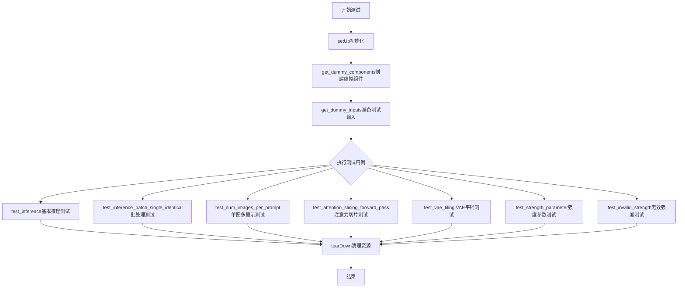

## 类结构

```
unittest.TestCase
└── ZImageImg2ImgPipelineFastTests (继承自PipelineTesterMixin)
    ├── 类属性
    │   ├── pipeline_class
    │   ├── params
    │   ├── batch_params
    │   ├── image_params
    │   └── required_optional_params
    └── 类方法
        ├── setUp
        ├── tearDown
        ├── get_dummy_components
        ├── get_dummy_inputs
        ├── test_inference
        ├── test_inference_batch_single_identical
        ├── test_num_images_per_prompt
        ├── test_attention_slicing_forward_pass
        ├── test_vae_tiling
        ├── test_pipeline_with_accelerator_device_map
        ├── test_group_offloading_inference
        ├── test_save_load_float16
        ├── test_float16_inference
        ├── test_strength_parameter
        └── test_invalid_strength
```

## 全局变量及字段


### `torch_device`
    
torch设备常量，用于指定计算设备

类型：`str`
    


### `supports_dduf`
    
是否支持DDUF标志，设置为False

类型：`bool`
    


### `ZImageImg2ImgPipelineFastTests.pipeline_class`
    
测试的管道类，指向ZImageImg2ImgPipeline

类型：`type`
    


### `ZImageImg2ImgPipelineFastTests.params`
    
文本引导图像变化参数，包含文本引导图像转换所需的参数集

类型：`set`
    


### `ZImageImg2ImgPipelineFastTests.batch_params`
    
批处理参数，用于批量处理图像转换的参数集

类型：`set`
    


### `ZImageImg2ImgPipelineFastTests.image_params`
    
图像参数，定义图像输入的相关参数

类型：`set`
    


### `ZImageImg2ImgPipelineFastTests.image_latents_params`
    
图像潜在参数，定义图像潜在表示的相关参数

类型：`set`
    


### `ZImageImg2ImgPipelineFastTests.required_optional_params`
    
必需的可选参数集合，定义管道中可选但需要测试的参数

类型：`frozenset`
    


### `ZImageImg2ImgPipelineFastTests.supports_dduf`
    
是否支持DDUF，设置为False表示不支持

类型：`bool`
    


### `ZImageImg2ImgPipelineFastTests.test_xformers_attention`
    
是否测试xformers注意力，设置为False表示不测试

类型：`bool`
    


### `ZImageImg2ImgPipelineFastTests.test_layerwise_casting`
    
是否测试分层转换，设置为True表示启用测试

类型：`bool`
    


### `ZImageImg2ImgPipelineFastTests.test_group_offloading`
    
是否测试组卸载，设置为True表示启用测试

类型：`bool`
    
    

## 全局函数及方法


### `gc.collect`

Python 内置垃圾回收函数，用于显式触发垃圾回收过程，释放不再使用的内存资源。

参数：无

返回值：`int`，回收的不可达对象数量

#### 流程图

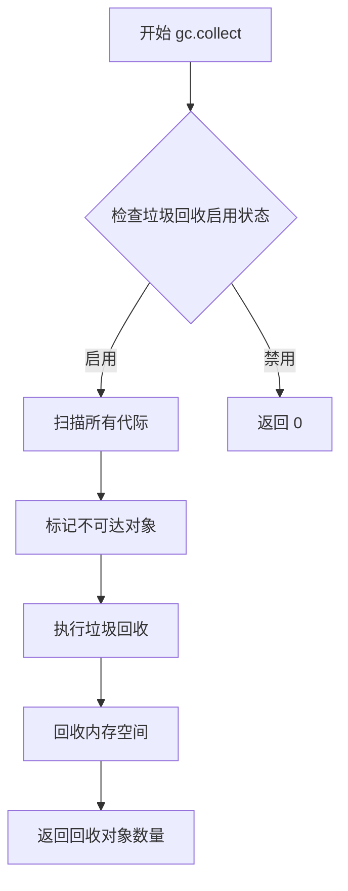

#### 带注释源码

```python
import gc

# gc.collect() 是 Python 垃圾回收模块的核心函数
# 功能：显式调用垃圾回收器，清理不可达对象
# 
# 参数：
#   - 无参数
#
# 返回值：
#   - int: 成功回收的对象数量
#
# 使用场景：
#   - 在测试用例结束后清理内存
#   - 释放大模型推理后的 GPU 显存
#   - 在内存密集型操作之间手动触发回收

# 示例调用
collected_count = gc.collect()
print(f"回收了 {collected_count} 个对象")

# 在本代码中的典型使用模式：
# setUp 方法中
gc.collect()
if torch.cuda.is_available():
    torch.cuda.empty_cache()  # 清理 CUDA 缓存
    torch.cuda.synchronize()  # 同步 CUDA 操作

# tearDown 方法中
gc.collect()
if torch.cuda.is_available():
    torch.cuda.empty_cache()
    torch.cuda.synchronize()
```


### `torch.cuda.empty_cache`

该函数是 PyTorch 框架提供的 CUDA 缓存清理方法，用于清空 CUDA 缓存并释放未使用的 GPU 内存碎片，从而优化 GPU 内存使用。在测试用例中，`torch.cuda.empty_cache()` 被用于在测试开始前（setUp）、测试结束后（tearDown）以及测试过程中清理 GPU 内存，确保每次测试都在干净的内存环境中运行。

参数： 无

返回值：`None`，该函数无返回值，仅执行缓存清理操作

#### 流程图

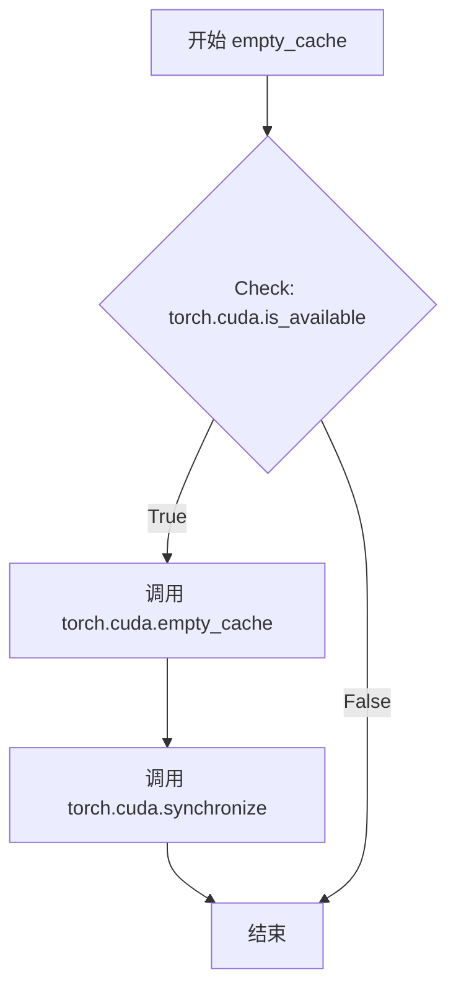

#### 带注释源码

```python
# 测试 setUp 方法中调用 empty_cache
def setUp(self):
    gc.collect()                          # 先进行 Python 垃圾回收
    if torch.cuda.is_available():         # 检查 CUDA 是否可用
        torch.cuda.empty_cache()          # 清空 CUDA 缓存，释放未使用的 GPU 内存
        torch.cuda.synchronize()          # 同步 CUDA 操作，确保所有 GPU 任务完成
    torch.manual_seed(0)                   # 设置 CPU random seed
    if torch.cuda.is_available():          # 检查 CUDA 可用性
        torch.cuda.manual_seed_all(0)     # 设置所有 GPU 的 random seed

# 测试 tearDown 方法中调用 empty_cache
def tearDown(self):
    super().tearDown()                    # 调用父类的 tearDown
    gc.collect()                          # Python 垃圾回收
    if torch.cuda.is_available():         # 检查 CUDA 是否可用
        torch.cuda.empty_cache()          # 清空 CUDA 缓存
        torch.cuda.synchronize()          # 同步 CUDA 操作
    torch.manual_seed(0)
    if torch.cuda.is_available():
        torch.cuda.manual_seed_all(0)

# 测试 test_inference_batch_single_identical 中调用 empty_cache
def test_inference_batch_single_identical(self):
    gc.collect()
    if torch.cuda.is_available():
        torch.cuda.empty_cache()          # 清空 CUDA 缓存
        torch.cuda.synchronize()
    torch.manual_seed(0)
    if torch.cuda.is_available():
        torch.cuda.manual_seed_all(0)
    self._test_inference_batch_single_identical(batch_size=3, expected_max_diff=1e-1)

# 测试 test_num_images_per_prompt 结束时调用 empty_cache
del pipe
gc.collect()
if torch.cuda.is_available():
    torch.cuda.empty_cache()              # 清理测试后的 GPU 缓存
    torch.cuda.synchronize()
```


### `torch.cuda.synchronize`

CUDA同步函数，用于阻塞当前CPU线程，等待当前CUDA设备上的所有CUDA流操作完成，确保GPU计算已完成后再继续执行CPU端的代码。

参数： 无

返回值：`None`，无返回值（该函数执行同步操作后直接返回）

#### 流程图

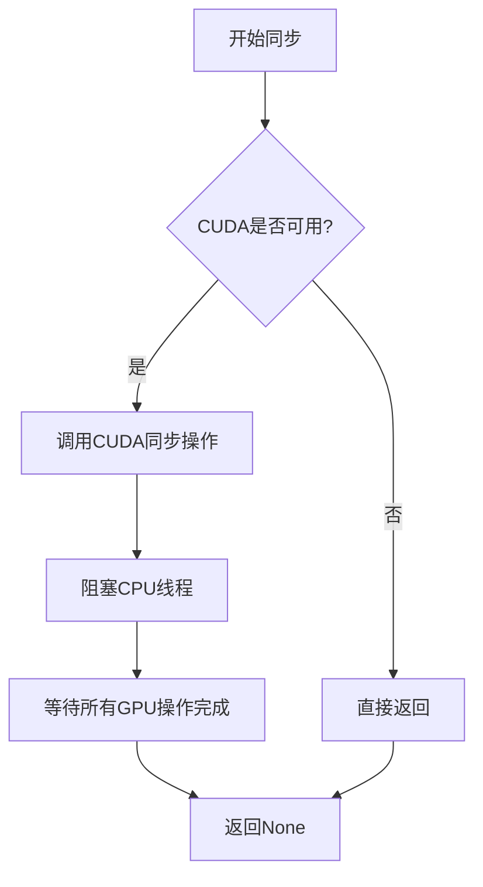

#### 带注释源码

```python
# torch.cuda.synchronize() 函数源码分析

# 位置: 代码中的调用示例
if torch.cuda.is_available():  # 检查CUDA是否可用
    torch.cuda.empty_cache()   # 先清理CUDA缓存
    torch.cuda.synchronize()   # 同步CUDA操作

"""
函数说明:
- 名称: torch.cuda.synchronize
- 所属模块: torch.cuda
- 参数: 无参数
- 返回值: None

功能描述:
  torch.cuda.synchronize() 是一个CUDA同步函数，用于确保所有在GPU上
  异步执行的操作都已完成。当调用此函数时，CPU线程会被阻塞，直到
  当前CUDA设备的所有流中的所有CUDA操作都执行完毕。
  
  在测试代码中使用场景:
  1. setUp方法中 - 确保测试开始前GPU状态干净
  2. tearDown方法中 - 确保测试结束后GPU操作完成
  3. 测试方法间 - 确保前一个测试的GPU操作不会影响下一个测试
  
使用注意事项:
  - 仅在CUDA可用时调用，需先检查torch.cuda.is_available()
  - 频繁调用会影响性能，应在必要时使用
  - 在进行性能基准测试时可用于确保计时的准确性
"""
```


### `torch.manual_seed`

设置CPU的随机种子，用于确保PyTorch操作的 reproducibility（可重复性）。该函数在测试代码中多次被调用，以确保测试结果的一致性和可重复性。

参数：

- `seed`：`int`，随机种子值，用于初始化随机数生成器。在代码中传入 `0`

返回值：`None`，该函数无返回值，仅设置全局随机状态

#### 流程图

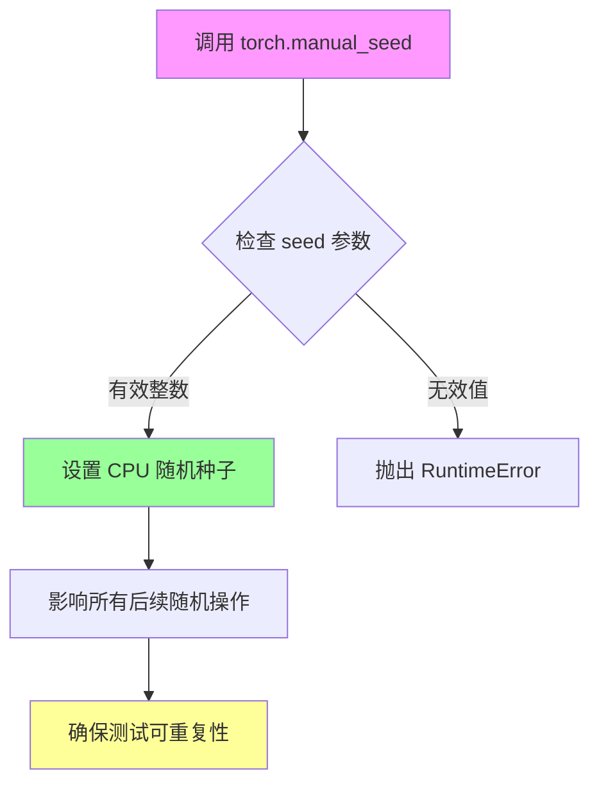

#### 带注释源码

```python
# 在 setUp 方法中调用 - 测试初始化时设置随机种子
torch.manual_seed(0)
if torch.cuda.is_available():
    torch.cuda.manual_seed_all(0)

# 在 tearDown 方法中调用 - 测试清理时恢复随机种子
torch.manual_seed(0)
if torch.cuda.is_available():
    torch.cuda.manual_seed_all(0)

# 在 get_dummy_components 方法中多次调用 - 确保每次获取组件时随机状态一致
torch.manual_seed(0)
transformer = ZImageTransformer2DModel(...)  # 创建 transformer

torch.manual_seed(0)
vae = AutoencoderKL(...)  # 创建 VAE

torch.manual_seed(0)
scheduler = FlowMatchEulerDiscreteScheduler()  # 创建调度器

torch.manual_seed(0)
config = Qwen3Config(...)  # 创建配置
text_encoder = Qwen3Model(config)  # 创建文本编码器

# 在 test_inference_batch_single_identical 方法中调用
torch.manual_seed(0)
if torch.cuda.is_available():
    torch.cuda.manual_seed_all(0)
```


### `torch.cuda.manual_seed_all`

设置所有可用 GPU 的随机种子，以确保 CUDA 操作的可重复性。

参数：

- `seed`：`int`，要设置的随机种子值

返回值：`None`，无返回值

#### 流程图

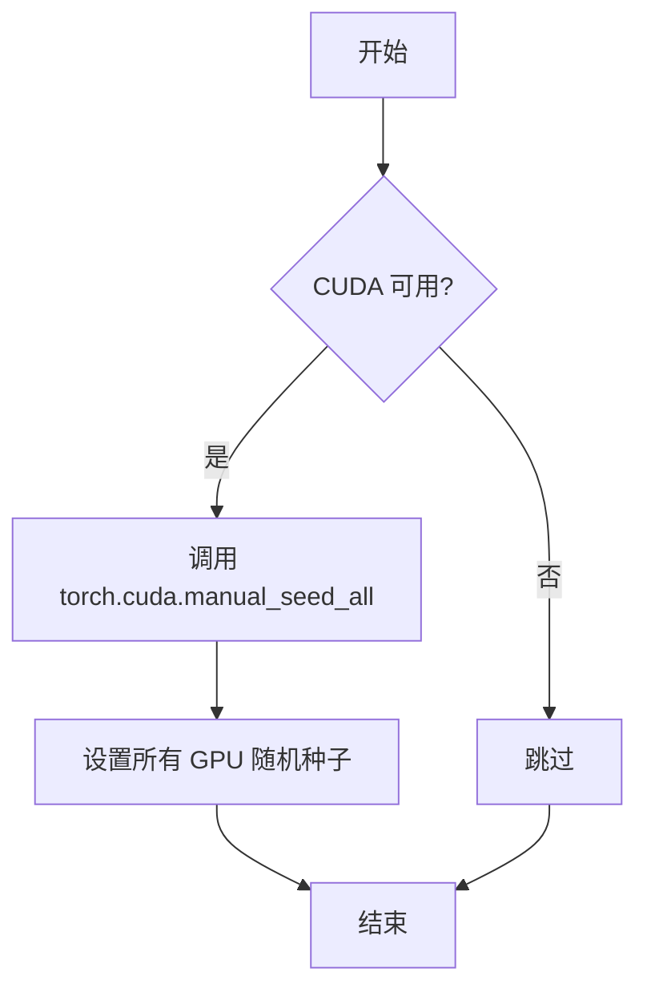

#### 带注释源码

```python
# 在 setUp 方法中初始化随机种子
def setUp(self):
    gc.collect()
    if torch.cuda.is_available():  # 检查 CUDA 是否可用
        torch.cuda.empty_cache()  # 清空 CUDA 缓存
        torch.cuda.synchronize()  # 同步 CUDA 操作
    torch.manual_seed(0)  # 设置 CPU 随机种子
    if torch.cuda.is_available():  # 再次检查 CUDA 可用性
        # 设置所有 GPU 的随机种子为 0，确保 GPU 计算可复现
        torch.cuda.manual_seed_all(0)

# 在 tearDown 方法中清理随机种子
def tearDown(self):
    super().tearDown()
    gc.collect()
    if torch.cuda.is_available():
        torch.cuda.empty_cache()
        torch.cuda.synchronize()
    torch.manual_seed(0)
    if torch.cuda.is_available():
        # 重置所有 GPU 随机种子为 0，保持测试环境一致性
        torch.cuda.manual_seed_all(0)

# 在特定测试方法中确保随机种子一致
def test_inference_batch_single_identical(self):
    gc.collect()
    if torch.cuda.is_available():
        torch.cuda.empty_cache()
        torch.cuda.synchronize()
    torch.manual_seed(0)
    if torch.cuda.is_available():
        # 确保批次测试的随机性可控
        torch.cuda.manual_seed_all(0)
    self._test_inference_batch_single_identical(batch_size=3, expected_max_diff=1e-1)
```


### `torch.use_deterministic_algorithms`

设置 PyTorch 是否使用确定性算法。当设置为 `False` 时，允许使用非确定性算法以提高性能，但可能导致结果不可重现。该函数在 Z-Image 项目中用于处理复杂的 complex64 RoPE 操作，因为这些操作不支持确定性模式。

参数：

-  `mode`：`bool`，指定是否启用确定性算法。`True` 强制使用确定性算法（如可用），`False` 允许使用非确定性算法

返回值：`None`，该函数直接修改 PyTorch 全局状态，无返回值

#### 流程图

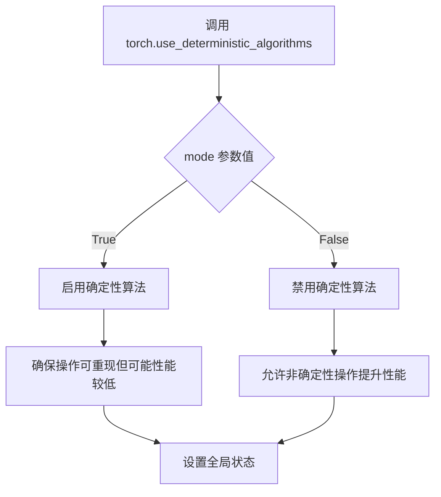

#### 带注释源码

```python
# 在 Z-Image 项目测试文件中设置确定性算法
# Z-Image 需要使用 torch.use_deterministic_algorithms(False)
# 因为复杂的 complex64 RoPE 操作不支持确定性算法
# 不能使用 enable_full_determinism() 因为它会设置为 True

# 设置 CUDA 启动阻塞以便调试
os.environ["CUDA_LAUNCH_BLOCKING"] = "1"

# 设置 cuBLAS 工作空间配置为 16:8
os.environ["CUBLAS_WORKSPACE_CONFIG"] = ":16:8"

# 禁用确定性算法，允许使用非确定性操作以支持 complex64 RoPE
torch.use_deterministic_algorithms(False)

# 设置 cuDNN 为确定性模式
torch.backends.cudnn.deterministic = True

# 禁用 cuDNN 自动调优
torch.backends.cudnn.benchmark = False

# 如果存在 cuda 后端，禁用 TF32 matmul
if hasattr(torch.backends, "cuda"):
    torch.backends.cuda.matmul.allow_tf32 = False
```


### `torch.backends.cudnn.deterministic`

设置 CUDNN（CUDA 深度神经网络库）是否使用确定性算法。当设置为 `True` 时，CUDNN 将使用确定性算法，这会导致性能下降但结果可复现；当设置为 `False` 时，CUDNN 会选择最快的算法，可能导致结果不可复现（即使使用相同的随机种子）。

参数：

- 无（这是一个属性赋值操作，而非函数调用）

返回值：无特定返回值（通过赋值语句设置属性值）

#### 流程图

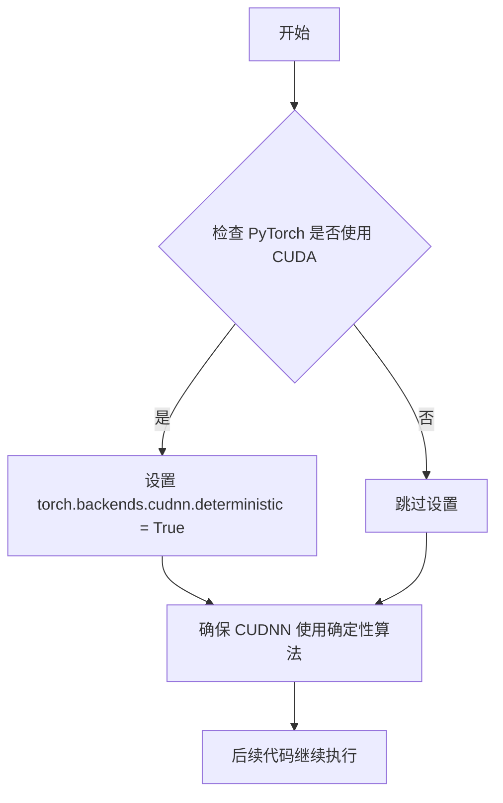

#### 带注释源码

```python
# Z-Image requires torch.use_deterministic_algorithms(False) due to complex64 RoPE operations
# Cannot use enable_full_determinism() which sets it to True
# Note: Z-Image does not support FP16 inference due to complex64 RoPE embeddings
os.environ["CUDA_LAUNCH_BLOCKING"] = "1"  # 启用 CUDA 同步，便于调试
os.environ["CUBLAS_WORKSPACE_CONFIG"] = ":16:8"  # 配置 cuBLAS 工作空间
torch.use_deterministic_algorithms(False)  # 禁用全局确定性算法（Z-Image 需要）
torch.backends.cudnn.deterministic = True  # 关键：设置 CUDNN 使用确定性算法
torch.backends.cudnn.benchmark = False  # 禁用 cudnn.benchmark 以确保可复现性
if hasattr(torch.backends, "cuda"):
    torch.backends.cuda.matmul.allow_tf32 = False  # 禁用 TF32 以提高精度
```

#### 补充说明

| 属性 | 类型 | 说明 |
|------|------|------|
| `torch.backends.cudnn.deterministic` | `bool` | 控制 CUDNN 是否使用确定性算法 |
| `torch.backends.cudnn.benchmark` | `bool` | 控制 CUDNN 是否启用 benchmark 模式（选择最优算法） |

**设计目标与约束：**

- 该设置是为了在测试环境中确保结果的可复现性
- 与 `torch.use_deterministic_algorithms(False)` 配合使用，因为 Z-Image 的 complex64 RoPE 操作不支持完全确定性

**潜在的技术债务：**

- 环境变量 `CUDA_LAUNCH_BLOCKING = "1"` 会显著影响性能，仅应用于调试
- 禁用 TF32 和启用确定性会导致推理速度下降，不适合生产环境的高性能需求


### `torch.backends.cudnn.benchmark`

设置 CUDNN 的 benchmark 模式，控制是否启用 cuDNN 的自动调优功能以优化卷积算法的选择。在 Z-Image 项目中，此值被设置为 `False` 以确保deterministic（确定性）行为。

参数：

- 无（这是一个全局属性赋值，不是函数调用）

返回值：`bool`，返回当前设置的 benchmark 模式值

#### 流程图

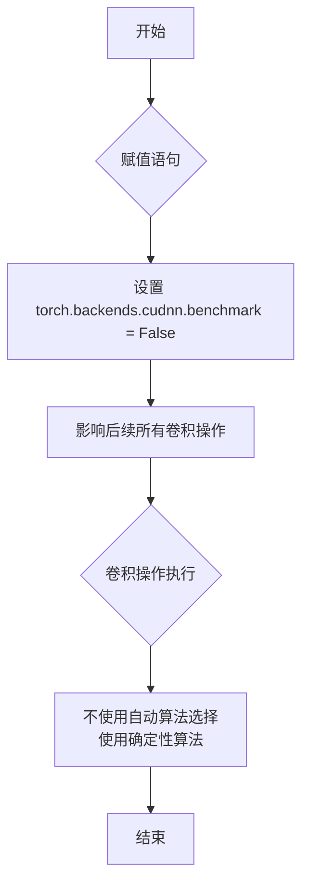

#### 带注释源码

```python
# Z-Image requires torch.use_deterministic_algorithms(False) due to complex64 RoPE operations
# Cannot use enable_full_determinism() which sets it to True
# Note: Z-Image does not support FP16 inference due to complex64 RoPE embeddings

# 设置 CUDA 启动阻塞，便于调试
os.environ["CUDA_LAUNCH_BLOCKING"] = "1"
# 设置 CUBLAS 工作空间配置，:16:8 表示16个线程每个线程16KB
os.environ["CUBLAS_WORKSPACE_CONFIG"] = ":16:8"

# 禁用 PyTorch 的确定性算法（Z-Image 需要，因为 complex64 RoPE 操作）
torch.use_deterministic_algorithms(False)

# 启用 cuDNN 的确定性模式，确保每次运行产生相同结果
torch.backends.cudnn.deterministic = True

# 设置 cuDNN benchmark 模式为 False
# 当为 False 时，cuDNN 不会自动选择最快的卷积算法
# 而是为每个卷积层使用固定的算法，确保可重复性和确定性
torch.backends.cudnn.benchmark = False

# 检查 torch.backends 是否有 cuda 属性（某些 PyTorch 版本可能没有）
# 如果有，则禁用 TF32 matmul 运算
if hasattr(torch.backends, "cuda"):
    torch.backends.cuda.matmul.allow_tf32 = False
```

---

### 技术债务与优化空间

1. **硬编码的全局设置**：这些设置散布在测试文件顶部，不利于模块化和配置管理。建议将这些设置抽取到独立的配置模块中。

2. **注释与实际行为不一致**：注释提到 "Z-Image does not support FP16 inference due to complex64 RoPE embeddings"，但代码中没有明确禁用 FP16 的逻辑，只是通过 `torch.backends.cuda.matmul.allow_tf32 = False` 间接控制。

3. **环境变量设置**：使用 `os.environ` 修改全局环境变量，可能对其他并行测试产生副作用。建议使用 `pytest` 的 fixture 或上下文管理器来隔离这些设置。

4. **cudnn.benchmark 的使用场景**：在生产环境中，如果追求性能通常会设置 `benchmark = True`，但在测试/调试场景下 `False` 是合适的。当前的设置适合测试场景，但若需要性能测试应考虑动态调整。


### `torch.backends.cuda.matmul.allow_tf32`

该代码用于在 Z-Image 图像到图像（Img2Img）管道的测试环境中禁用 TF32（TensorFloat-32）矩阵乘法加速，以确保使用复杂64位（complex64）RoPE（旋转位置编码）操作的数值精度要求得到满足。

#### 上下文背景

此设置位于测试文件的初始化部分，在任何测试方法执行前全局生效，用于确保测试环境的一致性和数值准确性。

#### 参数

此操作不是函数调用，而是属性赋值，因此没有传统意义上的参数。

- **赋值目标**：`torch.backends.cuda.matmul.allow_tf32`
- **赋值内容**：`False`（布尔值）
- **赋值类型**：`bool`
- **描述**：显式禁用 CUDA 矩阵乘法中的 TF32（TensorFloat-32）精度加速，强制使用 IEEE 32位浮点精度以保证 complex64 RoPE 操作的数值稳定性。

#### 返回值

无返回值（这是属性赋值操作，而非函数调用）

#### 流程图

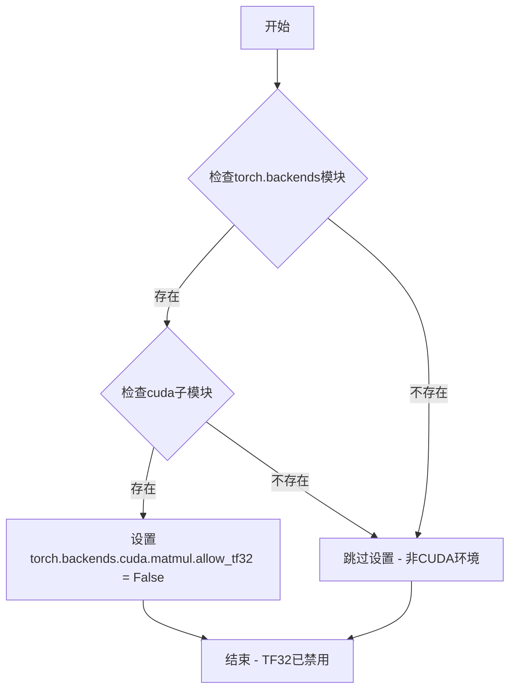

#### 带注释源码

```python
# 检查 torch.backends 模块是否存在（某些环境可能没有此模块）
if hasattr(torch.backends, "cuda"):
    # 检查 cuda 子模块是否存在
    # 这确保了代码在非 CUDA 环境下运行时不会抛出 AttributeError
    torch.backends.cuda.matmul.allow_tf32 = False
    # 禁用 TF32 (TensorFloat-32) 矩阵乘法加速
    # 原因：Z-Image 模型使用 complex64 类型的 RoPE 嵌入
    # TF32 精度可能不足以保证这些操作的数值准确性
    # 禁用了 TF32 后，矩阵运算将使用完整的 float32 精度
```

#### 关键组件信息

| 组件名称 | 描述 |
|---------|------|
| `torch.backends` | PyTorch 后端配置管理模块 |
| `torch.backends.cuda` | CUDA 相关后端设置 |
| `torch.backends.cuda.matmul` | 矩阵乘法相关配置 |
| `torch.backends.cuda.matmul.allow_tf32` | TF32 精度启用/禁用标志 |
| TF32 (TensorFloat-32) | NVIDIA Ampere 架构引入的19位浮点格式，用于加速矩阵运算 |
| complex64 RoPE | 复数64位浮点类型的旋转位置编码，Z-Image 模型的特性 |

#### 潜在的技术债务或优化空间

1. **硬编码配置**：当前将 `allow_tf32` 硬编码为 `False`，建议改为可通过环境变量或配置参数控制，以便在不同场景下灵活调整。

2. **缺少文档注释**：在设置旁应添加更详细的注释说明为何需要禁用 TF32，以及这对测试结果的具体影响。

3. **平台检测不够精确**：使用 `hasattr` 检查不够精确，建议使用 `torch.cuda.is_available()` 来更明确地判断是否处于 CUDA 环境中。

4. **未考虑 AMD ROCm**：代码仅针对 NVIDIA CUDA 设计，如果需要支持 AMD ROCm 平台，需要添加相应的检查。

#### 其它项目

**设计目标与约束：**
- 目标：确保 Z-Image 管道测试使用完整的 float32 精度
- 约束：complex64 RoPE 操作需要高于 TF32 的数值精度

**错误处理与异常设计：**
- 使用 `hasattr` 动态检查属性是否存在，避免在非 CUDA 环境下抛出异常
- 这是一种防御性编程实践，确保测试在多种环境中都能安全运行

**数据流与状态：**
- 此设置为全局状态修改，会影响后续所有 CUDA 矩阵运算
- 状态在测试文件加载时生效，贯穿整个测试会话

**外部依赖与接口契约：**
- 依赖 PyTorch 的 `torch.backends` API
- 依赖 NVIDIA CUDA 运行时环境
- 与 transformers 库的 Qwen2Tokenizer、Qwen3Config、Qwen3Model 无直接关系，但共同构成测试依赖

**数值精度说明：**
- TF32 使用 19 位（1 位符号 + 8 位指数 + 10 位尾数）
- float32 使用 32 位（1 位符号 + 8 位指数 + 23 位尾数）
- complex64 由两个 float32 组成，禁用 TF32 可确保每个操作数都使用完整精度


### `floats_tensor`

生成指定形状的随机浮点张量（测试工具函数）。

参数：

- `shape`：`Tuple[int, ...]`，张量的形状，例如 `(1, 3, 32, 32)`
- `rng`：`random.Random`，Python 随机数生成器实例，用于生成随机数据

返回值：`torch.Tensor`，返回形状为 `shape` 的随机浮点张量

#### 流程图

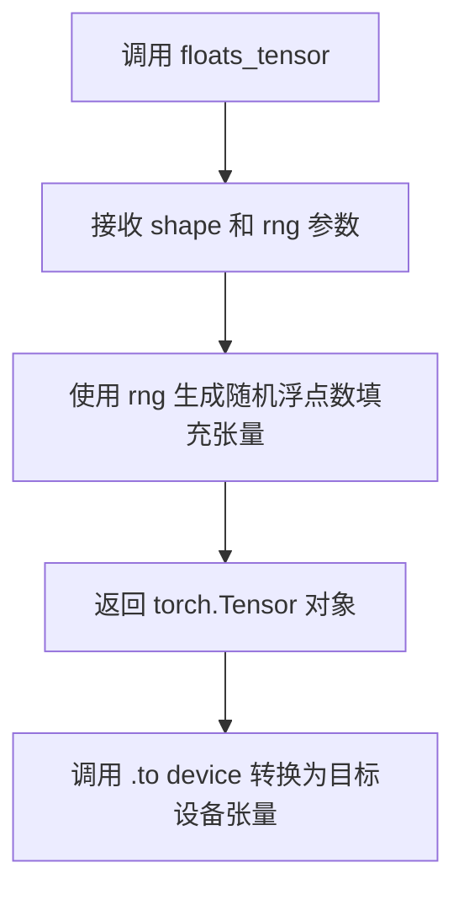

#### 带注释源码

```
# floats_tensor 是从 diffusers.utils.testing_utils 导入的测试工具函数
# 该函数不在当前文件中定义，其源码位于 diffusers 库中

# 使用示例 1：在 get_dummy_inputs 方法中
image = floats_tensor((1, 3, 32, 32), rng=random.Random(seed)).to(device)
# 生成形状为 (1, 3, 32, 32) 的随机浮点张量，并移动到指定设备

# 使用示例 2：在 test_vae_tiling 方法中
inputs["image"] = floats_tensor((1, 3, 128, 128), rng=random.Random(0)).to("cpu")
# 生成形状为 (1, 3, 128, 128) 的随机浮点张量，用于 VAE tiling 测试
```

#### 说明

`floats_tensor` 函数是 diffusers 库提供的测试工具，用于生成指定形状的随机浮点张量。该函数接收一个形状元组和一个随机数生成器对象，返回一个 PyTorch 张量。在当前代码中主要用于：

1. **图像生成**：在 `get_dummy_inputs` 方法中生成用于测试的虚拟图像张量
2. **VAE tiling 测试**：在 `test_vae_tiling` 方法中生成更大的图像用于测试 VAE 分块功能


### `to_np`

将 PyTorch 张量或管道输出转换为 NumPy 数组的通用工具函数。

参数：

-  `tensor`：任意支持转换为 NumPy 数组的输入，通常为 PyTorch 张量（`torch.Tensor`）或包含张量的元组/列表，管道输出的图像张量

返回值：`numpy.ndarray`，返回转换后的 NumPy 数组格式的图像数据

#### 流程图

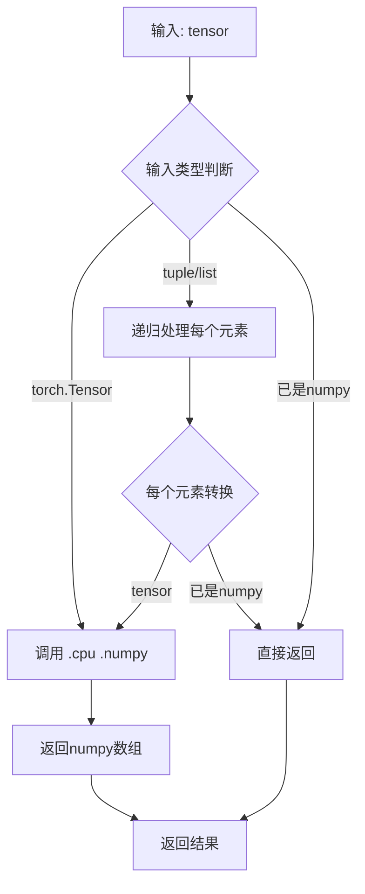

#### 带注释源码

```python
# to_np 函数通常定义在 diffusers.utils.testing_utils 或 test_pipelines_common 模块中
# 以下是典型的实现模式：

def to_np(tensor):
    """
    将 PyTorch 张量或管道输出转换为 NumPy 数组。
    
    该函数是测试框架中的通用工具函数，用于：
    - 将模型输出的张量转换为 NumPy 格式以便进行数值比较
    - 支持单张量、元组、列表等多种输入形式
    - 自动处理设备转换（从 GPU/CPU 到 NumPy）
    
    参数:
        tensor: 输入数据，可以是:
            - torch.Tensor: PyTorch 张量
            - tuple/list: 包含张量的元组或列表
            - numpy.ndarray: 已经是 NumPy 数组，直接返回
    
    返回值:
        numpy.ndarray: 转换后的 NumPy 数组
    """
    
    # 检查是否为 None
    if tensor is None:
        return None
    
    # 如果输入已经是 NumPy 数组，直接返回
    if isinstance(tensor, np.ndarray):
        return tensor
    
    # 如果是 PyTorch 张量，转换为 CPU 后转为 NumPy
    if isinstance(tensor, torch.Tensor):
        # 确保张量在 CPU 上（如果是 CUDA 张量）
        # detach() 分离计算图，clone() 避免原张量被修改
        return tensor.cpu().detach().clone().numpy()
    
    # 如果是元组或列表，递归处理每个元素
    if isinstance(tensor, (tuple, list)):
        return type(tensor)(to_np(item) for item in tensor)
    
    # 对于其他类型，尝试直接转换为 NumPy
    return np.array(tensor)


# 在测试代码中的典型使用方式：
# max_diff1 = np.abs(to_np(output_with_slicing1) - to_np(output_without_slicing)).max()
# 这里将两个管道输出的图像张量转换为 NumPy 数组后计算逐像素差异的最大值
```


### `ZImageImg2ImgPipelineFastTests.get_dummy_components`

获取用于测试的虚拟（dummy）组件，包括transformer、VAE、scheduler、text_encoder和tokenizer等模型组件。

参数：

-  `self`：实例本身

返回值：`Dict[str, Any]`，返回包含所有模型组件的字典

#### 流程图

```mermaid
flowchart TD
    A[开始 get_dummy_components] --> B[设置随机种子 torch.manual_seed(0)]
    B --> C[创建 ZImageTransformer2DModel]
    C --> D[设置随机种子 torch.manual_seed(0)]
    D --> E[创建 AutoencoderKL VAE]
    E --> F[设置随机种子 torch.manual_seed(0)]
    F --> G[创建 FlowMatchEulerDiscreteScheduler]
    G --> H[设置随机种子 torch.manual_seed(0)]
    H --> I[创建 Qwen3Config]
    I --> J[创建 Qwen3Model text_encoder]
    J --> K[创建 Qwen2Tokenizer]
    K --> L[组装组件字典]
    L --> M[返回 components]
```

#### 带注释源码

```
def get_dummy_components(self):
    """创建用于测试的虚拟模型组件"""
    torch.manual_seed(0)  # 设置随机种子以确保可重复性
    
    # 创建Transformer模型 - Z-Image变换器
    transformer = ZImageTransformer2DModel(
        all_patch_size=(2,),
        all_f_patch_size=(1,),
        in_channels=16,
        dim=32,
        n_layers=2,
        n_refiner_layers=1,
        n_heads=2,
        n_kv_heads=2,
        norm_eps=1e-5,
        qk_norm=True,
        cap_feat_dim=16,
        rope_theta=256.0,
        t_scale=1000.0,
        axes_dims=[8, 4, 4],
        axes_lens=[256, 32, 32],
    )

    torch.manual_seed(0)  # 重新设置种子
    # 创建VAE自编码器
    vae = AutoencoderKL(
        in_channels=3,
        out_channels=3,
        down_block_types=["DownEncoderBlock2D", "DownEncoderBlock2D"],
        up_block_types=["UpDecoderBlock2D", "UpDecoderBlock2D"],
        block_out_channels=[32, 64],
        layers_per_block=1,
        latent_channels=16,
        norm_num_groups=32,
        sample_size=32,
        scaling_factor=0.3611,
        shift_factor=0.1159,
    )

    torch.manual_seed(0)
    # 创建调度器 - Flow Match Euler离散调度器
    scheduler = FlowMatchEulerDiscreteScheduler()

    torch.manual_seed(0)
    # 创建Qwen3配置
    config = Qwen3Config(
        hidden_size=16,
        intermediate_size=16,
        num_hidden_layers=2,
        num_attention_heads=2,
        num_key_value_heads=2,
        vocab_size=151936,
        max_position_embeddings=512,
    )
    # 创建文本编码器
    text_encoder = Qwen3Model(config)
    # 创建分词器
    tokenizer = Qwen2Tokenizer.from_pretrained("hf-internal-testing/tiny-random-Qwen2VLForConditionalGeneration")

    # 组装所有组件
    components = {
        "transformer": transformer,
        "vae": vae,
        "scheduler": scheduler,
        "text_encoder": text_encoder,
        "tokenizer": tokenizer,
    }
    return components
```

---

### `ZImageImg2ImgPipelineFastTests.get_dummy_inputs`

获取用于测试的虚拟输入参数，包括prompt、negative_prompt、image、strength等。

参数：

-  `self`：实例本身
-  `device`：目标设备字符串
-  `seed`：随机种子，默认值为0

返回值：`Dict[str, Any]`，返回包含所有输入参数的字典

#### 流程图

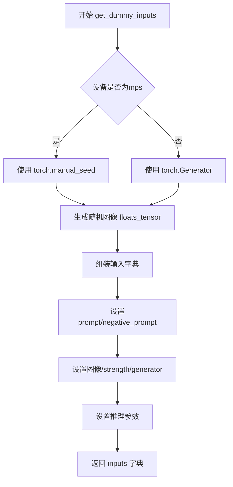

#### 带注释源码

```
def get_dummy_inputs(self, device, seed=0):
    """创建用于测试的虚拟输入参数"""
    import random

    # 根据设备类型创建随机数生成器
    if str(device).startswith("mps"):
        # MPS设备使用torch.manual_seed
        generator = torch.manual_seed(seed)
    else:
        # 其他设备使用torch.Generator
        generator = torch.Generator(device=device).manual_seed(seed)

    # 生成随机图像 tensor (1, 3, 32, 32)
    image = floats_tensor((1, 3, 32, 32), rng=random.Random(seed)).to(device)

    # 组装完整的输入参数字典
    inputs = {
        "prompt": "dance monkey",  # 正向提示词
        "negative_prompt": "bad quality",  # 负向提示词
        "image": image,  # 输入图像
        "strength": 0.6,  # 转换强度 (0-1)
        "generator": generator,  # 随机生成器
        "num_inference_steps": 2,  # 推理步数
        "guidance_scale": 3.0,  # 引导 scale
        "cfg_normalization": False,  # CFG归一化
        "cfg_truncation": 1.0,  # CFG截断
        "height": 32,  # 输出高度
        "width": 32,  # 输出宽度
        "max_sequence_length": 16,  # 最大序列长度
        "output_type": "np",  # 输出类型 numpy
    }

    return inputs
```

---

### `ZImageImg2ImgPipelineFastTests.test_inference`

测试管道的基本推理功能，验证可以生成正确形状的输出图像。

参数：

-  `self`：实例本身

返回值：`None`，此为测试方法，使用assert进行验证

#### 流程图

```mermaid
flowchart TD
    A[开始 test_inference] --> B[设置设备为cpu]
    B --> C[获取虚拟组件]
    C --> D[创建pipeline实例]
    D --> E[移动pipeline到设备]
    E --> F[配置进度条]
    F --> G[获取虚拟输入]
    G --> H[执行推理 pipe]
    H --> I[提取生成的图像]
    I --> J{图像形状是否为 (32, 32, 3)}
    J -->|是| K[测试通过]
    J -->|否| L[测试失败]
```

#### 带注释源码

```
def test_inference(self):
    """测试基本推理功能"""
    device = "cpu"

    # 获取虚拟组件
    components = self.get_dummy_components()
    
    # 创建pipeline实例
    pipe = self.pipeline_class(**components)
    pipe.to(device)  # 移动到CPU设备
    pipe.set_progress_bar_config(disable=None)  # 配置进度条

    # 获取测试输入
    inputs = self.get_dummy_inputs(device)
    
    # 执行推理并获取结果
    image = pipe(**inputs).images
    generated_image = image[0]
    
    # 验证输出图像形状为 (32, 32, 3)
    self.assertEqual(generated_image.shape, (32, 32, 3))
```

---

### `ZImageImg2ImgPipelineFastTests.test_num_images_per_prompt`

测试每提示词生成多张图像的功能，通过inspect.signature检查pipeline是否支持该参数。

参数：

-  `self`：实例本身

返回值：`None`，此为测试方法，使用assert进行验证

#### 流程图

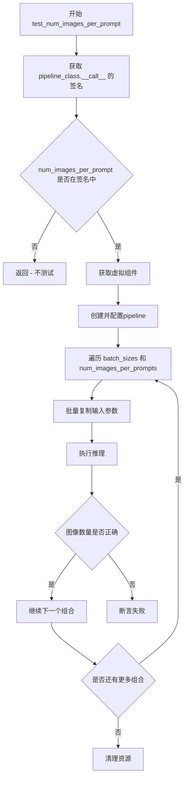

#### 带注释源码

```
def test_num_images_per_prompt(self):
    """测试每提示词生成图像数量的功能"""
    import inspect

    # 使用 inspect.signature 获取 pipeline __call__ 方法的签名
    sig = inspect.signature(self.pipeline_class.__call__)

    # 检查是否支持 num_images_per_prompt 参数
    if "num_images_per_prompt" not in sig.parameters:
        return  # 不支持则直接返回

    # 获取组件并创建pipeline
    components = self.get_dummy_components()
    pipe = self.pipeline_class(**components)
    pipe = pipe.to(torch_device)
    pipe.set_progress_bar_config(disable=None)

    # 定义测试参数
    batch_sizes = [1, 2]
    num_images_per_prompts = [1, 2]

    # 遍历所有组合
    for batch_size in batch_sizes:
        for num_images_per_prompt in num_images_per_prompts:
            # 获取基础输入
            inputs = self.get_dummy_inputs(torch_device)

            # 根据batch_size复制输入参数
            for key in inputs.keys():
                if key in self.batch_params:
                    inputs[key] = batch_size * [inputs[key]]

            # 执行推理，指定每提示词的图像数量
            images = pipe(**inputs, num_images_per_prompt=num_images_per_prompt)[0]

            # 验证生成的图像数量
            assert images.shape[0] == batch_size * num_images_per_prompt

    # 清理资源
    del pipe
    gc.collect()
    if torch.cuda.is_available():
        torch.cuda.empty_cache()
        torch.cuda.synchronize()
```

---

### `ZImageImg2ImgPipelineFastTests.test_vae_tiling`

测试VAE平铺（Tiling）功能，确保启用平铺后不会影响推理结果的质量。

参数：

-  `self`：实例本身
-  `expected_diff_max`：期望的最大差异，默认值为0.3

返回值：`None`，此为测试方法，使用assert进行验证

#### 流程图

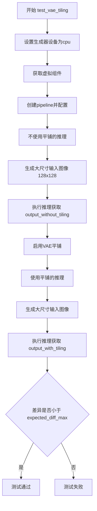

#### 带注释源码

```
def test_vae_tiling(self, expected_diff_max: float = 0.3):
    """测试VAE平铺功能，确保平铺不影响结果质量"""
    import random

    generator_device = "cpu"
    components = self.get_dummy_components()

    # 创建pipeline并配置
    pipe = self.pipeline_class(**components)
    pipe.to("cpu")
    pipe.set_progress_bar_config(disable=None)

    # ===== 不使用平铺的推理 =====
    inputs = self.get_dummy_inputs(generator_device)
    inputs["height"] = inputs["width"] = 128  # 使用较大尺寸
    # 生成更大的输入图像 (1, 3, 128, 128)
    inputs["image"] = floats_tensor((1, 3, 128, 128), rng=random.Random(0)).to("cpu")
    output_without_tiling = pipe(**inputs)[0]

    # ===== 使用平铺的推理 =====
    pipe.vae.enable_tiling()  # 启用VAE平铺
    inputs = self.get_dummy_inputs(generator_device)
    inputs["height"] = inputs["width"] = 128
    inputs["image"] = floats_tensor((1, 3, 128, 128), rng=random.Random(0)).to("cpu")
    output_with_tiling = pipe(**inputs)[0]

    # 验证平铺和非平铺结果的差异在可接受范围内
    self.assertLess(
        (to_np(output_without_tiling) - to_np(output_with_tiling)).max(),
        expected_diff_max,
        "VAE tiling should not affect the inference results",
    )
```

---

### `ZImageImg2ImgPipelineFastTests.test_strength_parameter`

测试strength参数对输出结果的影响，确保不同的strength值会产生不同的转换效果。

参数：

-  `self`：实例本身

返回值：`None`，此为测试方法，使用assert进行验证

#### 流程图

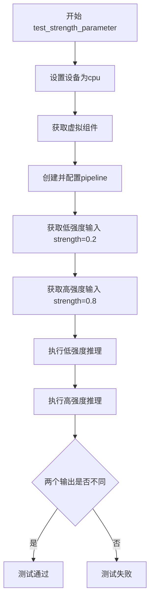

#### 带注释源码

```
def test_strength_parameter(self):
    """测试 strength 参数对输出的影响"""
    device = "cpu"
    components = self.get_dummy_components()
    pipe = self.pipeline_class(**components)
    pipe.to(device)
    pipe.set_progress_bar_config(disable=None)

    # 测试低强度值 (0.2)
    inputs_low_strength = self.get_dummy_inputs(device)
    inputs_low_strength["strength"] = 0.2

    # 测试高强度值 (0.8)
    inputs_high_strength = self.get_dummy_inputs(device)
    inputs_high_strength["strength"] = 0.8

    # 执行推理
    output_low = pipe(**inputs_low_strength).images[0]
    output_high = pipe(**inputs_high_strength).images[0]

    # 验证不同强度产生不同的输出
    self.assertFalse(np.allclose(output_low, output_high, atol=1e-3))
```

---

### `ZImageImg2ImgPipelineFastTests.test_invalid_strength`

测试无效的strength参数值（小于0或大于1）是否会被正确拒绝。

参数：

-  `self`：实例本身

返回值：`None`，此为测试方法，使用assert进行验证

#### 流程图

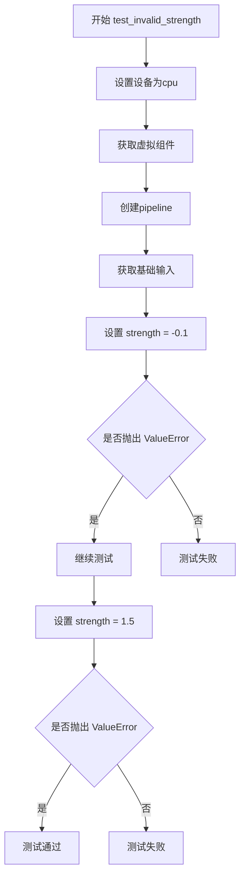

#### 带注释源码

```
def test_invalid_strength(self):
    """测试无效的 strength 值是否抛出错误"""
    device = "cpu"
    components = self.get_dummy_components()
    pipe = self.pipeline_class(**components)
    pipe.to(device)

    inputs = self.get_dummy_inputs(device)

    # 测试 strength < 0 (负值)
    inputs["strength"] = -0.1
    with self.assertRaises(ValueError):
        pipe(**inputs)

    # 测试 strength > 1 (超过1)
    inputs["strength"] = 1.5
    with self.assertRaises(ValueError):
        pipe(**inputs)
```


### `ZImageImg2ImgPipelineFastTests.setUp`

该方法是测试类的初始化方法，用于在每个测试方法运行前清理和重置测试环境，确保测试的可重复性和独立性。

参数：

- `self`：隐式参数，`unittest.TestCase` 实例，代表当前测试类实例本身，无需显式传递

返回值：`None`，该方法仅执行环境初始化操作，不返回任何值

#### 流程图

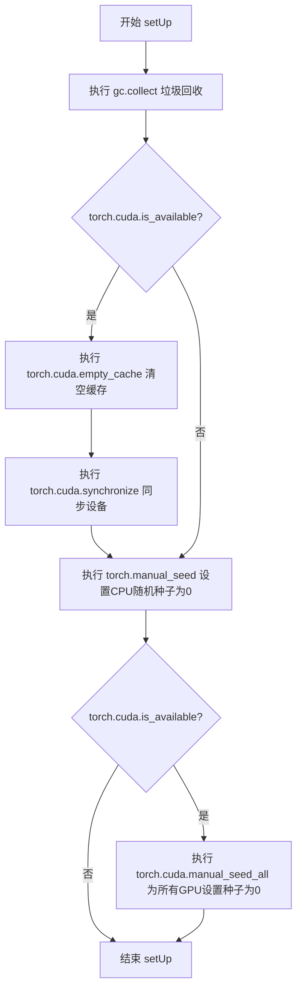

#### 带注释源码

```python
def setUp(self):
    """
    测试环境初始化方法，在每个测试方法执行前调用。
    目的：清理GPU内存、设置随机种子，确保测试结果可复现。
    """
    # 1. 主动触发垃圾回收，释放不再使用的内存对象
    gc.collect()
    
    # 2. 检查CUDA是否可用（是否有GPU支持）
    if torch.cuda.is_available():
        # 3. 清空CUDA缓存，释放未使用的GPU内存
        torch.cuda.empty_cache()
        # 4. 同步CUDA操作，确保所有GPU任务完成后再继续
        torch.cuda.synchronize()
    
    # 5. 设置PyTorch CPU随机种子为0，确保随机操作可复现
    torch.manual_seed(0)
    
    # 6. 再次检查CUDA可用性（如有GPU）
    if torch.cuda.is_available():
        # 7. 为所有GPU设备设置相同的随机种子，确保GPU操作也可复现
        torch.cuda.manual_seed_all(0)
```


### `ZImageImg2ImgPipelineFastTests.tearDown`

清理测试资源的方法，在每个测试方法执行完毕后自动调用，用于回收内存、清空GPU缓存并重置随机种子，以确保测试环境的干净和可重复性。

参数：

- `self`：`ZImageImg2ImgPipelineFastTests`（隐式参数），测试类实例本身

返回值：`None`，无返回值描述

#### 流程图

```mermaid
flowchart TD
    A[开始 tearDown] --> B[调用父类 tearDown]
    B --> C[执行 gc.collect 垃圾回收]
    C --> D{"torch.cuda.is_available()"}
    D -->|是| E[清空 CUDA 缓存 torch.cuda.empty_cache]
    E --> F[同步 CUDA torch.cuda.synchronize]
    D -->|否| G[跳过 CUDA 清理]
    F --> H[设置 CPU 随机种子 torch.manual_seed 0]
    H --> I{"torch.cuda.is_available()"}
    I -->|是| J[设置所有 CUDA 设备随机种子 torch.cuda.manual_seed_all 0]
    I -->|否| K[跳过 CUDA 随机种子设置]
    J --> L[结束 tearDown]
    G --> H
    K --> L
```

#### 带注释源码

```python
def tearDown(self):
    """
    清理测试资源的方法，在每个测试方法执行完毕后自动调用。
    主要负责回收内存、清空GPU缓存并重置随机种子。
    """
    # 调用父类的 tearDown 方法，执行父类定义的清理逻辑
    super().tearDown()
    
    # 手动触发 Python 垃圾回收，释放不再使用的对象内存
    gc.collect()
    
    # 检查是否有 CUDA 设备可用
    if torch.cuda.is_available():
        # 清空 CUDA 缓存，释放未使用的 GPU 内存
        torch.cuda.empty_cache()
        # 同步 CUDA 操作，确保所有 GPU 操作完成后再继续
        torch.cuda.synchronize()
    
    # 重置 CPU 随机种子为固定值 0，确保测试可重复性
    torch.manual_seed(0)
    
    # 再次检查 CUDA 可用性（针对多 GPU 环境）
    if torch.cuda.is_available():
        # 为所有 CUDA 设备设置相同的随机种子，确保多 GPU 测试的可重复性
        torch.cuda.manual_seed_all(0)
```


### `ZImageImg2ImgPipelineFastTests.get_dummy_components`

该方法是一个测试辅助函数，用于创建虚拟（dummy）组件，以便在单元测试中对 `ZImageImg2ImgPipeline` 进行推理测试。它通过固定的随机种子初始化所有模型组件，确保测试结果的可重复性。

参数：无

返回值：`Dict[str, Any]`，返回一个包含所有虚拟组件的字典，用于初始化 `ZImageImg2ImgPipeline`

#### 流程图

```mermaid
flowchart TD
    A[开始 get_dummy_components] --> B[设置随机种子 torch.manual_seed(0)]
    B --> C[创建 ZImageTransformer2DModel]
    C --> D[设置随机种子 torch.manual_seed(0)]
    D --> E[创建 AutoencoderKL]
    E --> F[设置随机种子 torch.manual_seed(0)]
    F --> G[创建 FlowMatchEulerDiscreteScheduler]
    G --> H[设置随机种子 torch.manual_seed(0)]
    H --> I[创建 Qwen3Config 配置]
    I --> J[使用配置创建 Qwen3Model 作为 text_encoder]
    J --> K[加载 Qwen2Tokenizer]
    K --> L[将所有组件放入字典]
    L --> M[返回 components 字典]
```

#### 带注释源码

```python
def get_dummy_components(self):
    """
    创建虚拟组件用于测试 ZImageImg2ImgPipeline
    
    该方法为图像到图像转换管道创建虚拟（dummy）模型组件，
    用于单元测试。所有组件使用固定随机种子确保测试可重复性。
    
    Returns:
        Dict[str, Any]: 包含以下键的字典:
            - transformer: ZImageTransformer2DModel 实例
            - vae: AutoencoderKL 实例  
            - scheduler: FlowMatchEulerDiscreteScheduler 实例
            - text_encoder: Qwen3Model 实例
            - tokenizer: Qwen2Tokenizer 实例
    """
    # 设置随机种子确保可重复性
    torch.manual_seed(0)
    
    # 创建 Z-Image Transformer 模型（核心变换器）
    transformer = ZImageTransformer2DModel(
        all_patch_size=(2,),          # 图像分块大小
        all_f_patch_size=(1,),        # 频率分块大小
        in_channels=16,                # 输入通道数
        dim=32,                        # 模型维度
        n_layers=2,                    # Transformer 层数
        n_refiner_layers=1,           # Refiner 层数
        n_heads=2,                     # 注意力头数
        n_kv_heads=2,                  # Key/Value 头数
        norm_eps=1e-5,                 # LayerNorm epsilon
        qk_norm=True,                  # 是否使用 QK 归一化
        cap_feat_dim=16,               # 条件特征维度
        rope_theta=256.0,              # RoPE 基础频率
        t_scale=1000.0,                # 时间缩放因子
        axes_dims=[8, 4, 4],           # RoPE 轴维度
        axes_lens=[256, 32, 32],       # RoPE 轴长度
    )

    # 重新设置随机种子确保 VAE 可重复性
    torch.manual_seed(0)
    
    # 创建 VAE（变分自编码器）用于图像编解码
    vae = AutoencoderKL(
        in_channels=3,                 # RGB 输入
        out_channels=3,                # RGB 输出
        down_block_types=["DownEncoderBlock2D", "DownEncoderBlock2D"],  # 下采样块类型
        up_block_types=["UpDecoderBlock2D", "UpDecoderBlock2D"],        # 上采样块类型
        block_out_channels=[32, 64],  # 块输出通道数
        layers_per_block=1,           # 每块层数
        latent_channels=16,           # 潜在空间通道数
        norm_num_groups=32,           # 归一化组数
        sample_size=32,               # 样本分辨率
        scaling_factor=0.3611,        # 缩放因子
        shift_factor=0.1159,          # 偏移因子
    )

    # 重新设置随机种子确保调度器可重复性
    torch.manual_seed(0)
    
    # 创建 Flow Match 欧拉离散调度器
    scheduler = FlowMatchEulerDiscreteScheduler()

    # 重新设置随机种子确保文本编码器可重复性
    torch.manual_seed(0)
    
    # 创建 Qwen3 配置
    config = Qwen3Config(
        hidden_size=16,                # 隐藏层维度
        intermediate_size=16,          # 前馈网络中间层维度
        num_hidden_layers=2,          # 隐藏层数量
        num_attention_heads=2,         # 注意力头数
        num_key_value_heads=2,         # KV 头数
        vocab_size=151936,            # 词汇表大小
        max_position_embeddings=512,  # 最大位置嵌入长度
    )
    
    # 使用配置创建 Qwen3 文本编码器模型
    text_encoder = Qwen3Model(config)
    
    # 加载预训练的 Qwen2 tokenizer
    tokenizer = Qwen2Tokenizer.from_pretrained("hf-internal-testing/tiny-random-Qwen2VLForConditionalGeneration")

    # 组装所有组件到字典中
    components = {
        "transformer": transformer,    # Z-Image 变换器模型
        "vae": vae,                    # VAE 编解码器
        "scheduler": scheduler,       # 噪声调度器
        "text_encoder": text_encoder, # 文本编码器
        "tokenizer": tokenizer,        # 分词器
    }
    
    return components
```


### `ZImageImg2ImgPipelineFastTests.get_dummy_inputs`

该方法用于生成图像到图像（Image-to-Image）推理流程的测试输入数据，构建包含提示词、负提示词、图像张量、推理参数等的字典对象，供后续管道推理测试使用。

参数：

- `self`：隐式参数，测试类实例本身。
- `device`：`str`，目标计算设备（如 "cpu"、"cuda"），用于将生成的张量放置到指定设备上。
- `seed`：`int`，随机种子，默认为 0，用于确保测试结果的可复现性。

返回值：`Dict[str, Any]`，返回包含图像到图像推理所需全部输入参数的字典，包括提示词、图像数据、推理步数、引导系数等。

#### 流程图

```mermaid
flowchart TD
    A[开始 get_dummy_inputs] --> B{device 是否为 mps?}
    B -->|是| C[使用 torch.manual_seed 生成随机数生成器]
    B -->|否| D[使用 torch.Generator 创建随机数生成器]
    C --> E[使用 floats_tensor 生成随机图像张量]
    D --> E
    E --> F[构建输入参数字典 inputs]
    F --> G[返回 inputs 字典]
    
    subgraph inputs 字典内容
    H[prompt: 'dance monkey']
    I[negative_prompt: 'bad quality']
    J[image: 图像张量]
    K[strength: 0.6]
    L[generator: 随机生成器]
    M[num_inference_steps: 2]
    N[guidance_scale: 3.0]
    O[cfg_normalization: False]
    P[cfg_truncation: 1.0]
    Q[height: 32]
    R[width: 32]
    S[max_sequence_length: 16]
    T[output_type: 'np']
    end
    
    E -.-> H
    E -.-> I
    E -.-> J
    E -.-> K
    E -.-> L
    E -.-> M
    E -.-> N
    E -.-> O
    E -.-> P
    E -.-> Q
    E -.-> R
    E -.-> S
    E -.-> T
```

#### 带注释源码

```python
def get_dummy_inputs(self, device, seed=0):
    """
    生成用于图像到图像管道推理的测试输入参数。
    
    参数:
        device (str): 目标计算设备（如 "cpu"、"cuda"、"mps"）
        seed (int): 随机种子，用于确保测试结果可复现
    
    返回:
        dict: 包含推理所需全部参数的字典
    """
    import random
    
    # 根据设备类型选择随机数生成方式
    # MPS (Apple Silicon) 设备使用 torch.manual_seed
    if str(device).startswith("mps"):
        generator = torch.manual_seed(seed)
    else:
        # 其他设备使用 torch.Generator 以支持更精细的随机控制
        generator = torch.Generator(device=device).manual_seed(seed)
    
    # 使用 floats_tensor 生成指定形状的随机浮点数图像张量
    # 形状为 (1, 3, 32, 32)：批量大小1，RGB 3通道，32x32 分辨率
    image = floats_tensor((1, 3, 32, 32), rng=random.Random(seed)).to(device)
    
    # 构建完整的输入参数字典
    inputs = {
        "prompt": "dance monkey",                    # 正向提示词
        "negative_prompt": "bad quality",            # 负向提示词
        "image": image,                             # 输入图像张量
        "strength": 0.6,                             # 图像变换强度 (0-1)
        "generator": generator,                     # 随机数生成器
        "num_inference_steps": 2,                    # 推理步数
        "guidance_scale": 3.0,                       # CFG 引导系数
        "cfg_normalization": False,                  # CFG 归一化开关
        "cfg_truncation": 1.0,                       # CFG 截断系数
        "height": 32,                                 # 输出高度
        "width": 32,                                 # 输出宽度
        "max_sequence_length": 16,                   # 最大序列长度
        "output_type": "np",                         # 输出类型 (numpy 数组)
    }
    
    return inputs
```


### `ZImageImg2ImgPipelineFastTests.test_inference`

这是 Z-Image Img2Img Pipeline 的基本推理测试方法，用于验证 pipeline 能否正确执行图像到图像的推理任务，并生成预期尺寸的输出图像。

参数：此方法无显式参数（隐含参数 `self` 为测试类实例）

返回值：`None`，无返回值（通过断言验证输出）

#### 流程图

```mermaid
flowchart TD
    A[开始 test_inference] --> B[设置设备为 CPU]
    B --> C[调用 get_dummy_components 获取虚拟组件]
    C --> D[使用虚拟组件实例化 ZImageImg2ImgPipeline]
    D --> E[将 pipeline 移动到指定设备 CPU]
    E --> F[配置进度条显示]
    F --> G[调用 get_dummy_inputs 获取虚拟输入数据]
    G --> H[执行 pipeline 推理: pipe.__call__**inputs]
    H --> I[从返回结果中提取生成的图像]
    I --> J[断言验证图像形状为 32x32x3]
    J --> K{断言是否通过}
    K -->|是| L[测试通过]
    K -->|否| M[测试失败并抛出异常]
```

#### 带注释源码

```python
def test_inference(self):
    """测试 ZImageImg2ImgPipeline 的基本推理功能"""
    
    # 设置测试设备为 CPU（用于兼容性测试）
    device = "cpu"

    # 获取虚拟组件（transformer, vae, scheduler, text_encoder, tokenizer）
    # 这些是用于测试的模拟对象，具有合理的默认配置
    components = self.get_dummy_components()
    
    # 使用虚拟组件实例化 ZImageImg2ImgPipeline 管道
    pipe = self.pipeline_class(**components)
    
    # 将管道移动到指定设备（CPU）
    pipe.to(device)
    
    # 配置进度条：disable=None 表示使用默认设置（启用进度条）
    pipe.set_progress_bar_config(disable=None)

    # 获取虚拟输入数据，包含：
    # - prompt: 文本提示 "dance monkey"
    # - negative_prompt: 负面提示 "bad quality"
    # - image: 输入图像 (1, 3, 32, 32)
    # - strength: 变换强度 0.6
    # - generator: 随机数生成器
    # - num_inference_steps: 推理步数 2
    # - guidance_scale: 引导尺度 3.0
    # - cfg_normalization: CFG归一化 False
    # - cfg_truncation: CFG截断 1.0
    # - height/width: 输出尺寸 32x32
    # - max_sequence_length: 最大序列长度 16
    # - output_type: 输出类型 "np" (numpy数组)
    inputs = self.get_dummy_inputs(device)
    
    # 执行管道推理，调用 __call__ 方法生成图像
    # 返回值为 PipelineOutput 对象，包含 images 属性
    image = pipe(**inputs).images
    
    # 从返回的图像列表中提取第一张生成的图像
    generated_image = image[0]
    
    # 断言验证：生成的图像形状应为 (32, 32, 3)
    # 即高度32、宽度32、RGB三通道
    self.assertEqual(generated_image.shape, (32, 32, 3))
```


### `ZImageImg2ImgPipelineFastTests.test_inference_batch_single_identical`

该测试方法用于验证批处理推理与单样本推理的结果一致性，确保使用相同的输入参数时，批处理输出与单样本输出的差异在可接受的阈值范围内。

参数：该方法无显式参数

返回值：`None`，无返回值（测试方法）

#### 流程图

```mermaid
flowchart TD
    A[开始测试] --> B[垃圾回收和GPU内存清理]
    B --> C[检查CUDA可用性]
    C --> D{是否有CUDA?}
    D -->|是| E[清空CUDA缓存并同步]
    D -->|否| F[跳过CUDA操作]
    E --> G[设置CPU随机种子]
    F --> G
    G --> H[设置CUDA随机种子]
    H --> I[调用父类方法 _test_inference_batch_single_identical]
    I --> J[batch_size=3, expected_max_diff=1e-1]
    J --> K[结束测试]
```

#### 带注释源码

```python
def test_inference_batch_single_identical(self):
    """
    测试批处理推理与单样本推理的一致性
    
    该测试方法验证当使用相同的输入参数时，批处理推理的输出
    与逐个单样本推理的输出是否一致。这是确保Pipeline正确性的
    重要测试用例。
    """
    # 执行垃圾回收以清理未使用的内存对象
    gc.collect()
    
    # 检查CUDA是否可用，如果可用则清空GPU缓存
    if torch.cuda.is_available():
        torch.cuda.empty_cache()
        # 同步CUDA操作，确保所有GPU任务完成
        torch.cuda.synchronize()
    
    # 设置CPU随机种子，确保测试可重复性
    torch.manual_seed(0)
    
    # 如果CUDA可用，设置所有GPU的随机种子
    if torch.cuda.is_available():
        torch.cuda.manual_seed_all(0)
    
    # 调用父类PipelineTesterMixin的测试方法
    # batch_size=3: 使用3个样本的批处理进行测试
    # expected_max_diff=1e-1: 允许的最大差异阈值为0.1
    self._test_inference_batch_single_identical(batch_size=3, expected_max_diff=1e-1)
```


### `ZImageImg2ImgPipelineFastTests.test_num_images_per_prompt`

该测试方法用于验证图像生成管道（ZImageImg2ImgPipeline）支持 `num_images_per_prompt` 参数，确保每次调用时能生成正确数量的图像。测试通过遍历不同的批量大小（batch_size）和每提示图像数（num_images_per_prompt）组合，验证最终生成的图像数量是否符合 `batch_size * num_images_per_prompt` 的预期。

参数：
- `self`：隐式参数，`ZImageImg2ImgPipelineFastTests` 类的实例，表示测试用例本身

返回值：无返回值（`None`），该方法为 `unittest.TestCase` 的测试方法，通过断言验证功能正确性

#### 流程图

```mermaid
flowchart TD
    A[开始测试 test_num_images_per_prompt] --> B{检查 num_images_per_prompt 参数是否存在于管道调用签名中}
    B -->|不存在| C[直接返回, 测试通过]
    B -->|存在| D[获取虚拟组件并创建管道实例]
    D --> E[将管道移至 torch_device]
    F[初始化测试参数: batch_sizes=[1,2], num_images_per_prompts=[1,2]] --> G[外层循环: 遍历 batch_size]
    G --> H[内层循环: 遍历 num_images_per_prompt]
    H --> I[获取虚拟输入]
    J{inputs 中的键是否在 batch_params 中} -->|是| K[将该输入扩展为 batch_size 份]
    J -->|否| L[保持原样]
    K --> M[调用管道生成图像]
    L --> M
    M --> N{断言 images.shape[0] == batch_size * num_images_per_prompt}
    N -->|失败| O[抛出 AssertionError]
    N -->|成功| P[继续下一个组合]
    P --> H
    H --> Q{所有组合测试完成?}
    Q -->|否| H
    Q -->|是| R[删除管道对象]
    R --> S[垃圾回收并清理 CUDA 缓存]
    S --> T[测试结束]
    
    O --> T
```

#### 带注释源码

```python
def test_num_images_per_prompt(self):
    """测试 num_images_per_prompt 参数功能：验证每次调用生成的图像数量正确"""
    import inspect

    # 通过 inspect 获取管道 __call__ 方法的签名
    sig = inspect.signature(self.pipeline_class.__call__)

    # 检查管道是否支持 num_images_per_prompt 参数
    if "num_images_per_prompt" not in sig.parameters:
        # 如果不支持则直接返回（跳过测试）
        return

    # 获取虚拟组件（transformer, vae, scheduler, text_encoder, tokenizer）
    components = self.get_dummy_components()
    # 使用虚拟组件创建 ZImageImg2ImgPipeline 实例
    pipe = self.pipeline_class(**components)
    # 将管道移至测试设备（torch_device）
    pipe = pipe.to(torch_device)
    # 设置进度条配置（disable=None 表示不禁用进度条）
    pipe.set_progress_bar_config(disable=None)

    # 定义测试的批量大小和每提示图像数
    batch_sizes = [1, 2]
    num_images_per_prompts = [1, 2]

    # 嵌套循环测试所有组合
    for batch_size in batch_sizes:
        for num_images_per_prompt in num_images_per_prompts:
            # 获取虚拟输入参数
            inputs = self.get_dummy_inputs(torch_device)

            # 将输入参数扩展为批量大小
            for key in inputs.keys():
                if key in self.batch_params:
                    # 复制输入以匹配批量大小
                    inputs[key] = batch_size * [inputs[key]]

            # 调用管道进行推理，传入 num_images_per_prompt 参数
            # 返回值为元组，第一个元素是生成的图像
            images = pipe(**inputs, num_images_per_prompt=num_images_per_prompt)[0]

            # 断言：生成的图像数量应该等于 batch_size * num_images_per_prompt
            assert images.shape[0] == batch_size * num_images_per_prompt

    # 测试完成后清理资源
    del pipe
    gc.collect()
    # 如果使用 CUDA，清理 GPU 缓存并同步
    if torch.cuda.is_available():
        torch.cuda.empty_cache()
        torch.cuda.synchronize()
```


### `ZImageImg2ImgPipelineFastTests.test_attention_slicing_forward_pass`

该方法用于测试 Z-Image 图像到图像管道的注意力切片（Attention Slicing）功能是否正常工作。通过比较启用不同切片大小（slice_size=1 和 slice_size=2）的注意力切片与不启用注意力切片的推理结果，验证注意力切片功能不会影响最终的推理结果质量。

参数：

- `test_max_difference`：`bool`，可选参数，默认为 `True`，控制是否测试输出之间的最大像素差异
- `test_mean_pixel_difference`：`bool`，可选参数，默认为 `True`，控制是否测试输出之间的平均像素差异
- `expected_max_diff`：`float`，可选参数，默认为 `1e-3`，期望的最大差异阈值，用于判断注意力切片是否影响推理结果

返回值：`None`，该方法通过 `self.assertLess` 断言验证差异是否在预期范围内，无显式返回值

#### 流程图

```mermaid
flowchart TD
    A[开始测试 test_attention_slicing_forward_pass] --> B{检查 test_attention_slicing 是否启用}
    B -->|否| C[直接返回, 跳过测试]
    B -->|是| D[获取虚拟组件 get_dummy_components]
    D --> E[创建 ZImageImg2ImgPipeline 实例]
    E --> F[为每个组件设置默认注意力处理器]
    F --> G[将管道移至 torch_device]
    G --> H[获取无注意力切片的输入并推理]
    H --> I[启用 slice_size=1 的注意力切片]
    I --> J[获取输入并推理]
    J --> K[启用 slice_size=2 的注意力切片]
    K --> L[获取输入并推理]
    L --> M[计算输出差异]
    M --> N{差异是否小于 expected_max_diff?}
    N -->|是| O[测试通过]
    N -->|否| P[抛出断言错误: Attention slicing should not affect the inference results]
    O --> Q[结束测试]
```

#### 带注释源码

```python
def test_attention_slicing_forward_pass(
    self, test_max_difference=True, test_mean_pixel_difference=True, expected_max_diff=1e-3
):
    """
    测试注意力切片功能是否影响推理结果
    """
    # 检查是否启用了注意力切片测试，若未启用则直接返回
    if not self.test_attention_slicing:
        return

    # 获取虚拟组件（transformer, vae, scheduler, text_encoder, tokenizer）
    components = self.get_dummy_components()
    
    # 使用虚拟组件创建图像到图像管道
    pipe = self.pipeline_class(**components)
    
    # 为每个组件设置默认的注意力处理器
    for component in pipe.components.values():
        if hasattr(component, "set_default_attn_processor"):
            component.set_default_attn_processor()
    
    # 将管道移至计算设备（CPU/CUDA）
    pipe.to(torch_device)
    
    # 设置进度条配置（disable=None 表示不禁用进度条）
    pipe.set_progress_bar_config(disable=None)

    # 使用 CPU 生成器设备获取虚拟输入
    generator_device = "cpu"
    
    # 获取虚拟输入参数（包含 prompt, negative_prompt, image, strength 等）
    inputs = self.get_dummy_inputs(generator_device)
    
    # 不启用注意力切片时的推理结果
    output_without_slicing = pipe(**inputs)[0]

    # 启用 slice_size=1 的注意力切片（每个切片处理1个token）
    pipe.enable_attention_slicing(slice_size=1)
    inputs = self.get_dummy_inputs(generator_device)
    output_with_slicing1 = pipe(**inputs)[0]

    # 启用 slice_size=2 的注意力切片（每个切片处理2个token）
    pipe.enable_attention_slicing(slice_size=2)
    inputs = self.get_dummy_inputs(generator_device)
    output_with_slicing2 = pipe(**inputs)[0]

    # 如果启用最大差异测试
    if test_max_difference:
        # 计算 slice_size=1 与无切片的最大差异
        max_diff1 = np.abs(to_np(output_with_slicing1) - to_np(output_without_slicing)).max()
        
        # 计算 slice_size=2 与无切片的最大差异
        max_diff2 = np.abs(to_np(output_with_slicing2) - to_np(output_without_slicing)).max()
        
        # 断言：注意力切片不应影响推理结果，差异应小于 expected_max_diff
        self.assertLess(
            max(max_diff1, max_diff2),
            expected_max_diff,
            "Attention slicing should not affect the inference results",
        )
```


### `ZImageImg2ImgPipelineFastTests.test_vae_tiling`

该测试方法用于验证VAE（变分自编码器）平铺功能在图像到图像（img2img）pipeline中不会对推理结果产生显著影响。测试通过比较启用平铺与未启用平铺的输出差异，确保平铺优化不会破坏图像生成的质量。

参数：

- `self`：`unittest.TestCase`，测试类的实例本身
- `expected_diff_max`：`float`，默认为0.3，允许的最大差异阈值

返回值：`None`，该方法为单元测试方法，通过断言验证结果而非返回值

#### 流程图

```mermaid
flowchart TD
    A[开始测试] --> B[获取虚拟组件]
    B --> C[创建Pipeline并移至CPU]
    C --> D[设置进度条配置]
    D --> E[准备无平铺的输入: 128x128图像]
    E --> F[执行无平铺推理]
    F --> G[启用VAE平铺]
    G --> H[准备有平铺的输入: 128x128图像]
    H --> I[执行有平铺推理]
    I --> J{比较差异是否小于阈值?}
    J -->|是| K[测试通过]
    J -->|否| L[测试失败]
    K --> M[结束]
    L --> M
```

#### 带注释源码

```python
def test_vae_tiling(self, expected_diff_max: float = 0.3):
    """
    测试VAE平铺功能是否正确工作
    
    VAE平铺是一种内存优化技术，将大图像分割成小块分别编码/解码，
    然后拼接回完整图像。此测试验证平铺不会显著影响输出质量。
    
    参数:
        expected_diff_max: float, 允许的最大像素差异阈值，默认为0.3
    """
    import random

    # 设置生成器设备为CPU
    generator_device = "cpu"
    
    # 获取虚拟组件（包含transformer、vae、scheduler、text_encoder、tokenizer等）
    components = self.get_dummy_components()

    # 使用虚拟组件创建Pipeline实例
    pipe = self.pipeline_class(**components)
    
    # 将Pipeline移至CPU设备
    pipe.to("cpu")
    
    # 配置进度条（disable=None表示不禁用）
    pipe.set_progress_bar_config(disable=None)

    # ==== 第一次推理：不启用平铺 ====
    # 获取虚拟输入
    inputs = self.get_dummy_inputs(generator_device)
    
    # 设置更大的图像尺寸（128x128）以测试平铺效果
    inputs["height"] = inputs["width"] = 128
    
    # 生成128x128的测试图像浮点张量
    inputs["image"] = floats_tensor((1, 3, 128, 128), rng=random.Random(0)).to("cpu")
    
    # 执行推理（不启用平铺）
    output_without_tiling = pipe(**inputs)[0]

    # ==== 第二次推理：启用平铺 ====
    # 启用VAE的平铺功能
    pipe.vae.enable_tiling()
    
    # 重新获取输入（确保输入一致性）
    inputs = self.get_dummy_inputs(generator_device)
    inputs["height"] = inputs["width"] = 128
    inputs["image"] = floats_tensor((1, 3, 128, 128), rng=random.Random(0)).to("cpu")
    
    # 执行推理（启用平铺）
    output_with_tiling = pipe(**inputs)[0]

    # ==== 验证结果 ====
    # 将输出转换为numpy数组并计算最大差异
    # 断言：差异应小于等于指定阈值
    self.assertLess(
        (to_np(output_without_tiling) - to_np(output_with_tiling)).max(),
        expected_diff_max,
        "VAE tiling should not affect the inference results"  # 错误信息
    )
```


### `ZImageImg2ImgPipelineFastTests.test_pipeline_with_accelerator_device_map`

该测试方法用于验证 pipeline 在加速器设备映射（accelerator device map）模式下的推理功能。由于 Z-Image 模型使用 complex64 类型的 RoPE 嵌入（旋转位置编码），具有稍高的数值容差，因此该方法覆盖父类测试并设置较宽松的容差阈值（5e-4）以确保测试通过。

参数：

- `expected_max_difference`：`float`，默认值 `5e-4`，期望的最大差异值，用于比较加速器设备映射模式与默认模式下的输出差异阈值

返回值：`None`，无返回值（测试方法）

#### 流程图

```mermaid
flowchart TD
    A[开始测试 test_pipeline_with_accelerator_device_map] --> B[接收expected_max_difference参数<br/>默认值5e-4]
    B --> C[调用父类PipelineTesterMixin的<br/>test_pipeline_with_accelerator_device_map方法]
    C --> D[传入自定义的expected_max_difference参数]
    D --> E{父类测试逻辑}
    
    E --> F1[创建pipeline实例]
    F1 --> F2[分别使用默认设备和设备映射模式运行推理]
    F2 --> F3[比较两次输出的差异]
    F3 --> F4[验证差异是否小于expected_max_difference]
    
    F4 -->|是| G[测试通过]
    F4 -->|否| H[测试失败抛出断言错误]
    
    G --> I[结束测试]
    H --> I
    
    style E fill:#f9f,stroke:#333
    style G fill:#9f9,stroke:#333
    style H fill:#f99,stroke:#333
```

#### 带注释源码

```python
def test_pipeline_with_accelerator_device_map(self, expected_max_difference=5e-4):
    """
    测试 pipeline 在加速器设备映射模式下的推理功能。
    
    该测试方法覆盖了父类的 test_pipeline_with_accelerator_device_map 方法，
    因为 Z-Image 模型使用 complex64 类型的 RoPE 嵌入（旋转位置编码），
    具有比标准浮点数稍高的数值误差，因此需要设置更宽松的容差阈值。
    
    参数:
        expected_max_difference: float, 默认为 5e-4
            期望的最大差异值，用于比较加速器设备映射模式与默认模式下的输出差异。
            由于 complex64 RoPE 操作的数值特性，设置较高容差以避免误报。
    
    返回:
        None: 测试方法无返回值，通过断言验证功能正确性
    
    异常:
        AssertionError: 当输出差异超过 expected_max_difference 时抛出
    """
    # Z-Image RoPE embeddings (complex64) have slightly higher numerical tolerance
    # 调用父类的同名测试方法，传入自定义的容差阈值
    # 父类 PipelineTesterMixin.test_pipeline_with_accelerator_device_map 会：
    # 1. 创建 pipeline 实例
    # 2. 分别在默认设备和启用了设备映射的模式下运行推理
    # 3. 比较两次输出的差异
    # 4. 验证差异是否在容差范围内
    super().test_pipeline_with_accelerator_device_map(expected_max_difference=expected_max_difference)
```


### `ZImageImg2ImgPipelineFastTests.test_group_offloading_inference`

这是一个测试 Z-Image img2img 管道组卸载推理功能的测试方法。由于块级（block-level）组卸载与 RoPE（旋转位置嵌入）缓存存在冲突，该测试被跳过，转而使用管道级（pipeline-level）组卸载测试来验证功能。

参数：

- `self`：`TestCase`（隐式参数），表示测试类实例本身

返回值：`None`，无返回值（测试方法使用 `skipTest` 跳过执行）

#### 流程图

```mermaid
flowchart TD
    A[开始执行 test_group_offloading_inference] --> B{检查测试条件}
    B -->|块级卸载与RoPE缓存冲突| C[调用 self.skipTest]
    C --> D[输出跳过消息: 'Using test_pipeline_level_group_offloading_inference instead']
    D --> E[测试结束/跳过]
```

#### 带注释源码

```python
def test_group_offloading_inference(self):
    """
    测试组卸载推理功能。
    
    由于块级（block-level）组卸载与 RoPE（旋转位置嵌入）缓存存在冲突，
    该测试无法正常执行。因此跳过此测试，改用管道级（pipeline-level）
    组卸载测试来验证功能。
    """
    # Block-level offloading conflicts with RoPE cache. 
    # Pipeline-level offloading (tested separately) works fine.
    # 块级卸载与 RoPE 缓存冲突，管道级卸载（单独测试）正常工作
    
    # 跳过当前测试，并提供替代测试说明
    self.skipTest("Using test_pipeline_level_group_offloading_inference instead")
```


### `ZImageImg2ImgPipelineFastTests.test_save_load_float16`

这是一个浮点16（FP16）模型的保存和加载测试方法。由于 Z-Image 模型的 RoPE 嵌入使用 complex64 类型，不支持 FP16 推理，因此该测试被跳过。

参数：

- `self`：`unittest.TestCase`，测试类的实例方法隐含参数
- `expected_max_diff`：`float`，期望的最大差异阈值，默认为 1e-2，用于比较保存/加载前后的模型输出差异

返回值：`None`，无返回值。该方法通过调用 `self.skipTest()` 跳过测试，不返回任何结果。

#### 流程图

```mermaid
flowchart TD
    A[开始测试 test_save_load_float16] --> B{检查 FP16 支持}
    B -->|不支持| C[调用 self.skipTest]
    C --> D[结束 - 测试跳过]
    
    style A fill:#f9f,color:#333
    style D fill:#9f9,color:#333
```

#### 带注释源码

```python
def test_save_load_float16(self, expected_max_diff=1e-2):
    """
    测试 Z-Image 模型的 float16 (FP16) 保存和加载功能。
    
    Z-Image 使用 complex64 类型的 RoPE 嵌入，不支持 FP16 推理。
    该测试会被跳过。
    
    参数:
        expected_max_diff: float, 期望的最大差异阈值，默认为 1e-2
            用于比较保存/加载前后模型输出的差异
    
    返回值:
        None: 该方法不返回任何值，通过 skipTest 跳过测试
    """
    # Z-Image does not support FP16 due to complex64 RoPE embeddings
    # Z-Image 使用 complex64 RoPE 嵌入，不支持 FP16 推理
    self.skipTest("Z-Image does not support FP16 inference")
    # 跳过测试并输出跳过原因
```


### `ZImageImg2ImgPipelineFastTests.test_float16_inference`

该测试方法用于验证Z-Image管道在float16（半精度）推理模式下的功能，但由于Z-Image使用了complex64 RoPE嵌入，不支持FP16推理，因此该测试被跳过。

参数：

- `self`：`ZImageImg2ImgPipelineFastTests`，测试类实例本身
- `expected_max_diff`：`float`，可选参数，默认值为`5e-2`（0.05），表示期望的最大差异阈值

返回值：无返回值（该测试方法通过`self.skipTest()`跳过执行）

#### 流程图

```mermaid
flowchart TD
    A[开始 test_float16_inference] --> B{检查是否支持FP16}
    B -->|不支持| C[调用 self.skipTest]
    C --> D[输出跳过原因: Z-Image does not support FP16 inference]
    D --> E[结束测试]
```

#### 带注释源码

```python
def test_float16_inference(self, expected_max_diff=5e-2):
    """
    测试float16（半精度）推理功能。
    
    注意：Z-Image使用了complex64 RoPE嵌入，不支持FP16推理模式。
    因此该测试被跳过。
    
    参数:
        expected_max_diff: float, 期望的最大差异阈值，默认为5e-2
    """
    # Z-Image does not support FP16 due to complex64 RoPE embeddings
    # 跳过该测试，并给出原因说明
    self.skipTest("Z-Image does not support FP16 inference")
```


### `ZImageImg2ImgPipelineFastTests.test_strength_parameter`

测试强度参数（strength）是否正确影响图像生成输出。该测试通过对比不同强度值（0.2 和 0.8）生成的图像，验证强度参数在图像到图像转换管道中能够产生不同的转换效果。

参数：
- `self`：隐式参数，`unittest.TestCase` 测试类实例本身，无需显式传递

返回值：`None`，测试方法无返回值，通过断言验证逻辑正确性

#### 流程图

```mermaid
flowchart TD
    A[开始测试] --> B[设置设备为 CPU]
    B --> C[获取虚拟组件 get_dummy_components]
    C --> D[创建管道实例 ZImageImg2ImgPipeline]
    D --> E[将管道移至设备并配置进度条]
    E --> F[获取虚拟输入 get_dummy_inputs]
    F --> G[设置低强度 strength=0.2]
    G --> H[获取高强度输入 set strength=0.8]
    H --> I[执行低强度管道推理]
    I --> J[执行高强度管道推理]
    J --> K{输出是否不同?}
    K -->|是| L[测试通过 - 断言成功]
    K -->|否| M[测试失败 - 抛出 AssertionError]
    L --> N[结束测试]
    M --> N
```

#### 带注释源码

```python
def test_strength_parameter(self):
    """Test that strength parameter affects the output correctly."""
    # 1. 设置测试设备为 CPU
    device = "cpu"
    
    # 2. 获取虚拟组件（transformer, vae, scheduler, text_encoder, tokenizer）
    components = self.get_dummy_components()
    
    # 3. 使用虚拟组件实例化图像到图像转换管道
    pipe = self.pipeline_class(**components)
    
    # 4. 将管道移至指定设备并配置进度条显示
    pipe.to(device)
    pipe.set_progress_bar_config(disable=None)

    # 5. 获取默认虚拟输入参数
    inputs_low_strength = self.get_dummy_inputs(device)
    
    # 6. 修改强度参数为低强度值 0.2（更多保留原图信息）
    inputs_low_strength["strength"] = 0.2

    # 7. 重新获取虚拟输入并设置为高强度值 0.8（更多转换原图）
    inputs_high_strength = self.get_dummy_inputs(device)
    inputs_high_strength["strength"] = 0.8

    # 8. 使用低强度参数执行管道推理，生成图像
    output_low = pipe(**inputs_low_strength).images[0]
    
    # 9. 使用高强度参数执行管道推理，生成图像
    output_high = pipe(**inputs_high_strength).images[0]

    # 10. 断言验证：不同强度值生成的图像应该不同
    # 使用 np.allclose 检查两者是否在容差范围内不相等
    # atol=1e-3 表示绝对容差为 0.001
    self.assertFalse(np.allclose(output_low, output_high, atol=1e-3))
```


### `ZImageImg2ImgPipelineFastTests.test_invalid_strength`

测试无效的 strength 参数值（小于 0 或大于 1）时是否能正确抛出 ValueError 异常，确保管道对非法输入进行验证。

参数：

- `self`：`ZImageImg2ImgPipelineFastTests`，测试类实例，包含了测试所需的上下文和辅助方法

返回值：`None`，测试方法无返回值，通过 `assertRaises` 验证异常行为

#### 流程图

```mermaid
flowchart TD
    A[开始测试] --> B[设置 device = 'cpu']
    B --> C[获取虚拟组件]
    C --> D[创建 ZImageImg2ImgPipeline 实例]
    D --> E[将 pipeline 移动到设备]
    E --> F[获取默认测试输入]
    F --> G[设置 strength = -0.1]
    G --> H[调用 pipe 执行推理]
    H --> I{是否抛出 ValueError?}
    I -->|是| J[捕获异常，测试通过]
    I -->|否| K[测试失败]
    J --> L[设置 strength = 1.5]
    L --> M[调用 pipe 执行推理]
    M --> N{是否抛出 ValueError?}
    N -->|是| O[捕获异常，测试通过]
    N -->|否| P[测试失败]
    K --> Q[结束 - 测试失败]
    O --> Q
    P --> Q
```

#### 带注释源码

```python
def test_invalid_strength(self):
    """
    测试无效的 strength 参数值是否能正确抛出错误。
    
    测试场景：
    1. strength < 0 应该抛出 ValueError
    2. strength > 1 应该抛出 ValueError
    """
    # 1. 设置测试设备为 CPU
    device = "cpu"
    
    # 2. 获取虚拟组件（transformer, vae, scheduler, text_encoder, tokenizer）
    components = self.get_dummy_components()
    
    # 3. 使用虚拟组件创建 ZImageImg2ImgPipeline 实例
    pipe = self.pipeline_class(**components)
    
    # 4. 将 pipeline 移动到指定设备
    pipe.to(device)
    
    # 5. 获取默认的测试输入参数
    inputs = self.get_dummy_inputs(device)
    
    # =============================================
    # 测试用例 1: strength < 0（非法负值）
    # =============================================
    # 设置一个无效的负 strength 值
    inputs["strength"] = -0.1
    
    # 期望抛出 ValueError 异常（用于验证输入验证逻辑）
    with self.assertRaises(ValueError):
        pipe(**inputs)  # 执行推理，应该因为 strength 非法而抛出异常
    
    # =============================================
    # 测试用例 2: strength > 1（非法大于1的值）
    # =============================================
    # 恢复 inputs 并设置一个无效的大于1的 strength 值
    inputs["strength"] = 1.5
    
    # 期望抛出 ValueError 异常（用于验证输入验证逻辑）
    with self.assertRaises(ValueError):
        pipe(**inputs)  # 执行推理，应该因为 strength 非法而抛出异常
```

## 关键组件


### ZImageImg2ImgPipelineFastTests

测试类，负责对ZImageImg2ImgPipeline图像到图像管道进行全面的单元测试，验证推理、批处理、注意力切片、VAE平铺等功能。

### ZImageImg2ImgPipeline

被测试的核心管道类，负责根据文本提示和输入图像生成输出图像，继承自diffusers库的Pipeline基类。

### ZImageTransformer2DModel

Z-Image专用的Transformer模型，采用复杂64位RoPE位置编码，支持图像特征提取和去噪处理。

### AutoencoderKL

变分自编码器模型，负责将图像编码为潜在表示（encode）和从潜在表示解码回图像（decode）。

### FlowMatchEulerDiscreteScheduler

基于Flow Matching的欧拉离散调度器，用于扩散模型的噪声调度和推理步骤控制。

### Qwen3Model

Qwen3文本编码器模型，将文本提示转换为文本嵌入向量，供扩散模型使用。

### Qwen2Tokenizer

Qwen2分词器，负责将文本提示 token 化为模型可处理的token ID序列。

### get_dummy_components

工厂方法，创建用于测试的虚拟组件集合，包括transformer、vae、scheduler、text_encoder和tokenizer。

### get_dummy_inputs

工厂方法，创建用于测试的虚拟输入参数，包括prompt、negative_prompt、image、strength、generator等。

### 复杂64位RoPE操作

Z-Image使用complex64类型的旋转位置编码（RoPE），导致不支持FP16推理且需要禁用确定性算法以确保正确性。

### VAE平铺支持

通过enable_tiling()方法支持VAE的分块处理，允许处理更大的图像而不会导致内存溢出。

### 注意力切片机制

通过enable_attention_slicing()方法支持注意力切片，将注意力计算分片处理以降低内存占用。

### CUDA确定性配置

针对复杂64位RoPE操作的特殊配置，设置CUDA_LAUNCH_BLOCKING和CUBLAS_WORKSPACE_CONFIG，并禁用TF32以确保数值正确性。

### 强度参数控制

strength参数控制图像到图像转换的程度，范围0-1，值越大表示对原图的改变越显著。

### 图像到图像参数

IMAGE_TO_IMAGE_IMAGE_PARAMS定义了图像到图像管道特有的参数集合，包括输入图像和相关配置。


## 问题及建议


### 已知问题

-   **全局环境变量设置在模块级别**：在模块顶层直接设置 `CUDA_LAUNCH_BLOCKING` 和 `CUBLAS_WORKSPACE_CONFIG` 环境变量，会影响同一进程中运行的其他测试，缺乏隔离性
-   **随机种子管理不一致**：`torch.manual_seed(0)` 在多处重复调用，且同时使用 `random.Random(seed)` 生成 numpy 数组，可能导致测试结果不稳定
-   **设备处理不一致**：部分测试硬编码使用 `"cpu"`，部分使用 `torch_device`，对 MPS 设备使用 `torch.manual_seed` 而其他设备使用 `Generator`，存在设备兼容性问题
-   **测试状态未清理**：`test_attention_slicing_forward_pass` 调用 `enable_attention_slicing` 修改了 pipeline 状态但未恢复；`test_vae_tiling` 启用了 tiling 但未在测试后禁用
-   **魔法数字和硬编码值**：大量使用如 `num_inference_steps=2`、`strength=0.6`、`expected_max_diff=1e-1` 等硬编码值，缺乏配置化管理
-   **代码重复**：GPU 内存清理代码（`gc.collect()`、`torch.cuda.empty_cache()`、`torch.cuda.synchronize()`）在 `setUp`、`tearDown` 和 `test_inference_batch_single_identical` 中重复出现
-   **导入位置不一致**：`inspect`、`random` 等导入在函数内部进行，而其他导入在模块顶部
-   **测试跳过理由不明确**：`test_group_offloading_inference` 跳过的原因仅注释说明使用其他测试，但未详细解释原因
-   **断言缺乏描述性消息**：所有 `assert` 和 `self.assertLess` 调用都没有自定义错误消息，测试失败时难以快速定位问题
-   **测试验证不充分**：`test_strength_parameter` 仅检查输出不同但未验证不同强度下的具体行为是否符合预期

### 优化建议

-   **抽取环境配置**：将全局环境变量设置封装为 fixture 或在测试套件级别管理，避免影响其他测试
-   **统一随机种子管理**：创建测试工具函数统一管理随机种子，确保测试可重复性
-   **统一设备处理**：定义设备常量或 fixture，统一所有测试的设备选择逻辑
-   **添加测试状态清理**：使用 `tearDown` 或 `finally` 块确保每个测试后恢复 pipeline 原始状态
-   **配置化管理参数**：将硬编码的测试参数提取为类常量或配置文件
-   **提取公共方法**：将重复的 GPU 内存清理代码抽取为工具方法
-   **统一导入风格**：将所有导入移至模块顶部或统一使用函数内导入
-   **完善测试跳过说明**：`skipTest` 调用时添加详细的跳过原因说明
-   **增强断言消息**：为所有断言添加描述性错误消息，如 `"Attention slicing changed inference results"`
-   **加强测试验证**：为 `test_strength_parameter` 添加更强的断言，验证低强度时输出更接近原始图像

## 其它


### 设计目标与约束

该测试文件旨在验证ZImageImg2ImgPipeline图像到图像扩散流水线的功能正确性、参数有效性和性能特性。主要设计约束包括：1) Z-Image由于使用complex64 RoPE嵌入操作，不支持FP16推理；2) 由于复杂的complex64 RoPE操作，必须禁用torch.use_deterministic_algorithms()；3) VAE平铺（tiling）应不影响推理结果；4) 批处理推理应能正确生成多张图像；5) strength参数必须在[0, 1]范围内有效。

### 错误处理与异常设计

测试文件中体现了以下错误处理模式：1) 使用skipTest()跳过不支持的测试场景（如FP16推理、块级组卸载）；2) 使用assertRaises验证无效输入参数会抛出异常（如test_invalid_strength中测试strength<0和strength>1的情况）；3) 使用assertLess和assertFalse验证数值计算的误差范围和输出差异性；4) 内存清理通过tearDown方法中的gc.collect()和torch.cuda.empty_cache()确保资源释放。

### 数据流与测试数据流转

测试数据流转遵循以下路径：1) get_dummy_components()创建虚拟的transformer、vae、scheduler、text_encoder和tokenizer组件；2) get_dummy_inputs()生成包含prompt、negative_prompt、image、strength、generator等参数的输入字典；3) 管道执行pipe(**inputs)进行推理，输出图像结果；4) 验证输出图像的shape、数值差异性或误差范围。测试覆盖单次推理、批处理推理、注意力切片、VAE平铺等多种场景。

### 外部依赖与接口契约

该测试文件依赖以下外部组件和契约：1) diffusers库提供的ZImageImg2ImgPipeline、ZImageTransformer2DModel、FlowMatchEulerDiscreteScheduler、AutoencoderKL；2) transformers库提供的Qwen2Tokenizer、Qwen3Config、Qwen3Model；3) 测试工具floats_tensor、to_np、PipelineTesterMixin；4) 管道参数类TEXT_GUIDED_IMAGE_VARIATION_PARAMS、BATCH_PARAMS、IMAGE_TO_IMAGE_IMAGE_PARAMS。管道类必须支持num_images_per_prompt参数（通过inspect检查），并实现set_progress_bar_config方法。

### 性能基准与容差

测试中定义的性能容差包括：1) test_inference_batch_single_identical使用expected_max_diff=1e-1；2) test_attention_slicing使用expected_max_diff=1e-3；3) test_vae_tiling使用expected_diff_max=0.3；4) test_pipeline_with_accelerator_device_map使用expected_max_difference=5e-4（因complex64 RoPE数值容差较高）；5) test_strength_parameter使用atol=1e-3验证输出差异。这些容差反映了Z-Image模型中complex64运算的固有数值特性。

### 平台兼容性考虑

测试代码包含以下平台兼容性处理：1) MPS设备使用torch.manual_seed而非torch.Generator创建随机数生成器；2) CUDA可用时执行GPU内存清理和同步；3) CPU设备作为默认测试设备；4) 通过检查torch.backends.cuda.matmul.allow_tf32等后端配置确保数值一致性；5) 设置CUDA_LAUNCH_BLOCKING=1和CUBLAS_WORKSPACE_CONFIG=":16:8"环境变量确保确定性行为。

### 测试覆盖范围

该测试文件覆盖以下测试场景：1) 基本推理功能（test_inference）；2) 批处理单样本一致性（test_inference_batch_single_identical）；3) 每提示图像数量（test_num_images_per_prompt）；4) 注意力切片前向传递（test_attention_slicing_forward_pass）；5) VAE平铺（test_vae_tiling）；6) 加速器设备映射（test_pipeline_with_accelerator_device_map）；7) 强度参数影响（test_strength_parameter）；8) 无效强度值验证（test_invalid_strength）。同时明确跳过了FP16推理、块级卸载和Float16保存加载测试。


    